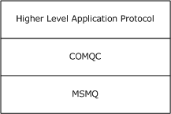
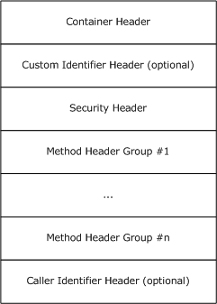
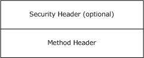
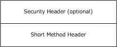
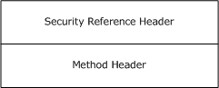
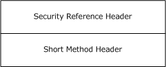
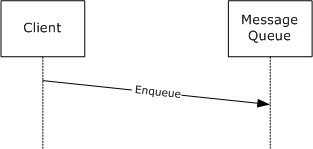
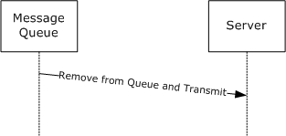

[MC-COMQC]:

Component Object Model Plus (COM+) Queued
Components Protocol

Intellectual Property Rights Notice for Open Specifications Documentation

  Technical Documentation. Microsoft publishes Open Specifications documentation (“this

documentation”) for protocols, file formats, data portability, computer languages, and standards
support. Additionally, overview documents cover inter-protocol relationships and interactions.

  Copyrights. This documentation is covered by Microsoft copyrights. Regardless of any other

terms that are contained in the terms of use for the Microsoft website that hosts this
documentation, you can make copies of it in order to develop implementations of the technologies
that are described in this documentation and can distribute portions of it in your implementations
that use these technologies or in your documentation as necessary to properly document the
implementation. You can also distribute in your implementation, with or without modification, any
schemas, IDLs, or code samples that are included in the documentation. This permission also
applies to any documents that are referenced in the Open Specifications documentation.
  No Trade Secrets. Microsoft does not claim any trade secret rights in this documentation.
  Patents. Microsoft has patents that might cover your implementations of the technologies

described in the Open Specifications documentation. Neither this notice nor Microsoft's delivery of
this documentation grants any licenses under those patents or any other Microsoft patents.
However, a given Open Specifications document might be covered by the Microsoft Open
Specifications Promise or the Microsoft Community Promise. If you would prefer a written license,
or if the technologies described in this documentation are not covered by the Open Specifications
Promise or Community Promise, as applicable, patent licenses are available by contacting
iplg@microsoft.com.

  License Programs. To see all of the protocols in scope under a specific license program and the

associated patents, visit the Patent Map.

  Trademarks. The names of companies and products contained in this documentation might be
covered by trademarks or similar intellectual property rights. This notice does not grant any
licenses under those rights. For a list of Microsoft trademarks, visit
www.microsoft.com/trademarks.

  Fictitious Names. The example companies, organizations, products, domain names, email

addresses, logos, people, places, and events that are depicted in this documentation are fictitious.
No association with any real company, organization, product, domain name, email address, logo,
person, place, or event is intended or should be inferred.

Reservation of Rights. All other rights are reserved, and this notice does not grant any rights other
than as specifically described above, whether by implication, estoppel, or otherwise.

Tools. The Open Specifications documentation does not require the use of Microsoft programming
tools or programming environments in order for you to develop an implementation. If you have access
to Microsoft programming tools and environments, you are free to take advantage of them. Certain
Open Specifications documents are intended for use in conjunction with publicly available standards
specifications and network programming art and, as such, assume that the reader either is familiar
with the aforementioned material or has immediate access to it.

Support. For questions and support, please contact dochelp@microsoft.com.

[MC-COMQC] - v20240423
Component Object Model Plus (COM+) Queued Components Protocol
Copyright © 2024 Microsoft Corporation
Release: April 23, 2024

1 / 31

Revision Summary

Date

Revision
History

Revision
Class

8/10/2007

0.1

9/28/2007

0.2

Major

Minor

Comments

Initial Availability

Clarified the meaning of the technical content.

10/23/2007  0.2.1

Editorial

Changed language and formatting in the technical content.

11/30/2007  0.3

Minor

Updates to MS-MQMQ external references.

1/25/2008

0.3.1

Editorial

Changed language and formatting in the technical content.

3/14/2008

0.3.2

Editorial

Changed language and formatting in the technical content.

5/16/2008

0.3.3

Editorial

Changed language and formatting in the technical content.

6/20/2008

0.4

Minor

Clarified the meaning of the technical content.

7/25/2008

0.4.1

Editorial

Changed language and formatting in the technical content.

8/29/2008

0.4.2

Editorial

Changed language and formatting in the technical content.

10/24/2008  0.4.3

Editorial

Changed language and formatting in the technical content.

12/5/2008

0.4.4

Editorial

Changed language and formatting in the technical content.

1/16/2009

0.4.5

Editorial

Changed language and formatting in the technical content.

2/27/2009

0.4.6

Editorial

Changed language and formatting in the technical content.

4/10/2009

0.4.7

Editorial

Changed language and formatting in the technical content.

5/22/2009

0.4.8

Editorial

Changed language and formatting in the technical content.

7/2/2009

0.5

Minor

Clarified the meaning of the technical content.

8/14/2009

0.5.1

Editorial

Changed language and formatting in the technical content.

9/25/2009

0.6

Minor

Clarified the meaning of the technical content.

11/6/2009

0.6.1

Editorial

Changed language and formatting in the technical content.

12/18/2009  0.6.2

Editorial

Changed language and formatting in the technical content.

1/29/2010

1.0

Major

Updated and revised the technical content.

3/12/2010

1.0.1

Editorial

Changed language and formatting in the technical content.

4/23/2010

1.0.2

Editorial

Changed language and formatting in the technical content.

6/4/2010

1.0.3

Editorial

Changed language and formatting in the technical content.

7/16/2010

1.0.3

None

No changes to the meaning, language, or formatting of the
technical content.

8/27/2010

1.1

Minor

Clarified the meaning of the technical content.

10/8/2010

1.1

11/19/2010  1.1

None

None

No changes to the meaning, language, or formatting of the
technical content.

No changes to the meaning, language, or formatting of the
technical content.

[MC-COMQC] - v20240423
Component Object Model Plus (COM+) Queued Components Protocol
Copyright © 2024 Microsoft Corporation
Release: April 23, 2024

2 / 31

Date

Revision
History

Revision
Class

Comments

1/7/2011

2.0

Major

Updated and revised the technical content.

2/11/2011

2.0

3/25/2011

2.0

5/6/2011

2.0

6/17/2011

2.1

9/23/2011

3.0

12/16/2011  4.0

3/30/2012

4.0

None

None

None

Minor

Major

Major

None

No changes to the meaning, language, or formatting of the
technical content.

No changes to the meaning, language, or formatting of the
technical content.

No changes to the meaning, language, or formatting of the
technical content.

Clarified the meaning of the technical content.

Updated and revised the technical content.

Updated and revised the technical content.

No changes to the meaning, language, or formatting of the
technical content.

7/12/2012

4.0

None

No changes to the meaning, language, or formatting of the
technical content.

10/25/2012  5.0

Major

Updated and revised the technical content.

1/31/2013

5.0

None

No changes to the meaning, language, or formatting of the
technical content.

8/8/2013

5.1

Minor

Clarified the meaning of the technical content.

11/14/2013  5.1

2/13/2014

5.1

5/15/2014

5.1

None

None

None

No changes to the meaning, language, or formatting of the
technical content.

No changes to the meaning, language, or formatting of the
technical content.

No changes to the meaning, language, or formatting of the
technical content.

6/30/2015

6.0

Major

Significantly changed the technical content.

10/16/2015  6.0

None

No changes to the meaning, language, or formatting of the
technical content.

7/14/2016

7.0

Major

Significantly changed the technical content.

6/1/2017

7.0

9/15/2017

8.0

9/12/2018

9.0

4/7/2021

10.0

6/25/2021

11.0

4/23/2024

12.0

None

Major

Major

Major

Major

Major

No changes to the meaning, language, or formatting of the
technical content.

Significantly changed the technical content.

Significantly changed the technical content.

Significantly changed the technical content.

Significantly changed the technical content.

Significantly changed the technical content.

[MC-COMQC] - v20240423
Component Object Model Plus (COM+) Queued Components Protocol
Copyright © 2024 Microsoft Corporation
Release: April 23, 2024

3 / 31

## Table of Contents

- [1 Introduction](#1-introduction)
  - [1.1 Glossary](#11-glossary)
  - [1.2 References](#12-references)
    - [1.2.1 Normative References](#121-normative-references)
    - [1.2.2 Informative References](#122-informative-references)
  - [1.3 Overview](#13-overview)
    - [1.3.1 Server Role](#131-server-role)
    - [1.3.2 Client Role](#132-client-role)
  - [1.4 Relationship to Other Protocols](#14-relationship-to-other-protocols)
  - [1.5 Prerequisites/Preconditions](#15-prerequisitespreconditions)
  - [1.6 Applicability Statement](#16-applicability-statement)
  - [1.7 Versioning and Capability Negotiation](#17-versioning-and-capability-negotiation)
  - [1.8 Vendor-Extensible Fields](#18-vendor-extensible-fields)
  - [1.9 Standards Assignments](#19-standards-assignments)
- [2 Messages](#2-messages)
  - [2.1 Transport](#21-transport)
  - [2.2 Message Syntax](#22-message-syntax)
    - [2.2.1 Common Header](#221-common-header)
    - [2.2.2 Container Header](#222-container-header)
      - [2.2.2.1 Call Target Identifier](#2221-call-target-identifier)
    - [2.2.3 Partition Identifier Header](#223-partition-identifier-header)
    - [2.2.4 Security Header](#224-security-header)
    - [2.2.5 Security Reference Header](#225-security-reference-header)
    - [2.2.6 Method Header](#226-method-header)
      - [2.2.6.1 Marshaled Data](#2261-marshaled-data)
        - [2.2.6.1.4 and section 2.2.6.1.5.](#22614-and-section-22615)
        - [2.2.6.1.5 Object References](#22615-object-references)
- [3 Protocol Details](#3-protocol-details)
  - [3.1 Server Details](#31-server-details)
    - [3.1.1 Abstract Data Model](#311-abstract-data-model)
    - [3.1.2 Timers](#312-timers)
    - [3.1.3 Initialization](#313-initialization)
    - [3.1.4 Higher-Layer Triggered Events](#314-higher-layer-triggered-events)
    - [3.1.5 Message Processing Events and Sequencing Rules](#315-message-processing-events-and-sequencing-rules)
    - [3.1.6 Timer Events](#316-timer-events)
    - [3.1.7 Other Local Events](#317-other-local-events)
  - [3.2 Client Details](#32-client-details)
    - [3.2.1 Abstract Data Model](#321-abstract-data-model)
    - [3.2.2 Timers](#322-timers)
    - [3.2.3 Initialization](#323-initialization)
    - [3.2.4 Higher-Layer Triggered Events](#324-higher-layer-triggered-events)
      - [3.2.4.1 Application Requesting Interface](#3241-application-requesting-interface)
      - [3.2.4.2 Application Making Method Call](#3242-application-making-method-call)
      - [3.2.4.3 Application Signaling that Method Calls Are Complete](#3243-application-signaling-that-method-calls-are-complete)
    - [3.2.5 Message Processing Events and Sequencing Rules](#325-message-processing-events-and-sequencing-rules)
    - [3.2.6 Timer Events](#326-timer-events)
    - [3.2.7 Other Local Events](#327-other-local-events)
- [4 Protocol Examples](#4-protocol-examples)
  - [4.1 Client Creating and Sending a Message](#41-client-creating-and-sending-a-message)
  - [4.2 Server Retrieving and Processing a Message](#42-server-retrieving-and-processing-a-message)
- [5 Security](#5-security)
  - [5.1 Security Considerations for Implementers](#51-security-considerations-for-implementers)
  - [5.2 Index of Security Parameters](#52-index-of-security-parameters)
- [6 Appendix A: Product Behavior](#6-appendix-a-product-behavior)
- [7 Change Tracking](#7-change-tracking)
- [8 Index](#8-index)

## 1 Introduction

The Component Object Model Plus (COM+) Queued Components Protocol (COMQC) is a protocol for
persisting method calls made on COM+ objects in such a way that they can later be played back and
executed. The protocol consists of a binary format used to store the information needed to achieve
that goal.

Sections 1.5, 1.8, 1.9, 2, and 3 of this specification are normative. All other sections and examples in
this specification are informative.

### 1.1 Glossary

This document uses the following terms:

ASCII: The American Standard Code for Information Interchange (ASCII) is an 8-bit character-
encoding scheme based on the English alphabet. ASCII codes represent text in computers,
communications equipment, and other devices that work with text. ASCII refers to a single 8-bit
ASCII character or an array of 8-bit ASCII characters with the high bit of each character set to
zero.

binary large object (BLOB): A discrete packet of data that is stored in a database and is treated

as a sequence of uninterpreted bytes.

class identifier (CLSID): A GUID that identifies a software component; for instance, a DCOM

object class or a COM class.

client: A computer on which the remote procedure call (RPC) client is executing.

Component Object Model (COM): An object-oriented programming model that defines how

objects interact within a single process or between processes. In COM, clients have access to an
object through interfaces implemented on the object. For more information, see [MS-DCOM].

globally unique identifier (GUID): A term used interchangeably with universally unique

identifier (UUID) in Microsoft protocol technical documents (TDs). Interchanging the usage of
these terms does not imply or require a specific algorithm or mechanism to generate the value.
Specifically, the use of this term does not imply or require that the algorithms described in
[RFC4122] or [C706] have to be used for generating the GUID. See also universally unique
identifier (UUID).

handle: Any token that can be used to identify and access an object such as a device, file, or a

window.

interface: A specification in a Component Object Model (COM) server that describes how to

access the methods of a class. For more information, see [MS-DCOM].

Interface Definition Language (IDL): The International Standards Organization (ISO) standard
language for specifying the interface for remote procedure calls. For more information, see
[C706] section 4.

interface identifier (IID): A GUID that identifies an interface.

little-endian: Multiple-byte values that are byte-ordered with the least significant byte stored in

the memory location with the lowest address.

marshal: To encode one or more data structures into an octet stream using a specific remote

procedure call (RPC) transfer syntax (for example, marshaling a 32-bit integer).

[MC-COMQC] - v20240423
Component Object Model Plus (COM+) Queued Components Protocol
Copyright © 2024 Microsoft Corporation
Release: April 23, 2024

6 / 31

message: A data structure representing a unit of data transfer between distributed applications. A
message has message properties, which can include message header properties, a message
body property, and message trailer properties.

message queue: A data structure containing an ordered list of zero or more messages. A queue
has a head and a tail and supports a first in, first out (FIFO) access pattern. Messages are
appended to the tail through a write operation (Send) that appends the message and
increments the tail pointer. Messages are consumed from the head through a destructive read
operation (Receive) that deletes the message and increments the head pointer. A message at
the head can also be read through a nondestructive read operation (Peek).

message queuing: A communications service that provides asynchronous and reliable message

passing between distributed client applications. In message queuing, clients send messages to
message queues and consume messages from message queues. The message queues
provide persistence of the messages, which enables the sending and receiving client applications
to operate asynchronously from each other.

Microsoft Interface Definition Language (MIDL): The Microsoft implementation and extension
of the OSF-DCE Interface Definition Language (IDL). MIDL can also mean the Interface
Definition Language (IDL) compiler provided by Microsoft. For more information, see [MS-
RPCE].

Microsoft Message Queuing (MSMQ): A communications service that provides asynchronous

and reliable message passing between distributed applications. In Message Queuing,
applications send messages to queues and consume messages from queues. The queues
provide persistence of the messages, enabling the sending and receiving applications to
operate asynchronously from one another.

Network Data Representation (NDR): A specification that defines a mapping from Interface
Definition Language (IDL) data types onto octet streams. NDR also refers to the runtime
environment that implements the mapping facilities (for example, data provided to NDR). For
more information, see [MS-RPCE] and [C706] section 14.

object: In COM, a software entity that implements the IUnknown interface and zero or more

additional interfaces that can be obtained from each other using the IUnknown interface. A COM
object can be exposed to remote clients via the DCOM protocol, in which case it is also a DCOM
object.

object reference: In the DCOM protocol, a reference to an object, represented on the wire as an

OBJREF. An object reference enables the object to be reached by entities outside the
object's object exporter.

opnum: An operation number or numeric identifier that is used to identify a specific remote

procedure call (RPC) method or a method in an interface. For more information, see [C706]
section 12.5.2.12 or [MS-RPCE].

partition: A container for a specific configuration of a COM+ object class.

partition identifier: A GUID that identifies a partition.

proxy object: A local object that acts as an intermediary between an application and a remote

object. The purpose of the proxy object is to monitor the life span of the remote object and to
forward calls to the remote object.

security context: An abstract data structure that contains authorization information for a

particular security principal in the form of a Token/Authorization Context (see [MS-DTYP] section
2.5.2). A server uses the authorization information in a security context to check access to
requested resources. A security context also contains a key identifier that associates mutually
established cryptographic keys, along with other information needed to perform secure
communication with another security principal.

7 / 31

[MC-COMQC] - v20240423
Component Object Model Plus (COM+) Queued Components Protocol
Copyright © 2024 Microsoft Corporation
Release: April 23, 2024

UTF-16: A standard for encoding Unicode characters, defined in the Unicode standard, in which the

most commonly used characters are defined as double-byte characters. Unless specified
otherwise, this term refers to the UTF-16 encoding form specified in [UNICODE5.0.0/2007]
section 3.9.

workgroup mode: A Message Queuing deployment mode in which the clients and servers operate

without using a Directory Service. In this mode, features pertaining to message security,
efficient routing, queue discovery, distribution lists, and aliases are not available. See also
Directory-Integrated mode.

MAY, SHOULD, MUST, SHOULD NOT, MUST NOT: These terms (in all caps) are used as defined
in [RFC2119]. All statements of optional behavior use either MAY, SHOULD, or SHOULD NOT.

### 1.2 References

Links to a document in the Microsoft Open Specifications library point to the correct section in the
most recently published version of the referenced document. However, because individual documents
in the library are not updated at the same time, the section numbers in the documents may not
match. You can confirm the correct section numbering by checking the Errata.

#### 1.2.1 Normative References

We conduct frequent surveys of the normative references to assure their continued availability. If you
have any issue with finding a normative reference, please contact dochelp@microsoft.com. We will
assist you in finding the relevant information.

[C706] The Open Group, "DCE 1.1: Remote Procedure Call", C706, August 1997,
https://publications.opengroup.org/c706

Note Registration is required to download the document.

[MS-COM] Microsoft Corporation, "Component Object Model Plus (COM+) Protocol".

[MS-DCOM] Microsoft Corporation, "Distributed Component Object Model (DCOM) Remote Protocol".

[MS-DTYP] Microsoft Corporation, "Windows Data Types".

[MS-MQDMPR] Microsoft Corporation, "Message Queuing (MSMQ): Common Data Model and
Processing Rules".

[MS-MQMP] Microsoft Corporation, "Message Queuing (MSMQ): Queue Manager Client Protocol".

[MS-MQMQ] Microsoft Corporation, "Message Queuing (MSMQ): Data Structures".

[MS-OAUT] Microsoft Corporation, "OLE Automation Protocol".

[RFC2119] Bradner, S., "Key words for use in RFCs to Indicate Requirement Levels", BCP 14, RFC
2119, March 1997, https://www.rfc-editor.org/info/rfc2119

[RFC4234] Crocker, D., Ed., and Overell, P., "Augmented BNF for Syntax Specifications: ABNF", RFC
4234, October 2005, https://www.rfc-editor.org/info/rfc4234

#### 1.2.2 Informative References

[MSDN-IPersistStream] Microsoft Corporation, "IPersistStream interface",
http://msdn.microsoft.com/en-us/library/ms690091.aspx

[MC-COMQC] - v20240423
Component Object Model Plus (COM+) Queued Components Protocol
Copyright © 2024 Microsoft Corporation
Release: April 23, 2024

8 / 31

<!-- Extracted images from page 9 -->

<!-- /Extracted images from page 9 -->

### 1.3 Overview

The Component Object Model Plus (COM+) Queued Components Protocol enables a client  to
asynchronously invoke methods on a server in scenarios of limited or intermittent connectivity. It does
so by writing all the necessary states into a self-contained binary large object (BLOB). That BLOB
can be parsed and the method calls be replayed at a later point when it is possible to transmit the
data to the recipient. As the BLOB is self-contained, the original creator of the BLOB is not required to
be alive or connected for the operation to succeed.

To transmit the BLOB without regard to connectivity, the protocol relies on a message queuing
transport. The following figure shows the layering of the protocol stack.

Figure 1: Protocol layering

COMQC is asynchronous and one-way with information flowing exclusively from the client to the
server.

#### 1.3.1 Server Role

The server is responsible for receiving COMQC messages and dispatching the recorded method calls.

Each COMQC server is associated with a single COM+ application using COMQC and services messages
for all server objects in that COMQC application. Each COMQC server has its own message queue.
There can be multiple COMQC servers per machine.

#### 1.3.2 Client Role

The client is responsible for recording method calls, packaging them up into a COMQC message, and
transmitting the message to the message queuing infrastructure.

A COMQC client queues calls to a single COMQC server object, and hence connects to a single
message queue. A higher-layer application protocol can maintain multiple COMQC clients that queue
calls to different server objects but, for the purpose of this specification, they are independent clients
unrelated to each other. That is, even if a client application uses COMQC to queue calls to multiple
server objects in the same COM+ application (and hence to the same message queue and the same
COMQC server), this involves a separate conceptual COMQC client per server object.

### 1.4 Relationship to Other Protocols

COMQC relies on DCE 1.1: Remote Procedure Call [C706] and the OLE Automation Protocol [MS-
OAUT] to marshal the parameters of the recorded method calls. It further relies on [MS-MQMP] and
[MS-MQMQ] as transport. The COMQC is limited to calls made on COM+ Protocol [MS-COM] objects.

There are no protocols that rely on COMQC.

9 / 31

[MC-COMQC] - v20240423
Component Object Model Plus (COM+) Queued Components Protocol
Copyright © 2024 Microsoft Corporation
Release: April 23, 2024

### 1.5 Prerequisites/Preconditions

COMQC assumes that the message queuing infrastructure is already running and that the client
application is aware of the name of the message queue.

The server object is installed on the COMQC server before a COMQC client attempts to invoke it.

### 1.6 Applicability Statement

COMQC is useful and appropriate for performing asynchronous method calls when the client and the
server do not have constant connectivity and a message queuing mechanism is available.

It is not applicable to use with method calls that have output parameters or return values that the
client application needs to get.

### 1.7 Versioning and Capability Negotiation

COMQC does not perform versioning or capability negotiation.

### 1.8 Vendor-Extensible Fields

None.

### 1.9 Standards Assignments

None.

The following is a table of well-known GUIDs in COMQC, as generated by the mechanism specified in
[C706] section A.2.5.

 Parameter

 Value

Message Signature  {1664BCFB-1751-11d2-B58E-00E0290E6C31}

Header Signature

{71bbdb83-fc41-11d0-b7640080c7ec3fc1}

Moniker GUID

{ecabafc6-7f19-11d2-978e-0000f8757e2a}

[MC-COMQC] - v20240423
Component Object Model Plus (COM+) Queued Components Protocol
Copyright © 2024 Microsoft Corporation
Release: April 23, 2024

10 / 31

## 2 Messages

### 2.1 Transport

For the remainder of sections 2 and 3, "message" refers to a COMQC message unless otherwise
specified.

COMQC uses MSMQ Queue Manager Client Protocol [MS-MQMP], and MSMQ: Data Structures [MS-
MQMQ] as transport.

A new instance of a Message Queuing (MSMQ) Message ADM element (as specified in [MS-MQDMPR]
section 3.1.1.12) MUST be created. The message defined in section 2.2 MUST be stored as a BLOB in
the Body attribute of the Message ADM element instance.

The Extension attribute of the Message ADM element MUST be set to GUID (as specified in [MS-
DTYP] section 2.3.4.2) {1664BCFB-1751-11d2-B58E-00E0290E6C31}.

When opening a message queue, a COMQC client MUST specify the MSMQ parameters
MQ_SEND_ACCESS (as specified in [MS-MQMP] section 3.1.4.17) and MQ_DENY_NONE. When
opening a message queue, a COMQC server MUST specify MQ_RECEIVE_ACCESS and
MQ_DENY_NONE. Both transacted and nontransacted message queues MUST be supported.

When running MSMQ in workgroup mode, the AuthenticationLevel attribute of the Message ADM
element (as specified in [MS-MQDMPR] section 3.1.1.12) MUST be set to None and the
SenderIdentifierType attribute of the Message ADM element to None. Otherwise, a COMQC client
SHOULD allow all MSMQ message-level parameters to be configurable. A COMQC server MUST support
all MSMQ message-level parameters.

When running MSMQ in workgroup mode, the message queue name SHOULD be set to "<computer
name>\PRIVATE$\<COM+ application name>", where <computer name> is the lowercase, non-fully-
qualified domain name of the computer running the server and <COM+ application name> is the
display name of the COM+ application hosting the objects that are exposed via COMQC.

Otherwise, the message queue name SHOULD be set to "<computer name>\<COM+ application
name>".

The entire communication between client and server MUST be contained in a single message. The
server MUST NOT send a reply message, and the client MUST NOT expect one.

### 2.2 Message Syntax

A message contains the state of one or more method calls to be made on the server as well as the
general state associated with the request. Messages are self-contained and MUST NOT rely on any
other message to be processed.

Every message MUST contain at least one method call.

A message is divided into headers. The following figure defines the ordering of the individual headers.
The headers themselves are defined in section 2.2.1 to section 2.2.6.

[MC-COMQC] - v20240423
Component Object Model Plus (COM+) Queued Components Protocol
Copyright © 2024 Microsoft Corporation
Release: April 23, 2024

11 / 31

<!-- Extracted images from page 12 -->

<!-- /Extracted images from page 12 -->

Figure 2: Header ordering

A method header group contains all state of a single method call to be made on the server. Every
message MUST contain one or more method header groups. The default method header group is
defined in the following figure.

Figure 3: Default method header group

If the security properties of the method call as defined by the Security object RPC (ORPC) Extension,
defined in [MS-COM] section 2.2.3.2, are identical to the security properties of the method call
appearing immediately before it in the message, the security header SHOULD be omitted. Note that
the first method header group contains no security header, as it is already present as part of the
overall layout.

If the method call is made on the same interface as the immediately preceding method call, the
optimization defined in the following figure SHOULD be used.

[MC-COMQC] - v20240423
Component Object Model Plus (COM+) Queued Components Protocol
Copyright © 2024 Microsoft Corporation
Release: April 23, 2024

12 / 31

<!-- Extracted images from page 13 -->

<!-- /Extracted images from page 13 -->

Figure 4: Short method optimization

If the security properties do not match the security context of the immediately preceding method
call but do match the security context of a different previous method call, the optimization defined in
the following figure SHOULD be used.

Figure 5: Security reference optimization

If the security properties do not match the security properties of the immediately preceding method
call but does match the security properties of a different previous method call, and if the call is made
on the same interface as the immediately preceding method call, the optimization defined in the
following figure SHOULD be used.

Figure 6: Security reference and short header optimization

Unless otherwise specified, all fields MUST be specified in little-endian format. Unless otherwise
specified, all headers and all custom data MUST be aligned on 8-byte boundaries, meaning that each
header MUST be padded at the end so that its length is a multiple of 8.

#### 2.2.1 Common Header

The common header specifies the size and type of a header. Every header MUST begin with the
common header. The common header MUST NOT appear by itself.

0  1  2  3  4  5  6  7  8  9

1
0  1  2  3  4  5  6  7  8  9

2
0  1  2  3  4  5  6  7  8  9

3
0  1

Header Signature

[MC-COMQC] - v20240423
Component Object Model Plus (COM+) Queued Components Protocol
Copyright © 2024 Microsoft Corporation
Release: April 23, 2024

13 / 31

Size

Header Signature (4 bytes):  A predefined value that identifies the specific header. (The value is

given in the section that defines each specific header.)

Size (4 bytes):  Size in bytes of the header, plus the size of header-specific variable length data

fields if present. Some, but not all, headers have such fields following the header itself, and their
size is included in this number. The value MUST be a multiple of 8. Adding the size to the starting
offset of a header gives the starting offset of the next header.

All headers defined in section 2.2.2 to section 2.2.6 contain the common header. Unless otherwise
specified, "Header Signature" refers to the Header Signature field of the common header that is
embedded in the other headers.

#### 2.2.2 Container Header

The container header contains general information regarding the message. Every message MUST
have exactly one container header, and it MUST be the first header in the message.

0  1  2  3  4  5  6  7  8  9

1
0  1  2  3  4  5  6  7  8  9

2
0  1  2  3  4  5  6  7  8  9

3
0  1

Header Signature

Size

Message Signature (16 bytes)

...

...

Maximum Version

Minimum Version

Message Size

Reserved 3 (32 bytes)

...

...

Call Target Identifier Size

Reserved 4

...

Call Target Identifier (variable)

[MC-COMQC] - v20240423
Component Object Model Plus (COM+) Queued Components Protocol
Copyright © 2024 Microsoft Corporation
Release: April 23, 2024

14 / 31

...

Padding (variable)

...

Header Signature (4 bytes):  MUST be set to "CHDR" in ASCII (0x52444843).

Size (4 bytes):  Size in bytes of the container header.

Message Signature (16 bytes): GUID (as specified in [MS-DTYP] section 2.3.4.2) that MUST be set

to {71bbdb83-fc41-11d0-b7640080c7ec3fc1}.

Maximum Version (4 bytes):  Maximum version of the header. MUST be set to 0x00000001.

Minimum Version (4 bytes):  Minimum version of the header. MUST be set to 0x00000001.

Message Size (4 bytes):  Size in bytes of the entire message.

Reserved 3 (32 bytes):  Reserved. MUST be set to 0 and ignored on receipt.

Call Target Identifier Size (4 bytes):  Size of the Call Target Identifier field plus padding. MUST be

a multiple of 8.

Reserved 4 (8 bytes):  Reserved. MUST be set to 0 and ignored on receipt.

Call Target Identifier (variable):  The target of the call, as defined in section 2.2.2.1.

Padding (variable):  Enough space to pad the message to an 8-byte boundary. MUST be set to 0

and ignored on receipt.

##### 2.2.2.1 Call Target Identifier

The Call Target Identifier is part of the container header and identifies the target of the call. The
server MUST use the information stored here to determine where to dispatch the call.

0  1  2  3  4  5  6  7  8  9

1
0  1  2  3  4  5  6  7  8  9

2
0  1  2  3  4  5  6  7  8  9

3
0  1

Structure ID (16 bytes)

...

...

Target ID (16 bytes)

...

...

Target ID String Size

Target ID String (variable)

[MC-COMQC] - v20240423
Component Object Model Plus (COM+) Queued Components Protocol
Copyright © 2024 Microsoft Corporation
Release: April 23, 2024

15 / 31

...

Structure ID (16 bytes): GUID (as specified in [MS-DTYP] section 2.3.4.2) identifying the Call
Target Identifier structure. MUST be set to {ecabafc6-7f19-11d2-978e-0000f8757e2a}.

Target ID (16 bytes): A Component Object Model (COM) class identifier (CLSID) (see [MS-

DCOM] section 2.2.7) identifying the target of the call.

Target ID String Size (4 bytes): Size of the Target ID String field in bytes.

Target ID String (variable): String buffer identifying the target of the call. It SHOULD be set to the
string representation of the Target ID, and on receipt, the value MUST be ignored after validating
that the string conforms to the syntax. The string representation MUST conform to the following
Augmented Backus-Naur Form (ABNF) (as specified in [RFC4234]) syntax:

 GUID = [ UUID / "{" UUID "}" ]

where UUID is defined by [C706] section 3.1.17. The string MUST be encoded in UTF-16 and
MUST be NULL-terminated.

#### 2.2.3 Partition Identifier Header

The partition identifier header contains the COM+ partition identifier (as defined in [MS-COM]
section 1.3.6) that the server object resides in.

0  1  2  3  4  5  6  7  8  9

1
0  1  2  3  4  5  6  7  8  9

2
0  1  2  3  4  5  6  7  8  9

3
0  1

Header Signature

Size

Identifier (16 bytes)

...

...

Header Signature (4 bytes):  MUST be set to "PART" in ASCII (0x54524150).

Size (4 bytes):  The size, in bytes, of the partition identifier header. MUST be set to 0x00000018.

Identifier (16 bytes): GUID (as specified in [MS-DTYP] section 2.3.4.2)  identifying the partition

that the server object resides in.

#### 2.2.4 Security Header

The security header is a wrapper for the Security ORPC Extension defined in [MS-COM] section
2.2.3.2. It is used to capture the current security context so that it can be recreated on the COMQC
server when the stored calls are being dispatched.

The security properties stored in this header MUST be applied to all method calls following the security
header in the message until another security header or security reference header (section 2.2.5) is
encountered.

16 / 31

[MC-COMQC] - v20240423
Component Object Model Plus (COM+) Queued Components Protocol
Copyright © 2024 Microsoft Corporation
Release: April 23, 2024

If the security properties of a method call are identical to the security properties of the method call
stored in the message immediately prior to the current method call, a security header SHOULD NOT
be included.

If the security properties are identical to the security context of any other previous method call, a
security reference header SHOULD be included instead. Otherwise, a full security header MUST be
included.

A security header MUST be included before the first method call.

0  1  2  3  4  5  6  7  8  9

1
0  1  2  3  4  5  6  7  8  9

2
0  1  2  3  4  5  6  7  8  9

3
0  1

Header Signature

Size

Security Data Size

Header Padding

Security Data (variable)

...

Data Padding (variable)

...

Header Signature (4 bytes):  MUST be set to "SECD" in ASCII (0x44434553).

Size (4 bytes): The size, in bytes, of the security header.

Security Data Size (4 bytes):  The size, in bytes, of the Security Data field.

Header Padding (4 bytes):  Aligns the Security Data field on an 8-byte boundary. MUST be set to 0

and ignored on receipt.

Security Data (variable):  The Security ORPC Extension as defined in [MS-COM] section 2.2.3.2.

Data Padding (variable):  Enough space to extend the header to an 8-byte boundary. MUST be set

to 0 and ignored on receipt.

#### 2.2.5 Security Reference Header

A security reference header is used to refer to a previous security header. If the security properties of
the current call match the security properties of the call stored immediately before it in the message,
a security reference header SHOULD NOT be included. If the security context matches any other
previous call, a security reference header SHOULD be included instead of a security header.

0  1  2  3  4  5  6  7  8  9

1
0  1  2  3  4  5  6  7  8  9

2
0  1  2  3  4  5  6  7  8  9

3
0  1

Header Signature

[MC-COMQC] - v20240423
Component Object Model Plus (COM+) Queued Components Protocol
Copyright © 2024 Microsoft Corporation
Release: April 23, 2024

17 / 31

Size

Security Header Offset

Padding

Header Signature (4 bytes):  MUST be set to "SECR" in ASCII (0x52434553).

Size (4 bytes):  The size, in bytes, of the security reference header. MUST be set to 0x00000010.

Security Header Offset (4 bytes):  Offset, in bytes, into the message where the security header

this header refers to is located.

Padding (4 bytes):  Aligns the header on an 8-byte boundary. MUST be set to 0 and ignored on

receipt.

#### 2.2.6 Method Header

The method header encapsulates a method call. Each method call has exactly one method header.
Each message MUST contain one or more method headers.

0  1  2  3  4  5  6  7  8  9

1
0  1  2  3  4  5  6  7  8  9

2
0  1  2  3  4  5  6  7  8  9

3
0  1

Header Signature

Size

Method Number

Data Representation

Flags

Marshaled Data Size

Reserved

Padding 1

Interface ID (16 bytes, optional)

...

...

Marshaled Data (variable)

...

Padding 2 (variable)

[MC-COMQC] - v20240423
Component Object Model Plus (COM+) Queued Components Protocol
Copyright © 2024 Microsoft Corporation
Release: April 23, 2024

18 / 31

...

Header Signature (4 bytes):  MUST be set to "METH" in ASCII (0x4854454D) if the Interface ID

field is present. Otherwise, MUST be set to "SMTH" in ASCII(0x48544D53).

Size (4 bytes):  The size, in bytes, of the method header.

Method Number (4 bytes): Opnum of the method to invoke as it appears on the Interface

Definition Language (IDL) describing the interface. See [C706] section 4.

Data Representation (4 bytes):  The data representation that was used to marshal the method

parameters. MUST be set to 0x00000010.

Flags (4 bytes):  MUST be set to 0x00001000.

Marshaled Data Size (4 bytes):  The size, in bytes, of the Marshaled Data field.

Reserved (4 bytes):  Reserved. MUST be set to 0x00000001.

Padding 1 (4 bytes):  Padding bytes used to align the Interface ID on 8-byte boundary. MUST be set

to 0 and ignored on receipt.

Interface ID (16 bytes): The IID of the interface being invoked. This field is optional. If the method

call is made on the same interface as the immediately preceding method call, the ID SHOULD be
absent. Implementations of this specification MUST use the ID specified in the most recent method
header to invoke this call. Since no previous interface is specified at that point, the first method
header in a message MUST contain the ID field.

Marshaled Data (variable):  Binary representation of the marshaled method parameters as defined

in section 2.2.6.1.

Padding 2 (variable):  Aligns the marshaled data on an 8-byte boundary. See section 2.2.6.1.4 for

details.

##### 2.2.6.1 Marshaled Data

This field contains the binary representation of the marshaled method parameters. The binary format
is based on either the Network Data Representation (NDR) format, defined in [C706], or the
dispatch format (defined in [MS-OAUT] section 3.1.4.4.2) with two exceptions defined in section
###### 2.2.6.1.4 and section 2.2.6.1.5.

If the ID in the method header is set to IID_IDispatch (as defined in [MS-OAUT] section 1.9), the
dispatch marshaling format MUST be used. Otherwise, the NDR format MUST be used.

2.2.6.1.1 NDR Marshaling

If the ID specified in the method header is not IID_IDispatch, the marshaled data MUST conform to
[C706] with the exception of what is defined in section 2.2.6.1.4 and section 2.2.6.1.5.

When using NDR marshaling, input/output and output ([in, out] and [out] in Microsoft Interface
Definition Language (MIDL)) parameters MUST NOT be supported. Input parameters ([in]) MUST
be supported.

2.2.6.1.2 Dispatch Marshaling

If the ID specified in the method header is IID_IDispatch, the marshaled data MUST conform to [MS-
OAUT] section 3.1.4.4.2, with the exception of what is defined in section 2.2.6.1.4 and section
2.2.6.1.5.

19 / 31

[MC-COMQC] - v20240423
Component Object Model Plus (COM+) Queued Components Protocol
Copyright © 2024 Microsoft Corporation
Release: April 23, 2024

When using dispatch marshaling, [out] parameters MUST NOT be supported. [in] and [in, out]
parameters MUST be supported. However, because COMQC is a one-way protocol, [in, out]
parameters MUST NOT be filled with data returned from the server.

2.2.6.1.3 Supported Types

All types that are OLE Automation-compliant MUST be supported, with the exception of object
references as defined in [MS-DCOM] section 1.3.2. See [MS-OAUT] section 2.2 for a definition of OLE
Automation-compliant types. Other types MUST NOT be supported. See section 2.2.6.1.5 regarding
handling of object references.

2.2.6.1.4 Padding of the Marshaled Data

Following the marshaled method parameters, the marshaled data MAY<1> contain an arbitrary
amount of undefined padding that is not part of the marshaled method parameters as defined in
sections 2.2.6.1.1 and 2.2.6.1.2.

Implementations of this specification MUST ignore that data when unmarshaling the method
parameters on the server and MUST NOT reject incoming messages that contain such data.

###### 2.2.6.1.5 Object References

Object references as defined in [MS-DCOM] section 1.3.2 MUST NOT be supported unless a well-
known binary representation of the object exists.<2> It is the responsibility of the implementation of
this specification to obtain that binary representation.

When encountering an object reference while marshaling the method parameters into the marshaled
data buffer, implementations of this specification MUST write the structure defined as follows into the
buffer instead of writing the reference. If that is not possible, the marshaling MUST fail.

When unmarshaling, a COMQC server MUST replace the binary representation with an instance of the
object specified by the binary representation before dispatching the call.

The Object References structure is defined as follows. The alignment of this structure is defined by the
marshaling format used. This specification does not mandate any particular alignment.

0  1  2  3  4  5  6  7  8  9

1
0  1  2  3  4  5  6  7  8  9

2
0  1  2  3  4  5  6  7  8  9

3
0  1

Reserved 1

Size

Reserved 2

Object ID (16 bytes)

...

...

Padding

Marshaled Object (variable)

[MC-COMQC] - v20240423
Component Object Model Plus (COM+) Queued Components Protocol
Copyright © 2024 Microsoft Corporation
Release: April 23, 2024

20 / 31

...

Reserved 1 (4 bytes):  MUST be set to 0 and ignored on receipt.

Size (4 bytes):  Size of the header not counting the size of the marshaled object. That is, it counts

everything up to and including the padding.

Reserved 2 (4 bytes):  MUST be set to either 0x00000001 or 0x00000003 and MUST be ignored on

receipt.

Object ID (16 bytes): COM CLSID identifying the object to be marshaled.

Padding (4 bytes):  Aligns the Marshaled Object field on an 8-byte boundary. MUST be set to 0 and

ignored on receipt.

Marshaled Object (variable):  The binary representation of the object.

[MC-COMQC] - v20240423
Component Object Model Plus (COM+) Queued Components Protocol
Copyright © 2024 Microsoft Corporation
Release: April 23, 2024

21 / 31

## 3 Protocol Details

This section specifies the two roles of COMQC: the client role and the server role.

### 3.1 Server Details

#### 3.1.1 Abstract Data Model

This section describes a conceptual model of possible data organization that an implementation
maintains to participate in this protocol. The organization is provided to explain how the protocol
behaves. This document does not mandate that implementations adhere to this model provided that
their external behavior is consistent with that specified in this document.

Servers maintain the following data elements:

  Queue Handle: A handle that identifies the message queue and is used to retrieve messages

from the message queue.

  Object Table: A table that associates object GUIDs (as specified in [MS-DTYP] section 2.3.4.2)

with the object they refer to.

#### 3.1.2 Timers

None.

#### 3.1.3 Initialization

During initialization, the COMQC server MUST open a message queue on the already running MSMQ
infrastructure and store the queue handle for future use. It MUST then initialize the objects on which
the client makes calls or initialize a client activation mechanism (as specified in [MS-COM] sections
3.7.4 and 3.10.4) used to create the client upon receipt of a message.

#### 3.1.4 Higher-Layer Triggered Events

None.

#### 3.1.5 Message Processing Events and Sequencing Rules

When a message arrives, the server MUST verify that the Extension attribute of the MSMQ
Message ADM element is set to {1664BCFB-1751-11d2-B58E-00E0290E6C31}. Messages that do not
have that value set MUST be rejected and ignored.

Next, the server MUST validate that the message conforms to the format defined in section 2.2.
Messages that do not conform to that format MUST be rejected and ignored.

Otherwise, the server MUST search the object table for an object that matches the target ID of the
received message as defined in section 2.2.2.1. If no matching object is found, the message MUST be
rejected.

Otherwise, the server MUST attempt to use the security properties that are part of the received
message in accordance with [MS-COM] section 2.2.3.2.1. If this fails, the message MUST be rejected.

The server MUST then play back the recorded method calls in the order in which they appear in the
message. Playing back a method call means locally executing the method call as if it were invoked
locally (without the involvement of COMQC).

[MC-COMQC] - v20240423
Component Object Model Plus (COM+) Queued Components Protocol
Copyright © 2024 Microsoft Corporation
Release: April 23, 2024

22 / 31

Any communication following the receipt of a message MUST be treated as a new exchange
independent of the previous one, where the server acts as a client and the client acts as a server with
no knowledge of the previous exchange.

#### 3.1.6 Timer Events

None.

#### 3.1.7 Other Local Events

When stopping, the COMQC server MUST close the queue handle.

### 3.2 Client Details

The client composes a message in accordance with the format defined in section 2.2 and then
transmits it via MSMQ.

After sending the message to the transport, the client side of the message exchange is complete.

COMQC does not specify how to deal with transmission failures. An implementation MAY communicate
failures to the higher-layer application or protocol.

#### 3.2.1 Abstract Data Model

This section describes a conceptual model of possible data organization that an implementation
maintains to participate in this protocol. The described organization is provided to facilitate the
explanation of how the protocol behaves. This document does not mandate that implementations
adhere to this model as long as their external behavior is consistent with that described in this
document.

Clients maintain the following data elements:





Proxy: Local proxy object to the server object that is used by the higher-layer application or
protocol to invoke method calls on the server object.

List of Pending Calls: A list containing all calls that the higher-layer protocol or application has
made but that have not been sent to the server. Each entry contains all state needed to later write
a method call to the message:

  Method Number: The opnum of the method to call.



Parameter Values: The parameter values to pass to the method.

  Security Context: The current security context data as defined by [MS-COM] section 2.2.3.2.

#### 3.2.2 Timers

None.

#### 3.2.3 Initialization

None.

[MC-COMQC] - v20240423
Component Object Model Plus (COM+) Queued Components Protocol
Copyright © 2024 Microsoft Corporation
Release: April 23, 2024

23 / 31

#### 3.2.4 Higher-Layer Triggered Events

##### 3.2.4.1 Application Requesting Interface

When a higher-layer protocol or application requests an interface to the server object, the COMQC
client MUST attempt to create a local proxy object representing the server object and fail the call if
it cannot. (The server is not notified that a proxy object has been created.)

##### 3.2.4.2 Application Making Method Call

When a higher-layer protocol or application performs a method call on the proxy object, the COMQC
client MUST attempt to create a new entry in the list of pending calls and store the data describing
the call and fail the call if it cannot. The relevant data are the method parameters and the security
context as defined in [MS-COM] section 2.2.3.2.

Alternatively, an implementation MAY immediately convert the method call into a message
conforming to the format defined in section 2.2 and send it to the message queue without storing
any internal state. (Such an implementation would not implement application signaling as defined in
section 3.2.4.3.)

##### 3.2.4.3 Application Signaling that Method Calls Are Complete

When the higher-layer protocol or application signals that no more method calls are coming (for
example, by destroying the proxy object), the COMQC client MUST convert all entries in the list of
pending calls into a message conforming to the format defined in section 2.2, open a connection to
the server's message queue, send the message to the message queue, and close the connection to
the message queue. If the list of pending calls is empty, an MSMQ message MUST NOT be sent.

An implementation MAY provide feedback to the higher-layer protocol or application when a message
queue transfer succeeds or fails, but if or how this is done is outside of the scope of this protocol.

#### 3.2.5 Message Processing Events and Sequencing Rules

None.

#### 3.2.6 Timer Events

None.

#### 3.2.7 Other Local Events

None.

[MC-COMQC] - v20240423
Component Object Model Plus (COM+) Queued Components Protocol
Copyright © 2024 Microsoft Corporation
Release: April 23, 2024

24 / 31

<!-- Extracted images from page 25 -->

<!-- /Extracted images from page 25 -->

## 4 Protocol Examples

This section describes an example of a common use of the COMQC where a client application running
on a roaming computer with intermittent access to a network wants to send data to a server
application without regard for the current state of connectivity.

### 4.1 Client Creating and Sending a Message

A typical sequence of events for a COMQC client is as follows.

Figure 7: Client-side exchange

The client application requests an interface to the server from the COMQC client via the interface
UUID and server name. The COMQC client creates a proxy object and an empty list of pending calls.

The client application invokes a specific method on the interface by supplying the method number and
parameter values. The COMQC client creates a new entry in the list of pending calls and stores the
method number and parameter values, along with the current security context data as defined by
[MS-COM] section 2.2.3.2.

The client application invokes another method. The COMQC client repeats the previous steps.

The client application destroys the proxy object. At this point, the COMQC client creates a COMQC
message (as defined in section 2.2) that contains the data that it received from the client application.

The COMQC client asynchronously transmits the COMQC message in the payload of an MSMQ
message. This concludes the client-side portion of the protocol.

### 4.2 Server Retrieving and Processing a Message

A typical sequence of events for a COMQC server is as follows.

[MC-COMQC] - v20240423
Component Object Model Plus (COM+) Queued Components Protocol
Copyright © 2024 Microsoft Corporation
Release: April 23, 2024

25 / 31

<!-- Extracted images from page 26 -->

<!-- /Extracted images from page 26 -->

Figure 8: Server-side exchange

The COMQC server is notified by MSMQ that a message arrived. The server receives the message
from MSMQ and validates it.

The server sets up the security context that was specified in the message.

The server unmarshals the parameters of the first method call, looks up the target ID in its object
table to find the target object, and locally calls the specified method on the target object.

The server repeats the previous two steps for each method that is stored in the message.

After the last call has finished, all state relevant to the message is freed. This concludes the exchange.

[MC-COMQC] - v20240423
Component Object Model Plus (COM+) Queued Components Protocol
Copyright © 2024 Microsoft Corporation
Release: April 23, 2024

26 / 31

## 5 Security

### 5.1 Security Considerations for Implementers

The COMQC does not define any specific means by which the contents of a message have to be
encrypted. COMQC messages, as defined in this specification, are transmitted in plain text. They are
also not numbered, time stamped, or otherwise identified. If implementers of this specification require
properties such as confidentiality or nonrepudiation, they have to use functionality provided by the
underlying transport to achieve the desired result.

The protocol also does not define how to validate and set up the security properties that were
transmitted as part of the message beyond what is defined in [MS-COM] section 2.2.3.2. It is the
responsibility of the implementer of this protocol to build the security infrastructure, since the protocol
does not provide feedback to the client regarding how to communicate security violations.

Many fields of a COMQC message are of variable length. Implementers have to exercise caution when
accessing memory based on the size fields in the message because the protocol does not specify any
validation fields such as checksums.

This protocol does not define ways to detect or prevent replays of messages. As a matter of fact, due
to the use of this protocol in scenarios of limited or unreliable connectivity, multiple transmission
attempts by the underlying transport can occur. This protocol itself does not define any retry
mechanisms and relies on MSMQ to retransmit the messages in case of failures and to ensure the
messages are delivered only once.

### 5.2 Index of Security Parameters

 Security parameter

MQ_SEND_ACCESS

MQ_DENY_NONE

MQ_RECEIVE_ACCESS

Message.AuthenticationLevel (value = None when running MSMQ in workgroup mode) (see [MS-
MQDMPR] section 3.1.1.12)

Message.SenderIdentifierType (value = None when running MSMQ in workgroup mode) (see [MS-
MQDMPR] section 3.1.1.12)

Section

2.1

2.1

2.1

2.1

2.1

27 / 31

[MC-COMQC] - v20240423
Component Object Model Plus (COM+) Queued Components Protocol
Copyright © 2024 Microsoft Corporation
Release: April 23, 2024

## 6 Appendix A: Product Behavior

The information in this specification is applicable to the following Microsoft products or supplemental
software. References to product versions include updates to those products.

Windows Releases

  Windows 2000 operating system

  Windows XP operating system

  Windows Server 2003 operating system

  Windows Vista operating system

  Windows Server 2008 operating system

  Windows 7 operating system

  Windows Server 2008 R2 operating system

  Windows 8 operating system

  Windows Server 2012 operating system

  Windows 8.1 operating system

  Windows Server 2012 R2 operating system

  Windows 10 operating system

  Windows Server 2016 operating system

  Windows Server operating system

  Windows Server 2019 operating system

  Windows Server 2022 operating system

  Windows 11 operating system

  Windows Server 2025 operating system

Exceptions, if any, are noted in this section. If an update version, service pack or Knowledge Base
(KB) number appears with a product name, the behavior changed in that update. The new behavior
also applies to subsequent updates unless otherwise specified. If a product edition appears with the
product version, behavior is different in that product edition.

Unless otherwise specified, any statement of optional behavior in this specification that is prescribed
using the terms "SHOULD" or "SHOULD NOT" implies product behavior in accordance with the
SHOULD or SHOULD NOT prescription. Unless otherwise specified, the term "MAY" implies that the
product does not follow the prescription.

<1> Section 2.2.6.1.4: On Windows, the COMQC client puts a varying amount of undefined data into
the padding. No other guarantee regarding the content or length of the padding is given. On Windows,
the COMQC server ignores the superfluous data.

<2> Section 2.2.6.1.5: On Windows, implementations use the IPersistStream [MSDN-IPersistStream]
interface to obtain the binary representation of the object. If the object does not support
IPersistStream, the call to be recorded will be rejected by the Windows COMQC client.

[MC-COMQC] - v20240423
Component Object Model Plus (COM+) Queued Components Protocol
Copyright © 2024 Microsoft Corporation
Release: April 23, 2024

28 / 31

## 7 Change Tracking

This section identifies changes that were made to this document since the last release. Changes are
classified as Major, Minor, or None.

The revision class Major means that the technical content in the document was significantly revised.
Major changes affect protocol interoperability or implementation. Examples of major changes are:

  A document revision that incorporates changes to interoperability requirements.
  A document revision that captures changes to protocol functionality.

The revision class Minor means that the meaning of the technical content was clarified. Minor changes
do not affect protocol interoperability or implementation. Examples of minor changes are updates to
clarify ambiguity at the sentence, paragraph, or table level.

The revision class None means that no new technical changes were introduced. Minor editorial and
formatting changes may have been made, but the relevant technical content is identical to the last
released version.

The changes made to this document are listed in the following table. For more information, please
contact dochelp@microsoft.com.

Section

Description

6 Appendix A: Product
Behavior

Added Windows Server 2025 to the list of applicable
products.

Revision
class

Major

[MC-COMQC] - v20240423
Component Object Model Plus (COM+) Queued Components Protocol
Copyright © 2024 Microsoft Corporation
Release: April 23, 2024

29 / 31

## 8 Index
A

Abstract data model
   client 23
   server 22
Applicability 10

C

Call_Target_Identifier packet 15
Capability negotiation 10
Change tracking 29
Client
   abstract data model 23
   creating message example 25
   higher-layer triggered events
      application
         making method call 24
         requesting interface 24
         signaling method calls complete 24
   initialization 23
   local events 24
   message processing 24
   other local events 24
   overview 23
   role 9
   sending message example 25
   sequencing rules 24
   timer events 24
   timers 23
Common Header message 13
Common_Header packet 13
Container Header message 14
Container_Header packet 14

D

Data model - abstract
   client 23
   server 22

E

Examples
   client
      creating message 25
      sending message 25
   overview 25
   server
      processing message 25
      retrieving message 25

F

Fields - vendor-extensible 10

G

Glossary 6

H

Higher-layer triggered events
   client
      application
         making method call 24
         requesting interface 24
         signaling method calls complete 24
   server 22

I

Implementer - security considerations 27
Index of security parameters 27
Informative references 8
Initialization
   client 23
   server 22
Introduction 6

L

Local events
   client 24
   server 23

M

Marshaled data 19
Message processing
   client 24
   server 22
Messages
   Common Header 13
   Container Header 14
   marshaled data 19
   Method Header 18
   Partition Identifier Header 16
   Security Header 16
   Security Reference Header 17
   syntax 11
   transport 11
Method Header message 18
Method_Header packet 18

N

Normative references 8

O

Object_References packet 20
Other local events
   client 24
   server 23
Overview (synopsis) 9

P

Parameters - security index 27
Partition Identifier Header message 16
Partition_Identifier_Header packet 16

30 / 31

[MC-COMQC] - v20240423
Component Object Model Plus (COM+) Queued Components Protocol
Copyright © 2024 Microsoft Corporation
Release: April 23, 2024

Preconditions 10
Prerequisites 10
Product behavior 28
Protocol Details
   overview 22

R

References 8
   informative 8
   normative 8
Relationship to other protocols 9

S

Security
   implementer considerations 27
   parameter index 27
Security Header message 16
Security Reference Header message 17
Security_Header packet 16
Security_Reference_Header packet 17
Sequencing rules
   client 24
   server 22
Server
   abstract data model 22
   higher-layer triggered events 22
   initialization 22
   local events 23
   message processing 22
   other local events 23
   processing message example 25
   retrieving message example 25
   role 9
   sequencing rules 22
   timer events 23
   timers 22
Standards assignments 10
Syntax 11

T

Timer events
   client 24
   server 23
Timers
   client 23
   server 22
Tracking changes 29
Transport 11
Triggered events - higher-layer
   client
      application
         making method call 24
         requesting interface 24
         signaling method calls complete 24
   server 22

V

Vendor-extensible fields 10
Versioning 10

[MC-COMQC] - v20240423
Component Object Model Plus (COM+) Queued Components Protocol
Copyright © 2024 Microsoft Corporation
Release: April 23, 2024

31 / 31

