[MC-CSDL]:

Conceptual Schema Definition File Format

Intellectual Property Rights Notice for Open Specifications Documentation

  Technical Documentation. Microsoft publishes Open Specifications documentation (“this

documentation”) for protocols, file formats, data portability, computer languages, and standards
support. Additionally, overview documents cover inter-protocol relationships and interactions.

  Copyrights. This documentation is covered by Microsoft copyrights. Regardless of any other

terms that are contained in the terms of use for the Microsoft website that hosts this
documentation, you can make copies of it in order to develop implementations of the technologies
that are described in this documentation and can distribute portions of it in your implementations
that use these technologies or in your documentation as necessary to properly document the
implementation. You can also distribute in your implementation, with or without modification, any
schemas, IDLs, or code samples that are included in the documentation. This permission also
applies to any documents that are referenced in the Open Specifications documentation.
  No Trade Secrets. Microsoft does not claim any trade secret rights in this documentation.
  Patents. Microsoft has patents that might cover your implementations of the technologies

described in the Open Specifications documentation. Neither this notice nor Microsoft's delivery of
this documentation grants any licenses under those patents or any other Microsoft patents.
However, a given Open Specifications document might be covered by the Microsoft Open
Specifications Promise or the Microsoft Community Promise. If you would prefer a written license,
or if the technologies described in this documentation are not covered by the Open Specifications
Promise or Community Promise, as applicable, patent licenses are available by contacting
iplg@microsoft.com.

  License Programs. To see all of the protocols in scope under a specific license program and the

associated patents, visit the Patent Map.

  Trademarks. The names of companies and products contained in this documentation might be
covered by trademarks or similar intellectual property rights. This notice does not grant any
licenses under those rights. For a list of Microsoft trademarks, visit
www.microsoft.com/trademarks.

  Fictitious Names. The example companies, organizations, products, domain names, email

addresses, logos, people, places, and events that are depicted in this documentation are fictitious.
No association with any real company, organization, product, domain name, email address, logo,
person, place, or event is intended or should be inferred.

Reservation of Rights. All other rights are reserved, and this notice does not grant any rights other
than as specifically described above, whether by implication, estoppel, or otherwise.

Tools. The Open Specifications documentation does not require the use of Microsoft programming
tools or programming environments in order for you to develop an implementation. If you have access
to Microsoft programming tools and environments, you are free to take advantage of them. Certain
Open Specifications documents are intended for use in conjunction with publicly available standards
specifications and network programming art and, as such, assume that the reader either is familiar
with the aforementioned material or has immediate access to it.

Support. For questions and support, please contact dochelp@microsoft.com.

[MC-CSDL] - v20190313
Conceptual Schema Definition File Format
Copyright © 2019 Microsoft Corporation
Release: March 13, 2019

1 / 126

Revision Summary

Date

Revision
History

Revision
Class

Comments

2/27/2009

0.1

Major

First Release.

4/10/2009

0.1.1

Editorial

Changed language and formatting in the technical content.

5/22/2009

0.1.2

Editorial

Changed language and formatting in the technical content.

7/2/2009

0.2

Minor

Clarified the meaning of the technical content.

8/14/2009

0.2.1

Editorial

Changed language and formatting in the technical content.

9/25/2009

1.0

Major

Updated and revised the technical content.

11/6/2009

1.0.1

Editorial

Changed language and formatting in the technical content.

12/18/2009  1.0.2

Editorial

Changed language and formatting in the technical content.

1/29/2010

1.1

Minor

Clarified the meaning of the technical content.

3/12/2010

1.1.1

Editorial

Changed language and formatting in the technical content.

4/23/2010

1.1.2

Editorial

Changed language and formatting in the technical content.

6/4/2010

1.1.3

Editorial

Changed language and formatting in the technical content.

7/16/2010

1.2

8/27/2010

1.3

10/8/2010

2.0

11/19/2010  3.0

1/7/2011

4.0

2/11/2011

4.1

3/25/2011

4.2

5/6/2011

5.0

6/17/2011

5.1

9/23/2011

5.1

12/16/2011  6.0

3/30/2012

7.0

7/12/2012

7.0

10/25/2012  8.0

1/31/2013

9.0

8/8/2013

10.0

11/14/2013  10.0

Minor

Minor

Major

Major

Major

Minor

Minor

Major

Minor

None

Major

Major

None

Major

Major

Major

None

Clarified the meaning of the technical content.

Clarified the meaning of the technical content.

Updated and revised the technical content.

Updated and revised the technical content.

Updated and revised the technical content.

Clarified the meaning of the technical content.

Clarified the meaning of the technical content.

Updated and revised the technical content.

Clarified the meaning of the technical content.

No changes to the meaning, language, or formatting of the
technical content.

Updated and revised the technical content.

Updated and revised the technical content.

No changes to the meaning, language, or formatting of the
technical content.

Updated and revised the technical content.

Updated and revised the technical content.

Updated and revised the technical content.

No changes to the meaning, language, or formatting of the
technical content.

2 / 126

[MC-CSDL] - v20190313
Conceptual Schema Definition File Format
Copyright © 2019 Microsoft Corporation
Release: March 13, 2019

Date

Revision
History

Revision
Class

Comments

2/13/2014

10.0

None

No changes to the meaning, language, or formatting of the
technical content.

5/15/2014

10.0

6/30/2015

11.0

10/16/2015  12.0

7/14/2016

12.0

None

Major

Major

None

No changes to the meaning, language, or formatting of the
technical content.

Significantly changed the technical content.

Significantly changed the technical content.

No changes to the meaning, language, or formatting of the
technical content.

3/16/2017

13.0

Major

Significantly changed the technical content.

6/1/2017

13.0

None

No changes to the meaning, language, or formatting of the
technical content.

3/13/2019

14.0

Major

Significantly changed the technical content.

[MC-CSDL] - v20190313
Conceptual Schema Definition File Format
Copyright © 2019 Microsoft Corporation
Release: March 13, 2019

3 / 126

## Table of Contents

- [1 Introduction](#1-introduction)
  - [1.1 Glossary](#11-glossary)
  - [1.2 References](#12-references)
    - [1.2.1 Normative References](#121-normative-references)
    - [1.2.2 Informative References](#122-informative-references)
  - [1.3 Overview](#13-overview)
  - [1.4 Relationship to Protocols and Other Structures](#14-relationship-to-protocols-and-other-structures)
  - [1.5 Applicability Statement](#15-applicability-statement)
  - [1.6 Versioning and Localization](#16-versioning-and-localization)
  - [1.7 Vendor-Extensible Fields](#17-vendor-extensible-fields)
- [2 Structures](#2-structures)
  - [2.1 Elements](#21-elements)
    - [2.1.1 Schema](#211-schema)
    - [2.1.2 EntityType](#212-entitytype)
    - [2.1.3 Property](#213-property)
    - [2.1.4 NavigationProperty](#214-navigationproperty)
    - [2.1.5 Entity Key](#215-entity-key)
    - [2.1.6 PropertyRef](#216-propertyref)
    - [2.1.7 ComplexType](#217-complextype)
    - [2.1.8 Association](#218-association)
    - [2.1.9 Association End](#219-association-end)
    - [2.1.10 OnDelete](#2110-ondelete)
    - [2.1.11 ReferentialConstraint](#2111-referentialconstraint)
    - [2.1.12 ReferentialConstraint Role](#2112-referentialconstraint-role)
      - [2.1.12.1 Principal](#21121-principal)
      - [2.1.12.2 Dependent](#21122-dependent)
    - [2.1.13 Using](#2113-using)
    - [2.1.14 EntityContainer](#2114-entitycontainer)
    - [2.1.15 FunctionImport](#2115-functionimport)
    - [2.1.16 FunctionImport ReturnType](#2116-functionimport-returntype)
    - [2.1.17 FunctionImport Parameter](#2117-functionimport-parameter)
    - [2.1.18 EntitySet](#2118-entityset)
    - [2.1.19 AssociationSet](#2119-associationset)
    - [2.1.20 AssociationSet End](#2120-associationset-end)
    - [2.1.21 Documentation](#2121-documentation)
    - [2.1.22 AnnotationElement](#2122-annotationelement)
    - [2.1.23 Model Function](#2123-model-function)
    - [2.1.24 Model Function Parameter](#2124-model-function-parameter)
    - [2.1.25 CollectionType](#2125-collectiontype)
    - [2.1.26 TypeRef](#2126-typeref)
    - [2.1.27 ReferenceType](#2127-referencetype)
    - [2.1.28 RowType](#2128-rowtype)
    - [2.1.29 RowType Property](#2129-rowtype-property)
    - [2.1.30 Function ReturnType](#2130-function-returntype)
    - [2.1.31 ValueTerm](#2131-valueterm)
    - [2.1.32 TypeAnnotation](#2132-typeannotation)
    - [2.1.33 PropertyValue](#2133-propertyvalue)
    - [2.1.34 ValueAnnotation](#2134-valueannotation)
    - [2.1.35 Annotations](#2135-annotations)
    - [2.1.36 Expressions](#2136-expressions)
      - [2.1.36.1 Core Expressions](#21361-core-expressions)
        - [2.1.36.1.1 Null](#213611-null)
        - [2.1.36.1.2 Primitive Scalar Constant Expressions](#213612-primitive-scalar-constant-expressions)
        - [2.1.36.1.3 Record Expression](#213613-record-expression)
        - [2.1.36.1.4 Collection Expression](#213614-collection-expression)
        - [2.1.36.1.5 LabeledElement Expression](#213615-labeledelement-expression)
        - [2.1.36.1.6 Path Expression](#213616-path-expression)
      - [2.1.36.2 Extended Expressions](#21362-extended-expressions)
        - [2.1.36.2.1 Apply Expression](#213621-apply-expression)
        - [2.1.36.2.2 If Expression](#213622-if-expression)
        - [2.1.36.2.3 IsType Expression](#213623-istype-expression)
        - [2.1.36.2.4 AssertType Expression](#213624-asserttype-expression)
    - [2.1.37 EnumType](#2137-enumtype)
    - [2.1.38 EnumType Member](#2138-enumtype-member)
    - [2.1.39 Containment NavigationProperty](#2139-containment-navigationproperty)
  - [2.2 Attributes](#22-attributes)
    - [2.2.1 EDMSimpleType](#221-edmsimpletype)
      - [2.2.1.1 Commonly Applicable Facets](#2211-commonly-applicable-facets)
        - [2.2.1.1.1 Nullable](#22111-nullable)
        - [2.2.1.1.2 ReadOnly](#22112-readonly)
        - [2.2.1.1.3 Default](#22113-default)
      - [2.2.1.2 Binary](#2212-binary)
        - [2.2.1.2.1 Facets](#22121-facets)
          - [2.2.1.2.1.1 MaxLength](#221211-maxlength)
          - [2.2.1.2.1.2 FixedLength](#221212-fixedlength)
      - [2.2.1.3 Boolean](#2213-boolean)
      - [2.2.1.4 DateTime](#2214-datetime)
        - [2.2.1.4.1 Facets](#22141-facets)
          - [2.2.1.4.1.1 Precision](#221411-precision)
      - [2.2.1.5 Time](#2215-time)
        - [2.2.1.5.1 Facets](#22151-facets)
          - [2.2.1.5.1.1 Precision](#221511-precision)
      - [2.2.1.6 DateTimeOffset](#2216-datetimeoffset)
        - [2.2.1.6.1 Facets](#22161-facets)
          - [2.2.1.6.1.1 Precision](#221611-precision)
      - [2.2.1.7 Decimal](#2217-decimal)
        - [2.2.1.7.1 Facets](#22171-facets)
          - [2.2.1.7.1.1 Precision](#221711-precision)
          - [2.2.1.7.1.2 Scale](#221712-scale)
      - [2.2.1.8 Single](#2218-single)
      - [2.2.1.9 Double](#2219-double)
      - [2.2.1.10 Guid](#22110-guid)
      - [2.2.1.11 SByte](#22111-sbyte)
      - [2.2.1.12 Int16](#22112-int16)
      - [2.2.1.13 Int32](#22113-int32)
      - [2.2.1.14 Int64](#22114-int64)
      - [2.2.1.15 Byte](#22115-byte)
      - [2.2.1.16 String](#22116-string)
        - [2.2.1.16.1 Facets](#221161-facets)
          - [2.2.1.16.1.1 Unicode](#2211611-unicode)
          - [2.2.1.16.1.2 FixedLength](#2211612-fixedlength)
          - [2.2.1.16.1.3 MaxLength](#2211613-maxlength)
          - [2.2.1.16.1.4 Collation](#2211614-collation)
      - [2.2.1.17 Stream](#22117-stream)
        - [2.2.1.17.1 Facets](#221171-facets)
      - [2.2.1.18 Geography](#22118-geography)
        - [2.2.1.18.1 Facets](#221181-facets)
          - [2.2.1.18.1.1 SRID](#2211811-srid)
      - [2.2.1.19 GeographyPoint](#22119-geographypoint)
        - [2.2.1.19.1 Facets](#221191-facets)
      - [2.2.1.20 GeographyLineString](#22120-geographylinestring)
        - [2.2.1.20.1 Facets](#221201-facets)
      - [2.2.1.21 GeographyPolygon](#22121-geographypolygon)
        - [2.2.1.21.1 Facets](#221211-facets)
      - [2.2.1.22 GeographyCollection](#22122-geographycollection)
        - [2.2.1.22.1 Facets](#221221-facets)
      - [2.2.1.23 GeographyMultiPoint](#22123-geographymultipoint)
        - [2.2.1.23.1 Facets](#221231-facets)
      - [2.2.1.24 GeographyMultiLineString](#22124-geographymultilinestring)
        - [2.2.1.24.1 Facets](#221241-facets)
      - [2.2.1.25 GeographyMultiPolygon](#22125-geographymultipolygon)
        - [2.2.1.25.1 Facets](#221251-facets)
      - [2.2.1.26 Geometry](#22126-geometry)
        - [2.2.1.26.1 Facets](#221261-facets)
          - [2.2.1.26.1.1 SRID](#2212611-srid)
      - [2.2.1.27 GeometryPoint](#22127-geometrypoint)
        - [2.2.1.27.1 Facets](#221271-facets)
      - [2.2.1.28 GeometryLineString](#22128-geometrylinestring)
        - [2.2.1.28.1 Facets](#221281-facets)
      - [2.2.1.29 GeometryPolygon](#22129-geometrypolygon)
        - [2.2.1.29.1 Facets](#221291-facets)
      - [2.2.1.30 GeometryCollection](#22130-geometrycollection)
        - [2.2.1.30.1 Facets](#221301-facets)
      - [2.2.1.31 GeometryMultiPoint](#22131-geometrymultipoint)
        - [2.2.1.31.1 Facets](#221311-facets)
      - [2.2.1.32 GeometryMultiLineString](#22132-geometrymultilinestring)
        - [2.2.1.32.1 Facets](#221321-facets)
      - [2.2.1.33 GeometryMultiPolygon](#22133-geometrymultipolygon)
        - [2.2.1.33.1 Facets](#221331-facets)
    - [2.2.2 Action](#222-action)
    - [2.2.3 Multiplicity](#223-multiplicity)
    - [2.2.4 ConcurrencyMode](#224-concurrencymode)
    - [2.2.5 QualifiedName](#225-qualifiedname)
    - [2.2.6 SimpleIdentifier](#226-simpleidentifier)
    - [2.2.7 AnnotationAttribute](#227-annotationattribute)
    - [2.2.8 OpenType](#228-opentype)
    - [2.2.9 TypeTerm](#229-typeterm)
  - [2.3 Facet Application](#23-facet-application)
- [3 Structure Examples](#3-structure-examples)
  - [3.1 ValueAnnotation](#31-valueannotation)
  - [3.2 ValueTerm and Edm.TypeTerm](#32-valueterm-and-edmtypeterm)
- [4 Security Considerations](#4-security-considerations)
- [5 Appendix A: Full XML Schemas](#5-appendix-a-full-xml-schemas)
  - [5.1 CSDL Schema 1.0](#51-csdl-schema-10)
  - [5.2 CSDL Schema 1.1](#52-csdl-schema-11)
  - [5.3 CSDL Schema 2.0](#53-csdl-schema-20)
  - [5.4 CSDL Schema 3.0](#54-csdl-schema-30)
- [6 Appendix B: Differences Between CSDL 1.0 and CSDL 1.1](#6-appendix-b-differences-between-csdl-10-and-csdl-11)
- [7 Appendix C: Differences Between CSDL 1.1 and CSDL 1.2](#7-appendix-c-differences-between-csdl-11-and-csdl-12)
- [8 Appendix D: Differences Between CSDL 1.2 and CSDL 2.0](#8-appendix-d-differences-between-csdl-12-and-csdl-20)
- [9 Appendix E: Differences Between CSDL 2.0 and CSDL 3.0](#9-appendix-e-differences-between-csdl-20-and-csdl-30)
- [10 Appendix F: Product Behavior](#10-appendix-f-product-behavior)
- [11 Change Tracking](#11-change-tracking)
- [12 Index](#12-index)

## 1 Introduction

The conceptual schema definition file format provides the structure and semantics of the conceptual
schema definition language (CSDL) for the Entity Data Model (EDM). CSDL is a language based on
XML that can be used for defining EDM-based conceptual models.

The EDM is an entity-relationship (ER) model. The ER model has existed for more than 30 years and
differs from the more familiar relational model, because associations and entities are all first-class
concepts.

The EDM defines some well-known primitive types, such as Edm.String, that are used as the building
blocks for structural types such as entity types and complex types.

Entities are instances of entity types (for example, customer or employee) that are richly structured
records with a key. The structure of an entity type is provided by its properties. An entity key is
formed from a subset of the properties of the entity type. The entity key (for example, CustomerId or
EmployeeId) is a fundamental concept that is used to uniquely identify and persist entity instances
and to allow entity instances to participate in relationships or associations.

Entities are grouped in entity sets; for example, the entity set customers is a set of customer
instances.

Associations (occasionally referred to as relationships) are instances of association types. Association
types are used to specify a named relationship between two entity types. Thus, an association is a
named relationship between two or more entities. Associations are grouped into association sets.

Entity types may include one or more navigation properties. A navigation property is tied to an
association type and allows the navigation from one end of an association--the entity type that
declares the navigation property--to the other related end, which can be anything from 0 or more
related entities. Unlike standard properties, navigation properties are not considered to be structurally
part of an entity.

Complex types, which are structural types similar to an entity type, are also supported by the EDM.
The main difference is that complex types have no identity and cannot support associations. For these
reasons, complex types instances only exist as properties of entity types (or other complex types).

The EDM also supports entity type and complex type inheritance.

Inheritance is a fundamental modeling concept that allows different types to be related in an "Is a"
relationship that makes it possible to extend and reuse existing entity types and complex types. When
type B inherits from type A, type A is the base-type of B, and B is a sub-type or derived-type of A. The
derived-type inherits all the properties of its base-type; these properties are called inherited-
properties. The derived-type can be extended to have more properties; these additional properties are
called direct-properties. A direct-property name has to be unique; it cannot be the same as an
inherited-property name. All valid derived-type instances at all times are also valid base-type
instances and can be substituted for the parent instance. In the EDM a derived entity type always
inherits the definition of its entity key from its base type.

Function imports are also supported by the EDM. A function import is conceptually similar to a method
declaration in a header file, in that a function import defines a function signature, but includes no
definition. The parameters and return type of the function import are one of the EDM's built-in
primitive types, one of the structural types defined in the rest of the model, or a collection of primitive
types and structural types.

Entity sets, association sets, and function imports are grouped into one or more entity containers.
Entity containers are conceptually similar to databases; however, because entity types, association
types, and complex types are declared outside of an entity container, entity types, association types,
and complex types can be re-used across entity containers.

8 / 126

[MC-CSDL] - v20190313
Conceptual Schema Definition File Format
Copyright © 2019 Microsoft Corporation
Release: March 13, 2019

An example of a model that is defined by using CSDL is shown in section 3.

Sections 1.7 and 2 of this specification are normative. All other sections and examples in this
specification are informative.

### 1.1 Glossary

This document uses the following terms:

ADO.NET Entity Framework: A set of technologies that enables developers to create data access
applications by programming against the conceptual application model instead of programming
directly against a relational storage schema.

alias: A simple identifier that is typically used as a short name for a namespace.

alias qualified name: A qualified name that is used to refer to a structural type, with the

exception of a namespace that is replaced by the namespace's alias. For example, if an entity
type called "Person" is defined in the "Model.Store" namespace, and if that namespace's alias is
"Self", the alias qualified name for the "Person" entity type is "Self.Person" rather than
"Model.Store.Person".

annotation: Any custom, application-specific extension that is applied to an instance of a schema
definition language through the use of custom attributes and elements that are not a part of
that schema definition language.

association: A named independent relationship between two entity type definitions. Associations
in the Entity Data Model (EDM) are first-class concepts and are always bidirectional. Indeed,
the first-class nature of associations helps distinguish the EDM from the relational model. Every
association includes exactly two association ends.

cardinality: The measure of the number of elements in a set.

collection: A grouping of one or more EDM types that are type compatible.

conceptual schema definition language (CSDL): A language that is based on XML and that can

be used to define conceptual models that are based on the Entity Data Model (EDM).

conceptual schema definition language (CSDL) document: A document that contains a

conceptual model that is described by using the CSDL code.

declared property: A property that is statically declared by a Property element as part of the

definition of a structural type. For example, in the context of an EntityType, a declared property
includes all properties of an EntityType that are represented by the Property child elements of
the EntityType element that defines the EntityType.

derived type: A type that is derived from the BaseType. Only ComplexType and EntityType can

define a BaseType.

dynamic property: A designation for an instance of an OpenEntityType that includes additional

nullable properties (of a scalar type or ComplexType) beyond its declared properties. The set
of additional properties, and the type of each, can vary between instances of the same
OpenEntityType. Such additional properties are referred to as dynamic properties and do not
have a representation in a CSDL document.

EDM type: A categorization that includes the following types: association, ComplexType,

EDMSimpleType, EntityType, and enumeration.

entity: An instance of an EntityType element that has a unique identity and an independent

existence. An entity is an operational unit of consistency.

9 / 126

[MC-CSDL] - v20190313
Conceptual Schema Definition File Format
Copyright © 2019 Microsoft Corporation
Release: March 13, 2019

Entity Data Model (EDM): A set of concepts that describes the structure of data, regardless of its

stored form.

enumeration type: A type that represents a custom enumeration that is declared by using the

EnumType element.

facet: An element that provides information that specializes the usage of a type. For example, the
precision (that is, accuracy) facet can be used to define the precision of a DateTime property.

identifier: A string value that is used to uniquely identify a component of the CSDL and that is of

type SimpleIdentifier.

identifiers: The Field or Fields that define the Identity of an EntityInstance. Also referred to as

Key.

in scope: A designation that is applied to an XML construct that is visible or can be referenced,

assuming that all other applicable rules are satisfied. Types that are in scope include all scalar
types and structural types that are defined in namespaces that are in scope. Namespaces
that are in scope include the namespace of the current schema and other namespaces that
are referenced in the current schema by using the Using element.

namespace: A name that is defined on the schema and that is subsequently used to prefix

identifiers to form the namespace qualified name of a structural type.

namespace qualified name: A qualified name that refers to a structural type by using the name

of the namespace, followed by a period, followed by the name of the structural type.

nominal type: A designation that applies to the types that can be referenced. Nominal types

include all primitive types and named EDM types. Nominal types are frequently used inline with
collection in the following format: collection(nominal_type).

scalar type: A designation that applies to all EDMSimpleType and enumeration types. Scalar

types do not include structural types.

schema: A container that defines a namespace that describes the scope of EDM types. All EDM

types are contained within some namespace.

schema level named element: An element that is a child element of the schema and contains a

Name attribute that has to have a unique value.

value term: A term with a single property in EDM.

vocabulary: A schema that contains definitions of value terms and entity type terms.

XML namespace: A collection of names that is used to identify elements, types, and attributes in
XML documents identified in a URI reference [RFC3986]. A combination of XML namespace and
local name allows XML documents to use elements, types, and attributes that have the same
names but come from different sources. For more information, see [XMLNS-2ED].

MAY, SHOULD, MUST, SHOULD NOT, MUST NOT: These terms (in all caps) are used as defined
in [RFC2119]. All statements of optional behavior use either MAY, SHOULD, or SHOULD NOT.

### 1.2 References

Links to a document in the Microsoft Open Specifications library point to the correct section in the
most recently published version of the referenced document. However, because individual documents
in the library are not updated at the same time, the section numbers in the documents may not
match. You can confirm the correct section numbering by checking the Errata.

[MC-CSDL] - v20190313
Conceptual Schema Definition File Format
Copyright © 2019 Microsoft Corporation
Release: March 13, 2019

10 / 126

#### 1.2.1 Normative References

We conduct frequent surveys of the normative references to assure their continued availability. If you
have any issue with finding a normative reference, please contact dochelp@microsoft.com. We will
assist you in finding the relevant information.

[ECMA-334] ECMA, "C# Language Specification", 4th edition, Standard ECMA-334, June 2006,
https://www.ecma-international.org/wp-content/uploads/ECMA-334_4th_edition_june_2006.pdf

[MC-EDMX] Microsoft Corporation, "Entity Data Model for Data Services Packaging Format".

[MS-ODATA] Microsoft Corporation, "Open Data Protocol (OData)".

[OGC-SFACA/1.2.1] Open Geospatial Consortium, "OpenGIS Implementation Standard for Geographic
information - Simple feature access – Part 1: Common architecture", 06-103r4, version 1.2.1, May
2011, https://portal.opengeospatial.org/files/?artifact_id=25355

[RFC2119] Bradner, S., "Key words for use in RFCs to Indicate Requirement Levels", BCP 14, RFC
2119, March 1997, https://www.rfc-editor.org/info/rfc2119

[RFC4122] Leach, P., Mealling, M., and Salz, R., "A Universally Unique Identifier (UUID) URN
Namespace", RFC 4122, July 2005, https://www.rfc-editor.org/info/rfc4122

[XML1.0] Bray, T., Paoli, J., Sperberg-McQueen, C.M., and Maler, E., "Extensible Markup Language
(XML) 1.0 (Second Edition)", W3C Recommendation, October 2000,
https://www.w3.org/TR/2000/REC-xml-20001006

[XMLNS-2ED] Bray, T., Hollander, D., Layman, A., and Tobin, R., Eds., "Namespaces in XML 1.0
(Second Edition)", W3C Recommendation, August 2006, https://www.w3.org/TR/2006/REC-xml-
names-20060816/

[XMLSCHEMA1] Thompson, H., Beech, D., Maloney, M., and Mendelsohn, N., Eds., "XML Schema Part
1: Structures", W3C Recommendation, May 2001, https://www.w3.org/TR/2001/REC-xmlschema-1-
20010502/

#### 1.2.2 Informative References

[EPSG] International Association of Oil & Gas Producers, "About the EPSG Dataset",
https://epsg.org/home.html

[MS-NETOD] Microsoft Corporation, "Microsoft .NET Framework Protocols Overview".

### 1.3 Overview

The conceptual schema definition language (CSDL) is an XML-based file format that describes
the Entity Data Model (EDM). CSDL is based on standards defined in [XML1.0] and [XMLSCHEMA1].
The root of the CSDL is a Schema element. Following that root, these child elements are supported:
Using, EntityType, ComplexType, Association, and EntityContainer. In CSDL 2.0 and CSDL 3.0,
Schema elements can have Function as a child element. EntityContainer elements conceptually
represent a DataSource and can contain EntitySet, AssociationSet, and FunctionImport as child
elements. In CSDL 3.0, Schema elements can have ValueTerm and Annotations as child elements.

Conceptually, a CSDL file has an overall structure that resembles the following schema.

 <Schema>
    <Using/>
    <Using/>
    <Annotations />
    <ValueTerm />

[MC-CSDL] - v20190313
Conceptual Schema Definition File Format
Copyright © 2019 Microsoft Corporation
Release: March 13, 2019

11 / 126

    <EntityType/>
    <EntityType/>
    <ComplexType/>

    <Association/>
    <Association/>
    <Function/>
    <Function/>
    <EntityContainer>
       <EntitySet/>
       <EntitySet/>

       <AssociationSet/>
       <AssociationSet/>

       <FunctionImport/>
       <FunctionImport/>
    </EntityContainer>
    <EntityContainer/>
 </Schema>

Note  The previous example is not a detailed specification. It is meant to provide only a visual
overview.

### 1.4 Relationship to Protocols and Other Structures

Both Entity Data Model for Data Services Packaging Format [MC-EDMX] and Open Data Protocol [MS-
ODATA] use the structures defined in conceptual schema definition language (CSDL).

### 1.5 Applicability Statement

The conceptual schema definition language (CSDL) is an XML format that describes the structure
and semantics of the Entity Data Model (EDM) schemas. All identifiers, such as names,
namespaces, and so on, are case sensitive.

EDM is a specification for defining conceptual data models. Applications can use the EDM to define a
conceptual model that describes the entity, relationships, and sets required in the domain served by
the application.

### 1.6 Versioning and Localization

This document describes the following conceptual schema definition language (CSDL) versions:
CSDL 1.0, CSDL 1.1, CSDL 1.2, CSDL 2.0, and CSDL 3.0. Aspects of later CSDL versions that do not
apply to earlier versions are identified in the text.

### 1.7 Vendor-Extensible Fields

The conceptual schema definition language (CSDL) supports application-specific customization
and extension through the use of annotations. These annotations allow applications to embed
application-specific or vendor-specific information into CSDL. The CSDL format does not specify how to
process these custom-defined structures or how to distinguish structures from multiple vendors or
layers. Parsers of the CSDL can ignore annotations that are not expected or not understood.

Annotations can be of two types: AnnotationAttribute and AnnotationElement.

An AnnotationAttribute is a custom XML attribute applied to a CSDL element. The attribute can
belong to any XML namespace (as defined in [XMLNS-2ED]) that is not in the list of reserved XML

12 / 126

[MC-CSDL] - v20190313
Conceptual Schema Definition File Format
Copyright © 2019 Microsoft Corporation
Release: March 13, 2019

namespaces for CSDL. Consult the reference for each CSDL element within this document to
determine whether AnnotationAttribute can be used for that element.

The reserved XML namespaces for CSDL are:

http://schemas.microsoft.com/ado/2006/04/edm

http://schemas.microsoft.com/ado/2007/05/edm

http://schemas.microsoft.com/ado/2008/01/edm

http://schemas.microsoft.com/ado/2008/09/edm

http://schemas.microsoft.com/ado/2009/11/edm

[MC-CSDL] - v20190313
Conceptual Schema Definition File Format
Copyright © 2019 Microsoft Corporation
Release: March 13, 2019

13 / 126

## 2 Structures

### 2.1 Elements

#### 2.1.1 Schema

The Schema element is the top-level conceptual schema definition language (CSDL) construct
that allows creation of a namespace.

The contents of a namespace can be defined by one or more Schema instances. The identifiers that
are used to name types are unique within a Namespace. For instance, an EntityType cannot have the
same name as a ComplexType within the same namespace. The Namespace forms a part of the
type's fully qualified name.

The following is an example of the Schema element:

 <Schema Alias="Model" Namespace="Test.Simple.Model"
 xmlns:edm="http://schemas.microsoft.com/ado/2009/11/edm"
 xmlns="http://schemas.microsoft.com/ado/2009/11/edm">

The following rules apply to the Schema element.





The CSDL document MUST have the Schema element as its root element.

The Namespace attribute is defined for each Schema element. Namespace is of type
QualifiedName. A namespace is a logical grouping of EntityType elements, ComplexType elements,
and Association elements.

  A schema Namespace attribute cannot use the values "System", "Transient", or "Edm".

  A schema definition can span across more than one CSDL document.



The Alias attribute can be defined on a Schema element. Alias is of the type SimpleIdentifier.

  Schema can contain any number of AnnotationAttribute attributes. The full names of the

AnnotationAttribute attributes cannot collide.

  Schema can contain zero or more of the following child elements. The elements can appear in any

given order.

  Using

  Association

  ComplexType





EntityType

EntityContainer



In CSDL 2.0 and CSDL 3.0, Schema can contain zero or more of the following child elements.

  Function

  Schema can contain any number of AnnotationElement elements.



In CSDL 3.0, Schema can contain any number of Annotations elements.

[MC-CSDL] - v20190313
Conceptual Schema Definition File Format
Copyright © 2019 Microsoft Corporation
Release: March 13, 2019

14 / 126

<!-- Extracted images from page 15 -->
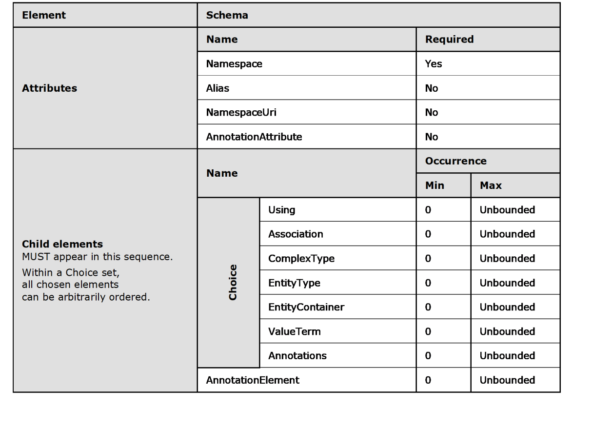
<!-- /Extracted images from page 15 -->



In CSDL 3.0, Schema can contain any number of ValueTerm elements.

  AnnotationElement elements MUST appear only after all other child elements of Schema.

All child elements are to appear in the order indicated. For all child elements within a given choice, the
child elements can be ordered arbitrarily.

#### 2.1.2 EntityType

An entity is an instance of an EntityType element. An EntityType has a unique identity, an
independent existence, and forms the operational unit of consistency. EntityType elements model the
top-level concepts within a data model--such as customers, orders, suppliers, and so on (to take the
example of a typical line-of-business system). An entity instance represents one particular instance of
the EntityType, such as a specific customer or a specific order. An EntityType can be either abstract
or concrete. An abstract EntityType cannot be instantiated.

An EntityType has a Name attribute, a payload consisting of one or more declared properties, and
an entity Key (section 2.1.5) element that specifies the set of properties whose values uniquely
identify an entity within an entity set. An EntityType can have one or more properties of the specified
scalar type or ComplexType. A property can be a declared property or a dynamic property.

In CSDL 1.2, CSDL 2.0, and CSDL 3.0, an EntityType can be an OpenEntityType. An EntityType is
indicated to be an OpenEntityType by the presence of an OpenType="true" attribute. If an
EntityType is an OpenEntityType, the set of properties that are associated with the EntityType
can, in addition to declared properties, include dynamic properties.

Note  In CSDL, dynamic properties are defined for use only with OpenEntityType instances.

[MC-CSDL] - v20190313
Conceptual Schema Definition File Format
Copyright © 2019 Microsoft Corporation
Release: March 13, 2019

15 / 126

The type of a Property in an EntityType can be a scalar type or ComplexType. EntityType can be
categorized as an EDM type.

The following is an example of an EntityType.

   <EntityType Name="Customer">
     <Key>
       <PropertyRef Name="CustomerId" />
     </Key>
     <Property Name="CustomerId" Type="Int32" Nullable="false" />
     <Property Name="FirstName" Type="String" Nullable="true" />
     <Property Name="LastName" Type="String" Nullable="true" />
     <Property Name="AccountNumber" Type="Int32" Nullable="true" />
     <NavigationProperty Name="Orders" Relationship="Model1.CustomerOrder" FromRole="Customer"
ToRole="Order" />
   </EntityType>

The following rules apply to the EntityType element:

  EntityType MUST have a Name attribute defined. The Name attribute is of type

SimpleIdentifier and represents the name of this EntityType.

  An EntityType is a schema level named element and has a unique name.

  EntityType can derive from a BaseType, which is used to specify the parent type of a derived

type. The derived type inherits properties from the parent type.



If a BaseType is defined, it has a namespace qualified name or an alias qualified name of an
EntityType that is in scope.

  An EntityType cannot introduce an inheritance cycle via the BaseType attribute.

  An EntityType can have its Abstract attribute set to "true". By default, the Abstract attribute is

set to "false".

  An EntityType can contain any number of AnnotationAttribute attributes, but their full names

cannot collide.

  An EntityType element can contain at most one Documentation element.

  An EntityType either defines an entity Key element or derive from a BaseType. Derived
EntityType elements cannot define an entity Key. A key forms the identity of the Entity.

  An EntityType can have any number of Property and NavigationProperty elements in any given

order.

  EntityTypeProperty child elements are uniquely named within the inheritance hierarchy for the
EntityType. Property child elements and NavigationProperty child elements cannot have the
same name as their declaring EntityType.

  An EntityType can contain any number of AnnotationElement element blocks.





In CSDL 1.2, CSDL 2.0, and CSDL 3.0, an EntityType that represents an OpenEntityType MUST
have an OpenType attribute that is defined with its value equal to "true".

In CSDL 1.2, CSDL 2.0, and CSDL 3.0, an EntityType that derives from an OpenEntityType is
itself an OpenEntityType. Such a derived EntityType cannot have an OpenType attribute with
its value equal to "false", but the derived EntityType can have an OpenType attribute defined
with its value equal to "true".



In CSDL 3.0, EntityType can contain any number of TypeAnnotation elements.

16 / 126

[MC-CSDL] - v20190313
Conceptual Schema Definition File Format
Copyright © 2019 Microsoft Corporation
Release: March 13, 2019

<!-- Extracted images from page 17 -->
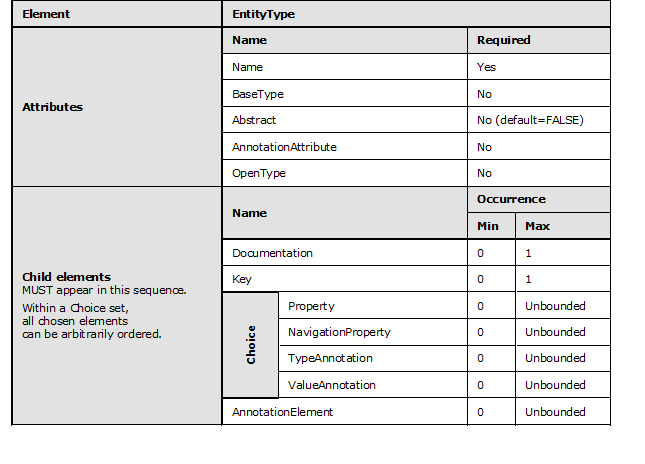
<!-- /Extracted images from page 17 -->



In CSDL 3.0, EntityType can contain any number of ValueAnnotation elements.

All child elements are to appear in the order indicated. For all child elements within a given choice, the
child elements can be ordered arbitrarily.

#### 2.1.3 Property

The declared properties of an EntityType element or ComplexType element are defined by using the
Property element. EntityType and ComplexType can have Property elements. Property can be a
scalar type or ComplexType. A declared property description consists of the declared property's
name, type, and a set of facets, such as Nullable or Default. Facets describe further behavior of a
given type; they are optional to define.

The following is an example of a Property element.

 <Property Name="ProductName" Type="String" Nullable="false" MaxLength="40">

The following rules apply to the Property element:









The Property MUST define the Name attribute.

The Property MUST have the Type defined.

The Property type is either a scalar type or a ComplexType that is in scope and that has a
namespace qualified name or alias qualified name.

In CSDL 3.0, a Type attribute in the Property element can have the value "Collection".
"Collection" represents a set of non-nullable scalar type instances or ComplexType instances. It
can be expressed as an attribute (example 1) or by using child element syntax, see

17 / 126

[MC-CSDL] - v20190313
Conceptual Schema Definition File Format
Copyright © 2019 Microsoft Corporation
Release: March 13, 2019

TypeRef (section 2.1.26) (example 2). TypeRef is only allowed if the Type attribute value is equal
to "Collection".

In example 1, Property uses a Type attribute.

 <Property Name="AlternateAddresses" Type="Collection(Model.Address)" />

In example 2, Property uses child element syntax.

 <Property Name="AlternateAddresses" Type="Collection">
       <TypeRef Type="Model.Address" />
 </Property>

  Property can define a Nullable facet. The default value is Nullable=true. In CSDL 1.0, CSDL 1.1,

and CSDL 2.0, any Property that has a type of ComplexType also defines a Nullable attribute
that is set to "false".



The following facets are optional to define on Property:

  DefaultValue

  MaxLength





FixedLength

Precision

  Scale

  Unicode

  Collation

  SRID



In CSDL 1.1, CSDL 1.2, CSDL 2.0, and CSDL 3.0, a Property element can define a
CollectionKind attribute. The possible values are "None", "List", and "Bag".

  Property can define ConcurrencyMode. The possible values are "None" and "Fixed". However, for
an EntityType that has a corresponding EntitySet defined, any EntityType elements that are
derived from the EntitySet MUST NOT define any new Property with ConcurrencyMode set to a
value other than "None".

  Property can contain any number of AnnotationAttribute attributes. The full names of the

AnnotationAttribute attributes cannot collide.

  A Property element can contain a maximum of one Documentation element.

  Property can contain any number of AnnotationElement elements.



In CSDL 3.0, Property can contain any number of ValueAnnotation elements.

  Child elements of Property are to appear in this sequence: Documentation,

AnnotationElement.

[MC-CSDL] - v20190313
Conceptual Schema Definition File Format
Copyright © 2019 Microsoft Corporation
Release: March 13, 2019

18 / 126

<!-- Extracted images from page 19 -->
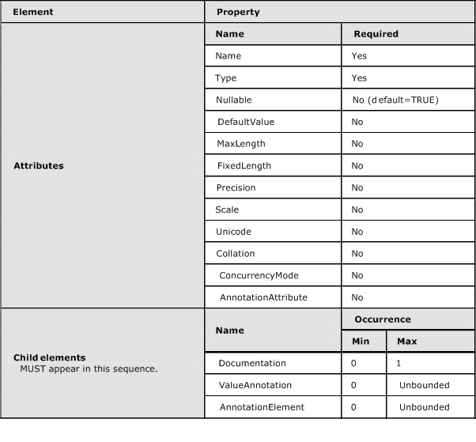
<!-- /Extracted images from page 19 -->

All child elements are to appear in the order indicated.

A dynamic property follows these rules:



If an instance of an OpenEntityType does not include a value for a dynamic property named N,
the instance is treated as if it includes N with a value of "null".

  A dynamic property of an OpenEntityType cannot have the same name as a declared property

on the same OpenEntityType.

#### 2.1.4 NavigationProperty

NavigationProperty elements define non-structural properties on entities that allow for navigation
from one Entity to another via a relationship. Standard properties describe a value that is associated
with an entity, while navigation properties describe a navigation path over a relationship. For example,
given a relationship between Customer and Order entities, an Order EntityType (section 2.1.2) can
describe a NavigationProperty"OrderedBy" that represents the Customer instance associated with
that particular Order instance.

The following is an example of a NavigationProperty element.

[MC-CSDL] - v20190313
Conceptual Schema Definition File Format
Copyright © 2019 Microsoft Corporation
Release: March 13, 2019

19 / 126

<!-- Extracted images from page 20 -->
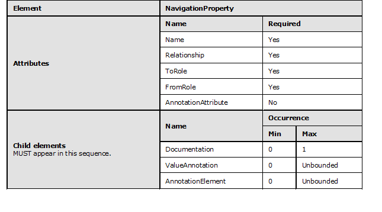
<!-- /Extracted images from page 20 -->

 <NavigationProperty Name="Orders" Relationship="Model1.CustomerOrder" FromRole="Customer"
ToRole="Order" />

The following rules apply to the NavigationProperty element:

  NavigationProperty MUST have a Name defined.

  NavigationProperty MUST have a Relationship attribute defined.



The Relationship attribute can be either a namespace qualified name or an alias qualified
name of an Association (section 2.1.8) element that is in scope.

  NavigationProperty MUST have a ToRole attribute defined. ToRole specifies the other end of

the relationship and refers to one of the role names that is defined on the Association.

  NavigationProperty MUST have a FromRole defined. FromRole is used to establish the starting
point for the navigation and refers to one of the role names that is defined on the Association.

  NavigationProperty can contain any number of AnnotationAttribute attributes. The full names

of the AnnotationAttribute attributes cannot collide.

  NavigationProperty can contain a maximum of one Documentation element.

  NavigationProperty can contain any number of AnnotationElement elements.



In CSDL 3.0, NavigationProperty can have a ContainsTarget defined. When ContainsTarget
is absent, it defaults to "false". When it is set to "true", ContainsTarget indicates containment
NavigationProperty (section 2.1.39).



In CSDL 3.0, NavigationProperty can contain any number of ValueAnnotation elements.

  Child elements of NavigationProperty are to appear in this sequence: Documentation,

AnnotationElement.

All child elements are to appear in the order indicated.

[MC-CSDL] - v20190313
Conceptual Schema Definition File Format
Copyright © 2019 Microsoft Corporation
Release: March 13, 2019

20 / 126

<!-- Extracted images from page 21 -->
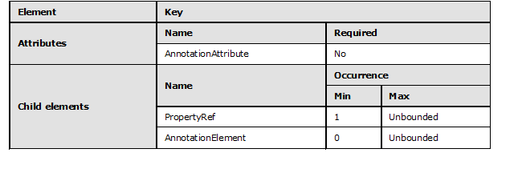
<!-- /Extracted images from page 21 -->

#### 2.1.5 Entity Key

A Key element describes which Property elements form a key that can uniquely identify instances of
an EntityType. Any set of non-nullable, immutable, scalar type declared properties can serve as
the key.

The following is an example of the Key element.

     <Key>
       <PropertyRef Name="CustomerId" />
     </Key>

The following rules apply to the Key element:

  Key can contain any number of AnnotationAttribute attributes. The full names of the

AnnotationAttribute attributes cannot collide.

  Key MUST have one or more PropertyRef child elements.





Each PropertyRef child element names a Property of a type that is equality comparable.

In CSDL 2.0 and CSDL 3.0, Key can contain any number of AnnotationElement elements.

All child elements are to appear in the order indicated.

#### 2.1.6 PropertyRef

PropertyRef element refers to a declared property of an EntityType.

The following is an example of PropertyRef.

    <PropertyRef Name="CustomerId" />

The following rules apply to the PropertyRef element:

  PropertyRef can contain any number of AnnotationAttribute attributes. The full names of the

AnnotationAttribute attributes MUST NOT collide.

  PropertyRef MUST define the Name attribute. The Name attribute refers to the name of a

Property defined in the declaring EntityType.



In CSDL 2.0 and CSDL 3.0, PropertyRef can contain any number of AnnotationElement
elements.

21 / 126

[MC-CSDL] - v20190313
Conceptual Schema Definition File Format
Copyright © 2019 Microsoft Corporation
Release: March 13, 2019

<!-- Extracted images from page 22 -->
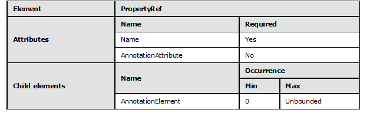
<!-- /Extracted images from page 22 -->

All child elements are to appear in the order indicated.

#### 2.1.7 ComplexType

A ComplexType element represents a set of related information. Like an EntityType element, a
ComplexType element consists of one or more properties of scalar type or complex type. However,
unlike an EntityType element, a ComplexType element cannot have an entity Key element or any
NavigationProperty elements. ComplexType can be categorized as an EDM type.

A ComplexType element provides a mechanism to create declared properties with a rich
(structured) payload. Its definition includes its name and payload. The payload of a ComplexType is
very similar to that of an EntityType.

The following is an example of the ComplexType element.

   <ComplexType Name="CAddress">
     <Documentation>
         
This complextype describes the concept of an Address

         <LongDescription>This complextype describes the concept of an Address for use with
Customer and other Entities</LongDescription>
     </Documentation>
     <Property Name="StreetAddress" Type="String">
         <Documentation>
             <LongDescription>StreetAddress contains the string describing the address of the
street associated with an address</LongDescription>
         </Documentation>
     </Property>
     <Property Name="City" Type="String" />
     <Property Name="Region" Type="String" />
     <Property Name="PostalCode" Type="String" />
   </ComplexType>

The following rules apply to the ComplexType element:

  A ComplexType MUST have a Name attribute defined. Name is of type SimpleIdentifier and

represents the name of this ComplexType.

  ComplexType is a schema level named element and has a unique name.



In CSDL 1.1, CSDL 1.2, CSDL 2.0, and CSDL 3.0, a ComplexType can derive from a BaseType.
BaseType is either the namespace qualified name or alias qualified name of another
ComplexType that is in scope.

  A ComplexType cannot introduce an inheritance cycle via the BaseType attribute.

[MC-CSDL] - v20190313
Conceptual Schema Definition File Format
Copyright © 2019 Microsoft Corporation
Release: March 13, 2019

22 / 126

<!-- Extracted images from page 23 -->
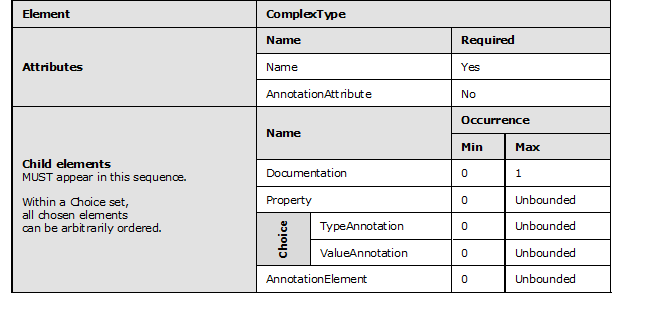
<!-- /Extracted images from page 23 -->



In CSDL 1.1, CSDL 1.2, CSDL 2.0, and CSDL 3.0, ComplexType can have its Abstract attribute
set to "true". By default, Abstract is set to "false".

  A ComplexType can contain any number of AnnotationAttribute attributes. The full names of the

AnnotationAttribute attributes cannot collide.

  A ComplexType element can contain a maximum of one Documentation element.

  A ComplexType can have any number of Property elements.



In CSDL 1.1, CSDL 1.2, CSDL 2.0, and CSDL 3.0, the property names of a ComplexType MUST
be uniquely named within the inheritance hierarchy for the ComplexType. ComplexType
properties MUST NOT have the same name as their declaring ComplexType or any of its base
types.

  ComplexType can contain any number of AnnotationElement elements.

  Child elements of ComplexType are to appear in this sequence: Documentation, Property,

AnnotationElement.





In CSDL 3.0, ComplexType can contain any number of TypeAnnotation elements.

In CSDL 3.0, ComplexType can contain any number of ValueAnnotation elements.

All child elements are to appear in the order indicated. For all child elements within a given choice, the
child elements can be ordered arbitrarily.

#### 2.1.8 Association

An Association element defines a peer-to-peer relationship between participating EntityType
elements and can support different multiplicities at the two ends. OnDelete operational behavior can
be specified at any end of the relationship. An association type can be categorized as an EDM type.

An example of an association is the relationship between the Customer and Order entities.
Typically, this relationship has the following characteristics:

  Multiplicity: Each Order is associated with exactly one Customer. Every Customer has zero or

more Orders.

[MC-CSDL] - v20190313
Conceptual Schema Definition File Format
Copyright © 2019 Microsoft Corporation
Release: March 13, 2019

23 / 126

<!-- Extracted images from page 24 -->
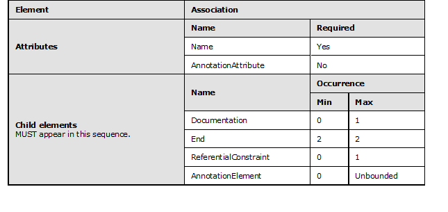
<!-- /Extracted images from page 24 -->

  Operational behavior: OnDelete Cascade; when an Order with one or more OrderLines is deleted,

the corresponding OrderLines also get deleted.

The following is an example of an Association element.

   <Association Name="CustomerOrder">
     <End Type="Model1.Customer" Role="Customer" Multiplicity="1" />
     <End Type="Model1.Order" Role="Order" Multiplicity="*" />
   </Association>

The following rules apply to the Association element:

  Association MUST have a Name attribute defined. The Name attribute is of type

SimpleIdentifier.

  An Association is a schema level named element and has a unique name.

  Association can contain any number of AnnotationAttribute attributes. The full names of

AnnotationAttribute cannot collide.

  An Association element can contain a maximum of one Documentation element.

  Association MUST have exactly two End elements defined.

  Association can have one ReferentialConstraint element defined.

  Association can contain any number of AnnotationElement elements.

  Child elements of Association are to appear in this sequence: Documentation, End,

ReferentialConstraint, AnnotationElement.

All child elements are to appear in the order indicated.

#### 2.1.9 Association End

For a given Association, the End element defines one side of the relationship. End defines what type
is participating in the relationship, multiplicity or the cardinality, and if there are any operation
associations, like cascade delete.

The following is an example of an End element.

24 / 126

[MC-CSDL] - v20190313
Conceptual Schema Definition File Format
Copyright © 2019 Microsoft Corporation
Release: March 13, 2019

<!-- Extracted images from page 25 -->
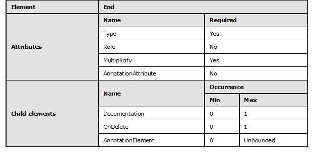
<!-- /Extracted images from page 25 -->

     <End Type="Model1.Customer" Role="Customer" Multiplicity="1" />

The following rules apply to the Association End element:

  End MUST define the EntityType for this end of the relationship.

  EntityType is either a namespace qualified name or an alias qualified name of an

EntityType that is in scope.

  End MUST specify the Multiplicity of this end.

  End can specify the Role name.

  End can contain any number of AnnotationAttribute attributes. The full names of the

AnnotationAttribute attributes cannot collide.

  End can contain a maximum of one Documentation element.

  At most, one OnDelete operation can be defined on a given End.

  End can contain any number of AnnotationElement elements.

  Child elements of End are to appear in this sequence: Documentation, OnDelete,

AnnotationElement.

All child elements are to appear in the order indicated.

#### 2.1.10 OnDelete

The OnDelete element is a trigger that is associated with a relationship. The action is performed on
one end of the relationship when the state of the other side of the relationship changes.

The following is an example of the OnDelete element.

   <Association Name="CProductCategory">
     <End Type="Self.CProduct" Multiplicity="*" />
     <End Type="Self.CCategory" Multiplicity="0..1">
       <OnDelete Action="Cascade" />
     </End>

[MC-CSDL] - v20190313
Conceptual Schema Definition File Format
Copyright © 2019 Microsoft Corporation
Release: March 13, 2019

25 / 126

<!-- Extracted images from page 26 -->
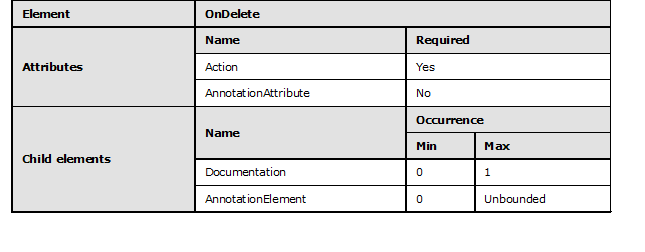
<!-- /Extracted images from page 26 -->

   </Association>

The following rules apply to the OnDelete element:

  OnDelete MUST specify the action.

  OnDelete can contain any number of AnnotationAttribute attributes. The full names of the

AnnotationAttribute attributes cannot collide.



The OnDelete element can contain a maximum of one Documentation element.

  OnDelete can contain any number of AnnotationElement elements.

  Child elements of OnDelete are to appear in this sequence: Documentation,

AnnotationElement.

All child elements are to appear in the order indicated.

#### 2.1.11 ReferentialConstraint

In Entity Data Model (EDM), a ReferentialConstraint element can exist between the key of one
entity type and the primitive property or properties of an associated entity type. A referential
constraint is a constraint on the keys contained in the association type. In CSDL 1.0, CSDL 1.1, and
CSDL 1.2, the referential constraint can exist only between the key properties of associated entities.

The two entity types are in a Principal-to-Dependent relationship, which can also be thought of as a
type of parent-child relationship. When entities are related by an Association that specifies a
referential constraint between the keys of the two entities, the dependent (child) entity object cannot
exist without a valid relationship to a principal (parent) entity object.

ReferentialConstraint MUST specify which end is the PrincipalRole and which end is the
DependentRole for the referential constraint.

The following is an example of ReferentialConstraint.

   <Association Name="FK_Employee_Employee_ManagerID">
     <End Role="Employee" Type="Adventureworks.Store.Employee" Multiplicity="1" />
     <End Role="Manager" Type="Adventureworks.Store.Manager" Multiplicity="0..1" />
     <ReferentialConstraint>
       <Principal Role="Employee">
         <PropertyRef Name="EmployeeID" />
       </Principal>
       <Dependent Role="Manager">
         <PropertyRef Name="ManagerID" />

26 / 126

[MC-CSDL] - v20190313
Conceptual Schema Definition File Format
Copyright © 2019 Microsoft Corporation
Release: March 13, 2019

<!-- Extracted images from page 27 -->
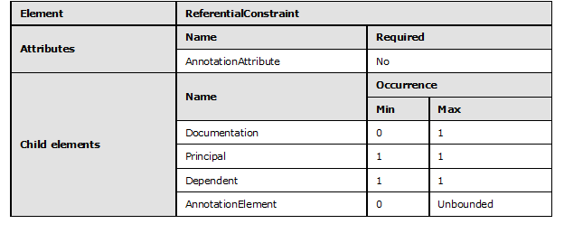
<!-- /Extracted images from page 27 -->

       </Dependent>
     </ReferentialConstraint>
   </Association>

The following rules apply to the ReferentialConstraint element:

  ReferentialConstraint MUST define exactly one Principal end role element and exactly one

Dependent end role element.

  ReferentialConstraint can contain any number of AnnotationAttribute attributes. The full names

of the AnnotationAttribute attributes cannot collide.

  A ReferentialConstraint element can contain a maximum of one Documentation element.

  ReferentialConstraint can contain any number of AnnotationElement elements.

  Child elements of ReferentialConstraint are to appear in this sequence: Documentation,

Principal, Dependent, AnnotationElement.

All child elements are to appear in the order indicated.

#### 2.1.12 ReferentialConstraint Role

When defining ReferentialConstraint elements, Role MUST be used to indicate which end of the
association is the Principal and which end of the relationship is the Dependent. Thus, the
ReferentialConstraint contains two Role definitions: the Principal and the Dependent.

ReferentialConstraintRole usage conforms to the ordering rules for the child elements of
ReferentialConstraint, as defined in ReferentialConstraint (section 2.1.11).

The following example of the ReferentialConstraintRole defines Principal and Dependent
elements.

     <ReferentialConstraint>
       <Principal Role="Employee">
         <PropertyRef Name="EmployeeID" />
       </Principal>
       <Dependent Role="Manager">
         <PropertyRef Name="ManagerID" />
       </Dependent>
     </ReferentialConstraint>

[MC-CSDL] - v20190313
Conceptual Schema Definition File Format
Copyright © 2019 Microsoft Corporation
Release: March 13, 2019

27 / 126

##### 2.1.12.1 Principal

The following example shows the usage of the PrincipalRole element in defining a
ReferentialConstraint element.

       <Principal Role="Employee">
         <PropertyRef Name="EmployeeID" />
       </Principal>

The following rules apply to the PrincipalRole element:

  One PrincipalRole MUST be used to define the Principal end of the ReferentialConstraint.



Each PrincipalRole specifies one and only one Role attribute that is of type SimpleIdentifier.

  Principal has one or more PropertyRef elements. Each PropertyRef element specifies a name by

using the Name attribute.



For each Principal, a PropertyRef definition cannot specify a Name value that is specified for
another PropertyRef.

  PropertyRef is used to specify the properties that participate in the PrincipalRole of the

ReferentialConstraint.









Each PropertyRef element on the Principal corresponds to a PropertyRef on the Dependent.
The Principal and the Dependent of the ReferentialConstraint contains the same number of
PropertyRef elements. The PropertyRef elements on the Dependent are listed in the same
order as the corresponding PropertyRef elements on the Principal.

The Principal of a ReferentialConstraint MUST specify all properties that constitute the Key of
the EntityType that forms the Principal of the ReferentialConstraint.

The Multiplicity of the PrincipalRole is 1. For CSDL 2.0 and CSDL 3.0, the Multiplicity of the
PrincipalRole can be 1 or 0.1.

The data type of each property that is defined in the PrincipalRole MUST be the same as the
data type of the corresponding property that is specified in the DependentRole.



In CSDL 2.0 and CSDL 3.0, Principal can contain any number of AnnotationElement elements.

  Child elements of Principal are to appear in this sequence: PropertyRef, AnnotationElement.

[MC-CSDL] - v20190313
Conceptual Schema Definition File Format
Copyright © 2019 Microsoft Corporation
Release: March 13, 2019

28 / 126

<!-- Extracted images from page 29 -->

<!-- /Extracted images from page 29 -->

All child elements are to appear in the order indicated.

##### 2.1.12.2 Dependent

The following example shows the usage of the DependentRole element in defining a
ReferentialConstraint.

       <Dependent Role="Manager">
         <PropertyRef Name="ManagerID" />
       </Dependent>

The following rules apply to the DependentRole element:

  One DependentRole MUST be used to define the Dependent end of the ReferentialConstraint.



Each DependentRole MUST specify one and only one Role attribute that is of type
SimpleIdentifier.

  Dependent has one or more PropertyRef elements that specify a name by using the Name

attribute.



For each Dependent, a PropertyRef definition cannot specify a Name value that is specified for
another PropertyRef.

  PropertyRef is used to specify the properties that participate in the DependentRole of the

ReferentialConstraint.





Each PropertyRef element on the Principal corresponds to a PropertyRef on the Dependent.
The Principal and the Dependent of the ReferentialConstraint contain the same number of
PropertyRef elements. The PropertyRef elements on the Dependent are listed in the same
order as the corresponding PropertyRef elements on the Principal.

The data type of each property that is defined in the Principal Role MUST be the same as the data
type of the corresponding property specified in the DependentRole.



In CSDL 2.0 and CSDL 3.0, Dependent can contain any number of AnnotationElement elements.

  Child elements of Dependent are to appear in this sequence: PropertyRef,

AnnotationElement.

[MC-CSDL] - v20190313
Conceptual Schema Definition File Format
Copyright © 2019 Microsoft Corporation
Release: March 13, 2019

29 / 126

<!-- Extracted images from page 30 -->
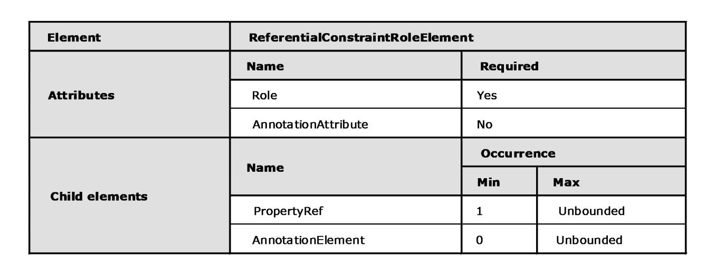
<!-- /Extracted images from page 30 -->

All child elements are to appear in the order indicated.

#### 2.1.13 Using

Using imports the contents of the specified namespace. A schema can refer to contents of another
schema or namespace by importing it by using the Using clause. The imported namespace can be
associated with an alias that is then used to refer to its types, or the types can be directly used by
specifying its fully qualified name.

Note  Semantically, Using is closer to a merge. Unfortunately, the name does not reflect this. If it
was truly "using", structures in the schema being used would be unaffected. However, because a
dependent schema can derive an EntityType from an EntityType that is declared in the original
schema, this has the potential side-effect of changing what might be found in EntitySet elements
declared in the schema being used.

The following is an example of the Using element.

 <Using Namespace="Microsoft.Samples.Northwind.Types"
 Alias="Types" />

The following rules apply to the Using element:

  Using MUST have a Namespace attribute defined that is of type QualifiedName.

  Using MUST have an Alias attribute defined that is of type SimpleIdentifier. The alias can be used

as shorthand for referring to the Namespace linked to that alias via the Using element.

  Using can contain any number of AnnotationAttribute attributes. The full names of the

AnnotationAttribute attributes cannot collide.

  Using can contain a maximum of one Documentation element.

  Using can contain any number of AnnotationElement elements.



If a Documentation element is defined, it comes before any AnnotationElement elements.

[MC-CSDL] - v20190313
Conceptual Schema Definition File Format
Copyright © 2019 Microsoft Corporation
Release: March 13, 2019

30 / 126

<!-- Extracted images from page 31 -->
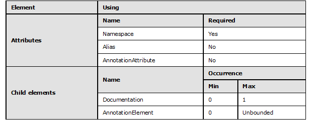
<!-- /Extracted images from page 31 -->

All child elements are to appear in the order indicated.

#### 2.1.14 EntityContainer

EntityContainer is conceptually similar to a database or data source. It groups EntitySet,
AssociationSet, and FunctionImport child elements that represent a data source.

The following is an example of the EntityContainer element.

   <EntityContainer Name="Model1Container" >
     <EntitySet Name="CustomerSet" EntityType="Model1.Customer" />
     <EntitySet Name="OrderSet" EntityType="Model1.Order" />
     <AssociationSet Name="CustomerOrder" Association="Model1.CustomerOrder">
       <End Role="Customer" EntitySet="CustomerSet" />
       <End Role="Order" EntitySet="OrderSet" />
     </AssociationSet>
   </EntityContainer>

The following rules apply to the EntityContainer element:

  EntityContainer MUST have a Name attribute defined that is of type SimpleIdentifier.

  EntityContainer can define an Extends attribute, which, if present, refers to another

EntityContainer in scope by name.

  EntityContainer elements that extend another EntityContainer inherit all of the extended

EntitySet, AssociationSet, and FunctionImport child elements from that EntityContainer.

  EntityContainer can contain a maximum of one Documentation element.

  EntityContainer can contain any number of AnnotationAttribute attributes. The full names of the

AnnotationAttribute attributes cannot collide.

  EntityContainer can contain any number of FunctionImport, EntitySet, and AssociationSet

elements, which can be defined in any order.

  FunctionImport, EntitySet, and AssociationSet names within an EntityContainer cannot

collide.



If present, the Documentation child element MUST precede FunctionImport, EntitySet, and
AssociationSet child elements.

[MC-CSDL] - v20190313
Conceptual Schema Definition File Format
Copyright © 2019 Microsoft Corporation
Release: March 13, 2019

31 / 126

<!-- Extracted images from page 32 -->
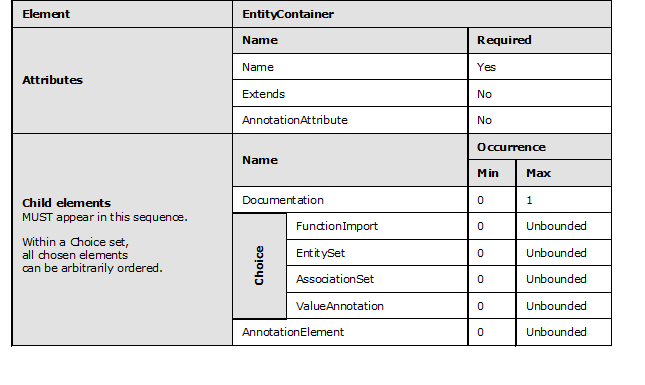
<!-- /Extracted images from page 32 -->







In CSDL 2.0 and CSDL 3.0, EntityContainer can contain any number of AnnotationElement
elements.

In CSDL 3.0, EntityContainer can contain any number of ValueAnnotation elements.

In the sequence of child elements under EntityContainer, AnnotationElement follows all other
elements.

All child elements are to appear in the order indicated. For all child elements within a given choice, the
child elements can be ordered arbitrarily.

#### 2.1.15 FunctionImport

FunctionImport element is used to import stored procedures or functions that are defined in the
Store Schema Model into Entity Data Model (EDM).

The following is an example of the FunctionImport element.

 <FunctionImport Name="annualCustomerSales" EntitySet="result_annualCustomerSalesSet"
ReturnType="Collection(Self.result_annualCustomerSales)">
   <Parameter Name="fiscalyear" Mode="In" Type="String" />
 </FunctionImport>

The following rules apply to the FunctionImport element:

  FunctionImport MUST have a Name attribute defined. Name attribute is of type

SimpleIdentifier.

  FunctionImport can define a ReturnType as an attribute.





In CSDL 3.0, the ReturnType can be defined as either an attribute or a child element, but not
both.

If defined in CSDL 1.1, CSDL 2.0, and CSDL 3.0, the type of ReturnType MUST be a scalar type,
EntityType, or ComplexType that is in scope or a collection of one of these in-scope types. In
CSDL 1.0, the ReturnType is collection of either scalar type or EntityType.

32 / 126

[MC-CSDL] - v20190313
Conceptual Schema Definition File Format
Copyright © 2019 Microsoft Corporation
Release: March 13, 2019







Types that are in scope for a FunctionImport include all scalar types, EntityTypes, and
ComplexTypes that are defined in the declaring SchemaNamespace or in schemas that are in
scope of the declaring Schema.

If the return type of FunctionImport is a collection of entities, the EntitySet attribute is
defined.

If the return type of FunctionImport is of ComplexType or scalar type, the EntitySet attribute
cannot be defined.

  FunctionImport can contain any number of AnnotationAttribute attributes. The full names of the

AnnotationAttribute attributes cannot collide.



The FunctionImport element can contain a maximum of one Documentation element.

  FunctionImport can have zero or more Parameter elements.

  Parameter element names inside a FunctionImport cannot collide.

  FunctionImport can have an IsSideEffecting attribute defined. Possible values are "true" and

"false". If the IsSideEffecting attribute is omitted, the value of the IsSideEffecting attribute
defaults to "true".

  FunctionImport can have an IsBindable attribute defined. Possible values are "true" and

"false". If the IsBindable attribute is omitted, the value of the IsBindable attribute is assumed
to be "false".

  When IsBindable is set to "true", FunctionImport MUST have at least one Parameter element

defined.

  FunctionImport can have an IsComposable attribute defined. Possible values are "true" and
"false". If the IsComposable attribute is omitted, the value of the IsComposable attribute is
assumed to be "false".

  FunctionImport cannot have IsComposable set to "true" if IsSideEffecting is set to "true".





In CSDL 2.0 and CSDL 3.0, FunctionImport can contain any number of AnnotationElement
elements.

In CSDL 3.0, FunctionImport can have an EntitySetPath attribute defined. EntitySetPath
defines the EntitySet that contains the entities that are returned by the FunctionImport when
that EntitySet is dependent on one of the FunctionImport parameters. For example, the entities
returned from a FunctionImport can be dependent on the entity set that is passed to the
FunctionImport as a parameter. In this case, a static EntitySet is not sufficient, and an
EntitySetPath is used. EntitySetPath is composed of segments that are separated by a forward
slash. The first segment refers to a FunctionImport parameter. Each remaining segment
represents either navigation, in which case the segment is a SimpleIdentifier, or a type cast, in
which case the segment is a QualifiedName.



In CSDL 3.0, FunctionImport can contain any number of ValueAnnotation elements.

  Child elements of FunctionImport are to appear in this sequence: Documentation (if present),

ReturnType, Parameter, AnnotationElement.

[MC-CSDL] - v20190313
Conceptual Schema Definition File Format
Copyright © 2019 Microsoft Corporation
Release: March 13, 2019

33 / 126

<!-- Extracted images from page 34 -->
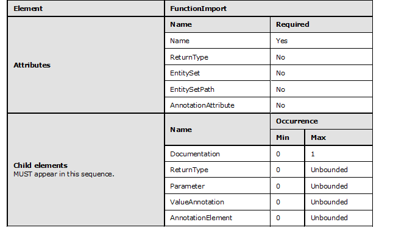
<!-- /Extracted images from page 34 -->

All child elements are to appear in the order indicated.

#### 2.1.16 FunctionImport ReturnType

A ReturnType describes the shape of data that is returned from a FunctionImport element.
ReturnType is used to map to stored procedures with multiple result sets. In CSDL 3.0, the return
type of a function import can be declared as a child element.

The following is an example of the ReturnType element.

 <FunctionImport Name="GetOrdersAndProducts">  <ReturnType Type="Collection(Self.Order)"
EntitySet="Orders"/>  <ReturnType Type="Collection(Self.Product)"
EntitySet="Products"/></FunctionImport>

The following rules apply to the FunctionImport ReturnType element:

  ReturnType can define type declarations as an attribute.



If defined in CSDL 1.1, CSDL 2.0, or CSDL 3.0, the Type of FunctionImport ReturnType MUST
be an EDMSimpleType, EntityType, or ComplexType that is in scope or a collection of one of
these in-scope types. In CSDL 1.0, the ReturnType is a collection of either EDMSimpleType or
EntityType.

  ReturnType can contain any number of AnnotationAttribute attributes. The full names of the

AnnotationAttribute attributes cannot collide.



The order of the ReturnType elements MUST match that of the underlying stored procedure.

[MC-CSDL] - v20190313
Conceptual Schema Definition File Format
Copyright © 2019 Microsoft Corporation
Release: March 13, 2019

34 / 126

<!-- Extracted images from page 35 -->
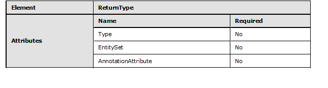
<!-- /Extracted images from page 35 -->

#### 2.1.17 FunctionImport Parameter

Functions that are defined in conceptual schema definition language (CSDL) optionally accept
both in and out Parameter elements. Each Parameter element MUST have an associated Name and
Type defined.

The following is an example of FunctionImport Parameter element.

 <FunctionImport Name="GetScalar" ReturnType="Collection(String)">
   <Parameter Name="count" Type="Int32" Mode="Out" />
   <ValueFunctionImport Anything="bogus1" xmlns="FunctionImportAnnotation"/>
 </FunctionImport>

The following rules apply to the FunctionImport Parameter element:

  Parameter MUST have a Name defined.



The Type of the Parameter MUST be defined. Type is a scalar type, ComplexType, or
EntityType or a collection of scalar, ComplexType, or EntityType types.

  Parameter can define the Mode of the parameter. Possible values are "In", "Out", and "InOut".





For a given Parameter, a MaxLength value can be specified.

Precision can be specified for a given Parameter.

  Scale can be specified for a given Parameter.

  Parameter can contain any number of AnnotationAttribute attributes. The full names of the

AnnotationAttribute attributes cannot collide.

  Parameter can contain a maximum of one Documentation element.

  Parameter can contain any number of AnnotationElement elements.



In CSDL 3.0, Parameter can contain any number of ValueAnnotation elements.

  Child elements of Parameter are to appear in this sequence: Documentation,

AnnotationElement.

[MC-CSDL] - v20190313
Conceptual Schema Definition File Format
Copyright © 2019 Microsoft Corporation
Release: March 13, 2019

35 / 126

<!-- Extracted images from page 36 -->
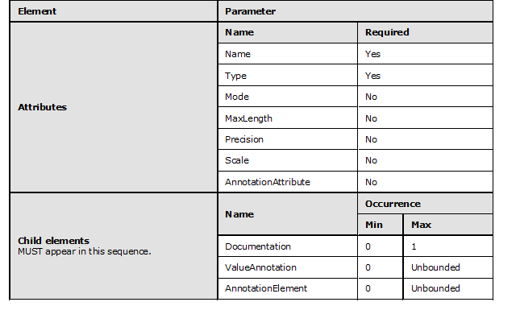
<!-- /Extracted images from page 36 -->

All child elements are to appear in the order indicated.

#### 2.1.18 EntitySet

An EntitySet element is a named set that can contain instances of a specified EntityType element and
any of the specified EntityType subtypes. More than one EntitySet for a particular EntityType can
be defined.

The following is an example of the EntitySet element.

     <EntitySet Name="CustomerSet" EntityType="Model1.Customer" />

The following rules apply to the EntitySet element:

  EntitySet MUST have a Name attribute defined that is of type SimpleIdentifier.

  EntitySet MUST have an EntityType defined.



The EntityType of an EntitySet MUST be in scope of the Schema that declares the
EntityContainer in which this EntitySet resides.

  EntitySet can have an abstract EntityType. An EntitySet for a given EntityType can contain

instances of that EntityType and any of its subtypes.

  Multiple EntitySet elements can be defined for a given EntityType.

  EntitySet can contain any number of AnnotationAttribute attributes. The full names of the

AnnotationAttribute attributes cannot collide.

  EntitySet elements can contain a maximum of one Documentation element.

  EntitySet can contain any number of AnnotationElement elements.



In CSDL 3.0, EntitySet can contain any number of ValueAnnotation elements.

36 / 126

[MC-CSDL] - v20190313
Conceptual Schema Definition File Format
Copyright © 2019 Microsoft Corporation
Release: March 13, 2019

<!-- Extracted images from page 37 -->
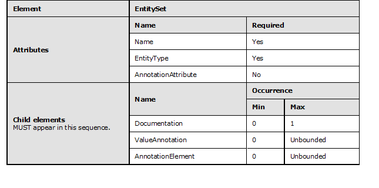
<!-- /Extracted images from page 37 -->

  Child elements of EntitySet are to appear in this sequence:  Documentation,

AnnotationElement.

All child elements are to appear in the order indicated.

#### 2.1.19 AssociationSet

An AssociationSet contains relationship instances of the specified association. The association
specifies the EntityType elements of the two end points, whereas AssociationSet specifies the
EntitySet element that corresponds to either these EntityType elements directly or to derived
EntityType elements. The association instances that are contained in the AssociationSet relate
entity instances that belong to these EntityType elements.

The following is an example of the AssociationSet.

    <AssociationSet Name="CustomerOrder" Association="Model1.CustomerOrder">
       <End Role="Customer" EntitySet="CustomerSet" />
       <End Role="Order" EntitySet="OrderSet" />
     </AssociationSet>

The following rules apply to the AssociationSet element:

  AssociationSet MUST have a Name attribute defined that is of type SimpleIdentifier.

  AssociationSet MUST have an Association attribute defined. The Association attribute

specifies the namespace qualified name or alias qualified name of the Association for which
the AssociationSet is being defined.



The Association of an AssociationSet MUST be in scope of the Schema that declares the
EntityContainer in which this AssociationSet resides.

  AssociationSet can contain any number of AnnotationAttribute attributes. The full names of the

AnnotationAttribute attributes cannot collide.

  An AssociationSet element can contain a maximum of one Documentation element.

  AssociationSet MUST have exactly two End child elements defined.

  AssociationSet can contain any number of AnnotationElement child elements.

37 / 126

[MC-CSDL] - v20190313
Conceptual Schema Definition File Format
Copyright © 2019 Microsoft Corporation
Release: March 13, 2019

<!-- Extracted images from page 38 -->
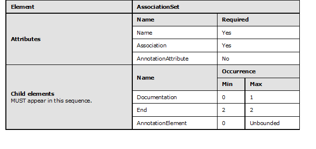
<!-- /Extracted images from page 38 -->

  Child elements of AssociationSet are to appear in this sequence: Documentation, End,

AnnotationElement.

All child elements are to appear in the order indicated.

#### 2.1.20 AssociationSet End

The End element defines the two sides of the AssociationSet element. This association is defined
between the two EntitySets declared in an EntitySet attribute.

The following is an example of the End element.

       <End Role="Customer" EntitySet="CustomerSet" />

The following rules apply to End elements inside an AssociationSet:

  End element can have the Role attribute specified. All End elements have the EntitySet attribute

specified.









The EntitySet is the Name of an EntitySet defined inside the same EntityContainer.

The Role of the End element MUST map to a Role declared on one of the Ends of the
Assocation referenced by the End element's declaring AssociationSet.

Each End that is declared by an AssociationSet refers to a different Role.

The EntityType for a particular AssociationSetEnd is the same as or derived from the
EntityType that is contained by the related EntitySet. An End element can contain a maximum
of one Documentation element.

  End can contain any number of AnnotationElement elements.



The child elements of End are to appear in this sequence: Documentation,
AnnotationElement.

[MC-CSDL] - v20190313
Conceptual Schema Definition File Format
Copyright © 2019 Microsoft Corporation
Release: March 13, 2019

38 / 126

<!-- Extracted images from page 39 -->
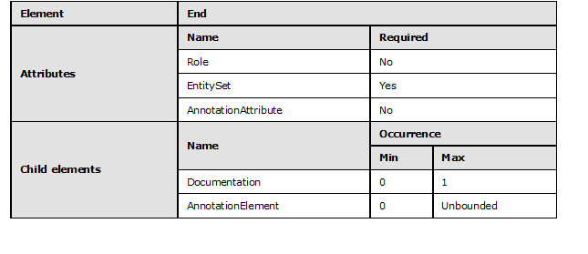
<!-- /Extracted images from page 39 -->

All child elements are to appear in the order indicated.

#### 2.1.21 Documentation

The Documentation element is used to provide documentation of comments on the contents of the
conceptual schema definition language (CSDL) file.

The following is an example of the Documentation element on the EntityContainer element.

 <EntityContainer Name="TwoThreeContainer">
    <Documentation>
       
Summary: Entity Container for storing Northwind instances

       <LongDescription>LongDescription: This Entity Container is for storing Northwind
instances</LongDescription>
    </Documentation>
   <EntitySet Name="Products" EntityType="Self.Product" />
 </EntityContainer>

The following is an example of the Documentation element on the EntitySet element.

 <EntitySet Name="Products" EntityType="Self.Product">
    <Documentation>
        
EntitySet Products is for storing instances of EntityType Product

        <LongDescription>This EntitySet having name Products is for storing instances of
EntityType Product</LongDescription>
    </Documentation>
 </EntitySet>

The following is an example of the Documentation element on the AssociationSet element and End
role.

 <AssociationSet Name="CategoryProducts" Association="Self.CategoryProduct">
      <Documentation>
          
AssociationSet CategoryProducts is for storing instances of Association
CategoryProduct

          <LongDescription>This AssociationSet having name=CategoryProducts is for storing
instances of Association CategoryProduct</LongDescription>
      </Documentation>
   <End Role="Category" EntitySet="Categories">
      <Documentation>
          
This end of the relationship-instance describes the Category role for
AssociationSet CategoryProducts

39 / 126

[MC-CSDL] - v20190313
Conceptual Schema Definition File Format
Copyright © 2019 Microsoft Corporation
Release: March 13, 2019

      </Documentation>
   </End>
   <End Role="Product" EntitySet="Products">
      <Documentation>
          <LongDescription>This end of the relationship-instance describes the Product role
for AssociationSet CategoryProducts</LongDescription>
      </Documentation>
   </End>
 </AssociationSet>

The following is an example of the Documentation element on the EntityType element, Property
element, and NavigationProperty element.

 <EntityType Name="Product">
   <Documentation>
       
Summary: EntityType named Product describes the content model for
Product

       <LongDescription>LongDescription: The EntityType named Product describes the content
model for Product</LongDescription>
   </Documentation>
   <Key>
     <PropertyRef Name="ProductID" />
   </Key>
   <Property Name="ProductID" Type="Int32" Nullable="false">
       <Documentation>
           
Summary: This is the key property of EntityType Product

           <LongDescription>LongDescription: This is the key property of EntityType
Product</LongDescription>
       </Documentation>
   </Property>
   <Property Name="ProductName" Type="String">
       <Documentation>
           
Summary: This property describes the name of the Product

       </Documentation>
   </Property>
   <Property Name="QuantityPerUnit" Type="String">
       <Documentation>
          <LongDescription>LongDescription: This property describes the quantity per unit
corresponding to a product</LongDescription>
       </Documentation>
   </Property>
   <Property Name="PriceInfo" Nullable="false" Type="Self.PriceInfo" />
   <Property Name="StockInfo" Nullable="false" Type="Self.StockInfo" />
   <NavigationProperty Name="Category" Relationship="Self.CategoryProduct" FromRole="Product"
ToRole="Category">
       <Documentation>
           
This navigation property allows for traversing to Product-instances
associated with a Category-instance

           <LongDescription> </LongDescription>
       </Documentation>
   </NavigationProperty>
 </EntityType>

The following is an example of the Documentation element on the Association element.

 <Association Name="CategoryProduct">
    <Documentation>
        
Association CategoryProduct describes the participating end of the
CategoryProduct relationship

    </Documentation>
   <End Role="Category" Type="Self.Category" Multiplicity="1">
      <Documentation>
           
This end of the relationship-instance describes the Category role for
Association CategoryProduct

40 / 126

[MC-CSDL] - v20190313
Conceptual Schema Definition File Format
Copyright © 2019 Microsoft Corporation
Release: March 13, 2019

<!-- Extracted images from page 41 -->
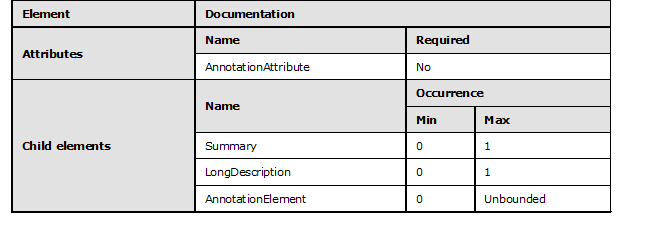
<!-- /Extracted images from page 41 -->

      </Documentation>
   </End>
   <End Role="Product" Type="Self.Product" Multiplicity="*">
      <Documentation>
          <LongDescription>This end of the relationship-instance describes the Product role
for Association CategoryProduct</LongDescription>
      </Documentation>
   </End>
 </Association>

The following rules apply to the Documentation element:

  Documentation can contain any number of AnnotationAttribute attributes. The full names of the

AnnotationAttribute attributes cannot collide.

  Documentation can specify a summary of the document inside a Summary element.

  Documentation can specify a description of the documentation inside a LongDescription

element.



The child elements of Documentation are to appear in this sequence: Summary,
LongDescription, AnnotationElement.

All child elements are to appear in the order indicated.

#### 2.1.22 AnnotationElement

An AnnotationElement is a custom XML element that is applied to a conceptual schema
definition language (CSDL) element. The AnnotationElement element and its child elements can
belong to any XML namespace that is not in the list of reserved XML namespaces for CSDL. Consult
the section for each CSDL element within this document to determine whether an
AnnotationElement can be used for that element.

The following is an example of the AnnotationElement element.

 <EntityType Name="Content">
   <Key>
     <PropertyRef Name="ID" />
   </Key>
   <Property Name="ID" Type="Guid" Nullable="false" />
   <Property Name="HTML" Type="String" Nullable="false" MaxLength="Max" Unicode="true"
      FixedLength="false" />
   <CLR:Attributes>
     <CLR:Attribute TypeName="System.Runtime.Serialization.DataContract"/>
     <CLR:Attribute TypeName="MyNamespace.MyAttribute"/>

41 / 126

[MC-CSDL] - v20190313
Conceptual Schema Definition File Format
Copyright © 2019 Microsoft Corporation
Release: March 13, 2019

   </CLR:Attributes>
   <RS:Security>
     <RS:ACE Principal="S-0-123-1321" Rights="+R+W"/>
     <RS:ACE Principal="S-0-123-2321" Rights="-R-W"/>
   </RS:Security>
 </EntityType>

The following rules apply to the AnnotationElement element:



The namespace used in annotations MUST be declared or the namespace declaration MUST be
in-lined with the annotation.

  Annotations follow all other child elements. For example, when annotating an EntityType element,

the AnnotationElement element follows all entity Key, Property, and NavigationProperty
elements.

  More than one named annotation can be defined per CSDL element.



For a given CSDL element, annotation element names can collide, as long as the combination of
namespace plus element name is unique for a particular element.

  Annotation is an XML element that contains a valid XML structure.

#### 2.1.23 Model Function

A Function element is used to define or declare a user function. These functions are defined as child
elements of the Schema element.

The following is an example of the Function element.

 <Function Name="GetAge" ReturnType="Edm.Int32">
     <Parameter Name="Person" Type="Model.Person" />
     <DefiningExpression>
         Edm.DiffYears(Edm.CurrentDateTime(), Person.Birthday)
     </DefiningExpression>
 </Function>

The following rules apply to the Function element:









The Function MUST have a Name attribute defined that is of type SimpleIdentifier. The Name
attribute represents the name of this Function.

The Function MUST define a return type as an attribute or as a child element.

The Function cannot contain both an attribute and a child element that defines the return type.

If defined, the type of FunctionReturnType MUST be:

  A scalar type, EntityType, or ComplexType that is in scope.

  A collection of one of these scalar, EntityType, or ComplexType in-scope types.

  A RowType element or a collection of RowType elements that is defined as a child element of

ReturnType.

  A ReferenceType element or a collection of ReferenceType elements that is defined as a child

element of ReturnType.

[MC-CSDL] - v20190313
Conceptual Schema Definition File Format
Copyright © 2019 Microsoft Corporation
Release: March 13, 2019

42 / 126

<!-- Extracted images from page 43 -->
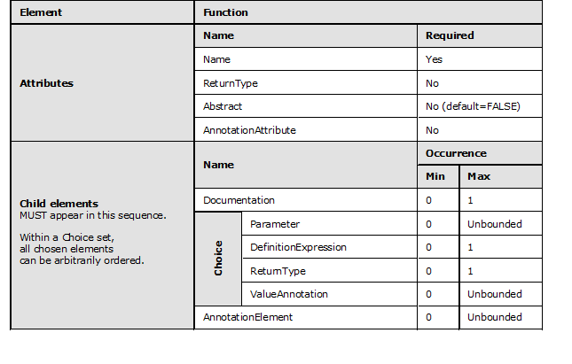
<!-- /Extracted images from page 43 -->

  A single DefiningExpression element can be defined for a given Function. A

DefiningExpression is any expression that is intended to be the body of the function. The
conceptual schema definition language (CSDL) file format does not specify rules and
restrictions regarding what language is to be used for specifying function bodies.

  All Function parameters have to be inbound.

  Function can contain any number of AnnotationAttribute attributes. The full names of the

AnnotationAttribute attributes cannot collide.



Functions are declared as global items inside the Schema element.

  Function can contain a maximum of one Documentation element.



The function parameters and return type MUST be of the following types:

  A scalar type or a collection of scalar types.

  An entity type or a collection of entity types.

  A complex type or a collection of complex types.

  A row type or a collection of row types.

  A reference type or a collection of reference types.

  Function can contain any number of Parameter elements.

  Function can contain any number of AnnotationElement elements.



In CSDL 3.0, Function can contain any number of ValueAnnotation elements.

  Parameter, DefiningExpression, and ReturnType can appear in any order.

  AnnotationElement has to be the last in the sequence of elements of a Function.

[MC-CSDL] - v20190313
Conceptual Schema Definition File Format
Copyright © 2019 Microsoft Corporation
Release: March 13, 2019

43 / 126

All child elements are to appear in the order indicated. For all child elements within a given choice, the
child elements can be ordered arbitrarily.

#### 2.1.24 Model Function Parameter

Function elements in conceptual schema definition language (CSDL) only support inbound
parameters. CSDL does not allow setting the FunctionParameter mode. It is always set to
Mode="In".

The type of a Parameter can be declared either as an attribute or as a child element.

The following is an example of the type of a Parameter declared as an attribute.

 <Parameter Name="Age" Type="Edm.Int32"/>

The following is an example of the type of a Parameter declared as a child element.

 <Parameter Name="Owner">
     <TypeRef Name="Model.Person" />
 </Parameter>

The following rules apply to the Parameter element:

  Parameter MUST have a Name attribute defined that is of type SimpleIdentifier and represents

the name of this Parameter.

  Parameter MUST define the type either as an attribute or as a child element.

  Parameter can define facets if the type is a scalar type.

  Parameter can contain any number of AnnotationAttribute attributes. The full names of the

AnnotationAttribute attributes cannot collide.

  A function parameter MUST be one of the following types:

  A scalar type or a collection of scalar types.

  An entity type or collection of entity types.

  A complex type or collection of complex types.

  A row type or collection of row types.

  A reference type or collection of reference types.

  Parameter can contain a maximum of one CollectionType element.

  Parameter can contain a maximum of one ReferenceType element.

  Parameter can contain a maximum of one RowType element.

  Parameter can contain any number of AnnotationElement elements.



In CSDL 3.0, Parameter can contain any number of ValueAnnotation elements.

  AnnotationElement elements are last in the sequence of child elements of a Parameter.

[MC-CSDL] - v20190313
Conceptual Schema Definition File Format
Copyright © 2019 Microsoft Corporation
Release: March 13, 2019

44 / 126

<!-- Extracted images from page 45 -->
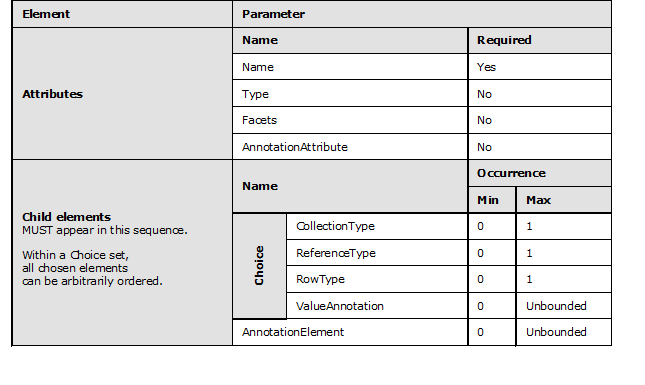
<!-- /Extracted images from page 45 -->

All child elements are to appear in the order indicated. For all child elements within a given choice, the
child elements can be ordered arbitrarily.

#### 2.1.25 CollectionType

If the type of the FunctionParameter or ReturnType is a collection, the type can be expressed as
an attribute or by using child element syntax.

The following is an example of the type expressed as an attribute.

 <Parameter Name="Owners" Type="Collection(Model.Person)" />

The following is an example of the type expressed by using child element syntax.

 <Parameter Name="Owners">
       <CollectionType>
       <TypeRef Name="Model.Person" />
       </CollectionType>
 </Parameter>

The following rules apply to the CollectionType element:

  CollectionType MUST define the type either as an attribute or as a child element.

  Attribute syntax can be used only if the collection is a nominal type.

  CollectionType can define facets if the type is a scalar type. The Default facet cannot be

applied to a CollectionType.

  CollectionType can contain any number of AnnotationAttribute attributes. The full names of the

AnnotationAttribute attributes cannot collide.

  CollectionType can define one of the following as a child element:

[MC-CSDL] - v20190313
Conceptual Schema Definition File Format
Copyright © 2019 Microsoft Corporation
Release: March 13, 2019

45 / 126

<!-- Extracted images from page 46 -->
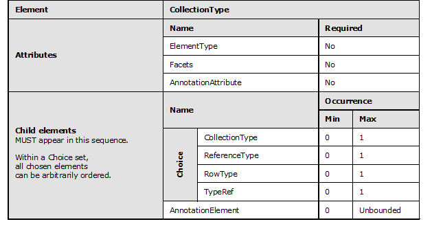
<!-- /Extracted images from page 46 -->

  CollectionType

  ReferenceType

  RowType



TypeRef

  CollectionType elements can contain any number of AnnotationElement elements.

  AnnotationElement is last in the sequence of child elements of CollectionType.

All child elements are to appear in the order indicated. For all child elements within a given choice, the
child elements can be ordered arbitrarily.

#### 2.1.26 TypeRef

The TypeRef element is used to reference an existing named type.

The following is an example of a TypeRef element with the Name attribute specified.

 <TypeRef Type="Model.Person" />

The following is an example of a TypeRef with facets specified.

 <TypeRef Type="Edm.String" Nullable="true" MaxLength="50"/>

The following rules apply to the TypeRef element:

  TypeRef MUST have a Type attribute defined. The Type attribute defines the fully qualified name

of the referenced type.

  TypeRef is used to reference an existing named type. Named types include:



EntityType

[MC-CSDL] - v20190313
Conceptual Schema Definition File Format
Copyright © 2019 Microsoft Corporation
Release: March 13, 2019

46 / 126

<!-- Extracted images from page 47 -->
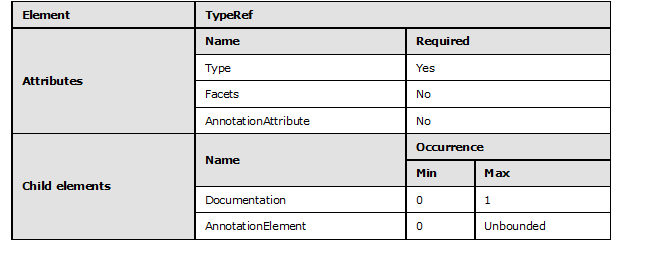
<!-- /Extracted images from page 47 -->

  ComplexType





Primitive type

EnumType

  TypeRef can define facets if the type is a scalar type. The Default facet cannot be applied to a

TypeRef.

  TypeRef can contain any number of AnnotationAttribute attributes. The full names of the

AnnotationAttribute attributes cannot collide.

  TypeRef elements can contain at most one Documentation element.

  TypeRef elements can contain any number of AnnotationElement elements.

  AnnotationElement is last in the sequence of child elements of TypeRef.

All child elements are to appear in the order indicated.

#### 2.1.27 ReferenceType

ReferenceType is used to specify the reference to an actual entity either in the return type or in a
parameter definition. The reference type can be specified as an attribute or by using child element
syntax.

The following is an example of the ReferenceType in a return type.

 <ReferenceType Type="Model.Person" />

The following is an example of the ReferenceType in a parameter definition.

 <ReturnType>
       <CollectionType>
             <ReferenceType Type="Model.Person" />
       </CollectionType>
 </ReturnType>

The following is an example of the ReferenceType as an attribute.

[MC-CSDL] - v20190313
Conceptual Schema Definition File Format
Copyright © 2019 Microsoft Corporation
Release: March 13, 2019

47 / 126

<!-- Extracted images from page 48 -->
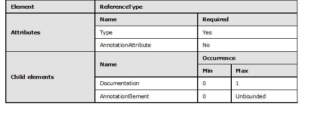
<!-- /Extracted images from page 48 -->

 <ReturnType Type="Ref(Model.Person)" />

The following rules apply to the ReferenceType element:





The Type attribute on a ReferenceType element MUST always be defined.

The Type of the reference MUST always be of EntityType.

  ReferenceType can contain any number of AnnotationAttribute attributes. The full names of the

AnnotationAttribute attributes cannot collide.

  ReferenceType elements can contain at most one Documentation element.

  ReferenceType elements can contain any number of AnnotationElement elements.

  AnnotationElement is last in the sequence of child elements of ReferenceType.

All child elements are to appear in the order indicated.

#### 2.1.28 RowType

A RowType is an unnamed structure. RowType is always declared inline.

The following is an example of a RowType in a parameter.

 <Parameter Name="Coordinate" Mode="In">
     <RowType>
         <Property Name="X" Type="int" Nullable="false"/>
         <Property Name="Y" Type="int" Nullable="false"/>
         <Property Name="Z" Type="int" Nullable="false"/>
     </RowType>
 </Parameter>

The following is an example of a RowType defined in a return type.

 <ReturnType>
     <CollectionType>
         <RowType>
             <Property Name="X" Type="int" Nullable="false"/>
             <Property Name="Y" Type="int" Nullable="false"/>
             <Property Name="Z" Type="int" Nullable="false"/>
         </RowType>
     </CollectionType>

[MC-CSDL] - v20190313
Conceptual Schema Definition File Format
Copyright © 2019 Microsoft Corporation
Release: March 13, 2019

48 / 126

<!-- Extracted images from page 49 -->
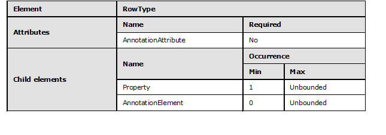
<!-- /Extracted images from page 49 -->

 </ReturnType>

The following rules apply to the RowType element:

  RowType can contain any number of AnnotationAttribute attributes. The full names of the

AnnotationAttribute attributes cannot collide.

  RowType MUST contain at least one Property element.

  RowType can contain more than one Property element.

  RowType can contain any number of AnnotationElement elements.

  AnnotationElement elements is last in the sequence of child elements of RowType.

All child elements are to appear in the order indicated.

#### 2.1.29 RowType Property

One or more Property elements are used to describe the structure of a RowType element.

The following is an example of a RowType element with two Property elements.

 <ReturnType>
     <CollectionType>
         <RowType>
                   <Property Name="C" Type="Customer"/>
                   <Property Name="Orders" Type="Collection(Order)"/>
         </RowType>
     </CollectionType>
 </ReturnType>

The following is an example of a collection of RowType elements that contains a collection of
RowType elements.

 <ReturnType>
     <CollectionType>
         <RowType>
             <Property Name="Customer" Type="Customer"/>
             <Property Name="Orders">
                 <CollectionType>
                     <RowType>
                         <Property Name="OrderNo" Type="Int32"/>
                         <Property Name="OrderDate" Type="Date"/>
                     <RowType>

[MC-CSDL] - v20190313
Conceptual Schema Definition File Format
Copyright © 2019 Microsoft Corporation
Release: March 13, 2019

49 / 126

<!-- Extracted images from page 50 -->
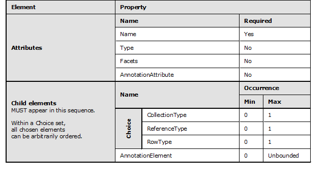
<!-- /Extracted images from page 50 -->

                 <CollectionType>
             </Property>
         </RowType>
     </CollectionType>
 </ReturnType>

The following rules apply to the Property elements of a RowType element:

  Property MUST have a Name attribute defined that is of type SimpleIdentifier. The Name

attribute represents the name of this Property.



The type of a property that belongs to a RowType MUST be one of the following:

  Scalar type



EntityType

  ReferenceType

  RowType

  CollectionType

  Property defines a type either as an attribute or as a child element.

  Property cannot contain both an attribute and a child element defining the type of the Property

element.

  Property can define facets if the type is a scalar type.

  Property can contain any number of AnnotationAttribute attributes. The full names of the

AnnotationAttribute attributes cannot collide.

  Property can contain any number of AnnotationElement elements.

  AnnotationElement elements are last in the sequence of child elements of Property.

All child elements are to appear in the order indicated. For all child elements within a given choice, the
child elements can be ordered arbitrarily.

50 / 126

[MC-CSDL] - v20190313
Conceptual Schema Definition File Format
Copyright © 2019 Microsoft Corporation
Release: March 13, 2019

#### 2.1.30 Function ReturnType

ReturnType describes the shape of data that is returned from a Function. The return type of a
function can be declared as a ReturnType attribute on a Function or as a child element.

The following is an example of the return type of a function declared as a ReturnType attribute on a
Function.

 <Function Name="GetAge" ReturnType="Edm.Int32">

The following is an example of the return type of a function declared as a child element.

 <Function Name="GetAge">
     <ReturnType Type="Edm.Int32" />
 </Function>

The following rules apply to the ReturnType element of a function:

  ReturnType MUST define type declaration either as an attribute or as a child element.

  ReturnType cannot contain both an attribute and a child element defining the type.

  ReturnType can contain any number of AnnotationAttribute attributes. The full names of the

AnnotationAttribute attributes MUST NOT collide.



The return type of Function MUST be one of the following:

  A scalar type or collection of scalar types.

  An entity type or collection of entity types.

  A complex type or collection of complex types.

  A row type or collection of row types.

  A reference type or collection of reference types.

  ReturnType can contain a maximum of one CollectionType element.

  ReturnType can contain a maximum of one ReferenceType element.

  ReturnType can contain a maximum of one RowType element.

  ReturnType can contain any number of AnnotationElement elements.

  AnnotationElement elements are to be last in the sequence of child elements of ReturnType.

[MC-CSDL] - v20190313
Conceptual Schema Definition File Format
Copyright © 2019 Microsoft Corporation
Release: March 13, 2019

51 / 126

<!-- Extracted images from page 52 -->
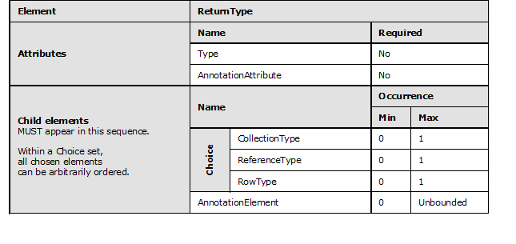
<!-- /Extracted images from page 52 -->

All child elements are to appear in the order indicated. For all child elements within a given choice, the
child elements can be ordered arbitrarily.

#### 2.1.31 ValueTerm

A ValueTerm element is used to define a value term in Entity Data Model (EDM).

The following is an example of a ValueTerm element.

 <ValueTerm Name="Title" Type="Edm.String">

The following rules apply to the ValueTerm element:









The ValueTerm element appears under the Schema element.

The ValueTerm element has a Name attribute that is of type SimpleIdentifier. The Name of a
ValueTerm has to be unique across all named elements that are defined in the same
namespace.

The ValueTerm element MUST have a Type attribute. Type is of the type ComplexType,
primitive type, or EnumType, or a collection of ComplexType or primitive types.

The ValueTerm element can have a DefaultValue attribute to provide a value for the
ValueTerm if the term is applied but has no value specified.

#### 2.1.32 TypeAnnotation

A TypeAnnotation element is used to annotate a model element with a term and provide zero or
more values for the properties of the term.

The following is an example of the TypeAnnotation element.

 <TypeAnnotation Term="ContactInfo">
    <PropertyValue Property="ContactName" String="ContactName1" />
 </TypeAnnotation>

The following rules apply to the TypeAnnotation element:

52 / 126

[MC-CSDL] - v20190313
Conceptual Schema Definition File Format
Copyright © 2019 Microsoft Corporation
Release: March 13, 2019

  TypeAnnotation MUST have a Term attribute defined that is a namespace qualified name,

alias qualified name, or SimpleIdentifier.

  TypeAnnotation can appear only as a child element of the following elements:

  ComplexType



EntityType

  Annotations

  TypeAnnotation can have a Qualifier attribute defined unless the TypeAnnotation is a child
element of an Annotations element that has a Qualifier attribute defined. If a Qualifier is
defined, it has to be a SimpleIdentifier. Qualifier is used to differentiate bindings based on
environmental concerns.

  A TypeAnnotation can contain any number of PropertyValue elements.

#### 2.1.33 PropertyValue

A PropertyValue element is used to assign the result of an expression to a property of a term.

The following is an example of the PropertyValue element.

 <TypeAnnotation Term="ContactInfo">
    <PropertyValue Property="ContactName" String="ContactName1" />
 </TypeAnnotation>

The following rules apply to the PropertyValue element:

  A PropertyValue MUST have a Property attribute defined that is of type SimpleIdentifier.

Property names the property for which the value is supplied.

  A PropertyValue can specify an expression as a child element or as an expression attribute that

gives the value of the property.

  A PropertyValue can have one of the following expression attributes defined in place of a child

element expression. Each of these is equivalent to the same-named expression with the
equivalent spelling:



Path

  String





Int

Float

  Decimal

  Bool

  DateTime

#### 2.1.34 ValueAnnotation

ValueAnnotation is used to attach a named value to a model element.

The following is an example of the ValueAnnotation element.

[MC-CSDL] - v20190313
Conceptual Schema Definition File Format
Copyright © 2019 Microsoft Corporation
Release: March 13, 2019

53 / 126

 <ValueAnnotation Term="Title" String="MyTitle" />
 <ValueAnnotation Term="ReadOnly" />

The following rules apply to the ValueAnnotation element:



The ValueAnnotation element MUST have a Term attribute defined that is a namespace
qualified name, alias qualified name, or SimpleIdentifier.



The ValueAnnotation can appear only as a child element of the following elements:

  Annotations

  Association

  AssociationSet

  ComplexType











EntityContainer

EntitySet

EntityType

FunctionImport

FunctionImport Parameter

  Model Function

  Model Function Parameter

  NavigationProperty



Property

  ValueAnnotation can have a Qualifier attribute defined unless the ValueAnnotation is a child

element of an Annotations element that has a Qualifier attribute defined. If a Qualifier is
defined, it has to be a SimpleIdentifier. Qualifier is used to differentiate bindings based on
external context.

  A ValueAnnotation can specify an expression as a child element or as an expression attribute

that gives the value of the term.

  A ValueAnnotation can have one of the following attributes defined in place of a child element
expression. Each of these is equivalent to the same-named expression with the equivalent
spelling:



Path

  String





Int

Float

  Decimal

  Bool

  DateTime

[MC-CSDL] - v20190313
Conceptual Schema Definition File Format
Copyright © 2019 Microsoft Corporation
Release: March 13, 2019

54 / 126



If a ValueAnnotation has neither a child expression nor an attribute specifying a value, the value
of the annotation is the DefaultValue specified for the annotation, or Null if no DefaultValue is
specified. Note that a Null value for a term is distinct from the absence of a ValueAnnotation
element for that term, in which case the term has no value.

#### 2.1.35 Annotations

The Annotations element is used to group one or more TypeAnnotation or ValueAnnotation elements
that target the same model element.

The following is an example of the Annotations element.

 <Annotations Target="Model" Qualifier="Slate">
     <ValueAnnotation Term="Title" String="ShortTitle" />
 </Annotations>

The following rules apply to the Annotations element:



The Annotations element MUST have a Target attribute defined. The Target attribute names
the element to which the contained TypeAnnotation and ValueAnnotation elements apply.
Target has to be a namespace qualified name, alias qualified name, or FunctionImport
Name.



The Target attribute MUST target one of the following:

  ComplexType











EntitySet

EntityType

EnumType

Function

FunctionImport

  NavigationProperty





Parameter

Property

  ValueTerm

  Entity Data Model (EDM) primitive type

  Annotations can appear only in Schema level.

  Annotations can have a Qualifier attribute that is of type SimpleIdentifier.

  Annotations MUST contain one or more TypeAnnotation or ValueAnnotation elements.

#### 2.1.36 Expressions

Expressions are described as core and extended expressions. Core expressions are required to be
supported by any Entity Data Model (EDM) client.

[MC-CSDL] - v20190313
Conceptual Schema Definition File Format
Copyright © 2019 Microsoft Corporation
Release: March 13, 2019

55 / 126

##### 2.1.36.1 Core Expressions

###### 2.1.36.1.1 Null

Null is an expression that produces an untyped value.

###### 2.1.36.1.2 Primitive Scalar Constant Expressions

The following expression elements are defined as primitive scalar constant expressions:

  String allows any sequence of UTF-8 characters.



Int allows content in the following form: [-] [0-9]+.

  Float allows content in the following form: [0-9]+ ((.[0-9]+) | [E[+ | -][0-9]+]).

  Decimal allows content in the following form: [0-9]+.[0-9]+.

  Bool allows content in the following form: true | false.

  DateTime allows content in the following form: yyyy-mm-ddThh:mm[:ss[.fffffff]].

  DateTimeOffset allows content in the following form: yyyy-mm-ddThh:mm[:ss[.fffffff]]zzzzzz.

  Guid allows content in the following form: dddddddd-dddd-dddd-dddd-dddddddddddd where each

d represents [A-Fa-f0-9].

  Binary allows content in the following form: [A-Fa-f0-9][A-Fa-f0-9]*.

The following is an example of primitive scalar constant expressions.

 <String>text</String>
 <Int>1</Int>
 <Float>3.14159265</Float>
 <Decimal>9.8</Decimal>
 <Bool>true</Bool>
 <DateTime>2011-08-30T14:30:00.00</DateTime>
 <DateTimeOffset>2011-08-30T14:30:00.00-09:00</DateTimeOffset>
 <Guid>707043F1-E7DD-475C-9928-71DA38EA7D57</Guid>
 <Binary>6E67616F766169732E65</Binary>

###### 2.1.36.1.3 Record Expression

The Record expression constructs a record of type EntityType or ComplexType with specified
properties.

The following is an example of the Record expression element.

 <Record>
    <PropertyValue Property="Name">
       <String>AuthorName</String>
    </PropertyValue>
    <PropertyValue Property="LastName">
       <String>AuthorLastName</String>
    </PropertyValue>
 </Record>

The following rule applies to the Record expression element:



The Record expression element can have zero or more PropertyValue elements.

56 / 126

[MC-CSDL] - v20190313
Conceptual Schema Definition File Format
Copyright © 2019 Microsoft Corporation
Release: March 13, 2019

###### 2.1.36.1.4 Collection Expression

The Collection expression element is used to construct elements with multiple values of specified
type.

The Collection expression element is used to construct a collection of zero or more record
expressions or primitive scalar constant expressions.

The following is an example of the Collection expression element.

 <Collection >
    <String>Tag1</String>
    <String>Tag2</String>
    <String>Tag3</String>
 </Collection>

The following rule applies to the Collection expression element:



The Collection expression element can have zero or more record expressions or primitive scalar
constant expressions.

###### 2.1.36.1.5 LabeledElement Expression

A LabeledElement expression is used to assign a name to another expression.

The following is an example of the LabeledElement expression.

 <LabeledElement Name="MyLabel">
    <Int>1</Int>
 </LabeledElement>

The following rules apply to the LabeledElement expression:

  LabeledElement MUST have Name attribute. Name is of the type SimpleIdentifier.

  LabeledElement MUST have one expression element as an attribute or as a child element.

###### 2.1.36.1.6 Path Expression

The Path expression element is used to refer to model elements. A Path expression can resolve to
the following:

  A property of an object

  An enum constant

  An entity set

  A navigation property

A Path expression element can refer to any number of navigation properties that represent an
arbitrary depth. Furthermore, a Path expression element that refers to a navigation property with a
cardinality greater than 1 refers to a collection.

The following is an example of the Path expression element.

 <ValueAnnotation Term="Title">
    <Path>Customer.FirstName</Path>

57 / 126

[MC-CSDL] - v20190313
Conceptual Schema Definition File Format
Copyright © 2019 Microsoft Corporation
Release: March 13, 2019

 </ValueAnnotation>

The following rule applies to the Path expression element:



The value of a Path expression MUST be of the type SimpleIdentifier or QualifiedName.

##### 2.1.36.2 Extended Expressions

###### 2.1.36.2.1 Apply Expression

The Apply expression element is used to apply a function for evaluating a value.

The following is an example of the Apply expression element.

 <ValueAnnotation Term="Email">
    <Apply Function="String.Concat">
      <Path>Alias</Path>
      <String>@Microsoft.com</String>
    </Apply>
 </ValueAnnotation>

The following rules apply to the Apply expression element:





The Apply expression element MUST have a Function attribute which specifies the function to
apply. Function is of type namespace qualified name or an alias qualified name.

The Apply expression element can contain zero or more expression elements that specify the
arguments of the function.

###### 2.1.36.2.2 If Expression

An If expression element is used for conditional evaluations.

The following is an example of the If expression element.

     <ValueAnnotation Term="MyVocabulary.MobilePhone">
         <If>
            <Apply Function="String.Equals">
               <Path>Customer.PhoneType</Path>
               <String>Mobile</String>
            </Apply>
           <Path>Contact.Phone</Path>
           <Null />
         </If>
     </ValueAnnotation>

The following rules apply to the If expression element:



The If expression element MUST have three expression elements as child elements with the
following rules:







The first expression element is interpreted as the test expression and MUST evaluate to a
Boolean result.

The second expression element is evaluated if the test expression evaluates to true.

The third expression element is evaluated if the test expression evaluates to false.

58 / 126

[MC-CSDL] - v20190313
Conceptual Schema Definition File Format
Copyright © 2019 Microsoft Corporation
Release: March 13, 2019



The second and third expression elements MUST be type compatible.

###### 2.1.36.2.3 IsType Expression

An IsType expression tests whether a child element expression is of a given type. The result of the
IsType expression is a Boolean value. The following two examples show how you can use either the
Type attribute or the TypeRef child element to test the type.

In example 1, IsType uses a Type attribute.

 <IsType Type="Edm.String">
    <String>Tag1</String>
 </IsType>

In example 2, IsType uses a nested TypeRef child element.

 <IsType>
    <TypeRef Type="Edm.String" />
    <String>Tag1</String>
 </IsType>

The following rules apply to the IsType expression:





IsType MUST define the type either as an attribute or as a child element TypeRef.

IsType MUST contain one expression as a child element. The expression MUST follow TypeRef if
TypeRef is used to define the type.

###### 2.1.36.2.4 AssertType Expression

An AssertType expression casts a child element expression to a given type. The result of the
AssertType expression is an instance of the specified type or an error. The following two examples
show how you can use either the Type attribute or the ReferenceType child element to assert the
type.

In example 1, AssertType uses a Type attribute.

 <AssertType Type="Edm.String">
    <String>Tag1</String>
 </AssertType>

In example 2, AssertType uses a nested ReferenceType element.

 <AssertType>
    <ReferenceType Type="Edm.String" />
    <String>Tag1</String>
 </AssertType>

The following rules apply to the AssertType expression:

  AssertType MUST define the type, either as an attribute or as a child element ReferenceType.

  AssertType MUST contain one expression as a child element. The expression MUST follow

ReferenceType if ReferenceType is used to define the type.

[MC-CSDL] - v20190313
Conceptual Schema Definition File Format
Copyright © 2019 Microsoft Corporation
Release: March 13, 2019

59 / 126

<!-- Extracted images from page 60 -->
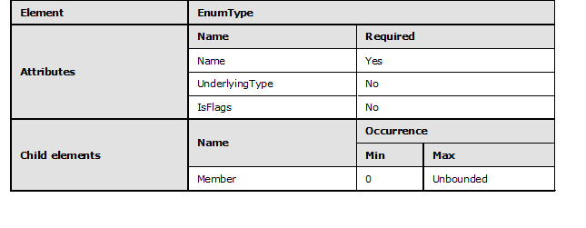
<!-- /Extracted images from page 60 -->

#### 2.1.37 EnumType

An EnumType element is used in CSDL 3.0 to declare an enumeration type. Enumeration types are
scalar types.

An enumeration type has a Name attribute, an optional UnderlyingType attribute, an optional
IsFlags attribute, and a payload that consists of zero or more declared Member elements.

The following is an example of the EnumType element.

 <EnumType Name="ContentType" UnderlyingType="Edm.Int32" IsFlags="true">
    <Member Name="Liquid" Value="1"/>
    <Member Name="Perishable" Value="2"/>
    <Member Name="Edible" Value="4"/>
 </EnumType>

Enumeration types are equal-comparable, order-comparable, and can participate in entity Key
elements—that is, they can be the Key or can be a part of the Key. An enumeration can be
categorized as an EDM type.

The following rules apply to the EnumType element:

  EnumType elements MUST specify a Name attribute that is of type SimpleIdentifier.

  EnumType is a schema level named element and has a unique name.

  EnumType elements can specify an UnderlyingType attribute which is an integral

EDMSimpleType, such as SByte, Int16, Int32, Int64, or Byte. Edm.Int32 is assumed if it is not
specified in the declaration.

  EnumType elements can specify an IsFlags Boolean attribute, which are assumed to be false if it
is not specified in the declaration. If the enumeration type can be treated as a bit field, IsFlags is
set to "true".

  EnumType elements can contain a list of zero or more Member child elements that are referred

to as declared enumeration members.

#### 2.1.38 EnumType Member

A Member element is used inside an EnumType element to declare a member of an enumeration
type.

The following rules apply to declared enumeration type members:

60 / 126

[MC-CSDL] - v20190313
Conceptual Schema Definition File Format
Copyright © 2019 Microsoft Corporation
Release: March 13, 2019

<!-- Extracted images from page 61 -->
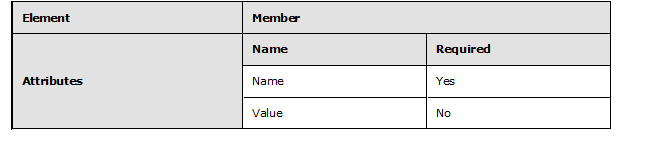
<!-- /Extracted images from page 61 -->

  Member elements MUST specify a Name attribute that is unique within the EnumType

declaration.

  Member elements can specify the Value attribute that is a valid Edm.Long.





The order of the Member elements has meaning and MUST be preserved.

If the value of the Member element is not specified, the value is zero for the first member and
one more than the value of the previous member for subsequent members.

  Multiple members with different Name attributes can have the same Value attributes. When

mapping from a value of the underlying type to a Member of an EnumType, the first matching
Member is used.

#### 2.1.39 Containment NavigationProperty

Containment is specified by using a containment NavigationProperty element. A containment
NavigationProperty is a NavigationProperty that has a ContainsTarget attribute set to "true".

The EntityType that declares the NavigationProperty is the container EntityType.

The AssociationType that is specified in the containment NavigationProperty is the containment
AssociationType.

The EntityType that is specified on the End element of the containment AssociationType, with the
Name that is specified by the containment NavigationProperty element's ToRole attribute, is the
contained EntityType.

When the instances of both the contained entity and the container entity reside in the same
EntitySet, it is called recursive containment.

It MUST NOT be possible for an EntityType to contain itself by following more than one containment
NavigationProperty.

The contained EntityType can have a NavigationProperty that navigates to the container
EntityType via the containment AssociationType.

The End of the containment AssociationType that is specified by the ToRole attribute of the
containment NavigationProperty can have any multiplicity.

For nonrecursive containment, the End of the containment AssociationType that is specified by the
FromRole attribute of the containment NavigationProperty MUST have a multiplicity of '1'.

For recursive containment, the End of the containment AssociationType that is specified by the
FromRole attribute of the containment NavigationProperty MUST have a multiplicity of '0..1'. The
End that is specified by the ToRole cannot have a multiplicity of '1' because this would lead to
endless recursion.

[MC-CSDL] - v20190313
Conceptual Schema Definition File Format
Copyright © 2019 Microsoft Corporation
Release: March 13, 2019

61 / 126

An AssociationSet has to have the same EntitySet on both ends if it is for a containment
AssociationType that has either the same EntityType on both ends or an EntityType on one end
that derives from the EntityType on the other end.

An EntitySet cannot be bound by AssociationSet to more than one AssociationType via a
containment NavigationProperty that indicates that the EntityType (or derived EntityTypes) of
that EntitySet is contained.

Note  Because the EntityType of an EntitySet on an AssociationSet End has to be the same as or
derived from the EntityTypes on the corresponding AssociationType End, the EntitySet MUST be
either completely contained or completely noncontained.

### 2.2 Attributes

#### 2.2.1 EDMSimpleType

The Entity Data Model (EDM) attribute defines an abstract type system that defines the primitive
types that are listed in the following sections. All EDMSimpleTypes are equality comparable unless
the specific section below says otherwise. EDMSimpleType can be categorized as an EDM type.

##### 2.2.1.1 Commonly Applicable Facets

###### 2.2.1.1.1 Nullable

The Nullable facet is a Boolean, which indicates that the Type can be null.

###### 2.2.1.1.2 ReadOnly

The ReadOnly facet is a Boolean, which indicates whether a property can be changed. If ReadOnly is
not specified, its value is assumed to be false.

###### 2.2.1.1.3 Default

The Default facet is a string. Valid values for this facet depend upon the type that is being
referenced. The Default facet MUST NOT be applied to a CollectionType or TypeRef.

Note  ADO.NET Entity Framework does not support the Default facet for an Enum.

##### 2.2.1.2 Binary

The Binary data type is used to represent fixed-length or variable-length binary data.

###### 2.2.1.2.1 Facets

The EDM simple type facets applicable for the binary type are FixedLength and MaxLength.

###### 2.2.1.2.1.1 MaxLength

The maximum size of the declared Binary data type value is specified by the value of the MaxLength
facet. The MaxLength facet accepts a value of the literal string "Max" or a positive integer with value
ranging from 1 to 2^31.

###### 2.2.1.2.1.2 FixedLength

The FixedLength facet is a Boolean that specifies whether the length can vary.

62 / 126

[MC-CSDL] - v20190313
Conceptual Schema Definition File Format
Copyright © 2019 Microsoft Corporation
Release: March 13, 2019

##### 2.2.1.3 Boolean

The Boolean data type is used to represent the mathematical concept of binary valued logic. There
are no applicable facets for this type.

##### 2.2.1.4 DateTime

The DateTime type represents date and time with values ranging from 12:00:00 midnight, January 1,
1753 A.D. through 11:59:59 P.M, December 31, 9999 A.D.

###### 2.2.1.4.1 Facets

###### 2.2.1.4.1.1 Precision

The Precision facet specifies the degree of granularity of the DateTime facet in fractions of a second,
based on the number of decimal places that are supported. The actual values allowed will depend on
the data provider. As an example, if a database allows a Precision of 3, the granularity supported is
milliseconds.

##### 2.2.1.5 Time

The Time type represents a signed duration of time in terms of days, hours, minutes, seconds, and
fractional seconds.

###### 2.2.1.5.1 Facets

###### 2.2.1.5.1.1 Precision

The Precision facet specifies the degree of granularity of the Time type in fractions of a second,
based on the number of decimal places that are supported. The actual values allowed will depend on
the data provider. As an example, if a database allows a Precision of 3, the granularity supported is
milliseconds.

##### 2.2.1.6 DateTimeOffset

The DateTimeOffset type represents date and time as an Offset in minutes from GMT, with values
ranging from 12:00:00 midnight, January 1, 1753 A.D. through 11:59:59 P.M, December 31, 9999
A.D.

###### 2.2.1.6.1 Facets

###### 2.2.1.6.1.1 Precision

The Precision facet specifies the degree of granularity of the DateTimeOffset type in fractions of a
second, based on the number of decimal places that are supported. For example, a Precision of 3
means that the granularity supported is milliseconds.

##### 2.2.1.7 Decimal

The Decimal type represents numeric values with fixed precision and scale. The required precision
and scale can be specified using its optional Precision and Scale facets. The Decimal type can
describe a numeric value ranging from negative 10^255 + 1 to positive 10^255 -1.

###### 2.2.1.7.1 Facets

[MC-CSDL] - v20190313
Conceptual Schema Definition File Format
Copyright © 2019 Microsoft Corporation
Release: March 13, 2019

63 / 126

###### 2.2.1.7.1.1 Precision

The Precision facet is a positive integer that specifies the maximum number of decimal digits that an
instance of the decimal type can have, both to the left and to the right of the decimal point.

###### 2.2.1.7.1.2 Scale

This is a positive integer that specifies the maximum number of decimal digits to the right of the
decimal point that an instance of this type can have. The Scale value can range from 0 through the
specified Precision value. The default Scale is 0.

##### 2.2.1.8 Single

The Single type represents a floating point number with 7 digits precision that can represent values
with approximate range of ± 1.18e -38 through ± 3.40e +38.

##### 2.2.1.9 Double

The Double type represents a floating point number with 15 digits precision that can represent values
with approximate range of ± 2.23e -308 through ± 1.79e +308.

##### 2.2.1.10 Guid

This Guid type, as specified in [RFC4122], represents a 16-byte (128-bit) unique identifier value.

##### 2.2.1.11 SByte

The SByte type represents a signed 8-bit integer value.

##### 2.2.1.12 Int16

The Int16 type represents a signed 16-bit integer value.

##### 2.2.1.13 Int32

The Int32 type represents a signed 32-bit integer value.

##### 2.2.1.14 Int64

The Int64 type represents a signed 64-bit integer value.

##### 2.2.1.15 Byte

The Byte type represents an unsigned 8-bit integer value.

##### 2.2.1.16 String

The String type represents fixed-length or variable-length character data. The EDMSimpleType
facets applicable to String type are described below.

###### 2.2.1.16.1 Facets

The EDMSimpleType facets that are applicable for the String type are Unicode, Collation,
FixedLength, and MaxLength. The facets Unicode and Collation are optional.

64 / 126

[MC-CSDL] - v20190313
Conceptual Schema Definition File Format
Copyright © 2019 Microsoft Corporation
Release: March 13, 2019

###### 2.2.1.16.1.1 Unicode

The Unicode facet is a Boolean value. This value, when set to true, dictates the String type that an
instance will store. By default, UNICODE characters are used, otherwise standard ASCII encoding is
used. The default value for this facet is true.

Note  The String data type does not support the kind of UNICODE to be specified, leaving it to the
concrete type systems hosting EDM to choose the appropriate UNICODE type.

###### 2.2.1.16.1.2 FixedLength

The FixedLength facet is a Boolean value. The Boolean value specifies whether the store requires a
string to be fixed length or not (that is, setting this facet to true would require a fixed-length field
[char or nchar] instead of variable-length [varchar or nvarchar]).

###### 2.2.1.16.1.3 MaxLength

The MaxLength facet specifies the maximum length of an instance of the String type. The
MaxLength facet accepts a value of the literal string "Max" or a positive integer. For Unicode equal
to true, MaxLength can range from 1 to 2^30, or if false, MaxLength can range from 1 to 2^31.

###### 2.2.1.16.1.4 Collation

The Collation facet is a string value that specifies the collating sequence (or sorting sequence) to be
used for performing comparison and ordering operations over string values.

The collating sequence for the applicable data types is as follows:

  Binary

  Boolean

  Byte

  DateTime

  DateTimeOffset



Time

  Decimal

  Double

  Single

  Guid







Int16

Int32

Int64

  String

  SByte

[MC-CSDL] - v20190313
Conceptual Schema Definition File Format
Copyright © 2019 Microsoft Corporation
Release: March 13, 2019

65 / 126

##### 2.2.1.17 Stream

The Stream data type is used to represent fixed-length or variable-length data stream.

###### 2.2.1.17.1 Facets

The EDMSimpleType facets applicable for the String data type are FixedLength and MaxLength.

##### 2.2.1.18 Geography

The Geography type represents any geospatial data type that uses a geographic (round-earth)
coordinate system. Each entity’s data can be of any of the geographic primitive types; Geography
acts as an abstract base class for those types. The subclasses of Geography are GeographyPoint,
GeographyLineString, GeographyPolygon, GeographyCollection, GeographyMultiPoint,
GeographyMultiLineString, and GeographyMultiPolygon. Geography is not equality comparable,
so it cannot be used in keys.

Geography is not an instantiable type. An entity can declare a property to be of type Geography. An
instance of an entity MUST NOT have a value of type Geography. Each value MUST be of some
subtype.

###### 2.2.1.18.1 Facets

The EDMSimpleType facets applicable for the Geography type are SRID. SRID is optional.

###### 2.2.1.18.1.1 SRID

The SRID facet is an Int value. This value corresponds to the System Reference Identifier for the
coordinate system that is used. The valid values and their meanings are as defined by the European
Petroleum Survey Group (EPSG) [EPSG]. If SRID is not specified, the default value of 4326 is
assumed, which corresponds to the WGS 84 datum.

SRID can also have the special value "variable". This means that the SRID is explicitly stated to vary
per entity instance.

##### 2.2.1.19 GeographyPoint

The GeographyPoint type represents a single position in a geographic (round-earth) coordinate
system. GeographyPoint is not equality comparable, so it cannot be used in keys. The meaning of a
GeographyPoint is as the meaning of Point in the OGC Simple Features specification ([OGC-
SFACA/1.2.1] section 6.1.4), but for ellipsoidal coordinates.

###### 2.2.1.19.1 Facets

All facets for the GeographyPoint type behave exactly as for its base type, Geography.

##### 2.2.1.20 GeographyLineString

The GeographyLineString type represents a path in a geographic (round-earth) coordinate system.
GeographyLineString is not equality comparable, so it cannot be used in keys. The meaning of a
GeographyLineString is as the meaning of LineString in the OGC Simple Features specification
([OGC-SFACA/1.2.1] section 6.1.7), except that interpolation between control points is defined to be
along great elliptic arcs.

###### 2.2.1.20.1 Facets

All facets for GeographyLineString behave exactly as for its base type, Geography.

66 / 126

[MC-CSDL] - v20190313
Conceptual Schema Definition File Format
Copyright © 2019 Microsoft Corporation
Release: March 13, 2019

##### 2.2.1.21 GeographyPolygon

The GeographyPolygon type represents a surface in a geographic (round-earth) coordinate system.
GeographyPolygon is not equality comparable, so it cannot be used in keys. The meaning of a
GeographyPolygon is as the meaning of Polygon in the OGC Simple Features specification ([OGC-
SFACA/1.2.1] section 6.1.11), except for ellipsoidal coordinates.

###### 2.2.1.21.1 Facets

All facets for GeographyPolygon behave exactly as for its base type, Geography.

##### 2.2.1.22 GeographyCollection

The GeographyCollection type represents a Geography that is defined as the union of a set of
Geography instances. GeographyCollection is not equality comparable, so it cannot be used in
keys. The meaning of a GeographyCollection is as the meaning of GeometryCollection in the OGC
Simple Features specification ([OGC-SFACA/1.2.1] section 6.1.3), but for ellipsoidal coordinates.

###### 2.2.1.22.1 Facets

All facets for GeographyCollection behave exactly as for its base type, Geography.

##### 2.2.1.23 GeographyMultiPoint

The GeographyMultiPoint type represents a Geography that is defined as the union of a set of
GeographyPoint instances. GeographyMultiPoint is not equality comparable, so it cannot be used
in keys. The meaning of a GeographyMultiPoint is as the meaning of MultiPoint in the OGC Simple
Features specification ([OGC-SFACA/1.2.1] section 6.1.5), but for ellipsoidal coordinates.

###### 2.2.1.23.1 Facets

All facets for GeographyMultiPoint behave exactly as for its base type, Geography.

##### 2.2.1.24 GeographyMultiLineString

The GeographyMultiLineString type represents a Geography that is defined as the union of a set
of GeographyLineString instances. GeographyMultiLineString is not equality comparable, so it
cannot be used in keys. The meaning of a GeographyMultiLineString is as the meaning of
MultiLineString in the OGC Simple Features specification ([OGC-SFACA/1.2.1] section 6.1.9), but for
ellipsoidal coordinates.

###### 2.2.1.24.1 Facets

All facets for GeographyMultiLineString behave exactly as for its base type, Geography.

##### 2.2.1.25 GeographyMultiPolygon

The GeographyMultiPolygon type represents a Geography that is defined as the union of a set of
GeographyPolygon instances. GeographyMultiPolygon is not equality comparable, so it cannot be
used in keys. The meaning of a GeographyMultiPolygon is as the meaning of MultiPolygon in the
OGC Simple Features specification ([OGC-SFACA/1.2.1] section 6.1.14), but for ellipsoidal
coordinates.

###### 2.2.1.25.1 Facets

All facets for GeographyMultiPolygon behave exactly as for its base type, Geography.

67 / 126

[MC-CSDL] - v20190313
Conceptual Schema Definition File Format
Copyright © 2019 Microsoft Corporation
Release: March 13, 2019

##### 2.2.1.26 Geometry

The Geometry type represents any geospatial data type that uses a geometric (flat-earth) coordinate
system. Each entity’s data can be of any of the geometric primitive types; Geometry acts as an
abstract base class for those types. The subclasses of Geometry are GeometryPoint,
GeometryLineString, GeometryPolygon, GeometryCollection, GeometryMultiPoint,
GeometryMultiLineString, and GeometryMultiPolygon. Geometry is not equality comparable, so
it cannot be used in keys.

Geometry is not an instantiable type. An entity can declare a property to be of type Geometry. An
instance of an entity MUST NOT have a value of type Geometry. Each value MUST be of some
subtype.

###### 2.2.1.26.1 Facets

The EDM simple type facets applicable for this type are SRID. SRID is optional.

###### 2.2.1.26.1.1 SRID

The SRID facet is an Int value. This value corresponds to the System Reference Identifier for the
coordinate system that is used. The valid values and their meanings are as defined by the European
Petroleum Survey Group (EPSG) [EPSG]. If SRID is not specified, the default value of 0 is assumed,
which corresponds to a unitless planar coordinate system without a defined origin.

SRID can also have the special value "variable". This means that the SRID is explicitly stated to vary
per entity instance.

##### 2.2.1.27 GeometryPoint

The GeometryPoint type represents a single position in a geometric (flat-earth) coordinate system.
GeometryPoint is not equality comparable, so it cannot be used in keys. The meaning of a
GeometryPoint is as the meaning of Point in the OGC Simple Features specification ([OGC-
SFACA/1.2.1] section 6.1.4).

###### 2.2.1.27.1 Facets

All facets for GeometryPoint behave exactly as for its base type, Geometry.

##### 2.2.1.28 GeometryLineString

The GeometryLineString type represents a path in a geometric (flat-earth) coordinate system.
GeometryLineString is not equality comparable, so it cannot be used in keys. The meaning of a
GeometryLineString is as the meaning of LineString in the OGC Simple Features specification
([OGC-SFACA/1.2.1] section 6.1.7).

###### 2.2.1.28.1 Facets

All facets for GeometryLineString behave exactly as for its base type, Geometry.

##### 2.2.1.29 GeometryPolygon

The GeometryPolygon type represents a surface in a geometric (flat-earth) coordinate system.
GeometryPolygon is not equality comparable, so it cannot be used in keys. The meaning of a
GeometryPolygon is as the meaning of Polygon in the OGC Simple Features specification ([OGC-
SFACA/1.2.1] section 6.1.11).

###### 2.2.1.29.1 Facets

[MC-CSDL] - v20190313
Conceptual Schema Definition File Format
Copyright © 2019 Microsoft Corporation
Release: March 13, 2019

68 / 126

All facets for GeometryPolygon behave exactly as for its base type, Geometry.

##### 2.2.1.30 GeometryCollection

The GeometryCollection type represents a Geometry that is defined as the union of a set of
Geometry instances. GeometryCollection is not equality comparable, so it cannot be used in keys.
The meaning of a GeometryCollection is as the meaning of GeometryCollection in the OGC Simple
Features specification ([OGC-SFACA/1.2.1] section 6.1.3).

###### 2.2.1.30.1 Facets

All facets for GeometryCollection behave exactly as for its base type, Geometry.

##### 2.2.1.31 GeometryMultiPoint

The GeometryMultiPoint type represents a Geometry that is defined as the union of a set of
GeometryPoint instances. GeometryMultiPoint is not equality comparable, so it cannot be used in
keys. The meaning of a GeometryMultiPoint is as the meaning of MultiPoint in the OGC Simple
Features specification ([OGC-SFACA/1.2.1] section 6.1.5).

###### 2.2.1.31.1 Facets

All facets for GeometryMultiPoint behave exactly as for its base type, Geometry.

##### 2.2.1.32 GeometryMultiLineString

The GeometryMultiLineString type represents a Geometry that is defined as the union of a set of
GeometryLineString instances. GeometryMultiLineString is not equality comparable, so it cannot
be used in keys. The meaning of a GeometryMultiLineString is as the meaning of MultiLineString
in the OGC Simple Features specification ([OGC-SFACA/1.2.1] section 6.1.9).

###### 2.2.1.32.1 Facets

All facets for GeometryMultiLineString behave exactly as for its base type, Geometry.

##### 2.2.1.33 GeometryMultiPolygon

The GeometryMultiPolygon type represents a Geometry that is defined as the union of a set of
GeometryPolygon instances. GeometryMultiPolygon is not equality comparable, so it cannot be
used in keys. The meaning of a GeometryMultiPolygon is as the meaning of MultiPolygon in the
OGC Simple Features specification ([OGC-SFACA/1.2.1] section 6.1.14).

###### 2.2.1.33.1 Facets

All facets for GeometryMultiPolygon behave exactly as for its base type, Geometry.

#### 2.2.2 Action

Action can either be "Cascade" or "None".

The cascade action implies that the operation to delete an entity deletes the relationship instance and
then applies the action on the entity-instance at the other end of the relationship. For example, when
a Customer is deleted, the cascade action specifies to delete all Orders that belong to that Customer.

[MC-CSDL] - v20190313
Conceptual Schema Definition File Format
Copyright © 2019 Microsoft Corporation
Release: March 13, 2019

69 / 126

#### 2.2.3 Multiplicity

The Multiplicity of a relationship describes the cardinality or number of instances of an EntityType
that can be associated with the instances of another EntityType.

The possible types of multiplicity are as follows: one-to-one, one-to-many, zero-one to one, zero-one
to many, and many-to-many.

#### 2.2.4 ConcurrencyMode

ConcurrencyMode is a special facet that can be applied to any primitive Entity Data Model (EDM)
type. Possible values are "None", which is the default, and "Fixed".

When used on an EntityType property, ConcurrencyMode specifies that the value of that declared
property is used for optimistic concurrency checks. Essentially, declared properties marked with a
fixed ConcurrencyMode become part of a ConcurrencyToken.

The following rules apply to ConcurrencyMode:





The property's type MUST be a simple type. It cannot be applied to properties of a ComplexType.

The property MUST be a declared property.

#### 2.2.5 QualifiedName

QualifiedName is a string-based representation of the name of the element or attribute.

The following pattern represents the allowed identifiers for QualifiedName.

 Value="[\p{L}\p{Nl}][\p{L}\p{Nl}\p{Nd}\p{Mn}\p{Mc}\p{Pc}\p{Cf}]{0,}(\.[\p{L}\p{Nl}][\p{L}\p{N
l}\p{Nd}\p{Mn}\p{Mc}\p{Pc}\p{Cf}]{0,}){0,}"

#### 2.2.6 SimpleIdentifier

SimpleIdentifier is a string-based representation. The maximum length of the identifier MUST be
less than 480.

The following pattern represents the allowed identifiers in the ECMA specification as specified in
[ECMA-334] sections 9.4.2 and A.1.6.

 value="[\p{L}\p{Nl}][\p{L}\p{Nl}\p{Nd}\p{Mn}\p{Mc}\p{Pc}\p{Cf}]{0,}"

#### 2.2.7 AnnotationAttribute

An AnnotationAttribute is a custom XML attribute that is applied to a CSDL element. The attribute
can belong to any XML namespace (as defined in [XMLNS-2ED]) that is not in the list of reserved
XML namespaces for CSDL. Consult the reference for each CSDL element within this document to
determine whether AnnotationAttribute can be used for that element.

#### 2.2.8 OpenType

OpenType is a facet that can be applied to any EntityType. Possible values are "false", which is the
default, and "true".

[MC-CSDL] - v20190313
Conceptual Schema Definition File Format
Copyright © 2019 Microsoft Corporation
Release: March 13, 2019

70 / 126

EntityType elements marked with OpenType="false" or EntityType elements that do not explicitly
include an OpenType attribute indicate that the element defines an EntityType. EntityType
elements marked with OpenType="true" indicate that the element defines an OpenEntityType.

#### 2.2.9 TypeTerm

TypeTerm is a base type that is used to define vocabulary terms.

### 2.3 Facet Application

Facets apply to the nominal type referenced in the element where the facet is declared. In the
following example, the Nullable facet applies to the DateTime referenced type.

 <Property Name="SuggestedTimes" Type="Collection(DateTime)" Nullable="true" />

In the following example, the Nullable facet can only be placed on the child element that references
the DateTime type. Facets cannot be applied to Collection type references.

 <ReturnType>
       <CollectionType TypeRef="DateTime" Nullable="true" />
 </ReturnType>

[MC-CSDL] - v20190313
Conceptual Schema Definition File Format
Copyright © 2019 Microsoft Corporation
Release: March 13, 2019

71 / 126

## 3 Structure Examples

The following example shows a conceptual schema definition language (CSDL) that defines:

  Customer, Order, and Product entity types.

  Association (CustomerOrder) that associates Customer and Order entity types.

  SalesOrder entity type that has Order as the BaseType.

  Address complex type.

 <Schema xmlns="http://schemas.microsoft.com/ado/2009/11/edm" Namespace="Model1" Alias="Self">
   <EntityContainer Name="Model1Container" >
     <EntitySet Name="CustomerSet" EntityType="Model1.Customer" />
     <EntitySet Name="OrderSet" EntityType="Model1.Order" />
     <AssociationSet Name="CustomerOrder" Association="Model1.CustomerOrder">
       <End Role="Customer" EntitySet="CustomerSet" />
       <End Role="Order" EntitySet="OrderSet" />
     </AssociationSet>
   </EntityContainer>
   <EntityType Name="Customer">
     <Key>
       <PropertyRef Name="CustomerId" />
     </Key>
     <Property Name="CustomerId" Type="Int32" Nullable="false" />
     <Property Name="FirstName" Type="String" Nullable="true" />
     <Property Name="LastName" Type="String" Nullable="true" />
     <Property Name="AccountNumber" Type="Int32" Nullable="true" />
     <Property Name="Address" Type="Self.Address" Nullable="false" />
     <NavigationProperty Name="Orders" Relationship="Model1.CustomerOrder" FromRole="Customer"
ToRole="Order" />
   </EntityType>
   <EntityType Name="Order">
     <Key>
       <PropertyRef Name="OrderId" />
     </Key>
     <Property Name="OrderId" Type="Int32" Nullable="false" />
     <Property Name="OrderDate" Type="Int32" Nullable="true" />
     <Property Name="Description" Type="String" Nullable="true" />
     <NavigationProperty Name="Customer" Relationship="Model1.CustomerOrder" FromRole="Order"
ToRole="Customer" />
   </EntityType>
   <EntityType Name="SalesOrder" BaseType="Self.Order">
     <Property Name="Paid" Type="Boolean" Nullable="false" />
   </EntityType>
   <EntityType OpenType="true" Name="Product">
     <Key>
       <PropertyRef Name="ProductId" />
     </Key>
     <Property Name="ProductId" Type="Int32" Nullable="false" />
     <Property Name="Name" Type="String" Nullable="false" />
     <Property Name="Description" Type="String" Nullable="true" />
   </EntityType>
   <Association Name="CustomerOrder">
     <End Type="Model1.Customer" Role="Customer" Multiplicity="1" />
     <End Type="Model1.Order" Role="Order" Multiplicity="*" />
   </Association>
   <ComplexType Name="Address">
     <Property Name="Street" Type="String" Nullable="false" />
     <Property Name="City" Type="String" Nullable="false" />
     <Property Name="State" Type="String" Nullable="false" />
     <Property Name="Zip" Type="String" Nullable="false" />
     <Property Name="Position" Type="GeographyPoint" Nullable="false" SRID="4326" />
   </ComplexType>
 </Schema>

72 / 126

[MC-CSDL] - v20190313
Conceptual Schema Definition File Format
Copyright © 2019 Microsoft Corporation
Release: March 13, 2019

### 3.1 ValueAnnotation

The following examples show a conceptual schema definition language (CSDL) in which Model1 is
extended with ValueAnnotation.

 <Schema xmlns="http://schemas.microsoft.com/ado/2009/11/edm" Namespace="Model1" Alias="Self">
   <Using Alias="Vocabulary1" Namespace="Vocabulary1" />
   <EntityContainer Name="Model1Container" >
     <EntitySet Name="CustomerSet" EntityType="Model1.Customer" />
     <EntitySet Name="OrderSet" EntityType="Model1.Order" />
     <AssociationSet Name="CustomerOrder" Association="Model1.CustomerOrder">
       <End Role="Customer" EntitySet="CustomerSet" />
       <End Role="Order" EntitySet="OrderSet" />
     </AssociationSet>
   </EntityContainer>
   <Annotations Target="Self.Customer">
     <ValueAnnotation Term="Vocabulary1.EMail">
       <Null />
     </ValueAnnotation>
     <ValueAnnotation Term="AccountID" Path="AccountNumber" />
     <ValueAnnotation Term="Title" String="Customer Info"/>
   </Annotations>
   <EntityType Name="Customer">
     <Key>
       <PropertyRef Name="CustomerId" />
     </Key>
     <Property Name="CustomerId" Type="Int32" Nullable="false" />
     <Property Name="FirstName" Type="String" Nullable="true" />
     <Property Name="LastName" Type="String" Nullable="true" />
     <Property Name="AccountNumber" Type="Int32" Nullable="true" />
     <Property Name="Address" Type="Self.Address" Nullable="false" />
     <NavigationProperty Name="Orders" Relationship="Model1.CustomerOrder" FromRole="Customer"
 ToRole="Order" />
   </EntityType>
   <EntityType Name="Order">
     <Key>
       <PropertyRef Name="OrderId" />
     </Key>
     <Property Name="OrderId" Type="Int32" Nullable="false" />
     <Property Name="OrderDate" Type="Int32" Nullable="true" />
     <Property Name="Description" Type="String" Nullable="true" />
     <NavigationProperty Name="Customer" Relationship="Model1.CustomerOrder" FromRole="Order"
ToRole="Customer" />
   </EntityType>
   <EntityType Name="SalesOrder" BaseType="Self.Order">
     <Property Name="Paid" Type="Boolean" Nullable="false" />
   </EntityType>
   <EntityType OpenType="true" Name="Product">
     <Key>
       <PropertyRef Name="ProductId" />
     </Key>
     <Property Name="ProductId" Type="Int32" Nullable="false" />
     <Property Name="Name" Type="String" Nullable="false" />
     <Property Name="Description" Type="String" Nullable="true" />
   </EntityType>
   <Association Name="CustomerOrder">
     <End Type="Model1.Customer" Role="Customer" Multiplicity="1" />
     <End Type="Model1.Order" Role="Order" Multiplicity="*" />
   </Association>
   <ComplexType Name="Address">
     <Property Name="Street" Type="String" Nullable="false" />
     <Property Name="City" Type="String" Nullable="false" />
     <Property Name="State" Type="String" Nullable="false" />
     <Property Name="Zip" Type="String" Nullable="false" />
     <Property Name="Position" Type="GeographyPoint" Nullable="false" SRID="4326" />
   </ComplexType>
 </Schema>

73 / 126

[MC-CSDL] - v20190313
Conceptual Schema Definition File Format
Copyright © 2019 Microsoft Corporation
Release: March 13, 2019

### 3.2 ValueTerm and Edm.TypeTerm

The following example shows a conceptual schema definition language (CSDL) where the
ValueTerm and an entity type that is derived from Edm.TypeTerm that is used in the previous
example is defined.

 <Schema xmlns="http://schemas.microsoft.com/ado/2009/11/edm"
         Namespace="Model1"
         Alias="Self">
   <ValueTerm Name="Title" Type="String" />
   <EntityType Name="Person" BaseType="Edm.TypeTerm">
     <Property Name="DisplayName" Type="String" Nullable="true" />
     <Property Name="Email" Type="String" Nullable="true" />
     <Property Name="AccountID" Type="Int32" Nullable="false" />
   </EntityType>
 </Schema>

[MC-CSDL] - v20190313
Conceptual Schema Definition File Format
Copyright © 2019 Microsoft Corporation
Release: March 13, 2019

74 / 126

## 4 Security Considerations

None.

[MC-CSDL] - v20190313
Conceptual Schema Definition File Format
Copyright © 2019 Microsoft Corporation
Release: March 13, 2019

75 / 126

## 5 Appendix A: Full XML Schemas

For ease of implementation, full XML schemas are provided in the following sections.

Schema name

Prefix  Section

CSDL Schema 1.0  xs:

CSDL Schema 1.1  xs:

CSDL Schema 2.0  xs:

CSDL Schema 3.0  xs:

5.1

5.2

5.3

5.4

### 5.1 CSDL Schema 1.0

 <?xml version="1.0" encoding="utf-8"?>
 <xs:schema elementFormDefault="qualified" attributeFormDefault="unqualified"
xmlns:xs="http://www.w3.org/2001/XMLSchema"
xmlns:cg="http://schemas.microsoft.com/ado/2006/04/codegeneration"
xmlns:edm="http://schemas.microsoft.com/ado/2006/04/edm"
targetNamespace="http://schemas.microsoft.com/ado/2006/04/edm">
   <xs:annotation>
     <xs:documentation xml:lang="en">
             Common Data Model Schema Definition Language.
             Copyright (c) Microsoft Corp. All rights reserved.
         </xs:documentation>
   </xs:annotation>
   <xs:import namespace="http://schemas.microsoft.com/ado/2006/04/codegeneration"
schemaLocation="System.Data.Resources.CodeGenerationSchema.xsd" />
   <xs:element name="Schema" type="edm:TSchema" />
   <xs:complexType name="TSchema">
     <xs:sequence>
       <xs:group ref="edm:GSchemaBodyElements" minOccurs="0" maxOccurs="unbounded" />
       <xs:any namespace="##other" processContents="lax" minOccurs="0" maxOccurs="unbounded"
/>
     </xs:sequence>
     <xs:attribute name="Namespace" type="edm:TNamespaceName" use="required" />
     <xs:attribute name="Alias" type="edm:TSimpleIdentifier" use="optional" />
     <xs:anyAttribute namespace="##other" processContents="lax" />
   </xs:complexType>
   <xs:group name="GSchemaBodyElements">
     <xs:choice>
       <xs:element name="Using" type="edm:TUsing" minOccurs="0" maxOccurs="unbounded" />
       <xs:element name="Association" type="edm:TAssociation" minOccurs="0"
maxOccurs="unbounded" />
       <xs:element name="ComplexType" type="edm:TComplexType" minOccurs="0"
maxOccurs="unbounded" />
       <xs:element name="EntityType" type="edm:TEntityType" minOccurs="0"
maxOccurs="unbounded" />
       <xs:element ref="edm:EntityContainer" minOccurs="1" maxOccurs="1" />
     </xs:choice>
   </xs:group>
   <!-- EDM SimpleType instances for use by EDM Instance documents-->
   <xs:simpleType name="EDMSimpleType">
     <xs:restriction base="xs:string">
       <xs:enumeration value="Binary" />
       <xs:enumeration value="Boolean" />
       <xs:enumeration value="Byte" />
       <xs:enumeration value="DateTime" />
       <xs:enumeration value="DateTimeOffset" />
       <xs:enumeration value="Time" />
       <xs:enumeration value="Decimal" />

76 / 126

[MC-CSDL] - v20190313
Conceptual Schema Definition File Format
Copyright © 2019 Microsoft Corporation
Release: March 13, 2019

       <xs:enumeration value="Double" />
       <xs:enumeration value="Single" />
       <xs:enumeration value="Guid" />
       <xs:enumeration value="Int16" />
       <xs:enumeration value="Int32" />
       <xs:enumeration value="Int64" />
       <xs:enumeration value="String" />
       <xs:enumeration value="SByte" />
     </xs:restriction>
   </xs:simpleType>
   <xs:simpleType name="TMax">
     <xs:restriction base="xs:string">
       <xs:enumeration value="Max" />
     </xs:restriction>
   </xs:simpleType>
   <!-- Facets for Primitive types -->
   <xs:simpleType name="TMaxLengthFacet">
     <xs:union memberTypes="edm:TMax xs:nonNegativeInteger  " />
   </xs:simpleType>
   <xs:simpleType name="TIsFixedLengthFacet">
     <xs:restriction base="xs:boolean" />
   </xs:simpleType>
   <xs:simpleType name="TPrecisionFacet">
     <xs:restriction base="xs:nonNegativeInteger" />
   </xs:simpleType>
   <xs:simpleType name="TScaleFacet">
     <xs:restriction base="xs:nonNegativeInteger" />
   </xs:simpleType>
   <xs:simpleType name="TIsUnicodeFacet">
     <xs:restriction base="xs:boolean" />
   </xs:simpleType>
   <xs:simpleType name="TCollationFacet">
     <xs:restriction base="xs:string" />
   </xs:simpleType>
   <!--
         types at all levels
     -->
   <xs:complexType name="TDocumentation">
     <xs:annotation>
       <xs:documentation>The Documentation element is used to provide documentation of
comments on the contents of the XML file.  It is valid under Schema, Type, Index and
Relationship elements.</xs:documentation>
     </xs:annotation>
     <xs:sequence>
       <xs:element name="Summary" type="edm:TText" minOccurs="0" maxOccurs="1" />
       <xs:element name="LongDescription" type="edm:TText" minOccurs="0" maxOccurs="1" />
     </xs:sequence>
     <xs:anyAttribute processContents="lax" namespace="##other" />
   </xs:complexType>
   <xs:complexType name="TText" mixed="true">
     <xs:sequence>
       <xs:any namespace="##other" processContents="lax" minOccurs="0" maxOccurs="unbounded"
/>
     </xs:sequence>
     <xs:anyAttribute processContents="lax" namespace="##other" />
   </xs:complexType>
   <xs:complexType name="TXmlOrText" mixed="true">
     <xs:annotation>
       <xs:documentation>This type allows pretty much any content</xs:documentation>
     </xs:annotation>
     <xs:sequence>
       <xs:any namespace="##any" processContents="skip" minOccurs="0" maxOccurs="unbounded" />
     </xs:sequence>
     <xs:anyAttribute processContents="skip" namespace="##any" />
   </xs:complexType>
   <!--
         types of the top level elements
     -->
   <xs:complexType name="TUsing">

77 / 126

[MC-CSDL] - v20190313
Conceptual Schema Definition File Format
Copyright © 2019 Microsoft Corporation
Release: March 13, 2019

     <xs:sequence>
       <xs:group ref="edm:GEmptyElementExtensibility" minOccurs="0" maxOccurs="1" />
     </xs:sequence>
     <xs:attribute name="Namespace" type="edm:TNamespaceName" use="required" />
     <xs:attribute name="Alias" type="edm:TSimpleIdentifier" use="required" />
     <xs:anyAttribute namespace="##other" processContents="lax" />
   </xs:complexType>
   <xs:complexType name="TAssociation">
     <xs:sequence>
       <xs:element name="Documentation" type="edm:TDocumentation" minOccurs="0" maxOccurs="1"
/>
       <xs:element name="End" type="edm:TAssociationEnd" minOccurs="2" maxOccurs="2" />
       <xs:element name="ReferentialConstraint" type="edm:TConstraint" minOccurs="0"
maxOccurs="1" />
       <xs:any namespace="##other" processContents="lax" minOccurs="0" maxOccurs="unbounded"
/>
     </xs:sequence>
     <xs:attribute name="Name" type="edm:TSimpleIdentifier" use="required" />
     <xs:anyAttribute namespace="##other" processContents="lax" />
   </xs:complexType>
   <xs:complexType name="TComplexType">
     <xs:sequence>
       <xs:element name="Documentation" type="edm:TDocumentation" minOccurs="0" maxOccurs="1"
/>
       <xs:element name="Property" type="edm:TComplexTypeProperty" minOccurs="0"
maxOccurs="unbounded" />
       <xs:any namespace="##other" processContents="lax" minOccurs="0" maxOccurs="unbounded"
/>
     </xs:sequence>
     <xs:attributeGroup ref="edm:TTypeAttributes" />
     <xs:attribute ref="cg:TypeAccess" use="optional" />
     <xs:anyAttribute namespace="##other" processContents="lax" />
   </xs:complexType>
   <xs:complexType name="TConstraint">
     <xs:sequence>
       <xs:element name="Documentation" type="edm:TDocumentation" minOccurs="0" maxOccurs="1"
/>
       <xs:element name="Principal" type="edm:TReferentialConstraintRoleElement" minOccurs="1"
maxOccurs="1" />
       <xs:element name="Dependent" type="edm:TReferentialConstraintRoleElement" minOccurs="1"
maxOccurs="1" />
       <xs:any namespace="##other" processContents="lax" minOccurs="0" maxOccurs="unbounded"
/>
     </xs:sequence>
     <xs:anyAttribute namespace="##other" processContents="lax" />
   </xs:complexType>
   <xs:complexType name="TReferentialConstraintRoleElement">
     <xs:sequence>
       <xs:element name="PropertyRef" type="edm:TPropertyRef" minOccurs="1"
maxOccurs="unbounded" />
     </xs:sequence>
     <xs:attribute name="Role" type="edm:TSimpleIdentifier" use="required" />
   </xs:complexType>
   <xs:complexType name="TNavigationProperty">
     <xs:sequence>
       <xs:group ref="edm:GEmptyElementExtensibility" minOccurs="0" maxOccurs="1" />
     </xs:sequence>
     <xs:attribute name="Name" type="edm:TSimpleIdentifier" use="required" />
     <xs:attribute name="Relationship" type="edm:TQualifiedName" use="required" />
     <xs:attribute name="ToRole" type="edm:TSimpleIdentifier" use="required" />
     <xs:attribute name="FromRole" type="edm:TSimpleIdentifier" use="required" />
     <xs:attribute ref="cg:GetterAccess" use="optional" />
     <xs:attribute ref="cg:SetterAccess" use="optional" />
     <xs:anyAttribute namespace="##other" processContents="lax" />
   </xs:complexType>
   <xs:complexType name="TEntityType">
     <xs:sequence>
       <xs:element name="Documentation" type="edm:TDocumentation" minOccurs="0" maxOccurs="1"
/>

78 / 126

[MC-CSDL] - v20190313
Conceptual Schema Definition File Format
Copyright © 2019 Microsoft Corporation
Release: March 13, 2019

       <xs:element name="Key" type="edm:TEntityKeyElement" minOccurs="0" maxOccurs="1" />
       <xs:choice minOccurs="0" maxOccurs="unbounded">
         <xs:element name="Property" type="edm:TEntityProperty" minOccurs="0"
maxOccurs="unbounded" />
         <xs:element name="NavigationProperty" type="edm:TNavigationProperty" minOccurs="0"
maxOccurs="unbounded" />
       </xs:choice>
       <xs:any namespace="##other" processContents="lax" minOccurs="0" maxOccurs="unbounded"
/>
     </xs:sequence>
     <xs:attributeGroup ref="edm:TDerivableTypeAttributes" />
     <xs:attribute ref="cg:TypeAccess" use="optional" />
     <xs:anyAttribute namespace="##other" processContents="lax" />
   </xs:complexType>
   <xs:complexType name="TEntityKeyElement">
     <xs:sequence>
       <xs:element name="PropertyRef" type="edm:TPropertyRef" minOccurs="1"
maxOccurs="unbounded" />
     </xs:sequence>
   </xs:complexType>
   <xs:complexType name="TPropertyRef">
     <xs:attribute name="Name" type="edm:TSimpleIdentifier" use="required" />
   </xs:complexType>
   <xs:group name="GEmptyElementExtensibility">
     <xs:sequence>
       <xs:element name="Documentation" type="edm:TDocumentation" minOccurs="0" maxOccurs="1"
/>
       <xs:any namespace="##other" processContents="lax" minOccurs="0" maxOccurs="unbounded"
/>
     </xs:sequence>
   </xs:group>
   <!--
         base types
     -->
   <xs:complexType name="TAssociationEnd">
     <xs:sequence>
       <xs:element name="Documentation" type="edm:TDocumentation" minOccurs="0" maxOccurs="1"
/>
       <xs:group ref="edm:TOperations" minOccurs="0" maxOccurs="unbounded" />
       <xs:any namespace="##other" processContents="lax" minOccurs="0" maxOccurs="unbounded"
/>
     </xs:sequence>
     <xs:attribute name="Type" type="edm:TQualifiedName" use="required" />
     <xs:attribute name="Role" type="edm:TSimpleIdentifier" use="optional" />
     <xs:attribute name="Multiplicity" type="edm:TMultiplicity" use="required" />
     <xs:anyAttribute namespace="##other" processContents="lax" />
   </xs:complexType>
   <xs:group name="TOperations">
     <xs:choice>
       <xs:element name="OnDelete" type="edm:TOnAction" maxOccurs="1" minOccurs="0" />
     </xs:choice>
   </xs:group>
   <xs:complexType name="TOnAction">
     <xs:sequence>
       <xs:group ref="edm:GEmptyElementExtensibility" minOccurs="0" maxOccurs="1" />
     </xs:sequence>
     <xs:attribute name="Action" type="edm:TAction" use="required" />
     <xs:anyAttribute namespace="##other" processContents="lax" />
   </xs:complexType>
   <xs:complexType name="TEntityProperty">
     <xs:sequence>
       <xs:group ref="edm:GEmptyElementExtensibility" minOccurs="0" maxOccurs="1" />
     </xs:sequence>
     <xs:attributeGroup ref="edm:TCommonPropertyAttributes" />
     <xs:anyAttribute namespace="##other" processContents="lax" />
   </xs:complexType>
   <xs:complexType name="TComplexTypeProperty">
     <xs:sequence>
       <xs:group ref="edm:GEmptyElementExtensibility" minOccurs="0" maxOccurs="1" />

79 / 126

[MC-CSDL] - v20190313
Conceptual Schema Definition File Format
Copyright © 2019 Microsoft Corporation
Release: March 13, 2019

     </xs:sequence>
     <xs:attributeGroup ref="edm:TCommonPropertyAttributes" />
     <xs:anyAttribute namespace="##other" processContents="lax" />
   </xs:complexType>
   <xs:complexType name="TFunctionImportParameter">
     <xs:sequence>
       <xs:group ref="edm:GEmptyElementExtensibility" minOccurs="0" maxOccurs="1" />
     </xs:sequence>
     <xs:attributeGroup ref="edm:TFunctionImportParameterAttributes" />
     <xs:anyAttribute namespace="##other" processContents="lax" />
   </xs:complexType>
   <xs:attributeGroup name="TCommonPropertyAttributes">
     <xs:attribute name="Name" type="edm:TSimpleIdentifier" use="required" />
     <xs:attribute name="Type" type="edm:TPropertyType" use="required" />
     <xs:attribute name="Nullable" type="xs:boolean" default="true" use="optional" />
     <xs:attribute name="DefaultValue" type="xs:string" use="optional" />
     <!-- Start Facets -->
     <xs:attribute name="MaxLength" type="edm:TMaxLengthFacet" use="optional" />
     <xs:attribute name="FixedLength" type="edm:TIsFixedLengthFacet" use="optional" />
     <xs:attribute name="Precision" type="edm:TPrecisionFacet" use="optional" />
     <xs:attribute name="Scale" type="edm:TScaleFacet" use="optional" />
     <xs:attribute name="Unicode" type="edm:TIsUnicodeFacet" use="optional" />
     <xs:attribute name="Collation" type="edm:TCollationFacet" use="optional" />
     <!--End Facets -->
     <xs:attribute name="ConcurrencyMode" type="edm:TConcurrencyMode" use="optional" />
     <xs:attribute ref="cg:SetterAccess" use="optional" />
     <xs:attribute ref="cg:GetterAccess" use="optional" />
   </xs:attributeGroup>
   <xs:attributeGroup name="TFunctionImportParameterAttributes">
     <xs:attribute name="Name" type="edm:TSimpleIdentifier" use="required" />
     <xs:attribute name="Type" type="edm:TPropertyType" use="required" />
     <xs:attribute name="Mode" type="edm:TParameterMode" use="optional" />
     <xs:attribute name="MaxLength" type="edm:TMaxLengthFacet" use="optional" />
     <xs:attribute name="Precision" type="edm:TPrecisionFacet" use="optional" />
     <xs:attribute name="Scale" type="edm:TScaleFacet" use="optional" />
     <xs:anyAttribute namespace="##other" processContents="lax" />
   </xs:attributeGroup>
   <xs:attributeGroup name="TFunctionImportAttributes">
     <xs:attribute name="Name" type="edm:TSimpleIdentifier" use="required" />
     <xs:attribute name="ReturnType" type="edm:TFunctionType" use="optional" />
     <xs:attribute name="EntitySet" type="edm:TSimpleIdentifier" use="optional" />
     <xs:attribute ref="cg:MethodAccess" use="optional" />
     <xs:anyAttribute namespace="##other" processContents="lax" />
   </xs:attributeGroup>
   <xs:attributeGroup name="TTypeAttributes">
     <xs:attribute name="Name" type="edm:TSimpleIdentifier" use="required" />
   </xs:attributeGroup>
   <xs:attributeGroup name="TDerivableTypeAttributes">
     <xs:attributeGroup ref="edm:TTypeAttributes" />
     <xs:attribute name="BaseType" type="edm:TQualifiedName" use="optional" />
     <xs:attribute name="Abstract" type="xs:boolean" use="optional" default="false" />
   </xs:attributeGroup>
   <xs:attributeGroup name="TEntitySetAttributes">
     <xs:attribute name="Name" type="edm:TSimpleIdentifier" use="required" />
     <xs:attribute name="EntityType" type="edm:TQualifiedName" use="required" />
     <xs:attribute ref="cg:GetterAccess" use="optional" />
   </xs:attributeGroup>
   <xs:element name="EntityContainer">
     <xs:complexType>
       <xs:sequence>
         <xs:element name="Documentation" type="edm:TDocumentation" minOccurs="0"
maxOccurs="1" />
         <xs:choice minOccurs="0" maxOccurs="unbounded">
           <xs:element name="FunctionImport">
             <xs:complexType>
               <xs:sequence>
                 <xs:element name="Documentation" type="edm:TDocumentation" minOccurs="0"
maxOccurs="1" />

[MC-CSDL] - v20190313
Conceptual Schema Definition File Format
Copyright © 2019 Microsoft Corporation
Release: March 13, 2019

80 / 126

                 <xs:element name="Parameter" type="edm:TFunctionImportParameter"
minOccurs="0" maxOccurs="unbounded" />
               </xs:sequence>
               <xs:attributeGroup ref="edm:TFunctionImportAttributes" />
             </xs:complexType>
           </xs:element>
           <xs:element name="EntitySet">
             <xs:complexType>
               <xs:sequence>
                 <xs:element name="Documentation" type="edm:TDocumentation" minOccurs="0"
maxOccurs="1" />
               </xs:sequence>
               <xs:attributeGroup ref="edm:TEntitySetAttributes" />
               <xs:anyAttribute processContents="lax" namespace="##other" />
             </xs:complexType>
           </xs:element>
           <xs:element name="AssociationSet">
             <xs:complexType>
               <xs:sequence>
                 <xs:element name="Documentation" type="edm:TDocumentation" minOccurs="0"
maxOccurs="1" />
                 <xs:element name="End" minOccurs="0" maxOccurs="2">
                     <!--
                        1. The number of Ends has to match with ones defined in
AssociationType
                        2. Value for attribute Name should match the defined ones and
EntitySet should be of the
                           defined Entity Type in AssociationType
                     -->
                   <xs:complexType>
                     <xs:sequence>
                       <xs:group ref="edm:GEmptyElementExtensibility" minOccurs="0"
maxOccurs="1" />
                     </xs:sequence>
                     <xs:attribute name="Role" type="edm:TSimpleIdentifier" use="optional" />
                     <xs:attribute name="EntitySet" type="edm:TSimpleIdentifier"
use="required" />
                   </xs:complexType>
                 </xs:element>
                 <xs:any namespace="##other" processContents="lax" minOccurs="0"
maxOccurs="unbounded" />
               </xs:sequence>
               <xs:attribute name="Name" type="edm:TSimpleIdentifier" use="required" />
               <xs:attribute name="Association" type="edm:TQualifiedName" use="required" />
               <xs:anyAttribute namespace="##other" processContents="lax" />
             </xs:complexType>
           </xs:element>
         </xs:choice>
       </xs:sequence>
       <xs:attribute name="Name" type="edm:TSimpleIdentifier" use="required" />
       <xs:attribute name="Extends" type ="edm:TSimpleIdentifier" use="optional" />
     </xs:complexType>
   </xs:element>
   <!--
     general  (more or less) purpose simple types
     -->
   <xs:simpleType name="TParameterMode">
     <xs:restriction base="xs:token">
       <xs:enumeration value="In" />
       <xs:enumeration value="Out" />
       <xs:enumeration value="InOut" />
     </xs:restriction>
   </xs:simpleType>
   <xs:simpleType name="TNamespaceName">
     <xs:restriction base="edm:TQualifiedName">
       <xs:MaxLength value="512" />
     </xs:restriction>
   </xs:simpleType>
   <xs:simpleType name="TQualifiedName">

81 / 126

[MC-CSDL] - v20190313
Conceptual Schema Definition File Format
Copyright © 2019 Microsoft Corporation
Release: March 13, 2019

     <xs:restriction base="xs:string">
       <!-- The below pattern represents the allowed identifiers in ECMA specification plus
the '.' for namespace qualification  -->
       <xs:pattern
value="[\p{L}\p{Nl}][\p{L}\p{Nl}\p{Nd}\p{Mn}\p{Mc}\p{Pc}\p{Cf}]{0,}(\.[\p{L}\p{Nl}][\p{L}\p{N
l}\p{Nd}\p{Mn}\p{Mc}\p{Pc}\p{Cf}]{0,}){0,}" />
     </xs:restriction>
   </xs:simpleType>
   <xs:simpleType name="TSimpleIdentifier">
     <xs:restriction base="xs:string">
       <xs:MaxLength value="480" />
       <!-- The below pattern represents the allowed identifiers in ECMA specification -->
       <xs:pattern value="[\p{L}\p{Nl}][\p{L}\p{Nl}\p{Nd}\p{Mn}\p{Mc}\p{Pc}\p{Cf}]{0,}" />
     </xs:restriction>
   </xs:simpleType>
   <xs:simpleType name="TPropertyType">
     <xs:union memberTypes="edm:EDMSimpleType edm:TQualifiedName  ">
       <xs:simpleType>
         <xs:restriction base="xs:token">
           <!-- The below pattern represents the allowed identifiers in ECMA specification
plus the '.' for namespace qualification  -->
           <xs:pattern
value="[\p{L}\p{Nl}][\p{L}\p{Nl}\p{Nd}\p{Mn}\p{Mc}\p{Pc}\p{Cf}]{0,}(\.[\p{L}\p{Nl}][\p{L}\p{N
l}\p{Nd}\p{Mn}\p{Mc}\p{Pc}\p{Cf}]{0,}){0,}" />
         </xs:restriction>
       </xs:simpleType>
     </xs:union>
   </xs:simpleType>
   <xs:simpleType name="TFunctionType">
     <xs:union memberTypes="edm:TQualifiedName    ">
       <xs:simpleType>
         <xs:restriction base="xs:token">
           <xs:pattern value="Collection\([^ \t]{1,}(\.[^ \t]{1,}){0,}\)" />
         </xs:restriction>
       </xs:simpleType>
     </xs:union>
   </xs:simpleType>
   <xs:simpleType name="TAction">
     <xs:restriction base="xs:token">
       <xs:enumeration value="Cascade" />
       <xs:enumeration value="None" />
     </xs:restriction>
   </xs:simpleType>
   <xs:simpleType name="TMultiplicity">
     <xs:restriction base="xs:token">
       <xs:enumeration value="0..1" />
       <xs:enumeration value="1" />
       <xs:enumeration value="*" />
     </xs:restriction>
   </xs:simpleType>
   <xs:simpleType name="TConcurrencyMode">
     <xs:restriction base="xs:token">
       <xs:enumeration value="None" />
       <xs:enumeration value="Fixed" />
     </xs:restriction>
   </xs:simpleType>
 </xs:schema>

### 5.2 CSDL Schema 1.1

 <?xml version="1.0" encoding="utf-8"?>
 <xs:schema elementFormDefault="qualified" attributeFormDefault="unqualified"
xmlns:xs="http://www.w3.org/2001/XMLSchema"
xmlns:cg="http://schemas.microsoft.com/ado/2006/04/codegeneration"
xmlns:edm="http://schemas.microsoft.com/ado/2007/05/edm"
targetNamespace="http://schemas.microsoft.com/ado/2007/05/edm">

82 / 126

[MC-CSDL] - v20190313
Conceptual Schema Definition File Format
Copyright © 2019 Microsoft Corporation
Release: March 13, 2019

   <xs:annotation>
     <xs:documentation xml:lang="en">
             Common Data Model Schema Definition Language.
             Copyright (c) Microsoft Corp. All rights reserved.
         </xs:documentation>
   </xs:annotation>
   <xs:import namespace="http://schemas.microsoft.com/ado/2006/04/codegeneration"
schemaLocation="System.Data.Resources.CodeGenerationSchema.xsd" />
   <xs:element name="Schema" type="edm:TSchema" />
   <xs:complexType name="TSchema">
     <xs:sequence>
       <xs:group ref="edm:GSchemaBodyElements" minOccurs="0" maxOccurs="unbounded" />
       <xs:any namespace="##other" processContents="lax" minOccurs="0" maxOccurs="unbounded"
/>
     </xs:sequence>
     <xs:attribute name="Namespace" type="edm:TNamespaceName" use="required" />
     <xs:attribute name="Alias" type="edm:TSimpleIdentifier" use="optional" />
     <xs:anyAttribute namespace="##other" processContents="lax" />
   </xs:complexType>
   <xs:group name="GSchemaBodyElements">
     <xs:choice>
       <xs:element name="Using" type="edm:TUsing" minOccurs="0" maxOccurs="unbounded" />
       <xs:element name="Association" type="edm:TAssociation" minOccurs="0"
maxOccurs="unbounded" />
       <xs:element name="ComplexType" type="edm:TComplexType" minOccurs="0"
maxOccurs="unbounded" />
       <xs:element name="EntityType" type="edm:TEntityType" minOccurs="0"
maxOccurs="unbounded" />
       <xs:element ref="edm:EntityContainer" minOccurs="1" maxOccurs="1" />
     </xs:choice>
   </xs:group>
   <!-- EDM SimpleType instances for use by EDM Instance documents-->
   <xs:simpleType name="EDMSimpleType">
     <xs:restriction base="xs:string">
       <xs:enumeration value="Binary" />
       <xs:enumeration value="Boolean" />
       <xs:enumeration value="Byte" />
       <xs:enumeration value="DateTime" />
       <xs:enumeration value="DateTimeOffset" />
       <xs:enumeration value="Time" />
       <xs:enumeration value="Decimal" />
       <xs:enumeration value="Double" />
       <xs:enumeration value="Single" />
       <xs:enumeration value="Guid" />
       <xs:enumeration value="Int16" />
       <xs:enumeration value="Int32" />
       <xs:enumeration value="Int64" />
       <xs:enumeration value="String" />
       <xs:enumeration value="SByte" />
     </xs:restriction>
   </xs:simpleType>
   <xs:simpleType name="TMax">
     <xs:restriction base="xs:string">
       <xs:enumeration value="Max" />
     </xs:restriction>
   </xs:simpleType>
   <!-- Facets for Primitive types -->
   <xs:simpleType name="TMaxLengthFacet">
     <xs:union memberTypes="edm:TMax xs:nonNegativeInteger  " />
   </xs:simpleType>
   <xs:simpleType name="TIsFixedLengthFacet">
     <xs:restriction base="xs:boolean" />
   </xs:simpleType>
   <xs:simpleType name="TPrecisionFacet">
     <xs:restriction base="xs:nonNegativeInteger" />
   </xs:simpleType>
   <xs:simpleType name="TScaleFacet">
     <xs:restriction base="xs:nonNegativeInteger" />
   </xs:simpleType>

83 / 126

[MC-CSDL] - v20190313
Conceptual Schema Definition File Format
Copyright © 2019 Microsoft Corporation
Release: March 13, 2019

   <xs:simpleType name="TIsUnicodeFacet">
     <xs:restriction base="xs:boolean" />
   </xs:simpleType>
   <xs:simpleType name="TCollationFacet">
     <xs:restriction base="xs:string" />
   </xs:simpleType>
   <!--
         types at all levels
     -->
   <xs:complexType name="TDocumentation">
     <xs:annotation>
       <xs:documentation>The Documentation element is used to provide documentation of
comments on the contents of the XML file.  It is valid under Schema, Type, Index and
Relationship elements.</xs:documentation>
     </xs:annotation>
     <xs:sequence>
       <xs:element name="Summary" type="edm:TText" minOccurs="0" maxOccurs="1" />
       <xs:element name="LongDescription" type="edm:TText" minOccurs="0" maxOccurs="1" />
     </xs:sequence>
     <xs:anyAttribute processContents="lax" namespace="##other" />
   </xs:complexType>
   <xs:complexType name="TText" mixed="true">
     <xs:sequence>
       <xs:any namespace="##other" processContents="lax" minOccurs="0" maxOccurs="unbounded"
/>
     </xs:sequence>
     <xs:anyAttribute processContents="lax" namespace="##other" />
   </xs:complexType>
   <xs:complexType name="TXmlOrText" mixed="true">
     <xs:annotation>
       <xs:documentation>This type allows pretty much any content</xs:documentation>
     </xs:annotation>
     <xs:sequence>
       <xs:any namespace="##any" processContents="skip" minOccurs="0" maxOccurs="unbounded" />
     </xs:sequence>
     <xs:anyAttribute processContents="skip" namespace="##any" />
   </xs:complexType>
   <!--
         types of the top level elements
     -->
   <xs:complexType name="TUsing">
     <xs:sequence>
       <xs:group ref="edm:GEmptyElementExtensibility" minOccurs="0" maxOccurs="1" />
     </xs:sequence>
     <xs:attribute name="Namespace" type="edm:TNamespaceName" use="required" />
     <xs:attribute name="Alias" type="edm:TSimpleIdentifier" use="required" />
     <xs:anyAttribute namespace="##other" processContents="lax" />
   </xs:complexType>
   <xs:complexType name="TAssociation">
     <xs:sequence>
       <xs:element name="Documentation" type="edm:TDocumentation" minOccurs="0" maxOccurs="1"
/>
       <xs:element name="End" type="edm:TAssociationEnd" minOccurs="2" maxOccurs="2" />
       <xs:element name="ReferentialConstraint" type="edm:TConstraint" minOccurs="0"
maxOccurs="1" />
       <xs:any namespace="##other" processContents="lax" minOccurs="0" maxOccurs="unbounded"
/>
     </xs:sequence>
     <xs:attribute name="Name" type="edm:TSimpleIdentifier" use="required" />
     <xs:anyAttribute namespace="##other" processContents="lax" />
   </xs:complexType>
   <xs:complexType name="TComplexType">
     <xs:sequence>
       <xs:element name="Documentation" type="edm:TDocumentation" minOccurs="0" maxOccurs="1"
/>
       <xs:element name="Property" type="edm:TComplexTypeProperty" minOccurs="0"
maxOccurs="unbounded" />
       <xs:any namespace="##other" processContents="lax" minOccurs="0" maxOccurs="unbounded"
/>

84 / 126

[MC-CSDL] - v20190313
Conceptual Schema Definition File Format
Copyright © 2019 Microsoft Corporation
Release: March 13, 2019

     </xs:sequence>
     <xs:attributeGroup ref="edm:TDerivableTypeAttributes" />
     <xs:attribute ref="cg:TypeAccess" use="optional" />
     <xs:anyAttribute namespace="##other" processContents="lax" />
   </xs:complexType>
   <xs:complexType name="TConstraint">
     <xs:sequence>
       <xs:element name="Documentation" type="edm:TDocumentation" minOccurs="0" maxOccurs="1"
/>
       <xs:element name="Principal" type="edm:TReferentialConstraintRoleElement" minOccurs="1"
maxOccurs="1" />
       <xs:element name="Dependent" type="edm:TReferentialConstraintRoleElement" minOccurs="1"
maxOccurs="1" />
       <xs:any namespace="##other" processContents="lax" minOccurs="0" maxOccurs="unbounded"
/>
     </xs:sequence>
     <xs:anyAttribute namespace="##other" processContents="lax" />
   </xs:complexType>
   <xs:complexType name="TReferentialConstraintRoleElement">
     <xs:sequence>
       <xs:element name="PropertyRef" type="edm:TPropertyRef" minOccurs="1"
maxOccurs="unbounded" />
     </xs:sequence>
     <xs:attribute name="Role" type="edm:TSimpleIdentifier" use="required" />
   </xs:complexType>
   <xs:complexType name="TNavigationProperty">
     <xs:sequence>
       <xs:group ref="edm:GEmptyElementExtensibility" minOccurs="0" maxOccurs="1" />
     </xs:sequence>
     <xs:attribute name="Name" type="edm:TSimpleIdentifier" use="required" />
     <xs:attribute name="Relationship" type="edm:TQualifiedName" use="required" />
     <xs:attribute name="ToRole" type="edm:TSimpleIdentifier" use="required" />
     <xs:attribute name="FromRole" type="edm:TSimpleIdentifier" use="required" />
     <xs:attribute ref="cg:GetterAccess" use="optional" />
     <xs:attribute ref="cg:SetterAccess" use="optional" />
     <xs:anyAttribute namespace="##other" processContents="lax" />
   </xs:complexType>
   <xs:complexType name="TEntityType">
     <xs:sequence>
       <xs:element name="Documentation" type="edm:TDocumentation" minOccurs="0" maxOccurs="1"
/>
       <xs:element name="Key" type="edm:TEntityKeyElement" minOccurs="0" maxOccurs="1" />
       <xs:choice minOccurs="0" maxOccurs="unbounded">
         <xs:element name="Property" type="edm:TEntityProperty" minOccurs="0"
maxOccurs="unbounded" />
         <xs:element name="NavigationProperty" type="edm:TNavigationProperty" minOccurs="0"
maxOccurs="unbounded" />
       </xs:choice>
       <xs:any namespace="##other" processContents="lax" minOccurs="0" maxOccurs="unbounded"
/>
     </xs:sequence>
     <xs:attributeGroup ref="edm:TDerivableTypeAttributes" />
     <xs:attribute ref="cg:TypeAccess" use="optional" />
     <xs:anyAttribute namespace="##other" processContents="lax" />
   </xs:complexType>
   <xs:complexType name="TEntityKeyElement">
     <xs:sequence>
       <xs:element name="PropertyRef" type="edm:TPropertyRef" minOccurs="1"
maxOccurs="unbounded" />
     </xs:sequence>
   </xs:complexType>
   <xs:complexType name="TPropertyRef">
     <xs:attribute name="Name" type="edm:TSimpleIdentifier" use="required" />
   </xs:complexType>
   <xs:group name="GEmptyElementExtensibility">
     <xs:sequence>
       <xs:element name="Documentation" type="edm:TDocumentation" minOccurs="0" maxOccurs="1"
/>

85 / 126

[MC-CSDL] - v20190313
Conceptual Schema Definition File Format
Copyright © 2019 Microsoft Corporation
Release: March 13, 2019

       <xs:any namespace="##other" processContents="lax" minOccurs="0" maxOccurs="unbounded"
/>
     </xs:sequence>
   </xs:group>
   <!--
         base types
     -->
   <xs:complexType name="TAssociationEnd">
     <xs:sequence>
       <xs:element name="Documentation" type="edm:TDocumentation" minOccurs="0" maxOccurs="1"
/>
       <xs:group ref="edm:TOperations" minOccurs="0" maxOccurs="unbounded" />
       <xs:any namespace="##other" processContents="lax" minOccurs="0" maxOccurs="unbounded"
/>
     </xs:sequence>
     <xs:attribute name="Type" type="edm:TQualifiedName" use="required" />
     <xs:attribute name="Role" type="edm:TSimpleIdentifier" use="optional" />
     <xs:attribute name="Multiplicity" type="edm:TMultiplicity" use="required" />
     <xs:anyAttribute namespace="##other" processContents="lax" />
   </xs:complexType>
   <xs:group name="TOperations">
     <xs:choice>
       <xs:element name="OnDelete" type="edm:TOnAction" maxOccurs="1" minOccurs="0" />
     </xs:choice>
   </xs:group>
   <xs:complexType name="TOnAction">
     <xs:sequence>
       <xs:group ref="edm:GEmptyElementExtensibility" minOccurs="0" maxOccurs="1" />
     </xs:sequence>
     <xs:attribute name="Action" type="edm:TAction" use="required" />
     <xs:anyAttribute namespace="##other" processContents="lax" />
   </xs:complexType>
   <xs:complexType name="TEntityProperty">
     <xs:sequence>
       <xs:group ref="edm:GEmptyElementExtensibility" minOccurs="0" maxOccurs="1" />
     </xs:sequence>
     <xs:attributeGroup ref="edm:TCommonPropertyAttributes" />
     <xs:anyAttribute namespace="##other" processContents="lax" />
   </xs:complexType>
   <xs:complexType name="TComplexTypeProperty">
     <xs:sequence>
       <xs:group ref="edm:GEmptyElementExtensibility" minOccurs="0" maxOccurs="1" />
     </xs:sequence>
     <xs:attributeGroup ref="edm:TCommonPropertyAttributes" />
     <xs:anyAttribute namespace="##other" processContents="lax" />
   </xs:complexType>
   <xs:complexType name="TFunctionImportParameter">
     <xs:sequence>
       <xs:group ref="edm:GEmptyElementExtensibility" minOccurs="0" maxOccurs="1" />
     </xs:sequence>
     <xs:attributeGroup ref="edm:TFunctionImportParameterAttributes" />
     <xs:anyAttribute namespace="##other" processContents="lax" />
   </xs:complexType>
   <xs:attributeGroup name="TCommonPropertyAttributes">
     <xs:attribute name="Name" type="edm:TSimpleIdentifier" use="required" />
     <xs:attribute name="Type" type="edm:TPropertyType" use="required" />
     <xs:attribute name="Nullable" type="xs:boolean" default="true" use="optional" />
     <xs:attribute name="DefaultValue" type="xs:string" use="optional" />
     <xs:attribute name="CollectionKind" type="edm:TPropertyCollectionKind" use="optional" />
     <!-- Start Facets -->
     <xs:attribute name="MaxLength" type="edm:TMaxLengthFacet" use="optional" />
     <xs:attribute name="FixedLength" type="edm:TIsFixedLengthFacet" use="optional" />
     <xs:attribute name="Precision" type="edm:TPrecisionFacet" use="optional" />
     <xs:attribute name="Scale" type="edm:TScaleFacet" use="optional" />
     <xs:attribute name="Unicode" type="edm:TIsUnicodeFacet" use="optional" />
     <xs:attribute name="Collation" type="edm:TCollationFacet" use="optional" />
     <!--End Facets -->
     <xs:attribute name="ConcurrencyMode" type="edm:TConcurrencyMode" use="optional" />
     <xs:attribute ref="cg:SetterAccess" use="optional" />

86 / 126

[MC-CSDL] - v20190313
Conceptual Schema Definition File Format
Copyright © 2019 Microsoft Corporation
Release: March 13, 2019

     <xs:attribute ref="cg:GetterAccess" use="optional" />
   </xs:attributeGroup>
   <xs:attributeGroup name="TFunctionImportParameterAttributes">
     <xs:attribute name="Name" type="edm:TSimpleIdentifier" use="required" />
     <xs:attribute name="Type" type="edm:TPropertyType" use="required" />
     <xs:attribute name="Mode" type="edm:TParameterMode" use="optional" />
     <xs:attribute name="MaxLength" type="edm:TMaxLengthFacet" use="optional" />
     <xs:attribute name="Precision" type="edm:TPrecisionFacet" use="optional" />
     <xs:attribute name="Scale" type="edm:TScaleFacet" use="optional" />
     <xs:anyAttribute namespace="##other" processContents="lax" />
   </xs:attributeGroup>
   <xs:attributeGroup name="TFunctionImportAttributes">
     <xs:attribute name="Name" type="edm:TSimpleIdentifier" use="required" />
     <xs:attribute name="ReturnType" type="edm:TFunctionType" use="optional" />
     <xs:attribute name="EntitySet" type="edm:TSimpleIdentifier" use="optional" />
     <xs:attribute ref="cg:MethodAccess" use="optional" />
     <xs:anyAttribute namespace="##other" processContents="lax" />
   </xs:attributeGroup>
   <xs:attributeGroup name="TTypeAttributes">
     <xs:attribute name="Name" type="edm:TSimpleIdentifier" use="required" />
   </xs:attributeGroup>
   <xs:attributeGroup name="TDerivableTypeAttributes">
     <xs:attributeGroup ref="edm:TTypeAttributes" />
     <xs:attribute name="BaseType" type="edm:TQualifiedName" use="optional" />
     <xs:attribute name="Abstract" type="xs:boolean" use="optional" default="false" />
   </xs:attributeGroup>
   <xs:attributeGroup name="TEntitySetAttributes">
     <xs:attribute name="Name" type="edm:TSimpleIdentifier" use="required" />
     <xs:attribute name="EntityType" type="edm:TQualifiedName" use="required" />
     <xs:attribute ref="cg:GetterAccess" use="optional" />
   </xs:attributeGroup>
   <xs:element name="EntityContainer">
     <xs:complexType>
       <xs:sequence>
         <xs:element name="Documentation" type="edm:TDocumentation" minOccurs="0"
maxOccurs="1" />
         <xs:choice minOccurs="0" maxOccurs="unbounded">
           <xs:element name="FunctionImport">
             <xs:complexType>
               <xs:sequence>
                 <xs:element name="Documentation" type="edm:TDocumentation" minOccurs="0"
maxOccurs="1" />
                 <xs:element name="Parameter" type="edm:TFunctionImportParameter"
minOccurs="0" maxOccurs="unbounded" />
               </xs:sequence>
               <xs:attributeGroup ref="edm:TFunctionImportAttributes" />
             </xs:complexType>
           </xs:element>
           <xs:element name="EntitySet">
             <xs:complexType>
               <xs:sequence>
                 <xs:element name="Documentation" type="edm:TDocumentation" minOccurs="0"
maxOccurs="1" />
               </xs:sequence>
               <xs:attributeGroup ref="edm:TEntitySetAttributes" />
               <xs:anyAttribute processContents="lax" namespace="##other" />
             </xs:complexType>
           </xs:element>
           <xs:element name="AssociationSet">
             <xs:complexType>
               <xs:sequence>
                 <xs:element name="Documentation" type="edm:TDocumentation" minOccurs="0"
maxOccurs="1" />
                 <xs:element name="End" minOccurs="0" maxOccurs="2">
                   <!--
                        1. The number of Ends has to match with ones defined in
AssociationType
                        2. Value for attribute Name should match the defined ones and
EntitySet should be of the

[MC-CSDL] - v20190313
Conceptual Schema Definition File Format
Copyright © 2019 Microsoft Corporation
Release: March 13, 2019

87 / 126

                           defined Entity Type in AssociationType
                     -->
                   <xs:complexType>
                     <xs:sequence>
                       <xs:group ref="edm:GEmptyElementExtensibility" minOccurs="0"
maxOccurs="1" />
                     </xs:sequence>
                     <xs:attribute name="Role" type="edm:TSimpleIdentifier" use="optional" />
                     <xs:attribute name="EntitySet" type="edm:TSimpleIdentifier"
use="required" />
                   </xs:complexType>
                 </xs:element>
                 <xs:any namespace="##other" processContents="lax" minOccurs="0"
maxOccurs="unbounded" />
               </xs:sequence>
               <xs:attribute name="Name" type="edm:TSimpleIdentifier" use="required" />
               <xs:attribute name="Association" type="edm:TQualifiedName" use="required" />
               <xs:anyAttribute namespace="##other" processContents="lax" />
             </xs:complexType>
           </xs:element>
         </xs:choice>
       </xs:sequence>
       <xs:attribute name="Name" type="edm:TSimpleIdentifier" use="required" />
       <xs:attribute name="Extends" type ="edm:TSimpleIdentifier" use="optional" />
     </xs:complexType>
   </xs:element>
   <!--
     general  (more or less) purpose simple types
     -->
   <xs:simpleType name="TParameterMode">
     <xs:restriction base="xs:token">
       <xs:enumeration value="In" />
       <xs:enumeration value="Out" />
       <xs:enumeration value="InOut" />
     </xs:restriction>
   </xs:simpleType>
   <xs:simpleType name="TPropertyCollectionKind">
     <xs:restriction base="xs:token">
       <xs:enumeration value="None" />
       <xs:enumeration value="List" />
       <xs:enumeration value="Bag" />
     </xs:restriction>
   </xs:simpleType>
   <xs:simpleType name="TNamespaceName">
     <xs:restriction base="edm:TQualifiedName">
       <xs:MaxLength value="512" />
     </xs:restriction>
   </xs:simpleType>
   <xs:simpleType name="TQualifiedName">
     <xs:restriction base="xs:string">
       <!-- The below pattern represents the allowed identifiers in ECMA specification plus
the '.' for namespace qualification  -->
       <xs:pattern
value="[\p{L}\p{Nl}][\p{L}\p{Nl}\p{Nd}\p{Mn}\p{Mc}\p{Pc}\p{Cf}]{0,}(\.[\p{L}\p{Nl}][\p{L}\p{N
l}\p{Nd}\p{Mn}\p{Mc}\p{Pc}\p{Cf}]{0,}){0,}" />
     </xs:restriction>
   </xs:simpleType>
   <xs:simpleType name="TSimpleIdentifier">
     <xs:restriction base="xs:string">
       <xs:MaxLength value="480" />
       <!-- The below pattern represents the allowed identifiers in ECMA specification -->
       <xs:pattern value="[\p{L}\p{Nl}][\p{L}\p{Nl}\p{Nd}\p{Mn}\p{Mc}\p{Pc}\p{Cf}]{0,}" />
     </xs:restriction>
   </xs:simpleType>
   <xs:simpleType name="TPropertyType">
     <xs:union memberTypes="edm:EDMSimpleType edm:TQualifiedName  ">
       <xs:simpleType>
         <xs:restriction base="xs:token">

[MC-CSDL] - v20190313
Conceptual Schema Definition File Format
Copyright © 2019 Microsoft Corporation
Release: March 13, 2019

88 / 126

           <!-- The below pattern represents the allowed identifiers in ECMA specification
plus the '.' for namespace qualification  -->
           <xs:pattern
value="[\p{L}\p{Nl}][\p{L}\p{Nl}\p{Nd}\p{Mn}\p{Mc}\p{Pc}\p{Cf}]{0,}(\.[\p{L}\p{Nl}][\p{L}\p{N
l}\p{Nd}\p{Mn}\p{Mc}\p{Pc}\p{Cf}]{0,}){0,}" />
         </xs:restriction>
       </xs:simpleType>
     </xs:union>
   </xs:simpleType>
   <xs:simpleType name="TFunctionType">
     <xs:union memberTypes="edm:TQualifiedName    ">
       <xs:simpleType>
         <xs:restriction base="xs:token">
           <xs:pattern value="Collection\([^ \t]{1,}(\.[^ \t]{1,}){0,}\)" />
         </xs:restriction>
       </xs:simpleType>
     </xs:union>
   </xs:simpleType>
   <xs:simpleType name="TAction">
     <xs:restriction base="xs:token">
       <xs:enumeration value="Cascade" />
       <xs:enumeration value="None" />
     </xs:restriction>
   </xs:simpleType>
   <xs:simpleType name="TMultiplicity">
     <xs:restriction base="xs:token">
       <xs:enumeration value="0..1" />
       <xs:enumeration value="1" />
       <xs:enumeration value="*" />
     </xs:restriction>
   </xs:simpleType>
   <xs:simpleType name="TConcurrencyMode">
     <xs:restriction base="xs:token">
       <xs:enumeration value="None" />
       <xs:enumeration value="Fixed" />
     </xs:restriction>
   </xs:simpleType>
 </xs:schema>

### 5.3 CSDL Schema 2.0

 <?xml version="1.0" encoding="utf-8"?>
 <xs:schema elementFormDefault="qualified" attributeFormDefault="unqualified"
xmlns:xs="http://www.w3.org/2001/XMLSchema"
xmlns:annotation="http://schemas.microsoft.com/ado/2009/02/edm/annotation"
xmlns:cg="http://schemas.microsoft.com/ado/2006/04/codegeneration"
xmlns:edm="http://schemas.microsoft.com/ado/2008/09/edm"
targetNamespace="http://schemas.microsoft.com/ado/2008/09/edm">
   <xs:annotation>
     <xs:documentation xml:lang="en">
             Common Data Model Schema Definition Language.
             Copyright (c) Microsoft Corp. All rights reserved.
         </xs:documentation>
   </xs:annotation>
   <xs:import namespace="http://schemas.microsoft.com/ado/2006/04/codegeneration"
schemaLocation="System.Data.Resources.CodeGenerationSchema.xsd" />
   <xs:import namespace="http://schemas.microsoft.com/ado/2009/02/edm/annotation"
schemaLocation="System.Data.Resources.AnnotationSchema.xsd" />
   <xs:element name="Schema" type="edm:TSchema" />
   <xs:complexType name="TSchema">
     <xs:sequence>
       <xs:group ref="edm:GSchemaBodyElements" minOccurs="0" maxOccurs="unbounded" />
       <xs:any namespace="##other" processContents="lax" minOccurs="0" maxOccurs="unbounded"
/>
     </xs:sequence>
     <xs:attribute name="Namespace" type="edm:TNamespaceName" use="required" />

89 / 126

[MC-CSDL] - v20190313
Conceptual Schema Definition File Format
Copyright © 2019 Microsoft Corporation
Release: March 13, 2019

     <xs:attribute name="Alias" type="edm:TSimpleIdentifier" use="optional" />
     <xs:anyAttribute namespace="##other" processContents="lax" />
   </xs:complexType>
   <xs:group name="GSchemaBodyElements">
     <xs:choice>
       <xs:element name="Using" type="edm:TUsing" minOccurs="0" maxOccurs="unbounded" />
       <xs:element name="Association" type="edm:TAssociation" minOccurs="0"
maxOccurs="unbounded" />
       <xs:element name="ComplexType" type="edm:TComplexType" minOccurs="0"
maxOccurs="unbounded" />
       <xs:element name="EntityType" type="edm:TEntityType" minOccurs="0"
maxOccurs="unbounded" />
       <xs:element name="Function" type="edm:TFunction" minOccurs="0" maxOccurs="unbounded" />
       <xs:element ref="edm:EntityContainer" minOccurs="1" maxOccurs="1" />
     </xs:choice>
   </xs:group>
   <!-- EDM SimpleType instances for use by EDM Instance documents-->
   <xs:simpleType name="EDMSimpleType">
     <xs:restriction base="xs:string">
       <xs:enumeration value="Binary" />
       <xs:enumeration value="Boolean" />
       <xs:enumeration value="Byte" />
       <xs:enumeration value="DateTime" />
       <xs:enumeration value="DateTimeOffset" />
       <xs:enumeration value="Time" />
       <xs:enumeration value="Decimal" />
       <xs:enumeration value="Double" />
       <xs:enumeration value="Single" />
       <xs:enumeration value="Guid" />
       <xs:enumeration value="Int16" />
       <xs:enumeration value="Int32" />
       <xs:enumeration value="Int64" />
       <xs:enumeration value="String" />
       <xs:enumeration value="SByte" />
     </xs:restriction>
   </xs:simpleType>
   <xs:simpleType name="TMax">
     <xs:restriction base="xs:string">
       <xs:enumeration value="Max" />
     </xs:restriction>
   </xs:simpleType>
   <!-- Facets for Primitive types -->
   <xs:simpleType name="TMaxLengthFacet">
     <xs:union memberTypes="edm:TMax xs:nonNegativeInteger  " />
   </xs:simpleType>
   <xs:simpleType name="TIsFixedLengthFacet">
     <xs:restriction base="xs:boolean" />
   </xs:simpleType>
   <xs:simpleType name="TPrecisionFacet">
     <xs:restriction base="xs:nonNegativeInteger" />
   </xs:simpleType>
   <xs:simpleType name="TScaleFacet">
     <xs:restriction base="xs:nonNegativeInteger" />
   </xs:simpleType>
   <xs:simpleType name="TIsUnicodeFacet">
     <xs:restriction base="xs:boolean" />
   </xs:simpleType>
   <xs:simpleType name="TCollationFacet">
     <xs:restriction base="xs:string" />
   </xs:simpleType>
   <!--
         types at all levels
     -->
   <xs:complexType name="TDocumentation">
     <xs:annotation>
       <xs:documentation>The Documentation element is used to provide documentation of
comments on the contents of the XML file.  It is valid under Schema, Type, Index and
Relationship elements.</xs:documentation>
     </xs:annotation>

90 / 126

[MC-CSDL] - v20190313
Conceptual Schema Definition File Format
Copyright © 2019 Microsoft Corporation
Release: March 13, 2019

     <xs:sequence>
       <xs:element name="Summary" type="edm:TText" minOccurs="0" maxOccurs="1" />
       <xs:element name="LongDescription" type="edm:TText" minOccurs="0" maxOccurs="1" />
     </xs:sequence>
     <xs:anyAttribute processContents="lax" namespace="##other" />
   </xs:complexType>
   <xs:complexType name="TText" mixed="true">
     <xs:sequence>
       <xs:any namespace="##other" processContents="lax" minOccurs="0" maxOccurs="unbounded"
/>
     </xs:sequence>
     <xs:anyAttribute processContents="lax" namespace="##other" />
   </xs:complexType>
   <xs:complexType name="TXmlOrText" mixed="true">
     <xs:annotation>
       <xs:documentation>This type allows pretty much any content</xs:documentation>
     </xs:annotation>
     <xs:sequence>
       <xs:any namespace="##any" processContents="skip" minOccurs="0" maxOccurs="unbounded" />
     </xs:sequence>
     <xs:anyAttribute processContents="skip" namespace="##any" />
   </xs:complexType>
   <!--
         types of the top level elements
     -->
   <xs:complexType name="TUsing">
     <xs:sequence>
       <xs:group ref="edm:GEmptyElementExtensibility" minOccurs="0" maxOccurs="1" />
     </xs:sequence>
     <xs:attribute name="Namespace" type="edm:TNamespaceName" use="required" />
     <xs:attribute name="Alias" type="edm:TSimpleIdentifier" use="required" />
     <xs:anyAttribute namespace="##other" processContents="lax" />
   </xs:complexType>
   <xs:complexType name="TAssociation">
     <xs:sequence>
       <xs:element name="Documentation" type="edm:TDocumentation" minOccurs="0" maxOccurs="1"
/>
       <xs:element name="End" type="edm:TAssociationEnd"  minOccurs="2" maxOccurs="2" />
       <xs:element name="ReferentialConstraint" type="edm:TConstraint" minOccurs="0"
maxOccurs="1" />
       <xs:any namespace="##other" processContents="lax" minOccurs="0" maxOccurs="unbounded"
/>
     </xs:sequence>
     <xs:attribute name="Name" type="edm:TSimpleIdentifier" use="required" />
     <xs:anyAttribute namespace="##other" processContents="lax" />
   </xs:complexType>
   <xs:complexType name="TComplexType">
     <xs:sequence>
       <xs:element name="Documentation" type="edm:TDocumentation" minOccurs="0" maxOccurs="1"
/>
       <xs:element name="Property" type="edm:TComplexTypeProperty" minOccurs="0"
maxOccurs="unbounded" />
       <xs:any namespace="##other" processContents="lax" minOccurs="0" maxOccurs="unbounded"
/>
     </xs:sequence>
     <xs:attributeGroup ref="edm:TTypeAttributes" />
     <xs:attribute ref="cg:TypeAccess" use="optional" />
     <xs:anyAttribute namespace="##other" processContents="lax" />
   </xs:complexType>
   <xs:complexType name="TConstraint">
     <xs:sequence>
       <xs:element name="Documentation" type="edm:TDocumentation" minOccurs="0" maxOccurs="1"
/>
       <xs:element name="Principal" type="edm:TReferentialConstraintRoleElement" minOccurs="1"
maxOccurs="1" />
       <xs:element name="Dependent" type="edm:TReferentialConstraintRoleElement" minOccurs="1"
maxOccurs="1" />
       <xs:any namespace="##other" processContents="lax" minOccurs="0" maxOccurs="unbounded"
/>

91 / 126

[MC-CSDL] - v20190313
Conceptual Schema Definition File Format
Copyright © 2019 Microsoft Corporation
Release: March 13, 2019

     </xs:sequence>
     <xs:anyAttribute namespace="##other" processContents="lax" />
   </xs:complexType>
   <xs:complexType name="TReferentialConstraintRoleElement">
     <xs:sequence>
       <xs:element name="PropertyRef" type="edm:TPropertyRef" minOccurs="1"
maxOccurs="unbounded" />
       <xs:any namespace="##other" processContents="lax" minOccurs="0" maxOccurs="unbounded"
/>
     </xs:sequence>
     <xs:attribute name="Role" type="edm:TSimpleIdentifier" use="required" />
   </xs:complexType>
   <xs:complexType name="TNavigationProperty">
     <xs:sequence>
       <xs:group ref="edm:GEmptyElementExtensibility" minOccurs="0" maxOccurs="1" />
     </xs:sequence>
     <xs:attribute name="Name" type="edm:TSimpleIdentifier" use="required" />
     <xs:attribute name="Relationship" type="edm:TQualifiedName" use="required" />
     <xs:attribute name="ToRole" type="edm:TSimpleIdentifier" use="required" />
     <xs:attribute name="FromRole" type="edm:TSimpleIdentifier" use="required" />
     <xs:attribute ref="cg:GetterAccess" use="optional" />
     <xs:attribute ref="cg:SetterAccess" use="optional" />
     <xs:anyAttribute namespace="##other" processContents="lax" />
   </xs:complexType>
   <xs:complexType name="TEntityType">
     <xs:sequence>
       <xs:element name="Documentation" type="edm:TDocumentation" minOccurs="0" maxOccurs="1"
/>
       <xs:element name="Key" type="edm:TEntityKeyElement" minOccurs="0" maxOccurs="1" />
       <xs:choice minOccurs="0" maxOccurs="unbounded">
         <xs:element name="Property" type="edm:TEntityProperty" minOccurs="0"
maxOccurs="unbounded" />
         <xs:element name="NavigationProperty" type="edm:TNavigationProperty" minOccurs="0"
maxOccurs="unbounded" />
       </xs:choice>
       <xs:any namespace="##other" processContents="lax" minOccurs="0" maxOccurs="unbounded"
/>
     </xs:sequence>
     <xs:attributeGroup ref="edm:TDerivableTypeAttributes" />
     <xs:attribute ref="cg:TypeAccess" use="optional" />
     <xs:anyAttribute namespace="##other" processContents="lax" />
   </xs:complexType>

[MC-CSDL] - v20190313
Conceptual Schema Definition File Format
Copyright © 2019 Microsoft Corporation
Release: March 13, 2019

92 / 126

   <xs:complexType name="TFunction">
     <xs:sequence>
       <xs:element name="Documentation" type="edm:TDocumentation" minOccurs="0" maxOccurs="1"
/>
       <xs:choice minOccurs="0" maxOccurs="unbounded">
         <xs:element name="Parameter" type="edm:TFunctionParameter" minOccurs="0"
maxOccurs="unbounded" />
         <xs:element name="DefiningExpression" type="edm:TCommandText" minOccurs="0"
maxOccurs="1" />
         <xs:element name="ReturnType" type="edm:TFunctionReturnType" minOccurs="0"
maxOccurs="1" />
         <xs:any namespace="##other" processContents="lax" minOccurs="0" maxOccurs="unbounded"
/>
       </xs:choice>
     </xs:sequence>
     <xs:attribute name="Name" type="edm:TSimpleIdentifier" use="required" />
     <xs:attribute name="ReturnType" type="edm:TWrappedFunctionType" use="optional" />
     <xs:attributeGroup ref="edm:TFacetAttributes" />
     <xs:anyAttribute namespace="##other" processContents="lax" />
   </xs:complexType>
   <xs:complexType name="TFunctionParameter">
     <xs:sequence>
       <xs:choice minOccurs="0" maxOccurs="1">
         <xs:element name="CollectionType" type="edm:TCollectionType" minOccurs="0"
maxOccurs="1" />
         <xs:element name="ReferenceType" type="edm:TReferenceType" minOccurs="0"
maxOccurs="1" />
         <xs:element name="RowType" type="edm:TRowType" minOccurs="0" maxOccurs="1" />
       </xs:choice>
       <xs:any namespace="##other" processContents="lax" minOccurs="0" maxOccurs="unbounded"
/>
     </xs:sequence>
     <xs:attribute name="Name" type="edm:TSimpleIdentifier" use="required" />
     <xs:attribute name="Type" type="edm:TWrappedFunctionType" use="optional" />
     <xs:attributeGroup ref="edm:TFacetAttributes" />
     <xs:anyAttribute namespace="##other" processContents="lax" />
   </xs:complexType>
   <xs:complexType name="TCollectionType">
     <xs:sequence minOccurs ="1" maxOccurs="1">
       <xs:choice minOccurs="0" maxOccurs="1">
         <xs:element name="CollectionType" type="edm:TCollectionType" minOccurs="0"
maxOccurs="1" />
         <xs:element name="ReferenceType" type="edm:TReferenceType" minOccurs="0"
maxOccurs="1" />
         <xs:element name="RowType" type="edm:TRowType" minOccurs="0" maxOccurs="1" />
         <xs:element name="TypeRef" type="edm:TTypeRef" minOccurs="0" maxOccurs="1" />
       </xs:choice>
       <xs:any namespace="##other" processContents="lax" minOccurs="0" maxOccurs="unbounded"
/>
     </xs:sequence>
     <xs:attribute name="ElementType" type="edm:TUnwrappedFunctionType" use="optional" />
     <xs:attributeGroup ref="edm:TFacetAttributes" />
     <xs:anyAttribute namespace="##other" processContents="lax" />
   </xs:complexType>
   <xs:complexType name="TTypeRef">
     <xs:sequence>
       <xs:group ref="edm:GEmptyElementExtensibility" minOccurs="0" maxOccurs="1" />
     </xs:sequence>
     <xs:attribute name="Type" type="edm:TUnwrappedFunctionType" use="required" />
     <xs:attributeGroup ref="edm:TFacetAttributes" />
     <xs:anyAttribute namespace="##other" processContents="lax" />
   </xs:complexType>
   <xs:complexType name="TReferenceType">
     <xs:sequence>
       <xs:group ref="edm:GEmptyElementExtensibility" minOccurs="0" maxOccurs="1" />
     </xs:sequence>
     <xs:attribute name="Type" type="edm:TUnwrappedFunctionType" use="required" />
     <xs:anyAttribute namespace="##other" processContents="lax" />
   </xs:complexType>

93 / 126

[MC-CSDL] - v20190313
Conceptual Schema Definition File Format
Copyright © 2019 Microsoft Corporation
Release: March 13, 2019

   <xs:complexType name="TRowType">
     <xs:choice minOccurs="1" maxOccurs="unbounded">
       <xs:element name="Property" type="edm:TProperty" minOccurs="0" maxOccurs="1" />
       <xs:any namespace="##other" processContents="lax" minOccurs="0" maxOccurs="unbounded"
/>
     </xs:choice>
     <xs:anyAttribute namespace="##other" processContents="lax" />
   </xs:complexType>
   <xs:complexType name="TProperty">
     <xs:sequence>
       <xs:choice minOccurs="0" maxOccurs="1">
         <xs:element name="CollectionType" type="edm:TCollectionType" minOccurs="0"
maxOccurs="1" />
         <xs:element name="ReferenceType" type="edm:TReferenceType" minOccurs="0"
maxOccurs="1" />
         <xs:element name="RowType" type="edm:TRowType" minOccurs="0" maxOccurs="1" />
       </xs:choice>
       <xs:any namespace="##other" processContents="lax" minOccurs="0" maxOccurs="unbounded"
/>
       </xs:sequence>
     <xs:attribute name="Name" type="edm:TSimpleIdentifier" use="required" />
     <xs:attribute name="Type" type="edm:TWrappedFunctionType" use="optional" />
     <xs:attributeGroup ref="edm:TFacetAttributes" />
     <xs:anyAttribute namespace="##other" processContents="lax" />
   </xs:complexType>
   <xs:complexType name="TFunctionReturnType">
     <xs:sequence>
       <xs:choice minOccurs="0" maxOccurs="1">
         <xs:element name="CollectionType" type="edm:TCollectionType" minOccurs="0"
maxOccurs="1" />
         <xs:element name="ReferenceType" type="edm:TReferenceType" minOccurs="0"
maxOccurs="1" />
         <xs:element name="RowType" type="edm:TRowType" minOccurs="0" maxOccurs="1" />
       </xs:choice>
       <xs:any namespace="##other" processContents="lax" minOccurs="0" maxOccurs="unbounded"
/>
     </xs:sequence>
     <xs:attribute name="Type" type="edm:TWrappedFunctionType" use="optional" />
     <xs:attributeGroup ref="edm:TFacetAttributes" />
     <xs:anyAttribute namespace="##other" processContents="lax" />
   </xs:complexType>

   <xs:complexType name="TEntityKeyElement">
     <xs:sequence>
       <xs:element name="PropertyRef" type="edm:TPropertyRef" minOccurs="1"
maxOccurs="unbounded" />

[MC-CSDL] - v20190313
Conceptual Schema Definition File Format
Copyright © 2019 Microsoft Corporation
Release: March 13, 2019

94 / 126

       <xs:any namespace="##other" processContents="lax" minOccurs="0" maxOccurs="unbounded"
/>
     </xs:sequence>
   </xs:complexType>
   <xs:complexType name="TPropertyRef">
     <xs:sequence>
       <xs:any namespace="##other" processContents="lax" minOccurs="0" maxOccurs="unbounded"
/>
     </xs:sequence>
     <xs:attribute name="Name" type="edm:TSimpleIdentifier" use="required" />
   </xs:complexType>
   <xs:group name="GEmptyElementExtensibility">
     <xs:sequence>
       <xs:element name="Documentation" type="edm:TDocumentation" minOccurs="0" maxOccurs="1"
/>
       <xs:any namespace="##other" processContents="lax" minOccurs="0" maxOccurs="unbounded"
/>
     </xs:sequence>
   </xs:group>
   <!--
         base types
     -->
   <xs:complexType name="TAssociationEnd">
     <xs:sequence>
       <xs:element name="Documentation" type="edm:TDocumentation" minOccurs="0" maxOccurs="1"
/>
       <xs:group ref="edm:TOperations" minOccurs="0" maxOccurs="unbounded" />
       <xs:any namespace="##other" processContents="lax" minOccurs="0" maxOccurs="unbounded"
/>
     </xs:sequence>
     <xs:attribute name="Type" type="edm:TQualifiedName" use="required" />
     <xs:attribute name="Role" type="edm:TSimpleIdentifier" use="optional" />
     <xs:attribute name="Multiplicity" type="edm:TMultiplicity" use="optional" />
     <xs:anyAttribute namespace="##other" processContents="lax" />
   </xs:complexType>
   <xs:group name="TOperations">
     <xs:choice>
       <xs:element name="OnDelete" type="edm:TOnAction" maxOccurs="1" minOccurs="0" />
     </xs:choice>
   </xs:group>
   <xs:complexType name="TOnAction">
     <xs:sequence>
       <xs:group ref="edm:GEmptyElementExtensibility" minOccurs="0" maxOccurs="1" />
     </xs:sequence>
     <xs:attribute name="Action" type="edm:TAction" use="required" />
     <xs:anyAttribute namespace="##other" processContents="lax" />
   </xs:complexType>
   <xs:complexType name="TEntityProperty">
     <xs:sequence>
       <xs:group ref="edm:GEmptyElementExtensibility" minOccurs="0" maxOccurs="1" />
     </xs:sequence>
     <xs:attributeGroup ref="edm:TCommonPropertyAttributes" />
     <xs:attribute ref="annotation:StoreGeneratedPattern" use="optional" />
     <xs:anyAttribute namespace="##other" processContents="lax" />
   </xs:complexType>
   <xs:complexType name="TComplexTypeProperty">
     <xs:sequence>
       <xs:group ref="edm:GEmptyElementExtensibility" minOccurs="0" maxOccurs="1" />
     </xs:sequence>
     <xs:attributeGroup ref="edm:TCommonPropertyAttributes" />
     <xs:anyAttribute namespace="##other" processContents="lax" />
   </xs:complexType>
   <xs:complexType name="TFunctionImportParameter">
     <xs:sequence>
       <xs:group ref="edm:GEmptyElementExtensibility" minOccurs="0" maxOccurs="1" />
     </xs:sequence>
     <xs:attributeGroup ref="edm:TFunctionImportParameterAttributes" />
     <xs:anyAttribute namespace="##other" processContents="lax" />
   </xs:complexType>

95 / 126

[MC-CSDL] - v20190313
Conceptual Schema Definition File Format
Copyright © 2019 Microsoft Corporation
Release: March 13, 2019

   <xs:attributeGroup name="TFacetAttributes">
     <xs:attribute name="Nullable" type="xs:boolean" use="optional" />
     <xs:attribute name="DefaultValue" type="xs:string" use="optional" />
     <xs:attribute name="MaxLength" type="edm:TMaxLengthFacet" use="optional" />
     <xs:attribute name="FixedLength" type="edm:TIsFixedLengthFacet" use="optional" />
     <xs:attribute name="Precision" type="edm:TPrecisionFacet" use="optional" />
     <xs:attribute name="Scale" type="edm:TScaleFacet" use="optional" />
     <xs:attribute name="Unicode" type="edm:TIsUnicodeFacet" use="optional" />
     <xs:attribute name="Collation" type="edm:TCollationFacet" use="optional" />
   </xs:attributeGroup>

   <xs:attributeGroup name="TCommonPropertyAttributes">
     <xs:attribute name="Name" type="edm:TSimpleIdentifier" use="required" />
     <xs:attribute name="Type" type="edm:TPropertyType" use="required" />
     <xs:attribute name="Nullable" type="xs:boolean" default="true" use="optional" />
     <xs:attribute name="DefaultValue" type="xs:string" use="optional" />
     <!-- Start Facets -->
     <xs:attribute name="MaxLength" type="edm:TMaxLengthFacet" use="optional" />
     <xs:attribute name="FixedLength" type="edm:TIsFixedLengthFacet" use="optional" />
     <xs:attribute name="Precision" type="edm:TPrecisionFacet" use="optional" />
     <xs:attribute name="Scale" type="edm:TScaleFacet" use="optional" />
     <xs:attribute name="Unicode" type="edm:TIsUnicodeFacet" use="optional" />
     <xs:attribute name="Collation" type="edm:TCollationFacet" use="optional" />
     <!--End Facets -->
     <xs:attribute name="ConcurrencyMode" type="edm:TConcurrencyMode" use="optional" />
     <xs:attribute ref="cg:SetterAccess" use="optional" />
     <xs:attribute ref="cg:GetterAccess" use="optional" />
   </xs:attributeGroup>
   <xs:attributeGroup name="TFunctionImportParameterAttributes">
     <xs:attribute name="Name" type="edm:TSimpleIdentifier" use="required" />
     <xs:attribute name="Type" type="edm:TPropertyType" use="required" />
     <xs:attribute name="Mode" type="edm:TParameterMode" use="optional" />
     <xs:attribute name="MaxLength" type="edm:TMaxLengthFacet" use="optional" />
     <xs:attribute name="Precision" type="edm:TPrecisionFacet" use="optional" />
     <xs:attribute name="Scale" type="edm:TScaleFacet" use="optional" />
     <xs:anyAttribute namespace="##other" processContents="lax" />
   </xs:attributeGroup>
   <xs:attributeGroup name="TFunctionImportAttributes">
     <xs:attribute name="Name" type="edm:TSimpleIdentifier" use="required" />
     <xs:attribute name="ReturnType" type="edm:TFunctionType" use="optional" />
     <xs:attribute name="EntitySet" type="edm:TSimpleIdentifier" use="optional" />
     <xs:attribute ref="cg:MethodAccess" use="optional" />
     <xs:anyAttribute namespace="##other" processContents="lax" />
   </xs:attributeGroup>
   <xs:attributeGroup name="TTypeAttributes">
     <xs:attribute name="Name" type="edm:TSimpleIdentifier" use="required" />
   </xs:attributeGroup>
   <xs:attributeGroup name="TDerivableTypeAttributes">
     <xs:attributeGroup ref="edm:TTypeAttributes" />
     <xs:attribute name="BaseType" type="edm:TQualifiedName" use="optional" />
     <xs:attribute name="Abstract" type="xs:boolean" use="optional" default="false" />
   </xs:attributeGroup>
   <xs:attributeGroup name="TEntitySetAttributes">
     <xs:attribute name="Name" type="edm:TSimpleIdentifier" use="required" />
     <xs:attribute name="EntityType" type="edm:TQualifiedName" use="required" />
     <xs:attribute ref="cg:GetterAccess" use="optional" />
   </xs:attributeGroup>
   <xs:element name="EntityContainer">
     <xs:complexType>
       <xs:sequence>
         <xs:element name="Documentation" type="edm:TDocumentation" minOccurs="0"
maxOccurs="1" />
         <xs:choice minOccurs="0" maxOccurs="unbounded">
           <xs:element name="FunctionImport">
             <xs:complexType>
               <xs:sequence>
                 <xs:element name="Documentation" type="edm:TDocumentation" minOccurs="0"
maxOccurs="1" />

[MC-CSDL] - v20190313
Conceptual Schema Definition File Format
Copyright © 2019 Microsoft Corporation
Release: March 13, 2019

96 / 126

                 <xs:element name="Parameter" type="edm:TFunctionImportParameter"
minOccurs="0" maxOccurs="unbounded" />
                 <xs:any namespace="##other" processContents="lax" minOccurs="0"
maxOccurs="unbounded" />
               </xs:sequence>
               <xs:attributeGroup ref="edm:TFunctionImportAttributes" />
             </xs:complexType>
           </xs:element>
           <xs:element name="EntitySet">
             <xs:complexType>
               <xs:sequence>
                 <xs:group ref="edm:GEmptyElementExtensibility" minOccurs="0" maxOccurs="1" />
               </xs:sequence>
               <xs:attributeGroup ref="edm:TEntitySetAttributes" />
               <xs:anyAttribute processContents="lax" namespace="##other" />
             </xs:complexType>
           </xs:element>
           <xs:element name="AssociationSet">
             <xs:complexType>
               <xs:sequence>
                 <xs:element name="Documentation" type="edm:TDocumentation" minOccurs="0"
maxOccurs="1" />
                 <xs:element name="End" minOccurs="0" maxOccurs="2">
                     <!--
                        1. The number of Ends has to match with ones defined in
AssociationType
                        2. Value for attribute Name should match the defined ones and
EntitySet should be of the
                           defined Entity Type in AssociationType
                     -->
                   <xs:complexType>
                     <xs:sequence>
                       <xs:group ref="edm:GEmptyElementExtensibility" minOccurs="0"
maxOccurs="1" />
                     </xs:sequence>
                     <xs:attribute name="Role" type="edm:TSimpleIdentifier" use="optional" />
                     <xs:attribute name="EntitySet" type="edm:TSimpleIdentifier"
use="required" />
                   </xs:complexType>
                 </xs:element>
                 <xs:any namespace="##other" processContents="lax" minOccurs="0"
maxOccurs="unbounded" />
               </xs:sequence>
               <xs:attribute name="Name" type="edm:TSimpleIdentifier" use="required" />
               <xs:attribute name="Association" type="edm:TQualifiedName" use="required" />
               <xs:anyAttribute namespace="##other" processContents="lax" />
             </xs:complexType>
           </xs:element>
         </xs:choice>
         <xs:any namespace="##other" processContents="lax" minOccurs="0" maxOccurs="unbounded"
/>
       </xs:sequence>
       <xs:attribute name="Name" type="edm:TSimpleIdentifier" use="required" />
       <xs:attribute name="Extends" type ="edm:TSimpleIdentifier" use="optional" />
       <xs:attribute ref="cg:TypeAccess" use="optional" />
       <xs:attribute ref="annotation:LazyLoadingEnabled" use="optional" />
       <xs:anyAttribute namespace="##other" processContents="lax" />
     </xs:complexType>
   </xs:element>
   <!--
     general  (more or less) purpose simple types
     -->
   <xs:simpleType name="TParameterMode">
     <xs:restriction base="xs:token">
       <xs:enumeration value="In" />
       <xs:enumeration value="Out" />
       <xs:enumeration value="InOut" />
     </xs:restriction>
   </xs:simpleType>

97 / 126

[MC-CSDL] - v20190313
Conceptual Schema Definition File Format
Copyright © 2019 Microsoft Corporation
Release: March 13, 2019

   <xs:simpleType name="TNamespaceName">
     <xs:restriction base="edm:TQualifiedName">
       <xs:MaxLength value="512" />
     </xs:restriction>
   </xs:simpleType>
   <xs:simpleType name="TQualifiedName">
     <xs:restriction base="xs:string">
       <!-- The below pattern represents the allowed identifiers in ECMA specification plus
the '.' for namespace qualification  -->
       <xs:pattern
value="[\p{L}\p{Nl}][\p{L}\p{Nl}\p{Nd}\p{Mn}\p{Mc}\p{Pc}\p{Cf}]{0,}(\.[\p{L}\p{Nl}][\p{L}\p{N
l}\p{Nd}\p{Mn}\p{Mc}\p{Pc}\p{Cf}]{0,}){0,}" />
     </xs:restriction>
   </xs:simpleType>
   <xs:simpleType name="TSimpleIdentifier">
     <xs:restriction base="xs:string">
       <xs:MaxLength value="480" />
       <!-- The below pattern represents the allowed identifiers in ECMA specification -->
       <xs:pattern value="[\p{L}\p{Nl}][\p{L}\p{Nl}\p{Nd}\p{Mn}\p{Mc}\p{Pc}\p{Cf}]{0,}" />
     </xs:restriction>
   </xs:simpleType>
   <xs:simpleType name="TPropertyType">
     <xs:union memberTypes="edm:EDMSimpleType edm:TQualifiedName  ">
       <xs:simpleType>
         <xs:restriction base="xs:token">
           <!-- The below pattern represents the allowed identifiers in ECMA specification
plus the '.' for namespace qualification  -->
           <xs:pattern
value="[\p{L}\p{Nl}][\p{L}\p{Nl}\p{Nd}\p{Mn}\p{Mc}\p{Pc}\p{Cf}]{0,}(\.[\p{L}\p{Nl}][\p{L}\p{N
l}\p{Nd}\p{Mn}\p{Mc}\p{Pc}\p{Cf}]{0,}){0,}" />
         </xs:restriction>
       </xs:simpleType>
     </xs:union>
   </xs:simpleType>
   <xs:simpleType name="TCommandText">
     <xs:restriction base="xs:string">
       <xs:whiteSpace value="preserve" />
     </xs:restriction>
   </xs:simpleType>
   <xs:simpleType name="TFunctionType">
     <xs:union memberTypes="edm:TQualifiedName    ">
       <xs:simpleType>
         <xs:restriction base="xs:token">
           <xs:pattern value="Collection\([^ \t]{1,}(\.[^ \t]{1,}){0,}\)" />
         </xs:restriction>
       </xs:simpleType>
     </xs:union>
   </xs:simpleType>
   <xs:simpleType name="TWrappedFunctionType">
     <xs:union memberTypes="edm:TQualifiedName    ">
       <xs:simpleType>
         <xs:restriction base="xs:token">
           <xs:pattern value="(Collection|Ref)\([^ \t]{1,}(\.[^ \t]{1,}){0,}\)" />
         </xs:restriction>
       </xs:simpleType>
     </xs:union>
   </xs:simpleType>
   <xs:simpleType name="TUnwrappedFunctionType">
     <xs:union memberTypes="edm:TQualifiedName    ">
       <xs:simpleType>
         <xs:restriction base="xs:token">
           <xs:pattern value="[^ \t]{1,}(\.[^ \t]{1,}){0,}" />
         </xs:restriction>
       </xs:simpleType>
     </xs:union>
   </xs:simpleType>
   <xs:simpleType name="TAction">
     <xs:restriction base="xs:token">
       <xs:enumeration value="Cascade" />

98 / 126

[MC-CSDL] - v20190313
Conceptual Schema Definition File Format
Copyright © 2019 Microsoft Corporation
Release: March 13, 2019

       <xs:enumeration value="None" />
     </xs:restriction>
   </xs:simpleType>
   <xs:simpleType name="TMultiplicity">
     <xs:restriction base="xs:token">
       <xs:enumeration value="0..1" />
       <xs:enumeration value="1" />
       <xs:enumeration value="*" />
     </xs:restriction>
   </xs:simpleType>
   <xs:simpleType name="TConcurrencyMode">
     <xs:restriction base="xs:token">
       <xs:enumeration value="None" />
       <xs:enumeration value="Fixed" />
     </xs:restriction>
   </xs:simpleType>
 </xs:schema>

### 5.4 CSDL Schema 3.0

 <?xml version="1.0" encoding="utf-8"?>
 <xs:schema elementFormDefault="qualified" attributeFormDefault="unqualified"
xmlns:xs="http://www.w3.org/2001/XMLSchema"
xmlns:annotation="http://schemas.microsoft.com/ado/2009/02/edm/annotation"
xmlns:cg="http://schemas.microsoft.com/ado/2006/04/codegeneration"
xmlns:edm="http://schemas.microsoft.com/ado/2009/11/edm"
targetNamespace="http://schemas.microsoft.com/ado/2009/11/edm">
   <xs:annotation>
     <xs:documentation xml:lang="en">
       Common Data Model Schema Definition Language.
       Copyright (c) Microsoft Corp. All rights reserved.
     </xs:documentation>
   </xs:annotation>
   <xs:import namespace="http://schemas.microsoft.com/ado/2006/04/codegeneration"
schemaLocation="System.Data.Resources.CodeGenerationSchema.xsd" />
   <xs:import namespace="http://schemas.microsoft.com/ado/2009/02/edm/annotation"
schemaLocation="System.Data.Resources.AnnotationSchema.xsd" />
   <xs:element name="Schema" type="edm:TSchema" />
   <xs:complexType name="TSchema">
     <xs:sequence>
       <xs:group ref="edm:GSchemaBodyElements" minOccurs="0" maxOccurs="unbounded" />
       <xs:any namespace="##other" processContents="lax" minOccurs="0" maxOccurs="unbounded"
/>
     </xs:sequence>
     <xs:attribute name="Namespace" type="edm:TNamespaceName" use="optional" />
     <xs:attribute name="Alias" type="edm:TSimpleIdentifier" use="optional" />
     <xs:anyAttribute namespace="##other" processContents="lax" />
   </xs:complexType>
   <xs:group name="GSchemaBodyElements">
     <xs:choice>
       <xs:element name="Using" type="edm:TUsing" minOccurs="0" maxOccurs="unbounded" />
       <xs:element name="Association" type="edm:TAssociation" minOccurs="0"
maxOccurs="unbounded" />
       <xs:element name="ComplexType" type="edm:TComplexType" minOccurs="0"
maxOccurs="unbounded" />
       <xs:element name="EntityType" type="edm:TEntityType" minOccurs="0"
maxOccurs="unbounded" />
       <xs:element name="EnumType" type="edm:TEnumType" minOccurs="0" maxOccurs="unbounded" />
       <xs:element name="ValueTerm" type="edm:TValueTerm" minOccurs="0" maxOccurs="unbounded"
/>
       <xs:element name="Function" type="edm:TFunction" minOccurs="0" maxOccurs="unbounded" />
       <xs:element name="Annotations" type="edm:TAnnotations" minOccurs="0"
maxOccurs="unbounded" />
       <xs:element ref="edm:EntityContainer" minOccurs="1" maxOccurs="1" />
     </xs:choice>
   </xs:group>

99 / 126

[MC-CSDL] - v20190313
Conceptual Schema Definition File Format
Copyright © 2019 Microsoft Corporation
Release: March 13, 2019

   <!-- EDM SimpleType instances for use by EDM Instance documents-->
   <xs:simpleType name="EDMSimpleType">
     <xs:restriction base="xs:string">
       <xs:enumeration value="Binary" />
       <xs:enumeration value="Boolean" />
       <xs:enumeration value="Byte" />
       <xs:enumeration value="DateTime" />
       <xs:enumeration value="DateTimeOffset" />
       <xs:enumeration value="Time" />
       <xs:enumeration value="Decimal" />
       <xs:enumeration value="Double" />
       <xs:enumeration value="Single" />
       <xs:enumeration value="Geography" />
       <xs:enumeration value="GeographyPoint" />
       <xs:enumeration value="GeographyLineString" />
       <xs:enumeration value="GeographyPolygon" />
       <xs:enumeration value="GeographyMultiPoint" />
       <xs:enumeration value="GeographyMultiLineString" />
       <xs:enumeration value="GeographyMultiPolygon" />
       <xs:enumeration value="GeographyCollection" />
       <xs:enumeration value="Geometry" />
       <xs:enumeration value="GeometryPoint" />
       <xs:enumeration value="GeometryLineString" />
       <xs:enumeration value="GeometryPolygon" />
       <xs:enumeration value="GeometryMultiPoint" />
       <xs:enumeration value="GeometryMultiLineString" />
       <xs:enumeration value="GeometryMultiPolygon" />
       <xs:enumeration value="GeometryCollection" />
       <xs:enumeration value="Guid" />
       <xs:enumeration value="Int16" />
       <xs:enumeration value="Int32" />
       <xs:enumeration value="Int64" />
       <xs:enumeration value="String" />
       <xs:enumeration value="SByte" />
       <xs:enumeration value="Stream" />
     </xs:restriction>
   </xs:simpleType>
   <xs:simpleType name="TMax">
     <xs:restriction base="xs:string">
       <xs:enumeration value="Max" />
     </xs:restriction>
   </xs:simpleType>
   <xs:simpleType name="TVariable">
     <xs:restriction base="xs:string">
       <xs:enumeration value="Variable" />
     </xs:restriction>
   </xs:simpleType>
   <!-- Facets for Primitive types -->
   <xs:simpleType name="TMaxLengthFacet">
     <xs:union memberTypes="edm:TMax xs:nonNegativeInteger  " />
   </xs:simpleType>
   <xs:simpleType name="TIsFixedLengthFacet">
     <xs:restriction base="xs:boolean" />
   </xs:simpleType>
   <xs:simpleType name="TPrecisionFacet">
     <xs:restriction base="xs:nonNegativeInteger" />
   </xs:simpleType>
   <xs:simpleType name="TScaleFacet">
     <xs:restriction base="xs:nonNegativeInteger" />
   </xs:simpleType>
   <xs:simpleType name="TIsUnicodeFacet">
     <xs:restriction base="xs:boolean" />
   </xs:simpleType>
   <xs:simpleType name="TCollationFacet">
     <xs:restriction base="xs:string" />
   </xs:simpleType>
   <xs:simpleType name="TSridFacet">
     <xs:union memberTypes="edm:TVariable xs:nonNegativeInteger  " />
   </xs:simpleType>

[MC-CSDL] - v20190313
Conceptual Schema Definition File Format
Copyright © 2019 Microsoft Corporation
Release: March 13, 2019

100 / 126

   <!--
         types at all levels
     -->
   <xs:complexType name="TDocumentation">
     <xs:annotation>
       <xs:documentation>The Documentation element is used to provide documentation of
comments on the contents of the XML file.  It is valid under Schema, Type, Index and
Relationship elements.</xs:documentation>
     </xs:annotation>
     <xs:sequence>
       <xs:element name="Summary" type="edm:TText" minOccurs="0" maxOccurs="1" />
       <xs:element name="LongDescription" type="edm:TText" minOccurs="0" maxOccurs="1" />
     </xs:sequence>
     <xs:anyAttribute processContents="lax" namespace="##other" />
   </xs:complexType>
   <xs:complexType name="TText" mixed="true">
     <xs:sequence>
       <xs:any namespace="##other" processContents="lax" minOccurs="0" maxOccurs="unbounded"
/>
     </xs:sequence>
     <xs:anyAttribute processContents="lax" namespace="##other" />
   </xs:complexType>
   <xs:complexType name="TXmlOrText" mixed="true">
     <xs:annotation>
       <xs:documentation>This type allows pretty much any content</xs:documentation>
     </xs:annotation>
     <xs:sequence>
       <xs:any namespace="##any" processContents="skip" minOccurs="0" maxOccurs="unbounded" />
     </xs:sequence>
     <xs:anyAttribute processContents="skip" namespace="##any" />
   </xs:complexType>
   <!--
         types of the top level elements
     -->
   <xs:complexType name="TUsing">
     <xs:sequence>
       <xs:group ref="edm:GEmptyElementExtensibility" minOccurs="0" maxOccurs="1" />
     </xs:sequence>
     <xs:attribute name="Namespace" type="edm:TNamespaceName" use="required" />
     <xs:attribute name="Alias" type="edm:TSimpleIdentifier" use="required" />
     <xs:anyAttribute namespace="##other" processContents="lax" />
   </xs:complexType>
   <xs:complexType name="TAssociation">
     <xs:sequence>
       <xs:element name="Documentation" type="edm:TDocumentation" minOccurs="0" maxOccurs="1"
/>
       <xs:element name="End" type="edm:TAssociationEnd"  minOccurs="2" maxOccurs="2" />
       <xs:element name="ReferentialConstraint" type="edm:TConstraint" minOccurs="0"
maxOccurs="1" />
       <xs:any namespace="##other" processContents="lax" minOccurs="0" maxOccurs="unbounded"
/>
     </xs:sequence>
     <xs:attribute name="Name" type="edm:TSimpleIdentifier" use="required" />
     <xs:anyAttribute namespace="##other" processContents="lax" />
   </xs:complexType>
   <xs:complexType name="TComplexType">
     <xs:sequence>
       <xs:element name="Documentation" type="edm:TDocumentation" minOccurs="0" maxOccurs="1"
/>
       <xs:choice minOccurs="0" maxOccurs="unbounded">
         <xs:element name="Property" type="edm:TComplexTypeProperty" minOccurs="0"
maxOccurs="unbounded" />
         <xs:element name="ValueAnnotation" type="edm:TValueAnnotation" minOccurs="0"
maxOccurs="unbounded" />
         <xs:element name="TypeAnnotation" type="edm:TTypeAnnotation" minOccurs="0"
maxOccurs="unbounded" />
         <xs:any namespace="##other" processContents="lax" minOccurs="0" maxOccurs="unbounded"
/>
       </xs:choice>

101 / 126

[MC-CSDL] - v20190313
Conceptual Schema Definition File Format
Copyright © 2019 Microsoft Corporation
Release: March 13, 2019

     </xs:sequence>
     <xs:attributeGroup ref="edm:TTypeAttributes" />
     <xs:attribute ref="cg:TypeAccess" use="optional" />
     <xs:anyAttribute namespace="##other" processContents="lax" />
   </xs:complexType>
   <xs:complexType name="TConstraint">
     <xs:sequence>
       <xs:element name="Documentation" type="edm:TDocumentation" minOccurs="0" maxOccurs="1"
/>
       <xs:element name="Principal" type="edm:TReferentialConstraintRoleElement" minOccurs="1"
maxOccurs="1" />
       <xs:element name="Dependent" type="edm:TReferentialConstraintRoleElement" minOccurs="1"
maxOccurs="1" />
       <xs:any namespace="##other" processContents="lax" minOccurs="0" maxOccurs="unbounded"
/>
     </xs:sequence>
     <xs:anyAttribute namespace="##other" processContents="lax" />
   </xs:complexType>
   <xs:complexType name="TReferentialConstraintRoleElement">
     <xs:sequence>
       <xs:element name="PropertyRef" type="edm:TPropertyRef" minOccurs="1"
maxOccurs="unbounded" />
       <xs:any namespace="##other" processContents="lax" minOccurs="0" maxOccurs="unbounded"
/>
     </xs:sequence>
     <xs:attribute name="Role" type="edm:TSimpleIdentifier" use="required" />
   </xs:complexType>
   <xs:complexType name="TNavigationProperty">
     <xs:sequence>
       <xs:element name="Documentation" type="edm:TDocumentation" minOccurs="0" maxOccurs="1"
/>
       <xs:choice minOccurs="0" maxOccurs="unbounded">
         <xs:element name="ValueAnnotation" type="edm:TValueAnnotation" minOccurs="0"
maxOccurs="unbounded" />
         <xs:element name="TypeAnnotation" type="edm:TTypeAnnotation" minOccurs="0"
maxOccurs="unbounded" />
         <xs:any namespace="##other" processContents="lax" minOccurs="0" maxOccurs="unbounded"
/>
       </xs:choice>
     </xs:sequence>
     <xs:attribute name="Name" type="edm:TSimpleIdentifier" use="required" />
     <xs:attribute name="Relationship" type="edm:TQualifiedName" use="required" />
     <xs:attribute name="ToRole" type="edm:TSimpleIdentifier" use="required" />
     <xs:attribute name="FromRole" type="edm:TSimpleIdentifier" use="required" />
     <xs:attribute name="ContainsTarget" type="xs:boolean" use="optional" />
     <xs:attribute ref="cg:GetterAccess" use="optional" />
     <xs:attribute ref="cg:SetterAccess" use="optional" />
     <xs:anyAttribute namespace="##other" processContents="lax" />
   </xs:complexType>
   <xs:complexType name="TEntityType">
     <xs:sequence>
       <xs:element name="Documentation" type="edm:TDocumentation" minOccurs="0" maxOccurs="1"
/>
       <xs:element name="Key" type="edm:TEntityKeyElement" minOccurs="0" maxOccurs="1" />
       <xs:choice minOccurs="0" maxOccurs="unbounded">
         <xs:element name="Property" type="edm:TEntityProperty" minOccurs="0"
maxOccurs="unbounded" />
         <xs:element name="NavigationProperty" type="edm:TNavigationProperty" minOccurs="0"
maxOccurs="unbounded" />
         <xs:element name="ValueAnnotation" type="edm:TValueAnnotation" minOccurs="0"
maxOccurs="unbounded" />
         <xs:element name="TypeAnnotation" type="edm:TTypeAnnotation" minOccurs="0"
maxOccurs="unbounded" />
       </xs:choice>
       <xs:any namespace="##other" processContents="lax" minOccurs="0" maxOccurs="unbounded"
/>
     </xs:sequence>
     <xs:attributeGroup ref="edm:TDerivableTypeAttributes" />
     <xs:attribute name="OpenType" type="xs:boolean" use="optional" default="false" />

102 / 126

[MC-CSDL] - v20190313
Conceptual Schema Definition File Format
Copyright © 2019 Microsoft Corporation
Release: March 13, 2019

     <xs:attribute ref="cg:TypeAccess" use="optional" />
     <xs:anyAttribute namespace="##other" processContents="lax" />
   </xs:complexType>
   <xs:complexType name="TEnumTypeMember">
     <xs:sequence>
       <xs:group ref="edm:GEmptyElementExtensibility" minOccurs="0" maxOccurs="1" />
     </xs:sequence>
     <xs:attribute name="Name" type="edm:TSimpleIdentifier" use="required" />
     <xs:attribute name="Value" type="xs:long" use="optional" />
     <xs:anyAttribute namespace="##other" processContents="lax" />
   </xs:complexType>
   <xs:complexType name="TEnumType">
     <xs:sequence>
       <xs:element name="Documentation" type="edm:TDocumentation" minOccurs="0" maxOccurs="1"
/>
       <xs:choice minOccurs="0" maxOccurs="unbounded">
         <xs:element name="Member" type="edm:TEnumTypeMember" minOccurs="0"
maxOccurs="unbounded" />
         <xs:element name="ValueAnnotation" type="edm:TValueAnnotation" minOccurs="0"
maxOccurs="unbounded" />
         <xs:element name="TypeAnnotation" type="edm:TTypeAnnotation" minOccurs="0"
maxOccurs="unbounded" />
       </xs:choice>
       <xs:any namespace="##other" processContents="lax" minOccurs="0" maxOccurs="unbounded"
/>
     </xs:sequence>
     <xs:attributeGroup ref="edm:TTypeAttributes" />
     <xs:attribute name="IsFlags" type="xs:boolean" use="optional" />
     <xs:attribute name="UnderlyingType" type="edm:TPropertyType" use="optional" />
     <xs:attribute ref="cg:TypeAccess" use="optional" />
     <xs:anyAttribute namespace="##other" processContents="lax" />
   </xs:complexType>
   <xs:complexType name="TFunction">
     <xs:sequence>
       <xs:element name="Documentation" type="edm:TDocumentation" minOccurs="0" maxOccurs="1"
/>
       <xs:choice minOccurs="0" maxOccurs="unbounded">
         <xs:element name="Parameter" type="edm:TFunctionParameter" minOccurs="0"
maxOccurs="unbounded" />
         <xs:element name="DefiningExpression" type="edm:TCommandText" minOccurs="0"
maxOccurs="1" />
         <xs:element name="ReturnType" type="edm:TFunctionReturnType" minOccurs="0"
maxOccurs="1" />
         <xs:element name="ValueAnnotation" type="edm:TValueAnnotation" minOccurs="0"
maxOccurs="unbounded" />
         <xs:element name="TypeAnnotation" type="edm:TTypeAnnotation" minOccurs="0"
maxOccurs="unbounded" />
         <xs:any namespace="##other" processContents="lax" minOccurs="0" maxOccurs="unbounded"
/>
       </xs:choice>
     </xs:sequence>
     <xs:attribute name="Name" type="edm:TSimpleIdentifier" use="required" />
     <xs:attribute name="ReturnType" type="edm:TWrappedFunctionType" use="optional" />
     <xs:attributeGroup ref="edm:TFacetAttributes" />
     <xs:anyAttribute namespace="##other" processContents="lax" />
   </xs:complexType>
   <xs:complexType name="TFunctionParameter">
     <xs:sequence>
       <xs:choice minOccurs="0" maxOccurs="unbounded">
         <xs:choice minOccurs="0" maxOccurs="1">
           <xs:element name="CollectionType" type="edm:TCollectionType" minOccurs="0"
maxOccurs="1" />
           <xs:element name="ReferenceType" type="edm:TReferenceType" minOccurs="0"
maxOccurs="1" />
           <xs:element name="RowType" type="edm:TRowType" minOccurs="0" maxOccurs="1" />
         </xs:choice>
         <xs:element name="ValueAnnotation" type="edm:TValueAnnotation" minOccurs="0"
maxOccurs="unbounded" />

103 / 126

[MC-CSDL] - v20190313
Conceptual Schema Definition File Format
Copyright © 2019 Microsoft Corporation
Release: March 13, 2019

         <xs:element name="TypeAnnotation" type="edm:TTypeAnnotation" minOccurs="0"
maxOccurs="unbounded" />
       </xs:choice>
       <xs:any namespace="##other" processContents="lax" minOccurs="0" maxOccurs="unbounded"
/>
     </xs:sequence>
     <xs:attribute name="Name" type="edm:TSimpleIdentifier" use="required" />
     <xs:attribute name="Type" type="edm:TWrappedFunctionType" use="optional" />
     <xs:attributeGroup ref="edm:TFacetAttributes" />
     <xs:anyAttribute namespace="##other" processContents="lax" />
   </xs:complexType>
   <xs:complexType name="TCollectionType">
     <xs:sequence minOccurs ="1" maxOccurs="1">
       <xs:choice minOccurs="0" maxOccurs="1">
         <xs:element name="CollectionType" type="edm:TCollectionType" minOccurs="0"
maxOccurs="1" />
         <xs:element name="ReferenceType" type="edm:TReferenceType" minOccurs="0"
maxOccurs="1" />
         <xs:element name="RowType" type="edm:TRowType" minOccurs="0" maxOccurs="1" />
         <xs:element name="TypeRef" type="edm:TTypeRef" minOccurs="0" maxOccurs="1" />
       </xs:choice>
       <xs:any namespace="##other" processContents="lax" minOccurs="0" maxOccurs="unbounded"
/>
     </xs:sequence>
     <xs:attribute name="ElementType" type="edm:TUnwrappedFunctionType" use="optional" />
     <xs:attributeGroup ref="edm:TFacetAttributes" />
     <xs:anyAttribute namespace="##other" processContents="lax" />
   </xs:complexType>
   <xs:complexType name="TTypeRef">
     <xs:sequence>
       <xs:group ref="edm:GEmptyElementExtensibility" minOccurs="0" maxOccurs="1" />
     </xs:sequence>
     <xs:attribute name="Type" type="edm:TUnwrappedFunctionType" use="required" />
     <xs:attributeGroup ref="edm:TFacetAttributes" />
     <xs:anyAttribute namespace="##other" processContents="lax" />
   </xs:complexType>
   <xs:complexType name="TReferenceType">
     <xs:sequence>
       <xs:group ref="edm:GEmptyElementExtensibility" minOccurs="0" maxOccurs="1" />
     </xs:sequence>
     <xs:attribute name="Type" type="edm:TUnwrappedFunctionType" use="required" />
     <xs:anyAttribute namespace="##other" processContents="lax" />
   </xs:complexType>
   <xs:complexType name="TRowType">
     <xs:choice minOccurs="1" maxOccurs="unbounded">
       <xs:element name="Property" type="edm:TRowProperty" minOccurs="0" maxOccurs="1" />
       <xs:any namespace="##other" processContents="lax" minOccurs="0" maxOccurs="unbounded"
/>
     </xs:choice>
     <xs:anyAttribute namespace="##other" processContents="lax" />
   </xs:complexType>
   <xs:complexType name="TRowProperty">
     <xs:sequence>
       <xs:choice minOccurs="0" maxOccurs="1">
         <xs:element name="CollectionType" type="edm:TCollectionType" minOccurs="0"
maxOccurs="1" />
         <xs:element name="ReferenceType" type="edm:TReferenceType" minOccurs="0"
maxOccurs="1" />
         <xs:element name="RowType" type="edm:TRowType" minOccurs="0" maxOccurs="1" />
       </xs:choice>
       <xs:any namespace="##other" processContents="lax" minOccurs="0" maxOccurs="unbounded"
/>
     </xs:sequence>
     <xs:attribute name="Name" type="edm:TSimpleIdentifier" use="required" />
     <xs:attribute name="Type" type="edm:TWrappedFunctionType" use="optional" />
     <xs:attributeGroup ref="edm:TFacetAttributes" />
     <xs:anyAttribute namespace="##other" processContents="lax" />
   </xs:complexType>
   <xs:complexType name="TFunctionReturnType">

104 / 126

[MC-CSDL] - v20190313
Conceptual Schema Definition File Format
Copyright © 2019 Microsoft Corporation
Release: March 13, 2019

     <xs:sequence>
       <xs:choice minOccurs="0" maxOccurs="1">
         <xs:element name="CollectionType" type="edm:TCollectionType" minOccurs="0"
maxOccurs="1" />
         <xs:element name="ReferenceType" type="edm:TReferenceType" minOccurs="0"
maxOccurs="1" />
         <xs:element name="RowType" type="edm:TRowType" minOccurs="0" maxOccurs="1" />
       </xs:choice>
       <xs:any namespace="##other" processContents="lax" minOccurs="0" maxOccurs="unbounded"
/>
     </xs:sequence>
     <xs:attribute name="Type" type="edm:TFunctionImportParameterAndReturnType" use="optional"
/>
     <xs:attributeGroup ref="edm:TFacetAttributes" />
     <xs:anyAttribute namespace="##other" processContents="lax" />
   </xs:complexType>
   <xs:complexType name="TFunctionImportReturnType">
     <xs:sequence>
       <xs:any namespace="##other" processContents="lax" minOccurs="0" maxOccurs="unbounded"
/>
     </xs:sequence>
     <xs:attribute name="Type" type="edm:TFunctionImportParameterAndReturnType" use="optional"
/>
     <!-- EntitySet and EntitySetPath are mutually exclusive. -->
     <xs:attribute name="EntitySet" type="edm:TSimpleIdentifier" use="optional" />
     <xs:attribute name="EntitySetPath" type="edm:TPath" use="optional" />
     <xs:anyAttribute namespace="##other" processContents="lax" />
   </xs:complexType>
   <xs:complexType name="TEntityKeyElement">
     <xs:sequence>
       <xs:element name="PropertyRef" type="edm:TPropertyRef" minOccurs="1"
maxOccurs="unbounded" />
       <xs:any namespace="##other" processContents="lax" minOccurs="0" maxOccurs="unbounded"
/>
     </xs:sequence>
   </xs:complexType>
   <xs:complexType name="TPropertyRef">
     <xs:sequence>
       <xs:any namespace="##other" processContents="lax" minOccurs="0" maxOccurs="unbounded"
/>
     </xs:sequence>
     <xs:attribute name="Name" type="edm:TSimpleIdentifier" use="required" />
   </xs:complexType>
   <xs:group name="GEmptyElementExtensibility">
     <xs:sequence>
       <xs:element name="Documentation" type="edm:TDocumentation" minOccurs="0" maxOccurs="1"
/>
       <xs:any namespace="##other" processContents="lax" minOccurs="0" maxOccurs="unbounded"
/>
     </xs:sequence>
   </xs:group>

   <!--
         Vocabulary annotations.
   -->
   <xs:complexType name="TAnnotations">
     <xs:sequence>
       <xs:choice minOccurs="0" maxOccurs="unbounded">
         <xs:element name="ValueAnnotation" type="edm:TValueAnnotation" minOccurs="0"
maxOccurs="unbounded" />
         <xs:element name="TypeAnnotation" type="edm:TTypeAnnotation" minOccurs="0"
maxOccurs="unbounded" />
       </xs:choice>
     </xs:sequence>
     <xs:attribute name="Target" type="edm:TPath" use="required" />
     <xs:attribute name="Qualifier" type="edm:TSimpleIdentifier" use="optional" />
   </xs:complexType>
   <xs:complexType name="TValueAnnotation">
     <xs:sequence>

105 / 126

[MC-CSDL] - v20190313
Conceptual Schema Definition File Format
Copyright © 2019 Microsoft Corporation
Release: March 13, 2019

       <xs:element name="Documentation" type="edm:TDocumentation" minOccurs="0" maxOccurs="1"
/>
       <xs:group ref="edm:GExpression" minOccurs="1" maxOccurs="1" />
     </xs:sequence>
     <xs:attribute name="Term" type="edm:TQualifiedName" use="required" />
     <xs:attribute name="Qualifier" type="edm:TSimpleIdentifier" use="optional" />
     <xs:attributeGroup ref="edm:GInlineExpressions" />
     <xs:anyAttribute namespace="##other" processContents="lax" />
   </xs:complexType>
   <xs:complexType name="TTypeAnnotation">
     <xs:sequence>
       <xs:element name="Documentation" type="edm:TDocumentation" minOccurs="0" maxOccurs="1"
/>
       <xs:choice minOccurs="0" maxOccurs="unbounded">
         <xs:element name="PropertyValue" type="edm:TPropertyValue" minOccurs="0"
maxOccurs="unbounded" />
         <xs:any namespace="##other" processContents="lax" minOccurs="0" maxOccurs="unbounded"
/>
       </xs:choice>
     </xs:sequence>
     <xs:attribute name="Term" type="edm:TQualifiedName" use="required" />
     <xs:attribute name="Qualifier" type="edm:TSimpleIdentifier" use="optional" />
     <xs:attributeGroup ref="edm:GInlineExpressions" />
     <xs:anyAttribute namespace="##other" processContents="lax" />
   </xs:complexType>
   <xs:group name="GExpression">
     <xs:sequence>
       <!-- Logically this group means one of the expressions plus an arbitrary number of CSDL
annotations,
            syntactically we have to make the inner sequence unbounded to allow elements in
any order. -->
       <xs:sequence maxOccurs="unbounded">
         <xs:choice>
           <xs:element name="String" type="edm:TStringConstantExpression" minOccurs="0" />
           <xs:element name="Binary" type="edm:TBinaryConstantExpression" minOccurs="0" />
           <xs:element name="Int" type="edm:TIntConstantExpression" minOccurs="0" />
           <xs:element name="Float" type="edm:TFloatConstantExpression" minOccurs="0" />
           <xs:element name="Guid" type="edm:TGuidConstantExpression" minOccurs="0" />
           <xs:element name="Decimal" type="edm:TDecimalConstantExpression" minOccurs="0" />
           <xs:element name="Bool" type="edm:TBoolConstantExpression" minOccurs="0" />
           <xs:element name="Time" type="edm:TTimeConstantExpression" minOccurs="0" />
           <xs:element name="DateTime" type="edm:TDateTimeConstantExpression" minOccurs="0" />
           <xs:element name="DateTimeOffset" type="edm:TDateTimeOffsetConstantExpression"
minOccurs="0" />
           <xs:element name="EnumMemberReference" type="edm:TEnumMemberReferenceExpression"
minOccurs="0" />
           <xs:element name="Null" type="edm:TNullExpression" minOccurs="0" />
           <xs:element name="Path" type="edm:TPathExpression" minOccurs="0" />
           <xs:element name="If" type="edm:TIfExpression" minOccurs="0" />
           <xs:element name="Record" type="edm:TRecordExpression" minOccurs="0" />
           <xs:element name="Collection" type="edm:TCollectionExpression" minOccurs="0" />
           <xs:element name="AssertType" type="edm:TAssertTypeExpression" minOccurs="0" />
           <xs:element name="IsType" type="edm:TIsTypeExpression" minOccurs="0" />
           <xs:element name="FunctionReference" type="edm:TFunctionReferenceExpression"
minOccurs="0" />
           <xs:element name="EntitySetReference" type="edm:TEntitySetReferenceExpression"
minOccurs="0" />
           <xs:element name="ParameterReference" type="edm:TParameterReferenceExpression"
minOccurs="0" />
           <xs:element name="Apply" type="edm:TApplyExpression" minOccurs="0" />
           <xs:element name="PropertyReference" type="edm:TPropertyReferenceExpression"
minOccurs="0" />
           <xs:element name="ValueTermReference" type="edm:TValueTermReferenceExpression"
minOccurs="0" />
           <xs:element name="LabeledElement" type="edm:TLabeledElement" minOccurs="0" />
           <xs:element name="LabeledElementReference"
type="edm:TLabeledElementReferenceExpression" minOccurs="0" />
         </xs:choice>
         <xs:any namespace="##other" processContents="lax" minOccurs="0" />

106 / 126

[MC-CSDL] - v20190313
Conceptual Schema Definition File Format
Copyright © 2019 Microsoft Corporation
Release: March 13, 2019

       </xs:sequence>
     </xs:sequence>
   </xs:group>
   <xs:attributeGroup name="GInlineExpressions">
     <xs:attribute name="String" type="xs:string" use="optional" />
     <xs:attribute name="Binary" type="xs:hexBinary" use="optional" />
     <xs:attribute name="Int" type="xs:integer" use="optional" />
     <xs:attribute name="Float" type="xs:double" use="optional" />
     <xs:attribute name="Guid" type="edm:TGuidLiteral" use="optional" />
     <xs:attribute name="Decimal" type="xs:decimal" use="optional" />
     <xs:attribute name="Bool" type="xs:boolean" use="optional" />
     <xs:attribute name="Time" type="xs:time" use="optional" />
     <xs:attribute name="DateTime" type="xs:dateTime" use="optional" />
     <xs:attribute name="DateTimeOffset" type="xs:dateTime" use="optional" />
     <xs:attribute name="Path" type="edm:TPath" use="optional" />
   </xs:attributeGroup>
   <xs:complexType name="TStringConstantExpression">
     <xs:simpleContent>
       <xs:extension base="xs:string">
         <xs:anyAttribute namespace="##other" processContents="lax" />
       </xs:extension>
     </xs:simpleContent>
   </xs:complexType>
   <xs:complexType name="TBinaryConstantExpression">
     <xs:simpleContent>
       <xs:extension base="xs:hexBinary">
         <xs:anyAttribute namespace="##other" processContents="lax" />
       </xs:extension>
     </xs:simpleContent>
   </xs:complexType>
   <xs:complexType name="TIntConstantExpression">
     <xs:simpleContent>
       <xs:extension base="xs:integer">
         <xs:anyAttribute namespace="##other" processContents="lax" />
       </xs:extension>
     </xs:simpleContent>
   </xs:complexType>
   <xs:complexType name="TFloatConstantExpression">
     <xs:simpleContent>
       <xs:extension base="xs:double">
         <xs:anyAttribute namespace="##other" processContents="lax" />
       </xs:extension>
     </xs:simpleContent>
   </xs:complexType>
   <xs:complexType name="TGuidConstantExpression">
     <xs:simpleContent>
       <xs:extension base="edm:TGuidLiteral">
         <xs:anyAttribute namespace="##other" processContents="lax" />
       </xs:extension>
     </xs:simpleContent>
   </xs:complexType>
   <xs:simpleType name="TGuidLiteral">
     <xs:restriction base="xs:string">
       <xs:pattern value="[0-9a-fA-F]{8}-[0-9a-fA-F]{4}-[0-9a-fA-F]{4}-[0-9a-fA-F]{4}-[0-9a-
fA-F]{12}"/>
     </xs:restriction>
   </xs:simpleType>
   <xs:complexType name="TDecimalConstantExpression">
     <xs:simpleContent>
       <xs:extension base="xs:decimal">
         <xs:anyAttribute namespace="##other" processContents="lax" />
       </xs:extension>
     </xs:simpleContent>
   </xs:complexType>
   <xs:complexType name="TBoolConstantExpression">
     <xs:simpleContent>
       <xs:extension base="xs:boolean">
         <xs:anyAttribute namespace="##other" processContents="lax" />
       </xs:extension>

[MC-CSDL] - v20190313
Conceptual Schema Definition File Format
Copyright © 2019 Microsoft Corporation
Release: March 13, 2019

107 / 126

     </xs:simpleContent>
   </xs:complexType>
   <xs:complexType name="TTimeConstantExpression">
     <xs:simpleContent>
       <xs:extension base="xs:time">
         <xs:anyAttribute namespace="##other" processContents="lax" />
       </xs:extension>
     </xs:simpleContent>
   </xs:complexType>
   <xs:complexType name="TDateTimeConstantExpression">
     <xs:simpleContent>
       <xs:extension base="xs:dateTime">
         <xs:anyAttribute namespace="##other" processContents="lax" />
       </xs:extension>
     </xs:simpleContent>
   </xs:complexType>
   <xs:complexType name="TDateTimeOffsetConstantExpression">
     <xs:simpleContent>
       <xs:extension base="xs:dateTime">
         <xs:anyAttribute namespace="##other" processContents="lax" />
       </xs:extension>
     </xs:simpleContent>
   </xs:complexType>
   <xs:complexType name="TEnumMemberReferenceExpression">
     <xs:simpleContent>
       <xs:extension base="edm:TPath">
         <xs:anyAttribute namespace="##other" processContents="lax" />
       </xs:extension>
     </xs:simpleContent>
   </xs:complexType>
   <xs:complexType name="TNullExpression">
     <xs:sequence>
       <xs:group ref="edm:GEmptyElementExtensibility" minOccurs="0" maxOccurs="1" />
     </xs:sequence>
     <xs:anyAttribute namespace="##other" processContents="lax" />
   </xs:complexType>
   <xs:complexType name="TPathExpression">
     <xs:simpleContent>
       <xs:extension base="edm:TPath">
         <xs:anyAttribute namespace="##other" processContents="lax" />
       </xs:extension>
     </xs:simpleContent>
   </xs:complexType>
   <xs:complexType name="TIfExpression">
     <xs:sequence>
       <xs:element name="Documentation" type="edm:TDocumentation" minOccurs="0" maxOccurs="1"
/>
       <!-- Test, IfTrue, IfFalse -->
       <xs:group ref="edm:GExpression" minOccurs="3" maxOccurs="3" />
     </xs:sequence>
     <xs:anyAttribute namespace="##other" processContents="lax" />
   </xs:complexType>
   <xs:complexType name="TRecordExpression">
     <xs:sequence>
       <xs:element name="Documentation" type="edm:TDocumentation" minOccurs="0" maxOccurs="1"
/>
       <xs:choice minOccurs="0" maxOccurs="unbounded">
         <xs:element name="PropertyValue" type="edm:TPropertyValue" minOccurs="0"
maxOccurs="unbounded" />
         <xs:any namespace="##other" processContents="lax" minOccurs="0" maxOccurs="unbounded"
/>
       </xs:choice>
     </xs:sequence>
     <xs:attribute name="Type" type="edm:TUnwrappedFunctionType" use="optional" />
     <xs:anyAttribute namespace="##other" processContents="lax" />
   </xs:complexType>
   <xs:complexType name="TPropertyValue">
     <xs:sequence>

108 / 126

[MC-CSDL] - v20190313
Conceptual Schema Definition File Format
Copyright © 2019 Microsoft Corporation
Release: March 13, 2019

       <xs:element name="Documentation" type="edm:TDocumentation" minOccurs="0" maxOccurs="1"
/>
       <xs:group ref="edm:GExpression" minOccurs="1" maxOccurs="1" />
     </xs:sequence>
     <xs:attribute name="Property" type="edm:TSimpleIdentifier" use="required" />
     <xs:attributeGroup ref="edm:GInlineExpressions" />
     <xs:anyAttribute namespace="##other" processContents="lax" />
   </xs:complexType>
   <xs:complexType name="TCollectionExpression">
     <xs:sequence>
       <xs:element name="Documentation" type="edm:TDocumentation" minOccurs="0" maxOccurs="1"
/>
       <xs:group ref="edm:GExpression" minOccurs="0" maxOccurs="unbounded"/>
     </xs:sequence>
     <xs:anyAttribute namespace="##other" processContents="lax" />
   </xs:complexType>
   <xs:complexType name="TAssertTypeExpression">
     <xs:sequence>
       <xs:element name="Documentation" type="edm:TDocumentation" minOccurs="0" maxOccurs="1"
/>
       <xs:choice maxOccurs="unbounded">
         <xs:group ref="edm:GExpression" minOccurs="1" maxOccurs="1" />
         <xs:choice minOccurs="0" maxOccurs="1">
           <xs:element name="CollectionType" type="edm:TCollectionType" minOccurs="0"
maxOccurs="1" />
           <xs:element name="ReferenceType" type="edm:TReferenceType" minOccurs="0"
maxOccurs="1" />
           <xs:element name="RowType" type="edm:TRowType" minOccurs="0" maxOccurs="1" />
         </xs:choice>
       </xs:choice>
     </xs:sequence>
     <xs:attribute name="Type" type="edm:TWrappedFunctionType" use="optional" />
     <xs:attributeGroup ref="edm:TFacetAttributes" />
     <xs:anyAttribute namespace="##other" processContents="lax" />
   </xs:complexType>
   <xs:complexType name="TIsTypeExpression">
     <xs:sequence>
       <xs:element name="Documentation" type="edm:TDocumentation" minOccurs="0" maxOccurs="1"
/>
       <xs:choice maxOccurs="unbounded">
         <xs:group ref="edm:GExpression" minOccurs="1" maxOccurs="1" />
         <xs:choice minOccurs="0" maxOccurs="1">
           <xs:element name="CollectionType" type="edm:TCollectionType" minOccurs="0"
maxOccurs="1" />
           <xs:element name="ReferenceType" type="edm:TReferenceType" minOccurs="0"
maxOccurs="1" />
           <xs:element name="RowType" type="edm:TRowType" minOccurs="0" maxOccurs="1" />
         </xs:choice>
       </xs:choice>
     </xs:sequence>
     <xs:attribute name="Type" type="edm:TWrappedFunctionType" use="optional" />
     <xs:attributeGroup ref="edm:TFacetAttributes" />
     <xs:anyAttribute namespace="##other" processContents="lax" />
   </xs:complexType>
   <xs:complexType name="TFunctionReferenceExpression">
     <xs:sequence>
       <xs:element name="Documentation" type="edm:TDocumentation" minOccurs="0" maxOccurs="1"
/>
       <xs:choice maxOccurs="unbounded">
         <!-- Parameter is used to complete function signature: type only. -->
         <xs:element name="Parameter" maxOccurs="unbounded">
           <xs:complexType>
             <xs:choice maxOccurs="unbounded">
               <xs:choice minOccurs="0" maxOccurs="1">
                 <xs:element name="CollectionType" type="edm:TCollectionType" minOccurs="0"
maxOccurs="1" />
                 <xs:element name="ReferenceType" type="edm:TReferenceType" minOccurs="0"
maxOccurs="1" />
                 <xs:element name="RowType" type="edm:TRowType" minOccurs="0" maxOccurs="1" />

109 / 126

[MC-CSDL] - v20190313
Conceptual Schema Definition File Format
Copyright © 2019 Microsoft Corporation
Release: March 13, 2019

               </xs:choice>
               <xs:any namespace="##other" processContents="lax" minOccurs="0"
maxOccurs="unbounded" />
             </xs:choice>
             <xs:attribute name="Type" type="edm:TWrappedFunctionType" use="optional" />
             <xs:anyAttribute namespace="##other" processContents="lax" />
           </xs:complexType>
         </xs:element>
         <xs:any namespace="##other" processContents="lax" minOccurs="0" maxOccurs="unbounded"
/>
       </xs:choice>
     </xs:sequence>
     <xs:attribute name="Function" type="edm:TQualifiedName" use="required" />
     <xs:anyAttribute namespace="##other" processContents="lax" />
   </xs:complexType>
   <xs:complexType name="TEntitySetReferenceExpression">
     <xs:simpleContent>
       <xs:extension base="edm:TPath">
         <xs:anyAttribute namespace="##other" processContents="lax" />
       </xs:extension>
     </xs:simpleContent>
   </xs:complexType>
   <xs:complexType name="TParameterReferenceExpression">
     <xs:simpleContent>
       <xs:extension base="edm:TSimpleIdentifier">
         <xs:anyAttribute namespace="##other" processContents="lax" />
       </xs:extension>
     </xs:simpleContent>
   </xs:complexType>
   <xs:complexType name="TApplyExpression">
     <xs:sequence>
       <xs:element name="Documentation" type="edm:TDocumentation" minOccurs="0" maxOccurs="1"
/>
       <xs:group ref="edm:GExpression" minOccurs="0" maxOccurs="unbounded" />
     </xs:sequence>
     <xs:attribute name="Function" type="edm:TQualifiedName" use="optional" />
     <xs:anyAttribute namespace="##other" processContents="lax" />
   </xs:complexType>
   <xs:complexType name="TPropertyReferenceExpression">
     <xs:sequence>
       <xs:element name="Documentation" type="edm:TDocumentation" minOccurs="0" maxOccurs="1"
/>
       <xs:group ref="edm:GExpression" minOccurs="1" maxOccurs="1"/>
     </xs:sequence>
     <xs:attribute name="Property" type="edm:TSimpleIdentifier" use="required" />
     <xs:anyAttribute namespace="##other" processContents="lax" />
   </xs:complexType>
   <xs:complexType name="TValueTermReferenceExpression">
     <xs:sequence>
       <xs:element name="Documentation" type="edm:TDocumentation" minOccurs="0" maxOccurs="1"
/>
       <xs:group ref="edm:GExpression" minOccurs="1" maxOccurs="1"/>
     </xs:sequence>
     <xs:attribute name="Term" type="edm:TQualifiedName" use="required" />
     <xs:attribute name="Qualifier" type="edm:TSimpleIdentifier" use="optional" />
     <xs:anyAttribute namespace="##other" processContents="lax" />
   </xs:complexType>
   <xs:complexType name="TLabeledElement">
     <xs:sequence>
       <xs:element name="Documentation" type="edm:TDocumentation" minOccurs="0" maxOccurs="1"
/>
       <xs:group ref="edm:GExpression" minOccurs="1" maxOccurs="1" />
     </xs:sequence>
     <xs:attribute name="Name" type="edm:TSimpleIdentifier" use="required" />
     <xs:anyAttribute namespace="##other" processContents="lax" />
   </xs:complexType>
   <xs:complexType name="TLabeledElementReferenceExpression">
     <xs:simpleContent>
       <xs:extension base="edm:TSimpleIdentifier">

110 / 126

[MC-CSDL] - v20190313
Conceptual Schema Definition File Format
Copyright © 2019 Microsoft Corporation
Release: March 13, 2019

         <xs:anyAttribute namespace="##other" processContents="lax" />
       </xs:extension>
     </xs:simpleContent>
   </xs:complexType>

   <!--
         base types
     -->
   <xs:complexType name="TAssociationEnd">
     <xs:sequence>
       <xs:element name="Documentation" type="edm:TDocumentation" minOccurs="0" maxOccurs="1"
/>
       <xs:group ref="edm:TOperations" minOccurs="0" maxOccurs="unbounded" />
       <xs:any namespace="##other" processContents="lax" minOccurs="0" maxOccurs="unbounded"
/>
     </xs:sequence>
     <xs:attribute name="Type" type="edm:TQualifiedName" use="required" />
     <xs:attribute name="Role" type="edm:TSimpleIdentifier" use="optional" />
     <xs:attribute name="Multiplicity" type="edm:TMultiplicity" use="optional" />
     <xs:anyAttribute namespace="##other" processContents="lax" />
   </xs:complexType>
   <xs:group name="TOperations">
     <xs:choice>
       <xs:element name="OnDelete" type="edm:TOnAction" maxOccurs="1" minOccurs="0" />
     </xs:choice>
   </xs:group>
   <xs:complexType name="TOnAction">
     <xs:sequence>
       <xs:group ref="edm:GEmptyElementExtensibility" minOccurs="0" maxOccurs="1" />
     </xs:sequence>
     <xs:attribute name="Action" type="edm:TAction" use="required" />
     <xs:anyAttribute namespace="##other" processContents="lax" />
   </xs:complexType>
   <xs:complexType name="TEntityProperty">
     <xs:sequence>
       <xs:choice maxOccurs="unbounded">
         <xs:element name="Documentation" type="edm:TDocumentation" minOccurs="0"
maxOccurs="1" />
         <xs:element name="ValueAnnotation" type="edm:TValueAnnotation" minOccurs="0"
maxOccurs="unbounded" />
         <xs:element name="TypeAnnotation" type="edm:TTypeAnnotation" minOccurs="0"
maxOccurs="unbounded" />
         <xs:any namespace="##other" processContents="lax" minOccurs="0" maxOccurs="unbounded"
/>
       </xs:choice>
     </xs:sequence>
     <xs:attributeGroup ref="edm:TCommonPropertyAttributes" />
     <xs:attribute ref="annotation:StoreGeneratedPattern" use="optional" />
     <xs:anyAttribute namespace="##other" processContents="lax" />
   </xs:complexType>
   <xs:complexType name="TComplexTypeProperty">
     <xs:sequence>
       <xs:choice maxOccurs="unbounded">
         <xs:element name="Documentation" type="edm:TDocumentation" minOccurs="0"
maxOccurs="1" />
         <xs:element name="ValueAnnotation" type="edm:TValueAnnotation" minOccurs="0"
maxOccurs="unbounded" />
         <xs:element name="TypeAnnotation" type="edm:TTypeAnnotation" minOccurs="0"
maxOccurs="unbounded" />
         <xs:any namespace="##other" processContents="lax" minOccurs="0" maxOccurs="unbounded"
/>
       </xs:choice>
     </xs:sequence>
     <xs:attributeGroup ref="edm:TCommonPropertyAttributes" />
     <xs:anyAttribute namespace="##other" processContents="lax" />
   </xs:complexType>
   <xs:complexType name="TValueTerm">
     <xs:sequence>
       <xs:choice minOccurs="0" maxOccurs="1">

111 / 126

[MC-CSDL] - v20190313
Conceptual Schema Definition File Format
Copyright © 2019 Microsoft Corporation
Release: March 13, 2019

         <xs:element name="Documentation" type="edm:TDocumentation" minOccurs="0"
maxOccurs="1" />
         <xs:element name="CollectionType" type="edm:TCollectionType" minOccurs="0"
maxOccurs="1" />
         <xs:element name="ReferenceType" type="edm:TReferenceType" minOccurs="0"
maxOccurs="1" />
         <xs:element name="RowType" type="edm:TRowType" minOccurs="0" maxOccurs="1" />
       </xs:choice>
       <xs:any namespace="##other" processContents="lax" minOccurs="0" maxOccurs="unbounded"
/>
     </xs:sequence>
     <xs:attribute name="Name" type="edm:TSimpleIdentifier" use="required" />
     <xs:attribute name="Type" type="edm:TWrappedFunctionType" use="optional" />
     <xs:attributeGroup ref="edm:TFacetAttributes" />
     <xs:anyAttribute namespace="##other" processContents="lax" />
   </xs:complexType>
   <xs:complexType name="TFunctionImportParameter">
     <xs:sequence>
       <xs:element name="Documentation" type="edm:TDocumentation" minOccurs="0" maxOccurs="1"
/>
       <xs:choice minOccurs="0" maxOccurs="unbounded">
         <xs:element name="ValueAnnotation" type="edm:TValueAnnotation" minOccurs="0"
maxOccurs="unbounded" />
         <xs:element name="TypeAnnotation" type="edm:TTypeAnnotation" minOccurs="0"
maxOccurs="unbounded" />
         <xs:any namespace="##other" processContents="lax" minOccurs="0" maxOccurs="unbounded"
/>
       </xs:choice>
     </xs:sequence>
     <xs:attributeGroup ref="edm:TFunctionImportParameterAttributes" />
     <xs:anyAttribute namespace="##other" processContents="lax" />
   </xs:complexType>

   <xs:attributeGroup name="TFacetAttributes">
     <xs:attribute name="Nullable" type="xs:boolean" use="optional" />
     <xs:attribute name="DefaultValue" type="xs:string" use="optional" />
     <xs:attribute name="MaxLength" type="edm:TMaxLengthFacet" use="optional" />
     <xs:attribute name="FixedLength" type="edm:TIsFixedLengthFacet" use="optional" />
     <xs:attribute name="Precision" type="edm:TPrecisionFacet" use="optional" />
     <xs:attribute name="Scale" type="edm:TScaleFacet" use="optional" />
     <xs:attribute name="Unicode" type="edm:TIsUnicodeFacet" use="optional" />
     <xs:attribute name="Collation" type="edm:TCollationFacet" use="optional" />
     <xs:attribute name="SRID" type="edm:TSridFacet" use="optional" />
   </xs:attributeGroup>

   <xs:attributeGroup name="TCommonPropertyAttributes">
     <xs:attribute name="Name" type="edm:TSimpleIdentifier" use="required" />
     <xs:attribute name="Type" type="edm:TPropertyType" use="required" />
     <xs:attribute name="Nullable" type="xs:boolean" default="true" use="optional" />
     <xs:attribute name="DefaultValue" type="xs:string" use="optional" />
     <!-- Start Facets -->
     <xs:attribute name="MaxLength" type="edm:TMaxLengthFacet" use="optional" />
     <xs:attribute name="FixedLength" type="edm:TIsFixedLengthFacet" use="optional" />
     <xs:attribute name="Precision" type="edm:TPrecisionFacet" use="optional" />
     <xs:attribute name="Scale" type="edm:TScaleFacet" use="optional" />
     <xs:attribute name="Unicode" type="edm:TIsUnicodeFacet" use="optional" />
     <xs:attribute name="Collation" type="edm:TCollationFacet" use="optional" />
     <xs:attribute name="SRID" type="edm:TSridFacet" use="optional" />
     <!--End Facets -->
     <xs:attribute name="ConcurrencyMode" type="edm:TConcurrencyMode" use="optional" />
     <xs:attribute ref="cg:SetterAccess" use="optional" />
     <xs:attribute ref="cg:GetterAccess" use="optional" />
   </xs:attributeGroup>
   <xs:attributeGroup name="TFunctionImportParameterAttributes">
     <xs:attribute name="Name" type="edm:TSimpleIdentifier" use="required" />
     <xs:attribute name="Type" type="edm:TFunctionImportParameterAndReturnType" use="required"
/>
     <xs:attribute name="Mode" type="edm:TParameterMode" use="optional" />
     <xs:attribute name="Nullable" type="xs:boolean" use="optional" />

112 / 126

[MC-CSDL] - v20190313
Conceptual Schema Definition File Format
Copyright © 2019 Microsoft Corporation
Release: March 13, 2019

     <xs:attribute name="MaxLength" type="edm:TMaxLengthFacet" use="optional" />
     <xs:attribute name="Precision" type="edm:TPrecisionFacet" use="optional" />
     <xs:attribute name="Scale" type="edm:TScaleFacet" use="optional" />
     <xs:attribute name="SRID" type="edm:TSridFacet" use="optional" />
     <xs:anyAttribute namespace="##other" processContents="lax" />
   </xs:attributeGroup>
   <xs:attributeGroup name="TFunctionImportAttributes">
     <xs:attribute name="Name" type="edm:TSimpleIdentifier" use="required" />
     <xs:attribute name="ReturnType" type="edm:TFunctionImportParameterAndReturnType"
use="optional" />
     <!-- EntitySet and EntitySetPath are mutually exclusive. -->
     <xs:attribute name="EntitySet" type="edm:TSimpleIdentifier" use="optional" />
     <xs:attribute name="EntitySetPath" type="xs:string" use="optional" />
     <xs:attribute name="IsComposable" type="xs:boolean" use="optional" default="false" />
     <xs:attribute name="IsSideEffecting" type="xs:boolean" use="optional" />
     <xs:attribute name="IsBindable" type="xs:boolean" use="optional" default="false" />
     <xs:attribute ref="cg:MethodAccess" use="optional" />
     <xs:anyAttribute namespace="##other" processContents="lax" />
   </xs:attributeGroup>
   <xs:attributeGroup name="TTypeAttributes">
     <xs:attribute name="Name" type="edm:TSimpleIdentifier" use="required" />
   </xs:attributeGroup>
   <xs:attributeGroup name="TDerivableTypeAttributes">
     <xs:attributeGroup ref="edm:TTypeAttributes" />
     <xs:attribute name="BaseType" type="edm:TQualifiedName" use="optional" />
     <xs:attribute name="Abstract" type="xs:boolean" use="optional" default="false" />
   </xs:attributeGroup>
   <xs:attributeGroup name="TEntitySetAttributes">
     <xs:attribute name="Name" type="edm:TSimpleIdentifier" use="required" />
     <xs:attribute name="EntityType" type="edm:TQualifiedName" use="required" />
     <xs:attribute ref="cg:GetterAccess" use="optional" />
   </xs:attributeGroup>
   <xs:element name="EntityContainer">
     <xs:complexType>
       <xs:sequence>
         <xs:element name="Documentation" type="edm:TDocumentation" minOccurs="0"
maxOccurs="1" />
         <xs:choice minOccurs="0" maxOccurs="unbounded">
           <xs:element name="FunctionImport">
             <xs:complexType>
               <xs:sequence>
                   <xs:element name="Documentation" type="edm:TDocumentation" minOccurs="0"
maxOccurs="1" />
                   <xs:choice minOccurs="0" maxOccurs="unbounded">
                     <xs:element name="ReturnType" type="edm:TFunctionImportReturnType"
minOccurs="0" maxOccurs="unbounded" />
                     <xs:element name="Parameter" type="edm:TFunctionImportParameter"
minOccurs="0" maxOccurs="unbounded" />
                     <xs:element name="ValueAnnotation" type="edm:TValueAnnotation"
minOccurs="0" maxOccurs="unbounded" />
                     <xs:element name="TypeAnnotation" type="edm:TTypeAnnotation"
minOccurs="0" maxOccurs="unbounded" />
                     <xs:any namespace="##other" processContents="lax" minOccurs="0"
maxOccurs="unbounded" />
                   </xs:choice>
               </xs:sequence>
               <xs:attributeGroup ref="edm:TFunctionImportAttributes" />
             </xs:complexType>
           </xs:element>
           <xs:element name="EntitySet">
             <xs:complexType>
               <xs:sequence>
                   <xs:element name="Documentation" type="edm:TDocumentation" minOccurs="0"
maxOccurs="1" />
                   <xs:choice minOccurs="0" maxOccurs="unbounded">
                     <xs:element name="ValueAnnotation" type="edm:TValueAnnotation"
minOccurs="0" maxOccurs="unbounded" />
                     <xs:element name="TypeAnnotation" type="edm:TTypeAnnotation"
minOccurs="0" maxOccurs="unbounded" />

[MC-CSDL] - v20190313
Conceptual Schema Definition File Format
Copyright © 2019 Microsoft Corporation
Release: March 13, 2019

113 / 126

                     <xs:any namespace="##other" processContents="lax" minOccurs="0"
maxOccurs="unbounded" />
                   </xs:choice>
               </xs:sequence>
               <xs:attributeGroup ref="edm:TEntitySetAttributes" />
               <xs:anyAttribute processContents="lax" namespace="##other" />
             </xs:complexType>
           </xs:element>
           <xs:element name="AssociationSet">
             <xs:complexType>
               <xs:sequence>
                 <xs:element name="Documentation" type="edm:TDocumentation" minOccurs="0"
maxOccurs="1" />
                 <xs:element name="End" minOccurs="0" maxOccurs="2">
                   <!--
                        1. The number of Ends has to match with ones defined in
AssociationType
                        2. Value for attribute Name should match the defined ones and
EntitySet should be of the
                           defined Entity Type in AssociationType
                     -->
                   <xs:complexType>
                     <xs:sequence>
                       <xs:group ref="edm:GEmptyElementExtensibility" minOccurs="0"
maxOccurs="1" />
                     </xs:sequence>
                     <xs:attribute name="Role" type="edm:TSimpleIdentifier" use="optional" />
                     <xs:attribute name="EntitySet" type="edm:TSimpleIdentifier"
use="required" />
                   </xs:complexType>
                 </xs:element>
                 <xs:any namespace="##other" processContents="lax" minOccurs="0"
maxOccurs="unbounded" />
               </xs:sequence>
               <xs:attribute name="Name" type="edm:TSimpleIdentifier" use="required" />
               <xs:attribute name="Association" type="edm:TQualifiedName" use="required" />
               <xs:anyAttribute namespace="##other" processContents="lax" />
             </xs:complexType>
           </xs:element>
           <xs:element name="ValueAnnotation" type="edm:TValueAnnotation" />
           <xs:element name="TypeAnnotation" type="edm:TTypeAnnotation" />
         </xs:choice>
         <xs:any namespace="##other" processContents="lax" minOccurs="0" maxOccurs="unbounded"
/>
       </xs:sequence>
       <xs:attribute name="Name" type="edm:TSimpleIdentifier" use="required" />
       <xs:attribute name="Extends" type ="edm:TSimpleIdentifier" use="optional" />
       <xs:attribute ref="cg:TypeAccess" use="optional" />
       <xs:attribute ref="annotation:LazyLoadingEnabled" use="optional" />
       <xs:anyAttribute namespace="##other" processContents="lax" />
     </xs:complexType>
   </xs:element>
   <!--
     general  (more or less) purpose simple types
     -->
   <xs:simpleType name="TParameterMode">
     <xs:restriction base="xs:token">
       <xs:enumeration value="In" />
       <xs:enumeration value="Out" />
       <xs:enumeration value="InOut" />
     </xs:restriction>
   </xs:simpleType>
   <xs:simpleType name="TNamespaceName">
     <xs:restriction base="edm:TQualifiedName">
       <xs:MaxLength value="512" />
     </xs:restriction>
   </xs:simpleType>
   <xs:simpleType name="TQualifiedName">
     <xs:restriction base="xs:string">

114 / 126

[MC-CSDL] - v20190313
Conceptual Schema Definition File Format
Copyright © 2019 Microsoft Corporation
Release: March 13, 2019

       <!-- The below pattern represents the allowed identifiers in ECMA specification plus
the '.' for namespace qualification  -->
       <xs:pattern
value="[\p{L}\p{Nl}][\p{L}\p{Nl}\p{Nd}\p{Mn}\p{Mc}\p{Pc}\p{Cf}]{0,}(\.[\p{L}\p{Nl}][\p{L}\p{N
l}\p{Nd}\p{Mn}\p{Mc}\p{Pc}\p{Cf}]{0,}){0,}" />
     </xs:restriction>
   </xs:simpleType>
   <xs:simpleType name="TPath">
     <xs:restriction base="xs:string">
       <!-- The below pattern represents the allowed identifiers in ECMA specification plus
the '/' for path segment separation and
            the '.' for namespace qualification inside the segments. It also allows using
parens and commas to designate function signatures
            such as "Namespace1.Namespace2.Function1(String,Collection(Int32))/Parameter1".-->
       <xs:pattern
value="[\p{L}\p{Nl}][\p{L}\p{Nl}\p{Nd}\p{Mn}\p{Mc}\p{Pc}\p{Cf}\(\)\,]{0,}([/\.][\p{L}\p{Nl}][
\p{L}\p{Nl}\p{Nd}\p{Mn}\p{Mc}\p{Pc}\p{Cf}\(\)\,]{0,}){0,}" />
     </xs:restriction>
   </xs:simpleType>
   <xs:simpleType name="TSimpleIdentifier">
     <xs:restriction base="xs:string">
       <xs:MaxLength value="480" />
       <!-- The below pattern represents the allowed identifiers in ECMA specification -->
       <xs:pattern value="[\p{L}\p{Nl}][\p{L}\p{Nl}\p{Nd}\p{Mn}\p{Mc}\p{Pc}\p{Cf}]{0,}" />
     </xs:restriction>
   </xs:simpleType>
   <xs:simpleType name="TPropertyType">
     <xs:union memberTypes="edm:EDMSimpleType edm:TQualifiedName">
       <xs:simpleType>
         <xs:restriction base="xs:token">
           <!-- The below pattern represents the allowed identifiers in ECMA specification
plus the '.' for namespace qualification and Collection() wrapper  -->
           <xs:pattern
value="Collection\([\p{L}\p{Nl}][\p{L}\p{Nl}\p{Nd}\p{Mn}\p{Mc}\p{Pc}\p{Cf}]{0,}(\.[\p{L}\p{Nl
}][\p{L}\p{Nl}\p{Nd}\p{Mn}\p{Mc}\p{Pc}\p{Cf}]{0,}){0,}\)" />
         </xs:restriction>
       </xs:simpleType>
     </xs:union>
   </xs:simpleType>
   <xs:simpleType name="TCommandText">
     <xs:restriction base="xs:string">
       <xs:whiteSpace value="preserve" />
     </xs:restriction>
   </xs:simpleType>
   <xs:simpleType name="TFunctionImportParameterAndReturnType">
     <xs:union memberTypes="edm:EDMSimpleType edm:TQualifiedName">
       <xs:simpleType>
         <xs:restriction base="xs:token">
           <xs:pattern value="Collection\([^\. \t]{1,}(\.[^\. \t]{1,}){0,}\)" />
         </xs:restriction>
       </xs:simpleType>
     </xs:union>
   </xs:simpleType>
   <xs:simpleType name="TWrappedFunctionType">
     <xs:union memberTypes="edm:TQualifiedName">
       <xs:simpleType>
         <xs:restriction base="xs:token">
           <xs:pattern value="(Collection|Ref)\([^\. \t]{1,}(\.[^\. \t]{1,}){0,}\)" />
         </xs:restriction>
       </xs:simpleType>
     </xs:union>
   </xs:simpleType>
   <xs:simpleType name="TUnwrappedFunctionType">
     <xs:union memberTypes="edm:TQualifiedName">
       <xs:simpleType>
         <xs:restriction base="xs:token">
           <xs:pattern value="[^\. \t]{1,}(\.[^\. \t]{1,}){0,}" />
         </xs:restriction>
       </xs:simpleType>

115 / 126

[MC-CSDL] - v20190313
Conceptual Schema Definition File Format
Copyright © 2019 Microsoft Corporation
Release: March 13, 2019

     </xs:union>
   </xs:simpleType>
   <xs:simpleType name="TAction">
     <xs:restriction base="xs:token">
       <xs:enumeration value="Cascade" />
       <xs:enumeration value="None" />
     </xs:restriction>
   </xs:simpleType>
   <xs:simpleType name="TMultiplicity">
     <xs:restriction base="xs:token">
       <xs:enumeration value="0..1" />
       <xs:enumeration value="1" />
       <xs:enumeration value="*" />
     </xs:restriction>
   </xs:simpleType>
   <xs:simpleType name="TConcurrencyMode">
     <xs:restriction base="xs:token">
       <xs:enumeration value="None" />
       <xs:enumeration value="Fixed" />
     </xs:restriction>
   </xs:simpleType>
 </xs:schema>

[MC-CSDL] - v20190313
Conceptual Schema Definition File Format
Copyright © 2019 Microsoft Corporation
Release: March 13, 2019

116 / 126

## 6 Appendix B: Differences Between CSDL 1.0 and CSDL 1.1

CSDL 1.1 is a superset of CSDL 1.0.

This section summarizes the differences between CSDL 1.0 and CSDL 1.1.

CSDL 1.0 is restricted in the following ways:

  ComplexType cannot define an Abstract attribute.

  ComplexType cannot define a BaseType attribute.

  ReturnType for a FunctionImport can be a collection.

  ReturnType for a FunctionImport cannot be a collection of ComplexType.

  Property cannot define a CollectionKind attribute.

  Property of type ComplexType cannot be Nullable.

[MC-CSDL] - v20190313
Conceptual Schema Definition File Format
Copyright © 2019 Microsoft Corporation
Release: March 13, 2019

117 / 126

## 7 Appendix C: Differences Between CSDL 1.1 and CSDL 1.2

CSDL 1.2 is a superset of CSDL 1.1.

This section summarizes the differences between CSDL 1.1 and CSDL 1.2.

CSDL 1.1 is restricted in the following ways:

  EntityType cannot define an OpenType attribute.

[MC-CSDL] - v20190313
Conceptual Schema Definition File Format
Copyright © 2019 Microsoft Corporation
Release: March 13, 2019

118 / 126

## 8 Appendix D: Differences Between CSDL 1.2 and CSDL 2.0

CSDL 2.0 is a superset of CSDL 1.2.

This section summarizes the differences between CSDL 1.2 and CSDL 2.0.

CSDL 1.2 is restricted in the following ways:

  ADO.NET Entity Framework does not support CSDL 1.2.

  Schema cannot contain any Function child elements.







Entity Key cannot define any AnnotationElement elements.

In CSDL 1.0, CSDL 1.1, and CSDL 1.2, binary data type is not supported for defining Key.

Entity PropertyRef cannot define any AnnotationElement elements.

  ReferentialConstraint, Role cannot define any AnnotationElement elements.

  EntityContainer cannot define any AnnotationElement elements.

  FunctionImport cannot define any AnnotationElement elements.

  ReferentialConstraint can only exist between the key properties of associated entities.

[MC-CSDL] - v20190313
Conceptual Schema Definition File Format
Copyright © 2019 Microsoft Corporation
Release: March 13, 2019

119 / 126

## 9 Appendix E: Differences Between CSDL 2.0 and CSDL 3.0

CSDL 3.0 is a superset of CSDL 2.0.

This section summarizes the differences between CSDL 2.0 and CSDL 3.0.

CSDL 2.0 is restricted in the following ways:

  Property cannot define a Type attribute with a value of "Collection".

  Property cannot use EDMSimpleType value of "Stream".

  Property cannot use the following EDMSimpleType values:

































"Geography"

"GeographyPoint"

"GeographyLineString"

"GeographyPolygon"

"GeographyCollection"

"GeographyMultiPoint"

"GeographyMultiLineString"

"GeographyMultiPolygon"

"Geometry"

"GeometryPoint"

"GeometryLineString"

"GeometryPolygon"

"GeometryCollection"

"GeometryMultiPoint"

"GeometryMultiLineString"

"GeometryMultiPolygon"

  FunctionImport cannot define an IsSideEffecting attribute.

  FunctionImport cannot define an IsComposable attribute.

  FunctionImport cannot define an IsBindable attribute.

  FunctionImport cannot define a ReturnType as a child element.



The following elements cannot appear:

  Annotations

  Null

  String

[MC-CSDL] - v20190313
Conceptual Schema Definition File Format
Copyright © 2019 Microsoft Corporation
Release: March 13, 2019

120 / 126



Int

  Float

  Decimal

  Bool

  DateTime

  DateTimeOffset

  Guid

  Binary

  Record

  Collection

  LabeledElement

  Path

  Apply





If

IsType

  AssertType

  EnumType

  EnumType Member

  TypeAnnotation

  ValueAnnotation

  NavigationProperty cannot have a ContainsTarget attribute.

[MC-CSDL] - v20190313
Conceptual Schema Definition File Format
Copyright © 2019 Microsoft Corporation
Release: March 13, 2019

121 / 126

## 10 Appendix F: Product Behavior

The information in this specification is applicable to the following Microsoft products or supplemental
software. References to product versions include updates to those products.

This document specifies version-specific details in the Microsoft .NET Framework. For information
about which versions of .NET Framework are available in each released Windows product or as
supplemental software, see [MS-NETOD] section 4.

  Microsoft .NET Framework 3.5

  Microsoft .NET Framework 4.0

  Microsoft .NET Framework 4.5

  Microsoft .NET Framework 4.6

  Microsoft .NET Framework 4.7

  Microsoft .NET Framework 4.8

Exceptions, if any, are noted in this section. If an update version, service pack or Knowledge Base
(KB) number appears with a product name, the behavior changed in that update. The new behavior
also applies to subsequent updates unless otherwise specified. If a product edition appears with the
product version, behavior is different in that product edition.

Unless otherwise specified, any statement of optional behavior in this specification that is prescribed
using the terms "SHOULD" or "SHOULD NOT" implies product behavior in accordance with the
SHOULD or SHOULD NOT prescription. Unless otherwise specified, the term "MAY" implies that the
product does not follow the prescription.

[MC-CSDL] - v20190313
Conceptual Schema Definition File Format
Copyright © 2019 Microsoft Corporation
Release: March 13, 2019

122 / 126

## 11 Change Tracking

This section identifies changes that were made to this document since the last release. Changes are
classified as Major, Minor, or None.

The revision class Major means that the technical content in the document was significantly revised.
Major changes affect protocol interoperability or implementation. Examples of major changes are:

  A document revision that incorporates changes to interoperability requirements.
  A document revision that captures changes to protocol functionality.

The revision class Minor means that the meaning of the technical content was clarified. Minor changes
do not affect protocol interoperability or implementation. Examples of minor changes are updates to
clarify ambiguity at the sentence, paragraph, or table level.

The revision class None means that no new technical changes were introduced. Minor editorial and
formatting changes may have been made, but the relevant technical content is identical to the last
released version.

The changes made to this document are listed in the following table. For more information, please
contact dochelp@microsoft.com.

Section

Description

10 Appendix F: Product
Behavior

Added .NET Framework 4.8 to the list of applicable
products.

Revision
class

Major

[MC-CSDL] - v20190313
Conceptual Schema Definition File Format
Copyright © 2019 Microsoft Corporation
Release: March 13, 2019

123 / 126

## 12 Index
A

Action attribute 69
AnnotationAttribute attribute 70
AnnotationElement element 41
Annotations element 55
Applicability 12
Apply Expression 58
AssertType Expression 59
Association element 23
Association End element 24
AssociationSet element 37
AssociationSet End element 38

B

Binary data type
   facets
      FixedLength 62
      MaxLength 62
      overview 62
   overview 62
Boolean data type 63
Byte data type 64

C

Change tracking 123
Collation facet - String data type 65
Collection Expression 57
CollectionType element 45
ComplexType element 22
ConcurrencyMode attribute 70
Containment NavigationProperty 61

D

DateTime data type
   overview 63
   Precision facet 63
DateTimeOffset data type
   overview 63
   Precision facet 63
Decimal data type
   facets
      Precision 64
      Scale 64
   overview 63
Default facet 62
Documentation element 39
Double data type 64

E

Edm.TypeTerm example 74
EDMSimpleType attribute
   binary data type 62
   Boolean data type 63
   Byte data type 64
   commonly applicable facets
      Default 62

      Nullable 62
   DateTime data type 63
   DateTimeOffset data type 63
   Decimal data type 63
   Double data type 64
   Geography data type 66
   GeographyCollection data type 67
   GeographyLineString data type 66
   GeographyMultiLineString data type 67
   GeographyMultiPoint data type 67
   GeographyMultiPolygon data type 67
   GeographyPoint data type 66
   GeographyPolygon data type 67
   Geometry data type 68
   GeometryCollection data type 69
   GeometryLineString data type 68
   GeometryMultiLineString data type 69
   GeometryMultiPoint data type 69
   GeometryMultiPolygon data type 69
   GeometryPoint data type 68
   GeometryPolygon data type 68
   Guid data type 64
   Int16 data type 64
   Int32 data type 64
   Int64 data type 64
   overview 62
   SByte data type 64
   Single data type 64
   Stream data type 66
   String data type 64
   Time data type 63
Entity Key element 21
EntityContainer element 31
EntitySet element 36
EntityType element 15
EnumType element 60
EnumType Member element 60
Examples 72
   overview 72
   ValueAnnotation 73
   ValueTerm and Edm.TypeTerm 74
Expressions
   core 56
   extended 58
   overview 55
   primitive scalar constant 56

F

Fields - vendor-extensible 12
FixedLength facet
   binary data type 62
   String data type 65
Full XML schema 76
Function ReturnType element 51
FunctionImport element 32
FunctionImport Parameter element 35
FunctionImport ReturnType element 34

G

[MC-CSDL] - v20190313
Conceptual Schema Definition File Format
Copyright © 2019 Microsoft Corporation
Release: March 13, 2019

124 / 126

Geography data type 66
   facets 66
GeographyCollection data type 67
   facets 67
GeographyLineString data type 66
   facets 66
GeographyMultiLineString data type 67
   facets 67
GeographyMultiPoint data type 67
   facets 67
GeographyMultiPolygon data type 67
   facets 67
GeographyPoint data type 66
   facets 66
GeographyPolygon data type 67
   facets 67
Geometry data type 68
   facets 68
GeometryCollection data type 69
   facets 69
GeometryLineString data type 68
   facets 68
GeometryMultiLineString data type 69
   facets 69
GeometryMultiPoint data type 69
   facets 69
GeometryMultiPolygon data type 69
   facets 69
GeometryPoint data type 68
   facets 68
GeometryPolygon data type 68
   facets 68
Glossary 9
Guid data type 64

I

If Expression 58
Implementer - security considerations 75
Informative references 11
Int16 data type 64
Int32 data type 64
Int64 data type 64
Introduction 8
IsType Expression 59

L

LabeledElement Expression 57
Localization 12

M

MaxLength facet
   binary data type 62
   String data type 65
Model Function element 42
Model Function Parameter element 44
Multiplicity attribute 70

N

NavigationProperty element 19
Normative references 11
Null 56

[MC-CSDL] - v20190313
Conceptual Schema Definition File Format
Copyright © 2019 Microsoft Corporation
Release: March 13, 2019

Nullable facet 62

O

OnDelete element 25
OpenType attribute 70
Overview (synopsis) 11

P

Path Expression 57
Precision facet
   DateTime data type 63
   DateTimeOffset data type 63
   Decimal data type 64
   Time data type 63
Product behavior 122
Property element 17
PropertyRef element 21
PropertyValue element 53

Q

QualifiedName attribute 70

R

ReadOnly 62
Record Expression 56
References 10
   informative 11
   normative 11
ReferenceType element 47
ReferentialConstraint element 26
ReferentialConstraint Role element
   Dependent 29
   overview 27
   Principal 28
Relationship to protocols and other structures 12
RowType element 48
RowType Property element 49

S

SByte data type 64
Scale facet - Decimal data type 64
Schema element 14
Security 75
Security - implementer considerations 75
SimpleIdentifier attribute 70
Single data type 64
SRID facet (section 2.2.1.18.1.1 66, section

2.2.1.26.1.1 68)

Stream data type
   facets 66
   overview 66
String data type
   facets
      Collation 65
      FixedLength 65
      MaxLength 65
      overview 64
      Unicode 65
   overview 64

125 / 126

Structures
   attributes 62
   elements 14
   facets 71

T

Time data type
   overview 63
   Precision facet 63
Tracking changes 123
TypeAnnotation element 52
TypeRef element 46
TypeTerm attribute 71

U

Unicode facet - String data type 65
Using element 30

V

ValueAnnotation element 53
ValueAnnotation example 73
ValueTerm and Edm.TypeTerm example 74
ValueTerm element 52
ValueTerm example 74
Vendor-extensible fields 12
Versioning 12
Version-specific behavior (section 6 117, section 7

118, section 8 119, section 9 120)

X

XML schema 76

[MC-CSDL] - v20190313
Conceptual Schema Definition File Format
Copyright © 2019 Microsoft Corporation
Release: March 13, 2019

126 / 126

