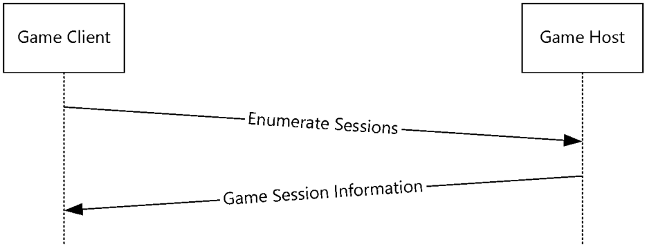
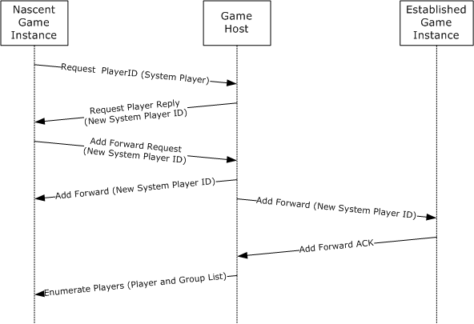
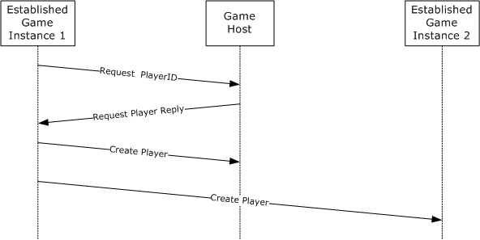

[MC-DPL4CS]:

DirectPlay 4 Protocol: Core and Service Providers

Intellectual Property Rights Notice for Open Specifications Documentation

  Technical Documentation. Microsoft publishes Open Specifications documentation (“this

documentation”) for protocols, file formats, data portability, computer languages, and standards
support. Additionally, overview documents cover inter-protocol relationships and interactions.

  Copyrights. This documentation is covered by Microsoft copyrights. Regardless of any other

terms that are contained in the terms of use for the Microsoft website that hosts this
documentation, you can make copies of it in order to develop implementations of the technologies
that are described in this documentation and can distribute portions of it in your implementations
that use these technologies or in your documentation as necessary to properly document the
implementation. You can also distribute in your implementation, with or without modification, any
schemas, IDLs, or code samples that are included in the documentation. This permission also
applies to any documents that are referenced in the Open Specifications documentation.
  No Trade Secrets. Microsoft does not claim any trade secret rights in this documentation.
  Patents. Microsoft has patents that might cover your implementations of the technologies

described in the Open Specifications documentation. Neither this notice nor Microsoft's delivery of
this documentation grants any licenses under those patents or any other Microsoft patents.
However, a given Open Specifications document might be covered by the Microsoft Open
Specifications Promise or the Microsoft Community Promise. If you would prefer a written license,
or if the technologies described in this documentation are not covered by the Open Specifications
Promise or Community Promise, as applicable, patent licenses are available by contacting
iplg@microsoft.com.

  License Programs. To see all of the protocols in scope under a specific license program and the

associated patents, visit the Patent Map.

  Trademarks. The names of companies and products contained in this documentation might be
covered by trademarks or similar intellectual property rights. This notice does not grant any
licenses under those rights. For a list of Microsoft trademarks, visit
www.microsoft.com/trademarks.

  Fictitious Names. The example companies, organizations, products, domain names, email

addresses, logos, people, places, and events that are depicted in this documentation are fictitious.
No association with any real company, organization, product, domain name, email address, logo,
person, place, or event is intended or should be inferred.

Reservation of Rights. All other rights are reserved, and this notice does not grant any rights other
than as specifically described above, whether by implication, estoppel, or otherwise.

Tools. The Open Specifications documentation does not require the use of Microsoft programming
tools or programming environments in order for you to develop an implementation. If you have access
to Microsoft programming tools and environments, you are free to take advantage of them. Certain
Open Specifications documents are intended for use in conjunction with publicly available standards
specifications and network programming art and, as such, assume that the reader either is familiar
with the aforementioned material or has immediate access to it.

Support. For questions and support, please contact dochelp@microsoft.com.

[MC-DPL4CS] - v20240423
DirectPlay 4 Protocol: Core and Service Providers
Copyright © 2024 Microsoft Corporation
Release: April 23, 2024

1 / 103

Revision Summary

Date

Revision
History

Revision
Class

8/10/2007

0.1

9/28/2007

0.2

Major

Minor

Comments

Initial Availability

Clarified the meaning of the technical content.

10/23/2007  0.2.1

Editorial

Changed language and formatting in the technical content.

11/30/2007  1.0

1/25/2008

2.0

3/14/2008

3.0

Major

Major

Major

Updated and revised the technical content.

Updated and revised the technical content.

Updated and revised the technical content.

5/16/2008

3.0.1

Editorial

Changed language and formatting in the technical content.

6/20/2008

3.1

7/25/2008

4.0

Minor

Major

Clarified the meaning of the technical content.

Updated and revised the technical content.

8/29/2008

4.0.1

Editorial

Changed language and formatting in the technical content.

10/24/2008  4.1

Minor

Clarified the meaning of the technical content.

12/5/2008

4.1.1

Editorial

Editorial Update.

1/16/2009

4.1.2

Editorial

Changed language and formatting in the technical content.

2/27/2009

5.0

Major

Updated and revised the technical content.

4/10/2009

5.0.1

Editorial

Changed language and formatting in the technical content.

5/22/2009

6.0

7/2/2009

7.0

Major

Major

Updated and revised the technical content.

Updated and revised the technical content.

8/14/2009

7.0.1

Editorial

Changed language and formatting in the technical content.

9/25/2009

8.0

Major

Updated and revised the technical content.

11/6/2009

8.0.1

Editorial

Changed language and formatting in the technical content.

12/18/2009  8.0.2

Editorial

Changed language and formatting in the technical content.

1/29/2010

9.0

Major

Updated and revised the technical content.

3/12/2010

9.0.1

Editorial

Changed language and formatting in the technical content.

4/23/2010

9.0.2

Editorial

Changed language and formatting in the technical content.

6/4/2010

10.0

7/16/2010

11.0

8/27/2010

12.0

10/8/2010

12.0

Major

Major

Major

None

Updated and revised the technical content.

Updated and revised the technical content.

Updated and revised the technical content.

No changes to the meaning, language, or formatting of the
technical content.

11/19/2010  12.0

None

No changes to the meaning, language, or formatting of the
technical content.

[MC-DPL4CS] - v20240423
DirectPlay 4 Protocol: Core and Service Providers
Copyright © 2024 Microsoft Corporation
Release: April 23, 2024

2 / 103

Date

Revision
History

Revision
Class

Comments

1/7/2011

12.0

None

No changes to the meaning, language, or formatting of the
technical content.

2/11/2011

12.0

None

No changes to the meaning, language, or formatting of the
technical content.

3/25/2011

12.0

None

No changes to the meaning, language, or formatting of the
technical content.

5/6/2011

12.0

None

No changes to the meaning, language, or formatting of the
technical content.

6/17/2011

12.1

Minor

Clarified the meaning of the technical content.

9/23/2011

12.1

None

No changes to the meaning, language, or formatting of the
technical content.

12/16/2011  13.0

Major

Updated and revised the technical content.

3/30/2012

13.0

None

No changes to the meaning, language, or formatting of the
technical content.

7/12/2012

13.0

None

No changes to the meaning, language, or formatting of the
technical content.

10/25/2012  13.0

None

No changes to the meaning, language, or formatting of the
technical content.

1/31/2013

13.0

None

No changes to the meaning, language, or formatting of the
technical content.

8/8/2013

14.0

Major

Updated and revised the technical content.

11/14/2013  14.0

None

No changes to the meaning, language, or formatting of the
technical content.

2/13/2014

14.0

None

No changes to the meaning, language, or formatting of the
technical content.

5/15/2014

14.0

None

No changes to the meaning, language, or formatting of the
technical content.

6/30/2015

15.0

Major

Significantly changed the technical content.

10/16/2015  15.0

None

No changes to the meaning, language, or formatting of the
technical content.

7/14/2016

15.0

None

No changes to the meaning, language, or formatting of the
technical content.

6/1/2017

15.0

9/15/2017

16.0

9/12/2018

17.0

4/7/2021

18.0

6/25/2021

19.0

4/23/2024

20.0

None

Major

Major

Major

Major

Major

No changes to the meaning, language, or formatting of the
technical content.

Significantly changed the technical content.

Significantly changed the technical content.

Significantly changed the technical content.

Significantly changed the technical content.

Significantly changed the technical content.

[MC-DPL4CS] - v20240423
DirectPlay 4 Protocol: Core and Service Providers
Copyright © 2024 Microsoft Corporation
Release: April 23, 2024

3 / 103

Table of Contents

1.1
1.2

1.2.1
1.2.2

1  Introduction ............................................................................................................ 8
Glossary ........................................................................................................... 8
References ...................................................................................................... 10
Normative References ................................................................................. 10
Informative References ............................................................................... 11
Overview ........................................................................................................ 11
Relationship to Other Protocols .......................................................................... 15
Prerequisites/Preconditions ............................................................................... 15
Applicability Statement ..................................................................................... 15
Versioning and Capability Negotiation ................................................................. 15
Vendor-Extensible Fields ................................................................................... 15
Standards Assignments ..................................................................................... 15

1.3
1.4
1.5
1.6
1.7
1.8
1.9

2.1
2.2

2  Messages ............................................................................................................... 16
Transport ........................................................................................................ 16
Message Syntax ............................................................................................... 16
SOCKADDR_IN ........................................................................................... 16
2.2.1
DPLAYI_PACKEDPLAYER .............................................................................. 16
2.2.2
DPLAYI_SUPERPACKEDPLAYER ..................................................................... 19
2.2.3
DPSECURITYDESC ...................................................................................... 23
2.2.4
DPSESSIONDESC2 ...................................................................................... 24
2.2.5
DPSP_MSG_HEADER ................................................................................... 27
2.2.6
DPSP_MSG_ACCESSGRANTED ...................................................................... 29
2.2.7
DPSP_MSG_ADDFORWARD .......................................................................... 30
2.2.8
2.2.9
DPSP_MSG_ADDFORWARDACK .................................................................... 31
2.2.10  DPSP_MSG_ADDFORWARDREPLY ................................................................. 31
2.2.11  DPSP_MSG_ADDFORWARDREQUEST ............................................................. 31
2.2.12  DPSP_MSG_ADDPLAYERTOGROUP ................................................................ 33
2.2.13  DPSP_MSG_ADDSHORTCUTTOGROUP ........................................................... 33
2.2.14  DPSP_MSG_ASK4MULTICAST ....................................................................... 34
2.2.15  DPSP_MSG_ASK4MULTICASTGUARANTEED .................................................... 35
2.2.16  DPSP_MSG_AUTHERROR ............................................................................. 35
2.2.17  DPSP_MSG_CHALLENGE .............................................................................. 36
2.2.18  DPSP_MSG_CHALLENGERESPONSE ............................................................... 37
2.2.19  DPSP_MSG_CHAT ....................................................................................... 37
2.2.20  DPSP_MSG_CREATEGROUP .......................................................................... 38
2.2.21  DPSP_MSG_CREATEPLAYER ......................................................................... 39
2.2.22  DPSP_MSG_CREATEPLAYERVERIFY ............................................................... 40
2.2.23  DPSP_MSG_DELETEGROUP .......................................................................... 42
2.2.24  DPSP_MSG_DELETEGROUPFROMGROUP ........................................................ 42
2.2.25  DPSP_MSG_DELETEPLAYER ......................................................................... 43
2.2.26  DPSP_MSG_DELETEPLAYERFROMGROUP ....................................................... 44
2.2.27  DPSP_MSG_ENUMPLAYER ............................................................................ 44
2.2.28  DPSP_MSG_ENUMPLAYERSREPLY ................................................................. 45
2.2.29  DPSP_MSG_ENUMSESSIONS ........................................................................ 46
2.2.30  DPSP_MSG_ENUMSESSIONSREPLY ............................................................... 47
2.2.31  DPSP_MSG_GROUPDATACHANGED ............................................................... 48
2.2.32  DPSP_MSG_GROUPNAMECHANGED ............................................................... 49
2.2.33  DPSP_MSG_IAMNAMESERVER ...................................................................... 50
2.2.34  DPSP_MSG_KEYEXCHANGE .......................................................................... 51
2.2.35  DPSP_MSG_KEYEXCHANGEREPLY ................................................................. 52
2.2.36  DPSP_MSG_LOGONDENIED ......................................................................... 53
2.2.37  DPSP_MSG_MULTICASTDELIVERY ................................................................ 53
2.2.38  DPSP_MSG_NEGOTIATE .............................................................................. 54
2.2.39  DPSP_MSG_PACKET .................................................................................... 54

[MC-DPL4CS] - v20240423
DirectPlay 4 Protocol: Core and Service Providers
Copyright © 2024 Microsoft Corporation
Release: April 23, 2024

4 / 103

2.2.40  DPSP_MSG_PACKET2_ACK .......................................................................... 55
2.2.41  DPSP_MSG_PACKET2_DATA ......................................................................... 56
2.2.42  DPSP_MSG_PING ........................................................................................ 57
2.2.43  DPSP_MSG_PINGREPLY ............................................................................... 58
2.2.44  DPSP_MSG_PLAYERDATACHANGED .............................................................. 58
2.2.45  DPSP_MSG_PLAYERMESSAGE ...................................................................... 59
2.2.46  DPSP_MSG_PLAYERNAMECHANGED .............................................................. 60
2.2.47  DPSP_MSG_PLAYERWRAPPER ...................................................................... 61
2.2.48  DPSP_MSG_REQUESTGROUPID .................................................................... 61
2.2.49  DPSP_MSG_REQUESTPLAYERID .................................................................... 62
2.2.50  DPSP_MSG_REQUESTPLAYERREPLY .............................................................. 63
2.2.51  DPSP_MSG_SESSIONDESCCHANGED ............................................................ 64
2.2.52  DPSP_MSG_SIGNED ................................................................................... 65
2.2.53  DPSP_MSG_SUPERENUMPLAYERSREPLY ........................................................ 66
2.2.54  DPSP_MSG_VOICE ...................................................................................... 68
2.2.55  DPSP_MSG_YOUAREDEAD ........................................................................... 68

3.1

3.1.1
3.1.2

3.1.3
3.1.4

3.1.2.1
3.1.2.2
3.1.2.3
3.1.2.4
3.1.2.5

3.1.4.1
3.1.4.2
3.1.4.3
3.1.4.4
3.1.4.5
3.1.4.6
3.1.4.7
3.1.4.8
3.1.4.9
3.1.4.10
3.1.4.11
3.1.4.12
3.1.4.13
3.1.4.14
3.1.4.15
3.1.4.16

3  Protocol Details ..................................................................................................... 70
DirectPlay Client Details .................................................................................... 70
Abstract Data Model .................................................................................... 70
Timers ...................................................................................................... 72
Session Enumeration Timer .................................................................... 72
Reliable API Timer ................................................................................. 72
Logon Timer ......................................................................................... 73
Packetize Timer .................................................................................... 73
Ping Timer ........................................................................................... 73
Initialization ............................................................................................... 73
Higher-Layer Triggered Events ..................................................................... 73
Enumerate Sessions .............................................................................. 73
Join Session ......................................................................................... 74
Enumerate Players or Groups ................................................................. 74
Create Player........................................................................................ 74
Delete Player ........................................................................................ 74
Create Group ........................................................................................ 74
Remove Group...................................................................................... 74
Set Group Data ..................................................................................... 75
Set Group Name ................................................................................... 75
Set Player Data..................................................................................... 75
Set Player Name ................................................................................... 75
Add Player to Group .............................................................................. 75
Remove Player from Group .................................................................... 76
Add Group to Group .............................................................................. 76
Remove Group from Group..................................................................... 76
Send Application Data ........................................................................... 76
Sending Encrypted/Signed Data ........................................................ 77
Sending Unencrypted/Unsigned Data ................................................. 77
Send Chat ............................................................................................ 77
Large Messages .................................................................................... 78
Processing Events and Sequencing Rules ....................................................... 78
DPSP_MSG_REQUESTPLAYERREPLY ......................................................... 78
DPSP_MSG_CHALLENGE ........................................................................ 79
DPSP_MSG_ACCESSGRANTED ................................................................ 79
DPSP_MSG_AUTHERROR........................................................................ 79
DPSP_MSG_LOGONDENIED .................................................................... 79
DPSP_MSG_KEYEXCHANGEREPLY ........................................................... 79
DPSP_MSG_SUPERENUMPLAYERSREPLY .................................................. 80
DPSP_MSG_ADDFORWARDREPLY ............................................................ 80
DPSP_MSG_SIGNED .............................................................................. 80

3.1.5.1
3.1.5.2
3.1.5.3
3.1.5.4
3.1.5.5
3.1.5.6
3.1.5.7
3.1.5.8
3.1.5.9

3.1.4.16.1
3.1.4.16.2

3.1.4.17
3.1.4.18

3.1.5

[MC-DPL4CS] - v20240423
DirectPlay 4 Protocol: Core and Service Providers
Copyright © 2024 Microsoft Corporation
Release: April 23, 2024

5 / 103

3.1.6.1
3.1.6.2

3.1.5.10  DPSP_MSG_ADDFORWARD .................................................................... 80
3.1.5.11  DPSP_MSG_CREATEGROUP .................................................................... 80
3.1.5.12  DPSP_MSG_CREATEPLAYER ................................................................... 81
3.1.5.13  DPSP_MSG_CREATEPLAYERVERIFY ......................................................... 81
3.1.5.14  DPSP_MSG_DELETEPLAYER .................................................................... 81
3.1.5.15  DPSP_MSG_DELETEGROUP .................................................................... 81
3.1.5.16  DPSP_MSG_GROUPDATACHANGED ......................................................... 81
3.1.5.17  DPSP_MSG_GROUPNAMECHANGED ......................................................... 81
3.1.5.18  DPSP_MSG_PLAYERNAMECHANGED ........................................................ 82
3.1.5.19  DPSP_MSG_PLAYERDATACHANGED ......................................................... 82
3.1.5.20  DPSP_MSG_ADDPLAYERTOGROUP .......................................................... 82
3.1.5.21  DPSP_MSG_DELETEPLAYERFROMGROUP .................................................. 82
3.1.5.22  DPSP_MSG_SESSIONDESCCHANGED ...................................................... 82
3.1.5.23  DPSP_MSG_ADDSHORTCUTTOGROUP ..................................................... 82
3.1.5.24  DPSP_MSG_DELETEGROUPFROMGROUP .................................................. 82
3.1.5.25  DPSP_MSG_VOICE ................................................................................ 83
3.1.5.26  DPSP_MSG_CHAT ................................................................................. 83
3.1.5.27  DPSP_MSG_PACKET .............................................................................. 83
3.1.5.28  DPSP_MSG_PACKET2_DATA ................................................................... 83
3.1.5.29  DPSP_MSG_PACKET2_ACK ..................................................................... 83
3.1.5.30  DPSP_MSG_PING .................................................................................. 83
3.1.5.31  DPSP_MSG_PINGREPLY ......................................................................... 84
3.1.5.32  DPSP_MSG_YOUAREDEAD...................................................................... 84
Timer Events .............................................................................................. 84
Packetize Timer .................................................................................... 84
Ping Timer ........................................................................................... 84
Other Local Events ...................................................................................... 84
Host Migration ...................................................................................... 84
Game Host Details ........................................................................................... 85
Abstract Data Model .................................................................................... 86
Timers ...................................................................................................... 86
Name Table Population Timer ................................................................. 86
Ping Timer ........................................................................................... 86
Initialization ............................................................................................... 86
Higher-Layer Triggered Events ..................................................................... 86
Processing Events and Sequencing Rules ....................................................... 86
DPSP_MSG_ASK4MULTICAST ................................................................. 86
3.2.5.1
DPSP_MSG_ASK4MULTICASTGUARANTEED .............................................. 87
3.2.5.2
DPSP_MSG_ENUMSESSIONS .................................................................. 87
3.2.5.3
DPSP_MSG_REQUESTPLAYERID .............................................................. 87
3.2.5.4
DPSP_MSG_ADDFORWARDREQUEST ....................................................... 88
3.2.5.5
DPSP_MSG_ADDFORWARDACK ............................................................... 88
3.2.5.6
DPSP_MSG_NEGOTIATE ......................................................................... 89
3.2.5.7
DPSP_MSG_CHALLENGERESPONSE ......................................................... 89
3.2.5.8
3.2.5.9
DPSP_MSG_KEYEXCHANGE .................................................................... 89
3.2.5.10  DPSP_MSG_PING .................................................................................. 89
3.2.5.11  DPSP_MSG_PINGREPLY ......................................................................... 89
Timer Events .............................................................................................. 90
Name Table Population Timer ................................................................. 90
Ping Timer ........................................................................................... 90
Other Local Events ...................................................................................... 90

3.2.6.1
3.2.6.2

3.2.2.1
3.2.2.2

3.1.7.1

3.2.6

3.2.7

3.1.6

3.1.7

3.2

3.2.1
3.2.2

3.2.3
3.2.4
3.2.5

4  Protocol Examples ................................................................................................. 91
DirectPlay4EnumSessionsRequest ...................................................................... 91
DirectPlay4 EnumSessionsReply ......................................................................... 91
Joining a Game ................................................................................................ 92

4.1
4.2
4.3

5  Security ................................................................................................................. 94
Security Considerations for Implementers ........................................................... 94

5.1

6 / 103

[MC-DPL4CS] - v20240423
DirectPlay 4 Protocol: Core and Service Providers
Copyright © 2024 Microsoft Corporation
Release: April 23, 2024

5.2

Index of Security Parameters ............................................................................ 94

6  Appendix A: Product Behavior ............................................................................... 95

7  Change Tracking .................................................................................................... 99

8  Index ................................................................................................................... 100

[MC-DPL4CS] - v20240423
DirectPlay 4 Protocol: Core and Service Providers
Copyright © 2024 Microsoft Corporation
Release: April 23, 2024

7 / 103

1  Introduction

This specification describes the core protocol services of the DirectPlay 4 Protocol. The DirectPlay 4
Protocol facilitates communication between computer games for which a host computer manages the
metadata of multiple computer game instances supporting multiple players. The protocol enables the
implementation of functions to enumerate hosted game sessions and players, to add and remove
game players, and to interchange data between game instances.

Sections 1.5, 1.8, 1.9, 2, and 3 of this specification are normative. All other sections and examples in
this specification are informative.

1.1  Glossary

This document uses the following terms:

acknowledgment (ACK): A signal passed between communicating processes or computers to

signify successful receipt of a transmission as part of a communications protocol.

application identifier: A globally unique identifier (GUID) that uniquely identifies a game.

DirectPlay: A network communication library included with the Microsoft DirectX application

programming interfaces. DirectPlay is a high-level software interface between applications and
communication services that makes it easy to connect games over the Internet, a modem link,
or a network.

DirectPlay 4: A programming library that implements the IDirectPlay4 programming interface.
DirectPlay 4 provides peer-to-peer session-layer services to applications, including session
lifetime management, data management, and media abstraction. DirectPlay 4 first shipped
with the DirectX 6 multimedia toolkit. Later versions continued to ship up to, and including,
DirectX 9. DirectPlay 4 was subsequently deprecated. The DirectPlay 4 DLL continues to ship
in current versions of Windows operating systems, but the development library is no longer
shipping in Microsoft development tools and software development kits (SDKs).

DirectPlay 8: A programming library that implements the IDirectPlay8 programming interface.
DirectPlay 8 provides peer-to-peer session-layer services to applications, including session
lifetime management, data management, and media abstraction. DirectPlay 8 first shipped
with the DirectX 8 software development toolkit. Later versions continued to ship up to, and
including, DirectX 9. DirectPlay 8 was subsequently deprecated. The DirectPlay 8 DLL
continues to ship in current versions of Windows operating systems, but the development library
is no longer shipping in Microsoft development tools and Software Development Kits (SDKs).

DirectPlay client: A player in a DirectPlay client/server game session that has a single
established connection with a DirectPlay server and is not performing game session
management duties. It also refers to a potential player that is enumerating available DirectPlay
servers to join.

DirectPlay host: The player in a DirectPlay peer-to-peer game session that is responsible for

performing game session management duties, such as responding to game session enumeration
requests and maintaining the master copy of all the player and group lists for the game. It has
connections to all DirectPlay peers in the game session.

DirectX: Microsoft DirectX is a collection of application programming interfaces for handling tasks

related to multimedia, especially game programming and video, on Microsoft platforms.

DirectX runtime: A set of libraries created for the family of Windows operating systems that

provide interfaces to ease the development of video games.

DirectX Software Development Kit (DirectX SDK): A set of libraries, called the DirectX

runtime, and supporting infrastructure for building applications for those libraries.

8 / 103

[MC-DPL4CS] - v20240423
DirectPlay 4 Protocol: Core and Service Providers
Copyright © 2024 Microsoft Corporation
Release: April 23, 2024

game: An application that uses a DirectPlay protocol to communicate between computers.

game session: The metadata associated with the collection of computers participating in a single

instance of a computer game.

globally unique identifier (GUID): A term used interchangeably with universally unique

identifier (UUID) in Microsoft protocol technical documents (TDs). Interchanging the usage of
these terms does not imply or require a specific algorithm or mechanism to generate the value.
Specifically, the use of this term does not imply or require that the algorithms described in
[RFC4122] or [C706] have to be used for generating the GUID. See also universally unique
identifier (UUID).

group: A collection of players within a game session. Typically, players are placed in a group

when they serve a common purpose.

group ID: A 32-bit integer that uniquely represents a group.

host: In DirectPlay, the computer responsible for responding to DirectPlay game session

enumeration requests and maintaining the master copy of all the player and group lists for the
game. One computer is designated as the host of the DirectPlay game session. All other
participants in the DirectPlay game session are called peers. However, in peer-to-peer mode
the name table entry representing the host of the session is also marked as a peer.

host migration: The protocol-specific procedure that occurs when the DirectPlay peer that is
designated as the host or voice server leaves the DirectPlay game or voice session and
another peer assumes that role.

HRESULT: An integer value that indicates the result or status of an operation. A particular

HRESULT can have different meanings depending on the protocol using it. See [MS-ERREF]
section 2.1 and specific protocol documents for further details.

instance: A specific occurrence of a game running in a game session. A game application

process or module can be created more than one time on a single computer system, or on
separate computer systems. Each time a game application process or module is created, the
occurrence is considered to be a separate instance.

little-endian: Multiple-byte values that are byte-ordered with the least significant byte stored in

the memory location with the lowest address.

maximum transmission unit (MTU): The size, in bytes, of the largest packet that a given layer

of a communications protocol can pass onward.

name table: The list of systems participating in a DXDiag, DirectPlay 4, or DirectPlay 8 session,

as well as any application-created groups.

payload: The data that is transported to and from the application that is using either the

DirectPlay 4 protocol or DirectPlay 8 protocol.

peer: In DirectPlay, a player within a DirectPlay game session that has an established connection

with every other peer in the game session, and which is not performing game session
management duties. The participant that is managing the game session is called the host.

peer-to-peer: A server-less networking technology that allows several participating network

devices to share resources and communicate directly with each other.

player: A person who is playing a computer game. There can be multiple players on a computer

participating in any given game session. See also name table.

player ID: A 32-bit integer that uniquely represents a player.

round-trip: A process that imports data and then exports that data without data loss.

9 / 103

[MC-DPL4CS] - v20240423
DirectPlay 4 Protocol: Core and Service Providers
Copyright © 2024 Microsoft Corporation
Release: April 23, 2024

Security Support Provider Interface (SSPI): An API that allows connected applications to call
one of several security providers to establish authenticated connections and to exchange data
securely over those connections. It is equivalent to Generic Security Services (GSS)-API, and
the two are on-the-wire compatible.

service provider: A module that abstracts details of underlying transports for generic DirectPlay

message transmission. Each DirectPlay message is transmitted by a DirectPlay service
provider. The service providers that shipped with DirectPlay 4 are modem, serial, IPX, and
TCP/IP.

shortcut: The name given to a child group contained in a parent group.

system message: A message sent by one instance of DirectPlay to another instance of

DirectPlay for the purposes of game session management.

system player: A specially designated player in a game session that receives system messages,
including single messages that are to be redistributed to one or more standard players in the
game. Each game session has exactly one system player.

tick count: In DirectPlay, the count from when the system was booted, in milliseconds.

Transmission Control Protocol (TCP): A protocol used with the Internet Protocol (IP) to send
data in the form of message units between computers over the Internet. TCP handles keeping
track of the individual units of data (called packets) that a message is divided into for efficient
routing through the Internet.

Unicode: A character encoding standard developed by the Unicode Consortium that represents

almost all of the written languages of the world. The Unicode standard [UNICODE5.0.0/2007]
provides three forms (UTF-8, UTF-16, and UTF-32) and seven schemes (UTF-8, UTF-16, UTF-16
BE, UTF-16 LE, UTF-32, UTF-32 LE, and UTF-32 BE).

User Datagram Protocol (UDP): The connectionless protocol within TCP/IP that corresponds to

the transport layer in the ISO/OSI reference model.

user message: A message that is sent between instances of an application using the DirectPlay

network library as a transport.

MAY, SHOULD, MUST, SHOULD NOT, MUST NOT: These terms (in all caps) are used as defined
in [RFC2119]. All statements of optional behavior use either MAY, SHOULD, or SHOULD NOT.

1.2  References

Links to a document in the Microsoft Open Specifications library point to the correct section in the
most recently published version of the referenced document. However, because individual documents
in the library are not updated at the same time, the section numbers in the documents may not
match. You can confirm the correct section numbering by checking the Errata.

1.2.1  Normative References

We conduct frequent surveys of the normative references to assure their continued availability. If you
have any issue with finding a normative reference, please contact dochelp@microsoft.com. We will
assist you in finding the relevant information.

[FIPS197] FIPS PUBS, "Advanced Encryption Standard (AES)", FIPS PUB 197, November 2001,
https://nvlpubs.nist.gov/nistpubs/FIPS/NIST.FIPS.197.pdf

[FIPS46-2] FIPS PUBS, "Data Encryption Standard (DES)", FIPS PUB 46-2, December 1993,
https://csrc.nist.gov/publications/detail/fips/46/2/archive/1993-12-30

[MC-DPL4CS] - v20240423
DirectPlay 4 Protocol: Core and Service Providers
Copyright © 2024 Microsoft Corporation
Release: April 23, 2024

10 / 103

[FIPS46-3] FIPS PUBS, "Data Encryption Standard (DES)", FIPS PUB 46-3, October 1999,
https://csrc.nist.gov/csrc/media/publications/fips/46/3/archive/1999-10-25/documents/fips46-3.pdf

[IANAPORT] IANA, "Service Name and Transport Protocol Port Number Registry",
https://www.iana.org/assignments/service-names-port-numbers/service-names-port-numbers.xhtml

[MC-DPL4R] Microsoft Corporation, "DirectPlay 4 Protocol: Reliable".

[MC-DPLVP] Microsoft Corporation, "DirectPlay Voice Protocol".

[MS-DTYP] Microsoft Corporation, "Windows Data Types".

[MS-ERREF] Microsoft Corporation, "Windows Error Codes".

[MS-NLMP] Microsoft Corporation, "NT LAN Manager (NTLM) Authentication Protocol".

[MSDN-CAPI] Microsoft Corporation, "Cryptography", https://msdn.microsoft.com/en-
us/library/aa380255.aspx

[RFC2119] Bradner, S., "Key words for use in RFCs to Indicate Requirement Levels", BCP 14, RFC
2119, March 1997, https://www.rfc-editor.org/info/rfc2119

[RFC2268] Rivest, R., "A Description of the RC2(r) Encryption Algorithm", RFC 2268, March 1998,
https://www.rfc-editor.org/info/rfc2268

[RFC768] Postel, J., "User Datagram Protocol", STD 6, RFC 768, August 1980, https://www.rfc-
editor.org/info/rfc768

[RFC791] Postel, J., Ed., "Internet Protocol: DARPA Internet Program Protocol Specification", RFC 791,
September 1981, https://www.rfc-editor.org/info/rfc791

[RFC793] Postel, J., Ed., "Transmission Control Protocol: DARPA Internet Program Protocol
Specification", RFC 793, September 1981, https://www.rfc-editor.org/info/rfc793

[TDEA] National Institute of Standards and Technology, "Recommendation for the Triple Data
Encryption Algorithm (TDEA) Block Cipher", Special Publication 800-67, May 2004,
https://nvlpubs.nist.gov/nistpubs/Legacy/SP/nistspecialpublication800-67ver1.pdf

1.2.2  Informative References

[MSDN-ALG_ID] Microsoft Corporation, "ALG_ID Data Type", http://msdn.microsoft.com/en-
us/library/aa375549.aspx

[MSDN-CRYPTO] Microsoft Corporation, "Cryptography Reference", http://msdn.microsoft.com/en-
us/library/aa380256.aspx

[SCHNEIER] Schneier, B., "Applied Cryptography, Second Edition", John Wiley and Sons, 1996, ISBN:
0471117099.

[SOCKADDR] Microsoft Corporation, "Sockaddr", http://msdn.microsoft.com/en-
us/library/ms740496.aspx

1.3  Overview

The DirectPlay 4 Protocol is a peer-to-peer protocol intended to allow computer games to manage
metadata associated with many multiplayer computer games. It provides functionality that allows the
game to:



Enumerate the hosted game sessions of the game.

11 / 103

[MC-DPL4CS] - v20240423
DirectPlay 4 Protocol: Core and Service Providers
Copyright © 2024 Microsoft Corporation
Release: April 23, 2024

  Connect to a game hosted on another computer.



Enumerate the players and groups of players in an established game instance.

  Send data from one established instance of the game to another established instance of the game.

  Add and remove players from the game.

Because this is a peer-to-peer protocol, applications that participate in the protocol are typically not
clients or servers; instead, each application participating in the protocol maintains its own version of
the state of the protocol.

The first computer that started the game is designated as the host computer. The host computer
holds the master set of game metadata and responds to requests to enumerate the game sessions
and add players and groups.

When a game application decides to host a game, it configures the DirectPlay 4 game session using
the following options.

DirectPlay flag

Behavior

DPSESSION_NEWPLAYERSDISABLED

0x00000001

The DirectPlay 4 host disables the creation of new players. Groups
can continue to be added and managed.

Note  This flag is dynamic.

DPSESSION_MIGRATEHOST

0x00000004

DPSESSION_NOMESSAGEID

0x00000008

DPSESSION_NOPLAYERMGMT

0x00000010

If the DirectPlay 4 host computer fails, the DirectPlay 4 Protocol
will migrate the host computer to another machine. See section
3.1.6.2 for more information.

If this option is set, the DirectPlay 4 Protocol will not include the
PlayerTo and PlayerFrom field in player management messages
(DPSP_MSG_PLAYERMESSAGE, DPSP_MSG_DELETEPLAYER,
DPSP_MSG_DELETEGROUP,
DPSP_MSG_ADDPLAYERTOGROUP,
DPSP_MSG_DELETEPLAYERFROMGROUP).

The DirectPlay 4 client will not generate player management
messages (DPSP_MSG_PLAYERMESSAGE,
DPSP_MSG_DELETEPLAYER, DPSP_MSG_DELETEGROUP,
DPSP_MSG_ADDPLAYERTOGROUP,
DPSP_MSG_DELETEPLAYERFROMGROUP).

DPSESSION_JOINDISABLED

0x00000020

The DirectPlay 4 Protocol will no longer allow computers to join
the game session. Players and groups can continue to be added by
computers already in the game session.

Note  This flag is dynamic.

DPSESSION_KEEPALIVE

0x00000040

The DirectPlay 4 Protocol will periodically send DPSP_MSG_PING
(section 2.2.42) messages to ensure that all computers in the game
session are still functioning.

DPSESSION_NODATAMESSAGES

0x00000080

The DirectPlay 4 Protocol will not send
DPSP_MSG_PLAYERDATACHANGED (section 2.2.44) messages.

DPSESSION_SECURESERVER

0x00000100

The DirectPlay 4 host computer will require all DirectPlay 4 clients
connecting to the computer to authenticate, as specified in sections
3.1.5.1 and 3.2.5.7. Players in the game session can then sign
and/or encrypt application data.

Note  This option is incompatible with the
DPSESSION_MIGRATEHOST option.

DPSESSION_PRIVATE

Established instances of the game that require computers to join

12 / 103

[MC-DPL4CS] - v20240423
DirectPlay 4 Protocol: Core and Service Providers
Copyright © 2024 Microsoft Corporation
Release: April 23, 2024

<!-- Extracted images from page 13 -->

<!-- /Extracted images from page 13 -->

DirectPlay flag

0x00000200

Behavior

ensure the user has entered the desired password prior to initiating
the connection.

DPSESSION_PASSWORDREQUIRED

0x00000400

The game host will reply only to DPSP_MSG_ENUMSESSIONS
(section 2.2.29) messages whose password matches the password of
the game session.

DPSESSION_MULTICASTSERVER

0x00000800

DPSESSION_CLIENTSERVER

0x00001000

The DirectPlay 4 client will transmit all game messages through the
game host, which will then retransmit them to the various game
clients.

Note  This flag is incompatible with the DPSESSION_MIGRATEHOST
option.

When joining a game session, the game host will transmit
information only about the system players on all the joined
machines, not about the normal players.

Note  This flag is incompatible with the DPSESSION_MIGRATEHOST
option.

DPSESSION_DIRECTPLAYPROTOCOL

0x00002000

The DirectPlay 4 client will use the DirectPlay 4 Reliable Protocol
[MC-DPL4R] for communication from the DirectPlay client to the
game host and other DirectPlay 4 clients.

DPSESSION_NOPRESERVEORDER

0x00004000

When this option is set, the DirectPlay 4 client will not ensure that
packets are passed to the higher-level protocol in the order in which
they were received.

DPSESSION_OPTIMIZELATENCY

Tells the DirectPlay 4 Protocol to optimize for latency.

0x00008000

DPSESSION_NOSESSIONDESCMESSAGES

0x00020000

When a game on the DirectPlay 4 host updates game session
information, the DirectPlay 4 host will not send a
DPSP_MSG_SESSIONDESCCHANGED (section 2.2.51) message.

As other nascent game instances start on other computers, these instances use the DirectPlay 4
Protocol to enumerate established game sessions on the local network (a nascent game instance
might ask the user to specify a specific game host and enumerate the list of game sessions explicitly
from that host).

Figure 1: Diagram of session enumeration request and response

After enumerating the available game sessions, the game can choose one game session (typically
after consulting with the user playing the game), and attempt to join the game session by requesting
that the game host create a system player.

[MC-DPL4CS] - v20240423
DirectPlay 4 Protocol: Core and Service Providers
Copyright © 2024 Microsoft Corporation
Release: April 23, 2024

13 / 103

<!-- Extracted images from page 14 -->

<!-- /Extracted images from page 14 -->

Once the system player for the client has been created, the game host will transmit the current set of
game data to the joining nascent game instance and will notify all established game instances about
the nascent game instance.

Figure 2: Diagram of a nascent game instance joining a game host and a third, established
game instance

Once a nascent game instance has joined a game session, it becomes an established game instance.
Any established game instance can add players or groups by requesting a player ID from the game
host and transmitting information about the player to all of the established game instances, as shown
in the following figure.

Figure 3: Diagram of an established game instance creating a non-system player

14 / 103

[MC-DPL4CS] - v20240423
DirectPlay 4 Protocol: Core and Service Providers
Copyright © 2024 Microsoft Corporation
Release: April 23, 2024

1.4  Relationship to Other Protocols

The DirectPlay 4 Core and Service Providers Protocol is transmitted via both the Transmission
Control Protocol (TCP) [RFC793] and the User Datagram Protocol (UDP) [RFC768] protocols, as
specified in [RFC791]. In addition, at the discretion of the game, all of the messages listed in this
protocol might be transmitted via the DirectPlay 4 Reliable Protocol, as specified in [MC-DPL4R].

1.5  Prerequisites/Preconditions

The DirectPlay 4 Protocol requires the DirectX 6 runtime.<1>

1.6  Applicability Statement

The DirectPlay 4 Protocol is used when a game requires communication with other games. All of the
functionality present in the DirectPlay 4 Protocol has been superseded by the DirectPlay 8
Protocol and, as such, the DirectPlay 4 Protocol is only to be used when the game has a
requirement to interoperate with other DirectPlay 4 games.

1.7  Versioning and Capability Negotiation

This document covers versioning issues in the following areas:

  Protocol Versions: The DirectPlay 4 Core and Service Provider Protocol supports the following

explicit dialects: "DX6VERSION", "DX61VERSION", "DX61AVERSION", "DX71VERSION",
"DX8VERSION", and "DX9VERSION". These dialects are defined in section 2.2.3 and are backward
compatible.<2>

  Capability Negotiation: When joining a game session, each client creates a "system player"

and reports the DirectPlay dialect supported by that client. The host cannot allow the connection
of a client that does not have the capabilities of interoperating with the existing game session.

1.8  Vendor-Extensible Fields

This protocol can be transmitted over network protocols other than the IP networking stack. The
protocol includes a Service Provider Data field in the DPLAYI_PACKEDPLAYER structure (section
2.2.2) and the DPLAYI_SUPERPACKEDPLAYER structure (section 2.2.3) that can be used to
transmit protocol-specific information.

Each game can also extend the protocol with player, per-group, and per-game-session data. The
per-player and per-group data is specified in the Player Data field of the DPLAYI_PACKEDPLAYER
structure (section 2.2.2) and the DPLAYI_SUPERPACKEDPLAYER structure (section 2.2.3). The
per-game-session data is contained in the Application Defined 1 and Application Defined 4 fields
of the DPSESSIONDESC2 structure (section 2.2.5).

This protocol uses HRESULT values as defined in [MS-ERREF] section 2.1. Vendors can define their
own HRESULT values provided that they set the C bit (0x20000000) for each vendor-defined value to
indicate that the value is a customer code.

1.9  Standards Assignments

Parameter

Value  Reference

DirectPlay 4 Port Number

47624

[IANAPORT]

DirectPlay 4 Port Number (registered but unused)  2234

[IANAPORT]

[MC-DPL4CS] - v20240423
DirectPlay 4 Protocol: Core and Service Providers
Copyright © 2024 Microsoft Corporation
Release: April 23, 2024

15 / 103

2  Messages

This protocol references commonly used data types as defined in [MS-DTYP].

2.1  Transport

DirectPlay messages are transmitted either by UDP or TCP depending on whether the destination of
the protocol message is broadcast or unicast. Clients of the DirectPlay 4 protocol MUST use TCP and
UDP port numbers in the range from 2300 to 2400. Enumeration messages transmitted to the
DirectPlay host computer MUST be transmitted to port 47624. Broadcast messages MUST be sent to
the UDP broadcast address of 255.255.255.255.

2.2  Message Syntax

All multibyte values transmitted by the DirectPlay 4 Protocol are transmitted in little-endian
format unless otherwise specified.

This protocol specification uses curly braced GUID strings as specified in [MS-DTYP] section 2.3.4.3.

2.2.1  SOCKADDR_IN

The SOCKADDR_IN structure is built as if it were on a little-endian machine and is treated as a
byte array. For more information, see [SOCKADDR].

0  1  2  3  4  5  6  7  8  9

1
0  1  2  3  4  5  6  7  8  9

2
0  1  2  3  4  5  6  7  8  9

3
0  1

AddressFamily

Port

Address

Padding

...

AddressFamily (2 bytes): Address family. It MUST be 0x0002.

Port (2 bytes): IP port.

Address (4 bytes): IP address, as specified in [RFC791].

Padding (8 bytes): MUST be set to zero when sent and MUST be ignored on receipt.

2.2.2  DPLAYI_PACKEDPLAYER

The DPLAYI_PACKEDPLAYER structure contains data related to players or groups.

0  1  2  3  4  5  6  7  8  9

1
0  1  2  3  4  5  6  7  8  9

2
0  1  2  3  4  5  6  7  8  9

3
0  1

Size

Flags

[MC-DPL4CS] - v20240423
DirectPlay 4 Protocol: Core and Service Providers
Copyright © 2024 Microsoft Corporation
Release: April 23, 2024

16 / 103

PlayerID

ShortNameLength

LongNameLength

ServiceProviderDataSize

PlayerDataSize

NumberOfPlayers

SystemPlayerID

FixedSize

PlayerVersion

ParentID

ShortName (variable)

...

LongName (variable)

...

ServiceProviderData (variable)

...

PlayerData (variable)

...

PlayerIDs (variable)

...

Size (4 bytes): MUST contain the total size of the DPLAYI_PACKEDPLAYER structure plus the
values of the ShortNameLength, LongNameLength, ServiceProviderDataSize, and
PlayerDataSize fields.

Flags (4 bytes): MUST contain 0 or more of the following player flags.

0  1  2  3  4  5  6  7  8  9

1
0  1  2  3  4  5  6  7  8  9

2
0  1  2  3  4  5  6  7  8  9

3
0  1

S

N

P

P

P

S

G

L

X

[MC-DPL4CS] - v20240423
DirectPlay 4 Protocol: Core and Service Providers
Copyright © 2024 Microsoft Corporation
Release: April 23, 2024

17 / 103

SP (1 bit): The player is the system player.

NS (1 bit): The player is the name server (host). It MUST be combined with SP.

PG (1 bit): The player belongs to a group. This flag MUST be set for system players, for other
players that have been added to a group using DPSP_MSG_ADDPLAYERTOGROUP (section
2.2.12), or for groups that have been added to a group using
DPSP_MSG_ADDSHORTCUTTOGROUP (section 2.2.13).

PL (1 bit): The player is on the sending machine. This flag does not have meaning on other

machines and MUST be ignored on receipt.

X (28 bits): All bits that have this label SHOULD be set to zero when sent and MUST be ignored

on receipt.

PlayerID (4 bytes): The player ID.

ShortNameLength (4 bytes): MUST contain the length of the player's short name, in octets. If there

is no player short name, this field MUST be set to zero.

LongNameLength (4 bytes): MUST contain the length, in octets, of the player's long name. If there

is no player long name, this field MUST be set to zero.

ServiceProviderDataSize (4 bytes): MUST contain the length, in octets, of the

ServiceProviderData field. If there is no network service provider data, this field MUST be set
to zero.

PlayerDataSize (4 bytes): MUST contain the length of the per-game player data, in octets. If there

is no per-game player data, this field MUST be set to zero.

NumberOfPlayers (4 bytes): MUST contain the number of entries in the PlayerIDs field. If the

player represented in the DPLAYI_PACKEDPLAYER structure is not a group, this field MUST be
set to zero.

SystemPlayerID (4 bytes): MUST contain the ID of the system player for this game session.

FixedSize (4 bytes): MUST contain the size, in octets, of the fixed portion of this structure and MUST

be 48.

PlayerVersion (4 bytes): MUST contain the version of the current player or group. The version for
system players MUST match the protocol dialect version used by the creating instance. The
version for non-system players or groups SHOULD be the protocol dialect version used by the
creating instance and it MUST be ignored by receivers. The DirectPlay4 Core and Service Provider
Protocol supports the protocol dialect versions identified in the description of the
VersionOrSystemPlayerID field in DPLAYI_SUPERPACKEDPLAYER (section 2.2.3).

ParentID (4 bytes): MUST contain the identifier of the parent group. If this

DPLAYI_PACKEDPLAYER structure represents a player, or if it is a group that is not contained in
another group, this field MUST be set to zero.

ShortName (variable): If the ShortNameLength field is nonzero, this MUST contain the null-

terminated Unicode string that contains the player's short name.

LongName (variable): If the LongNameLength field is nonzero, this MUST contain the null-

terminated Unicode string that contains the player's long name.

ServiceProviderData (variable): If ServiceProviderDataSize is nonzero, this MUST be set to the

data that is used by the DirectPlay Service Provider.

If provided, the Windows Winsock DirectPlay Service Provider stores the following data in the
ServiceProviderData field.

18 / 103

[MC-DPL4CS] - v20240423
DirectPlay 4 Protocol: Core and Service Providers
Copyright © 2024 Microsoft Corporation
Release: April 23, 2024

0  1  2  3  4  5  6  7  8  9

1
0  1  2  3  4  5  6  7  8  9

2
0  1  2  3  4  5  6  7  8  9

3
0  1

Stream Socket Address (16 bytes)

...

...

Datagram Socket Address (16 bytes)

...

...

Stream Socket Address (16 bytes): A SOCKADDR_IN structure that contains the addressing

information to be used when contacting this player over TCP. If the PL flag is set in the Flags
field, the Address field of this SOCKADDR_IN must be set to 0.0.0.0.

Datagram Socket Address (16 bytes): A SOCKADDR_IN structure that contains the addressing
information to be used when contacting this player over UDP. If the PL flag is set in the Flags
field, the Address field of this SOCKADDR_IN must be set to 0.0.0.0.

PlayerData (variable): If PlayerDataSize is nonzero, this MUST be set to the byte array of game-

specific per-player data.

PlayerIDs (variable): MUST contain an array of PlayerIDs where the array size is specified in

NumberOfPlayers. If NumberOfPlayers is 0, this field MUST NOT be present.

2.2.3  DPLAYI_SUPERPACKEDPLAYER

The DPLAYI_SUPERPACKEDPLAYER structure is used to transmit player or group-related data.

0  1  2  3  4  5  6  7  8  9

1
0  1  2  3  4  5  6  7  8  9

2
0  1  2  3  4  5  6  7  8  9

3
0  1

Size

Flags

ID

PlayerInfoMask

VersionOrSystemPlayerID

ShortName (variable)

...

LongName (variable)

[MC-DPL4CS] - v20240423
DirectPlay 4 Protocol: Core and Service Providers
Copyright © 2024 Microsoft Corporation
Release: April 23, 2024

19 / 103

...

PlayerDataLength (variable)

...

PlayerData (variable)

...

ServiceProviderDataLength (variable)

...

ServiceProviderData (variable)

...

PlayerCount (variable)

...

PlayerIDs (variable)

...

ParentID (optional)

ShortcutIDCount (variable)

...

ShortcutIDs (variable)

...

Size (4 bytes): The size of the fixed player header, in bytes. This includes the Size field, as well as

the Flags, ID, and PlayerInfoMask fields. MUST be 0x00000010 (16).

Flags (4 bytes): Player flags. Player Flags MUST be 0 or more of the following values.

0  1  2  3  4  5  6  7  8  9

1
0  1  2  3  4  5  6  7  8  9

2
0  1  2  3  4  5  6  7  8  9

3
0  1

S

N

P

P

X

S

P
SP (1 bit): The player is the system player.

G

L

NS (1 bit): The player is the name server (host). It MUST be combined with SP.

[MC-DPL4CS] - v20240423
DirectPlay 4 Protocol: Core and Service Providers
Copyright © 2024 Microsoft Corporation
Release: April 23, 2024

20 / 103

PG (1 bit): The player belongs to a group. This flag MUST be set for system players, for other
players that have been added to a group using DPSP_MSG_ADDPLAYERTOGROUP (section
2.2.12), or for groups that have been added to a group using
DPSP_MSG_ADDSHORTCUTTOGROUP (section 2.2.13).

PL (1 bit): The player is on the sending machine. This flag does not have meaning on other

machines and MUST be ignored on receipt.

X (28 bits): All bits that have this label SHOULD be set to zero when sent and MUST be ignored

on receipt.

ID (4 bytes): MUST contain the player ID of the player that is described in this structure.

PlayerInfoMask (4 bytes): A bit field that indicates which optional fields are present. The
PlayerInfoMask field MUST be a bitmask that is composed of the following fields.

0  1  2  3  4  5  6  7  8  9

1
0  1  2  3  4  5  6  7  8  9

2
0  1  2  3  4  5  6  7  8  9

3
0  1

S

L

S

P

P

P

S

X

N

N
SN (1 bit): MUST be set if the ShortName field is present in the structure.

D

C

C

L

I

LN (1 bit): MUST be set if the LongName field is present in the structure.

SL (2 bits): MUST be set if the ServiceProviderDataLength field is present in the structure. SL

MUST be set to one of the following values.

Value  Meaning

0x01

If the ServiceProviderDataLength field occupies 1 byte.

0x02

If the ServiceProviderDataLength field occupies 2 bytes.

0x03

If the ServiceProviderDataLength field occupies 4 bytes.

PD (2 bits): MUST be set if the PlayerDataLength field is present in the structure. PD MUST be

set to one of the following values.

Value  Meaning

0x01

If the PlayerDataLength field occupies 1 byte.

0x02

If the PlayerDataLength field occupies 2 bytes.

0x03

If the PlayerDataLength field occupies 4 bytes.

PC (2 bits): MUST be set if the PlayerCount field is present in the structure. PC MUST be set to

one of the following values.

Value  Meaning

0x01

If the PlayerCount field occupies 1 byte.

0x02

If the PlayerCount field occupies 2 bytes.

0x03

If the PlayerCount field occupies 4 bytes.

PI (1 bit): MUST be set if the ParentID field is present in the structure.

21 / 103

[MC-DPL4CS] - v20240423
DirectPlay 4 Protocol: Core and Service Providers
Copyright © 2024 Microsoft Corporation
Release: April 23, 2024

SC (2 bits): MUST be set if the ShortcutCount field is present in the structure. SC MUST be set

to one of the following values.

Value  Meaning

0x01

If the ShortcutCount field occupies 1 byte.

0x02

If the ShortcutCount field occupies 2 bytes.

0x03

If the ShortcutCount field occupies 4 bytes.

X (21 bits): All bits with this label SHOULD be set to zero when sent and MUST be ignored on

receipt.

VersionOrSystemPlayerID (4 bytes): If the DPLAYI_PLAYER_SYSPLAYER flag is set in the Flags
field, this field MUST contain the protocol version for the machine hosting the protocol. If the
DPLAYI_PLAYER_SYSPLAYER flag is not set, this field MUST contain the ID of the system player
for this game. When the protocol version is used for a system player, it will be one of the following
values.

Version/Value  Meaning

DX6VERSION

First version documented.

9

DX61VERSION

10

New Hosts send DPSP_MSG_IAMNAMESERVER as first message when they become the new
host.

DX61AVERSION

No Change.

11

DX71VERSION

12

The version in which DirectPlay Voice was introduced. Does not affect any of the core
logic.

DX8VERSION

Added DPSP_MSG_CREATEPLAYERVERIFY message.

13

DX9VERSION

No Change.

14

ShortName (variable): If the SN bit in the PlayerInfoMask field is set, the ShortName field MUST

contain a null-terminated Unicode string that contains the short name of the player.

LongName (variable): If the LN bit in the PlayerInfoMask field is set, the LongName field MUST

contain a null-terminated Unicode string that contains the long name of the player.

PlayerDataLength (variable): The PD bits in PlayerInfoMask indicate the size of this optional

field. When present, this field MUST contain the size, in octets, of the PlayerData field.

PlayerData (variable): If PlayerDataSize is nonzero, this MUST be set to per-game player data.

ServiceProviderDataLength (variable): The SL bits in PlayerInfoMask indicate the size of this

optional field. When present, this field MUST contain the size, in octets, of the
ServiceProviderData field.<3>

ServiceProviderData (variable): If ServiceProviderDataSize is nonzero, this MUST be set to the

data that is used by the DirectPlay Service Provider.

[MC-DPL4CS] - v20240423
DirectPlay 4 Protocol: Core and Service Providers
Copyright © 2024 Microsoft Corporation
Release: April 23, 2024

22 / 103

If provided, the Windows Winsock DirectPlay Service Provider stores the following data in the
ServiceProviderData field.

0  1  2  3  4  5  6  7  8  9

1
0  1  2  3  4  5  6  7  8  9

2
0  1  2  3  4  5  6  7  8  9

3
0  1

Stream Socket Address (16 bytes)

...

...

Datagram Socket Address (16 bytes)

...

...

Stream Socket Address (16 bytes): A SOCKADDR_IN structure that contains the addressing

information to be used when contacting this player over TCP. If the PL flag is set in the Flags
field, the Address field of this SOCKADDR_IN must be set to 0.0.0.0.

Datagram Socket Address (16 bytes): A SOCKADDR_IN structure that contains the addressing
information to be used when contacting this player over UDP. If the PL flag is set in the Flags
field, the Address field of this SOCKADDR_IN must be set to 0.0.0.0.

PlayerCount (variable): The PC bits in PlayerInfoMask indicate the size of this optional field.

When present, this field MUST contain the number of entries in the PlayerIDs field.

PlayerIDs (variable): If the PlayerCount field is present and nonzero, this MUST be set to a list of

player IDs that are contained in the group. The length of this field is equivalent to the value of the
PlayerCount field multiplied by four.

ParentID (4 bytes): If the PI field is set in the PlayerInfoMask, this field MUST be set to the ID of

the parent for this group.

ShortcutIDCount (variable): The SC bits in PlayerInfoMask indicate the size of this optional field.
When present, this field MUST contain the number of shortcut IDs in the ShortcutIDs field.

ShortcutIDs (variable): If the ShortcutIDCount field is nonzero, this MUST be set to a list of

shortcut IDs. The length of this field is equivalent to the value of ShortcutIDCount multiplied by
four.

2.2.4  DPSECURITYDESC

The DPSECURITYDESC structure describes the security properties of a game session instance.

0  1  2  3  4  5  6  7  8  9

1
0  1  2  3  4  5  6  7  8  9

2
0  1  2  3  4  5  6  7  8  9

3
0  1

Size

Flags

SSPIProvider

[MC-DPL4CS] - v20240423
DirectPlay 4 Protocol: Core and Service Providers
Copyright © 2024 Microsoft Corporation
Release: April 23, 2024

23 / 103

CAPIProvider

CAPIProviderType

EncryptionAlgorithm

Size (4 bytes): MUST be set to the size of the structure, in octets.<4>

Flags (4 bytes): Game session flags. This is not used. MUST be set to zero when sent and MUST be

ignored on receipt.

SSPIProvider (4 bytes): MUST be ignored on receipt.

CAPIProvider (4 bytes): MUST be ignored on receipt.

CAPIProviderType (4 bytes): Crypto service provider type. If the application does not specify a
value, the default value of PROV_RSA_FULL is used. For more information, see Cryptographic
Provider Types [MSDN-CAPI].

EncryptionAlgorithm (4 bytes): Encryption algorithm type. If the application does not specify a

value, the default value of CALG_RC4 is used.<5>

2.2.5  DPSESSIONDESC2

The DPSESSIONDESC2 structure contains game session-related information. A game session is an
instance of a game.

0  1  2  3  4  5  6  7  8  9

1
0  1  2  3  4  5  6  7  8  9

2
0  1  2  3  4  5  6  7  8  9

3
0  1

Size

Flags

InstanceGUID (16 bytes)

...

...

ApplicationGUID (16 bytes)

...

...

MaxPlayers

CurrentPlayerCount

SessionName

[MC-DPL4CS] - v20240423
DirectPlay 4 Protocol: Core and Service Providers
Copyright © 2024 Microsoft Corporation
Release: April 23, 2024

24 / 103

Password

Reserved1

Reserved2

ApplicationDefined1

ApplicationDefined2

ApplicationDefined3

ApplicationDefined4

Size (4 bytes): MUST be set to the size of the structure, in octets.

Flags (4 bytes): Game session flags. Game session flags are set by the game and allow the game to

specify semantics for the DirectPlay 4 protocol.

0  1  2  3  4  5  6  7  8  9

1
0  1  2  3  4  5  6  7  8  9

2
0  1  2  3  4  5  6  7  8  9

3
0  1

N

X  M

N

I  J

K

N

S

P  P

M

C

R

N

O

A

N

Y

P
NP (1 bit): Applications cannot create new players in this game session, as specified in section

M

O

D

D

H

A

S

R

S

S

V

S

P

L

3.2.5.4.

X (1 bit): All bits with this label SHOULD be set to zero when sent and MUST be ignored on

receipt.

MH (1 bit): When the game host quits, the game host responsibilities migrate to another
DirectPlay machine so that new players can continue to be created and nascent game
instances can join the game session, as specified in section 3.1.6.2.

NM (1 bit): DirectPlay will not set the PlayerTo and PlayerFrom fields in player messages.

I (1 bit): (Ignored). All bits with this label MUST be ignored on receipt.

JD (1 bit): DirectPlay will not allow any new applications to join the game session. Applications
already in the game session can still create new players, as specified in section 3.2.5.4.

KA (1 bit): DirectPlay will detect when remote players exit abnormally (for example, because

their computer or modem was unplugged) through the use of the Ping Timer, as described in
sections 3.1.2.5 and 3.2.2.2.

ND (1 bit): DirectPlay will not send a message to all players when a player's remote data

changes.

SS (1 bit): Instructs the game session establishment logic to use user authentication as specified

in sections 3.1.5.1 and 3.2.5.7.

P (1 bit): Indicates that the game session is private and requires a password for EnumSessions

as well as Open.

PR (1 bit): Indicates that the game session requires a password to join.

[MC-DPL4CS] - v20240423
DirectPlay 4 Protocol: Core and Service Providers
Copyright © 2024 Microsoft Corporation
Release: April 23, 2024

25 / 103

MS (1 bit): DirectPlay will route all messages through the game host, as specified in section

3.1.5.1.

CS (1 bit): DirectPlay will download information about the DPPLAYER_SERVERPLAYER only.

RP (1 bit): Instructs the DirectPlay client to always use DirectPlay 4 Reliable Protocol [MC-

DPL4R]. When this bit is set, only other game sessions with the same bit set can join or be
joined.

NO (1 bit): Instructs the DirectPlay client that, when using reliable delivery, preserving the order
of received packets is not important. This allows messages to be indicated out of order if
preceding messages have not yet arrived. If this flag is not set, DirectPlay waits for earlier
messages to arrive before delivering later reliable messages.

OL (1 bit): DirectPlay will optimize communication for latency. Implementations SHOULD use the
presence of the OL flag for guidance on how to send or process messages to optimize for
latency rather than throughput; however, implementations can choose to ignore this flag. The
presence or absence of the OL flag MUST NOT affect the sequence or binary contents of
DirectPlay 4 protocol messages.<6>

AV (1 bit): Allows lobby-launched games that are not voice-enabled to acquire voice capabilities.

NS (1 bit): Suppresses transmission of game session description changes.

Y (14 bits): All bits with this label SHOULD be set to zero when sent and MUST be ignored on

receipt.

InstanceGUID (16 bytes): Identifier for the game session instance.

ApplicationGUID (16 bytes): MUST be set to the unique identifier of the DirectPlay game.

MaxPlayers (4 bytes): Maximum number of players allowed in the game session.

CurrentPlayerCount (4 bytes): Current number of players in the game session.

SessionName (4 bytes): Placeholder for a pointer to a Unicode string that contains the game

session name and the NULL terminating character. This field SHOULD be set to zero when sent
and MUST be ignored on receipt.<7>

Password (4 bytes): Placeholder for a pointer to a Unicode string that contains the game session
password and the NULL terminating character. This field SHOULD be set to zero when sent and
MUST be ignored on receipt.<8>

Note  A secure game session is different from a password protected game session. DirectPlay 4
allows for securing access to a game session with a user-specified cleartext password that is
specified by the host and which MUST be provided by all clients. Although not very secure, this
form of security provides a very lightweight alternative that does not require user accounts and
associated management. It is used to casually restrict access to a particular instance of a game
session.

Reserved1 (4 bytes): MUST be set to a unique value that is used to construct the player and group
ID values. For more information about how this value is used to construct player and group
identifiers, see section 3.2.5.4.

Reserved2 (4 bytes): Reserved for future use.

ApplicationDefined1 (4 bytes): For use by the DirectPlay game.

ApplicationDefined2 (4 bytes): For use by the DirectPlay game.

ApplicationDefined3 (4 bytes): For use by the DirectPlay game.

[MC-DPL4CS] - v20240423
DirectPlay 4 Protocol: Core and Service Providers
Copyright © 2024 Microsoft Corporation
Release: April 23, 2024

26 / 103

ApplicationDefined4 (4 bytes): For use by the DirectPlay game.

2.2.6  DPSP_MSG_HEADER

The DPSP_MSG_HEADER is prepended to all DirectPlay 4 Protocol messages and contains an
identifier that describes each message structure.

0  1  2  3  4  5  6  7  8  9

1
0  1  2  3  4  5  6  7  8  9

2
0  1  2  3  4  5  6  7  8  9

3
0  1

size (optional)

token (optional)

SockAddr (16 bytes, optional)

...

...

Signature

Version

Command Value

size (20 bits):  Indicates the size of the message (in octets). The value is obtained by performing a
bitwise AND (&) operation with the token field and 0x000FFFFF. This field is optional and its
existence depends on the message type and whether the DirectPlay 4 Reliable Protocol is used; it
is present unless the containing message specifies otherwise.

token (12 bits): Describes high-level message characteristics. The value is obtained by performing a

bitwise AND (&) operation with the size field and 0xFFF00000. This field is optional and its
existence depends on the message type and whether the DirectPlay 4 Reliable Protocol is used; it
is present unless the containing message specifies otherwise.

Value  Meaning

0xFAB

Indicates that the message was received from a remote DirectPlay machine.

0xCAB

Indicates that the message will be forwarded to all registered servers.

0xBAB

Indicates that the message was received from a DirectPlay server.

SockAddr (16 bytes): 16 bytes of data containing a sockets SOCKADDR_IN (section 2.2.1)

structure. If the machine is on the same network as the receiving machine, the Address field of
this structure is set to 0.0.0.0. This field is optional and its existence depends on the message
type and whether the DirectPlay 4 Reliable Protocol is used; it is present unless the containing
message specifies otherwise.

Signature (4 bytes): MUST be set to the value 0x79616c70 (ASCII 'play').

Version (2 bytes): MUST be set to the version number of the protocol. The DirectPlay 4 Core and
Service Provider Protocol supports the protocol versions identified in the description of the
VersionOrSystemPlayerID field in DPLAYI_SUPERPACKEDPLAYER (section 2.2.3).

Command Value (2 bytes): MUST contain one of the following values.

[MC-DPL4CS] - v20240423
DirectPlay 4 Protocol: Core and Service Providers
Copyright © 2024 Microsoft Corporation
Release: April 23, 2024

27 / 103

Name

Value

DPSP_MSG_ENUMSESSIONSREPLY

0x0001

DPSP_MSG_ENUMSESSIONS

DPSP_MSG_ENUMPLAYERSREPLY

DPSP_MSG_ENUMPLAYER

DPSP_MSG_REQUESTPLAYERID

DPSP_MSG_REQUESTGROUPID

0x0002

0x0003

0x0004

0x0005

0x0006

DPSP_MSG_REQUESTPLAYERREPLY

0x0007

DPSP_MSG_CREATEPLAYER

DPSP_MSG_CREATEGROUP

DPSP_MSG_PLAYERMESSAGE

DPSP_MSG_DELETEPLAYER

DPSP_MSG_DELETEGROUP

0x0008

0x0009

0x000A

0x000B

0x000C

DPSP_MSG_ADDPLAYERTOGROUP

0x000D

DPSP_MSG_DELETEPLAYERFROMGROUP

0x000E

DPSP_MSG_PLAYERDATACHANGED

0x000F

DPSP_MSG_PLAYERNAMECHANGED

0x0010

DPSP_MSG_GROUPDATACHANGED

0x0011

DPSP_MSG_GROUPNAMECHANGED

0x0012

DPSP_MSG_ADDFORWARDREQUEST

0x0013

DPSP_MSG_PACKET

DPSP_MSG_PING

DPSP_MSG_PINGREPLY

DPSP_MSG_YOUAREDEAD

DPSP_MSG_PLAYERWRAPPER

0x0015

0x0016

0x0017

0x0018

0x0019

DPSP_MSG_SESSIONDESCCHANGED

0x001A

DPSP_MSG_CHALLENGE

DPSP_MSG_ACCESSGRANTED

DPSP_MSG_LOGONDENIED

DPSP_MSG_AUTHERROR

DPSP_MSG_NEGOTIATE

0x001C

0x001D

0x001E

0x001F

0x0020

DPSP_MSG_CHALLENGERESPONSE

0x0021

DPSP_MSG_SIGNED

0x0022

[MC-DPL4CS] - v20240423
DirectPlay 4 Protocol: Core and Service Providers
Copyright © 2024 Microsoft Corporation
Release: April 23, 2024

28 / 103

Name

DPSP_MSG_ADDFORWARDREPLY

DPSP_MSG_ASK4MULTICAST

Value

0x0024

0x0025

DPSP_MSG_ASK4MULTICASTGUARANTEED  0x0026

DPSP_MSG_ADDSHORTCUTTOGROUP

0x0027

DPSP_MSG_DELETEGROUPFROMGROUP

0x0028

DPSP_MSG_SUPERENUMPLAYERSREPLY

0x0029

DPSP_MSG_KEYEXCHANGE

DPSP_MSG_KEYEXCHANGEREPLY

DPSP_MSG_CHAT

DPSP_MSG_ADDFORWARD

DPSP_MSG_ADDFORWARDACK

DPSP_MSG_PACKET2_DATA

DPSP_MSG_PACKET2_ACK

DPSP_MSG_IAMNAMESERVER

DPSP_MSG_VOICE

DPSP_MSG_MULTICASTDELIVERY

0x002B

0x002C

0x002D

0x002E

0x002F

0x0030

0x0031

0x0035

0x0036

0x0037

DPSP_MSG_CREATEPLAYERVERIFY

0x0038

2.2.7  DPSP_MSG_ACCESSGRANTED

The DPSP_MSG_ACCESSGRANTED packet is sent to a DirectPlay client after the client has
successfully been authenticated as a member of the game session.

0  1  2  3  4  5  6  7  8  9

1
0  1  2  3  4  5  6  7  8  9

2
0  1  2  3  4  5  6  7  8  9

3
0  1

DPSP_MSG_HEADER (28 bytes)

...

...

PublicKeySize

PublicKeyOffset

PublicKey (variable)

[MC-DPL4CS] - v20240423
DirectPlay 4 Protocol: Core and Service Providers
Copyright © 2024 Microsoft Corporation
Release: April 23, 2024

29 / 103

...

DPSP_MSG_HEADER (28 bytes): Message header for this packet. The Command Value member of

this field MUST be set to 29 (0x1D).

PublicKeySize (4 bytes): MUST be set to the size of the PublicKey field, in octets. It MUST be set

to 24 (0x00000018).

PublicKeyOffset (4 bytes): MUST be set to the offset, in octets, from the beginning of the packet to

the PublicKey field.

PublicKey (variable): Array of bytes that contains the sender's signed public key.

2.2.8  DPSP_MSG_ADDFORWARD

The DPSP_MSG_ADDFORWARD packet is sent to inform a game instance of the existence of other
game instances.

0  1  2  3  4  5  6  7  8  9

1
0  1  2  3  4  5  6  7  8  9

2
0  1  2  3  4  5  6  7  8  9

3
0  1

DPSP_MSG_HEADER (28 bytes)

...

...

IDTo

PlayerID

GroupID

CreateOffset

PasswordOffset

PlayerInfo (variable)

...

DPSP_MSG_HEADER (28 bytes): Message header for this packet. The Command Value member of

this field MUST be set to 46 (0x2E).

IDTo (4 bytes): Identifier of the player to whom the message is being sent.

PlayerID (4 bytes): Identifier of the affected player.

GroupID (4 bytes): Identifier of the affected group.

CreateOffset (4 bytes): Offset, in octets, of the PlayerInfo field. It MUST be set to 28

(0x0000001C).

PasswordOffset (4 bytes): Not used. It MUST be ignored on receipt.

30 / 103

[MC-DPL4CS] - v20240423
DirectPlay 4 Protocol: Core and Service Providers
Copyright © 2024 Microsoft Corporation
Release: April 23, 2024

PlayerInfo (variable): MUST be set to a DPLAYI_PACKEDPLAYER structure (section 2.2.2) that

contains information about the system player on the newly added machine.

2.2.9  DPSP_MSG_ADDFORWARDACK

The DPSP_MSG_ADDFORWARDACK packet is sent in response to a DPSP_MSG_ADDFORWARD
message.

0  1  2  3  4  5  6  7  8  9

1
0  1  2  3  4  5  6  7  8  9

2
0  1  2  3  4  5  6  7  8  9

3
0  1

DPSP_MSG_HEADER (28 bytes)

...

...

ID

DPSP_MSG_HEADER (28 bytes): Message header for this packet. The Command Value member of

this field MUST be set to 47 (0x2F).

ID (4 bytes): Identifier of the player for whom a DPSP_MSG_ADDFORWARD message was sent.

2.2.10 DPSP_MSG_ADDFORWARDREPLY

The DPSP_MSG_ADDFORWARDREPLY packet is sent in response to a
DPSP_MSG_ADDFORWARDREQUEST message when there is an error.

0  1  2  3  4  5  6  7  8  9

1
0  1  2  3  4  5  6  7  8  9

2
0  1  2  3  4  5  6  7  8  9

3
0  1

DPSP_MSG_HEADER (28 bytes)

...

...

Error

DPSP_MSG_HEADER (28 bytes): Message header for this packet. The Command Value member of

this field MUST be set to 36 (0x24).

Error (4 bytes): Indicates the reason that the DPSP_MSG_ADDFORWARD (section 2.2.8) message

failed. For a complete list of DirectPlay 4 HRESULT codes, see [MS-ERREF].

2.2.11 DPSP_MSG_ADDFORWARDREQUEST

The DPSP_MSG_ADDFORWARDREQUEST packet is sent to forward a message to a downstream
player.

[MC-DPL4CS] - v20240423
DirectPlay 4 Protocol: Core and Service Providers
Copyright © 2024 Microsoft Corporation
Release: April 23, 2024

31 / 103

0  1  2  3  4  5  6  7  8  9

1
0  1  2  3  4  5  6  7  8  9

2
0  1  2  3  4  5  6  7  8  9

3
0  1

DPSP_MSG_HEADER (28 bytes)

...

...

IDTo

PlayerID

GroupID

CreateOffset

PasswordOffset

PlayerInfo (variable)

...

Password (variable)

...

TickCount

DPSP_MSG_HEADER (28 bytes): Message header for this packet. The Command Value member of

this field MUST be set to 19 (0x13).

IDTo (4 bytes): Identifier of the player to whom the message is being sent.

PlayerID (4 bytes): MUST be the identity of the player being added.

GroupID (4 bytes): SHOULD be set to zero when sent and MUST be ignored on receipt.

CreateOffset (4 bytes):  Offset, in bytes, of the PlayerInfo field from the beginning of the

Signature field in the DPSP_MSG_HEADER (section 2.2.6) message. It SHOULD be set to 28
(0x1C).

PasswordOffset (4 bytes): Offset, in bytes, of the Password field from the beginning of the

Signature field in the DPSP_MSG_HEADER message.

PlayerInfo (variable): MUST be set to a DPLAYI_PACKEDPLAYER structure (section 2.2.2) that

contains information about the system player on the newly added machine.

Password (variable): Null-terminated Unicode string that contains the game session password.

TickCount (4 bytes): MUST contain the computing system tick count when the packet was

generated.

[MC-DPL4CS] - v20240423
DirectPlay 4 Protocol: Core and Service Providers
Copyright © 2024 Microsoft Corporation
Release: April 23, 2024

32 / 103

2.2.12 DPSP_MSG_ADDPLAYERTOGROUP

The DPSP_MSG_ADDPLAYERTOGROUP packet is sent from one game participant to other game
participants when a player is added to a group.

0  1  2  3  4  5  6  7  8  9

1
0  1  2  3  4  5  6  7  8  9

2
0  1  2  3  4  5  6  7  8  9

3
0  1

DPSP_MSG_HEADER (28 bytes)

...

...

IDTo

PlayerID

GroupID

CreateOffset

PasswordOffset

DPSP_MSG_HEADER (28 bytes): Message header for this packet. The Command Value member of

this field MUST be set to 13 (0x0D).

IDTo (4 bytes): Identifier of the player to whom the message is being sent. It SHOULD be set to

zero when sent and MUST be ignored on receipt.

PlayerID (4 bytes): Identifier of the player to add to the group specified by the GroupID field.

GroupID (4 bytes): Identifier of the group to which the player will be added.

CreateOffset (4 bytes): Not used. It SHOULD be set to zero when sent and MUST be ignored on

receipt.

PasswordOffset (4 bytes): Not used. It SHOULD be set to zero when sent and MUST be ignored on

receipt.

2.2.13 DPSP_MSG_ADDSHORTCUTTOGROUP

The DPSP_MSG_ADDSHORTCUTTOGROUP packet is sent to add a shortcut to a group.

0  1  2  3  4  5  6  7  8  9

1
0  1  2  3  4  5  6  7  8  9

2
0  1  2  3  4  5  6  7  8  9

3
0  1

DPSP_MSG_HEADER (28 bytes)

...

...

IDTo

[MC-DPL4CS] - v20240423
DirectPlay 4 Protocol: Core and Service Providers
Copyright © 2024 Microsoft Corporation
Release: April 23, 2024

33 / 103

ChildGroupID

ParentGroupID

CreateOffset

PasswordOffset

DPSP_MSG_HEADER (28 bytes): Message header for this packet. The Command Value member of

this field MUST be set to 39 (0x27).

IDTo (4 bytes): Identifier of the player to whom the message is being sent.

ChildGroupID (4 bytes): Identifier of the group to add to the group specified by ParentGroupID.

ParentGroupID (4 bytes): The containing group identifier.

CreateOffset (4 bytes): Not used. It SHOULD be set to zero when sent and MUST be ignored on

receipt.

PasswordOffset (4 bytes): Not used. It SHOULD be set to zero when sent and MUST be ignored on

receipt.

2.2.14 DPSP_MSG_ASK4MULTICAST

The DPSP_MSG_ASK4MULTICAST packet is sent to request that the server forward a message to
players in a specified group.

0  1  2  3  4  5  6  7  8  9

1
0  1  2  3  4  5  6  7  8  9

2
0  1  2  3  4  5  6  7  8  9

3
0  1

DPSP_MSG_HEADER (28 bytes)

...

...

GroupTo

PlayerFrom

MessageOffset

MulticastMessage (variable)

...

DPSP_MSG_HEADER (28 bytes): Message header for this packet. The Command Value member of

this field MUST be set to 37 (0x25).

GroupTo (4 bytes): Identifier of the group that is the target of the request.

PlayerFrom (4 bytes): Identifier of the player that originated the request.

34 / 103

[MC-DPL4CS] - v20240423
DirectPlay 4 Protocol: Core and Service Providers
Copyright © 2024 Microsoft Corporation
Release: April 23, 2024

MessageOffset (4 bytes): Offset, in octets, from the beginning of the message to the

MulticastMessage field.

MulticastMessage (variable): An array of octets that contains the message to forward. This field
MUST contain a complete DirectPlay 4 Protocol message. However, the message MUST begin
with the Signature field of the DPSP_MSG_HEADER (section 2.2.6) rather than the entire
DPSP_MSG_HEADER structure.

2.2.15 DPSP_MSG_ASK4MULTICASTGUARANTEED

The DPSP_MSG_ASK4MULTICASTGUARANTEED packet is used to request that the server forward
a message to players in a specified group using the guaranteed messaging mechanism.

0  1  2  3  4  5  6  7  8  9

1
0  1  2  3  4  5  6  7  8  9

2
0  1  2  3  4  5  6  7  8  9

3
0  1

DPSP_MSG_HEADER (28 bytes)

...

...

GroupTo

PlayerFrom

MessageOffset

MulticastMessage (variable)

...

DPSP_MSG_HEADER (28 bytes): Message header for this packet. The Command Value member of

this field MUST be set to 38 (0x26).

GroupTo (4 bytes): MUST be set to the identifier of the group that is the target of the request.

PlayerFrom (4 bytes): MUST be set to the identifier of the player that originated the request.

MessageOffset (4 bytes): Offset, in octets, from the beginning of the message to the

MulticastMessage field.

MulticastMessage (variable): An array of octets that contains the message to forward. This field
MUST contain a complete DirectPlay 4 Protocol message. However, the message MUST begin
with the Signature field of the DPSP_MSG_HEADER (section 2.2.6) rather than the entire
DPSP_MSG_HEADER structure.

2.2.16 DPSP_MSG_AUTHERROR

The DPSP_MSG_AUTHERROR packet is sent to indicate the reason that authentication failed.

[MC-DPL4CS] - v20240423
DirectPlay 4 Protocol: Core and Service Providers
Copyright © 2024 Microsoft Corporation
Release: April 23, 2024

35 / 103

0  1  2  3  4  5  6  7  8  9

1
0  1  2  3  4  5  6  7  8  9

2
0  1  2  3  4  5  6  7  8  9

3
0  1

DPSP_MSG_HEADER (28 bytes)

...

...

Error

DPSP_MSG_HEADER (28 bytes): Message header for this packet. The Command Value member of

this field MUST be set to 31 (0x1F).

Error (4 bytes): MUST contain the reason authentication failed. The values associated with each

error can be found in [MS-ERREF].

Value

Meaning

SEC_E_INVALID_TOKEN

The token passed is invalid.

0x80090308

SEC_E_INVALID_HANDLE

An internal handle is invalid.

0x80090301

SEC_E_INTERNAL_ERROR

The Local Security Authority could not be contacted.

0x80090304

SEC_E_NO_AUTHENTICATING_AUTHORITY

No authority could be contacted for authentication.

0x80090311

2.2.17 DPSP_MSG_CHALLENGE

The DPSP_MSG_CHALLENGE packet is used to request a security token.

0  1  2  3  4  5  6  7  8  9

1
0  1  2  3  4  5  6  7  8  9

2
0  1  2  3  4  5  6  7  8  9

3
0  1

DPSP_MSG_HEADER (28 bytes)

...

...

IDFrom

DataSize

DataOffset

SecurityToken (variable)

[MC-DPL4CS] - v20240423
DirectPlay 4 Protocol: Core and Service Providers
Copyright © 2024 Microsoft Corporation
Release: April 23, 2024

36 / 103

...

DPSP_MSG_HEADER (28 bytes): Message header for this packet. The Command Value member of

this field MUST be set to 28 (0x1C).

IDFrom (4 bytes): MUST be set to the system player ID on the sender's computing system.

DataSize (4 bytes): MUST be set to the size, in octets, of the SecurityToken field.

DataOffset (4 bytes): MUST be set to the offset, in octets, from the beginning of the message to the

SecurityToken field.

SecurityToken (variable): Opaque security token whose size is specified by the DataSize field.

2.2.18 DPSP_MSG_CHALLENGERESPONSE

The DPSP_MSG_CHALLENGERESPONSE packet is sent in response to a DPSP_MSG_CHALLENGE
(section 2.2.17) message.

0  1  2  3  4  5  6  7  8  9

1
0  1  2  3  4  5  6  7  8  9

2
0  1  2  3  4  5  6  7  8  9

3
0  1

DPSP_MSG_HEADER (28 bytes)

...

...

IDFrom

DataSize

DataOffset

SecurityToken (variable)

...

DPSP_MSG_HEADER (28 bytes): Message header for this packet. The Command Value member of

this field MUST be set to 33 (0x21).

IDFrom (4 bytes): MUST be set to the system player ID for the sender's computing system.

DataSize (4 bytes): MUST be set to the size, in octets, of the message in the SecurityToken field.

DataOffset (4 bytes): MUST be set to the offset, in octets, from the beginning of the message to the

SecurityToken field.

SecurityToken (variable): Opaque security token whose size is specified by the DataSize field.

2.2.19 DPSP_MSG_CHAT

The DPSP_MSG_CHAT packet is used to exchange text between players.

[MC-DPL4CS] - v20240423
DirectPlay 4 Protocol: Core and Service Providers
Copyright © 2024 Microsoft Corporation
Release: April 23, 2024

37 / 103

0  1  2  3  4  5  6  7  8  9

1
0  1  2  3  4  5  6  7  8  9

2
0  1  2  3  4  5  6  7  8  9

3
0  1

DPSP_MSG_HEADER

...

IDFrom

IDTo

Flags

MessageOffset

ChatMessage (variable)

...

DPSP_MSG_HEADER (8 bytes): Message header for this packet. It does not contain the size,

token, and SockAddr fields. The Command Value member of this field MUST be set to 45 (0x2D).

IDFrom (4 bytes): MUST be set to the identifier of the sending player.

IDTo (4 bytes): MUST be set to the identifier of the destination player or group.

Flags (4 bytes): Chat flags. MUST be set to one of the following values.

0  1  2  3  4  5  6  7  8  9

1
0  1  2  3  4  5  6  7  8  9

2
0  1  2  3  4  5  6  7  8  9

3
0  1

G

X

S
GS (1 bit): If this bit is set, send the message using a guaranteed send method. If this bit is

clear, send the message using a nonguaranteed send method.

Note  Determining whether to send the message guaranteed can be inferred from the
DPSP_MSG_HEADER and the transport method. Use of the GS flag is not required.

X (31 bits): Not used. SHOULD be set to zero when sent and MUST be ignored on receipt.

MessageOffset (4 bytes): MUST be set to the offset, in octets, from the beginning of the message

to the ChatMessage field. Zero indicates a NULL message.

ChatMessage (variable): Null-terminated Unicode string that contains the contents of the chat

message.

2.2.20 DPSP_MSG_CREATEGROUP

The DPSP_MSG_CREATEGROUP packet is sent to indicate that a new group has been created.

[MC-DPL4CS] - v20240423
DirectPlay 4 Protocol: Core and Service Providers
Copyright © 2024 Microsoft Corporation
Release: April 23, 2024

38 / 103

0  1  2  3  4  5  6  7  8  9

1
0  1  2  3  4  5  6  7  8  9

2
0  1  2  3  4  5  6  7  8  9

3
0  1

DPSP_MSG_HEADER (28 bytes)

...

...

IDTo

PlayerID

GroupID

CreateOffset

PasswordOffset

GroupInfo (variable)

...

DPSP_MSG_HEADER (28 bytes): Message header for this packet. The Command Value member of

this field MUST be set to 9 (0x9).

IDTo (4 bytes): Ignored. SHOULD be set to zero when sent and MUST be ignored on receipt.

PlayerID (4 bytes): MUST be set to the group ID of the newly created group.

GroupID (4 bytes): Ignored. SHOULD be set to zero when sent and MUST be ignored on receipt.

CreateOffset (4 bytes): MUST be set to the offset, in octets, of the GroupInfo field. MUST be set to

28 (0x1C).

PasswordOffset (4 bytes): Ignored. SHOULD be set to zero when sent and MUST be ignored on

receipt.

GroupInfo (variable): MUST contain a DPLAYI_PACKEDPLAYER (section 2.2.2) structure that

contains information about the group to be created.

2.2.21 DPSP_MSG_CREATEPLAYER

The DPSP_MSG_CREATEPLAYER packet is sent to indicate that a new player has been created.

0  1  2  3  4  5  6  7  8  9

1
0  1  2  3  4  5  6  7  8  9

2
0  1  2  3  4  5  6  7  8  9

3
0  1

DPSP_MSG_HEADER (28 bytes)

...

...

[MC-DPL4CS] - v20240423
DirectPlay 4 Protocol: Core and Service Providers
Copyright © 2024 Microsoft Corporation
Release: April 23, 2024

39 / 103

IDTo

PlayerID

GroupID

CreateOffset

PasswordOffset

PlayerInfo (variable)

...

Reserved1

...

Reserved2

DPSP_MSG_HEADER (28 bytes): Message header for this packet. The Command Value member of

this field MUST be set to 8 (0x08).

IDTo (4 bytes): Player to whom the message is being sent. SHOULD be set to zero when sent and

MUST be ignored on receipt.

PlayerID (4 bytes): MUST be set to the identifier of the newly created player.

GroupID (4 bytes): Ignored. SHOULD be set to zero when sent and MUST be ignored on receipt.

CreateOffset (4 bytes): Offset, in octets, of the PlayerInfo field. MUST be set to 28 (0x001C).

PasswordOffset (4 bytes): Not used. SHOULD be set to zero when sent and MUST be ignored on

receipt.

PlayerInfo (variable): MUST contain a DPLAYI_PACKEDPLAYER (section 2.2.2) structure

containing the information about the newly created player.

Reserved1 (2 bytes): SHOULD be set to zero when sent and MUST be ignored on receipt.

Reserved2 (4 bytes): SHOULD be set to zero when sent and MUST be ignored on receipt.

2.2.22 DPSP_MSG_CREATEPLAYERVERIFY

A DPSP_MSG_CREATEPLAYERVERIFY message is sent as verification that a player was previously
created. When all of the following conditions are met, one or more
DPSP_MSG_CREATEPLAYERVERIFY messages are sent in response to a
DPSP_MSG_CREATEPLAYER (section 2.2.21) message:







The receiving computer system is not the host.

The player referenced in the incoming DPSP_MSG_CREATEPLAYER message has not already been
added to the name table.

The player referenced in the incoming DPSP_MSG_CREATEPLAYER message is not a system
player.

[MC-DPL4CS] - v20240423
DirectPlay 4 Protocol: Core and Service Providers
Copyright © 2024 Microsoft Corporation
Release: April 23, 2024

40 / 103





The value of the Version field of the received DPSP_MSG_HEADER (section 2.2.6) of the message
is 13 or higher.

The receiving computer system created a local player that was not designated as a system player
within the last 40 seconds. If more than one local player has been created within that time period,
then a separate DPSP_MSG_CREATEPLAYERVERIFY message MUST be sent for each player.

0  1  2  3  4  5  6  7  8  9

1
0  1  2  3  4  5  6  7  8  9

2
0  1  2  3  4  5  6  7  8  9

3
0  1

DPSP_MSG_HEADER (28 bytes)

...

...

IDTo

PlayerID

GroupID

CreateOffset

PasswordOffset

PlayerInfo (variable)

...

Reserved1

...

Reserved2

DPSP_MSG_HEADER (28 bytes): Message header for this packet. The Command Value member

of this field MUST be set to 56 (0x38).

IDTo (4 bytes): The player to whom the message is being sent. SHOULD be set to zero when sent

and MUST be ignored on receipt.

PlayerID (4 bytes): MUST be set to the identifier of the previously created player.

GroupID (4 bytes): Ignored. SHOULD be set to zero when sent and MUST be ignored on receipt.

CreateOffset (4 bytes): Offset, in octets, of the PlayerInfo field. MUST be set to 28 (0x0000001C).

PasswordOffset (4 bytes): Not used. SHOULD be set to zero when sent and MUST be ignored on

receipt.

PlayerInfo (variable): MUST contain a DPLAYI_PACKEDPLAYER (2.2.2) structure containing the

information about the previously created player.

Reserved1 (2 bytes): SHOULD be set to zero when sent and MUST be ignored on receipt.

Reserved2 (4 bytes): SHOULD be set to zero when sent and MUST be ignored on receipt.

41 / 103

[MC-DPL4CS] - v20240423
DirectPlay 4 Protocol: Core and Service Providers
Copyright © 2024 Microsoft Corporation
Release: April 23, 2024

2.2.23 DPSP_MSG_DELETEGROUP

The DPSP_MSG_DELETEGROUP packet is sent when a group is deleted.

0  1  2  3  4  5  6  7  8  9

1
0  1  2  3  4  5  6  7  8  9

2
0  1  2  3  4  5  6  7  8  9

3
0  1

DPSP_MSG_HEADER (28 bytes)

...

...

IDTo

PlayerID

GroupID

CreateOffset

PasswordOffset

DPSP_MSG_HEADER (28 bytes): Message header for this packet. The Command Value member of

this field MUST be set to 12 (0x0C).

IDTo (4 bytes): Ignored. SHOULD be set to zero when sent and MUST be ignored on receipt.

PlayerID (4 bytes): Ignored. SHOULD be set to zero when sent and MUST be ignored on receipt.

GroupID (4 bytes): MUST be set to the group ID of the newly deleted group.

CreateOffset (4 bytes): Ignored. SHOULD be set to zero when sent and MUST be ignored on receipt.

PasswordOffset (4 bytes): Ignored. SHOULD be set to zero when sent and MUST be ignored on

receipt.

2.2.24 DPSP_MSG_DELETEGROUPFROMGROUP

The DPSP_MSG_DELETEGROUPFROMGROUP packet is sent to delete a group from a group.

0  1  2  3  4  5  6  7  8  9

1
0  1  2  3  4  5  6  7  8  9

2
0  1  2  3  4  5  6  7  8  9

3
0  1

DPSP_MSG_HEADER (28 bytes)

...

...

IDTo

ChildGroupID

[MC-DPL4CS] - v20240423
DirectPlay 4 Protocol: Core and Service Providers
Copyright © 2024 Microsoft Corporation
Release: April 23, 2024

42 / 103

ParentGroupID

CreateOffset

PasswordOffset

DPSP_MSG_HEADER (28 bytes): Message header for this packet. The Command Value member of

this field MUST be set to 40 (0x28).

IDTo (4 bytes): Ignored. SHOULD be set to zero when sent and MUST be ignored on receipt.

ChildGroupID (4 bytes): MUST be set to the group ID of the child group to remove.

ParentGroupID (4 bytes): MUST be set to the group ID of the parent group containing the child

group.

CreateOffset (4 bytes): Ignored. SHOULD be set to zero when sent and MUST be ignored on receipt.

PasswordOffset (4 bytes): Ignored. SHOULD be set to zero when sent and MUST be ignored on

receipt.

2.2.25 DPSP_MSG_DELETEPLAYER

The DPSP_MSG_DELETEPLAYER packet is sent to indicate that a player has been deleted.

0  1  2  3  4  5  6  7  8  9

1
0  1  2  3  4  5  6  7  8  9

2
0  1  2  3  4  5  6  7  8  9

3
0  1

DPSP_MSG_HEADER (28 bytes)

...

...

IDTo

PlayerID

GroupID

CreateOffset

PasswordOffset

DPSP_MSG_HEADER (28 bytes): Message header for this packet. The Command Value member of

this field MUST be set to 11 (0x0B).

IDTo (4 bytes): Ignored. SHOULD be set to zero when sent and MUST be ignored on receipt.

PlayerID (4 bytes): MUST be set to the player ID of the newly deleted player.

GroupID (4 bytes): Ignored. SHOULD be set to zero when sent and MUST be ignored on receipt.

CreateOffset (4 bytes): Ignored. SHOULD be set to zero when sent and MUST be ignored on receipt.

43 / 103

[MC-DPL4CS] - v20240423
DirectPlay 4 Protocol: Core and Service Providers
Copyright © 2024 Microsoft Corporation
Release: April 23, 2024

PasswordOffset (4 bytes): Ignored. SHOULD be set to zero when sent and MUST be ignored on

receipt.

2.2.26 DPSP_MSG_DELETEPLAYERFROMGROUP

The DPSP_MSG_DELETEPLAYERFROMGROUP packet is sent to indicate that a player has been
deleted from a group.

0  1  2  3  4  5  6  7  8  9

1
0  1  2  3  4  5  6  7  8  9

2
0  1  2  3  4  5  6  7  8  9

3
0  1

DPSP_MSG_HEADER (28 bytes)

...

...

IDTo

PlayerID

GroupID

CreateOffset

PasswordOffset

DPSP_MSG_HEADER (28 bytes): Message header for this packet. The Command Value member of

this field MUST be set to 14 (0x0E).

IDTo (4 bytes): Ignored. SHOULD be set to zero when sent and MUST be ignored on receipt.

PlayerID (4 bytes): MUST be set to the player ID of the newly deleted player.

GroupID (4 bytes): MUST be set to the group ID that contained the deleted player.

CreateOffset (4 bytes): Ignored. SHOULD be set to zero when sent and MUST be ignored on receipt.

PasswordOffset (4 bytes): Ignored. SHOULD be set to zero when sent and MUST be ignored on

receipt.

2.2.27 DPSP_MSG_ENUMPLAYER

The DPSP_MSG_ENUMPLAYER packet is sent to the server to request an enumeration of
DirectPlay 4 players.

0  1  2  3  4  5  6  7  8  9

1
0  1  2  3  4  5  6  7  8  9

2
0  1  2  3  4  5  6  7  8  9

3
0  1

DPSP_MSG_HEADER (28 bytes)

...

...

[MC-DPL4CS] - v20240423
DirectPlay 4 Protocol: Core and Service Providers
Copyright © 2024 Microsoft Corporation
Release: April 23, 2024

44 / 103

DPSP_MSG_HEADER (28 bytes): Message header for this packet. The Command Value member of

this field MUST be set to 4 (0x04).

2.2.28 DPSP_MSG_ENUMPLAYERSREPLY

The DPSP_MSG_ENUMPLAYERSREPLY packet can be sent in response to a
DPSP_MSG_ENUMPLAYER (section 2.2.27) message or a
DPSP_MSG_ADDFORWARDREQUEST (section 2.2.11) message.

Note  If the CS flag in the DPSESSIONDESC2 (section 2.2.5) structure associated with the game
session is set, implementations SHOULD use the DPSP_MSG_ENUMPLAYERSREPLY message;
otherwise, implementations SHOULD use the DPSP_MSG_SUPERENUMPLAYERSREPLY (section 2.2.53)
message.

0  1  2  3  4  5  6  7  8  9

1
0  1  2  3  4  5  6  7  8  9

2
0  1  2  3  4  5  6  7  8  9

3
0  1

DPSP_MSG_HEADER (28 bytes)

...

...

PlayerCount

GroupCount

PlayerOffset

ShortcutCount

DescriptionOffset

NameOffset

PasswordOffset

DPSessionDesc2 (variable)

...

SessionName (variable)

...

Password (variable)

...

PlayerInfo (variable)

...

[MC-DPL4CS] - v20240423
DirectPlay 4 Protocol: Core and Service Providers
Copyright © 2024 Microsoft Corporation
Release: April 23, 2024

45 / 103

DPSP_MSG_HEADER (28 bytes): Message header for this packet. The Command Value member of

this field MUST be set to 3 (0x03).

PlayerCount (4 bytes): MUST be set to the number of players contained in the PlayerInfo field.

GroupCount (4 bytes): MUST be set to the number of groups contained in the PlayerInfo field.

PlayerOffset (4 bytes): MUST be set to the offset, in octets, of the PlayerInfo field from the

beginning of the message.

ShortcutCount (4 bytes): MUST be ignored on receipt.<9>

DescriptionOffset (4 bytes): MUST be set to the offset, in octets, of the SessionDescription field

from the beginning of the message.

NameOffset (4 bytes): MUST be set to the offset, in octets, from the beginning of the message to

the SessionName field. A value of zero means a NULL game session name.

PasswordOffset (4 bytes): MUST be set to the offset, in octets, from the beginning of the message

to the Password field. A value of 0 means a NULL password.

DPSessionDesc2 (variable): Structure that contains the game session description information.

MUST be set to a DPSESSIONDESC2 (section 2.2.5) structure that contains the game session
description information.

SessionName (variable): Null-terminated Unicode string that contains the game session name.

Password (variable): Null-terminated Unicode string that contains the password.

PlayerInfo (variable): MUST be set to an array of DPLAYI_PACKEDPLAYER (section 2.2.2)

structures. Each entry can hold either group information or player information. The same structure
is used for groups and players. Player entries are followed by group entries. The number of entries
in the array can be found by adding the PlayerCount and GroupCount fields.

2.2.29 DPSP_MSG_ENUMSESSIONS

The DPSP_MSG_ENUMSESSIONS packet is sent by the client to request an enumeration of
DirectPlay 4 game sessions.

0  1  2  3  4  5  6  7  8  9

1
0  1  2  3  4  5  6  7  8  9

2
0  1  2  3  4  5  6  7  8  9

3
0  1

DPSP_MSG_HEADER (28 bytes)

...

...

ApplicationGuid (16 bytes)

...

...

PasswordOffset

[MC-DPL4CS] - v20240423
DirectPlay 4 Protocol: Core and Service Providers
Copyright © 2024 Microsoft Corporation
Release: April 23, 2024

46 / 103

Flags

Password (variable)

...

DPSP_MSG_HEADER (28 bytes): Message header for this packet. The Command Value member of

this field MUST be set to 2 (0x02).

ApplicationGuid (16 bytes): MUST be set to the application identifier for the game.

PasswordOffset (4 bytes): MUST be set to the offset, in octets, of the password from the beginning

of the message.

Flags (4 bytes): MUST be set to one or more of the specified enumeration game session flags passed

in by the game.

0  1  2  3  4  5  6  7  8  9

1
0  1  2  3  4  5  6  7  8  9

2
0  1  2  3  4  5  6  7  8  9

3
0  1

AV AL

X

PR

Y

AV (1 bit): Enumerate game sessions that can be joined.

AL (1 bit): Enumerate all game sessions, even if they cannot be joined.

X (4 bits): Not used. SHOULD be set to zero when sent and MUST be ignored on receipt.

PR (1 bit): Enumerate all game sessions, even if they require a password.

Y (25 bits): Not used. SHOULD be set to zero when sent and MUST be ignored on receipt.

Password (variable): MUST be set to a null-terminated Unicode string that contains the password.

This value is present only if the PasswordOffset field is nonzero.

2.2.30 DPSP_MSG_ENUMSESSIONSREPLY

The DPSP_MSG_ENUMSESSIONSREPLY packet is sent by the server in response to a
DPSP_MSG_ENUMSESSIONS (section 2.2.29) request. One packet is sent for each active game
session.

0  1  2  3  4  5  6  7  8  9

1
0  1  2  3  4  5  6  7  8  9

2
0  1  2  3  4  5  6  7  8  9

3
0  1

DPSP_MSG_HEADER (28 bytes)

...

...

SessionDescription (variable)

...

[MC-DPL4CS] - v20240423
DirectPlay 4 Protocol: Core and Service Providers
Copyright © 2024 Microsoft Corporation
Release: April 23, 2024

47 / 103

NameOffset

SessionName (variable)

...

DPSP_MSG_HEADER (28 bytes): Message header for this packet. The Command Value member of

this field MUST be set to 1 (0x01).

SessionDescription (variable): MUST be set to a DPSESSIONDESC2 (section 2.2.5) structure that

describes the game session.

NameOffset (4 bytes): MUST be set to the offset, in octets, from the beginning of the message in

the SessionName field.

SessionName (variable): MUST be set to the null-terminated Unicode string that contains the

game session name. This value is present only if the NameOffset field is nonzero.

2.2.31 DPSP_MSG_GROUPDATACHANGED

The DPSP_MSG_GROUPDATACHANGED packet is sent to inform all participants that group data
has changed.

0  1  2  3  4  5  6  7  8  9

1
0  1  2  3  4  5  6  7  8  9

2
0  1  2  3  4  5  6  7  8  9

3
0  1

DPSP_MSG_HEADER (28 bytes)

...

...

IDTo

GroupID

dwDataSize

dwDataOffset

GroupData (variable)

...

DPSP_MSG_HEADER (28 bytes): Message header for this packet. The Command Value member of

this field MUST be set to 17 (0x11).

IDTo (4 bytes): Ignored. SHOULD be set to zero when sent and MUST be ignored on receipt.

GroupID (4 bytes): MUST be set to the identifier of the groups whose data is being set.

dwDataSize (4 bytes): MUST be set to the length of GroupData.

[MC-DPL4CS] - v20240423
DirectPlay 4 Protocol: Core and Service Providers
Copyright © 2024 Microsoft Corporation
Release: April 23, 2024

48 / 103

dwDataOffset (4 bytes): MUST be set to the offset, in octets, of GroupData from the beginning of

the message.

GroupData (variable): Byte array that contains application data associated with the groups.

2.2.32 DPSP_MSG_GROUPNAMECHANGED

The DPSP_MSG_GROUPNAMECHANGED packet is sent to inform all participants that a group name
has changed.

0  1  2  3  4  5  6  7  8  9

1
0  1  2  3  4  5  6  7  8  9

2
0  1  2  3  4  5  6  7  8  9

3
0  1

DPSP_MSG_HEADER (28 bytes)

...

...

IDTo

GroupID

ShortOffset

LongOffset

ShortName (variable)

...

LongName (variable)

...

DPSP_MSG_HEADER (28 bytes): Message header for this packet. The Command Value member of

this field MUST be set to 18 (0x12).

IDTo (4 bytes): Ignored. SHOULD be set to zero when sent and MUST be ignored on receipt.

GroupID (4 bytes): MUST be set to the identifier of the group whose data is being set.

ShortOffset (4 bytes): MUST be set to the offset, in octets, of the ShortName field from the

beginning of the message, or 0, which indicates a null short name.

LongOffset (4 bytes): MUST be set to the offset, in octets, of the LongName field from the

beginning of the message, or zero, which indicates a null long name.

ShortName (variable): MUST be set to the null-terminated Unicode string that contains the new

short name.

LongName (variable): MUST be set to the null-terminated Unicode string that contains the new long

name.

[MC-DPL4CS] - v20240423
DirectPlay 4 Protocol: Core and Service Providers
Copyright © 2024 Microsoft Corporation
Release: April 23, 2024

49 / 103

2.2.33 DPSP_MSG_IAMNAMESERVER

The DPSP_MSG_IAMNAMESERVER packet is sent to inform participants of the identity of the name
server (host).

0  1  2  3  4  5  6  7  8  9

1
0  1  2  3  4  5  6  7  8  9

2
0  1  2  3  4  5  6  7  8  9

3
0  1

DPSP_MSG_HEADER (28 bytes)

...

...

IDTo

IDHost

Flags

SPDataSize

SPData (variable)

...

DPSP_MSG_HEADER (28 bytes): The message header for this packet. The Command Value

member of this field MUST be set to 53 (0x35).

IDTo (4 bytes): MUST be set to the identifier of the destination player.

IDHost (4 bytes): MUST be set to the system player ID of the new DirectPlay host.

Flags (4 bytes): MUST be set to the player flags that describe the system player of the new host.

0  1  2  3  4  5  6  7  8  9

1
0  1  2  3  4  5  6  7  8  9

2
0  1  2  3  4  5  6  7  8  9

3
0  1

SP NS PG

X

SP (1 bit): The player is the system player.

NS (1 bit): The player is the name server (host). MUST be combined with SP.

PG (1 bit): The player belongs to a group. This flag MUST be set for system players, for other
players that have been added to a group using DPSP_MSG_ADDPLAYERTOGROUP (section
2.2.12), or for groups that have been added to a group using
DPSP_MSG_ADDSHORTCUTTOGROUP (section 2.2.13).

X (29 bits): All bits that have this label SHOULD be set to zero when sent and MUST be ignored

on receipt.

SPDataSize (4 bytes): MUST contain the length, in octets, of the SPData field.

SPData (variable): If SPDataSize is nonzero, MUST be set to the data that is used by the DirectPlay

Service Provider.

50 / 103

[MC-DPL4CS] - v20240423
DirectPlay 4 Protocol: Core and Service Providers
Copyright © 2024 Microsoft Corporation
Release: April 23, 2024

If provided, the Windows Winsock DirectPlay Service Provider stores the following data in the
SPData field.

0  1  2  3  4  5  6  7  8  9

1
0  1  2  3  4  5  6  7  8  9

2
0  1  2  3  4  5  6  7  8  9

3
0  1

Stream Socket Address (16 bytes)

...

...

Datagram Socket Address (16 bytes)

...

...

Stream Socket Address (16 bytes): A SOCKADDR_IN structure that contains the addressing
information to be used when contacting this player over TCP. The Address field of this
SOCKADDR_IN must be set to 0.0.0.0.

Datagram Socket Address (16 bytes): A SOCKADDR_IN structure that contains the addressing

information to be used when contacting this player over UDP. The Address field of this
SOCKADDR_IN must be set to 0.0.0.0.

2.2.34 DPSP_MSG_KEYEXCHANGE

The DPSP_MSG_KEYEXCHANGE packet is used to send the client's public key to the server.

0  1  2  3  4  5  6  7  8  9

1
0  1  2  3  4  5  6  7  8  9

2
0  1  2  3  4  5  6  7  8  9

3
0  1

DPSP_MSG_HEADER (28 bytes)

...

...

SessionKeySize

SessionKeyOffset

PublicKeySize

PublicKeyOffset

SessionKey (variable)

...

PublicKey (variable)

[MC-DPL4CS] - v20240423
DirectPlay 4 Protocol: Core and Service Providers
Copyright © 2024 Microsoft Corporation
Release: April 23, 2024

51 / 103

...

DPSP_MSG_HEADER (28 bytes): Message header for this packet. The Command Value member of

this field MUST be set to 43 (0x2B).

SessionKeySize (4 bytes): MUST be set to the size, in octets, of the SessionKey field.

SessionKeyOffset (4 bytes): MUST be set to the offset, in octets, from the beginning of the

message to the SessionKey field.

PublicKeySize (4 bytes): MUST be set to the size of the PublicKey field.

PublicKeyOffset (4 bytes): MUST be set to the offset, in octets, from the beginning of the message

to the PublicKey field.

SessionKey (variable): Array of bytes that contains the key used to encrypt data.

PublicKey (variable): Array of bytes that contains the client's public key.

2.2.35 DPSP_MSG_KEYEXCHANGEREPLY

The DPSP_MSG_KEYEXCHANGEREPLY packet is sent in response to a
DPSP_MSG_KEYEXCHANGE (section 2.2.34) message that contains the server's public key.

0  1  2  3  4  5  6  7  8  9

1
0  1  2  3  4  5  6  7  8  9

2
0  1  2  3  4  5  6  7  8  9

3
0  1

DPSP_MSG_HEADER (28 bytes)

...

...

SessionKeySize

SessionKeyOffset

PublicKeySize

PublicKeyOffset

SessionKey (variable)

...

DPSP_MSG_HEADER (28 bytes): Message header for this packet. The Command Value member of

this field MUST be set to 44 (0x2C).

SessionKeySize (4 bytes): MUST be set to the size, in octets, of the SessionKey field.

SessionKeyOffset (4 bytes): MUST be set to the offset, in octets, from the beginning of the

message to the SessionKey field.

PublicKeySize (4 bytes): Not used. SHOULD be set to zero when sent and MUST be ignored on

receipt.

52 / 103

[MC-DPL4CS] - v20240423
DirectPlay 4 Protocol: Core and Service Providers
Copyright © 2024 Microsoft Corporation
Release: April 23, 2024

PublicKeyOffset (4 bytes): Not used. SHOULD be set to zero when sent and MUST be ignored on

receipt.

SessionKey (variable): Array of bytes that contains the key used to encrypt data.

2.2.36 DPSP_MSG_LOGONDENIED

The DPSP_MSG_LOGONDENIED packet is sent to indicate that a logon failed.

0  1  2  3  4  5  6  7  8  9

1
0  1  2  3  4  5  6  7  8  9

2
0  1  2  3  4  5  6  7  8  9

3
0  1

DPSP_MSG_HEADER (28 bytes)

...

...

DPSP_MSG_HEADER (28 bytes): Message header for this packet. The Command Value member of

this field MUST be set to 30 (0x1E).

2.2.37 DPSP_MSG_MULTICASTDELIVERY

The DPSP_MSG_MULTICASTDELIVERY packet is used to perform a message broadcast.

0  1  2  3  4  5  6  7  8  9

1
0  1  2  3  4  5  6  7  8  9

2
0  1  2  3  4  5  6  7  8  9

3
0  1

DPSP_MSG_HEADER (variable)

...

GroupIDTo

PlayerIDFrom

MessageOffset

BroadcastMessage (variable)

...

DPSP_MSG_HEADER (variable): Message header for this packet. The Command Value member of
this field MUST be set to 55 (0x37). If the DirectPlay 4 Reliable Protocol is used, the header does
not contain the size, token, and SockAddr fields.

GroupIDTo (4 bytes): MUST be set to the identifier of the group that is the target of the request.

PlayerIDFrom (4 bytes): MUST be set to the identifier of the player that is originating the request.

MessageOffset (4 bytes): MUST be set to the offset, in octets, from the beginning of the message

to the BroadcastMessage field.

[MC-DPL4CS] - v20240423
DirectPlay 4 Protocol: Core and Service Providers
Copyright © 2024 Microsoft Corporation
Release: April 23, 2024

53 / 103

BroadcastMessage (variable): An array of octets that contains the message to broadcast. This field
MUST contain a complete DirectPlay 4 Protocol message. However, the message MUST begin
with the Signature field of the DPSP_MSG_HEADER (section 2.2.6) rather than the entire
DPSP_MSG_HEADER structure.

2.2.38 DPSP_MSG_NEGOTIATE

The DPSP_MSG_NEGOTIATE packet is sent to indicate to the server that the client is seeking to
initiate a secure connection.

0  1  2  3  4  5  6  7  8  9

1
0  1  2  3  4  5  6  7  8  9

2
0  1  2  3  4  5  6  7  8  9

3
0  1

DPSP_MSG_HEADER (28 bytes)

...

...

IDFrom

DataSize

DataOffset

SecurityToken (variable)

...

DPSP_MSG_HEADER (28 bytes): Message header for this packet. The Command Value member of

this field MUST be set to 32 (0x20).

IDFrom (4 bytes): MUST be set to the system player ID on the sender's computing system.

DataSize (4 bytes): MUST be set to the size, in octets, of the SecurityToken field.

DataOffset (4 bytes): MUST be set to the offset, in octets, from the beginning of the message to the

SecurityToken field.

SecurityToken (variable): Opaque security token whose size is specified by the DataSize field.

2.2.39 DPSP_MSG_PACKET

The DPSP_MSG_PACKET packet contains player-to-player data that is part of a larger message that
does not fit within the maximum transmission unit (MTU) size of the transport.

0  1  2  3  4  5  6  7  8  9

1
0  1  2  3  4  5  6  7  8  9

2
0  1  2  3  4  5  6  7  8  9

3
0  1

DPSP_MSG_HEADER (28 bytes)

...

...

[MC-DPL4CS] - v20240423
DirectPlay 4 Protocol: Core and Service Providers
Copyright © 2024 Microsoft Corporation
Release: April 23, 2024

54 / 103

GuidMessage (16 bytes)

...

...

PacketIndex

DataSize

Offset

TotalPackets

MessageSize

PackedOffset

PacketData (variable)

...

DPSP_MSG_HEADER (28 bytes): Message header for this packet. The Command Value member of

this field MUST be set to 21 (0x15).

GuidMessage (16 bytes): MUST be set to an identifier that uniquely identifies the message to which

the packet belongs.

PacketIndex (4 bytes): MUST be set to the index of the packet in the series of packets that make

up the message.

DataSize (4 bytes): MUST be set to the total size, in octets, of the data in the packet.

Offset (4 bytes): MUST be set to the offset of this packet in the larger message to be transmitted.

TotalPackets (4 bytes): MUST be set to the total number of packets that are used to transmit this

message.

MessageSize (4 bytes): MUST be set to the size of the buffer, in octets, that will contain the entire

message.

PackedOffset (4 bytes): MUST be set to the offset, in octets, in the message of the actual packet

data.

PacketData (variable): Array of DataSize bytes that contains the packet data. PacketData is a

fragment of a large message that spans multiple packets because it exceeded the MTU size of the
network. When all fragments have been reassembled, the large message must contain a complete
DirectPlay 4 packet.

2.2.40 DPSP_MSG_PACKET2_ACK

The DPSP_MSG_PACKET2_ACK packet is sent in response to a DPSP_MSG_PACKET2_DATA
(section 2.2.41) message.

[MC-DPL4CS] - v20240423
DirectPlay 4 Protocol: Core and Service Providers
Copyright © 2024 Microsoft Corporation
Release: April 23, 2024

55 / 103

0  1  2  3  4  5  6  7  8  9

1
0  1  2  3  4  5  6  7  8  9

2
0  1  2  3  4  5  6  7  8  9

3
0  1

DPSP_MSG_HEADER (28 bytes)

...

...

GuidMessage (16 bytes)

...

...

PacketID

DPSP_MSG_HEADER (28 bytes): Message header for this packet. The Command Value member of

this field MUST be set to 49 (0x31).

GuidMessage (16 bytes): Identifier of the message to which this packet belongs.

PacketID (4 bytes): Acknowledgment (ACK) packet identifier.

2.2.41 DPSP_MSG_PACKET2_DATA

The DPSP_MSG_PACKET2_DATA packet contains player-to-player data that is part of a larger
message that does not fit within the maximum transmission unit (MTU) size of the transport. It
MUST be acknowledged with a DPSP_MSG_PACKET2_ACK (section 2.2.40) message.

Once all the DPSP_MSG_PACKET2_DATA packets for a particular message have been received (as
identified by the GuidMessage field), they are assembled into one contiguous message that is the
concatenation of all the PacketData fields of all the associated DPSP_MSG_PACKET2_DATA
messages. If the message was sent without reliability, then, after a 15-second period during which no
DPSP_MSG_PACKET2_DATA packets are received for a particular message, the entire message is
discarded.

This assembly mechanism for large messages is used both for internal system messages and for
user messages. The packet breakup and assembly system does not recognize the contents of the
payload. Once the payload is reassembled, the payload is re-indicated to the lowest level of the
receive path as any other received message.

0  1  2  3  4  5  6  7  8  9

1
0  1  2  3  4  5  6  7  8  9

2
0  1  2  3  4  5  6  7  8  9

3
0  1

DPSP_MSG_HEADER (28 bytes)

...

...

GuidMessage (16 bytes)

...

[MC-DPL4CS] - v20240423
DirectPlay 4 Protocol: Core and Service Providers
Copyright © 2024 Microsoft Corporation
Release: April 23, 2024

56 / 103

...

PacketIndex

DataSize

Offset

TotalPackets

MessageSize

PacketOffset

PacketData (variable)

...

DPSP_MSG_HEADER (28 bytes): Message header for this packet. The Command Value member of

this field MUST be set to 48 (0x30).

GuidMessage (16 bytes): MUST be set to an identifier that uniquely identifies the message to which

the packet belongs.

PacketIndex (4 bytes): MUST be set to the index of the packet in the series of packets that make

up the message.

DataSize (4 bytes): MUST be set to the total size, in octets, of the data in the packet.

Offset (4 bytes): MUST be set to the offset of this packet in the larger message to be transmitted.

TotalPackets (4 bytes): MUST be set to the total number of packets that are used to transmit this

message.

MessageSize (4 bytes): MUST be set to the size of the buffer, in octets, that will contain the entire

message.

PacketOffset (4 bytes): MUST be set to the offset, in octets, into the message of the actual packet

data.

PacketData (variable): Array of DataSize bytes that contains the packet data.

2.2.42 DPSP_MSG_PING

The DPSP_MSG_PING packet is used to keep the UDP session active and to optimize the protocol.

0  1  2  3  4  5  6  7  8  9

1
0  1  2  3  4  5  6  7  8  9

2
0  1  2  3  4  5  6  7  8  9

3
0  1

DPSP_MSG_HEADER (variable)

...

IDFrom

[MC-DPL4CS] - v20240423
DirectPlay 4 Protocol: Core and Service Providers
Copyright © 2024 Microsoft Corporation
Release: April 23, 2024

57 / 103

TickCount

DPSP_MSG_HEADER (variable): Message header for this packet. The Command Value member of
this field MUST be set to 22 (0x16). If the DirectPlay 4 Reliable Protocol is used, the header does
not contain the size, token, and SockAddr fields.

IDFrom (4 bytes): MUST be set to the identifier of the player who sent the ping.

TickCount (4 bytes): MUST be set to the number of milliseconds that have elapsed since the

computer system was started.

2.2.43 DPSP_MSG_PINGREPLY

The DPSP_MSG_PINGREPLY packet is sent in response to a DPSP_MSG_PING (section 2.2.42)
message.

0  1  2  3  4  5  6  7  8  9

1
0  1  2  3  4  5  6  7  8  9

2
0  1  2  3  4  5  6  7  8  9

3
0  1

DPSP_MSG_HEADER (variable)

...

IDFrom

TickCount

DPSP_MSG_HEADER (variable): Message header for this packet. The Command Value member of
this field MUST be set to 23 (0x17). If the DirectPlay 4 Reliable Protocol is used, the header does
not contain the size, token, and SockAddr fields.

IDFrom (4 bytes): MUST be set to the identifier of the player who sent the ping for which this is a

response.

TickCount (4 bytes): MUST be set to the value in the DPSP_MSG_PING (section 2.2.42) for which

this is the reply.

2.2.44 DPSP_MSG_PLAYERDATACHANGED

The DPSP_MSG_PLAYERDATACHANGED packet is sent to inform all participants that the data of a
player has changed.

0  1  2  3  4  5  6  7  8  9

1
0  1  2  3  4  5  6  7  8  9

2
0  1  2  3  4  5  6  7  8  9

3
0  1

DPSP_MSG_HEADER (28 bytes)

...

...

IDTo

[MC-DPL4CS] - v20240423
DirectPlay 4 Protocol: Core and Service Providers
Copyright © 2024 Microsoft Corporation
Release: April 23, 2024

58 / 103

PlayerID

DataSize

DataOffset

PlayerData (variable)

...

DPSP_MSG_HEADER (28 bytes): Message header for this packet. The Command Value member of

this field MUST be set to 15 (0x0F).

IDTo (4 bytes): Identifier of the destination player. MUST be set to zero.

PlayerID (4 bytes): MUST be set to the identifier of the player whose data is being set.

DataSize (4 bytes): MUST be set to the length of PlayerData, in octets.

DataOffset (4 bytes): MUST be set to the offset, in octets, of PlayerData from the beginning of the

message.

PlayerData (variable): Game data that contains DataSize octets of changed data associated with

the player.

2.2.45 DPSP_MSG_PLAYERMESSAGE

The DPSP_MSG_PLAYERMESSAGE is used to send a player-to-player message.

0  1  2  3  4  5  6  7  8  9

1
0  1  2  3  4  5  6  7  8  9

2
0  1  2  3  4  5  6  7  8  9

3
0  1

DPSP_MSG_HEADER (28 bytes)

...

...

size

token

sockaddr (16 bytes)

...

...

idFrom (optional)

idTo (optional)

PlayerMessage (variable)

[MC-DPL4CS] - v20240423
DirectPlay 4 Protocol: Core and Service Providers
Copyright © 2024 Microsoft Corporation
Release: April 23, 2024

59 / 103

...

DPSP_MSG_HEADER (28 bytes): Message header for this packet. The Command Value member of

this field MUST be set to 10 (0x0A).

size (20 bits): Indicates the size of the message (in octets). The value is obtained by performing a

bitwise AND (&) operation with the token field and 0x000FFFFF.

token (12 bits): Describes high-level message characteristics. The value is obtained by performing a

bitwise AND (&) operation with the size field and 0xFFF00000.

Value  Meaning

0xFAB

Indicates that the message was received from a remote DirectPlay machine.

0xCAB

Indicates that the message will be forwarded to all registered servers.

0xBAB

Indicates that the message was received from a DirectPlay server.

sockaddr (16 bytes): Not used to transmit data. This field is a placeholder within the packet to be
used by the sender and the receiver before the packet is sent or after it is received. For more
information about the SOCKADDR structure, see [SOCKADDR].

idFrom (4 bytes): Identifier of the player who is the source of the message. This field MUST be

present when the NM flag in the DPSESSIONDESC2 structure (section 2.2.5) is not set for the
game session and it MUST NOT be present when the NM flag is set for the game session.

idTo (4 bytes): Identifier of the player who is the destination of the message. This field MUST be

present when the NM flag in the DPSESSIONDESC2 structure (section 2.2.5) is not set for the
game session and it MUST NOT be present when the NM flag is set for the game session.

PlayerMessage (variable): Player messages are the primary application method of communication
between DirectPlay applications. They are distinguished from other DirectPlay messages by the
format of their header and the lack of the presence of the "play" signature in the header. The
PlayerMessage portion of the message contains an application-specific payload.

2.2.46 DPSP_MSG_PLAYERNAMECHANGED

The DPSP_MSG_PLAYERNAMECHANGED packet is sent to inform all participants that the name of a
player has changed.

0  1  2  3  4  5  6  7  8  9

1
0  1  2  3  4  5  6  7  8  9

2
0  1  2  3  4  5  6  7  8  9

3
0  1

DPSP_MSG_HEADER (28 bytes)

...

...

IDTo

PlayerID

ShortOffset

[MC-DPL4CS] - v20240423
DirectPlay 4 Protocol: Core and Service Providers
Copyright © 2024 Microsoft Corporation
Release: April 23, 2024

60 / 103

LongOffset

ShortName (variable)

...

LongName (variable)

...

DPSP_MSG_HEADER (28 bytes): Message header for this packet. The Command Value member of

this field MUST be set to 16 (0x10).

IDTo (4 bytes): Identifier of the destination player. MUST be set to zero.

PlayerID (4 bytes): MUST be set to the identifier of the player whose name is being changed.

ShortOffset (4 bytes): MUST be set to the offset, in octets, of the ShortName field from the

beginning of the message or 0, which indicates a null short name.

LongOffset (4 bytes): MUST be set to the offset, in octets, of the LongName field from the

beginning of the message or 0, which indicates a null long name.

ShortName (variable): Null-terminated Unicode string that contains the new short name.

LongName (variable): Null-terminated Unicode string that contains the new long name.

2.2.47 DPSP_MSG_PLAYERWRAPPER

The DPSP_MSG_PLAYERWRAPPER packet provides a wrapper message for a
DPSP_MSG_PLAYERMESSAGE (section 2.2.45) packet.

0  1  2  3  4  5  6  7  8  9

1
0  1  2  3  4  5  6  7  8  9

2
0  1  2  3  4  5  6  7  8  9

3
0  1

DPSP_MSG_HEADER (28 bytes)

...

...

PlayerMessage (variable)

...

DPSP_MSG_HEADER (28 bytes): Message header for this packet. The Command Value member of

this field MUST be set to 25 (0x19).

PlayerMessage (variable): Enclosed player message.

2.2.48 DPSP_MSG_REQUESTGROUPID

The DPSP_MSG_REQUESTGROUPID packet is sent to the game host to request a new group
identifier.

61 / 103

[MC-DPL4CS] - v20240423
DirectPlay 4 Protocol: Core and Service Providers
Copyright © 2024 Microsoft Corporation
Release: April 23, 2024

0  1  2  3  4  5  6  7  8  9

1
0  1  2  3  4  5  6  7  8  9

2
0  1  2  3  4  5  6  7  8  9

3
0  1

DPSP_MSG_HEADER (28 bytes)

...

...

Flags

DPSP_MSG_HEADER (28 bytes): Message header for this packet. The Command Value member of

this field MUST be set to 6 (0x06).

Flags (4 bytes): Flag values. MUST be set to one or more of the following.

0  1  2  3  4  5  6  7  8  9

1
0  1  2  3  4  5  6  7  8  9

2
0  1  2  3  4  5  6  7  8  9

3
0  1

Z

G

X

Z (3 bits): All bits with this label SHOULD be set to zero when sent and MUST be ignored on

L

receipt.

GL (1 bit): The group is on the sending machine. This flag does not have meaning on other

machines and MUST be ignored on receipt.

X (28 bits): All bits with this label SHOULD be set to zero when sent and MUST be ignored on

receipt.<10>

2.2.49 DPSP_MSG_REQUESTPLAYERID

The DPSP_MSG_REQUESTPLAYERID packet is sent to the game host to request a new player ID.

0  1  2  3  4  5  6  7  8  9

1
0  1  2  3  4  5  6  7  8  9

2
0  1  2  3  4  5  6  7  8  9

3
0  1

DPSP_MSG_HEADER (28 bytes)

...

...

Flags

DPSP_MSG_HEADER (28 bytes): Message header for this packet. The Command Value member of

this field MUST be set to 5 (0x05).

Flags (4 bytes): Flag values. MUST be set to one or more of the following.

0  1  2  3  4  5  6  7  8  9

1
0  1  2  3  4  5  6  7  8  9

2
0  1  2  3  4  5  6  7  8  9

3
0  1

S

X

P

P

L

Y

[MC-DPL4CS] - v20240423
DirectPlay 4 Protocol: Core and Service Providers
Copyright © 2024 Microsoft Corporation
Release: April 23, 2024

62 / 103

SP (1 bit): The player is the system player.

X (2 bits): All bits with this label SHOULD be set to zero when sent and MUST be ignored on

receipt.

PL (1 bit): The player is on the sending machine. This flag does not have meaning on other

machines and MUST be ignored.

Y (28 bits): All bits with this label SHOULD be set to zero when sent and MUST be ignored on

receipt.

2.2.50 DPSP_MSG_REQUESTPLAYERREPLY

The DPSP_MSG_REQUESTPLAYERREPLY packet is sent in response to a
DPSP_MSG_REQUESTPLAYERID (section 2.2.49) or DPSP_MSG_REQUESTGROUPID (section
2.2.48) message. The reply message contains either a new player ID or a new group identifier.

0  1  2  3  4  5  6  7  8  9

1
0  1  2  3  4  5  6  7  8  9

2
0  1  2  3  4  5  6  7  8  9

3
0  1

DPSP_MSG_HEADER (28 bytes)

...

...

ID

SecDesc (24 bytes)

...

...

SSPIProviderOffset

CAPIProviderOffset

Result

SSPIProvider (variable)

...

CAPIProvider (variable)

...

DPSP_MSG_HEADER (28 bytes): Message header for this packet. The Command Value member of

this field MUST be set to 7 (0x07).

ID (4 bytes): MUST be set to the new player (or group) identifier.

[MC-DPL4CS] - v20240423
DirectPlay 4 Protocol: Core and Service Providers
Copyright © 2024 Microsoft Corporation
Release: April 23, 2024

63 / 103

SecDesc (24 bytes):  MUST be set to a DPSECURITYDESC (section 2.2.4) structure that contains

the security properties of the DirectPlay game session instance.

SSPIProviderOffset (4 bytes): MUST be set to the offset, in octets, of the Security Support Provider
Interface (SSPI) provider name from the beginning of the message. Zero means that the game
session is not secure.

CAPIProviderOffset (4 bytes): MUST be set to the offset, in octets, of the Crypto API [MSDN-CAPI]
provider name from the beginning of the message. Zero means that the game session will not use
encryption.

Result (4 bytes): MUST be set to a Win32 HRESULT error code. If 0, the request succeeded; if

nonzero, indicates the reason the request failed. For a complete list of HRESULT codes, see [MS-
ERREF].

SSPIProvider (variable): Null-terminated Unicode string that contains the SSPI name. If no SSPI

provider is specified, the game session is not a secure game session.

CAPIProvider (variable): Null-terminated Unicode string that contains the Crypto API provider

name. For a list of provider names, see Cryptographic Provider Names.

2.2.51 DPSP_MSG_SESSIONDESCCHANGED

The DPSP_MSG_SESSIONDESCCHANGED packet is sent to notify players that a game session
description changed.

0  1  2  3  4  5  6  7  8  9

1
0  1  2  3  4  5  6  7  8  9

2
0  1  2  3  4  5  6  7  8  9

3
0  1

DPSP_MSG_HEADER (28 bytes)

...

...

IDTo

SessionNameOffset

PasswordOffset

SessionDesc (variable)

...

SessionName (variable)

...

Password (variable)

...

[MC-DPL4CS] - v20240423
DirectPlay 4 Protocol: Core and Service Providers
Copyright © 2024 Microsoft Corporation
Release: April 23, 2024

64 / 103

DPSP_MSG_HEADER (28 bytes): Message header for this packet. The Command Value member of

this field MUST be set to 26 (0x1A).

IDTo (4 bytes): MUST be set to zero.

SessionNameOffset (4 bytes): MUST be set to the offset, in octets, from the beginning of the
message to the SessionName field. If this field is 0, the game session name is not present.

PasswordOffset (4 bytes): MUST be set to the offset, in octets, from the beginning of the message

to the Password field. If this field is 0, the game session has no password.

SessionDesc (variable): MUST be set to a DPSESSIONDESC2 (section 2.2.5) structure containing

the game session description.

SessionName (variable): If present, MUST be set to a null-terminated Unicode string containing

the game session name.

Password (variable): If present, MUST be set to a null-terminated Unicode string containing the

game session password.

2.2.52 DPSP_MSG_SIGNED

The DPSP_MSG_SIGNED packet is used to send a signed message along with its signature.

0  1  2  3  4  5  6  7  8  9

1
0  1  2  3  4  5  6  7  8  9

2
0  1  2  3  4  5  6  7  8  9

3
0  1

DPSP_MSG_HEADER (28 bytes)

...

...

IDFrom

DataOffset

DataSize

SignatureSize

Flags

Message (variable)

...

Signature (variable)

...

DPSP_MSG_HEADER (28 bytes): Message header for this packet. The Command Value member of

this field MUST be set to 34 (0x22).

IDFrom (4 bytes): MUST be set to the system player ID of the sender.

65 / 103

[MC-DPL4CS] - v20240423
DirectPlay 4 Protocol: Core and Service Providers
Copyright © 2024 Microsoft Corporation
Release: April 23, 2024

DataOffset (4 bytes): MUST be set to the offset, in octets, of the DirectPlay message.

DataSize (4 bytes): MUST be set to the size of the Message field, in octets.

SignatureSize (4 bytes): MUST be set to the size of the signature, in octets.

Flags (4 bytes): Flag values. MUST be set to one or more of the following:

0  1  2  3  4  5  6  7  8  9

1
0  1  2  3  4  5  6  7  8  9

2
0  1  2  3  4  5  6  7  8  9

3
0  1

SS SC EC

X

SS (1 bit): If set, the message was signed by the Security Support Provider Interface (SSPI)

specified when the game session was established.

SC (1 bit): If set, the message was signed by the cryptographic algorithm specified when the

game session was established.

EC (1 bit): Message was encrypted by Crypto API.

X (29 bits): All bits with this label SHOULD be set to zero when sent and MUST be ignored on

receipt.

Message (variable): Array of bytes that contains the DirectPlay message. The Message field can
contain any DirectPlay 4 Protocol message. However, the message MUST begin with the
Signature field of the DPSP_MSG_HEADER (section 2.2.6) rather than the entire
DPSP_MSG_HEADER structure. Once authentication is negotiated, DirectPlay sends all messages
in as signed, except the following:







The DPSP_MSG_ADDFORWARDREQUEST (section 2.2.11) and
DPSP_MSG_SESSIONDESCCHANGED (section 2.2.51) messages are sent signed and
encrypted.

The higher layer determines whether the DPSP_MSG_PLAYERMESSAGE (section 2.2.45) or
DPSP_MSG_ASK4MULTICASTGUARANTEED (section 2.2.15) message SHOULD be sent signed
and/or encrypted.

The DPSP_MSG_PING (section 2.2.42) and DPSP_MSG_PINGREPLY (section 2.2.43) messages
are not signed or encrypted.

Signature (variable): Array of bytes that contains the message signature.

2.2.53 DPSP_MSG_SUPERENUMPLAYERSREPLY

The DPSP_MSG_SUPERENUMPLAYERSREPLY packet can be sent in response to a
DPSP_MSG_ENUMPLAYER (section 2.2.27) message or a
DPSP_MSG_ADDFORWARDREQUEST (section 2.2.11) message.

Note  If the CS flag in the DPSESSIONDESC2 (section 2.2.5) structure associated with the game
session is not set, implementations SHOULD use the DPSP_MSG_SUPERENUMPLAYERSREPLY
message; otherwise implementations SHOULD use the
DPSP_MSG_ENUMPLAYERSREPLY (section 2.2.28) message.

0  1  2  3  4  5  6  7  8  9

1
0  1  2  3  4  5  6  7  8  9

2
0  1  2  3  4  5  6  7  8  9

3
0  1

DPSP_MSG_HEADER (28 bytes)

66 / 103

[MC-DPL4CS] - v20240423
DirectPlay 4 Protocol: Core and Service Providers
Copyright © 2024 Microsoft Corporation
Release: April 23, 2024

...

...

PlayerCount

GroupCount

PackedOffset

ShortcutCount

DescriptionOffset

NameOffset

PasswordOffset

DPSessionDesc (variable)

...

SessionName (variable)

...

Password (variable)

...

SuperPackedPlayer (variable)

...

DPSP_MSG_HEADER (28 bytes): Message header for this packet. The Command Value member of

this field MUST be set to 41 (0x29).

PlayerCount (4 bytes): Number of players.

GroupCount (4 bytes): Number of groups.

PackedOffset (4 bytes): Offset, in octets, of the SuperPackedPlayer field from the beginning of

the message.

ShortcutCount (4 bytes): Number of groups with shortcuts.

DescriptionOffset (4 bytes): MUST be set to the offset, in octets, of the DPSessionDesc field from

the beginning of the message.

NameOffset (4 bytes): MUST be set to the offset, in octets, from the beginning of the message in

the SessionName field. A value of zero means a null game session name.

[MC-DPL4CS] - v20240423
DirectPlay 4 Protocol: Core and Service Providers
Copyright © 2024 Microsoft Corporation
Release: April 23, 2024

67 / 103

PasswordOffset (4 bytes): MUST be set to the offset, in octets, of the Password field from the

beginning of the message. A value of zero means there is no password.

DPSessionDesc (variable): MUST be set to a DPSESSIONDESC2 (section 2.2.5) structure that

contains the game session description information.

SessionName (variable): MUST be set to the null-terminated Unicode string that contains the game

session name.

Password (variable): If present, MUST be set to the null-terminated Unicode string that contains the

password for the game session.

SuperPackedPlayer (variable): Array of DPLAYI_SUPERPACKEDPLAYER (section 2.2.3)

structures. The number of elements in the array is determined by finding the sum of the
PlayerCount, GroupCount, and ShortcutCount fields. The order of items in the array is fixed,
and is as follows: players, groups, and shortcuts.

2.2.54 DPSP_MSG_VOICE

The DPSP_MSG_VOICE packet is used to send voice message data.

0  1  2  3  4  5  6  7  8  9

1
0  1  2  3  4  5  6  7  8  9

2
0  1  2  3  4  5  6  7  8  9

3
0  1

DPSP_MSG_HEADER (28 bytes)

...

...

dwIDFrom

dwIDTo

voiceData (variable)

...

DPSP_MSG_HEADER (28 bytes): Message header for this packet. The Command Value member of

this field MUST be set to 54 (0x36).

dwIDFrom (4 bytes): The player ID of the source for the voice data.

dwIDTo (4 bytes): The player ID of the destination for the voice data.

voiceData (variable): Variable-sized voice data payload to be delivered to the voice layer. See [MC-

DPLVP].

2.2.55 DPSP_MSG_YOUAREDEAD

The DPSP_MSG_YOUAREDEAD packet is sent in response to a DPSP_MSG_PING (section 2.2.42)
message when the sender of the ping is not recognized as a player who belongs to the active game
session.

[MC-DPL4CS] - v20240423
DirectPlay 4 Protocol: Core and Service Providers
Copyright © 2024 Microsoft Corporation
Release: April 23, 2024

68 / 103

0  1  2  3  4  5  6  7  8  9

1
0  1  2  3  4  5  6  7  8  9

2
0  1  2  3  4  5  6  7  8  9

3
0  1

DPSP_MSG_HEADER (28 bytes)

...

...

DPSP_MSG_HEADER (28 bytes): Message header for this packet. The Command Value member of

this field MUST be set to 24 (0x18).

[MC-DPL4CS] - v20240423
DirectPlay 4 Protocol: Core and Service Providers
Copyright © 2024 Microsoft Corporation
Release: April 23, 2024

69 / 103

3  Protocol Details

All computers that implement the DirectPlay 4 protocol are considered peers of each other;
however, the game host has special responsibilities beyond those of other game clients.

Implementations MUST ignore malformed packets and packets with unknown message types.

3.1  DirectPlay Client Details

3.1.1  Abstract Data Model

This section describes a conceptual model of possible data organization that an implementation
maintains to participate in this protocol. The described organization is provided to facilitate the
explanation of how the protocol behaves. This document does not mandate that implementations
adhere to this model as long as their external behavior is consistent with that described in this
document.

Each participant in the DirectPlay 4 Protocol functions as a peer and, as such, each participant
maintains the following state.

Game: An application using the DirectPlay Protocol has a certain state associated with the game.

Game.ApplicationGuid: A GUID that uniquely identifies the game being played.

Game.SSPIProvider: A Unicode string that specifies which authentication service is to be used

when authenticating game clients. If this value is not provided by the game, then DirectPlay 4
will use the NT LAN Manager authentication service as specified in [MS-NLMP].<11>

Game.CAPIProvider: A Unicode string that specifies which cryptographic service is to be used when
signing or encrypting game messages. If this value is not provided, then the value of "Microsoft
Base Cryptographic Provider v1.0" is used.<12>

Game.CAPIProviderType: A 32-bit integer that specifies the required capabilities of the

cryptographic provider used by the DirectPlay 4 client. If the game does not provide a specific
value, it is interpreted as PROV_RSA_FULL.<13>

Game.EncryptionAlgorithm: A 32-bit integer that specifies the required encryption algorithm to be

used for secured DirectPlay messages. If the game does not provide a specific value, it is
interpreted as CALG_RC4.<14>

Session List: A list of all the game sessions hosted on the current machine. For each game session

in the Session List, the following information is maintained.

Session.SessionName: A description of the game session.

Session.GameData: 128 bits of game-specific data.

Session.InstanceID: GUID which uniquely identifies this instance of the game.

Session.Flags: Flags about the capabilities/configuration of the game session.

Session.Host: The computer that "hosts" the game session. The game session host is responsible for

maintaining the player and group list and for responding to DPSP_MSG_ENUMSESSIONS
(section 2.2.29) requests.

Session.MaxPlayers: The maximum number of players that can participate in a game session.

Session.CurrentPlayers: The current number of players in the game.

[MC-DPL4CS] - v20240423
DirectPlay 4 Protocol: Core and Service Providers
Copyright © 2024 Microsoft Corporation
Release: April 23, 2024

70 / 103

Session.Password: The password for the game session.

Session.NewPlayersDisabled: If true, the game host does not accept new players to the game

session. This field corresponds to the NP flag in the DPSESSIONDESC2 structure (section 2.2.5).

Session.MigrateHost: If true, when the game host exits, the remaining DirectPlay 4 clients will
designate a new game host. This field corresponds to the MH flag in the DPSESSIONDESC2
structure (section 2.2.5).

Session.ReliableProtocol: If true, then messages transmitted by the protocol are transmitted via a
reliable mechanism. This field corresponds to the RP flag in the DPSESSIONDESC2 structure
(section 2.2.5).

Session.NoMessageId: If true, then the protocol omits the idFrom and idTo fields when sending all
DPSP_MSG_PLAYERMESSAGE messages (section 2.2.45), making the effective structure 8
bytes shorter. Similarly, the protocol assumes that the idFrom and idTo fields are not present
when receiving DPSP_MSG_PLAYERMESSAGE messages. This setting allows higher layers to
reduce the size of player messages in exchange for losing the identity of the sending and receiving
players. Session.NoMessageId corresponds to the NM flag in the DPSESSIONDESC2 structure
(section 2.2.5).

Session.JoinDisabled: If true, then the game host does not allow nascent game instances to join the
game, but will continue to allow new players to be created by established game instances. This
field corresponds to the JD flag in the DPSESSIONDESC2 structure (section 2.2.5).

Session.KeepAlive: If true, then the game client periodically sends DPSP_MSG_PING messages to
the other members of the game. This field corresponds to the KA flag in the DPSESSIONDESC2
structure (section 2.2.5).

Session.NoDataMessages: If true, then the game clients do not send

DPSP_MSG_PLAYERDATACHANGED messages (section 2.2.44). This field corresponds to the
ND flag in the DPSESSIONDESC2 structure (section 2.2.5).

Session.Authenticated: If true, then the game host authenticates all new game clients. This field
corresponds to the SS flag in the DPSESSIONDESC2 structure (section 2.2.5). This flag is
incompatible with the Session.MigrateHost option.

Session.Private: If true, then the game host requires that the password in the

DPSP_MSG_ENUMSESSIONS message (section 2.2.29) matches the Session.Password. This
field corresponds to the P flag in the DPSESSIONDESC2 structure (section 2.2.5).

Session.PasswordRequired: If true, then the game host requires a password to join the game

session. This field corresponds to the PR flag in the DPSESSIONDESC2 structure (section 2.2.5).

Session.MulticastServer: If true, then the game clients send all DirectPlay messages to the game

host and the game host relays all the DirectPlay messages to the other game clients. This field
corresponds to the MS flag in the DPSESSIONDESC2 structure (section 2.2.5).

Session.ClientServer: If true, then the game host does not transmit information about non-system

players. This field corresponds to the CS flag in the DPSESSIONDESC2 structure (section 2.2.5).

Session.NoPreserveOrder: See the DirectPlay4 Reliable Protocol [MC-DPL4R] for information on this
flag. This field corresponds to the NO flag in the DPSESSIONDESC2 structure (section 2.2.5).

Session.OptimizeLatency: Indicates that message transmission is optimized for latency, rather than

bandwidth, when appropriate. Implementations can ignore this flag. This field corresponds to the
OL flag in the DPSESSIONDESC2 structure (section 2.2.5).

Session.NoSessionDescMessages: If true, then when the game running on the game host modifies

the state of the game session data model, the game host does not transmit

71 / 103

[MC-DPL4CS] - v20240423
DirectPlay 4 Protocol: Core and Service Providers
Copyright © 2024 Microsoft Corporation
Release: April 23, 2024

DPSP_MSG_SESSIONDESCCHANGED messages (section 2.2.51). This field corresponds to the
NS flag in the DPSESSIONDESC2 structure (section 2.2.5).

Session.SessionKey: Encryption key used to encrypt messages when the game requests that an

encrypted message be sent.

Session.HostPublicKey: Public key for the game host.

Player List: A list of all the current players in the game. Each player in the Player List maintains the

following information.

Player.LongName: The "long name" for the player. The meaning of a "long name" is game-defined.

Player.ShortName: The "short name" for the player. The meaning of a "short name" is game-

defined.

Player.ID: A 32-bit identifier that uniquely represents the player within the game.

Player.SystemPlayer: If this flag is set, then the player is the "system player" for this game

instance. This flag corresponds to the DPLAYI_PLAYER_SYSTEMPLAYER flag in the Flags field of
the DPSP_MSG_REQUESTPLAYERID (section 2.2.49) message.

Player.GameData: Per-game data associated with each player.

Player.ChatterCount: A counter incremented when messages are received, which is reset to 0 every

time the Ping Timer elapses.

Group List: A group is a container for players or other groups. Each group in the Group List contains

the following information.

Group.LongName: The "long name" for the group. The meaning of a "long name" is game-defined.

Group.ShortName: The "short name" for the group. The meaning of a "short name" is game-

defined.

Group.ID: A 32-bit identifier that uniquely represents the group within the game.

Group.ParentID: The ID of the group that contains this group.

Group.GameData: Per-game data associated with each group.

Client: A player in the game session. Each Client contains the following information.

Client.HostPublicKey: Public key for the game host on this game session.

Client.ClientPrivateKey: Private key used when encrypting or signing messages to be sent to the

game host.

Client.ClientPublicKey: Public key transmitted to game host.

3.1.2  Timers

3.1.2.1  Session Enumeration Timer

The Session Enumeration Timer is set by a DirectPlay client when it sends a
DPSP_MSG_ENUMSESSIONS (section 2.2.29) request. The timeout value for this timer is
application-defined.<15>

[MC-DPL4CS] - v20240423
DirectPlay 4 Protocol: Core and Service Providers
Copyright © 2024 Microsoft Corporation
Release: April 23, 2024

72 / 103

3.1.2.2  Reliable API Timer

The Reliable API Timer is set by a DirectPlay client when it sends a request that requires a response.
The timeout value for this timer is 5 seconds.

3.1.2.3  Logon Timer

The Logon Timer is set by a DirectPlay client when it is exchanging the DPSP_MSG_NEGOTIATE
(section 2.2.38), DPSP_MSG_CHALLENGE (section 2.2.17), and
DPSP_MSG_CHALLENGERESPONSE (section 2.2.18) messages. The timeout value for this timer is
25 seconds.

3.1.2.4  Packetize Timer

The Packetize Timer is set by a DirectPlay client when it is sending DPSP_MSG_PACKET2_DATA
(section 2.2.41) messages. The initial timeout value for this timer is 900 milliseconds. This value
SHOULD continue to be used until a packet is acknowledged. At that time, 1.5 times the round-trip
latency of the packet and acknowledgment SHOULD be used instead. If the measured latency is less
than 25 milliseconds, the timer SHOULD be set to 1.5 times 25, or 37.5 milliseconds.

3.1.2.5  Ping Timer

The Ping Timer is set by a DirectPlay client when either the joined game session has the
Session.KeepAlive flag set, or the game session has the Session.MigrateHost flag set and the
client is waiting for the new host to send a DPSP_MSG_IAMNAMESERVER (section 2.2.33)
message. It elapses periodically so that DPSP_MSG_PING (section 2.2.42) messages are sent to
players with a ChatterCount of 0 (that is, for which no messages have been received since the last
Ping Timer expiration). If not waiting for the DPSP_MSG_IAMNAMESERVER message,
DPSP_MSG_PING messages are sent only to the host; otherwise they are sent to all connected
computing systems. The period for this timer is 35 seconds.

3.1.3  Initialization

None.

3.1.4  Higher-Layer Triggered Events

Most client actions in the DirectPlay 4 Protocol are triggered by game actions. In the following
sections, each of the game actions supported are enumerated and the protocol actions associated with
those actions are described.

In addition to those actions explicitly enumerated in the following sections, a game can choose to
query information contained in the abstract data model from the DirectPlay client on the machine.

3.1.4.1  Enumerate Sessions

When a higher-level entity chooses to enumerate the established game sessions, the DirectPlay
client MUST format a DPSP_MSG_ENUMSESSIONS message (see section 2.2.29) with the
ApplicationGuid set to Game.GUID and the Flags and Password field set appropriately based on
information from the higher-level entity to the broadcast socket address (255.255.255.255) on the
DirectPlay UDP port (see section 1.9).

It then MUST start listening for responses on the DirectPlay TCP/IP port (see section 1.9). It then
MUST start the game session enumeration timer. Until the game session enumeration timer expires, it
MUST collect all DPSP_MSG_ENUMSESSIONSREPLY (section 2.2.30) messages. It then MUST

73 / 103

[MC-DPL4CS] - v20240423
DirectPlay 4 Protocol: Core and Service Providers
Copyright © 2024 Microsoft Corporation
Release: April 23, 2024

return that collected information to the higher level. If no DPSP_MSG_ENUMSESSIONSREPLY
messages are received, it MUST return that information to the higher level.

3.1.4.2  Join Session

When a higher-level entity chooses to join an existing session (determined from received
DPSP_MSG_ENUMSESSIONSREPLY (section 2.2.30) packets), the DirectPlay client MUST create a
new Player in the players list, setting the Player.SystemPlayer flag. It MUST then format a
DPSP_MSG_REQUESTPLAYERID (section 2.2.49) packet with the DPLAYI_PLAYER_SYSTEMPLAYER
flag set in the Flags field to the host server for the specified game instance. It MUST then start the
Reliable API timer and wait for a DPSP_MSG_REQUESTPLAYERREPLY response (section 2.2.50)
from the host server. If no reply is received before the Reliable API timer fires, it MUST communicate
this information to the higher-level entity.

3.1.4.3  Enumerate Players or Groups

If the DirectPlay client is joined to a game session, then the DirectPlay client SHOULD return the
list of players from the Player List contained in the abstract data model. If the DirectPlay client is
not joined to a game session, then the DirectPlay client MUST format and transmit a
DPSP_MSG_ENUMPLAYER (section 2.2.27) to the game host. It MUST then start the Reliable API
timer and wait for either a DPSP_MSG_SUPERENUMPLAYERSREPLY (section 2.2.53) message
from the game host or a DPSP_MSG_ENUMPLAYERSREPLY (section 2.2.28). If no reply is received
before the Reliable API timer fires, it MUST communicate this information to the higher-level entity.
Once the DirectPlay client receives the DPSP_MSG_SUPERENUMPLAYERSREPLY message or
DPSP_MSG_ENUMPLAYERSREPLY message, it MUST return that information to the higher-level
entity.

3.1.4.4  Create Player

When a higher-level entity indicates that the DirectPlay client SHOULD create a player and the
DirectPlay client has joined a game session, the DirectPlay client MUST create a new player in the
Player List with the Player.SystemPlayer flag clear. It MUST then format a
DPSP_MSG_REQUESTPLAYERID (section 2.2.49) packet with the DPLAYI_PLAYER_SYSTEMPLAYER
flag clear in the Flags field to the host server for the specified game instance. It MUST then start the
Reliable API timer and wait for a DPSP_MSG_REQUESTPLAYERREPLY response (section 2.2.50)
from the host server. If no reply is received before the Reliable API timer fires, it MUST communicate
this information to the higher-level entity.

3.1.4.5  Delete Player

When a higher-level entity indicates that the DirectPlay client SHOULD remove a player and the
DirectPlay client has joined a game session, the DirectPlay client MUST format and transmit a
DPSP_MSG_DELETEPLAYER (section 2.2.25) packet to each of the computers that are currently
joined to the game session. There is no response expected to this message.

3.1.4.6  Create Group

When a higher-level entity indicates that the DirectPlay client SHOULD create a group and the
DirectPlay client has joined a game session, the DirectPlay client MUST format a
DPSP_MSG_REQUESTGROUPID (section 2.2.48) packet with the DPLAYI_PLAYER_SYSTEMPLAYER
flag clear in the Flags field to the host server for the specified game instance. It must then start the
Reliable API timer and wait for a DPSP_MSG_REQUESTPLAYERREPLY response (section 2.2.50)
from the host server. If no reply is received before the Reliable API timer fires, it MUST communicate
this information to the higher-level entity.

[MC-DPL4CS] - v20240423
DirectPlay 4 Protocol: Core and Service Providers
Copyright © 2024 Microsoft Corporation
Release: April 23, 2024

74 / 103

3.1.4.7  Remove Group

When a higher-level entity indicates that the DirectPlay client SHOULD remove a group and the
DirectPlay client has joined a game session, the DirectPlay client MUST format a
DPSP_MSG_DELETEGROUP (section 2.2.23) message. If the Session.MulticastServer flag is set,
the DirectPlay client MUST wrap the DPSP_MSG_DELETEGROUP message in a
DPSP_MSG_ASK4MULTICAST message (section 2.2.14) and it MUST transmit the wrapped
message to the game host. If the Session.MulticastServer flag is not set, the DirectPlay client MUST
transmit the DPSP_MSG_DELETEGROUP message to each of the computers that are currently
joined to the game session. There is no response expected to this message.

3.1.4.8  Set Group Data

When a higher-level entity indicates that the DirectPlay client SHOULD change the data associated
with a group and the DirectPlay client has joined a game session, the DirectPlay client MUST format
a DPSP_MSG_GROUPDATACHANGED (section 2.2.31) message. If the Session.MulticastServer
flag is set, the DirectPlay client MUST wrap the DPSP_MSG_GROUPDATACHANGED message in a
DPSP_MSG_ASK4MULTICAST message (section 2.2.14) and it MUST transmit the wrapped
message to the game host. If the Session.MulticastServer flag is not set, the DirectPlay client MUST
transmit the DPSP_MSG_GROUPDATACHANGED message to each of the computers that are
currently joined to the game session. There is no response expected to this message.

3.1.4.9  Set Group Name

When a higher-level entity indicates that the DirectPlay client SHOULD change the name of a group
and the DirectPlay client has joined a game session, the DirectPlay client MUST format a
DPSP_MSG_GROUPNAMECHANGED (section 2.2.32) message. If the Session.MulticastServer
flag is set, the DirectPlay client MUST wrap the DPSP_MSG_GROUPNAMECHANGED message in a
DPSP_MSG_ASK4MULTICAST message (section 2.2.14) and it MUST transmit the wrapped
message to the game host. If the Session.MulticastServer flag is not set, the DirectPlay client MUST
transmit the DPSP_MSG_GROUPNAMECHANGED message to each of the computers that are
currently joined to the game session. There is no response expected to this message.

3.1.4.10

Set Player Data

When a higher-level entity indicates that the DirectPlay client SHOULD change the data associated
with a player and the DirectPlay client has joined a game session, the DirectPlay client MUST format
a DPSP_MSG_PLAYERDATACHANGED (section 2.2.44) message. If the Session.MulticastServer
flag is set, the DirectPlay client MUST wrap the DPSP_MSG_PLAYERDATACHANGED message in a
DPSP_MSG_ASK4MULTICAST message (section 2.2.14) and it MUST transmit the wrapped
message to the game host. If the Session.MulticastServer flag is not set, the DirectPlay client MUST
transmit the DPSP_MSG_PLAYERDATACHANGED message to each of the computers that are
currently joined to the game session. There is no response expected to this message.

3.1.4.11

Set Player Name

When a higher-level entity indicates that the DirectPlay client SHOULD change the name associated
with a player and the DirectPlay client has joined a game session, the DirectPlay client MUST format
a DPSP_MSG_PLAYERNAMECHANGED (section 2.2.46) message. If the Session.MulticastServer
flag is set, the DirectPlay client MUST wrap the DPSP_MSG_PLAYERNAMECHANGED message in a
DPSP_MSG_ASK4MULTICAST message (section 2.2.14) and it MUST transmit the wrapped
message to the game host. If the Session.MulticastServer flag is not set, the DirectPlay client MUST
transmit the DPSP_MSG_PLAYERNAMECHANGED message to each of the computers that are
currently joined to the game session. There is no response expected to this message.

[MC-DPL4CS] - v20240423
DirectPlay 4 Protocol: Core and Service Providers
Copyright © 2024 Microsoft Corporation
Release: April 23, 2024

75 / 103

3.1.4.12

Add Player to Group

When a higher-level entity indicates that the DirectPlay client SHOULD add a player to a group and
the DirectPlay client has joined a game session, the DirectPlay client MUST format a
DPSP_MSG_ADDPLAYERTOGROUP (section 2.2.12) packet with the PlayerID and GroupID fields
set to the player ID and group ID to be added. If the Session.MulticastServer flag is set, the
DirectPlay client MUST wrap the DPSP_MSG_ADDPLAYERTOGROUP message in a
DPSP_MSG_ASK4MULTICAST message (section 2.2.14) and it MUST transmit the wrapped
message to the game host. If the Session.MulticastServer flag is not set, the DirectPlay client MUST
transmit the DPSP_MSG_ADDPLAYERTOGROUP message to each of the computers currently joined
to the game session. There is no response expected to this message.

3.1.4.13

Remove Player from Group

When a higher-level entity indicates that the DirectPlay client SHOULD remove a player previously
added to a group and the DirectPlay client has joined a game session, the DirectPlay client MUST
format a DPSP_MSG_DELETEPLAYERFROMGROUP (section 2.2.26) packet with the PlayerID and
GroupID fields set to the player ID and group ID to be added. If the Session.MulticastServer flag
is set, the DirectPlay client MUST wrap the DPSP_MSG_DELETEPLAYERFROMGROUP message in a
DPSP_MSG_ASK4MULTICAST message (section 2.2.14) and it MUST transmit the wrapped
message to the game host. If the Session.MulticastServer flag is not set, the DirectPlay client MUST
transmit the DPSP_MSG_DELETEPLAYERFROMGROUP message to each of the computers currently
joined to the game session. There is no response expected to this message.

3.1.4.14

Add Group to Group

When a higher-level entity indicates that the DirectPlay client SHOULD add a group to another
group and the DirectPlay client has joined a game session, the DirectPlay client MUST format a
DPSP_MSG_ADDSHORTCUTTOGROUP (section 2.2.13) packet with the ChildGroupID field set to
the group ID of the child group to be added and the ParentGroupID field set to the group ID of the
parent group in which to add the child group. If the Session.MulticastServer flag is set, the
DirectPlay client MUST wrap the DPSP_MSG_ADDSHORTCUTTOGROUP message in a
DPSP_MSG_ASK4MULTICAST message (section 2.2.14) and it MUST transmit the wrapped
message to the game host. If the Session.MulticastServer flag is not set, the DirectPlay client MUST
transmit the DPSP_MSG_ADDSHORTCUTTOGROUP message to each of the computers that are
currently joined to the game session. There is no response expected to this message.

3.1.4.15

Remove Group from Group

When a higher-level entity indicates that the DirectPlay client SHOULD remove a group from
another group and the DirectPlay client has joined a game session, the DirectPlay client MUST format
a DPSP_MSG_DELETEGROUPFROMGROUP (section 2.2.24) packet with the ChildGroupID field
set to the group ID of the child group to be removed and the ParentGroupID field set to the group
ID of the parent group from which to remove the child group. If the Session.MulticastServer flag is
set, the DirectPlay client MUST wrap the DPSP_MSG_DELETEGROUPFROMGROUP message in a
DPSP_MSG_ASK4MULTICAST message (section 2.2.14) and it MUST transmit the wrapped
message to the game host. If the Session.MulticastServer flag is not set, the DirectPlay client MUST
transmit the DPSP_MSG_DELETEGROUPFROMGROUP message to each of the computers currently
joined to the game session. There is no response expected to this message.

3.1.4.16

Send Application Data

There are three options available to the higher-level entity (game) when requesting that the
DirectPlay client send a message to another client. The game can request guaranteed delivery of the
message, the game can request encrypted delivery of the message, and the game can request that
the contents of the message be signed.

76 / 103

[MC-DPL4CS] - v20240423
DirectPlay 4 Protocol: Core and Service Providers
Copyright © 2024 Microsoft Corporation
Release: April 23, 2024

When a higher-level entity indicates that the DirectPlay client SHOULD send a message to another
player or group, if the DirectPlay client has not joined a game session, then the DirectPlay client
MUST return an error to the application.

If the game session specified by the game has the Session.MulticastServer flag set and the higher
layer entity requires to send a message to a group and the local client is not the DirectPlay host,
then the DirectPlay client MUST route the message through the host. Instead of transmitting the
message to the peers in the group directly, it MUST wrap the message with a
DPSP_MSG_ASK4MULTICAST (section 2.2.14) or DPSP_MSG_ASK4MULTICASTGUARANTEED
(section 2.2.15) header, depending on whether guaranteed delivery is required, and send this
message to the host. The host MUST then forward the message without the header on to the clients in
the group. If the game session was also created with the Session.ReliableProtocol flag set, then the
forwarded message MUST be rewrapped, but with a DPSP_MSG_MULTICASTDELIVERY (section
2.2.37) header instead.

If the Session.Authenticated flag is not set, then the DirectPlay client MUST ignore the Encrypted or
Signed option and treat the message as if the application did not request encryption or signing.
Encryption and the signing of messages allows for applications to secure their payload and verify that
the participants are valid, as well as ensure that the messages are not transformed during transport.
Encryption and message-signing are activated by the application.<16>

Note A secure game session is different from a password-protected game session. DirectPlay 4
allows for securing access to a game session with a user-specified cleartext password that is specified
by the host and which MUST be provided by all clients. Although not very secure, this form of security
provides a very lightweight alternative that does not require user accounts and associated
management. It is used to casually restrict access to a particular instance of a game session.

If the game session has the DPSESSION_DIRECTPLAYPROTOCOL flag set, then the DirectPlay
client MUST transmit the message using the DirectPlay4 Reliable Protocol [MC-DPL4R].

3.1.4.16.1

Sending Encrypted/Signed Data

When a higher-level entity requires to send encrypted or signed data, then the DirectPlay client
MUST encrypt or sign the data using the encryption algorithm specified by Game.CAPIProviderType
and the public key of the recipient. It MUST then wrap the encrypted or signed data in a
DPSP_MSG_SIGNED packet (section 2.2.52). If the higher-level entity requested that the message
be signed, the DirectPlay client MUST append the encryption signature to the DPSP_MSG_SIGNED
packet and transmit the resulting packet to the designated recipient.

3.1.4.16.2

Sending Unencrypted/Unsigned Data

When a higher-level entity requires to send unencrypted/unsigned data, then the DirectPlay client
MUST check the outgoing message.

If the data has the value 0x79616c70 (ASCII 'play') at offset 20 into the data, then the DirectPlay
client MUST format a DPSP_MSG_PLAYERWRAPPER message (section 2.2.47) that wraps the data.
It MUST then transmit the data to the recipient computer.

If the data does not have the value 0x79616c70 (ASCII 'play') at offset 20 into the data, then the
DirectPlay client MUST transmit the message to the recipient computer directly with no header data
via a streaming protocol.

In either case, when the higher-level entity does not specify guaranteed delivery for the data, the
DirectPlay client MUST send the data to the socket address associated with the target player.<17>

3.1.4.17

Send Chat

When a higher-level entity (game) requests that the DirectPlay client send a text chat message to
another client or a group, the sending client MUST construct a DPSP_MSG_CHAT (section 2.2.19)

77 / 103

[MC-DPL4CS] - v20240423
DirectPlay 4 Protocol: Core and Service Providers
Copyright © 2024 Microsoft Corporation
Release: April 23, 2024

message. If the target is a group, it MUST send a copy of the DPSP_MSG_CHAT message to each
player in the group. Otherwise, the client MUST send the message only to the desired player.

If the game session specified by the game has the Session.MulticastServer flag set and the higher-
layer entity requires to send a chat message to a group and the local client is not the DirectPlay host,
then the client MUST route the message through the host as described in section 3.1.4.16.

3.1.4.18

Large Messages

When a higher-level entity (game) requests that the DirectPlay client send a message that is larger
than the maximum transmission unit (MTU) size supported by the transport, the sending client
MUST split the message into smaller fragments that will fit. Each fragment MUST then be transmitted
using a DPSP_MSG_PACKET (section 2.2.39) header if the message is not reliable, or a
DPSP_MSG_PACKET2_DATA (section 2.2.41) header if the message is reliable. If it is not reliable,
the DPSP_MSG_PACKET messages SHOULD be transmitted without waiting for an
acknowledgement. If it is not reliable, the sender MUST only send the first
DPSP_MSG_PACKET2_DATA message and MUST start the Packetize Timer to retry the fragment if
necessary. Future reliable fragments MUST NOT be sent until this fragment is acknowledged as
specified in sections 3.1.5.28 and 3.1.5.29.

3.1.5  Processing Events and Sequencing Rules

When a DirectPlay client receives a packet on the DirectPlay port, it MUST inspect the four bytes of
data at offset 8 into the packet. If the value at that location is not the sequence: 0x70, 0x6c, 0x61,
0x79 (ASCII play), then the DirectPlay client MUST interpret the incoming packet as raw game data
and the DirectPlay client MUST inform any higher-level entity of the arrival of this message.

If the 4-byte value at location 8 in the incoming packet is not 0x70, 0x6c, 0x61, or 0x79, then the
DirectPlay client MUST interpret the incoming data as a DPSP_MSG_HEADER structure (section
2.2.6) and MUST implement the following behaviors based on the Command Value field of that
header.

Note  The DirectPlay 4 Protocol does not perform validation on the sender of a message. An
implementation MAY choose to validate the sender of a message, but it is not a requirement for
compatibility with DirectPlay. For more information, see section 5.1.

3.1.5.1  DPSP_MSG_REQUESTPLAYERREPLY

When a DirectPlay 4 client receives a DPSP_MSG_REQUESTPLAYERREPLY message (section
2.2.50), if the DirectPlay client does not have a DPSP_MSG_REQUESTPLAYERID (section 2.2.49)
command outstanding, the DirectPlay client MUST ignore the message.

Otherwise, the DirectPlay client MUST remember the ID (contained in the
DPSP_MSG_REQUESTPLAYERREPLY message) as the Player.ID for the newly created player.

If the player being created has the Player.SystemPlayer flag set and the Session.Authenticated
flag is not set, then the client MUST format a DPSP_MSG_ADDFORWARDREQUEST message
(section 2.2.11) with the PlayerID field set to the system player ID. The client MUST then start the
reliable API timer and wait for a DPSP_MSG_SUPERENUMPLAYERSREPLY message (section
2.2.53). If no reply is received before the reliable API timer fires, then the client MUST return this
information to the higher-level entity.

If the player being created has the Player.SystemPlayer flag set and the Session.Authenticated
flag is set, then the client MUST format an NTLM NEGOTIATE packet as, specified in [MS-NLMP], using
information provided by the higher-level entity (or the operating system, if applicable).<18>

The DirectPlay client MUST then format and transmit a DPSP_MSG_NEGOTIATE (section 2.2.38) to
the game host with the SecurityToken of the message set to the NEGOTIATE message. It MUST

78 / 103

[MC-DPL4CS] - v20240423
DirectPlay 4 Protocol: Core and Service Providers
Copyright © 2024 Microsoft Corporation
Release: April 23, 2024

start the Login Timer and wait for the game host to reply with a DPSP_MSG_CHALLENGE (section
2.2.17) message. If the Login timer expires before a DPSP_MSG_CHALLENGE (section 2.2.17)
response is received, the DirectPlay client MUST indicate that the logon operation failed to the higher
level.

If the player being created does not have the Player.SystemPlayer flag set, the DirectPlay client
MUST format a DPSP_MSG_CREATEPLAYER (section 2.2.21) message. If the
Session.MulticastServer flag is set, the DirectPlay client MUST wrap the
DPSP_MSG_CREATEPLAYER message in a DPSP_MSG_ASK4MULTICAST message (section
2.2.14) and it MUST transmit the wrapped DPSP_MSG_CREATEPLAYER message to the game host.
If the Session.MulticastServer flag is not set, the DirectPlay client MUST transmit the
DPSP_MSG_CREATEPLAYER message to each of the computers currently joined to the game
session. There is no response expected to this message.

3.1.5.2  DPSP_MSG_CHALLENGE

When a DirectPlay 4 client receives a DPSP_MSG_CHALLENGE (section 2.2.17), it MUST ignore the
message if it is not in the process of joining a game session. If the client is in the process of joining a
game session, it MUST stop the logon timer and it MUST format an NTLM RESPONSE packet as
specified in [MS-NLMP]. It then MUST format and send a DPSP_MSG_CHALLENGERESPONSE
(section 2.2.18) message to the game host. It MUST then start the logon timer.

3.1.5.3  DPSP_MSG_ACCESSGRANTED

When a DirectPlay 4 client receives a DPSP_MSG_ACCESSGRANTED (section 2.2.7) message, the
DirectPlay 4 client MUST ignore the message if it is not in the process of joining a game session. If
the DirectPlay 4 client is in the process of joining the game session, it MUST save the PublicKey
contained in the DPSP_MSG_ACCESSGRANTED message as Session.HostPublicKey.

The DirectPlay 4 client MUST then generate a public/private key pair and remember it as
Client.PublicKey and Client.

The DirectPlay 4 client MUST then format a DPSP_MSG_KEYEXCHANGE (section 2.2.34) request
with the PublicKey field set to the public key received in the DPSP_MSG_ACCESSGRANTED and
the SessionKey field set to the game session's public key, and it MUST then transmit it to the game
host. It MUST then start the logon timer.

3.1.5.4  DPSP_MSG_AUTHERROR

When a DirectPlay 4 client receives a DPSP_MSG_AUTHERROR (section 2.2.16) message, the
DirectPlay 4 client MUST ignore the message if it is not in the process of joining a game session. If
the DirectPlay 4 client is in the process of joining a game session, it MUST fail the game session join
operation by returning the Error field in the DPSP_MSG_AUTHERROR to the higher-level entity.

3.1.5.5  DPSP_MSG_LOGONDENIED

When a DirectPlay 4 client receives a DPSP_MSG_LOGONDENIED (section 2.2.36) message, the
DirectPlay 4 client MUST ignore the message if it is not in the process of joining a game session. If
the DirectPlay 4 client is in the process of joining a game session, it MUST fail the game session join
operation by returning an access denied error to the higher-level entity.<19>

3.1.5.6  DPSP_MSG_KEYEXCHANGEREPLY

When a DirectPlay 4 client receives a DPSP_MSG_KEYEXCHANGEREPLY message (section
2.2.35), the DirectPlay 4 client MUST remember the SessionKey contained in the message as
Session.SessionKey. It MUST then format a DPSP_MSG_ADDFORWARDREQUEST message

79 / 103

[MC-DPL4CS] - v20240423
DirectPlay 4 Protocol: Core and Service Providers
Copyright © 2024 Microsoft Corporation
Release: April 23, 2024

(section 2.2.11) with the PlayerID field set to the system player ID. The client MUST then start the
reliable API timer and wait for a DPSP_MSG_SUPERENUMPLAYERSREPLY message (section
2.2.53). If no reply is received before the reliable API timer fires, then the client MUST return this
information to the higher-level entity.

3.1.5.7  DPSP_MSG_SUPERENUMPLAYERSREPLY

When a DirectPlay 4 client receives a DPSP_MSG_SUPERENUMPLAYERSREPLY (section 2.2.53)
message, if the DirectPlay client is in the process of joining a game session, the DirectPlay client
MUST merge the player information contained in the DPSP_MSG_SUPERENUMPLAYERSREPLY
with the Player List. It MUST then indicate to the higher-level entity that the client has successfully
joined the game.

If the DirectPlay 4 client is not joining a game session, then if the DirectPlay client is processing an
Enumerate Players or Groups higher-level event (section 3.1.4.3), the DirectPlay 4 client MUST return
the information contained in the DPSP_MSG_SUPERENUMPLAYERSREPLY to the higher-level
entity. Otherwise, the DirectPlay client MUST ignore the message.

3.1.5.8  DPSP_MSG_ADDFORWARDREPLY

When a DirectPlay 4 client receives a DPSP_MSG_ADDFORWARDREPLY message (section 2.2.10),
if the DirectPlay client is in the process of joining a game session, it MUST indicate that the join
failed and return the Error field to the higher-level entity. Otherwise, the DirectPlay client MUST
ignore this message.

3.1.5.9  DPSP_MSG_SIGNED

When a DirectPlay 4 client receives a DPSP_MSG_SIGNED message (section 2.2.52), it MUST
verify that the signature of the Message field matches the Signature field.

If bit 2 in the Flags field is equal to 1 (0x00000004), then the Message field MUST first be decrypted
by using the encryption algorithm specified in section 3.1.1 and designating the Session.SessionKey
as the encryption key.

If the Flags field is equal to 0x00000001, then the Signature field MUST be interpreted as a
NTLMSSP_MESSAGE_SIGNATURE structure, as specified in [MS-NLMP] section 2.2.2.9.

If the Flags field is equal to 0x00000002, then the Signature field MUST be interpreted as a
signature block created by the signature algorithm, as specified in section 3.1.1.

Once the Message field has been validated, then the DirectPlay client MUST reinterpret the
Message field as if it were received from the sender.

3.1.5.10

DPSP_MSG_ADDFORWARD

When a DirectPlay client receives a DPSP_MSG_ADDFORWARD message (section 2.2.8), it MUST
add a new entry in the Player List using the information contained in the message. The DirectPlay
client MUST then format and transmit a DPSP_MSG_ADDFORWARDACK message (section 2.2.9) to
the game host. There is no response expected to this message.<20>

3.1.5.11

DPSP_MSG_CREATEGROUP

When a DirectPlay client receives a DPSP_MSG_CREATEGROUP (section 2.2.20) message, it
MUST create a new entry in the Group List using the information contained in the message. The
DirectPlay client SHOULD inform any higher-level entity of the arrival of this message.

[MC-DPL4CS] - v20240423
DirectPlay 4 Protocol: Core and Service Providers
Copyright © 2024 Microsoft Corporation
Release: April 23, 2024

80 / 103

3.1.5.12

DPSP_MSG_CREATEPLAYER

When a DirectPlay client receives a DPSP_MSG_CREATEPLAYER (section 2.2.21) message, it MUST
create a new entry in the Player List using the information contained in the message. The DirectPlay
client SHOULD inform any higher-level entity of the arrival of this message.

3.1.5.13

DPSP_MSG_CREATEPLAYERVERIFY

When a DirectPlay client receives a DPSP_MSG_CREATEPLAYERVERIFY message (section 2.2.22),
the recipient SHOULD respond as though it had received a DPSP_MSG_CREATEPLAYER
message (section 2.2.21). The client SHOULD create the specified player if it was not already created.

However, in contrast to the usual response to a DPSP_MSG_CREATEPLAYER message, the recipient
MUST NOT send any DPSP_MSG_CREATEPLAYERVERIFY messages. By not sending any
DPSP_MSG_CREATEPLAYERVERIFY messages in response, a feedback loop is avoided.

3.1.5.14

DPSP_MSG_DELETEPLAYER

Each DirectPlay client has a system player allocated to it by the computing system. In addition, a
client can create as many non-system players as it desires, where each player has a unique identity.

A DirectPlay client can delete any player it created by sending the DPSP_MSG_DELETEPLAYER
(section 2.2.25) message. A client MUST NOT delete the players of another peer.

When a DirectPlay client is instructed to leave the game session by the game session host, the client
MUST delete all of its players and disconnect from the game session. The disconnect process results in
the deletion of the client's system player.

When a DirectPlay client receives a DPSP_MSG_DELETEPLAYER (section 2.2.25) message, it MUST
locate the specified PlayerID in the Player List using the information contained in the message and
remove the player associated with the PlayerID. The DirectPlay client SHOULD inform any higher-
level entity of the arrival of this message.

3.1.5.15

DPSP_MSG_DELETEGROUP

When a DirectPlay client receives a DPSP_MSG_DELETEGROUP (section 2.2.23) message, it
MUST look up the specified PlayerID in the Player List using the information contained in the
message and remove it. The DirectPlay client SHOULD inform any higher-level entity of the arrival of
this message.

3.1.5.16

DPSP_MSG_GROUPDATACHANGED

Only the owner of a group is allowed to change the group's data, and it does so by sending the
DPSP_MSG_GROUPDATACHANGED (section 2.2.31) message. The owner of the group is the
DirectPlay client that created the group. When a DirectPlay client is destroyed, so are any groups that
it created.

When a DirectPlay client receives a DPSP_MSG_GROUPDATACHANGED message, it MUST locate
the specified GroupID in the Group List using the information contained in the message and update
the per-game data associated with the group. The DirectPlay client SHOULD inform any higher-level
entity of the arrival of this message.

3.1.5.17

DPSP_MSG_GROUPNAMECHANGED

When a DirectPlay client receives a DPSP_MSG_GROUPNAMECHANGED (section 2.2.32)
message, it MUST look up the specified GroupID in the Group List using the information contained in

81 / 103

[MC-DPL4CS] - v20240423
DirectPlay 4 Protocol: Core and Service Providers
Copyright © 2024 Microsoft Corporation
Release: April 23, 2024

the message and update the name associated with the group. The DirectPlay client SHOULD inform
any higher-level entity of the arrival of this message.

3.1.5.18

DPSP_MSG_PLAYERNAMECHANGED

When a DirectPlay client receives a DPSP_MSG_PLAYERNAMECHANGED (section 2.2.46)
message, it MUST look up the specified PlayerID in the Player List using the information contained
in the message and update the name associated with the player. The DirectPlay client SHOULD
inform any higher-level entity of the arrival of this message.

3.1.5.19

DPSP_MSG_PLAYERDATACHANGED

When a DirectPlay client receives a DPSP_MSG_PLAYERDATACHANGED (section 2.2.44)
message, it MUST look up the specified PlayerID in the Player List using the information contained
in the message and update the per-game data associated with the player. The DirectPlay client
SHOULD inform any higher-level entity of the arrival of this message.

3.1.5.20

DPSP_MSG_ADDPLAYERTOGROUP

When a DirectPlay client receives a DPSP_MSG_ADDPLAYERTOGROUP (section 2.2.12) message,
it MUST look up the specified GroupID in the Group List and the specified PlayerID in the Player
List. It MUST then add the player associated with the PlayerID to the group specified by the
GroupID. The DirectPlay client SHOULD inform any higher-level entity of the arrival of this message.

3.1.5.21

DPSP_MSG_DELETEPLAYERFROMGROUP

When a DirectPlay client receives a DPSP_MSG_DELETEPLAYERFROMGROUP (section 2.2.26)
message, it MUST locate the specified Group.ID in the Group List and the specified Player.ID in the
Player List. It MUST then remove the player associated with the player ID from the group specified
by the group ID. The DirectPlay client SHOULD inform any higher-level entity of the arrival of this
message.

3.1.5.22

DPSP_MSG_SESSIONDESCCHANGED

When a DirectPlay client receives a DPSP_MSG_SESSIONDESCCHANGED (section 2.2.51)
message, it MUST update any cached local representation of the DPSESSIONDESC2 structure.

3.1.5.23

DPSP_MSG_ADDSHORTCUTTOGROUP

When a DirectPlay client receives a DPSP_MSG_ADDSHORTCUTTOGROUP (section 2.2.13)
message, it MUST look up the specified ChildGroupID and ParentGroupID values in the Group
List. It MUST then add the group specified by ChildGroupID to the group specified by the
ParentGroupID. The DirectPlay client SHOULD inform any higher-level entity of the arrival of this
message.

3.1.5.24

DPSP_MSG_DELETEGROUPFROMGROUP

When a DirectPlay client receives a DPSP_MSG_DELETEGROUPFROMGROUP (section 2.2.24)
message, it MUST look up the specified ChildGroupID and ParentGroupID values in the Group
List. It MUST then remove the group specified by ChildGroupID from the group specified by the
ParentGroupID. The DirectPlay client SHOULD inform any higher-level entity of the arrival of this
message.

[MC-DPL4CS] - v20240423
DirectPlay 4 Protocol: Core and Service Providers
Copyright © 2024 Microsoft Corporation
Release: April 23, 2024

82 / 103

3.1.5.25

DPSP_MSG_VOICE

When a DirectPlay client or server receives a DPSP_MSG_VOICE (section 2.2.54) message, it
MUST pass the contents of the voiceData, dwIDFrom, and dwIDTo to the DirectPlay Protocol:
DirectPlay Voice Extension if it is active. If the DirectPlay Voice Protocol is not present within the
game session, then this message MUST be ignored. For details on how the contents of the message
are processed, see the DirectPlay Voice Protocol document [MC-DPLVP].

3.1.5.26

DPSP_MSG_CHAT

When a DirectPlay client receives a DPSP_MSG_CHAT (section 2.2.19) message, it MUST inform
any higher-level entity of the arrival of the chat string from the specified player to the specified
player or group. The client MUST also increment the Player.ChatterCount.

3.1.5.27

DPSP_MSG_PACKET

When a DirectPlay 4 client receives a DPSP_MSG_PACKET message (section 2.2.39), it MUST
determine if previous fragments of the packets identified by MessageGuid have already been
processed. If not, the client MUST begin reassembling the total message, starting with the received
fragment. Otherwise, the client MUST check that PacketID is the next ID in the sequence and ignore
the packet if not. It MUST then include the additional fragment payload in its correct location in the
total message. When all fragments have been received, the completed message MUST be delivered to
the higher-layer entity.

3.1.5.28

DPSP_MSG_PACKET2_DATA

When a DirectPlay 4 client receives a DPSP_MSG_PACKET2_DATA message (section 2.2.41), it
MUST send a DPSP_MSG_PACKET2_ACK (section 2.2.40) message to the sender to acknowledge
reception. It MUST then determine if previous fragments of the packets identified by MessageGuid
have already been processed. If not, the client MUST begin reassembling the total message, starting
with the received fragment. Otherwise, the client MUST check that PacketID is the next ID in the
sequence and ignore the packet if not. It MUST then include the additional fragment payload in its
correct location in the total message. When all fragments have been received, the completed message
MUST be delivered to the higher-layer entity.

3.1.5.29

DPSP_MSG_PACKET2_ACK

When a DirectPlay 4 client receives a DPSP_MSG_PACKET2_ACK message (section 2.2.40), it
MUST determine if the packet identified by MessageGuid and PacketID has not already been
acknowledged. If it has, the client MUST ignore this redundant acknowledgment (ACK). Otherwise,
the client MUST reset the Packetize Timer and send the next PacketID in the fragmented message. If
there are no more packets, then the entire message has completed and the Packetize Timer MUST be
canceled.

3.1.5.30

DPSP_MSG_PING

When a DirectPlay 4 client receives a DPSP_MSG_PING message (section 2.2.42), it MUST look up
the player specified by the IDFrom field in the Player List. If the ID does not represent a valid
player, the client MUST ignore this message. Otherwise, the client MUST send a
DPSP_MSG_PINGREPLY message (section 2.2.43) and echo the TickCount field. It MUST also
increment the Player.ChatterCount.

[MC-DPL4CS] - v20240423
DirectPlay 4 Protocol: Core and Service Providers
Copyright © 2024 Microsoft Corporation
Release: April 23, 2024

83 / 103

3.1.5.31

DPSP_MSG_PINGREPLY

When a DirectPlay 4 client receives a DPSP_MSG_PINGREPLY message (section 2.2.43), it MUST
look up the player specified by IDFrom in the Player List. If the ID does not represent a valid
player, the client MUST ignore this message. Otherwise, the client MUST also increment the
Player.ChatterCount counter.

3.1.5.32

DPSP_MSG_YOUAREDEAD

Only a DirectPlay 4 client that determines itself to be the game session host can send a
DPSP_MSG_YOUAREDEAD message (section 2.2.55) to another peer in the game session.

Any DirectPlay 4 client that is not the game session host, yet receives a
DPSP_MSG_IAMNAMESERVER message (section 2.2.33), treats the sender of the
DPSP_MSG_IAMNAMESERVER message as the new game session host.

If a DirectPlay 4 client is the game session host and it receives a DPSP_MSG_IAMNAMESERVER
message, the game session host responds to the sender with a DPSP_MSG_YOUAREDEAD message
to tell that client to disconnect from the game session.

When a DirectPlay 4 client receives a DPSP_MSG_YOUAREDEAD message, it MUST terminate all
connections to all computer systems and communicate this event to a higher-level entity.

3.1.6  Timer Events

3.1.6.1  Packetize Timer

When the Packetize Timer expires, the DirectPlay 4 client MUST resend the current
DPSP_MSG_PACKET2_DATA message (section 2.2.41), unless it has already sent the same packet
16 times and 60 seconds have elapsed since the first packet was sent, in which case the client MUST
abort sending the entire message.

3.1.6.2  Ping Timer

When the Ping Timer expires, the DirectPlay 4 client SHOULD send a DPSP_MSG_PING message
(section 2.2.42) to the host if no messages have been received since the last Ping Timer expiration. If
8 DPSP_MSG_PING messages have been sent without a reply, the connection to the host SHOULD
be terminated.

3.1.7  Other Local Events

3.1.7.1  Host Migration

The host migration process is initiated when the game session host leaves the game session for
any reason, such as failing to reply to 8 DPSP_MSG_PING (section 2.2.42) messages. When this
occurs, clients in the game session MUST check whether the host migration flag
(Session.MigrateHost) is set in the abstract data model. If the flag is not set, the clients MUST
terminate connections to all other computer systems and inform the higher layer (game) that the
game session has terminated. When the flag is set, a deterministic algorithm is employed to establish
the new game session host.

The algorithm requires clients to locate the system players in the Player List and, of these, to
determine which player has the lowest Player.ID value. If the system player with the lowest
Player.ID value is found to be local, then the client associated with that player MUST become the
new game session host. This player then sends a DPSP_MSG_IAMNAMESERVER (section 2.2.33)
message to all other clients.

84 / 103

[MC-DPL4CS] - v20240423
DirectPlay 4 Protocol: Core and Service Providers
Copyright © 2024 Microsoft Corporation
Release: April 23, 2024

Note  Because player IDs are assigned by the host, a new player has no way to "force" itself to
become the new host. In addition, although player IDs are allocated sequentially (and starting from a
random value), the random value is XOR'd with a secret value to generate the player ID. As a result,
there is no guarantee that the distributed player ID values will be sequential. For more information,
see sections 3.2.5.4 and 5.1.

If the system player with the lowest player ID is not local, the client MUST start the Ping Timer to
detect any other unreachable players until it either receives a DPSP_MSG_IAMNAMESERVER
message, or all other computer systems are determined to be unreachable and the local system player
now has the lowest player ID value.

Note  The DirectPlay 4 Protocol does not perform validation on the sender of a message. An
implementation MAY choose to validate the sender of a message but it is not a requirement for
compatibility with DirectPlay. For more information, see section 5.1.

Any client that cannot be seen by the new host SHOULD be ejected from the game session by the host
sending the client a DPSP_MSG_IAMNAMESERVER message. However, in the existing
implementation, only the game session host can send messages to inform players that they are no
longer in the game session, which the game session host would not do if a particular client were not
reachable from the game session host. Therefore, this behavior is flawed.

The nature of the host migration process is such that any client can send a
DPSP_MSG_IAMNAMESERVER message at any time during the process. The algorithm for
determining the new game session host is run on all clients simultaneously and, normally, only the
client that is determined to be the new host will send the DPSP_MSG_IAMNAMESERVER message.
However, sometimes multiple clients can leave the game session simultaneously and connectivity
between clients can become inconsistent. As a result, there are situations where more than one client
in a game session can decide that it has become the new host, and, as a result, it can send the
DPSP_MSG_IAMNAMESERVER message.

Because a client that could potentially become the new host (in the case where there have been
multiple client failures) times out each potential new host in-line and in-order, the total amount of
time to resolve a migration can be very long. During this time, the view on the game can become
inconsistent among the clients. These inconsistencies can lead to a problem where multiple clients
with varying views of the remaining clients in the game session can elect themselves as the new host
at the same time. This can cause fragmentation of the game session or possibly multiple game
sessions with overlapping inconsistent views of the remaining clients.

Note  The host migration mechanism in DirectPlay 4 is insufficient for handling some complex host
migration situations. Recovery from the simultaneous failure of multiple clients might or might not
succeed in leaving an accurate image of the clients in the game session. This problem is addressed by
DirectPlay 8.

3.2  Game Host Details

Under the DirectPlay 4 Protocol, the first computer that creates a DirectPlay 4 game session is
designated as the game host. This server functions the same as any other game client, but it has
certain additional responsibilities associated with game management. These include:

  Responding to game session enumeration requests.

  Accepting nascent game instances into the game session and forwarding their information to

established instances.

  Redistributing specific multicast requests from game clients to all game instances.

[MC-DPL4CS] - v20240423
DirectPlay 4 Protocol: Core and Service Providers
Copyright © 2024 Microsoft Corporation
Release: April 23, 2024

85 / 103

3.2.1  Abstract Data Model

This section describes a conceptual model of possible data organization that an implementation
maintains to participate in this protocol. The described organization is provided to facilitate the
explanation of how the protocol behaves. This document does not mandate that implementations
adhere to this model as long as their external behavior is consistent with that described in this
document.

The game host acts as a DirectPlay client and, as such, implements the same abstract data model
as other DirectPlay clients. In addition, the game host implements the following abstract data model.

ClientList: A list of all the current DirectPlay 4 clients.

Each client contains the following information:

Client.SessionKey: An encryption key used to protect data transmitted to the client.

3.2.2  Timers

3.2.2.1  Name Table Population Timer

The Name Table Population timer is set by a DirectPlay host when it receives a
DPSP_MSG_ADDFORWARDREQUEST message (see section 2.2.11). The timeout for this timer is
15 seconds.

3.2.2.2  Ping Timer

The Ping timer is set by a DirectPlay server when the Session.KeepAlive flag is set in the abstract
data model. It elapses periodically so that DPSP_MSG_PING (section 2.2.42) messages are sent to
any connected player with a Player.ChatterCount of 0 (that is, for which no messages have been
received since the last Ping timer expiration). The period for this timer is 35 seconds.

3.2.3  Initialization

When a DirectPlay 4 host computer starts, it MUST open a UDP datagram socket on port 47624 and
listen for broadcast datagrams sent to that port. It MUST also open a TCP and UDP port within the
defined DirectPlay 4 port range of 2300 to 2400. The game host MUST also assign a new GUID value
to the Session.InstanceID identifier.

3.2.4  Higher-Layer Triggered Events

A DirectPlay 4 game host functions as a DirectPlay client and, as such, MUST handle all of the
higher-layer triggered events as specified in section 3.1.4.

Note  When a DirectPlay client is the host, the messages specified in section 3.1.4 as being sent to or
from the host, are therefore, inherently sent to or from the host itself. An implementation can handle
these local message transport paths specifically for optimization or for other purposes, as long as the
resulting protocol state or behavior remains the same as would be expected for and by external
clients.

3.2.5  Processing Events and Sequencing Rules

3.2.5.1  DPSP_MSG_ASK4MULTICAST

When a DirectPlay 4 host receives a DPSP_MSG_ASK4MULTICAST (section 2.2.14) message, it
MUST validate that the PlayerFrom and GroupTo fields refer to a valid player and group,

86 / 103

[MC-DPL4CS] - v20240423
DirectPlay 4 Protocol: Core and Service Providers
Copyright © 2024 Microsoft Corporation
Release: April 23, 2024

respectively, or else ignore the message. If valid, the host MUST then extract the wrapped message
payload at MessageOffset and resend the message to all members of the specified group. If the
game session has the Session.ReliableProtocol flag set, then the forwarded message MUST be
rewrapped, but with a DPSP_MSG_MULTICASTDELIVERY (section 2.2.37) header instead. The host
MUST also increment the Player.ChatterCount counter.

3.2.5.2  DPSP_MSG_ASK4MULTICASTGUARANTEED

When a DirectPlay host receives a DPSP_MSG_ASK4MULTICASTGUARANTEED (section 2.2.15)
message, it MUST validate that the PlayerFrom and GroupTo fields refer to a valid player and
group, respectively, or else ignore the message. If valid, the host MUST then extract the wrapped
message payload at the MessageOffset field and resend the message to all members of the
specified group using the guaranteed message mechanism. If the game session has the
Session.ReliableProtocol flag set, then the forwarded message MUST be re-wrapped, but with a
DPSP_MSG_MULTICASTDELIVERY (section 2.2.37) header instead. The host MUST also increment
the Player.ChatterCount counter.

3.2.5.3  DPSP_MSG_ENUMSESSIONS

When a DirectPlay 4 host receives a DPSP_MSG_ ENUMSESSIONS (section 2.2.29) message, it
MUST format and transmit one DPSP_MSG_ENUMSESSIONSREPLY (section 2.2.30) for each game
session on the DirectPlay 4 host computer which meets the following criteria:









The host MUST only return those game sessions whose Game.ApplicationGuid matches the
ApplicationGuid field in the DPSP_MSG_ ENUMSESSIONS request.

If the AV flag of the Flags field of the DPSP_MSG_ ENUMSESSIONS is set, the host MUST NOT
return those game sessions whose Session.MaxPlayers is less than or equal to
Session.CurrentPlayers.

If the AL flag is set, the host MUST return those game sessions whose Session.MaxPlayers is
less than or equal to Session.CurrentPlayers.

If the PR flag is not set, the host MUST return those game sessions whose Session.Password
matches the Password field in the DPSP_MSG_ ENUMSESSIONS request.

The information in the DPSP_MSG_ENUMSESSIONSREPLY message MUST be extracted from
information stored in the abstract data model. The host MUST send the response via the TCP protocol
to the port specified in the SockAddr field of the DPSP_MSG_HEADER portion (section 2.2.6) of the
request and to the IP address that sent the request.

3.2.5.4  DPSP_MSG_REQUESTPLAYERID

When a DirectPlay host receives a DPSP_MSG_REQUESTPLAYERID (section 2.2.49) message, it
MUST inspect the Flags field of the DPSP_MSG_REQUESTPLAYERID request. If the
DPLAYI_PLAYER_SYSTEMPLAYER flag is set, this request is a request to join the game. If the
DPLAYI_PLAYER_SYSTEMPLAYER flag is not set, the request is a request to add a normal player
from an existing member of the game session.

When adding a normal player to the game session, the game host MUST check to see if the number of
current players identified in Session.CurrentPlayers is equal to the maximum number of players
specified in Session.MaxPlayers or if the Session.NewPlayersDisabled flag is set. If it is set, the
game host MUST format and transmit a DPSP_MSG_REQUESTPLAYERREPLY (section 2.2.50) with
the Result field set to DPERR_NONEWPLAYERS (0x8877014A). Otherwise, the game host MUST
reserve a new player ID for the new player and the game host MUST add the player to the Player
List. The game host MUST then format and transmit a DPSP_MSG_REQUESTPLAYERREPLY
message with the ID field set to the new player ID. The SecDesc field in the

87 / 103

[MC-DPL4CS] - v20240423
DirectPlay 4 Protocol: Core and Service Providers
Copyright © 2024 Microsoft Corporation
Release: April 23, 2024

DPSP_MSG_REQUESTPLAYERREPLY structure MUST be filled with 0s, and the Result field MUST
be set to S_OK (0x00000000).

Note  The 32-bit player and group identifiers are constructed as follows:

1.  A zero-based value not shared by an existing identifier is assigned in the lowest 16 bits of the

identifier.

2.  A zero-based value that is incremented to provide uniqueness for each identifier is assigned in the

highest 16 bits of the identifier.

3.  The resulting 32-bit identifier value is bitwise XOR'd with the unique value specified in the

Reserved1 field of the DPSESSIONDESC2 message.

Although player IDs are allocated sequentially (and starting from a random value), because the
random value is XOR'd with this unique value, there is no guarantee that the distributed player ID
values will be sequential. For more information, see section 5.1.

When a client is joining a game session, the game host MUST check to see if
Session.CurrentPlayers is equal to the Session.MaxPlayers constraint or if the
Session.JoinDisabled flag is set. If it is set, the game host MUST format and transmit a
DPSP_MSG_REQUESTPLAYERREPLY with the Result field set to DPERR_NONEWPLAYERS
(0x8877014A). Otherwise, the game host MUST reserve a new player ID for the new player and the
game host MUST add the player to the Player List. The game host MUST then format and transmit a
DPSP_MSG_REQUESTPLAYERREPLY message with the ID field set to the new player ID and the
Result field MUST be set to S_OK (0x00000000). If the Session.Authenticated flag is not set, the
SecDesc field in the DPSP_MSG_REQUESTPLAYERREPLY structure MUST be filled with 0s. If the
Session.Authenticated flag is set, the SecDesc field MUST be filled in with the SSPIProvider field
set to Game.SSPIProvider value for the authentication.<21>

The CAPIProvider field MUST be set to the cryptographic service specified in Game.CAPIProvider,
the CAPIProviderType field MUST be set to the cryptographic provider capabilities identified in
Game.CAPIProviderType, and the Encryption Algorithm MUST be set to the algorithm indicated in
Game.EncryptionAlgorithm.

3.2.5.5  DPSP_MSG_ADDFORWARDREQUEST

When the game host receives a DPSP_MSG_ADDFORWARDREQUEST message (section 2.2.11),
the game host MUST format a DPSP_MSG_ADDFORWARD message (section 2.2.8) containing the
information for the system player contained in the DPSP_MSG_ADDFORWARDREQUEST.<22>

The game host MUST then transmit the DPSP_MSG_ADDFORWARD request to each of the other
players in the game to allow them to update their name tables. It MUST then start the Name Table
Population timer and wait for each of the players to respond with a
DPSP_MSG_ADDFORWARDACK (section 2.2.9) message.

3.2.5.6  DPSP_MSG_ADDFORWARDACK

When a DirectPlay host computer receives a DPSP_MSG_ADDFORWARDACK message (section
2.2.9), if the host has an outstanding DPSP_MSG_ADDFORWARDACK from the client which sent
the message, the DirectPlay host computer MUST indicate that it has received the
DPSP_MSG_ADDFORWARDACK. When the DirectPlay host computer has received a
DPSP_MSG_ADDFORWARDACK message from all of the clients to which it sent the
DPSP_MSG_ADDFORWARD message (section 2.2.8), then the game host MUST format and
transmit a DPSP_MSG_SUPERENUMPLAYERSREPLY message (section 2.2.53) to the client that
sent the DPSP_MSG_ADDFORWARDREQUEST (section 3.2.5.5).

[MC-DPL4CS] - v20240423
DirectPlay 4 Protocol: Core and Service Providers
Copyright © 2024 Microsoft Corporation
Release: April 23, 2024

88 / 103

3.2.5.7  DPSP_MSG_NEGOTIATE

When a DirectPlay host receives a DPSP_MSG_NEGOTIATE message (section 2.2.38), it MUST
ignore the message if the sending client is not in the process of joining a game; otherwise, it MUST
process it as an NTLM NEGOTIATE_MESSAGE packet, as specified in [MS-NLMP] section 2.2.1.1.

If the negotiate message is successful, then the host MUST format and transmit a
DPSP_MSG_CHALLENGE message (section 2.2.17) with the SecurityToken field set to an NTLM
CHALLENGE_MESSAGE, as specified in [MS-NLMP] section 2.2.1.2.

If the negotiate message is unsuccessful, then the host MUST format and transmit a
DPSP_MSG_AUTHERROR message (section 2.2.16) to the client.

3.2.5.8  DPSP_MSG_CHALLENGERESPONSE

When a DirectPlay host receives a DPSP_MSG_CHALLENGERESPONSE message (section 2.2.18),
it MUST ignore the message if the sending client is not in the process of joining a game; otherwise, it
MUST process it as an NTLM AUTHENTICATE_MESSAGE packet, as specified in [MS-NLMP] section
2.2.1.3.

If the authenticate message is successful, then the host MUST format and transmit a
DPSP_MSG_ACCESSGRANTED message (section 2.2.7) with the PublicKey field set to
Session.SessionPublicKey.

If the authenticate message is unsuccessful, then the host MUST format and transmit either a
DPSP_MSG_LOGONDENIED message (section 2.2.36) or a DPSP_MSG_AUTHERROR message
(section 2.2.16) to the client.

3.2.5.9  DPSP_MSG_KEYEXCHANGE

When a DirectPlay server receives a DPSP_MSG_KEYEXCHANGE message (section 2.2.34), it
MUST remember the PublicKey and SessionKey fields in the message as Client.PublicKey and
Client.SessionKey and it MUST use these keys for subsequent encrypted communication to the
client.

It MUST then allocate a new public/private key pair to be used when transmitting messages to this
client and save it as Client.HostPublicKey. It MUST then format and transmit a
DPSP_MSG_KEYEXCHANGEREPLY message (section 2.2.35) with the SessionKey set to
Client.HostPublicKey.

3.2.5.10

DPSP_MSG_PING

When a DirectPlay 4 server receives a DPSP_MSG_PING message (section 2.2.42) it MUST be
handled as specified in section 3.1.5.30, except that if IDFrom does not represent a valid player,
then the server MUST send a DPSP_MSG_YOUAREDEAD message (section 2.2.55) rather than
ignoring the packet.

3.2.5.11

DPSP_MSG_PINGREPLY

When a DirectPlay 4 server receives a DPSP_MSG_PINGREPLY message (section 2.2.43), it MUST
be handled as specified in section 3.1.5.31, except that if IDFrom does not represent a valid player,
then the server MUST send a DPSP_MSG_YOUAREDEAD message (section 2.2.55) rather than
ignoring the packet.

[MC-DPL4CS] - v20240423
DirectPlay 4 Protocol: Core and Service Providers
Copyright © 2024 Microsoft Corporation
Release: April 23, 2024

89 / 103

3.2.6  Timer Events

3.2.6.1  Name Table Population Timer

When the Name Table Population timer expires, the game host MUST format and transmit a
DPSP_MSG_SUPERENUMPLAYERSREPLY message (section 2.2.53) to the client that sent the
DPSP_MSG_ADDFORWARDREQUEST (section 3.2.5.5).

3.2.6.2  Ping Timer

When the Ping timer expires, the DirectPlay 4 server SHOULD send a DPSP_MSG_PING (section
2.2.42) message to all connected computer systems if no messages have been received since the last
Ping timer expiration. If eight DPSP_MSG_PING messages have been sent without a reply, the
connection to the computer system SHOULD be terminated.

3.2.7  Other Local Events

None.

[MC-DPL4CS] - v20240423
DirectPlay 4 Protocol: Core and Service Providers
Copyright © 2024 Microsoft Corporation
Release: April 23, 2024

90 / 103

4  Protocol Examples

4.1  DirectPlay4EnumSessionsRequest

The following is a sample DPSP_MSG_ENUMSESSIONS (section 2.2.29) message, indicating its
parsed fields and example values.

  - DirectPlay4:
   DpspMsgEnumSessions (0x0002): ,
   Application GUID: {A052A50B-FFE0-CF11-9C4E-00A0C905425E},
   Flags: 0x00000002,
   Message Size: 70,
   Token: 0xfab
  - MessageSize:
   Message Size: 70,
   Token: 0xfab
   Size: 70 (0x46)
   Token: 0xFAB - Message received from a remote DirectPlay machine
  - SockAddr: Family = 2 (0x2),
   Port = 2300 (0x08FC),
   Address = 0.0.0.0
   SinFamily: 2 (0x2)
   SinPort: 2300 (0x08FC)
   SinAddr: 0.0.0.0
   SinZero: 0 (0x0)
  - Message:
   DpspMsgEnumSessions (0x0002): ,
   Application GUID: {A052A50B-FFE0-CF11-9C4E-00A0C905425E},
   Flags: 0x00000002
   Signature: play
  - CmdToken: DpspMsgEnumSessions (0x0002)
   Command: DpspMsgEnumSessions (0x0002)
   Version: 14 (0xE)
  - DpspMsgEnumSessions:
   GuidApplication: {A052A50B-FFE0-CF11-9C4E-00A0C905425E}
   PasswordOffset: 32 (0x20)
  - Flags: 0x00000002
   Available:  (...............................0)
     Don't enumerate sessions which can be joined
   All:  (..............................1.)
     Enumerate all sessions even if they can't be joined
   Previous:  (.............................0..) Obsolete
   NoRefresh:  (............................0...)
     The response from previous enums will be freed
   Async:  (...........................0....)
     Don't start an asynchronous enum sessions
   StopAsync:  (..........................0.....)
     Don't stop an asynchronous enum sessions
   PasswordRequired: (.........................0......)
     Don't enumerate sessions if they require a password
   ReturnStatus: (........................0.......)
     Don't return enumeration status
   Unused:  (000000000000000000000000........)
   Password: Password

4.2  DirectPlay4 EnumSessionsReply

The following is a sample DPSP_MSG_ENUMSESSIONSREPLY (section 2.2.30) message, indicating
its parsed fields and example values.

  - DirectPlay4: DpspMsgEnumSessionsReply (0x0001): ,
   Session Name: LOTHAIR,

91 / 103

[MC-DPL4CS] - v20240423
DirectPlay 4 Protocol: Core and Service Providers
Copyright © 2024 Microsoft Corporation
Release: April 23, 2024

   Message Size: 128,
   Token: 0xfab
  - MessageSize: Message Size: 128,
   Token: 0xfab
   Size: 128 (0x80)
   Token: 0xFAB - Message received from a remote DirectPlay machine
  - SockAddr: Family = 2 (0x2), Port = 2300 (0x08FC),
   Address = 0.0.0.0
   SinFamily: 2 (0x2)
   SinPort: 2300 (0x08FC)
   SinAddr: 0.0.0.0
   SinZero: 0 (0x0)
  - Message: DpspMsgEnumSessionsReply (0x0001): ,
   Session Name: LOTHAIR
   Signature: play
  - CmdToken: DpspMsgEnumSessionsReply (0x0001)
   Command: DpspMsgEnumSessionsReply (0x0001)
   Version: 14 (0xE)
  - DpspMsgEnumSessionsReply:
  - Desc:
   Size: 80 (0x50)
  + Flags: 0x00000404
   GuidInstance: {21FAA08E-42FC-B546-AFD3-5E1584FBBB60}
   GuidApplication: {A052A50B-FFE0-CF11-9C4E-00A0C905425E}
   MaxPlayers: 1000 (0x3E8)
   CurrentPlayers: 1 (0x1)
   SessionNameOffset: 0 (0x0)
   PasswordOffset: 0 (0x0)
   Reserved1: 508731553 (0x1E52A0A1)
   Reserved2: 0 (0x0)
   User1: 0 (0x0)
   User2: 2 (0x2)
   User3: 3 (0x3)
   User4: 4 (0x4)
   NameOffset: 92 (0x5C)
   SessionName: LOTHAIR

4.3  Joining a Game

The following figure shows a nascent game instance joining a game host and a third, established
game instance.

[MC-DPL4CS] - v20240423
DirectPlay 4 Protocol: Core and Service Providers
Copyright © 2024 Microsoft Corporation
Release: April 23, 2024

92 / 103

<!-- Extracted images from page 93 -->

<!-- /Extracted images from page 93 -->

Figure 4: Joining a game

A nascent game instance transmits a DPSP_MSG_REQUESTPLAYERID (section 2.2.49) message
requesting a new system player to the game host.

The game host responds with a DPSP_MSG_REQUESTPLAYERREPLY message (section 2.2.50) with
the new system player ID.

The nascent game instance transmits a DPSP_MSG_ADDFORWARDREQUEST message (section
2.2.11) to the game host.

The game host transmits a DPSP_MSG_ADDFORWARD message (section 2.2.8) to each of the
established game instances.

The established game instances respond with a DPSP_MSG_ADDFORWARDACK message (section
2.2.9).

The game host completes the join process by sending a DPSP_MSG_SUPERENUMPLAYERSREPLY
message (section 2.2.53) to the nascent game instance with the state of the game session.

[MC-DPL4CS] - v20240423
DirectPlay 4 Protocol: Core and Service Providers
Copyright © 2024 Microsoft Corporation
Release: April 23, 2024

93 / 103

5  Security

5.1  Security Considerations for Implementers

The following security considerations pertain to the DirectPlay 4 Protocol:







The DirectPlay 4 Protocol was not designed to be a secure protocol. Any application that
requires end-to-end security would need to implement secure identity, and possibly encryption
and/or packet signing. This is no different than the case where applications are built on
sockets.<23>

The only exploits that are prevented in DirectPlay 4 are problems where the formatting of a
message could lead to a buffer overrun or cause a computer to crash. Since DirectPlay 4 was a
sufficiently complex and proprietary protocol, used primarily in the domain of game applications,
it was not anticipated that there would be much point in attacking the link. If an application
required to secure a link, it could use the secure modes and packet signing that would prevent
such exploits as mentioned above.

The DirectPlay 4 Protocol does not perform validation on the sender of a message. An
implementation might choose to validate the sender of a message, but it is not a requirement for
compatibility with DirectPlay.

  Player IDs are assigned by the game session host and as a result, a new player has no way to

"force" itself to become the new host. For more information, see section 3.1.7.1.

  Although player IDs are allocated sequentially (starting from a random value), the random value is
XOR'd with a secret value to generate the player ID. As a result, there is no guarantee that the
distributed player ID values will be sequential. From a security perspective, this manner of
allocation is helpful because it generates values that cannot be easily guessed. If an
implementation were to attempt to spoof a game and join the game session by accurately
guessing a player ID value, the implementation would also have to recognize the secret value in
order to be able to guess the next player ID.

5.2  Index of Security Parameters

None.

[MC-DPL4CS] - v20240423
DirectPlay 4 Protocol: Core and Service Providers
Copyright © 2024 Microsoft Corporation
Release: April 23, 2024

94 / 103

6  Appendix A: Product Behavior

The information in this specification is applicable to the following Microsoft products or supplemental
software. References to product versions include updates to those products.

  Windows NT operating system

  Windows 2000 operating system

  Windows XP operating system

  Windows Server 2003 operating system

  Windows Vista operating system

  Windows Server 2008 operating system

  Windows 7 operating system

  Windows Server 2008 R2 operating system

  Windows 8 operating system

  Windows Server 2012 operating system

  Windows 8.1 operating system

  Windows Server 2012 R2 operating system

  Windows 10 operating system

  Windows Server 2016 operating system

  Windows Server 2019 operating system

  Windows Server 2022 operating system

  Windows 11 operating system

  Windows Server 2025 operating system

Exceptions, if any, are noted in this section. If an update version, service pack or Knowledge Base
(KB) number appears with a product name, the behavior changed in that update. The new behavior
also applies to subsequent updates unless otherwise specified. If a product edition appears with the
product version, behavior is different in that product edition.

Unless otherwise specified, any statement of optional behavior in this specification that is prescribed
using the terms "SHOULD" or "SHOULD NOT" implies product behavior in accordance with the
SHOULD or SHOULD NOT prescription. Unless otherwise specified, the term "MAY" implies that the
product does not follow the prescription.

<1> Section 1.5: The DirectPlay 4 Protocol is available only in Windows operating systems that
have the DirectX 6 runtime (from the DirectX 6 Software Development Kit (DirectX SDK)), or
later version of the runtime installed. All Microsoft products that are identified as applicable to this
protocol in section 6 of this specification meet this requirement.

<2> Section 1.7: The following DirectPlay 4 dialects are natively included in Windows operating
systems: DX71VERSION (supported only in Windows 2000), DX8VERSION (supported only in Windows
XP and Windows Server 2003), and DX9VERSION (not supported in Windows NT, Windows 2000, and
Windows XP).

95 / 103

[MC-DPL4CS] - v20240423
DirectPlay 4 Protocol: Core and Service Providers
Copyright © 2024 Microsoft Corporation
Release: April 23, 2024

An operating system service pack or out-of-band DirectX redistributable can upgrade the native
dialect to a later version. The maximum version to which a dialect can be upgraded is DX9VERSION.

The DirectX Software Development Kit (DirectX SDK) provided multiple programming interfaces with
names such as IDirectPlay4 and IDirectPlay3, but these do not affect the wire protocol. All
interfaces implement the DirectPlay 4 Core and Service Provider Protocol according to the native or
upgraded dialect associated with the operating system.

<3> Section 2.2.3: If the Windows Winsock DirectPlay Service Provider is used, the SL field is set to
0x1 in the PlayerInfoMask field, and the ServiceProviderDataLength field is set to 0x20.

<4> Section 2.2.4: Windows sets the Size field to 0.

<5> Section 2.2.4: An implementation supports at least one of the values shown in the following
table.

Algorithm

Description

OS versions exceptions

Reference

CALG_AES

0x00006611

Advanced Encryption Standard
(AES). This algorithm is supported
by the Microsoft AES Cryptographic
Provider.

CALG_3DES

0x00006603

Triple Data Encryption Standard
(DES) encryption algorithm
(3DES).

Not supported in Windows NT,
Windows 2000 and Windows XP.
Supported in Windows XP
operating system Service Pack 1
(SP1)

Not supported in Windows NT and
Windows 2000

CALG_DES

Data Encryption Standard (DES).

Not supported in Windows NT

[FIPS197]

For more information,
see the entry for
[TDEA] in section
1.2.1.

[FIPS46-2] and
[FIPS46-3]

None

[RFC2268]

0x00006601

CALG_RC2

0x00006602

Rivest Cipher 2 (RC2) block
encryption algorithm. This
algorithm is supported by the
Microsoft Base Cryptographic
Provider.

CALG_RC4

0x00006801

RC4 stream encryption algorithm.
This algorithm is supported by the
Microsoft Base Cryptographic
Provider.

None

[SCHNEIER], section
17.1

For more information about these encryption algorithms, see [MSDN-ALG_ID].

Implementations might choose to support other algorithms and values not shown here; if they do,
they reuse the values specified in [MSDN-CRYPTO] to avoid collisions.

<6> Section 2.2.5: When the OL flag is present, Windows disables the Nagle algorithm for its TCP
sockets.

<7> Section 2.2.5: Windows does not initialize the SessionName field to zero when sending; the
receiver must ignore the data.

<8> Section 2.2.5: Windows does not initialize the Password field to zero when sending; the receiver
ignores the data.

<9> Section 2.2.28: In Microsoft Windows, the ShortcutCount field is uninitialized when sent.

<10> Section 2.2.48: Windows implementations can send nonzero values for the X bitfield.

<11> Section 3.1.1: In Windows, the only supported value for Game.SSPIProvider is NTLM.

96 / 103

[MC-DPL4CS] - v20240423
DirectPlay 4 Protocol: Core and Service Providers
Copyright © 2024 Microsoft Corporation
Release: April 23, 2024

<12> Section 3.1.1: In Windows, the Game.CAPIProvider is one of the following cryptographic
provider names.

  Microsoft Base Cryptographic Provider v1.0

  Microsoft Enhanced Cryptographic Provider v1.0

  Microsoft RSA Signature Cryptographic Provider

  Microsoft Base RSA SChannel Cryptographic Provider

  Microsoft Enhanced RSA SChannelStrong Cryptographic Provider

  Microsoft Base DSS Cryptographic Provider

  Microsoft Base DSS and Diffie-Hellman Cryptographic Provider

  Microsoft Enhanced DSS and Diffie-Hellman Cryptographic Provider

  Microsoft Base DH SChannel Cryptographic Provider

  Microsoft Enhanced DH SChannel Cryptographic Provider

  Microsoft Base Smart Card Crypto Provider

<13> Section 3.1.1: In Windows, the Game.CAPIProviderType value is one of the following values.











PROV_RSA_FULL (0x00000001).

PROV_RSA_SIG (0x00000002): The PROV_RSA_SIG provider type is a subset of the
PROV_RSA_FULL type, it only provides support for hashes and signatures using the RSA signature
algorithm.

PROV_DSS (0x00000003): The PROV_DSS provider type is a subset of the PROV_RSA_FULL type;
it only provides support for hashes and signatures using the DSS signature algorithm.

PROV_FORTEZZA (0x00000004): The PROV_FORTEZZA provider type specifies cryptographic
protocols and algorithms specified by the National Institute for Standards and Technology.

PROV_MS_EXCHANGE (0x00000005): The PROV_MS_EXCHANGE provider type is intended for the
needs of Microsoft Exchange.

<14> Section 3.1.1: An implementation supports at least one of the values shown in the following
table.

Algorithm

Description

OS versions exceptions

Reference

CALG_AES

0x00006611

Advanced Encryption Standard
(AES). This algorithm is supported
by the Microsoft AES Cryptographic
Provider.

Not supported in Windows NT,
Windows 2000 and Windows
XP. Supported in Windows XP
SP1

[FIPS197]

CALG_3DES

0x00006603

Triple DES encryption algorithm
(3DES).

Not supported in Windows NT
and Windows 2000

CALG_DES

DES Encryption Standard (DES).

Not supported in Windows NT

0x00006601

CALG_RC2

0x00006602

RC2 block encryption algorithm
(RC2). This algorithm is supported
by the Microsoft Base Cryptographic

none

For more information,
see the entry for [TDEA]
in section 1.2.1.

[FIPS46-2] and
[FIPS46-3]

[RFC2268]

97 / 103

[MC-DPL4CS] - v20240423
DirectPlay 4 Protocol: Core and Service Providers
Copyright © 2024 Microsoft Corporation
Release: April 23, 2024

Algorithm

Description

OS versions exceptions

Reference

Provider.

CALG_RC4

0x00006801

RC4 stream encryption algorithm
(RC4). This algorithm is supported
by the Microsoft Base Cryptographic
Provider.

none

[SCHNEIER], section
17.1

For more information about these encryption algorithms, see [MSDN-ALG_ID].

Implementations can choose to support other algorithms and values not shown here; if they do, they
reuse the values specified in [MSDN-CRYPTO] in order to avoid collisions.

<15> Section 3.1.2.1: If no application-defined timer has been set, Windows uses a default timer
value of 5 seconds.

<16> Section 3.1.4.16: In DirectPlay library implementations for Windows platforms, encryption and
signing services are provided by the Windows platform APIs.

<17> Section 3.1.4.16.2: In Windows, if the DirectPlay client is using the DirectPlay Winsock
Service and the higher level did not specify guaranteed delivery, then the datagram (UDP) or
message (TCP) is sent over the protocol (UDP or TCP, respectively) to the socket address associated
with the target player.

<18> Section 3.1.5.1: In Windows, the only SSPI provider supported is "NTLM".

<19> Section 3.1.5.5: Windows returns a DPERR_LOGONDENIED error code to the caller when this
message is received.

<20> Section 3.1.5.10: If the Windows Sockets DirectPlay provider is used, the SpData field of the
DPSP_MSG_ADDFORWARD request contains the IP address and port number that are used to
communicate with the system player.

<21> Section 3.2.5.4: In Windows, the only supported SSPI provider is the NTLM SSPI provider which
implements the NT LAN Manager (NTLM) Authentication Protocol, as specified in [MS-NLMP].

<22> Section 3.2.5.5: If the service provider is the Windows Winsock DirectPlay Service Provider,
then the DPSP_MSG_ADDFORWARD message contains the IP address of the sender of the
DPSP_MSG_ADDFORWARDREQUEST message and the port number contained in the
DPSP_MSG_HEADER.SockAddr field (section 2.2.6).

<23> Section 5.1: DirectPlay actually provides access to end-to-end secure identity using Windows NT
security, and it provides for packet encryption and signing. For secure operation, employ that mode.

[MC-DPL4CS] - v20240423
DirectPlay 4 Protocol: Core and Service Providers
Copyright © 2024 Microsoft Corporation
Release: April 23, 2024

98 / 103

7  Change Tracking

This section identifies changes that were made to this document since the last release. Changes are
classified as Major, Minor, or None.

The revision class Major means that the technical content in the document was significantly revised.
Major changes affect protocol interoperability or implementation. Examples of major changes are:

  A document revision that incorporates changes to interoperability requirements.
  A document revision that captures changes to protocol functionality.

The revision class Minor means that the meaning of the technical content was clarified. Minor changes
do not affect protocol interoperability or implementation. Examples of minor changes are updates to
clarify ambiguity at the sentence, paragraph, or table level.

The revision class None means that no new technical changes were introduced. Minor editorial and
formatting changes may have been made, but the relevant technical content is identical to the last
released version.

The changes made to this document are listed in the following table. For more information, please
contact dochelp@microsoft.com.

Section

Description

6 Appendix A: Product
Behavior

Added Windows Server 2025 to the list of applicable
products.

Revision
class

Major

[MC-DPL4CS] - v20240423
DirectPlay 4 Protocol: Core and Service Providers
Copyright © 2024 Microsoft Corporation
Release: April 23, 2024

99 / 103

8  Index
A

Abstract data model
   client 70
   DirectPlay client 70
   game host 86
Applicability 15
Application data - sending
   encrypted/signed data 77
   unencrypted/signed data 77

C

Capability negotiation 15
Change tracking 99
Client
   abstract data model 70
   higher-layer triggered events 73
   initialization 73
Client - DirectPlay
   abstract data model 70
   higher-layer triggered events
      adding group to another group 76
      adding player to group 75
      creating group 74
      creating player 74
      deleting player 74
      enumerating players or groups 74
      enumerating sessions 73
      joining session 74
      large messages 78
      overview 73
      removing group 74
      removing group from another group 76
      removing player from group 76
      sending application data 76
      sending chat 77
      setting group data 75
      setting group name 75
      setting player data 75
      setting player name 75
   initialization 73
   local events 84
   message processing 78
   sequencing rules 78
   timer events
      Packetize Timer 84
      Ping Timer 84
   timers
      Logon 73
      Packetize 73
      Ping 73
      Reliable API 72
      Session Enumeration 72

D

Data model - abstract
   client 70
   DirectPlay client 70
   game host 86

[MC-DPL4CS] - v20240423
DirectPlay 4 Protocol: Core and Service Providers
Copyright © 2024 Microsoft Corporation
Release: April 23, 2024

DirectPlay client
   abstract data model 70
   higher-layer triggered events
      adding group to another group 76
      adding player to group 75
      creating group 74
      creating player 74
      deleting player 74
      enumerating players or groups 74
      enumerating sessions 73
      joining session 74
      large messages 78
      overview 73
      removing group 74
      removing group from another group 76
      removing player from group 76
      sending application data 76
      sending chat 77
      setting group data 75
      setting group name 75
      setting player data 75
      setting player name 75
   initialization 73
   local events 84
   message processing 78
   sequencing rules 78
   timer events
      Packetize Timer 84
      Ping Timer 84
   timers
      Logon 73
      Packetize 73
      Ping 73
      Reliable API 72
      Session Enumeration 72
DPLAYI_PACKEDPLAYER message 16
DPLAYI_PACKEDPLAYER packet 16
DPLAYI_SUPERPACKEDPLAYER message 19
DPLAYI_SUPERPACKEDPLAYER packet 19
DPSECURITYDESC message 23
DPSECURITYDESC packet 23
DPSESSIONDESC2 message 24
DPSESSIONDESC2 packet 24
DPSP_MSG_ACCESSGRANTED message (section

2.2.7 29, section 3.1.5.3 79)

DPSP_MSG_ACCESSGRANTED packet 29
DPSP_MSG_ADDFORWARD message (section 2.2.8

30, section 3.1.5.10 80)

DPSP_MSG_ADDFORWARD packet 30
DPSP_MSG_ADDFORWARDACK message (section

2.2.9 31, section 3.2.5.6 88)

DPSP_MSG_ADDFORWARDACK packet 31
DPSP_MSG_ADDFORWARDREPLY message (section

2.2.10 31, section 3.1.5.8 80)

DPSP_MSG_ADDFORWARDREPLY packet 31
DPSP_MSG_ADDFORWARDREQUEST message
(section 2.2.11 31, section 3.2.5.5 88)
DPSP_MSG_ADDFORWARDREQUEST packet 31
DPSP_MSG_ADDPLAYERTOGROUP message (section

2.2.12 33, section 3.1.5.20 82)

DPSP_MSG_ADDPLAYERTOGROUP packet 33

100 / 103

DPSP_MSG_ADDSHORTCUTTOGROUP message
(section 2.2.13 33, section 3.1.5.23 82)
DPSP_MSG_ADDSHORTCUTTOGROUP packet 33
DPSP_MSG_ASK4MULTICAST message (section

2.2.14 34, section 3.2.5.1 86)
DPSP_MSG_ASK4MULTICAST packet 34
DPSP_MSG_ASK4MULTICASTGUARANTEED message

(section 2.2.15 35, section 3.2.5.2 87)

DPSP_MSG_ASK4MULTICASTGUARANTEED packet

35

DPSP_MSG_AUTHERROR message (section 2.2.16

35, section 3.1.5.4 79)

DPSP_MSG_AUTHERROR packet 35
DPSP_MSG_CHALLENGE message (section 2.2.17

36, section 3.1.5.2 79)

DPSP_MSG_CHALLENGE packet 36
DPSP_MSG_CHALLENGERESPONSE message (section

2.2.18 37, section 3.2.5.8 89)

DPSP_MSG_CHALLENGERESPONSE packet 37
DPSP_MSG_CHAT message (section 2.2.19 37,

section 3.1.5.26 83)
DPSP_MSG_CHAT packet 37
DPSP_MSG_CREATEGROUP message (section 2.2.20

38, section 3.1.5.11 80)

DPSP_MSG_CREATEGROUP packet 38
DPSP_MSG_CREATEPLAYER message (section 2.2.21

39, section 3.1.5.12 81)

DPSP_MSG_CREATEPLAYER packet 39
DPSP_MSG_CREATEPLAYERVERIFY message (section

2.2.22 40, section 3.1.5.13 81)

DPSP_MSG_CREATEPLAYERVERIFY packet 40
DPSP_MSG_DELETEGROUP message (section 2.2.23

42, section 3.1.5.15 81)

DPSP_MSG_DELETEGROUP packet 42
DPSP_MSG_DELETEGROUPFROMGROUP message
(section 2.2.24 42, section 3.1.5.24 82)
DPSP_MSG_DELETEGROUPFROMGROUP packet 42
DPSP_MSG_DELETEPLAYER message (section 2.2.25

43, section 3.1.5.14 81)

DPSP_MSG_DELETEPLAYER packet 43
DPSP_MSG_DELETEPLAYERFROMGROUP message
(section 2.2.26 44, section 3.1.5.21 82)
DPSP_MSG_DELETEPLAYERFROMGROUP packet 44
DPSP_MSG_ENUMPLAYER message 44
DPSP_MSG_ENUMPLAYER packet 44
DPSP_MSG_ENUMPLAYERSREPLY message 45
DPSP_MSG_ENUMPLAYERSREPLY packet 45
DPSP_MSG_ENUMSESSIONS message (section

2.2.29 46, section 3.2.5.3 87)
DPSP_MSG_ENUMSESSIONS packet 46
DPSP_MSG_ENUMSESSIONSREPLY message 47
DPSP_MSG_ENUMSESSIONSREPLY packet 47
DPSP_MSG_GROUPDATACHANGED message (section

2.2.31 48, section 3.1.5.16 81)

DPSP_MSG_GROUPDATACHANGED packet 48
DPSP_MSG_GROUPNAMECHANGED message (section

2.2.32 49, section 3.1.5.17 81)

DPSP_MSG_GROUPNAMECHANGED packet 49
DPSP_MSG_HEADER message 27
DPSP_MSG_HEADER packet 27
DPSP_MSG_IAMNAMESERVER message 50
DPSP_MSG_IAMNAMESERVER packet 50
DPSP_MSG_KEYEXCHANGE message (section 2.2.34

51, section 3.2.5.9 89)

DPSP_MSG_KEYEXCHANGE packet 51

[MC-DPL4CS] - v20240423
DirectPlay 4 Protocol: Core and Service Providers
Copyright © 2024 Microsoft Corporation
Release: April 23, 2024

DPSP_MSG_KEYEXCHANGEREPLY message (section

2.2.35 52, section 3.1.5.6 79)

DPSP_MSG_KEYEXCHANGEREPLY packet 52
DPSP_MSG_LOGONDENIED message (section 2.2.36

53, section 3.1.5.5 79)

DPSP_MSG_LOGONDENIED packet 53
DPSP_MSG_MULTICASTDELIVERY message 53
DPSP_MSG_MULTICASTDELIVERY packet 53
DPSP_MSG_NEGOTIATE message (section 2.2.38 54,

section 3.2.5.7 89)

DPSP_MSG_NEGOTIATE packet 54
DPSP_MSG_PACKET message (section 2.2.39 54,

section 3.1.5.27 83)
DPSP_MSG_PACKET packet 54
DPSP_MSG_PACKET2_ACK message (section 2.2.40

55, section 3.1.5.29 83)

DPSP_MSG_PACKET2_ACK packet 55
DPSP_MSG_PACKET2_DATA message (section 2.2.41

56, section 3.1.5.28 83)

DPSP_MSG_PACKET2_DATA packet 56
DPSP_MSG_PING message (section 2.2.42 57,

section 3.1.5.30 83, section 3.2.5.10 89)

DPSP_MSG_PING packet 57
DPSP_MSG_PINGREPLY message (section 2.2.43 58,

section 3.1.5.31 84, section 3.2.5.11 89)

DPSP_MSG_PINGREPLY packet 58
DPSP_MSG_PLAYERDATACHANGED message (section

2.2.44 58, section 3.1.5.19 82)

DPSP_MSG_PLAYERDATACHANGED packet 58
DPSP_MSG_PLAYERMESSAGE message 59
DPSP_MSG_PLAYERMESSAGE packet 59
DPSP_MSG_PLAYERNAMECHANGED message
(section 2.2.46 60, section 3.1.5.18 82)

DPSP_MSG_PLAYERNAMECHANGED packet 60
DPSP_MSG_PLAYERWRAPPER message 61
DPSP_MSG_PLAYERWRAPPER packet 61
DPSP_MSG_REQUESTGROUPID message 61
DPSP_MSG_REQUESTGROUPID packet 61
DPSP_MSG_REQUESTPLAYERID message (section

2.2.49 62, section 3.2.5.4 87)

DPSP_MSG_REQUESTPLAYERID packet 62
DPSP_MSG_REQUESTPLAYERREPLY message

(section 2.2.50 63, section 3.1.5.1 78)
DPSP_MSG_REQUESTPLAYERREPLY packet 63
DPSP_MSG_SESSIONDESCCHANGED message

(section 2.2.51 64, section 3.1.5.22 82)
DPSP_MSG_SESSIONDESCCHANGED packet 64
DPSP_MSG_SIGNED message (section 2.2.52 65,

section 3.1.5.9 80)

DPSP_MSG_SIGNED packet 65
DPSP_MSG_SUPERENUMPLAYERSREPLY message
(section 2.2.53 66, section 3.1.5.7 80)

DPSP_MSG_SUPERENUMPLAYERSREPLY packet 66
DPSP_MSG_VOICE message (section 2.2.54 68,

section 3.1.5.25 83)
DPSP_MSG_VOICE packet 68
DPSP_MSG_YOUAREDEAD message (section 2.2.55

68, section 3.1.5.32 84)

DPSP_MSG_YOUAREDEAD packet 68

E

EnumSessionsReply example 91
EnumSessionsRequest example 91
Examples

101 / 103

   EnumSessionsReply 91
   EnumSessionsRequest 91
   joining game 92

F

Fields - vendor-extensible 15

G

Game host
   abstract data model 86
   higher-layer triggered events 86
   initialization 86
   local events 90
   message processing 86
   overview 85
   sequencing rules 86
   timer events
      Name Table Population Timer 90
      Ping Timer 90
   timers
      Name Table Population 86
      Ping 86
Glossary 8

H

Higher-layer triggered events
   client 73
   DirectPlay client
      adding group to another group 76
      adding player to group 75
      creating group 74
      creating player 74
      deleting player 74
      enumerating players or groups 74
      enumerating sessions 73
      joining session 74
      large messages 78
      overview 73
      removing group 74
      removing group from another group 76
      removing player from group 76
      sending application data 76
      sending chat 77
      setting group data 75
      setting group name 75
      setting player data 75
      setting player name 75
   game host 86
Host - game
   abstract data model 86
   higher-layer triggered events 86
   initialization 86
   local events 90
   message processing 86
   overview 85
   sequencing rules 86
   timer events
      Name Table Population Timer 90
      Ping Timer 90
   timers
      Name Table Population 86
      Ping 86

[MC-DPL4CS] - v20240423
DirectPlay 4 Protocol: Core and Service Providers
Copyright © 2024 Microsoft Corporation
Release: April 23, 2024

Host migration 84

I

Implementer - security considerations 94
Index of security parameters 94
Informative references 11
Initialization
   client 73
   DirectPlay client 73
   game host 86
Introduction 8

J

Joining game - example 92

L

Local events
   DirectPlay client 84
   game host 90
Logon Timer 73

M

Message processing
   DirectPlay client 78
   game host 86
Messages
   DPLAYI_PACKEDPLAYER 16
   DPLAYI_SUPERPACKEDPLAYER 19
   DPSECURITYDESC 23
   DPSESSIONDESC2 24
   DPSP_MSG_ACCESSGRANTED 29
   DPSP_MSG_ADDFORWARD 30
   DPSP_MSG_ADDFORWARDACK 31
   DPSP_MSG_ADDFORWARDREPLY 31
   DPSP_MSG_ADDFORWARDREQUEST 31
   DPSP_MSG_ADDPLAYERTOGROUP 33
   DPSP_MSG_ADDSHORTCUTTOGROUP 33
   DPSP_MSG_ASK4MULTICAST 34
   DPSP_MSG_ASK4MULTICASTGUARANTEED 35
   DPSP_MSG_AUTHERROR 35
   DPSP_MSG_CHALLENGE 36
   DPSP_MSG_CHALLENGERESPONSE 37
   DPSP_MSG_CHAT 37
   DPSP_MSG_CREATEGROUP 38
   DPSP_MSG_CREATEPLAYER 39
   DPSP_MSG_CREATEPLAYERVERIFY 40
   DPSP_MSG_DELETEGROUP 42
   DPSP_MSG_DELETEGROUPFROMGROUP 42
   DPSP_MSG_DELETEPLAYER 43
   DPSP_MSG_DELETEPLAYERFROMGROUP 44
   DPSP_MSG_ENUMPLAYER 44
   DPSP_MSG_ENUMPLAYERSREPLY 45
   DPSP_MSG_ENUMSESSIONS 46
   DPSP_MSG_ENUMSESSIONSREPLY 47
   DPSP_MSG_GROUPDATACHANGED 48
   DPSP_MSG_GROUPNAMECHANGED 49
   DPSP_MSG_HEADER 27
   DPSP_MSG_IAMNAMESERVER 50
   DPSP_MSG_KEYEXCHANGE 51
   DPSP_MSG_KEYEXCHANGEREPLY 52
   DPSP_MSG_LOGONDENIED 53

102 / 103

SOCKADDR_IN packet 16
Standards assignments 15
Syntax 16

T

Timer events
   DirectPlay client
      Packetize Timer 84
      Ping Timer 84
   game host
      Name Table Population Timer 90
      Ping Timer 90
Timers
   DirectPlay client
      Logon Timer 73
      Packetize Timer 73
      Ping Timer 73
      Reliable API Timer 72
      Session Enumeration Timer 72
   game host
      Name Table Population Timer 86
      Ping Timer 86
Tracking changes 99
Transport 16
Triggered events - higher-layer
   client 73
   DirectPlay client
      adding group to another group 76
      adding player to group 75
      creating group 74
      creating player 74
      deleting player 74
      enumerating players or groups 74
      enumerating sessions 73
      joining session 74
      large messages 78
      overview 73
      removing group 74
      removing group from another group 76
      removing player from group 76
      sending application data 76
      sending chat 77
      setting group data 75
      setting group name 75
      setting player data 75
      setting player name 75
   game host 86

V

Vendor-extensible fields 15
Versioning 15

   DPSP_MSG_MULTICASTDELIVERY 53
   DPSP_MSG_NEGOTIATE 54
   DPSP_MSG_PACKET 54
   DPSP_MSG_PACKET2_ACK 55
   DPSP_MSG_PACKET2_DATA 56
   DPSP_MSG_PING 57
   DPSP_MSG_PINGREPLY 58
   DPSP_MSG_PLAYERDATACHANGED 58
   DPSP_MSG_PLAYERMESSAGE 59
   DPSP_MSG_PLAYERNAMECHANGED 60
   DPSP_MSG_PLAYERWRAPPER 61
   DPSP_MSG_REQUESTGROUPID 61
   DPSP_MSG_REQUESTPLAYERID 62
   DPSP_MSG_REQUESTPLAYERREPLY 63
   DPSP_MSG_SESSIONDESCCHANGED 64
   DPSP_MSG_SIGNED 65
   DPSP_MSG_SUPERENUMPLAYERSREPLY 66
   DPSP_MSG_VOICE 68
   DPSP_MSG_YOUAREDEAD 68
   SOCKADDR_IN 16
   syntax 16
   transport 16

N

Name Table Population Timer (section 3.2.2.1 86,

section 3.2.6.1 90)

Normative references 10

O

Overview (synopsis) 11

P

Packetize Timer (section 3.1.2.4 73, section 3.1.6.1

84)

Parameters - security index 94
Ping Timer (section 3.1.2.5 73, section 3.1.6.2 84,

section 3.2.2.2 86, section 3.2.6.2 90)

Preconditions 15
Prerequisites 15
Product behavior 95
Protocol Details
   overview 70

R

References 10
   informative 11
   normative 10
Relationship to other protocols 15
Reliable API Timer 72

S

Security
   implementer considerations 94
   parameter index 94
Sequencing rules
   DirectPlay client 78
   game host 86
Session Enumeration Timer 72
SOCKADDR_IN message 16

[MC-DPL4CS] - v20240423
DirectPlay 4 Protocol: Core and Service Providers
Copyright © 2024 Microsoft Corporation
Release: April 23, 2024

103 / 103

