[MC-DPL8CS]:

DirectPlay 8 Protocol: Core and Service Providers

Intellectual Property Rights Notice for Open Specifications Documentation

  Technical Documentation. Microsoft publishes Open Specifications documentation (“this

documentation”) for protocols, file formats, data portability, computer languages, and standards
support. Additionally, overview documents cover inter-protocol relationships and interactions.

  Copyrights. This documentation is covered by Microsoft copyrights. Regardless of any other

terms that are contained in the terms of use for the Microsoft website that hosts this
documentation, you can make copies of it in order to develop implementations of the technologies
that are described in this documentation and can distribute portions of it in your implementations
that use these technologies or in your documentation as necessary to properly document the
implementation. You can also distribute in your implementation, with or without modification, any
schemas, IDLs, or code samples that are included in the documentation. This permission also
applies to any documents that are referenced in the Open Specifications documentation.
  No Trade Secrets. Microsoft does not claim any trade secret rights in this documentation.
  Patents. Microsoft has patents that might cover your implementations of the technologies

described in the Open Specifications documentation. Neither this notice nor Microsoft's delivery of
this documentation grants any licenses under those patents or any other Microsoft patents.
However, a given Open Specifications document might be covered by the Microsoft Open
Specifications Promise or the Microsoft Community Promise. If you would prefer a written license,
or if the technologies described in this documentation are not covered by the Open Specifications
Promise or Community Promise, as applicable, patent licenses are available by contacting
iplg@microsoft.com.

  License Programs. To see all of the protocols in scope under a specific license program and the

associated patents, visit the Patent Map.

  Trademarks. The names of companies and products contained in this documentation might be
covered by trademarks or similar intellectual property rights. This notice does not grant any
licenses under those rights. For a list of Microsoft trademarks, visit
www.microsoft.com/trademarks.

  Fictitious Names. The example companies, organizations, products, domain names, email

addresses, logos, people, places, and events that are depicted in this documentation are fictitious.
No association with any real company, organization, product, domain name, email address, logo,
person, place, or event is intended or should be inferred.

Reservation of Rights. All other rights are reserved, and this notice does not grant any rights other
than as specifically described above, whether by implication, estoppel, or otherwise.

Tools. The Open Specifications documentation does not require the use of Microsoft programming
tools or programming environments in order for you to develop an implementation. If you have access
to Microsoft programming tools and environments, you are free to take advantage of them. Certain
Open Specifications documents are intended for use in conjunction with publicly available standards
specifications and network programming art and, as such, assume that the reader either is familiar
with the aforementioned material or has immediate access to it.

Support. For questions and support, please contact dochelp@microsoft.com.

[MC-DPL8CS] - v20240423
DirectPlay 8 Protocol: Core and Service Providers
Copyright © 2024 Microsoft Corporation
Release: April 23, 2024

1 / 91

Revision Summary

Date

Revision
History

Revision
Class

8/10/2007

0.1

9/28/2007

0.2

Major

Minor

Comments

Initial Availability

Clarified the meaning of the technical content.

10/23/2007  0.2.1

Editorial

Changed language and formatting in the technical content.

11/30/2007  1.0

1/25/2008

2.0

3/14/2008

3.0

5/16/2008

4.0

6/20/2008

5.0

7/25/2008

6.0

8/29/2008

7.0

10/24/2008  8.0

12/5/2008

9.0

1/16/2009

10.0

2/27/2009

11.0

4/10/2009

12.0

5/22/2009

12.1

7/2/2009

13.0

8/14/2009

14.0

9/25/2009

14.1

Major

Major

Major

Major

Major

Major

Major

Major

Major

Major

Major

Major

Minor

Major

Major

Minor

Updated and revised the technical content.

Updated and revised the technical content.

Updated and revised the technical content.

Updated and revised the technical content.

Updated and revised the technical content.

Updated and revised the technical content.

Updated and revised the technical content.

Updated and revised the technical content.

Updated and revised the technical content.

Updated and revised the technical content.

Updated and revised the technical content.

Updated and revised the technical content.

Clarified the meaning of the technical content.

Updated and revised the technical content.

Updated and revised the technical content.

Clarified the meaning of the technical content.

11/6/2009

14.1.1

Editorial

Changed language and formatting in the technical content.

12/18/2009  14.1.2

Editorial

Changed language and formatting in the technical content.

1/29/2010

15.0

Major

Updated and revised the technical content.

3/12/2010

15.0.1

Editorial

Changed language and formatting in the technical content.

4/23/2010

16.0

6/4/2010

17.0

7/16/2010

18.0

8/27/2010

18.0

Major

Major

Major

None

Updated and revised the technical content.

Updated and revised the technical content.

Updated and revised the technical content.

No changes to the meaning, language, or formatting of the
technical content.

10/8/2010

18.0

None

No changes to the meaning, language, or formatting of the
technical content.

11/19/2010  18.0

None

No changes to the meaning, language, or formatting of the
technical content.

2 / 91

[MC-DPL8CS] - v20240423
DirectPlay 8 Protocol: Core and Service Providers
Copyright © 2024 Microsoft Corporation
Release: April 23, 2024

Date

Revision
History

Revision
Class

Comments

1/7/2011

18.0

None

No changes to the meaning, language, or formatting of the
technical content.

2/11/2011

18.0

None

No changes to the meaning, language, or formatting of the
technical content.

3/25/2011

18.0

None

No changes to the meaning, language, or formatting of the
technical content.

5/6/2011

18.0

None

No changes to the meaning, language, or formatting of the
technical content.

6/17/2011

18.1

Minor

Clarified the meaning of the technical content.

9/23/2011

18.1

None

No changes to the meaning, language, or formatting of the
technical content.

12/16/2011  19.0

Major

Updated and revised the technical content.

3/30/2012

19.0

None

No changes to the meaning, language, or formatting of the
technical content.

7/12/2012

19.0

None

No changes to the meaning, language, or formatting of the
technical content.

10/25/2012  19.0

None

No changes to the meaning, language, or formatting of the
technical content.

1/31/2013

19.0

None

No changes to the meaning, language, or formatting of the
technical content.

8/8/2013

20.0

Major

Updated and revised the technical content.

11/14/2013  20.0

None

No changes to the meaning, language, or formatting of the
technical content.

2/13/2014

20.0

None

No changes to the meaning, language, or formatting of the
technical content.

5/15/2014

20.0

None

No changes to the meaning, language, or formatting of the
technical content.

6/30/2015

21.0

Major

Significantly changed the technical content.

10/16/2015  21.0

None

No changes to the meaning, language, or formatting of the
technical content.

7/14/2016

21.0

None

No changes to the meaning, language, or formatting of the
technical content.

6/1/2017

21.0

9/15/2017

22.0

9/12/2018

23.0

4/7/2021

24.0

6/25/2021

25.0

4/23/2024

26.0

None

Major

Major

Major

Major

Major

No changes to the meaning, language, or formatting of the
technical content.

Significantly changed the technical content.

Significantly changed the technical content.

Significantly changed the technical content.

Significantly changed the technical content.

Significantly changed the technical content.

[MC-DPL8CS] - v20240423
DirectPlay 8 Protocol: Core and Service Providers
Copyright © 2024 Microsoft Corporation
Release: April 23, 2024

3 / 91

## Table of Contents

- [1 Introduction](#1-introduction)
  - [1.1 Glossary](#11-glossary)
  - [1.2 References](#12-references)
    - [1.2.1 Normative References](#121-normative-references)
    - [1.2.2 Informative References](#122-informative-references)
  - [1.3 Overview](#13-overview)
    - [1.3.1 DirectPlay 8 Protocol: Core and Service Providers Session Management](#131-directplay-8-protocol-core-and-service-providers-session-management)
    - [1.3.2 Session Modes](#132-session-modes)
      - [1.3.2.1 Client/Server](#1321-clientserver)
      - [1.3.2.2 Peer-to-Peer (Peer/Host)](#1322-peer-to-peer-peerhost)
    - [1.3.3 Connecting to a Session](#133-connecting-to-a-session)
      - [1.3.3.1 Client/Server Connect](#1331-clientserver-connect)
      - [1.3.3.2 Peer-to-Peer Connect](#1332-peer-to-peer-connect)
    - [1.3.4 Disconnecting from a Session](#134-disconnecting-from-a-session)
      - [1.3.4.1 Client/Server Disconnect](#1341-clientserver-disconnect)
      - [1.3.4.2 Peer-to-Peer Disconnect](#1342-peer-to-peer-disconnect)
    - [1.3.5 Integrity Check (Peer-to-Peer)](#135-integrity-check-peer-to-peer)
    - [1.3.6 Host Migration (Peer-to-Peer)](#136-host-migration-peer-to-peer)
    - [1.3.7 Groups](#137-groups)
      - [1.3.7.1 Client/Server Groups](#1371-clientserver-groups)
      - [1.3.7.2 Peer-to-Peer Groups](#1372-peer-to-peer-groups)
  - [1.4 Relationship to Other Protocols](#14-relationship-to-other-protocols)
  - [1.5 Prerequisites/Preconditions](#15-prerequisitespreconditions)
  - [1.6 Applicability Statement](#16-applicability-statement)
  - [1.7 Versioning and Capability Negotiation](#17-versioning-and-capability-negotiation)
  - [1.8 Vendor-Extensible Fields](#18-vendor-extensible-fields)
  - [1.9 Standards Assignments](#19-standards-assignments)
- [2 Messages](#2-messages)
  - [2.1 Transport](#21-transport)
    - [2.1.1 Packet Structure](#211-packet-structure)
  - [2.2 Message Syntax](#22-message-syntax)
    - [2.2.1 Connect Messages](#221-connect-messages)
      - [2.2.1.1 DN_INTERNAL_MESSAGE_PLAYER_CONNECT_INFO](#2211-dninternalmessageplayerconnectinfo)
      - [2.2.1.2 DN_INTERNAL_MESSAGE_PLAYER_CONNECT_INFO_EX](#2212-dninternalmessageplayerconnectinfoex)
      - [2.2.1.3 DN_CONNECT_FAILED](#2213-dnconnectfailed)
      - [2.2.1.4 DN_SEND_CONNECT_INFO](#2214-dnsendconnectinfo)
      - [2.2.1.5 DN_NAMETABLE_ENTRY_INFO](#2215-dnnametableentryinfo)
      - [2.2.1.6 DN_NAMETABLE_MEMBERSHIP_INFO](#2216-dnnametablemembershipinfo)
      - [2.2.1.7 DN_ADD_PLAYER (Peer-to-Peer Mode Only)](#2217-dnaddplayer-peer-to-peer-mode-only)
      - [2.2.1.8 DN_ACK_CONNECT_INFO](#2218-dnackconnectinfo)
      - [2.2.1.9 DN_INSTRUCT_CONNECT](#2219-dninstructconnect)
      - [2.2.1.10 DN_SEND_PLAYER_DPNID](#22110-dnsendplayerdpnid)
      - [2.2.1.11 DN_INSTRUCTED_CONNECT_FAILED](#22111-dninstructedconnectfailed)
      - [2.2.1.12 DN_CONNECT_ATTEMPT_FAILED](#22112-dnconnectattemptfailed)
    - [2.2.2 Disconnect Messages](#222-disconnect-messages)
      - [2.2.2.1 DN_TERMINATE_SESSION](#2221-dnterminatesession)
      - [2.2.2.2 DN_DESTROY_PLAYER](#2222-dndestroyplayer)
      - [2.2.2.3 DN_HOST_MIGRATE](#2223-dnhostmigrate)
      - [2.2.2.4 DN_NAMETABLE_VERSION](#2224-dnnametableversion)
      - [2.2.2.5 DN_RESYNC_VERSION](#2225-dnresyncversion)
      - [2.2.2.6 DN_REQ_INTEGRITY_CHECK](#2226-dnreqintegritycheck)
      - [2.2.2.7 DN_INTEGRITY_CHECK](#2227-dnintegritycheck)
      - [2.2.2.8 DN_INTEGRITY_CHECK_RESPONSE](#2228-dnintegritycheckresponse)
      - [2.2.2.9 DN_REQ_NAMETABLE_OP](#2229-dnreqnametableop)
      - [2.2.2.10 DN_ACK_NAMETABLE_OP](#22210-dnacknametableop)
      - [2.2.2.11 DN_HOST_MIGRATE_COMPLETE](#22211-dnhostmigratecomplete)
    - [2.2.3 Send/Receive Messages](#223-sendreceive-messages)
      - [2.2.3.1 DN_SEND_DATA](#2231-dnsenddata)
      - [2.2.3.2 DN_REQ_PROCESS_COMPLETION](#2232-dnreqprocesscompletion)
      - [2.2.3.3 DN_PROCESS_COMPLETION](#2233-dnprocesscompletion)
    - [2.2.4 Group Messages (Peer-to-Peer Mode Only)](#224-group-messages-peer-to-peer-mode-only)
      - [2.2.4.1 DN_REQ_CREATE_GROUP](#2241-dnreqcreategroup)
      - [2.2.4.2 DN_CREATE_GROUP](#2242-dncreategroup)
      - [2.2.4.3 DN_REQ_ADD_PLAYER_TO_GROUP](#2243-dnreqaddplayertogroup)
      - [2.2.4.4 DN_ADD_PLAYER_TO_GROUP](#2244-dnaddplayertogroup)
      - [2.2.4.5 DN_REQ_DELETE_PLAYER_FROM_GROUP](#2245-dnreqdeleteplayerfromgroup)
      - [2.2.4.6 DN_DELETE_PLAYER_FROM_GROUP](#2246-dndeleteplayerfromgroup)
      - [2.2.4.7 DN_REQ_DESTROY_GROUP](#2247-dnreqdestroygroup)
      - [2.2.4.8 DN_DESTROY_GROUP](#2248-dndestroygroup)
    - [2.2.5 Update Information](#225-update-information)
      - [2.2.5.1 DN_REQ_UPDATE_INFO](#2251-dnrequpdateinfo)
      - [2.2.5.2 DN_UPDATE_INFO](#2252-dnupdateinfo)
    - [2.2.6 DN_NAMETABLE](#226-dnnametable)
    - [2.2.7 DN_DPNID](#227-dndpnid)
    - [2.2.8 DN_ADDRESSING_URL](#228-dnaddressingurl)
    - [2.2.9 DN_ALTERNATE_ADDRESS (IPv4)](#229-dnalternateaddress-ipv4)
    - [2.2.10 DN_ALTERNATE_ADDRESS (IPv6)](#2210-dnalternateaddress-ipv6)
- [3 Protocol Details](#3-protocol-details)
  - [3.1 Connect Role Details](#31-connect-role-details)
    - [3.1.1 Abstract Data Model](#311-abstract-data-model)
    - [3.1.2 Timers](#312-timers)
    - [3.1.3 Initialization](#313-initialization)
    - [3.1.4 Higher-Layer Triggered Events](#314-higher-layer-triggered-events)
    - [3.1.5 Processing Events and Sequencing Rules](#315-processing-events-and-sequencing-rules)
      - [3.1.5.1 Client/Server Connect Sequence](#3151-clientserver-connect-sequence)
      - [3.1.5.2 Peer-to-Peer Connect Sequence](#3152-peer-to-peer-connect-sequence)
    - [3.1.6 Timer Events](#316-timer-events)
    - [3.1.7 Other Local Events](#317-other-local-events)
  - [3.2 Disconnect Role Details](#32-disconnect-role-details)
    - [3.2.1 Abstract Data Model](#321-abstract-data-model)
    - [3.2.2 Timers](#322-timers)
    - [3.2.3 Initialization](#323-initialization)
    - [3.2.4 Higher-Layer Triggered Events](#324-higher-layer-triggered-events)
    - [3.2.5 Processing Events and Sequencing Rules](#325-processing-events-and-sequencing-rules)
      - [3.2.5.1 Client/Server Disconnect Sequence](#3251-clientserver-disconnect-sequence)
      - [3.2.5.2 Peer-to-Peer Host Disconnect Sequence](#3252-peer-to-peer-host-disconnect-sequence)
      - [3.2.5.3 Peer-to-Peer Integrity Check Sequence](#3253-peer-to-peer-integrity-check-sequence)
      - [3.2.5.4 Peer-to-Peer Host Disconnect (Possible Host Migration)](#3254-peer-to-peer-host-disconnect-possible-host-migration)
    - [3.2.6 Timer Events](#326-timer-events)
    - [3.2.7 Other Local Events](#327-other-local-events)
  - [3.3 Send/Receive Communications Role Details](#33-sendreceive-communications-role-details)
    - [3.3.1 Abstract Data Model](#331-abstract-data-model)
    - [3.3.2 Timers](#332-timers)
    - [3.3.3 Initialization](#333-initialization)
    - [3.3.4 Higher-Layer Triggered Events](#334-higher-layer-triggered-events)
    - [3.3.5 Processing Events and Sequencing Rules](#335-processing-events-and-sequencing-rules)
      - [3.3.5.1 Client/Server and Peer-to-Peer Send/Receive Communications Sequence](#3351-clientserver-and-peer-to-peer-sendreceive-communications-sequence)
    - [3.3.6 Timer Events](#336-timer-events)
    - [3.3.7 Other Local Events](#337-other-local-events)
  - [3.4 Groups Role Details](#34-groups-role-details)
    - [3.4.1 Abstract Data Model](#341-abstract-data-model)
    - [3.4.2 Timers](#342-timers)
    - [3.4.3 Initialization](#343-initialization)
    - [3.4.4 Higher-Layer Triggered Events](#344-higher-layer-triggered-events)
    - [3.4.5 Processing Events and Sequencing Rules](#345-processing-events-and-sequencing-rules)
      - [3.4.5.1 Client/Server Group Role](#3451-clientserver-group-role)
      - [3.4.5.2 Peer-to-Peer Group Sequence](#3452-peer-to-peer-group-sequence)
    - [3.4.6 Timer Events](#346-timer-events)
    - [3.4.7 Other Local Events](#347-other-local-events)
  - [3.5 Update Information Role Details](#35-update-information-role-details)
    - [3.5.1 Abstract Data Model](#351-abstract-data-model)
    - [3.5.2 Timers](#352-timers)
    - [3.5.3 Initialization](#353-initialization)
    - [3.5.4 Higher-Layer Triggered Events](#354-higher-layer-triggered-events)
    - [3.5.5 Processing Events and Sequencing Rules](#355-processing-events-and-sequencing-rules)
      - [3.5.5.1 Update Information Sequence](#3551-update-information-sequence)
    - [3.5.6 Timer Events](#356-timer-events)
    - [3.5.7 Other Local Events](#357-other-local-events)
- [4 Protocol Examples](#4-protocol-examples)
- [5 Security](#5-security)
  - [5.1 Security Considerations for Implementers](#51-security-considerations-for-implementers)
  - [5.2 Index of Security Parameters](#52-index-of-security-parameters)
- [6 Appendix A: Product Behavior](#6-appendix-a-product-behavior)
- [7 Change Tracking](#7-change-tracking)
- [8 Index](#8-index)

## 1 Introduction

This specification describes the core protocol services of the DirectPlay 8 Protocol. The protocol
provides functionality necessary for multiplayer game communication, including the ability to create
and manage game sessions over existing datagram protocols such as User Datagram Protocol
(UDP). The DirectPlay 8 Protocol: Core and Service Providers relies on the DirectPlay 8 Protocol:
Reliable (as specified in [MC-DPL8R]) to manage network connections, to send and receive packets,
and to perform reliable communication.

Sections 1.5, 1.8, 1.9, 2, and 3 of this specification are normative. All other sections and examples in
this specification are informative.

### 1.1 Glossary

This document uses the following terms:

acknowledgment (ACK): A signal passed between communicating processes or computers to

signify successful receipt of a transmission as part of a communications protocol.

client/server mode: A mode that consists of one server with many client connections (one-to-

many). From the perspective of each client, there is only one connection: the connection to the
server.

data frame (DFRAME): A DirectPlay 8 frame that exists in the standard connection sequence
space and typically carries application payload data. The total size of the DFRAME header and
payload are to be less than the Maximum Transmission Unit (MTU) of the underlying protocols
and network. For more information, see the DirectPlay 8 Protocol: Reliable Specification ([MC-
DPL8R] section 2.2.2). See Also, command frame.

DirectPlay: A network communication library included with the Microsoft DirectX application

programming interfaces. DirectPlay is a high-level software interface between applications and
communication services that makes it easy to connect games over the Internet, a modem link,
or a network.

DirectPlay 8: A programming library that implements the IDirectPlay8 programming interface.
DirectPlay 8 provides peer-to-peer session-layer services to applications, including session
lifetime management, data management, and media abstraction. DirectPlay 8 first shipped
with the DirectX 8 software development toolkit. Later versions continued to ship up to, and
including, DirectX 9. DirectPlay 8 was subsequently deprecated. The DirectPlay 8 DLL
continues to ship in current versions of Windows operating systems, but the development library
is no longer shipping in Microsoft development tools and Software Development Kits (SDKs).

DirectX: Microsoft DirectX is a collection of application programming interfaces for handling tasks

related to multimedia, especially game programming and video, on Microsoft platforms.

DirectX Diagnostic (DXDiag): DXDiag.exe is an application that uses the DirectPlay DXDiag

Usage Protocol [MS-DPDX] traffic.

DPNID: A 32-bit identification value assigned to a DirectPlay player as part of its participation in a

DirectPlay game session.

game session: The metadata associated with the collection of computers participating in a single

instance of a computer game.

globally unique identifier (GUID): A term used interchangeably with universally unique

identifier (UUID) in Microsoft protocol technical documents (TDs). Interchanging the usage of
these terms does not imply or require a specific algorithm or mechanism to generate the value.
Specifically, the use of this term does not imply or require that the algorithms described in

7 / 91

[MC-DPL8CS] - v20240423
DirectPlay 8 Protocol: Core and Service Providers
Copyright © 2024 Microsoft Corporation
Release: April 23, 2024

[RFC4122] or [C706] have to be used for generating the GUID. See also universally unique
identifier (UUID).

group: A collection of players within a game session. Typically, players are placed in a group

when they serve a common purpose.

host: In DirectPlay, the computer responsible for responding to DirectPlay game session

enumeration requests and maintaining the master copy of all the player and group lists for the
game. One computer is designated as the host of the DirectPlay game session. All other
participants in the DirectPlay game session are called peers. However, in peer-to-peer mode
the name table entry representing the host of the session is also marked as a peer.

host migration: The protocol-specific procedure that occurs when the DirectPlay peer that is
designated as the host or voice server leaves the DirectPlay game or voice session and
another peer assumes that role.

HRESULT: An integer value that indicates the result or status of an operation. A particular

HRESULT can have different meanings depending on the protocol using it. See [MS-ERREF]
section 2.1 and specific protocol documents for further details.

Internet Protocol version 4 (IPv4): An Internet protocol that has 32-bit source and destination

addresses. IPv4 is the predecessor of IPv6.

Internet Protocol version 6 (IPv6): A revised version of the Internet Protocol (IP) designed to
address growth on the Internet. Improvements include a 128-bit IP address size, expanded
routing capabilities, and support for authentication and privacy.

Internetwork Packet Exchange (IPX): A protocol that provides connectionless datagram

delivery of messages. See [IPX].

little-endian: Multiple-byte values that are byte-ordered with the least significant byte stored in

the memory location with the lowest address.

modem link (or modem transport): Running the DXDiag application over a modem-to-modem

link. See Also, serial link.

name table: The list of systems participating in a DXDiag, DirectPlay 4, or DirectPlay 8 session,

as well as any application-created groups.

name table entry: The DN_NAMETABLE_MEMBERSHIP_INFO structure ([MS-DPDX] section
2.2.33) along with associated strings and data buffers for an individual participant in the
DXDiag session. These could be considered players.

network byte order: The order in which the bytes of a multiple-byte number are transmitted on a

network, most significant byte first (in big-endian storage). This does not always match the
order in which numbers are normally stored in memory for a particular processor.

payload: The data that is transported to and from the application that is using either the

DirectPlay 4 protocol or DirectPlay 8 protocol.

peer: In DirectPlay, a player within a DirectPlay game session that has an established connection

with every other peer in the game session, and which is not performing game session
management duties. The participant that is managing the game session is called the host.

peer-to-peer: A server-less networking technology that allows several participating network

devices to share resources and communicate directly with each other.

peer-to-peer mode: A game-playing mode that consists of multiple peers. Each peer has a

connection to all other peers in the DirectPlay game session. If there are N peers in the game
session, each peer has N–1 connections.

8 / 91

[MC-DPL8CS] - v20240423
DirectPlay 8 Protocol: Core and Service Providers
Copyright © 2024 Microsoft Corporation
Release: April 23, 2024

player: A person who is playing a computer game. There can be multiple players on a computer

participating in any given game session. See also name table.

serial link (or serial transport): Running the DXDiag application over a null modem cable

connecting two computers. See also modem link.

service provider: A module that abstracts details of underlying transports for generic DirectPlay

message transmission. Each DirectPlay message is transmitted by a DirectPlay service
provider. The service providers that shipped with DirectPlay 4 are modem, serial, IPX, and
TCP/IP.

User Datagram Protocol (UDP): The connectionless protocol within TCP/IP that corresponds to

the transport layer in the ISO/OSI reference model.

wide characters: Characters represented by a 2-byte value that are encoded using Unicode UTF-

16. Unless otherwise stated, no range restrictions apply.

MAY, SHOULD, MUST, SHOULD NOT, MUST NOT: These terms (in all caps) are used as defined
in [RFC2119]. All statements of optional behavior use either MAY, SHOULD, or SHOULD NOT.

### 1.2 References

Links to a document in the Microsoft Open Specifications library point to the correct section in the
most recently published version of the referenced document. However, because individual documents
in the library are not updated at the same time, the section numbers in the documents may not
match. You can confirm the correct section numbering by checking the Errata.

#### 1.2.1 Normative References

We conduct frequent surveys of the normative references to assure their continued availability. If you
have any issue with finding a normative reference, please contact dochelp@microsoft.com. We will
assist you in finding the relevant information.

[MC-DPL8R] Microsoft Corporation, "DirectPlay 8 Protocol: Reliable".

[MS-DPDX] Microsoft Corporation, "DirectPlay DXDiag Usage Protocol".

[MS-DTYP] Microsoft Corporation, "Windows Data Types".

[MS-ERREF] Microsoft Corporation, "Windows Error Codes".

[RFC2119] Bradner, S., "Key words for use in RFCs to Indicate Requirement Levels", BCP 14, RFC
2119, March 1997, https://www.rfc-editor.org/info/rfc2119

#### 1.2.2 Informative References

[MC-DPLHP] Microsoft Corporation, "DirectPlay 8 Protocol: Host and Port Enumeration".

[MC-DPLVP] Microsoft Corporation, "DirectPlay Voice Protocol".

### 1.3 Overview

The DirectPlay 8 Protocol: Core and Service Providers enables two or more participants to collectively
communicate multiplayer game session information. The exchange is coordinated by either the
server or a host peer. The protocol depends on the underlying DirectPlay 8 Protocol: Reliable
messaging protocol [MC-DPL8R] to handle connectivity and transport between the clients and the
server or host.

[MC-DPL8CS] - v20240423
DirectPlay 8 Protocol: Core and Service Providers
Copyright © 2024 Microsoft Corporation
Release: April 23, 2024

9 / 91

#### 1.3.1 DirectPlay 8 Protocol: Core and Service Providers Session Management

The DirectPlay 8 Protocol: Core and Service Providers is used to manage the list of clients participating
in a DirectPlay game session. A designated server or host peer owns all changes to that list and
coordinates the distribution of information and associated commands to the other clients or peers.

#### 1.3.2 Session Modes

DirectPlay game sessions are created in one of two modes: client/server or peer-to-peer.

##### 1.3.2.1 Client/Server

Client/server mode consists of one server with many client connections (one-to-many). From the
perspective of each client, there is only one connection: the connection to the server.

##### 1.3.2.2 Peer-to-Peer (Peer/Host)

Peer-to-peer mode consists of multiple peers. Each peer has a connection to all other peers in the
game session. If there are N peers in the game session, each peer has N-1 connections.

During a peer-to-peer game session, one peer in the game session is considered the host. The host
is responsible for the synchronization of all other peers in the game session.

#### 1.3.3 Connecting to a Session

The DirectPlay 8 Protocol: Core and Service Providers requires that clients first be connected through
the DirectPlay 8 Protocol: Reliable (as specified in [MC-DPL8R]). After clients are connected through
the DirectPlay 8 Protocol: Reliable, they can then connect to a DirectPlay 8 Protocol: Core and Service
Providers multiplayer game session as described in section 3.1.

##### 1.3.3.1 Client/Server Connect

Clients attempt to connect to a multiplayer game session server by sending a connection request
message to the server.

The server attempts to validate the payload sent in with the connection request message. If the
payload is valid, the server sends a connect information request message. If the server fails to
validate the connection request message, the server sends a connection failed message.

Upon receiving an acknowledgment (ACK) from the server, the client acknowledges the connection
by sending a connection ACK message confirming the connection.

##### 1.3.3.2 Peer-to-Peer Connect

The first peer in a DirectPlay game session is considered the host of the multiplayer game session.
This host peer waits for additional peers to connect to the DirectPlay game session.

A new peer that wants to connect to the multiplayer game session sends a connection request
message.

The host validates the payload sent in and, if it is valid, the host will respond with connection
information to the peer.

If the host fails to validate the connection request message, the host sends a connection failed
message to the peer.

[MC-DPL8CS] - v20240423
DirectPlay 8 Protocol: Core and Service Providers
Copyright © 2024 Microsoft Corporation
Release: April 23, 2024

10 / 91

If the host has successfully validated the connection package, then at the same time it is responding
to the connecting peer, the host will also send a message to the other connected players indicating
that a new player is joining. This informs each existing client that a new peer has joined the game
session.

When the connecting peer has received confirmation from the host, it acknowledges the connection
by sending a message back to the host.

After the host receives the acknowledgment (ACK) message from the newly connected client peer, the
host will send a connect instruct message to all existing peers, instructing them to also establish a
connection to the new peer. The existing peers will send their unique identifiers to the newly
connected peer.

It might be the case that existing peers are unable to connect to the new peer. Existing peers that are
unable to connect to the newly connecting peer issue a failure notification back to the host. If the host
receives a failure message from any existing peers, the host sends a connection failure message to
the peer that is requesting a connection.

#### 1.3.4 Disconnecting from a Session

##### 1.3.4.1 Client/Server Disconnect

If the server wants to remove a client from the multiplayer game session, it will send a disconnect
message to the client. In response, the client is required to disconnect itself from the DirectPlay 8
Protocol: Reliable [MC-DPL8R] game session.

If a client wants to leave a multiplayer game session, it disconnects itself from the DirectPlay 8
Protocol: Reliable game session.

There are no messages specific to the DirectPlay 8 Protocol: Core and Service Providers that a client
uses to disconnect itself from a multiplayer game session.

##### 1.3.4.2 Peer-to-Peer Disconnect

If the host peer wants to remove a peer from the multiplayer game session, the host sends a
disconnect message to the peer. In response, the peer disconnects itself from each peer in the
multiplayer game session and then disconnects itself from the DirectPlay 8 Protocol: Reliable [MC-
DPL8R] game session.

The host also sends a remove player message to all other peers in the multiplayer game session to
indicate removal of the disconnecting peer. Peers can receive this message before or after the
disconnecting peer has disconnected itself from the DirectPlay 8 Protocol: Reliable game session (that
is, a peer can receive a remove player message from the host even though the referenced peer has
already disconnected from the game session).

If the disconnecting peer is the game session host, host migration is performed (as specified in
section 1.3.6).

#### 1.3.5 Integrity Check (Peer-to-Peer)

If a client peer detects a connection loss to another peer and has not been notified by the host that
the peer has left, the detecting client peer sends a disconnect notification message to the host to
request that the host verify the connection to the possibly disconnected peer.

In response, the host sends an integrity check to the peer that has been reported as disconnected.
This message includes an identifier to the requesting peer (the client peer that detected the loss of
connection).

11 / 91

[MC-DPL8CS] - v20240423
DirectPlay 8 Protocol: Core and Service Providers
Copyright © 2024 Microsoft Corporation
Release: April 23, 2024

Whenever a client peer receives an integrity check message from the host, it responds to the host by
sending an integrity check response message.

The integrity check that was sent from the host is sent via a reliable message through the protocol. If
the peer in question has dropped, the message will fail to be sent via the protocol, and the player will
be removed from the game session.

If the host receives an integrity check response message from the client peer in question, the host will
terminate the requesting peer (the peer that detected a connection loss and questioned the integrity
of the other peer) by sending a disconnect message to the requesting peer, removing it from the
multiplayer game session.

#### 1.3.6 Host Migration (Peer-to-Peer)

Host migration enables a set of peer-to-peer clients to elect a new host peer to replace an
existing host peer that either drops from the game session, cannot be reached, or is otherwise
unavailable. A host peer could become unavailable due to lost connectivity, game session disconnect,
or termination.

Host migration is not performed in game sessions that are operating in client/server mode. Only peer-
to-peer game sessions can perform host migration.

Host migration is initiated when one or more peer-to-peer clients detects a disconnect with the current
host. When this occurs, the current name table is referenced to determine the oldest client (the peer
that has been connected to the game session for the longest time determined by the name table
version when the player was added to the game session) that is still connected to the game session.
This client becomes the new host candidate. Note that there might be more than one host candidate if
a game session splits and multiple connections are severed.

The host candidate (or candidates) sends a message to all connected peers. Each peer that receives
the message responds to the candidate with a message to provide the client's name table version to
the host candidate.

If the host candidate detects a peer with a name table that is newer than the candidate's, the
candidate will send a message back to that peer instructing the peer to send the name table
operations that are in the peer's name table and not in the candidate's name table.

The peer responds by sending a message back to the host candidate. The message contains the name
table operations that are in the peer's name table but not in the host candidate's name table. The host
candidate then begins execution against the name table operations that were returned, which in turn
will resynchronize all of the players' name tables in the game session.

Once all name table operations have been executed, the host candidate then sends a message to all
peers informing them that host migration is complete and that the host candidate is now the game
session host.

#### 1.3.7 Groups

When working with groups, be aware of considerations related to DirectX Diagnostic (DXDiag).
The DXDiag tool (DxDiag.exe) implementation of this specification does not support groups.

##### 1.3.7.1 Client/Server Groups

Although the concept of groups exists in a DirectPlay 8 client/server game session, all activity
related to groups is handled by the DirectPlay 8 server. There is no network traffic between the client
and the server to indicate the existence of a group.

[MC-DPL8CS] - v20240423
DirectPlay 8 Protocol: Core and Service Providers
Copyright © 2024 Microsoft Corporation
Release: April 23, 2024

12 / 91

##### 1.3.7.2 Peer-to-Peer Groups

Only the game session host can create or modify groups. These capabilities include creating and
destroying groups along with adding and removing players from groups.

If a non-host peer wants to create a group, it will issue a message to the host requesting that a new
group be generated. Once the host has created the new group (via a request from a peer or locally), it
issues a message to all the connected peers indicating to them that a new group has been created.

If a non-host peer wants to add a new player to an existing group, it will issue a message to the host
requesting that an existing player be added to an existing group. Once the host receives the request
and adds the new player to the group (via a peer or locally), the host will send a message to all
connected peers indicating to them that a new peer/group matching has been created.

If a non-host peer wants to delete a player from an existing group, it issues a message to the host
requesting that a player be removed. Once the host has received the request and has deleted the
player from the group (via a peer or locally), the host sends a message to all connected peers letting
them know that a peer/group match has been deleted.

If a non-host peer wants to destroy an existing group, it will issue a request to the host. Once the host
has received the request and has destroyed the group (via a peer or locally), the host will respond to
all connected peers letting them know that a group has been destroyed from the game session.

### 1.4 Relationship to Other Protocols

DirectPlay 8 Protocol: Core and Service Providers packets are embedded within DirectPlay 8 Protocol:
Reliable [MC-DPL8R] packets.

### 1.5 Prerequisites/Preconditions

The DirectPlay 8 Protocol: Core and Service Providers functions only after a DirectPlay 8 Protocol:
Reliable [MC-DPL8R] game session is established. If the DirectPlay 8 Protocol: Reliable game session
is terminated, the DirectPlay 8 Protocol: Core and Service Providers game session is also terminated.

### 1.6 Applicability Statement

The DirectPlay 8 Protocol: Core and Service Providers is designed to provide a mechanism for
managing multiplayer game sessions within a DirectPlay 8 Protocol: Reliable [MC-DPL8R] game
session.

### 1.7 Versioning and Capability Negotiation

This specification covers versioning issues in the following areas:

Supported Transports: This protocol can be implemented on top of the DirectPlay 8 Protocol:
Reliable [MC-DPL8R].

### 1.8 Vendor-Extensible Fields

This protocol uses HRESULT values as specified in [MS-ERREF] section 2.1. Vendors can define their
own HRESULT values, provided they set the C bit (0x20000000) for each vendor-defined value,
indicating that the value is a customer code.

### 1.9 Standards Assignments

None.

[MC-DPL8CS] - v20240423
DirectPlay 8 Protocol: Core and Service Providers
Copyright © 2024 Microsoft Corporation
Release: April 23, 2024

13 / 91

## 2 Messages

This protocol references commonly used data types as defined in [MS-DTYP].

### 2.1 Transport

The DirectPlay 8 Protocol: Core and Service Providers creates and manages game sessions by using
the DirectPlay 8 Protocol: Reliable [MC-DPL8R]. The DirectPlay 8 Protocol: Reliable is responsible for
managing network connections, sending and receiving packets, and performing reliable
communications. All game session messages are sent reliably through the DirectPlay 8 Protocol:
Reliable.

Network addresses that are passed to the DirectPlay 8 Protocol: Reliable are used to establish
connections via the DN_ADDRESSING_URL structure (as specified in section 2.2.8).

The data that is passed from the DirectPlay 8 Protocol: Core and Service Providers is passed in the
clear to the DirectPlay 8 Protocol: Reliable.

#### 2.1.1 Packet Structure

In regard to a DirectPlay 8 game session, all packets are actually embedded within the data frame
(DFRAME) from the protocol. If the bCommand field within the DFRAME has the
PACKET_COMMAND_USER_1 flag set, this is a system message that needs to be interpreted.
However, if the PACKET_COMMAND_USER_1 or PACKET_COMMAND_USER_2 flags are not set,
this is data that SHOULD be passed directly to the application.

Note  PACKET_COMMAND_USER_2 is used specifically for DirectPlay Voice Protocol [MC-DPLVP].

### 2.2 Message Syntax

This protocol specification uses curly braced GUID strings as specified in [MS-DTYP] section 2.3.4.3.

#### 2.2.1 Connect Messages

##### 2.2.1.1 DN_INTERNAL_MESSAGE_PLAYER_CONNECT_INFO

This is the first message passed into a host/server to initiate the connect sequence.

Note  DN_INTERNAL_MESSAGE_PLAYER_CONNECT_INFO_EX is an extended version of this packet for
DirectPlay 9. If the value of the dwDNETVersion field is 7 or greater, the message is
DN_INTERNAL_MESSAGE_PLAYER_CONNECT_INFO_EX; otherwise, if it is less than 7, the message is
DN_INTERNAL_MESSAGE_PLAYER_CONNECT_INFO. The host/server has to recognize both messages,
as clients/peers can send in either type of message depending on the client/peer version.

0  1  2  3  4  5  6  7  8  9

1
0  1  2  3  4  5  6  7  8  9

2
0  1  2  3  4  5  6  7  8  9

3
0  1

dwPacketType

dwFlags

dwDNETVersion

dwNameOffset

[MC-DPL8CS] - v20240423
DirectPlay 8 Protocol: Core and Service Providers
Copyright © 2024 Microsoft Corporation
Release: April 23, 2024

14 / 91

dwNameSize

dwDataOffset

dwDataSize

dwPasswordOffset

dwPasswordSize

dwConnectDataOffset

dwConnectDataSize

dwURLOffset

dwURLSize

guidInstance (16 bytes)

...

...

guidApplication (16 bytes)

...

...

url (variable)

...

connectData (variable)

...

Password (variable)

...

data (variable)

...

name (variable)

...

[MC-DPL8CS] - v20240423
DirectPlay 8 Protocol: Core and Service Providers
Copyright © 2024 Microsoft Corporation
Release: April 23, 2024

15 / 91

dwPacketType (4 bytes): A 32-bit field that contains the packet type.

Value

Meaning

DN_MSG_INTERNAL_PLAYER_CONNECT_INFO

Sends client/peer connection information to the server/host.

0x000000C1

dwFlags (4 bytes): A 32-bit field that specifies the connect flags.

Value

Meaning

DP_OBECT_TYPE_CLIENT

Connecting application is a client.

0x00000002

DN_OBJECT_TYPE_PEER

Connecting application is a peer.

0x00000004

dwDNETVersion (4 bytes): A 32-bit field that specifies the DirectPlay version.

Value

Meaning

0x00000001  DirectX 8.0

0x00000002  DirectX 8.1

0x00000003  PocketPC

0x00000004  Not used

0x00000005  Windows Server 2003 operating system

0x00000006  DirectX 8.2

dwNameOffset (4 bytes): A 32-bit field that provides the offset from the end of dwPacketType of

the connecting application's name field. If dwNameOffset is 0, the packet does not include name
data.

dwNameSize (4 bytes): A 32-bit field that specifies the size, in bytes, of the data in the name field.
If dwNameOffset is set to 0, dwNameSize SHOULD also be 0. If dwNameOffset is not 0,
dwNameSize SHOULD also not be 0.

dwDataOffset (4 bytes): A 32-bit field that specifies the offset from the end of dwPacketType of

the data field. If dwNameOffset is 0, the packet does not include application data.

dwDataSize (4 bytes): A 32-bit field that specifies the size, in bytes, of the data field. If
dwDataOffset is set to 0, dwDataSize SHOULD also be 0. If dwDataOffset is not 0,
dwDataSize SHOULD also not be 0.

dwPasswordOffset (4 bytes): A 32-bit field that specifies the offset from the end of

dwPacketType of the Password field.

dwPasswordSize (4 bytes): A 32-bit field that specifies the size, in bytes, of the Password field. If
dwPasswordOffset is set to 0, dwPasswordSize SHOULD also be 0. If dwPasswordOffset is
not 0, dwPasswordSize SHOULD also not be 0.

dwConnectDataOffset (4 bytes): A 32-bit field that specifies the offset from the end of

dwPacketType of the connectData field. If dwConnectDataOffset is 0, the packet does not
include connection data.

[MC-DPL8CS] - v20240423
DirectPlay 8 Protocol: Core and Service Providers
Copyright © 2024 Microsoft Corporation
Release: April 23, 2024

16 / 91

dwConnectDataSize (4 bytes): A 32-bit field that specifies the size, in bytes, of the connectData

field. If dwConnectDataOffset is 0, dwConnectDataSize SHOULD also be 0. If
dwConnectDataOffset is not 0, dwConnectDataSize SHOULD also not be 0.

dwURLOffset (4 bytes): A 32-bit field that specifies the offset from the end of dwPacketType to

the url field. If dwURLOffset is 0, the packet does not include the client URL. This URL
represents the address of the client/peer that is connecting to the game session.

dwURLSize (4 bytes): A 32-bit field that specifies the size, in bytes, of the url field. If

dwURLOffset is 0, dwURLSize SHOULD also be 0. If dwURLOffset is not 0, dwURLSize
SHOULD also not be 0.

guidInstance (16 bytes): A 128-bit field that contains the GUID that identifies the particular

instance of the server/host application to which the client/peer is attempting to connect. Each
instance of a DirectPlay server/host application generates a new unique GUID each time the
application hosts a new game session. In order for the client/peer to connect, the value of
guidInstance MUST match the value of the GUID instance defined on the server/host or the value
MUST be all zeroes. If a different, nonzero GUID instance value is specified, the recipient MUST
send a DN_CONNECT_FAILED message with the result code DPNERR_INVALIDINSTANCE
(0x80158380) and terminate the [MC-DPL8R] connection. For information on how a client/peer
retrieves the value of the GUID instance defined on the server/host, see the description of the
ApplicationInstanceGUID field in the EnumResponse message defined in [MC-DPLHP] section
2.2.2.

guidApplication (16 bytes): A 128-bit field that specifies the application's assigned GUID. This is

the unique identifier for the specific application, not per instance.

url (variable): A variable-length field that contains a 0-terminated byte character array that specifies

the client URL. This field's position is determined by dwURLOffset and the size stated in
dwURLSize. It is defined in DN_ADDRESSING_URL.

connectData (variable): A variable-length field that contains a byte array that provides the

connection data. This field's position is determined by dwConnectDataOffset and the size stated
in dwConnectDataSize.

Password (variable): A variable-length field that contains a 0-terminated wide character array

that specifies the application password data. This field's position is determined by
dwPasswordOffset and the size stated in dwPasswordSize. This data is passed in clear text to
the protocol layer.

data (variable): A variable-length field that contains a byte array that specifies the application data.

This field's position is determined by dwDataOffset and the size stated in dwDataSize.

name (variable): A variable-length field that contains a 0-terminated wide character array that

specifies the client/peer name. This field's position is determined by dwNameOffset and the size
stated in dwNameSize.

##### 2.2.1.2 DN_INTERNAL_MESSAGE_PLAYER_CONNECT_INFO_EX

This is the first message passed into a host/server to initiate the connect sequence.

Note  This packet is an extended version of the DN_INTERNAL_MESSAGE_PLAYER_CONNECT_INFO
packet for DirectPlay 9 that includes the dwAlternateAddressDataOffset,
dwAlternateAddressDataSize, and alternateAddressData fields. If the value of the
dwDNETVersion field is 7 or greater, the message is
DN_INTERNAL_MESSAGE_PLAYER_CONNECT_INFO_EX; otherwise, if it is less than 7, the message is
DN_INTERNAL_MESSAGE_PLAYER_CONNECT_INFO. The host/server has to recognize both messages,
as clients/peers can send in either type of message depending on the client/peer version.

[MC-DPL8CS] - v20240423
DirectPlay 8 Protocol: Core and Service Providers
Copyright © 2024 Microsoft Corporation
Release: April 23, 2024

17 / 91

0  1  2  3  4  5  6  7  8  9

1
0  1  2  3  4  5  6  7  8  9

2
0  1  2  3  4  5  6  7  8  9

3
0  1

dwPacketType

dwFlags

dwDNETVersion

dwNameOffset

dwNameSize

dwDataOffset

dwDataSize

dwPasswordOffset

dwPasswordSize

dwConnectDataOffset

dwConnectDataSize

dwURLOffset

dwURLSize

guidInstance (16 bytes)

...

...

guidApplication (16 bytes)

...

...

dwAlternateAddressDataOffset

dwAlternateAddressDataSize

alternateAddressData (variable)

...

url (variable)

[MC-DPL8CS] - v20240423
DirectPlay 8 Protocol: Core and Service Providers
Copyright © 2024 Microsoft Corporation
Release: April 23, 2024

18 / 91

...

connectData (variable)

...

Password (variable)

...

data (variable)

...

name (variable)

...

dwPacketType (4 bytes): A 32-bit field that contains the packet type.

Value

Meaning

DN_MSG_INTERNAL_PLAYER_CONNECT_INFO

0x000000C1

Sends client/peer connection information to the
server/host.

dwFlags (4 bytes): A 32-bit field that specifies the connect flags.

Value

Meaning

DP_OBECT_TYPE_CLIENT

Connecting application is a client.

0x00000002

DN_OBJECT_TYPE_PEER

Connecting application is a peer.

0x00000004

dwDNETVersion (4 bytes): A 32-bit field that specifies the DirectPlay version.

Value

Meaning

0x00000007  DirectX 9.0

0x00000008  DirectX 9.0

dwNameOffset (4 bytes): A 32-bit field that provides the offset from the end of dwPacketType of

the connecting application's name field. If dwNameOffset is 0, the packet does not include name
data.

dwNameSize (4 bytes): A 32-bit field that specifies the size, in bytes, of the data in the name field.
If dwNameOffset is set to 0, dwNameSize SHOULD also be 0. If dwNameOffset is not 0,
dwNameSize SHOULD also not be 0.

dwDataOffset (4 bytes): A 32-bit field that specifies the offset from the end of dwPacketType of

the data field. If dwNameOffset is 0, the packet does not include application data.

19 / 91

[MC-DPL8CS] - v20240423
DirectPlay 8 Protocol: Core and Service Providers
Copyright © 2024 Microsoft Corporation
Release: April 23, 2024

dwDataSize (4 bytes): A 32-bit field that specifies the size, in bytes, of the data field. If
dwDataOffset is set to 0, dwDataSize SHOULD also be 0. If dwDataOffset is not 0,
dwDataSize SHOULD also not be 0.

dwPasswordOffset (4 bytes): A 32-bit field that specifies the offset from the end of

dwPacketType of the Password field.

dwPasswordSize (4 bytes): A 32-bit field that specifies the size, in bytes, of the password. If

dwPasswordOffset is set to 0, dwPasswordSize SHOULD also be 0. If dwPasswordOffset is
not 0, dwPasswordSize SHOULD also not be 0.

dwConnectDataOffset (4 bytes): A 32-bit field that specifies the offset from the end of

dwPacketType of the connectData field. If dwConnectDataOffset is 0, the packet does not
include connection data.

dwConnectDataSize (4 bytes): A 32-bit field that specifies the size, in bytes, of the connectData

field. If dwConnectDataOffset is 0, dwConnectDataSize SHOULD also be 0. If
dwConnectDataOffset is not 0, dwConnectDataSize SHOULD also not be 0.

dwURLOffset (4 bytes): A 32-bit field that specifies the offset from the end of dwPacketType to

the url field. If dwURLOffset is 0, the packet does not include the client URL. This URL
represents the address of the client/peer that is connecting to the game session.

dwURLSize (4 bytes): A 32-bit field that specifies the size, in bytes, of the url field. If

dwURLOffset is 0, dwURLSize SHOULD also be 0. If dwURLOffset is not 0, dwURLSize
SHOULD also not be 0.

guidInstance (16 bytes): A 128-bit field that contains the GUID that identifies the particular

instance of the server/host application to which the client/peer is attempting to connect. Each
instance of a DirectPlay server/host application generates a new unique GUID each time the
application hosts a new game session. In order for the client/peer to connect, the value of
guidInstance MUST match the value of the GUID instance defined on the server/host or the
value MUST be all zeroes. If a different, nonzero GUID instance value is specified, the recipient
MUST send a DN_CONNECT_FAILED message with the result code DPNERR_INVALIDINSTANCE
(0x80158380) and terminate the [MC-DPL8R] connection. For information on how a client/peer
retrieves the value of the GUID instance defined on the server/host, see the description of the
ApplicationInstanceGUID field in the EnumResponse message defined in [MC-DPLHP] section
2.2.2.

guidApplication (16 bytes): A 128-bit field that specifies the application's assigned GUID. This is

the unique identifier for the specific application, not per instance.

dwAlternateAddressDataOffset (4 bytes): A 32-bit field that specifies the offset from the end of
dwPacketType to the alternateAddressData field. If dwAlternateAddressDataOffset is 0,
the packet does not include the alternate address data.

dwAlternateAddressDataSize (4 bytes): A 32-bit field that specifies the size, in bytes, of the

alternateAddressData field. If dwAlternateAddressDataOffset is set to 0,
dwAlternateAddressDataSize SHOULD also be 0. If dwAlternateAddressDataOffset is not 0,
dwAlternateAddressDataSize SHOULD also not be 0.

alternateAddressData (variable): A variable-length field that specifies alternative address data

used to connect the client. This field's position is determined by dwAlternateAddressDataOffset
and the size stated in dwAlternateAddressDataSize. The addresses that are passed into the
alternateAddressData field are formatted via the DN_ALTERNATE_ADDRESS structure. Because
DN_ALTERNATE_ADDRESS contains its own size, multiple alternate addresses can be passed in by
appending the DN_ALTERNATE_ADDRESS structures together. However, the maximum number of
alternate addresses that can be passed in at a single time is limited to 12.

[MC-DPL8CS] - v20240423
DirectPlay 8 Protocol: Core and Service Providers
Copyright © 2024 Microsoft Corporation
Release: April 23, 2024

20 / 91

url (variable): A variable-length field that contains a 0-terminated byte character array that specifies

the client URL. This field's position is determined by dwURLOffset and the size stated in
dwURLSize. It is defined in DN_ADDRESSING_URL.

connectData (variable): A variable-length field that contains a byte array that provides the

connection data. This field's position is determined by dwConnectDataOffset and the size stated
in dwConnectDataSize.

Password (variable): A variable-length field that contains a 0-terminated wide character array

that specifies the application password data. This field's position is determined by
dwPasswordOffset and the size stated in dwPasswordSize. This data is passed in clear text to
the protocol layer.

data (variable): A variable-length field that contains a byte array that specifies the application data.

This field's position is determined by dwDataOffset and the size stated in dwDataSize.

name (variable): A variable-length field that contains a 0-terminated wide character array that

specifies the client/peer name. This field's position is determined by dwNameOffset and the size
stated in dwNameSize.

##### 2.2.1.3 DN_CONNECT_FAILED

The DN_CONNECT_FAILED packet indicates that a connection attempt failed.

0  1  2  3  4  5  6  7  8  9

1
0  1  2  3  4  5  6  7  8  9

2
0  1  2  3  4  5  6  7  8  9

3
0  1

dwPacketType

hResultCode

dwReplyOffset

dwReplySize

reply (variable)

...

dwPacketType (4 bytes): A 32-bit field that contains the packet type.

Value

Meaning

DN_MSG_INTERNAL_CONNECT_FAILED

Connection attempt failed.

0x000000C5

hResultCode (4 bytes): A 32-bit field that contains the failure code.

Value

Meaning

DPNERR_ALREADYCLOSING

Server/host is closing or host is migrating.

0x80158050

DPNERR_NOTHOST

0x80158530

Attempting to connect to an application that is not the
host/server.

[MC-DPL8CS] - v20240423
DirectPlay 8 Protocol: Core and Service Providers
Copyright © 2024 Microsoft Corporation
Release: April 23, 2024

21 / 91

Value

Meaning

DPNERR_INVALIDINTERFACE

0x80158390

Nonclient attempting to connect to a server. Nonpeer attempting
to connect to a host/peer.

DPNERR_INVALIDVERSION

Version passed in is not a valid DirectPlay version.

0x80158460

DPNERR_INVALIDINSTANCE

Instance GUID is not valid for this game session.

0x80158380

DPNERR_INVALIDAPPLICATION

Application GUID is not valid for this application.

0x80158300

DPNERR_INVALIDPASSWORD

Password passed in does not match what is expected.

0x80158410

DPNERR_HOSTREJECTEDCONNECTION

Application declined connection attempt.

0x80158260

DPNERR_GENERIC

0x80004005

An undetermined error occurred inside a DirectX subsystem.
This includes uncommon errors that cannot be generalized.

dwReplyOffset (4 bytes): A 32-bit field that specifies the offset from the end of dwPacketType to

the reply field. If dwReplyOffset is 0, there is no reply data.

dwReplySize (4 bytes): A 32-bit field that specifies the size, in bytes, of the data in the reply field.

If dwReplyOffset is 0, dwReplySize SHOULD also be 0. If dwReplyOffset is not 0,
dwReplySize SHOULD also not be 0.

reply (variable): A variable-length field that contains an array of bytes that provides a reply

message from the application identifying the connection failure. Reply data is only expected when
the failure type is DPNERR_HOSTREJECTEDCONNECTION.

##### 2.2.1.4 DN_SEND_CONNECT_INFO

The DN_SEND_CONNECT_INFO packet is sent from the host/server indicating to the connecting
peer/client that it has joined the game session.

0  1  2  3  4  5  6  7  8  9

1
0  1  2  3  4  5  6  7  8  9

2
0  1  2  3  4  5  6  7  8  9

3
0  1

dwPacketType

dwReplyOffset

dwReplySize

dwSize

dwFlags

dwMaxPlayers

dwCurrentPlayers

[MC-DPL8CS] - v20240423
DirectPlay 8 Protocol: Core and Service Providers
Copyright © 2024 Microsoft Corporation
Release: April 23, 2024

22 / 91

dwSessionNameOffset

dwSessionNameSize

dwPasswordOffset

dwPasswordSize

dwReservedDataOffset

dwReservedDataSize

dwApplicationReservedDataOffset

dwApplicationReservedDataSize

guidInstance (16 bytes)

...

...

guidApplication (16 bytes)

...

...

dpnid

dwVersion

dwVersionNotUsed

dwEntryCount

dwMembershipCount

DN_NameTable_Entry_Info (variable)

...

DN_NameTable_Membership_Info (variable)

...

URL (variable)

...

[MC-DPL8CS] - v20240423
DirectPlay 8 Protocol: Core and Service Providers
Copyright © 2024 Microsoft Corporation
Release: April 23, 2024

23 / 91

Data (variable)

...

Name (variable)

...

ApplicationReservedData (variable)

...

ReservedData (variable)

...

Password (variable)

...

SessionName (variable)

...

Reply (variable)

...

dwPacketType (4 bytes): A 32-bit integer that indicates the packet type.

Value

Meaning

DN_MSG_INTERNAL_SEND_CONNECT_INFO

0x000000C2

The server/host response to a client/peer that contains
game session information.

dwReplyOffset (4 bytes): A 32-bit field that specifies the offset in bytes from the end of

dwPacketType of the reply field. If dwReplyOffset is 0, the packet does not include a reply.

dwReplySize (4 bytes): A 32-bit field that specifies the size, in bytes, of the reply field. If

dwReplyOffset is set to 0, dwReplySize MUST be 0. If dwReplyOffset is not 0, dwReplySize
MUST NOT be 0.

dwSize (4 bytes): A 32-bit field that specifies the size, in bytes, of the application description

information. This includes all fields starting with dwSize through guidApplication.

dwFlags (4 bytes): A 32-bit integer that specifies the application flags.

Value

Meaning

DPNSESSION_CLIENT_SERVER

A client/server game session.

0x00000001

DPNSESSION_MIGRATE_HOST

Host migration is allowed.

[MC-DPL8CS] - v20240423
DirectPlay 8 Protocol: Core and Service Providers
Copyright © 2024 Microsoft Corporation
Release: April 23, 2024

24 / 91

Value

0x00000004

Meaning

DPNSESSION_NODPNSVR

The DirectPlay enumeration server is not running.

0x00000040

DPNSESSION_REQUIREPASSWORD

Password is REQUIRED.

0x00000080

DPNSESSION_NOENUMS

0x00000100

DPNSESSION_FAST_SIGNED

0x00000200

No enumerations are allowed from the game session. This value
is only available in DirectPlay 9.

Fast signing is turned on for the game session. Passed to
protocol layer. Cannot be used with
DPNSESSION_FULL_SIGNED. This value is available only in
DirectPlay 9.

DPNSESSION_FULL_SIGNED

0x00000400

Full signing turned on for the game session. Passed to protocol
layer. Cannot be used with DPNSESSION_FAST_SIGNED. This
value is available only in DirectPlay 9.

dwMaxPlayers (4 bytes): A 32-bit integer that specifies the maximum number of clients/peers

allowed in the game session. A value of 0 indicates that the maximum number of players is not
specified.

dwCurrentPlayers (4 bytes): A 32-bit integer that specifies the current number of clients/peers in

the game session.

dwSessionNameOffset (4 bytes): A 32-bit field that specifies the offset in bytes from the end of

dwPacketType to the sessionName field. If dwSessionNameOffset is 0, the packet does not
include a game session name.

dwSessionNameSize (4 bytes): A 32-bit field that specifies the size, in bytes, of the sessionName

field. If dwSessionNameOffset is 0, dwSessionNameSize MUST be 0. If
dwSessionNameOffset is not 0, dwSessionNameSize MUST NOT be 0.

dwPasswordOffset (4 bytes): A 32-bit field that specifies the offset, in bytes, from the end of

dwPacketType to the start of the password. If dwPasswordOffset is 0, the packet does not
include a password.

dwPasswordSize (4 bytes): A 32-bit field that specifies the size, in bytes, of the password. If

dwPasswordOffset is 0, dwPasswordSize MUST be 0. If dwPasswordOffset is not 0,
dwPasswordSize MUST NOT be 0.

dwReservedDataOffset (4 bytes): A 32-bit field that specifies the offset, in bytes, from the end of
dwPacketType to the reservedData field. If dwReservedDataOffset is 0, the packet does not
include reserved data.

dwReservedDataSize (4 bytes): A 32-bit field that specifies the size, in bytes, of the

reservedData field. If dwReservedDataOffset is 0, dwReservedDataSize MUST be 0. If
dwReservedDataOffset is not 0, dwReservedDataSize MUST NOT be 0.

dwApplicationReservedDataOffset (4 bytes): A 32-bit field that specifies the offset, in bytes, from

the end of dwPacketType to the applicationReservedData field. If
dwApplicationReservedDataOffset is 0, the packet does not include application reserved data.

dwApplicationReservedDataSize (4 bytes): A 32-bit field that specifies the size, in bytes, of the

applicationReservedData field. If dwApplicationReservedDataOffset is 0,
dwApplicationReservedDataSize MUST also be 0. If dwApplicationReservedDataOffset is
not 0, dwApplicationReservedDataSize MUST NOT be 0.

25 / 91

[MC-DPL8CS] - v20240423
DirectPlay 8 Protocol: Core and Service Providers
Copyright © 2024 Microsoft Corporation
Release: April 23, 2024

guidInstance (16 bytes): A 128-bit field that contains the GUID that identifies the particular

instance of the server/host application. The value of this field implicitly SHOULD match the value
of the guidInstance field specified in the DN_INTERNAL_MESSAGE_PLAYER_CONNECT_INFO or
DN_INTERNAL_MESSAGE_PLAYER_CONNECT_INFO_EX message, unless that field contained all
zeroes, in which case this guidInstance value informs the receiving client of the actual game
session instance GUID.

guidApplication (16 bytes): The application GUID as defined by the host/server.

dpnid (4 bytes): A 32-bit integer created by the server/host that provides the identifier for the new

client joining the game session. For more information, see DN_DPNID.

dwVersion (4 bytes): A 32-bit integer that specifies the current name table version.

dwVersionNotUsed (4 bytes): Not used.

dwEntryCount (4 bytes): A 32-bit integer that provides the number of entries in the name table
contained in the DN_NAMETABLE_ENTRY_INFO field below. These are in essence players in the
game session.

dwMembershipCount (4 bytes): A 32-bit integer that provides the number of memberships in the

name table contained in the DN_NAMETABLE_MEMBERSHIP_INFO field below. These are in
essence player to group combinations.

DN_NameTable_Entry_Info (variable): This field contains a variable-length array of

DN_NAMETABLE_ENTRY_INFO structures. The length of this array is described above in the
dwEntryCount field. Each entry in this array describes a player or group in the game session. In
peer-to-peer mode, the host MUST transmit entries for all existing participants and the new
participant. In client/server mode, the server MUST transmit only two entries: one for the
server player and one for the new participant.

DN_NameTable_Membership_Info (variable): This field contains a variable-length array of

DN_NAMETABLE_MEMBERSHIP_INFO structures. The length of this array is described above in the
dwMembershipCount field. Each entry in this array describes a player/group combination.

URL (variable): A variable-length field that contains a 0-terminated character array that provides the
URL of a user in the game session. This field's position is determined by dwURLOffset and the
size stated in dwURLSize, both fields in the corresponding DN_NAMETABLE_ENTRY_INFO
structure. There can be multiple instances of the URL field, as defined by the number of
DN_NAMETABLE_ENTRY_INFO sections that are included.

Data (variable): A variable-length field that contains a 0-terminated character array that specifies

the user data. This field's position is determined by dwDataOffset and the size stated in
dwDataSize, both fields in the corresponding DN_NAMETABLE_ENTRY_INFO structure. There can
be multiple instances of the Data field, as defined by the number of DN_NAMETABLE_ENTRY_INFO
sections that are included.

Name (variable): A variable-length field that contains a 0-terminated wide character array that
contains the client name. This field's position is determined by dwNameOffset and the size
stated in dwNameSize, both fields in the corresponding DN_NAMETABLE_ENTRY_INFO structure.
There can be multiple instances of the Name field, as defined by the number of
DN_NAMETABLE_ENTRY_INFO sections that are included.

ApplicationReservedData (variable): A variable-length field that contains a 0-terminated character

array that specifies the application reserved data. This field's position is determined by
dwApplicationReservedDataOffset and the size stated in dwApplicationReservedDataSize.

ReservedData (variable): A variable-length field that contains a byte array that provides the

reserved data. This field's position is determined by dwReservedDataOffset and the size stated
in dwReservedDataSize.

26 / 91

[MC-DPL8CS] - v20240423
DirectPlay 8 Protocol: Core and Service Providers
Copyright © 2024 Microsoft Corporation
Release: April 23, 2024

Password (variable): A variable-length field that contains a 0-terminated wide character array that

specifies the application password data. This field's position is determined by dwPasswordOffset
and the size stated in dwPasswordSize. This data is passed in clear text to the protocol layer.

SessionName (variable): A variable-length field that contains a 0-terminated wide character array

that specifies the game session name. This field's position is determined by
dwSessionNameOffset and the size stated in dwSessionNameSize.

Reply (variable): A variable-length field that contains a byte array that provides the reply. This

field's position is determined by dwReplyOffset and the size stated in dwReplySize.

##### 2.2.1.5 DN_NAMETABLE_ENTRY_INFO

The DN_NAMETABLE_ENTRY_INFO contains a player or group that exists in a DirectPlay 8 name
table. This includes all the information that the DirectPlay 8 Protocol: Core and Service Providers
would need about a certain entry.

0  1  2  3  4  5  6  7  8  9

1
0  1  2  3  4  5  6  7  8  9

2
0  1  2  3  4  5  6  7  8  9

3
0  1

dpnid

dpnidOwner

dwFlags

dwVersion

dwVersionNotUsed

dwDNETVersion

dwNameOffset

dwNameSize

dwDataOffset

dwDataSize

dwURLOffset

dwURLSize

dpnid (4 bytes): A 32-bit integer that specifies the DirectPlay identifier (DPNID) of the player or

group that has been defined by the host/server. For more information about DPNIDs, see section
2.2.7.

dpnidOwner (4 bytes): A 32-bit integer that provides the DirectPlay identifier (DPNID) for the owner
of the player or group. When the DN_NAMETABLE_ENTRY_INFO message represents a group, that
is, NAMETABLE_ENTRY_FLAG_GROUP is set in the dwFlags field, the dpnidOwner field MUST
be nonzero. When DN_NAMETABLE_ENTRY_INFO represents a player, dpnidOwner SHOULD be
set to zero when sending and MUST be ignored on receipt. For more information about DPNIDs,
see section 2.2.7.

27 / 91

[MC-DPL8CS] - v20240423
DirectPlay 8 Protocol: Core and Service Providers
Copyright © 2024 Microsoft Corporation
Release: April 23, 2024

dwFlags (4 bytes): A 32-bit integer that specifies the name table entry flags. Entries are OR'd

together.

Value

Meaning

NAMETABLE_ENTRY_FLAG_LOCAL

 The name table entry is the local player.

0x00000001

NAMETABLE_ENTRY_FLAG_HOST

The name table entry is the host.

0x00000002

NAMETABLE_ENTRY_FLAG_ALL_PLAYERS_GROUP

The name table entry is the All Players Group.

0x00000004

NAMETABLE_ENTRY_FLAG_GROUP

The name table entry is a group.

0x00000010

NAMETABLE_ENTRY_FLAG_GROUP_AUTODESTRUCT

The name table entry supports group autodestruct.

0x00000040

NAMETABLE_ENTRY_FLAG_PEER

0x00000100

The name table entry is a peer. In peer-to-peer mode,
the name table entry representing the host of the
game session is also marked as a peer.

NAMETABLE_ENTRY_FLAG_CLIENT

The name table entry is a client.

0x00000200

NAMETABLE_ENTRY_FLAG_SERVER

The name table entry is a server.

0x00000400

NAMETABLE_ENTRY_FLAG_CONNECTING

 The name table entry is connecting.

0x00001000

NAMETABLE_ENTRY_FLAG_AVAILABLE

0x00002000

The name table entry is to make the member
available for use.

NAMETABLE_ENTRY_FLAG_DISCONNECTING

The name table entry to indicate disconnecting.

0x00004000

NAMETABLE_ENTRY_FLAG_INDICATED

0x00010000

The name table entry to indicate connection to the
application.

NAMETABLE_ENTRY_FLAG_CREATED

0x00020000

The name table entry to indicate the application was
given a created player.

NAMETABLE_ENTRY_FLAG_NEED_TO_DESTROY

0x00040000

The name table entry to indicate the need to destroy
the player.

NAMETABLE_ENTRY_FLAG_IN_USE

0x00080000

The name table entry to indicate that the player is in
use.

dwVersion (4 bytes): A 32-bit integer that specifies the version number of the name table.

dwVersionNotUsed (4 bytes): Not used.

dwDNETVersion (4 bytes): A 32-bit integer that provides the DirectPlay version.

[MC-DPL8CS] - v20240423
DirectPlay 8 Protocol: Core and Service Providers
Copyright © 2024 Microsoft Corporation
Release: April 23, 2024

28 / 91

Value

Meaning

0x00000001  DirectX 8.0

0x00000002  DirectX 8.1

0x00000003  PocketPC

0x00000004  Not used.

0x00000005  Windows Server 2003

0x00000006  DirectX 8.2

0x00000007  DirectX 9.0

0x00000008  DirectX 9.0

dwNameOffset (4 bytes): The offset, in bytes, from the end of dwPacketType to the name field.

(Defined in DN_SEND_CONNECT_INFO). If dwNameOffset is 0, there is not a name.

dwNameSize (4 bytes): The size, in bytes, of the name field. (Specified in section 2.2.1.4). If

dwNameOffset is 0, dwNameSize SHOULD also be 0. If dwNameOffset is not 0,
dwNameSize SHOULD also not be 0.

dwDataOffset (4 bytes): The offset, in bytes, from the end of dwPacketType to the data field. If

dwDataOffset is 0, there is no additional data.

dwDataSize (4 bytes): The size, in bytes, of the data field. If dwDataOffset is 0, dwDataSize

SHOULD also be 0. If dwDataOffset is not 0, dwDataSize SHOULD also not be 0.

dwURLOffset (4 bytes): The offset, in bytes, from the end of dwPacketType to the url field.

Specified in section 2.2.8).

dwURLSize (4 bytes): The size, in bytes, of the url field.

##### 2.2.1.6 DN_NAMETABLE_MEMBERSHIP_INFO

The DN_NAMETABLE_MEMBERSHIP_INFO structure contains information about a name table's group
and player memberships. The number of DN_NAMETABLE_MEMBERSHIP_INFO structures in this
packet is specified in the dwMembershipCount field.

0  1  2  3  4  5  6  7  8  9

1
0  1  2  3  4  5  6  7  8  9

2
0  1  2  3  4  5  6  7  8  9

3
0  1

dpnidPlayer

dpnidGroup

dwVersion

dwVersionNotUsed

dpnidPlayer (4 bytes): A 32-bit integer that specifies the DirectPlay identifier for the user. For

more information, see section 2.2.7.

dpnidGroup (4 bytes): A 32-bit integer that provides the DirectPlay identifier for the group. For

more information, see section 2.2.7.

29 / 91

[MC-DPL8CS] - v20240423
DirectPlay 8 Protocol: Core and Service Providers
Copyright © 2024 Microsoft Corporation
Release: April 23, 2024

dwVersion (4 bytes): A 32-bit integer that specifies the name table version.

dwVersionNotUsed (4 bytes): Not used.

##### 2.2.1.7 DN_ADD_PLAYER (Peer-to-Peer Mode Only)

The DN_ADD_PLAYER packet is sent from the host and instructs peers to add a specified peer to the
game session.

0  1  2  3  4  5  6  7  8  9

1
0  1  2  3  4  5  6  7  8  9

2
0  1  2  3  4  5  6  7  8  9

3
0  1

dwPacketType

dpnid

dpnidOwner

dwFlags

dwVersion

dwVersionNotUsed

dwDNETClientVersion

dwNameOffset

dwNameSize

dwDataOffset

dwDataSize

dwURLOffset

dwURLSize

url (variable)

...

data (variable)

...

name (variable)

...

dwPacketType (4 bytes): A 32-bit field that contains the packet type.

30 / 91

[MC-DPL8CS] - v20240423
DirectPlay 8 Protocol: Core and Service Providers
Copyright © 2024 Microsoft Corporation
Release: April 23, 2024

Value

Meaning

DN_MSG_INTERNAL_ADD_PLAYER

Instructs peers to add the specified peer to the game session.

0x000000D0

dpnid (4 bytes): A 32-bit field that contains the identifier of the peer to add. For more information,

see section 2.2.7.

dpnidOwner (4 bytes): A 32-bit field that contains the identifier of the game session owner. For

more information, see section 2.2.7.

dwFlags (4 bytes): A 32-bit field that contains player flags.

Value

Meaning

NAMETABLE_ENTRY_FLAG_LOCAL

name table entry is the local player.

0x00000001

NAMETABLE_ENTRY_FLAG_HOST

Name table entry is the host.

0x00000002

NAMETABLE_ENTRY_FLAG_ALL_PLAYERS_GROUP

Name table entry is the All Players Group.

0x00000004

NAMETABLE_ENTRY_FLAG_GROUP

Name table entry is a group.

0x00000010

NAMETABLE_ENTRY_FLAG_GROUP_AUTODESTRUCT

Name table entry supports group autodestruct.

0x00000040

NAMETABLE_ENTRY_FLAG_PEER

Name table entry is a peer.

0x00000100

NAMETABLE_ENTRY_FLAG_CLIENT

Name table entry is a client.

0x00000200

NAMETABLE_ENTRY_FLAG_SERVER

Name table entry is a server.

0x00000400

NAMETABLE_ENTRY_FLAG_CONNECTING

Name table entry is connecting.

0x00001000

NAMETABLE_ENTRY_FLAG_AVAILABLE

0x00002000

Name table entry is to make member available for
use.

NAMETABLE_ENTRY_FLAG_DISCONNECTING

Name table entry to indicate disconnecting.

0x00004000

NAMETABLE_ENTRY_FLAG_INDICATED

0x00010000

Name table entry to indicate connection to an
application.

NAMETABLE_ENTRY_FLAG_CREATED

0x00020000

Name table entry to indicate that the application was
given the created player.

NAMETABLE_ENTRY_FLAG_NEED_TO_DESTROY

0x00040000

Name table entry to indicate that the game session
owner needs to destroy a player.

NAMETABLE_ENTRY_FLAG_IN_USE

Name table entry to indicate that the player is in use.

31 / 91

[MC-DPL8CS] - v20240423
DirectPlay 8 Protocol: Core and Service Providers
Copyright © 2024 Microsoft Corporation
Release: April 23, 2024

Value

0x00080000

Meaning

dwVersion (4 bytes): A 32-bit field that specifies the current name table version number.

dwVersionNotUsed (4 bytes): Not used.

dwDNETClientVersion (4 bytes): A 32-bit field that contains the DirectPlay version of the client

being added to the game session.

Value

Meaning

0x00000001  DirectX 8.0

0x00000002  DirectX 8.1

0x00000003  PocketPC

0x00000004  Not used

0x00000005  Windows Server 2003

0x00000006  DirectX 8.2

0x00000007  DirectX 9.0

0x00000008  DirectX 9.0

dwNameOffset (4 bytes): A 32-bit field that contains the offset from the end of dwPacketType to

the peer name. If this field is 0, the packet does not include the peer name.

dwNameSize (4 bytes): A 32-bit field that specifies the size, in bytes, of the name. If
dwNameOffset is 0, dwNameSize SHOULD also be 0. If dwNameOffset is not 0,
dwNameSize SHOULD also not be 0.

dwDataOffset (4 bytes): A 32-bit field that contains the offset from the end of dwPacketType to

peer data. If this field is 0, the packet does not include peer data.

dwDataSize (4 bytes): A 32-bit field that specifies the size, in bytes, of the peer data. If

dwDataOffset is 0, dwDataSize SHOULD also be 0. If dwDataOffset is not 0, dwDataSize
SHOULD also not be 0.

dwURLOffset (4 bytes): A 32-bit field that contains the offset from the end of dwPacketType to

the peer URL.

dwURLSize (4 bytes): A 32-bit field that specifies the size, in bytes, of the connecting peer's URL

address.

url (variable): A variable-length field that contains an array of characters that specify the client URL.

data (variable): A variable-length field that specifies a byte array of characters that contain user

data.

name (variable): A variable-length field that specifies an array of wide characters that contain the

peer name including the NULL termination character.

[MC-DPL8CS] - v20240423
DirectPlay 8 Protocol: Core and Service Providers
Copyright © 2024 Microsoft Corporation
Release: April 23, 2024

32 / 91

##### 2.2.1.8 DN_ACK_CONNECT_INFO

The DN_ACK_CONNECT_INFO packet is sent from the client/peer to the server/host to acknowledge
the receipt of connection information. This packet contains no user data beyond the packet type field.

0  1  2  3  4  5  6  7  8  9

1
0  1  2  3  4  5  6  7  8  9

2
0  1  2  3  4  5  6  7  8  9

3
0  1

dwPacketType

dwPacketType (4 bytes): A 32-bit field that contains the packet type.

Value

Meaning

DN_MSG_INTERNAL_ACK_CONNECT_INFO

Acknowledges (ACK) the receipt of game session information.

0x000000C3

##### 2.2.1.9 DN_INSTRUCT_CONNECT

The DN_INSTRUCT_CONNECT packet instructs a peer to connect to a designated peer. This packet
uses the CONNECT and CONNECTED packets defined in [MC-DPL8R] sections 2.2.1.1 and 2.2.1.2. For
an example of the message sequence for these packets, see [MC-DPL8R] section 4.1.

0  1  2  3  4  5  6  7  8  9

1
0  1  2  3  4  5  6  7  8  9

2
0  1  2  3  4  5  6  7  8  9

3
0  1

dwPacketType

dpnid

dwVersion

dwVersionNotUsed

dwPacketType (4 bytes): A 32-bit field that contains the packet type.

Value

Meaning

DN_MSG_INTERNAL_INSTRUCT_CONNECT

Instructs a peer to connect to a designated peer.

0x000000C6

dpnid (4 bytes): A 32-bit field that contains the identifier of the designated client to which the

connection is being made. For more information, see section 2.2.7.

dwVersion (4 bytes): A 32-bit field that contains the current version of the name table.

dwVersionNotUsed (4 bytes): Not used.

##### 2.2.1.10 DN_SEND_PLAYER_DPNID

The DN_SEND_PLAYER_DPNID packet is used to send a user identification number to another client.

[MC-DPL8CS] - v20240423
DirectPlay 8 Protocol: Core and Service Providers
Copyright © 2024 Microsoft Corporation
Release: April 23, 2024

33 / 91

0  1  2  3  4  5  6  7  8  9

1
0  1  2  3  4  5  6  7  8  9

2
0  1  2  3  4  5  6  7  8  9

3
0  1

dwPacketType

dpnID

dwPacketType (4 bytes): A 32-bit field that contains the packet type.

Value

Meaning

DN_MSG_INTERNAL_SEND_PLAYER_DNID

Sends user identification to another client/peer.

0x000000C4

dpnID (4 bytes): A 32-bit field that contains the identifier of the client/peer. For more information,

see section 2.2.7.

##### 2.2.1.11 DN_INSTRUCTED_CONNECT_FAILED

The DN_INSTRUCTED_CONNECT_FAILED packet is sent from a peer to indicate that it was unable to
carry out a host instruction to connect to a new peer.

0  1  2  3  4  5  6  7  8  9

1
0  1  2  3  4  5  6  7  8  9

2
0  1  2  3  4  5  6  7  8  9

3
0  1

dwPacketType

dpnID

dwPacketType (4 bytes): A 32-bit field that contains the packet type.

Value

Meaning

DN_MSG_INTERNAL_INSTRUCTED_CONNECT_FAILED

0x000000C7

Indicates that a peer was unable to carry out a host's
instruction to connect to a new peer.

dpnID (4 bytes): A 32-bit field that contains the identifier for the peer to which the attempted

connection failed. For more information, see section 2.2.7.

##### 2.2.1.12 DN_CONNECT_ATTEMPT_FAILED

The DN_CONNECT_ATTEMPT_FAILED packet is sent from the host to a connecting peer to indicate
that an existing peer in the game session was unable to carry out the host's instruction to connect to
a new peer.

0  1  2  3  4  5  6  7  8  9

1
0  1  2  3  4  5  6  7  8  9

2
0  1  2  3  4  5  6  7  8  9

3
0  1

dwPacketType

dpnID

dwPacketType (4 bytes): A 32-bit field that contains the packet type.

34 / 91

[MC-DPL8CS] - v20240423
DirectPlay 8 Protocol: Core and Service Providers
Copyright © 2024 Microsoft Corporation
Release: April 23, 2024

Value

Meaning

DN_MSG_INTERNAL_CONNECT_ATTEMPT_FAILED

0x000000C8

Indicates from the host that an existing peer was unable
to carry out the host's instruction to connect to a new
peer.

dpnID (4 bytes): A 32-bit field that contains the identifier for the existing peer in the game session

that was unable to connect to the new peer. For more information, see section 2.2.7.

#### 2.2.2 Disconnect Messages

##### 2.2.2.1 DN_TERMINATE_SESSION

The DN_TERMINATE_SESSION packet instructs the client or the peer to disconnect from the game
session.

0  1  2  3  4  5  6  7  8  9

1
0  1  2  3  4  5  6  7  8  9

2
0  1  2  3  4  5  6  7  8  9

3
0  1

dwPacketType

dwTerminateDataOffset

dwTerminateDataSize

TerminateData (variable)

...

dwPacketType (4 bytes): A 32-bit field that contains the packet type.

Value

Meaning

DN_MSG_INTERNAL_TERMINATE_SESSION

0x000000DF

Instructs the client or the peer to close and disconnect itself
from the game session.

dwTerminateDataOffset (4 bytes): A 32-bit field that contains the offset from the end of

dwPacketType for the data passed from the server/host application that describes why the client
or the peer is being terminated.

dwTerminateDataSize (4 bytes): A 32-bit field that contains the size, in bytes, of the terminate

data. If dwTerminateDataOffset is 0, dwTerminateDataSize SHOULD also be 0. If
dwTerminateDataOffset is not 0, dwTerminateDataSize SHOULD also not be 0.

TerminateData (variable): A variable-length field that contains a byte array from the application

that describes why the client or the peer is being terminated from the game session.

##### 2.2.2.2 DN_DESTROY_PLAYER

The DN_DESTROY_PLAYER packet instructs the peer to remove a specified user from its name table.

[MC-DPL8CS] - v20240423
DirectPlay 8 Protocol: Core and Service Providers
Copyright © 2024 Microsoft Corporation
Release: April 23, 2024

35 / 91

0  1  2  3  4  5  6  7  8  9

1
0  1  2  3  4  5  6  7  8  9

2
0  1  2  3  4  5  6  7  8  9

3
0  1

dwPacketType

dpnidLeaving

dwVersion

dwVersionNotUsed

dwDestroyReason

dwPacketType (4 bytes): A 32-bit field that contains the packet type.

Value

Meaning

DN_MSG_INTERNAL_DESTROY_PLAYER

0x000000D1

Instructs the peer to remove the specified peer from the name
table.

dpnidLeaving (4 bytes): A 32-bit field that contains the identifier of the client or server to remove

from the name table. For more information, see section 2.2.7.

dwVersion (4 bytes): A 32-bit field that contains the current name table version number.

dwVersionNotUsed (4 bytes): Not used.

dwDestroyReason (4 bytes): A 32-bit field that contains the reason for terminating the specified

client or server.

Value

Meaning

DPNDESTROYPLAYERREASON_NORMAL

Peer/host is leaving.

0x0001

DPNDESTROYPLAYERREASON_CONNECTIONLOST

Connection to peer was lost.

0x0002

DPNDESTROYPLAYERREASON_SESSIONTERMINATED

Game session was terminated.

0x0003

DPNDESTROYPLAYERREASON_HOSTDESTROYEDPLAYER

Host removed the peer.

0x0004

##### 2.2.2.3 DN_HOST_MIGRATE

The DN_HOST_MIGRATE packet is sent from the new host to all remaining peers in the game
session to notify them that a migration is taking place.

0  1  2  3  4  5  6  7  8  9

1
0  1  2  3  4  5  6  7  8  9

2
0  1  2  3  4  5  6  7  8  9

3
0  1

dwPacketType

36 / 91

[MC-DPL8CS] - v20240423
DirectPlay 8 Protocol: Core and Service Providers
Copyright © 2024 Microsoft Corporation
Release: April 23, 2024

dpnidOldHost

dpnidNewHost

dwPacketType (4 bytes): A 32-bit field that contains the packet type.

Value

Meaning

DN_MSG_INTERNAL_HOST_MIGRATE

Notified peers in the game session that the host is currently migrating.

0x000000CD

dpnidOldHost (4 bytes): A 32-bit field that contains the identifier for the host that has just

disconnected. For more information, see section 2.2.7.

dpnidNewHost (4 bytes): A 32-bit field that contains the identifier for the newly assigned host that

is in the process of migrating. For more information, see section 2.2.7.

##### 2.2.2.4 DN_NAMETABLE_VERSION

The DN_NAMETABLE_VERSION packet specifies the version number of the name table.

0  1  2  3  4  5  6  7  8  9

1
0  1  2  3  4  5  6  7  8  9

2
0  1  2  3  4  5  6  7  8  9

3
0  1

dwPacketType

dwVersion

dwVersionNotUsed

dwPacketType (4 bytes): A 32-bit field that contains the packet type.

Value

Meaning

DN_MSG_INTERNAL_NAMETABLE_VERSION

Specifies the version number of the name table.

0x000000C9

dwVersion (4 bytes): A 32-bit field that contains the current name table version number.

dwVersionNotUsed (4 bytes): Not used.

##### 2.2.2.5 DN_RESYNC_VERSION

The DN_RESYNC_VERSION packet is used to request that the name table version number be
resynchronized to the current version number.

0  1  2  3  4  5  6  7  8  9

1
0  1  2  3  4  5  6  7  8  9

2
0  1  2  3  4  5  6  7  8  9

3
0  1

dwPacketType

dwVersion

[MC-DPL8CS] - v20240423
DirectPlay 8 Protocol: Core and Service Providers
Copyright © 2024 Microsoft Corporation
Release: April 23, 2024

37 / 91

dwVersionNotUsed

dwPacketType (4 bytes): A 32-bit field that contains the packet type.

Value

Meaning

DN_MSG_INTERNAL_RESYNC_VERSION

0x000000CA

Requests that the name table version number be resynchronized
to the current version number.

dwVersion (4 bytes): A 32-bit field that contains the current name table version number.

dwVersionNotUsed (4 bytes): Not used.

##### 2.2.2.6 DN_REQ_INTEGRITY_CHECK

The DN_REQ_INTEGRITY_CHECK packet requests that a host determine whether a target client is still
in the game session.

0  1  2  3  4  5  6  7  8  9

1
0  1  2  3  4  5  6  7  8  9

2
0  1  2  3  4  5  6  7  8  9

3
0  1

dwPacketType

dwReqContext

dpnidTarget

dwPacketType (4 bytes): A 32-bit field that contains the packet type.

Value

Meaning

DN_MSG_INTERNAL_REQ_INTEGRITY_CHECK

0x000000E2

Requests that the host determine whether a target peer is
still in the game session.

dwReqContext (4 bytes): A 32-bit field that contains the context for the request operation. Values

for the dwReqContext field SHOULD be ignored by the recipient.

dpnidTarget (4 bytes): A 32-bit field that contains the identifier of the selected target peer for the

host to validate. For more information, see section 2.2.7.

##### 2.2.2.7 DN_INTEGRITY_CHECK

The DN_INTEGRITY_CHECK packet is a request from a host to a peer inquiring whether the peer is
still in the game session.

0  1  2  3  4  5  6  7  8  9

1
0  1  2  3  4  5  6  7  8  9

2
0  1  2  3  4  5  6  7  8  9

3
0  1

dwPacketType

dpnidRequesting

dwPacketType (4 bytes): A 32-bit field that contains the packet type.

38 / 91

[MC-DPL8CS] - v20240423
DirectPlay 8 Protocol: Core and Service Providers
Copyright © 2024 Microsoft Corporation
Release: April 23, 2024

Value

Meaning

DN_MSG_INTERNAL_INTEGRITY_CHECK

0x000000E3

Host is requesting a peer to validate that it is still in the game
session.

dpnidRequesting (4 bytes): A 32-bit field that contains the identifier of the peer requesting this

validation. For more information, see section 2.2.7.

##### 2.2.2.8 DN_INTEGRITY_CHECK_RESPONSE

The DN_INTEGRITY_CHECK_RESPONSE packet is a response from a peer to the host confirming that it
is still in the game session.

0  1  2  3  4  5  6  7  8  9

1
0  1  2  3  4  5  6  7  8  9

2
0  1  2  3  4  5  6  7  8  9

3
0  1

dwPacketType

dpnidRequesting

dwPacketType (4 bytes): A 32-bit field that contains the packet type.

Value

Meaning

DN_MSG_INTERNAL_INTEGRITY_CHECK

0x000000E4

Host is requesting a peer to validate that it is still in the game
session.

dpnidRequesting (4 bytes): Identifier of the peer that requested the validation. For more

information, see section 2.2.7.

##### 2.2.2.9 DN_REQ_NAMETABLE_OP

The DN_REQ_NAMETABLE_OP packet is sent from the new host to a peer with a newer name table
to request that the peer send back name table operations that have not yet been performed on the
host. If no newer name table exists, this message is not sent.

0  1  2  3  4  5  6  7  8  9

1
0  1  2  3  4  5  6  7  8  9

2
0  1  2  3  4  5  6  7  8  9

3
0  1

dwPacketType

dwVersion

dwVersionNotUsed

dwPacketType (4 bytes): A 32-bit field that contains the packet type.

Value

Meaning

DN_MSG_INTERNAL_REQ_NAMETABLE_OP

0x000000CB

Sent from the host after a migration requesting the name table
from a peer with a newer name table, if any exists.

dwVersion (4 bytes): A 32-bit field that contains the current name table version number of the host.

39 / 91

[MC-DPL8CS] - v20240423
DirectPlay 8 Protocol: Core and Service Providers
Copyright © 2024 Microsoft Corporation
Release: April 23, 2024

dwVersionNotUsed (4 bytes): Not used.

##### 2.2.2.10 DN_ACK_NAMETABLE_OP

The DN_ACK_NAMETABLE_OP packet is sent from the peer that is being queried for name table
information back to the new host. It will include all entries missing from the new host's name table.

0  1  2  3  4  5  6  7  8  9

1
0  1  2  3  4  5  6  7  8  9

2
0  1  2  3  4  5  6  7  8  9

3
0  1

dwPacketType

dwNumEntries

dwMsgId

dwOpOffset

dwOpSize

op

dwPacketType (4 bytes): A 32-bit field that contains the packet type.

Value

Meaning

DN_MSG_INTERNAL_REQ_NAMETABLE_OP

0x000000CC

Sent from the peer to the new host, acknowledging the new
name table information.

dwNumEntries (4 bytes): A 32-bit field that contains the number of name table entries included.

The dwMsgId, dwOpOffset, dwOpSize, and op fields are present in a DN_ACK_NAMETABLE_OP
message dwNumEntries times.

dwMsgId (4 bytes): A 32-bit field that contains the internal message for the given name table

entry.

Value

Meaning

0x000000C6  DN_INSTRUCT_CONNECT (section 2.2.1.9)

0x000000D0  DN_ADD_PLAYER (section 2.2.1.7)

0x000000D1  DN_DESTROY_PLAYER (section 2.2.2.2)

0x000000D7  DN_CREATE_GROUP (section 2.2.4.2)

0x000000D8  DN_DESTROY_GROUP (section 2.2.4.8)

0x000000D9  DN_ADD_PLAYER_TO_GROUP (section 2.2.4.4)

0x000000DA  DN_DELETE_PLAYER_FROM_GROUP (section 2.2.4.6)

0x000000DB  DN_UPDATE_INFO (section 2.2.5.2)

dwOpOffset (4 bytes): A 32-bit field that contains the offset from end of dwPacketType for the

given operation buffer.

40 / 91

[MC-DPL8CS] - v20240423
DirectPlay 8 Protocol: Core and Service Providers
Copyright © 2024 Microsoft Corporation
Release: April 23, 2024

dwOpSize (4 bytes): A 32-bit field that contains the size for the given operation buffer.

op (4 bytes): A variable length field that contains the portion of the packet originally associated with
the name table operation, except for the dwPacketType field, as indicated by the dwMsgId
field. Each operation buffer is atomic to itself. For example, an op value corresponding to a
dwMsgId field value of 0x000000D1 would contain the dpnidLeaving, dwVersion,
dwVersionNotUsed, and dwDestroyReason field information from an original
DN_DESTROY_PLAYER packet.

##### 2.2.2.11 DN_HOST_MIGRATE_COMPLETE

The DN_HOST_MIGRATE_COMPLETE packet informs peers that the session-hosting responsibilities
have successfully migrated from the departing old host.

0  1  2  3  4  5  6  7  8  9

1
0  1  2  3  4  5  6  7  8  9

2
0  1  2  3  4  5  6  7  8  9

3
0  1

dwPacketType

dwPacketType (4 bytes): A 32-bit field that contains the packet type.

Value

Meaning

DN_MSG_INTERNAL_HOST_MIGRATE_COMPLETE

0x000000CE

Informs peers that the session-hosting responsibilities
have successfully migrated from the departing old host.

#### 2.2.3 Send/Receive Messages

There are two different types of user sends:

Normal: The sender does not care whether the receiving application actually received the message.

In this case, the DN_SEND_DATA message is used.

Requested Completion: The sender REQUIRES confirmation that the message was delivered to the

receiving application.

Note  "Delivered to the receiving application" means that the message has been delivered to the
application layer, not simply obtained by the receiver's machine. In this case, the
DN_REQ_PROCESS_COMPLETION message is used.

##### 2.2.3.1 DN_SEND_DATA

The DN_SEND_DATA message is sent from one player to another player when the sending player's
application does not require confirmation from the receiving player's application that the sent data has
been consumed.

0  1  2  3  4  5  6  7  8  9

1
0  1  2  3  4  5  6  7  8  9

2
0  1  2  3  4  5  6  7  8  9

3
0  1

payload (variable)

...

[MC-DPL8CS] - v20240423
DirectPlay 8 Protocol: Core and Service Providers
Copyright © 2024 Microsoft Corporation
Release: April 23, 2024

41 / 91

payload (variable): A variable-length field that contains the application data that is passed from one

application to another.

##### 2.2.3.2 DN_REQ_PROCESS_COMPLETION

The DN_REQ_PROCESS_COMPLETION message is sent from one player to another player when the
sending player's application wants confirmation regarding when the sent data has been consumed by
the receiving player's application.

0  1  2  3  4  5  6  7  8  9

1
0  1  2  3  4  5  6  7  8  9

2
0  1  2  3  4  5  6  7  8  9

3
0  1

dwPacketType

dwPacketContext

payload (variable)

...

dwPacketType (4 bytes): A 32-bit field that contains the packet type.

Value

Meaning

DN_MSG_INTERNAL_REQ_PROCESS_COMPLETION

0x000000E0

Used to inform the receiving application that the sending
application is requesting delivery verification.

dwPacketContext (4 bytes): A 32-bit field that contains the system identifier for this action.

DN_PROCESS_COMPLETION needs to respond to this message in the identical manner in which it
was passed.

payload (variable): A variable-length field that contains the application data passed from one player

to another.

##### 2.2.3.3 DN_PROCESS_COMPLETION

The DN_PROCESS_COMPLETION message is returned to the peer that sent the data after the sent
payload has been consumed.

0  1  2  3  4  5  6  7  8  9

1
0  1  2  3  4  5  6  7  8  9

2
0  1  2  3  4  5  6  7  8  9

3
0  1

dwPacketType

dwPacketContext

dwPacketType (4 bytes): A 32-bit field that contains the packet type.

Value

Meaning

DN_MSG_INTERNAL_PROCESS_COMPLETION

Informs the sender that the payload data has been consumed.

0x000000E1

[MC-DPL8CS] - v20240423
DirectPlay 8 Protocol: Core and Service Providers
Copyright © 2024 Microsoft Corporation
Release: April 23, 2024

42 / 91

dwPacketContext (4 bytes): A 32-bit field that contains the system identifier for this action. The

response to this message SHOULD include this context in the identical manner as it was sent.

#### 2.2.4 Group Messages (Peer-to-Peer Mode Only)

Note  When working with groups, be aware of considerations related to DirectX Diagnostic
(DXDiag). The DXDiag tool (DxDiag.exe) implementation of this specification does not support
groups.

##### 2.2.4.1 DN_REQ_CREATE_GROUP

The DN_REQ_CREATE_GROUP packet informs the host that a peer is requesting that a new group be
created for the game session.

0  1  2  3  4  5  6  7  8  9

1
0  1  2  3  4  5  6  7  8  9

2
0  1  2  3  4  5  6  7  8  9

3
0  1

dwPacketType

dwPacketContext

dwGroupFlags

dwInfoFlags

dwNameOffset

dwNameSize

dwDataOffset

dwDateSize

data (variable)

...

name (variable)

...

dwPacketType (4 bytes): A 32-bit field that contains the packet type.

Value

Meaning

DN_MSG_INTERNAL_REQ_CREATE_GROUP

0x000000D2

Informs the host that a peer is requesting that a new group
be created in the game session.

dwPacketContext (4 bytes): A 32-bit field that contains the system identifier for this action.
DN_CREATE_GROUP (see section 2.2.4.2) SHOULD respond to this message in the identical
manner in which it was passed.

[MC-DPL8CS] - v20240423
DirectPlay 8 Protocol: Core and Service Providers
Copyright © 2024 Microsoft Corporation
Release: April 23, 2024

43 / 91

dwGroupFlags (4 bytes): A 32-bit field that contains the flags passed in on creation of a group,

indicating certain behavior.

Value

Meaning

DPNGROUP_AUTODESTRUCT

0x00000001

Informs the host that the group SHOULD be deleted once all players have
been removed.

dwInfoFlags (4 bytes): A 32-bit field that contains the flags passed in specifying the data that is to

be updated with this request.

Value

Meaning

DPNINFO_NAME

Indicates whether a name is included with this packet.

0x00000001

DPNINFO_DATA

Indicates whether data is included with this packet.

0x00000002

dwNameOffset (4 bytes): A 32-bit field that contains the offset from the end of dwPacketType of
the name field for the group. If dwNameOffset is 0, the packet does not include name data.

dwNameSize (4 bytes): A 32-bit field that contains the size, in bytes, of the data in the name field.
If dwNameOffset is set to 0, dwNameSize SHOULD also be 0. If dwNameOffset is not 0,
dwNameSize SHOULD also not be 0.

dwDataOffset (4 bytes): A 32-bit field that contains the offset from the end of dwPacketType of

the data field. If dwDataOffset is 0, the packet does not include application data.

dwDateSize (4 bytes): A 32-bit field that contains the size, in bytes, of the data field. If
dwDataOffset is set to 0, dwDataSize SHOULD also be 0. If dwDataOffset is not 0,
dwDataSize SHOULD also not be 0.

data (variable): A variable-length field that contains the byte array that specifies the application
data. This field's position is determined by dwDataOffset and the size stated in dwDataSize.

name (variable): A variable-length field that contains the zero-terminated wide character array

that provides the group name. This field's position is determined by dwNameOffset and the size
stated in dwNameSize.

##### 2.2.4.2 DN_CREATE_GROUP

The DN_CREATE_GROUP packet informs all of the connected peers that the new group has been
successfully created for the game session.

0  1  2  3  4  5  6  7  8  9

1
0  1  2  3  4  5  6  7  8  9

2
0  1  2  3  4  5  6  7  8  9

3
0  1

dwPacketType

dpnidRequesting

dwPacketContext

dwPacketType (4 bytes): A 32-bit field that contains the packet type.

[MC-DPL8CS] - v20240423
DirectPlay 8 Protocol: Core and Service Providers
Copyright © 2024 Microsoft Corporation
Release: April 23, 2024

44 / 91

Value

Meaning

DN_MSG_INTERNAL_CREATE_GROUP

Informs the requesting peer that the group has been created.

0x000000D7

dpnidRequesting (4 bytes): A 32-bit field that contains the DPNID of the peer that has requested

the group to be created. For more information, see section 2.2.7.

dwPacketContext (4 bytes): A 32-bit field that contains the value sent in with the

DN_REQ_CREATE_GROUP from the requesting peer. The value passed MUST be identical to that
which was passed in.

##### 2.2.4.3 DN_REQ_ADD_PLAYER_TO_GROUP

The DN_REQ_ADD_PLAYER_TO_GROUP packet informs the host that a peer is requesting that a new
player be added to an existing group.

0  1  2  3  4  5  6  7  8  9

1
0  1  2  3  4  5  6  7  8  9

2
0  1  2  3  4  5  6  7  8  9

3
0  1

dwPacketType

dwPacketContext

dpnidGroup

dpnidPlayer

dwPacketType (4 bytes): A 32-bit field that contains the packet type.

Value

Meaning

DN_MSG_INTERNAL_REQ_ADD_PLAYER_TO_GROUP

0x000000D3

Informs the host that a peer is requesting to add a
player to an existing group in the game session.

dwPacketContext (4 bytes): A 32-bit field that contains the context value passed in for this

operation. It MUST be passed in exactly with DN_ADD_PLAYER_TO_GROUP.

dpnidGroup (4 bytes): A 32-bit field that contains the group that the peer is asking the new player

be added to. For more information, see section 2.2.7.

dpnidPlayer (4 bytes): A 32-bit field that contains the identifier of the player that is being added to

the existing group. For more information, see section 2.2.7.

##### 2.2.4.4 DN_ADD_PLAYER_TO_GROUP

The DN_ADD_PLAYER_TO_GROUP packet informs the peers that a player has been added to an
existing group.

0  1  2  3  4  5  6  7  8  9

1
0  1  2  3  4  5  6  7  8  9

2
0  1  2  3  4  5  6  7  8  9

3
0  1

dwPacketType

[MC-DPL8CS] - v20240423
DirectPlay 8 Protocol: Core and Service Providers
Copyright © 2024 Microsoft Corporation
Release: April 23, 2024

45 / 91

dpnidGroup

dpnidPlayer

dwVersion

dwVersionNotUsed

dpnidRequesting

dwPacketContext

dwPacketType (4 bytes): A 32-bit field that contains the packet type.

Value

Meaning

DN_MSG_INTERNAL_ADD_PLAYER_TO_GROUP

0x000000D9

Informs the peers that the host has added a player in a
game session to a group.

dpnidGroup (4 bytes): A 32-bit field that contains the group to which the peer has been added. For

more information, see section 2.2.7.

dpnidPlayer (4 bytes): A 32-bit field that contains the identifier of the peer that has been added to

the group. For more information, see section 2.2.7.

dwVersion (4 bytes): A 32-bit integer that specifies the current name table version.

dwVersionNotUsed (4 bytes): Not used.

dpnidRequesting (4 bytes): A 32-bit field that contains the identifier of the peer that has requested

the host to add a peer to a group. For more information, see section 2.2.7.

dwPacketContext (4 bytes): A 32-bit field that contains the context value passed in for this

operation. The value MUST be passed in exactly as it was received in
DN_REQ_ADD_PLAYER_TO_GROUP.

##### 2.2.4.5 DN_REQ_DELETE_PLAYER_FROM_GROUP

The DN_REQ_DELETE_PLAYER_FROM_GROUP packet informs the host that a peer is requesting a
player be removed from an existing group.

0  1  2  3  4  5  6  7  8  9

1
0  1  2  3  4  5  6  7  8  9

2
0  1  2  3  4  5  6  7  8  9

3
0  1

dwPacketType

dwPacketContext

dpnidGroup

dpnidPlayer

dwPacketType (4 bytes): A 32-bit field that contains the packet type.

46 / 91

[MC-DPL8CS] - v20240423
DirectPlay 8 Protocol: Core and Service Providers
Copyright © 2024 Microsoft Corporation
Release: April 23, 2024

Value

Meaning

DN_MSG_INTERNAL_REQ_DELETE_PLAYER_FROM_GROUP

0x000000D4

Informs the host that a peer is requesting to
add a player in a game session to a group.

dwPacketContext (4 bytes): A 32-bit field that contains the context value passed in for this
operation. The value MUST be passed in exactly with DN_DELETE_PLAYER_FROM_GROUP.

dpnidGroup (4 bytes): A 32-bit field that contains the group from which the peer is asking to have

the player removed. For more information, see section 2.2.7.

dpnidPlayer (4 bytes): A 32-bit field that contains the identifier of the player that is being removed

from the group. For more information, see section 2.2.7.

##### 2.2.4.6 DN_DELETE_PLAYER_FROM_GROUP

The DN_DELETE_PLAYER_FROM_GROUP packet informs the peers that a player has been removed
from a group.

0  1  2  3  4  5  6  7  8  9

1
0  1  2  3  4  5  6  7  8  9

2
0  1  2  3  4  5  6  7  8  9

3
0  1

dwPacketType

dpnidGroup

dpnidPlayer

dwVersion

dwVersionNotUsed

dpnidRequesting

dwPacketContext

dwPacketType (4 bytes): A 32-bit field that contains the packet type.

Value

Meaning

DN_MSG_INTERNAL_DELETE_PLAYER_FROM_GROUP

0x000000DA

Informs the peers that the host has removed a
player in a game session from a group.

dpnidGroup (4 bytes): A 32-bit field that contains the group that has removed the player. For more

information, see section 2.2.7.

dpnidPlayer (4 bytes): A 32-bit field that contains the identifier of the player that was removed

from the group. For more information, see section 2.2.7.

dwVersion (4 bytes): A 32-bit integer that specifies the current name table version.

dwVersionNotUsed (4 bytes): Not used.

dpnidRequesting (4 bytes): A 32-bit field that contains the identifier of the peer that has requested

the host to remove a player from a group. For more information, see section 2.2.7.

47 / 91

[MC-DPL8CS] - v20240423
DirectPlay 8 Protocol: Core and Service Providers
Copyright © 2024 Microsoft Corporation
Release: April 23, 2024

dwPacketContext (4 bytes): A 32-bit field that contains the context value passed in for this

operation. The value MUST be passed in exactly as it was received in
DN_REQ_DELETE_PLAYER_FROM_GROUP.

##### 2.2.4.7 DN_REQ_DESTROY_GROUP

The DN_REQ_DESTROY_GROUP packet informs the host that a peer is requesting that a group be
deleted from the game session.

0  1  2  3  4  5  6  7  8  9

1
0  1  2  3  4  5  6  7  8  9

2
0  1  2  3  4  5  6  7  8  9

3
0  1

dwPacketType

dwPacketContext

dpnidGroup

dpnidPlayer

dwPacketType (4 bytes): A 32-bit field that contains the packet type.

Value

Meaning

DN_MSG_INTERNAL_REQ_DESTROY_GROUP

0x000000D5

Informs the host that a peer is requesting that a group
be deleted from the game session.

dwPacketContext (4 bytes): A 32-bit field that contains the context value passed in for this

operation. The value MUST be passed in exactly with DN_DESTROY_GROUP.

dpnidGroup (4 bytes): A 32-bit field that contains the group from which the peer is asking to have

the player removed. For more information, see section 2.2.7.

dpnidPlayer (4 bytes): A 32-bit field that contains the identifier of the player that is being removed

from the group. For more information, see section 2.2.7.

##### 2.2.4.8 DN_DESTROY_GROUP

The DN_DESTROY_GROUP packet informs the peers that a group has been removed from a game
session.

0  1  2  3  4  5  6  7  8  9

1
0  1  2  3  4  5  6  7  8  9

2
0  1  2  3  4  5  6  7  8  9

3
0  1

dwPacketType

dpnidGroup

dwVersion

dwVersionNotUsed

dpnidRequesting

[MC-DPL8CS] - v20240423
DirectPlay 8 Protocol: Core and Service Providers
Copyright © 2024 Microsoft Corporation
Release: April 23, 2024

48 / 91

dwPacketContext

dwPacketType (4 bytes): A 32-bit field that contains the packet type.

Value

Meaning

DN_MSG_INTERNAL_DESTROY_GROUP

0x000000D8

Informs the peers that the host has removed a group from the
game session.

dpnidGroup (4 bytes): A 32-bit field that contains the group that has been destroyed. For more

information, see section 2.2.7.

dwVersion (4 bytes): A 32-bit integer that specifies the current name table version.

dwVersionNotUsed (4 bytes): Not used.

dpnidRequesting (4 bytes): A 32-bit integer identifying the peer that has requested the host to

delete a group. For more information, see section 2.2.7.

dwPacketContext (4 bytes): A 32-bit field that contains the context value passed in for this

operation. The value MUST be passed in exactly as it was received in DN_REQ_DESTROY_GROUP.

#### 2.2.5 Update Information

##### 2.2.5.1 DN_REQ_UPDATE_INFO

The DN_REQ_UPDATE_INFO message is sent from a peer/client to the host/server to update
information about a specified peer/client in the game session.

0  1  2  3  4  5  6  7  8  9

1
0  1  2  3  4  5  6  7  8  9

2
0  1  2  3  4  5  6  7  8  9

3
0  1

dwPacketType

dwPacketContext

dpnid

dwInfoFlags

dwNameOffset

dwNameSize

dwDataOffset

dwDataSize

data (variable)

...

[MC-DPL8CS] - v20240423
DirectPlay 8 Protocol: Core and Service Providers
Copyright © 2024 Microsoft Corporation
Release: April 23, 2024

49 / 91

name (variable)

...

dwPacketType (4 bytes): A 32-bit field that contains the packet type.

Value

Meaning

DN_MSG_INTERNAL_REQ_UPDATE_INFO

Update info request from a peer/client to the host/server.

0x000000D6

dwPacketContext (4 bytes): A 32-bit field that contains the context value passed in for this

operation. The value MUST be passed in exactly with DN_UPDATE_INFO.

dpnid (4 bytes): A 32-bit field that contains the identifier for the peer/client to have update

information. For more information, see section 2.2.7.

dwInfoFlags (4 bytes): A 32-bit field that contains the flags passed in specifying the data fields that

are to be updated with this request.

Value

Meaning

DPNINFO_NAME

Indicates whether a name is included with this packet.

0x00000001

DPNINFO_DATA

Indicates whether data is included with this packet.

0x00000002

dwNameOffset (4 bytes): A 32-bit field that contains the offset from the end of dwPacketType of
the name field for the dpnid. If dwNameOffset is 0, the packet does not include name data.

dwNameSize (4 bytes): A 32-bit field that contains the size, in bytes, of the data in the name field.
If dwNameOffset is set to 0, dwNameSize SHOULD also be 0. If dwNameOffset is not 0,
dwNameSize SHOULD also not be 0.

dwDataOffset (4 bytes): A 32-bit field that contains the offset from the end of dwPacketType of

the data field. If dwDataOffset is 0, the packet does not include application data.

dwDataSize (4 bytes): A 32-bit field that contains the size, in bytes, of the data field. If
dwDataOffset is set to 0, dwDataSize SHOULD also be 0. If dwDataOffset is not 0,
dwDataSize SHOULD also not be 0.

data (variable): A variable-length field that contains a byte array that provides the application data.

This field's position is determined by dwDataOffset and the size stated in dwDataSize.

name (variable): A variable-length field that contains a zero-terminated wide character array that

specifies the player's name. This field's position is determined by dwNameOffset and the size
stated in dwNameSize.

##### 2.2.5.2 DN_UPDATE_INFO

Response from the host/server to a DN_REQ_UPDATE_INFO packet. This packet is sent to all players
with the updated information.

[MC-DPL8CS] - v20240423
DirectPlay 8 Protocol: Core and Service Providers
Copyright © 2024 Microsoft Corporation
Release: April 23, 2024

50 / 91

0  1  2  3  4  5  6  7  8  9

1
0  1  2  3  4  5  6  7  8  9

2
0  1  2  3  4  5  6  7  8  9

3
0  1

dwPacketType

dwPacketContext

dpnid

dwVersion

dwVersionNotUsed

dwInfoFlags

dwNameOffset

dwNameSize

dwDataOffset

dwDataSize

dpnidRequesting

data (variable)

...

name (variable)

...

dwPacketType (4 bytes): A 32-bit field that contains the packet type.

Value

Meaning

DN_MSG_INTERNAL_UPDATE_INFO

Update info response from a host/server to a peer/client.

0x000000DB

dwPacketContext (4 bytes): A 32-bit field that contains the context value passed in for this

operation. This value MUST be passed back exactly as it was passed in with
DN_REQ_UPDATE_INFO (section 2.2.5.1).

dpnid (4 bytes): A 32-bit field that contains the identifier for the peer/client that was updated. For

more information, see section 2.2.7.

dwVersion (4 bytes): A 32-bit integer that specifies the current name table version.

dwVersionNotUsed (4 bytes): Not used.

dwInfoFlags (4 bytes): A 32-bit field that contains the passed flags that were updated.

[MC-DPL8CS] - v20240423
DirectPlay 8 Protocol: Core and Service Providers
Copyright © 2024 Microsoft Corporation
Release: April 23, 2024

51 / 91

Value

Meaning

DPNINFO_NAME

Indicates whether a name is included with this packet.

0x00000001

DPNINFO_DATA

Indicates whether data is included with this packet.

0x00000002

dwNameOffset (4 bytes): A 32-bit field that contains the offset from the end of dwPacketType of
the name field for the DPNID. If dwNameOffset is 0, the packet does not include name data.

dwNameSize (4 bytes): A 32-bit field that contains the size, in bytes, of the data in the name field.
If dwNameOffset is set to 0, dwNameSize SHOULD also be 0. If dwNameOffset is not 0,
dwNameSize SHOULD also not be 0.

dwDataOffset (4 bytes): A 32-bit field that contains the offset from the end of dwPacketType of

the data field. If dwDataOffset is 0, the packet does not include application data.

dwDataSize (4 bytes): A 32-bit field that contains the size, in bytes, of the data field. If
dwDataOffset is set to 0, dwDataSize SHOULD also be 0. If dwDataOffset is not 0,
dwDataSize SHOULD also not be 0.

dpnidRequesting (4 bytes): A 32-bit field that contains the identifier for the player that requested

that this information be updated. For more information, see section 2.2.7.

data (variable): A variable-length field that contains a byte array that provides the application data.

This field's position is determined by dwDataOffset and the size stated in dwDataSize.

name (variable): A variable-length field that contains a zero-terminated wide character array that
specifies the player's name. This field's position is determined by dwNameOffset and the size
stated in dwNameSize.

#### 2.2.6 DN_NAMETABLE

The name table is a concept used by DirectPlay to keep all participants in a game session in sync
with the different actions that are being performed.

The name table is really a table of players and groups that are included in the game session. Each
change to the state of the table is a versioned name table operation. Any participant in the game
session who applies these operations will generate a view that is consistent with every other players'
name table.

The following table identifies the name table operations that can be performed.

 Action

 Meaning

0x000000C6  DN_INSTRUCT_CONNECT (section 2.2.1.9)

0x000000D0  DN_ADD_PLAYER (section 2.2.1.7)

0x000000D1  DN_DESTROY_PLAYER (section 2.2.2.2)

0x000000D7  DN_CREATE_GROUP (section 2.2.4.2)

0x000000D8  DN_DESTROY_GROUP (section 2.2.4.8)

0x000000D9  DN_ADD_PLAYER_TO_GROUP (section 2.2.4.4)

0x000000DA  DN_DELETE_PLAYER_FROM_GROUP (section 2.2.4.6)

[MC-DPL8CS] - v20240423
DirectPlay 8 Protocol: Core and Service Providers
Copyright © 2024 Microsoft Corporation
Release: April 23, 2024

52 / 91

 Action

 Meaning

0x000000DB  DN _UPDATE_INFO (section 2.2.5.2)

The host/server is responsible for all name table operations, and all peers in the game session MUST
maintain their own name table copy for use in host migration. All participants MUST also preserve a
record of all operations that they have performed on the name table that have incremented the
version number used during host migration.

The first operation in the name table is set to a version number of 1 and each subsequent operation
increments the version by one. Every time the modulo 4 result of the new version number of the
name table is equal to 0, each non-host peer SHOULD send a DN_NAMETABLE_VERSION message to
the host reporting the current name table version of the peer. The host SHOULD track the versions
reported by all peers and determine the oldest version number from all reports. When the oldest
version number advances, the host SHOULD send a DN_RESYNC_VERSION message to all participants
indicating the new oldest value. All participants SHOULD then release their records of all name table
operations with versions older than this value, as they will no longer be needed during host migration.

#### 2.2.7 DN_DPNID

The DPNID is a unique identifier created by a DirectPlay host and server for each player and group
included in a game session. A DPNID value is created for a player or group at the time when that
player or group is added to the game session. The DPNID for each player and group in the game
session MUST be unique. The value 0x0 is an invalid value for a DPNID.

The DPNID for a player or group is generated in several steps, at the time when the player or group is
added to the game session.

1.  The index of the entry in the name table that was used to create the player or group is stored in

the lowest 20 bits of the DPNID. For example, when the index of the entry within the name table
is 5, the index is stored as follows:

0xNNN00005

2.  Along with the index, the version of the name table that existed when the entry was created is
also stored. For example, when the name table version is 10 (0x0A), the index is stored as
follows:

0x00A00005

3.  This value is then XOR'd with the first 32 bits of the game session instance GUID to obfuscate.

For example, if the instance GUID begins with 0xA1B2C3D4, the DPNID 0x00A00005 value would
be XOR'd with 0xA1B2C3D4 to obfuscate as follows:

0xA112C3D1

It is important to point out that the DirectPlay host will use the DPNID of a player or group to
determine the location for this entry in the name table.

#### 2.2.8 DN_ADDRESSING_URL

DirectPlay represents addresses for an application in the form of a URL. The structure of the URL is
as follows:

x-directplay:/key1=value1;key2=value2;key3=value3;...

All configuration information for a provider is specified using "key=value" pairs separated by
semicolons.

53 / 91

[MC-DPL8CS] - v20240423
DirectPlay 8 Protocol: Core and Service Providers
Copyright © 2024 Microsoft Corporation
Release: April 23, 2024

Note  This is the opaque representation of a URL, where a single slash mark "/" is used as a scheme
terminator, not double slash mark "//".The responsibility of data interpretation is placed on the
consumer of the URL and nothing else can be assumed.

A DirectPlay URL has three components: the scheme, the scheme separator, and the URL data:

Scheme: The scheme used for a DirectPlay URL is "x-directplay".

Scheme separator: The scheme separator is simply the string ":/" (a colon followed by a slash
mark), implying that the data that follows is "opaque" and does not conform to the Internet standard.
It MUST NOT be "://" (a colon followed by two slash marks) because the addition of the second slash
mark implies an Internet standard for the remaining data, and the DirectPlay data does not conform to
the Internet standard. If the second slash mark is detected, DirectPlay will flag the URL as invalid.

URL data: The URL data is a combination of "key=value" strings, where each string is separated by a
semicolon. The semicolon character is reserved by the URL specification as being scheme-specific, and
all of the URL data MUST be in canonicalized form to prevent misinterpretation.

There are no ordering requirements for the "key=value" pairs in the data, except for the "provider"
key that is expected to be first to speed up parsing. All "key" identifiers SHOULD be lower-case and
SHOULD not contain characters that are considered reserved, including the semicolon (;), the slash
mark (/), the question mark (?), the colon (:), the at sign (@), the equals sign (=), the ampersand
(&), and the number sign (#). All "value" strings will be treated as case-sensitive to cover future uses.

The following table identifies the current "keys" and their valid "values".

 Key

 Value

applicationinstance  Text representation of a GUID for an application instance.

baud

device

Any valid baud rate (subject to potential validation). Used by modem and serial links.

Text representation of a device GUID.

flowcontrol

"NONE", "XONXOFF", "RTS", "DTR", or "RTSDTR". Used by modem and serial links.

hostname

Any valid hostname, used only for IP and Internetwork Packet Exchange (IPX).

parity

"NONE", "EVEN", "ODD", "MARK", or "SPACE". Used by modem and serial links.

phonenumber

Any valid telephone number. Used by modem links.

port

Any valid port address, used for IP and IPX, up to the maximum port value of 65535.

program

Text representation of the program GUID.

provider

stopbits

Text representation of the service provider GUID.

"1", "1.5", or "2". Used by modem and serial links.

Note  The URL specification reserves the question mark character (?) and the number sign (#) to
represent "extra information" at the end of a URL. DirectPlay reserves the number sign token to
indicate "user data" appended to the end of a URL. The concept of user data is provided as a means to
supply application-specific information in a DNAddress while performing a lobbied launch of that
application.

URL Examples

IP Address

 x-directplay:/

[MC-DPL8CS] - v20240423
DirectPlay 8 Protocol: Core and Service Providers
Copyright © 2024 Microsoft Corporation
Release: April 23, 2024

54 / 91

  provider=%7BEBFE7BA0-628D-11D2-AE0F-006097B01411%7D;
  device=%7BIP ADAPTER GUID%7D;port=0000230034#IPUserData

IPX Address

 x-directplay:/
  provider=%7B53934290-628D-11D2-AE0F-006097B01411%7D;
  device=%7BIPX ADAPTER GUID%7D;port=00230#IPXUserData

Serial Address

 x-directplay:/
  provider=%7B743B5D60-628D-11D2-AE0F-006097B01411%7D;
  device=%7BCOM PORT GUID%7D;baud=57600;stopbits=1;parity=NONE;
  flowcontrol=RTSDTR#SerialUserData

Modem Address

 x-directplay:/
  provider=%7B6D4A3650-628D-11D2-AE0F-006097B01411%7D;
  device=%7BMODEM DEVICE GUID%7D;
  phonenumber=555-1212#ModemUserData

#### 2.2.9 DN_ALTERNATE_ADDRESS (IPv4)

In DirectPlay 9, the DN_ALTERNATE_ADDRESS structure provides additional options for Internet
Protocol (IP) connectivity. The alternative addresses included in DN_ALTERNATE_ADDRESS are
supplemental to the primary address specified in the DN_ADDRESSING_URL structure.

In the DN_ALTERNATE_ADDRESS structure, the wPort field is derived from its conversion into a 2-
byte binary value, and the dwAddrIn field is derived from its conversion into a 4-byte binary value.
Both of these fields are treated as single binary buffers, and therefore, are not handled in network
byte order. For example, a port value of 2302 would be converted into its 2-byte binary value of
00001000 11111110, and an IPv4 transport address of 65.52.239.061 would be converted into its 4-
byte binary IN_ADDR value of 01000001 00110100 11101111 00111101.

The DN_ALTERNATE_ADDRESS (IPv6) (section 2.2.10) structure demonstrates the contents of the
same structure when it contains an IPv6 alternative address.

0  1  2  3  4  5  6  7  8  9

1
0  1  2  3  4  5  6  7  8  9

2
0  1  2  3  4  5  6  7  8  9

3
0  1

bSize

bFamily

wPort

dwAddrIn

bSize (1 byte): The size of this DN_ALTERNATE_ADDRESS (IPv4) structure excluding the size of this

bSize field.

bFamily (1 byte): The address family for this DN_ALTERNATE_ADDRESS (IPv4) structure, which

MUST be set to 0x02.

wPort (2 bytes): The port value for this DN_ALTERNATE_ADDRESS (IPv4) structure. This field is

treated as a single buffer and is not specified in network byte order.

55 / 91

[MC-DPL8CS] - v20240423
DirectPlay 8 Protocol: Core and Service Providers
Copyright © 2024 Microsoft Corporation
Release: April 23, 2024

dwAddrIn (4 bytes): The address of the corresponding IN_ADDR (IPv4) structure for this

DN_ALTERNATE_ADDRESS (IPv4) structure, as described in [MS-DPDX]  section 2.2.35.1. This
field is treated as a single buffer and is not specified in network byte order.

#### 2.2.10 DN_ALTERNATE_ADDRESS (IPv6)

The DN_ALTERNATE_ADDRESS structure is described in detail in section 2.2.9.

The following diagram represents the contents of the structure when it contains an IPv6 alternative
address. The DN_ALTERNATE_ADDRESS (IPv4) (section 2.2.9) structure demonstrates the contents of
the same structure when it contains an IPv4 alternative address.

0  1  2  3  4  5  6  7  8  9

1
0  1  2  3  4  5  6  7  8  9

2
0  1  2  3  4  5  6  7  8  9

3
0  1

bSize

bFamily

wPort

dwAddrIn (16 bytes)

...

...

bSize (1 byte): The size of this DN_ALTERNATE_ADDRESS (IPv6) structure excluding the size of this

bSize field.

bFamily (1 byte): The address family for this DN_ALTERNATE_ADDRESS (IPv6) structure, which

MUST be set to 0x17.

wPort (2 bytes): The port value for this DN_ALTERNATE_ADDRESS (IPv6) structure. This field is

treated as a single buffer and is not specified in network byte order.

dwAddrIn (16 bytes): The address of the corresponding IN6_ADDR (IPv6) structure for this

DN_ALTERNATE_ADDRESS (IPv6) structure, as described in [MS-DPDX]  section 2.2.36.1. This
field is treated as a single buffer and is not specified in network byte order.

[MC-DPL8CS] - v20240423
DirectPlay 8 Protocol: Core and Service Providers
Copyright © 2024 Microsoft Corporation
Release: April 23, 2024

56 / 91

<!-- Extracted images from page 57 -->
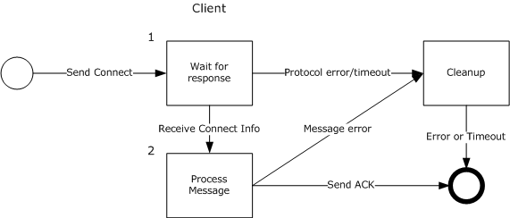
<!-- /Extracted images from page 57 -->

## 3 Protocol Details

### 3.1 Connect Role Details

Figure 1: Role of a client when joining the client to the session

The role of a client when attempting to connect to the session:

1.  The client sends a DN_INTERNAL_MESSAGE_PLAYER_CONNECT_INFO message (section 2.2.1.1)

to the server and waits for the DN_SEND_CONNECT_INFO message (section 2.2.1.4) to be sent in
response. If the server does not respond in time, the protocol times out and terminates the
connection.

Note  When the client sends the DN_INTERNAL_MESSAGE_PLAYER_CONNECT_INFO message, it
includes the user-provided password described in section 5.2. When the server receives the
message, it attempts to verify the password as described in Step 4 of section 3.1.5.1. If the server
is able to verify the password, it sends a DN_SEND_CONNECT_INFO message to bring the new
client into consistency with regard to the current application description state and player list. The
DN_SEND_CONNECT_INFO message includes the current user password, which is essentially a
redundant echo of the password that was verified by the server. However, if the server is unable
to verify the password and validation fails, the server sends a DN_CONNECT_FAILED message
(section 2.2.1.3) with the hResultCode field set to DPNERR_INVALIDPASSWORD or to another
validation failure code.

2.  When the DN_SEND_CONNECT_INFO message is received from the server, the client processes

the message. After the message is successfully processed, the client MUST send a
DN_ACK_CONNECT_INFO message (section 2.2.1.8) to the server. If an error occurs during
message processing, the client performs cleanup and ends the connection attempt.

[MC-DPL8CS] - v20240423
DirectPlay 8 Protocol: Core and Service Providers
Copyright © 2024 Microsoft Corporation
Release: April 23, 2024

57 / 91

<!-- Extracted images from page 58 -->
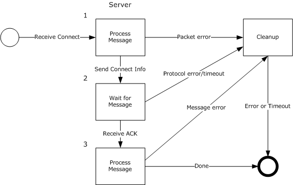
<!-- /Extracted images from page 58 -->

Figure 2: Role of the server when joining the client to the session

The role of the server when responding to a request from a client to be joined to the game session:

1.  The server receives a DN_INTERNAL_MESSAGE_PLAYER_CONNECT_INFO message from the client
and begins message processing. If an error occurs during message processing, the message is
ignored. Otherwise, the server responds to the client with a DN_SEND_CONNECT_INFO message
that includes the connection data for the game session.

2.  The server waits for a DN_ACK_CONNECT_INFO message from the client. If the client does not

send the acknowledgment (ACK) in time, the protocol times out and terminates the connection.

3.  When the DN_ACK_CONNECT_INFO message from the client is received by the server, the server
processes the ACK. After the ACK is successfully processed, the connection is made and the client
is joined to the game session. If an error occurs during message processing, the server performs
cleanup and ends the connection attempt.

[MC-DPL8CS] - v20240423
DirectPlay 8 Protocol: Core and Service Providers
Copyright © 2024 Microsoft Corporation
Release: April 23, 2024

58 / 91

<!-- Extracted images from page 59 -->
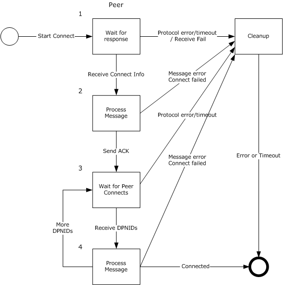
<!-- /Extracted images from page 59 -->

Figure 3: Role of a peer when adding the peer to the session

The role of a peer when attempting to be added to the game session:

1.  The nascent peer sends a DN_INTERNAL_MESSAGE_PLAYER_CONNECT_INFO message to the

host and waits for a response. If the host does not respond in time, the protocol times out and
terminates the connection.

2.  When the DN_SEND_CONNECT_INFO message is received from the host, the nascent peer

processes the message. The peer MUST maintain a copy of the name table information for each
peer in the game session as specified in the DN_NAMETABLE_ENTRY_INFO field of the
message. After the message is successfully processed, the nascent peer MUST send a
DN_ACK_CONNECT_INFO message to the host. If an error occurs during message processing, the
nascent peer performs cleanup and ends the connection attempt.

3.  After acknowledging the connection, the nascent peer waits to receive DN_SEND_PLAYER_DPNID

messages (section 2.2.1.10) from all other connected, established peers in the game session. If all
connected, established peers do not respond in time, the protocol times out and terminates the
connection.

[MC-DPL8CS] - v20240423
DirectPlay 8 Protocol: Core and Service Providers
Copyright © 2024 Microsoft Corporation
Release: April 23, 2024

59 / 91

<!-- Extracted images from page 60 -->
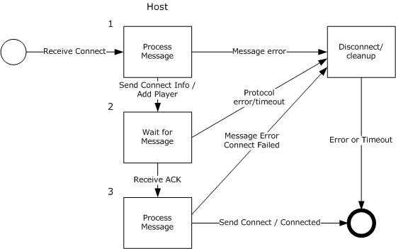
<!-- /Extracted images from page 60 -->

4.  When a DN_SEND_PLAYER_DPNID message is received from an established peer, the nascent
peer processes the message. If an established peer is unable to connect to the nascent peer:







The established peer responds to the host with a DN_INSTRUCTED_CONNECT_FAILED
message (section 2.2.1.11).

The connection attempt is canceled.

The host issues a DN_CONNECT_ATTEMPT_FAILED message (section 2.2.1.12) to the nascent
peer.

Otherwise, when DN_SEND_PLAYER_DPNID messages have been successfully received from all
other connected, established peers, the nascent peer is connected and added to the game session.

Figure 4: Role of the host when adding a peer to the session

The role of the host when responding to a request from a peer to be added to the game session:

The host receives a DN_INTERNAL_MESSAGE_PLAYER_CONNECT_INFO message from a nascent peer
and begins message processing. If an error occurs during message processing, the message is
ignored. Otherwise, the host responds to the nascent peer with a DN_SEND_CONNECT_INFO message
that includes the connection data for the game session. At the same time, the host sends
DN_ADD_PLAYER messages (section 2.2.1.7) to all connected, established peers in the game session.

1.  The peer processes the DN_SEND_CONNECT_INFO message. The peer SHOULD maintain a copy

of the name table information for each peer in the game session as specified in the
DN_NAMETABLE_ENTRY_INFO field of the message. The host waits for a
DN_ACK_CONNECT_INFO message from the nascent peer. If the nascent peer does not respond in
time, the protocol times out and terminates the connection.

2.  When the DN_ACK_CONNECT_INFO message from the nascent peer is received by the host, the
host processes the ACK. If an error occurs during processing of the ACK, the host performs
cleanup and ends the connection attempt. Otherwise, after the ACK is processed, the host sends a
DN_INSTRUCT_CONNECT message (section 2.2.1.9) to all peers (including the nascent peer)

[MC-DPL8CS] - v20240423
DirectPlay 8 Protocol: Core and Service Providers
Copyright © 2024 Microsoft Corporation
Release: April 23, 2024

60 / 91

instructing them to attempt a connection to the nascent peer. If an established peer is unable to
connect to the nascent peer:







The established peer responds to the host with a DN_INSTRUCTED_CONNECT_FAILED
message.

The connection attempt is canceled.

The host issues a DN_CONNECT_ATTEMPT_FAILED message to the nascent peer.

Otherwise, it is assumed that the established peers are able to successfully connect to the nascent
peer, and the nascent peer is added to the game session.

When the nascent peer receives a DN_INSTRUCT_CONNECT message from the host, the message
is used only to synchronize its name table with the established peers.

#### 3.1.1 Abstract Data Model

The connect sequence is initiated by the client or the peer. If there happens to be an error or
disconnect on the server/host, cleanup and disconnect happens with only the client/peer with the
failure. (Remaining clients/peers in the session remain connected.)

A DirectPlay 8 Protocol: Core and Service Providers Protocol implementation MUST maintain the
following data element:

name table: All participants MUST maintain a name table, as described in section 2.2.6. In peer-to-
peer mode, the name table state MUST be kept consistent among all participants, and during
connections:



The host MUST generate a DN_ADD_PLAYER (section 2.2.1.7) name table operation associated
with the connecting peer.



Existing peers MUST process the DN_ADD_PLAYER name table operation from the host.

  New peers MUST construct the initial name table based on the entries contained in the

DN_SEND_CONNECT_INFO (section 2.2.1.4) message.

In client/server mode, each client only keeps name table entries that represent its player and the
server player. Therefore, only this subset of the name table is synchronized with the server during
connection.

#### 3.1.2 Timers

The connection sequence is event driven via packets sent and received via the Peer, Client, Host, or
Server.

#### 3.1.3 Initialization

None.

#### 3.1.4 Higher-Layer Triggered Events

None.

[MC-DPL8CS] - v20240423
DirectPlay 8 Protocol: Core and Service Providers
Copyright © 2024 Microsoft Corporation
Release: April 23, 2024

61 / 91

<!-- Extracted images from page 62 -->
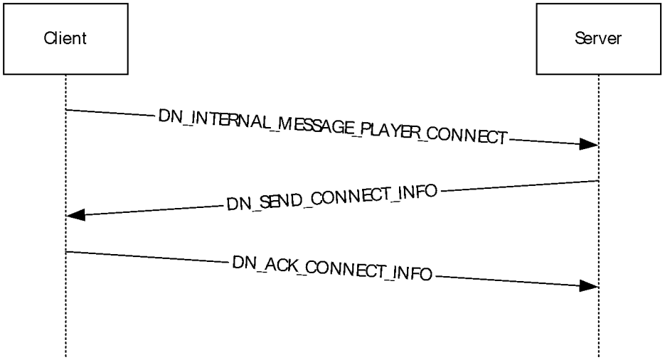
<!-- /Extracted images from page 62 -->

#### 3.1.5 Processing Events and Sequencing Rules

##### 3.1.5.1 Client/Server Connect Sequence

Figure 5: Client/server connect sequence

A server has been launched and is in the process of accepting incoming connections.

1.  The client establishes a connection to the server as specified in [MC-DPL8R].

2.  The client sends a player connect message to the server:

  DN_INTERNAL_MESSAGE_PLAYER_CONNECT_INFO

  DN_INTERNAL_MESSAGE_PLAYER_CONNECT_INFO_EX (DirectPlay 9)

When the client sends the player connect message, it includes the user-provided password
described in section 5.2, if present. When the server receives the message, it verifies the client
has specified compatible values; if a higher layer indicated that a password is required, the client’s
password string MUST exist and match exactly. If no password is required, the server SHOULD
silently ignore any password string specified by the client.

3.  If the server successfully validates the password and other

DN_INTERNAL_MESSAGE_PLAYER_CONNECT_INFO information, the server responds to the client:

DN_SEND_CONNECT_INFO

The DN_SEND_CONNECT_INFO message MUST contain the current game session state and
settings.

Note  For client/server, there are only two entries in the DN_NAMETABLE_ENTRY_INFO message
as part of the DN_SEND_CONNECT_INFO packet.

Note  If a password was required, the message includes the
DPNSESSION_REQUIREPASSWORD flag and a redundant echo of the password that had been
successfully verified. If no password was required, the DPNSESSION_REQUIREPASSWORD
SHOULD NOT be included, and the dwPasswordOffset and dwPasswordSize values SHOULD
be 0.

If the server is unable to verify the password and validation fails, the server sends a
DN_CONNECT_FAILED message (section 2.2.1.3) with the hResultCode field set to
DPNERR_INVALIDPASSWORD or to another validation failure code.

62 / 91

[MC-DPL8CS] - v20240423
DirectPlay 8 Protocol: Core and Service Providers
Copyright © 2024 Microsoft Corporation
Release: April 23, 2024

<!-- Extracted images from page 63 -->
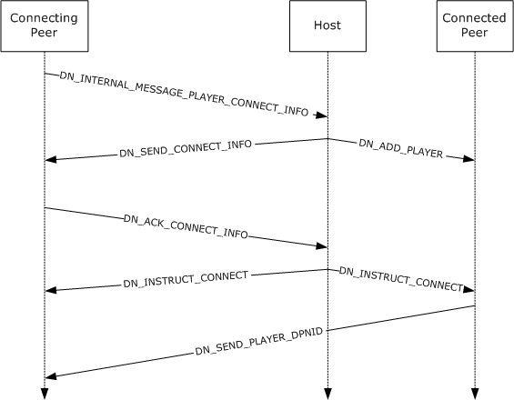
<!-- /Extracted images from page 63 -->

4.  Upon receipt of the DN_SEND_CONNECT_INFO message from the server, the client acknowledges

the connection by returning:

DN_ACK_CONNECT_INFO

##### 3.1.5.2 Peer-to-Peer Connect Sequence

Figure 6: Peer-to-peer connect sequence

Assuming the first peer has been launched, that peer will be deemed the host of the game session and
will be in the process of accepting incoming connections. (The peer host is responsible for all name
table transactions and synchronization across peers in the game session.)

1.  The new peer establishes a connection to the host as specified in [MC-DPL8R].

2.  The internal player connect message is sent in from the peer to the host:

  DN_INTERNAL_MESSAGE_PLAYER_CONNECT_INFO

  DN_INTERNAL_MESSAGE_PLAYER_CONNECT_INFO_EX (DirectPlay 9)

When the peer sends the player connect message, it includes the user-provided password
described in section 5.2, if present. When the host receives the message, it verifies the peer has
specified compatible values; if a higher layer indicated that a password is required, the peer’s
password string MUST exist and match exactly. If no password is required, the host SHOULD
silently ignore any password string specified by the peer.

3.  If the host fails in validating DN_INTERNAL_MESSAGE_PLAYER_CONNECT_INFO, the connecting

peer is sent:

63 / 91

[MC-DPL8CS] - v20240423
DirectPlay 8 Protocol: Core and Service Providers
Copyright © 2024 Microsoft Corporation
Release: April 23, 2024

DN_CONNECT_FAILED

4.  If the host successfully validates DN_INTERNAL_MESSAGE_PLAYER_CONNECT_INFO, the host

creates a new name table entry for the connecting peer and adds the new entry into the host’s
name table. The host increases its name table version by 1 and enters the new version into the
new name table entry. The host then responds to the connecting peer with:

DN_SEND_CONNECT_INFO

The DN_SEND_CONNECT_INFO message MUST contain the current game session state and
settings. The message also contains a copy of the host’s updated name table.

Note  The entries in the DN_NAMETABLE_ENTRY_INFO message will exist for each player
connected to the game session.

Note  If a password was required, the message includes the
DPNSESSION_REQUIREPASSWORD flag and a redundant echo of the password that had been
successfully verified. If no password was required, the DPNSESSION_REQUIREPASSWORD
SHOULD NOT be included, and the dwPasswordOffset and dwPasswordSize values SHOULD
be 0.

If the host is unable to verify the password and validation fails, the host sends a
DN_CONNECT_FAILED message (section 2.2.1.3) with the hResultCode field set to
DPNERR_INVALIDPASSWORD or to another validation failure code.

5.  At the same time as the host is responding to the connecting peer with

DN_SEND_CONNECT_INFO, the host is also issuing a message to the already-connected peers:

DN_ADD_PLAYER

The DN_ADD_PLAYER message contains the new name table entry for the connecting player.

6.  Upon receipt of the DN_SEND_CONNECT_INFO message from the host, the connecting peer will

construct its initial name table state based on the entries and version number sent by the host and
acknowledge the connection by returning:

DN_ACK_CONNECT_INFO

7.  After receiving DN_ACK_CONNECT_INFO from the connecting peer, the host instructs all existing

peers to also establish a connection to the connecting peer by sending them the following
message. The host will also send the following message to the connecting peer in order to keep
the name table for the connecting peer in sync with the name tables of the existing peers in the
session:

DN_INSTRUCT_CONNECT

8.  Upon receiving DN_INSTRUCT_CONNECT from the host, the existing peers will issue their DPNIDs

to the new peer being added by sending:

DN_SEND_PLAYER_DPNID

If the modulo 4 result of the new version for the name table is equal to 0, the name tables of the
existing peers are updated as described in section 2.2.6 with:

DN_RESYNC_VERSION

9.  If existing peers are unable to successfully send the DN_SEND_PLAYER_DPNID message to the

connecting peer, the existing peers will issue a fail packet back to the host:

DN_INSTRUCTED_CONNECT_FAILED

[MC-DPL8CS] - v20240423
DirectPlay 8 Protocol: Core and Service Providers
Copyright © 2024 Microsoft Corporation
Release: April 23, 2024

64 / 91

<!-- Extracted images from page 65 -->
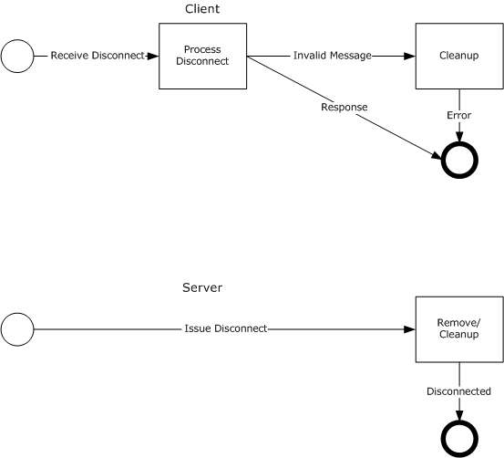
<!-- /Extracted images from page 65 -->

10. Upon receiving the DN_INSTRUCTED_CONNECT_FAILED message from any of the existing peers,

the host will send the connecting peer:

DN_CONNECT_ATTEMPT_FAILED

11. Host "removes player from the game session".

#### 3.1.6 Timer Events

None.

#### 3.1.7 Other Local Events

None.

### 3.2 Disconnect Role Details

Figure 7: Role of a client and the server when disconnecting the client from the session

The role of the client when responding to the instruction to disconnect:



The client receives a DN_TERMINATE_SESSION message (section 2.2.2.1) from the server and
begins message processing. If an error occurs during message processing, or the received

65 / 91

[MC-DPL8CS] - v20240423
DirectPlay 8 Protocol: Core and Service Providers
Copyright © 2024 Microsoft Corporation
Release: April 23, 2024

<!-- Extracted images from page 66 -->
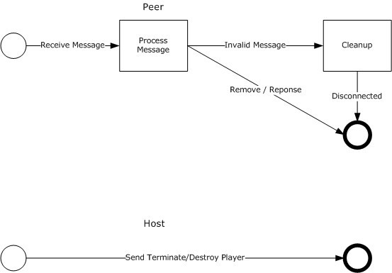
<!-- /Extracted images from page 66 -->

message is invalid, the client performs cleanup and the message is ignored. Otherwise, the client
MUST remove itself from the game session.

The role of the server when responding to the instruction to disconnect:



The server sends a DN_TERMINATE_SESSION message to the client and removes the client from
the game session.

Figure 8: Role of a peer and the host when disconnecting the peer from the session

The role of a peer when responding to the instruction to disconnect:



The peer receives a DN_TERMINATE_SESSION message from the host and begins message
processing. If an error occurs during message processing, or the received message is invalid, the
peer performs cleanup and the message is ignored. Otherwise, the peer MUST disconnect from the
game session.

The role of the host when instructing a peer to disconnect:



The host sends a DN_TERMINATE_SESSION message to the disconnecting peer and sends a
DN_DESTROY_PLAYER message (section 2.2.2.2) to the other connected peers in the game
session. Upon receipt of the DN_DESTROY_PLAYER message from the host, the other connected
peers MUST remove the indicated player (the disconnecting peer) from the game session.

[MC-DPL8CS] - v20240423
DirectPlay 8 Protocol: Core and Service Providers
Copyright © 2024 Microsoft Corporation
Release: April 23, 2024

66 / 91

<!-- Extracted images from page 67 -->
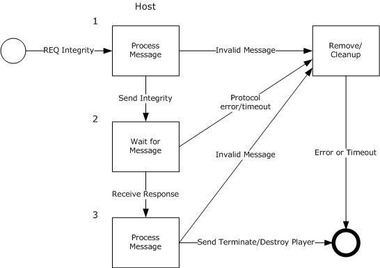
<!-- /Extracted images from page 67 -->

Figure 9: Role of the host when performing a peer integrity check

The role of the host when responding to a request to check the integrity of a peer in the game
session:

1.  The host receives an DN_REQ_INTEGRITY_CHECK message (section 2.2.2.6) from a connected

peer in the game session and begins message processing. (The peer that is making the request is
asking the host to check the integrity of another peer in the game session.) If an error occurs
during message processing, or the message is invalid, the host performs cleanup and the message
is ignored. Otherwise, the host sends a DN_INTEGRITY_CHECK message (section 2.2.2.7) to the
peer that is to be checked.

2.  The host waits for a DN_INTEGRITY_CHECK_RESPONSE message (section 2.2.2.8) from the peer

that is being checked. If the peer does not respond in time, the protocol times out and disconnects
the peer that was being checked from the game session. The host then sends a
DN_DESTROY_PLAYER message to the other connected peers in the game session. Upon receipt of
the DN_DESTROY_PLAYER message from the host, the other connected peers MUST remove the
indicated player (the disconnecting peer) from the game session.

3.  When a DN_INTEGRITY_CHECK_RESPONSE message is received from the peer that is being

checked, the host begins message processing. If an error occurs during message processing, or
the message is invalid, the host performs cleanup and the message is ignored. Otherwise, the host
sends a DN_TERMINATE_SESSION message to the peer that sent the DN_REQ_INTEGRITY_CHECK
message, and sends a DN_DESTROY_PLAYER message to the other connected peers in the game
session. Upon receipt of the DN_DESTROY_PLAYER message from the host, the other connected
peers MUST remove the indicated player (the terminated peer) from the game session.

[MC-DPL8CS] - v20240423
DirectPlay 8 Protocol: Core and Service Providers
Copyright © 2024 Microsoft Corporation
Release: April 23, 2024

67 / 91

<!-- Extracted images from page 68 -->
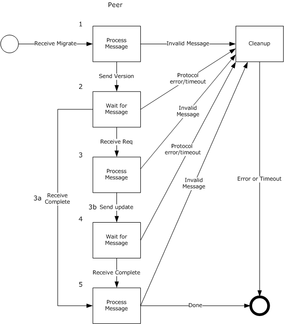
<!-- /Extracted images from page 68 -->

Figure 10: Role of a peer during host migration

The role of a peer when responding to a request to perform host migration:

1.  The peer receives a DN_HOST_MIGRATE message (section 2.2.2.3) from the host and begins

message processing. If an error occurs during message processing, or the message is invalid, the
peer performs cleanup and the message is ignored. Otherwise, the peer responds to the host by
sending the name table version of the peer via a DN_NAMETABLE_VERSION message (section
2.2.2.4).

2.  The peer waits for an acknowledgment (ACK) from the host. If the host does not respond in

time, the protocol times out and terminates the connection.

3.  When the response is received from the host, the peer processes the message.

[MC-DPL8CS] - v20240423
DirectPlay 8 Protocol: Core and Service Providers
Copyright © 2024 Microsoft Corporation
Release: April 23, 2024

68 / 91

<!-- Extracted images from page 69 -->
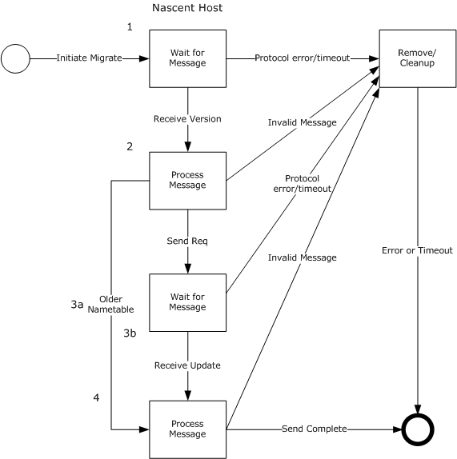
<!-- /Extracted images from page 69 -->

1.  If the host has responded with a DN_HOST_MIGRATE_COMPLETE message (section 2.2.2.11),

the peer processes the message. If an error occurs during message processing, or the
message is invalid, the peer performs cleanup and the instruction to migrate is ignored.
Otherwise, host migration is complete.

2.  If the host has responded with a DN_REQ_NAMETABLE_OP message (section 2.2.2.9) to the

peer, the peer processes the request and sends a DN_ACK_NAMETABLE_OP message (section
2.2.2.10) to the host.

4.  The peer waits for a response from the host. If the host does not respond in time, the protocol

times out and terminates the connection.

5.  When the response message is received from the host, the peer processes the messages. The

peer MAY receive a DN_RESYNC_VERSION message (section 2.2.2.5) and SHOULD receive a
DN_HOST_MIGRATE_COMPLETE message from the host. If an error occurs during message
processing, or these messages are invalid, the peer performs cleanup and the messages are
ignored. Otherwise, host migration is complete.

Figure 11: Role of the host during host migration

The role of the host when initiating host migration:

[MC-DPL8CS] - v20240423
DirectPlay 8 Protocol: Core and Service Providers
Copyright © 2024 Microsoft Corporation
Release: April 23, 2024

69 / 91

1.  The host sends a DN_HOST_MIGRATE message to all connected peers in the game session and

waits to receive a DN_NAMETABLE_VERSION message from each peer. If a peer does not respond
in time, the protocol times out and terminates the connection for that peer.

2.  When the DN_NAMETABLE_VERSION response is received from a peer, the host processes the

message. If the host receives an invalid name table response message, the host performs cleanup
and the message is ignored.

3.  Otherwise, the host examines the peer's name table to determine if it is newer than the host's

name table.

1.  If the peer's name table is older than the host's name table, the host sends a

DN_HOST_MIGRATE_COMPLETE message to that peer.

2.  If the peer's name table is newer than the host's name table, the host sends a

DN_REQ_NAMETABLE_OP message to that peer and waits for a response. If the peer does not
respond in time, the connection to that peer is dropped from the game session.

4.  When the DN_ACK_NAMETABLE_OP message is received from the peer, the host processes the

message and uses the peer's name table to update it's own name table. The host then MAY send a
DN_RESYNC_VERSION message containing the new name table version to all connected peers in
the game session. Finally, the host sends a DN_HOST_MIGRATE_COMPLETE message to all
connected peers in the game session.

#### 3.2.1 Abstract Data Model

If there is an error with the protocol or message on the server/host, cleanup and disconnect happen
with only the client/peer with the failure. (Remaining clients/peers in the session remain connected.)

A DirectPlay 8 Protocol: Core and Service Providers Protocol implementation MUST maintain the
following data element:

name table: All participants MUST maintain a consistent name table, as described in section 2.2.6.
In peer-to-peer mode:





If the host disconnects from the game session, the process of host migration is initiated in
which the remaining peers examine the current state of the name table to identify the player with
the next lowest version number to become the new host.

If a peer disconnects from the game session, the host MUST generate a
DN_DESTROY_PLAYER (section 2.2.2.2) name table operation to remove the disconnecting player
from the name tables of all remaining participants.

In client/server mode:



Each client only keeps name table entries that represent its player and the server player, and is
not informed of other clients leaving.

  When a client leaves, the server updates only its own name table.



If the server disconnects, the game session is terminated.

#### 3.2.2 Timers

The disconnect sequence is event driven via messages sent and received via the Peer, Client, Host, or
Server.

[MC-DPL8CS] - v20240423
DirectPlay 8 Protocol: Core and Service Providers
Copyright © 2024 Microsoft Corporation
Release: April 23, 2024

70 / 91

<!-- Extracted images from page 71 -->
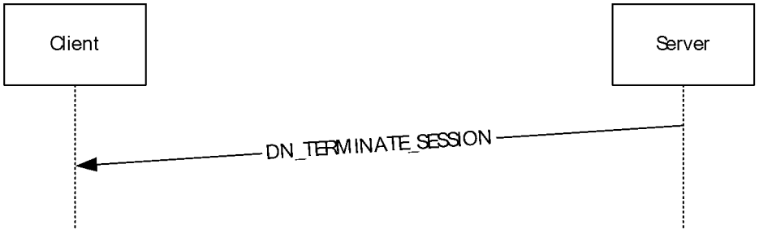
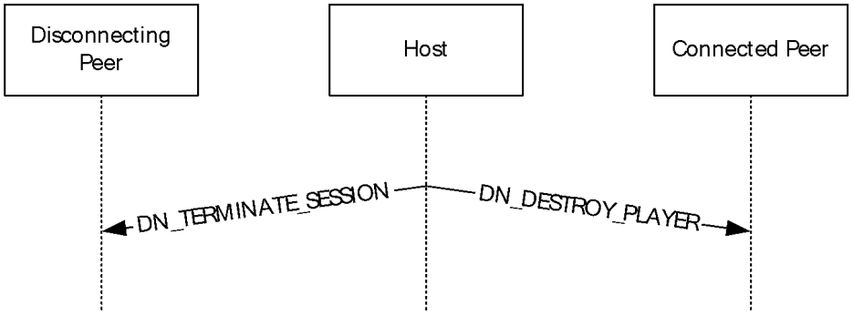
<!-- /Extracted images from page 71 -->

#### 3.2.3 Initialization

None.

#### 3.2.4 Higher-Layer Triggered Events

None.

#### 3.2.5 Processing Events and Sequencing Rules

##### 3.2.5.1 Client/Server Disconnect Sequence

Figure 12: Client/server disconnect sequence

The server is purposefully removing a peer from the game session.

1.  The server issues a packet to the client being removed:

DN_TERMINATE_SESSION

2.  When the client receives the DN_TERMINATE_SESSION message, it is required to disconnect itself

from the game session.

3.  If a client wants to leave the game session, it SHOULD issue a disconnect in the protocol to the

server. (No core specific messages.)

##### 3.2.5.2 Peer-to-Peer Host Disconnect Sequence

Figure 13: Peer-to-peer host disconnect sequence

1.  If the host is purposefully removing a peer from the game session, it will issue a packet to the

peer being removed:

DN_TERMINATE_SESSION

[MC-DPL8CS] - v20240423
DirectPlay 8 Protocol: Core and Service Providers
Copyright © 2024 Microsoft Corporation
Release: April 23, 2024

71 / 91

<!-- Extracted images from page 72 -->
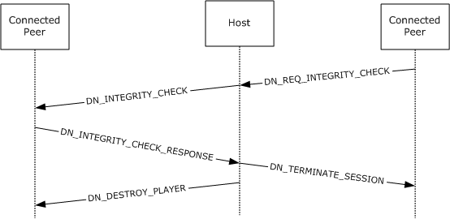
<!-- /Extracted images from page 72 -->

The peer receiving the DN_TERMINATE_SESSION MUST disconnect all connections and leave the
game session.

2.  The host also issues a message to the remaining connected peers indicating the removal of the

disconnecting peer:

DN_DESTROY_PLAYER

##### 3.2.5.3 Peer-to-Peer Integrity Check Sequence

Figure 14: Peer-to-peer integrity check sequence

1.  If a nonhost peer has detected a loss of connection to another peer and has not received a

DN_DESTROY_PLAYER message from the host for that peer, it sends a message notifying the
host:

DN_REQ_INTEGRITY_CHECK

2.  The host forwards a packet to the peer in question including the DPNID of the questioning peer:

DN_INTEGRITY_CHECK

3.  Upon receiving DN_INTEGRITY_CHECK, the peer responds back to the host:

DN_INTEGRITY_CHECK_RESPONSE

4.  If the host receives DN_INTEGRITY_CHECK_RESPONSE, the host will respond to the first peer

terminating it from the game session:

DN_TERMINATE_SESSION

5.  The host also issues a message to the remaining connected peers indicating the removal of the

disconnecting peer:

DN_DESTROY_PLAYER

[MC-DPL8CS] - v20240423
DirectPlay 8 Protocol: Core and Service Providers
Copyright © 2024 Microsoft Corporation
Release: April 23, 2024

72 / 91

<!-- Extracted images from page 73 -->
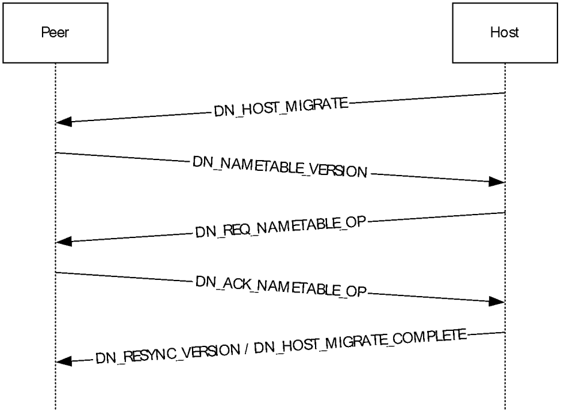
<!-- /Extracted images from page 73 -->

##### 3.2.5.4 Peer-to-Peer Host Disconnect (Possible Host Migration)

Figure 15: Peer-to-peer host disconnect (possible host migration)

The host drops out of the game session.

1.  Using the version information for each player from the name table, the player with the lowest

version number (connected peer) becomes the expected host. (This can be split out to more than
one host, if multiple connections are severed when a host leaves.) That new host sends to the
remaining connected peers:

DN_HOST_MIGRATE

2.  All peers still in the game session will respond to the new host, providing the host with their name

table versions:

DN_NAMETABLE_VERSION

3.  If the host sees that there is a peer with a newer name table, the new host will request that peer
to send the entries from its name table that are not contained within the host's name table:

DN_REQ_NAMETABLE_OP

4.  Upon receiving DN_REQ_NAMETABLE_OP, the peer will return the missing name table entries to

the host:

DN_ACK_NAMETABLE_OP

5.  The host installs any missed name table entries and sends any name table operations missed by
its peers as indicated by their reported name table versions in step 2. When all missing name
table entries have been provided to all players, the host can confirm that all peers have the
current name table version by sending:

DN_RESYNC_VERSION

[MC-DPL8CS] - v20240423
DirectPlay 8 Protocol: Core and Service Providers
Copyright © 2024 Microsoft Corporation
Release: April 23, 2024

73 / 91

<!-- Extracted images from page 74 -->
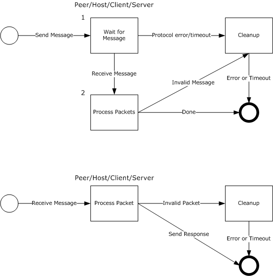
<!-- /Extracted images from page 74 -->

6.  After the name table has been brought up-to-date, the new host will respond to all connected

peers:

DN_HOST_MIGRATE_COMPLETE

#### 3.2.6 Timer Events

None.

#### 3.2.7 Other Local Events

None.

### 3.3 Send/Receive Communications Role Details

Figure 16: Role of the peer, host, client, and server when sending and receiving messages

The role of the peer, host, client, and server when sending messages (section 2.2.3):

[MC-DPL8CS] - v20240423
DirectPlay 8 Protocol: Core and Service Providers
Copyright © 2024 Microsoft Corporation
Release: April 23, 2024

74 / 91

1.  When any message is sent, if the sender specifies DN_REQ_PROCESS_COMPLETION (section

2.2.3.2) to indicate that the receiving application MUST confirm delivery of the sent message, the
sender waits to either receive a DN_PROCESS_COMPLETION response message (section 2.2.3.3),
or to be notified of connection termination by the lower-layer transport that is handling reliable
message delivery [MC-DPL8R]. If the connection is terminated prior to receiving a response, the
sender MUST treat the send operation as having failed in addition to performing standard
disconnect handling as described in section 3.2.

2.  Otherwise, when the DN_PROCESS_COMPLETION message is received, the send/receive is

completed.

The role of the peer, host, client, and server when receiving messages (section 2.2.3):

  When any message is received, the message is processed by the receiver. If the message is found
to be invalid, the receiver performs cleanup and the message is ignored. Otherwise, when the
message is valid and it contains a DN_REQ_PROCESS_COMPLETION request, a
DN_PROCESS_COMPLETION response message is sent back to the sender. If the message does
not contain a request for process completion, the message is consumed.

#### 3.3.1 Abstract Data Model

Illustrated in this model is a send where the process completion request has been sent. In the non-
process completion case, the messages are just consumed with no retained state.

#### 3.3.2 Timers

The send/receive sequence is event driven via messages sent and received via the Peer, Client, Host,
or Server. The DirectPlay 8 Protocol: Core and Service Providers does not directly implement timing-
related functionality; instead, it relies on internal timer events described in [MC-DPL8R] 3.1.2.5to
provide feedback regarding the state of individual connections. When a connection has been lost, the
DirectPlay 8 Protocol [MC-DPL8R] reports this to its consumers. The DirectPlay 8 Protocol: Core and
Service Providers MUST then handle the disconnect as described in section 3.2.

#### 3.3.3 Initialization

None.

#### 3.3.4 Higher-Layer Triggered Events

None.

[MC-DPL8CS] - v20240423
DirectPlay 8 Protocol: Core and Service Providers
Copyright © 2024 Microsoft Corporation
Release: April 23, 2024

75 / 91

<!-- Extracted images from page 76 -->
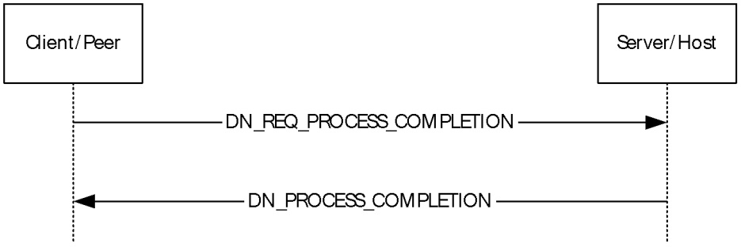
<!-- /Extracted images from page 76 -->

#### 3.3.5 Processing Events and Sequencing Rules

##### 3.3.5.1 Client/Server and Peer-to-Peer Send/Receive Communications Sequence

Figure 17: Communications Exchange diagram

Data send and receive sequences are identical for client/server and peer-to-peer modes.

There are two types of general data sends. One requires notification from the game session that the
user data has been consumed, and the other does not.

To differentiate, on the data frame (DFRAME) that is handed up from the protocol, if the
bCommand field has the PACKET_COMMAND_USER_1 bit set, then this is a system message where
PacketType and PacketContext will be included.

1.  If an application sends data to another application and wants a response when that data has been

consumed, then it will send:

DN_REQ_PROCESS_COMPLETION

2.  When DN_REQ_PROCESS_COMPLETION is received, it is required that a message be returned

indicating that this payload has been consumed:

DN_PROCESS_COMPLETION

If the bCommand bit does not have the PACKET_COMMAND_USER_1 bit set, the data passed up via
the payload is data that SHOULD be passed directly to the application with no further interpretation.

Note  If Packet_Command_User_1 is set in the DFRAME, this indicates that it is a core message with
the first four bytes indicating the PacketType and is always sent reliably.

#### 3.3.6 Timer Events

None.

#### 3.3.7 Other Local Events

None.

[MC-DPL8CS] - v20240423
DirectPlay 8 Protocol: Core and Service Providers
Copyright © 2024 Microsoft Corporation
Release: April 23, 2024

76 / 91

<!-- Extracted images from page 77 -->
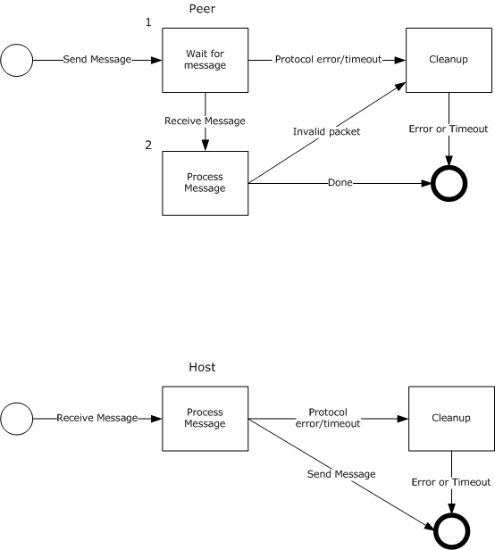
<!-- /Extracted images from page 77 -->

### 3.4 Groups Role Details

Figure 18: Role of a peer and the host when sending and receiving Group messages

The role of a peer and the host when sending Group messages (section 2.2.4):

1.  When any of the following messages are sent, the peer waits for a response from the host.

  DN_REQ_CREATE_GROUP (section 2.2.4.1)

  DN_REQ_ADD_PLAYER_TO_GROUP (section 2.2.4.3)

  DN_REQ_DESTROY_GROUP (section 2.2.4.7)

If the host does not respond in time, the protocol times out and the connection is terminated.

[MC-DPL8CS] - v20240423
DirectPlay 8 Protocol: Core and Service Providers
Copyright © 2024 Microsoft Corporation
Release: April 23, 2024

77 / 91

2.  Otherwise, when the peer receives any of the following messages in response from the host, the

peer processes the message.

  DN_CREATE_GROUP (section 2.2.4.2)

  DN_ADD_PLAYER_TO_GROUP (section 2.2.4.4)

  DN_DESTROY_GROUP (section 2.2.4.8)

If the message is invalid, the peer performs cleanup and the message is ignored. Otherwise, the
message is consumed.

The role of a peer and the host when receiving Group messages:

  When any of the following messages is received from a peer in the session, it is processed by the

host.

  DN_REQ_CREATE_GROUP

  DN_REQ_ADD_PLAYER_TO_GROUP

  DN_REQ_DESTROY_GROUP

If the message is invalid, the host performs cleanup and the message is ignored. Otherwise, the host
responds with one of the following messages back to the peer:

  DN_CREATE_GROUP

  DN_ADD_PLAYER_TO_GROUP

  DN_DESTROY_GROUP

Note  When working with groups, be aware of considerations related to DirectX Diagnostic
(DXDiag). The DXDiag tool (DxDiag.exe) implementation of this specification does not support
groups.

#### 3.4.1 Abstract Data Model

A DirectPlay 8 Protocol: Core and Service Providers Protocol implementation MUST maintain the
following data element:

name table: All participants MUST maintain a name table, as described in section 2.2.6. Each group
has an entry in the name table. In peer-to-peer mode, the host MUST generate
DN_CREATE_GROUP (section 2.2.4.2), DN_ADD_PLAYER_TO_GROUP (section 2.2.4.4),
DN_DELETE_PLAYER_FROM_GROUP (section 2.2.4.6), and DN_DESTROY_GROUP (section 2.2.4.8)
name table operations for each corresponding action that modifies the groups or their membership in
the name table.

In client/server mode, only the server has information pertaining to all players and groups. Therefore,
the server does generate name table operations associated with group management.

#### 3.4.2 Timers

The group sequences are driven via messages sent and received via the Peer, Client, Host, or Server.

#### 3.4.3 Initialization

None.

[MC-DPL8CS] - v20240423
DirectPlay 8 Protocol: Core and Service Providers
Copyright © 2024 Microsoft Corporation
Release: April 23, 2024

78 / 91

<!-- Extracted images from page 79 -->
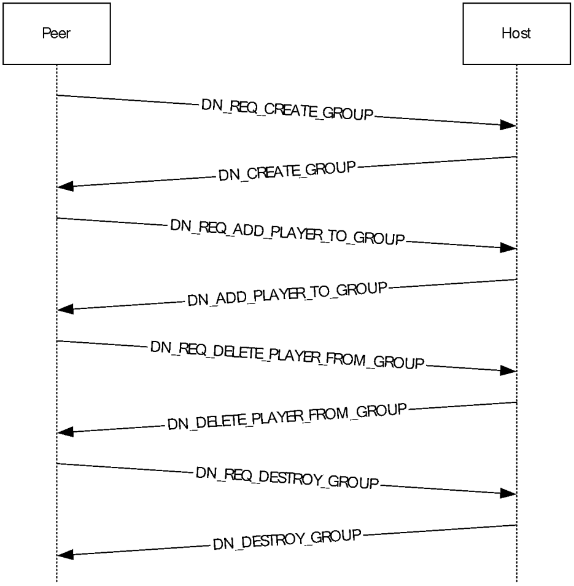
<!-- /Extracted images from page 79 -->

#### 3.4.4 Higher-Layer Triggered Events

None.

#### 3.4.5 Processing Events and Sequencing Rules

##### 3.4.5.1 Client/Server Group Role

There are no transactions on the wire for game session groups in client/server mode. Game
session groups are used only in peer-to-peer mode.

##### 3.4.5.2 Peer-to-Peer Group Sequence

Figure 19: Peer-to-peer group sequence diagram

Only the game session host can create or modify groups. The host can create and destroy groups
and add and remove players from existing groups.

1.  If a non-host peer wants to create a group, it MUST issue a message to the host:

DN_REQ_CREATE_GROUP

2.  Once the host has created a new group (via request from a peer or locally), it issues a command

to all the connected peers:

79 / 91

[MC-DPL8CS] - v20240423
DirectPlay 8 Protocol: Core and Service Providers
Copyright © 2024 Microsoft Corporation
Release: April 23, 2024

DN_CREATE_GROUP

3.  If a non-host peer wants to add a new player to an existing group, it MUST issue a message to the

host:

DN_REQ_ADD_PLAYER_TO_GROUP

4.  Once the host has added the new player to the group (via a peer or locally), the host responds to

all connected peers with:

DN_ADD_PLAYER_TO_GROUP

5.  If a non-host peer wants to delete a player from an existing group, it MUST issue a message to

the host:

DN_REQ_DELETE_PLAYER_FROM_GROUP

6.  Once the host has deleted the player from the group (via a peer or locally), the host responds to

all connected peers with:

DN_DELETE_PLAYER_FROM_GROUP

7.  If a non-host peer wants to destroy an existing group, it MUST issue a message to the host:

DN_REQ_DESTROY_GROUP

8.  Once the host has destroyed a group (via Req or locally), the host responds to all connected peers

with:

DN_DESTROY_GROUP

#### 3.4.6 Timer Events

None.

#### 3.4.7 Other Local Events

None.

[MC-DPL8CS] - v20240423
DirectPlay 8 Protocol: Core and Service Providers
Copyright © 2024 Microsoft Corporation
Release: April 23, 2024

80 / 91

<!-- Extracted images from page 81 -->
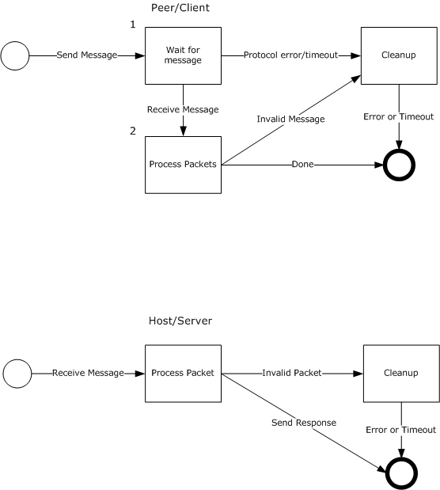
<!-- /Extracted images from page 81 -->

### 3.5 Update Information Role Details

Figure 20: Role of a peer/client and the host/server when sending and receiving Update
Information messages

The role of a peer/client when sending Update Information messages (section 2.2.5):

1.  When a DN_REQ_UPDATE_INFO message (section 2.2.5.1) is sent, the peer/client waits for a

response from the host/server. If the host/server does not respond in time, the protocol times out
and the connection is terminated.

2.  Otherwise, when the peer/client receives the response from the host/server, the peer/client
processes the message. If the message is invalid, the peer/client performs cleanup and the
message is ignored. Otherwise, the DN_UPDATE_INFO message (section 2.2.5.2) is consumed.

The role of the host/server when receiving Update Information messages:

81 / 91

[MC-DPL8CS] - v20240423
DirectPlay 8 Protocol: Core and Service Providers
Copyright © 2024 Microsoft Corporation
Release: April 23, 2024

<!-- Extracted images from page 82 -->
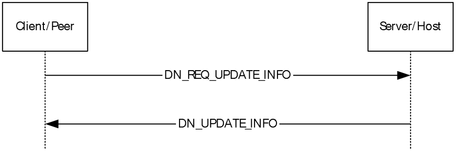
<!-- /Extracted images from page 82 -->

  When a DN_REQ_UPDATE_INFO message is received from a peer/client in the session, the

message is processed by the host/server. If the message is invalid, the host/server performs
cleanup and the message is ignored. Otherwise, the host/server responds by sending a
DN_UPDATE_INFO message back to the peer/client.

#### 3.5.1 Abstract Data Model

An update is requested by a peer or client to a host or server. The host/server will respond to all
players with the appropriate response.

A DirectPlay 8 Protocol: Core and Service Providers Protocol implementation MUST maintain the
following data element:

name table: All participants MUST maintain a name table, as described in section 2.2.6. In peer-to-
peer mode, the name table state MUST be kept consistent among all participants, and the host MUST
generate a DN_UPDATE_INFO (section 2.2.5.2) name table operation associated with the modified
player information.

In client/server mode, each client only keeps name table entries that represent its player and the
server player, and is not informed of information changes pertaining to other players.

#### 3.5.2 Timers

The update information sequence is event driven via messages sent and received via the Peer, Client,
Host, or Server.

#### 3.5.3 Initialization

None.

#### 3.5.4 Higher-Layer Triggered Events

None.

#### 3.5.5 Processing Events and Sequencing Rules

##### 3.5.5.1 Update Information Sequence

Figure 21: Update Information Sequence Diagram

This is used whenever a peer/client needs to update player or group information.

1.  The packet is sent to the host/server because the host/server is responsible for updating the

name table and keeping everyone in sync:

[MC-DPL8CS] - v20240423
DirectPlay 8 Protocol: Core and Service Providers
Copyright © 2024 Microsoft Corporation
Release: April 23, 2024

82 / 91

DN_REQ_UPDATE_INFO

2.  The host SHOULD respond appropriately to all players with the updated information:

DN_UPDATE_INFO

#### 3.5.6 Timer Events

None.

#### 3.5.7 Other Local Events

None.

[MC-DPL8CS] - v20240423
DirectPlay 8 Protocol: Core and Service Providers
Copyright © 2024 Microsoft Corporation
Release: April 23, 2024

83 / 91

## 4 Protocol Examples

A standard DN_INTERNAL_MESSAGE_PLAYER_CONNECT_INFO_EX (section 2.2.1.2) for a DirectPlay 8
Protocol: Core and Service Providers game session. This example includes the full Ethernet frame for
the packet sent.

In little-endian byte order:

  MSGID = 0x000000C1

  dwFlags indicates that this is a DN_OBJECT_TYPE_PEER.

  Player Name value of "Test User".

 0000   00 0A E4 03 27 73 00 0B DB 5C 3F 45 08 00 45 00   ..ä.'s..Û\?E..E.
 0010   00 98 3A 4C 00 00 80 11 9F B1 41 34 EF 3D 41 34   .˜:L..€.Ÿ±A4ï=A4
 0020   EE B1 08 FE 08 FE 00 84 C2 BF 7F 00 01 00 C1 00   î±.þ.þ.„¿...Á.
 0030   00 00 04 00 00 00 08 00 00 00 60 00 00 00 14 00   ..........`.....
 0040   00 00 00 00 00 00 00 00 00 00 00 00 00 00 00 00   ................
 0050   00 00 00 00 00 00 00 00 00 00 00 00 00 00 00 00   ................
 0060   00 00 23 81 BE 94 AB A1 FB 48 A2 E7 23 85 9E 65   ..#□¾"«¡ûH¢ç#…□e
 0070   89 36 DA 80 EF 61 1B 69 47 42 9A DD 1C 7B ED 2B   ‰6Ú€ïa.iGBšÝ.{í+
 0080   C1 3E 58 00 00 00 08 00 00 00 07 02 08 FE 41 34   Á>X..........þA4
 0090   EF 3D 54 00 65 00 73 00 74 00 20 00 55 00 73 00   ï=T.e.s.t. .U.s.
 00A0   65 00 72 00 00 00                                 e.r...

Upon success, the host will respond with the DN_SEND_CONNECT_INFO (section 2.2.1.4) packet to
the connecting peer. This example includes the full Ethernet frame for the packet sent.

In network byte order:

  MSGID = 0x000000C2

  dwFlags indicates that DPNSESSION_MIGRATE_HOST is allowed.

  dwMaxPlayers is not specified.

  dwCurrentPlayers is set to 2 for the host and connecting peer.

  dpnid for the connecting player value is 0x948E8120.

  Name table version entry of 0x03.

  dwEntryCount is set to 2.

  dwMembershipCount is 0, indicating no groups in the game session.

  Connecting Peers Name is "Test User".

  Host Peers Name is "Test User".

  Game session Name is "Test Session".



Player Name value of "Test User".

 0000   00 0B DB 5C 3F 45 00 0A E4 03 27 73 08 00 45 00   ..Û\?E..ä.'s..E.
 0010   01 94 06 95 00 00 80 11 D2 6C 41 34 EE B1 41 34   .".•..€.ÒlA4î±A4
 0020   EF 3D 08 FE 08 FE 01 80 0D 9F 7F 00 01 02 C2 00   ï=.þ.þ.€.Ÿ...Â.
 0030   00 00 00 00 00 00 00 00 00 00 50 00 00 00 04 00   ..........P.....
 0040   00 00 00 00 00 00 02 00 00 00 56 01 00 00 1A 00   ..........V.....

84 / 91

[MC-DPL8CS] - v20240423
DirectPlay 8 Protocol: Core and Service Providers
Copyright © 2024 Microsoft Corporation
Release: April 23, 2024

 0050   00 00 00 00 00 00 00 00 00 00 00 00 00 00 00 00   ................
 0060   00 00 00 00 00 00 00 00 00 00 23 81 BE 94 AB A1   ..........#□¾"«¡
 0070   FB 48 A2 E7 23 85 9E 65 89 36 DA 80 EF 61 1B 69   ûH¢ç#…□e‰6Ú€ïa.i
 0080   47 42 9A DD 1C 7B ED 2B C1 3E 20 81 8E 94 03 00   GBšÝ.{í+Á> □□"..
 0090   00 00 00 00 00 00 02 00 00 00 00 00 00 00 21 81   ..............!□
 00A0   9E 94 00 00 00 00 02 01 00 00 02 00 00 00 00 00   □"..............
 00B0   00 00 07 00 00 00 42 01 00 00 14 00 00 00 00 00   ......B.........
 00C0   00 00 00 00 00 00 00 00 00 00 00 00 00 00 20 81   .............. □
 00D0   8E 94 00 00 00 00 00 01 00 00 03 00 00 00 00 00   □"..............
 00E0   00 00 08 00 00 00 2E 01 00 00 14 00 00 00 00 00   ................
 00F0   00 00 00 00 00 00 CC 00 00 00 62 00 00 00 78 2D   ......Ì...b...x-
 0100   64 69 72 65 63 74 70 6C 61 79 3A 2F 70 72 6F 76   directplay:/prov
 0110   69 64 65 72 3D 25 37 42 45 42 46 45 37 42 41 30   ider=%7BEBFE7BA0
 0120   2D 36 32 38 44 2D 31 31 44 32 2D 41 45 30 46 2D   -628D-11D2-AE0F-
 0130   30 30 36 30 39 37 42 30 31 34 31 31 25 37 44 3B   006097B01411%7D;
 0140   68 6F 73 74 6E 61 6D 65 3D 36 35 2E 35 32 2E 32   hostname=65.52.2
 0150   33 39 2E 36 31 3B 70 6F 72 74 3D 32 33 30 32 00   39.61;port=2302.
 0160   54 00 65 00 73 00 74 00 20 00 55 00 73 00 65 00   T.e.s.t. .U.s.e.
 0170   72 00 00 00 54 00 65 00 73 00 74 00 20 00 55 00   r...T.e.s.t. .U.
 0180   73 00 65 00 72 00 00 00 54 00 65 00 73 00 74 00   s.e.r...T.e.s.t.
 0190   20 00 53 00 65 00 73 00 73 00 69 00 6F 00 6E 00    .S.e.s.s.i.o.n.
 01A0   00 00                                             ..

Given a game session with two connected peers, the following is an example of general data passed
between the peers. The following is the message "Hi there", where the message includes the full 400-
byte buffer. Everything after the plain text in this example is just random memory. This example
includes the full Ethernet frame for the packet sent.

 0000   00 0A E4 03 27 73 00 0B DB 5C 3F 45 08 00 45 00   ..ä.'s..Û\?E..E.
 0010   01 B2 DF CD 00 00 80 11 F9 94 41 34 EF 3D 41 34   .²ßÍ..€.ù"A4ï=A4
 0020   EE 32 08 FE 08 FE 01 9E 97 D4 3D 00 05 03 01 00   î2.þ.þ.□—Ô=.....
 0030   48 00 49 00 20 00 54 00 48 00 45 00 52 00 45 00   H.I. .T.H.E.R.E.
 0040   00 00 4E 1C 3F 77 64 00 83 00 00 00 00 00 FC 84   ..N.?wd.ƒ.....ü„
 0050   41 7E A4 85 41 7E 22 06 2B 00 A6 88 41 7E BF 3D   A~¤…A~".+.¦ˆA~¿=
 0060   3F 77 48 EF CF 00 D1 88 41 7E A8 1B 60 00 00 00   ?wHïÏ.шA~¨.`...
 0070   00 00 DA 88 41 7E A6 88 41 7E BF 3D 3F 77 00 00   ..ÚˆA~¦ˆA~¿=?w..
 0080   00 00 24 EF CF 00 01 00 00 00 FC EF CF 00 87 D3   ..$ïÏ.....üïÏ.‡Ó
 0090   00 00 78 EF CF 00 90 49 3F 77 20 3E 01 05 C2 00   ..xïÏ.□I?w >..Â.
 00A0   00 00 00 00 00 00 18 5E 69 4F BF 3D 3F 77 BF 3D   .......^iO¿=?w¿=
 00B0   3F 77 00 00 00 00 0D 00 00 00 00 01 00 00 58 5E   ?w............X^
 00C0   A8 06 BF 3D 3F 77 01 00 00 00 A4 EF CF 00 34 87   ¨.¿=?w....¤ïÏ.4‡
 00D0   41 7E 22 06 2B 00 C2 00 00 00 00 00 00 00 18 5E   A~".+.Â........^
 00E0   69 4F BF 3D 3F 77 CD AB BA DC 00 00 00 00 E0 EF   iO¿=?wÍ«ºÜ....àï
 00F0   CF 00 BF 3D 3F 77 0C F0 CF 00 16 88 41 7E 00 90   Ï.¿=?w.ðÏ..ˆA~.□
 0100   FD 7F 0C F0 CF 00 5A 88 41 7E CC EF CF 00 2A 88   ý.ðÏ.ZˆA~ÌïÏ.*ˆ
 0110   41 7E C2 00 00 00 A8 1B 60 00 BC 1B 60 00 14 00   A~Â...¨.`.¼.`...
 0120   00 00 01 00 00 00 00 00 00 00 00 00 00 00 10 00   ................
 0130   00 00 00 00 00 00 30 88 41 7E 00 00 00 00 00 00   ......0ˆA~......
 0140   00 00 01 00 00 00 C0 EF CF 00 BF 3D 3F 77 5C F2   ......ÀïÏ.¿=?w\ò
 0150   CF 00 57 04 44 7E C0 F1 CF 00 08 00 00 00 C0 F1   Ï.W.D~ÀñÏ.....Àñ
 0160   CF 00 C0 F1 CF 00 C0 F1 CF 00 30 F0 CF 00 85 38   Ï.ÀñÏ.ÀñÏ.0ðÏ.…8
 0170   6A 4F 09 00 00 00 C0 F1 CF 00 08 00 00 00 58 5E   jO....ÀñÏ.....X^
 0180   A8 06 48 F0 CF 00 2E 3B 6A 4F 58 5E A8 06 08 00   ¨.HðÏ..;jOX^¨...
 0190   00 00 08 00 00 00 C0 F1 CF 00 64 F0 CF 00 A6 3F   ......ÀñÏ.dðÏ.¦?
 01A0   6A 4F 58 5E A8 06 08 00 00 00 CE 3D 42 7E 8E 13   jOX^¨.....Î=B~□.
 01B0   00 00 BA B8 41 7E 74 F0 CF 00 BE 7A 6A 4F 00 00   ..º¸A~tðÏ.¾zjO..

[MC-DPL8CS] - v20240423
DirectPlay 8 Protocol: Core and Service Providers
Copyright © 2024 Microsoft Corporation
Release: April 23, 2024

85 / 91

## 5 Security

### 5.1 Security Considerations for Implementers

The DirectPlay 8 Protocol: Core and Service Providers provides no security features beyond those
included in the underlying DirectPlay 8 Protocol: Reliable ([MC-DPL8R]). The following are some
security features that implementers might consider including in their implementations:

  Check all packets to ensure that they are of the proper length and contain valid values.



Ignore malformed messages and messages from unknown clients, unless otherwise specified by
the protocol.

### 5.2 Index of Security Parameters

It is up to the application that is using the DirectPlay 8 Protocol: Core and Service Providers to
implement security. The following table allows only for simple passwords to be passed across game
sessions, but because these are transferred in the free and clear to the protocol, they cannot be used
for robust security.

DirectPlay allows the application to specify simple passwords defined as a simple method to avoid
unauthorized connections to the game session. Passwords are provided by the users in the game
session as part of the application user interface. If the password provided by a user is not the same
between the client and the host, then the host rejects the connection attempt by the user and returns
an error.

 Security
parameter

 Section

Password
(variable)

Password
(variable)

DN_INTERNAL_MESSAGE_PLAYER_CONNECT_INFO,
DN_INTERNAL_MESSAGE_PLAYER_CONNECT_INFO_EX (sections 2.2.1.1 and 2.2.1.2)

 DN_SEND_CONNECT_INFO (section 2.2.1.4)

[MC-DPL8CS] - v20240423
DirectPlay 8 Protocol: Core and Service Providers
Copyright © 2024 Microsoft Corporation
Release: April 23, 2024

86 / 91

## 6 Appendix A: Product Behavior

The information in this specification is applicable to the following Microsoft products or supplemental
software. References to product versions include updates to those products.

  Windows XP operating system

  Windows Server 2003 operating system

  Windows Vista operating system

  Windows Server 2008 operating system

  Windows 7 operating system

  Windows Server 2008 R2 operating system

  Windows 8 operating system

  Windows Server 2012 operating system

  Windows 8.1 operating system

  Windows Server 2012 R2 operating system

  Windows 10 operating system

  Windows Server 2016 operating system

  Windows Server 2019 operating system

  Windows Server 2022 operating system

  Windows 11 operating system

  Windows Server 2025 operating system

Exceptions, if any, are noted in this section. If an update version, service pack or Knowledge Base
(KB) number appears with a product name, the behavior changed in that update. The new behavior
also applies to subsequent updates unless otherwise specified. If a product edition appears with the
product version, behavior is different in that product edition.

Unless otherwise specified, any statement of optional behavior in this specification that is prescribed
using the terms "SHOULD" or "SHOULD NOT" implies product behavior in accordance with the
SHOULD or SHOULD NOT prescription. Unless otherwise specified, the term "MAY" implies that the
product does not follow the prescription.

[MC-DPL8CS] - v20240423
DirectPlay 8 Protocol: Core and Service Providers
Copyright © 2024 Microsoft Corporation
Release: April 23, 2024

87 / 91

## 7 Change Tracking

This section identifies changes that were made to this document since the last release. Changes are
classified as Major, Minor, or None.

The revision class Major means that the technical content in the document was significantly revised.
Major changes affect protocol interoperability or implementation. Examples of major changes are:

  A document revision that incorporates changes to interoperability requirements.
  A document revision that captures changes to protocol functionality.

The revision class Minor means that the meaning of the technical content was clarified. Minor changes
do not affect protocol interoperability or implementation. Examples of minor changes are updates to
clarify ambiguity at the sentence, paragraph, or table level.

The revision class None means that no new technical changes were introduced. Minor editorial and
formatting changes may have been made, but the relevant technical content is identical to the last
released version.

The changes made to this document are listed in the following table. For more information, please
contact dochelp@microsoft.com.

Section

Description

6 Appendix A: Product
Behavior

Added Windows Server 2025 to the list of applicable
products.

Revision
class

Major

[MC-DPL8CS] - v20240423
DirectPlay 8 Protocol: Core and Service Providers
Copyright © 2024 Microsoft Corporation
Release: April 23, 2024

88 / 91

## 8 Index
A

Abstract data model
   connect role 61
   disconnect role 70
   groups role 78
   send/receive communications role 75
   update information role 82
Applicability 13

C

Capability negotiation 13
Change tracking 88
Client/server
   connect sequence 62
   connecting to session 10
   disconnect sequence 71
   disconnecting from session 11
   group role 79
   groups 12
   send/receive communications sequence 76
   session modes 10
Connect messages 14
Connect role
   abstract data model 61
   higher-layer triggered events 61
   initialization 61
   local events 65
   message processing
      client/server connect sequence 62
      peer-to-peer connect sequence 63
   overview 57
   sequencing rules
      client/server connect sequence 62
      peer-to-peer connect sequence 63
   timer events 65
   timers 61
Connecting to session
   client/server connect 10
   overview 10
   peer-to-peer connect 10

D

Data model - abstract
   connect role 61
   disconnect role 70
   groups role 78
   send/receive communications role 75
   update information role 82
Disconnect role
   abstract data model 70
   higher-layer triggered events 71
   initialization 71
   local events 74
   message processing
      client/server disconnect sequence 71
      peer-to-peer host disconnect sequence (section

3.2.5.2 71, section 3.2.5.4 73)

   overview 65

[MC-DPL8CS] - v20240423
DirectPlay 8 Protocol: Core and Service Providers
Copyright © 2024 Microsoft Corporation
Release: April 23, 2024

   sequencing rules
      client/server disconnect sequence 71
      peer-to-peer host disconnect sequence (section

3.2.5.2 71, section 3.2.5.4 73)

   timer events 74
   timers 70
Disconnecting from session
   client/server disconnect 11
   peer-to-peer disconnect 11
DN_ACK_CONNECT_INFO packet 33
DN_ACK_NAMETABLE_OP packet 40
DN_ADD_PLAYER packet 30
DN_ADD_PLAYER_TO_GROUP packet 45
DN_ADDRESSING_URL message 53
DN_ADDRESSING_URL structure 53
DN_ALTERNATE_ADDRESS (IPv4) message 55
DN_ALTERNATE_ADDRESS (IPv6) message 56
DN_ALTERNATE_ADDRESS structure (section 2.2.9

55, section 2.2.10 56)

DN_ALTERNATE_ADDRESS_IPv4 packet 55
DN_ALTERNATE_ADDRESS_IPv6 packet 56
DN_CONNECT_ATTEMPT_FAILED packet 34
DN_CONNECT_FAILED packet 21
DN_CREATE_GROUP packet 44
DN_DELETE_PLAYER_FROM_GROUP packet 47
DN_DESTROY_GROUP packet 48
DN_DESTROY_PLAYER packet 35
DN_DPNID message 53
DN_DPNID structure 53
DN_HOST_MIGRATE packet 36
DN_HOST_MIGRATE_COMPLETE packet 41
DN_INSTRUCT_CONNECT packet 33
DN_INSTRUCTED_CONNECT_FAILED packet 34
DN_INTEGRITY_CHECK packet 38
DN_INTEGRITY_CHECK_RESPONSE packet 39
DN_INTERNAL_MESSAGE_PLAYER_CONNECT_INFO

packet 14

DN_INTERNAL_MESSAGE_PLAYER_CONNECT_INFO_

EX packet 17

DN_NAMETABLE message 52
DN_NAMETABLE structure 52
DN_NAMETABLE_ENTRY_INFO packet 27
DN_NAMETABLE_MEMBERSHIP_INFO packet 29
DN_NAMETABLE_VERSION packet 37
DN_PROCESS_COMPLETION packet 42
DN_REQ_ADD_PLAYER_TO_GROUP packet 45
DN_REQ_CREATE_GROUP packet 43
DN_REQ_DELETE_PLAYER_FROM_GROUP packet 46
DN_REQ_DESTROY_GROUP packet 48
DN_REQ_INTEGRITY_CHECK packet 38
DN_REQ_NAMETABLE_OP packet 39
DN_REQ_PROCESS_COMPLETION packet 42
DN_REQ_UPDATE_INFO packet 49
DN_RESYNC_VERSION packet 37
DN_SEND_CONNECT_INFO packet 22
DN_SEND_DATA packet 41
DN_SEND_PLAYER_DPNID packet 33
DN_TERMINATE_SESSION packet 35
DN_UPDATE_INFO packet 50

E

89 / 91

Examples - overview 84

F

Fields - vendor-extensible 13

G

Glossary 7
Group messages 43
Group Messages (Peer-to-Peer Mode Only) message

43
Groups
   client/server 12
   client/server role 79
   overview 12
   peer-to-peer 13
Groups role
   abstract data model 78
   higher-layer triggered events 79
   initialization 78
   local events 80
   message processing
      client/server group role 79
      peer-to-peer sequence 79
   overview 77
   sequencing rules
      client/server group role 79
      peer-to-peer sequence 79
   timer events 80
   timers 78

H

Higher-layer triggered events
   connect role 61
   disconnect role 71
   groups role 79
   send/receive communications role 75
   update information role 82
Host migration - peer-to-peer disconnect (section

1.3.6 12, section 3.2.5.4 73)

I

Implementer - security considerations 86
Index of security parameters 86
Informative references 9
Initialization
   connect role 61
   disconnect role 71
   groups role 78
   send/receive communications role 75
   update information role 82
Integrity check - peer-to-peer (section 1.3.5 11,

section 3.2.5.3 72)

Introduction 7

L

Local events
   connect role 65
   disconnect role 74

[MC-DPL8CS] - v20240423
DirectPlay 8 Protocol: Core and Service Providers
Copyright © 2024 Microsoft Corporation
Release: April 23, 2024

   groups role 80
   send/receive communications role 76
   update information role 83

M

Message processing
   connect role
      client/server connect sequence 62
      peer-to-peer connect sequence 63
   disconnect role
      client/server disconnect sequence 71
      peer-to-peer host disconnect sequence (section

3.2.5.2 71, section 3.2.5.4 73)

   groups role
      client/server role 79
      peer-to-peer sequence 79
   send/receive communications role 76
   update information role 82
Messages
   DN_ADDRESSING_URL 53
   DN_ALTERNATE_ADDRESS (IPv4) 55
   DN_ALTERNATE_ADDRESS (IPv6) 56
   DN_DPNID 53
   DN_NAMETABLE 52
   Group Messages (Peer-to-Peer Mode Only) 43
   Send/Receive Messages 41
   syntax
      connect messages 14
      disconnect messages 35
      DN_ADDRESSING_URL structure 53
      DN_ALTERNATE_ADDRESS structure (section

2.2.9 55, section 2.2.10 56)

      DN_DPNID structure 53
      DN_NAMETABLE structure 52
      group messages 43
      send/receive messages 41
      updating information 49
   transport 14
      overview 14
      packet structure 14

N

Normative references 9

O

Overview (synopsis) 9

P

Packet structure 14
Parameters - security index 86
Peer-to-peer
   connect sequence 63
   connecting to session 10
   disconnecting from session 11
   group messages 43
   group sequence 79
   groups 13
   host disconnect sequence (section 3.2.5.2 71,

section 3.2.5.4 73)

   host migration 12
   integrity check 11

90 / 91

Timer events
   connect role 65
   disconnect role 74
   groups role 80
   send/receive communications role 76
   update information role 83
Timers
   connect role 61
   disconnect role 70
   groups role 78
   send/receive communications role 75
   update information role 82
Tracking changes 88
Transport 14
   overview 14
   packet structure 14
Triggered events - higher-layer
   connect role 61
   disconnect role 71
   groups role 79
   send/receive communications role 75
   update information role 82

U

Update information role
   abstract data model 82
   higher-layer triggered events 82
   initialization 82
   local events 83
   message processing 82
   overview 81
   sequencing rules 82
   timer events 83
   timers 82

V

Vendor-extensible fields 13
Versioning 13

   integrity check sequence 72
   send/receive communications sequence 76
   session modes 10
Preconditions 13
Prerequisites 13
Product behavior 87

R

References 9
   informative 9
   normative 9
Relationship to other protocols 13

S

Security
   implementer considerations 86
   parameter index 86
Send/receive communications role
   abstract data model 75
   higher-layer triggered events 75
   initialization 75
   local events 76
   message processing 76
   overview 74
   sequencing rules 76
   timer events 76
   timers 75
Send/receive messages 41
Send/Receive Messages message 41
Sequencing rules
   connect role
      client/server connect sequence 62
      peer-to-peer connect sequence 63
   disconnect role
      client/server disconnect sequence 71
      peer-to-peer host disconnect sequence (section

3.2.5.2 71, section 3.2.5.4 73)

   groups role
      client/server role 79
      peer-to-peer sequence 79
   send/receive communications role 76
   update information role 82
Session management 10
Session modes
   client/server 10
   overview 10
   peer/host 10
   peer-to-peer 10
Standards assignments 13
Syntax
   connect messages 14
   disconnect messages 35
   DN_ADDRESSING_URL structure 53
   DN_ALTERNATE_ADDRESS structure (section 2.2.9

55, section 2.2.10 56)
   DN_DPNID structure 53
   DN_NAMETABLE structure 52
   group messages 43
   send/receive messages 41
   updating information 49

T

[MC-DPL8CS] - v20240423
DirectPlay 8 Protocol: Core and Service Providers
Copyright © 2024 Microsoft Corporation
Release: April 23, 2024

91 / 91

