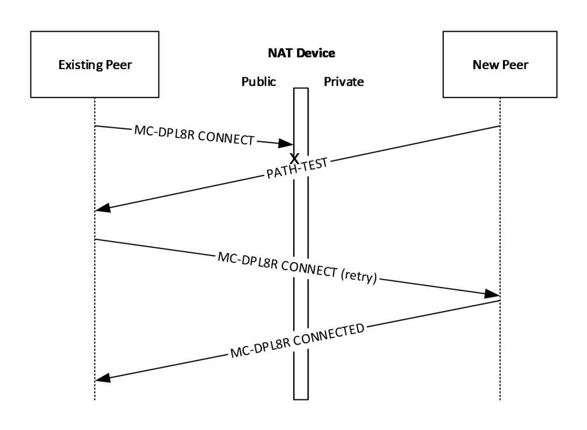

[MC-DPLNAT]:

DirectPlay 8 Protocol: NAT Locator

Intellectual Property Rights Notice for Open Specifications Documentation

  Technical Documentation. Microsoft publishes Open Specifications documentation (“this

documentation”) for protocols, file formats, data portability, computer languages, and standards
support. Additionally, overview documents cover inter-protocol relationships and interactions.

  Copyrights. This documentation is covered by Microsoft copyrights. Regardless of any other

terms that are contained in the terms of use for the Microsoft website that hosts this
documentation, you can make copies of it in order to develop implementations of the technologies
that are described in this documentation and can distribute portions of it in your implementations
that use these technologies or in your documentation as necessary to properly document the
implementation. You can also distribute in your implementation, with or without modification, any
schemas, IDLs, or code samples that are included in the documentation. This permission also
applies to any documents that are referenced in the Open Specifications documentation.
  No Trade Secrets. Microsoft does not claim any trade secret rights in this documentation.
  Patents. Microsoft has patents that might cover your implementations of the technologies

described in the Open Specifications documentation. Neither this notice nor Microsoft's delivery of
this documentation grants any licenses under those patents or any other Microsoft patents.
However, a given Open Specifications document might be covered by the Microsoft Open
Specifications Promise or the Microsoft Community Promise. If you would prefer a written license,
or if the technologies described in this documentation are not covered by the Open Specifications
Promise or Community Promise, as applicable, patent licenses are available by contacting
iplg@microsoft.com.

  License Programs. To see all of the protocols in scope under a specific license program and the

associated patents, visit the Patent Map.

  Trademarks. The names of companies and products contained in this documentation might be
covered by trademarks or similar intellectual property rights. This notice does not grant any
licenses under those rights. For a list of Microsoft trademarks, visit
www.microsoft.com/trademarks.

  Fictitious Names. The example companies, organizations, products, domain names, email

addresses, logos, people, places, and events that are depicted in this documentation are fictitious.
No association with any real company, organization, product, domain name, email address, logo,
person, place, or event is intended or should be inferred.

Reservation of Rights. All other rights are reserved, and this notice does not grant any rights other
than as specifically described above, whether by implication, estoppel, or otherwise.

Tools. The Open Specifications documentation does not require the use of Microsoft programming
tools or programming environments in order for you to develop an implementation. If you have access
to Microsoft programming tools and environments, you are free to take advantage of them. Certain
Open Specifications documents are intended for use in conjunction with publicly available standards
specifications and network programming art and, as such, assume that the reader either is familiar
with the aforementioned material or has immediate access to it.

Support. For questions and support, please contact dochelp@microsoft.com.

[MC-DPLNAT] - v20240423
DirectPlay 8 Protocol: NAT Locator
Copyright © 2024 Microsoft Corporation
Release: April 23, 2024

1 / 25

Revision Summary

Date

Revision
History

Revision
Class

8/10/2007

0.1

9/28/2007

0.2

Major

Minor

Comments

Initial Availability

Clarified the meaning of the technical content.

10/23/2007  0.2.1

Editorial

Changed language and formatting in the technical content.

11/30/2007  1.0

Major

Updated and revised the technical content.

1/25/2008

1.0.1

Editorial

Changed language and formatting in the technical content.

3/14/2008

2.0

Major

Updated and revised the technical content.

5/16/2008

2.0.1

Editorial

Changed language and formatting in the technical content.

6/20/2008

2.1

7/25/2008

2.2

Minor

Minor

Clarified the meaning of the technical content.

Clarified the meaning of the technical content.

8/29/2008

2.2.1

Editorial

Changed language and formatting in the technical content.

10/24/2008  2.3

12/5/2008

3.0

Minor

Major

Clarified the meaning of the technical content.

Updated and revised the technical content.

1/16/2009

3.0.1

Editorial

Changed language and formatting in the technical content.

2/27/2009

4.0

4/10/2009

4.1

5/22/2009

4.2

Major

Minor

Minor

Updated and revised the technical content.

Clarified the meaning of the technical content.

Clarified the meaning of the technical content.

7/2/2009

4.2.1

Editorial

Changed language and formatting in the technical content.

8/14/2009

4.2.2

Editorial

Changed language and formatting in the technical content.

9/25/2009

4.3

Minor

Clarified the meaning of the technical content.

11/6/2009

4.3.1

Editorial

Changed language and formatting in the technical content.

12/18/2009  4.3.2

Editorial

Changed language and formatting in the technical content.

1/29/2010

5.0

Major

Updated and revised the technical content.

3/12/2010

5.0.1

Editorial

Changed language and formatting in the technical content.

4/23/2010

6.0

6/4/2010

7.0

7/16/2010

8.0

8/27/2010

8.1

10/8/2010

8.1

Major

Major

Major

Minor

None

Updated and revised the technical content.

Updated and revised the technical content.

Updated and revised the technical content.

Clarified the meaning of the technical content.

No changes to the meaning, language, or formatting of the
technical content.

11/19/2010  8.1

None

No changes to the meaning, language, or formatting of the
technical content.

[MC-DPLNAT] - v20240423
DirectPlay 8 Protocol: NAT Locator
Copyright © 2024 Microsoft Corporation
Release: April 23, 2024

2 / 25

Date

Revision
History

Revision
Class

Comments

1/7/2011

8.1

2/11/2011

8.1

3/25/2011

8.1

5/6/2011

8.1

None

None

None

None

No changes to the meaning, language, or formatting of the
technical content.

No changes to the meaning, language, or formatting of the
technical content.

No changes to the meaning, language, or formatting of the
technical content.

No changes to the meaning, language, or formatting of the
technical content.

6/17/2011

8.2

Minor

Clarified the meaning of the technical content.

9/23/2011

8.2

None

No changes to the meaning, language, or formatting of the
technical content.

12/16/2011  9.0

Major

Updated and revised the technical content.

3/30/2012

9.0

7/12/2012

9.0

10/25/2012  9.0

1/31/2013

9.0

None

None

None

None

No changes to the meaning, language, or formatting of the
technical content.

No changes to the meaning, language, or formatting of the
technical content.

No changes to the meaning, language, or formatting of the
technical content.

No changes to the meaning, language, or formatting of the
technical content.

8/8/2013

10.0

Major

Updated and revised the technical content.

11/14/2013  10.0

None

No changes to the meaning, language, or formatting of the
technical content.

2/13/2014

10.0

None

No changes to the meaning, language, or formatting of the
technical content.

5/15/2014

10.0

None

No changes to the meaning, language, or formatting of the
technical content.

6/30/2015

11.0

Major

Significantly changed the technical content.

10/16/2015  11.0

None

No changes to the meaning, language, or formatting of the
technical content.

7/14/2016

11.0

None

No changes to the meaning, language, or formatting of the
technical content.

6/1/2017

11.0

9/15/2017

12.0

9/12/2018

13.0

4/7/2021

14.0

6/25/2021

15.0

4/23/2024

16.0

None

Major

Major

Major

Major

Major

[MC-DPLNAT] - v20240423
DirectPlay 8 Protocol: NAT Locator
Copyright © 2024 Microsoft Corporation
Release: April 23, 2024

No changes to the meaning, language, or formatting of the
technical content.

Significantly changed the technical content.

Significantly changed the technical content.

Significantly changed the technical content.

Significantly changed the technical content.

Significantly changed the technical content.

3 / 25

## Table of Contents

- [1 Introduction](#1-introduction)
  - [1.1 Glossary](#11-glossary)
  - [1.2 References](#12-references)
    - [1.2.1 Normative References](#121-normative-references)
    - [1.2.2 Informative References](#122-informative-references)
  - [1.3 Overview](#13-overview)
  - [1.4 Relationship to Other Protocols](#14-relationship-to-other-protocols)
  - [1.5 Prerequisites/Preconditions](#15-prerequisitespreconditions)
  - [1.6 Applicability Statement](#16-applicability-statement)
  - [1.7 Versioning and Capability Negotiation](#17-versioning-and-capability-negotiation)
  - [1.8 Vendor-Extensible Fields](#18-vendor-extensible-fields)
  - [1.9 Standards Assignments](#19-standards-assignments)
- [2 Messages](#2-messages)
  - [2.1 Transport](#21-transport)
  - [2.2 Message Syntax](#22-message-syntax)
    - [2.2.1 PATHTESTKEYDATA](#221-pathtestkeydata)
    - [2.2.2 PATH_TEST](#222-pathtest)
    - [2.2.3 NAT_RESOLVER_QUERY](#223-natresolverquery)
    - [2.2.4 NAT_RESOLVER_RESPONSE](#224-natresolverresponse)
- [3 Protocol Details](#3-protocol-details)
  - [3.1 Path Test Details](#31-path-test-details)
    - [3.1.1 Abstract Data Model](#311-abstract-data-model)
    - [3.1.2 Timers](#312-timers)
    - [3.1.3 Initialization](#313-initialization)
    - [3.1.4 Higher-Layer Triggered Events](#314-higher-layer-triggered-events)
    - [3.1.5 Processing Events and Sequencing Rules](#315-processing-events-and-sequencing-rules)
    - [3.1.6 Timer Events](#316-timer-events)
    - [3.1.7 Other Local Events](#317-other-local-events)
  - [3.2 NAT Resolver Response Server Details](#32-nat-resolver-response-server-details)
    - [3.2.1 Abstract Data Model](#321-abstract-data-model)
    - [3.2.2 Timers](#322-timers)
    - [3.2.3 Initialization](#323-initialization)
    - [3.2.4 Higher-Layer Triggered Events](#324-higher-layer-triggered-events)
    - [3.2.5 Processing Events and Sequencing Rules](#325-processing-events-and-sequencing-rules)
    - [3.2.6 Timer Events](#326-timer-events)
    - [3.2.7 Other Local Events](#327-other-local-events)
  - [3.3 NAT Resolver Query Client Details](#33-nat-resolver-query-client-details)
    - [3.3.1 Abstract Data Model](#331-abstract-data-model)
    - [3.3.2 Timers](#332-timers)
    - [3.3.3 Initialization](#333-initialization)
    - [3.3.4 Higher-Layer Triggered Events](#334-higher-layer-triggered-events)
    - [3.3.5 Processing Events and Sequencing Rules](#335-processing-events-and-sequencing-rules)
    - [3.3.6 Timer Events](#336-timer-events)
    - [3.3.7 Other Local Events](#337-other-local-events)
- [4 Protocol Examples](#4-protocol-examples)
  - [4.1 Example NAT Resolver Query and Response](#41-example-nat-resolver-query-and-response)
  - [4.2 Example PATH_TEST Message](#42-example-pathtest-message)
- [5 Security](#5-security)
  - [5.1 Security Considerations for Implementers](#51-security-considerations-for-implementers)
  - [5.2 Index of Security Parameters](#52-index-of-security-parameters)
- [6 Appendix A: Product Behavior](#6-appendix-a-product-behavior)
- [7 Change Tracking](#7-change-tracking)
- [8 Index](#8-index)

## 1 Introduction

This specification pertains to the DirectPlay 8 Protocol and describes technology available for the
support of network environments that involve Network Address Translation (NAT). The NAT location
functionality consists of extensions to the DirectPlay 8 Core and Service Providers Protocol [MC-
DPL8CS] to improve NAT [RFC3022] support.

Sections 1.5, 1.8, 1.9, 2, and 3 of this specification are normative. All other sections and examples in
this specification are informative.

### 1.1 Glossary

This document uses the following terms:

DirectPlay: A network communication library included with the Microsoft DirectX application

programming interfaces. DirectPlay is a high-level software interface between applications and
communication services that makes it easy to connect games over the Internet, a modem link,
or a network.

DPNID: A 32-bit identification value assigned to a DirectPlay player as part of its participation in a

DirectPlay game session.

game session: The metadata associated with the collection of computers participating in a single

instance of a computer game.

globally unique identifier (GUID): A term used interchangeably with universally unique

identifier (UUID) in Microsoft protocol technical documents (TDs). Interchanging the usage of
these terms does not imply or require a specific algorithm or mechanism to generate the value.
Specifically, the use of this term does not imply or require that the algorithms described in
[RFC4122] or [C706] have to be used for generating the GUID. See also universally unique
identifier (UUID).

host: In DirectPlay, the computer responsible for responding to DirectPlay game session

enumeration requests and maintaining the master copy of all the player and group lists for the
game. One computer is designated as the host of the DirectPlay game session. All other
participants in the DirectPlay game session are called peers. However, in peer-to-peer mode
the name table entry representing the host of the session is also marked as a peer.

Internet Protocol security (IPsec): A framework of open standards for ensuring private, secure
communications over Internet Protocol (IP) networks through the use of cryptographic security
services. IPsec supports network-level peer authentication, data origin authentication, data
integrity, data confidentiality (encryption), and replay protection.

Internet Protocol version 4 (IPv4): An Internet protocol that has 32-bit source and destination

addresses. IPv4 is the predecessor of IPv6.

little-endian: Multiple-byte values that are byte-ordered with the least significant byte stored in

the memory location with the lowest address.

network address translation (NAT): The process of converting between IP addresses used

within an intranet, or other private network, and Internet IP addresses.

network byte order: The order in which the bytes of a multiple-byte number are transmitted on a

network, most significant byte first (in big-endian storage). This does not always match the
order in which numbers are normally stored in memory for a particular processor.

payload: The data that is transported to and from the application that is using either the

DirectPlay 4 protocol or DirectPlay 8 protocol.

6 / 25

[MC-DPLNAT] - v20240423
DirectPlay 8 Protocol: NAT Locator
Copyright © 2024 Microsoft Corporation
Release: April 23, 2024

peer: In DirectPlay, a player within a DirectPlay game session that has an established connection

with every other peer in the game session, and which is not performing game session
management duties. The participant that is managing the game session is called the host.

player: A person who is playing a computer game. There can be multiple players on a computer

participating in any given game session. See also name table.

private address: An Internet Protocol version 4 (IPv4) address that is not globally routable,

but is part of the private address space specified in [RFC1918] section 3.

public address: An external global address used by a network address translation (NAT).

User Datagram Protocol (UDP): The connectionless protocol within TCP/IP that corresponds to

the transport layer in the ISO/OSI reference model.

MAY, SHOULD, MUST, SHOULD NOT, MUST NOT: These terms (in all caps) are used as defined
in [RFC2119]. All statements of optional behavior use either MAY, SHOULD, or SHOULD NOT.

### 1.2 References

Links to a document in the Microsoft Open Specifications library point to the correct section in the
most recently published version of the referenced document. However, because individual documents
in the library are not updated at the same time, the section numbers in the documents may not
match. You can confirm the correct section numbering by checking the Errata.

#### 1.2.1 Normative References

We conduct frequent surveys of the normative references to assure their continued availability. If you
have any issue with finding a normative reference, please contact dochelp@microsoft.com. We will
assist you in finding the relevant information.

[FIPS180] FIPS PUBS, "Secure Hash Standard", FIPS PUB 180-1, April 1995,
https://www.niatec.iri.isu.edu/GetFile.aspx?pid=63

[MC-DPL8CS] Microsoft Corporation, "DirectPlay 8 Protocol: Core and Service Providers".

[MC-DPL8R] Microsoft Corporation, "DirectPlay 8 Protocol: Reliable".

[MS-DTYP] Microsoft Corporation, "Windows Data Types".

[RFC2119] Bradner, S., "Key words for use in RFCs to Indicate Requirement Levels", BCP 14, RFC
2119, March 1997, https://www.rfc-editor.org/info/rfc2119

#### 1.2.2 Informative References

[RFC3022] Srisuresh, P., and Egevang, K., "Traditional IP Network Address Translator (Traditional
NAT)", RFC 3022, January 2001, https://www.rfc-editor.org/info/rfc3022

[RFC4380] Huitema, C., "Teredo: Tunneling IPv6 over UDP through Network Address Translations
(NATs)", RFC 4380, February 2006, https://www.rfc-editor.org/info/rfc4380

[RFC768] Postel, J., "User Datagram Protocol", STD 6, RFC 768, August 1980, https://www.rfc-
editor.org/info/rfc768

[UPNPWANIP] UPnP Forum, "WANIPConnection:1", November 2001,
http://www.upnp.org/standardizeddcps/documents/UPnP_IGD_WANIPConnection%201.0.pdf

[MC-DPLNAT] - v20240423
DirectPlay 8 Protocol: NAT Locator
Copyright © 2024 Microsoft Corporation
Release: April 23, 2024

7 / 25

### 1.3 Overview

The DirectPlay 8 Protocol: NAT Locator consists of three separate packet types: path tests, Network
Address Translation (NAT) resolver queries, and NAT resolver responses. These optional messages
are used to modify behavior of the DirectPlay 8 Core and Service Providers Protocol [MC-DPL8CS]
connection process so as to increase support for network environments that involve NAT. They are not
required for operation of the DirectPlay 8 Core and Service Providers Protocol.

Path tests are packets used to augment the DirectPlay 8 Protocol: Core and Service Providers
connection process. While an existing participant is initiating a connection to a new player in response
to a DN_MSG_INTERNAL_INSTRUCT_CONNECT message from the host, it can configure itself to
accept PATH_TEST messages from the new player. Similarly, the new player can begin to periodically
send PATH_TEST messages to the existing players from which it expects to receive connection
attempts. These PATH_TEST messages are used to create port mappings in NAT or firewall devices
that would otherwise prevent the DirectPlay 8 Protocol: Core and Service Providers connection from
succeeding.

NAT resolver queries and responses are part of an out-of-band mechanism to enable DirectPlay 8
Protocol: Core and Service Providers hosts to acquire additional addressing information that they can
provide to potential clients to improve connectivity in specific, limited NAT scenarios. They enable
hosts to create port mappings in NAT or firewall devices and identify the resulting public address and
port. This public address and port can then be advertised instead of the local, private address and
port that hosts normally would advertise.

### 1.4 Relationship to Other Protocols

The DirectPlay 8 Protocol: NAT Locator depends on the User Datagram Protocol (UDP) [RFC768]
and Internet Protocol version 4 (IPv4). The extensions provided in the DirectPlay 8 Protocol: NAT
Locator are implemented in conjunction with the DirectPlay 8 Protocol: Core and Service Providers,
and nominally the DirectPlay 8 Protocol: Reliable and the DirectPlay 8 Protocol: Host and Port
Enumeration.

No other protocols depend on the presence of the DirectPlay 8 Protocol: NAT Locator extensions.

It is not recommended that NAT resolver queries be performed when a Universal Plug-and-Play
(UPnP) Internet Gateway Device (IGD) is configured with a port mapping; instead, the UPnP port
mapping takes precedence [UPNPWANIP].

### 1.5 Prerequisites/Preconditions

The DirectPlay 8 Protocol: NAT Locator extensions assume that a DirectPlay 8 Protocol: Core and
Service Providers game session has been established, and that a peer is attempting to join a game
session with the host and at least one other existing peer.

The NAT resolver query/response client/server transaction requires that the responding server be
configured with a public or global Internet address. The server's direct network access is necessary to
respond properly to queries from clients that are behind any devices that perform NAT. The NAT
resolver query/response exchange can be performed at any time, but typically occurs when a
DirectPlay 8 Protocol: Core and Service Providers host has started.

### 1.6 Applicability Statement

DirectPlay is designed for multiplayer gaming scenarios. These extensions can be used when
additional NAT traversal support is desired for a DirectPlay 8 Protocol: Core and Service Providers
gaming game session.

[MC-DPLNAT] - v20240423
DirectPlay 8 Protocol: NAT Locator
Copyright © 2024 Microsoft Corporation
Release: April 23, 2024

8 / 25

These extensions are used when running over IPv4. They are not to be implemented using IPv6.
Instead, mechanisms such as the Teredo tunneling specification [RFC4380] address NAT traversal
more generically under that protocol.

### 1.7 Versioning and Capability Negotiation

None.

### 1.8 Vendor-Extensible Fields

None.

### 1.9 Standards Assignments

None.

[MC-DPLNAT] - v20240423
DirectPlay 8 Protocol: NAT Locator
Copyright © 2024 Microsoft Corporation
Release: April 23, 2024

9 / 25

## 2 Messages

This protocol references commonly used data types as defined in [MS-DTYP].

### 2.1 Transport

DirectPlay 8 Protocol: NAT Locator messages MUST be transported by using UDP. The source and
destination port numbers are application specific and can be any value.

### 2.2 Message Syntax

This section describes the format of messages and pseudo-structures used in the DirectPlay 8
Protocol: NAT Locator.

This protocol specification uses curly braced GUID strings as specified in [MS-DTYP] section 2.3.4.3.

#### 2.2.1 PATHTESTKEYDATA

The PATHTESTKEYDATA is a pseudo-structure that is hashed to generate 64-bit key values.

0  1  2  3  4  5  6  7  8  9

1
0  1  2  3  4  5  6  7  8  9

2
0  1  2  3  4  5  6  7  8  9

3
0  1

dpnidSender

dpnidTarget

guidApplication (16 bytes)

...

...

guidInstance (16 bytes)

...

...

dpnidSender (4 bytes): The 32-bit DPNID value identifying the sending player, in little-endian

byte order.

dpnidTarget (4 bytes): The 32-bit DPNID value identifying the intended recipient player, in little-

endian byte order.

guidApplication (16 bytes): The 128-bit GUID value identifying the DirectPlay 8 Protocol: Core and

Service Providers application.

guidInstance (16 bytes): The 128-bit GUID value identifying the particular DirectPlay 8 Protocol:

Core and Service Providers game session instance.

[MC-DPLNAT] - v20240423
DirectPlay 8 Protocol: NAT Locator
Copyright © 2024 Microsoft Corporation
Release: April 23, 2024

10 / 25

#### 2.2.2 PATH_TEST

The PATH_TEST messages are sent to trigger outbound NAT and firewall mappings.

0  1  2  3  4  5  6  7  8  9

1
0  1  2  3  4  5  6  7  8  9

2
0  1  2  3  4  5  6  7  8  9

3
0  1

bZero

bCommand

wMessageID

ullKey

...

bZero (1 byte): An 8-bit identifier used to distinguish this message from DirectPlay 8 Protocol:

Reliable messages to the same UDP port. It MUST be set to 0.

bCommand (1 byte): An 8-bit command code identifying this message as a path test message. It

MUST be set to 0x05, PATH_TEST_DATA_KIND (Path Test message type).

wMessageID (2 bytes): A 16-bit value used to uniquely identify an individual PATH_TEST message.
This can be any value desired by the sender and MUST be ignored by the receiver. It SHOULD
change each time a PATH_TEST message is retried.

ullKey (8 bytes): A 64-bit digest value used to validate the PATH_TEST message. This MUST be

generated by using the procedure outlined in section 3.1.3 and MUST be validated by the receiver
prior to acting on it.

#### 2.2.3 NAT_RESOLVER_QUERY

The NAT_RESOLVER_QUERY is sent to retrieve translated address information.

0  1  2  3  4  5  6  7  8  9

1
0  1  2  3  4  5  6  7  8  9

2
0  1  2  3  4  5  6  7  8  9

3
0  1

bZero

bCommand

wMessageID

dwSourceID

UserData (variable)

...

bZero (1 byte): An 8-bit identifier used to distinguish this message from DirectPlay 8 Protocol:

Reliable messages to the same UDP port. It MUST be set to 0.

bCommand (1 byte): An 8-bit command code identifying this message as a NAT Resolver Query

message. It MUST be set to 0x06, NAT_RESOLVER_QUERY_DATA_KIND (NAT Resolver Query
message type).

wMessageID (2 bytes): A 16-bit value used by the sender to uniquely identify an individual NAT

Resolver Query message. This can be any value desired by the sender and MUST be echoed in the
response message by the receiver. It SHOULD change each time a query message is retried.

dwSourceID (4 bytes): A 32-bit value used by the sender to identify the source of a NAT Resolver

Query message. This can be any value desired by the sender and MUST be echoed in the response
message by the receiver.

11 / 25

[MC-DPLNAT] - v20240423
DirectPlay 8 Protocol: NAT Locator
Copyright © 2024 Microsoft Corporation
Release: April 23, 2024

UserData (variable): An optional, variable length field containing an application-specific query

payload. The size of the UserData field is determined by the remaining size of the UDP packet. If
a receiver determines that there are no more bytes after the complete NAT_RESOLVER_QUERY
message header, then the UserData field was omitted by the sender.

#### 2.2.4 NAT_RESOLVER_RESPONSE

The NAT_RESOLVER_RESPONSE is sent to report translated address information to the sender of a
previous query.

0  1  2  3  4  5  6  7  8  9

1
0  1  2  3  4  5  6  7  8  9

2
0  1  2  3  4  5  6  7  8  9

3
0  1

bZero

bCommand

wMessageIDEcho

dwSourceIDEcho

dwIPv4Address

wPort

bZero (1 byte): An 8-bit identifier used to distinguish this message from DirectPlay 8 Protocol:

Reliable messages to the same UDP port. It MUST be set to 0.

bCommand (1 byte): An 8-bit command code identifying this message as a NAT Resolver Response

message. It MUST be set to 0x07, NAT_RESOLVER_RESPONSE_DATA_KIND (NAT Resolver
Response message type).

wMessageIDEcho (2 bytes): A 16-bit value used to uniquely identify a response to an individual

NAT Resolver Query message. This MUST be set to the value of wMessageID in the query to
which this message is a response.

dwSourceIDEcho (4 bytes): A 32-bit value used by the sender to identify the original source to

which the NAT resolver response is replying. This MUST be set to the value of dwSourceID in the
query to which this message is a response.

dwIPv4Address (4 bytes): A 32-bit value indicating the public IPv4 address of the sender of the

NAT resolver query. This value MUST be set to the source IPv4 address of the query UDP packet,
in Network Byte Order, modified by using the exclusive-or (XOR) bitwise operation with the
value of the dwSourceID query field.

wPort (2 bytes): A 16-bit value indicating the public port number of the sender of the NAT resolver
query. This value MUST be set to the source port number of the query UDP packet, in Network
Byte Order, modified by using the exclusive-or (XOR) bitwise operation with the value of the
wMessageID query field.

[MC-DPLNAT] - v20240423
DirectPlay 8 Protocol: NAT Locator
Copyright © 2024 Microsoft Corporation
Release: April 23, 2024

12 / 25

## 3 Protocol Details

### 3.1 Path Test Details

#### 3.1.1 Abstract Data Model

This section describes a conceptual model of possible data organization that an implementation
maintains to participate in this protocol. The described organization is provided to facilitate the
explanation of how the protocol behaves. This specification does not mandate that implementations
adhere to this model as long as their external behavior is consistent with that described in this
specification.

dpnidSender: The 32-bit DPNID value identifying the new Path Test-sending player, in little-

endian byte order.

dpnidTarget: The 32-bit DPNID value identifying the existing player, in little-endian byte order.

guidApplication: The 128-bit GUID value identifying the DirectPlay 8 Protocol: Core and Service

Providers application.

guidInstance:  The 128-bit GUID value identifying the particular DirectPlay 8 Protocol: Core and

Service Providers game session instance.

ullKey: The 64-bit identification value used to correlate PATH_TEST messages and DirectPlay 8

Protocol: Core and Service Providers connect attempts.

#### 3.1.2 Timers

The Retry Timer is used to periodically resend PATH_TEST messages to compensate for potential
packet loss. It SHOULD retry at intervals of 375 milliseconds with a maximum of 7 attempts, but can
use any settings required for the particular application and network circumstances.

#### 3.1.3 Initialization

The DirectPlay 8 Protocol: NAT Locator extensions SHOULD be initialized whenever the DirectPlay 8
Protocol: Core and Service Providers begins connecting an existing peer to a new peer that is
attempting to join the game session. For an existing peer, the connection starts when the existing
peer receives the DN_INSTRUCT_CONNECT message and responds to the message by initiating the
connection. For the new peer, the connection starts when the new peer receives the
DN_SEND_CONNECT_INFO message and responds to the message by preparing to accept the
connection.

To use Path Tests, both peers MUST fill in a PATHTESTKEYDATA pseudo-structure with the following:

dpnidSender: Set to the DPNID of the new peer, in little-endian byte order.

dpnidTarget: Set to the DPNID of the existing peer, in little-endian byte order. For the new peer, the
value of the dpnidTarget field is part of the DN_SEND_CONNECT_INFO message described in
[MC-DPL8CS] section 2.2.1.4.

guidApplication: Set to the DirectPlay 8 Protocol: Core and Service Providers application GUID.

guidInstance: Set to the DirectPlay 8 Protocol: Core and Service Providers game session instance

GUID.

Both peers MUST then generate a SHA-1 digest, as specified in [FIPS180], of the PATHTESTKEYDATA
binary data, and use the first 64 bits of the output value as the Path Test key value ullKey.

13 / 25

[MC-DPLNAT] - v20240423
DirectPlay 8 Protocol: NAT Locator
Copyright © 2024 Microsoft Corporation
Release: April 23, 2024

For the existing peer, the value of the calculated ullKey ADM element MUST remain associated with
the connection attempt that the peer is performing until either the attempt fails, the attempt
completes successfully, or the peer receives a valid PATH_TEST message as described in section 3.1.5.
Also at this time, the existing peer MUST prepare to accept PATH_TEST messages in response to its
instructed peer connection, in addition to the standard [MC-DPL8CS] and [MC-DPL8R] connection
responses.

For the new peer, this value MUST be used in the periodic transmission of PATH_TEST messages as
described in section 3.1.6. Also at this time, the Path Test Retry Timer MUST be initialized. This
process SHOULD be repeated for each existing peer as described in the DN_SEND_CONNECT_INFO
message ([MC-DPL8CS] section 2.2.1.4).

#### 3.1.4 Higher-Layer Triggered Events

The DirectPlay 8 Protocol: Core and Service Providers SHOULD inform the DirectPlay 8 Protocol: NAT
Locator when the connection attempt has completed, whether it was successful or not. The existing
peer MUST stop listening for PATH_TEST messages, and the new peer MUST stop transmitting
PATH_TEST messages at that time.

#### 3.1.5 Processing Events and Sequencing Rules

When the existing peer receives a valid PATH_TEST message, it MUST search all its outstanding [MC-
DPL8CS] and corresponding [MC-DPL8R] instructed peer connections (described in [MC-DPL8CS]
section 3.1.5.2) for one that has a matching ullKey value as described in section 3.1.3. If found, and
the connect attempt has not yet received any packets from the intended target IPv4 address and
port, the connection target SHOULD be modified to be the source IPv4 address and port of the
PATH_TEST message.

If no connect attempt is associated with a matching ullKey value, or a matching connect attempt
already has received one or more packets, the existing peer MUST ignore the PATH_TEST message.

If the message is not properly formed as described in section 2.2.2, the existing peer MUST ignore the
PATH_TEST message.

[MC-DPLNAT] - v20240423
DirectPlay 8 Protocol: NAT Locator
Copyright © 2024 Microsoft Corporation
Release: April 23, 2024

14 / 25

<!-- Extracted images from page 15 -->

<!-- /Extracted images from page 15 -->

Figure 1: New peer's PATH_TEST during connect attempt from existing peer

PATH_TEST messages are used to create mappings in NAT and firewall devices so that inbound
connect attempts appear to be solicited responses to a previous outbound request through the steps
identified in this section. This process assumes that the host has sent the list of existing peers to the
new peer, and that the host instructs the existing peer to connect to the new peer as described in
[MC-DPL8CS].

1.  The existing peer initiates a reliable protocol connection with a CONNECT message as described in
[MC-DPL8R] section 2. This can be dropped by the public interface of the NAT or firewall device
based on its particular filtering or port assignment policy.

2.  Simultaneously, the Retry Timer of the new peer can elapse and cause transmission of a

PATH_TEST message as described in section 3.1.6. The NAT or firewall device can implicitly create
a mapping between the private address of the new peer and the public address it uses to
forward the message to the existing peer.

3.  The existing peer can receive the PATH_TEST message and alter the destination IPv4 address

and/or port for future CONNECT message retries, if the NAT device assigned a different port
number from that which had originally been tried.

4.  Because of the NAT or firewall mapping, the retried CONNECT messages can now be properly
forwarded to the new peer, and the new peer can proceed with the [MC-DPL8R] CONNECTED
response and the rest of the standard connection process.

If the new peer or host receives a PATH_TEST message, it MUST be silently ignored.

#### 3.1.6 Timer Events

When the Retry Timer elapses, the new peer MUST send a new PATH_TEST message to the IPv4
address and port of the existing peer for which it is expecting a connection. This message MUST be
sent from the same UDP port number on which it is expecting the connection. If fewer than the
maximum number of attempts have been made, the timer MUST then be rescheduled so that it can

15 / 25

[MC-DPLNAT] - v20240423
DirectPlay 8 Protocol: NAT Locator
Copyright © 2024 Microsoft Corporation
Release: April 23, 2024

elapse again. Otherwise, the retries have been exhausted and the Path Test operation SHOULD be
canceled.

#### 3.1.7 Other Local Events

None.

### 3.2 NAT Resolver Response Server Details

#### 3.2.1 Abstract Data Model

None.

#### 3.2.2 Timers

None.

#### 3.2.3 Initialization

None.

#### 3.2.4 Higher-Layer Triggered Events

NAT Resolver Response Servers are not required to interact with higher-layers beyond initializing and
shutting down.

#### 3.2.5 Processing Events and Sequencing Rules

When a NAT Resolver Response server receives a NAT_RESOLVER_QUERY message, it can validate
the optional UserData field by using application-specific logic. If the query is properly formed as
described in section 2.2.3 and application-specific logic accepts the contents of the optional UserData
field, the NAT Resolver MUST respond with a NAT_RESOLVER_RESPONSE message to the sender's
target IPv4 address and port. The response MUST contain the query's wMessageID and
dwSourceID fields echoed in the corresponding wMessageIDEcho and dwSourceIDEcho fields. It
MUST also set the source IPv4 address of the query in the dwIPv4Address field, in network byte
order, and the source port number of the query in the wPort field. Both of these fields MUST also be
modified by using dwSourceID and wMessageID, respectively, with the exclusive-or (XOR) bitwise
operation.

If the NAT_RESOLVER_QUERY message is not properly formed as described in section 2.2.3, or
application-specific logic rejects the contents of the optional UserData field, the server MUST ignore
the message.

If the server receives a NAT_RESOLVER_RESPONSE message, it MUST be silently ignored.

#### 3.2.6 Timer Events

None.

#### 3.2.7 Other Local Events

None.

[MC-DPLNAT] - v20240423
DirectPlay 8 Protocol: NAT Locator
Copyright © 2024 Microsoft Corporation
Release: April 23, 2024

16 / 25

### 3.3 NAT Resolver Query Client Details

#### 3.3.1 Abstract Data Model

None.

#### 3.3.2 Timers

The Retry Timer is used to periodically resend NAT_RESOLVER_QUERY messages to compensate for
potential packet loss. It SHOULD retry at intervals of 1 second with a maximum of four attempts, but
can use any settings required for the particular application and network circumstances.

#### 3.3.3 Initialization

The NAT Resolver Query client can be initialized whenever the DirectPlay 8 Protocol: Core and Service
Providers begins hosting a new game session. Initialization consists of scheduling the Retry Timer.

#### 3.3.4 Higher-Layer Triggered Events

The DirectPlay 8 Protocol: Core and Service Providers SHOULD inform the NAT Resolver Query client
when it is no longer the host of a game session. The manner in which the provider notifies the client
is implementation-specific and is not influenced by the configuration of this protocol nor the DirectPlay
8 Protocol: Core and Service Providers protocol.

When a client is notified that it is no longer the host in the game session, the client MUST abort any
query attempts currently in progress.

#### 3.3.5 Processing Events and Sequencing Rules

When a client receives a NAT_RESOLVER_RESPONSE message, it SHOULD validate that
wMessageIDEcho and dwSourceIDEcho correspond to values that it sent in a previous
NAT_RESOLVER_QUERY message's wMessageID and dwSourceID fields. If not, the packet MUST
be silently ignored. Otherwise, the client SHOULD reverse the exclusive-or (XOR) bitwise operation
performed on the dwIPv4Address and wPort fields, and save the resulting address and port
information for use in advertising the DirectPlay 8 Protocol: Core and Service Providers game
session. The Retry Timer SHOULD then be canceled.

If the NAT_RESOLVER_RESPONSE message is not properly formed as described in section 2.2.4, the
client MUST ignore the message.

If a client receives a NAT_RESOLVER_QUERY message, it MUST be silently ignored.

#### 3.3.6 Timer Events

When the Retry Timer elapses, the client MUST send a new NAT_RESOLVER_QUERY message to the
server. This message MUST be sent from the same UDP port number on which it is the host of the
DirectPlay 8 Protocol: Core and Service Providers game session. If fewer than the maximum number
of attempts have been made, the timer MUST then be rescheduled so that it can elapse again.
Otherwise, the retries have been exhausted and the NAT Resolver Query operation SHOULD be
canceled.

#### 3.3.7 Other Local Events

None.

[MC-DPLNAT] - v20240423
DirectPlay 8 Protocol: NAT Locator
Copyright © 2024 Microsoft Corporation
Release: April 23, 2024

17 / 25

## 4 Protocol Examples

### 4.1 Example NAT Resolver Query and Response

The following example has two participants:





The server – IPv4 address 65.52.10.10, port 2506.

The client – IPv4 address 192.168.1.2, port 2302. Network Address Translation (NAT) will
remap the client’s packets as IPv4 address 65.52.252.61.

The client issues a NAT_RESOLVER_QUERY message to the server (that is, from 192.168.1.2:2302 to
65.52.10.10:2506) with a value of 54769 (0xD5F1) for the wMessageID field and a value of
3125876284 (0xBA51163C) for the dwSourceID field, as seen in the following frame contents
(Ethernet, IPv4, and UDP headers included):

 0000  00 0F B5 95 C3 C8 00 1D 92 37 5E 40 08 00 45 00  ..µ.ÃÈ...7^@..E.
 0010  00 24 7E 09 00 00 80 11 A7 EF C0 A8 01 02 41 34  ..~.....§ïÀ¨..A4
 0020  0A 0A 08 FE 09 CA 00 10 87 92 00 06 F1 D5 3C 16  ...þ.Ê......ñÕ<.
 0030  51 BA                                            Qº

The NAT device remaps the source address and port for the message from 192.168.1.2:2302 to
65.52.252.61:2302. The NAT resolver server receives the message and sends a
NAT_RESOLVER_RESPONSE message back to that address. The reply contains the XOR-obfuscated
address, as well as the echoed values from the query. The NAT device at 65.52.252.61 maps the
destination address and port of the reply to 192.168.1.2:2302 so the client can receive the message,
as seen in the following frame contents (Ethernet, IPv4, and UDP headers included):

 0000  00 1D 92 37 5E 40 00 0F B5 95 C3 C8 08 00 45 00  ...7^@..µ.ÃÈ..E.
 0010  00 2A 42 F2 00 00 7C 11 E7 02 41 34 0A 0A C0 A8  ..Bò..|.ç..ÂA4..¨
 0020  01 02 09 CA 08 FE 00 16 1D 45 00 07 F1 D5 3C 16  ...Ê.þ...E..ñÕ<.
 0030  51 BA 7D 22 AD 87 F9 2B                          Qº}"¬.ù+

The client validates the reply and then de-obfuscates the public address and port included in the
message. The client can display, advertise, or otherwise use its newly learned public address as
appropriate.

### 4.2 Example PATH_TEST Message

The following example has three participants:







PlayerA – The host, IPv4 address 192.168.1.3, port 2505.

PlayerB – An existing peer, IPv4 address 10.194.72.68, port 2302.

PlayerC – The joining peer, IPv4 address 192.168.1.2, port 2302.  PlayerC has local firewall
software installed which prevents unsolicited inbound UDP messages.

For the purposes of this example, the following assumptions are made:





PlayerA has created a game session that uses an application GUID {02AE835D-9179-485F-
8343-901D327CE794} and an instance GUID {C0A65D4F-9CE3-4F70-80DE-3AB4DF6F09B6}, as
described in [MC-DPL8CS].

PlayerB has already joined PlayerA's game session and was assigned the DPNID value
0xC0965D4C, as described in [MC-DPL8CS].

18 / 25

[MC-DPLNAT] - v20240423
DirectPlay 8 Protocol: NAT Locator
Copyright © 2024 Microsoft Corporation
Release: April 23, 2024



PlayerC is in the process of joining the game session and previously exchanged the following
messages with PlayerA as described in [MC-DPL8R] and [MC-DPL8CS]:

 Source: 192.168.1.2:2302, Dest: 192.168.1.3:2505,
      Type: MC-DPL8R CONNECT
 Source: 192.168.1.3:2505, Dest: 192.168.1.2:2302,
    Type: MC-DPL8R CONNECTED
 Source: 192.168.1.2:2302, Dest: 192.168.1.3:2505,
    Type: MC-DPL8R CONNECTED
 Source: 192.168.1.2:2302, Dest: 192.168.1.3:2505,
    Type: MC-DPL8CS DN_INTERNAL_MESSAGE_PLAYER_CONNECT_INFO
 Source: 192.168.1.3:2505, Dest: 192.168.1.2:2302,
    Type: MC-DPL8CS DN_SEND_CONNECT_INFO,
    assigning DPNID 0xC0F65D4B to PlayerC
 Source: 192.168.1.2:2302, Dest: 192.168.1.3:2505,
    Type: MC-DPL8CS DN_ACK_CONNECT_INFO



PlayerA has also already sent the following messages to PlayerB regarding the joining PlayerC as
described in [MC-DPL8CS].

 Source: 192.168.1.3:2505, Dest: 10.194.72.68:2302,
    Type: MC-DPL8CS DN_ADD_PLAYER
 Source: 192.168.1.3:2505, Dest: 10.194.72.68:2302,
    Type: MC-DPL8CS DN_INSTRUCT_CONNECT

PlayerB now initiates an instructed connect to PlayerC, beginning with the CONNECT packet described
in [MC-DPL8R] section 2.2.1.1, as seen in the following frame contents (Ethernet, IPv4, and UDP
headers included):

 0000  00 1D 92 37 5E 40 00 0F B5 95 C3 C8 08 00 45 00   .. 7^@..µ ÃÈ..E.
 0010  00 2C 12 D8 00 00 7C 11 00 00 0A C2 48 44 C0 A8   .P.Ù..|....ÂHDÀ¨
 0020  01 02 08 FE 08 FE 00 18 21 EF 88 01 00 00 06 00   ...þ.þ..!ï .....
 0030  01 00 E4 1C B0 50 E4 CA 32 00                     ..ä.°PäÊ2.

The CONNECT packet arrives at PlayerC, but is rejected by the firewall because it does not have a
mapping between local port 2302 and remote address 10.194.72.68:2302.Concurrent with the
attempt by PlayerB to connect to PlayerC, PlayerC issues a PATH_TEST message to PlayerB using a
message ID 0xD0C1 and key value 0xF9AFE99C92DD82B8 (due to the DNPIDs and GUIDs described
above). This results in the following frame contents (Ethernet, IPv4, and UDP headers included):

 0000  00 0F B5 95 C3 C8 00 1D 92 37 5E 40 08 00 45 00   ..µ•ÃÈ..'7^@..E.
 0010  00 28 1C 45 00 00 80 11 09 D0 C0 A8 01 02 0A C2   .(.E..□..ÐÀ¨...Â
 0020  48 44 08 FE 08 FE 00 14 34 4B 00 05 C1 D0 B8 82   HD.þ.þ..4K..Áи‚
 0030  DD 92 9C E9 AF F9                                 Ý'œé¯ù

This outbound packet implicitly establishes a firewall mapping between local port 2302 and remote
address 10.194.72.68:2302. PlayerB receives this PATH_TEST message, but PlayerB does not need to
perform any of the optional state modifications described in section 3.1.5. In this example, there is no
network address translation occurring, and therefore, there is no difference between the port to
which the CONNECT packet was sent and the actual port that maps back to PlayerC.PlayerB now
attempts to resend the CONNECT packet to PlayerC as described in [MC-DPL8R] section 2.2.1.1
(Ethernet, IPv4, and UDP headers included):

 0000  00 1D 92 37 5E 40 00 0F B5 95 C3 C8 08 00 45 00   .. 7^@..µ ÃÈ..E.

19 / 25

[MC-DPLNAT] - v20240423
DirectPlay 8 Protocol: NAT Locator
Copyright © 2024 Microsoft Corporation
Release: April 23, 2024

 0010  00 2C 12 D9 00 00 7C 11 00 00 0A C2 48 44 C0 A8   .P.Ù..|....ÂHDÀ¨
 0020  01 02 08 FE 08 FE 00 18 21 EF 88 01 01 00 06 00   ...þ.þ..!ï .....
 0030  01 00 E4 1C B0 50 E4 CA 32 00                     ..ä.°PäÊ2.

This time a firewall mapping exists, and the CONNECT packet is allowed to reach PlayerC. PlayerC
responds with a CONNECTED packet as described in [MC-DPL8R] section 2.2.1.1, and continues with
the peer connection sequence described in [MC-DPL8R] and [MC-DPL8CS]:

 Source: 192.168.1.2, Destination: 10.194.72.68,
    Type: MC-DPL8R CONNECTED
 Source: 10.194.72.68, Destination: 192.168.1.2,
    Type: MC-DPL8R CONNECTED
 Source: 10.194.72.68, Destination: 192.168.1.2,
    Type: MC-DPL8CS DN_SEND_PLAYER_DPNID

[MC-DPLNAT] - v20240423
DirectPlay 8 Protocol: NAT Locator
Copyright © 2024 Microsoft Corporation
Release: April 23, 2024

20 / 25

## 5 Security

### 5.1 Security Considerations for Implementers

This protocol uses the SHA-1 hashing algorithm, which has been shown to have weaknesses
[FIPS180]. However, the protocol is not intended for use in applications that demand robust security
without Internet Protocol security (IPsec) or other lower-level security mechanisms already in
place.

### 5.2 Index of Security Parameters

Security parameter  Section

SHA-1 digest

3.1.3

[MC-DPLNAT] - v20240423
DirectPlay 8 Protocol: NAT Locator
Copyright © 2024 Microsoft Corporation
Release: April 23, 2024

21 / 25

## 6 Appendix A: Product Behavior

The information in this specification is applicable to the following Microsoft products or supplemental
software. References to product versions include updates to those products.

  Windows Vista operating system

  Windows Server 2008 operating system

  Windows 7 operating system

  Windows Server 2008 R2 operating system

  Windows 8 operating system

  Windows Server 2012 operating system

  Windows 8.1 operating system

  Windows Server 2012 R2 operating system

  Windows 10 operating system

  Windows Server 2016 operating system

  Windows Server 2019 operating system

  Windows Server 2022 operating system

  Windows 11 operating system

  Windows Server 2025 operating system

Exceptions, if any, are noted in this section. If an update version, service pack or Knowledge Base
(KB) number appears with a product name, the behavior changed in that update. The new behavior
also applies to subsequent updates unless otherwise specified. If a product edition appears with the
product version, behavior is different in that product edition.

Unless otherwise specified, any statement of optional behavior in this specification that is prescribed
using the terms "SHOULD" or "SHOULD NOT" implies product behavior in accordance with the
SHOULD or SHOULD NOT prescription. Unless otherwise specified, the term "MAY" implies that the
product does not follow the prescription.

[MC-DPLNAT] - v20240423
DirectPlay 8 Protocol: NAT Locator
Copyright © 2024 Microsoft Corporation
Release: April 23, 2024

22 / 25

## 7 Change Tracking

This section identifies changes that were made to this document since the last release. Changes are
classified as Major, Minor, or None.

The revision class Major means that the technical content in the document was significantly revised.
Major changes affect protocol interoperability or implementation. Examples of major changes are:

  A document revision that incorporates changes to interoperability requirements.
  A document revision that captures changes to protocol functionality.

The revision class Minor means that the meaning of the technical content was clarified. Minor changes
do not affect protocol interoperability or implementation. Examples of minor changes are updates to
clarify ambiguity at the sentence, paragraph, or table level.

The revision class None means that no new technical changes were introduced. Minor editorial and
formatting changes may have been made, but the relevant technical content is identical to the last
released version.

The changes made to this document are listed in the following table. For more information, please
contact dochelp@microsoft.com.

Section

Description

6 Appendix A: Product
Behavior

Added Windows Server 2025 to the list of applicable
products.

Revision
class

Major

[MC-DPLNAT] - v20240423
DirectPlay 8 Protocol: NAT Locator
Copyright © 2024 Microsoft Corporation
Release: April 23, 2024

23 / 25

## 8 Index
A

Abstract data model
   client 17
   client - NAT resolver query 17
   path test 13
   server 16
   server - NAT resolver response 16
Applicability 8

C

Capability negotiation 9
Change tracking 23
Client
   abstract data model 17
   higher-layer triggered events 17
   initialization 17
   other local events 17
   timer events 17
   timers 17
Client - NAT resolver query
   abstract data model 17
   higher-layer triggered events 17
   initialization 17
   local events 17
   message processing 17
   sequencing rules 17
   timer events 17
   timers 17

D

Data model - abstract
   client 17
   client - NAT resolver query 17
   path test 13
   server 16
   server - NAT resolver response 16

E

Examples
   NAT resolver
      query 18
      response 18
   PATH_TEST message 18

F

Fields - vendor-extensible 9

G

Glossary 6

H

Higher-layer triggered events
   client 17
   client - NAT resolver query 17

[MC-DPLNAT] - v20240423
DirectPlay 8 Protocol: NAT Locator
Copyright © 2024 Microsoft Corporation
Release: April 23, 2024

   path test 14
   server 16
   server - NAT resolver response 16

I

Implementer - security considerations 21
Index of security parameters 21
Informative references 7
Initialization
   client 17
   client - NAT resolver query 17
   path test 13
   server 16
   server - NAT resolver response 16
Introduction 6

L

Local events
   client - NAT resolver query 17
   path test 16
   server - NAT resolver response 16

M

Message processing
   client - NAT resolver query 17
   path test 14
   server - NAT resolver response 16
Messages
   NAT_RESOLVER_QUERY 11
   NAT_RESOLVER_RESPONSE 12
   PATH_TEST 10
   PATHTESTKEYDATA 10
   syntax 10
   transport 10

N

NAT_RESOLVER_QUERY message 11
NAT_RESOLVER_QUERY packet 11
NAT_RESOLVER_RESPONSE message 12
NAT_RESOLVER_RESPONSE packet 12
Normative references 7

O

Other local events
   client 17
   server 16
Overview (synopsis) 8

P

Parameters - security index 21
Path test
   abstract data model 13
   higher-layer triggered events 14
   initialization 13
   local events 16

24 / 25

   message processing 14
   sequencing rules 14
   timer events 15
   timers 13
PATH_TEST message 10
PATH_TEST packet 10
PATHTESTKEYDATA message 10
PATHTESTKEYDATA packet 10
Preconditions 8
Prerequisites 8
Product behavior 22

R

References 7
   informative 7
   normative 7
Relationship to other protocols 8

S

Security
   implementer considerations 21
   parameter index 21
Sequencing rules
   client - NAT resolver query 17
   path test 14
   server - NAT resolver response 16
Server
   abstract data model 16
   higher-layer triggered events 16
   initialization 16
   other local events 16
   timer events 16
   timers 16
Server - NAT resolver response
   abstract data model 16
   higher-layer triggered events 16
   initialization 16
   local events 16
   message processing 16
   sequencing rules 16
   timer events 16
   timers 16
Standards assignments 9
Syntax 10

T

Timer events
   client 17
   client - NAT resolver query 17
   path test 15
   server 16
   server - NAT resolver response 16
Timers
   client 17
   client - NAT resolver query 17
   path test 13
   server 16
   server - NAT resolver response 16
Tracking changes 23
Transport 10
Triggered events - higher-layer
   client 17

[MC-DPLNAT] - v20240423
DirectPlay 8 Protocol: NAT Locator
Copyright © 2024 Microsoft Corporation
Release: April 23, 2024

   client - NAT resolver query 17
   path test 14
   server 16
   server - NAT resolver response 16

V

Vendor-extensible fields 9
Versioning 9

25 / 25

