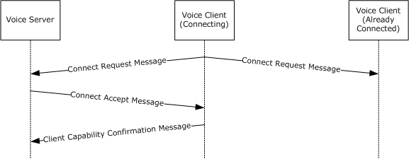
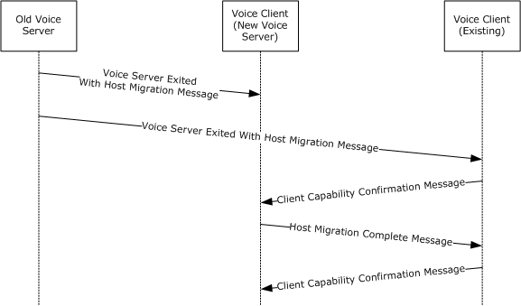

[MC-DPLVP]:

DirectPlay Voice Protocol

Intellectual Property Rights Notice for Open Specifications Documentation

  Technical Documentation. Microsoft publishes Open Specifications documentation (“this

documentation”) for protocols, file formats, data portability, computer languages, and standards
support. Additionally, overview documents cover inter-protocol relationships and interactions.

  Copyrights. This documentation is covered by Microsoft copyrights. Regardless of any other

terms that are contained in the terms of use for the Microsoft website that hosts this
documentation, you can make copies of it in order to develop implementations of the technologies
that are described in this documentation and can distribute portions of it in your implementations
that use these technologies or in your documentation as necessary to properly document the
implementation. You can also distribute in your implementation, with or without modification, any
schemas, IDLs, or code samples that are included in the documentation. This permission also
applies to any documents that are referenced in the Open Specifications documentation.
  No Trade Secrets. Microsoft does not claim any trade secret rights in this documentation.
  Patents. Microsoft has patents that might cover your implementations of the technologies

described in the Open Specifications documentation. Neither this notice nor Microsoft's delivery of
this documentation grants any licenses under those patents or any other Microsoft patents.
However, a given Open Specifications document might be covered by the Microsoft Open
Specifications Promise or the Microsoft Community Promise. If you would prefer a written license,
or if the technologies described in this documentation are not covered by the Open Specifications
Promise or Community Promise, as applicable, patent licenses are available by contacting
iplg@microsoft.com.

  License Programs. To see all of the protocols in scope under a specific license program and the

associated patents, visit the Patent Map.

  Trademarks. The names of companies and products contained in this documentation might be
covered by trademarks or similar intellectual property rights. This notice does not grant any
licenses under those rights. For a list of Microsoft trademarks, visit
www.microsoft.com/trademarks.

  Fictitious Names. The example companies, organizations, products, domain names, email

addresses, logos, people, places, and events that are depicted in this documentation are fictitious.
No association with any real company, organization, product, domain name, email address, logo,
person, place, or event is intended or should be inferred.

Reservation of Rights. All other rights are reserved, and this notice does not grant any rights other
than as specifically described above, whether by implication, estoppel, or otherwise.

Tools. The Open Specifications documentation does not require the use of Microsoft programming
tools or programming environments in order for you to develop an implementation. If you have access
to Microsoft programming tools and environments, you are free to take advantage of them. Certain
Open Specifications documents are intended for use in conjunction with publicly available standards
specifications and network programming art and, as such, assume that the reader either is familiar
with the aforementioned material or has immediate access to it.

Support. For questions and support, please contact dochelp@microsoft.com.

[MC-DPLVP] - v20170601
DirectPlay Voice Protocol
Copyright © 2017 Microsoft Corporation
Release: June 1, 2017

1 / 55

Revision Summary

Date

Revision
History

Revision
Class

8/10/2007

0.1

9/28/2007

0.2

10/23/2007  0.3

11/30/2007  1.0

1/25/2008

2.0

3/14/2008

3.0

5/16/2008

4.0

6/20/2008

5.0

Major

Minor

Minor

Major

Major

Major

Major

Major

Comments

Initial Availability

Clarified the meaning of the technical content.

Clarified the meaning of the technical content.

Updated and revised the technical content.

Updated and revised the technical content.

Updated and revised the technical content.

Updated and revised the technical content.

Updated and revised the technical content.

7/25/2008

5.0.1

Editorial

Changed language and formatting in the technical content.

8/29/2008

5.0.2

Editorial

Changed language and formatting in the technical content.

10/24/2008  5.1

Minor

Clarified the meaning of the technical content.

12/5/2008

5.1.1

Editorial

Editorial Update.

1/16/2009

5.1.2

Editorial

Changed language and formatting in the technical content.

2/27/2009

6.0

Major

Updated and revised the technical content.

4/10/2009

6.0.1

Editorial

Changed language and formatting in the technical content.

5/22/2009

6.1

Minor

Clarified the meaning of the technical content.

7/2/2009

6.1.1

Editorial

Changed language and formatting in the technical content.

8/14/2009

7.0

9/25/2009

8.0

Major

Major

Updated and revised the technical content.

Updated and revised the technical content.

11/6/2009

8.0.1

Editorial

Changed language and formatting in the technical content.

12/18/2009  8.0.2

Editorial

Changed language and formatting in the technical content.

1/29/2010

9.0

3/12/2010

10.0

4/23/2010

11.0

6/4/2010

11.1

7/16/2010

12.0

8/27/2010

12.1

10/8/2010

12.1

Major

Major

Major

Minor

Major

Minor

None

Updated and revised the technical content.

Updated and revised the technical content.

Updated and revised the technical content.

Clarified the meaning of the technical content.

Updated and revised the technical content.

Clarified the meaning of the technical content.

No changes to the meaning, language, or formatting of the
technical content.

11/19/2010  12.1

None

No changes to the meaning, language, or formatting of the
technical content.

[MC-DPLVP] - v20170601
DirectPlay Voice Protocol
Copyright © 2017 Microsoft Corporation
Release: June 1, 2017

2 / 55

Date

Revision
History

Revision
Class

Comments

1/7/2011

12.1

None

No changes to the meaning, language, or formatting of the
technical content.

2/11/2011

12.1

None

No changes to the meaning, language, or formatting of the
technical content.

3/25/2011

12.1

None

No changes to the meaning, language, or formatting of the
technical content.

5/6/2011

12.1

None

No changes to the meaning, language, or formatting of the
technical content.

6/17/2011

12.2

Minor

Clarified the meaning of the technical content.

9/23/2011

12.2

None

No changes to the meaning, language, or formatting of the
technical content.

12/16/2011  12.2

None

No changes to the meaning, language, or formatting of the
technical content.

3/30/2012

12.2

None

No changes to the meaning, language, or formatting of the
technical content.

7/12/2012

12.2

None

No changes to the meaning, language, or formatting of the
technical content.

10/25/2012  12.2

None

No changes to the meaning, language, or formatting of the
technical content.

1/31/2013

12.2

None

No changes to the meaning, language, or formatting of the
technical content.

8/8/2013

12.2

None

No changes to the meaning, language, or formatting of the
technical content.

11/14/2013  12.2

None

No changes to the meaning, language, or formatting of the
technical content.

2/13/2014

12.2

None

No changes to the meaning, language, or formatting of the
technical content.

5/15/2014

12.2

None

No changes to the meaning, language, or formatting of the
technical content.

6/30/2015

12.2

None

No changes to the meaning, language, or formatting of the
technical content.

10/16/2015  12.2

None

No changes to the meaning, language, or formatting of the
technical content.

7/14/2016

12.2

None

No changes to the meaning, language, or formatting of the
technical content.

6/1/2017

12.2

None

No changes to the meaning, language, or formatting of the
technical content.

[MC-DPLVP] - v20170601
DirectPlay Voice Protocol
Copyright © 2017 Microsoft Corporation
Release: June 1, 2017

3 / 55

Table of Contents

1.3

1.1
1.2

1.3.3.1

1.2.1
1.2.2

1.3.1
1.3.2
1.3.3

1  Introduction ............................................................................................................ 7
Glossary ........................................................................................................... 7
References ...................................................................................................... 10
Normative References ................................................................................. 10
Informative References ............................................................................... 10
Overview ........................................................................................................ 10
How DirectPlay Handles Voice Bursts ............................................................. 11
Connection Subprotocol ............................................................................... 12
Peer Voice Session Subprotocol .................................................................... 12
Host Migration ...................................................................................... 13
Mixing Voice Session Subprotocol ................................................................. 14
Forwarding Voice Session Subprotocol ........................................................... 15
Echo Voice Session Subprotocol .................................................................... 15
Required Codecs ......................................................................................... 15
Relationship to Other Protocols .......................................................................... 16
Prerequisites/Preconditions ............................................................................... 16
Applicability Statement ..................................................................................... 17
Versioning and Capability Negotiation ................................................................. 17
Vendor-Extensible Fields ................................................................................... 17
Standards Assignments ..................................................................................... 18

1.3.4
1.3.5
1.3.6
1.3.7

1.4
1.5
1.6
1.7
1.8
1.9

2.1
2.2

2.2.1
2.2.2

2.2.2.1
2.2.2.2
2.2.2.3
2.2.2.4
2.2.2.5
2.2.2.6
2.2.2.7
2.2.2.8

2  Messages ............................................................................................................... 19
Transport ........................................................................................................ 19
Message Syntax ............................................................................................... 19
The Common Message Header...................................................................... 20
Common Messages ..................................................................................... 21
Session Lost Message ............................................................................ 21
Client Disconnect Request Message ......................................................... 22
Client Disconnect Confirmation Message .................................................. 22
Add Voice Client Message ....................................................................... 22
Set Client Voice Target Message ............................................................. 23
Speech with Target Message .................................................................. 24
Speech with Bounce Message ................................................................. 24
Client Capability Confirmation Message .................................................... 25
Connection Subprotocol Messages ................................................................ 25
Connect Request Message ...................................................................... 26
Connect Accept Message ........................................................................ 26
Connect Refuse Message ........................................................................ 28
Peer Voice Session Subprotocol Messages ...................................................... 28
Voice Client List Entry Structure .............................................................. 28
Voice Client List Message ....................................................................... 29
Remove Voice Client Message ................................................................. 30
Speech Message ................................................................................... 30
Host Migration Messages ........................................................................ 30
Voice Server Exited with Host Migration Message ................................ 30
Host Migration Complete Message ..................................................... 31
Forwarding Voice Session Subprotocol Messages ............................................ 31
Speech with From Message .................................................................... 31

2.2.4.1
2.2.4.2
2.2.4.3
2.2.4.4
2.2.4.5

2.2.3.1
2.2.3.2
2.2.3.3

2.2.4.5.1
2.2.4.5.2

2.2.5.1

2.2.5

2.2.4

2.2.3

3.1

3  Protocol Details ..................................................................................................... 33
Voice Client Details........................................................................................... 33
Abstract Data Model .................................................................................... 33
Timers ...................................................................................................... 33
Initialization ............................................................................................... 34
Higher-Layer Triggered Events ..................................................................... 34

3.1.1
3.1.2
3.1.3
3.1.4

[MC-DPLVP] - v20170601
DirectPlay Voice Protocol
Copyright © 2017 Microsoft Corporation
Release: June 1, 2017

4 / 55

3.1.5

3.1.5.1

3.1.5.2

3.1.5.3

3.1.5.1.1
3.1.5.1.2
3.1.5.1.3
3.1.5.1.4
3.1.5.1.5

3.1.5.4

3.1.5.4.1
3.1.5.4.2
3.1.5.4.3

3.1.5.5

3.1.5.5.1
3.1.5.5.2
3.1.5.5.3

3.1.5.6

3.1.5.6.1
3.1.5.6.2
3.1.5.6.3

3.1.5.2.1
3.1.5.2.2
3.1.5.2.3
3.1.5.2.4
3.1.5.2.5

3.1.5.3.1
3.1.5.3.2
3.1.5.3.3
3.1.5.3.4
3.1.5.3.5
3.1.5.3.6

3.1.5.3.6.1
3.1.5.3.6.2
3.1.5.3.6.3

Processing Events and Sequencing Rules ....................................................... 34
Connection Subprotocol ......................................................................... 34
Handling Unrecognized Messages ...................................................... 34
Sending Connect Request Message .................................................... 34
Receiving Connect Accept Message .................................................... 35
Receiving Connect Refuse Message .................................................... 35
Sending a Client Capability Confirmation Message ............................... 35
Common Messages for All Voice Session Subprotocols ............................... 35
Receiving a Session Lost Message ..................................................... 35
Receiving a Set Client Voice Target Message ....................................... 35
Sending a Client Disconnect Request Message..................................... 36
Receiving a Client Disconnect Confirmation Message ............................ 36
Receiving an Add Voice Client Message .............................................. 36
Peer Voice Session Subprotocol .............................................................. 36
Handling Unrecognized Message ........................................................ 36
Receiving a Voice Client List Message ................................................. 36
Receiving a Remove Voice Client Message .......................................... 37
Sending a Speech Message ............................................................... 37
Receiving a Speech Message ............................................................. 37
Host Migration ................................................................................ 37
Receiving a Voice Server Exited with Host Migration Message .......... 37
Receiving a Host Migration Complete Message ............................... 37
Sending a Client Capability Confirmation Message .......................... 37
Mixing Voice Session Subprotocol ............................................................ 38
Handling Unrecognized Messages ...................................................... 38
Receiving a Speech with Bounce Message ........................................... 38
Sending a Speech with Target Message .............................................. 38
Forwarding Voice Session Subprotocol ..................................................... 38
Handling Unrecognized Messages ...................................................... 38
Receiving a Speech with From Message .............................................. 38
Sending a Speech with Target Message .............................................. 38
Echo Voice Session Subprotocol .............................................................. 39
Handling Unrecognized Messages ...................................................... 39
Sending a Speech Message ............................................................... 39
Receiving a Speech with Bounce Message ........................................... 39
Timer Events .............................................................................................. 39
Other Local Events ...................................................................................... 39
Voice Server Details ......................................................................................... 39
Abstract Data Model .................................................................................... 39
Timers ...................................................................................................... 40
Initialization ............................................................................................... 40
Initialization with Host Migration ............................................................. 41
Higher-Layer Triggered Events ..................................................................... 41
Processing Events and Sequencing Rules ....................................................... 41
Connection Subprotocol ......................................................................... 41
Handling Unrecognized Messages ...................................................... 41
Receiving Connect Request Message .................................................. 41
Sending Connect Accept Message ...................................................... 41
Sending Connect Refuse Message ...................................................... 41
Receiving a Client Capability Confirmation Message ............................. 42
Common Message for All Voice Session Subprotocols ................................. 42
Sending a Session Lost Message ....................................................... 42
Sending a Set Client Voice Target Message ......................................... 42
Receiving a Client Disconnect Request Message .................................. 42
Sending a Client Disconnect Confirmation Message .............................. 42
Peer Voice Session Subprotocol .............................................................. 43
Handling Unrecognized Messages ...................................................... 43
Sending a Voice Client List Message ................................................... 43

3.2.5.1

3.2.5.1.1
3.2.5.1.2
3.2.5.1.3
3.2.5.1.4
3.2.5.1.5

3.2.5.2

3.2.5.2.1
3.2.5.2.2
3.2.5.2.3
3.2.5.2.4

3.2.5.3

3.2.5.3.1
3.2.5.3.2

3.2.3.1

3.2

3.1.6
3.1.7

3.2.1
3.2.2
3.2.3

3.2.4
3.2.5

[MC-DPLVP] - v20170601
DirectPlay Voice Protocol
Copyright © 2017 Microsoft Corporation
Release: June 1, 2017

5 / 55

3.2.5.3.3
3.2.5.3.4
3.2.5.3.5

3.2.5.3.5.1
3.2.5.3.5.2
3.2.5.3.5.3

Sending an Add Voice Client Message ................................................ 43
Sending a Remove Voice Client Message ............................................ 43
Host Migration ................................................................................ 43
Sending a Voice Server Exited with Host Migration Message ............ 43
Sending a Host Migration Complete Message ................................. 43
Receiving a Client Capability Confirmation Message ........................ 44
Mixing Voice Session Subprotocol ............................................................ 44
Handling Unrecognized Messages ...................................................... 44
Sending an Add Voice Client Message ................................................ 44
Sending a Speech with Bounce Message ............................................. 44
Receiving a Speech with Target Message ............................................ 44
Forwarding Voice Session Subprotocol ..................................................... 44
Handling Unrecognized Messages ...................................................... 44
Receiving a Speech with Target Message ............................................ 44
Sending a Speech with From Message ................................................ 45
Echo Voice Session Subprotocol .............................................................. 45
Handling Unrecognized Messages ...................................................... 45
Receiving a Speech Message ............................................................. 45
Sending a Speech with Bounce Message ............................................. 45
Timer Events .............................................................................................. 45
Other Local Events ...................................................................................... 45

3.2.5.4

3.2.5.4.1
3.2.5.4.2
3.2.5.4.3
3.2.5.4.4

3.2.5.5

3.2.5.5.1
3.2.5.5.2
3.2.5.5.3

3.2.5.6

3.2.5.6.1
3.2.5.6.2
3.2.5.6.3

3.2.6
3.2.7

4  Protocol Examples ................................................................................................. 46
Successful Connect Sequence ............................................................................ 46

4.1

5  Security ................................................................................................................. 48
Security Considerations for Implementers ........................................................... 48
Index of Security Parameters ............................................................................ 48

5.1
5.2

6  Appendix A: Product Behavior ............................................................................... 49

7  Change Tracking .................................................................................................... 50

8  Index ..................................................................................................................... 51

[MC-DPLVP] - v20170601
DirectPlay Voice Protocol
Copyright © 2017 Microsoft Corporation
Release: June 1, 2017

6 / 55

1  Introduction

This specification describes the DirectPlay Voice Protocol. This protocol is used to provide voice
communications for applications that use the DirectPlay Protocol to communicate.

Sections 1.5, 1.8, 1.9, 2, and 3 of this specification are normative. All other sections and examples in
this specification are informative.

1.1  Glossary

This document uses the following terms:

client: A computer on which the remote procedure call (RPC) client is executing.

client/server mode: A mode that consists of one server with many client connections (one-to-

many). From the perspective of each client, there is only one connection: the connection to the
server.

codec: An algorithm that is used to convert media between digital formats, especially between raw
media data and a format that is more suitable for a specific purpose. Encoding converts the raw
data to a digital format. Decoding reverses the process.

compression ID: A GUID that indicates which codec is to be used for encoding and decoding

speech data.

DirectPlay: A network communication library included with the Microsoft DirectX application

programming interfaces. DirectPlay is a high-level software interface between applications and
communication services that makes it easy to connect games over the Internet, a modem link,
or a network.

DirectPlay 4: A programming library that implements the IDirectPlay4 programming interface.
DirectPlay 4 provides peer-to-peer session-layer services to applications, including session
lifetime management, data management, and media abstraction. DirectPlay 4 first shipped
with the DirectX 6 multimedia toolkit. Later versions continued to ship up to, and including,
DirectX 9. DirectPlay 4 was subsequently deprecated. The DirectPlay 4 DLL continues to ship
in current versions of Windows operating systems, but the development library is no longer
shipping in Microsoft development tools and software development kits (SDKs).

DirectPlay 4 protocol: The DirectPlay 4 protocol is used by multiplayer games to perform low-

latency communication between two or more computers.

DirectPlay 8: A programming library that implements the IDirectPlay8 programming interface.
DirectPlay 8 provides peer-to-peer session-layer services to applications, including session
lifetime management, data management, and media abstraction. DirectPlay 8 first shipped
with the DirectX 8 software development toolkit. Later versions continued to ship up to, and
including, DirectX 9. DirectPlay 8 was subsequently deprecated. The DirectPlay 8 DLL
continues to ship in current versions of Windows operating systems, but the development library
is no longer shipping in Microsoft development tools and Software Development Kits (SDKs).

DirectPlay 8 protocol: The DirectPlay 8 protocol is used by multiplayer games to perform low-

latency communication between two or more computers.

DirectPlay client: A player in a DirectPlay client/server game session that has a single
established connection with a DirectPlay server and is not performing game session
management duties. It also refers to a potential player that is enumerating available DirectPlay
servers to join.

DirectPlay client/server session: When the underlying transport is DirectPlay 4, this is a

game session with the DPSESSION_CLIENTSERVER flag set in the Flags field of the

7 / 55

[MC-DPLVP] - v20170601
DirectPlay Voice Protocol
Copyright © 2017 Microsoft Corporation
Release: June 1, 2017

DPSESSIONDESC2 field as specified in [MC-DPL4CS]. When the underlying transport is
DirectPlay 8, this is equivalent to a client/server game session as specified in [MC-
DPL8CS].

DirectPlay host: The player in a DirectPlay peer-to-peer game session that is responsible for

performing game session management duties, such as responding to game session enumeration
requests and maintaining the master copy of all the player and group lists for the game. It has
connections to all DirectPlay peers in the game session.

DirectPlay peer-to-peer session: When the underlying transport is DirectPlay 4, this is a game

session without the DPSESSION_CLIENTSERVER flag set in the Flags field of the
DPSESSIONDESC2 field as specified in [MC-DPL4CS]. When the underlying transport is
DirectPlay 8, this is equivalent to a peer-to-peer game session as specified in [MC-DPL8CS].

DirectPlay protocol: Refers to either the DirectPlay 4 or the DirectPlay 8 protocol.

DirectPlay protocol voice message type: In DirectPlay 4, this is a DPSP_MSG_VOICE message

as specified in [MC-DPL4CS]. In DirectPlay 8, this is a packet whose DFRAME has the
PACKET_COMMAND_USER_2 flag set in the bCommand field as specified in [MC-DPL8R].

DPNID: A 32-bit identification value assigned to a DirectPlay player as part of its participation in a

DirectPlay game session.

DVID: A unique 32-bit identifier for an individual client instance or a group of client instances in
the protocol. The unique identifier is equivalent to the player ID of the client or group if the
underlying transport is DirectPlay 4. If the underlying transport is DirectPlay 8, the identifier
is equivalent to the DPNID of the client or group. The value of 0x00000000 is reserved to
indicate all voice clients in the game session.

encoded voice stream: A stream of binary data representing speech encoded by a codec.

game session: The metadata associated with the collection of computers participating in a single

instance of a computer game.

globally unique identifier (GUID): A term used interchangeably with universally unique

identifier (UUID) in Microsoft protocol technical documents (TDs). Interchanging the usage of
these terms does not imply or require a specific algorithm or mechanism to generate the value.
Specifically, the use of this term does not imply or require that the algorithms described in
[RFC4122] or [C706] have to be used for generating the GUID. See also universally unique
identifier (UUID).

group: A collection of players within a game session. Typically, players are placed in a group

when they serve a common purpose.

host: A general-purpose computer that is networking capable.

host migration: The protocol-specific procedure that occurs when the DirectPlay peer that is
designated as the host or voice server leaves the DirectPlay game or voice session and
another peer assumes that role.

host order ID: A monotonically increasing 32-bit identifier representing the priority of a voice

client in a host migration election. The voice server assigns these to voice clients as they
connect.

HRESULT: An integer value that indicates the result or status of an operation. A particular

HRESULT can have different meanings depending on the protocol using it. See [MS-ERREF]
section 2.1 and specific protocol documents for further details.

jitter buffer: A buffer that is used to reorder speech message voice data to reconstruct an

encoded voice stream in time for playback. All speech messages are sent unordered and

8 / 55

[MC-DPLVP] - v20170601
DirectPlay Voice Protocol
Copyright © 2017 Microsoft Corporation
Release: June 1, 2017

nonguaranteed in order to provide the lowest possible latency. As a result, speech messages
are not guaranteed to arrive, can be duplicated, and are not guaranteed to arrive in order. When
two packets are received out of order and there are three packets of jitter buffer, the packets
can easily be correctly reordered before they are required for playback. If the packets are not
correctly reordered in time, the audio is skipped.  The size of a jitter buffer is implementation-
specific. The minimum size is 0 frames and the initial size in the default implementation is 2
frames. Depending on the quality of the connection, the jitter buffer could be a passthrough.

little-endian: Multiple-byte values that are byte-ordered with the least significant byte stored in

the memory location with the lowest address.

message number: An 8-bit identifier that identifies which voice burst a speech frame belongs

to. This number starts at 0 and can wrap.

payload: The data that is transported to and from the application that is using either the

DirectPlay 4 protocol or DirectPlay 8 protocol.

peer: The entity being authenticated by the authenticator.

peer-to-peer: A server-less networking technology that allows several participating network

devices to share resources and communicate directly with each other.

player: A person who is playing a computer game. There can be multiple players on a computer

participating in any given game session. See also name table.

player ID: A 32-bit integer that uniquely represents a player.

sequence number: An 8-bit identifier that specifies the location order of a speech frame within a
voice burst, and which is used to reorder speech frames upon their receipt. The value of the
number starts at 0, increases by one for each speech frame within the voice burst, and could
wrap through reuse of older low values that are no longer in the computing system. Sequence
number wrapping occurs when the transmitting client reuses a sequence number that was
previously used. For example, after using sequence numbers 0x00 through 0xFF, the client
transmits a speech frame that reuses the sequence number 0x00. It is the responsibility of the
receiver to be aware that the sequence numbers of received speech frames could wrap. In order
to allow for guaranteed reordering, the receiver has to appropriately handle the situation where
more than one received speech frame uses the same sequence number.

server: A DirectPlay system application that is hosting a DirectPlay game session. In the
context of DirectPlay 8, the term is reserved for hosts using client/server mode.

server-controlled targeting: Server-controlled targeting occurs when a voice server

controls the voice target list for the voice clients. This is enabled when the SessionFlags field
of the Connect Accept Message (section 2.2.3.2) contains the
DVSESSION_SERVERCONTROLTARGET (0x00000002) value.

speech frame: Encoded voice streams are broken into pieces; each piece is called a speech

frame. For the DirectPlay Voice Protocol, the size of each speech frame depends on the codec
selected. This list of codecs and their frame sizes is specified in section 1.3.7.

speech message: A protocol message that contains at least a single speech frame, a message

number, and a sequence number.

voice burst: Individual speech frames are grouped together into voice bursts. A voice burst

contains a set of speech frames during which the timing is preserved by receiving clients. Gaps
in the voice burst will be filled with silence to preserve the timing of the received packets.
Timing is not guaranteed to be preserved between voice bursts. For more information about
voice bursts, see section 1.3.1.

[MC-DPLVP] - v20170601
DirectPlay Voice Protocol
Copyright © 2017 Microsoft Corporation
Release: June 1, 2017

9 / 55

voice client: A DirectPlay client or DirectPlay host that understands the DirectPlay Voice

Protocol and acts in a voice client role as specified in section 3.1.

voice message: A Message object that contains audio content recorded by a calling party.

voice server: The DirectPlay client that is responsible for coordinating the voice session. This
DirectPlay client understands the DirectPlay Voice Protocol and acts in a voice server role as
specified in section 3.2.

voice session: The collection of DirectPlay clients and the DirectPlay host that are running

either a voice client and/or a voice server.

voice session subprotocol: The type of subprotocol used by the voice server once the

connection subprotocol has completed. See section 1.3 for a complete list of voice session
subprotocols.

voice session type: The DirectPlay Voice Protocol supports four different voice session types.
Each voice session type corresponds to a voice session subprotocol as specified in section
1.3.

voice target list: An array of DVID values, each representing a user or group of users for which

the speech messages from a voice client are intended.

MAY, SHOULD, MUST, SHOULD NOT, MUST NOT: These terms (in all caps) are used as defined
in [RFC2119]. All statements of optional behavior use either MAY, SHOULD, or SHOULD NOT.

1.2  References

Links to a document in the Microsoft Open Specifications library point to the correct section in the
most recently published version of the referenced document. However, because individual documents
in the library are not updated at the same time, the section numbers in the documents may not
match. You can confirm the correct section numbering by checking the Errata.

1.2.1  Normative References

We conduct frequent surveys of the normative references to assure their continued availability. If you
have any issue with finding a normative reference, please contact dochelp@microsoft.com. We will
assist you in finding the relevant information.

[MC-DPL4CS] Microsoft Corporation, "DirectPlay 4 Protocol: Core and Service Providers".

[MS-DTYP] Microsoft Corporation, "Windows Data Types".

[MS-ERREF] Microsoft Corporation, "Windows Error Codes".

[RFC2119] Bradner, S., "Key words for use in RFCs to Indicate Requirement Levels", BCP 14, RFC
2119, March 1997, https://www.rfc-editor.org/info/rfc2119

1.2.2  Informative References

[MSDN-AUDIOFORMAT] Microsoft Corporation, "WAVEFORMATEX", http://msdn.microsoft.com/en-
us/library/ms713497.aspx

1.3  Overview

The DirectPlay Voice Protocol enables DirectPlay clients within a game session to communicate
voice. The exchange is coordinated by a voice server and works independently of the version of

[MC-DPLVP] - v20170601
DirectPlay Voice Protocol
Copyright © 2017 Microsoft Corporation
Release: June 1, 2017

10 / 55

DirectPlay in use. The protocol depends on the underlying game session to handle connectivity and
transport between the voice clients and the voice server.

The DirectPlay Voice Protocol provides a virtual game session that exists within the game session. It
requires an existing game session to operate, but it maintains its own game session coordinated by
the voice server. This means that not every DirectPlay client is required to participate. The voice
server maintains the list of voice clients in the game session and coordinates the distribution of this
information.

The voice server and voice clients use the Connection Subprotocol (section 1.3.2) to establish initial
connectivity, and then the voice server tells the voice clients which voice session subprotocol to
use based on the voice session type determined at initialization of the voice server. The following
table shows the list of voice session types and the corresponding voice session protocol that is used.

Voice session type

Voice session subprotocol

Peer game session

Peer Voice Session Subprotocol (section 1.3.3)

Mixing game session

Mixing Voice Session Subprotocol (section 1.3.4)

Forwarding game session  Forwarding Voice Session Subprotocol (section 1.3.5)

Echo game session

Echo Voice Session Subprotocol (section 1.3.6)

The DirectPlay Voice Protocol also provides the ability to perform host migration as described in
section 1.3.3.1. Enabling host migration allows game sessions running under the peer voice session
subprotocol to elect a new voice server if the existing voice server becomes unavailable.

The upper layer records audio from the user and uses a codec to create an encoded voice stream.
The encoded voice stream is broken into voice bursts and then broken further into speech
messages. The exact methodology of distributing speech messages varies depending on the type of
voice session subprotocol. For more information about voice bursts, see How DirectPlay Handles Voice
Bursts (section 1.3.1).

Only a single codec is used for any given game session. When a voice server is started, a codec is
chosen to be used by that voice server. In order to connect to the voice server, a voice client is
required to support the codec chosen by the voice server.

For a list of codecs required by the DirectPlay Voice Protocol, see Required Codecs (section 1.3.7). For
implementation information regarding when the voice client does not support the codec chosen by the
voice server, see Receiving Connect Accept Message (section 3.1.5.1.3).

1.3.1  How DirectPlay Handles Voice Bursts

A voice burst occurs when DirectPlay detects voice. Essentially, a single voice burst translates to a
"segment of voice recorded sequentially". Multiple voice bursts simply mean that after a burst there is
silence. When voice data is transmitted again, that transmittal is the next voice burst.

For example:

1.  Begin recording

2.  Two seconds of audio data

3.  End recording

4.  One-second pause

5.  Begin recording

6.  Three second of audio data

7.  End recording

[MC-DPLVP] - v20170601
DirectPlay Voice Protocol
Copyright © 2017 Microsoft Corporation
Release: June 1, 2017

11 / 55

<!-- Extracted images from page 12 -->

<!-- /Extracted images from page 12 -->

The preceding scenario generates two voice bursts. The first voice burst is 2 seconds of audio time
and the second is 3 seconds of audio. The timing within an audio segment is preserved. The 1 second
between bursts (per the preceding example) is not preserved. As a result, the time between voice
bursts can end up being 0.8 seconds, or 1.5 seconds, or some other length, depending on network
conditions.

All audio data within a voice burst is continuous. Each voice burst is equivalent to a single, continuous
buffer of audio. When no audible audio (silence) is recorded, no transmission is necessary. Silence
represents the time "between" voice bursts. DirectPlay continues to record/send audio 400
milliseconds (ms) after a user stops speaking. This allows for up to 400 ms of "silence" audio to be
sent between words/sentences that the user speaks. This is not required in any way, but buffering in
this manner allows for a more continuous transmission of voice data. The algorithm used to begin/end
the recording of audio data can be determined by any implementer writing to the DirectPlay Voice
Protocol.

The DirectPlay Voice Protocol analyzes audio data to determine whether it needs to be sent.
Essentially, this is accomplished by checking to see if there is any audio data over a certain threshold.
Determining when a voice burst needs to start is left to the implementation. This is commonly
accomplished by having the user press a button on the computer, such as "Press to Talk". The exact
manner in which the start of the voice burst is determined is of no consequence to the DirectPlay
Voice Protocol or the implementation. As long as an audio burst is a continuous stream of audio data,
the data is considered to be in a voice burst. If two audio samples are appended when they are not
sequential, this is not a true voice burst because the audio is not continuous.

A voice burst can be arbitrarily long, even indefinite, as determined by the implementation. However,
the longer the voice burst, the more likely that audio data will be lost, resulting in "pops" or "skips" in
the playback.

1.3.2  Connection Subprotocol

The voice client and voice server use the connection subprotocol to establish connectivity and to
communicate which voice session subprotocol and codec to use for further communications.

The following illustration shows the connection subprotocol message sequence for a successful connect
attempt.

Figure 1: Connection protocol successful connect sequence

1.3.3  Peer Voice Session Subprotocol

The peer voice session subprotocol specifies the communication between a voice server and voice
clients and between individual voice clients when a peer voice session type is used. The peer voice
session subprotocol requires that the underlying game session is running peer-to-peer. The peer

12 / 55

[MC-DPLVP] - v20170601
DirectPlay Voice Protocol
Copyright © 2017 Microsoft Corporation
Release: June 1, 2017

voice session subprotocol is indicated when the SessionType field of the Connect Accept
Message (section 2.2.3.2) is set to DVSESSIONTYPE_PEER (0x00000001).

The roles in this subprotocol are as follows:



The voice server is responsible for maintaining and distributing the list of voice clients in the voice
session.



The voice clients are responsible for:

  Sending speech messages directly to any voice clients that they want to send them to.

  Receiving and processing speech messages from other voice clients and converting them back
into an encoded voice stream. The voice client maintains a jitter buffer for each voice
client in the voice client list.



Electing and creating a new voice server for voice sessions that enable host migration.

Note  The voice clients maintain a list of voice clients.

1.3.3.1  Host Migration

Host migration enables a set of voice clients to elect and create a new voice server to replace a
voice server that has become unavailable.

A voice server can become unavailable either because connectivity is lost or because the voice server
has chosen to be shut down. If the voice server chooses to shut down, it informs all clients that a
host migration needs to take place. The DirectPlay layer is responsible for determining when
connectivity has been lost. In either case, the voice clients run a host migration election to determine
who will create the new voice server.

Each voice client is assigned a host order ID, which indicates its priority in determining who creates
the new voice server. The voice client that has the lowest host order ID is elected to create the new
voice server. The lowest host order ID typically belongs to the oldest voice client in the game
session, and is therefore most likely to have the most up-to-date list of voice clients. This algorithm
enables each voice client to run the algorithm separately. However, all come up with the same
answer.

The elected voice client immediately creates the new voice server and initializes it by using the voice
client list from the voice client. This new voice server informs everyone that it is ready to accept voice
clients. Through the use of host migration, each voice client updates its Current Voice Server
DVID (section 3.1.1) value to equal the DVID of the new voice server.

The following illustration shows the typical message flow of a successful host migration when the voice
server has chosen to shut down.

[MC-DPLVP] - v20170601
DirectPlay Voice Protocol
Copyright © 2017 Microsoft Corporation
Release: June 1, 2017

13 / 55

<!-- Extracted images from page 14 -->

<!-- /Extracted images from page 14 -->

Figure 2: Successful host migration sequence

Host migration needs to be enabled when the protocol is initialized. Voice clients determine that host
migration is in use if the peer voice session subprotocol is being used and the SessionFlags field in
the Connect Accept Message (section 2.2.3.2) does not contain the DVSESSION_NOHOSTMIGRATION
(0x00000001) flag.

1.3.4  Mixing Voice Session Subprotocol

The mixing voice session subprotocol specifies the communication between a voice server and voice
clients when a mixing game session type is used. The mixing voice session subprotocol requires a
game session that provides connectivity between the voice server and the voice clients. Connectivity
between individual voice clients is not required. The mixing voice session subprotocol is indicated
when the SessionType field of the Connect Accept Message (section 2.2.3.2) is set to
DVSESSIONTYPE_MIXING (0x00000002).

The roles in this subprotocol are as follows:



The voice server is responsible for the following:

  Maintaining the list of voice clients in the voice session.

  Receiving speech messages from each of the voice clients and distributing them to each of

the voice clients for which they are intended. The voice server distributes the speech
messages in a single encoded voice stream to each voice client by mixing together all
speech messages intended for each individual voice client. The voice server maintains a jitter
buffer for each voice client in the voice client list.



The voice clients are responsible for the following:

  Sending voice data and the targets of the data to the voice server.

  Receiving and processing speech messages from the voice server and converting them back

into an encoded voice stream. The voice client maintains a single jitter buffer for incoming
speech messages from the voice server.

Note  The voice clients do not maintain a list of voice clients.

14 / 55

[MC-DPLVP] - v20170601
DirectPlay Voice Protocol
Copyright © 2017 Microsoft Corporation
Release: June 1, 2017

1.3.5  Forwarding Voice Session Subprotocol

The forwarding voice session subprotocol specifies the communication between a voice server and
voice clients when a forwarding game session type is used. The forwarding voice session
subprotocol requires at a minimum a client/server session, but it will also work with a peer-to-peer
session. Connectivity between individual voice clients is not required. The forwarding voice session
subprotocol is indicated when the SessionType field of the Connect Accept Message (section 2.2.3.2)
is set to DVSESSIONTYPE_FORWARDING (0x00000003).

The roles in this subprotocol are as follows:



The voice server is responsible for:

  Maintaining the list of voice clients in the voice session.

  Receiving speech messages from each of the voice clients and forwarding them to each of
the voice clients for which they are intended. Speech messages intended for each individual
voice client.



The voice clients are responsible for:

  Sending voice data and the targets of the data to the voice server.

  Receiving and processing speech messages from the voice server and converting them back
into an encoded voice stream. The voice client maintains a jitter buffer for each voice
client in the voice client list.

Note  The voice clients maintain a list of voice clients.

1.3.6  Echo Voice Session Subprotocol

The echo voice session subprotocol specifies the communication between a voice server and voice
clients when an echo game session type is used. The echo voice session subprotocol requires a
client/server session but it will also operate with a peer-to-peer session. The forwarding voice
session subprotocol is indicated when the SessionType field of the Connect Accept
Message (section 2.2.3.2) is set to DVSESSIONTYPE_ECHO (0x00000004).

The roles in this subprotocol are as follows:



The voice server is responsible for maintaining a list of voice clients and forwarding any incoming
speech messages back to the sender.



The voice clients are responsible for:

  Sending voice data to the server.

  Receiving and processing speech messages from the voice server and converting them back

into an encoded voice stream. The voice client maintains a single jitter buffer for incoming
speech messages from the voice server.

Note  The voice clients do not maintain a list of voice clients.

1.3.7  Required Codecs

The DirectPlay Voice Protocol requires communication using one of the codecs listed in the following
table. The codecs are opaque to the DirectPlay Voice Protocol, with the exception that in a voice
session, the voice client and voice server need to use the same codec. The following table lists the
codecs, the frame size used with the protocol, and the approximate amount of time (in milliseconds)
that each frame represents.

15 / 55

[MC-DPLVP] - v20170601
DirectPlay Voice Protocol
Copyright © 2017 Microsoft Corporation
Release: June 1, 2017

Required codec

Voxware VR12 (*)

Voxware SC03 (*)

Voxware SC06 (*)

Truespeech (*)

Global System for Mobile
Communications (GSM) (*)

Microsoft Adaptive Delta Pulse Code
Modulation (MS ADPCM) (**)

Pulse Code Modulation (PCM) - 8
Kilohertz, 8-bit, and Mono (*)

Frame size
(bytes)

Frame size
(milliseconds of data)

Approximate bit rate
(bits/second)

Variable

(Max 21)

40

80

96

130

256

394

90

100

100

90

80

63

50

Variable (max 1822)

3200

6400

8536

13000

32768

64000

(*) = This codec is licensed through a third party.

(**) = Microsoft Adaptive Delta Pulse Code Modulation (MS ADPCM) is included with the Microsoft
Windows Development Kit (WDK). For more information about the MS ADPCM codec, see [MSDN-
AUDIOFORMAT].

1.4  Relationship to Other Protocols

The DirectPlay Voice Protocol is embedded in either the DirectPlay 4 Protocol or the DirectPlay 8
Protocol. The DirectPlay Protocol Voice Message Type is used for all voice extensions to
DirectPlay Protocols.

1.5  Prerequisites/Preconditions

The DirectPlay Voice Protocol operates only after a game session is established. If the game session
is terminated, then the DirectPlay Voice Protocol Specification is also terminated.

There are further restrictions on the voice session type based on whether the specified type of game
session is supported, including DirectPlay client/server sessions and DirectPlay peer-to-peer
sessions. The following table illustrates these restrictions.

Session type

Peer Voice Session Subprotocol (section
1.3.3)

Mixing Voice Session Subprotocol (section
1.3.4)

Forwarding Voice Session Subprotocol
(section 1.3.5)

Echo Voice Session Subprotocol (section
1.3.6)

DirectPlay peer-to-peer
session

DirectPlay client/server
session

Supported

Not Supported

Supported

Supported

Supported

Supported

Supported

Supported

[MC-DPLVP] - v20170601
DirectPlay Voice Protocol
Copyright © 2017 Microsoft Corporation
Release: June 1, 2017

16 / 55

1.6  Applicability Statement

The DirectPlay Voice Protocol is designed to provide voice communications between voice clients
within a game session.

The following table describes the characteristics of each game session type based on latency of voice
traffic, CPU usage of the voice clients and the voice server, and the bandwidth usage of the server
and clients.

 Voice
session type

Peer Voice
Session
Subprotocol

Mixing Voice
Session
Subprotocol

Forwarding
Voice Session
Subprotocol

Echo Voice
Session
Subprotocol

 Latency
(voice
traffic)

Lowest

 CPU Usage
(voice
clients)

Scales with
the number of
people talking
to a voice
client.

Highest

Fixed

Medium

Fixed

Fixed

 CPU usage
(voice server)

 Bandwidth (voice
clients)

 Bandwidth
(voice server)

Fixed

Scales with the
number of
unique mixes
and number of
people talking.

Scales with the number of
people talking to voice
client. Also scales by the
number of people the
voice client is talking to.

Fixed

Fixed

Scales with the
number of
people receiving
voice.

Scales with the number of
people talking to the
voice client.

Scales with the
number of
people talking.

Medium

Fixed

Fixed

Fixed

Scales with the
number of
people talking.

1.7  Versioning and Capability Negotiation

This specification covers versioning issues in the following areas:

  Supported transports: This protocol can be implemented on top of DirectPlay 4 and

DirectPlay 8 protocols.

  Supported codecs: This protocol supports multiple codecs for encoding voice data into encoded

voice streams. The connection subprotocol is used to inform clients which codec they are
required to use through the Connect Accept Message (section 2.2.3.2).

  Capability negotiation: This voice server decides which voice session subprotocol, which

codec, and what game session characteristics will be used for the communications. This
information is communicated to clients through the connection subprotocol in the Connect Accept
Message (section 2.2.3.2).

The DirectPlay Voice Protocol provides version fields in the connection subprotocol, but they are not
used.

1.8  Vendor-Extensible Fields

This protocol uses HRESULT values as specified in [MS-ERREF] section 2.1. Vendors can define their
own HRESULT values, provided they set the C bit (0x20000000) for each vendor-defined value,
indicating that the value is a customer code.

[MC-DPLVP] - v20170601
DirectPlay Voice Protocol
Copyright © 2017 Microsoft Corporation
Release: June 1, 2017

17 / 55

1.9  Standards Assignments

None.

[MC-DPLVP] - v20170601
DirectPlay Voice Protocol
Copyright © 2017 Microsoft Corporation
Release: June 1, 2017

18 / 55

2  Messages

This protocol references commonly used data types as defined in [MS-DTYP].

2.1  Transport

This protocol is designed to operate over the DirectPlay 4 or DirectPlay 8 protocols using the voice
message type.

2.2  Message Syntax

The following sections contain DirectPlay Voice Protocol message syntax. All numeric values are
transported in little-endian format.

The following table indicates which messages are used for each game session type subprotocol.

Message type

Add Voice Client
Message (section 2.2.2.4)

Remove Voice Client
Message (section 2.2.4.3)

Session Lost
Message (section 2.2.2.1)

Host Migration Complete
Message (section 2.2.4.5.2)

Set Client Voice Target
Message (section 2.2.2.5)

Connect Request
Message (section 2.2.3.1)

Connect Refuse
Message (section 2.2.3.3)

Client Disconnect Request
Message (section 2.2.2.2)

Speech
Message (section 2.2.4.4)

Connect Accept
Message (section 2.2.3.2)

Client Capability
Confirmation
Message (section 2.2.2.8)

Client Disconnect
Confirmation
Message (section 2.2.2.3)

Speech with Bounce
Message (section 2.2.2.7)

Connection
subprotocol

Peer voice
session
subprotocol

Mixing voice
session
subprotocol

Forwarding
voice
session
subprotocol

Echo voice
session
subprotocol

No

No

No

No

No

Yes

Yes

No

No

Yes

Yes

No

No

Yes

Yes

Yes

Yes

No

Yes

Yes (*)

No

Yes

No

Yes

No

Yes

No

Yes

No

Yes (**)

Yes (**)

Yes (**)

Yes (**)

No

No

Yes

Yes

No

Yes (*)

No

No

No

No

Yes

Yes

No

No

No

No

No

No

No

No

Yes

Yes

No

No

Yes

Yes

Yes

Yes

No

Yes

No

Yes

[MC-DPLVP] - v20170601
DirectPlay Voice Protocol
Copyright © 2017 Microsoft Corporation
Release: June 1, 2017

19 / 55

Message type

Voice Client List
Message (section 2.2.4.2)

Voice Server Exited with Host
Migration
Message (section 2.2.4.5.1)

Speech with Target
Message (section 2.2.2.6)

Speech with From
Message (section 2.2.5.1)

Connection
subprotocol

Peer voice
session
subprotocol

Mixing voice
session
subprotocol

Forwarding
voice
session
subprotocol

Echo voice
session
subprotocol

No

No

No

No

Yes

Yes (*)

No

No

No

No

Yes

No

No

No

Yes

Yes

No

No

No

No

(*) = Only when host migration is enabled. For additional information, see section 1.3.3.1 .

(**) = Only when server-controlled targeting is enabled. This is indicated by the value
DVSESSION_SERVERCONTROLTARGET (0x00000002) being present in the SessionFlags field in the
Connect Accept Message (section 2.2.3.2).

Note  This protocol specification uses curly braced GUID strings as specified in [MS-DTYP] section
2.3.4.3.

2.2.1  The Common Message Header

All messages in the DirectPlay Voice Protocol share a common header, which is followed by a
message-specific payload, as specified in the following sections. Some message types do not have
any message-specific payload.

0  1  2  3  4  5  6  7  8  9

1
0  1  2  3  4  5  6  7  8  9

2
0  1  2  3  4  5  6  7  8  9

3
0  1

MessageType

Message-specific payload (variable)

MessageType (1 byte): An 8-bit unsigned integer representing a unique packet type that identifies

the message. MessageType MUST be one of the following values.

...

Value

Meaning

DVMSGID_CREATEVOICEPLAYER

Add Voice Client Message (section 2.2.2.4)

0x01

DVMSGID_DELETEVOICEPLAYER

Remove Voice Client Message (section 2.2.4.3)

0x02

DVMSGID_SESSIONLOST

Session Lost Message (section 2.2.2.1)

0x03

DVMSGID_HOSTMIGRATED

Host Migration Complete Message (section 2.2.4.5.2)

0x0C

DVMSGID_SETTARGETS

Set Client Voice Target Message (section 2.2.2.5)

[MC-DPLVP] - v20170601
DirectPlay Voice Protocol
Copyright © 2017 Microsoft Corporation
Release: June 1, 2017

20 / 55

Value

0x0D

Meaning

DVMSGID_CONNECTREQUEST

Connect Request Message (section 2.2.3.1)

0x51

DVMSGID_CONNECTREFUSE

Connect Refuse Message (section 2.2.3.3)

0x53

DVMSGID_DISCONNECT

Client Disconnect Request Message (section 2.2.2.2)

0x54

DVMSGID_SPEECH

Speech Message (section 2.2.4.4)

0x55

DVMSGID_CONNECTACCEPT

Connect Accept Message (section 2.2.3.2)

0x56

DVMSGID_SETTINGSCONFIRM

Client Capability Confirmation Message (section 2.2.2.8)

0x58

DVMSGID_DISCONNECTCONFIRM

Client Disconnect Confirmation Message (section 2.2.2.3)

0x5A

DVMSGID_SPEECHBOUNCE

Speech with Bounce Message (section 2.2.2.7)

0x60

DVMSGID_PLAYERLIST

Voice Client List Message (section 2.2.4.2)

0x61

DVMSGID_HOSTMIGRATELEAVE

0x62

Voice Server Exited with Host Migration
Message (section 2.2.4.5.1)

DVMSGID_SPEECHWITHTARGET

Speech with Target Message (section 2.2.2.6)

0x63

DVMSGID_SPEECHWITHFROM

Speech with From Message (section 2.2.5.1)

0x64

Message-specific payload (variable): A variable-length field the size of which depends on the type

of packet designated in the MessageType field.

2.2.2  Common Messages

The following are messages that are applicable to more than one session type subprotocol or the
connection subprotocol.

2.2.2.1  Session Lost Message

The voice server sends this message to the voice client in all voice session subprotocols to
indicate that the game session has ended. This message can also be sent when the new voice server
fails to initialize during host migration. These messages are transmitted as ordered and guaranteed
with the DirectPlay protocol voice message type.

[MC-DPLVP] - v20170601
DirectPlay Voice Protocol
Copyright © 2017 Microsoft Corporation
Release: June 1, 2017

21 / 55

0  1  2  3  4  5  6  7  8  9

1
0  1  2  3  4  5  6  7  8  9

2
0  1  2  3  4  5  6  7  8  9

3
0  1

Header

...

ReasonCode

Header (1 byte): The common message header (as specified in section 2.2.1). The MessageType

field MUST be set to DVMSGID_SESSIONLOST (0x03).

ReasonCode (4 bytes): This MUST be DVERR_SESSIONLOST (0x8015012C).

2.2.2.2  Client Disconnect Request Message

This message is sent by the voice client in all voice session subprotocols when they are exiting
the voice session gracefully. These messages are transmitted as ordered and guaranteed with the
DirectPlay protocol voice message type.

0  1  2  3  4  5  6  7  8  9

1
0  1  2  3  4  5  6  7  8  9

2
0  1  2  3  4  5  6  7  8  9

3
0  1

Header

Header (1 byte): The common message header (as specified in section 2.2.1). The MessageType

field MUST be set to DVMSGID_DISCONNECT (0x54).

2.2.2.3  Client Disconnect Confirmation Message

This message is sent from the voice server to the voice client in all voice session subprotocols
when the voice server has successfully removed a voice client from the voice session. These
messages are transmitted as ordered and guaranteed with the DirectPlay protocol voice message
type.

0  1  2  3  4  5  6  7  8  9

1
0  1  2  3  4  5  6  7  8  9

2
0  1  2  3  4  5  6  7  8  9

3
0  1

Header

Header (1 byte): The common message header (as specified in section 2.2.1). The MessageType

field MUST be set to DVMSGID_DISCONNECTCONFIRM (0x5A).

2.2.2.4  Add Voice Client Message

In the Peer Voice Session Subprotocol (section 1.3.3) this message is sent from the host to all voice
clients in the game session to instruct them to add a voice client to their list of voice clients. In the
Mixing Voice Session Subprotocol (section 1.3.4) this message is sent from the host to the voice client
to indicate that the voice client has successfully joined the voice session. These messages are
transmitted as ordered, guaranteed messages using the DirectPlay protocol voice message type.

0  1  2  3  4  5  6  7  8  9

1
0  1  2  3  4  5  6  7  8  9

2
0  1  2  3  4  5  6  7  8  9

3
0  1

Header

DVID

[MC-DPLVP] - v20170601
DirectPlay Voice Protocol
Copyright © 2017 Microsoft Corporation
Release: June 1, 2017

22 / 55

...

...

...

PlayerFlags

HostOrderID

Header (1 byte): The common message header (as specified in section 2.2.1). The MessageType

field MUST be set to DVMSGID_CREATEVOICEPLAYER (0x01).

DVID (4 bytes): A 32-bit unsigned integer containing the DVID of the voice client that is to be

added.

PlayerFlags (4 bytes): A 32-bit unsigned integer. This represents a set of bit flags representing

voice client audio capabilities. This field MUST be composed of the bitwise OR of zero or more of
the following values.

Value

Meaning

DVPLAYERCAPS_HALFDUPLEX

0x00000001

The voice client cannot record audio and will therefore not be transmitting
any speech messages.

HostOrderID (4 bytes): A 32-bit unsigned integer representing the host order ID of the voice

client. When host migration is enabled as described in section 1.3.3.1, this field MUST be set to
the host order ID of the voice client to be added. Otherwise, HostOrderID SHOULD be set to
0xFFFFFFFF.

2.2.2.5  Set Client Voice Target Message

This message is sent from the voice server to a voice client in all voice session subprotocols to
update the voice client's voice target list, and is used only when server-controlled targeting is
enabled. This message is sent guaranteed and ordered by the DirectPlay protocol voice message
type.

0  1  2  3  4  5  6  7  8  9

1
0  1  2  3  4  5  6  7  8  9

2
0  1  2  3  4  5  6  7  8  9

3
0  1

Header

...

TargetCount

TargetDVIDs (variable)

...

Header (1 byte): The common message header (as specified in section 2.2.1). The MessageType

field MUST be set to DVMSGID_SETTARGETS (0x0D).

TargetCount (4 bytes): A 32-bit unsigned integer. This value MUST contain the length of the

TargetDVIDs field in DVID elements, which MUST be greater than or equal to 0. The field MUST
be less than or equal to 64.

TargetDVIDs (variable): An optional array of DVID values, each representing a user or group of
users that the speech data is intended for. The number of DVIDs in this array MUST be equal to
the value of the TargetCount field. This field will not contain any data if TargetCount is 0. This
field cannot contain duplicate DVID values.

[MC-DPLVP] - v20170601
DirectPlay Voice Protocol
Copyright © 2017 Microsoft Corporation
Release: June 1, 2017

23 / 55

2.2.2.6  Speech with Target Message

When using the Mixing Voice Session Subprotocol (section 1.3.4) or the Forwarding Voice Session
Subprotocol (section 1.3.5) this speech message is sent from the voice client to the voice server.
The message contains the required fields of a speech message, in addition to the list of DVIDs it is
intended for. This message is sent unordered and nonguaranteed using the DirectPlay protocol
voice message type.

0  1  2  3  4  5  6  7  8  9

1
0  1  2  3  4  5  6  7  8  9

2
0  1  2  3  4  5  6  7  8  9

3
0  1

Header

MessageNumber

SequenceNumber

TargetCount

...

TargetDVIDs (variable)

...

SpeechData (variable)

...

Header (1 byte): The common message header (as specified in section 2.2.1). The MessageType

field MUST be set to DVMSGID_SPEECHWITHTARGET (0x63).

MessageNumber (1 byte): An 8-bit unsigned integer representing this speech message's message

number.

SequenceNumber (1 byte): An 8-bit unsigned integer representing this speech message's

sequence number.

TargetCount (4 bytes): A 32-bit unsigned integer. This value MUST contain the length of the

TargetDVIDs array in DVID elements. This field MUST be greater than 0 and less than or equal to
64.

TargetDVIDs (variable): An array of DVID values, each representing a user or group of users that
the speech data is intended for. The number of DVIDs in this array MUST be equal to the value of
the TargetCount field and cannot contain duplicates.

SpeechData (variable): An array of bytes containing a speech frame encoded in the currently

selected codec.

2.2.2.7  Speech with Bounce Message

This message is used in both the Echo Voice Session Subprotocol (section 1.3.6) and the Mixing Voice
Session Subprotocol (section 1.3.4). When used in the echo voice session subprotocol it is used to
send a single frame of audio received from the voice client back to the same voice client. It contains
the minimum fields necessary for a speech message. When used in the mixing voice session
subprotocol it is used to transmit a single packet of mixed audio to a voice client. This message is sent
unordered and nonguaranteed by using the DirectPlay protocol voice message type.

0  1  2  3  4  5  6  7  8  9

1
0  1  2  3  4  5  6  7  8  9

2
0  1  2  3  4  5  6  7  8  9

3
0  1

Header

MessageNumber

SequenceNumber

SpeechData (variable)

[MC-DPLVP] - v20170601
DirectPlay Voice Protocol
Copyright © 2017 Microsoft Corporation
Release: June 1, 2017

24 / 55

...

Header (1 byte): The common message header (as specified in section 2.2.1). The MessageType

field MUST be set to DVMSGID_SPEECHBOUNCE (0x60).

MessageNumber (1 byte): An 8-bit unsigned integer representing this speech message's message

number.

SequenceNumber (1 byte): An 8-bit unsigned integer representing this speech message's

sequence number.

SpeechData (variable): An array of bytes containing a speech frame encoded in the currently

selected codec.

2.2.2.8  Client Capability Confirmation Message

This message is used by the Connection Subprotocol (section 1.3.2), and for host migration of the
Peer Voice Session Subprotocol (section 1.3.3). For the connection subprotocol, it is sent by the voice
client to complete capability negotiation. For host migration of the Peer Voice Session Subprotocol, it
is used by voice clients to communicate capabilities to the new host when a host migration is
complete. This message is sent as an ordered, guaranteed message using the DirectPlay protocol
voice message type.

0  1  2  3  4  5  6  7  8  9

1
0  1  2  3  4  5  6  7  8  9

2
0  1  2  3  4  5  6  7  8  9

3
0  1

Header

...

...

PlayerFlags

HostOrderID

Header (1 byte): The common message header (as specified in section 2.2.1). The MessageType

field MUST be set to DVMSGID_SETTINGSCONFIRM (0x58).

PlayerFlags (4 bytes): A 32-bit unsigned integer. This represents a set of bit flags representing

client audio capabilities. This field MUST be composed of the bitwise OR of zero or more of the
following values.

Value

Meaning

DVPLAYERCAPS_HALFDUPLEX

0x00000001

The voice client cannot record audio and will therefore not be transmitting
any encoded audio data.

HostOrderID (4 bytes): A 32-bit unsigned integer representing the host order ID of the voice

client. When host migration is enabled as described in section 1.3.3.1, and the Client Capability
Confirmation Message is used during host migration, the HostOrderID field MUST be set to the
Current Host Order ID of the voice client. Otherwise, HostOrderID MUST be set to 0xFFFFFFFF.
For more information about the Current Host Order ID, see sections 3.1.1 and 3.1.3.

2.2.3  Connection Subprotocol Messages

The following messages are used only in the connection subprotocol.

[MC-DPLVP] - v20170601
DirectPlay Voice Protocol
Copyright © 2017 Microsoft Corporation
Release: June 1, 2017

25 / 55

2.2.3.1  Connect Request Message

When the underlying game session is peer-to-peer, this message is sent to all DirectPlay clients.
When the underlying game session is client/server, this message is sent to the DirectPlay host.
This message is sent as an ordered, guaranteed message by using the DirectPlay protocol voice
message type.

0  1  2  3  4  5  6  7  8  9

1
0  1  2  3  4  5  6  7  8  9

2
0  1  2  3  4  5  6  7  8  9

3
0  1

Header

VersionMajor

VersionMinor

VersionBuild

...

Header (1 byte): The common message header (as specified in section 2.2.1). The MessageType

field MUST be set to DVMSGID_CONNECTREQUEST (0x51).

VersionMajor (1 byte): An 8-bit unsigned integer. This value MUST be 0x01.

VersionMinor (1 byte): An 8-bit unsigned integer. This value MUST be 0x00.

VersionBuild (4 bytes): A 32-bit unsigned integer. This value MUST be 0x00000003.

2.2.3.2  Connect Accept Message

This message is sent by the voice server to inform the voice client of configuration of the game
session. This message is sent as an ordered and guaranteed message by using the DirectPlay
protocol voice message type.

0  1  2  3  4  5  6  7  8  9

1
0  1  2  3  4  5  6  7  8  9

2
0  1  2  3  4  5  6  7  8  9

3
0  1

Header

SessionType

...

VersionMajor

VersionMinor

VersionBuild

SessionFlags

CompressionType (16
bytes)

...

...

...

...

...

Header (1 byte): The common message header (as specified in section 2.2.1). The MessageType

field MUST be set to DVMSGID_CONNECTACCEPT (0x56).

SessionType (4 bytes): A 32-bit unsigned integer. This value MUST be one of the following. It

indicates which type of voice session is in use and, therefore, which voice session subprotocol
to use when communicating for this voice session.

[MC-DPLVP] - v20170601
DirectPlay Voice Protocol
Copyright © 2017 Microsoft Corporation
Release: June 1, 2017

26 / 55

Value

Meaning

DVSESSIONTYPE_PEER

0x00000001

DVSESSIONTYPE_MIXING

0x00000002

The peer-to-peer voice session type. Use the Peer Voice Session
Subprotocol (section 1.3.3).

The mixing voice session type. Use the Mixing Voice Session
Subprotocol (section 1.3.4).

DVSESSIONTYPE_FORWARDING

0x00000003

The forwarding voice session type. Use the Forwarding Voice Session
Subprotocol (section 1.3.5).

DVSESSIONTYPE_ECHO

0x00000004

The echo voice session type. Use the Echo Voice Session
Subprotocol (section 1.3.6).

VersionMajor (1 byte): An 8-bit, unsigned integer. This value MUST be 0x01.

VersionMinor (1 byte): An 8-bit, unsigned integer. This value MUST be 0x00.

VersionBuild (4 bytes): A 32-bit, unsigned integer. This value MUST be 0x00000003.

SessionFlags (4 bytes): A 32-bit, unsigned integer representing a set of bit flags that indicate the
session flags for the voice session. This field SHOULD be composed of the bitwise OR of zero or
more of the following.

Value

Meaning

DVSESSION_NOHOSTMIGRATION

0x00000001

Host migration (section 1.3.3.1) is not enabled in the current
voice session. If the voice server leaves the game session, the
game session will end.

DVSESSION_SERVERCONTROLTARGET

0x00000002

The target of a voice client's voice data is controlled by the voice
server instead of the voice client itself.

CompressionType (16 bytes): A 16-byte GUID value indicating the compression ID for the codec

that MUST be used for encoding voice data in this voice session. For a full description of the
codecs and required parameters, see Required Codecs (section 1.3.7).

Note  When the client receives the Connect Accept Message, it SHOULD check its local
capabilities to ensure that it can support the specified codec. If it cannot support the specified
codec, then the client will not send any more messages and MUST NOT reply with a Client
Capability Confirmation Message.

This MUST be one of the following values.

Value

Meaning

DPVCTGUID_ADPCM

Microsoft Adaptive Delta Pulse Code Modulation (MS-ADPCM)

699B52C1-A885-46a8-A308-97172419ADC7

DPVCTGUID_GSM

Global System for Mobile Communications (GSM)

24768C60-5A0D-11d3-9BE4-525400D985E7

DPVCTGUID_NONE

Pulse Code Modulation (PCM)

8DE12FD4-7CB3-48ce-A7E8-9C47A22E8AC5

DPVCTGUID_SC03

Voxware SC03

7D82A29B-2242-4f82-8F39-5D1153DF3E41

[MC-DPLVP] - v20170601
DirectPlay Voice Protocol
Copyright © 2017 Microsoft Corporation
Release: June 1, 2017

27 / 55

Value

DPVCTGUID_SC06

Meaning

Voxware SC06

53DEF900-7168-4633-B47F-D143916A13C7

DPVCTGUID_TRUESPEECH

Truespeech

D7954361-5A0B-11d3-9BE4-525400D985E7

DPVCTGUID_VR12

Voxware VR12

FE44A9FE-8ED4-48bf-9D66-1B1ADFF9FF6D

2.2.3.3  Connect Refuse Message

This message is sent by the voice server if a voice client requests to connect and the voice server is
either shutting down or not yet initialized. This message is sent as an ordered and guaranteed
message by using the DirectPlay protocol voice message type.

0  1  2  3  4  5  6  7  8  9

1
0  1  2  3  4  5  6  7  8  9

2
0  1  2  3  4  5  6  7  8  9

3
0  1

Header

ReasonCode

...

VersionMajor

VersionMinor

VersionBuild

...

Header (1 byte): The common message header (as specified in section 2.2.1). The MessageType

field MUST be set to DVMSGID_CONNECTREFUSE (0x53).

ReasonCode (4 bytes): An HRESULT value indicating the reason the connection request was

refused. This field MUST be set to DVERR_NOTHOSTING (0x8015017B).

VersionMajor (1 byte): An 8-bit unsigned integer. This value MUST be 0x01.

VersionMinor (1 byte): An 8-bit unsigned integer. This value MUST be 0x00.

VersionBuild (4 bytes): A 32-bit unsigned integer. This value MUST be 0x00000003.

2.2.4  Peer Voice Session Subprotocol Messages

The following are messages that are specific to the Peer Voice Session Subprotocol (section 1.3.3).

2.2.4.1  Voice Client List Entry Structure

This structure is used to describe a single voice client.

0  1  2  3  4  5  6  7  8  9

1
0  1  2  3  4  5  6  7  8  9

2
0  1  2  3  4  5  6  7  8  9

3
0  1

DVID

PlayerFlags

28 / 55

[MC-DPLVP] - v20170601
DirectPlay Voice Protocol
Copyright © 2017 Microsoft Corporation
Release: June 1, 2017

HostOrderID

DVID (4 bytes): A 32-bit unsigned integer representing the DVID of the voice client.

PlayerFlags (4 bytes): A 32-bit unsigned integer. This represents a set of bit flags representing

client audio capabilities. This field MUST be composed of the bitwise OR of zero or more of the
following values.

Value

Meaning

DVPLAYERCAPS_HALFDUPLEX

0x00000001

The voice client cannot record audio and will therefore not be transmitting
any encoded audio data.

HostOrderID (4 bytes): A 32-bit unsigned integer representing the host order ID of the voice

client. When host migration is enabled as described in section 1.3.3.1, this field MUST be set to
the host order ID of the voice client that is being described. Otherwise, HostOrderID SHOULD be
set to 0xFFFFFFFF.

2.2.4.2  Voice Client List Message

This message is sent from the voice server to a voice client to provide that client with a list of all
voice clients that are currently part of the voice session. If the game session is large, then the
server MAY send more than one of these messages. The message is sent as an ordered, guaranteed
message using the DirectPlay protocol voice message type.

0  1  2  3  4  5  6  7  8  9

1
0  1  2  3  4  5  6  7  8  9

2
0  1  2  3  4  5  6  7  8  9

3
0  1

Header

...

...

HostOrderID

NumPlayerListEntries

PlayerList (variable)

...

Header (1 byte): The common message header (as specified in section 2.2.1). The MessageType

field MUST be set to DVMSGID_PLAYERLIST (0x61).

HostOrderID (4 bytes): A 32-bit unsigned integer representing the host order ID of the voice

client. When host migration is enabled as described in section 1.3.3.1, this field MUST be set to
the host order ID of the voice client to which the Voice Client List Message is being sent.
Otherwise, HostOrderID SHOULD be set to 0xFFFFFFFF.

NumPlayerListEntries (4 bytes): A 32-bit unsigned integer. This value MUST indicate the length of
the PlayerList field in the Voice Client List Message. This field will never be a value greater than
0x00000052. It is possible for this value to be 0.

PlayerList (variable): An optional array of Voice Client List Entry (section 2.2.4.1) structures. The

number of structures present MUST equal the value of NumPlayerListEntries. If
NumPlayerListEntries is 0, then there will be no data in this portion of the message.

[MC-DPLVP] - v20170601
DirectPlay Voice Protocol
Copyright © 2017 Microsoft Corporation
Release: June 1, 2017

29 / 55

2.2.4.3  Remove Voice Client Message

This message is sent from the voice server to a voice client to instruct it to remove a specific voice
client from its list of voice clients. This message is sent ordered and guaranteed by using the
DirectPlay protocol voice message type.

0  1  2  3  4  5  6  7  8  9

1
0  1  2  3  4  5  6  7  8  9

2
0  1  2  3  4  5  6  7  8  9

3
0  1

Header

...

DVID

Header (1 byte): The common message header (as specified in section 2.2.1). The MessageType

field MUST be set to DVMSGID_DELETEVOICEPLAYER (0x02).

DVID (4 bytes): A 32-bit unsigned integer representing the DVID of the voice client to remove.

2.2.4.4  Speech Message

This message is sent from one voice client to another to send a single speech frame. It contains the
minimum fields needed for a speech message. This message is sent unordered and nonguaranteed
by using the DirectPlay protocol voice message type.

0  1  2  3  4  5  6  7  8  9

1
0  1  2  3  4  5  6  7  8  9

2
0  1  2  3  4  5  6  7  8  9

3
0  1

Header

MessageNumber

SequenceNumber

SpeechData (variable)

...

Header (1 byte): The common message header (as specified in section 2.2.1). The MessageType

field MUST be set to DVMSGID_SPEECH (0x55).

MessageNumber (1 byte): An 8-bit unsigned integer representing this speech message's message

number.

SequenceNumber (1 byte): An 8-bit unsigned integer representing this speech message's

sequence number.

SpeechData (variable): An array of bytes containing a speech frame encoded in the currently

selected codec.

2.2.4.5  Host Migration Messages

The following are messages that are specific to the Peer Voice Session Subprotocol (section 1.3.3)
when host migration is enabled as described in section 1.3.3.1.

2.2.4.5.1 Voice Server Exited with Host Migration Message

This message is sent by the voice server when it is exiting the voice session and host migration is
enabled. The message is sent ordered and guaranteed by using the DirectPlay protocol voice
message type.

[MC-DPLVP] - v20170601
DirectPlay Voice Protocol
Copyright © 2017 Microsoft Corporation
Release: June 1, 2017

30 / 55

0  1  2  3  4  5  6  7  8  9

1
0  1  2  3  4  5  6  7  8  9

2
0  1  2  3  4  5  6  7  8  9

3
0  1

Header

Header (1 byte): The common message header (as specified in section 2.2.1). The MessageType

field MUST be set to DVMSGID_HOSTMIGRATELEAVE (0x62).

2.2.4.5.2 Host Migration Complete Message

When a host migration occurs, this message is sent when a new voice server has been successfully
created and initialized. This message is sent by the new voice server to all of the voice clients in the
voice session. This message is sent ordered and guaranteed by using the DirectPlay protocol
voice message type.

0  1  2  3  4  5  6  7  8  9

1
0  1  2  3  4  5  6  7  8  9

2
0  1  2  3  4  5  6  7  8  9

3
0  1

Header

Header (1 byte): The common message header (as specified in section 2.2.1). The MessageType

field MUST be set to DVMSGID_HOSTMIGRATED (0x0C).

2.2.5  Forwarding Voice Session Subprotocol Messages

The following are messages that are specific to the Forwarding Voice Session
Subprotocol (section 1.3.5).

2.2.5.1  Speech with From Message

This message is sent from the voice server to a voice client to relay a speech message on behalf
of the voice client. It contains the minimum fields needed for a speech message as well as a DVID
identifying the original voice client who sent the message. This message is sent unordered and
nonguaranteed by using the DirectPlay protocol voice message type.

0  1  2  3  4  5  6  7  8  9

1
0  1  2  3  4  5  6  7  8  9

2
0  1  2  3  4  5  6  7  8  9

3
0  1

Header

MessageNumber

SequenceNumber

SourceDVID

...

SpeechData (variable)

...

Header (1 byte): The common message header (as specified in section 2.2.1). The MessageType

field MUST be set to DVMSGID_SPEECHWITHFROM (0x64).

MessageNumber (1 byte): An 8-bit unsigned integer representing this speech message's message

number.

SequenceNumber (1 byte): An 8-bit unsigned integer representing this speech message's

sequence number.

SourceDVID (4 bytes): A 32-bit unsigned integer representing the DVID of the original voice client

who sent the message.

31 / 55

[MC-DPLVP] - v20170601
DirectPlay Voice Protocol
Copyright © 2017 Microsoft Corporation
Release: June 1, 2017

SpeechData (variable): An array of bytes containing a speech frame encoded in the currently

selected codec.

[MC-DPLVP] - v20170601
DirectPlay Voice Protocol
Copyright © 2017 Microsoft Corporation
Release: June 1, 2017

32 / 55

3  Protocol Details

3.1  Voice Client Details

3.1.1  Abstract Data Model

This section describes a conceptual model of possible data organization that an implementation
maintains to participate in this protocol. The described organization is provided to facilitate the
explanation of how the protocol behaves. This specification does not mandate that implementations
adhere to this model as long as their external behavior is consistent with that described in this
specification.

The following are abstract data items maintained by voice clients:

Voice Client List: When the voice client is operating with the Peer Voice Session

Subprotocol (section 1.3.3) it maintains a list of other voice clients in the voice session. The
Voice Client List contains the DVID and host order ID of each voice client in the voice session.
Voice clients are added and removed from the list in response to messages from the voice server
during connection and throughout the lifetime of the voice session.

When the voice client is operating with the Forwarding Voice Session Subprotocol (section 1.3.5) it
maintains a list of other voice clients in the voice session. The Voice Client List contains the
DVID of each voice client in the voice session. Voice clients are added to the list in response to a
Speech with From Message (section 2.2.5.1) where the value of the SourceDVID field specifies a
DVID that is not in the Voice Client List. Voice clients are removed from the Voice Client List
when the voice session ends.

Current Host Order ID: When host migration is enabled as described in section 1.3.3.1, the voice

client stores the current value of its host order ID.

Current Voice Server DVID: The DVID of the current voice server. If a host migration occurs, this

value can change.

Current Voice Target List: The voice client maintains a voice target list. This list is used to target

speech messages sent from the voice client. If the voice target list is empty, then speech
messages are discarded rather than sent.

Jitter Buffers: When the voice client is using the Peer Voice Session Subprotocol (section 1.3.3) or

the Forwarding Voice Session Subprotocol (section 1.3.5) it maintains a jitter buffer for each
voice client in the Voice Client List. When the voice client is using any of the other voice session
subprotocols, the voice client maintains a single Jitter Buffer for incoming speech messages from
the voice server.

Current Message Number: The message number of the current voice burst. When a new voice

burst is started, this value is incremented by one.

Current Sequence Number: The sequence number of the next speech message being sent within

the current voice burst. When a new voice burst is started, this value is reset to 0.

3.1.2  Timers

The Connection Retry Timer is created when the voice client begins its connect sequence. It
expires every 1,250 ms or when the voice client completes a successful connection with the
Connection Subprotocol (section 1.3.2).

[MC-DPLVP] - v20170601
DirectPlay Voice Protocol
Copyright © 2017 Microsoft Corporation
Release: June 1, 2017

33 / 55

The Connection Request Timer is created when the voice client begins its connect sequence. It
expires after 30,000 ms or when the voice client completes a successful connection with the
Connection Subprotocol.

The Speech Data Transmission Timer expires on the period indicated by the currently selected
codec as described by the Frame Size (milliseconds of data) column in the list of codecs specified in
section 1.3.7.

3.1.3  Initialization

The underlying game session MUST be established before the voice client can begin operation. In
addition, the following MUST occur:



The Voice Client List is set to empty.

  Current Host Order ID is set to 0xFFFFFFFF.

  Current Voice Server DVID is set to 0 if the game session is peer-to-peer or the DVID of the

voice server if the game session is in client/server mode.

  Current Voice Target List is set to empty.



Jitter Buffers are initialized.

  Current Message Number is set to 0.

  Current Sequence Number is set to 0.

3.1.4  Higher-Layer Triggered Events

The following are events that can be triggered by a higher level:

Disconnect Request: The higher level can initiate a disconnection from the voice session. This will
cause a Client Disconnect Confirmation Message (section 2.2.2.3) to be sent to the voice server. This
will also halt the transmission of speech messages.

Start Voice Burst: The higher level can start a voice burst. When a voice burst is started, speech
messages are transmitted until the voice burst is stopped. When a voice burst is started, the Current
Message Number is incremented by one and the Current Sequence Number is reset to 0. If the
Current Voice Target List is empty, starting a voice burst has no effect.

Stop Voice Burst: The higher level can stop a voice burst. When a voice burst is stopped, speech
messages stop transmitting and the sequence number is no longer incremented.

Change Voice Client List: The higher level can modify the Current Voice Target List. If the voice
target list is emptied by the higher level and a voice burst is being transmitted, the voice burst will
stop transmitting.

3.1.5  Processing Events and Sequencing Rules

3.1.5.1  Connection Subprotocol

3.1.5.1.1 Handling Unrecognized Messages

If an unrecognized or malformed message is received, it is ignored.

3.1.5.1.2 Sending Connect Request Message

[MC-DPLVP] - v20170601
DirectPlay Voice Protocol
Copyright © 2017 Microsoft Corporation
Release: June 1, 2017

34 / 55

The structure and fields of the Connect Request Message are specified in section 2.2.3.1. This
message is handled differently depending on the underlying game session type:

Peer-to-peer: The message is sent to all DirectPlay clients.

Client/server: The message is sent to the DirectPlay session host.

The client MUST send this message before any other messages.

3.1.5.1.3 Receiving Connect Accept Message

The structure and fields of the Connect Accept Message are specified in section 2.2.3.2.

This MUST be the first message a voice client receives from a voice server in the situation where
the voice server accepts the connect request from the voice client. The client MUST receive this
message only after it has successfully sent a Connect Request Message. The client processes only the
first Connect Accept Message it receives and ignores any others it receives.

When the client receives this message it SHOULD check its local capabilities to ensure that it can
support the specified codec. If it cannot support the specified codec, then the client will not send any
more messages. If the client can support the specified codec, it SHOULD reply with a Client Capability
Confirmation Message.

The voice client SHOULD update the value of its Current Voice Server DVID to match the DVID of
the sender of the Connect Accept Message. The DVID value is determined differently depending on the
DirectPlay Protocol version.<1>

3.1.5.1.4 Receiving Connect Refuse Message

The structure and fields of the Connect Refuse Message are specified in section 2.2.3.3.

This message MUST be the first message a voice client receives from a voice server in the situation
where the voice server refuses the connect request from the voice client. The voice client MUST
receive this message only after it has successfully sent a Connect Request Message. The client
processes only the first Connect Refuse Message it receives and ignores any others it receives.

When the client receives this message, it SHOULD stop communicating. The ReasonCode field from
the Connect Refuse Message can optionally be passed up to higher layers to indicate the cause of the
failure.

3.1.5.1.5 Sending a Client Capability Confirmation Message

The structure and fields of the Client Capability Confirmation Message are specified in section 2.2.2.8.

This message MUST be sent only after a Connect Accept Message has been received. After sending
this message, the voice client starts using the voice session subprotocol specified in the
SessionType field of the Connect Accept Message. In the Client Capability Confirmation Message, the
HostOrderID field MUST be set to 0xFFFFFFFF.

3.1.5.2  Common Messages for All Voice Session Subprotocols

3.1.5.2.1 Receiving a Session Lost Message

The structure and fields of the Session Lost Message are specified in section 2.2.2.1. This message
MUST come from the current voice server that is identified by the Current Voice Server DVID.

This message indicates that the voice session has ended. The voice client SHOULD ignore all
messages after this message is received and stop sending messages. If the voice client is currently
awaiting a Client Disconnect Confirmation Message, this message stops waiting.

35 / 55

[MC-DPLVP] - v20170601
DirectPlay Voice Protocol
Copyright © 2017 Microsoft Corporation
Release: June 1, 2017

3.1.5.2.2 Receiving a Set Client Voice Target Message

The structure and fields of the Set Client Voice Target Message are specified in section 2.2.2.5. This
message MUST come from the current voice server that is identified by the current voice server
DVID.

This message is sent by the voice server to the voice client to update the Current Voice Target
List. The message SHOULD be processed only if the game session is running Server Controlled
Targeting.

When the message is processed the voice client SHOULD replace its Current Voice Target List with
the list of voice targets in this message. All speech messages transmitted after this point SHOULD use
the new set of targets.

3.1.5.2.3 Sending a Client Disconnect Request Message

The structure and fields of the Client Disconnect Request Message are specified in section 2.2.2.2.

This message is sent by the voice client to the voice server when the higher level indicates that the
voice client SHOULD disconnect. When this message is sent, the voice client stops any currently
transmitting voice bursts. The voice client then waits for a Client Disconnect Confirmation Message.
If a Session Lost Message or a Client Disconnect Confirmation Message is received while waiting, the
voice client stops waiting. If a Host Migration Complete Message is received while waiting, and host
migration is enabled as described in section 1.3.3.1, then the voice client retransmits the Client
Disconnect Request Message.

3.1.5.2.4 Receiving a Client Disconnect Confirmation Message

The structure and fields of the Client Disconnect Confirmation Message are specified in section 2.2.2.3.
This message MUST come from the current voice server that is identified by the Current Voice
Server DVID.

This message indicates that the current voice server has received the client's request to disconnect.
When this message is received, the voice client SHOULD cease all communications.

3.1.5.2.5 Receiving an Add Voice Client Message

The structure and fields of the Add Voice Client Message are specified in section 2.2.2.4. This message
MUST come from the current voice server that is identified by the Current Voice Server DVID.

The client SHOULD add the voice client described by the Add Voice Client Message into its Voice
Client List. Duplicate entries in the Voice Client List SHOULD be ignored.

If the voice session is running the Mixing Voice Session Subprotocol (section 1.3.4), this message is
also used to signal the voice client that they can start transmitting speech messages if a voice burst
is active and there is a nonempty Current Voice Target List.

3.1.5.3  Peer Voice Session Subprotocol

The Peer Voice Session Subprotocol (section 1.3.3) is used by the voice client only after it has
received a Connect Accept Message and responded with a Client Capability Confirmation Message. The
peer voice session subprotocol is used when the SessionType field of the Connect Accept Message is
set to DVSESSIONTYPE_PEER (0x00000001).

3.1.5.3.1 Handling Unrecognized Message

If an unrecognized or malformed message is received, it is ignored.

[MC-DPLVP] - v20170601
DirectPlay Voice Protocol
Copyright © 2017 Microsoft Corporation
Release: June 1, 2017

36 / 55

3.1.5.3.2 Receiving a Voice Client List Message

The structure and fields of the Voice Client List Message are specified in section 2.2.4.2. This message
MUST come from the current voice server that is identified by the Current Voice Server DVID.

The client SHOULD iterate through the list of voice clients in the Voice Client List Message and add
each of them to the Voice Client List. Duplicate entries in the Voice Client List SHOULD be ignored.

3.1.5.3.3 Receiving a Remove Voice Client Message

The structure and fields of the Remove Voice Client Message are specified in section 2.2.4.3. This
message MUST come from the current voice server that is identified by the Current Voice Server
DVID.

The voice client SHOULD remove the voice client identified by the Remove Voice Client Message from
its Voice Client List. If the specified voice client is already removed, this message will be safely
ignored.

3.1.5.3.4 Sending a Speech Message

The structure and fields of the Speech Message are specified in section 2.2.4.4.

When the Speech Data Transmission Timer expires, if a voice burst is active, the next speech
message is sent. The Speech Message is sent directly by the voice client to the voice clients in the
Current Voice Target List. Speech Message SHOULD NOT be sent before the Voice Client List
Message is received. Speech messages SHOULD NOT be sent after the Client Disconnect Request
Message is sent to the voice server.

3.1.5.3.5 Receiving a Speech Message

The structure and fields of the Speech Message are specified in section 2.2.4.4.

A Speech Message is directly received from other voice clients. The speech message SHOULD be
placed in the Jitter Buffer of the voice client it came from. The voice client SHOULD ignore Speech
messages from Voice Clients that are not yet present in the Voice Client List.

3.1.5.3.6 Host Migration

3.1.5.3.6.1  Receiving a Voice Server Exited with Host Migration Message

The structure and fields of the Voice Server Exited with Host Migration Message are specified in
section 2.2.4.5.1.

This message indicates that the voice server is exiting the game session and that host migration
is enabled in the voice session. See section 1.3.3.1 for information about what the voice client
SHOULD do in response to the message.

3.1.5.3.6.2  Receiving a Host Migration Complete Message

The structure and fields of the Host Migration Complete Message are specified in section 2.2.4.5.2.
This message MUST come from the current voice server that is identified by the Current Voice
Server DVID.

This message indicates that the voice server has exited the game session, a new voice server has
been elected, and it has successfully initialized the new voice server. The voice client MUST respond
to this message with a Client Capability Confirmation Message sent to the new voice server. If this
message is received from a client that is not the newly elected host, it is ignored.

[MC-DPLVP] - v20170601
DirectPlay Voice Protocol
Copyright © 2017 Microsoft Corporation
Release: June 1, 2017

37 / 55

3.1.5.3.6.3  Sending a Client Capability Confirmation Message

The structure and fields of the Client Capability Confirmation Message are specified in section 2.2.2.8.
This message MUST be sent to the current voice server that is identified by the Current Voice
Server DVID.

The voice client will send a Client Capability Confirmation Message to the new voice server when
either a Host Migration Complete Message (section 2.2.4.5.2) or a Voice Server Exited with Host
Migration Message (section 2.2.4.5.1) is received. The Client Capability Confirmation Message MUST
have the HostOrderID field set to the Current Host Order ID of the voice client.

3.1.5.4  Mixing Voice Session Subprotocol

3.1.5.4.1 Handling Unrecognized Messages

If an unrecognized or malformed message is received, it is ignored.

3.1.5.4.2 Receiving a Speech with Bounce Message

The structure and fields of the Speech with Bounce Message are specified in section 2.2.2.7. This
message MUST come from the current voice server, which is identified by the Current Voice Server
DVID. The voice client MUST pass the message to the jitter buffer.

3.1.5.4.3 Sending a Speech with Target Message

The structure and fields of the Speech with Target Message are specified in section 2.2.2.6. This
message MUST be sent to the current voice server that is identified by the Current Voice Server
DVID.

When the Speech Data Transmission Timer expires, if a voice burst is active, the next Speech
with Target Message is sent. The Speech with Target Message is sent directly by the voice client to
the voice server and the clients in the Current Voice Target List. Speech with Target Messages
SHOULD NOT be sent before the Client Capability Confirmation Message is sent. Speech with Target
Messages SHOULD NOT be sent after the Client Disconnect Request Message is sent to the voice
server.

3.1.5.5  Forwarding Voice Session Subprotocol

3.1.5.5.1 Handling Unrecognized Messages

If an unrecognized or malformed message is received, it is ignored.

3.1.5.5.2 Receiving a Speech with From Message

The structure and fields of the Speech with From Message are specified in section 2.2.5.1. This
message MUST come from the current voice server that is identified by the Current Voice Server
DVID.

The voice client SHOULD take the Speech with From Message and put it into the jitter buffer for the
voice client identified in the SourceDVID field. However, if a voice client with the DVID value
specified in SourceDVID does not exist, the voice client SHOULD add a new voice client entry in the
Voice Client List.

3.1.5.5.3 Sending a Speech with Target Message

[MC-DPLVP] - v20170601
DirectPlay Voice Protocol
Copyright © 2017 Microsoft Corporation
Release: June 1, 2017

38 / 55

The structure and fields of the Speech with Target Message are specified in section 2.2.2.6. This
message MUST be sent to the current voice server that is identified by the Current Voice Server
DVID.

When the Speech Data Transmission Timer expires, if a voice burst is active, the next Speech
with Target Message is sent. The Speech with Target Message is sent directly by the voice client to
the voice server and the voice clients in the Current Voice Target List. Speech with Target Messages
SHOULD NOT be sent before the Client Capability Confirmation Message is sent. Speech with Target
Messages SHOULD NOT be sent after the Client Disconnect Request Message is sent to the voice
server.

3.1.5.6  Echo Voice Session Subprotocol

3.1.5.6.1 Handling Unrecognized Messages

If an unrecognized or malformed message is received, it is ignored.

3.1.5.6.2 Sending a Speech Message

The structure and fields of the Speech Message are specified in section 2.2.4.4.

When the Speech Data Transmission Timer expires, if a voice burst is active, the next speech
message is sent. The speech message is sent directly to the voice server. Speech messages
SHOULD NOT be sent after the Client Disconnect Request Message is sent to the voice server.

3.1.5.6.3 Receiving a Speech with Bounce Message

The structure and fields of the Speech with Bounce Message are specified in section 2.2.2.7. This
message MUST come from the current voice server, which is identified by the Current Voice Server
DVID. The voice client MUST pass the message to the jitter buffer.

3.1.6  Timer Events

When the Connection Retry Timer expires, the voice client will resend the Connection Request
Message (section 2.2.3.1). If the Connection Request Timer expires, the voice client will fail its
connection attempt.

When the Speech Data Transmission Timer expires, the voice client checks to see whether a voice
burst is active and if it is, it sends the next speech message. The exact type of message sent to
transmit the speech message depends on the voice session subprotocol.

3.1.7  Other Local Events

When the DirectPlay protocol indicates that a DirectPlay client has left the voice session for any
reason, the voice clients check to see whether the DirectPlay client that left was the voice session
host (voice server). If the DirectPlay client that left was the voice server and host migration is
enabled, host migration is performed as specified in section 1.3.3.1. If the DirectPlay client that left
was the voice server and host migration is not enabled, the DirectPlay Voice Protocol will terminate all
sending and receiving.

When the DirectPlay protocol indicates that connectivity with the DirectPlay voice session has been
lost, the DirectPlay Voice Protocol will terminate all sending and receiving.

[MC-DPLVP] - v20170601
DirectPlay Voice Protocol
Copyright © 2017 Microsoft Corporation
Release: June 1, 2017

39 / 55

3.2  Voice Server Details

3.2.1  Abstract Data Model

This section describes a conceptual model of possible data organization that an implementation
maintains to participate in this protocol. The described organization is provided to facilitate the
explanation of how the protocol behaves. This specification does not mandate that implementations
adhere to this model as long as their external behavior is consistent with that described in this
specification.

Note  In a peer-to-peer voice session, the voice client maintains the abstract data items
identified in section 3.1.1. In a client/server voice session, the voice server maintains both the
abstract data items identified in section 3.1.1, as well as those listed in this topic. Although the
abstract data items identified in section 3.1.1 use the same names as those listed in this topic, there
is no internal conflict. In a client/server configuration, the voice server maintains the abstract data
items identified in this topic from the perspective of a voice server, while the items listed in section
3.1.1 are maintained from the perspective of the voice server as a player in the voice session, and
therefore, as a voice client. Differentiation between the similarly named abstract data items is
maintained internally by DirectPlay.

The following are abstract data items maintained by the voice server:

Voice Client List: A list of voice clients in the voice session. The Voice Client List contains the DVID
and host order ID of each voice client in the voice session.

Next Host Order ID: When host migration is enabled as described in section 1.3.3.1, the voice
server stores the value of the next host order ID.

Client Voice Target List: The voice server maintains a voice target list for each voice client in the
voice session when server-controlled targeting is enabled. This list is used to target speech
messages sent from the voice client. If the voice target list is empty, then speech messages are
discarded rather than sent.

Jitter Buffers: When the voice server is using the Mixing Voice Session Subprotocol (section 1.3.4), it
maintains a jitter buffer for each voice client in the voice session.

Current Message Number: When the voice server is using the Mixing Voice Session
Subprotocol (section 1.3.4), this contains the message number of the current voice burst. This
value is stored per voice client. When a new voice burst to a voice client is started, this value is
incremented by one for the specific voice client.

Current Sequence Number: When the voice server is using the Mixing Voice Session
Subprotocol (section 1.3.4), this contains the sequence number of the next speech message being
sent within the current voice burst. This value is stored per voice client. When a new voice burst is
started, this value is reset to 0.

3.2.2  Timers

When the voice server is using the Mixing Voice Session Subprotocol (section 1.3.4), a Speech Data
Transmission Timer is created. It expires on the period indicated by the currently selected codec as
specified by the Frame Size (ms of data) column in the list of codecs in section 1.3.7.

3.2.3  Initialization

The underlying game session MUST be established before the voice client can begin operation. In
addition, the following MUST occur:

  Voice Client List is set to empty.

[MC-DPLVP] - v20170601
DirectPlay Voice Protocol
Copyright © 2017 Microsoft Corporation
Release: June 1, 2017

40 / 55

  Next Host Order ID is set to 0 if host migration is enabled as described in section 1.3.3.1.

  Current Voice Target List is set to empty for each voice client if server-controlled targeting

is enabled.



Jitter Buffers are initialized if the voice session is using the Mixing Voice Session
Subprotocol (section 1.3.4).

  Current Message Number is set to 0 for all voice clients if the voice session is using the Mixing

Voice Session Subprotocol (section 1.3.4).

  Current Sequence Number is set to 0 for all voice clients if the voice session is using the Mixing

Voice Session Subprotocol (section 1.3.4).

3.2.3.1  Initialization with Host Migration

When host migration is enabled as described in section 1.3.3.1, a voice server will be created by a
voice client when host migration occurs. The voice server SHOULD start with the Voice Client List
containing the list of clients for the voice client. The voice server SHOULD also initialize the Next
Host Order ID to the highest host order ID in the Voice Client List plus 255.

3.2.4  Higher-Layer Triggered Events

The following are events that can be triggered by a higher level:

Shutdown Request: The higher level can initiate a shutdown for the voice session. This will cause a

Session Lost Message (section 2.2.2.1) to be sent to all voice clients if host migration is
disabled. If host migration is enabled as described in section 1.3.3.1, then this will cause a Voice
Server Exited with Host Migration (section 2.2.4.5.1). It is also possible to disable host migration
before shutdown to cause a voice session to stop without migrating the host.

Change Voice Client List: The higher level can modify the Current Voice Target List for a specific
voice client if Server Controlled Targeting is enabled. This will trigger a Set Client Voice Target
Message (section 2.2.2.5) to be sent to the voice client.

3.2.5  Processing Events and Sequencing Rules

3.2.5.1  Connection Subprotocol

3.2.5.1.1 Handling Unrecognized Messages

If an unrecognized or malformed message is received, it is ignored.

3.2.5.1.2 Receiving Connect Request Message

The structure and fields of the Connect Request Message are specified in section 2.2.3.1.

Voice clients send this message to request that the connection process with the voice server start.
This MUST be the first message sent to a voice server from a new voice client. Voice clients MAY send
more than one of these messages during the connection process.

The voice server MUST respond to this message with a Connect Accept Message (section 2.2.3.2) if
the voice server is ready to communicate with voice clients. If the voice server responds with a
Connect Accept Message, it does not need to respond to any further Connect Request Messages
received from a voice client. If the voice server is not ready to communicate with voice clients, it
SHOULD respond with a Connect Refuse Message (section 2.2.3.3).

41 / 55

[MC-DPLVP] - v20170601
DirectPlay Voice Protocol
Copyright © 2017 Microsoft Corporation
Release: June 1, 2017

3.2.5.1.3 Sending Connect Accept Message

The structure and fields of the Connect Accept Message are specified in section 2.2.3.2.

The voice server responds directly to a voice client with this message after receiving a Connect
Request Message (section 2.2.3.1) if the voice server is ready to accept connections.

3.2.5.1.4 Sending Connect Refuse Message

The structure and fields of the Connect Refuse Message are specified in section 2.2.3.3.

The voice server responds directly to a voice client with this message after receiving a Connect
Request Message (section 2.2.3.1) if the voice server is not ready to accept connections.

3.2.5.1.5 Receiving a Client Capability Confirmation Message

The structure and fields of the Client Capability Confirmation Message are specified in section 2.2.2.8.

The voice client will send the voice server a Client Capability Confirmation Message when it has
confirmed that it can support the type of voice session subprotocol and codec that the voice server
is using. Once this message is received from a voice client, the voice server can start talking the
specific voice session subprotocol with the voice client. The voice server SHOULD also take the
following steps:

  Add the specified voice client to the Voice Client List.



If host migration is enabled as described in section 1.3.3.1:

  Assign the value of the Next Host Order ID to the new voice client.





Increment the Next Host Order ID.

If the voice client presents a host order ID that is not equal to 0xFFFFFFFF and exceeds the
current value of Next Host Order ID, the Next Host Order ID is incremented by 255.



If the voice server is running in Mixing Voice Session Subprotocol (section 1.3.4) it SHOULD
initialize the jitter buffer for the individual voice client.

3.2.5.2  Common Message for All Voice Session Subprotocols

3.2.5.2.1 Sending a Session Lost Message

The structure and fields of the Session Lost Message are specified in section 2.2.2.1.

The voice server sends this message to all voice clients in the voice session when the voice server
is shutting down and host migration (section 1.3.3.1) is not enabled. Once this message is sent, the
voice server SHOULD no longer respond to messages from voice clients.

3.2.5.2.2 Sending a Set Client Voice Target Message

The structure and fields of the Set Client Voice Target Message are specified in section 2.2.2.5.

The voice server sends a Set Client Voice Target Message when the higher level triggers a Change
Voice Client List event.

3.2.5.2.3 Receiving a Client Disconnect Request Message

The structure and fields of the Client Disconnect Request Message are specified in section 2.2.2.2.

42 / 55

[MC-DPLVP] - v20170601
DirectPlay Voice Protocol
Copyright © 2017 Microsoft Corporation
Release: June 1, 2017

The voice client sends this message to the voice server when it wants to disconnect gracefully from
the voice session. The voice server SHOULD remove the voice client from the Voice Client List. If
the voice server is running the Peer Voice Session Subprotocol (section 1.3.3), the voice server will
also send a Remove Voice Client Message (section 2.2.4.3) to all the voice clients. The voice server
will then respond to the sender of this message with a Client Disconnect
Confirmation (section 2.2.2.3) message.

3.2.5.2.4 Sending a Client Disconnect Confirmation Message

The structure and fields of the Client Disconnect Confirmation Message are specified in section 2.2.2.3.

The voice server sends this message to the voice client in response to a Client Disconnect Request
Message (section 2.2.2.2).

3.2.5.3  Peer Voice Session Subprotocol

3.2.5.3.1 Handling Unrecognized Messages

If an unrecognized or malformed message is received, it is ignored.

3.2.5.3.2 Sending a Voice Client List Message

The structure and fields of the Voice Client List Message are specified in section 2.2.4.2.

The voice server sends the voice client a list of the active voice clients in the voice session
including the voice client this message is sent to. The voice server sends the list using one or more
Voice Client List Messages. Each individual message can hold the information for up to 0x52 voice
clients. If there are more than 0x52 voice clients, then one Voice Client List Message is also sent for
each of the 0x52 voice clients and one for any remaining voice clients. After the voice server has sent
the last Voice Client List Message to the voice client needed to provide the full voice client list, an Add
Voice Client Message (section 2.2.2.4) is sent to all voice clients in the voice session.

3.2.5.3.3 Sending an Add Voice Client Message

The structure and fields of the Add Voice Client Message are specified in section 2.2.2.4.

The voice server sends the Add Voice Client Message to all voice clients in the game session to
indicate that a new voice client has joined the voice session. This message is sent after the Voice
Client List Messages are sent to the individual voice client.

3.2.5.3.4 Sending a Remove Voice Client Message

The structure and fields of the Remove Voice Client Message are specified in section 2.2.4.3.

The voice server sends the Remove Voice Client Message to all voice clients in the game session
when a voice client has left the game session. If the voice client leaves the game session gracefully by
sending a Client Disconnect Request Message (section 2.2.2.2), then this message is sent after the
Client Disconnect Confirmation Message (section 2.2.2.3) is sent to the voice client. If the voice client
is removed from the game session through a notification from the DirectPlay layer, then this
message is sent after the notification is received.

3.2.5.3.5 Host Migration

3.2.5.3.5.1  Sending a Voice Server Exited with Host Migration Message

The structure and fields of the Voice Server Exited with Host Migration Message are specified in
section 2.2.4.5.1.

43 / 55

[MC-DPLVP] - v20170601
DirectPlay Voice Protocol
Copyright © 2017 Microsoft Corporation
Release: June 1, 2017

The voice server sends this message to all voice clients when the voice server shuts down. The
voice server can ignore all messages after this message is sent.

3.2.5.3.5.2  Sending a Host Migration Complete Message

The structure and fields of the Host Migration Complete Message are specified in section 2.2.4.5.2.

When a new voice server is created by a voice client and is ready to receive traffic, it sends this
message to all voice clients in the game session.

3.2.5.3.5.3  Receiving a Client Capability Confirmation Message

The structure and fields of the Client Capability Confirmation Message are specified in section 2.2.2.8.

When voice clients determine that a host migration is occurring, they send a Client Capability
Confirmation Message to the new voice server. If the new voice server does not recognize the voice
client, the voice server processes the message as if it were receiving a Client Capability Confirmation
Message from the Connection Subprotocol (section 1.3.2).

3.2.5.4  Mixing Voice Session Subprotocol

3.2.5.4.1 Handling Unrecognized Messages

If an unrecognized or malformed message is received, it is ignored.

3.2.5.4.2 Sending an Add Voice Client Message

The structure and fields of the Add Voice Client Message are specified in section 2.2.2.4.

The voice server sends an Add Voice Client Message after they have received the Client Capability
Confirmation Message (section 2.2.2.8) during the Connection Subprotocol (section 1.3.2).

3.2.5.4.3 Sending a Speech with Bounce Message

The structure and fields of the Speech with Bounce Message are specified in section 2.2.2.7.

When the Speech Data Transmission Timer expires, the voice server does the following for each
voice client:

  Checks the jitter buffer for each of the other voice clients to see if any of them have a speech

message to send to the voice client. If no other voice clients have a speech message for the voice
client, the voice server moves onto the next voice client.

  Decompresses each of the voice messages that are intended for the voice client using the codec

in use by this game session.

  Mixes the audio to create a single voice message that combines all the voice messages.

  Compresses the combined voice message by using the codec in use by this game session.



Transmits the combined voice message by using a Speech with Bounce Message to the voice
client.

3.2.5.4.4 Receiving a Speech with Target Message

The structure and fields of the Speech with Target Message are specified in section 2.2.2.6.

[MC-DPLVP] - v20170601
DirectPlay Voice Protocol
Copyright © 2017 Microsoft Corporation
Release: June 1, 2017

44 / 55

When the voice server receives a Speech with Target Message from a voice client, it places the
enclosed speech message and the list of targets into the jitter buffer for the originating voice
client.

3.2.5.5  Forwarding Voice Session Subprotocol

3.2.5.5.1 Handling Unrecognized Messages

If an unrecognized or malformed message is received, it is ignored.

3.2.5.5.2 Receiving a Speech with Target Message

The structure and fields of the Speech with Target Message are specified in section 2.2.2.6.

When the voice server receives a Speech with Target Message from a voice client, it creates a new
Speech with From Message (section 2.2.5.1) and copies the SpeechData, MessageNumber, and
SequenceNumber fields from the Speech with Target Message. The voice server then copies the
DVID of the voice client that sent the message into the SourceDVID field of the new Speech with
From Message. The Speech with From Message is then sent to the list of DVIDs from the
TargetDVIDs field of the Speech with Target Message.

3.2.5.5.3 Sending a Speech with From Message

The structure and fields of the Speech with From Message are specified in section 2.2.5.1. See
Receiving a Speech with Target Message (section 3.2.5.5.2) for information about this message.

3.2.5.6  Echo Voice Session Subprotocol

3.2.5.6.1 Handling Unrecognized Messages

If an unrecognized or malformed message is received, it is ignored.

3.2.5.6.2 Receiving a Speech Message

The structure and fields of the Speech Message are specified in section 2.2.4.4.

When the voice server receives a Speech Message it immediately sends a Speech with Bounce
Message (section 2.2.2.7) back to the originating voice client. The MessageNumber,
SequenceNumber, and SpeechData fields are copied from the contents of the Speech Message.

3.2.5.6.3 Sending a Speech with Bounce Message

The structure and fields of the Speech with Bounce Message are specified in section 2.2.2.7. See
Receiving a Speech Message (section 3.2.5.6.2) for information about this message.

3.2.6  Timer Events

When the voice server is using the Mixing Voice Session Subprotocol (section 1.3.4) a Speech Data
Transmission Timer is created. It expires on the period indicated by the currently selected codec as
specified by the frame size (ms of data) column in the list of codecs in section 1.3.7.

When the Speech Data Transmission Timer expires, the next Speech with Bounce
Message (section 2.2.2.7) is sent to each voice client in the voice session (if there is one). For
additional information, see Sending a Speech with Bounce Message (section 3.2.5.4.3).

[MC-DPLVP] - v20170601
DirectPlay Voice Protocol
Copyright © 2017 Microsoft Corporation
Release: June 1, 2017

45 / 55

3.2.7  Other Local Events

When the DirectPlay protocol indicates that a DirectPlay client has left the game session for any
reason, the voice server will check to see whether the DirectPlay client was one of the voice clients.
If the DirectPlay client was one of the voice clients, then the voice server removes it from the voice
client list. If the Peer Voice Session Subprotocol (section 1.3.3) is being used, then a Remove Voice
Client Message is sent to all voice clients.

When the DirectPlay protocol indicates that connectivity with the DirectPlay game session has been
lost, the DirectPlay Voice Protocol will terminate all sending and receiving.

[MC-DPLVP] - v20170601
DirectPlay Voice Protocol
Copyright © 2017 Microsoft Corporation
Release: June 1, 2017

46 / 55

4  Protocol Examples

4.1  Successful Connect Sequence

The following examples demonstrate successful connect sequences.

Connect Request Message (section 2.2.3.1):

DirectPlay protocol, Client to Server, Guaranteed and Ordered

 00000000 51 01 00 03 00 00 00
 51 -> MessageType = DVMSGID_CONNECTREQUEST = 0x51
 01 -> VersionMajor = 0x01
 00 -> VersionMinor = 0x00
 03 00 00 00 -> VersionBuild = 0x00000003

Connect Accept Message (section 2.2.3.2):

DirectPlay protocol, Server to Client, Guaranteed and Ordered

 00000000 56 01 00 00 00 01 00 03
 00000008 00 00 00 00 00 00 00 9B
 00000010 A2 82 7D 42 22 82 4F 8F
 00000018 39 5D 11 53 DF 3E 41
 56 -> MessageType = DVMSGID_CONNECTACCEPT = 0x56
 01 00 00 00 -> SessionType = DVSESSIONTYPE_PEER = 0x00000001
 01 -> VersionMajor = 0x01
 00 -> VersionMinor = 0x00
 03 00 00 00 -> VersionBuild = 0x00000003
 00 00 00 00 -> Session Flags = 0x00000000
 9B A2 82 7D 42 22 82 4F 8F 39 5D 11 53 DF 3E 41 -> CompressionType =
 DPVCTGUID_SC03 {7D82A29B-2242-4F82-8F39-5D1153DF3E41}

  Client Capability Confirmation Message (section 2.2.2.8):

DirectPlay protocol, Client to Server, Guaranteed and Ordered

 00000000 58 00 00 00 00 FF FF FF FF
 58 -> MessageType = DVMSGID_SETTINGSCONFIRM = 0x58
 00 00 00 00 -> PlayerFlags = 0x00000000
 FF FF FF FF -> HostOrderID = 0xFFFFFFFF

At this point the voice server starts communicating with the Peer Voice Session
Subprotocol (section 1.3.3).

  Voice Client List Message (section 2.2.4.2):

DirectPlay protocol, Server to Client, Guaranteed and Ordered

 00000000 61 01 00 00 00 02 00 00
 00000008 00 AE F4 42 59 00 00 00
 00000010 00 01 00 00 00 AE F4 52
 00000018 59 00 00 00 00 00 00 00
 00000020 00
 61 -> MessageType = DVMSGID_PLAYERLIST = 0x61
 01 00 00 00 -> HostOrderID = 0x00000001
 02 00 00 00 -> NumPlayerListEntries = 0x00000002
 AE F4 42 59 -> Voice Client[0] DVID = 0x5942F4AE

[MC-DPLVP] - v20170601
DirectPlay Voice Protocol
Copyright © 2017 Microsoft Corporation
Release: June 1, 2017

47 / 55

 00 00 00 00 -> Voice Client[0] PlayerFlags = 0x00000000
 01 00 00 00 -> Voice Client[0] Host Order ID = 0x00000001
 AE F4 52 59 -> Voice Client[1] DVID = 0x5952F4AE
 00 00 00 00 -> Voice Client[1] PlayerFlags = 0x00000000
 00 00 00 00 -> Voice Client[1] Host Order ID = 0x00000000

Add Voice Client Message (section 2.2.2.4):

DirectPlay protocol, Server to Server, Guaranteed and Ordered

 00000000 01 AE F4 42 59 00 00 00
 00000008 00 01 00 00 00
 01 -> MessageType = DVMSGID_CREATEVOICEPLAYER = 0x01
 AE F4 42 59 -> DVID = 0x5942F4AE
 00 00 00 00 -> PlayerFlags = 0x00000000
 01 00 00 00 -> HostOrderID = 0x00000001

[MC-DPLVP] - v20170601
DirectPlay Voice Protocol
Copyright © 2017 Microsoft Corporation
Release: June 1, 2017

48 / 55

5  Security

5.1  Security Considerations for Implementers

The DirectPlay Voice Protocol does not provide any specific security features. Following are some
considerations implementers need to be aware of:

  Check all packets to ensure that they are of the proper length and that they contain valid values.

  Do not allocate any resources for a voice client until a Client Capability Confirmation

Message (section 2.2.2.8) has been received.

5.2  Index of Security Parameters

None.

[MC-DPLVP] - v20170601
DirectPlay Voice Protocol
Copyright © 2017 Microsoft Corporation
Release: June 1, 2017

49 / 55

6  Appendix A: Product Behavior

The information in this specification is applicable to the following Microsoft products or supplemental
software. References to product versions include updates to those products.

  Windows XP operating system

  Windows Server 2003 operating system

Exceptions, if any, are noted in this section. If an update version, service pack or Knowledge Base
(KB) number appears with a product name, the behavior changed in that update. The new behavior
also applies to subsequent updates unless otherwise specified. If a product edition appears with the
product version, behavior is different in that product edition.

Unless otherwise specified, any statement of optional behavior in this specification that is prescribed
using the terms "SHOULD" or "SHOULD NOT" implies product behavior in accordance with the
SHOULD or SHOULD NOT prescription. Unless otherwise specified, the term "MAY" implies that the
product does not follow the prescription.

<1> Section 3.1.5.1.3: In DirectPlay 4, the Connect Accept Message arrives as type
DPSP_MSG_VOICE ([MC-DPL4CS] section 2.2.54). This message type includes the dwIDFrom field
that identifies the player ID of the source for the voice data. The value of the dwIDFrom field is
passed up to the voice layer of the DirectPlay Protocol and becomes the DVID of the sender of the
Connect Accept Message.

In DirectPlay 8, whenever any voice message is passed up to the voice layer of the DirectPlay
Protocol, the DPNID of the sender of the message is always included. The value of the DPNID
becomes the DVID of the sender of the Connect Accept Message.

[MC-DPLVP] - v20170601
DirectPlay Voice Protocol
Copyright © 2017 Microsoft Corporation
Release: June 1, 2017

50 / 55

7  Change Tracking

No table of changes is available. The document is either new or has had no changes since its last
release.

[MC-DPLVP] - v20170601
DirectPlay Voice Protocol
Copyright © 2017 Microsoft Corporation
Release: June 1, 2017

51 / 55

8  Index
A

Abstract data model
   client 33
   server 39
   voice client 33
   voice server 39
Add_Voice_Client packet 22
Applicability 17

C

Capability negotiation 17
Change tracking 50
Client
   abstract data model 33
   higher-layer triggered events 34
   initialization 34
   local events 39
   message processing
      common messages for all voice session

subprotocols 35

      connection subprotocol 34
      echo voice session subprotocol 39
      forwarding voice session subprotocol 38
      mixing voice session subprotocol 38
      peer voice session subprotocol 36
   other local events 39
   sequencing rules
      common messages for all voice session

subprotocols 35

      connection subprotocol 34
      echo voice session subprotocol 39
      forwarding voice session subprotocol 38
      mixing voice session subprotocol 38
      peer voice session subprotocol 36
   timer events 39
   timers 33
Client_Capability_Confirmation packet 25
Client_Disconnect_Confirmation packet 22
Client_Disconnect_Request packet 22
Codecs 15
Common Messages message 21
Common_Message_Header packet 20
Connect_Accept packet 26
Connect_Refuse packet 28
Connect_Request packet 26
Connection subprotocol
   messages 25
   overview 12
   voice client
      handling unrecognized messages 34
      receiving Connect Accept Message 35
      receiving Connect Refuse Message 35
      sending Client Capability Confirmation Message

35

      sending Connect Request Message 34
   voice server
      handling unrecognized messages 41
      receiving Client Capability Confirmation Message

42

      receiving Connect Request Message 41

[MC-DPLVP] - v20170601
DirectPlay Voice Protocol
Copyright © 2017 Microsoft Corporation
Release: June 1, 2017

      sending Connect Accept Message 41
      sending Connect Refuse Message 41
Connection Subprotocol Messages message 25

D

Data model - abstract
   client 33
   server 39
   voice client 33
   voice server 39

E

Echo voice session subprotocol
   overview 15
   voice client
      handling unrecognized messages 39
      receiving Speech with Bounce Message 39
      sending Speech Message 39
   voice server
      handling unrecognized messages 45
      receiving Speech Message 45
      sending Speech with Bounce Message 45
Examples - successful connect sequences 46

F

Fields - vendor-extensible 17
Forwarding voice session subprotocol
   messages 31
   overview 15
   voice client
      handling unrecognized messages 38
      receiving Speech with From Message 38
      sending Speech with Target Message 38
   voice server
      handling unrecognized messages 44
      receiving Speech with Target Message 44
      sending Speech with From Message 45
Forwarding Voice Session Subprotocol Messages

message 31

G

Glossary 7

H

Higher-layer triggered events
   client 34
   server 41
   voice client 34
   voice server 41
Host migration
   messages
      Host Migration Complete 31
      overview 30
      receiving Client Capability Confirmation 44
      receiving Host Migration Complete 37
      receiving Voice Server Exited with Host Migration

37

52 / 55

      sending Client Capability Confirmation 37
      sending Host Migration Complete 43
      sending Voice Server Exited with Host Migration

43

      Voice Server Exited with Host Migration 30
   overview 13
   voice client
      receiving Host Migration Complete Message 37
      receiving Voice Server Exited with Host Migration

Message 37

      sending Client Capability Confirmation Message

37

   voice server
      receiving Client Capability Confirmation Message

44

      sending Host Migration Complete Message 43
      sending Voice Server Exited with Host Migration

Message 43

Host_Migration_Complete packet 31

I

Implementer - security considerations 48
Index of security parameters 48
Informative references 10
Initialization
   client 34
   server 40
   voice client 34
   voice server
      initialization with host migration 41
      overview 40
Introduction 7

L

Local events
   voice client 39
   voice server 45

M

Message processing
   voice client
      common messages for all voice session

subprotocols 35

      connection subprotocol 34
      echo voice session subprotocol 39
      forwarding voice session subprotocol 38
      mixing voice session subprotocol 38
      peer voice session subprotocol 36
   voice server
      common messages for all voice session

subprotocols 42

      connection subprotocol 41
      echo voice session subprotocol 45
      forwarding voice session subprotocol 44
      mixing voice session subprotocol 44
      peer voice session subprotocol 43
Messages
   common header 20
   Common Messages 21
   connection subprotocol 25
   Connection Subprotocol Messages 25
   forwarding voice session subprotocol 31

[MC-DPLVP] - v20170601
DirectPlay Voice Protocol
Copyright © 2017 Microsoft Corporation
Release: June 1, 2017

   Forwarding Voice Session Subprotocol Messages

31

   peer voice session subprotocol
      overview 28
      Remove Voice Client 30
      Speech 30
      Voice Client List Entry structure 28
   Peer Voice Session Subprotocol Messages 28
   syntax - overview 19
   The Common Message Header 20
   transport 19
Messages - common
   overview 21
   voice client
      receiving Add Voice Client Message 36
      receiving Client Disconnect Confirmation

Message 36

      receiving Session Lost Message 35
      receiving Set Client Voice Target Message 35
      sending Client Disconnect Request Message 36
   voice server
      receiving Client Disconnect Request Message 42
      sending Client Disconnect Confirmation Message

42

      sending Session Lost Message 42
      sending Set Client Voice Target Message 42
Mixing voice session subprotocol
   overview 14
   voice client
      handling unrecognized messages 38
      receiving Speech with Bounce Message 38
      sending Speech with Target Message 38
   voice server
      handling unrecognized messages 44
      receiving Speech with Target Message 44
      sending Add Voice Client Message 44
      sending Speech with Bounce Message 44

N

Normative references 10

O

Other local events
   client 39
   server 45
Overview (synopsis) 10
   connection subprotocol 12
   echo voice session subprotocol 15
   forwarding voice session subprotocol 15
   handling voice bursts 11
   mixing voice session subprotocol 14
   overview 10
   peer voice session subprotocol 12
   required codecs 15

P

Parameters - security index 48
Peer voice session subprotocol
   host migration 13
   messages
      overview 28
      Remove Voice Client 30

53 / 55

      Speech 30
      Voice Client List Entry structure 28
   overview 12
   voice client
      handling unrecognized message 36
      overview 36
      receiving Host Migration Complete Message 37
      receiving Remove Voice Client Message 37
      receiving Speech Message 37
      receiving Voice Client List Message 36
      receiving Voice Server Exited with Host Migration

Message 37

      sending Client Capability Confirmation Message

37

      sending Speech Message 37
   voice server
      handling unrecognized messages 43
      receiving Client Capability Confirmation Message

44

      sending Add Voice Client Message 43
      sending Host Migration Complete Message 43
      sending Remove Voice Client Message 43
      sending Voice Client List Message 43
      sending Voice Server Exited with Host Migration

Message 43

Peer Voice Session Subprotocol Messages message

28

Preconditions 16
Prerequisites 16
Product behavior 49

R

References 10
   informative 10
   normative 10
Relationship to other protocols 16
Remove Voice Client message 30
Remove_Voice_Client packet 30

S

Security
   implementer considerations 48
   parameter index 48
Sequencing rules
   voice client
      common messages for all voice session

subprotocols 35

      connection subprotocol 34
      echo voice session subprotocol 39
      forwarding voice session subprotocol 38
      mixing voice session subprotocol 38
      peer voice session subprotocol 36
   voice server
      common messages for all voice session

subprotocols 42

      connection subprotocol 41
      echo voice session subprotocol 45
      forwarding voice session subprotocol 44
      mixing voice session subprotocol 44
      peer voice session subprotocol 43
Server
   abstract data model 39
   higher-layer triggered events 41

[MC-DPLVP] - v20170601
DirectPlay Voice Protocol
Copyright © 2017 Microsoft Corporation
Release: June 1, 2017

   initialization 40
      overview 40
      with host migration 41
   local events 45
   message processing
      common messages for all voice session

subprotocols 42

      connection subprotocol 41
      echo voice session subprotocol 45
      forwarding voice session subprotocol 44
      mixing voice session subprotocol 44
      peer voice session subprotocol 43
   other local events 45
   sequencing rules
      common messages for all voice session

subprotocols 42

      connection subprotocol 41
      echo voice session subprotocol 45
      forwarding voice session subprotocol 44
      mixing voice session subprotocol 44
      peer voice session subprotocol 43
   timer events 45
   timers 40
Session_Lost packet 21
Set_Client_Voice_Target packet 23
Speech message 30
Speech packet 30
Speech_with_Bounce packet 24
Speech_With_From packet 31
Speech_with_Target packet 24
Standards assignments 18
Successful connect sequence examples 46
Syntax - overview 19

T

The Common Message Header message 20
Timer events
   client 39
   server 45
   voice client 39
   voice server 45
Timers
   client 33
   server 40
   voice client 33
   voice server 40
Tracking changes 50
Transport 19
Triggered events - higher-layer
   client 34
   server 41
   voice client 34
   voice server 41

V

Vendor-extensible fields 17
Versioning 17
Voice bursts 11
Voice client
   abstract data model 33
   higher-layer triggered events 34
   initialization 34
   local events 39

54 / 55

   message processing
      common messages for all voice session

subprotocols 35

      connection subprotocol 34
      echo voice session subprotocol 39
      forwarding voice session subprotocol 38
      mixing voice session subprotocol 38
      peer voice session subprotocol 36
   sequencing rules
      common messages for all voice session

subprotocols 35

      connection subprotocol 34
      echo voice session subprotocol 39
      forwarding voice session subprotocol 38
      mixing voice session subprotocol 38
      peer voice session subprotocol 36
   timer events 39
   timers 33
Voice Client List Entry structure 28
Voice server
   abstract data model 39
   higher-layer triggered events 41
   initialization
      overview 40
      with host migration 41
   local events 45
   message processing
      common messages for all voice session

subprotocols 42

      connection subprotocol 41
      echo voice session subprotocol 45
      forwarding voice session subprotocol 44
      mixing voice session subprotocol 44
      peer voice session subprotocol 43
   sequencing rules
      common messages for all voice session

subprotocols 42

      connection subprotocol 41
      echo voice session subprotocol 45
      forwarding voice session subprotocol 44
      mixing voice session subprotocol 44
      peer voice session subprotocol 43
   timer events 45
   timers 40
Voice_Client_List packet 29
Voice_Client_List_Entry_Structure packet 28
Voice_Server_Exited_With_Host_Migration packet 30

[MC-DPLVP] - v20170601
DirectPlay Voice Protocol
Copyright © 2017 Microsoft Corporation
Release: June 1, 2017

55 / 55

