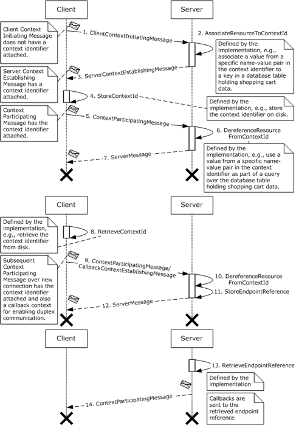
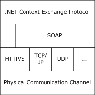
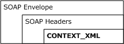
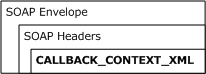
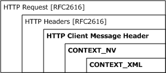
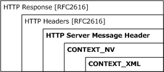
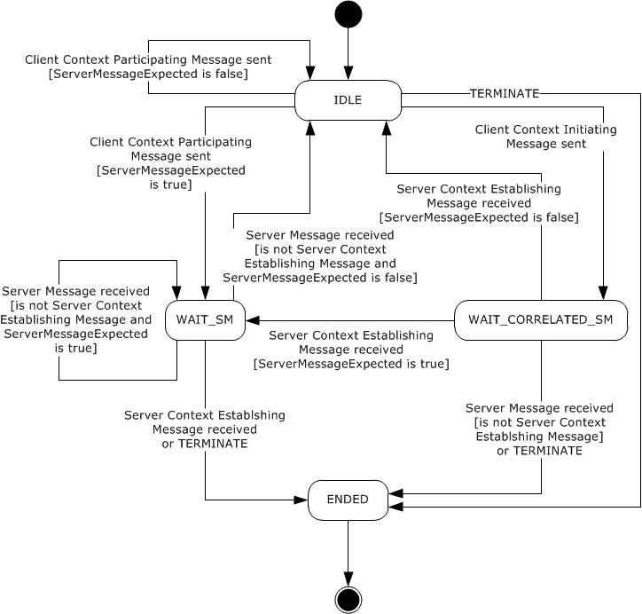
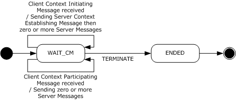
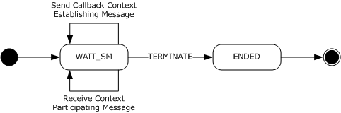
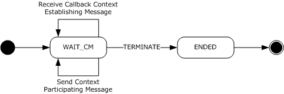

[MC-NETCEX]:

.NET Context Exchange Protocol

Intellectual Property Rights Notice for Open Specifications Documentation

  Technical Documentation. Microsoft publishes Open Specifications documentation (“this

documentation”) for protocols, file formats, data portability, computer languages, and standards
support. Additionally, overview documents cover inter-protocol relationships and interactions.

  Copyrights. This documentation is covered by Microsoft copyrights. Regardless of any other

terms that are contained in the terms of use for the Microsoft website that hosts this
documentation, you can make copies of it in order to develop implementations of the technologies
that are described in this documentation and can distribute portions of it in your implementations
that use these technologies or in your documentation as necessary to properly document the
implementation. You can also distribute in your implementation, with or without modification, any
schemas, IDLs, or code samples that are included in the documentation. This permission also
applies to any documents that are referenced in the Open Specifications documentation.
  No Trade Secrets. Microsoft does not claim any trade secret rights in this documentation.
  Patents. Microsoft has patents that might cover your implementations of the technologies

described in the Open Specifications documentation. Neither this notice nor Microsoft's delivery of
this documentation grants any licenses under those patents or any other Microsoft patents.
However, a given Open Specifications document might be covered by the Microsoft Open
Specifications Promise or the Microsoft Community Promise. If you would prefer a written license,
or if the technologies described in this documentation are not covered by the Open Specifications
Promise or Community Promise, as applicable, patent licenses are available by contacting
iplg@microsoft.com.

  License Programs. To see all of the protocols in scope under a specific license program and the

associated patents, visit the Patent Map.

  Trademarks. The names of companies and products contained in this documentation might be
covered by trademarks or similar intellectual property rights. This notice does not grant any
licenses under those rights. For a list of Microsoft trademarks, visit
www.microsoft.com/trademarks.

  Fictitious Names. The example companies, organizations, products, domain names, email

addresses, logos, people, places, and events that are depicted in this documentation are fictitious.
No association with any real company, organization, product, domain name, email address, logo,
person, place, or event is intended or should be inferred.

Reservation of Rights. All other rights are reserved, and this notice does not grant any rights other
than as specifically described above, whether by implication, estoppel, or otherwise.

Tools. The Open Specifications documentation does not require the use of Microsoft programming
tools or programming environments in order for you to develop an implementation. If you have access
to Microsoft programming tools and environments, you are free to take advantage of them. Certain
Open Specifications documents are intended for use in conjunction with publicly available standards
specifications and network programming art and, as such, assume that the reader either is familiar
with the aforementioned material or has immediate access to it.

Support. For questions and support, please contact dochelp@microsoft.com.

[MC-NETCEX] - v20190313
.NET Context Exchange Protocol
Copyright © 2019 Microsoft Corporation
Release: March 13, 2019

1 / 44

Revision Summary

Date

Revision
History

Revision
Class

Comments

4/8/2008

0.1

New

Version 0.1 release

5/16/2008

0.1.1

Editorial

Changed language and formatting in the technical content.

6/20/2008

0.1.2

Editorial

Changed language and formatting in the technical content.

7/25/2008

0.1.3

Editorial

Changed language and formatting in the technical content.

8/29/2008

0.1.4

Editorial

Changed language and formatting in the technical content.

10/24/2008  0.1.5

Editorial

Changed language and formatting in the technical content.

12/5/2008

0.1.6

Editorial

Changed language and formatting in the technical content.

1/16/2009

0.1.7

Editorial

Changed language and formatting in the technical content.

2/27/2009

1.0

Major

Updated and revised the technical content.

4/10/2009

1.0.1

Editorial

Changed language and formatting in the technical content.

5/22/2009

1.0.2

Editorial

Changed language and formatting in the technical content.

7/2/2009

1.0.3

Editorial

Changed language and formatting in the technical content.

8/14/2009

1.0.4

Editorial

Changed language and formatting in the technical content.

9/25/2009

1.1

Minor

Clarified the meaning of the technical content.

11/6/2009

1.1.1

Editorial

Changed language and formatting in the technical content.

12/18/2009  1.1.2

Editorial

Changed language and formatting in the technical content.

1/29/2010

1.2

Minor

Clarified the meaning of the technical content.

3/12/2010

1.2.1

Editorial

Changed language and formatting in the technical content.

4/23/2010

1.2.2

Editorial

Changed language and formatting in the technical content.

6/4/2010

1.2.3

Editorial

Changed language and formatting in the technical content.

7/16/2010

2.0

Major

Updated and revised the technical content.

8/27/2010

2.0

10/8/2010

2.0

11/19/2010  2.0

1/7/2011

2.0

2/11/2011

2.0

3/25/2011

2.0

None

None

None

None

None

None

No changes to the meaning, language, or formatting of the
technical content.

No changes to the meaning, language, or formatting of the
technical content.

No changes to the meaning, language, or formatting of the
technical content.

No changes to the meaning, language, or formatting of the
technical content.

No changes to the meaning, language, or formatting of the
technical content.

No changes to the meaning, language, or formatting of the
technical content.

[MC-NETCEX] - v20190313
.NET Context Exchange Protocol
Copyright © 2019 Microsoft Corporation
Release: March 13, 2019

2 / 44

Date

Revision
History

Revision
Class

Comments

5/6/2011

2.0

None

No changes to the meaning, language, or formatting of the
technical content.

6/17/2011

2.1

Minor

Clarified the meaning of the technical content.

9/23/2011

2.1

None

No changes to the meaning, language, or formatting of the
technical content.

12/16/2011  3.0

Major

Updated and revised the technical content.

3/30/2012

3.0

7/12/2012

3.0

10/25/2012  3.0

1/31/2013

3.0

8/8/2013

3.0

11/14/2013  3.0

2/13/2014

3.0

5/15/2014

3.0

None

None

None

None

None

None

None

None

No changes to the meaning, language, or formatting of the
technical content.

No changes to the meaning, language, or formatting of the
technical content.

No changes to the meaning, language, or formatting of the
technical content.

No changes to the meaning, language, or formatting of the
technical content.

No changes to the meaning, language, or formatting of the
technical content.

No changes to the meaning, language, or formatting of the
technical content.

No changes to the meaning, language, or formatting of the
technical content.

No changes to the meaning, language, or formatting of the
technical content.

6/30/2015

4.0

Major

Significantly changed the technical content.

10/16/2015  4.0

7/14/2016

4.0

None

None

No changes to the meaning, language, or formatting of the
technical content.

No changes to the meaning, language, or formatting of the
technical content.

3/16/2017

5.0

Major

Significantly changed the technical content.

6/1/2017

5.0

None

No changes to the meaning, language, or formatting of the
technical content.

3/13/2019

6.0

Major

Significantly changed the technical content.

[MC-NETCEX] - v20190313
.NET Context Exchange Protocol
Copyright © 2019 Microsoft Corporation
Release: March 13, 2019

3 / 44

Table of Contents

1.1
1.2

1.2.1
1.2.2

1  Introduction ............................................................................................................ 6
Glossary ........................................................................................................... 6
References ........................................................................................................ 7
Normative References ................................................................................... 7
Informative References ................................................................................. 8
Overview .......................................................................................................... 8
Relationship to Other Protocols .......................................................................... 12
Prerequisites/Preconditions ............................................................................... 12
Applicability Statement ..................................................................................... 12
Versioning and Capability Negotiation ................................................................. 12
Vendor-Extensible Fields ................................................................................... 13
Standards Assignments ..................................................................................... 13

1.3
1.4
1.5
1.6
1.7
1.8
1.9

2.1
2.2

2  Messages ............................................................................................................... 14
Transport ........................................................................................................ 14
Message Syntax ............................................................................................... 14
CONTEXT_XML ........................................................................................... 15
CALLBACK_CONTEXT_XML ........................................................................... 16
CONTEXT_NV ............................................................................................. 17
HTTP Client Message Header ........................................................................ 17
HTTP Server Message Header ....................................................................... 17
Server Context Establishing Message ............................................................ 18
Context Participating Message ...................................................................... 18

2.2.1
2.2.2
2.2.3
2.2.4
2.2.5
2.2.6
2.2.7

3.1

3.1.5

3.1.1

3.1.5.1

3.1.6
3.1.7

3.1.4.1
3.1.4.2

3.1.2
3.1.3
3.1.4

3.1.1.1
3.1.1.2
3.1.1.3
3.1.1.4

3  Protocol Details ..................................................................................................... 19
Context Exchange Client Role Details .................................................................. 19
Abstract Data Model .................................................................................... 19
IDLE State ........................................................................................... 20
WAIT_CORRELATED_SM State ................................................................ 20
WAIT_SM State .................................................................................... 20
ENDED State ........................................................................................ 21
Timers ...................................................................................................... 21
Initialization ............................................................................................... 21
Higher-Layer Triggered Events ..................................................................... 21
SEND_CM ............................................................................................ 21
TERMINATE .......................................................................................... 22
Message Processing Events and Sequencing Rules .......................................... 22
RECEIVE_SM ........................................................................................ 22
Timer Events .............................................................................................. 23
Other Local Events ...................................................................................... 23
Context Exchange Server Role Details ................................................................ 23
Abstract Data Model .................................................................................... 23
WAIT_CM State .................................................................................... 24
ENDED State ........................................................................................ 24
Timers ...................................................................................................... 24
Initialization ............................................................................................... 24
Higher-Layer Triggered Events ..................................................................... 24
TERMINATE .......................................................................................... 24
Message Processing Events and Sequencing Rules .......................................... 25
RECEIVE_CM ........................................................................................ 25
Timer Events .............................................................................................. 26
Other Local Events ...................................................................................... 26
Callback Context Exchange Client Role Details ..................................................... 27
Abstract Data Model .................................................................................... 27
WAIT_SM State .................................................................................... 27

3.2.2
3.2.3
3.2.4

3.2.1.1
3.2.1.2

3.2.6
3.2.7

3.3.1.1

3.2.4.1

3.2.5.1

3.3.1

3.2.5

3.2.1

3.3

3.2

[MC-NETCEX] - v20190313
.NET Context Exchange Protocol
Copyright © 2019 Microsoft Corporation
Release: March 13, 2019

4 / 44

3.3.6
3.3.7

3.4.1

3.4

3.3.1.2

3.3.2
3.3.3
3.3.4

3.3.5

3.3.4.1

3.3.5.1
3.3.5.2

ENDED State ........................................................................................ 27
Timers ...................................................................................................... 27
Initialization ............................................................................................... 28
Higher-Layer Triggered Events ..................................................................... 28
TERMINATE .......................................................................................... 28
Message Processing Events and Sequencing Rules .......................................... 28
SEND_CM ............................................................................................ 28
RECEIVE_SM ........................................................................................ 28
Timer Events .............................................................................................. 29
Other Local Events ...................................................................................... 29
Callback Context Exchange Server Role Details .................................................... 29
Abstract Data Model .................................................................................... 29
WAIT_CM State .................................................................................... 30
ENDED State ........................................................................................ 30
Timers ...................................................................................................... 30
Initialization ............................................................................................... 30
Higher-Layer Triggered Events ..................................................................... 31
TERMINATE .......................................................................................... 31
Message Processing Events and Sequencing Rules .......................................... 31
RECEIVE_CM ........................................................................................ 31
SEND_SM ............................................................................................ 31
Timer Events .............................................................................................. 32
Other Local Events ...................................................................................... 32

3.4.1.1
3.4.1.2

3.4.2
3.4.3
3.4.4

3.4.5

3.4.4.1

3.4.5.1
3.4.5.2

3.4.6
3.4.7

4.1

4.1.1
4.1.2
4.1.3
4.1.4
4.1.5

4  Protocol Examples ................................................................................................. 33
Using the .NET Context Exchange Protocol with SOAP 1.2 ..................................... 33
Establishing Context Using SOAP 1.2 ............................................................. 33
Subsequent Context Participating Messages Using SOAP 1.2 ............................ 34
Continue Using Context Using SOAP 1.2 ........................................................ 35
Establish a Callback Context ........................................................................ 35
Subsequent Callback Messages .................................................................... 36
Using the .NET Context Exchange Protocol with HTTP ........................................... 36
Establishing Context Using HTTP ................................................................... 36
Subsequent Context Participating Messages Using HTTP .................................. 37
Continue Using the Context Using HTTP ......................................................... 38
Processing an Unrecognized Context Using SOAP 1.2 ............................................ 38
Processing an Unrecognized Context Using HTTP .................................................. 39

4.2.1
4.2.2
4.2.3

4.3
4.4

4.2

5  Security ................................................................................................................. 40
Security Considerations for Implementers ........................................................... 40
Index of Security Parameters ............................................................................ 40

5.1
5.2

6  Appendix A: Product Behavior ............................................................................... 41

7  Change Tracking .................................................................................................... 42

8  Index ..................................................................................................................... 43

[MC-NETCEX] - v20190313
.NET Context Exchange Protocol
Copyright © 2019 Microsoft Corporation
Release: March 13, 2019

5 / 44

1  Introduction

This document specifies the .NET Context Exchange Protocol, which specifies a message syntax for
identifying context that is shared between a client and a server, and a protocol for establishing that
context.

Sections 1.5, 1.8, 1.9, 2, and 3 of this specification are normative. All other sections and examples in
this specification are informative.

1.1  Glossary

This document uses the following terms:

base64 encoding: A binary-to-text encoding scheme whereby an arbitrary sequence of bytes is

converted to a sequence of printable ASCII characters, as described in [RFC4648].

callback context: The context that is required for a server to make callbacks to a client. A
callback context consists of an endpoint reference for a client endpoint with an optional
context identifier.

client: A computer on which the remote procedure call (RPC) client is executing.

Client Context Initiating Message: A client message that requests a server to establish a

context.

client message: A message that is sent from a client to a server.

connection: A time-bounded association between two endpoints that allows the two endpoints

to exchange messages.

context: An abstract concept that represents an association between a resource and a set of

messages that are exchanged between a client and a server. A context is uniquely identified
by a context identifier.

context identifier: A GUID that identifies a context.

Context Participating Message: A client message or a server message that is one of a set of

messages associated with a context.

endpoint: A communication port that is exposed by an application server for a specific shared

service and to which messages can be addressed.

endpoint reference (EPR): A resource that conveys the information that is needed to address an

endpoint.

server: A computer on which the remote procedure call (RPC) server is executing.

Server Context Establishing Message: A server message that establishes a new context and

is correlated to a Client Context Initiating Message.

server message: A message that is sent from a server to a client.

SOAP: A lightweight protocol for exchanging structured information in a decentralized, distributed

environment. SOAP uses XML technologies to define an extensible messaging framework, which
provides a message construct that can be exchanged over a variety of underlying protocols. The
framework has been designed to be independent of any particular programming model and
other implementation-specific semantics. SOAP 1.2 supersedes SOAP 1.1. See [SOAP1.2-
1/2003].

[MC-NETCEX] - v20190313
.NET Context Exchange Protocol
Copyright © 2019 Microsoft Corporation
Release: March 13, 2019

6 / 44

SOAP envelope: A container for SOAP message information and the root element of a SOAP

document. See [SOAP1.2-1/2007] section 5.1 for more information.

SOAP fault: A container for error and status information within a SOAP message. See [SOAP1.2-

1/2007] section 5.4 for more information.

SOAP header: A mechanism for implementing extensions to a SOAP message in a decentralized
manner without prior agreement between the communicating parties. See [SOAP1.2-1/2007]
section 5.2 for more information.

SOAP message: An XML document consisting of a mandatory SOAP envelope, an optional SOAP
header, and a mandatory SOAP body. See [SOAP1.2-1/2007] section 5 for more information.

UTF-8: A byte-oriented standard for encoding Unicode characters, defined in the Unicode standard.

Unless specified otherwise, this term refers to the UTF-8 encoding form specified in
[UNICODE5.0.0/2007] section 3.9.

MAY, SHOULD, MUST, SHOULD NOT, MUST NOT: These terms (in all caps) are used as defined
in [RFC2119]. All statements of optional behavior use either MAY, SHOULD, or SHOULD NOT.

1.2  References

Links to a document in the Microsoft Open Specifications library point to the correct section in the
most recently published version of the referenced document. However, because individual documents
in the library are not updated at the same time, the section numbers in the documents may not
match. You can confirm the correct section numbering by checking the Errata.

1.2.1  Normative References

We conduct frequent surveys of the normative references to assure their continued availability. If you
have any issue with finding a normative reference, please contact dochelp@microsoft.com. We will
assist you in finding the relevant information.

[RFC2119] Bradner, S., "Key words for use in RFCs to Indicate Requirement Levels", BCP 14, RFC
2119, March 1997, https://www.rfc-editor.org/info/rfc2119

[RFC2234] Crocker, D. and Overell, P., "Augmented BNF for Syntax Specifications: ABNF", RFC 2234,
November 1997, https://www.rfc-editor.org/info/rfc2234

[RFC2616] Fielding, R., Gettys, J., Mogul, J., et al., "Hypertext Transfer Protocol -- HTTP/1.1", RFC
2616, June 1999, https://www.rfc-editor.org/info/rfc2616

[RFC3548] Josefsson, S., Ed., "The Base16, Base32, and Base64 Data Encodings", RFC 3548, July
2003, https://www.rfc-editor.org/info/rfc3548

[RFC3629] Yergeau, F., "UTF-8, A Transformation Format of ISO 10646", STD 63, RFC 3629,
November 2003, https://www.rfc-editor.org/info/rfc3629

[SOAP1.1] Box, D., Ehnebuske, D., Kakivaya, G., et al., "Simple Object Access Protocol (SOAP) 1.1",
W3C Note, May 2000, https://www.w3.org/TR/2000/NOTE-SOAP-20000508/

[SOAP1.2-1/2007] Gudgin, M., Hadley, M., Mendelsohn, N., et al., "SOAP Version 1.2 Part 1:
Messaging Framework (Second Edition)", W3C Recommendation, April 2007,
http://www.w3.org/TR/2007/REC-soap12-part1-20070427/

[W3C-XSD] World Wide Web Consortium, "XML Schema Part 2: Datatypes Second Edition", 28
October 2004, http://www.w3.org/TR/2004/REC-xmlschema-2-20041028

[MC-NETCEX] - v20190313
.NET Context Exchange Protocol
Copyright © 2019 Microsoft Corporation
Release: March 13, 2019

7 / 44

[WSA] Gudgin, M., Hadley, M., and Rogers, T., "Web Services Addressing 1.0 - Core", W3C
Recommendation, May 2006, http://www.w3.org/TR/2006/REC-ws-addr-core-20060509/

[XML1.0] Bray, T., Paoli, J., Sperberg-McQueen, C.M., and Maler, E., "Extensible Markup Language
(XML) 1.0 (Second Edition)", W3C Recommendation, October 2000,
https://www.w3.org/TR/2000/REC-xml-20001006

1.2.2  Informative References

[MS-NETOD] Microsoft Corporation, "Microsoft .NET Framework Protocols Overview".

[RFC2109] Kristol, D., and Montulli, L., "HTTP State Management Mechanism", RFC 2109, February
1997, https://www.rfc-editor.org/info/rfc2109

[RFC2965] Kristol, D. and Montulli, L., "HTTP State Management Mechanism", RFC 2965, October
2000, https://www.rfc-editor.org/info/rfc2965

[RFC4346] Dierks, T., and Rescorla, E., "The Transport Layer Security (TLS) Protocol Version 1.1",
RFC 4346, April 2006, https://www.rfc-editor.org/info/rfc4346

[WSS1] Nadalin, A., Kaler, C., Hallam-Baker, P., et al., "Web Services Security: SOAP Message
Security 1.0 (WS-Security 2004)", March 2004, http://docs.oasis-open.org/wss/2004/01/oasis-
200401-wss-soap-message-security-1.0.pdf

1.3  Overview

The .NET Context Exchange Protocol specifies a message syntax for identifying context that is shared
between a client and a server independent of connection usage, and a protocol for establishing that
context. For example, in some scenarios, the connection between a client and a server is sufficient for
the server to relate the client messages to specific resources; a chat application can define a
conversation resource and relate chat messages to a conversation by associating the conversation
with chat messages that arrive over a particular connection.

It is typical, however, for a set of client messages to be associated with a resource that is independent
of a connection. For example, a SOAP-based shopping application can define a shopping cart resource
and relate client messages to the shopping cart even if the first few messages arrive on one
connection and the remaining messages arrive on a different connection. The .NET Context Exchange
Protocol facilitates this more general connection-independent case.

The .NET Context Exchange Protocol can be used in one of two modes: stateless or stateful. In
stateless mode, a client and server use the message syntax specified in section 2.2; however, the
interpretation of this syntax is defined by the client and server implementations. In stateful mode, the
client and server interpret the message syntax as specified in section 3. Unless explicitly mentioned,
this document discusses the .NET Context Exchange Protocol in stateful mode.

This protocol specifies two roles for context exchange: a client role and a server role. The server role
is responsible for creating context identifiers in response to client requests and associating context
identifiers with resources. For example, a shopping service can create a context identifier with the
following (property name, property value) pair.

Property name   Property value

shoppingCartId

1a1913b1-cb24-4d94-91d2-cf414a569481

After that, it stores a shopping cart resource by using the value of the shoppingCartId as a key.

The client role initiates communication with the server role, captures the context identifier that is sent
from the server role, and attaches the context identifier to all subsequent client messages that are

8 / 44

[MC-NETCEX] - v20190313
.NET Context Exchange Protocol
Copyright © 2019 Microsoft Corporation
Release: March 13, 2019

related to the resources in question. For example, a client shopping application can use the previously
mentioned shopping service to create a shopping cart resource using the .NET Context Exchange
Protocol. The client stores the context identifier that is generated by the server and attaches it to each
message that is intended to manipulate the shopping cart.

The protocol also specifies two roles for callback context exchange: a client role and a server
role.<1> The initial communication of the client role with the server role specifies a callback context to
enable duplex communication. The callback context consists of an endpoint reference that specifies
the address of the client endpoint. The endpoint reference can contain a context identifier that is
associated with resources by the client. For example, a customer of a shopping service can create a
context identifier with the following (property name, property value) pair.

Property name   Property value

customerId

9b0e43f0-e783-4cb9-8343-106d677c4ed7

Note that the roles for context exchange and callback context exchange compose. For example, the
entity acting as the client role for context exchange can also act as the client role for callback context
exchange.

The following figure describes the typical use of the .NET Context Exchange Protocol.

[MC-NETCEX] - v20190313
.NET Context Exchange Protocol
Copyright © 2019 Microsoft Corporation
Release: March 13, 2019

9 / 44

<!-- Extracted images from page 10 -->

<!-- /Extracted images from page 10 -->

Figure 1: Typical use of the .NET Context Exchange Protocol

Each message that is exchanged between client and server is an application-specific message. This
protocol is a header-based protocol that composes into client and server messages:

1.  The client sends a Client Context Initiating Message to the server. The server recognizes this
message as a Client Context Initiating Message because it does not have a context identifier
attached.

2.  The server creates a resource (for example, a shopping cart) and a new context identifier. It then

associates the resource with the new context identifier.

10 / 44

[MC-NETCEX] - v20190313
.NET Context Exchange Protocol
Copyright © 2019 Microsoft Corporation
Release: March 13, 2019

3.  The server returns a Server Context Establishing Message to the client with the newly created

context identifier attached.

4.  The client stores the attached context identifier so that it can be retrieved even if the client

process is restarted.

5.  The client sends the server a Context Participating Message with the context identifier

attached. This message is intended to manipulate the resource that is created in step 2. For
example, it might be intended to add an item to the shopping cart.

6.  The server dereferences the resource using the context identifier. For example, it can use the

property value of the property named "shoppingCartId" in the predicate of a database query to
retrieve the shopping cart. After that, it acts on the resource according to the message it received.

7.  The server sends a response back to the client.

8.  At some point later on a different connection, the client retrieves the context identifier that it

stored earlier in step 4.

9.  The client then sends the server a Context Participating Message that has the context identifier
attached. This message is intended to manipulate the resource that was created in step 2. For
example, it can be intended to purchase the items in the shopping cart.

The message that is sent by the client is also a Callback Context Establishing Message that has a
callback context attached. This allows the server to engage in a duplex conversation with the
client. For example, it allows the server to notify the client when the purchased items have
shipped.

10. The server dereferences the resource from the context identifier, as described in step 6.

11. The server stores the endpoint reference that is sent in the callback context from the client.

12. The server sends a response back to the client. For example, the server acknowledges that the

items in the shopping cart have been purchased.

13. At some point later on a different connection, the server retrieves the endpoint reference that it

stored earlier in step 11.

14. The server sends a Context Participating Message to the endpoint reference from the callback

context. For example, it notifies the specific customer that purchased items have been shipped.

These examples and the examples in section 4 of this document demonstrate sending a context
identifier from a server to a client in a Server Context Establishing Message. This protocol does not
require a client and server to exchange a context identifier by using a Client Context Initiating
Message and a Server Context Establishing Message. A client and server can agree on a context
identifier without this initial exchange. The protocol that is specified in section 3 allows the client to
acquire a context identifier by using a Client Context Initiating Message and a Server Context
Establishing Message; then subsequently, to send Context Participating Messages.

Alternatively, this protocol allows an implementation-specific context exchange mechanism to be
leveraged to initialize the protocol with a context identifier. This context identifier can then be
attached to subsequent Context Participating Messages.

Similarly, the callback context need not be established using a Callback Context Establishing Message,
but could instead be established through an implementation-specific callback context exchange
mechanism.

[MC-NETCEX] - v20190313
.NET Context Exchange Protocol
Copyright © 2019 Microsoft Corporation
Release: March 13, 2019

11 / 44

<!-- Extracted images from page 12 -->

<!-- /Extracted images from page 12 -->

1.4  Relationship to Other Protocols

The .NET Context Exchange Protocol can be used with HTTP [RFC2616] or SOAP-formatted messages
[SOAP1.2-1/2007] [SOAP1.1]. The following figure shows a protocol stack.

Figure 2: Protocol stack for the .NET Context Exchange Protocol

1.5  Prerequisites/Preconditions

The .NET Context Exchange Protocol requires that the client role can communicate with a server role
so that client messages and server messages can be exchanged.

The .NET Context Exchange Protocol requires an underlying protocol in which a server message can
be correlated to a unique client message.

1.6  Applicability Statement

The .NET Context Exchange Protocol is applicable to scenarios where a client and server application
requires a set of client messages to be associated with a resource independent of a connection. The
client and server application use this protocol to share context.

1.7  Versioning and Capability Negotiation

This document covers versioning issues in the following areas:

  Supported Transports: This protocol can be implemented by using transports that support

sending HTTP [RFC2616] or SOAP messages, as discussed in section 2.1.

  Protocol Versions:  When this protocol is implemented by using SOAP, it requires the use of
SOAP messaging version 1.1 [SOAP1.1] or SOAP messaging 1.2 [SOAP1.2-1/2007]. When this
protocol is implemented by using HTTP, it requires the use of HTTP version 1.1.

  Capability Negotiation: The .NET Context Exchange Protocol does not support negotiation of the

version to use.  Instead, an implementation is configured to process only messages as described
in section 2.1.

[MC-NETCEX] - v20190313
.NET Context Exchange Protocol
Copyright © 2019 Microsoft Corporation
Release: March 13, 2019

12 / 44

1.8  Vendor-Extensible Fields

Vendors and implementers MAY extend the protocol by including additional attributes [XML1.0] on the
CONTEXT_XML element or its child Property element. The interpretation of these attributes is defined
by the implementation. For example, an extension MAY be used to:

  Convey lifetime information for a particular context identifier.

  Convey metadata about the applicability of the context identifier.

Similarly, vendors and implementers MAY extend the protocol by including additional attributes
[XML1.0] on the CALLBACK_CONTEXT_XML element. The interpretation of these attributes is defined
by the implementation.

1.9  Standards Assignments

There are no standards assignments for this protocol.

[MC-NETCEX] - v20190313
.NET Context Exchange Protocol
Copyright © 2019 Microsoft Corporation
Release: March 13, 2019

13 / 44

<!-- Extracted images from page 14 -->

<!-- /Extracted images from page 14 -->

2  Messages

2.1  Transport

The .NET Context Exchange Protocol can be used over any transport protocol that supports
transmitting messages that are specified by the following protocols:

  HTTP 1.1 [RFC2616]

  SOAP 1.1 [SOAP1.1]

  SOAP 1.2 [SOAP1.2-1/2007]

This specification uses the term SOAP to mean either SOAP 1.1 or SOAP 1.2. Where the differences
between the two versions of SOAP are significant, either SOAP 1.1 or SOAP 1.2 is referenced.

An implementation of the .NET Context Exchange Protocol MUST support the processing of messages
that are specified by HTTP 1.1 or either of the SOAP versions. This section specifies the format of .NET
Context Exchange Protocol messages using the message formats of both HTTP 1.1 and SOAP.

2.2  Message Syntax

This section specifies the messages that are used by the .NET Context Exchange Protocol and their
relationship to HTTP 1.1 [RFC2616] and SOAP.

When used with SOAP, the .NET Context Exchange Protocol uses a CONTEXT_XML element as a SOAP
header using the SOAP extensibility model, specified in [SOAP1.2-1/2007] section 3, to form a Server
Context Establishing Message or a Context Participating Message. The following figure shows the
containment of CONTEXT_XML in a SOAP envelope.

Figure 3: Context Participating Message or Server Context Establishing Message using SOAP

The .NET Context Exchange Protocol uses CALLBACK_CONTEXT_XML as a SOAP header using the
SOAP extensibility model, specified in [SOAP1.2-1/2007] section 3, to form a Callback Context
Establishing Message. The following figure shows the containment of CALLBACK_CONTEXT_XML in a
SOAP envelope.

Figure 4: Callback Context Establishing Message using SOAP

When used with HTTP 1.1, the .NET Context Exchange Protocol uses:

  An HTTP Client Message Header as an HTTP header in an HTTP request message to form a Context

Participating Message; or

14 / 44

[MC-NETCEX] - v20190313
.NET Context Exchange Protocol
Copyright © 2019 Microsoft Corporation
Release: March 13, 2019

<!-- Extracted images from page 15 -->

<!-- /Extracted images from page 15 -->

  An HTTP Server Message Header as an HTTP header in an HTTP response message to form a

Server Context Establishing Message.

The next figure shows the containment of message structures, which are defined in section 2, within
an HTTP request message.

Figure 5: Client Context Participating Message using HTTP 1.1

The following figure shows the containment of message structures, which are defined in section 2,
within an HTTP response message.

Figure 6: Server Context Establishing Message using HTTP 1.1

2.2.1  CONTEXT_XML

CONTEXT_XML is an XML element [XML1.0] that represents a context identifier, as specified by the
following XML schema [W3C-XSD].

 <xs:schema
     targetNamespace="http://schemas.microsoft.com/ws/2006/05/context"
     xmlns:xs="http://www.w3.org/2001/XMLSchema"
 >
   <xs:element name="Context">
     <xs:complexType>
       <xs:sequence minOccurs="0" maxOccurs="unbounded">
         <xs:element name="Property">
           <xs:complexType>
             <xs:simpleContent>
               <xs:extension base="xs:string">
                 <xs:attribute name="name">
                   <xs:simpleType>
                     <xs:restriction base="xs:string">
                       <xs:pattern value="[A-Za-z\.\-_]+"/>
                     </xs:restriction>
                   </xs:simpleType>
                 </xs:attribute>
                 <xs:anyAttribute namespace="##any"/>

[MC-NETCEX] - v20190313
.NET Context Exchange Protocol
Copyright © 2019 Microsoft Corporation
Release: March 13, 2019

15 / 44

               </xs:extension>
             </xs:simpleContent>
           </xs:complexType>
         </xs:element>
       </xs:sequence>
       <xs:anyAttribute namespace="##any"/>
     </xs:complexType>
   </xs:element>
 </xs:schema>

For a context identifier and a CONTEXT_XML element to be isomorphic, all the following statements
MUST be true:



The number of Property XML elements in the CONTEXT_XML element is equal to the number of
(property name, property value) pairs in the context identifier.

  No two Property XML elements, when inside the CONTEXT_XML element, have the same value as

the name XML attribute.



For each Property XML element that is inside the CONTEXT_XML element, there is exactly one
(property name, property value) pair in the context identifier so that:



The Property name is equal to the value of the name XML attribute of the Property XML
element, and



The Property value is equal to the value of the content of the Property XML element.

2.2.2  CALLBACK_CONTEXT_XML

CALLBACK_CONTEXT_XML is an XML element [XML1.0] that represents a callback context, as
specified by the following XML schema [W3C-XSD].

 <xs:schema
     targetNamespace="http://schemas.microsoft.com/ws/2008/02/context"
     xmlns:xs="http://www.w3.org/2001/XMLSchema"
     xmlns:wsa="http://www.w3.org/2005/08/addressing"
 >
   <xs:element name="CallbackContext">
     <xs:complexType>
       <xs:sequence minOccurs="1" maxOccurs="1">
         <xs:element name="CallbackEndpointReference" type="wsa:EndpointReferenceType">
       </xs:sequence>
       <xs:anyAttribute namespace="##any"/>
     </xs:complexType>
   </xs:element>
 </xs:schema>

To specify a context identifier as part of the callback context, a CONTEXT_XML element MUST be
included as a reference parameter of the endpoint reference that is specified by the
CallbackEndpointReference element.

For a callback context and a CALLBACK_CONTEXT_XML element to be isomorphic, the following
statement MUST be true:



The CallbackEndpointReference element in the CALLBACK_CONTEXT_XML element is an XML
Infoset representation of the endpoint reference from the callback context as defined by [WSA].

[MC-NETCEX] - v20190313
.NET Context Exchange Protocol
Copyright © 2019 Microsoft Corporation
Release: March 13, 2019

16 / 44

2.2.3  CONTEXT_NV

CONTEXT_NV specifies a literal that results from resolving the following context_nv Augmented
Backus-Naur Form (ABNF) rule [RFC2234].

 context-nv      =  %x57.73.63.43.6F.6E.74.65.78.74    ; WscContext
                    lws "=" lws
                    %x22 context-v %x22
 context-v       =  *base64
 base64          =  %x30-39 / %x41-5A / %x61-7A / %x2B / %x2F / %x3D
 lws             =  *(%x0D.0A / %x09 / %x20)    ; CRLF, space, or tab

For a context identifier and a CONTEXT_NV literal to be isomorphic, the value of context-v MUST be
a base64 [RFC3548] encoding of a UTF-8 encoding [RFC3629] of a CONTEXT_XML element that is
isomorphic to the context identifier.

2.2.4  HTTP Client Message Header

The HTTP Client Message Header is an HTTP header [RFC2616] that results from resolving the
following client_context_header ABNF rule [RFC2234].

 client_context_header = lws "Cookie" lws ":"
                         *(any-nv ";") lws
                         context-nv
                         lws *(";" any-nv)
 any-nv         = lws token lws "=" lws (token / quoted-string) lws
 lws            =  *(%x0D.0A / %x09 / %x20)    ; CRLF, space, or tab

This is a new header which does not have any relation with the "Cookie" header as described in
[RFC2109] and [RFC2965].

The rules token and quoted-string of this grammar are specified in [RFC2616] section 2.2.

The context_nv rule MUST resolve to a CONTEXT_NV literal.

For a context identifier and an HTTP Client Message Header to be isomorphic, the context_nv rule
MUST resolve to a value that is isomorphic to the context identifier, as specified in CONTEXT_NV.

2.2.5  HTTP Server Message Header

The HTTP Server Message Header is an HTTP header [RFC2616] that results from resolving the
following server_context_header ABNF rule [RFC2234].

 server_context_header = lws "Set-Cookie" lws ":"
                         *(any-nv ";") lws
                         context-nv
                         lws *(";" any-nv)
 any-nv          = lws token lws "=" lws (token / quoted-string) lws
 lws             = *(%x0D.0A / %x09 / %x20)    ; CRLF, space, or tab

This is a new header which does not have any relation with the "Set-Cookie" header as described in
[RFC2109].

The rules token and quoted-string of this grammar are specified in [RFC2616] section 2.2.

The context_nv rule MUST resolve to a CONTEXT_NV literal.

[MC-NETCEX] - v20190313
.NET Context Exchange Protocol
Copyright © 2019 Microsoft Corporation
Release: March 13, 2019

17 / 44

For a context identifier and an HTTP Server Message Header to be isomorphic, the context_nv rule
MUST resolve to a value that is isomorphic to the context identifier, as specified in CONTEXT_NV.

2.2.6  Server Context Establishing Message

The Server Context Establishing Message MUST be either:

  A server message that is an HTTP response message [RFC2616] that contains an HTTP Server

Message Header.

  A server message that is a SOAP envelope that contains a CONTEXT_XML element as a SOAP

header.

2.2.7  Context Participating Message

The Context Participating Message MUST be either:

  A client message that is an HTTP request message [RFC2616] that contains an HTTP Client

Message Header.

  A client message that is a SOAP envelope that contains a CONTEXT_XML element as a SOAP

header.

[MC-NETCEX] - v20190313
.NET Context Exchange Protocol
Copyright © 2019 Microsoft Corporation
Release: March 13, 2019

18 / 44

3  Protocol Details

3.1  Context Exchange Client Role Details

In this section, "client role" refers to the client role for context exchange.

3.1.1  Abstract Data Model

This section describes a conceptual model of possible data organization that an implementation
maintains to participate in this protocol. The described organization is provided to facilitate the
explanation of how the protocol behaves. This document does not mandate that implementations
adhere to this model as long as their external behavior is consistent with the behavior that is
described in this document.

The client role MUST maintain the following data elements:

  Context Identifier Store: A data element that is capable of holding an instance of a context

identifier or an empty value.

  State: An enumeration that identifies the current state of the client role with the following

possible values:



IDLE

  WAIT_CORRELATED_SM

  WAIT_SM



ENDED

The following figure shows the relationship between the client role states.

[MC-NETCEX] - v20190313
.NET Context Exchange Protocol
Copyright © 2019 Microsoft Corporation
Release: March 13, 2019

19 / 44

<!-- Extracted images from page 20 -->

<!-- /Extracted images from page 20 -->

Figure 7: State diagram for the client role

3.1.1.1  IDLE State

IDLE is the initial state. The following events are processed in this state:

  SEND_CM



TERMINATE

3.1.1.2  WAIT_CORRELATED_SM State

The following events are processed in the WAIT_CORRELATED_SM state:

  RECEIVE_SM



TERMINATE

3.1.1.3  WAIT_SM State

The following events are processed in the WAIT_SM state:

[MC-NETCEX] - v20190313
.NET Context Exchange Protocol
Copyright © 2019 Microsoft Corporation
Release: March 13, 2019

20 / 44

  RECEIVE_SM



TERMINATE

3.1.1.4  ENDED State

The ENDED state is the final state.

3.1.2  Timers

None.

3.1.3  Initialization

When the client role is initialized:





The State field MUST be set to IDLE.

The Context Identifier Store field MUST be set to a value that is obtained from an
implementation-specific source.

3.1.4  Higher-Layer Triggered Events

3.1.4.1  SEND_CM

The SEND_CM event MUST be signaled by the higher-layer business logic with the following
arguments:







The Client Message argument.

The Protocol argument with two possible values: HTTP or SOAP.

The ServerMessageExpected argument with two possible values: true or false.

If the SEND_CM event is signaled, the client role implementation MUST perform the following actions:



If the Context Identifier Store contains an empty value:

  Send the client message to the server role by using the underlying transport protocol.

  Set the State field to WAIT_CORRELATED_SM.

  Otherwise:



Transform the client message to a Context Participating Message by performing the following
steps:



If the Protocol value is HTTP and the client message is an HTTP request message
[RFC2616]:

  Create an HTTP Client Message Header that is isomorphic with the value of the

Context Identifier Store.

  Add the HTTP Client Message Header to the client message.



Else if the Protocol value is SOAP and the client message is a SOAP envelope:

  Create a CONTEXT_XML element that is isomorphic with the value of the Context

Identifier Store.

21 / 44

[MC-NETCEX] - v20190313
.NET Context Exchange Protocol
Copyright © 2019 Microsoft Corporation
Release: March 13, 2019

  Add the CONTEXT_XML element to the client message as a SOAP header.

  Otherwise:

  Return an implementation-specific failure result to the higher-layer business logic.

  Send the Context Participating Message to the server role by using the underlying transport

protocol.



If the ServerMessageExpected value is true:

  Set the State field to WAIT_SM.

3.1.4.2  TERMINATE

The TERMINATE event MUST be signaled by the higher-layer business logic.

If the TERMINATE event is signaled, the client role implementation MUST perform the following action:

  Set the State field to ENDED.

3.1.5  Message Processing Events and Sequencing Rules

3.1.5.1  RECEIVE_SM

The RECEIVE_SM event MUST be signaled by the underlying transport protocol with the following
arguments:







The Server Message argument.

The Protocol argument with two possible values: HTTP or SOAP.

The ServerMessageExpected argument with two possible values: true or false.

If the RECEIVE_SM event is signaled, the client role implementation MUST perform the following
actions:



If the State field is WAIT_CORRELATED_SM:



If the server message is a Server Context Establishing Message:

  Create the context identifier from the Server Context Establishing Message by

performing the following steps:



If the Protocol value is HTTP and the server message contains an HTTP Server
Message Header:

  Create a context identifier that is isomorphic with the HTTP Server Message

Header from the server message.



Else if the Protocol value is SOAP and the server message contains a SOAP header
that matches a CONTEXT_XML element:

  Create a context identifier that is isomorphic with the SOAP header from the

server message that matches a CONTEXT_XML element.

  Otherwise:

  Set the State field to ENDED.

22 / 44

[MC-NETCEX] - v20190313
.NET Context Exchange Protocol
Copyright © 2019 Microsoft Corporation
Release: March 13, 2019

  Return an implementation-specific failure result to the higher-layer business logic.

  Set the Context Identifier Store field to the value of the created context identifier.



Provide the server message to the higher-layer business logic.

  Otherwise:

  Set the State field to ENDED.

  Return an implementation-specific failure result to the higher-layer business logic.

  Otherwise:



If the server message is a Server Context Establishing Message:

  Set the State field to ENDED.

  Return an implementation-specific failure result to the higher-layer business logic.

  Otherwise:



Provide the server message to the higher-layer business logic.



If the ServerMessageExpected value is true:

  Set the State field to WAIT_SM.

  Otherwise:

  Set the State field to IDLE.

3.1.6  Timer Events

None.

3.1.7  Other Local Events

None.

3.2  Context Exchange Server Role Details

In this section "server role" refers to the server role for context exchange.

3.2.1  Abstract Data Model

This section describes a conceptual model of possible data organization that an implementation
maintains to participate in this protocol. The described organization is provided to facilitate the
explanation of how the protocol behaves. This document does not mandate that implementations
adhere to this model as long as their external behavior is consistent with the behavior that is
described in this document.

The server role MUST maintain the following data elements:

  Context Identifier Store: A data element that is capable of holding an instance of a context

identifier or an empty value.

  State: An enumeration that identifies the current state of the server role with the following

possible values:

23 / 44

[MC-NETCEX] - v20190313
.NET Context Exchange Protocol
Copyright © 2019 Microsoft Corporation
Release: March 13, 2019

<!-- Extracted images from page 24 -->

<!-- /Extracted images from page 24 -->

  WAIT_CM



ENDED

The following figure shows the relationship between server role states.

Figure 8: State diagram for the server role

3.2.1.1  WAIT_CM State

The WAIT_CM state is the initial state. The following events are processed in the WAIT_CM state:

  RECEIVE_CM



TERMINATE

3.2.1.2  ENDED State

The ENDED state is the final state.

3.2.2  Timers

None.

3.2.3  Initialization

When the server role is initialized:





The State field MUST be set to WAIT_CM.

The Context Identifier Store field MUST be set to a value that is obtained from an
implementation-specific source.

3.2.4  Higher-Layer Triggered Events

3.2.4.1  TERMINATE

The TERMINATE event MUST be signaled by the higher-layer business logic.

[MC-NETCEX] - v20190313
.NET Context Exchange Protocol
Copyright © 2019 Microsoft Corporation
Release: March 13, 2019

24 / 44

If the TERMINATE event is signaled, the server role implementation MUST perform the following
action:

  Set the State field to ENDED.

3.2.5  Message Processing Events and Sequencing Rules

3.2.5.1  RECEIVE_CM

The RECEIVE_CM event MUST be signaled by the underlying transport protocol with the following
arguments:





The Client Message argument.

The Protocol argument with two possible values: HTTP or SOAP.

If the RECEIVE_CM event is signaled, the server role implementation MUST perform the following
actions:





Initialize the NEW_CONTEXT Boolean local data element to false.

If the client message is a Context Participating Message:

  Create the context identifier from the Context Participating Message by performing the

following steps:



If the Protocol value is HTTP and the client message is an HTTP request message
[RFC2616]:

  Create a context identifier that is isomorphic with the HTTP Client Message Header

from the client message.



Else if the Protocol value is SOAP and the server message is a SOAP envelope:

  Create a context identifier that is isomorphic with the SOAP header from the client

message that matches the CONTEXT_XML element.

  Otherwise:

  Return an implementation-specific failure result to the higher-layer business logic.



Invoke a function in the higher-layer business logic that accepts the created context identifier
and the value from the Context Identifier Store field; and returns one of three values:
PARTICIPATE, NEW, or FAIL.



If the value that is returned from the higher-layer business logic is PARTICIPATE:



Provide the client message to the higher-layer business logic.

  Set NEW_CONTEXT to false.



Else if the value that is returned from the higher-layer business logic is NEW:

  Set the Context Identifier Store field to an empty value.

  Set NEW_CONTEXT to true.

  Otherwise:

  Return an implementation-specific failure result to the higher-layer business logic.

[MC-NETCEX] - v20190313
.NET Context Exchange Protocol
Copyright © 2019 Microsoft Corporation
Release: March 13, 2019

25 / 44

  Otherwise:

  Set NEW_CONTEXT to true.



If NEW_CONTEXT is true:



If the Context Identifier Store field is empty:







Invoke a function in the higher-layer business logic that returns a context identifier.

Invoke a function in the higher-layer business logic that accepts the client message and
returns a correlated server message using a correlation mechanism that is supplied by the
underlying transport protocol.

Transform the server message to a Server Context Establishing Message by performing
the following steps:



If the Protocol value is HTTP and the server message is an HTTP response message
[RFC2616]:

  Create an HTTP Server Message Header that is isomorphic with the context

identifier.

  Add the HTTP Server Message Header to the server message [RFC2616].



Else if the Protocol value is SOAP and the server message is a SOAP envelope:

  Create a CONTEXT_XML element that is isomorphic with the context identifier.

  Add the CONTEXT_XML element to the server message as a SOAP header.

  Otherwise:

  Return an implementation-specific failure result to the higher-layer business logic.

  Send the Server Context Establishing Message to the client role by using the underlying

transport protocol.

  Set the Context Identifier Store field to the value of the context identifier that is

returned by higher-layer business logic.

  Otherwise:

  Return an implementation-specific failure result to the higher-layer business logic.



Invoke a function in the higher-layer business logic that accepts the client message and returns a
(possibly empty) collection of correlated server messages by using a correlation mechanism that is
supplied by the underlying transport protocol.



For each server message in the collection of the server messages:

  Send the server message to the client role by using the underlying transport protocol.

3.2.6  Timer Events

None.

3.2.7  Other Local Events

None.

[MC-NETCEX] - v20190313
.NET Context Exchange Protocol
Copyright © 2019 Microsoft Corporation
Release: March 13, 2019

26 / 44

<!-- Extracted images from page 27 -->

<!-- /Extracted images from page 27 -->

3.3  Callback Context Exchange Client Role Details

In this section, "client role" refers to the client role for callback context exchange.

3.3.1  Abstract Data Model

This section describes a conceptual model of possible data organization that an implementation
maintains to participate in this protocol. The described organization is provided to facilitate the
explanation of how the protocol behaves. This document does not mandate that implementations
adhere to this model as long as their external behavior is consistent with the behavior that is
described in this document.

The client role MUST maintain the following data elements:

  Context Identifier Store: A data element that is capable of holding an instance of a context

identifier or an empty value.

  State: An enumeration that identifies the current state of the client role with the following

possible values:

  WAIT_SM



ENDED

The following figure shows the relationship between the client role states.

Figure 9: State diagram for the callback context exchange client role

3.3.1.1  WAIT_SM State

The WAIT_SM state is the initial state. The following events are processed in the WAIT_SM state:

  SEND_CM

  RECEIVE_SM



TERMINATE

3.3.1.2  ENDED State

The ENDED state is the final state.

3.3.2  Timers

There are no timers specified for the client role.

[MC-NETCEX] - v20190313
.NET Context Exchange Protocol
Copyright © 2019 Microsoft Corporation
Release: March 13, 2019

27 / 44

3.3.3  Initialization

When the client role is initialized:





The State field MUST be set to WAIT_SM.

The Context Identifier Store field MUST be set to a value that is obtained from an
implementation-specific source.

3.3.4  Higher-Layer Triggered Events

3.3.4.1  TERMINATE

The TERMINATE event MUST be signaled by the higher-layer business logic.

If the TERMINATE event is signaled, the client role implementation MUST perform the following
actions:

  Set the State field to ENDED.

3.3.5  Message Processing Events and Sequencing Rules

3.3.5.1  SEND_CM

The SEND_CM event MUST be signaled by the higher-layer business logic with the following
arguments:





The Client Message argument.

The Callback Context argument.

If the SEND_CM event is signaled, the client role implementation MUST perform the following actions:



Transform the client message to a Callback Context Establishing Message by performing the
following steps:



If the client message is a SOAP envelope:

  Create a CALLBACK_CONTEXT_XML element that is isomorphic with the callback

context.

  Add the CALLBACK_CONTEXT_XML element to the client message as a SOAP header.

  Otherwise:

  Return an implementation-specific failure result to the higher-layer business logic.

  Send the Callback Context Establishing Message to the server role by using the underlying

transport protocol.



If the callback context specifies a context identifier:

  Set the Context Identifier Store field to the value of the context identifier.

3.3.5.2  RECEIVE_SM

The RECEIVE_SM event MUST be signaled by the underlying transport protocol with the following
arguments:

28 / 44

[MC-NETCEX] - v20190313
.NET Context Exchange Protocol
Copyright © 2019 Microsoft Corporation
Release: March 13, 2019



The Server Message argument.

If the RECEIVE_SM event is signaled, the client role implementation MUST perform the following
actions:



If the server message is a Context Participating Message:

  Create the context identifier from the Context Participating Message by performing the

following steps:



If the server message is a SOAP envelope:

  Create a context identifier that is isomorphic with the SOAP header from the server

message that matches the CONTEXT_XML element.

  Otherwise:

  Return an implementation-specific failure result to the higher-layer business logic.



Invoke a function in the higher-layer business logic that accepts the created context identifier
and the value from the Context Identifier Store field and returns one of two values:
PARTICIPATE or FAIL.



If the value that is returned from the higher-layer business logic is PARTICIPATE:



Provide the client message to the higher-layer business logic.

  Otherwise:

  Return an implementation-specific failure result to the higher-layer business logic.



Invoke a function in the higher-layer business logic that accepts the server message and returns a
(possibly empty) collection of correlated client messages using a correlation mechanism that is
supplied by the underlying transport protocol.



For each client message in the collection of the client messages:

  Send the client message to the server role by using the underlying transport protocol.

3.3.6  Timer Events

None.

3.3.7  Other Local Events

None.

3.4  Callback Context Exchange Server Role Details

In this section, "server role" refers to the server role for the callback context exchange.

3.4.1  Abstract Data Model

This section describes a conceptual model of possible data organization that an implementation
maintains to participate in this protocol. The described organization is provided to facilitate the
explanation of how the protocol behaves. This document does not mandate that implementations
adhere to this model as long as their external behavior is consistent with the behavior that is
described in this document.

[MC-NETCEX] - v20190313
.NET Context Exchange Protocol
Copyright © 2019 Microsoft Corporation
Release: March 13, 2019

29 / 44

<!-- Extracted images from page 30 -->

<!-- /Extracted images from page 30 -->

The server role MUST maintain the following data elements:

  Endpoint Reference Store: A data element that is capable of holding an instance of an

endpoint reference or an empty value.

  State: An enumeration that identifies the current state of the server role with the following

possible values:

  WAIT_CM



ENDED

The following figure shows the relationship between server role states.

Figure 10: State diagram for the callback context exchange server role

3.4.1.1  WAIT_CM State

The WAIT_CM state is the initial state. The following events are processed in the WAIT_CM state:

  RECEIVE_CM

  SEND_SM



TERMINATE

3.4.1.2  ENDED State

The ENDED state is the final state.

3.4.2  Timers

None.

3.4.3  Initialization

When the server role is initialized:





The State field MUST be set to WAIT_CM.

The Endpoint Reference Store field MUST be set to a value that is obtained from an
implementation-specific source.

[MC-NETCEX] - v20190313
.NET Context Exchange Protocol
Copyright © 2019 Microsoft Corporation
Release: March 13, 2019

30 / 44

3.4.4  Higher-Layer Triggered Events

3.4.4.1  TERMINATE

The TERMINATE event MUST be signaled by the higher-layer business logic.

If the TERMINATE event is signaled, the server role implementation MUST perform the following
actions:

  Set the State field to ENDED.

3.4.5  Message Processing Events and Sequencing Rules

3.4.5.1  RECEIVE_CM

The RECEIVE_CM event MUST be signaled by the underlying transport protocol with the following
arguments:



The Client Message argument.

If the RECEIVE_CM event is signaled, the server role implementation MUST perform the following
actions:



If the client message is a Callback Context Establishing Message:



If the client message contains a SOAP header that matches a CALLBACK_CONTEXT_XML
element:

  Create a callback context that is isomorphic with the SOAP header from the client

message that matches the CALLBACK_CONTEXT_XML element.

  Set the Endpoint Reference Store field to the value of the endpoint reference from the

created callback context.



Provide the client message to the higher-layer business logic.

3.4.5.2  SEND_SM

The SEND_SM event MUST be signaled by the underlying transport protocol with the following
argument:



The Server Message argument.

If the SEND_SM event is signaled, the server role implementation MUST perform the following actions:



If the server message is a SOAP message:



If the Endpoint Reference Store field is not empty:

  Send the server message to the endpoint reference that is stored in the Endpoint
Reference Store field by using the process that is specified in [WSA] section 3.3.

  Otherwise:

  Return an implementation-specific failure result to the higher-layer business logic.

  Otherwise:

  Return an implementation-specific failure result to the higher-layer business logic.

31 / 44

[MC-NETCEX] - v20190313
.NET Context Exchange Protocol
Copyright © 2019 Microsoft Corporation
Release: March 13, 2019

3.4.6  Timer Events

None.

3.4.7  Other Local Events

None.

[MC-NETCEX] - v20190313
.NET Context Exchange Protocol
Copyright © 2019 Microsoft Corporation
Release: March 13, 2019

32 / 44

4  Protocol Examples

The following sections describe common scenarios to illustrate typical use of the .NET Context
Exchange Protocol:

  Using the .NET Context Exchange Protocol with SOAP 1.2 [SOAP1.2-1/2007].

  Using the .NET Context Exchange Protocol with HTTP [RFC2616].



Processing an Unrecognized Context Using SOAP 1.2 [SOAP1.2-1/2007].

These examples assume that the client role can establish a connection with the server role by using a
transport protocol that supports exchanging HTTP or SOAP messages.

4.1  Using the .NET Context Exchange Protocol with SOAP 1.2

This scenario shows how a client establishes a context with a server that associates Context
Participating Messages to a shopping cart resource. The scenario also shows how the client
reestablishes that context after the original connection with the server is closed. Finally the scenario
shows how the client establishes a callback context with the server.

The scenario starts after the client connects to the server by using a transport protocol that supports
the exchange of SOAP messages.

All messages that are exchanged in this scenario use [SOAP1.2-1/2007].

4.1.1  Establishing Context Using SOAP 1.2

A client establishes context with a server by sending the server a Client Context Initiating
Message. This message is a SOAP message [SOAP1.2-1/2007] that does not contain CONTEXT_XML
as a SOAP header.

 <s:Envelope xmlns:s="http://www.w3.org/2003/05/soap-envelope" xmlns:a="http:
 //www.w3.org/2005/08/addressing">
 <s:Header>
 <a:Action
s:mustUnderstand="1">http://machine1.example.org/Sample/IShoppingCart/Create</a:Action>
 <a:MessageID>urn:uuid:04133e99-4c4f-4433-b2de-4aca4132e78f</a:MessageID>

 <a:ReplyTo>
 <a:Address>http://www.w3.org/2005/08/addressing/anonymous</a:Address>
 </a:ReplyTo>
 <a:To s:mustUnderstand="1">http://machine2.example.org/ShoppingCart</a:To>
 </s:Header>
 <s:Body>
 <Create xmlns="http://machine1.example.org/Sample">
 <customerId>571</customerId>
 </Create>
 </s:Body>
 </s:Envelope>

When the server receives this message, it invokes a business logic function according to its rules for
processing SOAP messages ([SOAP1.2-1/2007] section 2.6). This function creates a new shopping cart
resource, associates it with a new context identifier, and creates a response message. The context
identifier has a single pair (property name, property value).

[MC-NETCEX] - v20190313
.NET Context Exchange Protocol
Copyright © 2019 Microsoft Corporation
Release: March 13, 2019

33 / 44

 Property name

 Property value

instanceId

1a1913b1-cb24-4d94-91d2-cf414a569481

The server then transforms the response message into a Server Context Establishing Message by
adding a SOAP header and sends it to the client. This header is a CONTEXT_XML element that is
isomorphic to the context identifier that is associated with the shopping cart.

 <s:Envelope xmlns:s="http://www.w3.org/2003/05/soap-envelope" xmlns:a="http:
 //www.w3.org/2005/08/addressing">
 <s:Header>
 <a:Action
s:mustUnderstand="1">http://machine1.example.org/Sample/IShoppingCart/CreateResponse</a:Actio
n>
 <a:RelatesTo>urn:uuid:04133e99-4c4f-4433-b2de-4aca4132e78f</a:RelatesTo>
 <Context xmlns="http://schemas.microsoft.com/ws/2006/05/context">
 <Property name="instanceId">1a1913b1-cb24-4d94-91d2-cf414a569481</Property>
 </Context>
 </s:Header>
 <s:Body>
 <CreateResponse xmlns="http://machine1.example.org/Sample"/>
 </s:Body>
 </s:Envelope>

When the client receives the Server Context Establishing Message, it creates a context identifier that
is isomorphic to the CONTEXT_XML element from the SOAP message and stores it.

4.1.2  Subsequent Context Participating Messages Using SOAP 1.2

After the context is established as described in section 4.1.1, the client sends SOAP messages
[SOAP1.2-1/2007] that are intended to manipulate the associated shopping cart. All these messages
are Context Participating Messages with a CONTEXT_XML element that is isomorphic to the client’s
stored context identifier, as shown in the following example.

 <s:Envelope xmlns:s="http://www.w3.org/2003/05/soap-envelope"
 xmlns:a="http://www.w3.org/2005/08/addressing">
 <s:Header>
 <a:Action
 s:mustUnderstand="1">http://machine1.example.org/Sample/IShoppingCart/AddItem</a:Action>
 <a:MessageID>urn:uuid:a807e1f4-2096-40f3-9c6c-bbc3f45bc509</a:MessageID>
 <a:ReplyTo>
 <a:Address>http://www.w3.org/2005/08/addressing/anonymous</a:Address>
 </a:ReplyTo>
 <Context xmlns="http://schemas.microsoft.com/ws/2006/05/context">
 <Property name="instanceId">1a1913b1-cb24-4d94-91d2-cf414a569481</Property>
 </Context>
 <a:To s:mustUnderstand="1">http://machine2.example.org /ShoppingCart</a:To>
 </s:Header>
 <s:Body>
 <AddItem xmlns="http://machine1.example.org /Sample">
 <item>scarf</item>
 </AddItem>
 </s:Body>
 </s:Envelope>

When the server receives each message, it creates a context identifier that is isomorphic to the
CONTEXT_XML element from the SOAP message and invokes a business logic function according to its
rules for processing SOAP messages. This function determines that a shopping cart exists for the

34 / 44

[MC-NETCEX] - v20190313
.NET Context Exchange Protocol
Copyright © 2019 Microsoft Corporation
Release: March 13, 2019

provided context identifier and performs the appropriate action on the shopping cart by using the
content of the SOAP message.

The client then closes the connection to the server.

4.1.3  Continue Using Context Using SOAP 1.2

To continue using the context that is associated with the shopping cart that was created in section
4.1.1, the client connects to the server by using a transport protocol that supports the exchange of
SOAP messages [SOAP1.2-1/2007]. It then sends Context Participating Messages to the server. The
creation, transmission, and processing of these messages is as described in section 4.1.2.

4.1.4  Establish a Callback Context

To enable duplex communication with the server, the client sends another Context Participating
Message to the server (as in section 4.1.2) that is also a Callback Context Establishing Message.

The client invokes a business logic function that creates a new customer resource and associates it
with a new context identifier. The context identifier has a single pair (property name, property
value).

Property name  Property value

instanceId

c4b4e186-a5eb-4a8c-9f64-f8bb099e84eb

The client adds a CALLBACK_CONTEXT_XML element as a SOAP header to the message to specify
the endpoint reference to which to send callback messages. The endpoint reference also contains a
context identifier for the client.

 <s:Envelope xmlns:s="http://www.w3.org/2003/05/soap-envelope"
 xmlns:a="http://www.w3.org/2005/08/addressing">
 <s:Header>
 <a:Action
 s:mustUnderstand="1">http://machine1.example.org/Sample/IShoppingCart/Purchase</a:Action>
 <a:MessageID>urn:uuid:31d9ce06-a90b-4d81-9a0b-b1b8eaf67b28</a:MessageID>
 <a:ReplyTo>
 <a:Address>http://www.w3.org/2005/08/addressing/anonymous</a:Address>
 </a:ReplyTo>
 <Context xmlns="http://schemas.microsoft.com/ws/2006/05/context">
 <Property name="instanceId">1a1913b1-cb24-4d94-91d2-cf414a569481</Property>
 </Context>
 <CallbackContext xmlns="http://schemas.microsoft.com/ws/2008/02/context">
 <CallbackEndpointReference>
 <a:Address>http://machine3.example.org</a:Address>
 <a:ReferenceParameters>
 <Context xmlns="http://schemas.microsoft.com/ws/2006/05/context">
 <Property name="instanceId">c4b4e186-a5eb-4a8c-9f64-f8bb099e84eb</Property>
 </Context>
 <a:ReferenceParameters>
 </CallbackEndpointReference>
 </CallbackContext>
 <a:To s:mustUnderstand="1">http://machine2.example.org/ShoppingCart</a:To>
 </s:Header>
 <s:Body>
 <Purchase xmlns="http://machine1.example.org/Sample">
 <customerId>571</customerId>
 </Purchase>
 </s:Body>
 </s:Envelope>

[MC-NETCEX] - v20190313
.NET Context Exchange Protocol
Copyright © 2019 Microsoft Corporation
Release: March 13, 2019

35 / 44

When the server receives the Server Context Establishing Message, it creates an endpoint reference
that is isomorphic to the endpoint reference in the CALLBACK_CONTEXT_XML element from the SOAP
message and stores it.

The client then closes the connection with the server.

4.1.5  Subsequent Callback Messages

After the callback context is established as described in section 4.1.4, the client connects to the
server by using a transport protocol that supports exchanging SOAP messages as specified in
[SOAP1.2-1/2007].  The server then sends a SOAP message that is intended for the associated
customer. The server sends this message to the endpoint reference that was stored when the
callback context was established. The context identifier for the customer is as described in WS-
Addressing [WSA].

 <s:Envelope xmlns:s="http://www.w3.org/2003/05/soap-envelope"
 xmlns:a="http://www.w3.org/2005/08/addressing">
 <s:Header>
 <a:Action
 s:mustUnderstand="1">http://machine1.example.org/Sample/INotifyCustomer/ShippedItems</a:Actio
n>
 <a:MessageID>urn:uuid:323d365c-e69a-4d9e-99f1-3c2a57490926</a:MessageID>
 <a:ReplyTo>
 <a:Address>http://www.w3.org/2005/08/addressing/anonymous</a:Address>
 </a:ReplyTo>
 <Context xmlns="http://schemas.microsoft.com/ws/2006/05/context">
 <Property name="instanceId">c4b4e186-a5eb-4a8c-9f64-f8bb099e84eb</Property>
 </Context>
 <a:To s:mustUnderstand="1">http://machine3.example.org</a:To>
 </s:Header>
 <s:Body>
 <ShippedItems xmlns="http://machine1.example.org/Sample">
 <item>scarf</item>
 </ShippedItems>
 </s:Body>
 </s:Envelope>

When the client receives the message, it creates a context identifier that is isomorphic to the
CONTEXT_XML element from the SOAP message and invokes a business logic function according to its
rules for processing SOAP messages. This function determines that the customer exists for the
provided context identifier and performs the appropriate action on the customer instance by using the
content of the SOAP message.

4.2  Using the .NET Context Exchange Protocol with HTTP

This scenario shows how a client establishes a context with a server that associates a Context
Participating Message to a shopping cart resource and how the client reestablishes that context after
the original connection with the server is closed.

All messages that are exchanged in this scenario use HTTP [RFC2616]. This scenario starts after the
client has connected to the server by using a transport that supports HTTP.

4.2.1  Establishing Context Using HTTP

A client establishes context with a server by sending the server a Client Context Initiating
Message. This message is an HTTP request message [RFC2616] that does not contain an HTTP Client
Message Header.

[MC-NETCEX] - v20190313
.NET Context Exchange Protocol
Copyright © 2019 Microsoft Corporation
Release: March 13, 2019

36 / 44

 POST /ShoppingCart/ HTTP/1.1
 Content-Type: application/xml; charset=utf-8
 Host: machine2.example.org
 Content-Length: 87
 Expect: 100-continue
 Connection: Keep-Alive

 <Create xmlns="http://machine1.example.org/Sample"><customerId>15</customerId></Create>

When the server receives this message, it invokes a business logic function according to its rules for
processing HTTP messages. This function creates a new shopping cart resource, associates it with a
new context identifier, and creates a response message. The context identifier has a single pair
(property name, property value).

 Property name

 Property value

instanceId

0b29289f-45b0-4d37-9c40-6a481945477a

The server then transforms the response message into a Server Context Establishing Message by
adding an HTTP Server Message Header and sends it to the client. This header is isomorphic to the
context identifier that is associated with the shopping cart.

 HTTP/1.1 200 OK
 Content-Length: 60
 Content-Type: application/xml; charset=utf-8
 Server: Microsoft-HTTPAPI/2.0
 Set-Cookie: WscContext="77u/PENvbnRleHQgeG1sbnM9Imh0dHA6Ly9zY2hlbWFzLm1pY
 3Jvc29mdC5jb20vd3MvMjAwNi8wNS9jb250ZXh0Ij48UHJvcGVydHkgbmFtZT0iaW5zdGFuY2
 VJZCI+ODIxOWQ2NjItYTAzMi00YzA4LWFjZWItNzZiN2ZmYWYzNTAyPC9Qcm9wZXJ0eT48L0N
 vbnRleHQ+";Path=/ShoppingCart/
 Date: Thu, 21 Feb 2008 22:01:38 GMT

 <CreateResponse xmlns="http://machine1.example.org/Sample"/>

When the client receives the Server Context Establishing Message, it creates a context identifier that
is isomorphic to the HTTP Server Message Header and stores it.

4.2.2  Subsequent Context Participating Messages Using HTTP

After the context is established as described in section 4.2.1, the client sends HTTP messages
[RFC2616] that are intended to manipulate the associated shopping cart. All these messages are
Context Participating Messages with an HTTP Client Message Header that is isomorphic to the client’s
stored context identifier, as shown in the following example.

 POST /ShoppingCart/AddItem HTTP/1.1
 Content-Type: application/xml; charset=utf-8
 Cookie: WscContext="77u/PENvbnRleHQgeG1sbnM9Imh0dHA6Ly9zY2hlbWFzLm1pY3Jvc
 29mdC5jb20vd3MvMjAwNi8wNS9jb250ZXh0Ij48UHJvcGVydHkgbmFtZT0iaW5zdGFuY2VJZC
 I+ODIxOWQ2NjItYTAzMi00YzA4LWFjZWItNzZiN2ZmYWYzNTAyPC9Qcm9wZXJ0eT48L0NvbnR
 leHQ+"
 Host: machine2.example.org
 Content-Length: 80
 Expect: 100-continue

 <AddItem xmlns="http://machine1.example.org/Sample"><item>scarf</item></AddItem>

[MC-NETCEX] - v20190313
.NET Context Exchange Protocol
Copyright © 2019 Microsoft Corporation
Release: March 13, 2019

37 / 44

When the server receives each message, it creates a context identifier that is isomorphic to the HTTP
Client Message Header and invokes a business logic function according to its rules for processing HTTP
messages. This function determines that a shopping cart exists for the provided context identifier and
performs the appropriate action on the shopping cart based on the content of the HTTP message.

The client then closes the connection to the server.

4.2.3  Continue Using the Context Using HTTP

To continue using the context that is associated with the shopping cart that was created in section
4.2.1, the client connects to the server by using a transport that supports HTTP [RFC2616]; it then
sends Context Participating Messages to the server. The creation, transmission, and processing of
these messages is as described in section 4.2.2.

4.3  Processing an Unrecognized Context Using SOAP 1.2

A client sends a SOAP message [SOAP1.2-1/2007] that is intended to manipulate a particular
shopping cart. This message is a Context Participating Message with a CONTEXT_XML element that is
isomorphic to the stored context identifier of the client, as shown in the following example.

 <s:Envelope xmlns:s="http://www.w3.org/2003/05/soap-envelope"
 xmlns:a="http://www.w3.org/2005/08/addressing">
 <s:Header>
 <a:Action
s:mustUnderstand="1">http://machine1.example.org/Sample/IShoppingCart/AddItem</a:Action>
 <a:MessageID>urn:uuid:5730ae92-2bc3-4576-95bc-ae0ddf4a2be7</a:MessageID>
 <a:ReplyTo>
 <a:Address>http://www.w3.org/2005/08/addressing/anonymous</a:Address>
 </a:ReplyTo>
 <Context xmlns="http://schemas.microsoft.com/ws/2006/05/context">
 <Property name="instanceId">7da72d4e-41da-467d-bfbb-d66fa8cb5ab9</Property>
 </Context>
 <a:To s:mustUnderstand="1">http://machine2.example.org/ShoppingCart</a:To>
 </s:Header>
 <s:Body>
 <AddItem xmlns="http://machine1.example.org/Sample">
 <item>toque</item>
 </AddItem>
 </s:Body>
 </s:Envelope>

When the server receives this message, it creates a context identifier that is isomorphic to the
CONTEXT_XML element from the SOAP message. It invokes a business logic function according to its
rules for processing SOAP messages. This function determines that a shopping cart does not exist for
the provided context identifier, creates a SOAP fault message, and sends it to the client. An example
SOAP fault message follows.

 <s:Envelope xmlns:s="http://www.w3.org/2003/05/soap-envelope"
 xmlns:a="http://www.w3.org/2005/08/addressing">
 <s:Header>
 <a:Action s:mustUnderstand="1">http://schemas.microsoft.com/net/2005/12/windowscommuni
 cationfoundation/dispatcher/fault</a:Action>
 <a:RelatesTo>urn:uuid:5730ae92-2bc3-4576-95bc-ae0ddf4a2be7</a:RelatesTo>
 </s:Header>
 <s:Body>
 <s:Fault>
 <s:Code>
 <s:Value>s:Receiver</s:Value>
 <s:Subcode>
 <s:Value xmlns:a="http://schemas.microsoft.com/net/2005/12/windowscommunicationfoundat

38 / 44

[MC-NETCEX] - v20190313
.NET Context Exchange Protocol
Copyright © 2019 Microsoft Corporation
Release: March 13, 2019

 ion/dispatcher">a:InternalServiceFault</s:Value>
 </s:Subcode>
 </s:Code>
 <s:Reason>
 <s:Text xml:lang="en-US">The server was unable to process the request
 due to an internal error.  For more information about the error, either
 turn on IncludeExceptionDetailInFaults (either from
 ServiceBehaviorAttribute or from the &lt;serviceDebug&gt; configuration
 behavior) on the server in order to send the exception information back
 to the client, or turn on tracing as per the Microsoft .NET Framework
 3.0 SDK documentation and inspect the server trace logs.</s:Text>
 </s:Reason>
 </s:Fault>
 </s:Body>
 </s:Envelope>

4.4  Processing an Unrecognized Context Using HTTP

A client sends an HTTP message, as specified in [RFC2616], that is intended to manipulate a particular
shopping cart. This message is a Context Participating Message with an HTTP Client Message Header
that is isomorphic to the stored context identifier of the client, as shown in the following example.

 POST /ShoppingCart/AddItem HTTP/1.1
 Content-Type: application/xml; charset=utf-8
 Cookie: WscContext="77u/PENvbnRleHQgeG1sbnM9Imh0dHA6Ly9zY2hlbWFzLm1pY3Jvc
 29mdC5jb20vd3MvMjAwNi8wNS9jb250ZXh0Ij48UHJvcGVydHkgbmFtZT0iaW5zdGFuY2VJZC
 I+ODIxOWQ2NjItYTAzMi00YzA4LWFjZWItNzZiN2ZmYWYzNTAyPC9Qcm9wZXJ0eT48L0NvbnR
 leHQ+"
 Host: machine2.example.org
 Expect: 100-continue

When the server receives this message, it creates a context identifier that is isomorphic to the HTTP
Client Message Header and invokes a business logic function according to its rules for processing HTTP
messages. This function determines that a shopping cart does not exist for the provided context
identifier, and sends an HTTP 500 "Internal Server Error" to the client.

 HTTP/1.1 500 Internal Server Error
 Content-Length: 734
 Content-Type: text/xml; charset=utf-8
 Server: Microsoft-IIS/7.5
 X-Powered-By: ASP.NET

[MC-NETCEX] - v20190313
.NET Context Exchange Protocol
Copyright © 2019 Microsoft Corporation
Release: March 13, 2019

39 / 44

5  Security

5.1  Security Considerations for Implementers

If the context information in the HTTP Message and SOAP Headers is not secured, it can be
intercepted, tampered with, and sent to the server with malicious intent. The following mechanisms
are recommended to make sure that the context information is not tampered while in transit:

1.  While using the .NET Context Exchange Protocol over HTTP 1.1 [RFC2616], send HTTP Client

Message Headers and HTTP Server Message Headers over a secure channel using the Transport
Layer Security Protocol [RFC4346].

2.  While using the .NET Context Exchange protocol over SOAP, send the CONTEXT_XML and

CALLBACK_CONTEXT_XML SOAP Headers over a secure channel using the Transport Layer
Security Protocol [RFC4346] or secured using WS-* security mechanisms, such as [WSS1].

5.2  Index of Security Parameters

None.

[MC-NETCEX] - v20190313
.NET Context Exchange Protocol
Copyright © 2019 Microsoft Corporation
Release: March 13, 2019

40 / 44

6  Appendix A: Product Behavior

The information in this specification is applicable to the following Microsoft products or supplemental
software. References to product versions include updates to those products.

This document specifies version-specific details in the Microsoft .NET Framework. For information
about which versions of .NET Framework are available in each released Windows product or as
supplemental software, see [MS-NETOD] section 4.

The terms "earlier" and "later", when used with a product version, refer to either all preceding
versions or all subsequent versions, respectively. The term "through" refers to the inclusive range of
versions. Applicable Microsoft products are listed chronologically in this section.

  Microsoft .NET Framework 3.5

  Microsoft .NET Framework 4.0

  Microsoft .NET Framework 4.5

  Microsoft .NET Framework 4.6

  Microsoft .NET Framework 4.7

  Microsoft .NET Framework 4.8

Exceptions, if any, are noted in this section. If an update version, service pack or Knowledge Base
(KB) number appears with a product name, the behavior changed in that update. The new behavior
also applies to subsequent updates unless otherwise specified. If a product edition appears with the
product version, behavior is different in that product edition.

Unless otherwise specified, any statement of optional behavior in this specification that is prescribed
using the terms "SHOULD" or "SHOULD NOT" implies product behavior in accordance with the
SHOULD or SHOULD NOT prescription. Unless otherwise specified, the term "MAY" implies that the
product does not follow the prescription.

<1> Section 1.3: The .NET Framework 3.5 implements only the client and server roles for context
exchange. It does not implement the client and server roles for callback context exchange.

.NET Framework 4.0 and later versions implement the client and server roles for both context
exchange and callback context exchange.

[MC-NETCEX] - v20190313
.NET Context Exchange Protocol
Copyright © 2019 Microsoft Corporation
Release: March 13, 2019

41 / 44

7  Change Tracking

This section identifies changes that were made to this document since the last release. Changes are
classified as Major, Minor, or None.

The revision class Major means that the technical content in the document was significantly revised.
Major changes affect protocol interoperability or implementation. Examples of major changes are:

  A document revision that incorporates changes to interoperability requirements.
  A document revision that captures changes to protocol functionality.

The revision class Minor means that the meaning of the technical content was clarified. Minor changes
do not affect protocol interoperability or implementation. Examples of minor changes are updates to
clarify ambiguity at the sentence, paragraph, or table level.

The revision class None means that no new technical changes were introduced. Minor editorial and
formatting changes may have been made, but the relevant technical content is identical to the last
released version.

The changes made to this document are listed in the following table. For more information, please
contact dochelp@microsoft.com.

Section

Description

Revision
class

6 Appendix A: Product
Behavior

Updated the applicability list for this release of the Microsoft
.NET Framework.

Major

[MC-NETCEX] - v20190313
.NET Context Exchange Protocol
Copyright © 2019 Microsoft Corporation
Release: March 13, 2019

42 / 44

8  Index
A

Abstract data model
   callback context exchange client role 27
   callback context exchange server role 29
   context exchange client role 19
   context exchange server role 23
Applicability 12

C

CALLBACK_CONTEXT_XML message 16
Capability negotiation 12
Change tracking 42
Client role - callback context exchange
   abstract data model 27
   higher-layer triggered events 28
   initialization 28
   local events 29
   message processing
      RECEIVE_SM 28
      SEND_CM 28
   overview 27
   sequencing rules
      RECEIVE_SM 28
      SEND_CM 28
   timer events 29
   timers 27
Client role - context exchange
   abstract data model 19
   higher-layer triggered events 21
   initialization 21
   local events 23
   message processing - RECEIVE_SM 22
   overview 19
   sequencing rules - RECEIVE_SM 22
   timer events 23
   timers 21
Context Participating Message message 18
CONTEXT_NV message 17
CONTEXT_XML message 15

D

Data model - abstract
   callback context exchange client role 27
   callback context exchange server role 29
   context exchange client role 19
   context exchange server role 23

E

Examples - overview 33

F

Fields - vendor-extensible 13

G

Glossary 6

[MC-NETCEX] - v20190313
.NET Context Exchange Protocol
Copyright © 2019 Microsoft Corporation
Release: March 13, 2019

H

Higher-layer triggered events
   callback context exchange client role 28
   callback context exchange server role 31
   context exchange client role 21
   context exchange server role 24
HTTP Client Message Header message 17
HTTP Server Message Header message 17

I

Implementer - security considerations 40
Index of security parameters 40
Informative references 8
Initialization
   callback context exchange client role 28
   callback context exchange server role 30
   context exchange client role 21
   context exchange server role 24
Introduction 6

L

Local events
   callback context exchange client role 29
   callback context exchange server role 32
   context exchange client role 23
   context exchange server role 26

M

Message processing
   callback context exchange client role
      RECEIVE_SM 28
      SEND_CM 28
   callback context exchange server role
      RECEIVE_CM 31
      SEND_SM 31
   context exchange client role - RECEIVE_SM 22
   context exchange server role - RECEIVE_CM 25
Messages
   CALLBACK_CONTEXT_XML 16
   Context Participating Message 18
   CONTEXT_NV 17
   CONTEXT_XML 15
   HTTP Client Message Header 17
   HTTP Server Message Header 17
   Server Context Establishing Message 18
   syntax 14
   transport 14

N

Normative references 7

O

Overview (synopsis) 8

43 / 44

P

Parameters - security index 40
Preconditions 12
Prerequisites 12
Product behavior 41

R

References 7
   informative 8
   normative 7
Relationship to other protocols 12

S

Security
   implementer considerations 40
   parameter index 40
Sequencing rules
   callback context exchange client role
      RECEIVE_SM 28
      SEND_CM 28
   callback context exchange server role
      RECEIVE_CM 31
      SEND_SM 31
   context exchange client role - RECEIVE_SM 22
   context exchange server role - RECEIVE_CM 25
Server Context Establishing Message message 18
Server role - callback context exchange
   abstract data model 29
   higher-layer triggered events 31
   initialization 30
   local events 32
   message processing
      RECEIVE_CM 31
      SEND_SM 31
   overview 29
   sequencing rules
      RECEIVE_CM 31
      SEND_SM 31
   timer events 32
   timers 30
Server role - context exchange
   abstract data model 23
   higher-layer triggered events 24
   initialization 24
   local events 26
   message processing - RECEIVE_CM 25
   overview 23
   sequencing rules - RECEIVE_CM 25
   timer events 26
   timers 24
Standards assignments 13
Syntax 14

T

Timer events
   callback context exchange client role 29
   callback context exchange server role 32
   context exchange client role 23
   context exchange server role 26
Timers
   callback context exchange client role 27

[MC-NETCEX] - v20190313
.NET Context Exchange Protocol
Copyright © 2019 Microsoft Corporation
Release: March 13, 2019

   callback context exchange server role 30
   context exchange client role 21
   context exchange server role 24
Tracking changes 42
Transport 14
Triggered events - higher-layer
   callback context exchange client role 28
   callback context exchange server role 31
   context exchange client role 21
   context exchange server role 24

V

Vendor-extensible fields 13
Versioning 12

44 / 44

