[MC-NMF]:

.NET Message Framing Protocol

Intellectual Property Rights Notice for Open Specifications Documentation

  Technical Documentation. Microsoft publishes Open Specifications documentation (“this

documentation”) for protocols, file formats, data portability, computer languages, and standards
support. Additionally, overview documents cover inter-protocol relationships and interactions.

  Copyrights. This documentation is covered by Microsoft copyrights. Regardless of any other

terms that are contained in the terms of use for the Microsoft website that hosts this
documentation, you can make copies of it in order to develop implementations of the technologies
that are described in this documentation and can distribute portions of it in your implementations
that use these technologies or in your documentation as necessary to properly document the
implementation. You can also distribute in your implementation, with or without modification, any
schemas, IDLs, or code samples that are included in the documentation. This permission also
applies to any documents that are referenced in the Open Specifications documentation.
  No Trade Secrets. Microsoft does not claim any trade secret rights in this documentation.
  Patents. Microsoft has patents that might cover your implementations of the technologies

described in the Open Specifications documentation. Neither this notice nor Microsoft's delivery of
this documentation grants any licenses under those patents or any other Microsoft patents.
However, a given Open Specifications document might be covered by the Microsoft Open
Specifications Promise or the Microsoft Community Promise. If you would prefer a written license,
or if the technologies described in this documentation are not covered by the Open Specifications
Promise or Community Promise, as applicable, patent licenses are available by contacting
iplg@microsoft.com.

  License Programs. To see all of the protocols in scope under a specific license program and the

associated patents, visit the Patent Map.

  Trademarks. The names of companies and products contained in this documentation might be
covered by trademarks or similar intellectual property rights. This notice does not grant any
licenses under those rights. For a list of Microsoft trademarks, visit
www.microsoft.com/trademarks.

  Fictitious Names. The example companies, organizations, products, domain names, email

addresses, logos, people, places, and events that are depicted in this documentation are fictitious.
No association with any real company, organization, product, domain name, email address, logo,
person, place, or event is intended or should be inferred.

Reservation of Rights. All other rights are reserved, and this notice does not grant any rights other
than as specifically described above, whether by implication, estoppel, or otherwise.

Tools. The Open Specifications documentation does not require the use of Microsoft programming
tools or programming environments in order for you to develop an implementation. If you have access
to Microsoft programming tools and environments, you are free to take advantage of them. Certain
Open Specifications documents are intended for use in conjunction with publicly available standards
specifications and network programming art and, as such, assume that the reader either is familiar
with the aforementioned material or has immediate access to it.

Support. For questions and support, please contact dochelp@microsoft.com.

[MC-NMF] - v20190313
.NET Message Framing Protocol
Copyright © 2019 Microsoft Corporation
Release: March 13, 2019

1 / 53

Revision Summary

Date

Revision
History

Revision
Class

8/10/2007

0.1

9/28/2007

0.2

10/23/2007  0.3

Major

Minor

Minor

Comments

Initial Availability

Clarified the meaning of the technical content.

Clarified the meaning of the technical content.

11/30/2007  0.3.1

Editorial

Changed language and formatting in the technical content.

1/25/2008

0.3.2

Editorial

Changed language and formatting in the technical content.

3/14/2008

0.3.3

Editorial

Changed language and formatting in the technical content.

5/16/2008

0.3.4

Editorial

Changed language and formatting in the technical content.

6/20/2008

0.4

Minor

Clarified the meaning of the technical content.

7/25/2008

0.4.1

Editorial

Changed language and formatting in the technical content.

8/29/2008

0.4.2

Editorial

Changed language and formatting in the technical content.

10/24/2008  0.4.3

Editorial

Changed language and formatting in the technical content.

12/5/2008

1.0

Major

Updated and revised the technical content.

1/16/2009

1.0.1

Editorial

Changed language and formatting in the technical content.

2/27/2009

1.0.2

Editorial

Changed language and formatting in the technical content.

4/10/2009

1.0.3

Editorial

Changed language and formatting in the technical content.

5/22/2009

1.1

Minor

Clarified the meaning of the technical content.

7/2/2009

1.1.1

Editorial

Changed language and formatting in the technical content.

8/14/2009

1.1.2

Editorial

Changed language and formatting in the technical content.

9/25/2009

1.2

Minor

Clarified the meaning of the technical content.

11/6/2009

1.2.1

Editorial

Changed language and formatting in the technical content.

12/18/2009  1.2.2

Editorial

Changed language and formatting in the technical content.

1/29/2010

1.3

3/12/2010

1.4

4/23/2010

1.5

6/4/2010

1.6

7/16/2010

2.0

8/27/2010

2.0

10/8/2010

2.0

11/19/2010  2.0

Minor

Minor

Minor

Minor

Major

None

None

None

Clarified the meaning of the technical content.

Clarified the meaning of the technical content.

Clarified the meaning of the technical content.

Clarified the meaning of the technical content.

Updated and revised the technical content.

No changes to the meaning, language, or formatting of the
technical content.

No changes to the meaning, language, or formatting of the
technical content.

No changes to the meaning, language, or formatting of the
technical content.

[MC-NMF] - v20190313
.NET Message Framing Protocol
Copyright © 2019 Microsoft Corporation
Release: March 13, 2019

2 / 53

Date

Revision
History

Revision
Class

Comments

1/7/2011

3.0

Major

Updated and revised the technical content.

2/11/2011

3.0

3/25/2011

3.0

5/6/2011

3.0

None

None

None

No changes to the meaning, language, or formatting of the
technical content.

No changes to the meaning, language, or formatting of the
technical content.

No changes to the meaning, language, or formatting of the
technical content.

6/17/2011

4.0

Major

Updated and revised the technical content.

9/23/2011

4.0

None

No changes to the meaning, language, or formatting of the
technical content.

12/16/2011  5.0

Major

Updated and revised the technical content.

3/30/2012

5.0

7/12/2012

5.0

None

None

No changes to the meaning, language, or formatting of the
technical content.

No changes to the meaning, language, or formatting of the
technical content.

10/25/2012  6.0

Major

Updated and revised the technical content.

1/31/2013

6.0

8/8/2013

6.0

11/14/2013  6.0

2/13/2014

6.0

5/15/2014

6.0

None

None

None

None

None

No changes to the meaning, language, or formatting of the
technical content.

No changes to the meaning, language, or formatting of the
technical content.

No changes to the meaning, language, or formatting of the
technical content.

No changes to the meaning, language, or formatting of the
technical content.

No changes to the meaning, language, or formatting of the
technical content.

6/30/2015

7.0

Major

Significantly changed the technical content.

10/16/2015  7.0

7/14/2016

7.0

None

None

No changes to the meaning, language, or formatting of the
technical content.

No changes to the meaning, language, or formatting of the
technical content.

3/16/2017

8.0

Major

Significantly changed the technical content.

6/1/2017

8.0

3/16/2018

9.0

3/13/2019

10.0

None

Major

Major

No changes to the meaning, language, or formatting of the
technical content.

Significantly changed the technical content.

Significantly changed the technical content.

[MC-NMF] - v20190313
.NET Message Framing Protocol
Copyright © 2019 Microsoft Corporation
Release: March 13, 2019

3 / 53

## Table of Contents

- [1 Introduction](#1-introduction)
  - [1.1 Glossary](#11-glossary)
  - [1.2 References](#12-references)
    - [1.2.1 Normative References](#121-normative-references)
    - [1.2.2 Informative References](#122-informative-references)
  - [1.3 Overview](#13-overview)
    - [1.3.1 Scenarios](#131-scenarios)
      - [1.3.1.1 Multiple Bidirectional Message Exchange Scenario](#1311-multiple-bidirectional-message-exchange-scenario)
      - [1.3.1.2 Large Message Exchange Scenario](#1312-large-message-exchange-scenario)
      - [1.3.1.3 Offline Message Exchange Scenario](#1313-offline-message-exchange-scenario)
    - [1.3.2 Communication Modes](#132-communication-modes)
      - [1.3.2.1 Message Property Scope](#1321-message-property-scope)
      - [1.3.2.2 Protocol Receiver Mode](#1322-protocol-receiver-mode)
      - [1.3.2.3 Message Traffic Flow](#1323-message-traffic-flow)
      - [1.3.2.4 Message Chunking](#1324-message-chunking)
    - [1.3.3 Protocol Upgrades](#133-protocol-upgrades)
  - [1.4 Relationship to Other Protocols](#14-relationship-to-other-protocols)
  - [1.5 Prerequisites/Preconditions](#15-prerequisitespreconditions)
  - [1.6 Applicability Statement](#16-applicability-statement)
  - [1.7 Versioning and Capability Negotiation](#17-versioning-and-capability-negotiation)
  - [1.8 Vendor-Extensible Fields](#18-vendor-extensible-fields)
  - [1.9 Standards Assignments](#19-standards-assignments)
- [2 Messages](#2-messages)
  - [2.1 Transport](#21-transport)
  - [2.2 Message Syntax](#22-message-syntax)
    - [2.2.1 Record Types](#221-record-types)
    - [2.2.2 Record Size Encoding](#222-record-size-encoding)
    - [2.2.3 Property Records](#223-property-records)
      - [2.2.3.1 Version Record](#2231-version-record)
      - [2.2.3.2 Mode Record](#2232-mode-record)
      - [2.2.3.3 Via Record](#2233-via-record)
      - [2.2.3.4 Envelope Encoding Record](#2234-envelope-encoding-record)
        - [2.2.3.4.1 Known Encoding Record](#22341-known-encoding-record)
        - [2.2.3.4.2 Extensible Encoding Record](#22342-extensible-encoding-record)
      - [2.2.3.5 Upgrade Request Record](#2235-upgrade-request-record)
      - [2.2.3.6 Upgrade Response Record](#2236-upgrade-response-record)
      - [2.2.3.7 Preamble End Record](#2237-preamble-end-record)
      - [2.2.3.8 Preamble Ack Record](#2238-preamble-ack-record)
      - [2.2.3.9 End Record](#2239-end-record)
    - [2.2.4 Envelope Records](#224-envelope-records)
      - [2.2.4.1 Sized Envelope Record](#2241-sized-envelope-record)
      - [2.2.4.2 Data Chunk](#2242-data-chunk)
      - [2.2.4.3 Unsized Envelope Record](#2243-unsized-envelope-record)
    - [2.2.5 Fault Records](#225-fault-records)
    - [2.2.6 Preamble Message](#226-preamble-message)
- [3 Protocol Details](#3-protocol-details)
  - [3.1 Common Details](#31-common-details)
    - [3.1.1 Abstract Data Model](#311-abstract-data-model)
      - [3.1.1.1 Initiator-Receiver Interactions](#3111-initiator-receiver-interactions)
        - [3.1.1.1.1 Singleton Unsized Mode](#31111-singleton-unsized-mode)
        - [3.1.1.1.2 Duplex Mode](#31112-duplex-mode)
        - [3.1.1.1.3 Simplex Mode](#31113-simplex-mode)
        - [3.1.1.1.4 Singleton Sized Mode](#31114-singleton-sized-mode)
        - [3.1.1.1.5 Upgrades](#31115-upgrades)
        - [3.1.1.1.6 Faults](#31116-faults)
      - [3.1.1.2 Protocol Grammar](#3112-protocol-grammar)
    - [3.1.2 Timers](#312-timers)
    - [3.1.3 Initialization](#313-initialization)
    - [3.1.4 Higher-Layer Triggered Events](#314-higher-layer-triggered-events)
      - [3.1.4.1 Reading Variable-Sized Records](#3141-reading-variable-sized-records)
      - [3.1.4.2 Handling Receipt of an Unexpected Record Type](#3142-handling-receipt-of-an-unexpected-record-type)
      - [3.1.4.3 Version Record](#3143-version-record)
      - [3.1.4.4 Mode Record](#3144-mode-record)
      - [3.1.4.5 Via Record](#3145-via-record)
      - [3.1.4.6 Encoding Record](#3146-encoding-record)
      - [3.1.4.7 Upgrade Request Record](#3147-upgrade-request-record)
      - [3.1.4.8 Upgrade Response Record](#3148-upgrade-response-record)
      - [3.1.4.9 Preamble End Record](#3149-preamble-end-record)
      - [3.1.4.10 Preamble Ack Record](#31410-preamble-ack-record)
      - [3.1.4.11 Sized Envelope Record](#31411-sized-envelope-record)
      - [3.1.4.12 Unsized Envelope Record](#31412-unsized-envelope-record)
      - [3.1.4.13 End Record](#31413-end-record)
    - [3.1.5 Message Processing Events and Sequencing Rules](#315-message-processing-events-and-sequencing-rules)
    - [3.1.6 Timer Events](#316-timer-events)
    - [3.1.7 Other Local Events](#317-other-local-events)
      - [3.1.7.1 Underlying Transport Session Is Closed](#3171-underlying-transport-session-is-closed)
  - [3.2 Initiator Details](#32-initiator-details)
    - [3.2.1 Abstract Data Model](#321-abstract-data-model)
    - [3.2.2 Timers](#322-timers)
    - [3.2.3 Initialization](#323-initialization)
    - [3.2.4 Higher-Layer Triggered Events](#324-higher-layer-triggered-events)
      - [3.2.4.1 Initialize Session](#3241-initialize-session)
      - [3.2.4.2 Send Preamble](#3242-send-preamble)
      - [3.2.4.3 Send Message](#3243-send-message)
        - [3.2.4.3.1 Singleton Unsized Mode](#32431-singleton-unsized-mode)
        - [3.2.4.3.2 Duplex or Simplex Mode](#32432-duplex-or-simplex-mode)
        - [3.2.4.3.3 Singleton Sized Mode](#32433-singleton-sized-mode)
      - [3.2.4.4 Receive Message](#3244-receive-message)
      - [3.2.4.5 Send End Record](#3245-send-end-record)
      - [3.2.4.6 Session Close](#3246-session-close)
    - [3.2.5 Message Processing Events and Sequencing Rules](#325-message-processing-events-and-sequencing-rules)
    - [3.2.6 Timer Events](#326-timer-events)
    - [3.2.7 Other Local Events](#327-other-local-events)
  - [3.3 Receiver Details](#33-receiver-details)
    - [3.3.1 Abstract Data Model](#331-abstract-data-model)
    - [3.3.2 Timers](#332-timers)
    - [3.3.3 Initialization](#333-initialization)
    - [3.3.4 Higher-Layer Triggered Events](#334-higher-layer-triggered-events)
      - [3.3.4.1 Initialize Session](#3341-initialize-session)
      - [3.3.4.2 Receive Preamble](#3342-receive-preamble)
      - [3.3.4.3 Send Message](#3343-send-message)
      - [3.3.4.4 Receive Message](#3344-receive-message)
        - [3.3.4.4.1 Singleton Unsized Mode](#33441-singleton-unsized-mode)
        - [3.3.4.4.2 Duplex or Simplex Mode](#33442-duplex-or-simplex-mode)
        - [3.3.4.4.3 Singleton Sized Mode](#33443-singleton-sized-mode)
      - [3.3.4.5 Send End Record](#3345-send-end-record)
      - [3.3.4.6 Session Close](#3346-session-close)
    - [3.3.5 Message Processing Events and Sequencing Rules](#335-message-processing-events-and-sequencing-rules)
    - [3.3.6 Timer Events](#336-timer-events)
    - [3.3.7 Other Local Events](#337-other-local-events)
- [4 Protocol Examples](#4-protocol-examples)
  - [4.1 Duplex Mode](#41-duplex-mode)
    - [4.1.1 Initiator Receiver: Preamble Message](#411-initiator-receiver-preamble-message)
    - [4.1.2 Initiator Receiver: Preamble End Message](#412-initiator-receiver-preamble-end-message)
    - [4.1.3 Receiver Initiator : Preamble Ack Message](#413-receiver-initiator-preamble-ack-message)
    - [4.1.4 Initiator Receiver: Sized Envelope Message](#414-initiator-receiver-sized-envelope-message)
    - [4.1.5 Receiver Initiator: Sized Envelope Message](#415-receiver-initiator-sized-envelope-message)
    - [4.1.6 Initiator Receiver: End Message](#416-initiator-receiver-end-message)
    - [4.1.7 Receiver Initiator: End Message](#417-receiver-initiator-end-message)
- [5 Security](#5-security)
  - [5.1 Security Considerations for Implementers](#51-security-considerations-for-implementers)
  - [5.2 Index of Security Parameters](#52-index-of-security-parameters)
- [6 Appendix A: Product Behavior](#6-appendix-a-product-behavior)
- [7 Change Tracking](#7-change-tracking)
- [8 Index](#8-index)

## 1 Introduction

This document specifies the .NET Message Framing Protocol, which defines a mechanism for framing
messages. Although primarily used for framing SOAP messages, this protocol can also be used to
frame messages that use non-SOAP envelope formats. The .NET Message Framing Protocol can run
over any transport, including those that do not natively support message semantics, and can provide
support for sending and receiving demarcated messages.

Familiarity with SOAP and XML technologies is required for a complete understanding of this
document.

Sections 1.5, 1.8, 1.9, 2, and 3 of this specification are normative. All other sections and examples in
this specification are informative.

### 1.1 Glossary

This document uses the following terms:

endpoint: A node that sends or receives a protocol stream.

envelope record: A record that contains data, such as a SOAP message. For more information

about envelope records, see [SOAP1.1] and [SOAP1.2-1/2007].

Initiating Stream: The protocol stream that flows from the initiator.

initiator: The node that initiates the connection over which a protocol stream flows.

little-endian: Multiple-byte values that are byte-ordered with the least significant byte stored in

the memory location with the lowest address.

Property Record: A record that contains a protocol stream property.

protocol stream: A continuous stream of records flowing in one direction.

protocol stream property: A protocol stream characteristic that can be set by a property record

and that applies to subsequent records flowing with the protocol stream.

receiver: The node that is the receiver of the protocol stream.

record: A sequence of octets.

Unicode: A character encoding standard developed by the Unicode Consortium that represents

almost all of the written languages of the world. The Unicode standard [UNICODE5.0.0/2007]
provides three forms (UTF-8, UTF-16, and UTF-32) and seven schemes (UTF-8, UTF-16, UTF-16
BE, UTF-16 LE, UTF-32, UTF-32 LE, and UTF-32 BE).

MAY, SHOULD, MUST, SHOULD NOT, MUST NOT: These terms (in all caps) are used as defined
in [RFC2119]. All statements of optional behavior use either MAY, SHOULD, or SHOULD NOT.

### 1.2 References

Links to a document in the Microsoft Open Specifications library point to the correct section in the
most recently published version of the referenced document. However, because individual documents
in the library are not updated at the same time, the section numbers in the documents may not
match. You can confirm the correct section numbering by checking the Errata.

[MC-NMF] - v20190313
.NET Message Framing Protocol
Copyright © 2019 Microsoft Corporation
Release: March 13, 2019

7 / 53

#### 1.2.1 Normative References

We conduct frequent surveys of the normative references to assure their continued availability. If you
have any issue with finding a normative reference, please contact dochelp@microsoft.com. We will
assist you in finding the relevant information.

[MC-NBFSE] Microsoft Corporation, ".NET Binary Format: SOAP Extension".

[MC-NBFS] Microsoft Corporation, ".NET Binary Format: SOAP Data Structure".

[MS-DTYP] Microsoft Corporation, "Windows Data Types".

[MS-MQMQ] Microsoft Corporation, "Message Queuing (MSMQ): Data Structures".

[RFC2045] Freed, N., and Borenstein, N., "Multipurpose Internet Mail Extensions (MIME) Part One:
Format of Internet Message Bodies", RFC 2045, November 1996, https://www.rfc-
editor.org/info/rfc2045

[RFC2119] Bradner, S., "Key words for use in RFCs to Indicate Requirement Levels", BCP 14, RFC
2119, March 1997, https://www.rfc-editor.org/info/rfc2119

[RFC2234] Crocker, D. and Overell, P., "Augmented BNF for Syntax Specifications: ABNF", RFC 2234,
November 1997, https://www.rfc-editor.org/info/rfc2234

[RFC2279] Yergeau, F., "UTF-8, a transformation format of ISO 10646", RFC 2279, January 1998,
http://www.rfc-editor.org/rfc/rfc2279

[RFC2396] Berners-Lee, T., Fielding, R., and Masinter, L., "Uniform Resource Identifiers (URI):
Generic Syntax", RFC 2396, August 1998, https://www.rfc-editor.org/info/rfc2396

[RFC2781] Hoffman, P., and Yergeau, F., "UTF-16, an encoding of ISO 10646", RFC 2781, February
2000, https://www.rfc-editor.org/info/rfc2781

[RFC4178] Zhu, L., Leach, P., Jaganathan, K., and Ingersoll, W., "The Simple and Protected Generic
Security Service Application Program Interface (GSS-API) Negotiation Mechanism", RFC 4178, October
2005, https://www.rfc-editor.org/info/rfc4178

[RFC5246] Dierks, T., and Rescorla, E., "The Transport Layer Security (TLS) Protocol Version 1.2",
RFC 5246, August 2008, https://www.rfc-editor.org/info/rfc5246

[RFC793] Postel, J., Ed., "Transmission Control Protocol: DARPA Internet Program Protocol
Specification", RFC 793, September 1981, https://www.rfc-editor.org/info/rfc793

[SOAP-MTOM] Gudgin, M., Medelsohn, N., Nottingham, M., and Ruellan, H., "SOAP Message
Transmission Optimization Mechanism", W3C Recommendation, 25 January 2005,
http://www.w3.org/TR/2005/REC-soap12-mtom-20050125/

#### 1.2.2 Informative References

[MS-MQOD] Microsoft Corporation, "Message Queuing Protocols Overview".

[MS-NETOD] Microsoft Corporation, "Microsoft .NET Framework Protocols Overview".

[MSDN-BinaryMsgEncdngBindElmnt] Microsoft Corporation, "BinaryMessageEncodingBindingElement
Class", http://msdn.microsoft.com/en-
us/library/system.servicemodel.channels.binarymessageencodingbindingelement.aspx

[MC-NMF] - v20190313
.NET Message Framing Protocol
Copyright © 2019 Microsoft Corporation
Release: March 13, 2019

8 / 53

[MSDN-NETMsmqBE] Microsoft Corporation, "MsmqTransportBindingElement Class",
http://msdn.microsoft.com/en-us/library/system.servicemodel.channels.msmqtransp
ortbindingelement.aspx

[MSDN-NETMsmq] Microsoft Corporation, "NetMsmqBinding Class", http://msdn.microsoft.com/en-
us/library/system.servicemodel.netmsmqbinding.aspx

[MSDN-NETNamedPipeBE] Microsoft Corporation, "NamedPipeTransportBindingElement Class",
http://msdn.microsoft.com/en-us/library/system.servicemodel.channels.namedpipet
ransportbindingelement.aspx

[MSDN-NETNamedPipe] Microsoft Corporation, "NetNamedPipeBinding Class",
http://msdn.microsoft.com/en-us/library/system.servicemodel.netnamedpipebinding.aspx

[MSDN-NETTcpBE] Microsoft Corporation, "TcpTransportBindingElement Class",
http://msdn.microsoft.com/en-us/library/system.servicemodel.channels.tcptranspo
rtbindingelement.aspx

[MSDN-NETTcp] Microsoft Corporation, "NetTcpBinding Class", http://msdn.microsoft.com/en-
us/library/system.servicemodel.nettcpbinding.aspx

[MSDN-WCF] Microsoft Corporation, "Windows Communication Foundation",
http://msdn.microsoft.com/en-us/library/ms735119.aspx

[MSDN-WSCHBIND] Microsoft Corporation, "WS_CHANNEL_BINDING enumeration",
http://msdn.microsoft.com/en-us/library/dd401780(VS.85).aspx

[MSDN-WSSECBIND] Microsoft Corporation, "WS_SECURITY_BINDING structure",
http://msdn.microsoft.com/en-us/library/dd323380(VS.85).aspx

[MSDN-WSTCPSSPI] Microsoft Corporation, "WS_TCP_SSPI_TRANSPORT_SECURITY_BINDING
structure", http://msdn.microsoft.com/en-us/library/dd323466(VS.85).aspx

### 1.3 Overview

The .NET Message Framing Protocol defines a format for framing messages, including SOAP messages.
Consider a scenario in which two SOAP nodes are interacting and exchanging SOAP messages. The
transport used for communication might not inherently support the notion of messages. For example,
if the underlying transport is TCP, it provides a byte stream, and the receiver needs to have
additional parsing logic to be able to extract a SOAP message from this stream.

This protocol intends to meet the following requirements:

  Supports extensibility for different message-encoding formats.



Provides delimiters for a message.

  Has capability to skip past a message that is not well formed. If the message frames are well

formed but the embedded content is malformed, the protocol provides a means of skipping over
all such message frames.

  Supports extensible upgrades of the underlying transport stream.

The basic idea is to first notify the recipient of the message properties (metadata), including what
version of the framing protocol is being used, who the message is meant for, and what encoding
algorithm is used to encode the message content; and then to send a number of message frames that
conform to those properties. The recipient, based on the message properties, is able to extract the
messages from the transport stream and deliver them to the appropriate endpoint.

9 / 53

[MC-NMF] - v20190313
.NET Message Framing Protocol
Copyright © 2019 Microsoft Corporation
Release: March 13, 2019

<!-- Extracted images from page 10 -->
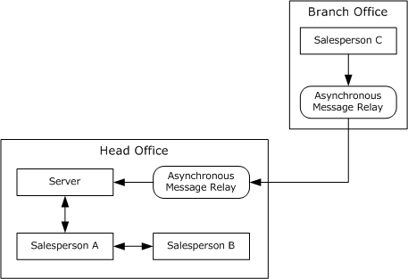
<!-- /Extracted images from page 10 -->

The message properties are typically controlled by the Protocol Configuration Object (PCO). The PCO
determines the following aspects of a specified instance of the protocol:















The transport to be used.

The version of the .NET Message Framing Protocol being used.

The mode of communication, which is explained in sections 1.3.2 and 2.2.3.2.

The Via, which is a Uniform Resource Identifier (URI) that identifies the endpoint for which the
messages are intended.

The encoding format being used for the messages. The different encoding schemes are covered in
section 2.2.3.4.

The chunk size. If the mode supports chunking, this determines the maximum size of a chunk.

The implementation-defined maximum supported sizes for messages and record types. <1>

#### 1.3.1 Scenarios

This section describes scenarios that capture the various message exchange patterns between SOAP
nodes. These scenarios help to define the communication modes that are covered in the next section
and that the protocol needs to support.

The scenarios describe a sales organization that has several salespersons; some are in the head office
and some offsite. They are interacting with the customers and preparing purchase orders that need to
be sent to a central server as SOAP messages. The purchase orders can also be retrieved from the
server, again as SOAP messages. The Asynchronous Message Relay is a mechanism that is used to
queue up messages when the salesperson is offline and then relay the messages after connectivity is
established. One such mechanism is Microsoft Message Queuing, as described in [MS-MQOD].

Figure 1: Asynchronous Message Relay

[MC-NMF] - v20190313
.NET Message Framing Protocol
Copyright © 2019 Microsoft Corporation
Release: March 13, 2019

10 / 53

##### 1.3.1.1 Multiple Bidirectional Message Exchange Scenario

In this scenario, two salespersons are working at the head office with several customers. Salesperson
A is responsible for collecting the customer profiles, and salesperson B is responsible for collecting the
customer requirements. The two pieces of information will need to be combined to create a purchase
order. Also, the head office has a high volume of customers; so there will be frequent message
exchanges between the two salespeople.

For this scenario, it makes sense for salesperson A to initiate a session where the message properties
are sent out. Subsequently, the messages frames are sent from salesperson A or salesperson B, and
the other salesperson can extract the message by using the message properties for that session. At
the end of the conversation, either salesperson can terminate the session.

##### 1.3.1.2 Large Message Exchange Scenario

In this scenario, a salesperson retrieves the entire customer inventory (in the form of a message)
from the server at the start of the day.

Because this operation is typically performed only once each day, a session is not required, as was the
case in the previous scenario. Instead, the protocol sends the message properties followed by the
message frames, and the receiving end applies the properties to extract the message.

In addition, because the inventory is large, the message content is broken up into multiple chunks.
The receiving end can then stream the content one chunk at a time and does not have to process the
entire message at one time.

##### 1.3.1.3 Offline Message Exchange Scenario

In this scenario, salesperson C is visiting various customers and creating their purchase orders.
However, the salesperson does not have access to the server and can upload these orders to the
server only after he returns to his branch office. The order application uses some mechanism (for
example, Microsoft Message Queuing) to store these messages locally, and the mechanism then relays
the message to the server when the salesperson is again online.

This scenario differs from the scenario in section 1.3.1.2 because the receiving end of the protocol
(that is, the relay) cannot actively participate in the protocol. This is a "store and forward" scenario in
which the sending end of the protocol stores the message frame in an intermediate store, and later,
the message frame is forwarded to, or retrieved by, the receiving end, which then extracts the
message from the message frame.

Depending on the scenario characteristics, the message properties are sent on a per-message basis or
sent once in advance of a number of messages. The latter case uses the same session semantic as
before except that the session establishment involves participation from only one end.

#### 1.3.2 Communication Modes

Based on the preceding scenarios, the messages exchange between nodes can be classified along the
following four criteria.

##### 1.3.2.1 Message Property Scope

Message properties can be sent on a per message basis or sent once per session, which spans multiple
messages. If many messages that have identical properties are being sent, the optimal workflow uses
the per-session scope.

[MC-NMF] - v20190313
.NET Message Framing Protocol
Copyright © 2019 Microsoft Corporation
Release: March 13, 2019

11 / 53

##### 1.3.2.2 Protocol Receiver Mode

The receiving end can actively participate in the protocol, or it can be a passive relay entity. If the
receiving end is active, it can negotiate certain capabilities, such as a protocol upgrade.

##### 1.3.2.3 Message Traffic Flow

The logical flow of messages can be unidirectional, where only one end sends messages, or it can be
bidirectional, where both ends send messages. For unidirectional messages, the receiver can
acknowledge message receipt; however, the logical message flow is still in one direction.

##### 1.3.2.4 Message Chunking

The entire message can be sent in one message frame, or it can be split across multiple chunks.
Chunking is extremely useful when processing large messages.

Using these criteria, four communication modes are specified for the protocol to operate in. These
modes determine the pattern of messages exchanged between the nodes, and determine when the
message properties are exchanged and how the message frames are created.

Mode name

Singleton
Unsized

Message property
scope

Protocol receiver
mode

Traffic flow

Message
chunking

Single

Active

Unidirectional  Yes

Duplex

Multiple

Simplex

Multiple

Singleton Sized

Single

Active

Passive

Passive

Bidirectional

No

Unidirectional  No

Unidirectional  No

#### 1.3.3 Protocol Upgrades

The .NET Message Framing Protocol provides the capability to upgrade the underlying protocol
stream to a complementary protocol, for example, to upgrade to Secure Sockets Layer
(SSL)/Transport Layer Security (TLS). If the other end supports the complementary protocol and goes
through with the upgrade, the subsequent byte stream (messages included) use the upgraded
protocol.

The upgrade request is sent as part of message properties. Multiple upgrade negotiations can be
performed. In addition, because this is a negotiation, it requires participation from both ends, and
therefore, is available only when the communication mode is Singleton Unsized, or Duplex.

### 1.4 Relationship to Other Protocols

This protocol is available for use over any network transport that needs to provide message send and
receive semantics. Transports that fall in this category include TCP and named pipes.

### 1.5 Prerequisites/Preconditions

The protocol assumes that a transport session has been established. The management of the
transport session (that is, how and when it is established, management of idle sessions, and closure of
the transport session) is not a responsibility of the protocol. The protocol only uses the transport
session to send and receive octets.

12 / 53

[MC-NMF] - v20190313
.NET Message Framing Protocol
Copyright © 2019 Microsoft Corporation
Release: March 13, 2019

For the Singleton Sized mode, which is described in section 1.3.2, the size of the message is not
contained as part of the message frame. The protocol assumes that the underlying transport has a
means to compute the size and relay it to the protocol.

### 1.6 Applicability Statement

This protocol is applicable for implementation by a transport module that wants to provide message
demarcation to higher-layer applications. Higher-layer applications can use this module to send and
receive messages.

Applicable scenarios include the following:



 When the communicating nodes are connected (for example, employees in the head office) or
when they are disconnected (for example, an employee working remotely).

  When the communicating nodes are exchanging large messages and message-level streaming is

required to optimize the use of resources such as memory and processing.

  When the communicating nodes want to upgrade the underlying transport to a complementary

protocol and exchange messages using the complementary protocol.

  When a receiving node wants to bypass embedded messages that are not well formed and process

subsequent messages that are well-formed.

The protocol is not applicable for scenarios in which applications do not need message-level access or
the native message format of the underlying transport is sufficient.

### 1.7 Versioning and Capability Negotiation

This document covers versioning issues in the following areas:

  Protocol versions: This document describes version 1.0 of the .NET Message Framing Protocol.

The version information is part of the protocol exchange, as described in section 2.2.3.1.

  Capability negotiation: The .NET Message Framing Protocol does not support negotiation of the

version, mode, upgrades, and message encoding. Instead, an implementation is configured with
these, as described in section 3.1.3.

### 1.8 Vendor-Extensible Fields

This protocol allows extensibility for the following fields:

  Extensible encoding: An implementation can opt for an extensible encoding. Vendors need to
specify the encoding as specified in [RFC2045] and covered in detail in section 2.2.3.4.2.

  Upgrades: Vendors can define new protocol upgrades in addition to the ones specified in section

2.2.3.5.

  Faults: An implementation can define new faults in addition to the ones specified in section 2.2.5.

The fault is a URI, as defined in [RFC2396] encoding using UTF-8 encoding as specified in
[RFC2279]. Vendors define a URI namespace for their faults and that namespace is different from
the http://schemas.microsoft.com/ws/2006/05/framing/faults/ namespace used by the faults in
this protocol.

### 1.9 Standards Assignments

None.

[MC-NMF] - v20190313
.NET Message Framing Protocol
Copyright © 2019 Microsoft Corporation
Release: March 13, 2019

13 / 53

## 2 Messages

This protocol references commonly used data types as defined in [MS-DTYP].

### 2.1 Transport

This protocol is available for use over any network transport that needs to provide message send and
receive semantics. Transports that fall in this category include TCP and named pipes.

### 2.2 Message Syntax

#### 2.2.1 Record Types

This protocol involves the exchange of a number of records. Records can be categorized as either
Property Records or Envelope Records based on their contents. The Property Records contain
message properties. The Envelope Records contain the message payload.

These records and their structure are covered in detail in subsequent sections. Each record is prefixed
with a record type, which is an octet, and MUST be set to one of the following specified values. Values
of 0x0D-0xFF for this octet are reserved for future use.

Value   Record type

0x00

Version Record

0x01

Mode Record

0x02

Via Record

0x03

Known Encoding Record

0x04

Extensible Encoding Record

0x05

Unsized Envelope Record

0x06

Sized Envelope Record

0x07

End Record

0x08

Fault Record

0x09

Upgrade Request Record

0x0A

Upgrade Response Record

0x0B

Preamble Ack Record

0x0C

Preamble End Record

#### 2.2.2 Record Size Encoding

For the variable-sized records that are used by this protocol, the record needs to contain the size, in
octets, of the content. An implementation SHOULD support record sizes as large as 0xffffffff octets
(encoded size requires five octets).<2>

[MC-NMF] - v20190313
.NET Message Framing Protocol
Copyright © 2019 Microsoft Corporation
Release: March 13, 2019

14 / 53

<!-- Extracted images from page 15 -->
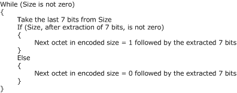
<!-- /Extracted images from page 15 -->

As represented in the following figure, the encoding algorithm takes the size of the record payload as
input in little-endian format and generates a stream of octets. The octets MUST be sent in the order
in which they are generated.

Figure 2: The encoding algorithm

The following table lists the encoded sizes for the range of values of Size, which is computed as
previously explained. The network ordering of octets is top-down. For example, if the size is in the
range 0x80-0x3FFF, the network ordering of encoded size octets is (Size & 0x7F) | 0x80 followed by
Size >> 0x07.

Integer value (size)

Encoding

0x00-0x7F

Size

0x80-0x3FFF

(Size & 0x7F)| 0x80

Size >> 0x07

0x4000-0x1FFFFF

(Size & 0x7F)| 0x80

((Size >> 0x07) & 0x7F)| 0x80

Size >> 0x0E

0x200000-0x0FFFFFFF

(Size & 0x7F)| 0x80

((Size >> 0x07) & 0x7F)| 0x80

((Size >> 0x0E) & 0x7F)| 0x80

Size >> 0x15

0x10000000-0x0FFFFFFFF

(Size & 0x7F)| 0x80

((Size >> 0x07) & 0x7F)| 0x80

((Size >> 0x0E) & 0x7F)| 0x80

((Size >> 0x15) & 0x7F)| 0x80

Size >> 0x1C

In the preceding table, "&" refers to a bitwise "and" operation, "|" refers to a bitwise "or" operation,
and ">>" refers to a right-shift operation.

#### 2.2.3 Property Records

The Property Records contain metadata about the protocol stream. When Property Records are
received, they set a protocol stream property and affect the interpretation of the subsequent
records within the protocol stream.

15 / 53

[MC-NMF] - v20190313
.NET Message Framing Protocol
Copyright © 2019 Microsoft Corporation
Release: March 13, 2019

##### 2.2.3.1 Version Record

The Version Record is a Property Record used to indicate which version of the .NET Message
Framing Protocol is being used. The Version Record enables later versions of this specification to
define additional record types and associated semantics.

The data portion of a Version Record is a pair of octets that indicate the major and minor version
numbers. New sets of values for existing record types (for example, additional values of the Known
Encoding Type Record) MUST be indicated by using a different minor version value. All other types of
changes MUST be indicated with a different major version value.

The major and minor values of the Version Record denote the version of the framing format, not that
of the payload envelope.

0  1  2  3  4  5  6  7  8  9

1
0  1  2  3  4  5  6  7  8  9

2
0  1  2  3  4  5  6  7  8  9

3
0  1

RecordType

MajorVersion

MinorVersion

RecordType (1 byte): This octet MUST be set to 0x00 to indicate that this record is a Version

Record.

MajorVersion (1 byte): Specifies the major version of the .NET Message Framing Protocol. An

implementation that conforms to this specification MUST set this field to 0x01. A value of 0x00 is
not valid for this octet, and values of 0x02–0xff are reserved for future use.

MinorVersion (1 byte): Specifies the minor version of the .NET Message Framing Protocol. An

implementation conforming to this specification MUST set this field to 0x00. The values 0x01 –
0xff for this octet are reserved for future use.<3>

##### 2.2.3.2 Mode Record

The Mode Record is a Property Record that defines the communication mode for the session. The
data portion of a Mode Record is a single octet.

0  1  2  3  4  5  6  7  8  9

1
0  1  2  3  4  5  6  7  8  9

2
0  1  2  3  4  5  6  7  8  9

3
0  1

RecordType

Mode

RecordType (1 byte): This octet MUST be set to 0x01 to indicate that this is a Mode Record.

Mode (1 byte): The mode value MUST be set to one of the following values. A value of 0x00 is not

valid for this octet, and values of 0x05–0xff are reserved for future use.

Short Name

Meaning

Singleton-
Unsized

0x01

Duplex

0x02

Simplex

0x03

The Initiating Stream for a single one-way message or for a pair of messages in a
request-reply manner between two nodes.

The Initiating Stream for multiple bidirectional messages between two nodes.

The Initiating Stream for multiple one-way messages from a single source.

[MC-NMF] - v20190313
.NET Message Framing Protocol
Copyright © 2019 Microsoft Corporation
Release: March 13, 2019

16 / 53

Short Name

Meaning

Singleton-Sized

The Initiating Stream for a single one-way message from a single source.

0x04

##### 2.2.3.3 Via Record

The Via Record is a Property Record that defines the URI for which subsequent messages are bound.
The data portion of a Via Record is of variable length.

0  1  2  3  4  5  6  7  8  9

1
0  1  2  3  4  5  6  7  8  9

2
0  1  2  3  4  5  6  7  8  9

3
0  1

RecordType

ViaLength (variable)

...

Via (variable)

...

RecordType (1 byte): This octet MUST be set to 0x02 to indicate that this is a Via Record.

ViaLength (variable): The value MUST be set to the size, in octets, of the Via, and encoded based

on the scheme defined in section 2.2.2. The length MUST NOT be set to 0.

Via (variable): A URI (as defined in [RFC2396] except that the "escaped" construct is never used).

The URI MUST be encoded by using UTF-8, as specified in [RFC2279].

##### 2.2.3.4 Envelope Encoding Record

Envelope Encoding Records are the Property Records that define the encoding format that is used to
encode the message envelope in subsequent Envelope Records. Such records come in two forms:
Known Encoding Records and Extensible Encoding Records.

In messages, this record shows as variable-sized so that it can be either of the two forms. If the
record uses Known Encoding, it is fixed-sized; otherwise, the record is variable-sized.

###### 2.2.3.4.1 Known Encoding Record

The Known Encoding Record indicates a previously known encoding for the subsequent Envelope
Records. The data portion of this record is a single octet.

0  1  2  3  4  5  6  7  8  9

1
0  1  2  3  4  5  6  7  8  9

2
0  1  2  3  4  5  6  7  8  9

3
0  1

RecordType

Encoding

RecordType (1 byte): This octet MUST be set to 0x03 to indicate that this is a Known Encoding

Record.

Encoding (1 byte): This octet MUST be set to one of the following values. Values of 0x09–0xFF are

reserved for future use.<4>

17 / 53

[MC-NMF] - v20190313
.NET Message Framing Protocol
Copyright © 2019 Microsoft Corporation
Release: March 13, 2019

SOAP Version 1.1 Value  Meaning

0x00

0x01

0x02

UTF-8, as specified in [RFC2279].

UTF-16, as specified in [RFC2781].

Unicode little-endian.

SOAP Version 1.2 Value  Meaning

0x03

0x04

0x05

0x06

0x07

0x08

UTF-8.

UTF-16.

Unicode little-endian.

MTOM, as specified in [SOAP-MTOM].

Binary, as specified in [MC-NBFS].

Binary with in-band dictionary, as specified in [MC-NBFSE].

###### 2.2.3.4.2 Extensible Encoding Record

The Extensible Encoding Record indicates an ad hoc encoding for subsequent Envelope Records. The
record data in this case is a Multipurpose Internet Mail Extensions (MIME) content type, as specified
in [RFC2045], which is encoded by using UTF-8 encoding.<5>

0  1  2  3  4  5  6  7  8  9

1
0  1  2  3  4  5  6  7  8  9

2
0  1  2  3  4  5  6  7  8  9

3
0  1

Record Type

Encoding Length (variable)

Delimiter

...

Type (variable)

...

...

Subtype (variable)

Parameters (variable)

...

Record Type (1 byte): This octet MUST be set to 0x04 to indicate that this record is an Extensible

Encoding Record.

Encoding Length (variable): The value MUST be set to the size, in octets, of the payload, and

encoded based on the scheme that is specified in section 2.2.2. The length MUST NOT be set to 0.

18 / 53

[MC-NMF] - v20190313
.NET Message Framing Protocol
Copyright © 2019 Microsoft Corporation
Release: March 13, 2019

Type (variable): This MUST be set to a type that is specified in [RFC2045] section 5.1.

Delimiter (1 byte): This MUST be set to the octet 0x2F (UTF-8 encoding for "/").

Subtype (variable): This MUST be set to a subtype that is specified in [RFC2045] section 5.1.

Parameters (variable): There can be one or more parameters in which the parameter structure is

defined as follows.

0  1  2  3  4  5  6  7  8  9

1
0  1  2  3  4  5  6  7  8  9

2
0  1  2  3  4  5  6  7  8  9

3
0  1

Parameter Delimiter

Parameter (variable)

Parameter Delimiter (1 byte): This MUST be set to the octet 0x3B (UTF-8 encoding for ";").

Parameter (variable): This MUST be set to a parameter as specified in [RFC2045] section 5.1.

...

##### 2.2.3.5 Upgrade Request Record

The Upgrade Request Record is a Property Record that requests a protocol upgrade.

0  1  2  3  4  5  6  7  8  9

1
0  1  2  3  4  5  6  7  8  9

2
0  1  2  3  4  5  6  7  8  9

3
0  1

RecordType

UpgradeProtocolLength (variable)

...

UpgradeProtocol (variable)

...

RecordType (1 byte): This octet MUST be set to 0x09 to indicate that this is an Upgrade Request

Record.

UpgradeProtocolLength (variable): This value MUST be set to the size, in octets, of the upgrade
protocol name, encoded based on the scheme described in section 2.2.2. The length field MUST
NOT be set to 0.

UpgradeProtocol (variable): The name of the protocol to upgrade to, encoded by using UTF-8. The

following table identifies some known upgrade protocol names. An implementation SHOULD
implement these upgrades and MAY define additional upgrade protocol definitions.<6>

Protocol

SSL/TLS

"application/ssl-tls"

Meaning

As defined in [RFC5246].

Negotiate

As defined in [RFC4178].

"application/negotiate"

[MC-NMF] - v20190313
.NET Message Framing Protocol
Copyright © 2019 Microsoft Corporation
Release: March 13, 2019

19 / 53

##### 2.2.3.6 Upgrade Response Record

The Upgrade Response Record is a Property Record that is sent in response to an Upgrade Request
Record to indicate a willingness to upgrade the protocol stream. This record has no data.

0  1  2  3  4  5  6  7  8  9

1
0  1  2  3  4  5  6  7  8  9

2
0  1  2  3  4  5  6  7  8  9

3
0  1

RecordType

RecordType (1 byte): This octet MUST be set to 0x0A to indicate that this is an Upgrade Response

Record.

##### 2.2.3.7 Preamble End Record

The Preamble End Record is a Property Record that is sent to indicate the end of message
properties. Envelope Records follow this record. This record has no data.

0  1  2  3  4  5  6  7  8  9

1
0  1  2  3  4  5  6  7  8  9

2
0  1  2  3  4  5  6  7  8  9

3
0  1

RecordType

RecordType (1 byte): This octet MUST be set to 0x0C to indicate that this is a Preamble End Record.

##### 2.2.3.8 Preamble Ack Record

The Preamble Ack Record is a Property Record that is sent to indicate receipt of a Preamble End
Record and to indicate that all message properties and stream upgrades have been successfully
applied. The receiving end is now ready to receive the Envelope Records. This record has no data.

0  1  2  3  4  5  6  7  8  9

1
0  1  2  3  4  5  6  7  8  9

2
0  1  2  3  4  5  6  7  8  9

3
0  1

RecordType

RecordType (1 byte): This octet MUST be set to 0x0B to indicate that this is a Preamble Ack Record.

##### 2.2.3.9 End Record

The End Record is a Property Record that indicates that communication over a connection has
ended. This record has no data.

0  1  2  3  4  5  6  7  8  9

1
0  1  2  3  4  5  6  7  8  9

2
0  1  2  3  4  5  6  7  8  9

3
0  1

RecordType

RecordType (1 byte): This octet MUST be set to 0x07 to indicate that this is an End Record.

#### 2.2.4 Envelope Records

An Envelope Record contains a message payload. There are two possible record types, depending on
the message transfer mode.

20 / 53

[MC-NMF] - v20190313
.NET Message Framing Protocol
Copyright © 2019 Microsoft Corporation
Release: March 13, 2019

##### 2.2.4.1 Sized Envelope Record

A Sized Envelope Record contains a message of the specified size.

0  1  2  3  4  5  6  7  8  9

1
0  1  2  3  4  5  6  7  8  9

2
0  1  2  3  4  5  6  7  8  9

3
0  1

Record Type

Size (variable)

...

Payload (variable)

...

Record Type (1 byte): This octet MUST be set to 0x06 to indicate that this is a Sized Envelope

Record.

Size (variable): The value MUST be set to the size, in octets, of the payload and encoded based on

the scheme described in section 2.2.2. The size MUST NOT be set to 0.

Payload (variable): The content of the message encoded using the encoding indicated by an

Envelope Encoding Record.

##### 2.2.4.2 Data Chunk

A Data Chunk packet is used to transmit a portion of a message payload.

0  1  2  3  4  5  6  7  8  9

1
0  1  2  3  4  5  6  7  8  9

2
0  1  2  3  4  5  6  7  8  9

3
0  1

Size (variable)

...

Payload (variable)

...

Size (variable): The value MUST be set to the size, in octets, of the encoded payload, based on the

scheme described in section 2.2.2. The size MUST NOT be set to 0.

Payload (variable): The content of the chunk.

##### 2.2.4.3 Unsized Envelope Record

An Unsized Envelope Record contains a message that is encoded using the encoding indicated by an
Envelope Encoding Record that is broken into one or more data chunks of type Data Chunk (section
2.2.4.2). The end of this record is indicated by a single 0x00 octet in place of the start of the next
data chunk.

[MC-NMF] - v20190313
.NET Message Framing Protocol
Copyright © 2019 Microsoft Corporation
Release: March 13, 2019

21 / 53

0  1  2  3  4  5  6  7  8  9

1
0  1  2  3  4  5  6  7  8  9

2
0  1  2  3  4  5  6  7  8  9

3
0  1

RecordType

DataChunk1 (variable)

...

DataChunk2 (variable)

...

Terminator

RecordType (1 byte): This octet MUST be set to 0x05 to indicate that this is an Unsized Envelope

Record.

DataChunk1 (variable): The first chunk of message data. This chunk MUST be present.

DataChunk2 (variable): Successive chunks of message data. Additional chunks MAY be present if

the message is split across multiple chunks.

Terminator (1 byte): This field marks the end of chunks and MUST be set to 0x00.

#### 2.2.5 Fault Records

A Fault Record notifies the sender of an error encountered while processing a message frame.
Generation of a Fault Record is informational only.

0  1  2  3  4  5  6  7  8  9

1
0  1  2  3  4  5  6  7  8  9

2
0  1  2  3  4  5  6  7  8  9

3
0  1

RecordType

FaultSize (variable)

...

Fault (variable)

...

RecordType (1 byte): This octet MUST be set to 0x08 to indicate that this is a Fault record.

FaultSize (variable): The value MUST be set to the size, in octets, of the fault, and encoded based

on the scheme that is described in section 2.2.2. The size MUST NOT be set to 0.

Fault (variable): A URI (as defined by [RFC2396] except that the "escaped" construct is never used).

The URI is encoded by using UTF-8. The following table defines a collection of faults. An
implementation MAY support these fault values and MAY also define new ones.<7>

For convenience, in this description the URI is broken into a namespace and fault name. The
namespace for faults in the following table is
http://schemas.microsoft.com/ws/2006/05/framing/faults/. Any additional faults that are defined
MUST NOT use this namespace.

An example of a fault, as returned in a Fault Record, is the following:
http://schemas.microsoft.com/ws/2006/05/framing/faults/UnsupportedMode

22 / 53

[MC-NMF] - v20190313
.NET Message Framing Protocol
Copyright © 2019 Microsoft Corporation
Release: March 13, 2019

Fault name values

Meaning

"ConnectionDispatchFailed"

The endpoint that is referenced by the Via Record exists; however, the
attempt to dispatch the message to the endpoint failed.

"ContentTypeInvalid"

The Envelope Encoding Record that was sent is not supported by the
endpoint.

"ContentTypeTooLong"

The receiver is enforcing a maximum content-type size, and the Envelope
Encoding Record exceeded that quota.

"EndpointAccessDenied"

The endpoint that is referenced by the Via Record cannot be accessed.

"EndpointNotFound"

The endpoint that is referenced by the Via Record cannot be found.

"EndpointPaused"

The endpoint that is referenced by the Via Record exists; however, the
endpoint is currently paused.

"EndpointUnavailable"

The endpoint that is referenced by the Via Record exists; however, the
endpoint is currently unavailable.

"InvalidRecordSequence"

The record sequence does not conform to the grammar that is outlined in
section 3.1.1.2.

"MaxMessageSizeExceededFault"  The receiver is enforcing a maximum message size, and the incoming
message has exceeded that quota.

"ServerTooBusy"

The endpoint does not have sufficient resources to process the connection.

"ServiceActivationFailed"

The endpoint is in a process that cannot be activated.

"UnsupportedMode"

The Mode Record value is not supported by the destination.

"UnsupportedVersion"

The Version Record value is not supported by the destination.

"UpgradeInvalid"

The requested upgrade is not supported by the remote endpoint.

"ViaTooLong"

The receiver is enforcing a maximum Via size, and the Via Record
exceeded that quota.

#### 2.2.6 Preamble Message

To aid description, a Preamble Message is defined for an initial record sequence. The Preamble
Message can apply to multiple messages, depending on the mode specified.

0  1  2  3  4  5  6  7  8  9

1
0  1  2  3  4  5  6  7  8  9

2
0  1  2  3  4  5  6  7  8  9

3
0  1

VersionRecord

ModeRecord

...

ViaRecord (variable)

...

EnvelopeEncodingRecord (variable)

...

[MC-NMF] - v20190313
.NET Message Framing Protocol
Copyright © 2019 Microsoft Corporation
Release: March 13, 2019

23 / 53

VersionRecord (3 bytes): This field MUST be formatted as specified in section 2.2.3.1.

ModeRecord (2 bytes): This field MUST be formatted as specified in section 2.2.3.2.

ViaRecord (variable): This field MUST be formatted as specified in section 2.2.3.3.

EnvelopeEncodingRecord (variable): This field MUST be formatted as specified in section 2.2.3.4.

[MC-NMF] - v20190313
.NET Message Framing Protocol
Copyright © 2019 Microsoft Corporation
Release: March 13, 2019

24 / 53

## 3 Protocol Details

A node that is a participant in this protocol can behave in one of two roles:



Initiator

  Receiver

An initiator initiates the protocol by sending a preamble message to the receiver. The initiator and
receiver nodes then send and receive messages using the protocol stream that connects the two
endpoints.

### 3.1 Common Details

#### 3.1.1 Abstract Data Model

This section describes a conceptual model of possible data organization that an implementation
maintains to participate in this protocol. The described organization is provided to facilitate the
explanation of how the participants behave. This document does not mandate that implementations
adhere to this model as long as their external behavior is consistent with what is described in this
document.

The participant maintains the following state for each session:



Protocol Configuration Object (PCO) - Determines the specific transport, protocol version, mode,
Via, and message-encoding scheme to be used for this session.

  Send Allowed - A Boolean value that can be set to TRUE or FALSE to indicate whether messages

can be sent on this session.

  Receive Allowed - A Boolean value that can be set to TRUE or FALSE to indicate whether messages

can be received on this session.

##### 3.1.1.1 Initiator-Receiver Interactions

This section describes some typical interactions between an initiator and receiver.

###### 3.1.1.1.1 Singleton Unsized Mode

[MC-NMF] - v20190313
.NET Message Framing Protocol
Copyright © 2019 Microsoft Corporation
Release: March 13, 2019

25 / 53

<!-- Extracted images from page 26 -->
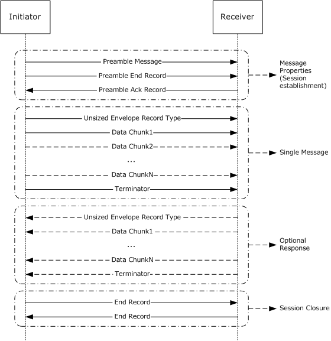
<!-- /Extracted images from page 26 -->

Figure 3: Singleton Unsized mode

###### 3.1.1.1.2 Duplex Mode

[MC-NMF] - v20190313
.NET Message Framing Protocol
Copyright © 2019 Microsoft Corporation
Release: March 13, 2019

26 / 53

<!-- Extracted images from page 27 -->
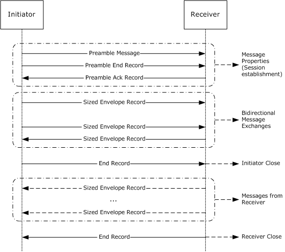
<!-- /Extracted images from page 27 -->

Figure 4: Duplex mode

In the case illustrated, the initiator sends the End Record first. The protocol allows either participant
to send the End Record first. After a participant sends the End Record, the participant MUST continue
to receive messages until the session is closed.

###### 3.1.1.1.3 Simplex Mode

[MC-NMF] - v20190313
.NET Message Framing Protocol
Copyright © 2019 Microsoft Corporation
Release: March 13, 2019

27 / 53

<!-- Extracted images from page 28 -->
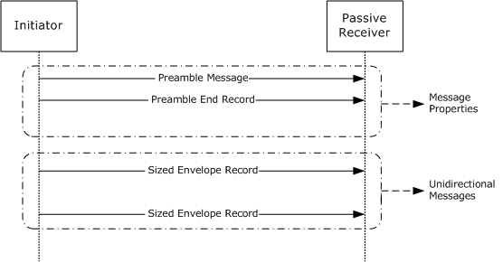
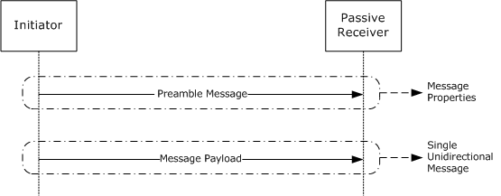
<!-- /Extracted images from page 28 -->

Figure 5: Simplex mode

###### 3.1.1.1.4 Singleton Sized Mode

Figure 6: Singleton Sized mode

###### 3.1.1.1.5 Upgrades

[MC-NMF] - v20190313
.NET Message Framing Protocol
Copyright © 2019 Microsoft Corporation
Release: March 13, 2019

28 / 53

<!-- Extracted images from page 29 -->
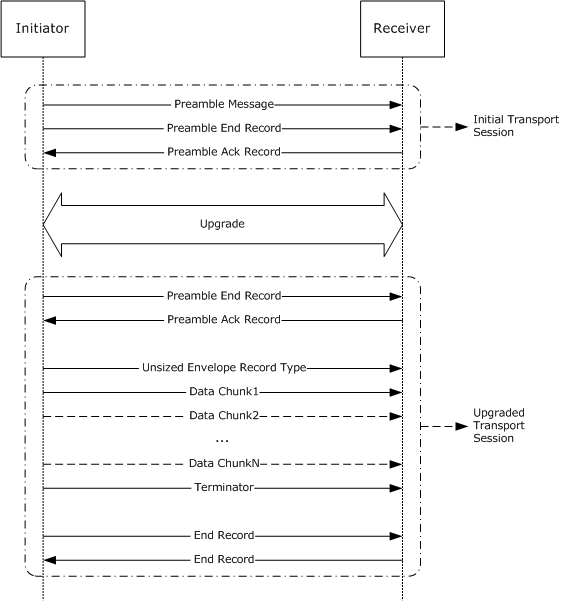
<!-- /Extracted images from page 29 -->

Figure 7: Upgrades

This figure illustrates a stream upgrade that uses the Singleton Unsized mode. The figure would look
very similar if the stream upgrade used the Duplex mode.

After the protocol upgrade, subsequent protocol exchanges occur over the upgraded transport stream
until a fault occurs or an End Record is received. Although the protocol allows for multiple upgrades,
the preceding exchange illustrates a single upgrade only.

###### 3.1.1.1.6 Faults

[MC-NMF] - v20190313
.NET Message Framing Protocol
Copyright © 2019 Microsoft Corporation
Release: March 13, 2019

29 / 53

<!-- Extracted images from page 30 -->
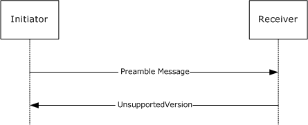
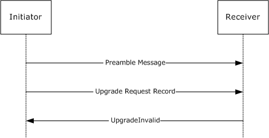
<!-- /Extracted images from page 30 -->

Figure 8: Unsupported version

Figure 9: Upgrade invalid

[MC-NMF] - v20190313
.NET Message Framing Protocol
Copyright © 2019 Microsoft Corporation
Release: March 13, 2019

30 / 53

<!-- Extracted images from page 31 -->
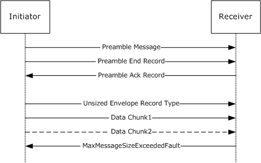
<!-- /Extracted images from page 31 -->

Figure 10: Maximum message size exceeded

The preceding exchanges capture some of the scenarios where a Fault Record can be generated.

##### 3.1.1.2 Protocol Grammar

This section uses the Augmented Backus-Naur Form (ABNF) notation that is specified in [RFC2234] to
define the protocol stream grammar. ProtocolStream-a represents the stream of octets flowing from
the initiator to the receiver, and ProtocolStream-b represents the stream of octets flowing from the
receiver to the initiator.

 ProtocolStream-a = 1*(SingletonUnsizedStream-a / DuplexStream-a / SimplexStream-a /
SingletonSizedStream-a)

 ProtocolStream-b = 1*(SingletonUnsizedStream-b / DuplexStream-b)

 SingletonUnsizedStream-a = VersionRecord ModeRecordType SingletonUnsizedMode ViaRecord
EncodingRecord *UpgradeRequest PreambleEndRecord UnsizedEnvelopeRecord EndRecord

 DuplexStream-a = VersionRecord ModeRecordType DuplexMode ViaRecord EncodingRecord
*UpgradeRequest PreambleEndRecord *SizedEnvelopeRecord EndRecord

 SimplexStream-a = VersionRecord ModeRecordType SimplexMode ViaRecord EncodingRecord
PreambleEndRecord *SizedEnvelopeRecord EndRecord

 SingletonSizedStream-a = VersionRecord ModeRecordType SingletonSizedMode ViaRecord
EncodingRecord Octets

 SingletonUnsizedStream-b = (*UpgradeResponse FaultRecord) / (*UpgradeResponse
PreambleAckRecord *1UnsizedEnvelopeRecord (FaultRecord / EndRecord))

 DuplexStream-b = (*UpgradeResponse FaultRecord) / (*UpgradeResponse PreambleAckRecord
*SizedEnvelopeRecord (FaultRecord / EndRecord))

 EncodingRecord = KnownEncodingRecord / ExtensibleEncodingRecord
 UpgradeRequest = UpgradeRequestRecord Octets
 UpgradeResponse = UpgradeResponseRecord Octets

[MC-NMF] - v20190313
.NET Message Framing Protocol
Copyright © 2019 Microsoft Corporation
Release: March 13, 2019

31 / 53

 VersionRecord = VersionRecordType MajorVersionNumber MinorVersionNumber
 VersionRecordType = %x00
 MajorVersionNumber = %x01
 MinorVersionNumber = %x00

 ModeRecordType = %x01
 SingletonUnsizedMode = %x01
 DuplexMode = %x02
 SimplexMode = %x03
 SingletonSizedMode = %x04

 ViaRecord = ViaRecordType EncodedSize Utf8Octets
 ViaRecordType = %x02

 KnownEncodingRecord = KnownEncodingRecordType KnownEncodingType
 KnownEncodingType = TextEncoding / BinaryEncoding / MtomEncoding
 BinaryEncoding = BinarySessionlessEncoding / BinarySessionEncoding
 TextEncoding = Soap11TextEncoding / Soap12TextEncoding
 Soap11TextEncoding = Soap11Utf8Encoding / Soap11Utf16Encoding / Soap11UnicodeFFFEEncoding
 Soap12TextEncoding = Soap12Utf8Encoding / Soap12Utf16Encoding / Soap12UnicodeFFFEEncoding
 KnownEncodingRecordType = %x03
 Soap11Utf8Encoding = %x00
 Soap11Utf16Encoding = %x01
 Soap11UnicodeFFFEEncoding = %x02
 Soap12Utf8Encoding = %x03
 Soap12Utf16Encoding = %x04
 Soap12UnicodeFFFEEncoding = %x05
 MtomEncoding = %x06
 BinarySessionlessEncoding = %x07
 BinarySessionEncoding = %x08

 ExtensibleEncodingRecord = ExtensibleEncodingRecordType EncodedSize Utf8Octets
 ExtensibleEncodingRecordType = %x04

 UnsizedEnvelopeRecord = UnsizedEnvelopeRecordType 1*(EncodedSize Octets) Terminator
 UnsizedEnvelopeRecordType = %x05
 Terminator = %x00

 SizedEnvelopeRecord = SizedEnvelopeRecordType EncodedSize Octets
 SizedEnvelopeRecordType = %x06

 EndRecord = EndRecordType
 EndRecordType = %x07

 FaultRecord = FaultRecordType EncodedSize Utf8Octets
 FaultRecordType = %x08

 UpgradeRequestRecord = UpgradeRequestRecordType EncodedSize Utf8Octets
 UpgradeRequestRecordType = %x09

 UpgradeResponseRecord = UpgradeResponseRecordType
 UpgradeResponseRecordType = %x0A

 PreambleAckRecord = PreambleAckRecordType
 PreambleAckRecordType = %x0B

 PreambleEndRecord = PreambleEndRecordType
 PreambleEndRecordType = %x0C

 Utf8Octets = 1*(Utf8Octet)
 Utf8Octet = %x00-7F / %xC2-DF %x80-BF / %xE0-EF %x80-BF %x80-BF / %xF0-F4 %x80-BF %x80-BF
%x80-BF

 Octets = 1*(%x00-FF)

 EncodedSize = %x01-7F / %x80-FF %x01-7F / %x80-FF %x80-FF %x01-7F / %x80-FF %x80-FF %x80-FF
%x01-7F / %x80-FF %x80-FF %x80-FF %x80-FF %x01-07

[MC-NMF] - v20190313
.NET Message Framing Protocol
Copyright © 2019 Microsoft Corporation
Release: March 13, 2019

32 / 53

#### 3.1.2 Timers

None.

#### 3.1.3 Initialization

The PCO is made available to the participant as part of a higher-layer triggered event.

When the participant is initialized:





The Send Allowed field MUST be set to FALSE.

The Receive Allowed field MUST be set to FALSE.

#### 3.1.4 Higher-Layer Triggered Events

This section covers reading record types from the underlying transport. The higher-layer triggered
events and related processing are role specific.

The following stipulations apply throughout the remaining sections.

Wherever it is mentioned that a session MUST be closed, it refers to the following actions being taken
by the participant:

  Any session-related state MUST be discarded.



The participant MUST notify the higher layer of the error.

Wherever it is mentioned that a Fault Record MAY (or SHOULD) be sent, it refers to the following
action being taken by the participant:



If the mode is Singleton Unsized, or Duplex mode, a Fault Record MAY (or SHOULD) be sent, as
described in section 2.2.5.

##### 3.1.4.1 Reading Variable-Sized Records

When a variable-sized record is received, the participant MUST use the following algorithm to decode
the size and read the payload. This section assumes that the record type has already been read.

The algorithm takes as input the MaxSize, that is, the maximum supported size for this record. If the
encoded size is 0, a Fault Record MAY<8> be sent to indicate that the size is 0 and the session MUST
be closed. The decoded size is returned in little-endian format.

[MC-NMF] - v20190313
.NET Message Framing Protocol
Copyright © 2019 Microsoft Corporation
Release: March 13, 2019

33 / 53

<!-- Extracted images from page 34 -->
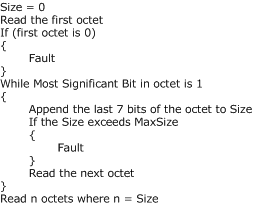
<!-- /Extracted images from page 34 -->

Figure 11: Algorithm to decode the size and read the payload

##### 3.1.4.2 Handling Receipt of an Unexpected Record Type

If the participant receives an unexpected record type, it MUST be handled as follows:



If the record type is not Fault Record, a Fault Record MAY be sent to indicate that an unexpected
record type has been received.



The session MUST be closed.

##### 3.1.4.3 Version Record







If the record type the participant read from the protocol stream is not Version Record, it MUST be
handled as described in section 3.1.4.2.

The participant MUST read the next two octets, which contain the major and minor versions of the
protocol being used.

If the participant does not recognize the version, a Fault Record MAY<9> be sent to indicate that
an incorrect version was specified, and the session MUST be closed.

##### 3.1.4.4 Mode Record







If the record type the participant read from the protocol stream is not Mode Record, it MUST be
handled as described in section 3.1.4.2.

The participant MUST read the next octet, which contains the mode.

If the mode is incorrect for the session, a Fault Record MAY<10> be sent to indicate that an
incorrect mode has been specified, and the session MUST be closed.

##### 3.1.4.5 Via Record



If the record type the participant read from the protocol stream is not a Via Record, it MUST be
handled as described in section 3.1.4.2.

[MC-NMF] - v20190313
.NET Message Framing Protocol
Copyright © 2019 Microsoft Corporation
Release: March 13, 2019

34 / 53





The participant MUST obtain the Via, as detailed in section 3.1.4.1. The participant SHOULD use a
MaxViaSize.<11> If the Via is too long, a Fault Record MAY<12> be sent, and the session MUST
be closed.

If the participant cannot locate an endpoint that matches the Via, a Fault Record MAY<13> be
sent, and the session MUST be closed.

##### 3.1.4.6 Encoding Record









If the record type the participant read from the protocol stream is not Known Encoding Record or
Extensible Encoding Record, it MUST be handled as described in section 3.1.4.2.

If the record type is Known Encoding Record, the participant MUST read the next octet, which
contains the message encoding scheme.

If the record type is Extensible Encoding Record, the participant MUST obtain the encoding
scheme, as detailed in section 3.1.4.1. The participant SHOULD use a MaxContentTypeSize.<14>
If the content type is too long, a Fault Record MAY<15> be sent, and the session MUST be closed.

If the encoding is not supported, a Fault Record MAY<16> be sent, and the session MUST be
closed.

##### 3.1.4.7 Upgrade Request Record









If the record type the participant read from the protocol stream is not Upgrade Request Record, it
MUST be handled as described in section 3.1.4.2.

The participant MUST read the Upgrade Protocol, as detailed in section 3.1.4.1. The participant
SHOULD use a MaxUpgradeProtocolSize.<17> If the upgrade name is too long, a Fault Record
MAY<18> be sent, and the session MUST be closed.

If the upgrade is not supported, a Fault Record MAY<19> be sent, and the session MUST be
closed.

If the upgrade is supported, the participant MUST send an Upgrade Response Record, as described
in section 2.2.3.6. The participant MUST invoke the upgrade handler identified by the upgrade
protocol name in the Upgrade Request Record.

##### 3.1.4.8 Upgrade Response Record





If the record type the participant read from the protocol stream is not Upgrade Response Record,
it MUST be handled as described in section 3.1.4.2.

If the upgrade is supported, the participant MUST invoke the appropriate upgrade handler. How
the upgrade handler achieves the upgrade is outside the scope of this document.

##### 3.1.4.9 Preamble End Record





If the record type the participant read from the protocol stream is not Preamble End Record, it
MUST be handled as described in section 3.1.4.2.

In the case of Singleton Unsized and Duplex modes, the participant MUST send a Preamble Ack
Record as described in section 2.2.3.8.

[MC-NMF] - v20190313
.NET Message Framing Protocol
Copyright © 2019 Microsoft Corporation
Release: March 13, 2019

35 / 53

##### 3.1.4.10 Preamble Ack Record

If the record type the participant read from the protocol stream is not Preamble Ack Record, it MUST
be handled as described in section 3.1.4.2.

##### 3.1.4.11 Sized Envelope Record



If the record type the participant read from the protocol stream is not Sized Envelope Record, it
MUST be handled as follows:



If the record type is End Record, the participant MUST notify the higher layer of the receipt of
End Record and set Receive Allowed to FALSE.



If the record type is a Fault Record, the session MUST be closed.

  Otherwise, it MUST be handled as described in section 3.1.4.2.



The participant MUST obtain the message as detailed in section 3.1.4.1. The participant SHOULD
use a MaxEnvelopeSize.<20>

If the message is too large, a Fault Record MAY<21> be sent, and the session MUST be closed.

##### 3.1.4.12 Unsized Envelope Record





If the record type the participant read from the protocol stream is not Unsized Envelope Record, it
MUST be handled as described in section 3.1.4.2.

The participant MUST then process the first chunk and any additional chunks, as described in
section 3.1.4.1, until the Terminator marker (octet 0x00) is read. To achieve streaming, reading
chunks SHOULD be correlated with consumption of chunks by the higher layer. The participant
SHOULD use a MaxChunkSize.<22> If the chunk size is too large, a Fault Record MAY<23> be
sent, and the session MUST be closed.

##### 3.1.4.13 End Record



If the record type the participant read from the protocol stream is not End Record, it MUST be
handled as described in section 3.1.4.2.



The participant MUST set Receive Allowed to FALSE.

#### 3.1.5 Message Processing Events and Sequencing Rules

This document assumes that the processing of received octets is deferred until initiated by a higher-
layer triggered event or a required response in the protocol. All message processing events and
sequencing rules are explained in the context of higher-layer triggered events.

#### 3.1.6 Timer Events

None.

#### 3.1.7 Other Local Events

##### 3.1.7.1 Underlying Transport Session Is Closed

If at any point, the underlying network transport session is closed, the Protocol Stream is closed.
The participant MUST discard any session-related state.

36 / 53

[MC-NMF] - v20190313
.NET Message Framing Protocol
Copyright © 2019 Microsoft Corporation
Release: March 13, 2019

### 3.2 Initiator Details

#### 3.2.1 Abstract Data Model

The details are covered in section 3.1.1.

#### 3.2.2 Timers

None.

#### 3.2.3 Initialization

The details are covered in section 3.1.3.

#### 3.2.4 Higher-Layer Triggered Events

The operation of the initiator is driven by the following higher-layer triggered events.

##### 3.2.4.1 Initialize Session

A new session state MUST be created, and session properties initialized as described in section 3.1.3.

##### 3.2.4.2 Send Preamble











The initiator MUST send the Preamble Message as described in section 2.2.6.

In the case of Simplex mode, the initiator MUST send the Preamble End record as described in
section 2.2.3.7.

In the case of Singleton Unsized, and Duplex modes, the initiator MUST perform the following
additional steps:





If an upgrade is required, send the Upgrade Request Record as described in section 2.2.3.5.

If an upgrade is sent, read the Upgrade Response Record as described in section 3.1.4.8.

  Send the Preamble End Record as described in section 2.2.3.7.

  Read the Preamble Ack Record as described in section 3.1.4.10.

The initiator MUST set Send Allowed to TRUE.

If the mode is Duplex, the initiator MUST set Receive Allowed to TRUE.

##### 3.2.4.3 Send Message

If Send Allowed is set to FALSE, an error MUST be propagated to the higher layer, and no further
processing done. Otherwise, the initiator MUST do the following based on the mode.

###### 3.2.4.3.1 Singleton Unsized Mode







The initiator MUST send an Unsized Envelope Record containing the message as described in
section 2.2.4.3.

The initiator MUST send an End Record as described in section 2.2.3.9.

The initiator MUST set Send Allowed to FALSE.

37 / 53

[MC-NMF] - v20190313
.NET Message Framing Protocol
Copyright © 2019 Microsoft Corporation
Release: March 13, 2019

###### 3.2.4.3.2 Duplex or Simplex Mode

The initiator MUST send a Sized Envelope Record containing the message as described in section
2.2.4.1.

###### 3.2.4.3.3 Singleton Sized Mode

The initiator MUST send the message and set Send Allowed to FALSE.

##### 3.2.4.4 Receive Message

If Receive Allowed is set to FALSE, an error MUST be propagated to the higher layer and no further
processing done. Otherwise, the initiator MUST read a Sized Envelope Record as described in section
3.1.4.11, and propagate the contained message to a higher layer.

##### 3.2.4.5 Send End Record

If mode is not Duplex or Simplex, an error MUST be propagated to the higher layer and no further
processing done. Otherwise, the initiator MUST send an End Record as described in section 2.2.3.9.
The initiator MUST set Send Allowed to FALSE.

##### 3.2.4.6 Session Close

The initiator MUST discard any session-related state and no further processing done.

#### 3.2.5 Message Processing Events and Sequencing Rules

The details are covered in section 3.1.5.

#### 3.2.6 Timer Events

None.

#### 3.2.7 Other Local Events

The details are covered in section 3.1.7.

### 3.3 Receiver Details

#### 3.3.1 Abstract Data Model

The details are covered in section 3.1.1.

#### 3.3.2 Timers

None.

#### 3.3.3 Initialization

The details are covered in section 3.1.3.

[MC-NMF] - v20190313
.NET Message Framing Protocol
Copyright © 2019 Microsoft Corporation
Release: March 13, 2019

38 / 53

#### 3.3.4 Higher-Layer Triggered Events

The operation of the receiver is driven by the following higher-layer triggered events.

##### 3.3.4.1 Initialize Session

A new session state MUST be created and session properties initialized as described in section 3.1.3.

##### 3.3.4.2 Receive Preamble











The receiver MUST read the Version Record, as described in section 3.1.4.3.

The receiver MUST read the Mode Record, as described in section 3.1.4.4.

The receiver MUST read the Via Record, as described in section 3.1.4.5.

The receiver MUST read the Encoding Record, as described in section 3.1.4.6.

If the mode is Simplex, the receiver MUST read the Preamble End record as described in section
3.1.4.9.



If the mode is Singleton Unsized, or Duplex, the receiver MUST perform these additional steps:



If an upgrade is required, read the Upgrade Request Record, as described in section 3.1.4.7.

  Read the Preamble End Record, as described in section 3.1.4.9.

The receiver MUST set Receive Allowed to TRUE.

If the mode is Duplex, the receiver MUST set Send Allowed to TRUE.





##### 3.3.4.3 Send Message

If Send Allowed is set to FALSE, an error MUST be propagated to the higher layer and no further
processing done. Otherwise, the receiver MUST send a Sized Envelope Record containing the
message as described in section 2.2.4.1.

##### 3.3.4.4 Receive Message

If Receive Allowed is set to FALSE, an error MUST be propagated to the higher layer and no further
processing done. Otherwise, the receiver MUST do the following based on the Mode.

###### 3.3.4.4.1 Singleton Unsized Mode







The receiver MUST read an Unsized Envelope Record as described in section 3.1.4.12, and
propagate the contained message to a higher layer.

The receiver MUST read an End Record as described in section 3.1.4.13.

The receiver MUST set Receive Allowed to FALSE.

###### 3.3.4.4.2 Duplex or Simplex Mode

The receiver MUST read a Sized Envelope Record as described in section 3.1.4.11, and propagate the
contained message to a higher layer.

###### 3.3.4.4.3 Singleton Sized Mode

[MC-NMF] - v20190313
.NET Message Framing Protocol
Copyright © 2019 Microsoft Corporation
Release: March 13, 2019

39 / 53

The receiver MUST read the message and propagate it to a higher layer. The receiver MUST set
Receive Allowed to FALSE.

##### 3.3.4.5 Send End Record

If the mode is not Duplex, an error MUST be propagated to the higher layer and no further processing
done. Otherwise, the receiver MUST send an End Record as described in section 2.2.3.9. The receiver
MUST set Send Allowed to FALSE.

##### 3.3.4.6 Session Close

The receiver MUST discard any session-related state and no further processing done.

#### 3.3.5 Message Processing Events and Sequencing Rules

The details are covered in section 3.1.5.

#### 3.3.6 Timer Events

None.

#### 3.3.7 Other Local Events

The details are covered in section 3.1.7.

[MC-NMF] - v20190313
.NET Message Framing Protocol
Copyright © 2019 Microsoft Corporation
Release: March 13, 2019

40 / 53

## 4 Protocol Examples

### 4.1 Duplex Mode

The protocol exchange involving a Duplex Mode session is illustrated in this section. The initiator first
establishes a session with the receiver. The initiator then sends a message, and the receiver replies.
Finally, the session is closed. The Protocol Configuration Object for this session has been configured as
follows:



Transport - The specifics of network transport are excluded from this example. The following
packet captured demonstrates only the .NET Message Framing Protocol and message payload.

  Version - This exchange happened over Major Version 1 and Minor Version 0 of this protocol.

  Mode - Duplex mode was used.

  Via - The receiver was identified by the URI net.tcp://SampleServer/SampleApp/.



Encoding - Binary Session Encoding was used to encode the messages.

[MC-NMF] - v20190313
.NET Message Framing Protocol
Copyright © 2019 Microsoft Corporation
Release: March 13, 2019

41 / 53

<!-- Extracted images from page 42 -->
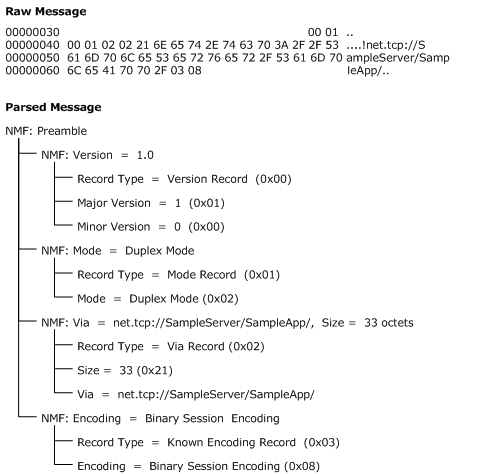
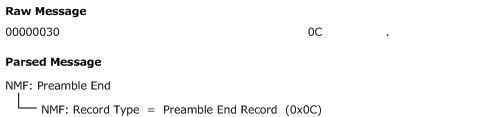
<!-- /Extracted images from page 42 -->

#### 4.1.1 Initiator Receiver: Preamble Message

Figure 12: Initiator Receiver: Preamble Message

#### 4.1.2 Initiator Receiver: Preamble End Message

Figure 13: Initiator Receiver: Preamble End Message

[MC-NMF] - v20190313
.NET Message Framing Protocol
Copyright © 2019 Microsoft Corporation
Release: March 13, 2019

42 / 53

<!-- Extracted images from page 43 -->
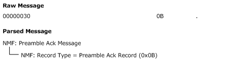
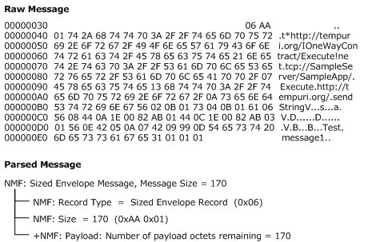
<!-- /Extracted images from page 43 -->

#### 4.1.3 Receiver Initiator : Preamble Ack Message

Figure 14: Receiver Initiator : Preamble Ack Message

#### 4.1.4 Initiator Receiver: Sized Envelope Message

Figure 15: Initiator Receiver: Sized Envelope Message

[MC-NMF] - v20190313
.NET Message Framing Protocol
Copyright © 2019 Microsoft Corporation
Release: March 13, 2019

43 / 53

<!-- Extracted images from page 44 -->
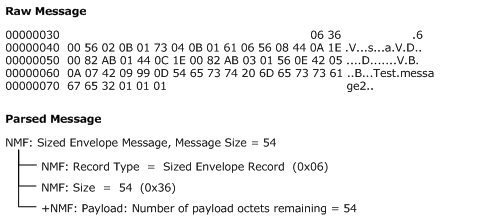
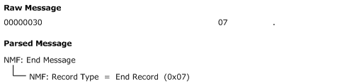
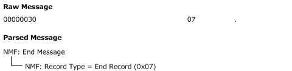
<!-- /Extracted images from page 44 -->

#### 4.1.5 Receiver Initiator: Sized Envelope Message

Figure 16: Receiver Initiator: Sized Envelope

#### 4.1.6 Initiator Receiver: End Message

Figure 17: Initiator Receiver: End Message

#### 4.1.7 Receiver Initiator: End Message

Figure 18: Receiver Initiator: End Message

[MC-NMF] - v20190313
.NET Message Framing Protocol
Copyright © 2019 Microsoft Corporation
Release: March 13, 2019

44 / 53

## 5 Security

### 5.1 Security Considerations for Implementers

To minimize the risk of a denial-of-service (DOS) attack, it is recommended that an implementation of
this protocol limit the size of variable-length records, including Via, Extensible Encoding, Upgrade
Protocol, Sized Envelope, and Unsized Envelope Record chunks. Note that Via, Extensible Encoding,
and Upgrade Protocol records are exchanged before a stream upgrade can supply transport level
security. Therefore, particular care needs to be taken to limit these records to a reasonable size if
security is not available.

### 5.2 Index of Security Parameters

None.

[MC-NMF] - v20190313
.NET Message Framing Protocol
Copyright © 2019 Microsoft Corporation
Release: March 13, 2019

45 / 53

## 6 Appendix A: Product Behavior

The information in this specification is applicable to the following Microsoft products or supplemental
software. References to product versions include updates to those products.

This document specifies version-specific details in the Microsoft .NET Framework. For information
about which versions of .NET Framework are available in each released Windows product or as
supplemental software, see [MS-NETOD] section 4.

The terms "earlier" and "later", when used with a product version, refer to either all preceding
versions or all subsequent versions, respectively. The term "through" refers to the inclusive range of
versions. Applicable Microsoft products are listed chronologically in this section.

  Microsoft .NET Framework 3.0

  Microsoft .NET Framework 3.5

  Microsoft .NET Framework 4.0

  Microsoft .NET Framework 4.5

  Microsoft .NET Framework 4.6

  Microsoft .NET Framework 4.7

  Microsoft .NET Framework 4.8

Exceptions, if any, are noted in this section. If an update version, service pack or Knowledge Base
(KB) number appears with a product name, the behavior changed in that update. The new behavior
also applies to subsequent updates unless otherwise specified. If a product edition appears with the
product version, behavior is different in that product edition.

Unless otherwise specified, any statement of optional behavior in this specification that is prescribed
using the terms "SHOULD" or "SHOULD NOT" implies product behavior in accordance with the
SHOULD or SHOULD NOT prescription. Unless otherwise specified, the term "MAY" implies that the
product does not follow the prescription.

<1> Section 1.3: The Windows implementation of this protocol is exercised through the use of the
following Windows Communication Framework bindings [MSDN-WCF].

1.  NetTcpBinding [MSDN-NETTcp] - If the TransferMode property on the binding is set to Buffered,

the mode is set to Duplex. Otherwise, the mode is set to Singleton Unsized. If the
Security.Transport.ClientCredentialType property on the binding is set to Certificate, the
"SSL/TLS" upgrade protocol is used. Otherwise, if it is set to Windows, the "Negotiate" upgrade
protocol is used.

2.  NetNamedPipeBinding [MSDN-NETNamedPipe] - If the TransferMode property on the binding is set
to Buffered, the mode is set to Duplex. Otherwise, the mode is set to Singleton Unsized. If the
Security.Mode property on the binding is set to Transport, the "Negotiate" upgrade protocol is
used.

3.  NetMsmqBinding [MSDN-NETMsmq] - If a TransactionScope is being used, the mode is set to

Simplex. Otherwise, the mode is set to Singleton Sized. If the
Security.Transport.MsmqAuthenticationMode property on the binding is set to Certificate, the
"SSL/TLS" upgrade protocol is used. Otherwise, if it is set to WindowsDomain, the "Negotiate"
upgrade protocol is used.

The Windows implementation of this protocol is also exercised through a custom Windows
Communication Framework binding that uses the TcpTransportBindingElement [MSDN-NETTcpBE] or

46 / 53

[MC-NMF] - v20190313
.NET Message Framing Protocol
Copyright © 2019 Microsoft Corporation
Release: March 13, 2019

the NamedPipeTransportBindingElement [MSDN-NETNamedPipeBE], or the
MsmqTransportBindingElement [MSDN-NETMsmqBE].

The Windows implementation of this protocol is also exercised through the use of the following
Windows Web Services API channel binding [MSDN-WSCHBIND]:

1.  WS_TCP_CHANNEL_BINDING - If channel binding is set to WS_TCP_CHANNEL_BINDING, the
mode is always set to Duplex. If channel security binding [MSDN-WSSECBIND] is set to
WS_TCP_SSPI_TRANSPORT_SECURITY_BINDING [MSDN-WSTCPSSPI], the "Negotiate" upgrade
protocol is used.

<2> Section 2.2.2: The Windows implementation of the protocol that is exercised by Windows
Communication Foundation will not allow record sizes larger than 0x7fffffff octets.

<3> Section 2.2.3.1: The Windows implementation of this protocol that is exercised by Windows
Communication Foundation does not validate the value of the minor version when the value of the
major version is 0x01.

<4> Section 2.2.3.4.1: The Windows implementation of this protocol that is exercised by both
Windows Communication Framework and Windows Web Services API supports all the known encoding
schemes.

<5> Section 2.2.3.4.2: The .NET Framework 4.5 and later implementations of this protocol that are
exercised by Windows Communication Foundation use the Extensible Encoding Record to indicate the
MIME content type for binary message encoding compression (see [MSDN-
BinaryMsgEncdngBindElmnt]).

<6> Section 2.2.3.5: The Windows implementation of this protocol that is exercised by Windows
Communication Framework supports only the SSL/TLS and Negotiate upgrade protocols.

The Windows implementation of this protocol that is exercised by Windows Web Services API supports
only the Negotiate upgrade protocol.

<7> Section 2.2.5: The Windows implementation of this protocol that is exercised by Windows
Communication Framework supports the following set of faults: ContentTypeInvalid,
ContentTypeTooLong, ConnectionDispatchFailed, EndpointNotFound, EndpointUnavailable,
MaxMessageSizeExceededFault, ServerTooBusy, ServiceActivationFailed, UnsupportedMode,
UnsupportedVersion, UpgradeInvalid, and ViaTooLong.

The Windows implementation of this protocol that is exercised by Windows Web Services API supports
the following set of faults: ContentTypeInvalid, EndpointNotFound, MaxMessageSizeExceededFault,
UnsupportedMode, and UpgradeInvalid.

<8> Section 3.1.4.1: The Windows implementation of this protocol that is exercised by both Windows
Communication Framework and Windows Web Services API does not send a Fault Record if the size of
a variable-sized record is 0.

<9> Section 3.1.4.3: The Windows implementation of this protocol that is exercised by Windows
Communication Framework sends a Fault Record (UnsupportedVersion) if an incorrect version is
specified in the received Version Record.

The Windows implementation of this protocol that is exercised by Windows Web Services API does not
send a Fault Record if an incorrect version is specified in the received Version Record.

<10> Section 3.1.4.4: The Windows implementation of this protocol that is exercised by both
Windows Communication Framework and Windows Web Services API sends a Fault Record
(UnsupportedMode) if an incorrect mode is specified in the received Mode Record.

[MC-NMF] - v20190313
.NET Message Framing Protocol
Copyright © 2019 Microsoft Corporation
Release: March 13, 2019

47 / 53

<11> Section 3.1.4.5: The Windows implementation of this protocol that is exercised by both
Windows Communication Framework and Windows Web Services API defines a MaxViaSize of 2,048
bytes.

<12> Section 3.1.4.5: The Windows implementation of this protocol that is exercised by both
Windows Communication Framework and Windows Web Services API does not send a Fault Record if
the size of Via in the received Via Record exceeds MaxViaSize.

<13> Section 3.1.4.5: The Windows implementation of this protocol that is exercised by both
Windows Communication Framework and Windows Web Services API sends a Fault Record
(EndpointNotFound) if the endpoint cannot be located for the specified Via in the received Via Record.

The Windows implementation of this protocol that is exercised by Windows Communication Framework
sends a Via with a scheme component that is equal to "net.tcp" if exercised with NetTcpBinding (see
[MSDN-NETTcp]) or TcpTransportBindingElement (see [MSDN-NETTcpBE]); and a Via with a scheme
component that is equal to "net.msmq" if exercised with NetMsmqBinding (see [MSDN-NETMsmq]) or
MsmqTransportBindingElement (see [MSDN-NETMsmqBE]).

A Via that has a scheme equal to "net.tcp" or "net.msmq" uses the following constructions: the URI
reference is absolute, the URI contains a hierarchical part, the hierarchical part contains a network
path, the authority is a server, and the server does not include user information.

The Windows implementation of this protocol that is exercised by Windows Web Services API sends a
Via with a scheme component equal to "net.tcp" if exercised with WS_TCP_CHANNEL_BINDING
[MSDN-WSCHBIND]. A Via with a scheme equal to "net.tcp" uses the following constructions: the URI
reference is absolute, the URI contains a hierarchical part, the hierarchical part contains a network
path, the authority is a server, and the server does not include user information.

 The Windows implementation of this protocol that is exercised by both Windows Communication
Framework and Windows Web Services API supports attempting to locate an endpoint for a specified
Via with a scheme component that is equal to "net.tcp" when the transport session (as described in
section 1.5) that is carrying the protocol stream is a TCP connection (as defined in [RFC793]) whose
destination address is equal to the authority of the Via; however, an authority that does not designate
a port is equivalent to an authority that uses port 808.

 The Windows implementation of this protocol that is exercised by Windows Communication
Framework supports attempting to locate an endpoint for a specified Via with a scheme component
equal to "net.msmq" when the initiator is Microsoft Message Queuing, as specified in [MS-MQMQ],
whose queue path name computer is equal to the authority of the Via and the remainder of whose
queue path name is equal to the absolute path of the Via, except that the first path segment in the Via
of a private queue is "private" rather than "private$".

<14> Section 3.1.4.6: The Windows implementation of this protocol that is exercised by both
Windows Communication Framework and Windows Web Services API defines a MaxContentTypeSize of
256 bytes.

<15> Section 3.1.4.6: The Windows implementation of this protocol that is exercised by both
Windows Communication Framework and Windows Web Services API does not send a Fault Record if
the size of the extensible encoding in the received Extensible Encoding Record exceeds
MaxContentTypeSize.

<16> Section 3.1.4.6: The Windows implementation of this protocol that is exercised by both
Windows Communication Framework and Windows Web Services API sends a Fault Record
(ContentTypeInvalid) if an unsupported content type is specified in the received Encoding Record.

<17> Section 3.1.4.7: The Windows implementation of this protocol exercised by both Windows
Communication Framework and Windows Web Services API defines a MaxUpgradeProtocolSize of 256
bytes.

[MC-NMF] - v20190313
.NET Message Framing Protocol
Copyright © 2019 Microsoft Corporation
Release: March 13, 2019

48 / 53

<18> Section 3.1.4.7: The Windows implementation of this protocol exercised by both Windows
Communication Framework and Windows Web Services API does not send a Fault Record if the size of
an upgrade protocol name in the received Upgrade Request Record exceeds MaxUpgradeProtocolSize.

<19> Section 3.1.4.7: The Windows implementation of this protocol exercised by both Windows
Communication Framework and Windows Web Services API sends a Fault Record (UpgradeInvalid) if
an unsupported upgrade protocol name is specified in an Upgrade Request Record.

<20> Section 3.1.4.11: The Windows implementation of this protocol that is exercised by both
Windows Communication Framework and Windows Web Services uses a MaxEnvelopeSize as
configured externally.

<21> Section 3.1.4.11: The Windows implementation of this protocol that is exercised by both
Windows Communication Framework and Windows Web Services API sends a Fault Record
(MaxMessageSizeExceededFault) if the size of the received Sized Envelope Record exceeds
MaxEnvelopeSize but is not greater than 0xffffffff. No Fault Record is sent if the size of the received
Sized Envelope Record exceeds 0xffffffff.

<22> Section 3.1.4.12: The Windows implementation of this protocol that is exercised by Windows
Communication Framework defines a MaxChunkSize of 0xfffffffa.

<23> Section 3.1.4.12: The Windows implementation of this protocol that is exercised by Windows
Communication Framework does not send a Fault Record if the size of a chunk in the received Unsized
Envelope Record exceeds MaxChunkSize.

[MC-NMF] - v20190313
.NET Message Framing Protocol
Copyright © 2019 Microsoft Corporation
Release: March 13, 2019

49 / 53

## 7 Change Tracking

This section identifies changes that were made to this document since the last release. Changes are
classified as Major, Minor, or None.

The revision class Major means that the technical content in the document was significantly revised.
Major changes affect protocol interoperability or implementation. Examples of major changes are:

  A document revision that incorporates changes to interoperability requirements.
  A document revision that captures changes to protocol functionality.

The revision class Minor means that the meaning of the technical content was clarified. Minor changes
do not affect protocol interoperability or implementation. Examples of minor changes are updates to
clarify ambiguity at the sentence, paragraph, or table level.

The revision class None means that no new technical changes were introduced. Minor editorial and
formatting changes may have been made, but the relevant technical content is identical to the last
released version.

The changes made to this document are listed in the following table. For more information, please
contact dochelp@microsoft.com.

Section

Description

Revision
class

6 Appendix A: Product
Behavior

Updated the applicability list for this release of Microsoft .NET
Framework.

Major

[MC-NMF] - v20190313
.NET Message Framing Protocol
Copyright © 2019 Microsoft Corporation
Release: March 13, 2019

50 / 53

## 8 Index
A

Abstract data model
   initiator (section 3.1.1 25, section 3.2.1 37)
   receiver (section 3.1.1 25, section 3.3.1 38)
Applicability 13

C

Capability negotiation 13
Change tracking 50
Closed transport session - underlying 36
Communication modes
   message chunking 12
   message property scope 11
   message traffic flow 12
   overview 11
   protocol receiver mode 12

D

Data model - abstract
   initiator (section 3.1.1 25, section 3.2.1 37)
   receiver (section 3.1.1 25, section 3.3.1 38)
Data_Chunk packet 21
Duplex Mode example 41

E

Encoding Record type 35
End Record type 36
End_Record packet 20
Envelope Encoding Record 17
Envelope records 20
Envelope Records message 20
Examples
   Duplex Mode 41
   Initiator Receiver
      End Message 44
      Preamble End Message 42
      Preamble Message 42
      Sized Envelope Message 43
   Receiver Initiator
      End Message 44
      Preamble Ack Message 43
      Sized Envelope Message 44
Extensible_Encoding_Record packet 18

F

Fault Records message 22
Fault_Records packet 22
Fields - vendor-extensible 13

G

Glossary 7
Grammar 31

H

[MC-NMF] - v20190313
.NET Message Framing Protocol
Copyright © 2019 Microsoft Corporation
Release: March 13, 2019

Handling receipt of an unexpected record type 34
Higher-layer triggered events
   initiator
      end record - send 38
      message
         receive 38
         send 37
      overview (section 3.1.4 33, section 3.2.4 37)
      preamble - send 37
      session
         closed 38
         initialized 37
   receiver
      end record - send 40
      message
         receive 39
         send 39
      overview (section 3.1.4 33, section 3.3.4 39)
      preamble - receive 39
      session
         closed 40
         initialized 39

I

Implementer - security considerations 45
Index of security parameters 45
Informative references 8
Initialization
   initiator (section 3.1.3 33, section 3.2.3 37)
   receiver (section 3.1.3 33, section 3.3.3 38)
Initiator
   abstract data model (section 3.1.1 25, section

3.2.1 37)

   higher-layer triggered events
      end record - send 38
      message
         receive 38
         send 37
      overview (section 3.1.4 33, section 3.2.4 37)
      preamble - send 37
      session
         closed 38
         initialized 37
   initialization (section 3.1.3 33, section 3.2.3 37)
   local events (section 3.1.7 36, section 3.2.7 38)
   message processing (section 3.1.5 36, section

3.2.5 38)

   sequencing rules (section 3.1.5 36, section 3.2.5

38)

   timer events (section 3.1.6 36, section 3.2.6 38)
   timers (section 3.1.2 33, section 3.2.2 37)
Initiator Receiver
   End Message example 44
   Preamble End Message example 42
   Preamble Message example 42
   Sized Envelope Message example 43
Initiator-receiver interactions 25
Interactions - initiator-receiver 25
Introduction 7

51 / 53

K

R

Known_Encoding_Record packet 17

L

Large message exchange scenario 11
Local events
   initiator (section 3.1.7 36, section 3.2.7 38)
   receiver (section 3.1.7 36, section 3.3.7 40)

M

Message exchange scenario
   large 11
   multiple bidirectional 11
   offline 11
Message processing
   initiator (section 3.1.5 36, section 3.2.5 38)
   receiver (section 3.1.5 36, section 3.3.5 40)
Messages
   chunking 12
   Envelope Records 20
   Fault Records 22
   Preamble Message 23
   Property Records 15
   property scope 11
   Record Size Encoding 14
   Record Types 14
   traffic flow 12
   transport 14
Mode Record type 34
Mode_Record packet 16
Multiple bidirectional message exchange scenario 11

N

Normative references 8

O

Offline message exchange scenario 11
Overview (synopsis) 9

P

Parameter index - security 45
Parameters - security index 45
Preamble Ack Record type 36
Preamble End Record type 35
Preamble Message message 23
Preamble_Ack_Record packet 20
Preamble_End_Record packet 20
Preamble_Message packet 23
Preconditions 12
Prerequisites 12
Product behavior 46
Property records 15
Property Records message 15
Protocol Details
   overview 25
Protocol receiver mode 12
Protocol upgrades 12

[MC-NMF] - v20190313
.NET Message Framing Protocol
Copyright © 2019 Microsoft Corporation
Release: March 13, 2019

Reading variable-sized records 33
Receipt of an unexpected record type - handling 34
Receiver
   abstract data model (section 3.1.1 25, section

3.3.1 38)

   higher-layer triggered events
      end record - send 40
      message
         receive 39
         send 39
      overview (section 3.1.4 33, section 3.3.4 39)
      preamble - receive 39
      session
         closed 40
         initialized 39
   initialization (section 3.1.3 33, section 3.3.3 38)
   local events (section 3.1.7 36, section 3.3.7 40)
   message processing (section 3.1.5 36, section

3.3.5 40)

   sequencing rules (section 3.1.5 36, section 3.3.5

40)

   timer events (section 3.1.6 36, section 3.3.6 40)
   timers (section 3.1.2 33, section 3.3.2 38)
Receiver Initiator
   End Message example 44
   Preamble Ack Message example 43
   Sized Envelope Message example 44
Record Size Encoding message 14
Record Types message 14
Records
   Encoding Record type 35
   End Record type 36
   envelope 20
   handling receipt of an unexpected type 34
   Mode Record type 34
   Preamble Ack Record type 36
   Preamble End Record type 35
   property 15
   reading variable-sized 33
   size encoding 14
   Sized Envelope Record type 36
   types 14
   Unsized Envelope Record type 36
   Upgrade Request Record type 35
   Upgrade Response Record type 35
   Version Record type 34
   Via Record type 34
References 7
   informative 8
   normative 8
Relationship to other protocols 12

S

Scenarios
   large message exchange 11
   message exchange
      large 11
      multiple bidirectional 11
      offline 11
   multiple bidirectional message exchange 11
   offline message exchange 11
   overview 10

52 / 53

Security
   implementer considerations 45
   parameter index 45
Sequencing rules
   initiator (section 3.1.5 36, section 3.2.5 38)
   receiver (section 3.1.5 36, section 3.3.5 40)
Sized Envelope Record type 36
Sized_Envelope_Record packet 21
Standards assignments 13

T

Timer events
   initiator (section 3.1.6 36, section 3.2.6 38)
   receiver (section 3.1.6 36, section 3.3.6 40)
Timers
   initiator (section 3.1.2 33, section 3.2.2 37)
   receiver (section 3.1.2 33, section 3.3.2 38)
Tracking changes 50
Transport 14
Transport session - underlying - closed 36
Triggered events - higher-layer
   initiator
      end record - send 38
      message
         receive 38
         send 37
      overview (section 3.1.4 33, section 3.2.4 37)
      preamble - send 37
      session
         closed 38
         initialized 37
   receiver
      end record - send 40
      message
         receive 39
         send 39
      overview (section 3.1.4 33, section 3.3.4 39)
      preamble - receive 39
      session
         closed 40
         initialized 39

U

Underlying transport session is closed 36
Unexpected record type - handling receipt 34
Unsized Envelope Record type 36
Unsized_Envelope_Record packet 21
Upgrade Request Record type 35
Upgrade Response Record type 35
Upgrade_Request_Record packet 19
Upgrade_Response_Record packet 20
Upgrades 12

V

Variable-sized records - reading 33
Vendor-extensible fields 13
Version Record type 34
Version_Record packet 16
Versioning 13
Via Record type 34
Via_Record packet 17

[MC-NMF] - v20190313
.NET Message Framing Protocol
Copyright © 2019 Microsoft Corporation
Release: March 13, 2019

53 / 53

