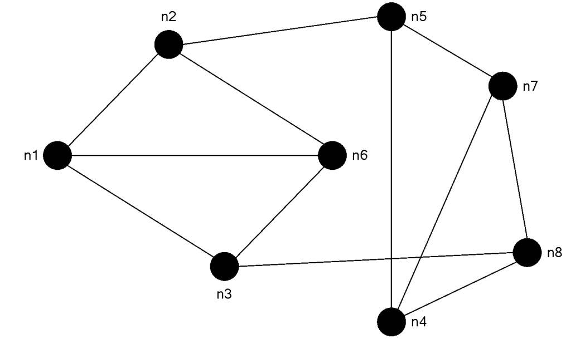
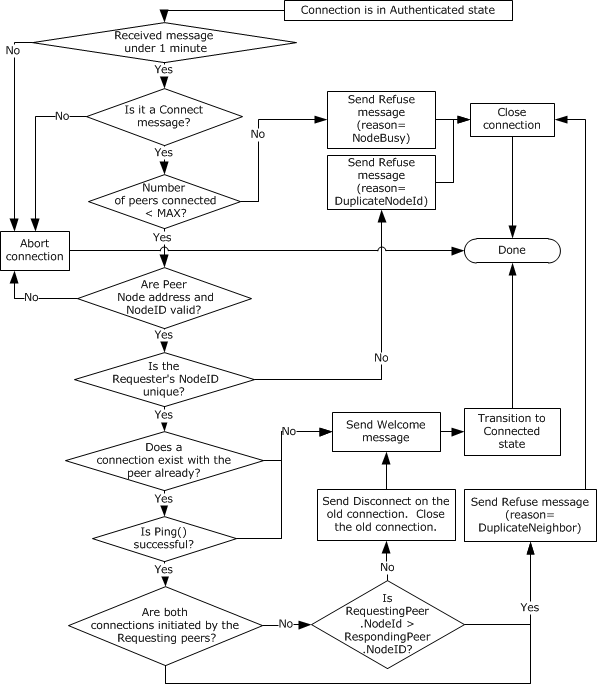
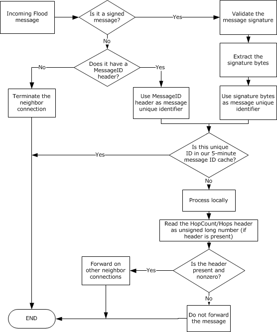
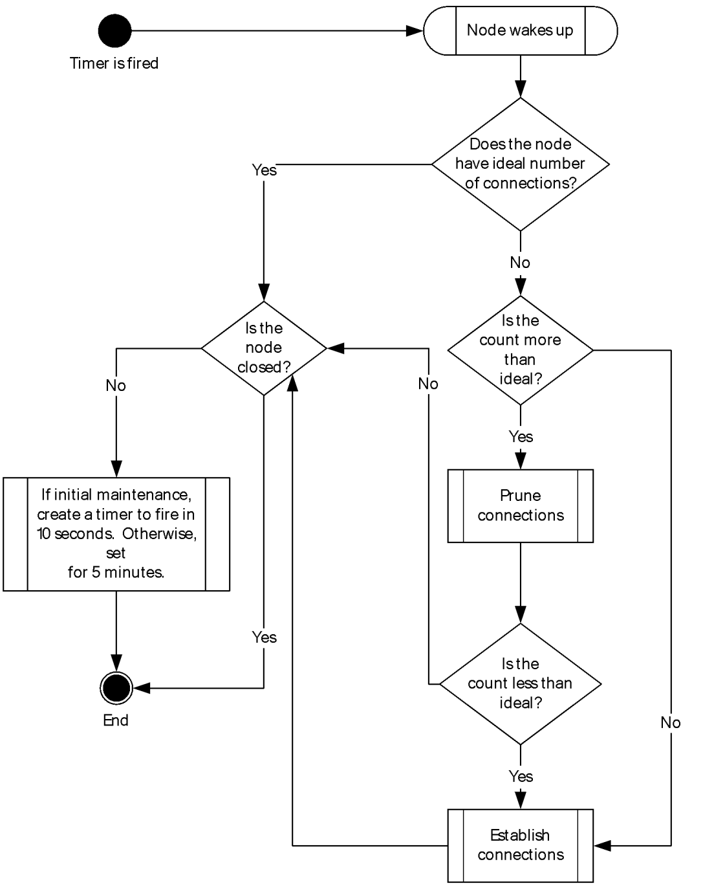
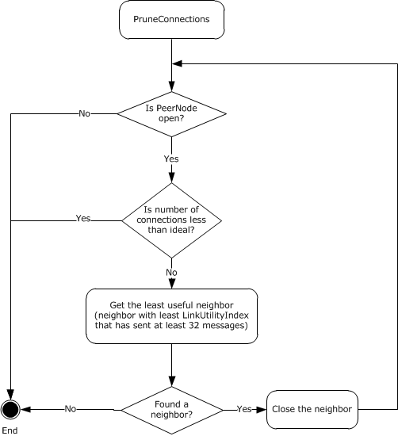
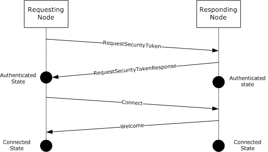
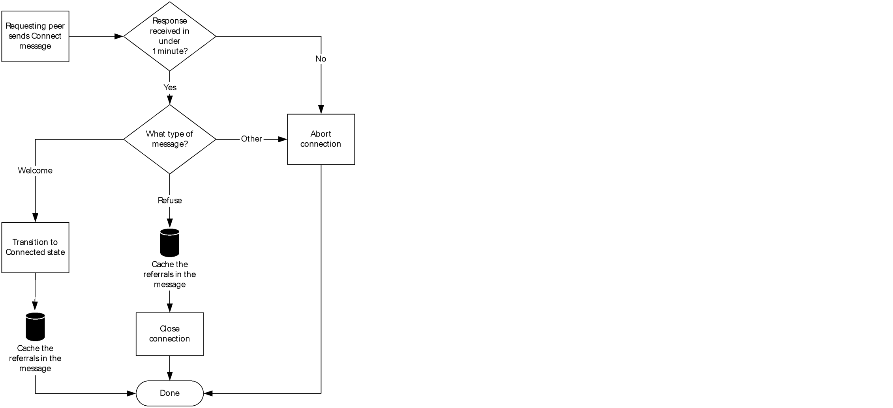
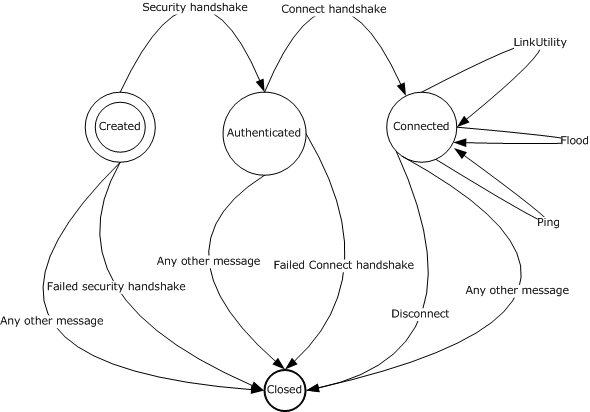

[MC-PRCH]:

Peer Channel Protocol

Intellectual Property Rights Notice for Open Specifications Documentation

  Technical Documentation. Microsoft publishes Open Specifications documentation (“this

documentation”) for protocols, file formats, data portability, computer languages, and standards
support. Additionally, overview documents cover inter-protocol relationships and interactions.

  Copyrights. This documentation is covered by Microsoft copyrights. Regardless of any other

terms that are contained in the terms of use for the Microsoft website that hosts this
documentation, you can make copies of it in order to develop implementations of the technologies
that are described in this documentation and can distribute portions of it in your implementations
that use these technologies or in your documentation as necessary to properly document the
implementation. You can also distribute in your implementation, with or without modification, any
schemas, IDLs, or code samples that are included in the documentation. This permission also
applies to any documents that are referenced in the Open Specifications documentation.
  No Trade Secrets. Microsoft does not claim any trade secret rights in this documentation.
  Patents. Microsoft has patents that might cover your implementations of the technologies

described in the Open Specifications documentation. Neither this notice nor Microsoft's delivery of
this documentation grants any licenses under those patents or any other Microsoft patents.
However, a given Open Specifications document might be covered by the Microsoft Open
Specifications Promise or the Microsoft Community Promise. If you would prefer a written license,
or if the technologies described in this documentation are not covered by the Open Specifications
Promise or Community Promise, as applicable, patent licenses are available by contacting
iplg@microsoft.com.

  License Programs. To see all of the protocols in scope under a specific license program and the

associated patents, visit the Patent Map.

  Trademarks. The names of companies and products contained in this documentation might be
covered by trademarks or similar intellectual property rights. This notice does not grant any
licenses under those rights. For a list of Microsoft trademarks, visit
www.microsoft.com/trademarks.

  Fictitious Names. The example companies, organizations, products, domain names, email

addresses, logos, people, places, and events that are depicted in this documentation are fictitious.
No association with any real company, organization, product, domain name, email address, logo,
person, place, or event is intended or should be inferred.

Reservation of Rights. All other rights are reserved, and this notice does not grant any rights other
than as specifically described above, whether by implication, estoppel, or otherwise.

Tools. The Open Specifications documentation does not require the use of Microsoft programming
tools or programming environments in order for you to develop an implementation. If you have access
to Microsoft programming tools and environments, you are free to take advantage of them. Certain
Open Specifications documents are intended for use in conjunction with publicly available standards
specifications and network programming art and, as such, assume that the reader either is familiar
with the aforementioned material or has immediate access to it.

Support. For questions and support, please contact dochelp@microsoft.com.

[MC-PRCH] - v20190313
Peer Channel Protocol
Copyright © 2019 Microsoft Corporation
Release: March 13, 2019

1 / 75

Revision Summary

Date

Revision
History

Revision
Class

8/10/2007

0.1

9/28/2007

0.2

10/23/2007  0.3

Major

Minor

Minor

Comments

Initial Availability

Clarified the meaning of the technical content.

Clarified the meaning of the technical content.

11/30/2007  0.3.1

Editorial

Revised and edited the technical content; updated links.

1/25/2008

0.3.2

Editorial

Changed language and formatting in the technical content.

3/14/2008

0.3.3

Editorial

Changed language and formatting in the technical content.

5/16/2008

0.3.4

Editorial

Changed language and formatting in the technical content.

6/20/2008

0.3.5

Editorial

Changed language and formatting in the technical content.

7/25/2008

0.3.6

Editorial

Changed language and formatting in the technical content.

8/29/2008

1.0

10/24/2008  1.1

12/5/2008

1.2

Major

Minor

Minor

Updated and revised the technical content.

Clarified the meaning of the technical content.

Clarified the meaning of the technical content.

1/16/2009

1.2.1

Editorial

Changed language and formatting in the technical content.

2/27/2009

1.3

4/10/2009

1.4

5/22/2009

2.0

7/2/2009

2.1

Minor

Minor

Major

Minor

Clarified the meaning of the technical content.

Clarified the meaning of the technical content.

Updated and revised the technical content.

Clarified the meaning of the technical content.

8/14/2009

2.1.1

Editorial

Changed language and formatting in the technical content.

9/25/2009

3.0

11/6/2009

4.0

Major

Major

Updated and revised the technical content.

Updated and revised the technical content.

12/18/2009  4.0.1

Editorial

Changed language and formatting in the technical content.

1/29/2010

4.1

Minor

Clarified the meaning of the technical content.

3/12/2010

4.1.1

Editorial

Changed language and formatting in the technical content.

4/23/2010

4.1.2

Editorial

Changed language and formatting in the technical content.

6/4/2010

4.2

7/16/2010

5.0

8/27/2010

6.0

10/8/2010

6.0

11/19/2010  7.0

1/7/2011

8.0

Minor

Major

Major

None

Major

Major

Clarified the meaning of the technical content.

Updated and revised the technical content.

Updated and revised the technical content.

No changes to the meaning, language, or formatting of the
technical content.

Updated and revised the technical content.

Updated and revised the technical content.

[MC-PRCH] - v20190313
Peer Channel Protocol
Copyright © 2019 Microsoft Corporation
Release: March 13, 2019

2 / 75

Date

Revision
History

Revision
Class

Comments

2/11/2011

9.0

3/25/2011

10.0

5/6/2011

10.0

Major

Major

None

Updated and revised the technical content.

Updated and revised the technical content.

No changes to the meaning, language, or formatting of the
technical content.

6/17/2011

10.1

Minor

Clarified the meaning of the technical content.

9/23/2011

10.1

None

No changes to the meaning, language, or formatting of the
technical content.

12/16/2011  11.0

Major

Updated and revised the technical content.

3/30/2012

11.0

None

No changes to the meaning, language, or formatting of the
technical content.

7/12/2012

11.0

10/25/2012  11.1

1/31/2013

12.0

8/8/2013

12.1

11/14/2013  12.1

None

Minor

Major

Minor

None

No changes to the meaning, language, or formatting of the
technical content.

Clarified the meaning of the technical content.

Updated and revised the technical content.

Clarified the meaning of the technical content.

No changes to the meaning, language, or formatting of the
technical content.

2/13/2014

12.1

None

No changes to the meaning, language, or formatting of the
technical content.

5/15/2014

12.1

None

No changes to the meaning, language, or formatting of the
technical content.

6/30/2015

13.0

Major

Significantly changed the technical content.

10/16/2015  13.0

None

No changes to the meaning, language, or formatting of the
technical content.

7/14/2016

13.0

None

No changes to the meaning, language, or formatting of the
technical content.

3/16/2017

14.0

Major

Significantly changed the technical content.

6/1/2017

14.0

None

No changes to the meaning, language, or formatting of the
technical content.

3/13/2019

15.0

Major

Significantly changed the technical content.

[MC-PRCH] - v20190313
Peer Channel Protocol
Copyright © 2019 Microsoft Corporation
Release: March 13, 2019

3 / 75

Table of Contents

1.3

1.1
1.2

1.2.1
1.2.2

1.3.1
1.3.2
1.3.3
1.3.4
1.3.5
1.3.6

1  Introduction ............................................................................................................ 7
Glossary ........................................................................................................... 7
References ........................................................................................................ 8
Normative References ................................................................................... 8
Informative References ............................................................................... 10
Overview ........................................................................................................ 10
Mesh and Mesh Names ................................................................................ 11
Channel Types ........................................................................................... 11
Discovery .................................................................................................. 11
Connecting to Other Nodes .......................................................................... 11
Exchanging Application Messages ................................................................. 11
Security..................................................................................................... 12
Transport-Layer Security ....................................................................... 12
Password ........................................................................................ 12
Trusted Certificate ........................................................................... 12
Message-Layer Security ......................................................................... 12
Relationship to Other Protocols .......................................................................... 12
Prerequisites/Preconditions ............................................................................... 13
Applicability Statement ..................................................................................... 13
Versioning and Capability Negotiation ................................................................. 13
Vendor-Extensible Fields ................................................................................... 13
Standards Assignments ..................................................................................... 13

1.4
1.5
1.6
1.7
1.8
1.9

1.3.6.1.1
1.3.6.1.2

1.3.6.1

1.3.6.2

2.2.3

2.1
2.2

2.2.3.1

2.2.1
2.2.2

2.2.2.1
2.2.2.2
2.2.2.3
2.2.2.4
2.2.2.5
2.2.2.6
2.2.2.7

2  Messages ............................................................................................................... 14
Transport ........................................................................................................ 14
Common Message Syntax ................................................................................. 14
Namespaces .............................................................................................. 14
Structures ................................................................................................. 15
PeerHashToken Element ........................................................................ 15
PeerNodeAddress Structure .................................................................... 15
Referral Structure ................................................................................. 17
RefuseReason Enumeration .................................................................... 17
DisconnectReason Enumeration .............................................................. 18
FloodMessage Header ............................................................................ 19
Endpoint Format ................................................................................... 19
Messages ................................................................................................... 20
RequestSecurityToken Message .............................................................. 20
Computing the PeerHashToken.......................................................... 20
RequestSecurityTokenResponse Message ................................................. 21
Connect Message .................................................................................. 21
Welcome Message ................................................................................. 22
Refuse Message .................................................................................... 22
Disconnect Message .............................................................................. 22
Flood (Application) Message ................................................................... 23
LinkUtility Message................................................................................ 23
Ping Message ....................................................................................... 24
Elements ................................................................................................... 24
Complex Types ........................................................................................... 24
Simple Types ............................................................................................. 24
Attributes .................................................................................................. 24
Groups ...................................................................................................... 24
Attribute Groups ......................................................................................... 24

2.2.3.2
2.2.3.3
2.2.3.4
2.2.3.5
2.2.3.6
2.2.3.7
2.2.3.8
2.2.3.9

2.2.4
2.2.5
2.2.6
2.2.7
2.2.8
2.2.9

2.2.3.1.1

3  Protocol Details ..................................................................................................... 25
PeerService Port Receiving Node Details ............................................................. 25

3.1

4 / 75

[MC-PRCH] - v20190313
Peer Channel Protocol
Copyright © 2019 Microsoft Corporation
Release: March 13, 2019

3.1.1
3.1.2
3.1.3

3.1.4

3.1.3.1

3.1.4.1
3.1.4.2
3.1.4.3

3.1.5

3.1.5.1

3.1.5.1.1

3.1.5.2

3.1.5.2.1

3.1.5.3

3.1.5.3.1

3.1.5.4

3.1.5.4.1

3.1.5.5

3.1.5.5.1

3.1.5.6

3.1.5.6.1

3.1.5.7

3.1.5.7.1

3.1.5.8

3.1.5.8.1

3.1.5.9

3.1.5.9.1

3.1.5.6.1.1

3.1.5.5.1.1

3.1.5.4.1.1

3.1.5.3.1.1

3.1.5.2.1.1

3.1.5.6.1.1.1

3.1.5.1.1.1
3.1.5.1.1.2

Abstract Data Model .................................................................................... 25
Timers ...................................................................................................... 26
Initialization ............................................................................................... 27
Setting Configuration ............................................................................. 27
Higher-Layer Triggered Events ..................................................................... 28
Opening a Node .................................................................................... 28
Receiving a Message ............................................................................. 28
Closing a Node ..................................................................................... 29
Message Processing and Sequencing Rules .................................................... 29
ProcessRequestSecurityToken ................................................................. 29
Messages ....................................................................................... 30
PeerService_ProcessRequestSecurityToken_InputMessage .............. 30
PeerService_ProcessRequestSecurityToken_OutputMessage ............ 30
Connect ............................................................................................... 31
Messages ....................................................................................... 31
ConnectInfo .............................................................................. 31
Welcome .............................................................................................. 33
Messages ....................................................................................... 33
WelcomeInfo ............................................................................. 34
Refuse ................................................................................................. 34
Messages ....................................................................................... 34
RefuseInfo ................................................................................ 35
Disconnect ........................................................................................... 35
Messages ....................................................................................... 35
DisconnectInfo .......................................................................... 35
LinkUtility ............................................................................................ 36
Messages ....................................................................................... 36
UtilityInfo ................................................................................. 36
Computing the LinkUtilityIndex .............................................. 36
Ping .................................................................................................... 36
Messages ....................................................................................... 37
PeerService_Ping_InputMessage .................................................. 37
Fault ................................................................................................... 37
Messages ....................................................................................... 37
PeerService_Fault_InputMessage ................................................. 37
FloodMessage ....................................................................................... 37
Messages ....................................................................................... 37
PeerService_FloodMessage_InputMessage .................................... 38
Timer Events .............................................................................................. 40
Security Handshake Timer ..................................................................... 40
Connect Handshake Timer ...................................................................... 40
LinkUtility Timer ................................................................................... 40
Maintenance Timer ................................................................................ 40
Maintenance Algorithm ..................................................................... 41
Pruning Algorithm ............................................................................ 42
Establish a Neighbor Connection ........................................................ 43
Create a TCP/IP Connection .............................................................. 44
No Security ..................................................................................... 44
Password-Based Security.................................................................. 44
Certificate-Based Security ................................................................ 45
Password-Based Security Handshake ................................................. 45
Connect Handshake ......................................................................... 45
Other Local Events ...................................................................................... 47
PeerService Port Sending Node Details ............................................................... 47
Abstract Data Model .................................................................................... 47
Timers ...................................................................................................... 47
Initialization ............................................................................................... 47
Higher-Layer Triggered Events ..................................................................... 48

3.1.5.7.1.1

3.1.5.8.1.1

3.1.5.9.1.1

3.1.6.4.1
3.1.6.4.2
3.1.6.4.3
3.1.6.4.4
3.1.6.4.5
3.1.6.4.6
3.1.6.4.7
3.1.6.4.8
3.1.6.4.9

3.1.6

3.1.6.1
3.1.6.2
3.1.6.3
3.1.6.4

3.2

3.1.7

3.2.1
3.2.2
3.2.3
3.2.4

[MC-PRCH] - v20190313
Peer Channel Protocol
Copyright © 2019 Microsoft Corporation
Release: March 13, 2019

5 / 75

3.2.4.1

3.2.4.1.1

Sending Messages ................................................................................. 48
Sending Signed Messages ................................................................. 48
Message Processing Events and Sequencing Rules .......................................... 48
Timer Events .............................................................................................. 48
Other Local Events ...................................................................................... 49

3.2.5
3.2.6
3.2.7

4.1

4  Protocol Examples ................................................................................................. 50
Establishing a Neighbor Connection in Password Mode .......................................... 50
Connection Initiator Sends the RequestSecurityToken Message ........................ 50
Responding Node Sends Back a RequestSecurityTokenResponse ...................... 51
Requesting Node Sends a Connect Message ................................................... 52
Responding Node Sends a Welcome Message ................................................. 53
Nonpassword Security Modes ............................................................................ 53
Flooding a Message .......................................................................................... 53

4.1.1
4.1.2
4.1.3
4.1.4

4.2
4.3

5  Security ................................................................................................................. 55
Security Considerations for Implementers ........................................................... 55
Index of Security Parameters ............................................................................ 55

5.1
5.2

6  Appendix A: Full WSDL Definitions ........................................................................ 56

7  Appendix B: Product Behavior ............................................................................... 70

8  Change Tracking .................................................................................................... 72

9  Index ..................................................................................................................... 73

[MC-PRCH] - v20190313
Peer Channel Protocol
Copyright © 2019 Microsoft Corporation
Release: March 13, 2019

6 / 75

1  Introduction

The Peer Channel Protocol is used for broadcasting messages over a virtual network of cooperating
nodes. This protocol is used to send and receive messages between nodes in a named mesh. The
nodes form the network by establishing connections to each other using a discovery service in which
every node registers itself into a named mesh and discovers other nodes using the name of the
mesh. The network is not fully connected. Instead, it is sparsely connected, yet a message sent by
any node is propagated to the entire mesh by nodes forwarding to each other in a cooperative
manner.

Each node forwards a message to all other neighbors. Each node is responsible for detecting and
dropping duplicates of a message.

Each node maintains connections to a few other nodes in the mesh. A node tracks the health of the
neighbor connection and tune its neighbor set based on the utility of the neighbor connection.

Sections 1.5, 1.8, 1.9, 2, and 3 of this specification are normative. All other sections and examples in
this specification are informative.

1.1  Glossary

This document uses the following terms:

authenticator: A security token of a node computed using the password of the mesh and the

node's public key.

channel type: A logical grouping of operations (messages) that can be sent over the mesh. A
mesh can be used to handle more than one channel type simultaneously. A channel type is
identified by a unique URI.

discovery: The process used to discover other nodes in the mesh of interest.

discovery service: The service that is used to discover other nodes. The Peer Channel Protocol
[MC-PRCH] can use PNRP [MS-PNRP] or any other service implementing the Peer Channel
Custom Resolver Protocol [MC-PRCR] to discover other nodes.

endpoint: A tuple (composed of an IP address, port, and protocol number) that uniquely identifies

a communication endpoint.

flood (or flooding): The process of propagating messages throughout a mesh.

flood message: An application message.

globally unique identifier (GUID): A term used interchangeably with universally unique

identifier (UUID) in Microsoft protocol technical documents (TDs). Interchanging the usage of
these terms does not imply or require a specific algorithm or mechanism to generate the value.
Specifically, the use of this term does not imply or require that the algorithms described in
[RFC4122] or [C706] have to be used for generating the GUID. See also universally unique
identifier (UUID).

mesh: A network of nodes that are all identified with the same mesh name.

mesh name: A set of nodes that establish connections to each other to form a mesh.

multihoming: The practice of allowing TCP/IP connections on more than one interface adapter and

network scope.

neighbor: A node that is directly connected to the given node.

7 / 75

[MC-PRCH] - v20190313
Peer Channel Protocol
Copyright © 2019 Microsoft Corporation
Release: March 13, 2019

neighbor connection: A TCP/IP connection between the endpoints of two nodes.

node: An instance of a channel endpoint participating in the mesh that implements the Peer

Channel Protocol.

Peer Channel: The Peer Channel Protocol [MC-PRCH], used for broadcasting messages over a

virtual network of cooperating nodes.

requesting node: A node that is requesting the formation of a neighbor connection to another

node in the mesh.

responding node: A node that is responding to a request to form a neighbor connection from

another node in the mesh.

Uniform Resource Identifier (URI): A string that identifies a resource. The URI is an addressing
mechanism defined in Internet Engineering Task Force (IETF) Uniform Resource Identifier (URI):
Generic Syntax [RFC3986].

Web Services Description Language (WSDL): An XML format for describing network services

as a set of endpoints that operate on messages that contain either document-oriented or
procedure-oriented information. The operations and messages are described abstractly and are
bound to a concrete network protocol and message format in order to define an endpoint.
Related concrete endpoints are combined into abstract endpoints, which describe a network
service. WSDL is extensible, which allows the description of endpoints and their messages
regardless of the message formats or network protocols that are used.

XML namespace: A collection of names that is used to identify elements, types, and attributes in
XML documents identified in a URI reference [RFC3986]. A combination of XML namespace and
local name allows XML documents to use elements, types, and attributes that have the same
names but come from different sources. For more information, see [XMLNS-2ED].

MAY, SHOULD, MUST, SHOULD NOT, MUST NOT: These terms (in all caps) are used as defined
in [RFC2119]. All statements of optional behavior use either MAY, SHOULD, or SHOULD NOT.

1.2  References

Links to a document in the Microsoft Open Specifications library point to the correct section in the
most recently published version of the referenced document. However, because individual documents
in the library are not updated at the same time, the section numbers in the documents may not
match. You can confirm the correct section numbering by checking the Errata.

1.2.1  Normative References

We conduct frequent surveys of the normative references to assure their continued availability. If you
have any issue with finding a normative reference, please contact dochelp@microsoft.com. We will
assist you in finding the relevant information.

[MC-NBFSE] Microsoft Corporation, ".NET Binary Format: SOAP Extension".

[MC-NBFS] Microsoft Corporation, ".NET Binary Format: SOAP Data Structure".

[MC-NMF] Microsoft Corporation, ".NET Message Framing Protocol".

[METADATA] World Wide Web Consortium, "Web Services Addressing 1.0 - Metadata", W3C
Recommendation, May 2007, http://www.w3.org/TR/ws-addr-metadata/

[MS-DTYP] Microsoft Corporation, "Windows Data Types".

[MS-ERREF] Microsoft Corporation, "Windows Error Codes".

8 / 75

[MC-PRCH] - v20190313
Peer Channel Protocol
Copyright © 2019 Microsoft Corporation
Release: March 13, 2019

[MS-WSPOL] Microsoft Corporation, "Web Services: Policy Assertions and WSDL Extensions".

[RFC2119] Bradner, S., "Key words for use in RFCs to Indicate Requirement Levels", BCP 14, RFC
2119, March 1997, https://www.rfc-editor.org/info/rfc2119

[RFC3484] Draves, R., "Default Address Selection for Internet Protocol version 6 (IPv6)", RFC 3484,
February 2003, https://www.rfc-editor.org/info/rfc3484

[RFC4122] Leach, P., Mealling, M., and Salz, R., "A Universally Unique Identifier (UUID) URN
Namespace", RFC 4122, July 2005, https://www.rfc-editor.org/info/rfc4122

[RFC4346] Dierks, T., and Rescorla, E., "The Transport Layer Security (TLS) Protocol Version 1.1",
RFC 4346, April 2006, https://www.rfc-editor.org/info/rfc4346

[SOAP1.1-Envelope] Box, D., Ehnebuske, D., Kakivaya, G., et al., "Simple Object Access Protocol
(SOAP) 1.1 Envelope", May 2001, https://schemas.xmlsoap.org/soap/envelope/

[SOAP1.1] Box, D., Ehnebuske, D., Kakivaya, G., et al., "Simple Object Access Protocol (SOAP) 1.1",
W3C Note, May 2000, https://www.w3.org/TR/2000/NOTE-SOAP-20000508/

[SOAP1.2/1] Gudgin, M., Hadley, M., Mendelsohn, N., Moreau, J., and Nielsen, H.F., "SOAP Version
1.2 Part 1: Messaging Framework", W3C Recommendation, June 2003,
http://www.w3.org/TR/2003/REC-soap12-part1-20030624

[WSAddressing] Box, D., et al., "Web Services Addressing (WS-Addressing)", August 2004,
http://www.w3.org/Submission/ws-addressing/

[WSADDR] Gudgin, M., Hadley, M., and Rogers, T., "Web Services Addressing (WS-Addressing) 1.0",
W3C Recommendation, May 2006, http://www.w3.org/2005/08/addressing

[WSAWSDL] World Wide Web Consortium, "Web Services Addressing 1.0 - WSDL Binding", May 2006,
http://www.w3.org/TR/2006/CR-ws-addr-wsdl-20060529/

[WSDLSOAP] Angelov, D., Ballinger, K., Butek, R., et al., "WSDL 1.1 Binding Extension for SOAP 1.2",
W3C Member Submission, April 2006, http://www.w3.org/Submission/2006/SUBM-wsdl11soap12-
20060405/

[WSDL] Christensen, E., Curbera, F., Meredith, G., and Weerawarana, S., "Web Services Description
Language (WSDL) 1.1", W3C Note, March 2001, https://www.w3.org/TR/2001/NOTE-wsdl-20010315

[WSENUM] Alexander, J., Box, D., Cabrera, L.F., et al., "Web Services Enumeration (WS-
Enumeration)", March 2006, http://www.w3.org/Submission/2006/SUBM-WS-Enumeration-20060315/

[WSPOLICY] Bajaj, S., Box, D., Chappell, D., et al., "Web Services Policy Framework (WS-Policy) and
Web Services Policy Attachment (WS-PolicyAttachment)", March 2006,
https://schemasxmlsoap.azurewebsites.net/ws/2004/09/policy/

[WSSU1.0] OASIS Standard, "WS Security Utility 1.0", 2004, http://docs.oasis-
open.org/wss/2004/01/oasis-200401-wss-wssecurity-utility-1.0.xsd

[WSTrust] IBM, Microsoft, Nortel, VeriSign, "WS-Trust V1.0", February 2005,
http://specs.xmlsoap.org/ws/2005/02/trust/WS-Trust.pdf

[X509] ITU-T, "Information Technology - Open Systems Interconnection - The Directory: Public-Key
and Attribute Certificate Frameworks", Recommendation X.509, August 2005,
http://www.itu.int/rec/T-REC-X.509/en

[XMLNS] Bray, T., Hollander, D., Layman, A., et al., Eds., "Namespaces in XML 1.0 (Third Edition)",
W3C Recommendation, December 2009, https://www.w3.org/TR/2009/REC-xml-names-20091208/

9 / 75

[MC-PRCH] - v20190313
Peer Channel Protocol
Copyright © 2019 Microsoft Corporation
Release: March 13, 2019

<!-- Extracted images from page 10 -->

<!-- /Extracted images from page 10 -->

[XMLSCHEMA1] Thompson, H., Beech, D., Maloney, M., and Mendelsohn, N., Eds., "XML Schema Part
1: Structures", W3C Recommendation, May 2001, https://www.w3.org/TR/2001/REC-xmlschema-1-
20010502/

1.2.2  Informative References

[MC-PRCR] Microsoft Corporation, "Peer Channel Custom Resolver Protocol".

[MS-NETOD] Microsoft Corporation, "Microsoft .NET Framework Protocols Overview".

[MS-PNRP] Microsoft Corporation, "Peer Name Resolution Protocol (PNRP) Version 4.0".

[MSDN-SECURITY_INFORMATION] Microsoft Corporation, "SECURITY_INFORMATION",
http://msdn.microsoft.com/en-us/library/aa379573.aspx

1.3  Overview

Nodes using the Peer Channel Protocol create a mesh of redundant connections used for
broadcasting and receiving messages in a decentralized manner. Messages sent by any node typically
reach all other nodes; the Peer Channel Protocol is not intended for sending point-to-point messages.

Nodes learn of other participating nodes in the mesh via a resolver service or referrals from existing
neighbors. Each node uses this information to establish neighbor connections. Depending on the
application configuration, these connections might be secured.

Figure 1: Sample diagram of a mesh

The preceding diagram shows one possible mesh shape with eight participating nodes. The mesh
periodically reconfigures itself as the membership and message flow patterns change.

A mesh achieves broadcast semantics by means of sending messages to immediate neighbors who, in
turn, forward the messages to their neighbors. This forwarding process stops when all participants in
the mesh have received the message at least once.

[MC-PRCH] - v20190313
Peer Channel Protocol
Copyright © 2019 Microsoft Corporation
Release: March 13, 2019

10 / 75

1.3.1  Mesh and Mesh Names

A mesh name is used to identify a set of nodes that establish connections to each other to form a
mesh. The name is any unique identifier that follows the host name syntax rules of URI. This name is
used as the key to look up and resolve node endpoints in a discovery service.

The following are examples of valid mesh names:



JoesDocumentUpdateNotice

  BobsNewsFlash

  AdamsStockTicker

1.3.2  Channel Types

A channel type is defined as a logical grouping of operations (messages) that can be sent over the
mesh. A mesh can be used to handle more than one channel type simultaneously.

A channel type is identified by a unique URI. The HostName property of the URI matches the mesh
name, and the scheme of the URI is "net.p2p".

Following are some example ChannelType URIs in the mesh "BobsNewsFlash":





net.p2p://BobsNewsFlash/Political

net.p2p://BobsNewsFlash/Financial/Stocks

1.3.3  Discovery

The Peer Channel Protocol uses a discovery service as a repository to store and retrieve each
node's Endpoint Information (section 3.1.1). All nodes participating in a given mesh use the same
discovery service. A node uses the discovery service to obtain connection information for a few nodes
already present in the mesh that are attempting to join the mesh. The node uses this information to
establish neighbor connections. The discovery service can return endpoints that are not currently
active due to transient conditions. Connecting nodes can handle such error conditions by requesting
additional connection information from the discovery service and then retrying the connect operations.

1.3.4  Connecting to Other Nodes

A node typically establishes three neighbor connections, if possible. A node that does not discover
other nodes initially will at first be alone but will be discovered by other nodes that join the mesh
later. Nodes register (and update) their endpoint information in the discovery service for the
duration of their participation in the mesh. Nodes also periodically tune neighbor connection sets by
dropping the least useful connections and acquiring new connections. Usefulness of a connection is
determined by the number of new messages received over that connection.

To establish a connection, the requesting node sends a message requesting a connection from
another node. The responding node sends back a message indicating its availability. If the
connection is accepted by the responding node, the connection is now ready for sending and receiving
application messages.

1.3.5  Exchanging Application Messages

After establishing connections with one or more neighbors, a node is ready to send and receive
application messages. If per-message security is configured, each message is first processed for
security before further processing. All application messages received are forwarded to all connected
neighbors, except to the neighbor from whom the message is received.

11 / 75

[MC-PRCH] - v20190313
Peer Channel Protocol
Copyright © 2019 Microsoft Corporation
Release: March 13, 2019

All nodes receive all messages addressed to the mesh, even if some of the messages are only
intended for a subset of the mesh.

Each message is identified by a unique message ID that is generated by the node that initially creates
the message. Because a particular node can receive a message multiple times as a result of having
multiple neighbors, this message ID is used to detect and discard all duplicate messages.

Outgoing messages (called flood messages) are created by adding a Peer Channel Protocol header to
the message (see section 2.2.3.7) and then sending the messages to the corresponding ChannelType
URI.

1.3.6  Security

A mesh can be secured at neighbor transport layer, message layer, or both.

1.3.6.1  Transport-Layer Security

A mesh can be configured to send and receive all messages over a secure transport. In this case, all
neighbor-to-neighbor connections established will be Transport Layer Security (TLS) over TCP
connections, as specified in [RFC4346]. Peer Channel supports two different types of credentials for
achieving transport-layer security, as described in the following sections.

1.3.6.1.1 Password

Every node that attempts to join the mesh is required to prove knowledge of the mesh password. A
secure neighbor-to-neighbor connection is established using any arbitrary X.509 certificate [X509]
(this certificate does not need to be trusted). A message exchange takes place in which both nodes
exchange messages to send tokens that prove their knowledge of the password. Each node validates
the other node's security token before initiating further message exchanges with that node.

1.3.6.1.2 Trusted Certificate

Every node has a certificate that all nodes can validate and trust that is provisioned out of band.
Secure neighbor-to-neighbor connections are established using these certificates. Applications
provide these certificates and the associated authentication functionality and scheme. The validation
scheme is responsible for validating the X.509 certificates used to establish the underlying TLS
connection. It has to be generic to include any node's certificate (it is unpredictable what other nodes
a given node will be connected to at any time, so all nodes have to implement generic authentication
schemes). However, no message exchange takes place. If the nodes fail to authenticate each other's
certificate, the neighbor connection is dropped.

1.3.6.2  Message-Layer Security

Independent of transport-layer security, the Peer Channel Protocol also supports per-message
security. Application messages (not protocol messages) are signed with a trusted X.509 certificate to
make individual messages tamper-proof. The application provides the scheme to validate and trust the
certificate that is used to secure the message. The vendor also distributes the certificates used to
validate these messages.

1.4  Relationship to Other Protocols

The Peer Channel Protocol depends on the following non-native protocols:



The .NET Message Framing Protocol Specification, as specified in [MC-NMF]: for exchanging
encoded SOAP messages over TCP.

[MC-PRCH] - v20190313
Peer Channel Protocol
Copyright © 2019 Microsoft Corporation
Release: March 13, 2019

12 / 75







The .NET Binary Format: SOAP Data Structure, as specified in [MC-NBFS]: for exchanging a
compactly encoded stream of data between two nodes.

The .NET Binary Format: SOAP Extension, as specified in [MC-NBFSE]: for exchanging strings
once, and then referring to them in subsequent documents.

The Peer Channel Custom Resolver Protocol, as specified in [MC-PRCR]: this is optionally used to
register and resolve peer's addresses during connection and maintenance operations.

The Peer Channel Protocol also has an optional dependency on the Peer Name Resolution Protocol
(PNRP) Version 4.0 [MS-PNRP] native protocol, as specified in [MC-PRCR] section 1.4. This protocol
can be used to register and resolve the peer's addresses during connection and maintenance
operations.

1.5  Prerequisites/Preconditions

In addition to the protocol dependencies listed in the section "Relationship to Other Protocols", it is
assumed that a node connecting to the mesh is configured with the following details:

  Mesh name.

  Connection information for discovery service.

  Security mechanism employed in the mesh, and the credentials needed to authenticate into the

mesh.

  Credentials needed to sign flood messages in case the message authentication feature is used.

  URI of each of the channels that it wants to send messages to (or receive messages from).

It is assumed that these details are available to all participating nodes before connecting to the mesh.
The Peer Channel Protocol is not used to communicate these details.

1.6  Applicability Statement

The Peer Channel Protocol is suitable for scenarios in which messages sent by any node can reach all
other nodes participating in a single named mesh. It is suitable for both local networks and Global
Internet scenarios on both trusted and untrusted networks.

The Peer Channel Protocol is not intended for sending point-to-point messages in a mesh. All
messages are to be addressed to the mesh, not to any particular peer.

The Peer Channel Protocol is suited for use in scenarios that do not require a high degree of reliability,
because it does not include any mechanism to guarantee message delivery.

1.7  Versioning and Capability Negotiation

None.

1.8  Vendor-Extensible Fields

None.

1.9  Standards Assignments

None.

[MC-PRCH] - v20190313
Peer Channel Protocol
Copyright © 2019 Microsoft Corporation
Release: March 13, 2019

13 / 75

2  Messages

2.1  Transport

A node configured without transport security MUST use TCP as the neighbor-to-neighbor transport. A
node configured with transport security MUST use TLS to secure the channel, as specified in
[RFC4346].

2.2  Common Message Syntax

The Peer Channel Protocol is comprised of messages that are based on SOAP (as specified in
[SOAP1.2/1]) syntax. Peer Channel Protocol messages are defined as a Web Services Description
Language (WSDL) [WSDL] operation binding. Peer Channel Protocol messages define the Action
header and the element type in the SOAP body, with the exception of flood messages, which are
identified by the presence of other Peer Channel Protocol–specific headers in the SOAP message.

2.2.1  Namespaces

This specification defines and references various XML namespaces using the mechanisms specified in
[XMLNS]. Although this specification associates a specific XML namespace prefix for each XML
namespace that is used, the choice of any particular XML namespace prefix is implementation-specific
and not significant for interoperability.

Prefix

Namespace URI

soapenc

http://schemas.xmlsoap.org/soap/encoding

wsu

wsdl

soap

http://docs.oasis-open.org/wss/2004/01/oasis-200401-wss-
wssecurity-utility-1.0.xsd

http://schemas.xmlsoap.org/wsdl/

http://schemas.xmlsoap.org/wsdl/soap/

Reference

[SOAP1.1]

[WSSU1.0]

[WSDL]

[WSDL]

soap12

http://schemas.xmlsoap.org/wsdl/soap12

[WSDLSOAP]

soapenv11:  http://schemas.xmlsoap.org/soap/envelope

[SOAP1.1-Envelope]

Wsa10:

http://www.w3.org/2005/08/addressing

[WSADDR]

wsaw

http://www.w3.org/TR/2006/CR-ws-addr-wsdl-20060529/

[WSAWSDL]

wsa2004

http://www.w3.org/Submission/ws-addressing/

[WSAddressing]

wsp

 http://schemas.xmlsoap.org/ws/2004/09/policy

[WSPOLICY]

wsen

http://www.w3.org/Submission/WS-Enumeration

[WSENUM]

wsam

http://www.w3.org/2007/05/addressing/metadata

[METADATA]

xs:

http://www.w3.org/2001/XMLSchema

[XMLSCHEMA1]

msc

q2

http://schemas.microsoft.com/ws/2005/12/wsdl/contract

[MS-WSPOL]

http://schemas.datacontract.org/2004/07/System.Net

[XMLSCHEMA1]

See full WSDL listing in Appendix
A.

See full WSDL listing in Appendix
A.

14 / 75

[MC-PRCH] - v20190313
Peer Channel Protocol
Copyright © 2019 Microsoft Corporation
Release: March 13, 2019

Prefix

Namespace URI

Reference

tns

Various

2.2.2  Structures

The tns ("this namespace") prefix
is used as a convention to refer to
the current document.  See full
WSDL listing in Appendix A.

Peer Channel Protocol–specific structures are specified in this section. These structures are reused
across several Peer Channel Protocol messages.

2.2.2.1  PeerHashToken Element

The PeerHashToken element is used to transport authentication information when password-based
authentication is used. It contains a node's authenticator token. For details on how the
PeerHashToken is computed using a node's certificate and the mesh password, see section 2.2.3.1.1.

 <xs:schema xmlns:tns="http://schemas.microsoft.com/net/2006/05/peer" a
 ttributeFormDefault="unqualified" elementFormDefault="qualified" targe
 tNamespace="http://schemas.microsoft.com/net/2006/05/peer" xmlns:xs="h
 ttp://www.w3.org/2001/XMLSchema">
   <xs:element name="PeerHashToken">
     <xs:complexType>
       <xs:sequence>
         <xs:element name="Authenticator" type="xs:base64Binary" />
       </xs:sequence>
     </xs:complexType>
   </xs:element>
 </xs:schema>

Element

Description

PeerHashToken

MUST contain the token being validated.

PeerHashToken/Authenticator  MUST contain a token in base64-encoded form.

2.2.2.2  PeerNodeAddress Structure

The PeerNodeAddress structure contains the URI of the node and the set of IP addresses on which the
node is listening.

 <xs:complexType name="PeerNodeAddress">
    <xs:sequence>
       <xs:element minOccurs="0" name="EndpointAddress" nillable="true"
                   xmlns:wsa10="http://www.w3.org/2005/08/addressing"
                   type="wsa10:EndpointReferenceType" />
       <xs:element minOccurs="0" name="IPAddresses" nillable="true"
                     xmlns:q2="http://schemas.datacontract.org/2004/07/System.Net"
                     type="q2:ArrayOfIPAddress" />
    </xs:sequence>
 </xs:complexType>

 <xs:element name="PeerNodeAddress" nillable="true" type="tns:PeerNodeAddress" />

15 / 75

[MC-PRCH] - v20190313
Peer Channel Protocol
Copyright © 2019 Microsoft Corporation
Release: March 13, 2019

 <xs:schema xmlns:tns="http://schemas.datacontract.org/2004/07/System.Net"
         elementFormDefault="qualified"
         targetNamespace="http://schemas.datacontract.org/2004/07/System.Net"
         xmlns:xs="http://www.w3.org/2001/XMLSchema">
    <xs:import namespace="http://schemas.datacontract.org/2004/07/System.Net.Sockets" />
    <xs:import namespace="http://schemas.microsoft.com/2003/10/Serialization/Arrays" />

    <xs:complexType name="IPAddress">
       <xs:sequence>
         <xs:element name="m_Address" type="xs:long" />
         <xs:element name="m_Family"
              xmlns:q1="http://schemas.datacontract.org/2004/07/System.Net.Sockets"
              type="q1:AddressFamily" />
         <xs:element name="m_HashCode" type="xs:int" />
         <xs:element name="m_Numbers" nillable="true"
                     xmlns:q2="http://schemas.microsoft.com/2003/10/
                                              Serialization/Arrays"
                     type="q2:ArrayOfunsignedShort" />
         <xs:element name="m_ScopeId" type="xs:long" />
       </xs:sequence>
     </xs:complexType>

     <xs:element name="IPAddress" nillable="true" type="tns:IPAddress" />

     <xs:complexType name="ArrayOfIPAddress">
       <xs:sequence>
         <xs:element minOccurs="0" maxOccurs="unbounded" name="IPAddress"
                   nillable="true" type="tns:IPAddress" />
       </xs:sequence>
     </xs:complexType>

     <xs:element name="ArrayOfIPAddress" nillable="true" type="tns:ArrayOfIPAddress" />
 </xs:schema>

Element

Type

Description

EndpointAddress

EndPointReferenceType  MUST contain an endpoint reference, as

described in section 2.2 of [WSAddressing].

IPAddresses

ArrayOfIPAddress

IPAddress

IPAddress/m_Address

IPAddress/m_Family

IPAddress/m_HashCode

IPAddress/m_Numbers

[MC-PRCH] - v20190313
Peer Channel Protocol
Copyright © 2019 Microsoft Corporation
Release: March 13, 2019

MUST contain one or more
System.Net.IPAddress structures (see
"System.Net" in section 6).

Describes a complete IPAddress.

"0" MUST be used to indicate an IPv6 address.
Otherwise, it MUST contain an address as an
unsigned 32-bit number.

The address family of the IPAddress. The
value MUST be "Internetwork" if the address is
an IPv4 address, or "InternetworkV6" if the
address is an IPv6 address.

This value SHOULD be set to "0". On parsing
this field from a received message, this
element MUST be ignored.<1>

This element MUST contain the serialized
version of the address bytes grouped as 16-bit
numbers in big-endian format. For IPv4
addresses, this element SHOULD contain 0
instances. For IPv6 addresses, this element

16 / 75

Element

Type

Description

MUST contain exactly 8 "unsignedShort"
subelements.

IPAddress/m_Numbers/unsignedShort

MUST contain a 16-bit number.

IPAddress/m_ScopeId

For IPv6 address, this element MUST contain
the Scope ID of the address. For IPv4
addresses, this element MUST be ignored.

2.2.2.3  Referral Structure

A Referral contains the Endpoint Information (section 3.1.1) of a node. For information about how
Referrals are used, see section 3.1. Note that the Referral structure itself does not include any
information about the node that is sending or receiving the Referral; it contains information only about
the referred node.

 <xs:complexType name="Referral">
     <xs:sequence>
         <xs:element minOccurs="0" name="Address"
         nillable="true" type="tns:PeerNodeAddress" />
         <xs:element minOccurs="0" name="NodeId" type="xs:unsignedLong" />
     </xs:sequence>
 </xs:complexType>
 <xs:element name="Referral" nillable="true" type="tns:Referral" />

Element

Description

Referral

Information identifying a single node in the mesh.

Referral/NodeId  MUST contain a 64-bit unique identifier.

Referral/Address  MUST contain the PeerNodeAddress of the node.

2.2.2.4  RefuseReason Enumeration

The RefuseReason enumeration describes the reason a requested neighbor connection has been
denied.

 <xs:simpleType name="RefuseReason">
       <xs:restriction base="xs:string">
         <xs:enumeration value="DuplicateNeighbor">
           <xs:annotation>
             <xs:appinfo>
               <EnumerationValue
xmlns="http://schemas.microsoft.com/2003/10/Serialization/">4</EnumerationValue>
             </xs:appinfo>
           </xs:annotation>
         </xs:enumeration>
         <xs:enumeration value="DuplicateNodeId">
           <xs:annotation>
             <xs:appinfo>
               <EnumerationValue
xmlns="http://schemas.microsoft.com/2003/10/Serialization/">5</EnumerationValue>
             </xs:appinfo>

17 / 75

[MC-PRCH] - v20190313
Peer Channel Protocol
Copyright © 2019 Microsoft Corporation
Release: March 13, 2019

           </xs:annotation>
         </xs:enumeration>
         <xs:enumeration value="NodeBusy">
           <xs:annotation>
             <xs:appinfo>
               <EnumerationValue
xmlns="http://schemas.microsoft.com/2003/10/Serialization/">6</EnumerationValue>
             </xs:appinfo>
           </xs:annotation>
         </xs:enumeration>
       </xs:restriction>
     </xs:simpleType>

 <xs:element name="RefuseReason" nillable="true" type="tns:RefuseReason"/>

Element

Description

DuplicateNeighbor  A connection request by a node is refused because a connection between the two nodes
already exists. A connection is deemed duplicate if the GUID part of the listen URI of the
PeerNode matches.

DuplicateNodeId

The responding node already has a connection to a node with the same NodeId as the
NodeId given in the corresponding Connect message.

NodeBusy

The responding node has already connected to the configured maximum number of nodes.

2.2.2.5  DisconnectReason Enumeration

The DisconnectReason enumeration describes the reason a neighbor connection is closed.

 Namespace: http://schemas.datacontract.org/2004/07/System.ServiceModel.Channels
 <xs:simpleType name="DisconnectReason">
       <xs:restriction base="xs:string">
         <xs:enumeration value="LeavingMesh">
           <xs:annotation>
             <xs:appinfo>
               <EnumerationValue
xmlns="http://schemas.microsoft.com/2003/10/Serialization/">2</EnumerationValue>
             </xs:appinfo>
           </xs:annotation>
         </xs:enumeration>
         <xs:enumeration value="NotUsefulNeighbor">
           <xs:annotation>
             <xs:appinfo>
               <EnumerationValue
xmlns="http://schemas.microsoft.com/2003/10/Serialization/">3</EnumerationValue>
             </xs:appinfo>
           </xs:annotation>
         </xs:enumeration>
         <xs:enumeration value="DuplicateNeighbor">
           <xs:annotation>
             <xs:appinfo>
               <EnumerationValue
xmlns="http://schemas.microsoft.com/2003/10/Serialization/">4</EnumerationValue>
             </xs:appinfo>
           </xs:annotation>
         </xs:enumeration>
         <xs:enumeration value="DuplicateNodeId">
           <xs:annotation>
             <xs:appinfo>
               <EnumerationValue
xmlns="http://schemas.microsoft.com/2003/10/Serialization/">5</EnumerationValue>

[MC-PRCH] - v20190313
Peer Channel Protocol
Copyright © 2019 Microsoft Corporation
Release: March 13, 2019

18 / 75

             </xs:appinfo>
           </xs:annotation>
         </xs:enumeration>
         <xs:enumeration value="NodeBusy">
           <xs:annotation>
             <xs:appinfo>
               <EnumerationValue
xmlns="http://schemas.microsoft.com/2003/10/Serialization/">6</EnumerationValue>
             </xs:appinfo>
           </xs:annotation>
         </xs:enumeration>
         <xs:enumeration value="InternalFailure">
           <xs:annotation>
             <xs:appinfo>
               <EnumerationValue
xmlns="http://schemas.microsoft.com/2003/10/Serialization/">10</EnumerationValue>
             </xs:appinfo>
           </xs:annotation>
         </xs:enumeration>
       </xs:restriction>
     </xs:simpleType>
 <xs:element name="DisconnectReason" nillable="true" type="tns:DisconnectReason" />

Element

Description

LeavingMesh

The disconnecting node is leaving the mesh.

NotUsefulNeighbor  The receiving node that is receiving the message has been determined to be less useful than

other neighbor nodes, as given by the sending node. See LinkUtility message in section
2.2.3.8.

DuplicateNeighbor  A connection to the receiving node already exists.

DuplicateNodeId

A connection to a node with the same NodeId as the receiving node already exists.

NodeBusy

The receiving node is already serving up to the maximum number of allowed peers.

InternalFailure

An unhandled internal failure caused this connection to be closed.

2.2.2.6  FloodMessage Header

The FloodMessage header is used to identify flood (application) messages. The header MUST be
formatted as follows.

 <p:FloodMessage xmlns:p="http://schemas.microsoft.com/net/2006/05/peer
 ">
 PeerFlooder
 </p:FloodMessage>

2.2.2.7  Endpoint Format

An endpoint URI has the following syntax:

Scheme://Host:Port/Path/Guid

Where:

[MC-PRCH] - v20190313
Peer Channel Protocol
Copyright © 2019 Microsoft Corporation
Release: March 13, 2019

19 / 75

  Scheme is "net.p2p" for neighbor connections or "net.tcp" for a connection with a resolver

service.

  Host is the host name or IP address associated with the host on which the node is created.

  Port is the configured port for the node's endpoint.

  Path is the URI's path.

  Guid is generated and assigned to the node's endpoint. The GUID MUST be formatted as specified

in [RFC4122].

2.2.3  Messages

2.2.3.1  RequestSecurityToken Message

The RequestSecurityToken (RST) message is sent to initiate the process of authenticating a neighbor
connection. The PeerHashToken element is used as the CustomToken binding of this message. The
schema of this message is specified in [WSTrust].

 <wsdl:operation msc:isInitiating="true"
     msc:isTerminating="false"
     name="ProcessRequestSecurityToken">
     <wsdl:input wsaw:Action="RequestSecurityToken"
 message="tns:PeerService_ProcessRequestSecurityToken_InputMessage" />
     <wsdl:output wsaw:Action="RequestSecurityTokenResponse"
 message="tns:PeerService_ProcessRequestSecurityToken_OutputMessage" />
 </wsdl:operation>

Element

Legal value

RequestSecurityToken/TokenType

"http://schemas.microsoft.com/net/2006/05/peer/peerhashtoken"

RequestSecurityToken/RequestType

"http://schemas.xmlsoap.org/ws/2005/02/trust/Validate"

2.2.3.1.1 Computing the PeerHashToken

The PeerHashToken contains only an authenticator element. The authenticator element carries a
base64-encoded security token as the text node. The security token is an HMACSHA256 value that
MUST be computed as follows.

  NodeSecurityToken = HMACSHA256(HASHEDKEY)

  HASHEDKEY = (SHA256(PWD)+PUBLICKEY)

Where:

  HMACSHA256 is the Hash-based Message Authentication Mode (HMAC) function with hash

function SHA256.

  SHA256 refers to the SHA256 hash algorithm.

  PWD is the password as a Unicode byte stream. PWD bytes are used as the secret for the

HMACSHA256 function.

[MC-PRCH] - v20190313
Peer Channel Protocol
Copyright © 2019 Microsoft Corporation
Release: March 13, 2019

20 / 75

  PUBLICKEY is the public key of the node for which the PeerHashToken is being computed. Public
key bits of the certificate that are provisioned for the neighbor connection MUST be used here.

  HASHEDKEY is computed by concatenating the byte streams of (a) the output of the function

SHA256 over the PWD and (b) the public key in the node's certificate.

2.2.3.2  RequestSecurityTokenResponse Message

The RequestSecurityTokenResponse message is sent to complete the process of authenticating a
neighbor connection. The message carries the validation results of the requesting node's
PeerHashToken element by the responding node. It also contains the PeerHashToken of the
responding node. The schema of this message is specified in [WSTrust] section 5.

Element

Legal value

RequestSecurityTokenResponse/TokenType

RequestSecurityTokenResponse/Status

RequestSecurityTokenResponse/Status/Code

MUST contain the URI
"http://schemas.microsoft.com/net/2006/05/peer/peerhash
token".

MUST contain an instance of the
"http://schemas.xmlsoap.org/ws/2005/02/trust/Code"
element.

MUST have the URI
"http://schemas.xmlsoap.org/ws/2005/02/trust/status/vali
d" as the text node. In the case when the recipient is not
able to validate the token in the incoming message, the
connection MUST be aborted.

RequestSecurityTokenResponse/RequestedSecurity
Token

MUST contain an instance of PeerHashToken containing the
hash of the responding party. For instructions on how to
compute the hash, see section 2.2.3.1.1.

2.2.3.3  Connect Message

The Connect message is used to request a connection to another node.

 <xs:complexType name="ConnectInfo">
   <xs:sequence>
     <xs:element minOccurs="0" name="Address" nillable="true" type="tns:PeerNodeAddress" />
     <xs:element minOccurs="0" name="NodeId" type="xs:unsignedLong" />
   </xs:sequence>
 </xs:complexType>
 <xs:element name="ConnectInfo" nillable="true" type="tns:ConnectInfo" />
 <wsdl:message name="ConnectInfo">
   <wsdl:part name="Connect" element="tns:Connect" />
 </wsdl:message>

Element

Legal value

Connect

Requests a neighbor connection. MUST only contain information pertaining to the
requesting node.

ConnectInfo/Address  MUST contain the PeerNodeAddress of the requesting node.

ConnectInfo/NodeId  MUST contain the NodeId of the requesting node.

[MC-PRCH] - v20190313
Peer Channel Protocol
Copyright © 2019 Microsoft Corporation
Release: March 13, 2019

21 / 75

2.2.3.4  Welcome Message

The Welcome message is sent by a responding node to accept a neighbor connection.

 <xs:complexType name="WelcomeInfo">
   <xs:sequence>
     <xs:element minOccurs="0" name="NodeId" type="xs:unsignedLong" />
     <xs:element minOccurs="0" name="Referrals"
         nillable="true" type="tns:ArrayOfReferral" />
   </xs:sequence>
 </xs:complexType>
 <xs:element name="WelcomeInfo" nillable="true" type="tns:WelcomeInfo" />
 <xs:element name="Welcome" nillable="true" type="tns:WelcomeInfo" />

Element

Welcome

Description

Indicates to the requesting node that a connection request has been accepted.

WelcomeInfo/NodeId

MUST contain the NodeId of the responding node.

WelcomeInfo/Referrals  A collection of Referral elements. Each element in the Referrals collection MUST refer to

a neighbor to which the responding node is currently connected.

2.2.3.5  Refuse Message

The Refuse message is sent by a responding node to reject a neighbor connection.

 <xs:complexType name="RefuseInfo">
   <xs:sequence>
     <xs:element minOccurs="0" name="Reason"
xmlns:q4"http://schemas.datacontract.org/2004/07/System.ServiceModel.Channels"
type="q4:RefuseReason" />
     <xs:element minOccurs="0" name="Referrals" nillable="true" type="tns:ArrayOfReferral" />
   </xs:sequence>
 </xs:complexType>
 <xs:element name="RefuseInfo" nillable="true" type="tns:RefuseInfo" />
 <xs:element name="Refuse" nillable="true" type="tns:RefuseInfo" />

Element

Description

Refuse

Indicates to the requesting node that the connection request has been denied.

RefuseInfo/Reason   MUST contain a valid RefuseReason (section 2.2.2.4) enumeration value indicating the

error causing the denial of the neighbor connection.

RefuseInfo/Referrals  A collection of Referral (section 2.2.2.3) elements. Each element in the Referrals collection

MUST refer to a node to which the responding neighbor is currently connected.

2.2.3.6  Disconnect Message

The Disconnect message is sent by a node to close a neighbor connection.

[MC-PRCH] - v20190313
Peer Channel Protocol
Copyright © 2019 Microsoft Corporation
Release: March 13, 2019

22 / 75

 <xs:complexType name="DisconnectInfo">
   <xs:sequence>
     <xs:element minOccurs="0" name="Reason"
         xmlns:q3="http://schemas.datacontract.org/2004/07/System.ServiceModel.Channels"
         type="q3:DisconnectReason" />
     <xs:element minOccurs="0" name="Referrals" nillable="true" type="tns:ArrayOfReferral" />
   </xs:sequence>
 </xs:complexType>
 <xs:element name="DisconnectInfo" nillable="true" type="tns:DisconnectInfo" />

Element

Legal value

Disconnect

Indicates to the node receiving this message that the connection between the sending
and receiving nodes is being shut down.

DisconnectInfo/Reason

MUST contain a valid DisconnectReason enumeration value indicating the cause for
disconnecting the neighbor connection.

DisconnectInfo/Referrals  A collection of Referral elements. Each element in the Referrals collection MUST refer

to a node to which the responding neighbor is currently connected.

2.2.3.7  Flood (Application) Message

The Flood (application) message contains application-specific information.

All flood messages MUST add the following headers in the namespace
"http://schemas.microsoft.com/net/2006/05/peer".

Name

Description

MessageID

A GUID that MUST uniquely identify the message in the mesh.

FloodMessage  MUST be a valid FloodMessage header.

PeerVia

Identifies the target channel type of the message. MUST contain the URI of the node's listening
endpoint.

PeerTo

Identifies the specific target for the message. SHOULD be set to the same value as PeerVia.

Flood messages MAY have the following optional header to specify the maximum number of hops the
message is allowed to travel.

Name

Description

PeerHopCount  An integer value specifying the number of hops allowed for flood messages.

2.2.3.8  LinkUtility Message

The LinkUtility message is used to transmit the LinkUtilityInfo value to another neighbor, indicating
the usefulness of their neighbor connection.

 <xs:complexType name="LinkUtilityInfo">
   <xs:sequence>

[MC-PRCH] - v20190313
Peer Channel Protocol
Copyright © 2019 Microsoft Corporation
Release: March 13, 2019

23 / 75

     <xs:element minOccurs="0" name="Total" type="xs:unsignedInt" />
     <xs:element minOccurs="0" name="Useful" type="xs:unsignedInt" />
   </xs:sequence>
 </xs:complexType>
 <xs:element name="LinkUtilityInfo" nillable="true" type="tns:LinkUtilityInfo" />
 <xs:element name="LinkUtility" nillable="true" type="tns:LinkUtilityInfo" />

Element

Description

LinkUtility

MUST contain LinkUtilityInfo details.

LinkUtilityInfo/Total

MUST contain the total number of messages received by the node since the last sent
LinkUtilityInfo message. MUST NOT refer to a cumulative total.

LinkUtilityInfo/Useful  MUST indicate the number of messages (out of the LinkUtilityInfo/Total) that were not

duplicates.

2.2.3.9  Ping Message

The Ping message is used to check the validity of a connection when a node resumes activity from
standby. It MUST NOT contain a body.

 <wsdl:operation msc:isInitiating="true" msc:isTerminating="false" name="Ping">
   <wsdl:input
       wsaw:Action="http://schemas.microsoft.com/net/2006/05/peer/Ping"
       message="tns:PeerService_Ping_InputMessage" />
 </wsdl:operation>

2.2.4  Elements

This specification does not define any common XML Schema element definitions.

2.2.5  Complex Types

This specification does not define any common XML Schema complex type definitions.

2.2.6  Simple Types

This specification does not define any common XML Schema simple type definitions.

2.2.7  Attributes

This specification does not define any common XML Schema attribute type definitions.

2.2.8  Groups

This specification does not define any common XML Schema group type definitions.

2.2.9  Attribute Groups

This specification does not define any common XML Schema attribute group type definitions.

[MC-PRCH] - v20190313
Peer Channel Protocol
Copyright © 2019 Microsoft Corporation
Release: March 13, 2019

24 / 75

3  Protocol Details

The Peer Channel Protocol will be defined from the perspective of two distinct roles:





The receiving node: Processes incoming messages and connection requests.

The sending node: Transmits outbound application messages to neighbors.

All nodes implementing the Peer Channel Protocol MUST implement both roles.

3.1  PeerService Port Receiving Node Details

3.1.1  Abstract Data Model

This section describes a conceptual model of a possible data organization that an implementation
maintains to participate in this protocol. The described organization is provided to facilitate the
explanation of how the protocol behaves. This document does not mandate that implementations
adhere to this model as long as their external behavior is consistent with what is described in this
document.

The receiving node MUST store the following information:

  Endpoint Information: Network information that the Peer Channel Protocol uses when it

determines the need to establish neighbor connections. This information SHOULD be stored as
a PeerNodeAddress. The node MUST store its listening endpoint addresses in the discovery
service under the mesh name corresponding to the mesh name used in the application. The
listening endpoint addresses MUST be published as a PeerNodeAddress. For more information
about a possible discovery service, see [MC-PRCR] section 1.3.

  Mesh name: The node MUST store locally the string value of the mesh name for use in

interacting with the resolver service.

  NodeId: This is an 8-byte unsigned number that is randomly generated on creation of the node

itself.

  MessageId cache: Each node MUST maintain a cache of previously seen MessageIds. This is
used to detect duplicate messages. A node SHOULD cache MessageIds for at least 5 minutes.

  Referral cache: Each node MUST maintain a cache of previously received Referrals from

messages it receives, including Welcome, Refuse, and Disconnect messages. The Referral cache is
used in maintenance to supply additional neighbors when the neighbor count is less than the
IdealNeighborCount.

  LinkUtilityIndex: Each node MUST maintain a value indicating the usefulness of the connection.

  ConnectionState: Each node MUST maintain the current state of each connection. The

ConnectionState MUST be one of the following values: {Created, Authenticated, or Connected}.

  Channel type information: The following information MUST be stored for each channel type

supported by the receiving node:







 ChannelType URI: The URI to which the channel type corresponds. This value MUST match
the PeerVia header in the incoming message.

 MessageValidator callback: The callback that is invoked to verify the incoming message
signature if the particular channel type supports message authentication.

 MessageDispatcher callback: The callback that accepts incoming messages for processing.
Local processing of this message is handed off to this callback by the node.

25 / 75

[MC-PRCH] - v20190313
Peer Channel Protocol
Copyright © 2019 Microsoft Corporation
Release: March 13, 2019







(Optional) X.509 Certificate for Transport Security: An X.509 certificate for the key that is
used to establish TLS over TCP connections. Required only if certificates are used to secure mesh
connections.

(Optional) X.509 Certificate for Message Signing: An X.509 certificate for the key that is
used to sign messages. Needed only if message authentication is enabled on mesh messages.

(Optional) password: A password that is used in security handshakes. See the
RequestSecurityToken message. Needed only if passwords are used to secure the mesh.

  Discovery service information: Information used to connect to the discovery service. This

MUST include the service location, port number, transport, and any applicable security settings.



IdealNeighborCount: The optimal number of neighbor connections for a node to maintain. This
value SHOULD be set to 3.

  MaxNeighborCount: The maximum number of neighbor connections for each node. This value

SHOULD be set to 7.

  MinNeighborCount: The minimum number of neighbor connections for each node. This value

SHOULD be set to 2.

  LinkUtility timer: Exists for each neighbor connection where the ConnectionState data element
is set to the Connected value. It is used to send a LinkUtility message at regular intervals. The
period of this timer SHOULD be 1 minute.

  Connect Handshake timer: Exists for each neighbor connection where the ConnectionState

data element is set to the Authenticated value. It is used to close the connection if the remote
neighbor does not send a timely response. The period of this timer SHOULD be 1 minute.

  Security Handshake timer: Used to close the connection if the remote neighbor does not send a
timely response during the authentication protocol. The period of this timer SHOULD be 1 minute.

  Referral Sharing mode: a Boolean value indicating whether the Peer Channel protocol client

will use referrals to discover new neighbors.

  MessageID Cache timer: A periodic timer used to initiate MessageId cache maintenance. The

period of this timer SHOULD be 1 minute.

Note  This removes previously seen MessageIds to maintain a reasonable cache size.

  Maintenance timer: Used to regularly run the maintenance cycle, which examines the neighbor
connection set and tunes it for optimal throughput. The period of this timer SHOULD be set as
specified in section 3.1.2.

3.1.2  Timers

Each receiving node MUST have the following timers:

  Maintenance timer:



This timer SHOULD be triggered immediately when a node is first opened to perform the initial
maintenance. If the initial maintenance succeeds in establishing at least one neighbor
connection, this timer SHOULD be set to 5 minutes. If the initial maintenance fails to
establish any neighbor connections, the second maintenance SHOULD be scheduled after 10
seconds.

Note  After the second maintenance, this timer SHOULD be set to 5 minutes, whether a
neighbor connection is established or not.

26 / 75

[MC-PRCH] - v20190313
Peer Channel Protocol
Copyright © 2019 Microsoft Corporation
Release: March 13, 2019





This timer is used to regularly run the maintenance cycle, which examines the neighbor
connection set and tunes it for optimal throughput. The duration SHOULD be 5 minutes.

The timer SHOULD<2> be triggered immediately if the number of connected neighbors falls
below MinNeighborCount.

When the node successfully joins the mesh and connects to at least one neighbor, the following timer
is created:

  MessageID Cache timer: A periodic timer used to initiate MessageId cache maintenance. (This
removes previously seen MessageIds to maintain a reasonable cache size.) The period of this
timer SHOULD be 1 minute.

If the mesh is secured with a password, the following timer is created for each new connection:

  Security Handshake timer: Used to close the connection if the remote neighbor does not send a

timely response during the authentication protocol. The period SHOULD be 1 minute.

For each connection where the ConnectionState data element is set to the Authenticated value, the
following timer is created:

  Connect Handshake timer: This timer exists to close the connection if the remote neighbor does

not send a timely response. The period SHOULD be 1 minute.

For each connection where the ConnectionState data element is set to the Connected value, the
following timer is created:



LinkUtility timer: This timer exists for each neighbor connection and is used to send a LinkUtility
message at regular intervals. The period SHOULD be 1 minute.

3.1.3  Initialization

3.1.3.1  Setting Configuration

A node MUST be configured with the following information before connecting to a mesh.





ListenIPAddress: A unicast IPV4 or IPV6 address that is valid for the node that will be used to
accept connection requests. If no ListenIPAddress is specified, the application is requesting
support for multihoming, and the node SHOULD accept connection requests on all active network
interfaces.

Port: The port number on which the local node's TCP listener is opened. This information is
published in the discovery service that is used by other nodes in the mesh to connect to the
local node.

  Mesh name: This is also passed to the discovery service to find other nodes in the mesh.

  Discovery service connection information: This is used to obtain the endpoint information of other

nodes in the mesh.

  Channel type information: Channel type definitions that the node will handle. At least one

channel type definition must be provided in order for the node to receive and send messages. For
each channel type, the configuration must be provided, as follows:

  ChannelType URI: A properly formatted channel type URI





 MessageDispatcher callback: A callback function that processes the messages

 MessageValidator callback: The message security verification callback

27 / 75

[MC-PRCH] - v20190313
Peer Channel Protocol
Copyright © 2019 Microsoft Corporation
Release: March 13, 2019

  Security mode and security configuration: The node must have all necessary security information

to connect to the mesh if the mesh is configured to support security. All nodes participating in a
single mesh MUST have the same security configuration.

For each new connection where the ConnectionState data element is set to the Connected value,
the node MUST initialize LinkUtilityIndex to zero to indicate the usefulness of the connection.

3.1.4  Higher-Layer Triggered Events

A node MUST provide (to higher-layer applications and protocols) three logical operations that can be
invoked:

  Opening a node (section 3.1.4.1)

  Receiving a message (section 3.1.4.2)

  Closing a node (section 3.1.4.3)

3.1.4.1  Opening a Node

When a higher-layer application or protocol triggers the Open event, the node MUST carry out the
following procedure:

1.  The node MUST create a TCP endpoint for accepting node connection requests. It MUST be

created on the configured ListenIPAddress and port (see section 3.1.3.1).

2.  The node MUST create a PeerNodeAddress structure to describe the node endpoint. It MUST be

created using the ChannelType URI and configured ListenIPAddress for the node.

3.  The node MUST query the discovery service to determine whether the Peer Channel protocol
client will use referrals to discover new neighbors and store the information in the Referral
Sharing mode. (See MC-PRCR (section 2.2.3.6).)

4.  The node SHOULD trigger the Maintenance timer to establish connectivity with other nodes, as

specified in section 3.1.2.

5.  The node MUST publish the PeerNodeAddress in the discovery service using the mesh name that

was configured (see section 3.1.3.1) by the application.

6.  The node MUST monitor changes in the configured ListenIPAddresses and update the discovery

service immediately following address change notifications.

If any aforementioned operations fail, the protocol SHOULD return to the higher-level application an
error indicating the cause of the failure, and it MUST abort the operation, reverting any of the actions
that were completed before the failure.

3.1.4.2  Receiving a Message

If the mesh configuration requires that messages be signed, the receiver MUST look for the signature
and then verify it. If the signature verification fails, the node MUST abort the neighbor connection and
stop the protocol.   The node MUST forward the message to all of its neighbors (except the node
that sent the message) unless the message is a duplicate of a previously received message, in which
case the node MUST NOT forward the message.

Because all nodes act as message senders and receivers, a node SHOULD send a LinkUtility message
to all of its neighbors from which it receives messages. Likewise, it SHOULD also receive a LinkUtility
message from all of its connected neighbors to which it sends messages.

[MC-PRCH] - v20190313
Peer Channel Protocol
Copyright © 2019 Microsoft Corporation
Release: March 13, 2019

28 / 75

For each incoming message, a LinkUtilityIndex MUST be updated. A LinkUtility message is sent only if
the foregoing conditions are met. The Useful and Total values in the LinkUtility message MUST be
updated on message reception to reflect the current state of the link. However, the LinkUtilityIndex
MUST reflect cumulative values and MUST never be reset after a neighbor connection is established.

The receiver of a LinkUtility message MUST check the values of the Useful and Total fields in the
message to make sure that they are within the valid boundaries specified in section 3.1.5.6.1.1.

Processing and error handling for each message MUST be done by following the specification for each
message type as specified in section 3.1.5.

3.1.4.3  Closing a Node

A node SHOULD take the following steps when closing down:

1.  The node SHOULD remove its endpoint publication in the discovery service.

2.  All neighbor connections SHOULD be closed by sending a Disconnect message to each

neighbor with the Reason element set to "LeavingMesh".

3.  The node SHOULD close any open endpoints.

If any error occurs during the close operation, the protocol SHOULD return an error to the higher-level
application, and the local node MUST be aborted.

3.1.5  Message Processing and Sequencing Rules

The following table summarizes the list of WSDL operations as defined by this specification.

Operation

Description

ProcessRequestSecurityToken  ProcessRequestSecurityToken

Connect

Welcome

Refuse

Disconnect

LinkUtility

Ping

Fault

Initiate a peer-to-peer connection between two nodes.

Accept an incoming Connect request.

Refuse an incoming Connect request.

Close an existing peer-to-peer connection between two nodes.

Propagate utility information about a connection.

Verify the availability of the remote endpoint of a connection.

Abort a connection.

FloodMessage

Flood a message in the peer to peer mesh.

3.1.5.1  ProcessRequestSecurityToken

The WSDL snippet that follows applies to the ProcessRequestSecurityToken operation.

 <wsdl:operation msc:isInitiating="true" msc:isTerminating="false"
name="ProcessRequestSecurityToken">
   <wsdl:output wsaw:Action="RequestSecurityToken"
        message="tns:PeerService_ProcessRequestSecurityToken_InputMessage" />
   <wsdl:input wsaw:Action="RequestSecurityTokenResponse"
        message="tns:PeerService_ProcessRequestSecurityToken_OutputMessage" />

[MC-PRCH] - v20190313
Peer Channel Protocol
Copyright © 2019 Microsoft Corporation
Release: March 13, 2019

29 / 75

 </wsdl:operation>

3.1.5.1.1 Messages

The following table summarizes the set of WSDL message definitions that are specific to this
operation.

Message

Description

PeerService_ProcessRequestSecurityToken_InputMessage

Authenticate a neighbor connection.

PeerService_ProcessRequestSecurityToken_OutputMessage  Authenticate a neighbor connection.

3.1.5.1.1.1  PeerService_ProcessRequestSecurityToken_InputMessage

The receiving node MUST follow the following sequence of rules for processing this message:

1.  If the value of the ConnectionState data element for the connection is not equal to the Created

state, the node MUST abort the neighbor connection and stop the protocol.

2.  If the mesh is not configured to use password-based authentication, the receiving node MUST

abort the neighbor connection and terminate the protocol.

3.  The receiving node MUST compute the requesting node's Authenticator token using the

password and the requesting node's public key. The requesting node's public key is available to
the responding node as a result of TLS over TCP.

4.  If the bytewise comparison of computed token and the token retrieved from the message in the
PeerHashToken Authenticator element do not match, the node MUST abort the connection and
terminate the protocol.

5.  The receiving node MUST send a RequestSecurityTokenResponse message (to the requesting

node) that contains the status of the validation and the responding node's Authenticator token
computed using its password and the responding node's public key.

6.  The receiving node transitions the value of the ConnectionState data element for the neighbor

connection to the Authenticated state and starts the Connect Handshake timer.

In case of failures of any kind (communication, timing, security token validation), both nodes MUST
drop the neighbor connection.

3.1.5.1.1.2  PeerService_ProcessRequestSecurityToken_OutputMessage

The receiving node MUST follow the following sequence of rules for processing this message:

1.  If the value of the ConnectionState data element for the connection is not equal to the Created
state, or the node is not the initiator of the connection, the node MUST abort the connection and
stop the protocol. This message MUST only be received as a response to a RequestSecurityToken
message sent by the initiator of the neighbor connection immediately after establishing the
connection.

2.  Verify that the result of security token validation is success. If the validation token is not properly

formed (see section 2.2.3.2), the receiving node MUST abort the connection and stop the protocol.

3.  The receiving node MUST retrieve the Authenticator token (contained as a base64-encoded

value in the Authenticator element at the path

30 / 75

[MC-PRCH] - v20190313
Peer Channel Protocol
Copyright © 2019 Microsoft Corporation
Release: March 13, 2019

Envelope/Body/RequestSecurityTokenResponse/RequestedSecurityToken/PeerHashToken in the
message).

4.  The receiving node MUST compute the sender's Authenticator token using the sender's public key

and the password.

5.  The receiving node compares the Authenticator tokens computed in steps 3 and 4. If the byte-

wise comparison of these Authenticator tokens fails, the receiving node MUST abort the connection
and stop the protocol.

6.  The receiving node MUST transition the value of the ConnectionState data element for the

connection to the Authenticated state.

7.  The receiving node SHOULD start the Connect Handshake timer.

3.1.5.2  Connect

The following WSDL snippet applies to the Connect operation.

 <wsdl:operation msc:isInitiating="true" msc:isTerminating="false" name="Connect">
   <wsdl:output wsaw:Action="http://schemas.microsoft.com/net/2006/05/peer/Connect"
       name="ConnectInfo" message="tns:ConnectInfo" />
   <wsdl:input wsaw:Action="http://schemas.microsoft.com/net/2006/05/peer/Connect"
        name="ConnectInfo" message="tns:ConnectInfo" />
 </wsdl:operation>

3.1.5.2.1 Messages

The following table summarizes the set of WSDL message definitions that are specific to this
operation.

Message

Description

ConnectInfo

Initiate a neighbor connection.

3.1.5.2.1.1  ConnectInfo

1.  If the value of the ConnectionState data element for the connection is not equal to the
Authenticated state, it MUST abort the neighbor connection and stop the protocol.

2.  Validate that the Connect message contains a valid PeerNodeAddress. The NodeId value in the
message MUST be nonzero. If any of the preceding validation fails, the connection MUST be
aborted and the protocol terminated.

3.  If the message contains a value in the NodeId that is equal to the receiver's NodeId, the node

MUST send back a Refuse message with RefuseReason set to DuplicateNodeId.

4.  If there is another connection to a node with the same NodeId, the node MUST send a Ping

message on the existing connection. If the Ping message succeeds (that is, there are two different
connections to the same node), a candidate connection to be dropped MUST be picked as follows:



If both connections are initiated by the same node, the newly established connection MUST be
dropped. A Refuse message with RefuseReason set to DuplicateNeighbor MUST be sent on the
new connection, and the new connection MUST be closed.

  Otherwise, a connection that is initiated by a node that has a higher NodeId value is picked for

closing (this can be either the requesting node or the responding node). If this is the new

31 / 75

[MC-PRCH] - v20190313
Peer Channel Protocol
Copyright © 2019 Microsoft Corporation
Release: March 13, 2019

connection, a Refuse message MUST be sent with DuplicateNeighbor as the RefuseReason,
and the connection MUST be closed. If this is the existing connection, a Disconnect message
MUST be sent with DuplicateNeighbor as the DisconnectReason, and the old connection MUST
be closed.

5.  If the new connection is not closed, a Welcome message MUST be sent with the receiving node's
NodeId and referral set. The referral set MUST only consist of PeerNodeAddress structures
corresponding to the receiving node's currently connected neighbors.

6.  If a Welcome message was sent to the requesting neighbor, the connection MUST transition the

value of the ConnectionState data element to the Connected state. Both nodes can now
exchange flood messages on the connection.

7.  If a Welcome message was not sent as a response, the connection MUST be closed and the

protocol terminated.

[MC-PRCH] - v20190313
Peer Channel Protocol
Copyright © 2019 Microsoft Corporation
Release: March 13, 2019

32 / 75

<!-- Extracted images from page 33 -->

<!-- /Extracted images from page 33 -->

Figure 2: Flow chart of connection process for responding node

3.1.5.3  Welcome

The WSDL snippet that follows applies to the Welcome operation.

 <wsdl:operation msc:isInitiating="true" msc:isTerminating="false" name="Welcome">
   <wsdl:output wsaw:Action="http://schemas.microsoft.com/net/2006/05/peer/Welcome"
        name="WelcomeInfo" message="tns:WelcomeInfo" />
   <wsdl:input wsaw:Action="http://schemas.microsoft.com/net/2006/05/peer/Welcome"
        name="WelcomeInfo" message="tns:WelcomeInfo" />
 </wsdl:operation>

3.1.5.3.1 Messages

[MC-PRCH] - v20190313
Peer Channel Protocol
Copyright © 2019 Microsoft Corporation
Release: March 13, 2019

33 / 75

The following table summarizes the set of WSDL message definitions that are specific to this
operation.

Message

Description

WelcomeInfo  Accept a neighbor connection.

3.1.5.3.1.1  WelcomeInfo

A Welcome message is sent as a response to a Connect message if the responding node is willing to
accept the neighbor connection. A Welcome message MUST be processed as follows by the
receiver:

1.  If the value of the ConnectionState data element for the neighbor connection is not equal to the
Authenticated state, or if the receiving node is not the initiator of the connection, the receiving
node MUST abort the connection and stop the protocol.

2.  If the NodeId received in the message is zero, the neighbor connection MUST be closed, and the

receiving node MUST stop processing the message further.

3.  If the NodeId received is the same as the NodeId of the receiving node, a Disconnect message

with the Reason element set to "DuplicateNodeId" MUST be sent, and the connection MUST be
closed.

4.  If a valid neighbor connection to a node with the same NodeId (as received in the message)

already exists (called old connection), one of the connections MUST be closed. A connection to
close MUST be chosen as follows:

1.  If both connections are initiated by the same node, the new connection MUST be picked. In
this case, a Refuse message with the Reason element set to "DuplicateNeighbor" MUST be
sent on the new connection. The connection MUST be closed.

2.  Otherwise, the connection that was initiated by the node whose NodeId is greater MUST be
picked for closing. A Disconnect message MUST be sent with the Reason element set to
"DuplicateNeighbor". The neighbor connection MUST be closed.

5.  The receiving node MUST validate that the Referral collection is properly formatted. If the referral
validation fails, the neighbor connection MUST be closed, and the receiving node MUST stop
processing the message further.

6.  The receiving node MUST cache the Referrals from the message.

7.  The receiving node MUST change the neighbor's state to Connected.

3.1.5.4  Refuse

The WSDL snippet that follows applies to the Refuse operation.

 <wsdl:operation msc:isInitiating="true" msc:isTerminating="false" name="Refuse">
   <wsdl:output wsaw:Action="http://schemas.microsoft.com/net/2006/05/peer/Refuse"
        name="RefuseInfo" message="tns:RefuseInfo" />
   <wsdl:input wsaw:Action="http://schemas.microsoft.com/net/2006/05/peer/Refuse"
        name="RefuseInfo" message="tns:RefuseInfo" />
 </wsdl:operation>

3.1.5.4.1 Messages

[MC-PRCH] - v20190313
Peer Channel Protocol
Copyright © 2019 Microsoft Corporation
Release: March 13, 2019

34 / 75

The following table summarizes the set of WSDL message definitions that are specific to this
operation.

Message  Description

RefuseInfo  Refuse an incoming neighbor connection.

3.1.5.4.1.1  RefuseInfo

A receiving node MUST process the Refuse message as follows:

1.  If the value of the ConnectionState data element for the neighbor connection is not equal to
the Authenticated state, or the receiving neighbor is not the initiator of the connection, the
connection MUST be aborted and the protocol terminated.

2.  If the RefuseReason specified in the message is not valid, the Referrals MUST not be used.

3.  Otherwise, the receiving node SHOULD cache the Referrals received in the message in its Referral

cache.

4.  The receiving node MUST close the connection.

3.1.5.5  Disconnect

The WSDL snippet that follows applies to the Disconnect operation.

 <wsdl:operation msc:isInitiating="true" msc:isTerminating="false" name="Disconnect">
   <wsdl:output wsaw:Action="http://schemas.microsoft.com/net/2006/05/peer/Disconnect"
        name="DisconnectInfo" message="tns:DisconnectInfo" />
   <wsdl:input wsaw:Action="http://schemas.microsoft.com/net/2006/05/peer/Disconnect"
        name="DisconnectInfo" message="tns:DisconnectInfo" />
 </wsdl:operation>

3.1.5.5.1 Messages

The following table summarizes the set of WSDL message definitions that are specific to this
operation.

Message

Description

DisconnectInfo  Disconnect a neighbor connection.

3.1.5.5.1.1  DisconnectInfo

A receiving node MUST process a Disconnect message as follows:

1.  If the neighbor connection is not in the Connected state, the connection MUST be aborted.

2.  If the DisconnectReason identified in the message is illegal, the connection MUST be aborted.

3.  The receiving node SHOULD cache the Referrals received in the message in its Referral cache.

4.  The receiving node MUST close the connection.

[MC-PRCH] - v20190313
Peer Channel Protocol
Copyright © 2019 Microsoft Corporation
Release: March 13, 2019

35 / 75

3.1.5.6  LinkUtility

The WSDL snippet that follows applies to the LinkUtility operation.

 <wsdl:operation msc:isInitiating="true" msc:isTerminating="false" name="LinkUtility">
   <wsdl:output wsaw:Action="http://schemas.microsoft.com/net/2006/05/peer/LinkUtility"
        name="UtilityInfo" message="tns:UtilityInfo" />
   <wsdl:input wsaw:Action="http://schemas.microsoft.com/net/2006/05/peer/LinkUtility"
        name="UtilityInfo" message="tns:UtilityInfo" />
 </wsdl:operation>

3.1.5.6.1 Messages

The following table summarizes the set of WSDL message definitions that are specific to this
operation.

Message  Description

UtilityInfo  Update the link utility metric for a connection.

3.1.5.6.1.1  UtilityInfo

A receiving node MUST process a LinkUtility message as follows:

1.  If the neighbor connection is not in the Connected state, the node MUST stop processing the

message and abort the neighbor connection.

2.  The node MUST validate the incoming message for the counts to be within the bounds. If the

message identifies a total message count that is more than the messages sent by this node, if the
useful count is more than the total, or if the message identifies a total message count of more
than 32, the message MUST be considered as invalid. In this case, the node MUST stop processing
the message and abort the connection.

3.  The receiving node SHOULD adjust the LinkUtilityIndex value of the neighbor connection.

4.  Adjust the total messages pending acknowledgment to reflect this LinkUtility message.

3.1.5.6.1.1.1  Computing the LinkUtilityIndex

The node uses the following algorithm to calculate the LinkUtilityIndex of a neighbor connection. For
each transmitted or received message, the following calculation is performed.

 Un = (Un * 31) / 32 + (useful * 128)

 Where:
     Un  = LinkUtilityIndex.
     Useful = {One, if the message was a useful message;
               otherwise, zero.}

3.1.5.7  Ping

The WSDL snippet that follows applies to the Ping operation.

 <wsdl:operation msc:isInitiating="true" msc:isTerminating="false" name="Ping">
   <wsdl:output wsaw:Action="http://schemas.microsoft.com/net/2006/05/peer/Ping"
        message="tns:PeerService_Ping_InputMessage" />
   <wsdl:input wsaw:Action="http://schemas.microsoft.com/net/2006/05/peer/Ping"

36 / 75

[MC-PRCH] - v20190313
Peer Channel Protocol
Copyright © 2019 Microsoft Corporation
Release: March 13, 2019

        message="tns:PeerService_Ping_InputMessage" />
 </wsdl:operation>

3.1.5.7.1 Messages

The following table summarizes the set of WSDL message definitions that are specific to this
operation.

Message

Description

PeerService_Ping_InputMessage  Test a connection.

3.1.5.7.1.1  PeerService_Ping_InputMessage

A node MUST NOT send any response to the Ping message. Any additional fields contained in the
message MUST be ignored. The Ping message is only used to validate that a connection between two
neighbors is still valid.

3.1.5.8  Fault

The WSDL snippet that follows applies to the Fault operation.

 <wsdl:operation msc:isInitiating="true" msc:isTerminating="false" name="Fault">
   <wsdl:output wsaw:Action="http://www.w3.org/2005/08/addressing/fault"
message="tns:PeerService_Fault_InputMessage" />
   <wsdl:input wsaw:Action="http://www.w3.org/2005/08/addressing/fault"
message="tns:PeerService_Fault_InputMessage" />
 </wsdl:operation>

3.1.5.8.1 Messages

The following table summarizes the set of WSDL message definitions that are specific to this
operation.

Message

Description

PeerService_Fault_InputMessage  Abort a connection.

3.1.5.8.1.1  PeerService_Fault_InputMessage

A node MUST send a Fault message in all cases where a connection must be aborted

3.1.5.9  FloodMessage

The WSDL snippet that follows applies to the FloodMessage operation.

 <wsdl:operation msc:isInitiating="true" msc:isTerminating="false" name="FloodMessage">
   <wsdl:output wsaw:Action="http://schemas.microsoft.com/net/2006/05/peer/Flood"
        message="tns:PeerService_FloodMessage_InputMessage" />
   <wsdl:input wsaw:Action="http://schemas.microsoft.com/net/2006/05/peer/Flood"
        message="tns:PeerService_FloodMessage_InputMessage" />
 </wsdl:operation>

3.1.5.9.1 Messages

[MC-PRCH] - v20190313
Peer Channel Protocol
Copyright © 2019 Microsoft Corporation
Release: March 13, 2019

37 / 75

The following table summarizes the set of WSDL message definitions that are specific to this
operation.

Message

Description

PeerService_FloodMessage_InputMessage  Application data message

3.1.5.9.1.1  PeerService_FloodMessage_InputMessage

For each ChannelType instance in the node that has the matching URI (with the PeerVia header
value in the message), a copy of the Flood message is dispatched for processing. The following steps
MUST be taken to process the flood message:

1.  The neighbor connection on which the flood message was received MUST be in the Connected
state. If not, the node MUST drop the message and the neighbor connection MUST be closed.

2.  Verify that the message has a valid FloodMessage header. If the header does not exist or is

formatted incorrectly, the message MUST be dropped, and the neighbor connection MUST be
closed.

3.  Verify that the message has a valid PeerVia header and that the value is a valid URI. If the

message does not satisfy these checks, the message MUST be dropped, and the neighbor
connection MUST be closed.

4.  Determine if the message is expected to be signed. This SHOULD be determined based on the URI

value in the PeerVia header. If the message is expected to be signed, verify the message
signature. If the message is not signed, or if the signature check has failed, the node MUST drop
the message and abort the neighbor connection. If the message is determined to have a valid
signature, the node MUST use the signature bytes as the unique identifier for the message.

5.  If the message is not expected to be signed, read the value in the MessageId header as the

unique identifier of the message.

6.  Determine if the message is a duplicate using the unique identifier. Consult the MessageId

cache<3> to see if a message with the same unique identifier has been processed by the node
before. The node SHOULD update the link utility if the previous copy of the message was received
more than 2 minutes ago. If the message is a duplicate, the node SHOULD continue processing at
step 10.

7.  The node MUST deliver the message to the locally registered endpoint for processing.

8.  Examine the message for a PeerHopCount header. If the header is present, its value must be a
valid unsigned long. If the header is present and the value is invalid, the node MUST stop
processing the message and MUST abort the neighbor connection.

9.  If the PeerHopCount header value is greater than 1, the node SHOULD forward the message to its

neighbors as follows: Remove the PeerHopCount header from the message. Create a
PeerHopCount header whose value is exactly one less than the initial value received in the
message. Attach the new header to the message. For each neighbor connection (other than the
neighbor that sent the Flood message) in the Connected state, the node SHOULD send the
message.

10. Update the LinkUtility for the neighbor connection that sent the message.

11. Run the LinkUtility protocol, if needed.

[MC-PRCH] - v20190313
Peer Channel Protocol
Copyright © 2019 Microsoft Corporation
Release: March 13, 2019

38 / 75

<!-- Extracted images from page 39 -->

<!-- /Extracted images from page 39 -->

Figure 3: Flow chart of the processing of a flood (application) message

Throttling: Because all unique messages (either originating at the node or received by the node from
its neighbors) must be forwarded to its neighbors, there is a possibility of too many buffers being
consumed by the pending messages. Such an uncontrolled message flow can lead to the current
node's process failure due to low memory caused by busy message buffers. The node MUST use a
throttling mechanism to control the amount of memory allocated for message processing.

Messages subject to throttling include those being received and those waiting in the queue to be
delivered on the neighbor connections. (A message being sent on all neighbor connections counts as
one message). The node MUST set a limit<4> on the number of messages that can be pending at any
given time.

[MC-PRCH] - v20190313
Peer Channel Protocol
Copyright © 2019 Microsoft Corporation
Release: March 13, 2019

39 / 75

When this throttling limit is reached, the node MUST take the following steps to recover from the
backlog of messages:







The node MUST stop receiving messages.

The node MUST attempt to determine the slowest neighbor, defined as the neighbor that has the
most number of pending messages and is in the Connected state. If the slowest neighbor's
number of pending messages is low enough, the node MAY<5> choose to cancel throttling and
then resume receiving messages. This approach assumes that the backlog of messages is a result
of a transient condition that has already been cleared.

The node MUST give the slowest neighbor a "grace period" in which the slowest neighbor must
improve on its backlog of pending messages. The length of the grace period and the improvement
required by the end of it are implementation-specific.<6>

The node MAY<7> also actively monitor the number of pending messages at the slowest neighbor. If
the number of pending messages at the slowest neighbor drops below a certain value, the node MAY
cancel neighbor monitoring, cancel the grace period, and resume receiving messages.

When the grace period ends, if the slowest neighbor has not satisfied the conditions established in
step 3, the neighbor connection MUST be aborted.

The node MUST ensure that the pending message count drops below the preconfigured throttle limit
(determined by implementation) before message receiving is resumed.

3.1.6  Timer Events

3.1.6.1  Security Handshake Timer

When a newly established connection's Security Handshake timer expires, the connection MUST be
aborted, and the ConnectionState regarding that connection MUST be deleted. Messages received on
the connection MUST be dropped.

3.1.6.2  Connect Handshake Timer

When the Connect Handshake timer (that is created for a neighbor connection) expires, the
connection MUST be aborted, and the ConnectionState information regarding that connection MUST
be deleted. Messages received on the connection MUST be dropped.

3.1.6.3  LinkUtility Timer

When the LinkUtility timer (for a particular neighbor connection) expires, the node MUST send a
LinkUtility message containing the current LinkUtilityInfo to the neighbor. However, if no messages
from that neighbor have been received since the last firing of the LinkUtility timer, the node MUST
NOT send a LinkUtility message.

3.1.6.4  Maintenance Timer

When the Maintenance timer expires, the node MUST employ a maintenance algorithm to ensure that
it has a useful set of connections to the mesh. The algorithm MUST prefer to remain connected to
neighbors that have a higher utility to the mesh as computed through the LinkUtilityIndex
calculation.

The algorithm MUST ensure that the node has at least IdealNeighborCount neighbors where possible,
and no more than MaxNeighborCount.

[MC-PRCH] - v20190313
Peer Channel Protocol
Copyright © 2019 Microsoft Corporation
Release: March 13, 2019

40 / 75

The Maintenance algorithm MUST prune excess connections by sending a Disconnect message. The
Reason element MUST be set to "NotUsefulNeighbor".

When new connections are required, the node SHOULD<8> discover nodes to connect to by
examining the Referral cache returned from previous connection attempts. If the Referral Sharing
mode is turned OFF or if the local Referral cache is empty, it MUST use the discovery service to
locate nodes.

3.1.6.4.1 Maintenance Algorithm

The follow procedure SHOULD be used during maintenance to ensure that a node has a set of useful
connections to the mesh:

1.  If the node has a neighbor count equal to IdealNeighborCount, the node MUST skip to step 4.

2.  If the neighbor count is greater than IdealNeighborCount, the node MUST perform the Pruning

procedure.

3.  If the neighbor count is less than IdealNeighborCount, the node MUST establish new neighbor

connections. Endpoint Information (section 3.1.1) in the node's Referral cache (section
3.1.1) SHOULD be used first. If the neighbor count is still less than the IdealNeighborCount after
all of the entries in the Referral cache are used, more Endpoint Information SHOULD be
acquired via a discovery service. If the discovery service returns more Endpoint Information,
the Referral cache MUST be updated and the node MUST establish new neighbor connections.
The maintenance continues on to step 4 even if the discovery service does not return enough
Endpoint Information to make up the difference to reach IdealNeighborCount.

4.  The node MUST ensure that the maintainer itself is not closing (if the Maintenance timer fires

during the closing of the node) and then MUST reset the Maintenance timer. If this is the first time
maintenance has been run for this node, the timer SHOULD be set to 10 seconds unless at least
one neighbor connection is established. Otherwise, the timer SHOULD be set to 5 minutes.

[MC-PRCH] - v20190313
Peer Channel Protocol
Copyright © 2019 Microsoft Corporation
Release: March 13, 2019

41 / 75

<!-- Extracted images from page 42 -->

<!-- /Extracted images from page 42 -->

Figure 4: Flow chart of the maintenance procedure

3.1.6.4.2 Pruning Algorithm

The following procedure SHOULD be used in the case in which, during maintenance, a node has a
neighbor count greater than an IdealNeighborCount.

1.  If, at any point, the node begins to close (in case the node tries to shut down during pruning), the

node MUST exit the algorithm.

2.  If the node has a neighbor count equal to IdealNeighborCount, the node MUST exit the algorithm.

42 / 75

[MC-PRCH] - v20190313
Peer Channel Protocol
Copyright © 2019 Microsoft Corporation
Release: March 13, 2019

<!-- Extracted images from page 43 -->

<!-- /Extracted images from page 43 -->

3.  Determine the node's least useful neighbor. This MUST be defined as the neighbor with the lowest
LinkUtilityIndex that has sent at least 32 messages. If such a neighbor exists, the node MUST
close the connection with this neighbor and then go to step 2. Otherwise, the node MUST exit the
algorithm.

Figure 5: Neighbor pruning procedure

3.1.6.4.3 Establish a Neighbor Connection

The requesting node MUST open a TCP/IP connection with the responding node by doing the
following.

The node MUST determine what type of connection to establish:

  No security (section 3.1.6.4.5)



Password-based security (section 3.1.6.4.6)

43 / 75

[MC-PRCH] - v20190313
Peer Channel Protocol
Copyright © 2019 Microsoft Corporation
Release: March 13, 2019

  Certificate-based security (section 3.1.6.4.7)

After the type of connection has been established, follow the appropriate connection protocol defined
in the following sections.

3.1.6.4.4 Create a TCP/IP Connection

To create a TCP/IP connection, follow these steps:

1.  Sort the IPAddress list in the PeerNodeAddress for connection reliability in descending order (most

reliable first), as specified in [RFC3484] Chapter 6.

2.  Start the Connect Handshake timer to expire after 1 minute.

3.  For each IPAddress in the result list, do the following:

1.  If there are no IP addresses, the connection MUST fail.

2.  Create a valid URI by substituting the first IPAddress in the list as the HostName property in
the PeerNodeAddress Address field (URI published by the node). The IPAddress MUST be
removed from the list.

3.  If the connection type is "No security", attempt to establish a TCP connection to this URI.

4.  Otherwise, attempt to establish a TLS connection, as specified in [RFC4346].

5.  If the Connect Handshake timer expired, the connection MUST fail.

6.  If the connect attempt failed with a transient error (if the endpoint is not found or the

address is unreachable, as specified in [MS-ERREF]), the node SHOULD restart the connection
attempt from the first step of this list.

7.  If the connect attempt failed for security reasons (if requesting a TLS over TCP connection and
the certificate credentials could not be validated), the connection attempt MUST be failed.

8.  If the connection attempt succeeded, exit for each.

3.1.6.4.5 No Security

The node MUST create a TCP/IP connection to the responding node. At this point, both nodes MUST
transition the value of the ConnectionState data element for this connection to the Authenticated
state. The Connect handshake MUST be initiated by the requesting node immediately after the
neighbor connection is successfully established.

On successful completion of the Connect handshake, the node MUST be prepared to send and receive
all Peer Channel Protocol messages.

3.1.6.4.6 Password-Based Security

The requesting node MUST provide an X.509 certificate to secure the connection. The node MUST
create a TCP/IP connection to the responding node. The requesting node MUST initiate the
Password-Based Security handshake.

On successful completion of the Password-Based Security handshake, the requesting node MUST
initiate the Connect handshake.

On successful completion of the Connect handshake, the node MUST be prepared to send and receive
all Peer Channel Protocol messages.

[MC-PRCH] - v20190313
Peer Channel Protocol
Copyright © 2019 Microsoft Corporation
Release: March 13, 2019

44 / 75

<!-- Extracted images from page 45 -->

<!-- /Extracted images from page 45 -->

The following diagram identifies the state transitions of a neighbor-to-neighbor connection in
Password-Based Security mode.

Figure 6: Neighbor connection handshake using password-based security

3.1.6.4.7 Certificate-Based Security

The higher-level application or protocol MUST provide an X.509 certificate to secure the connection.
The node MUST create a TCP/IP connection to the responding node. The requesting node MUST
initiate the Connect handshake. On successful completion of the Connect handshake, the node MUST
be prepared to send and receive all Peer Channel Protocol messages.

3.1.6.4.8 Password-Based Security Handshake

After creating a connection (TLS over TCP with anonymous X.509 certificates), the requesting node
MUST send a RequestSecurityToken to prove the knowledge of the password. The responding node
MUST respond to this message by replying with a RequestSecurityTokenResponse message.

At this point, both nodes MUST transition the value of the ConnectionState data element for this
connection to the Authenticated state. A Connect handshake MUST then be initiated by the requesting
node. A Connect Handshake timer MUST be started.

3.1.6.4.9 Connect Handshake

The requesting node's connection goes through the following transitions once the value of the
ConnectionState data element for the connection is equal to the Authenticated state:





The requesting node MUST start a Connect Handshake timer.

The requesting node MUST send a Connect message within 1 minute of establishing the
connection.

The Address field of the Connect message MUST be set to the PeerNodeAddress that was constructed
when the node was opened (see section 3.1.4.1).

The NodeId field of the Connect message must be set to a unique NodeId to identify this node.

45 / 75

[MC-PRCH] - v20190313
Peer Channel Protocol
Copyright © 2019 Microsoft Corporation
Release: March 13, 2019

<!-- Extracted images from page 46 -->

<!-- /Extracted images from page 46 -->







The requesting node must wait for up to 1 minute for a response. It SHOULD NOT wait for more
than 1 minute. If a response is not received within this time frame, the requesting node SHOULD
abort the connection.

The responding node MUST respond with either a Welcome message or a Refuse message. If the
requester receives a Welcome message, the connection transitions to the Connected state. Both
nodes can now exchange Peer Channel Protocol messages. If a Refuse message is received, the
requesting node MUST close the connection.

If the responding node included Referrals in the return message, they SHOULD be added to the
Referral cache to aid in establishing additional neighbor connections in the future.

Figure 7: Flow chart of requesting node's connection process

The following diagram shows the state transitions of a node through the connection process.

[MC-PRCH] - v20190313
Peer Channel Protocol
Copyright © 2019 Microsoft Corporation
Release: March 13, 2019

46 / 75

<!-- Extracted images from page 47 -->

<!-- /Extracted images from page 47 -->

Figure 8: State transitions of node during connection process

3.1.7  Other Local Events

There are no other local events to be defined for this protocol.

3.2  PeerService Port Sending Node Details

The sender role is a superset of the message processing and data model. Senders follow all the
message processing rules of receivers that are defined in the previous section. In addition, senders
MUST be able to send flood messages to the mesh. This is triggered by a higher-layer initiated
action. Any sender-related specification here is in relation to the sender's role that is a superset of the
receiver's role (see section 3.1).

3.2.1  Abstract Data Model

The sender abstract data model is the same as the receiver abstract data model (see section 3.1.1).

3.2.2  Timers

The sender timers are the same as the receiver timers (see section 3.1.2).

3.2.3  Initialization

For receiver initialization, see section 3.1.3.

[MC-PRCH] - v20190313
Peer Channel Protocol
Copyright © 2019 Microsoft Corporation
Release: March 13, 2019

47 / 75

3.2.4  Higher-Layer Triggered Events

The sender has one additional higher-layer triggered event, which is the sending of an application
message.

3.2.4.1  Sending Messages

Flood messages are exchanged between nodes as a result of an application generating messages to
be sent to the mesh. When a higher layer passes a message to the node, it adds the following
headers to the application message.

Name

Purpose

Value

MessageID

To carry a GUID ([MS-DTYP]
section 2.3.4) that uniquely
identifies the message in the
mesh.

Each application message MUST contain this header with a
unique GUID ([MS-DTYP] section 2.3.4) that identifies the
message.

FloodMessage  To identify that this is an

application message.

This header MUST contain the value "PeerFlooder" as the only
text node in its element.

PeerVia

To identify the target channel
type of the message.

This contains the intended target site of the message. It MUST
contain the URI of the application listening endpoint.
Typically, this is the value of the Via property before Peer
Channel processed the outgoing message.

PeerTo

Application-specific target for
the message.

This SHOULD be set to the same value as PeerVia.

The Peer Channel Protocol allows multiple channel type registrations on the same node that participate
in the same mesh. This means that a single Peer Channel Protocol endpoint can act as a multiplexer
and send messages destined for different channel types.

3.2.4.1.1 Sending Signed Messages

After adding the flood headers, the application message (excluding the PeerHopCount header) MUST
secure the message (for more information, see [MSDN-SECURITY_INFORMATION]). Receiving nodes
use the signature bytes as the unique identifier of the message.

A node sends a LinkUtility message when it has received 32 flood messages on the connection.
When 32 messages are received, the LinkUtility message is sent to the remote node, and the
LinkUtilityInfo is reset. If a minute has elapsed before receiving 32 messages, and at least one
message has been received on that connection during that minute, a LinkUtility message is sent with
the current values in the LinkUtilityInfo, and the LinkUtilityInfo is reset.

After performing the foregoing transformations on the message, the node sends the message to its
immediate neighbors. Those neighbors, in turn, send the message to their neighbors, and so on. In
this manner, the message is flooded through the mesh. The flood comes to an end when all nodes
that received the message do not forward it any further.

3.2.5  Message Processing Events and Sequencing Rules

See section 3.1.5.

3.2.6  Timer Events

None.

[MC-PRCH] - v20190313
Peer Channel Protocol
Copyright © 2019 Microsoft Corporation
Release: March 13, 2019

48 / 75

3.2.7  Other Local Events

None.

[MC-PRCH] - v20190313
Peer Channel Protocol
Copyright © 2019 Microsoft Corporation
Release: March 13, 2019

49 / 75

4  Protocol Examples

4.1  Establishing a Neighbor Connection in Password Mode

When the mesh is password secured, first the Password-Based Security handshake takes place. After
a successful security handshake, the Connect handshake follows.

4.1.1  Connection Initiator Sends the RequestSecurityToken Message

An example of a RequestSecurityToken message follows. It gives the layout of a Request Security
token.

 (00) <s:Envelope xmlns:wsa10="http://www.w3.org/2005/08/addressing"
                  xmlns:s="http://www.w3.org/2003/05/soap-envelope">
 (01) <s:Header>
 (02) <wsa10:Action s:mustUnderstand="1">RequestSecurityToken</wsa10:Action>
 (03) <wsa10:MessageID>urn:uuid: b3d053cc-eced-43ee-acc1-6c836e219f36 </wsa10:MessageID>
 (04) <wsa10:ReplyTo>
 (05) <wsa10:Address> http://www.w3.org/2005/08/addressing/anonymous</wsa10:Address>
 (06)    </wsa10:ReplyTo>
 (07)  </s:Header>
 (08)  <s:Body>
 (09) <t:RequestSecurityToken  xmlns:t="http://schemas.xmlsoap.org/ws/2
 005/02/trust">
 (10) <t:TokenType> http://schemas.microsoft.com/net/2006/05/peer/peerh
 ashtoken</t:TokenType>
 (11) <t:RequestType> http://schemas.xmlsoap.org/ws/2005/02/trust/Valid
 ate</t:RequestType>
 (12) <t:RequestedSecurityToken>
 (13) <peer:PeerHashToken xmlns:peer="http://schemas.microsoft.com/net/
 2006/05/peer">
 (14) <peer:Authenticator> mZyMZdkfrFWX+EMp4Lp+eX3sy61391MA15Iqx/9U7yQ=
 </peer:Authenticator>
         </peer:PeerHashToken>
       </t:RequestedSecurityToken>
     </t:RequestSecurityToken>
   </s:Body>
 </s:Envelope>

The following notes give more detail on interesting elements of this message.

00 - Start of the SOAP message.

01 - Start of the header section.

02 - Action value for a RequestSecurityToken message.

08 - Beginning of the SOAP message body.

09 - From here on, the rest of the message shows the formatting of PeerHashToken in a
RequestSecurityToken message. This line indicates the beginning of the RequestSecurityToken
element.

10 - Indicates the token type of the message. Only
"http://schemas.microsoft.com/net/2006/05/peer/peerhashtoken" is allowed for the Peer Channel
Protocol RequestSecurityToken message.

11 – Indicates the RequestType. Of all of the valid RequestType options, only
"http://schemas.xmlsoap.org/ws/2005/02/trust/Validate" is allowed.

[MC-PRCH] - v20190313
Peer Channel Protocol
Copyright © 2019 Microsoft Corporation
Release: March 13, 2019

50 / 75

12 – Start of the RequestSecurityToken message. Acts as the parent element for the type of token
being carried in this message. The Peer Channel Protocol only allows
"http://schemas.microsoft.com/net/2006/05/peer/PeerHashToken" elements.

13 - Demonstrates the PeerHashToken element.

14 - PeerHashToken carries an Authenticator element that carries the HMAC value computed based
on the public key and the hash of the password (see next section).

4.1.2  Responding Node Sends Back a RequestSecurityTokenResponse

An example of a RequestSecurityTokenResponse message follows.

 (00) <s:Envelope xmlns:s="http://www.w3.org/2003/05/soap-envelope"
                  xmlns:wsa10="http://www.w3.org/2005/08/addressing">
 (01)  <s:Header>
 (02)    <wsa10:Action s:mustUnderstand="1">RequestSecurityTokenResponse</wsa10
 :Action>
 (03)    <wsa10:RelatesTo>urn:uuid:b3d053cc-eced-43ee-acc1-6c836e219f36</wsa10:
 RelatesTo>
 (04)    <wsa10:To s:mustUnderstand="1">http://www.w3.org/2005/08/addressi
 ng/anonymous</wsa10:To>
 (05)  </s:Header>
 (06)  <s:Body>
 (07)    <t:RequestSecurityTokenResponse xmlns:t="http://schemas.xmlsoa
 p.org/ws/2005/02/trust" xmlns:u="http://docs.oasis-open.org/wss/2004/0
 1/oasis-200401-wss-wssecurity-utility-1.0.xsd">
 (08) <t:TokenType> http://schemas.microsoft.com/net/2006/05/peer/peerh
 ashtoken</t:TokenType>
 (09)      <t:Status>
 (10)<t:Code> http://schemas.xmlsoap.org/ws/2005/02/trust/status/valid<
 /t:Code>
 (11)      </t:Status>
 (12)      <t:RequestedSecurityToken>
 (13) <peer:PeerHashToken xmlns:peer="http://schemas.microsoft.com/net/
 2006/05/peer">
 (14) <peer:Authenticator> Z9Mbuum3+S/uoCrG2611nIvHiKC9Aj/NCmqscaOoQao=
 </peer:Authenticator>
         </peer:PeerHashToken>
       </t:RequestedSecurityToken>
     </t:RequestSecurityTokenResponse>
   </s:Body>
 </s:Envelope>

The following notes give more detail on interesting elements of this message.

02 - Action header. Must be set to "RequestSecurityTokenResponse".

03 - RelatesTo header identifying the MessageID of the corresponding RequestSecurityToken message
(see previous section).

07 - RequestSecurityTokenResponse element. Start of the body containing the response.

08 - Identifies the token type. Must be the same token type as what is in the RequestSecurityToken
message.

09 - Start of the Status element. This element contains the result of the validation of the requesting
node's token.

10 - Start of the "Code" element. Indicates the status code. Note that the only legal value is
"http://schemas.xmlsoap.org/ws/2005/02/trust/status/valid". In error cases, a reply message must
not be sent by the responding node. Instead, the responding node must close the connection.

51 / 75

[MC-PRCH] - v20190313
Peer Channel Protocol
Copyright © 2019 Microsoft Corporation
Release: March 13, 2019

12 - Start of the "RequestedSecurityToken" element. This contains the response of the responding
node. This must contain the PeerHashToken of the responding node. The hash that the requesting
node separately computes for the responding party must match this value for the security handshake
to succeed.

13 - Start of the PeerHashToken element.

14 – Authenticator element containing the hash.

4.1.3  Requesting Node Sends a Connect Message

Now that the Password-Based Security handshake is successful, the requesting node sends a
Connect message.

An example of a Connect message follows.

 <s:Envelope xmlns:s="http://www.w3.org/2003/05/soap-envelope"
             xmlns:wsa10="http://www.w3.org/2005/08/addressing">
   <s:Header>
     <wsa10:Action s:mustUnderstand="1">http://schemas.microsoft.com/net/20
 06/05/peer/Connect</wsa10:Action>
     <wsa10:To s:mustUnderstand="1">net.p2p://securechatmesh/</wsa10:To>
   </s:Header>
   <s:Body>
     <Connect xmlns="http://schemas.microsoft.com/net/2006/05/peer" xml
 ns:i="http://www.w3.org/2001/XMLSchema-instance">
       <Address>
         <EndpointAddress>
           <wsa10:Address>net.tcp://160.20.30.40:63758/Peer ChannelEndpoint
 s/ba703e02-6a7b-457c-bf81-f0d6e56adb97</wsa10:Address>
         </EndpointAddress>
         <IPAddresses xmlns:b="http://schemas.datacontract.org/2004/07/
 System.Net">
           <b:IPAddress>
             <b:m_Address>0</b:m_Address>
             <b:m_Family>InterNetworkV6</b:m_Family>
             <b:m_HashCode>0</b:m_HashCode>
             <b:m_Numbers xmlns:c="http://schemas.microsoft.com/2003/10
 /Serialization/Arrays">
               <c:unsignedShort>8193</c:unsignedShort>
               <c:unsignedShort>125</c:unsignedShort>
               <c:unsignedShort>40</c:unsignedShort>
               <c:unsignedShort>3</c:unsignedShort>
               <c:unsignedShort>246</c:unsignedShort>
               <c:unsignedShort>345</c:unsignedShort>
               <c:unsignedShort>456</c:unsignedShort>
               <c:unsignedShort>567</c:unsignedShort>
             </b:m_Numbers>
             <b:m_ScopeId>0</b:m_ScopeId>
           </b:IPAddress>
           <b:IPAddress>
             <b:m_Address>3750312861</b:m_Address>
             <b:m_Family>InterNetwork</b:m_Family>
             <b:m_HashCode>0</b:m_HashCode>
             <b:m_Numbers xmlns:c="http://schemas.microsoft.com/2003/10
 /Serialization/Arrays">
               <c:unsignedShort>0</c:unsignedShort>
               <c:unsignedShort>0</c:unsignedShort>
               <c:unsignedShort>0</c:unsignedShort>
               <c:unsignedShort>0</c:unsignedShort>
               <c:unsignedShort>0</c:unsignedShort>
               <c:unsignedShort>0</c:unsignedShort>
               <c:unsignedShort>0</c:unsignedShort>
               <c:unsignedShort>0</c:unsignedShort>
             </b:m_Numbers>
             <b:m_ScopeId>0</b:m_ScopeId>

[MC-PRCH] - v20190313
Peer Channel Protocol
Copyright © 2019 Microsoft Corporation
Release: March 13, 2019

52 / 75

           </b:IPAddress>
           <b:IPAddress>
             <b:m_Address>0</b:m_Address>
             <b:m_Family>InterNetworkV6</b:m_Family>
             <b:m_HashCode>0</b:m_HashCode>
             <b:m_Numbers xmlns:c="http://schemas.microsoft.com/2003/10
 /Serialization/Arrays">
               <c:unsignedShort>65152</c:unsignedShort>
               <c:unsignedShort>0</c:unsignedShort>
               <c:unsignedShort>0</c:unsignedShort>
               <c:unsignedShort>0</c:unsignedShort>
               <c:unsignedShort>27023</c:unsignedShort>
               <c:unsignedShort>28969</c:unsignedShort>
               <c:unsignedShort>48266</c:unsignedShort>
               <c:unsignedShort>44428</c:unsignedShort>
             </b:m_Numbers>
             <b:m_ScopeId>0</b:m_ScopeId>
           </b:IPAddress>
         </IPAddresses>
       </Address>
       <NodeId>14800704070183415334</NodeId>
     </Connect>
   </s:Body>
 </s:Envelope>

4.1.4  Responding Node Sends a Welcome Message

The responding node accepts the request and sends back a Welcome message.

An example of a Welcome message follows.

 <s:Envelope xmlns:s="http://www.w3.org/2003/05/soap-envelope"
             xmlns:wsa10="http://www.w3.org/2005/08/addressing">
   <s:Header>
     <wsa10:Action s:mustUnderstand="1">http://schemas.microsoft.com/net/20
 06/05/peer/Welcome</wsa10:Action>
     <wsa10:To s:mustUnderstand="1">http://www.w3.org/2005/08/addressing/an
 onymous</wsa10:To>
   </s:Header>
   <s:Body>
     <Welcome xmlns="http://schemas.microsoft.com/net/2006/05/peer" xml
 ns:i="http://www.w3.org/2001/XMLSchema-instance">
       <NodeId>16299239282823246037</NodeId>
       <Referrals></Referrals>
     </Welcome>
   </s:Body>
 </s:Envelope>

4.2  Nonpassword Security Modes

If the mesh is configured with any other transport security mode, the Connect handshake (see section
3.1.6.2) will be the first sequence of messages to be exchanged on the connection.

4.3  Flooding a Message

A sample flood message follows.

 (00)<s:Envelope xmlns:s="http://www.w3.org/2003/05/soap-envelope"
                 xmlns:wsa10="http://www.w3.org/2005/08/addressing">
 (01) <s:Header>
 (02) <wsa10:Action s:mustUnderstand="1">http://MyPeerApplication/MyMethod<

53 / 75

[MC-PRCH] - v20190313
Peer Channel Protocol
Copyright © 2019 Microsoft Corporation
Release: March 13, 2019

 /wsa10:Action>
 (03) <wsa10:To s:mustUnderstand="1">net.p2p:// MyPeerApplication/</wsa10:To>
 (04) <MessageID xmlns="http://schemas.microsoft.com/net/2006/05/peer">
 urn:uuid:271dddd4-fa44-46e2-9b86-090c0a52326c</MessageID>
 (05) <PeerTo xmlns="http://schemas.microsoft.com/net/2006/05/peer">net
 .p2p://ApplicationMeshName/Channel1/</PeerTo>
 (06)   <PeerVia xmlns="http://schemas.microsoft.com/net/2006/05/peer">
 net.p2p://ApplicationMeshName/Channel1</PeerVia>
 (07)    <FloodMessage xmlns="http://schemas.microsoft.com/net/2006/05/
 peer">PeerFlooder</FloodMessage>
 (08)   </s:Header>
 (09)  <s:Body>
 (10)  </s:Body>
 (11)</s:Envelope>

Other than the following Peer Channel Protocol–specific header (that a node adds to the message;
see section 3.2), this message is the same as the application message.

04 - Demonstrates a MessageID header containing a serialized GUID as its element text.

05 - Demonstrates a PeerTo header containing the application target endpoint. On a received
message, this header is used to route the message to the appropriate message processing endpoint. It
contains the URI of the endpoint that ultimately processes the message.

06 - Demonstrates the PeerVia header containing the URI of the channel type that is sending the
message. PeerVia and PeerTo are the same.

07 - Demonstrates the FloodMessage header. This header is always present with "PeerFlooder" as the
single text node value, if the message is to be treated as a flood message by the node.

[MC-PRCH] - v20190313
Peer Channel Protocol
Copyright © 2019 Microsoft Corporation
Release: March 13, 2019

54 / 75

5  Security

The following security modes are available to use with the Peer Channel Protocol:



Transport security: This mode dictates that the neighbor-to-neighbor connections be secured
with a TLS over TCP connection. There are two modes of transport security:

  X.509 certificate-based: In this mode, each node will have an X.509 certificate that is issued
by a well-known authority. The neighbor-transport connection in this case is a TLS connection
configured with that certificate. The certificate is used by the remote party to authenticate the
requesting node before allowing the requesting node to join the mesh. Similarly, the
requesting node also authenticates the accepting node (using the certificate that the accepting
node has presented during the TLS connection negotiation).



Password-based: In case the mesh is secured by a password, the transport is still established
using TLS over TCP. In this case, any X.509 certificate can be used. The nodes do not
authenticate each other's certificate. Instead, they prove knowledge of the password to each
other using the password security protocol. The requesting neighbor initiates the password
security protocol as soon as the connection is established.

  X.509 certificate-based message-level security: Independent of the transport security, a mesh can

also be configured to have message-level security. In this mode, all senders include a digital
signature along with the message. The signature is computed using a well-known X.509 certificate
credential. The signature is computed over the application message and sent along with the
application message. The message is secured, as specified in [WSTrust].

5.1  Security Considerations for Implementers

In a mesh configured with no security, neighbor connections are not authenticated. Also, individual
application messages are not signed, which exposes the mesh to tampering attacks.

If a mesh is configured with transport security with password credential, then the PeerHashToken is
validated using the remote node's public key as described in section 3.1.6.4.6 to avoid man-in-the-
middle types of attacks against the Peer Channel Protocol security handshake.

If a mesh is configured with transport security with trusted X.509 certificates, the remote node is
authenticated during the connection establishment phase as described in section 3.1.6.4.7. Any
connection being requested by a node with an un-trusted certificate is rejected.

If a mesh is configured with message integrity check, the signature in the message is verified to
preserve message integrity as described in section 3.1.4.2.

5.2  Index of Security Parameters

The following security parameters are associated with this protocol.

Security parameter   Section

PeerHashToken

2.2.2.1

Security configuration  3.1.1

Message identifier

3.1.5.9.1.1

[MC-PRCH] - v20190313
Peer Channel Protocol
Copyright © 2019 Microsoft Corporation
Release: March 13, 2019

55 / 75

6  Appendix A: Full WSDL Definitions

For ease of implementation, this section provides the full Web Services Description Language
(WSDL). The syntax uses the XML syntax extensions, as specified in [WSDL].

Note  The "http://schemas.microsoft.com/ws/2005/12/wsdl/contract" namespace is specified in [MS-
WSPOL].

 <wsdl:definitions xmlns:soap="http://schemas.xmlsoap.org/wsdl/soap/"
xmlns:soapenc="http://schemas.xmlsoap.org/soap/encoding/" xmlns:wsu="http://docs.oasis-
open.org/wss/2004/01/oasis-200401-wss-wssecurity-utility-1.0.xsd"
xmlns:xsd="http://www.w3.org/2001/XMLSchema"
xmlns:soap12="http://schemas.xmlsoap.org/wsdl/soap12/"
xmlns:tns="http://schemas.microsoft.com/net/2006/05/peer"
xmlns:wsa="http://schemas.xmlsoap.org/ws/2004/08/addressing"
xmlns:wsp="http://schemas.xmlsoap.org/ws/2004/09/policy"
xmlns:wsap="http://schemas.xmlsoap.org/ws/2004/08/addressing/policy"
xmlns:wsaw="http://www.w3.org/2006/05/addressing/wsdl"
xmlns:msc="http://schemas.microsoft.com/ws/2005/12/wsdl/contract"
xmlns:wsa10="http://www.w3.org/2005/08/addressing"
xmlns:wsx="http://schemas.xmlsoap.org/ws/2004/09/mex"
xmlns:wsam="http://www.w3.org/2007/05/addressing/metadata"
targetNamespace="http://schemas.microsoft.com/net/2006/05/peer"
xmlns:wsdl="http://schemas.xmlsoap.org/wsdl/">

 <wsdl:types>
     <!--Serialization.Arrays-->
     <xs:schema xmlns:tns="http://schemas.microsoft.com/2003/10/Serialization/Arrays"
elementFormDefault="qualified"
targetNamespace="http://schemas.microsoft.com/2003/10/Serialization/Arrays"
xmlns:xs="http://www.w3.org/2001/XMLSchema">
       <xs:complexType name="ArrayOfunsignedShort">
         <xs:sequence>
           <xs:element minOccurs="0" maxOccurs="unbounded" name="unsignedShort"
type="xs:unsignedShort" />
         </xs:sequence>
       </xs:complexType>
       <xs:element name="ArrayOfunsignedShort" nillable="true" type="tns:ArrayOfunsignedShort"
/>
     </xs:schema>

     <!--Message-->
     <xs:schema xmlns:tns="http://schemas.microsoft.com/Message"
elementFormDefault="qualified" targetNamespace="http://schemas.microsoft.com/Message"
xmlns:xs="http://www.w3.org/2001/XMLSchema">
       <xs:complexType name="MessageBody">
         <xs:sequence>
           <xs:any minOccurs="0" maxOccurs="unbounded" namespace="##any" />
         </xs:sequence>
       </xs:complexType>
     </xs:schema>

     <!--Addressing-->
     <xs:schema xmlns:wsa10="http://www.w3.org/2005/08/addressing"
attributeFormDefault="unqualified" blockDefault="#all" finalDefault=""
elementFormDefault="qualified" targetNamespace="http://www.w3.org/2005/08/addressing"
xmlns:xs="http://www.w3.org/2001/XMLSchema">
       <xs:element name="EndpointReference" type="wsa10:EndpointReferenceType" />
       <xs:complexType name="EndpointReferenceType">
         <xs:sequence>
           <xs:element name="Address" type="wsa10:AttributedURIType" />
           <xs:element minOccurs="0" name="ReferenceParameters"
type="wsa10:ReferenceParametersType" />
           <xs:element minOccurs="0" ref="wsa10:Metadata" />
           <xs:any minOccurs="0" maxOccurs="unbounded" namespace="##other"
processContents="lax" />
         </xs:sequence>

56 / 75

[MC-PRCH] - v20190313
Peer Channel Protocol
Copyright © 2019 Microsoft Corporation
Release: March 13, 2019

         <xs:anyAttribute namespace="##other" processContents="lax" />
       </xs:complexType>
       <xs:complexType name="ReferenceParametersType">
         <xs:sequence>
           <xs:any minOccurs="0" maxOccurs="unbounded" namespace="##any" processContents="lax"
/>
         </xs:sequence>
         <xs:anyAttribute namespace="##other" processContents="lax" />
       </xs:complexType>
       <xs:element name="Metadata" type="wsa10:MetadataType" />
       <xs:complexType name="MetadataType">
         <xs:sequence>
           <xs:any minOccurs="0" maxOccurs="unbounded" namespace="##any" processContents="lax"
/>
         </xs:sequence>
         <xs:anyAttribute namespace="##other" processContents="lax" />
       </xs:complexType>
       <xs:element name="MessageID" type="wsa10:AttributedURIType" />
       <xs:element name="RelatesTo" type="wsa10:RelatesToType" />
       <xs:complexType name="RelatesToType">
         <xs:simpleContent>
           <xs:extension base="xs:anyURI">
             <xs:attribute default="http://www.w3.org/2005/08/addressing/reply"
name="RelationshipType" type="wsa10:RelationshipTypeOpenEnum" use="optional" />
             <xs:anyAttribute namespace="##other" processContents="lax" />
           </xs:extension>
         </xs:simpleContent>
       </xs:complexType>
       <xs:simpleType name="RelationshipTypeOpenEnum">
         <xs:union memberTypes="wsa10:RelationshipType xs:anyURI" />
       </xs:simpleType>
       <xs:simpleType name="RelationshipType">
         <xs:restriction base="xs:anyURI">
           <xs:enumeration value="http://www.w3.org/2005/08/addressing/reply" />
         </xs:restriction>
       </xs:simpleType>
       <xs:element name="ReplyTo" type="wsa10:EndpointReferenceType" />
       <xs:element name="From" type="wsa10:EndpointReferenceType" />
       <xs:element name="FaultTo" type="wsa10:EndpointReferenceType" />
       <xs:element name="To" type="wsa10:AttributedURIType" />
       <xs:element name="Action" type="wsa10:AttributedURIType" />
       <xs:complexType name="AttributedURIType">
         <xs:simpleContent>
           <xs:extension base="xs:anyURI">
             <xs:anyAttribute namespace="##other" processContents="lax" />
           </xs:extension>
         </xs:simpleContent>
       </xs:complexType>
       <xs:attribute name="IsReferenceParameter" type="xs:boolean" />
       <xs:simpleType name="FaultCodesOpenEnumType">
         <xs:union memberTypes="wsa10:FaultCodesType xs:QName" />
       </xs:simpleType>
       <xs:simpleType name="FaultCodesType">
         <xs:restriction base="xs:QName">
           <xs:enumeration value="wsa10:InvalidAddressingHeader" />
           <xs:enumeration value="wsa10:InvalidAddress" />
           <xs:enumeration value="wsa10:InvalidEPR" />
           <xs:enumeration value="wsa10:InvalidCardinality" />
           <xs:enumeration value="wsa10:MissingAddressInEPR" />
           <xs:enumeration value="wsa10:DuplicateMessageID" />
           <xs:enumeration value="wsa10:ActionMismatch" />
           <xs:enumeration value="wsa10:MessageAddressingHeaderRequired" />
           <xs:enumeration value="wsa10:DestinationUnreachable" />
           <xs:enumeration value="wsa10:ActionNotSupported" />
           <xs:enumeration value="wsa10:EndpointUnavailable" />
         </xs:restriction>
       </xs:simpleType>
       <xs:element name="RetryAfter" type="wsa10:AttributedUnsignedLongType" />
       <xs:complexType name="AttributedUnsignedLongType">

57 / 75

[MC-PRCH] - v20190313
Peer Channel Protocol
Copyright © 2019 Microsoft Corporation
Release: March 13, 2019

         <xs:simpleContent>
           <xs:extension base="xs:unsignedLong">
             <xs:anyAttribute namespace="##other" processContents="lax" />
           </xs:extension>
         </xs:simpleContent>
       </xs:complexType>
       <xs:element name="ProblemHeaderQName" type="wsa10:AttributedQNameType" />
       <xs:complexType name="AttributedQNameType">
         <xs:simpleContent>
           <xs:extension base="xs:QName">
             <xs:anyAttribute namespace="##other" processContents="lax" />
           </xs:extension>
         </xs:simpleContent>
       </xs:complexType>
       <xs:element name="ProblemHeader" type="wsa10:AttributedAnyType" />
       <xs:complexType name="AttributedAnyType">
         <xs:sequence>
           <xs:any minOccurs="1" maxOccurs="1" namespace="##any" processContents="lax" />
         </xs:sequence>
         <xs:anyAttribute namespace="##other" processContents="lax" />
       </xs:complexType>
       <xs:element name="ProblemIRI" type="wsa10:AttributedURIType" />
       <xs:element name="ProblemAction" type="wsa10:ProblemActionType" />
       <xs:complexType name="ProblemActionType">
         <xs:sequence>
           <xs:element minOccurs="0" ref="wsa10:Action" />
           <xs:element minOccurs="0" name="SoapAction" type="xs:anyURI" />
         </xs:sequence>
         <xs:anyAttribute namespace="##other" processContents="lax" />
       </xs:complexType>
     </xs:schema>

     <!--System.ServiceModel-->
     <xs:schema xmlns:tns="http://schemas.datacontract.org/2004/07/System.ServiceModel"
elementFormDefault="qualified"
targetNamespace="http://schemas.datacontract.org/2004/07/System.ServiceModel"
xmlns:xs="http://www.w3.org/2001/XMLSchema">
       <xs:simpleType name="HostNameComparisonMode">
         <xs:restriction base="xs:string">
           <xs:enumeration value="StrongWildcard" />
           <xs:enumeration value="Exact" />
           <xs:enumeration value="WeakWildcard" />
         </xs:restriction>
       </xs:simpleType>
       <xs:element name="HostNameComparisonMode" nillable="true"
type="tns:HostNameComparisonMode" />
     </xs:schema>

     <!--System.ServiceModel.Channels-->
     <xs:schema
xmlns:tns="http://schemas.datacontract.org/2004/07/System.ServiceModel.Channels"
elementFormDefault="qualified"
targetNamespace="http://schemas.datacontract.org/2004/07/System.ServiceModel.Channels"
xmlns:xs="http://www.w3.org/2001/XMLSchema">
       <xs:import namespace="http://schemas.datacontract.org/2004/07/System.ServiceModel" />
       <xs:import namespace="http://schemas.microsoft.com/2003/10/Serialization/" />
       <xs:complexType name="BaseUriWithWildcard">
         <xs:sequence>
           <xs:element minOccurs="0" name="baseAddress" nillable="true" type="xs:anyURI" />
           <xs:element minOccurs="0" name="hostNameComparisonMode"
xmlns:q1="http://schemas.datacontract.org/2004/07/System.ServiceModel"
type="q1:HostNameComparisonMode" />
         </xs:sequence>
       </xs:complexType>
       <xs:element name="BaseUriWithWildcard" nillable="true" type="tns:BaseUriWithWildcard"
/>
       <xs:simpleType name="DisconnectReason">
         <xs:restriction base="xs:string">
           <xs:enumeration value="LeavingMesh">

58 / 75

[MC-PRCH] - v20190313
Peer Channel Protocol
Copyright © 2019 Microsoft Corporation
Release: March 13, 2019

             <xs:annotation>
               <xs:appinfo>
                 <EnumerationValue
xmlns="http://schemas.microsoft.com/2003/10/Serialization/">2</EnumerationValue>
               </xs:appinfo>
             </xs:annotation>
           </xs:enumeration>
           <xs:enumeration value="NotUsefulNeighbor">
             <xs:annotation>
               <xs:appinfo>
                 <EnumerationValue
xmlns="http://schemas.microsoft.com/2003/10/Serialization/">3</EnumerationValue>
               </xs:appinfo>
             </xs:annotation>
           </xs:enumeration>
           <xs:enumeration value="DuplicateNeighbor">
             <xs:annotation>
               <xs:appinfo>
                 <EnumerationValue
xmlns="http://schemas.microsoft.com/2003/10/Serialization/">4</EnumerationValue>
               </xs:appinfo>
             </xs:annotation>
           </xs:enumeration>
           <xs:enumeration value="DuplicateNodeId">
             <xs:annotation>
               <xs:appinfo>
                 <EnumerationValue
xmlns="http://schemas.microsoft.com/2003/10/Serialization/">5</EnumerationValue>
               </xs:appinfo>
             </xs:annotation>
           </xs:enumeration>
           <xs:enumeration value="NodeBusy">
             <xs:annotation>
               <xs:appinfo>
                 <EnumerationValue
xmlns="http://schemas.microsoft.com/2003/10/Serialization/">6</EnumerationValue>
               </xs:appinfo>
             </xs:annotation>
           </xs:enumeration>
           <xs:enumeration value="InternalFailure">
             <xs:annotation>
               <xs:appinfo>
                 <EnumerationValue
xmlns="http://schemas.microsoft.com/2003/10/Serialization/">10</EnumerationValue>
               </xs:appinfo>
             </xs:annotation>
           </xs:enumeration>
         </xs:restriction>
       </xs:simpleType>
       <xs:element name="DisconnectReason" nillable="true" type="tns:DisconnectReason" />
       <xs:simpleType name="RefuseReason">
         <xs:restriction base="xs:string">
           <xs:enumeration value="DuplicateNeighbor">
             <xs:annotation>
               <xs:appinfo>
                 <EnumerationValue
xmlns="http://schemas.microsoft.com/2003/10/Serialization/">4</EnumerationValue>
               </xs:appinfo>
             </xs:annotation>
           </xs:enumeration>
           <xs:enumeration value="DuplicateNodeId">
             <xs:annotation>
               <xs:appinfo>
                 <EnumerationValue
xmlns="http://schemas.microsoft.com/2003/10/Serialization/">5</EnumerationValue>
               </xs:appinfo>
             </xs:annotation>
           </xs:enumeration>
           <xs:enumeration value="NodeBusy">

[MC-PRCH] - v20190313
Peer Channel Protocol
Copyright © 2019 Microsoft Corporation
Release: March 13, 2019

59 / 75

             <xs:annotation>
               <xs:appinfo>
                 <EnumerationValue
xmlns="http://schemas.microsoft.com/2003/10/Serialization/">6</EnumerationValue>
               </xs:appinfo>
             </xs:annotation>
           </xs:enumeration>
         </xs:restriction>
       </xs:simpleType>
       <xs:element name="RefuseReason" nillable="true" type="tns:RefuseReason" />
     </xs:schema>

     <!--System.Net.Sockets-->
     <xs:schema xmlns:tns="http://schemas.datacontract.org/2004/07/System.Net.Sockets"
elementFormDefault="qualified"
targetNamespace="http://schemas.datacontract.org/2004/07/System.Net.Sockets"
xmlns:xs="http://www.w3.org/2001/XMLSchema">
       <xs:import namespace="http://schemas.microsoft.com/2003/10/Serialization/" />
       <xs:simpleType name="AddressFamily">
         <xs:restriction base="xs:string">
           <xs:enumeration value="Unknown">
             <xs:annotation>
               <xs:appinfo>
                 <EnumerationValue
xmlns="http://schemas.microsoft.com/2003/10/Serialization/">-1</EnumerationValue>
               </xs:appinfo>
             </xs:annotation>
           </xs:enumeration>
           <xs:enumeration value="Unspecified">
             <xs:annotation>
               <xs:appinfo>
                 <EnumerationValue
xmlns="http://schemas.microsoft.com/2003/10/Serialization/">0</EnumerationValue>
               </xs:appinfo>
             </xs:annotation>
           </xs:enumeration>
           <xs:enumeration value="Unix">
             <xs:annotation>
               <xs:appinfo>
                 <EnumerationValue
xmlns="http://schemas.microsoft.com/2003/10/Serialization/">1</EnumerationValue>
               </xs:appinfo>
             </xs:annotation>
           </xs:enumeration>
           <xs:enumeration value="InterNetwork">
             <xs:annotation>
               <xs:appinfo>
                 <EnumerationValue
xmlns="http://schemas.microsoft.com/2003/10/Serialization/">2</EnumerationValue>
               </xs:appinfo>
             </xs:annotation>
           </xs:enumeration>
           <xs:enumeration value="ImpLink">
             <xs:annotation>
               <xs:appinfo>
                 <EnumerationValue
xmlns="http://schemas.microsoft.com/2003/10/Serialization/">3</EnumerationValue>
               </xs:appinfo>
             </xs:annotation>
           </xs:enumeration>
           <xs:enumeration value="Pup">
             <xs:annotation>
               <xs:appinfo>
                 <EnumerationValue
xmlns="http://schemas.microsoft.com/2003/10/Serialization/">4</EnumerationValue>
               </xs:appinfo>
             </xs:annotation>
           </xs:enumeration>
           <xs:enumeration value="Chaos">

[MC-PRCH] - v20190313
Peer Channel Protocol
Copyright © 2019 Microsoft Corporation
Release: March 13, 2019

60 / 75

             <xs:annotation>
               <xs:appinfo>
                 <EnumerationValue
xmlns="http://schemas.microsoft.com/2003/10/Serialization/">5</EnumerationValue>
               </xs:appinfo>
             </xs:annotation>
           </xs:enumeration>
           <xs:enumeration value="NS">
             <xs:annotation>
               <xs:appinfo>
                 <EnumerationValue
xmlns="http://schemas.microsoft.com/2003/10/Serialization/">6</EnumerationValue>
               </xs:appinfo>
             </xs:annotation>
           </xs:enumeration>
           <xs:enumeration value="Ipx">
             <xs:annotation>
               <xs:appinfo>
                 <EnumerationValue
xmlns="http://schemas.microsoft.com/2003/10/Serialization/">6</EnumerationValue>
               </xs:appinfo>
             </xs:annotation>
           </xs:enumeration>
           <xs:enumeration value="Iso">
             <xs:annotation>
               <xs:appinfo>
                 <EnumerationValue
xmlns="http://schemas.microsoft.com/2003/10/Serialization/">7</EnumerationValue>
               </xs:appinfo>
             </xs:annotation>
           </xs:enumeration>
           <xs:enumeration value="Osi">
             <xs:annotation>
               <xs:appinfo>
                 <EnumerationValue
xmlns="http://schemas.microsoft.com/2003/10/Serialization/">7</EnumerationValue>
               </xs:appinfo>
             </xs:annotation>
           </xs:enumeration>
           <xs:enumeration value="Ecma">
             <xs:annotation>
               <xs:appinfo>
                 <EnumerationValue
xmlns="http://schemas.microsoft.com/2003/10/Serialization/">8</EnumerationValue>
               </xs:appinfo>
             </xs:annotation>
           </xs:enumeration>
           <xs:enumeration value="DataKit">
             <xs:annotation>
               <xs:appinfo>
                 <EnumerationValue
xmlns="http://schemas.microsoft.com/2003/10/Serialization/">9</EnumerationValue>
               </xs:appinfo>
             </xs:annotation>
           </xs:enumeration>
           <xs:enumeration value="Ccitt">
             <xs:annotation>
               <xs:appinfo>
                 <EnumerationValue
xmlns="http://schemas.microsoft.com/2003/10/Serialization/">10</EnumerationValue>
               </xs:appinfo>
             </xs:annotation>
           </xs:enumeration>
           <xs:enumeration value="Sna">
             <xs:annotation>
               <xs:appinfo>
                 <EnumerationValue
xmlns="http://schemas.microsoft.com/2003/10/Serialization/">11</EnumerationValue>
               </xs:appinfo>

[MC-PRCH] - v20190313
Peer Channel Protocol
Copyright © 2019 Microsoft Corporation
Release: March 13, 2019

61 / 75

             </xs:annotation>
           </xs:enumeration>
           <xs:enumeration value="DecNet">
             <xs:annotation>
               <xs:appinfo>
                 <EnumerationValue
xmlns="http://schemas.microsoft.com/2003/10/Serialization/">12</EnumerationValue>
               </xs:appinfo>
             </xs:annotation>
           </xs:enumeration>
           <xs:enumeration value="DataLink">
             <xs:annotation>
               <xs:appinfo>
                 <EnumerationValue
xmlns="http://schemas.microsoft.com/2003/10/Serialization/">13</EnumerationValue>
               </xs:appinfo>
             </xs:annotation>
           </xs:enumeration>
           <xs:enumeration value="Lat">
             <xs:annotation>
               <xs:appinfo>
                 <EnumerationValue
xmlns="http://schemas.microsoft.com/2003/10/Serialization/">14</EnumerationValue>
               </xs:appinfo>
             </xs:annotation>
           </xs:enumeration>
           <xs:enumeration value="HyperChannel">
             <xs:annotation>
               <xs:appinfo>
                 <EnumerationValue
xmlns="http://schemas.microsoft.com/2003/10/Serialization/">15</EnumerationValue>
               </xs:appinfo>
             </xs:annotation>
           </xs:enumeration>
           <xs:enumeration value="AppleTalk">
             <xs:annotation>
               <xs:appinfo>
                 <EnumerationValue
xmlns="http://schemas.microsoft.com/2003/10/Serialization/">16</EnumerationValue>
               </xs:appinfo>
             </xs:annotation>
           </xs:enumeration>
           <xs:enumeration value="NetBios">
             <xs:annotation>
               <xs:appinfo>
                 <EnumerationValue
xmlns="http://schemas.microsoft.com/2003/10/Serialization/">17</EnumerationValue>
               </xs:appinfo>
             </xs:annotation>
           </xs:enumeration>
           <xs:enumeration value="VoiceView">
             <xs:annotation>
               <xs:appinfo>
                 <EnumerationValue
xmlns="http://schemas.microsoft.com/2003/10/Serialization/">18</EnumerationValue>
               </xs:appinfo>
             </xs:annotation>
           </xs:enumeration>
           <xs:enumeration value="FireFox">
             <xs:annotation>
               <xs:appinfo>
                 <EnumerationValue
xmlns="http://schemas.microsoft.com/2003/10/Serialization/">19</EnumerationValue>
               </xs:appinfo>
             </xs:annotation>
           </xs:enumeration>
           <xs:enumeration value="Banyan">
             <xs:annotation>
               <xs:appinfo>

[MC-PRCH] - v20190313
Peer Channel Protocol
Copyright © 2019 Microsoft Corporation
Release: March 13, 2019

62 / 75

                 <EnumerationValue
xmlns="http://schemas.microsoft.com/2003/10/Serialization/">21</EnumerationValue>
               </xs:appinfo>
             </xs:annotation>
           </xs:enumeration>
           <xs:enumeration value="Atm">
             <xs:annotation>
               <xs:appinfo>
                 <EnumerationValue
xmlns="http://schemas.microsoft.com/2003/10/Serialization/">22</EnumerationValue>
               </xs:appinfo>
             </xs:annotation>
           </xs:enumeration>
           <xs:enumeration value="InterNetworkV6">
             <xs:annotation>
               <xs:appinfo>
                 <EnumerationValue
xmlns="http://schemas.microsoft.com/2003/10/Serialization/">23</EnumerationValue>
               </xs:appinfo>
             </xs:annotation>
           </xs:enumeration>
           <xs:enumeration value="Cluster">
             <xs:annotation>
               <xs:appinfo>
                 <EnumerationValue
xmlns="http://schemas.microsoft.com/2003/10/Serialization/">24</EnumerationValue>
               </xs:appinfo>
             </xs:annotation>
           </xs:enumeration>
           <xs:enumeration value="Ieee12844">
             <xs:annotation>
               <xs:appinfo>
                 <EnumerationValue
xmlns="http://schemas.microsoft.com/2003/10/Serialization/">25</EnumerationValue>
               </xs:appinfo>
             </xs:annotation>
           </xs:enumeration>
           <xs:enumeration value="Irda">
             <xs:annotation>
               <xs:appinfo>
                 <EnumerationValue
xmlns="http://schemas.microsoft.com/2003/10/Serialization/">26</EnumerationValue>
               </xs:appinfo>
             </xs:annotation>
           </xs:enumeration>
           <xs:enumeration value="NetworkDesigners">
             <xs:annotation>
               <xs:appinfo>
                 <EnumerationValue
xmlns="http://schemas.microsoft.com/2003/10/Serialization/">28</EnumerationValue>
               </xs:appinfo>
             </xs:annotation>
           </xs:enumeration>
           <xs:enumeration value="Max">
             <xs:annotation>
               <xs:appinfo>
                 <EnumerationValue
xmlns="http://schemas.microsoft.com/2003/10/Serialization/">29</EnumerationValue>
               </xs:appinfo>
             </xs:annotation>
           </xs:enumeration>
         </xs:restriction>
       </xs:simpleType>
       <xs:element name="AddressFamily" nillable="true" type="tns:AddressFamily" />
       <xs:complexType name="SocketInformation">
         <xs:annotation>
           <xs:appinfo>
             <IsValueType
xmlns="http://schemas.microsoft.com/2003/10/Serialization/">true</IsValueType>

[MC-PRCH] - v20190313
Peer Channel Protocol
Copyright © 2019 Microsoft Corporation
Release: March 13, 2019

63 / 75

           </xs:appinfo>
         </xs:annotation>
         <xs:sequence>
           <xs:element name="options" type="tns:SocketInformationOptions" />
           <xs:element name="protocolInformation" nillable="true" type="xs:base64Binary" />
         </xs:sequence>
       </xs:complexType>
       <xs:element name="SocketInformation" nillable="true" type="tns:SocketInformation" />
       <xs:simpleType name="SocketInformationOptions">
         <xs:list>
           <xs:simpleType>
             <xs:restriction base="xs:string">
               <xs:enumeration value="NonBlocking" />
               <xs:enumeration value="Connected" />
               <xs:enumeration value="Listening" />
               <xs:enumeration value="UseOnlyOverlappedIO" />
             </xs:restriction>
           </xs:simpleType>
         </xs:list>
       </xs:simpleType>
       <xs:element name="SocketInformationOptions" nillable="true"
type="tns:SocketInformationOptions" />
     </xs:schema>

     <!--System.Net-->
     <xs:schema xmlns:tns="http://schemas.datacontract.org/2004/07/System.Net"
elementFormDefault="qualified"
targetNamespace="http://schemas.datacontract.org/2004/07/System.Net"
xmlns:xs="http://www.w3.org/2001/XMLSchema">
       <xs:import namespace="http://schemas.datacontract.org/2004/07/System.Net.Sockets" />
       <xs:import namespace="http://schemas.microsoft.com/2003/10/Serialization/Arrays" />
       <xs:complexType name="IPAddress">
         <xs:sequence>
           <xs:element name="m_Address" type="xs:long" />
           <xs:element name="m_Family"
xmlns:q1="http://schemas.datacontract.org/2004/07/System.Net.Sockets" type="q1:AddressFamily"
/>
           <xs:element name="m_HashCode" type="xs:int" />
           <xs:element name="m_Numbers" nillable="true"
xmlns:q2="http://schemas.microsoft.com/2003/10/Serialization/Arrays"
type="q2:ArrayOfunsignedShort" />
           <xs:element name="m_ScopeId" type="xs:long" />
         </xs:sequence>
       </xs:complexType>
       <xs:element name="IPAddress" nillable="true" type="tns:IPAddress" />
       <xs:complexType name="ArrayOfIPAddress">
         <xs:sequence>
           <xs:element minOccurs="0" maxOccurs="unbounded" name="IPAddress" nillable="true"
type="tns:IPAddress" />
         </xs:sequence>
       </xs:complexType>
       <xs:element name="ArrayOfIPAddress" nillable="true" type="tns:ArrayOfIPAddress" />
     </xs:schema>

     <!--"http://schemas.microsoft.com/net/2006/05/peer-->
     <xs:schema xmlns:tns="http://schemas.microsoft.com/net/2006/05/peer"
elementFormDefault="qualified"
targetNamespace="http://schemas.microsoft.com/net/2006/05/peer"
xmlns:xs="http://www.w3.org/2001/XMLSchema">
       <xs:import namespace="http://www.w3.org/2005/08/addressing" />
       <xs:import namespace="http://schemas.datacontract.org/2004/07/System.Net" />
       <xs:import
namespace="http://schemas.datacontract.org/2004/07/System.ServiceModel.Channels" />
       <xs:complexType name="ConnectInfo">
         <xs:sequence>
           <xs:element minOccurs="0" name="Address" nillable="true" type="tns:PeerNodeAddress"
/>
           <xs:element minOccurs="0" name="NodeId" type="xs:unsignedLong" />
         </xs:sequence>

64 / 75

[MC-PRCH] - v20190313
Peer Channel Protocol
Copyright © 2019 Microsoft Corporation
Release: March 13, 2019

       </xs:complexType>
       <xs:element name="ConnectInfo" nillable="true" type="tns:ConnectInfo" />
       <xs:complexType name="PeerNodeAddress">
         <xs:sequence>
           <xs:element minOccurs="0" name="EndpointAddress" nillable="true"
xmlns:wsa10="http://www.w3.org/2005/08/addressing" type="wsa10:EndpointReferenceType" />
           <xs:element minOccurs="0" name="IPAddresses" nillable="true"
xmlns:q2="http://schemas.datacontract.org/2004/07/System.Net" type="q2:ArrayOfIPAddress" />
         </xs:sequence>
       </xs:complexType>
       <xs:element name="PeerNodeAddress" nillable="true" type="tns:PeerNodeAddress" />
       <xs:element name="Connect" nillable="true" type="tns:ConnectInfo" />
       <xs:complexType name="DisconnectInfo">
         <xs:sequence>
           <xs:element minOccurs="0" name="Reason"
xmlns:q3="http://schemas.datacontract.org/2004/07/System.ServiceModel.Channels"
type="q3:DisconnectReason" />
           <xs:element minOccurs="0" name="Referrals" nillable="true"
type="tns:ArrayOfReferral" />
         </xs:sequence>
       </xs:complexType>
       <xs:element name="DisconnectInfo" nillable="true" type="tns:DisconnectInfo" />
       <xs:complexType name="ArrayOfReferral">
         <xs:sequence>
           <xs:element minOccurs="0" maxOccurs="unbounded" name="Referral" nillable="true"
type="tns:Referral" />
         </xs:sequence>
       </xs:complexType>
       <xs:element name="ArrayOfReferral" nillable="true" type="tns:ArrayOfReferral" />
       <xs:complexType name="Referral">
         <xs:sequence>
           <xs:element minOccurs="0" name="Address" nillable="true" type="tns:PeerNodeAddress"
/>
           <xs:element minOccurs="0" name="NodeId" type="xs:unsignedLong" />
         </xs:sequence>
       </xs:complexType>
       <xs:element name="Referral" nillable="true" type="tns:Referral" />
       <xs:element name="Disconnect" nillable="true" type="tns:DisconnectInfo" />
       <xs:complexType name="RefuseInfo">
         <xs:sequence>
           <xs:element minOccurs="0" name="Reason"
xmlns:q4="http://schemas.datacontract.org/2004/07/System.ServiceModel.Channels"
type="q4:RefuseReason" />
           <xs:element minOccurs="0" name="Referrals" nillable="true"
type="tns:ArrayOfReferral" />
         </xs:sequence>
       </xs:complexType>
       <xs:element name="RefuseInfo" nillable="true" type="tns:RefuseInfo" />
       <xs:element name="Refuse" nillable="true" type="tns:RefuseInfo" />
       <xs:complexType name="WelcomeInfo">
         <xs:sequence>
           <xs:element minOccurs="0" name="NodeId" type="xs:unsignedLong" />
           <xs:element minOccurs="0" name="Referrals" nillable="true"
type="tns:ArrayOfReferral" />
         </xs:sequence>
       </xs:complexType>
       <xs:element name="WelcomeInfo" nillable="true" type="tns:WelcomeInfo" />
       <xs:element name="Welcome" nillable="true" type="tns:WelcomeInfo" />
       <xs:complexType name="LinkUtilityInfo">
         <xs:sequence>
           <xs:element minOccurs="0" name="Total" type="xs:unsignedInt" />
           <xs:element minOccurs="0" name="Useful" type="xs:unsignedInt" />
         </xs:sequence>
       </xs:complexType>
       <xs:element name="LinkUtilityInfo" nillable="true" type="tns:LinkUtilityInfo" />
       <xs:element name="LinkUtility" nillable="true" type="tns:LinkUtilityInfo" />
     </xs:schema>
   </wsdl:types>

65 / 75

[MC-PRCH] - v20190313
Peer Channel Protocol
Copyright © 2019 Microsoft Corporation
Release: March 13, 2019

   <!--Imported types-->
   <wsdl:types>
     <xsd:schema targetNamespace="http://schemas.microsoft.com/net/2006/05/peer/Imports">
       <xsd:import namespace="http://tempuri.org/" />
       <xsd:import namespace="http://schemas.microsoft.com/2003/10/Serialization/" />
       <xsd:import namespace="http://schemas.datacontract.org/2004/07/System" />
       <xsd:import
namespace="http://schemas.datacontract.org/2004/07/System.ServiceModel.Channels" />
       <xsd:import namespace="http://schemas.datacontract.org/2004/07/System.ServiceModel" />
       <xsd:import
namespace="http://schemas.datacontract.org/2004/07/System.ServiceModel.Activation" />
       <xsd:import namespace="http://schemas.datacontract.org/2004/07/System.Net" />
       <xsd:import namespace="http://schemas.datacontract.org/2004/07/System.Net.Sockets" />
       <xsd:import namespace="http://schemas.microsoft.com/2003/10/Serialization/Arrays" />
       <xsd:import namespace="http://schemas.microsoft.com/Message" />
       <xsd:import namespace="http://www.w3.org/2005/08/addressing" />
     </xsd:schema>
   </wsdl:types>

   <!--Headers-->
   <wsdl:message name="ConnectInfo">
     <wsdl:part name="Connect" element="tns:Connect" />
   </wsdl:message>
   <wsdl:message name="DisconnectInfo">
     <wsdl:part name="Disconnect" element="tns:Disconnect" />
   </wsdl:message>
   <wsdl:message name="RefuseInfo">
     <wsdl:part name="Refuse" element="tns:Refuse" />
   </wsdl:message>
   <wsdl:message name="WelcomeInfo">
     <wsdl:part name="Welcome" element="tns:Welcome" />
   </wsdl:message>
   <wsdl:message name="PeerService_FloodMessage_InputMessage">
     <wsdl:part name="floodedInfo" xmlns:q1="http://schemas.microsoft.com/Message"
type="q1:MessageBody" />
   </wsdl:message>
   <wsdl:message name="UtilityInfo">
     <wsdl:part name="LinkUtility" element="tns:LinkUtility" />
   </wsdl:message>
   <wsdl:message name="PeerService_ProcessRequestSecurityToken_InputMessage">
     <wsdl:part name="message" xmlns:q2="http://schemas.microsoft.com/Message"
type="q2:MessageBody" />
   </wsdl:message>
   <wsdl:message name="PeerService_ProcessRequestSecurityToken_OutputMessage">
     <wsdl:part name="ProcessRequestSecurityTokenResult"
xmlns:q3="http://schemas.microsoft.com/Message" type="q3:MessageBody" />
   </wsdl:message>
   <wsdl:message name="PeerService_Ping_InputMessage">
     <wsdl:part name="message" xmlns:q4="http://schemas.microsoft.com/Message"
type="q4:MessageBody" />
   </wsdl:message>
   <wsdl:message name="PeerService_Fault_InputMessage">
     <wsdl:part name="message" xmlns:q5="http://schemas.microsoft.com/Message"
type="q5:MessageBody" />
   </wsdl:message>

   <!--PeerService port definition wsdl:input messages-->
   <wsdl:portType msc:usingSession="true" name="PeerService">
     <wsdl:operation msc:isInitiating="true" msc:isTerminating="false" name="Connect">
       <wsdl:input wsaw:Action="http://schemas.microsoft.com/net/2006/05/peer/Connect"
name="ConnectInfo" message="tns:ConnectInfo" />
     </wsdl:operation>
     <wsdl:operation msc:isInitiating="true" msc:isTerminating="false" name="Disconnect">
       <wsdl:input wsaw:Action="http://schemas.microsoft.com/net/2006/05/peer/Disconnect"
name="DisconnectInfo" message="tns:DisconnectInfo" />
     </wsdl:operation>
     <wsdl:operation msc:isInitiating="true" msc:isTerminating="false" name="Refuse">
       <wsdl:input wsaw:Action="http://schemas.microsoft.com/net/2006/05/peer/Refuse"
name="RefuseInfo" message="tns:RefuseInfo" />

66 / 75

[MC-PRCH] - v20190313
Peer Channel Protocol
Copyright © 2019 Microsoft Corporation
Release: March 13, 2019

     </wsdl:operation>
     <wsdl:operation msc:isInitiating="true" msc:isTerminating="false" name="Welcome">
       <wsdl:input wsaw:Action="http://schemas.microsoft.com/net/2006/05/peer/Welcome"
name="WelcomeInfo" message="tns:WelcomeInfo" />
     </wsdl:operation>
     <wsdl:operation msc:isInitiating="true" msc:isTerminating="false" name="FloodMessage">
       <wsdl:input wsaw:Action="http://schemas.microsoft.com/net/2006/05/peer/Flood"
message="tns:PeerService_FloodMessage_InputMessage" />
     </wsdl:operation>
     <wsdl:operation msc:isInitiating="true" msc:isTerminating="false" name="LinkUtility">
       <wsdl:input wsaw:Action="http://schemas.microsoft.com/net/2006/05/peer/LinkUtility"
name="UtilityInfo" message="tns:UtilityInfo" />
     </wsdl:operation>
     <wsdl:operation msc:isInitiating="true" msc:isTerminating="false"
name="ProcessRequestSecurityToken">
       <wsdl:input wsaw:Action="RequestSecurityToken"
message="tns:PeerService_ProcessRequestSecurityToken_InputMessage" />
       <wsdl:output wsaw:Action="RequestSecurityTokenResponse"
message="tns:PeerService_ProcessRequestSecurityToken_OutputMessage" />
     </wsdl:operation>
     <wsdl:operation msc:isInitiating="true" msc:isTerminating="false" name="Ping">
       <wsdl:input wsaw:Action="http://schemas.microsoft.com/net/2006/05/peer/Ping"
message="tns:PeerService_Ping_InputMessage" />
     </wsdl:operation>
     <wsdl:operation msc:isInitiating="true" msc:isTerminating="false" name="Fault">
       <wsdl:input wsaw:Action="http://www.w3.org/2005/08/addressing/fault"
message="tns:PeerService_Fault_InputMessage" />
     </wsdl:operation>

   <!--PeerService port definition wsdl:output messages-->
     <wsdl:operation msc:isInitiating="true" msc:isTerminating="false" name="Connect">
       <wsdl:output wsaw:Action="http://schemas.microsoft.com/net/2006/05/peer/Connect"
name="ConnectInfo" message="tns:ConnectInfo" />
     </wsdl:operation>
     <wsdl:operation msc:isInitiating="true" msc:isTerminating="false" name="Disconnect">
       <wsdl:output wsaw:Action="http://schemas.microsoft.com/net/2006/05/peer/Disconnect"
name="DisconnectInfo" message="tns:DisconnectInfo" />
     </wsdl:operation>
     <wsdl:operation msc:isInitiating="true" msc:isTerminating="false" name="Refuse">
       <wsdl:output wsaw:Action="http://schemas.microsoft.com/net/2006/05/peer/Refuse"
name="RefuseInfo" message="tns:RefuseInfo" />
     </wsdl:operation>
     <wsdl:operation msc:isInitiating="true" msc:isTerminating="false" name="Welcome">
       <wsdl:output wsaw:Action="http://schemas.microsoft.com/net/2006/05/peer/Welcome"
name="WelcomeInfo" message="tns:WelcomeInfo" />
     </wsdl:operation>
     <wsdl:operation msc:isInitiating="true" msc:isTerminating="false" name="FloodMessage">
       <wsdl:output wsaw:Action="http://schemas.microsoft.com/net/2006/05/peer/Flood"
message="tns:PeerService_FloodMessage_InputMessage" />
     </wsdl:operation>
     <wsdl:operation msc:isInitiating="true" msc:isTerminating="false" name="LinkUtility">
       <wsdl:output wsaw:Action="http://schemas.microsoft.com/net/2006/05/peer/LinkUtility"
name="UtilityInfo" message="tns:UtilityInfo" />
     </wsdl:operation>
     <wsdl:operation msc:isInitiating="true" msc:isTerminating="false"
name="ProcessRequestSecurityToken">
       <wsdl:output wsaw:Action="RequestSecurityToken"
message="tns:PeerService_ProcessRequestSecurityToken_InputMessage" />
       <wsdl:input wsaw:Action="RequestSecurityTokenResponse"
message="tns:PeerService_ProcessRequestSecurityToken_OutputMessage" />
     </wsdl:operation>
     <wsdl:operation msc:isInitiating="true" msc:isTerminating="false" name="Ping">
       <wsdl:output wsaw:Action="http://schemas.microsoft.com/net/2006/05/peer/Ping"
message="tns:PeerService_Ping_InputMessage" />
     </wsdl:operation>
     <wsdl:operation msc:isInitiating="true" msc:isTerminating="false" name="Fault">
       <wsdl:output wsaw:Action="http://www.w3.org/2005/08/addressing/fault"
message="tns:PeerService_Fault_InputMessage" />
     </wsdl:operation>

[MC-PRCH] - v20190313
Peer Channel Protocol
Copyright © 2019 Microsoft Corporation
Release: March 13, 2019

67 / 75

   </wsdl:portType>

   <!-- PeerService binding definition-->
   <wsdl:binding name="DefaultBinding_PeerService" type="tns:PeerService">
     <soap:binding transport="http://schemas.xmlsoap.org/soap/http" />
     <wsdl:operation name="Connect">
       <soap:operation soapAction="http://schemas.microsoft.com/net/2006/05/peer/Connect"
style="document" />
       <wsdl:input name="ConnectInfo">
         <soap:body use="literal" />
       </wsdl:input>
     </wsdl:operation>
     <wsdl:operation name="Disconnect">
       <soap:operation soapAction="http://schemas.microsoft.com/net/2006/05/peer/Disconnect"
style="document" />
       <wsdl:input name="DisconnectInfo">
         <soap:body use="literal" />
       </wsdl:input>
     </wsdl:operation>
     <wsdl:operation name="Refuse">
       <soap:operation soapAction="http://schemas.microsoft.com/net/2006/05/peer/Refuse"
style="document" />
       <wsdl:input name="RefuseInfo">
         <soap:body use="literal" />
       </wsdl:input>
     </wsdl:operation>
     <wsdl:operation name="Welcome">
       <soap:operation soapAction="http://schemas.microsoft.com/net/2006/05/peer/Welcome"
style="document" />
       <wsdl:input name="WelcomeInfo">
         <soap:body use="literal" />
       </wsdl:input>
     </wsdl:operation>
     <wsdl:operation name="FloodMessage">
       <soap:operation soapAction="http://schemas.microsoft.com/net/2006/05/peer/Flood"
style="document" />
       <wsdl:input>
         <soap:body use="literal" />
       </wsdl:input>
     </wsdl:operation>
     <wsdl:operation name="LinkUtility">
       <soap:operation soapAction="http://schemas.microsoft.com/net/2006/05/peer/LinkUtility"
style="document" />
       <wsdl:input name="UtilityInfo">
         <soap:body use="literal" />
       </wsdl:input>
     </wsdl:operation>
     <wsdl:operation name="ProcessRequestSecurityToken">
       <soap:operation soapAction="RequestSecurityToken" style="document" />
       <wsdl:input>
         <soap:body use="literal" />
       </wsdl:input>
       <wsdl:output>
         <soap:body use="literal" />
       </wsdl:output>
     </wsdl:operation>
     <wsdl:operation name="Ping">
       <soap:operation soapAction="http://schemas.microsoft.com/net/2006/05/peer/Ping"
style="document" />
       <wsdl:input>
         <soap:body use="literal" />
       </wsdl:input>
     </wsdl:operation>
     <wsdl:operation name="Fault">
       <soap:operation soapAction="http://www.w3.org/2005/08/addressing/fault"
style="document" />
       <wsdl:input>
         <soap:body use="literal" />
       </wsdl:input>

68 / 75

[MC-PRCH] - v20190313
Peer Channel Protocol
Copyright © 2019 Microsoft Corporation
Release: March 13, 2019

     </wsdl:operation>
     <wsdl:operation name="Connect">
       <soap:operation soapAction="http://schemas.microsoft.com/net/2006/05/peer/Connect"
style="document" />
       <wsdl:output name="ConnectInfo">
         <soap:body use="literal" />
       </wsdl:output>
     </wsdl:operation>
     <wsdl:operation name="Disconnect">
       <soap:operation soapAction="http://schemas.microsoft.com/net/2006/05/peer/Disconnect"
style="document" />
       <wsdl:output name="DisconnectInfo">
         <soap:body use="literal" />
       </wsdl:output>
     </wsdl:operation>
     <wsdl:operation name="Refuse">
       <soap:operation soapAction="http://schemas.microsoft.com/net/2006/05/peer/Refuse"
style="document" />
       <wsdl:output name="RefuseInfo">
         <soap:body use="literal" />
       </wsdl:output>
     </wsdl:operation>
     <wsdl:operation name="Welcome">
       <soap:operation soapAction="http://schemas.microsoft.com/net/2006/05/peer/Welcome"
style="document" />
       <wsdl:output name="WelcomeInfo">
         <soap:body use="literal" />
       </wsdl:output>
     </wsdl:operation>
     <wsdl:operation name="FloodMessage">
       <soap:operation soapAction="http://schemas.microsoft.com/net/2006/05/peer/Flood"
style="document" />
       <wsdl:output>
         <soap:body use="literal" />
       </wsdl:output>
     </wsdl:operation>
     <wsdl:operation name="LinkUtility">
       <soap:operation soapAction="http://schemas.microsoft.com/net/2006/05/peer/LinkUtility"
style="document" />
       <wsdl:output name="UtilityInfo">
         <soap:body use="literal" />
       </wsdl:output>
     </wsdl:operation>
     <wsdl:operation name="ProcessRequestSecurityToken">
       <soap:operation soapAction="RequestSecurityToken" style="document" />
       <wsdl:input>
         <soap:body use="literal" />
       </wsdl:input>
       <wsdl:output>
         <soap:body use="literal" />
       </wsdl:output>
     </wsdl:operation>
     <wsdl:operation name="Ping">
       <soap:operation soapAction="http://schemas.microsoft.com/net/2006/05/peer/Ping"
style="document" />
       <wsdl:output>
         <soap:body use="literal" />
       </wsdl:output>
     </wsdl:operation>
     <wsdl:operation name="Fault">
       <soap:operation soapAction="http://www.w3.org/2005/08/addressing/fault"
style="document" />
       <wsdl:output>
         <soap:body use="literal" />
       </wsdl:output>
     </wsdl:operation>
   </wsdl:binding>
 </wsdl:definitions>

[MC-PRCH] - v20190313
Peer Channel Protocol
Copyright © 2019 Microsoft Corporation
Release: March 13, 2019

69 / 75

7  Appendix B: Product Behavior

The information in this specification is applicable to the following Microsoft products or supplemental
software. References to product versions include updates to those products.

This document specifies version-specific details in the Microsoft .NET Framework. For information
about which versions of .NET Framework are available in each released Windows product or as
supplemental software, see [MS-NETOD] section 4.

  Microsoft .NET Framework 3.0

  Microsoft .NET Framework 3.5

  Microsoft .NET Framework 4.0

  Microsoft .NET Framework 4.5

  Microsoft .NET Framework 4.6

  Microsoft .NET Framework 4.7

  Microsoft .NET Framework 4.8

Exceptions, if any, are noted in this section. If an update version, service pack or Knowledge Base
(KB) number appears with a product name, the behavior changed in that update. The new behavior
also applies to subsequent updates unless otherwise specified. If a product edition appears with the
product version, behavior is different in that product edition.

Unless otherwise specified, any statement of optional behavior in this specification that is prescribed
using the terms "SHOULD" or "SHOULD NOT" implies product behavior in accordance with the
SHOULD or SHOULD NOT prescription. Unless otherwise specified, the term "MAY" implies that the
product does not follow the prescription.

<1> Section 2.2.2.2: Windows writes an arbitrary value in the IPAddress/m_HashCode element when
serializing a PeerNodeAddress instance. On deserializing a PeerNodeAddress, Windows ignores the
value in the IPAddress/m_HashCode element.

<2> Section 3.1.2: If the number of connected neighbors falls to zero, Windows performs periodic
maintenance immediately.

<3> Section 3.1.5.9.1.1: Windows implementations maintain a cache of message IDs of previously
processed messages organized as 5 hash tables. At the beginning of each minute, the next table is
picked from the cache to be the current table. The content of the table is cleared (that is, all messages
received 5 minutes ago are forgotten). An incoming message's ID is checked in all tables for a match.
If there is a match in any of the tables (that is, if a message with the same ID is seen within the last 5
minutes), the message is deemed duplicate. An incoming nonduplicate flood message's ID is added
to the current table.

<4> Section 3.1.5.9.1.1: The Windows implementation of throttling initiates if more than 128
messages are pending at the local node.

<5> Section 3.1.5.9.1.1: The Windows implementation of throttling is canceled if the slowest neighbor
has 32 or fewer pending messages.

<6> Section 3.1.5.9.1.1: The Windows implementation of message throttling gives the slowest
neighbor a grace period of 10-20 seconds (determined randomly) to clear out one-half of its pending
messages.

<7> Section 3.1.5.9.1.1: The Windows implementation of message throttling actively monitors the
number of pending messages at the slowest neighbor. If the number of pending messages drops to

70 / 75

[MC-PRCH] - v20190313
Peer Channel Protocol
Copyright © 2019 Microsoft Corporation
Release: March 13, 2019

eight or below at any point during the grace period, neighbor monitoring is discontinued, the grace
period timer is canceled, and message reception at the local node resumes.

<8> Section 3.1.6.4: Windows has a maximum Referral cache size of 50 neighbors.

[MC-PRCH] - v20190313
Peer Channel Protocol
Copyright © 2019 Microsoft Corporation
Release: March 13, 2019

71 / 75

8  Change Tracking

This section identifies changes that were made to this document since the last release. Changes are
classified as Major, Minor, or None.

The revision class Major means that the technical content in the document was significantly revised.
Major changes affect protocol interoperability or implementation. Examples of major changes are:

  A document revision that incorporates changes to interoperability requirements.
  A document revision that captures changes to protocol functionality.

The revision class Minor means that the meaning of the technical content was clarified. Minor changes
do not affect protocol interoperability or implementation. Examples of minor changes are updates to
clarify ambiguity at the sentence, paragraph, or table level.

The revision class None means that no new technical changes were introduced. Minor editorial and
formatting changes may have been made, but the relevant technical content is identical to the last
released version.

The changes made to this document are listed in the following table. For more information, please
contact dochelp@microsoft.com.

Section

Description

Revision class

7 Appendix B: Product Behavior  Added .NET 4.8 to the list of applicable products.  Major

[MC-PRCH] - v20190313
Peer Channel Protocol
Copyright © 2019 Microsoft Corporation
Release: March 13, 2019

72 / 75

9  Index
A

Abstract data model
   PeerService port
      receiving node 25
      sending node 47
Applicability 13
Attribute groups 24
Attributes 24

C

Capability negotiation 13
Change tracking 72
Complex types 24
Connect message 21
Connection Initiator Sends the RequestSecurityToken

Groups 24

H

Headers - FloodMessage 19
Higher-layer triggered events
   PeerService port
      receiving node
         messages - receiving 28
         node
            closing 29
            opening 28
         overview 28
      sending node
         messages - sending 48
         overview 48

Message example 50

I

D

Data model - abstract
   PeerService port
      receiving node 25
      sending node 47
Disconnect message 22
DisconnectReason enumeration 18

E

Elements - PeerHashToken 15
Endpoint format 19
Enumerations
   DisconnectReason 18
   RefuseReason 17
Establishing a Neighbor Connection in Password

Mode example 50

Examples
   Connection Initiator Sends the

RequestSecurityToken Message 50

   Establishing a Neighbor Connection in Password

Mode 50

   Flooding a Message 53
   Nonpassword Security Modes 53
   Requesting Node Sends a Connect Message 52
   Responding Node Sends a Welcome Message 53
   Responding Node Sends Back a

RequestSecurityTokenResponse 51

F

Fields - vendor-extensible 13
Flood (Application) message 23
Flooding a Message example 53
FloodMessage header 19
Formats - Endpoint 19
Full WSDL 56

G

Glossary 7

[MC-PRCH] - v20190313
Peer Channel Protocol
Copyright © 2019 Microsoft Corporation
Release: March 13, 2019

Implementer - security considerations 55
Index of security parameters 55
Informative references 10
Initialization
   PeerService port
      receiving node - setting configuration 27
      sending node 47
Introduction 7

L

LinkUtility message 23
Local events
   PeerService port
      receiving node 47
      sending node 49

M

Message processing
   PeerService port
      receiving node 29
      sending node 48
Messages
   attribute groups 24
   attributes 24
   complex types 24
   Connect Message 21
   Connect Message message 21
   Disconnect Message 22
   Disconnect Message message 22
   DisconnectReason enumeration 18
   elements 24
   Endpoint format 19
   Flood (Application) Message 23
   Flood (Application) Message message 23
   FloodMessage header 19
   groups 24
   LinkUtility Message 23
   LinkUtility Message message 23
   namespaces 14
   PeerHashToken element 15

73 / 75

   PeerNodeAddress structure 15
   Ping Message 24
   Ping Message message 24
   Referral structure 17
   Refuse Message 22
   Refuse Message message 22
   RefuseReason enumeration 17
   RequestSecurityToken Message 20
   RequestSecurityToken Message message 20
   RequestSecurityTokenResponse Message 21
   RequestSecurityTokenResponse Message message

21

   simple types 24
   structures 15
   syntax 14
   transport 14
   Welcome Message 22
   Welcome Message message 22

N

Namespaces 14
Nonpassword Security Modes example 53
Normative references 8

O

Operations
   Connect 31
   Disconnect 35
   Fault 37
   FloodMessage 37
   LinkUtility 36
   Ping 36
   ProcessRequestSecurityToken 29
   Refuse 34
   Welcome 33
Overview (synopsis) 10

P

Parameters - security index 55
PeerHashToken element 15
PeerNodeAddress structure 15
PeerService port
   receiving node
      abstract data model 25
      Connect operation 31
      Disconnect operation 35
      Fault operation 37
      FloodMessage operation 37
      higher-layer triggered events
         messages - receiving 28
         node
            closing 29
            opening 28
         overview 28
      initialization - setting configuration 27
      LinkUtility operation 36
      local events 47
      message processing 29
      overview 25
      Ping operation 36
      ProcessRequestSecurityToken operation 29
      Refuse operation 34

[MC-PRCH] - v20190313
Peer Channel Protocol
Copyright © 2019 Microsoft Corporation
Release: March 13, 2019

      sequencing rules 29
      timer events 40
      timers 26
      Welcome operation 33
   sending node
      abstract data model 47
      higher-layer triggered events
         messages - sending 48
         overview 48
      initialization 47
      local events 49
      message processing 48
      overview (section 3 25, section 3.2 47)
      sequencing rules 48
      timer events 48
      timers 47
Ping message 24
Preconditions 13
Prerequisites 13
Product behavior 70
Protocol Details
   overview 25

R

References 8
   informative 10
   normative 8
Referral structure 17
Refuse message 22
RefuseReason enumeration 17
Relationship to other protocols 12
Requesting Node Sends a Connect Message example

52

RequestSecurityToken message 20
RequestSecurityTokenResponse message 21
Responding Node Sends a Welcome Message

example 53

Responding Node Sends Back a

RequestSecurityTokenResponse example 51

S

Security
   implementer considerations 55
   overview 55
   parameter index 55
Sequencing rules
   PeerService port
      receiving node 29
      sending node 48
Simple types 24
Standards assignments 13
Structures
   PeerNodeAddress 15
   Referral 17
Syntax
   messages - overview 14
Syntax - messages - overview 14

T

Timer events
   PeerService port
      receiving node 40

74 / 75

      sending node 48
Timers
   PeerService port
      receiving node 26
      sending node 47
Tracking changes 72
Transport 14
Triggered events - higher-layer
   PeerService port
      receiving node
         messages - receiving 28
         node
            closing 29
            opening 28
         overview 28
      sending node
         messages - sending 48
         overview 48
Types
   complex 24
   simple 24

V

Vendor-extensible fields 13
Versioning 13

W

Welcome message 22
WSDL 56

[MC-PRCH] - v20190313
Peer Channel Protocol
Copyright © 2019 Microsoft Corporation
Release: March 13, 2019

75 / 75

