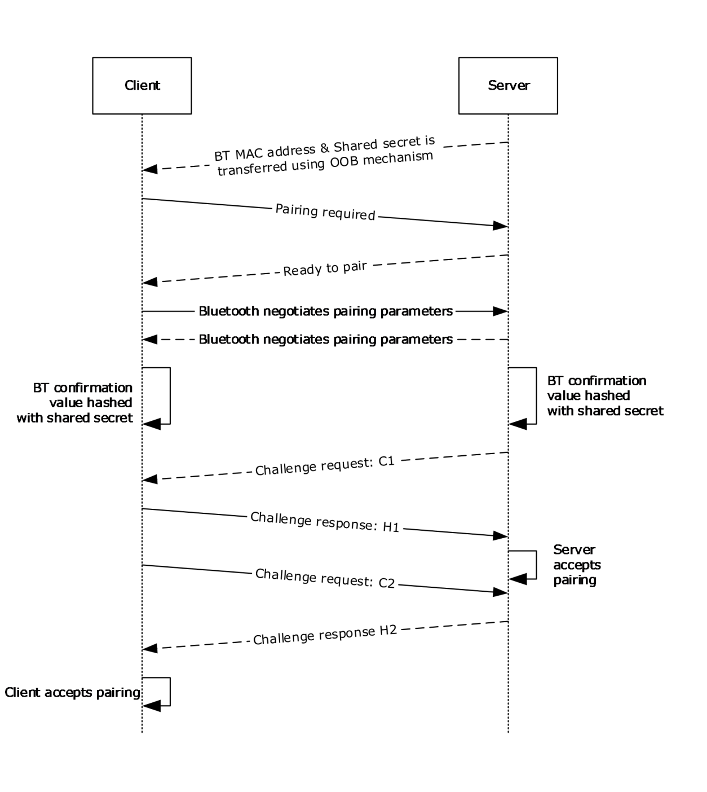
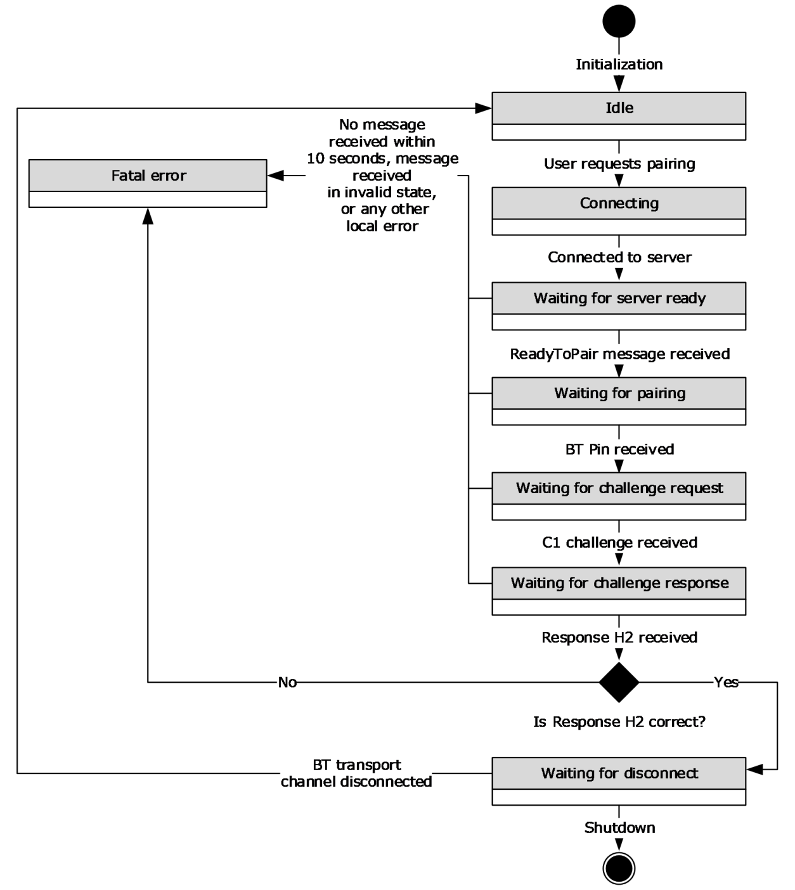
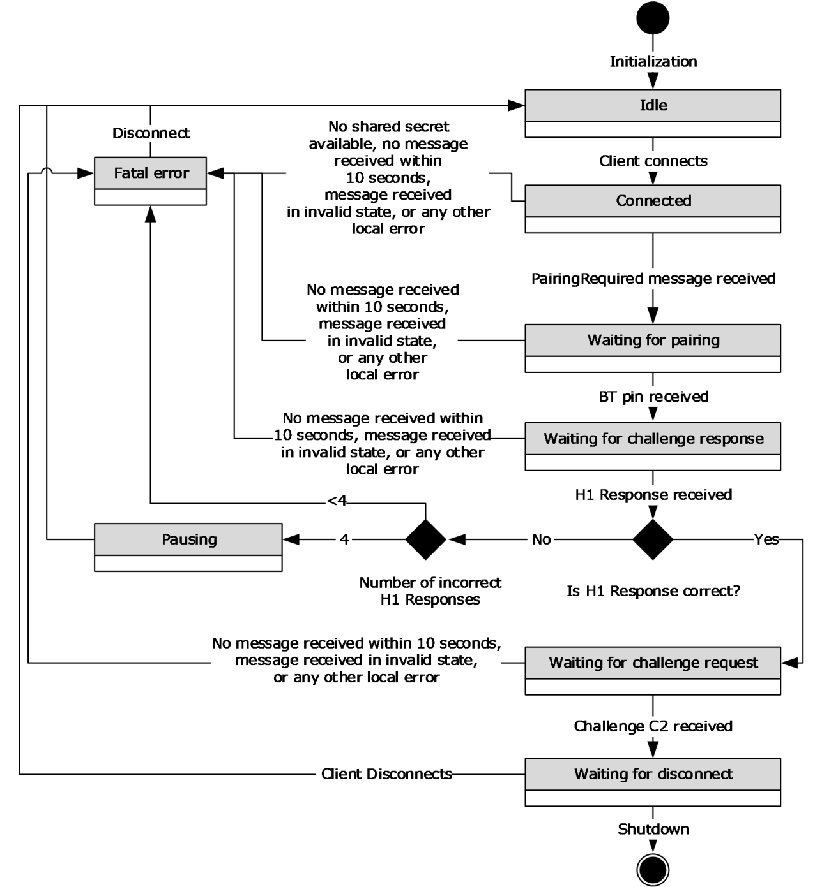

[MS-ABTP]:

Automatic Bluetooth Pairing Protocol

Intellectual Property Rights Notice for Open Specifications Documentation

  Technical Documentation. Microsoft publishes Open Specifications documentation (“this

documentation”) for protocols, file formats, data portability, computer languages, and standards
support. Additionally, overview documents cover inter-protocol relationships and interactions.

  Copyrights. This documentation is covered by Microsoft copyrights. Regardless of any other

terms that are contained in the terms of use for the Microsoft website that hosts this
documentation, you can make copies of it in order to develop implementations of the technologies
that are described in this documentation and can distribute portions of it in your implementations
that use these technologies or in your documentation as necessary to properly document the
implementation. You can also distribute in your implementation, with or without modification, any
schemas, IDLs, or code samples that are included in the documentation. This permission also
applies to any documents that are referenced in the Open Specifications documentation.
  No Trade Secrets. Microsoft does not claim any trade secret rights in this documentation.
  Patents. Microsoft has patents that might cover your implementations of the technologies

described in the Open Specifications documentation. Neither this notice nor Microsoft's delivery of
this documentation grants any licenses under those patents or any other Microsoft patents.
However, a given Open Specifications document might be covered by the Microsoft Open
Specifications Promise or the Microsoft Community Promise. If you would prefer a written license,
or if the technologies described in this documentation are not covered by the Open Specifications
Promise or Community Promise, as applicable, patent licenses are available by contacting
iplg@microsoft.com.

  License Programs. To see all of the protocols in scope under a specific license program and the

associated patents, visit the Patent Map.

  Trademarks. The names of companies and products contained in this documentation might be
covered by trademarks or similar intellectual property rights. This notice does not grant any
licenses under those rights. For a list of Microsoft trademarks, visit
www.microsoft.com/trademarks.

  Fictitious Names. The example companies, organizations, products, domain names, email

addresses, logos, people, places, and events that are depicted in this documentation are fictitious.
No association with any real company, organization, product, domain name, email address, logo,
person, place, or event is intended or should be inferred.

Reservation of Rights. All other rights are reserved, and this notice does not grant any rights other
than as specifically described above, whether by implication, estoppel, or otherwise.

Tools. The Open Specifications documentation does not require the use of Microsoft programming
tools or programming environments in order for you to develop an implementation. If you have access
to Microsoft programming tools and environments, you are free to take advantage of them. Certain
Open Specifications documents are intended for use in conjunction with publicly available standards
specifications and network programming art and, as such, assume that the reader either is familiar
with the aforementioned material or has immediate access to it.

Support. For questions and support, please contact dochelp@microsoft.com.

[MS-ABTP] - v20240423
Automatic Bluetooth Pairing Protocol
Copyright © 2024 Microsoft Corporation
Release: April 23, 2024

1 / 27

Revision Summary

Date

Revision
History

Revision
Class

Comments

8/8/2013

1.0

11/14/2013  2.0

2/13/2014

2.0

5/15/2014

2.0

6/30/2015

3.0

10/16/2015  4.0

7/14/2016

5.0

6/1/2017

5.0

9/12/2018

6.0

4/7/2021

7.0

6/25/2021

8.0

4/23/2024

9.0

New

Major

None

None

Major

Major

Major

None

Major

Major

Major

Major

Released new document.

Significantly changed the technical content.

No change to the meaning, language, or formatting of the
technical content.

No change to the meaning, language, or formatting of the
technical content.

Significantly changed the technical content.

Significantly changed the technical content.

Significantly changed the technical content.

No changes to the meaning, language, or formatting of the
technical content.

Significantly changed the technical content.

Significantly changed the technical content.

Significantly changed the technical content.

Significantly changed the technical content.

[MS-ABTP] - v20240423
Automatic Bluetooth Pairing Protocol
Copyright © 2024 Microsoft Corporation
Release: April 23, 2024

2 / 27

Table of Contents

1.1
1.2

1.2.1
1.2.2

1  Introduction ............................................................................................................ 5
Glossary ........................................................................................................... 5
References ........................................................................................................ 6
Normative References ................................................................................... 6
Informative References ................................................................................. 6
Overview .......................................................................................................... 7
Relationship to Other Protocols ............................................................................ 8
Prerequisites/Preconditions ................................................................................. 9
Applicability Statement ....................................................................................... 9
Versioning and Capability Negotiation ................................................................... 9
Vendor-Extensible Fields ..................................................................................... 9
Standards Assignments ....................................................................................... 9

1.3
1.4
1.5
1.6
1.7
1.8
1.9

2.2.2

2.2.1

2.1
2.2

2.2.1.1

2  Messages ............................................................................................................... 10
Transport ........................................................................................................ 10
Message Syntax ............................................................................................... 10
Enumerations ............................................................................................. 10
MessageId Enumeration ......................................................................... 10
Structures ................................................................................................. 10
CommonHeader Structure ...................................................................... 10
Messages ................................................................................................... 11
Challenge Message ................................................................................ 11
PairingRequired Message ....................................................................... 11
ProtocolErrorResponse Message .............................................................. 11
ReadyToPair Message ............................................................................ 12
Response Message ................................................................................ 12

2.2.3.1
2.2.3.2
2.2.3.3
2.2.3.4
2.2.3.5

2.2.2.1

2.2.3

3.1

3.1.6

3.1.5

3.1.4.1
3.1.4.2

3.1.1
3.1.2
3.1.3
3.1.4

3.1.5.1
3.1.5.2
3.1.5.3
3.1.5.4

3  Protocol Details ..................................................................................................... 14
Client Details ................................................................................................... 14
Abstract Data Model .................................................................................... 15
Timers ...................................................................................................... 16
Initialization ............................................................................................... 16
Higher-Layer Triggered Events ..................................................................... 16
Pairing Request..................................................................................... 16
Cancellation ......................................................................................... 16
Message Processing Events and Sequencing Rules .......................................... 16
ReadyToPair ......................................................................................... 16
Challenge ............................................................................................. 17
Response ............................................................................................. 17
Other Messages .................................................................................... 17
Timer Events .............................................................................................. 17
ClientGuardTimer .................................................................................. 17
Other Local Events ...................................................................................... 17
Successful Connection of Control Channel ................................................ 17
Failed Connection of Control Channel ....................................................... 18
Disconnect Event of Control Channel ....................................................... 18
Pairing Indication .................................................................................. 18
Server Details .................................................................................................. 18
Abstract Data Model .................................................................................... 19
Timers ...................................................................................................... 20
Initialization ............................................................................................... 20
Higher-Layer Triggered Events ..................................................................... 20
Shutdown ............................................................................................ 20
Message Processing Events and Sequencing Rules .......................................... 20
PairingRequired .................................................................................... 20

3.1.7.1
3.1.7.2
3.1.7.3
3.1.7.4

3.2.1
3.2.2
3.2.3
3.2.4

3.2.4.1

3.2.5.1

3.1.6.1

3.2.5

3.1.7

3.2

[MS-ABTP] - v20240423
Automatic Bluetooth Pairing Protocol
Copyright © 2024 Microsoft Corporation
Release: April 23, 2024

3 / 27

3.2.5.2
3.2.5.3
3.2.5.4

3.2.6

3.2.6.1
3.2.6.2

3.2.7

3.2.7.1
3.2.7.2
3.2.7.3

Response ............................................................................................. 21
Challenge ............................................................................................. 21
Other Messages .................................................................................... 21
Timer Events .............................................................................................. 21
GuardTimer .......................................................................................... 21
PausingTimer ....................................................................................... 21
Other Local Events ...................................................................................... 22
Connect Event ...................................................................................... 22
Disconnect Event .................................................................................. 22
Pairing indication .................................................................................. 22

4  Protocol Examples ................................................................................................. 23
PairingRequired ............................................................................................... 23
ReadyToPair .................................................................................................... 23
Challenge ........................................................................................................ 23
Response ........................................................................................................ 23

4.1
4.2
4.3
4.4

5  Security ................................................................................................................. 24
Security Considerations for Implementers ........................................................... 24
Index of Security Parameters ............................................................................ 24

5.1
5.2

6  Appendix A: Product Behavior ............................................................................... 25

7  Change Tracking .................................................................................................... 26

8  Index ..................................................................................................................... 27

[MS-ABTP] - v20240423
Automatic Bluetooth Pairing Protocol
Copyright © 2024 Microsoft Corporation
Release: April 23, 2024

4 / 27

1  Introduction

This document specifies the Automatic Bluetooth Pairing Protocol. This protocol facilitates the
establishment of a secure, trusted Bluetooth (BT) pairing relationship between two devices without
requiring any user interaction at the time of pairing. To use the Automatic Bluetooth Pairing Protocol,
the Bluetooth media access control address (MAC address) of the server device and a shared
secret are exchanged between the two devices using an out-of-band (OOB) mechanism.

Sections 1.5, 1.8, 1.9, 2, and 3 of this specification are normative. All other sections and examples in
this specification are informative.

1.1  Glossary

This document uses the following terms:

binary large object (BLOB): A discrete packet of data that is stored in a database and is treated

as a sequence of uninterpreted bytes.

Bluetooth (BT): A wireless technology standard which is managed by the Bluetooth Special

Interest Group and that is used for exchanging data over short distances between mobile and
fixed devices.

Bluetooth pairing: A process in which two devices that are both running the Bluetooth technology

establish a connection for communication by using an agreed upon security key.

challenge value: The request that is sent during challenge/response authentication. The value

received in response to the challenge request is authenticated for validity.

challenge/response authentication: A common authentication technique in which a principal is

prompted (the challenge) to provide some private information (the response) to facilitate
authentication.

client: A computer on which the remote procedure call (RPC) client is executing.

globally unique identifier (GUID): A term used interchangeably with universally unique

identifier (UUID) in Microsoft protocol technical documents (TDs). Interchanging the usage of
these terms does not imply or require a specific algorithm or mechanism to generate the value.
Specifically, the use of this term does not imply or require that the algorithms described in
[RFC4122] or [C706] have to be used for generating the GUID. See also universally unique
identifier (UUID).

man in the middle (MITM): An attack that deceives a server or client into accepting an

unauthorized upstream host as the actual legitimate host. Instead, the upstream host is an
attacker's host that is manipulating the network so that the attacker's host appears to be the
desired destination. This enables the attacker to decrypt and access all network traffic that
would go to the legitimate host. The attacker is able to read, insert, and modify at-will messages
between two hosts without either party knowing that the link between them is compromised.

Media Access Control (MAC) address: A hardware address provided by the network interface
vendor that uniquely identifies each interface on a physical network for communication with
other interfaces, as specified in [IEEE802.3]. It is used by the media access control sublayer of
the data link layer of a network connection.

network byte order: The order in which the bytes of a multiple-byte number are transmitted on a

network, most significant byte first (in big-endian storage). This does not always match the
order in which numbers are normally stored in memory for a particular processor.

[MS-ABTP] - v20240423
Automatic Bluetooth Pairing Protocol
Copyright © 2024 Microsoft Corporation
Release: April 23, 2024

5 / 27

out-of-band (OOB): A process for authenticating a user where two communication channels are

used simultaneously between two devices or roles. A cellular network is an example of a channel
that is commonly used for performing out-of-band authentication.

response value: The value that is sent in response to a challenge request during

challenge/response authentication. The response value is authenticated against the challenge
value.

server: A computer on which the remote procedure call (RPC) server is executing.

type-length-value (TLV): A method of organizing data that involves a Type code (16-bit), a

specified length of a Value field (16-bit), and the data in the Value field (variable).

MAY, SHOULD, MUST, SHOULD NOT, MUST NOT: These terms (in all caps) are used as defined
in [RFC2119]. All statements of optional behavior use either MAY, SHOULD, or SHOULD NOT.

1.2  References

Links to a document in the Microsoft Open Specifications library point to the correct section in the
most recently published version of the referenced document. However, because individual documents
in the library are not updated at the same time, the section numbers in the documents may not
match. You can confirm the correct section numbering by checking the Errata.

1.2.1  Normative References

We conduct frequent surveys of the normative references to assure their continued availability. If you
have any issue with finding a normative reference, please contact dochelp@microsoft.com. We will
assist you in finding the relevant information.

[BT-RFCOMM] Bluetooth Special Interest Group, "Bluetooth Specification version 1.1, Part F:1,
RFCOMM with TS 07.10, Serial Port Emulation", June 2003,
https://www.bluetooth.com/specifications/archived-specifications/

[BT-SDP] Bluetooth Special Interest Group, "Bluetooth Specification Version 4.0, Volume 3 - Core
System Package [Host Volume], Part B - Service Discovery Protocol (SDP) Specification", June 2010,
https://www.bluetooth.com/specifications/archived-specifications/

[RFC2119] Bradner, S., "Key words for use in RFCs to Indicate Requirement Levels", BCP 14, RFC
2119, March 1997, https://www.rfc-editor.org/info/rfc2119

1.2.2  Informative References

[BT-GAP] Bluetooth Special Interest Group, "Bluetooth Specification Version 4.0, Volume 3 - Core
System Package [Host Volume], Part C - Generic Access Profile", June 2010,
https://www.bluetooth.org/docman/handlers/downloaddoc.ashx?doc_id=229737

[BT-SEC] Bluetooth Special Interest Group, "Bluetooth Specification Version 4.0, Volume 2 - Core
System Package [BR/EDR Controller volume], Part H - Security Specification", June 2010,
https://www.bluetooth.org/docman/handlers/downloaddoc.ashx?doc_id=229737

[BT40] Bluetooth Special Interest Group, "Bluetooth Specification Version 4.0", June 2010, File
Download, https://www.bluetooth.org/docman/handlers/downloaddoc.ashx?doc_id=229737

[FIPS180-4] FIPS PUBS, "Secure Hash Standards (SHS)", March 2012,
http://csrc.nist.gov/publications/fips/fips180-4/fips-180-4.pdf

[MS-ABTP] - v20240423
Automatic Bluetooth Pairing Protocol
Copyright © 2024 Microsoft Corporation
Release: April 23, 2024

6 / 27

1.3  Overview

Bluetooth is one of the most common communication technologies that is used to enable scenarios
that involve two different devices [BT40]. For security purposes, it is necessary to ensure that the
communication channel between the two devices is secure and authenticated. The process by which
this is done in Bluetooth is known as Bluetooth pairing [BT-SEC].

There are many different ways to pair two devices that are using Bluetooth. The most secure pairing
methods typically involve user input, such as numeric PIN comparison; however, a device might not
be able to accept user input or a manufacturer can choose to skip this step. Skipping the user input
step lowers the security of the connection and enables man in the middle (MITM) and other similar
attacks. Traditional Bluetooth pairing also requires devices to be in a discoverable mode (see [BT-
GAP]). In this mode, the server device advertises its presence.

The Automatic Bluetooth Pairing Protocol enables a client to establish a secure, authenticated
Bluetooth connection with a server. The protocol does not require any user interaction at the time of
pairing, nor does it require either device to be in discoverable mode. Prior to using the Automatic
Bluetooth Pairing Protocol, the Bluetooth MAC address of the server device and a shared secret have
to be exchanged between the two devices by using an OOB mechanism.

After the Bluetooth MAC address and shared secret information is available on both devices, the client
sends a PairingRequired message (section 2.2.3.2) to the server. This message is used to inform
the server of the MAC address of the client.

The server has to be able to accept a PairingRequired message and when the message is received,
send a ReadyToPair message (section 2.2.3.4) in response. The server then readies itself to accept
Bluetooth pairing from the client.

The client then initiates the Bluetooth pairing by using the Bluetooth Numeric Comparison Protocol
[BT-SEC] during which the pairing parameters are negotiated between the client and server. The
pairing parameters include a six digit confirmation value (PIN) and a link key.

To authenticate the client and server devices, both sides are required to have the same numeric value
and the same shared secret. To accomplish the authentication, the server generates a 128-byte
pseudo-random number and sends it to the client. The client then calculates the response as a hash of
the challenge, the shared key, and the six digit confirmation value (the PIN that was previously
negotiated between the client and the server) by using SHA-256 [FIPS180-4] and sends it to the
server. The client and server then perform a similar challenge/response authentication process
initiated by the client.

Each side accepts the pairing after it receives a satisfactory response to its challenge.

[MS-ABTP] - v20240423
Automatic Bluetooth Pairing Protocol
Copyright © 2024 Microsoft Corporation
Release: April 23, 2024

7 / 27

<!-- Extracted images from page 8 -->

<!-- /Extracted images from page 8 -->

Figure 1: Establishing a secure, authenticated Bluetooth connection

1.4  Relationship to Other Protocols

The Automatic Bluetooth Pairing Protocol is dependent on the Bluetooth [BT40], RFComm [BT-
RFCOMM], Service Discovery Protocol [BT-SDP], and Pairing protocols [BT-SEC].

[MS-ABTP] - v20240423
Automatic Bluetooth Pairing Protocol
Copyright © 2024 Microsoft Corporation
Release: April 23, 2024

8 / 27

1.5  Prerequisites/Preconditions

To use the Automatic Bluetooth Pairing Protocol, both devices are required to support Bluetooth, the
Bluetooth radio on both devices has to be turned on, and the Bluetooth MAC address of the server
device and a shared secret have to be exchanged between the two devices by using an OOB
mechanism.

1.6  Applicability Statement

This protocol is applicable only when other Bluetooth pairing mechanisms are not appropriate or
would prohibitively interrupt the user experience.

1.7  Versioning and Capability Negotiation

Protocol Versions: The Automatic Bluetooth Pairing Protocol does not support versioning, but it is
extensible. This is defined in sections 3.1.5.4 and 3.2.5.4.

1.8  Vendor-Extensible Fields

None.

1.9  Standards Assignments

None.

[MS-ABTP] - v20240423
Automatic Bluetooth Pairing Protocol
Copyright © 2024 Microsoft Corporation
Release: April 23, 2024

9 / 27

2  Messages

2.1  Transport

The Automatic Bluetooth Pairing Protocol MUST have a byte stream connection between the client
and server. This connection MUST be established by using RFCOMM [BT-RFCOMM]. To identify an
Automatic Bluetooth Pairing Protocol-capable server by using RFCOMM, the client MUST use the
Bluetooth Service Discovery Protocol (SDP) [BT-SDP]. Tethering-capable servers MUST be identified
through SDP by using the globally unique identifier (GUID) {D9009112-CD2B-4e7a-A463-
437D71E14905}. The RFCOMM communication channel is created before a Bluetooth pairing
relationship with the server is created and MUST be unauthenticated.

2.2  Message Syntax

This protocol uses a common type-length-value (TLV) encoding schema for all messages.

2.2.1  Enumerations

2.2.1.1  MessageId Enumeration

The MessageId enumeration specifies the message type. The structure is referenced in the header of
each message, as defined in section 2.2.2.1.

Field/Value

Description

ProtocolError

Identifies the ProtocolError message, as specified in section 2.2.3.3.

1

PairingRequired

Identifies the PairingRequired message, as specified in 2.2.3.2.

2

ReadyToPair

Identifies the ReadyToPair message, as specified in 2.2.3.4.

3

Challenge

Identifies the Challenge message, as specified in section 2.2.3.1.

4

Response

Identifies the Response message, as specified in section 2.2.3.5.

5

2.2.2  Structures

All multi-byte values are in network byte order unless specified otherwise.

2.2.2.1  CommonHeader Structure

The CommonHeader structure is used by all messages. It identifies the structure of the message and
the encoded length of the message content.

[MS-ABTP] - v20240423
Automatic Bluetooth Pairing Protocol
Copyright © 2024 Microsoft Corporation
Release: April 23, 2024

10 / 27

0  1  2  3  4  5  6  7  8  9

1
0  1  2  3  4  5  6  7  8  9

2
0  1  2  3  4  5  6  7  8  9

3
0  1

Id

Length

Id (1 byte):  This field specifies the message type as indicated by the MessageId enumeration

(section 2.2.1.1).

Length (2 bytes): This field specifies the number of bytes following the message header.

2.2.3  Messages

2.2.3.1  Challenge Message

The Challenge message is sent by each device to the peer device to authenticate pairing.

0  1  2  3  4  5  6  7  8  9

1
0  1  2  3  4  5  6  7  8  9

2
0  1  2  3  4  5  6  7  8  9

3
0  1

Header

Payload (variable)

...

...

Header (3 bytes): This field contains the CommonHeader structure (section 2.2.2.1). The Id field

(Header.Id) of the header is set to MessageId.Challenge (4). The Length (Header.Length) of
the header is set to the payload size of the message.

Payload (variable): This field contains the challenge value (128 bytes). Future protocol versions

MAY define additional payload elements. This protocol version MUST ignore any payload after the
challenge value in the packet.

2.2.3.2  PairingRequired Message

The PairingRequired message is sent by the client to the server to prepare the pairing.

0  1  2  3  4  5  6  7  8  9

1
0  1  2  3  4  5  6  7  8  9

2
0  1  2  3  4  5  6  7  8  9

3
0  1

Header

Header (3 bytes):  This field contains the CommonHeader structure (section 2.2.2.1). The Id field

(Header.Id) is set to MessageId.PairingRequired (2). The Length field (Header.Length) is
set to the payload size of the message. In this version of the protocol, the payload is empty (0
bytes). Future protocol versions MAY define additional message elements. This protocol version
MUST ignore any payload.

2.2.3.3  ProtocolErrorResponse Message

The ProtocolErrorResponse message is sent by the receiver in response to a message that is not
recognized. This message provides basic compatibility with future protocol versions that MAY contain
additional messages. An implementation of this protocol version sends this message in response to

11 / 27

[MS-ABTP] - v20240423
Automatic Bluetooth Pairing Protocol
Copyright © 2024 Microsoft Corporation
Release: April 23, 2024

receiving a message where the value of the MessageId is outside of the range defined in section
2.2.1.1.

0  1  2  3  4  5  6  7  8  9

1
0  1  2  3  4  5  6  7  8  9

2
0  1  2  3  4  5  6  7  8  9

3
0  1

Header

Payload (variable)

...

...

Header (3 bytes):  This field contains the CommonHeader structure (section 2.2.2.1). The Id field
(Header.Id) is set to MessageId.ProtocolError (1). The Length field (Header.Length) is set
to the payload size of the message. The payload consists of the MessageId (section 2.2.1.1) of
the message that was not recognized by the receiver.

Payload (variable):  This field contains the MessageId (1 byte). Future protocol versions MAY
define additional message elements. This protocol version MUST ignore any payload after the
MessageId.

2.2.3.4  ReadyToPair Message

The ReadyToPair message is sent by the server to the client in response to the PairingRequired
message (section 2.2.3.2).

0  1  2  3  4  5  6  7  8  9

1
0  1  2  3  4  5  6  7  8  9

2
0  1  2  3  4  5  6  7  8  9

3
0  1

Header

Header (3 bytes):  This field contains the CommonHeader structure (section 2.2.2.1). The Id field

(Header.Id) is set to MessageId.ReadyToPair (3). The Length field (Header.Length) is set to
the payload size of the message. In this version of the protocol, the payload is empty (0 bytes).
Future protocol versions MAY define additional message elements. This protocol version MUST
ignore any payload.

2.2.3.5  Response Message

The Response message is sent in response to a Challenge message (section 2.2.3.1) to authenticate
the pairing.

0  1  2  3  4  5  6  7  8  9

1
0  1  2  3  4  5  6  7  8  9

2
0  1  2  3  4  5  6  7  8  9

3
0  1

Header

Payload (variable)

...

...

Header (3 bytes):  This field contains the CommonHeader structure (section 2.2.2.1). The Id field
(Header.Id) is set to MessageId.Response (5). The Length field (Header.Length) is set to
the payload size of the message.

12 / 27

[MS-ABTP] - v20240423
Automatic Bluetooth Pairing Protocol
Copyright © 2024 Microsoft Corporation
Release: April 23, 2024

Payload (variable):  This field contains the response value (32 bytes). Future protocol versions

MAY define additional message elements. This protocol version MUST ignore any payload after the
response value in the packet.

[MS-ABTP] - v20240423
Automatic Bluetooth Pairing Protocol
Copyright © 2024 Microsoft Corporation
Release: April 23, 2024

13 / 27

3  Protocol Details

The Automatic Bluetooth Pairing Protocol provides a client role and a server role.

The client and server use the same algorithm to compute a response value for
challenge/response authentication. Given a 128-byte challenge value, a 128-byte shared
secret, and a numeric value (representing a six-digit numeric code), the response value is calculated
as a SHA-256 of the concatenation of the challenge value, the shared secret, and the numeric value
represented (PIN) as a 32-byte value in network byte order.

3.1  Client Details

The role of the client in the Bluetooth pairing process is as follows:

1.  The client establishes an unauthenticated RFCOMM connection with the server to execute the

Automatic Bluetooth Pairing Protocol.

2.  The client executes a state machine to initiate and authenticate the Bluetooth pairing.

3.  The client sends a PairingRequired message (section 2.2.3.2) to the server and waits for the

server to respond.

4.  After receiving a ReadyToPair message (section 2.2.3.4) from the server, the client initiates the
Bluetooth pairing with a numeric comparison procedure. The client then waits for the server to
initiate challenge/response authentication.

5.  After receiving the Challenge message (section 2.2.3.1) from the server, the client computes the
corresponding response value and returns the value to the server by sending a Response
message (section 2.2.3.5).

6.  The client authenticates the server by generating a random challenge and sending it to the server

by using a Challenge message (section 2.2.3.1).

7.  The client waits for the server to return a Response message (section 2.2.3.5).

8.  After receiving the Response message, the client validates the response value. If the validation
succeeds, the client completes the pairing with the server. If the validation fails, the client aborts
the pairing with the server.

[MS-ABTP] - v20240423
Automatic Bluetooth Pairing Protocol
Copyright © 2024 Microsoft Corporation
Release: April 23, 2024

14 / 27

<!-- Extracted images from page 15 -->

<!-- /Extracted images from page 15 -->

Figure 2: Client state diagram

3.1.1  Abstract Data Model

This section describes a conceptual model of possible data organization that an implementation

maintains to participate in this protocol. The described organization is provided to facilitate the
explanation of how the protocol behaves. This document does not mandate that implementations
adhere to this model as long as their external behavior is consistent with that described in this
document.

[MS-ABTP] - v20240423
Automatic Bluetooth Pairing Protocol
Copyright © 2024 Microsoft Corporation
Release: April 23, 2024

15 / 27

State: Specifies the state of the client which can be one of the following: IDLE, CONNECTING,

WAITING_FOR_SERVER_READY, WAITING_FOR_PAIRING, WAITING_FOR_CHALLENGE_REQUEST,
WAITING_FOR_CHALLENGE_RESPONSE, WAITING_FOR_DISCONNECT, or FATAL_ERROR.

Server Address: The Bluetooth address of the server.

Shared Secret: A 128-byte binary large object (BLOB) that contains the shared secret.

Expected Response: A 32-byte BLOB that contains the expected response value.

Numeric Value: A six-digit confirmation value (PIN).

3.1.2  Timers

The client role maintains the following timers.

ClientGuardTimer: The time-out interval is set to 10 seconds.

3.1.3  Initialization

The initial state for the client is IDLE. The ClientGuardTimer (section 3.1.2) is not set.

3.1.4  Higher-Layer Triggered Events

3.1.4.1  Pairing Request

The higher layer can initiate pairing when the client is in the IDLE state (see section 3.1.1). When the
client is in any other state, the client MUST fail the request. The higher layer MUST provide the Server
Address and the Shared Secret that is common to the client and server. The client stores the
Server Address and the Shared Secret, initiates a Bluetooth connection to the specified server,
sets the ClientGuardTimer (section 3.1.2), and transitions to the CONNECTING state.

3.1.4.2  Cancellation

The higher layer can cancel the pairing attempt at any time. When the client is in the CONNECTING,
WAITING_FOR_SERVER_READY, WAITING_FOR_PAIRING, WAITING_FOR_CHALLENGE_REQUEST, or
WAITING_FOR_CHALLENGE_RESPONSE state, the client initiates a disconnect of the control channel,
stops the ClientGuardTimer (section 3.1.2), and transitions to the FATAL_ERROR state. When the
client is in any other state, the client MUST ignore the request.

3.1.5  Message Processing Events and Sequencing Rules

The message type is identified by using the MessageId value stored in the message header, as
specified in section 2.2.1.1. A message is processed only when it has been fully received as indicated
by the value of the Length field specified within the message header. When the client is in the
FATAL_ERROR or WAITING_FOR_DISCONNECT state, the client MUST ignore any messages received.
When the client receives a message in any other state, the ClientGuardTimer (section 3.1.2) MUST
be started or restarted.

3.1.5.1  ReadyToPair

When the client receives a ReadyToPair message (section 2.2.3.2) in the
WAITING_FOR_SERVER_READY state, the client MUST initiate Bluetooth pairing with the server (as
specified by the Server Address) using the numeric comparison method. The client MUST restart the
ClientGuardTimer (section 3.1.2) and transition to the WAITING_FOR_PAIRING state.

16 / 27

[MS-ABTP] - v20240423
Automatic Bluetooth Pairing Protocol
Copyright © 2024 Microsoft Corporation
Release: April 23, 2024

When the client receives the ReadyToPair message in any other state, the client MUST initiate a
disconnect of the control channel, stop the ClientGuardTimer, and transition to the FATAL_ERROR
state.

3.1.5.2  Challenge

When the client receives a Challenge message (section 2.2.3.1) in the
WAITING_FOR_CHALLENGE_REQUEST state, the client MUST compute the response value (as
specified in section 3.2.1) using the challenge value of the Challenge message (section 2.2.3.1), the
Shared Secret, and the Numeric Value. The client MUST send a Response message (section
2.2.3.5) to the server containing the computed response value.

The client MUST then create a random challenge value and send a Challenge message to the server
containing the challenge value. The client MUST compute and store the Expected Response (as
specified in section 3.2.1) for this challenge value. The client MUST restart the ClientGuardTimer
(section 3.1.2) and transition to the WAITING_FOR_CHALLENGE_RESPONSE state.

When the client receives the client message in any other state, the client MUST initiate a disconnect of
the control channel, stop the ClientGuardTimer, and transition to the FATAL_ERROR state.

3.1.5.3  Response

When the client receives a Response message (section 2.2.3.5) in the
WAITING_FOR_CHALLENGE_RESPONSE state, the client MUST stop the ClientGuardTimer (section
3.1.2). The client MUST compare the response value of the Response message with the Expected
Response. If the values match, the client MUST complete the pairing with the server and transition
to the WAITING_FOR_DISCONNECT state. If the values do not match, the client MUST transition to
the FATAL_ERROR state. In all cases, the client MUST initiate the disconnect of the control channel.

3.1.5.4  Other Messages

When the client receives a message with an unknown message type, that is, a MessageId value that
is not specified in section 2.2.1.1, the client MUST send a ProtocolErrorResponse message (section
2.2.3.3) indicating the unknown message type and specifying the unrecognized MessageId value in
the message payload.

After the client receives a message that cannot be parsed according to the message syntax specified
in section 2.2, the client initiates a disconnect of the control channel, stops the ClientGuardTimer
(section 3.1.2), and transitions to the FATAL_ERROR state.

3.1.6  Timer Events

3.1.6.1  ClientGuardTimer

Upon expiration of the ClientGuardTimer (section 3.1.2), the client initiates a disconnect of the
control channel and transitions to the FATAL_ERROR state.

3.1.7  Other Local Events

3.1.7.1  Successful Connection of Control Channel

Upon successful connection of the control channel to the server, the client MUST send a
PairingRequired message (section 2.2.3.2) to the server, restart the ClientGuardTimer (section
3.1.2), and transition to the WAITING_FOR_SERVER_READY state.

17 / 27

[MS-ABTP] - v20240423
Automatic Bluetooth Pairing Protocol
Copyright © 2024 Microsoft Corporation
Release: April 23, 2024

3.1.7.2  Failed Connection of Control Channel

Upon a failed connection of the control channel to the server, the client MUST stop the
ClientGuardTimer (section 3.1.2), indicate the failed pairing attempt to the higher layer, and
transition to the IDLE state.

3.1.7.3  Disconnect Event of Control Channel

Upon receiving a disconnect event of the control channel while in the WAITING_FOR_DISCONNECT
state, the client indicates the successful pairing with the server to the higher layer and transitions to
the IDLE state.

When the client receives a disconnect event of the control channel while in any other state, the client
stops the ClientGuardTimer (section 3.1.2) if it is running, indicates the failed pairing with the server
to the higher layer, and transitions to the IDLE state.

3.1.7.4  Pairing Indication

When the Bluetooth layer indicates to the client that a pairing attempt has to be authenticated, the
client compares its state to the WAITING_FOR_PAIRING state, compares the indicated peer address
with the Server Address, and compares the indicated authentication method to the numeric
comparison. If all values match, the client MUST store the indicated Numeric Value and transition to
the WAITING_FOR_CHALLENGE_REQUEST state; otherwise, the client MUST ignore the indication from
the Bluetooth layer.

3.2  Server Details

The role of the server in the Bluetooth pairing process is as follows:

1.  The server creates an RFCOMM port and waits for clients to connect by using an unauthenticated

RFCOMM connection to execute the Automatic Bluetooth Pairing Protocol.

2.  The server executes a strict state machine to authenticate the Bluetooth pairing.

3.  When a client has connected, the server waits for the client to send a PairingRequired message
(section 2.2.3.2). When this message is received, the server responds by sending a ReadyToPair
message (section 2.2.3.4) to the client and waits for the client to initiate the Bluetooth pairing
with a numeric comparison procedure.

4.  After the pairing has been initiated and the numeric value to authenticate the pairing is available,
the server initiates challenge/response authentication by generating a random challenge
value and sending it to the client by using a Challenge message (section 2.2.3.1). The server
then waits for the client to return a Response message (section 2.2.3.5).

5.  After receiving the Response message, the server validates the response value. If the

validation succeeds, the server completes the pairing with the client.

6.  The server waits for the client to perform challenge/response authentication by the client sending
a Challenge message to the server. Upon receiving the Challenge message from the client, the
server computes the corresponding response value and returns the value to the client by sending
a Response message.

7.  The server then waits for the client to disconnect.

The server MAY handle multiple clients simultaneously by having an instance of the server role for
each connected client.

[MS-ABTP] - v20240423
Automatic Bluetooth Pairing Protocol
Copyright © 2024 Microsoft Corporation
Release: April 23, 2024

18 / 27

<!-- Extracted images from page 19 -->

<!-- /Extracted images from page 19 -->

Figure 3: Server state diagram

3.2.1  Abstract Data Model

This section describes a conceptual model of possible data organization that an implementation
maintains to participate in this protocol. The described organization is provided to facilitate the
explanation of how the protocol behaves. This document does not mandate that implementations
adhere to this model as long as their external behavior is consistent with that described in this
document.

[MS-ABTP] - v20240423
Automatic Bluetooth Pairing Protocol
Copyright © 2024 Microsoft Corporation
Release: April 23, 2024

19 / 27

State: Specifies the server state which can be one of the following: IDLE, CONNECTED,

WAITING_FOR_PAIRING, WAITING_FOR_CHALLENGE_RESPONSE,
WAITING_FOR_CHALLENGE_REQUEST, WAITING_FOR_DISCONNECT, FATAL_ERROR, and
PAUSING.

Client Address: The Bluetooth address of the connected client.

Shared Secret: A 128 byte BLOB that contains the shared secret.

Expected Response: A 32 byte BLOB that contains the expected response value.

Numeric Value: A six-digit confirmation value (PIN).

Consecutive Failure Count: An integer value representing the number of consecutive pairing

attempts that have failed.

3.2.2  Timers

The server role maintains the following timers.

GuardTimer: The time-out interval is set to 10 seconds.

PausingTimer: The time-out interval is set to one hour.

3.2.3  Initialization

The initial state for the server is IDLE.

The Shared Secret (section 3.2.1) is set to a value chosen by the higher layer.

The GuardTimer and PausingTimer are not set (see section 3.2.2).

3.2.4  Higher-Layer Triggered Events

3.2.4.1  Shutdown

The higher layer can shut down the server at any time. The server disconnects the control channel at
shutdown.

3.2.5  Message Processing Events and Sequencing Rules

The message type is identified by using the MessageId value stored in the message header, as
specified in section 2.2.1.1. A message is processed only when it has been fully received, as indicated
by the value of the Length field specified within the message header. When the server is in the
FATAL_ERROR, PAUSING, or WAITING_FOR_DISCONNECT state, the server MUST ignore any received
messages. When the server receives a message in any other state, the GuardTimer (section 3.2.2)
MUST be started or restarted.

3.2.5.1  PairingRequired

When the server receives a PairingRequired message (section 2.2.3.2) in the CONNECTED state,
the server MUST send a ReadyToPair message (section 2.2.3.4) to the client, restart the
GuardTimer (section 3.2.2), and transition to the WAITING_FOR_PAIRING state.

When the server receives the PairingRequired message in any other state, the server MUST initiate
a disconnect of the control channel, stop the GuardTimer, and transition to the FATAL_ERROR state.

20 / 27

[MS-ABTP] - v20240423
Automatic Bluetooth Pairing Protocol
Copyright © 2024 Microsoft Corporation
Release: April 23, 2024

3.2.5.2  Response

When the server receives a Response message (section 2.2.3.5) in the
WAITING_FOR_CHALLENGE_RESPONSE state, the server MUST compare the response value of the
Response message with the Expected Response (section 3.2.1).

If the values match, the server MUST complete the pairing with the client, set the Consecutive
Failure Count (section 3.2.1) to 0, and transition to the WAITING_FOR_CHALLENGE_REQUEST state.
If the values do not match, the server MUST initiate a disconnect of the control channel, increment the
value of the Consecutive Failure Count (section 3.2.1), and stop the GuardTimer (section 3.2.2).

If the value of Consecutive Failure Count is less than 4, the server MUST transition to the
FATAL_ERROR state; otherwise, the server MUST transition to the PAUSING state.

When the server receives a Response message in any other state, the server MUST initiate a
disconnect of the control channel, stop the GuardTimer, and transition to the FATAL_ERROR state.

3.2.5.3  Challenge

When the server receives a Challenge message (section 2.2.3.1) in the
WAITING_FOR_CHALLENGE_REQUEST state, the server MUST compute the response value (as
described in section 3.2.1) using the challenge value of the Challenge message, the Shared
Secret (section 3.2.1), and the Numeric Value (section 3.2.1). The server MUST send a Response
message (section 2.2.3.5) to the client containing the computed response value. The server MUST
restart the GuardTimer (section 3.2.2) and transition to the WAITING_FOR_DISCONNECT state.

When the server receives a Challenge message in any other state, the server MUST initiate a
disconnect of the control channel, stop the GuardTimer, and transition to the FATAL_ERROR state.

3.2.5.4  Other Messages

When the server receives a message with an unknown message type, that is, a value for the
MessageId that is not specified in section 2.2.1.1, the server MUST send a ProtocolErrorResponse
message (section 2.2.3.3) indicating the unknown message type and specifying the unrecognized
MessageId value in the message payload.

When the server receives a message that cannot be parsed according to the message syntax specified
in section 2.2, the server initiates a disconnect of the control channel, stops the GuardTimer (section
3.2.2), and transitions to the FATAL_ERROR state.

3.2.6  Timer Events

3.2.6.1  GuardTimer

Upon expiration of the GuardTimer (section 3.2.2), the server initiates a disconnect of the control
channel and transitions to the FATAL_ERROR state.

3.2.6.2  PausingTimer

Upon expiration of the PausingTimer (section 3.2.2), the server sets the Consecutive Failure
Count (section 3.2.1) to 0 and transitions to the IDLE state.

[MS-ABTP] - v20240423
Automatic Bluetooth Pairing Protocol
Copyright © 2024 Microsoft Corporation
Release: April 23, 2024

21 / 27

3.2.7  Other Local Events

3.2.7.1  Connect Event

The server can only process connect events from clients when the server is in the IDLE state. When a
client connects, the server MUST transition to the CONNECTED state, store the Client Address
(section 3.2.1), and start the GuardTimer (section 3.2.2).

3.2.7.2  Disconnect Event

When the server receives a disconnect event of the control channel, the server stops the
GuardTimer (section 3.2.2) if it is running. If the Consecutive Failure Count (section 3.2.1) equals
4, the server MUST transition to the PAUSING state and start the PausingTimer (section 3.2.2);
otherwise, the server transitions to the IDLE state.

3.2.7.3  Pairing indication

When the Bluetooth layer indicates that a pairing attempt has to be authenticated, the server
compares its state to the WAITING_FOR_PAIRING state, compares the indicated peer address with the
Client Address (section 3.2.1), and compares the indicated authentication method to the numeric
comparison value. If all values match, the server MUST store the indicated Numeric Value (section
3.2.1). The server MUST then create a random challenge value and send a Challenge message
(section 2.2.3.1) to the client containing the challenge value. The server MUST compute and store the
Expected Response (section 3.2.1) for this challenge value using the challenge value, the Shared
Secret (section 3.2.1), and the Numeric Value. The server MUST restart the GuardTimer (section
3.2.2) and transition to the WAITING_FOR_CHALLENGE_RESPONSE state.

If some of the value does not match, the server MUST ignore the indication from the Bluetooth layer.

[MS-ABTP] - v20240423
Automatic Bluetooth Pairing Protocol
Copyright © 2024 Microsoft Corporation
Release: April 23, 2024

22 / 27

4  Protocol Examples

The following examples show the sequence of a successful Bluetooth pairing by using the Automatic
Bluetooth Pairing Protocol. This sequence is demonstrated in the figure shown in section 1.3.

4.1  PairingRequired

 Message Header: 0x02 0x00 0x00 (Type == PairingRequired, Length == 0)

4.2  ReadyToPair

 Message Header: 0x03 0x00 0x00 (Type == ReadyToPair, Length == 0)

4.3  Challenge

 Message Header: 0x04 0x00 0x80 (Type == Challenge, Length == 128)
 Payload: Challenge value: 0x01 0x02 0x03 0x04 … 0x80

4.4  Response

 Message Header: 0x05 0x00 0x20 (Type == Response, Length == 32)
 Payload: Response value: 0x01 0x02 0x03 0x04 … 0x20

[MS-ABTP] - v20240423
Automatic Bluetooth Pairing Protocol
Copyright © 2024 Microsoft Corporation
Release: April 23, 2024

23 / 27

5  Security

5.1  Security Considerations for Implementers

Implementers are required to ensure that the OOB exchange of the shared secret is performed in a
secure and authenticated manner.

5.2  Index of Security Parameters

Security parameter

Section

Computation of the response value  3

Shared secret on the client

Shared secret on the server

3.1.1

3.2.1

[MS-ABTP] - v20240423
Automatic Bluetooth Pairing Protocol
Copyright © 2024 Microsoft Corporation
Release: April 23, 2024

24 / 27

6  Appendix A: Product Behavior

The information in this specification is applicable to the following Microsoft products or supplemental
software. References to product versions include updates to those products.

  Windows 8.1 operating system

  Windows Server 2012 R2 operating system

  Windows 10 operating system

  Windows Server 2016 operating system

  Windows Server 2019 operating system

  Windows Server 2022 operating system

  Windows 11 operating system

  Windows Server 2025 operating system

Exceptions, if any, are noted in this section. If an update version, service pack or Knowledge Base
(KB) number appears with a product name, the behavior changed in that update. The new behavior
also applies to subsequent updates unless otherwise specified. If a product edition appears with the
product version, behavior is different in that product edition.

Unless otherwise specified, any statement of optional behavior in this specification that is prescribed
using the terms "SHOULD" or "SHOULD NOT" implies product behavior in accordance with the
SHOULD or SHOULD NOT prescription. Unless otherwise specified, the term "MAY" implies that the
product does not follow the prescription.

[MS-ABTP] - v20240423
Automatic Bluetooth Pairing Protocol
Copyright © 2024 Microsoft Corporation
Release: April 23, 2024

25 / 27

7  Change Tracking

This section identifies changes that were made to this document since the last release. Changes are
classified as Major, Minor, or None.

The revision class Major means that the technical content in the document was significantly revised.
Major changes affect protocol interoperability or implementation. Examples of major changes are:

  A document revision that incorporates changes to interoperability requirements.
  A document revision that captures changes to protocol functionality.

The revision class Minor means that the meaning of the technical content was clarified. Minor changes
do not affect protocol interoperability or implementation. Examples of minor changes are updates to
clarify ambiguity at the sentence, paragraph, or table level.

The revision class None means that no new technical changes were introduced. Minor editorial and
formatting changes may have been made, but the relevant technical content is identical to the last
released version.

The changes made to this document are listed in the following table. For more information, please
contact dochelp@microsoft.com.

Section

Description

6 Appendix A: Product
Behavior

Added Windows Server 2025 to the list of applicable
products.

Revision
class

Major

[MS-ABTP] - v20240423
Automatic Bluetooth Pairing Protocol
Copyright © 2024 Microsoft Corporation
Release: April 23, 2024

26 / 27

8  Index
A

Abstract data model
   client 15
   server 19
Applicability 9

C

Capability negotiation 9
Change tracking 26
Client
   abstract data model 15
   initialization 16
   message processing 16
   overview 14
   sequencing rules 16
   timers 16

D

Data model - abstract
   client 15
   server 19

F

Fields - vendor-extensible 9

G

Glossary 5

I

Implementer - security considerations 24
Index of security parameters 24
Informative references 6
Initialization
   client 16
   server 20
Introduction 5

M

Message processing
   client 16
   server 20
Messages
   Structures 10
   Structures message 10
   transport 10

N

Normative references 6

O

Overview (synopsis) 7

[MS-ABTP] - v20240423
Automatic Bluetooth Pairing Protocol
Copyright © 2024 Microsoft Corporation
Release: April 23, 2024

P

Parameters - security index 24
Preconditions 9
Prerequisites 9
Product behavior 25
Protocol Details
   overview 14

R

References 6
   informative 6
   normative 6
Relationship to other protocols 8

S

Security
   implementer considerations 24
   parameter index 24
Sequencing rules
   client 16
   server 20
Server
   abstract data model 19
   initialization 20
   message processing 20
   overview 18
   sequencing rules 20
   timers 20
Standards assignments 9
Structures message 10

T

Timers
   client 16
   server 20
Tracking changes 26
Transport 10

V

Vendor-extensible fields 9
Versioning 9

27 / 27

