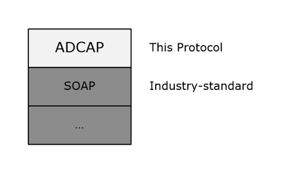

[MS-ADCAP]:

Active Directory Web Services: Custom Action Protocol

Intellectual Property Rights Notice for Open Specifications Documentation

  Technical Documentation. Microsoft publishes Open Specifications documentation (“this

documentation”) for protocols, file formats, data portability, computer languages, and standards
support. Additionally, overview documents cover inter-protocol relationships and interactions.

  Copyrights. This documentation is covered by Microsoft copyrights. Regardless of any other

terms that are contained in the terms of use for the Microsoft website that hosts this
documentation, you can make copies of it in order to develop implementations of the technologies
that are described in this documentation and can distribute portions of it in your implementations
that use these technologies or in your documentation as necessary to properly document the
implementation. You can also distribute in your implementation, with or without modification, any
schemas, IDLs, or code samples that are included in the documentation. This permission also
applies to any documents that are referenced in the Open Specifications documentation.
  No Trade Secrets. Microsoft does not claim any trade secret rights in this documentation.
  Patents. Microsoft has patents that might cover your implementations of the technologies

described in the Open Specifications documentation. Neither this notice nor Microsoft's delivery of
this documentation grants any licenses under those patents or any other Microsoft patents.
However, a given Open Specifications document might be covered by the Microsoft Open
Specifications Promise or the Microsoft Community Promise. If you would prefer a written license,
or if the technologies described in this documentation are not covered by the Open Specifications
Promise or Community Promise, as applicable, patent licenses are available by contacting
iplg@microsoft.com.

  License Programs. To see all of the protocols in scope under a specific license program and the

associated patents, visit the Patent Map.

  Trademarks. The names of companies and products contained in this documentation might be
covered by trademarks or similar intellectual property rights. This notice does not grant any
licenses under those rights. For a list of Microsoft trademarks, visit
www.microsoft.com/trademarks.

  Fictitious Names. The example companies, organizations, products, domain names, email

addresses, logos, people, places, and events that are depicted in this documentation are fictitious.
No association with any real company, organization, product, domain name, email address, logo,
person, place, or event is intended or should be inferred.

Reservation of Rights. All other rights are reserved, and this notice does not grant any rights other
than as specifically described above, whether by implication, estoppel, or otherwise.

Tools. The Open Specifications documentation does not require the use of Microsoft programming
tools or programming environments in order for you to develop an implementation. If you have access
to Microsoft programming tools and environments, you are free to take advantage of them. Certain
Open Specifications documents are intended for use in conjunction with publicly available standards
specifications and network programming art and, as such, assume that the reader either is familiar
with the aforementioned material or has immediate access to it.

Support. For questions and support, please contact dochelp@microsoft.com.

[MS-ADCAP] - v20240423
Active Directory Web Services: Custom Action Protocol
Copyright © 2024 Microsoft Corporation
Release: April 23, 2024

1 / 248

Revision Summary

Date

Revision
History

Revision
Class

Comments

12/5/2008

0.1

Major

Initial Availability

1/16/2009

0.1.1

Editorial

Changed language and formatting in the technical content.

2/27/2009

1.0

4/10/2009

2.0

5/22/2009

3.0

7/2/2009

4.0

8/14/2009

5.0

9/25/2009

6.0

11/6/2009

7.0

12/18/2009  8.0

1/29/2010

9.0

3/12/2010

10.0

4/23/2010

11.0

6/4/2010

12.0

7/16/2010

13.0

8/27/2010

13.1

10/8/2010

13.1

Major

Major

Major

Major

Major

Major

Major

Major

Major

Major

Major

Major

Major

Minor

None

Updated and revised the technical content.

Updated and revised the technical content.

Updated and revised the technical content.

Updated and revised the technical content.

Updated and revised the technical content.

Updated and revised the technical content.

Updated and revised the technical content.

Updated and revised the technical content.

Updated and revised the technical content.

Updated and revised the technical content.

Updated and revised the technical content.

Updated and revised the technical content.

Updated and revised the technical content.

Clarified the meaning of the technical content.

No changes to the meaning, language, or formatting of the
technical content.

11/19/2010  13.1

None

No changes to the meaning, language, or formatting of the
technical content.

1/7/2011

14.0

Major

Updated and revised the technical content.

2/11/2011

14.0

None

No changes to the meaning, language, or formatting of the
technical content.

3/25/2011

14.0

None

No changes to the meaning, language, or formatting of the
technical content.

5/6/2011

14.0

None

No changes to the meaning, language, or formatting of the
technical content.

6/17/2011

14.1

Minor

Clarified the meaning of the technical content.

9/23/2011

14.1

12/16/2011  15.0

3/30/2012

16.0

7/12/2012

16.0

None

Major

Major

None

No changes to the meaning, language, or formatting of the
technical content.

Updated and revised the technical content.

Updated and revised the technical content.

No changes to the meaning, language, or formatting of the
technical content.

2 / 248

[MS-ADCAP] - v20240423
Active Directory Web Services: Custom Action Protocol
Copyright © 2024 Microsoft Corporation
Release: April 23, 2024

Date

Revision
History

Revision
Class

Comments

10/25/2012  17.0

1/31/2013

17.1

8/8/2013

18.0

11/14/2013  18.0

Major

Minor

Major

None

Updated and revised the technical content.

Clarified the meaning of the technical content.

Updated and revised the technical content.

No changes to the meaning, language, or formatting of the
technical content.

2/13/2014

18.0

None

No changes to the meaning, language, or formatting of the
technical content.

5/15/2014

18.0

None

No changes to the meaning, language, or formatting of the
technical content.

6/30/2015

19.0

Major

Significantly changed the technical content.

10/16/2015  19.0

None

No changes to the meaning, language, or formatting of the
technical content.

7/14/2016

19.0

None

No changes to the meaning, language, or formatting of the
technical content.

6/1/2017

19.0

9/15/2017

20.0

9/12/2018

21.0

4/7/2021

22.0

4/23/2024

23.0

None

Major

Major

Major

Major

No changes to the meaning, language, or formatting of the
technical content.

Significantly changed the technical content.

Significantly changed the technical content.

Significantly changed the technical content.

Significantly changed the technical content.

[MS-ADCAP] - v20240423
Active Directory Web Services: Custom Action Protocol
Copyright © 2024 Microsoft Corporation
Release: April 23, 2024

3 / 248

## Table of Contents

- [1 Introduction](#1-introduction)
  - [1.1 Glossary](#11-glossary)
  - [1.2 References](#12-references)
    - [1.2.1 Normative References](#121-normative-references)
    - [1.2.2 Informative References](#122-informative-references)
  - [1.3 Overview](#13-overview)
  - [1.4 Relationship to Other Protocols](#14-relationship-to-other-protocols)
  - [1.5 Prerequisites/Preconditions](#15-prerequisitespreconditions)
  - [1.6 Applicability Statement](#16-applicability-statement)
  - [1.7 Versioning and Capability Negotiation](#17-versioning-and-capability-negotiation)
  - [1.8 Vendor-Extensible Fields](#18-vendor-extensible-fields)
  - [1.9 Standards Assignments](#19-standards-assignments)
- [2 Messages](#2-messages)
  - [2.1 Transport](#21-transport)
  - [2.2 Common Message Syntax](#22-common-message-syntax)
    - [2.2.1 Namespaces](#221-namespaces)
    - [2.2.2 Messages](#222-messages)
    - [2.2.3 Elements](#223-elements)
      - [2.2.3.1 ActiveDirectoryObject](#2231-activedirectoryobject)
      - [2.2.3.2 ActiveDirectoryPrincipal](#2232-activedirectoryprincipal)
      - [2.2.3.3 ActiveDirectoryGroup](#2233-activedirectorygroup)
      - [2.2.3.4 CustomActionFault](#2234-customactionfault)
      - [2.2.3.5 Server](#2235-server)
    - [2.2.4 Complex Types](#224-complex-types)
      - [2.2.4.1 ActiveDirectoryObject](#2241-activedirectoryobject)
        - [2.2.4.1.1 ActiveDirectoryObject/DistinguishedName](#22411-activedirectoryobjectdistinguishedname)
        - [2.2.4.1.2 ActiveDirectoryObject/Name](#22412-activedirectoryobjectname)
        - [2.2.4.1.3 ActiveDirectoryObject/ObjectClass](#22413-activedirectoryobjectobjectclass)
        - [2.2.4.1.4 ActiveDirectoryObject/ObjectGuid](#22414-activedirectoryobjectobjectguid)
        - [2.2.4.1.5 ActiveDirectoryObject/ObjectTypes](#22415-activedirectoryobjectobjecttypes)
        - [2.2.4.1.6 ActiveDirectoryObject/ReferenceServer](#22416-activedirectoryobjectreferenceserver)
      - [2.2.4.2 ActiveDirectoryPrincipal](#2242-activedirectoryprincipal)
        - [2.2.4.2.1 ActiveDirectoryPrincipal/SamAccountName](#22421-activedirectoryprincipalsamaccountname)
        - [2.2.4.2.2 ActiveDirectoryPrincipal/SID](#22422-activedirectoryprincipalsid)
      - [2.2.4.3 ActiveDirectoryGroup](#2243-activedirectorygroup)
        - [2.2.4.3.1 ActiveDirectoryGroup/GroupScope](#22431-activedirectorygroupgroupscope)
        - [2.2.4.3.2 ActiveDirectoryGroup/GroupType](#22432-activedirectorygroupgrouptype)
      - [2.2.4.4 ArrayOfActiveDirectoryGroup](#2244-arrayofactivedirectorygroup)
      - [2.2.4.5 ArgumentErrorDetailCA](#2245-argumenterrordetailca)
        - [2.2.4.5.1 ArgumentErrorDetailCA/Message](#22451-argumenterrordetailcamessage)
        - [2.2.4.5.2 ArgumentErrorDetailCA/ParameterName](#22452-argumenterrordetailcaparametername)
        - [2.2.4.5.3 ArgumentErrorDetailCA/ShortMessage](#22453-argumenterrordetailcashortmessage)
      - [2.2.4.6 CustomActionFault](#2246-customactionfault)
        - [2.2.4.6.1 CustomActionFault/ArgumentError](#22461-customactionfaultargumenterror)
        - [2.2.4.6.2 CustomActionFault/DirectoryError](#22462-customactionfaultdirectoryerror)
        - [2.2.4.6.3 CustomActionFault/Error](#22463-customactionfaulterror)
        - [2.2.4.6.4 CustomActionFault/ShortError](#22464-customactionfaultshorterror)
      - [2.2.4.7 DirectoryErrorDetailCA](#2247-directoryerrordetailca)
        - [2.2.4.7.1 DirectoryErrorDetailCA/ErrorCode](#22471-directoryerrordetailcaerrorcode)
        - [2.2.4.7.2 DirectoryErrorDetailCA/ExtendedErrorMessage](#22472-directoryerrordetailcaextendederrormessage)
        - [2.2.4.7.3 DirectoryErrorDetailCA/MatchedDN](#22473-directoryerrordetailcamatcheddn)
        - [2.2.4.7.4 DirectoryErrorDetailCA/Message](#22474-directoryerrordetailcamessage)
        - [2.2.4.7.5 DirectoryErrorDetailCA/Referral](#22475-directoryerrordetailcareferral)
        - [2.2.4.7.6 DirectoryErrorDetailCA/ShortMessage](#22476-directoryerrordetailcashortmessage)
        - [2.2.4.7.7 DirectoryErrorDetailCA/Win32ErrorCode](#22477-directoryerrordetailcawin32errorcode)
      - [2.2.4.8 sera:ArrayOfString](#2248-seraarrayofstring)
    - [2.2.5 Simple Types](#225-simple-types)
      - [2.2.5.1 ActiveDirectoryGroupScope](#2251-activedirectorygroupscope)
      - [2.2.5.2 ActiveDirectoryGroupType](#2252-activedirectorygrouptype)
      - [2.2.5.3 ActiveDirectoryOperationMasterRole](#2253-activedirectoryoperationmasterrole)
      - [2.2.5.4 ser:duration](#2254-serduration)
      - [2.2.5.5 ser:guid](#2255-serguid)
    - [2.2.6 Attributes](#226-attributes)
    - [2.2.7 Groups](#227-groups)
    - [2.2.8 Attribute Groups](#228-attribute-groups)
  - [2.3 Directory Service Schema Elements](#23-directory-service-schema-elements)
- [3 Protocol Details](#3-protocol-details)
  - [3.1 Common Server Processing and Notational Conventions](#31-common-server-processing-and-notational-conventions)
    - [3.1.1 Abstract Data Model](#311-abstract-data-model)
      - [3.1.1.2 list the Active Directory attributes and classes that are relevant to this protocol.](#3112-list-the-active-directory-attributes-and-classes-that-are-relevant-to-this-protocol)
      - [3.1.1.3 Read and Write Operations](#3113-read-and-write-operations)
        - [3.1.1.3.1 Read Operations](#31131-read-operations)
        - [3.1.1.3.2 Write Operations](#31132-write-operations)
    - [3.1.2 Timers](#312-timers)
    - [3.1.3 Initialization](#313-initialization)
    - [3.1.4 Message Processing Events and Sequencing Rules](#314-message-processing-events-and-sequencing-rules)
      - [3.1.4.1 Header Processing Rules](#3141-header-processing-rules)
      - [3.1.4.2 Common Response Elements Processing Rules](#3142-common-response-elements-processing-rules)
        - [3.1.4.2.1 ActiveDirectoryGroup](#31421-activedirectorygroup)
        - [3.1.4.2.2 ActiveDirectoryObject](#31422-activedirectoryobject)
        - [3.1.4.2.3 ActiveDirectoryPrincipal](#31423-activedirectoryprincipal)
      - [3.1.4.3 Security Context of Operations](#3143-security-context-of-operations)
    - [3.1.5 Timer Events](#315-timer-events)
    - [3.1.6 Other Local Events](#316-other-local-events)
  - [3.2 Port Types](#32-port-types)
  - [3.3 AccountManagement Server Details](#33-accountmanagement-server-details)
    - [3.3.1 Abstract Data Model](#331-abstract-data-model)
    - [3.3.2 Timers](#332-timers)
    - [3.3.3 Initialization](#333-initialization)
    - [3.3.4 Message Processing Events and Sequencing Rules](#334-message-processing-events-and-sequencing-rules)
      - [3.3.4.1 ChangePassword](#3341-changepassword)
        - [3.3.4.1.1 Messages](#33411-messages)
          - [3.3.4.1.1.1 AccountManagement_ChangePassword_ChangePasswordFault_FaultMes](#334111-accountmanagementchangepasswordchangepasswordfaultfaultmes)
          - [3.3.4.1.1.2 ChangePasswordRequest](#334112-changepasswordrequest)
          - [3.3.4.1.1.3 ChangePasswordResponse](#334113-changepasswordresponse)
        - [3.3.4.1.2 Elements](#33412-elements)
          - [3.3.4.1.2.1 ChangePasswordFault](#334121-changepasswordfault)
          - [3.3.4.1.2.2 ChangePasswordRequest](#334122-changepasswordrequest)
          - [3.3.4.1.2.3 ChangePasswordRequest/AccountDN](#334123-changepasswordrequestaccountdn)
          - [3.3.4.1.2.4 ChangePasswordRequest/NewPassword](#334124-changepasswordrequestnewpassword)
          - [3.3.4.1.2.5 ChangePasswordRequest/OldPassword](#334125-changepasswordrequestoldpassword)
          - [3.3.4.1.2.6 ChangePasswordRequest/PartitionDN](#334126-changepasswordrequestpartitiondn)
          - [3.3.4.1.2.7 ChangePasswordResponse](#334127-changepasswordresponse)
        - [3.3.4.1.3 Complex Types](#33413-complex-types)
          - [3.3.4.1.3.1 ChangePasswordFault](#334131-changepasswordfault)
        - [3.3.4.1.4 Simple Types](#33414-simple-types)
        - [3.3.4.1.5 Attributes](#33415-attributes)
        - [3.3.4.1.6 Groups](#33416-groups)
        - [3.3.4.1.7 Attribute Groups](#33417-attribute-groups)
        - [3.3.4.1.8 ChangePassword SOAP Faults](#33418-changepassword-soap-faults)
          - [3.3.4.1.8.1 Bad Parameter Error](#334181-bad-parameter-error)
          - [3.3.4.1.8.2 Bad Principal Error](#334182-bad-principal-error)
          - [3.3.4.1.8.3 Bad Principal AD LDS Error](#334183-bad-principal-ad-lds-error)
          - [3.3.4.1.8.4 Bad Password Error](#334184-bad-password-error)
          - [3.3.4.1.8.5 Bad Naming Context Error](#334185-bad-naming-context-error)
          - [3.3.4.1.8.6 Directory Error](#334186-directory-error)
          - [3.3.4.1.8.7 Authorization Error](#334187-authorization-error)
          - [3.3.4.1.8.8 Authentication Error](#334188-authentication-error)
      - [3.3.4.2 GetADGroupMember](#3342-getadgroupmember)
        - [3.3.4.2.1 Messages](#33421-messages)
          - [3.3.4.2.1.1 AccountManagement_GetADGroupMember_GetADGroupMemberFault_Fa](#334211-accountmanagementgetadgroupmembergetadgroupmemberfaultfa)
          - [3.3.4.2.1.2 GetADGroupMemberRequest](#334212-getadgroupmemberrequest)
          - [3.3.4.2.1.3 GetADGroupMemberResponse](#334213-getadgroupmemberresponse)
        - [3.3.4.2.2 Elements](#33422-elements)
          - [3.3.4.2.2.1 GetADGroupMemberFault](#334221-getadgroupmemberfault)
          - [3.3.4.2.2.2 GetADGroupMemberRequest](#334222-getadgroupmemberrequest)
          - [3.3.4.2.2.3 GetADGroupMemberRequest/GroupDN](#334223-getadgroupmemberrequestgroupdn)
          - [3.3.4.2.2.4 GetADGroupMemberRequest/PartitionDN](#334224-getadgroupmemberrequestpartitiondn)
          - [3.3.4.2.2.5 GetADGroupMemberRequest/Recursive](#334225-getadgroupmemberrequestrecursive)
          - [3.3.4.2.2.6 GetADGroupMemberResponse](#334226-getadgroupmemberresponse)
          - [3.3.4.2.2.7 GetADGroupMemberResponse/Members](#334227-getadgroupmemberresponsemembers)
        - [3.3.4.2.3 Complex Types](#33423-complex-types)
          - [3.3.4.2.3.1 ArrayOfActiveDirectoryPrincipal](#334231-arrayofactivedirectoryprincipal)
          - [3.3.4.2.3.2 GetADGroupMemberFault](#334232-getadgroupmemberfault)
        - [3.3.4.2.4 Simple Types](#33424-simple-types)
        - [3.3.4.2.5 Attributes](#33425-attributes)
        - [3.3.4.2.6 Groups](#33426-groups)
        - [3.3.4.2.7 Attribute Groups](#33427-attribute-groups)
        - [3.3.4.2.8 GetADGroupMember SOAP Faults](#33428-getadgroupmember-soap-faults)
          - [3.3.4.2.8.1 Bad Parameter Error](#334281-bad-parameter-error)
          - [3.3.4.2.8.2 Bad Principal Error](#334282-bad-principal-error)
          - [3.3.4.2.8.3 Multiple Matching Principals Error](#334283-multiple-matching-principals-error)
          - [3.3.4.2.8.4 Bad Naming Context Error](#334284-bad-naming-context-error)
          - [3.3.4.2.8.5 Directory Error](#334285-directory-error)
          - [3.3.4.2.8.6 Authentication Error](#334286-authentication-error)
          - [3.3.4.2.8.7 Remote Authentication Error](#334287-remote-authentication-error)
      - [3.3.4.3 GetADPrincipalAuthorizationGroup](#3343-getadprincipalauthorizationgroup)
        - [3.3.4.3.1 Messages](#33431-messages)
          - [3.3.4.3.1.1 AccountManagement_GetADPrincipalAuthorizationGroup_GetADPrincipal](#334311-accountmanagementgetadprincipalauthorizationgroupgetadprincipal)
          - [3.3.4.3.1.2 GetADPrincipalAuthorizationGroupRequest](#334312-getadprincipalauthorizationgrouprequest)
          - [3.3.4.3.1.3 GetADPrincipalAuthorizationGroupResponse](#334313-getadprincipalauthorizationgroupresponse)
        - [3.3.4.3.2 Elements](#33432-elements)
          - [3.3.4.3.2.1 GetADPrincipalAuthorizationGroupFault](#334321-getadprincipalauthorizationgroupfault)
          - [3.3.4.3.2.2 GetADPrincipalAuthorizationGroupRequest](#334322-getadprincipalauthorizationgrouprequest)
          - [3.3.4.3.2.3 GetADPrincipalAuthorizationGroupRequest/PartitionDN](#334323-getadprincipalauthorizationgrouprequestpartitiondn)
          - [3.3.4.3.2.4 GetADPrincipalAuthorizationGroupRequest/PrincipalDN](#334324-getadprincipalauthorizationgrouprequestprincipaldn)
          - [3.3.4.3.2.5 GetADPrincipalAuthorizationGroupResponse](#334325-getadprincipalauthorizationgroupresponse)
          - [3.3.4.3.2.6 GetADPrincipalAuthorizationGroupResponse/MemberOf](#334326-getadprincipalauthorizationgroupresponsememberof)
        - [3.3.4.3.3 Complex Types](#33433-complex-types)
          - [3.3.4.3.3.1 GetADPrincipalAuthorizationGroupFault](#334331-getadprincipalauthorizationgroupfault)
        - [3.3.4.3.4 Simple Types](#33434-simple-types)
        - [3.3.4.3.5 Attributes](#33435-attributes)
        - [3.3.4.3.6 Groups](#33436-groups)
        - [3.3.4.3.7 Attribute Groups](#33437-attribute-groups)
        - [3.3.4.3.8 GetADPrincipalAuthorizationGroup SOAP Faults](#33438-getadprincipalauthorizationgroup-soap-faults)
          - [3.3.4.3.8.1 Bad Parameter Error](#334381-bad-parameter-error)
          - [3.3.4.3.8.2 Bad Principal Error](#334382-bad-principal-error)
          - [3.3.4.3.8.3 Multiple Matching Principals Error](#334383-multiple-matching-principals-error)
          - [3.3.4.3.8.4 Bad Naming Context Error](#334384-bad-naming-context-error)
          - [3.3.4.3.8.5 Directory Error](#334385-directory-error)
          - [3.3.4.3.8.6 Authentication Error](#334386-authentication-error)
          - [3.3.4.3.8.7 Remote Authentication Error](#334387-remote-authentication-error)
      - [3.3.4.4 GetADPrincipalGroupMembership](#3344-getadprincipalgroupmembership)
        - [3.3.4.4.1 Messages](#33441-messages)
          - [3.3.4.4.1.1 AccountManagement_GetADPrincipalGroupMembership_GetADPrincipal](#334411-accountmanagementgetadprincipalgroupmembershipgetadprincipal)
          - [3.3.4.4.1.2 GetADPrincipalGroupMembershipRequest](#334412-getadprincipalgroupmembershiprequest)
          - [3.3.4.4.1.3 GetADPrincipalGroupMembershipResponse](#334413-getadprincipalgroupmembershipresponse)
        - [3.3.4.4.2 Elements](#33442-elements)
          - [3.3.4.4.2.1 GetADPrincipalGroupMembershipFault](#334421-getadprincipalgroupmembershipfault)
          - [3.3.4.4.2.2 GetADPrincipalGroupMembershipRequest](#334422-getadprincipalgroupmembershiprequest)
          - [3.3.4.4.2.3 GetADPrincipalGroupMembershipRequest/PartitionDN](#334423-getadprincipalgroupmembershiprequestpartitiondn)
          - [3.3.4.4.2.4 GetADPrincipalGroupMembershipRequest/PrincipalDN](#334424-getadprincipalgroupmembershiprequestprincipaldn)
          - [3.3.4.4.2.5 GetADPrincipalGroupMembershipRequest/ResourceContextPartition](#334425-getadprincipalgroupmembershiprequestresourcecontextpartition)
          - [3.3.4.4.2.6 GetADPrincipalGroupMembershipRequest/ResourceContextServer](#334426-getadprincipalgroupmembershiprequestresourcecontextserver)
          - [3.3.4.4.2.7 GetADPrincipalGroupMembershipResponse](#334427-getadprincipalgroupmembershipresponse)
          - [3.3.4.4.2.8 GetADPrincipalGroupMembershipResponse/MemberOf](#334428-getadprincipalgroupmembershipresponsememberof)
        - [3.3.4.4.3 Complex Types](#33443-complex-types)
          - [3.3.4.4.3.1 GetADPrincipalGroupMembershipFault](#334431-getadprincipalgroupmembershipfault)
        - [3.3.4.4.4 Simple Types](#33444-simple-types)
        - [3.3.4.4.5 Attributes](#33445-attributes)
        - [3.3.4.4.6 Groups](#33446-groups)
        - [3.3.4.4.7 Attribute Groups](#33447-attribute-groups)
        - [3.3.4.4.8 GetADPrincipalGroupMembership SOAP Faults](#33448-getadprincipalgroupmembership-soap-faults)
          - [3.3.4.4.8.1 Bad Parameter Error](#334481-bad-parameter-error)
          - [3.3.4.4.8.2 Bad Principal Error](#334482-bad-principal-error)
          - [3.3.4.4.8.3 Multiple Matching Principals Error](#334483-multiple-matching-principals-error)
          - [3.3.4.4.8.4 Bad Naming Context Error](#334484-bad-naming-context-error)
          - [3.3.4.4.8.5 ObjectGuid Error](#334485-objectguid-error)
          - [3.3.4.4.8.6 Directory Error](#334486-directory-error)
          - [3.3.4.4.8.7 Authentication Error](#334487-authentication-error)
          - [3.3.4.4.8.8 Remote Authentication Error](#334488-remote-authentication-error)
          - [3.3.4.4.8.9 Resource Context Server Format Error](#334489-resource-context-server-format-error)
      - [3.3.4.5 SetPassword](#3345-setpassword)
        - [3.3.4.5.1 Messages](#33451-messages)
          - [3.3.4.5.1.1 AccountManagement_SetPassword_SetPasswordFault_FaultMessage](#334511-accountmanagementsetpasswordsetpasswordfaultfaultmessage)
          - [3.3.4.5.1.2 SetPasswordRequest](#334512-setpasswordrequest)
          - [3.3.4.5.1.3 SetPasswordResponse](#334513-setpasswordresponse)
        - [3.3.4.5.2 Elements](#33452-elements)
          - [3.3.4.5.2.1 SetPasswordFault](#334521-setpasswordfault)
          - [3.3.4.5.2.2 SetPasswordRequest](#334522-setpasswordrequest)
          - [3.3.4.5.2.3 SetPasswordRequest/AccountDN](#334523-setpasswordrequestaccountdn)
          - [3.3.4.5.2.4 SetPasswordRequest/NewPassword](#334524-setpasswordrequestnewpassword)
          - [3.3.4.5.2.5 SetPasswordRequest/PartitionDN](#334525-setpasswordrequestpartitiondn)
          - [3.3.4.5.2.6 SetPasswordResponse](#334526-setpasswordresponse)
        - [3.3.4.5.3 Complex Types](#33453-complex-types)
          - [3.3.4.5.3.1 SetPasswordFault](#334531-setpasswordfault)
        - [3.3.4.5.4 Simple Types](#33454-simple-types)
        - [3.3.4.5.5 Attributes](#33455-attributes)
        - [3.3.4.5.6 Groups](#33456-groups)
        - [3.3.4.5.7 Attribute Groups](#33457-attribute-groups)
        - [3.3.4.5.8 SetPassword SOAP Faults](#33458-setpassword-soap-faults)
          - [3.3.4.5.8.1 Bad Parameter Error](#334581-bad-parameter-error)
          - [3.3.4.5.8.2 Bad Principal Error](#334582-bad-principal-error)
          - [3.3.4.5.8.3 Bad Principal AD LDS Error](#334583-bad-principal-ad-lds-error)
          - [3.3.4.5.8.4 Bad Password Error](#334584-bad-password-error)
          - [3.3.4.5.8.5 Bad Naming Context Error](#334585-bad-naming-context-error)
          - [3.3.4.5.8.6 Directory Error](#334586-directory-error)
          - [3.3.4.5.8.7 Authorization Error](#334587-authorization-error)
          - [3.3.4.5.8.8 Authentication Error](#334588-authentication-error)
      - [3.3.4.6 TranslateName](#3346-translatename)
        - [3.3.4.6.1 Messages](#33461-messages)
          - [3.3.4.6.1.1 AccountManagement_TranslateName_TranslateNameFault_FaultMessag](#334611-accountmanagementtranslatenametranslatenamefaultfaultmessag)
          - [3.3.4.6.1.2 TranslateNameRequest](#334612-translatenamerequest)
          - [3.3.4.6.1.3 TranslateNameResponse](#334613-translatenameresponse)
        - [3.3.4.6.2 Elements](#33462-elements)
          - [3.3.4.6.2.1 TranslateNameFault](#334621-translatenamefault)
          - [3.3.4.6.2.2 TranslateNameRequest](#334622-translatenamerequest)
          - [3.3.4.6.2.3 TranslateNameRequest/FormatDesired](#334623-translatenamerequestformatdesired)
          - [3.3.4.6.2.4 TranslateNameRequest/FormatOffered](#334624-translatenamerequestformatoffered)
          - [3.3.4.6.2.5 TranslateNameRequest/Names](#334625-translatenamerequestnames)
          - [3.3.4.6.2.6 TranslateNameResponse](#334626-translatenameresponse)
          - [3.3.4.6.2.7 TranslateNameResponse/NameTranslateResult](#334627-translatenameresponsenametranslateresult)
        - [3.3.4.6.3 Complex Types](#33463-complex-types)
          - [3.3.4.6.3.1 ActiveDirectoryNameTranslateResult](#334631-activedirectorynametranslateresult)
            - [3.3.4.6.3.1.1 ActiveDirectoryNameTranslateResult/Result](#3346311-activedirectorynametranslateresultresult)
            - [3.3.4.6.3.1.2 ActiveDirectoryNameTranslateResult/Name](#3346312-activedirectorynametranslateresultname)
          - [3.3.4.6.3.2 ArrayOfActiveDirectoryNameTranslateResult](#334632-arrayofactivedirectorynametranslateresult)
            - [3.3.4.6.3.2.1 ArrayOfActiveDirectoryNameTranslateResult/ActiveDirectoryNameTransl](#3346321-arrayofactivedirectorynametranslateresultactivedirectorynametransl)
          - [3.3.4.6.3.3 TranslateNameFault](#334633-translatenamefault)
        - [3.3.4.6.4 Simple Types](#33464-simple-types)
          - [3.3.4.6.4.1 ActiveDirectoryNameFormat](#334641-activedirectorynameformat)
        - [3.3.4.6.5 Attributes](#33465-attributes)
        - [3.3.4.6.6 Groups](#33466-groups)
        - [3.3.4.6.7 Attribute Groups](#33467-attribute-groups)
        - [3.3.4.6.8 TranslateName SOAP Faults](#33468-translatename-soap-faults)
          - [3.3.4.6.8.1 Bad Parameter Error](#334681-bad-parameter-error)
          - [3.3.4.6.8.2 Directory Error](#334682-directory-error)
          - [3.3.4.6.8.3 Authentication Error](#334683-authentication-error)
    - [3.3.5 Timer Events](#335-timer-events)
    - [3.3.6 Other Local Events](#336-other-local-events)
  - [3.4 TopologyManagement Server Details](#34-topologymanagement-server-details)
    - [3.4.1 Abstract Data Model](#341-abstract-data-model)
    - [3.4.2 Timers](#342-timers)
    - [3.4.3 Initialization](#343-initialization)
    - [3.4.4 Message Processing Events and Sequencing Rules](#344-message-processing-events-and-sequencing-rules)
      - [3.4.4.1 ChangeOptionalFeature](#3441-changeoptionalfeature)
        - [3.4.4.1.1 Messages](#34411-messages)
          - [3.4.4.1.1.1 ChangeOptionalFeatureRequest](#344111-changeoptionalfeaturerequest)
          - [3.4.4.1.1.2 ChangeOptionalFeatureResponse](#344112-changeoptionalfeatureresponse)
          - [3.4.4.1.1.3 TopologyManagement_ChangeOptionalFeature_ChangeOptionalFeatureF](#344113-topologymanagementchangeoptionalfeaturechangeoptionalfeaturef)
        - [3.4.4.1.2 Elements](#34412-elements)
          - [3.4.4.1.2.1 ChangeOptionalFeatureFault](#344121-changeoptionalfeaturefault)
          - [3.4.4.1.2.2 ChangeOptionalFeatureRequest](#344122-changeoptionalfeaturerequest)
          - [3.4.4.1.2.3 ChangeOptionalFeatureRequest/DistinguishedName](#344123-changeoptionalfeaturerequestdistinguishedname)
          - [3.4.4.1.2.4 ChangeOptionalFeatureRequest/Enable](#344124-changeoptionalfeaturerequestenable)
          - [3.4.4.1.2.5 ChangeOptionalFeatureRequest/FeatureId](#344125-changeoptionalfeaturerequestfeatureid)
          - [3.4.4.1.2.6 ChangeOptionalFeatureResponse](#344126-changeoptionalfeatureresponse)
        - [3.4.4.1.3 Complex Types](#34413-complex-types)
          - [3.4.4.1.3.1 ChangeOptionalFeatureFault](#344131-changeoptionalfeaturefault)
        - [3.4.4.1.4 Simple Types](#34414-simple-types)
        - [3.4.4.1.5 Attributes](#34415-attributes)
        - [3.4.4.1.6 Groups](#34416-groups)
        - [3.4.4.1.7 Attribute Groups](#34417-attribute-groups)
        - [3.4.4.1.8 ChangeOptionalFeature SOAP Faults](#34418-changeoptionalfeature-soap-faults)
          - [3.4.4.1.8.1 Bad Parameter Error](#344181-bad-parameter-error)
          - [3.4.4.1.8.2 Bad DistinguishedName Error](#344182-bad-distinguishedname-error)
          - [3.4.4.1.8.3 Bad FeatureId Error](#344183-bad-featureid-error)
          - [3.4.4.1.8.4 Directory Error](#344184-directory-error)
          - [3.4.4.1.8.5 Authorization Error](#344185-authorization-error)
          - [3.4.4.1.8.6 Authentication Error](#344186-authentication-error)
      - [3.4.4.2 GetADDomain](#3442-getaddomain)
        - [3.4.4.2.1 Messages](#34421-messages)
          - [3.4.4.2.1.1 GetADDomainRequest](#344211-getaddomainrequest)
          - [3.4.4.2.1.2 GetADDomainResponse](#344212-getaddomainresponse)
          - [3.4.4.2.1.3 TopologyManagement_GetADDomain_GetADDomainFault_FaultMessage](#344213-topologymanagementgetaddomaingetaddomainfaultfaultmessage)
        - [3.4.4.2.2 Elements](#34422-elements)
          - [3.4.4.2.2.1 GetADDomainFault](#344221-getaddomainfault)
          - [3.4.4.2.2.2 GetADDomainRequest](#344222-getaddomainrequest)
          - [3.4.4.2.2.3 GetADDomainResponse](#344223-getaddomainresponse)
          - [3.4.4.2.2.4 GetADDomainResponse/Domain](#344224-getaddomainresponsedomain)
        - [3.4.4.2.3 Complex Types](#34423-complex-types)
          - [3.4.4.2.3.1 ActiveDirectoryDomain](#344231-activedirectorydomain)
            - [3.4.4.2.3.1.1 ActiveDirectoryDomain/AllowedDNSSuffixes](#3442311-activedirectorydomainalloweddnssuffixes)
            - [3.4.4.2.3.1.2 ActiveDirectoryDomain/AppliedGroupPolicies](#3442312-activedirectorydomainappliedgrouppolicies)
            - [3.4.4.2.3.1.3 ActiveDirectoryDomain/ChildDomains](#3442313-activedirectorydomainchilddomains)
            - [3.4.4.2.3.1.4 ActiveDirectoryDomain/ComputersContainer](#3442314-activedirectorydomaincomputerscontainer)
            - [3.4.4.2.3.1.5 ActiveDirectoryDomain/DomainControllersContainer](#3442315-activedirectorydomaindomaincontrollerscontainer)
            - [3.4.4.2.3.1.6 ActiveDirectoryDomain/DomainMode](#3442316-activedirectorydomaindomainmode)
            - [3.4.4.2.3.1.7 ActiveDirectoryDomain/DomainSID](#3442317-activedirectorydomaindomainsid)
            - [3.4.4.2.3.1.8 ActiveDirectoryDomain/ForeignSecurityPrincipalsContainer](#3442318-activedirectorydomainforeignsecurityprincipalscontainer)
            - [3.4.4.2.3.1.9 ActiveDirectoryDomain/Forest](#3442319-activedirectorydomainforest)
            - [3.4.4.2.3.1.10 ActiveDirectoryDomain/InfrastructureMaster](#34423110-activedirectorydomaininfrastructuremaster)
            - [3.4.4.2.3.1.11 ActiveDirectoryDomain/LastLogonReplicationInterval](#34423111-activedirectorydomainlastlogonreplicationinterval)
            - [3.4.4.2.3.1.12 ActiveDirectoryDomain/ManagedBy](#34423112-activedirectorydomainmanagedby)
            - [3.4.4.2.3.1.13 ActiveDirectoryDomain/NetBIOSName](#34423113-activedirectorydomainnetbiosname)
            - [3.4.4.2.3.1.14 ActiveDirectoryDomain/ParentDomain](#34423114-activedirectorydomainparentdomain)
            - [3.4.4.2.3.1.15 ActiveDirectoryDomain/PDCEmulator](#34423115-activedirectorydomainpdcemulator)
            - [3.4.4.2.3.1.16 ActiveDirectoryDomain/RIDMaster](#34423116-activedirectorydomainridmaster)
            - [3.4.4.2.3.1.17 ActiveDirectoryDomain/SystemsContainer](#34423117-activedirectorydomainsystemscontainer)
            - [3.4.4.2.3.1.18 ActiveDirectoryDomain/UsersContainer](#34423118-activedirectorydomainuserscontainer)
          - [3.4.4.2.3.2 ActiveDirectoryPartition](#344232-activedirectorypartition)
            - [3.4.4.2.3.2.1 ActiveDirectoryPartition/DeletedObjectsContainer](#3442321-activedirectorypartitiondeletedobjectscontainer)
            - [3.4.4.2.3.2.2 ActiveDirectoryPartition/DistinguishedName](#3442322-activedirectorypartitiondistinguishedname)
            - [3.4.4.2.3.2.3 ActiveDirectoryPartition/DNSRoot](#3442323-activedirectorypartitiondnsroot)
            - [3.4.4.2.3.2.4 ActiveDirectoryPartition/LostAndFoundContainer](#3442324-activedirectorypartitionlostandfoundcontainer)
            - [3.4.4.2.3.2.5 ActiveDirectoryPartition/Name](#3442325-activedirectorypartitionname)
            - [3.4.4.2.3.2.6 ActiveDirectoryPartition/ObjectClass](#3442326-activedirectorypartitionobjectclass)
            - [3.4.4.2.3.2.7 ActiveDirectoryPartition/ObjectGuid](#3442327-activedirectorypartitionobjectguid)
            - [3.4.4.2.3.2.8 ActiveDirectoryPartition/ObjectTypes](#3442328-activedirectorypartitionobjecttypes)
            - [3.4.4.2.3.2.9 ActiveDirectoryPartition/SubordinateReferences](#3442329-activedirectorypartitionsubordinatereferences)
            - [3.4.4.2.3.2.10 ActiveDirectoryPartition/QuotasContainer](#34423210-activedirectorypartitionquotascontainer)
            - [3.4.4.2.3.2.11 ActiveDirectoryPartition/ReadOnlyReplicaDirectoryServer](#34423211-activedirectorypartitionreadonlyreplicadirectoryserver)
            - [3.4.4.2.3.2.12 ActiveDirectoryPartition/ReferenceServer](#34423212-activedirectorypartitionreferenceserver)
            - [3.4.4.2.3.2.13 ActiveDirectoryPartition/ReplicaDirectoryServer](#34423213-activedirectorypartitionreplicadirectoryserver)
          - [3.4.4.2.3.3 GetADDomainFault](#344233-getaddomainfault)
        - [3.4.4.2.4 Simple Types](#34424-simple-types)
        - [3.4.4.2.5 Attributes](#34425-attributes)
        - [3.4.4.2.6 Groups](#34426-groups)
        - [3.4.4.2.7 Attribute Groups](#34427-attribute-groups)
        - [3.4.4.2.8 GetADDomain SOAP Faults](#34428-getaddomain-soap-faults)
          - [3.4.4.2.8.1 Bad Parameter Error](#344281-bad-parameter-error)
          - [3.4.4.2.8.2 Directory Error](#344282-directory-error)
          - [3.4.4.2.8.3 Bad Principal Error](#344283-bad-principal-error)
          - [3.4.4.2.8.4 Authentication Error](#344284-authentication-error)
      - [3.4.4.3 GetADDomainController](#3443-getaddomaincontroller)
        - [3.4.4.3.1 Messages](#34431-messages)
          - [3.4.4.3.1.1 GetADDomainControllerRequest](#344311-getaddomaincontrollerrequest)
          - [3.4.4.3.1.2 GetADDomainControllerResponse](#344312-getaddomaincontrollerresponse)
          - [3.4.4.3.1.3 TopologyManagement_GetADDomainController_GetADDomainController](#344313-topologymanagementgetaddomaincontrollergetaddomaincontroller)
        - [3.4.4.3.2 Elements](#34432-elements)
          - [3.4.4.3.2.1 GetADDomainControllerFault](#344321-getaddomaincontrollerfault)
          - [3.4.4.3.2.2 GetADDomainControllerRequest](#344322-getaddomaincontrollerrequest)
          - [3.4.4.3.2.3 GetADDomainControllerRequest/NtdsSettingsDN](#344323-getaddomaincontrollerrequestntdssettingsdn)
          - [3.4.4.3.2.4 GetADDomainControllerResponse](#344324-getaddomaincontrollerresponse)
          - [3.4.4.3.2.5 GetADDomainControllerResponse/DomainControllers](#344325-getaddomaincontrollerresponsedomaincontrollers)
        - [3.4.4.3.3 Complex Types](#34433-complex-types)
          - [3.4.4.3.3.1 ActiveDirectoryDirectoryServer](#344331-activedirectorydirectoryserver)
            - [3.4.4.3.3.1.1 ActiveDirectoryDirectoryServer/DefaultPartition](#3443311-activedirectorydirectoryserverdefaultpartition)
            - [3.4.4.3.3.1.2 ActiveDirectoryDirectoryServer/HostName](#3443312-activedirectorydirectoryserverhostname)
            - [3.4.4.3.3.1.3 ActiveDirectoryDirectoryServer/InvocationId](#3443313-activedirectorydirectoryserverinvocationid)
            - [3.4.4.3.3.1.4 ActiveDirectoryDirectoryServer/LdapPort](#3443314-activedirectorydirectoryserverldapport)
            - [3.4.4.3.3.1.5 ActiveDirectoryDirectoryServer/Name](#3443315-activedirectorydirectoryservername)
            - [3.4.4.3.3.1.6 ActiveDirectoryDirectoryServer/NTDSSettingsObjectDN](#3443316-activedirectorydirectoryserverntdssettingsobjectdn)
            - [3.4.4.3.3.1.7 ActiveDirectoryDirectoryServer/OperationMasterRole](#3443317-activedirectorydirectoryserveroperationmasterrole)
            - [3.4.4.3.3.1.8 ActiveDirectoryDirectoryServer/Partitions](#3443318-activedirectorydirectoryserverpartitions)
            - [3.4.4.3.3.1.9 ActiveDirectoryDirectoryServer/ServerObjectDN](#3443319-activedirectorydirectoryserverserverobjectdn)
            - [3.4.4.3.3.1.10 ActiveDirectoryDirectoryServer/ServerObjectGuid](#34433110-activedirectorydirectoryserverserverobjectguid)
            - [3.4.4.3.3.1.11 ActiveDirectoryDirectoryServer/Site](#34433111-activedirectorydirectoryserversite)
            - [3.4.4.3.3.1.12 ActiveDirectoryDirectoryServer/SslPort](#34433112-activedirectorydirectoryserversslport)
          - [3.4.4.3.3.2 ActiveDirectoryDomainController](#344332-activedirectorydomaincontroller)
            - [3.4.4.3.3.2.1 ActiveDirectoryDomainController/ComputerDN](#3443321-activedirectorydomaincontrollercomputerdn)
            - [3.4.4.3.3.2.2 ActiveDirectoryDomainController/Domain](#3443322-activedirectorydomaincontrollerdomain)
            - [3.4.4.3.3.2.3 ActiveDirectoryDomainController/Enabled](#3443323-activedirectorydomaincontrollerenabled)
            - [3.4.4.3.3.2.4 ActiveDirectoryDomainController/Forest](#3443324-activedirectorydomaincontrollerforest)
            - [3.4.4.3.3.2.5 ActiveDirectoryDomainController/IsGlobalCatalog](#3443325-activedirectorydomaincontrollerisglobalcatalog)
            - [3.4.4.3.3.2.6 ActiveDirectoryDomainController/IsReadOnly](#3443326-activedirectorydomaincontrollerisreadonly)
            - [3.4.4.3.3.2.7 ActiveDirectoryDomainController/OSHotFix](#3443327-activedirectorydomaincontrolleroshotfix)
            - [3.4.4.3.3.2.8 ActiveDirectoryDomainController/OSName](#3443328-activedirectorydomaincontrollerosname)
            - [3.4.4.3.3.2.9 ActiveDirectoryDomainController/OSServicepack](#3443329-activedirectorydomaincontrollerosservicepack)
            - [3.4.4.3.3.2.10 ActiveDirectoryDomainController/OSVersion](#34433210-activedirectorydomaincontrollerosversion)
          - [3.4.4.3.3.3 ArrayOfActiveDirectoryDomainController](#344333-arrayofactivedirectorydomaincontroller)
          - [3.4.4.3.3.4 ArrayOfActiveDirectoryOperationMasterRole](#344334-arrayofactivedirectoryoperationmasterrole)
          - [3.4.4.3.3.5 GetADDomainControllerFault](#344335-getaddomaincontrollerfault)
        - [3.4.4.3.4 Simple Types](#34434-simple-types)
        - [3.4.4.3.5 Attributes](#34435-attributes)
        - [3.4.4.3.6 Groups](#34436-groups)
        - [3.4.4.3.7 Attribute Groups](#34437-attribute-groups)
        - [3.4.4.3.8 GetADDomainController SOAP Faults](#34438-getaddomaincontroller-soap-faults)
          - [3.4.4.3.8.1 Bad Parameter Error](#344381-bad-parameter-error)
          - [3.4.4.3.8.2 Invalid NtdsSettingsDN Error](#344382-invalid-ntdssettingsdn-error)
          - [3.4.4.3.8.3 Directory Error](#344383-directory-error)
          - [3.4.4.3.8.4 Authentication Error](#344384-authentication-error)
      - [3.4.4.4 GetADForest](#3444-getadforest)
        - [3.4.4.4.1 Messages](#34441-messages)
          - [3.4.4.4.1.1 GetADForestRequest](#344411-getadforestrequest)
          - [3.4.4.4.1.2 GetADForestResponse](#344412-getadforestresponse)
          - [3.4.4.4.1.3 TopologyManagement_GetADForest_GetADForestFault_FaultMessage](#344413-topologymanagementgetadforestgetadforestfaultfaultmessage)
        - [3.4.4.4.2 Elements](#34442-elements)
          - [3.4.4.4.2.1 GetADForestFault](#344421-getadforestfault)
          - [3.4.4.4.2.2 GetADForestRequest](#344422-getadforestrequest)
          - [3.4.4.4.2.3 GetADForestResponse](#344423-getadforestresponse)
          - [3.4.4.4.2.4 GetADForestResponse/Forest](#344424-getadforestresponseforest)
        - [3.4.4.4.3 Complex Types](#34443-complex-types)
          - [3.4.4.4.3.1 ActiveDirectoryForest](#344431-activedirectoryforest)
            - [3.4.4.4.3.1.1 ActiveDirectoryForest/ApplicationPartitions](#3444311-activedirectoryforestapplicationpartitions)
            - [3.4.4.4.3.1.2 ActiveDirectoryForest/CrossForestReferences](#3444312-activedirectoryforestcrossforestreferences)
            - [3.4.4.4.3.1.3 ActiveDirectoryForest/DomainNamingMaster](#3444313-activedirectoryforestdomainnamingmaster)
            - [3.4.4.4.3.1.4 ActiveDirectoryForest/Domains](#3444314-activedirectoryforestdomains)
            - [3.4.4.4.3.1.5 ActiveDirectoryForest/ForestMode](#3444315-activedirectoryforestforestmode)
            - [3.4.4.4.3.1.6 ActiveDirectoryForest/GlobalCatalogs](#3444316-activedirectoryforestglobalcatalogs)
            - [3.4.4.4.3.1.7 ActiveDirectoryForest/Name](#3444317-activedirectoryforestname)
            - [3.4.4.4.3.1.8 ActiveDirectoryForest/RootDomain](#3444318-activedirectoryforestrootdomain)
            - [3.4.4.4.3.1.9 ActiveDirectoryForest/SchemaMaster](#3444319-activedirectoryforestschemamaster)
            - [3.4.4.4.3.1.10 ActiveDirectoryForest/Sites](#34443110-activedirectoryforestsites)
            - [3.4.4.4.3.1.11 ActiveDirectoryForest/SPNSuffixes](#34443111-activedirectoryforestspnsuffixes)
            - [3.4.4.4.3.1.12 ActiveDirectoryForest/UPNSuffixes](#34443112-activedirectoryforestupnsuffixes)
          - [3.4.4.4.3.2 GetADForestFault](#344432-getadforestfault)
        - [3.4.4.4.4 Simple Types](#34444-simple-types)
        - [3.4.4.4.5 Attributes](#34445-attributes)
        - [3.4.4.4.6 Groups](#34446-groups)
        - [3.4.4.4.7 Attribute Groups](#34447-attribute-groups)
        - [3.4.4.4.8 GetADForest SOAP Faults](#34448-getadforest-soap-faults)
          - [3.4.4.4.8.1 Bad Parameter Error](#344481-bad-parameter-error)
          - [3.4.4.4.8.2 Directory Error](#344482-directory-error)
          - [3.4.4.4.8.3 Authentication Error](#344483-authentication-error)
      - [3.4.4.5 GetVersion](#3445-getversion)
        - [3.4.4.5.1 Messages](#34451-messages)
          - [3.4.4.5.1.1 GetVersionRequest](#344511-getversionrequest)
          - [3.4.4.5.1.2 GetVersionResponse](#344512-getversionresponse)
          - [3.4.4.5.1.3 TopologyManagement_GetVersion_GetVersionFault_FaultMessage](#344513-topologymanagementgetversiongetversionfaultfaultmessage)
        - [3.4.4.5.2 Elements](#34452-elements)
          - [3.4.4.5.2.1 GetVersionFault](#344521-getversionfault)
          - [3.4.4.5.3.1 for type details.](#344531-for-type-details)
        - [3.4.4.5.4 Simple Types](#34454-simple-types)
        - [3.4.4.5.5 Attributes](#34455-attributes)
        - [3.4.4.5.6 Groups](#34456-groups)
        - [3.4.4.5.7 Attribute Groups](#34457-attribute-groups)
        - [3.4.4.5.8 GetVersion SOAP Faults](#34458-getversion-soap-faults)
      - [3.4.4.6 MoveADOperationMasterRole](#3446-moveadoperationmasterrole)
            - [3.4.4.6.2.3.2 contains information about which object attribute to write to seize a role.](#3446232-contains-information-about-which-object-attribute-to-write-to-seize-a-role)
          - [3.4.4.6.2.4 MoveADOperationMasterRoleRequest/Seize](#344624-moveadoperationmasterrolerequestseize)
          - [3.4.4.6.2.5 MoveADOperationMasterRoleResponse](#344625-moveadoperationmasterroleresponse)
          - [3.4.4.6.2.6 MoveADOperationMasterRoleResponse/WasSeized](#344626-moveadoperationmasterroleresponsewasseized)
        - [3.4.4.6.3 Complex Types](#34463-complex-types)
          - [3.4.4.6.3.1 MoveADOperationMasterRoleFault](#344631-moveadoperationmasterrolefault)
        - [3.4.4.6.4 Simple Types](#34464-simple-types)
        - [3.4.4.6.5 Attributes](#34465-attributes)
        - [3.4.4.6.6 Groups](#34466-groups)
        - [3.4.4.6.7 Attribute Groups](#34467-attribute-groups)
        - [3.4.4.6.8 MoveADOperationMasterRole SOAP Faults](#34468-moveadoperationmasterrole-soap-faults)
          - [3.4.4.6.8.1 Bad Parameter Error](#344681-bad-parameter-error)
          - [3.4.4.6.8.2 Could Not Transfer PDC FSMO Error](#344682-could-not-transfer-pdc-fsmo-error)
          - [3.4.4.6.8.3 Unwilling to Perform Error](#344683-unwilling-to-perform-error)
          - [3.4.4.6.8.4 Directory Error](#344684-directory-error)
          - [3.4.4.6.8.5 Authorization Error](#344685-authorization-error)
          - [3.4.4.6.8.6 Authentication Error](#344686-authentication-error)
    - [3.4.5 Timer Events](#345-timer-events)
    - [3.4.6 Other Local Events](#346-other-local-events)
- [4 Protocol Examples](#4-protocol-examples)
  - [4.1 AccountManagement Examples](#41-accountmanagement-examples)
    - [4.1.1 Example of ChangePassword](#411-example-of-changepassword)
    - [4.1.2 Example of GetADGroupMember](#412-example-of-getadgroupmember)
    - [4.1.3 Example of GetADPrincipalAuthorizationGroup](#413-example-of-getadprincipalauthorizationgroup)
    - [4.1.4 Example of GetADPrincipalGroupMembership](#414-example-of-getadprincipalgroupmembership)
    - [4.1.5 Example of SetPassword](#415-example-of-setpassword)
    - [4.1.6 Example of TranslateName](#416-example-of-translatename)
  - [4.2 TopologyManagement Examples](#42-topologymanagement-examples)
    - [4.2.1 Example of ChangeOptionalFeature](#421-example-of-changeoptionalfeature)
    - [4.2.2 Example of GetADDomain](#422-example-of-getaddomain)
    - [4.2.3 Example of GetADDomainController](#423-example-of-getaddomaincontroller)
    - [4.2.4 Example of GetADForest](#424-example-of-getadforest)
    - [4.2.5 Example of GetVersion](#425-example-of-getversion)
    - [4.2.6 Example of MoveADOperationMasterRole](#426-example-of-moveadoperationmasterrole)
- [5 Security](#5-security)
  - [5.1 Security Considerations for Implementers](#51-security-considerations-for-implementers)
  - [5.2 Index of Security Parameters](#52-index-of-security-parameters)
- [6 Appendix A: Full WSDL](#6-appendix-a-full-wsdl)
- [7 Appendix B: Product Behavior](#7-appendix-b-product-behavior)
- [8 Change Tracking](#8-change-tracking)
- [9 Index](#9-index)

## 1 Introduction

The Active Directory Web Services: Custom Action Protocol is used for directory access in identity
management and topology management. Examples of these operations are managing groups and
passwords (identity management; see section 3.3) and retrieving information about the forest and
domain (topology management; see section 3.4). A portion of the Microsoft implementation of the
Active Directory Web Services: Custom Action Protocol is used to communicate between servers; for
example the implementation of server-to-server FSMO transfers or the implementation of server-to-
server methods for retrieving group memberships from other servers. Those server-to-server
communications are not used by Microsoft to communicate with Windows client operating systems and
are not included in this specification. Licensees can implement those server-to-server communications
using any protocol they choose. This specification describes the client-to-server portions of the Active
Directory Web Services: Custom Action Protocol that are used between applicable Windows Server
releases and Windows client operating systems to manage Active Directory identities and topologies.
In some cases, the client-to-server communications include status of the success or failure of server-
to-server communication, to give administrators the ability to assist in diagnosing or monitoring the
server-to-server implementation. However, the specific content of these communications is not
understood by Windows client operating systems, and the semantics are not prescribed by this
specification. Interoperation with Windows client operating systems does not require an understanding
of the status of the server-to-server implementation. Licensees can implement the Active Directory
Web Services: Custom Action Protocol to provide and accept any status that is meaningful for
diagnosing or monitoring their server-to-server communications, or no data at all, as they choose.

The goal of this specification is to enable the transition of client applications that are currently using
non–Web services protocols such as Lightweight Directory Access Protocol (LDAP) version 3
[RFC2251] for managing information held in directory services to using Web services protocols.

Sections 1.5, 1.8, 1.9, 2, and 3 of this specification are normative. All other sections and examples in
this specification are informative.

### 1.1 Glossary

This document uses the following terms:

Active Directory: The Windows implementation of a general-purpose directory service, which

uses LDAP as its primary access protocol. Active Directory stores information about a variety of
objects in the network such as user accounts, computer accounts, groups, and all related
credential information used by Kerberos [MS-KILE]. Active Directory is either deployed as
Active Directory Domain Services (AD DS) or Active Directory Lightweight Directory
Services (AD LDS), which are both described in [MS-ADOD]: Active Directory Protocols
Overview.

Active Directory Domain Services (AD DS): A directory service (DS) implemented by a

domain controller (DC). The DS provides a data store for objects that is distributed across
multiple DCs. The DCs interoperate as peers to ensure that a local change to an object
replicates correctly across DCs.  AD DS is a deployment of Active Directory [MS-ADTS].

Active Directory Lightweight Directory Services (AD LDS): A directory service (DS)

implemented by a domain controller (DC). AD LDS is a deployment of Active Directory [MS-
ADTS]. The most significant difference between AD LDS and Active Directory Domain
Services (AD DS) is that AD LDS does not host domain naming contexts (domain NCs). A
server can host multiple AD LDS DCs. Each DC is an independent AD LDS instance, with its own
independent state. AD LDS can be run as an operating system DS or as a directory service
provided by a standalone application (Active Directory Application Mode (ADAM)).

Active Directory Web Services (ADWS): Provides a web service interface to Active Directory
Domain Services (AD DS) and Active Directory Lightweight Directory Services (AD
LDS) instances.

14 / 248

[MS-ADCAP] - v20240423
Active Directory Web Services: Custom Action Protocol
Copyright © 2024 Microsoft Corporation
Release: April 23, 2024

application naming context (application NC): A specific type of naming context (NC), or an
instance of that type, that supports only full replicas (no partial replicas). An application NC
cannot contain security principal objects in Active Directory Domain Services (AD DS), but can
contain security principal objects in Active Lightweight Directory Services (AD LDS). A forest
can have zero or more application NCs in either AD DS or AD LDS. An application NC can
contain dynamic objects. Application NCs do not appear in the global catalog (GC). The root
of an application NC is an object of class domainDNS.

attribute: A characteristic of some object or entity, typically encoded as a name/value pair.

authenticable principal: In AD DS, a directory object of class user or of a class derived from

user. In AD LDS, a directory object of a class that statically links to the msDS-BindableObject
auxiliary class. See [MS-ADTS] section 3.1.1.2.4.

child domain: A domain that is a member of a domain tree but is not the root domain of the

domain tree.

computer object: An object of class computer. A computer object is a security principal

object; the principal is the operating system running on the computer. The shared secret allows
the operating system running on the computer to authenticate itself independently of any user
running on the system. See security principal.

configuration naming context (config NC): A specific type of naming context (NC), or an
instance of that type, that contains configuration information. In Active Directory, a single
config NC is shared among all domain controllers (DCs) in the forest. A config NC cannot
contain security principal objects.

crossRef object: An object residing in the partitions container of the config NC that describes the
properties of a naming context (NC), such as its domain naming service name, operational
settings, and so on.

directory instance: The directory service referred to by the SOAP header in the Active

Directory Web Services: Custom Action Protocol custom action XML operation, which is the
target of the custom action request. This directory service is assumed to be running locally on
the server. This can be an Active Directory directory service instance, or an Active
Directory Lightweight Directory Services instance (one of possibly many). For more detail
on the format of the SOAP header, see [MS-ADDM] section 2.5.1.

directory object: A Lightweight Directory Access Protocol (LDAP) object, as specified in

[RFC2251], that is a specialization of an object.

directory service (DS): A service that stores and organizes information about a computer

network's users and network shares, and that allows network administrators to manage users'
access to the shares. See also Active Directory.

distinguished name (DN): A name that uniquely identifies an object by using the relative

distinguished name (RDN) for the object, and the names of container objects and domains that
contain the object. The distinguished name (DN) identifies the object and its location in a tree.

domain: A set of users and computers sharing a common namespace and management

infrastructure. At least one computer member of the set has to act as a domain controller
(DC) and host a member list that identifies all members of the domain, as well as optionally
hosting the Active Directory service. The domain controller provides authentication of
members, creating a unit of trust for its members. Each domain has an identifier that is shared
among its members. For more information, see [MS-AUTHSOD] section 1.1.1.5 and [MS-ADTS].

domain controller (DC): The service, running on a server, that implements Active Directory, or
the server hosting this service. The service hosts the data store for objects and interoperates
with other DCs to ensure that a local change to an object replicates correctly across all DCs.
When Active Directory is operating as Active Directory Domain Services (AD DS), the DC

15 / 248

[MS-ADCAP] - v20240423
Active Directory Web Services: Custom Action Protocol
Copyright © 2024 Microsoft Corporation
Release: April 23, 2024

contains full NC replicas of the configuration naming context (config NC), schema naming
context (schema NC), and one of the domain NCs in its forest. If the AD DS DC is a global
catalog server (GC server), it contains partial NC replicas of the remaining domain NCs in its
forest. For more information, see [MS-AUTHSOD] section 1.1.1.5.2 and [MS-ADTS]. When
Active Directory is operating as Active Directory Lightweight Directory Services (AD
LDS), several AD LDS DCs can run on one server. When Active Directory is operating as AD
DS, only one AD DS DC can run on one server. However, several AD LDS DCs can coexist with
one AD DS DC on one server. The AD LDS DC contains full NC replicas of the config NC and
the schema NC in its forest. The domain controller is the server side of Authentication Protocol
Domain Support [MS-APDS].

domain local group: An Active Directory group that allows user objects, global groups, and

universal groups from any domain as members. It can additionally include, and be a member
of, other domain local groups from within its domain. A group object g is a domain local
group if and only if GROUP_TYPE_RESOURCE_GROUP is present in g!groupType; see [MS-
ADTS] section 2.2.12, "Group Type Flags". A security-enabled domain local group is valid for
inclusion within access control lists (ACLs) from its own domain. If a domain is in mixed mode,
then a security-enabled domain local group in that domain allows only user objects as
members.

Domain Name System (DNS): A hierarchical, distributed database that contains mappings of
domain names to various types of data, such as IP addresses. DNS enables the location of
computers and services by user-friendly names, and it also enables the discovery of other
information stored in the database.

domain naming context (domain NC): A naming context (NC) whose replicas are able to

contain security principal objects. No other NC replica can contain security principal objects.
The distinguished name (DN) of a domain NC takes the form "dc=n1,dc=n2, ... dc=nk"
where each "ni" satisfies the syntactic requirements of a DNS name component. For more
information, see [RFC1034]. Such a DN corresponds to the domain naming service name:
"n1.n2. ... .nk". This is the domain naming service name of the domain NC. Domain NCs
appear in the global catalog (GC). A forest has one or more domain NCs. The root of a
domain NC is an object of class domainDns.

domain tree: A set of domains that are arranged hierarchically, typically following an

accompanying DNS hierarchy, with trusts between parents and children. An example domain
tree might be a.example.com, b.example.com, and example.com; domain A and domain B each
trust example.com but do not trust each other directly. They will have a transitive trust
relationship through example.com.

endpoint: In the context of a web service, a network target to which a SOAP message can be

addressed. See [WSADDR].

flexible single master operation (FSMO): A read or update operation on a naming context
(NC), such that the operation has to be performed on the single designated master replica of
that NC. The master replica designation is "flexible" because it can be changed without losing
the consistency gained from having a single master. This term, pronounced "fizmo", is never
used alone; see also FSMO role, FSMO role owner, and FSMO object.

forest: In the Active Directory directory service, a forest is a set of naming contexts (NCs)

consisting of one schema NC, one config NC, and one or more domain NCs. Because a set of
NCs can be arranged into a tree structure, a forest is also a set of one or several trees of NCs.

forest functional level: A specification of functionality available in a forest. It has to be less than
or equal to the domain controller (DC) functional level of every DC in the forest. See [MS-
ADTS] section 6.1.4.4 for information on how the forest functional level is determined.

[MS-ADCAP] - v20240423
Active Directory Web Services: Custom Action Protocol
Copyright © 2024 Microsoft Corporation
Release: April 23, 2024

16 / 248

FSMO role: A set of objects that can be updated in only one naming context (NC) replica (the
FSMO role owner's replica) at any given time. For more information, see [MS-ADTS] section
3.1.1.1.11. See also FSMO role owner.

fully qualified domain name (FQDN): (1) An unambiguous domain name that gives an absolute
location in the Domain Name System's (DNS) hierarchy tree, as defined in [RFC1035] section
3.1 and [RFC2181] section 11.

(2) In Active Directory, a fully qualified domain name (FQDN) (1) that identifies a
domain.

global catalog (GC): A unified partial view of multiple naming contexts (NCs) in a distributed

partitioned directory. The Active Directory directory service GC is implemented by GC servers.
The definition of global catalog is specified in [MS-ADTS] section 3.1.1.1.8.

global group: An Active Directory group that allows user objects from its own domain and

global groups from its own domain as members. Also called domain global group. Universal
groups can contain global groups. A group object g is a global group if and only if
GROUP_TYPE_ACCOUNT_GROUP is present in g! groupType; see [MS-ADTS] section 2.2.12,
"Group Type Flags". A global group that is also a security-enabled group is valid for
inclusion within ACLs anywhere in the forest. If a domain is in mixed mode, then a global
group in that domain that is also a security-enabled group allows only user object as
members. See also domain local group, security-enabled group.

globally unique identifier (GUID): A term used interchangeably with universally unique

identifier (UUID) in Microsoft protocol technical documents (TDs). Interchanging the usage of
these terms does not imply or require a specific algorithm or mechanism to generate the value.
Specifically, the use of this term does not imply or require that the algorithms described in
[RFC4122] or [C706] have to be used for generating the GUID. See also universally unique
identifier (UUID).

group: A collection of objects that can be treated as a whole.

group object: In Active Directory, a group object has an object class group. A group has a
forward link attribute member; the values of this attribute either represent elements of the
group (for example, objects of class user or computer) or subsets of the group (objects of
class group). The representation of group subsets is called "nested group membership". The
back link attribute memberOf enables navigation from group members to the groups
containing them. Some groups represent groups of security principals and some do not and
are, for instance, used to represent email distribution lists.

Group Policy Object (GPO): A collection of administrator-defined specifications of the policy
settings that can be applied to groups of computers in a domain. Each GPO includes two
elements: an object that resides in the Active Directory for the domain, and a corresponding
file system subdirectory that resides on the sysvol DFS share of the Group Policy server for the
domain.

Lightweight Directory Access Protocol (LDAP): The primary access protocol for Active

Directory. Lightweight Directory Access Protocol (LDAP) is an industry-standard protocol,
established by the Internet Engineering Task Force (IETF), which allows users to query and
update information in a directory service (DS), as described in [MS-ADTS]. The Lightweight
Directory Access Protocol can be either version 2 [RFC1777] or version 3 [RFC3377].

naming context (NC): An NC is a set of objects organized as a tree. It is referenced by a

DSName. The DN of the DSName is the distinguishedName attribute of the tree root. The
GUID of the DSName is the objectGUID attribute of the tree root. The security identifier
(SID) of the DSName, if present, is the objectSid attribute of the tree root; for Active
Directory Domain Services (AD DS), the SID is present if and only if the NC is a domain
naming context (domain NC). Active Directory supports organizing several NCs into a tree
structure.

17 / 248

[MS-ADCAP] - v20240423
Active Directory Web Services: Custom Action Protocol
Copyright © 2024 Microsoft Corporation
Release: April 23, 2024

NetBIOS name: A 16-byte address that is used to identify a NetBIOS resource on the network.

For more information, see [RFC1001] and [RFC1002].

non-authenticable principal: A reference identifying a directory object that is not an

authenticable principal object.

nonexistent naming context (nonexistent NC): A reference that does not identify an NC in the

specified directory instance.

nonexistent principal: A reference that does not identify a security principal in the specified

directory instance.

non-group principal: A reference identifying a directory object that is not a group object.

non-security principal: A reference identifying a directory object that is not a security

principal object.

non-user principal: A reference identifying a directory object that is not a user object.

nTDSDSA object: An object of class nTDSDSA that is always located in the configuration
naming context (config NC). This object represents a domain controller (DC) in the
forest. See [MS-ADTS] section 6.1.1.2.2.1.2.1.1.

object class: A predicate defined on objects that constrains their attributes. Also an identifier for

such a predicate.

object class inheritance: The process of defining one object class in terms of its variations from
an existing object class. The "may-have", "must-have", and possible superiors restrictions of an
object class are all inherited.

parent domain: A domain that is part of a domain tree and has child domains is a parent of

those child domains.

primary group: The group object ([MS-ADSC] section 2.53) identified by the primaryGroupID

attribute ([MS-ADA3] section 2.120) of a user object ([MS-ADSC] section 2.263). The primary
group's objectSid attribute ([MS-ADA3] section 2.45) equals the user's objectSid, with its
relative identifier (RID) portion replaced by the primaryGroupID value. The user is
considered a member of its primary group.

principal: An authenticated entity that initiates a message or channel in a distributed system.

read-only domain controller (RODC): A domain controller (DC) that does not accept

originating updates. Additionally, an RODC does not perform outbound replication. An RODC
cannot be the primary domain controller (PDC) for its domain.

relative identifier (RID): The last item in the series of SubAuthority values in a security

identifier (SID) [SIDD]. It distinguishes one account or group from all other accounts and
groups in the domain. No two accounts or groups in any domain share the same RID.

root directory system agent-specific entry (rootDSE): The logical root of a directory server,
whose distinguished name (DN) is the empty string. In the Lightweight Directory Access
Protocol (LDAP), the rootDSE is a nameless entry (a DN with an empty string) containing the
configuration status of the server. Access to this entry is typically available to unauthenticated
clients. The rootDSE contains attributes that represent the features, capabilities, and
extensions provided by the particular server.

root domain: The unique domain naming contexts (domain NCs) of an Active Directory

forest that is the parent of the forest's config NC. The config NC's relative distinguished
name (RDN) is "cn=Configuration" relative to the root object of the root domain. The root
domain is the domain that is created first in a forest.

18 / 248

[MS-ADCAP] - v20240423
Active Directory Web Services: Custom Action Protocol
Copyright © 2024 Microsoft Corporation
Release: April 23, 2024

schema naming context (schema NC): A specific type of naming context (NC) or an instance
of that type. A forest has a single schema NC, which is replicated to each domain controller
(DC) in the forest. No other NC replicas can contain these objects. Each attribute and class in
the forest's schema is represented as a corresponding object in the forest's schema NC. A
schema NC cannot contain security principal objects.

Secure Sockets Layer (SSL): A security protocol that supports confidentiality and integrity of

messages in client and server applications that communicate over open networks. SSL supports
server and, optionally, client authentication using X.509 certificates [X509] and [RFC5280]. SSL
is superseded by Transport Layer Security (TLS). TLS version 1.0 is based on SSL version 3.0
[SSL3].

security identifier (SID): An identifier for security principals that is used to identify an account

or a group. Conceptually, the SID is composed of an account authority portion (typically a
domain) and a smaller integer representing an identity relative to the account authority,
termed the relative identifier (RID). The SID format is specified in [MS-DTYP] section 2.4.2;
a string representation of SIDs is specified in [MS-DTYP] section 2.4.2 and [MS-AZOD] section
1.1.1.2.

security principal: A unique entity identifiable through cryptographic means by at least one key.
A security principal often corresponds to a human user but can also be a service offering a
resource to other security principals. Sometimes referred to simply as a "principal".

security-enabled group: A group object with GROUP_TYPE_SECURITY_ENABLED present in its

groupType attribute. Only security-enabled groups are added to a security context. See also
group object.

site: A collection of one or more well-connected (reliable and fast) TCP/IP subnets. By defining

sites (represented by site objects) an administrator can optimize both Active Directory access
and Active Directory replication with respect to the physical network. When users log in, Active
Directory clients find domain controllers (DCs) that are in the same site as the user, or near
the same site if there is no DC in the site. See also Knowledge Consistency Checker (KCC). For
more information, see [MS-ADTS].

snapshot store instance: A read-only copy of an Active Directory Domain Services instance
or an Active Directory Lightweight Directory Services instance at some point in time.

SOAP: A lightweight protocol for exchanging structured information in a decentralized, distributed
environment. SOAP uses XML technologies to define an extensible messaging framework,
which provides a message construct that can be exchanged over a variety of underlying
protocols. The framework has been designed to be independent of any particular programming
model and other implementation-specific semantics. SOAP 1.2 supersedes SOAP 1.1. See
[SOAP1.2-1/2003].

SOAP action: The HTTP request header field used to indicate the intent of the SOAP request,

using a URI value. See [SOAP1.1] section 6.1.1 for more information.

SOAP fault: A container for error and status information within a SOAP message. See [SOAP1.2-

1/2007] section 5.4 for more information.

SOAP fault code: The algorithmic mechanism for identifying a SOAP fault. See [SOAP1.2-

1/2007] section 5.6 for more information.

SOAP fault detail: A string containing a human-readable explanation of a SOAP fault, which is

not intended for algorithmic processing. See [SOAP1.2-1/2007] section 5.4.5 for more
information.

SOAP fault subcode: An element of a SOAP fault, defined in [SOAP1.2-1/2003].

[MS-ADCAP] - v20240423
Active Directory Web Services: Custom Action Protocol
Copyright © 2024 Microsoft Corporation
Release: April 23, 2024

19 / 248

SOAP header: A mechanism for implementing extensions to a SOAP message in a decentralized
manner without prior agreement between the communicating parties. See [SOAP1.2-1/2007]
section 5.2 for more information.

SOAP message: An XML document consisting of a mandatory SOAP envelope, an optional SOAP
header, and a mandatory SOAP body. See [SOAP1.2-1/2007] section 5 for more information.

SOAP mustUnderstand attribute: A global, Boolean attribute that is used to indicate whether a

header entry is mandatory or optional for the recipient to process. See [SOAP1.2-1/2007]
section 5.2.3 for more information.

Uniform Resource Identifier (URI): A string that identifies a resource. The URI is an addressing
mechanism defined in Internet Engineering Task Force (IETF) Uniform Resource Identifier (URI):
Generic Syntax [RFC3986].

Uniform Resource Locator (URL): A string of characters in a standardized format that identifies

a document or resource on the World Wide Web. The format is as specified in [RFC1738].

universal group: An Active Directory group that allows user objects, global groups, and

universal groups from anywhere in the forest as members. A group object g is a universal
group if and only if GROUP_TYPE_UNIVERSAL_GROUP is present in g! groupType. A security-
enabled universal group is valid for inclusion within ACLs anywhere in the forest. If a domain is
in mixed mode, then a universal group cannot be created in that domain. See also domain
local group, security-enabled group.

user object: An object of class user. A user object is a security principal object; the principal is a

person or service entity running on the computer. The shared secret allows the person or
service entity to authenticate itself, as described in ([MS-AUTHSOD] section 1.1.1.1).

Web Services Description Language (WSDL): An XML format for describing network services

as a set of endpoints that operate on messages that contain either document-oriented or
procedure-oriented information. The operations and messages are described abstractly and are
bound to a concrete network protocol and message format in order to define an endpoint.
Related concrete endpoints are combined into abstract endpoints, which describe a network
service. WSDL is extensible, which allows the description of endpoints and their messages
regardless of the message formats or network protocols that are used.

WSDL message: An abstract, typed definition of the data that is communicated during a WSDL
operation [WSDL]. Also, an element that describes the data being exchanged between web
service providers and clients.

WSDL operation: A single action or function of a web service. The execution of a WSDL operation
typically requires the exchange of messages between the service requestor and the service
provider.

WSDL port type: A named set of logically-related, abstract Web Services Description

Language (WSDL) operations and messages.

XML: The Extensible Markup Language, as described in [XML1.0].

XML namespace: A collection of names that is used to identify elements, types, and attributes in
XML documents identified in a URI reference [RFC3986]. A combination of XML namespace and
local name allows XML documents to use elements, types, and attributes that have the same
names but come from different sources. For more information, see [XMLNS-2ED].

XML schema: A description of a type of XML document that is typically expressed in terms of
constraints on the structure and content of documents of that type, in addition to the basic
syntax constraints that are imposed by XML itself. An XML schema provides a view of a
document type at a relatively high level of abstraction.

[MS-ADCAP] - v20240423
Active Directory Web Services: Custom Action Protocol
Copyright © 2024 Microsoft Corporation
Release: April 23, 2024

20 / 248

MAY, SHOULD, MUST, SHOULD NOT, MUST NOT: These terms (in all caps) are used as defined
in [RFC2119]. All statements of optional behavior use either MAY, SHOULD, or SHOULD NOT.

### 1.2 References

Links to a document in the Microsoft Open Specifications library point to the correct section in the
most recently published version of the referenced document. However, because individual documents
in the library are not updated at the same time, the section numbers in the documents may not
match. You can confirm the correct section numbering by checking the Errata.

#### 1.2.1 Normative References

We conduct frequent surveys of the normative references to assure their continued availability. If you
have any issue with finding a normative reference, please contact dochelp@microsoft.com. We will
assist you in finding the relevant information.

[MS-ADA1] Microsoft Corporation, "Active Directory Schema Attributes A-L".

[MS-ADA2] Microsoft Corporation, "Active Directory Schema Attributes M".

[MS-ADA3] Microsoft Corporation, "Active Directory Schema Attributes N-Z".

[MS-ADDM] Microsoft Corporation, "Active Directory Web Services: Data Model and Common
Elements".

[MS-ADLS] Microsoft Corporation, "Active Directory Lightweight Directory Services Schema".

[MS-ADSC] Microsoft Corporation, "Active Directory Schema Classes".

[MS-ADTS] Microsoft Corporation, "Active Directory Technical Specification".

[MS-DRSR] Microsoft Corporation, "Directory Replication Service (DRS) Remote Protocol".

[MS-DTYP] Microsoft Corporation, "Windows Data Types".

[MS-ERREF] Microsoft Corporation, "Windows Error Codes".

[MS-GPOL] Microsoft Corporation, "Group Policy: Core Protocol".

[MS-NNS] Microsoft Corporation, ".NET NegotiateStream Protocol".

[MS-SAMR] Microsoft Corporation, "Security Account Manager (SAM) Remote Protocol (Client-to-
Server)".

[MS-SPNG] Microsoft Corporation, "Simple and Protected GSS-API Negotiation Mechanism (SPNEGO)
Extension".

[MS-WSDS] Microsoft Corporation, "WS-Enumeration: Directory Services Protocol Extensions".

[MS-WSPELD] Microsoft Corporation, "WS-Transfer and WS-Enumeration Protocol Extension for
Lightweight Directory Access Protocol v3 Controls".

[MS-WSTIM] Microsoft Corporation, "WS-Transfer: Identity Management Operations for Directory
Access Extensions".

[RFC2119] Bradner, S., "Key words for use in RFCs to Indicate Requirement Levels", BCP 14, RFC
2119, March 1997, https://www.rfc-editor.org/info/rfc2119

[MS-ADCAP] - v20240423
Active Directory Web Services: Custom Action Protocol
Copyright © 2024 Microsoft Corporation
Release: April 23, 2024

21 / 248

[RFC2251] Wahl, M., Howes, T., and Kille, S., "Lightweight Directory Access Protocol (v3)", RFC 2251,
December 1997, https://www.rfc-editor.org/info/rfc2251

[RFC3296] Zeilenga, K., "Named Subordinate References in Lightweight Directory (LDAP) Directories",
RFC 3296, July 2002, https://www.rfc-editor.org/info/rfc3296

[RFC4122] Leach, P., Mealling, M., and Salz, R., "A Universally Unique Identifier (UUID) URN
Namespace", RFC 4122, July 2005, https://www.rfc-editor.org/info/rfc4122

[SOAP1.1] Box, D., Ehnebuske, D., Kakivaya, G., et al., "Simple Object Access Protocol (SOAP) 1.1",
W3C Note, May 2000, https://www.w3.org/TR/2000/NOTE-SOAP-20000508/

[SOAP1.2-1/2003] Gudgin, M., Hadley, M., Mendelsohn, N., et al., "SOAP Version 1.2 Part 1:
Messaging Framework", W3C Recommendation, June 2003, http://www.w3.org/TR/2003/REC-soap12-
part1-20030624

[WSASB] Gudgin, M., Hadley, M., and Rogers, T., Eds., "Web Services Addressing 1.0 - SOAP
Binding", W3C Recommendation, May 2006, http://www.w3.org/TR/2006/REC-ws-addr-soap-
20060509/

[WSDLSOAP] Angelov, D., Ballinger, K., Butek, R., et al., "WSDL 1.1 Binding Extension for SOAP 1.2",
W3C Member Submission, April 2006, http://www.w3.org/Submission/2006/SUBM-wsdl11soap12-
20060405/

[WSDL] Christensen, E., Curbera, F., Meredith, G., and Weerawarana, S., "Web Services Description
Language (WSDL) 1.1", W3C Note, March 2001, https://www.w3.org/TR/2001/NOTE-wsdl-20010315

[XMLNS] Bray, T., Hollander, D., Layman, A., et al., Eds., "Namespaces in XML 1.0 (Third Edition)",
W3C Recommendation, December 2009, https://www.w3.org/TR/2009/REC-xml-names-20091208/

[XMLSCHEMA1] Thompson, H., Beech, D., Maloney, M., and Mendelsohn, N., Eds., "XML Schema Part
1: Structures", W3C Recommendation, May 2001, https://www.w3.org/TR/2001/REC-xmlschema-1-
20010502/

[XMLSCHEMA2] Biron, P.V., Ed. and Malhotra, A., Ed., "XML Schema Part 2: Datatypes", W3C
Recommendation, May 2001, https://www.w3.org/TR/2001/REC-xmlschema-2-20010502/

#### 1.2.2 Informative References

[MS-ADOD] Microsoft Corporation, "Active Directory Protocols Overview".

[MS-AUTHSOD] Microsoft Corporation, "Authentication Services Protocols Overview".

[MSFT-RSAT] Microsoft Corporation, "Remote Server Administration Tools (RSAT) for Windows
operating systems", https://support.microsoft.com/en-us/kb/2693643

### 1.3 Overview

The Active Directory Web Services: Custom Action Protocol is one of the protocols that make up the
set of Active Directory Web Services (ADWS) protocols. The Active Directory Web Services:
Custom Action Protocol permits access to Active Directory [MS-ADTS] via the use of common SOAP-
based Web services.

This protocol adds a protocol to ADWS to permit it to do such operations as changing passwords,
expanding groups, retrieving domain, forest and site information, and translating names.

To do so, this protocol defines the following Web Services Description Language (WSDL)
operations:<1>

22 / 248

[MS-ADCAP] - v20240423
Active Directory Web Services: Custom Action Protocol
Copyright © 2024 Microsoft Corporation
Release: April 23, 2024

<!-- Extracted images from page 23 -->

<!-- /Extracted images from page 23 -->

  ChangeOptionalFeature

  ChangePassword

  GetADDomain

  GetADDomainController

  GetADForest

  GetADGroupMember

  GetADPrincipalAuthorizationGroup

  GetADPrincipalGroupMembership

  GetVersion

  MoveADOperationMasterRole

  SetPassword



TranslateName

Requests that make use of the Active Directory Web Services: Custom Action Protocol can be
identified by the presence of a protocol-specific SOAP header.

The Active Directory Web Services: Custom Action Protocol specifies a set of SOAP faults that a
server is permitted to return to the client to indicate that an error occurred while processing the
request. The intent is to allow interoperability between clients and servers by providing a standardized
set of errors that both sides of the communication session can understand. This protocol specifies
SOAP faults for the custom actions as specified in section 3.

### 1.4 Relationship to Other Protocols

The Active Directory Web Services: Custom Action Protocol uses transports that support the sending
of SOAP messages, as described in section 2.1 and as shown in the following layering diagram.

Figure 1: Protocol layering diagram

The information in this document is used by the Active Directory Web Services: Custom Action
Protocol in the set of ADWS protocols. The ADWS protocol documentation set comprises this
document and the following documents: [MS-WSDS], [MS-WSPELD], [MS-WSTIM], and [MS-ADDM].

Active Directory Web Services: Custom Action Protocol uses the Microsoft.NET NegotiateStream
Protocol Specification [MS-NNS] to establish the security context of the operations as described in
section 3.1.4.3.

[MS-ADCAP] - v20240423
Active Directory Web Services: Custom Action Protocol
Copyright © 2024 Microsoft Corporation
Release: April 23, 2024

23 / 248

### 1.5 Prerequisites/Preconditions

The Active Directory Web Services: Custom Action Protocol assumes that the client is able to discover
the server by means not specified in this protocol.<2>

### 1.6 Applicability Statement

The Active Directory Web Services: Custom Action Protocol is suitable for use when the implementer
desires to retrieve and manipulate data stored in a directory service via an XML-based model. It is
used to manage access to Active Directory data (setting and retrieving) which is not easily done via
the other protocols specified in this documentation set, including [MS-WSDS], [MS-WSTIM], and [MS-
WSPELD]. Examples of the capabilities provided by this protocol include retrieving and changing user
passwords and retrieving information about the Active Directory domain and Active Directory forest.

### 1.7 Versioning and Capability Negotiation

This document covers versioning issues in the following areas:

Supported Transports: This protocol can be implemented using transports that support sending

SOAP messages as described in section 2.1.

Protocol Versions: This protocol is not versioned.

Capability Negotiation: This protocol does not support version negotiation.

Localization: This protocol includes text strings in various SOAP faults. Localization considerations
for such strings are specified in the SOAP faults section of each operation described in section
3.3.4. See, for example, section 3.3.4.1.8 for the ChangePassword operation.

### 1.8 Vendor-Extensible Fields

None.

### 1.9 Standards Assignments

Parameter  Value  Reference

TCP Port

9389

IANA

Note  XML namespaces used by SOAP-based protocols are listed in section 2.2.1.

[MS-ADCAP] - v20240423
Active Directory Web Services: Custom Action Protocol
Copyright © 2024 Microsoft Corporation
Release: April 23, 2024

24 / 248

## 2 Messages

### 2.1 Transport

The Active Directory Web Services: Custom Action Protocol MUST use a transport binding that
supports either SOAP 1.1 [SOAP1.1] or SOAP 1.2 [SOAP1.2-1/2003]. All messages MUST be formatted
as specified in either SOAP 1.1 or SOAP 1.2.<3>

### 2.2 Common Message Syntax

This section contains common definitions used by this protocol. The syntax of the definitions uses XML
schema as defined in [XMLSCHEMA1] and [XMLSCHEMA2], and Web Services Description
Language as defined in [WSDL].

#### 2.2.1 Namespaces

This specification defines and references various XML namespaces using the mechanisms specified in
[XMLNS]. Although this specification associates a specific XML namespace prefix for each XML
namespace that is used, the choice of any particular XML namespace prefix is implementation-specific
and not significant for interoperability.

Prefix

Namespace URI

Reference

ca:

http://schemas.microsoft.com/2008/1/ActiveDirectory/CustomActions  This specification

ser:

http://schemas.microsoft.com/2003/10/Serialization/

This specification.

sera:

http://schemas.microsoft.com/2003/10/Serialization/Arrays

This specification.

soap12:  http://schemas.xmlsoap.org/wsdl/soap12/

[WSDLSOAP]

wsam:

http://www.w3.org/2007/05/addressing/metadata

This specification.

wsdl:

http://schemas.xmlsoap.org/wsdl/

xs:

xsi:

http://www.w3.org/2001/XMLSchema

http://www.w3.org/2001/XMLSchema-instance

[WSDL]

[XMLSCHEMA1]

[XMLSCHEMA1]

#### 2.2.2 Messages

This protocol does not contain any WSDL messages that are used in more than one operation.

#### 2.2.3 Elements

The following table summarizes the set of common XML schema element definitions defined by this
specification. XML schema element definitions that are specific to a particular operation are described
with the operation.

Element

Description

ActiveDirectoryGroup

An extension of the ActiveDirectoryPrincipal element to include a GroupScope and a
GroupType.

[MS-ADCAP] - v20240423
Active Directory Web Services: Custom Action Protocol
Copyright © 2024 Microsoft Corporation
Release: April 23, 2024

25 / 248

Element

Description

ActiveDirectoryObject

The base object for the ActiveDirectoryPrincipal element.

ActiveDirectoryPrincipal  Represents a principal.

CustomActionFault

The base fault for all the Custom Action faults.

Server

Specifies which directory service a request is intended for.

##### 2.2.3.1 ActiveDirectoryObject

The ActiveDirectoryObject element represents an object in the directory. This element MUST NOT be
returned in any messages in the Active Directory Web Services: Custom Action Protocol, because the
complex type ActiveDirectoryObject is used only as a base type, with no elements created from that
type. The ActiveDirectoryObject element MUST NOT be null.

 <xs:element
   name="ActiveDirectoryObject"
   nillable="true" type="ca:ActiveDirectoryObject" />

##### 2.2.3.2 ActiveDirectoryPrincipal

The ActiveDirectoryPrincipal element represents a principal ([MS-ADTS] section 5.1.1.5). It is an
extension of the ActiveDirectoryObject (section 2.2.3.1) element to include a SamAccountName
(section 2.2.4.2.1) and a SID (section 2.2.4.2.2). The ActiveDirectoryPrincipal element MUST NOT be
null.

 <xs:element
   name="ActiveDirectoryPrincipal" nillable="true"
   type="ca:ActiveDirectoryPrincipal" />

##### 2.2.3.3 ActiveDirectoryGroup

The ActiveDirectoryGroup element is contained in the response for group information. It is an
extension of the ActiveDirectoryPrincipal element (section 2.2.3.2) to include a
GroupScope (section 2.2.4.3.1) and a GroupType (section 2.2.4.3.2). The ActiveDirectoryGroup
element MUST NOT be null.

 <xs:element
   name="ActiveDirectoryGroup" nillable="true"
   type="ca:ActiveDirectoryGroup" />

##### 2.2.3.4 CustomActionFault

The CustomActionFault element is the base fault for all the Custom Action faults. This fault MUST NOT
be returned directly by any Custom Actions. Only the derived children fault of this element is to be
returned.

 <xs:element name="CustomActionFault" nillable="true" type="ca:CustomActionFault" />

[MS-ADCAP] - v20240423
Active Directory Web Services: Custom Action Protocol
Copyright © 2024 Microsoft Corporation
Release: April 23, 2024

26 / 248

##### 2.2.3.5 Server

An implementation MAY<4> allow multiple directory services to be accessed via a single endpoint.
Therefore, when sending a SOAP request message (for example, to change a password), the
requestor MUST specify which directory service the request is intended for. The Server SOAP header,
which is located in the http://schemas.microsoft.com/2008/1/ActiveDirectory/Customactions XML
namespace, is used to accomplish this. It MUST be specified by the requestor in any SOAP request
message that is intended to target a specific directory service.

The contents of the Server header are the string literal "ldap:" followed by an integer (expressed as a
string in base 10) that specifies the TCP port number of the desired directory service's LDAP interface.

In the following example, the requestor is asking that the operation (ADCAP ChangePassword) that is
specified in the SOAP message be performed against the directory service that listens on port 3268.

 <soapenv:Envelope
     xmlns:soapenv="http://www.w3.org/2003/05/soap-envelope"
     xmlns:wsa="http://www.w3.org/2005/08/addressing">
   <soapenv:Header>
     <wsa:Action
soapenv:mustUnderstand="1">http://schemas.microsoft.com/2008/1/ActiveDirectory/CustomActions/
AccountManagement/ChangePassword</wsa:Action>
     <ca:Server
         xmlns:ca="http://schemas.microsoft.com/2008/1/ActiveDirectory/CustomActions"

xmlns="http://schemas.microsoft.com/2008/1/ActiveDirectory/CustomActions">ldap:3268</ca:Serve
r>
     <wsa:MessageID>urn:uuid:a541d67c-707d-41f0-b27e-78d40b5a8293</wsa:MessageID>
     <wsa:ReplyTo>
       <wsa:Address>http://www.w3.org/2005/08/addressing/anonymous</wsa:Address>
     </wsa:ReplyTo>
     <wsa:To
soapenv:mustUnderstand="1">net.tcp://server01.fabrikam.com:9389/ActiveDirectoryWebServices/Wi
ndows/AccountManagement</wsa:To>
   </soapenv:Header>
   <soapenv:Body
         xmlns:xs="http://www.w3.org/2001/XMLSchema-instance"
         xmlns:xsd="http://www.w3.org/2001/XMLSchema">
     <ChangePasswordRequest
xmlns="http://schemas.microsoft.com/2008/1/ActiveDirectory/CustomActions">
       <AccountDN>CN=Guest,CN=Users,DC=fabrikam,DC=com</AccountDN>
       <NewPassword>Password2</NewPassword>
       <OldPassword>Password1</OldPassword>
       <PartitionDN>DC=fabrikam,DC=com</PartitionDN>
     </ChangePasswordRequest>
   </soapenv:Body>
 </soapenv:Envelope>

#### 2.2.4 Complex Types

The following table summarizes the set of common XML schema complex type definitions defined by
this specification. XML schema complex type definitions that are specific to a particular operation are
described with the operation.

Complex Type

Description

ActiveDirectoryObject

The base type for the ActiveDirectoryPrincipal complex type and the
ActiveDirectoryPartition complex type. Represents a directory object.

ActiveDirectoryPrincipal

An extension of an ActiveDirectoryObject complex type definition, adding a SID
element and a SamAccountName element.

[MS-ADCAP] - v20240423
Active Directory Web Services: Custom Action Protocol
Copyright © 2024 Microsoft Corporation
Release: April 23, 2024

27 / 248

Complex Type

Description

ActiveDirectoryGroup

Extends the ActiveDirectoryPrincipal complex type definition to specify group
results.

ArrayOfActiveDirectoryGroup  Defines an array of ActiveDirectoryGroup complex types.

ArgumentErrorDetailCA

Indicates that one or more of the parameters supplied were invalid.

CustomActionFault

The base type for all Active Directory Web Services: Custom Action Protocol
faults.

DirectoryErrorDetailCA

Supplies details about the directory or LDAP error that was returned.

sera:ArrayOfString

Defines an array of strings.

##### 2.2.4.1 ActiveDirectoryObject

The ActiveDirectoryObject complex type represents a directory object.

 <xs:complexType name="ActiveDirectoryObject">
   <xs:sequence>
     <xs:element name="DistinguishedName" nillable="true" type="xs:string" />
     <xs:element name="Name" nillable="true" type="xs:string" />
     <xs:element name="ObjectClass" nillable="true" type="xs:string" />
     <xs:element name="ObjectGuid" type="ser:guid" />
     <xs:element name="ObjectTypes" nillable="true" type="sera:ArrayOfstring" />
     <xs:element name="ReferenceServer" nillable="true" type="xs:string" />
   </xs:sequence>
 </xs:complexType>

###### 2.2.4.1.1 ActiveDirectoryObject/DistinguishedName

The DistinguishedName element specifies the distinguished name (DN) of the ActiveDirectoryObject
directory object.

 <xs:element name="DistinguishedName" nillable="true" type="xs:string" />

###### 2.2.4.1.2 ActiveDirectoryObject/Name

The Name element specifies the name of the ActiveDirectoryObject directory object.

 <xs:element name="Name" nillable="true" type="xs:string" />

###### 2.2.4.1.3 ActiveDirectoryObject/ObjectClass

The ObjectClass element specifies the object class of the ActiveDirectoryObject directory object.

 <xs:element name="ObjectClass" nillable="true" type="xs:string" />

###### 2.2.4.1.4 ActiveDirectoryObject/ObjectGuid

The ObjectGuid element specifies the GUID of the ActiveDirectoryObject directory object. GUID is
defined in [MS-DTYP] section 2.3.4.

28 / 248

[MS-ADCAP] - v20240423
Active Directory Web Services: Custom Action Protocol
Copyright © 2024 Microsoft Corporation
Release: April 23, 2024

 <xs:element name="ObjectGuid" type="ser:guid" />

###### 2.2.4.1.5 ActiveDirectoryObject/ObjectTypes

The ObjectTypes element specifies an array of object class strings (the objectClass hierarchy) that
form the object class inheritance of the ActiveDirectoryObject directory object.

 <xs:element name="ObjectTypes" nillable="true" type="sera:ArrayOfstring" />

###### 2.2.4.1.6 ActiveDirectoryObject/ReferenceServer

When the directory service is AD DS, the ReferenceServer element is the fully qualified domain
name (FQDN) (1) of the domain for this ActiveDirectoryObject, ActiveDirectoryPrincipal, or
ActiveDirectoryGroup directory object. If the directory service is AD LDS, this element is a string
"servername:port", where servername is the name of the AD LDS server hosting the NC for this
ActiveDirectoryObject, ActiveDirectoryPrincipal, or ActiveDirectoryGroup directory object, and port is
the base-10 representation of the TCP port number that the AD LDS instance is using for LDAP.

 <xs:element name="ReferenceServer" nillable="true" type="xs:string" />

##### 2.2.4.2 ActiveDirectoryPrincipal

The ActiveDirectoryPrincipal complex type is an extension of an ActiveDirectoryObject complex type
definition (section 2.2.4.1), adding a SID element and a SamAccountName element.

 <xs:complexType name="ActiveDirectoryPrincipal">
   <xs:complexContent mixed="false">
     <xs:extension base="ca:ActiveDirectoryObject">
       <xs:sequence>
         <xs:element name="SID" nillable="true" type="xs:base64Binary" />
         <xs:element name="SamAccountName" nillable="true" type="xs:string" />
       </xs:sequence>
     </xs:extension>
   </xs:complexContent>
 </xs:complexType>

###### 2.2.4.2.1 ActiveDirectoryPrincipal/SamAccountName

The SamAccountName element specifies the account name of the principal specified by the
ActiveDirectoryPrincipal or ActiveDirectoryGroup directory object.

 <xs:element name="SamAccountName" nillable="true" type="xs:string" />

###### 2.2.4.2.2 ActiveDirectoryPrincipal/SID

The SID element specifies the object security identifier (SID) on the principal specified by the
ActiveDirectoryPrincipal or ActiveDirectoryGroup directory object. The SID is encoded in
base64Binary format ([XMLSCHEMA2] section 3.2.16).

 <xs:element name="SID" nillable="true" type="xs:base64Binary" />

[MS-ADCAP] - v20240423
Active Directory Web Services: Custom Action Protocol
Copyright © 2024 Microsoft Corporation
Release: April 23, 2024

29 / 248

##### 2.2.4.3 ActiveDirectoryGroup

The ActiveDirectoryGroup complex type extends the ActiveDirectoryPrincipal (section 2.2.4.2) complex
type definition, adding the elements GroupScope and GroupType.

 <xs:complexType name="ActiveDirectoryGroup">
   <xs:complexContent mixed="false">
     <xs:extension  base="ca:ActiveDirectoryPrincipal">
       <xs:sequence>
         <xs:element name="GroupScope" type="ca:ActiveDirectoryGroupScope" />
         <xs:element name="GroupType" type="ca:ActiveDirectoryGroupType" />
       </xs:sequence>
     </xs:extension>
   </xs:complexContent>
 </xs:complexType>

###### 2.2.4.3.1 ActiveDirectoryGroup/GroupScope

The GroupScope element contains the Group Scope (Unknown, DomainLocal, Global or Universal; see
section 2.2.5.1) of the ActiveDirectoryGroup directory object.

 <xs:element name="GroupScope" type="ca:ActiveDirectoryGroupScope" />

###### 2.2.4.3.2 ActiveDirectoryGroup/GroupType

The GroupType element contains the group type (Unknown, Distribution or Security, see section
2.2.5.2) of the ActiveDirectoryGroup directory object.

 <xs:element name="GroupType" type="ca:ActiveDirectoryGroupType" />

##### 2.2.4.4 ArrayOfActiveDirectoryGroup

The ArrayOfActiveDirectoryGroup complex type defines an array of ActiveDirectoryGroup (section
2.2.4.3) complex types.

 <xs:complexType name="ArrayOfActiveDirectoryGroup">
   <xs:sequence>
     <xs:element
         minOccurs="0"
         maxOccurs="unbounded"
         name="ActiveDirectoryGroup"
         nillable="true"
         type="ca:ActiveDirectoryGroup" />
   </xs:sequence>
 </xs:complexType>

##### 2.2.4.5 ArgumentErrorDetailCA

The ArgumentErrorDetailCA complex type definition SHOULD be used in a SOAP fault to indicate that
one or more of the parameters supplied were invalid.

 <xs:complexType name="ArgumentErrorDetailCA">
   <xs:sequence>
     <xs:element minOccurs="0" name="Message" nillable="true" type="xs:string" />
     <xs:element minOccurs="0" name="ParameterName" nillable="true" type="xs:string" />
     <xs:element minOccurs="0" name="ShortMessage" nillable="true" type="xs:string" />
   </xs:sequence>

30 / 248

[MS-ADCAP] - v20240423
Active Directory Web Services: Custom Action Protocol
Copyright © 2024 Microsoft Corporation
Release: April 23, 2024

 </xs:complexType>

###### 2.2.4.5.1 ArgumentErrorDetailCA/Message

The Message element contains a human-readable error string explaining the nature of the argument
error that occurred.<5> The value of this element is implementation-specific; therefore a client MUST
NOT rely on the value.

 <xs:element
   minOccurs="0" name="Message" nillable="true" type="xs:string" />

###### 2.2.4.5.2 ArgumentErrorDetailCA/ParameterName

The ParameterName element contains a human-readable error string containing the name of the
argument that caused the error.<6> The value of this element is implementation-specific; therefore, a
client MUST NOT rely on the value.

 <xs:element
   minOccurs="0" name="ParameterName"
   nillable="true" type="xs:string" />

###### 2.2.4.5.3 ArgumentErrorDetailCA/ShortMessage

The ShortMessage element contains a human-readable error string that explains the nature of the
argument error that occurred.<7> The value of this element is implementation specific; therefore, a
client MUST NOT rely on the value.

 <xs:element
   minOccurs="0" name="ShortMessage" nillable="true" type="xs:string" />

##### 2.2.4.6 CustomActionFault

The CustomActionFault complex type definition SHOULD be the base type for all Active Directory Web
Services: Custom Action Protocol faults.

 <xs:complexType name="CustomActionFault">
   <xs:sequence>
     <xs:element minOccurs="0"
        name="ArgumentError" nillable="true" type="ca:ArgumentErrorDetailCA" />
     <xs:element minOccurs="0"
        name="DirectoryError" nillable="true" type="ca:DirectoryErrorDetailCA" />
     <xs:element minOccurs="0"
       name="Error" nillable="true" type="xs:string" />
     <xs:element minOccurs="0"
       name="ShortError" nillable="true" type="xs:string" />
   </xs:sequence>
 </xs:complexType>

The ADCAP protocol implementation MUST return only one of the following elements: ArgumentError,
DirectoryError, or Error.

###### 2.2.4.6.1 CustomActionFault/ArgumentError

[MS-ADCAP] - v20240423
Active Directory Web Services: Custom Action Protocol
Copyright © 2024 Microsoft Corporation
Release: April 23, 2024

31 / 248

The ArgumentError element SHOULD be used in a SOAP fault to indicate that one or more of the
parameters supplied were invalid.

 <xs:element
   minOccurs="0" name="ArgumentError"
   nillable="true" type="ca:ArgumentErrorDetailCA" />

###### 2.2.4.6.2 CustomActionFault/DirectoryError

The DirectoryError element SHOULD be used in a SOAP fault to supply details about the directory
error that was returned.

 <xs:element
   minOccurs="0" name="DirectoryError"
   nillable="true" type="ca:DirectoryErrorDetailCA" />

###### 2.2.4.6.3 CustomActionFault/Error

The Error element contains a human-readable error string explaining the nature of the error that
occurred.<8> The value of this element is implementation specific; therefore, a client MUST NOT rely
on the value.

 <xs:element
   minOccurs="0" name="Error" nillable="true" type="xs:string" />

###### 2.2.4.6.4 CustomActionFault/ShortError

The ShortError element contains a human-readable error string explaining the nature of the error that
occurred.<9> The value of this element is implementation specific; therefore, a client MUST NOT rely
on the value.

 <xs:element
   minOccurs="0" name="ShortError" nillable="true" type="xs:string" />

##### 2.2.4.7 DirectoryErrorDetailCA

The DirectoryErrorDetailCA complex type definition SHOULD be used in a SOAP fault to supply details
about the directory or LDAP error that was returned.

 <xs:complexType name="DirectoryErrorDetailCA">
   <xs:sequence>
     <xs:element minOccurs="0"
       name="ErrorCode" nillable="true" type="xs:string" />
     <xs:element minOccurs="0"
       name="ExtendedErrorMessage" nillable="true" type="xs:string" />
     <xs:element minOccurs="0"
       name="MatchedDN" nillable="true" type="xs:string" />
     <xs:element minOccurs="0"
       name="Message" nillable="true" type="xs:string" />
     <xs:element minOccurs="0"
       name="Referral" nillable="true" type="sera:ArrayOfstring" />
     <xs:element minOccurs="0"
       name="ShortMessage" nillable="true" type="xs:string" />
     <xs:element minOccurs="0"
       name="Win32ErrorCode" nillable="true" type="xs:string" />
   </xs:sequence>

[MS-ADCAP] - v20240423
Active Directory Web Services: Custom Action Protocol
Copyright © 2024 Microsoft Corporation
Release: April 23, 2024

32 / 248

 </xs:complexType>

###### 2.2.4.7.1 DirectoryErrorDetailCA/ErrorCode

The ErrorCode element contains a numeric error code, in string form, representing the cause of the
error.

 <xs:element
   minOccurs="0" name="ErrorCode" nillable="true" type="xs:string" />

###### 2.2.4.7.2 DirectoryErrorDetailCA/ExtendedErrorMessage

The ExtendedErrorMessage element contains a human-readable error string explaining the nature of
the error that occurred. The value of this element is implementation-specific; therefore a client MUST
NOT rely on the value.

 <xs:element
   minOccurs="0" name="ExtendedErrorMessage"
   nillable="true" type="xs:string" />

###### 2.2.4.7.3 DirectoryErrorDetailCA/MatchedDN

The MatchedDN element contains an LDAP matchedDN as specified in [RFC2251].

 <xs:element
   minOccurs="0" name="MatchedDN" nillable="true" type="xs:string" />

###### 2.2.4.7.4 DirectoryErrorDetailCA/Message

The Message element contains a human-readable error string that explains the nature of the directory
error that occurred.<10> The value of this element is implementation specific; therefore, a client
MUST NOT rely on the value.

 <xs:element
   minOccurs="0" name="Message" nillable="true" type="xs:string" />

###### 2.2.4.7.5 DirectoryErrorDetailCA/Referral

The Referral element contains an LDAP referral URL as specified in [RFC2251].

 <xs:element
   minOccurs="0" name="Referral"
   nillable="true" type="sera:ArrayOfstring" />

###### 2.2.4.7.6 DirectoryErrorDetailCA/ShortMessage

The ShortMessage element contains a human-readable error string explaining the nature of the error
that occurred.<11> The value of this element is implementation specific; therefore, a client MUST
NOT rely on the value.

 <xs:element
   minOccurs="0" name="ShortMessage" nillable="true" type="xs:string" />

33 / 248

[MS-ADCAP] - v20240423
Active Directory Web Services: Custom Action Protocol
Copyright © 2024 Microsoft Corporation
Release: April 23, 2024

###### 2.2.4.7.7 DirectoryErrorDetailCA/Win32ErrorCode

When DirectoryErrorDetailCA/errorCode (section 2.2.4.7.1) is an LDAP error code, the
Win32ErrorCode element SHOULD contain the Win32 error code ([MS-ERREF] section 2.2), in string
form, translated from the error contained in ErrorCode.<12> When ErrorCode is a non-LDAP error
code, the Win32ErrorCode element SHOULD contain the error contained in ErrorCode.

 <xs:element
   minOccurs="0" name="Win32ErrorCode"
   nillable="true" type="xs:string" />

##### 2.2.4.8 sera:ArrayOfString

The sera:ArrayOfString complex type defines an array of strings.

 <xs:complexType name="ArrayOfstring">
   <xs:sequence>
     <xs:element
        minOccurs="0" maxOccurs="unbounded"
        name="string" nillable="true" type="xs:string" />
   </xs:sequence>
 </xs:complexType>

#### 2.2.5 Simple Types

The following table summarizes the set of common XML schema simple type definitions defined by
this specification. XML schema simple type definitions that are specific to a particular operation are
described with the operation.

Simple type

Description

ActiveDirectoryGroupScope

Specifies the type of the GroupScope element.

ActiveDirectoryGroupType

Defines the allowable types of groups.

ActiveDirectoryOperationMasterRole  Represents the FSMO roles that a directory service can hold.

ser:duration

ser:guid

Defines a type to express a duration of time.

Defines a globally unique identifier (GUID) using a pattern.

##### 2.2.5.1 ActiveDirectoryGroupScope

This enumeration simple type is used to specify the type of the GroupScope element. It indicates the
type of group that is specified in the ActiveDirectoryGroup element.

 <xs:simpleType name="ActiveDirectoryGroupScope">
   <xs:restriction base="xs:string">
     <xs:enumeration value="Unknown" />
     <xs:enumeration value="DomainLocal" />
     <xs:enumeration value="Global" />
     <xs:enumeration value="Universal" />
   </xs:restriction>
 </xs:simpleType>

[MS-ADCAP] - v20240423
Active Directory Web Services: Custom Action Protocol
Copyright © 2024 Microsoft Corporation
Release: April 23, 2024

34 / 248

Value

Meaning

Unknown

The group membership is unknown.

DomainLocal  The group membership is in a domain local group.

Global

The group membership is in a global group.

Universal

The group membership is in a universal group.

##### 2.2.5.2 ActiveDirectoryGroupType

The ActiveDirectoryGroupType simple type defines the three allowable types of groups (Unknown,
Distribution, and Security).

This enumeration simple type is used to specify the type of the GroupType element. It indicates the
type of group that is specified in the ActiveDirectoryGroup element.

 <xs:simpleType name="ActiveDirectoryGroupType">
   <xs:restriction base="xs:string">
     <xs:enumeration value="Unknown" />
     <xs:enumeration value="Distribution" />
     <xs:enumeration value="Security" />
   </xs:restriction>
 </xs:simpleType>

Value

Meaning

Unknown

The type of group represented is unknown.

Distribution  The group does not represent a group of security principals.

Security

The group represents a group of security principals.

##### 2.2.5.3 ActiveDirectoryOperationMasterRole

The ActiveDirectoryOperationMasterRole simple type is an enumeration, representing the FSMO roles
that a directory service can hold.

 <xs:simpleType name="ActiveDirectoryOperationMasterRole">
   <xs:restriction base="xs:string">
     <xs:enumeration value="PDCEmulator" />
     <xs:enumeration value="RIDMaster" />
     <xs:enumeration value="InfrastructureMaster" />
     <xs:enumeration value="SchemaMaster" />
     <xs:enumeration value="DomainNamingMaster" />
   </xs:restriction>
 </xs:simpleType>

The enumeration values specify a FSMO role, according to the following table.

[MS-ADCAP] - v20240423
Active Directory Web Services: Custom Action Protocol
Copyright © 2024 Microsoft Corporation
Release: April 23, 2024

35 / 248

Value

Description

"PDCEmulator"

PDC Emulator FSMO role, per [MS-ADTS] section 6.1.5.4.

"RIDMaster"

relative identifier (RID) Master FSMO role, per [MS-ADTS] section 6.1.5.3.

"InfrastructureMaster"

Infrastructure Master FSMO role, per [MS-ADTS] section 6.1.5.5.

"SchemaMaster"

Schema Master FSMO role, per [MS-ADTS] section 6.1.5.

"DomainNamingMaster"  Domain Naming Master FSMO role, per [MS-ADTS] section 6.1.5.2.

##### 2.2.5.4 ser:duration

The ser:duration simple type defines a type to express a duration of time.

 <xs:simpleType name="duration">
   <xs:restriction base="xs:duration">
     <xs:pattern value="\-?P(\d*D)?(T(\d*H)?(\d*M)?(\d*(\.\d*)?S)?)?" />
     <xs:minInclusive value="-P10675199DT2H48M5.4775808S" />
     <xs:maxInclusive value="P10675199DT2H48M5.4775807S" />
   </xs:restriction>
 </xs:simpleType>

##### 2.2.5.5 ser:guid

The ser:guid simple type defines a GUID using a pattern.

 <xs:simpleType name="guid">
   <xs:restriction base="xs:string">
     <xs:pattern
        value="[\da-fA-F]{8}-[\da-fA-F]{4}-[\da-fA-F]{4}-[\da-fA-F]{4}-[\da-fA-F]{12}" />
     </xs:restriction>
 </xs:simpleType>

#### 2.2.6 Attributes

This specification does not define any common XML schema attribute definitions.

#### 2.2.7 Groups

This specification does not define any common XML schema group definitions.

#### 2.2.8 Attribute Groups

This specification does not define any common XML schema attribute group definitions.

### 2.3 Directory Service Schema Elements

The protocol accesses the directory service schema classes and attributes listed in the following
table.

For the syntactic specifications of the following <Class> or <Class> <Attribute> pairs, refer either to:

[MS-ADCAP] - v20240423
Active Directory Web Services: Custom Action Protocol
Copyright © 2024 Microsoft Corporation
Release: April 23, 2024

36 / 248

Active Directory Domain Services (AD DS) ([MS-ADA1], [MS-ADA2], [MS-ADA3], and [MS-
ADSC]).

Or to:

Active Directory Lightweight Directory Services (AD LDS) ([MS-ADLS]).

Class

Attribute

computer

dnsHostName

memberOf

name

objectSID

operatingSystemHotFix

operatingSystem

operatingSystemServicePack

operatingSystemVersion

sAMAccountName

userAccountControl

crossRef

distinguishedName

dnsRoot

Enabled

nETBIOSNAme

ncName

objectGUID

systemFlags

trustParent

crossRefContainer

fSMORoleOwner

msDS-Behavior-Version

msDS-SPNSuffixes

uPNSuffixes

dMD

fSMORoleOwner

domainDNS

distinguishedName

fSMORoleOwner

gpLink

msDS-AllowedDNSSuffixes

msDS-Behavior-Version

msDS-LogonTimeSyncInterval

managedBy

name

objectSID

objectClass

rIDManagerReference

subRefs

wellKnownObjects

foreignSecurityPrincipal  objectSID

group

groupType

member

[MS-ADCAP] - v20240423
Active Directory Web Services: Custom Action Protocol
Copyright © 2024 Microsoft Corporation
Release: April 23, 2024

37 / 248

Class

inetOrgPerson

Attribute

memberOf

name

objectSID

sAMAccountName

unicodePwd

userPassword

infrastructureUpdate

fSMORoleOwner

nTDSDSA

distinguishedName

invocationId

msDS-hasDomainNCs

msDS-hasMasterNCs

msDS-hasFullReplicaNCs

hasPartialReplicaNCs

msDS-PortLDAP

msDS-PortSSL

name

objectCategory

options

rIDManager

fSMORoleOwner

rootDSE

becomeDomainMaster

becomeInfrastructureMaster

becomePdc

becomeRidMaster

becomeSchemaMaster

defaultNamingContext

disableOptionalFeature

enableOptionalFeature

isGlobalCatalogReady

supportedCapabilities<13>

server

distinguishedName

site

user

dnsHostName

objectGUID

serverReference

cn

name

memberOf

objectSID

primaryGroupID

sAMAccountName

userPassword

unicodePwd

[MS-ADCAP] - v20240423
Active Directory Web Services: Custom Action Protocol
Copyright © 2024 Microsoft Corporation
Release: April 23, 2024

38 / 248

## 3 Protocol Details

The following sections describe the behavior of the Active Directory Web Services: Custom Action
Protocol. This protocol follows a client-server model, in which a client sends a SOAP message
containing a request (a ChangePassword, GetADGroupMember, GetADPrincipalAuthorizationGroup,
GetADPrincipalGroupMembership, SetPassword, TranslateName, ChangeOptionalFeature,
GetADDomain, GetADDomainController, GetADForest, GetVersion, or MoveADOperationMasterRole
operation) to the server, and the server responds with a SOAP message containing the response (or a
SOAP fault, if an error occurred during server processing).<14>

In the following sections, the operations are grouped by the two WSDL port types to which they
apply, the AccountManagement (section 3.3) port type (on which ChangePassword,
GetADGroupMember, GetADPrincipalAuthorizationGroup, GetADPrincipalGroupMembership,
SetPassword and TranslateName operations are processed) and the TopologyManagement (section
3.4) port type (on which ChangeOptionalFeature, GetADDomain, GetADDomainController,
GetADForest, GetVersion and MoveADOperationMasterRole operations are processed). Prior to
discussing the operation-specific behaviors associated with each port type, a common server
processing section is included that contains protocol details common to all operations on all port types.

The client side of this protocol is simply a pass-through. That is, no additional timers or other state is
required on the client side of this protocol. Calls made by the higher-layer protocol or application are
passed directly to the transport, and the results returned by the transport are passed directly back to
the higher-layer protocol or application.

### 3.1 Common Server Processing and Notational Conventions

This section describes processing that is common to all operations on all port types. Specifically, it
discusses the SOAP header that is included by clients on SOAP messages to identity Active
Directory Web Services: Custom Action Protocol requests. It also documents the abstract data model
and initialization procedure common to all port types.

If e is an element, then the following list defines common states of the value of e:

  Empty: The string "<e></e>" is considered to specify an empty e element.

  Null: The string "<e nil="true"></e>" is considered to specify a null e element.

  Not Present: A SOAP block that does not contain the string "<e>" is considered to specify an

element e that is not present.

  Unspecific: The string "<e>…</e>" is considered to specify any value permitted for the element

e. The value can include null, empty, or not present, if permitted for e.

#### 3.1.1 Abstract Data Model

This section describes a conceptual model of possible data organization that an implementation
maintains to participate in this protocol. The described organization is provided to facilitate the
explanation of how the protocol behaves. This document does not mandate that implementations
adhere to this model as long as their external behavior is consistent with that described in this
document.

An implementer should read [MS-ADTS] sections 3.1.1.1 and 3.1.1.2 to understand the data model in
this specification. Specifically, the State Modeling Primitives and Notation Conventions in this
document are per [MS-ADTS] section 3.1.1.1.2.

This protocol operates over an external directory instance that is composed of a set of named
objects as described in [MS-ADTS] section 3.1.1.

39 / 248

[MS-ADCAP] - v20240423
Active Directory Web Services: Custom Action Protocol
Copyright © 2024 Microsoft Corporation
Release: April 23, 2024

Objects are retrieved from the directory database using the Active Directory Web Services: Custom
Action Protocol Web Service Protocol by specifying attribute values that the object's attribute's values
satisfy (for example, object!distinguishedName must match an input string). Sections 3.1.1.1 and
##### 3.1.1.2 list the Active Directory attributes and classes that are relevant to this protocol.

When requesting or manipulating directory objects, the constraints on individual objects and their
attributes MUST be honored as specified in [MS-ADTS].

3.1.1.1  Attribute List

The following attributes are referenced by this protocol (listed by ldapDisplayName). For a normative
description of these attributes, see [MS-ADA1], [MS-ADA2], and [MS-ADA3].



















cn

distinguishedName

dNSHostName

dnsRoot

fSMORoleOwner

gPLink

groupType

hasPartialReplicaNCs

invocationId

  managedBy

  member

  memberOf

  msDS-AllowedDNSSuffixes

  msDS-Behavior-Version

  msDS-HasDomainNCs

  msDS-hasFullReplicaNCs

  msDS-hasMasterNCs

  msDS-LogonTimeSyncInterval

  msDS-SPNSuffixes













name

nCName

nETBIOSName

objectCategory

objectClass

objectGUID

[MS-ADCAP] - v20240423
Active Directory Web Services: Custom Action Protocol
Copyright © 2024 Microsoft Corporation
Release: April 23, 2024

40 / 248

































objectSid

operatingSystem

operatingSystemHotFix

operatingSystemServicePack

operatingSystemVersion

options

rIDManagerReference

sAMAccountName

serverReference

subRefs

systemFlags

trustParent

unicodePwd

uPNSuffixes

userAccountControl

userPassword

  wellKnownObjects

For the normative description of the following attributes, see [MS-ADLS].

  msDS-PortLDAP

  msDS-PortSSL

For the normative description of the following attributes, see [MS-ADTS] sections 3.1.1.3.2 and
3.1.1.3.3.





















becomeDomainMaster

becomeInfrastructureMaster

becomePdc

becomeRidMaster

becomeSchemaMaster

defaultNamingContext

disableOptionalFeature

enableOptionalFeature

isGlobalCatalogReady

supportedCapabilities<15>

[MS-ADCAP] - v20240423
Active Directory Web Services: Custom Action Protocol
Copyright © 2024 Microsoft Corporation
Release: April 23, 2024

41 / 248

3.1.1.2  Object Class List

The following classes are referenced by this protocol (listed by ldapDisplayName). For a normative
description of these classes, see [MS-ADSC].



































classSchema

computer

configuration

crossRef

crossRefContainer

dMD

domainDNS

foreignSecurityPrincipal

group

inetOrgPerson

infrastructureUpdate

nTDSDSA

rIDManager

server

site

sitesContainer

user

##### 3.1.1.3 Read and Write Operations

The Active Directory Web Services: Custom Action Protocol consists of 12 WSDL operations, on two
ports (AccountManagement, section 3.3, and TopologyManagement, section 3.4). Of these 12 WSDL
operations, eight consist of reading information, and four consist of writing information. The eight read
WSDL operations are listed in section 3.1.1.3.1, and the four write operations are listed in section
3.1.1.3.2.

###### 3.1.1.3.1 Read Operations

  GetVersion (section 3.4.4.5)

  GetADGroupMember (section 3.3.4.2)

  GetADDomain (section 3.4.4.2)

  GetADPrincipalAuthorizationGroup (section 3.3.4.3)

  GetADDomainController (section 3.4.4.3)

  GetADPrincipalGroupMembership (section 3.3.4.4)

[MS-ADCAP] - v20240423
Active Directory Web Services: Custom Action Protocol
Copyright © 2024 Microsoft Corporation
Release: April 23, 2024

42 / 248

  GetADForest (section 3.4.4.4)



TranslateName (section 3.3.4.6)

###### 3.1.1.3.2 Write Operations

  ChangePassword (section 3.3.4.1)

  ChangeOptionalFeature (section 3.4.4.1)

  SetPassword (section 3.3.4.5)

  MoveADOperationMasterRole (section 3.4.4.6)

#### 3.1.2 Timers

None.

#### 3.1.3 Initialization

When this protocol initializes, it MUST begin listening on endpoints for the AccountManagement
(section 3.3) and TopologyManagement (section 3.4) port types. The endpoints exposed, along with
the transports and authentication mechanisms used by this protocol, are specified in [MS-ADDM]
section 2.1.

#### 3.1.4 Message Processing Events and Sequencing Rules

##### 3.1.4.1 Header Processing Rules

With the exception of the GetVersion operation, a client MUST include the Server element (section
2.2.3.5) as a SOAP header in all Active Directory Web Services: Custom Action Protocol requests.
The client SHOULD set the SOAP mustUnderstand attribute to true on this element.

When the server receives an Active Directory Web Services: Custom Action Protocol request on which
the Server element is present as a SOAP header, the server processes the request in accord with
Active Directory Web Services: Custom Action Protocol operation(s) as described in this document.
Otherwise, the server rejects the request entirely. If the server receives an Active Directory Web
Services: Custom Action Protocol request where the SOAP header contains an empty, not present,
invalid, null, or unknown Server element, the server returns a SOAP fault corresponding to the
Custom Action that was requested as described in sections 3.3.4.1.8.1, 3.3.4.2.8.1, 3.3.4.3.8.1,
3.3.4.4.8.1, 3.3.4.5.8.1, 3.3.4.6.8.1, 3.4.4.1.8.1, 3.4.4.2.8.1, 3.4.4.3.8.1, 3.4.4.4.8.1, and
3.4.4.6.8.1. The interpretation of an invalid or unknown Server element is as follows.

  A Custom Action Protocol request with a SOAP header containing a Server element that does not

conform to section 2.2.3.5 is considered to specify an invalid Server element.

  A Custom Action Protocol request with a SOAP header containing a Server element that conforms

to the format constraints specified in section 2.2.3.5 but fails to identify an instance of a
directory service is considered to specify an unknown Server element.

##### 3.1.4.2 Common Response Elements Processing Rules

###### 3.1.4.2.1 ActiveDirectoryGroup

The GroupScope element is populated from the group!groupType ([MS-ADTS] section 2.2.12),
according to the table that follows. If group!groupType is not set, cannot be read, or does not contain

[MS-ADCAP] - v20240423
Active Directory Web Services: Custom Action Protocol
Copyright © 2024 Microsoft Corporation
Release: April 23, 2024

43 / 248

one of the values listed in the table that follows, the GroupScope element SHOULD be populated with
Unknown.<16>

groupType contains (Symbolic name [MS-
ADTS])

Value of GroupScope
element

Group scope

GROUP_TYPE_BUILTIN_LOCAL_GROUP

DomainLocal

GROUP_TYPE_RESOURCE_GROUP

DomainLocal

GROUP_TYPE_ACCOUNT_GROUP

Global

GROUP_TYPE_UNIVERSAL_GROUP

Universal

The group membership is in a
domain local group.

The group membership is in a
domain local group.

The group membership is in a
global group.

The group membership is in a
universal group.

The GroupType element is populated from the group!groupType flag
GROUP_TYPE_SECURITY_ENABLED ([MS-ADTS] section 2.2.12), according to the following table. If
group!groupType is not set or cannot be read, the GroupType element SHOULD be populated with
Unknown.<17>

GROUP_TYPE_SECURITY_ENABLED

Value of GroupType
Element

Meaning

Zero

One

Distribution

Security

The group does not represent a group of
security principals.

The group represents a group of security
principals.

###### 3.1.4.2.2 ActiveDirectoryObject

The DistinguishedName element is populated from the directory object's distinguishedName
attribute. If the DistinguishedName attribute is not present on the directory object or cannot be
read due to the client lacking access rights to read the attribute, then the server MUST return a
SOAP fault corresponding to the custom action that was requested as described in sections
3.4.4.2.8.1, 3.4.4.3.8.1, and 3.4.4.4.8.1. For the GetADDomain (section 3.4.4.2) custom action
defined in section 3.4.4.2, however, if the distinguishedName attribute is not present on the
directory object or cannot be read due to the client lacking access rights to read the attribute, then
the server returns a null ActiveDirectoryObject/DistinguishedName element. Therefore, except in the
response to the GetADDomain custom action, the DistinguishedName element MUST NOT be null in
any other custom action response.

The Name element is populated from the group!name, user!name, or computer!name attribute on
the group object, user object, or computer object depending on which type of directory object a
response encapsulates. If the attribute is not present on the directory object or cannot be read due to
the client lacking access rights to read the attribute, then the server returns a null
ActiveDirectoryObject/Name element.

The ObjectClass element is populated from the directory object's objectClass attribute. This element
contains the most specific structural object class ([MS-ADTS] section 3.1.1.4) among the set of
classes in the multivalued objectClass attribute's values. If the objectClass attribute is not present
on the directory object or cannot be read due to the client lacking access rights to read the attribute,
and:

[MS-ADCAP] - v20240423
Active Directory Web Services: Custom Action Protocol
Copyright © 2024 Microsoft Corporation
Release: April 23, 2024

44 / 248





The custom action is GetADDomain or GetADPrincipalAuthorizationGroup, then the server MUST
return a SOAP fault corresponding to the custom action that was requested as described in
sections 3.3.4.3.8.5 and 3.4.4.2.8.1.

The custom action is GetADGroupMember or GetADPrincipalGroupMembership, then the server
omits the object when constructing the response (sections 3.3.4.2.2.6 and 3.3.4.4.2.7).

The ObjectClass element MUST NOT be null in any custom action response.

The ObjectGuid element is populated from the directory object's objectGUID attribute, converted to
UUID string form ([RFC4122] section 3). If the objectGUID attribute is not present on the directory
object or cannot be read due to the client lacking access rights to read the attribute, then the server
MUST return a SOAP fault  corresponding to the custom action that was requested as described in
sections 3.3.4.2.8.1, 3.3.4.3.8.1, and 3.3.4.4.8.5. For the GetADDomain custom action defined in
section 3.4.4.2, however, if the objectGUID attribute is not present on the directory object or cannot
be read due to the client lacking access rights to read the attribute, then the server populates the
ActiveDirectoryObject/ObjectGuid element with a value of 00000000-0000-0000-0000-
000000000000. The ObjectGuid element MUST NOT be null in any custom action response.

The ObjectTypes element is populated from the directory object's objectClass multivalued attribute.
The values in the array are ordered in the same sequence as values in the objectClass attribute
([MS-ADTS] section 3.1.1.2.4.3). If the objectClass multivalued attribute is not present on the
directory object or cannot be read due to the client lacking access rights to read the attribute, and:





The custom action is GetADDomain or GetADPrincipalAuthorizationGroup, then the server MUST
return a SOAP fault corresponding to the custom action that was requested as described in
sections 3.3.4.3.8.5 and 3.4.4.2.8.1.

The custom action is GetADGroupMember or GetADPrincipalGroupMembership, then the server
omits the object when constructing the response (sections 3.3.4.2.2.6 and 3.3.4.4.2.7).

The ObjectTypes element MUST NOT be null in any custom action response.

The ReferenceServer element is populated as follows:



If the directory instance is AD DS and:



The custom actions is not GetADDomain (section 3.4.4.2), then the element is populated by
converting from the rootDSE!defaultNamingContext attribute (fully qualified domain
name (FQDN) (1)) to a canonical name following the syntactic transformation described in
[MS-ADTS] section 3.1.1.1.7, but with any trailing "/" omitted. If the
rootDSE!defaultNamingContext attribute is not present or cannot be read due to the client
lacking access rights to read the attribute, then the server MUST return a SOAP fault
corresponding to the custom action that was requested as described in sections 3.3.4.2.8.5,
3.3.4.3.8.5, and 3.3.4.4.8.6.



The custom action is GetADDomain, then the element is populated with the value of the
ActiveDirectoryPartition/DNSRoot (section 3.4.4.2.3.2.3) element of the response.



If the directory instance is AD LDS, the element is populated from the server name, concatenated
with a colon (:) followed by the base 10 representation of the TCP port number that AD LDS is
using. Note that the port number string is equal to the Server element port number that was
received in the message header. The server name is populated from the Active Directory
instance's computer!dNSHostName attribute, for the computer object representing this DC. If
the dNSHostName attribute is not present on the computer object or cannot be read due to the
client lacking access rights to read the attribute, then the server MUST return a SOAP fault
corresponding to the custom action that was requested as described in sections 3.3.4.2.8.5,
3.3.4.3.8.5, 3.3.4.4.8.6, and 3.4.4.2.8.2.

###### 3.1.4.2.3 ActiveDirectoryPrincipal

[MS-ADCAP] - v20240423
Active Directory Web Services: Custom Action Protocol
Copyright © 2024 Microsoft Corporation
Release: April 23, 2024

45 / 248

The SamAccountName element is populated from the group!sAMAccountName or
user!sAMAccountName attribute on the user object or group object. If the attribute is not
present on the directory object or cannot be read due to the client lacking access rights to read the
attribute, then the server returns a null ActiveDirectoryPrincipal/SamAccountName element.

The SID element is populated from the group!objectSID, user!objectSID, or computer!objectSID
attribute on the group object, user object, or computer object. If the attribute is not present on the
directory object or cannot be read due to the client lacking access rights to read the attribute, then
the server returns a null ActiveDirectoryPrincipal/SID  element.

##### 3.1.4.3 Security Context of Operations

When the server receives an Active Directory Web Services: Custom Action Protocol request, the
operations are performed under the caller's security context. The caller's security context is
established as specified in [MS-NNS] section 3.1.4. The client MUST allow the server to impersonate
its credentials; otherwise, the server returns a SOAP fault corresponding to the custom action that
was requested as described in sections 3.3.4.1.8.8, 3.3.4.5.8.8, 3.3.4.6.8.3, 3.4.4.1.8.6, 3.4.4.2.8.4,
3.4.4.3.8.4, 3.4.4.4.8.3, 3.4.4.5.8, and 3.4.4.6.8.6.

For the GetADGroupMember, GetADPrincipalAuthorizationGroup, and GetADPrincipalGroupMembership
custom actions, if any of the following is true:













The GetADGroupMemberRequest/GroupDN element of GetADGroupMember specifies a group from
a domain that is different from what is hosted by the target server (specified by the Server
element (section 2.2.3.5) in the SOAP header).

The GetADPrincipalAuthorizationGroupRequest/PrincipalDN element of
GetADPrincipalAuthorizationGroup specifies an object from a domain that is different from what is
hosted by the target server (specified by the Server element in the SOAP header).

The GetADPrincipalGroupMembershipRequest/PrincipalDN element of
GetADPrincipalGroupMembership specifies an object from a domain that is different from what is
hosted by the target server (specified by the Server element in the SOAP header).

The group specified in GetADGroupMemberRequest/GroupDN contains security principals that
are defined in a domain that is different from what is hosted by the target server (specified by the
Server element in the SOAP header).

The security principal specified in GetADPrincipalAuthorizationGroupRequest/PrincipalDN is part of
a security-enabled group defined in a domain that is different from what is hosted by the target
server (specified by the Server element in the SOAP header).

The security principal specified in GetADPrincipalGroupMembershipRequest/PrincipalDN is part of a
group defined in a domain that is different from what is hosted by the target server (specified by
the Server element (section 2.2.3.5) in the SOAP header).

Then, these custom actions rely on implementation specific server-to-server protocol behavior to
retrieve information from remote servers in order to populate their response elements. For such
requests, in addition to allowing the server to impersonate the client's credentials, the client MUST
allow the server to delegate its credentials and execute operations on remote servers using the client's
security context. Otherwise, the server returns a SOAP fault corresponding to the custom action that
was requested as described in sections 3.3.4.2.8.7, 3.3.4.3.8.7, and 3.3.4.4.8.8.

If none of the above is true, these custom actions populate their response elements by retrieving
information from the target server (specified by the Server element in the SOAP header). For such
requests, the client MUST allow the server to impersonate its credentials; otherwise, the server
returns a SOAP fault corresponding to the custom action that was requested as described in sections
3.3.4.2.8.6, 3.3.4.3.8.6, and 3.3.4.4.8.7.

[MS-ADCAP] - v20240423
Active Directory Web Services: Custom Action Protocol
Copyright © 2024 Microsoft Corporation
Release: April 23, 2024

46 / 248

#### 3.1.5 Timer Events

None.

#### 3.1.6 Other Local Events

None.

### 3.2 Port Types

This protocol includes the following port types.

Namespace

Port type

http://schemas.microsoft.com/2008/1/ActiveDirectory/CustomActions  AccountManagement (section 3.3)

http://schemas.microsoft.com/2008/1/ActiveDirectory/CustomActions  TopologyManagement (section 3.4)

### 3.3 AccountManagement Server Details

This section describes the server behaviors of the Active Directory Web Services: Custom Action
Protocol as they apply to the protocol's AccountManagement port type. In the Active Directory Web
Services: Custom Action Protocol, this port type is used to process six WSDL operations:

  ChangePassword

  GetADGroupMember

  GetADPrincipalAuthorizationGroup

  GetADPrincipalGroupMembership

  SetPassword



TranslateName

This protocol defines a SOAP message for each of these operations.

#### 3.3.1 Abstract Data Model

See the abstract data model in the common processing section 3.1.1.

#### 3.3.2 Timers

None.

#### 3.3.3 Initialization

See the initialization in the common processing section 3.1.3.

#### 3.3.4 Message Processing Events and Sequencing Rules

The following table summarizes the list of WSDL operations as defined by this specification.

[MS-ADCAP] - v20240423
Active Directory Web Services: Custom Action Protocol
Copyright © 2024 Microsoft Corporation
Release: April 23, 2024

47 / 248

Operation

Description

ChangePassword

Changes the password for an account.

GetADGroupMember

Retrieves the recursive or non-recursive members of the specified group.

GetADPrincipalAuthorizationGroup  Retrieves the security-enabled groups that the specified user is a member

of (recursively).

GetADPrincipalGroupMembership

Retrieves the direct (non-recursive) group membership of the specified
principal.

SetPassword

Sets the password for an account.

TranslateName

Translates names specified in one format to another format.

##### 3.3.4.1 ChangePassword

A server processes a ChangePassword request using the Active Directory Web Services: Custom
Action Protocol upon receiving a SOAP message that contains the ChangePasswordRequest_Headers
header and that specifies the following Uniform Resource Identifier (URI) as the SOAP action:

http://schemas.microsoft.com/2008/1/ActiveDirectory/CustomActions/AccountManagement/ChangePa
ssword

This operation is specified by the following WSDL.

 <wsdl:operation name="ChangePassword">
     <wsdl:input
         wsam:Action=
 "http://schemas.microsoft.com/2008/1/ActiveDirectory/CustomActions/AccountManagement/ChangePa
ssword"
         name="ChangePasswordRequest"
         message="ca:ChangePasswordRequest" />
   <wsdl:output
       wsam:Action=
 "http://schemas.microsoft.com/2008/1/ActiveDirectory/CustomActions/AccountManagement/ChangePa
sswordResponse"
       name="ChangePasswordResponse"
       message="ca:ChangePasswordResponse" />
   <wsdl:fault
       wsam:Action="http://schemas.microsoft.com/2008/1/ActiveDirectory/Data/fault"
       name="ChangePasswordFault"
       message=
 "ca:AccountManagement_ChangePassword_ChangePasswordFault_FaultMessage" />
 </wsdl:operation>

Upon receiving the ChangePassword request, the server changes the password on the principal
contained in the ChangePasswordRequest/AccountDN element (3.3.4.1.2.3), specified by the naming
context (NC) that is contained in the ChangePasswordRequest/PartitionDN element (section
3.3.4.1.2.6). The current password is contained in the ChangePasswordRequest/OldPassword element
(section 3.3.4.1.2.5), and the new password is contained in the
ChangePasswordRequest/NewPassword element (section 3.3.4.1.2.4). Upon success, the server MUST
return a ChangePasswordResponse message (section 3.3.4.1.1.3) with an empty
ChangePasswordResponse element (section 3.3.4.1.2.7).

In the case of AD LDS, the ChangePassword custom action changes the value of the
user!userPassword or the inetOrgPerson!userPassword attribute of the given security principal.
In the case of AD DS, either the user!unicodePwd or the inetOrgPerson!unicodePwd attribute is

48 / 248

[MS-ADCAP] - v20240423
Active Directory Web Services: Custom Action Protocol
Copyright © 2024 Microsoft Corporation
Release: April 23, 2024

changed. See [MS-ADTS] section 3.1.1.3.1.5 and [MS-SAMR] section 3.1.1.7.2 for additional
processing considerations that apply.

If an error occurs while processing this operation, the server MUST return the appropriate SOAP fault
for the particular error condition, as specified in section 3.3.4.1.8.

###### 3.3.4.1.1 Messages

The following table summarizes the set of WSDL message definitions that are specific to this
operation.

Message

Description

AccountManagement_ChangePassword_ChangePasswordFault_FaultMessage  Contains a ChangePasswordFault

ChangePasswordRequest

ChangePasswordResponse

element.

Used to change the password of a
principal.

The response to the
ChangePasswordRequest
message.

###### 3.3.4.1.1.1 AccountManagement_ChangePassword_ChangePasswordFault_FaultMes

sage

The AccountManagement_ChangePassword_ChangePasswordFault_FaultMessage message contains a
ChangePasswordFault element.

 <wsdl:message name=
 "AccountManagement_ChangePassword_ChangePasswordFault_FaultMessage">
   <wsdl:part name="detail" element="ca:ChangePasswordFault " />
 </wsdl:message>

detail: A ChangePasswordFault element, as specified in section 3.3.4.1.2.1.

###### 3.3.4.1.1.2 ChangePasswordRequest

The ChangePasswordRequest message contains a ChangePasswordRequest element, and is sent by
the client to the server to change the password of a principal.

 <wsdl:message name="ChangePasswordRequest">
   <wsdl:part name="parameters" element="ca:ChangePasswordRequest" />
 </wsdl:message>

parameters: A ChangePasswordRequest element, as specified in section 3.3.4.1.2.2.

###### 3.3.4.1.1.3 ChangePasswordResponse

The ChangePasswordResponse message contains a ChangePasswordResponse element with the server
response to the ChangePasswordRequest message.

 <wsdl:message name="ChangePasswordResponse">
   <wsdl:part name="parameters" element="ca:ChangePasswordResponse " />

[MS-ADCAP] - v20240423
Active Directory Web Services: Custom Action Protocol
Copyright © 2024 Microsoft Corporation
Release: April 23, 2024

49 / 248

 </wsdl:message>

parameters: A ChangePasswordResponse element, as specified in section 3.3.4.1.2.7.

###### 3.3.4.1.2 Elements

The following table summarizes the XML schema element definitions that are specific to this
operation.

Element

Description

ChangePasswordFault

Forms the body of a ChangePasswordFault message.

ChangePasswordRequest

Forms the body of the ChangePassword request.

ChangePasswordResponse  Contains the response to a ChangePasswordRequest.

###### 3.3.4.1.2.1 ChangePasswordFault

The ChangePasswordFault element forms the body of a ChangePasswordFault message returned by
the server in response to a client request, and MUST be returned when the request could not be
performed. See section 3.3.4.1.3.1 for the definition of the type.

 <xs:element name="ChangePasswordFault"
      nillable="true"
      type="ca:ChangePasswordFault" />

###### 3.3.4.1.2.2 ChangePasswordRequest

The ChangePasswordRequest element forms the body of the ChangePassword request, and contains
the AccountDN, NewPassword, OldPassword, and PartitionDN parameters.

 <xs:element name="ChangePasswordRequest">
   <xs:complexType>
     <xs:sequence>
       <xs:element
          minOccurs="0" name="AccountDN" nillable="true" type="xs:string" />
       <xs:element
          minOccurs="0" name="NewPassword" nillable="true" type="xs:string" />
       <xs:element
          minOccurs="0" name="OldPassword" nillable="true" type="xs:string" />
       <xs:element
          minOccurs="0" name="PartitionDN" nillable="true" type="xs:string" />
     </xs:sequence>
   </xs:complexType>
 </xs:element>

###### 3.3.4.1.2.3 ChangePasswordRequest/AccountDN

The AccountDN element contains the distinguished name (DN) of the directory object
representing the principal whose password should be changed.

 <xs:element minOccurs="0" name="AccountDN" nillable="true" type="xs:string" />

[MS-ADCAP] - v20240423
Active Directory Web Services: Custom Action Protocol
Copyright © 2024 Microsoft Corporation
Release: April 23, 2024

50 / 248

###### 3.3.4.1.2.4 ChangePasswordRequest/NewPassword

The NewPassword element contains a string that represents the desired new password that is to be
assigned to the specified principal.

 <xs:element minOccurs="0" name="NewPassword" nillable="true" type="xs:string" />

###### 3.3.4.1.2.5 ChangePasswordRequest/OldPassword

The OldPassword element contains a string that represents the current password for the specified
principal.

 <xs:element minOccurs="0" name="OldPassword" nillable="true" type="xs:string" />

###### 3.3.4.1.2.6 ChangePasswordRequest/PartitionDN

The PartitionDN element contains the DN of the root of the naming context (NC), which represents
the NC that contains the principal specified in ChangePasswordRequest/AccountDN.

 <xs:element minOccurs="0" name="PartitionDN" nillable="true" type="xs:string" />

The PartitionDN element refers to the directory instance root directory object of the NC ([MS-
ADTS] section 6.1.1.1) that contains the directory object referenced by
ChangePasswordRequest/AccountDN.

###### 3.3.4.1.2.7 ChangePasswordResponse

The ChangePasswordResponse element contains the response to a ChangePasswordRequest, and
contains no child elements and so conveys no information to the client other than that the
ChangePassword operation requested by the client was performed successfully.

 <xs:element name="ChangePasswordResponse">
   <xs:complexType>
     <xs:sequence />
   </xs:complexType>
 </xs:element>

###### 3.3.4.1.3 Complex Types

The following table summarizes the XML schema complex type definitions that are specific to this
operation.

Complex Type

Description

ChangePasswordFault  Extends a CustomActionFault complex type. Returned by the server when it is unable to

process the ChangePassword request.

###### 3.3.4.1.3.1 ChangePasswordFault

The ChangePasswordFault complex type extends a CustomActionFault complex type, defined in section
2.2.4.6. The server MUST return this fault when it is unable to process the ChangePassword request.

[MS-ADCAP] - v20240423
Active Directory Web Services: Custom Action Protocol
Copyright © 2024 Microsoft Corporation
Release: April 23, 2024

51 / 248

 <xs:complexType name="ChangePasswordFault">
   <xs:complexContent mixed="false">
     <xs:extension base="ca:CustomActionFault">
       <xs:sequence />
     </xs:extension>
   </xs:complexContent>
 </xs:complexType>

###### 3.3.4.1.4 Simple Types

There are no XML schema simple type definitions specific to this operation.

###### 3.3.4.1.5 Attributes

There are no XML schema attribute definitions specific to this operation.

###### 3.3.4.1.6 Groups

There are no XML schema group definitions specific to this operation.

###### 3.3.4.1.7 Attribute Groups

There are no XML schema attribute group definitions specific to this operation.

###### 3.3.4.1.8 ChangePassword SOAP Faults

This section documents the SOAP faults specified for use by servers that implement the Active
Directory Web Services: Custom Action Protocol ChangePassword operation. These faults SHOULD be
used by servers while processing an Active Directory Web Services: Custom Action Protocol message,
to indicate to the client that a server-side error has occurred. This protocol assigns these faults a
specific meaning within the context of an Active Directory Web Services: Custom Action Protocol
operation using the protocol that is defined in this document.

Server implementations are permitted to return additional faults beyond those described below.
However, to maximize interoperability, implementations SHOULD make use of the below faults where
applicable.

Some of the SOAP faults documented below specify English-language text in their fault reason. Server
implementations are permitted to localize this text to other languages. It is important that localized
text maintain, to the extent possible, the same meaning as the English text supplied in this document.

All SOAP faults defined in this document MUST be sent as described in [WSASB] section 6.

In the tables in the following sections:

[Code] is the SOAP fault code.

[Subcode] is the SOAP fault subcode.

[Action] is the SOAP action URI for the fault.

[Reason] is an illustrative example of a human-readable explanation of the error.

[Details] is the fault detail (also known as SOAP fault detail).

The following table summarizes the faults (grouped by fault subcode) specified in this section.

[MS-ADCAP] - v20240423
Active Directory Web Services: Custom Action Protocol
Copyright © 2024 Microsoft Corporation
Release: April 23, 2024

52 / 248

Fault subcode

Description

ChangePasswordFault  Bad Parameter Error: One or more parameters in the request was invalid.

ChangePasswordFault  Bad Principal Error: The request contained a nonexistent principal or a non-user

principal.

ChangePasswordFault  Bad Principal AD LDS Error: The request contained a non-authenticable principal.

ChangePasswordFault  Bad Password Error: The old password is not correct or the new password does not meet

the password policy.

ChangePasswordFault  Bad Naming Context Error: The request contained a nonexistent NC.

ChangePasswordFault  Directory Error: Implementation specific errors.

ChangePasswordFault  Authorization Error: The client does not have sufficient rights for this operation to

succeed.

ChangePasswordFault  Authentication Error: The server was unable to authenticate using the client's security

context.

###### 3.3.4.1.8.1 Bad Parameter Error

If the client sends a request where any of the following is true:











The SOAP header (section 2.2.3.5) contains an empty, not present, invalid, unknown, or null
Server element (section 3.1.4).

The request contains an empty, not present, or null AccountDN element.

The request contains an empty, not present, or null PartitionDN element.

The request contains a null or not present NewPassword element.

The request contains a null or not present OldPassword element.

Then the server MUST return a SOAP fault with a ChangePasswordFault fault subcode. The fault
detail SHOULD be as specified in the following table.

Field

Value

[Code]

soapenv:Sender

[Subcode]  ChangePasswordFault

[Action]

http://schemas.microsoft.com/2008/1/ActiveDirectory/Data/fault

[Reason]

The operation failed because of a bad parameter.

[Detail]

 <soapenv:Detail>
   <ChangePasswordFault

xmlns="http://schemas.microsoft.com/2008/1/ActiveDirectory/CustomActions"
     xmlns:xsi="http://www.w3.org/2001/XMLSchema-instance">
     <ArgumentError>
       <Message>...</Message>
       <ParameterName>...</ParameterName>
       <ShortMessage>...</ShortMessage>
     </ArgumentError>
     <DirectoryError xsi:nil="true"></DirectoryError>

53 / 248

[MS-ADCAP] - v20240423
Active Directory Web Services: Custom Action Protocol
Copyright © 2024 Microsoft Corporation
Release: April 23, 2024

Field

Value

     <Error xsi:nil="true"></Error>
     <ShortError xsi:nil="true"></ShortError>
   </ChangePasswordFault>
 </soapenv:Detail>

###### 3.3.4.1.8.2 Bad Principal Error

If the client sends a request where all of the following are true:





The Server element specifies an AD DS instance.

The PartitionDN/AccountDN elements specify a nonexistent principal or a non-user principal.

Or where all of the following are true:





The Server element specifies an AD LDS instance.

The PartitionDN/AccountDN elements specify a nonexistent principal.

Then the server MUST return a SOAP fault with a ChangePasswordFault fault subcode. The fault
detail SHOULD be as specified in the following table.

Field

Value

[Code]

soapenv:Sender

[Subcode]  ChangePasswordFault

[Action]

http://schemas.microsoft.com/2008/1/ActiveDirectory/Data/fault

[Reason]

The operation failed because of a nonexistent principal or a non-user principal.

[Detail]

 <soapenv:Detail>
   <ChangePasswordFault

xmlns="http://schemas.microsoft.com/2008/1/ActiveDirectory/CustomActions"
     xmlns:xsi="http://www.w3.org/2001/XMLSchema-instance">
     <ArgumentError xsi:nil="true"></ArgumentError>
     <DirectoryError xsi:nil="true"></DirectoryError>
     <Error>...</Error>
     <ShortError>...</ShortError>
   </ChangePasswordFault>
 </soapenv:Detail>

###### 3.3.4.1.8.3 Bad Principal AD LDS Error

If the client sends a request where all of the following are true:



The Server element specifies an AD LDS instance.

[MS-ADCAP] - v20240423
Active Directory Web Services: Custom Action Protocol
Copyright © 2024 Microsoft Corporation
Release: April 23, 2024

54 / 248



The PartitionDN/AccountDN elements specify a non-authenticable principal.

Then the server MUST return a SOAP fault with a ChangePasswordFault fault subcode. The fault
detail SHOULD be as specified in the following table.

Field

Value

[Code]

soapenv:Receiver

[Subcode
]

ChangePasswordFault

[Action]

http://schemas.microsoft.com/2008/1/ActiveDirectory/Data/fault

[Reason]  Active Directory returned an error processing the operation.

[Detail]

 <soapenv:Detail>
   <ChangePasswordFault
     xmlns="http://schemas.microsoft.com/2008/1/ActiveDirectory/CustomActions"
     xmlns:xsi="http://www.w3.org/2001/XMLSchema-instance">
     <ArgumentError xsi:nil="true"></ArgumentError>
     <DirectoryError>
       <ErrorCode>65</ErrorCode>
       <ExtendedErrorMessage>...</ExtendedErrorMessage>
       <MatchedDN>...</MatchedDN>
       <Message>…</Message>
       <Referral
xmlns:sera="http://schemas.microsoft.com/2003/10/Serialization/Arrays">...</Refer
ral>
       <ShortMessage>…</ShortMessage>
       <Win32ErrorCode>8212</Win32ErrorCode>
     </DirectoryError>
     <Error xsi:nil="true"></Error>
     <ShortError xsi:nil="true"></ShortError>
   </ChangePasswordFault>
 </soapenv:Detail>

###### 3.3.4.1.8.4 Bad Password Error

If the client sends a request with the OldPassword element not matching the current password for the
principal identified by the PartitionDN/AccountDN elements, or a request with the NewPassword
element that does not meet the password policy ([MS-SAMR] section 3.1.1.7.1), then the server MUST
return a SOAP fault with a ChangePasswordFault fault subcode. The fault detail SHOULD be as
specified in the following table.

Field

Value

[Code]

soapenv:Sender

[Subcode]  ChangePasswordFault

[Action]

http://schemas.microsoft.com/2008/1/ActiveDirectory/Data/fault

[Reason]

Active Directory returned an error processing the operation.

[Detail]

 <soapenv:Detail>
   <ChangePasswordFault

[MS-ADCAP] - v20240423
Active Directory Web Services: Custom Action Protocol
Copyright © 2024 Microsoft Corporation
Release: April 23, 2024

55 / 248

Field

Value

     xmlns="http://schemas.microsoft.com/2008/1/ActiveDirectory/CustomActions"
     xmlns:xsi="http://www.w3.org/2001/XMLSchema-instance">
     <ArgumentError xsi:nil="true"></ArgumentError>
     <DirectoryError>
       <ErrorCode>19</ErrorCode>
       <ExtendedErrorMessage>...</ExtendedErrorMessage>
       <MatchedDN>...</MatchedDN>
       <Message>...</Message>
       <Referral
xmlns:b=http://schema.microsoft.com/2003/10/Serialization/Arrays></Referral>
       <ShortMessage>...</ShortMessage>
       <Win32ErrorCode>8239</Win32Errorcode>
     </DirectoryError>
     <Error i:nil="true"></Error>
     <ShortError i:nil="true"></ShortError>
   </ChangePasswordFault>
 </soapenv:Detail>

###### 3.3.4.1.8.5 Bad Naming Context Error

If the client sends a request with the PartitionDN element specifying a nonexistent NC, then the
server MUST return a SOAP fault with a ChangePasswordFault fault subcode. The fault detail
SHOULD be as specified in the following table.

Field

Value

[Code]

soapenv:Sender

[Subcode]  ChangePasswordFault

[Action]

http://schemas.microsoft.com/2008/1/ActiveDirectory/Data/fault

[Reason]

Active Directory returned an error processing the operation.

[Detail]

 <soapenv:Detail>
   <ChangePasswordFault
     xmlns="http://schemas.microsoft.com/2008/1/ActiveDirectory/CustomActions"
     xmlns:xsi="http://www.w3.org/2001/XMLSchema-instance">
     <ArgumentError xsi:nil="true"></ArgumentError>
     <DirectoryError>
       <ErrorCode>32</ErrorCode>
       <ExtendedErrorMessage>...</ExtendedErrorMessage>
       <MatchedDN>...</MatchedDN>
       <Message>...</Message>
       <Referral
xmlns:b=http://schema.microsoft.com/2003/10/Serialization/Arrays></Referral>
       <ShortMessage>...</ShortMessage>
       <Win32ErrorCode>8240</Win32Errorcode>
     </DirectoryError>
     <Error i:nil="true"></Error>
     <ShortError i:nil="true"></ShortError>
   </ChangePasswordFault>
 </soapenv:Detail>

[MS-ADCAP] - v20240423
Active Directory Web Services: Custom Action Protocol
Copyright © 2024 Microsoft Corporation
Release: April 23, 2024

56 / 248

###### 3.3.4.1.8.6 Directory Error

If the server is unable to complete the request because the following is true:



Implementation-specific errors were encountered while processing the request.

Then the server MUST return a SOAP fault with a ChangePasswordFault fault subcode. The fault
detail SHOULD<18> be as specified in the following table.

Field

Value

[Code]

soapenv:Receiver

[Subcode
]

ChangePasswordFault

[Action]

http://schemas.microsoft.com/2008/1/ActiveDirectory/Data/fault

[Reason]  Active Directory returned an error processing the operation.

[Detail]

 <soapenv:Detail>
   <ChangePasswordFault
     xmlns="http://schemas.microsoft.com/2008/1/ActiveDirectory/CustomActions"
     xmlns:xsi="http://www.w3.org/2001/XMLSchema-instance">
     <ArgumentError xsi:nil="true"></ArgumentError>
     <DirectoryError>
       <ErrorCode>...</ErrorCode>
       <ExtendedErrorMessage>...</ExtendedErrorMessage>
       <MatchedDN>...</MatchedDN>
       <Message>...</Message>
       <Referral
xmlns:sera="http://schemas.microsoft.com/2003/10/Serialization/Arrays">...</Refer
ral>
       <ShortMessage>...</ShortMessage>
       <Win32ErrorCode>...</Win32ErrorCode>
     </DirectoryError>
     <Error xsi:nil="true"></Error>
     <ShortError xsi:nil="true"></ShortError>
   </ChangePasswordFault>
 </soapenv:Detail>

###### 3.3.4.1.8.7 Authorization Error

If the client sends a request where the principal contained in the
ChangePasswordRequest/AccountDN element does not have the "User-Change-Password" control
access right on itself (as described in [MS-ADTS] section 3.1.1.3.1.5), the server MUST return a SOAP
fault with a ChangePasswordFault fault subcode. The fault detail SHOULD be as specified in the
following table.

Field

Value

[Code]

soapenv:Receiver

[Subcode
]

ChangePasswordFault

[MS-ADCAP] - v20240423
Active Directory Web Services: Custom Action Protocol
Copyright © 2024 Microsoft Corporation
Release: April 23, 2024

57 / 248

Field

Value

[Action]

http://schemas.microsoft.com/2008/1/ActiveDirectory/Data/fault

[Reason]  Active Directory returned an error processing the operation.

[Detail]

 <soapenv:Detail>
   <ChangePasswordFault
     xmlns="http://schemas.microsoft.com/2008/1/ActiveDirectory/CustomActions"
     xmlns:xsi="http://www.w3.org/2001/XMLSchema-instance">
     <ArgumentError xsi:nil="true"></ArgumentError>
     <DirectoryError>
       <ErrorCode>19</ErrorCode>
       <ExtendedErrorMessage>...</ExtendedErrorMessage>
       <MatchedDN>...</MatchedDN>
       <Message>...</Message>
       <Referral
xmlns:sera="http://schemas.microsoft.com/2003/10/Serialization/Arrays">...</Refer
ral>
       <ShortMessage>...</ShortMessage>
       <Win32ErrorCode>8239</Win32ErrorCode>
     </DirectoryError>
     <Error xsi:nil="true"></Error>
     <ShortError xsi:nil="true"></ShortError>
   </ChangePasswordFault>
 </soapenv:Detail>

###### 3.3.4.1.8.8 Authentication Error

If the client does not allow the server to impersonate its credentials, the server MUST return a SOAP
fault with a ChangePasswordFault fault subcode. The fault detail SHOULD be as specified in the
following table.

Field

Value

[Code]

soapenv:Receiver

[Subcode
]

ChangePasswordFault

[Action]

http://schemas.microsoft.com/2008/1/ActiveDirectory/Data/fault

[Reason]

The Lightweight Directory Access Protocol (LDAP) operation failed.

[Detail]

 <soapenv:Detail>
   <ChangePasswordFault
     xmlns="http://schemas.microsoft.com/2008/1/ActiveDirectory/CustomActions"
     xmlns:xsi="http://www.w3.org/2001/XMLSchema-instance">
     <ArgumentError xsi:nil="true"></ArgumentError>
     <DirectoryError>
       <ErrorCode>...</ErrorCode>
       <ExtendedErrorMessage i:nil="true"></ExtendedErrorMessage>
       <MatchedDN i:nil="true"></MatchedDN>
       <Message>...</Message>
       <Referral i:nil="true"
xmlns:sera="http://schemas.microsoft.com/2003/10/Serialization/Arrays"></Referral
>
       <ShortMessage>...</ShortMessage>
       <Win32ErrorCode>...</Win32ErrorCode>

58 / 248

[MS-ADCAP] - v20240423
Active Directory Web Services: Custom Action Protocol
Copyright © 2024 Microsoft Corporation
Release: April 23, 2024

Field

Value

     </DirectoryError>
     <Error xsi:nil="true"></Error>
     <ShortError xsi:nil="true"></ShortError>
   </ChangePasswordFault>
 </soapenv:Detail>

##### 3.3.4.2 GetADGroupMember

A server processes a GetADGroupMember request using the Active Directory Web Services: Custom
Action Protocol upon receiving a SOAP message that contains the
GetADGroupMemberRequest_Headers header and that specifies the following URI as the SOAP
action:

http://schemas.microsoft.com/2008/1/ActiveDirectory/CustomActions/AccountManagement/GetADGro
upMember

This operation is specified by the following WSDL.

 <wsdl:operation name="GetADGroupMember">
     <wsdl:input
         wsam:Action=
 "http://schemas.microsoft.com/2008/1/ActiveDirectory/CustomActions/AccountManagement/GetADGro
upMember"
         name="GetADGroupMemberRequest"
         message="ca:GetADGroupMemberRequest" />
   <wsdl:output
       wsam:Action=
 "http://schemas.microsoft.com/2008/1/ActiveDirectory/CustomActions/AccountManagement/GetADGro
upMemberResponse"
       name="GetADGroupMemberResponse"
       message="ca:GetADGroupMemberResponse" />
   <wsdl:fault
       wsam:Action="http://schemas.microsoft.com/2008/1/ActiveDirectory/Data/fault"
       name="GetADGroupMemberFault"
       message=
 "ca:AccountManagement_GetADGroupMember_GetADGroupMemberFault_FaultMessage" />
 </wsdl:operation>

The GetADGroupMember custom action retrieves the members of the group (Local/Global/Universal
and Security/Distribution) that is specified by GetADGroupMemberRequest/GroupDN (section
3.3.4.2.2.3) in the NC specified in GetADGroupMemberRequest/PartitionDN (section 3.3.4.2.2.4).

Members that are returned are security principals (see [MS-AUTHSOD] section 1.1.1.1 and [MS-
ADTS] section 5.1.1.5) that meet one of the following criteria:

  Security principals identified by the group!member attribute of the group.

  Security principals whose membership is determined via the primary group (the

user!primaryGroupID attribute).



Foreign security principals (members with the value of user!objectSID, computer!objectSID, or
group!objectSID equal to the value of foreignSecurityPrincipal!objectSID of the corresponding
foreignSecurityPrincipal object), when the foreignSecurityPrincipal object is a member of a
qualifying group. See [MS-SAMR] section 3.1.1.8.9.

59 / 248

[MS-ADCAP] - v20240423
Active Directory Web Services: Custom Action Protocol
Copyright © 2024 Microsoft Corporation
Release: April 23, 2024

If the group contains other members that are not security principals, they are ignored.

If the group contains other groups and element GetADGroupMemberRequest/Recursive (section
3.3.4.2.2.5) is set to TRUE, then GetADGroupMember retrieves members of the child groups as well
(recursively). The child groups themselves are not included in the returned members.

For every member previously specified, GetADGroupMember constructs an ActiveDirectoryPrincipal
element (section 2.2.3.2) with all the child elements populated and adds it to the
GetADGroupMemberResponse/Members element (section 3.3.4.2.2.7). Upon success, the
GetADGroupMemberResponse element is returned. If a group has no members, then the server
returns a GetADGroupMemberResponse with an empty Members element.

Members are returned without respect to the context supplied in
GetADGroupMemberRequest/PartitionDN. If no members were returned by the server, then the
GetADGroupMemberResponse element SHOULD have an empty Members element.

If an error occurs while processing this operation, the server MUST return the appropriate SOAP fault
for the particular error condition as specified in section 3.3.4.2.8.

###### 3.3.4.2.1 Messages

The following table summarizes the set of WSDL message definitions that are specific to this
operation.

Message

Description

AccountManagement_GetADGroupMember_GetADGroupMemberFault_FaultMessage  Contains a

GetADGroupMemberRequest

GetADGroupMemberResponse

GetADGroupMemberFault
element.

Specifies which group
should be expanded.

The response to a
successful
GetADGroupMember
operation.

###### 3.3.4.2.1.1 AccountManagement_GetADGroupMember_GetADGroupMemberFault_Fa

ultMessage

The AccountManagement_GetADGroupMember_GetADGroupMemberFault_FaultMessage message
contains a GetADGroupMemberFault element.

 <wsdl:message name=
 "AccountManagement_GetADGroupMember_GetADGroupMemberFault_FaultMessage">
   <wsdl:part name="detail" element="ca:GetADGroupMemberFault " />
 </wsdl:message>

detail: A GetADGroupMemberFault element, as specified in section 3.3.4.2.2.1.

###### 3.3.4.2.1.2 GetADGroupMemberRequest

The GetADGroupMemberRequest message is sent by the client to the server to specify which group
should be expanded, the NC containing the group, and whether included groups should be expanded
as well (recursively).

60 / 248

[MS-ADCAP] - v20240423
Active Directory Web Services: Custom Action Protocol
Copyright © 2024 Microsoft Corporation
Release: April 23, 2024

 <wsdl:message name="GetADGroupMemberRequest">
   <wsdl:part name="parameters" element="ca:GetADGroupMemberRequest" />
 </wsdl:message>

parameters: A GetADGroupMemberRequest element, as specified in section 3.3.4.2.2.2.

###### 3.3.4.2.1.3 GetADGroupMemberResponse

The GetADGroupMemberResponse message is returned in response to a successful
GetADGroupMember operation, and contains a GetADGroupMemberResponse element with the server
response to the GetADGroupMember message. The body of the response is a
GetADGroupMemberResponse/Members element containing an array of ActiveDirectoryPrincipal
elements (section 2.2.4.2), with the child elements filled in.

 <wsdl:message name="GetADGroupMemberResponse">
   <wsdl:part name="parameters" element="ca:GetADGroupMemberResponse " />
 </wsdl:message>

parameters: A GetADGroupMemberResponse element, as specified in section 3.3.4.2.2.6.

###### 3.3.4.2.2 Elements

The following table summarizes the XML schema element definitions that are specific to this
operation.

Element

Description

GetADGroupMemberFault

Forms the body of a GetADGroupMemberFault message.

GetADGroupMemberRequest

Forms the body of the GetADGroupMember request.

GetADGroupMemberResponse  Contains the response to a GetADGroupMemberRequest.

###### 3.3.4.2.2.1 GetADGroupMemberFault

The GetADGroupMemberFault element forms the body of a GetADGroupMemberFault message
returned by the server in response to a client request, and MUST be returned when the request could
not be performed. See section 3.3.4.2.3.2 for the type. The GetADGroupMemberFault element MUST
NOT be null.

 <xs:element name="GetADGroupMemberFault"
      nillable="true" type="ca:GetADGroupMemberFault" />

###### 3.3.4.2.2.2 GetADGroupMemberRequest

The GetADGroupMemberRequest element forms the body of the GetADGroupMember request and
contains the GroupDN, PartitionDN, and Recursive parameters.

 <xs:element name="GetADGroupMemberRequest">
   <xs:complexType>
     <xs:sequence>
       <xs:element
         minOccurs="0" name="GroupDN" nillable="true" type="xs:string" />
       <xs:element

61 / 248

[MS-ADCAP] - v20240423
Active Directory Web Services: Custom Action Protocol
Copyright © 2024 Microsoft Corporation
Release: April 23, 2024

         minOccurs="0" name="PartitionDN" nillable="true" type="xs:string" />
       <xs:element
         minOccurs="0" name="Recursive" type="xs:boolean" />
     </xs:sequence>
   </xs:complexType>
 </xs:element>

###### 3.3.4.2.2.3 GetADGroupMemberRequest/GroupDN

The GroupDN element contains the DN of the directory object that represents the group ([MS-
AUTHSOD] section 1.1.1.4) whose membership should be returned.

 <xs:element minOccurs="0" name="GroupDN" nillable="true" type="xs:string" />

###### 3.3.4.2.2.4 GetADGroupMemberRequest/PartitionDN

The PartitionDN element contains the DN of the NC containing the group object ([MS-AUTHSOD]
section 1.1.1.4) as specified in GetADGroupMemberRequest/GroupDN (section 3.3.4.2.2.3).

 <xs:element minOccurs="0" name="PartitionDN" nillable="true" type="xs:string" />

The PartitionDN element refers to the directory instance root directory object of the NC ([MS-
ADTS] section 6.1.1.1) that contains the directory object by GetADGroupMemberRequest/GroupDN.

###### 3.3.4.2.2.5 GetADGroupMemberRequest/Recursive

The Recursive element contains a Boolean flag, indicating to the server to recursively return all
members of child groups of the group specified in GetADGroupMemberRequest/GroupDN.

 <xs:element minOccurs="0" name="Recursive" type="xs:boolean" />

If the GetADGroupMemberRequest/Recursive element is not specified, the server MUST treat this as if
the element is specified, and contains the value FALSE.

###### 3.3.4.2.2.6 GetADGroupMemberResponse

The GetADGroupMemberResponse contains the response to a GetADGroupMemberRequest. It contains
one child element, GetADGroupMemberResponse/Members (section 3.3.4.2.2.7), representing an
array of ActiveDirectoryPrincipal elements (section 2.2.3.2), each representing the members of the
group specified in GetADGroupMemberRequest/GroupDN.

The Members element MUST NOT be null.

 <xs:element name="GetADGroupMemberResponse">
   <xs:complexType>
     <xs:sequence>
       <xs:element
         minOccurs="0" name="Members" nillable="true"
         type="ca:ArrayOfActiveDirectoryPrincipal" />
     </xs:sequence>
   </xs:complexType>
 </xs:element>

###### 3.3.4.2.2.7 GetADGroupMemberResponse/Members

[MS-ADCAP] - v20240423
Active Directory Web Services: Custom Action Protocol
Copyright © 2024 Microsoft Corporation
Release: April 23, 2024

62 / 248

The Members element contains an array of ActiveDirectoryPrincipal elements (section 2.2.3.2), each
representing a member of the group specified in the GetADGroupMemberRequest/GroupDN.

 <xs:element
   minOccurs="0" name="Members" nillable="true"
   type="ca:ArrayOfActiveDirectoryPrincipal" />

See section 3.1.4.2.3 for information on how to populate the ActiveDirectoryPrincipal element and
subelements.

###### 3.3.4.2.3 Complex Types

The following table summarizes the XML schema complex type definitions that are specific to this
operation.

Complex Type

Description

ArrayOfActiveDirectoryPrincipal  Defines an array of ActiveDirectoryPrincipal elements.

GetADGroupMemberFault

An extension of a CustomActionFault complex type indicating that the server is
unable to process the GetADGroupMember request.

###### 3.3.4.2.3.1 ArrayOfActiveDirectoryPrincipal

The ArrayOfActiveDirectoryPrincipal complex type defines an array of ActiveDirectoryPrincipal
elements. See section 2.2.4.2 for detail on the ActiveDirectoryPrincipal complex type.

 <xs:complexType name="ArrayOfActiveDirectoryPrincipal">
   <xs:sequence>
     <xs:element
         minOccurs="0" maxOccurs="unbounded" name="ActiveDirectoryPrincipal"
         nillable="true" type="ca:ActiveDirectoryPrincipal" />
   </xs:sequence>
 </xs:complexType>

###### 3.3.4.2.3.2 GetADGroupMemberFault

The GetADGroupMemberFault complex type is an extension of a CustomActionFault complex type,
defined in section 2.2.4.6. The server MUST return this fault when it is unable to process the
GetADGroupMember request.

 <xs:complexType name="GetADGroupMemberFault">
   <xs:complexContent mixed="false">
     <xs:extension base="ca:CustomActionFault">
       <xs:sequence />
     </xs:extension>
   </xs:complexContent>
 </xs:complexType>

###### 3.3.4.2.4 Simple Types

There are no XML schema simple type definitions specific to this operation.

###### 3.3.4.2.5 Attributes

[MS-ADCAP] - v20240423
Active Directory Web Services: Custom Action Protocol
Copyright © 2024 Microsoft Corporation
Release: April 23, 2024

63 / 248

There are no XML schema attribute definitions specific to this operation.

###### 3.3.4.2.6 Groups

There are no XML schema group definitions specific to this operation.

###### 3.3.4.2.7 Attribute Groups

There are no XML schema attribute group definitions specific to this operation.

###### 3.3.4.2.8 GetADGroupMember SOAP Faults

This section documents the SOAP faults specified for use by servers that implement the Active
Directory Web Services: Custom Action Protocol GetADGroupMember operation. These faults SHOULD
be used by servers while processing an Active Directory Web Services: Custom Action Protocol
message to indicate to the client that a server-side error has occurred. This protocol assigns these
faults a specific meaning within the context of an Active Directory Web Services: Custom Action
Protocol operation using the protocol defined in this document.

Server implementations are permitted to return additional faults beyond those described below.
However, to maximize interoperability, implementations SHOULD make use of the below faults where
applicable.

Some of the SOAP faults documented below specify English-language text in their fault reason. Server
implementations are permitted to localize this text to other languages. It is important that localized
text maintain, to the extent possible, the same meaning as the English text supplied in this document.

All SOAP faults defined in this document MUST be sent as described in [WSASB] section 6.

In the tables in the following sections:

[Code] is the SOAP fault code.

[Subcode] is the SOAP fault subcode.

[Action] is the SOAP action URI for the fault.

[Reason] is an illustrative example of a human-readable explanation of the error.

[Details] is the fault detail (also known as SOAP fault detail).

The following table summarizes the faults (grouped by fault subcode) that are specified in this section.

Fault subcode

Description

GetADGroupMemberFault  Bad Parameter Error: One or more parameters in the request was invalid.

GetADGroupMemberFault  Bad Principal Error: The request contained a nonexistent group.

GetADGroupMemberFault  Multiple Matching Principals Error: Multiple matching principals were found.

GetADGroupMemberFault  Bad Naming Context Error: The request contained a nonexistent NC.

GetADGroupMemberFault  Directory Error: Implementation-specific errors.

GetADGroupMemberFault  Authentication Error: The server was unable to authenticate using the client's security

context.

GetADGroupMemberFault  Remote Authentication Error: The server was unable to authenticate on a remote

machine using the client's security context.

[MS-ADCAP] - v20240423
Active Directory Web Services: Custom Action Protocol
Copyright © 2024 Microsoft Corporation
Release: April 23, 2024

64 / 248

###### 3.3.4.2.8.1 Bad Parameter Error

If the client sends a request where any of the following is true:







The SOAP header (section 2.2.3.5) contains an empty, not present, invalid, unknown, or null
Server element (section 3.1.4).

The request contains an empty, not present, or null GroupDN element.

The request contains an empty, not present, or null PartitionDN element.

Or if, during the processing of the request by the server, the following is true:



The server fails to populate the DistinguishedName or the ObjectGuid elements of
ActiveDirectoryObject according to the processing rules documented in section 3.1.4.2.2.

Then the server MUST return a SOAP fault with a GetADGroupMemberFault fault subcode. The fault
detail SHOULD be as specified in the following table.

Field

Value

[Code]

soapenv:Sender

[Subcode]  GetADGroupMemberFault

[Action]

http://schemas.microsoft.com/2008/1/ActiveDirectory/Data/fault

[Reason]

The operation failed because of a bad parameter.

[Detail]

 <soapenv:Detail>
   <GetADGroupMemberFault

xmlns="http://schemas.microsoft.com/2008/1/ActiveDirectory/CustomActions"
     xmlns:xsi="http://www.w3.org/2001/XMLSchema-instance">
     <ArgumentError>
       <Message>...</Message>
       <ParameterName>...</ParameterName>
       <ShortMessage>...</ShortMessage>
     </ArgumentError>
     <DirectoryError xsi:nil="true"></DirectoryError>
     <Error xsi:nil="true"></Error>
     <ShortError xsi:nil="true"></ShortError>
   </GetADGroupMemberFault>
 </soapenv:Detail>

###### 3.3.4.2.8.2 Bad Principal Error

If the client sends a request with the PartitionDN/GroupDN elements specifying a nonexistent
principal or a non-group principal, then the server MUST return a SOAP fault with a
GetADGroupMemberFault fault subcode. The fault detail SHOULD be as specified in the following table.

Field

Value

[Code]

soapenv:Sender

[MS-ADCAP] - v20240423
Active Directory Web Services: Custom Action Protocol
Copyright © 2024 Microsoft Corporation
Release: April 23, 2024

65 / 248

Field

Value

[Subcode]  GetADGroupMemberFault

[Action]

http://schemas.microsoft.com/2008/1/ActiveDirectory/Data/fault

[Reason]

The operation failed because of a bad parameter.

[Detail]

 <soapenv:Detail>
   <GetADGroupMemberFault

xmlns="http://schemas.microsoft.com/2008/1/ActiveDirectory/CustomActions"
     xmlns:xsi="http://www.w3.org/2001/XMLSchema-instance">
     <ArgumentError xsi:nil="true"></ArgumentError>
     <DirectoryError xsi:nil="true"></DirectoryError>
     <Error>...</Error>
     <ShortError>...</ShortError>
   </GetADGroupMemberFault>
 </soapenv:Detail>

###### 3.3.4.2.8.3 Multiple Matching Principals Error

If the client sends a request with a GroupDN element that matches more than one security
principal, then the server MUST return a SOAP fault with a GetADGroupMemberFault fault subcode.
The fault detail SHOULD be as specified in the following table.<19>

Field

Value

[Code]

soapenv:Sender

[Subcode]  GetADGroupMemberFault

[Action]

http://schemas.microsoft.com/2008/1/ActiveDirectory/Data/fault

[Reason]

Multiple matching security principals were found.

[Detail]

 <soapenv:Detail>
   <GetADGroupMemberFault

xmlns="http://schemas.microsoft.com/2008/1/ActiveDirectory/CustomActions"
     xmlns:xsi="http://www.w3.org/2001/XMLSchema-instance">
     <ArgumentError xsi:nil="true"></ArgumentError>
     <DirectoryError xsi:nil="true"></DirectoryError>
     <Error>...</Error>
     <ShortError>...</ShortError>
   </GetADGroupMemberFault>
 </soapenv:Detail>

###### 3.3.4.2.8.4 Bad Naming Context Error

[MS-ADCAP] - v20240423
Active Directory Web Services: Custom Action Protocol
Copyright © 2024 Microsoft Corporation
Release: April 23, 2024

66 / 248

If the client sends a request with the PartitionDN element specifying a nonexistent NC, then the
server MUST return a SOAP fault with a GetADGroupMemberFault fault subcode. The fault detail
SHOULD be as specified in the following table.

Field

Value

[Code]

soapenv:Sender

[Subcode]  GetADGroupMemberFault

[Action]

http://schemas.microsoft.com/2008/1/ActiveDirectory/Data/fault

[Reason]

Active Directory returned an error processing the operation.

[Detail]

 <soapenv:Detail>
   <GetADGroupMemberFault
     xmlns="http://schemas.microsoft.com/2008/1/ActiveDirectory/CustomActions"
     xmlns:xsi="http://www.w3.org/2001/XMLSchema-instance">
     <ArgumentError xsi:nil="true"></ArgumentError>
     <DirectoryError>
       <ErrorCode>-2147016656</ErrorCode>
       <ExtendedErrorMessage>...</ExtendedErrorMessage>
       <MatchedDN>...</MatchedDN>
       <Message>...</Message>
       <Referral
xmlns:b=http://schema.microsoft.com/2003/10/Serialization/Arrays></Referral>
       <ShortMessage>...</ShortMessage>
       <Win32ErrorCode>-2147016656</Win32Errorcode>
     </DirectoryError>
     <Error i:nil="true"></Error>
     <ShortError i:nil="true"></ShortError>
   </GetADGroupMemberFault>
 </soapenv:Detail>

###### 3.3.4.2.8.5 Directory Error

If any of the following conditions are true, the server MUST return a SOAP fault with a
GetADGroupMemberFault fault subcode:



The client sends a request that the server is unable to complete because of implementation-
specific errors encountered while processing the request.

  During the processing of the request, the server fails to populate the ReferenceServer element of
the ActiveDirectoryObject according to the processing rules documented in section 3.1.4.2.2.

The fault detail SHOULD be as specified in the following table.

Field

Value

[Code]

soapenv:Receiver

[Subcode
]

GetADGroupMemberFault

[Action]

http://schemas.microsoft.com/2008/1/ActiveDirectory/Data/fault

[Reason]  Active Directory returned an error processing the operation.

[MS-ADCAP] - v20240423
Active Directory Web Services: Custom Action Protocol
Copyright © 2024 Microsoft Corporation
Release: April 23, 2024

67 / 248

Field

Value

[Detail]

 <soapenv:Detail>
   <GetADGroupMemberFault
     xmlns="http://schemas.microsoft.com/2008/1/ActiveDirectory/CustomActions"
     xmlns:xsi="http://www.w3.org/2001/XMLSchema-instance">
     <ArgumentError xsi:nil="true"></ArgumentError>
     <DirectoryError>
       <ErrorCode>...</ErrorCode>
       <ExtendedErrorMessage>...</ExtendedErrorMessage>
       <MatchedDN>...</MatchedDN>
       <Message>...</Message>
       <Referral
xmlns:sera="http://schemas.microsoft.com/2003/10/Serialization/Arrays">...</Refer
ral>
       <ShortMessage>...</ShortMessage>
       <Win32ErrorCode>...</Win32ErrorCode>
     </DirectoryError>
     <Error xsi:nil="true"></Error>
     <ShortError xsi:nil="true"></ShortError>
   </GetADGroupMemberFault>
 </soapenv:Detail>

###### 3.3.4.2.8.6 Authentication Error

If the client does not allow the server to impersonate its credentials, the server MUST return a SOAP
fault with a GetADGroupMemberFault fault subcode. The fault detail SHOULD be as specified in the
following table.

Field

Value

[Code]

soapenv:Receiver

[Subcode
]

GetADGroupMemberFault

[Action]

http://schemas.microsoft.com/2008/1/ActiveDirectory/Data/fault

[Reason]

The Lightweight Directory Access Protocol (LDAP) operation failed.

[Detail]

 <soapenv:Detail>
   <GetADGroupMemberFault
     xmlns="http://schemas.microsoft.com/2008/1/ActiveDirectory/CustomActions"
     xmlns:xsi="http://www.w3.org/2001/XMLSchema-instance">
     <ArgumentError xsi:nil="true"></ArgumentError>
     <DirectoryError>
       <ErrorCode>...</ErrorCode>
       <ExtendedErrorMessage i:nil="true"></ExtendedErrorMessage>
       <MatchedDN i:nil="true"></MatchedDN>
       <Message>...</Message>
       <Referral i:nil="true"
xmlns:sera="http://schemas.microsoft.com/2003/10/Serialization/Arrays"></Referral
>
       <ShortMessage>...</ShortMessage>
       <Win32ErrorCode>...</Win32ErrorCode>
     </DirectoryError>
     <Error xsi:nil="true"></Error>
     <ShortError xsi:nil="true"></ShortError>
   </GetADGroupMemberFault>

68 / 248

[MS-ADCAP] - v20240423
Active Directory Web Services: Custom Action Protocol
Copyright © 2024 Microsoft Corporation
Release: April 23, 2024

Field

Value

 </soapenv:Detail>

###### 3.3.4.2.8.7 Remote Authentication Error

If the server receiving the request needs to contact another server to service the request, but the
client does not allow the server to delegate its credentials for execution of the request on the remote
server using the client's security context (as specified in section 3.1.4.3), the server MUST return a
SOAP fault with a GetADGroupMemberFault fault subcode. The fault detail SHOULD be as specified in
the following table.

Field

Value

[Code]

soapenv:Receiver

[Subcode
]

GetADGroupMemberFault

[Action]

http://schemas.microsoft.com/2008/1/ActiveDirectory/Data/fault

[Reason]

Active Directory returned an error processing the operation.

[Detail]

 <soapenv:Detail>
   <GetADGroupMemberFault
     xmlns="http://schemas.microsoft.com/2008/1/ActiveDirectory/CustomActions"
     xmlns:xsi="http://www.w3.org/2001/XMLSchema-instance">
     <ArgumentError xsi:nil="true"></ArgumentError>
     <DirectoryError>
       <ErrorCode>...</ErrorCode>
       <ExtendedErrorMessage i:nil="true"></ExtendedErrorMessage>
       <MatchedDN i:nil="true"></MatchedDN>
       <Message>...</Message>
       <Referral i:nil="true"
xmlns:sera="http://schemas.microsoft.com/2003/10/Serialization/Arrays"></Referral
>
       <ShortMessage>...</ShortMessage>
       <Win32ErrorCode>...</Win32ErrorCode>
     </DirectoryError>
     <Error xsi:nil="true"></Error>
     <ShortError xsi:nil="true"></ShortError>
   </GetADGroupMemberFault>
 </soapenv:Detail>

##### 3.3.4.3 GetADPrincipalAuthorizationGroup

A server processes a GetADPrincipalAuthorizationGroup request using the Active Directory Web
Services: Custom Action Protocol upon receiving a SOAP message that contains the
GetADPrincipalAuthorizationGroupRequest_Headers header and that specifies the following URI as the
SOAP action:

[MS-ADCAP] - v20240423
Active Directory Web Services: Custom Action Protocol
Copyright © 2024 Microsoft Corporation
Release: April 23, 2024

69 / 248

http://schemas.microsoft.com/2008/1/ActiveDirectory/CustomActions/AccountManagement/GetADPrin
cipalAuthorizationGroup

This operation is specified by the following WSDL.

 <wsdl:operation name="GetADPrincipalAuthorizationGroup">
     <wsdl:input
         wsam:Action=
 "http://schemas.microsoft.com/2008/1/ActiveDirectory/CustomActions/AccountManagement/GetADPri
ncipalAuthorizationGroup"
         name="GetADPrincipalAuthorizationGroupRequest"
         message="ca:GetADPrincipalAuthorizationGroupRequest" />
   <wsdl:output
       wsam:Action=
 "http://schemas.microsoft.com/2008/1/ActiveDirectory/CustomActions/AccountManagement/GetADPri
ncipalAuthorizationGroupResponse"
       name="GetADPrincipalAuthorizationGroupResponse"
       message="ca:GetADPrincipalAuthorizationGroupResponse" />
   <wsdl:fault
       wsam:Action="http://schemas.microsoft.com/2008/1/ActiveDirectory/Data/fault"
       name="GetADPrincipalAuthorizationGroupFault"
       message=
 "ca:AccountManagement_GetADPrincipalAuthorizationGroup_GetADPrincipalAuthorizationGroupFault_
FaultMessage" />
 </wsdl:operation>

The GetADPrincipalAuthorizationGroup custom action retrieves information for all security-enabled
groups that contain, as a member, the authenticable principal specified in
GetADPrincipalAuthorizationGroupRequest/PrincipalDN (section 3.3.4.3.2.4) in the NC specified in
GetADPrincipalAuthorizationGroupRequest/PartitionDN (section 3.3.4.3.2.3).

For each security-enabled group in which the specified authenticable principal is a member, the
GetADPrincipalAuthorizationGroup operation constructs an ActiveDirectoryGroup object (section
2.2.3.3) with all the elements populated and adds it to the
GetADPrincipalAuthorizationGroupResponse/MemberOf (section 3.3.4.3.2.6) element. Upon success,
the GetADPrincipalAuthorizationGroupResponse element is returned. If an authenticable principal is
not a member of any security-enabled groups, then the server returns a
GetADPrincipalAuthorizationGroupResponse with an empty MemberOf element.

Groups are returned without respect to the context supplied in
GetADPrincipalAuthorizationGroupRequest/PartitionDN (section 3.3.4.3.2.3).

Note  Returned groups include the primary group of the authenticable principal specified in
GetADPrincipalAuthorizationGroupRequest/PrincipalDN.

If an error occurs while processing this operation, the server MUST return the appropriate SOAP fault
for the particular error condition as specified in section 3.3.4.3.8.

###### 3.3.4.3.1 Messages

The following table summarizes the set of WSDL message definitions that are specific to this
operation.

Message

AccountManagement_GetADPrincipalAuthorizationGroup_GetADPrincipalAuthori
zationGroupFault_FaultMessage

GetADPrincipalAuthorizationGroupRequest

Description

Contains a
GetADPrincipalAuthorizationGr
oupFault element.

Sent by the client to the server
to retrieve a list of all the

70 / 248

[MS-ADCAP] - v20240423
Active Directory Web Services: Custom Action Protocol
Copyright © 2024 Microsoft Corporation
Release: April 23, 2024

Message

GetADPrincipalAuthorizationGroupResponse

Description

groups of a specified NC that
contain the specified principal
as a member (via direct or
recursive group membership).

Contains a
GetADPrincipalAuthorizationGr
oupResponse element with the
server response to the
GetADPrincipalAuthorizationGr
oup message.

###### 3.3.4.3.1.1 AccountManagement_GetADPrincipalAuthorizationGroup_GetADPrincipal

AuthorizationGroupFault_FaultMessage

The
AccountManagement_GetADPrincipalAuthorizationGroup_GetADPrincipalAuthorizationGroupFault_Fault
Message message contains a GetADPrincipalAuthorizationGroupFault element.

 <wsdl:message name=
 "AccountManagement_GetADPrincipalAuthorizationGroup_GetADPrincipalAuthorizationGroupFault_Fau
ltMessage">
   <wsdl:part name="detail" element="ca:GetADPrincipalAuthorizationGroupFault " />
 </wsdl:message>

detail: A GetADPrincipalAuthorizationGroupFault element, as specified in section 3.3.4.3.2.1.

###### 3.3.4.3.1.2 GetADPrincipalAuthorizationGroupRequest

The GetADPrincipalAuthorizationGroupRequest message is sent by the client to the server to retrieve a
list of all the groups of a specified NC that contain the specified principal as a member (via direct or
recursive group membership).

 <wsdl:message name="GetADPrincipalAuthorizationGroupRequest">
   <wsdl:part name="parameters" element="ca:GetADPrincipalAuthorizationGroupRequest" />
 </wsdl:message>

parameters: A GetADPrincipalAuthorizationGroupRequest element, as specified in section 3.3.4.3.2.2.

###### 3.3.4.3.1.3 GetADPrincipalAuthorizationGroupResponse

The GetADPrincipalAuthorizationGroupResponse message contains a
GetADPrincipalAuthorizationGroupResponse element with the server response to the
GetADPrincipalAuthorizationGroup message.

 <wsdl:message name="GetADPrincipalAuthorizationGroupResponse">
   <wsdl:part name="parameters" element="ca:GetADPrincipalAuthorizationGroupResponse " />
 </wsdl:message>

parameters: A GetADPrincipalAuthorizationGroupResponse element, as specified in section

3.3.4.3.2.5.

[MS-ADCAP] - v20240423
Active Directory Web Services: Custom Action Protocol
Copyright © 2024 Microsoft Corporation
Release: April 23, 2024

71 / 248

###### 3.3.4.3.2 Elements

The following table summarizes the XML schema element definitions that are specific to this
operation.

Element

Description

GetADPrincipalAuthorizationGroupFault

Forms the body of a GetADPrincipalAuthorizationGroupFault
message.

GetADPrincipalAuthorizationGroupRequest

Forms the body of the GetADPrincipalAuthorizationGroup request.

GetADPrincipalAuthorizationGroupResponse  Contains the response to a

GetADPrincipalAuthorizationGroupRequest.

###### 3.3.4.3.2.1 GetADPrincipalAuthorizationGroupFault

The GetADPrincipalAuthorizationGroupFault element forms the body of a
GetADPrincipalAuthorizationGroupFault message that is returned by the server in response to a client
request, and MUST be returned when the request could not be performed. See section 3.3.4.3.3.1 for
the type definition. The GetADPrincipalAuthorizationGroupFault element MUST NOT be null.

 <xs:element name="GetADPrincipalAuthorizationGroupFault"
      nillable="true"
      type="ca:GetADPrincipalAuthorizationGroupFault" />

###### 3.3.4.3.2.2 GetADPrincipalAuthorizationGroupRequest

The GetADPrincipalAuthorizationGroupRequest element is the body of the
GetADPrincipalAuthorizationGroup request and contains the PartitionDN and PrincipalDN parameters.

 <xs:element name="GetADPrincipalAuthorizationGroupRequest">
   <xs:complexType>
     <xs:sequence>
       <xs:element
           minOccurs="0" name="PartitionDN" nillable="true"
           type="xs:string" />
       <xs:element
           minOccurs="0" name="PrincipalDN" nillable="true"
           type="xs:string" />
     </xs:sequence>
   </xs:complexType>
 </xs:element>

###### 3.3.4.3.2.3 GetADPrincipalAuthorizationGroupRequest/PartitionDN

The PartitionDN element contains the DN of the NC that contains the principal specified in
GetADPrincipalAuthorizationGroupRequest/PrincipalDN.

 <xs:element minOccurs="0" name="PartitionDN" nillable="true" type="xs:string" />

The PartitionDN element refers to the directory instance root directory object of the NC ([MS-
ADTS] section 6.1.1.1) that contains the directory object referenced by
GetADPrincipalAuthorizationGroupRequest/PrincipalDN.

[MS-ADCAP] - v20240423
Active Directory Web Services: Custom Action Protocol
Copyright © 2024 Microsoft Corporation
Release: April 23, 2024

72 / 248

###### 3.3.4.3.2.4 GetADPrincipalAuthorizationGroupRequest/PrincipalDN

The PrincipalDN element contains the DN of the directory object representing the authenticable
principal whose group memberships should be returned.

 <xs:element minOccurs="0" name="PrincipalDN" nillable="true" type="xs:string" />

The PrincipalDN element refers to a directory object that is an authenticable principal.

###### 3.3.4.3.2.5 GetADPrincipalAuthorizationGroupResponse

The GetADPrincipalAuthorizationGroupResponse element contains the response to a
GetADPrincipalAuthorizationGroupRequest. It contains one child element,
GetADPrincipalAuthorizationGroupResponse/MemberOf (section 3.3.4.3.2.6) that represents an array
of ActiveDirectoryGroup elements (section 2.2.3.3), each representing a group that contains the
authenticable principal specified in GetADAuthorizationGroupRequest/PrincipalDN. The complex
type ArrayOfActiveDirectoryGroup (section 2.2.4.4) describes the array of ActiveDirectoryGroup
elements returned in GetADPrincipalAuthorizationGroupResponse/MemberOf.

 <xs:element name="GetADPrincipalAuthorizationGroupResponse">
   <xs:complexType>
     <xs:sequence>
       <xs:element
           minOccurs="0" name="MemberOf" nillable="true"
           type="ca:ArrayOfActiveDirectoryGroup" />
     </xs:sequence>
   </xs:complexType>
 </xs:element>

###### 3.3.4.3.2.6 GetADPrincipalAuthorizationGroupResponse/MemberOf

The MemberOf element contains an array of ActiveDirectoryGroup elements (section 2.2.3.3), each
representing a group that contains the authenticable principal specified in
GetADAuthorizationGroupRequest/PrincipalDN. The MemberOf element MUST NOT be null.

 <xs:element
   minOccurs="0" name="MemberOf" nillable="true"
   type="ca:ArrayOfActiveDirectoryGroup" />

 See section 3.1.4.2.1 for information on how to populate the ActiveDirectoryGroup element and
subelements.

###### 3.3.4.3.3 Complex Types

The following table summarizes the XML schema complex type definitions that are specific to this
operation.

Complex Type

Description

GetADPrincipalAuthorizationGroupFault  An extension of a CustomActionFault complex type indicating that the

server is unable to process the GetADPrincipalAuthorizationGroup
request.

###### 3.3.4.3.3.1 GetADPrincipalAuthorizationGroupFault

[MS-ADCAP] - v20240423
Active Directory Web Services: Custom Action Protocol
Copyright © 2024 Microsoft Corporation
Release: April 23, 2024

73 / 248

The GetADPrincipalAuthorizationGroupFault complex type is an extension of a CustomActionFault
complex type, defined in section 2.2.4.6. The server MUST return this fault when it is unable to
process the GetADPrincipalAuthorizationGroup request.

 <xs:complexType name="GetADPrincipalAuthorizationGroupFault">
   <xs:complexContent mixed="false">
     <xs:extension base="ca:CustomActionFault">
       <xs:sequence />
     </xs:extension>
   </xs:complexContent>
 </xs:complexType>

###### 3.3.4.3.4 Simple Types

There are no XML schema simple type definitions specific to this operation.

###### 3.3.4.3.5 Attributes

There are no XML schema attribute definitions specific to this operation.

###### 3.3.4.3.6 Groups

There are no XML schema group definitions specific to this operation.

###### 3.3.4.3.7 Attribute Groups

There are no XML schema attribute group definitions specific to this operation.

###### 3.3.4.3.8 GetADPrincipalAuthorizationGroup SOAP Faults

This section documents the SOAP faults specified for use by servers that implement the Active
Directory Web Services: Custom Action Protocol GetADPrincipalAuthorizationGroup operation. These
faults SHOULD be used by servers while processing an Active Directory Web Services: Custom Action
Protocol message to indicate to the client that a server-side error has occurred. This protocol assigns
these faults a specific meaning within the context of an Active Directory Web Services: Custom Action
Protocol operation using the protocol defined in this document.

Server implementations are permitted to return additional faults beyond those described below.
However, to maximize interoperability, implementations SHOULD make use of the below faults where
applicable.

Some of the SOAP faults documented below specify English-language text in their fault reason. Server
implementations are permitted to localize this text to other languages. It is important that localized
text maintain, to the extent possible, the same meaning as the English text supplied in this document.

All SOAP faults defined in this document MUST be sent as described in [WSASB] section 6.

In the tables in the following sections:

[Code] is the SOAP fault code.

[Subcode] is the SOAP fault subcode.

[Action] is the SOAP action URI for the fault.

[Reason] is an illustrative example of a human-readable explanation of the error.

[Details] is the fault detail (also known as SOAP fault detail).

[MS-ADCAP] - v20240423
Active Directory Web Services: Custom Action Protocol
Copyright © 2024 Microsoft Corporation
Release: April 23, 2024

74 / 248

The following table summarizes the faults (grouped by fault subcode) that are specified in this section.

Fault subcode

Description

GetADPrincipalAuthorizationGroupFault  Bad Parameter Error: One or more parameters in the request was

invalid.

GetADPrincipalAuthorizationGroupFault  Bad Principal Error: The request contained a nonexistent principal.

GetADPrincipalAuthorizationGroupFault  Multiple Matching Principals Error: Multiple matching principals were

found.

GetADPrincipalAuthorizationGroupFault  Bad Naming Context Error: The request contained a nonexistent NC.

GetADPrincipalAuthorizationGroupFault  Directory Error: Implementation specific errors.

GetADPrincipalAuthorizationGroupFault  Authentication Error: The server was unable to authenticate using the

client's security context.

GetADPrincipalAuthorizationGroupFault  Remote Authentication Error: The server was unable to authenticate on

a remote machine using the client's security context.

###### 3.3.4.3.8.1 Bad Parameter Error

If the client sends a request where any of the following is true:







The SOAP header (section 2.2.3.5) contains an empty, not present, invalid, unknown, or null
Server element (section 3.1.4).

The request contains an empty, not present, or null PartitionDN element.

The request contains an empty, not present, or null PrincipalDN element.

Or if, during the processing of the request by the server, the following is true:



The server fails to populate the DistinguishedName element of ActiveDirectoryObject according to
the processing rules documented in section 3.1.4.2.2 .

Then the server MUST return a SOAP fault with a GetADPrincipalAuthorizationGroupFault fault
subcode. The fault detail SHOULD be as specified in the following table.

Field

Value

[Code]

soapenv:Sender

[Subcode]  GetADPrincipalAuthorizationGroupFault

[Action]

http://schemas.microsoft.com/2008/1/ActiveDirectory/Data/fault

[Reason]

The operation failed because of a bad parameter.

[Detail]

 <soapenv:Detail>
   <GetADPrincipalAuthorizationGroupFault

xmlns="http://schemas.microsoft.com/2008/1/ActiveDirectory/CustomActions"
     xmlns:xsi="http://www.w3.org/2001/XMLSchema-instance">
     <ArgumentError>
       <Message>...</Message>
       <ParameterName>...</ParameterName>
       <ShortMessage>...</ShortMessage>

75 / 248

[MS-ADCAP] - v20240423
Active Directory Web Services: Custom Action Protocol
Copyright © 2024 Microsoft Corporation
Release: April 23, 2024

Field

Value

     </ArgumentError>
     <DirectoryError xsi:nil="true"></DirectoryError>
     <Error xsi:nil="true"></Error>
     <ShortError xsi:nil="true"></ShortError>
   </GetADPrincipalAuthorizationGroupFault>
 </soapenv:Detail>

###### 3.3.4.3.8.2 Bad Principal Error

If the client sends a request with the PartitionDN/PrincipalDN elements specifying a nonexistent
principal or a non-authenticable principal, then the server MUST return a SOAP fault with a
GetADPrincipalAuthorizationGroupFault fault subcode. The fault detail SHOULD be as specified in the
following table.

Field

Value

[Code]

soapenv:Sender

[Subcode]  GetADPrincipalAuthorizationGroupFault

[Action]

http://schemas.microsoft.com/2008/1/ActiveDirectory/Data/fault

[Reason]

The operation failed because of a bad parameter.

[Detail]

 <soapenv:Detail>
   <GetADPrincipalAuthorizationGroupFault

xmlns="http://schemas.microsoft.com/2008/1/ActiveDirectory/CustomActions"
     xmlns:xsi="http://www.w3.org/2001/XMLSchema-instance">
     <ArgumentError xsi:nil="true"></ArgumentError>
     <DirectoryError xsi:nil="true"></DirectoryError>
     <Error>...</Error>
     <ShortError>...</ShortError>
   </GetADPrincipalAuthorizationGroupFault>
 </soapenv:Detail>

###### 3.3.4.3.8.3 Multiple Matching Principals Error

If the client sends a request with a PrincipalDN element that matches more than one security
principal, then the server MUST return a SOAP fault with a GetADPrincipalAuthorizationGroupFault
fault subcode. The fault detail SHOULD be as specified in the following table.<20>

Field

Value

[Code]

soapenv:Sender

[Subcode]  GetADPrincipalAuthorizationGroupFault

[Action]

http://schemas.microsoft.com/2008/1/ActiveDirectory/Data/fault

[MS-ADCAP] - v20240423
Active Directory Web Services: Custom Action Protocol
Copyright © 2024 Microsoft Corporation
Release: April 23, 2024

76 / 248

Field

Value

[Reason]

Multiple matching security principals were found.

[Detail]

 <soapenv:Detail>
   <GetADPrincipalAuthorizationGroupFault

xmlns="http://schemas.microsoft.com/2008/1/ActiveDirectory/CustomActions"
     xmlns:xsi="http://www.w3.org/2001/XMLSchema-instance">
     <ArgumentError>
       <Message>...</Message>
       <ParameterName>...</ParameterName>
       <ShortMessage>...</ShortMessage>
     </ArgumentError>
     <DirectoryError xsi:nil="true"></DirectoryError>
     <Error xsi:nil="true"></Error>
     <ShortError xsi:nil="true"></ShortError>
   </GetADPrincipalAuthorizationGroupFault>
 </soapenv:Detail>

###### 3.3.4.3.8.4 Bad Naming Context Error

If the client sends a request with the PartitionDN element specifying a nonexistent NC, then the
server MUST return a SOAP fault with a GetADPrincipalAuthorizationGroupFault fault subcode. The
fault detail SHOULD be as specified in the following table.

Field

Value

[Code]

soapenv:Sender

[Subcode]  GetADPrincipalAuthorizationGroupFault

[Action]

http://schemas.microsoft.com/2008/1/ActiveDirectory/Data/fault

[Reason]

Active Directory returned an error processing the operation.

[Detail]

 <soapenv:Detail>
   <GetADPrincipalAuthorizationGroupFault
     xmlns="http://schemas.microsoft.com/2008/1/ActiveDirectory/CustomActions"
     xmlns:xsi="http://www.w3.org/2001/XMLSchema-instance">
     <ArgumentError xsi:nil="true"></ArgumentError>
     <DirectoryError>
       <ErrorCode>-2147016656</ErrorCode>
       <ExtendedErrorMessage>...</ExtendedErrorMessage>
       <MatchedDN>...</MatchedDN>
       <Message>...</Message>
       <Referral
xmlns:b=http://schema.microsoft.com/2003/10/Serialization/Arrays></Referral>
       <ShortMessage>...</ShortMessage>
       <Win32ErrorCode>-2147016656</Win32Errorcode>
     </DirectoryError>
     <Error i:nil="true"></Error>
     <ShortError i:nil="true"></ShortError>
   </GetADPrincipalAuthorizationGroupFault>
 </soapenv:Detail>

[MS-ADCAP] - v20240423
Active Directory Web Services: Custom Action Protocol
Copyright © 2024 Microsoft Corporation
Release: April 23, 2024

77 / 248

###### 3.3.4.3.8.5 Directory Error

If any of the following conditions are true:



The client sends a request that the server is unable to complete because of implementation-
specific errors encountered while processing the request.

  During the processing of the request, the server fails to populate any one of the ObjectClass,
ObjectTypes, or the ReferenceServer elements of ActiveDirectoryObject according to the
processing rules documented in section 3.1.4.2.2.

Then the server MUST return a SOAP fault with a GetADPrincipalAuthorizationGroupFault fault
subcode. The fault detail SHOULD<21> be as specified in the following table.

Field

Value

[Code]

soapenv:Receiver

[Subcode
]

GetADPrincipalAuthorizationGroupFault

[Action]

http://schemas.microsoft.com/2008/1/ActiveDirectory/Data/fault

[Reason]  Active Directory returned an error processing the operation.

[Detail]

 <soapenv:Detail>
   <GetADPrincipalAuthorizationGroupFault
     xmlns="http://schemas.microsoft.com/2008/1/ActiveDirectory/CustomActions"
     xmlns:xsi="http://www.w3.org/2001/XMLSchema-instance">
     <ArgumentError xsi:nil="true"></ArgumentError>
     <DirectoryError>
       <ErrorCode>...</ErrorCode>
       <ExtendedErrorMessage>...</ExtendedErrorMessage>
       <MatchedDN>...</MatchedDN>
       <Message>...</Message>
       <Referral
xmlns:sera="http://schemas.microsoft.com/2003/10/Serialization/Arrays">...</Refer
ral>
       <ShortMessage>...</ShortMessage>
       <Win32ErrorCode>...</Win32ErrorCode>
     </DirectoryError>
     <Error xsi:nil="true"></Error>
     <ShortError xsi:nil="true"></ShortError>
   </GetADPrincipalAuthorizationGroupFault>
 </soapenv:Detail>

###### 3.3.4.3.8.6 Authentication Error

If the client does not allow the server to impersonate its credentials, the server MUST return a SOAP
fault with a GetADPrincipalAuthorizationGroupFault fault subcode. The fault detail SHOULD be as
specified in the following table.

Field

Value

[Code]

soapenv:Receiver

[MS-ADCAP] - v20240423
Active Directory Web Services: Custom Action Protocol
Copyright © 2024 Microsoft Corporation
Release: April 23, 2024

78 / 248

Field

Value

[Subcode
]

GetADPrincipalAuthorizationGroupFault

[Action]

http://schemas.microsoft.com/2008/1/ActiveDirectory/Data/fault

[Reason]

The Lightweight Directory Access Protocol (LDAP) operation failed.

[Detail]

 <soapenv:Detail>
   <GetADPrincipalAuthorizationGroupFault
     xmlns="http://schemas.microsoft.com/2008/1/ActiveDirectory/CustomActions"
     xmlns:xsi="http://www.w3.org/2001/XMLSchema-instance">
     <ArgumentError xsi:nil="true"></ArgumentError>
     <DirectoryError>
       <ErrorCode>...</ErrorCode>
       <ExtendedErrorMessage i:nil="true"></ExtendedErrorMessage>
       <MatchedDN i:nil="true"></MatchedDN>
       <Message>...</Message>
       <Referral i:nil="true"
xmlns:sera="http://schemas.microsoft.com/2003/10/Serialization/Arrays"></Referral
>
       <ShortMessage>...</ShortMessage>
       <Win32ErrorCode>...</Win32ErrorCode>
     </DirectoryError>
     <Error xsi:nil="true"></Error>
     <ShortError xsi:nil="true"></ShortError>
   </GetADPrincipalAuthorizationGroupFault>
 </soapenv:Detail>

###### 3.3.4.3.8.7 Remote Authentication Error

If the server receiving the request needs to contact another server to service the request, but the
client does not allow the server to delegate its credentials for execution of the request on the remote
server using the client's security context (as specified in section 3.1.4.3), the server MUST return a
SOAP fault with a GetADPrincipalAuthorizationGroupFault fault subcode. The fault detail SHOULD be
as specified in the following table.

Field

Value

[Code]

soapenv:Receiver

[Subcode
]

GetADPrincipalAuthorizationGroupFault

[Action]

http://schemas.microsoft.com/2008/1/ActiveDirectory/Data/fault

[Reason]

Active Directory returned an error processing the operation.

[Detail]

 <soapenv:Detail>
   <GetADPrincipalAuthorizationGroupFault
     xmlns="http://schemas.microsoft.com/2008/1/ActiveDirectory/CustomActions"
     xmlns:xsi="http://www.w3.org/2001/XMLSchema-instance">
     <ArgumentError xsi:nil="true"></ArgumentError>
     <DirectoryError>
       <ErrorCode>...</ErrorCode>
       <ExtendedErrorMessage i:nil="true"></ExtendedErrorMessage>
       <MatchedDN i:nil="true"></MatchedDN>

79 / 248

[MS-ADCAP] - v20240423
Active Directory Web Services: Custom Action Protocol
Copyright © 2024 Microsoft Corporation
Release: April 23, 2024

Field

Value

       <Message>...</Message>
       <Referral i:nil="true"
xmlns:sera="http://schemas.microsoft.com/2003/10/Serialization/Arrays"></Referral
>
       <ShortMessage>...</ShortMessage>
       <Win32ErrorCode>...</Win32ErrorCode>
     </DirectoryError>
     <Error xsi:nil="true"></Error>
     <ShortError xsi:nil="true"></ShortError>
   </GetADPrincipalAuthorizationGroupFault>
 </soapenv:Detail>

##### 3.3.4.4 GetADPrincipalGroupMembership

A server processes a GetADPrincipalGroupMembership request using the Active Directory Web
Services: Custom Action Protocol upon receiving a SOAP message that contains the
GetADPrincipalGroupMembershipRequest_Headers header and that specifies the following URI as the
SOAP action:

http://schemas.microsoft.com/2008/1/ActiveDirectory/CustomActions/AccountManagement/GetADPrin
cipalGroupMembership

This operation is specified by the following WSDL.

 <wsdl:operation name="GetADPrincipalGroupMembership">
     <wsdl:input
         wsam:Action=
 "http://schemas.microsoft.com/2008/1/ActiveDirectory/CustomActions/AccountManagement/GetADPri
ncipalGroupMembership"
         name="GetADPrincipalGroupMembershipRequest"
         message="ca:GetADPrincipalGroupMembershipRequest" />
   <wsdl:output
       wsam:Action=
 "http://schemas.microsoft.com/2008/1/ActiveDirectory/CustomActions/AccountManagement/GetADPri
ncipalGroupMembershipResponse"
       name="GetADPrincipalGroupMembershipResponse"
       message="ca:GetADPrincipalGroupMembershipResponse" />
   <wsdl:fault
       wsam:Action="http://schemas.microsoft.com/2008/1/ActiveDirectory/Data/fault"
       name="GetADPrincipalGroupMembershipFault"
       message=
 "ca:AccountManagement_GetADPrincipalGroupMembership_GetADPrincipalGroupMembershipFault_FaultM
essage" />
 </wsdl:operation>

The GetADPrincipalGroupMembership custom action retrieves a set of groups associated with the
principal specified by the GetADPrincipalGroupMembershipRequest/PrincipalDN element (section
3.3.4.4.2.4).

The elements GetADPrincipalGroupMembershipRequest/ResourceContextServer (section 3.3.4.4.2.6)
and GetADPrincipalGroupMembershipRequest/ResourceContextPartition (section 3.3.4.4.2.5) are
optional. If specified, they are specified together. That is, if one is non-null then the other is also non-
null; otherwise, the server MUST return the appropriate SOAP fault for this particular condition as
specified in section 3.3.4.4.8.

[MS-ADCAP] - v20240423
Active Directory Web Services: Custom Action Protocol
Copyright © 2024 Microsoft Corporation
Release: April 23, 2024

80 / 248

Depending on the parameters of GetADPrincipalGroupMembershipRequest, the group membership of
the principal specified by GetADPrincipalGroupMembershipRequest/PrincipalDN is retrieved according
to the following rules:

1.  If GetADPrincipalGroupMembershipRequest/ResourceContextServer and

GetADPrincipalGroupMembershipRequest/ResourceContextPartition elements are not specified in
the GetADPrincipalGroupMembershipRequest then:



If the Server element specified in the GetADPrincipalGroupMembershipRequest SOAP message
envelope (section 2.2.3.5) identifies an AD DS instance then the set of groups contains:

  All domain local and global groups from the domain of the principal specified by

GetADPrincipalGroupMembershipRequest/PrincipalDN element that have that principal as a
member.

  All universal groups from the forest of the principal specified by

GetADPrincipalGroupMembershipRequest/PrincipalDN element that have that principal as a
member.



The primary group of the principal specified by
GetADPrincipalGroupMembershipRequest/PrincipalDN element.



If the Server element specified in the GetADPrincipalGroupMembershipRequest SOAP message
envelope (section 2.2.3.5) identifies an AD LDS instance, then the set of groups contains all
groups, in the AD LDS forest ([MS-ADTS]  section 3.1.1.1.7) in which the principal specified by
the GetADPrincipalGroupMembershipRequest/PrincipalDN element is defined, that have the
principal as member.

The server-to-server methods required to implement retrieving group memberships, including
possibly contacting other servers, are not included in this document. Any failure of this method
specific to the server-to-server implementation MUST return the SOAP fault as described in section
3.3.4.4.8.5. The fault MAY have meaning to peer servers or administrators of those servers.

2.  If GetADPrincipalGroupMembershipRequest/ResourceContextServer and

GetADPrincipalGroupMembershipRequest/ResourceContextPartition elements are specified in the
GetADPrincipalGroupMembershipRequest, then the domain controller specified by the
GetADPrincipalGroupMembershipRequest/ResourceContextServer element is used to retrieve a set
of groups from the NC specified by
GetADPrincipalGroupMembershipRequest/ResourceContextPartition which have the principal
specified by GetADPrincipalGroupMembershipRequest/PrincipalDN element as a member. The NC
specified by the GetADPrincipalGroupMembershipRequest/ResourceContextPartition can exist
either in the same forest or in a different forest than the principal specified by the
GetADPrincipalGroupMembershipRequest/PrincipalDN.

The server-to-server methods required to implement retrieving group memberships from
GetADPrincipalGroupMembershipRequest/ResourceContextPartition, are not included in this
document. Any failure of this method specific to the server-to-server implementation MUST return
the SOAP fault as described in section 3.3.4.4.8.5. The fault MAY have meaning to peer servers or
administrators of those servers.

For each group in the set retrieved using the above rules, the GetADPrincipalGroupMembership
custom action constructs an ActiveDirectoryGroup element with all the properties populated, and adds
it to the GeADPrincipalGroupMembershipResponse/MemberOf element (section 3.3.4.4.2.8). Upon
success, the GeADPrincipalGroupMembershipResponse (section 3.3.4.4.2.7) element is returned. If no
groups satisfy the above rules, then the server returns a GeADPrincipalGroupMembershipResponse
with an empty MemberOf element.

If an error occurs while processing this operation, the server MUST return the appropriate SOAP fault
for the particular error condition as specified in section 3.3.4.4.8.

81 / 248

[MS-ADCAP] - v20240423
Active Directory Web Services: Custom Action Protocol
Copyright © 2024 Microsoft Corporation
Release: April 23, 2024

Note  The set of groups returned contains only those that have the principal specified by
GetADPrincipalGroupMembershipRequest/PrincipalDN element as a direct member. No transitive group
membership evaluation is done.

Note  The GetADPrincipalGroupMembershipRequest/PartitionDN element, together with the
GetADPrincipalGroupMembershipRequest/PrincipalDN element, is used only to verify the existence of
the principal. The GetADPrincipalGroupMembershipRequest/PartitionDN element does not affect the
set of groups returned in GeADPrincipalGroupMembershipResponse.

###### 3.3.4.4.1 Messages

The following table summarizes the set of WSDL message definitions that are specific to this
operation.

Message

AccountManagement_GetADPrincipalGroupMembership_GetADPrincipalGroupMe
mbershipFault_FaultMessage

GetADPrincipalGroupMembershipRequest

GetADPrincipalGroupMembershipResponse

Description

Contains a
GetADPrincipalGroupMembersh
ipFault element.

Sent by the client to the server
to retrieve all groups that
contain the specified
principal.

Contains a
GetADPrincipalGroupMembersh
ipResponse element with the
server response to the
GetADPrincipalGroupMembersh
ip message.

###### 3.3.4.4.1.1 AccountManagement_GetADPrincipalGroupMembership_GetADPrincipal

GroupMembershipFault_FaultMessage

The
AccountManagement_GetADPrincipalGroupMembership_GetADPrincipalGroupMembershipFault_FaultM
essage message contains a GetADPrincipalGroupMembershipFault element.

 <wsdl:message name=
 "AccountManagement_GetADPrincipalGroupMembership_GetADPrincipalGroupMembershipFault_FaultMess
age">
   <wsdl:part name="detail" element="ca:GetADPrincipalGroupMembershipFault " />
 </wsdl:message>

detail: A GetADPrincipalGroupMembershipFault element, as specified in section 3.3.4.4.2.1.

###### 3.3.4.4.1.2 GetADPrincipalGroupMembershipRequest

The GetADPrincipalGroupMembershipRequest message is sent by the client to the server to retrieve all
groups that contain, as a member, the specified principal.

 <wsdl:message name="GetADPrincipalGroupMembershipRequest">
   <wsdl:part name="parameters" element="ca:GetADPrincipalGroupMembershipRequest" />
 </wsdl:message>

[MS-ADCAP] - v20240423
Active Directory Web Services: Custom Action Protocol
Copyright © 2024 Microsoft Corporation
Release: April 23, 2024

82 / 248

parameters: A GetADPrincipalGroupMembershipRequest element, as specified in section 3.3.4.4.2.2.

###### 3.3.4.4.1.3 GetADPrincipalGroupMembershipResponse

The GetADPrincipalGroupMembershipResponse message contains a
GetADPrincipalGroupMembershipResponse element with the server response to the
GetADPrincipalGroupMembership message.

 <wsdl:message name="GetADPrincipalGroupMembershipResponse">
   <wsdl:part name="parameters" element="ca:GetADPrincipalGroupMembershipResponse " />
 </wsdl:message>

parameters: A GetADPrincipalGroupMembershipResponse element, as specified in section

3.3.4.4.2.7.

###### 3.3.4.4.2 Elements

The following table summarizes the XML schema element definitions that are specific to this
operation.

Element

Description

GetADPrincipalGroupMembershipFault

Forms the body of a GetADPrincipalGroupMembershipFault message.

GetADPrincipalGroupMembershipRequest

Forms the body of the GetADPrincipalGroupMembership request.

GetADPrincipalGroupMembershipResponse  The response to a GetADPrincipalGroupMembershipRequest.

###### 3.3.4.4.2.1 GetADPrincipalGroupMembershipFault

The GetADPrincipalGroupMembershipFault element forms the body of a
GetADPrincipalGroupMembershipFault message that is returned by the server in response to a client
request, and MUST be returned when the request could not be performed. See section 3.3.4.4.3.1 for
the type definition.

 <xs:element name="GetADPrincipalGroupMembershipFault"
      nillable="true"
      type="ca:GetADPrincipalGroupMembershipFault" />

###### 3.3.4.4.2.2 GetADPrincipalGroupMembershipRequest

The GetADPrincipalGroupMembershipRequest element is the body of the
GetADPrincipalGroupMembership request and contains the PartitionDN, PrincipalDN,
ResourceContextPartition, and ResourceContextServer parameters.

 <xs:element name="GetADPrincipalGroupMembershipRequest">
   <xs:complexType>
     <xs:sequence>
       <xs:element
          minOccurs="0" name="PartitionDN" nillable="true" type="xs:string" />
       <xs:element
          minOccurs="0" name="PrincipalDN" nillable="true" type="xs:string" />
       <xs:element
          minOccurs="0" name="ResourceContextPartition" nillable="true"
          type="xs:string" />
       <xs:element

[MS-ADCAP] - v20240423
Active Directory Web Services: Custom Action Protocol
Copyright © 2024 Microsoft Corporation
Release: April 23, 2024

83 / 248

          minOccurs="0" name="ResourceContextServer" nillable="true"
          type="xs:string" />
     </xs:sequence>
   </xs:complexType>
 </xs:element>

###### 3.3.4.4.2.3 GetADPrincipalGroupMembershipRequest/PartitionDN

The PartitionDN element contains the DN ofany ancestor object of the principal specified in
GetADPrincipalGroupMembershipRequest/PrincipalDN.

 <xs:element minOccurs="0" name="PartitionDN" nillable="true" type="xs:string" />

###### 3.3.4.4.2.4 GetADPrincipalGroupMembershipRequest/PrincipalDN

The PrincipalDN element contains the DN of the directory object representing the principal whose
group memberships should be returned.

 <xs:element minOccurs="0" name="PrincipalDN" nillable="true" type="xs:string" />

The PrincipalDN element refers to a directory object that is a security principal ([MS-ADTS] section
5.1.1.5).

###### 3.3.4.4.2.5 GetADPrincipalGroupMembershipRequest/ResourceContextPartition

If non-null, the ResourceContextPartition element contains the DN string that is used to limit the set
of returned groups. Only groups that have their DN string ending with the string specified by the
GetADPrincipalGroupMembershipRequest/ResourceContextPartition and have the principal specified
by  GetADPrincipalGroupMembershipRequest/PrincipalDN element as a direct member are returned.

 <xs:element minOccurs="0" name="ResourceContextPartition" nillable="true" type="xs:string" />

###### 3.3.4.4.2.6 GetADPrincipalGroupMembershipRequest/ResourceContextServer

If non-null, the ResourceContextServer element contains the FQDN (1) of a server/domain,
optionally followed by a ":" and a port number ranging from 1 to 65535.<22>

 <xs:element minOccurs="0" name="ResourceContextServer" nillable="true" type="xs:string" />

###### 3.3.4.4.2.7 GetADPrincipalGroupMembershipResponse

The GetADPrincipalGroupMembershipResponse element contains the response to a
GetADPrincipalGroupMembershipRequest. It contains one child element,
GetADPrincipalGroupMembershipResponse/MemberOf (section 3.3.4.4.2.8) that represents an array of
ActiveDirectoryGroup elements (section 2.2.3.3), each representing a group that contains the
principal specified in GetADPrincipalGroupMembershipRequest/PrincipalDN. The complex type
ArrayOfActiveDirectoryGroup (section 2.2.4.4) describes the array of ActiveDirectoryGroup elements
returned in GetADPrincipalGroupMembershipResponse/MemberOf.

 <xs:element name="GetADPrincipalGroupMembershipResponse">
   <xs:complexType>
     <xs:sequence>
       <xs:element

[MS-ADCAP] - v20240423
Active Directory Web Services: Custom Action Protocol
Copyright © 2024 Microsoft Corporation
Release: April 23, 2024

84 / 248

         minOccurs="0"
         name="MemberOf"
         nillable="true"
         type="ca:ArrayOfActiveDirectoryGroup" />
     </xs:sequence>
   </xs:complexType>
 </xs:element>

###### 3.3.4.4.2.8 GetADPrincipalGroupMembershipResponse/MemberOf

The MemberOf element contains an array of ActiveDirectoryGroup elements (section 2.2.3.3), each
representing a group that contains the principal specified in
GetADPrincipalGroupMembershipRequest/PrincipalDN. The MemberOf element MUST NOT be null.

 <xs:element
   minOccurs="0" name="MemberOf" nillable="true"
   type="ca:ArrayOfActiveDirectoryGroup" />

See section 3.1.4.2.1 for information on how to populate the ActiveDirectoryGroup element and
subelements.

###### 3.3.4.4.3 Complex Types

The following table summarizes the XML schema complex type definitions that are specific to this
operation.

Complex Type

Description

GetADPrincipalGroupMembershipFault  An extension of a CustomActionFault complex type indicating that the

server is unable to process the GetADPrincipalGroupMembership request.

###### 3.3.4.4.3.1 GetADPrincipalGroupMembershipFault

The GetADPrincipalGroupMembershipFault complex type is an extension of a CustomActionFault
complex type, defined in section 2.2.4.6. The server MUST return this fault when it is unable to
process the GetADPrincipalGroupMembership request.

 <xs:complexType name="GetADPrincipalGroupMembershipFault">
   <xs:complexContent mixed="false">
     <xs:extension base="ca:CustomActionFault">
       <xs:sequence />
     </xs:extension>
   </xs:complexContent>
 </xs:complexType>

###### 3.3.4.4.4 Simple Types

There are no XML schema simple type definitions specific to this operation.

###### 3.3.4.4.5 Attributes

There are no XML schema attribute definitions specific to this operation.

###### 3.3.4.4.6 Groups

[MS-ADCAP] - v20240423
Active Directory Web Services: Custom Action Protocol
Copyright © 2024 Microsoft Corporation
Release: April 23, 2024

85 / 248

There are no XML schema group definitions specific to this operation.

###### 3.3.4.4.7 Attribute Groups

There are no XML schema attribute group definitions specific to this operation.

###### 3.3.4.4.8 GetADPrincipalGroupMembership SOAP Faults

This section documents the SOAP faults specified for use by servers that implement the Active
Directory Web Services: Custom Action Protocol GetADPrincipalGroupMembership operation. These
faults SHOULD be used by servers while processing an Active Directory Web Services: Custom Action
Protocol message to indicate to the client that a server-side error has occurred. This protocol assigns
these faults a specific meaning within the context of an Active Directory Web Services: Custom Action
Protocol operation using the protocol defined in this document.

Server implementations are permitted to return additional faults<23> beyond those described below.
However, to maximize interoperability, implementations SHOULD make use of the below faults where
applicable.

Some of the SOAP faults documented below specify English-language text in their fault reason. Server
implementations are permitted to localize this text to other languages. It is important that localized
text maintain, to the extent possible, the same meaning as the English text supplied in this document.

All SOAP faults defined in this document MUST be sent as described in [WSASB] section 6.

In the tables in the following sections:

[Code] is the SOAP fault code.

[Subcode] is the SOAP fault subcode.

[Action] is the SOAP action URI for the fault.

[Reason] is an illustrative example of a human-readable explanation of the error.

[Details] is the fault detail (also known as SOAP fault detail).

The following table summarizes the faults (grouped by fault subcode) that are specified in this section.

Fault subcode

Description

GetADPrincipalGroupMembershipFault  Bad Parameter Error: One or more parameters in the request was

invalid.

GetADPrincipalGroupMembershipFault  Bad Principal Error: The request contained a nonexistent principal.

GetADPrincipalGroupMembershipFault  Multiple Matching Principals Error: Multiple matching principals were

found.

GetADPrincipalGroupMembershipFault  Bad Naming Context Error: The request contained a nonexistent NC.

GetADPrincipalGroupMembershipFault  ObjectGuid Error: The server failed to populate the ObjectGuid element

of an ActiveDirectoryObject.

GetADPrincipalGroupMembershipFault  Directory Error: Implementation specific errors.

GetADPrincipalGroupMembershipFault  Authentication Error: The server was unable to authenticate using the

client's security context.

GetADPrincipalGroupMembershipFault  Remote Authentication Error: The server was unable to authenticate on a

remote machine using the client's security context.

[MS-ADCAP] - v20240423
Active Directory Web Services: Custom Action Protocol
Copyright © 2024 Microsoft Corporation
Release: April 23, 2024

86 / 248

Fault subcode

Description

GetADPrincipalGroupMembershipFault  Resource Context Server Format Error: The ResourceContextServer
element must consist of the name of the directory server, optionally
followed by a colon and a TCP port number in the range of 1 to
65535.<24>

###### 3.3.4.4.8.1 Bad Parameter Error

If the client sends a request where any of the following is true:















The SOAP header (section 2.2.3.5) contains an empty, not present, invalid, unknown, or null
Server element (section 3.1.4).

The request contains an empty, not present, or null PartitionDN element.

The request contains an empty, not present, or null PrincipalDN element.

The request contains an empty ResourceContextPartition element.

The request contains an empty ResourceContextServer element.

The ResourceContextPartition element is present and not null, and the ResourceContextServer
element is null or not present.

The ResourceContextServer element is present and not null, and the ResourceContextPartition
element is null or not present.

Or if, during the processing of the request by the server, the following is true:



The server fails to populate the DistinguishedName element of ActiveDirectoryObject as per the
processing rules documented in section 3.1.4.2.2.

Then the server MUST return a SOAP fault with a GetADPrincipalGroupMembershipFault fault
subcode. The fault detail SHOULD be as specified in the following table.

Field

Value

[Code]

soapenv:Sender

[Subcode]  GetADPrincipalGroupMembershipFault

[Action]

http://schemas.microsoft.com/2008/1/ActiveDirectory/Data/fault

[Reason]

The operation failed because of a bad parameter.

[Detail]

 <soapenv:Detail>
   <GetADPrincipalGroupMembershipFault

xmlns="http://schemas.microsoft.com/2008/1/ActiveDirectory/CustomActions"
     xmlns:xsi="http://www.w3.org/2001/XMLSchema-instance">
     <ArgumentError>
       <Message>...</Message>
       <ParameterName>...</ParameterName>
       <ShortMessage>...</ShortMessage>
     </ArgumentError>
     <DirectoryError xsi:nil="true"></DirectoryError>
     <Error xsi:nil="true"></Error>
     <ShortError xsi:nil="true"></ShortError>
   </GetADPrincipalGroupMembershipFault>

87 / 248

[MS-ADCAP] - v20240423
Active Directory Web Services: Custom Action Protocol
Copyright © 2024 Microsoft Corporation
Release: April 23, 2024

Field

Value

 </soapenv:Detail>

###### 3.3.4.4.8.2 Bad Principal Error

If the client sends a request with the PartitionDN/PrincipalDN element specifying a nonexistent
principal or a non-security principal, then the server MUST return a SOAP fault with a
GetADPrincipalGroupMembershipFault fault subcode. The fault detail SHOULD be as specified in the
following table.

Field

Value

[Code]

soapenv:Sender

[Subcode]  GetADPrincipalGroupMembershipFault

[Action]

http://schemas.microsoft.com/2008/1/ActiveDirectory/Data/fault

[Reason]

The operation failed because of a bad parameter.

[Detail]

 <soapenv:Detail>
   <GetADPrincipalGroupMembershipFault

xmlns="http://schemas.microsoft.com/2008/1/ActiveDirectory/CustomActions"
     xmlns:xsi="http://www.w3.org/2001/XMLSchema-instance">
     <ArgumentError xsi:nil="true"></ArgumentError>
     <DirectoryError xsi:nil="true"></DirectoryError>
     <Error>...</Error>
     <ShortError>...</ShortError>
   </GetADPrincipalGroupMembershipFault>
 </soapenv:Detail>

###### 3.3.4.4.8.3 Multiple Matching Principals Error

If the client sends a request with PartitionDN/AccountDN that specifies multiple security principals,
then the server MUST return a SOAP fault with a GetADPrincipalGroupMembershipFault fault
subcode. The fault detail SHOULD<25> be as specified in the following table.

Field

Value

[Code]

soapenv:Sender

[Subcode]  GetADPrincipalGroupMembershipFault

[Action]

http://schemas.microsoft.com/2008/1/ActiveDirectory/Data/fault

[Reason]

Multiple matching security principals were found.

[Detail]

 <soapenv:Detail>
   <GetADPrincipalGroupMembershipFault

[MS-ADCAP] - v20240423
Active Directory Web Services: Custom Action Protocol
Copyright © 2024 Microsoft Corporation
Release: April 23, 2024

88 / 248

Field

Value

xmlns="http://schemas.microsoft.com/2008/1/ActiveDirectory/CustomActions"
     xmlns:xsi="http://www.w3.org/2001/XMLSchema-instance">
     <ArgumentError xsi:nil="true"></ArgumentError>
     <DirectoryError xsi:nil="true"></DirectoryError>
     <Error>...</Error>
     <ShortError>...</ShortError>
   </GetADPrincipalGroupMembershipFault>
 </soapenv:Detail>

###### 3.3.4.4.8.4 Bad Naming Context Error

If the client sends a request with the PartitionDN element specifying a nonexistent NC, then the
server MUST return a SOAP fault with a GetADPrincipalGroupMembershipFault fault subcode. The
fault detail SHOULD be as specified in the following table.

Field

Value

[Code]

soapenv:Sender

[Subcode]  GetADPrincipalGroupMembershipFault

[Action]

http://schemas.microsoft.com/2008/1/ActiveDirectory/Data/fault

[Reason]

Active Directory returned an error processing the operation.

[Detail]

 <soapenv:Detail>
   <GetADPrincipalGroupMembershipFault
     xmlns="http://schemas.microsoft.com/2008/1/ActiveDirectory/CustomActions"
     xmlns:xsi="http://www.w3.org/2001/XMLSchema-instance">
     <ArgumentError xsi:nil="true"></ArgumentError>
     <DirectoryError>
       <ErrorCode>-2147016656</ErrorCode>
       <ExtendedErrorMessage>...</ExtendedErrorMessage>
       <MatchedDN>...</MatchedDN>
       <Message>...</Message>
       <Referral
xmlns:b=http://schema.microsoft.com/2003/10/Serialization/Arrays></Referral>
       <ShortMessage>...</ShortMessage>
       <Win32ErrorCode>-2147016656</Win32Errorcode>
     </DirectoryError>
     <Error i:nil="true"></Error>
     <ShortError i:nil="true"></ShortError>
   </GetADPrincipalGroupMembershipFault>
 </soapenv:Detail>

###### 3.3.4.4.8.5 ObjectGuid Error

If the server fails to populate the ObjectGuid element of ActiveDirectoryObject as per the processing
rules documented in section 3.1.4.2.2, then the server MUST return a SOAP fault with a

[MS-ADCAP] - v20240423
Active Directory Web Services: Custom Action Protocol
Copyright © 2024 Microsoft Corporation
Release: April 23, 2024

89 / 248

GetADPrincipalGroupMembershipFault fault subcode. The fault detail SHOULD be as specified in the
following table.

Field

Value

[Code]

soapenv:Sender

[Subcode]  GetADPrincipalGroupMembershipFault

[Action]

http://schemas.microsoft.com/2008/1/ActiveDirectory/Data/fault

[Reason]

Active Directory returned an error processing the operation.

[Detail]

 <soapenv:Detail>
   <GetADPrincipalGroupMembershipFault
     xmlns="http://schemas.microsoft.com/2008/1/ActiveDirectory/CustomActions"
     xmlns:xsi="http://www.w3.org/2001/XMLSchema-instance">
     <ArgumentError xsi:nil="true"></ArgumentError>
     <DirectoryError>
       <ErrorCode>-2147463155</ErrorCode>
       <ExtendedErrorMessage>...</ExtendedErrorMessage>
       <MatchedDN>...</MatchedDN>
       <Message>...</Message>
       <Referral
xmlns:b=http://schema.microsoft.com/2003/10/Serialization/Arrays></Referral>
       <ShortMessage>...</ShortMessage>
       <Win32ErrorCode>-2147463155</Win32Errorcode>
     </DirectoryError>
     <Error i:nil="true"></Error>
     <ShortError i:nil="true"></ShortError>
   </GetADPrincipalGroupMembershipFault>
 </soapenv:Detail>

###### 3.3.4.4.8.6 Directory Error

If any of the following conditions are true:





The client sends a request that the server is unable to complete because of implementation-
specific errors encountered while processing the request.

If, during the processing of the request, the server fails to populate the ReferenceServer element
of the ActiveDirectoryObject as per the processing rules documented in section 3.1.4.2.2.

Then the server MUST return a SOAP fault with a GetADPrincipalGroupMembershipFault fault
subcode. The fault detail SHOULD<26> be as specified in the following table.

Field

Value

[Code]

soapenv:Receiver

[Subcode
]

GetADPrincipalGroupMembershipFault

[Action]

http://schemas.microsoft.com/2008/1/ActiveDirectory/Data/fault

[Reason]  Active Directory returned an error processing the operation.

[MS-ADCAP] - v20240423
Active Directory Web Services: Custom Action Protocol
Copyright © 2024 Microsoft Corporation
Release: April 23, 2024

90 / 248

Field

Value

[Detail]

 <soapenv:Detail>
   <GetADPrincipalGroupMembershipFault
     xmlns="http://schemas.microsoft.com/2008/1/ActiveDirectory/CustomActions"
     xmlns:xsi="http://www.w3.org/2001/XMLSchema-instance">
     <ArgumentError xsi:nil="true"></ArgumentError>
     <DirectoryError>
       <ErrorCode>...</ErrorCode>
       <ExtendedErrorMessage>...</ExtendedErrorMessage>
       <MatchedDN>...</MatchedDN>
       <Message>...</Message>
       <Referral
xmlns:sera="http://schemas.microsoft.com/2003/10/Serialization/Arrays">...</Refer
ral>
       <ShortMessage>...</ShortMessage>
       <Win32ErrorCode>...</Win32ErrorCode>
     </DirectoryError>
     <Error xsi:nil="true"></Error>
     <ShortError xsi:nil="true"></ShortError>
   </GetADPrincipalGroupMembershipFault>
 </soapenv:Detail>

###### 3.3.4.4.8.7 Authentication Error

If the client does not allow the server to impersonate its credentials, the server MUST return a SOAP
fault with a GetADPrincipalGroupMembershipFault fault subcode. The fault detail SHOULD be as
specified in the following table.

Field

Value

[Code]

soapenv:Receiver

[Subcode
]

GetADPrincipalGroupMembershipFault

[Action]

http://schemas.microsoft.com/2008/1/ActiveDirectory/Data/fault

[Reason]

The Lightweight Directory Access Protocol (LDAP) operation failed

[Detail]

 <soapenv:Detail>
   <GetADPrincipalGroupMembershipFault
     xmlns="http://schemas.microsoft.com/2008/1/ActiveDirectory/CustomActions"
     xmlns:xsi="http://www.w3.org/2001/XMLSchema-instance">
     <ArgumentError xsi:nil="true"></ArgumentError>
     <DirectoryError>
       <ErrorCode>...</ErrorCode>
       <ExtendedErrorMessage i:nil="true"></ExtendedErrorMessage>
       <MatchedDN i:nil="true"></MatchedDN>
       <Message>...</Message>
       <Referral i:nil="true"
xmlns:sera="http://schemas.microsoft.com/2003/10/Serialization/Arrays"></Referral
>
       <ShortMessage>...</ShortMessage>
       <Win32ErrorCode>...</Win32ErrorCode>
     </DirectoryError>
     <Error xsi:nil="true"></Error>
     <ShortError xsi:nil="true"></ShortError>
   </GetADPrincipalGroupMembershipFault>

91 / 248

[MS-ADCAP] - v20240423
Active Directory Web Services: Custom Action Protocol
Copyright © 2024 Microsoft Corporation
Release: April 23, 2024

Field

Value

 </soapenv:Detail>

###### 3.3.4.4.8.8 Remote Authentication Error

If the server receiving the request needs to contact another server to service the request, but the
client does not allow the server to delegate its credentials for execution of the request on the remote
server using the client’s security context (as specified in section 3.1.4.3), the server MUST return a
SOAP fault with a GetADPrincipalGroupMembershipFault fault subcode. The fault detail SHOULD be as
specified in the following table.

Field

Value

[Code]

soapenv:Receiver

[Subcode
]

GetADPrincipalGroupMembershipFault

[Action]

http://schemas.microsoft.com/2008/1/ActiveDirectory/Data/fault

[Reason]

Active Directory returned an error processing the operation.

[Detail]

 <soapenv:Detail>
   <GetADPrincipalGroupMembershipFault
     xmlns="http://schemas.microsoft.com/2008/1/ActiveDirectory/CustomActions"
     xmlns:xsi="http://www.w3.org/2001/XMLSchema-instance">
     <ArgumentError xsi:nil="true"></ArgumentError>
     <DirectoryError>
       <ErrorCode>...</ErrorCode>
       <ExtendedErrorMessage i:nil="true"></ExtendedErrorMessage>
       <MatchedDN i:nil="true"></MatchedDN>
       <Message>...</Message>
       <Referral i:nil="true"
xmlns:sera="http://schemas.microsoft.com/2003/10/Serialization/Arrays"></Referral
>
       <ShortMessage>...</ShortMessage>
       <Win32ErrorCode>...</Win32ErrorCode>
     </DirectoryError>
     <Error xsi:nil="true"></Error>
     <ShortError xsi:nil="true"></ShortError>
   </GetADPrincipalGroupMembershipFault>
 </soapenv:Detail>

###### 3.3.4.4.8.9 Resource Context Server Format Error

If the client sends a request with a ResourceContextServer element that does not conform to the
specification in section 3.3.4.4.2.6, then the server MUST return a SOAP fault with a
GetADPrincipalGroupMembershipFault fault subcode.<27> The fault detail SHOULD be as specified in
the following table.

[MS-ADCAP] - v20240423
Active Directory Web Services: Custom Action Protocol
Copyright © 2024 Microsoft Corporation
Release: April 23, 2024

92 / 248

Field

Value

[Code]

soapenv:Receiver

[Subcode]  GetADPrincipalGroupMembershipFault

[Action]

http://schemas.microsoft.com/2008/1/ActiveDirectory/Data/fault

[Reason]

Active Directory returned an error processing the operation.

[Detail]

 <soapenv:Detail>
   <GetADPrincipalGroupMembershipFault

xmlns="http://schemas.microsoft.com/2008/1/ActiveDirectory/CustomActions"
     xmlns:xsi="http://www.w3.org/2001/XMLSchema-instance">
     <ArgumentError>
       <Message>...</Message>
       <ParameterName>...</ParameterName>
       <ShortMessage>...</ShortMessage>
     </ArgumentError>
     <DirectoryError xsi:nil="true"></DirectoryError>
     <Error xsi:nil="true"></Error>
     <ShortError xsi:nil="true"></ShortError>
   </GetADPrincipalGroupMembershipFault>
 </soapenv:Detail>

##### 3.3.4.5 SetPassword

A server processes a SetPassword request using the Active Directory Web Services: Custom Action
Protocol upon receiving a SOAP message that contains the SetPasswordRequest_Headers header and
that specifies the following URI as the SOAP action:

http://schemas.microsoft.com/2008/1/ActiveDirectory/CustomActions/AccountManagement/SetPassw
ord

This operation is specified by the following WSDL.

 <wsdl:operation name="SetPassword">
     <wsdl:input
         wsam:Action=
 "http://schemas.microsoft.com/2008/1/ActiveDirectory/CustomActions/AccountManagement/SetPassw
ord"
         name="SetPasswordRequest"
         message="ca:SetPasswordRequest" />
   <wsdl:output
       wsam:Action=
 "http://schemas.microsoft.com/2008/1/ActiveDirectory/CustomActions/AccountManagement/SetPassw
ordResponse"
       name="SetPasswordResponse"
       message="ca:SetPasswordResponse" />
   <wsdl:fault
       wsam:Action="http://schemas.microsoft.com/2008/1/ActiveDirectory/Data/fault"
       name="SetPasswordFault"
       message=
 "ca:AccountManagement_SetPassword_SetPasswordFault_FaultMessage" />
 </wsdl:operation>

[MS-ADCAP] - v20240423
Active Directory Web Services: Custom Action Protocol
Copyright © 2024 Microsoft Corporation
Release: April 23, 2024

93 / 248

Upon receiving the SetPassword request, the server sets the password on the principal contained in
the SetPasswordRequest/AccountDN element (section 3.3.4.5.2.3), specified by the NC contained in
the SetPasswordRequest/PartitionDN element (section 3.3.4.5.2.5). The new password is contained in
the SetPasswordRequest/NewPassword element (section 3.3.4.5.2.4). Upon success, the server MUST
return a SetPasswordResponse message (section 3.3.4.5.1.3) with an empty SetPasswordResponse
element (section 3.3.4.5.2.6).

In the case of AD LDS, the SetPassword custom action sets the value of the user!userPassword or the
inetOrgPerson!userPassword attribute of the given security principal. In the case of AD DS,
either the user!unicodePwd or the inetOrgPerson!unicodePwd attribute is set. See [MS-ADTS]
section 3.1.1.3.1.5 and [MS-SAMR] section 3.1.1.7.2 for additional processing considerations.

If an error occurs while processing this operation, the server MUST return the appropriate SOAP fault
for the particular error condition as specified in section 3.3.4.5.8.

###### 3.3.4.5.1 Messages

The following table summarizes the set of WSDL message definitions that are specific to this
operation.

Message

Description

AccountManagement_SetPassword_SetPasswordFault_FaultMessage  Contains a SetPasswordFault element.

SetPasswordRequest

Sent by the client to the server to set the
password of a principal.

SetPasswordResponse

Contains a SetPasswordResponse element.

###### 3.3.4.5.1.1 AccountManagement_SetPassword_SetPasswordFault_FaultMessage

The AccountManagement_SetPassword_SetPasswordFault_FaultMessage message contains a
SetPasswordFault element.

 <wsdl:message name=
 "AccountManagement_SetPassword_SetPasswordFault_FaultMessage">
   <wsdl:part name="detail" element="ca:SetPasswordFault " />
 </wsdl:message>

detail:  A SetPasswordFault element, as specified in section 3.3.4.5.2.1.

###### 3.3.4.5.1.2 SetPasswordRequest

The SetPasswordRequest message is sent by the client to the server to set the password of a
principal.

 <wsdl:message name="SetPasswordRequest">
   <wsdl:part name="parameters" element="ca:SetPasswordRequest" />
 </wsdl:message>

parameters: A SetPasswordRequest element, as specified in section 3.3.4.5.2.2.

###### 3.3.4.5.1.3 SetPasswordResponse

[MS-ADCAP] - v20240423
Active Directory Web Services: Custom Action Protocol
Copyright © 2024 Microsoft Corporation
Release: April 23, 2024

94 / 248

The SetPasswordResponse message contains a SetPasswordResponse element with the server
response to the SetPassword message.

 <wsdl:message name="SetPasswordResponse">
   <wsdl:part name="parameters" element="ca:SetPasswordResponse " />
 </wsdl:message>

parameters:  A SetPasswordResponse element, as specified in section 3.3.4.5.2.6.

###### 3.3.4.5.2 Elements

The following table summarizes the XML schema element definitions that are specific to this
operation.

Element

Description

SetPasswordFault

Forms the body of a SetPasswordFault message.

SetPasswordRequest

Forms the body of the SetPassword request.

SetPasswordResponse

Indicates that the SetPassword operation requested by the client was performed
successfully.

###### 3.3.4.5.2.1 SetPasswordFault

The SetPasswordFault element forms the body of a SetPasswordFault message returned by the server
in response to a client request, and MUST be returned when the request could not be performed. See
section 3.3.4.5.3.1 for the type definition.

 <xs:element name="SetPasswordFault"
      nillable="true"
      type="ca:SetPasswordFault" />

###### 3.3.4.5.2.2 SetPasswordRequest

The SetPasswordRequest element is the body of the SetPassword request, and contains the
AccountDN, NewPassword, and PartitionDN parameters.

 <xs:element name="SetPasswordRequest">
   <xs:complexType>
     <xs:sequence>
       <xs:element
           minOccurs="0" name="AccountDN" nillable="true" type="xs:string" />
       <xs:element
           minOccurs="0" name="NewPassword" nillable="true" type="xs:string" />
       <xs:element
           minOccurs="0" name="PartitionDN" nillable="true" type="xs:string" />
     </xs:sequence>
   </xs:complexType>
 </xs:element>

###### 3.3.4.5.2.3 SetPasswordRequest/AccountDN

The AccountDN element contains the DN of the directory object representing the principal whose
password should be changed.

95 / 248

[MS-ADCAP] - v20240423
Active Directory Web Services: Custom Action Protocol
Copyright © 2024 Microsoft Corporation
Release: April 23, 2024

 <xs:element minOccurs="0" name="AccountDN" nillable="true" type="xs:string" />

###### 3.3.4.5.2.4 SetPasswordRequest/NewPassword

The NewPassword element contains a string representing the desired new password to be assigned to
the specified principal.

 <xs:element minOccurs="0" name="NewPassword" nillable="true" type="xs:string" />

###### 3.3.4.5.2.5 SetPasswordRequest/PartitionDN

The PartitionDN element contains the DN of the NC that contains the principal specified in
SetPasswordRequest/AccountDN.

 <xs:element minOccurs="0" name="PartitionDN" nillable="true" type="xs:string" />

The PartitionDN element refers to the directory instance root directory object of the NC ([MS-
ADTS] section 6.1.1.1) that contains the directory object referenced by
SetPasswordRequest/AccountDN.

###### 3.3.4.5.2.6 SetPasswordResponse

The SetPasswordResponse element contains no child elements and so conveys no information to the
client other than that the SetPassword operation requested by the client was performed successfully.

 <xs:element name="SetPasswordResponse">
   <xs:complexType>
     <xs:sequence />
   </xs:complexType>
 </xs:element>

###### 3.3.4.5.3 Complex Types

The following table summarizes the XML schema complex type definitions that are specific to this
operation.

Complex Type

Description

SetPasswordFault  An extension of a CustomActionFault complex type indicating that the server is unable to

process the SetPassword request.

###### 3.3.4.5.3.1 SetPasswordFault

The SetPasswordFault complex type is an extension of a CustomActionFault complex type, defined in
section 2.2.4.6. The server MUST return this fault when it is unable to process the SetPassword
request.

 <xs:complexType name="SetPasswordFault">
   <xs:complexContent mixed="false">
     <xs:extension base="ca:CustomActionFault">
       <xs:sequence />
     </xs:extension>

[MS-ADCAP] - v20240423
Active Directory Web Services: Custom Action Protocol
Copyright © 2024 Microsoft Corporation
Release: April 23, 2024

96 / 248

   </xs:complexContent>
 </xs:complexType>

###### 3.3.4.5.4 Simple Types

There are no XML schema simple type definitions specific to this operation.

###### 3.3.4.5.5 Attributes

There are no XML schema attribute definitions specific to this operation.

###### 3.3.4.5.6 Groups

There are no XML schema group definitions specific to this operation.

###### 3.3.4.5.7 Attribute Groups

There are no XML schema attribute group definitions specific to this operation.

###### 3.3.4.5.8 SetPassword SOAP Faults

This section documents the SOAP faults specified for use by servers that implement the Active
Directory Web Services: Custom Action Protocol SetPassword operation. These faults SHOULD be used
by servers while processing an Active Directory Web Services: Custom Action Protocol message to
indicate to the client that a server-side error has occurred. This protocol assigns these faults a specific
meaning within the context of an Active Directory Web Services: Custom Action Protocol operation
using the protocol defined in this document.

Server implementations are permitted to return additional faults beyond those described below.
However, to maximize interoperability, implementations SHOULD make use of the below faults where
applicable.

Some of the SOAP faults documented below specify English-language text in their fault reason. Server
implementations are permitted to localize this text to other languages. It is important that localized
text maintain, to the extent possible, the same meaning as the English text supplied in this document.

All SOAP faults defined in this document MUST be sent as described in [WSASB] section 6.

In the tables in the following sections:

[Code] is the SOAP fault code.

[Subcode] is the SOAP fault subcode.

[Action] is the SOAP action URI for the fault.

[Reason] is an illustrative example of a human-readable explanation of the error.

[Details] is the fault detail (also known as SOAP fault detail).

The following table summarizes the faults (grouped by fault subcode) that are specified in this section.

Fault subcode

Description

SetPasswordFault  Bad Parameter Error: One or more parameters in the request was invalid.

SetPasswordFault  Bad Principal Error: The request contained a nonexistent principal or a non-

authenticable principal.

97 / 248

[MS-ADCAP] - v20240423
Active Directory Web Services: Custom Action Protocol
Copyright © 2024 Microsoft Corporation
Release: April 23, 2024

Fault subcode

Description

SetPasswordFault  Bad Principal AD LDS Error: The request contained a non-authenticable principal.

SetPasswordFault  Bad Password Error: The new password does not meet the password policy.

SetPasswordFault  Bad Naming Context Error: The request contained a nonexistent NC.

SetPasswordFault  Directory Error: Implementation specific errors.

SetPasswordFault  Authorization Error: The client does not have sufficient rights for this operation to succeed.

SetPasswordFault  Authentication Error: The server was unable to authenticate using the client's security

context.

###### 3.3.4.5.8.1 Bad Parameter Error

If the client sends a request where any of the following is true:









The SOAP header (section 2.2.3.5) contains an empty, not present, invalid, null, or unknown
Server element (section 3.1.4).

The request contains an empty, not present, or null AccountDN element.

The request contains an empty, not present, or null PartitionDN element.

The request contains a null or not present NewPassword element.

Then the server MUST return a SOAP fault with a SetPasswordFault fault subcode. The fault detail
SHOULD be as specified in the following table.

Field

Value

[Code]

soapenv:Sender

[Subcode]  SetPasswordFault

[Action]

http://schemas.microsoft.com/2008/1/ActiveDirectory/Data/fault

[Reason]

The operation failed because of a bad parameter.

[Detail]

 <soapenv:Detail>
   <SetPasswordFault

xmlns="http://schemas.microsoft.com/2008/1/ActiveDirectory/CustomActions"
     xmlns:xsi="http://www.w3.org/2001/XMLSchema-instance">
     <ArgumentError>
       <Message>...</Message>
       <ParameterName>...</ParameterName>
       <ShortMessage>...</ShortMessage>
     </ArgumentError>
     <DirectoryError xsi:nil="true"></DirectoryError>
     <Error xsi:nil="true"></Error>
     <ShortError xsi:nil="true"></ShortError>
   </SetPasswordFault>
 </soapenv:Detail>

[MS-ADCAP] - v20240423
Active Directory Web Services: Custom Action Protocol
Copyright © 2024 Microsoft Corporation
Release: April 23, 2024

98 / 248

###### 3.3.4.5.8.2 Bad Principal Error

If the client sends a request where all of the following are true:





The Server element specifies an AD DS instance.

The PartitionDN/AccountDN elements specify a nonexistent principal or a non-authenticable
principal.

Or where all of the following are true:





The Server element specifies an AD LDS instance.

The PartitionDN/AccountDN elements specify a nonexistent principal.

Then the server MUST return a SOAP fault with a SetPasswordFault fault subcode. The fault detail
SHOULD be as specified in the following table.

Field

Value

[Code]

soapenv:Sender

[Subcode]  SetPasswordFault

[Action]

http://schemas.microsoft.com/2008/1/ActiveDirectory/Data/fault

[Reason]

The operation failed because of a bad parameter.

[Detail]

 <soapenv:Detail>
   <SetPasswordFault

xmlns="http://schemas.microsoft.com/2008/1/ActiveDirectory/CustomActions"
     xmlns:xsi="http://www.w3.org/2001/XMLSchema-instance">
     <ArgumentError xsi:nil="true"></ArgumentError>
     <DirectoryError xsi:nil="true"></DirectoryError>
     <Error>...</Error>
     <ShortError>...</ShortError>
   </SetPasswordFault>
 </soapenv:Detail>

###### 3.3.4.5.8.3 Bad Principal AD LDS Error

If the client sends a request where all of the following are true:





The Server element specifies an AD LDS instance.

The PartitionDN/AccountDN elements specify a non-authenticable principal.

Then the server MUST return a SOAP fault with a SetPasswordFault fault subcode. The fault detail
SHOULD be as specified in the following table.

Field

Value

[Code]

soapenv:Receiver

[Subcode
]

SetPasswordFault

[MS-ADCAP] - v20240423
Active Directory Web Services: Custom Action Protocol
Copyright © 2024 Microsoft Corporation
Release: April 23, 2024

99 / 248

Field

Value

[Action]

http://schemas.microsoft.com/2008/1/ActiveDirectory/Data/fault

[Reason]  Active Directory returned an error processing the operation.

[Detail]

 <soapenv:Detail>
   <SetPasswordFault
     xmlns="http://schemas.microsoft.com/2008/1/ActiveDirectory/CustomActions"
     xmlns:xsi="http://www.w3.org/2001/XMLSchema-instance">
     <ArgumentError xsi:nil="true"></ArgumentError>
     <DirectoryError>
       <ErrorCode>65</ErrorCode>
       <ExtendedErrorMessage>...</ExtendedErrorMessage>
       <MatchedDN>...</MatchedDN>
       <Message>…</Message>
       <Referral
xmlns:sera="http://schemas.microsoft.com/2003/10/Serialization/Arrays">...</Refer
ral>
       <ShortMessage>…</ShortMessage>
       <Win32ErrorCode>8212</Win32ErrorCode>
     </DirectoryError>
     <Error xsi:nil="true"></Error>
     <ShortError xsi:nil="true"></ShortError>
   </SetPasswordFault>
 </soapenv:Detail>

###### 3.3.4.5.8.4 Bad Password Error

If the client sends a request with the NewPassword element that does not meet the password policy
([MS-SAMR] section 3.1.1.7.1), then the server MUST return a SOAP fault with a SetPasswordFault
fault subcode.

For AD DS, the fault detail SHOULD be as specified in the following table.

Field

Value

[Code]

soapenv:Sender

[Subcode]  SetPasswordFault

[Action]

http://schemas.microsoft.com/2008/1/ActiveDirectory/Data/fault

[Reason]

 Active Directory returned an error processing the operation.

[Detail]

 <soapenv:Detail>
   <ChangePasswordFault
     xmlns="http://schemas.microsoft.com/2008/1/ActiveDirectory/CustomActions"
     xmlns:xsi="http://www.w3.org/2001/XMLSchema-instance">
     <ArgumentError xsi:nil="true"></ArgumentError>
     <DirectoryError>
       <ErrorCode>53</ErrorCode>
       <ExtendedErrorMessage>...</ExtendedErrorMessage>
       <MatchedDN>...</MatchedDN>
       <Message>...</Message>
       <Referral
xmlns:b=http://schema.microsoft.com/2003/10/Serialization/Arrays></Referral>
       <ShortMessage>...</ShortMessage>
       <Win32ErrorCode>8245</Win32Errorcode>

100 / 248

[MS-ADCAP] - v20240423
Active Directory Web Services: Custom Action Protocol
Copyright © 2024 Microsoft Corporation
Release: April 23, 2024

Field

Value

     </DirectoryError>
     <Error i:nil="true"></Error>
     <ShortError i:nil="true"></ShortError>
   </ChangePasswordFault>
 </soapenv:Detail>

For AD LDS, the fault detail SHOULD be as specified in the following table.

Field

Value

[Code]

soapenv:Sender

[Subcode]  SetPasswordFault

[Action]

http://schemas.microsoft.com/2008/1/ActiveDirectory/Data/fault

[Reason]

 Active Directory returned an error processing the operation.

[Detail]

 <soapenv:Detail>
   <ChangePasswordFault
     xmlns="http://schemas.microsoft.com/2008/1/ActiveDirectory/CustomActions"
     xmlns:xsi="http://www.w3.org/2001/XMLSchema-instance">
     <ArgumentError xsi:nil="true"></ArgumentError>
     <DirectoryError>
       <ErrorCode>19</ErrorCode>
       <ExtendedErrorMessage>...</ExtendedErrorMessage>
       <MatchedDN>...</MatchedDN>
       <Message>...</Message>
       <Referral
xmlns:b=http://schema.microsoft.com/2003/10/Serialization/Arrays></Referral>
       <ShortMessage>...</ShortMessage>
       <Win32ErrorCode>8239</Win32Errorcode>
     </DirectoryError>
     <Error i:nil="true"></Error>
     <ShortError i:nil="true"></ShortError>
   </ChangePasswordFault>
 </soapenv:Detail>

###### 3.3.4.5.8.5 Bad Naming Context Error

If the client sends a request with the PartitionDN element specifying a nonexistent NC, then the
server MUST return a SOAP fault with a SetPasswordFault fault subcode. The fault detail SHOULD
be as specified in the following table.

Field

Value

[Code]

soapenv:Sender

[Subcode]  SetPasswordFault

[Action]

http://schemas.microsoft.com/2008/1/ActiveDirectory/Data/fault

[Reason]

Active Directory returned an error processing the operation.

[MS-ADCAP] - v20240423
Active Directory Web Services: Custom Action Protocol
Copyright © 2024 Microsoft Corporation
Release: April 23, 2024

101 / 248

Field

Value

[Detail]

 <soapenv:Detail>
   <SetPasswordFault
     xmlns="http://schemas.microsoft.com/2008/1/ActiveDirectory/CustomActions"
     xmlns:xsi="http://www.w3.org/2001/XMLSchema-instance">
     <ArgumentError xsi:nil="true"></ArgumentError>
     <DirectoryError>
       <ErrorCode>32</ErrorCode>
       <ExtendedErrorMessage>...</ExtendedErrorMessage>
       <MatchedDN>...</MatchedDN>
       <Message>...</Message>
       <Referral
xmlns:b=http://schema.microsoft.com/2003/10/Serialization/Arrays></Referral>
       <ShortMessage>...</ShortMessage>
       <Win32ErrorCode>8240</Win32Errorcode>
     </DirectoryError>
     <Error i:nil="true"></Error>
     <ShortError i:nil="true"></ShortError>
   </SetPasswordFault>
 </soapenv:Detail>

###### 3.3.4.5.8.6 Directory Error

If the server is unable to complete the request because the following is true:



Implementation-specific errors were encountered while processing the request.

Then the server MUST return a SOAP fault with a SetPasswordFault fault subcode. The fault detail
SHOULD<28> be as specified in the following table.

Field

Value

[Code]

soapenv:Receiver

[Subcode
]

SetPasswordFault

[Action]

http://schemas.microsoft.com/2008/1/ActiveDirectory/Data/fault

[Reason]  Active Directory returned an error processing the operation.

[Detail]

 <soapenv:Detail>
   <SetPasswordFault
     xmlns="http://schemas.microsoft.com/2008/1/ActiveDirectory/CustomActions"
     xmlns:xsi="http://www.w3.org/2001/XMLSchema-instance">
     <ArgumentError xsi:nil="true"></ArgumentError>
     <DirectoryError>
       <ErrorCode>...</ErrorCode>
       <ExtendedErrorMessage>...</ExtendedErrorMessage>
       <MatchedDN>...</MatchedDN>
       <Message>...</Message>
       <Referral
xmlns:sera="http://schemas.microsoft.com/2003/10/Serialization/Arrays">...</Refer
ral>
       <ShortMessage>...</ShortMessage>
       <Win32ErrorCode>...</Win32ErrorCode>
     </DirectoryError>
     <Error xsi:nil="true"></Error>

102 / 248

[MS-ADCAP] - v20240423
Active Directory Web Services: Custom Action Protocol
Copyright © 2024 Microsoft Corporation
Release: April 23, 2024

Field

Value

     <ShortError xsi:nil="true"></ShortError>
   </SetPasswordFault>
 </soapenv:Detail>

###### 3.3.4.5.8.7 Authorization Error

If the client sends a request where the client does not have the "User-Force-Change-Password" control
access right on the principal contained in the SetPasswordRequest/AccountDN element (as described
in [MS-ADTS] section 3.1.1.3.1.5), the server MUST return a SOAP fault with a SetPasswordFault
fault subcode. The fault detail SHOULD be as specified in the following table.

Field

Value

[Code]

soapenv:Receiver

[Subcode
]

SetPasswordFault

[Action]

http://schemas.microsoft.com/2008/1/ActiveDirectory/Data/fault

[Reason]  Active Directory returned an error processing the operation.

[Detail]

 <soapenv:Detail>
   <SetPasswordFault
     xmlns="http://schemas.microsoft.com/2008/1/ActiveDirectory/CustomActions"
     xmlns:xsi="http://www.w3.org/2001/XMLSchema-instance">
     <ArgumentError xsi:nil="true"></ArgumentError>
     <DirectoryError>
       <ErrorCode>50</ErrorCode>
       <ExtendedErrorMessage>...</ExtendedErrorMessage>
       <MatchedDN>...</MatchedDN>
       <Message>...</Message>
       <Referral
xmlns:sera="http://schemas.microsoft.com/2003/10/Serialization/Arrays">...</Refer
ral>
       <ShortMessage>...</ShortMessage>
       <Win32ErrorCode>5</Win32ErrorCode>
     </DirectoryError>
     <Error xsi:nil="true"></Error>
     <ShortError xsi:nil="true"></ShortError>
   </SetPasswordFault>
 </soapenv:Detail>

###### 3.3.4.5.8.8 Authentication Error

If the client does not allow the server to impersonate its credentials, the server MUST return a SOAP
fault with a SetPasswordFault fault subcode. The fault detail SHOULD be as specified in the following
table.

[MS-ADCAP] - v20240423
Active Directory Web Services: Custom Action Protocol
Copyright © 2024 Microsoft Corporation
Release: April 23, 2024

103 / 248

Field

Value

[Code]

soapenv:Receiver

[Subcode
]

SetPasswordFault

[Action]

http://schemas.microsoft.com/2008/1/ActiveDirectory/Data/fault

[Reason]

The Lightweight Directory Access Protocol (LDAP) operation failed.

[Detail]

 <soapenv:Detail>
   <SetPasswordFault
     xmlns="http://schemas.microsoft.com/2008/1/ActiveDirectory/CustomActions"
     xmlns:xsi="http://www.w3.org/2001/XMLSchema-instance">
     <ArgumentError xsi:nil="true"></ArgumentError>
     <DirectoryError>
       <ErrorCode>...</ErrorCode>
       <ExtendedErrorMessage i:nil="true"></ExtendedErrorMessage>
       <MatchedDN i:nil="true"></MatchedDN>
       <Message>...</Message>
       <Referral i:nil="true"
xmlns:sera="http://schemas.microsoft.com/2003/10/Serialization/Arrays"></Referral
>
       <ShortMessage>...</ShortMessage>
       <Win32ErrorCode>...</Win32ErrorCode>
     </DirectoryError>
     <Error xsi:nil="true"></Error>
     <ShortError xsi:nil="true"></ShortError>
   </SetPasswordFault>
 </soapenv:Detail>

##### 3.3.4.6 TranslateName

A server processes a TranslateName request using the Active Directory Web Services: Custom Action
Protocol upon receiving a SOAP message that contains the TranslateNameRequest_Headers header
and that specifies the following URI as the SOAP action:

http://schemas.microsoft.com/2008/1/ActiveDirectory/CustomActions/AccountManagement/Translate
Name

This operation is specified by the following WSDL.

 <wsdl:operation name="TranslateName">
     <wsdl:input
         wsam:Action=
 "http://schemas.microsoft.com/2008/1/ActiveDirectory/CustomActions/AccountManagement/Translat
eName"
         name="TranslateNameRequest"
         message="ca:TranslateNameRequest" />
   <wsdl:output
       wsam:Action=
 "http://schemas.microsoft.com/2008/1/ActiveDirectory/CustomActions/AccountManagement/Translat
eNameResponse"
       name="TranslateNameResponse"
       message="ca:TranslateNameResponse" />
   <wsdl:fault
       wsam:Action="http://schemas.microsoft.com/2008/1/ActiveDirectory/Data/fault"
       name="TranslateNameFault"

104 / 248

[MS-ADCAP] - v20240423
Active Directory Web Services: Custom Action Protocol
Copyright © 2024 Microsoft Corporation
Release: April 23, 2024

       message=
 "ca:AccountManagement_TranslateName_TranslateNameFault_FaultMessage" />
 </wsdl:operation>

For every string element found in the TranslateNameRequest/Names (section 3.3.4.6.2.5) element
array, TranslateName constructs an ActiveDirectoryNameTranslateResult element (section 3.3.4.6.3.1)
with all child elements populated, and adds it to the TranslateNameResponse/NameTranslateResult
element (section 3.3.4.6.2.7). Upon success, the TranslateNameResponse (section 3.3.4.6.2.6)
element is returned.

The number and order of ActiveDirectoryNameTranslateResult elements in the
TranslateNameResponse/NameTranslateResult array MUST match the number and order of
TranslateNameRequest/Names array elements specified in the request.

If the directory service performing this request is a global catalog, the scope of the name
translation includes all domains.

The translation is done using the IDL_DRSCrackNames method ([MS-DRSR] section 4.1.4).

If an error occurs while processing this operation, the server MUST return the appropriate SOAP fault
for the particular error condition as specified in section 3.3.4.6.8.

###### 3.3.4.6.1 Messages

The following table summarizes the set of WSDL message definitions that are specific to this
operation.

Message

Description

AccountManagement_TranslateName_TranslateNameFault_FaultMessage  Contains a TranslateNameFault

TranslateNameRequest

TranslateNameResponse

element.

Sent by the client to the server to
convert an array of string elements
representing names to another,
alternate name format.

Contains a TranslateNameResponse
element with the server response to
the TranslateName message.

###### 3.3.4.6.1.1 AccountManagement_TranslateName_TranslateNameFault_FaultMessag

e

The AccountManagement_TranslateName_TranslateNameFault_FaultMessage message contains a
TranslateNameFault element.

 <wsdl:message name=
 "AccountManagement_TranslateName_TranslateNameFault_FaultMessage">
   <wsdl:part name="detail" element="ca:TranslateNameFault " />
 </wsdl:message>

detail: A TranslateNameFault element, as specified in section 3.3.4.6.2.1.

###### 3.3.4.6.1.2 TranslateNameRequest

[MS-ADCAP] - v20240423
Active Directory Web Services: Custom Action Protocol
Copyright © 2024 Microsoft Corporation
Release: April 23, 2024

105 / 248

The TranslateNameRequest message is sent by the client to the server to convert an array of string
elements representing names to another, alternate name format. The two allowed formats
(DistinguishedName and CanonicalName) are defined by the simple type ActiveDirectoryNameFormat
(section 3.3.4.6.4.1).

 <wsdl:message name="TranslateNameRequest">
   <wsdl:part name="parameters" element="ca:TranslateNameRequest" />
 </wsdl:message>

parameters: A TranslateNameRequest element, as specified in section 3.3.4.6.2.2.

###### 3.3.4.6.1.3 TranslateNameResponse

The TranslateNameResponse message contains a TranslateNameResponse element with the server
response to the TranslateName message.

 <wsdl:message name="TranslateNameResponse">
   <wsdl:part name="parameters" element="ca:TranslateNameResponse " />
 </wsdl:message>

parameters: A TranslateNameResponse element, as specified in section 3.3.4.6.2.6.

###### 3.3.4.6.2 Elements

The following table summarizes the XML schema element definitions that are specific to this
operation.

Element

Description

TranslateNameFault

Forms the body of a TranslateNameFault message.

TranslateNameRequest

Forms the body of the TranslateName request.

TranslateNameResponse  Contains the response to a TranslateNameRequest.

###### 3.3.4.6.2.1 TranslateNameFault

The TranslateNameFault element forms the body of a TranslateNameFault message returned by the
server in response to a client request, and MUST be returned when the request could not be
performed. See section 3.3.4.6.3.3 for the type definition.

 <xs:element name="TranslateNameFault"
      nillable="true"
      type="ca:TranslateNameFault" />

###### 3.3.4.6.2.2 TranslateNameRequest

The TranslateNameRequest element is the body of the TranslateName request, and contains the
FormatDesired, FormatOffered, and Names parameters.

 <xs:element name="TranslateNameRequest">
   <xs:complexType>
     <xs:sequence>
       <xs:element

[MS-ADCAP] - v20240423
Active Directory Web Services: Custom Action Protocol
Copyright © 2024 Microsoft Corporation
Release: April 23, 2024

106 / 248

             minOccurs="0" name="FormatDesired"
             type="ca:ActiveDirectoryNameFormat" />
       <xs:element
             minOccurs="0" name="FormatOffered"
             type="ca:ActiveDirectoryNameFormat" />
       <xs:element
             minOccurs="0" name="Names"
             nillable="true" type="sera:ArrayOfstring" />
     </xs:sequence>
   </xs:complexType>
 </xs:element>

###### 3.3.4.6.2.3 TranslateNameRequest/FormatDesired

The FormatDesired element contains either DistinguishedName or CanonicalName, per the
ActiveDirectoryNameFormat simple type defined in section 3.3.4.6.4.1, indicating the format of the
desired resultant
TranslateNameResponse/NameTranslateResult/ActiveDirectoryNameTranslateResult/Name elements
array.

Note that there MUST be one, and only one, FormatDesired element. Each string element in the
TranslateNamesRequest/Names array element is converted to that specified type.

 <xs:element minOccurs="0" name="FormatDesired" type="ca:ActiveDirectoryNameFormat" />

The FormatDesired element is either DS_FQDN_1779_Name or DS_CANONICAL_NAME, as specified in
[MS-DRSR] section 4.1.4.1.3. See also section 3.3.4.6.3.1.1.

###### 3.3.4.6.2.4 TranslateNameRequest/FormatOffered

The FormatOffered element contains either DistinguishedName or CanonicalName, per the
ActiveDirectoryNameFormat simple type defined in section 3.3.4.6.4.1, indicating the format of the
name in the supplied string element in the corresponding TranslateNameRequest/Names element
(section 3.3.4.6.2.5).

Note that there MUST be one, and only one, FormatOffered element. All string elements in the
TranslateNameRequest/Names array element MUST be of the format specified.

 <xs:element minOccurs="0" name="FormatOffered" type="ca:ActiveDirectoryNameFormat" />

The FormatOffered element is either DS_FQDN_1779_Name or DS_CANONICAL_NAME, as specified in
[MS-DRSR] section 4.1.4.1.3. See also section 3.3.4.6.3.1.1.

###### 3.3.4.6.2.5 TranslateNameRequest/Names

The Names element contains the array of string elements representing names to translate in the
TranslateNameRequest/FormatOffered format.

 <xs:element minOccurs="0" name="Names" nillable="true" type="sera:ArrayOfstring" />

The string elements that are contained by the Names array are formatted as either
DS_FQDN_1779_Name or DS_CANONICAL_NAME, as specified in [MS-DRSR] section 4.1.4.1.3. See
also section 3.3.4.6.3.1.1.

###### 3.3.4.6.2.6 TranslateNameResponse

[MS-ADCAP] - v20240423
Active Directory Web Services: Custom Action Protocol
Copyright © 2024 Microsoft Corporation
Release: April 23, 2024

107 / 248

The TranslateNameResponse contains the response to a TranslateNameRequest. It defines one child
element, TranslateNameResponse/NameTranslateResult (section 3.3.4.6.2.7), representing an array
of ActiveDirectoryNameTranslateResult elements (section 3.3.4.6.3.1).

 <xs:element name="TranslateNameResponse">
   <xs:complexType>
     <xs:sequence>
       <xs:element
           minOccurs="0"
           name="NameTranslateResult"
           nillable="true"
           type="ca:ArrayOfActiveDirectoryNameTranslateResult" />
     </xs:sequence>
   </xs:complexType>
 </xs:element>

###### 3.3.4.6.2.7 TranslateNameResponse/NameTranslateResult

The NameTranslateResult element defines an array of ActiveDirectoryNameTranslateResult elements
(section 3.3.4.6.3.1), each representing the results (if successful) of the name conversion, and an
error code if the name was unable to be converted. The result MUST be of same size (number of
elements) and order as the TranslateNameRequest/Names input, because the assumption is that the
result of TranslateNameRequest/Name[N] will be returned, on success, in
TranslateNameResponse/NameTranslateResult[N].

 <xs:element
     minOccurs="0" name="NameTranslateResult"
     nillable="true"
     type="ca:ArrayOfActiveDirectoryNameTranslateResult" />

###### 3.3.4.6.3 Complex Types

The following table summarizes the XML schema complex type definitions that are specific to this
operation.

Complex Type

Description

ActiveDirectoryNameTranslateResult

Defines an element containing a Result element and a Name
element.

ArrayOfActiveDirectoryNameTranslateResult  Creates an array of ActiveDirectoryNameTranslateResult elements.

TranslateNameFault

An extension of a CustomActionFault complex type indicating that
the server is unable to process the TranslateName request.

###### 3.3.4.6.3.1 ActiveDirectoryNameTranslateResult

The ActiveDirectoryNameTranslateResult complex type defines an element containing a Result (section
3.3.4.6.3.1.1) element and a Name (section 3.3.4.6.3.1.2) element.

 <xs:complexType name="ActiveDirectoryNameTranslateResult">
   <xs:sequence>
     <xs:element name="Name" nillable="true" type="xs:string" />
     <xs:element name="Result" type="xs:unsignedInt" />
   </xs:sequence>
 </xs:complexType>

[MS-ADCAP] - v20240423
Active Directory Web Services: Custom Action Protocol
Copyright © 2024 Microsoft Corporation
Release: April 23, 2024

108 / 248

###### 3.3.4.6.3.1.1 ActiveDirectoryNameTranslateResult/Result

The Result element contains an integer with the translation result code.

 <xs:element name="Result" type="xs:unsignedInt" />

The Result element is populated from the status result of calling IDL_DRSCrackNames ([MS-DRSR]
section 4.1.4) with the FormatOffered (section 3.3.4.6.2.4), FormatDesired (section 3.3.4.6.2.3), and
Names (section 3.3.4.6.2.5) elements as parameters. The IDL_DRSCrackNames FormatOffered and
FormatDesired parameters are translated according to the following table. See [MS-DRSR] section
4.1.4.1.8.

FormatOffered/FormatDesired enumeration  IDL_DRSCrackNames enumeration*

DistinguishedName

CanonicalName

DS_FQDN_1779_NAME

DS_CANONICAL_NAME

* See [MS-DRSR] section 4.1.4.1.3.

Note  IDL_DRSCrackNames also requires an additional parameter, dwFlags ([MS-DRSR] section
4.1.4.1.2). The DS_NAME_FLAG_GCVERIFY bit MUST be set to 1 when the directory instance is a
global catalog, and 0 otherwise. The rootDSE!isGlobalCatalogReady attribute ([MS-ADTS] section
3.1.1.3.2.10) is used to determine if the directory instance is a global catalog.

###### 3.3.4.6.3.1.2 ActiveDirectoryNameTranslateResult/Name

The Name element contains the results of the translation. If the translation was successful, the
ActiveDirectoryNameTranslateResult/Result must be "0". If the translation could not be performed, the
ActiveDirectoryNameTranslateResult/Name element must be empty, and the
ActiveDirectoryNameTranslateResult/Result must be nonzero.

 <xs:element name="Name" nillable="true" type="xs:string" />

The Name element is populated from the FormatOffered (section 3.3.4.6.2.4) name format converted
to FormatDesired (section 3.3.4.6.2.3) using IDL_DRSCrackNames ([MS-DRSR] section 4.1.4) when
IDL_DRSCrackNames returns DS_NAME_NO_ERROR.

###### 3.3.4.6.3.2 ArrayOfActiveDirectoryNameTranslateResult

The ArrayOfActiveDirectoryNameTranslateResult complex type creates an array of
ActiveDirectoryNameTranslateResult elements (section 3.3.4.6.3.1).

   <xs:complexType name="ArrayOfActiveDirectoryNameTranslateResult">
     <xs:sequence>
       <xs:element
         minOccurs="0"
         maxOccurs="unbounded"
         name="ActiveDirectoryNameTranslateResult"
         nillable="true"
         type="ca:ActiveDirectoryNameTranslateResult" />
     </xs:sequence>
   </xs:complexType>

###### 3.3.4.6.3.2.1 ArrayOfActiveDirectoryNameTranslateResult/ActiveDirectoryNameTransl

ateResult

109 / 248

[MS-ADCAP] - v20240423
Active Directory Web Services: Custom Action Protocol
Copyright © 2024 Microsoft Corporation
Release: April 23, 2024

The ActiveDirectoryNameTranslateResult element contains the results of one name translation. It
contains two child elements, Result (section 3.3.4.6.3.1.1) and Name (section 3.3.4.6.3.1.2).

 <xs:element
         name="ActiveDirectoryNameTranslateResult"
         nillable="true"
         type="ca:ActiveDirectoryNameTranslateResult" />

###### 3.3.4.6.3.3 TranslateNameFault

The TranslateNameFault complex type is an extension of a CustomActionFault complex type, defined
in section 2.2.4.6. The server MUST return this fault when it is unable to process the TranslateName
request.

 <xs:complexType name="TranslateNameFault">
   <xs:complexContent mixed="false">
     <xs:extension base="ca:CustomActionFault">
       <xs:sequence />
     </xs:extension>
   </xs:complexContent>
 </xs:complexType>

###### 3.3.4.6.4 Simple Types

The following table summarizes the XML schema simple type definitions that are specific to this
operation.

Simple Type

Description

ActiveDirectoryNameFormat  Contains the type of format for the FormatDesired and FormatOffered elements.

###### 3.3.4.6.4.1 ActiveDirectoryNameFormat

The ActiveDirectoryNameFormat simple type MUST contain the type of format (DistinguishedName or
CanonicalName) for the TranslateNameRequest/FormatDesired (section 3.3.4.6.2.3) and
TranslateNameRequest/FormatOffered (section 3.3.4.6.2.4) elements.

 <xs:simpleType name="ActiveDirectoryNameFormat">
   <xs:restriction base="xs:string">
     <xs:enumeration value="DistinguishedName">
       <xs:annotation>
         <xs:appinfo>
           <EnumerationValue
             xmlns="http://schemas.microsoft.com/2003/10/Serialization/">
             1
           </EnumerationValue>
         </xs:appinfo>
       </xs:annotation>
     </xs:enumeration>
     <xs:enumeration value="CanonicalName">
       <xs:annotation>
         <xs:appinfo>
           <EnumerationValue
             xmlns="http://schemas.microsoft.com/2003/10/Serialization/">
             2
           </EnumerationValue>
         </xs:appinfo>
       </xs:annotation>

[MS-ADCAP] - v20240423
Active Directory Web Services: Custom Action Protocol
Copyright © 2024 Microsoft Corporation
Release: April 23, 2024

110 / 248

     </xs:enumeration>
   </xs:restriction>
 </xs:simpleType>

Value  Enumeration

1

2

DistinguishedName

CanonicalName

###### 3.3.4.6.5 Attributes

There are no XML schema attribute definitions specific to this operation.

###### 3.3.4.6.6 Groups

There are no XML schema group definitions specific to this operation.

###### 3.3.4.6.7 Attribute Groups

There are no XML schema attribute group definitions specific to this operation.

###### 3.3.4.6.8 TranslateName SOAP Faults

This section documents the SOAP faults specified for use by servers which implement the Active
Directory Web Services: Custom Action Protocol TranslateName operation. These faults SHOULD be
used by servers while processing an Active Directory Web Services: Custom Action Protocol message
to indicate to the client that a server-side error has occurred. This protocol assigns these faults a
specific meaning within the context of an Active Directory Web Services: Custom Action Protocol
operation using the protocol defined in this document.

Server implementations are permitted to return additional faults beyond those described below.
However, to maximize interoperability, implementations SHOULD make use of the below faults where
applicable.

Some of the SOAP faults documented below specify English-language text in their fault reason. Server
implementations are permitted to localize this text to other languages. It is important that localized
text maintain, to the extent possible, the same meaning as the English text supplied in this document.

All SOAP faults defined in this document MUST be sent as described in [WSASB] section 6.

In the tables in the following sections:

[Code] is the SOAP fault code.

[Subcode] is the SOAP fault subcode.

[Action] is the SOAP action URI for the fault.

[Reason] is an illustrative example of a human-readable explanation of the error.

[Details] is the fault detail (also known as SOAP fault detail).

The following table summarizes the faults (grouped by fault subcode) that are specified in this section.

[MS-ADCAP] - v20240423
Active Directory Web Services: Custom Action Protocol
Copyright © 2024 Microsoft Corporation
Release: April 23, 2024

111 / 248

Fault subcode

Description

TranslateNameFault  Bad Parameter Error: One or more parameters in the request was invalid.

TranslateNameFault  Directory Error: Implementation specific errors.

TranslateNameFault  Authentication Error: The server was unable to authenticate using the client's security

context.

###### 3.3.4.6.8.1 Bad Parameter Error

If the client sends a request where any of the following is true:











The SOAP header (section 2.2.3.5) contains an empty, not present, invalid, null, or unknown
Server element (section 3.1.4).

The request contains a null or not present Names element.

The request contains a Names element containing a null string element.

The request contains a null or not present FormatDesired element.

The request contains a null or not present FormatOffered element.

Then the server MUST return a SOAP fault with a TranslateNameFault fault subcode. The fault detail
SHOULD be as specified in the following table.

Field

Value

[Code]

soapenv:Sender

[Subcode]  TranslateNameFault

[Action]

http://schemas.microsoft.com/2008/1/ActiveDirectory/Data/fault

[Reason]

The operation failed because of a bad parameter.

[Detail]

 <soapenv:Detail>
   <TranslateNameFault

xmlns="http://schemas.microsoft.com/2008/1/ActiveDirectory/CustomActions"
     xmlns:xsi="http://www.w3.org/2001/XMLSchema-instance">
     <ArgumentError>
       <Message>...</Message>
       <ParameterName>...</ParameterName>
       <ShortMessage>...</ShortMessage>
     </ArgumentError>
     <DirectoryError xsi:nil="true"></DirectoryError>
     <Error xsi:nil="true"></Error>
     <ShortError xsi:nil="true"></ShortError>
   </TranslateNameFault>
 </soapenv:Detail>

###### 3.3.4.6.8.2 Directory Error

[MS-ADCAP] - v20240423
Active Directory Web Services: Custom Action Protocol
Copyright © 2024 Microsoft Corporation
Release: April 23, 2024

112 / 248

If the client sends a request that the server is unable to complete because of implementation-specific
errors encountered while processing the request, then the server MUST return SOAP fault with a
TranslateNameFault fault subcode. The fault detail SHOULD be as specified in the following table.

Field

Value

[Code]

soapenv:Receiver

[Subcode
]

TranslateNameFault

[Action]

http://schemas.microsoft.com/2008/1/ActiveDirectory/Data/fault

[Reason]  Active Directory returned an error processing the operation.

[Detail]

 <soapenv:Detail>
   <TranslateNameFault
     xmlns="http://schemas.microsoft.com/2008/1/ActiveDirectory/CustomActions"
     xmlns:xsi="http://www.w3.org/2001/XMLSchema-instance">
     <ArgumentError xsi:nil="true"></ArgumentError>
     <DirectoryError>
       <ErrorCode>...</ErrorCode>
       <ExtendedErrorMessage>...</ExtendedErrorMessage>
       <MatchedDN>...</MatchedDN>
       <Message>...</Message>
       <Referral
xmlns:sera="http://schemas.microsoft.com/2003/10/Serialization/Arrays">...</Refer
ral>
       <ShortMessage>...</ShortMessage>
       <Win32ErrorCode>...</Win32ErrorCode>
     </DirectoryError>
     <Error xsi:nil="true"></Error>
     <ShortError xsi:nil="true"></ShortError>
   </TranslateNameFault>
 </soapenv:Detail>

###### 3.3.4.6.8.3 Authentication Error

If the client does not allow the server to impersonate its credentials, the server MUST return a SOAP
fault with a TranslateNameFault fault subcode. The fault detail SHOULD be as specified in the
following table.

Field

Value

[Code]

soapenv:Receiver

[Subcode
]

TranslateNameFault

[Action]

http://schemas.microsoft.com/2008/1/ActiveDirectory/Data/fault

[Reason]

The Lightweight Directory Access Protocol (LDAP) operation failed.

[Detail]

 <soapenv:Detail>
   <TranslateNameFault
     xmlns="http://schemas.microsoft.com/2008/1/ActiveDirectory/CustomActions"
     xmlns:xsi="http://www.w3.org/2001/XMLSchema-instance">
     <ArgumentError xsi:nil="true"></ArgumentError>

113 / 248

[MS-ADCAP] - v20240423
Active Directory Web Services: Custom Action Protocol
Copyright © 2024 Microsoft Corporation
Release: April 23, 2024

Field

Value

     <DirectoryError>
       <ErrorCode>...</ErrorCode>
       <ExtendedErrorMessage i:nil="true"></ExtendedErrorMessage>
       <MatchedDN i:nil="true"></MatchedDN>
       <Message>...</Message>
       <Referral i:nil="true"
xmlns:sera="http://schemas.microsoft.com/2003/10/Serialization/Arrays"></Referral
>
       <ShortMessage>...</ShortMessage>
       <Win32ErrorCode>...</Win32ErrorCode>
     </DirectoryError>
     <Error xsi:nil="true"></Error>
     <ShortError xsi:nil="true"></ShortError>
   </TranslateNameFault>
 </soapenv:Detail>

#### 3.3.5 Timer Events

None.

#### 3.3.6 Other Local Events

None.

### 3.4 TopologyManagement Server Details

This section describes the server behaviors of the Active Directory Web Services: Custom Action
Protocol as they apply to the protocol's TopologyManagement port type. In the Active Directory Web
Services: Custom Action Protocol, this port type is used to process six WSDL operations:

  ChangeOptionalFeature

  GetADDomain

  GetADDomainController

  GetADForest

  GetVersion

  MoveADOperationMasterRole

This protocol defines a SOAP message for each of these operations.

#### 3.4.1 Abstract Data Model

See the abstract data model in the common processing section 3.1.1.

#### 3.4.2 Timers

 None.

[MS-ADCAP] - v20240423
Active Directory Web Services: Custom Action Protocol
Copyright © 2024 Microsoft Corporation
Release: April 23, 2024

114 / 248

#### 3.4.3 Initialization

See the initialization in the common processing section 3.1.3.

#### 3.4.4 Message Processing Events and Sequencing Rules

The following table summarizes the list of WSDL operations as defined by this specification:

Operation

Description

ChangeOptionalFeature

Enables or disables a specified optional feature (such as Undelete).

GetADDomain

Returns information about a domain.

GetADDomainController

Returns information about one or more domain controllers.

GetADForest

Returns information about a forest.

GetVersion

Returns information about the ADWS version.

MoveADOperationMasterRole  Moves the specified FSMO role. Optionally, it can try to seize the FSMO if the

transfer fails.

##### 3.4.4.1 ChangeOptionalFeature

A server processes a ChangeOptionalFeature request using the Active Directory Web Services: Custom
Action Protocol upon receiving a SOAP message that contains the
ChangeOptionalFeatureRequest_Headers header and that specifies the following URI as the SOAP
action:

http://schemas.microsoft.com/2008/1/ActiveDirectory/CustomActions/TopologyManagement/ChangeO
ptionalFeature

This operation is specified by the following WSDL.

 <wsdl:operation name="ChangeOptionalFeature">
     <wsdl:input
         wsam:Action=
 "http://schemas.microsoft.com/2008/1/ActiveDirectory/CustomActions/TopologyManagement/ChangeO
ptionalFeature"
         name="ChangeOptionalFeatureRequest"
         message="ca:ChangeOptionalFeatureRequest" />
   <wsdl:output
       wsam:Action=
 "http://schemas.microsoft.com/2008/1/ActiveDirectory/CustomActions/TopologyManagement/ChangeO
ptionalFeatureResponse"
       name="ChangeOptionalFeatureResponse"
       message="ca:ChangeOptionalFeatureResponse" />
   <wsdl:fault
       wsam:Action="http://schemas.microsoft.com/2008/1/ActiveDirectory/Data/fault"
       name="ChangeOptionalFeatureFault"
       message=
 "ca:TopologyManagement_ChangeOptionalFeature_ChangeOptionalFeatureFault_FaultMessage" />
 </wsdl:operation>

Upon receiving the ChangeOptionalFeature custom action request, the server enables or disables the
directory instance feature specified by the ChangeOptionalFeatureRequest/FeatureId (section
3.4.4.1.2.5) element in the naming context (NC) identified by the distinguished name (DN)
specified in the ChangeOptionalFeatureRequest/DistinguishedName (section 3.4.4.1.2.3) element. The

115 / 248

[MS-ADCAP] - v20240423
Active Directory Web Services: Custom Action Protocol
Copyright © 2024 Microsoft Corporation
Release: April 23, 2024

feature is enabled when the ChangeOptionalFeatureRequest/Enable (section 3.4.4.1.2.4) Boolean
element is TRUE, and disabled when the element is either FALSE or not present.

To enable an optional feature, the server writes the rootDSE attribute enableOptionalFeature of the
directory instance ([MS-ADTS] section 3.1.1.3.3.28). To disable an optional feature, the server writes
the rootDSE attribute disableOptionalFeature of the directory instance ([MS-ADTS] section
3.1.1.3.3.27). In both cases, the content of the write is a string formed from the concatenation of the
ChangeOptionalFeatureRequest/DistinguishedName element, a colon (':'), and the contents of the
ChangeOptionalFeatureRequest/FeatureId element.

For more information on optional features, see [MS-ADTS] section 3.1.1.9.

Upon success, the server MUST return a ChangeOptionalFeatureResponse message (section
3.4.4.1.1.2) with an empty ChangeOptionalFeatureResponse element (section 3.4.4.1.2.6).

If an error occurs while processing this operation, the server MUST return the appropriate SOAP fault
for the particular error condition as specified in section 3.4.4.1.8.

###### 3.4.4.1.1 Messages

The following table summarizes the set of WSDL message definitions that are specific to this
operation.

Message

ChangeOptionalFeatureRequest

ChangeOptionalFeatureResponse

TopologyManagement_ChangeOptionalFeature_ChangeOptionalFeatureFault_Faul
tMessage

Description

Sent by the client to the
server to specify which
optional feature is to be
enabled or disabled by the
request.

Contains a
ChangeOptionalFeatureRespo
nse element.

Contains a
ChangeOptionalFeatureFault
element.

###### 3.4.4.1.1.1 ChangeOptionalFeatureRequest

The ChangeOptionalFeatureRequest message is sent by the client to the server to specify which
optional feature is to be enabled or disabled by the request.

 <wsdl:message name="ChangeOptionalFeatureRequest">
   <wsdl:part name="parameters" element="ca:ChangeOptionalFeatureRequest" />
 </wsdl:message>

parameters: A ChangeOptionalFeatureRequest element, as specified in section 3.4.4.1.2.2.

###### 3.4.4.1.1.2 ChangeOptionalFeatureResponse

The ChangeOptionalFeatureResponse message contains a ChangeOptionalFeatureResponse element
with the server response to the ChangeOptionalFeature message.

 <wsdl:message name="ChangeOptionalFeatureResponse">
   <wsdl:part name="parameters" element="ca:ChangeOptionalFeatureResponse " />

116 / 248

[MS-ADCAP] - v20240423
Active Directory Web Services: Custom Action Protocol
Copyright © 2024 Microsoft Corporation
Release: April 23, 2024

 </wsdl:message>

parameters: A ChangeOptionalFeatureResponse element, as specified in section 3.4.4.1.2.6.

###### 3.4.4.1.1.3 TopologyManagement_ChangeOptionalFeature_ChangeOptionalFeatureF

ault_FaultMessage

The TopologyManagement_ChangeOptionalFeature_ChangeOptionalFeatureFault_FaultMessage
message contains a ChangeOptionalFeatureFault element.

 <wsdl:message name=
 "TopologyManagement_ChangeOptionalFeature_ChangeOptionalFeatureFault_FaultMessage">
   <wsdl:part name="detail" element="ca:ChangeOptionalFeatureFault " />
 </wsdl:message>

detail: A ChangeOptionalFeatureFault element, as specified in section 3.4.4.1.2.1.

###### 3.4.4.1.2 Elements

The following table summarizes the XML schema element definitions that are specific to this
operation.

Element

Description

ChangeOptionalFeatureFault

Forms the body of a ChangeOptionalFeatureFault message.

ChangeOptionalFeatureRequest

Forms the body of the ChangeOptionalFeature request.

ChangeOptionalFeatureResponse

Indicates that the ChangeOptionalFeature operation requested by the client
was performed successfully.

###### 3.4.4.1.2.1 ChangeOptionalFeatureFault

The ChangeOptionalFeatureFault element is the body of a ChangeOptionalFeatureFault message
returned by the server in response to a client request, and MUST be returned when the request could
not be performed.

 <xs:element name="ChangeOptionalFeatureFault"
      nillable="true" type="ca:ChangeOptionalFeatureFault" />

###### 3.4.4.1.2.2 ChangeOptionalFeatureRequest

The ChangeOptionalFeatureRequest element is the body of the ChangeOptionalFeature request, and
contains the DistinguishedName, Enable, and FeatureID parameters.

 <xs:element name="ChangeOptionalFeatureRequest">
   <xs:complexType>
     <xs:sequence>
       <xs:element
          minOccurs="0" name="DistinguishedName" nillable="true"
          type="xs:string" />
       <xs:element
          minOccurs="0" name="Enable" type="xs:boolean" />
     <xs:element

[MS-ADCAP] - v20240423
Active Directory Web Services: Custom Action Protocol
Copyright © 2024 Microsoft Corporation
Release: April 23, 2024

117 / 248

          minOccurs="0" name="FeatureId" type="ser:guid" />
     </xs:sequence>
   </xs:complexType>
 </xs:element>

###### 3.4.4.1.2.3 ChangeOptionalFeatureRequest/DistinguishedName

The DistinguishedName element contains the distinguished name of the naming context in which
to enable/disable the feature.

 <xs:element minOccurs="0" name="DistinguishedName" nillable="true" type="xs:string" />

The DistinguishedName element refers to the directory instance root directory object of the NC
([MS-ADTS] section 6.1.1.1) whose rootDSE disableOptionalFeature or enableOptionalFeature
attribute is to be written to. See [MS-ADTS] sections 3.1.1.3.3.27 and 3.1.1.3.3.28. The attribute to
write is determined by the ChangeOptionalFeatureRequest/Enable Boolean, while the value to write is
determined by the ChangeOptionalFeatureRequest/FeatureId element.

For more information on optional features, see [MS-ADTS] section 3.1.1.9.

###### 3.4.4.1.2.4 ChangeOptionalFeatureRequest/Enable

The Enable element, when set to TRUE, indicates that the feature MUST be enabled. Otherwise, if the
element is set to FALSE or the element is not present, it indicates that the feature MUST be disabled.

 <xs:element minOccurs="0" name="Enable" type="xs:boolean" />

The Enable element indicates the rootDSE attribute to write to: enableOptionalFeature (TRUE) or
disableOptionalFeature (FALSE or not present) ([MS-ADTS] sections 3.1.1.3.3.27 and 3.1.1.3.3.28).

###### 3.4.4.1.2.5 ChangeOptionalFeatureRequest/FeatureId

The FeatureId element contains the GUID of the feature to enable or disable.

 <xs:element minOccurs="0" name="FeatureId" type="ser:guid" />

The FeatureId contains a GUID in string form, according to [RFC4122] section 3, to write to the
rootDSE!enableOptionFeature or rootDSE!disableOptionalFeature, as determined by the
ChangeOptionalFeatureRequest/Enable element Boolean (section 3.4.4.1.2.4). The contents of the
write is a string formed from the concatenation of the
ChangeOptionalFeatureRequest/DistinguishedName element (section 3.4.4.1.2.3), a colon (':'), and
the FeatureId element.

###### 3.4.4.1.2.6 ChangeOptionalFeatureResponse

The ChangeOptionalFeatureResponse element contains no parameters, and so conveys no information
to the client other than that the ChangeOptionalFeature operation requested by the client was
performed successfully.

 <xs:element name="ChangeOptionalFeatureResponse">
   <xs:complexType>
     <xs:sequence />
   </xs:complexType>

[MS-ADCAP] - v20240423
Active Directory Web Services: Custom Action Protocol
Copyright © 2024 Microsoft Corporation
Release: April 23, 2024

118 / 248

 </xs:element>

###### 3.4.4.1.3 Complex Types

The following table summarizes the XML schema complex type definitions that are specific to this
operation.

Complex Type

Description

ChangeOptionalFeatureFault  An extension of a CustomActionFault complex type indicating that the server is

unable to process the ChangeOptionalFeature request.

###### 3.4.4.1.3.1 ChangeOptionalFeatureFault

The ChangeOptionalFeatureFault complex type is an extension of a CustomActionFault complex type,
defined in section 2.2.4.6. The server MUST return this fault when it is unable to process the
ChangeOptionalFeature request.

 <xs:complexType name="ChangeOptionalFeatureFault">
   <xs:complexContent mixed="false">
     <xs:extension base="ca:CustomActionFault">
       <xs:sequence />
     </xs:extension>
   </xs:complexContent>
 </xs:complexType>

###### 3.4.4.1.4 Simple Types

There are no XML schema simple type definitions specific to this operation.

###### 3.4.4.1.5 Attributes

There are no XML schema attribute definitions specific to this operation.

###### 3.4.4.1.6 Groups

There are no XML schema group definitions specific to this operation.

###### 3.4.4.1.7 Attribute Groups

There are no XML schema attribute group definitions specific to this operation.

###### 3.4.4.1.8 ChangeOptionalFeature SOAP Faults

This section documents the SOAP faults specified for use by servers that implement the Active
Directory Web Services: Custom Action Protocol ChangeOptionalFeature operation. These faults
SHOULD be used by servers while processing an Active Directory Web Services: Custom Action
Protocol message to indicate to the client that a server-side error has occurred. This protocol assigns
these faults a specific meaning within the context of an Active Directory Web Services: Custom Action
Protocol operation using the protocol defined in this document.

Server implementations are permitted to return additional faults beyond those described below.
However, to maximize interoperability, implementations SHOULD make use of the below faults where
applicable.

119 / 248

[MS-ADCAP] - v20240423
Active Directory Web Services: Custom Action Protocol
Copyright © 2024 Microsoft Corporation
Release: April 23, 2024

Some of the SOAP faults documented below specify English-language text in their fault reason. Server
implementations are permitted to localize this text to other languages. It is important that localized
text maintain, to the extent possible, the same meaning as the English text supplied in this document.

All SOAP faults defined in this document MUST be sent as described in [WSASB] section 6.

In the tables in the following sections:

[Code] is the SOAP fault code.

[Subcode] is the SOAP fault subcode.

[Action] is the SOAP action URI for the fault.

[Reason] is an illustrative example of a human-readable explanation of the error.

[Details] is the fault detail (also known as SOAP fault detail).

The following table summarizes the faults (grouped by fault subcode) that are specified in this section.

Fault subcode

Description

ChangeOptionalFeatureFault  Bad Parameter Error: One or more parameters in the request was invalid.

ChangeOptionalFeatureFault  Directory Error: Implementation specific errors.

ChangeOptionalFeatureFault  Authorization Error: The client does not have sufficient rights for this operation to

succeed.

ChangeOptionalFeatureFault  Authentication Error: The server was unable to authenticate using the client's

security context.

ChangeOptionalFeatureFault  Bad DistinguishedName Error: The value specified in the request for the

DistinguishedName element refers to a nonexistent NC.

ChangeOptionalFeatureFault  Bad FeatureId Error: The value specified in the request for the FeatureId element

refers to a nonexistent feature.

###### 3.4.4.1.8.1 Bad Parameter Error

If the client sends a request where any of the following is true:







The SOAP header (section 2.2.3.5) contains an empty, not present, invalid, unknown, or null
Server element (section 3.1.4).

The request contains an empty, not present, or null DistinguishedName element.

The request contains an empty or not present FeatureId element.

Then the server MUST return a SOAP fault with a ChangeOptionalFeatureFault fault subcode. The
fault detail SHOULD be as specified in the following table.

Field

Value

[Code]

soapenv:Sender

[Subcode]  ChangeOptionalFeatureFault

[Action]

http://schemas.microsoft.com/2008/1/ActiveDirectory/Data/fault

[MS-ADCAP] - v20240423
Active Directory Web Services: Custom Action Protocol
Copyright © 2024 Microsoft Corporation
Release: April 23, 2024

120 / 248

Field

Value

[Reason]

The operation failed because of a bad parameter.

[Detail]

 <soapenv:Detail>
   <ChangeOptionalFeatureFault

xmlns="http://schemas.microsoft.com/2008/1/ActiveDirectory/CustomActions"
     xmlns:xsi="http://www.w3.org/2001/XMLSchema-instance">
     <ArgumentError>
       <Message>...</Message>
       <ParameterName>...</ParameterName>
       <ShortMessage>...</ShortMessage>
     </ArgumentError>
     <DirectoryError xsi:nil="true"></DirectoryError>
     <Error xsi:nil="true"></Error>
     <ShortError xsi:nil="true"></ShortError>
   </ChangeOptionalFeatureFault>
 </soapenv:Detail>

###### 3.4.4.1.8.2 Bad DistinguishedName Error

If the client sends a request with the DistinguishedName element specifying a nonexistent NC, then
the server MUST return a SOAP fault with a ChangeOptionalFeatureFault (section 3.4.4.1.3.1) fault
subcode. The fault detail SHOULD be as specified in the following table.

Field

Value

[Code]

soapenv:Receiver

[Subcode]  ChangeOptionalFeatureFault

[Action]

http://schemas.microsoft.com/2008/1/ActiveDirectory/Data/fault

[Reason]

Active Directory returned an error processing the operation.

[Detail]

 soapenv:Detail>
   <ChangeOptionalFeatureFault
     xmlns="http://schemas.microsoft.com/2008/1/ActiveDirectory/CustomActions"
     xmlns:i="http://www.w3.org/2001/XMLSchema-instance">
     <ArgumentError i:nil="true"></ArgumentError>
     <DirectoryError>
       <ErrorCode>1</ErrorCode>
       <ExtendedErrorMessage>...</ExtendedErrorMessage>
       <MatchedDN>...</MatchedDN>
       <Message>...</Message>
       <Referral
xmlns:b="http://schemas.microsoft.com/2003/10/Serialization/Arrays"></Referral>
       <ShortMessage>...</ShortMessage>
       <Win32ErrorCode>8224</Win32ErrorCode>
     </DirectoryError>
     <Error i:nil="true"></Error>
     <ShortError i:nil="true"></ShortError>
   </ChangeOptionalFeatureFault>
 </soapenv:Detail>

[MS-ADCAP] - v20240423
Active Directory Web Services: Custom Action Protocol
Copyright © 2024 Microsoft Corporation
Release: April 23, 2024

121 / 248

###### 3.4.4.1.8.3 Bad FeatureId Error

If the client sends a request with the FeatureId element specifying a nonexistent feature, then the
server MUST return a SOAP fault with a ChangeOptionalFeatureFault (section 3.4.4.1.3.1) fault
subcode. The fault detail SHOULD be as specified in the following table.

Field

Value

[Code]

soapenv:Receiver

[Subcode]  ChangeOptionalFeatureFault

[Action]

http://schemas.microsoft.com/2008/1/ActiveDirectory/Data/fault

[Reason]

Active Directory returned an error processing the operation.

[Detail]

 <soapenv:Detail>
   <ChangeOptionalFeatureFault
     xmlns="http://schemas.microsoft.com/2008/1/ActiveDirectory/CustomActions"
     xmlns:i="http://www.w3.org/2001/XMLSchema-instance">
     <ArgumentError i:nil="true"></ArgumentError>
     <DirectoryError>
       <ErrorCode>1</ErrorCode>
       <ExtendedErrorMessage>...</ExtendedErrorMessage>
       <MatchedDN>...</MatchedDN>
       <Message>...</Message>
       <Referral
xmlns:b="http://schemas.microsoft.com/2003/10/Serialization/Arrays"></Referral>
       <ShortMessage>...</ShortMessage>
       <Win32ErrorCode>8224</Win32ErrorCode>
     </DirectoryError>
     <Error i:nil="true"></Error>
     <ShortError i:nil="true"></ShortError>
   </ChangeOptionalFeatureFault>
 </soapenv:Detail>

###### 3.4.4.1.8.4 Directory Error

If the client sends a request that the server is unable to complete because of implementation-specific
errors encountered while processing the request, then the server MUST return a SOAP fault with a
ChangeOptionalFeatureFault fault subcode. The fault detail SHOULD be as specified in the following
table.

Field

Value

[Code]

soapenv:Receiver

[Subcode
]

ChangeOptionalFeatureFault

[Action]

http://schemas.microsoft.com/2008/1/ActiveDirectory/Data/fault

[Reason]  Active Directory returned an error processing the operation.

[Detail]

 <soapenv:Detail>

[MS-ADCAP] - v20240423
Active Directory Web Services: Custom Action Protocol
Copyright © 2024 Microsoft Corporation
Release: April 23, 2024

122 / 248

Field

Value

   <ChangeOptionalFeatureFault
     xmlns="http://schemas.microsoft.com/2008/1/ActiveDirectory/CustomActions"
     xmlns:xsi="http://www.w3.org/2001/XMLSchema-instance">
     <ArgumentError xsi:nil="true"></ArgumentError>
     <DirectoryError>
       <ErrorCode>...</ErrorCode>
       <ExtendedErrorMessage>...</ExtendedErrorMessage>
       <MatchedDN>...</MatchedDN>
       <Message>...</Message>
       <Referral
xmlns:sera="http://schemas.microsoft.com/2003/10/Serialization/Arrays">...</Refer
ral>
       <ShortMessage>...</ShortMessage>
       <Win32ErrorCode>...</Win32ErrorCode>
     </DirectoryError>
     <Error xsi:nil="true"></Error>
     <ShortError xsi:nil="true"></ShortError>
   </ChangeOptionalFeatureFault>
 </soapenv:Detail>

###### 3.4.4.1.8.5 Authorization Error

If the client sends a request where the client does not have the "Manage OptionalFeatures" control
access right on the object contained in the ChangeOptionalFeatureRequest/DistinguishedName
element (representing the feature's scope as described in [MS-ADTS] section 3.1.1.3.3.28), the server
MUST return SOAP fault with a ChangeOptionalFeatureFault fault subcode. The fault detail SHOULD
be as specified in the following table.

Field

Value

[Code]

soapenv:Receiver

[Subcode
]

ChangeOptionalFeatureFault

[Action]

http://schemas.microsoft.com/2008/1/ActiveDirectory/Data/fault

[Reason]  Active Directory returned an error processing the operation.

[Detail]

 <soapenv:Detail>
   <ChangeOptionalFeatureFault
     xmlns="http://schemas.microsoft.com/2008/1/ActiveDirectory/CustomActions"
     xmlns:xsi="http://www.w3.org/2001/XMLSchema-instance">
     <ArgumentError xsi:nil="true"></ArgumentError>
     <DirectoryError>
       <ErrorCode>50</ErrorCode>
       <ExtendedErrorMessage>...</ExtendedErrorMessage>
       <MatchedDN>...</MatchedDN>
       <Message>...</Message>
       <Referral
xmlns:sera="http://schemas.microsoft.com/2003/10/Serialization/Arrays">...</Refer
ral>
       <ShortMessage>...</ShortMessage>
       <Win32ErrorCode>5</Win32ErrorCode>
     </DirectoryError>
     <Error xsi:nil="true"></Error>
     <ShortError xsi:nil="true"></ShortError>
   </ChangeOptionalFeatureFault>

123 / 248

[MS-ADCAP] - v20240423
Active Directory Web Services: Custom Action Protocol
Copyright © 2024 Microsoft Corporation
Release: April 23, 2024

Field

Value

 </soapenv:Detail>

###### 3.4.4.1.8.6 Authentication Error

If the client does not allow the server to impersonate its credentials, the server MUST return a SOAP
fault with a ChangeOptionalFeatureFault fault subcode. The fault detail SHOULD be as specified in the
following table.

Field

Value

[Code]

soapenv:Receiver

[Subcode
]

ChangeOptionalFeatureFault

[Action]

http://schemas.microsoft.com/2008/1/ActiveDirectory/Data/fault

[Reason]

The Lightweight Directory Access Protocol (LDAP) operation failed.

[Detail]

 <soapenv:Detail>
   <ChangeOptionalFeatureFault
     xmlns="http://schemas.microsoft.com/2008/1/ActiveDirectory/CustomActions"
     xmlns:xsi="http://www.w3.org/2001/XMLSchema-instance">
     <ArgumentError xsi:nil="true"></ArgumentError>
     <DirectoryError>
       <ErrorCode>...</ErrorCode>
       <ExtendedErrorMessage i:nil="true"></ExtendedErrorMessage>
       <MatchedDN i:nil="true"></MatchedDN>
       <Message>...</Message>
       <Referral i:nil="true"
xmlns:sera="http://schemas.microsoft.com/2003/10/Serialization/Arrays"></Referral
>
       <ShortMessage>...</ShortMessage>
       <Win32ErrorCode>...</Win32ErrorCode>
     </DirectoryError>
     <Error xsi:nil="true"></Error>
     <ShortError xsi:nil="true"></ShortError>
   </ChangeOptionalFeatureFault>
 </soapenv:Detail>

##### 3.4.4.2 GetADDomain

A server processes a GetADDomain request using the Active Directory Web Services: Custom Action
Protocol upon receiving a SOAP message that contains the GetADDomain SOAP header and that
specifies the following URI as the SOAP action:

http://schemas.microsoft.com/2008/1/ActiveDirectory/CustomActions/TopologyManagement/GetADDo
main

This operation is specified by the following WSDL.

124 / 248

[MS-ADCAP] - v20240423
Active Directory Web Services: Custom Action Protocol
Copyright © 2024 Microsoft Corporation
Release: April 23, 2024

 <wsdl:operation name="GetADDomain">
   <wsdl:input
     wsam:Action=
 "http://schemas.microsoft.com/2008/1/ActiveDirectory/CustomActions/TopologyManagement/GetADDo
main"
     name="GetADDomainRequest"
     message="ca:GetADDomainRequest" />
   <wsdl:output
     wsam:Action=
 "http://schemas.microsoft.com/2008/1/ActiveDirectory/CustomActions/TopologyManagement/GetADDo
mainResponse"
     name="GetADDomainResponse"
     message="ca:GetADDomainResponse" />
   <wsdl:fault
     wsam:Action="http://schemas.microsoft.com/2008/1/ActiveDirectory/Data/fault"
     name="GetADDomainFault"
     message="ca:TopologyManagement_GetADDomain_GetADDomainFault_FaultMessage" />
 </wsdl:operation>

The GetADDomain custom action retrieves information for the domain that contains the directory
service specified in the GetADDomainRequest SOAP header Server element. If the Server element
specifies an AD LDS instance, the server MUST return a fault as specified in section 3.4.4.2.8.1. Upon
success, the server MUST return a GetADDomainResponse with the GetADDomainResponse/Domain
element (including child elements) filled in.

If an error occurs while processing this operation, the server MUST return the appropriate SOAP fault
for the particular error condition as specified in section 3.4.4.2.8.

###### 3.4.4.2.1 Messages

The following table summarizes the set of WSDL message definitions that are specific to this
operation.

Message

GetADDomainRequest

GetADDomainResponse

Description

Contains a SOAP header with a
Server element specifying a directory
service.

The response to a successful
GetADDomain operation.

TopologyManagement_GetADDomain_GetADDomainFault_FaultMessage  Contains a GetADDomainFault

element.

###### 3.4.4.2.1.1 GetADDomainRequest

The GetADDomainRequest message is sent by the client to the server. It MUST contain a SOAP
header with a Server element specifying a directory service.

 <wsdl:message name="GetADDomainRequest">
   <wsdl:part name="parameters" element="ca:GetADDomainRequest" />
 </wsdl:message>

parameters: A GetADDomainRequest element, as specified in section 3.4.4.2.2.2.

###### 3.4.4.2.1.2 GetADDomainResponse

[MS-ADCAP] - v20240423
Active Directory Web Services: Custom Action Protocol
Copyright © 2024 Microsoft Corporation
Release: April 23, 2024

125 / 248

The GetADDomainResponse message is returned in response to a successful GetADDomain operation
and contains a GetADDomainResponse element, with the server response to the GetADDomainRequest
message. The body of the response is a filled-in GetADDomainResponse/Domain element containing
information about the domain.

 <wsdl:message name="GetADDomainResponse">
   <wsdl:part name="parameters" element="ca:GetADDomainResponse " />
 </wsdl:message>

parameters: A GetADDomainResponse element, as specified in section 3.4.4.2.2.3.

###### 3.4.4.2.1.3 TopologyManagement_GetADDomain_GetADDomainFault_FaultMessage

The TopologyManagement_GetADDomain_GetADDomainFault_FaultMessage message contains a
GetADDomainFault element.

 <wsdl:message name=
 "TopologyManagement_GetADDomain_GetADDomainFault_FaultMessage">
   <wsdl:part name="detail" element="ca:GetADDomainFault " />
 </wsdl:message>

detail: A GetADDomainFault element, as specified in section 3.4.4.2.2.1.

###### 3.4.4.2.2 Elements

The following table summarizes the XML schema element definitions that are specific to this
operation.

Element

Description

GetADDomainFault

Forms the body of a GetADDomainFault message.

GetADDomainRequest

Contains the request for a GetADDomain operation.

GetADDomainResponse  Contains the response to a GetADDomainRequest.

###### 3.4.4.2.2.1 GetADDomainFault

The GetADDomainFault element forms the body of a GetADDomainFault message returned by the
server in response to a client request, and MUST be returned when the request could not be
performed. See section 3.4.4.2.3.3 for type details.

 <xs:element
   name="GetADDomainFault" nillable="true" type="ca:GetADDomainFault" />

###### 3.4.4.2.2.2 GetADDomainRequest

The GetADDomainRequest element contains the request for a GetADDomain operation. It contains no
child elements and so conveys no information to the server other than that a GetADDomain request
was made.

 <xs:element name="GetADDomainRequest">
   <xs:complexType>
     <xs:sequence />

[MS-ADCAP] - v20240423
Active Directory Web Services: Custom Action Protocol
Copyright © 2024 Microsoft Corporation
Release: April 23, 2024

126 / 248

   </xs:complexType>
 </xs:element>

###### 3.4.4.2.2.3 GetADDomainResponse

The GetADDomainResponse contains the response to a GetADDomainRequest. It contains one child
element, GetADGroupMemberResponse/Domain (as specified in section 3.4.4.2.2.4), containing
details about the domain.

 <xs:element name="GetADDomainResponse">
   <xs:complexType>
     <xs:sequence>
       <xs:element
             minOccurs="0"
             name="Domain"
             nillable="true"
             type="ca:ActiveDirectoryDomain" />
     </xs:sequence>
   </xs:complexType>
 </xs:element>

###### 3.4.4.2.2.4 GetADDomainResponse/Domain

The Domain element contains the body of the response to the GetADDomainRequest message. It
contains the child elements specified in sections 3.4.4.2.3.1.1 through 3.4.4.2.3.1.18.

 <xs:element minOccurs="0" name="Domain" nillable="true" type="ca:ActiveDirectoryDomain" />

The Domain element is always present in the response and it is null when all its child elements are
null.

###### 3.4.4.2.3 Complex Types

The following table summarizes the XML schema complex type definitions that are specific to this
operation.

Complex Type

Description

ActiveDirectoryDomain

An extension of the ActiveDirectoryPartition complex type defining the body of the
response from the GetADDomain method.

ActiveDirectoryPartition  Extends the ActiveDirectoryObject complex type.

GetADDomainFault

An extension of a CustomActionFault complex type indicating that the server is unable
to process the GetADDomain request.

###### 3.4.4.2.3.1 ActiveDirectoryDomain

The ActiveDirectoryDomain complex type is an extension of the ActiveDirectoryPartition complex type,
and defines the body of the response from the GetADDomain method. It contains elements holding
the body of the GetADDomain response.

 <xs:complexType name="ActiveDirectoryDomain">
   <xs:complexContent mixed="false">
     <xs:extension base="ca:ActiveDirectoryPartition">

[MS-ADCAP] - v20240423
Active Directory Web Services: Custom Action Protocol
Copyright © 2024 Microsoft Corporation
Release: April 23, 2024

127 / 248

       <xs:sequence>
         <xs:element
             name="AllowedDNSSuffixes" nillable="true"
             type="sera:ArrayOfstring" />
         <xs:element
             name="AppliedGroupPolicies" nillable="true"
             type="sera:ArrayOfstring" />
         <xs:element
             name="ChildDomains" nillable="true"
             type="sera:ArrayOfstring" />
         <xs:element
             name="ComputersContainer" nillable="true"
             type="xs:string" />
         <xs:element
             name="DomainControllersContainer" nillable="true"
             type="xs:string" />
         <xs:element
             name="DomainMode" type="xs:int" />
         <xs:element
             name="DomainSID" nillable="true"
             type="xs:base64Binary" />
         <xs:element
             name="ForeignSecurityPrincipalsContainer" nillable="true"
             type="xs:string" />
         <xs:element
             name="Forest" nillable="true"
             type="xs:string" />
         <xs:element
             name="InfrastructureMaster" nillable="true"
             type="xs:string" />
         <xs:element
             name="LastLogonReplicationInterval" nillable="true"
             type="ser:duration" />
         <xs:element
             name="ManagedBy" nillable="true" type="xs:string" />
         <xs:element
             name="NetBIOSName" nillable="true"
             type="xs:string" />
         <xs:element
             name="PDCEmulator" nillable="true"
             type="xs:string" />
         <xs:element
             name="ParentDomain" nillable="true"
             type="xs:string" />
         <xs:element
             name="RIDMaster" nillable="true"
             type="xs:string" />
         <xs:element
             name="SystemsContainer" nillable="true"
             type="xs:string" />
         <xs:element
             name="UsersContainer" nillable="true"
             type="xs:string" />
       </xs:sequence>
     </xs:extension>
   </xs:complexContent>
 </xs:complexType>

###### 3.4.4.2.3.1.1 ActiveDirectoryDomain/AllowedDNSSuffixes

The AllowedDNSSuffixes element contains an array of DNS suffixes for this domain.

 <xs:element
      name="AllowedDNSSuffixes" nillable="true" type="sera:ArrayOfstring" />

[MS-ADCAP] - v20240423
Active Directory Web Services: Custom Action Protocol
Copyright © 2024 Microsoft Corporation
Release: April 23, 2024

128 / 248

The AllowedDNSSuffixes element is populated from the domainDNS!msDS-AllowedDNSSuffixes
multivalued attribute on the domain NC root object ([MS-ADTS] section 6.1.1.1.4). If the
domainDNS!msDS-AllowedDNSSuffixes attribute is not present or cannot be read due to the client
lacking access rights to read the attribute, the server returns a null
ActiveDirectoryDomain/AllowedDNSSuffixes element.

###### 3.4.4.2.3.1.2 ActiveDirectoryDomain/AppliedGroupPolicies

The AppliedGroupPolicies element contains an array of distinguished names representing the group
policy objects (GPOs) to apply to this domain.

 <xs:element
     name="AppliedGroupPolicies" nillable="true" type="sera:ArrayOfstring" />

The AppliedGroupPolicies element is populated from the domainDNS!gpLink attribute on the
domain NC root object [MS-ADTS] section 6.1.1.1.4). The domainDNS!gpLink attribute has the
format for gpLink attributes described in [MS-GPOL] section 2.2.2. The AppliedGroupPolicies element
is populated with an array of the GPO DNs in this attribute, excluding the initial "LDAP://" portion of
each GPO DN. If the domainDNS!gpLink attribute is not present or cannot be read due to the client
lacking access rights to read the attribute, the server returns a null
ActiveDirectoryDomain/AppliedGroupPolicies element.

###### 3.4.4.2.3.1.3 ActiveDirectoryDomain/ChildDomains

The ChildDomains element contains an array of FQDNs (2) of the child domains of the domain.

 <xs:element
     name="ChildDomains" nillable="true" type="sera:ArrayOfstring" />

The ChildDomains element is populated from the crossRef!dnsRoot attribute of all crossRef objects
([MS-ADTS] section 6.1.1.2.1.1.4) that meet the following criteria:









The crossRef!trustParent attribute is equal to the DN of the domain and the client has access
rights to read the attribute.

The crossRef!systemFlags attribute's bits FLAG_CR_NTDS_NC and FLAG_CR_NTDS_DOMAIN
are set to 1 and the client has access rights to read the attribute. See [MS-ADTS] section
6.1.1.2.1.1.

The crossRef!dnsRoot attribute is present, and the client has access rights to read the attribute.

The crossRef!Enabled attribute is not present, is not equal to FALSE, or cannot be read due to
the client lacking access rights to read the attribute.

If the crossRef!dnsRoot attribute on a crossRef object satisfying the above requirements has
multiple values, then only one of the values MUST be chosen, but any of the values MAY be
chosen<29>  to populate the element. If no crossRef objects satisfy the above requirements, the
server returns a null ActiveDirectoryDomain/ChildDomains element.

###### 3.4.4.2.3.1.4 ActiveDirectoryDomain/ComputersContainer

The ComputersContainer element contains the distinguished name of the computer object
container of the domain.

 <xs:element
     name="ComputersContainer" nillable="true" type="xs:string" />

129 / 248

[MS-ADCAP] - v20240423
Active Directory Web Services: Custom Action Protocol
Copyright © 2024 Microsoft Corporation
Release: April 23, 2024

The ComputersContainer element is populated from the DN portion ([MS-ADTS] section 6.1.1.4) of
one of the values of the multivalued attribute domainDNS!wellKnownObjects on the domain NC
root object that meets the following criteria.



The Binary portion of value is equal to GUID_COMPUTERS_CONTAINER_W. See [MS-ADTS]
section 6.1.1.4.

If multiple values satisfy the above requirements, then only one of the values MUST be chosen, but
any of the values MAY be chosen<30> to populate the element. If no values satisfy the above
requirements, the server returns a null ActiveDirectoryDomain/ComputersContainer element. If the
domainDNS!wellKnownObjects attribute is not present or cannot be read due to the client lacking
access rights to read the attribute, the server returns the SOAP fault described in section
3.4.4.2.8.1.

###### 3.4.4.2.3.1.5 ActiveDirectoryDomain/DomainControllersContainer

The DomainControllersContainer element contains the distinguished name of the Domain Controllers
OU ([MS-ADTS] section 6.1.1.4.5) directory object that contains the domain controllers for this
domain.

 <xs:element
     name="DomainControllersContainer" nillable="true" type="xs:string" />

The DomainControllersContainer element is populated from the DN portion ([MS-ADTS] section
6.1.1.4) of one of the values of the multivalued attribute domainDNS!wellKnownObjects on the
domain NC root object which meets the following criteria:



The Binary portion of the value is equal to GUID_DOMAIN_CONTROLLERS_CONTAINER_W. See
[MS-ADTS] section 6.1.1.4.

If multiple values satisfy the above requirements, then only one of the values MUST be chosen, but
any of the values MAY be chosen<31>  to populate the element. If no values satisfy the above
requirements, the server returns a null ActiveDirectoryDomain/DomainControllersContainer element.
If the domainDNS!wellKnownObjects attribute is not present or cannot be read due to the client
lacking access rights to read the attribute, the server returns the SOAP fault described in section
3.4.4.2.8.1.

###### 3.4.4.2.3.1.6 ActiveDirectoryDomain/DomainMode

The DomainMode element contains an integer representing the functional level of the domain.

 <xs:element name="DomainMode" type="xs:int" />

The DomainMode element is populated from the domainDNS!msDS-Behavior-Version on the
domain NC root object ([MS-ADTS] section 6.1.1.1.4). See [MS-ADTS] section 6.1.4.3. If the
domainDNS!msDS-Behavior-Version attribute is not present or cannot be read due to the client
lacking access rights to read the attribute, the server populates the
ActiveDirectoryDomain/DomainMode element with a value of 0.

###### 3.4.4.2.3.1.7 ActiveDirectoryDomain/DomainSID

The DomainSID element contains the SID of the domain, encoded in base-64 binary format.

 <xs:element name="DomainSID" nillable="true" type="xs:base64Binary" />

[MS-ADCAP] - v20240423
Active Directory Web Services: Custom Action Protocol
Copyright © 2024 Microsoft Corporation
Release: April 23, 2024

130 / 248

The DomainSID element is populated from the domainDNS!objectSID attribute on the domain NC
root object ([MS-ADTS] section 6.1.1.1.4). If the domainDNS!objectSID attribute is not present or
cannot be read due to the client lacking access rights to read the attribute, the server returns a null
ActiveDirectoryDomain/DomainSID element.

###### 3.4.4.2.3.1.8 ActiveDirectoryDomain/ForeignSecurityPrincipalsContainer

The ForeignSecurityPrincipalsContainer is the distinguished name of the Foreign Security Principals
Container ([MS-ADTS] section 6.1.1.4.10) directory object in the domain.

 <xs:element
   name="ForeignSecurityPrincipalsContainer" nillable="true" type="xs:string" />

The ForeignSecurityPrincipalsContainer element is populated from the DN portion ([MS-ADTS] section
6.1.1.4) of one of the values of the multivalued attribute domainDNS!wellKnownObjects on the
domain NC root object which meets the following criteria:



The Binary portion of value of the value is equal to
GUID_FOREIGNSECURITYPRINCIPALS_CONTAINER_W. See [MS-ADTS] section 6.1.1.4.

If multiple values satisfy the above requirements, then only one of the values MUST be chosen, but
any of the values MAY be chosen<32>  to populate the element.  If no values satisfy the above
requirements, the server returns a null ActiveDirectoryDomain/ForeignSecurityPrincipalsContainer
element.  If the domainDNS!wellKnownObjects attribute is not present or cannot be read due to
the client lacking access rights to read the attribute, the server returns the SOAP fault as described
in section 3.4.4.2.8.1.

###### 3.4.4.2.3.1.9 ActiveDirectoryDomain/Forest

The Forest element contains the FQDN (2) of the forest of which the domain is a member.

 <xs:element name="Forest" nillable="true" type="xs:string" />

The Forest element is populated from the crossRef!dnsRoot attribute on the domain crossRef
object ([MS-ADTS] section 6.1.1.2.1.1.4) which meets the following criteria:







The crossRef!ncName attribute is equal to the rootDSE!rootDomainNamingContext attribute
and the client has access rights to read the attributes.

The crossRef!systemFlags attribute's FLAG_CR_NTDS_NC and FLAG_CR_NTDS_DOMAIN bits
are set to 1 and the client has access rights to read the attribute. See [MS-ADTS] section
6.1.1.2.1.1.

The crossRef!Enabled attribute is not present, is not equal to FALSE, or cannot be read due to
the client lacking access rights to read the attribute.

If no crossRef objects satisfy the above requirements, the server returns the SOAP fault described in
section 3.4.4.2.8.1. If multiple crossRef objects satisfy the above requirements, then only one of the
crossRef object MUST be chosen, but any of the objects MAY be chosen<33> in constructing the
response. If the crossRef!dnsRoot attribute on the chosen crossRef object satisfying the above
requirements has multiple values, then only one of the values MUST be chosen, but any of the values
MAY be chosen<34> to populate the element.  If the crossRef!dnsRoot attribute on the chosen
crossRef object satisfying the above requirements is not present or cannot be read due to the client
lacking access rights to read the attribute, the server returns a null ActiveDirectoryDomain/Forest
element.

[MS-ADCAP] - v20240423
Active Directory Web Services: Custom Action Protocol
Copyright © 2024 Microsoft Corporation
Release: April 23, 2024

131 / 248

###### 3.4.4.2.3.1.10 ActiveDirectoryDomain/InfrastructureMaster

The InfrastructureMaster element contains the FQDN (1) of the server holding the Infrastructure
FSMO role for this domain. See [MS-ADTS] section 6.1.5.

 <xs:element
     name="InfrastructureMaster" nillable="true" type="xs:string" />

The InfrastructureMaster element is populated from the server!dnsHostName attribute on the
parent of the Infrastructure Master's nTDSDSA object. The Infrastructure Master's nTDSDSA object
is the object referenced by the infrastructureUpdate!fSMORoleOwner attribute on the
infrastructureUpdate object directly under the domain NC root. See [MS-ADTS] section
6.1.1.2.2.1.2.1.1 for information on the nTDSDSA object. See [MS-ADTS] sections 3.1.1.1.11  and 6.1
for information on FSMO roles and the fSMORoleOwner attribute.  If the
infrastructureUpdate!fSMORoleOwner or server!dnsHostName attribute is not present or cannot be
read due to the client lacking access rights to read the attribute, the server returns a null
ActiveDirectoryDomain/InfrastructureMaster element.

###### 3.4.4.2.3.1.11 ActiveDirectoryDomain/LastLogonReplicationInterval

The LastLogonReplicationInterval element represents the duration, in days, during which the last
logon time for a principal is replicated. See [MS-DRSR].

 <xs:element
     name="LastLogonReplicationInterval" nillable="true" type="ser:duration" />

The LastLogonReplicationInterval element is populated from the domainDNS!msDS-
LogonTimeSyncInterval attribute on the domain NC root object ([MS-ADTS] section 6.1.1.1.4). If
this attribute is present, the element is populated with domainDNS!msDS-
LogonTimeSyncInterval days, 0 hours, 0 minutes, and 0 seconds, encoded in ser:duration format
(a restricted form of xs:duration (see [XMLSCHEMA2], section 2.2.5.4)<35>; otherwise, the server
returns a null ActiveDirectoryDomain/LastLogonReplicationInterval element.

###### 3.4.4.2.3.1.12 ActiveDirectoryDomain/ManagedBy

The ManagedBy element contains information on who manages this domain if the administrator has
specified the value of the managedBy attribute on the domainDNS object. See [MS-ADA2] section
2.8.

 <xs:element name="ManagedBy" nillable="true" type="xs:string" />

The ManagedBy element is populated from the domainDNS!managedBy attribute on the domain
NC root object ([MS-ADTS] section 6.1.1.1.4). If the domainDNS!managedBy attribute is not
present or cannot be read due to the client lacking access rights to read the attribute, the server
returns a null ActiveDirectoryDomain/ManagedBy element.

###### 3.4.4.2.3.1.13 ActiveDirectoryDomain/NetBIOSName

The NetBIOSName element contains the NetBIOS name of the domain.

 <xs:element name="NetBIOSName" nillable="true" type="xs:string" />

The NetBIOSName element is populated from crossRef!nETBIOSName attribute on the domain
crossRef object ([MS-ADTS] section 6.1.1.2.1.1.4) that meets the following criteria:

132 / 248

[MS-ADCAP] - v20240423
Active Directory Web Services: Custom Action Protocol
Copyright © 2024 Microsoft Corporation
Release: April 23, 2024







The crossRef!ncName attribute is equal to the rootDSE!defaultNamingContext attribute and
the client has access rights to read the attributes.

The crossRef!systemFlags attribute's FLAG_CR_NTDS_NC and FLAG_CR_NTDS_DOMAIN bits
are set to 1 and the client has access rights to read the attribute. See [MS-ADTS] section
6.1.1.2.1.1.

The crossRef!Enabled attribute is not present, is not equal to FALSE, or cannot be read due to
the client lacking access rights to read the attribute.

If no crossRef objects satisfy the above requirements, the server returns the SOAP fault described in
section 3.4.4.2.8.1. If multiple crossRef objects satisfy the above requirements, then only one of the
crossRef objects MUST be chosen, but any of the objects MAY be chosen<36> in constructing the
response.  If the crossRef!netBIOSName attribute on the chosen crossRef object satisfying the
above requirements is not present or cannot be read due to the client lacking access rights to read the
attribute, the server returns a null ActiveDirectoryDomain/NetBIOSName element.

###### 3.4.4.2.3.1.14 ActiveDirectoryDomain/ParentDomain

The ParentDomain element contains the FQDN (2) of the parent domain for this domain, if any.

 <xs:element name="ParentDomain" nillable="true" type="xs:string" />

The ParentDomain element is populated from crossRef!dnsRoot attribute on domain crossRef
object ([MS-ADTS] section 6.1.1.2.1.1.4) that meets the following criteria.









The crossRef!ncName attribute is equal to the crossRef!trustParent attribute on the domain
NC's crossRef object and the client has access rights to read the attributes.

The crossRef!systemFlags attribute's FLAG_CR_NTDS_NC and FLAG_CR_NTDS_DOMAIN bits are
set to 1 and the client has access rights to read the attribute. See [MS-ADTS] section 6.1.1.2.1.1.

The crossRef!dnsRoot attribute is present and the client has access rights to read the attribute.

The crossRef!Enabled attribute is not present, is not equal to FALSE, or cannot be read due to
the client lacking access rights to read the attribute.

If no crossRef objects satisfy the above requirements, the server returns a null
ActiveDirectoryDomain/ParentDomain element. If multiple crossRef objects satisfy the above
requirements, then only one of the crossRef object MUST be chosen, but any of the objects MAY be
chosen<37>  in constructing the response. If the crossRef!dnsRoot attribute on the chosen crossRef
object satisfying the above requirements has multiple values, then only one of the values MUST be
chosen, but any of the values MAY be chosen<38> to populate the element.

###### 3.4.4.2.3.1.15 ActiveDirectoryDomain/PDCEmulator

The PDCEmulator element contains the FQDN (1) of the server holding the PDC Emulator FSMO role
for this domain. See [MS-ADTS] section 6.1.5.

 <xs:element name="PDCEmulator" nillable="true" type="xs:string" />

The PDCEmulator element is populated from the server!dnsHostName attribute on the parent of the
PDC Master's nTDSDSA object. The PDC Master's nTDSDSA object is the object referenced by the
domainDNS!fSMORoleOwner on the domain NC root. See [MS-ADTS] section 6.1.1.2.2.1.2.1.1 for
information on the nTDSDSA object. See [MS-ADTS] sections 3.1.1.1.11 and 6.1 for information on
FSMO roles and the fSMORoleOwner attribute.  If the domainDNS!fSMORoleOwner or

133 / 248

[MS-ADCAP] - v20240423
Active Directory Web Services: Custom Action Protocol
Copyright © 2024 Microsoft Corporation
Release: April 23, 2024

server!dnsHostName attribute is not present or cannot be read due to the client lacking access
rights to read the attribute, the server returns a null ActiveDirectoryDomain/PDCEmulator element.

###### 3.4.4.2.3.1.16 ActiveDirectoryDomain/RIDMaster

The RIDMaster element contains the FQDN (1) of the server holding the RID Master FSMO role for
this domain. See [MS-ADTS] section 6.1.5.

 <xs:element name="RIDMaster" nillable="true" type="xs:string" />

The RIDMaster element is populated from the server!dnsHostName attribute on the parent of the
RID Master's nTDSDSA object. The RID Master's nTDSDSA object is the object referenced by the
rIDManager!fSMORoleOwner attribute on the rIDManager object referenced by the domain NC
root's domainDNS!rIDManagerReference attribute. See [MS-ADTS] section 6.1.1.2.2.1.2.1.1 for
information on the nTDSDSA object. See [MS-ADTS] sections 3.1.1.1.11 and 6.1 for information on
FSMO roles and the fSMORoleOwner attribute. If the domainDNs!rIDManagerReference,
rIDManager!fSMORoleOwner, or server!dnsHostName attribute is not present or cannot be read
due to the client lacking access rights to read the attribute, the server returns a null
ActiveDirectoryDomain/RIDMaster element.

###### 3.4.4.2.3.1.17 ActiveDirectoryDomain/SystemsContainer

The SystemsContainer element contains the distinguished name of the System Container ([MS-
ADTS] section 6.1.1.4.11) directory object of the domain.

 <xs:element name="SystemsContainer" nillable="true" type="xs:string" />

The SystemsContainer element is populated from the DN portion ([MS-ADTS] section 6.1.1.4) of one
of the values of the multivalued attribute domainDNS!wellKnownObjects on the domain NC root
object that meets the following criteria:



The Binary portion of the value is equal to GUID_SYSTEMS_CONTAINER_W. See [MS-ADTS]
section 6.1.1.4.

If multiple values satisfy the above requirements, then only one of the values MUST be chosen, but
any of the values MAY be chosen<39> to populate the element. If no values satisfy the above
requirements, the server returns a null ActiveDirectoryDomain/SystemsContainer element. If the
domainDNS!wellKnownObjects attribute is not present or cannot be read due to the client lacking
access rights to read the attribute, the server returns the SOAP fault described in section
3.4.4.2.8.1.

###### 3.4.4.2.3.1.18 ActiveDirectoryDomain/UsersContainer

The UsersContainer element contains the distinguished name of the Users Container ([MS-ADTS]
section 6.1.1.4.6) directory object of the domain.

 <xs:element name="UsersContainer" nillable="true" type="xs:string" />

The UsersContainer element is populated from the DN portion ([MS-ADTS] section 6.1.1.4) of one of
the values of the multivalued attribute domainDNS!wellKnownObjects on the domain NC root
object that meets the following criteria:



The Binary portion of value of the value is equal to GUID_USERS_CONTAINER_W. See [MS-ADTS]
section 6.1.1.4.

[MS-ADCAP] - v20240423
Active Directory Web Services: Custom Action Protocol
Copyright © 2024 Microsoft Corporation
Release: April 23, 2024

134 / 248

If multiple values satisfy the above requirements, then only one of the values MUST be chosen, but
any of the values MAY be chosen<40> to populate the element. If no values satisfy the above
requirements, the server returns a null ActiveDirectoryDomain/UsersContainer element. If the
domainDNS!wellKnownObjects attribute is not present or cannot be read due to the client lacking
access rights to read the attribute, the server returns the SOAP fault described in section
3.4.4.2.8.1.

###### 3.4.4.2.3.2 ActiveDirectoryPartition

The ActiveDirectoryPartition complex type extends the ActiveDirectoryObject complex type (section
2.2.4.1).

 <xs:complexType name="ActiveDirectoryPartition">
   <xs:complexContent mixed="false">
     <xs:extension base="ca:ActiveDirectoryObject">
       <xs:sequence>
         <xs:element
             name="DNSRoot"
             nillable="true"
             type="xs:string" />
         <xs:element
             name="DeletedObjectsContainer"
             nillable="true"
             type="xs:string" />
         <xs:element
             name="LostAndFoundContainer"
             nillable="true"
             type="xs:string" />
         <xs:element
             name="QuotasContainer"
             nillable="true"
             type="xs:string" />
         <xs:element
             name="ReadOnlyReplicaDirectoryServer"
             nillable="true"
             type="sera:ArrayOfstring" />
         <xs:element
             name="ReplicaDirectoryServer"
             nillable="true"
             type="sera:ArrayOfstring" />
         <xs:element
             name="SubordinateReferences"
             nillable="true"
             type="sera:ArrayOfstring" />
       </xs:sequence>
     </xs:extension>
   </xs:complexContent>
 </xs:complexType>

###### 3.4.4.2.3.2.1 ActiveDirectoryPartition/DeletedObjectsContainer

The DeletedObjectsContainer element contains the distinguished name of the container object that
contains deleted objects (see [MS-ADTS] section 6.1.1.4.2) of the domain.

 <xs:element name="DeletedObjectsContainer" nillable="true" type="xs:string" />

The DeletedObjectsContainer element is populated from the DN portion ([MS-ADTS] section 6.1.1.4)
of one of the values of the multivalued attribute domainDNS!wellKnownObjects on the domain NC
root object which meets the following criteria:



The Binary portion of the value is equal to GUID_DELETED_OBJECTS_CONTAINER_W. See [MS-
ADTS] section 6.1.1.4.

135 / 248

[MS-ADCAP] - v20240423
Active Directory Web Services: Custom Action Protocol
Copyright © 2024 Microsoft Corporation
Release: April 23, 2024

If multiple values satisfy the above requirements, then only one of the values MUST be chosen, but
any of the values MAY be chosen<41> to populate the element. If no values satisfy the above
requirements, the server returns a null ActiveDirectoryPartition/DeletedObjectsContainer element. If
the domainDNS!wellKnownObjects attribute is not present or cannot be read due to the client
lacking access rights to read the attribute, the server returns the SOAP fault described in section
3.4.4.2.8.1

###### 3.4.4.2.3.2.2 ActiveDirectoryPartition/DistinguishedName

The DistinguishedName element contains the distinguished name of the domain.

 <xs:element name="DistinguishedName" nillable="true" type="xs:string" />

The DistinguishedName element is populated from the domainDNS!distinguishedName attribute on
the domain NC root object ([MS-ADTS] section 6.1.1.1.4). If the domainDNS!distinguishedName
attribute is not present or cannot be read due to the client lacking access rights to read the attribute,
the server returns a null ActiveDirectoryPartition/DistinguishedName.

###### 3.4.4.2.3.2.3 ActiveDirectoryPartition/DNSRoot

The DNSRoot element contains the FQDN (2) of the root domain of the domain tree that contains
the domain.

 <xs:element name="DNSRoot" nillable="true" type="xs:string" />

The DNSRoot element is populated from the crossRef!dnsRoot attribute on the domain crossRef
object ([MS-ADTS] section 6.1.1.2.1.1.4) that meets the following criteria:







The crossRef!ncName attribute is equal to the rootDSE!defaultNamingContext attribute and
the client has access rights to read the attributes.

The crossRef!systemFlags attribute's FLAG_CR_NTDS_NC and FLAG_CR_NTDS_DOMAIN bits
are set to 1 and the client has access rights to read the attribute. See [MS-ADTS] section
6.1.1.2.1.1.

The crossRef!Enabled attribute is not present, is not equal to FALSE, or cannot be read due to
the client lacking access rights to read the attribute.

If no crossRef objects satisfy the above requirements, the server returns the SOAP fault described in
section 3.4.4.2.8.1. If multiple crossRef objects satisfy the above requirements, then only one of the
crossRef object MUST be chosen, but any of the objects MAY be chosen <42> in constructing the
response. If the crossRef!dnsRoot attribute on the chosen crossRef object that satisfies the above
requirements has multiple values, then only one of the values MUST be chosen, but any of the values
MAY be chosen<43> to populate the element. If the crossRef!dnsRoot attribute on the chosen
crossRef object that satisfies the above requirements is not present or cannot be read due to the client
lacking access rights to read the attribute, the server returns a null ActiveDirectoryPartition/DNSRoot
element.

###### 3.4.4.2.3.2.4 ActiveDirectoryPartition/LostAndFoundContainer

The LostAndFoundContainer element contains the distinguished name of the Lost And Found
Container ([MS-ADTS] section 6.1.1.4.1) directory object of the domain.

 <xs:element name="LostAndFoundContainer" nillable="true" type="xs:string" />

[MS-ADCAP] - v20240423
Active Directory Web Services: Custom Action Protocol
Copyright © 2024 Microsoft Corporation
Release: April 23, 2024

136 / 248

The LostAndFoundContainer element is populated from the DN portion ([MS-ADTS] section 6.1.1.4) of
one of the values of the multivalued attribute domainDNS!wellKnownObjects on the domain NC
root object that meets the following criteria:



The Binary portion of the value is equal to GUID_LOSTANDFOUND_CONTAINER_W. See [MS-
ADTS] section 6.1.1.4.

If multiple values satisfy the above requirements, then only one of the values MUST be chosen, but
any of the values MAY be chosen<44> to populate the element.  If no values satisfy the above
requirements, the server returns a null ActiveDirectoryPartition/LostAndFoundContainer element. If
the domainDNS!wellKnownObjects attribute is not present or cannot be read due to the client
lacking access rights to read the attribute, the server returns the SOAP fault described in section
3.4.4.2.8.1.

###### 3.4.4.2.3.2.5 ActiveDirectoryPartition/Name

The Name element contains the name of the domain.

 <xs:element name="Name" nillable="true" type="xs:string" />

The Name element is populated from the domainDNS!name attribute on the domain NC root object
([MS-ADTS] section 6.1.1.1.4). If the domainDNS!name attribute is not present or cannot be read
due to the client lacking access rights to read the attribute, the server returns a null
ActiveDirectoryPartition/Name element.

###### 3.4.4.2.3.2.6 ActiveDirectoryPartition/ObjectClass

The ObjectClass element contains the most-derived object class of the directory object that
represents the naming context for this domain.

 <xs:element name="ObjectClass" nillable="true" type="xs:string" />

The ObjectClass element is populated from the domainDNS!objectClass multivalued attribute on the
domain NC root object ([MS-ADTS] section 6.1.1.1.4). This element contains the most specific
structural object class ([MS-ADTS] section 3.1.1.4) among the set of classes in the multivalued
domainDNS!objectClass attribute's values. If the domainDNS!objectClass attribute is not present
or cannot be read due to the client lacking access rights to read the attribute, the server returns the
SOAP fault described in section 3.4.4.2.8.1.

###### 3.4.4.2.3.2.7 ActiveDirectoryPartition/ObjectGuid

The ObjectGuid element contains the GUID representing this domain.

 <xs:element name="ObjectGuid" type="ser:guid" />

The ObjectGuid element is populated from the domainDNS!objectGUID attribute on the domain NC
root object ([MS-ADTS] section 6.1.1.1.4). If the domainDNS!objectGUID attribute is not present or
cannot be read due to the client lacking access rights to read the attribute, the server populates the
ActiveDirectoryPartition /ObjectGuid element with a value of 00000000-0000-0000-0000-
000000000000.

###### 3.4.4.2.3.2.8 ActiveDirectoryPartition/ObjectTypes

The ObjectTypes element contains the full object class hierarchy of the directory object that
represents the naming context for this domain.

137 / 248

[MS-ADCAP] - v20240423
Active Directory Web Services: Custom Action Protocol
Copyright © 2024 Microsoft Corporation
Release: April 23, 2024

 <xs:element name="ObjectTypes" nillable="true" type="sera:ArrayOfstring" />

The ObjectTypes element is populated from the domainDNS!objectClass multivalued attribute on
the domain NC root object ([MS-ADTS] section 6.1.1.1.4). The values in the array are ordered in the
same sequence as values in the objectClass attribute ([MS-ADTS] section 3.1.1.2.4.3). If the
domainDNS!objectClass attribute is not present or cannot be read due to the client lacking access
rights to read the attribute, the server returns a SOAP fault described in section 3.4.4.2.8.1.

###### 3.4.4.2.3.2.9 ActiveDirectoryPartition/SubordinateReferences

The SubordinateReferences element contains an array of distinguished names of subordinate
references (referrals) (see [RFC3296]) that this directory service returns.

 <xs:element
   name="SubordinateReferences" nillable="true" type="sera:ArrayOfstring" />

The SubordinateReferences element is populated from the domainDNS!subRefs multivalued
attribute on the domain NC root object ([MS-ADTS] section 6.1.1.1.4). If the domainDNS!subRefs
attribute is not present or cannot be read due to the client lacking access rights to read the attribute,
the server returns a null ActiveDirectoryPartition/SubordinateReferences element.

###### 3.4.4.2.3.2.10 ActiveDirectoryPartition/QuotasContainer

The QuotasContainer element contains the distinguished name of the NTDS Quotas Container ([MS-
ADTS] section 6.1.1.4.3) directory object of the domain.

 <xs:element name="QuotasContainer" nillable="true" type="xs:string" />

The QuotasContainer element is populated from the DN portion ([MS-ADTS] section 6.1.1.1.4) of one
of the values of the multivalued attribute domainDNS!wellKnownObjects on the domain NC root
object, which meets the following criteria:



The Binary portion of the value is equal to GUID_NTDS_QUOTAS_CONTAINER_W. See [[MS-ADTS]
section 6.1.1.1.4.

If multiple values satisfy the above requirements, then only one of the values MUST be chosen, but
any of the values MAY be chosen<45> to populate the element. If no values satisfy the above
requirements, the server returns a null ActiveDirectoryDomain/QuotasContainer element.  If the
domainDNS!wellKnownObjects attribute is not present or cannot be read due to the client lacking
access rights to read the attribute, the server returns the SOAP fault described in section
3.4.4.2.8.1.

###### 3.4.4.2.3.2.11 ActiveDirectoryPartition/ReadOnlyReplicaDirectoryServer

The ReadOnlyReplicaDirectoryServer element contains the FQDNs (1) of the read-only directory
servers in the domain.

 <xs:element
   name="ReadOnlyReplicaDirectoryServer" nillable="true"
   type="sera:ArrayOfstring" />

The ReadOnlyReplicaDirectoryServer element is populated from the server!dnsHostName attribute
on the parent object of all nTDSDSA objects ([MS-ADTS] section 6.1.1.2.2.1.2.1.1) which meet the
following criteria:

138 / 248

[MS-ADCAP] - v20240423
Active Directory Web Services: Custom Action Protocol
Copyright © 2024 Microsoft Corporation
Release: April 23, 2024









The objectClass attribute of the object is nTDSSDA and the client has access rights to read the
attribute.

The nTDSDSA!msDS-hasDomainNCs attribute is equal to the
rootDSE!defaultNamingContext attribute ([MS-ADTS] section 3.1.1.3.2.3) and the client has
access rights to read the attributes.

The nTDSDSA!objectCategory attribute ([MS-ADTS] section 6.1.6.7.6) refers to the
classSchema object for the nTDSDSRO class and the client has access rights to read the attribute.

The server!dnsHostName attribute is present on the parent of the nTDSDSA object and the
client has access rights to read the attribute.

If no nTDSDSA objects satisfy the above requirements, the server returns a null
ActiveDirectoryPartition/ReadOnlyReplicaDirectoryServer element.

###### 3.4.4.2.3.2.12 ActiveDirectoryPartition/ReferenceServer

When the directory service is AD DS, the ReferenceServer element is the FQDN (1) of the domain
for this ActiveDirectoryPartition directory object. If the directory service is AD LDS, this element is a
string "servername: port", where servername is the name of the AD LDS server hosting the NC for
this ActiveDirectoryPartition directory object, and port is the base-10 representation of the TCP port
number that the AD LDS instance is using for LDAP.

 <xs:element name="ReferenceServer" nillable="true" type="xs:string" />

The ReferenceServer element is populated as per the processing rules documented in section
3.1.4.2.2.

###### 3.4.4.2.3.2.13 ActiveDirectoryPartition/ReplicaDirectoryServer

The ReplicaDirectoryServer element contains an array of FQDNs (1) representing the servers that
replicate this domain, including the target server itself.

 <xs:element name="ReplicaDirectoryServer" nillable="true" type="sera:ArrayOfstring" />

The ReplicaDirectoryServer element is populated from the server!dnsHostName attribute on the
parent object of all nTDSDSA objects ([MS-ADTS] section 6.1.1.2.2.1.2.1.1) that meet the following
criteria:









The objectClass attribute of the object is nTDSSDA and the client has access rights to read the
attribute.

The nTDSDSA!msDS-hasDomainNCs attribute is equal to the
rootDSE!defaultNamingContext attribute ([MS-ADTS] section 3.1.1.3.2.3) and the client has
access rights to read the attributes.

The nTDSDSA!objectCategory attribute ([MS-ADTS] section 6.1.6.7.6) refers to the
classSchema object for the nTDSDS class and the client has access rights to read the attribute.

The server!dnsHostName attribute is present on the parent of the nTDSDSA object and the
client has access rights to read the attribute.

If no nTDSDSA objects satisfy the above requirements, the server returns a null
ActiveDirectoryPartition/ReplicaDirectoryServer element.

###### 3.4.4.2.3.3 GetADDomainFault

139 / 248

[MS-ADCAP] - v20240423
Active Directory Web Services: Custom Action Protocol
Copyright © 2024 Microsoft Corporation
Release: April 23, 2024

The GetADDomainFault complex type is an extension of a CustomActionFault complex type, defined in
section 2.2.4.6. The server MUST return this fault when it is unable to process the GetADDomain
request.

 <xs:complexType name=" GetADDomainFault">
   <xs:complexContent mixed="false">
     <xs:extension base="ca:CustomActionFault">
       <xs:sequence />
     </xs:extension>
   </xs:complexContent>
 </xs:complexType>

###### 3.4.4.2.4 Simple Types

There are no XML schema simple type definitions specific to this operation.

###### 3.4.4.2.5 Attributes

There are no XML schema attribute definitions specific to this operation.

###### 3.4.4.2.6 Groups

There are no XML schema group definitions specific to this operation.

###### 3.4.4.2.7 Attribute Groups

There are no XML schema attribute group definitions specific to this operation.

###### 3.4.4.2.8 GetADDomain SOAP Faults

This section documents the SOAP faults specified for use by servers that implement the Active
Directory Web Services: Custom Action Protocol GetADDomain operation. These faults SHOULD be
used by servers while processing an Active Directory Web Services: Custom Action Protocol message
to indicate to the client that a server-side error has occurred. This protocol assigns these faults a
specific meaning within the context of an Active Directory Web Services: Custom Action Protocol
operation using the protocol defined in this document.

Server implementations are permitted to return additional faults beyond those described below.
However, to maximize interoperability, implementations SHOULD make use of the below faults where
applicable.

Some of the SOAP faults documented below specify English-language text in their fault reason. Server
implementations are permitted to localize this text to other languages. It is important that localized
text maintain, to the extent possible, the same meaning as the English text supplied in this document.

All SOAP faults defined in this document MUST be sent as described in [WSASB] section 6.

In the tables in the following sections:

[Code] is the SOAP fault code.

[Subcode] is the SOAP fault subcode.

[Action] is the SOAP action URI for the fault.

[Reason] is an illustrative example of a human-readable explanation of the error.

[Details] is the fault detail (also known as SOAP fault detail).

[MS-ADCAP] - v20240423
Active Directory Web Services: Custom Action Protocol
Copyright © 2024 Microsoft Corporation
Release: April 23, 2024

140 / 248

The following table summarizes the faults (grouped by fault subcode) that are specified in this section.

Fault Subcode

Description

GetADDomainFault  Bad Parameter Error: One or more parameters in the request was invalid.

GetADDomainFault  Directory Error: Implementation specific errors.

GetADDomainFault  Bad Principal Error: The request contained a nonexistent domain.

GetADDomainFault  Authentication Error: The server was unable to authenticate using the client's security

context.

###### 3.4.4.2.8.1 Bad Parameter Error

If the client sends a request where any of the following is true:







The SOAP header (section 2.2.3.5) contains an empty, not present, invalid, null, or unknown
Server element (section 3.1.4).

The SOAP header contains a Server element that specifies an AD LDS instance.

The domainDNS!wellKnownObjects attribute on the domain NC root object is not present or
cannot be read due to the client lacking access rights to read the attribute.  See sections
3.4.4.2.3.1.4, 3.4.4.2.3.1.5, 3.4.4.2.3.1.8, 3.4.4.2.3.1.17, 3.4.4.2.3.1.18, 3.4.4.2.3.2.1,
3.4.4.2.3.2.4, and 3.4.4.2.3.2.10.

  No crossRef objects satisfy the requirements given in sections 3.4.4.2.3.1.9, 3.4.4.2.3.1.13, and

3.4.4.2.3.2.3 for populating the Forest, NetBIOSName, and DNSRoot elements.



If, during the processing of the request, the server fails to populate the ObjectClass or
ObjectTypes elements of the ActiveDirectoryPartiton as per the processing rules documented in
sections 3.4.4.2.3.2.6 and 3.4.4.2.3.2.8.

Then the server MUST return a SOAP fault with a GetADDomainFault fault subcode. The fault detail
SHOULD be as specified in the following table.

Field

Value

[Code]

soapenv:Sender

[Subcode]  GetADDomainFault

[Action]

http://schemas.microsoft.com/2008/1/ActiveDirectory/Data/fault

[Reason]

The operation failed because of a bad parameter.

[Detail]

 <soapenv:Detail>
   <GetADDomainFault

xmlns="http://schemas.microsoft.com/2008/1/ActiveDirectory/CustomActions"
     xmlns:xsi="http://www.w3.org/2001/XMLSchema-instance">
     <ArgumentError>
       <Message>...</Message>
       <ParameterName>...</ParameterName>
       <ShortMessage>...</ShortMessage>
     </ArgumentError>
     <DirectoryError xsi:nil="true"></DirectoryError>
     <Error xsi:nil="true"></Error>
     <ShortError xsi:nil="true"></ShortError>

141 / 248

[MS-ADCAP] - v20240423
Active Directory Web Services: Custom Action Protocol
Copyright © 2024 Microsoft Corporation
Release: April 23, 2024

Field

Value

   </GetADDomainFault>
 </soapenv:Detail>

###### 3.4.4.2.8.2 Directory Error

If the client sends a request that the server is unable to complete because of implementation-specific
errors encountered while processing the request, then the server MUST return a SOAP fault with a
GetADDomainFault fault subcode. The fault detail SHOULD<46> be as specified in the following table.

Field

Value

[Code]

soapenv:Receiver

[Subcode
]

GetADDomainFault

[Action]

http://schemas.microsoft.com/2008/1/ActiveDirectory/Data/fault

[Reason]  Active Directory returned an error processing the operation.

[Detail]

 <soapenv:Detail>
   <GetADDomainFault
     xmlns="http://schemas.microsoft.com/2008/1/ActiveDirectory/CustomActions"
     xmlns:xsi="http://www.w3.org/2001/XMLSchema-instance">
     <ArgumentError xsi:nil="true"></ArgumentError>
     <DirectoryError>
       <ErrorCode>...</ErrorCode>
       <ExtendedErrorMessage>...</ExtendedErrorMessage>
       <MatchedDN>...</MatchedDN>
       <Message>...</Message>
       <Referral
xmlns:sera="http://schemas.microsoft.com/2003/10/Serialization/Arrays">...</Refer
ral>
       <ShortMessage>...</ShortMessage>
       <Win32ErrorCode>...</Win32ErrorCode>
     </DirectoryError>
     <Error xsi:nil="true"></Error>
     <ShortError xsi:nil="true"></ShortError>
   </GetADDomainFault>
 </soapenv:Detail>

###### 3.4.4.2.8.3 Bad Principal Error

If the client sends a request that the server is unable to complete because it cannot populate the
ObjectClass or ObjectTypes  elements of the ActiveDirectoryObject as per the processing rules
documented in 3.1.4.2.2, then the server MUST return a SOAP fault with a GetADDomainFault fault
subcode. The fault detail SHOULD be as specified in the following table.

[MS-ADCAP] - v20240423
Active Directory Web Services: Custom Action Protocol
Copyright © 2024 Microsoft Corporation
Release: April 23, 2024

142 / 248

Field

Value

[Code]

soapenv:Sender

[Subcode]  GetADDomainFault

[Action]

http://schemas.microsoft.com/2008/1/ActiveDirectory/Data/fault

[Reason]

The operation failed because of a bad parameter.

[Detail]

 <soapenv:Detail>
   <GetADDomainFault

xmlns="http://schemas.microsoft.com/2008/1/ActiveDirectory/CustomActions"
     xmlns:xsi="http://www.w3.org/2001/XMLSchema-instance">
     <ArgumentError xsi:nil="true"></ArgumentError>
     <DirectoryError xsi:nil="true"></DirectoryError>
     <Error>...</Error>
     <ShortError>...</ShortError>
   </GetADDomainFault>
 </soapenv:Detail>

###### 3.4.4.2.8.4 Authentication Error

If the client does not allow the server to impersonate its credentials, the server MUST return a SOAP
fault with a GetADDomainFault fault subcode. The fault detail SHOULD be as specified in the following
table.

Field

Value

[Code]

soapenv:Receiver

[Subcode
]

GetADDomainFault

[Action]

http://schemas.microsoft.com/2008/1/ActiveDirectory/Data/fault

[Reason]

The Lightweight Directory Access Protocol (LDAP) operation failed.

[Detail]

 <soapenv:Detail>
   <GetADDomainFault
     xmlns="http://schemas.microsoft.com/2008/1/ActiveDirectory/CustomActions"
     xmlns:xsi="http://www.w3.org/2001/XMLSchema-instance">
     <ArgumentError xsi:nil="true"></ArgumentError>
     <DirectoryError>
       <ErrorCode>...</ErrorCode>
       <ExtendedErrorMessage i:nil="true"></ExtendedErrorMessage>
       <MatchedDN i:nil="true"></MatchedDN>
       <Message>...</Message>
       <Referral i:nil="true"
xmlns:sera="http://schemas.microsoft.com/2003/10/Serialization/Arrays"></Referral
>
       <ShortMessage>...</ShortMessage>
       <Win32ErrorCode>...</Win32ErrorCode>
     </DirectoryError>
     <Error xsi:nil="true"></Error>
     <ShortError xsi:nil="true"></ShortError>
   </GetADDomainFault>

143 / 248

[MS-ADCAP] - v20240423
Active Directory Web Services: Custom Action Protocol
Copyright © 2024 Microsoft Corporation
Release: April 23, 2024

Field

Value

 </soapenv:Detail>

##### 3.4.4.3 GetADDomainController

A server processes a GetADDomainController request using the Active Directory Web Services:
Custom Action Protocol upon receiving a SOAP message that contains the GetADDomainController
SOAP header and that specifies the following URI as the SOAP action:

http://schemas.microsoft.com/2008/1/ActiveDirectory/CustomActions/TopologyManagement/GetADDo
mainController

This operation is specified by the following WSDL.

 <wsdl:operation name="GetADDomainController">
   <wsdl:input
       wsam:Action=
 "http://schemas.microsoft.com/2008/1/ActiveDirectory/CustomActions/TopologyManagement/GetADDo
mainController"
       name="GetADDomainControllerRequest"
       message="ca:GetADDomainControllerRequest" />
   <wsdl:output
       wsam:Action=
 "http://schemas.microsoft.com/2008/1/ActiveDirectory/CustomActions/TopologyManagement/GetADDo
mainControllerResponse"
       name="GetADDomainControllerResponse"
       message="ca:GetADDomainControllerResponse" />
   <wsdl:fault
       wsam:Action="http://schemas.microsoft.com/2008/1/ActiveDirectory/Data/fault"
       name="GetADDomainControllerFault"
       message=
 "ca:TopologyManagement_GetADDomainController_GetADDomainControllerFault_FaultMessage" />
 </wsdl:operation>

The GetADDomainController custom action retrieves information for the domain controllers in the
domain that contain the directory service specified in the
GetADDomainControllersRequest (section 3.4.4.3.1.1) SOAP header Server (section 2.2.3.5) element.
If the Server element specifies an AD LDS instance, then the server MUST return a fault, as specified
in section 3.4.4.3.8.1. Upon success, the server MUST return a
GetADDomainControllerResponse (section 3.4.4.3.2.4)) element with the
GetADDomainControllerResponse/DomainControllers (section 3.4.4.3.2.5) element (including child
elements) filled in.

Upon receiving a GetADDomainControllerRequest message, the GetADDomainController custom action
retrieves information on all domain controllers in the domain as specified by the input array of
distinguished names of nTDSDSA objects (see [MS-ADTS] section 6.1.1.2.2.1.2.1.1) in the
GetADDomainControllerRequest/NtdsSettingsDN (section 3.4.4.3.2.3) element.

For every domain controller represented by the GetADDomainControllerRequest/NtdsSettingsDN
array, the GetADDomainController custom action constructs an
ActiveDirectoryDomainController (section 3.4.4.3.3.2) object (with all its elements populated) and
adds it to the GetADDomainControllerResponse/DomainControllers array. When complete, the
GetADDomainControllerResponse element MUST be returned.

[MS-ADCAP] - v20240423
Active Directory Web Services: Custom Action Protocol
Copyright © 2024 Microsoft Corporation
Release: April 23, 2024

144 / 248

The number and order of ActiveDirectoryDomainController elements in the
GetADDomainControllerResponse/DomainControllers array MUST match the number and order of
GetADDomainControllerRequest/NtdsSettingsDN elements specified in the request.

If an error occurs while processing this operation, the server MUST return the appropriate SOAP fault
for the particular error condition as specified in section 3.4.4.3.8.

###### 3.4.4.3.1 Messages

The following table summarizes the set of WSDL message definitions that are specific to this
operation.

Message

GetADDomainControllerRequest

GetADDomainControllerResponse

TopologyManagement_GetADDomainController_GetADDomainControllerFault_Fau
ltMessage

Description

Retrieves information about
domain controllers.

Contains a
GetADDomainControllerResp
onse element.

Contains a
GetADDomainControllerFault
element.

###### 3.4.4.3.1.1 GetADDomainControllerRequest

The GetADDomainControllerRequest message is sent by the client to the server to retrieve information
about domain controllers in the domain as specified by the input array
GetADDomainControllerRequest/NtdsSettingsDN.

 <wsdl:message name="GetADDomainControllerRequest">
   <wsdl:part name="parameters" element="ca:GetADDomainControllerRequest" />
 </wsdl:message>

parameters: A GetADDomainControllerRequest element, as specified in section 3.4.4.3.2.2.

###### 3.4.4.3.1.2 GetADDomainControllerResponse

The GetADDomainControllerResponse message contains a GetADDomainControllerResponse element
with the server response to the GetADDomainController message.

 <wsdl:message name="GetADDomainControllerResponse">
   <wsdl:part name="parameters" element="ca:GetADDomainControllerResponse" />
 </wsdl:message>

parameters: A GetADDomainControllerResponse element, as specified in section 3.4.4.3.2.4.

###### 3.4.4.3.1.3 TopologyManagement_GetADDomainController_GetADDomainController

Fault_FaultMessage

The TopologyManagement_GetADDomainController_GetADDomainControllerFault_FaultMessage
message contains a GetADDomainControllerFault element.

 <wsdl:message name=

[MS-ADCAP] - v20240423
Active Directory Web Services: Custom Action Protocol
Copyright © 2024 Microsoft Corporation
Release: April 23, 2024

145 / 248

 "TopologyManagement_GetADDomainController_GetADDomainControllerFault_FaultMessage">
   <wsdl:part name="detail" element="ca:GetADDomainControllerFault" />
 </wsdl:message>

detail: A GetADDomainControllerFault element, as specified in section 3.4.4.3.2.1.

###### 3.4.4.3.2 Elements

The following table summarizes the XML schema element definitions that are specific to this
operation.

Element

Description

GetADDomainControllerFault

Forms the body of a GetADDomainControllerFault message.

GetADDomainControllerRequest

Forms the body of the GetADDomainController request.

GetADDomainControllerResponse  Contains the response to a GetADDomainControllerRequest.

###### 3.4.4.3.2.1 GetADDomainControllerFault

The GetADDomainControllerFault element forms the body of a GetADDomainControllerFault message
returned by the server in response to a client request, and MUST be returned when the request could
not be performed. See section 3.4.4.3.3.5 for type details.

 <xs:element name="GetADDomainControllerFault"
      nillable="true"
      type="ca:GetADDomainControllerFault" />

###### 3.4.4.3.2.2 GetADDomainControllerRequest

The GetADDomainControllerRequest element is the body of the GetADDomainController request and
contains one child element, the NtdsSettingsDN element (section 3.4.4.3.2.3), representing an array
of distinguished names of nTDSDSA objects ([MS-ADTS] section 6.1.1.2.2.1.2.1.1) of the domain
controllers on which to retrieve information.

 <xs:element name="GetADDomainControllerRequest">
   <xs:complexType>
     <xs:sequence>
       <xs:element
          minOccurs="0"
          name="NtdsSettingsDN"
          nillable="true"
          type="sera:ArrayOfstring" />
     </xs:sequence>
   </xs:complexType>
 </xs:element>

###### 3.4.4.3.2.3 GetADDomainControllerRequest/NtdsSettingsDN

The NtdsSettingsDN element contains an array of distinguished names specifying the nTDSDSA
objects ([MS-ADTS] section 6.1.1.2.2.1.2.1.1) of the domain controllers on which to retrieve
information.

[MS-ADCAP] - v20240423
Active Directory Web Services: Custom Action Protocol
Copyright © 2024 Microsoft Corporation
Release: April 23, 2024

146 / 248

 <xs:element minOccurs="0" name="NtdsSettingsDN" nillable="true" type="sera:ArrayOfstring" />

The NtdsSettingsDN elements refers to domain controller nTDSDSA objects in the config NC of the
directory instance indicated by the server element in the message header (section 2.2.3.5).

###### 3.4.4.3.2.4 GetADDomainControllerResponse

The <GetADDomainControllerResponse> element contains the response to a
GetADDomainControllerRequest. It defines one child element,
GetADDomainControllerResponse/DomainControllers (section 3.4.4.3.2.5), representing an array of
ActiveDirectoryDomainController elements, as specified in section 3.4.4.3.3.2.

The number and order of ActiveDirectoryDomainController elements in the
GetADDomainControllerResponse/DomainControllers array MUST match the number and order of
GetADDomainControllerRequest/NtdsSettingsDN elements specified in the request.

 <xs:element name="GetADDomainControllerResponse">
   <xs:complexType>
     <xs:sequence>
       <xs:element
             minOccurs="0"
             name="DomainControllers"
             nillable="true"
             type="ca:ArrayOfActiveDirectoryDomainController" />
     </xs:sequence>
   </xs:complexType>
 </xs:element>

###### 3.4.4.3.2.5 GetADDomainControllerResponse/DomainControllers

The DomainControllers element defines an array of ActiveDirectoryDomainController elements (section
3.4.4.3.3.2), each representing a result for a domain controller. The DomainControllers array MUST
be of the same size and order as the
GetADDomainControllerRequest/NtdsSettingsDN (section 3.4.4.3.2.3) input.

 <xs:element
   minOccurs="0" name="DomainControllers" nillable="true"
   type="ca:ArrayOfActiveDirectoryDomainController" />

###### 3.4.4.3.3 Complex Types

The following table summarizes the XML schema complex type definitions that are specific to this
operation.

Complex Type

Description

ActiveDirectoryDirectoryServer

The base type for the ActiveDirectoryDomainController complex
type; a representation of a server.

ActiveDirectoryDomainController

Extends the ActiveDirectoryDirectoryServer base complex type; a
representation of a domain controller.

ArrayOfActiveDirectoryDomainController

An array of ActiveDirectoryDomainController elements.

ArrayOfActiveDirectoryOperationMasterRole  An array of ActiveDirectoryOperationMasterRole elements.

GetADDomainControllerFault

An extension of a CustomActionFault complex type indicating that
the server is unable to process the GetADDomainController

147 / 248

[MS-ADCAP] - v20240423
Active Directory Web Services: Custom Action Protocol
Copyright © 2024 Microsoft Corporation
Release: April 23, 2024

Complex Type

Description

request.

###### 3.4.4.3.3.1 ActiveDirectoryDirectoryServer

The ActiveDirectoryDirectoryServer is the base type for the ActiveDirectoryDomainController complex
type (see section 3.4.4.3.3.2). It is a representation of a server.

 <xs:complexType name="ActiveDirectoryDirectoryServer">
   <xs:sequence>
     <xs:element name="DefaultPartition" nillable="true" type="xs:string" />
     <xs:element name="HostName" nillable="true" type="xs:string" />
     <xs:element name="InvocationId" type="ser:guid" />
     <xs:element name="LdapPort" type="xs:int" />
     <xs:element name="NTDSSettingsObjectDN" nillable="true" type="xs:string" />
     <xs:element name="Name" nillable="true" type="xs:string" />
     <xs:element name="OperationMasterRole"
             nillable="true"
             type="ca:ArrayOfActiveDirectoryOperationMasterRole" />
     <xs:element name="Partitions" nillable="true" type="sera:ArrayOfstring" />
     <xs:element name="ServerObjectDN" nillable="true" type="xs:string" />
     <xs:element name="ServerObjectGuid" type="ser:guid" />
     <xs:element name="Site" nillable="true" type="xs:string" />
     <xs:element name="SslPort" type="xs:int" />
   </xs:sequence>
 </xs:complexType>

###### 3.4.4.3.3.1.1 ActiveDirectoryDirectoryServer/DefaultPartition

The DefaultPartition element contains the distinguished name of the domain naming context of
the directory service.

 <xs:element name="DefaultPartition" nillable="true" type="xs:string" />

The DefaultPartition element is populated from the nTDSDSA!msDS-hasDomainNCs attribute on the
nTDSDSA object specified by the
GetADDomainControllerRequest/NtdsSettingsDN (section 3.4.4.3.2.3) input parameter element. If the
nTDSDSA!msDS-hasDomainNCs attribute is not present or cannot be read due to the client lacking
access rights to read the attribute, the server returns a null
ActiveDirectoryDirectoryServer/DefaultPartition element.

###### 3.4.4.3.3.1.2 ActiveDirectoryDirectoryServer/HostName

The HostName element contains the FQDN (1) of the domain controller.

 <xs:element name="HostName" nillable="true" type="xs:string" />

The HostName element is populated from the computer!dnsHostName attribute on the Directory
Server's computer object. The Directory Server's computer object is referenced by the
server!serverReference attribute ([MS-ADTS] section 6.1.1.2.2.1.2.1) on the parent of the
nTDSDSA object specified by the
GetADDomainControllerRequest/NtdsSettingsDN (section 3.4.4.3.2.3) input parameter element. If the
server!serverReference attribute is not present or cannot be read due to the client lacking access
rights to read the attribute, the server returns the SOAP fault described in section 3.4.4.3.8.1. If

148 / 248

[MS-ADCAP] - v20240423
Active Directory Web Services: Custom Action Protocol
Copyright © 2024 Microsoft Corporation
Release: April 23, 2024

the computer!dnsHostName attribute is not present or cannot be read due to the client lacking
access rights to read the attribute, the server returns a null ActiveDirectoryDirectoryServer/HostName
element.

###### 3.4.4.3.3.1.3 ActiveDirectoryDirectoryServer/InvocationId

The InvocationId element contains the GUID that represents the domain containing the domain
controller.

 <xs:element name="InvocationId" type="ser:guid" />

The InvocationId element is populated from the nTDSDSA!invocationId attribute of the nTDSDSA
object specified by the GetADDomainControllerRequest/NtdsSettingsDN (section 3.4.4.3.2.3) input
parameter element. If the nTDSDSA!invocationId attribute is not present or cannot be read due to
the client lacking access rights to read the attribute, the server populates the
ActiveDirectoryDirectoryServer/InvocationId element with a value of 00000000-0000-0000-0000-
000000000000.

###### 3.4.4.3.3.1.4 ActiveDirectoryDirectoryServer/LdapPort

The LdapPort contains the TCP port number, as a base-10 integer, that the directory service on that
domain controller is using.

 <xs:element name="LdapPort" type="xs:int" />

The LdapPort element is populated from the nTDSDSA!msDS-PortLDAP attribute of the nTDSDSA
object specified by the GetADDomainControllerRequest/NtdsSettingsDN (section 3.4.4.3.2.3) input
parameter element. If the nTDSDSA!msDs-PortLDAP attribute is not present or cannot be read due
to the client lacking access rights to read the attribute, the server populates the
ActiveDirectoryDirectoryServer/LdapPort element with a value of "389".

###### 3.4.4.3.3.1.5 ActiveDirectoryDirectoryServer/Name

The Name element contains the NetBIOS name of this domain controller.

 <xs:element name="Name" nillable="true" type="xs:string" />

The Name element is populated from the computer!sAMAccountName attribute, with any trailing
"$" omitted, on the Directory Server's computer object. The Directory Server's computer object is
referenced by the server!serverReference attribute ([MS-ADTS] section 6.1.1.2.2.1.2.1) on the
parent object of the nTDSDSA object specified by the
GetADDomainControllerRequest/NtdsSettingsDN (section 3.4.4.3.2.3) input parameter element. If the
server!serverReference attribute is not present or cannot be read due to the client lacking access
rights to read the attribute, the server returns the SOAP fault described in section 3.4.4.3.8.1. If
the computer!sAMAccountName attribute is not present or cannot be read due to the client lacking
access rights to read the attribute, the server returns a null ActiveDirectoryDirectoryServer/Name
element.

###### 3.4.4.3.3.1.6 ActiveDirectoryDirectoryServer/NTDSSettingsObjectDN

The NTDSSettingsObjectDN contains the distinguished name of the NTDSSettingsObject directory
object that represents this domain controller.

[MS-ADCAP] - v20240423
Active Directory Web Services: Custom Action Protocol
Copyright © 2024 Microsoft Corporation
Release: April 23, 2024

149 / 248

 <xs:element name="NTDSSettingsObjectDN" nillable="true" type="xs:string" />

The NTDSSettingsObjectDN element is populated from the nTDSDSA!distinguishedName attribute
on the nTDSDSA object specified by the
GetADDomainControllerRequest/NtdsSettingsDN (section 3.4.4.3.2.3) input parameter element. If the
nTDSDSA!distinguishedName attribute is not present or cannot be read due to the client lacking
access rights to read the attribute, the server retruns a null
ActiveDirectoryDirectoryServer/NTDSSettingsObjectDn element.

###### 3.4.4.3.3.1.7 ActiveDirectoryDirectoryServer/OperationMasterRole

The OperationMasterRole element contains an array of ActiveDirectoryOperationMasterRole (section
2.2.5.3) elements representing the FSMO roles held by this domain controller.

 <xs:element
   name="OperationMasterRole" nillable="true"
   type="ca:ArrayOfActiveDirectoryOperationMasterRole" />

The OperationMasterRole element is populated by comparing the nTDSDSA!distinguishedName
attribute on the nTDSDSA object specified in the
GetADDomainControllerRequest/NtdsSettingsDN (section 3.4.4.3.2.3) input parameter element with
the FSMO roles held in the domain. The fsmoRoleOwner attribute on each of the following objects
contains the DN of the FSMO role holder. If the DN of the FSMO role holder is equal to the
nTDSDSA!distinguishedName attribute, the OperationMasterRole array contains a corresponding
<ActiveDirectoryOperationMasterRole> element. If the nTDSDSA!distinguishedName attribute is
not present or cannot be read due to the client lacking access rights to read the attribute, the server
returns a null ActiveDirectoryDirectoryServer/OperationMasterRole element. If the
nTDSDSA!distinguishedName attribute is not equal to any of the fsmoRoleOwner attributes,
either because the fsmoRoleOwner attribute has a different value or because the attribute is not
present or cannot be read due to the client lacking access rights to read the attribute, the server
returns an empty ActiveDirectoryDirectoryServer/OperationMasterRole element.

The fsmoRoleOwner attributes, and the corresponding FSMO role, are listed in the following table.

Object

Domain NC

Object!attribute

nTDSDSA object

domainDNS!fsmoRoleOwner

PDCEmulator

Domain NC!rIDManagerReference

rIDManager!fsmoRoleOwner

RIDMaster

Infrastructure container in Domain NC

infrastructureUpdate!fsmoRoleOwner

InfrastructureMaster

Schema NC

Config NC

dMD!fsmoRoleOwner

SchemaMaster

crossRefContainer!fsmoRoleOwner

DomainNamingMaster

###### 3.4.4.3.3.1.8 ActiveDirectoryDirectoryServer/Partitions

The Partitions element contains an array of distinguished names of all naming contexts hosted by
the directory service on the domain controller.

 <xs:element name="Partitions" nillable="true" type="sera:ArrayOfstring" />

[MS-ADCAP] - v20240423
Active Directory Web Services: Custom Action Protocol
Copyright © 2024 Microsoft Corporation
Release: April 23, 2024

150 / 248

The Partitions element is populated from the union, with all duplicates removed, of the
nTDSDSA!msDS-hasMasterNCs multivalued attribute, the nTDSDSA!msDS-hasFullReplicaNCs
multivalued attribute and the nTDSDSA!hasPartialReplicaNCs multivalued attribute on the
nTDSDSA object specified by the
GetADDomainControllerRequest/NtdsSettingsDN (section 3.4.4.3.2.3) input parameter element. If the
union of these attribute values is empty because the nTDSDSA!msDS-hasMasterNCs,
nTDSDSA!msDS-hasFullReplicaNCs and nTDSDSA!hasPartialReplicaNCs attributes are not
present or cannot be read due to the client lacking access rights to read the attributes, the server
returns an empty ActiveDirectoryDirectoryServer/Partitions element.

###### 3.4.4.3.3.1.9 ActiveDirectoryDirectoryServer/ServerObjectDN

The ServerObjectDN contains the distinguished name of the server that is the domain controller
hosting the directory service.

 <xs:element name="ServerObjectDN" nillable="true" type="xs:string" />

The ServerObjectDN element is populated from the server!distinguishedName attribute on the
parent of the nTDSDSA object specified by the
GetADDomainControllerRequest/NtdsSettingsDN (section 3.4.4.3.2.3) input parameter element. If the
server!distinguishedName attribute is not present or cannot be read due to the client lacking
access rights to read the attribute, the server returns a null
ActiveDirectoryDirectoryServer/ServerObjectDN element.

###### 3.4.4.3.3.1.10 ActiveDirectoryDirectoryServer/ServerObjectGuid

The ServerObjectGuid contains a GUID that represents the server that is the domain controller
hosting the directory service.

 <xs:element name="ServerObjectGuid" type="ser:guid" />

The ServerObjectGuid element is populated from the server!objectGUID attribute on the parent of
the nTDSDSA object specified by the
GetADDomainControllerRequest/NtdsSettingsDN (section 3.4.4.3.2.3) input parameter element. If the
server!objectGUID attribute is not present or cannot be read due to the client lacking access rights
to read the attribute, the server populates the ActiveDirectoryDirectoryServer/ServerObjectGuid
element with a value of 00000000-0000-0000-0000-000000000000.

###### 3.4.4.3.3.1.11 ActiveDirectoryDirectoryServer/Site

The Site element contains the distinguished name (DN) of the site in which this domain
controller is located.

 <xs:element name="Site" nillable="true" type="xs:string" />

The Site element is populated from the nTDSDSA!name attribute on the grandparent of the
nTDSDSA object specified by the
GetADDomainControllerRequest/NtdsSettingsDN (section 3.4.4.3.2.3) input parameter element. If the
nTDSDSA!name attribute is not present or cannot be read due to the client lacking access rights to
read the attribute, the server returns a null ActiveDirectoryDirectoryServer/Site element. If the
server returns a null ActiveDirectoryDirectoryServer/ServerObjectDN (section 3.4.4.3.3.1.9) element,
then the server also returns a null ActiveDirectoryDirectoryServer/Site element.

###### 3.4.4.3.3.1.12 ActiveDirectoryDirectoryServer/SslPort

151 / 248

[MS-ADCAP] - v20240423
Active Directory Web Services: Custom Action Protocol
Copyright © 2024 Microsoft Corporation
Release: April 23, 2024

The SslPort element contains the TCP port number of the SSL port, as a base-10 integer, that the
directory service on that domain controller is using.

 <xs:element name="SslPort" type="xs:int" />

The SslPort element is populated from the nTDSDSA!msDs-PortSSL attribute of the nTDSDSA
object specified by the GetADDomainControllerRequest/NtdsSettingsDN (section 3.4.4.3.2.3) input
parameter element. If the nTDSDSA!msDs-PortSSL attribute is not present or cannot be read due to
the client lacking access rights to read the attribute, the server populates the
ActiveDirectoryDirectoryServer/SslPort element with a value of "636".

###### 3.4.4.3.3.2 ActiveDirectoryDomainController

An ActiveDirectoryDomainController complex type extends the ActiveDirectoryDirectoryServer base
complex type. It is a representation of a domain controller.

 <xs:complexType name="ActiveDirectoryDomainController">
   <xs:complexContent mixed="false">
     <xs:extension base="ca:ActiveDirectoryDirectoryServer">
       <xs:sequence>
         <xs:element name="ComputerDN" nillable="true" type="xs:string" />
         <xs:element name="Domain" nillable="true" type="xs:string" />
         <xs:element name="Enabled" type="xs:boolean" />
         <xs:element name="Forest" nillable="true" type="xs:string" />
         <xs:element name="IsGlobalCatalog" type="xs:boolean" />
         <xs:element name="IsReadOnly" type="xs:boolean" />
         <xs:element name="OSHotFix" nillable="true" type="xs:string" />
         <xs:element name="OSName" nillable="true" type="xs:string" />
         <xs:element name="OSServicepack" nillable="true" type="xs:string" />
         <xs:element name="OSVersion" nillable="true" type="xs:string" />
       </xs:sequence>
     </xs:extension>
   </xs:complexContent>
 </xs:complexType>

###### 3.4.4.3.3.2.1 ActiveDirectoryDomainController/ComputerDN

The ComputerDN element contains the distinguished name of the domain controller.

 <xs:element name="ComputerDN" nillable="true" type="xs:string" />

The ComputerDN element is populated from the computer!distinguishedName attribute on the
Directory Server's computer object. The Directory Server's computer object is referenced by the
server!serverReference attribute ([MS-ADTS] section 6.1.1.2.2.1.2.1) on the parent of the
nTDSDSA object specified by the
GetADDomainControllerRequest/NtdsSettingsDN (section 3.4.4.3.2.3) input parameter element. If the
server!serverReference attribute is not present or cannot be read due to the client lacking access
rights to read the attribute, the server returns the SOAP fault described in section 3.4.4.3.8.1. If
the computer!distinguishedName attribute is not present or cannot be read due to the client
lacking access rights to read the attribute, the server returns a null
ActiveDirectoryDomainController/ComputerDN element.

###### 3.4.4.3.3.2.2 ActiveDirectoryDomainController/Domain

The Domain element contains the FQDN (2) of the domain containing the domain controller.

[MS-ADCAP] - v20240423
Active Directory Web Services: Custom Action Protocol
Copyright © 2024 Microsoft Corporation
Release: April 23, 2024

152 / 248

 <xs:element name="Domain" nillable="true" type="xs:string" />

The Domain element is populated from the nTDSDSA!msDS-hasDomainNCs attribute on the
nTDSDSA object specified by the
GetADDomainControllerRequest/NtdsSettingsDN (section 3.4.4.3.2.3) input parameter element ,
converted from a DN to a canonical name following the syntactic transformation described in [MS-
ADTS] section 3.1.1.1.7, but with any trailing "/" omitted. If the nTDSDSA!msDS-hasDomainNCs
attribute is not present or cannot be read due to the client lacking access rights to read the attribute,
the server returns a null ActiveDirectoryDomainController/Domain element.

###### 3.4.4.3.3.2.3 ActiveDirectoryDomainController/Enabled

The Enabled element contains a Boolean element indicating that the domain controller's computer
account is enabled (TRUE) or is disabled (FALSE).

 <xs:element name="Enabled" type="xs:boolean" />

The Enabled element is populated from the ADS_UF_ACCOUNT_DISABLE bit of the
computer!userAccountControl attribute on the directory server's computer object.  The Directory
Server's computer object is referenced by the server!serverReference attribute ([MS-ADTS] section
6.1.1.2.2.1.2.1) on the parent of the nTDSDSA object specified by the
GetADDomainControllerRequest/NtdsSettingsDN (section 3.4.4.3.2.3) input parameter element. If the
server!serverReference attribute is not present or cannot be read due to the client lacking access
rights to read the attribute, the server returns the SOAP fault described in section 3.4.4.3.8.1. If
the ADS_UF_ACCOUNT_DISABLE bit of the computer!userAccountControl attribute (see [MS-
ADTS] section 2.2.16) is set to 1 and the client has access rights to read the attribute, the server
populates the ActiveDirectoryDomainController/Enabled element with a value of FALSE; otherwise, the
server populates the element with a value of TRUE.

###### 3.4.4.3.3.2.4 ActiveDirectoryDomainController/Forest

The Forest element contains the FQDN (2) of the forest that contains the domain controller.

 <xs:element name="Forest" nillable="true" type="xs:string" />

The Forest element is populated from the crossRef!dnsRoot attribute on the Configuration crossRef
object ([MS-ADTS] section 6.1.1.2.1.1.2) in the config NC that meets the following criteria:





The objectClass attribute of the object is crossRef and the client has access rights to read the
attribute.

The crossRef!Enabled attribute is not present, is not equal to FALSE, or cannot be read due to
the client lacking access rights to read the attribute.

If no crossRef object satisfies the above requirements, the server returns the SOAP fault described in
section 3.4.4.3.8.1. If the crossRef!dnsRoot attribute has multiple values, then only one of the
values MUST be chosen, but any of the values MAY be chosen<47> to populate the element. If
crossRef!dnsRoot is not present or cannot be read due to the client lacking access rights to read the
attribute, the server returns a null ActiveDirectoryDomainController/Forest element.

###### 3.4.4.3.3.2.5 ActiveDirectoryDomainController/IsGlobalCatalog

The IsGlobalCatalog element contains a Boolean indicating that the domain controller is a global
catalog (TRUE) or is not a global catalog (FALSE).

153 / 248

[MS-ADCAP] - v20240423
Active Directory Web Services: Custom Action Protocol
Copyright © 2024 Microsoft Corporation
Release: April 23, 2024

 <xs:element name="IsGlobalCatalog" type="xs:boolean" />

The IsGlobalCatalog element is populated from the NTDSDSA_OPT_IS_GC bit of the
nTDSDSA!options attribute on the nTDSDSA object specified by the
GetADDomainControllerRequest/NtdsSettingsDN (section 3.4.4.3.2.3) input parameter element. If the
NTDSDSA_OPT_IS_GC ([MS-ADTS] section 6.1.1.2.2.1.2.1.1) bit of the nTDSDSA!options attribute
is set to 1 and the client has access rights to read the attribute, the server populates the
ActiveDirectoryDomainController/IsGlobalCatalog element with a value of TRUE; otherwise, the server
populates the element with a value of FALSE.

###### 3.4.4.3.3.2.6 ActiveDirectoryDomainController/IsReadOnly

The IsReadOnly element contains a Boolean indicating that the domain controller is a read-only
domain controller (TRUE) or is not a read-only domain controller (FALSE).

 <xs:element name="IsReadOnly" type="xs:boolean" />

The IsReadOnly element is populated from the nTDSDSA!objectCategory attribute on the nTDSDSA
object specified by the GetADDomainControllerRequest/NtdsSettingsDN (section 3.4.4.3.2.3) input
parameter element. If the nTDSDSA!objectCategory attribute ([MS-ADTS] section
6.1.1.2.2.1.2.1.1) refers to the classSchema object for the nTDSDSARO class and the client has
access rights to read the attribute, the server populates the
ActiveDirectoryDomainController/IsReadOnly element with a value of TRUE; otherwise, the server
populates the element with a value of FALSE.

###### 3.4.4.3.3.2.7 ActiveDirectoryDomainController/OSHotFix

The OSHotFix element contains a string representing the hotfixes applied to this domain controller.

 <xs:element name="OSHotFix" nillable="true" type="xs:string" />

The OSHotFix element is populated from the computer!operatingSystemHotFix attribute on the
directory server's computer object. The directory server's computer object is referenced by the
server!serverReference attribute ([MS-ADTS] section 6.1.1.2.2.1.2.1) on the parent of the
nTDSDSA object specified by the
GetADDomainControllerRequest/NtdsSettingsDN (section 3.4.4.3.2.3) input parameter element. If the
server!serverReference attribute is not present or cannot be read due to the client lacking access
rights to read the attribute, the server returns the SOAP fault described in section 3.4.4.3.8.1. If
the computer!operatingSystemHotFix attribute is not present or cannot be read due to the client
lacking access rights to read the attribute, the server returns a null
ActiveDirectoryDomainController/OSHotFix element.

###### 3.4.4.3.3.2.8 ActiveDirectoryDomainController/OSName

The OSName element contains the name of the operating system running on the domain controller.

 <xs:element name="OSName" nillable="true" type="xs:string" />

The OSName element is populated from the computer!operatingSystem attribute on the Directory
Server's computer object. The directory server's computer object is referenced by the
server!serverReference attribute ([MS-ADTS] section 6.1.1.2.2.1.2.1) on the parent of the
nTDSDSA object specified by the
GetADDomainControllerRequest/NtdsSettingsDN (section 3.4.4.3.2.3) input parameter element. If the

154 / 248

[MS-ADCAP] - v20240423
Active Directory Web Services: Custom Action Protocol
Copyright © 2024 Microsoft Corporation
Release: April 23, 2024

server!serverReference attribute is not present or cannot be read due to the client lacking access
rights to read the attribute, the server returns the SOAP fault described in section 3.4.4.3.8.1. If
the computer!operatingSystem attribute is not present or cannot be read due to the client lacking
access rights to read the attribute, the server returns a null ActiveDirectoryDomainController/OSName
element.

###### 3.4.4.3.3.2.9 ActiveDirectoryDomainController/OSServicepack

The OSServicepack element contains a string indicating the service pack that has been applied to the
domain controller.

 <xs:element name="OSServicepack" nillable="true" type="xs:string" />

The OSServicepack element is populated from the computer!operatingSystemServicePack
attribute on the Directory Server's computer object. The Directory Server's computer object is
referenced by the server!serverReference attribute ([MS-ADTS] section 6.1.1.2.2.1.2.1) on the
parent of the nTDSDSA object specified by the
GetADDomainControllerRequest/NtdsSettingsDN (section 3.4.4.3.2.3) input parameter element. If the
server!serverReference attribute is not present or cannot be read due to the client lacking access
rights to read the attribute, the server returns the SOAP fault described in section 3.4.4.3.8.1. If
the computer!operatingSystemServicePack attribute is not present or cannot be read due to the
client lacking access rights to read the attribute, the server returns a null
ActiveDirectoryDomainController/OSServicePack element.

###### 3.4.4.3.3.2.10 ActiveDirectoryDomainController/OSVersion

The OSVersion element contains the version of the operating system running on the domain
controller.

 <xs:element name="OSVersion" nillable="true" type="xs:string" />

The OSVersion element is populated from the computer!operatingSystemVersion attribute on the
directory server's computer object. The Directory Server's computer object is referenced by the
server!serverReference attribute ([MS-ADTS] section 6.1.1.2.2.1.2.1) on the parent of the
nTDSDSA object specified by the
GetADDomainControllerRequest/NtdsSettingsDN (section 3.4.4.3.2.3) input parameter element. If the
server!serverReference attribute is not present or cannot be read due to the client lacking access
rights to read the attribute, the server returns the SOAP fault described in section 3.4.4.3.8.1. If
the computer!operatingSystemVersion attribute is not present or cannot be read due to the client
lacking access rights to read the attribute, the server returns a null
ActiveDirectoryDomainController/OSVersion element.

###### 3.4.4.3.3.3 ArrayOfActiveDirectoryDomainController

The ArrayOfActiveDirectoryDomainController complex type is an array of
ActiveDirectoryDomainController (section 3.4.4.3.3.2) elements, representing the domain
controllers for which information was requested in the GetADDomainController request.

 <xs:complexType name="ArrayOfActiveDirectoryDomainController">
   <xs:sequence>
     <xs:element
         minOccurs="0"
         maxOccurs="unbounded"
         name="ActiveDirectoryDomainController"
         nillable="true"
         type="ca:ActiveDirectoryDomainController" />
   </xs:sequence>

[MS-ADCAP] - v20240423
Active Directory Web Services: Custom Action Protocol
Copyright © 2024 Microsoft Corporation
Release: April 23, 2024

155 / 248

 </xs:complexType>

###### 3.4.4.3.3.4 ArrayOfActiveDirectoryOperationMasterRole

The ArrayOfActiveDirectoryOperationMasterRole complex type is an array of
ActiveDirectoryOperationMasterRole elements (section 2.2.5.3), representing the FSMO roles that the
domain controller holds.

 <xs:complexType name="ArrayOfActiveDirectoryOperationMasterRole">
   <xs:sequence>
     <xs:element
         minOccurs="0"
         maxOccurs="unbounded"
         name="ActiveDirectoryOperationMasterRole"
         type="ca:ActiveDirectoryOperationMasterRole" />
   </xs:sequence>
 </xs:complexType>

###### 3.4.4.3.3.5 GetADDomainControllerFault

The GetADDomainControllerFault complex type is an extension of a CustomActionFault complex type,
defined in section 2.2.4.6. The server MUST return this fault when it is unable to process the
GetADDomainController request.

 <xs:complexType name=" GetADDomainControllerFault">
   <xs:complexContent mixed="false">
     <xs:extension base="ca:CustomActionFault">
       <xs:sequence />
     </xs:extension>
   </xs:complexContent>
 </xs:complexType>

###### 3.4.4.3.4 Simple Types

There are no XML schema simple type definitions specific to this operation.

###### 3.4.4.3.5 Attributes

There are no XML schema attribute definitions specific to this operation.

###### 3.4.4.3.6 Groups

There are no XML schema group definitions specific to this operation.

###### 3.4.4.3.7 Attribute Groups

There are no XML schema attribute group definitions specific to this operation.

###### 3.4.4.3.8 GetADDomainController SOAP Faults

This section documents the SOAP faults specified for use by servers that implement the Active
Directory Web Services: Custom Action Protocol GetADDomainController operation. These faults
SHOULD be used by servers while processing an Active Directory Web Services: Custom Action
Protocol message to indicate to the client that a server-side error has occurred. This protocol assigns
these faults a specific meaning within the context of an Active Directory Web Services: Custom Action
Protocol operation using the protocol defined in this document.

156 / 248

[MS-ADCAP] - v20240423
Active Directory Web Services: Custom Action Protocol
Copyright © 2024 Microsoft Corporation
Release: April 23, 2024

Server implementations are permitted to return additional faults beyond those described below.
However, to maximize interoperability, implementations SHOULD make use of the below faults where
applicable.

Some of the SOAP faults documented below specify English-language text in their fault reason. Server
implementations are permitted to localize this text to other languages. It is important that localized
text maintain, to the extent possible, the same meaning as the English text supplied in this document.

All SOAP faults defined in this document MUST be sent as described in [WSASB] section 6.

In the tables in the following sections:

[Code] is the SOAP fault code.

[Subcode] is the SOAP fault subcode.

[Action] is the SOAP action URI for the fault.

[Reason] is an illustrative example of a human-readable explanation of the error.

[Details] is the fault detail (also known as SOAP fault detail).

The following table summarizes the faults (grouped by fault subcode) that are specified in this section.

Fault subcode

Description

GetADDomainControllerFault  Bad Parameter Error: One or more parameters in the request was invalid.

GetADDomainControllerFault

Invalid NtdsSettingsDN Error: NtdsSettingsDN element contains values that are
not the distinguished name of the nTDSDSA object in the config NC.

GetADDomainControllerFault  Directory Error: Implementation specific errors.

GetADDomainControllerFault  Authentication Error: The server was unable to authenticate using the client's

security context.

###### 3.4.4.3.8.1 Bad Parameter Error

If the client sends a request where any of the following is true:











The SOAP header (section 2.2.3.5) contains an empty, not present, invalid, null, or unknown
Server element (section 3.1.4).

The SOAP header contains a Server element that specifies an AD LDS instance.

The request contains a null or not present NtdsSettingsDN element.

The request contains an NtdsSettingsDN element containing at least one empty or null element.

The server!serverReference attribute on the parent of the nTDSDSA object specified by the
GetADDomainControllerRequest/NtdsSettingsDN (section 3.4.4.3.2.3) input parameter element is
not present or cannot be read due to the client lacking access rights to read the attribute. See
sections 3.4.4.3.3.1.2, 3.4.4.3.3.1.5, 3.4.4.3.3.2.1, 3.4.4.3.3.2.3, 3.4.4.3.3.2.7, 3.4.4.3.3.2.8,
3.4.4.3.3.2.9, and 3.4.4.3.3.2.10.

  No crossRef objects satisfy the requirements given in section 3.4.4.3.3.2.4 for populating the

Forest element.

[MS-ADCAP] - v20240423
Active Directory Web Services: Custom Action Protocol
Copyright © 2024 Microsoft Corporation
Release: April 23, 2024

157 / 248

Then the server MUST return a SOAP fault with a GetADDomainControllerFault fault subcode. The
fault detail SHOULD be as specified in the following table.

Field

Value

[Code]

soapenv:Sender

[Subcode]  GetADDomainControllerFault

[Action]

http://schemas.microsoft.com/2008/1/ActiveDirectory/Data/fault

[Reason]

The operation failed because of a bad parameter.

[Detail]

 <soapenv:Detail>
   <GetADDomainControllerFault

xmlns="http://schemas.microsoft.com/2008/1/ActiveDirectory/CustomActions"
     xmlns:xsi="http://www.w3.org/2001/XMLSchema-instance">
     <ArgumentError>
       <Message>...</Message>
       <ParameterName>...</ParameterName>
       <ShortMessage>...</ShortMessage>
     </ArgumentError>
     <DirectoryError xsi:nil="true"></DirectoryError>
     <Error xsi:nil="true"></Error>
     <ShortError xsi:nil="true"></ShortError>
   </GetADDomainControllerFault>
 </soapenv:Detail>

###### 3.4.4.3.8.2 Invalid NtdsSettingsDN Error

If the client sends a request with an invalid NtdsSettingsDN element (contains any values that are not
the distinguished name of an nTDSDSA object in the config NC of the directory instance
indicated by the server element in the message header), then the server MUST return a SOAP fault
with a GetADDomainControllerFault fault subcode. The fault detail SHOULD be as specified in the
following table.

Field

Value

[Code]

soapenv:Sender

[Subcode]  GetADDomainControllerFault

[Action]

http://schemas.microsoft.com/2008/1/ActiveDirectory/Data/fault

[Reason]

The operation failed because of a bad parameter.

[Detail]

 <soapenv:Detail>
   <GetADDomainControllerFault

xmlns="http://schemas.microsoft.com/2008/1/ActiveDirectory/CustomActions"
     xmlns:xsi="http://www.w3.org/2001/XMLSchema-instance">
     <ArgumentError xsi:nil="true"></ArgumentError>
     <DirectoryError xsi:nil="true"></DirectoryError>
     <Error>...</Error>
     <ShortError>...</ShortError>
   </GetADDomainControllerFault>

158 / 248

[MS-ADCAP] - v20240423
Active Directory Web Services: Custom Action Protocol
Copyright © 2024 Microsoft Corporation
Release: April 23, 2024

Field

Value

 </soapenv:Detail>

###### 3.4.4.3.8.3 Directory Error

If the client sends a request that the server is unable to complete because of implementation-specific
errors encountered while processing the request, then the server MUST return a SOAP fault with a
GetADDomainControllerFault fault subcode. The fault detail SHOULD<48> be as specified in the
following table.

Field

Value

[Code]

soapenv:Receiver

[Subcode
]

GetADDomainControllerFault

[Action]

http://schemas.microsoft.com/2008/1/ActiveDirectory/Data/fault

[Reason]  Active Directory returned an error processing the operation.

[Detail]

 <soapenv:Detail>
   <GetADDomainControllerFault
     xmlns="http://schemas.microsoft.com/2008/1/ActiveDirectory/CustomActions"
     xmlns:xsi="http://www.w3.org/2001/XMLSchema-instance">
     <ArgumentError xsi:nil="true"></ArgumentError>
     <DirectoryError>
       <ErrorCode>...</ErrorCode>
       <ExtendedErrorMessage>...</ExtendedErrorMessage>
       <MatchedDN>...</MatchedDN>
       <Message>...</Message>
       <Referral
xmlns:sera="http://schemas.microsoft.com/2003/10/Serialization/Arrays">...</Refer
ral>
       <ShortMessage>...</ShortMessage>
       <Win32ErrorCode>...</Win32ErrorCode>
     </DirectoryError>
     <Error xsi:nil="true"></Error>
     <ShortError xsi:nil="true"></ShortError>
   </GetADDomainControllerFault>
 </soapenv:Detail>

###### 3.4.4.3.8.4 Authentication Error

If the client does not allow the server to impersonate its credentials, the server MUST return a SOAP
fault with a GetADDomainControllerFault fault subcode. The fault detail SHOULD be as specified in the
following table.

[MS-ADCAP] - v20240423
Active Directory Web Services: Custom Action Protocol
Copyright © 2024 Microsoft Corporation
Release: April 23, 2024

159 / 248

Field

Value

[Code]

soapenv:Receiver

[Subcode
]

GetADDomainControllerFault

[Action]

http://schemas.microsoft.com/2008/1/ActiveDirectory/Data/fault

[Reason]

The Lightweight Directory Access Protocol (LDAP) operation failed.

[Detail]

 <soapenv:Detail>
   <GetADDomainControllerFault
     xmlns="http://schemas.microsoft.com/2008/1/ActiveDirectory/CustomActions"
     xmlns:xsi="http://www.w3.org/2001/XMLSchema-instance">
     <ArgumentError xsi:nil="true"></ArgumentError>
     <DirectoryError>
       <ErrorCode>...</ErrorCode>
       <ExtendedErrorMessage i:nil="true"></ExtendedErrorMessage>
       <MatchedDN i:nil="true"></MatchedDN>
       <Message>...</Message>
       <Referral i:nil="true"
xmlns:sera="http://schemas.microsoft.com/2003/10/Serialization/Arrays"></Referral
>
       <ShortMessage>...</ShortMessage>
       <Win32ErrorCode>...</Win32ErrorCode>
     </DirectoryError>
     <Error xsi:nil="true"></Error>
     <ShortError xsi:nil="true"></ShortError>
   </GetADDomainControllerFault>
 </soapenv:Detail>

##### 3.4.4.4 GetADForest

A server processes a GetADForest request using the Active Directory Web Services: Custom Action
Protocol upon receiving a SOAP message containing the GetADForest SOAP header and specifying
the following URI as the SOAP action:

http://schemas.microsoft.com/2008/1/ActiveDirectory/CustomActions/TopologyManagement/GetADFo
rest

This operation is specified by the following WSDL.

 <wsdl:operation name="GetADForest">
   <wsdl:input
     wsam:Action=
 "http://schemas.microsoft.com/2008/1/ActiveDirectory/CustomActions/TopologyManagement/GetADFo
rest"
     name="GetADForestRequest"
     message="ca:GetADForestRequest" />
   <wsdl:output
     wsam:Action=
 "http://schemas.microsoft.com/2008/1/ActiveDirectory/CustomActions/TopologyManagement/GetADFo
restResponse"
     name="GetADForestResponse"
     message="ca:GetADForestResponse" />
   <wsdl:fault
     wsam:Action="http://schemas.microsoft.com/2008/1/ActiveDirectory/Data/fault"
     name="GetADForestFault"

160 / 248

[MS-ADCAP] - v20240423
Active Directory Web Services: Custom Action Protocol
Copyright © 2024 Microsoft Corporation
Release: April 23, 2024

     message="ca:TopologyManagement_GetADForest_GetADForestFault_FaultMessage" />
 </wsdl:operation>

The GetADForest custom action retrieves information for the forest that contains the directory
service specified in the GetADForestRequest SOAP header Server (section 2.2.3.5) element. If the
Server element specifies an AD LDS instance, then the server MUST return a fault as specified in
section 3.4.4.4.8.1. Upon success, the server MUST return a GetADForestResponse (section
3.4.4.4.2.3) with the GetADForestResponse/Forest (section 3.4.4.4.2.4) element (including child
elements) filled in.

If an error occurs while processing this operation, the server MUST return the appropriate SOAP fault
for the particular error condition as specified in section 3.4.4.4.8.

###### 3.4.4.4.1 Messages

The following table summarizes the set of WSDL message definitions that are specific to this
operation.

Message

GetADForestRequest

GetADForestResponse

Description

Contains a SOAP header with a Server
element specifying a directory service.

The response to a successful GetADForest
operation.

TopologyManagement_GetADForest_GetADForestFault_FaultMessage  Contains a GetADForestFault element.

###### 3.4.4.4.1.1 GetADForestRequest

The GetADForestRequest message is sent by the client to the server. It MUST contain a SOAP header
with a Server element specifying a directory service.

 <wsdl:message name="GetADForestRequest">
   <wsdl:part name="parameters" element="ca:GetADForestRequest" />
 </wsdl:message>

parameters: A GetADForestRequest element, as specified in section 3.4.4.4.2.2.

###### 3.4.4.4.1.2 GetADForestResponse

The GetADForestResponse message is returned in response to a successful GetADForest operation and
contains a GetADForestResponse element with the server response to the GetADForestRequest
message. The body of the response is a filled-in GetADForestResponse/Forest (section 3.4.4.4.2.4)
element containing information about the forest.

 <wsdl:message name="GetADForestResponse">
   <wsdl:part name="parameters" element="ca:GetADForest
 Response" />
 </wsdl:message>

parameters: A GetADForestResponse element, as specified in section 3.4.4.4.2.3.

###### 3.4.4.4.1.3 TopologyManagement_GetADForest_GetADForestFault_FaultMessage

161 / 248

[MS-ADCAP] - v20240423
Active Directory Web Services: Custom Action Protocol
Copyright © 2024 Microsoft Corporation
Release: April 23, 2024

The TopologyManagement_GetADForest_GetADForestFault_FaultMessage message contains a
GetADForestFault element.

 <wsdl:message name=
 "TopologyManagement_GetADForest_GetADForestFault_FaultMessage">
   <wsdl:part name="detail" element="ca:GetADForestFault" />
 </wsdl:message>

detail: A GetADForestFault element, as specified in section 3.4.4.4.2.1.

###### 3.4.4.4.2 Elements

The following table summarizes the XML schema element definitions that are specific to this
operation.

Element

Description

GetADForestFault

Forms the body of a GetADForestFault message.

GetADForestRequest

Contains the request for a GetADForest operation.

GetADForestResponse  Contains the response to a GetADForestRequest.

###### 3.4.4.4.2.1 GetADForestFault

The GetADForestFault element forms the body of a GetADForestFault message returned by the server
in response to a client request, and MUST be returned when the request could not be performed. See
section 3.4.4.4.3.2 for type details.

 <xs:element name="GetADForestFault"
   nillable="true" type="ca:GetADForestFault" />

###### 3.4.4.4.2.2 GetADForestRequest

The GetADForestRequest element contains the request for a GetADForest operation. It contains no
child elements and so conveys no information to the server other than that a GetADForest request was
made.

 <xs:element name="GetADForestRequest">
   <xs:complexType>
     <xs:sequence />
   </xs:complexType>
 </xs:element>

###### 3.4.4.4.2.3 GetADForestResponse

The GetADForestResponse contains the response to a GetADForestRequest. It contains one child
element, GetADForestResponse/Forest (section 3.4.4.4.2.4), that contains detail about the forest.

 <xs:element name="GetADForestResponse">
   <xs:complexType>
     <xs:sequence>
       <xs:element
          minOccurs="0"
          name="Forest"

[MS-ADCAP] - v20240423
Active Directory Web Services: Custom Action Protocol
Copyright © 2024 Microsoft Corporation
Release: April 23, 2024

162 / 248

          nillable="true"
          type="ca:ActiveDirectoryForest" />
     </xs:sequence>
   </xs:complexType>
 </xs:element>

###### 3.4.4.4.2.4 GetADForestResponse/Forest

The Forest element contains the body of the response to the GetADForestRequest message. It
contains the child elements specified in sections 3.4.4.4.3.1.1 through 3.4.4.4.3.1.12.

 <xs:element minOccurs="0" name="Forest" nillable="true" type="ca:ActiveDirectoryForest" />

###### 3.4.4.4.3 Complex Types

The following table summarizes the XML schema complex type definitions that are specific to this
operation.

Complex Type

Description

ActiveDirectoryForest  Defines the body of the response from the GetADForest method.

GetADForestFault

An extension of a CustomActionFault complex type indicating that the server is unable to
process the GetADForest request.

###### 3.4.4.4.3.1 ActiveDirectoryForest

The ActiveDirectoryForest complex type defines the body of the response from the GetADForest
method.

 <xs:complexType name="ActiveDirectoryForest">
   <xs:sequence>
     <xs:element
       name="ApplicationPartitions" nillable="true" type="sera:ArrayOfstring" />
     <xs:element
       name="CrossForestReferences" nillable="true" type="sera:ArrayOfstring" />
     <xs:element
       name="DomainNamingMaster" nillable="true" type="xs:string" />
     <xs:element
       name="Domains" nillable="true" type="sera:ArrayOfstring" />
     <xs:element
       name="ForestMode" type="xs:int" />
     <xs:element
       name="GlobalCatalogs" nillable="true" type="sera:ArrayOfstring" />
     <xs:element
       name="Name" nillable="true" type="xs:string" />
     <xs:element
       name="RootDomain" nillable="true" type="xs:string" />
     <xs:element
       name="SPNSuffixes" nillable="true" type="sera:ArrayOfstring" />
     <xs:element
       name="SchemaMaster" nillable="true" type="xs:string" />
     <xs:element
       name="Sites" nillable="true" type="sera:ArrayOfstring" />
     <xs:element
       name="UPNSuffixes" nillable="true" type="sera:ArrayOfstring" />
   </xs:sequence>
 </xs:complexType>

[MS-ADCAP] - v20240423
Active Directory Web Services: Custom Action Protocol
Copyright © 2024 Microsoft Corporation
Release: April 23, 2024

163 / 248

###### 3.4.4.4.3.1.1 ActiveDirectoryForest/ApplicationPartitions

The ApplicationPartitions element contains an array of distinguished names of the application NCs
in the forest.

 <xs:element name="ApplicationPartitions" nillable="true" type="sera:ArrayOfstring" />

The ApplicationPartitions element is populated from the crossRef!ncName attribute of all crossRef
objects ([MS-ADTS] section 6.1.1.2.1.1) under the Partitions container ([MS-ADTS] section
6.1.1.2.1) which meet the following criteria:









The objectClass attribute of the object is crossRef and the client has access rights to read the
attribute.

The FLAG_CR_NTDS_NC and FLAG_CR_NTDS_NOT_GC_REPLICATED bits of the
crossRef!systemFlags attribute ([MS-ADTS] section 6.1.1.2.1.1) are set to 1 and the client has
access rights to read the attribute.

The crossRef!ncName attribute is present and the client has access rights to read the attribute.

The crossRef!Enabled attribute is not present, is not equal to FALSE, or cannot be read due to
the client lacking access rights to read the attribute.

If no crossRef objects satisfy the above requirements, the server returns a null
ActiveDirectoryForest/ApplicationPartitions element.

###### 3.4.4.4.3.1.2 ActiveDirectoryForest/CrossForestReferences

The CrossForestReferences element contains an array of distinguished names of the crossRef
objects that represent naming contexts in other forests.

 <xs:element
   name="CrossForestReferences" nillable="true" type="sera:ArrayOfstring" />

The CrossForestReferences element is populated from the crossRef!distinguishedName attribute of
all crossRef objects ([MS-ADTS] section 6.1.1.2.1.1.1) under the Partitions container ([MS-ADTS]
section 6.1.1.2.1) which meet the following criteria:









The objectClass attribute of the object is crossRef and the client has access rights to read the
attribute.

 The crossRef!systemFlags attribute is 0, is not present, or cannot be read due to the client
lacking access rights to read the attribute.

The crossRef!distinguishedName attribute is present and the client has access rights to read
the attribute.

The crossRef!Enabled attribute is not present, is not equal to FALSE, or cannot be read due to
the client lacking access rights to read the attribute.

If no crossRef objects satisfy the above requirements, the server returns a null
ActiveDirectoryForest/CrossForestReferences element.

###### 3.4.4.4.3.1.3 ActiveDirectoryForest/DomainNamingMaster

The DomainNamingMaster element contains the FQDN (1) of the server holding the Domain Naming
Master FSMO role for this forest. See [MS-ADTS] section 6.1.5.

164 / 248

[MS-ADCAP] - v20240423
Active Directory Web Services: Custom Action Protocol
Copyright © 2024 Microsoft Corporation
Release: April 23, 2024

 <xs:element name="DomainNamingMaster" nillable="true" type="xs:string" />

The DomainNamingMaster element is populated from the server!dnsHostName attribute on the
parent object of the Domain Master's nTDSDSA object. The Domain Master's nTDSDSA object
referenced by the crossRefContainer!fSMORoleOwner attribute on the crossRefContainer object
directly under the config NC root. See [MS-ADTS] section 6.1.1.2.2.1.2.1.1 for information on the
nTDSDSA object. See [MS-ADTS] sections 3.1.1.1.11 and 6.1 for information on FSMO roles and the
fSMORoleOwner attribute. If the crossRefContainer!fSMORoleOwner or server!dnsHostName
attribute is not present or cannot be read due to the client lacking access rights to read the attribute,
the server returns a null ActiveDirectoryForest/DomainNamingMaster element.

###### 3.4.4.4.3.1.4 ActiveDirectoryForest/Domains

The Domains element contains an array of FQDNs (2) of the domains in the forest.

 <xs:element
   name="Domains" nillable="true" type="sera:ArrayOfstring" />

The Domains element is populated from the crossRef!dnsRoot attribute of all crossRef objects
([MS-ADTS] section 6.1.1.2.1.1) under the Partitions container ([MS-ADTS] section 6.1.1.2.1) that
meet the following criteria:









The objectClass attribute of the object is crossRef and the client has access rights to read the
attribute.

The FLAG_CR_NTDS_NC and FLAG_CR_NTDS_NOT_GC_REPLICATED bits of the
crossRef!systemFlags attribute ([MS-ADTS] section 6.1.1.2.1.1) are set to 1 and the client has
access rights to read the attribute.

The crossRef!dnsRoot attribute is present and the client has access rights to read the attribute.

The crossRef!Enabled attribute is not present, is not equal to FALSE, or cannot be read due to
the client lacking access rights to read the attribute.

If no crossRef objects satisfy requirements 1 and 2, the server returns the SOAP fault described in
section 3.4.4.4.8.1. If no crossRef objects satisfy all of the above requirements, the server returns a
null ActiveDirectoryForest/Domains element. If the crossRef!dnsRoot attribute on a crossRef object
satisfying all of the above requirements has multiple values, then only one of the values MUST be
chosen; but any of the values MAY be chosen<49> to populate the element.

###### 3.4.4.4.3.1.5 ActiveDirectoryForest/ForestMode

The ForestMode element contains an integer representing the forest functional level of the forest.

 <xs:element name="ForestMode" type="xs:int" />

The ForestMode element is populated from the crossRefContainer!msDS-Behavior-Version
attribute on the Partitions Container object ([MS-ADTS] section 6.1.1.2.1). If the
crossRefContainer!msDS-Behavior-Version attribute is not present or cannot be read due to the
client lacking access rights to read the attribute, the server populates the
ActiveDirectoryForest/ForestMode element with a value of 0.

###### 3.4.4.4.3.1.6 ActiveDirectoryForest/GlobalCatalogs

The GlobalCatalogs element contains an array of FQDNs (1) of the global catalogs in the forest.

165 / 248

[MS-ADCAP] - v20240423
Active Directory Web Services: Custom Action Protocol
Copyright © 2024 Microsoft Corporation
Release: April 23, 2024

 <xs:element name="GlobalCatalogs" nillable="true" type="sera:ArrayOfstring" />

The GlobalCatalogs element is populated from the server!dnsHostName attribute on the parent
object of all nTDSDSA objects  ([MS-ADTS] section 6.1.1.2.2.1.2.1.1) that meet the following
criteria:







The objectClass attribute of the object is nTDSDSA and the client has access rights to read the
attribute.

The NTDSDSA_OPT_IS_GC ([MS-ADTS] section 6.1.1.2.2.1.2.1.1) bit of the nTDSDSA!options
attribute is set to 1 and the client has access rights to read the attribute.

The server!dnsHostName attribute is present on the parent of the nTDSDSA object and the
client has access rights to read the attribute.

If no nTDSDSA objects satisfy the above requirements, the server returns a null
ActiveDirectoryForest/GlobalCatalogs element.

###### 3.4.4.4.3.1.7 ActiveDirectoryForest/Name

The Name element contains the FQDN (2) of the forest.

 <xs:element name="Name" nillable="true" type="xs:string" />

The Name element is populated from the crossRef!dnsRoot attribute on domain crossRef object
([MS-ADTS] section 6.1.1.2.1.1.4) which meets the following criteria:







The crossRef!ncName attribute is equal to the rootDSE!rootDomainNamingContext attribute
and the client has access rights to read the attributes.

The crossRef!systemFlags attribute's FLAG_CR_NTDS_NC and FLAG_CR_NTDS_DOMAIN bits
are set to 1 and the client has access rights to read the attribute. See [MS-ADTS] section
6.1.1.2.1.1.

The crossRef!Enabled attribute is not present, is not equal to FALSE, or cannot be read due to
the client lacking access rights to read the attribute.

If no crossRef objects satisfy the above requirements, the server returns the SOAP fault described in
section 3.4.4.4.8.1. If multiple crossRef objects satisfy the above requirements, then only one of the
crossRef object MUST be chosen, but any of the objects MAY be chosen<50> in constructing the
response. If the crossRef!dnsRoot attribute on the chosen crossRef object satisfying the above
requirements has multiple values, then only one of the values MUST be chosen, but any of the values
MAY be chosen<51> to populate the element. If the crossRef!dnsRoot attribute on the chosen
crossRef object satisfying the above requirements is not present or cannot be read due to the client
lacking access rights to read the attribute, the server returns a null ActiveDirectoryForest/Name
element.

###### 3.4.4.4.3.1.8 ActiveDirectoryForest/RootDomain

The RootDomain element contains the FQDN (2) of the root domain of the forest.

 <xs:element name="RootDomain" nillable="true" type="xs:string" />

The RootDomain element is populated with the value of the
ActiveDirectoryForest/Name (section 3.4.4.4.3.1.7) element of the response.

[MS-ADCAP] - v20240423
Active Directory Web Services: Custom Action Protocol
Copyright © 2024 Microsoft Corporation
Release: April 23, 2024

166 / 248

###### 3.4.4.4.3.1.9 ActiveDirectoryForest/SchemaMaster

The SchemaMaster element contains the FQDN (1) of the server holding the Schema Master FSMO
role for this forest. See [MS-ADTS] section 6.1.5.

 <xs:element name="SchemaMaster" nillable="true" type="xs:string" />

The SchemaMaster element is populated from the server!dnsHostName attribute on the parent of
the Schema Master's nTDSDSA object. The Schema Master's nTDSDSA object is the object
referenced by the dMD!fSMORoleOwner attribute on the schema NC root. See [MS-ADTS] section
6.1.1.2.2.1.2.1.1 for information on the nTDSDSA object. See [MS-ADTS] sections 3.1.1.1.11 and 6.1
for information on FSMO roles and the fSMORoleOwner attribute. If the dMD!fSMORoleOwner or
server!dnsHostName attribute is not present or cannot be read due to the client lacking access
rights to read the attribute, the server returns a null ActiveDirectoryForest/SchemaMaster element.

###### 3.4.4.4.3.1.10 ActiveDirectoryForest/Sites

The Sites element contains the DNs of the sites in the forest.

 <xs:element name="Sites" nillable="true" type="sera:ArrayOfstring" />

The Sites element is populated from the site!cn attribute of all site objects ([MS-ADTS] section
6.1.1.2.2.1) which meet the following criteria:



The site!cn attribute is present and the client has access rights to read the attribute.

If no site objects satisfy the above requirements, the server returns a null ActiveDirectoryForest/Sites
element.

###### 3.4.4.4.3.1.11 ActiveDirectoryForest/SPNSuffixes

The SPNSuffixes element contains the SPN suffixes for the forest.

 <xs:element name="SPNSuffixes" nillable="true" type="sera:ArrayOfstring" />

The SPNSuffixes element is populated from the crossRefContainer!msDS-SPNSuffixes multivalued
attribute on the Partitions Container object ([MS-ADTS] section 6.1.1.2.1). If the
crossRefContainer!msDS-SPNSuffixes attribute is not present or cannot be read due to the client
lacking access rights to read the attribute, the server returns a null
ActiveDirectoryForest/UPNSuffixes element.

###### 3.4.4.4.3.1.12 ActiveDirectoryForest/UPNSuffixes

The UPNSuffixes element contains the UPN suffixes for the forest.

 <xs:element name="UPNSuffixes" nillable="true" type="sera:ArrayOfstring" />

The UPNSuffixes element is populated from the crossRefContainer!uPNSuffixes multivalued
attribute on the Partitions Container object ([MS-ADTS] section 6.1.1.2.1). If the
crossRefContainer!uPNSuffixes attribute is not present or cannot be read due to the client lacking
access rights to read the attribute, the server returns a null ActiveDirectoryForest/UPNSuffixes
element.

[MS-ADCAP] - v20240423
Active Directory Web Services: Custom Action Protocol
Copyright © 2024 Microsoft Corporation
Release: April 23, 2024

167 / 248

###### 3.4.4.4.3.2 GetADForestFault

The GetADForestFault complex type is an extension of a CustomActionFault (section 2.2.4.6) complex
type. The server MUST return this fault when it is unable to process the GetADForest request.

 <xs:complexType name="GetADForestFault">
   <xs:complexContent mixed="false">
     <xs:extension base="ca:CustomActionFault">
       <xs:sequence />
     </xs:extension>
   </xs:complexContent>
 </xs:complexType>

###### 3.4.4.4.4 Simple Types

There are no XML schema simple type definitions specific to this operation.

###### 3.4.4.4.5 Attributes

There are no XML schema attribute definitions specific to this operation.

###### 3.4.4.4.6 Groups

There are no XML schema group definitions specific to this operation.

###### 3.4.4.4.7 Attribute Groups

There are no XML schema attribute group definitions specific to this operation.

###### 3.4.4.4.8 GetADForest SOAP Faults

This section documents the SOAP faults specified for use by servers that implement the Active
Directory Web Services: Custom Action Protocol GetADForest operation. These faults SHOULD be used
by servers while processing an Active Directory Web Services: Custom Action Protocol message to
indicate to the client that a server-side error has occurred. This protocol assigns these faults a specific
meaning within the context of an Active Directory Web Services: Custom Action Protocol operation
using the protocol defined in this document.

Server implementations are permitted to return additional faults beyond those described below.
However, to maximize interoperability, implementations SHOULD make use of the below faults where
applicable.

Some of the SOAP faults documented below specify English-language text in their fault reason. Server
implementations are permitted to localize this text to other languages. It is important that localized
text maintain, to the extent possible, the same meaning as the English text supplied in this document.

All SOAP faults defined in this document MUST be sent as described in [WSASB] section 6.

In the tables in the following sections:

[Code] is the SOAP fault code.

[Subcode] is the SOAP fault subcode.

[Action] is the SOAP action URI for the fault.

[Reason] is an illustrative example of a human-readable explanation of the error.

[Details] is the fault detail (also known as SOAP fault detail).

168 / 248

[MS-ADCAP] - v20240423
Active Directory Web Services: Custom Action Protocol
Copyright © 2024 Microsoft Corporation
Release: April 23, 2024

The following table summarizes the faults (grouped by fault subcode) that are specified in this section.

Fault subcode

Description

GetADForestFault  Bad Parameter Error: One or more parameters in the request was invalid.

GetADForestFault  Directory Error: Implementation specific errors.

GetADForestFault  Authentication Error: The server was unable to authenticate using the client's security

context.

###### 3.4.4.4.8.1 Bad Parameter Error

If the client sends a request where any of the following is true:



The SOAP header (section 2.2.3.5) contains an empty, not present, invalid, null, or unknown
Server element (section 3.1.4).



The SOAP header contains a Server element that specifies an AD LDS instance.

  No crossRef objects satisfy the requirements given in sections 3.4.4.4.3.1.4 and 3.4.4.4.3.1.7

for populating the Domains and Name elements.

Then the server MUST return a SOAP fault with a GetADForestFault fault subcode. The fault detail
SHOULD be as specified in the following table.

Field

Value

[Code]

soapenv:Sender

[Subcode]  GetADForestFault

[Action]

http://schemas.microsoft.com/2008/1/ActiveDirectory/Data/fault

[Reason]

The operation failed because of a bad parameter.

[Detail]

 <soapenv:Detail>
   <GetADForestFault

xmlns="http://schemas.microsoft.com/2008/1/ActiveDirectory/CustomActions"
     xmlns:xsi="http://www.w3.org/2001/XMLSchema-instance">
     <ArgumentError>
       <Message>...</Message>
       <ParameterName>...</ParameterName>
       <ShortMessage>...</ShortMessage>
     </ArgumentError>
     <DirectoryError xsi:nil="true"></DirectoryError>
     <Error xsi:nil="true"></Error>
     <ShortError xsi:nil="true"></ShortError>
   </GetADForestFault>
 </soapenv:Detail>

###### 3.4.4.4.8.2 Directory Error

[MS-ADCAP] - v20240423
Active Directory Web Services: Custom Action Protocol
Copyright © 2024 Microsoft Corporation
Release: April 23, 2024

169 / 248

If the client sends a request that the server is unable to complete because of implementation-specific
errors encountered while processing the request, then the server MUST return a SOAP fault with a
GetADForestFault fault subcode. The fault detail SHOULD<52>  be as specified in the following table.

Field

Value

[Code]

soapenv:Receiver

[Subcode
]

GetADForestFault

[Action]

http://schemas.microsoft.com/2008/1/ActiveDirectory/Data/fault

[Reason]  Active Directory returned an error processing the operation.

[Detail]

 <soapenv:Detail>
   <GetADForestFault
     xmlns="http://schemas.microsoft.com/2008/1/ActiveDirectory/CustomActions"
     xmlns:xsi="http://www.w3.org/2001/XMLSchema-instance">
     <ArgumentError xsi:nil="true"></ArgumentError>
     <DirectoryError>
       <ErrorCode>...</ErrorCode>
       <ExtendedErrorMessage>...</ExtendedErrorMessage>
       <MatchedDN>...</MatchedDN>
       <Message>...</Message>
       <Referral
xmlns:sera="http://schemas.microsoft.com/2003/10/Serialization/Arrays">...</Refer
ral>
       <ShortMessage>...</ShortMessage>
       <Win32ErrorCode>...</Win32ErrorCode>
     </DirectoryError>
     <Error xsi:nil="true"></Error>
     <ShortError xsi:nil="true"></ShortError>
   </GetADForestFault>
 </soapenv:Detail>

###### 3.4.4.4.8.3 Authentication Error

If the client does not allow the server to impersonate its credentials, the server MUST return a SOAP
fault with a GetADForestFault fault subcode. The fault detail SHOULD be as specified in the following
table.

Field

Value

[Code]

soapenv:Receiver

[Subcode
]

GetADForestFault

[Action]

http://schemas.microsoft.com/2008/1/ActiveDirectory/Data/fault

[Reason]

The Lightweight Directory Access Protocol (LDAP) operation failed.

[Detail]

 <soapenv:Detail>
   <GetADForestFault
     xmlns="http://schemas.microsoft.com/2008/1/ActiveDirectory/CustomActions"
     xmlns:xsi="http://www.w3.org/2001/XMLSchema-instance">
     <ArgumentError xsi:nil="true"></ArgumentError>

170 / 248

[MS-ADCAP] - v20240423
Active Directory Web Services: Custom Action Protocol
Copyright © 2024 Microsoft Corporation
Release: April 23, 2024

Field

Value

     <DirectoryError>
       <ErrorCode>...</ErrorCode>
       <ExtendedErrorMessage i:nil="true"></ExtendedErrorMessage>
       <MatchedDN i:nil="true"></MatchedDN>
       <Message>...</Message>
       <Referral i:nil="true"
xmlns:sera="http://schemas.microsoft.com/2003/10/Serialization/Arrays"></Referral
>
       <ShortMessage>...</ShortMessage>
       <Win32ErrorCode>...</Win32ErrorCode>
     </DirectoryError>
     <Error xsi:nil="true"></Error>
     <ShortError xsi:nil="true"></ShortError>
   </GetADForestFault>
 </soapenv:Detail>

##### 3.4.4.5 GetVersion

A server processes a GetVersion request using the Active Directory Web Services: Custom Action
Protocol upon receiving a SOAP message containing the GetVersion SOAP header and specifying
the following URI as the SOAP action:

http://schemas.microsoft.com/2008/1/ActiveDirectory/CustomActions/TopologyManagement/GetVersi
on

This operation is specified by the following WSDL.

 <wsdl:operation name="GetVersion">
   <wsdl:input
     wsam:Action=
 "http://schemas.microsoft.com/2008/1/ActiveDirectory/CustomActions/TopologyManagement/GetVers
ion"
     name="GetVersionRequest"
     message="ca:GetVersionRequest" />
   <wsdl:output
     wsam:Action=
 "http://schemas.microsoft.com/2008/1/ActiveDirectory/CustomActions/TopologyManagement/GetVers
ionResponse"
     name="GetVersionResponse"
     message="ca:GetVersionResponse" />
   <wsdl:fault
     wsam:Action="http://schemas.microsoft.com/2008/1/ActiveDirectory/Data/fault"
     name="GetVersionFault"
     message="ca:TopologyManagement_GetVersion_GetVersionFault_FaultMessage" />
 </wsdl:operation>

The GetVersion custom action retrieves version information on the Active Directory Web Service:
Custom Action Protocol. Upon success, the server MUST return a
GetVersionResponse (section 3.4.4.5.2.3) with the
GetVersionResponse/VersionMajor (section 3.4.4.5.2.4),
GetVersionResponse/VersionMinor (section 3.4.4.5.2.5), and
GetVersionResponse/VersionString (section 3.4.4.5.2.6) elements filled in.

###### 3.4.4.5.1 Messages

[MS-ADCAP] - v20240423
Active Directory Web Services: Custom Action Protocol
Copyright © 2024 Microsoft Corporation
Release: April 23, 2024

171 / 248

The following table summarizes the set of WSDL message definitions that are specific to this
operation.

Message

GetVersionRequest

GetVersionResponse

Description

The request for the GetVersion operation.

The response to a successful GetVersion
operation.

TopologyManagement_GetVersion_GetVersionFault_FaultMessage  Contains a GetVersionFault element.

###### 3.4.4.5.1.1 GetVersionRequest

The GetVersionRequest message is sent by the client to the server.

 <wsdl:message name="GetVersionRequest">
   <wsdl:part name="parameters" element="ca:GetVersionRequest" />
 </wsdl:message>

parameters: A GetVersionRequest element, as specified in section 3.4.4.5.2.2.

###### 3.4.4.5.1.2 GetVersionResponse

The GetVersionResponse message is returned in response to a successful GetVersion operation and
contains a GetVersionResponse element with the server response to the GetVersionRequest message.

 <wsdl:message name="GetVersionResponse">
   <wsdl:part name="parameters" element="ca:GetVersionResponse" />
 </wsdl:message>

parameters: A GetVersionResponse element, as specified in section 3.4.4.5.2.3.

###### 3.4.4.5.1.3 TopologyManagement_GetVersion_GetVersionFault_FaultMessage

The TopologyManagement_GetVersion_GetVersionFault_FaultMessage message contains a
GetVersionFault element.<53>

 <wsdl:message
   name="TopologyManagement_GetVersion_GetVersionFault_FaultMessage">
   <wsdl:part name="detail" element="ca:GetVersionFault" />
 </wsdl:message>

detail: A GetVersionFault element, as specified in section 3.4.4.5.2.1.

###### 3.4.4.5.2 Elements

The following table summarizes the XML schema element definitions that are specific to this
operation.

Element

Description

GetVersionFault

Forms the body of a GetVersionFault message.

[MS-ADCAP] - v20240423
Active Directory Web Services: Custom Action Protocol
Copyright © 2024 Microsoft Corporation
Release: April 23, 2024

172 / 248

Element

Description

GetVersionRequest

Contains the request for a GetVersion operation.

GetVersionResponse  Contains the response to a GetVersionRequest.

###### 3.4.4.5.2.1 GetVersionFault

The GetVersionFault element forms the body of a GetVersionFault message returned by the server in
response to a client request. This fault, while defined, is not used by the protocol. See section
###### 3.4.4.5.3.1 for type details.

 <xs:element name="GetVersionFault"
   nillable="true" type="ca:GetVersionFault" />

3.4.4.5.2.2  GetVersionRequest

The GetVersionRequest element contains the request for a GetVersion operation. It contains no child
elements and so conveys no information to the server other than that a GetVersion request was made.

 <xs:element name="GetVersionRequest">
   <xs:complexType>
     <xs:sequence />
   </xs:complexType>
 </xs:element>

3.4.4.5.2.3  GetVersionResponse

The GetVersionResponse contains the response to a GetVersionRequest. It contains the child elements
specified in sections 3.4.4.5.2.4, 3.4.4.5.2.5, and 3.4.4.5.2.6

 <xs:element name="GetVersionResponse">
   <xs:complexType>
     <xs:sequence>
       <xs:element minOccurs="0" name="VersionMajor" type="xs:int" />
       <xs:element minOccurs="0" name="VersionMinor" type="xs:int" />
       <xs:element minOccurs="0" name="VersionString" nillable="true" type="xs:string" />
     </xs:sequence>
   </xs:complexType>
 </xs:element>

3.4.4.5.2.4  GetVersionResponse/VersionMajor

The VersionMajor element contains the Active Directory Web Services: Custom Action Protocol major
version number.

 <xs:element minOccurs="0" name="VersionMajor" type="xs:int" />

The VersionMajor levels are defined in the following table.<54> Note that other values are reserved
for future use.

[MS-ADCAP] - v20240423
Active Directory Web Services: Custom Action Protocol
Copyright © 2024 Microsoft Corporation
Release: April 23, 2024

173 / 248

Possible VersionMajor values

1

3.4.4.5.2.5  GetVersionResponse/VersionMinor

The VersionMinor element contains the Active Directory Web Services: Custom Action Protocol minor
version number.

 <xs:element minOccurs="0" name="VersionMinor" type="xs:int" />

The VersionMinor levels are defined in the following table.<55> Note that other values are reserved
for future use.

Possible VersionMinor values

1

3.4.4.5.2.6  GetVersionResponse/VersionString

The VersionString element contains a human-readable Active Directory Web Services: Custom Action
Protocol string containing information about the version.

 <xs:element minOccurs="0" name="VersionString" nillable="true" type="xs:string" />

The VersionString values are defined in the following table.<56> Note that other values SHOULD NOT
be sent.

Possible VersionString values

"Active Directory Web Services v1.1"

3.4.4.5.3 Complex Types

The following table summarizes the XML schema complex type definitions that are specific to this
operation.

Complex Type  Description

GetVersionFault  An extension of the CustomActionFault complex type.

3.4.4.5.3.1  GetVersionFault

The GetVersionFault complex type is an extension of the CustomActionFault complex type defined in
section 2.2.4.6. This fault, while defined, is not returned by this protocol.

[MS-ADCAP] - v20240423
Active Directory Web Services: Custom Action Protocol
Copyright © 2024 Microsoft Corporation
Release: April 23, 2024

174 / 248

 <xs:complexType name="GetVersionFault">
   <xs:complexContent mixed="false">
     <xs:extension base="ca:CustomActionFault">
       <xs:sequence />
     </xs:extension>
   </xs:complexContent>
 </xs:complexType>

###### 3.4.4.5.4 Simple Types

There are no XML schema simple type definitions specific to this operation.

###### 3.4.4.5.5 Attributes

There are no XML schema attribute definitions specific to this operation.

###### 3.4.4.5.6 Groups

There are no XML schema group definitions specific to this operation.

###### 3.4.4.5.7 Attribute Groups

There are no XML schema attribute group definitions specific to this operation.

###### 3.4.4.5.8 GetVersion SOAP Faults

There are no SOAP faults specific to this operation.

##### 3.4.4.6 MoveADOperationMasterRole

A server processes a MoveADOperationMasterRole request using the Active Directory Web Services:
Custom Action Protocol upon receiving a SOAP message that contains the
MoveADOperationMasterRole SOAP header and that specifies the following URI as the SOAP action:

http://schemas.microsoft.com/2008/1/ActiveDirectory/CustomActions/TopologyManagement/MoveAD
OperationMasterRole

This operation is specified by the following WSDL.

 <wsdl:operation name="MoveADOperationMasterRole">
     <wsdl:input
         wsam:Action=
 "http://schemas.microsoft.com/2008/1/ActiveDirectory/CustomActions/TopologyManagement/MoveADO
perationMasterRole"
         name="MoveADOperationMasterRoleRequest"
         message="ca:MoveADOperationMasterRoleRequest" />
   <wsdl:output
       wsam:Action=
 "http://schemas.microsoft.com/2008/1/ActiveDirectory/CustomActions/TopologyManagement/MoveADO
perationMasterRoleResponse"
       name="MoveADOperationMasterRoleResponse"
       message="ca:MoveADOperationMasterRoleResponse" />
   <wsdl:fault
       wsam:Action=
 "http://schemas.microsoft.com/2008/1/ActiveDirectory/Data/fault"
       name="MoveADOperationMasterRoleFault"
       message=
 "ca:TopologyManagement_MoveADOperationMasterRole_MoveADOperationMasterRoleFault_FaultMessage"
/>
 </wsdl:operation>

175 / 248

[MS-ADCAP] - v20240423
Active Directory Web Services: Custom Action Protocol
Copyright © 2024 Microsoft Corporation
Release: April 23, 2024

The MoveADOperationMasterRole custom action moves the FSMO role specified by element
MoveADOperationMasterRoleRequest/OperationMasterRole (section 3.4.4.6.2.3) to the directory
service specified by the SOAP header Server element (section 2.2.3.5) in the
MoveADOperationMasterRoleRequest.

If the MoveADOperationMasterRoleRequest/Seize element is set to TRUE, then the
MoveADOperationMasterRole custom action seizes (section 3.4.4.6.2.3.2) the FSMO role only after
first attempting a regular transfer (section 3.4.4.6.2.3.1) which has failed.

On successful completion of the FSMO role transfer (or seizure), the MoveADOperationMasterRole
custom action MUST create a MoveADOperationMasterRoleResponse element, set the
MoveADOperationMasterRoleResponse/WasSeized element to TRUE or FALSE, and return the
MoveADOperationMasterRoleResponse object. The WasSeized element indicates whether the FSMO
role was seized (TRUE) or transferred (FALSE).

To transfer a FSMO role, the server writes the appropriate rootDSE attribute of the directory
instance ([MS-ADTS] sections 3.1.1.3.3.1 through 3.1.1.3.3.6). The table under section 3.4.4.6.2.3.1
contains information on the rootDSE attribute to modify to transfer a role.

To seize a FSMO role, the server writes the distinguishedName of the nTDSDSA object of the new
role owner [MS-ADTS] sections 3.1.1.5.3.1.2 and 3.1.1.5.3.2.<57> The table under section
###### 3.4.4.6.2.3.2 contains information about which object attribute to write to seize a role.

If an error occurs while processing this operation, the server MUST return the appropriate SOAP fault
for the particular error condition as specified in section 3.4.4.6.8.

3.4.4.6.1 Messages

The following table summarizes the set of WSDL message definitions that are specific to this
operation.

Message

MoveADOperationMasterRoleRequest

MoveADOperationMasterRoleResponse

TopologyManagement_MoveADOperationMasterRole_MoveADOperationMasterRol
eFault_FaultMessage

Description

Contains a
MoveADOperationMasterRoleR
equest element.

Contains a
MoveADOperationMasterRoleR
esponse element.

Contains a
MoveADOperationMasterRoleF
ault element.

3.4.4.6.1.1  MoveADOperationMasterRoleRequest

The MoveADOperationMasterRoleRequest message contains a MoveADOperationMasterRoleRequest
element and MUST contain a header with a Server element.

 <wsdl:message name="MoveADOperationMasterRoleRequest">
   <wsdl:part name="parameters" element="ca:MoveADOperationMasterRoleRequest" />
 </wsdl:message>

parameters: A MoveADOperationMasterRoleRequest element, as specified in section 3.4.4.6.2.2.

3.4.4.6.1.2  MoveADOperationMasterRoleResponse

176 / 248

[MS-ADCAP] - v20240423
Active Directory Web Services: Custom Action Protocol
Copyright © 2024 Microsoft Corporation
Release: April 23, 2024

The MoveADOperationMasterRoleResponse message contains a MoveADOperationMasterRoleResponse
element.

 <wsdl:message name="MoveADOperationMasterRoleResponse">
   <wsdl:part
      name="parameters"
      element="ca:MoveADOperationMasterRoleResponse" />
 </wsdl:message>

parameters: A MoveADOperationMasterRoleResponse element, as specified in section 3.4.4.6.2.5.

3.4.4.6.1.3  TopologyManagement_MoveADOperationMasterRole_MoveADOperation

MasterRoleFault_FaultMessage

The
TopologyManagement_MoveADOperationMasterRole_MoveADOperationMasterRoleFault_FaultMessage
message contains a MoveADOperationMasterRoleFault element.

 <wsdl:message name=
 "TopologyManagement_MoveADOperationMasterRole_MoveADOperationMasterRoleFault_FaultMessage">
   <wsdl:part name="detail" element="ca:MoveADOperationMasterRoleFault" />
 </wsdl:message>

detail:  A MoveADOperationMasterRoleFault element, as specified in section 3.4.4.6.2.1.

3.4.4.6.2 Elements

The following table summarizes the XML schema element definitions that are specific to this
operation.

Element

Description

MoveADOperationMasterRoleFault

Forms the body of a MoveADOperationMasterRoleFault message.

MoveADOperationMasterRoleRequest

The request for the MoveADOperationMasterRole operation.

MoveADOperationMasterRoleResponse  Contains the response to a MoveADOperationMasterRoleRequest.

3.4.4.6.2.1  MoveADOperationMasterRoleFault

The MoveADOperationMasterRoleFault element forms the body of a MoveADOperationMasterRoleFault
message returned by the server in response to a client request, and MUST be returned when the
request could not be performed. See section 3.4.4.6.3.1 for the type definition.

 <xs:element name="MoveADOperationMasterRoleFault"
      nillable="true"
      type="ca:MoveADOperationMasterRoleFault" />

3.4.4.6.2.2  MoveADOperationMasterRoleRequest

The MoveADOperationMasterRoleRequest element contains an OperationMasterRole element indicating
the role to transfer or seize, and a Seize element indicating whether to attempt to seize the indicated
role if the transfer fails.

[MS-ADCAP] - v20240423
Active Directory Web Services: Custom Action Protocol
Copyright © 2024 Microsoft Corporation
Release: April 23, 2024

177 / 248

 <xs:element name="MoveADOperationMasterRoleRequest">
   <xs:complexType>
     <xs:sequence>
       <xs:element
          minOccurs="0"
          name="OperationMasterRole"
          type="ca:ActiveDirectoryOperationMasterRole" />
       <xs:element
          minOccurs="0"
          name="Seize"
          type="xs:boolean" />
     </xs:sequence>
   </xs:complexType>
 </xs:element>

3.4.4.6.2.3  MoveADOperationMasterRoleRequest/OperationMasterRole

The OperationMasterRole element contains the role to transfer. See the
ActiveDirectoryOperationMasterRole (section 2.2.5.3) simple type for the allowable values.

 <xs:element
   minOccurs="0" name="OperationMasterRole"
   type="ca:ActiveDirectoryOperationMasterRole" />

If the OperationMasterRole element is not specified, the server SHOULD treat this as if the
PDCEmulator role is being requested to be transferred.

3.4.4.6.2.3.1  Transferring a FSMO Role

The OperationMasterRole element contains a string as specified in section 2.2.5.3. Each role triggers a
write to the appropriate rootDSE attribute, as listed in the following table.

Not all DCs/instances support all FSMO roles. The following table also lists which types of
DCs/instances support which roles.

Role to transfer

rootDSE!attribute

Value

(AD DS DC)/(AD DS
RODC)/(AD LDS)

Domain Naming Master
FSMO

Infrastructure Master
FSMO

rootDSE!becomeDomainMaster

1

Yes/No/Yes

rootDSE!becomeInfrastructureMaster  1

Yes/No/No

PDC Emulator FSMO

rootDSE!becomePdc

RID Master FSMO

rootDSE!becomeRidMaster

Schema Master FSMO

rootDSE!becomeSchemaMaster

Domain
SID**

Yes/No/No

1

1

Yes/No/No

Yes/No/Yes

Additional constraints, such as control access rights, apply to AD DS and AD LDS; see [MS-ADTS]
section 3.1.1.3.3.

** The domain SID must be in binary format ([MS-DTYP] section 2.4.2). The domain SID is the
domainDNS!objectSID attribute on the domain NC root object. See also [MS-ADTS] section
3.1.1.3.3.3.

3.4.4.6.2.3.2  Seizing a FSMO Role

[MS-ADCAP] - v20240423
Active Directory Web Services: Custom Action Protocol
Copyright © 2024 Microsoft Corporation
Release: April 23, 2024

178 / 248

The OperationMasterRole element contains a string as specified in section 2.2.5.3. To seize a role, the
server writes the distinguishedName of the nTDSDSA object of the new role owner. The
fsmoRoleOwner attribute to write, by role, is indicated in the following table, along with which types
of DCs/instances support which roles.

Not all DCs/instances support all FSMO roles.

Role

Object

Object!attribute

(AD DS DC)/(AD
DS RODC)/(AD
LDS)

Domain Naming
Master FSMO

Config NC root

crossRefContainer!fsmoRoleOwner

Yes/No/Yes

Infrastructure
Master FSMO

Infrastructure container in
Domain NC

infrastructureUpdate!fsmoRoleOwner  Yes/No/No

PDC Emulator
FSMO

Domain NC root

domainDNS!fsmoRoleOwner

Yes/No/No

RID Master FSMO  Domain

rIDManager!fsmoRoleOwner

Yes/No/No

NC!rIDManagerReference

Schema Master
FSMO

Schema NC root

dMD!fsmoRoleOwner

Yes/No/Yes

Additional constraints, such as control access rights, apply to AD DS and AD LDS. See [MS-ADTS]
sections 3.1.1.5.3.1.2 and 3.1.1.5.3.2.

###### 3.4.4.6.2.4 MoveADOperationMasterRoleRequest/Seize

The Seize element indicates whether the role MUST be seized (TRUE) if a transfer attempt fails. If
FALSE or not present, the operation MUST not attempt to seize the role.

 <xs:element minOccurs="0" name="Seize" type="xs:boolean" />

###### 3.4.4.6.2.5 MoveADOperationMasterRoleResponse

The MoveADOperationMasterRoleResponse element contains the response parameter WasSeized.

 <xs:element name="MoveADOperationMasterRoleResponse">
   <xs:complexType>
     <xs:sequence>
       <xs:element minOccurs="0" name="WasSeized" type="xs:boolean" />
     </xs:sequence>
   </xs:complexType>
 </xs:element>

###### 3.4.4.6.2.6 MoveADOperationMasterRoleResponse/WasSeized

The WasSeized element indicates whether the role was seized (TRUE). If FALSE, the operation did not
seize the role.

 <xs:element minOccurs="0" name="WasSeized" type="xs:boolean" />

[MS-ADCAP] - v20240423
Active Directory Web Services: Custom Action Protocol
Copyright © 2024 Microsoft Corporation
Release: April 23, 2024

179 / 248

The WasSeized element MUST be populated according to whether the FSMO role was transferred
(FALSE) or seized (TRUE).

###### 3.4.4.6.3 Complex Types

The following table summarizes the XML schema complex type definitions that are specific to this
operation.

Complex Type

Description

MoveADOperationMasterRoleFault  An extension of a CustomActionFault complex type indicating that the server

is unable to process the MoveADOperationMasterRole request.

###### 3.4.4.6.3.1 MoveADOperationMasterRoleFault

The MoveADOperationMasterRoleFault complex type is an extension of a CustomActionFault complex
type, defined in section 2.2.4.6. The server MUST return this fault when it is unable to process the
MoveADOperationMasterRole request.

 <xs:complexType name="MoveADOperationMasterRoleFault ">
   <xs:complexContent mixed="false">
     <xs:extension base="ca:CustomActionFault">
       <xs:sequence />
     </xs:extension>
   </xs:complexContent>
 </xs:complexType>

###### 3.4.4.6.4 Simple Types

There are no XML schema simple type definitions specific to this operation.

###### 3.4.4.6.5 Attributes

There are no XML schema attribute definitions specific to this operation.

###### 3.4.4.6.6 Groups

There are no XML schema group definitions specific to this operation.

###### 3.4.4.6.7 Attribute Groups

There are no XML schema attribute group definitions specific to this operation.

###### 3.4.4.6.8 MoveADOperationMasterRole SOAP Faults

This section documents the SOAP faults specified for use by servers that implement the Active
Directory Web Services: Custom Action Protocol MoveADOperationMasterRole operation. These faults
SHOULD be used by servers while processing an Active Directory Web Services: Custom Action
Protocol message to indicate to the client that a server-side error has occurred. This protocol assigns
these faults a specific meaning within the context of an Active Directory Web Services: Custom Action
Protocol operation using the protocol defined in this document.

Server implementations are permitted to return additional faults beyond those described below.
However, to maximize interoperability, implementations SHOULD make use of the below faults where
applicable.

180 / 248

[MS-ADCAP] - v20240423
Active Directory Web Services: Custom Action Protocol
Copyright © 2024 Microsoft Corporation
Release: April 23, 2024

Some of the SOAP faults documented below specify English-language text in their fault reason. Server
implementations are permitted to localize this text to other languages. It is important that localized
text, to the extent possible, maintain the same meaning as the English text supplied in this document.

All SOAP faults defined in this document MUST be sent as described in [WSASB] section 6.

In the tables in the following sections:

[Code] is the SOAP fault code.

[Subcode] is the SOAP fault subcode.

[Action] is the SOAP action URI for the fault.

[Reason] is an illustrative example of a human-readable explanation of the error.

[Details] is the fault detail (also known as SOAP fault detail).

The following table summarizes the faults (grouped by fault subcode) that are specified in this section.

Fault subcode

Description

MoveADOperationMasterRoleFault  Bad Parameter Error: One or more parameters in the request was invalid.

MoveADOperationMasterRoleFault  Could Not Transfer PDC FSMO Error: Error trying to transfer PDC Emulator

FSMO role to AD DS instance that does not support this role.

MoveADOperationMasterRoleFault  Unwilling to Perform Error: Error trying to seize a server FSMO role for AD DS

instance.

MoveADOperationMasterRoleFault  Directory Error: Implementation specific errors.

MoveADOperationMasterRoleFault  Authorization Error: The client does not have sufficient rights for this

operation to succeed.

MoveADOperationMasterRoleFault  Authentication Error: The server was unable to authenticate using the client's

security context.

###### 3.4.4.6.8.1 Bad Parameter Error

If the client sends a request where any of the following is true:





The SOAP header (section 2.2.3.5) contains an empty, not present, invalid, null, or unknown
Server element (section 3.1.4).

The SOAP header contains a Server element that specifies an AD LDS instance and the client is
requesting to transfer (section 3.4.4.6.2.3.1) or seize (section 3.4.4.6.2.3.2) a FSMO role that
the DC does not support.

Then the server MUST return a SOAP fault with a MoveADOperationMasterRoleFault fault subcode.
The fault detail SHOULD be as specified in the following table.

Field

Value

[Code]

soapenv:Sender

[Subcode]  MoveADOperationMasterRoleFault

[Action]

http://schemas.microsoft.com/2008/1/ActiveDirectory/Data/fault

[MS-ADCAP] - v20240423
Active Directory Web Services: Custom Action Protocol
Copyright © 2024 Microsoft Corporation
Release: April 23, 2024

181 / 248

Field

Value

[Reason]

The operation failed because of a bad parameter.

[Detail]

 <soapenv:Detail>
   <MoveADOperationMasterRoleFault

xmlns="http://schemas.microsoft.com/2008/1/ActiveDirectory/CustomActions"
     xmlns:xsi="http://www.w3.org/2001/XMLSchema-instance">
     <ArgumentError>
       <Message>...</Message>
       <ParameterName>...</ParameterName>
       <ShortMessage>...</ShortMessage>
     </ArgumentError>
     <DirectoryError xsi:nil="true"></DirectoryError>
     <Error xsi:nil="true"></Error>
     <ShortError xsi:nil="true"></ShortError>
   </MoveADOperationMasterRoleFault>
 </soapenv:Detail>

###### 3.4.4.6.8.2 Could Not Transfer PDC FSMO Error

If the client sends a request where the SOAP header contains a Server element that specifies an AD
DS instance, and the request is to transfer (section 3.4.4.6.2.3) the PDC Emulator FSMO role to a DC
that does not support that role, then the server MUST return a SOAP fault with a
MoveADOperationMasterRoleFault fault subcode. The fault detail SHOULD be as specified in the
following table.

Field

Value

[Code]

soapenv:Receiver

[Subcode
]

MoveADOperationMasterRoleFault

[Action]

http://schemas.microsoft.com/2008/1/ActiveDirectory/Data/fault

[Reason]

Active Directory returned an error processing the operation.

[Detail]

 <soapenv:Detail>
   <MoveADOperationMasterRoleFault
     xmlns="http://schemas.microsoft.com/2008/1/ActiveDirectory/CustomActions"
     xmlns:xsi="http://www.w3.org/2001/XMLSchema-instance">
     <ArgumentError xsi:nil="true"></ArgumentError>
     <DirectoryError>
       <ErrorCode>-2147016651</ErrorCode>
       <ExtendedErrorMessage xsi:nil="true"></ExtendedErrorMessage>
       <MatchedDN xsi:nil="true"></MatchedDN>
       <Message>...</Message>
       <Referral xsi:nil="true"
xmlns:sera="http://schemas.microsoft.com/2003/10/Serialization/Arrays"></Referral
>
       <ShortMessage>…</ShortMessage>
       <Win32ErrorCode>-2147016651</Win32ErrorCode>
     </DirectoryError>
     <Error xsi:nil="true"></Error>
     <ShortError xsi:nil="true"></ShortError>
   </MoveADOperationMasterRoleFault>

182 / 248

[MS-ADCAP] - v20240423
Active Directory Web Services: Custom Action Protocol
Copyright © 2024 Microsoft Corporation
Release: April 23, 2024

Field

Value

 </soapenv:Detail>

###### 3.4.4.6.8.3 Unwilling to Perform Error

If the client sends a request where any of the following are true:





The SOAP header contains a Server element that specifies an AD DS instance, and the request is
to transfer (section 3.4.4.6.2.3.1) a FSMO role other than PDC Emulator FSMO to a DC that does
not support the FSMO role.

The SOAP header contains a Server element that specifies an AD DS instance, and the request is
to seize (section 3.4.4.6.2.3.2) a FSMO role to a DC that does not support the FSMO role.

Then the server MUST return a SOAP fault with a MoveADOperationMasterRoleFault fault subcode.
The fault detail SHOULD be as specified in the following table.

Field

Value

[Code]

soapenv:Receiver

[Subcode]  MoveADOperationMasterRoleFault

[Action]

http://schemas.microsoft.com/2008/1/ActiveDirectory/Data/fault

[Reason]

Active Directory returned an error processing the operation.

[Detail]

 <soapenv:Detail>
   <MoveADOperationMasterRoleFault

xmlns="http://schemas.microsoft.com/2008/1/ActiveDirectory/CustomActions"
     xmlns:xsi="http://www.w3.org/2001/XMLSchema-instance">
     <ArgumentError xsi:nil="true"></ArgumentError>
     <DirectoryError xsi:nil="true"></DirectoryError>
     <Error>…</Error>
     <ShortError>…</ShortError>
   </MoveADOperationMasterRoleFault>
 </soapenv:Detail>

###### 3.4.4.6.8.4 Directory Error

If the client sends a request that the server is unable to complete because of implementation-specific
errors encountered while processing the request, then the server MUST return a SOAP fault with a
MoveADOperationMasterRoleFault fault subcode. The fault detail SHOULD be as specified in the
following table.

Field

Value

[Code]

soapenv:Receiver

[MS-ADCAP] - v20240423
Active Directory Web Services: Custom Action Protocol
Copyright © 2024 Microsoft Corporation
Release: April 23, 2024

183 / 248

Field

Value

[Subcode
]

MoveADOperationMasterRoleFault

[Action]

http://schemas.microsoft.com/2008/1/ActiveDirectory/Data/fault

[Reason]  Active Directory returned an error processing the operation.

[Detail]

 <soapenv:Detail>
   <MoveADOperationMasterRoleFault
     xmlns="http://schemas.microsoft.com/2008/1/ActiveDirectory/CustomActions"
     xmlns:xsi="http://www.w3.org/2001/XMLSchema-instance">
     <ArgumentError xsi:nil="true"></ArgumentError>
     <DirectoryError>
       <ErrorCode>...</ErrorCode>
       <ExtendedErrorMessage>...</ExtendedErrorMessage>
       <MatchedDN>...</MatchedDN>
       <Message>...</Message>
       <Referral
xmlns:sera="http://schemas.microsoft.com/2003/10/Serialization/Arrays">...</Refer
ral>
       <ShortMessage>...</ShortMessage>
       <Win32ErrorCode>...</Win32ErrorCode>
     </DirectoryError>
     <Error xsi:nil="true"></Error>
     <ShortError xsi:nil="true"></ShortError>
   </MoveADOperationMasterRoleFault>
 </soapenv:Detail>

###### 3.4.4.6.8.5 Authorization Error

If the client sends a request where any of the following are true:











The FSMO role specified by the MoveADOperationMasterRoleRequest/OperationMasterRole
element is the "DomainNamingMaster" and the client does not have the "Change-Domain-Master"
control access right on the Partitions container in the config NC (as described in [MS-ADTS]
section 3.1.1.3.3.1).

The FSMO specified by the MoveADOperationMasterRoleRequest/OperationMasterRole element is
the "InfrastructureMaster" and the client does not have the "Change-Infrastructure-Master"
control access right on the Infrastructure container in the domain NC (as described in [MS-ADTS]
section 3.1.1.3.3.2).

The FSMO specified by the element MoveADOperationMasterRoleRequest/OperationMasterRole is
the "PDCEmulator" and the client does not have the "Change-PDC" control access right on the root
of the domain NC (as described in [MS-ADTS] section 3.1.1.3.3.3).

The FSMO specified by the MoveADOperationMasterRoleRequest/OperationMasterRole element  is
the "RIDMaster" and the client does not have the "Change-Rid-Master" control access right on the
RID Manager object, or the client does not have read permission on the RIDManagerReference
attribute on the root of the domain NC (as described in [MS-ADTS] section 3.1.1.3.3.5).

The FSMO specified by the element MoveADOperationMasterRoleRequest/OperationMasterRole is
the "SchemaMaster" and the client does not have the "Change-Schema-Master" control access
right on the root of the schema NC (as described in [MS-ADTS] section 3.1.1.3.3.6).

[MS-ADCAP] - v20240423
Active Directory Web Services: Custom Action Protocol
Copyright © 2024 Microsoft Corporation
Release: April 23, 2024

184 / 248

Then the server MUST return a SOAP fault with a MoveADOperationMasterRoleFault fault subcode.
The fault detail SHOULD be as specified in the following table.

Field

Value

[Code]

soapenv:Receiver

[Subcode]  MoveADOperationMasterRoleFault

[Action]

http://schemas.microsoft.com/2008/1/ActiveDirectory/Data/fault

[Reason]

Active Directory returned an error processing the operation.

[Detail]

 <soapenv:Detail>
   <MoveADOperationMasterRoleFault

xmlns="http://schemas.microsoft.com/2008/1/ActiveDirectory/CustomActions"
     xmlns:xsi="http://www.w3.org/2001/XMLSchema-instance">
     <ArgumentError i:nil="true"></ArgumentError>
     <DirectoryError i:nil="true"></ArgumentError>
       <Error>...</Error>
       <ShortError>...</ShortError>
   </MoveADOperationMasterRoleFault>
 </soapenv:Detail>

###### 3.4.4.6.8.6 Authentication Error

If the client does not allow the server to impersonate its credentials, the server MUST return a SOAP
fault with a MoveADOperationMasterRoleFault fault subcode. The fault detail SHOULD be as specified
in the following table.

Field

Value

[Code]

soapenv:Receiver

[Subcode
]

MoveADOperationMasterRoleFault

[Action]

http://schemas.microsoft.com/2008/1/ActiveDirectory/Data/fault

[Reason]

The Lightweight Directory Access Protocol (LDAP) operation failed.

[Detail]

 <soapenv:Detail>
   <MoveADOperationMasterRoleFault
     xmlns="http://schemas.microsoft.com/2008/1/ActiveDirectory/CustomActions"
     xmlns:xsi="http://www.w3.org/2001/XMLSchema-instance">
     <ArgumentError xsi:nil="true"></ArgumentError>
     <DirectoryError>
       <ErrorCode>...</ErrorCode>
       <ExtendedErrorMessage i:nil="true"></ExtendedErrorMessage>
       <MatchedDN i:nil="true"></MatchedDN>
       <Message>...</Message>
       <Referral i:nil="true"
xmlns:sera="http://schemas.microsoft.com/2003/10/Serialization/Arrays"></Referral
>
       <ShortMessage>...</ShortMessage>
       <Win32ErrorCode>...</Win32ErrorCode>
     </DirectoryError>

185 / 248

[MS-ADCAP] - v20240423
Active Directory Web Services: Custom Action Protocol
Copyright © 2024 Microsoft Corporation
Release: April 23, 2024

Field

Value

     <Error xsi:nil="true"></Error>
     <ShortError xsi:nil="true"></ShortError>
   </MoveADOperationMasterRoleFault>
 </soapenv:Detail>

#### 3.4.5 Timer Events

None.

#### 3.4.6 Other Local Events

None.

[MS-ADCAP] - v20240423
Active Directory Web Services: Custom Action Protocol
Copyright © 2024 Microsoft Corporation
Release: April 23, 2024

186 / 248

## 4 Protocol Examples

In this section, several sample Active Directory Web Services: Custom Action Protocol operations are
presented.

### 4.1 AccountManagement Examples

#### 4.1.1 Example of ChangePassword

In this section, there is an example of a ChangePassword request, a ChangePassword response, and a
ChangePassword fault.

ChangePassword SOAP request:

 <soapenv:Envelope
     xmlns:soapenv="http://www.w3.org/2003/05/soap-envelope"
     xmlns:wsa="http://www.w3.org/2005/08/addressing">
   <soapenv:Header>
     <wsa:Action
soapenv:mustUnderstand="1">http://schemas.microsoft.com/2008/1/ActiveDirectory/CustomActions/
AccountManagement/ChangePassword</wsa:Action>
     <ca:Server
         xmlns:ca="http://schemas.microsoft.com/2008/1/ActiveDirectory/CustomActions"

xmlns="http://schemas.microsoft.com/2008/1/ActiveDirectory/CustomActions">ldap:389</ca:Server
>
     <wsa:MessageID>urn:uuid:a541d67c-707d-41f0-b27e-78d40b5a8293</wsa:MessageID>
     <wsa:ReplyTo>
       <wsa:Address>http://www.w3.org/2005/08/addressing/anonymous</wsa:Address>
     </wsa:ReplyTo>
     <wsa:To
soapenv:mustUnderstand="1">net.tcp://server01.fabrikam.com:9389/ActiveDirectoryWebServices/Wi
ndows/AccountManagement</wsa:To>
   </soapenv:Header>
   <soapenv:Body
         xmlns:xs="http://www.w3.org/2001/XMLSchema-instance"
         xmlns:xsd="http://www.w3.org/2001/XMLSchema">
     <ChangePasswordRequest
xmlns="http://schemas.microsoft.com/2008/1/ActiveDirectory/CustomActions">
       <AccountDN>CN=Guest,CN=Users,DC=fabrikam,DC=com</AccountDN>
       <NewPassword>Password2</NewPassword>
       <OldPassword>Password1</OldPassword>
       <PartitionDN>DC=fabrikam,DC=com</PartitionDN>
     </ChangePasswordRequest>
   </soapenv:Body>
 </soapenv:Envelope>

ChangePassword SOAP response:

 <soapenv:Envelope
     xmlns:wsa="http://www.w3.org/2005/08/addressing"
     xmlns:soapenv="http://www.w3.org/2003/05/soap-envelope">
   <soapenv:Header>
     <wsa:Action
soapenv:mustUnderstand="1">http://schemas.microsoft.com/2008/1/ActiveDirectory/CustomActions/
AccountManagement/ChangePassword</wsa:Action>
     <wsa:RelatesTo>urn:uuid:a541d67c-707d-41f0-b27e-78d40b5a8293</wsa:RelatesTo>
     <wsa:To
soapenv:mustUnderstand="1">http://www.w3.org/2005/08/addressing/anonymous</wsa:To>
   </soapenv:Header>
   <soapenv:Body>

[MS-ADCAP] - v20240423
Active Directory Web Services: Custom Action Protocol
Copyright © 2024 Microsoft Corporation
Release: April 23, 2024

187 / 248

     <ChangePassword
xmlns="http://schemas.microsoft.com/2008/1/ActiveDirectory/CustomActions"></ChangePassword>
   </soapenv:Body>
 </soapenv:Envelope>

ChangePassword SOAP fault:

 <soapenv:Envelope
     xmlns:soapenv="http://www.w3.org/2003/05/soap-envelope"
     xmlns:wsa="http://www.w3.org/2005/08/addressing">
   <soapenv:Header>
     <wsa:Action
soapenv:mustUnderstand="1">http://schemas.microsoft.com/2008/1/ActiveDirectory/Data/fault</ws
a:Action>
     <wsa:RelatesTo>urn:uuid:a541d67c-707d-41f0-b27e-78d40b5a8293</wsa:RelatesTo>
     <wsa:To
soapenv:mustUnderstand="1">http://www.w3.org/2005/08/addressing/anonymous</wsa:To>
   </soapenv:Header>
   <soapenv:Body>
     <soapenv:Fault>
       <soapenv:Code>
         <soapenv:Value>soapenv:Receiver</soapenv:Value>
         <soapenv:Subcode>
           <soapenv:Value
xmlns:ca="http://schemas.microsoft.com/2008/1/ActiveDirectory/CustomActions">ca:ChangePasswor
dFault</soapenv:Value>
         </soapenv:Subcode>
       </soapenv:Code>
       <soapenv:Reason>
         <soapenv:Text xml:lang="en-US">Active Directory returned an error processing the
operation.</soapenv:Text>
       </soapenv:Reason>
       <soapenv:Detail>
         <ChangePasswordFault
           xmlns="http://schemas.microsoft.com/2008/1/ActiveDirectory/CustomActions"
           xmlns:xsi="http://www.w3.org/2001/XMLSchema-instance">
           <ArgumentError xsi:nil="true"></ArgumentError>
           <DirectoryError>
             <ErrorCode>19</ErrorCode>
             <ExtendedErrorMessage>
               0000052D: AtrErr: DSID-03190F64, #1:
               0: 0000052D: DSID-03190F64, problem 1005 (CONSTRAINT_ATT_TYPE), data 0, Att
9005a (unicodePwd)
             </ExtendedErrorMessage>
             <MatchedDN></MatchedDN>
             <Message>A value in the request is invalid.</Message>
             <Referral
xmlns:sera="http://schemas.microsoft.com/2003/10/Serialization/Arrays"></Referral>
             <ShortMessage>EDirectoryOperation</ShortMessage>
             <Win32ErrorCode>8239</Win32ErrorCode>
           </DirectoryError>
           <Error xsi:nil="true"></Error>
           <ShortError xsi:nil="true"></ShortError>
         </ChangePasswordFault>
       </soapenv:Detail>
     </soapenv:Fault>
   </soapenv:Body>
 </soapenv:Envelope>

#### 4.1.2 Example of GetADGroupMember

In this section, there is an example of a GetADGroupMember request and a GetADGroupMember
response. In this example, Group1 contains User1 and Group2 as members. Group2 contains User2 as

[MS-ADCAP] - v20240423
Active Directory Web Services: Custom Action Protocol
Copyright © 2024 Microsoft Corporation
Release: April 23, 2024

188 / 248

a member. The request sets the GetADGroupMemberRequest/Recursive element to true to indicate
that recursive group membership is being requested.

GetADGroupMember SOAP request:

 <soapenv:Envelope
     xmlns:soapenv="http://www.w3.org/2003/05/soap-envelope"
     xmlns:wsa="http://www.w3.org/2005/08/addressing">
   <soapenv:Header>
     <wsa:Action
soapenv:mustUnderstand="1">http://schemas.microsoft.com/2008/1/ActiveDirectory/CustomActions/
AccountManagement/GetADGroupMember</wsa:Action>
     <ca:Server
         xmlns:ca="http://schemas.microsoft.com/2008/1/ActiveDirectory/CustomActions"

xmlns="http://schemas.microsoft.com/2008/1/ActiveDirectory/CustomActions">ldap:389</ca:Server
>
     <wsa:MessageID>urn:uuid:3f761fc3-4cff-48a8-8670-873ee7363e6a</wsa:MessageID>
     <wsa:ReplyTo>
       <wsa:Address>http://www.w3.org/2005/08/addressing/anonymous</wsa:Address>
     </wsa:ReplyTo>
     <wsa:To
soapenv:mustUnderstand="1">net.tcp://server01.fabrikam.com:9389/ActiveDirectoryWebServices/Wi
ndows/AccountManagement</wsa:To>
   </soapenv:Header>
   <soapenv:Body
     xmlns:xsi="http://www.w3.org/2001/XMLSchema-instance"
     xmlns:xsd="http://www.w3.org/2001/XMLSchema">
     <GetADGroupMemberRequest
xmlns="http://schemas.microsoft.com/2008/1/ActiveDirectory/CustomActions">
       <GroupDN>CN=Group1,CN=Users,DC=fabrikam,DC=com</GroupDN>
       <PartitionDN>DC=fabrikam,DC=com</PartitionDN>
       <Recursive>true</Recursive>
     </GetADGroupMemberRequest>
   </soapenv:Body>
 </soapenv:Envelope>

GetADGroupMember SOAP response:

 <soapenv:Envelope
     xmlns:wsa="http://www.w3.org/2005/08/addressing"
     xmlns:soapenv="http://www.w3.org/2003/05/soap-envelope">
   <soapenv:Header>
     <wsa:Action
soapenv:mustUnderstand="1">http://schemas.microsoft.com/2008/1/ActiveDirectory/CustomActions/
AccountManagement/GetADGroupMemberResponse</wsa:Action>
     <wsa:RelatesTo>urn:uuid:3f761fc3-4cff-48a8-8670-873ee7363e6a</wsa:RelatesTo>
     <wsa:To
soapenv:mustUnderstand="1">http://www.w3.org/2005/08/addressing/anonymous</wsa:To>
   </soapenv:Header>
   <soapenv:Body>
     <GetADGroupMemberResponse
xmlns="http://schemas.microsoft.com/2008/1/ActiveDirectory/CustomActions">
       <Members xmlns:xsi="http://www.w3.org/2001/XMLSchema-instance">
         <ActiveDirectoryPrincipal>
           <DistinguishedName>CN=User1,CN=Users,DC=fabrikam,DC=com</DistinguishedName>
           <Name>User1</Name>
           <ObjectClass>user</ObjectClass>
           <ObjectGuid>959ef0cb-78ab-4f79-8f65-044ab059eda8</ObjectGuid>
           <ObjectTypes
xmlns:sera="http://schemas.microsoft.com/2003/10/Serialization/Arrays">
             <sera:string>top</sera:string>
             <sera:string>person</sera:string>
             <sera:string>organizationalPerson</sera:string>
             <sera:string>user</sera:string>
           </ObjectTypes>

189 / 248

[MS-ADCAP] - v20240423
Active Directory Web Services: Custom Action Protocol
Copyright © 2024 Microsoft Corporation
Release: April 23, 2024

           <ReferenceServer>fabrikam.com</ReferenceServer>
           <SID>AQUAAAAAAAUVAAAAfoPolY9ew2y2Bh7y9AEAAA==</SID>
           <SamAccountName>User1</SamAccountName>
         </ActiveDirectoryPrincipal>
         <ActiveDirectoryPrincipal>
           <DistinguishedName>CN=User2,CN=Users,DC=fabrikam,DC=com</DistinguishedName>
           <Name>User2</Name>
           <ObjectClass>user</ObjectClass>
           <ObjectGuid>ccb22c0e-91f3-4fb5-b790-fef0523de6f5</ObjectGuid>
           <ObjectTypes
xmlns:sera="http://schemas.microsoft.com/2003/10/Serialization/Arrays">
             <sera:string>top</sera:string>
             <sera:string>person</sera:string>
             <sera:string>organizationalPerson</sera:string>
             <sera:string>user</sera:string>
           </ObjectTypes>
           <ReferenceServer>fabrikam.com</ReferenceServer>
           <SID>AQIAAAAAAAUgAAAAIQIAAA==</SID>
           <SamAccountName>User2</SamAccountName>
         </ActiveDirectoryPrincipal>
       </Members>
     </GetADGroupMemberResponse>
   </soapenv:Body>
 </soapenv:Envelope>

#### 4.1.3 Example of GetADPrincipalAuthorizationGroup

In this section, there is an example of a GetADPrincipalAuthorizationGroup request and a
GetADPrincipalAuthorizationGroup response.

GetADPrincipalAuthorizationGroup SOAP request:

 <soapenv:Envelope
     xmlns:wsa="http://www.w3.org/2005/08/addressing"
     xmlns:soapenv="http://www.w3.org/2003/05/soap-envelope">
   <soapenv:Header>
     <wsa:Action soapenv:mustUnderstand="1">

http://schemas.microsoft.com/2008/1/ActiveDirectory/CustomActions/AccountManagement/GetADPrin
cipalAuthorizationGroup
     </wsa:Action>
     <ca:Server
         xmlns="http://schemas.microsoft.com/2008/1/ActiveDirectory/CustomActions"
         xmlns:ca="http://schemas.microsoft.com/2008/1/ActiveDirectory/CustomActions">
       ldap:389
     </ca:Server>
     <wsa:MessageID>
       urn:uuid:b32c2fe6-2a13-441a-b141-b398ca0fd08b
     </wsa:MessageID>
     <wsa:ReplyTo>
       <wsa:Address>
         http://www.w3.org/2005/08/addressing/anonymous
       </wsa:Address>
     </wsa:ReplyTo>
     <wsa:To
soapenv:mustUnderstand="1">net.tcp://server01.fabrikam.com:9389/ActiveDirectoryWebServices/Wi
ndows/AccountManagement</wsa:To>
   </soapenv:Header>
   <soapenv:Body
     xmlns:xsi="http://www.w3.org/2001/XMLSchema-instance"
     xmlns:xs="http://www.w3.org/2001/XMLSchema">
     <GetADPrincipalAuthorizationGroupRequest
         xmlns="http://schemas.microsoft.com/2008/1/ActiveDirectory/CustomActions">
       <PartitionDN>
         DC=fabrikam,DC=com
       </PartitionDN>

190 / 248

[MS-ADCAP] - v20240423
Active Directory Web Services: Custom Action Protocol
Copyright © 2024 Microsoft Corporation
Release: April 23, 2024

       <PrincipalDN>
         CN=server01,OU=Domain Controllers,DC=fabrikam,DC=com
       </PrincipalDN>
     </GetADPrincipalAuthorizationGroupRequest>
   </soapenv:Body>
 </soapenv:Envelope>

GetADPrincipalAuthorizationGroup SOAP response:

 <soapenv:Envelope
     xmlns:wsa="http://www.w3.org/2005/08/addressing"
     xmlns:soapenv="http://www.w3.org/2003/05/soap-envelope">
   <soapenv:Header>
     <wsa:Action soapenv:mustUnderstand="1">

http://schemas.microsoft.com/2008/1/ActiveDirectory/CustomActions/AccountManagement/GetADPrin
cipalAuthorizationGroupResponse
     </wsa:Action>
     <wsa:RelatesTo>urn:uuid:b32c2fe6-2a13-441a-b141-b398ca0fd08b</wsa:RelatesTo>
     <wsa:To soapenv:mustUnderstand="1">
       http://www.w3.org/2005/08/addressing/anonymous
     </wsa:To>
   </soapenv:Header>
   <soapenv:Body>
     <GetADPrincipalAuthorizationGroupResponse
         xmlns="http://schemas.microsoft.com/2008/1/ActiveDirectory/CustomActions">
       <MemberOf xmlns:xs="http://www.w3.org/2001/XMLSchema-instance">
         <ActiveDirectoryGroup>
           <DistinguishedName>CN=Domain
Controllers,CN=Users,DC=fabrikam,DC=com</DistinguishedName>
           <Name>Domain Controllers</Name>
           <ObjectClass>group</ObjectClass>
           <ObjectGuid>88425dd0-3ef9-4765-a03e-884b9f2eebb5</ObjectGuid>
           <ObjectTypes
xmlns:sera="http://schemas.microsoft.com/2003/10/Serialization/Arrays">
             <sera:string>top</sera:string>
             <sera:string>group</sera:string>
           </ObjectTypes>
           <ReferenceServer>fabrikam.com</ReferenceServer>
           <SID>AQUAAAAAAAUVAAAAfoPolY9ew2y2Bh7yBAIAAA==</SID>
           <SamAccountName>Domain Controllers</SamAccountName>
           <GroupScope>Global</GroupScope>
           <GroupType>
             Security
           </GroupType>
         </ActiveDirectoryGroup>
         <ActiveDirectoryGroup>
           <DistinguishedName xs:nil="true">
           </DistinguishedName>
           <Name>Everyone</Name>
           <ObjectClass xs:nil="true">
           </ObjectClass>
           <ObjectGuid>00000000-0000-0000-0000-000000000000</ObjectGuid>
           <ObjectTypes
xmlns:sera="http://schemas.microsoft.com/2003/10/Serialization/Arrays">
           </ObjectTypes><ReferenceServer>fabrikam.com
           </ReferenceServer>
           <SID>AQEAAAAAAAEAAAAA</SID>
           <SamAccountName>Everyone</SamAccountName>
           <GroupScope>DomainLocal</GroupScope>
           <GroupType>Security</GroupType>
         </ActiveDirectoryGroup>
         <ActiveDirectoryGroup>
           <DistinguishedName>CN=Pre-Windows 2000 Compatible
Access,CN=Builtin,DC=fabrikam,DC=com</DistinguishedName>
           <Name>Pre-Windows 2000 Compatible Access</Name>

191 / 248

[MS-ADCAP] - v20240423
Active Directory Web Services: Custom Action Protocol
Copyright © 2024 Microsoft Corporation
Release: April 23, 2024

           <ObjectClass>group</ObjectClass>
           <ObjectGuid>5d854c1b-9f36-4132-8628-8dd9930c6dc9</ObjectGuid>
           <ObjectTypes
xmlns:sera="http://schemas.microsoft.com/2003/10/Serialization/Arrays">
             <sera:string>top</sera:string>
             <sera:string>group</sera:string>
           </ObjectTypes>
           <ReferenceServer>fabrikam.com</ReferenceServer>
           <SID>AQIAAAAAAAUgAAAAKgIAAA==</SID>
           <SamAccountName>Pre-Windows 2000 Compatible Access</SamAccountName>
           <GroupScope>DomainLocal</GroupScope>
           <GroupType>Security</GroupType>
         </ActiveDirectoryGroup>
         <ActiveDirectoryGroup>
           <DistinguishedName>CN=Users,CN=Builtin,DC=fabrikam,DC=com</DistinguishedName>
           <Name>Users</Name>
           <ObjectClass>group</ObjectClass>
           <ObjectGuid>ccb22c0e-91f3-4fb5-b790-fef0523de6f5</ObjectGuid>
           <ObjectTypes
xmlns:sera="http://schemas.microsoft.com/2003/10/Serialization/Arrays">
             <sera:string>top</sera:string>
             <sera:string>group</sera:string>
           </ObjectTypes>
           <ReferenceServer>fabrikam.com</ReferenceServer>
           <SID>AQIAAAAAAAUgAAAAIQIAAA==</SID>
           <SamAccountName>Users</SamAccountName>
           <GroupScope>DomainLocal</GroupScope>
           <GroupType>Security</GroupType>
         </ActiveDirectoryGroup>
         <ActiveDirectoryGroup>
           <DistinguishedName>CN=Windows Authorization Access
Group,CN=Builtin,DC=fabrikam,DC=com</DistinguishedName>
           <Name>Windows Authorization Access Group</Name>
           <ObjectClass>group</ObjectClass>
           <ObjectGuid>9c6b0e66-7e63-4c36-8ec8-b02132112877</ObjectGuid>
           <ObjectTypes
xmlns:sera="http://schemas.microsoft.com/2003/10/Serialization/Arrays">
             <sera:string>top</sera:string>
             <sera:string>group</sera:string>
           </ObjectTypes>
           <ReferenceServer>fabrikam.com</ReferenceServer>
           <SID>AQIAAAAAAAUgAAAAMAIAAA==</SID>
           <SamAccountName>Windows Authorization Access Group</SamAccountName>
           <GroupScope>DomainLocal</GroupScope>
           <GroupType>Security</GroupType>
         </ActiveDirectoryGroup>
         <ActiveDirectoryGroup>
           <DistinguishedName xs:nil="true"></DistinguishedName>
           <Name>Authenticated Users</Name>
           <ObjectClass xs:nil="true"></ObjectClass>
           <ObjectGuid>00000000-0000-0000-0000-000000000000</ObjectGuid>
           <ObjectTypes
xmlns:sera="http://schemas.microsoft.com/2003/10/Serialization/Arrays"></ObjectTypes>
           <ReferenceServer>fabrikam.com</ReferenceServer>
           <SID>AQEAAAAAAAULAAAA</SID>
           <SamAccountName>Authenticated Users</SamAccountName>
           <GroupScope>DomainLocal</GroupScope>
           <GroupType>Security</GroupType>
         </ActiveDirectoryGroup>
         <ActiveDirectoryGroup>
           <DistinguishedName xs:nil="true"></DistinguishedName>
           <Name>This Organization</Name>
           <ObjectClass xs:nil="true"></ObjectClass>
           <ObjectGuid>00000000-0000-0000-0000-000000000000</ObjectGuid>
           <ObjectTypes
xmlns:sera="http://schemas.microsoft.com/2003/10/Serialization/Arrays"></ObjectTypes>
           <ReferenceServer>fabrikam.com</ReferenceServer>
           <SID>AQEAAAAAAAUPAAAA</SID>
           <SamAccountName>This Organization</SamAccountName>

[MS-ADCAP] - v20240423
Active Directory Web Services: Custom Action Protocol
Copyright © 2024 Microsoft Corporation
Release: April 23, 2024

192 / 248

           <GroupScope>DomainLocal</GroupScope>
           <GroupType>Security</GroupType>
         </ActiveDirectoryGroup>
         <ActiveDirectoryGroup>
           <DistinguishedName xs:nil="true"></DistinguishedName>
           <Name>ENTERPRISE DOMAIN CONTROLLERS</Name>
           <ObjectClass xs:nil="true"></ObjectClass>
           <ObjectGuid>00000000-0000-0000-0000-000000000000</ObjectGuid>
           <ObjectTypes
xmlns:sera="http://schemas.microsoft.com/2003/10/Serialization/Arrays"></ObjectTypes>
           <ReferenceServer>fabrikam.com</ReferenceServer>
           <SID>AQEAAAAAAAUJAAAA</SID>
           <SamAccountName>ENTERPRISE DOMAIN CONTROLLERS</SamAccountName>
           <GroupScope>DomainLocal</GroupScope>
           <GroupType>Security</GroupType>
         </ActiveDirectoryGroup>
         <ActiveDirectoryGroup>
           <DistinguishedName>CN=Denied RODC Password Replication
Group,CN=Users,DC=fabrikam,DC=com</DistinguishedName>
           <Name>Denied RODC Password Replication Group</Name>
           <ObjectClass>group</ObjectClass>
           <ObjectGuid>61c2546b-9511-41a1-834b-7f1e10129b87</ObjectGuid>
           <ObjectTypes
xmlns:sera="http://schemas.microsoft.com/2003/10/Serialization/Arrays">
             <sera:string>top</sera:string>
             <sera:string>group</sera:string>
           </ObjectTypes>
           <ReferenceServer>fabrikam.com</ReferenceServer>
           <SID>AQUAAAAAAAUVAAAAfoPolY9ew2y2Bh7yPAIAAA==</SID>
           <SamAccountName>Denied RODC Password Replication Group</SamAccountName>
           <GroupScope>DomainLocal</GroupScope>
           <GroupType>Security</GroupType>
         </ActiveDirectoryGroup>
         <ActiveDirectoryGroup>
           <DistinguishedName xs:nil="true"></DistinguishedName>
           <Name>Medium Plus Mandatory Level</Name>
           <ObjectClass xs:nil="true"></ObjectClass>
           <ObjectGuid>00000000-0000-0000-0000-000000000000</ObjectGuid>
           <ObjectTypes
xmlns:sera="http://schemas.microsoft.com/2003/10/Serialization/Arrays"></ObjectTypes>
           <ReferenceServer>fabrikam.com</ReferenceServer>
           <SID>AQEAAAAAABAAIQAA</SID>
           <SamAccountName>Medium Plus Mandatory Level</SamAccountName>
           <GroupScope>DomainLocal</GroupScope>
           <GroupType>Security</GroupType>
         </ActiveDirectoryGroup>
       </MemberOf>
     </GetADPrincipalAuthorizationGroupResponse>
   </soapenv:Body>
 </soapenv:Envelope>

#### 4.1.4 Example of GetADPrincipalGroupMembership

In this section, there is an example of a GetADPrincipalGroupMembership request and a
GetADPrincipalGroupMembershipResponse.

GetADPrincipalGroupMembership SOAP request:

 <soapenv:Envelope
     xmlns:soapenv="http://www.w3.org/2003/05/soap-envelope"
     xmlns:wsa="http://www.w3.org/2005/08/addressing">
   <soapenv:Header>
     <wsa:Action
soapenv:mustUnderstand="1">http://schemas.microsoft.com/2008/1/ActiveDirectory/CustomActions/
AccountManagement/GetADPrincipalGroupMembership</wsa:Action>
     <ca:Server

193 / 248

[MS-ADCAP] - v20240423
Active Directory Web Services: Custom Action Protocol
Copyright © 2024 Microsoft Corporation
Release: April 23, 2024

         xmlns:ca="http://schemas.microsoft.com/2008/1/ActiveDirectory/CustomActions"

xmlns="http://schemas.microsoft.com/2008/1/ActiveDirectory/CustomActions">ldap:389</ca:Server
>
     <wsa:MessageID>urn:uuid:4d9a0454-098e-4ff6-aa7c-b1e36c517e08</wsa:MessageID>
     <wsa:ReplyTo>
       <wsa:Address>http://www.w3.org/2005/08/addressing/anonymous</wsa:Address>
     </wsa:ReplyTo>
     <wsa:To
soapenv:mustUnderstand="1">net.tcp://server01.fabrikam.com:9389/ActiveDirectoryWebServices/Wi
ndows/AccountManagement</wsa:To>
   </soapenv:Header>
   <soapenv:Body
     xmlns:xsi="http://www.w3.org/2001/XMLSchema-instance"
     xmlns:xs="http://www.w3.org/2001/XMLSchema">
     <GetADPrincipalGroupMembershipRequest
xmlns="http://schemas.microsoft.com/2008/1/ActiveDirectory/CustomActions">
       <PartitionDN>DC=fabrikam,DC=com</PartitionDN>
       <PrincipalDN>CN=Administrator,CN=Users,DC=fabrikam,DC=com</PrincipalDN>
       <ResourceContextPartition xsi:nil="true"></ResourceContextPartition>
       <ResourceContextServer xsi:nil="true"></ResourceContextServer>
     </GetADPrincipalGroupMembershipRequest>
   </soapenv:Body>
 </soapenv:Envelope>

GetADPrincipalGroupMembership SOAP response:

 <soapenv:Envelope
     xmlns:wsa="http://www.w3.org/2005/08/addressing"
     xmlns:soapenv="http://www.w3.org/2003/05/soap-envelope">
   <soapenv:Header>
     <wsa:Action
soapenv:mustUnderstand="1">http://schemas.microsoft.com/2008/1/ActiveDirectory/CustomActions/
AccountManagement/GetADPrincipalGroupMembershipResponse</wsa:Action>
     <wsa:RelatesTo>urn:uuid:4d9a0454-098e-4ff6-aa7c-b1e36c517e08</wsa:RelatesTo>
     <wsa:To
soapenv:mustUnderstand="1">http://www.w3.org/2005/08/addressing/anonymous</wsa:To>
   </soapenv:Header>
   <soapenv:Body>
     <GetADPrincipalGroupMembershipResponse
xmlns="http://schemas.microsoft.com/2008/1/ActiveDirectory/CustomActions">
       <MemberOf xmlns:xsi="http://www.w3.org/2001/XMLSchema-instance">
         <ActiveDirectoryGroup>
           <DistinguishedName>CN=Domain Users,CN=Users,DC=fabrikam,DC=com</DistinguishedName>
           <Name>Domain Users</Name>
           <ObjectClass>group</ObjectClass>
           <ObjectGuid>dfc6c0e3-fccf-4149-8fe0-c284fff4cd89</ObjectGuid>
           <ObjectTypes
xmlns:sera="http://schemas.microsoft.com/2003/10/Serialization/Arrays">
             <sera:string>top</sera:string>
             <sera:string>group</sera:string>
           </ObjectTypes>
           <ReferenceServer>fabrikam.com</ReferenceServer>
           <SID>AQUAAAAAAAUVAAAAAoo3LXgjlrY1VI2hAQIAAA==</SID>
           <SamAccountName>Domain Users</SamAccountName>
           <GroupScope>Global</GroupScope>
           <GroupType>Security</GroupType>
         </ActiveDirectoryGroup>
         <ActiveDirectoryGroup>

<DistinguishedName>CN=Administrators,CN=Builtin,DC=fabrikam,DC=com</DistinguishedName>
           <Name>Administrators</Name>
           <ObjectClass>group</ObjectClass>
           <ObjectGuid>2b8118dc-3c2d-41a7-b0eb-4aa394fb991c</ObjectGuid>
           <ObjectTypes
xmlns:sera="http://schemas.microsoft.com/2003/10/Serialization/Arrays">
             <sera:string>top</sera:string>

194 / 248

[MS-ADCAP] - v20240423
Active Directory Web Services: Custom Action Protocol
Copyright © 2024 Microsoft Corporation
Release: April 23, 2024

             <sera:string>group</sera:string>
           </ObjectTypes>
           <ReferenceServer>fabrikam.com</ReferenceServer>
           <SID>AQIAAAAAAAUgAAAAIAIAAA==</SID>
           <SamAccountName>Administrators</SamAccountName>
           <GroupScope>DomainLocal</GroupScope>
           <GroupType>Security</GroupType>
         </ActiveDirectoryGroup>
         <ActiveDirectoryGroup>
           <DistinguishedName>CN=Schema Admins,CN=Users,DC=fabrikam,DC=com</DistinguishedName>
           <Name>Schema Admins</Name>
           <ObjectClass>group</ObjectClass>
           <ObjectGuid>ee95c61f-b971-4b07-9936-6814ec8bcb57</ObjectGuid>
           <ObjectTypes
xmlns:sera="http://schemas.microsoft.com/2003/10/Serialization/Arrays">
             <sera:string>top</sera:string>
             <sera:string>group</sera:string>
           </ObjectTypes>
           <ReferenceServer>fabrikam.com</ReferenceServer>
           <SID>AQUAAAAAAAUVAAAAAoo3LXgjlrY1VI2hBgIAAA==</SID>
           <SamAccountName>Schema Admins</SamAccountName>
           <GroupScope>Universal</GroupScope>
           <GroupType>Security</GroupType>
         </ActiveDirectoryGroup>
         <ActiveDirectoryGroup>
           <DistinguishedName>CN=Enterprise
Admins,CN=Users,DC=fabrikam,DC=com</DistinguishedName>
           <Name>Enterprise Admins</Name>
           <ObjectClass>group</ObjectClass>
           <ObjectGuid>021a8f3c-7406-40ec-8ce9-5d431cff8e71</ObjectGuid>
           <ObjectTypes
xmlns:sera="http://schemas.microsoft.com/2003/10/Serialization/Arrays">
             <sera:string>top</sera:string>
             <sera:string>group</sera:string>
           </ObjectTypes>
           <ReferenceServer>fabrikam.com</ReferenceServer>
           <SID>AQUAAAAAAAUVAAAAAoo3LXgjlrY1VI2hBwIAAA==</SID>
           <SamAccountName>Enterprise Admins</SamAccountName>
           <GroupScope>Universal</GroupScope>
           <GroupType>Security</GroupType>
         </ActiveDirectoryGroup>
         <ActiveDirectoryGroup>
           <DistinguishedName>CN=Domain Admins,CN=Users,DC=fabrikam,DC=com</DistinguishedName>
           <Name>Domain Admins</Name>
           <ObjectClass>group</ObjectClass>
           <ObjectGuid>20c934d9-a6e0-45b2-b26b-8a4948f333b2</ObjectGuid>
           <ObjectTypes
xmlns:sera="http://schemas.microsoft.com/2003/10/Serialization/Arrays">
             <sera:string>top</sera:string>
             <sera:string>group</sera:string>
           </ObjectTypes>
           <ReferenceServer>fabrikam.com</ReferenceServer>
           <SID>AQUAAAAAAAUVAAAAAoo3LXgjlrY1VI2hAAIAAA==</SID>
           <SamAccountName>Domain Admins</SamAccountName>
           <GroupScope>Global</GroupScope>
           <GroupType>Security</GroupType>
         </ActiveDirectoryGroup>
         <ActiveDirectoryGroup>
           <DistinguishedName>CN=Group Policy Creator
Owners,CN=Users,DC=fabrikam,DC=com</DistinguishedName>
           <Name>Group Policy Creator Owners</Name>
           <ObjectClass>group</ObjectClass>
           <ObjectGuid>fe80c15c-07b2-4184-a163-1ecebed3bd48</ObjectGuid>
           <ObjectTypes
xmlns:sera="http://schemas.microsoft.com/2003/10/Serialization/Arrays">
             <sera:string>top</sera:string>
             <sera:string>group</sera:string>
           </ObjectTypes>
           <ReferenceServer>fabrikam.com</ReferenceServer>

195 / 248

[MS-ADCAP] - v20240423
Active Directory Web Services: Custom Action Protocol
Copyright © 2024 Microsoft Corporation
Release: April 23, 2024

           <SID>AQUAAAAAAAUVAAAAAoo3LXgjlrY1VI2hCAIAAA==</SID>
           <SamAccountName>Group Policy Creator Owners</SamAccountName>
           <GroupScope>Global</GroupScope>
           <GroupType>Security</GroupType>
         </ActiveDirectoryGroup>
       </MemberOf>
     </GetADPrincipalGroupMembershipResponse>
   </soapenv:Body>
 </soapenv:Envelope>

#### 4.1.5 Example of SetPassword

In this section, there is an example of a SetPassword request, a SetPassword response, and a
SetPassword fault.

SetPassword SOAP request:

 <soapenv:Envelope
     xmlns:soapenv="http://www.w3.org/2003/05/soap-envelope"
     xmlns:wsa="http://www.w3.org/2005/08/addressing">
   <soapenv:Header>
     <wsa:Action
soapenv:mustUnderstand="1">http://schemas.microsoft.com/2008/1/ActiveDirectory/CustomActions/
AccountManagement/SetPassword</wsa:Action>
     <ca:Server
         xmlns:ca="http://schemas.microsoft.com/2008/1/ActiveDirectory/CustomActions"

xmlns="http://schemas.microsoft.com/2008/1/ActiveDirectory/CustomActions">ldap:389</ca:Server
>
     <wsa:MessageID>urn:uuid:926ae408-bee6-4922-8f9a-0cd61e1e470b</wsa:MessageID>
     <wsa:ReplyTo>
       <wsa:Address>http://www.w3.org/2005/08/addressing/anonymous</wsa:Address>
     </wsa:ReplyTo>
     <wsa:To
soapenv:mustUnderstand="1">net.tcp://server01.fabrikam.com:9389/ActiveDirectoryWebServices/Wi
ndows/AccountManagement</wsa:To>
   </soapenv:Header>
   <soapenv:Body
         xmlns:xs="http://www.w3.org/2001/XMLSchema-instance"
         xmlns:xsd="http://www.w3.org/2001/XMLSchema">
     <SetPasswordRequest
xmlns="http://schemas.microsoft.com/2008/1/ActiveDirectory/CustomActions">
       <AccountDN>CN=Guest,CN=Users,DC=fabrikam,DC=com</AccountDN>
       <NewPassword>Password</NewPassword>
       <PartitionDN>DC=fabrikam,DC=com</PartitionDN>
     </SetPasswordRequest>
   </soapenv:Body>
 </soapenv:Envelope>

SetPassword SOAP response:

 <soapenv:Envelope
     xmlns:wsa="http://www.w3.org/2005/08/addressing"
     xmlns:soapenv="http://www.w3.org/2003/05/soap-envelope">
   <soapenv:Header>
     <wsa:Action
soapenv:mustUnderstand="1">http://schemas.microsoft.com/2008/1/ActiveDirectory/CustomActions/
AccountManagement/SetPassword</wsa:Action>
     <wsa:RelatesTo>urn:uuid:926ae408-bee6-4922-8f9a-0cd61e1e470b</wsa:RelatesTo>
     <wsa:To
soapenv:mustUnderstand="1">http://www.w3.org/2005/08/addressing/anonymous</wsa:To>
   </soapenv:Header>
   <soapenv:Body>

196 / 248

[MS-ADCAP] - v20240423
Active Directory Web Services: Custom Action Protocol
Copyright © 2024 Microsoft Corporation
Release: April 23, 2024

     <SetPasswordResponse
xmlns="http://schemas.microsoft.com/2008/1/ActiveDirectory/CustomActions"></SetPasswordRespon
se>
   </soapenv:Body>
 </soapenv:Envelope>

SetPassword SOAP fault:

 <soapenv:Envelope
     xmlns:soapenv="http://www.w3.org/2003/05/soap-envelope"
     xmlns:wsa="http://www.w3.org/2005/08/addressing">
   <soapenv:Header>
     <wsa:Action
soapenv:mustUnderstand="1">http://schemas.microsoft.com/2008/1/ActiveDirectory/Data/fault</ws
a:Action>
     <wsa:RelatesTo>urn:uuid:926ae408-bee6-4922-8f9a-0cd61e1e470b</wsa:RelatesTo>
     <wsa:To
soapenv:mustUnderstand="1">http://www.w3.org/2005/08/addressing/anonymous</wsa:To>
   </soapenv:Header>
   <soapenv:Body>
     <soapenv:Fault>
       <soapenv:Code>
         <soapenv:Value>soapenv:Sender</soapenv:Value>
         <soapenv:Subcode>
           <soapenv:Value
xmlns:ca="http://schemas.microsoft.com/2008/1/ActiveDirectory/CustomActions">ca:SetPasswordFa
ult</soapenv:Value>
         </soapenv:Subcode>
       </soapenv:Code>
       <soapenv:Reason>
         <soapenv:Text xml:lang="en-US">The operation failed because of a bad
parameter.</soapenv:Text>
       </soapenv:Reason>
         <soapenv:Detail>
           <SetPasswordFault
             xmlns="http://schemas.microsoft.com/2008/1/ActiveDirectory/CustomActions"
             xmlns:xsi="http://www.w3.org/2001/XMLSchema-instance">
             <ArgumentError xsi:nil="true"></ArgumentError>
             <DirectoryError xsi:nil="true"></DirectoryError>
             <Error>The specified Authenticable principal was not found.</Error>
             <ShortError>NoSuchAuthenticablePrincipal</ShortError>
           </SetPasswordFault>
         </soapenv:Detail>
     </soapenv:Fault>
   </soapenv:Body>
 </soapenv:Envelope>

#### 4.1.6 Example of TranslateName

In this section, there is an example of a TranslateName request and a TranslateName response.

TranslateName SOAP request:

 <soapenv:Envelope
     xmlns:soapenv="http://www.w3.org/2003/05/soap-envelope"
     xmlns:wsa="http://www.w3.org/2005/08/addressing">
   <soapenv:Header>
     <wsa:Action
soapenv:mustUnderstand="1">http://schemas.microsoft.com/2008/1/ActiveDirectory/CustomActions/
AccountManagement/TranslateName</wsa:Action>
     <ca:Server
         xmlns:ca="http://schemas.microsoft.com/2008/1/ActiveDirectory/CustomActions"

[MS-ADCAP] - v20240423
Active Directory Web Services: Custom Action Protocol
Copyright © 2024 Microsoft Corporation
Release: April 23, 2024

197 / 248

xmlns="http://schemas.microsoft.com/2008/1/ActiveDirectory/CustomActions">ldap:389</ca:Server
>
     <wsa:MessageID>urn:uuid:c7618f87-f31d-40d5-a2c2-e5db3860fba9</wsa:MessageID>
     <wsa:ReplyTo>
       <wsa:Address>http://www.w3.org/2005/08/addressing/anonymous</wsa:Address>
     </wsa:ReplyTo>
     <wsa:To
soapenv:mustUnderstand="1">net.tcp://server01.fabrikam.com:9389/ActiveDirectoryWebServices/Wi
ndows/AccountManagement</wsa:To>
   </soapenv:Header>
   <soapenv:Body
     xmlns:xsi="http://www.w3.org/2001/XMLSchema-instance"
     xmlns:xs="http://www.w3.org/2001/XMLSchema">
     <TranslateNameRequest
xmlns="http://schemas.microsoft.com/2008/1/ActiveDirectory/CustomActions">
       <FormatDesired>DistinguishedName</FormatDesired>
       <FormatOffered>CanonicalName</FormatOffered>
       <Names>
         <string
xmlns="http://schemas.microsoft.com/2003/10/Serialization/Arrays">DomainDnsZones.fabrikam.com
/</string>
       </Names>
     </TranslateNameRequest>
   </soapenv:Body>
 </soapenv:Envelope>

TranslateName SOAP response:

 <soapenv:Envelope
     xmlns:wsa="http://www.w3.org/2005/08/addressing"
     xmlns:soapenv="http://www.w3.org/2003/05/soap-envelope">
   <soapenv:Header>
     <wsa:Action
soapenv:mustUnderstand="1">http://schemas.microsoft.com/2008/1/ActiveDirectory/CustomActions/
AccountManagement/TranslateNameResponse</wsa:Action>
     <wsa:RelatesTo>urn:uuid:c7618f87-f31d-40d5-a2c2-e5db3860fba9</wsa:RelatesTo>
     <wsa:To
soapenv:mustUnderstand="1">http://www.w3.org/2005/08/addressing/anonymous</wsa:To>
   </soapenv:Header>
   <soapenv:Body>
     <TranslateNameResponse
xmlns="http://schemas.microsoft.com/2008/1/ActiveDirectory/CustomActions">
       <NameTranslateResult xmlns:xsi="http://www.w3.org/2001/XMLSchema-instance">
         <ActiveDirectoryNameTranslateResult>
           <Name>DC=DomainDnsZones,DC=fabrikam,DC=com</Name>
           <Result>0</Result>
         </ActiveDirectoryNameTranslateResult>
       </NameTranslateResult>
     </TranslateNameResponse>
   </soapenv:Body>
 </soapenv:Envelope>

### 4.2 TopologyManagement Examples

#### 4.2.1 Example of ChangeOptionalFeature

In this section, there is an example of a ChangeOptionalFeature request and a ChangeOptionalFeature
response.

ChangeOptionalFeature SOAP request:

[MS-ADCAP] - v20240423
Active Directory Web Services: Custom Action Protocol
Copyright © 2024 Microsoft Corporation
Release: April 23, 2024

198 / 248

 <soapenv:Envelope
     xmlns:soapenv="http://www.w3.org/2003/05/soap-envelope"
     xmlns:wsa="http://www.w3.org/2005/08/addressing">
   <soapenv:Header>
     <wsa:Action
soapenv:mustUnderstand="1">http://schemas.microsoft.com/2008/1/ActiveDirectory/CustomActions/
TopologyManagement/ChangeOptionalFeature</wsa:Action>
     <ca:Server
         xmlns:ca="http://schemas.microsoft.com/2008/1/ActiveDirectory/CustomActions"

xmlns="http://schemas.microsoft.com/2008/1/ActiveDirectory/CustomActions">ldap:389</ca:Server
>
     <wsa:MessageID>urn:uuid:f7ed5b9b-7376-4c6c-9d31-5a3a31c2e472</wsa:MessageID>
     <wsa:ReplyTo>
       <wsa:Address>http://www.w3.org/2005/08/addressing/anonymous</wsa:Address>
     </wsa:ReplyTo>
     <wsa:To
soapenv:mustUnderstand="1">net.tcp://server01.fabrikam.com:9389/ActiveDirectoryWebServices/Wi
ndows/TopologyManagement</wsa:To>
   </soapenv:Header>
   <soapenv:Body
     xmlns:xsi="http://www.w3.org/2001/XMLSchema-instance"
     xmlns:xs="http://www.w3.org/2001/XMLSchema">
     <ChangeOptionalFeatureRequest
xmlns="http://schemas.microsoft.com/2008/1/ActiveDirectory/CustomActions">

<DistinguishedName>CN=Partitions,CN=Configuration,DC=fabrikam,DC=com</DistinguishedName>
       <Enable>true</Enable>
       <FeatureId>766ddcd8-acd0-445e-f3b9-a7f9b6744f2a</FeatureId>
     </ChangeOptionalFeatureRequest>
   </soapenv:Body>
 </soapenv:Envelope>

ChangeOptionalFeature SOAP response:

 <soapenv:Envelope
     xmlns:wsa="http://www.w3.org/2005/08/addressing"
     xmlns:soapenv="http://www.w3.org/2003/05/soap-envelope">
   <soapenv:Header>
     <wsa:Action
soapenv:mustUnderstand="1">http://schemas.microsoft.com/2008/1/ActiveDirectory/CustomActions/
TopologyManagement/ChangeOptionalFeatureResponse</wsa:Action>
     <wsa:RelatesTo>urn:uuid:f7ed5b9b-7376-4c6c-9d31-5a3a31c2e472</wsa:RelatesTo>
     <wsa:To
soapenv:mustUnderstand="1">http://www.w3.org/2005/08/addressing/anonymous</wsa:To>
   </soapenv:Header>
   <soapenv:Body>
     <ChangeOptionalFeatureResponse
xmlns="http://schemas.microsoft.com/2008/1/ActiveDirectory/CustomActions"></ChangeOptionalFea
tureResponse>
   </soapenv:Body>
 </soapenv:Envelope>

#### 4.2.2 Example of GetADDomain

In this section, there is an example of a GetADDomain request, a GetADDomain response, and a
GetADDomain fault.

GetADDomain SOAP request:

 <soapenv:Envelope
     xmlns:wsa="http://www.w3.org/2005/08/addressing"
     xmlns:soapenv="http://www.w3.org/2003/05/soap-envelope">

199 / 248

[MS-ADCAP] - v20240423
Active Directory Web Services: Custom Action Protocol
Copyright © 2024 Microsoft Corporation
Release: April 23, 2024

   <soapenv:Header>
     <wsa:Action
soapenv:mustUnderstand="1">http://schemas.microsoft.com/2008/1/ActiveDirectory/CustomActions/
TopologyManagement/GetADDomain</wsa:Action>
     <ca:Server
         xmlns="http://schemas.microsoft.com/2008/1/ActiveDirectory/CustomActions"

xmlns:ca="http://schemas.microsoft.com/2008/1/ActiveDirectory/CustomActions">ldap:389</ca:Ser
ver>
     <wsa:MessageID>urn:uuid:d4f595a4-0437-40e8-9f2e-48cea7709acc</wsa:MessageID>
     <wsa:ReplyTo>
     <wsa:Address>http://www.w3.org/2005/08/addressing/anonymous</wsa:Address>
     </wsa:ReplyTo>
     <wsa:To
soapenv:mustUnderstand="1">net.tcp://server01.fabrikam.com:9389/ActiveDirectoryWebServices/Wi
ndows/TopologyManagement</wsa:To>
   </soapenv:Header>
   <soapenv:Body
     xmlns:xs="http://www.w3.org/2001/XMLSchema-instance"
     xmlns:xsd="http://www.w3.org/2001/XMLSchema">
     <GetADDomainRequest
xmlns="http://schemas.microsoft.com/2008/1/ActiveDirectory/CustomActions"></GetADDomainReques
t>
   </soapenv:Body>
 </soapenv:Envelope>

GetADDomain SOAP response message:

 <soapenv:Envelope
     xmlns:wsa="http://www.w3.org/2005/08/addressing"
     xmlns:soapenv="http://www.w3.org/2003/05/soap-envelope">
   <soapenv:Header>
     <wsa:Action
soapenv:mustUnderstand="1">http://schemas.microsoft.com/2008/1/ActiveDirectory/CustomActions/
TopologyManagement/GetADDomainResponse</wsa:Action>
     <wsa:RelatesTo>urn:uuid:d4f595a4-0437-40e8-9f2e-48cea7709acc</wsa:RelatesTo>
     <wsa:To
soapenv:mustUnderstand="1">http://www.w3.org/2005/08/addressing/anonymous</wsa:To>
   </soapenv:Header>
   <soapenv:Body>
     <GetADDomainResponse
         xmlns="http://schemas.microsoft.com/2008/1/ActiveDirectory/CustomActions">
       <Domain
         xmlns:xsi="http://www.w3.org/2001/XMLSchema-instance">
         <DistinguishedName>DC=fabrikam,DC=com</DistinguishedName>
         <Name>fabrikam</Name>
         <ObjectClass>domainDNS</ObjectClass>
         <ObjectGuid>cd971818-a64e-4c56-b42b-55deff480ad3</ObjectGuid>
         <ObjectTypes
             xmlns:sera="http://schemas.microsoft.com/2003/10/Serialization/Arrays">
           <sera:string>top</sera:string>
           <sera:string>domain</sera:string>
           <sera:string>domainDNS</sera:string>
         </ObjectTypes>
         <ReferenceServer>fabrikam.com</ReferenceServer>
         <DNSRoot>fabrikam.com</DNSRoot>
         <DeletedObjectsContainer>CN=Deleted
Objects,DC=fabrikam,DC=com</DeletedObjectsContainer>
         <LostAndFoundContainer>CN=LostAndFound,DC=fabrikam,DC=com</LostAndFoundContainer>
         <QuotasContainer>CN=NTDS Quotas,DC=fabrikam,DC=com</QuotasContainer>
         <ReadOnlyReplicaDirectoryServer xsi:nil="true"

xmlns:sera="http://schemas.microsoft.com/2003/10/Serialization/Arrays"></ReadOnlyReplicaDirec
toryServer>
         <ReplicaDirectoryServer
             xmlns:sera="http://schemas.microsoft.com/2003/10/Serialization/Arrays">
           <sera:string>server01.fabrikam.com</sera:string>

200 / 248

[MS-ADCAP] - v20240423
Active Directory Web Services: Custom Action Protocol
Copyright © 2024 Microsoft Corporation
Release: April 23, 2024

         </ReplicaDirectoryServer>
         <SubordinateReferences
             xmlns:sera="http://schemas.microsoft.com/2003/10/Serialization/Arrays">
           <sera:string>DC=ForestDnsZones,DC=fabrikam,DC=com</sera:string>
           <sera:string>DC=DomainDnsZones,DC=fabrikam,DC=com</sera:string>
           <sera:string>CN=Configuration,DC=fabrikam,DC=com</sera:string>
         </SubordinateReferences>
         <AllowedDNSSuffixes xsi:nil="true"

xmlns:sera="http://schemas.microsoft.com/2003/10/Serialization/Arrays"></AllowedDNSSuffixes>
         <AppliedGroupPolicies
             xmlns:sera="http://schemas.microsoft.com/2003/10/Serialization/Arrays">
           <sera:string>CN={31B2F340-016D-11D2-945F-
00C04FB984F9},CN=Policies,CN=System,DC=fabrikam,DC=com</sera:string>
         </AppliedGroupPolicies>
         <ChildDomains xsi:nil="true"

xmlns:sera="http://schemas.microsoft.com/2003/10/Serialization/Arrays"></ChildDomains>
         <ComputersContainer>CN=Computers,DC=fabrikam,DC=com</ComputersContainer>
         <DomainControllersContainer>OU=Domain
Controllers,DC=fabrikam,DC=com</DomainControllersContainer>
         <DomainMode>3</DomainMode>
         <DomainSID>AQQAAAAAAAUVAAAARAtI/J1BHmmbFJPq</DomainSID>

<ForeignSecurityPrincipalsContainer>CN=ForeignSecurityPrincipals,DC=fabrikam,DC=com</ForeignS
ecurityPrincipalsContainer>
         <Forest>fabrikam.com</Forest>
         <InfrastructureMaster>server01.fabrikam.com</InfrastructureMaster>
         <LastLogonReplicationInterval xsi:nil="true"></LastLogonReplicationInterval>
         <ManagedBy xsi:nil="true"></ManagedBy>
         <NetBIOSName>FABRIKAM</NetBIOSName>
         <PDCEmulator>server01.fabrikam.com</PDCEmulator>
         <ParentDomain xsi:nil="true"></ParentDomain>
         <RIDMaster>server01.fabrikam.com</RIDMaster>
         <SystemsContainer>CN=System,DC=fabrikam,DC=com</SystemsContainer>
         <UsersContainer>CN=Users,DC=fabrikam,DC=com</UsersContainer>
       </Domain>
     </GetADDomainResponse>
   </soapenv:Body>
 </soapenv:Envelope>

GetADDomain SOAP fault message:

 <soapenv:Envelope
     xmlns:soapenv="http://www.w3.org/2003/05/soap-envelope"
     xmlns:wsa="http://www.w3.org/2005/08/addressing">
   <soapenv:Header>
     <wsa:Action
soapenv:mustUnderstand="1">http://schemas.microsoft.com/2008/1/ActiveDirectory/Data/fault
     </wsa:Action>
     <wsa:RelatesTo>urn:uuid:a176367c-7cf6-4df9-a6ac-aa4ab37bfb05</wsa:RelatesTo>
     <wsa:To
soapenv:mustUnderstand="1">http://www.w3.org/2005/08/addressing/anonymous</wsa:To>
   </soapenv:Header>
   <soapenv:Body>
     <soapenv:Fault>
       <soapenv:Code>
         <soapenv:Value>soapenv:Receiver</soapenv:Value>
         <soapenv:Subcode>
           <soapenv:Value
xmlns:ca="http://schemas.microsoft.com/2008/1/ActiveDirectory/CustomActions">ca:GetADDomainFa
ult</soapenv:Value>
         </soapenv:Subcode>
       </soapenv:Code>
       <soapenv:Reason>
         <soapenv:Text xml:lang="en-US">The lightweight directory access protocol (LDAP)
operation failed.</soapenv:Text>

201 / 248

[MS-ADCAP] - v20240423
Active Directory Web Services: Custom Action Protocol
Copyright © 2024 Microsoft Corporation
Release: April 23, 2024

       </soapenv:Reason>
       <soapenv:Detail>
         <GetADDomainFault
           xmlns="http://schemas.microsoft.com/2008/1/ActiveDirectory/CustomActions"
           xmlns:xsi="http://www.w3.org/2001/XMLSchema-instance">
           <ArgumentError xsi:nil="true"></ArgumentError>
           <DirectoryError>
             <ErrorCode>81</ErrorCode>
             <ExtendedErrorMessage xsi:nil="true"></ExtendedErrorMessage>
             <MatchedDN xsi:nil="true"></MatchedDN>
             <Message>The LDAP server is unavailable.</Message>
             <Referral xsi:nil="true"
xmlns:sera="http://schemas.microsoft.com/2003/10/Serialization/Arrays"></Referral>
             <ShortMessage>ELdap</ShortMessage>
             <Win32ErrorCode>8250</Win32ErrorCode>
           </DirectoryError>
           <Error xsi:nil="true"></Error>
           <ShortError xsi:nil="true"></ShortError>
         </GetADDomainFault>
       </soapenv:Detail>
     </soapenv:Fault>
   </soapenv:Body>
 </soapenv:Envelope>

#### 4.2.3 Example of GetADDomainController

In this section, there is an example of a GetADDomainController request and a
GetADDomainController response.

GetADDomainController SOAP request message:

 <soapenv:Envelope
     xmlns:soapenv="http://www.w3.org/2003/05/soap-envelope"
     xmlns:wsa="http://www.w3.org/2005/08/addressing">
   <soapenv:Header>
     <wsa:Action
soapenv:mustUnderstand="1">http://schemas.microsoft.com/2008/1/ActiveDirectory/CustomActions/
TopologyManagement/GetADDomainController</wsa:Action>
     <ca:Server

xmlns:ca="http://schemas.microsoft.com/2008/1/ActiveDirectory/CustomActions">ldap:389</ca:Ser
ver>
     <wsa:MessageID>urn:uuid:9661bd85-c47f-4e62-bca6-da5c27ec60bf</wsa:MessageID>
     <wsa:ReplyTo>
       <wsa:Address>http://www.w3.org/2005/08/addressing/anonymous</wsa:Address>
     </wsa:ReplyTo>
     <wsa:To
soapenv:mustUnderstand="1">net.tcp://server01:9389/ActiveDirectoryWebServices/Windows/Topolog
yManagement</wsa:To>
   </soapenv:Header>
   <soapenv:Body>
     <GetADDomainControllerRequest
xmlns="http://schemas.microsoft.com/2008/1/ActiveDirectory/CustomActions">
       <NtdsSettingsDN
         xmlns:sera="http://schemas.microsoft.com/2003/10/Serialization/Arrays"
         xmlns:xsi="http://www.w3.org/2001/XMLSchema-instance">
         <sera:string>CN=NTDS Settings,CN=server01,CN=Servers,CN=Default-First-Site-
Name,CN=Sites,CN=Configuration,DC=fabrikam,DC=com</sera:string>
       </NtdsSettingsDN>
     </GetADDomainControllerRequest>
   </soapenv:Body>
 </soapenv:Envelope>

GetADDomainController SOAP response message:

[MS-ADCAP] - v20240423
Active Directory Web Services: Custom Action Protocol
Copyright © 2024 Microsoft Corporation
Release: April 23, 2024

202 / 248

 <soapenv:Envelope
     xmlns:wsa="http://www.w3.org/2005/08/addressing"
     xmlns:soapenv="http://www.w3.org/2003/05/soap-envelope">
   <soapenv:Header>
     <wsa:Action
soapenv:mustUnderstand="1">http://schemas.microsoft.com/2008/1/ActiveDirectory/CustomActions/
TopologyManagement/GetADDomainControllerResponse</wsa:Action>
     <wsa:RelatesTo>urn:uuid:9661bd85-c47f-4e62-bca6-da5c27ec60bf</wsa:RelatesTo>
     <wsa:To
soapenv:mustUnderstand="1">http://www.w3.org/2005/08/addressing/anonymous</wsa:To>
   </soapenv:Header>
   <soapenv:Body>
     <GetADDomainControllerResponse
xmlns="http://schemas.microsoft.com/2008/1/ActiveDirectory/CustomActions">
       <DomainControllers xmlns:xsi="http://www.w3.org/2001/XMLSchema-instance">
         <ActiveDirectoryDomainController>
           <DefaultPartition>DC=fabrikam,DC=com</DefaultPartition>
           <HostName>server01.fabrikam.com</HostName>
           <InvocationId>a5671348-acc7-48b9-b9e5-249bc35a4aca</InvocationId>
           <LdapPort>389</LdapPort>
           <NTDSSettingsObjectDN>CN=NTDS Settings,CN=server01,CN=Servers,CN=Default-First-
Site-Name,CN=Sites,CN=Configuration,DC=fabrikam,DC=com</NTDSSettingsObjectDN>
           <Name>SERVER01</Name>
           <OperationMasterRole>

<ActiveDirectoryOperationMasterRole>SchemaMaster</ActiveDirectoryOperationMasterRole>

<ActiveDirectoryOperationMasterRole>DomainNamingMaster</ActiveDirectoryOperationMasterRole>

<ActiveDirectoryOperationMasterRole>PDCEmulator</ActiveDirectoryOperationMasterRole>

<ActiveDirectoryOperationMasterRole>RIDMaster</ActiveDirectoryOperationMasterRole>

<ActiveDirectoryOperationMasterRole>InfrastructureMaster</ActiveDirectoryOperationMasterRole>
           </OperationMasterRole>
           <Partitions xmlns:sera="http://schemas.microsoft.com/2003/10/Serialization/Arrays">
             <sera:string>CN=Schema,CN=Configuration,DC=fabrikam,DC=com</sera:string>
             <sera:string>CN=Configuration,DC=fabrikam,DC=com</sera:string>
             <sera:string>DC=fabrikam,DC=com</sera:string>
           </Partitions>
           <ServerObjectDN>CN=server01,CN=Servers,CN=Default-First-Site-
Name,CN=Sites,CN=Configuration,DC=fabrikam,DC=com</ServerObjectDN>
           <ServerObjectGuid>2836232f-a020-446a-a15d-94131dd8003c</ServerObjectGuid>
           <Site>Default-First-Site-Name</Site>
           <SslPort>636</SslPort>
           <ComputerDN>CN=server01,OU=Domain Controllers,DC=fabrikam,DC=com</ComputerDN>
           <Domain>fabrikam.com</Domain>
           <Enabled>true</Enabled>
           <Forest>fabrikam.com</Forest>
           <IsGlobalCatalog>true</IsGlobalCatalog>
           <IsReadOnly>false</IsReadOnly>
           <OSHotFix xsi:nil="true"></OSHotFix>
           <OSName>Windows Server 2008 R2 Enterprise</OSName>
           <OSServicepack xsi:nil="true"></OSServicepack>
           <OSVersion>6.1 (7068)</OSVersion>
         </ActiveDirectoryDomainController>
       </DomainControllers>
     </GetADDomainControllerResponse>
   </soapenv:Body>
 </soapenv:Envelope>

#### 4.2.4 Example of GetADForest

In this section, there is an example of a GetADForest request and a GetADForest response.

GetADForest SOAP request message:

[MS-ADCAP] - v20240423
Active Directory Web Services: Custom Action Protocol
Copyright © 2024 Microsoft Corporation
Release: April 23, 2024

203 / 248

 <soapenv:Envelope
       xmlns:soapenv="http://www.w3.org/2003/05/soap-envelope"
       xmlns:wsa="http://www.w3.org/2005/08/addressing">
 <soapenv:Header>
   <wsa:Action

soapenv:mustUnderstand="1">http://schemas.microsoft.com/2008/1/ActiveDirectory/CustomActions/
TopologyManagement/GetADForest</wsa:Action>
   <ca:Server

xmlns:ca="http://schemas.microsoft.com/2008/1/ActiveDirectory/CustomActions">ldap:389</ca:Ser
ver>
   <wsa:MessageID>urn:uuid:4820e316-3396-432d-abcb-00dff37634bb</wsa:MessageID>
   <wsa:ReplyTo>
     <wsa:Address>http://www.w3.org/2005/08/addressing/anonymous</wsa:Address>
   </wsa:ReplyTo>
   <wsa:To
soapenv:mustUnderstand="1">net.tcp://server01.fabrikam.com:9389/ActiveDirectoryWebServices/Wi
ndows/TopologyManagement</wsa:To>
 </soapenv:Header>
 <soapenv:Body>
   <GetADForestRequest
xmlns="http://schemas.microsoft.com/2008/1/ActiveDirectory/CustomActions"></GetADForestReques
t>
 </soapenv:Body>
 </soapenv:Envelope>

GetADForest SOAP response message:

 <soapenv:Envelope
     xmlns:wsa="http://www.w3.org/2005/08/addressing"
     xmlns:soapenv="http://www.w3.org/2003/05/soap-envelope">
   <soapenv:Header>
     <wsa:Action
soapenv:mustUnderstand="1">http://schemas.microsoft.com/2008/1/ActiveDirectory/CustomActions/
TopologyManagement/GetADForestResponse</wsa:Action>
     <wsa:RelatesTo>urn:uuid:4820e316-3396-432d-abcb-00dff37634bb</wsa:RelatesTo>
     <wsa:To
soapenv:mustUnderstand="1">http://www.w3.org/2005/08/addressing/anonymous</wsa:To>
   </soapenv:Header>
   <soapenv:Body>
     <GetADForestResponse
xmlns="http://schemas.microsoft.com/2008/1/ActiveDirectory/CustomActions">
       <Forest xmlns:xsi="http://www.w3.org/2001/XMLSchema-instance">
         <ApplicationPartitions xsi:nil="true"
xmlns:sera="http://schemas.microsoft.com/2003/10/Serialization/Arrays"></ApplicationPartition
s>
         <CrossForestReferences xsi:nil="true"
xmlns:sera="http://schemas.microsoft.com/2003/10/Serialization/Arrays"></CrossForestReference
s>
         <DomainNamingMaster>server01.fabrikam.com</DomainNamingMaster>
         <Domains xmlns:sera="http://schemas.microsoft.com/2003/10/Serialization/Arrays">
           <sera:string>fabrikam.com</sera:string>
         </Domains>
         <ForestMode>0</ForestMode>
         <GlobalCatalogs
xmlns:sera="http://schemas.microsoft.com/2003/10/Serialization/Arrays">
           <sera:string>server01.fabrikam.com</sera:string>
         </GlobalCatalogs>
         <Name>fabrikam.com</Name>
         <RootDomain>fabrikam.com</RootDomain>
         <SPNSuffixes xsi:nil="true"
xmlns:sera="http://schemas.microsoft.com/2003/10/Serialization/Arrays"></SPNSuffixes>
       <SchemaMaster>server01.fabrikam.com</SchemaMaster>
       <Sites xmlns:sera="http://schemas.microsoft.com/2003/10/Serialization/Arrays">
           <sera:string>Default-First-Site-Name</sera:string>
         </Sites>

204 / 248

[MS-ADCAP] - v20240423
Active Directory Web Services: Custom Action Protocol
Copyright © 2024 Microsoft Corporation
Release: April 23, 2024

         <UPNSuffixes xsi:nil="true"
xmlns:sera="http://schemas.microsoft.com/2003/10/Serialization/Arrays"></UPNSuffixes>
       </Forest>
     </GetADForestResponse>
   </soapenv:Body>
 </soapenv:Envelope>

#### 4.2.5 Example of GetVersion

In this section, there is an example of a GetVersion request and a GetVersion response.

GetVersion SOAP request message:

 <soapenv:Envelope
   xmlns:wsa="http://www.w3.org/2005/08/addressing"
   xmlns:soapenv="http://www.w3.org/2003/05/soap-envelope">
   <soapenv:Header>
     <wsa:Action
soapenv:mustUnderstand="1">http://schemas.microsoft.com/2008/1/ActiveDirectory/CustomActions/
TopologyManagement/GetVersion</wsa:Action>
     <wsa:MessageID>urn:uuid:680a119e-d421-41f6-8e84-b3d3d8887e49</wsa:MessageID>
     <wsa:ReplyTo>
       <wsa:Address>http://www.w3.org/2005/08/addressing/anonymous</wsa:Address>
     </wsa:ReplyTo>
     <wsa:To
soapenv:mustUnderstand="1">net.tcp://server01.fabrikam.com:9389/ActiveDirectoryWebServices/Wi
ndows/TopologyManagement</wsa:To>
   </soapenv:Header>
   <soapenv:Body>
     <GetVersionRequest
xmlns="http://schemas.microsoft.com/2008/1/ActiveDirectory/CustomActions"></GetVersionRequest
>
   </soapenv:Body>
 </soapenv:Envelope>

GetVersion SOAP response message:

 <soapenv:Envelope
   xmlns:soapenv="http://www.w3.org/2003/05/soap-envelope"
   xmlns:wsa="http://www.w3.org/2005/08/addressing">
   <soapenv:Header>
     <wsa:Action
soapenv:mustUnderstand="1">http://schemas.microsoft.com/2008/1/ActiveDirectory/CustomActions/
TopologyManagement/GetVersionResponse</wsa:Action>
     <wsa:RelatesTo>urn:uuid:680a119e-d421-41f6-8e84-b3d3d8887e49</wsa:RelatesTo>
     <wsa:To
soapenv:mustUnderstand="1">http://www.w3.org/2005/08/addressing/anonymous</wsa:To>
   </soapenv:Header>
   <soapenv:Body>
     <GetVersionResponse
xmlns="http://schemas.microsoft.com/2008/1/ActiveDirectory/CustomActions">
       <VersionMajor>1</VersionMajor>
       <VersionMinor>1</VersionMinor>
       <VersionString>Active Directory Web Services v1.1</VersionString>
     </GetVersionResponse>
   </soapenv:Body>
 </soapenv:Envelope>

[MS-ADCAP] - v20240423
Active Directory Web Services: Custom Action Protocol
Copyright © 2024 Microsoft Corporation
Release: April 23, 2024

205 / 248

#### 4.2.6 Example of MoveADOperationMasterRole

In this section, there is an example of a MoveADOperationMasterRole request and a
MoveADOperationMasterRole response.

MoveADOperationMasterRole SOAP request message:

 <soapenv:Envelope
     xmlns:soapenv="http://www.w3.org/2003/05/soap-envelope"
     xmlns:wsa="http://www.w3.org/2005/08/addressing">
   <soapenv:Header>
     <wsa:Action
soapenv:mustUnderstand="1">http://schemas.microsoft.com/2008/1/ActiveDirectory/CustomActions/
TopologyManagement/MoveADOperationMasterRole</wsa:Action>
     <ca:Server
         xmlns:ca="http://schemas.microsoft.com/2008/1/ActiveDirectory/CustomActions"

xmlns="http://schemas.microsoft.com/2008/1/ActiveDirectory/CustomActions">ldap:389</ca:Server
>
     <wsa:MessageID>urn:uuid:21a0874f-6dd7-426f-8449-aede7f0ffd61</wsa:MessageID>
     <wsa:ReplyTo>
       <wsa:Address>http://www.w3.org/2005/08/addressing/anonymous</wsa:Address>
     </wsa:ReplyTo>
     <wsa:To
soapenv:mustUnderstand="1">net.tcp://server01.fabrikam.com:9389/ActiveDirectoryWebServices/Wi
ndows/TopologyManagement</wsa:To>
   </soapenv:Header>
   <soapenv:Body
     xmlns:xsi="http://www.w3.org/2001/XMLSchema-instance"
     xmlns:xs="http://www.w3.org/2001/XMLSchema">
     <MoveADOperationMasterRoleRequest
xmlns="http://schemas.microsoft.com/2008/1/ActiveDirectory/CustomActions">
       <OperationMasterRole>RIDMaster</OperationMasterRole>
       <Seize>false</Seize>
     </MoveADOperationMasterRoleRequest>
   </soapenv:Body>
 </soapenv:Envelope>

MoveADOperationMasterRole SOAP response message:

 <soapenv:Envelope
     xmlns:wsa="http://www.w3.org/2005/08/addressing"
     xmlns:soapenv="http://www.w3.org/2003/05/soap-envelope">
   <soapenv:Header>
     <wsa:Action
soapenv:mustUnderstand="1">http://schemas.microsoft.com/2008/1/ActiveDirectory/CustomActions/
TopologyManagement/MoveADOperationMasterRoleResponse</wsa:Action>
     <wsa:RelatesTo>urn:uuid:21a0874f-6dd7-426f-8449-aede7f0ffd61</wsa:RelatesTo>
     <wsa:To
soapenv:mustUnderstand="1">http://www.w3.org/2005/08/addressing/anonymous</wsa:To>
   </soapenv:Header>
   <soapenv:Body>
     <MoveADOperationMasterRoleResponse
xmlns="http://schemas.microsoft.com/2008/1/ActiveDirectory/CustomActions">
       <WasSeized>false</WasSeized>
     </MoveADOperationMasterRoleResponse>
   </soapenv:Body>
 </soapenv:Envelope>

[MS-ADCAP] - v20240423
Active Directory Web Services: Custom Action Protocol
Copyright © 2024 Microsoft Corporation
Release: April 23, 2024

206 / 248

## 5 Security

### 5.1 Security Considerations for Implementers

There are no known additional security considerations for these protocol extensions, but server
implementers are encouraged to use transport mechanisms that support encryption and integrity
verification of the messages.

### 5.2 Index of Security Parameters

None.

[MS-ADCAP] - v20240423
Active Directory Web Services: Custom Action Protocol
Copyright © 2024 Microsoft Corporation
Release: April 23, 2024

207 / 248

## 6 Appendix A: Full WSDL

For ease of implementation, the full WSDL is provided below. Included in this WSDL is a sample
binding for using the AccountManagement and Topology port types with SOAP 1.2 [SOAP1.2-1/2003].
This binding is included for illustration purposes only and cannot be construed to restrict servers from
implementing this protocol using other versions of SOAP or over other transports.

 <?xml version="1.0" encoding="utf-8"?>
 <wsdl:definitions
       xmlns:ca="http://schemas.microsoft.com/2008/1/ActiveDirectory/CustomActions"
       xmlns:ser="http://schemas.microsoft.com/2003/10/Serialization/"
       xmlns:sera="http://schemas.microsoft.com/2003/10/Serialization/Arrays"
       xmlns:soap12="http://schemas.xmlsoap.org/wsdl/soap12/"
       xmlns:wsam="http://www.w3.org/2007/05/addressing/metadata"
       xmlns:wsdl="http://schemas.xmlsoap.org/wsdl/"
       xmlns:xs="http://www.w3.org/2001/XMLSchema"
       name="ActiveDirectoryWebService"
       targetNamespace="http://schemas.microsoft.com/2008/1/ActiveDirectory/CustomActions">
   <wsdl:types>

     <wsdl:documentation>
       XSD Schema for the http://schemas.microsoft.com/2003/10/Serialization/
       ("ser:") namespace. This contains the definitions for "ser:guid"
       and "ser:duration", used by the ADCAP protocol.
     </wsdl:documentation>
     <xs:schema
         elementFormDefault="qualified"
         targetNamespace="http://schemas.microsoft.com/2003/10/Serialization/">
       <xs:element name="duration" nillable="true" type="ser:duration" />
       <xs:simpleType name="duration">
         <xs:restriction base="xs:duration">
           <xs:pattern value="\-?P(\d*D)?(T(\d*H)?(\d*M)?(\d*(\.\d*)?S)?)?" />
           <xs:minInclusive value="-P10675199DT2H48M5.4775808S" />
           <xs:maxInclusive value="P10675199DT2H48M5.4775807S" />
         </xs:restriction>
       </xs:simpleType>
       <xs:element name="guid" nillable="true" type="ser:guid" />
       <xs:simpleType name="guid">
         <xs:restriction base="xs:string">
           <xs:pattern value="[\da-fA-F]{8}-[\da-fA-F]{4}-[\da-fA-F]{4}-[\da-fA-F]{4}-[\da-fA-
F]{12}" />
         </xs:restriction>
       </xs:simpleType>
     </xs:schema>

     <wsdl:documentation>
       XSD Schema for the http://schemas.microsoft.com/2003/10/Serialization/Arrays
       ("sera:") namespace. This contains the definition for "sera:ArrayOfString", used
       throughout the ADCAP protocol.
     </wsdl:documentation>
     <xs:schema
         elementFormDefault="qualified"
         targetNamespace="http://schemas.microsoft.com/2003/10/Serialization/Arrays">
       <xs:complexType name="ArrayOfstring">
         <xs:sequence>
           <xs:element minOccurs="0" maxOccurs="unbounded" name="string" nillable="true"
type="xs:string" />
         </xs:sequence>
       </xs:complexType>
       <xs:element name="ArrayOfstring" nillable="true" type="sera:ArrayOfstring" />
     </xs:schema>

     <wsdl:documentation>
       XSD Schema for the http://schemas.microsoft.com/2008/1/ActiveDirectory/CustomActions
("ca:") namespace. This is the core schema for ADCAP, and includes all the request and
response messages, and the types and elements used in those messages. It also contains the
ADCAP SOAP Fault detail types and elements.

208 / 248

[MS-ADCAP] - v20240423
Active Directory Web Services: Custom Action Protocol
Copyright © 2024 Microsoft Corporation
Release: April 23, 2024

     </wsdl:documentation>
     <xs:schema
targetNamespace="http://schemas.microsoft.com/2008/1/ActiveDirectory/CustomActions"
         elementFormDefault="qualified">
       <xs:import namespace="http://schemas.microsoft.com/2003/10/Serialization/" />
       <xs:import namespace="http://schemas.microsoft.com/2003/10/Serialization/Arrays" />
       <xs:element name="GetADGroupMemberRequest">
         <xs:complexType>
           <xs:sequence>
             <xs:element minOccurs="0" name="GroupDN" nillable="true" type="xs:string" />
             <xs:element minOccurs="0" name="PartitionDN" nillable="true" type="xs:string" />
             <xs:element minOccurs="0" name="Recursive" type="xs:boolean" />
           </xs:sequence>
         </xs:complexType>
       </xs:element>
       <xs:element name="Server" nillable="true" type="xs:string" />
       <xs:element name="GetADGroupMemberResponse">
         <xs:complexType>
           <xs:sequence>
             <xs:element minOccurs="0" name="Members" nillable="true"
type="ca:ArrayOfActiveDirectoryPrincipal" />
           </xs:sequence>
         </xs:complexType>
       </xs:element>
       <xs:complexType name="ArrayOfActiveDirectoryPrincipal">
         <xs:sequence>
           <xs:element minOccurs="0" maxOccurs="unbounded" name="ActiveDirectoryPrincipal"
nillable="true" type="ca:ActiveDirectoryPrincipal" />
         </xs:sequence>
       </xs:complexType>
       <xs:element name="ArrayOfActiveDirectoryPrincipal" nillable="true"
type="ca:ArrayOfActiveDirectoryPrincipal" />
       <xs:complexType name="ActiveDirectoryPrincipal">
         <xs:complexContent mixed="false">
           <xs:extension base="ca:ActiveDirectoryObject">
             <xs:sequence>
               <xs:element name="SID" nillable="true" type="xs:base64Binary" />
               <xs:element name="SamAccountName" nillable="true" type="xs:string" />
             </xs:sequence>
           </xs:extension>
         </xs:complexContent>
       </xs:complexType>
       <xs:element name="ActiveDirectoryPrincipal" nillable="true"
type="ca:ActiveDirectoryPrincipal" />
       <xs:complexType name="ActiveDirectoryObject">
         <xs:sequence>
           <xs:element name="DistinguishedName" nillable="true" type="xs:string" />
           <xs:element name="Name" nillable="true" type="xs:string" />
           <xs:element name="ObjectClass" nillable="true" type="xs:string" />
           <xs:element name="ObjectGuid" type="ser:guid" />
           <xs:element name="ObjectTypes" nillable="true" type="sera:ArrayOfstring" />
           <xs:element name="ReferenceServer" nillable="true" type="xs:string" />
         </xs:sequence>
       </xs:complexType>
       <xs:element name="ActiveDirectoryObject" nillable="true"
type="ca:ActiveDirectoryObject" />
       <xs:complexType name="ActiveDirectoryGroup">
         <xs:complexContent mixed="false">
           <xs:extension base="ca:ActiveDirectoryPrincipal">
             <xs:sequence>
               <xs:element name="GroupScope" type="ca:ActiveDirectoryGroupScope" />
               <xs:element name="GroupType" type="ca:ActiveDirectoryGroupType" />
             </xs:sequence>
           </xs:extension>
         </xs:complexContent>
       </xs:complexType>
       <xs:element name="ActiveDirectoryGroup" nillable="true" type="ca:ActiveDirectoryGroup"
/>
       <xs:simpleType name="ActiveDirectoryGroupScope">

209 / 248

[MS-ADCAP] - v20240423
Active Directory Web Services: Custom Action Protocol
Copyright © 2024 Microsoft Corporation
Release: April 23, 2024

         <xs:restriction base="xs:string">
           <xs:enumeration value="Unknown" />
           <xs:enumeration value="DomainLocal" />
           <xs:enumeration value="Global" />
           <xs:enumeration value="Universal" />
         </xs:restriction>
       </xs:simpleType>
       <xs:element name="ActiveDirectoryGroupScope" nillable="true"
type="ca:ActiveDirectoryGroupScope" />
       <xs:simpleType name="ActiveDirectoryGroupType">
         <xs:restriction base="xs:string">
           <xs:enumeration value="Unknown" />
           <xs:enumeration value="Distribution" />
           <xs:enumeration value="Security" />
         </xs:restriction>
       </xs:simpleType>
       <xs:element name="ActiveDirectoryGroupType" nillable="true"
type="ca:ActiveDirectoryGroupType" />
       <xs:complexType name="ActiveDirectoryPartition">
         <xs:complexContent mixed="false">
           <xs:extension  base="ca:ActiveDirectoryObject">
             <xs:sequence>
               <xs:element name="DNSRoot" nillable="true" type="xs:string" />
               <xs:element name="DeletedObjectsContainer" nillable="true" type="xs:string" />
               <xs:element name="LostAndFoundContainer" nillable="true" type="xs:string" />
               <xs:element name="QuotasContainer" nillable="true" type="xs:string" />
               <xs:element name="ReadOnlyReplicaDirectoryServer" nillable="true"
type="sera:ArrayOfstring" />
               <xs:element name="ReplicaDirectoryServer" nillable="true"
type="sera:ArrayOfstring" />
               <xs:element name="SubordinateReferences" nillable="true"
type="sera:ArrayOfstring" />
             </xs:sequence>
           </xs:extension>
         </xs:complexContent>
       </xs:complexType>
       <xs:element name="ActiveDirectoryPartition" nillable="true"
type="ca:ActiveDirectoryPartition" />
       <xs:complexType name="ActiveDirectoryDomain">
         <xs:complexContent mixed="false">
           <xs:extension base="ca:ActiveDirectoryPartition">
             <xs:sequence>
               <xs:element name="AllowedDNSSuffixes" nillable="true" type="sera:ArrayOfstring"
/>
               <xs:element name="AppliedGroupPolicies" nillable="true"
type="sera:ArrayOfstring" />
               <xs:element name="ChildDomains" nillable="true" type="sera:ArrayOfstring" />
               <xs:element name="ComputersContainer" nillable="true" type="xs:string" />
               <xs:element name="DomainControllersContainer" nillable="true" type="xs:string"
/>
               <xs:element name="DomainMode" type="xs:int" />
               <xs:element name="DomainSID" nillable="true" type="xs:base64Binary" />
               <xs:element name="ForeignSecurityPrincipalsContainer" nillable="true"
type="xs:string" />
               <xs:element name="Forest" nillable="true" type="xs:string" />
               <xs:element name="InfrastructureMaster" nillable="true" type="xs:string" />
               <xs:element name="LastLogonReplicationInterval" nillable="true"
type="ser:duration" />
               <xs:element name="ManagedBy" nillable="true" type="xs:string" />
               <xs:element name="NetBIOSName" nillable="true" type="xs:string" />
               <xs:element name="PDCEmulator" nillable="true" type="xs:string" />
               <xs:element name="ParentDomain" nillable="true" type="xs:string" />
               <xs:element name="RIDMaster" nillable="true" type="xs:string" />
               <xs:element name="SystemsContainer" nillable="true" type="xs:string" />
               <xs:element name="UsersContainer" nillable="true" type="xs:string" />
             </xs:sequence>
           </xs:extension>
         </xs:complexContent>
       </xs:complexType>

210 / 248

[MS-ADCAP] - v20240423
Active Directory Web Services: Custom Action Protocol
Copyright © 2024 Microsoft Corporation
Release: April 23, 2024

       <xs:element name="ActiveDirectoryDomain" nillable="true"
type="ca:ActiveDirectoryDomain" />
       <xs:complexType name="GetADGroupMemberFault">
         <xs:complexContent mixed="false">
           <xs:extension base="ca:CustomActionFault">
             <xs:sequence />
           </xs:extension>
         </xs:complexContent>
       </xs:complexType>
       <xs:element name="GetADGroupMemberFault" nillable="true"
type="ca:GetADGroupMemberFault" />
       <xs:complexType name="CustomActionFault">
         <xs:sequence>
           <xs:element minOccurs="0" name="ArgumentError" nillable="true"
type="ca:ArgumentErrorDetailCA" />
           <xs:element minOccurs="0" name="DirectoryError" nillable="true"
type="ca:DirectoryErrorDetailCA" />
           <xs:element minOccurs="0" name="Error" nillable="true" type="xs:string" />
           <xs:element minOccurs="0" name="ShortError" nillable="true" type="xs:string" />
         </xs:sequence>
       </xs:complexType>
       <xs:element name="CustomActionFault" nillable="true" type="ca:CustomActionFault" />
       <xs:complexType name="ArgumentErrorDetailCA">
         <xs:sequence>
           <xs:element minOccurs="0" name="Message" nillable="true" type="xs:string" />
           <xs:element minOccurs="0" name="ParameterName" nillable="true" type="xs:string" />
           <xs:element minOccurs="0" name="ShortMessage" nillable="true" type="xs:string" />
         </xs:sequence>
       </xs:complexType>

       <xs:complexType name="DirectoryErrorDetailCA">
         <xs:sequence>
           <xs:element minOccurs="0" name="ErrorCode" nillable="true" type="xs:string" />
           <xs:element minOccurs="0" name="ExtendedErrorMessage" nillable="true"
type="xs:string" />
           <xs:element minOccurs="0" name="MatchedDN" nillable="true" type="xs:string" />
           <xs:element minOccurs="0" name="Message" nillable="true" type="xs:string" />
           <xs:element minOccurs="0" name="Referral" nillable="true" type="sera:ArrayOfstring"
/>
           <xs:element minOccurs="0" name="ShortMessage" nillable="true" type="xs:string" />
           <xs:element minOccurs="0" name="Win32ErrorCode" nillable="true" type="xs:string" />
         </xs:sequence>
       </xs:complexType>

       <xs:complexType name="ChangeOptionalFeatureFault">
         <xs:complexContent mixed="false">
           <xs:extension base="ca:CustomActionFault">
             <xs:sequence />
           </xs:extension>
         </xs:complexContent>
       </xs:complexType>
       <xs:element name="ChangeOptionalFeatureFault" nillable="true"
type="ca:ChangeOptionalFeatureFault" />
       <xs:complexType name="GetADForestFault">
         <xs:complexContent mixed="false">
           <xs:extension base="ca:CustomActionFault">
             <xs:sequence />
           </xs:extension>
         </xs:complexContent>
       </xs:complexType>
       <xs:element name="GetADForestFault" nillable="true" type="ca:GetADForestFault" />
       <xs:complexType name="MoveADOperationMasterRoleFault">
         <xs:complexContent mixed="false">
           <xs:extension base="ca:CustomActionFault">
             <xs:sequence />
           </xs:extension>
         </xs:complexContent>

211 / 248

[MS-ADCAP] - v20240423
Active Directory Web Services: Custom Action Protocol
Copyright © 2024 Microsoft Corporation
Release: April 23, 2024

       </xs:complexType>
       <xs:element name="MoveADOperationMasterRoleFault" nillable="true"
type="ca:MoveADOperationMasterRoleFault" />
       <xs:complexType name="GetADPrincipalGroupMembershipFault">
         <xs:complexContent mixed="false">
           <xs:extension base="ca:CustomActionFault">
             <xs:sequence />
           </xs:extension>
         </xs:complexContent>
       </xs:complexType>
       <xs:element name="GetADPrincipalGroupMembershipFault" nillable="true"
type="ca:GetADPrincipalGroupMembershipFault" />
       <xs:complexType name="SetPasswordFault">
         <xs:complexContent mixed="false">
           <xs:extension base="ca:CustomActionFault">
             <xs:sequence />
           </xs:extension>
         </xs:complexContent>
       </xs:complexType>
       <xs:element name="SetPasswordFault" nillable="true" type="ca:SetPasswordFault" />
       <xs:complexType name="ChangePasswordFault">
         <xs:complexContent mixed="false">
           <xs:extension base="ca:CustomActionFault">
             <xs:sequence />
           </xs:extension>
         </xs:complexContent>
       </xs:complexType>
       <xs:element name="ChangePasswordFault" nillable="true" type="ca:ChangePasswordFault" />
       <xs:complexType name="GetADPrincipalAuthorizationGroupFault">
         <xs:complexContent mixed="false">
           <xs:extension base="ca:CustomActionFault">
             <xs:sequence />
           </xs:extension>
         </xs:complexContent>
       </xs:complexType>
       <xs:element name="GetADPrincipalAuthorizationGroupFault" nillable="true"
type="ca:GetADPrincipalAuthorizationGroupFault" />
       <xs:complexType name="GetADDomainFault">
         <xs:complexContent mixed="false">
           <xs:extension base="ca:CustomActionFault">
             <xs:sequence />
           </xs:extension>
         </xs:complexContent>
       </xs:complexType>
       <xs:element name="GetADDomainFault" nillable="true" type="ca:GetADDomainFault" />
       <xs:complexType name="GetADDomainControllerFault">
         <xs:complexContent mixed="false">
           <xs:extension base="ca:CustomActionFault">
             <xs:sequence />
           </xs:extension>
         </xs:complexContent>
       </xs:complexType>
       <xs:element name="GetADDomainControllerFault" nillable="true"
type="ca:GetADDomainControllerFault" />
       <xs:complexType name="TranslateNameFault">
         <xs:complexContent mixed="false">
           <xs:extension base="ca:CustomActionFault">
             <xs:sequence />
           </xs:extension>
         </xs:complexContent>
       </xs:complexType>
       <xs:element name="TranslateNameFault" nillable="true" type="ca:TranslateNameFault" />
       <xs:element name="GetADPrincipalGroupMembershipRequest">
         <xs:complexType>
           <xs:sequence>
             <xs:element minOccurs="0" name="PartitionDN" nillable="true" type="xs:string" />
             <xs:element minOccurs="0" name="PrincipalDN" nillable="true" type="xs:string" />
             <xs:element minOccurs="0" name="ResourceContextPartition" nillable="true"
type="xs:string" />

212 / 248

[MS-ADCAP] - v20240423
Active Directory Web Services: Custom Action Protocol
Copyright © 2024 Microsoft Corporation
Release: April 23, 2024

             <xs:element minOccurs="0" name="ResourceContextServer" nillable="true"
type="xs:string" />
           </xs:sequence>
         </xs:complexType>
       </xs:element>
       <xs:element name="GetADPrincipalGroupMembershipResponse">
         <xs:complexType>
           <xs:sequence>
             <xs:element minOccurs="0" name="MemberOf" nillable="true"
type="ca:ArrayOfActiveDirectoryGroup" />
           </xs:sequence>
         </xs:complexType>
       </xs:element>
       <xs:complexType name="ArrayOfActiveDirectoryGroup">
         <xs:sequence>
           <xs:element minOccurs="0" maxOccurs="unbounded" name="ActiveDirectoryGroup"
nillable="true" type="ca:ActiveDirectoryGroup" />
         </xs:sequence>
       </xs:complexType>
       <xs:element name="ArrayOfActiveDirectoryGroup" nillable="true"
type="ca:ArrayOfActiveDirectoryGroup" />
       <xs:element name="SetPasswordRequest">
         <xs:complexType>
           <xs:sequence>
             <xs:element minOccurs="0" name="AccountDN" nillable="true" type="xs:string" />
             <xs:element minOccurs="0" name="NewPassword" nillable="true" type="xs:string" />
             <xs:element minOccurs="0" name="PartitionDN" nillable="true" type="xs:string" />
           </xs:sequence>
         </xs:complexType>
       </xs:element>
       <xs:element name="SetPasswordResponse">
         <xs:complexType>
           <xs:sequence />
         </xs:complexType>
       </xs:element>
       <xs:element name="ChangePasswordRequest">
         <xs:complexType>
           <xs:sequence>
             <xs:element minOccurs="0" name="AccountDN" nillable="true" type="xs:string" />
             <xs:element minOccurs="0" name="NewPassword" nillable="true" type="xs:string" />
             <xs:element minOccurs="0" name="OldPassword" nillable="true" type="xs:string" />
             <xs:element minOccurs="0" name="PartitionDN" nillable="true" type="xs:string" />
           </xs:sequence>
         </xs:complexType>
       </xs:element>
       <xs:element name="ChangePasswordResponse">
         <xs:complexType>
           <xs:sequence />
         </xs:complexType>
       </xs:element>
       <xs:element name="GetADPrincipalAuthorizationGroupRequest">
         <xs:complexType>
           <xs:sequence>
             <xs:element minOccurs="0" name="PartitionDN" nillable="true" type="xs:string" />
             <xs:element minOccurs="0" name="PrincipalDN" nillable="true" type="xs:string" />
           </xs:sequence>
         </xs:complexType>
       </xs:element>
       <xs:element name="GetADPrincipalAuthorizationGroupResponse">
         <xs:complexType>
           <xs:sequence>
             <xs:element minOccurs="0" name="MemberOf" nillable="true"
type="ca:ArrayOfActiveDirectoryGroup" />
           </xs:sequence>
         </xs:complexType>
       </xs:element>
       <xs:element name="TranslateNameRequest">
         <xs:complexType>
           <xs:sequence>

213 / 248

[MS-ADCAP] - v20240423
Active Directory Web Services: Custom Action Protocol
Copyright © 2024 Microsoft Corporation
Release: April 23, 2024

             <xs:element minOccurs="0" name="FormatDesired"
type="ca:ActiveDirectoryNameFormat" />
             <xs:element minOccurs="0" name="FormatOffered"
type="ca:ActiveDirectoryNameFormat" />
             <xs:element minOccurs="0" name="Names" nillable="true" type="sera:ArrayOfstring"
/>
           </xs:sequence>
         </xs:complexType>
       </xs:element>
       <xs:simpleType name="ActiveDirectoryNameFormat">
         <xs:restriction base="xs:string">
           <xs:enumeration value="DistinguishedName">
             <xs:annotation>
               <xs:appinfo>
                 <ser:EnumerationValue>1</ser:EnumerationValue>
               </xs:appinfo>
             </xs:annotation>
           </xs:enumeration>
           <xs:enumeration value="CanonicalName">
             <xs:annotation>
               <xs:appinfo>
                 <ser:EnumerationValue>2</ser:EnumerationValue>
               </xs:appinfo>
             </xs:annotation>
           </xs:enumeration>
         </xs:restriction>
       </xs:simpleType>
       <xs:element name="ActiveDirectoryNameFormat" nillable="true"
type="ca:ActiveDirectoryNameFormat" />
       <xs:element name="TranslateNameResponse">
         <xs:complexType>
           <xs:sequence>
             <xs:element minOccurs="0" name="NameTranslateResult" nillable="true"
type="ca:ArrayOfActiveDirectoryNameTranslateResult" />
           </xs:sequence>
         </xs:complexType>
       </xs:element>
       <xs:complexType name="ArrayOfActiveDirectoryNameTranslateResult">
         <xs:sequence>
           <xs:element minOccurs="0" maxOccurs="unbounded"
name="ActiveDirectoryNameTranslateResult" nillable="true"
type="ca:ActiveDirectoryNameTranslateResult" />
         </xs:sequence>
       </xs:complexType>
       <xs:element name="ArrayOfActiveDirectoryNameTranslateResult" nillable="true"
type="ca:ArrayOfActiveDirectoryNameTranslateResult" />
       <xs:complexType name="ActiveDirectoryNameTranslateResult">
         <xs:sequence>
           <xs:element name="Name" nillable="true" type="xs:string" />
           <xs:element name="Result" type="xs:unsignedInt" />
         </xs:sequence>
       </xs:complexType>
       <xs:element name="ActiveDirectoryNameTranslateResult" nillable="true"
type="ca:ActiveDirectoryNameTranslateResult" />
       <xs:element name="GetADDomainControllerRequest">
         <xs:complexType>
           <xs:sequence>
             <xs:element minOccurs="0" name="NtdsSettingsDN" nillable="true"
type="sera:ArrayOfstring" />
           </xs:sequence>
         </xs:complexType>
       </xs:element>
       <xs:element name="GetADDomainControllerResponse">
         <xs:complexType>
           <xs:sequence>
             <xs:element minOccurs="0" name="DomainControllers" nillable="true"
type="ca:ArrayOfActiveDirectoryDomainController" />
           </xs:sequence>
         </xs:complexType>

214 / 248

[MS-ADCAP] - v20240423
Active Directory Web Services: Custom Action Protocol
Copyright © 2024 Microsoft Corporation
Release: April 23, 2024

       </xs:element>
       <xs:complexType name="ArrayOfActiveDirectoryDomainController">
         <xs:sequence>
           <xs:element minOccurs="0" maxOccurs="unbounded"
name="ActiveDirectoryDomainController" nillable="true"
type="ca:ActiveDirectoryDomainController" />
         </xs:sequence>
       </xs:complexType>
       <xs:element name="ArrayOfActiveDirectoryDomainController" nillable="true"
type="ca:ArrayOfActiveDirectoryDomainController" />
       <xs:complexType name="ActiveDirectoryDomainController">
         <xs:complexContent mixed="false">
           <xs:extension base="ca:ActiveDirectoryDirectoryServer">
             <xs:sequence>
               <xs:element name="ComputerDN" nillable="true" type="xs:string" />
               <xs:element name="Domain" nillable="true" type="xs:string" />
               <xs:element name="Enabled" type="xs:boolean" />
               <xs:element name="Forest" nillable="true" type="xs:string" />
               <xs:element name="IsGlobalCatalog" type="xs:boolean" />
               <xs:element name="IsReadOnly" type="xs:boolean" />
               <xs:element name="OSHotFix" nillable="true" type="xs:string" />
               <xs:element name="OSName" nillable="true" type="xs:string" />
               <xs:element name="OSServicepack" nillable="true" type="xs:string" />
               <xs:element name="OSVersion" nillable="true" type="xs:string" />
             </xs:sequence>
           </xs:extension>
         </xs:complexContent>
       </xs:complexType>
       <xs:element name="ActiveDirectoryDomainController" nillable="true"
type="ca:ActiveDirectoryDomainController" />
       <xs:complexType name="ActiveDirectoryDirectoryServer">
         <xs:sequence>
           <xs:element name="DefaultPartition" nillable="true" type="xs:string" />
           <xs:element name="HostName" nillable="true" type="xs:string" />
           <xs:element name="InvocationId" type="ser:guid" />
           <xs:element name="LdapPort" type="xs:int" />
           <xs:element name="NTDSSettingsObjectDN" nillable="true" type="xs:string" />
           <xs:element name="Name" nillable="true" type="xs:string" />
           <xs:element name="OperationMasterRole" nillable="true"
type="ca:ArrayOfActiveDirectoryOperationMasterRole" />
           <xs:element name="Partitions" nillable="true" type="sera:ArrayOfstring" />
           <xs:element name="ServerObjectDN" nillable="true" type="xs:string" />
           <xs:element name="ServerObjectGuid" type="ser:guid" />
           <xs:element name="Site" nillable="true" type="xs:string" />
           <xs:element name="SslPort" type="xs:int" />
         </xs:sequence>
       </xs:complexType>
       <xs:element name="ActiveDirectoryDirectoryServer" nillable="true"
type="ca:ActiveDirectoryDirectoryServer" />
       <xs:complexType name="ArrayOfActiveDirectoryOperationMasterRole">
         <xs:sequence>
           <xs:element minOccurs="0" maxOccurs="unbounded"
name="ActiveDirectoryOperationMasterRole" type="ca:ActiveDirectoryOperationMasterRole" />
         </xs:sequence>
       </xs:complexType>
       <xs:element name="ArrayOfActiveDirectoryOperationMasterRole" nillable="true"
type="ca:ArrayOfActiveDirectoryOperationMasterRole" />
       <xs:simpleType name="ActiveDirectoryOperationMasterRole">
         <xs:restriction base="xs:string">
           <xs:enumeration value="PDCEmulator" />
           <xs:enumeration value="RIDMaster" />
           <xs:enumeration value="InfrastructureMaster" />
           <xs:enumeration value="SchemaMaster" />
           <xs:enumeration value="DomainNamingMaster" />
         </xs:restriction>
       </xs:simpleType>
       <xs:element name="ActiveDirectoryOperationMasterRole" nillable="true"
type="ca:ActiveDirectoryOperationMasterRole" />
       <xs:element name="GetADDomainRequest">

[MS-ADCAP] - v20240423
Active Directory Web Services: Custom Action Protocol
Copyright © 2024 Microsoft Corporation
Release: April 23, 2024

215 / 248

         <xs:complexType>
           <xs:sequence />
         </xs:complexType>
       </xs:element>
       <xs:element name="GetADDomainResponse">
         <xs:complexType>
           <xs:sequence>
             <xs:element minOccurs="0" name="Domain" nillable="true"
type="ca:ActiveDirectoryDomain" />
           </xs:sequence>
         </xs:complexType>
       </xs:element>
       <xs:element name="MoveADOperationMasterRoleRequest">
         <xs:complexType>
           <xs:sequence>
             <xs:element minOccurs="0" name="OperationMasterRole"
type="ca:ActiveDirectoryOperationMasterRole" />
             <xs:element minOccurs="0" name="Seize" type="xs:boolean" />
           </xs:sequence>
         </xs:complexType>
       </xs:element>
       <xs:element name="MoveADOperationMasterRoleResponse">
         <xs:complexType>
           <xs:sequence>
             <xs:element minOccurs="0" name="WasSeized" type="xs:boolean" />
           </xs:sequence>
         </xs:complexType>
       </xs:element>
       <xs:element name="GetADForestRequest">
         <xs:complexType>
           <xs:sequence />
         </xs:complexType>
       </xs:element>
       <xs:element name="GetADForestResponse">
         <xs:complexType>
           <xs:sequence>
             <xs:element minOccurs="0" name="Forest" nillable="true"
type="ca:ActiveDirectoryForest" />
           </xs:sequence>
         </xs:complexType>
       </xs:element>
       <xs:complexType name="ActiveDirectoryForest">
         <xs:sequence>
           <xs:element name="ApplicationPartitions" nillable="true" type="sera:ArrayOfstring"
/>
           <xs:element name="CrossForestReferences" nillable="true" type="sera:ArrayOfstring"
/>
           <xs:element name="DomainNamingMaster" nillable="true" type="xs:string" />
           <xs:element name="Domains" nillable="true" type="sera:ArrayOfstring" />
           <xs:element name="ForestMode" type="xs:int" />
           <xs:element name="GlobalCatalogs" nillable="true" type="sera:ArrayOfstring" />
           <xs:element name="Name" nillable="true" type="xs:string" />
           <xs:element name="RootDomain" nillable="true" type="xs:string" />
           <xs:element name="SPNSuffixes" nillable="true" type="sera:ArrayOfstring" />
           <xs:element name="SchemaMaster" nillable="true" type="xs:string" />
           <xs:element name="Sites" nillable="true" type="sera:ArrayOfstring" />
           <xs:element name="UPNSuffixes" nillable="true" type="sera:ArrayOfstring" />
         </xs:sequence>
       </xs:complexType>
       <xs:element name="ActiveDirectoryForest" nillable="true"
type="ca:ActiveDirectoryForest" />
       <xs:element name="ChangeOptionalFeatureRequest">
         <xs:complexType>
           <xs:sequence>
             <xs:element minOccurs="0" name="DistinguishedName" nillable="true"
type="xs:string" />
             <xs:element minOccurs="0" name="Enable" type="xs:boolean" />
             <xs:element minOccurs="0" name="FeatureId" type="ser:guid" />
           </xs:sequence>

216 / 248

[MS-ADCAP] - v20240423
Active Directory Web Services: Custom Action Protocol
Copyright © 2024 Microsoft Corporation
Release: April 23, 2024

         </xs:complexType>
       </xs:element>
       <xs:element name="ChangeOptionalFeatureResponse">
         <xs:complexType>
           <xs:sequence />
         </xs:complexType>
       </xs:element>
       <xs:element name="GetVersionRequest">
         <xs:complexType>
           <xs:sequence />
         </xs:complexType>
       </xs:element>
       <xs:element name="GetVersionResponse">
         <xs:complexType>
           <xs:sequence>
             <xs:element minOccurs="0" name="VersionMajor" type="xs:int" />
             <xs:element minOccurs="0" name="VersionMinor" type="xs:int" />
             <xs:element minOccurs="0" name="VersionString" nillable="true" type="xs:string"
/>
           </xs:sequence>
         </xs:complexType>
       </xs:element>
       <xs:complexType name="GetVersionFault">
         <xs:complexContent mixed="false">
           <xs:extension base="ca:CustomActionFault">
             <xs:sequence />
           </xs:extension>
         </xs:complexContent>
       </xs:complexType>
       <xs:element name="GetVersionFault" nillable="true" type="ca:GetVersionFault" />
     </xs:schema>
   </wsdl:types>

   <wsdl:documentation>
     WSDL Messages for the ADCAP protocol.
   </wsdl:documentation>
   <wsdl:message name="GetADGroupMemberRequest">
     <wsdl:part name="parameters" element="ca:GetADGroupMemberRequest" />
   </wsdl:message>
   <wsdl:message name="GetADGroupMemberRequest_Headers">
     <wsdl:part name="Server" element="ca:Server" />
   </wsdl:message>
   <wsdl:message name="GetADGroupMemberResponse">
     <wsdl:part name="parameters" element="ca:GetADGroupMemberResponse" />
   </wsdl:message>
   <wsdl:message name="AccountManagement_GetADGroupMember_GetADGroupMemberFault_FaultMessage">
     <wsdl:part name="detail" element="ca:GetADGroupMemberFault" />
   </wsdl:message>
   <wsdl:message name="GetADPrincipalGroupMembershipRequest">
     <wsdl:part name="parameters" element="ca:GetADPrincipalGroupMembershipRequest" />
   </wsdl:message>
   <wsdl:message name="GetADPrincipalGroupMembershipRequest_Headers">
     <wsdl:part name="Server" element="ca:Server" />
   </wsdl:message>
   <wsdl:message name="GetADPrincipalGroupMembershipResponse">
     <wsdl:part name="parameters" element="ca:GetADPrincipalGroupMembershipResponse" />
   </wsdl:message>
   <wsdl:message
name="AccountManagement_GetADPrincipalGroupMembership_GetADPrincipalGroupMembershipFault_Faul
tMessage">
     <wsdl:part name="detail" element="ca:GetADPrincipalGroupMembershipFault" />
   </wsdl:message>
   <wsdl:message name="SetPasswordRequest">
     <wsdl:part name="parameters" element="ca:SetPasswordRequest" />
   </wsdl:message>
   <wsdl:message name="SetPasswordRequest_Headers">
     <wsdl:part name="Server" element="ca:Server" />
   </wsdl:message>
   <wsdl:message name="SetPasswordResponse">

217 / 248

[MS-ADCAP] - v20240423
Active Directory Web Services: Custom Action Protocol
Copyright © 2024 Microsoft Corporation
Release: April 23, 2024

     <wsdl:part name="parameters" element="ca:SetPasswordResponse" />
   </wsdl:message>
   <wsdl:message name="AccountManagement_SetPassword_SetPasswordFault_FaultMessage">
     <wsdl:part name="detail" element="ca:SetPasswordFault" />
   </wsdl:message>
   <wsdl:message name="ChangePasswordRequest">
     <wsdl:part name="parameters" element="ca:ChangePasswordRequest" />
   </wsdl:message>
   <wsdl:message name="ChangePasswordRequest_Headers">
     <wsdl:part name="Server" element="ca:Server" />
   </wsdl:message>
   <wsdl:message name="ChangePasswordResponse">
     <wsdl:part name="parameters" element="ca:ChangePasswordResponse" />
   </wsdl:message>
   <wsdl:message name="AccountManagement_ChangePassword_ChangePasswordFault_FaultMessage">
     <wsdl:part name="detail" element="ca:ChangePasswordFault" />
   </wsdl:message>
   <wsdl:message name="GetADPrincipalAuthorizationGroupRequest">
     <wsdl:part name="parameters" element="ca:GetADPrincipalAuthorizationGroupRequest" />
   </wsdl:message>
   <wsdl:message name="GetADPrincipalAuthorizationGroupRequest_Headers">
     <wsdl:part name="Server" element="ca:Server" />
   </wsdl:message>
   <wsdl:message name="GetADPrincipalAuthorizationGroupResponse">
     <wsdl:part name="parameters" element="ca:GetADPrincipalAuthorizationGroupResponse" />
   </wsdl:message>
   <wsdl:message
name="AccountManagement_GetADPrincipalAuthorizationGroup_GetADPrincipalAuthorizationGroupFaul
t_FaultMessage">
     <wsdl:part name="detail" element="ca:GetADPrincipalAuthorizationGroupFault" />
   </wsdl:message>
   <wsdl:message name="TranslateNameRequest">
     <wsdl:part name="parameters" element="ca:TranslateNameRequest" />
   </wsdl:message>
   <wsdl:message name="TranslateNameRequest_Headers">
     <wsdl:part name="Server" element="ca:Server" />
   </wsdl:message>
   <wsdl:message name="TranslateNameResponse">
     <wsdl:part name="parameters" element="ca:TranslateNameResponse" />
   </wsdl:message>
   <wsdl:message name="AccountManagement_TranslateName_TranslateNameFault_FaultMessage">
     <wsdl:part name="detail" element="ca:TranslateNameFault" />
   </wsdl:message>
   <wsdl:message name="GetADDomainControllerRequest">
     <wsdl:part name="parameters" element="ca:GetADDomainControllerRequest" />
   </wsdl:message>
   <wsdl:message name="GetADDomainControllerRequest_Headers">
     <wsdl:part name="Server" element="ca:Server" />
   </wsdl:message>
   <wsdl:message name="GetADDomainControllerResponse">
     <wsdl:part name="parameters" element="ca:GetADDomainControllerResponse" />
   </wsdl:message>
   <wsdl:message
name="TopologyManagement_GetADDomainController_GetADDomainControllerFault_FaultMessage">
     <wsdl:part name="detail" element="ca:GetADDomainControllerFault" />
   </wsdl:message>
   <wsdl:message name="GetADDomainRequest">
     <wsdl:part name="parameters" element="ca:GetADDomainRequest" />
   </wsdl:message>
   <wsdl:message name="GetADDomainRequest_Headers">
     <wsdl:part name="Server" element="ca:Server" />
   </wsdl:message>
   <wsdl:message name="GetADDomainResponse">
     <wsdl:part name="parameters" element="ca:GetADDomainResponse" />
   </wsdl:message>
   <wsdl:message name="TopologyManagement_GetADDomain_GetADDomainFault_FaultMessage">
     <wsdl:part name="detail" element="ca:GetADDomainFault" />
   </wsdl:message>
   <wsdl:message name="MoveADOperationMasterRoleRequest">

218 / 248

[MS-ADCAP] - v20240423
Active Directory Web Services: Custom Action Protocol
Copyright © 2024 Microsoft Corporation
Release: April 23, 2024

     <wsdl:part name="parameters" element="ca:MoveADOperationMasterRoleRequest" />
   </wsdl:message>
   <wsdl:message name="MoveADOperationMasterRoleRequest_Headers">
     <wsdl:part name="Server" element="ca:Server" />
   </wsdl:message>
   <wsdl:message name="MoveADOperationMasterRoleResponse">
     <wsdl:part name="parameters" element="ca:MoveADOperationMasterRoleResponse" />
   </wsdl:message>
   <wsdl:message
name="TopologyManagement_MoveADOperationMasterRole_MoveADOperationMasterRoleFault_FaultMessag
e">
     <wsdl:part name="detail" element="ca:MoveADOperationMasterRoleFault" />
   </wsdl:message>
   <wsdl:message name="GetADForestRequest">
     <wsdl:part name="parameters" element="ca:GetADForestRequest" />
   </wsdl:message>
   <wsdl:message name="GetADForestRequest_Headers">
     <wsdl:part name="Server" element="ca:Server" />
   </wsdl:message>
   <wsdl:message name="GetADForestResponse">
     <wsdl:part name="parameters" element="ca:GetADForestResponse" />
   </wsdl:message>
   <wsdl:message name="TopologyManagement_GetADForest_GetADForestFault_FaultMessage">
     <wsdl:part name="detail" element="ca:GetADForestFault" />
   </wsdl:message>
   <wsdl:message name="ChangeOptionalFeatureRequest">
     <wsdl:part name="parameters" element="ca:ChangeOptionalFeatureRequest" />
   </wsdl:message>
   <wsdl:message name="ChangeOptionalFeatureRequest_Headers">
     <wsdl:part name="Server" element="ca:Server" />
   </wsdl:message>
   <wsdl:message name="ChangeOptionalFeatureResponse">
     <wsdl:part name="parameters" element="ca:ChangeOptionalFeatureResponse" />
   </wsdl:message>
   <wsdl:message
name="TopologyManagement_ChangeOptionalFeature_ChangeOptionalFeatureFault_FaultMessage">
     <wsdl:part name="detail" element="ca:ChangeOptionalFeatureFault" />
   </wsdl:message>
   <wsdl:message name="GetVersionRequest">
     <wsdl:part name="parameters" element="ca:GetVersionRequest" />
   </wsdl:message>
   <wsdl:message name="GetVersionResponse">
     <wsdl:part name="parameters" element="ca:GetVersionResponse" />
   </wsdl:message>

   <wsdl:documentation>
     AccountManagement port type for the ADCAP protocol.
   </wsdl:documentation>
   <wsdl:message name="TopologyManagement_GetVersion_GetVersionFault_FaultMessage">
     <wsdl:part name="detail" element="ca:GetVersionFault" />
   </wsdl:message>
   <wsdl:portType name="AccountManagement">
     <wsdl:operation name="GetADGroupMember">
       <wsdl:input
wsam:Action="http://schemas.microsoft.com/2008/1/ActiveDirectory/CustomActions/AccountManagem
ent/GetADGroupMember" name="GetADGroupMemberRequest" message="ca:GetADGroupMemberRequest" />
       <wsdl:output
wsam:Action="http://schemas.microsoft.com/2008/1/ActiveDirectory/CustomActions/AccountManagem
ent/GetADGroupMemberResponse" name="GetADGroupMemberResponse"
message="ca:GetADGroupMemberResponse" />
       <wsdl:fault
wsam:Action="http://schemas.microsoft.com/2008/1/ActiveDirectory/Data/fault"
name="GetADGroupMemberFault"
message="ca:AccountManagement_GetADGroupMember_GetADGroupMemberFault_FaultMessage" />
     </wsdl:operation>
     <wsdl:operation name="GetADPrincipalGroupMembership">
       <wsdl:input
wsam:Action="http://schemas.microsoft.com/2008/1/ActiveDirectory/CustomActions/AccountManagem

[MS-ADCAP] - v20240423
Active Directory Web Services: Custom Action Protocol
Copyright © 2024 Microsoft Corporation
Release: April 23, 2024

219 / 248

ent/GetADPrincipalGroupMembership" name="GetADPrincipalGroupMembershipRequest"
message="ca:GetADPrincipalGroupMembershipRequest" />
       <wsdl:output
wsam:Action="http://schemas.microsoft.com/2008/1/ActiveDirectory/CustomActions/AccountManagem
ent/GetADPrincipalGroupMembershipResponse" name="GetADPrincipalGroupMembershipResponse"
message="ca:GetADPrincipalGroupMembershipResponse" />
       <wsdl:fault
wsam:Action="http://schemas.microsoft.com/2008/1/ActiveDirectory/Data/fault"
name="GetADPrincipalGroupMembershipFault"
message="ca:AccountManagement_GetADPrincipalGroupMembership_GetADPrincipalGroupMembershipFaul
t_FaultMessage" />
     </wsdl:operation>
     <wsdl:operation name="SetPassword">
       <wsdl:input
wsam:Action="http://schemas.microsoft.com/2008/1/ActiveDirectory/CustomActions/AccountManagem
ent/SetPassword" name="SetPasswordRequest" message="ca:SetPasswordRequest" />
       <wsdl:output
wsam:Action="http://schemas.microsoft.com/2008/1/ActiveDirectory/CustomActions/AccountManagem
ent/SetPasswordResponse" name="SetPasswordResponse" message="ca:SetPasswordResponse" />
       <wsdl:fault
wsam:Action="http://schemas.microsoft.com/2008/1/ActiveDirectory/Data/fault"
name="SetPasswordFault"
message="ca:AccountManagement_SetPassword_SetPasswordFault_FaultMessage" />
     </wsdl:operation>
     <wsdl:operation name="ChangePassword">
       <wsdl:input
wsam:Action="http://schemas.microsoft.com/2008/1/ActiveDirectory/CustomActions/AccountManagem
ent/ChangePassword" name="ChangePasswordRequest" message="ca:ChangePasswordRequest" />
       <wsdl:output
wsam:Action="http://schemas.microsoft.com/2008/1/ActiveDirectory/CustomActions/AccountManagem
ent/ChangePasswordResponse" name="ChangePasswordResponse" message="ca:ChangePasswordResponse"
/>
       <wsdl:fault
wsam:Action="http://schemas.microsoft.com/2008/1/ActiveDirectory/Data/fault"
name="ChangePasswordFault"
message="ca:AccountManagement_ChangePassword_ChangePasswordFault_FaultMessage" />
     </wsdl:operation>
     <wsdl:operation name="GetADPrincipalAuthorizationGroup">
       <wsdl:input
wsam:Action="http://schemas.microsoft.com/2008/1/ActiveDirectory/CustomActions/AccountManagem
ent/GetADPrincipalAuthorizationGroup" name="GetADPrincipalAuthorizationGroupRequest"
message="ca:GetADPrincipalAuthorizationGroupRequest" />
       <wsdl:output
wsam:Action="http://schemas.microsoft.com/2008/1/ActiveDirectory/CustomActions/AccountManagem
ent/GetADPrincipalAuthorizationGroupResponse" name="GetADPrincipalAuthorizationGroupResponse"
message="ca:GetADPrincipalAuthorizationGroupResponse" />
       <wsdl:fault
wsam:Action="http://schemas.microsoft.com/2008/1/ActiveDirectory/Data/fault"
name="GetADPrincipalAuthorizationGroupFault"
message="ca:AccountManagement_GetADPrincipalAuthorizationGroup_GetADPrincipalAuthorizationGro
upFault_FaultMessage" />
     </wsdl:operation>
     <wsdl:operation name="TranslateName">
       <wsdl:input
wsam:Action="http://schemas.microsoft.com/2008/1/ActiveDirectory/CustomActions/AccountManagem
ent/TranslateName" name="TranslateNameRequest" message="ca:TranslateNameRequest" />
       <wsdl:output
wsam:Action="http://schemas.microsoft.com/2008/1/ActiveDirectory/CustomActions/AccountManagem
ent/TranslateNameResponse" name="TranslateNameResponse" message="ca:TranslateNameResponse" />
       <wsdl:fault
wsam:Action="http://schemas.microsoft.com/2008/1/ActiveDirectory/Data/fault"
name="TranslateNameFault"
message="ca:AccountManagement_TranslateName_TranslateNameFault_FaultMessage" />
     </wsdl:operation>
   </wsdl:portType>
   <wsdl:documentation>
     TopologyManagement port type for the ADCAP protocol.
   </wsdl:documentation>
   <wsdl:portType name="TopologyManagement">
     <wsdl:operation name="GetADDomainController">

220 / 248

[MS-ADCAP] - v20240423
Active Directory Web Services: Custom Action Protocol
Copyright © 2024 Microsoft Corporation
Release: April 23, 2024

       <wsdl:input
wsam:Action="http://schemas.microsoft.com/2008/1/ActiveDirectory/CustomActions/TopologyManage
ment/GetADDomainController" name="GetADDomainControllerRequest"
message="ca:GetADDomainControllerRequest" />
       <wsdl:output
wsam:Action="http://schemas.microsoft.com/2008/1/ActiveDirectory/CustomActions/TopologyManage
ment/GetADDomainControllerResponse" name="GetADDomainControllerResponse"
message="ca:GetADDomainControllerResponse" />
       <wsdl:fault
wsam:Action="http://schemas.microsoft.com/2008/1/ActiveDirectory/Data/fault"
name="GetADDomainControllerFault"
message="ca:TopologyManagement_GetADDomainController_GetADDomainControllerFault_FaultMessage"
/>
     </wsdl:operation>
     <wsdl:operation name="GetADDomain">
       <wsdl:input
wsam:Action="http://schemas.microsoft.com/2008/1/ActiveDirectory/CustomActions/TopologyManage
ment/GetADDomain" name="GetADDomainRequest" message="ca:GetADDomainRequest" />
       <wsdl:output
wsam:Action="http://schemas.microsoft.com/2008/1/ActiveDirectory/CustomActions/TopologyManage
ment/GetADDomainResponse" name="GetADDomainResponse" message="ca:GetADDomainResponse" />
       <wsdl:fault
wsam:Action="http://schemas.microsoft.com/2008/1/ActiveDirectory/Data/fault"
name="GetADDomainFault"
message="ca:TopologyManagement_GetADDomain_GetADDomainFault_FaultMessage" />
     </wsdl:operation>
     <wsdl:operation name="MoveADOperationMasterRole">
       <wsdl:input
wsam:Action="http://schemas.microsoft.com/2008/1/ActiveDirectory/CustomActions/TopologyManage
ment/MoveADOperationMasterRole" name="MoveADOperationMasterRoleRequest"
message="ca:MoveADOperationMasterRoleRequest" />
       <wsdl:output
wsam:Action="http://schemas.microsoft.com/2008/1/ActiveDirectory/CustomActions/TopologyManage
ment/MoveADOperationMasterRoleResponse" name="MoveADOperationMasterRoleResponse"
message="ca:MoveADOperationMasterRoleResponse" />
       <wsdl:fault
wsam:Action="http://schemas.microsoft.com/2008/1/ActiveDirectory/Data/fault"
name="MoveADOperationMasterRoleFault"
message="ca:TopologyManagement_MoveADOperationMasterRole_MoveADOperationMasterRoleFault_Fault
Message" />
     </wsdl:operation>
     <wsdl:operation name="GetADForest">
       <wsdl:input
wsam:Action="http://schemas.microsoft.com/2008/1/ActiveDirectory/CustomActions/TopologyManage
ment/GetADForest" name="GetADForestRequest" message="ca:GetADForestRequest" />
       <wsdl:output
wsam:Action="http://schemas.microsoft.com/2008/1/ActiveDirectory/CustomActions/TopologyManage
ment/GetADForestResponse" name="GetADForestResponse" message="ca:GetADForestResponse" />
       <wsdl:fault
wsam:Action="http://schemas.microsoft.com/2008/1/ActiveDirectory/Data/fault"
name="GetADForestFault"
message="ca:TopologyManagement_GetADForest_GetADForestFault_FaultMessage" />
     </wsdl:operation>
     <wsdl:operation name="ChangeOptionalFeature">
       <wsdl:input
wsam:Action="http://schemas.microsoft.com/2008/1/ActiveDirectory/CustomActions/TopologyManage
ment/ChangeOptionalFeature" name="ChangeOptionalFeatureRequest"
message="ca:ChangeOptionalFeatureRequest" />
       <wsdl:output
wsam:Action="http://schemas.microsoft.com/2008/1/ActiveDirectory/CustomActions/TopologyManage
ment/ChangeOptionalFeatureResponse" name="ChangeOptionalFeatureResponse"
message="ca:ChangeOptionalFeatureResponse" />
       <wsdl:fault
wsam:Action="http://schemas.microsoft.com/2008/1/ActiveDirectory/Data/fault"
name="ChangeOptionalFeatureFault"
message="ca:TopologyManagement_ChangeOptionalFeature_ChangeOptionalFeatureFault_FaultMessage"
/>
     </wsdl:operation>
     <wsdl:operation name="GetVersion">

221 / 248

[MS-ADCAP] - v20240423
Active Directory Web Services: Custom Action Protocol
Copyright © 2024 Microsoft Corporation
Release: April 23, 2024

       <wsdl:input
wsam:Action="http://schemas.microsoft.com/2008/1/ActiveDirectory/CustomActions/TopologyManage
ment/GetVersion" name="GetVersionRequest" message="ca:GetVersionRequest" />
       <wsdl:output
wsam:Action="http://schemas.microsoft.com/2008/1/ActiveDirectory/CustomActions/TopologyManage
ment/GetVersionResponse" name="GetVersionResponse" message="ca:GetVersionResponse" />
       <wsdl:fault
wsam:Action="http://schemas.microsoft.com/2008/1/ActiveDirectory/Data/fault"
name="GetVersionFault"
message="ca:TopologyManagement_GetVersion_GetVersionFault_FaultMessage" />
     </wsdl:operation>
   </wsdl:portType>

   <wsdl:documentation>
     WSDL Binding for the AccountManagement port type over the net.tcp transport using
SOAP1.2.
   </wsdl:documentation>
   <wsdl:binding name="NetTcpBinding_AccountManagement" type="ca:AccountManagement">
     <soap12:binding transport="http://schemas.microsoft.com/soap/tcp" />
     <wsdl:operation name="GetADGroupMember">
       <soap12:operation
soapAction="http://schemas.microsoft.com/2008/1/ActiveDirectory/CustomActions/AccountManageme
nt/GetADGroupMember" style="document" />
       <wsdl:input name="GetADGroupMemberRequest">
         <soap12:header message="ca:GetADGroupMemberRequest_Headers" part="Server"
use="literal" />
         <soap12:body use="literal" />
       </wsdl:input>
       <wsdl:output name="GetADGroupMemberResponse">
         <soap12:body use="literal" />
       </wsdl:output>
       <wsdl:fault name="GetADGroupMemberFault">
         <soap12:fault use="literal" name="GetADGroupMemberFault" namespace="" />
       </wsdl:fault>
     </wsdl:operation>
     <wsdl:operation name="GetADPrincipalGroupMembership">
       <soap12:operation
soapAction="http://schemas.microsoft.com/2008/1/ActiveDirectory/CustomActions/AccountManageme
nt/GetADPrincipalGroupMembership" style="document" />
       <wsdl:input name="GetADPrincipalGroupMembershipRequest">
         <soap12:header message="ca:GetADPrincipalGroupMembershipRequest_Headers"
part="Server" use="literal" />
         <soap12:body use="literal" />
       </wsdl:input>
       <wsdl:output name="GetADPrincipalGroupMembershipResponse">
         <soap12:body use="literal" />
       </wsdl:output>
       <wsdl:fault name="GetADPrincipalGroupMembershipFault">
         <soap12:fault use="literal" name="GetADPrincipalGroupMembershipFault" namespace="" />
       </wsdl:fault>
     </wsdl:operation>
     <wsdl:operation name="SetPassword">
       <soap12:operation
soapAction="http://schemas.microsoft.com/2008/1/ActiveDirectory/CustomActions/AccountManageme
nt/SetPassword" style="document" />
       <wsdl:input name="SetPasswordRequest">
         <soap12:header message="ca:SetPasswordRequest_Headers" part="Server" use="literal" />
         <soap12:body use="literal" />
       </wsdl:input>
       <wsdl:output name="SetPasswordResponse">
         <soap12:body use="literal" />
       </wsdl:output>
       <wsdl:fault name="SetPasswordFault">
         <soap12:fault use="literal" name="SetPasswordFault" namespace="" />
       </wsdl:fault>
     </wsdl:operation>
     <wsdl:operation name="ChangePassword">

[MS-ADCAP] - v20240423
Active Directory Web Services: Custom Action Protocol
Copyright © 2024 Microsoft Corporation
Release: April 23, 2024

222 / 248

       <soap12:operation
soapAction="http://schemas.microsoft.com/2008/1/ActiveDirectory/CustomActions/AccountManageme
nt/ChangePassword" style="document" />
       <wsdl:input name="ChangePasswordRequest">
         <soap12:header message="ca:ChangePasswordRequest_Headers" part="Server" use="literal"
/>
         <soap12:body use="literal" />
       </wsdl:input>
       <wsdl:output name="ChangePasswordResponse">
         <soap12:body use="literal" />
       </wsdl:output>
       <wsdl:fault name="ChangePasswordFault">
         <soap12:fault use="literal" name="ChangePasswordFault" namespace="" />
       </wsdl:fault>
     </wsdl:operation>
     <wsdl:operation name="GetADPrincipalAuthorizationGroup">
       <soap12:operation
soapAction="http://schemas.microsoft.com/2008/1/ActiveDirectory/CustomActions/AccountManageme
nt/GetADPrincipalAuthorizationGroup" style="document" />
       <wsdl:input name="GetADPrincipalAuthorizationGroupRequest">
         <soap12:header message="ca:GetADPrincipalAuthorizationGroupRequest_Headers"
part="Server" use="literal" />
         <soap12:body use="literal" />
       </wsdl:input>
       <wsdl:output name="GetADPrincipalAuthorizationGroupResponse">
         <soap12:body use="literal" />
       </wsdl:output>
       <wsdl:fault name="GetADPrincipalAuthorizationGroupFault">
         <soap12:fault use="literal" name="GetADPrincipalAuthorizationGroupFault" namespace=""
/>
       </wsdl:fault>
     </wsdl:operation>
     <wsdl:operation name="TranslateName">
       <soap12:operation
soapAction="http://schemas.microsoft.com/2008/1/ActiveDirectory/CustomActions/AccountManageme
nt/TranslateName" style="document" />
       <wsdl:input name="TranslateNameRequest">
         <soap12:header message="ca:TranslateNameRequest_Headers" part="Server" use="literal"
/>
         <soap12:body use="literal" />
       </wsdl:input>
       <wsdl:output name="TranslateNameResponse">
         <soap12:body use="literal" />
       </wsdl:output>
       <wsdl:fault name="TranslateNameFault">
         <soap12:fault use="literal" name="TranslateNameFault" namespace="" />
       </wsdl:fault>
     </wsdl:operation>
   </wsdl:binding>

   <wsdl:documentation>
     WSDL Binding for the TopologyManagement port type over the net.tcp transport using SOAP
1.2.
   </wsdl:documentation>
   <wsdl:binding name="NetTcpBinding_TopologyManagement" type="ca:TopologyManagement">
     <soap12:binding transport="http://schemas.microsoft.com/soap/tcp" />
     <wsdl:operation name="GetADDomainController">
       <soap12:operation
soapAction="http://schemas.microsoft.com/2008/1/ActiveDirectory/CustomActions/TopologyManagem
ent/GetADDomainController" style="document" />
       <wsdl:input name="GetADDomainControllerRequest">
         <soap12:header message="ca:GetADDomainControllerRequest_Headers" part="Server"
use="literal" />
         <soap12:body use="literal" />
       </wsdl:input>
       <wsdl:output name="GetADDomainControllerResponse">
         <soap12:body use="literal" />
       </wsdl:output>
       <wsdl:fault name="GetADDomainControllerFault">

223 / 248

[MS-ADCAP] - v20240423
Active Directory Web Services: Custom Action Protocol
Copyright © 2024 Microsoft Corporation
Release: April 23, 2024

         <soap12:fault use="literal" name="GetADDomainControllerFault" namespace="" />
       </wsdl:fault>
     </wsdl:operation>
     <wsdl:operation name="GetADDomain">
       <soap12:operation
soapAction="http://schemas.microsoft.com/2008/1/ActiveDirectory/CustomActions/TopologyManagem
ent/GetADDomain" style="document" />
       <wsdl:input name="GetADDomainRequest">
         <soap12:header message="ca:GetADDomainRequest_Headers" part="Server" use="literal" />
         <soap12:body use="literal" />
       </wsdl:input>
       <wsdl:output name="GetADDomainResponse">
         <soap12:body use="literal" />
       </wsdl:output>
       <wsdl:fault name="GetADDomainFault">
         <soap12:fault use="literal" name="GetADDomainFault" namespace="" />
       </wsdl:fault>
     </wsdl:operation>
     <wsdl:operation name="MoveADOperationMasterRole">
       <soap12:operation
soapAction="http://schemas.microsoft.com/2008/1/ActiveDirectory/CustomActions/TopologyManagem
ent/MoveADOperationMasterRole" style="document" />
       <wsdl:input name="MoveADOperationMasterRoleRequest">
         <soap12:header message="ca:MoveADOperationMasterRoleRequest_Headers" part="Server"
use="literal" />
         <soap12:body use="literal" />
       </wsdl:input>
       <wsdl:output name="MoveADOperationMasterRoleResponse">
         <soap12:body use="literal" />
       </wsdl:output>
       <wsdl:fault name="MoveADOperationMasterRoleFault">
         <soap12:fault use="literal" name="MoveADOperationMasterRoleFault" namespace="" />
       </wsdl:fault>
     </wsdl:operation>
     <wsdl:operation name="GetADForest">
       <soap12:operation
soapAction="http://schemas.microsoft.com/2008/1/ActiveDirectory/CustomActions/TopologyManagem
ent/GetADForest" style="document" />
       <wsdl:input name="GetADForestRequest">
         <soap12:header message="ca:GetADForestRequest_Headers" part="Server" use="literal" />
         <soap12:body use="literal" />
       </wsdl:input>
       <wsdl:output name="GetADForestResponse">
         <soap12:body use="literal" />
       </wsdl:output>
       <wsdl:fault name="GetADForestFault">
         <soap12:fault use="literal" name="GetADForestFault" namespace="" />
       </wsdl:fault>
     </wsdl:operation>
     <wsdl:operation name="ChangeOptionalFeature">
       <soap12:operation
soapAction="http://schemas.microsoft.com/2008/1/ActiveDirectory/CustomActions/TopologyManagem
ent/ChangeOptionalFeature" style="document" />
       <wsdl:input name="ChangeOptionalFeatureRequest">
         <soap12:header message="ca:ChangeOptionalFeatureRequest_Headers" part="Server"
use="literal" />
         <soap12:body use="literal" />
       </wsdl:input>
       <wsdl:output name="ChangeOptionalFeatureResponse">
         <soap12:body use="literal" />
       </wsdl:output>
       <wsdl:fault name="ChangeOptionalFeatureFault">
         <soap12:fault use="literal" name="ChangeOptionalFeatureFault" namespace="" />
       </wsdl:fault>
     </wsdl:operation>
     <wsdl:operation name="GetVersion">
       <soap12:operation
soapAction="http://schemas.microsoft.com/2008/1/ActiveDirectory/CustomActions/TopologyManagem
ent/GetVersion" style="document" />

224 / 248

[MS-ADCAP] - v20240423
Active Directory Web Services: Custom Action Protocol
Copyright © 2024 Microsoft Corporation
Release: April 23, 2024

       <wsdl:input name="GetVersionRequest">
         <soap12:body use="literal" />
       </wsdl:input>
       <wsdl:output name="GetVersionResponse">
         <soap12:body use="literal" />
       </wsdl:output>
       <wsdl:fault name="GetVersionFault">
         <soap12:fault use="literal" name="GetVersionFault" namespace="" />
       </wsdl:fault>
     </wsdl:operation>
   </wsdl:binding>
 </wsdl:definitions>

[MS-ADCAP] - v20240423
Active Directory Web Services: Custom Action Protocol
Copyright © 2024 Microsoft Corporation
Release: April 23, 2024

225 / 248

## 7 Appendix B: Product Behavior

The information in this specification is applicable to the following Microsoft products or supplemental
software. References to product versions include updates to those products.

The terms "earlier" and "later", when used with a product version, refer to either all preceding
versions or all subsequent versions, respectively. The term "through" refers to the inclusive range of
versions. Applicable Microsoft products are listed chronologically in this section.

  Windows Server 2008 R2 operating system

  Windows Server 2012 operating system

  Windows Server 2012 R2 operating system

  Windows Server 2016 operating system

  Windows Server operating system

  Windows Server 2019 operating system

  Windows Server 2022 operating system

  Windows Server 2025 operating system

Exceptions, if any, are noted in this section. If an update version, service pack or Knowledge Base
(KB) number appears with a product name, the behavior changed in that update. The new behavior
also applies to subsequent updates unless otherwise specified. If a product edition appears with the
product version, behavior is different in that product edition.

Unless otherwise specified, any statement of optional behavior in this specification that is prescribed
using the terms "SHOULD" or "SHOULD NOT" implies product behavior in accordance with the
SHOULD or SHOULD NOT prescription. Unless otherwise specified, the term "MAY" implies that the
product does not follow the prescription.

<1> Section 1.3: For Microsoft implementations of Active Directory Web Services: Custom Action
Protocol operations that are intended to target a specific directory service, the following table
defines the applicability of the operation against an Active Directory Domain Services (AD DS)
instance, an Active Directory Lightweight Directory Services (AD LDS) instance, and a
snapshot store instance (for either AD DS or AD LDS). The AD DS instance is further subdivided
into a global catalog (GC) instance and a non–GC instance. In each cell below, "Y" means "Yes, is
applicable" and "N" means "No, is not applicable".

AD-CAP Operation

Non-GC  GC

AD LDS
Instance

Snapshot Store Instance (AD DS or
AD LDS)

AD DS
Instance

ChangePassword

GetADGroupMember

Y

Y

GetADPrincipalAuthorizationGroup  Y

GetADPrincipalGroupMembership

SetPassword

TranslateName

ChangeOptionalFeature

Y

Y

Y

Y

N

N

N

N

N

Y

N

Y

Y

Y

Y

Y

Y

Y

N

N

N

N

N

N

N

[MS-ADCAP] - v20240423
Active Directory Web Services: Custom Action Protocol
Copyright © 2024 Microsoft Corporation
Release: April 23, 2024

226 / 248

AD-CAP Operation

GetADDomain

GetADDomainController

GetADForest

MoveADOperationsMasterRole

AD DS
Instance

AD LDS
Instance

Snapshot Store Instance (AD DS or
AD LDS)

Y

Y

Y

Y

N

N

N

N

N

N

N

Y

N

N

N

N

<2> Section 1.5: Windows implementations use the domain locator protocol, described in [MS-
ADOD] section 2.7.7.3.1 and [MS-ADTS] section 6.3.3.2, to locate a DC server running an instance of
the Active Directory Web Services: Custom Action Protocol.

<3> Section 2.1: Microsoft implementations of Active Directory Web Services: Custom Action Protocol
use SOAP 1.2 [SOAP1.2-1/2003]. The transports used, as well as the authentication mechanisms
supported and the endpoints exposed, are specified in [MS-ADDM] section 2.1.

<4> Section 2.2.3.5: Microsoft implementations of Active Directory Web Services: Custom Action
Protocol provide access to any Active Directory Domain Services (AD DS) or Active Directory
Lightweight Directory Services (AD LDS) directory service that is running on the same computer as
Active Directory Web Services. AD DS can be accessed via "ldap:389". If the machine is also an AD
DS global catalog, then the global catalog can be accessed as "ldap:3268". An AD LDS instance can be
accessed as "ldap:N", where N is the LDAP port number that the AD LDS instance has been
configured to use.

<5> Section 2.2.4.5.1: In some cases, Microsoft implementations of the Active Directory Web
Services: Custom Action Protocol populate the Message element from the list of values shown in
column B in Table 1 shown below. In some cases, Microsoft implementations of the Active Directory
Web Services: Custom Action Protocol populate the Message element with null, empty, or not present
values.

<6> Section 2.2.4.5.2: The ArgumentErrorDetailCA/ParameterName element is null in the Active
Directory Web Services: Custom Action Protocol implementation in Active Directory Management
Gateway Service for Windows Server 2003 operating system with Service Pack 2 (SP2), Windows
Server 2003 R2 operating system SP2, and Windows Server 2008 operating system. It is also null in
the Active Directory Web Services: Custom Action Protocol implementation in Windows Server 2008
R2.

<7> Section 2.2.4.5.3: Microsoft implementations of Active Directory Web Services: Custom Action
Protocol populate the ShortMessage from the Message based on Table 1 shown below.





If the value of Message is found in column B of Table 1, the ShortMessage is populated with text
from column A.

If the value of Message is not found in column B of Table 1, the ShortMessage is populated with
the text from column A of Table 2 shown below, based on the error encountered, as described in
column B of Table 2.

Table 1.

A

AnonymousNotAllowed

B

Anonymous access to the directory is
not permitted.

CantCrackNamesForTranslateName

A name translation operation could not

227 / 248

[MS-ADCAP] - v20240423
Active Directory Web Services: Custom Action Protocol
Copyright © 2024 Microsoft Corporation
Release: April 23, 2024

A

B

CouldNotRetrieveLocalDomainName

CouldNotTransferPdcFsmo

be performed against the directory.

The DNS name of the local domain
could not be retrieved.

The Primary Domain Controller
Emulator role could not be transferred.

CouldntConvertDomainDnToDomainDnsNameForGetADDomainController  The domain distinguished name could

CouldntRetrieveAddsFsmoRoles

InvalidInstanceInTheHeader

MustSupplyAccountDnForSetPasswordorChangePassword

MustSupplyNewPasswordForSetPasswordorChangePassword

MustSupplyOldPasswordForChangePassword

MustSupplyPartitionDn

MustSupplyServerNameForCustomActions

NonNTDSOrADLDSInstanceInTheHeader

NoSuchAuthenticablePrincipal

ObjectSidCouldNotBeRetrievedForPdcFsmoTransfer

OperationTimeout

UnknownFormatForNameTranslate

UnknownRoleForMoveADOperationMasterRole

not be converted to a DNS name.

The FSMO roles for Active Directory
Domain Services could not be
retrieved.

The Instance present in the Request
Header is invalid.

A non-null, nonempty value for the
AccountDN parameter must be
supplied.

A non-null value for the NewPassword
parameter must be supplied.

A non-null value for the OldPassword
parameter must be supplied.

A non-null, nonempty value for the
PartitionDN parameter must be
supplied.

A non-null, nonempty value for the
Server parameter must be supplied.

The specified value of Server does not
name a Active Directory Domain
Services or Active Directory
Lightweight Directory Services
instance.

The specified Authenticable principal
was not found.

The SID of the domain could not be
retrieved, preventing transfer of the
Primary Domain Controller Emulator
role.

The operation timed-out.

The specified name format is
unknown.

The request specified an unknown
operation master role to move.

Table 2.

A

EArgument

B

An ArgumentException was returned.

[MS-ADCAP] - v20240423
Active Directory Web Services: Custom Action Protocol
Copyright © 2024 Microsoft Corporation
Release: April 23, 2024

228 / 248

A

B

EAuthentication

An AuthenticationException was returned.

EDirectoryOperation

A DirectoryOperationException was returned.

EInvalidOperation

An InvalidOperationException was returned.

ENoConnection

ENotSupported

EOutOfMemory

EWindows32

ECOMServices

A NoConnectionAvailableException was returned.

A NotSupportedException was returned.

An OutOfMemoryException was returned.

A Win32Exception was returned.

A DirectoryServicesCOMException was returned.

EObjectNotFound

An ActiveDirectoryObjectNotFoundException was returned.

EADirectoryOperation

An ActiveDirectoryOperationException was returned.

EServerDown

An ActiveDirectoryServerDownException was returned.

EMultipleMatchingSecurityPrincipals  A MultipleMatchesException was returned.

ESecurityPrincipalOperation

A PrincipalOperationException was returned.

ELdap

The LDAP server is unavailable.

<8> Section 2.2.4.6.3: In some cases, Microsoft implementations of Active Directory Web Services:
Custom Action Protocol populate the Error element from the list of values in column A of Table 2
shown above. In some cases, Microsoft implementations of Active Directory Web Services: Custom
Action Protocol populate the Error element with null, empty, or not present values.

<9> Section 2.2.4.6.4: Microsoft implementations of Active Directory Web Services: Custom Action
Protocol populate the ShortError from the Error based on Table 1 from the product behavior note in
section 2.2.4.5.3, shown above.





If the value of Error is found in column B of Table 1, the ShortError is populated with text from
column A.

If the value of Error is not found in column B of Table 1, the ShortError is populated with the text
from column A of Table 2 from the product behavior note in section 2.2.4.5.3, shown above,
based on the error encountered as described in column B of Table 2.

<10> Section 2.2.4.7.4: In some cases, Microsoft implementations of Active Directory Web Services:
Custom Action Protocol populate the Message element from the list of values in column B of Table 1
shown above. In some cases, Microsoft implementations of Active Directory Web Services: Custom
Action Protocol populate the Message element with null, empty, or not present values.

<11> Section 2.2.4.7.6: Microsoft implementations of Active Directory Web Services: Custom Action
Protocol populate the ShortMessage from the Message based on Table 1 from the product behavior
note in section 2.2.4.5.3, shown above.



If the value of Message is found in column B of Table 1, the ShortMessage is populated with text
from column A.

[MS-ADCAP] - v20240423
Active Directory Web Services: Custom Action Protocol
Copyright © 2024 Microsoft Corporation
Release: April 23, 2024

229 / 248



If the value of Message is not found in column B of Table 1, the ShortMessage is populated with
the text from column A of Table 2 from the product behavior note in section 2.2.4.5.3, shown
above, based on the error encountered as described in column B of Table 2.

<12> Section 2.2.4.7.7: Microsoft implementations of Active Directory Web Services: Custom Action
Protocol translate LDAP error codes into Win32 error codes ([MS-ERREF] section 2.2) using the
following table.

LDAP Error

Code
(Hex)

Name

Win32 Error

Code
(Dec)

Name

0x00

LDAP_SUCCESS

0

NO_ERROR

0x01

LDAP_OPERATIONS_ERROR

8224

ERROR_DS_OPERATIONS_ERROR

0x02

LDAP_PROTOCOL_ERROR

8225

ERROR_DS_PROTOCOL_ERROR

0x03

LDAP_TIMELIMIT_EXCEEDED

8226

ERROR_DS_TIMELIMIT_EXCEEDED

0x04

LDAP_SIZELIMIT_EXCEEDED

8227

ERROR_DS_SIZELIMIT_EXCEEDED

0x05

LDAP_COMPARE_FALSE

8229

ERROR_DS_COMPARE_FALSE

0x06

LDAP_COMPARE_TRUE

8230

ERROR_DS_COMPARE_TRUE

0x07

LDAP_AUTH_METHOD_NOT_SUPPORTED  8231

ERROR_DS_AUTH_METHOD_NOT_SUPPORTED

0x08

LDAP_STRONG_AUTH_REQUIRED

8232

ERROR_DS_STRONG_AUTH_REQUIRED

0x09

LDAP_PARTIAL_RESULTS

299

ERROR_PARTIAL_COPY

0x0a

LDAP_REFERRAL

8235

ERROR_DS_REFERRAL

0x0b

LDAP_ADMIN_LIMIT_EXCEEDED

8228

ERROR_DS_ADMIN_LIMIT_EXCEEDED

0x0c

LDAP_UNAVAILABLE_CRIT_EXTENSION

8236

ERROR_DS_UNAVAILABLE_CRIT_EXTENSION

0x0d

LDAP_CONFIDENTIALITY_REQUIRED

8237

ERROR_DS_CONFIDENTIALITY_REQUIRED

0x0e

LDAP_SASL_BIND_IN_PROGRESS

590610

SEC_I_CONTINUE_NEEDED

0x10

LDAP_NO_SUCH_ATTRIBUTE

8202

ERROR_DS_NO_ATTRIBUTE_OR_VALUE

0x11

LDAP_UNDEFINED_TYPE

8204

ERROR_DS_ATTRIBUTE_TYPE_UNDEFINED

0x12

LDAP_INAPPROPRIATE_MATCHING

8238

ERROR_DS_INAPPROPRIATE_MATCHING

0x13

LDAP_CONSTRAINT_VIOLATION

8239

ERROR_DS_CONSTRAINT_VIOLATION

0x14

LDAP_ATTRIBUTE_OR_VALUE_EXISTS

8205

ERROR_DS_ATTRIBUTE_OR_VALUE_EXISTS

0x15

LDAP_INVALID_SYNTAX

8203

ERROR_DS_INVALID_ATTRIBUTE_SYNTAX

0x20

LDAP_NO_SUCH_OBJECT

8240

ERROR_DS_NO_SUCH_OBJECT

0x21

LDAP_ALIAS_PROBLEM

8241

ERROR_DS_ALIAS_PROBLEM

0x22

LDAP_INVALID_DN_SYNTAX

8242

ERROR_DS_INVALID_DN_SYNTAX

0x23

LDAP_IS_LEAF

8243

ERROR_DS_IS_LEAF

0x24

LDAP_ALIAS_DEREF_PROBLEM

8244

ERROR_DS_ALIAS_DEREF_PROBLEM

230 / 248

[MS-ADCAP] - v20240423
Active Directory Web Services: Custom Action Protocol
Copyright © 2024 Microsoft Corporation
Release: April 23, 2024

LDAP Error

Win32 Error

0x30

LDAP_INAPPROPRIATE_AUTH

8233

ERROR_DS_INAPPROPRIATE_AUTH

0x31

LDAP_INVALID_CREDENTIALS

1326

ERROR_LOGON_FAILURE

0x32

LDAP_INSUFFICIENT_RIGHTS

5

ERROR_ACCESS_DENIED

0x33

LDAP_BUSY

8206

ERROR_DS_BUSY

0x34

LDAP_UNAVAILABLE

8207

ERROR_DS_UNAVAILABLE

0x35

LDAP_UNWILLING_TO_PERFORM

8245

ERROR_DS_UNWILLING_TO_PERFORM

0x36

LDAP_LOOP_DETECT

8246

ERROR_DS_LOOP_DETECT

0x3C

LDAP_SORT_CONTROL_MISSING

8261

ERROR_DS_SORT_CONTROL_MISSING

0x3D

LDAP_OFFSET_RANGE_ERROR

8262

ERROR_DS_OFFSET_RANGE_ERROR

0x40

LDAP_NAMING_VIOLATION

8247

ERROR_DS_NAMING_VIOLATION

0x41

LDAP_OBJECT_CLASS_VIOLATION

8212

ERROR_DS_OBJ_CLASS_VIOLATION

0x42

LDAP_NOT_ALLOWED_ON_NONLEAF

8213

ERROR_DS_CANT_ON_NON_LEAF

0x43

LDAP_NOT_ALLOWED_ON_RDN

8214

ERROR_DS_CANT_ON_RDN

0x44

LDAP_ALREADY_EXISTS

5010

ERROR_OBJECT_ALREADY_EXISTS

0x45

LDAP_NO_OBJECT_CLASS_MODS

8215

ERROR_DS_CANT_MOD_OBJ_CLASS

0x46

LDAP_RESULTS_TOO_LARGE

8248

ERROR_DS_OBJECT_RESULTS_TOO_LARGE

0x47

LDAP_AFFECTS_MULTIPLE_DSAS

8249

ERROR_DS_AFFECTS_MULTIPLE_DSAS

0x4c

LDAP_VIRTUAL_LIST_VIEW_ERROR

8341

ERROR_DS_GENERIC_ERROR

0x50

LDAP_OTHER

31

ERROR_GEN_FAILURE

0x51

LDAP_SERVER_DOWN

8250

ERROR_DS_SERVER_DOWN

0x52

LDAP_LOCAL_ERROR

8251

ERROR_DS_LOCAL_ERROR

0x53

LDAP_ENCODING_ERROR

8252

ERROR_DS_ENCODING_ERROR

0x54

LDAP_DECODING_ERROR

8253

ERROR_DS_DECODING_ERROR

0x55

LDAP_TIMEOUT

1460

ERROR_TIMEOUT

0x56

LDAP_AUTH_UNKNOWN

8234

ERROR_DS_AUTH_UNKNOWN

0x57

LDAP_FILTER_ERROR

8254

ERROR_DS_FILTER_UNKNOWN

0x58

LDAP_USER_CANCELLED

1223

ERROR_CANCELLED

0x59

LDAP_PARAM_ERROR

8255

ERROR_DS_PARAM_ERROR

0x5a

LDAP_NO_MEMORY

8

ERROR_NOT_ENOUGH_MEMORY

0x5b

LDAP_CONNECT_ERROR

1225

ERROR_CONNECTION_REFUSED

0x5c

LDAP_NOT_SUPPORTED

8256

ERROR_DS_NOT_SUPPORTED

0x5e

LDAP_NO_RESULTS_RETURNED

8257

ERROR_DS_NO_RESULTS_RETURNED

[MS-ADCAP] - v20240423
Active Directory Web Services: Custom Action Protocol
Copyright © 2024 Microsoft Corporation
Release: April 23, 2024

231 / 248

LDAP Error

Win32 Error

0x5d

LDAP_CONTROL_NOT_FOUND

8258

ERROR_DS_CONTROL_NOT_FOUND

0x5f

LDAP_MORE_RESULTS_TO_RETURN

234

ERROR_MORE_DATA

0x60

LDAP_CLIENT_LOOP

8259

ERROR_DS_CLIENT_LOOP

0x61

LDAP_REFERRAL_LIMIT_EXCEEDED

8260

ERROR_DS_REFERRAL_LIMIT_EXCEEDED

<13> Section 2.3: The Windows Server 2008 R2 implementation of Active Directory Web Services:
Custom Action Protocol cannot access the supportedCapabilities rootDSE attribute.

<14> Section 3: The following products are applicable to the Active Directory Web Services: Custom
Action Protocol:

  Active Directory Management Gateway Service contains the server implementation of Active

Directory Web Services: Custom Action Protocol.

  Remote Server Administration Tools (excluding Remote Server Administration Tools for Windows
Vista operating system) contains the client implementation. For more information about Remote
Server Administration Tools, see [MSFT-RSAT].

  Windows Server 2008 R2 and later have both the server and the client implementations.

Active Directory Management Gateway Service is available for Windows Server 2003 SP2, Windows
Server 2003 R2 with Service Pack 2 (SP2), and Windows Server 2008.

<15> Section 3.1.1.1: The Windows Server 2008 R2 implementation of Active Directory Web
Services: Custom Action Protocol does not reference the supportedCapabilities rootDSE attribute.

<16> Section 3.1.4.2.1: Microsoft implementations of Active Directory Web Services: Custom Action
Protocol populate the GroupScope element with Universal if group!groupType is not set, cannot be
read, or does not contain one of the values in the table in section 3.1.4.2.1. For example, if
group!groupType contains GROUP_TYPE_APP_BASIC_GROUP, then the GroupScope element is set to
Universal instead of Unknown.

<17> Section 3.1.4.2.1: Microsoft implementations of Active Directory Web Services: Custom Action
Protocol populate the GroupType element with Distribution if group!groupType is not set or cannot be
read.

<18> Section 3.3.4.1.8.6: In Microsoft implementations of Active Directory Web Services: Custom
Action Protocol, if the client sends a request that the server is unable to perform because a directory
attribute or attributes needed to complete the request are not present or cannot be read, then the
fault returned is as specified in section 3.3.4.1.8.2.

<19> Section 3.3.4.2.8.3: Microsoft implementations of Active Directory Web Services: Custom Action
Protocol will not return a fault with the reason "Multiple matching security principals were found".
This is because it is not possible to have more than one security principal with the same
distinguished name in these implementations.

<20> Section 3.3.4.3.8.3: Microsoft implementations of Active Directory Web Services: Custom Action
Protocol will not return a fault with the reason "Multiple matching security principals were found". This
is because it is not possible to have more than one security principal with the same distinguished
name in these implementations.

<21> Section 3.3.4.3.8.5: In Microsoft implementations of Active Directory Web Services: Custom
Action Protocol, if the client sends a request that the server is unable to perform because a directory

232 / 248

[MS-ADCAP] - v20240423
Active Directory Web Services: Custom Action Protocol
Copyright © 2024 Microsoft Corporation
Release: April 23, 2024

attribute or attributes needed to complete the request are not present or cannot be read, then the
fault returned is as specified in section 3.3.4.3.8.2.

<22> Section 3.3.4.4.2.6: In the Windows Server 2008 R2 implementation of Active Directory Web
Services: Custom Action Protocol, the ResourceContextServer element does not include a port
number.

<23> Section 3.3.4.4.8: In Microsoft implementations of Active Directory Web Services: Custom
Action Protocol for Windows Server 2012 and later, if the client sends a request with the
ResourceContextServer element but the server cannot determine whether the resource context server
is an instance of AD DS or AD LDS, the server returns a SOAP fault with a
GetADPrincipalGroupMembershipFault fault subcode.

The type of resource context server is determined in the following steps:

1.  By well-known port first.

Port

Resource context server type

Specified but not 389, 636, 3268, or 3269  AD LDS

389, 636, 3268, or 3269

Query the given port for LDAP capabilities in the next step

Not specified

Query port 389 for LDAP capabilities in the next step

2.  By querying for LDAP capabilities, as in [MS-ADTS] sections 3.1.1.3.2.20 and 3.1.1.3.4.3.

The supported capabilities of AD DS and AD LDS are defined as the following.

Capability Name

Resource context server type

LDAP_CAP_ACTIVE_DIRECTORY_OID

AD DS

LDAP_CAP_ACTIVE_DIRECTORY_ADAM_OID  AD LDS

The fault has the details that are specified in the following table.

Field

Value

[Code]

soapenv:Receiver

[Subcode]  GetADPrincipalGroupMembershipFault

[Action]

http://schemas.microsoft.com/2008/1/ActiveDirectory/Data/fault

[Reason]

The operation failed because of a bad parameter.

[Detail]

 <soapenv:Detail>
   <GetADPrincipalGroupMembershipFault

xmlns="http://schemas.microsoft.com/2008/1/ActiveDirectory/CustomActions"
     xmlns:xsi="http://www.w3.org/2001/XMLSchema-instance">
     <ArgumentError xsi:nil="true"></ArgumentError>
     <DirectoryError xsi:nil="true"></DirectoryError>
     <Error>...</Error>
     <ShortError>...</ShortError>
   </GetADPrincipalGroupMembershipFault>
 </soapenv:Detail>

[MS-ADCAP] - v20240423
Active Directory Web Services: Custom Action Protocol
Copyright © 2024 Microsoft Corporation
Release: April 23, 2024

233 / 248

<24> Section 3.3.4.4.8: The Resource Context Server Format Error fault is not available in the
Windows Server 2008 R2 implementation of Active Directory Web Services: Custom Action Protocol.

<25> Section 3.3.4.4.8.3: Microsoft implementations of Active Directory Web Services: Custom Action
Protocol will not return a fault with the reason "Multiple matching security principals were found". This
is because it is not possible to have more than one security principal with the same distinguished
name in these implementations.

<26> Section 3.3.4.4.8.6: In Microsoft implementations of Active Directory Web Services: Custom
Action Protocol, if the client sends a request that the server is unable to perform because a directory
attribute or attributes needed to complete the request are not present or cannot be read, then the
fault returned is as specified in the second fault defined in section 3.3.4.4.8.2.

<27> Section 3.3.4.4.8.9: The Resource Context Server Format Error fault is not available in the
Windows Server 2008 R2 implementation of Active Directory Web Services: Custom Action Protocol.

<28> Section 3.3.4.5.8.6: In Microsoft implementations of Active Directory Web Services: Custom
Action Protocol, if the client sends a request that the server is unable to perform because a directory
attribute or attributes needed to complete the request are not present or cannot be read, then the
fault returned is as specified in section 3.3.4.5.8.2.

<29> Section 3.4.4.2.3.1.3: No Microsoft implementations of Active Directory Web Services: Custom
Action Protocol have any specific logic to choose from multiple values of any dnsRoot attribute. If the
dnsRoot attribute has more than a single value, the Microsoft implementations of Active Directory
Web Services: Custom Action Protocol choose a single value randomly from the set of values.

<30> Section 3.4.4.2.3.1.4: No Microsoft implementations of Active Directory Web Services: Custom
Action Protocol have any specific logic to choose from multiple values of any wellKnownObjects
attribute. If the wellKnownObjects attribute has more than a single value which satisfies the
requirements given in section 3.4.4.2.3.1.4, the Microsoft implementations of Active Directory Web
Services: Custom Action Protocol choose a single value randomly from the set of values meeting the
requirements.

<31> Section 3.4.4.2.3.1.5: No Microsoft implementations of Active Directory Web Services: Custom
Action Protocol have any specific logic to choose from multiple values of any wellKnownObjects
attribute. If the wellKnownObjects attribute has more than a single value which satisfies the
requirements given in section 3.4.4.2.3.1.5, the Microsoft implementations of Active Directory Web
Services: Custom Action Protocol choose a single value randomly from the set of values meeting the
requirements.

<32> Section 3.4.4.2.3.1.8: No Microsoft implementations of Active Directory Web Services: Custom
Action Protocol have any specific logic to choose from multiple values of any wellKnownObjects
attribute. If the wellKnownObjects attribute has more than a single value which satisfies the
requirements given in section 3.4.4.2.3.1.8, the Microsoft implementations of Active Directory Web
Services: Custom Action Protocol choose a single value randomly from the set of values meeting the
requirements.

<33> Section 3.4.4.2.3.1.9: No Microsoft implementations of Active Directory Web Services: Custom
Action Protocol have any specific logic to choose from multiple crossRef objects which satisfy the
requirements given in section 3.4.4.2.3.1.9. If multiple crossRef objects satisfy these requirements,
the Microsoft implementations of Active Directory Web Services: Custom Action Protocol choose a
single object randomly from the set of objects meeting the requirements.

<34> Section 3.4.4.2.3.1.9: No Microsoft implementations of Active Directory Web Services: Custom
Action Protocol have any specific logic to choose from multiple values of any wellKnownObjects
attribute. If the wellKnownObjects attribute has more than a single value that satisfies the
requirements given in section 3.4.4.2.3.2.1, the Microsoft implementations of Active Directory Web

234 / 248

[MS-ADCAP] - v20240423
Active Directory Web Services: Custom Action Protocol
Copyright © 2024 Microsoft Corporation
Release: April 23, 2024

Services: Custom Action Protocol choose a single value randomly from the set of values meeting the
requirements

<35> Section 3.4.4.2.3.1.11: Microsoft implementations of Active Directory Web Services: Custom
Action Protocol omit the time items (hours, minutes, seconds) and "T" designator from the response
when all are zero as is permitted for xs:duration ([XMLSCHEMA2])

<36> Section 3.4.4.2.3.1.13: No Microsoft implementations of Active Directory Web Services: Custom
Action Protocol have any specific logic to choose from multiple crossRef objects which satisfy the
requirements given in section 3.4.4.2.3.1.13. If multiple crossRef objects satisfy these requirements,
the Microsoft implementations of Active Directory Web Services: Custom Action Protocol choose a
single object randomly from the set of objects meeting the requirements.

<37> Section 3.4.4.2.3.1.14: No Microsoft implementations of Active Directory Web Services: Custom
Action Protocol have any specific logic to choose from multiple crossRef objects that satisfy the
requirements given in section 3.4.4.2.3.1.14. If multiple crossRef objects satisfy these requirements,
the Microsoft implementations of Active Directory Web Services: Custom Action Protocol choose a
single object randomly from the set of objects meeting the requirements.

<38> Section 3.4.4.2.3.1.14: No Microsoft implementations of Active Directory Web Services: Custom
Action Protocol have any specific logic to choose from multiple values of any dnsRoot attribute. If the
dnsRoot attribute has more than a single value, the Microsoft implementations of Active Directory
Web Services: Custom Action Protocol choose a single value randomly from the set of values.

<39> Section 3.4.4.2.3.1.17: No Microsoft implementations of Active Directory Web Services: Custom
Action Protocol have any specific logic to choose from multiple values of any wellKnownObjects
attribute. If the wellKnownObjects attribute has more than a single value which satisfies the
requirements given in section 3.4.4.2.3.1.17, the Microsoft implementations of Active Directory Web
Services: Custom Action Protocol choose a single value randomly from the set of values meeting the
requirements.

<40> Section 3.4.4.2.3.1.18: No Microsoft implementations of Active Directory Web Services: Custom
Action Protocol have any specific logic to choose from multiple values of any wellKnownObjects
attribute. If the wellKnownObjects attribute has more than a single value which satisfies the
requirements given in section 3.4.4.2.3.1.18, the Microsoft implementations of Active Directory Web
Services: Custom Action Protocol choose a single value randomly from the set of values meeting the
requirements

<41> Section 3.4.4.2.3.2.1: No Microsoft implementations of Active Directory Web Services: Custom
Action Protocol have any specific logic to choose from multiple values of any wellKnownObjects
attribute. If the wellKnownObjects attribute has more than a single value which satisfies the
requirements given in section 3.4.4.2.3.2.1, the Microsoft implementations of Active Directory Web
Services: Custom Action Protocol choose a single value randomly from the set of values meeting the
requirements.

<42> Section 3.4.4.2.3.2.3: No Microsoft implementations of the Active Directory Web Services:
Custom Action Protocol have any specific logic to choose from multiple crossRef objects that satisfy
the requirements given in section 3.4.4.2.3.2.3. If multiple crossRef objects satisfy these
requirements, the Microsoft implementations of the Active Directory Web Services: Custom Action
Protocol choose a single object randomly from the set of objects meeting the requirements.

<43> Section 3.4.4.2.3.2.3: No Microsoft implementations of the Active Directory Web Services:
Custom Action Protocol have any specific logic to choose from multiple values of any dnsRoot
attribute. If the dnsRoot attribute has more than a single value, the Microsoft implementations of the
Active Directory Web Services: Custom Action Protocol choose a single value randomly from the set of
values.

<44> Section 3.4.4.2.3.2.4: No Microsoft implementations of Active Directory Web Services: Custom
Action Protocol have any specific logic to choose from multiple values of any wellKnownObjects
attribute. If the wellKnownObjects attribute has more than a single value which satisfies the

235 / 248

[MS-ADCAP] - v20240423
Active Directory Web Services: Custom Action Protocol
Copyright © 2024 Microsoft Corporation
Release: April 23, 2024

requirements given in section 3.4.4.2.3.2.4, the Microsoft implementations of Active Directory Web
Services: Custom Action Protocol choose a single value randomly from the set of values meeting the
requirements.

<45> Section 3.4.4.2.3.2.10: No Microsoft implementations of Active Directory Web Services: Custom
Action Protocol have any specific logic to choose from multiple values of any wellKnownObjects
attribute. If the wellKnownObjects attribute has more than a single value which satisfies the
requirements given in section 3.4.4.2.3.2.10, the Microsoft implementations of Active Directory Web
Services: Custom Action Protocol choose a single value randomly from the set of values meeting the
requirements

<46> Section 3.4.4.2.8.2: In Microsoft implementations of Active Directory Web Services: Custom
Action Protocol, if the client sends a request that the server is unable to perform because a directory
attribute or attributes needed to complete the request are not present or cannot be read, then the
following fault is returned.

Field

Value

[Code]

soapenv:Sender

[Subcode]  GetADDomainFault

[Action]

http://schemas.microsoft.com/2008/1/ActiveDirectory/Data/fault

[Reason]

The operation failed because of a bad parameter.

[Detail]

 <soapenv:Detail>
   <GetADDomainFault

xmlns="http://schemas.microsoft.com/2008/1/ActiveDirectory/CustomActions"
     xmlns:xsi="http://www.w3.org/2001/XMLSchema-instance">
     <ArgumentError xsi:nil="true"></ArgumentError>
     <DirectoryError xsi:nil="true"></DirectoryError>
     <Error>...</Error>
     <ShortError>...</ShortError>
   </GetADDomainFault>
 </soapenv:Detail>

<47> Section 3.4.4.3.3.2.4: No Microsoft implementations of the Active Directory Web Services:
Custom Action Protocol have any specific logic to choose from multiple values of any dnsRoot
attribute. If the dnsRoot attribute has more than a single value, the Microsoft implementations of the
Active Directory Web Services: Custom Action Protocol choose a single value randomly from the set of
values.

<48> Section 3.4.4.3.8.3: In Microsoft implementations of Active Directory Web Services: Custom
Action Protocol, if the client sends a request that the server is unable to perform because a directory
attribute or attributes needed to complete the request are not present or cannot be read, then the
fault returned is as specified in section 3.4.4.3.8.2.

<49> Section 3.4.4.4.3.1.4: No Microsoft implementations of Active Directory Web Services: Custom
Action Protocol have any specific logic to choose from multiple values of any dnsRoot attribute. If the
dnsRoot attribute has more than a single value, the Microsoft implementations of Active Directory
Web Services: Custom Action Protocol choose a single value randomly from the set of values.

<50> Section 3.4.4.4.3.1.7: No Microsoft implementations of Active Directory Web Services: Custom
Action Protocol have any specific logic to choose from multiple crossRef objects which satisfy the

236 / 248

[MS-ADCAP] - v20240423
Active Directory Web Services: Custom Action Protocol
Copyright © 2024 Microsoft Corporation
Release: April 23, 2024

requirements given in section 3.4.4.4.3.1.7. If multiple crossRef objects satisfy these requirements,
the Microsoft implementations of Active Directory Web Services: Custom Action Protocol choose a
single object randomly from the set of objects meeting the requirements.

<51> Section 3.4.4.4.3.1.7: No Microsoft implementations of Active Directory Web Services: Custom
Action Protocol have any specific logic to choose from multiple values of any dnsRoot attribute. If the
dnsRoot attribute has more than a single value, the Microsoft implementations of Active Directory
Web Services: Custom Action Protocol choose a single value randomly from the set of values.

<52> Section 3.4.4.4.8.2: In Microsoft implementations of Active Directory Web Services: Custom
Action Protocol, if the client sends a request that the server is unable to perform because a directory
attribute or attributes needed to complete the request are not present or cannot be read, then the
following fault is returned.

Field

Value

[Code]

soapenv:Receiver

[Subcode]  GetADForestFault

[Action]

http://schemas.microsoft.com/2008/1/ActiveDirectory/Data/fault

[Reason]

Active Directory returned an error processing the operation.

[Detail]

 <soapenv:Detail>
   <GetADForestFault

xmlns="http://schemas.microsoft.com/2008/1/ActiveDirectory/CustomActions"
     xmlns:xsi="http://www.w3.org/2001/XMLSchema-instance">
     <ArgumentError xsi:nil="true"></ArgumentError>
     <DirectoryError xsi:nil="true"></DirectoryError>
     <Error>...</Error>
     <ShortError>...</ShortError>
   </GetADForestFault>
 </soapenv:Detail>

<53> Section 3.4.4.5.1.3: The TopologyManagement_GetVersion_GetVersionFault_FaultMessage
message is not returned by this protocol.

<54> Section 3.4.4.5.2.4: The VersionMajor levels are available in product versions as indicated by
the following table.

Value  Available in product version

1

Windows Server 2008 R2, Windows Server 2012, Windows Server 2012 R2, Windows Server 2016,
Windows Server operating system, Windows Server 2019, and Active Directory Management Gateway
Service

<55> Section 3.4.4.5.2.5: The VersionMinor levels are available in product versions as indicated by
the following table.

Value  Available in product version

1

Windows Server 2008 R2, Windows Server 2012, Windows Server 2012 R2, Windows Server 2016,

237 / 248

[MS-ADCAP] - v20240423
Active Directory Web Services: Custom Action Protocol
Copyright © 2024 Microsoft Corporation
Release: April 23, 2024

Value  Available in product version

Windows Server operating system, Windows Server 2019, and Active Directory Management Gateway
Service

<56> Section 3.4.4.5.2.6: The VersionString values are available in product versions as indicated by
the following table.

Value

Available in product version

"Active Directory
Web Services v1.1"

Windows Server 2008 R2, Windows Server 2012, Windows Server 2012 R2, Windows
Server 2016, Windows Server operating system, Windows Server 2019, and Active
Directory Management Gateway Service

<57> Section 3.4.4.6: In Microsoft implementations of Active Directory Web Services: Custom Action
Protocol, if the server is an RODC, then the server attempts (and always fails) to remotely write the
new role owner before returning the failure described in section 3.4.4.6.8.4. The remote server is a DC
that holds a writable replica of the NC that the object specified in section 3.4.4.6.2.3.2 is in. The
remote write is performed using the LDAP protocol (as specified in [RFC2251]) as follows.

The server first creates a TCP connection to the remote DC on port 389. Then the server binds to the
DC using an LDAP bind operation [RFC2251] section 4.2) with the version parameter set to 3, the
name parameter set to NULL, and the authentication set to SASL ([MS-ADTS] section 5.1.1.1.2). The
mechanism field of the SaslCredentials in the bind request is set to GSS-SPNEGO [MS-SPNG]), and
the credentials field contains the client's credentials. On success, the server attempts to modify an
object using an LDAP modify ([RFC2251] section 4.6). The object parameter in this method is set to
the DN of the object specified in section 3.4.4.6.2.3.2 based on which FSMO role to seize. The replace
operation is listed in operation field. The fsmoRoleOwner is set to the type parameter. And the vals
parameter is set to the DN of the nTDSDSA object of the new role owner.

Any error returned from any of these steps other than the final modify method results in the server
returning a SOAP fault as described in section 3.4.4.6.8.5. Note that the final remote modify always
fails, as specified in [MS-ADTS] section 3.1.1.5.3.2 (fSMORoleOwner attribute modification
constraint) and then always returns the fault described in section 3.4.4.6.8.4. The Active Directory
Web Services: Custom Action Protocol requires only that the seizure of the role fails when the server
is an RODC with the appropriate fault, not that the remote modification is attempted. It is the
Microsoft implementations of Active Directory Web Services: Custom Action Protocol that fail this
seizure after attempting this remote write (which itself always fails) instead of failing directly.

[MS-ADCAP] - v20240423
Active Directory Web Services: Custom Action Protocol
Copyright © 2024 Microsoft Corporation
Release: April 23, 2024

238 / 248

## 8 Change Tracking

This section identifies changes that were made to this document since the last release. Changes are
classified as Major, Minor, or None.

The revision class Major means that the technical content in the document was significantly revised.
Major changes affect protocol interoperability or implementation. Examples of major changes are:

  A document revision that incorporates changes to interoperability requirements.
  A document revision that captures changes to protocol functionality.

The revision class Minor means that the meaning of the technical content was clarified. Minor changes
do not affect protocol interoperability or implementation. Examples of minor changes are updates to
clarify ambiguity at the sentence, paragraph, or table level.

The revision class None means that no new technical changes were introduced. Minor editorial and
formatting changes may have been made, but the relevant technical content is identical to the last
released version.

The changes made to this document are listed in the following table. For more information, please
contact dochelp@microsoft.com.

Section

Description

7 Appendix B: Product
Behavior

Added Windows Server 2025 to the list of applicable
products.

Revision
class

Major

[MS-ADCAP] - v20240423
Active Directory Web Services: Custom Action Protocol
Copyright © 2024 Microsoft Corporation
Release: April 23, 2024

239 / 248

## 9 Index
A

Abstract data model
   AccountManagement server 47
   common server processing 39
   server (section 3.3.1 47, section 3.4.1 114)
   TopologyManagement server 114
AccountManagement examples
   ChangePassword 187
   GetADGroupMember 188
   GetADPrincipalAuthorizationGroup 190
   GetADPrincipalGroupMembership 193
   SetPassword 196
   TranslateName 197
AccountManagement server
   abstract data model 47
   initialization 47
   message processing
      ChangePassword 48
      GetADGroupMember 59
      GetADPrincipalAuthorizationGroup 69
      GetADPrincipalGroupMembership 80
      overview 47
      SetPassword 93
      TranslateName 104
   overview 47
   sequencing rules
      ChangePassword 48
      GetADGroupMember 59
      GetADPrincipalAuthorizationGroup 69
      GetADPrincipalGroupMembership 80
      overview 47
      SetPassword 93
      TranslateName 104
   timers 47
ActiveDirectoryGroup complex type 30
ActiveDirectoryGroup element 26
ActiveDirectoryGroupScope simple type 34
ActiveDirectoryGroupType simple type 35
ActiveDirectoryObject complex type 28
ActiveDirectoryObject element 26
ActiveDirectoryOperationMasterRole simple type 35
ActiveDirectoryPrincipal complex type 29
ActiveDirectoryPrincipal element 26
Applicability 24
ArgumentErrorDetailCA complex type 30
ArrayOfActiveDirectoryGroup complex type 30
Attribute groups 36
Attributes 36

C

Capability negotiation 24
Change tracking 239
ChangeOptionalFeature example 198
ChangeOptionalFeature request
   attribute groups 119
   attributes 119
   complex types
      ChangeOptionalFeatureFault 119
      overview 119

[MS-ADCAP] - v20240423
Active Directory Web Services: Custom Action Protocol
Copyright © 2024 Microsoft Corporation
Release: April 23, 2024

   elements
      ChangeOptionalFeatureFault 117
      ChangeOptionalFeatureRequest 117

ChangeOptionalFeatureRequest/DistinguishedNa
me 118

      ChangeOptionalFeatureRequest/Enable 118
      ChangeOptionalFeatureRequest/FeatureId 118
      ChangeOptionalFeatureResponse 118
      overview 117
   groups 119
   messages
      ChangeOptionalFeatureRequest 116
      ChangeOptionalFeatureResponse 116
      overview 116

TopologyManagement_ChangeOptionalFeature_
ChangeOptionalFeatureFault_FaultMessage 117

   simple types 119
   SOAP faults
      Active Directory returned an error processing the

operation 122

      operation failed because of bad parameter 120
      overview 119
ChangePassword example 187
ChangePassword request
   attribute groups 52
   attributes 52
   complex types
      ChangePasswordFault 51
      overview 51
   elements
      ChangePasswordFault 50
      ChangePasswordRequest 50
      ChangePasswordRequest/AccountDN 50
      ChangePasswordRequest/NewPassword 51
      ChangePasswordRequest/OldPassword 51
      ChangePasswordRequest/PartitionDN 51
      ChangePasswordResponse 51
      overview 50
   groups 52
   messages

AccountManagement_ChangePassword_ChangeP
asswordFault_FaultMessage 49

      ChangePasswordRequest 49
      ChangePasswordResponse 49
      overview 49
   simple types 52
   SOAP faults
      Active Directory returned error processing the

operation 57

      operation failed because of bad parameter 53
      operation failed because of bad password 55
      overview 52
Common message syntax
   attribute groups 36
   attributes
      overview 36
   complex types
      ActiveDirectoryGroup 30
      ActiveDirectoryObject 28

240 / 248

      ActiveDirectoryPrincipal 29
      ArgumentErrorDetailCA 30
      ArrayOfActiveDirectoryGroup 30
      CustomActionFault 31
      DirectoryErrorDetailCA 32
      overview 27
      sera:ArrayOfString 34
   elements
      ActiveDirectoryGroup 26
      ActiveDirectoryGroup/GroupScope 30
      ActiveDirectoryGroup/GroupType 30
      ActiveDirectoryObject 26
      ActiveDirectoryObject/DistinguishedName 28
      ActiveDirectoryObject/Name 28
      ActiveDirectoryObject/ObjectClass 28
      ActiveDirectoryObject/ObjectGuid 28
      ActiveDirectoryObject/ObjectTypes 29
      ActiveDirectoryObject/ReferenceServer 29
      ActiveDirectoryPrincipal 26
      ActiveDirectoryPrincipal/SamAccountName 29
      ActiveDirectoryPrincipal/SID 29
      ArgumentErrorDetailCA/Message 31
      ArgumentErrorDetailCA/ParameterName 31
      ArgumentErrorDetailCA/ShortMessage 31
      CustomActionFault 26
      CustomActionFault/ArgumentError 31
      CustomActionFault/DirectoryError 32
      CustomActionFault/Error 32
      CustomActionFault/ShortError 32
      DirectoryErrorDetailCA/ErrorCode 33
      DirectoryErrorDetailCA/ExtendedErrorMessage

33

      DirectoryErrorDetailCA/MatchedDN 33
      DirectoryErrorDetailCA/Message 33
      DirectoryErrorDetailCA/Referral 33
      DirectoryErrorDetailCA/ShortMessage 33
      DirectoryErrorDetailCA/Win32ErrorCode 34
      overview 25
      server 27
   groups 36
   messages 25
   namespaces 25
   overview 25
   simple types
      ActiveDirectoryGroupScope 34
      ActiveDirectoryGroupType 35
      ActiveDirectoryOperationMasterRole 35
      overview 34
      ser:duration 36
      ser:guid 36
Common server processing
   abstract data model 39
   initialization 43
   message processing - overview (section 3.1.4 43,

section 3.1.4.1 43)

   CustomActionFault 31
   DirectoryErrorDetailCA 32
   sera:ArrayOfString 34
CustomActionFault complex type 31
CustomActionFault element 26

D

Data model - abstract
   AccountManagement server 47
   common server processing 39
   server (section 3.3.1 47, section 3.4.1 114)
   TopologyManagement server 114
Directory service schema elements 36
DirectoryErrorDetailCA complex type 32

E

Elements
   ActiveDirectoryGroup 26
   ActiveDirectoryObject 26
   ActiveDirectoryPrincipal 26
   CustomActionFault 26
   Server 27
Elements - directory service schema 36
Events
   local
      AccountManagement server 114
      common server processing 47
      TopologyManagement server 186
   local - server (section 3.3.6 114, section 3.4.6

186)

   timer
      AccountManagement server 114
      common server processing 47
      TopologyManagement server 186
   timer - server (section 3.3.5 114, section 3.4.5

186)
Examples
   AccountManagement examples
      ChangePassword 187
      GetADGroupMember 188
      GetADPrincipalAuthorizationGroup 190
      GetADPrincipalGroupMembership 193
      SetPassword 196
      TranslateName 197
   overview 187
   TopologyManagement examples
      ChangeOptionalFeature 198
      GetADDomain 199
      GetADDomainController 202
      GetADForest 203
      GetVersion 205
      MoveADOperationMasterRole 206

   overview 39
   sequencing rules - overview (section 3.1.4 43,

F

section 3.1.4.1 43)

   timers 43
Complex types 27
   ActiveDirectoryGroup 30
   ActiveDirectoryObject 28
   ActiveDirectoryPrincipal 29
   ArgumentErrorDetailCA 30
   ArrayOfActiveDirectoryGroup 30

Fields - vendor-extensible 24
Full WSDL 208

G

GetADDomain example 199
GetADDomain request
   attribute groups 140

[MS-ADCAP] - v20240423
Active Directory Web Services: Custom Action Protocol
Copyright © 2024 Microsoft Corporation
Release: April 23, 2024

241 / 248

   attributes 140
   complex types
      ActiveDirectoryDomain 127
      ActiveDirectoryPartition 135
      GetADDomainFault 139
      overview 127
   elements
      ActiveDirectoryDomain/AllowedDNSSuffixes 128
      ActiveDirectoryDomain/AppliedGroupPolicies 129
      ActiveDirectoryDomain/ChildDomains 129
      ActiveDirectoryDomain/ComputersContainer 129

ActiveDirectoryDomain/DomainControllersContai
ner 130

      ActiveDirectoryDomain/DomainMode 130
      ActiveDirectoryDomain/DomainSID 130

ActiveDirectoryDomain/ForeignSecurityPrincipals
Container 131

      ActiveDirectoryDomain/Forest 131
      ActiveDirectoryDomain/InfrastructureMaster 132

ActiveDirectoryDomain/LastLogonReplicationInte
rval 132

      ActiveDirectoryDomain/ManagedBy 132
      ActiveDirectoryDomain/NetBIOSName 132
      ActiveDirectoryDomain/ParentDomain 133
      ActiveDirectoryDomain/PDCEmulator 133
      ActiveDirectoryDomain/RIDMaster 134
      ActiveDirectoryDomain/SystemsContainer 134
      ActiveDirectoryDomain/UsersContainer 134
      ActiveDirectoryPartition/DeletedObjectsContainer

135

      ActiveDirectoryPartition/DistinguishedName 136
      ActiveDirectoryPartition/DNSRoot 136
      ActiveDirectoryPartition/LostAndFoundContainer

136

      ActiveDirectoryPartition/Name 137
      ActiveDirectoryPartition/ObjectClass 137
      ActiveDirectoryPartition/ObjectGuid 137
      ActiveDirectoryPartition/ObjectTypes 137
      ActiveDirectoryPartition/QuotasContainer 138

ActiveDirectoryPartition/ReadOnlyReplicaDirector
yServer 138

      ActiveDirectoryPartition/ReferenceServer 139
      ActiveDirectoryPartition/ReplicaDirectoryServer

139

      Active Directory returned an error processing the

operation 142

      operation failed because of bad parameter 141
      overview 140
GetADDomainController example 202
GetADDomainController request
   attribute groups 156
   attributes 156
   complex types
      ActiveDirectoryDirectoryServer 148
      ActiveDirectoryDomainController 152
      ArrayOfActiveDirectoryDomainController 155
      ArrayOfActiveDirectoryOperationMasterRole 156
      GetADDomainControllerFault 156
      overview 147
   elements
      ActiveDirectoryDirectoryServer/DefaultPartition

148

      ActiveDirectoryDirectoryServer/HostName 148
      ActiveDirectoryDirectoryServer/InvocationId 149
      ActiveDirectoryDirectoryServer/LdapPort 149
      ActiveDirectoryDirectoryServer/Name 149

ActiveDirectoryDirectoryServer/NTDSSettingsObj
ectDN 149

ActiveDirectoryDirectoryServer/OperationMaster
Role 150

      ActiveDirectoryDirectoryServer/Partitions 150
      ActiveDirectoryDirectoryServer/ServerObjectDN

151

ActiveDirectoryDirectoryServer/ServerObjectGui
d 151

      ActiveDirectoryDirectoryServer/Site 151
      ActiveDirectoryDirectoryServer/SslPort 151
      ActiveDirectoryDomainController/ComputerDN

152

      ActiveDirectoryDomainController/Domain 152
      ActiveDirectoryDomainController/Enabled 153
      ActiveDirectoryDomainController/Forest 153
      ActiveDirectoryDomainController/IsGlobalCatalog

153

      ActiveDirectoryDomainController/IsReadOnly

154

      ActiveDirectoryDomainController/OSHotFix 154
      ActiveDirectoryDomainController/OSName 154
      ActiveDirectoryDomainController/OSServicepack

      ActiveDirectoryPartition/SubordinateReferences

155

138

      GetADDomainFault 126
      GetADDomainRequest 126
      GetADDomainResponse 127
      GetADDomainResponse/Domain 127
      overview 126
   groups 140
   messages
      GetADDomainRequest 125
      GetADDomainResponse 125
      overview 125

TopologyManagement_GetADDomain_GetADDo
mainFault_FaultMessage 126

   simple types 140
   SOAP faults

[MS-ADCAP] - v20240423
Active Directory Web Services: Custom Action Protocol
Copyright © 2024 Microsoft Corporation
Release: April 23, 2024

      ActiveDirectoryDomainController/OSVersion 155
      GetADDomainControllerFault 146
      GetADDomainControllerRequest 146
      GetADDomainControllerRequest/NtdsSettingsDN

146

      GetADDomainControllerResponse 147

GetADDomainControllerResponse/DomainContro
llers 147
      overview 146
   groups 156
   messages
      GetADDomainControllerRequest 145
      GetADDomainControllerResponse 145

242 / 248

TopologyManagement_GetADDomainController_
GetADDomainControllerFault_FaultMessage 145

   simple types 156
   SOAP faults
      Active Directory returned an error processing the

operation 159

      operation failed because of bad parameter 157
      overview 156
GetADForest example 203
GetADForest request
   attribute groups 168
   attributes 168
   complex types
      ActiveDirectoryForest 163
      GetADForestFault 168
      overview 163
   elements
      ActiveDirectoryForest/ApplicationPartitions 164
      ActiveDirectoryForest/CrossForestReferences

164

      ActiveDirectoryForest/DomainNamingMaster 164
      ActiveDirectoryForest/Domains 165
      ActiveDirectoryForest/ForestMode 165
      ActiveDirectoryForest/GlobalCatalogs 165
      ActiveDirectoryForest/Name 166
      ActiveDirectoryForest/RootDomain 166
      ActiveDirectoryForest/SchemaMaster 167
      ActiveDirectoryForest/Sites 167
      ActiveDirectoryForest/SPNSuffixes 167
      ActiveDirectoryForest/UPNSuffixes 167
      GetADForestFault 162
      GetADForestRequest 162
      GetADForestResponse 162
      GetADForestResponse/Forest 163
      overview 162
   groups 168
   messages
      GetADForestRequest 161
      GetADForestResponse 161
      overview 161

TopologyManagement_GetADForest_GetADFores
tFault_FaultMessage 161

   simple types 168
   SOAP faults
      Active Directory returned an error processing the

operation 169

      operation failed because of bad parameter 169
      overview 168
GetADGroupMember example 188
GetADGroupMember request
   attribute groups 64
   attributes 63
   complex types
      ArrayOfActiveDirectoryPrincipal 63
      GetADGroupMemberFault 63
      overview 63
   elements
      GetADGroupMemberFault 61
      GetADGroupMemberRequest 61
      GetADGroupMemberRequest/GroupDN 62
      GetADGroupMemberRequest/PartitionDN 62
      GetADGroupMemberRequest/Recursive 62
      GetADGroupMemberResponse 62

[MS-ADCAP] - v20240423
Active Directory Web Services: Custom Action Protocol
Copyright © 2024 Microsoft Corporation
Release: April 23, 2024

      GetADGroupMemberResponse/Members 62
      overview 61
   groups 64
   messages

AccountManagement_GetADGroupMember_GetA
DGroupMemberFault_FaultMessage 60

      GetADGroupMemberRequest 60
      GetADGroupMemberResponse 61
      overview 60
   simple types 63
   SOAP faults
      Active Directory returned an error processing the

operation 67

      multiple matching security principals were found

66

      operation failed because of a bad parameter 65
      operation failed because of a bad partition 66
      overview 64
GetADPrincipalAuthorizationGroup example 190
GetADPrincipalAuthorizationGroup request
   attribute groups 74
   attributes 74
   complex types
      GetADPrincipalAuthorizationGroupFault 73
      overview 73
   elements
      GetADPrincipalAuthorizationGroupFault 72
      GetADPrincipalAuthorizationGroupRequest 72

GetADPrincipalAuthorizationGroupRequest/Partiti
onDN 72

GetADPrincipalAuthorizationGroupRequest/Princi
palDN 73

      GetADPrincipalAuthorizationGroupResponse 73

GetADPrincipalAuthorizationGroupResponse/Me
mberOf 73

      overview 72
   groups 74
   messages

AccountManagement_GetADPrincipalAuthorizatio
nGroup_GetADPrincipalAuthorizationGroupFault_
FaultMessage 71

      GetADPrincipalAuthorizationGroupRequest 71
      GetADPrincipalAuthorizationGroupResponse 71
      overview 70
   simple types 74
   SOAP faults
      Active Directory returned an error processing the

operation 78

      multiple matching security principals were found

76

      operation failed because of bad parameter 75
      overview 74
GetADPrincipalGroupMembership example 193
GetADPrincipalGroupMembership request
   attribute groups 86
   attributes 85
   complex types
      GetADPrincipalGroupMembershipFault 85
      overview 85
   elements

243 / 248

      GetADPrincipalGroupMembershipFault 83
      GetADPrincipalGroupMembershipRequest 83

GetADPrincipalGroupMembershipRequest/Partitio
nDN 84

GetADPrincipalGroupMembershipRequest/Princip
alDN 84

GetADPrincipalGroupMembershipRequest/Resour
ceContextPartition 84

GetADPrincipalGroupMembershipRequest/Resour
ceContextServer 84

      GetADPrincipalGroupMembershipResponse 84

GetADPrincipalGroupMembershipResponse/Mem
berOf 85
      overview 83
   groups 85
   messages

AccountManagement_GetADPrincipalGroupMemb
ership_GetADPrincipalGroupMembershipFault_Fa
ultMessage 82

      GetADPrincipalGroupMembershipRequest 82
      GetADPrincipalGroupMembershipResponse 83
      overview 82
   simple types 85
   SOAP faults
      Active Directory returned an error processing the

operation 90

      multiple matching principals error 88
      operation failed because of bad parameter 87
      overview 86
GetVersion example 205
Glossary 14
Groups 36

I

Implementer - security considerations 207
Index of security parameters 207
Informative references 22
Initialization
   AccountManagement server 47
   common server processing 43
   server (section 3.3.3 47, section 3.4.3 115)
   TopologyManagement server 115
Introduction 14

L

Local events
   AccountManagement server 114
   common server processing 47
   server (section 3.3.6 114, section 3.4.6 186)
   TopologyManagement server 186

M

Message processing
   AccountManagement server
      ChangePassword 48
      GetADGroupMember 59

[MS-ADCAP] - v20240423
Active Directory Web Services: Custom Action Protocol
Copyright © 2024 Microsoft Corporation
Release: April 23, 2024

      GetADPrincipalAuthorizationGroup 69
      GetADPrincipalGroupMembership 80
      overview 47
      SetPassword 93
      TranslateName 104
   Common server processing - overview (section

3.1.4 43, section 3.1.4.1 43)

   server (section 3.3.4 47, section 3.4.4 115)
   TopologyManagement server
      attribute groups 175
      attributes 175
      ChangeOptionalFeature 115
      complex types 174
      GetADDomain 124
      GetADDomainController 144
      GetADForest 160
      GetVersion 171
      groups 175
      MoveADOperationMasterRole 175
      overview 115
      simple types 175
      SOAP faults 175
Messages
   ActiveDirectoryGroup complex type 30
   ActiveDirectoryGroup element 26
   ActiveDirectoryGroupScope simple type 34
   ActiveDirectoryGroupType simple type 35
   ActiveDirectoryObject complex type 28
   ActiveDirectoryObject element 26
   ActiveDirectoryOperationMasterRole simple type

35

   ActiveDirectoryPrincipal complex type 29
   ActiveDirectoryPrincipal element 26
   ArgumentErrorDetailCA complex type 30
   ArrayOfActiveDirectoryGroup complex type 30
   attribute groups 36
   attributes 36
   common message syntax
      attribute groups 36
      attributes 36
      complex types 27
      elements 25
      groups 36
      messages 25
      namespaces 25
      overview 25
      simple types 34
   complex types 27
   CustomActionFault complex type 31
   CustomActionFault element 26
   directory service schema elements 36
   DirectoryErrorDetailCA complex type 32
   elements 25
   enumerated 25
   groups 36
   namespaces 25
   ser:duration simple type 36
   ser:guid simple type 36
   sera:ArrayOfString complex type 34
   Server element 27
   simple types 34
   syntax 25
   transport 25
MoveADOperationMasterRole example 206
MoveADOperationMasterRole request

244 / 248

   attribute groups 180
   attributes 180
   complex types
      MoveADOperationMasterRoleFault 180
      overview 180
   elements
      MoveADOperationMasterRoleFault 177
      MoveADOperationMasterRoleRequest 177

MoveADOperationMasterRoleRequest/Operation
MasterRole 178

      MoveADOperationMasterRoleRequest/Seize 179
      MoveADOperationMasterRoleResponse 179

MoveADOperationMasterRoleResponse/WasSeize
d 179

      overview 177
   groups 180
   messages
      MoveADOperationMasterRoleRequest 176
      MoveADOperationMasterRoleResponse 176
      overview 176

TopologyManagement_MoveADOperationMaster
Role_MoveADOperationMasterRoleFault_FaultMe
ssage 177
   simple types 180
   SOAP faults
      Active Directory returned an error processing the

operation 183

      operation failed because of bad parameter 181
      overview 180
multiple matching security principals were found 88

N

Namespaces 25
Normative references 21

O

Operations
   ChangeOptionalFeature 115
   ChangePassword 48
   GetADDomain 124
   GetADDomainController 144
   GetADForest 160
   GetADGroupMember 59
   GetADPrincipalAuthorizationGroup 69
   GetADPrincipalGroupMembership 80
   GetVersion 171
   MoveADOperationMasterRole 175
   SetPassword 93
   TranslateName 104
Overview (synopsis) 22

P

Parameters - security index 207
Port types 47
Preconditions 24
Prerequisites 24
Product behavior 226
Protocol Details
   overview 39

[MS-ADCAP] - v20240423
Active Directory Web Services: Custom Action Protocol
Copyright © 2024 Microsoft Corporation
Release: April 23, 2024

R

References 21
   informative 22
   normative 21
Relationship to other protocols 23

S

Schema elements - directory service 36
Security
   implementer considerations 207
   overview 207
   parameter index 207
Sequencing rules
   AccountManagement server
      ChangePassword 48
      GetADGroupMember 59
      GetADPrincipalAuthorizationGroup 69
      GetADPrincipalGroupMembership 80
      overview 47
      SetPassword 93
      TranslateName 104
   Common server processing - overview (section

3.1.4 43, section 3.1.4.1 43)

   server (section 3.3.4 47, section 3.4.4 115)
   TopologyManagement server
      attribute groups 175
      attributes 175
      ChangeOptionalFeature 115
      complex types 174
      GetADDomain 124
      GetADDomainController 144
      GetADForest 160
      GetVersion 171
      groups 175
      MoveADOperationMasterRole 175
      overview 115
      simple types 175
ser:duration simple type 36
ser:guid simple type 36
sera:ArrayOfString complex type 34
Server
   abstract data model (section 3.3.1 47, section

3.4.1 114)

   ChangeOptionalFeature operation 115
   ChangePassword operation 48
   GetADDomain operation 124
   GetADDomainController operation 144
   GetADForest operation 160
   GetADGroupMember operation 59
   GetADPrincipalAuthorizationGroup operation 69
   GetADPrincipalGroupMembership operation 80
   GetVersion operation 171
   initialization (section 3.3.3 47, section 3.4.3 115)
   local events (section 3.3.6 114, section 3.4.6 186)
   message processing (section 3.3.4 47, section

3.4.4 115)

   MoveADOperationMasterRole operation 175
   sequencing rules (section 3.3.4 47, section 3.4.4

115)

   SetPassword operation 93
   timer events (section 3.3.5 114, section 3.4.5 186)
   timers (section 3.3.2 47, section 3.4.2 114)

245 / 248

   TranslateName operation 104
Server - AccountManagement
   abstract data model 47
   initialization 47
   local events 114
   message processing
      ChangePassword 48
      GetADGroupMember 59
      GetADPrincipalAuthorizationGroup 69
      GetADPrincipalGroupMembership 80
      overview 47
      SetPassword 93
      TranslateName 104
   overview 47
   sequencing rules
      ChangePassword 48
      GetADGroupMember 59
      GetADPrincipalAuthorizationGroup 69
      GetADPrincipalGroupMembership 80
      overview 47
      SetPassword 93
      TranslateName 104
   timer events 114
   timers 47
Server - TopologyManagement
   abstract data model 114
   initialization 115
   local events 186
   message processing
      attribute groups 175
      attributes 175
      ChangeOptionalFeature 115
      complex types 174
      GetADDomain 124
      GetADDomainController 144
      GetADForest 160
      GetVersion 171
      groups 175
      MoveADOperationMasterRole 175
      overview 115
      simple types 175
      SOAP faults 175
   overview 114
   sequencing rules
      attribute groups 175
      attributes 175
      ChangeOptionalFeature 115
      complex types 174
      GetADDomain 124
      GetADDomainController 144
      GetADForest 160
      GetVersion 171
      groups 175
      MoveADOperationMasterRole 175
      overview 115
      simple types 175
      SOAP faults 175
   timer events 186
   timers 114
Server element 27
Server processing - common
   abstract data model 39
   initialization 43
   local events 47

[MS-ADCAP] - v20240423
Active Directory Web Services: Custom Action Protocol
Copyright © 2024 Microsoft Corporation
Release: April 23, 2024

   message processing - overview (section 3.1.4 43,

section 3.1.4.1 43)

   overview 39
   sequencing rules - overview (section 3.1.4 43,

section 3.1.4.1 43)

   timer events 47
   timers 43
SetPassword example 196
SetPassword request
   attribute groups 97
   attributes 97
   complex types
      overview 96
      SetPasswordFault 96
   elements
      overview 95
      SetPasswordFault 95
      SetPasswordRequest 95
      SetPasswordRequest/AccountDN 95
      SetPasswordRequest/NewPassword 96
      SetPasswordRequest/PartitionDN 96
      SetPasswordResponse 96
   groups 97
   messages

AccountManagement_SetPassword_SetPassword
Fault_FaultMessage 94

      overview 94
      SetPasswordRequest 94
      SetPasswordResponse 94
   simple types 97
   SOAP faults
      Active Directory returned an error processing the

operation 102

      operation failed because of bad parameter 98
      operation failed because of bad password 100
      overview 97
Simple types 34
   ActiveDirectoryGroupScope 34
   ActiveDirectoryGroupType 35
   ActiveDirectoryOperationMasterRole 35
   ser:duration 36
   ser:guid 36
Standards assignments 24
Syntax
   attribute groups 36
   attributes - overview 36
   complex types
      ActiveDirectoryGroup 30
      ActiveDirectoryObject 28
      ActiveDirectoryPrincipal 29
      ArgumentErrorDetailCA 30
      ArrayOfActiveDirectoryGroup 30
      CustomActionFault 31
      DirectoryErrorDetailCA 32
      overview 27
      sera:ArrayOfString 34
   elements
      ActiveDirectoryGroup 26
      ActiveDirectoryGroup/GroupScope 30
      ActiveDirectoryGroup/GroupType 30
      ActiveDirectoryObject 26
      ActiveDirectoryObject/DistinguishedName 28
      ActiveDirectoryObject/Name 28
      ActiveDirectoryObject/ObjectClass 28

246 / 248

      ActiveDirectoryObject/ObjectGuid 28
      ActiveDirectoryObject/ObjectTypes 29
      ActiveDirectoryObject/ReferenceServer 29
      ActiveDirectoryPrincipal 26
      ActiveDirectoryPrincipal/SamAccountName 29
      ActiveDirectoryPrincipal/SID 29
      ArgumentErrorDetailCA/Message 31
      ArgumentErrorDetailCA/ParameterName 31
      ArgumentErrorDetailCA/ShortMessage 31
      CustomActionFault 26
      CustomActionFault/ArgumentError 31
      CustomActionFault/DirectoryError 32
      CustomActionFault/Error 32
      CustomActionFault/ShortError 32
      DirectoryErrorDetailCA/ErrorCode 33
      DirectoryErrorDetailCA/ExtendedErrorMessage

33

      DirectoryErrorDetailCA/MatchedDN 33
      DirectoryErrorDetailCA/Message 33
      DirectoryErrorDetailCA/Referral 33
      DirectoryErrorDetailCA/ShortMessage 33
      DirectoryErrorDetailCA/Win32ErrorCode 34
      overview 25
      server 27
   groups 36
   messages 25
   messages - overview 25
   namespaces 25
   overview 25
   simple types
      ActiveDirectoryGroupScope 34
      ActiveDirectoryGroupType 35
      ActiveDirectoryOperationMasterRole 35
      overview 34
      ser:duration 36
      ser:guid 36

T

Timer events
   AccountManagement server 114
   common server processing 47
   server (section 3.3.5 114, section 3.4.5 186)
   TopologyManagement server 186
Timers
   AccountManagement server 47
   common server processing 43
   server (section 3.3.2 47, section 3.4.2 114)
   TopologyManagement server 114
TopologyManagement examples
   ChangeOptionalFeature 198
   GetADDomain 199
   GetADDomainController 202
   GetADForest 203
   GetVersion 205
   MoveADOperationMasterRole 206
TopologyManagement server
   abstract data model 114
   initialization 115
   message processing
      attribute groups 175
      attributes 175
      ChangeOptionalFeature 115
      complex types 174
      GetADDomain 124

[MS-ADCAP] - v20240423
Active Directory Web Services: Custom Action Protocol
Copyright © 2024 Microsoft Corporation
Release: April 23, 2024

      GetADDomainController 144
      GetADForest 160
      GetVersion 171
      groups 175
      MoveADOperationMasterRole 175
      overview 115
      simple types 175
      SOAP faults 175
   overview 114
   sequencing rules
      attribute groups 175
      attributes 175
      ChangeOptionalFeature 115
      complex types 174
      GetADDomain 124
      GetADDomainController 144
      GetADForest 160
      GetVersion 171
      groups 175
      MoveADOperationMasterRole 175
      overview 115
      simple types 175
      SOAP faults 175
   timers 114
Tracking changes 239
TranslateName example 197
TranslateName request
   attribute groups 111
   attributes 111
   complex types
      ActiveDirectoryNameTranslateResult 108
      ArrayOfActiveDirectoryNameTranslateResult 109
      overview 108
      TranslateNameFault 110
   elements
      ActiveDirectoryNameTranslateResult/Name 109
      ActiveDirectoryNameTranslateResult/Result 109

ArrayOfActiveDirectoryNameTranslateResult/Acti
veDirectoryNameTranslateResult 109

      overview 106
      TranslateNameFault 106
      TranslateNameRequest 106
      TranslateNameRequest/FormatDesired 107
      TranslateNameRequest/FormatOffered 107
      TranslateNameRequest/Names 107
      TranslateNameResponse 107
      TranslateNameResponse/NameTranslateResult

108
   groups 111
   messages

AccountManagement_TranslateName_TranslateN
ameFault_FaultMessage 105

      overview 105
      TranslateNameRequest 105
      TranslateNameResponse 106
   simple types
      ActiveDirectoryNameFormat 110
      overview 110
   SOAP faults
      Active Directory returned an error processing the

operation 112

      operation failed because of bad parameter 112
      overview 111

247 / 248

Transport 25
Types
   complex 27
   simple 34

V

Vendor-extensible fields 24
Versioning 24

W

WSDL 208

[MS-ADCAP] - v20240423
Active Directory Web Services: Custom Action Protocol
Copyright © 2024 Microsoft Corporation
Release: April 23, 2024

248 / 248

