[MS-AIPS]:

Authenticated Internet Protocol

Intellectual Property Rights Notice for Open Specifications Documentation

  Technical Documentation. Microsoft publishes Open Specifications documentation (“this

documentation”) for protocols, file formats, data portability, computer languages, and standards
support. Additionally, overview documents cover inter-protocol relationships and interactions.

  Copyrights. This documentation is covered by Microsoft copyrights. Regardless of any other

terms that are contained in the terms of use for the Microsoft website that hosts this
documentation, you can make copies of it in order to develop implementations of the technologies
that are described in this documentation and can distribute portions of it in your implementations
that use these technologies or in your documentation as necessary to properly document the
implementation. You can also distribute in your implementation, with or without modification, any
schemas, IDLs, or code samples that are included in the documentation. This permission also
applies to any documents that are referenced in the Open Specifications documentation.
  No Trade Secrets. Microsoft does not claim any trade secret rights in this documentation.
  Patents. Microsoft has patents that might cover your implementations of the technologies

described in the Open Specifications documentation. Neither this notice nor Microsoft's delivery of
this documentation grants any licenses under those patents or any other Microsoft patents.
However, a given Open Specifications document might be covered by the Microsoft Open
Specifications Promise or the Microsoft Community Promise. If you would prefer a written license,
or if the technologies described in this documentation are not covered by the Open Specifications
Promise or Community Promise, as applicable, patent licenses are available by contacting
iplg@microsoft.com.

  License Programs. To see all of the protocols in scope under a specific license program and the

associated patents, visit the Patent Map.

  Trademarks. The names of companies and products contained in this documentation might be
covered by trademarks or similar intellectual property rights. This notice does not grant any
licenses under those rights. For a list of Microsoft trademarks, visit
www.microsoft.com/trademarks.

  Fictitious Names. The example companies, organizations, products, domain names, email

addresses, logos, people, places, and events that are depicted in this documentation are fictitious.
No association with any real company, organization, product, domain name, email address, logo,
person, place, or event is intended or should be inferred.

Reservation of Rights. All other rights are reserved, and this notice does not grant any rights other
than as specifically described above, whether by implication, estoppel, or otherwise.

Tools. The Open Specifications documentation does not require the use of Microsoft programming
tools or programming environments in order for you to develop an implementation. If you have access
to Microsoft programming tools and environments, you are free to take advantage of them. Certain
Open Specifications documents are intended for use in conjunction with publicly available standards
specifications and network programming art and, as such, assume that the reader either is familiar
with the aforementioned material or has immediate access to it.

Support. For questions and support, please contact dochelp@microsoft.com.

[MS-AIPS] - v20240916
Authenticated Internet Protocol
Copyright © 2024 Microsoft Corporation
Release: September 16, 2024

1 / 91

Revision Summary

Date

Revision
History

Revision
Class

Comments

10/22/2006  0.01

1/19/2007

1.0

3/2/2007

1.1

4/3/2007

1.2

5/11/2007

1.3

New

Major

Minor

Minor

Minor

Version 0.01 release

Version 1.0 release

Version 1.1 release

Version 1.2 release

Version 1.3 release

6/1/2007

1.3.1

Editorial

Changed language and formatting in the technical content.

7/3/2007

2.0

7/20/2007

3.0

8/10/2007

4.0

9/28/2007

5.0

10/23/2007  6.0

Major

Major

Major

Major

Major

Updated and revised the technical content.

Revised according to Test Suite feedback

Revised packet names.

Updated and revised the technical content.

Updated and revised the technical content.

11/30/2007  6.0.1

Editorial

Changed language and formatting in the technical content.

1/25/2008

7.0

3/14/2008

8.0

5/16/2008

9.0

6/20/2008

10.0

Major

Major

Major

Major

Updated and revised the technical content.

Technical and editorial changes based on feedback.

Updated and revised the technical content.

Updated and revised the technical content.

7/25/2008

10.0.1

Editorial

Changed language and formatting in the technical content.

8/29/2008

10.1

Minor

Clarified the meaning of the technical content.

10/24/2008  10.1.1

Editorial

Changed language and formatting in the technical content.

12/5/2008

11.0

Major

Updated and revised the technical content.

1/16/2009

11.0.1

Editorial

Changed language and formatting in the technical content.

2/27/2009

12.0

4/10/2009

13.0

5/22/2009

14.0

7/2/2009

14.1

8/14/2009

15.0

9/25/2009

16.0

11/6/2009

16.1

12/18/2009  16.2

1/29/2010

16.3

Major

Major

Major

Minor

Major

Major

Minor

Minor

Minor

Updated and revised the technical content.

Updated and revised the technical content.

Updated and revised the technical content.

Clarified the meaning of the technical content.

Updated and revised the technical content.

Updated and revised the technical content.

Clarified the meaning of the technical content.

Clarified the meaning of the technical content.

Clarified the meaning of the technical content.

[MS-AIPS] - v20240916
Authenticated Internet Protocol
Copyright © 2024 Microsoft Corporation
Release: September 16, 2024

2 / 91

Date

Revision
History

Revision
Class

Comments

3/12/2010

17.0

4/23/2010

18.0

6/4/2010

19.0

7/16/2010

20.0

8/27/2010

20.0

10/8/2010

21.0

11/19/2010  22.0

1/7/2011

22.0

Major

Major

Major

Major

None

Major

Major

None

Updated and revised the technical content.

Updated and revised the technical content.

Updated and revised the technical content.

Updated and revised the technical content.

No changes to the meaning, language, or formatting of the
technical content.

Updated and revised the technical content.

Updated and revised the technical content.

No changes to the meaning, language, or formatting of the
technical content.

2/11/2011

22.0

None

No changes to the meaning, language, or formatting of the
technical content.

3/25/2011

22.0

None

No changes to the meaning, language, or formatting of the
technical content.

5/6/2011

22.0

6/17/2011

22.1

9/23/2011

22.2

12/16/2011  23.0

3/30/2012

23.0

None

Minor

Minor

Major

None

No changes to the meaning, language, or formatting of the
technical content.

Clarified the meaning of the technical content.

Clarified the meaning of the technical content.

Updated and revised the technical content.

No changes to the meaning, language, or formatting of the
technical content.

7/12/2012

23.0

None

No changes to the meaning, language, or formatting of the
technical content.

10/25/2012  23.1

Minor

Clarified the meaning of the technical content.

1/31/2013

23.1

None

No changes to the meaning, language, or formatting of the
technical content.

8/8/2013

24.0

Major

Updated and revised the technical content.

11/14/2013  24.0

None

No changes to the meaning, language, or formatting of the
technical content.

2/13/2014

24.0

None

No changes to the meaning, language, or formatting of the
technical content.

5/15/2014

24.0

None

No changes to the meaning, language, or formatting of the
technical content.

6/30/2015

25.0

Major

Significantly changed the technical content.

10/16/2015  25.0

None

No changes to the meaning, language, or formatting of the
technical content.

7/14/2016

26.0

Major

Significantly changed the technical content.

[MS-AIPS] - v20240916
Authenticated Internet Protocol
Copyright © 2024 Microsoft Corporation
Release: September 16, 2024

3 / 91

Date

Revision
History

Revision
Class

Comments

6/1/2017

26.1

9/15/2017

27.0

9/12/2018

28.0

4/7/2021

29.0

6/25/2021

30.0

4/23/2024

31.0

9/16/2024

31.0

Minor

Major

Major

Major

Major

Major

None

Clarified the meaning of the technical content.

Significantly changed the technical content.

Significantly changed the technical content.

Significantly changed the technical content.

Significantly changed the technical content.

Significantly changed the technical content.

No changes to the meaning, language, or formatting of the
technical content.

[MS-AIPS] - v20240916
Authenticated Internet Protocol
Copyright © 2024 Microsoft Corporation
Release: September 16, 2024

4 / 91

Table of Contents

1.1
1.2

1.2.1
1.2.2

1  Introduction ............................................................................................................ 9
Glossary ........................................................................................................... 9
References ...................................................................................................... 12
Normative References ................................................................................. 12
Informative References ............................................................................... 14
Overview ........................................................................................................ 15
Relationship to Other Protocols .......................................................................... 16
Prerequisites/Preconditions ............................................................................... 16
Applicability Statement ..................................................................................... 17
Versioning and Capability Negotiation ................................................................. 17
Vendor-Extensible Fields ................................................................................... 18
Standards Assignments ..................................................................................... 18

1.3
1.4
1.5
1.6
1.7
1.8
1.9

2.1
2.2

2.2.3.1
2.2.3.2

2.2.1
2.2.2
2.2.3

2  Messages ............................................................................................................... 19
Transport ........................................................................................................ 19
Message Syntax ............................................................................................... 19
ISAKMP Header Format Packet ..................................................................... 19
Generic Payload Header Packet .................................................................... 22
Payload Types ............................................................................................ 22
GSS-API Payload (Payload Type 0x81) Packet .......................................... 23
Crypto Payload (Payload Type 0x85) Packet ............................................. 24
Crypto Payload 0x85 Encryption Flag Set ............................................ 24
Crypto Payload 0x85 Encryption Flag Not Set ...................................... 26
Format of the Generic Payload Header for the Crypto Payload ............... 26
GSS_ID 0x86 Payload Packet ................................................................. 27
Auth Payload (Payload Type 0x87) Packet ................................................ 27
Notify Payload (Payload Type 0x0B) Packet .............................................. 28
Notify Payload (Payload Type 0x0B) Notify Acquire Packet ......................... 30
Key Dictation Payload (Payload Type 0x88) .............................................. 30
Key Dictation Weight Payload (Payload Type 0x89) ................................... 31

2.2.3.3
2.2.3.4
2.2.3.5
2.2.3.6
2.2.3.7
2.2.3.8

2.2.3.2.1
2.2.3.2.2
2.2.3.2.3

3.1

3.1.5

3.1.4.1
3.1.4.2

3.1.1
3.1.2
3.1.3
3.1.4

3.1.5.1
3.1.5.2
3.1.5.3

3  Protocol Details ..................................................................................................... 32
Common Details .............................................................................................. 32
Abstract Data Model .................................................................................... 37
Timers ...................................................................................................... 40
Initialization ............................................................................................... 40
Higher-Layer Triggered Events ..................................................................... 41
IP Traffic Match SPD Protect-using-IPsec Rule .......................................... 41
Explicit IPsec Negotiation Request ........................................................... 41
Processing Events and Sequencing Rules ....................................................... 41
Receiving a Reliable Notify Message ........................................................ 41
Receiving an Unreliable Notify Message ................................................... 42
Receiving a Reliable Notify Acknowledgement ........................................... 42
Timer Events .............................................................................................. 42
Negotiation Retransmission Timer ........................................................... 42
Notify Retransmission Timer ................................................................... 42
Responder Time-Out Timer .................................................................... 42
MM SA Lifetime ..................................................................................... 42
QM Rekey Timer ................................................................................... 42
Connection State Timer Events ............................................................... 42
Other Local Events ...................................................................................... 43
IP Address Deletion ............................................................................... 43
AuthIP Shutdown .................................................................................. 43
IPSec Policy Change .............................................................................. 43
AuthIP Key Material Generation .............................................................. 43

3.1.6.1
3.1.6.2
3.1.6.3
3.1.6.4
3.1.6.5
3.1.6.6

3.1.7.1
3.1.7.2
3.1.7.3
3.1.7.4

3.1.7

3.1.6

[MS-AIPS] - v20240916
Authenticated Internet Protocol
Copyright © 2024 Microsoft Corporation
Release: September 16, 2024

5 / 91

3.2.5.1

3.1.7.5
3.1.7.6
3.1.7.7

3.2

3.2.1
3.2.2
3.2.3
3.2.4
3.2.5

3.2.6
3.2.7

3.3.1
3.3.2
3.3.3
3.3.4
3.3.5

3.3

Sending QM Notify Messages .................................................................. 45
Enter DoS Protection Mode ..................................................................... 45
New Connection Initiation ...................................................................... 45
AuthIP Main Mode Initiator Role ......................................................................... 46
Abstract Data Model .................................................................................... 46
Timers ...................................................................................................... 46
Initialization ............................................................................................... 46
Higher-Layer Triggered Events ..................................................................... 46
Processing Events and Sequencing Rules ....................................................... 47
Received Generalized Main Mode First Exchange Response ......................... 47
Timer Events .............................................................................................. 49
Other Local Events ...................................................................................... 49
AuthIP Main Mode Responder Role ..................................................................... 49
Abstract Data Model .................................................................................... 49
Timers ...................................................................................................... 49
Initialization ............................................................................................... 49
Higher-Layer Triggered Events ..................................................................... 49
Processing Events and Sequencing Rules ....................................................... 49
Received Generalize Main Mode First Exchange Response .......................... 49
Received IKEv1 Packet .......................................................................... 52
Invalid Message Received ...................................................................... 52
Timer Events .............................................................................................. 52
Other Local Events ...................................................................................... 52
Limits on New Negotiations from Peer Reached ......................................... 52
AuthIP Quick Mode Initiator Role ........................................................................ 52
Abstract Data Model .................................................................................... 52
Timers ...................................................................................................... 52
QM SA Time Lifetime Expiration .............................................................. 52
Initialization ............................................................................................... 52
Higher-Layer Triggered Events ..................................................................... 52
Processing Events and Sequencing Rules ....................................................... 53
Quick Mode First Exchange Response ...................................................... 53
Quick Mode Second Exchange Response .................................................. 55
QM Rekey Acquire Notification Received ................................................... 56
Error Notify Received ............................................................................. 57
Timer Events .............................................................................................. 57
QM SA Lifetime Timer Expiration ............................................................. 57
Other Local Events ...................................................................................... 57
Invalid Message Received ...................................................................... 57
QM SA Byte Lifetime Expiration ............................................................... 58
Transition to Main Mode Initiator First Exchange Done ............................... 58
Transition to QM Rekey Requested State .................................................. 59
AuthIP Quick Mode Responder Role .................................................................... 60
Abstract Data Model .................................................................................... 60
Timers ...................................................................................................... 60
Initialization ............................................................................................... 60
Higher Layer Triggered Events ..................................................................... 60
Processing Events and Sequencing Rules ....................................................... 61
Received Quick Mode First Exchange Request ........................................... 61
Received Quick Mode Second Exchange Request ....................................... 63
Timer Events .............................................................................................. 64
Other Local Events ...................................................................................... 64
Invalid Message Received ...................................................................... 64
AuthIP Extended Mode Initiator Role .................................................................. 64
Abstract Data Model .................................................................................... 64
Timers ...................................................................................................... 64
Initialization ............................................................................................... 64
Higher Layer Triggered Events ..................................................................... 65

3.3.5.1
3.3.5.2
3.3.5.3

3.3.6
3.3.7

3.3.7.1

3.4

3.4.1
3.4.2

3.4.3
3.4.4
3.4.5

3.4.2.1

3.4.5.1
3.4.5.2
3.4.5.3
3.4.5.4

3.4.6

3.4.7

3.4.6.1

3.4.7.1
3.4.7.2
3.4.7.3
3.4.7.4

3.5

3.5.1
3.5.2
3.5.3
3.5.4
3.5.5

3.5.5.1
3.5.5.2

3.5.6
3.5.7

3.5.7.1

3.6

3.6.1
3.6.2
3.6.3
3.6.4

[MS-AIPS] - v20240916
Authenticated Internet Protocol
Copyright © 2024 Microsoft Corporation
Release: September 16, 2024

6 / 91

3.7

3.8

3.9

3.6.5

3.8.7.1

3.8.5.1

3.7.7.1

3.6.6
3.6.7

3.8.6
3.8.7

3.7.6
3.7.7

3.7.5.1
3.7.5.2

3.6.7.1
3.6.7.2

3.6.5.1
3.6.5.2
3.6.5.3

3.8.1
3.8.2
3.8.3
3.8.4
3.8.5

3.7.1
3.7.2
3.7.3
3.7.4
3.7.5

Processing Events and Sequencing Rules ....................................................... 65
Received Extended Mode First Exchange Response .................................... 65
Received Extended Mode Final Exchange Response ................................... 66
Invalid Message Received ...................................................................... 66
Timer Events .............................................................................................. 66
Other Local Events ...................................................................................... 67
Transition Quick Mode Initiator Done ....................................................... 67
Extended Mode Initiator GSS Exchange Success ....................................... 67
AuthIP Extended Mode Responder Role ............................................................... 68
Abstract Data Model .................................................................................... 68
Timers ...................................................................................................... 68
Initialization ............................................................................................... 68
Higher-Layer Triggered Events ..................................................................... 68
Processing Events and Sequencing Rules ....................................................... 69
Received Extended Mode First Exchange Request ...................................... 69
Received Extended Mode Final Exchange Request ..................................... 70
Timer Events .............................................................................................. 72
Other Local Events ...................................................................................... 72
Invalid Message Received ...................................................................... 72
Generalized AuthIP GSS-API Initiator Role ........................................................... 72
Abstract Data Model .................................................................................... 72
Timers ...................................................................................................... 72
Initialization ............................................................................................... 72
Higher-Layer Triggered Events ..................................................................... 72
Processing Events and Sequencing Rules ....................................................... 72
GSS-API Response Received ................................................................... 72
Timer Events .............................................................................................. 73
Other Local Events ...................................................................................... 73
GSS-API Start ...................................................................................... 73
Generalized AuthIP GSS-API Responder Role ....................................................... 74
Abstract Data Model .................................................................................... 74
Timers ...................................................................................................... 74
Initialization ............................................................................................... 74
Higher-Layer Triggered Events ..................................................................... 74
Processing Events and Sequencing Rules ....................................................... 74
GSS-API Request Received ..................................................................... 74
Timer Events .............................................................................................. 75
Other Local Events ...................................................................................... 76
Invalid Message Received ...................................................................... 76
Authenticated Firewall Mode .............................................................................. 76
Abstract Data Model .................................................................................... 76
3.10.1
Timers ...................................................................................................... 76
3.10.2
3.10.3
Initialization ............................................................................................... 76
3.10.4  Higher-Layer Triggered Events ..................................................................... 76
3.10.4.1  New Connection Initiated ....................................................................... 76
3.10.4.2  Negotiation of Authenticated Firewall Encapsulation .................................. 76
Sending a Packet on an Existing Connection ............................................. 77
3.10.4.3
3.10.5  Message Processing Rules ............................................................................ 77
Responder Receiving an Encapsulated Authenticated Firewall Connection Packet
 .......................................................................................................... 77
Responder Receiving a Plaintext Authenticated Firewall Connection Packet ... 77
Initiator Receiving a Plaintext Authenticated Firewall Connection Packet ...... 77
Receiving an ICMP Packet ...................................................................... 78
Impersonated SA lookup ................................................................................... 78
Abstract Data Model .................................................................................... 78
3.11.1
Timers ...................................................................................................... 78
3.11.2
3.11.3
Initialization ............................................................................................... 78
3.11.4  Higher-Layer Triggered Events ..................................................................... 78

3.9.1
3.9.2
3.9.3
3.9.4
3.9.5

3.10.5.2
3.10.5.3
3.10.5.4

3.9.6
3.9.7

3.10.5.1

3.9.5.1

3.9.7.1

3.11

3.10

[MS-AIPS] - v20240916
Authenticated Internet Protocol
Copyright © 2024 Microsoft Corporation
Release: September 16, 2024

7 / 91

3.11.4.1  New Connection Initiated ....................................................................... 78
Sending a Packet on an Existing Connection ............................................. 78
3.11.4.2
3.11.5  Message Processing Rules ............................................................................ 78
Responder Receiving a Packet on an SA ................................................... 78

3.11.5.1

4  Protocol Examples ................................................................................................. 79
Main Mode - No Extended Mode ......................................................................... 79
Kerberos Extended Mode ................................................................................... 80
Extended Mode Authentication Retry .................................................................. 81

4.1
4.2
4.3

5.1

5  Security ................................................................................................................. 82
Security Considerations for Implementers ........................................................... 82
Policy Construction ..................................................................................... 82
Credential/Identity Protection ....................................................................... 82
Index of Security Parameters ............................................................................ 82

5.1.1
5.1.2

5.2

6  Appendix A: Product Behavior ............................................................................... 83

7  Change Tracking .................................................................................................... 89

8  Index ..................................................................................................................... 90

[MS-AIPS] - v20240916
Authenticated Internet Protocol
Copyright © 2024 Microsoft Corporation
Release: September 16, 2024

8 / 91

1  Introduction

The Authenticated Internet Protocol (AuthIP) is derived from the Internet Key Exchange (IKE)
Protocol. AuthIP enables computers using IP security (IPsec) to authenticate each other and to
establish a security association to allow protected communication between them. It fulfills a similar
purpose to the Internet Key Exchange (IKE) or the Internet Key Exchange version 2 (IKEv2). AuthIP
supports a more generalized authentication exchange than IKE. This protocol also supports
optimizations in key exchange and policy discoverability.

Sections 1.5, 1.8, 1.9, 2, and 3 of this specification are normative. All other sections and examples in
this specification are informative.

1.1  Glossary

This document uses the following terms:

anonymous authentication: An authentication mode in which neither party verifies the

identity of the other party.

Authenticated Firewall (authFW): A mode of operation for IPsec and AuthIP in which SAs are
negotiated as specified in section 3.1, but with all traffic on the SA sent in cleartext, except the
first packet which is sent both in cleartext and with encapsulation, as specified in section
3.10.4.2. The encapsulated packet serves as an authenticated signal to the remote host to
accept packets from the sending IP address and port. This mode of operation allows IPsec to be
used strictly for host access control, based on the policies defined in the PAD (See [RFC4301],
section 4.4.3), rather than for in-transit data protection. See section 3.10 for more details.

Authenticated IP (AuthIP): An Internet Key Exchange (IKE) protocol extension, as specified

in [MS-AIPS].

authentication header (AH): An Internet Protocol Security (IPsec) encapsulation mode that
provides authentication and message integrity. For more information, see [RFC4302] section 1.

authentication mode: One of several modes in which an authentication exchange can be

performed.

domain of interpretation (DOI): A domain that defines the manner in which a group of protocols
uses the ISAKMP (as specified in[RFC2408]) framework to negotiate security associations
(SAs) (for example, identifiers for cryptographic algorithms, interpretation of payload contents,
and so on). For example, the Internet Protocol security (IPsec) DOI (as specified in [RFC2407])
defines the use of the ISAKMP framework for protocols that negotiate main mode (MM) and
quick mode security associations (SAs). Both Internet Key Exchange (IKE) and AuthIP
fall under the IPsec DOI.

Encapsulating Security Payload (ESP): An Internet Protocol security (IPsec) encapsulation

mode that provides authentication, data confidentiality, and message integrity. For more
information, see [RFC4303] section 1.

exchange: A pair of messages, consisting of a request and a response.

exchange type: A specification of the format and number of messages in each phase of the

Internet Key Exchange (IKE) protocol.

explicit credentials: User credentials that are passed as input to the GSS-API [GSS].

[MS-AIPS] - v20240916
Authenticated Internet Protocol
Copyright © 2024 Microsoft Corporation
Release: September 16, 2024

9 / 91

extended mode (EM): An optional phase of AuthIP negotiation during which the peers perform a

second round of authentication. This phase does not exist in the Internet Key Exchange
(IKE) protocol.

flow: A TCP session or User Datagram Protocol (UDP) pseudo session, identified by a 5-tuple
(source and destination IP and ports, and protocol). By extension, a request/response Internet
Control Message Protocol (ICMP) exchange (for example, ICMP echo) is also a flow.

Generic Security Services (GSS): An Internet standard, as described in [RFC2743], for providing
security services to applications. It consists of an application programming interface (GSS-API)
set, as well as standards that describe the structure of the security data.

Hash-based Message Authentication Code (HMAC): A mechanism for message authentication
using cryptographic hash functions. HMAC can be used with any iterative cryptographic hash
function (for example, MD5 and SHA-1) in combination with a secret shared key. The
cryptographic strength of HMAC depends on the properties of the underlying hash function.

initiator: The party that sends the first message of an Internet Key Exchange (IKE).

Internet Key Exchange (IKE): The protocol that is used to negotiate and provide authenticated
keying material for security associations (SAs) in a protected manner. For more information,
see [RFC2409].

Internet Key Exchange (IKEv2): The protocol that is used to negotiate and provide

authenticated keying material for security associations (SA) in a protected manner. For more
information, see [RFC4306].

Internet Protocol security (IPsec): A framework of open standards for ensuring private, secure
communications over Internet Protocol (IP) networks through the use of cryptographic security
services. IPsec supports network-level peer authentication, data origin authentication, data
integrity, data confidentiality (encryption), and replay protection.

Internet Protocol version 4 (IPv4): An Internet protocol that has 32-bit source and destination

addresses. IPv4 is the predecessor of IPv6.

Internet Protocol version 6 (IPv6): A revised version of the Internet Protocol (IP) designed to
address growth on the Internet. Improvements include a 128-bit IP address size, expanded
routing capabilities, and support for authentication and privacy.

Internet Security Association and Key Management Protocol (ISAKMP): A cryptographic
protocol specified in [RFC2408] that defines procedures and packet formats to establish,
negotiate, modify and delete security associations (SAs). It forms the basis of the Internet
Key Exchange (IKE) protocol, as specified in [RFC2409].

key exchange: A synonym for key establishment. The procedure that results in shared secret

keying material among different parties. Key agreement and key transport are two forms of key
exchange. For more information, see [CRYPTO] section 1.11, [SP800-56A] section 3.1, and
[IEEE1363] section 3.

keying material: The data from which the main mode (MM) and quick mode security

association (SA) authentication and encryption keys are generated.

main mode (MM): The first phase of an Internet Key Exchange (IKE) negotiation that

performs authentication and negotiates a main mode security association (MM SA) between
the peers. For more information, see [RFC2409] section 5.

main mode security association (MM SA): A security association that is used to protect
Internet Key Exchange (IKE) traffic between two peers. For more information, see
[RFC2408] section 2.

10 / 91

[MS-AIPS] - v20240916
Authenticated Internet Protocol
Copyright © 2024 Microsoft Corporation
Release: September 16, 2024

main mode security association database (MMSAD): A database that contains operational

state for each main mode (MM) security association (SA). For more information, see [MS-
AIPS] section 3.1.1 and [MS-IKEE] section 3.1.1.

mutual authentication: A mode in which each party verifies the identity of the other party, as

described in [RFC3748] section 7.2.1.

negotiation: A series of exchanges. The successful outcome of a negotiation is the establishment
of one or more security associations (SAs). For more information, see [RFC2408] section 2.

negotiation discovery: An Internet Key Exchange (IKE) extension that improves

interoperation between Internet Protocol security (IPsec) and non-IPsec-aware hosts.
Detecting that the peer host is not capable of IPsec usually involves waiting for the IKE
negotiation to time out, then sending traffic in the clear. With negotiation discovery, the host
starts the IKE negotiation and sends clear text traffic in parallel. If the IKE negotiation
succeeds and security associations (SAs) are established, further traffic is secured.

network address translation (NAT): The process of converting between IP addresses used

within an intranet, or other private network, and Internet IP addresses.

nonce: A number that is used only once. This is typically implemented as a random number large

enough that the probability of number reuse is extremely small. A nonce is used in
authentication protocols to prevent replay attacks. For more information, see [RFC2617].

NT LAN Manager (NTLM) Authentication Protocol: A protocol using a challenge-response

mechanism for authentication in which clients are able to verify their identities without sending a
password to the server. It consists of three messages, commonly referred to as Type 1
(negotiation), Type 2 (challenge) and Type 3 (authentication).

one-way authentication: An authentication mode in which only one party verifies the identity of

the other party.

perfect forward secrecy (PFS): A property of key exchange protocols, which holds when session

keys from previous communications are not compromised by the disclosure of longer-term
keying material. In the context of Internet Protocol security (IPsec), PFS requires a Diffie-
Hellman exchange to generate the keys for each quick mode security association (SA).

phase: A series of exchanges that provide a particular set of security services (for example,

authentication or creation of security associations (SAs)).

quick mode: The second phase of an Internet Key Exchange (IKE) negotiation, during which

the peers negotiate quick mode security associations (QM SAs). For more information, see
[RFC2409] section 5.5.

quick mode security association (QM SA): A security association (SA) that is used to

protect IP packets between peers (the Internet Key Exchange (IKE) traffic is protected by
the main mode security association (MM SA)). For more information, see [RFC2409] section
5.5.

responder: The party that responds to the first message of an AuthIP exchange.

security association (SA): A simplex "connection" that provides security services to the traffic

carried by it. See [RFC4301] for more information.

security association database (SAD): A database that contains parameters that are associated

with each established (keyed) security association.

security policy database (SPD): A database that specifies the policies that determine the

disposition of all IP traffic inbound or outbound from a host or security gateway.

11 / 91

[MS-AIPS] - v20240916
Authenticated Internet Protocol
Copyright © 2024 Microsoft Corporation
Release: September 16, 2024

security principal name (SPN): The name that identifies a security principal (for example,

machinename$@domainname for a machine joined to a domain or username@domainname for
a user). Domainname is resolved using the Domain Name System (DNS).

Security Support Provider Interface (SSPI): An API that allows connected applications to call
one of several security providers to establish authenticated connections and to exchange data
securely over those connections. It is equivalent to Generic Security Services (GSS)-API, and
the two are on-the-wire compatible.

Simple and Protected GSS-API Negotiation Mechanism (SPNEGO): An authentication

mechanism that allows Generic Security Services (GSS) peers to determine whether their
credentials support a common set of GSS-API security mechanisms, to negotiate different
options within a given security mechanism or different options from several security
mechanisms, to select a service, and to establish a security context among themselves using
that service. SPNEGO is specified in [RFC4178].

Transport Layer Security (TLS): A security protocol that supports confidentiality and integrity of
messages in client and server applications communicating over open networks. TLS supports
server and, optionally, client authentication by using X.509 certificates (as specified in [X509]).
TLS is standardized in the IETF TLS working group.

transport mode: An IP encapsulation mechanism, as specified in [RFC4301], that provides

Internet Protocol security (IPsec) security for host-to-host communication.

tunnel mode: An IP encapsulation mechanism, as specified in [RFC4301], that provides Internet
Protocol security (IPsec) security to tunneled IP packets. IPsec processing is performed by the
tunnel endpoints, which can be (but are typically not) the end hosts.

Unicode string: A Unicode 8-bit string is an ordered sequence of 8-bit units, a Unicode 16-bit
string is an ordered sequence of 16-bit code units, and a Unicode 32-bit string is an ordered
sequence of 32-bit code units. In some cases, it could be acceptable not to terminate with a
terminating null character. Unless otherwise specified, all Unicode strings follow the UTF-16LE
encoding scheme with no Byte Order Mark (BOM).

unique identifier (UID): A pair consisting of a GUID and a version sequence number to identify
each resource uniquely. The UID is used to track the object for its entire lifetime through any
number of times that the object is modified or renamed.

User Datagram Protocol (UDP): The connectionless protocol within TCP/IP that corresponds to

the transport layer in the ISO/OSI reference model.

vendor ID payload: A particular type of ISAKMP payload that contains a vendor-defined constant.

The constant is used by vendors to identify and recognize remote instances of their
implementations. This mechanism allows a vendor to experiment with new features while
maintaining backward compatibility. For more information, see [RFC2408] section 3.16.

MAY, SHOULD, MUST, SHOULD NOT, MUST NOT: These terms (in all caps) are used as defined
in [RFC2119]. All statements of optional behavior use either MAY, SHOULD, or SHOULD NOT.

1.2  References

Links to a document in the Microsoft Open Specifications library point to the correct section in the
most recently published version of the referenced document. However, because individual documents
in the library are not updated at the same time, the section numbers in the documents may not
match. You can confirm the correct section numbering by checking the Errata.

[MS-AIPS] - v20240916
Authenticated Internet Protocol
Copyright © 2024 Microsoft Corporation
Release: September 16, 2024

12 / 91

1.2.1  Normative References

We conduct frequent surveys of the normative references to assure their continued availability. If you
have any issue with finding a normative reference, please contact dochelp@microsoft.com. We will
assist you in finding the relevant information.

[GSS] Piper, D., and Swander, B., "A GSS-API Authentication Method for IKE", Internet Draft, July
2001, http://tools.ietf.org/html/draft-ietf-ipsec-isakmp-gss-auth-07

[IANAISAKMP] IANA, "'Magic Numbers' for ISAKMP Protocol", October 2006,
http://www.iana.org/assignments/isakmp-registry

[MS-ERREF] Microsoft Corporation, "Windows Error Codes".

[MS-IKEE] Microsoft Corporation, "Internet Key Exchange Protocol Extensions".

[MS-KILE] Microsoft Corporation, "Kerberos Protocol Extensions".

[MS-NLMP] Microsoft Corporation, "NT LAN Manager (NTLM) Authentication Protocol".

[RFC1122] Braden, R., Ed., "Requirements for Internet Hosts -- Communication Layers", STD 3, RFC
1122, October 1989, https://www.rfc-editor.org/rfc/rfc1122

[RFC1812] Baker, F., Ed., "Requirements for IP Version 4 Routers", RFC 1812, June 1995,
https://www.rfc-editor.org/info/rfc1812

[RFC1964] Linn, J., "The Kerberos Version 5 GSS-API Mechanism", RFC 1964, June 1996,
https://www.rfc-editor.org/info/rfc1964

[RFC2119] Bradner, S., "Key words for use in RFCs to Indicate Requirement Levels", BCP 14, RFC
2119, March 1997, https://www.rfc-editor.org/info/rfc2119

[RFC2402] Kent, S. and Atkinson, R., "IP Authentication Header", RFC 2402, November 1998,
https://www.rfc-editor.org/info/rfc2402

[RFC2405] Madson, C. and Doraswamy, N., "The ESP DES-CBC Cipher Algorithm With Explicit IV", RFC
2405, November 1998, https://www.rfc-editor.org/info/rfc2405

[RFC2406] Kent, S. and Atkinson, R., "IP Encapsulating Security Payload (ESP)", RFC 2406, November
1998, https://www.rfc-editor.org/info/rfc2406

[RFC2407] Piper, D., "The Internet IP Security Domain of Interpretation for ISAKMP", RFC 2407,
November 1998, https://www.rfc-editor.org/info/rfc2407

[RFC2408] Maughan, D., Schertler, M., Schneider, M., and Turner, J., "Internet Security Association
and Key Management Protocol (ISAKMP)", RFC 2408, November 1998, https://www.rfc-
editor.org/info/rfc2408

[RFC2409] Harkins, D. and Carrel, D., "The Internet Key Exchange (IKE)", RFC 2409, November 1998,
https://www.rfc-editor.org/info/rfc2409

[RFC2410] Glenn, R. and Kent, S., "The NULL Encryption Algorithm and Its Use With IPsec", RFC
2410, November 1998, https://www.rfc-editor.org/info/rfc2409

[RFC2451] Pereira, R. and Adams, R., "The ESP CBC-Mode Cipher Algorithms", RFC 2451, November
1998, https://www.rfc-editor.org/info/rfc2451

[RFC3546] Blake-Wilson, S., Nystrom, M., Hopwood, D., Mikkelsen, J., and Wright, T., "Transport
Layer Security (TLS) Extensions", RFC 3546, June 2003, https://www.rfc-editor.org/info/rfc3546

13 / 91

[MS-AIPS] - v20240916
Authenticated Internet Protocol
Copyright © 2024 Microsoft Corporation
Release: September 16, 2024

[RFC3602] Frankel, S., Glenn, R., and Kelly, S., "The AES-CBC Cipher Algorithm and Its Use with
IPsec", RFC 3602, September 2003, https://www.rfc-editor.org/info/rfc3602

[RFC3947] Kivinen, T., Swander, B., Huttunen, A., and Volpe, V., "Negotiation of NAT-Traversal in the
IKE", RFC 3947, January 2005, https://www.rfc-editor.org/info/rfc3947

[RFC3948] Huttunen, A., Swander, B., Volpe, V., DiBurro, L., and Stenberg, M., "UDP Encapsulation of
IPsec ESP Packets", RFC 3948, January 2005, https://www.rfc-editor.org/info/rfc3948

[RFC4301] Kent, S. and Seo, K., "Security Architecture for the Internet Protocol", RFC 4301,
December 2005, https://www.rfc-editor.org/info/rfc4301

[RFC4303] Kent, S., "IP Encapsulating Security Payload (ESP)", RFC 4303, December 2005,
https://www.rfc-editor.org/info/rfc4303

[RFC4868] Kelly, S., and Frankel, S., "Using HMAC-SHA-256, HMAC-SHA-384, and HMAC-SHA-512
with IPsec", RFC 4868, May 2007, https://www.rfc-editor.org/info/rfc4868

[RFC5246] Dierks, T., and Rescorla, E., "The Transport Layer Security (TLS) Protocol Version 1.2",
RFC 5246, August 2008, https://www.rfc-editor.org/info/rfc5246

[RFC792] Postel, J., "Internet Control Message Protocol", RFC 792, September 1981, https://www.rfc-
editor.org/info/rfc792

[RFC793] Postel, J., Ed., "Transmission Control Protocol: DARPA Internet Program Protocol
Specification", RFC 793, September 1981, https://www.rfc-editor.org/info/rfc793

[SHA256] National Institute of Standards and Technology, "FIPS 180-2, Secure Hash Standard
(SHS)", August 2002, http://csrc.nist.gov/publications/fips/fips180-2/fips180-2withchangenotice.pdf

[SP800-56A] NIST, "Recommendation for Pair-Wise Key Establishment Schemes Using Discrete
Logarithm Cryptography", March 2006, http://csrc.nist.gov/groups/ST/toolkit/documents/SP800-
56Arev1_3-8-07.pdf

1.2.2  Informative References

[ECP] Fu, D. and Solinas, J., "ECP Groups For IKE and IKEv2", September 2005,
http://tools.ietf.org/id/draft-ietf-ipsec-ike-ecp-groups-02.txt

[FIPS140] FIPS PUBS, "Security Requirements for Cryptographic Modules", FIPS PUB 140-2, May
2001, https://csrc.nist.gov/csrc/media/publications/fips/140/2/final/documents/fips1402.pdf

[FIPS180] FIPS PUBS, "Secure Hash Standard", FIPS PUB 180-1, April 1995,
https://www.niatec.iri.isu.edu/GetFile.aspx?pid=63

[IANAIPSEC] IANA, "Internet Key Exchange (IKE) Attributes", November 2006,
http://www.iana.org/assignments/ipsec-registry

[MS-AUTHSOD] Microsoft Corporation, "Authentication Services Protocols Overview".

[MS-GPFAS] Microsoft Corporation, "Group Policy: Firewall and Advanced Security Data Structure".

[MS-GPIPSEC] Microsoft Corporation, "Group Policy: IP Security (IPsec) Protocol Extension".

[MS-WPO] Microsoft Corporation, "Windows Protocols Overview".

[MSKB-3023555] Microsoft Corporation, "A short delay is experienced in IPsec connections if RSS
feeds are enabled on a computer that is running Windows Server 2012 R2", March 2015,
http://support.microsoft.com/kb/3023555

14 / 91

[MS-AIPS] - v20240916
Authenticated Internet Protocol
Copyright © 2024 Microsoft Corporation
Release: September 16, 2024

[RFC2104] Krawczyk, H., Bellare, M., and Canetti, R., "HMAC: Keyed-Hashing for Message
Authentication", RFC 2104, February 1997, https://www.rfc-editor.org/info/rfc2104

[RFC2403] Madson, C. and Glenn, R., "The Use of HMAC-MD5-96 Within ESP and AH", RFC 2403,
November 1998, https://www.rfc-editor.org/info/rfc2403

[RFC2404] Madson, C. and Glenn, R., "The Use of HMAC-SHA-1-96 Within ESP and AH", RFC 2404,
November 1998, http://www.ietf.org/rfc/rfc2404.txt

[RFC2743] Linn, J., "Generic Security Service Application Program Interface Version 2, Update 1", RFC
2743, January 2000, https://www.rfc-editor.org/info/rfc2743

[RFC3526] Kivinen, T. and Kojo, M., "More Modular Exponential (MODP) Diffie-Hellman Groups for
Internet Key Exchange (IKE)", RFC 3526, May 2003, https://www.rfc-editor.org/info/rfc3526

[RFC4106] Viega, J. and McGrew, D., "The Use of Galois/Counter Mode (GCM) in IPsec Encapsulating
Security Payload (ESP)", RFC 4106, June 2005, http://www.ietf.org/rfc/rfc4106.txt

[RFC4120] Neuman, C., Yu, T., Hartman, S., and Raeburn, K., "The Kerberos Network Authentication
Service (V5)", RFC 4120, July 2005, https://www.rfc-editor.org/rfc/rfc4120

[RFC4302] Kent, S., "IP Authentication Header", RFC 4302, December 2005, https://www.rfc-
editor.org/info/rfc4302

[RFC4306] Kaufman, C., "Internet Key Exchange (IKEv2) Protocol", RFC 4306, December 2005,
https://www.rfc-editor.org/info/rfc4306

[RFC4543] McGrew, D., and Viega, J., "The Use of Galois Message Authentication Code (GMAC) in
IPsec ESP and AH", RFC 4543, May 2006, https://www.rfc-editor.org/info/rfc4555

[RFC768] Postel, J., "User Datagram Protocol", STD 6, RFC 768, August 1980, https://www.rfc-
editor.org/info/rfc768

1.3  Overview

The Authenticated Internet Protocol (AuthIP) is a keying protocol that is similar to Internet Key
Exchange (IKE) version 1 (IKEv1) described in [RFC2409] and Internet Key Exchange (IKEv2)
as specified in [RFC4306]. The Authenticated Internet Protocol uses the same basic protocol
constructs and message formats as IKEv1 and IKEv2 and serves the same purpose: peer
authentication and keying of authentication header (AH) [RFC4302] and Encapsulating Security
Payload (ESP) [RFC4303] security associations (SAs).

The Authenticated Internet Protocol does not interoperate with IKEv1 or IKEv2. The main differences
between the Authenticated Internet Protocol, and IKEv1 and IKEv2 are:



Two rounds of authentication: The Authenticated Internet Protocol adds an extended mode (EM)
exchange to IKE during which a second set of credentials (for example, user credentials) can be
negotiated. IKEv1 allows only a single round of authentication. IKEv2 can support multiple rounds
of authentication by using the Extensible Authentication Protocol (EAP) described in [RFC4306]
section 3.16.

  Credentials are negotiated per flow: The Authenticated Internet Protocol allows credentials to be
negotiated on a per-flow basis. IKEv1 and IKEv2 allow only a single set of credentials for all flows
between two peers.

  Authentication method retry: All the mutually acceptable authentication methods are tried in

sequence until one succeeds or all fail. In IKEv1, the first authentication failure causes the entire
negotiation to fail. IKEv2 has the same behavior for the non-EAP methods. Authentication retry
for EAP is implementation dependent.

15 / 91

[MS-AIPS] - v20240916
Authenticated Internet Protocol
Copyright © 2024 Microsoft Corporation
Release: September 16, 2024

  One-way trust: The Authenticated Internet Protocol allows one-way trust between peers. IKEv1

always requires mutual authentication. IKEv2 can support one-way authentication by using
EAP methods that support one-way authentication.

  Optimized exchanges: The quick mode exchange can overlap with the end of the main mode
(MM) exchange. In the optimal configuration, two roundtrips are sufficient to establish quick
mode security associations (SAs). IKEv1 requires three roundtrips for the same negotiation. IKEv2
requires only two roundtrips in the optimal configuration.

  NAT traversal: The Authenticated Internet Protocol uses [RFC3947] when operating over Internet
Protocol (IP) v4 and when one or both peers are behind a network address translation (NAT).

In both the Authenticated Internet Protocol and IKE, each negotiation is composed of a series of one
or more exchanges. An exchange consists of one request from the initiator, followed by one response
from the responder. The initiator starts all exchanges. The roles do not reverse during a negotiation.
The initiator and responder go through successive exchanges until the protocol successfully terminates
(and quick mode security associations are created); or until the protocol fails (and all
corresponding states are deleted). During phase 1, as specified in the Internet Key Exchange of the
protocol, a main mode security association (MM SA) is established. The MM SA is used to encrypt
additional Authenticated Internet Protocol and IKE traffic. Multiple negotiations can occur over the
lifetime of an MM SA.

In both the Authenticated Internet Protocol and IKE, the initiator and responder roles are dynamically
determined based on higher-layer events and local policy. After an MM SA is established between
peers, either peer can function as the initiator or the responder in subsequent negotiations over the
lifetime of the MM SA. Unlike IKE, the Authenticated Internet Protocol maintains the initial initiator or
responder relationship over an MM SA lifetime. This is required when AuthIP performs user
authentication.

An Authenticated Internet Protocol implementation can support the Internet Key Exchange Protocol
Extensions: IKE fragmentation, fast failover, negotiation discovery, dead peer detection, and denial
of service protection described in [MS-IKEE].<1>

1.4  Relationship to Other Protocols

The Authenticated Internet Protocol operates on top of the User Datagram Protocol (UDP)
([RFC768]). This protocol extends the Internet Key Exchange version 1 (IKEv1) and retains most
IKEv1 structure and message formats.  Authenticated Internet Protocol semantics can be used instead
of or in cooperation with IKEv1 and/or IKEv2 between peers when keying authentication header
(AH) and Encapsulating Security Payload (ESP) security associations (SAs).

For authentication purposes, the Authenticated Internet Protocol depends on Generic Security
Services (GSS) API ([MS-AUTHSOD], [RFC2743], [GSS]) see section 2.2.3.1. The authentication
methods that are used can introduce dependencies on other protocols, such as Kerberos, Transport
Layer Security (TLS), and NT LAN Manager Protocol (NTLM). See [RFC4120], [RFC1964],
[RFC3546], and [MS-NLMP].

The GSS-API implementation is in [MS-AUTHSOD] section 2.2.3.1.

The relationship between the Authenticated Internet Protocol and the Group Policy: IP Security
(IPSec) Protocol Extension [MS-GPIPSEC] and Group Policy: Firewall and Advanced Security Data
Structure [MS-GPFAS] is described in [MS-WPO] section 7.5.

1.5  Prerequisites/Preconditions

The Authenticated Internet Protocol assumes that both the initiator and the responder have an IP
address and have UDP connectivity. The Authenticated Internet Protocol also assumes that the
initiator possesses the IP address of the responder.

16 / 91

[MS-AIPS] - v20240916
Authenticated Internet Protocol
Copyright © 2024 Microsoft Corporation
Release: September 16, 2024

1.6  Applicability Statement

The Authenticated Internet Protocol extends IKEv1 and can be enabled for negotiating any Internet
Protocol security (IPsec) transport mode or tunnel mode security associations (SAs).

Credentials that are negotiated on a per-flow basis can be used to implement fine-grained access
control on the responder, for example, per connection/per user. This fine-grained access control is
not possible in IKEv1 or IKEv2.

1.7  Versioning and Capability Negotiation

This document covers versioning in the following areas:



Protocol versions: The protocol version is part of the Internet Security Association and Key
Management Protocol (ISAKMP) header ([RFC2408] section 3.1). Both IKE and the
Authenticated Internet Protocol (AuthIP) use version 1.0.

  Exchange modes and authentication: The Authenticated Internet Protocol supports the following
varieties of anonymous, one-way, and mutual authentications, which depend on the exchange
mode that is in use (either main mode or extended mode).

Exchange mode

Authentication modes

Main mode (MM)

Anonymous, one-way, and mutual

Extended mode (EM)  One-way and mutual

Extended mode (EM) does not support an anonymous authentication option because an
anonymous authentication in EM would be the same as EM authentication not performing at all. In
MM, anonymous authentication mode is accompanied by a Diffie-Hellman exchange.

The following authentication methods are supported. See section 2.2.3.4 for information on the
corresponding values for each authentication method.

Authentication method  Options

Anonymous

No authentication.

Kerberos [RFC4120]

Mutual authentication only.

NTLM [MS-NLMP]

One-way authentication only (client authentication).

TLS [RFC3546]

One-way or mutual authentication. If one-way, always server authentication.

  Cryptographic parameters: These parameters are negotiated in different phases of the protocol

(main mode and quick mode). The algorithm and parameter numbers are described in
[IANAIPSEC] and [IANAISAKMP]. The vendor can implement any cryptographic algorithms.<2>

  Capability negotiation: Similar to IKE, AuthIP can advertise specific capabilities through Vendor

ID payloads ([RFC2408] section 3.16).<3>

Vendors can create unique vendor IDs for their specific implementation.<4>



IKEv1 coexistence: When the initiator supports both IKEv1 and the Authenticated Internet
Protocol, the initiator determines which protocol to use in negotiating SAs that are based on the
capabilities of its remote peer. See section 3.2 for more information.

[MS-AIPS] - v20240916
Authenticated Internet Protocol
Copyright © 2024 Microsoft Corporation
Release: September 16, 2024

17 / 91

1.8  Vendor-Extensible Fields

The Authenticated Internet Protocol (AuthIP) inherits the extensibility features of the Internet
Security Association and Key Management Protocol (ISAKMP): private exchange types,
private payload types, Vendor ID payloads, and encryption and authentication algorithms. These
extensibility mechanisms ([RFC2408] section 3). This protocol does not add any new extensibility
mechanisms to ISAKMP or IKEv1. Vendors MAY extend the Authenticated Internet Protocol by using
the mechanisms that are provided by ISAKMP and IKEv1.

The Authenticated Internet Protocol uses GSS-API exchanges for authentication ([RFC2743] section
2), but non-extensibly, supporting only a fixed set of security services.

1.9  Standards Assignments

The Authenticated Internet Protocol uses the assigned numbers from the Internet Assigned Numbers
Authority (IANA), IPsec Registry (IANAIPSEC), and ISAKMP Registry (IANAISAKMP). All the new
values that are used in the Authenticated Internet Protocol are in the private range as described in
[IANAIPSEC] and [IANAISAKMP]. Standard assignments have not been received for this protocol.

[MS-AIPS] - v20240916
Authenticated Internet Protocol
Copyright © 2024 Microsoft Corporation
Release: September 16, 2024

18 / 91

2  Messages

2.1  Transport

Authenticated Internet Protocol messages are transported over the Internet Security Association
and Key Management Protocol (ISAKMP) as specified in [RFC2408], which by default, uses UDP
port 500. If a NAT has been detected, the Authenticated Internet Protocol runs over ports 500 and
4500, as specified in [RFC3947] section 4.<5> However, the Authenticated Internet Protocol MAY run
over a different set of ports that are mutually agreed upon by the peers.

The Authenticated Internet Protocol payload formats are specified in [RFC2408], with additions
defined in section 2.2 of this document. Authenticated Internet Protocol messages have a header with
a fixed format, followed by a variable number of payloads. The protocol uses the ISAKMP header
format as specified in [RFC2408] section 3.1.

Unless otherwise specified, all fields are sent and encoded in network byte order.

2.2  Message Syntax

2.2.1  ISAKMP Header Format Packet

The Authenticated Internet Protocol messages are Internet Security Association and Key
Management Protocol (ISAKMP) messages, as specified in [RFC2408] section 3, and [RFC3947]
sections 3.2 and 5.2. Except where otherwise specified, each Authenticated Internet Protocol message
consists of an ISAKMP header and a single Crypto payload that encapsulates a sequence of
Authenticated Internet Protocol payloads. The payloads that are encapsulated by the Crypto payload
are encrypted when the MM session keys are available. Prior to encryption, the Crypto payload is in
clear text.

This protocol defines additional values for the Exchange_Type field of an ISAKMP message.

The ISAKMP message packet is used in the establishment, negotiation, modification, and deletion of
security associations (SAs).

The following diagram shows the format of an ISAKMP message.

0  1  2  3  4  5  6  7  8  9

1
0  1  2  3  4  5  6  7  8  9

2
0  1  2  3  4  5  6  7  8  9

3
0  1

ISAKMP_Header (28 bytes)

...

...

Payload (variable)

...

ISAKMP_Header (28 bytes): Contains the information that is required by the protocol to maintain
state, process payloads, and possibly prevent denial-of-service or replay attacks. This is the
standard ISAKMP header. For more details about the ISAKMP header, see [RFC2408].

The following diagram shows the subfields that are contained in the ISAKMP_Header.

19 / 91

[MS-AIPS] - v20240916
Authenticated Internet Protocol
Copyright © 2024 Microsoft Corporation
Release: September 16, 2024

0  1  2  3  4  5  6  7  8  9

1
0  1  2  3  4  5  6  7  8  9

2
0  1  2  3  4  5  6  7  8  9

3
0  1

Initiator_Cookie

...

Responder_Cookie

...

Next_Payload

Major_Versio
n

Minor_Versio
n

Exchange_Type

Flags

Message_ID

Length

Initiator_Cookie (8 bytes): The cookie of entity that initiated security association (SA)

establishment, SA notification, or SA deletion. This is identical to those cookies specified in
[RFC2408] section 3.1.

Responder_Cookie (8 bytes): The cookie of entity that is responding to an SA establishment

request, SA notification, or SA deletion. On the first message, the responder cookie is zero.
This is identical to those cookies specified in [RFC2408] section 3.1. Each AuthIP negotiation
is uniquely identified by the pair of initiator and responder cookies (plus UDP port and IP
address).

Next_Payload (1 byte): Indicates the payload type of the first payload in the message. This is
identical to the payload types specified in [RFC2408] section 3.1. The Authenticated Internet
Protocol uses additional payloads in the PrivateUse range. The additional payloads are
described in section 2.2.3.

ISAKMP payload type

Value

None

SecurityAssociation

Proposal

Transform

KeyExchange

Identification

Certificate

CertificateRequest

Hash

Signature

Nonce

Notification

0x00

0x01

0x02

0x03

0x04

0x05

0x06

0x07

0x08

0x09

0x0A

0x0B

[MS-AIPS] - v20240916
Authenticated Internet Protocol
Copyright © 2024 Microsoft Corporation
Release: September 16, 2024

20 / 91

ISAKMP payload type

Value

Delete

VendorID

NAT Discovery Payload

0x0C

0x0D

0x14

NAT Original Address Payload  0x15

Reserved

0x0E — 0x7F

PrivateUse

0x80 — 0xFF

Major_Version (4 bits): Indicates the major version of the ISAKMP protocol in use.

Implementations MUST set the major version to >= 1.

Minor_Version (4 bits): Indicates the minor version of the ISAKMP protocol in use.

Implementations SHOULD set the minor version to 0. Packets that have a minor version
number that is larger than 0 MUST be accepted.

Exchange_Type (1 byte): The Authenticated Internet Protocol exchange types are in the

private use range, as specified in [RFC2408] section 3.1.

The Authenticated Internet Protocol main mode (MM) exchange corresponds to the IKEv1
identity protection exchange, as specified in [RFC2408] section 4.5.

The Authenticated Internet Protocol quick mode exchange corresponds to the IKEv1 quick
mode exchange (as specified in [RFC2409] section 5.5).

The Authenticated Internet Protocol extended mode (EM) exchange corresponds to the
identity protection exchange, as specified in section 3.7.

The Authenticated Internet Protocol notify exchange corresponds to the IKEv1 informational
exchange, as specified in [RFC2408] section 4.8.

This protocol defines the exchange types that are shown in the following table.

Value  Meaning

0xF3

MM exchange type

0xF4

QM exchange type

0xF5

EM exchange type

0xF6

Notify exchange type

Flags (1 byte): Identical to those specified in [RFC2408] section 3.1. Only the E(encryption) flag
is used. Use of the encryption flag is the same as [RFC2408]. The encryption flag MUST be set
as specified in [RFC2408], section 3.1. The encryption flag MUST be set whenever an
encrypted payload is sent. Encrypted payloads are denoted as HDR* in the diagrams in this
specification. All other flags MUST be set to 0. In particular, there is no C(Commit) bit
functionality as defined in [RFC2408], section 3.1.

Message_ID (4 bytes): The unique message identifier that is used to demultiplex messages

from concurrent quick mode negotiations. This field MUST be set to 0 during main mode
negotiations and MUST be set to 1 during Extended Mode negotiations. This value is generated

21 / 91

[MS-AIPS] - v20240916
Authenticated Internet Protocol
Copyright © 2024 Microsoft Corporation
Release: September 16, 2024

by the initiator of the quick mode negotiation. This is identical to those specified in [RFC2408]
section 3.1. This is set from the Current state field in the SA. See section 3.1.1 for details.

Length (4 bytes): The length, in bytes, of the total message (header + payloads). This is

identical to those specified in [RFC2408] section 3.1.

Payload (variable): MUST contain a valid ISAKMP payload. The payload is used to transfer

information such as SA data, or key generation and authentication data.

2.2.2  Generic Payload Header Packet

Each payload in Authenticated Internet Protocol messages starts with the Generic payload header, as
specified in [RFC2408] section 3.2.

The following diagram shows the Generic payload header packet structure.

0  1  2  3  4  5  6  7  8  9

1
0  1  2  3  4  5  6  7  8  9

2
0  1  2  3  4  5  6  7  8  9

3
0  1

Next_Payload

RESERVED

Payload_Length

Next_Payload (1 byte): Indicates the payload type of the next payload in the message. If the

current payload is the last in the message, this field MUST be 0.

RESERVED (1 byte): Unused. This field MUST be set to 0. The responder MUST ignore this field.

Payload_Length (2 bytes): The length, in bytes, of this payload, including the Generic payload

header.

2.2.3  Payload Types

The Authenticated Internet Protocol reuses the following payload types from [RFC2408] section 3.1.

RFC 2408 payload types

Value

NONE

0x00

Security association (SA)  0x01

Proposal (P)

Transform (T)

Key exchange (KE)

Identification (ID)

Hash (HASH)

Nonce (NONCE)

Notification (N)

Vendor ID

0x02

0x03

0x04

0x05

0x08

0x0A

0x0B

0x0D

The Certificate, Certificate Request, Signature, and Delete payload types are not used by the
Authenticated Internet Protocol. Certificate-based authentication is performed in this protocol through
GSS-API, as described in [MS-AUTHSOD].

[MS-AIPS] - v20240916
Authenticated Internet Protocol
Copyright © 2024 Microsoft Corporation
Release: September 16, 2024

22 / 91

This protocol also defines the following additional payload types. The payload types are allocated from
the private use range as defined in [RFC2408] section 3.1.

AuthIP payload types

Value

Security Support Provider Interface Token (GSS-API) as defined in [GSS]

 0x81

Crypto payload (CRYPTO)

GSS-API Endpoint Name (GSS_ID)

Authentication (Auth)

 0x85

0x86

0x87

Implementers can add additional payload types for their own purposes.

2.2.3.1  GSS-API Payload (Payload Type 0x81) Packet

This is the GSS-API payload (as specified in [GSS] section 3.3.3) without the vendor-encoding field
and with additional status and flag fields.

The following diagram shows the GSS-API Payload 0x81 packet structure.

0  1  2  3  4  5  6  7  8  9

1
0  1  2  3  4  5  6  7  8  9

2
0  1  2  3  4  5  6  7  8  9

3
0  1

Flags

GSS-API_Token (variable)

Status

...

Status (4 bytes): On failure, a 4-byte error code is returned by GSS-API. This value MUST be

0x00000000 on success. Error logging SHOULD<6> be implemented.

Flags (1 byte): The following table shows the possible flag values.

Value  Meaning

0x01

GSS_NEW_GSS_EXCHANGE

This flag indicates the start of a new authentication exchange. It is only valid on messages sent by
an initiator.

0x02

GSS_IMPERSONATION_ACTIVE

This flag indicates that the GSS-API security principal name for this exchange is to be interpreted
as a user security principal name. It is only valid on messages sent by an initiator.

When this flag is set, the corresponding security association (Main mode or Extended mode)
MUST have the Impersonation active flag set to TRUE (see section 3.1.1).

0x04

GSS_RETRY_CURRENT_AUTHENTICATION

This flag is set by the initiator or the responder to indicate the retry of the current authentication
exchange with different credentials. It is valid on messages sent by an initiator or a responder.

0x08

GSS_EXPLICIT_CREDENTIALS

This flag indicates that explicit credentials are being used for this GSS-API exchange. It is only
valid on messages sent by an initiator.

When this flag is set, the corresponding security association (main mode or extended mode) MUST
have the explicit credentials flag set to TRUE (see section 3.1.1).

23 / 91

[MS-AIPS] - v20240916
Authenticated Internet Protocol
Copyright © 2024 Microsoft Corporation
Release: September 16, 2024

Value  Meaning

0x10

GSS_RESPONDER_AUTH_COMPLETE

This flag is set by the responder to indicate that the authentication has completed successfully. It is
only valid on messages sent by a responder.

All other flag fields MUST be set to 0 on the initiator and ignored on the responder. For more
details on flag semantics, see section 3.1.1.

GSS-API_Token (variable): As specified in [GSS] section 3.3. For anonymous authentication,
the GSS-API data field has a zero length. This token is obtained from the GSS subsystem as
described in [GSS] section 3, with the following differences. The conf_req_flag MUST always be
specified. When using Kerberos authentication, the mutual_req_flag MUST always be specified.
When using Kerberos via proxy authentication, the mutual_req_flag and the
UseKerberosProxyURL string (as defined in section 3.1.1) SHOULD<7> be specified. When using
NTLM, the mutual_req_flag MUST NOT be specified. Because TLS allows both mutual as well as
one-way authentication, the mutual_req_flag reflects the authentication mode as follows:
when using mutual authentication in TLS, the mutual_req_flag MUST be specified, and when
using one-way authentication in TLS, the mutual_req_flag MUST NOT be specified.

If the [GSS] subsystem on the responder has successfully completed but the [GSS] subsystem
does not return GSS-API_Token data to send back to the initiator, the responder MUST send a 0-
byte GSS-API_Token payload with a 0-byte GSS-API_Token.

For Kerberos, the GSS-API_Token is as specified in [RFC1964] section 1. For NTLM, the GSS-
API_Token is in the format specified in [MS-NLMP], section 3.1.5.2.1 for initiator tokens, and
section 3.2.5.2.1 and section 3.2.5.2.2 for responder tokens. There is no additional GSS
encapsulation over what is specified in [MS-NLMP] for the tokens. For TLS, the GSS-API_Token is
as specified in [RFC5246] section 7.3. The initiator tokens are the client messages, and the
responder tokens are the server messages as defined in [RFC5246] section 7.3. As with NTLM,
there is no additional GSS encapsulation. For anonymous, the GSS-API_Token must be 0 bytes.
No additional GSS methods are supported.

Simple and Protected GSS-API Negotiation Mechanism (SPNEGO) is not supported in AuthIP.
See section 2.2.3.4 for specific GSS method negotiation.

2.2.3.2  Crypto Payload (Payload Type 0x85) Packet

The Crypto payload is used to encrypt other payloads. On the wire, Authenticated Internet Protocol
messages MUST contain one and only one Crypto payload, which MUST follow and be adjacent to the
Internet Security Association and Key Management Protocol (ISAKMP) header. The only
exception is the message that contains the Notify payload with a NOTIFY_DOS_COOKIE notify
message type, as specified in [MS-IKEE] section 2.2.6. This message MUST NOT contain the Crypto
payload and MUST contain only a Notify payload.

The format of the Crypto payload differs based on whether the encryption flag is set in the flags field
of the ISAKMP header, as specified in [RFC2408] section 3.1.

If the encryption flag is set, all other payloads MUST be embedded within the Crypto payload. If the
encryption flag is not set, an empty Crypto payload MUST be inserted in front of all the other
payloads.

The encryption flag MUST be set on any payload indicated with a HDR* in the payload exchanges.
See the figure in section 3.4.7.3 for an example. If the payloads are denoted HDR* in the payload
exchanges, then the receiver MUST verify that the encryption flag is set.

2.2.3.2.1 Crypto Payload 0x85 Encryption Flag Set

[MS-AIPS] - v20240916
Authenticated Internet Protocol
Copyright © 2024 Microsoft Corporation
Release: September 16, 2024

24 / 91

The Crypto payload is constructed in a similar manner as ESP (see [RFC4303] section 2) minus the
SPI field.

The Crypto payload type 0x85 with the encryption flag set format is structured as follows.

0  1  2  3  4  5  6  7  8  9

1
0  1  2  3  4  5  6  7  8  9

2
0  1  2  3  4  5  6  7  8  9

3
0  1

seqNUM

Initialization_Vector (variable)

...

Encrypted_Payloads (variable)

...

Padding (variable)

...

Pad_Length

Next_Payload

Integrity_Checksum_Data (variable)

...

seqNUM (4 bytes): The seqNUM field is a sequence number for the next expected packet number.

Sequence number generation is described in section 3.1.1.

Initialization_Vector (variable): The length of the Initialization_Vector (IV) field MUST equal the

block size that is used by the encryption algorithm as specified in [RFC3602] section 2.4 and
[RFC2451] section 2.4. The presence and content of the Initialization_Vector depends on the
encryption and authentication algorithms used, as specified in [RFC4303] section 2.2. Encryption
begins immediately after the Initialization_Vector and encrypts up to the beginning of the
integrity checksum data.

Encrypted_Payloads (variable): A variable-length sequence of encrypted Authenticated Internet
Protocol payloads, each payload starting with the generic payload header. The entire payload
sequence, including the generic payload headers, MUST be encrypted. This is identical to
[RFC4303] section 2.3. The Padding, Pad_Length, and Next_Payload are also encrypted, and
are therefore conceptually included in the Encrypted_Payloads.

Padding (variable): 0 to 255 bytes of padding as required by the encryption algorithm.

Pad_Length (1 byte): The length of the preceding padding. The Pad_Length field is located after
the variable-length padding; hence, the payload MUST be decoded starting from the end. ESP
uses an identical technique for encoding the pad length, as specified in [RFC4303] sections 2.4
and 2.5.

Next_Payload (1 byte): The payload type of the first payload in the Encrypted payload sequence

that is carried by this Crypto payload.

Integrity_Checksum_Data (variable): As required by the negotiated integrity algorithm (see

[RFC4303] section 2.8). The integrity checksum data covers the ISAKMP header to the beginning
of the integrity checksum data. To compute the checksum successfully, the ISAKMP header length
MUST be set to zero.

25 / 91

[MS-AIPS] - v20240916
Authenticated Internet Protocol
Copyright © 2024 Microsoft Corporation
Release: September 16, 2024

If one of the following vendor IDs is received, the integrity checksum data size of 12 bytes MUST
be used for all algorithms.

Vendor IDs that require 12-byte integrity checksum data:

1E 2B 51 69 05 99 1C 7D 7C 96 FC BF B5 87 E4 61 00 00 00 05

1E 2B 51 69 05 99 1C 7D 7C 96 FC BF B5 87 E4 61 00 00 00 06

1E 2B 51 69 05 99 1C 7D 7C 96 FC BF B5 87 E4 61 00 00 00 07

Otherwise, the size of the integrity checksum data depends on the negotiated integrity algorithm.
The algorithm itself is denoted "hash" in section 3.1 and is stored in the security association
database (SAD), as described in [RFC4301] section 4.4.2. For the negotiated integrity algorithms
HMAC-MD5 and HMAC-SHA-1, the integrity checksum data size is 12 bytes. For all other integrity
algorithms, the integrity checksum data size is specified in [RFC4868] section 2.3.

2.2.3.2.2 Crypto Payload 0x85 Encryption Flag Not Set

If the encryption flag is not set in the flags field of the ISAKMP header, the format is as follows.

The following diagram shows the format of the Crypto Payload 0x85 Encryption Flag Not Set.

0  1  2  3  4  5  6  7  8  9

1
0  1  2  3  4  5  6  7  8  9

2
0  1  2  3  4  5  6  7  8  9

3
0  1

seqNUM

Initialization_Vector (optional)

...

seqNUM (4 bytes): The seqNUM field is a sequence number for the next expected packet number.

Sequence number generation is specified in section 3.1.1.

Initialization_Vector (8 bytes): The Initialization_Vector field is an optional field that

SHOULD<8> be present. The presence of the Initialization_Vector is indicated by the length of
the Crypto payload (greater than 8 bytes if the Initialization_Vector is present; otherwise, 8
bytes).

Note  The Crypto payload with the encryption flag not set MUST be followed by a variable-length
sequence of unencrypted Authenticated Internet Protocol payloads, each starting with the Generic
payload header. In addition, the next payload field of the Generic payload header of the Crypto
payload MUST be set to the payload type of the first payload in the clear-text payload sequence that is
carried by the Crypto payload.

2.2.3.2.3 Format of the Generic Payload Header for the Crypto Payload

The following diagram shows the format of the Generic payload header for the Crypto payload.

0  1  2  3  4  5  6  7  8  9

1
0  1  2  3  4  5  6  7  8  9

2
0  1  2  3  4  5  6  7  8  9

3
0  1

Next_Payload

RESERVED

Payload_Length

Next_Payload (1 byte): 0 if the encrypted flag is set; otherwise, the next payload.

RESERVED (1 byte): MUST be set to 0. The responder MUST ignore this field.

26 / 91

[MS-AIPS] - v20240916
Authenticated Internet Protocol
Copyright © 2024 Microsoft Corporation
Release: September 16, 2024

Payload_Length (2 bytes): The value of the payload length is computed as:

4 (the header) + 4 (the sequence number) + the length of the IV in bytes.

2.2.3.3  GSS_ID 0x86 Payload Packet

In IKEv1, the identity information is passed between peers as an attribute of the security
association (SA) in the form of an identity payload, as specified in [RFC2408] section 3.8. In the
Authenticated Internet Protocol, a separate payload is used to convey identity information in the form
of a security principal name.

The following diagram shows the GSS_ID 0x86 payload packet structure.

0  1  2  3  4  5  6  7  8  9

1
0  1  2  3  4  5  6  7  8  9

2
0  1  2  3  4  5  6  7  8  9

3
0  1

Security Principle Name (variable)

...

Security Principle Name (variable): The GSS-API representation of a security principal name, as
specified in [MS-KILE] section 3.1.5.11. The security principal name sent MUST be a Unicode
string. The security principal name MUST NOT contain the NULL string terminator. All
authentication mechanisms MUST use this representation of the security principal name.

2.2.3.4  Auth Payload (Payload Type 0x87) Packet

The authenticated payload is used to convey a list of authentication methods to the responder. The
number of authentication methods MUST be computed from the payload size in the generic header
when decoding the Auth payload. When constructing the Auth payload, the payload size MUST be
computed from the number of authentication methods.

The following diagram shows the Auth payload 0x87 packet structure.

0  1  2  3  4  5  6  7  8  9

1
0  1  2  3  4  5  6  7  8  9

2
0  1  2  3  4  5  6  7  8  9

3
0  1

Auth_Method

Auth_Method_2

Flags

Flags_2

...

Auth_Method_N

Flags_N

Auth_Method (2 bytes): Indicates the proposed authentication method. The following table shows

the allowed values.

Value  Meaning

0x0002  Kerberos [RFC1964]

0x0003  Anonymous

0x0004  TLS [RFC3546]

[MS-AIPS] - v20240916
Authenticated Internet Protocol
Copyright © 2024 Microsoft Corporation
Release: September 16, 2024

27 / 91

Value  Meaning

0x0005  NTLM [MS-NLMP]

Flags (2 bytes): This field is currently unused. It MUST be set to 0 by the initiator and ignored by

the responder.

2.2.3.5  Notify Payload (Payload Type 0x0B) Packet

The notify payload is similar to the IKEv1 notification payload, as specified in [RFC2408] section 3.14.
However, the field that is referred to as spiSize in IKEv1 is referred to as Flags in the Authenticated
Internet Protocol; also, the SPI field is absent. The receiver MUST interpret the spiSize field as a
Flags field if the exchange type for the message is an Authenticated Internet Protocol private
exchange type, as specified in section 2.2.1.

The following diagram shows the Notify payload 0x0B packet structure.

0  1  2  3  4  5  6  7  8  9

1
0  1  2  3  4  5  6  7  8  9

2
0  1  2  3  4  5  6  7  8  9

3
0  1

Domain_of_Interpretation

Protocol-ID

Flags

Notify_Message_Type

Notification_Data (variable)

...

Domain_of_Interpretation (4 bytes): This field, which specifies the domain of interpretation

(DOI), MUST be set to 1 (IPSEC_DOI) as specified in [RFC2408] section A.2.

Protocol-ID (1 byte): This field indicates the exchange type to which this notification applies. It

MUST be one of the following values.

Value  Meaning

0x01  MM/EM notification

0x02

QM notification

Flags (1 byte): This flag indicates a reliable notify message, which MUST be acknowledged by the

peer. If this flag is not set, the recipient MUST NOT acknowledge the notify message. See section
3.1.5.1 for additional information. The following table shows the only allowed Flags field.

Value  Meaning

0x01

RELIABLE_NOTIFY_FLAG

Reliable notification

All other flags MUST be set to zero by the sender and MUST be ignored by the recipient.

Notify_Message_Type (2 bytes): The Notify_Message_Type identifies the type of notification that is

sent with this message. The notify message types are from the private range, as specified in
[RFC2408] section 3.14.1.

[MS-AIPS] - v20240916
Authenticated Internet Protocol
Copyright © 2024 Microsoft Corporation
Release: September 16, 2024

28 / 91

Value  Meaning

0x9C45  EXCHANGE_INFO

This notify message type is used by the negotiation discovery IKE protocol extension, as
specified in [MS-IKEE] section 3.7.

0x9C54  NOTIFY_STATUS

This notify message type is used to request the peer to delete its state for the corresponding
security association (SA), as specified in [MS-IKEE] section 3.8.

0x9C55  NOTIFY_DOS_COOKIE

This notify message type is used by the responder under the denial of service protection mode,
as specified in [MS-IKEE] section 3.9.

0x9C56  NOTIFY_ACK

This notify message type is used to acknowledge a reliable notify message.

0x9C57  NOTIFY_QM_SYNCHRONIZE

This notify message type is used to signal the end of the quick mode phase.

0x9C58  NOTIFY_ACQUIRE

This notify message type is used to instruct the peer to negotiate a new main mode security
association (MM SA).

Notification_Data (variable): The contents of this field depend on the Notify_Message_Type

field. The following list describes the field contents for various notify message types:

  NOTIFY_QM_SYNCHRONIZE (0 bytes): No notification data.

  NOTIFY_STATUS (4 bytes): An error code that indicates the type of failure that is triggering

the SA deletion notification. The values that are transmitted as error codes are
implementation-specific.<9>

  NOTIFY_ACK (4 bytes): The sequence number of the Crypto payload that carried the Notify

payload that is being acknowledged.

  NOTIFY_ACQUIRE: (See section 2.2.3.6)

A Notify payload of type NOTIFY_ACQUIRE MUST be followed by two phase-2 Identification
payloads, as specified in [RFC2407] section 4.6.2. Each of these phase-2 Identification
payloads MUST have the Generic payload header and MUST follow and be adjacent to the
Notify payload. The first Identification payload MUST be the initiator Identification payload.
The second payload MUST be the peer Identification payload. If any of these conditions is not
met, the responder MUST silently discard the packet.

  NOTIFY_DOS_COOKIE (8 bytes): The responder cookie value.

When the NOTIFY_DOS_COOKIE notify message type is used, it MUST be the only payload in
the message, and it MUST NOT be within a Crypto payload.



EXCHANGE_INFO (4 bytes): Flags. The following table describes the flag values.

Value

Meaning

0x00000001

IKE_EXCHANGE_INFO_ND_BOUNDARY

This flag is used by the negotiation discovery IKE protocol extension, as specified in [MS-
IKEE] section 2.2.6.

0x00000002

IKE_EXCHANGE_INFO_GUARANTEE_ENCRYPTION

[MS-AIPS] - v20240916
Authenticated Internet Protocol
Copyright © 2024 Microsoft Corporation
Release: September 16, 2024

29 / 91

Value

Meaning

This flag is used by the negotiation discovery IKE protocol extension, as specified in [MS-
IKEE] section 2.2.6.

These flags can be set independently. All other flags MUST be set to zero by the sender and MUST
be ignored by the recipient.

2.2.3.6  Notify Payload (Payload Type 0x0B) Notify Acquire Packet

The following diagram shows the Notify Acquire packet structure.

0  1  2  3  4  5  6  7  8  9

1
0  1  2  3  4  5  6  7  8  9

2
0  1  2  3  4  5  6  7  8  9

3
0  1

Encapsulation_Mode

Flags

Encapsulation_Mode (4 bytes): This is an encapsulation mode as specified in [IANAISAKMP].

Flags (4 bytes): The following table describes the value of the Flags field.

Value

Meaning

0x00000002

IKE_EXCHANGE_INFO_GUARANTEE_ENCRYPTION

This flag is used by the negotiation discovery Internet Key Exchange (IKE) protocol
extension, as specified in [MS-IKEE] section 2.2.6.

All other flags MUST be set to zero by the sender and MUST be ignored by the recipient.

2.2.3.7  Key Dictation Payload (Payload Type 0x88)

The Key Dictation payload is used by an AuthIP node to explicitly supply quick mode keys to the
peer node. The payload carries keys for a unidirectional SA. Inbound and outbound keys need
separate payloads.

The Key Dictation payload is constructed in a manner similar to the Crypto payload minus the
Sequence Number.

The payload is structured as follows.

0  1  2  3  4  5  6  7  8  9

1
0  1  2  3  4  5  6  7  8  9

2
0  1  2  3  4  5  6  7  8  9

3
0  1

Initialization_Vector (variable)

...

Encrypted_Payloads (variable)

...

Padding (variable)

[MS-AIPS] - v20240916
Authenticated Internet Protocol
Copyright © 2024 Microsoft Corporation
Release: September 16, 2024

30 / 91

...

Pad_Length

Next_Payload

Integrity_Checksum_Data (variable)

...

Initialization_Vector (variable): The length of the Initialization_Vector field MUST equal the
length of the Initialization_Vector field used by the Crypto payload (section 2.2.3.2.1).

Encrypted_Payloads (variable): A variable-length sequence of encrypted plain-text quick mode

keys. Use the same encryption algorithm as the Crypto payload (section 2.2.3.2.1).

Padding (variable): 0 to 255 bytes of padding as required by the encryption algorithm.

Pad_Length (1 byte): The length of the preceding padding. The Pad_Length field is located after

the variable-length padding; hence, the payload MUST be decoded starting from the end. ESP
uses an identical technique for encoding the pad length, as specified in [RFC4303] sections 2.4
and 2.5.

Next_Payload (1 byte): The payload type of the first payload in the Encrypted payload sequence
that is carried by this Crypto payload. Setting this is optional since the generic payload header
already has this information.

Integrity_Checksum_Data (variable): Use the same encryption algorithm as the Crypto payload
(section 2.2.3.2.1). The integrity checksum data covers the encrypted portion of the payload.

2.2.3.8  Key Dictation Weight Payload (Payload Type 0x89)

The Key Dictation Weight Payload is used by an AuthIP node to dictate the quick mode keys to its
peer. If both peers want to dictate keys, then the end with the higher weight wins.

0  1  2  3  4  5  6  7  8  9

1
0  1  2  3  4  5  6  7  8  9

2
0  1  2  3  4  5  6  7  8  9

3
0  1

Key_Dictation_Weight

Key_Dictation_Weight (4 bytes): A 32-bit number used to express the weight used for Key

Dictation negotiation

[MS-AIPS] - v20240916
Authenticated Internet Protocol
Copyright © 2024 Microsoft Corporation
Release: September 16, 2024

31 / 91

<!-- Extracted images from page 32 -->
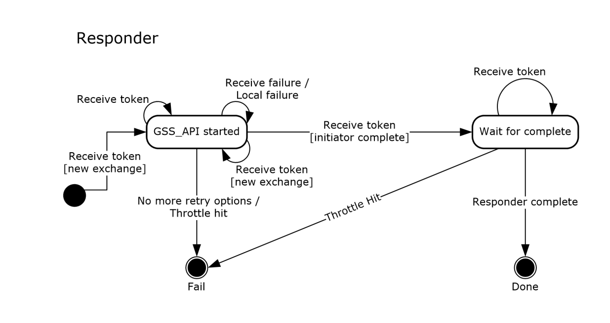
<!-- /Extracted images from page 32 -->

3  Protocol Details

3.1  Common Details

This section specifies details common to all roles in AuthIP.

Exchange State Machine

The state diagrams for a single exchange in a negotiation with the initiator and the responder are
shown in the following figure.

Figure 1: Single exchange state

The initiator MUST start a retransmission timer when it sends the first packet of an exchange. If the
timer expires before a response is received, the initiator retransmits the message and restarts the
timer. After a predefined number of retransmissions, the exchange is aborted. See section 3.1.2 for
more information on retransmission timers.

Authentication Retry State Machine

The logic for authentication retry is triggered within a negotiation when the current authentication
method fails and there are remaining authentication methods (or remaining authentication parameters
for the current methods) that can be tried before failing the negotiation. Authenticated Internet
Protocol implementations MUST support authentication retry.

The state diagrams for authentication retry for the initiator and responder are shown in the following
figure.

[MS-AIPS] - v20240916
Authenticated Internet Protocol
Copyright © 2024 Microsoft Corporation
Release: September 16, 2024

32 / 91

<!-- Extracted images from page 33 -->
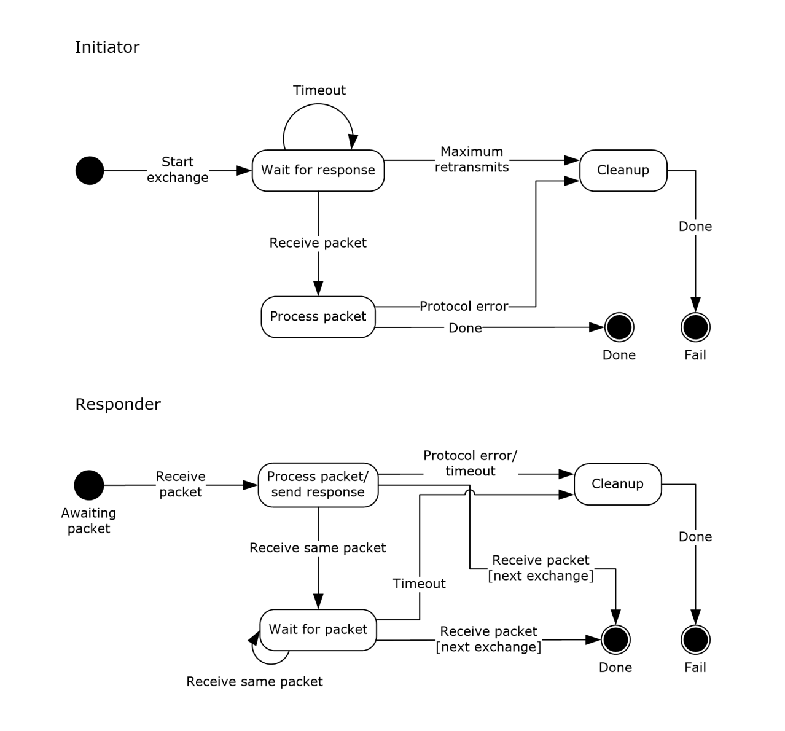
<!-- /Extracted images from page 33 -->

Figure 2: Authentication retry state (initiator and responder)

In processing the protocol error transition, the peer encountering the error MUST send a notify
message of type NOTIFY_STATUS containing the error code corresponding to the error to the peer.
See section 2.2.3.5 for details.

[MS-AIPS] - v20240916
Authenticated Internet Protocol
Copyright © 2024 Microsoft Corporation
Release: September 16, 2024

33 / 91

<!-- Extracted images from page 34 -->
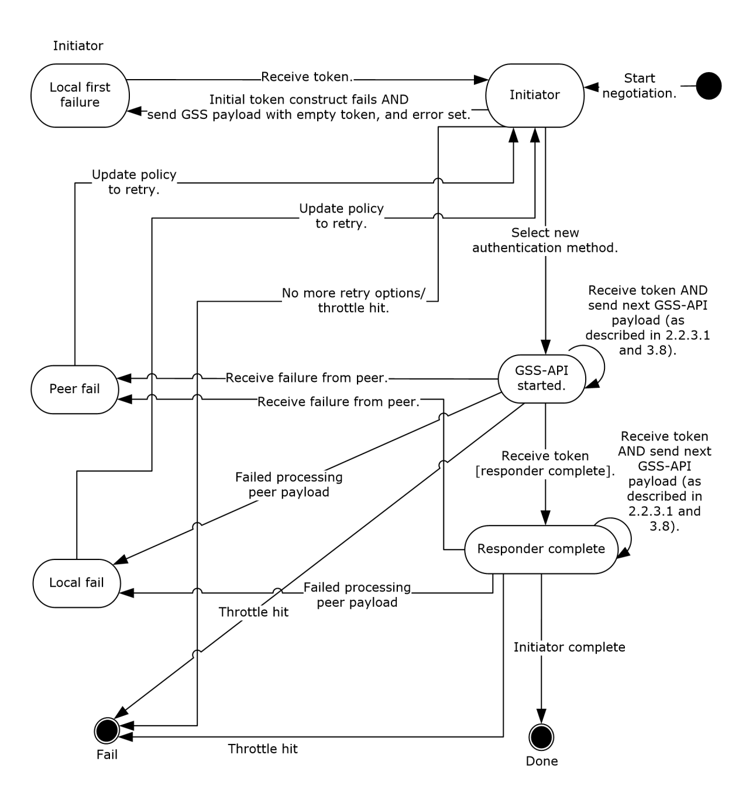
<!-- /Extracted images from page 34 -->

Figure 3: Authentication retry state (negotiation)

Analyze the figure "Authentication retry state (negotiation)" in combination with the figure
"Authentication retry state (initiator and responder)". The "Local first failure", "GSS-API started", and
"Responder complete" states in the figure "Authentication retry state (negotiation)" correspond to the
"Wait for response" state in the figure "Authentication retry state (initiator and responder)". In
processing the "send next GSS-API payload", AuthIP sends a message with a GSS-API payload as
specified in sections 2.2.3.1 and 3.8.

As specified in [RFC3546], TLS performs certificate-based authentication. The TLS protocol can be
used by the Authenticated Internet Protocol as an authentication method, in which case the TLS
packets are wrapped within GSS-API packets. The local certificate to use for the exchange is a

34 / 91

[MS-AIPS] - v20240916
Authenticated Internet Protocol
Copyright © 2024 Microsoft Corporation
Release: September 16, 2024

parameter to TLS. When multiple certificates and certification authorities are available to be matched
in order to get a successful authentication, each Authenticated Internet Protocol peer MUST retry all
its applicable credentials (for example, certificates) before failing the TLS negotiation and moving to
the next authentication method. The authentication retry is controlled by flags on the GSS-API
payload.

The rules for setting the GSS-API payload flags are as follows:









The GSS-API flags (GSS_RETRY_CURRENT_AUTHENTICATION and GSS_NEW_GSS_EXCHANGE, as
specified in section 2.2.3.1) MUST be set by the initiator to signal that it is retrying the TLS
negotiation.

The GSS-API flag GSS_NEW_GSS_EXCHANGE MUST be set by the initiator when TLS negotiation
has failed, to advance to the next authentication method.

The Status field in the GSS-API payload MUST be set to a nonzero value by the responder if no
other TLS credentials are acceptable. When this field is set, the initiator MUST advance to the next
authentication method.

The Status field in the GSS-API payload MUST be set to a nonzero value and the
GSS_RETRY_CURRENT_AUTHENTICATION flag MUST be set by the responder to instruct the
initiator that it MUST retry TLS with a different credential, if available. When the initiator retries
TLS with a different credential, it MUST set the Status field by using the nonzero value that is
received from the responder in the GSS-API payload.

Notation used to describe common details and specific roles in the remainder of section 3

This specification uses the same notation that is specified in [RFC2409] section 3.2, with a few
additions that are noted as "additional notation" in this topic:

  HDR: An ISAKMP header whose exchange type is the method. When written as HDR*, it

indicates payload encryption.

  Security Association (SA): An SA negotiation payload that embeds one or more Proposal and

Transform payloads. See [RFC2409] section 3.4.

  CKY-I and CKY-R: The initiator cookie and responder cookie, respectively, from the ISAKMP

header. These are used together with initiator and responder IP addresses as a unique key for
looking up each session.





g^xy: The Diffie-Hellman shared secret.

g(qm)^xy (additional notation): The Diffie-Hellman secret in the quick mode negotiation phase.

  KE: The Key Exchange payload that contains the public information that is exchanged in a Diffie-

Hellman exchange.

  Nx: The Nonce payload. x can be "I" or "r" for the ISAKMP initiator and responder, respectively.

x(qm) is the quick-mode nonce.







IDx: The Identity payload for "X". x can be: "I" or "r" for the ISAKMP initiator and responder,
respectively. The Identity payload format for the Internet DOI is specified in [RFC2407] section
4.6.2.

hash(msg) (additional notation): The negotiated hash algorithm for the main mode security
association (MM SA). Msg is the quantity to hash.

sha1 (additional notation): The SHA-1 hash function, as specified in [FIPS180]. [SHA256] is used
until the hash function has been negotiated.

[MS-AIPS] - v20240916
Authenticated Internet Protocol
Copyright © 2024 Microsoft Corporation
Release: September 16, 2024

35 / 91



prf(key, msg): The keyed pseudorandom function (PRF) that is used to generate a deterministic
output that appears pseudorandom. PRF is used both for key derivations and for authentication
(for example, as a keyed MAC). PRF is implemented as an HMAC of the negotiated hash
algorithm, as defined in [RFC2104].

  SKEYID: A string that is derived from a secret that is known only to the active players in the

exchange.

  SKEYID_e: The keying material that is used by the ISAKMP SA to protect its messages.

  SKEYID_a: The keying material that is used by the ISAKMP SA to authenticate its messages.

  SKEYID_d: The keying material that is used to derive keys for non-ISAKMP SAs.

  SKEYID_em: The keying material that is used by AuthIP to authenticate extended mode

negotiation messages.

  Notify (additional notation): The ISAKMP Notify payload as specified in [RFC2408] section 3.14.

  Authx (additional notation): The authentication proof for x, where x is either the first or second

authentication and has a value of 1 to 4. It is embedded in a Hash payload.

  Auth payload (auth): The payload that is constructed by looking up the peer authentication
database (PAD) and the security policy database (SPD). The Auth payload contains the
authentication methods that are valid for this negotiation.

  VID (additional notation): The Vendor ID payload.

  KeyDict (In): Key Dictation payload used for supplying dictator's inbound QM SA keys.

  KeyDict (Out): Key Dictation payload used for supplying dictator's outbound QM SA keys.

  SKWt : Key Dictation/Weight payload used for negotiating key dictation, that is, negotiating which

end, if any, will supply the key.

  A-KDF(Z, OtherInfo, keydatalen) (additional notation): Invoke the Key Derivation Function (KDF),

as specified in [SP800-56A]. The Key Derivation Function uses the negotiated main mode hash
function as its hash function.

  Crypto-ID (additional notation): A 16-bit number that corresponds to the negotiated main mode

encryption algorithm. The table that maps the algorithm identifiers to the corresponding numbers
is defined in [RFC2409] Appendix A.

  GSS-APIsecret, GSS-APIsecret_em (additional notation): The session key that is obtained from a
successful GSS-API exchange in main mode (MM) and extended mode (EM), respectively, as
specified in [GSS].





hashLength, cryptLength (additional notation): The length, in bytes, of the key for the negotiated
MM SA authentication and encryption algorithms.<10>

ipsechashLength, ipseccryptLength (additional notation): The length, in bytes, of the key for the
QM SA authentication and encryption algorithms.

  #n (additional notation): Numbers the packet within a series of exchanges for reference. This

information is not on the wire.



[ x ]: Indicates that x is optional.

[MS-AIPS] - v20240916
Authenticated Internet Protocol
Copyright © 2024 Microsoft Corporation
Release: September 16, 2024

36 / 91

3.1.1  Abstract Data Model

This section describes a conceptual model of possible data organization that an implementation
maintains to participate in this protocol. The described organization is provided to facilitate the
explanation of how the protocol behaves. This document does not mandate that implementations
adhere to this model as long as their external behavior is consistent with the behavior that is
described in this document.

The flags bit semantics used by this document are as follows: For a flag, its "value" signifies a mask
which, when its bitwise logical AND with the flags field is computed, yields either a zero value (all zero
bits) if the flag is unset (set to FALSE), and a nonzero value otherwise. For example, a flag
mask/value of 0x01 signifies that the bitwise logical AND of a single-byte flag field with 0x01 is zero if
and only if the flag is set to FALSE. Assuming no other flag masks/values for this field, then, both
0x00 and 0x01 are valid values for this single-byte flag field--the former corresponding to the flag
being unset, and the latter to the flag being set.

The main data elements that are required by any implementation are:

  Main mode security association (MM SA) database: A database that contains the operational

state for each MM SA. The entry for each MM SA contains the following data elements:

  Current role: type: flag. Used to store the current role (initiator or responder) for use in a

key generation algorithm as described in 3.1.7.4.

  Current state: type: DWORD. Stores the current message number within a negotiation, for

use in header construction as described in 2.2.1.



Per-negotiation timers: type: System timer. Authentication protocol timers as described in
3.1.2.

  Sequence numbers: type: DWORD. Stores sequence numbers for main mode (MM), quick
mode, extended mode (EM), and notification exchange types. The sequence numbers
MUST start at zero and MUST be incremented for each exchange. The sequence number is
used as the seqNUM field of the Crypto payload.

  Cryptographic parameters: type: array of {Authentication attribute (type: DWORD)}. Stores

Cryptographic parameters for the MM SA as described in the attribute class table in [RFC2409]
appendix A. The attributes used are: encryption algorithm, hash algorithm, group description,
life type, and life duration. In addition, a set of one or more authentication methods (defined
as in the same table) is included.

  Auth methods: type: array of {AuthMethodType (type: DWORD)}. A set of one or more

authentication methods (as defined in [RFC2409] Appendix A and section 1.7) for main mode
(MM).

  Auth methods (EM): type: array of {AuthMethodType (type: DWORD)}. A set of one or more

authentication methods (as defined in [RFC2409] Appendix A and section 1.7) for extended
mode (EM).

  Quick mode Pointers: type: array of indexes into the SAD described below. A list of indexes
for SAD entries corresponding to QM SAs established under the protection of the MM SA.

  NAT traversal state. See [RFC3947] section 3.2. The state contains a BOOLEAN: isNatPresent.
This MUST be initialized to FALSE. It is set to true if NAT is detected as described in [RFC3947]
section 3.2.

  Negotiation retransmission timer context: This timer context keeps track of the packet being

retransmitted, and how many retransmissions have currently been sent.

[MS-AIPS] - v20240916
Authenticated Internet Protocol
Copyright © 2024 Microsoft Corporation
Release: September 16, 2024

37 / 91

  Request Non-notify Message pending Queue: When there is an outstanding notify request any

non-notify request generated will be queued here until an ACK arrives (see section 3.1.7.5).

  DoS protection mode bit:  A BOOLEAN value indicating whether the host is in DoS protection

mode (see section 3.1.7.6).











Explicit credentials MM: A BOOLEAN value indicating whether explicit credentials were used
in the MM negotiation (see section 3.8.7.1).

Explicit credentials EM: A BOOLEAN value indicating whether explicit credentials were used in
the EM negotiation (see section 3.8.7.1).

Impersonation active MM: A BOOLEAN value indicating whether Impersonation is enabled  in
the MM negotiation (see section 2.2.3.1).

Impersonation active EM: A BOOLEAN value indicating whether Impersonation is enabled  in
the EM negotiation (see section 2.2.3.1).

ImpersonationHandle: A handle {DWORD} that represents the user corresponding to this MM
SA.

  Connection state table: Stores a set of connection entries. This table manages the connection
state necessary to perform an authFW mode. These connection entries correspond to active
TCP/UDP/ICMP, or protocol-only connections.

The possible connection entries are:

  V4 TCP/UDP state entry: {IPv4 source address {DWORD}, IPv4 destination address

{DWORD}, IP protocol {DWORD}, source port {DWORD}, destination port {DWORD}.

  V6 TCP/UDP state entry: {IPv6 source address {16 bytes}, IPv6 destination address {16

bytes}, IP protocol {DWORD}, source port {DWORD}, destination port {DWORD}.

  V4 ICMP state entry: {IPv4 source address {DWORD}, IPv4 destination address
{DWORD}, IP protocol {DWORD}, ICMP type {DWORD}, ICMP code {DWORD}}
[RFC792].

  V6 ICMP state entry: {IPv6 source address {16 bytes}, IPv6 destination address {16

bytes}, IP protocol {DWORD}, ICMP type {DWORD}, ICMP code {DWORD}} [RFC792].

  V4 protocol-only state entry: {IPv4 source address {DWORD}, IPv4 destination address

{DWORD}, IP protocol {DWORD}}.

  V6 protocol-only state entry: {IPv6 source address {16 bytes}, IPv6 destination address

{16 bytes}, IP protocol {DWORD}.

Every connection state entry also includes:



IsAuthenticatedFirewallConnection Type: BOOLEAN. Indicates whether the connection uses
Authenticated Firewall Mode (section 3.10).

  AuthFWAuthorized Type: BOOLEAN. In the case of an Authenticated Firewall Mode

connection, indicates whether an authenticated packet has been received (see section
3.10.5.1).





PeerIsNegotiationDiscoveryCapable: Type: BOOLEAN.  Indicates whether the peer
associated with the connection has indicated support for Negotiation Discovery (See [MS-
IKEE], section 3.7).

ImpersonationHandle: Type {DWORD} A handle that represents the user corresponding to
the MM SA associated with the connection.

38 / 91

[MS-AIPS] - v20240916
Authenticated Internet Protocol
Copyright © 2024 Microsoft Corporation
Release: September 16, 2024



IsImpersonationConnection: Type: BOOLEAN. Indicates whether impersonation was used
in the EM negotiation for the MM SA associated with the connection.

The MM SA is indexed by the local and peer IP address and the initiator and responder cookies
that are found in the ISAKMP header, as in IKEv1.

  Security policy database (SPD): The SPD and its management operations are specified in

[RFC4301] section 4.4.1. The SPD that is referred to in this specification contains rules that
describe whether and how IPsec protection is applied to inbound or outbound IP traffic. The SPD
is looked up by using tuples that contain flow information for the packet. The encapsulation type
is already a part of the SPD. This specification adds two new encapsulation values to the
encapsulation type. See section 3.10.4.2.

This specification also adds a policy option to enable impersonation, which is configurable per-SPD
entry. The corresponding state consists of two Boolean values: RequireImpersonationMM and
RequireImpersonationEM. It also adds a BOOLEAN LocalKeyDictationAttempt, which indicates
whether the local end is attempting to be the key dictator. When set, an additional DWORD
KeyDictationWeight stores the local weight used to negotiate the key dictator with the peer.

This specification adds a policy option that SHOULD<11> enable Kerberos authentication via
proxy, which is configurable per SPD entry. The corresponding option consists of a STRING value:
UseKerberosProxyURL.

The EM authentication SPD adds local and remote ports to the SPD selector. See [RFC4301],
section 4.4.1.1. Associated with each selector are the EM Auth methods. These are an array of
{AuthMethodType (type: DWORD)}, which is a set of one or more authentication methods (as
defined in [RFC2409] Appendix A and section 1.7) for extended mode (EM). Each authentication
method's specific configuration is specified in that authentication method's documentation. For
instance, 1-way certificate authentication versus mutual certificate authentication configuration is
covered in [RFC5246].

Peer authentication database (PAD): The PAD and its management operations are specified in
[RFC4301] section 4.4.3. The PAD that is referred to in this specification contains rules that
describe whether and how the Authenticated Internet Protocol negotiates SAs with a remote peer.
The PAD is looked up by using tuples that are composed of local and remote IP addresses.





This specification adds:

  Allow Explicit credentials MM: Type: BOOLEAN. Indicates whether the use of explicit
credentials is permitted during main mode security association (MM SA) negotiation.

  Allow Explicit credentials EM: Type: BOOLEAN. Indicates whether the use of explicit credentials

is permitted during extended mode (EM) SA negotiation.

  Security association database (SAD): The SAD contains the parameters of each QM SA. The SAD

and its management operations are specified in [RFC4301] section 4.4.2.

This specification adds:







IsAuthenticatedFWSA: Type: BOOLEAN. This flag, when set, indicates that the SA is an
authFW mode SA.

ImpersonationHandle: Type: DWORD. A handle to the impersonated identity associated with
the selector of each SAD entry. See [RFC4301] section 4.4.1.1.

The NAT traversal state in the MM SA is propagated from the MM SA to all SAD entries
established using that MM SA.

  KeyDictationWtLocal: Type: DWORD Set if the local end wants to dictate quick mode keys to

peer.

39 / 91

[MS-AIPS] - v20240916
Authenticated Internet Protocol
Copyright © 2024 Microsoft Corporation
Release: September 16, 2024

  KeyDictationWtRemote: Type: DWORD Set if, during negotiation, it is discovered that the peer

end wants to dictate quick mode keys to peer.



LocalEndWantsToDictateKey: Type: BOOLEAN Set if, during negotiation, it is discovered that
the local end wants to dictate the key. The KeyDictationWtLocal value is valid only when this is
set.

  KeyDictationLocalWinner: Type: BOOLEAN Set if, during negotiation, it is discovered that the

local end has a higher Key Dictation Weight.

  KeyDictationRemoteWinner: Type: BOOLEAN Set if, during negotiation, it is discovered that

the remote end has a higher Key Dictation Weight.

3.1.2  Timers

The following timers are used by the Authenticated Internet Protocol:<12>

  Negotiation retransmission timer (for each main mode security association): Triggers a

message retransmission by the initiator.

  Notify retransmission timer (for each MM SA): Triggers a Notification payload retransmission.

  Authentication retry timer (for each MM SA): Triggers the authentication retry.

  Responder time-out timer (for each MM SA): Controls how long the responder waits for a

message from the initiator.

  MM SA lifetime (for each MM SA): The MM SA lifetime is negotiated between the peers.

  NAT-T keep-alive timer (for each MM SA): This timer doesn't affect any MM SA state. This timer

only controls sending the NAT-T keep alive packet, as specified in [RFC3948] section 4.

  Quick mode rekey timer (for each MM SA): This timer is used during quick mode rekey.

  Quick mode security association (QM SA) lifetime (for each QM SA): The lifetime for QM SAs

is specified in bytes or seconds. After the lifetime of bytes or seconds expires, the Ipsec
implementation MUST start a new quick mode exchange. The Authenticated Internet Protocol
then acts as the initiator for the rekey.



Per-Connection state entry timer: All entries in the connection state table (except the TCP state
entries) each have their own timer. This timer triggers connection entry state deletion.

3.1.3  Initialization

The following flags MUST be initialized to FALSE in the MM SA database:









Explicit credentials MM

Explicit credentials EM

Impersonation active MM

Impersonation active EM

The ImpersonationHandle MUST be set to 0.

For each QM SA:



LocalEndWantsToDictateKey: Initialized to the LocalKeyDictationAttempt field of the SPD.

  KeyDictationWtLocal: Initialized to the KeyDictationWeight field of the SPD.

40 / 91

[MS-AIPS] - v20240916
Authenticated Internet Protocol
Copyright © 2024 Microsoft Corporation
Release: September 16, 2024

  KeyDictationWtRemote: Initialized to zero.

3.1.4  Higher-Layer Triggered Events

3.1.4.1  IP Traffic Match SPD Protect-using-IPsec Rule

When inbound or outbound packets trigger AuthIP negotiation based on standard Ipsec processing
rules ([RFC4301] section 5), the protocol acts as the initiator for this negotiation and sends message
#1 of the first main mode (MM) exchange (section 3.2.4). The initiator MUST create a main mode
security association (MM SA) entry in its main mode security association database (MMSAD)
containing encryption algorithm, hash algorithm, group description, life type, and life duration values
before sending message #1.

In the new MMSAD entry, the initiator MUST also copy the values "Require Impersonation MM" and
"Require Impersonation EM" from the SPD to the Impersonation active MM and Impersonation active
EM flags, and copy the ImpersonationHandle value representing the user that generated the traffic to
ImpersonationHandle.

3.1.4.2  Explicit IPsec Negotiation Request

The Authenticated Internet Protocol negotiation can be explicitly triggered by the user or
administrator prior to packets being sent or received. The protocol then acts as the initiator for this
negotiation. This trigger is a local higher layer triggering event and does not otherwise affect SA
negotiation. When triggered this way, the initiator MUST create a main mode security association
(MM SA) entry in the main mode security association database (MMSAD) containing encryption
algorithm, hash algorithm, group description, life type, and life duration values before sending
message #1 (section 3.2.4).

3.1.5  Processing Events and Sequencing Rules

Authenticated Internet Protocol negotiations are tracked according to the same rules that are
specified for IKE negotiations, as specified in [RFC2409]. Each Authenticated Internet Protocol
negotiation is uniquely identified by the pair of the initiator cookie and responder cookie (plus UDP
ports and IP addresses of each peer). The cookies are transmitted in the ISAKMP header, which
begins every message.

Within an Authenticated Internet Protocol negotiation, quick mode exchanges are demultiplexed by
using the message ID field of the IKE header. The message ID field MUST be zero during main
mode (MM) and MUST be one during extended mode (EM).

All Authenticated Internet Protocol exchanges follow the retransmission state transitions that are
presented in section 3.1.

3.1.5.1  Receiving a Reliable Notify Message

When an Authenticated Internet Protocol peer receives a Notify message with
RELIABLE_NOTIFY_FLAG set (as specified in section 2.2.3.5), it MUST send an acknowledgment
consisting of a Notify message of type NOTIFY_ACK. The data of the Notify message is initialized to
contain the sequence number from the Crypto header of the message being acknowledged.

After processing and acknowledging the notify, the recipient of the notify MUST NOT delete the MM
SA until quick mode delete processing has been completed for all quick modes formed on this MM
SA. The MM SA MUST NOT be used to establish any new QM SAs. Moreover, the QM SAs associated
with the MM SA MUST NOT be deleted until deletion is triggered by other protocol events, as specified
in [RFC2409] section 5.5. Once all the QM SAs associated with the MM SA have been deleted, the MM
SA MUST be deleted.

41 / 91

[MS-AIPS] - v20240916
Authenticated Internet Protocol
Copyright © 2024 Microsoft Corporation
Release: September 16, 2024

3.1.5.2  Receiving an Unreliable Notify Message

When an Authenticated Internet Protocol peer receives a Notify message with
RELIABLE_NOTIFY_FLAG not set (as specified in section 2.2.3.5) then it MUST handle it exactly like a
reliable notify (section 3.1.5.1) except for not sending back an acknowledgment.

3.1.5.3  Receiving a Reliable Notify Acknowledgement

When an Authenticated Internet Protocol peer receives a Notify message of type NOTIFY_ACK (see
section 2.2.3.5 for verification details), it MUST check to see if any Notify messages are queued
waiting for the notify ACK to arrive. If so, the first non-Notify message in the Request Non-notify
Message pending Queue is sent at this time (section 3.1.7.5).

3.1.6  Timer Events

3.1.6.1  Negotiation Retransmission Timer

The negotiation retransmission timer is started by the initiator when it sends a message. Upon
expiration of this timer, the initiator MUST retransmit the message and increment the retransmission
counter. After seven retransmissions (tracked by the Retransmission timer context of the MM SA
(section 3.1.1), the initiator MUST delete the state for the corresponding MM SA.

3.1.6.2  Notify Retransmission Timer

The notify retransmission timer is started by the initiator or the responder when it sends a Notify
payload within a message. Upon expiration of this timer, the initiator MUST retransmit the Notify
payload and increment the retransmission counter. After 7 retransmissions, the initiator MUST delete
the state for the corresponding main mode security association (MM SA). During AuthIP
shutdown, however, the delete notification messages (section 3.1.7.3) are retransmitted at most once
if not acknowledged.

3.1.6.3  Responder Time-Out Timer

This timer MUST be started by the responder upon receipt of a message from the initiator if the
responder expects a subsequent message from the initiator. Upon expiration of this timer, the
responder MUST delete the corresponding main mode security association (MM SA).

3.1.6.4  MM SA Lifetime

The main mode security association (MM SA) lifetime is negotiated between peers. Upon
expiration of this timer, the initiator or responder MUST delete the corresponding MM SA.

3.1.6.5  QM Rekey Timer

This timer starts at the beginning of a quick mode rekey. Upon expiration, any other quick mode
security associations (QM SAs) MUST be deleted.

3.1.6.6  Connection State Timer Events

On per-connection timer expiry, the connection state for the timer's associated connection MUST be
deleted from the connection state table.

TCP connection state maintenance is described in [RFC793] section 3.4.

[MS-AIPS] - v20240916
Authenticated Internet Protocol
Copyright © 2024 Microsoft Corporation
Release: September 16, 2024

42 / 91

3.1.7  Other Local Events

3.1.7.1  IP Address Deletion

The Authenticated Internet Protocol reacts to IP address Plug and Play notifications. If an IP address
on the system is deleted, the Authenticated Internet Protocol MUST delete all corresponding SAs and
send a Notify payload of Notify type NOTIFY_STATUS (2.2.3.5) to the peer for each deleted SA. This
packet MUST be constructed as follows:

  HDR: The ISAKMP header MUST be identical to the IKE Informational packet, as specified in
[RFC2409] section 5.7, and the exchange type MUST be 246 (NOTIFY exchange type).

  Notify (Status): This notify MUST have the RELIABLE_NOTIFY_FLAG, as specified in section

2.2.3.5, set to TRUE.

3.1.7.2  AuthIP Shutdown

Upon shutdown of the AuthIP protocol implementation, the Authenticated Internet Protocol MUST
send delete notification messages (Notify payload of Notify type NOTIFY_STATUS) for all SAs (section
2.2.3.5) and starts a retransmission timer (section 3.1.6.2)

This packet MUST be constructed as follows:

  HDR: The ISAKMP header MUST be identical to the IKE Informational packet, as specified in
[RFC2409] section 5.7, and the exchange type MUST be 246 (NOTIFY exchange type).

  Notify (Status): This notify MUST have the RELIABLE_NOTIFY_FLAG, as specified in section

2.2.3.5, set to TRUE.

3.1.7.3  IPSec Policy Change

Upon policy change, the Authenticated Internet Protocol MUST revalidate all SAs against the new
policy, delete SAs that do not match the new policy, and send a delete notification to the peer for each
such SA (section 2.2.3.5).

This delete notification packet MUST be constructed as follows:

  HDR: The ISAKMP header MUST be identical to the IKE Informational packet, as specified in
[RFC2409] section 5.7, and the exchange type MUST be 246 (NOTIFY exchange type).

  Notify (Status): This notify MUST have the RELIABLE_NOTIFY_FLAG, as specified in section

2.2.3.5, set to TRUE.

3.1.7.4  AuthIP Key Material Generation

A number of Authenticated Internet Protocol exchanges involve the generation of keying material.
Each AuthIP peer MUST generate keying material as follows.

Notation:

This specification uses SKEYID_d, SKEYID_a, and SKEYID in the same manner as described in
[RFC2409] section 5.

A-KDF refers to the key derivation function specified in [SP800-56A]. The output of the [SP800-56A]
KDF is the bit string DerivedKeyingMaterial of length ByteLength bytes.

"|" signifies concatenation of information. For example, X | Y is the concatenation of X with Y, as
specified in [RFC2409].

43 / 91

[MS-AIPS] - v20240916
Authenticated Internet Protocol
Copyright © 2024 Microsoft Corporation
Release: September 16, 2024

 Define Function: OtherInfo (pubInof, privInfo) as:
AlgorithmID|PartyUInfo|PartyVInfo|pubInfo|privInfo

The function OtherInfo takes as input (pubInfo, privInfo), and performs the given concatenation.
AlgorithmID, PartyInfo, and PartyVInfo are known externally as defined below, and hence not passed
directly to the function. For instance, when run for SKEYID:

{} indicates function invocation.

 COMPUTE SKEYID as A-KDF
   (Z, {OtherInfo} (SuppPubInfo-SKEYID, SuppPrivInfo-SKEYID),
    hashLength)

This substitutes SuppPubInfo-SKEYID into pubInfo and SuppPrivInfo-SKEYID into privInfo, and then
executes the OtherInfo concatenation. Hence the variables pubInfo and privInfo themselves are
function parameters, whose values are filled in by the caller.

 Set AlgorithmID to Crypto-ID
 Set PartyUInfo to CKY-I
 Set PartyVInfo to CKY-R

 SuppPubInfo-SKEYID = Ni|Nr
 SuppPubInfo-SKEYID_d = Ni|Nr|0x00
 SuppPubInfo-SKEYID_a = Ni|Nr|0x01
 SuppPubInfo-SKEYID_e = Ni|Nr|0x02

 Set SuppPrivInfo-SKEYID to GSS-APIsecret
 Set SuppPrivInfo-SKEYID_em to GSS-APIsecret_em
 Set SuppPrivInfo-SKEYID_d to SKEYID

 SuppPrivInfo-SKEYID_a = SKEYID_d|SKEYID
 SuppPrivInfo-SKEYID_e = SKEYID_a|SKEYID

 If DH is used then
 set Z to g^xy
 Else
 set Z to a zero-length byte string
 END IF

 COMPUTE SKEYID_d as A-KDF (Z, {OtherInfo} (SuppPubInfo-SKEYID_d,
   SuppPrivInfo-SKEYID_d), hashLength)
 COMPUTE SKEYID_a as A-KDF (Z, {OtherInfo} (SuppPubInfo-SKEYID_a,
   SuppPrivInfo- SKEYID_a), hashLength)
 COMPUTE SKEYID_e as A-KDF (Z, {OtherInfo} (SuppPubInfo-SKEYID_e,
   SuppPrivInfo-SKEYID_e), max(hashLength, cryptLength))
 COMPUTE SKEYID_em as A-KDF (Z, {OtherInfo} (SuppPubInfo-SKEYID,
   SuppPrivInfo-SKEYID_em), hashLength)

 SuppPubInfo-IpsecEncryptKey = MessageId|SPI|Ni(qm)|Nr(qm)|SKEYID_d

 if EM exchanges THEN
 SuppPrivInfo-IpsecEncryptKey = Ni(mm)|Nr(mm)|SKEYID_em
 ELSE
 Set SuppPrivInfo-IpsecEncryptKey = zero-length byte string
 END IF

 COMPUTE IPSecEncryptKey as A-KDF (Z(qm),
   OtherInfo(SuppPubInfo-IpsecEncryptKey,
   SuppPrivInfo-IpsecEncryptKey), ipsechashLength+ipseccryptLength)
 COMPUTE Auth1 as prf(SKEYID,
   hash(#4|(#3|sha256(#2|sha256(#1))))|0x01)
 COMPUTE Auth2 as prf(SKEYID, hash(#4|hash(#3|sha256(#2|sha256(#1))))|0x02)

[MS-AIPS] - v20240916
Authenticated Internet Protocol
Copyright © 2024 Microsoft Corporation
Release: September 16, 2024

44 / 91

For the first two payloads, the cumulative hash for Auth1 MUST start with a hard-coded sha256 (as
specified in [SHA256]) because a hash method has not yet been negotiated between the peers.
Starting with payload #3, the peers MUST use the negotiated hash algorithm.

Extended mode (EM) also uses the following hashes.

 COMPUTE Auth3 as prf(SKEYID_em, hash(#12|hash(#11|hash(#10|
   hash(#9|hash(#8|hash(#7))))))|Auth1
 COMPUTE Auth4 as prf(SKEYID_em,
hash(#12|hash(#11|hash(#10|hash(#9|hash(#8|hash(#7))))))|Auth2

The length of the hash chains for computing Auth3 and Auth4 depends on the number of messages in
the exchange. Each peer MUST hash all the IKE payloads as plaintext, for example, unencrypted.

The quick mode security association (QM SA) encryption key MUST be set to the first part of
IPsecEncryptKey (up to ipseccryptLength bytes). The quick mode authentication key MUST be set to
the remainder of IPsecEncryptKey.

DES-CBC [RFC2405] and TripleDES-CBC [RFC2451] require the parity and weak key checks. This
formatting MUST be applied to SKEYID_e when using these algorithms.

For DES-CBC and TripleDES-CBC, the key MUST be computed in the following way:

1.  Truncate the key to 8 bytes (DES-CBC) or 24 bytes (TripleDES-CBC).

2.  For each byte, if the number of bits set to one in the byte is even, adjust the least significant bit

so that the number of bits set to one is odd.

3.1.7.5  Sending QM Notify Messages

Each Authenticated Internet Protocol peer MUST allow only one outstanding Notify message affiliated
with a QM SA (section 2.2.3.5) at a time. The initiator MUST NOT send a Notify message until it has
received a response to all previous messages. This behavior does not apply to Notify messages that do
not have the Reliable message flag set, but MUST include Notify messages that have the Reliable
message flag set.

If the sender of a Notify message generates one or multiple Notify messages while it waits for a
response to a previously sent message, each message MUST be queued in the Request Non-notify
Message pending Queue (section 3.1.1) until all preceding Notify messages are acknowledged (section
3.1.5.3). If there are no outstanding notifies the packet MUST be sent immediately.

3.1.7.6  Enter DoS Protection Mode

When the number of SAs in a state other than Quick Mode Initiator Done or Quick Mode Responder
Done states is at least 500, the host MUST enter DoS protection mode. This mode is used by the
responder to handle denial of service protection attacks. While the host is in DoS protection mode, it
MUST behave as specified in [MS-IKEE] section 3.9.

3.1.7.7  New Connection Initiation

Whenever a new connection is initiated, a new entry MUST first be created and stored in the
connection state table (see section 3.1.1). The IsAuthenticatedFirewallConnection and
AuthFWAuthorized flags MUST be set to FALSE. The type of the new entry MUST match the IP

45 / 91

[MS-AIPS] - v20240916
Authenticated Internet Protocol
Copyright © 2024 Microsoft Corporation
Release: September 16, 2024

<!-- Extracted images from page 46 -->
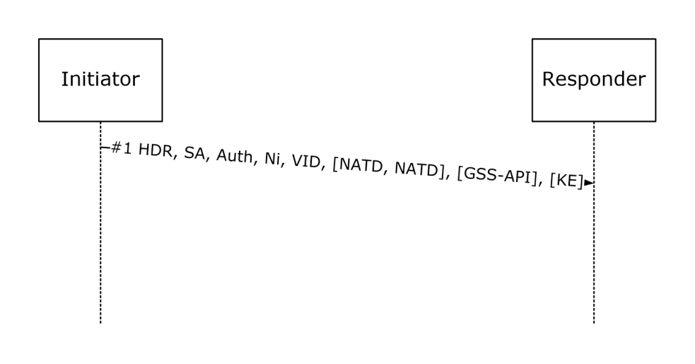
<!-- /Extracted images from page 46 -->

version (IPv4 or IPv6) and the protocol (TCP/UDP, ICMP, or protocol-only) of the new connection.
When an entry is created for a non-TCP connection, a per-connection timer MUST be set, as specified
in section 3.10.4. The IsImpersonatedConnection flag MUST be set to FALSE. ImpersonationHandle
MUST be set to a locally unique ID value that represents the user who initiated the connection. This ID
value MUST stay constant for the given user for each new connection initiated by the user.

The host determines which SA to use to secure the traffic as specified in [RFC4301] section 4.4.2.2. If
the SA is an authFW SA (that is, if IsAuthenticatedFWSA is set to TRUE for the SA), then the
IsAuthenticatedFirewallConnection and AuthFWAuthorized flags MUST be set to TRUE.

The connection state tracking timer for the connection MUST be reset back to its default time every
time a packet is sent or received on that connection.

3.2  AuthIP Main Mode Initiator Role

3.2.1  Abstract Data Model

See section 3.1.1.

3.2.2  Timers

On receiving the new MM request, the responder MUST set the Current role to responder. See
sections 3.1.1 and 3.1.2.

3.2.3  Initialization

See section 3.2.4.

3.2.4  Higher-Layer Triggered Events

When the higher level event described in section 3.1.4 is triggered, it MUST create a main mode
security association (MM SA) in its main mode security association database (MMSAD)
containing encryption algorithm, hash algorithm, group description, life type, and life duration values
and send the first main mode exchange packet with the following form:

Figure 4: Main Mode First Exchange Packet

The packet MUST be constructed as follows:

[MS-AIPS] - v20240916
Authenticated Internet Protocol
Copyright © 2024 Microsoft Corporation
Release: September 16, 2024

46 / 91

  HDR: The ISAKMP header MUST be identical to the first IKE phase 1 initiator header (see

section 2.2.1), except that the exchange type MUST be 243 (main mode exchange type). The
Encrypted flag SHOULD NOT be set.



The remaining payloads MUST follow a non-encrypted Crypto payload. If an error has occurred at
this stage or before, the responder MUST silently discard the message.

  Security association (SA): The SA payload MUST be determined by looking up the PAD and the
SPD, and constructed in an identical way to the IKE SA payload, as specified in [RFC2408] section
3.4. If a Diffie-Hellman exchange is required by the authentication method (for example, the
authentication method is anonymous or the NTLM authentication protocol), the Diffie-Hellman
group MUST be the same for all proposals in the SA payload. If a Diffie-Hellman exchange is not
required, then the DH attribute in the SA (see [RFC2409] Appendix A, attribute classes) MUST be
0, and the KE payload MUST NOT be present.

  Auth payload (auth): The Auth payload MUST be constructed by looking up the PAD and the SPD
to determine the list of authentication methods that are valid for this negotiation, and including
exactly this list of methods.

  Ni: The initiator Nonce payload MUST be constructed as specified in [RFC2408] section 3.13.
Nonces MUST be cryptographically strong random numbers generated by using a [FIPS140]-
compliant random-number generator.

  VID: A sequence of Vendor ID payloads that indicate the capabilities supported. These payloads

MUST be constructed as specified in [RFC2408] section 3.16.

  NATD: Nat discovery payloads. If the IP addresses of the AuthIP peers are IPv4 addresses, these
payloads SHOULD be constructed as specified in [RFC3947] section 3.2 and included. If the IP
addresses of the AuthIP peers are IPv6 addresses, then these payloads SHOULD NOT be included.

  GSS-API: The GSS-API payload is optional. If the initiator already possesses the peer security

principal name (for example, by locating it in the SAD), the initiator MUST use the peer security
principal name to construct the GSS-API payload as specified in [GSS] and section 2.2.3.1. If on
the other hand the initiator does not have the peer security principal name, this payload MUST
NOT be sent.



[KE]: The GSS-API payload is optional. The KE payload, if included, MUST be identical to the one
specified in [RFC2409] section 5. The KE payload MUST be included if the authentication method is
anonymous or NTLM. Otherwise, it MUST NOT be included.

After sending the packet, the main mode initiator MUST transition to the Main Mode First Generalized
Packet Sent state.

In addition to the message specified above, the initiator MUST also send the first message sent by an
IKEv1 initiator, as specified in [RFC2409] section 5. This message SHOULD<13> contain the "MS-
MamieExists" IKE Vendor ID payload.

The initiator MUST also set the negotiation retransmission timer for each of these messages (section
3.1.2).

3.2.5  Processing Events and Sequencing Rules

3.2.5.1  Received Generalized Main Mode First Exchange Response

When the initiator receives a response:

[MS-AIPS] - v20240916
Authenticated Internet Protocol
Copyright © 2024 Microsoft Corporation
Release: September 16, 2024

47 / 91

<!-- Extracted images from page 48 -->
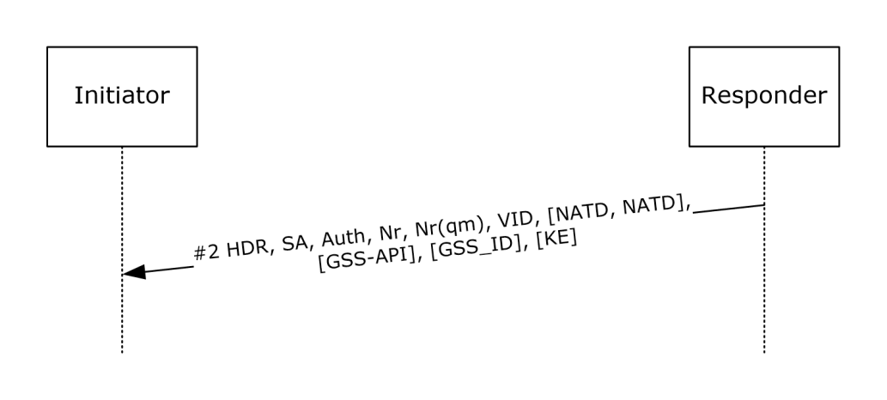
<!-- /Extracted images from page 48 -->

Figure 5: Main Mode First Exchange Response packet

On receiving a packet when initiator is in the Main Mode First Generalized Packet Sent state, the
initiator MUST verify that the exchange type in the ISAKMP header of the response indicates that
the responder supports the Authenticated Internet Protocol.

If so, the initiator MUST transition to the Main Mode Initiator First exchange Done state.

The initiator MUST also verify that the message is constructed as follows:

  HDR: The ISAKMP header MUST be identical to the first IKE phase 1 initiator header (see section
2.2.1), except that the exchange type MUST be 243 (main mode exchange type). The Encrypted
flag SHOULD NOT be set.

1.  The initiator MUST verify that the encrypted flag is set to zero.

2.  The initiator MAY<14> verify that the message ID field is zero.



The remaining payloads MUST follow an unencrypted Crypto payload.

  Security association (SA): The SA payload MUST be verified by looking up the PAD and the

SPD and checking if the proposed transforms are acceptable, as specified in [RFC2408] section
5.4.

  Auth payload (auth): The Auth payload MUST be verified by looking up the PAD and the SPD and

confirming that the chosen authentication method by peer is acceptable as specified in [RFC2408]
section 5.4.

If the NATD payloads are present, they MUST be processed as specified in [RFC3947] section 3.2. If
the presence of a NAT is detected ([RFC3947] section 3.2), then the isNatPresent setting MUST be set
to TRUE (see section 3.1.1).

The same Vendor ID interpretation rules as specified in [MS-IKEE] section 3.7.5.1 MUST be used to
determine whether to mark the peer as Negotiation Discovery capable (by setting the
PeerIsNegotiationDiscoveryCapable flag) in the MMSAD. If the cryptographic parameters in the
MMSAD entry for this main mode SA indicate that the initiator was using Diffie Hellman key
exchange, then the initiator MUST additionally verify the presence of a KE payload in the received
message and calculate the DH shared secret g^xy (section 3.1.7.4).

If the peer security principal name isn't stored in the MMSAD for this main mode SA, then the
initiator MUST additionally verify the presence of a GSS_ID payload in the received message and
update the Peer security principal name in main mode SA with the ID stored in the payload.

[MS-AIPS] - v20240916
Authenticated Internet Protocol
Copyright © 2024 Microsoft Corporation
Release: September 16, 2024

48 / 91

If the initiator is not in Main Mode First Generalized Packet Sent state when it receives this packet, it
MUST tear down the corresponding main mode SA if it can match the packet to one, or silently discard
the packet otherwise.

3.2.6  Timer Events

See section 3.1.6.

3.2.7  Other Local Events

None.

3.3  AuthIP Main Mode Responder Role

3.3.1  Abstract Data Model

See section 3.1.1.

3.3.2  Timers

See section 3.1.2.

3.3.3  Initialization

None.

3.3.4  Higher-Layer Triggered Events

None.

3.3.5  Processing Events and Sequencing Rules

3.3.5.1  Received Generalize Main Mode First Exchange Response

If the responder is not in Start state, when it receives the above packet it MUST tear down the
corresponding main mode SA if it can match the packet to an existing main mode, or silently discard
the packet otherwise.

[MS-AIPS] - v20240916
Authenticated Internet Protocol
Copyright © 2024 Microsoft Corporation
Release: September 16, 2024

49 / 91

<!-- Extracted images from page 50 -->

<!-- /Extracted images from page 50 -->

Figure 6: Main Mode First Exchange packet

On receiving a packet in Start state the responder MUST verify that message #1 is formatted as
specified in the preceding diagram, and constructed as follows:

  HDR: The ISAKMP header MUST be identical to the first IKE phase 1 initiator header (see

section 2.2.1), except that the exchange type MUST be 243 (main mode exchange type). The
Encrypted flag SHOULD NOT be set.







The initiator MUST set the encrypted flag to zero.

The responder MUST ignore the encrypted flag.

The responder MAY<15> verify that the message ID field is zero.

If a receiver encounters any errors in the processing of a message it MUST be treated as an Invalid
Message event. See section 3.3.7.1.

Upon receipt, the responder MUST look up its SAD and SPD to determine whether one of the
proposals in the SA payload is acceptable. If more than one acceptable proposal is received, then the
responder MUST construct the list of (all acceptable) proposals that it would send to this peer if the
responder were the initiator, and accept the first proposal on this constructed list that is also in the
received SA payload. The responder MUST choose one proposal or none.

If the NATD payloads are present, they MUST be processed as specified in [RFC3947] section 3.2. If
the presence of a NAT is detected ([RFC3947] section 3.2), then the isNatPresent setting MUST be set
to TRUE (see section 3.1.1).

If the responder encounters no errors in processing message #1, the responder MUST create an MM
SA in its MMSAD. The responder MUST update the encryption algorithm, hash algorithm, group
description, life type, and life duration values in the MMSAD from the SA payload, and the set of
authentication methods in the same MMSAD from the auth payload.

If the "Impersonation Active MM" flag on the MM SA is TRUE, then the responder MUST set the
ImpersonationHandle to a locally unique identifier (UID) value that uniquely represents the
incoming user.

The responder MUST then transition to Main Mode Responder First Exchange Done state and send a
packet out formatted as specified in the following diagram.

[MS-AIPS] - v20240916
Authenticated Internet Protocol
Copyright © 2024 Microsoft Corporation
Release: September 16, 2024

50 / 91

<!-- Extracted images from page 51 -->
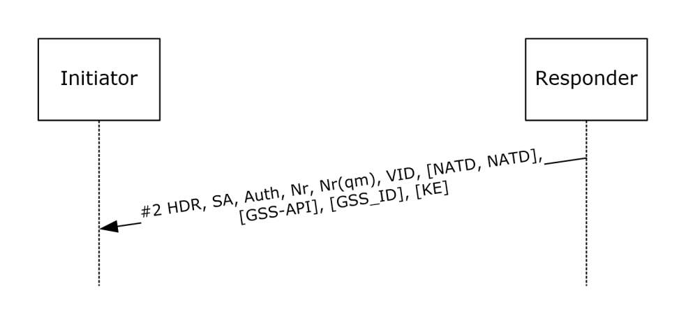
<!-- /Extracted images from page 51 -->

Figure 7: Main Mode First Exchange Response packet

The responder MUST construct this message as follows:

  HDR: The ISAKMP header MUST be identical to the first IKE phase 1 responder packet, except that

the exchange type MUST be 243 (MM exchange type). The Encrypted flag MUST not be set.





The responder MUST set the message ID value to zero in message #2 (in MM exchange).

The remaining payloads MUST follow a nonencrypted Crypto payload.

  SA: The SA payload MUST contain the accepted proposal, as specified in [RFC2408] section 5.4.

  Auth: The responder MUST determine which set of the proposed authentication methods is

acceptable (by comparing the proposals with the PAD's IKE Peer Authentication Data (see
[RFC4301] section 4.4.3.2) and MUST respond with at least one method from that set. To allow
for Auth retry, the responder MUST respond with all valid authentication methods. When
responding with multiple authentication methods, the responder MUST put the methods in its Auth
payload in the same order as they were in the initiator payload.

  Nr, Nr(qm): The responder nonce and the quick mode responder Nonce payloads. The nonce

value generation MUST be performed as specified in [RFC2408] section 3.13.

  VID: A sequence of Vendor ID payloads that indicate the capabilities supported. See IKE

[RFC2408] section 3.16.

  NATD: NAT discovery payloads. If the IP addresses of the AuthIP peers are IPv4 addresses,

these payloads SHOULD be constructed as specified in [RFC3947] section 3.2 and included. If the
IP addresses of the AuthIP peers are IPv6 addresses, then these payloads SHOULD NOT be
included.

  GSS-API: If the GSS-API payload was provided in message #1, the responder MUST generate the
response GSS_API payload as defined in [GSS]and in section 2.2.3.1. If the GSS_API payload was
not provided in message #1, the responder MUST send its security principal name in a GSS_ID
payload.

  GSS_ID: The responder security principal name, if a GSS-API payload was not present in message

#1.

  KE: The KE payload, if requested by the initiator. The KE payload MUST be constructed as

specified in IKE [RFC2408] section 3.13.

[MS-AIPS] - v20240916
Authenticated Internet Protocol
Copyright © 2024 Microsoft Corporation
Release: September 16, 2024

51 / 91

3.3.5.2  Received IKEv1 Packet

If a responder supports the Authenticated Internet Protocol and receives an IKEv1 initiator packet,
the responder MUST silently discard the packet. (See [MS-IKEE] section 3 for details on the IKEv1
initiator packet).

3.3.5.3  Invalid Message Received

If the main mode responder encounters any errors in the processing of a message after the Crypto
payload has been processed, it MUST handle them by returning a Notify message with a Notify type
NOTIFY_STATUS and an error code, as specified by the "protocol error transition" on the state
machine from section 3.1. This behavior applies to every message received, as well as to messages
received out of order. The only exception is the DoS protection mode, as specified in [MS-IKEE]
section 3.9.

3.3.6  Timer Events

See section 3.1.6.

3.3.7  Other Local Events

3.3.7.1  Limits on New Negotiations from Peer Reached

When processing an incoming Main Mode First Exchange Request packet (section 3.3.5.1), the
receiver silently drops incoming new negotiation requests from a peer if any of the following
conditions are met:

  More than 20 MM SAs already exist in the MMSAD with the same peer.

  More than 35 in-progress negotiations exist in the MMSAD with the same peer.

3.4  AuthIP Quick Mode Initiator Role

3.4.1  Abstract Data Model

See section 3.1.1.

3.4.2  Timers

3.4.2.1  QM SA Time Lifetime Expiration

This timer is started when a QM SA is negotiated. Its duration is the lifetime of the QM SA, as
specified in the SAD.

3.4.3  Initialization

Initial state for this role is captured in section 3.2.5.1.

3.4.4  Higher-Layer Triggered Events

None.

[MS-AIPS] - v20240916
Authenticated Internet Protocol
Copyright © 2024 Microsoft Corporation
Release: September 16, 2024

52 / 91

<!-- Extracted images from page 53 -->
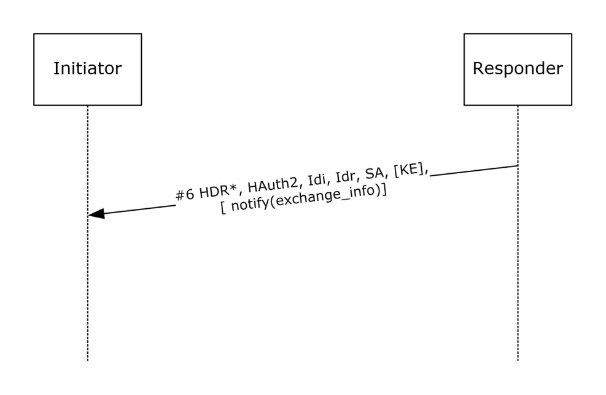
<!-- /Extracted images from page 53 -->

3.4.5  Processing Events and Sequencing Rules

3.4.5.1  Quick Mode First Exchange Response

Figure 8: Quick Mode First Exchange Response packet

If the initiator is not in Quick Mode Initiator First Packet Sent state, when the responder receives
the above packet it MUST tear down the corresponding main mode security association (MM SA) if
it can match the packet to an existing one, or silently discard the packet otherwise.

On receiving this packet when the initiator is in Quick Mode Initiator First Packet Sent state (see
section 3.4.7.3), the initiator MUST verify that message is constructed as follows:

  HDR: The ISAKMP header MUST be identical in format to the first IKE phase 2 initiator packet, as
specified in [RFC2409] section 5.5, with this exception: the exchange type MUST be 243 (MM
exchange type) for the first quick mode exchange under this main mode or 244 (quick mode
exchange type) for any subsequent quick mode exchange. The Encrypted flag MUST be set.



The following payloads MUST be encapsulated in an encrypted Crypto payload. The Crypto payload
MUST be verified to have been constructed in the following way:









The seqNUM field MUST be set to the current value of the main mode security association
database (MMSAD) sequence number for the current exchange type, as specified in section
3.1.4.

The Initialization_Vector and Encrypted payload fields MUST be computed as specified in
[RFC4303] section 2.3.

The Padding field MUST be computed as specified in [RFC4303] section 2.4.

The Integrity Checksum Data field MUST be computed as specified in [RFC4303] section
2.8, and MUST cover the ISAKMP header to the beginning of the Integrity Checksum Data.
It MUST be computed using the HMAC of the hash algorithm that is negotiated in main mode.
The default mechanism specified in [RFC4303] MUST be used to generate the pad contents.

  HAuth2: The ISAKMP Hash payload that contains Auth2. Auth2 MUST be computed as specified in

section 3.1.7.4.

53 / 91

[MS-AIPS] - v20240916
Authenticated Internet Protocol
Copyright © 2024 Microsoft Corporation
Release: September 16, 2024



IDi, IDr, SA, Ni(qm), KE: These payloads MUST be identical to the corresponding IKE payloads
([RFC2408] sections 3.8, 3.4, and 3.13). The SA, IDi, and IDr payloads MUST be constructed by
looking up the PAD Entry IDs ([RFC4301] section 4.4.3.1). The key exchange (KE) payload MUST
be sent if quick mode perfect forward secrecy is required by the SPD.

  Notify (exchange_info): The EXCHANGE_INFO Notify payload indicates to the peer that either

guaranteed encryption is active, or that the sender uses negotiation discovery. A precondition
for sending this notify is that the MM SA MUST have the PeerIsNegotiationDiscoveryCapable flag
set (section 3.2.5.1). These two policy options are specified in [MS-IKEE] section 3.7.4.

  SKWt: The responder SHOULD<16> optionally send a Key Dictation Weight payload if it is

evaluating the dictating keys. This payload MUST update the KeyDictationWtRemote field with the
contents of the packet per QM SA.





If LocalEndWantsToDictateKey is set, then if KeyDictationWtLocal > KeyDictationWtRemote,
set KeyDictationLocalWinner to TRUE, else set KeyDictationRemoteWinner to TRUE.

If LocalEndWantsToDictateKey is not set, then, irrespective of the KeyDictationWtRemote
value, set KeyDictationRemoteWinner to TRUE.

  KeyDict(In) and KeyDict(Out): Since the responder already has the initiator's

Key_Dictation_Weight value, it could potentially have won the negotiation. If this is true and
there is no Extended Mode, then the responder MUST have sent the Key Dictation payloads for the
initiator to use as quick mode keys.

If the initiator encounters any errors in the processing of the received message, it MUST be treated as
an Invalid Message event as specified in section 3.4.7.1.

Otherwise, it MUST add inbound QM SA to SAD and send the second quick mode exchange request
specified in the following diagram, and transition to Quick Mode Initiator Second Packet Sent state.

If the QM SA is added and if either the ImpersonationActiveMM or ImpersonationActive EM flag is
TRUE for the MM SA corresponding to the QM SA, then the value of ImpersonationHandle from the MM
SA MUST be copied over to the QM SA.

This packet MUST contain only:

  A Notify payload of Notify type NOTIFY_QM_SYNCHRONIZE. See section 2.2.3.5.

  KeyDict(In) and KeyDict(Out): If the initiator won the Key_Dictation_Weight negotiation (that is,
KeyDictationLocalWinner is set) and there is no Extended Mode in effect, then the initiator can
dictate the quick mode keys to the responder by constructing these payloads.

[MS-AIPS] - v20240916
Authenticated Internet Protocol
Copyright © 2024 Microsoft Corporation
Release: September 16, 2024

54 / 91

<!-- Extracted images from page 55 -->
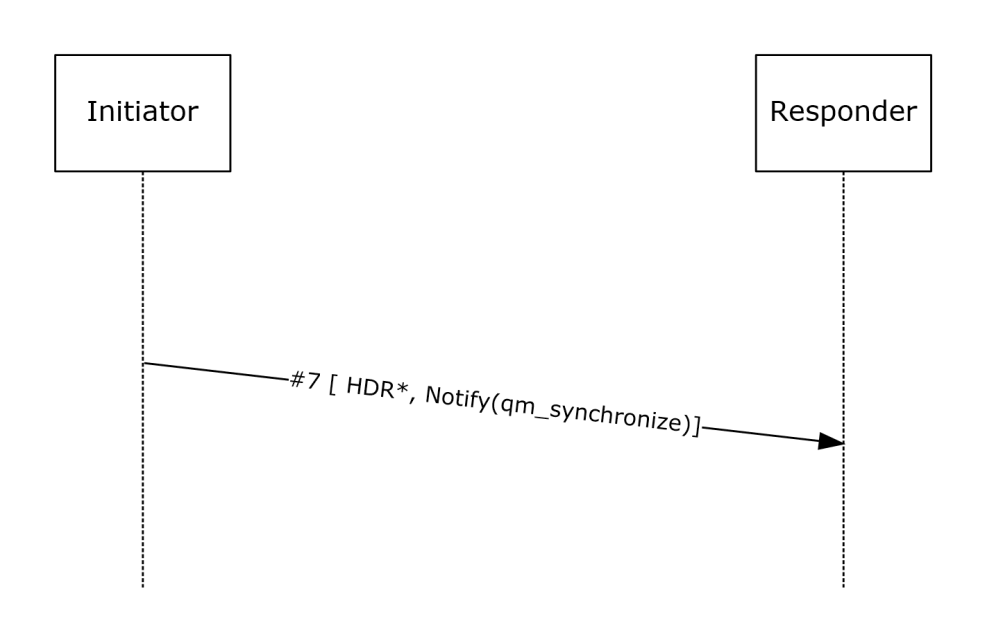
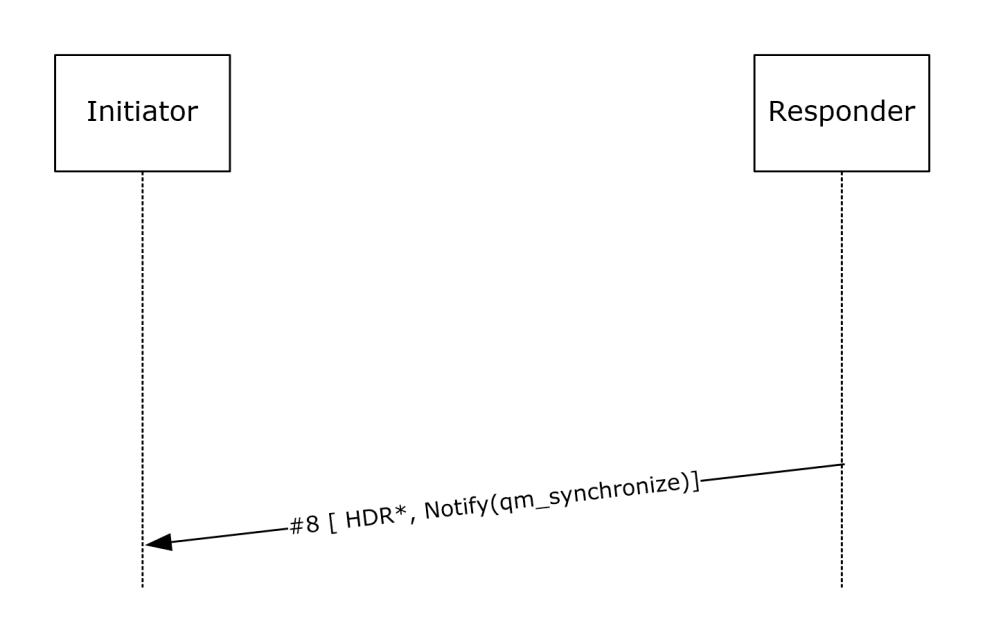
<!-- /Extracted images from page 55 -->

Figure 9: Quick Mode Synchronize Notify packet

3.4.5.2  Quick Mode Second Exchange Response

Figure 10: Quick Mode Second Exchange Response packet

If the initiator is not in Quick Mode Initiator Second Packet Sent state when it receives the above
packet, it MUST tear down the corresponding main mode security association (MM SA) if it can
match the packet to an existing main mode, or silently discard the packet otherwise.

If the initiator is in state Quick Mode Initiator Second Packet Sent state, it MUST transition to Quick
Mode Initiator Done state.

[MS-AIPS] - v20240916
Authenticated Internet Protocol
Copyright © 2024 Microsoft Corporation
Release: September 16, 2024

55 / 91

<!-- Extracted images from page 56 -->

<!-- /Extracted images from page 56 -->

The QM SA keys MUST be computed at this stage by using the key material generation algorithm from
section 3.1. The first ipsechashLength bytes of IPSecEncryptKey MUST be used as the QM SA
authentication key and the last ipseccryptLength bytes MUST be used as the QM SA encryption key.

If either the ImpersonationActiveMM or ImpersonationActive EM flag is TRUE, for the MM SA
corresponding to the QM SA, then the ImpersonationHandle from the MM SA MUST be copied over to
the QM SA.

If the SAD indicates that an extended mode (EM) exchange is not expected to follow the just-
completed quick mode exchange, the outbound QM SA MUST be added to the SAD after processing
the incoming message.

If the initiator encounters any errors in the processing of a message, it MUST be treated as an Invalid
Message event. See section 3.4.7.1.

The initiator MUST start an EM exchange, as specified in section 3.6.7.2, if the PAD requires it.

3.4.5.3  QM Rekey Acquire Notification Received

Figure 11: Quick Mode Rekey Acquire Notification packet

On receiving this packet in any state, the responder MUST verify that the message is constructed as
follows:

  HDR: The ISAKMP header exchange type MUST be 246 (Notify exchange type). The Encrypted

flag MUST be set.

  Notify (Acquire): The ACQUIRE Notify payload MUST be included and have the

RELIABLE_NOTIFY_FLAG set (section 2.2.3.5).

On verification, the responder MUST send back a NOTIFY ACK message formatted as specified in the
following diagram.

[MS-AIPS] - v20240916
Authenticated Internet Protocol
Copyright © 2024 Microsoft Corporation
Release: September 16, 2024

56 / 91

<!-- Extracted images from page 57 -->

<!-- /Extracted images from page 57 -->

Figure 12: Quick Mode Rekey ACK notify packet

The message MUST be constructed as follows:

  HDR: ISAKMP header MUST be identical to the IKE Informational packet, as specified in

[RFC2409] section 5.7, and the exchange type MUST be 246 (NOTIFY exchange type).

  Notify (Status): This notify MUST have the RELIABLE_NOTIFY_FLAG, as specified in section

2.2.3.5, set to FALSE.

After sending this packet, the responder MUST transition to Quick Mode Rekey Requested State and
proceed as specified in section 3.4.7.4.

3.4.5.4  Error Notify Received

Upon receipt of this message, the initiator MUST delete its state for its corresponding MM SA.

3.4.6  Timer Events

3.4.6.1  QM SA Lifetime Timer Expiration

When the QM SA lifetime expiration timer (see section 3.4.2.1) fires, the initiator or responder
MUST enter the Quick Mode Rekey Requested State.

3.4.7  Other Local Events

3.4.7.1  Invalid Message Received

If an invalid message is received, the initiator MUST send a NOTIFY_STATUS Notify payload and
delete its SA state for this negotiation.

The message MUST be constructed as follows:

  HDR: The ISAKMP header MUST be identical to the IKE Informational packet, as specified in
[RFC2409] section 5.7, and the exchange type MUST be 246 (NOTIFY exchange type).

  Notify (Status): This notify MUST have the RELIABLE_NOTIFY_FLAG, as specified in section

2.2.3.5, set to TRUE.

[MS-AIPS] - v20240916
Authenticated Internet Protocol
Copyright © 2024 Microsoft Corporation
Release: September 16, 2024

57 / 91

<!-- Extracted images from page 58 -->
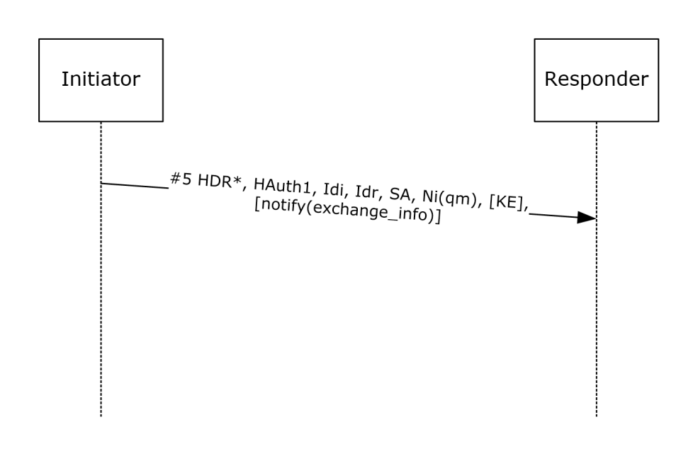
<!-- /Extracted images from page 58 -->

3.4.7.2  QM SA Byte Lifetime Expiration

When the number of bytes transmitted over the SA exceeds the byte lifetime of the QM SA, as
specified in the SAD, the initiator or responder MUST transition into Quick Mode Rekey Requested
state.

3.4.7.3  Transition to Main Mode Initiator First Exchange Done

When the main mode initiator enters Main Mode Initiator First Exchange Done state, it MUST
proceed to Quick Mode Initiator First Packet Sent state after sending a packet formatted as specified in
the following diagram.

Figure 13: Quick Mode First Exchange packet

The Authenticated Internet Protocol supports two types of quick mode exchanges:

  Normal (two exchanges)



Fast (one exchange)

The initiator can use fast quick mode if its SPD lookup returns a single quick mode proposal and if
quick mode perfect forward secrecy is not required by the SPD. Fast quick mode is optional and
implementation-specific.

The first quick mode exchange (normal or fast) MUST be performed within the MM exchange, that is,
using the MM exchange type instead of the quick mode exchange type.

The message MUST be constructed as follows:

  HDR: The ISAKMP header MUST be identical to the first IKE phase 2 initiator packet, as specified
in [RFC2409] section 5.5, with this exception: the exchange type MUST be 243 (MM exchange
type) for the first quick mode exchange under this main mode or 244 (quick mode exchange type)
for any subsequent quick mode exchange. The Encrypted flag MUST be set.



The following payloads MUST be encapsulated in an encrypted Crypto payload. The Crypto payload
MUST be constructed in the following way:

58 / 91

[MS-AIPS] - v20240916
Authenticated Internet Protocol
Copyright © 2024 Microsoft Corporation
Release: September 16, 2024









The seqNUM field MUST be set to the current value of the main mode security association
database (MMSAD) sequence number for the current exchange type, as specified in section
3.1.4.

The Initialization_Vector and Encrypted payload fields MUST be computed as specified in
[RFC4303] section 2.3.

The Padding field MUST be computed as specified in [RFC4303] section 2.4.

The Integrity Checksum Data field MUST be computed as specified in [RFC4303] section
2.8, and MUST cover the ISAKMP header to the beginning of the Integrity Checksum Data. It
MUST be computed using the HMAC of the hash algorithm that is negotiated in main mode.
The default mechanism specified in [RFC4303] MUST be used to generate the pad contents.

  H: The ISAKMP Hash payload that contains Auth1. Auth1 MUST be computed as defined in

section 3.1.7.4.



IDi, IDr, SA, Ni(qm), KE: These payloads MUST be identical to the corresponding IKE payloads, as
specified in [RFC2408] sections 3.8, 3.4 and 3.13. The SA, IDi, and IDr payloads MUST be
constructed by looking up the PAD Entry IDs (see [RFC4301] section 4.4.3.1). The key exchange
(KE) payload MUST be sent if quick mode perfect forward secrecy is required according to the
policy stored in the SPD.

  Notify(exchange_info): The EXCHANGE_INFO Notify payload MUST be included if the SPD

indicates either that guaranteed encryption is active, or the sender uses negotiation discovery
(based on SPD lookup). A precondition for sending this notify is that the MM SA MUST have the
PeerIsNegotiationDiscoveryCapable bit set in the MMSAD (see section 3.2.5.1). These two policy
options MUST be implemented as specified in [MS-IKEE] section 3.7.4.

  SkWt: If the node indicates that it will dictate keys (that is, LocalEndWantsToDictateKey is set),
then it can optionally construct the Key Dictation Weight payload using the per QM SA state
KeyDictationWtLocal field to negotiate Key Dictation with the peer.

3.4.7.4  Transition to QM Rekey Requested State

When initiator enters Quick Mode Rekey Requested state (see sections 3.4.5.3 and 3.4.7.4), it MUST
check whether all the following conditions are met:



The maximum number of quick modes for this main mode security association (MM SA) has
been reached, or the lifetime of the MM has expired.

  One-way authentication is used to establish the MM. This information is included in the IKE

Peer Authentication Data stored in the PAD (see [RFC4301] section 4.4.3.2).

If not all these conditions are met, the initiator MUST proceed to Quick Mode Initiator First Packet Sent
state as specified in section 3.4.7.3.

Otherwise, the initiator MUST proceed to Quick Mode Notify Acquire Sent state after sending a packet
formatted as specified in the following diagram:

[MS-AIPS] - v20240916
Authenticated Internet Protocol
Copyright © 2024 Microsoft Corporation
Release: September 16, 2024

59 / 91

<!-- Extracted images from page 60 -->
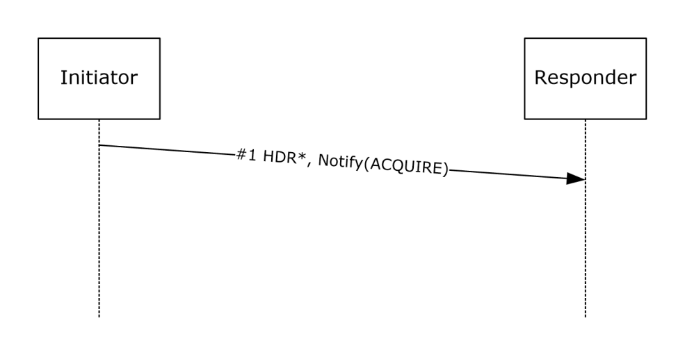
<!-- /Extracted images from page 60 -->

Figure 14: Quick Mode Acquire Notify packet

The message MUST be constructed as follows:

  HDR: The ISAKMP header MUST be identical to the first IKE phase 2 initiator packet, as specified
in [RFC2409] section 5.5, with this exception: the exchange type MUST be 246 (Notify exchange
type). The Encrypted flag MUST be set.

  Notify (Acquire): The ACQUIRE Notify payload MUST be included, be constructed as specified in

section 2.2.3.5, and have the RELIABLE_NOTIFY_FLAG set.

3.5  AuthIP Quick Mode Responder Role

3.5.1  Abstract Data Model

See section 3.1.1.

3.5.2  Timers

See section 3.1.2.

3.5.3  Initialization

Initial state for this role is captured in section 3.3.5.1.

3.5.4  Higher Layer Triggered Events

None.

[MS-AIPS] - v20240916
Authenticated Internet Protocol
Copyright © 2024 Microsoft Corporation
Release: September 16, 2024

60 / 91

<!-- Extracted images from page 61 -->
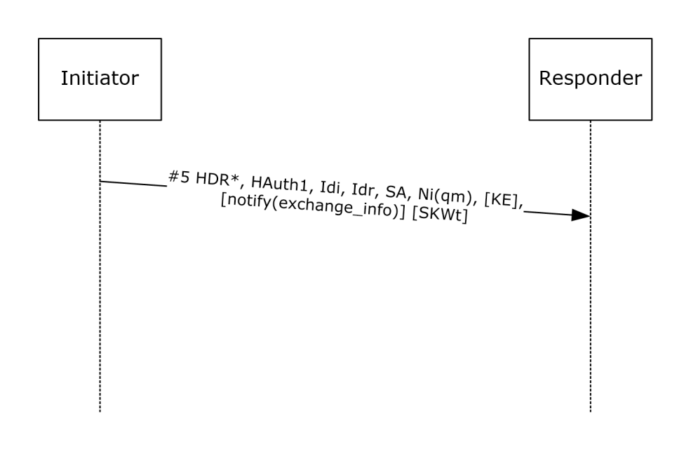
<!-- /Extracted images from page 61 -->

3.5.5  Processing Events and Sequencing Rules

3.5.5.1  Received Quick Mode First Exchange Request

Figure 15: Quick Mode First Exchange packet

If the responder is not in Main Mode Responder First Exchange Done state, when it receives the
above packet it MUST tear down the corresponding main mode (MM) if it can match the packet to an
existing main mode, and silently discard the packet otherwise.

If the responder encounters any errors in the processing of a message it MUST be treated as an
Invalid Message event. See section 3.5.7.1.

Upon receipt of message #5 (as labeled in the previous diagram), the responder MUST:

  Decrypt the Crypto payload.

  Compute Auth1 as specified in section 3.1.7.4.

  Verify that the HAuth1 payload contains the computed Auth1 value.

  Consult the SPD to select a proposal from the SA, IDi, and IDr payloads, and generate the KE by

using Diffie-Hellman, as specified in [RFC2408] section 3.7.

  Store the peer's Key Dictation Weight in the per QM SA KeyDictationWtRemote field. If the

LocalEndWantsToDictateKey is set, compare it with its own KeyDictationWtRemote stored in the
per QM SA KeyDictationWtLocal field, if any. The end with the higher weight wins (that is, either
KeyDictationLocalWinner or KeyDictationRemoteWinner is set). However, if
LocalEndWantsToDictateKey is not set, then set KeyDictationRemoteWinner, irrespective of the
peer's weight.

If the responder encounters no errors while it processes message #5 and at least one of the initiator
proposals is acceptable (under the criteria specified in IKEv1; for more information, see [RFC2408]
section 5.4), it MUST construct message #6 in response as follows:

  HDR: The ISAKMP header MUST be identical to the first IKE phase 2 initiator packet (as specified
in [RFC2409] section 5.5), except that the exchange type MUST be 243 (MM exchange type) for

61 / 91

[MS-AIPS] - v20240916
Authenticated Internet Protocol
Copyright © 2024 Microsoft Corporation
Release: September 16, 2024

<!-- Extracted images from page 62 -->
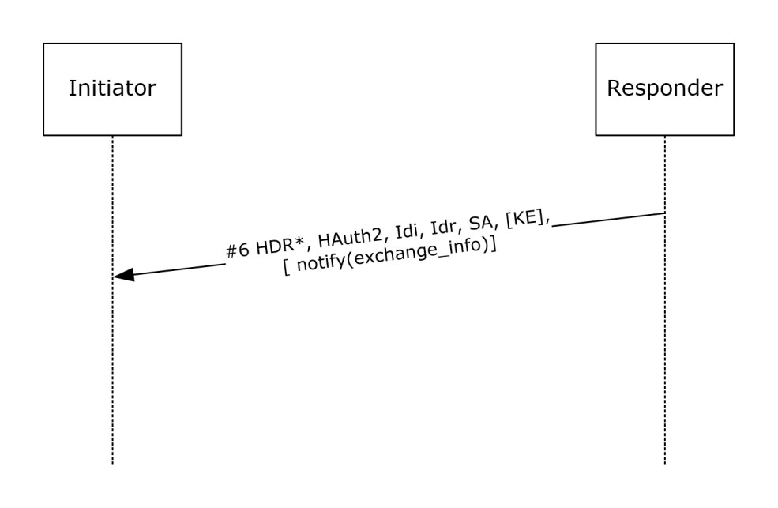
<!-- /Extracted images from page 62 -->

the first quick mode exchange under this main mode or 244 (quick mode exchange type) for
any subsequent quick mode exchange. The Encrypted flag MUST be set.



The payloads that remain MUST be encapsulated in a Crypto payload.

  HAuth2: The ISAKMP Hash payload MUST contain the field Auth2 computed as defined in section

3.1.7.4.



IDi, IDr, SA, KE: These payloads MUST be identical to the corresponding IKE payloads specified in
[RFC2408] sections 3.8, 3.4, and 3.13.

  Notify(exchange_info): If either guaranteed encryption is active or the sender uses negotiation
discovery, the EXCHANGE_INFO Notify payload MUST be used to indicate this information to the
peer. A precondition for sending this notify is that the MM SA MUST have its
PeerIsNegotiationDiscoveryCapable flag set in the MMSAD (see section 3.2.5.1). These two policy
options are specified in [MS-IKEE], section 3.7.4.

  SKWt: If dictating keys (that is, LocalEndWantsToDictateKey is set), then the Key Dictation

Weight payload MUST contain the weight stored in the per QM SA KeyDictationWtLocal field to
communicate the intent to a peer.

  KeyDict(In) and KeyDict(Out): The responder already knows the Key Dictation weights of the local

and remote ends, if any, stored in the per QM SA KeyDictationWtLocal and
KeyDictationWtRemote fields, respectively. If the responder has the higher weight and there is
no Extended Mode to follow, then it constructs the Key Dictation payloads for inbound and
outbound quick mode keys with the dictated keys (see section 2.2.3.7).

Figure 16: Quick Mode Exchange Info notify packet

If no proposal is acceptable (as determined by the procedure specified in [RFC2408] section 5.4), the
responder MUST send a Notification NO-PROPOSAL-CHOSEN payload (section 2.2.3.5) with
RELIABLE_NOTIFY_FLAG set to indicate that no proposal was chosen. The payload MUST be formatted
as specified in [RFC2408] section 5.4.

[MS-AIPS] - v20240916
Authenticated Internet Protocol
Copyright © 2024 Microsoft Corporation
Release: September 16, 2024

62 / 91

<!-- Extracted images from page 63 -->

<!-- /Extracted images from page 63 -->

3.5.5.2  Received Quick Mode Second Exchange Request

Figure 17: Quick Mode Synchronize Notify packet

If the responder is not in Quick Mode Responder First Exchange Done state, when the responder
receives the above packet it MUST tear down the corresponding main mode if it can match the
packet to an existing main mode, and silently discard the packet otherwise.

On receiving the above packet in Quick Mode Responder First Exchange Done state, the responder
MUST verify the packet, and if it is valid, send out the response specified by the following diagram,
and transition to Quick Mode Responder Done state.

To verify the incoming packet, the responder MUST do the following:

  HDR: Verify that the ISAKMP header is identical to the first IKE phase 2 initiator packet (as

specified in [RFC2409] section 5.5), except that the exchange type MUST be 244 (quick mode
exchange type)

  Decrypt the Crypto payload to obtain the rest of the payloads and verify the AuthIP packet
integrity check. The decryption and integrity verification procedure is specified in [RFC4303]
section 3.4.

  Verify that the decrypted packet contains only a single payload, which MUST be a Notify payload

of Notify type NOTIFY_QM_SYNCHRONIZE (see section 2.2.3.5).



If the initiator won the Key Dictation Weight negotiation (that is, KeyDictationLocalWinner is
set), then the responder MUST consume the quick mode keys supplied in the KeyDict(in) and
KeyDict(out) payloads.

If the responder encounters any errors in verifying the packet, it MUST be treated as an Invalid
Message event. See section 3.5.7.1.

The QM SA keys MUST be computed using the key material generation algorithm from section 3.1.
The first ipsechashLength bytes of IPSecEncryptKey MUST be used for the QM SA authentication key
and the last ipseccryptLength bytes MUST be used for the QM SA encryption key.

[MS-AIPS] - v20240916
Authenticated Internet Protocol
Copyright © 2024 Microsoft Corporation
Release: September 16, 2024

63 / 91

<!-- Extracted images from page 64 -->
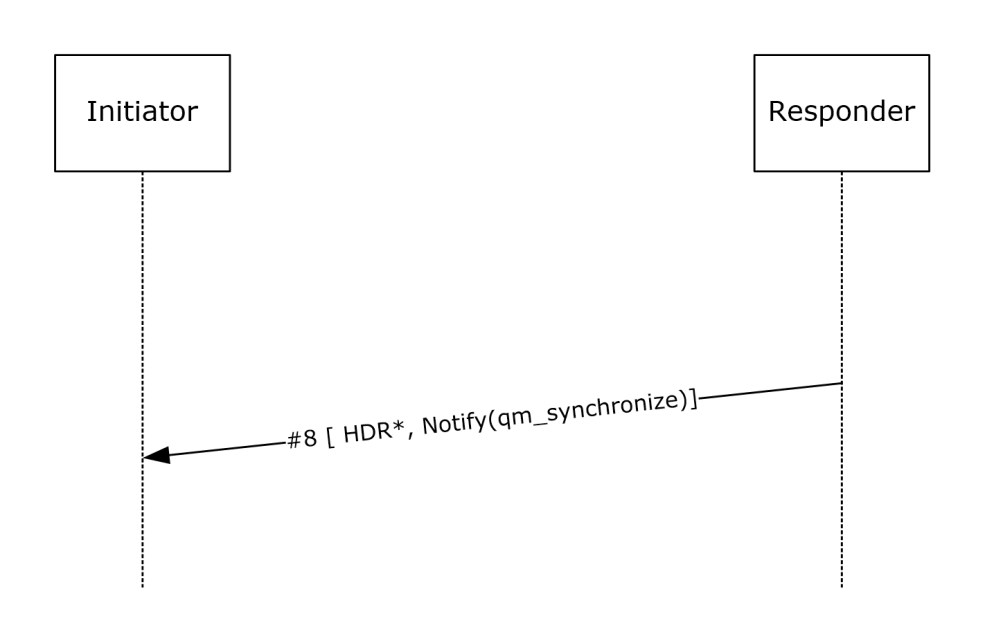
<!-- /Extracted images from page 64 -->

Figure 18: Quick Mode Synchronize Notify Response packet

If either the ImpersonationActiveMM or ImpersonationActive EM flag is TRUE for the MM SA
corresponding to the QM SA, then the ImpersonationHandle value from the MM SA MUST be copied
over to the QM SA.

The inbound/outbound QM SAs MUST also be added to the SAD prior to sending this packet.

3.5.6  Timer Events

See section 3.1.6.

3.5.7  Other Local Events

3.5.7.1  Invalid Message Received

If the AuthIP responder experiences a failure in processing a packet, the responder MUST send the
initiator a Notify message with a Notify type of NOTIFY_STATUS and tear down the corresponding
quick mode state.

3.6  AuthIP Extended Mode Initiator Role

3.6.1  Abstract Data Model

See section 3.1.1.

3.6.2  Timers

See section 3.1.2.

3.6.3  Initialization

Initial State for this role is captured in section 3.4.5.2.

[MS-AIPS] - v20240916
Authenticated Internet Protocol
Copyright © 2024 Microsoft Corporation
Release: September 16, 2024

64 / 91

<!-- Extracted images from page 65 -->
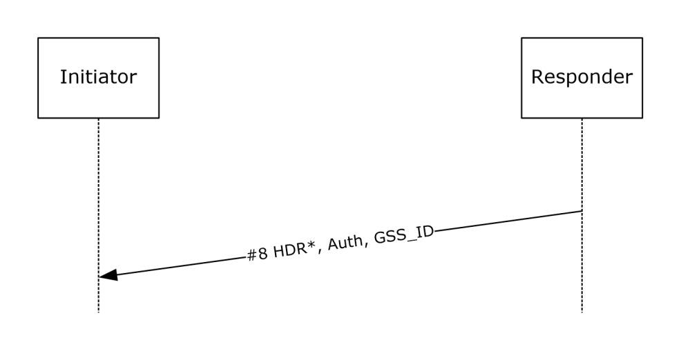
<!-- /Extracted images from page 65 -->

3.6.4  Higher Layer Triggered Events

None.

3.6.5  Processing Events and Sequencing Rules

3.6.5.1  Received Extended Mode First Exchange Response

Figure 19: Extended Mode First Exchange Response packet

If the initiator is not in Extended Mode First Request Sent State (see section 3.6.7.1), when the
initiator receives the above packet it MUST tear down the corresponding main mode (MM) if it can
match the packet to an existing main mode, or silently discard the packet otherwise.

If the initiator encounters any errors in the processing of this message, it MUST be treated as an
Invalid Message event. See section 3.6.5.3.

On receiving the above packet in Extended Mode First Request Sent State (see section 3.6.7.1), the
initiator MUST verify that message #3 (in the diagram above) is constructed as follows:

  HDR: The ISAKMP header MUST be identical to the first IKE phase 2 initiator packet, as specified
in [RFC2409] section 5.5, except that the exchange type MUST be 243 (MM exchange type). The
Encrypted flag SHOULD NOT be set.<17>



The remaining payloads MUST follow a non-encrypted Crypto payload.

  GSS-API: This payload MUST be constructed as specified in [GSS] and section 2.2.3.1.

If the initiator encounters no errors in processing this message, it MUST start a GSS-API exchange
by transitioning to the GSS_API Start state (see the GSS state machine in section 3.8).

[MS-AIPS] - v20240916
Authenticated Internet Protocol
Copyright © 2024 Microsoft Corporation
Release: September 16, 2024

65 / 91

<!-- Extracted images from page 66 -->
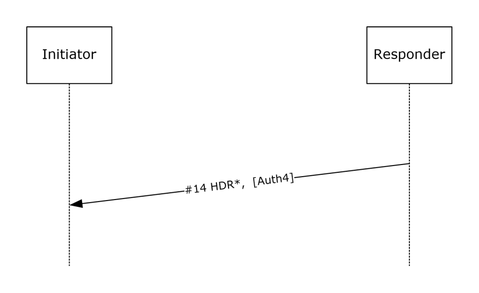
<!-- /Extracted images from page 66 -->

3.6.5.2  Received Extended Mode Final Exchange Response

Figure 20: Extended Mode Final Exchange Response packet

If the initiator is not in Extended Mode Initiator Final Exchange Request Sent state (see section
3.6.7.2) when it receives this packet, it MUST tear down the corresponding main mode (MM) if it can
match the packet to an existing main mode, or silently discard the packet otherwise.

On receiving the Extended Mode Final Exchange Response packet in Extended Mode Initiator Final
Exchange Request Sent state (see section 3.6.7.2), the initiator MUST:

  Decrypt the Crypto payload.

  Compute Auth4, as specified in section 3.1.7.4.

  Verify that the HAuth4 payload contains the computed Auth4 value.

If either the ImpersonationActiveMM or ImpersonationActive EM flag value is TRUE for the MM SA
corresponding to the QM SA, then the ImpersonationHandle value from the MM SA MUST be copied
over to the QM SA.

  Add the outbound QM SA to the SAD after it verifies Auth4 (message #14) as valid.



Transition to Extended Mode Complete state.

If the initiator encounters any errors in the processing of this message, it MUST be treated as an
Invalid Message event. See section 3.6.7.1.

3.6.5.3  Invalid Message Received

If the AuthIP Extended Mode initiator receives an invalid packet that causes an error in response
processing, the initiator MUST tear down the corresponding main mode and quick mode states.

3.6.6  Timer Events

See section 3.1.6.

[MS-AIPS] - v20240916
Authenticated Internet Protocol
Copyright © 2024 Microsoft Corporation
Release: September 16, 2024

66 / 91

<!-- Extracted images from page 67 -->
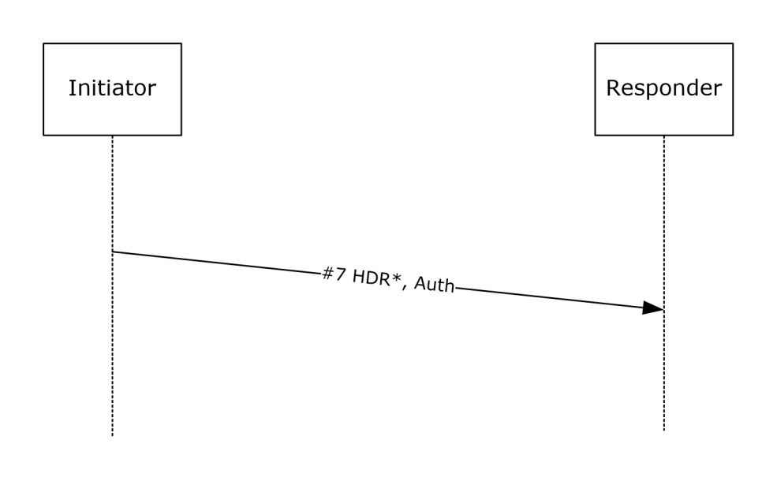
<!-- /Extracted images from page 67 -->

3.6.7  Other Local Events

3.6.7.1  Transition Quick Mode Initiator Done

On reaching the Quick Mode Initiator Done state, the initiator MUST automatically proceed to
Extended Mode, if required by policy, by sending the packet specified in the following diagram, and
transitioning to Extended Mode First Request Sent state. If no Extended Mode is required, the SA
negotiation is already complete and MUST NOT proceed further.

Figure 21: Transition to Extended Mode Initiator packet

The initiator MUST construct the message as follows:

  HDR: The ISAKMP header MUST be constructed identically to the first IKE phase 2 initiator

packet, as specified in [RFC2409] section 5.5, except that the exchange type MUST be 245 (EM
exchange type). The Encrypted flag MUST be set.



The payloads that remain MUST be encapsulated in a Crypto payload.

  Auth: The proposed authentication methods for Extended Mode round of authentication MUST be

constructed by looking up the PAD's Peer Authentication Data (see [RFC4301] section 4.4.3.2).

3.6.7.2  Extended Mode Initiator GSS Exchange Success

On successfully completing the GSS exchange within Extended mode (that is, reaching
GSS_API_Done state in the GSS state machine, as in section 3.8.5.1), the initiator MUST add the
inbound QM SA to the SAD and send a packet constructed as specified in the following diagram, then
transition to Extended Mode Initiator Final Exchange Request Sent state.

[MS-AIPS] - v20240916
Authenticated Internet Protocol
Copyright © 2024 Microsoft Corporation
Release: September 16, 2024

67 / 91

<!-- Extracted images from page 68 -->
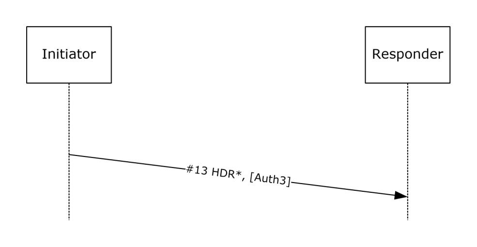
<!-- /Extracted images from page 68 -->

Figure 22: Extended Mode Initiator final exchange packet

The initiator MUST construct the packet as follows:

  HDR: The ISAKMP header MUST be identical to the first Internet Key Exchange (IKE) phase 2
initiator packet (as specified in [RFC2409] section 5.5), except that the exchange type MUST be
245 (EM exchange type). The Encrypted flag MUST be set.



The remaining payloads MUST be encapsulated in a Crypto payload. The Crypto payload MUST be
constructed as specified in section 3.4.7.3.

  HAuth3: The ISAKMP Hash payload, as specified in [RFC2408] section 12. It MUST contain Auth3,

computed as specified in section 3.1.7.4.

  KeyDict(In) and KeyDict(Out): If the initiator won the Key Dictation Weight negotiation (that is,

KeyDictationLocalWinner is set) and Extended Mode was used, then at this time the initiator can
construct the Key Dictation payload to supply quick mode keys to a peer.

3.7  AuthIP Extended Mode Responder Role

3.7.1  Abstract Data Model

See section 3.1.1.

3.7.2  Timers

See section 3.1.2.

3.7.3  Initialization

The initial state for this role is captured in section 3.5.5.2.

3.7.4  Higher-Layer Triggered Events

None.

[MS-AIPS] - v20240916
Authenticated Internet Protocol
Copyright © 2024 Microsoft Corporation
Release: September 16, 2024

68 / 91

<!-- Extracted images from page 69 -->
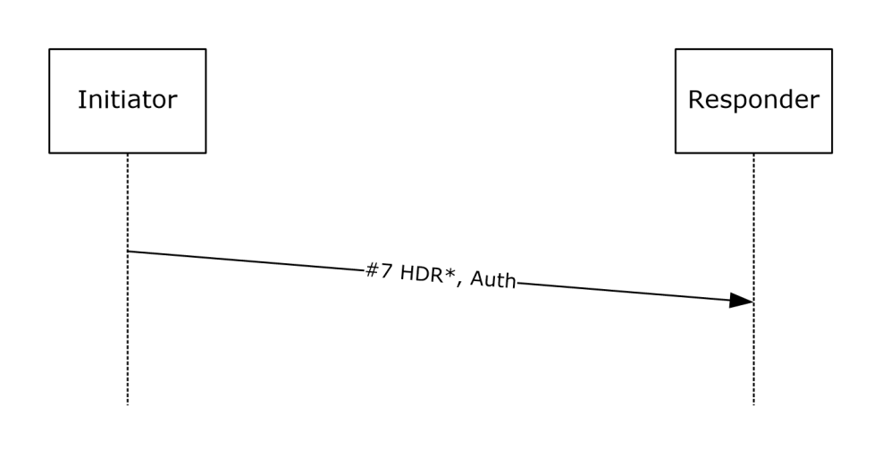
<!-- /Extracted images from page 69 -->

3.7.5  Processing Events and Sequencing Rules

3.7.5.1  Received Extended Mode First Exchange Request

Figure 23: Transition to Extended Mode Initiator packet

If the responder is not in Quick Mode Responder Done state when it receives the above packet, the
responder MUST tear down the corresponding main mode (MM) if it can match the packet to an
existing main mode, or silently discard it otherwise.

On receiving the above packet in Quick Mode Responder Done state, the responder MUST verify that
message #7 is constructed as follows:

  HDR: The ISAKMP header MUST have a format identical to the first IKE phase 2 initiator

packet, as specified in [RFC2409] section 5.5, except that the exchange type MUST be 245 (EM
exchange type). The Encrypted flag MUST be set. The responder SHOULD<18> also verify that
the message ID field value is set to one.



The payloads that remain MUST be encapsulated in a Crypto payload. If an error occurs at this
stage or before, the responder MUST silently discard the message. The Crypto payload MUST be
constructed as specified in section 3.3.5.1.

  Auth: The proposed authentication methods. This payload MUST be processed identically to the
Auth payload in the MM exchange (see section 3.3.5.1), except that all operations on the
MMSAD are on the EM Auth method state.

If the responder encounters no errors while it processes message #7, the responder MUST construct
message #8 in response, formatted as specified in the following diagram and constructed as follows:

  HDR: The ISAKMP header MUST have an identical format to the first IKE phase 2 initiator packet,
as specified in [RFC2409] section 5.5, except that the exchange type MUST be 245 (EM exchange
type). The Encrypted flag MUST be set. The responder MUST also set the message ID value to
zero.



The payloads that remain MUST be encapsulated in a Crypto payload. The Crypto payload MUST
be constructed as specified in section 3.3.5.1.

  Auth: The responder MUST determine which set of the proposed authentication methods is

acceptable (by comparing the proposals with the PAD's IKE Peer Authentication Data (see
[RFC4301] section 4.4.3.2) and MUST respond with at least one method of that set. To allow for
Auth retry, the responder MUST respond with all valid authentication methods. When responding

69 / 91

[MS-AIPS] - v20240916
Authenticated Internet Protocol
Copyright © 2024 Microsoft Corporation
Release: September 16, 2024

<!-- Extracted images from page 70 -->
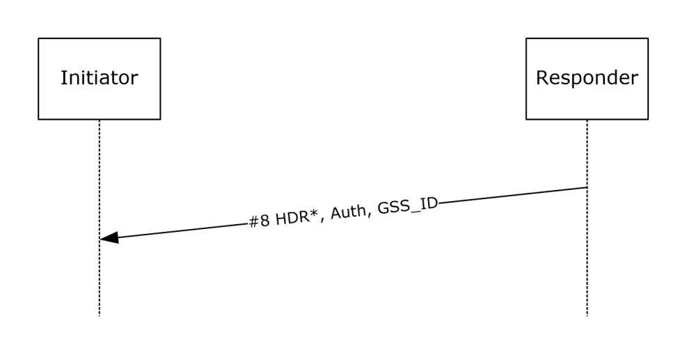
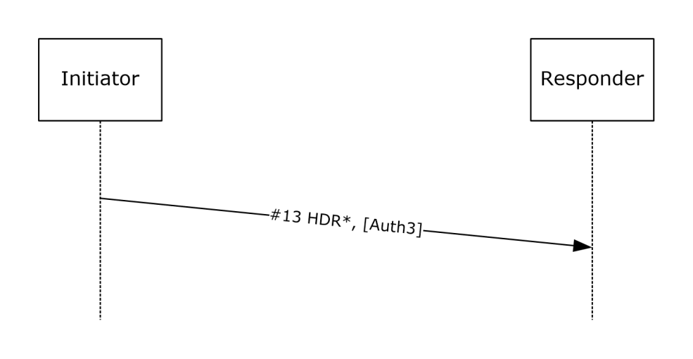
<!-- /Extracted images from page 70 -->

with multiple authentication methods, the responder MUST put the methods in its Auth payload in
the same order as they were in the initiator payload.

  GSS_ID: This payload MUST have identical format to the GSS_ID payload sent as part of the MM

exchange (see section 3.3.5.1).

After sending this response, the Responder MUST transition to the Extended Mode Responder first
exchange done state.

Figure 24: Quick Mode Synchronize Notify packet

If the responder encounters any errors in the processing of this message, it MUST be treated as an
Invalid Message Received (section 3.7.7.1) event.

3.7.5.2  Received Extended Mode Final Exchange Request

Figure 25: Extended Mode Final Exchange packet

If the Extended Mode responder has finished GSS-API negotiation successfully, that is, it is in the
GSS_API Done state and receives the above packet, then the responder MUST:

  Decrypt the Crypto payload.

[MS-AIPS] - v20240916
Authenticated Internet Protocol
Copyright © 2024 Microsoft Corporation
Release: September 16, 2024

70 / 91

<!-- Extracted images from page 71 -->
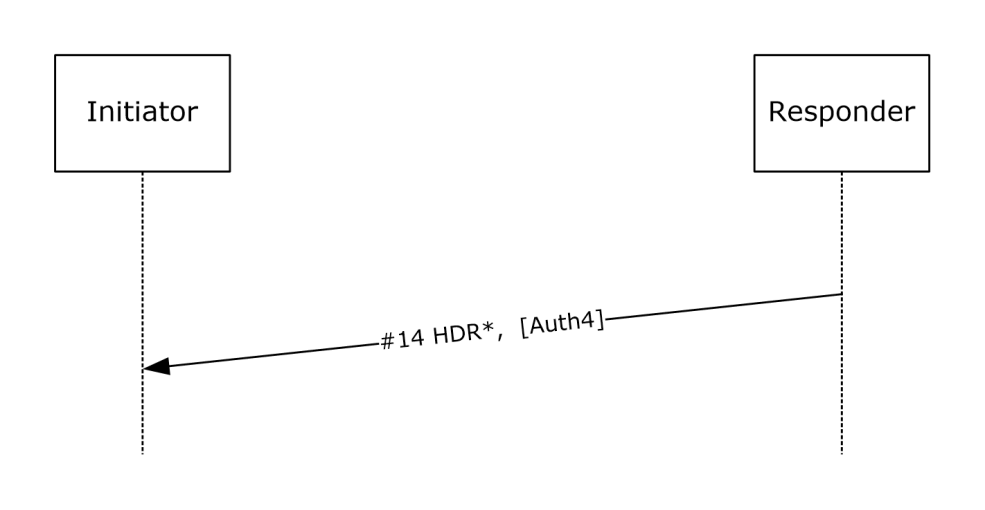
<!-- /Extracted images from page 71 -->

  Compute Auth3, as specified in section 3.1.7.4.

  Verify that the HAuth3 payload contains the computed Auth3 value.

If the responder is not in GSS_API_Done state when it receives the above packet, it MUST tear down
the corresponding main mode if it can match the packet to an existing main mode, or silently discard
it otherwise.





If the "Impersonation Active EM" flag on the MM SA is true, then the responder MUST set the
ImpersonationHandle to a locally unique value that represents the incoming user.

If the initiator won the Key Dictation Weight negotiation (that is, KeyDictationLocalWinner is set),
then the responder MUST consume the KeyDict(in) and KeyDict(out) payloads and use the quick
mode keys supplied by the initiator.

If the responder encounters no errors while it processes this packet, the responder MUST send a
message formatted as specified in the following diagram in response.

Figure 26: Extended Mode Final Exchange Response packet

The responder MUST construct the response message as follows:

  HDR: The ISAKMP header MUST have identical format to the first IKE phase 2 initiator packet
(as specified in [RFC2409] section 5.5), except that the exchange type MUST be 245 (EM
exchange type). The Encrypted flag MUST be set.



The remaining payload MUST be encapsulated in a Crypto payload. The Crypto payload MUST be
constructed as specified in section 3.5.5.

  HAuth4: The ISAKMP Hash payload that contains Auth4 MUST be computed as specified in section

3.1.

Before it sends the above response, the responder MUST add both QM SAs to the SAD and transition
to Extended Mode Complete state and MUST enforce the rules defined in the PAD including the policy
for use of Explicit Credentials in EM (see section 3.1.1), as follows: If Allow Explicit Credentials in EM
is FALSE but Explicit Credentials EM is TRUE, then the responder MUST fail the connection. See section
3.7.7.1.

If the responder encounters any errors in the processing of this message. it MUST be treated as an
Invalid Message Received (section 3.7.7.1) event.

[MS-AIPS] - v20240916
Authenticated Internet Protocol
Copyright © 2024 Microsoft Corporation
Release: September 16, 2024

71 / 91

<!-- Extracted images from page 72 -->
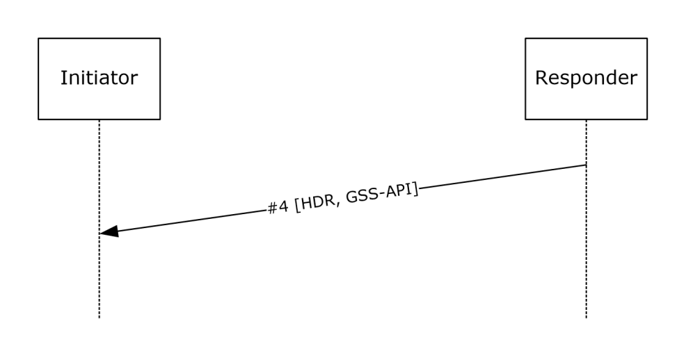
<!-- /Extracted images from page 72 -->

3.7.6  Timer Events

See section 3.1.6.

3.7.7  Other Local Events

3.7.7.1  Invalid Message Received

If the AuthIP Extended mode responder receives an invalid packet that causes an error in request
processing, it MUST tear down the corresponding main mode and quick mode state.

3.8  Generalized AuthIP GSS-API Initiator Role

3.8.1  Abstract Data Model

See section 3.1.1.

3.8.2  Timers

See section 3.1.2.

3.8.3  Initialization

The initial state for this role is captured in section 3.6.5.1.

3.8.4  Higher-Layer Triggered Events

None.

3.8.5  Processing Events and Sequencing Rules

3.8.5.1  GSS-API Response Received

To understand how the initiator can get to GSS-API Request Sent state, see section 3.8.7.1.

Figure 27: GSS-API Response packet

[MS-AIPS] - v20240916
Authenticated Internet Protocol
Copyright © 2024 Microsoft Corporation
Release: September 16, 2024

72 / 91

<!-- Extracted images from page 73 -->
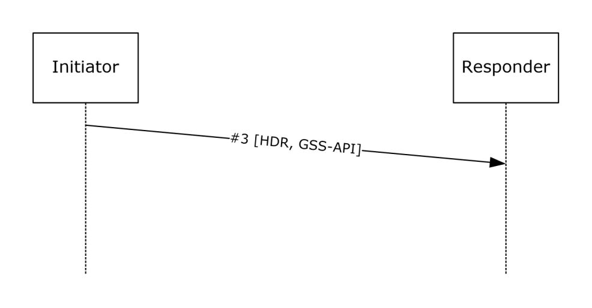
<!-- /Extracted images from page 73 -->

If the responder is not in GSS-API Request Sent state when it receives the above packet, it MUST
tear down the corresponding main if it can match the packet to an existing main mode, or silently
discard the packet otherwise.

On receiving the above packet in GSS-API Request Sent state, if the initiator is successfully done (as
defined in [GSS] and section 2.2.3.1), it MUST transition to GSS_API Done state. Otherwise, the
packet MUST be passed to the GSS-API layer for processing. If an error results from this processing,
the responder MUST silently discard the packet. Otherwise, the initiator MUST send another GSS-API
request formatted as specified below, and return to GSS-API Request Sent state.

In the latter case, the initiator MUST send a message #3 constructed as follows:

  HDR: The ISAKMP header MUST have identical format to the first IKE phase 2 initiator packet
(as specified in [RFC2409] section 5.5), except that the exchange type MUST be 243 (MM
exchange type). The Encrypted flag SHOULD NOT be set.<19>



The remaining payloads MUST follow a non-encrypted Crypto payload.

  GSS-API: MUST be constructed as specified in [GSS] and section 2.2.3.1.

3.8.6  Timer Events

See section 3.1.6.

3.8.7  Other Local Events

3.8.7.1  GSS-API Start

When the initiator starts a GSS-API exchange, it MUST begin by sending a packet formatted as
specified in the following diagram, and transition into the GSS-API Request Sent state.

Figure 28: GSS-API initial exchange packet

The initiator MUST start the GSS handshake by using the first GSS-API type that is returned in the
Auth payload of the responder (see section 3.2.5.1 for Main Mode, or section 3.7.5.1 for Extended
Mode).

The message MUST be constructed as follows:

[MS-AIPS] - v20240916
Authenticated Internet Protocol
Copyright © 2024 Microsoft Corporation
Release: September 16, 2024

73 / 91

<!-- Extracted images from page 74 -->

<!-- /Extracted images from page 74 -->

  HDR: The ISAKMP header MUST have identical format to the first IKE phase 2 initiator packet
(as specified in [RFC2409] section 5.5), except that the exchange type MUST be 243 (MM
exchange type). The Encrypted flag SHOULD NOT be set.<20>



The remaining payloads MUST follow a non-encrypted Crypto payload.

  GSS-API: As specified in [GSS] and section 2.2.3.1. If the initiator is using explicit credentials,

it MUST set the GSS_EXPLICIT_CREDENTIALS in the Flags field of the GSS-API payload to "1" (see
section 2.2.3.1).

3.9  Generalized AuthIP GSS-API Responder Role

3.9.1  Abstract Data Model

See section 3.1.1.

3.9.2  Timers

See section 3.1.2.

3.9.3  Initialization

The initial state for this role is captured in sections 3.3.5.1 and 3.7.5.1.

3.9.4  Higher-Layer Triggered Events

None.

3.9.5  Processing Events and Sequencing Rules

3.9.5.1  GSS-API Request Received

Figure 29: GSS-API initial exchange packet

If the responder is not in either Main Mode First Exchange Done state or Extended Mode Responder
First Exchange Done state when it receives the above packet, the responder MUST tear down the

[MS-AIPS] - v20240916
Authenticated Internet Protocol
Copyright © 2024 Microsoft Corporation
Release: September 16, 2024

74 / 91

<!-- Extracted images from page 75 -->
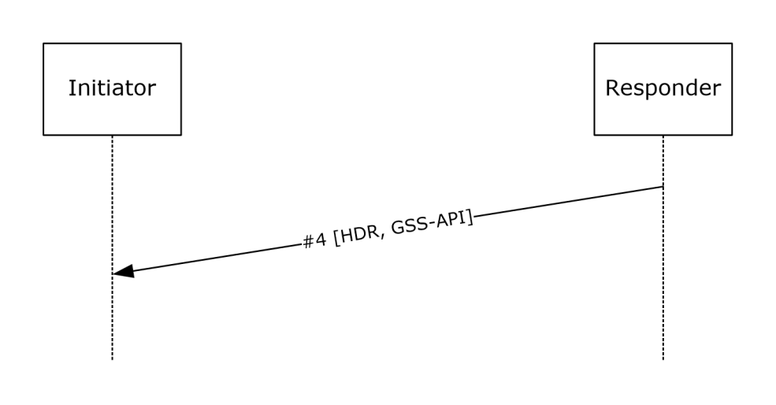
<!-- /Extracted images from page 75 -->

corresponding main mode if it can match the packet to an existing main mode, or silently discard the
packet otherwise.

When either in Main Mode First Exchange Done state or Extended Mode Responder First Exchange
Done state, the responder receives a packet formatted as specified in the above diagram. It MUST
verify that message #3 is constructed as follows:

  HDR: The ISAKMP header MUST have identical format to the first IKE phase 2 initiator packet
(as specified in [RFC2409] section 5.5), except that the exchange type MUST be 243 (MM
exchange type). The Encrypted flag MUST NOT be set.



The remaining payloads MUST follow a non-encrypted Crypto payload.

  GSS-API: MUST be constructed as specified in [GSS] and section 2.2.3.1.

On successful completion of the quick mode exchange, both initiator and responder MUST update
the quick mode pointers (see section 3.1.1) to associate this quick mode with the main mode that
carried it.

If the responder encounters any errors in the processing of this message, it MUST be treated as an
Invalid Message Received event (see section 3.9.7.1).

If the responder encounters no errors in processing message #3, it MUST construct message #4 in
response, as follows:

  HDR: The ISAKMP header MUST have identical format to the first IKE phase 2 initiator packet (as

specified in [RFC2409] section 5.5), except that the exchange type MUST be 243 (MM exchange
type). The Encrypted flag MUST NOT be set.



The remaining payloads MUST follow a non-encrypted Crypto payload.

  GSS-API: MUST be constructed as specified in [GSS] and section 2.2.3.1.

Figure 30: GSS-API Response packet

3.9.6  Timer Events

See section 3.1.6.

[MS-AIPS] - v20240916
Authenticated Internet Protocol
Copyright © 2024 Microsoft Corporation
Release: September 16, 2024

75 / 91

3.9.7  Other Local Events

3.9.7.1  Invalid Message Received

If the AuthIP GSS_API exchange responder receives an invalid packet that causes an error in
request processing, it MUST tear down the corresponding main mode state (and quick mode state if
present).

3.10  Authenticated Firewall Mode

3.10.1 Abstract Data Model

All necessary state information is described in section 3.1.1.

3.10.2 Timers

None.

3.10.3 Initialization

None.

3.10.4 Higher-Layer Triggered Events

3.10.4.1

New Connection Initiated

If the IsAuthenticatedFirewallConnection flag is set to TRUE in the connection state table entry
corresponding to the connection, the first packet of every new connection (that is, the first packet sent
by the connection initiator after creating the new entry in the connection state table) MUST be sent
twice: initially with IPSec encapsulation and then again without IPSec encapsulation. These messages
are known as the ESP SYN and cleartext SYN messages, respectively.<21>

Whenever a non-cleartext packet is sent using Authenticated Firewall (authFW) mode, the format
MUST be as follows:





If the selected encapsulation in the SAD (section 3.1.1) for the SA associated with the connection
([RFC4301] section 4.4.2.2) is IPSEC_TRANSPORT_AUTH_FW, then the encapsulation format
MUST be the standard IPSec ESP transport encapsulation of the original packet, as specified in
[RFC2406].

If the selected encapsulation in the SAD (section 3.1.1) for the SA associated with the connection
([RFC4301] section 4.4.2.2) is IPSEC_TRANSPORT_UDP_AUTH_FW, then the encapsulation format
MUST be the standard IPSec UDP ESP transport encapsulation of the packet, as specified in
[RFC3948].

3.10.4.2

Negotiation of Authenticated Firewall Encapsulation

To negotiate Authenticated Firewall encapsulation, the initiator MUST include one of the two
encapsulation attributes listed below in the SA payload of quick mode (see section 3.4.7.3). The
negotiation MUST then proceed as specified in [RFC2407] section 4.5.

The authenticated firewall encapsulation uses these two values for the encapsulation mode attribute:

IPSEC_TRANSPORT_AUTH_FW: 62000

76 / 91

[MS-AIPS] - v20240916
Authenticated Internet Protocol
Copyright © 2024 Microsoft Corporation
Release: September 16, 2024

IPSEC_TRANSPORT_UDP_AUTH_FW: 62001

The former signals Authenticated Firewall (authFW) mode with ESP encapsulation. The latter
signals Authenticated Firewall (authFW) mode with UDP-encapsulated. If a NAT was detected, then
the latter attribute MUST be used; otherwise, the former attribute MUST be used

On negotiating an authFW SA, both peers MUST set the IsAuthenticatedFWSA attribute of the SA to
TRUE.

3.10.4.3

Sending a Packet on an Existing Connection

If IsAuthenticatedFirewallConnection is set to TRUE for this connection, then the packet MUST be sent
in the clear with no IPSec encapsulation applied, unless exception conditions where IPSec
encapsulation is used as specified in section 3.1.7.7 are met. This specifies the sending of data
packets by both the initiator and the responder once the connection has been flagged
IsAuthenticatedFirewallConnection as specified in section 3.1.7.7.

3.10.5 Message Processing Rules

3.10.5.1

Responder Receiving an Encapsulated Authenticated Firewall Connection

Packet

On receiving an IPSec encapsulation packet, the responder processes the packet as defined in
[RFC2402] or [RFC2406] for AH or ESP encapsulation, respectively. If the packet IPSec processing
succeeded, and IsAuthenticatedFWSA is set to TRUE for the SA that secured that packet (section
3.1.1), then the responder MUST set the authFWAuthorized flag in the corresponding entry for this
connection in the connection state table to TRUE, and the responder MUST drop this packet.

3.10.5.2

Responder Receiving a Plaintext Authenticated Firewall Connection

Packet

When the responder receives any plaintext packet, the responder MUST look up the SA that would
secure that packet, as specified in [RFC4301] section 4.4.2.2. If this packet is a non-TCP packet that
doesn't match any connection state, it MUST request that the next packet for a given connection be
sent doubled. To do this, the responder generates an Internet Control Message Protocol (ICMP) packet
as defined in [RFC792] and [RFC1122] section 3.2.2.1. This ICMP packet MUST have the type field set
to Destination Unreachable (value 3). The ICMP packet MUST have the code field set to
Communication Administratively Prohibited (value 13) as specified in [RFC1812] section 5.2.7.1. All
other fields MUST be set as specified in [RFC792] and [RFC1122] section 3.2.2.

If the cleartext packet matches an authFW mode SA, and the connection state table entry for the
connection has its authFWAuthorized flag set to TRUE, then the packet MUST be accepted as valid,
and further IPSec processing MUST NOT be performed on that packet.

On receiving a non-TCP packet, if there is a connection state entry that matches that packet, the per-
connection timer MUST be reset to 60 seconds.

3.10.5.3

Initiator Receiving a Plaintext Authenticated Firewall Connection Packet

When the initiator receives any plaintext packet, the initiator MUST look up the SA that would secure
that packet, as described in [RFC4301] section 4.4.2.2. If the cleartext packet matches an authFW
mode SA, then the packet MUST be accepted as valid and further IPSec processing MUST NOT be
performed on that packet.

[MS-AIPS] - v20240916
Authenticated Internet Protocol
Copyright © 2024 Microsoft Corporation
Release: September 16, 2024

77 / 91

3.10.5.4

Receiving an ICMP Packet

After receiving an ICMP packet and processing it as specified in [RFC792] and [RFC1122], if the traffic
description that is embedded in the ICMP packet matches a connection state table entry for which
IsAuthenticatedFirewallConnection is set to TRUE, the receiver of the ICMP packet MUST send the next
packet on the connection doubled as specified in section 3.10.4.2.

3.11  Impersonated SA lookup

3.11.1 Abstract Data Model

All necessary state information is specified in section 3.1.1.

3.11.2 Timers

None.

3.11.3 Initialization

None.

3.11.4 Higher-Layer Triggered Events

3.11.4.1

New Connection Initiated

When a new connection is initiated, the initiator MUST use the ImpersonationHandle from the
connection's Connection State Table entry to look up the corresponding SA in the SAD, as specified in
[RFC4301], section 4.4.2.2. If a corresponding SA is found in the SAD, the IsImpersonatedConnection
flag MUST be set to TRUE. Otherwise,





If the IsImpersonatedConnection flag is already set to TRUE, then the SA MUST be negotiated as
specified in [RFC4301], section 4.5.2.

If the IsImpersonatedConnection flag is set to FALSE, the initiator MUST retry the SA lookup
without specifying any ImpersonationHandle, and perform the lookup as specified in [RFC4301],
section 4.2.

When the correct SA is found, the initiator MUST process the packet as specified in [RFC4301], section
5.1.

3.11.4.2

Sending a Packet on an Existing Connection

If the IsImpersonatedConnection flag is TRUE in the connection state table entry corresponding to the
connection, the ImpersonationHandle from the connection MUST be used to look up the correct SA for
the packet in the SAD. See [RFC4301], section 4.4.2.2.

3.11.5 Message Processing Rules

3.11.5.1

Responder Receiving a Packet on an SA

On receiving an IPsec encapsulation packet, the responder MUST process the packet as specified in
[RFC4301], section 5.2.  If this processing succeeds, and the ImpersonationHandle on the SA is not
zero, the responder MUST set IsImpersonationConnection to TRUE on the connection entry for this
connection.

78 / 91

[MS-AIPS] - v20240916
Authenticated Internet Protocol
Copyright © 2024 Microsoft Corporation
Release: September 16, 2024

<!-- Extracted images from page 79 -->
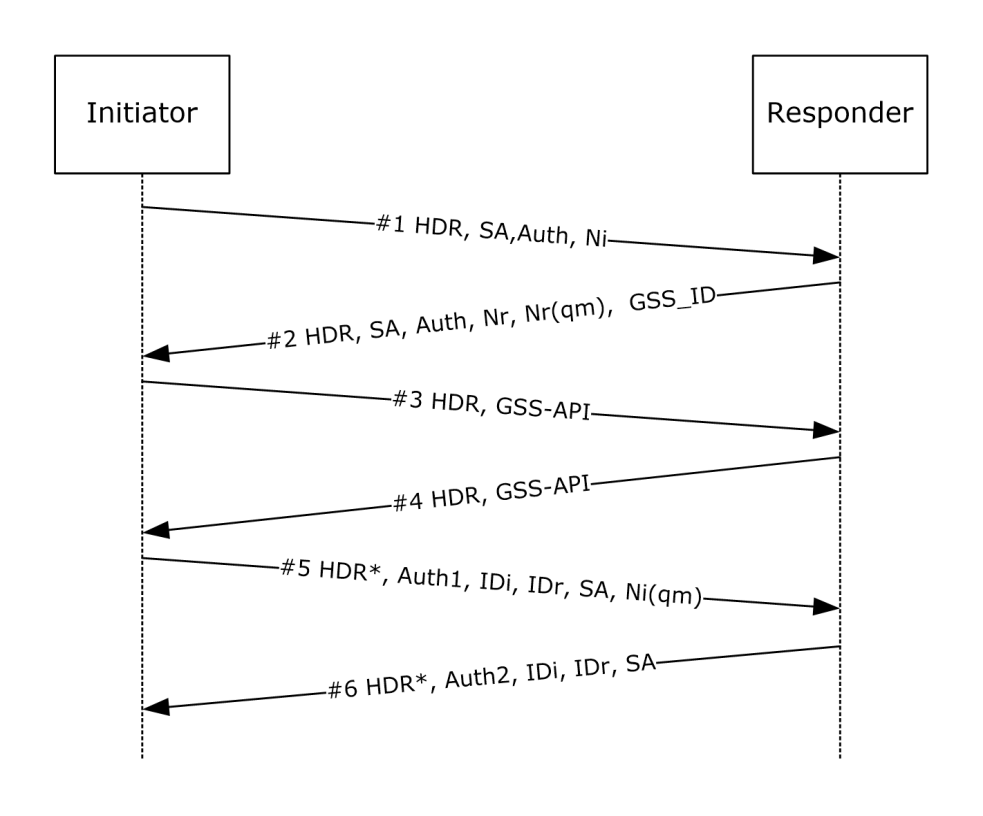
<!-- /Extracted images from page 79 -->

4  Protocol Examples

4.1  Main Mode - No Extended Mode

The following figure details a main mode (MM) exchange without a Diffie-Hellman exchange where
the GSS-API secret is used to generate the keying material.

The exchanges are as shown in the following figure.

Figure 31: Main mode - no extended mode exchange

Message #1: The initiator sends security association (SA) proposals (Kerberos or TLS), the MM
crypto options, and a nonce. Diffie-Hellman is not required, and the initiator does not send a key
exchange (KE) payload.

Message #2: The responder looks up the policy based on IP addresses only. It chooses an SA
proposal, such as Kerberos with 3DES. The responder also sends its security principal name, the
MM nonce, and the quick mode nonce.

Message #3: The initiator calls GSS-API to get a token for the peer security principal name. This
token is sent unmodified.

Message #4: The responder calls GSS-API on the initiator token. This generates a new token, which
the responder sends back. In this example, only one exchange is needed. The responder's GSS-API
exchange is done, and a GSS-API cryptographic context is available.

Message #5: The initiator calls GSS-API on the responder token. This succeeds, and the initiator now
has a cryptographic context. All the previous payloads are hashed and then signed with the key that is
generated by the GSS-API exchange. This is the HAuth1 payload. The initiator includes the traffic

79 / 91

[MS-AIPS] - v20240916
Authenticated Internet Protocol
Copyright © 2024 Microsoft Corporation
Release: September 16, 2024

<!-- Extracted images from page 80 -->
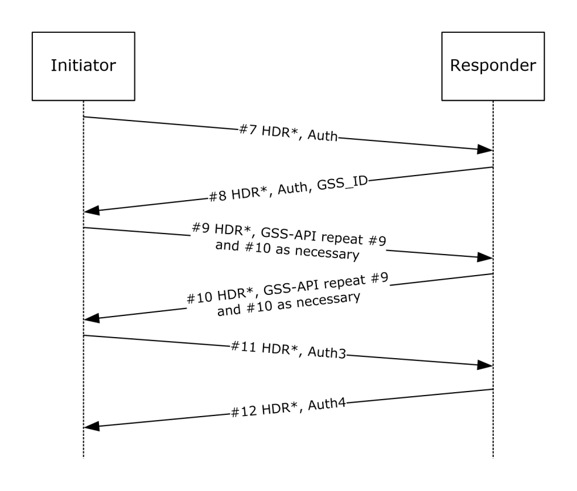
<!-- /Extracted images from page 80 -->

selectors (IDi, IDr) for the traffic to be secure on the wire, proposals for encryption or integrity in the
QM SA payload, and a nonce.

Message #6: The responder verifies HAuth1 and generates a similar HAuth2. The responder looks up
its policy based on the traffic selectors. The responder sends back the traffic selectors and SA
proposals that it has chosen. The responder then adds the QM SAs.

When the initiator receives the last packet, it validates HAuth2 and adds its QM SAs. If the last packet
that is sent by the responder is lost, the initiator retransmits its last packet. Upon receiving it, the
responder resends its last Authenticated Internet Protocol packet.

4.2  Kerberos Extended Mode

The following example shows a Kerberos authentication in extended mode (EM).

Figure 32: Kerberos extended mode authentication

Message numbering starts on top of the base-mode numbering. This is an example of the extended
authentication exchanges between the initiator (section 3.6) and responder (section 3.7).

The following security association (SA) addition rules apply to the initiator and responder.

Initiator:





The inbound SA is added prior to sending #9.

The outbound SA is added after processing #10.

Responder:



The inbound/outbound SAs are added prior to sending #10.

[MS-AIPS] - v20240916
Authenticated Internet Protocol
Copyright © 2024 Microsoft Corporation
Release: September 16, 2024

80 / 91

<!-- Extracted images from page 81 -->
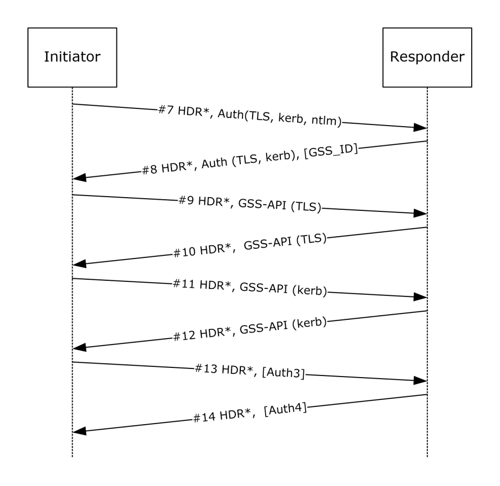
<!-- /Extracted images from page 81 -->

4.3  Extended Mode Authentication Retry

In extended mode (EM), failures are handled by retrying the authentication, if possible. The
following example shows an authentication retry.

Figure 33: Extended mode authentication retry

In message #7, the initiator proposes TLS, Kerberos, and NTLM authentication protocols. In message
#8, the responder accepts only TLS and Kerberos. The initiator begins the TLS exchange in
message #9. Failures, if any, that occur during TLS in messages #9 and #10, cause empty GSS-API
payloads to be sent. When the initiator constructs message #11, it attempts the next agreed upon
authentication method, which is Kerberos. Whenever the initiator begins a new GSS-API exchange, it
sets the GSS_NEW_GSS_EXCHANGE bit in the Flags field of the GSS-API payload. Only the initiator
can begin a new GSS-API exchange. If the responder fails and wants to initiate a new GSS-API
exchange, it sets the status field to a nonzero value that corresponds to the error code<22> in the
next GSS-API payload. This signals the initiator to retry.

[MS-AIPS] - v20240916
Authenticated Internet Protocol
Copyright © 2024 Microsoft Corporation
Release: September 16, 2024

81 / 91

5  Security

5.1  Security Considerations for Implementers

The security considerations that are listed for IKEv1 in the relevant RFCs apply to the Authenticated
Internet Protocol. In addition, protocol-specific security considerations might apply.

5.1.1  Policy Construction

The Authenticated Internet Protocol supports different authentication methods that do not necessarily
offer the same strength. These differences should be taken into account when designing Authenticated
Internet Protocol policies in order to minimize the risk of downgrade attacks.

5.1.2  Credential/Identity Protection

When the Authenticated Internet Protocol performs an authentication, it might be necessary for one
party to reveal information about its identity to the other party in order to perform the authentication.
The type of information that is leaked depends on the authentication method that is used, as
described below. Therefore, the choice of supported authentication methods affects the privacy of the
authenticating parties.

Kerberos authentication

In a Kerberos authentication exchange, the initiator never has to leak its identity and only members
of the trusted domain are able to access the ticket that is sent, assuming the integrity of the Kerberos
protocol. The Kerberos responder needs to provide information to the initiator about its identity so
that the Kerberos token can be validated; to do this, the responder puts its security principal name
in the Principal Name field of the GSS_ID payload.

Certificates

As part of a TLS exchange, the responder might pass a list of trusted roots in the clear so that the
initiator can select a certificate that is trusted by the responder.

5.2  Index of Security Parameters

Security parameter

Section

Authentication method

1.7

Encryption/authentication algorithms  1.7

Diffie-Hellman

Target principal name

Key derivation function

1.7

2.2.2

3.1

[MS-AIPS] - v20240916
Authenticated Internet Protocol
Copyright © 2024 Microsoft Corporation
Release: September 16, 2024

82 / 91

6  Appendix A: Product Behavior

The information in this specification is applicable to the following Microsoft products or supplemental
software. References to product versions include updates to those products.

The terms "earlier" and "later", when used with a product version, refer to either all preceding
versions or all subsequent versions, respectively. The term "through" refers to the inclusive range of
versions. Applicable Microsoft products are listed chronologically in this section.

The following tables show the relationships between Microsoft product versions or supplemental
software and the roles they perform.

Windows Client Releases

All Initiator Roles

All Responder Roles

Windows Vista operating system

Windows 7 operating system

Windows 8 operating system

Windows 8.1 operating system

Windows 10 operating system

Windows 11 operating system

Yes

Yes

Yes

Yes

Yes

Yes

Yes

Yes

Yes

Yes

Yes

Yes

Windows Server Releases

All Initiator Roles

All Responder Roles

Windows Server 2008 operating system

Windows Server 2008 R2 operating system

Windows Server 2012 operating system

Windows Server 2012 R2 operating system

Windows Server 2016 operating system

Windows Server operating system

Windows Server 2019 operating system

Windows Server 2022 operating system

Windows Server 2025 operating system

Yes

Yes

Yes

Yes

Yes

Yes

Yes

Yes

Yes

Yes

Yes

Yes

Yes

Yes

Yes

Yes

Yes

Yes

Exceptions, if any, are noted in this section. If an update version, service pack or Knowledge Base
(KB) number appears with a product name, the behavior changed in that update. The new behavior
also applies to subsequent updates unless otherwise specified. If a product edition appears with the
product version, behavior is different in that product edition.

Unless otherwise specified, any statement of optional behavior in this specification that is prescribed
using the terms "SHOULD" or "SHOULD NOT" implies product behavior in accordance with the
SHOULD or SHOULD NOT prescription. Unless otherwise specified, the term "MAY" implies that the
product does not follow the prescription.

[MS-AIPS] - v20240916
Authenticated Internet Protocol
Copyright © 2024 Microsoft Corporation
Release: September 16, 2024

83 / 91

<1> Section 1.3: The following Internet Key Exchange Protocol Extensions ([MS-IKEE]) are supported
in Windows releases:





IKE fragmentation

Fast failover

  Negotiation discovery

  Denial of service protection

<2> Section 1.7:  Windows releases support the following message authentication algorithms.

  NULL [RFC2410]

  HMAC-SHA1-96 [RFC2404]

  HMAC-MD5-96 [RFC2403]

  AES-GMAC [RFC4543] (not supported in Windows Vista)

  SHA-256 [SHA256] (not supported in Windows Vista)

Windows releases support the following encryption algorithms:

  NULL [RFC2410]

  DES-CBC [RFC2405]



Triple DES-CBC [RFC2451]

  AES-CBC with key sizes of 128, 192, and 256 bits [RFC3602]

  AES-GCM with key sizes of 128, 192, and 256 bits [RFC4106] (not supported in Windows Vista)

Windows releases support the following Diffie-Hellman algorithms:









The default 768-bit modular exponential (MODP) group [RFC2409]

The alternate 1024-bit MODP group [RFC2409]

The 2048-bit MODP group [RFC3526]

ECP_256 and ECP 384 [ECP]

<3> Section 1.7: The following vendor IDs are supported by the Windows implementation of the
Authenticated Internet Protocol.

Operating system version

4-byte version number

Windows Vista

00 00 00 05

Windows Server 2008

00 00 00 06

Windows 7

00 00 00 07

Windows Server 2008 R2

00 00 00 08

Windows 8 and later

00 00 00 09

Windows Server 2012 and later  00 00 00 09

[MS-AIPS] - v20240916
Authenticated Internet Protocol
Copyright © 2024 Microsoft Corporation
Release: September 16, 2024

84 / 91

Common name

String representation

Microsoft implementation Windows Vista

Microsoft implementation Windows Vista
operating system with Service Pack 1 (SP1),
Windows Server 2008

Microsoft implementation Windows 7

"MS NT5
ISAKMPOAKLEY"

+version number 5

"MS NT5
ISAKMPOAKLEY"

+version number 6

"MS NT5
ISAKMPOAKLEY"

+version number 7

Wire representation (MD5
hash of string)

1E 2B 51 69 05 99 1C 7D 7C 96
FC BF B5 87 E4 61 00 00 00 05

1E 2B 51 69 05 99 1C 7D 7C 96
FC BF B5 87 E4 61 00 00 00 06

1E 2B 51 69 05 99 1C 7D 7C 96
FC BF B5 87 E4 61 00 00 00 07

Microsoft implementation Windows Server 2008
R2

"MS NT5
ISAKMPOAKLEY"

1E 2B 51 69 05 99 1C 7D 7C 96
FC BF B5 87 E4 61 00 00 00 08

+version number 8

Microsoft implementation Windows 8 and later
clients

"MS NT5
ISAKMPOAKLEY"

1E 2B 51 69 05 99 1C 7D 7C 96
FC BF B5 87 E4 61 00 00 00 09

+version number 9

Microsoft implementation Windows Server 2012
and later servers

"MS NT5
ISAKMPOAKLEY"

1E 2B 51 69 05 99 1C 7D 7C 96
FC BF B5 87 E4 61 00 00 00 09

+version number 9

Kerberos authentication supported [GSS]

"GSSAPI"

NLB/MSCS fast failover supported [MS-IKEE]

"Vid-Initial-Contact"

NLB/MSCS fast failover supported [MS-IKEE]

"NLBS_PRESENT"

Fragmentation avoidance supported [MS-IKEE]

"FRAGMENTATION"

NAT-T supported [MS-IKEE]

"RFC 3947"

62 1B 04 BB 09 88 2A C1 E1 59
35 FE FA 24 AE EE

26 24 4D 38 ED DB 61 B3 17 2A
36 E3 D0 CF B8 19

72 87 2B 95 FC DA 2E B7 08 EF
E3 22 11 9B 49 71

40 48 B7 D5 6E BC E8 85 25 E7
DE 7F 00 D6 C2 D3

4A 13 1C 81 07 03 58 45 5C 57
28 F2 0E 95 45 2F

Negotiation discovery supported [MS-IKEE]

"MS-Negotiation
Discovery Capable"

FB 1D E3 CD F3 41 B7 EA 16 B7
E5 BE 08 55 F1 20

<4> Section 1.7: The following Vendor ID is sent by the Windows IKEv1 implementation when the
initiator or responder supports both IKEv1 and the Authenticated Internet Protocol.

Common name

Authenticated Internet Protocol
supported

String
representation

MS-MamieExists

Wire representation (MD5 hash of string)

21 4C A4 FA FF A7 F3 2D 67 48 E5 30 33 95
AE 83

<5> Section 2.1: The UDP ports are not configurable.

[MS-AIPS] - v20240916
Authenticated Internet Protocol
Copyright © 2024 Microsoft Corporation
Release: September 16, 2024

85 / 91

<6> Section 2.2.3.1: The Authenticated Internet Protocol logs the failure to the Security Event Log; it
does not report the error to the application whose network activity triggered the Authenticated
Internet Protocol exchange. For more information about these codes, see [MS-ERREF].

<7> Section 2.2.3.1: Kerberos via proxy authentication is not supported in Windows Vista, Windows
Server 2008, Windows 7, and Windows Server 2008 R2.

<8> Section 2.2.3.2.2: In Windows implementations, the responder adds 8 bytes of
Initialization_Vector after the seqNUM field if the GSS-API exchange has completed. The presence
of the Initialization_Vector is indicated by the length of the Crypto payload (16 bytes if the
Initialization_Vector is present; otherwise, 8 bytes).

<9> Section 2.2.3.5: This field can take on any Windows error-code value. For more information
about these codes, see [MS-ERREF].

<10> Section 3.1: Cryptographic parameters. Windows releases implement the following algorithms.

Message authentication algorithm

Key length (bytes)

NULL [RFC2410]

HMAC-SHA1-96 [RFC2404]

HMAC-MD5-96 [RFC2403]

N/A

20

16

AES-GMAC with key sizes of 128, 192, and 256 bits [RFC4543]  16, 24, and 32

SHA-256 [SHA256]

(Not implemented in Windows Vista)

32

Encryption algorithm

Key length (bytes)

NULL [RFC2410]

DES-CBC [RFC2405]

Triple DES-CBC [RFC2451]

N/A

8

24

AES-CBC with key sizes of 128, 192, and 256 bits [RFC3602]

16, 24, and 32

AES-GCM with key sizes of 128, 192, and 256 bits [RFC4106]

16, 24, and 32

(Not implemented in Windows Vista)

Diffie-Hellman

Default 768-bit MODP group [RFC2409]

Alternate 1024-bit MODP group [RFC2409]

2048-bit MODP group [RFC3526]

ECP_256 [ECP]

ECP_384 [ECP]

[MS-AIPS] - v20240916
Authenticated Internet Protocol
Copyright © 2024 Microsoft Corporation
Release: September 16, 2024

86 / 91

<11> Section 3.1.1: Kerberos via proxy authentication is not supported in Windows Vista, Windows
Server 2008, Windows 7, or Windows Server 2008 R2.

<12> Section 3.1.2: Negotiation retransmission timer: The first retransmission occurs after two
seconds. The time-out is doubled for each subsequent retransmission up to a maximum of four
retransmissions. In the shutdown phase, one retransmission, at most, is performed as described in
section 3.1.7.

In Windows 7 and later and in Windows Server 2008 R2 and later, the number of retransmissions of
the first negotiation packet sent by the initiator is reduced to 3. Additionally, if in co-existence mode
(section 1.7), and the IKEv1 negotiation gets a valid response to its first packet, then AuthIP stops
its retransmission timer. If in negotiation discovery mode (see [MS-IKEE] section 1.3.5), and the
responder replies with cleartext (TCP or UDP for example), then AuthIP stops its retransmission timer
on receiving cleartext for the same connection that caused the initial the AuthIP negotiation.

Notify retransmission timer: The first retransmission occurs after two seconds. The time-out is
doubled for each subsequent retransmission up to a maximum of four retransmissions. In the
shutdown phase, one retransmission, at most, is performed as described in section 3.1.7.

Authentication retry timer: The first authentication retry is triggered within a negotiation when the
current authentication method fails and there are remaining authentication methods (or remaining
authentication parameters for the current methods) that can be tried before failing the negotiation.
The retry timer expires when all existing authentication methods (and all authentication parameters
for each configured authentication method) are exhausted. The timers mentioned in the retry state
(section 3.1) are explicitly the negotiation retransmission timer on initiator and the responder time-out
timer on responder.

Responder time-out timer: The responder deletes its state if it does not receive a message from the
initiator within 60 seconds. The responder sends a NOTIFY_STATUS notify payload.

NAT-T keep-alive timer: The timer expires after 20 seconds.

quick mode rekey timer: The timer expires after 60 seconds and all old QM SAs are deleted. The
responder sends a NOTIFY_STATUS notify payload.

<13> Section 3.2.4: The following Vendor ID is sent by the Microsoft IKEv1 implementation when the
initiator or responder supports both IKEv1 and the Authenticated Internet Protocol.

Common name

Authenticated Internet Protocol
supported

String
representation

MS-MamieExists

Wire representation (MD5 hash of string)

21 4C A4 FA FF A7 F3 2D 67 48 E5 30 33 95
AE 83

<14> Section 3.2.5.1: Windows releases do not verify that the message ID field is zero.

<15> Section 3.3.5.1: Windows releases do not verify that the message ID field is zero.

<16> Section 3.4.5.1: KeyDictationWt is not supported in Windows Vista, Windows Server 2008,
Windows 7, and Windows Server 2008 R2.

<17> Section 3.6.5.1: Windows implementations do not verify that the encrypted flag is not set for
payloads denoted as HDR in the payload exchange.

<18> Section 3.7.5.1: Windows Vista does not verify that the message ID field is set to one.

<19> Section 3.8.5.1: Windows implementations do not verify that the encrypted flag is not set for
payloads denoted as HDR in the payload exchange.

87 / 91

[MS-AIPS] - v20240916
Authenticated Internet Protocol
Copyright © 2024 Microsoft Corporation
Release: September 16, 2024

<20> Section 3.8.7.1: Windows implementations do not verify that the encrypted flag is not set for
payloads denoted as HDR in the payload exchange.

<21> Section 3.10.4.1: It is possible for the cleartext SYN message to be received before the ESP
SYN message. If this scenario occurs, a common practice for the server is to drop both messages,
after which the client attempts to reconnect. This reconnection attempt will delay a connection by
approximately three seconds. For inbound TCP connections where NAT-T is not enabled, Windows can
be configured to decrypt the ESP SYN message and send it up the stack as if it were the cleartext SYN
message. By taking this action, the client is not required to reconnect. This behavior is supported by
Windows 8.1 with [MSKB-3023555] and by later clients, in addition to Windows Server 2012 R2 with
[MSKB-3023555] and by later servers.

<22> Section 4.3: The Authenticated Internet Protocol logs the failure to the Security Event Log. For
more information about these codes, see [MS-ERREF].

[MS-AIPS] - v20240916
Authenticated Internet Protocol
Copyright © 2024 Microsoft Corporation
Release: September 16, 2024

88 / 91

7  Change Tracking

No table of changes is available. The document is either new or has had no changes since its last
release.

[MS-AIPS] - v20240916
Authenticated Internet Protocol
Copyright © 2024 Microsoft Corporation
Release: September 16, 2024

89 / 91

8  Index
A

Abstract data model 76
Applicability 17
Auth_Payload packet 27
Authenticated Firewall Mode 76

C

Capability negotiation 17
Change tracking 89
Crypto payload packet 24
Crypto_Payload_0x85_Encryption_Flag_Not_Set

packet 26

ISAKMP Header Format Packet message 19
ISAKMP_Header packet 19

K

Kerberos extended mode example 80
Key_Dictation_Payload packet 30
Key_Dictation_Weight_Payload packet 31

M

Main mode - no extended mode example 79
Main mode initiator role (section 3.1 32, section 3.2

46)

Crypto_Payload_Encryption_Flag_Set packet 24

Main mode responder role (section 3.1 32, section

D

Data model - abstract 76

E

Examples
   extended mode authentication retry 81
   Kerberos extended mode 80
   main mode - no extended mode 79
Extended mode authentication retry example 81
Extended mode initiator role (section 3.1 32, section

3.6 64)

Extended mode responder role (section 3.1 32,

section 3.7 68)

F

Fields - vendor-extensible 18
Format_of_the_Generic_Payload_Header_for_the_Cr

ypto_Payload packet 26

G

Generic Payload Header Packet message 22
Generic_Payload_Header packet 22
Glossary 9
GSS_API_Payload packet 23
GSS_ID_0x86_Payload packet 27
GSS-API initiator role (section 3.1 32, section 3.8

3.3 49)

Messages
   Generic Payload Header Packet 22
   ISAKMP Header Format Packet 19
   Payload Types 22
   transport 19

N

Normative references 12
Notify_Acquire packet 30
Notify_Payload packet 28

O

Overview (synopsis) 15

P

Parameter index - security 82
Parameters - security index 82
Payload types 22
Payload Types message 22
Preconditions 16
Prerequisites 16
Product behavior 83

Q

Quick mode initiator role (section 3.1 32, section 3.4

52)

72)

Quick mode responder role (section 3.1 32, section

GSS-API responder role (section 3.1 32, section 3.9

3.5 60)

74)

I

Impersonated SA lookup 78
Implementer - security considerations 82
   credential protection 82
   identity protection 82
   overview 82
   policy construction 82
Index of security parameters 82
Informative references 14
Initialization 76
Introduction 9

[MS-AIPS] - v20240916
Authenticated Internet Protocol
Copyright © 2024 Microsoft Corporation
Release: September 16, 2024

R

References 12
   informative 14
   normative 12
Relationship to other protocols 16

S

Security
   implementer considerations 82
      credential protection 82
      identity protection 82

90 / 91

      overview 82
      policy construction 82
   parameter index 82
Standards assignments 18

T

Tracking changes 89
Transport 19

V

Vendor-extensible fields 18
Versioning 17

[MS-AIPS] - v20240916
Authenticated Internet Protocol
Copyright © 2024 Microsoft Corporation
Release: September 16, 2024

91 / 91

