[MS-AZOD]:

Authorization Protocols Overview

Intellectual Property Rights Notice for Open Specifications Documentation

  Technical Documentation. Microsoft publishes Open Specifications documentation (“this

documentation”) for protocols, file formats, data portability, computer languages, and standards
support. Additionally, overview documents cover inter-protocol relationships and interactions.

  Copyrights. This documentation is covered by Microsoft copyrights. Regardless of any other

terms that are contained in the terms of use for the Microsoft website that hosts this
documentation, you can make copies of it in order to develop implementations of the technologies
that are described in this documentation and can distribute portions of it in your implementations
that use these technologies or in your documentation as necessary to properly document the
implementation. You can also distribute in your implementation, with or without modification, any
schemas, IDLs, or code samples that are included in the documentation. This permission also
applies to any documents that are referenced in the Open Specifications documentation.
  No Trade Secrets. Microsoft does not claim any trade secret rights in this documentation.
  Patents. Microsoft has patents that might cover your implementations of the technologies

described in the Open Specifications documentation. Neither this notice nor Microsoft's delivery of
this documentation grants any licenses under those patents or any other Microsoft patents.
However, a given Open Specifications document might be covered by the Microsoft Open
Specifications Promise or the Microsoft Community Promise. If you would prefer a written license,
or if the technologies described in this documentation are not covered by the Open Specifications
Promise or Community Promise, as applicable, patent licenses are available by contacting
iplg@microsoft.com.

  License Programs. To see all of the protocols in scope under a specific license program and the

associated patents, visit the Patent Map.

  Trademarks. The names of companies and products contained in this documentation might be
covered by trademarks or similar intellectual property rights. This notice does not grant any
licenses under those rights. For a list of Microsoft trademarks, visit
www.microsoft.com/trademarks.

  Fictitious Names. The example companies, organizations, products, domain names, email

addresses, logos, people, places, and events that are depicted in this documentation are fictitious.
No association with any real company, organization, product, domain name, email address, logo,
person, place, or event is intended or should be inferred.

Reservation of Rights. All other rights are reserved, and this notice does not grant any rights other
than as specifically described above, whether by implication, estoppel, or otherwise.

Tools. The Open Specifications documentation does not require the use of Microsoft programming
tools or programming environments in order for you to develop an implementation. If you have access
to Microsoft programming tools and environments, you are free to take advantage of them. Certain
Open Specifications documents are intended for use in conjunction with publicly available standards
specifications and network programming art and, as such, assume that the reader either is familiar
with the aforementioned material or has immediate access to it.

Support. For questions and support, please contact dochelp@microsoft.com.

[MS-AZOD] - v20220614
Authorization Protocols Overview
Copyright © 2022 Microsoft Corporation
Release: June 14, 2022

1 / 60

Revision Summary

Date

Revision
History

Revision
Class

Comments

10/25/2012  1.0

1/31/2013

1.0

New

None

Released new document.

No changes to the meaning, language, or formatting of the
technical content.

8/8/2013

1.1

Minor

Clarified the meaning of the technical content.

11/14/2013  1.1

2/13/2014

1.1

5/15/2014

1.1

6/30/2015

2.0

9/24/2015

2.1

10/16/2015  2.1

None

None

None

Major

Minor

None

No changes to the meaning, language, or formatting of the
technical content.

No changes to the meaning, language, or formatting of the
technical content.

No changes to the meaning, language, or formatting of the
technical content.

Significantly changed the technical content.

Clarified the meaning of the technical content.

No changes to the meaning, language, or formatting of the
technical content.

9/26/2016

2.1

None

No changes to the meaning, language, or formatting of the
technical content.

6/1/2017

2.1

12/15/2017  3.0

11/5/2018

4.0

6/3/2021

5.0

10/26/2021  6.0

6/14/2022

6.0

None

Major

Major

Major

Major

None

No changes to the meaning, language, or formatting of the
technical content.

Significantly changed the technical content.

Significantly changed the technical content.

Significantly changed the technical content.

Significantly changed the technical content.

No changes to the meaning, language, or formatting of the
technical content.

[MS-AZOD] - v20220614
Authorization Protocols Overview
Copyright © 2022 Microsoft Corporation
Release: June 14, 2022

2 / 60

Table of Contents

1.1

1.1.1

1  Introduction ............................................................................................................ 5
Conceptual Overview .......................................................................................... 5
DAC Model ................................................................................................... 6
Authorization Information (PAC) ............................................................... 6
1.1.1.1
Security Identifiers (SIDs)........................................................................ 7
1.1.1.2
Security Descriptor .................................................................................. 8
1.1.1.3
Resource Managers ............................................................................... 11
1.1.1.4
Access Rights ....................................................................................... 11
1.1.1.5
User Rights .......................................................................................... 12
1.1.1.6
Access Token........................................................................................ 12
1.1.1.7
Impersonation ...................................................................................... 13
1.1.1.8
1.1.1.9
Inheritance .......................................................................................... 14
1.1.1.10  Windows Integrity Mechanism ................................................................ 14
Claim-Based Access Control (CBAC) Model ............................................... 14
1.1.1.11
AzMan RBAC Model ..................................................................................... 15
Roles, Tasks, and Operations .................................................................. 15
Application-Scoped Groups ..................................................................... 16
Authorization Store ............................................................................... 17
COM+ Roles Access Control Model ................................................................ 17
Glossary ......................................................................................................... 17
References ...................................................................................................... 19

1.1.2.1
1.1.2.2
1.1.2.3

1.2
1.3

1.1.2

1.1.3

2.1

2.1.4.1

2.1.4.2
2.1.4.3

2.1.4.3.1
2.1.4.3.2

2.1.1
2.1.2
2.1.3
2.1.4

2.1.4.1.1
2.1.4.1.2
2.1.4.1.3
2.1.4.1.4

2  Functional Architecture ......................................................................................... 22
Overview ........................................................................................................ 22
System Capabilities ..................................................................................... 22
Applicability ............................................................................................... 22
Authorization Process .................................................................................. 23
DAC Model ................................................................................................. 23
Protocol Communications ....................................................................... 23
Kerberos Protocol Extensions ............................................................ 23
NT LAN Manager (NTLM) Authentication Protocol ................................. 25
Digest Protocol Extensions ................................................................ 25
SSL/TLS Protocol ............................................................................. 25
Internal Components ............................................................................. 25
CBAC Model ......................................................................................... 26
Down-Level Scenarios ...................................................................... 28
Claims Transformation ..................................................................... 30
Verify Authorization .................................................................................... 31
COM+ Roles Access Control Model ................................................................ 33
Relevant Standards ..................................................................................... 33
Protocol Summary ............................................................................................ 33
Environment .................................................................................................... 34
Dependencies on This System ...................................................................... 34
Dependencies on Other Systems/Components ................................................ 34
Assumptions and Preconditions .......................................................................... 35
Use Cases ....................................................................................................... 36
DAC Model ................................................................................................. 36
File Server ........................................................................................... 36
Actors ............................................................................................ 37
Check Simple Access ....................................................................... 37
Check ACL Inheritance Access ........................................................... 38
Check Conditional ACEs-Based Access ................................................ 39
Check Claims-Based Access .............................................................. 40
Active Directory .................................................................................... 41
Actors ............................................................................................ 42

2.5.1.1.1
2.5.1.1.2
2.5.1.1.3
2.5.1.1.4
2.5.1.1.5

2.1.5
2.1.6
2.1.7

2.3.1
2.3.2

2.5.1.2.1

2.5.1.2

2.5.1.1

2.4
2.5

2.2
2.3

2.5.1

[MS-AZOD] - v20220614
Authorization Protocols Overview
Copyright © 2022 Microsoft Corporation
Release: June 14, 2022

3 / 60

2.5.1.3

2.5.2

2.5.2.1

2.5.1.3.1

2.5.1.2.2
2.5.1.2.3
2.5.1.2.4
2.5.1.2.5
2.5.1.2.6

Check Simple Access ....................................................................... 42
Check Object-Specific Access ............................................................ 43
Control Access Right-Based Access .................................................... 44
Control Validated Write-Based Access ................................................ 45
Check Object Visibility ...................................................................... 46
Auxiliary .............................................................................................. 47
Get Access Token ............................................................................ 47
AzMan RBAC Model ..................................................................................... 48
AzMan RBAC Model ............................................................................... 49
Versioning, Capability Negotiation, and Extensibility ............................................. 50
Error Handling ................................................................................................. 50
Coherency Requirements .................................................................................. 50
Security .......................................................................................................... 50
Additional Considerations .................................................................................. 50

2.6
2.7
2.8
2.9
2.10

3.1

3.1.1

3  Examples ............................................................................................................... 51
Reading from a File on Remote CBAC Aware SMB2 Share ...................................... 51
Kerberos Protocol Extensions [MS-KILE] ........................................................ 51
Service Ticket with the User and Device Claims ........................................ 51
Service Ticket Without the User Claims .................................................... 54
NT LAN Manager Authentication Protocol [MS-NLMP] ....................................... 55

3.1.1.1
3.1.1.2

3.1.2

4  Microsoft Implementations ................................................................................... 57
Product Behavior .............................................................................................. 57

4.1

5  Change Tracking .................................................................................................... 58

6  Index ..................................................................................................................... 59

[MS-AZOD] - v20220614
Authorization Protocols Overview
Copyright © 2022 Microsoft Corporation
Release: June 14, 2022

4 / 60

<!-- Extracted images from page 5 -->
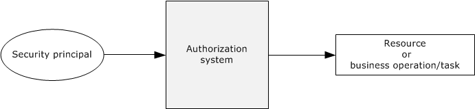
<!-- /Extracted images from page 5 -->

1  Introduction

1.1  Conceptual Overview

Authorization is the process of controlling access to resources. Once authentication has been
accomplished, the next task is to decide whether a particular request is authorized. Management of
network systems often models broad authorization decisions through roles, groups, and claims; for
example, all engineers who have access to a specific printer, all sales personnel who have access to a
certain web server, or confidential information where access is granted only to certain authorized user
groups or users based on the claims configured. Making authorization information consistently
available to a number of services allows for simpler management.

The authorization system always deals with two entities, the security principal (subject) and the
resource (object) or business operation/task, as shown in the following diagram. When a security
principal requests access to a resource or needs to perform a business operation/task that requires
access, the authorization system checks all accesses that are requested by the security principal.

The following diagram shows a generic authorization model.

Figure 1: Generic authorization model

To perform the tasks that they are designed for, applications carry out operations and access system
resources on behalf of the application's user while protecting these operations and resources from
unauthorized access. Administrators can control whether a process can access securable objects or
perform various system administration tasks.

Windows was originally designed to meet the requirements of the C2 level of the Trusted Computer
System Evaluation Criteria (TCSEC). The TCSEC program has since been supplanted by profiles that
were written under the Common Criteria for Information Technology Security Evaluation specified in
[CCITSE3.1-3], such as the Controlled Access Protection Profile (CAPP).

The C2 requirements (and later the CAPP requirements) for authorization are centered upon
discretionary access control. For discretionary access control, the owner of a particular resource (or a
delegate of the owner) determines the level of access others need, which is in contrast to mandatory
access control schemes in which another party maintains control over the resource regardless of the
expectations of the owner.

This control was initially provided through the Discretionary Access Control (DAC) Model, which is an
object-centric model using access control lists (ACLs). Each system object has an associated list of
trustees (user account and group account) with specific sets of access rights for that object. This
model lends itself well to securing access to well-defined, persistent resources, such as Active
Directory, files, and the registry.

Windows Server 2003 operating system introduced a complementary authorization interface, called
Authorization Manager (AzMan), which enables the role-based access control (RBAC) authorization
model. Authorization Manager provides a natural framework for business process applications that
require representing the organizational model within the application security framework.

[MS-AZOD] - v20220614
Authorization Protocols Overview
Copyright © 2022 Microsoft Corporation
Release: June 14, 2022

5 / 60

In the DAC model, a resource manager (RM) manages its own set of objects, which are protected by a
security descriptor. Whenever a client requests access to a resource protected by an RM, the RM
makes a call to the authorization system to verify the authorization of the client's identity. In turn, the
authorization system looks at the client security token, the requested access to the object, and the
security descriptor on the object. The authorization system responds to the RM with "yes" or "no,"
enabling the RM to determine whether the client can access the object.

In contrast to object-centric management, AzMan Role-Based Access Control (RBAC) provides a
framework for developers to develop applications that are oriented around the notion of the role.
Rather than managing access control on objects in the application, AzMan RBAC facilitates application
development by providing a central object—a role—that a user is assigned to perform a particular job
function within an application. A role directly implies authorization permissions on some defined set of
resources.

Through the abstractions of the operation and task, AzMan RBAC permissions are typically granted
through higher-level abstractions corresponding to high-level tasks defined by the application
developer. Operations represent a single unit of application code, whereas tasks can be composed of
multiple operations (and other tasks). Consider, for example, a web-based application that enables
users to report project status, to publish status for viewing, and to view status. The COM development
framework also has the notion of an application-specific role, which is very similar to the one used in
the context of the AzMan RBAC model. The key difference with the AzMan RBAC is that the COM+
roles access control model can only be used in COM/COM+ applications, whereas the AzMan RBAC
model can be integrated into any application type.

This section provides an overview of the following concepts, which are required to understand this
document.

1.1.1  DAC Model

1.1.1.1  Authorization Information (PAC)

For a server implementation of an authentication protocol, the result of the authentication produces a
variety of data. Some of the data is related to the authentication protocol, such as keys for encrypted
communication, and is covered in the relevant authentication protocol specification. Additionally, after
the identity of the client is determined, additional data that corresponds to authorization of the client
to the server is derived. This authorization information is frequently referred to as a Privilege Attribute
Certificate (PAC), and it contains group memberships and claims, or group memberships from the
domain controller. Each authentication protocol uses its own specific data structure to carry the
authorization information. This table lists the mapping of the authentication protocol with authorization
structures.

Authentication protocol

Authorization data structure

Reference technical
documents

Kerberos Protocol Extensions

Privilege attribute certificate

[MS-PAC]

Public Key Cryptography for Initial
Authentication (PKINIT) in Kerberos Protocol

Privilege attribute certificate

[MS-PAC]

NT LAN Manager (NTLM) Authentication
Protocol

NETLOGON_VALIDATION_SAM_INFO

[MS-APDS]

Digest Protocol Extensions

Privilege attribute certificate

Secure Sockets Layer (SSL)/ Transport Layer
Security (TLS) protocols

Privilege attribute certificate

[MS-AZOD] - v20220614
Authorization Protocols Overview
Copyright © 2022 Microsoft Corporation
Release: June 14, 2022

[MS-NRPC]

[MS-PAC]

[MS-DPSP]

[MS-APDS]

[MS-PAC]

[MS-RCMP]

6 / 60

<!-- Extracted images from page 7 -->
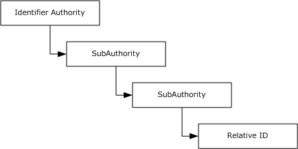
<!-- /Extracted images from page 7 -->

1.1.1.2  Security Identifiers (SIDs)

The security identifier (SID), as specified in [MS-DTYP] section 2.4.2, is an account identifier. It is
variable in length and encapsulates the hierarchical notion of issuer and identifier. It consists of a 6-
byte identifier authority field that is followed by one to fourteen 32-bit subauthority values and ends in
a single 32-bit relative identifier (RID). The following diagram shows an example of a two-
subauthority SID.

Figure 2: Windows SID with subauthorities

The original definition of a SID called out each level of the hierarchy. Each layer included a new
subauthority, and an enterprise could lay out arbitrarily complicated hierarchies of issuing authorities.
Each layer could, in turn, create additional authorities beneath it. In reality, this system created a lot
of overhead for setup and deployment and made the management model group even more
complicated. The notion of arbitrary depth identities did not survive the early stages of Windows
development; however, the structure was too deeply ingrained to be removed.

In practice, two SID patterns developed. For built-in, predefined identities, the hierarchy was
compressed to a depth of two or three subauthorities. For real identities of other principals, the
identifier authority was set to five, and the set of subauthorities was set to four.

Whenever a new issuing authority under Windows is created, (for example, a new machine deployed
or a domain is created), it is assigned a SID with an arbitrary value of 5 as the identifier authority. A
fixed value of 21 is used as a unique value to root this set of subauthorities, and a 96-bit random
number is created and parceled out to the three subauthorities with each subauthority that receives a
32-bit chunk. When the new issuing authority for which this SID was created is a domain, this SID is
known as a "domain SID".

Windows allocates RIDs starting at 1,000; RIDs that have a value of less than 1,000 are considered
reserved and are used for special accounts. For example, all Windows accounts with a RID of 500 are
considered built-in administrator accounts in their respective issuing authorities.

Thus, a SID that is associated with an account appears as shown in the following figure.

[MS-AZOD] - v20220614
Authorization Protocols Overview
Copyright © 2022 Microsoft Corporation
Release: June 14, 2022

7 / 60

<!-- Extracted images from page 8 -->
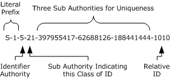
<!-- /Extracted images from page 8 -->

Figure 3: SID with account association

For most uses, the SID can be treated as a single long identifier for an account. By the time a specific
SID is associated with a resource or logged in a file, it is effectively just a single entity. For some
cases, however, it can conceptually be treated as two values: a value that indicates the issuing
authority and an identifier that is relative to that authority. Sending a series of SIDs, all from the
same issuer, is one example: the list can easily be compressed to be the issuer portion and the list of
IDs that is relative to that issuer.

It is the responsibility of the issuing authority to preserve the uniqueness of the SIDs, which implies
that the issuer does not issue the same RID more than one time. A simple approach to meeting this
requirement is to allocate RIDs sequentially. More complicated schemes are certainly possible. For
example, Active Directory uses a multimaster approach that allocates RIDs in blocks. It is possible for
an issuing authority to run out of RIDs; therefore, the issuing authority is required to handle this
situation correctly. Typically, the authority is retired.

Windows supports the concept of groups with much the same mechanisms as individual accounts.
Each group has a name, just as the accounts have names. Each group also has an associated SID.

User accounts and groups share the same SID and namespaces. Users and groups cannot have the
same name on a Windows-based system nor can the SID for a group and a user be the same.

For access control, Windows makes no distinction between a SID that is assigned to a group or one
assigned to an account. Changing the name of a user, computer, or domain does not change the
underlying SID for an account. Administrators cannot modify the SID for an account, and there is
generally no need to know the SID that is assigned to a particular account. SIDs are primarily
intended to be used internally by the operating system to ensure that accounts are uniquely identified
in the system.

1.1.1.3  Security Descriptor

The security descriptor is the basis for specifying the security that is associated with an object.
Every object that has a security descriptor linked to it is called a securable object. Securable objects
can be shared between different users, and every user can have different authorization settings.
Examples of securable objects are a file, a folder, a file system share, a printer, a registry key, and an
Active Directory object. The following diagram shows the abstract representation of the security
descriptor data structure.

The security descriptor is a collection of four main elements, as shown in the following diagram: the
owner, the group, the discretionary access control list (DACL), and the system access control list
(SACL).

[MS-AZOD] - v20220614
Authorization Protocols Overview
Copyright © 2022 Microsoft Corporation
Release: June 14, 2022

8 / 60

<!-- Extracted images from page 9 -->
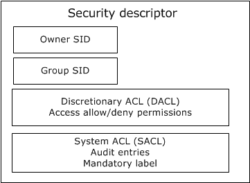
<!-- /Extracted images from page 9 -->

Figure 4: Abstract representation of security descriptor

The Owner is a SID that specifies the owner of the resource. The Group SID specifies the group
associated with the resource. The Group SID field is not evaluated by Windows components; it exists
for Portable Operating System Interface for UNIX (POSIX) compatibility. The DACL field specifies the
discretionary access control list, and the SACL field specifies the system access control list.

When associated with a resource, the security descriptor is intended to be opaque. The resource
manager (RM) is never required to examine the contents of the security descriptor. However, the
security descriptor fields can be used by the RM for other purposes. For example, in a billing scenario,
the file system can implement a storage quota system by using the owner field in the security
descriptor to determine the resources consumed by a specific user. Security descriptor algorithms are
defined in [MS-DTYP] section 2.5.3.

Discretionary access control lists (DACLs, but often shortened to ACLs) form the primary means by
which authorization is determined. An ACL is conceptually a list of <account, access-rights> pairs,
although they are significantly richer than that.

Each pair in the ACL is termed an access control entry (ACE). Each ACE has additional modifiers
that are primarily for use during inheritance. There are also several different kinds of ACEs for
representing both access to a single object (such as a file) and access to an object with multiple
properties (such as an object in Active Directory).

The ACE contains the SID of the account to which the ACE pertains. The SID can be for a user or for a
group.

Windows supports both positive ACEs, which grant or allow access rights to a particular account, and
negative ACEs, which deny access rights to a particular account. This allows a resource owner to
specify, for example, grant read access to group Y, except for user Z.

DACLs can be configured at the discretion of any account that possesses the appropriate permissions
to modify the configuration, including Take Ownership, Change Permissions, or Full Control
permissions. For a description of the SECURITY_DESCRIPTOR structure, see [MS-DTYP] section 2.4.6.

9 / 60

[MS-AZOD] - v20220614
Authorization Protocols Overview
Copyright © 2022 Microsoft Corporation
Release: June 14, 2022

<!-- Extracted images from page 10 -->
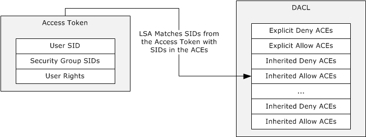
<!-- /Extracted images from page 10 -->

When access is requested to an Active Directory object, the Local Security Authority (LSA) compares
the access token of the account that is requesting access to the object to the DACL. The security
protocols check the object's DACL, searching for ACEs that apply to the user and group SIDs that are
referenced in the user's access token. The security protocols then step through the DACL until they
find any ACEs that allow or deny access to the user or to one of the user's groups. The protocols do
this by first examining ACEs that have been explicitly assigned to the object and then examining the
ACEs that have been inherited by the object. Inherited ACEs are placed in the order in which they are
inherited. ACEs inherited from the child object's parent come first, then ACEs inherited from the
grandparent, and so on up the tree of objects. The following diagram shows the evaluation process for
an access token and a DACL when a request is evaluated.

Figure 5: Evaluation process for access tokens against a DACL

The access check algorithm processes ACEs in the order in which they are present within the DACL to
determine the appropriate access. A matching allow ACE will grant access for any access mask bits
present in the ACE, while a matching deny ACE will deny access for any access mask bits in the ACE
not already granted by an allow ACE (preventing those bits from being granted by a later allow ACE).
As soon as access is granted by any one or more allow ACEs, processing will stop and access will be
granted. If a specific desired access bit is denied by a deny ACE (and has not been already granted by
an allow ACE) then processing will stop and access will be denied. Thus the recommendation is to
always place deny ACEs at the beginning of the ACL followed by allow ACEs, if the deny ACEs should
take precedence over the allow ACEs. If none of the user SIDs or group SIDs in the access token
match the DACL, the user is denied access implicitly.

In Windows, a security principal's level of access to files and folders is determined by NTFS file system
and share permissions. These permissions are discretionary: that is, anyone with ownership of a file or
folder, Change permissions, or Full Control permissions can assign access control at their discretion.
When Windows is first installed, Windows assigns default permission structures to operating system
files and folders, but a user might be required to alter these permissions to meet specific security
requirements.

When a user attempts to access a file or folder on an NTFS file system partition, the user's access
token is compared with the DACL of the file or folder. If no ACEs correspond to a SID in the user's
access token, the user is implicitly denied access to the resource. If ACEs correspond to the user's
access token, the ACEs are applied in the following order:

1.  Explicit deny

2.  Explicit allow

3.  Inherited deny

4.  Inherited allow

[MS-AZOD] - v20220614
Authorization Protocols Overview
Copyright © 2022 Microsoft Corporation
Release: June 14, 2022

10 / 60

ACEs that apply to the user are cumulative, which means that the user receives the sum of the ACEs
that apply to his or her user account and to the groups of which the user is a member. For example, if
an ACL contains two allow ACEs that apply to the user, one for read access and the other for write
access, the user receives read/write access.

A system access control list (SACL) enables administrators to log attempts to access a secured object.
Like a DACL, a SACL is a list of ACEs. Each ACE specifies the types of access attempts made by a
specified account, which cause the system to generate a record in the security event log. An ACE in an
SACL can generate audit records when an access attempt fails, when it succeeds, or both. For more
details about the security descriptor, see [MS-DTYP] section 2.4.6.

The security descriptor of a file system object is stored in the NTFS file system, whereas the security
descriptor of an Active Directory object is stored in the object's nTSecurityDescriptor attribute (see
[MS-ADA3] section 2.37). For more details, see [MS-DTYP] section 2.5.3.4.

The SECURITY_DESCRIPTOR structure ([MS-DTYP] section 2.4.6) is a compact binary representation
of the security associated with an object in a directory, or on a file system, or in other stores.
However, it is not convenient for use in tools that operate primarily on text strings. Therefore, a text-
based form of the security descriptor is available for situations when a security descriptor is carried by
a text method. This format is the Security Descriptor Description Language (SDDL). For more
information about this format, see [MS-DTYP] section 2.5.1.

1.1.1.4  Resource Managers

In the DAC model, a resource manager (RM) is the code or component that implements one or
more securable object types. Many RMs--including the file system, registry, Active Directory, and
operating system constructs, such as processes--exist in a Windows-based system. The NTFS file
system is a resource manager that implements files and directories; the Windows registry is a
resource manager that implements keys. Even though these RMs control very different objects, they
share a common method for controlling access.

Windows also distinguishes between ordinary objects in the RM and containers that are exposed by
the RM. In the file system, files are objects and directories are containers. This distinction is important
during the creation of new objects.

To participate in the authorization scheme, the resource manager is required to maintain a security
descriptor with each object that is protected. The resource manager merely needs to be able to
retrieve the security descriptor for an object when authorization validation is required and is not
required to understand the contents.

1.1.1.5  Access Rights

The access mask or rights communicate to the authorization system what the process (which is acting
on a user's identity) is requesting to do with a resource, for example, read a file or write to a file. For
more details, see [MS-DTYP] section 2.4.3.

Different resource managers and resource types have different access rights. Files have read and write
access, but processes have entirely different rights, such as terminate the process. However, all
resource managers use the same formats for encoding access rights in the access control entries
(ACEs). This is done by allowing the resource managers to define their own specific access rights.

Windows accomplishes this by partitioning the access rights space. Access rights can be encoded into
a single, 32-bit value in the ACE. The most significant 16 bits are considered standard access rights
and are common across all resource managers. These rights include delete access, generic-read
access, and other similar rights. These rights are either expected of all resource managers (such as
delete) or are used in a way that enable programs to work with multiple resource managers in a
similar manner.

11 / 60

[MS-AZOD] - v20220614
Authorization Protocols Overview
Copyright © 2022 Microsoft Corporation
Release: June 14, 2022

The least significant 16 bits are termed object-specific and are meaningful only to the resource
manager that defines them. Thus the file system might define that bit 1 indicates the capability to
read the file and that bit 2 indicates the capability to write the file, whereas the registry might define
bit 1 to enumerate subkeys and bit 2 to read a key's value.

Additionally, DAC supports defining access rights using GUIDs, and in this way arbitrary number of
access rights can be defined. Active Directory uses this model as described in [MS-ADTS] section
5.1.3.2.1 and section 5.1.3.2.2.

The following table lists the mapping of resource managers with the corresponding access rights data
structure.

Resource manager type  Access rights reference

Active Directory objects

[MS-ADTS] section 5.1.3.2

NTFS objects

[MS-SMB2] section 2.2.13.1

[MS-SMB] section 2.2.1.4

Registry objects

[MS-RRP] section 2.2.3

Printer objects

[MS-RPRN] section 2.3.1

[MS-PAN] section 3.1.1.4.1

1.1.1.6  User Rights

User rights determine the authority to perform an operation that affects an entire computer rather
than a particular object. User rights are assigned by administrators to individual users or groups as
part of the security settings for the computer. Although user rights can be managed centrally through
Group Policy, they are applied locally. Users can, and usually do, have different user rights on different
computers.

User rights can be split into two categories: logon rights and user privileges. Logon rights control who
can log on to a computer system and how to log on. User privileges are used to control access to
system resources and system-related operations, such as changing the system time or the ability to
shut down the system.

User rights grant specific privileges and logon rights to users and groups in a computing environment.

For a list of privileges that are supported in Windows versions, see [MS-LSAD] section 3.1.1.2.1, and
for logon rights, see [MS-LSAD] section 3.1.1.2.2.

1.1.1.7  Access Token

Authorization contexts are built from the authorization information that is obtained during or after the
authentication process, from server-local information, or a combination of the two, depending on
implementation choices.

The authorization context is also referred to as the access token, which is a collection of the groups
and claims associated with the client principal and potentially the device (such as a computer) from
which the client is connecting, as well as additional optional policy information. The authorization
context plays a central role in determining access through the evaluation of a security descriptor. Note
that the token is never passed directly across the network; tokens are local information, and the
actual representation is implementation-specific. This token is represented as an abstract data
structure as shown in the following diagram.

12 / 60

[MS-AZOD] - v20220614
Authorization Protocols Overview
Copyright © 2022 Microsoft Corporation
Release: June 14, 2022

<!-- Extracted images from page 13 -->
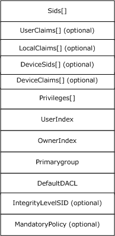
<!-- /Extracted images from page 13 -->

Figure 6: Access token abstract representation

For descriptions of access token structure fields, see [MS-DTYP] section 2.5.2, and for more
information about tokens in Windows, see [MSDN-ACCTOKENS].

1.1.1.8  Impersonation

In distributed systems, it is typical for a server to accomplish tasks on behalf of a client. The
functionality of a server performing a task using the security context of a client to access the server's
local resources is called impersonation.

A primary use of impersonation is to perform access checks against the client identity. Using the client
identity for access checks can cause access to be either restricted or expanded, depending on what
the client has permission to do. For example, a file server might have files that contain confidential
information and each of these files is protected by an ACL. To help prevent a client from obtaining
unauthorized access to information in these files, the server can impersonate the client before
accessing the files.

See [MS-DTYP] section 2.7 for Impersonation Abstract Interfaces. Additional references for
information on Windows impersonation include the following:

13 / 60

[MS-AZOD] - v20220614
Authorization Protocols Overview
Copyright © 2022 Microsoft Corporation
Release: June 14, 2022

  Delegation and Impersonation: [MSFT-DAI]

  Client Impersonation (RPC): [MSFT-RPCCI]

  Client Impersonation (API functions): [MSDN-CI]

1.1.1.9  Inheritance

The DAC model supports a concept of inheritance by which new objects can inherit one or more ACEs
from their parent container. In practice, this allows an administrator to establish default security on,
for example, a directory, and all new files that are created in that directory receive a preset ACL.
Although the owner of the file can still override that ACL and establish its own ACL, if nothing is done
(through the premise of DAC), the default is what the administrator has established.

One attribute that can be applied to ACEs is the Object-Inherit flag. This flag indicates that when a
new object is created, this ACE is carried forward to the security descriptor of the new object. A
Container-Inherit flag indicates that new containers created under this container will receive this
ACE. For the file system, this allows different default ACLs for directories as opposed to files. An
Inherit-Only flag indicates that when a child object is created, this ACE is carried forward to the
security of the child object if either an Object-Inherit or a Container-Inherit flag is present on the
parent container object. This Inherit-Only ACE does not control access to the object to which it is
attached. For more details, see [MS-DTYP] section 2.4.4.1.

1.1.1.10

Windows Integrity Mechanism

Beginning with Windows Vista operating system, the Windows integrity mechanism extends the
security architecture by defining a new access control entry (ACE) type to represent an integrity
level in an object's security descriptor (see [MS-DTYP] section 2.4.6). Windows restricts access
rights depending on whether the subject's integrity level is equal to, higher than, or lower than the
object's integrity level. The integrity level of an object is stored as a mandatory label ACE that
distinguishes it from the discretionary ACEs governing access to the object.

The ACE represents the object integrity level. An integrity level is also assigned to the access token
when the access token is initialized. The integrity level in the access token represents a subject
integrity level. The integrity level in the access token is compared to the integrity level in the security
descriptor when the authorization system performs an access check. For an example of the
MandatoryIntegrityCheck algorithm pseudocode, see [MS-DTYP] section 2.5.3.3. The security
subsystem implements the integrity level as a mandatory label to distinguish it from the discretionary
access (under user control) that DACLs provide. For more information about Windows integrity
mechanism design, see [MSDN-WIMD].

1.1.1.11

Claim-Based Access Control (CBAC) Model

Conditional ACEs or expressions were introduced to the authorization system to enable its access
control decisions to be not only based on the identity of the trustees, but also based on whether
trustees met the particular conditions. A user access request can be granted or denied by comparing
the ACLs on the security descriptor with the attributes, called claims, of the user access token. For
more details on the conditional ACEs, see [MS-DTYP] section 2.4.4.17.

A claim is an attribute that makes an assertion about an entity with which it is associated. Claims are
broadly classified in three categories based on entity: user claims, device claims, and resource
properties or claims.

User claim: A claim that is associated with an authenticated user account. Examples of user claims are
employer of the user, type of the employment, role in organization, and organizational division of the
user.

[MS-AZOD] - v20220614
Authorization Protocols Overview
Copyright © 2022 Microsoft Corporation
Release: June 14, 2022

14 / 60

Device claim: A claim that is associated with an authenticated computer account. Along with the
claims, it can be included in the user token of the user who is trying to access the resource. Examples
of device claims are the IT management status of the computer and the department in which the
computer is designated to operate.

Resource property: A property that is associated with the resource on the system. Examples of
resource properties are classification of the resource such as High-Business-Impact, Confidential, and
Personally-Identifiable-Information.

CBAC is an access control paradigm that uses the claims to make access-control decisions to
resources. In Windows, CBAC is built on the conditional ACEs feature, not only to use the user claims,
but also to use the resource claims, which are referred to as resource properties, in order to make
access control decisions. If the resource also has a resource claim "Division" that is equal to Sales, the
policy condition can be stated using the SDDL syntax.

"O:BAG:BAD:(XA; ;FX;;;S-1-1-0;(@User. Division==@Resource. Division))"

Using this approach, the "Division" claim of the resource can be separately defined and changed
without having to update the conditional expression on the resource.

1.1.2  AzMan RBAC Model

1.1.2.1  Roles, Tasks, and Operations

In contrast to the DAC model, which is oriented around objects, the AzMan RBAC model attempts to
orient the common administrative experience around user roles. Rather than assigning permissions to
objects, an AzMan RBAC framework enables applications to present administrators with a
management experience more aligned with the organizational structure of a company. AzMan RBAC
provides a central object—a role—that a user is assigned to perform a particular job or application
function. Ideally, an RBAC application is designed such that the administrator requires less knowledge
of the object storage structure. This approach can be used if the RBAC application provides a
simplifying abstraction into resource collections referred to as scopes. A role implies authorization
permissions on some scope of resources, as shown in the following diagram.

[MS-AZOD] - v20220614
Authorization Protocols Overview
Copyright © 2022 Microsoft Corporation
Release: June 14, 2022

15 / 60

<!-- Extracted images from page 16 -->
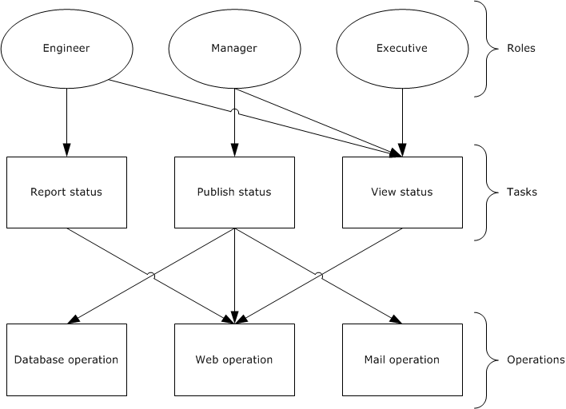
<!-- /Extracted images from page 16 -->

Figure 7: AzMan RBAC permissions access workflow

In the AzMan RBAC model, the role is the interface that an administrator uses to manage permissions
and assignments. For example, a company can create a role called "Engineer" that is defined in terms
of the permissions that engineers require for their jobs. Each engineer is assigned to the "Engineer"
role and instantly has all required permissions for that job. Similarly, engineers who leave the position
of engineer are removed from the "Engineer" role and no longer have engineer access. Whereas ACLs
work well for well-defined, persistent resources, the role-based model lends itself well to protecting
workflow or groups of multiple distinct operations (for example, "read from database" and "send
email") to be performed by the application. The preceding diagram illustrates the "Engineer" role with
permission to report and view status, the "Manager" role with permission to publish and view status,
and the "Executive" role with permission to view status.

In Windows, the Authorization Manager framework provides an interface for developing RBAC
applications.

1.1.2.2  Application-Scoped Groups

Authorization Manager role-based access control (AzMan RBAC) also allows users to be collected into
groups. AzMan RBAC groups are similar to groups in the Active Directory service, but they are
maintained for a specific set of applications, a single application, or a scope within an application.

Authorization Manager introduces three types of application-scoped groups:

  Application Basic Group: Similar to Windows security groups, the application basic group
contains a list of members. Unlike Windows security groups, it also has an additional list for
nonmembers. The nonmembers list allows for exceptions so that a large group can be used but a
smaller group or particular user can be excluded.

  Lightweight Directory Access Protocol Query Group: A group defined by an LDAP query (see
[RFC4511]) against the attributes of a given Active Directory user account. At the time of access,

16 / 60

[MS-AZOD] - v20220614
Authorization Protocols Overview
Copyright © 2022 Microsoft Corporation
Release: June 14, 2022

the LDAP query is run to determine if the user is a member of that group. This allows for flexible
group membership that remains up-to-date with the user's Active Directory account object. For
example, a Managers group could contain an LDAP query that includes all users who have direct
reports.



 BizRule-Based Group: This group allows membership to a group to be based on the AzMan
BizRule script evaluation.

1.1.2.3  Authorization Store

The object-based authorization framework maintains access rights in DACLs on the objects. In the
role-based model, however, security information is maintained in a separate location from objects, in
a policy store.

In Windows, the Authorization Manager allows authorization policy to be stored in either Active
Directory, or in files in .xml format, or on an SQL server. Because administrators on the system that
contains the authorization policy store have a high degree of access to the store, the authorization
policy store is located on a trusted system.

When using the Active Directory store, Authorization Manager creates Active Directory objects for the
store itself and child objects for each application group, application, operation, task, role, and scope.
The scope object can contain tasks, roles, and groups created in that scope.

Authorization Manager also allows the authorization policy to be stored in .xml format on a file stored
on an NTFS file system (protected by an ACL). The XML store can be kept on the same computer as
an Authorization Manager server or it can be stored remotely.

1.1.3  COM+ Roles Access Control Model

For details on the COM+ roles access control model, see [MSDN-COM+Security].

1.2  Glossary

This document uses the following terms:

access control entry (ACE): An entry in an access control list (ACL) that contains a set of user

rights and a security identifier (SID) that identifies a principal for whom the rights are
allowed, denied, or audited.

access control list (ACL): A list of access control entries (ACEs) that collectively describe the
security rules for authorizing access to some resource; for example, an object or set of objects.

Active Directory: The Windows implementation of a general-purpose directory service, which uses

LDAP as its primary access protocol. Active Directory stores information about a variety of
objects in the network such as user accounts, computer accounts, groups, and all related
credential information used by Kerberos [MS-KILE]. Active Directory is either deployed as Active
Directory Domain Services (AD DS) or Active Directory Lightweight Directory Services (AD LDS),
which are both described in [MS-ADOD]: Active Directory Protocols Overview.

Active Directory client: The application that is running on the client computer. The user who is
the primary actor uses this application to access objects or attributes of the Active Directory.
The Active Directory client application uses the Active Directory protocols, as described in
[MS-ADOD].

Active Directory server: The service or process that is running on the server computer under the

security context of the identity of the Active Directory client.

[MS-AZOD] - v20220614
Authorization Protocols Overview
Copyright © 2022 Microsoft Corporation
Release: June 14, 2022

17 / 60

application client: The application that is running on the client computer.  The user who is the

primary actor uses this application to perform required business operations and business tasks.

central access policy (CAP): An authorization policy that is specified by a GPO component and

applied to policy targets to facilitate centralized access control of resources.

central access rule (CAR): An object that is stored in the Central Access Policy Rules List of a

central access policy (CAP) object. Each CAR contains an authorization policy that specifies the
resources, users, and access conditions to which the rule applies.

claim: An assertion about a security principal expressed as the n-tuple {Identifier, ValueType, m

Value(s) of type ValueType} where m is greater than or equal to 1. A claim with only one Value
in the n-tuple is called a single-valued claim; a claim with more than one Value is called a multi-
valued claim.

discretionary access control list (DACL): An access control list (ACL) that is controlled by

the owner of an object and that specifies the access particular users or groups can have to the
object.

domain controller (DC): The service, running on a server, that implements Active Directory, or
the server hosting this service. The service hosts the data store for objects and interoperates
with other DCs to ensure that a local change to an object replicates correctly across all DCs.
When Active Directory is operating as Active Directory Domain Services (AD DS), the DC
contains full NC replicas of the configuration naming context (config NC), schema naming
context (schema NC), and one of the domain NCs in its forest. If the AD DS DC is a global
catalog server (GC server), it contains partial NC replicas of the remaining domain NCs in its
forest. For more information, see [MS-AUTHSOD] section 1.1.1.5.2 and [MS-ADTS]. When
Active Directory is operating as Active Directory Lightweight Directory Services (AD LDS),
several AD LDS DCs can run on one server. When Active Directory is operating as AD DS, only
one AD DS DC can run on one server. However, several AD LDS DCs can coexist with one AD
DS DC on one server. The AD LDS DC contains full NC replicas of the config NC and the schema
NC in its forest. The domain controller is the server side of Authentication Protocol Domain
Support [MS-APDS].

file server: The service or process on a server computer that implements the server-side file

access protocol components to enable remote file sharing for the file clients.

forest: One or more domains that share a common schema and trust each other transitively. An
organization can have multiple forests. A forest establishes the security and administrative
boundary for all the objects that reside within the domains that belong to the forest. In
contrast, a domain establishes the administrative boundary for managing objects, such as users,
groups, and computers. In addition, each domain has individual security policies and trust
relationships with other domains.

globally unique identifier (GUID): A term used interchangeably with universally unique

identifier (UUID) in Microsoft protocol technical documents (TDs). Interchanging the usage of
these terms does not imply or require a specific algorithm or mechanism to generate the value.
Specifically, the use of this term does not imply or require that the algorithms described in
[RFC4122] or [C706] have to be used for generating the GUID. See also universally unique
identifier (UUID).

integrity level: The attributed trustworthiness of an entity or object.

Key Distribution Center (KDC): The Kerberos service that implements the authentication and
ticket granting services specified in the Kerberos protocol. The service runs on computers
selected by the administrator of the realm or domain; it is not present on every machine on the
network. It has to have access to an account database for the realm that it serves. KDCs are
integrated into the domain controller role. It is a network service that supplies tickets to
clients for use in authenticating to services.

18 / 60

[MS-AZOD] - v20220614
Authorization Protocols Overview
Copyright © 2022 Microsoft Corporation
Release: June 14, 2022

Local Security Authority (LSA) database: A Microsoft-specific terminology for the part of the

user account database containing account privilege information (such as specific account rights)
and domain security policy information.

relative identifier (RID): The last item in the series of SubAuthority values in a security

identifier (SID) [SIDD]. It distinguishes one account or group from all other accounts and
groups in the domain. No two accounts or groups in any domain share the same RID.

resource manager (RM): The participant that is responsible for coordinating the state of a
resource with the outcome of atomic transactions. For a specified transaction, a resource
manager enlists with exactly one transaction manager to vote on that transaction outcome and
to obtain the final outcome. A resource manager is either durable or volatile, depending on its
resource.

role-based access control (RBAC): The Authorization Manager-based access control paradigm

that controls the access to the resources or business process based on role permissions.

security descriptor: A data structure containing the security information associated with a

securable object. A security descriptor identifies an object's owner by its security identifier
(SID). If access control is configured for the object, its security descriptor contains a
discretionary access control list (DACL) with SIDs for the security principals who are
allowed or denied access. Applications use this structure to set and query an object's security
status. The security descriptor is used to guard access to an object as well as to control which
type of auditing takes place when the object is accessed. The security descriptor format is
specified in [MS-DTYP] section 2.4.6; a string representation of security descriptors, called
SDDL, is specified in [MS-DTYP] section 2.5.1.

security identifier (SID): An identifier for security principals that is used to identify an account

or a group. Conceptually, the SID is composed of an account authority portion (typically a
domain) and a smaller integer representing an identity relative to the account authority, termed
the relative identifier (RID). The SID format is specified in [MS-DTYP] section 2.4.2; a string
representation of SIDs is specified in [MS-DTYP] section 2.4.2 and [MS-AZOD] section 1.1.1.2.

security principal: An identity that can be used to regulate access to resources. A security

principal can be a user, a computer, or a group that represents a set of users.

system access control list (SACL): An access control list (ACL) that controls the generation

of audit messages for attempts to access a securable object. The ability to get or set an object's
SACL is controlled by a privilege typically held only by system administrators.

ticket-granting ticket (TGT): A special type of ticket that can be used to obtain other tickets.

The TGT is obtained after the initial authentication in the Authentication Service (AS) exchange;
thereafter, users do not need to present their credentials, but can use the TGT to obtain
subsequent tickets.

1.3  References

[MS-ADA3] Microsoft Corporation, "Active Directory Schema Attributes N-Z".

[MS-ADOD] Microsoft Corporation, "Active Directory Protocols Overview".

[MS-ADSC] Microsoft Corporation, "Active Directory Schema Classes".

[MS-ADTS] Microsoft Corporation, "Active Directory Technical Specification".

[MS-APDS] Microsoft Corporation, "Authentication Protocol Domain Support".

[MS-AUTHSOD] Microsoft Corporation, "Authentication Services Protocols Overview".

[MS-AZOD] - v20220614
Authorization Protocols Overview
Copyright © 2022 Microsoft Corporation
Release: June 14, 2022

19 / 60

[MS-AZMP] Microsoft Corporation, "Authorization Manager (AzMan) Policy File Format".

[MS-CAPR] Microsoft Corporation, "Central Access Policy Identifier (ID) Retrieval Protocol".

[MS-CIFS] Microsoft Corporation, "Common Internet File System (CIFS) Protocol".

[MS-COMA] Microsoft Corporation, "Component Object Model Plus (COM+) Remote Administration
Protocol".

[MS-CTA] Microsoft Corporation, "Claims Transformation Algorithm".

[MS-DPSP] Microsoft Corporation, "Digest Protocol Extensions".

[MS-DTYP] Microsoft Corporation, "Windows Data Types".

[MS-FASOD] Microsoft Corporation, "File Access Services Protocols Overview".

[MS-FCIADS] Microsoft Corporation, "File Classification Infrastructure Alternate Data Stream (ADS)
File Format".

[MS-FSA] Microsoft Corporation, "File System Algorithms".

[MS-FSMOD] Microsoft Corporation, "File Services Management Protocols Overview".

[MS-FSRM] Microsoft Corporation, "File Server Resource Manager Protocol".

[MS-GPCAP] Microsoft Corporation, "Group Policy: Central Access Policies Protocol Extension".

[MS-KILE] Microsoft Corporation, "Kerberos Protocol Extensions".

[MS-LSAD] Microsoft Corporation, "Local Security Authority (Domain Policy) Remote Protocol".

[MS-NEGOEX] Microsoft Corporation, "SPNEGO Extended Negotiation (NEGOEX) Security Mechanism".

[MS-NLMP] Microsoft Corporation, "NT LAN Manager (NTLM) Authentication Protocol".

[MS-NRPC] Microsoft Corporation, "Netlogon Remote Protocol".

[MS-PAC] Microsoft Corporation, "Privilege Attribute Certificate Data Structure".

[MS-PAN] Microsoft Corporation, "Print System Asynchronous Notification Protocol".

[MS-PKCA] Microsoft Corporation, "Public Key Cryptography for Initial Authentication (PKINIT) in
Kerberos Protocol".

[MS-PRSOD] Microsoft Corporation, "Print Services Protocols Overview".

[MS-RAA] Microsoft Corporation, "Remote Authorization API Protocol".

[MS-RCMP] Microsoft Corporation, "Remote Certificate Mapping Protocol".

[MS-RDSOD] Microsoft Corporation, "Remote Desktop Services Protocols Overview".

[MS-RPRN] Microsoft Corporation, "Print System Remote Protocol".

[MS-RRP] Microsoft Corporation, "Windows Remote Registry Protocol".

[MS-SFU] Microsoft Corporation, "Kerberos Protocol Extensions: Service for User and Constrained
Delegation Protocol".

[MS-AZOD] - v20220614
Authorization Protocols Overview
Copyright © 2022 Microsoft Corporation
Release: June 14, 2022

20 / 60

[MS-SMB2] Microsoft Corporation, "Server Message Block (SMB) Protocol Versions 2 and 3".

[MS-SMB] Microsoft Corporation, "Server Message Block (SMB) Protocol".

[MS-SPNG] Microsoft Corporation, "Simple and Protected GSS-API Negotiation Mechanism (SPNEGO)
Extension".

[MS-TDS] Microsoft Corporation, "Tabular Data Stream Protocol".

[MS-TLSP] Microsoft Corporation, "Transport Layer Security (TLS) Profile".

[MSDN-ACCTOKENS] Microsoft Corporation, "Access Tokens", http://msdn.microsoft.com/en-
us/library/aa374909.aspx

[MSDN-AuthMgr] Microsoft Corporation, "Developing Applications Using Windows Authorization
Manager", http://msdn.microsoft.com/en-us/library/aa480244.aspx

[MSDN-CI] Microsoft Corporation, "Client Impersonation", http://msdn.microsoft.com/en-
us/library/aa376391.aspx

[MSDN-COM+Security] Microsoft Corporation, "COM+ Security", http://msdn.microsoft.com/en-
us/library/windows/desktop/ms681314(v=vs.85).aspx

[MSDN-WIMD] Microsoft Corporation, "Windows Integrity Mechanism Design",
http://msdn.microsoft.com/en-us/library/bb625963.aspx

[MSFT-DAI] Microsoft Corporation, "Delegation and Impersonation", http://msdn.microsoft.com/en-
us/library/windows/desktop/ms680054(v=vs.85).aspx

[MSFT-RPCCI] Microsoft Corporation, "Client Impersonation", http://msdn.microsoft.com/en-
us/library/windows/desktop/aa373582(v=vs.85).aspx

[RFC4511] Sermersheim, J., "Lightweight Directory Access Protocol (LDAP): The Protocol", RFC 4511,
June 2006, https://www.rfc-editor.org/info/rfc4511

[MS-AZOD] - v20220614
Authorization Protocols Overview
Copyright © 2022 Microsoft Corporation
Release: June 14, 2022

21 / 60

2  Functional Architecture

2.1  Overview

This section provides overviews of the following authorization models: The DAC and CBAC models, the
AzMan RBAC model, and the COM+ roles access control model.

2.1.1  System Capabilities

The Authorization protocols enable the applications to make access control decisions. In Windows, the
authorization system has the capability to support the following authorization models:

  DAC and CBAC models

  AzMan RBAC model

  COM+ roles access control model

The following table illustrates the features of the DAC model that are implemented in Windows
resource managers.

Authorization feature

Active Directory
objects

NTFS file system
objects

Registry
objects

Printer
objects

Inheritance

Yes

Yes

Yes

Yes

(see [MS-DTYP] section
2.5.3.4)

Object-specific access

Yes

(see [MS-ADTS] section
5.1.3.3.3)

Control access rights

Yes

(see [MS-ADTS] section
5.1.3.2.1)

Validated write rights

Yes

(see [MS-ADTS] section
5.1.3.2.2)

Object visibility

Yes

Conditional expression ACEs

No

Claims (CBAC)

No

2.1.2  Applicability

No

No

No

No

Yes

Yes

No

No

No

No

No

No

No

No

No

No

No

No

The DAC model is suited for well-defined persistent resources such as Active Directory, files, and the
registry. CBAC is an extension to the DAC model, applicable to file resources on a file server.

The Authorization Manager-based RBAC model provides a natural framework for business process
applications that require representing the organizational model within the application security
framework. In Windows, remote desktop gateway applications use this model.

[MS-AZOD] - v20220614
Authorization Protocols Overview
Copyright © 2022 Microsoft Corporation
Release: June 14, 2022

22 / 60

The COM+ roles authorization model is applicable to applications that are developed using COM and
COM+ development frameworks.

2.1.3  Authorization Process

Windows determines access so that the results are always predictable and consistent. The
authorization process is as follows:

To determine access, the calling RM supplies the security descriptor (which contains the ACL) with the
identity of the user and all of the groups of which the user is a member, as well as the access
requested by the user. The following code example illustrates the authorization process.

 Security Descriptor: Owner: U1, DACL: <<U2, Read>, <G1, Read>,
  <G2, Write>>
 Identity: <U1, G2>
 Access Request: Write

In this example, the security descriptor has an ACL that grants U2 read access, G1 read access, and
G2 write access. The identity of the user making the request is U1, and the user is also a member of
the group G2. The request is for write access.

When processing this request, Windows iterates through the entries in the ACL, testing against the
identity. If the identity in the ACE matches one of the identities of the user, the ACE is examined
further. In this example, the first two ACEs do not match any identity, and so they are skipped. The
third ACE applies (G2 matches), and then the granted access rights are compared against the access
request. They match, and the user is therefore granted access.

As noted earlier, multiple access rights are encoded together, and therefore the access request could
be for both read access and write access. In the preceding example, access would be denied because
G2 was granted only write access.

The following code example shows that the requested rights do not all have to be granted by a single
ACE.

 Security Descriptor: Owner:U1, DACL:<<U2,Read>,<G1,Read>,<G2,Write>>
 Identity:<U1,G1,G2>
 Access Request: Read,Write

The process is as follows:

The first ACE does not match, and so it is skipped. The second ACE now does match and is therefore
examined further. The granted access is removed from the access request, in this case, read. Because
there are still values left in the access request, processing continues. The third ACE on G2 matches
and grants write access. The granted write access is removed from the access request, and now there
are no remaining access requests. The access is granted, and processing stops.

2.1.4  DAC Model

2.1.4.1  Protocol Communications

2.1.4.1.1 Kerberos Protocol Extensions

[MS-AZOD] - v20220614
Authorization Protocols Overview
Copyright © 2022 Microsoft Corporation
Release: June 14, 2022

23 / 60

<!-- Extracted images from page 24 -->
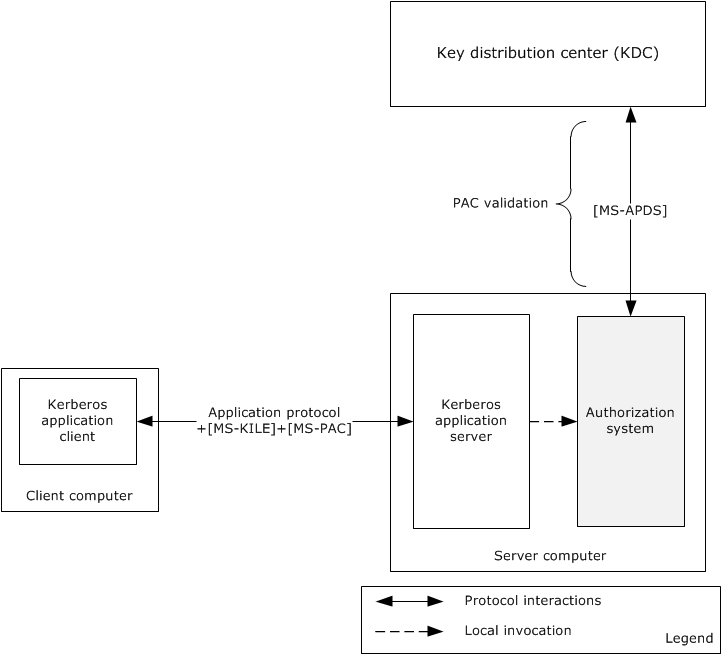
<!-- /Extracted images from page 24 -->

The following diagram shows the protocol interactions when using Kerberos Protocol Extensions (KILE)
(see [MS-KILE]) or Public Key Cryptography for Initial Authentication (PKCA) (see [MS-PKCA]) as the
authentication protocol.

Figure 8: Protocol interactions when the authentication protocol is KILE or PKCA

The identity of the Kerberos application client has been authenticated using either the KILE or PKCA
protocol and has obtained the service ticket for the Kerberos application server, as described in [MS-
AUTHSOD] section 2.1.2.3. The Kerberos application client submits the service ticket along with the
user's authorization information, as described in [MS-PAC], in a KRB_AP_REQ message to the
Kerberos application server using an application-specific protocol.

The Kerberos application server validates the received KRB_AP_REQ message to verify the identity of
the requesting user, and if the verification succeeds, then the Kerberos application server validates the
Server Signature ([MS-PAC] section 2.8.4) in the Privilege Access Certificate (PAC), as described in
[MS-PAC]. If tampering with the PAC could result in inappropriate elevation of privileges, then in
addition to validating the server signature, the Key Distribution Center (KDC) signature will be
validated. If PAC validation is required (see [MS-APDS] for the requirements of PAC validation), then
the authorization system forwards the PAC signature in the KRB_AP_REQ message to the domain
controller for verification in a KERB_VERIFY_PAC message as described in [MS-APDS] section 3.2, or
else it directly proceeds to construct the access token. The authorization system constructs the access
token with the group membership information from PAC, local security groups from the security
accounts manager (SAM) database, and privileges and logon rights from the Local Security
Authority (LSA) database.

24 / 60

[MS-AZOD] - v20220614
Authorization Protocols Overview
Copyright © 2022 Microsoft Corporation
Release: June 14, 2022

The application server impersonates the user using this access token and invokes the access check
function in the authorization system (through the resource manager) by passing the access token,
access mask, and security descriptor of the requested object. The authorization system executes the
access check algorithm, as described in [MS-DTYP] section 2.5.3.2, to verify whether the requested
identity has sufficient access permissions to access the object.

2.1.4.1.2 NT LAN Manager (NTLM) Authentication Protocol

The identity of the application client has been authenticated using the NT LAN Manager Authentication
Protocol Specification (NTLM) and Authentication Protocol Domain Support Specification (APDS)
protocols, as described in [MS-AUTHSOD] section 2.1.2.3. After the authentication process succeeds,
the domain controller returns a NETLOGON_VALIDATION_SAM_INFO* structure. The
authorization system builds the access token with the group membership information from the
NETLOGON_VALIDATION_SAM_INFO* structure, local security groups from the SAM database,
privileges, and logon rights from the LSA policy database.

The application server impersonates the identity access token, and invokes the access check function
in the authorization system by passing the access token, access mask, and security descriptor of the
requested object. The authorization system executes the access check algorithm, as described in [MS-
DTYP] section 2.5.3.2, to verify whether the requested identity has sufficient access permissions to
access the object.

2.1.4.1.3 Digest Protocol Extensions

The identity of the application client has been authenticated using the [MS-DPSP] and [MS-APDS]
protocols, as described in [MS-AUTHSOD] section 2.1.2.4. After authentication, the domain
controller  creates and sends back the DIGEST_VALIDATION_RESP message ([MS-APDS]section
2.2.5.2) with authorization information in the Privilege Access Certificate (PAC) for the user's account.

The next step of the application server is to verify the access permissions of the user. The application
server contacts the authorization system to get the access token by submitting the user's
authorization information received from the DC. The authorization system builds the access token with
the user's authorization information, local security groups from the security accounts manager (SAM)
database, and privileges and logon rights from the Local Security Authority (LSA) database, and
returns the access token to the application server.

The application server impersonates the user with the user's access token, and invokes the access
check function in the authorization system through the object’s resource manager by passing the
access token, access mask, and security descriptor of the requested object. The authorization system
executes the access check algorithm, as described in [MS-DTYP] section 2.5.3.2, to verify whether the
requested identity has sufficient access permissions to access the requesting object.

2.1.4.1.4 SSL/TLS Protocol

The identity of the application client has been authenticated using the SSL/TLS (see [MS-TLSP]) and
RCMP (see [MS-RCMP]) protocols, as described in [MS-AUTHSOD] section 2.1.2.4.

On a successful authentication, the domain controller generates the SSL_CERT_LOGON_RESP
message, which includes the user's PAC, as specified in [MS-PAC], and sends the message back via
the Netlogon Remote Protocol ([MS-NRPC]). On receipt of this message, the server generates an
access token.

The application server impersonates the user using this access token, and invokes the access check
function in the authorization system (through the resource manager) by passing the access token,
access mask, and security descriptor of the requested object. The authorization system executes the
access check algorithm as described in [MS-DTYP] section 2.5.3.2 to verify whether the requested
identity has sufficient access permissions to access the object.

[MS-AZOD] - v20220614
Authorization Protocols Overview
Copyright © 2022 Microsoft Corporation
Release: June 14, 2022

25 / 60

<!-- Extracted images from page 26 -->
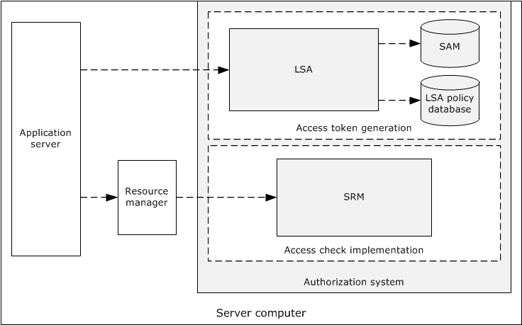
<!-- /Extracted images from page 26 -->

2.1.4.2  Internal Components

The following diagram shows the internal components of the DAC system.

Figure 9: Internal components of the DAC system

The Local Security Authority (LSA) is the security subsystem in Windows. This component is
responsible for creating the access token with the user authorization information (PAC), privileges
from the LSA policy database, and local security groups from the security account manager (SAM)
database.

The Security Reference Monitor (SRM) is the component of Windows that implements the
authorization system. It is the only security component of Windows that is running in the highly
privileged  operating system kernel mode. It implements the access check algorithm, and it checks
access to resources by comparing the access control entries (ACEs) in the security descriptor with
the group membership information in the user's access token.

2.1.4.3  CBAC Model

The following diagram shows the components of the claim-based access control (CBAC) architecture.

[MS-AZOD] - v20220614
Authorization Protocols Overview
Copyright © 2022 Microsoft Corporation
Release: June 14, 2022

26 / 60

<!-- Extracted images from page 27 -->
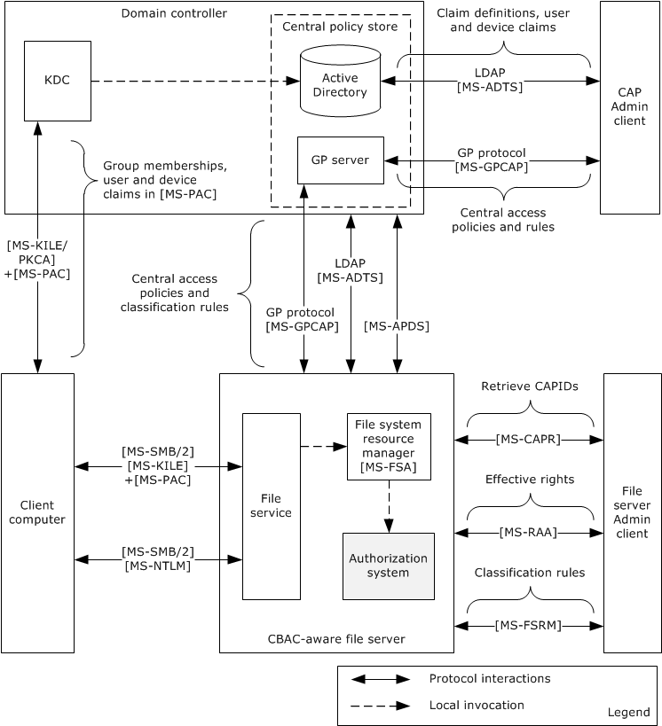
<!-- /Extracted images from page 27 -->

Figure 10: CBAC architecture

The CBAC architecture consists of the following components:

Central access policy (CAP) Admin client



Facilitates the administrator to configure the claim definitions, by indicating the claim names and
types of the values, and assignment of the claims to the users and devices on the Active
Directory store using the Lightweight Directory Access Protocol (LDAP) ([MS-ADTS]).

  Also facilitates the administrator to configure the central access rules (CARs) and central

access policies (CAPs) on the Group Policy server using the Group Policy: Central Access
Policies Protocol Extension ([MS-GPCAP]).

Central policy store

  Active Directory stores the claim definitions, user and device claims, central access rules, and

central access policies.

27 / 60

[MS-AZOD] - v20220614
Authorization Protocols Overview
Copyright © 2022 Microsoft Corporation
Release: June 14, 2022



The Group Policy server pushes access rules and policies to the specified file servers via Group
Policy Central Access Policies Protocol Extension. For more information, see [MS-GPCAP].

Client computer



The identities of the Server Message Block (SMB) clients on the client computer can get
authenticated by using either the NTLM protocol ([MS-NLMP] and [MS-APDS]) or the Kerberos
Protocol Extensions ([MS-KILE] or [MS-PKCA]), as described in [MS-AUTHSOD]. The Kerberos
authentication protocol results in authorization information with the claims, whereas NTLM
protocol results in authorization information without the claims.



The SMB clients request access to a file share on a remote file server by sending authorization
information which is created by successful authentication.

File server Admin client





Facilitates the administrator to configure the classification rules using the File Server Resource
Manager (FSRM) Protocol interfaces (see [MS-FSRM]) and retrieval of central access policies IDs
using the Central Access Policy Identifier (ID) Retrieval Protocol (see [MS-CAPR]) on the remote
file server.

The file server administrator simulates the effective rights of the users on file shares using the
Remote Authorization API Protocol interfaces [MS-RAA].

File server

  Claim definitions are pulled from Active Directory using the LDAP protocol  queries [MS-ADTS].



The File Classification Infrastructure (FCI) and File server resource manager (FSRM)
infrastructures facilitate the transfer of the resource properties and central access policies into an
object's security descriptor.

  On file access requests, the file system or object store (see [MS-FSA]) calls the authorization

system to determine access to files.



The authorization system verifies access to the files, as described in [MS-DTYP] section 2.5.3.2.

2.1.4.3.1 Down-Level Scenarios

The following diagram shows the protocol communications for the CBAC down-level scenario, where
the user tries to access the CBAC-aware shared-file resources on the file server using a file access
client (CIFS or SMB or SMB2, as described in [MS-CIFS]. [MS-SMB], and [MS-SMB2]) on the down-
level client computer that is running a pre-Windows 8 operating system version. The identity of the file
access client has been authenticated by the Authentication Services system using either KILE or PKCA
and has obtained the service ticket for the remote file server with the authorization information ([MS-
PAC]) of the requesting identity, as described in [MS-AUTHSOD].

Because the authorization information [MS-PAC] that was received by the file service does not have
the user claims in it, the file service on the server computer has to obtain the service ticket to itself on
behalf of the user using the Service for User to Self (S4U2self) extension described in [MS-SFU]. By
obtaining the service ticket to itself on behalf of the user, the service receives the user access token
from the LSA policy database by submitting authorization information (see [MS-PAC]) from the
obtained service ticket, as described in section 2.1.4.2, which consists of group memberships and user
claims. The access token contains the authorization information received from Kerberos S4U2Self,
privileges granted to the client from the LSA policy database, and local security groups assigned to the
user in the SAM account database (see section 2.1.4.2). The file service impersonates the user using
this user's access token and attempts to access the file on behalf of the user. The file system or object
store [MS-FSA] invokes the access check function to verify the user access rights. The authorization
system checks the requested access rights using the user's access token and the object's security
descriptor, as described in [MS-DTYP] section 2.5.3.2.

28 / 60

[MS-AZOD] - v20220614
Authorization Protocols Overview
Copyright © 2022 Microsoft Corporation
Release: June 14, 2022

<!-- Extracted images from page 29 -->
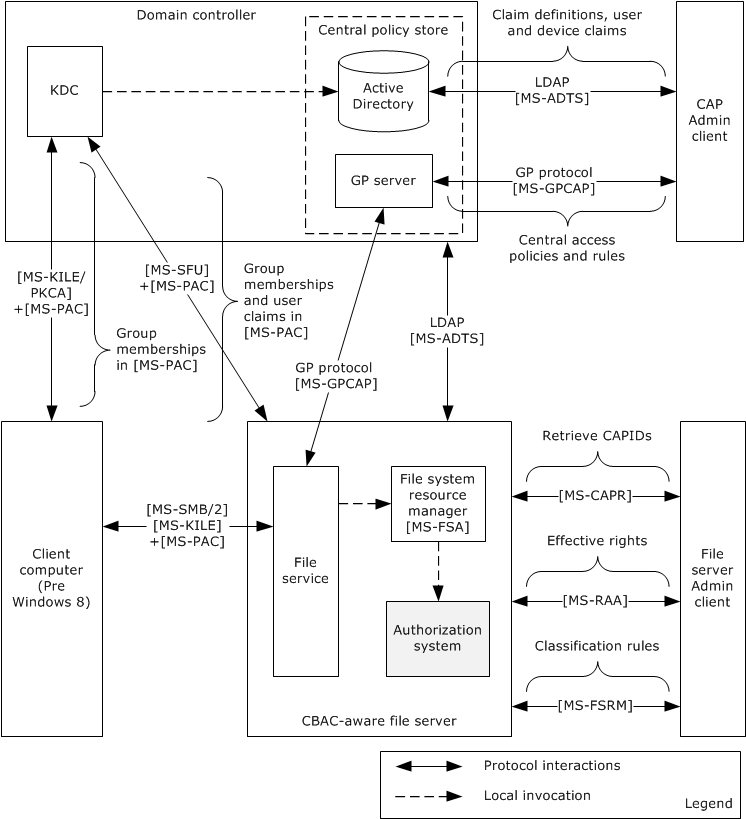
<!-- /Extracted images from page 29 -->

The following diagram shows the protocol interactions when Kerberos is the authentication protocol.

Figure 11: Protocol communications when Kerberos is the authentication protocol

The following diagram shows the protocol communications for a down-level scenario, where the user
tries to access the shared file resources on a Windows 8 file server using a file access client (SMB or
SMB2) on the down-level client computer that is running a pre-Windows 8 version. The identity of the
file access client has been authenticated by the Authentication Services system using the NTLM
protocol, as described in [MS-AUTHSOD].

The process of getting the user's authorization information with the user's claims, constructing the
user's access token, and verifying the access rights is the same as for Kerberos, as described earlier in
this section.

The following diagram shows the protocol interactions when NTLM is the authentication protocol.

[MS-AZOD] - v20220614
Authorization Protocols Overview
Copyright © 2022 Microsoft Corporation
Release: June 14, 2022

29 / 60

<!-- Extracted images from page 30 -->
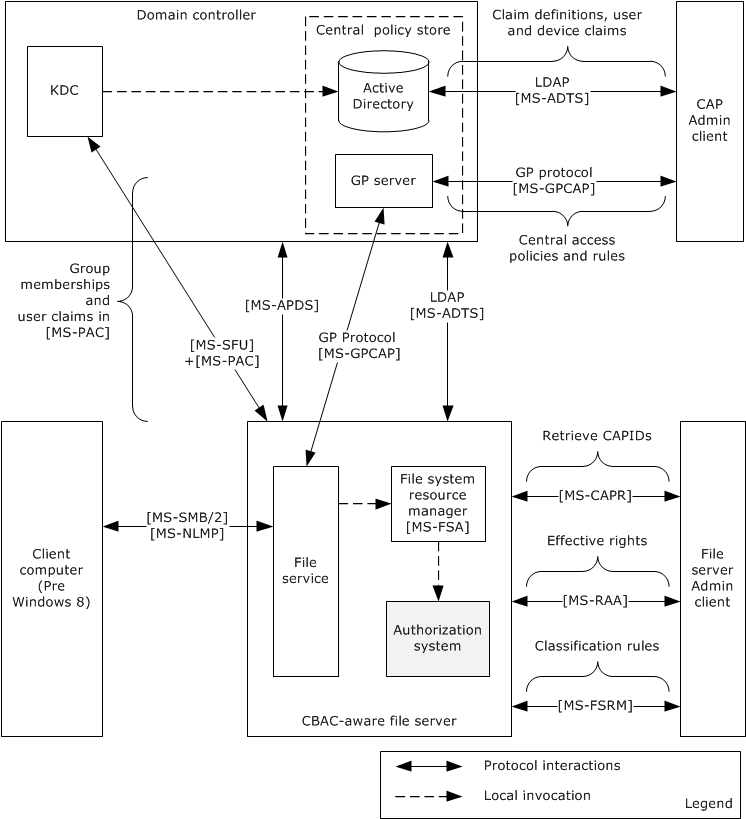
<!-- /Extracted images from page 30 -->

Figure 12: Protocol communications when NTLM is the authentication protocol

2.1.4.3.2 Claims Transformation

Claim type definitions are specific to a particular forest. In cross-forest authentication scenarios,
claims need to be examined, filtered, possibly modified, and reissued when traversing from one forest
to another. This process is known as claims transformation.

Claims transformation is similar to SID filtering described in [MS-PAC] section 4.1.2, but more
powerful. Claims transformation is based on a transformation rules grammar that administrators can
use to express their intent at a fine-grained, per-claim level. The set of rules applied to incoming
claims can be customized on a per-trust basis, which allows for further administrator control.

The claims transformation consists of the following high-level steps:

  A PAC from a cross-realm ticket-granting ticket (TGT) needs to be decoded and filtered. When

decoding a cross-realm TGT, the crealm fields inside the TGT are compared to the expected name

30 / 60

[MS-AZOD] - v20220614
Authorization Protocols Overview
Copyright © 2022 Microsoft Corporation
Release: June 14, 2022

of the realm for the inter-realm trust. If the names do not match the TGT, they are rejected,
subject to other mitigating constraints. For more information, see [MS-PAC]  sections 4.1.2.2 and
4.1.2.3.

  After the filtering, the next step is to obtain the claims transformation rules. This can be

accomplished by using the trust name and the direction of the traversal of the trust to look up the
corresponding msDS-ClaimsTransformationPolicyType object, as described in [MS-ADSC], and to
obtain the claims transformation rules from it. For more information, see [MS-ADTS] sections
3.1.1.11.1.5 and 3.1.1.11.2.11.

  After obtaining the transformation rules, the claims to be transformed along with the

transformation rules are then passed to the claims transformation algorithm, as described in [MS-
CTA]. The output of the claims transformation algorithm is further processed using the Claims
Dictionary to produce claims that are relevant to the new forest in which they are used.

2.1.5  Verify Authorization

The following diagram shows the Authorization Manager architecture and its processes for verifying
authorization.

[MS-AZOD] - v20220614
Authorization Protocols Overview
Copyright © 2022 Microsoft Corporation
Release: June 14, 2022

31 / 60

<!-- Extracted images from page 32 -->
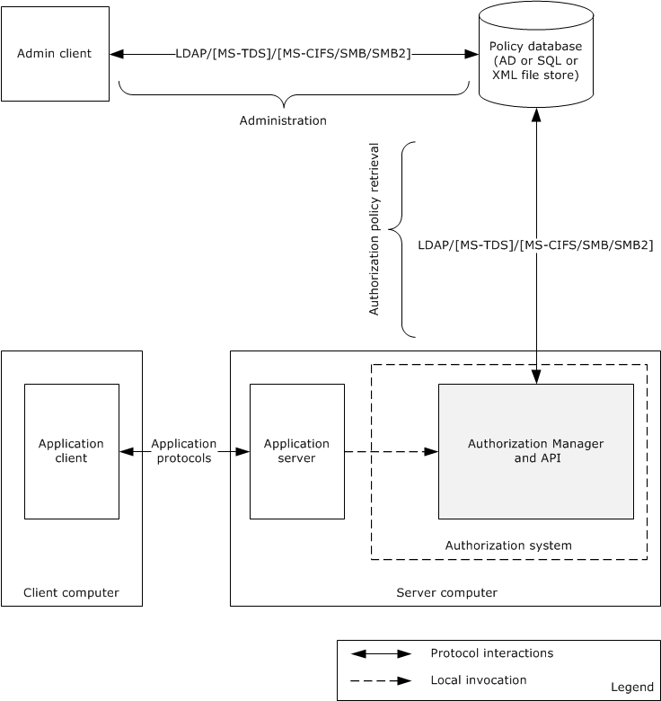
<!-- /Extracted images from page 32 -->

Figure 13: Authorization Manager architecture

The Authorization Manager centralized access policy database can be kept either on an Active
Directory server, a file server, or a SQL server. The Authorization Manager (AzMan) Policy File
Format [MS-AZMP] contains the XML schema definitions of Authorization Manager access control
policies.

The following table shows the mapping of the policy server with the corresponding protocol(s) used.

Policy server

Protocols used

Active Directory   Lightweight Directory Access Protocol (v3) [MS-ADTS]

File server

File access protocols [MS-CIFS], [MS-SMB], and [MS-SMB2]

SQL Server

Tabular Data Stream Protocol [MS-TDS]

For more details on Authorization Manager, see [MSDN-AuthMgr].

[MS-AZOD] - v20220614
Authorization Protocols Overview
Copyright © 2022 Microsoft Corporation
Release: June 14, 2022

32 / 60

2.1.6  COM+ Roles Access Control Model

The COM+ access control model implements the same set of authentication and authorization
protocols as are implemented in the core DAC model.

2.1.7  Relevant Standards

None.

2.2  Protocol Summary

The following table provides a comprehensive list of the authorization member protocols and data
structures.

Protocol name

Description

Privilege Attribute
Certificate Data
structure

Remote Authorization
API Protocol

The privilege attribute certificate (PAC) structure is used
by the authentication protocols to carry authorization
information. The authorization information consists of
group memberships and claims. The PAC also contains
additional credential information, profile, policy
information, and additional security data.

The Remote Authorization API Protocol enables
applications to remotely create, query, and manipulate
authorization context for a given security principal on a
target server for the purpose of administrative queries.
The protocol initiates creation of a security context,
transfers the group and claims information, and accesses
requests and result data sent between client and server.

Short
name

[MS-
PAC]

Applicability

DAC, CBAC, and
COM+ roles
access control

[MS-
RAA]

DAC and CBAC

Authorization
Manager (AzMan)
Policy File Format

The Authorization Manager (AzMan) Policy File Format
contains the XML schema definitions of Authorization
Manager access control policies.

[MS-
AZMP]

AzMan RBAC

Group Policy Central
Access Policies
Protocol Extension

The Group Policy: Central Access Policies Extension is a
Group Policy file format that communicates the Central
Access Policies (CAPs) defined centrally and configured for
specific computer accounts. CAPs are transferred to the
file servers through Group Policy.

[MS-
GPCAP]

CBAC

Central Access Policy
Identifier (ID)
Retrieval Protocol

This protocol enables the applications to query a remote
file server for a list of Central Access Policies (CAPs) that
have been configured for a remote file server. Specifically,
the protocol is used to transfer the CAP IDs.

[MS-
CAPR]

CBAC

Claims
Transformation
Algorithm

This document specifies a grammar for describing a
transformation rule language and an algorithm for
transforming input claims into output claims using a
defined set of rules. Transformation of a set of claims is
typically used at authentication trust traversal boundaries
to transform claims from sending authority into a form
acceptable to the receiving authority .

[MS-
CTA]

CBAC

Windows Data Types

This document contains the Windows data types and
algorithms associated with authorization.

[MS-
DTYP]

DAC, CBAC,and
COM+ roles

Lightweight Directory
Access Protocol
(LDAP)

In CBAC: This protocol enables the applications to
configure the claim definitions and the user and devices
claims on the Active Directory server.

[MS-
ADTS]

DAC, CBAC, and
AzMan RBAC

In RBAC: This protocol enables the retrieval of

33 / 60

[MS-AZOD] - v20220614
Authorization Protocols Overview
Copyright © 2022 Microsoft Corporation
Release: June 14, 2022

Protocol name

Description

Short
name

Applicability

authorization policies from the Active Directory Policy
Server.

In DAC: [MS-ADTS] section 5.1.3 specifies the
authorization rules.

Component Object
Model Plus (COM+)
Remote
Administration
Protocol

With regards to authorization, this protocol enables the
administration interface for the role-based security
configuration for the COM+ applications.

[MS-
COMA]

COM+ roles
access control

Tabular Data Stream
Protocol

With regards to authorization, this protocol enables the
retrieval of the authorization policies from the SQL Server
policy store.

[MS-
TDS]

AzMan RBAC

2.3  Environment

2.3.1  Dependencies on This System

Windows components and subsystems that require making authorization decisions depend on the
authorization system. As a result, the authorization system influences a large number of systems and
protocols.

The most prominent examples of protocols and systems that have a dependency on the authorization
models are as follows:

DAC model

  Active Directory, as described in [MS-ADOD]



File system, as described in [MS-FASOD] and [MS-FSMOD]

  Registry services, as described in [MS-RRP]



Printing Services, as described in [MS-PRSOD]

CBAC model



File Access Services, as described in [MS-FASOD]

AzMan RBAC model

  Remote Desktop Services, as described in [MS-RDSOD]

COM+ roles access control model

In Windows, except for components of the COM+ platform, there are no components/subsystems that
depend on this model. However, any enterprise application that uses the services of the COM+
platform can depend on this model.

2.3.2  Dependencies on Other Systems/Components

The authorization system depends on the following components and protocols:



The DAC model depends on the following components on the server computer:

34 / 60

[MS-AZOD] - v20220614
Authorization Protocols Overview
Copyright © 2022 Microsoft Corporation
Release: June 14, 2022



Local Security Authority (LSA) database for the user privileges and policies

  SAM database for the local user groups



In addition to the components of the DAC model mentioned previously, the CBAC model depends
on the following components:







The client implementation of the Group Policy: Central Access Policies Protocol [MS-GPCAP] to
retrieve the central access policies (CAPs) and file classification rules

Lightweight Directory Access Protocol (LDAP) client components to retrieve the claim
definitions

The server implementation of the Central Access Policy Identifier (ID) Retrieval Protocol [MS-
CAPR] to provide the Admin interface, which enables the administrator to enforces the policies
on file resources



The AzMan RBAC model depends on the following components:





LDAP

File access (CIFS)

  SQL Server protocol components to retrieve the policies from the Group Policy server,

depending on the type of policy server



In addition to the dependencies mentioned under DAC model, the COM+ role access control model
depends on the following components:

  Components that are related to the implementation of the Component Object Model Plus

(COM+) Remote Administration Protocol [MS-COMA]

2.4  Assumptions and Preconditions

The following assumptions and preconditions apply to this document:



Information regarding network topology and/or addresses for the external server systems is
configured or discoverable.

  One or more of the following external server systems has been set up and configured:

  Active Directory

  DNS directory



LDAP directory

  Group Policy server

  A DC has been set up and configured to support the domain infrastructure.





The client and server machines have been joined to the domain.

The identity of the user has been authenticated, and the server application has associated the
user's authorization information.

  Higher-layer protocols and service implementations are configured and running on the server

systems, such as:

  Distributed File System (DFS)

[MS-AZOD] - v20220614
Authorization Protocols Overview
Copyright © 2022 Microsoft Corporation
Release: June 14, 2022

35 / 60

  Group Policy

  Network Time Protocol (NTP)



LDAP

2.5  Use Cases

The following table lists the use cases that span the functionality of the authorization protocols. The
use cases were grouped based on authorization models.

Use case group

Use cases

DAC model: File server

Check Simple Access (section 2.5.1.1.2)

Check ACL Inheritance Access (section 2.5.1.1.3)

Check Conditional ACEs-Based Access (section 2.5.1.1.4)

Check Claims-Based Access (section 2.5.1.1.5)

DAC model: Active Directory  Check Simple Access (section 2.5.1.2.2)

Check Object-Specific Access (section 2.5.1.2.3)

Control Access Right-Based Access (section 2.5.1.2.4)

Control Validated Write-Based Access (section 2.5.1.2.5)

Check Object Visibility (section 2.5.1.2.6)

AzMan RBAC model

Verify Authorization (section 2.5.2.1)

2.5.1  DAC Model

2.5.1.1  File Server

The following use case diagram shows the DAC authorization system on the file server.

[MS-AZOD] - v20220614
Authorization Protocols Overview
Copyright © 2022 Microsoft Corporation
Release: June 14, 2022

36 / 60

<!-- Extracted images from page 37 -->
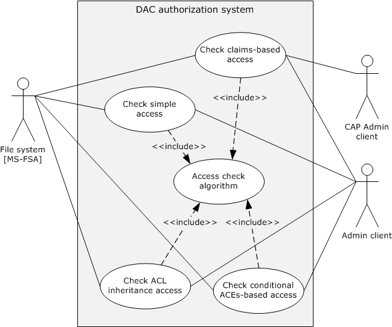
<!-- /Extracted images from page 37 -->

Figure 14: File server authorization use cases

2.5.1.1.1 Actors

The actors that participate in the file server DAC model use cases are:

File system or object store: The file system implements the file system objects such as files and

directories.

Admin client: The Admin client is the authorization tool that helps the administrator to configure the

access permissions on the file system objects such as files and directories.

CAP Admin client: The CAP Admin client is the administration tool that enables the administrator to
configure the claim definitions, the user, and device claims in Active Directory and the central
access policies and classification rules on the Group Policy server.

2.5.1.1.2 Check Simple Access

Goal

Verify the access rights of the user to access a file on a remote file share.

 Context of Use

The user of the file client needs to access an existing file on a remote file share, and the file server
needs to verify the access rights of the user before providing access to a file. Therefore, the file server

[MS-AZOD] - v20220614
Authorization Protocols Overview
Copyright © 2022 Microsoft Corporation
Release: June 14, 2022

37 / 60

interacts with the authorization system through the file system resource manager to verify the
requested access rights using this use case.

Actors

Except for the CAP Admin client actor, all the actors are as described in section 2.5.1.1.1.

Stakeholders

The primary interest of a user is to access the file on the remote file server.

Preconditions







 The user of the file client has been authenticated by the Authentication Services subsystem. For
more information, see [MS-AUTHSOD].

The administrator using the Admin client has configured the required explicit access permissions
for the requesting user to access the file on a remote file share but has not included inherited
permissions from the object's parent.

The file server obtains the access token for the requesting user, as described in section 2.5.1.3,
and the file server makes a request to the file system by passing the user's access token (which is
also called security context), access rights, and other information, as described in [MS-FSA]
section 2.1.5.1.

Main success scenario

1.  Trigger: The user tries to access an existing file on a remote file share using the file client

application.

2.  The file system processes the request per the processing rules, as specified in [MS-FSA] sections
2.1.5.1 and 2.1.5.1.2.1. These processing rules call the access check algorithm, as specified in
[MS-DTYP] section 2.5.3.2, to verify the access rights of the user.

3.  If verification succeeds, then the access check algorithm returns success to the file system

resource manager, indicating user access is granted.

Postcondition

The user of the file client is granted access to a file on remote file share.

2.5.1.1.3 Check ACL Inheritance Access

 Goal

Verify the access rights of the user to access a file on a remote file share and that the file has
inheritable permissions from its parent object.

 Context of Use

The user of the file client needs to access an existing file on a remote file share, and the file server
needs to verify the access rights of the user before providing the access to a file that has both explicit
access permissions and inheritable permissions from a parent object. Therefore, the file server
interacts with the authorization system via the file system resource manager to verify the access
rights of the user using this case.

Actors

Except for the CAP Admin client actor, all the actors are as described in section 2.5.1.1.1.

Stakeholders

[MS-AZOD] - v20220614
Authorization Protocols Overview
Copyright © 2022 Microsoft Corporation
Release: June 14, 2022

38 / 60

The primary interest of a user is to access the file on the remote file server.

Preconditions







The user of the file client has been authenticated by the Authentication Services subsystem [MS-
AUTHSOD].

The administrator using the Admin client has configured explicit and inherited access permissions
for the requesting user to open the file on a remote file share.

The file server obtains the access token for the requesting user, as described in section 2.5.1.3,
and the file server makes a request to the file system resource manager by passing the obtained
user access token (which is also called security context), access rights, and other information, as
described in [MS-FSA] section 2.1.5.1.

Main success scenario

1.  Trigger: The user tries to access an existing file on a remote file share using the file client

application.

2.  The file system processes the request per the processing rules, as specified in [MS-FSA] sections

2.1.5.1 and 2.1.5.1.2.1. These processing rules call the access check algorithm specified in [MS-
DTYP] section 2.5.3.2 to verify the user's access rights against the access permissions on the
object's security descriptor.

3.  If verification succeeds, the access check algorithm returns success to the file system resource

manager, indicating user access is granted.

Postcondition

The user of the file client is granted access to a file on the remote file share.

2.5.1.1.4 Check Conditional ACEs-Based Access

 Goal

 Verify the access rights of the user to open an existing file on a remote file share that has conditional
ACEs configured on it.

Context of Use

The user of the file client needs to access a file on a remote file share, and the file server needs to
verify the access rights of the user before providing the access to a file. Therefore, the file server
interacts with the authorization system through the file system resource manager to verify the
requested access rights using this case.

 Actors

Except for the CAP Admin client actor, all the actors are as described in section 2.5.1.1.1.

 Stakeholders

The primary interest of a user is to access the file on the remote file server.

 Preconditions





The user of the file client has been authenticated by the Authentication Services subsystem [MS-
AUTHSOD].

The administrator using the Admin client has configured explicit, inherited, and conditional access
permissions for the requesting user to open the file on a remote file share.

39 / 60

[MS-AZOD] - v20220614
Authorization Protocols Overview
Copyright © 2022 Microsoft Corporation
Release: June 14, 2022



The file server obtains the access token for the requesting user as described in section 2.5.1.3,
and the file server makes a request to the file system resource manager by passing the obtained
user access token (which is also called security context), access rights, and other information, as
described in [MS-FSA] section 2.1.5.1.

Main success scenario

1.  Trigger: The user tries to access an existing file on a remote file share using the file client

application.

2.  The file system processes the request as per the processing rules, as specified in [MS-FSA]
sections 2.1.5.1 and 2.1.5.1.2.1. These processing rules call the access check algorithm, as
specified in [MS-DTYP] section 2.5.3.2, to verify the user's access rights against the configured
access permissions on the object's security descriptor.

3.  If verification succeeds, the access check algorithm returns success to the file system resource

manager, indicating user access is granted.

 Post condition

 The user of the file client is granted access to a file on a remote file share.

2.5.1.1.5 Check Claims-Based Access

 Goal

 Verify the access rights of the user to access a file on a remote CBAC-aware file share.

 Context of Use

The user of the file client needs to access an existing file on a remote file share, and the file server
needs to verify the access rights of the user before providing the access to a file. Therefore, the file
server interacts with the authorization system through the file system resource manager to verify the
requested access rights using this case.

 Actors

See section 2.5.1.1.1.

 Stakeholders

The primary interest of a user is to access the file on the remote file server.

 Preconditions











The identity of the user and client computer (compound identity) has been authenticated by the
Authentication Services subsystem, as described in [MS-KILE] and [MS-AUTHSOD].

The Active Directory administrator configured the claim definitions, user, and device claims on
Active Directory using the CAP Admin client tool.

 The Group Policy administrator configured required central access policies and classification rules
for the file servers.

 The central access policies and classification rules applied to the resources of the file server.

 If the file server is in a different forest than the user, claims in the PAC are transformed, as
described in section 2.1.4.3.2.

  Using this PAC, the file server obtains the access token (with user and device claims) for the

requesting user, as described in section 2.5.1.3, and the file server makes a request to the file

40 / 60

[MS-AZOD] - v20220614
Authorization Protocols Overview
Copyright © 2022 Microsoft Corporation
Release: June 14, 2022

system resource manager by passing the obtained user access token (which is also called security
context), access rights, and other information, as specified in [MS-FSA] section 2.1.5.1.

 Main success scenario

1.  Trigger: The user tries to open an existing file on a remote file share using the file client

application.

2.  The file system processes the request per the processing rules, as specified in [MS-FSA] sections
2.1.5.1 and 2.1.5.1.2.1. These processing rules call the access check algorithm, as specified in
[MS-DTYP] section 2.5.3.2, to verify the user's access rights against the configured access control
permissions and central access policies in the object's security descriptor.

3.  If verification succeeds, the access check algorithm returns success to the file system resource

manager, indicating user access is granted.

 Postcondition

 The user of the file client is granted access to open a file on a remote file share.

2.5.1.2  Active Directory

The following use case diagram shows the components of Active Directory authorization through the
Active Directory resource manager.

[MS-AZOD] - v20220614
Authorization Protocols Overview
Copyright © 2022 Microsoft Corporation
Release: June 14, 2022

41 / 60

<!-- Extracted images from page 42 -->
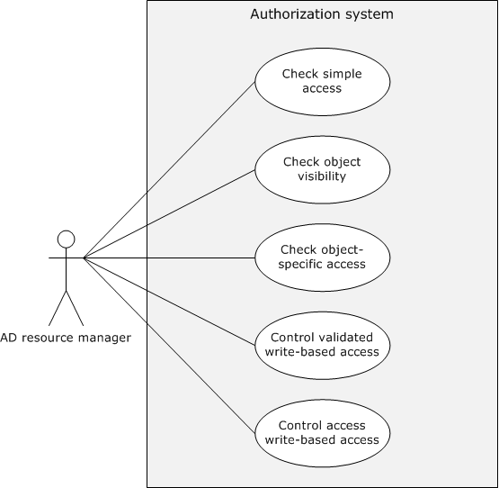
<!-- /Extracted images from page 42 -->

Figure 15: Active Directory authorization use cases

2.5.1.2.1 Actors

The actors that participate in the Active Directory DAC model use cases are:

Active Directory resource manager: The Active Directory resource manager [MS-ADTS] is code or

a component that implements the Active Directory objects.

Admin client: The Admin client is the authorization tool that helps the administrator to configure the

access permissions for the entire Active Directory object or individual attributes of an object or the
set of attributes of an object.

2.5.1.2.2 Check Simple Access

Goal

Verify the access rights of the user to access the Active Directory object on the Active Directory
server.

Context of Use

[MS-AZOD] - v20220614
Authorization Protocols Overview
Copyright © 2022 Microsoft Corporation
Release: June 14, 2022

42 / 60

The user of the Active Directory client needs to access the Active Directory object on the Active
Directory server, and the Active Directory server needs to verify the access rights of the user before
providing the access to the user. Therefore, the Active Directory server interacts with the
authorization system through the Active Directory resource manager to verify the requested access
rights using this use case.

Actors

The actors are the same as described in section 2.5.1.2.1.

Stakeholders

The primary interest of the user of the Active Directory client is to read all information associated with
the object.

Preconditions









The identity of the user has been authenticated by the Authentication Services subsystem [MS-
AUTHSOD].

The administrator has configured the required access permissions for the user on the Active
Directory object using the Admin tool.

The Active Directory server obtained the access token for the requesting user, as described in
section 2.5.1.3, and it already sent a request to the Active Directory resource manager by passing
the user's access token (which is also called security context), access rights, and other
information.

The object's security descriptor has already undergone the SID substitution for Principal Self
([MS-ADTS] section 5.1.3.3).

Main success scenario

1.  Trigger: The user of the Active Directory client makes a request to the Active Directory server to

read all the information associated with an Active Directory object.

2.

 The Active Directory resource manager verifies the access rights of the user against permissions
on an object's security descriptor, as described in [MS-ADTS] section 5.1.3.3.2.

3.  If the verification succeeds, then the Active Directory resource manager returns success to the

Active Directory server, indicating that the user has been granted access to the requested Active
Directory object.

Postcondition

The Active Directory server enables access to the user to read all the information associated with the
requested Active Directory object.

2.5.1.2.3 Check Object-Specific Access

Goal

Verify the object-specific access requested by a user.

Context of Use

The user of the Active Directory client needs to access an attribute or set of attributes on an Active
Directory object, and the Active Directory server  needs to verify the user's access rights before
granting access. Therefore, the AD server interacts with the authorization system through the Active
Directory resource manager to verify the requested access rights using this use case.

43 / 60

[MS-AZOD] - v20220614
Authorization Protocols Overview
Copyright © 2022 Microsoft Corporation
Release: June 14, 2022

Actors

The actors are the same as described in section 2.5.1.2.1.

Stakeholders

The primary interest of the user is to read an individual attribute of an object or a set of attributes.

Preconditions









 The identity of the user has been authenticated by the Authentication Services subsystem [MS-
AUTHSOD].

The administrator has configured the required attribute level access permissions for the user on
the Active Directory object using the Admin tool.

The Active Directory server obtained the access token for the requesting user, as described in
section 2.5.1.3, and the server has already sent a request to the Active Directory resource
manager by passing the user's access token, (which is also called security context), access rights,
and other information.

The object's security descriptor has already undergone the SID substitution for Principal Self
(see [MS-ADTS] section 5.1.3.3).

 Main success scenario

1.  Trigger: The user of an Active Directory client makes a request to the Active Directory server to

read one attribute or set of attributes associated with an Active Directory object.

2.  The Active Directory resource manager verifies the access rights of the user against the

permissions on the object's security descriptor, as described in [MS-ADTS] section 5.1.3.3.3.

3.  If the verification succeeds, then the Active Directory resource manager returns success to the

Active Directory server, that the user has been granted access to the requested Active Directory
object.

Post condition

The Active Directory server enables access to the user to read all the information associated with the
requested Active Directory object.

2.5.1.2.4 Control Access Right-Based Access

 Goal

Verify the control access derived from right-based access that is requested by the user of the Active
Directory client.

Context of Use

The user of the Active Directory client is required to perform certain operations that have semantics
that are not tied to specific properties, or where it is desirable to control access in a way that is not
supported by the standard access rights. For more information, see [MS-ADTS] section 5.1.3.2.1. The
Active Directory server needs to verify the user's access rights before granting access to perform
the requested operation. Therefore, the Active Directory server interacts with the authorization system
via the Active Directory resource manager to verify the requested user access rights via this use
case.

Actors

The actors are the same as described in section 2.5.1.2.1.

44 / 60

[MS-AZOD] - v20220614
Authorization Protocols Overview
Copyright © 2022 Microsoft Corporation
Release: June 14, 2022

Stakeholders

The primary interest of a user is to perform certain operations that have semantics that are not tied to
specific properties ([MS-ADTS] section 5.1.3.2.1).

Preconditions









The identity of the user has been authenticated by the Authentication Services subsystem [MS-
AUTHSOD].

The administrator has configured the required attribute level access permissions for the user on
the Active Directory object using the Admin tool.

The Active Directory server obtained the access token for the requesting user, as described in
section 2.5.1.3, and the server has already sent a request to the Active Directory resource
manager by passing the user's access token (which is also called security context), the control-
access-right GUID ([MS-ADTS] section 5.1.3.2.1), and other information.

The object's security descriptor has already undergone the SID substitution for Principal Self
([MS-ADTS] section 5.1.3.3).

 Main success scenario

1.  Trigger: The user of an Active Directory client makes a request to the Active Directory server to

perform the operations listed in [MS-ADTS] section 5.1.3.2.1, or extended operations that are
provided by the application developer.

2.

3.

 The Active Directory resource manager verifies the access rights of the user against permissions
on the object's security descriptor, as described in [MS-ADTS] section 5.1.3.3.4.

 If the verification succeeds, the Active Directory resource manager returns success to the Active
Directory server, indicating that the user has been granted access to the requested Active
Directory object.

Postcondition

 The Active Directory server enables the user to perform the requested operation.

2.5.1.2.5 Control Validated Write-Based Access

Goal

Verify the write access requested by the user of the Active Directory client to modify attributes of
an Active Directory object.

Context of Use

The user requesting attributes has configured the validated write access permissions on an Active
Directory object. Therefore, the Active Directory server is required to validate the values of the
attributes being written. For more information, see [MS-ADTS] section 5.1.3.2.2.

Actors

The actors are the same as described in section 2.5.1.2.1.

Stakeholders

The primary interest of the user of the Active Directory client is to write the values onto the attributes.

Preconditions

[MS-AZOD] - v20220614
Authorization Protocols Overview
Copyright © 2022 Microsoft Corporation
Release: June 14, 2022

45 / 60









The identity of the user has been authenticated by the Authentication Services subsystem [MS-
AUTHSOD].

The Administrator has configured the required attribute level access permissions for the user on
the Active Directory object using the Admin tool.

The Active Directory server obtained the access token for the requesting user, as described in
section 2.5.1.3, and it already sent a request to the Active Directory resource manager by passing
the user's access token (which is also called security context), the validated rights GUID ([MS-
ADTS] section 5.1.3.2.2), and other information.

The object's security descriptor has already undergone the SID substitution for Principal Self
([MS-ADTS] section 5.1.3.3).

Main success scenario

1.  Trigger: The user makes a request to the Active Directory server using the Active Directory client

to get write access to an object's attributes that are controlled by validate rights.

2.  The Active Directory resource manager verifies the access rights of the user against the

permissions on the object's security descriptor, as described in [MS-ADTS] section 5.1.3.3.5.

3.  If the verification succeeds, then the Active Directory resource manager returns success to the

Active Directory server, indicating that the user has been granted access to the requested Active
Directory object.

Postcondition

The Active Directory server enables the user to perform a requested write operation.

2.5.1.2.6 Check Object Visibility

 Goal

Verify the access requested by the user of the Active Directory client  to enumerate the Active
Directory objects and their attributes.

Context of Use

The user of the Active Directory client needs to enumerate the Active Directory objects and their
associated attributes. The Active Directory server  needs to verify the user's access rights before
granting the access to the Active Directory client. Therefore, the Active Directory server interacts with
the authorization system through the Active Directory resource manager to verify the requested
access rights using this use case.

 Actors

The actors are the same as described in section 2.5.1.2.1.

Stakeholders

The primary interest of the user is to enumerate all of the Active Directory objects and their attributes.

Preconditions





The identity of the user has been authenticated by the Authentication Services subsystem [MS-
AUTHSOD].

 The administrator has configured the required attribute level access permissions for the user on
the Active Directory object using the Admin tool.

46 / 60

[MS-AZOD] - v20220614
Authorization Protocols Overview
Copyright © 2022 Microsoft Corporation
Release: June 14, 2022

<!-- Extracted images from page 47 -->
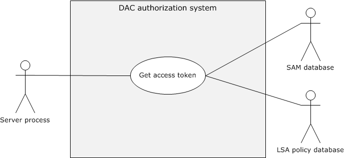
<!-- /Extracted images from page 47 -->





The Active Directory server obtained the access token for the requesting user, as described in
section 2.5.1.3, and it already sent a request to the Active Directory resource manager by passing
the user's access token (which is also called security context), access rights, and other
information.

The object's security descriptor has already undergone the SID substitution for Principal Self
([MS-ADTS] section 5.1.3.3).

Main success scenario

1.  Trigger: The user makes a request to the Active Directory server using the Active Directory client

to enumerate all the Active Directory objects and attributes to which the user has access.

2.  The Active Directory resource manager verifies the access rights of the user against permissions

on the object's security descriptor, as described in [MS-ADTS] section 5.1.3.3.6.

3.  If the verification succeeds, then the Active Directory resource manager returns success to the

Active Directory server, indicating that the user has been granted access to the requested Active
Directory object.

Postcondition

The Active Directory server makes Active Directory objects and attributes visible to whichever user
has access to them.

2.5.1.3  Auxiliary

The following use case diagram shows the components in the DAC authorization system to get an
access token.

Figure 16: Get Access Token use case

2.5.1.3.1 Get Access Token

Goal

Get the access token for the identity of the requestor.

Context of Use

[MS-AZOD] - v20220614
Authorization Protocols Overview
Copyright © 2022 Microsoft Corporation
Release: June 14, 2022

47 / 60

The identity of the application client associated with a specific user needs to access resources on the
application server, and the application server needs to access a token to call access-check-related
authorization use cases.

Actors

Application server: The application server is the service or process running on the server computer

under the security context of the identity of the application server.

LSA policy database: A database that contains local system security policy settings such as user

rights and other security-related rights.

SAM database: A database that contains local users and security groups.

Stakeholders

The primary interest of the identity of the application client is to access resources on the application
server.

Preconditions





The identity of the application client has been authenticated by the Authentication Services
subsystem (see [MS-AUTHSOD]).

The application server has the authorization information from the (PAC) of the requested
application client's identity.

  User rights are configured in the LSA policy database, and local groups are configured in the SAM

database.

Main success scenario

1.  Trigger: The prerequisite for the application server to get the access token for the authorization

process.

2.  The application server submits the requested identity authorization information to the

authorization system.

3.  The authorization system builds the access token from the user rights in the LSA policy database
and from the local security groups from the SAM database, and returns to the application server.

Postcondition

The application server process gets the access token for the requested identity and proceeds to the
next steps of the authorization process.

2.5.2  AzMan RBAC Model

The following use case diagram shows the components in the RBAC authorization system to verify
authorization.

[MS-AZOD] - v20220614
Authorization Protocols Overview
Copyright © 2022 Microsoft Corporation
Release: June 14, 2022

48 / 60

<!-- Extracted images from page 49 -->
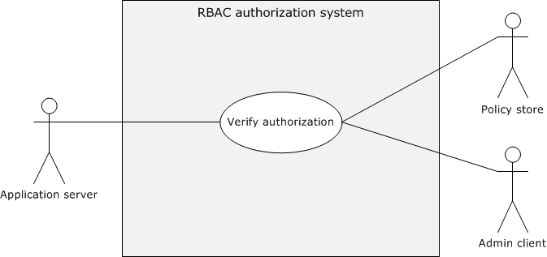
<!-- /Extracted images from page 49 -->

Figure 17: Verify AzMan RBAC authorization use case

2.5.2.1  AzMan RBAC Model

Goal

Verify the authorization rights for the user to perform the intended business operation/task.

Context of Use

The user of the application client needs to perform certain business operation/tasks using the
application server, and the application server verifies the authorization of the requesting user before
the application server grants access to the requested business operation.

Actors

Application server: The application server is the service running on the server computer.

Admin client: The Admin client is the administrator management snap-in tool that facilitates the

administrator to configure authorization policies for the applications.

Policy store: The policy store can be located on either an Active Directory server, a SQL Server, or

a file server; the policy store maintains the authorization policies for the applications.

Stakeholders

The primary interest of the user of the application client is to perform intended business
operations/tasks with the help of the application server.

Preconditions



The identity of the user has been authenticated, and the application server has the identity
information.

  Any required authorization policies have been created on the policy server for the application.



The application server is configured with the required information to access the configured
authorization policies.

  Required policies are configured on the policy server for the user to perform intended business

operations/tasks.

49 / 60

[MS-AZOD] - v20220614
Authorization Protocols Overview
Copyright © 2022 Microsoft Corporation
Release: June 14, 2022

Main success scenario

1.  Trigger: The user of the application client is required to perform certain protected tasks with the

help of the application server.

2.  The application server connects the authorization policy store with the configured details such as

the connection string and gets the instance of the application policy.

3.  The application server constructs the client's access token (also called security context) with the

identity information of the user who is using Authorization Manager APIs.

4.  The application server calls the access check Authorization Manager API to verify the authorization

for the requested business operation/ task.

Postcondition

The application server enables the user to perform requested business operation/tasks.

Extensions

None.

2.6  Versioning, Capability Negotiation, and Extensibility

No capability negotiation is associated with this authorization system. Any deviations from a specific
version's implementation of these protocol specifications are documented in the respective protocol
document. Capability negotiations between client and server implementations of these protocols are
specified in the System Versioning and Capability Negotiation sections in their respective technical
documents (TDs). For more details, see sections 1.7 of the member protocol technical documents
listed in section 2.2 of this document.

2.7  Error Handling

The authorization system does not handle errors at the system level for cross-protocol error states.
The individual protocol documents describe the errors that the protocols return and what they mean
for the system. How to handle the errors, based on the protocol descriptions, is determined by the
implementer.

2.8  Coherency Requirements

This system has no special coherency requirements.

2.9  Security

None.

2.10  Additional Considerations

None.

[MS-AZOD] - v20220614
Authorization Protocols Overview
Copyright © 2022 Microsoft Corporation
Release: June 14, 2022

50 / 60

3  Examples

3.1  Reading from a File on Remote CBAC Aware SMB2 Share

This scenario demonstrates the use cases described in sections 2.5.1.1.5 and 2.5.1.3.1. The client and
server can negotiate each other by using the Simple and Protected Generic Security Service
Application Program Interface Negotiation Mechanism (SPNEGO): Microsoft Extension (as described in
[MS-SPNG] and [MS-NEGOEX]) to select the agreed authentication protocol, as described in [MS-
AUTHSOD] and [MS-SPNG].

Based on the agreed authentication protocol, this scenario has the following variants:

  Kerberos Protocol Extensions, as specified in [MS-KILE] and [MS-PKCA]

  NT LAN Manager Authentication Protocol, as specified in [MS-NLMP]

If the agreed authentication protocol is Kerberos, this scenario in turn has the following subvariants:

  Client has obtained a service ticket for file service from the Key Distribution Center (KDC) with

user and device claims.

  Client has obtained a service ticket for file service from the KDC without the user claims.

The following are the common prerequisites of this scenario.

Common Prerequisites







The client computer and server computer are joined to the same Active Directory domain.

The file server and file resource manager roles have been configured on the server computer.

The required user accounts and associated group memberships have been configured on an
account database. For more information, see [MS-ADOD].

  Created claim types, resource file properties, and central access rules (CARs) are configured on
the domain controller and then added to the central access policies (CAPs) using the Active
Directory Administrative Center.



The intended central access policies (CAPs) have been targeted to the file server computer using
the Group Policy Management Console, and the CAPs to the required file shares have been
enabled.



The required association of claims for the user and computer accounts have been set.

  Classification rules have been pushed onto the file server through the Lightweight Directory Access

Protocol (LDAP) File Classification Infrastructure structures, as specified in [MS-FCIADS].





File share(s) have been created on the server computer and the appropriate shared permissions
configured.

The value of the ClaimsCompIdFASTSupport ADM variable on the KDC has been configured to
enable claims, compound identity, and Flexible Authentication Secure Tunneling (FAST), as
specified in [MS-KILE] section 3.3.1.

[MS-AZOD] - v20220614
Authorization Protocols Overview
Copyright © 2022 Microsoft Corporation
Release: June 14, 2022

51 / 60

3.1.1  Kerberos Protocol Extensions [MS-KILE]

3.1.1.1  Service Ticket with the User and Device Claims

Prerequisites

The following are the additional prerequisites that are required for this variant, in addition to the
common prerequisites described in section 3.1:



Enable Kerberos Flexible Authentication Secure Tunneling (FAST) on the client computer, as
described in [MS-KILE] section 3.2.1.

  Set the FAST-supported, Compound-identity-supported, and Claims-supported bit flags on the
msDS-SupportedEncryptionTypes attribute of the krbtgt account. For details about the
msDS-SupportedEncryptionTypes attribute, see [MS-KILE] section 2.2.7.

  Set the Compound-identity-supported bit flags on the msDS-SupportedEncryptionTypes

attribute of the file server computer account. For details about the msDS-
SupportedEncryptionTypes attribute, see [MS-KILE] section 2.2.7.

Initial System State











The identity of the client computer account has been authenticated by the Authentication Services
subsystem, as described in [MS-AUTHSOD] section 2.5.5.1, and the client computer has the TGT
for the computer account.

The identity of the user has been authenticated by KDC and the file server, the identity of the file
server has been authenticated by the client computer, as described in [MS-AUTHSOD] section
3.3.1, and the client computer has submitted the service ticket with the PAC containing group
memberships, user, and device claims to access the intended file share.

The file server has obtained the PAC with the group memberships, user, and device claims from
the client, and the SMB2 client (on the client computer) has obtained the sessionId as described in
the Connecting to an SMB2 Share example in [MS-AUTHSOD] section 3.3.1.

The user who is running the SMB2 client application has not been authorized to the read the
remote file.

The file server has obtained the user's access token (security context) as described in section
2.5.1.3.1.

Final System State



The user who is running the SMB2 client application has been authorized to read the contents of
the remote file.

Sequence of Events

The following sequence diagram shows the process of reading from a file on a remote CBAC-aware
SMB2 share that is configured with user and device claims.

[MS-AZOD] - v20220614
Authorization Protocols Overview
Copyright © 2022 Microsoft Corporation
Release: June 14, 2022

52 / 60

<!-- Extracted images from page 53 -->
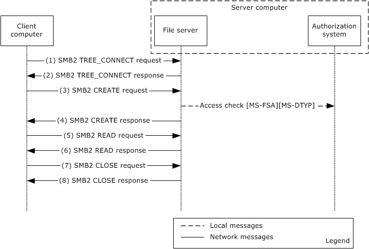
<!-- /Extracted images from page 53 -->

Figure 18: Reading from a file on a remote CBAC-aware SMB2 share configured with user
and device claims

1.  The client sends an SMB2 TREE_CONNECT request, (see [MS-SMB2] section 2.2.9) , with the
sessionId for the session, and a tree connect request containing the Unicode share name
"\\smb2server\ShareName".

2.  The server computer validates the request and verifies the access permissions on the requesting

share, as described in [MS-SMB2] section 3.3.5.7. If the verification succeeds, it responds with an
SMB2 TREE_CONNECT response, as described in [MS-SMB2]section 2.2.10.

3.  The client sends and SMB2 CREATE request (see [MS-SMB2] section 2.2.13) for the file

"testfile.txt" with the appropriate access mask value (required bits for the read file operation) as
described in [MS-SMB2] section 2.2.13.1.

4.  The server processes the request, as described [MS-SMB2] section 3.3.5.9, and makes the call to
the underlying file system [MS-FSA] to verify the requesting user access rights by passing the
user's access token, access rights, and other information. The file system processes the request,
as described in [MS-FSA] section 2.1.5.1, and calls the access function of the authorization system
to validate requesting access rights of the user. The authorization system runs the access check
algorithm, as described in [MS-DTYP] section 2.5.3.2, to verify the requesting access rights of the
user. If the verification succeeds, the authorization system returns SUCCESS, indicating that the
user has been granted permission to read the requesting file.

The file server constructs an SMB2 CREATE response (see [MS-SMB2] section 2.2.14) and
responds to the client.

5.  The client sends an SMB2 READ request ([MS-SMB2] section 2.2.19) to read data from the file.

6.  The server validates the request ([MS-SMB2] section 3.3.5.12). If the validation is successful, it
responds with an SMB2 READ response ([MS-SMB2] section 2.2.20) with the data read from the
file. For more information, see [MS-SMB2] section 2.2.20.

7.  The client sends an SMB2 CLOSE request ([MS-SMB2] section 2.2.15) to close the file.

53 / 60

[MS-AZOD] - v20220614
Authorization Protocols Overview
Copyright © 2022 Microsoft Corporation
Release: June 14, 2022

8.

 The server sends an SMB2 CLOSE response([MS-SMB2] section 2.2.16) indicating that the close
operation was successful.

3.1.1.2  Service Ticket Without the User Claims

This example is applicable when the client computer uses a Windows operating system before
Windows 8 operating system and uses Kerberos as authentication protocol.

Prerequisites

The following are the additional prerequisites that are required for this variant, in addition to the
common prerequisites described in section 3.1:



The file server service has been authenticated by the KDC and has a TGT for the service
account.

Initial System State











The identity of the client computer account has been authenticated by the Authentication Services
subsystem, as described in [MS-AUTHSOD] section 2.5.5.1.

The identity of the user has been authenticated by the KDC and the file server, and the identity of
the file server has been authenticated by the client computer, as described in [MS-AUTHSOD]
section 3.3.1.

The file server has obtained the PAC with the group memberships, but not user claims from the
client, and the SMB2 client (on the client computer) has obtained the sessionId as described in
the Connecting to an SMB2 Share example in [MS-AUTHSOD] section 3.3.1.

The user who is running the SMB2 client application has not been authorized to the read the
remote file.

The file server has obtained the user's access token (security context), as described in section
2.5.1.3.1.

Final System State



The user who is running the SMB2 client application has been authorized to read the contents of
the remote file.

Sequence of Events

The following sequence diagram shows the process of reading from a file on a remote CBAC-aware
SMB2 share configured with only user claims.

[MS-AZOD] - v20220614
Authorization Protocols Overview
Copyright © 2022 Microsoft Corporation
Release: June 14, 2022

54 / 60

<!-- Extracted images from page 55 -->
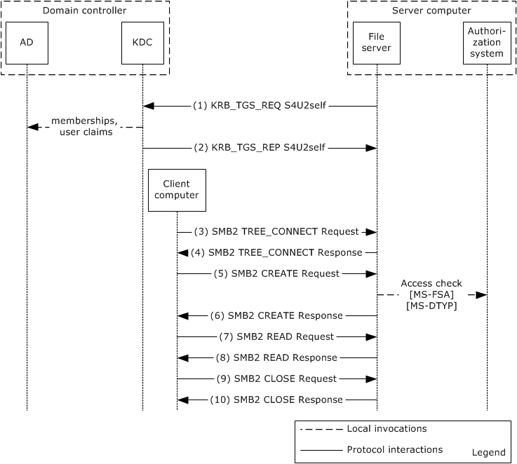
<!-- /Extracted images from page 55 -->

Figure 19: Reading from a file on a remote CBAC-aware SMB2 share configured with only
user claims

1.  The file server service uses the Service for User to Self (S4U2self) extension to retrieve a user

claim for itself on behalf of the user. The service fills out the PA_FOR_USER structure ([MS-SFU]
section 2.2.1) data structure and sends the KRB_TGS_REQ message, as described in [MS-SFU]
section 3.1.5.1.1, to the KDC.

2.  The KDC processes the request, and retrieves the claims and group membership associated with

the user from the account database , as specified in [MS-SFU] section 3.2.5.1.2 and [MS-KILE]
section 3.3.5.6.4.6. For more information, see [MS-ADOD]. The KDC returns the service ticket for
the user in the KRB_TGS_REP message. The privilege attribute certificate (PAC) that is returned in
the service ticket contains the group membership information and user claims, as specified in [MS-
PAC] section 3.

3-10. The steps are the same as steps 1-8 in "Service Ticket with the User and Device Claims" variant
as described in section 3.1.1.1.

3.1.2  NT LAN Manager Authentication Protocol [MS-NLMP]

Prerequisites

The prerequisites are the same as described in the common prerequisites in section 3.1.

[MS-AZOD] - v20220614
Authorization Protocols Overview
Copyright © 2022 Microsoft Corporation
Release: June 14, 2022

55 / 60

Initial System State







The identity of the user has been authenticated by the domain controller, as described in [MS-
AUTHSOD] section 3.3.2.

 The user who is running the SMB2 client application has not been authorized to read the remote
file.

The file server has obtained the user's access token (security context) as described in section
2.5.1.3.1.

Final System State



The user who is running the SMB2 client application has been authorized to read the contents of
the remote file.

Sequence of Events

The sequence of events is the same as in the Service Ticket Without the User Claims example in
section 3.1.1.2.

[MS-AZOD] - v20220614
Authorization Protocols Overview
Copyright © 2022 Microsoft Corporation
Release: June 14, 2022

56 / 60

4  Microsoft Implementations

The information in this overview is applicable to the following versions of Windows:

  Windows 2000 operating system

  Windows XP operating system

  Windows Server 2003 operating system

  Windows Vista operating system

  Windows Server 2008 operating system

  Windows 7 operating system

  Windows Server 2008 R2 operating system

  Windows 8 operating system

  Windows Server 2012 operating system



 Windows 8.1 operating system

  Windows Server 2012 R2 operating system

  Windows 10 operating system

  Windows Server 2016 operating system

  Windows Server operating system

  Windows Server 2019 operating system

  Windows Server 2022 operating system

  Windows 11 operating system

Exceptions, if any, are noted in the following section.

4.1  Product Behavior

None.

[MS-AZOD] - v20220614
Authorization Protocols Overview
Copyright © 2022 Microsoft Corporation
Release: June 14, 2022

57 / 60

5  Change Tracking

No table of changes is available. The document is either new or has had no changes since its last
release.

[MS-AZOD] - v20220614
Authorization Protocols Overview
Copyright © 2022 Microsoft Corporation
Release: June 14, 2022

58 / 60

6  Index
A

Additional considerations 50
Applicable protocols 33
Architecture 22
Assumptions 35
Authorization system error handling 50
Azman rbac model
   overview 48
AzMan RBAC model use case - overview 48

Handling requirements 50

I

Implementations - Microsoft 57
Implementer - security considerations 50
Implementer – security considerations 50
Informative references 19
Initial state 35
Introduction 5

C

M

Capability negotiation 50
Change tracking 58
Coherency requirements 50
Communications
   with other systems 34
   within the system 34
Component dependencies 34
Concepts 22
Considerations
   additional 50
   security 50

D

DAC model defined 5
DAC model elements 6
DAC model use case - overview 36
Dependencies
   with other systems 34
   within the system 34
Dependencies on other systems 34
Design intent
   azman rbac model 48
   overview 36

E

Microsoft implementations 57

O

Overview
   summary of protocol 33
   summary of protocols 33
   synopsis 22
   system use cases 36
Overview (synopsis) 5

P

Preconditions 35
Product behavior 57

R

Reading from a file on remote CBAC aware SMB2

share - example 51

References 19
Requirements
   coherency 50
   error handling 50
   overview 22
   preconditions 35
   security 50

Environment 34
Error handling 50
Example - reading from a file on remote CBAC aware

S

SMB2 share 51
Examples - overview 51
Extensibility
   Microsoft implementations 57
   overview 50
Extensibility – Microsoft implementations 57
External dependencies 34

F

Functional architecture 22
Functional requirements - overview 22

G

Glossary 17

H

[MS-AZOD] - v20220614
Authorization Protocols Overview
Copyright © 2022 Microsoft Corporation
Release: June 14, 2022

Security considerations 50
System architecture 22
System dependencies 34
   with other systems 34
   within the system 34
System errors 50
System overview - introduction 5
System protocols 33
System requirements - overview 22
System use cases
   azman rbac model 48
   overview 36
System use cases - overview 36

T

Table of protocols 33
Tracking changes 58

59 / 60

U

Use cases 36
   azman rbac model 48
User roles – AzMan RBAC model 15

V

Versioning
   Microsoft implementations 57
   overview 50

[MS-AZOD] - v20220614
Authorization Protocols Overview
Copyright © 2022 Microsoft Corporation
Release: June 14, 2022

60 / 60

