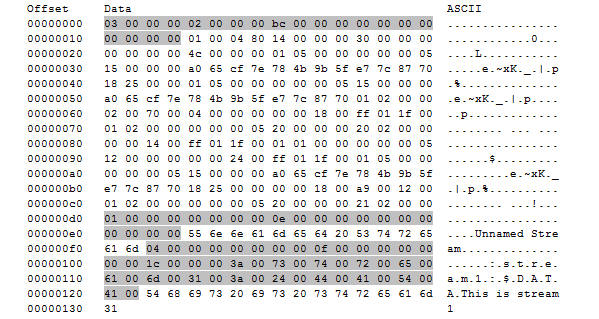

[MS-BKUP]:

Microsoft NT Backup File Structure

Intellectual Property Rights Notice for Open Specifications Documentation

  Technical Documentation. Microsoft publishes Open Specifications documentation (“this

documentation”) for protocols, file formats, data portability, computer languages, and standards
support. Additionally, overview documents cover inter-protocol relationships and interactions.

  Copyrights. This documentation is covered by Microsoft copyrights. Regardless of any other

terms that are contained in the terms of use for the Microsoft website that hosts this
documentation, you can make copies of it in order to develop implementations of the technologies
that are described in this documentation and can distribute portions of it in your implementations
that use these technologies or in your documentation as necessary to properly document the
implementation. You can also distribute in your implementation, with or without modification, any
schemas, IDLs, or code samples that are included in the documentation. This permission also
applies to any documents that are referenced in the Open Specifications documentation.
  No Trade Secrets. Microsoft does not claim any trade secret rights in this documentation.
  Patents. Microsoft has patents that might cover your implementations of the technologies

described in the Open Specifications documentation. Neither this notice nor Microsoft's delivery of
this documentation grants any licenses under those patents or any other Microsoft patents.
However, a given Open Specifications document might be covered by the Microsoft Open
Specifications Promise or the Microsoft Community Promise. If you would prefer a written license,
or if the technologies described in this documentation are not covered by the Open Specifications
Promise or Community Promise, as applicable, patent licenses are available by contacting
iplg@microsoft.com.

  License Programs. To see all of the protocols in scope under a specific license program and the

associated patents, visit the Patent Map.

  Trademarks. The names of companies and products contained in this documentation might be
covered by trademarks or similar intellectual property rights. This notice does not grant any
licenses under those rights. For a list of Microsoft trademarks, visit
www.microsoft.com/trademarks.

  Fictitious Names. The example companies, organizations, products, domain names, email

addresses, logos, people, places, and events that are depicted in this documentation are fictitious.
No association with any real company, organization, product, domain name, email address, logo,
person, place, or event is intended or should be inferred.

Reservation of Rights. All other rights are reserved, and this notice does not grant any rights other
than as specifically described above, whether by implication, estoppel, or otherwise.

Tools. The Open Specifications documentation does not require the use of Microsoft programming
tools or programming environments in order for you to develop an implementation. If you have access
to Microsoft programming tools and environments, you are free to take advantage of them. Certain
Open Specifications documents are intended for use in conjunction with publicly available standards
specifications and network programming art and, as such, assume that the reader either is familiar
with the aforementioned material or has immediate access to it.

Support. For questions and support, please contact dochelp@microsoft.com.

[MS-BKUP] - v20240423
Microsoft NT Backup File Structure
Copyright © 2024 Microsoft Corporation
Release: April 23, 2024

1 / 22

Revision Summary

Date

Revision
History

Revision
Class

Comments

3/2/2007

1.0

4/3/2007

1.1

5/11/2007

1.2

6/1/2007

1.3

Major

Minor

Minor

Minor

Updated and revised the technical content.

Clarified the meaning of the technical content.

Clarifications; Minor edits

Clarified the meaning of the technical content.

7/3/2007

1.3.1

Editorial

Changed language and formatting in the technical content.

8/10/2007

1.3.2

Editorial

Changed language and formatting in the technical content.

9/28/2007

1.3.3

Editorial

Changed language and formatting in the technical content.

10/23/2007  1.3.4

Editorial

Changed language and formatting in the technical content.

1/25/2008

1.3.5

Editorial

Changed language and formatting in the technical content.

3/14/2008

1.3.6

Editorial

Changed language and formatting in the technical content.

6/20/2008

2.0

Major

Updated and revised the technical content.

7/25/2008

2.0.1

Editorial

Changed language and formatting in the technical content.

8/29/2008

2.0.2

Editorial

Changed language and formatting in the technical content.

10/24/2008  2.0.3

Editorial

Changed language and formatting in the technical content.

12/5/2008

3.0

Major

Updated and revised the technical content.

1/16/2009

3.0.1

Editorial

Changed language and formatting in the technical content.

2/27/2009

3.0.2

Editorial

Changed language and formatting in the technical content.

4/10/2009

3.0.3

Editorial

Changed language and formatting in the technical content.

5/22/2009

4.0

Major

Updated and revised the technical content.

7/2/2009

4.0.1

Editorial

Changed language and formatting in the technical content.

8/14/2009

4.0.2

Editorial

Changed language and formatting in the technical content.

9/25/2009

4.1

Minor

Clarified the meaning of the technical content.

11/6/2009

4.1.1

Editorial

Changed language and formatting in the technical content.

12/18/2009  5.0

Major

Updated and revised the technical content.

1/29/2010

5.0.1

Editorial

Changed language and formatting in the technical content.

3/12/2010

5.0.2

Editorial

Changed language and formatting in the technical content.

4/23/2010

5.0.3

Editorial

Changed language and formatting in the technical content.

6/4/2010

5.0.4

Editorial

Changed language and formatting in the technical content.

7/16/2010

5.1

Minor

Clarified the meaning of the technical content.

8/27/2010

5.1

None

No changes to the meaning, language, or formatting of the
technical content.

[MS-BKUP] - v20240423
Microsoft NT Backup File Structure
Copyright © 2024 Microsoft Corporation
Release: April 23, 2024

2 / 22

Date

Revision
History

Revision
Class

Comments

10/8/2010

5.1

11/19/2010  5.1

1/7/2011

5.1

2/11/2011

5.1

3/25/2011

5.1

5/6/2011

5.1

None

None

None

None

None

None

No changes to the meaning, language, or formatting of the
technical content.

No changes to the meaning, language, or formatting of the
technical content.

No changes to the meaning, language, or formatting of the
technical content.

No changes to the meaning, language, or formatting of the
technical content.

No changes to the meaning, language, or formatting of the
technical content.

No changes to the meaning, language, or formatting of the
technical content.

6/17/2011

5.2

Minor

Clarified the meaning of the technical content.

9/23/2011

5.2

12/16/2011  5.2

3/30/2012

5.2

7/12/2012

5.2

10/25/2012  5.2

1/31/2013

5.2

None

None

None

None

None

None

No changes to the meaning, language, or formatting of the
technical content.

No changes to the meaning, language, or formatting of the
technical content.

No changes to the meaning, language, or formatting of the
technical content.

No changes to the meaning, language, or formatting of the
technical content.

No changes to the meaning, language, or formatting of the
technical content.

No changes to the meaning, language, or formatting of the
technical content.

8/8/2013

6.0

Major

Updated and revised the technical content.

11/14/2013  6.0

2/13/2014

6.0

5/15/2014

6.0

None

None

None

No changes to the meaning, language, or formatting of the
technical content.

No changes to the meaning, language, or formatting of the
technical content.

No changes to the meaning, language, or formatting of the
technical content.

6/30/2015

7.0

Major

Significantly changed the technical content.

10/16/2015  7.0

7/14/2016

7.0

6/1/2017

7.0

None

None

None

No changes to the meaning, language, or formatting of the
technical content.

No changes to the meaning, language, or formatting of the
technical content.

No changes to the meaning, language, or formatting of the
technical content.

9/15/2017

8.0

Major

Significantly changed the technical content.

[MS-BKUP] - v20240423
Microsoft NT Backup File Structure
Copyright © 2024 Microsoft Corporation
Release: April 23, 2024

3 / 22

Date

Revision
History

Revision
Class

Comments

9/12/2018

9.0

4/7/2021

10.0

6/25/2021

11.0

4/23/2024

12.0

Major

Major

Major

Major

Significantly changed the technical content.

Significantly changed the technical content.

Significantly changed the technical content.

Significantly changed the technical content.

[MS-BKUP] - v20240423
Microsoft NT Backup File Structure
Copyright © 2024 Microsoft Corporation
Release: April 23, 2024

4 / 22

## Table of Contents

- [1 Introduction](#1-introduction)
  - [1.1 Glossary](#11-glossary)
  - [1.2 References](#12-references)
    - [1.2.1 Normative References](#121-normative-references)
    - [1.2.2 Informative References](#122-informative-references)
  - [1.3 Overview](#13-overview)
  - [1.4 Relationship to Protocols and Other Structures](#14-relationship-to-protocols-and-other-structures)
  - [1.5 Applicability Statement](#15-applicability-statement)
  - [1.6 Versioning and Localization](#16-versioning-and-localization)
  - [1.7 Vendor-Extensible Fields](#17-vendor-extensible-fields)
- [2 Structures](#2-structures)
  - [2.1 NT Backup File](#21-nt-backup-file)
  - [2.2 WIN32_STREAM_ID](#22-win32streamid)
  - [2.3 Alternate Data Backup Stream Structure](#23-alternate-data-backup-stream-structure)
  - [2.4 Data Backup Stream Structure](#24-data-backup-stream-structure)
  - [2.5 Extended Attribute Data Backup Stream Structure](#25-extended-attribute-data-backup-stream-structure)
  - [2.6 Link Backup Stream Structure](#26-link-backup-stream-structure)
  - [2.7 Object ID Backup Stream Structure](#27-object-id-backup-stream-structure)
  - [2.8 Reparse Backup Stream Structure](#28-reparse-backup-stream-structure)
  - [2.9 Security Stream Structure](#29-security-stream-structure)
  - [2.10 Sparse Block Stream Structure](#210-sparse-block-stream-structure)
  - [2.11 TXFS Stream Structure](#211-txfs-stream-structure)
  - [2.12 FileSystem Ghosted Extents Functionality](#212-filesystem-ghosted-extents-functionality)
    - [2.12.1 Ghosted Extents Stream Structure](#2121-ghosted-extents-stream-structure)
  - [2.13 Structure Usage](#213-structure-usage)
    - [2.13.1 Creating an NT Backup File](#2131-creating-an-nt-backup-file)
    - [2.13.2 Reconstituting a File from an NT Backup File](#2132-reconstituting-a-file-from-an-nt-backup-file)
- [3 Structure Examples](#3-structure-examples)
- [4 Security Considerations](#4-security-considerations)
  - [4.1 Security Considerations for Implementers](#41-security-considerations-for-implementers)
  - [4.2 Index of Security Parameters](#42-index-of-security-parameters)
- [5 Appendix A: Product Behavior](#5-appendix-a-product-behavior)
- [6 Change Tracking](#6-change-tracking)
- [7 Index](#7-index)

## 1 Introduction

This specification describes the network format of the Windows NT backup file format and its
constituent structures that can be used in other protocols.

Sections 1.7 and 2 of this specification are normative. All other sections and examples in this
specification are informative.

### 1.1 Glossary

This document uses the following terms:

access control list (ACL): A list of access control entries (ACEs) that collectively describe the

security rules for authorizing access to some resource; for example, an object or set of objects.

alternate stream: See named stream.

ASCII: The American Standard Code for Information Interchange (ASCII) is an 8-bit character-
encoding scheme based on the English alphabet. ASCII codes represent text in computers,
communications equipment, and other devices that work with text. ASCII refers to a single 8-bit
ASCII character or an array of 8-bit ASCII characters with the high bit of each character set to
zero.

backup stream: The components of a Windows NT operating system backup file. It is important

not to confuse a backup stream with a named stream. Backup streams are bytes within the
main stream of a Windows NT backup file, while a named stream is part of a file that is not a
Windows NT backup file that requires a separate open call to access.

FAT file system: A file system used to organize and manage files. The file allocation table (FAT) is

a data structure that the operating system creates when a volume is formatted by using FAT or
FAT32 file systems. The operating system stores information about each file in the FAT so that
it can retrieve the file later.

FAT32 file system: A derivative of the file allocation table (FAT) file system. FAT32 supports
smaller cluster sizes and larger volumes than FAT, which results in more efficient space
allocation on FAT32 volumes. FAT32 uses 32-bit addressing.

file stream: See main stream and named stream.

main stream: The place within a file where data is stored or the data stored therein. A main

stream has no name. The main stream is what is ordinarily thought of as the contents of a file.

named stream: A place within a file in addition to the main stream where data is stored, or the
data stored therein. File systems support a mode in which it is possible to open either the main
stream of a file and/or to open a named stream. Named streams and the main stream each
have different data than each other and can be read and written independently. Not all file
systems support named streams. See also stream.

NT backup file: A file that contains the representation of another file. It is made up of zero or

more backup streams.

NT file system (NTFS): A proprietary Microsoft file system. For more information, see [MSFT-

NTFS].

Object ID: See ObjectID.

reparse point: An attribute that can be added to a file to store a collection of user-defined data
that is opaque to NTFS or ReFS. If a file that has a reparse point is opened, the open will
normally fail with STATUS_REPARSE, so that the relevant file system filter driver can detect the

6 / 22

[MS-BKUP] - v20240423
Microsoft NT Backup File Structure
Copyright © 2024 Microsoft Corporation
Release: April 23, 2024

open of a file associated with (owned by) this reparse point. At that point, each installed filter
driver can check to see if it is the owner of the reparse point, and, if so, perform any special
processing required for a file with that reparse point. The format of this data is understood by
the application that stores the data and the file system filter that interprets the data and
processes the file. For example, an encryption filter that is marked as the owner of a file's
reparse point could look up the encryption key for that file. A file can have (at most) 1 reparse
point associated with it. For more information, see [MS-FSCC].

security descriptor: A data structure containing the security information associated with a

securable object. A security descriptor identifies an object's owner by its security identifier
(SID). If access control is configured for the object, its security descriptor contains a
discretionary access control list (DACL) with SIDs for the security principals who are allowed or
denied access. Applications use this structure to set and query an object's security status. The
security descriptor is used to guard access to an object as well as to control which type of
auditing takes place when the object is accessed. The security descriptor format is specified in
[MS-DTYP] section 2.4.6; a string representation of security descriptors, called SDDL, is
specified in [MS-DTYP] section 2.5.1.

serialize: The process of taking an in-memory data structure, flat or otherwise, and turning it into

a flat stream of bytes. See also marshal.

sparse file: A file containing large sections of data composed only of zeros. This file is marked as a
sparse file in the file system, which saves disk space by only allocating as many ranges on disk
as are required to completely reconstruct the non-zero data. When an attempt is made to read
in the nonallocated portions of the file (also known as holes), the file system automatically
returns zeros to the caller.

staging file: The backup of the changed file or folder. It encapsulates the data and attributes

associated with a replicated file or folder. By creating the staging file, File Replication Service
(FRS) ensures that file data can be supplied to partners regardless of any activity that might
prevent access to the original file. The staging files can be compressed to save disk space and
network bandwidth during replication.

unnamed stream: See main stream.

MAY, SHOULD, MUST, SHOULD NOT, MUST NOT: These terms (in all caps) are used as defined
in [RFC2119]. All statements of optional behavior use either MAY, SHOULD, or SHOULD NOT.

### 1.2 References

Links to a document in the Microsoft Open Specifications library point to the correct section in the
most recently published version of the referenced document. However, because individual documents
in the library are not updated at the same time, the section numbers in the documents may not
match. You can confirm the correct section numbering by checking the Errata.

#### 1.2.1 Normative References

We conduct frequent surveys of the normative references to assure their continued availability. If you
have any issue with finding a normative reference, please contact dochelp@microsoft.com. We will
assist you in finding the relevant information.

[MS-DTYP] Microsoft Corporation, "Windows Data Types".

[MS-FRS1] Microsoft Corporation, "File Replication Service Protocol".

[MS-FRS2] Microsoft Corporation, "Distributed File System Replication Protocol".

[MS-FSCC] Microsoft Corporation, "File System Control Codes".

7 / 22

[MS-BKUP] - v20240423
Microsoft NT Backup File Structure
Copyright © 2024 Microsoft Corporation
Release: April 23, 2024

[RFC2119] Bradner, S., "Key words for use in RFCs to Indicate Requirement Levels", BCP 14, RFC
2119, March 1997, https://www.rfc-editor.org/info/rfc2119

#### 1.2.2 Informative References

[FFS] McKusick, M. K., Joy, W. N., Leffler, S. J., et al., "A Fast File System for UNIX", Computer
Systems 2(3):181-197, 1984.

[MS-DLTCS] Microsoft Corporation, "Distributed Link Tracking Central Store Protocol".

[MS-DLTW] Microsoft Corporation, "Distributed Link Tracking: Workstation Protocol".

[MSFT-NTFS] Microsoft Corporation, "NTFS Technical Reference", March 2003,
http://technet2.microsoft.com/WindowsServer/en/Library/81cc8a8a-bd32-4786-a849-
03245d68d8e41033.mspx

### 1.3 Overview

This document specifies the structure of NT backup files as they are used in over-the-wire protocols.
This file format is not a protocol; however, it is used to describe the format of data that is sent across
the wire as payloads of other protocols, in particular, the File Replication Service Protocol (as specified
in [MS-FRS1]) and the SD Microsoft Distributed File System Replication Protocol, as specified in [MS-
FRS2]. As such, the format is specified in this document as a reference that other protocols can use to
ensure consistency and accuracy. Contained in this specification are the following:

  An overview about the structure of an NT backup file.





The definition of the WIN32_STREAM_ID (section 2.2) backup stream header.

The definition of a backup stream that can be found within an NT backup file.

While a simple model of a file is a stream of bytes, files have become more complicated over the
years. They can contain large regions of zero data, more than one stream of bytes, and special
attributes such as reparse points, as well as having access control lists (ACLs) attached to them.
In some instances, such as making a backup copy of a file or transmitting a file over a network, it is
helpful to serialize the file—that is, to efficiently express a file's full complexity as a simple stream of
bytes. The NT Backup format is a particular format for this serialization.

As an example, consider sparse files. Many modern file systems, including NT File System, NTFS, (as
specified in [MSFT-NTFS]) and many implementations based on Berkeley Fast File System support
sparse files (for more information about Berkeley Fast File System, see [FFS]). In these file systems,
unwritten portions of files have zero data, but they do not necessarily result in the allocation of disk
space or the writing of zeros to the disk. When serializing these files, it is more efficient not to store
the zero ranges in the serialize representation. Furthermore, in the case of NTFS, whether a range is
allocated or unallocated is observable by the application via the FSCTL_QUERY_ALLOCATED_RANGES
file system control (as specified in [MS-FSCC]), so replacing unallocated ranges with simple zeros
alters the semantics of the file. The NT Backup format enables such a file to be transmitted over a
network or a representation of it to be stored on a file system or backup medium that lacks the
richness of the original file system.

As another example, consider named streams. NTFS supports a feature wherein a file can have a
number of streams with associated names, in addition to the default (unnamed) main stream. For
example, the main stream of a file named a.txt might contain the bytes unnamed stream, while
named stream stream1, opened as a.txt:stream1, would contain "This is stream1." The NT Backup
format enables serialization of any number of streams.

[MS-BKUP] - v20240423
Microsoft NT Backup File Structure
Copyright © 2024 Microsoft Corporation
Release: April 23, 2024

8 / 22

The content of an NT Backup serialize file is a set of backup streams. (The different uses of the word
"stream" are specified in section 2.2.) Each backup stream represents one aspect of the original file,
such as its ACL, a contiguous allocated section of a file stream, a reparse point, and so on.

### 1.4 Relationship to Protocols and Other Structures

The File Replication Service Protocol (as specified in [MS-FRS1]) and the Distributed File System
Replication Protocol (as specified in [MS-FRS2]) rely on the structures and definitions in this document
to create and interpret the contents of a staging file that are sent and received across the network
during file replication.

### 1.5 Applicability Statement

The structures and classes that this document defines are useful for any lower-level protocol, such as
the File Replication Service Protocol (as specified in [MS-FRS1]), that serializes and exchanges native
Windows file formats, but does not require that those file formats be remapped into a protocol-specific
representation.

### 1.6 Versioning and Localization

None.

### 1.7 Vendor-Extensible Fields

None.

[MS-BKUP] - v20240423
Microsoft NT Backup File Structure
Copyright © 2024 Microsoft Corporation
Release: April 23, 2024

9 / 22

## 2 Structures

The following sections specify the Microsoft NT Backup File Structure.

Unless otherwise specified, all numeric fields that this document specifies are little-endian.

Note that the word "stream" is used in two different contexts. It can indicate:

  A part of the NT backup file format.

  A place in a file where data is stored (or the actual data therein is stored, depending on the

context).

To avoid confusion between these two usages, this document uses backup stream to indicate the
portion of the NT backup file; file stream, main stream, named stream, unnamed stream, and
alternate stream indicate the parts of a file in the file system.

The Windows NT backup file format and its constituent structures reference commonly used data types
as defined in [MS-DTYP].

### 2.1 NT Backup File

An NT backup file is made up of zero or more backup streams that appear one right after the
other. A backup stream is a logically related collection of data that is related to one file. For example,
the file's contents are a backup stream; its security information is a backup stream, and so on. Each
backup stream in an NT backup file consists of a WIN32_STREAM_ID (section 2.2) header, followed by
the file-specific data for that backup stream.

An implementation that creates a backup stream for an NT backup file for use over-the-wire MUST use
only the dwStreamId values that are specified in section 2.2 when creating a backup stream. An
implementation reading an NT backup file, and then creating a file based on it, MUST fail if its
dwStreamId value is not one of those specified in section 2.2.

If an unrecognized or unused dwStreamId value or an otherwise malformed NT backup file is
encountered, an implementation MAY process the remainder of the NT backup file. An implementation
MAY delete the portion of the file it has created upon finding a malformed NT backup file.<1>

### 2.2 WIN32_STREAM_ID

The WIN32_STREAM_ID structure is a header that precedes each backup stream in the NT backup
file. This header identifies the type of backup stream, its size, and other attributes. The structure is as
follows.

0  1  2  3  4  5  6  7  8  9

1
0  1  2  3  4  5  6  7  8  9

2
0  1  2  3  4  5  6  7  8  9

3
0  1

dwStreamId

dwStreamAttributes

Size

...

dwStreamNameSize

[MS-BKUP] - v20240423
Microsoft NT Backup File Structure
Copyright © 2024 Microsoft Corporation
Release: April 23, 2024

10 / 22

cStreamName (variable)

...

dwStreamId (4 bytes):  A 32-bit, unsigned integer that indicates the type of data in this backup

stream. The value of this field MUST be one of the following.

Value

Meaning

ALTERNATE_DATA
0x00000004

Alternative data streams.

DATA
0x00000001

EA_DATA
0x00000002

LINK
0x00000005

OBJECT_ID
0x00000007

REPARSE_DATA
0x00000008

SECURITY_DATA
0x00000003

SPARSE_BLOCK
0x00000009

TXFS_DATA
0x0000000A

Standard data.

Extended attribute data.

Hard link information.

 Object identifiers.

Reparse points.

 Security descriptor data.

Data in a sparse file.

Transactional file system.

GHOSTED_FILE_EXTENTS
0x0000000B

Ghosted Extents.

dwStreamAttributes (4 bytes):  A 32-bit, unsigned long integer that indicates properties of the
backup stream. The value of this field MUST be the bitwise OR of zero or more of the following.
Other bits are unused and MUST be 0 and ignored on receipt.

Value

Meaning

STREAM_NORMAL_ATTRIBUTE
0x00000000

STREAM_CONTAINS_SECURITY
0x00000002

STREAM_SPARSE_ATTRIBUTE
0x00000008

This backup stream has no special attributes.

The backup stream contains security information. This attribute
applies only to backup stream of type SECURITY_DATA.

The backup stream is part of a sparse file stream. This
attribute applies only to backup stream of type DATA,
ALTERNATE_DATA, and SPARSE_BLOCK.

STREAM_CONTAINS_GHOSTED_FILE_EXTENTS
0x00000010

The backup stream contains ghosted extents. This attribute
applies only to backup stream of type DATA.

Size (8 bytes):  A 64-bit, unsigned integer that specifies the length of the data portion of the backup
stream; this length MUST NOT include the length of the header. The next backup stream within
the NT backup file, if any, MUST start at Size + dwStreamNameSize bytes beyond the end of
this WIN32_STREAM_ID structure. Note that the alternate stream name, whose size is
dwStreamNameSize bytes, is part of the header for the purposes of calculating the position of
the next WIN32_STREAM_ID structure.

dwStreamNameSize (4 bytes):  A 32-bit, unsigned integer that specifies the length of the alternate
stream name, in bytes. The value of this field MUST be 0 for all dwStreamId values other than
ALTERNATE_DATA. For StreamID ALTERNATE_DATA, the value of this field MUST be in the range
0–65536, and it MUST be an integral multiple of two.

11 / 22

[MS-BKUP] - v20240423
Microsoft NT Backup File Structure
Copyright © 2024 Microsoft Corporation
Release: April 23, 2024

cStreamName (variable):  A Unicode string that specifies the name of the alternate stream. This

string MUST NOT be null-terminated.

Size bytes of data MUST follow the header. The meaning of the data depends on the dwStreamId
value and is specified in the following sections.

### 2.3 Alternate Data Backup Stream Structure

Some file systems support files that have named streams. The ALTERNATE_DATA dwStreamId field
value MUST be used when recording these streams. Aside from the requirement that
ALTERNATE_DATA MUST have a nonzero length name in the cStreamName field of the
WIN32_STREAM_ID (section 2.2) structure, an ALTERNATE_DATA stream is identical to a
DATA (section 2.4) stream. An underlying file system might constrain the naming of alternate
streams. If the implementation does not support named streams or does not support the
cStreamName that is specified in the ALTERNATE_DATA structure, the implementation MAY ignore
the stream or MAY choose some other way to store the data.<2>

### 2.4 Data Backup Stream Structure

The data portion of a data backup stream structure is the data within the main stream of the file.
When creating a backup file, the bytes of the main stream MUST be copied without modification to the
data portion of a data backup stream.

### 2.5 Extended Attribute Data Backup Stream Structure

An implementation SHOULD NOT create an extended attribute data backup stream in an NT Backup
format file and MUST ignore an extended attribute data backup stream, if received.<3>

### 2.6 Link Backup Stream Structure

An implementation SHOULD NOT create a LINK backup stream and MUST ignore one if encountered.

### 2.7 Object ID Backup Stream Structure

The Object ID Backup Stream contains a unique identifier for a file. The structure of the data portion
of this backup stream is as follows:

0  1  2  3  4  5  6  7  8  9

1
0  1  2  3  4  5  6  7  8  9

2
0  1  2  3  4  5  6  7  8  9

3
0  1

ObjectID (16 bytes)

...

...

Data (48 bytes)

...

...

[MS-BKUP] - v20240423
Microsoft NT Backup File Structure
Copyright © 2024 Microsoft Corporation
Release: April 23, 2024

12 / 22

ObjectID (16 bytes):  A 16-byte GUID, as specified in [MS-DTYP] section 2.3.4.2, assigned by the

server on which the file is stored, that uniquely identifies the file or directory within the volume in
which it is stored.

Data (48 bytes):  This field contains 48 bytes of implementation-defined metadata associated with

the file.<4>

### 2.8 Reparse Backup Stream Structure

A reparse backup stream contains information about a reparse point in the file system. The data
portion of a reparse point backup stream is the contents of the reparse point, which MUST be a
REPARSE_DATA_BUFFER or REPARSE_GUID_DATA_BUFFER structure, as specified in [MS-FSCC]
sections 2.1.2.2 and 2.1.2.3, respectively.

### 2.9 Security Stream Structure

The data portion of a SECURITY_DATA backup stream MUST contain a SECURITY_DESCRIPTOR. For
more information, see [MS-DTYP] section 2.4.6.

### 2.10 Sparse Block Stream Structure

A sparse file (or a sparse named stream) is represented both by a DATA backup stream (or an
ALTERNATE_DATA backup stream in the case of a named stream) followed by one or more
SPARSE_BLOCK backup streams.

A SPARSE_BLOCK backup stream represents a portion of a sparse file that contains data; unallocated
portions of a file are indicated by the absence of a SPARSE_BLOCK stream that describes that part of
the file. The structure of the data portion of this backup stream is as follows:

0  1  2  3  4  5  6  7  8  9

1
0  1  2  3  4  5  6  7  8  9

2
0  1  2  3  4  5  6  7  8  9

3
0  1

Offset

...

Data (variable)

...

Offset (8 bytes):  An unsigned, 64-bit integer that specifies the offset within the file stream (not in

the backup stream) of the data contained in this sparse block.

Data (variable):  The data for this allocated region of the file stream. This field MUST be of length

(Size - 8), where Size is the value of the WIN32_STREAM_ID header's Size field that is associated
with this backup stream.

An implementation SHOULD use file system sparse file support, if available, to represent the
reconstituted file. Failure to do so could waste large amounts of disk space.<5>

### 2.11 TXFS Stream Structure

A TXFS backup stream has no meaning on a system other than the system on which it was created.
An implementation MUST NOT send a TXFS stream and MUST ignore a TXFS stream, if received.

[MS-BKUP] - v20240423
Microsoft NT Backup File Structure
Copyright © 2024 Microsoft Corporation
Release: April 23, 2024

13 / 22

### 2.12 FileSystem Ghosted Extents Functionality

Hierarchical Storage Management (HSM) solutions on top of a filesystem remove cold data and move
it to the next storage tier. This movement creates sparse holes in file system data, and HSM solutions
have to maintain mappings between those sparse holes and location of the data in the new tier. An
implementation of the Ghosted extents feature helps this process by maintaining some token in the
sparse holes, on behalf of the HSM solution. This obviates the need for the HSM solution to maintain
its own mappings. When a file with such tokens, hereby referred to as ghosted extents, is backed up,
the backup process should store the tokens and their locations in the backup stream state. On restore
those tokens should be reinserted in the data stream in exactly the same locations to recreate the
original file state. The method to query the tokens, serialize the tokens, and restore the tokens is file
system implementation specific.

#### 2.12.1 Ghosted Extents Stream Structure

A ghosted extent stream structure represents ghosted extents in the DATA backup stream. Ghosted
extents are a kind of sparse extents, which store a GUID representing the owner of the extent and
some variable-sized metadata. The structure of the data portion of this backup stream for a specific
implementation is as follows:

0  1  2  3  4  5  6  7  8  9

1
0  1  2  3  4  5  6  7  8  9

2
0  1  2  3  4  5  6  7  8  9

3
0  1

Count

TotalCount

Data (variable)

...

Count (4 bytes): The number of extents in the Data portion.

TotalCount (4 bytes): The total number of ghosted extents in the stream.

Data (Variable):  The data portion of the above structure contains a variable number of extents. The

number of extents is given by Count. The structure of each Extent is described below:

0  1  2  3  4  5  6  7  8  9

1
0  1  2  3  4  5  6  7  8  9

2
0  1  2  3  4  5  6  7  8  9

3
0  1

Offset

...

Length

...

Guid

...

...

[MS-BKUP] - v20240423
Microsoft NT Backup File Structure
Copyright © 2024 Microsoft Corporation
Release: April 23, 2024

14 / 22

...

NextOffset

Size

Data (variable)

...

Offset (8 bytes): The logical byte offset in the DATA backup stream where the ghosted extent starts.

Length (8 bytes): The logical length of the ghosted extent.

GUID (16 bytes): The GUID identifier of the owner for the ghosted extent.

NextOffset (4 bytes): Offset to the next Extent structure.

Size (4 bytes): Size of the metadata of the ghosted extent.

Data (variable): Metadata of the ghosted extent.

### 2.13 Structure Usage

This specification describes only the format of individual structures.

This section specifies the process of creating an NT backup file and of reconstituting an ordinary file
from an NT backup file.

#### 2.13.1 Creating an NT Backup File

This section specifies a process for creating an NT backup file corresponding to a given file F.

The contents of the NT backup file MUST be a number of backup streams, with their formats
specified as in section 2.2, with no padding or other bytes between them. Each backup stream MUST
consist of a WIN32_STREAM_ID followed by the appropriate backup stream data.

The order of the backup streams within an NT backup file is arbitrary, except that SPARSE_BLOCK
backup streams MUST follow the DATA or ALTERNATE_DATA backup streams for the file stream that
contains the data in the SPARSE_BLOCK backup stream.<6>

The code creating the NT backup file SHOULD generate at most one backup stream of each of the
following types: DATA, OBJECT_ID, REPARSE_DATA, and SECURITY_DATA.

If the file system supports it, the code creating the NT backup file SHOULD generate a
SECURITY_DATA backup stream that contains the security descriptor for F.

If the file system supports it and F has an object ID, the code creating the NT backup file SHOULD
generate an Object ID Backup Stream containing it.

If the file system supports it and F has a reparse point, then the code creating the NT backup file
SHOULD generate a REPARSE_DATA backup stream containing it.

If the main stream of F is not empty, the code that creates the NT backup file MUST generate a
DATA backup stream for it. The DATA backup stream SHOULD have STREAM_SPARSE_ATTRIBUTE set
if, and only if, the main stream of F is sparse. If the main stream of F is sparse, the DATA backup

15 / 22

[MS-BKUP] - v20240423
Microsoft NT Backup File Structure
Copyright © 2024 Microsoft Corporation
Release: April 23, 2024

stream SHOULD have a Size of 0. If the main stream of F is not sparse, the DATA backup stream
MUST contain the contents of the main stream of F.

If the main stream of F is sparse, it has any nonzero data in it, and that data is not stored in the DATA
stream, the code that creates the NT backup file MUST generate one or more SPARSE_BLOCK backup
streams. The set of SPARSE_BLOCKs together with the DATA backup stream MUST contain all of the
nonzero data of the file. The SPARSE_BLOCKs for the DATA backup stream MUST follow the DATA
backup stream and MUST NOT follow any ALTERNATE_DATA backup streams.

If F has any named streams, the code that creates the NT backup file MUST generate one
ALTERNATE_DATA backup stream for each named stream in F. The ALTERNATE_DATA stream MUST
have its cStreamName equal to that of the corresponding named stream of F. If the named stream is
sparse, it MUST be treated identically to a sparse unnamed stream, except that the appropriate
SPARSE_BLOCKs MUST follow the ALTERNATE_DATA backup stream for this named stream and MUST
precede the next ALTERNATE_DATA backup stream (if any) in the NT backup file.

If F has any ghosted extents, the NT backup file MUST generate one GHOSTED_EXTENT backup
stream structure. During restore the GHOSTED_EXTENT backup stream structure is presented to the
filesystem to recreate the file ghosted extent state.

#### 2.13.2 Reconstituting a File from an NT Backup File

An implementation creating a file F given an NT backup file MUST process all of the backup
streams contained within the NT backup file.

For OBJECT_ID, REPARSE_DATA, and SECURITY_DATA backup streams, it SHOULD create the
corresponding object ID, reparse point, or security descriptor on F, if the file system in which F
resides supports those features. If there is more than one backup stream of any of these particular
types (or of type DATA), the implementation creating F can either:

  Select any one of the backup streams of that type, or <7>



Fail without reconstituting that stream due to the presence of more than one backup stream of
that type

If the NT backup file contains a DATA backup stream, the code that creates F MUST put the data from
the DATA backup stream into the main stream of F. If any SPARSE_BLOCK backup streams occur in
the NT backup file after the DATA backup stream and before any ALTERNATE_DATA backup stream,
the code that creates F MUST put the data that is contained in the SPARSE_BLOCK at the specified
place in F's main stream. If there are SPARSE_BLOCKs and the file system storing F has support for
sparse files, it SHOULD use the sparse file support to avoid allocating disk space for the portions of
the main stream that are not described by the DATA or SPARSE_BLOCK backup stream.

If the NT backup file contains one or more ALTERNATE_DATA backup streams and the file system
holding F supports ALTERNATE_DATA streams, the code that creates F SHOULD generate the
appropriate named stream, using as the name the contents of the cStreamName field in the
WIN32_STREAM_ID header. Processing of ALTERNATE_DATA streams MUST otherwise be identical to
that of DATA streams, including the rules for SPARSE_BLOCKs.

[MS-BKUP] - v20240423
Microsoft NT Backup File Structure
Copyright © 2024 Microsoft Corporation
Release: April 23, 2024

16 / 22

<!-- Extracted images from page 17 -->

<!-- /Extracted images from page 17 -->

## 3 Structure Examples

This section presents an example of serializing an input file that has two streams. The unnamed
stream contains "unnamed stream" in ASCII, and the alternate stream "stream1" contains "This is
stream 1". This section does not show a sparse region because the NTFS file system requires sparse
regions to be integral multiples of 64-KB bytes aligned on 64-KB byte boundaries, which would result
in too large of an example.

This section displays dumps of file contents. These are formatted with 16 bytes per line, each byte
shown in hexadecimal without the leading "0x" prefix. Each line starts with the offset, in hexadecimal
from the beginning of the file of the first byte in the line. The end of each line is the bytes in the line
displayed in ASCII, with unprintable characters replaced with a period (.).

The raw contents of a.txt is as follows:

 Offset     Data                                             ASCII
 00000000   55 6e 6e 61 6d 65 64 20 53 74 72 65 61 6d        Unnamed Stream

The contents of a.txt:stream1 is:

 Offset     Data                                             ASCII
 00000000   54 68 69 73 20 69 73 20 73 74 72 65 61 6d 31     This is stream1

The serialized representation of a.txt is:

The WIN32_STREAM_IDs at the beginning of each backup stream are indicated by a gray
background. There are three backup streams in this case: first, a SECURITY_DATA stream that
contains the security descriptor for this file; second, the DATA stream that contains the contents of
the main stream; and third, an ALTERNATE_DATA stream that contains the contents of stream1. The
NTFS file system reports alternate stream names as ":streamName:$DATA." This is an implementation
detail of the NTFS file system and does imply that other file systems necessarily follow this stream
naming convention.

[MS-BKUP] - v20240423
Microsoft NT Backup File Structure
Copyright © 2024 Microsoft Corporation
Release: April 23, 2024

17 / 22

## 4 Security Considerations

### 4.1 Security Considerations for Implementers

Allowing the use of all possible NT Backup file stream types when this serialization format is used by
a file transfer protocol could unexpectedly grant access to a wider range of functionality than the
protocol author intended, such as creation of reparse points and assignment of security
descriptors. Protocols that use these structures in a generic format can protect themselves
appropriately by blocking stream types that their implementers do not want to support or stream
types that they do not recognize. The latter is significant if the underlying file systems on the sending
or receiving sides might be upgraded to support new functionality that was not there when the
protocol was initially implemented.

Implementers of the NT Backup format have to carefully design their protocols so that attackers can
not modify the contents of the backup streams, because such modifications can lead to arbitrary
changes in the restored file, including—but not limited to—changes in the contents, access control
lists, or reparse information of the file.

It is also important to protect the NT Backup serialized files themselves from unauthorized
modification, for the same reasons.

### 4.2 Index of Security Parameters

None.

[MS-BKUP] - v20240423
Microsoft NT Backup File Structure
Copyright © 2024 Microsoft Corporation
Release: April 23, 2024

18 / 22

## 5 Appendix A: Product Behavior

The information in this specification is applicable to the following Microsoft products or supplemental
software. References to product versions include updates to those products.

  Windows 2000 operating system

  Windows Server 2003 operating system

  Windows Server 2008 operating system

  Windows 7 operating system

  Windows Server 2008 R2 operating system

  Windows 8 operating system

  Windows Server 2012 operating system

  Windows 8.1 operating system

  Windows Server 2012 R2 operating system

  Windows 10 operating system

  Windows Server 2016 operating system

  Windows Server operating system

  Windows Server 2019 operating system

  Windows Server 2022 operating system

  Windows 11 operating system

  Windows Server 2025 operating system

Exceptions, if any, are noted in this section. If an update version, service pack or Knowledge Base
(KB) number appears with a product name, the behavior changed in that update. The new behavior
also applies to subsequent updates unless otherwise specified. If a product edition appears with the
product version, behavior is different in that product edition.

Unless otherwise specified, any statement of optional behavior in this specification that is prescribed
using the terms "SHOULD" or "SHOULD NOT" implies product behavior in accordance with the
SHOULD or SHOULD NOT prescription. Unless otherwise specified, the term "MAY" implies that the
product does not follow the prescription.

<1> Section 2.1: Windows stops processing an NT backup file when it detects a malformation, but it
does not delete any partially restored file information.

<2> Section 2.3: The NTFS file system supports named streams. All other Microsoft file systems
such as the FAT file system and the FAT32 file system do not support named streams. The NTFS
file system requires that the name of each ALTERNATE_DATA stream in an NT backup file begin with
the colon character (:). NTFS appends ":$DATA" to the name of any alternate stream that does not
already end that way, so it handles a.txt:AlternateStream and a.txt:AlternateStream:$DATA
identically. When restoring an NT Backup format file onto the FAT file system, Windows ignores named
streams.

[MS-BKUP] - v20240423
Microsoft NT Backup File Structure
Copyright © 2024 Microsoft Corporation
Release: April 23, 2024

19 / 22

<3> Section 2.5: The extended attribute stream exists only in files created by Windows versions
Windows NT 3.1 operating system, Windows NT 3.5 operating system and Windows NT 3.51 operating
system.

<4> Section 2.7: This field contains Distributed Link Tracking information for the file, if any, if the file
is stored in an NTFS file system. The first 16 bytes contain the file's birth volume ID, which is the
volume on which the object resided when the object ID was created, or 0 if the volume had no object
identifier at that time. The next 16 bytes contain the object ID at the time the object was created,
which is required to be unique within the volume on which it was created. The next 16 bytes contain
the domain ID, which is set to 0. The FILE_OBJECTID_BUFFER structure is specified in [MS-FSCC]
section 2.1.3. For more information about the Distributed Link Tracking Service, see [MS-DLTCS] and
[MS-DLTW].

<5> Section 2.10: Windows uses sparse file support when writing to the NTFS file system but not to
others, such as the FAT file system and the FAT32 file system.

<6> Section 2.13.1: When creating an NT backup file for use with the File Replication Service
Protocol, as specified in [MS-FRS1], Windows requires that the first backup stream in the NT backup
file be of type BACKUP_SECURITY_DATA.

<7> Section 2.13.2: Windows always selects the last instance of the blocks in question for installation
into F.

[MS-BKUP] - v20240423
Microsoft NT Backup File Structure
Copyright © 2024 Microsoft Corporation
Release: April 23, 2024

20 / 22

## 6 Change Tracking

This section identifies changes that were made to this document since the last release. Changes are
classified as Major, Minor, or None.

The revision class Major means that the technical content in the document was significantly revised.
Major changes affect protocol interoperability or implementation. Examples of major changes are:

  A document revision that incorporates changes to interoperability requirements.
  A document revision that captures changes to protocol functionality.

The revision class Minor means that the meaning of the technical content was clarified. Minor changes
do not affect protocol interoperability or implementation. Examples of minor changes are updates to
clarify ambiguity at the sentence, paragraph, or table level.

The revision class None means that no new technical changes were introduced. Minor editorial and
formatting changes may have been made, but the relevant technical content is identical to the last
released version.

The changes made to this document are listed in the following table. For more information, please
contact dochelp@microsoft.com.

Section

Description

5 Appendix A: Product
Behavior

Added Windows Server 2025 to the list of applicable
products.

Revision
class

Major

[MS-BKUP] - v20240423
Microsoft NT Backup File Structure
Copyright © 2024 Microsoft Corporation
Release: April 23, 2024

21 / 22

## 7 Index
A

Alternate data backup stream structure 12
Applicability 9

B

Backup file
   NT - creating 15
   NT - creating file from 16

C

Capability negotiation 9
Change tracking 21
Common data types and fields 10
Creating file from NT backup file 16
Creating NT backup file 15

D

Data backup stream structure 12
Data types and fields - common 10
Details
   common data types and fields 10

E

Examples 17
Extended attribute data backup stream structure 12

F

Fields - vendor-extensible 9

G

Glossary 6

I

Implementer - security considerations 18
Index of security parameters 18
Informative references 8
Introduction 6

L

Link backup stream structure 12
Localization 9

N

Normative references 7
NT backup file
   creating 15
   creating file from 16
   discussed 10

O

[MS-BKUP] - v20240423
Microsoft NT Backup File Structure
Copyright © 2024 Microsoft Corporation
Release: April 23, 2024

Object_ID_Backup_Stream_Structure packet 12
Overview (synopsis) 8

P

Parameters - security index 18
Product behavior 19

R

References 7
   informative 8
   normative 7
Relationship to protocols and other structures 9
Reparse backup stream structure 13

S

Security
   implementer considerations 18
   parameter index 18
   stream structure 13
SparseBlockStreamStructure packet 13
Stream structure
   alternate data backup 12
   data backup 12
   extended attribute data backup 12
   link backup 12
   reparse backup 13
   security 13
   TXFS 13
Structures
   overview 10
Structures - overview 10

T

Tracking changes 21
TXFS stream structure 13

V

Vendor-extensible fields 9
Versioning 9

W

WIN32_STREAM_ID packet 10

22 / 22

