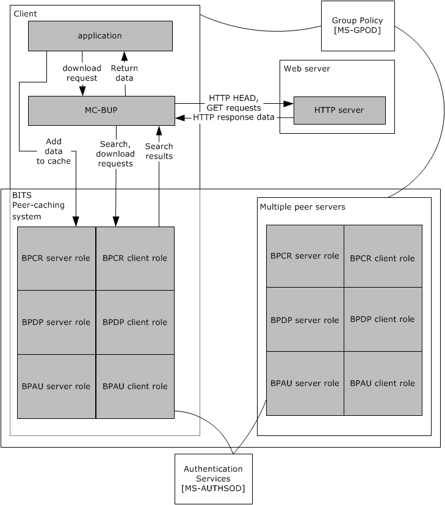
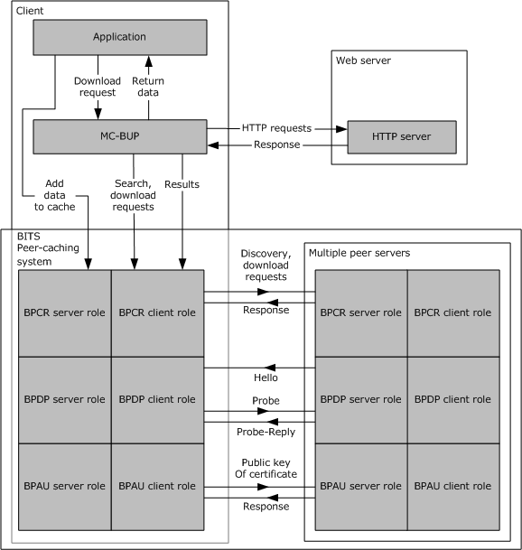
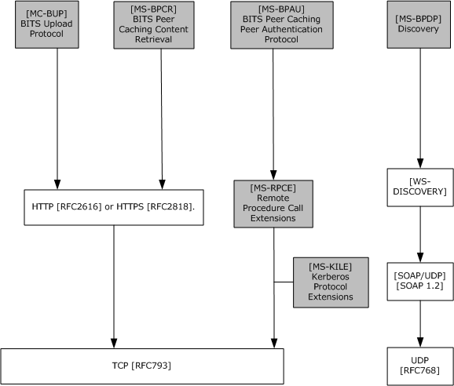
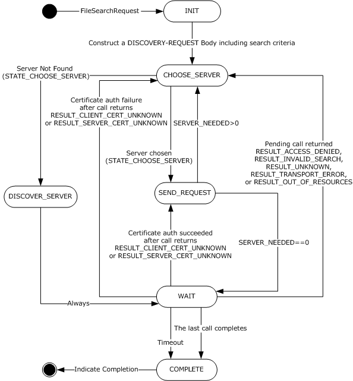
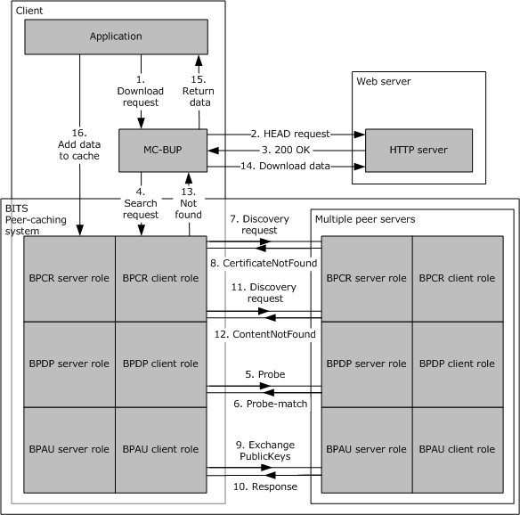
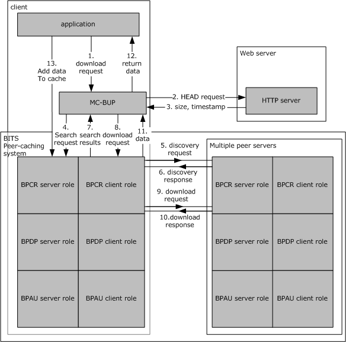

[MS-BPCR]:

Background Intelligent Transfer Service (BITS) Peer-
Caching: Content Retrieval Protocol

Intellectual Property Rights Notice for Open Specifications Documentation

  Technical Documentation. Microsoft publishes Open Specifications documentation (“this

documentation”) for protocols, file formats, data portability, computer languages, and standards
support. Additionally, overview documents cover inter-protocol relationships and interactions.

  Copyrights. This documentation is covered by Microsoft copyrights. Regardless of any other

terms that are contained in the terms of use for the Microsoft website that hosts this
documentation, you can make copies of it in order to develop implementations of the technologies
that are described in this documentation and can distribute portions of it in your implementations
that use these technologies or in your documentation as necessary to properly document the
implementation. You can also distribute in your implementation, with or without modification, any
schemas, IDLs, or code samples that are included in the documentation. This permission also
applies to any documents that are referenced in the Open Specifications documentation.
  No Trade Secrets. Microsoft does not claim any trade secret rights in this documentation.
  Patents. Microsoft has patents that might cover your implementations of the technologies

described in the Open Specifications documentation. Neither this notice nor Microsoft's delivery of
this documentation grants any licenses under those patents or any other Microsoft patents.
However, a given Open Specifications document might be covered by the Microsoft Open
Specifications Promise or the Microsoft Community Promise. If you would prefer a written license,
or if the technologies described in this documentation are not covered by the Open Specifications
Promise or Community Promise, as applicable, patent licenses are available by contacting
iplg@microsoft.com.

  License Programs. To see all of the protocols in scope under a specific license program and the

associated patents, visit the Patent Map.

  Trademarks. The names of companies and products contained in this documentation might be
covered by trademarks or similar intellectual property rights. This notice does not grant any
licenses under those rights. For a list of Microsoft trademarks, visit
www.microsoft.com/trademarks.

  Fictitious Names. The example companies, organizations, products, domain names, email

addresses, logos, people, places, and events that are depicted in this documentation are fictitious.
No association with any real company, organization, product, domain name, email address, logo,
person, place, or event is intended or should be inferred.

Reservation of Rights. All other rights are reserved, and this notice does not grant any rights other
than as specifically described above, whether by implication, estoppel, or otherwise.

Tools. The Open Specifications documentation does not require the use of Microsoft programming
tools or programming environments in order for you to develop an implementation. If you have access
to Microsoft programming tools and environments, you are free to take advantage of them. Certain
Open Specifications documents are intended for use in conjunction with publicly available standards
specifications and network programming art and, as such, assume that the reader either is familiar
with the aforementioned material or has immediate access to it.

Support. For questions and support, please contact dochelp@microsoft.com.

[MS-BPCR] - v20170601
Background Intelligent Transfer Service (BITS) Peer-Caching: Content Retrieval Protocol
Copyright © 2017 Microsoft Corporation
Release: June 1, 2017

1 / 54

Revision Summary

Date

Revision
History

Revision
Class

Comments

2/22/2007

0.01

6/1/2007

1.0

New

Major

Version 0.01 release

Updated and revised the technical content.

7/3/2007

1.0.1

Editorial

Changed language and formatting in the technical content.

7/20/2007

1.0.2

Editorial

Changed language and formatting in the technical content.

8/10/2007

1.0.3

Editorial

Changed language and formatting in the technical content.

9/28/2007

1.1

Minor

Clarified the meaning of the technical content.

10/23/2007  1.1.1

Editorial

Changed language and formatting in the technical content.

11/30/2007  1.1.2

Editorial

Changed language and formatting in the technical content.

1/25/2008

1.1.3

Editorial

Changed language and formatting in the technical content.

3/14/2008

1.2

Minor

Clarified the meaning of the technical content.

5/16/2008

1.2.1

Editorial

Changed language and formatting in the technical content.

6/20/2008

1.3

Minor

Clarified the meaning of the technical content.

7/25/2008

1.3.1

Editorial

Changed language and formatting in the technical content.

8/29/2008

1.3.2

Editorial

Changed language and formatting in the technical content.

10/24/2008  1.3.3

Editorial

Changed language and formatting in the technical content.

12/5/2008

1.3.4

Editorial

Changed language and formatting in the technical content.

1/16/2009

1.3.5

Editorial

Changed language and formatting in the technical content.

2/27/2009

1.3.6

Editorial

Changed language and formatting in the technical content.

4/10/2009

1.3.7

Editorial

Changed language and formatting in the technical content.

5/22/2009

1.3.8

Editorial

Changed language and formatting in the technical content.

7/2/2009

1.3.9

Editorial

Changed language and formatting in the technical content.

8/14/2009

1.4

9/25/2009

1.5

11/6/2009

2.0

12/18/2009  3.0

1/29/2010

3.1

3/12/2010

4.0

4/23/2010

5.0

6/4/2010

6.0

7/16/2010

7.0

Minor

Minor

Major

Major

Minor

Major

Major

Major

Major

Clarified the meaning of the technical content.

Clarified the meaning of the technical content.

Updated and revised the technical content.

Updated and revised the technical content.

Clarified the meaning of the technical content.

Updated and revised the technical content.

Updated and revised the technical content.

Updated and revised the technical content.

Updated and revised the technical content.

[MS-BPCR] - v20170601
Background Intelligent Transfer Service (BITS) Peer-Caching: Content Retrieval Protocol
Copyright © 2017 Microsoft Corporation
Release: June 1, 2017

2 / 54

Date

Revision
History

Revision
Class

Comments

8/27/2010

8.0

Major

Updated and revised the technical content.

10/8/2010

8.0

11/19/2010  8.0

1/7/2011

8.0

2/11/2011

8.0

3/25/2011

8.0

5/6/2011

8.0

6/17/2011

8.1

9/23/2011

9.0

12/16/2011  9.0

3/30/2012

9.0

7/12/2012

9.0

None

None

None

None

None

None

Minor

Major

None

None

None

No changes to the meaning, language, or formatting of the
technical content.

No changes to the meaning, language, or formatting of the
technical content.

No changes to the meaning, language, or formatting of the
technical content.

No changes to the meaning, language, or formatting of the
technical content.

No changes to the meaning, language, or formatting of the
technical content.

No changes to the meaning, language, or formatting of the
technical content.

Clarified the meaning of the technical content.

Updated and revised the technical content.

No changes to the meaning, language, or formatting of the
technical content.

No changes to the meaning, language, or formatting of the
technical content.

No changes to the meaning, language, or formatting of the
technical content.

10/25/2012  10.0

Major

Updated and revised the technical content.

1/31/2013

10.0

None

No changes to the meaning, language, or formatting of the
technical content.

8/8/2013

10.0

None

No changes to the meaning, language, or formatting of the
technical content.

11/14/2013  10.0

None

No changes to the meaning, language, or formatting of the
technical content.

2/13/2014

10.0

None

No changes to the meaning, language, or formatting of the
technical content.

5/15/2014

10.0

None

No changes to the meaning, language, or formatting of the
technical content.

6/30/2015

10.0

None

No changes to the meaning, language, or formatting of the
technical content.

10/16/2015  10.0

None

No changes to the meaning, language, or formatting of the
technical content.

7/14/2016

10.0

None

No changes to the meaning, language, or formatting of the
technical content.

6/1/2017

10.0

None

No changes to the meaning, language, or formatting of the
technical content.

[MS-BPCR] - v20170601
Background Intelligent Transfer Service (BITS) Peer-Caching: Content Retrieval Protocol
Copyright © 2017 Microsoft Corporation
Release: June 1, 2017

3 / 54

## Table of Contents

- [1 Introduction](#1-introduction)
  - [1.1 Glossary](#11-glossary)
  - [1.2 References](#12-references)
    - [1.2.1 Normative References](#121-normative-references)
    - [1.2.2 Informative References](#122-informative-references)
  - [1.3 Overview](#13-overview)
    - [1.3.1 Peer-to-Peer Framework Details](#131-peer-to-peer-framework-details)
  - [1.4 Relationship to Other Protocols](#14-relationship-to-other-protocols)
  - [1.5 Prerequisites/Preconditions](#15-prerequisitespreconditions)
  - [1.6 Applicability Statement](#16-applicability-statement)
  - [1.7 Versioning and Capability Negotiation](#17-versioning-and-capability-negotiation)
  - [1.8 Vendor-Extensible Fields](#18-vendor-extensible-fields)
  - [1.9 Standards Assignments](#19-standards-assignments)
- [2 Messages](#2-messages)
  - [2.1 Transport](#21-transport)
  - [2.2 Message Syntax](#22-message-syntax)
    - [2.2.1 Common Data Types](#221-common-data-types)
      - [2.2.1.1 guid](#2211-guid)
      - [2.2.1.2 url](#2212-url)
      - [2.2.1.3 searchStatus](#2213-searchstatus)
      - [2.2.1.4 fileRange](#2214-filerange)
      - [2.2.1.5 cacheRecord](#2215-cacherecord)
      - [2.2.1.6 searchRequest](#2216-searchrequest)
      - [2.2.1.7 searchResponse](#2217-searchresponse)
    - [2.2.2 DISCOVERY-REQUEST](#222-discovery-request)
      - [2.2.2.1 Standard HTTP Header Fields](#2221-standard-http-header-fields)
      - [2.2.2.2 HTTP Header Fields](#2222-http-header-fields)
      - [2.2.2.3 Message Body](#2223-message-body)
    - [2.2.3 DISCOVERY-RESPONSE](#223-discovery-response)
      - [2.2.3.1 Standard HTTP Header Fields](#2231-standard-http-header-fields)
      - [2.2.3.2 Body Data](#2232-body-data)
    - [2.2.4 DOWNLOAD-REQUEST](#224-download-request)
    - [2.2.5 DOWNLOAD-RESPONSE](#225-download-response)
    - [2.2.6 HEAD-REQUEST](#226-head-request)
    - [2.2.7 HEAD-RESPONSE](#227-head-response)
- [3 Protocol Details](#3-protocol-details)
  - [3.1 Client Details](#31-client-details)
    - [3.1.1 Abstract Data Model](#311-abstract-data-model)
      - [3.1.1.1 Table of Servers](#3111-table-of-servers)
      - [3.1.1.2 FileDiscoveryAttempt](#3112-filediscoveryattempt)
      - [3.1.1.3 FileSearchRequest](#3113-filesearchrequest)
      - [3.1.1.4 Download Request](#3114-download-request)
    - [3.1.2 Timers](#312-timers)
      - [3.1.2.1 FileSearchRequest Timeout](#3121-filesearchrequest-timeout)
      - [3.1.2.2 File Discovery Attempt Request Timeout](#3122-file-discovery-attempt-request-timeout)
      - [3.1.2.3 Download Request Timeout](#3123-download-request-timeout)
    - [3.1.3 Initialization](#313-initialization)
    - [3.1.4 Higher-Layer Triggered Events](#314-higher-layer-triggered-events)
      - [3.1.4.1 New FileSearchRequest](#3141-new-filesearchrequest)
      - [3.1.4.2 Cancel a FileSearchRequest in Progress](#3142-cancel-a-filesearchrequest-in-progress)
      - [3.1.4.3 New Download Request](#3143-new-download-request)
      - [3.1.4.4 Remove Server from PEER SERVER TABLE](#3144-remove-server-from-peer-server-table)
    - [3.1.5 Message Processing Events and Sequencing Rules](#315-message-processing-events-and-sequencing-rules)
      - [3.1.5.1 FileDiscoveryAttempt Response](#3151-filediscoveryattempt-response)
      - [3.1.5.2 Download Response](#3152-download-response)
    - [3.1.6 Timer Events](#316-timer-events)
      - [3.1.6.1 FileDiscoveryAttempt Response Timeout](#3161-filediscoveryattempt-response-timeout)
      - [3.1.6.2 Download Response Timeout](#3162-download-response-timeout)
      - [3.1.6.3 FileSearchRequest Timeout](#3163-filesearchrequest-timeout)
    - [3.1.7 Other Local Events](#317-other-local-events)
      - [3.1.7.1 FileDiscoveryAttempt Events](#3171-filediscoveryattempt-events)
        - [3.1.7.1.1 Problem with Server Certificate During a FileDiscoveryAttempt](#31711-problem-with-server-certificate-during-a-filediscoveryattempt)
        - [3.1.7.1.2 Connection Failure During a FileDiscoveryAttempt](#31712-connection-failure-during-a-filediscoveryattempt)
      - [3.1.7.2 Download Events](#3172-download-events)
        - [3.1.7.2.1 Problem with Server Certificate During a Download](#31721-problem-with-server-certificate-during-a-download)
        - [3.1.7.2.2 Connection Failure During Download](#31722-connection-failure-during-download)
      - [3.1.7.3 FileSearchRequest Events](#3173-filesearchrequest-events)
        - [3.1.7.3.1 A Pending FileDiscoveryAttempt Completes](#31731-a-pending-filediscoveryattempt-completes)
        - [3.1.7.3.2 RESULT_FOUND](#31732-resultfound)
        - [3.1.7.3.3 RESULT_NOT_FOUND](#31733-resultnotfound)
        - [3.1.7.3.4 RESULT_CLIENT_CERT_UNKNOWN](#31734-resultclientcertunknown)
        - [3.1.7.3.5 RESULT_ACCESS_DENIED or RESULT_INVALID_SEARCH or](#31735-resultaccessdenied-or-resultinvalidsearch-or)
        - [3.1.7.3.6 RESULT_SERVER_CERT_UNKNOWN](#31736-resultservercertunknown)
        - [3.1.7.3.7 RESULT_TRANSPORT_ERROR or RESULT_OUT_OF_RESOURCES](#31737-resulttransporterror-or-resultoutofresources)
        - [3.1.7.3.8 Notification of New Server or Address](#31738-notification-of-new-server-or-address)
        - [3.1.7.3.9 Protocol Shutdown](#31739-protocol-shutdown)
      - [3.1.7.4 FileSearchRequest State Transitions](#3174-filesearchrequest-state-transitions)
        - [3.1.7.4.1 STATE_INIT](#31741-stateinit)
        - [3.1.7.4.2 STATE_CHOOSE_SERVER](#31742-statechooseserver)
        - [3.1.7.4.3 STATE_SEND_REQUEST](#31743-statesendrequest)
        - [3.1.7.4.4 STATE_WAIT](#31744-statewait)
        - [3.1.7.4.5 STATE_DISCOVER_SERVERS](#31745-statediscoverservers)
        - [3.1.7.4.6 STATE_COMPLETE](#31746-statecomplete)
  - [3.2 Server Details](#32-server-details)
    - [3.2.1 Abstract Data Model](#321-abstract-data-model)
      - [3.2.1.1 Table of Content Records](#3211-table-of-content-records)
      - [3.2.1.2 Maximum Cache Size](#3212-maximum-cache-size)
      - [3.2.1.3 Maximum Record Age](#3213-maximum-record-age)
    - [3.2.2 Timers](#322-timers)
      - [3.2.2.1 Record Expiration](#3221-record-expiration)
    - [3.2.3 Initialization](#323-initialization)
    - [3.2.4 Higher-Layer Triggered Events](#324-higher-layer-triggered-events)
      - [3.2.4.1 Cache Data](#3241-cache-data)
      - [3.2.4.2 Protocol Shutdown](#3242-protocol-shutdown)
    - [3.2.5 Message Processing Events and Sequencing Rules](#325-message-processing-events-and-sequencing-rules)
      - [3.2.5.1 General Rules for HTTP-Level Error Responses](#3251-general-rules-for-http-level-error-responses)
      - [3.2.5.2 Message Validation](#3252-message-validation)
      - [3.2.5.3 DISCOVERY-REQUEST](#3253-discovery-request)
      - [3.2.5.4 DOWNLOAD-REQUEST](#3254-download-request)
      - [3.2.5.5 HEAD-REQUEST](#3255-head-request)
    - [3.2.6 Timer Events](#326-timer-events)
      - [3.2.6.1 Record Expiration](#3261-record-expiration)
    - [3.2.7 Other Local Events](#327-other-local-events)
- [4 Protocol Example](#4-protocol-example)
  - [4.1 Successful FileSearchRequest with Two Servers](#41-successful-filesearchrequest-with-two-servers)
  - [4.2 BITS and Peer-caching Interactions: Initial Download](#42-bits-and-peer-caching-interactions-initial-download)
  - [4.3 BITS and Peer-caching Interactions: Second Download](#43-bits-and-peer-caching-interactions-second-download)
- [5 Security](#5-security)
  - [5.1 Security Considerations for Implementers](#51-security-considerations-for-implementers)
  - [5.2 Index of Security Parameters](#52-index-of-security-parameters)
- [6 Appendix A: XML Schema](#6-appendix-a-xml-schema)
- [7 Appendix B: Product Behavior](#7-appendix-b-product-behavior)
- [8 Change Tracking](#8-change-tracking)
- [9 Index](#9-index)

## 1 Introduction

This document is a specification for the Background Intelligent Transfer Service (BITS) Peer-Caching:
Content Retrieval Protocol. This is one protocol in a family of protocols that implement a distributed
URL cache that is known as BITS peer-caching. Other protocols in the family are used to discover
potential peers and to authenticate them. A client uses the BITS Peer-Caching: Content Retrieval
Protocol to search an existing set of peers for content and to download from those peers.

Sections 1.5, 1.8, 1.9, 2, and 3 of this specification are normative. All other sections and examples in
this specification are informative.

### 1.1 Glossary

This document uses the following terms:

domain: A set of users and computers sharing a common namespace and management

infrastructure. At least one computer member of the set has to act as a domain controller (DC)
and host a member list that identifies all members of the domain, as well as optionally hosting
the Active Directory service. The domain controller provides authentication of members, creating
a unit of trust for its members. Each domain has an identifier that is shared among its members.
For more information, see [MS-AUTHSOD] section 1.1.1.5 and [MS-ADTS].

extended key usage (EKU): An X.509 certificate extension that indicates one or more purposes

for which the certificate can be used.

fully qualified domain name (FQDN): An unambiguous domain name that gives an absolute

location in the Domain Name System's (DNS) hierarchy tree, as defined in [RFC1035] section
3.1 and [RFC2181] section 11.

globally unique identifier (GUID): A term used interchangeably with universally unique

identifier (UUID) in Microsoft protocol technical documents (TDs). Interchanging the usage of
these terms does not imply or require a specific algorithm or mechanism to generate the value.
Specifically, the use of this term does not imply or require that the algorithms described in
[RFC4122] or [C706] have to be used for generating the GUID. See also universally unique
identifier (UUID).

GUIDString: A GUID in the form of an ASCII or Unicode string, consisting of one group of 8
hexadecimal digits, followed by three groups of 4 hexadecimal digits each, followed by one
group of 12 hexadecimal digits. It is the standard representation of a GUID, as described in
[RFC4122] section 3. For example, "6B29FC40-CA47-1067-B31D-00DD010662DA". Unlike a
curly braced GUID string, a GUIDString is not enclosed in braces.

peer: A single device or node in a peer-to-peer networking system.

peer-to-peer: A server-less networking technology that allows several participating network

devices to share resources and communicate directly with each other.

security identifier (SID): An identifier for security principals that is used to identify an account
or a group. Conceptually, the SID is composed of an account authority portion (typically a
domain) and a smaller integer representing an identity relative to the account authority,
termed the relative identifier (RID). The SID format is specified in [MS-DTYP] section 2.4.2; a
string representation of SIDs is specified in [MS-DTYP] section 2.4.2 and [MS-AZOD] section
1.1.1.2.

Unicode: A character encoding standard developed by the Unicode Consortium that represents

almost all of the written languages of the world. The Unicode standard [UNICODE5.0.0/2007]
provides three forms (UTF-8, UTF-16, and UTF-32) and seven schemes (UTF-8, UTF-16, UTF-16
BE, UTF-16 LE, UTF-32, UTF-32 LE, and UTF-32 BE).

[MS-BPCR] - v20170601
Background Intelligent Transfer Service (BITS) Peer-Caching: Content Retrieval Protocol
Copyright © 2017 Microsoft Corporation
Release: June 1, 2017

7 / 54

MAY, SHOULD, MUST, SHOULD NOT, MUST NOT: These terms (in all caps) are used as defined
in [RFC2119]. All statements of optional behavior use either MAY, SHOULD, or SHOULD NOT.

### 1.2 References

Links to a document in the Microsoft Open Specifications library point to the correct section in the
most recently published version of the referenced document. However, because individual documents
in the library are not updated at the same time, the section numbers in the documents may not
match. You can confirm the correct section numbering by checking the Errata.

#### 1.2.1 Normative References

We conduct frequent surveys of the normative references to assure their continued availability. If you
have any issue with finding a normative reference, please contact dochelp@microsoft.com. We will
assist you in finding the relevant information.

[IANAPORT] IANA, "Service Name and Transport Protocol Port Number Registry",
https://www.iana.org/assignments/service-names-port-numbers/service-names-port-numbers.xhtml

[MS-BPAU] Microsoft Corporation, "Background Intelligent Transfer Service (BITS) Peer-Caching: Peer
Authentication Protocol".

[MS-DTYP] Microsoft Corporation, "Windows Data Types".

[MS-ERREF] Microsoft Corporation, "Windows Error Codes".

[MS-FSCC] Microsoft Corporation, "File System Control Codes".

[RFC2119] Bradner, S., "Key words for use in RFCs to Indicate Requirement Levels", BCP 14, RFC
2119, March 1997, https://www.rfc-editor.org/info/rfc2119

[RFC2246] Dierks, T., and Allen, C., "The TLS Protocol Version 1.0", RFC 2246, January 1999,
https://www.rfc-editor.org/info/rfc2246

[RFC2616] Fielding, R., Gettys, J., Mogul, J., et al., "Hypertext Transfer Protocol -- HTTP/1.1", RFC
2616, June 1999, https://www.rfc-editor.org/info/rfc2616

[RFC3280] Housley, R., Polk, W., Ford, W., and Solo, D., "Internet X.509 Public Key Infrastructure
Certificate and Certificate Revocation List (CRL) Profile", RFC 3280, April 2002, http://www.rfc-
editor.org/info/rfc3280

[RFC5234] Crocker, D., Ed., and Overell, P., "Augmented BNF for Syntax Specifications: ABNF", STD
68, RFC 5234, January 2008, https://www.rfc-editor.org/info/rfc5234

[XML] World Wide Web Consortium, "Extensible Markup Language (XML) 1.0 (Fourth Edition)", W3C
Recommendation 16 August 2006, edited in place 29 September 2006,
http://www.w3.org/TR/2006/REC-xml-20060816/

#### 1.2.2 Informative References

[MC-BUP] Microsoft Corporation, "Background Intelligent Transfer Service (BITS) Upload Protocol".

[MS-BPCR] Microsoft Corporation, "Background Intelligent Transfer Service (BITS) Peer-Caching:
Content Retrieval Protocol".

[MS-BPDP] Microsoft Corporation, "Background Intelligent Transfer Service (BITS) Peer-Caching: Peer
Discovery Protocol".

[MS-BPCR] - v20170601
Background Intelligent Transfer Service (BITS) Peer-Caching: Content Retrieval Protocol
Copyright © 2017 Microsoft Corporation
Release: June 1, 2017

8 / 54

[MS-CCROD] Microsoft Corporation, "Content Caching and Retrieval Protocols Overview".

[MSDN-BITS] Microsoft Corporation, "Background Intelligent Transfer Service",
http://msdn.microsoft.com/en-us/library/bb968799(VS.85).aspx

[WS-Discovery] Beatty, J., Kakivaya, G., Kemp D., et al., "Web Services Dynamic Discovery (WS-
Discovery)", April 2005, http://specs.xmlsoap.org/ws/2005/04/discovery/ws-discovery.pdf

### 1.3 Overview

The Background Intelligent Transfer Service (BITS) Peer-Caching: Content Retrieval Protocol defines
methods for a network client both to query multiple servers for data associated with a given URL and
to download that data.

In Windows, the BITS component uses the BITS Peer-Caching: Content Retrieval Protocol to
implement a distributed peer-to-peer cache of data items based on associated HTTP and HTTPS URLs
as well as UNC paths<1>.

#### 1.3.1 Peer-to-Peer Framework Details

BITS discovers peer servers by using the Background Intelligent Transfer Service (BITS) Peer-
Caching: Peer Discovery Protocol specified in [MS-BPDP]) and authenticates them by using the
Background Intelligent Transfer Service (BITS) Peer-Caching: Peer Authentication Protocol specified in
[MS-BPAU]).<2> For more information on BITS, see [MSDN-BITS].

The BITS Peer-Caching: Content Retrieval Protocol does not address issues of cache management,
such as policies for adding and removing content or the method of storing and indexing the content.
These issues are internal to the server implementation.

The following figure shows a black-box diagram of the BITS peer-to-peer framework.

[MS-BPCR] - v20170601
Background Intelligent Transfer Service (BITS) Peer-Caching: Content Retrieval Protocol
Copyright © 2017 Microsoft Corporation
Release: June 1, 2017

9 / 54

<!-- Extracted images from page 10 -->

<!-- /Extracted images from page 10 -->

Figure 1: Black-box diagram of BITS peer-to-peer framework

To start, the client initializes the BITS Peer-Caching: Peer Discovery Protocol client role to listen for
hosts that support the server role of BITS Peer-Caching: Content Retrieval Protocol (for more
information, see [MS-BPDP] section 3.2.3).

When a BITS Peer-Caching: Peer Discovery Protocol server is initialized, it announces its presence to
clients as described in [MS-BPDP]. Thus, over time, clients gather a list of nearby peer servers.

Because the BITS Peer-Caching: Content Retrieval Protocol implements a cache, the client does not
search for data or download it until requested by a higher-layer protocol. A typical usage pattern is as
follows:

1.  External to the BITS Peer-Caching: Content Retrieval Protocol, a client application identifies the

need to download a particular URL, with a known timestamp and length.

[MS-BPCR] - v20170601
Background Intelligent Transfer Service (BITS) Peer-Caching: Content Retrieval Protocol
Copyright © 2017 Microsoft Corporation
Release: June 1, 2017

10 / 54

2.  The application initiates a BITS Peer-Caching: Content Retrieval Protocol search to determine

whether any peer servers contain the necessary URL data. The BITS Peer-Caching: Content
Retrieval Protocol client chooses a set of peer servers and queries them for the URL data. BITS
Peer-Caching: Content Retrieval Protocol clients and servers use the BITS Peer-Caching: Peer
Authentication Protocol to verify that the peer is a member of the same Active Directory domain,
as described in [MS-BPAU].

3.  Based on the success or failure of the search, the application downloads the URL data, using BITS
Peer-Caching: Content Retrieval Protocol if possible or HTTP(S) from the origin server if not.

4.  If the client host also implements the server role of BITS Peer-Caching: Content Retrieval Protocol,

then the application tells the BITS Peer-Caching: Content Retrieval Protocol server role to add the
URL data to its cache, thus making it available to other peers.

For more detailed sequence diagrams, see section 4.2 and section 4.3.

### 1.4 Relationship to Other Protocols

The Background Intelligent Transfer Service (BITS) Peer-Caching: Content Retrieval Protocol is a
client/server protocol that uses HTTP over TLS 1.0 as its transport. A host that implements the client
side or server side of this protocol typically also implements the Background Intelligent Transfer
Service (BITS) Peer-Caching: Peer Discovery Protocol [MS-BPDP] and the Background Intelligent
Transfer Service (BITS) Peer-Caching: Peer Authentication Protocol [MS-BPAU] to automate the
location and authentication of servers.

The consumer of this protocol can be either a top-level application or another client/server protocol.

The following is a white-box diagram of protocols in the BITS peer-caching framework.

[MS-BPCR] - v20170601
Background Intelligent Transfer Service (BITS) Peer-Caching: Content Retrieval Protocol
Copyright © 2017 Microsoft Corporation
Release: June 1, 2017

11 / 54

<!-- Extracted images from page 12 -->

<!-- /Extracted images from page 12 -->

Figure 2: White-box diagram of protocols in BITS peer-caching framework

The following gives more detail on the role of protocols participating in the BITS framework:

The Background Intelligent Transfer Service (BITS) Upload Protocol [MC-BUP] is used to transfer large
payloads from a client to a server or from a server to a client over networks with frequent
disconnections, and to send notifications from the server to a server application about the availability
of uploaded payloads. This protocol is layered on top of HTTP 1.1, uses several standard HTTP
headers, and defines some new headers. The primary role of this protocol in the BITS Framework is
for large payload transfer.

The Background Intelligent Transfer Service (BITS) Peer-Caching: Content Retrieval Protocol [MS-
BPCR] is one protocol in a family of protocols that implement a distributed URL cache that is known as
BITS peer-caching. A client uses the BITS) Peer-Caching: Content Retrieval Protocol to search an
existing set of peers for content and to download from those peers. The primary role of this protocol
in the BITS Framework is content retrieval.

The Background Intelligent Transfer Service (BITS) Peer-Caching: Peer Discovery Protocol [MS-BPDP]
is used to locate hosts in a domain that supports the URL-caching protocol implemented by BITS. The

[MS-BPCR] - v20170601
Background Intelligent Transfer Service (BITS) Peer-Caching: Content Retrieval Protocol
Copyright © 2017 Microsoft Corporation
Release: June 1, 2017

12 / 54

<!-- Extracted images from page 13 -->

<!-- /Extracted images from page 13 -->

protocol is implemented by using Web Services Dynamic Discovery (WS-Discovery), as specified in
[WS-Discovery]. The primary role of this protocol in the BITS Framework is host discovery.

The p Background Intelligent Transfer Service (BITS) Peer-Caching: Peer Authentication Protocol [MS-
BPAU] provides authentication for computers in a domain. The primary role of this protocol is peer
authentication.

Figure 3: Protocol relationship for BITS

### 1.5 Prerequisites/Preconditions

Computers in both the client and server roles must be provisioned with certificates accessible to the
HTTPS protocol, as specified in [RFC2246] sections 7.4.2 and 7.4.3.

### 1.6 Applicability Statement

Because the BITS Peer-Caching: Content Retrieval Protocol uses unicast communication to poll
multiple servers for content, it is best suited for situations in which the client is connected to the
servers by a high-speed network.

The BITS Peer-Caching: Content Retrieval Protocol is more complex than the standard HTTP proxy
behavior specified in [RFC2616] section 8.1.3, but the protocol does not require the server to
download data on the client's behalf. The BITS Peer-Caching: Content Retrieval Protocol is best suited
to a peer-to-peer environment in which the client can choose among several servers based on
connection speed, authentication decisions, and other factors. Refer to section 3.1.7.4.2 for details on
the algorithm used to select servers.

13 / 54

[MS-BPCR] - v20170601
Background Intelligent Transfer Service (BITS) Peer-Caching: Content Retrieval Protocol
Copyright © 2017 Microsoft Corporation
Release: June 1, 2017

### 1.7 Versioning and Capability Negotiation

The BITS Peer-Caching: Content Retrieval Protocol does not define an explicit system for version
negotiation. The presence of individual capabilities is implicitly signaled in each message by the
presence or absence of optional fields. For details of each message, see section 2.2.

### 1.8 Vendor-Extensible Fields

The BITS Peer-Caching: Content Retrieval Protocol uses HRESULTs, as specified in [MS-ERREF],
primarily in DISCOVERY-REQUEST (section 3.2.5.3). Vendors are free to choose their own values as
long as the C bit (0x20000000) is set, indicating it is a customer code.

### 1.9 Standards Assignments

The following table shows the standard assignments that apply to this protocol.

Parameter

Value   Reference

TCP port for HTTPS listener  2178

As specified in [IANAPORT].

[MS-BPCR] - v20170601
Background Intelligent Transfer Service (BITS) Peer-Caching: Content Retrieval Protocol
Copyright © 2017 Microsoft Corporation
Release: June 1, 2017

14 / 54

## 2 Messages

### 2.1 Transport

Messages MUST be transported over HTTPS by using port 2178.

The client and server MUST each provide a certificate to the TLS protocol for use during connection
establishment. For details on how the TLS protocol uses the certificates, see [RFC2246] section 7.3.
The certificates used MUST be within their validity interval when the connection is initiated.

A client or server MAY impose additional requirements on the certificate for authentication
purposes.<3>

### 2.2 Message Syntax

Messages follow HTTP/1.1 syntax. The required HTTP headers and the format of the HTTP message
body for each message are specified in the following sections. The message body contains the content
within an HTTP message, as defined in [RFC2616] section 4.3.

An implementation MAY include additional HTTP headers in each message, following the rules specified
in [RFC2616] section 2.2, and MUST treat recognized headers according to their standard meaning
specified in [RFC2616] section 4.2.

A future version of the BITS Peer-Caching: Content Retrieval Protocol will define new HTTP header
fields (as defined in [RFC2616] section 4.2) and XML elements. The recipient of a message MUST
ignore header fields and XML elements it does not understand.

#### 2.2.1 Common Data Types

The DISCOVERY-REQUEST message and the DISCOVERY-RESPONSE message rely on XML (as
specified in [XML]). The following table shows the standard XML namespaces used within the BITS
Peer-Caching: Content Retrieval Protocol and the alias (prefix) used in the remaining sections of this
protocol specification.

Alias (prefix)   XML namespace

s

 http://www.w3.org/2001/XMLSchema

The following table shows the Microsoft-defined XML namespace used within the BITS Peer-Caching:
Content Retrieval Protocol and the alias (prefix) used in the remaining sections of this protocol
specification.

Alias (prefix)   XML namespace

cd

http://schemas.microsoft.com/windows/2007/01/BITS/ContentDiscovery

The following sections list the elements defined in this namespace.

##### 2.2.1.1 guid

A globally unique identifier (GUID) of an object or entity within the protocol. The GUIDString
element is defined by the following XML.

 <s:simpleType name="guid">
   <s:restriction base="s:string">
     <s:pattern value="[0-9a-fA-F]{8}-[0-9a-fA-F]{4}-

[MS-BPCR] - v20170601
Background Intelligent Transfer Service (BITS) Peer-Caching: Content Retrieval Protocol
Copyright © 2017 Microsoft Corporation
Release: June 1, 2017

15 / 54

     [0-9a-fA-F]{4}-[0-9a-fA-F]{4}-[0-9a-fA-F]{12}" />
   </s:restriction>
   </s:simpleType>

##### 2.2.1.2 url

A URL string. URLs within the BITS Peer-Caching: Content Retrieval Protocol are limited to a maximum
of 2,200 characters, as shown in the following XML for the url element.

   <simpleType name="url">
     <restriction base="string">
       <maxLength value="2200" />
     </restriction>
   </simpleType>

##### 2.2.1.3 searchStatus

The status code for a search request is shown next.

   <simpleType name="searchStatus">
     <restriction base="string">
       <enumeration value="Success"/>
       <enumeration value="CertificateNotFound"/>
       <enumeration value="ContentNotFound"/>
       <enumeration value="AccessDenied"/>
       <enumeration value="OutOfResources"/>
       <enumeration value="InvalidSearch"/>
       <enumeration value="Unknown"/>
     </restriction>
   </simpleType>

The following table describes the meaning of the enum values for the searchStatus element.

Value

Success

Meaning

The server found one or more content records matching the search criteria.

ContentNotFound

The server holds no content records matching the search criteria.

OutOfResources

The search request could not be processed due to a transient error.

InvalidSearch

The server did not understand the given search criteria, or the given criteria are not
allowed.

CertificateNotFound  The client's certificate is syntactically correct but not known to the server. The client

SHOULD retry the request after authenticating using the authentication protocol BITS Peer-
Caching: Peer Authentication Protocol (for more information, see [MS-BPAU].)

AccessDenied

The client is forbidden from downloading from this server.

Unknown

An uncategorized error occurred.

[MS-BPCR] - v20170601
Background Intelligent Transfer Service (BITS) Peer-Caching: Content Retrieval Protocol
Copyright © 2017 Microsoft Corporation
Release: June 1, 2017

16 / 54

##### 2.2.1.4 fileRange

The following code example describes a contiguous range of data within a URL.

 <complexType name="fileRange">
     <sequence>
       <element name="Offset" type="unsignedLong"/>
       <element name="Length" type="unsignedLong"/>
     </sequence>
   </complexType>

Offset: Location of the beginning of the range, in bytes, relative to the start of the URL data.

Length: Length of the range, in bytes.

##### 2.2.1.5 cacheRecord

The following XML defines a record description.

   <complexType name="cacheRecord">
     <sequence>
       <element name="Id" type="cd:guid"/>
       <element name="CreationTime" type="dateTime"/>
       <element name="ModificationTime" type="dateTime"/>
       <element name="LastAccessTime" type="dateTime"/>
       <element name="OriginUrl" type="cd:url"/>
       <element name="LocalUrl" type="cd:url"/>
       <element name="FileModificationTime" type="dateTime"/>
       <element name="FileSize" type="unsignedLong"/>
       <element name="FileEtag" type="string" minOccurs="0" />
       <element name="ContentRange" type="cd:fileRange"
       maxOccurs="unbounded"/>
       <any minOccurs="0" maxOccurs="unbounded"
       processContents="lax" namespace="##other"/>
     </sequence>
   </complexType>

Id: The unique ID of the record.

OriginUrl: The URL being cached by the record.

CreationTime: The UTC time of creation of the record.

LastAccessTime: The UTC time of last access to the record.

ModificationTime: The UTC time of last modification to the record.

LocalUrl: The URI of the data in the record relative to the host name and port of the server. The

format (specified in [RFC2616] section 3.2.2) is as follows.

 Local_url = abs_path ["?" query]

FileModificationTime: The UTC modification time of the URL.

FileSize: The length, in bytes, of the URL content.

FileEtag: The HTTP entity tag of the URL, as specified in [RFC2616] section 3.11.<4>

[MS-BPCR] - v20170601
Background Intelligent Transfer Service (BITS) Peer-Caching: Content Retrieval Protocol
Copyright © 2017 Microsoft Corporation
Release: June 1, 2017

17 / 54

ContentRange: One such element is returned, in order, for each range of bytes that is present in the
content record. For example, if the record contained 100 bytes at offset 2,000 followed by 100
bytes at offset 3,000, the returned XML would include the following <ContentRange> data:

 <ContentRange>
       <Offset>2000</Offset>
       <Length>100</Length>
 </ContentRange>
 <ContentRange>
       <Offset>3000</Offset>
       <Length>100</Length>
 </ContentRange>

A content record encompassing the entire URL is represented as a single range with offset zero and
length equal to the FileSize element.

##### 2.2.1.6 searchRequest

A query to a single server for a single URL:

 <complexType name="searchRequest">
     <sequence>
       <element name="OriginUrl" type="cd:url"/>

       <element name="FileModificationTime" type="dateTime" />
       <element name="FileSize" type="unsignedLong"  minOccurs="0"/>
       <element name="FileEtag" type="string" minOccurs="0" />

       <element name="MaxRecords" type="positiveInteger"
       minOccurs="0" default="1" />

       <any minOccurs="0" maxOccurs="unbounded" processContents="lax"
       namespace="##other"/>
     </sequence>
   </complexType>

OriginUrl: The URL for which the client is searching. The maximum length is 2,200 characters.

FileModificationTime: The UTC time stamp of the URL.

FileSize: The size, in bytes, of the URL.

FileEtag: The entity tag for the URL.

MaxRecords: The maximum number of records that can be included in the searchResponse element
in the reply.<5> The server's response MUST abide by the limit, and the client SHOULD ignore
response records beyond the limit.<6> If this element is omitted, there is no explicit limit on the
number of records returned.

##### 2.2.1.7 searchResponse

The result of a search request:

 <complexType name="searchResponse">
     <sequence>
       <element name="Status" type="cd:searchStatus" />
       <element name="CacheRecord" type="cd:cacheRecord"
       minOccurs="0" maxOccurs="unbounded"/>
       <any minOccurs="0" maxOccurs="unbounded"

[MS-BPCR] - v20170601
Background Intelligent Transfer Service (BITS) Peer-Caching: Content Retrieval Protocol
Copyright © 2017 Microsoft Corporation
Release: June 1, 2017

18 / 54

       processContents="lax" namespace="##other"/>
     </sequence>
   </complexType>

#### 2.2.2 DISCOVERY-REQUEST

The client sends a DISCOVERY-REQUEST to a server to inquire whether the server has cached a
particular URL. The message is encoded as an HTTP POST request to the following URL:

 /BITS-peer-caching

The request includes a number of fields in the HTTP message header. Some of them are standard
fields (as specified in [RFC2616] section 4.5) that are required to take on specific values, while others
are new fields defined by the BITS Peer-Caching: Content Retrieval Protocol. The fields MUST follow
the rules defined in [RFC2616] section 4.2.

##### 2.2.2.1 Standard HTTP Header Fields

Content-Length: The size, in bytes, of the HTTP message body (as defined in [RFC2616] section
4.3.). This field MUST be present.

##### 2.2.2.2 HTTP Header Fields

 X-ETW-ACTIVITY-ID: A GUID-encoded activity correlation ID. An activity ID is a GUID that uniquely
identifies the discovery request. The client MAY include this header as an aid to logging, enabling
correlation between a client activity and the server activity.<7>

##### 2.2.2.3 Message Body

The HTTP message body (as defined in [RFC2616] section 4.3) MUST be a Unicode XML 1.0
document that uses http://schemas.microsoft.com/windows/2007/01/BITS/ContentDiscovery as its
default XML namespace. The document MUST use the UTF-8 or UTF-16 encoding; either byte ordering
is allowed. The document MUST contain a "searchRequest" element. The recipient MAY choose to
ignore element attributes.<8> The message body MUST NOT include additional data before or after
the XML document. The XML document MAY contain trailing whitespace as part of the encoded
content, as specified in [XML] section 2.1.

A server MUST support a maximum body size of at least 16 KB.

#### 2.2.3 DISCOVERY-RESPONSE

The DISCOVERY-RESPONSE message is the response to a DISCOVERY-REQUEST message. It contains
the results of the search—either an error or a set of matching content records.

The HTTP status code MUST be 200. The following sections specify additional requirements.

##### 2.2.3.1 Standard HTTP Header Fields

Content-Length: MUST be the size, in bytes, of the HTTP message body. This field MUST be present.

[MS-BPCR] - v20170601
Background Intelligent Transfer Service (BITS) Peer-Caching: Content Retrieval Protocol
Copyright © 2017 Microsoft Corporation
Release: June 1, 2017

19 / 54

##### 2.2.3.2 Body Data

The HTTP message body MUST be a Unicode XML 1.0 document that uses
http://schemas.microsoft.com/windows/2007/01/BITS/ContentDiscovery as its default XML
namespace. The document MUST use the UTF-8 or UTF-16 encoding; either byte ordering is allowed.
The document MUST contain a "searchResults" element. The recipient MAY choose to ignore element
attributes.<9> The message body MUST NOT include additional data before or after the XML
document. The XML document MAY contain trailing whitespace as part of the encoded content, as
specified in [XML] section 2.1.

To allow for a large number of returned file ranges, a client SHOULD support a maximum response
size of at least 1,024 KB. The XML MAY include comment tags to aid in readability.<10>

If the value of the "Status" child element is "Success", one or more CacheRecord elements MUST be
present.

#### 2.2.4 DOWNLOAD-REQUEST

To download data from a server, the client sends a DOWNLOAD-REQUEST, which is encoded as an
HTTP GET request, as specified in [RFC2616] section 9.3. The request specifies the record ID and the
requested range(s) within the record.

The URL MUST be specified as follows:

 "/BITS-peer-caching/%7B" record-ID "%7D"

where record-ID is the GUID ID of the record being requested, as returned in the
/SearchResults/CacheRecord/Id element of a DISCOVERY-RESPONSE.

A client MAY request a fraction of the record data by including a Content-Range header, as specified in
[RFC2616] section 14.16.<11> If so, the requested ranges apply to the data in the record, not to the
original URL data. For example, if a record contains bytes 100 to 199 of the URL, "Content-Range: 0-1
/ 100" refers to bytes 100 and 101 of the original URL.

#### 2.2.5 DOWNLOAD-RESPONSE

A DOWNLOAD-RESPONSE message is a standard HTTP/1.1 response packet. The HTTP status code
MUST be either 200 or 206.

The response MUST include the Content-Length header. The format of the field is specified in
[RFC2616] section 14.13.

The reply MAY include the BITS_BASIC_INFO header to provide finer-grained file time stamps.<12> It
provides the content record's fields FileCreationTime, FileLastAccessTime, FileModificationTime, and
FileAttributes in the following format:

 BITS_BASIC_INFO = "0x" FileCreationTime ",0x" FileLastAccessTime ",0x"
 FileModificationTime ",0x" ChangeTime ",0xv" FileAttributes

All elements are required. FileCreationTime, FileLastAccessTime, FileModificationTime, and
ChangeTime are each a hexadecimal 64-bit integer representing time in FILETIME format as specified
in [MS-DTYP], section 2.3.3. FileAttributes is a hexadecimal 32-bit integer representing a set of
attribute flags supported by the FAT file system as specified in [MS-FSCC] section 2.6. Only
FILE_ATTRIBUTE_ARCHIVE, FILE_ATTRIBUTE_HIDDEN, FILE_ATTRIBUTE_READONLY, and

[MS-BPCR] - v20170601
Background Intelligent Transfer Service (BITS) Peer-Caching: Content Retrieval Protocol
Copyright © 2017 Microsoft Corporation
Release: June 1, 2017

20 / 54

FILE_ATTRIBUTE_SYSTEM are allowed to be set; other flags MUST be set to zero and MUST be ignored
by the recipient.

#### 2.2.6 HEAD-REQUEST

A client MAY request the attributes of a record without downloading data, by sending a HEAD-
REQUEST.<13> The request is encoded as a HEAD request; otherwise, the format is the same as a
DOWNLOAD-REQUEST (section 2.2.4).

#### 2.2.7 HEAD-RESPONSE

Following standard procedure for HEAD requests in HTTP, the reply to a HEAD-REQUEST is a reply that
is identical to the reply for the equivalent DOWNLOAD-REQUEST, except that a reply with status 200
or 206 excludes any body data.

[MS-BPCR] - v20170601
Background Intelligent Transfer Service (BITS) Peer-Caching: Content Retrieval Protocol
Copyright © 2017 Microsoft Corporation
Release: June 1, 2017

21 / 54

## 3 Protocol Details

### 3.1 Client Details

#### 3.1.1 Abstract Data Model

This section describes a conceptual model of possible data organization that an implementation
maintains to participate in this protocol. The described organization is provided to facilitate the
explanation of how the protocol behaves. This document does not mandate that implementations
adhere to this model as long as their external behavior is consistent with what is described in this
document.

##### 3.1.1.1 Table of Servers

The client maintains a table of servers. Each row of the table contains the following data:

FQDN: Server fully qualified domain name (FQDN).

Authenticated: A Boolean variable indicating whether the server has been authenticated by using the

BITS Peer-Caching: Peer Authentication Protocol [MS-BPAU].

##### 3.1.1.2 FileDiscoveryAttempt

A FileDiscoveryAttempt abstract data model (ADM) element object represents a single attempt to send
a DISCOVERY-REQUEST message to a server.

A FileDiscoveryAttempt ADM element contains the following data elements:

  A pointer to a row in the table of potential servers.



The XML request data sent to the server.

  An abstract completion result, which can be one of the following values.

Status

Description

RESULT_FOUND

The server found one or more content records that match the search
criteria.

RESULT_NOT_FOUND

The server found no content records that match the search criteria.

RESULT_ACCESS_DENIED

The client is not authorized to access the server.

RESULT_CLIENT_CERT_UNKNOWN

The client needs to be authenticated to the server.

RESULT_SERVER_CERT_UNKNOWN  The server needs to be authenticated to the client.

RESULT_OUT_OF_RESOURCES

The server is too busy to process the request.

RESULT_TRANSPORT_ERROR

A lower-layer transport encountered an error.

RESULT_INVALID_SEARCH

The syntax of the request was not acceptable to the server.

RESULT_UNKNOWN

A protocol error occurred.

[MS-BPCR] - v20170601
Background Intelligent Transfer Service (BITS) Peer-Caching: Content Retrieval Protocol
Copyright © 2017 Microsoft Corporation
Release: June 1, 2017

22 / 54

##### 3.1.1.3 FileSearchRequest

FileSearchRequest is a data element that encapsulates a particular search request from the higher-
level protocol. A FileSearchRequest element can be represented by a state machine with the
following states.

State

Description

STATE_INIT

The initial state for the machine.

STATE_CHOOSE_SERVER

The FileSearchRequest element needs to choose a server so that it can send a
request.

STATE_SEND_REQUEST

The FileSearchRequest element needs to send a request to a server.

STATE_WAIT

The FileSearchRequest element is waiting for responses to its requests.

STATE_DISCOVER_SERVERS  The FileSearchRequest element needs to locate more servers, if possible.

STATE_COMPLETE

The FileDiscoveryAttempt element has completed successfully.

The FileSearchRequest element contains the following data elements:



The URL search criteria passed by the higher-level protocol.

  PENDING-CALLS-TABLE: A collection of pending calls.

  SERVERS-NEEDED: The number of servers remaining to be chosen.

  F_DISCOVERED: A flag that is true if the FileSearchRequest element previously searched for

more servers.

  F_WAITING_FOR_DISCOVERY: A flag that is true if the FileSearchRequest element is waiting

for more servers to be discovered.

  NEW_SERVER: A server from the Table of Servers element.

  AUTH_NEEDED: The number of authenticated servers remaining to be chosen.

The client defines a constant IDEAL-SERVER-COUNT as a target for the number of servers to contact.
IDEAL-SERVER-COUNT SHOULD be set to 10.

The following figure illustrates the possible state transitions.

[MS-BPCR] - v20170601
Background Intelligent Transfer Service (BITS) Peer-Caching: Content Retrieval Protocol
Copyright © 2017 Microsoft Corporation
Release: June 1, 2017

23 / 54

<!-- Extracted images from page 24 -->

<!-- /Extracted images from page 24 -->

Figure 4: Possible state transitions

Note  The conceptual data can be implemented by using a variety of techniques. Any data structure
that stores the conceptual data can be used in the implementation.

##### 3.1.1.4 Download Request

A Download Request abstract data model (ADM) element represents a request from a higher-layer
protocol for some or all of the data contained in a particular content record. The Download Request
element object contains the following state elements:

HOST-ADDRESS: Host name or IP address of the server.

RECORD-ID: GUID of the content record being downloaded.

RANGES: One or more byte ranges of the data in the content record.

[MS-BPCR] - v20170601
Background Intelligent Transfer Service (BITS) Peer-Caching: Content Retrieval Protocol
Copyright © 2017 Microsoft Corporation
Release: June 1, 2017

24 / 54

RESULT: An abstract completion result with the same range of values as the FileDiscoveryAttempt

result.

#### 3.1.2 Timers

##### 3.1.2.1 FileSearchRequest Timeout

This timer limits the amount of time taken by any one FileSearchRequest element, regardless of the
state transitions involved. The default value is 60 seconds; the legal range is any positive value.

##### 3.1.2.2 File Discovery Attempt Request Timeout

This timer limits the amount of time that a FileDiscoveryAttempt waits for the response from the
server. The default value is 15 seconds. An implementation MAY use a different value to accelerate
detection of offline servers.

##### 3.1.2.3 Download Request Timeout

This timer limits the amount of time that a Download request waits for the response from the server.
The default SHOULD be at least 30 seconds.<14>

#### 3.1.3 Initialization

When the client is initialized, it instantiates the client role of the BITS Peer-Caching: Peer Discovery
Protocol, as described in [MS-BPDP] section 3.2.3. The client initializes the table of servers as
described in [MS-BPDP] section 3.2.6.6. The value Authenticated for all rows in the table of servers
(as specified in section 3.1.1.1) is initially set to false.

#### 3.1.4 Higher-Layer Triggered Events

##### 3.1.4.1 New FileSearchRequest

The higher layer passes the URL search criteria.

The client instantiates a FileSearchRequest element object (3.1.1.3) with the associated URL data.

##### 3.1.4.2 Cancel a FileSearchRequest in Progress

To cancel a FileSearchRequest element in progress, cancel each FileDiscoveryAttempt in the
PENDING-CALLS-TABLE element.

##### 3.1.4.3 New Download Request

To download cached data from a server, the higher-layer protocol passes the server, the content
record, and (optionally) one or more byte ranges to download. A new Download object is created.

##### 3.1.4.4 Remove Server from PEER SERVER TABLE

To remove a peer server from the PEER SERVER TABLE, the higher-layer protocol passes the host
name of the server to be removed to the client. The client then removes the server name from the
PEER SERVER TABLE, excluding that server from further searches.

[MS-BPCR] - v20170601
Background Intelligent Transfer Service (BITS) Peer-Caching: Content Retrieval Protocol
Copyright © 2017 Microsoft Corporation
Release: June 1, 2017

25 / 54

#### 3.1.5 Message Processing Events and Sequencing Rules

In the TLS negotiation, the client provides the "Local Certificate" exposed by [MS-BPAU] section
3.2.1.1. Whenever the client establishes a TLS session in order to send a message, it MUST verify that
the server certificate has the following characteristics:









It was provided by the server.

It is within its period of validity.

It contains the "id-kp-serverAuth" extended key usage (EKU) specified in [RFC3280] section
4.2.1.13.

The issuer and subject names are in the form of a security identifier (SID), as defined in [MS-
DTYP] section 2.4.2.1, representing a machine account in the recipient host's Active Directory
domain.

If any verification test fails, the client MUST terminate the TLS session as detailed in [RFC2246]
section 7.3 and react as to a connection failure.

##### 3.1.5.1 FileDiscoveryAttempt Response

As mentioned in DISCOVERY-RESPONSE (section 2.2.3), a reply is considered a DISCOVERY-
RESPONSE only if the HTTP status is set to 200. Any other HTTP status causes the
FileDiscoveryAttempt element to be completed immediately. If the HTTP status is 503, the
FileDiscoveryAttempt element result is RESULT_OUT_OF_RESOURCES; otherwise, the
FileDiscoveryAttempt element result is RESULT_TRANSPORT_ERROR.

When the HTTP status indicates success, the client parses the response's body. An error in body
syntax sets the FileDiscoveryAttempt element result to RESULT_UNKNOWN.

The client then examines the /SearchResults/Status element of the body, and sets the
FileDiscoveryAttempt element result according to the following table.

Element text

Result

"Success"

RESULT_FOUND

"ContentNotFound"

RESULT_NOT_FOUND

"AccessDenied"

RESULT_ACCESS_DENIED

"CertificateNotFound"  RESULT_CLIENT_CERT_UNKNOWN

"OutOfResources"

RESULT_OUT_OF_RESOURCES

"InvalidSearch"

RESULT_INVALID_SEARCH

"Unknown"

RESULT_UNKNOWN

##### 3.1.5.2 Download Response

The response to a DOWNLOAD-REQUEST message is an HTTP reply. If the HTTP status is not 200, the
download fails with RESULT_TRANSPORT_ERROR, and the error is reported to the higher-layer
protocol.

[MS-BPCR] - v20170601
Background Intelligent Transfer Service (BITS) Peer-Caching: Content Retrieval Protocol
Copyright © 2017 Microsoft Corporation
Release: June 1, 2017

26 / 54

If the HTTP status is 200, the client validates the syntax of the response message. If it is not valid,
the download fails with RESULT_TRANSPORT_ERROR, and the error is reported to the higher-layer
protocol.

If the message is valid, the download succeeds with RESULT_FOUND. The result is reported to the
higher-layer protocol along with the data from the content record and the values from the
BITS_BASIC_INFO header, if present.

#### 3.1.6 Timer Events

##### 3.1.6.1 FileDiscoveryAttempt Response Timeout

Complete the FileDiscoveryAttempt element with RESULT_TIMEOUT.

##### 3.1.6.2 Download Response Timeout

Complete the download with RESULT_TIMEOUT.

##### 3.1.6.3 FileSearchRequest Timeout

Cancel each FileDiscoveryAttempt element in the PENDING-CALLS-TABLE element.

#### 3.1.7 Other Local Events

##### 3.1.7.1 FileDiscoveryAttempt Events

###### 3.1.7.1.1 Problem with Server Certificate During a FileDiscoveryAttempt

During HTTPS connection setup, the FileDiscoveryAttempt element judges the server's certificate by
querying the BITS Peer-Caching: Peer Authentication section for the presence of the server's
certificate in the table of peer certificates as defined in [MS-BPAU] section 3.2.6.1. If the certificate is
not present in the table of peer certificates, the client MUST attempt to authenticate the server by an
exchange of certificates via the BITS Peer-Caching: Peer Authentication Protocol; if this occurs, the
client completes the FileDiscoveryAttempt element with the result
RESULT_SERVER_CERT_UNKNOWN.<15> Otherwise, the client completes the FileDiscoveryAttempt
element with the result RESULT_TRANSPORT_ERROR.

###### 3.1.7.1.2 Connection Failure During a FileDiscoveryAttempt

The FileDiscoveryAttempt element result is set to RESULT_TRANSPORT_ERROR, and the
FileDiscoveryAttempt element is completed.

##### 3.1.7.2 Download Events

###### 3.1.7.2.1 Problem with Server Certificate During a Download

During HTTPS connection setup, the client tries to find the server's certificate by querying the table of
peer certificates, as described in BITS Peer-Caching: Peer Authentication section 3.2.6.1.<16> If the
certificate is present in the table of peer certificates, the client proceeds with the request, otherwise,
the client MUST attempt to authenticate the server by an exchange of certificates via the BITS Peer-
Caching: Peer Authentication Protocol. If the client successfully exchanges certificates with the server,
then the client completes the Download request with the result RESULT_SERVER_CERT_UNKNOWN.
Otherwise, the client completes the Download request with the result RESULT_TRANSPORT_ERROR.

[MS-BPCR] - v20170601
Background Intelligent Transfer Service (BITS) Peer-Caching: Content Retrieval Protocol
Copyright © 2017 Microsoft Corporation
Release: June 1, 2017

27 / 54

###### 3.1.7.2.2 Connection Failure During Download

The Download result is set to RESULT_TRANSPORT_ERROR, and the Download is completed.

##### 3.1.7.3 FileSearchRequest Events

###### 3.1.7.3.1 A Pending FileDiscoveryAttempt Completes

Remove the call from the PENDING_CALLS_TABLE element.

Based on the response, the client MAY change the status of the server in the server table.<17>

Take additional action based on the FileDiscoveryAttempt element response status (see the following
sections).

###### 3.1.7.3.2 RESULT_FOUND

Report the received records to the higher-layer protocol. If the PENDING_CALLS_TABLE is empty, set
state to STATE_COMPLETE; otherwise, set state to STATE_WAIT.

###### 3.1.7.3.3 RESULT_NOT_FOUND

If the PENDING_CALLS_TABLE is empty, set state to STATE_COMPLETE; otherwise, set state to
STATE_WAIT.

###### 3.1.7.3.4 RESULT_CLIENT_CERT_UNKNOWN

Authenticate the client certificate to the server by calling the method
ExchangePublicKeys (section 3.2.4.1), as specified in [MS-BPAU]. <18> For more details on certificate
authentication, see Message Validation (section 3.2.5.2). If successful, set to true the Authenticated
element status in the relevant row of the Table of Servers element (section 3.1.1.1), create a new
FileDiscoveryAttempt element, set the NEW_SERVER element to the FileDiscoveryAttempt
element, and set state to STATE_SEND_REQUEST.

Otherwise, remove the server from the server table, increment SERVERS_NEEDED element, and set
state to STATE_CHOOSE_SERVER.

###### 3.1.7.3.5 RESULT_ACCESS_DENIED or RESULT_INVALID_SEARCH or

RESULT_UNKNOWN

Remove the server from the server table, increment SERVERS_NEEDED, and set state to
STATE_CHOOSE_SERVER.

###### 3.1.7.3.6 RESULT_SERVER_CERT_UNKNOWN

Authenticate the server certificate to the client by calling the method
ExchangePublicKeys (section 3.1.4.1), as specified in [MS-BPAU].<19> For more details on certificate
authentication, see Message Validation (section 3.2.5.2). If successful, set to true the server’s
Authenticated element status in the Table of Servers element (section 3.1.1.1), create a new
FileDiscoveryAttempt element, set the NEW_SERVER element to the server, and set state to
STATE_SEND_REQUEST.

Otherwise, remove the server from the server table, increment the SERVERS_NEEDED element, and
set state to STATE_CHOOSE_SERVER.

###### 3.1.7.3.7 RESULT_TRANSPORT_ERROR or RESULT_OUT_OF_RESOURCES

Increment SERVERS_NEEDED, and set state to STATE_CHOOSE_SERVER.

28 / 54

[MS-BPCR] - v20170601
Background Intelligent Transfer Service (BITS) Peer-Caching: Content Retrieval Protocol
Copyright © 2017 Microsoft Corporation
Release: June 1, 2017

###### 3.1.7.3.8 Notification of New Server or Address

Each FileSearchRequest element checks its F_WAITING_FOR_DISCOVERY element flag and
ignores the notification if this flag is false.

If this flag is not false, the FileSearchRequest element will initiate a new FileDiscoveryAttempt
element to the server (using the newly discovered address, if applicable) and insert it into the
FileSearchRequest element's PENDING-CALLS-TABLE element. The search decrements
SERVERS_NEEDED element; if it is now zero, the F_WAITING_FOR_DISCOVERY element flag is
cleared.

###### 3.1.7.3.9 Protocol Shutdown

Each pending Search object is canceled. The client shuts down the client role of the BITS Peer-
Caching: Peer Discovery Protocol, as described in [MS-BPDP] section 3.2.6.8.

##### 3.1.7.4 FileSearchRequest State Transitions

 The following sections describe the actions that the FileSearchRequest element object (3.1.1.3)
MUST take at entry to each state.

###### 3.1.7.4.1 STATE_INIT

Construct a DISCOVERY-REQUEST body from the supplied URL search criteria. Set F_DISCOVERED to
false, and set F_WAITING_FOR_DISCOVERY to false. Set SERVERS-NEEDED to IDEAL-SERVER-
COUNT. Set AUTH_NEEDED as follows: If a minimum of 30 percent of servers in the PEER-SERVER-
TABLE are authenticated, set AUTH_NEEDED=10; otherwise, set AUTH_NEEDED=5.

Set state to STATE_CHOOSE_SERVER.

###### 3.1.7.4.2 STATE_CHOOSE_SERVER

 If F_DISCOVERED is false:

If (SERVERS-NEEDED > 0), choose another server (not chosen previously by this
FileSearchRequest) from the Table of Servers element by using the following criteria.

1.  If (AUTH_NEEDED > 0), set NEW_PEER to a random server (not chosen yet by this

FileSearchRequest) with authenticated == true. If found, decrement AUTH_NEEDED and return
the server; otherwise, set AUTH_NEEDED to zero and go to step 2.

2.  Choose a random server (not chosen yet by this FileSearchRequest) with authenticated ==

false. If found, return the server.

If one was found, set NEW-SERVER to the server, decrement SERVERS-NEEDED, and set the state to
STATE_SEND_REQUEST; otherwise, set the state to STATE_DISCOVER_SERVERS.

 If F_DISCOVERED is true:

(SERVERS-NEEDED will be > 0.)

Set NEW_SERVER to a FileSearchRequest element (not chosen yet by this search) from the table.
Decrement SERVERS-NEEDED, and set state to STATE_SEND_REQUEST.

###### 3.1.7.4.3 STATE_SEND_REQUEST

Create a FileDiscoveryAttempt element to NEW_SERVER element, add it to the
PENDING_CALLS_TABLE element, and send the DISCOVERY-REQUEST message to the

[MS-BPCR] - v20170601
Background Intelligent Transfer Service (BITS) Peer-Caching: Content Retrieval Protocol
Copyright © 2017 Microsoft Corporation
Release: June 1, 2017

29 / 54

NEW_SERVER element. If (SERVERS-NEEDED > 0), set state to STATE_CHOOSE_SERVER;
otherwise, set F_WAITING_FOR_DISCOVERY element to false, and set state to STATE_WAIT.

###### 3.1.7.4.4 STATE_WAIT

Block, waiting for search timeout or a FileDiscoveryAttempt element to complete.

###### 3.1.7.4.5 STATE_DISCOVER_SERVERS

If F_DISCOVERED is false, trigger a peer-discovery request as described in [MS-BPDP] section 3.2.6.4.
Set F_DISCOVERED to true. If additional servers are discovered, notification will occur
asynchronously, as specified in section 3.1.7.3.8.

Set state to STATE_WAIT.

###### 3.1.7.4.6 STATE_COMPLETE

This is the terminal state. Indicate completion to the higher-layer protocol.

### 3.2 Server Details

#### 3.2.1 Abstract Data Model

This section describes a conceptual model of possible data organization that an implementation
maintains to participate in this protocol. The described organization is provided to facilitate the
explanation of how the protocol behaves. This document does not mandate that implementations
adhere to this model, as long as their external behavior is consistent with what is described in this
document.

##### 3.2.1.1 Table of Content Records

The server reads from a persistent table of the URL data that can be updated by the system. Each row
of the table contains the following fields:



ID: GUID content record ID.

  OriginURL: Origin URL.











FileCreationTime: UTC time of the creation of the content.

FileModificationTime: UTC time of the Last-Modified time stamp of the URL.

FileAttributes: Hexadecimal 32-bit integer representing a set of attribute flags supported by the
FAT file system.

FileLastAccessTime: UTC time of the last data access.

FileSize: Size, in bytes, of the URL.

  ContentRange: An ordered set of URL ranges cached in the record. If the record contains the

entire URL content, a single range of byte 0 through (size, in bytes) -1 is stored.

  DataBuffer: A buffer for the URL content for the ranges listed in ContentRange.

Note  The preceding conceptual data can be implemented by using a variety of techniques. Any data
structure that stores the preceding conceptual data can be used in this implementation.

[MS-BPCR] - v20170601
Background Intelligent Transfer Service (BITS) Peer-Caching: Content Retrieval Protocol
Copyright © 2017 Microsoft Corporation
Release: June 1, 2017

30 / 54

##### 3.2.1.2 Maximum Cache Size

This is a size, in bytes, that represents the maximum amount of data that can be cached. The value is
passed by the higher-layer protocol.

##### 3.2.1.3 Maximum Record Age

This is the maximum amount of time a record can be part of the table of content records. The value is
passed by the higher-layer protocol.

#### 3.2.2 Timers

##### 3.2.2.1 Record Expiration

This timer represents the amount of time before the next cache record expires. The timer has no
default value, as the interval is calculated when the timer is started.

#### 3.2.3 Initialization

The BITS Peer-Caching: Content Retrieval Protocol is initialized when a server is ready to begin
accepting client requests. The server begins listening for HTTPS connections on TCP port 2178 and
instructs the HTTPS layer to require clients to provide a certificate. The server instantiates the server
role of the BITS Peer-Caching: Peer Discovery Protocol as described in [MS-BPDP] section 3.1.3. The
server role connects to the local system-maintained persistent table of records; if such table does not
exist, the server role requests the local system to create an empty table.

The server sets maximum cache size and maximum record age to the values passed by the higher-
layer protocol.

The record expiration timer interval value is set when the oldest record from the table of content
records exceeds the maximum record age. The record expiration timer is then started.

#### 3.2.4 Higher-Layer Triggered Events

##### 3.2.4.1 Cache Data

Higher-layer protocols use this event to add new data in the table of content records. It passes values
of all the fields in the table of content records section 3.2.1.1.

If the total cache size is exceeding the maximum cache size section 3.2.1.2, the server removes the
oldest record from the table until the cache size is less than maximum cache size, section 3.2.1.2.

If the record expiration timer is not started, then its interval value is set when the oldest record from
the table of content records exceeds the maximum record age. The timer is then started.

##### 3.2.4.2 Protocol Shutdown

When the BITS Peer-Caching: Content Retrieval Protocol is halted, the server shuts down the server
role of the BITS Peer-Caching: Peer Discovery Protocol as described in [MS-BPDP] section 3.1.6.1. The
server stops processing new incoming messages and stops listening on the TCP port. The server will
process all messages that are already received. The server shutdown MAY also result in the return of a
failure response.

[MS-BPCR] - v20170601
Background Intelligent Transfer Service (BITS) Peer-Caching: Content Retrieval Protocol
Copyright © 2017 Microsoft Corporation
Release: June 1, 2017

31 / 54

#### 3.2.5 Message Processing Events and Sequencing Rules

##### 3.2.5.1 General Rules for HTTP-Level Error Responses

This section describes several circumstances in which the server's response to an incoming message is
a response at the HTTP level rather than a message from section 2.2. In all such cases, the response
MUST conform to the format specified in [RFC2616] section 6. The HTTP message body of these
messages SHOULD be empty.<20>

##### 3.2.5.2 Message Validation

The server MUST request that the client provide a certificate as detailed in [RFC2246] section 7.3. In
this TLS negotiation, the server provides the "Local Certificate" exposed by [MS-BPAU] section
3.1.1.1. The server MUST verify that the client certificate has the following characteristics:









It was provided by the client.

It is within its period of validity.

It contains the id-kp-clientAuth extended key usage (EKU), specified in [RFC3280] section
4.2.1.13.

The issuer and subject names are in the form of a security identifier (SID) representing a machine
account in the recipient host's Active Directory domain.

If any verification test fails, the server MUST reject the request as detailed in [RFC2246] section 7.3.

The server MUST validate the following aspects of a received message before determining the
message type:





The HTTP version MUST be 1.1.

The HTTP verb must be one of the values in the first column of the table that follows.

If the HTTP version check fails, the server MUST reply with an HTTP error response, as specified in
section 3.2.5.1, using an HTTP status code of 505.

HTTP verb   Message type

POST

DISCOVERY-REQUEST

GET

DOWNLOAD-REQUEST

HEAD

HEAD-REQUEST

Once the initial validation has succeeded, the server uses the HTTP verb to determine the message
type, and processes the message as appropriate. For specific actions for each message type, see the
following sections.

The server MAY impose limits on the number of messages processed simultaneously.<21> If an
incoming message surpasses the server limits, the server SHOULD reply with an HTTP error response,
as specified in section 2.2, using an HTTP status code of 503.

##### 3.2.5.3 DISCOVERY-REQUEST

The server MUST query BITS Peer-Caching: Peer Authentication for the presence of certificate as
specified in BITS Peer-Caching: Peer Authentication section 3.1.6.1. If BITS Peer-Caching: Peer
Authentication reports that client's certificate is not present in the table of peer certificates, the server

[MS-BPCR] - v20170601
Background Intelligent Transfer Service (BITS) Peer-Caching: Content Retrieval Protocol
Copyright © 2017 Microsoft Corporation
Release: June 1, 2017

32 / 54

MUST return a DISCOVERY-RESPONSE with the value of the SearchResults/Status element set to
"CertificateNotFound".

If the URL of the message is not "/BITS-peer-caching", the server MUST reply with an HTTP error
response, as specified in section 3.2.5.1, using an HTTP status code of 404.

The server validates the message in the following ways:





The request MUST contain a Content-Length header. If it does not, the server MUST reply with an
HTTP error response, as specified in section 3.2.5.1, using an HTTP status code of 411.

The value of the Content-Length header MUST be greater than zero and even. If it is not, the
server MUST reply with an HTTP error response, as specified in section 3.2.5.1, using an HTTP
status code of 400.

The server SHOULD impose a limit on the size of the HTTP headers and the XML body.<22> The limit
on the XML body MUST be at least 16 kilobytes.

The server then checks the XML body for syntactic correctness. A parsing error causes the server to
return a DISCOVERY-RESPONSE containing only the <SearchResults> and <SearchResults>/<Status>
elements, with the <Status> element describing the error category. For the allowable values of
<Status>, see section 2.2.1.3.

After the message is validated, the server searches the table of content records for records that match
all the provided criteria. Such records are placed in an unordered list; the list is truncated (if
necessary) to conform to the provided <MaxRecords> value.

If the list is empty, the server sends a DISCOVERY-RESPONSE message with the
<SearchResults>/<Status> element set to "ContentNotFound". Otherwise, the server sends a
DISCOVERY-RESPONSE message with the <SearchResults>/<Status> element set to "Success"; the
message contains one <SearchResults>/<CacheRecord> element for each record in the truncated
list.<23>

##### 3.2.5.4 DOWNLOAD-REQUEST

The server MUST query BITS Peer-Caching: Peer Authentication for the status of the certificate as
specified in BITS Peer-Caching: Peer Authentication section 3.1.6.1. If BITS Peer-Caching: Peer
Authentication reports that the client’s certificate is not present in the table of peer certificates, the
server MUST return an HTTP error response, as specified in section 3.2.5.1, using an HTTP status code
of 400.

The URL of the message MUST be of the following form.

 "/BITS-peer-caching/{" record-ID "}"

If it is not, the server MUST reply with an HTTP error response, as specified in section 3.2.5.1, using
an HTTP status code of 404.

If the message contains a Content-Length header with a value greater than zero, the server MUST
reply with an HTTP error response, as specified in section 3.2.5.1, using an HTTP status code of 400.

If the record-ID of the request fails to match any row in the table of content records, then the server
MUST respond with an HTTP error response, as specified in section 3.2.5.1, using an HTTP status code
of 404. Otherwise, the server MUST send a DOWNLOAD-RESPONSE message, and the HTTP status
code MUST be either 200 or 206.

If the request contains a Content-Range header for a single range covering all ranges in the ordered
list of ranges in the table of content records, the server MAY return either status 200 or 206.<24>

[MS-BPCR] - v20170601
Background Intelligent Transfer Service (BITS) Peer-Caching: Content Retrieval Protocol
Copyright © 2017 Microsoft Corporation
Release: June 1, 2017

33 / 54

Otherwise, the server MUST return status 206 when the request contains a Content-Range header and
status 200 when the request does not contain a Content-Range header. The following also applies to
the request:









The response byte ranges MUST be taken from the matching ranges of DataBuffer in the content
record.

The response Last-Modified header MUST be set to FileModificationTime. For details, see
[RFC2616] section 14.29.

If the request contains multiple byte-range requests, the response MUST return the byte ranges in
the same order as in the GET request; the response MUST NOT merge or reorder ranges.

For the record found, the content record's FileCreationTime, FileLastAccessTime,
FileModificationTime, and FileAttributes are copied from the ADM record fields of the same name
into the same named elements of the Download response.

##### 3.2.5.5 HEAD-REQUEST

The server MUST respond with the HTTP headers that would be generated for the corresponding GET
request, but with no message body. This follows the recommendations for HEAD requests, as specified
in [RFC2616] section 9.4.

#### 3.2.6 Timer Events

##### 3.2.6.1 Record Expiration

The server removes all records from the table of content records with an age that exceeds the
maximum record age section 3.2.1.3.

The timer interval value is then set when the oldest record from the table of content records will
exceed the maximum record age. The timer is then started.

#### 3.2.7 Other Local Events

None.

[MS-BPCR] - v20170601
Background Intelligent Transfer Service (BITS) Peer-Caching: Content Retrieval Protocol
Copyright © 2017 Microsoft Corporation
Release: June 1, 2017

34 / 54

## 4 Protocol Example

### 4.1 Successful FileSearchRequest with Two Servers

This section describes a successful FileSearchRequest with two servers, to illustrate the function of
the BITS Peer-Caching: Content Retrieval Protocol.

This example shows a client searching for the URL
"http://au.download.windowsupdate.com/msdownload/update/v3-19990518/cabpool/mpas-
fe_424732ca30169e03f76401cec04764f02cc6bc3f.exe" in an environment with two servers,
"jroberts19" and "jroberts17".

The client first searches for the URL of interest. It opens a connection to each server. The
DISCOVERY-REQUEST to "jroberts19" contains the following HTTP header fields and message body:

 0000  50 4f 53 54 20 2f 42 49-54 53 2d 70 65 65 72 2d   POST /BITS-peer-
 0010  63 61 63 68 69 6e 67 20-48 54 54 50 2f 31 2e 31   caching HTTP/1.1
 0020  0d 0a 41 63 63 65 70 74-3a 20 2a 2f 2a 0d 0a 58   ..Accept: */*..X
 0030  2d 45 54 57 2d 41 43 54-49 56 49 54 59 2d 49 44   -ETW-ACTIVITY-ID
 0040  3a 20 7b 41 35 43 34 31-34 43 36 2d 39 34 41 43   : {A5C414C6-94AC
 0050  2d 34 33 31 39 2d 38 45-38 44 2d 34 43 33 30 30   -4319-8E8D-4C300
 0060  39 31 35 43 44 39 42 7d-0d 0a 55 73 65 72 2d 41   915CD9B}..User-A
 0070  67 65 6e 74 3a 20 42 49-54 53 0d 0a 48 6f 73 74   gent: BITS..Host
 0080  3a 20 6a 72 6f 62 65 72-74 73 31 39 2e 6e 74 64   : jroberts19.ntd
 0090  65 76 2e 63 6f 72 70 2e-6d 69 63 72 6f 73 6f 66   ev.corp.microsof
 00A0  74 2e 63 6f 6d 3a 32 31-37 38 0d 0a 43 6f 6e 74   t.com:2178..Cont
 00B0  65 6e 74 2d 4c 65 6e 67-74 68 3a 20 36 39 30 0d   ent-Length: 690.
 00C0  0a 43 6f 6e 6e 65 63 74-69 6f 6e 3a 20 4b 65 65   .Connection: Kee
 00D0  70 2d 41 6c 69 76 65 0d-0a 0d 0a 3c 00 3f 00 78   p-Alive....<.?.x
 00E0  00 6d 00 6c 00 20 00 76-00 65 00 72 00 73 00 69   .m.l. .v.e.r.s.i
 00F0  00 6f 00 6e 00 3d 00 22-00 31 00 2e 00 30 00 22   .o.n.=.".1...0."
 0100  00 20 00 65 00 6e 00 63-00 6f 00 64 00 69 00 6e   . .e.n.c.o.d.i.n
 0110  00 67 00 3d 00 22 00 75-00 74 00 66 00 2d 00 31   .g.=.".u.t.f.-.1
 0120  00 36 00 22 00 3f 00 3e-00 0d 00 0a 00 3c 00 53   .6.".?.>.....<.S
 0130  00 65 00 61 00 72 00 63-00 68 00 52 00 65 00 71   .e.a.r.c.h.R.e.q
 0140  00 75 00 65 00 73 00 74-00 3e 00 0d 00 0a 00 20   .u.e.s.t.>.....
 0150  00 20 00 20 00 20 00 3c-00 4f 00 72 00 69 00 67   . . . .<.O.r.i.g
 0160  00 69 00 6e 00 55 00 72-00 6c 00 3e 00 22 00 68   .i.n.U.r.l.>.".h
 0170  00 74 00 74 00 70 00 3a-00 2f 00 2f 00 61 00 75   .t.t.p.:././.a.u
 0180  00 2e 00 64 00 6f 00 77-00 6e 00 6c 00 6f 00 61   ...d.o.w.n.l.o.a
 0190  00 64 00 2e 00 77 00 69-00 6e 00 64 00 6f 00 77   .d...w.i.n.d.o.w
 01A0  00 73 00 75 00 70 00 64-00 61 00 74 00 65 00 2e   .s.u.p.d.a.t.e..
 01B0  00 63 00 6f 00 6d 00 2f-00 6d 00 73 00 64 00 6f   .c.o.m./.m.s.d.o
 01C0  00 77 00 6e 00 6c 00 6f-00 61 00 64 00 2f 00 75   .w.n.l.o.a.d./.u
 01D0  00 70 00 64 00 61 00 74-00 65 00 2f 00 76 00 33   .p.d.a.t.e./.v.3
 01E0  00 2d 00 31 00 39 00 39-00 39 00 30 00 35 00 31   .-.1.9.9.9.0.5.1
 01F0  00 38 00 2f 00 63 00 61-00 62 00 70 00 6f 00 6f   .8./.c.a.b.p.o.o
 0200  00 6c 00 2f 00 6d 00 70-00 61 00 73 00 2d 00 66   .l./.m.p.a.s.-.f
 0210  00 65 00 5f 00 34 00 32-00 34 00 37 00 33 00 32   .e._.4.2.4.7.3.2
 0220  00 63 00 61 00 33 00 30-00 31 00 36 00 39 00 65   .c.a.3.0.1.6.9.e
 0230  00 30 00 33 00 66 00 37-00 36 00 34 00 30 00 31   .0.3.f.7.6.4.0.1
 0240  00 63 00 65 00 63 00 30-00 34 00 37 00 36 00 34   .c.e.c.0.4.7.6.4
 0250  00 66 00 30 00 32 00 63-00 63 00 36 00 62 00 63   .f.0.2.c.c.6.b.c
 0260  00 33 00 66 00 2e 00 65-00 78 00 65 00 22 00 3c   .3.f...e.x.e.".<
 0270  00 2f 00 4f 00 72 00 69-00 67 00 69 00 6e 00 55   ./.O.r.i.g.i.n.U
 0280  00 72 00 6c 00 3e 00 0d-00 0a 00 20 00 20 00 20   .r.l.>..... . .
 0290  00 20 00 3c 00 46 00 69-00 6c 00 65 00 4d 00 6f   . .<.F.i.l.e.M.o
 02A0  00 64 00 69 00 66 00 69-00 63 00 61 00 74 00 69   .d.i.f.i.c.a.t.i
 02B0  00 6f 00 6e 00 54 00 69-00 6d 00 65 00 3e 00 22   .o.n.T.i.m.e.>."
 02C0  00 32 00 30 00 30 00 36-00 2d 00 31 00 31 00 2d   .2.0.0.6.-.1.1.-
 02D0  00 30 00 37 00 54 00 31-00 38 00 3a 00 32 00 31   .0.7.T.1.8.:.2.1
 02E0  00 3a 00 34 00 31 00 2e-00 30 00 30 00 30 00 5a   .:.4.1...0.0.0.Z
 02F0  00 22 00 3c 00 2f 00 46-00 69 00 6c 00 65 00 4d   .".<./.F.i.l.e.M
 0300  00 6f 00 64 00 69 00 66-00 69 00 63 00 61 00 74   .o.d.i.f.i.c.a.t
 0310  00 69 00 6f 00 6e 00 54-00 69 00 6d 00 65 00 3e   .i.o.n.T.i.m.e.>

[MS-BPCR] - v20170601
Background Intelligent Transfer Service (BITS) Peer-Caching: Content Retrieval Protocol
Copyright © 2017 Microsoft Corporation
Release: June 1, 2017

35 / 54

 0320  00 0d 00 0a 00 20 00 20-00 20 00 20 00 3c 00 4d   ..... . . . .<.M
 0330  00 61 00 78 00 52 00 65-00 63 00 6f 00 72 00 64   .a.x.R.e.c.o.r.d
 0340  00 73 00 3e 00 22 00 35-00 22 00 3c 00 2f 00 4d   .s.>.".5.".<./.M
 0350  00 61 00 78 00 52 00 65-00 63 00 6f 00 72 00 64   .a.x.R.e.c.o.r.d
 0360  00 73 00 3e 00 0d 00 0a-00 3c 00 2f 00 53 00 65   .s.>.....<./.S.e
 0370  00 61 00 72 00 63 00 68-00 52 00 65 00 71 00 75   .a.r.c.h.R.e.q.u
 0380  00 65 00 73 00 74 00 3e-00 0d 00 0a 00            .e.s.t.>.....

The request sent to "jroberts17" is similar:

 0000  50 4f 53 54 20 2f 42 49-54 53 2d 70 65 65 72 2d   POST /BITS-peer-
 0010  63 61 63 68 69 6e 67 20-48 54 54 50 2f 31 2e 31   caching HTTP/1.1
 0020  0d 0a 41 63 63 65 70 74-3a 20 2a 2f 2a 0d 0a 58   ..Accept: */*..X
 0030  2d 45 54 57 2d 41 43 54-49 56 49 54 59 2d 49 44   -ETW-ACTIVITY-ID
 0040  3a 20 7b 34 34 30 30 33-45 42 36 2d 43 30 36 35   : {44003EB6-C065
 0050  2d 34 39 35 31 2d 41 45-31 38 2d 44 41 31 41 38   -4951-AE18-DA1A8
 0060  42 36 43 31 35 32 44 7d-0d 0a 55 73 65 72 2d 41   B6C152D}..User-A
 0070  67 65 6e 74 3a 20 42 49-54 53 0d 0a 48 6f 73 74   gent: BITS..Host
 0080  3a 20 6a 72 6f 62 65 72-74 73 31 37 2e 6e 74 64   : jroberts17.ntd
 0090  65 76 2e 63 6f 72 70 2e-6d 69 63 72 6f 73 6f 66   ev.corp.microsof
 00A0  74 2e 63 6f 6d 3a 32 31-37 38 0d 0a 43 6f 6e 74   t.com:2178..Cont
 00B0  65 6e 74 2d 4c 65 6e 67-74 68 3a 20 36 39 30 0d   ent-Length: 690.
 00C0  0a 43 6f 6e 6e 65 63 74-69 6f 6e 3a 20 4b 65 65   .Connection: Kee
 00D0  70 2d 41 6c 69 76 65 0d-0a 0d 0a 3c 00 3f 00 78   p-Alive....<.?.x
 00E0  00 6d 00 6c 00 20 00 76-00 65 00 72 00 73 00 69   .m.l. .v.e.r.s.i
 00F0  00 6f 00 6e 00 3d 00 22-00 31 00 2e 00 30 00 22   .o.n.=.".1...0."
 0100  00 20 00 65 00 6e 00 63-00 6f 00 64 00 69 00 6e   . .e.n.c.o.d.i.n
 0110  00 67 00 3d 00 22 00 75-00 74 00 66 00 2d 00 31   .g.=.".u.t.f.-.1
 0120  00 36 00 22 00 3f 00 3e-00 0d 00 0a 00 3c 00 53   .6.".?.>.....<.S
 0130  00 65 00 61 00 72 00 63-00 68 00 52 00 65 00 71   .e.a.r.c.h.R.e.q
 0140  00 75 00 65 00 73 00 74-00 3e 00 0d 00 0a 00 20   .u.e.s.t.>.....
 0150  00 20 00 20 00 20 00 3c-00 4f 00 72 00 69 00 67   . . . .<.O.r.i.g
 0160  00 69 00 6e 00 55 00 72-00 6c 00 3e 00 22 00 68   .i.n.U.r.l.>.".h
 0170  00 74 00 74 00 70 00 3a-00 2f 00 2f 00 61 00 75   .t.t.p.:././.a.u
 0180  00 2e 00 64 00 6f 00 77-00 6e 00 6c 00 6f 00 61   ...d.o.w.n.l.o.a
 0190  00 64 00 2e 00 77 00 69-00 6e 00 64 00 6f 00 77   .d...w.i.n.d.o.w
 01A0  00 73 00 75 00 70 00 64-00 61 00 74 00 65 00 2e   .s.u.p.d.a.t.e..
 01B0  00 63 00 6f 00 6d 00 2f-00 6d 00 73 00 64 00 6f   .c.o.m./.m.s.d.o
 01C0  00 77 00 6e 00 6c 00 6f-00 61 00 64 00 2f 00 75   .w.n.l.o.a.d./.u
 01D0  00 70 00 64 00 61 00 74-00 65 00 2f 00 76 00 33   .p.d.a.t.e./.v.3
 01E0  00 2d 00 31 00 39 00 39-00 39 00 30 00 35 00 31   .-.1.9.9.9.0.5.1
 01F0  00 38 00 2f 00 63 00 61-00 62 00 70 00 6f 00 6f   .8./.c.a.b.p.o.o
 0200  00 6c 00 2f 00 6d 00 70-00 61 00 73 00 2d 00 66   .l./.m.p.a.s.-.f
 0210  00 65 00 5f 00 34 00 32-00 34 00 37 00 33 00 32   .e._.4.2.4.7.3.2
 0220  00 63 00 61 00 33 00 30-00 31 00 36 00 39 00 65   .c.a.3.0.1.6.9.e
 0230  00 30 00 33 00 66 00 37-00 36 00 34 00 30 00 31   .0.3.f.7.6.4.0.1
 0240  00 63 00 65 00 63 00 30-00 34 00 37 00 36 00 34   .c.e.c.0.4.7.6.4
 0250  00 66 00 30 00 32 00 63-00 63 00 36 00 62 00 63   .f.0.2.c.c.6.b.c
 0260  00 33 00 66 00 2e 00 65-00 78 00 65 00 22 00 3c   .3.f...e.x.e.".<
 0270  00 2f 00 4f 00 72 00 69-00 67 00 69 00 6e 00 55   ./.O.r.i.g.i.n.U
 0280  00 72 00 6c 00 3e 00 0d-00 0a 00 20 00 20 00 20   .r.l.>..... . .
 0290  00 20 00 3c 00 46 00 69-00 6c 00 65 00 4d 00 6f   . .<.F.i.l.e.M.o
 02A0  00 64 00 69 00 66 00 69-00 63 00 61 00 74 00 69   .d.i.f.i.c.a.t.i
 02B0  00 6f 00 6e 00 54 00 69-00 6d 00 65 00 3e 00 22   .o.n.T.i.m.e.>."
 02C0  00 32 00 30 00 30 00 36-00 2d 00 31 00 31 00 2d   .2.0.0.6.-.1.1.-
 02D0  00 30 00 37 00 54 00 31-00 38 00 3a 00 32 00 31   .0.7.T.1.8.:.2.1
 02E0  00 3a 00 34 00 31 00 2e-00 30 00 30 00 30 00 5a   .:.4.1...0.0.0.Z
 02F0  00 22 00 3c 00 2f 00 46-00 69 00 6c 00 65 00 4d   .".<./.F.i.l.e.M
 0300  00 6f 00 64 00 69 00 66-00 69 00 63 00 61 00 74   .o.d.i.f.i.c.a.t
 0310  00 69 00 6f 00 6e 00 54-00 69 00 6d 00 65 00 3e   .i.o.n.T.i.m.e.>
 0320  00 0d 00 0a 00 20 00 20-00 20 00 20 00 3c 00 4d   ..... . . . .<.M
 0330  00 61 00 78 00 52 00 65-00 63 00 6f 00 72 00 64   .a.x.R.e.c.o.r.d
 0340  00 73 00 3e 00 22 00 35-00 22 00 3c 00 2f 00 4d   .s.>.".5.".<./.M
 0350  00 61 00 78 00 52 00 65-00 63 00 6f 00 72 00 64   .a.x.R.e.c.o.r.d
 0360  00 73 00 3e 00 0d 00 0a-00 3c 00 2f 00 53 00 65   .s.>.....<./.S.e

[MS-BPCR] - v20170601
Background Intelligent Transfer Service (BITS) Peer-Caching: Content Retrieval Protocol
Copyright © 2017 Microsoft Corporation
Release: June 1, 2017

36 / 54

 0370  00 61 00 72 00 63 00 68-00 52 00 65 00 71 00 75   .a.r.c.h.R.e.q.u
 0380  00 65 00 73 00 74 00 3e-00 0d 00 0a 00            .e.s.t.>.....

Server "jroberts19" holds cached data, and responds with an affirmative DISCOVERY-RESPONSE:

 0000  48 54 54 50 2f 31 2e 31-20 32 30 30 20 0d 0a 43   HTTP/1.1 200 ..C
 0010  6f 6e 74 65 6e 74 2d 4c-65 6e 67 74 68 3a 20 32   ontent-Length: 2
 0020  30 35 30 0d 0a 43 6f 6e-74 65 6e 74 2d 54 79 70   050..Content-Typ
 0030  65 3a 20 61 70 70 6c 69-63 61 74 69 6f 6e 2f 6f   e: application/o
 0040  63 74 65 74 2d 73 74 72-65 61 6d 0d 0a 53 65 72   ctet-stream..Ser
 0050  76 65 72 3a 20 4d 69 63-72 6f 73 6f 66 74 2d 48   ver: Microsoft-H
 0060  54 54 50 41 50 49 2f 32-2e 30 0d 0a 44 61 74 65   TTPAPI/2.0..Date
 0070  3a 20 54 68 75 2c 20 30-39 20 4e 6f 76 20 32 30   : Thu, 09 Nov 20
 0080  30 36 20 32 30 3a 35 35-3a 33 37 20 47 4d 54 0d   06 20:55:37 GMT.
 0090  0a 0d 0a 3c 00 3f 00 78-00 6d 00 6c 00 20 00 76   ...<.?.x.m.l. .v
 00A0  00 65 00 72 00 73 00 69-00 6f 00 6e 00 3d 00 22   .e.r.s.i.o.n.=."
 00B0  00 31 00 2e 00 30 00 22-00 20 00 65 00 6e 00 63   .1...0.". .e.n.c
 00C0  00 6f 00 64 00 69 00 6e-00 67 00 3d 00 22 00 75   .o.d.i.n.g.=.".u
 00D0  00 74 00 66 00 2d 00 31-00 36 00 22 00 3f 00 3e   .t.f.-.1.6.".?.>
 00E0  00 0d 00 0a 00 3c 00 53-00 65 00 61 00 72 00 63   .....<.S.e.a.r.c
 00F0  00 68 00 52 00 65 00 73-00 75 00 6c 00 74 00 73   .h.R.e.s.u.l.t.s
 0100  00 3e 00 0d 00 0a 00 20-00 20 00 20 00 20 00 3c   .>..... . . . .<
 0110  00 53 00 74 00 61 00 74-00 75 00 73 00 3e 00 22   .S.t.a.t.u.s.>."
 0120  00 53 00 75 00 63 00 63-00 65 00 73 00 73 00 22   .S.u.c.c.e.s.s."
 0130  00 3c 00 2f 00 53 00 74-00 61 00 74 00 75 00 73   .<./.S.t.a.t.u.s
 0140  00 3e 00 0d 00 0a 00 20-00 20 00 20 00 20 00 3c   .>..... . . . .<
 0150  00 43 00 61 00 63 00 68-00 65 00 52 00 65 00 63   .C.a.c.h.e.R.e.c
 0160  00 6f 00 72 00 64 00 3e-00 0d 00 0a 00 20 00 20   .o.r.d.>..... .
 0170  00 20 00 20 00 20 00 20-00 20 00 20 00 3c 00 49   . . . . . . .<.I
 0180  00 64 00 3e 00 22 00 7b-00 36 00 45 00 31 00 42   .d.>.".{.6.E.1.B
 0190  00 30 00 39 00 45 00 46-00 2d 00 39 00 35 00 34   .0.9.E.F.-.9.5.4
 01A0  00 46 00 2d 00 34 00 45-00 43 00 32 00 2d 00 42   .F.-.4.E.C.2.-.B
 01B0  00 43 00 44 00 42 00 2d-00 30 00 41 00 30 00 46   .C.D.B.-.0.A.0.F
 01C0  00 31 00 41 00 34 00 43-00 39 00 31 00 43 00 34   .1.A.4.C.9.1.C.4
 01D0  00 7d 00 22 00 3c 00 2f-00 49 00 64 00 3e 00 0d   .}.".<./.I.d.>..
 01E0  00 0a 00 20 00 20 00 20-00 20 00 20 00 20 00 20   ... . . . . . .
 01F0  00 20 00 3c 00 43 00 72-00 65 00 61 00 74 00 69   . .<.C.r.e.a.t.i
 0200  00 6f 00 6e 00 54 00 69-00 6d 00 65 00 3e 00 22   .o.n.T.i.m.e.>."
 0210  00 32 00 30 00 30 00 36-00 2d 00 31 00 31 00 2d   .2.0.0.6.-.1.1.-
 0220  00 30 00 39 00 54 00 32-00 30 00 3a 00 35 00 34   .0.9.T.2.0.:.5.4
 0230  00 3a 00 34 00 37 00 2e-00 34 00 33 00 37 00 5a   .:.4.7...4.3.7.Z
 0240  00 22 00 3c 00 2f 00 43-00 72 00 65 00 61 00 74   .".<./.C.r.e.a.t
 0250  00 69 00 6f 00 6e 00 54-00 69 00 6d 00 65 00 3e   .i.o.n.T.i.m.e.>
 0260  00 0d 00 0a 00 20 00 20-00 20 00 20 00 20 00 20   ..... . . . . .
 0270  00 20 00 20 00 3c 00 4d-00 6f 00 64 00 69 00 66   . . .<.M.o.d.i.f
 0280  00 69 00 63 00 61 00 74-00 69 00 6f 00 6e 00 54   .i.c.a.t.i.o.n.T
 0290  00 69 00 6d 00 65 00 3e-00 22 00 32 00 30 00 30   .i.m.e.>.".2.0.0
 02A0  00 36 00 2d 00 31 00 31-00 2d 00 30 00 39 00 54   .6.-.1.1.-.0.9.T
 02B0  00 32 00 30 00 3a 00 35-00 34 00 3a 00 35 00 38   .2.0.:.5.4.:.5.8
 02C0  00 2e 00 36 00 30 00 37-00 5a 00 22 00 3c 00 2f   ...6.0.7.Z.".<./
 02D0  00 4d 00 6f 00 64 00 69-00 66 00 69 00 63 00 61   .M.o.d.i.f.i.c.a
 02E0  00 74 00 69 00 6f 00 6e-00 54 00 69 00 6d 00 65   .t.i.o.n.T.i.m.e
 02F0  00 3e 00 0d 00 0a 00 20-00 20 00 20 00 20 00 20   .>..... . . . .
 0300  00 20 00 20 00 20 00 3c-00 4c 00 61 00 73 00 74   . . . .<.L.a.s.t
 0310  00 41 00 63 00 63 00 65-00 73 00 73 00 54 00 69   .A.c.c.e.s.s.T.i
 0320  00 6d 00 65 00 3e 00 22-00 32 00 30 00 30 00 36   .m.e.>.".2.0.0.6
 0330  00 2d 00 31 00 31 00 2d-00 30 00 39 00 54 00 32   .-.1.1.-.0.9.T.2
 0340  00 30 00 3a 00 35 00 34-00 3a 00 35 00 38 00 2e   .0.:.5.4.:.5.8..
 0350  00 36 00 30 00 37 00 5a-00 22 00 3c 00 2f 00 4c   .6.0.7.Z.".<./.L
 0360  00 61 00 73 00 74 00 41-00 63 00 63 00 65 00 73   .a.s.t.A.c.c.e.s
 0370  00 73 00 54 00 69 00 6d-00 65 00 3e 00 0d 00 0a   .s.T.i.m.e.>....
 0380  00 20 00 20 00 20 00 20-00 20 00 20 00 20 00 20   . . . . . . . .
 0390  00 3c 00 4f 00 72 00 69-00 67 00 69 00 6e 00 55   .<.O.r.i.g.i.n.U
 03A0  00 72 00 6c 00 3e 00 22-00 68 00 74 00 74 00 70   .r.l.>.".h.t.t.p
 03B0  00 3a 00 2f 00 2f 00 61-00 75 00 2e 00 64 00 6f   .:././.a.u...d.o
 03C0  00 77 00 6e 00 6c 00 6f-00 61 00 64 00 2e 00 77   .w.n.l.o.a.d...w

[MS-BPCR] - v20170601
Background Intelligent Transfer Service (BITS) Peer-Caching: Content Retrieval Protocol
Copyright © 2017 Microsoft Corporation
Release: June 1, 2017

37 / 54

 03D0  00 69 00 6e 00 64 00 6f-00 77 00 73 00 75 00 70   .i.n.d.o.w.s.u.p
 03E0  00 64 00 61 00 74 00 65-00 2e 00 63 00 6f 00 6d   .d.a.t.e...c.o.m
 03F0  00 2f 00 6d 00 73 00 64-00 6f 00 77 00 6e 00 6c   ./.m.s.d.o.w.n.l
 0400  00 6f 00 61 00 64 00 2f-00 75 00 70 00 64 00 61   .o.a.d./.u.p.d.a
 0410  00 74 00 65 00 2f 00 76-00 33 00 2d 00 31 00 39   .t.e./.v.3.-.1.9
 0420  00 39 00 39 00 30 00 35-00 31 00 38 00 2f 00 63   .9.9.0.5.1.8./.c
 0430  00 61 00 62 00 70 00 6f-00 6f 00 6c 00 2f 00 6d   .a.b.p.o.o.l./.m
 0440  00 70 00 61 00 73 00 2d-00 66 00 65 00 5f 00 34   .p.a.s.-.f.e._.4
 0450  00 32 00 34 00 37 00 33-00 32 00 63 00 61 00 33   .2.4.7.3.2.c.a.3
 0460  00 30 00 31 00 36 00 39-00 65 00 30 00 33 00 66   .0.1.6.9.e.0.3.f
 0470  00 37 00 36 00 34 00 30-00 31 00 63 00 65 00 63   .7.6.4.0.1.c.e.c
 0480  00 30 00 34 00 37 00 36-00 34 00 66 00 30 00 32   .0.4.7.6.4.f.0.2
 0490  00 63 00 63 00 36 00 62-00 63 00 33 00 66 00 2e   .c.c.6.b.c.3.f..
 04A0  00 65 00 78 00 65 00 22-00 3c 00 2f 00 4f 00 72   .e.x.e.".<./.O.r
 04B0  00 69 00 67 00 69 00 6e-00 55 00 72 00 6c 00 3e   .i.g.i.n.U.r.l.>
 04C0  00 0d 00 0a 00 20 00 20-00 20 00 20 00 20 00 20   ..... . . . . .
 04D0  00 20 00 20 00 3c 00 4c-00 6f 00 63 00 61 00 6c   . . .<.L.o.c.a.l
 04E0  00 55 00 72 00 6c 00 3e-00 22 00 42 00 49 00 54   .U.r.l.>.".B.I.T
 04F0  00 53 00 2d 00 70 00 65-00 65 00 72 00 2d 00 63   .S.-.p.e.e.r.-.c
 0500  00 61 00 63 00 68 00 69-00 6e 00 67 00 2f 00 7b   .a.c.h.i.n.g./.{
 0510  00 36 00 45 00 31 00 42-00 30 00 39 00 45 00 46   .6.E.1.B.0.9.E.F
 0520  00 2d 00 39 00 35 00 34-00 46 00 2d 00 34 00 45   .-.9.5.4.F.-.4.E
 0530  00 43 00 32 00 2d 00 42-00 43 00 44 00 42 00 2d   .C.2.-.B.C.D.B.-
 0540  00 30 00 41 00 30 00 46-00 31 00 41 00 34 00 43   .0.A.0.F.1.A.4.C
 0550  00 39 00 31 00 43 00 34-00 7d 00 22 00 3c 00 2f   .9.1.C.4.}.".<./
 0560  00 4c 00 6f 00 63 00 61-00 6c 00 55 00 72 00 6c   .L.o.c.a.l.U.r.l
 0570  00 3e 00 0d 00 0a 00 20-00 20 00 20 00 20 00 20   .>..... . . . .
 0580  00 20 00 20 00 20 00 3c-00 46 00 69 00 6c 00 65   . . . .<.F.i.l.e
 0590  00 4d 00 6f 00 64 00 69-00 66 00 69 00 63 00 61   .M.o.d.i.f.i.c.a
 05A0  00 74 00 69 00 6f 00 6e-00 54 00 69 00 6d 00 65   .t.i.o.n.T.i.m.e
 05B0  00 3e 00 22 00 32 00 30-00 30 00 36 00 2d 00 31   .>.".2.0.0.6.-.1
 05C0  00 31 00 2d 00 30 00 37-00 54 00 31 00 38 00 3a   .1.-.0.7.T.1.8.:
 05D0  00 32 00 31 00 3a 00 34-00 31 00 2e 00 30 00 30   .2.1.:.4.1...0.0
 05E0  00 30 00 5a 00 22 00 3c-00 2f 00 46 00 69 00 6c   .0.Z.".<./.F.i.l
 05F0  00 65 00 4d 00 6f 00 64-00 69 00 66 00 69 00 63   .e.M.o.d.i.f.i.c
 0600  00 61 00 74 00 69 00 6f-00 6e 00 54 00 69 00 6d   .a.t.i.o.n.T.i.m
 0610  00 65 00 3e 00 0d 00 0a-00 20 00 20 00 20 00 20   .e.>..... . . .
 0620  00 20 00 20 00 20 00 20-00 3c 00 46 00 69 00 6c   . . . . .<.F.i.l
 0630  00 65 00 53 00 69 00 7a-00 65 00 3e 00 22 00 33   .e.S.i.z.e.>.".3
 0640  00 33 00 37 00 33 00 33-00 38 00 34 00 22 00 3c   .3.7.3.3.8.4.".<
 0650  00 2f 00 46 00 69 00 6c-00 65 00 53 00 69 00 7a   ./.F.i.l.e.S.i.z
 0660  00 65 00 3e 00 0d 00 0a-00 20 00 20 00 20 00 20   .e.>..... . . .
 0670  00 20 00 20 00 20 00 20-00 3c 00 43 00 6f 00 6e   . . . . .<.C.o.n
 0680  00 74 00 65 00 6e 00 74-00 52 00 61 00 6e 00 67   .t.e.n.t.R.a.n.g
 0690  00 65 00 3e 00 0d 00 0a-00 20 00 20 00 20 00 20   .e.>..... . . .
 06A0  00 20 00 20 00 20 00 20-00 20 00 20 00 20 00 20   . . . . . . . .
 06B0  00 3c 00 4f 00 66 00 66-00 73 00 65 00 74 00 3e   .<.O.f.f.s.e.t.>
 06C0  00 22 00 31 00 30 00 30-00 22 00 3c 00 2f 00 4f   .".1.0.0.".<./.O
 06D0  00 66 00 66 00 73 00 65-00 74 00 3e 00 0d 00 0a   .f.f.s.e.t.>....
 06E0  00 20 00 20 00 20 00 20-00 20 00 20 00 20 00 20   . . . . . . . .
 06F0  00 20 00 20 00 20 00 20-00 3c 00 4c 00 65 00 6e   . . . . .<.L.e.n
 0700  00 67 00 74 00 68 00 3e-00 22 00 31 00 36 00 22   .g.t.h.>.".1.6."
 0710  00 3c 00 2f 00 4c 00 65-00 6e 00 67 00 74 00 68   .<./.L.e.n.g.t.h
 0720  00 3e 00 0d 00 0a 00 20-00 20 00 20 00 20 00 20   .>..... . . . .
 0730  00 20 00 20 00 20 00 3c-00 2f 00 43 00 6f 00 6e   . . . .<./.C.o.n
 0740  00 74 00 65 00 6e 00 74-00 52 00 61 00 6e 00 67   .t.e.n.t.R.a.n.g
 0750  00 65 00 3e 00 0d 00 0a-00 20 00 20 00 20 00 20   .e.>..... . . .
 0760  00 20 00 20 00 20 00 20-00 3c 00 43 00 6f 00 6e   . . . . .<.C.o.n
 0770  00 74 00 65 00 6e 00 74-00 52 00 61 00 6e 00 67   .t.e.n.t.R.a.n.g
 0780  00 65 00 3e 00 0d 00 0a-00 20 00 20 00 20 00 20   .e.>..... . . .
 0790  00 20 00 20 00 20 00 20-00 20 00 20 00 20 00 20   . . . . . . . .
 07A0  00 3c 00 4f 00 66 00 66-00 73 00 65 00 74 00 3e   .<.O.f.f.s.e.t.>
 07B0  00 22 00 32 00 30 00 30-00 22 00 3c 00 2f 00 4f   .".2.0.0.".<./.O
 07C0  00 66 00 66 00 73 00 65-00 74 00 3e 00 0d 00 0a   .f.f.s.e.t.>....
 07D0  00 20 00 20 00 20 00 20-00 20 00 20 00 20 00 20   . . . . . . . .
 07E0  00 20 00 20 00 20 00 20-00 3c 00 4c 00 65 00 6e   . . . . .<.L.e.n
 07F0  00 67 00 74 00 68 00 3e-00 22 00 34 00 38 00 22   .g.t.h.>.".4.8."
 0800  00 3c 00 2f 00 4c 00 65-00 6e 00 67 00 74 00 68   .<./.L.e.n.g.t.h
 0810  00 3e 00 0d 00 0a 00 20-00 20 00 20 00 20 00 20   .>..... . . . .

[MS-BPCR] - v20170601
Background Intelligent Transfer Service (BITS) Peer-Caching: Content Retrieval Protocol
Copyright © 2017 Microsoft Corporation
Release: June 1, 2017

38 / 54

 0820  00 20 00 20 00 20 00 3c-00 2f 00 43 00 6f 00 6e   . . . .<./.C.o.n
 0830  00 74 00 65 00 6e 00 74-00 52 00 61 00 6e 00 67   .t.e.n.t.R.a.n.g
 0840  00 65 00 3e 00 0d 00 0a-00 20 00 20 00 20 00 20   .e.>..... . . .
 0850  00 3c 00 2f 00 43 00 61-00 63 00 68 00 65 00 52   .<./.C.a.c.h.e.R
 0860  00 65 00 63 00 6f 00 72-00 64 00 3e 00 0d 00 0a   .e.c.o.r.d.>....
 0870  00 3c 00 2f 00 53 00 65-00 61 00 72 00 63 00 68   .<./.S.e.a.r.c.h
 0880  00 52 00 65 00 73 00 75-00 6c 00 74 00 73 00 3e   .R.e.s.u.l.t.s.>
 0890  00 0d 00 0a 00                                    .....

Server "jroberts17" does not hold cached data, and responds negatively:

 0000  48 54 54 50 2f 31 2e 31-20 32 30 30 20 0d 0a 43   HTTP/1.1 200 ..C
 0010  6f 6e 74 65 6e 74 2d 4c-65 6e 67 74 68 3a 20 32   ontent-Length: 2
 0020  33 32 0d 0a 43 6f 6e 74-65 6e 74 2d 54 79 70 65   32..Content-Type
 0030  3a 20 61 70 70 6c 69 63-61 74 69 6f 6e 2f 6f 63   : application/oc
 0040  74 65 74 2d 73 74 72 65-61 6d 0d 0a 53 65 72 76   tet-stream..Serv
 0050  65 72 3a 20 4d 69 63 72-6f 73 6f 66 74 2d 48 54   er: Microsoft-HT
 0060  54 50 41 50 49 2f 32 2e-30 0d 0a 44 61 74 65 3a   TPAPI/2.0..Date:
 0070  20 54 68 75 2c 20 30 39-20 4e 6f 76 20 32 30 30    Thu, 09 Nov 200
 0080  36 20 30 32 3a 30 30 3a-33 33 20 47 4d 54 0d 0a   6 02:00:33 GMT..
 0090  0d 0a 3c 00 3f 00 78 00-6d 00 6c 00 20 00 76 00   ..<.?.x.m.l. .v.
 00A0  65 00 72 00 73 00 69 00-6f 00 6e 00 3d 00 22 00   e.r.s.i.o.n.=.".
 00B0  31 00 2e 00 30 00 22 00-20 00 65 00 6e 00 63 00   1...0.". .e.n.c.
 00C0  6f 00 64 00 69 00 6e 00-67 00 3d 00 22 00 75 00   o.d.i.n.g.=.".u.
 00D0  74 00 66 00 2d 00 31 00-36 00 22 00 3f 00 3e 00   t.f.-.1.6.".?.>.
 00E0  0d 00 0a 00 3c 00 53 00-65 00 61 00 72 00 63 00   ....<.S.e.a.r.c.
 00F0  68 00 52 00 65 00 73 00-75 00 6c 00 74 00 73 00   h.R.e.s.u.l.t.s.
 0100  3e 00 0d 00 0a 00 20 00-20 00 20 00 20 00 3c 00   >..... . . . .<.
 0110  53 00 74 00 61 00 74 00-75 00 73 00 3e 00 22 00   S.t.a.t.u.s.>.".
 0120  43 00 6f 00 6e 00 74 00-65 00 6e 00 74 00 4e 00   C.o.n.t.e.n.t.N.
 0130  6f 00 74 00 46 00 6f 00-75 00 6e 00 64 00 22 00   o.t.F.o.u.n.d.".
 0140  3c 00 2f 00 53 00 74 00-61 00 74 00 75 00 73 00   <./.S.t.a.t.u.s.
 0150  3e 00 0d 00 0a 00 3c 00-2f 00 53 00 65 00 61 00   >.....<./.S.e.a.
 0160  72 00 63 00 68 00 52 00-65 00 73 00 75 00 6c 00   r.c.h.R.e.s.u.l.
 0170  74 00 73 00 3e 00 0d 00-0a 00                     t.s.>.....

The client requests cached data from "jroberts19" by using a DOWNLOAD-REQUEST:

 0000  47 45 54 20 2f 42 49 54-53 2d 70 65 65 72 2d 63   GET /BITS-peer-c
 0010  61 63 68 69 6e 67 2f 25-37 42 36 45 31 42 30 39   aching/%7B6E1B09
 0020  45 46 2d 39 35 34 46 2d-34 45 43 32 2d 42 43 44   EF-954F-4EC2-BCD
 0030  42 2d 30 41 30 46 31 41-34 43 39 31 43 34 25 37   B-0A0F1A4C91C4%7
 0040  44 20 48 54 54 50 2f 31-2e 31 0d 0a 41 63 63 65   D HTTP/1.1..Acce
 0050  70 74 3a 20 2a 2f 2a 0d-0a 41 63 63 65 70 74 2d   pt: */*..Accept-
 0060  45 6e 63 6f 64 69 6e 67-3a 20 69 64 65 6e 74 69   Encoding: identi
 0070  74 79 0d 0a 52 61 6e 67-65 3a 20 62 79 74 65 73   ty..Range: bytes
 0080  3d 30 2d 31 35 0d 0a 49-66 2d 55 6e 6d 6f 64 69   =0-15..If-Unmodi
 0090  66 69 65 64 2d 53 69 6e-63 65 3a 20 54 75 65 2c   fied-Since: Tue,
 00A0  20 30 37 20 4e 6f 76 20-32 30 30 36 20 31 38 3a    07 Nov 2006 18:
 00B0  32 31 3a 34 31 20 47 4d-54 0d 0a 55 73 65 72 2d   21:41 GMT..User-
 00C0  41 67 65 6e 74 3a 20 4d-69 63 72 6f 73 6f 66 74   Agent: Microsoft
 00D0  20 42 49 54 53 2f 37 2e-30 0d 0a 48 6f 73 74 3a    BITS/7.0..Host:
 00E0  20 6a 72 6f 62 65 72 74-73 31 39 2e 6e 74 64 65    jroberts19.ntd
 00F0  76 2e 63 6f 72 70 2e 6d-69 63 72 6f 73 6f 66 74   ev.corp.microsof
 0100  2e 63 6f 6d 3a 32 31 37-38 0d 0a 43 6f 6e 6e 65   t.com:2178..Conne
 0110  63 74 69 6f 6e 3a 20 4b-65 65 70 2d 41 6c 69 76   ction: Keep-Aliv
 0120  65 0d 0a 0d 0a                                    e....

[MS-BPCR] - v20170601
Background Intelligent Transfer Service (BITS) Peer-Caching: Content Retrieval Protocol
Copyright © 2017 Microsoft Corporation
Release: June 1, 2017

39 / 54

The server replies with a DOWNLOAD-RESPONSE:

 0000  48 54 54 50 2f 31 2e 31-20 32 30 36 20 0d 0a 43   HTTP/1.1 206 ..C
 0010  6f 6e 74 65 6e 74 2d 4c-65 6e 67 74 68 3a 20 31   ontent-Length: 1
 0020  36 0d 0a 43 6f 6e 74 65-6e 74 2d 54 79 70 65 3a   6..Content-Type:
 0030  20 61 70 70 6c 69 63 61-74 69 6f 6e 2f 6f 63 74    application/oct
 0040  65 74 2d 73 74 72 65 61-6d 0d 0a 43 6f 6e 74 65   et-stream..Conte
 0050  6e 74 2d 52 61 6e 67 65-3a 20 62 79 74 65 73 20   nt-Range: bytes
 0060  30 2d 31 35 2f 36 34 0d-0a 53 65 72 76 65 72 3a   0-15/64..Server:
 0070  20 4d 69 63 72 6f 73 6f-66 74 2d 48 54 54 50 41    Microsoft-HTTPA
 0080  50 49 2f 32 2e 30 0d 0a-42 49 54 53 5f 42 41 53   PI/2.0..BITS_BAS
 0090  49 43 5f 49 4e 46 4f 3a-20 30 78 31 43 37 30 32   IC_INFO: 0x1C702
 00A0  39 39 39 32 33 42 45 38-38 30 2c 30 78 31 43 37   99923BE880,0x1C7
 00B0  30 32 39 39 39 32 33 42-45 38 38 30 2c 30 78 31   0299923BE880,0x1
 00C0  43 37 30 32 39 39 39 32-33 42 45 38 38 30 2c 30   C70299923BE880,0
 00D0  78 31 43 37 30 32 39 39-39 32 33 42 45 38 38 30   x1C70299923BE880
 00E0  2c 30 78 32 30 0d 0a 44-61 74 65 3a 20 54 68 75   ,0x20..Date: Thu
 00F0  2c 20 30 39 20 4e 6f 76-20 32 30 30 36 20 32 30   , 09 Nov 2006 20
 0100  3a 35 35 3a 33 39 20 47-4d 54 0d 0a 0d 0a 20 72   :55:39 GMT.... r
 0110  75 6e 20 69 6e 20 44 4f-53 20 6d 6f 64 65         un in DOS mode

### 4.2 BITS and Peer-caching Interactions: Initial Download

The following sequence diagram illustrates a scenario where an application uses the BITS Upload
Protocol and BITS Peer-caching protocols to download content. In this scenario:



The client’s peer list is initially empty.

  Only a single peer server is online in the subnet; it is a member of the same Windows domain as

the client.



The available peer is not caching the desired content.

[MS-BPCR] - v20170601
Background Intelligent Transfer Service (BITS) Peer-Caching: Content Retrieval Protocol
Copyright © 2017 Microsoft Corporation
Release: June 1, 2017

40 / 54

<!-- Extracted images from page 41 -->

<!-- /Extracted images from page 41 -->

Figure 5: Sequence diagram for initial download example

1.  The application requests the BITS Upload Protocol to download the URL. The BITS Upload Protocol

client enters STATE_INIT.

2.  The BITS Upload Protocol client proceeds to STATE_SIZE and sends a HEAD-REQUEST to the

origin server.

3.  Server replies with HEAD-RESPONSE containing the timestamp and length of the URL.

4.  The BITS Upload Protocol client proceeds to SEARCH and issues a searchRequest to BPCR.

5.  BPCR Client creates a new FileSearchRequest element object in INIT state. The

FileSearchRequest element proceeds to CHOOSE_SERVER.

Because the peer list is empty and F_DISCOVERED element is initially false, the
FileSearchRequest element proceeds to DISCOVER_SERVERS state. The client triggers a peer-
discovery request as described in [MS-BPDP] section 3.2.6.4, and sets F_DISCOVERED
element to true. The BPDP client sends a WS-Discovery Probe request.

6.  The BPDP server receives the Probe message. Because the server is in the same domain, it replies

with a Probe-Match message.

[MS-BPCR] - v20170601
Background Intelligent Transfer Service (BITS) Peer-Caching: Content Retrieval Protocol
Copyright © 2017 Microsoft Corporation
Release: June 1, 2017

41 / 54

7.  BPCR Client adds the server to its Table of Servers element, creates a new

FileDiscoveryAttempt element entry, and sends a DISCOVERY-REQUEST message.

8.  BPCR Server does not recognize the client certificate, so it responds with CertificateNotFound,
which maps to RESULT_CLIENT_CERT_UNKNOWN. The FileDiscoveryAttempt element is
deleted.

9.  BPCR client calls the ExchangePublicKeys method, sending its local public key.

10. BPCR server verifies that the client’s Kerberos identity matches the certificate information, then

replies with its public key.

11. BPCR Client verifies that the server’s Kerberos identity matches its certificate information, then
sets the "Authenticated" field of the server to true. It creates a new FileDiscoveryAttempt
element record and sends the DISCOVERY-REQUEST to the server.

12. BPCR Server recognizes the client’s certificate but does not have the request content. It replies

with a DISCOVERY-RESPONSE message with status ContentNotFound.

13. BPCR client removes the FileDiscoveryAttempt element, and the FileSearchRequest element

enters WAIT state. After the FileSearchRequest element times out, the BPCR client reports to
BUP that the FileSearchRequest element has terminated.

14. The BITS Upload Protocol Client creates a row in Table of Contents with RECORD_ID equal NULL,
as described in [MC-BUP] section 3.6.5.2.3. BITS Upload Protocol Client switches to DOWNLOAD
state and downloads from the origin server until the URL is completely downloaded.

15. The BITS Upload Protocol Client signals the application that the download is complete.

16. Application adds the content to the BPCR server cache.

### 4.3 BITS and Peer-caching Interactions: Second Download

The following sequence diagram illustrates a download of a different URL from the same client as in
the example in section 4.1, occurring less than 10 minutes after the sequence of that example. Thus,
in this scenario:

  Only a single peer server is online in the subnet; it is a member of the same Windows domain as

the client.





The peer server and the client have recently exchanged public keys.

The Discovery Suppression Timer of the BPDP client role of the client computer is started.

[MS-BPCR] - v20170601
Background Intelligent Transfer Service (BITS) Peer-Caching: Content Retrieval Protocol
Copyright © 2017 Microsoft Corporation
Release: June 1, 2017

42 / 54

<!-- Extracted images from page 43 -->

<!-- /Extracted images from page 43 -->

Figure 6: Sequence diagram for a subsequent URL download

1.  The BITS Upload Protocol client proceeds to STATE_SIZE, and sends a HEAD request to the origin

server.

2.  Server replies with HEAD response containing the timestamp and length of the URL.

3.  The BITS Upload Protocol client proceeds to SEARCH, and issues a search request to BPCR.

4.  BPCR client creates a new FileSearchRequest element in INIT state. The FileSearchRequest

element proceeds to CHOOSE_SERVER.

5.  The client chooses the single known peer server, proceeds to state SEND_REQUEST, and sends

the discovery-request message to the peer server. The FileSearchRequest element proceeds to
state CHOOSE_SERVER. Because the list of peer servers is exhausted, it proceeds to
DISCOVER_SERVERS then to state WAIT. Because the BPDP client’s Discovery Suppression timer
is still active, the FileSearchRequest element completes immediately without finding any new
peer servers.

6.  The peer server sends a discovery-response message with status "Success" and the details of the

content record.

[MS-BPCR] - v20170601
Background Intelligent Transfer Service (BITS) Peer-Caching: Content Retrieval Protocol
Copyright © 2017 Microsoft Corporation
Release: June 1, 2017

43 / 54

7.  The client FileDiscoveryAttempt element completes with result RESULT_FOUND (see section

3.1.5.1) and section 3.1.7.3.1). The content record is returned to the BITS Upload Protocol. The
FileDiscoveryAttempt element is removed from the PENDING_CALLS_TABLE element, and
the search is complete. The BITS Upload Protocol client state is updated to DOWNLOAD, as
described in [MC-BUP] section 3.6.7.1.

8.  BITS Upload Protocol client proceeds to state DOWNLOAD. Because the content was found via

BPCR, the client downloads the content using one or more BPCR download requests.

9.  For each download request, the BPCR client sends a Download-Request message.

10. The server replies with a Download-Response message.

11. The downloaded data is delivered to the BITS Upload Protocol client.

12. After the content is fully downloaded, the BITS Upload Protocol client sends the content to the

application.

13. The application adds the content to the BPCR server cache.

[MS-BPCR] - v20170601
Background Intelligent Transfer Service (BITS) Peer-Caching: Content Retrieval Protocol
Copyright © 2017 Microsoft Corporation
Release: June 1, 2017

44 / 54

## 5 Security

### 5.1 Security Considerations for Implementers

None.

### 5.2 Index of Security Parameters

None.

[MS-BPCR] - v20170601
Background Intelligent Transfer Service (BITS) Peer-Caching: Content Retrieval Protocol
Copyright © 2017 Microsoft Corporation
Release: June 1, 2017

45 / 54

## 6 Appendix A: XML Schema

The XSD for XML namespace http://schemas.microsoft.com/windows/2007/01/BITS/ContentDiscovery
is reproduced as follows:

[XML]

 <?xml version="1.0"?>
 <schema
   targetNamespace="http://schemas.microsoft.com/windows/2007/01/BITS/ContentDiscovery"
   xmlns="http://www.w3.org/2001/XMLSchema"
   xmlns:cd="http://schemas.microsoft.com/windows/2007/01/BITS/ContentDiscovery"
   elementFormDefault="qualified">

   <!-- request types -->

   <simpleType name="guid">
     <restriction base="string">
       <pattern value="[0-9a-fA-F]{8}-[0-9a-fA-F]{4}-[0-9a-fA-F]{4}-[0-9a-fA-F]{4}-[0-
         9a-fA-F]{12}" />
     </restriction>
   </simpleType>

   <simpleType name="url">
     <restriction base="string">
       <maxLength value="2200" />
     </restriction>
   </simpleType>

   <!-- request format -->
   <complexType name="searchRequest">
     <sequence>
       <element name="OriginUrl" type="cd:url"/>
       <element name="FileModificationTime" type="dateTime" />
       <element name="FileSize" type="unsignedLong"  minOccurs="0"/>
       <element name="FileEtag" type="string" minOccurs="0" />

       <element name="MaxRecords" type="positiveInteger" minOccurs="0" default="1" />

       <any minOccurs="0" maxOccurs="unbounded" processContents="lax"
         namespace="##other"/>

     </sequence>
   </complexType>

   <!-- response types -->

   <simpleType name="searchStatus">
     <restriction base="string">
       <enumeration value="Success"/>
       <enumeration value="CertificateNotFound"/>
       <enumeration value="ContentNotFound"/>
       <enumeration value="AccessDenied"/>
       <enumeration value="OutOfResources"/>
       <enumeration value="InvalidSearch"/>
     </restriction>
   </simpleType>

   <complexType name="fileRange">
     <sequence>
       <element name="Offset" type="unsignedLong"/>
       <element name="Length" type="unsignedLong"/>
     </sequence>
   </complexType>

   <complexType name="cacheRecord">
     <sequence>

[MS-BPCR] - v20170601
Background Intelligent Transfer Service (BITS) Peer-Caching: Content Retrieval Protocol
Copyright © 2017 Microsoft Corporation
Release: June 1, 2017

46 / 54

       <element name="Id" type="cd:guid"/>
       <element name="CreationTime" type="dateTime"/>
       <element name="ModificationTime" type="dateTime"/>
       <element name="LastAccessTime" type="dateTime"/>
       <element name="OriginUrl" type="cd:url"/>
       <element name="LocalUrl" type="cd:url"/>
       <element name="FileModificationTime" type="dateTime"/>
       <element name="FileSize" type="unsignedLong"/>
       <element name="FileEtag" type="string" minOccurs="0" />
       <element name="ContentRange" type="cd:fileRange" maxOccurs="unbounded"/>
       <any minOccurs="0" maxOccurs="unbounded" processContents="lax"
         namespace="##other"/>
     </sequence>
   </complexType>

   <!-- response format -->

   <complexType name="searchResponse">
     <sequence>
       <element name="Status" type="cd:searchStatus" />
       <element name="CacheRecord" type="cd:cacheRecord" minOccurs="0"
         maxOccurs="unbounded"/>
       <any minOccurs="0" maxOccurs="unbounded" processContents="lax"
         namespace="##other"/>
     </sequence>
   </complexType>

   <element name="SearchRequest" type="cd:searchRequest"/>
   <element name="SearchResults" type="cd:searchResponse"/>
 </schema>

[MS-BPCR] - v20170601
Background Intelligent Transfer Service (BITS) Peer-Caching: Content Retrieval Protocol
Copyright © 2017 Microsoft Corporation
Release: June 1, 2017

47 / 54

## 7 Appendix B: Product Behavior

The information in this specification is applicable to the following Microsoft products or supplemental
software. References to product versions include updates to those products.

  Windows Vista operating system

  Windows Server 2008 operating system

  Windows 7 operating system

Exceptions, if any, are noted in this section. If an update version, service pack or Knowledge Base
(KB) number appears with a product name, the behavior changed in that update. The new behavior
also applies to subsequent updates unless otherwise specified. If a product edition appears with the
product version, behavior is different in that product edition.

Unless otherwise specified, any statement of optional behavior in this specification that is prescribed
using the terms "SHOULD" or "SHOULD NOT" implies product behavior in accordance with the
SHOULD or SHOULD NOT prescription. Unless otherwise specified, the term "MAY" implies that the
product does not follow the prescription.

<1> Section 1.3: The MS-BPCR protocol is supported only in BITS version 3.0. BITS version 4.0
replaces the BITS Peercaching protocols with the Branch Cache protocol family. See [MS-CCROD] for
details of BITS integration with Branch Cache protocols.

<2> Section 1.3.1: In Windows 7, the BITS 3.0 peer caching model is deprecated. If BITS 4.0 is
installed, the BITS 3.0 peer caching model is unavailable. If BITS 4.0 is installed, peer caching now
uses Windows BranchCache as described in [MS-CCROD].

<3> Section 2.1: Windows verifies that the received certificate is self-signed and is present in the
"BITS\Peers" substore of the CERT_SYSTEM_STORE_SERVICES certificate store.

<4> Section 2.2.1.5: The Windows peer server never includes this element. The Windows peer client
ignores this element.

<5> Section 2.2.1.6: The Windows client always sends a value of 5.

<6> Section 2.2.1.6: Windows ignores records beyond MaxRecords.

<7> Section 2.2.2.2: Windows sends this header in all requests. The GUID is unique among all
DISCOVERY-REQUESTs sent by a particular client.

<8> Section 2.2.2.3: Windows ignores attributes in XML elements.

<9> Section 2.2.3.2: Windows ignores attributes in XML elements.

<10> Section 2.2.3.2: Windows includes one comment in both success and failure responses; the
comment contains the HRESULT of the internal operation in the following format:

 4*SP "<!-- Error 0x" HR " -->" CRLF

<11> Section 2.2.4: The BITS component of Windows Vista uses HTTP ranges to resume an
interrupted download, and it also uses ranges for rate control when a "background" download is
requested.

<12> Section 2.2.5: Windows always provides this header.

<13> Section 2.2.6: The Windows client sends HEAD requests in some circumstances. Specifically, it
sends a HEAD prior to downloading when the priority of the client's BITS job is not

[MS-BPCR] - v20170601
Background Intelligent Transfer Service (BITS) Peer-Caching: Content Retrieval Protocol
Copyright © 2017 Microsoft Corporation
Release: June 1, 2017

48 / 54

bg_job_priority_foreground, and it omits the HEAD when the priority is bg_job_priority_foreground.
For an overview of BITS in Windows, see [MSDN-BITS].

<14> Section 3.1.2.3: Windows uses a value of five minutes.

<15> Section 3.1.7.1.1: Windows attempts to authenticate the server by an exchange of certificates
via the BITS Peer-Caching: Peer Authentication Protocol (for more details, see [MS-BPAU]).

<16> Section 3.1.7.2.1: Windows verifies that the received certificate is self-signed and is present in
the "BITS\Peers" substore of the CERT_SYSTEM_STORE_SERVICES certificate store.

<17> Section 3.1.7.3.1: Windows removes peers from the table after transport errors.

<18> Section 3.1.7.3.4: Windows attempts to authenticate the client by an exchange of certificates
via the BITS Peer-Caching: Peer Authentication Protocol (for more details, see [MS-BPAU]).

<19> Section 3.1.7.3.6: Windows attempts to authenticate the server by an exchange of certificates
via the BITS Peer-Caching: Peer Authentication Protocol (for more details, see [MS-BPAU]).

<20> Section 3.2.5.1: Windows responses contain an empty entity body except in a small number of
cases. A response with HTTP status 411 contains HTML declaring that a request is required to contain
a content length or be in chunked format. A response triggered by failure in validation of the client's
certificate contains an entity body in Unicode with the following ABNF structure (as defined in
[RFC5234]):

 quot = %d34
 HR = 8*HEXDIG
 Body = "<?xml version=" quot "1.0" quot " encoding=" quot "utf-16" quot "?>" CRLF
 "<SearchResults>" CRLF
 4*SP "<!-- Error 0x" HR " -->" CRLF
 4*SP "<Status>" quot RESULT quot "</Status>" CRLF
 "</SearchResults>" CRLF

The value of the HR rule in the ABNF represents the internal HRESULT value generated by the server
operation that failed. The generated RESULT values are listed in the following table.

HRESULT value  Corresponding RESULT string

0x80040005

"CertificateNotFound"

0x8007000E

"OutOfResources"

Any other value

"AccessDenied"

<21> Section 3.2.5.2: Windows allows only three messages to be processed simultaneously.

<22> Section 3.2.5.3: Windows limits the size of the HTTP header fields to 16 kilobytes, and limits the
XML body to 1 megabyte.

<23> Section 3.2.5.3: Windows includes an embedded XML comment specifying an HRESULT status,
unless the <Status> element is "Success" or "ContentNotFound". If an error occurs during parsing of
the client request, the HRESULT value of the error appears here. The HRESULT is not consumed by the
Windows client; it was included only for debugging purposes. The ABNF form of a failure reply,
including the comment, is the same as in note <28>.

The value of the <Status> element depends on the parsing error as well, and is specified by the
following table.

[MS-BPCR] - v20170601
Background Intelligent Transfer Service (BITS) Peer-Caching: Content Retrieval Protocol
Copyright © 2017 Microsoft Corporation
Release: June 1, 2017

49 / 54

HRESULT value

Corresponding string in <Status> element

0x80070005

"AccessDenied"

0x8007000E

"OutOfResources"

0x80070057 or 0x80004001

"InvalidSearch"

Any other value

"Unknown"

<24> Section 3.2.5.4: Windows returns status 206 when the request contains a Content-Range
header, even when the range covers the entire record.

[MS-BPCR] - v20170601
Background Intelligent Transfer Service (BITS) Peer-Caching: Content Retrieval Protocol
Copyright © 2017 Microsoft Corporation
Release: June 1, 2017

50 / 54

## 8 Change Tracking

No table of changes is available. The document is either new or has had no changes since its last
release.

[MS-BPCR] - v20170601
Background Intelligent Transfer Service (BITS) Peer-Caching: Content Retrieval Protocol
Copyright © 2017 Microsoft Corporation
Release: June 1, 2017

51 / 54

## 9 Index
A

Abstract data model
   client 22
   server 30
Address - new 29
Applicability 13

B

Body data 20

C

cacheRecord 17
Call request timeout 25
Cancel FileSearchRequest 25
Capability negotiation 14
Change tracking 51
Client
   abstract data model 22
   download events 27
   Download Response method 26
   FileDiscoveryAttempt events 27
   FileDiscoveryAttempt Response method 26
   FileSearchRequest events 28
   higher-layer triggered events 25
   initialization 25
   local events 27
   message processing 26
   sequencing rules 26
   timer events 27
   timers 25
Common data types 15
Connection failure during download 28
Connection failure during FileDiscoveryAttempt 27

D

Data model - abstract
   client 22
   server 30
Data types 15
DISCOVERY-REQUEST (section 2.2.2 19, section

3.2.5.3 32)

DISCOVERY-REQUEST method 32
DISCOVERY-RESPONSE 19
Download
   connection failure 28
   server certificate problems 27
Download events 27
Download request 24
Download response 26
Download Response method 26
Download response timeout 27
DOWNLOAD-REQUEST (section 2.2.4 20, section

3.2.5.4 33)

DOWNLOAD-REQUEST method 33
DOWNLOAD-RESPONSE 20

E

Error responses - HTTP-level 32
Events
   local - server 34
Examples
   overview 35
   successful FileSearchRequest with two servers 35

F

Fields - vendor-extensible 14
FileDiscoveryAttempt
   connection failure 27
   described 22
   pending completes 28
   server certificate problems 27
FileDiscoveryAttempt events 27
FileDiscoveryAttempt request timeout 25
FileDiscoveryAttempt response 26
FileDiscoveryAttempt Response method 26
FileDiscoveryAttempt response timeout 27
fileRange 17
FileSearchRequest 23
FileSearchRequest events 28
FileSearchRequest timeout (section 3.1.2.1 25,

section 3.1.6.3 27)

G

General Rules for HTTP-Level Error Responses

method 32

Glossary 7
guid 15

H

HEAD-REQUEST (section 2.2.6 21, section 3.2.5.5

34)

HEAD-REQUEST method 34
HEAD-RESPONSE 21
Higher-layer triggered events
   client 25
   server 31
HTTP header fields (section 2.2.2.1 19, section

2.2.2.2 19)

HTTP headers 19
HTTP-level error responses 32

I

Implementer - security considerations 45
Index of security parameters 45
Informative references 8
Initialization
   client 25
   server 31
Introduction 7

L

Local events
   client 27
   server 34

52 / 54

[MS-BPCR] - v20170601
Background Intelligent Transfer Service (BITS) Peer-Caching: Content Retrieval Protocol
Copyright © 2017 Microsoft Corporation
Release: June 1, 2017

M

Message body 19
Message processing
   client 26
   server 32
Message Validation method 32
Messages
   data types 15
   syntax 15
   transport 15
   validation 32
Methods
   DISCOVERY-REQUEST 32
   Download Response 26
   DOWNLOAD-REQUEST 33
   FileDiscoveryAttempt Response 26
   General Rules for HTTP-Level Error Responses 32
   HEAD-REQUEST 34
   Message Validation 32

N

New download request 25
New FileSearchRequest 25
Normative references 8
Notification of new server or address 29

O

Overview (synopsis) 9

P

Parameters - security index 45
Pending FileDiscoveryAttempt completes 28
Preconditions 13
Prerequisites 13
Product behavior 48

R

References 8
   informative 8
   normative 8
Relationship to other protocols 11
RESULT_ACCESS_DENIED 28
RESULT_CLIENT_CERT_UNKNOWN 28
RESULT_FOUND 28
RESULT_INVALID_SEARCH 28
RESULT_NOT_FOUND 28
RESULT_OUT_OF_RESOURCES 28
RESULT_SERVER_CERT_UNKNOWN 28
RESULT_TRANSPORT_ERROR 28
RESULT_UNKNOWN 28

S

Schema - XML 46
searchRequest 18
searchResponse 18
searchStatus 16
Security

   implementer considerations 45
   parameter index 45
Sequencing rules
   client 26
   server 32
Server
   abstract data model 30
   DISCOVERY-REQUEST method 32
   DOWNLOAD-REQUEST method 33
   General Rules for HTTP-Level Error Responses

method 32

   HEAD-REQUEST method 34
   higher-layer triggered events 31
   initialization 31
   local events 34
   message processing 32
   Message Validation method 32
   notification when new 29
   sequencing rules 32
   timer events 34
   timers 31
Server certificate problems during download 27
Server certificate problems during
FileDiscoveryAttempt 27

Shutdown (section 3.1.7.3.9 29, section 3.2.4.2 31)
Standard HTTP header fields 19
Standards assignments 14
STATE_CHOOSE_SERVER 29
STATE_COMPLETE 30
STATE_DISCOVER_SERVERS 30
STATE_INIT 29
STATE_SEND_REQUEST 29
STATE_WAIT 30
Successful FileSearchRequest with two servers

example 35

Syntax 15
Syntax - data types 15

T

Table of cache records 30
Table of servers 22
Timeout
   download request 25
   download response 27
   FileDiscoveryAttempt request 25
   FileDiscoveryAttempt response 27
   FileSearchRequest (section 3.1.2.1 25, section

3.1.6.3 27)

Timer events
   client 27
   server 34
Timers
   client 25
   server 31
Tracking changes 51
Transport 15
Triggered events - higher-layer
   client 25
   server 31

U

url 16

[MS-BPCR] - v20170601
Background Intelligent Transfer Service (BITS) Peer-Caching: Content Retrieval Protocol
Copyright © 2017 Microsoft Corporation
Release: June 1, 2017

53 / 54

V

Validation 32
Vendor-extensible fields 14
Versioning 14

X

XML schema 46

[MS-BPCR] - v20170601
Background Intelligent Transfer Service (BITS) Peer-Caching: Content Retrieval Protocol
Copyright © 2017 Microsoft Corporation
Release: June 1, 2017

54 / 54

