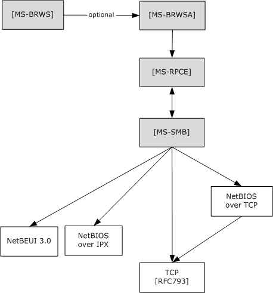
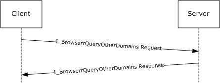

[MS-BRWSA]:

Common Internet File System (CIFS) Browser Auxiliary
Protocol

Intellectual Property Rights Notice for Open Specifications Documentation

  Technical Documentation. Microsoft publishes Open Specifications documentation (“this

documentation”) for protocols, file formats, data portability, computer languages, and standards
support. Additionally, overview documents cover inter-protocol relationships and interactions.

  Copyrights. This documentation is covered by Microsoft copyrights. Regardless of any other

terms that are contained in the terms of use for the Microsoft website that hosts this
documentation, you can make copies of it in order to develop implementations of the technologies
that are described in this documentation and can distribute portions of it in your implementations
that use these technologies or in your documentation as necessary to properly document the
implementation. You can also distribute in your implementation, with or without modification, any
schemas, IDLs, or code samples that are included in the documentation. This permission also
applies to any documents that are referenced in the Open Specifications documentation.
  No Trade Secrets. Microsoft does not claim any trade secret rights in this documentation.
  Patents. Microsoft has patents that might cover your implementations of the technologies

described in the Open Specifications documentation. Neither this notice nor Microsoft's delivery of
this documentation grants any licenses under those patents or any other Microsoft patents.
However, a given Open Specifications document might be covered by the Microsoft Open
Specifications Promise or the Microsoft Community Promise. If you would prefer a written license,
or if the technologies described in this documentation are not covered by the Open Specifications
Promise or Community Promise, as applicable, patent licenses are available by contacting
iplg@microsoft.com.

  License Programs. To see all of the protocols in scope under a specific license program and the

associated patents, visit the Patent Map.

  Trademarks. The names of companies and products contained in this documentation might be
covered by trademarks or similar intellectual property rights. This notice does not grant any
licenses under those rights. For a list of Microsoft trademarks, visit
www.microsoft.com/trademarks.

  Fictitious Names. The example companies, organizations, products, domain names, email

addresses, logos, people, places, and events that are depicted in this documentation are fictitious.
No association with any real company, organization, product, domain name, email address, logo,
person, place, or event is intended or should be inferred.

Reservation of Rights. All other rights are reserved, and this notice does not grant any rights other
than as specifically described above, whether by implication, estoppel, or otherwise.

Tools. The Open Specifications documentation does not require the use of Microsoft programming
tools or programming environments in order for you to develop an implementation. If you have access
to Microsoft programming tools and environments, you are free to take advantage of them. Certain
Open Specifications documents are intended for use in conjunction with publicly available standards
specifications and network programming art and, as such, assume that the reader either is familiar
with the aforementioned material or has immediate access to it.

Support. For questions and support, please contact dochelp@microsoft.com.

[MS-BRWSA] - v20240423
Common Internet File System (CIFS) Browser Auxiliary Protocol
Copyright © 2024 Microsoft Corporation
Release: April 23, 2024

1 / 25

Revision Summary

Date

Revision
History

Revision
Class

Comments

9/28/2007

0.1

10/23/2007  1.0

Major

Major

MCPP Milestone M5+90 Initial Availability

Updated and revised the technical content.

11/30/2007  1.0.1

Editorial

Changed language and formatting in the technical content.

1/25/2008

1.0.2

Editorial

Changed language and formatting in the technical content.

3/14/2008

1.0.3

Editorial

Changed language and formatting in the technical content.

5/16/2008

1.0.4

Editorial

Changed language and formatting in the technical content.

6/20/2008

2.0

7/25/2008

2.1

Major

Minor

Updated and revised the technical content.

Clarified the meaning of the technical content.

8/29/2008

2.1.1

Editorial

Changed language and formatting in the technical content.

10/24/2008  2.1.2

Editorial

Changed language and formatting in the technical content.

12/5/2008

3.0

Major

Updated and revised the technical content.

1/16/2009

3.0.1

Editorial

Changed language and formatting in the technical content.

2/27/2009

3.0.2

Editorial

Changed language and formatting in the technical content.

4/10/2009

4.0

5/22/2009

4.1

Major

Minor

Updated and revised the technical content.

Clarified the meaning of the technical content.

7/2/2009

4.1.1

Editorial

Changed language and formatting in the technical content.

8/14/2009

4.2

9/25/2009

4.3

11/6/2009

4.4

12/18/2009  5.0

1/29/2010

5.1

3/12/2010

5.2

Minor

Minor

Minor

Major

Minor

Minor

Clarified the meaning of the technical content.

Clarified the meaning of the technical content.

Clarified the meaning of the technical content.

Updated and revised the technical content.

Clarified the meaning of the technical content.

Clarified the meaning of the technical content.

4/23/2010

5.2.1

Editorial

Changed language and formatting in the technical content.

6/4/2010

5.3

Minor

Clarified the meaning of the technical content.

7/16/2010

5.3

8/27/2010

5.3

10/8/2010

5.3

11/19/2010  6.0

1/7/2011

6.0

None

None

None

Major

None

No changes to the meaning, language, or formatting of the
technical content.

No changes to the meaning, language, or formatting of the
technical content.

No changes to the meaning, language, or formatting of the
technical content.

Updated and revised the technical content.

No changes to the meaning, language, or formatting of the

[MS-BRWSA] - v20240423
Common Internet File System (CIFS) Browser Auxiliary Protocol
Copyright © 2024 Microsoft Corporation
Release: April 23, 2024

2 / 25

Date

Revision
History

Revision
Class

Comments

technical content.

2/11/2011

6.0

None

No changes to the meaning, language, or formatting of the
technical content.

3/25/2011

7.0

Major

Updated and revised the technical content.

5/6/2011

7.0

None

No changes to the meaning, language, or formatting of the
technical content.

6/17/2011

7.1

Minor

Clarified the meaning of the technical content.

9/23/2011

7.1

None

No changes to the meaning, language, or formatting of the
technical content.

12/16/2011  8.0

Major

Updated and revised the technical content.

3/30/2012

8.0

7/12/2012

8.0

10/25/2012  8.0

1/31/2013

8.0

None

None

None

None

No changes to the meaning, language, or formatting of the
technical content.

No changes to the meaning, language, or formatting of the
technical content.

No changes to the meaning, language, or formatting of the
technical content.

No changes to the meaning, language, or formatting of the
technical content.

8/8/2013

9.0

Major

Updated and revised the technical content.

11/14/2013  9.0

2/13/2014

9.0

5/15/2014

9.0

None

None

None

No changes to the meaning, language, or formatting of the
technical content.

No changes to the meaning, language, or formatting of the
technical content.

No changes to the meaning, language, or formatting of the
technical content.

6/30/2015

10.0

Major

Significantly changed the technical content.

10/16/2015  10.0

None

No changes to the meaning, language, or formatting of the
technical content.

7/14/2016

10.0

None

No changes to the meaning, language, or formatting of the
technical content.

6/1/2017

10.0

9/15/2017

11.0

9/12/2018

12.0

4/7/2021

13.0

6/25/2021

14.0

4/23/2024

15.0

None

Major

Major

Major

Major

Major

No changes to the meaning, language, or formatting of the
technical content.

Significantly changed the technical content.

Significantly changed the technical content.

Significantly changed the technical content.

Significantly changed the technical content.

Significantly changed the technical content.

[MS-BRWSA] - v20240423
Common Internet File System (CIFS) Browser Auxiliary Protocol
Copyright © 2024 Microsoft Corporation
Release: April 23, 2024

3 / 25

## Table of Contents

- [1 Introduction](#1-introduction)
  - [1.1 Glossary](#11-glossary)
  - [1.2 References](#12-references)
    - [1.2.1 Normative References](#121-normative-references)
    - [1.2.2 Informative References](#122-informative-references)
  - [1.3 Overview](#13-overview)
  - [1.4 Relationship to Other Protocols](#14-relationship-to-other-protocols)
  - [1.5 Prerequisites/Preconditions](#15-prerequisitespreconditions)
  - [1.6 Applicability Statement](#16-applicability-statement)
  - [1.7 Versioning and Capability Negotiation](#17-versioning-and-capability-negotiation)
  - [1.8 Vendor-Extensible Fields](#18-vendor-extensible-fields)
  - [1.9 Standards Assignments](#19-standards-assignments)
- [2 Messages](#2-messages)
  - [2.1 Transport](#21-transport)
  - [2.2 Common Data Types](#22-common-data-types)
    - [2.2.1 Simple Data Types](#221-simple-data-types)
      - [2.2.1.1 BROWSER_IDENTIFY_HANDLE](#2211-browseridentifyhandle)
    - [2.2.2 Constants](#222-constants)
      - [2.2.2.1 Platform IDs](#2221-platform-ids)
    - [2.2.3 Structures](#223-structures)
      - [2.2.3.1 SERVER_INFO_100_CONTAINER](#2231-serverinfo100container)
      - [2.2.3.2 SERVER_ENUM_STRUCT](#2232-serverenumstruct)
- [3 Protocol Details](#3-protocol-details)
  - [3.1 Server Details](#31-server-details)
    - [3.1.1 Abstract Data Model](#311-abstract-data-model)
      - [3.1.1.1 OtherDomains Name Abstract Data Model](#3111-otherdomains-name-abstract-data-model)
    - [3.1.2 Timers](#312-timers)
    - [3.1.3 Initialization](#313-initialization)
    - [3.1.4 Message Processing Events and Sequencing Rules](#314-message-processing-events-and-sequencing-rules)
      - [3.1.4.1 Browser](#3141-browser)
        - [3.1.4.1.1 I_BrowserrQueryOtherDomains (Opnum 2)](#31411-ibrowserrqueryotherdomains-opnum-2)
    - [3.1.5 Timer Events](#315-timer-events)
    - [3.1.6 Other Local Events](#316-other-local-events)
  - [3.2 Client Details](#32-client-details)
    - [3.2.1 Abstract Data Model](#321-abstract-data-model)
    - [3.2.2 Timers](#322-timers)
    - [3.2.3 Initialization](#323-initialization)
    - [3.2.4 Message Processing Events and Sequencing Rules](#324-message-processing-events-and-sequencing-rules)
    - [3.2.5 Timer Events](#325-timer-events)
    - [3.2.6 Other Local Events](#326-other-local-events)
- [4 Protocol Examples](#4-protocol-examples)
- [5 Security](#5-security)
  - [5.1 Security Considerations for Implementers](#51-security-considerations-for-implementers)
  - [5.2 Index of Security Parameters](#52-index-of-security-parameters)
- [6 Appendix A: Full IDL](#6-appendix-a-full-idl)
- [7 Appendix B: Product Behavior](#7-appendix-b-product-behavior)
- [8 Change Tracking](#8-change-tracking)
- [9 Index](#9-index)

## 1 Introduction

This document specifies the Common Internet File System (CIFS) Browser Auxiliary Protocol
Specification. This protocol is used by the master browser server and domain master browser
server as defined in [MS-BRWS]. The master browser server uses this protocol to query configuration
information for the domains from the domain master browser server. The protocol operation is
stateless.

Sections 1.5, 1.8, 1.9, 2, and 3 of this specification are normative. All other sections and examples in
this specification are informative.

### 1.1 Glossary

This document uses the following terms:

browser: See browser server.

browser server: An entity that maintains or could be elected to maintain information about other

servers and domains.

client: A computer on which the remote procedure call (RPC) client is executing.

domain: A set of users and computers sharing a common namespace and management

infrastructure. At least one computer member of the set has to act as a domain controller
(DC) and host a member list that identifies all members of the domain, as well as optionally
hosting the Active Directory service. The domain controller provides authentication of members,
creating a unit of trust for its members. Each domain has an identifier that is shared among its
members. For more information, see [MS-AUTHSOD] section 1.1.1.5 and [MS-ADTS].

domain controller (DC): The service, running on a server, that implements Active Directory, or
the server hosting this service. The service hosts the data store for objects and interoperates
with other DCs to ensure that a local change to an object replicates correctly across all DCs.
When Active Directory is operating as Active Directory Domain Services (AD DS), the DC
contains full NC replicas of the configuration naming context (config NC), schema naming
context (schema NC), and one of the domain NCs in its forest. If the AD DS DC is a global
catalog server (GC server), it contains partial NC replicas of the remaining domain NCs in its
forest. For more information, see [MS-AUTHSOD] section 1.1.1.5.2 and [MS-ADTS]. When
Active Directory is operating as Active Directory Lightweight Directory Services (AD LDS),
several AD LDS DCs can run on one server. When Active Directory is operating as AD DS, only
one AD DS DC can run on one server. However, several AD LDS DCs can coexist with one AD
DS DC on one server. The AD LDS DC contains full NC replicas of the config NC and the schema
NC in its forest. The domain controller is the server side of Authentication Protocol Domain
Support [MS-APDS].

domain master browser server: A master browser server that is responsible for combining
information for an entire domain, across all subnets. A domain master browser server is
responsible for keeping multiple subnets in synchronization by periodically querying local master
browser servers for information concerning user accounts, security, and available resources such
as printers.

Interface Definition Language (IDL): The International Standards Organization (ISO) standard
language for specifying the interface for remote procedure calls. For more information, see
[C706] section 4.

master browser server: A server that is responsible for maintaining a master list of available

resources on a subnet and for making the list available to backup browser servers. Each subnet
requires a master browser server. The master browser server for a particular domain is
called the domain master browser server.

5 / 25

[MS-BRWSA] - v20240423
Common Internet File System (CIFS) Browser Auxiliary Protocol
Copyright © 2024 Microsoft Corporation
Release: April 23, 2024

named pipe: A named, one-way, or duplex pipe for communication between a pipe server and one

or more pipe clients.

opnum: An operation number or numeric identifier that is used to identify a specific remote

procedure call (RPC) method or a method in an interface. For more information, see [C706]
section 12.5.2.12 or [MS-RPCE].

primary domain controller (PDC): A domain controller (DC) designated to track changes

made to the accounts of all computers on a domain. It is the only computer to receive these
changes directly, and is specialized so as to ensure consistency and to eliminate the potential for
conflicting entries in the Active Directory database. A domain has only one PDC.

server: A computer on which the remote procedure call (RPC) server is executing.

Unicode: A character encoding standard developed by the Unicode Consortium that represents

almost all of the written languages of the world. The Unicode standard [UNICODE5.0.0/2007]
provides three forms (UTF-8, UTF-16, and UTF-32) and seven schemes (UTF-8, UTF-16, UTF-16
BE, UTF-16 LE, UTF-32, UTF-32 LE, and UTF-32 BE).

universally unique identifier (UUID): A 128-bit value. UUIDs can be used for multiple

purposes, from tagging objects with an extremely short lifetime, to reliably identifying very
persistent objects in cross-process communication such as client and server interfaces, manager
entry-point vectors, and RPC objects. UUIDs are highly likely to be unique. UUIDs are also
known as globally unique identifiers (GUIDs) and these terms are used interchangeably in the
Microsoft protocol technical documents (TDs). Interchanging the usage of these terms does not
imply or require a specific algorithm or mechanism to generate the UUID. Specifically, the use of
this term does not imply or require that the algorithms described in [RFC4122] or [C706] has to
be used for generating the UUID.

MAY, SHOULD, MUST, SHOULD NOT, MUST NOT: These terms (in all caps) are used as defined
in [RFC2119]. All statements of optional behavior use either MAY, SHOULD, or SHOULD NOT.

### 1.2 References

Links to a document in the Microsoft Open Specifications library point to the correct section in the
most recently published version of the referenced document. However, because individual documents
in the library are not updated at the same time, the section numbers in the documents may not
match. You can confirm the correct section numbering by checking the Errata.

#### 1.2.1 Normative References

We conduct frequent surveys of the normative references to assure their continued availability. If you
have any issue with finding a normative reference, please contact dochelp@microsoft.com. We will
assist you in finding the relevant information.

[C706] The Open Group, "DCE 1.1: Remote Procedure Call", C706, August 1997,
https://publications.opengroup.org/c706

Note Registration is required to download the document.

[MS-DTYP] Microsoft Corporation, "Windows Data Types".

[MS-RPCE] Microsoft Corporation, "Remote Procedure Call Protocol Extensions".

[MS-SMB] Microsoft Corporation, "Server Message Block (SMB) Protocol".

[RFC1001] Network Working Group, "Protocol Standard for a NetBIOS Service on a TCP/UDP
Transport: Concepts and Methods", RFC 1001, March 1987, https://www.rfc-editor.org/info/rfc1001

[MS-BRWSA] - v20240423
Common Internet File System (CIFS) Browser Auxiliary Protocol
Copyright © 2024 Microsoft Corporation
Release: April 23, 2024

6 / 25

[RFC1002] Network Working Group, "Protocol Standard for a NetBIOS Service on a TCP/UDP
Transport: Detailed Specifications", STD 19, RFC 1002, March 1987, https://www.rfc-
editor.org/info/rfc1002

[RFC2119] Bradner, S., "Key words for use in RFCs to Indicate Requirement Levels", BCP 14, RFC
2119, March 1997, https://www.rfc-editor.org/info/rfc2119

#### 1.2.2 Informative References

[MS-BRWS] Microsoft Corporation, "Common Internet File System (CIFS) Browser Protocol".

[MS-WKST] Microsoft Corporation, "Workstation Service Remote Protocol".

[PIPE] Microsoft Corporation, "Named Pipes", http://msdn.microsoft.com/en-us/library/aa365590.aspx

### 1.3 Overview

The main objective of the CIFS Browser Auxiliary Protocol is to provide a method for the master
browser server of a subnet to query specific additional information from the domain master
browser server for a given domain. Selection of the master browser server and domain master
browser server and the roles that these servers play are as specified in [MS-BRWS].

### 1.4 Relationship to Other Protocols

This protocol depends on RPC, as specified in [MS-RPCE], for its transport. This protocol uses RPC over
named pipes, as specified in [MS-RPCE] section 2.1.1.2. Named pipes use the Server Message Block
(SMB) Protocol, as specified in [MS-SMB].

An implementation of [MS-BRWS] can use this protocol to retrieve information from the domain
master browser.

[MS-BRWSA] - v20240423
Common Internet File System (CIFS) Browser Auxiliary Protocol
Copyright © 2024 Microsoft Corporation
Release: April 23, 2024

7 / 25

<!-- Extracted images from page 8 -->

<!-- /Extracted images from page 8 -->

Figure 1: Relationship to other protocols







[MS-BRWS] calls (optional) [MS-BRWSA] to request OtherDomains information from a domain
controller (DC).

[MS-BRWSA] calls [MS-RPCE] as RPC/named pipes as transport.

[MS-RPCE] calls [MS-SMB] named pipes as a transport that uses SMB.

### 1.5 Prerequisites/Preconditions

The master browser server has previously identified the endpoint address of the domain master
browser server.

### 1.6 Applicability Statement

This protocol is used to retrieve the list of domains that the domain master browser server has
been configured to support.

8 / 25

[MS-BRWSA] - v20240423
Common Internet File System (CIFS) Browser Auxiliary Protocol
Copyright © 2024 Microsoft Corporation
Release: April 23, 2024

### 1.7 Versioning and Capability Negotiation

None.

### 1.8 Vendor-Extensible Fields

None.

### 1.9 Standards Assignments

Parameter

Value

Reference

 RPC Interface UUID  6BFFD098-A112-3610-9833-012892020162  See section 2.1

Pipe Name

"\pipe\browser"

See section 2.1

[MS-BRWSA] - v20240423
Common Internet File System (CIFS) Browser Auxiliary Protocol
Copyright © 2024 Microsoft Corporation
Release: April 23, 2024

9 / 25

## 2 Messages

### 2.1 Transport

The RPC methods that the CIFS Browser Auxiliary Protocol uses are available on one endpoint:



"\pipe\browser" named pipe (RPC protseqs ncacn_np), as specified in [MS-RPCE] section 2.1.1.2.

The CIFS Browser Auxiliary Protocol endpoint is available only over named pipes. For more information
about named pipes, see [PIPE].

This protocol MUST use the universally unique identifier (UUID) as specified in section 1.9. The
RPC version number is 0.0.

This protocol allows any user to establish a connection to the RPC server. The protocol uses the
underlying RPC protocol to retrieve the identity of the caller that made the method call, as described
in section 3.3.3.4.3 of [MS-RPCE]. The server SHOULD use this identity to perform method specific
access checks as described in section 3.1.4.

### 2.2 Common Data Types

In addition to RPC base types and definitions specified in [C706] and [MS-RPCE], additional data types
are defined below.

The following are the types that are defined in this specification.

#### 2.2.1 Simple Data Types

##### 2.2.1.1 BROWSER_IDENTIFY_HANDLE

The BROWSER_IDENTIFY_HANDLE structure is a null-terminated Unicode string that identifies the
remote computer on which to execute the method.

This type is declared as follows:

 typedef [handle] LPWSTR BROWSER_IDENTIFY_HANDLE;

The client MUST set the impersonation level for the RPC connection that refers to this handle to
"IDENTIFICATION". "IDENTIFICATION" implies an impersonation level of SECURITY_IDENTIFICATION.
For more information on impersonation levels, see the ImpersonationLevel field in [MS-SMB]
section 2.2.4.9.1.

#### 2.2.2 Constants

##### 2.2.2.1 Platform IDs

The following values specify the information level to use for platform-specific information on the
server.

Name

Value (decimal)

PLATFORM_ID_DOS   300

PLATFORM_ID_OS2   400

[MS-BRWSA] - v20240423
Common Internet File System (CIFS) Browser Auxiliary Protocol
Copyright © 2024 Microsoft Corporation
Release: April 23, 2024

10 / 25

Name

Value (decimal)

PLATFORM_ID_NT

500

PLATFORM_ID_OSF   600

PLATFORM_ID_VMS   700

#### 2.2.3 Structures

##### 2.2.3.1 SERVER_INFO_100_CONTAINER

The SERVER_INFO_100_CONTAINER structure contains a count of the entries returned by the method
and a pointer to a buffer.

 typedef struct _SERVER_INFO_100_CONTAINER {
   DWORD EntriesRead;
   [size_is(EntriesRead)] LPSERVER_INFO_100 Buffer;
 } SERVER_INFO_100_CONTAINER,
  *PSERVER_INFO_100_CONTAINER,
  *LPSERVER_INFO_100_CONTAINER;

EntriesRead:  The number of entries returned by the method call. This value MUST be zero if no
domains are configured in the primary domain controller or domain controller. The client
SHOULD set the EntriesRead field to 0, and the Buffer field to NULL, and the server MUST ignore
these fields.

Buffer:  A pointer to an array of SERVER_INFO_100 data structures (as specified in [MS-DTYP]

section 2.3.11). If EntriesRead is zero, this field is undefined and MUST NOT be considered a valid
pointer.

##### 2.2.3.2 SERVER_ENUM_STRUCT

The SERVER_ENUM_STRUCT structure defines the layout for a structure with a value to indicate the
information level submitted to the method and a pointer to a data structure that contains an array of
data structures returned by the method. This structure is used by I_BrowserrQueryOtherDomains.

 typedef struct _SERVER_ENUM_STRUCT {
   DWORD Level;
   [switch_is(Level)] union _SERVER_ENUM_UNION {
     [case(100)]
       LPSERVER_INFO_100_CONTAINER Level100;
     [default]
        ;
   } ServerInfo;
 } SERVER_ENUM_STRUCT,
  *PSERVER_ENUM_STRUCT,
  *LPSERVER_ENUM_STRUCT;

Level:  The information level of the data. This member MUST be 100.

ServerInfo:  A structure that contains an array of data structures. The Level member determines the

data type of the members of this array.

[MS-BRWSA] - v20240423
Common Internet File System (CIFS) Browser Auxiliary Protocol
Copyright © 2024 Microsoft Corporation
Release: April 23, 2024

11 / 25

Level100:  A pointer to a SERVER_INFO_100_CONTAINER structure that contains the number of
entries returned by the method and a pointer to an array of SERVER_INFO_100 structures (as
specified in [MS-DTYP] section 2.3.11).

[MS-BRWSA] - v20240423
Common Internet File System (CIFS) Browser Auxiliary Protocol
Copyright © 2024 Microsoft Corporation
Release: April 23, 2024

12 / 25

## 3 Protocol Details

### 3.1 Server Details

#### 3.1.1 Abstract Data Model

##### 3.1.1.1 OtherDomains Name Abstract Data Model

OtherDomains: Specifies a list of NetBIOS names of domains, as specified in [RFC1001] and

[RFC1002], browsed by the computer. Each name MUST be at most 15 characters in length, and
MUST NOT contain trailing spaces or a NetBIOS suffix as defined in [MS-BRWS] section 2.1.1. The
names in the OtherDomains list MUST be separated by spaces.

This element is shared with the Workstation Service Remote Protocol Specification [MS-WKST],
queried through the WkstaQueryOtherDomains event (section 3.2.6.1).

The OtherDomains element is also shared with the Common Internet File System (CIFS) Browser
Protocol [MS-BRWS] to update the OtherDomains information from a domain controller.

#### 3.1.2 Timers

None.

#### 3.1.3 Initialization

Section 2.1 specifies the parameters necessary to initialize the RPC protocol.

#### 3.1.4 Message Processing Events and Sequencing Rules

The ServerName parameter MUST be ignored by the server when processing any message.<1>

##### 3.1.4.1 Browser

The browser interface lists the methods associated with the browser service, which creates and
maintains a view of resources available on a network. The server does not maintain client state
information. The protocol operation is stateless. The version for this interface is 0.0.

The UUID for this interface is: "6BFFD098-A112-3610-9833-012892020162".

Methods in RPC Opnum Order

Method

Description

Opnum0NotUsedOnWire

Reserved for local use.

Opnum: 0

Opnum1NotUsedOnWire

Reserved for local use.

Opnum: 1

I_BrowserrQueryOtherDomains  Returns a list of other domains configured for this computer.

Opnum: 2

Opnum3NotUsedOnWire

Reserved for local use.

Opnum: 3

[MS-BRWSA] - v20240423
Common Internet File System (CIFS) Browser Auxiliary Protocol
Copyright © 2024 Microsoft Corporation
Release: April 23, 2024

13 / 25

Method

Description

Opnum4NotUsedOnWire

Reserved for local use.

Opnum: 4

Opnum5NotUsedOnWire

Reserved for local use.

Opnum: 5

Opnum6NotUsedOnWire

Reserved for local use.

Opnum: 6

Opnum7NotUsedOnWire

Reserved for local use.

Opnum: 7

Opnum8NotUsedOnWire

Reserved for local use.

Opnum: 8

Opnum9NotUsedOnWire

Reserved for local use.

Opnum: 9

Opnum10NotUsedOnWire

Reserved for local use.

Opnum: 10

Opnum11NotUsedOnWire

Reserved for local use.

Opnum: 11

In the preceding table, the phrase "Reserved for local use" means that the client MUST NOT send the
opnum and that the server behavior is undefined<2> because it does not affect interoperability.

###### 3.1.4.1.1 I_BrowserrQueryOtherDomains (Opnum 2)

The I_BrowserrQueryOtherDomains method is received by the server in an RPC_REQUEST packet. The
client SHOULD NOT send this RPC request to a server that is not a primary domain controller
(PDC) acting as the domain master browser server.

If this server is not a primary domain controller it MAY fail the request.<3>

If the server is a primary domain controller, the server MUST update OtherDomains as specified in
[MS-WKST] section 3.2.6.1, WkstaQueryOtherDomains Event. The server MUST construct a
SERVER_ENUM structure as specified in 2.2.3.2, containing a SERVER_INFO_100 structure as
specified in [MS-DTYP] section 2.3.11 for each name in OtherDomains, and return this to the caller.

 NET_API_STATUS I_BrowserrQueryOtherDomains(
   [in, string, unique] BROWSER_IDENTIFY_HANDLE ServerName,
   [in, out] LPSERVER_ENUM_STRUCT InfoStruct,
   [out] LPDWORD TotalEntries
 );

ServerName: An optional BROWSER_IDENTIFY_HANDLE structure that specifies the name of the

server to execute the method. This value is ignored upon receipt.

InfoStruct: A pointer to a SERVER_ENUM_STRUCT structure that contains the Level member and a

pointer to a SERVER_INFO_x structure, where <x> MUST be 100. The Level member MUST be
set to 100. If the Level member is set to any other value, the method MUST return
ERROR_INVALID_LEVEL.<4>

TotalEntries: The number of entries returned by the method call. This parameter MUST match the

EntriesRead member of the SERVER_INFO_100_CONTAINER structure.

14 / 25

[MS-BRWSA] - v20240423
Common Internet File System (CIFS) Browser Auxiliary Protocol
Copyright © 2024 Microsoft Corporation
Release: April 23, 2024

Return Values: The method returns NERR_Success on success; otherwise, it returns a nonzero error
code, as specified in either Win32 Error Codes. The most common error codes are listed in the
following table.<5>

Return value/code

Description

0x00000000

NERR_Success

The operation completed successfully.

0x00000005

Access is denied.

ERROR_ACCESS_DENIED

0x00000008

ERROR_NOT_ENOUGH_MEMORY

This value MUST be returned when the server could not allocate enough
memory to complete this operation.

0x00000057

ERROR_INVALID_PARAMETER

This value MUST be returned when a parameter is incorrect. For example, this
value is returned when the InfoStruct parameter is NULL or the Level100
member in the structure pointed to by the InfoStruct parameter is NULL.

0x0000007C

This value MUST be returned when the Level member is not 100.

The error ERROR_MORE_DATA indicates that not all available entries were
returned. Some more entries exist which were not returned in the response.

ERROR_INVALID_LEVEL

0x000000EA

ERROR_MORE_DATA

#### 3.1.5 Timer Events

None.

#### 3.1.6 Other Local Events

None.

### 3.2 Client Details

#### 3.2.1 Abstract Data Model

None.

#### 3.2.2 Timers

None.

#### 3.2.3 Initialization

The client MUST create an RPC connection to the remote computer by using details as specified in
section 2.1.

#### 3.2.4 Message Processing Events and Sequencing Rules

None.

[MS-BRWSA] - v20240423
Common Internet File System (CIFS) Browser Auxiliary Protocol
Copyright © 2024 Microsoft Corporation
Release: April 23, 2024

15 / 25

#### 3.2.5 Timer Events

None.

#### 3.2.6 Other Local Events

None.

[MS-BRWSA] - v20240423
Common Internet File System (CIFS) Browser Auxiliary Protocol
Copyright © 2024 Microsoft Corporation
Release: April 23, 2024

16 / 25

<!-- Extracted images from page 17 -->

<!-- /Extracted images from page 17 -->

## 4 Protocol Examples

The method provided by this protocol is a simple request-response. The server receives the request,
executes the method, and returns a completion. The client simply returns the completion status to
the calling application. This is a stateless protocol; each method call is independent of any previous
method calls.

For example, the client calls the I_BrowserrQueryOtherDomains method; on receiving this method,
the server executes the call locally and returns the appropriate information and NERR_Success.

Figure 2: Simple request-response model

[MS-BRWSA] - v20240423
Common Internet File System (CIFS) Browser Auxiliary Protocol
Copyright © 2024 Microsoft Corporation
Release: April 23, 2024

17 / 25

## 5 Security

### 5.1 Security Considerations for Implementers

As described in section 2.1, this protocol allows any user to connect to the server. Therefore, any
security bug in the server implementation could be exploitable. It is recommended that the server
implementation enforce security on each method.

### 5.2 Index of Security Parameters

None.

[MS-BRWSA] - v20240423
Common Internet File System (CIFS) Browser Auxiliary Protocol
Copyright © 2024 Microsoft Corporation
Release: April 23, 2024

18 / 25

## 6 Appendix A: Full IDL

For ease of implementation, the full IDL is provided below, where "ms-dtyp.idl" refers to the IDL
found in [MS-DTYP] Appendix A.

The syntax uses the IDL syntax extensions defined in [MS-RPCE] sections 2.2.4 and 2.2.4. For
example, as noted in [MS-RPCE] section 2.2.4.9, a pointer_default declaration is not required and
pointer_default(unique) is assumed.

 [
     uuid(6BFFD098-A112-3610-9833-012892020162),
     version(0.0),
     ms_union,
     pointer_default(unique)
 ]
 interface browser
 {
     import "ms-dtyp.idl";

    typedef WCHAR* LPWSTR;

     typedef [handle] LPWSTR BROWSER_IDENTIFY_HANDLE;

    typedef struct _SERVER_INFO_100_CONTAINER {
         DWORD   EntriesRead;
         [size_is(EntriesRead)] LPSERVER_INFO_100 Buffer;
      } SERVER_INFO_100_CONTAINER,
       *PSERVER_INFO_100_CONTAINER,
       *LPSERVER_INFO_100_CONTAINER;

     typedef struct _SERVER_ENUM_STRUCT {
         DWORD   Level;
         [switch_is(Level)] union _SERVER_ENUM_UNION {
             [case(100)]
                 LPSERVER_INFO_100_CONTAINER Level100;
             [default]
                 ;
         } ServerInfo;
     } SERVER_ENUM_STRUCT,
      *PSERVER_ENUM_STRUCT,
      *LPSERVER_ENUM_STRUCT;

     NET_API_STATUS Opnum0NotUsedOnWire(void);

     NET_API_STATUS Opnum1NotUsedOnWire(void);

     NET_API_STATUS
     I_BrowserrQueryOtherDomains(
         [in,string,unique] BROWSER_IDENTIFY_HANDLE ServerName,
         [in,out]           LPSERVER_ENUM_STRUCT    InfoStruct,
         [out]              LPDWORD                 TotalEntries
     );

     NET_API_STATUS Opnum3NotUsedOnWire(void);

     NET_API_STATUS Opnum4NotUsedOnWire(void);

     NET_API_STATUS Opnum5NotUsedOnWire(void);

     NET_API_STATUS Opnum6NotUsedOnWire(void);

     NET_API_STATUS Opnum7NotUsedOnWire(void);

     NET_API_STATUS Opnum8NotUsedOnWire(void);

[MS-BRWSA] - v20240423
Common Internet File System (CIFS) Browser Auxiliary Protocol
Copyright © 2024 Microsoft Corporation
Release: April 23, 2024

19 / 25

     NET_API_STATUS Opnum9NotUsedOnWire(void);

     NET_API_STATUS Opnum10NotUsedOnWire(void);

     NET_API_STATUS Opnum11NotUsedOnWire(void);
 }

[MS-BRWSA] - v20240423
Common Internet File System (CIFS) Browser Auxiliary Protocol
Copyright © 2024 Microsoft Corporation
Release: April 23, 2024

20 / 25

## 7 Appendix B: Product Behavior

The information in this specification is applicable to the following Microsoft products or supplemental
software. References to product versions include updates to those products.

  Windows 2000 operating system

  Windows XP operating system

  Windows Server 2003 operating system

  Windows Vista operating system

  Windows Server 2008 operating system

  Windows 7 operating system

  Windows Server 2008 R2 operating system

  Windows 8 operating system

  Windows Server 2012 operating system

  Windows 8.1 operating system

  Windows Server 2012 R2 operating system

  Windows 10 operating system

  Windows Server 2016 operating system

  Windows Server operating system

  Windows Server 2019 operating system

  Windows Server 2022 operating system

  Windows 11 operating system

  Windows Server 2025 operating system

Exceptions, if any, are noted in this section. If an update version, service pack or Knowledge Base
(KB) number appears with a product name, the behavior changed in that update. The new behavior
also applies to subsequent updates unless otherwise specified. If a product edition appears with the
product version, behavior is different in that product edition.

Unless otherwise specified, any statement of optional behavior in this specification that is prescribed
using the terms "SHOULD" or "SHOULD NOT" implies product behavior in accordance with the
SHOULD or SHOULD NOT prescription. Unless otherwise specified, the term "MAY" implies that the
product does not follow the prescription.

<1> Section 3.1.4: Windows implementation uses the RPC protocol to retrieve the identity of the
caller as described in section 3.3.3.4.3 of [MS-RPCE]. The server uses the underlying Windows
security subsystem to determine the permissions for the caller. If the caller does not have the
required permissions to execute a specific method, the method call fails with ERROR_ACCESS_DENIED
(0x00000005).

<2> Section 3.1.4.1: Opnums reserved for local use apply to Windows as follows:

[MS-BRWSA] - v20240423
Common Internet File System (CIFS) Browser Auxiliary Protocol
Copyright © 2024 Microsoft Corporation
Release: April 23, 2024

21 / 25

opnum

Description

0,5,6,10,11  Only used locally by Windows, never remotely.

1,3,4,9

Just returns ERROR_NOT_SUPPORTED. It is never used.

7,8

Just returns NERR_Success. It is never used.

<3> Section 3.1.4.1.1: Windows-based servers accept the
I_BrowserrQueryOtherDomains (section 3.1.4.1.1) request and return the names of domains
configured for browsing even if they are not the primary domain controller.

<4> Section 3.1.4.1.1: Use PLATFORM_ID_OS2 for Windows-based clients and servers.

<5> Section 3.1.4.1.1: If the caller is not an authenticated user, then the method call fails with
ERROR_ACCESS_DENIED (0x00000005).

[MS-BRWSA] - v20240423
Common Internet File System (CIFS) Browser Auxiliary Protocol
Copyright © 2024 Microsoft Corporation
Release: April 23, 2024

22 / 25

## 8 Change Tracking

This section identifies changes that were made to this document since the last release. Changes are
classified as Major, Minor, or None.

The revision class Major means that the technical content in the document was significantly revised.
Major changes affect protocol interoperability or implementation. Examples of major changes are:

  A document revision that incorporates changes to interoperability requirements.
  A document revision that captures changes to protocol functionality.

The revision class Minor means that the meaning of the technical content was clarified. Minor changes
do not affect protocol interoperability or implementation. Examples of minor changes are updates to
clarify ambiguity at the sentence, paragraph, or table level.

The revision class None means that no new technical changes were introduced. Minor editorial and
formatting changes may have been made, but the relevant technical content is identical to the last
released version.

The changes made to this document are listed in the following table. For more information, please
contact dochelp@microsoft.com.

Section

Description

7 Appendix B: Product
Behavior

Added Windows Server 2025 to the list of applicable
products.

Revision
class

Major

[MS-BRWSA] - v20240423
Common Internet File System (CIFS) Browser Auxiliary Protocol
Copyright © 2024 Microsoft Corporation
Release: April 23, 2024

23 / 25

## 9 Index
A

Abstract data model
   client 15
   server - OtherDomains 13
Applicability 8

B

I_BrowserrQueryOtherDomains method 14
IDL 19
Implementer - security considerations 18
Index of security parameters 18
Informative references 7
Initialization
   client 15
   server 13
Introduction 5

Browser method 13
BROWSER_IDENTIFY_HANDLE simple type 10

L

C

Capability negotiation 9
Change tracking 23
Client
   abstract data model 15
   initialization 15
   local events 16
   message processing 15
   sequencing rules 15
   timer events 16
   timers 15
Common data types 10
Common data types - overview 10
Constants - platform IDs 10

D

Data model - abstract
   client 15
   server - OtherDomains 13
Data types
   BROWSER_IDENTIFY_HANDLE simple type 10
   common 10
   common - overview 10
   simple - BROWSER_IDENTIFY_HANDLE 10

E

Events
   local - client 16
   local - server 15
   timer - client 16
   timer - server 15
Examples
   overview 17
Examples - overview 17

F

Fields - vendor-extensible 9
Full IDL 19

G

Glossary 5

I

Local events
   client 16
   server 15
LPSERVER_ENUM_STRUCT 11
LPSERVER_INFO_100_CONTAINER 11

M

Message processing
   client 15
   server 13
Messages
   common data types 10
   platform IDs constant 10
   transport 10
Methods
   Browser 13
Methods - browser 13

N

Normative references 6

O

Overview (synopsis) 7

P

Parameters - security index 18
Platform IDs constant 10
Preconditions 8
Prerequisites 8
Product behavior 21
PSERVER_ENUM_STRUCT 11
PSERVER_INFO_100_CONTAINER 11

R

References 6
   informative 7
   normative 6
Relationship to other protocols 7

S

Security
   implementer considerations 18
   parameter index 18

[MS-BRWSA] - v20240423
Common Internet File System (CIFS) Browser Auxiliary Protocol
Copyright © 2024 Microsoft Corporation
Release: April 23, 2024

24 / 25

Sequencing rules
   client 15
   server 13
Server
   abstract data model - OtherDomains 13
   Browser method 13
   initialization 13
   local events 15
   message processing 13
   sequencing rules 13
   timer events 15
   timers 13
SERVER_ENUM_STRUCT structure 11
SERVER_INFO_100_CONTAINER structure 11
Simple data types - BROWSER_IDENTIFY_HANDLE

10

Standards assignments 9

T

Timer events
   client 16
   server 15
Timers
   client 15
   server 13
Tracking changes 23
Transport 10

V

Vendor-extensible fields 9
Versioning 9

[MS-BRWSA] - v20240423
Common Internet File System (CIFS) Browser Auxiliary Protocol
Copyright © 2024 Microsoft Corporation
Release: April 23, 2024

25 / 25

