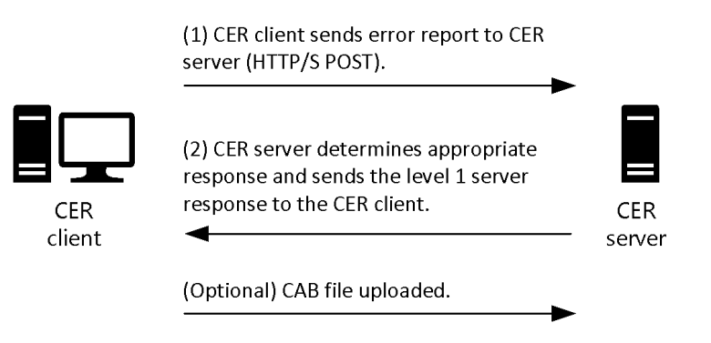
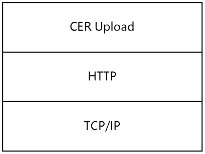
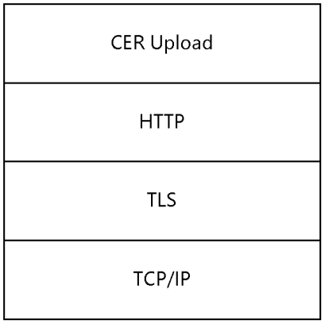

[MS-CER2]:

Corporate Error Reporting V.2 Protocol

Intellectual Property Rights Notice for Open Specifications Documentation

  Technical Documentation. Microsoft publishes Open Specifications documentation (“this

documentation”) for protocols, file formats, data portability, computer languages, and standards
support. Additionally, overview documents cover inter-protocol relationships and interactions.

  Copyrights. This documentation is covered by Microsoft copyrights. Regardless of any other

terms that are contained in the terms of use for the Microsoft website that hosts this
documentation, you can make copies of it in order to develop implementations of the technologies
that are described in this documentation and can distribute portions of it in your implementations
that use these technologies or in your documentation as necessary to properly document the
implementation. You can also distribute in your implementation, with or without modification, any
schemas, IDLs, or code samples that are included in the documentation. This permission also
applies to any documents that are referenced in the Open Specifications documentation.
  No Trade Secrets. Microsoft does not claim any trade secret rights in this documentation.
  Patents. Microsoft has patents that might cover your implementations of the technologies

described in the Open Specifications documentation. Neither this notice nor Microsoft's delivery of
this documentation grants any licenses under those patents or any other Microsoft patents.
However, a given Open Specifications document might be covered by the Microsoft Open
Specifications Promise or the Microsoft Community Promise. If you would prefer a written license,
or if the technologies described in this documentation are not covered by the Open Specifications
Promise or Community Promise, as applicable, patent licenses are available by contacting
iplg@microsoft.com.

  License Programs. To see all of the protocols in scope under a specific license program and the

associated patents, visit the Patent Map.

  Trademarks. The names of companies and products contained in this documentation might be
covered by trademarks or similar intellectual property rights. This notice does not grant any
licenses under those rights. For a list of Microsoft trademarks, visit
www.microsoft.com/trademarks.

  Fictitious Names. The example companies, organizations, products, domain names, email

addresses, logos, people, places, and events that are depicted in this documentation are fictitious.
No association with any real company, organization, product, domain name, email address, logo,
person, place, or event is intended or should be inferred.

Reservation of Rights. All other rights are reserved, and this notice does not grant any rights other
than as specifically described above, whether by implication, estoppel, or otherwise.

Tools. The Open Specifications documentation does not require the use of Microsoft programming
tools or programming environments in order for you to develop an implementation. If you have access
to Microsoft programming tools and environments, you are free to take advantage of them. Certain
Open Specifications documents are intended for use in conjunction with publicly available standards
specifications and network programming art and, as such, assume that the reader either is familiar
with the aforementioned material or has immediate access to it.

Support. For questions and support, please contact dochelp@microsoft.com.

[MS-CER2] - v20240423
Corporate Error Reporting V.2 Protocol
Copyright © 2024 Microsoft Corporation
Release: April 23, 2024

1 / 29

Revision Summary

Date

Revision
History

Revision
Class

Comments

4/8/2008

0.01

6/20/2008

1.0

New

Major

Version 0.01 release

Updated and revised the technical content.

7/25/2008

1.0.1

Editorial

Changed language and formatting in the technical content.

8/29/2008

1.0.2

Editorial

Changed language and formatting in the technical content.

10/24/2008  1.0.3

Editorial

Changed language and formatting in the technical content.

12/5/2008

1.1

Minor

Clarified the meaning of the technical content.

1/16/2009

1.1.1

Editorial

Changed language and formatting in the technical content.

2/27/2009

1.1.2

Editorial

Changed language and formatting in the technical content.

4/10/2009

1.1.3

Editorial

Changed language and formatting in the technical content.

5/22/2009

1.1.4

Editorial

Changed language and formatting in the technical content.

7/2/2009

1.2

Minor

Clarified the meaning of the technical content.

8/14/2009

1.2.1

Editorial

Changed language and formatting in the technical content.

9/25/2009

1.2.2

Editorial

Changed language and formatting in the technical content.

11/6/2009

1.2.3

Editorial

Changed language and formatting in the technical content.

12/18/2009  1.2.4

Editorial

Changed language and formatting in the technical content.

1/29/2010

1.2.5

Editorial

Changed language and formatting in the technical content.

3/12/2010

1.2.6

Editorial

Changed language and formatting in the technical content.

4/23/2010

1.3

Minor

Clarified the meaning of the technical content.

6/4/2010

1.3.1

Editorial

Changed language and formatting in the technical content.

7/16/2010

1.3.1

None

No changes to the meaning, language, or formatting of the
technical content.

8/27/2010

2.0

Major

Updated and revised the technical content.

10/8/2010

2.0

11/19/2010  2.0

1/7/2011

2.0

2/11/2011

2.0

3/25/2011

2.0

5/6/2011

2.0

None

None

None

None

None

None

No changes to the meaning, language, or formatting of the
technical content.

No changes to the meaning, language, or formatting of the
technical content.

No changes to the meaning, language, or formatting of the
technical content.

No changes to the meaning, language, or formatting of the
technical content.

No changes to the meaning, language, or formatting of the
technical content.

No changes to the meaning, language, or formatting of the
technical content.

[MS-CER2] - v20240423
Corporate Error Reporting V.2 Protocol
Copyright © 2024 Microsoft Corporation
Release: April 23, 2024

2 / 29

Date

Revision
History

Revision
Class

Comments

6/17/2011

2.1

Minor

Clarified the meaning of the technical content.

9/23/2011

2.1

None

No changes to the meaning, language, or formatting of the
technical content.

12/16/2011  3.0

Major

Updated and revised the technical content.

3/30/2012

3.0

None

No changes to the meaning, language, or formatting of the
technical content.

7/12/2012

3.1

Minor

Clarified the meaning of the technical content.

10/25/2012  3.1

1/31/2013

4.0

8/8/2013

5.0

11/14/2013  5.0

2/13/2014

5.0

5/15/2014

5.0

None

Major

Major

None

None

None

No changes to the meaning, language, or formatting of the
technical content.

Updated and revised the technical content.

Updated and revised the technical content.

No changes to the meaning, language, or formatting of the
technical content.

No changes to the meaning, language, or formatting of the
technical content.

No changes to the meaning, language, or formatting of the
technical content.

6/30/2015

6.0

Major

Significantly changed the technical content.

10/16/2015  6.0

7/14/2016

6.0

6/1/2017

6.0

9/15/2017

7.0

9/12/2018

8.0

4/7/2021

9.0

6/25/2021

10.0

4/23/2024

11.0

None

None

None

Major

Major

Major

Major

Major

No changes to the meaning, language, or formatting of the
technical content.

No changes to the meaning, language, or formatting of the
technical content.

No changes to the meaning, language, or formatting of the
technical content.

Significantly changed the technical content.

Significantly changed the technical content.

Significantly changed the technical content.

Significantly changed the technical content.

Significantly changed the technical content.

[MS-CER2] - v20240423
Corporate Error Reporting V.2 Protocol
Copyright © 2024 Microsoft Corporation
Release: April 23, 2024

3 / 29

## Table of Contents

- [1 Introduction](#1-introduction)
  - [1.1 Glossary](#11-glossary)
  - [1.2 References](#12-references)
    - [1.2.1 Normative References](#121-normative-references)
    - [1.2.2 Informative References](#122-informative-references)
  - [1.3 Overview](#13-overview)
  - [1.4 Relationship to Other Protocols](#14-relationship-to-other-protocols)
  - [1.5 Prerequisites/Preconditions](#15-prerequisitespreconditions)
  - [1.6 Applicability Statement](#16-applicability-statement)
  - [1.7 Versioning and Capability Negotiation](#17-versioning-and-capability-negotiation)
  - [1.8 Vendor-Extensible Fields](#18-vendor-extensible-fields)
  - [1.9 Standards Assignments](#19-standards-assignments)
- [2 Messages](#2-messages)
  - [2.1 Transport](#21-transport)
  - [2.2 Message Syntax](#22-message-syntax)
    - [2.2.1 Error Report Level 1 Data](#221-error-report-level-1-data)
      - [2.2.1.1 Namespaces](#2211-namespaces)
      - [2.2.1.2 Simple Types](#2212-simple-types)
        - [2.2.1.2.1 maxpathstring](#22121-maxpathstring)
        - [2.2.1.2.2 osstring](#22122-osstring)
        - [2.2.1.2.3 lcidvalue](#22123-lcidvalue)
        - [2.2.1.2.4 reporttypevalues](#22124-reporttypevalues)
        - [2.2.1.2.5 filetypevalues](#22125-filetypevalues)
        - [2.2.1.2.6 string32](#22126-string32)
        - [2.2.1.2.7 parameterid](#22127-parameterid)
      - [2.2.1.3 Element Types](#2213-element-types)
        - [2.2.1.3.1 WERREPORT](#22131-werreport)
        - [2.2.1.3.2 USERINFO](#22132-userinfo)
        - [2.2.1.3.3 MACHINEINFO](#22133-machineinfo)
        - [2.2.1.3.4 APPLICATIONINFO](#22134-applicationinfo)
        - [2.2.1.3.5 EVENTINFO](#22135-eventinfo)
        - [2.2.1.3.6 SIGNATURE](#22136-signature)
          - [2.2.1.3.6.1 PARAMETER](#221361-parameter)
          - [2.2.1.3.6.2 SECONDARYPARAMETER](#221362-secondaryparameter)
        - [2.2.1.3.7 FILES](#22137-files)
          - [2.2.1.3.7.1 FILE](#221371-file)
    - [2.2.2 Level 1 Server Response](#222-level-1-server-response)
    - [2.2.3 Error Report Level 2 Data](#223-error-report-level-2-data)
- [3 Protocol Details](#3-protocol-details)
  - [3.1 Client Details](#31-client-details)
    - [3.1.1 Abstract Data Model](#311-abstract-data-model)
    - [3.1.2 Timers](#312-timers)
    - [3.1.3 Initialization](#313-initialization)
    - [3.1.4 Higher-Layer Triggered Events](#314-higher-layer-triggered-events)
    - [3.1.5 Message Processing Events and Sequencing Rules](#315-message-processing-events-and-sequencing-rules)
    - [3.1.6 Timer Events](#316-timer-events)
    - [3.1.7 Other Local Events](#317-other-local-events)
  - [3.2 Server Details](#32-server-details)
    - [3.2.1 Abstract Data Model](#321-abstract-data-model)
    - [3.2.2 Timers](#322-timers)
    - [3.2.3 Initialization](#323-initialization)
    - [3.2.4 Higher-Layer Triggered Events](#324-higher-layer-triggered-events)
    - [3.2.5 Message Processing Events and Sequencing Rules](#325-message-processing-events-and-sequencing-rules)
    - [3.2.6 Timer Events](#326-timer-events)
    - [3.2.7 Other Local Events](#327-other-local-events)
- [4 Protocol Examples](#4-protocol-examples)
  - [4.1 Application Fault Example with Request for Error Report Level 2 Data (Level 2 of](#41-application-fault-example-with-request-for-error-report-level-2-data-level-2-of)
  - [4.2 Application Fault Example without Request for Error Report Level 2 Data (Level 2](#42-application-fault-example-without-request-for-error-report-level-2-data-level-2)
  - [4.3 Kernel Fault Example with Request for Error Report Level 2 Data (Level 2 of the](#43-kernel-fault-example-with-request-for-error-report-level-2-data-level-2-of-the)
  - [4.4 Generic Error Reporting Example with Request for Error Report Level 2 Data](#44-generic-error-reporting-example-with-request-for-error-report-level-2-data)
- [5 Security](#5-security)
  - [5.1 Security Considerations for Implementers](#51-security-considerations-for-implementers)
  - [5.2 Index of Security Parameters](#52-index-of-security-parameters)
- [6 Appendix A: Product Behavior](#6-appendix-a-product-behavior)
- [7 Change Tracking](#7-change-tracking)
- [8 Index](#8-index)

## 1 Introduction

The Corporate Error Reporting V.2 Protocol is designed to enable enterprise computing sites to
manage all error reporting information within the organization. Through the use of this protocol,
problem reports that are generated on a set of client machines can be directed to a local or remote
server. This protocol is layered on top of the HTTP protocol.

Sections 1.5, 1.8, 1.9, 2, and 3 of this specification are normative. All other sections and examples in
this specification are informative.

### 1.1 Glossary

This document uses the following terms:

American National Standards Institute (ANSI) character set: A character set defined by a
code page approved by the American National Standards Institute (ANSI). The term "ANSI" as
used to signify Windows code pages is a historical reference and a misnomer that persists in the
Windows community. The source of this misnomer stems from the fact that the Windows code
page 1252 was originally based on an ANSI draft, which became International Organization for
Standardization (ISO) Standard 8859-1 [ISO/IEC-8859-1]. In Windows, the ANSI character set
can be any of the following code pages: 1252, 1250, 1251, 1253, 1254, 1255, 1256, 1257,
1258, 874, 932, 936, 949, or 950. For example, "ANSI application" is usually a reference to a
non-Unicode or code-page-based application. Therefore, "ANSI character set" is often misused
to refer to one of the character sets defined by a Windows code page that can be used as an
active system code page; for example, character sets defined by code page 1252 or character
sets defined by code page 950. Windows is now based on Unicode, so the use of ANSI character
sets is strongly discouraged unless they are used to interoperate with legacy applications or
legacy data.

Augmented Backus-Naur Form (ABNF): A modified version of Backus-Naur Form (BNF),

commonly used by Internet specifications. ABNF notation balances compactness and simplicity
with reasonable representational power. ABNF differs from standard BNF in its definitions and
uses of naming rules, repetition, alternatives, order-independence, and value ranges. For more
information, see [RFC5234].

bucket: A positive integer value that represents a mapping for a specific error signature.

BucketTableID: A positive integer value that is used to further disambiguate particular error

signatures, assigned by a hosted error reporting service.

CER client: A client configured to use the Corporate Error Reporting Version 1.0 Protocol or

Corporate Error Reporting V2 Protocol.

CER server: A designated server application that acts as a recipient for the error report level 1

data and error report level 2 data that is created by the Corporate Error Reporting V.2
Protocol.

Coordinated Universal Time (UTC): A high-precision atomic time standard that approximately
tracks Universal Time (UT). It is the basis for legal, civil time all over the Earth. Time zones
around the world are expressed as positive and negative offsets from UTC. In this role, it is also
referred to as Zulu time (Z) and Greenwich Mean Time (GMT). In these specifications, all
references to UTC refer to the time at UTC-0 (or GMT).

destination server: The host name (as specified in [RFC1738] section 5) in the destination URL.

This is the host where the CER server is running.

destination server port: The port number where the upload happens.

[MS-CER2] - v20240423
Corporate Error Reporting V.2 Protocol
Copyright © 2024 Microsoft Corporation
Release: April 23, 2024

6 / 29

error report level 1 data: The data that is transmitted to the CER server that contains basic

information about the problem.

error report level 2 data: The information that is contained in a set of files that describe a

problem event that has occurred on the system. The report is typically compressed into a single
file for transmission.

error signature: An ordered collection of strings that represents an individual error or class of

errors.

language code identifier (LCID): A 32-bit number that identifies the user interface human

language dialect or variation that is supported by an application or a client computer.

level 1 destination URL: The location to which the error report level 1 data is uploaded. For

more information about URLs, see [RFC1738].

level 1 server response: The response data from the CER server after processing error report

level 1 data.

level 2 destination URL: The location to which error report level 2 data is uploaded. For more

information about URLs, see [RFC1738].

level 2 destination url-path: The url-path excluding the host and port for the level 2

destination URL.

OEM: Original Equipment Manufacturer

proxy: A network node that accepts network traffic originating from one network agent and

transmits it to another network agent.

MAY, SHOULD, MUST, SHOULD NOT, MUST NOT: These terms (in all caps) are used as defined
in [RFC2119]. All statements of optional behavior use either MAY, SHOULD, or SHOULD NOT.

### 1.2 References

Links to a document in the Microsoft Open Specifications library point to the correct section in the
most recently published version of the referenced document. However, because individual documents
in the library are not updated at the same time, the section numbers in the documents may not
match. You can confirm the correct section numbering by checking the Errata.

#### 1.2.1 Normative References

We conduct frequent surveys of the normative references to assure their continued availability. If you
have any issue with finding a normative reference, please contact dochelp@microsoft.com. We will
assist you in finding the relevant information.

[MS-LCID] Microsoft Corporation, "Windows Language Code Identifier (LCID) Reference".

[MS-NTHT] Microsoft Corporation, "NTLM Over HTTP Protocol".

[RFC1510] Kohl, J., and Neuman, C., "The Kerberos Network Authentication Service (V5)", RFC 1510,
September 1993, https://www.rfc-editor.org/info/rfc1510

[RFC2119] Bradner, S., "Key words for use in RFCs to Indicate Requirement Levels", BCP 14, RFC
2119, March 1997, https://www.rfc-editor.org/info/rfc2119

[RFC2616] Fielding, R., Gettys, J., Mogul, J., et al., "Hypertext Transfer Protocol -- HTTP/1.1", RFC
2616, June 1999, https://www.rfc-editor.org/info/rfc2616

[MS-CER2] - v20240423
Corporate Error Reporting V.2 Protocol
Copyright © 2024 Microsoft Corporation
Release: April 23, 2024

7 / 29

<!-- Extracted images from page 8 -->

<!-- /Extracted images from page 8 -->

[RFC2818] Rescorla, E., "HTTP Over TLS", RFC 2818, May 2000, https://www.rfc-
editor.org/info/rfc2818

[RFC3986] Berners-Lee, T., Fielding, R., and Masinter, L., "Uniform Resource Identifier (URI): Generic
Syntax", STD 66, RFC 3986, January 2005, https://www.rfc-editor.org/info/rfc3986

[RFC4559] Jaganathan, K., Zhu, L., and Brezak, J., "SPNEGO-based Kerberos and NTLM HTTP
Authentication in Microsoft Windows", RFC 4559, June 2006, https://www.rfc-editor.org/info/rfc4559

[XMLNS] Bray, T., Hollander, D., Layman, A., et al., Eds., "Namespaces in XML 1.0 (Third Edition)",
W3C Recommendation, December 2009, https://www.w3.org/TR/2009/REC-xml-names-20091208/

[XMLSCHEMA1] Thompson, H., Beech, D., Maloney, M., and Mendelsohn, N., Eds., "XML Schema Part
1: Structures", W3C Recommendation, May 2001, https://www.w3.org/TR/2001/REC-xmlschema-1-
20010502/

[XMLSCHEMA2] Biron, P.V., Ed. and Malhotra, A., Ed., "XML Schema Part 2: Datatypes", W3C
Recommendation, May 2001, https://www.w3.org/TR/2001/REC-xmlschema-2-20010502/

#### 1.2.2 Informative References

[MSDN-CAB] Microsoft Corporation, "Microsoft Cabinet Format", March 1997,
http://msdn.microsoft.com/en-us/library/bb417343.aspx

[MSDN-WER] Microsoft Corporation, "Windows Error Reporting", http://msdn.microsoft.com/en-
us/library/bb513641(VS.85).aspx

### 1.3 Overview

The Corporate Error Reporting V.2 Protocol provides an enterprise computing site with the ability to
transfer error reports from a set of client machines to a CER server, and to get a response from the
CER server for the error report.

An error event, such as an application or kernel fault, causes the client system to collect information
for an error report. This protocol does not create the original contents of the error report.

The Corporate Error Reporting V.2 Protocol works in two levels or stages: level 1 and level 2. Level 1
of the protocol is always executed. In level 1, the client creates error report level 1 data and
uploads it to the CER server by creating a level 1 destination URL using HTTP POST. The CER server
then parses the level 1 server response, and based on the results of that process, can initiate level
2 of the protocol. In level 2 of the protocol, the client creates a cab file [MSDN-CAB] and uploads it to
the CER server by creating a level 2 destination URL using HTTP PUT.

Figure 1: CER client and server interaction

[MS-CER2] - v20240423
Corporate Error Reporting V.2 Protocol
Copyright © 2024 Microsoft Corporation
Release: April 23, 2024

8 / 29

<!-- Extracted images from page 9 -->

<!-- /Extracted images from page 9 -->

### 1.4 Relationship to Other Protocols

This protocol is built on top of the HTTP 1.1 protocol [RFC2616] and has direct dependency on it.
Depending on the authentication mechanism needed to perform the upload to a URL, this protocol can
have dependencies on authentication protocols.<1>

Figure 2: Protocol dependency over HTTP

Figure 3: Protocol dependency over HTTP and TLS

### 1.5 Prerequisites/Preconditions

The following prerequisites or preconditions apply to this protocol:



The client system is able to create error reports.

  An implementation-specific file compression algorithm is required to organize the error reporting

information into one file.











The client is configured with the destination server name.

The client has network connectivity and is able to contact the destination server via HTTP.

The CER server application is running on the destination server, is properly configured, and can
respond to the requests that come from the client.

If the upload is performed over an HTTPS connection, certificates might need to be pre-deployed
on the server, client, or both.

If network authentication is used, the necessary underlying authentication mechanisms are
present and enabled on the server, client, or both.

[MS-CER2] - v20240423
Corporate Error Reporting V.2 Protocol
Copyright © 2024 Microsoft Corporation
Release: April 23, 2024

9 / 29

### 1.6 Applicability Statement

This protocol is not designed to be used by any other protocols. It is appropriate for small, medium, or
large organizations that want to manage and review all error reporting information within the
organization.

### 1.7 Versioning and Capability Negotiation

  Supported Transports: This protocol is implemented on top of HTTP 1.1 [RFC2616].

  Security and Authentication Methods: This protocol relies on HTTPS [RFC2818], NTLM [MS-NTHT],

and Kerberos [RFC4559] network authentication.

### 1.8 Vendor-Extensible Fields

None.

### 1.9 Standards Assignments

None.

[MS-CER2] - v20240423
Corporate Error Reporting V.2 Protocol
Copyright © 2024 Microsoft Corporation
Release: April 23, 2024

10 / 29

## 2 Messages

### 2.1 Transport

This protocol MUST use HTTP 1.1. The client or server can impose additional requirements on
authentication and security as part of the transfer. When additional requirements are imposed,
authentication information MUST be exchanged between the clients and server as required by HTTP
and the relevant authentication and security protocols. The transport can require proxy resolution.

### 2.2 Message Syntax

#### 2.2.1 Error Report Level 1 Data

This message is a Unicode XML document. The contents MUST be formatted by using the XML schema
that is specified in the following sections. This message is sent from the CER client to the CER
server.

##### 2.2.1.1 Namespaces

This specification defines and references an XML namespace using the mechanisms specified in
[XMLNS]. The namespace used throughout this specification is as follows:

 Prefix

 Namespace URI

 Reference

xs

http://www.w3.org/2001/XMLSchema

[XMLSCHEMA1]

[XMLSCHEMA2]

##### 2.2.1.2 Simple Types

The following table summarizes the XML schema and set of simple type definitions that are defined by
this specification.

Simple type

Description

maxpathstring

A format for a filepath name.

osstring

A format for an operating system version string.

lcidvalue

A format for a Language Code Identifier (LCID) value [MS-LCID].

reporttypevalues  A type of error report.

filetypevalues

A type of file that is added to the report.

string32

A string of 32 or fewer characters.

parameterid

An integer in the range of 0–9.

###### 2.2.1.2.1 maxpathstring

The maxpathstring simple type specifies the path to a file.

 <xs:simpleType name="maxpathstring">
    <xs:restriction base="xs:string">
      <xs:pattern value=".{0,256}"/>

[MS-CER2] - v20240423
Corporate Error Reporting V.2 Protocol
Copyright © 2024 Microsoft Corporation
Release: April 23, 2024

11 / 29

    </xs:restriction>
 </xs:simpleType>

###### 2.2.1.2.2 osstring

The osstring simple type specifies a format for an operating system version string.

 <xs:simpleType name="osstring">
    <xs:restriction base="xs:string">
      <xs:pattern value="[0-9]\.[0-9]\.[0-9]{4}\.[0-9]\.[0-9]{8}\.[0-9]
         \.[0-9]"/>
    </xs:restriction>
 </xs:simpleType>

###### 2.2.1.2.3 lcidvalue

The lcidvalue simple type specifies the format for the LCID value [MS-LCID].

   <xs:simpleType name="lcidvalue">
     <xs:restriction base="xs:positiveInteger">
       <xs:pattern value="[0-9]{4}"/>
     </xs:restriction>
   </xs:simpleType>

###### 2.2.1.2.4 reporttypevalues

The reporttypevalues simple type specifies a type of Windows Error Reporting (WER) report [MSDN-
WER].

 <xs:simpleType name="reporttypevalues">
    <xs:restriction base="xs:integer">
      <xs:pattern value="[0-4]"/>
 </xs:restriction>
 </xs:simpleType>

###### 2.2.1.2.5 filetypevalues

The filetypevalues simple type specifies a type of WER file that is added to the report [MSDN-WER].

 <xs:simpleType name="filetypevalues">
    <xs:restriction base="xs:integer">
       <xs:pattern value="[1-5]"/>
    </xs:restriction>
 </xs:simpleType>

###### 2.2.1.2.6 string32

The string32 simple type specifies the format for a string that has 32 or fewer characters.

 <xs:simpleType name="string32">
    <xs:restriction base="xs:string">
      <xs:pattern value="{0,32}"/>
    </xs:restriction>
 </xs:simpleType>

[MS-CER2] - v20240423
Corporate Error Reporting V.2 Protocol
Copyright © 2024 Microsoft Corporation
Release: April 23, 2024

12 / 29

###### 2.2.1.2.7 parameterid

The parameterid simple type specifies the index of the parameter that is sent in the error report
level 1 data.

 <xs:simpleType name="parameterid">
     <xs:restriction base="xs:integer">
         <xs:pattern value="[0-9]"/>
     </xs:restriction>
 </xs:simpleType>

##### 2.2.1.3 Element Types

The following table summarizes the set of XML schema element definitions defined by this
specification.

 Complex Type

 Description

WERREPORT

This indicates that the report is uploaded as error report level 1 data. This contains the
following elements:



USERINFO

  MACHINEINFO









APPLICATIONINFO

EVENTINFO

SIGNATURE

FILES

USERINFO

Information about the user for whom the error report is sent.

MACHINEINFO

Information about the client machine from which the report is sent.

APPLICATIONINFO

Information about the application or system that generated the error or encountered the
problem, for which the error report is being created.

EVENTINFO

Information about the event for which the report is created.

SIGNATURE

Parameters that define the error for which the report is created. This contains the following
two elements:





PARAMETER

SECONDARYPARAMETER

FILES

Files that are added as part of the report. This contains 0 or more FILE elements.

Note  The CER server can ask for additional files in addition to the ones already added.

###### 2.2.1.3.1 WERREPORT

[MS-CER2] - v20240423
Corporate Error Reporting V.2 Protocol
Copyright © 2024 Microsoft Corporation
Release: April 23, 2024

13 / 29

This element specifies an allowable format for a block of information that represents a report that is
uploaded to the CER server as an error report level 1 data message. It consists of the following
complex types:

  USERINFO

  MACHINEINFO

  APPLICATIONINFO



EVENTINFO

  SIGNATURE



FILES

###### 2.2.1.3.2 USERINFO

This element specifies an allowable format for a block of information about the user that encountered
the error, for whom the report is uploaded. This block includes the name of the user for whom the
error report is sent.

 <xs:element name="USERINFO">
    <xs:complexType>
       <xs:attribute name="username" type="xs:string" use="required" />
     </xs:complexType>
 </xs:element>

###### 2.2.1.3.3 MACHINEINFO

This element specifies an allowable format for a block of information about the machine that
encountered the error for which the report is uploaded. This block includes the following information
about the machine from which the report is sent: the machine name, the OS version, the LCID value
[MS-LCID], and the name of the OEM (if available).

 <xs:complexType>
    <xs:attribute name="machinename" type="maxpathstring" use="required" />
    <xs:attribute name="os" type="osstring" use="required" />
    <xs:attribute name="lcid" type="lcidvalue" use="required" />
    <xs:attribute name="oem" type="string32" use="optional" />
 <xs:complexType>

###### 2.2.1.3.4 APPLICATIONINFO

This element specifies an allowable format for a block of information about the application that
encountered the error for which the report is uploaded. This block includes the following information
about the application for which the report is sent: the name of the application or system that
encountered the error, the path of the application, and the name of the company that owns that
application.

 <xs:element name="APPLICATIONINFO" minOccurs="0" maxOccurs="1">
    <xs:complexType>
      <xs:attribute name="appname" type="maxpathstring" use="required" />
      <xs:attribute name="apppath" type="maxpathstring" use="required" />
      <xs:attribute name="appcompany" type="maxpathstring" use="optional" />
     </xs:complexType>
 </xs:element>

[MS-CER2] - v20240423
Corporate Error Reporting V.2 Protocol
Copyright © 2024 Microsoft Corporation
Release: April 23, 2024

14 / 29

###### 2.2.1.3.5 EVENTINFO

This element specifies an allowable format for a block of information about the event for which the
report is uploaded. This block includes the following information about the event for which the report
is sent: the type of report, the type of event, the display name of the event, the event description,
and the time that the event occurred. The time is in UTC format.

 <xs:element name="EVENTINFO">
    <xs:complexType>
      <xs:attribute name="reporttype" type="reporttypevalues"
          use="required" />
      <xs:attribute name="eventtype" type="xs:string" use="required" />
      <xs:attribute name="friendlyeventname" type="xs:string"
          use="optional" />
      <xs:attribute name="eventdescription" type="xs:string"
          use="optional" />
      <xs:attribute name="eventtime" type="xs:unsignedLong"
          use="required" />
    </xs:complexType>
 </xs:element>

###### 2.2.1.3.6 SIGNATURE

This element specifies an allowable format for a block of information about the signature for the report
that is uploaded. It has two elements: PARAMETER, which can occur 0 to 10 times, and
SECONDARYPARAMETER, which can occur 0 to an unbounded number of times.

###### 2.2.1.3.6.1 PARAMETER

This element specifies an allowable format for a block of information about a parameter for the report
that is uploaded. It consists of the parameter's name, value, and identification index.

 <xs:element minOccurs="0" maxOccurs="10" name="PARAMETER">
    <xs:complexType>
      <xs:attribute name="id" type="parameterid" use="required" />
      <xs:attribute name="name" type="xs:string" use="optional" />
      <xs:attribute name="value" type="xs:string" use="required" />
    </xs:complexType>
 </xs:element>

###### 2.2.1.3.6.2 SECONDARYPARAMETER

This element specifies an allowable format for a block of information about a secondary parameter for
the report that is uploaded. It consists of the name and value of the secondary parameter.

 <xs:element minOccurs="0" maxOccurs="unbounded" name="SECONDARYPARAMETER">
    <xs:complexType>
      <xs:attribute name="name" type="xs:string" use="required" />
      <xs:attribute name="value" type="xs:string" use="required" />
    </xs:complexType>
 </xs:element>

###### 2.2.1.3.7 FILES

The FILES element specifies an allowable format for a block of information about the files that are
added as part of the report that is uploaded. The FILES element has one element, FILE, which can
occur between 0 and an unbounded number of times.

[MS-CER2] - v20240423
Corporate Error Reporting V.2 Protocol
Copyright © 2024 Microsoft Corporation
Release: April 23, 2024

15 / 29

###### 2.2.1.3.7.1 FILE

The FILE element consists of the file's name and type.

 <xs:element minOccurs="0" maxOccurs="unbounded" name="FILE">
     <xs:complexType>
        <xs:attribute name="filename" type="maxpathstring" use="required" />
        <xs:attribute name="filetype" type="filetypevalues " use="required" />
     </xs:complexType>
 </xs:element>

#### 2.2.2 Level 1 Server Response

This message is an ANSI text response ([ISO/IEC-8859-1], code page 1252) that is sent from the
CER server to the CER client.

It MUST conform to the following ABNF syntax:

 StatusRule              = [Response] [BucketID] [BucketTableID]
                           [iData] [MemoryDump] [RegKeyValues] [fDoc]
                           [WQLKeyValues] [GetFileKeyValues]
                           [GetFileVersionKeyValues] [DumpFile] [RegTreeValues]
 Response                = "Response=" d82.101.115.112.111.110.115.101.61
                           [ResponseValue] CRLF ; the encoded characters spell
                           case-sensitive "Response="
 ResponseValue           = "1" / Url
 BucketID                = "Bucket="%d66.117.99.107.101.116.61 (%x31-39) 1*DIGIT CRLF
                           ; the encoded characters spell case-sensitive "Bucket="
 iData                   = %d105.68.97.116.97.61 "iData=" ZeroOneValue CRLF
                           ; the encoded characters spell case-sensitive "iData="
 MemoryDump              = %d77.101.109.111.114.121.68.117.109.112.61"MemoryDump="
                           ZeroOneValue CRLF ; the encoded characters spell
                           case-sensitive "MemoryDump="
 RegKeyValues            = %d82.101.103.75.101.121.61"RegKey=" RegKeyList CRLF
                           ; the encoded characters spell case-sensitive "RegKey="
 RegKeyList              = (RegKey / RegKey ";" RegKeyList)
 RegKey                  = 1*CHAR ;
 fDoc                    = "fDoc=" ZeroOneValue CRLF
 WQLKeyValues            = %d87.81.76.61"WQL=" WQLList CRLF ; the encoded
                           characters spell case-sensitive "WQL="
 WQLList                 = (WQL / WQL ";" WQLList)
 WQL                     = 1*CHAR ;
 GetFileKeyValues        = %d71.101.116.70.105.108.101.61"GetFile="  GetFileList CRLF
                           ; the encoded characters spell case-sensitive "GetFile="
 GetFileList             = (GetFile / GetFile ";" GetFileList)
 GetFile                 = Path
 GetFileVersionKeyValues = "GetFileVersion=" GetFileList CRLF
 Path                    = 1*CHAR
 BucketTableID           = "BucketTable="%d66.117.99.107.101.116.84.97.98.108.101.61
                           (%31-39)1*DIGIT CRLF ; the encoded characters spell
                           case-sensitive "BucketTable="
 RegTreeValues           = %d82.101.103.84.114.101.101.61"RegTree=" RegKeyList CRLF
                           ; the encoded characters spell case-sensitive "RegTree="
 Url                     = URI ;
 DumpFile                = 1*CHAR 1*CHAR %d68.117.109.112.70.105.108.101.61 Path
                           ; the encoded characters spell case-sensitive "DumpFile="
 ZeroOneValue            = "1"/"0"

The ordering of the elements for StatusRule is not specific; the elements can be in any order.

Response: This parameter instructs the CER client to display a response prompt pointing to the URL

specified by this parameter.

16 / 29

[MS-CER2] - v20240423
Corporate Error Reporting V.2 Protocol
Copyright © 2024 Microsoft Corporation
Release: April 23, 2024

BucketID: This parameter is a Bucket; that is, it is a positive decimal integer.

BucketTableID: A positive decimal integer. If present, BucketTableID is used to categorize

BucketID values into different categories.

iData: The value "1" instructs the CER client that an error report MUST be generated for this error

signature.

MemoryDump: The value "1" instructs the CER client to add sections of the memory address space

of the affected process to the error report.

RegKeyValues: This parameter lists any number of semicolon-delimited values to collect and include

in the error report.

fDoc: A value of "1" instructs the CER client that the contents of any currently open documents in the

software that generated the error report are to be added to the error report.

WQLKeyValues: A string value that instructs the CER client to collect the Windows Management
Instrumentation (WMI) objects (as specified in [LAVY-MEGGITT]) that are specified by this
parameter, and include them in this error report.

WQL: This is the WMI query syntax that is specified in [LAVY-MEGGITT].

GetFile: This parameter lists any number of semicolon-delimited file names to collect and include in
the error report. It MUST be in a file path notation supported by the client systems that are
expected to encounter the type of error this file corresponds to. The notation MUST support
environment variables.

GetFileVersion: This parameter lists any number of semicolon-delimited file names to collect version
information from and include in the error report. It MUST be in a file path notation supported by
the client systems that are expected to encounter the type of error this file corresponds to. The
notation MUST support environment variables.

RegTreeValues: This parameter lists any number of semicolon-delimited values to enumerate and

recourse through, and to include in the error report.

Url: This is specified in [RFC3986].

DumpFile: This parameter is used as the level 2 destination url-path for uploading CAB data to the

CER server.

#### 2.2.3 Error Report Level 2 Data

Level 2 of the protocol is initiated if there are files added to the report that have to be uploaded, and if
the server requests additional files. In error report level 2 data of the protocol, the client will create
a cab file [MSDN-CAB] and upload it to the CER server by creating a level 2 destination URL by
using HTTP PUT.

[MS-CER2] - v20240423
Corporate Error Reporting V.2 Protocol
Copyright © 2024 Microsoft Corporation
Release: April 23, 2024

17 / 29

## 3 Protocol Details

### 3.1 Client Details

#### 3.1.1 Abstract Data Model

This section describes a conceptual model of possible data organization that an implementation
maintains to participate in this protocol. The described organization is provided to facilitate the
explanation of how the protocol behaves. This document does not mandate that implementations
adhere to this model, as long as their external behavior is consistent with that described in the
document.

  Destination Server

  Destination Server Port

  UseHTTPS: Indicates that uploads MUST happen over HTTPS.

  UseAuthentication: Indicates that uploads MUST use network authentication.

#### 3.1.2 Timers

None.

#### 3.1.3 Initialization

1.  The CER client MUST check for the existence of a destination server. If a destination server is

not set or if it is not valid, the CER client MUST stop processing.

2.  The CER client MUST also check whether the destination server port is set; if it is set, then the

CER client MUST use the destination server port for any communication with the CER server. If
the destination server port is not set, it defaults to port 1273.

#### 3.1.4 Higher-Layer Triggered Events

None.

#### 3.1.5 Message Processing Events and Sequencing Rules

1.  When the CER server receives an error report level 1 data message, it MUST respond with a

level 1 server response reply.

2.  When the CER client receives a level 1 server response and if the response message requests

additional data (that is, iData is set to 1), and if there is additional data to upload, the following
must take place:

1.  CER client MUST collect as much of the requested data as possible; for example, if a file is

requested in the GetFile section of level 1 server response that is not present on the system,
then the file cannot be included but the error report MUST still be made. The method of data
collection is implementation-specific.<2>

Note There is no requirement that two clients use the same method or format of error
information.

2.  The CER client MUST compress the complete report information into a single file by using any

implementation-specific file compression.<3>

18 / 29

[MS-CER2] - v20240423
Corporate Error Reporting V.2 Protocol
Copyright © 2024 Microsoft Corporation
Release: April 23, 2024

Note  There is no requirement that two clients use the same file compression scheme.

#### 3.1.6 Timer Events

None.

#### 3.1.7 Other Local Events

None.

### 3.2 Server Details

#### 3.2.1 Abstract Data Model

This section describes a conceptual model of possible data organization that an implementation
maintains to participate in this protocol. The described organization is provided to facilitate the
explanation of how the protocol behaves. This document does not mandate that implementations
adhere to this model, as long as their external behavior is consistent with that described in this
document.

  Server Listening Port

  UseHTTPS: Indicates that uploads MUST happen over HTTPS.

  UseAuthentication: Indicates that uploads MUST use network authentication.



FileShare URL

#### 3.2.2 Timers

None.

#### 3.2.3 Initialization

The CER server MUST listen on the specified Server Listening Port according to the specified
protocol setting of either HTTP or HTTPS.

#### 3.2.4 Higher-Layer Triggered Events

None.

#### 3.2.5 Message Processing Events and Sequencing Rules

When the CER server receives an error report level 1 data message, it MUST respond with a Level
1 Server Response reply. The CER server authenticates the client, if required. The CER server can add
the appropriate URL to the Level 1 Server Response as specified in [RFC3986].

1.  When the CER server receives an error report level 1 data message, the CER server MUST copy

the information contained in the error report level 1 data to the CER fileshare.

#### 3.2.6 Timer Events

None.

[MS-CER2] - v20240423
Corporate Error Reporting V.2 Protocol
Copyright © 2024 Microsoft Corporation
Release: April 23, 2024

19 / 29

#### 3.2.7 Other Local Events

None.

[MS-CER2] - v20240423
Corporate Error Reporting V.2 Protocol
Copyright © 2024 Microsoft Corporation
Release: April 23, 2024

20 / 29

## 4 Protocol Examples

The following sections describe examples for communication between the client and CER server.
These examples describe problems that might occur on a client that is configured to use the Corporate
Error Reporting Version 2.0 Protocol.

### 4.1 Application Fault Example with Request for Error Report Level 2 Data (Level 2 of

the Protocol Is Executed)

1.  An application fault occurs while the user is running test tool Gpfme.exe.

2.  The system creates an error report.

3.  The CER client checks whether a destination server has been configured. The following value is

set: testserver.corp.xyz.com.

4.  The CER client creates the error report level 1 data in Unicode.

 <?xml version="1.0" encoding="UTF-16"?>
 <WERREPORT xmlns:xsi="http://www.w3.org/2001/XMLSchema-instance">
 <MACHINEINFO machinename="client-machine.corp.cliendomain.com" os="6.1.6561.2.0.0.256.1"
lcid="1033"/>
 <USERINFO username="Username"/>
 <APPLICATIONINFO appname="WER GPF Test Utility" apppath="E:\tools\GPFMe.exe" appcompany="Test
Corporation"/>
 <EVENTINFO reporttype="2" eventtime="128496925196486378" eventtype="APPCRASH"
friendlyeventname="Stopped working"/>
 <SIGNATURE>
 <PARAMETER id="0" name="Application Name" value="GPFMe.exe"/>
 <PARAMETER id="1" name="Application Version" value="6.0.4082.0"/>
 <PARAMETER id="2" name="Application Timestamp" value="40ce670d"/>
 <PARAMETER id="3" name="Fault Module Name" value="GPFMe.exe"/>
 <PARAMETER id="4" name="Fault Module Version" value="6.0.4082.0"/>
 <PARAMETER id="5" name="Fault Module Timestamp" value="40ce670d"/>
 <PARAMETER id="6" name="Exception Code" value="c0000005"/>
 <PARAMETER id="7" name="Exception Offset" value="000031de"/>
 </SIGNATURE>
 <FILES>
 <FILE filetype="5" filename="Version.txt"/>
 </FILES>
 </WERREPORT>

5.  The CER client constructs the level 1 destination URL with the host as testserver.corp.xyz.com
and the URL path as "/stage2.htm", and does an HTTP POST of the error report level 1 data.

6.  The server returns an HTTP code of 200 with the following ANSI text in the body:

 Response=http://oca.microsoft.com/resredir.aspx?SID=32
 Bucket = 500
 BucketTable = 5
 iData=1
 WQL=SELECT Family FROM Win32_Processor
 DumpFile=\PersistedCabs\Generic\APPCRASH\GPFMe.exe\6.0.4082.0\40ce670d\GPFMe.exe\6.0.4082.0\4
0ce670d\c0000005\000031de\8747c307-c461-42ba-abf5-7fd98d8bb0ec.cab

7.  The CER client creates a cab file with the error reporting data.

8.  The CER client constructs the level 2 destination URL with the host as testserver.corp.xyz.com

and the URL path as
\PersistedCabs\Generic\APPCRASH\GPFMe.exe\6.0.4082.0\40ce670d\GPFMe.exe\6.0.4082.0\40ce

21 / 29

[MS-CER2] - v20240423
Corporate Error Reporting V.2 Protocol
Copyright © 2024 Microsoft Corporation
Release: April 23, 2024

670d\c0000005\000031de\8747c307-c461-42ba-abf5-7fd98d8bb0ec.cab, and uploads the cab
data by using an HTTP PUT.

9.  The CER server returns an HTTP code of 200.

### 4.2 Application Fault Example without Request for Error Report Level 2 Data (Level 2

of the Protocol Is Not Executed)

1.  An application fault occurs while the user is running test tool Gpfme.exe.

2.  The system creates an error report.

3.  The CER client checks whether a destination server has been configured. The following value is

set: testserver.corp.xyz.com.

4.  The CER client creates the error report level 1 data in Unicode.

 <?xml version="1.0" encoding="UTF-16"?>
 <WERREPORT xmlns:xsi="http://www.w3.org/2001/XMLSchema-instance">
 <MACHINEINFO machinename="client-machine.corp.cliendomain.com" os="6.1.6561.2.0.0.256.1"
lcid="1033"/>
 <USERINFO username="Username"/>
 <APPLICATIONINFO appname="WER GPF Test Utility" apppath="E:\tools\GPFMe.exe" appcompany="Test
Corporation"/>
 <EVENTINFO reporttype="2" eventtime="128496925196486378" eventtype="APPCRASH"
friendlyeventname="Stopped working"/>
 <SIGNATURE>
 <PARAMETER id="0" name="Application Name" value="GPFMe.exe"/>
 <PARAMETER id="1" name="Application Version" value="6.0.4082.0"/>
 <PARAMETER id="2" name="Application Timestamp" value="40ce670d"/>
 <PARAMETER id="3" name="Fault Module Name" value="GPFMe.exe"/>
 <PARAMETER id="4" name="Fault Module Version" value="6.0.4082.0"/>
 <PARAMETER id="5" name="Fault Module Timestamp" value="40ce670d"/>
 <PARAMETER id="6" name="Exception Code" value="c0000005"/>
 <PARAMETER id="7" name="Exception Offset" value="000031de"/>
 </SIGNATURE>
 <FILES>
 <FILE filetype="5" filename="Version.txt"/>
 </FILES>
 </WERREPORT>

5.  The CER client constructs the level 1 destination URL with the host as testserver.corp.xyz.com
and the URL path as "/stage2.htm", and does an HTTP POST of the error report level 1 data.

6.  The server returns an HTTP code of 200 with the following ANSI text in the body:

 Response =
 Bucket = 500
 BucketTable = 5

### 4.3 Kernel Fault Example with Request for Error Report Level 2 Data (Level 2 of the

Protocol Is Executed)

1.  A kernel-mode fault occurs.

2.  The system creates an error report.

3.  The CER client checks whether a destination server has been configured. The following value is

set: testserver.corp.xyz.com.

22 / 29

[MS-CER2] - v20240423
Corporate Error Reporting V.2 Protocol
Copyright © 2024 Microsoft Corporation
Release: April 23, 2024

4.  The CER client creates the error report level 1 data in Unicode.

 <?xml version="1.0" encoding="UTF-16"?>
 <WERREPORT xmlns:xsi="http://www.w3.org/2001/XMLSchema-instance">
 <MACHINEINFO machinename="client-machine.corp.cliendomain.com" os="6.1.6561.2.0.0.256.1"
lcid="1033"/>
 <USERINFO username="Username"/>
 <APPLICATIONINFO appname="Windows" apppath="C:\Windows\System32\WerFault.exe"
appcompany="Test Corporation"/>
 <EVENTINFO reporttype="4" eventtime="128496996179046077" eventtype="BlueScreen"
friendlyeventname="Shut down unexpectedly"/>
 <SIGNATURE>
 <SECONDARYPARAMETER name="BCCode" value="f4"/>
 <SECONDARYPARAMETER name="BCP1" value="00000003"/>
 <SECONDARYPARAMETER name="BCP2" value="8C387020"/>
 <SECONDARYPARAMETER name="BCP3" value="8C387184"/>
 <SECONDARYPARAMETER name="BCP4" value="81BD1A30"/>
 <SECONDARYPARAMETER name="OS Version" value="6_1_6561"/>
 <SECONDARYPARAMETER name="Service Pack" value="0_0"/>
 <SECONDARYPARAMETER name="Product" value="256_1"/>
 </SIGNATURE>
 <FILES>
 <FILE filetype="2" filename="Mini031108-01.dmp"/>
 <FILE filetype="5" filename="sysdata.xml"/>
 <FILE filetype="5" filename="Version.txt"/>
 </FILES>
 </WERREPORT>

5.  The CER client constructs the level 1 destination URL with the host as testserver.corp.xyz.com
and the URL path as "/stage2.htm", and does an HTTP POST of the error report level 1 data.

6.  The server returns an HTTP code of 200 with the following ANSI text in the body:

 Bucket = 501
 BucketTable = 5
 iData=1
 WQL=SELECT Family FROM Win32_Processor
 DumpFile=\PersistedCabs\Blue\c2428d43-b50a-4622-9d55-cce4602834b3.cab

7.  The CER client creates a cab file with the error reporting data.

8.  The CER client constructs the level 2 destination URL with the host as testserver.corp.xyz.com
and the URL path as \PersistedCabs\Blue\c2428d43-b50a-4622-9d55-cce4602834b3.cab, and
uploads the cab data by using an HTTP PUT.

9.  The CER server returns an HTTP code of 200.

### 4.4 Generic Error Reporting Example with Request for Error Report Level 2 Data

(Level 2 of the Protocol Is Executed)

1.  An error, for example, an installation failure, occurs.

2.  The system creates an error report.

3.  The CER client checks whether a destination server has been configured. The following value is

set: testserver.corp.xyz.com.

4.  The CER client creates the error report level 1 data in Unicode.

 <?xml version="1.0" encoding="UTF-16"?>
 <WERREPORT xmlns:xsi="http://www.w3.org/2001/XMLSchema-instance">

23 / 29

[MS-CER2] - v20240423
Corporate Error Reporting V.2 Protocol
Copyright © 2024 Microsoft Corporation
Release: April 23, 2024

 <MACHINEINFO machinename="client-machine.corp.cliendomain.com" os="6.1.6561.2.0.0.256.1"
lcid="1033"/>
 <USERINFO username="Username"/>
 <APPLICATIONINFO appname="Test" apppath="E:\tools\wersample.exe" appcompany="Test
Corporation"/>
 <EVENTINFO reporttype="1" eventtime="128497001160460289" eventtype="MikeTest"
friendlyeventname="MikeTest"/>
 <SIGNATURE>
 <PARAMETER id="0" name="Problem Signature 01" value="1000"/>
 <PARAMETER id="1" name="Problem Signature 02" value="2000"/>
 <PARAMETER id="2" name="Problem Signature 03" value="3000"/>
 </SIGNATURE>
 </WERREPORT>

5.  The CER client constructs the level 1 destination URL with the host as testserver.corp.xyz.com
and the URL path as "/stage2.htm", and does an HTTP POST of the error report level 1 data.

6.  The server returns an HTTP code of 200 with the following ANSI text in the body:

 Bucket = 502
 BucketTable = 5
 iData=1
 WQL=SELECT Family FROM Win32_Processor
 DumpFile=\PersistedCabs\Generic\MikeTest\1000\2000\3000\41ed848b-30fe-4db5-92e9-7745d2ceb2b8

7.  The CER client creates a cab file with the error reporting data.

8.  The CER client constructs the level 2 destination URL with the host as testserver.corp.xyz.com
and the URL path as DumpFile=\PersistedCabs\Generic\MikeTest\1000\2000\3000\41ed848b-
30fe-4db5-92e9-7745d2ceb2b8, and uploads the cab data by using an HTTP PUT.

9.  The CER server returns an HTTP code of 200.

[MS-CER2] - v20240423
Corporate Error Reporting V.2 Protocol
Copyright © 2024 Microsoft Corporation
Release: April 23, 2024

24 / 29

## 5 Security

### 5.1 Security Considerations for Implementers

None.

### 5.2 Index of Security Parameters

Security parameter

Section

TLS

1.4

HTTPS, Kerberos, and NTLM  1.7

[MS-CER2] - v20240423
Corporate Error Reporting V.2 Protocol
Copyright © 2024 Microsoft Corporation
Release: April 23, 2024

25 / 29

## 6 Appendix A: Product Behavior

The information in this specification is applicable to the following Microsoft products or supplemental
software. References to product versions include updates to those products.

  Windows Vista operating system

  Windows Server 2008 operating system

  Windows 7 operating system

  Windows Server 2008 R2 operating system

  Windows 8 operating system

  Windows Server 2012 operating system

  Windows 8.1 operating system

  Windows Server 2012 R2 operating system

  Windows 10 operating system

  Windows Server 2016 operating system

  Windows Server operating system

  Windows Server 2019 operating system

  Windows Server 2022 operating system

  Windows 11 operating system

  Windows Server 2025 operating system

Exceptions, if any, are noted in this section. If an update version, service pack or Knowledge Base
(KB) number appears with a product name, the behavior changed in that update. The new behavior
also applies to subsequent updates unless otherwise specified. If a product edition appears with the
product version, behavior is different in that product edition.

Unless otherwise specified, any statement of optional behavior in this specification that is prescribed
using the terms "SHOULD" or "SHOULD NOT" implies product behavior in accordance with the
SHOULD or SHOULD NOT prescription. Unless otherwise specified, the term "MAY" implies that the
product does not follow the prescription.

<1> Section 1.4: In Windows, the client has the support to handle NTLM and Kerberos [MS-NTHT]
[RFC1510] [RFC4559] auth challenges returned by the server. In addition, the client has support for
secure HTTP uploads [RFC2818]. Current implementations of Windows communicate over HTTPS, if
authentication is enabled.

<2> Section 3.1.5: Windows uses a new file for each piece of information collected (for example, .reg
for a registry key or .mdmp for a minidump).

<3> Section 3.1.5: Windows uses .CAB files for this compression; for more information, see [MSDN-
CAB].

[MS-CER2] - v20240423
Corporate Error Reporting V.2 Protocol
Copyright © 2024 Microsoft Corporation
Release: April 23, 2024

26 / 29

## 7 Change Tracking

This section identifies changes that were made to this document since the last release. Changes are
classified as Major, Minor, or None.

The revision class Major means that the technical content in the document was significantly revised.
Major changes affect protocol interoperability or implementation. Examples of major changes are:

  A document revision that incorporates changes to interoperability requirements.
  A document revision that captures changes to protocol functionality.

The revision class Minor means that the meaning of the technical content was clarified. Minor changes
do not affect protocol interoperability or implementation. Examples of minor changes are updates to
clarify ambiguity at the sentence, paragraph, or table level.

The revision class None means that no new technical changes were introduced. Minor editorial and
formatting changes may have been made, but the relevant technical content is identical to the last
released version.

The changes made to this document are listed in the following table. For more information, please
contact dochelp@microsoft.com.

Section

Description

6 Appendix A: Product
Behavior

Added Windows Server 2025 to the list of applicable
products.

Revision
class

Major

[MS-CER2] - v20240423
Corporate Error Reporting V.2 Protocol
Copyright © 2024 Microsoft Corporation
Release: April 23, 2024

27 / 29

## 8 Index
A

Abstract data model
   client 18
   server 19
Applicability 10
Application fault example
   with request for error report level 2 data 21
   without request for error report level 2 data 22

C

Capability negotiation 10
Change tracking 27
Client
   abstract data model 18
   higher-layer triggered events 18
   initialization 18
   local events 19
   message processing 18
   other local events 19
   sequencing rules 18
   timer events 19
   timers 18

D

Data model - abstract
   client 18
   server 19

E

Element types - overview 13
Error report
   level 1 data 11
   level 2 data 17
Error Report Level 1 Data message 11
Error Report Level 2 Data message 17
Examples
   application fault
      with request for error report level 2 data 21
      without request for error report level 2 data 22
   generic error reporting with request for error

report level 2 data 23

   kernel fault with request for error report level 2

data 22

   overview 21

F

Fields - vendor-extensible 10

G

Higher-layer triggered events
   client 18
   server 19

I

Implementer - security considerations 25
Index of security parameters 25
Informative references 8
Initialization
   client 18
   server 19
Introduction 6

K

Kernel fault example with request for error report

level 2 data 22

L

Level 1 Server Response message 16
Local events
   client 19
   server 20

M

Message processing
   client 18
   server 19
Messages
   element types 13
   error report
      level 1 data 11
      level 2 data 17
   Error Report Level 1 Data 11
   Error Report Level 2 Data 17
   Level 1 Server Response 16
   namespaces 11
   server response - level 1 16
   simple types 11
   transport 11

N

Namespaces 11
Normative references 7

O

Other local events
   client 19
   server 20
Overview (synopsis) 8

Generic error reporting example with request for

error report level 2 data 23

P

Glossary 6

H

[MS-CER2] - v20240423
Corporate Error Reporting V.2 Protocol
Copyright © 2024 Microsoft Corporation
Release: April 23, 2024

Parameters - security index 25
Preconditions 9
Prerequisites 9

28 / 29

Product behavior 26

R

References 7
   informative 8
   normative 7
Relationship to other protocols 9

S

Security
   implementer considerations 25
   parameter index 25
Sequencing rules
   client 18
   server 19
Server
   abstract data model 19
   higher-layer triggered events 19
   initialization 19
   local events 20
   message processing 19
   other local events 20
   response - level 1 16
   sequencing rules 19
   timer events 19
   timers 19
Simple types - overview 11
Standards assignments 10

T

Timer events
   client 19
   server 19
Timers
   client 18
   server 19
Tracking changes 27
Transport 11
Triggered events - higher-layer
   client 18
   server 19
Types
   element 13
   simple 11

V

Vendor-extensible fields 10
Versioning 10

[MS-CER2] - v20240423
Corporate Error Reporting V.2 Protocol
Copyright © 2024 Microsoft Corporation
Release: April 23, 2024

29 / 29

