[MS-CFB]:

Compound File Binary File Format

Intellectual Property Rights Notice for Open Specifications Documentation

  Technical Documentation. Microsoft publishes Open Specifications documentation (“this

documentation”) for protocols, file formats, data portability, computer languages, and standards
support. Additionally, overview documents cover inter-protocol relationships and interactions.

  Copyrights. This documentation is covered by Microsoft copyrights. Regardless of any other

terms that are contained in the terms of use for the Microsoft website that hosts this
documentation, you can make copies of it in order to develop implementations of the technologies
that are described in this documentation and can distribute portions of it in your implementations
that use these technologies or in your documentation as necessary to properly document the
implementation. You can also distribute in your implementation, with or without modification, any
schemas, IDLs, or code samples that are included in the documentation. This permission also
applies to any documents that are referenced in the Open Specifications documentation.
  No Trade Secrets. Microsoft does not claim any trade secret rights in this documentation.
  Patents. Microsoft has patents that might cover your implementations of the technologies

described in the Open Specifications documentation. Neither this notice nor Microsoft's delivery of
this documentation grants any licenses under those patents or any other Microsoft patents.
However, a given Open Specifications document might be covered by the Microsoft Open
Specifications Promise or the Microsoft Community Promise. If you would prefer a written license,
or if the technologies described in this documentation are not covered by the Open Specifications
Promise or Community Promise, as applicable, patent licenses are available by contacting
iplg@microsoft.com.

  License Programs. To see all of the protocols in scope under a specific license program and the

associated patents, visit the Patent Map.

  Trademarks. The names of companies and products contained in this documentation might be
covered by trademarks or similar intellectual property rights. This notice does not grant any
licenses under those rights. For a list of Microsoft trademarks, visit
www.microsoft.com/trademarks.

  Fictitious Names. The example companies, organizations, products, domain names, email

addresses, logos, people, places, and events that are depicted in this documentation are fictitious.
No association with any real company, organization, product, domain name, email address, logo,
person, place, or event is intended or should be inferred.

Reservation of Rights. All other rights are reserved, and this notice does not grant any rights other
than as specifically described above, whether by implication, estoppel, or otherwise.

Tools. The Open Specifications documentation does not require the use of Microsoft programming
tools or programming environments in order for you to develop an implementation. If you have access
to Microsoft programming tools and environments, you are free to take advantage of them. Certain
Open Specifications documents are intended for use in conjunction with publicly available standards
specifications and network programming art and, as such, assume that the reader either is familiar
with the aforementioned material or has immediate access to it.

Support. For questions and support, please contact dochelp@microsoft.com.

[MS-CFB] - v20240423
Compound File Binary File Format
Copyright © 2024 Microsoft Corporation
Release: April 23, 2024

1 / 46

Revision Summary

Date

Revision
History

Revision
Class

7/16/2010

1.0

8/27/2010

1.0

New

None

Comments

First Release.

No changes to the meaning, language, or formatting of the
technical content.

10/8/2010

2.0

Major

Updated and revised the technical content.

11/19/2010  2.0

1/7/2011

2.0

2/11/2011

2.0

3/25/2011

2.0

5/6/2011

2.0

None

None

None

None

None

No changes to the meaning, language, or formatting of the
technical content.

No changes to the meaning, language, or formatting of the
technical content.

No changes to the meaning, language, or formatting of the
technical content.

No changes to the meaning, language, or formatting of the
technical content.

No changes to the meaning, language, or formatting of the
technical content.

6/17/2011

2.1

Minor

Clarified the meaning of the technical content.

9/23/2011

2.1

12/16/2011  2.1

3/30/2012

2.1

7/12/2012

2.1

10/25/2012  2.1

1/31/2013

2.1

8/8/2013

3.0

11/14/2013  4.0

2/13/2014

4.0

None

None

None

None

None

None

Major

Major

None

No changes to the meaning, language, or formatting of the
technical content.

No changes to the meaning, language, or formatting of the
technical content.

No changes to the meaning, language, or formatting of the
technical content.

No changes to the meaning, language, or formatting of the
technical content.

No changes to the meaning, language, or formatting of the
technical content.

No changes to the meaning, language, or formatting of the
technical content.

Updated and revised the technical content.

Updated and revised the technical content.

No changes to the meaning, language, or formatting of the
technical content.

5/15/2014

4.0

None

No changes to the meaning, language, or formatting of the
technical content.

6/30/2015

5.0

Major

Significantly changed the technical content.

10/16/2015  5.0

7/14/2016

5.0

None

None

No changes to the meaning, language, or formatting of the
technical content.

No changes to the meaning, language, or formatting of the
technical content.

[MS-CFB] - v20240423
Compound File Binary File Format
Copyright © 2024 Microsoft Corporation
Release: April 23, 2024

2 / 46

Date

Revision
History

Revision
Class

Comments

6/1/2017

6.0

9/15/2017

7.0

12/1/2017

7.0

3/16/2018

8.0

9/12/2018

9.0

4/7/2021

10.0

6/25/2021

11.0

4/23/2024

12.0

Major

Major

None

Major

Major

Major

Major

Major

Significantly changed the technical content.

Significantly changed the technical content.

No changes to the meaning, language, or formatting of the
technical content.

Significantly changed the technical content.

Significantly changed the technical content.

Significantly changed the technical content.

Significantly changed the technical content.

Significantly changed the technical content.

[MS-CFB] - v20240423
Compound File Binary File Format
Copyright © 2024 Microsoft Corporation
Release: April 23, 2024

3 / 46

## Table of Contents

- [1 Introduction](#1-introduction)
  - [1.1 Glossary](#11-glossary)
  - [1.2 References](#12-references)
    - [1.2.1 Normative References](#121-normative-references)
    - [1.2.2 Informative References](#122-informative-references)
  - [1.3 Overview](#13-overview)
  - [1.4 Relationship to Protocols and Other Structures](#14-relationship-to-protocols-and-other-structures)
  - [1.5 Applicability Statement](#15-applicability-statement)
  - [1.6 Versioning and Localization](#16-versioning-and-localization)
  - [1.7 Vendor-Extensible Fields](#17-vendor-extensible-fields)
- [2 Structures](#2-structures)
  - [2.1 Compound File Sector Numbers and Types](#21-compound-file-sector-numbers-and-types)
  - [2.2 Compound File Header](#22-compound-file-header)
  - [2.3 Compound File FAT Sectors](#23-compound-file-fat-sectors)
  - [2.4 Compound File Mini FAT Sectors](#24-compound-file-mini-fat-sectors)
  - [2.5 Compound File DIFAT Sectors](#25-compound-file-difat-sectors)
  - [2.6 Compound File Directory Sectors](#26-compound-file-directory-sectors)
    - [2.6.1 Compound File Directory Entry](#261-compound-file-directory-entry)
    - [2.6.2 Root Directory Entry](#262-root-directory-entry)
    - [2.6.3 Other Directory Entries](#263-other-directory-entries)
    - [2.6.4 Red-Black Tree](#264-red-black-tree)
  - [2.7 Compound File User-Defined Data Sectors](#27-compound-file-user-defined-data-sectors)
  - [2.8 Compound File Range Lock Sector](#28-compound-file-range-lock-sector)
  - [2.9 Compound File Size Limits](#29-compound-file-size-limits)
- [3 Structure Examples](#3-structure-examples)
  - [3.1 The Header](#31-the-header)
  - [3.2 Sector #0: FAT Sector](#32-sector-0-fat-sector)
  - [3.3 Sector #1: Directory Sector](#33-sector-1-directory-sector)
    - [3.3.1 Stream ID 0: Root Directory Entry](#331-stream-id-0-root-directory-entry)
    - [3.3.2 Stream ID 1: Storage 1](#332-stream-id-1-storage-1)
    - [3.3.3 Stream ID 2: Stream 1](#333-stream-id-2-stream-1)
    - [3.3.4 Stream ID 3: Unused, Free](#334-stream-id-3-unused-free)
  - [3.4 Sector #2: MiniFAT Sector](#34-sector-2-minifat-sector)
  - [3.5 Sector #3: Mini Stream Sector](#35-sector-3-mini-stream-sector)
- [4 Security Considerations](#4-security-considerations)
  - [4.1 Validation and Corruption](#41-validation-and-corruption)
  - [4.2 File Security](#42-file-security)
  - [4.3 Unallocated Ranges](#43-unallocated-ranges)
- [5 Appendix A: Product Behavior](#5-appendix-a-product-behavior)
- [6 Change Tracking](#6-change-tracking)
- [7 Index](#7-index)

## 1 Introduction

This document specifies a new structure that is called the Microsoft Compound File Binary (CFB) file
format, also known as the Object Linking and Embedding (OLE) or Component Object Model (COM)
structured storage compound file implementation binary file format. This structure name can be
shortened to compound file.

Traditional file systems encounter challenges when they attempt to store efficiently multiple kinds of
objects in one document. A compound file provides a solution by implementing a simplified file
system within a file. Structured storage defines how to treat a single file as a hierarchical collection of
two types of objects--storage objects and stream objects--that behave as directories and files,
respectively. This scheme is called structured storage. The purpose of structured storage is to reduce
the performance penalties and overhead that is associated with storing separate objects in a flat file.
The standard Windows COM implementation of OLE structured storage is called compound files. For
more information about structured storage, see [MSDN-SS].

Structured storage solves performance problems by eliminating the need to totally rewrite a file
whenever a new object is added or an existing object increases in size. The new data is written to the
next available free location in the file, and the storage object updates an internal structure that
maintains the locations of its storage objects and stream objects. At the same time, structured
storage enables end users to interact and manage a compound file as if it were a single file rather
than a nested hierarchy of separate objects. For example, a compound file can be copied, backed up,
and emailed like a normal single file.

The following figure shows a simplified file system that has multiple directories and files nested in a
hierarchy. Similarly, a compound file is a single file that contains a nested hierarchy of storage and
stream objects, with storage objects analogous to directories, and stream objects analogous to files.

Figure 1: Simplified file system hierarchy with multiple nested directories and files

[MS-CFB] - v20240423
Compound File Binary File Format
Copyright © 2024 Microsoft Corporation
Release: April 23, 2024

5 / 46

<!-- Extracted images from page 6 -->
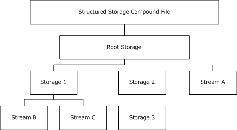
<!-- /Extracted images from page 6 -->

Figure 2: Structured storage compound file hierarchy that contains nested storage objects
and stream objects

Sections 1.7 and 2 of this specification are normative. All other sections and examples in this
specification are informative.

### 1.1 Glossary

This document uses the following terms:

access control list (ACL): A list of access control entries (ACEs) that collectively describe the

security rules for authorizing access to some resource; for example, an object or set of objects.

application: A participant that is responsible for beginning, propagating, and completing an atomic

transaction. An application communicates with a transaction manager in order to begin and
complete transactions. An application communicates with a transaction manager in order to
marshal transactions to and from other applications. An application also communicates in
application-specific ways with a resource manager in order to submit requests for work on
resources.

child object, children: An object that is not the root of its tree. The children of an object o are
the set of all objects whose parent is o. See section 1 of [MS-ADTS] and section 1 of [MS-
DRSR].

class identifier (CLSID): A GUID that identifies a software component; for instance, a DCOM

object class or a COM class.

compound file: A structure for storing a file system, similar to a simplified FAT file system inside a

single file, by dividing the single file into sectors.

Coordinated Universal Time (UTC): A high-precision atomic time standard that approximately
tracks Universal Time (UT). It is the basis for legal, civil time all over the Earth. Time zones
around the world are expressed as positive and negative offsets from UTC. In this role, it is also
referred to as Zulu time (Z) and Greenwich Mean Time (GMT). In these specifications, all
references to UTC refer to the time at UTC-0 (or GMT).

creation time: The time, in UTC, when a storage object was created.

6 / 46

[MS-CFB] - v20240423
Compound File Binary File Format
Copyright © 2024 Microsoft Corporation
Release: April 23, 2024

directory: The database that stores information about objects such as users, groups, computers,

printers, and the directory service that makes this information available to users and
applications.

directory entry: A structure that contains a storage object's or stream object's

FileInformation.

directory stream: An array of directory entries that are grouped into sectors.

double-indirect file allocation table (DIFAT): A structure that is used to locate FAT sectors in

a compound file.

file: An entity of data in the file system that a user can access and manage. A file has to have a
unique name in its directory. It consists of one or more streams of bytes that hold a set of
related data, plus a set of attributes also called properties that describe the file or the data
within the file. The creation time of a file is an example of a file attribute.

file allocation table (FAT): A data structure that the operating system creates when a volume is
formatted by using FAT or FAT32 file systems. The operating system stores information about
each file in the FAT so that it can retrieve the file later.

file system: A system that enables applications to store and retrieve files on storage devices.

Files are placed in a hierarchical structure. The file system specifies naming conventions for files
and the format for specifying the path to a file in the tree structure. Each file system consists of
one or more drivers and DLLs that define the data formats and features of the file system. File
systems can exist on the following storage devices: diskettes, hard disks, jukeboxes, removable
optical disks, and tape backup units.

globally unique identifier (GUID): A term used interchangeably with universally unique

identifier (UUID) in Microsoft protocol technical documents (TDs). Interchanging the usage of
these terms does not imply or require a specific algorithm or mechanism to generate the value.
Specifically, the use of this term does not imply or require that the algorithms described in
[RFC4122] or [C706] have to be used for generating the GUID. See also universally unique
identifier (UUID).

header: The structure at the beginning of a compound file.

little-endian: Multiple-byte values that are byte-ordered with the least significant byte stored in

the memory location with the lowest address.

mini FAT: A file allocation table (FAT) structure for the mini stream that is used to allocate

space in a small sector size.

mini stream: A structure that contains all user-defined data for stream objects less than a

predefined size limit.

modification time: The time, in UTC, when a storage object was last modified.

object: A set of attributes, each with its associated values. Two attributes of an object have special
significance: an identifying attribute and a parent-identifying attribute. An identifying attribute is
a designated single-valued attribute that appears on every object; the value of this attribute
identifies the object. For the set of objects in a replica, the values of the identifying attribute are
distinct. A parent-identifying attribute is a designated single-valued attribute that appears on
every object; the value of this attribute identifies the object's parent. That is, this attribute
contains the value of the parent's identifying attribute, or a reserved value identifying no object.
For the set of objects in a replica, the values of this parent-identifying attribute define a tree
with objects as vertices and child-parent references as directed edges with the child as an
edge's tail and the parent as an edge's head. Note that an object is a value, not a variable; a
replica is a variable. The process of adding, modifying, or deleting an object in a replica replaces
the entire value of the replica with a new value. As the word replica suggests, it is often the

7 / 46

[MS-CFB] - v20240423
Compound File Binary File Format
Copyright © 2024 Microsoft Corporation
Release: April 23, 2024

case that two replicas contain "the same objects". In this usage, objects in two replicas are
considered the same if they have the same value of the identifying attribute and if there is a
process in place (replication) to converge the values of the remaining attributes. When the
members of a set of replicas are considered to be the same, it is common to say "an object" as
shorthand referring to the set of corresponding objects in the replicas.

object class: In COM, a category of objects identified by a CLSID, members of which can be

obtained through activation of the CLSID.

parent object: An object is either the root of a tree of objects or has a parent. If two objects have

the same parent, they have to have different values in their relative distinguished names
(RDNs). See also, object in section 1 of [MS-ADTS] and section 1 of [MS-DRSR].

root storage object: A storage object in a compound file that has to be accessed before any other
storage objects and stream objects are referenced. It is the uppermost parent object in the
storage object and stream object hierarchy.

sector: The smallest addressable unit of a disk.

sector chain: A linked list of sectors, where each sector can be located in a different location

inside a compound file.

sector number: A nonnegative integer identifying a particular sector that is located in a

compound file.

sector size: The size, in bytes, of a sector in a compound file, typically 512 bytes.

storage: A storage object, as defined in [MS-CFB].

storage object: An object in a compound file that is analogous to a file system directory. The

parent object of a storage object has to be another storage object or the root storage
object.

stream: An element of a compound file, as described in [MS-CFB]. A stream contains a sequence

of bytes that can be read from or written to by an application, and they can exist only in
storages.

stream object: An object in a compound file that is analogous to a file system file. The

parent object of a stream object has to be a storage object or the root storage object.

Stream object: A Server object that is used to read and write large string and binary properties.

unallocated free sector: An empty sector that can be allocated to hold data.

Unicode: A character encoding standard developed by the Unicode Consortium that represents

almost all of the written languages of the world. The Unicode standard [UNICODE5.0.0/2007]
provides three forms (UTF-8, UTF-16, and UTF-32) and seven schemes (UTF-8, UTF-16, UTF-16
BE, UTF-16 LE, UTF-32, UTF-32 LE, and UTF-32 BE).

user-defined data: The main stream portion of a stream object.

UTF-16: A standard for encoding Unicode characters, defined in the Unicode standard, in which the

most commonly used characters are defined as double-byte characters. Unless specified
otherwise, this term refers to the UTF-16 encoding form specified in [UNICODE5.0.0/2007]
section 3.9.

MAY, SHOULD, MUST, SHOULD NOT, MUST NOT: These terms (in all caps) are used as defined
in [RFC2119]. All statements of optional behavior use either MAY, SHOULD, or SHOULD NOT.

[MS-CFB] - v20240423
Compound File Binary File Format
Copyright © 2024 Microsoft Corporation
Release: April 23, 2024

8 / 46

### 1.2 References

Links to a document in the Microsoft Open Specifications library point to the correct section in the
most recently published version of the referenced document. However, because individual documents
in the library are not updated at the same time, the section numbers in the documents may not
match. You can confirm the correct section numbering by checking the Errata.

#### 1.2.1 Normative References

We conduct frequent surveys of the normative references to assure their continued availability. If you
have any issue with finding a normative reference, please contact dochelp@microsoft.com. We will
assist you in finding the relevant information.

[MS-DTYP] Microsoft Corporation, "Windows Data Types".

[RFC2119] Bradner, S., "Key words for use in RFCs to Indicate Requirement Levels", BCP 14, RFC
2119, March 1997, https://www.rfc-editor.org/info/rfc2119

[UNICODE3.0.1] The Unicode Consortium, "Unicode Default Case Conversion Algorithm 3.0.1", August
2001, http://www.unicode.org/Public/3.1-Update1/CaseFolding-4.txt

[UNICODE5.0.0] The Unicode Consortium, "Unicode Default Case Conversion Algorithm 5.0.0", March
2006, http://www.unicode.org/Public/5.0.0/ucd/CaseFolding.txt

#### 1.2.2 Informative References

[MS-OLEDS] Microsoft Corporation, "Object Linking and Embedding (OLE) Data Structures".

[MS-OLEPS] Microsoft Corporation, "Object Linking and Embedding (OLE) Property Set Data
Structures".

[MSDN-SS] Microsoft Corporation, "Structured Storage", http://msdn.microsoft.com/en-
us/library/aa380369.aspx

[MSDN-STGMC] Microsoft Corporation, "STGM Constants", http://msdn.microsoft.com/en-
us/library/aa380337.aspx

### 1.3 Overview

A compound file is a structure that is used to store a hierarchy of storage objects and stream
objects into a single file or memory buffer.

A storage object is analogous to a file system directory. Just as a directory can contain other
directories and files, a storage object can contain other storage objects and stream objects. Also like a
directory, a storage object tracks the locations and sizes of the child storage object and stream
objects that are nested beneath it.

A stream object is analogous to the traditional notion of a file. Like a file, a stream contains user-
defined data that is stored as a consecutive sequence of bytes.

The hierarchy is defined by a parent object/child object relationship. Stream objects cannot
contain child objects. Storage objects can contain stream objects and/or other storage objects, each of
which has a name that uniquely identifies it among the child objects of its parent storage object.

The root storage object has no parent object. The root storage object also has no name. Because
names are used to identify child objects, a name for the root storage object is unnecessary and the
file format does not provide a representation for it.

9 / 46

[MS-CFB] - v20240423
Compound File Binary File Format
Copyright © 2024 Microsoft Corporation
Release: April 23, 2024

<!-- Extracted images from page 10 -->
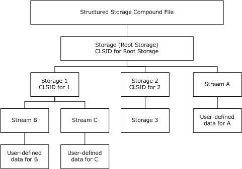
<!-- /Extracted images from page 10 -->

Figure 3: Example of a structured storage compound file

A compound file consists of the root storage object with optional child storage objects and stream
objects in a nested hierarchy. Stream objects can contain user-defined data that is stored as an array
of bytes. Storage objects can contain an object class GUID that is called a class identifier (CLSID),
which can identify an application that can read/write stream objects under that storage object.

The benefits of compound files include the following:

  Because the compound file implementation provides a file system-like abstraction within a file,
independent of the details of the underlying file system, compound files can be accessed by
different applications on different platform operating systems. The compound file can be a generic
container file format that holds data for multiple applications.

  Because the separate objects in a compound file are saved in a standard format, any browser

utility that is reading the standard format can list the storage objects and stream objects in the
compound file, even though data within a particular object can be in a proprietary format.

  Standardized data structures exist for writing certain types of stream objects--for example,

summary information property sets (for more information about property sets, see [MS-OLEPS]).
Applications can read these stream objects by using parsers for these data structures, even when
the rest of the stream objects cannot be understood.

The compound file implementation constructs a level of indirection by supporting a file system within a
file. A single flat file requires a large contiguous sequence of bytes on the disk. By contrast, compound
files define how to treat a single file as a structured collection of storage objects and stream objects
that act as file system directories and files, respectively.

[MS-CFB] - v20240423
Compound File Binary File Format
Copyright © 2024 Microsoft Corporation
Release: April 23, 2024

10 / 46

<!-- Extracted images from page 11 -->
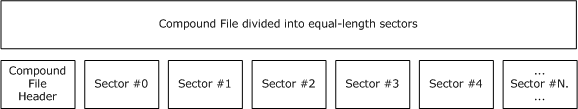
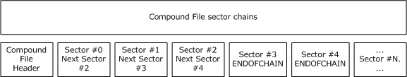
<!-- /Extracted images from page 11 -->

Figure 4: Example of a compound file showing equal-length sector divisions

A compound file is divided into equal-length sectors. The first sector contains the compound file
header. Subsequent sectors are identified by a 32-bit nonnegative integer number, called the sector
number.

A group of sectors can form a sector chain, which is a linked list of sectors forming a logical byte
array, even though the sectors can be in non-consecutive locations in the compound file. For example,
the following figure shows two sector chains. A sector chain starts at sector #0, continues to sector
#2, and ends at sector #4. Another sector chain starts at sector #1 and ends at sector #3.

Figure 5: Example of a compound file sector chain

A sector can be unallocated or free, in which case it is not part of a sector chain. A sector number is
used for the following purposes:

1.  A sector number is used to identify the file offset of that sector in a compound file.

2.  In a sector chain, a sector number is used to identify the next sector in the chain.

3.  Special sector numbers are used to represent chain termination and free sectors.

### 1.4 Relationship to Protocols and Other Structures

[MS-DTYP], "Windows Data Types", Revision 3.0, September 2007, MS-DTYP-v1.02.doc

The compound file internal structures use the following Windows data types:



FILETIME for storage timestamps

  GUID for storage objects object class ID

  ULONGLONG for stream sizes

  DWORD for sector numbers and various size fields

  USHORT for header and directory fields

  BYTE for header and directory fields

  WCHAR for storage and stream names

[MS-OLEPS] Microsoft OLE Property Set Data Structures

[MS-CFB] - v20240423
Compound File Binary File Format
Copyright © 2024 Microsoft Corporation
Release: April 23, 2024

11 / 46

OLE property sets are a standard set of stream formats that are typically implemented as compound
file stream objects. Most applications that save their data in compound files also write out
summary information property set data in the OLE property sets stream formats.

[MS-OLEDS] Microsoft OLE Data Structures

OLE linking and embedding streams and storages are used to contain data that is used by outside
applications that implement the OLE interfaces and APIs.

[UNICODE3.0.1] The Unicode Consortium, "Unicode Default Case Conversion Algorithm", Version
3.0.1, August 2001, http://www.unicode.org/Public/3.1-Update1/CaseFolding-4.txt

[UNICODE5.0.0] The Unicode Consortium, "Unicode Default Case Conversion Algorithm", Version
5.0.0, March 2006, http://www.unicode.org/Public/5.0.0/ucd/CaseFolding.txt

The Unicode Default Case Conversion Algorithm, simple case conversion variant, is used to compare
storage object and stream object names.

### 1.5 Applicability Statement

This protocol structure is recommended for persisting objects in a random access file system or
random access memory system.

This protocol is not recommended for real-time streaming, progressive rendering, or open-ended data
protocols where the size of streams is unknown when the compound file is transmitted. The known
size of all structures within a compound file needs to be specified when the compound file is
transmitted or retrieved.

### 1.6 Versioning and Localization

This document covers versioning issues in the following areas:

  Structure Versions: There are two versions of the compound file structure, version 3 and version
4. These versions are defined in section 2.2. In a version 4 compound file, all features of version 3
need to be implemented.

Implementations need to return an error when encountering a higher version than supported.
For example, if only a version 3 compound file is supported, the implementation needs to return
an error if a version 4 compound file is being opened.

  Localization: There is no localization-dependent structure content in the compound file structure.
In the implementation, all Unicode character comparisons need to be locale-invariant and all
timestamps need to be stored in the Coordinated Universal Time (UTC) time zone.

### 1.7 Vendor-Extensible Fields

A compound file does not contain any vendor-extensible fields. However, a compound file does contain
ways to store user-defined data in storage objects and stream objects. The vendor can store
vendor-specific data in user-defined data.

[MS-CFB] - v20240423
Compound File Binary File Format
Copyright © 2024 Microsoft Corporation
Release: April 23, 2024

12 / 46

<!-- Extracted images from page 13 -->
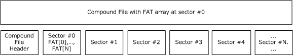
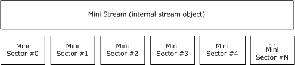
<!-- /Extracted images from page 13 -->

## 2 Structures

This document references commonly used data types as defined in [MS-DTYP].

Unless otherwise qualified, instances of GUID in this section refer to [MS-DTYP] section 2.3.4.

Figure 6: Sectors of a compound file with FAT array at sector #0

The main structure that is used to manage sector allocation and sector chains is the file allocation
table (FAT). The FAT contains an array of 32-bit sector numbers, where the index represents a
sector number, and its value represents the next sector in the chain or a special value.









 FAT[0] contains sector #0's next sector in the chain.

 FAT[1] contains sector #1's next sector in the chain.

 ...

 FAT[N] contains sector #N's next sector in the chain.

This allows a compound file to contain many sector chains in a single file. Many compound file
structures, including user-defined data, are implemented as sector chains that are represented in
the FAT.

Even the FAT array itself is represented as a sector chain. The sector chain holds both internal and
user-defined data streams. Because the FAT array is stored in a sector chain, the double-indirect file
allocation table (DIFAT) array is used to find the FAT sector locations. Each DIFAT array entry
contains a 32-bit sector number.









 DIFAT[0] contains FAT sector #0's location.

 DIFAT[1] contains FAT sector #1's location.

 ...

 DIFAT[N] contains FAT sector #N's location.

Because space for streams is always allocated in sector-sized blocks, storing objects that are much
smaller than the normal sector size (either 512 bytes or 4,096 bytes) can cause considerable waste.
As a solution to this problem, the concept of the mini FAT is introduced.

Figure 7: Mini sectors of a mini stream

[MS-CFB] - v20240423
Compound File Binary File Format
Copyright © 2024 Microsoft Corporation
Release: April 23, 2024

13 / 46

<!-- Extracted images from page 14 -->
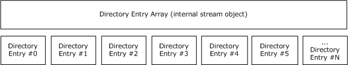
<!-- /Extracted images from page 14 -->

The mini FAT is structurally equivalent to the FAT, but it is used in a different way. The sector size for
objects that are represented in mini FAT is 64 bytes, instead of the 512 bytes or 4,096 bytes for
normal sectors. The space for these objects comes from a special stream that is called the mini
stream. The mini stream is an internal stream object that is divided into equal-length mini sectors.
Each mini FAT array entry contains a 32-bit sector number for the mini stream, not the file.









 MiniFAT[0] contains mini stream sector #0's next sector in the chain.

 MiniFAT[1] contains mini stream sector #1's next sector in the chain.

 ...

 MiniFAT[N] contains mini stream sector #N's next sector in the chain.

Stream objects that have a user-defined data length less than a cutoff (4,096 bytes) are allocated
with the mini FAT from the mini stream. Larger stream objects are allocated with the FAT from
unallocated free sectors in the file.

The names of all storage objects and stream objects, along with other object metadata like stream
size and storage CLSIDs, are found in the directory entry array. The space for the directory entry
array is allocated with the FAT like other sector chains.

  DirectoryEntry[0] contains information about the root storage object.

  DirectoryEntry[1] contains information about a storage object, stream object, or unallocated

object.



 ...

  DirectoryEntry[N] contains information about a storage object, stream object, or unallocated

object.

Figure 8: Entries of a directory entry array

[MS-CFB] - v20240423
Compound File Binary File Format
Copyright © 2024 Microsoft Corporation
Release: April 23, 2024

14 / 46

<!-- Extracted images from page 15 -->
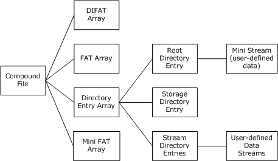
<!-- /Extracted images from page 15 -->

Figure 9: Summary of compound file internal streams and connections to user-defined data
streams

This diagram summarizes the compound file main internal streams and how they are linked to user-
defined data streams. The DIFAT, FAT, mini FAT, directory entry arrays, and mini stream are internal
streams, whereas the user-defined data streams link directly to their stream objects.

In a compound file, all integer fields, including Unicode characters that are encoded in UTF-16, MUST
be stored in little-endian byte order. The only exception is in user-defined data streams, where the
compound file structure does not impose any restrictions.

### 2.1 Compound File Sector Numbers and Types

Each sector, except for the header, is identified by a nonnegative, 32-bit sector number. The
following sector numbers above 0xFFFFFFFA are reserved and MUST NOT be used to identify the
location of a sector in a compound file.

Sector name

Integer value

Description

REGSECT

0x00000000 - 0xFFFFFFF9  Regular sector number.

MAXREGSECT  0xFFFFFFFA

Maximum regular sector number.

Not applicable  0xFFFFFFFB

Reserved for future use.

DIFSECT

0xFFFFFFFC

Specifies a DIFAT sector in the FAT.

FATSECT

0xFFFFFFFD

Specifies a FAT sector in the FAT.

ENDOFCHAIN

0xFFFFFFFE

End of a linked chain of sectors.

FREESECT

0xFFFFFFFF

Specifies an unallocated sector in the FAT, Mini FAT, or DIFAT.

The following list contains the types of sectors that are allowed in a compound file. Their structures
are described in sections 2.2 through 2.8.

[MS-CFB] - v20240423
Compound File Binary File Format
Copyright © 2024 Microsoft Corporation
Release: April 23, 2024

15 / 46

<!-- Extracted images from page 16 -->
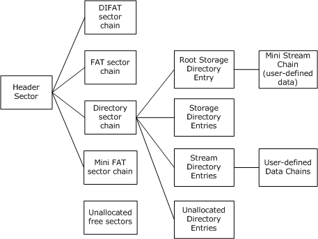
<!-- /Extracted images from page 16 -->

Sector type

Array entry
length

Purpose

Header

Not applicable

A single sector with fields that are needed to read the other structures of the
compound file. This sector must be at file offset 0.

FAT

4 bytes

Main allocator of space within the compound file.

DIFAT

4 bytes

Used to locate FAT sectors in the compound file.

Mini FAT

4 bytes

Allocator for mini stream  user-defined data.

Directory

128 bytes

Contains storage object and stream object metadata.

User-defined
Data

Not applicable

User-defined data for stream objects.

Range Lock

Not applicable

A single sector that is used to manage concurrent access to the compound
file. This sector must cover file offset 0x7FFFFFFF.

Unallocated
Free

Not applicable

Empty space in the compound file.

Compound file sectors can contain unallocated free space, user-defined data for stream objects,
directory sectors containing directory entries, FAT sectors containing the FAT entries, DIFAT sectors
containing the DIFAT entries, and mini FAT sectors containing the mini FAT entries. Compound file
sectors can be located at any sector-sized offset in the file, with the exception of the header and range
lock sector.

Figure 10: Example of the hierarchy of compound file sectors

[MS-CFB] - v20240423
Compound File Binary File Format
Copyright © 2024 Microsoft Corporation
Release: April 23, 2024

16 / 46

All the sector types are eventually linked back to the header sector, except for the range lock sector
and unallocated free sectors. Unallocated free sectors are marked in the FAT as FREESECT
(0xFFFFFFFF). Unallocated free sectors can be in the middle of the file, and they can be created by
extending the file size and allocating additional FAT sectors to cover the increased length. The range
lock sector is identified by a fixed file offset (0x7FFFFFFF) in the compound file.

In a compound file, all sector chains MUST contain valid sector numbers, less than or equal to
MAXREGSECT (0xFFFFFFFA). In a sector chain, the last sector's next pointer MUST be ENDOFCHAIN
(0xFFFFFFFE). All sectors in a sector chain MUST NOT be part of any other sector chain in the same
file. A sector chain MUST NOT link to a sector appearing earlier in the same chain, which would result
in a cycle. Finally, the actual sector count MUST match the size that is specified for a sector chain.

### 2.2 Compound File Header

The Compound File Header structure MUST be at the beginning of the file (offset 0).

0  1  2  3  4  5  6  7  8  9

1
0  1  2  3  4  5  6  7  8  9

2
0  1  2  3  4  5  6  7  8  9

3
0  1

Header Signature

...

Header CLSID (16 bytes)

Minor Version

Byte Order

Mini Sector Shift

...

...

...

Major Version

Sector Shift

Reserved

Number of Directory Sectors

Number of FAT Sectors

First Directory Sector Location

Transaction Signature Number

Mini Stream Cutoff Size

First Mini FAT Sector Location

Number of Mini FAT Sectors

First DIFAT Sector Location

[MS-CFB] - v20240423
Compound File Binary File Format
Copyright © 2024 Microsoft Corporation
Release: April 23, 2024

17 / 46

Number of DIFAT Sectors

DIFAT (436 bytes)

...

...

Header Signature (8 bytes): Identification signature for the compound file structure, and MUST be

set to the value 0xD0, 0xCF, 0x11, 0xE0, 0xA1, 0xB1, 0x1A, 0xE1.

Header CLSID (16 bytes): Reserved and unused class ID that MUST be set to all zeroes

(CLSID_NULL).

Minor Version (2 bytes): Version number for nonbreaking changes. This field SHOULD be set to

0x003E if the major version field is either 0x0003 or 0x0004.

Value  Meaning

0x003E

If major version field is either 0x0003 or 0x0004.

Major Version (2 bytes): Version number for breaking changes. This field MUST be set to either

0x0003 (version 3) or 0x0004 (version 4).

Name

Value

version 3  0x0003

version 4  0x0004

Byte Order (2 bytes): This field MUST be set to 0xFFFE. This field is a byte order mark for all integer

fields, specifying little-endian byte order.

Sector Shift (2 bytes): This field MUST be set to 0x0009, or 0x000c, depending on the Major
Version field. This field specifies the sector size of the compound file as a power of 2.





If Major Version is 3, the Sector Shift MUST be 0x0009, specifying a sector size of 512 bytes.

If Major Version is 4, the Sector Shift MUST be 0x000C, specifying a sector size of 4096 bytes.

Value

Meaning

Major Version
3

If Major Version is 3, the Sector Shift MUST be 0x0009, specifying a sector size of 512
bytes.

0x0009

Major Version
4

If Major Version is 4, the Sector Shift MUST be 0x000C, specifying a sector size of 4,096
bytes.

0x000C

Mini Sector Shift (2 bytes): This field MUST be set to 0x0006. This field specifies the sector size of

the Mini Stream as a power of 2. The sector size of the Mini Stream MUST be 64 bytes.

Reserved (6 bytes): This field MUST be set to all zeroes.

Number of Directory Sectors (4 bytes): This integer field contains the count of the number of

directory sectors in the compound file.

18 / 46

[MS-CFB] - v20240423
Compound File Binary File Format
Copyright © 2024 Microsoft Corporation
Release: April 23, 2024



If Major Version is 3, the Number of Directory Sectors MUST be zero. This field is not
supported for version 3 compound files.

Value

Meaning

0x00000000

If Major Version is 3, the Number of Directory Sectors MUST be zero.

Number of FAT Sectors (4 bytes): This integer field contains the count of the number of FAT

sectors in the compound file.

First Directory Sector Location (4 bytes): This integer field contains the starting sector number for

the directory stream.

Transaction Signature Number (4 bytes): This integer field MAY contain a sequence number that
is incremented every time the compound file is saved by an implementation that supports file
transactions. This is the field that MUST be set to all zeroes if file transactions are not
implemented.<1>

Mini Stream Cutoff Size (4 bytes): This integer field MUST be set to 0x00001000. This field

specifies the maximum size of a user-defined data stream that is allocated from the mini FAT
and mini stream, and that cutoff is 4,096 bytes. Any user-defined data stream that is greater than
or equal to this cutoff size must be allocated as normal sectors from the FAT.

First Mini FAT Sector Location (4 bytes): This integer field contains the starting sector number for

the mini FAT.

Number of Mini FAT Sectors (4 bytes): This integer field contains the count of the number of mini

FAT sectors in the compound file.

First DIFAT Sector Location (4 bytes): This integer field contains the starting sector number for

the DIFAT.

Number of DIFAT Sectors (4 bytes): This integer field contains the count of the number of DIFAT

sectors in the compound file.

DIFAT (436 bytes): This array of 32-bit integer fields contains the first 109 FAT sector locations of

the compound file.



For version 4 compound files, the header size (512 bytes) is less than the sector size (4,096
bytes), so the remaining part of the header (3,584 bytes) MUST be filled with all zeroes.

0  1  2  3  4  5  6  7  8  9

1
0  1  2  3  4  5  6  7  8  9

2
0  1  2  3  4  5  6  7  8  9

3
0  1

DIFAT[0]

DIFAT[1]

... DIFAT[N] (variable)

DIFAT[107]

DIFAT[108]

[MS-CFB] - v20240423
Compound File Binary File Format
Copyright © 2024 Microsoft Corporation
Release: April 23, 2024

19 / 46

<!-- Extracted images from page 20 -->
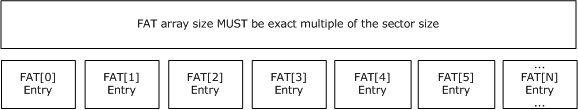
<!-- /Extracted images from page 20 -->

### 2.3 Compound File FAT Sectors

The FAT is the main allocator for space within a compound file. Every sector in the file is represented
within the FAT in some fashion, including those sectors that are unallocated (free). The FAT is a
sector chain that is made up of one or more FAT sectors.

Figure 11: Sectors of a FAT array

The FAT is an array of sector numbers that represent the allocation of space within the file, grouped
into FAT sectors. Each stream is represented in the FAT by a sector chain, in much the same fashion
as a FAT file system.

The set of FAT sectors can be considered together as a single array. Each entry in that array contains
the sector number of the next sector in the chain, and this sector number can be used as an index into
the FAT array to continue along the chain.

Special values are reserved for chain terminators (ENDOFCHAIN = 0xFFFFFFFE), free sectors
(FREESECT = 0xFFFFFFFF), and sectors that contain storage for FAT sectors (FATSECT =
0xFFFFFFFD) or DIFAT Sectors (DIFSECT = 0xFFFFFFC), which are not chained in the same way as the
others.

The locations of FAT sectors are read from the DIFAT. The FAT is represented in itself, but not by a
chain. A special reserved sector number (FATSECT = 0xFFFFFFFD) is used to mark sectors that are
allocated to the FAT.

A sector number can be converted into a byte offset into the file by using the following formula:
(sector number + 1) x Sector Size. This implies that sector #0 of the file begins at byte offset Sector
Size, not at 0.

The detailed FAT sector structure is specified below.

0  1  2  3  4  5  6  7  8  9

1
0  1  2  3  4  5  6  7  8  9

2
0  1  2  3  4  5  6  7  8  9

3
0  1

Next Sector in Chain (variable)

...

Next Sector in Chain (variable): This field specifies the next sector number in a chain of sectors.





If Header Major Version is 3, there MUST be 128 fields specified to fill a 512-byte sector.

If Header Major Version is 4, there MUST be 1,024 fields specified to fill a 4,096-byte sector.

The last FAT sector can have more entries that span past the actual size of the compound file. In
this case, the entries that cover past end-of-file MUST be marked with FREESECT (0xFFFFFFFF).
The size of a compound file is determined by the index of the last non-free FAT array entry. If the
last FAT sector contains an entry FAT[N] != FREESECT (0xFFFFFFFF), the file size MUST be at least
(N + 1) x (Sector Size) bytes in length.

[MS-CFB] - v20240423
Compound File Binary File Format
Copyright © 2024 Microsoft Corporation
Release: April 23, 2024

20 / 46

<!-- Extracted images from page 21 -->
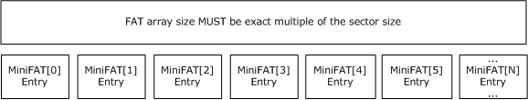
<!-- /Extracted images from page 21 -->

Value

Meaning

DIFSECT

DIFAT Sectors (DIFSECT = 0xFFFFFFC), which are not chained in the same way as the others.

0xFFFFFFC

FATSECT

Sectors that contain storage for FAT sectors (FATSECT = 0xFFFFFFFD).

0xFFFFFFFD

ENDOFCHAIN

Chain terminators (ENDOFCHAIN = 0xFFFFFFFE).

0xFFFFFFFE

FREESECT

Free sectors (FREESECT = 0xFFFFFFFF).

0xFFFFFFFF

### 2.4 Compound File Mini FAT Sectors

The mini FAT is used to allocate space in the mini stream. The mini stream is divided into smaller,
equal-length sectors, and the sector size that is used for the mini stream is specified from the
Compound File Header (64 bytes).

Figure 12: Sectors of a mini FAT array

The locations for mini FAT sectors are stored in a standard chain in the FAT, with the beginning of the
chain stored in the header (location of the first mini FAT starting sector).

A mini FAT sector number can be converted into a byte offset into the mini stream by using the
following formula: sector number x 64 bytes. This formula is different from the formula that is used
to convert a sector number into a byte offset in the file, because no header is stored in the mini
stream.

The mini stream is chained within the FAT in exactly the same fashion as any normal stream. The mini
stream's starting sector is referenced in the first directory entry (root storage stream ID 0).

If all of the user streams in the file are greater than the cutoff of 4,096 bytes, the mini FAT and mini
stream are not required. In this case, the location of the header's first mini FAT starting sector can be
set to ENDOFCHAIN, and the location of the root directory entry's starting sector can be set to
ENDOFCHAIN.

The detailed mini FAT sector structure is specified below.

0  1  2  3  4  5  6  7  8  9

1
0  1  2  3  4  5  6  7  8  9

2
0  1  2  3  4  5  6  7  8  9

3
0  1

Next Sector in Chain (variable)

...

[MS-CFB] - v20240423
Compound File Binary File Format
Copyright © 2024 Microsoft Corporation
Release: April 23, 2024

21 / 46

<!-- Extracted images from page 22 -->
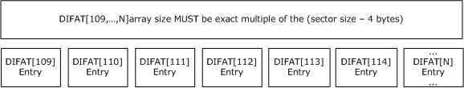
<!-- /Extracted images from page 22 -->

Next Sector in Chain (variable): This field specifies the next sector number in a chain of sectors.





If header Major Version is 3, there MUST be 128 fields specified to fill a 512-byte sector.

If Header Major Version is 4, there MUST be 1,024 fields specified to fill a 4,096-byte sector.

Value

Meaning

ENDOFCHAIN

Chain terminators (ENDOFCHAIN = 0xFFFFFFFE).

0xFFFFFFFE

### 2.5 Compound File DIFAT Sectors

The DIFAT array is used to represent storage of the FAT sectors. The DIFAT is represented by an
array of 32-bit sector numbers. The DIFAT array is stored both in the header and in DIFAT sectors.
In the header, the DIFAT array occupies 109 entries, and in each DIFAT sector, the DIFAT array
occupies the entire sector minus 4 bytes. (The last field is for chaining the DIFAT sector chain.)

Figure 13: Sectors of a DIFAT array

The DIFAT sectors are linked together by the last field in each DIFAT sector. As an optimization, the
first 109 FAT sectors are represented within the header itself. No DIFAT sectors are needed in a
compound file that is smaller than 6.875 megabytes (MB) for a 512-byte sector compound file (6.875
MB = (1 header sector + 109 FAT sectors x 128 non-empty entries) × 512 bytes per sector).

The DIFAT represents the FAT sectors in a different manner than the FAT represents a sector chain.
A particular index, n, into the DIFAT array will contain the sector number of the (n+1)th FAT sector.
For instance, index #3 in the DIFAT contains the sector number for the fourth FAT sector, because the
DIFAT array starts with index #0.

The storage for DIFAT sectors is reserved with the FAT, but it is not chained there. Space for DIFAT
sectors is marked by a special sector number, DIFSECT (0xFFFFFFFC).

The location of the first DIFAT sector is stored in the header.

A special value of ENDOFCHAIN (0xFFFFFFFE) is stored in the "Next DIFAT Sector Location" field of the
last DIFAT sector, or in the header when no DIFAT sectors are needed.

The detailed DIFAT sector structure is specified below.

0  1  2  3  4  5  6  7  8  9

1
0  1  2  3  4  5  6  7  8  9

2
0  1  2  3  4  5  6  7  8  9

3
0  1

FAT Sector Location (variable)

...

[MS-CFB] - v20240423
Compound File Binary File Format
Copyright © 2024 Microsoft Corporation
Release: April 23, 2024

22 / 46

<!-- Extracted images from page 23 -->
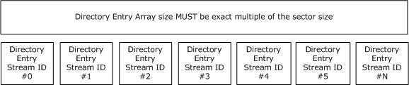
<!-- /Extracted images from page 23 -->

Next DIFAT Sector Location

FAT Sector Location (variable): This field specifies the FAT sector number in a DIFAT.





If Header Major Version is 3, there MUST be 127 fields specified to fill a 512-byte sector minus
the "Next DIFAT Sector Location" field.

If Header Major Version is 4, there MUST be 1,023 fields specified to fill a 4,096-byte sector
minus the "Next DIFAT Sector Location" field.

Next DIFAT Sector Location (4 bytes): This field specifies the next sector number in the DIFAT

chain of sectors. The first DIFAT sector is specified in the Header. The last DIFAT sector MUST set
this field to ENDOFCHAIN (0xFFFFFFFE).

Name

Value

ENDOFCHAIN  0xFFFFFFFE

### 2.6 Compound File Directory Sectors

The directory entry array is a structure that is used to contain information about the stream and
storage objects in a compound file, and to maintain a tree-style containment structure. The
directory entry array is allocated as a standard chain of directory sectors within the FAT. Each
directory entry is identified by a nonnegative number that is called the stream ID. The first sector of
the directory sector chain MUST contain the root storage directory entry as the first directory entry at
stream ID 0.

Figure 14: Sectors of a directory entry array

#### 2.6.1 Compound File Directory Entry

The directory entry array is an array of directory entries that are grouped into a directory sector.
Each storage object or stream object within a compound file is represented by a single directory
entry. The space for the directory sectors that are holding the array is allocated from the FAT.

The valid values for a stream ID, which are used in the Child ID, Right Sibling ID, and Left Sibling
ID fields, are 0 through MAXREGSID (0xFFFFFFFA). The special value NOSTREAM (0xFFFFFFFF) is
used as a terminator.

Stream ID name  Integer value

Description

REGSID

0x00000000 through 0xFFFFFFF9  Regular stream ID to identify the directory
entry.

MAXREGSID

0xFFFFFFFA

Maximum regular stream ID.

[MS-CFB] - v20240423
Compound File Binary File Format
Copyright © 2024 Microsoft Corporation
Release: April 23, 2024

23 / 46

Stream ID name  Integer value

Description

NOSTREAM

0xFFFFFFFF

Terminator or empty pointer.

The directory entry size is fixed at 128 bytes. The name in the directory entry is limited to 32
Unicode  UTF-16 code points, including the required Unicode terminating null character.

Directory entries are grouped into blocks to form directory sectors. There are four directory entries in
a 512-byte directory sector (version 3 compound file), and there are 32 directory entries in a 4,096-
byte directory sector (version 4 compound file). The number of directory entries can exceed the
number of storage objects and stream objects due to unallocated directory entries.

The detailed Directory Entry structure is specified below.

0  1  2  3  4  5  6  7  8  9

1
0  1  2  3  4  5  6  7  8  9

2
0  1  2  3  4  5  6  7  8  9

3
0  1

Directory Entry Name (64 bytes)

...

...

Directory Entry Name Length

Object Type

Color Flag

Left Sibling ID

Right Sibling ID

Child ID

CLSID (16 bytes)

...

...

State Bits

Creation Time

...

Modified Time

...

Starting Sector Location

Stream Size

...

[MS-CFB] - v20240423
Compound File Binary File Format
Copyright © 2024 Microsoft Corporation
Release: April 23, 2024

24 / 46

Directory Entry Name (64 bytes): This field MUST contain a Unicode string for the storage or

stream name encoded in UTF-16. The name MUST be terminated with a UTF-16 terminating null
character. Thus, storage and stream names are limited to 32 UTF-16 code points, including the
terminating null character. When locating an object in the compound file except for the root
storage, the directory entry name is compared by using a special case-insensitive uppercase
mapping, described in Red-Black Tree. The following characters are illegal and MUST NOT be part
of the name: '/', '\', ':', '!'.

Directory Entry Name Length (2 bytes): This field MUST match the length of the Directory Entry

Name Unicode string in bytes. The length MUST be a multiple of 2 and include the terminating null
character in the count. This length MUST NOT exceed 64, the maximum size of the Directory Entry
Name field.

Object Type (1 byte): This field MUST be 0x00, 0x01, 0x02, or 0x05, depending on the actual type

of object. All other values are not valid.

Name

Value

Unknown or unallocated  0x00

Storage Object

Stream Object

0x01

0x02

Root Storage Object

0x05

Color Flag (1 byte): This field MUST be 0x00 (red) or 0x01 (black). All other values are not valid.

Name  Value

red

0x00

black

0x01

Left Sibling ID (4 bytes): This field contains the stream ID of the left sibling. If there is no left

sibling, the field MUST be set to NOSTREAM (0xFFFFFFFF).

Value

REGSID

0x00000000 — 0xFFFFFFF9

Meaning

Regular stream ID to identify the directory entry.

MAXREGSID

0xFFFFFFFA

NOSTREAM

0xFFFFFFFF

Maximum regular stream ID.

If there is no left sibling.

Right Sibling ID (4 bytes): This field contains the stream ID of the right sibling. If there is no right

sibling, the field MUST be set to NOSTREAM (0xFFFFFFFF).

Value

REGSID

0x00000000 — 0xFFFFFFF9

MAXREGSID

0xFFFFFFFA

Meaning

Regular stream ID to identify the directory entry.

Maximum regular stream ID.

25 / 46

[MS-CFB] - v20240423
Compound File Binary File Format
Copyright © 2024 Microsoft Corporation
Release: April 23, 2024

Value

NOSTREAM

0xFFFFFFFF

Meaning

If there is no right sibling.

Child ID (4 bytes): This field contains the stream ID of a child object. If there is no child object,
including all entries for stream objects, the field MUST be set to NOSTREAM (0xFFFFFFFF).

Value

REGSID

0x00000000 — 0xFFFFFFF9

Meaning

Regular stream ID to identify the directory entry.

MAXREGSID

0xFFFFFFFA

NOSTREAM

0xFFFFFFFF

Maximum regular stream ID.

If there is no child object.

CLSID (16 bytes): This field contains an object class GUID, if this entry is for a storage object or

root storage object. For a stream object, this field MUST be set to all zeroes. A value containing all
zeroes in a storage or root storage directory entry is valid, and indicates that no object class is
associated with the storage. If an implementation of the file format enables applications to create
storage objects without explicitly setting an object class GUID, it MUST write all zeroes by default.
If this value is not all zeroes, the object class GUID can be used as a parameter to start
applications.

Value

Meaning

0x00000000000000000000000000000000  No object class is associated with the storage.

State Bits (4 bytes): This field contains the user-defined flags if this entry is for a storage object or

root storage object. For a stream object, this field SHOULD be set to all zeroes because many
implementations provide no way for applications to retrieve state bits from a stream object. If an
implementation of the file format enables applications to create storage objects without explicitly
setting state bits, it MUST write all zeroes by default.

Value

Meaning

0x00000000  Default value when no state bits are explicitly set on the object.

Creation Time (8 bytes): This field contains the creation time for a storage object, or all zeroes to
indicate that the creation time of the storage object was not recorded. The Windows FILETIME
structure is used to represent this field in UTC. For a stream object, this field MUST be all zeroes.
For a root storage object, this field MUST be all zeroes, and the creation time is retrieved or set on
the compound file itself.

Value

Meaning

0x0000000000000000  No creation time was recorded for the object.

Modified Time (8 bytes): This field contains the modification time for a storage object, or all

zeroes to indicate that the modified time of the storage object was not recorded. The Windows
FILETIME structure is used to represent this field in UTC. For a stream object, this field MUST be
all zeroes. For a root storage object, this field MAY<2> be set to all zeroes, and the modified time
is retrieved or set on the compound file itself.

26 / 46

[MS-CFB] - v20240423
Compound File Binary File Format
Copyright © 2024 Microsoft Corporation
Release: April 23, 2024

Value

Meaning

0x0000000000000000  No modified time was recorded for the object.

Starting Sector Location (4 bytes): This field contains the first sector location if this is a stream

object. For a root storage object, this field MUST contain the first sector of the mini stream, if the
mini stream exists. For a storage object, this field MUST be set to all zeroes.

Stream Size (8 bytes): This 64-bit integer field contains the size of the user-defined data if this is
a stream object. For a root storage object, this field contains the size of the mini stream. For a
storage object, this field MUST be set to all zeroes.



For a version 3 compound file 512-byte sector size, the value of this field MUST be less than
or equal to 0x80000000. (Equivalently, this requirement can be stated: the size of a stream or
of the mini stream in a version 3 compound file MUST be less than or equal to 2 gigabytes
(GB).) Note that as a consequence of this requirement, the most significant 32 bits of this field
MUST be zero in a version 3 compound file. However, implementers should be aware that
some older implementations did not initialize the most significant 32 bits of this field, and
these bits might therefore be nonzero in files that are otherwise valid version 3 compound
files. Although this document does not normatively specify parser behavior, it is recommended
that parsers ignore the most significant 32 bits of this field in version 3 compound files,
treating it as if its value were zero, unless there is a specific reason to do otherwise (for
example, a parser whose purpose is to verify the correctness of a compound file).

#### 2.6.2 Root Directory Entry

The first entry in the first sector of the directory chain (also referred to as the first element of the
directory array, or stream ID #0) is known as the root directory entry, and it is reserved for two
purposes. First, it provides a root parent for all objects that are stationed at the root of the compound
file. Second, its function is overloaded to store the size and starting sector for the mini stream.

The root directory entry behaves as both a stream and a storage object. The root directory entry's
Name field MUST contain the null-terminated string "Root Entry" in Unicode UTF-16.

The object class GUID (CLSID) that is stored in the root directory entry can be used for COM
activation of the document's application.

The time stamps for the root storage are not maintained in the root directory entry. Rather, the root
storage's creation and modification time stamps are normally stored on the file itself in the file
system.

The Creation Time field in the root storage directory entry MUST be all zeroes. The Modified Time
field in the root storage directory entry MAY be all zeroes.

#### 2.6.3 Other Directory Entries

Directory entries other than the root storage directory entry are marked as either stream objects,
storage objects, or unallocated objects.

The CLSID, state bits, creation time, modified time, and Child ID values are meaningful in directory
entries for storage objects but not for Stream objects.

The Starting Sector Location and Stream Size values are meaningful in directory entries for stream
objects but not for storage objects.

To determine the file location of actual stream data from a stream directory entry, it is necessary to
determine whether the stream exists as normal sectors allocated in the FAT or as mini sectors (from
the mini stream) allocated in the mini FAT. Streams whose size is less than the Mini Stream

27 / 46

[MS-CFB] - v20240423
Compound File Binary File Format
Copyright © 2024 Microsoft Corporation
Release: April 23, 2024

Cutoff Size value (typically 4,096 bytes) for the file exist in the mini stream. The Starting Sector
Location is used as an index into the mini FAT (which starts at mini FAT Starting Location) to track the
chain of sectors through the mini stream. Streams whose size is greater than or equal to the Mini
Stream Cutoff Size value for the file exist as standard streams. Their Starting Sector Location value
is used as an index into the standard FAT, which describes the chain of full sectors containing their
data.

For 512-byte sectors, the Stream Size upper 32-bits field MUST be set to zero when the compound
file is written. However, the high DWORD of this field was not initialized in older implementations, so
current implementations MUST accept uninitialized high DWORD for the Stream Size field. For version
4 compound files that support a 4,096-byte sector size, the Stream Size must be a full 64-bit
integer stream size.

Free (unused) directory entries are marked with Object Type 0x0 (unknown or unallocated). The
entire directory entry must consist of all zeroes except for the child, right sibling, and left sibling
pointers, which must be initialized to NOSTREAM (0xFFFFFFFF).

#### 2.6.4 Red-Black Tree

Each set of sibling objects in one level of the containment hierarchy (all child objects under a
storage object) is represented as a red-black tree. The parent object of this set of siblings will have
a pointer to the top of this tree.

A red-black tree is a special type of binary search tree where each node has a color attribute of red or
black. It allows efficient searching in the list of child objects under a storage object. The constraints on
a red-black tree allow the binary tree to be roughly balanced, so that insertion, deletion, and
searching operations are efficient.

To be valid, the red-black tree MUST maintain the following constraints:

1.  The root storage object MUST always be black. Because the root directory does not have

siblings, its color is irrelevant and can therefore be either red or black.

2.  Two consecutive nodes MUST NOT both be red.

3.  The left sibling MUST always be less than the right sibling. This sorting relationship is defined as

follows:

  A node that has a shorter name is less than a node that has a longer name. (Compare the

length of the names from the Directory Entry Name Length field.)





For nodes that have the same name length from Directory Entry Name Length, iterate
through each UTF-16 code point, one at a time, from the beginning of the Unicode string.

For each UTF-16 code point, convert to uppercase by using the Unicode Default Case
Conversion Algorithm, simple case conversion variant (simple case foldings), with the
following notes.<3>Compare each uppercased UTF-16 code point binary value.

  Unicode surrogate characters are never uppercased, because they are represented by two

UTF-16 code points, while the sorting relationship uppercases a single UTF-16 code point at a
time.



Lowercase characters that are defined in a newer, later version of the Unicode standard can be
uppercased by an implementation that conforms to that later Unicode standard.

The simplest implementation of the preceding invariants would be to mark every node as black, in
which case the tree is simply a binary tree. However, keeping the red-black tree balanced will typically
result in better read performance.

[MS-CFB] - v20240423
Compound File Binary File Format
Copyright © 2024 Microsoft Corporation
Release: April 23, 2024

28 / 46

<!-- Extracted images from page 29 -->
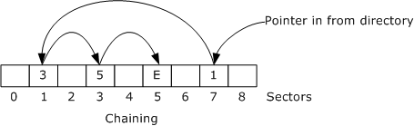
<!-- /Extracted images from page 29 -->

All sibling objects within a storage object (all immediate child objects in one level of the hierarchy)
MUST have unique names in the Directory Entry Name field, where uniqueness is determined by the
sorting relationship.

### 2.7 Compound File User-Defined Data Sectors

Stream sectors are simply collections of arbitrary bytes. They are the building blocks of user-
defined data streams, and no restrictions are imposed on their contents. User-defined data sectors
are represented as chains in the FAT or mini FAT, and each chain MUST have a single directory
entry associated with it to hold its stream object metadata, such as its name and size.

Figure 15: Example of a user-defined data sector chain

In the preceding example with sector #0 through sector #8 shown, a user-defined data sector chain
starts at sector #7, continues to sector #1, continues to sector #3, and ends with sector #5. The next
sector location for sector #5 points to ENDOFCHAIN (0xFFFFFFFE).

To hold all of the user-defined data, the length of the user-defined data sector chain MUST be greater
than or equal to the stream size that is specified in the stream object's directory entry. The unused
portion of the last sector of a stream object's user-defined data SHOULD be filled with zeroes to avoid
leaking unintended information.

### 2.8 Compound File Range Lock Sector

The range lock sector is the sector that covers file offsets 0x7FFFFF00-0x7FFFFFFF in the file, which
are just before 2 GB. These offsets are reserved for byte-range locking to support concurrency,
transactions, and other compound file features. The range lock sector MUST be allocated in the FAT
and marked with ENDOFCHAIN (0xFFFFFFFE), when the compound file grows beyond 2 GB. Because
512-byte compound files are limited to 2 GB in size for compatibility reasons, these files do not need a
range lock sector allocated. If the compound file is greater than 2 GB and then shrinks to below 2 GB,
the range lock sector SHOULD be marked as FREESECT (0xFFFFFFFF) in the FAT.

The range lock sector MUST NOT contain any user-defined data. The header, FAT, DIFAT, mini
FAT, and directory chains MUST NOT point to the range lock sector location.

### 2.9 Compound File Size Limits

The minimum size of a compound file is one header, one FAT sector, and one directory sector, which
is three sectors total. Therefore, a compound file MUST be at least three sectors in length.

A 512-byte sector compound file MUST be no greater than 2 GB in size for compatibility reasons. This
means that every stream, including the directory entry array and mini stream, inside a 512-byte
sector compound file MUST be less than 2 GB in size.

4,096-byte sector compound files can have 64-bit file and user-defined data stream sizes, up to
slightly less than 16 terabytes (4,096 bytes/sector x MAXREGSECT (0xFFFFFFFA) sectors).

29 / 46

[MS-CFB] - v20240423
Compound File Binary File Format
Copyright © 2024 Microsoft Corporation
Release: April 23, 2024

The maximum number of directory entries (storage objects and stream objects) is MAXREGSID
(0xFFFFFFFA), roughly 4 billion. This corresponds to a maximum directory sector chain length of
slightly less than 512 GB for a 4,096-byte sector compound file. (See section 2.6.1 for details about
directory-entry size and directory-sector composition.)

The maximum number of directory entries (storage objects, stream objects, and unallocated objects)
in a 512-byte sector compound file is limited by the 2-GB file size, resulting in 0x00FFFFFF (slightly
less than 16 million) directory entries.

The maximum size of the mini stream is MAXREGSECT (0xFFFFFFFA) x 64 bytes, which is slightly less
than 256 GB. The maximum size of the mini stream in a 512-byte sector compound file is limited by
the 2-GB file size.

[MS-CFB] - v20240423
Compound File Binary File Format
Copyright © 2024 Microsoft Corporation
Release: April 23, 2024

30 / 46

<!-- Extracted images from page 31 -->
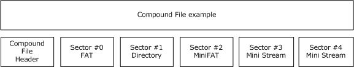
<!-- /Extracted images from page 31 -->

## 3 Structure Examples

This section contains a hexadecimal dump of a structured storage compound file to clarify the binary
file format. This compound file consists of the header sector plus five sectors that are numbered as
sector #0 through sector #4. The following example is a version 3 compound file that has a sector size
of 512 bytes.

Figure 16: Example of a compound file

### 3.1 The Header

Byte offset  Field name

Field value

0x0000

Header Signature

0xE11AB1A1E011CFD0

0x0008

Header CLSID

0x00000000000000000000000000000000 (null)

0x0018

Minor Version

0x001A

Major Version

0x001C

Byte Order

0x003E

0x0003

0xFFFE

0x001E

Sector Size

0x0009 (512 bytes per sector)

0x0020

Mini Stream Sector Size

0x0006 (64 bytes per Mini Stream sector)

0x0022

Reserved

0x0000 0x00000000

0x0028

Number of directory Sector

0x00000000 (not used for version 3)

0x002C

Number of FAT sectors

0x00000001 (1 FAT sector)

0x0030

Directory Starting Sector Location  0x00000001 (sector #1 for Directory)

0x0034

Transaction Signature

0x00000000 (not used)

0x0038

Mini Stream Size Cutoff

0x00001000 (4,096 bytes)

0x003C

Mini FAT Starting Sector Location

0x00000002 (sector #2 for Mini FAT)

0x0040

Number of Mini FAT sectors

0x00000001 (1 Mini FAT sector)

0x0044

DIFAT Start Sector Location

0xFFFFFFFE (ENDOFCHAIN)

0x0048

Number of DIFAT Sectors

0x00000000 (no DIFAT, less than 7 MB)

0x004C

DIFAT[0]

0x00000000 (sector #0 for FAT)

0x0050

DIFAT[1] through DIFAT[108]

0xFFFFFFFF (FREESECT) (free FAT sectors)

000000: D0CF 11E0 A1B1 1AE1 0000 0000 0000 0000 ................

[MS-CFB] - v20240423
Compound File Binary File Format
Copyright © 2024 Microsoft Corporation
Release: April 23, 2024

31 / 46

 000010: 0000 0000 0000 0000 3E00 0300 FEFF 0900 ........;.......
 000020: 0600 0000 0000 0000 0000 0000 0100 0000 ................
 000030: 0100 0000 0000 0000 0010 0000 0200 0000 ................
 000040: 0100 0000 FEFF FFFF 0000 0000 0000 0000 ................
 000050: FFFF FFFF FFFF FFFF FFFF FFFF FFFF FFFF ................
 000060: FFFF FFFF FFFF FFFF FFFF FFFF FFFF FFFF ................
 000070: FFFF FFFF FFFF FFFF FFFF FFFF FFFF FFFF ................
 000080: FFFF FFFF FFFF FFFF FFFF FFFF FFFF FFFF ................
 000090: FFFF FFFF FFFF FFFF FFFF FFFF FFFF FFFF ................
 0000A0: FFFF FFFF FFFF FFFF FFFF FFFF FFFF FFFF ................
 0000B0: FFFF FFFF FFFF FFFF FFFF FFFF FFFF FFFF ................
 0000C0: FFFF FFFF FFFF FFFF FFFF FFFF FFFF FFFF ................
 0000D0: FFFF FFFF FFFF FFFF FFFF FFFF FFFF FFFF ................
 0000E0: FFFF FFFF FFFF FFFF FFFF FFFF FFFF FFFF ................
 0000F0: FFFF FFFF FFFF FFFF FFFF FFFF FFFF FFFF ................
 000100: FFFF FFFF FFFF FFFF FFFF FFFF FFFF FFFF ................
 000110: FFFF FFFF FFFF FFFF FFFF FFFF FFFF FFFF ................
 000120: FFFF FFFF FFFF FFFF FFFF FFFF FFFF FFFF ................
 000130: FFFF FFFF FFFF FFFF FFFF FFFF FFFF FFFF ................
 000140: FFFF FFFF FFFF FFFF FFFF FFFF FFFF FFFF ................
 000150: FFFF FFFF FFFF FFFF FFFF FFFF FFFF FFFF ................
 000160: FFFF FFFF FFFF FFFF FFFF FFFF FFFF FFFF ................
 000170: FFFF FFFF FFFF FFFF FFFF FFFF FFFF FFFF ................
 000180: FFFF FFFF FFFF FFFF FFFF FFFF FFFF FFFF ................
 000190: FFFF FFFF FFFF FFFF FFFF FFFF FFFF FFFF ................
 0001A0: FFFF FFFF FFFF FFFF FFFF FFFF FFFF FFFF ................
 0001B0: FFFF FFFF FFFF FFFF FFFF FFFF FFFF FFFF ................
 0001C0: FFFF FFFF FFFF FFFF FFFF FFFF FFFF FFFF ................
 0001D0: FFFF FFFF FFFF FFFF FFFF FFFF FFFF FFFF ................
 0001E0: FFFF FFFF FFFF FFFF FFFF FFFF FFFF FFFF ................
 0001F0: FFFF FFFF FFFF FFFF FFFF FFFF FFFF FFFF ................

### 3.2 Sector #0: FAT Sector

This sector is the first and only FAT sector in the file, with five non-empty entries.

FAT[Sector #0]: 0xFFFFFFFD = FATSECT: marks this sector as a FAT sector.

FAT[Sector #1]: 0xFFFFFFFE = ENDOFCHAIN: marks the end of the directory chain.

FAT[Sector #2]: 0xFFFFFFFE = ENDOFCHAIN: marks the end of the mini FAT chain.

FAT[Sector #3]: 0x00000004 = pointer to the next sector in the "Stream 1" data.

FAT[Sector #4]: 0xFFFFFFFE = ENDOFCHAIN: marks the end of the "Stream 1" stream data.

FAT[Sector #5 through #127] 0xFFFFFFFF = FREESECT: empty unallocated free sectors.

Byte offset  Field name

Field value

0x0200

Next Sector in Chain  0xFFFFFFFD (FAT sector)

0x0204

Next Sector in Chain  0xFFFFFFFE (end of chain)

0x0208

Next Sector in Chain  0xFFFFFFFE (end of chain)

0x020C

Next Sector in Chain  0x00000004

0x0210

Next Sector in Chain  0xFFFFFFFE (end of chain)

0x0214

Next Sector in Chain  0xFFFFFFFF (empty)

 000200: FDFF FFFF FEFF FFFF FEFF FFFF 0400 0000 ................

[MS-CFB] - v20240423
Compound File Binary File Format
Copyright © 2024 Microsoft Corporation
Release: April 23, 2024

32 / 46

 000210: FEFF FFFF FFFF FFFF FFFF FFFF FFFF FFFF ................
 000220: FFFF FFFF FFFF FFFF FFFF FFFF FFFF FFFF ................
 000230: FFFF FFFF FFFF FFFF FFFF FFFF FFFF FFFF ................
 000240: FFFF FFFF FFFF FFFF FFFF FFFF FFFF FFFF ................
 000250: FFFF FFFF FFFF FFFF FFFF FFFF FFFF FFFF ................
 000260: FFFF FFFF FFFF FFFF FFFF FFFF FFFF FFFF ................
 000270: FFFF FFFF FFFF FFFF FFFF FFFF FFFF FFFF ................
 000280: FFFF FFFF FFFF FFFF FFFF FFFF FFFF FFFF ................
 000290: FFFF FFFF FFFF FFFF FFFF FFFF FFFF FFFF ................
 0002A0: FFFF FFFF FFFF FFFF FFFF FFFF FFFF FFFF ................
 0002B0: FFFF FFFF FFFF FFFF FFFF FFFF FFFF FFFF ................
 0002C0: FFFF FFFF FFFF FFFF FFFF FFFF FFFF FFFF ................
 0002D0: FFFF FFFF FFFF FFFF FFFF FFFF FFFF FFFF ................
 0002E0: FFFF FFFF FFFF FFFF FFFF FFFF FFFF FFFF ................
 0002F0: FFFF FFFF FFFF FFFF FFFF FFFF FFFF FFFF ................
 000300: FFFF FFFF FFFF FFFF FFFF FFFF FFFF FFFF ................
 000310: FFFF FFFF FFFF FFFF FFFF FFFF FFFF FFFF ................
 000320: FFFF FFFF FFFF FFFF FFFF FFFF FFFF FFFF ................
 000330: FFFF FFFF FFFF FFFF FFFF FFFF FFFF FFFF ................
 000340: FFFF FFFF FFFF FFFF FFFF FFFF FFFF FFFF ................
 000350: FFFF FFFF FFFF FFFF FFFF FFFF FFFF FFFF ................
 000360: FFFF FFFF FFFF FFFF FFFF FFFF FFFF FFFF ................
 000370: FFFF FFFF FFFF FFFF FFFF FFFF FFFF FFFF ................
 000260: FFFF FFFF FFFF FFFF FFFF FFFF FFFF FFFF ................
 000380: FFFF FFFF FFFF FFFF FFFF FFFF FFFF FFFF ................
 000390: FFFF FFFF FFFF FFFF FFFF FFFF FFFF FFFF ................
 0003A0: FFFF FFFF FFFF FFFF FFFF FFFF FFFF FFFF ................
 0003B0: FFFF FFFF FFFF FFFF FFFF FFFF FFFF FFFF ................
 0003C0: FFFF FFFF FFFF FFFF FFFF FFFF FFFF FFFF ................
 0003D0: FFFF FFFF FFFF FFFF FFFF FFFF FFFF FFFF ................
 0003E0: FFFF FFFF FFFF FFFF FFFF FFFF FFFF FFFF ................
 0003F0: FFFF FFFF FFFF FFFF FFFF FFFF FFFF FFFF ................

### 3.3 Sector #1: Directory Sector

This is the first and only directory sector in the file. This directory sector consists of four directory
entries.

Stream ID 0: Root Storage Name = "Root Entry" (section 2.6.2)

Stream ID 1: Storage Name = "Storage 1" (section 2.6.3)

Stream ID 2: Stream Name = "Stream 1" (section 2.6.3)

 Stream ID 3: Unused

#### 3.3.1 Stream ID 0: Root Directory Entry

Byte offset  Field name

Field value

0x0400

Directory Entry Name

"Root Entry" (section 2.6.2)

0x0440

Directory Entry Name Length  0x16 (22 bytes)

0x0442

Object Type

0x05 (root storage)

0x0443

Color Flag

0x01 (black)

0x0444

Left Sibling ID

0xFFFFFFFF (none)

0x0448

Right Sibling ID

0xFFFFFFFF (none)

[MS-CFB] - v20240423
Compound File Binary File Format
Copyright © 2024 Microsoft Corporation
Release: April 23, 2024

33 / 46

Byte offset  Field name

Field value

0x044C

Child ID

0x00000001 (Stream ID 1: "Storage 1" (section 2.6.3))

0x0450

CLSID

0x11CEC15456616700 0xAA005385 0x5BF9A100

0x0460

State Bits

0x00000000

0x0464

Creation Time

0x0000000000000000

0x046C

Modified Time

0x01BAB44B13921E80 (11/16/1995 5:43:45 PM)

0x0474

Starting Sector Location

0x00000003 (sector #3 for mini Stream)

0x0478

Stream Size

0x0000000000000240 (576 bytes)

 000400: 5200 6F00 6F00 7400 2000 4500 6E00 7400 R.o.o.t. .E.n.t.
 000410: 7200 7900 0000 0000 0000 0000 0000 0000 r.y.............
 000420: 0000 0000 0000 0000 0000 0000 0000 0000 ................
 000430: 0000 0000 0000 0000 0000 0000 0000 0000 ................
 000440: 1600 0501 FFFF FFFF FFFF FFFF 0100 0000 ................
 000450: 0067 6156 54C1 CE11 8553 00AA 00A1 F95B .gaVT....S.....[
 000460: 0000 0000 0000 0000 0000 0000 801E 9213 ................
 000470: 4BB4 BA01 0300 0000 4002 0000 0000 0000 K.......@.......

#### 3.3.2 Stream ID 1: Storage 1

Byte offset  Field name

Field value

0x0480

Directory Entry Name

"Storage 1"

0x04C0

Directory Entry Name Length  0x14 (20 bytes)

0x04C2

Object Type

0x01 (storage)

0x04C3

Color Flag

0x01 (black)

0x04C4

Left Sibling ID

0xFFFFFFFF (none)

0x04C8

Right Sibling ID

0xFFFFFFFF (none)

0x04CC

Child ID

0x00000002 (Stream ID 2: "Stream 1" )

0x04D0

CLSID

0x5BF9A100AA00538511CEC15456616100

0x04E0

State Bits

0x00000000

0x04E4

Creation Time

0x01BAB44B12F98800 (11/16/1995 5:43:44 PM)

0x04EC

Modified Time

0x01BAB44B13921E80 (11/16/1995 5:43:45 PM)

0x04F4

Starting Sector Location

0x00000000

0x04F8

Stream Size

0x0000000000000000 (0 bytes)

 000480: 5300 7400 6F00 7200 6100 6700 6500 2000 S.t.o.r.a.g.e. .
 000490: 3100 0000 0000 0000 0000 0000 0000 0000 1...............
 0004A0: 0000 0000 0000 0000 0000 0000 0000 0000 ................
 0004B0: 0000 0000 0000 0000 0000 0000 0000 0000 ................
 0004C0: 1400 0101 FFFF FFFF FFFF FFFF 0200 0000 ................
 0004D0: 0061 6156 54C1 CE11 8553 00AA 00A1 F95B .aaVT....S.....[
 0004E0: 0000 0000 0088 F912 4BB4 BA01 801E 9213 ........K.......
 0004F0: 4BB4 BA01 0000 0000 0000 0000 0000 0000 K...............

[MS-CFB] - v20240423
Compound File Binary File Format
Copyright © 2024 Microsoft Corporation
Release: April 23, 2024

34 / 46

#### 3.3.3 Stream ID 2: Stream 1

Byte offset  Field name

Field value

0x0500

Directory Entry Name

"Stream 1"

0x0540

Directory Entry Name Length  0x12 (18 bytes)

0x0542

Object Type

0x02 (stream)

0x0543

Color Flag

0x01 (black)

0x0544

Left Sibling ID

0xFFFFFFFF (none)

0x0548

Right Sibling ID

0xFFFFFFFF (none)

0x054C

Child ID

0xFFFFFFFF (none)

0x0550

CLSID

0x00000000000000000000000000000000 (null)

0x0560

State Bits

0x00000000

0x0564

Creation Time

0x0000000000000000

0x056C

Modified Time

0x0000000000000000

0x0574

Starting Sector Location

0x00000000 (sector #0 in mini FAT)

0x0578

Stream Size

0x0000000000000220 (544 bytes)

 000500: 5300 7400 7200 6500 6100 6D00 2000 3100 S.t.r.e.a.m. .1.
 000510: 0000 0000 0000 0000 0000 0000 0000 0000 ................
 000520: 0000 0000 0000 0000 0000 0000 0000 0000 ................
 000530: 0000 0000 0000 0000 0000 0000 0000 0000 ................
 000540: 1200 0201 FFFF FFFF FFFF FFFF FFFF FFFF ................
 000550: 0000 0000 0000 0000 0000 0000 0000 0000 ................
 000560: 0000 0000 0000 0000 0000 0000 0000 0000 ................
 000570: 0000 0000 0000 0000 2002 0000 0000 0000 ........ .......

#### 3.3.4 Stream ID 3: Unused, Free

Byte offset  Field name

Field value

0x0580

Directory Entry Name

""

0x05C0

Directory Entry Name Length  0x00 (0 bytes)

0x05C2

Object Type

0x00 (invalid)

0x05C3

Color Flag

0x00 (red)

0x05C4

Left Sibling ID

0xFFFFFFFF (none)

0x05C8

Right Sibling ID

0xFFFFFFFF (none)

0x05CC

Child ID

0xFFFFFFFF (none)

0x05D0

CLSID

0x00000000000000000000000000000000 (null)

0x05E0

State Bits

0x00000000

0x05E4

Creation Time

0x0000000000000000

0x05EC

Modified Time

0x0000000000000000

[MS-CFB] - v20240423
Compound File Binary File Format
Copyright © 2024 Microsoft Corporation
Release: April 23, 2024

35 / 46

Byte offset  Field name

Field value

0x05F4

Starting Sector Location

0x00000000

0x05F8

Stream Size

0x0000000000000000 (0 bytes)

All fields are zeroes except for the child, right sibling, and left sibling pointers, which are set to
NOSTREAM.

 000580: 0000 0000 0000 0000 0000 0000 0000 0000 ................
 000590: 0000 0000 0000 0000 0000 0000 0000 0000 ................
 0005A0: 0000 0000 0000 0000 0000 0000 0000 0000 ................
 0005B0: 0000 0000 0000 0000 0000 0000 0000 0000 ................
 0005C0: 0000 0000 FFFF FFFF FFFF FFFF FFFF FFFF ................
 0005D0: 0000 0000 0000 0000 0000 0000 0000 0000 ................
 0005E0: 0000 0000 0000 0000 0000 0000 0000 0000 ................
 0005F0: 0000 0000 0000 0000 0000 0000 0000 0000 ................

### 3.4 Sector #2: MiniFAT Sector

The mini FAT sector is identical to a FAT sector in structure, but instead of describing allocations for
the file, the mini FAT describes allocations for the mini stream. The following is a chain of eight
contiguous sectors.

MiniFAT[Sector #0]: 0x00000001: This sector points to the second sector of "Stream 1".

MiniFAT[Sector #1]: 0x00000002: This sector point to the third sector of "Stream 1".

MiniFAT[Sector #2]: 0x00000003: This sector points to the fourth sector of "Stream 1".

MiniFAT[Sector #3]: 0x00000004 : This sector points to the fifth sector of "Stream 1".

MiniFAT[Sector #4]: 0x00000005 : This sector points to the sixth sector of "Stream 1".

MiniFAT[Sector #5]: 0x00000006 : This sector points to the seventh sector of "Stream 1".

MiniFAT[Sector #6]: 0x00000007 : This sector points to the eighth sector of "Stream 1".

MiniFAT[Sector #7]: 0x00000008 : This sector points to the ninth sector of "Stream 1".

MiniFAT[Sector #8]: 0xFFFFFFFE = ENDOFCHAIN: marks the end of the "Stream 1" user-defined
data.

MiniFAT[Sector #9 through #127] 0xFFFFFFFF = FREESECT: empty unallocated free sectors.

Byte offset  Field name

Field value

0x0600

Next Sector in Chain  0x00000001

0x0604

Next Sector in Chain  0x00000002

0x0608

Next Sector in Chain  0x00000003

0x060C

Next Sector in Chain  0x00000004

0x0610

Next Sector in Chain  0x00000005

0x0614

Next Sector in Chain  0x00000006

0x0618

Next Sector in Chain  0x00000007

[MS-CFB] - v20240423
Compound File Binary File Format
Copyright © 2024 Microsoft Corporation
Release: April 23, 2024

36 / 46

Byte offset  Field name

Field value

0x061C

Next Sector in Chain  0x00000008

0x0620

Next Sector in Chain  0xFFFFFFFE (end of chain)

0x0624

Next Sector in Chain  0xFFFFFFFF (free)

 000600: 0100 0000 0200 0000 0300 0000 0400 0000 ................
 000610: 0500 0000 0600 0000 0700 0000 0800 0000 ................
 000620: FEFF FFFF FFFF FFFF FFFF FFFF FFFF FFFF ................
 000630: FFFF FFFF FFFF FFFF FFFF FFFF FFFF FFFF ................
 000640: FFFF FFFF FFFF FFFF FFFF FFFF FFFF FFFF ................
 000650: FFFF FFFF FFFF FFFF FFFF FFFF FFFF FFFF ................
 000660: FFFF FFFF FFFF FFFF FFFF FFFF FFFF FFFF ................
 000670: FFFF FFFF FFFF FFFF FFFF FFFF FFFF FFFF ................
 000680: FFFF FFFF FFFF FFFF FFFF FFFF FFFF FFFF ................
 000690: FFFF FFFF FFFF FFFF FFFF FFFF FFFF FFFF ................
 0006A0: FFFF FFFF FFFF FFFF FFFF FFFF FFFF FFFF ................
 0006B0: FFFF FFFF FFFF FFFF FFFF FFFF FFFF FFFF ................
 0006C0: FFFF FFFF FFFF FFFF FFFF FFFF FFFF FFFF ................
 0006D0: FFFF FFFF FFFF FFFF FFFF FFFF FFFF FFFF ................
 0006E0: FFFF FFFF FFFF FFFF FFFF FFFF FFFF FFFF ................
 0006F0: FFFF FFFF FFFF FFFF FFFF FFFF FFFF FFFF ................
 000700: FFFF FFFF FFFF FFFF FFFF FFFF FFFF FFFF ................
 000710: FFFF FFFF FFFF FFFF FFFF FFFF FFFF FFFF ................
 000720: FFFF FFFF FFFF FFFF FFFF FFFF FFFF FFFF ................
 000730: FFFF FFFF FFFF FFFF FFFF FFFF FFFF FFFF ................
 000740: FFFF FFFF FFFF FFFF FFFF FFFF FFFF FFFF ................
 000750: FFFF FFFF FFFF FFFF FFFF FFFF FFFF FFFF ................
 000760: FFFF FFFF FFFF FFFF FFFF FFFF FFFF FFFF ................
 000770: FFFF FFFF FFFF FFFF FFFF FFFF FFFF FFFF ................
 000780: FFFF FFFF FFFF FFFF FFFF FFFF FFFF FFFF ................
 000790: FFFF FFFF FFFF FFFF FFFF FFFF FFFF FFFF ................
 0007A0: FFFF FFFF FFFF FFFF FFFF FFFF FFFF FFFF ................
 0007B0: FFFF FFFF FFFF FFFF FFFF FFFF FFFF FFFF ................
 0007C0: FFFF FFFF FFFF FFFF FFFF FFFF FFFF FFFF ................
 0007D0: FFFF FFFF FFFF FFFF FFFF FFFF FFFF FFFF ................
 0007E0: FFFF FFFF FFFF FFFF FFFF FFFF FFFF FFFF ................
 0007F0: FFFF FFFF FFFF FFFF FFFF FFFF FFFF FFFF ................

### 3.5 Sector #3: Mini Stream Sector

The mini stream contains data for all streams whose length is less than the header's Mini Stream
Cutoff Size (4,096 bytes). In this example, the mini stream contains the user-defined data for
Stream 1. The unused portion of the sector is zeroed out.

 000800: 4461 7461 2066 6F72 2073 7472 6561 6D20 Data for stream
 000810: 3144 6174 6120 666F 7220 7374 7265 616D 1Data for stream
 000820: 2031 4461 7461 2066 6F72 2073 7472 6561  1Data for strea
 ...
 000A00: 7461 2066 6F72 2073 7472 6561 6D20 3144 ta for stream 1D
 000A10: 6174 6120 666F 7220 7374 7265 616D 2031 ata for stream 1

Although the user-defined data ends at file offset 0x000A1F, the mini stream sector is filled to the end
with known data, such as all zeroes, to prevent random disk or memory contents from contaminating
the file on-disk.

 000A20: 0000 0000 0000 0000 0000 0000 0000 0000 ................
 000A30: 0000 0000 0000 0000 0000 0000 0000 0000 ................
 000A40: 0000 0000 0000 0000 0000 0000 0000 0000 ................

37 / 46

[MS-CFB] - v20240423
Compound File Binary File Format
Copyright © 2024 Microsoft Corporation
Release: April 23, 2024

 000A50: 0000 0000 0000 0000 0000 0000 0000 0000 ................
 000A60: 0000 0000 0000 0000 0000 0000 0000 0000 ................
 000A70: 0000 0000 0000 0000 0000 0000 0000 0000 ................
 000A80: 0000 0000 0000 0000 0000 0000 0000 0000 ................
 000A90: 0000 0000 0000 0000 0000 0000 0000 0000 ................
 000AA0: 0000 0000 0000 0000 0000 0000 0000 0000 ................
 000AB0: 0000 0000 0000 0000 0000 0000 0000 0000 ................
 000AC0: 0000 0000 0000 0000 0000 0000 0000 0000 ................
 000AD0: 0000 0000 0000 0000 0000 0000 0000 0000 ................
 000AE0: 0000 0000 0000 0000 0000 0000 0000 0000 ................
 000AF0: 0000 0000 0000 0000 0000 0000 0000 0000 ................
 000B00: 0000 0000 0000 0000 0000 0000 0000 0000 ................
 000B10: 0000 0000 0000 0000 0000 0000 0000 0000 ................
 000B20: 0000 0000 0000 0000 0000 0000 0000 0000 ................
 000B30: 0000 0000 0000 0000 0000 0000 0000 0000 ................
 000B40: 0000 0000 0000 0000 0000 0000 0000 0000 ................
 000B50: 0000 0000 0000 0000 0000 0000 0000 0000 ................
 000B60: 0000 0000 0000 0000 0000 0000 0000 0000 ................
 000B70: 0000 0000 0000 0000 0000 0000 0000 0000 ................
 000B80: 0000 0000 0000 0000 0000 0000 0000 0000 ................
 000B90: 0000 0000 0000 0000 0000 0000 0000 0000 ................
 000BA0: 0000 0000 0000 0000 0000 0000 0000 0000 ................
 000BB0: 0000 0000 0000 0000 0000 0000 0000 0000 ................
 000BC0: 0000 0000 0000 0000 0000 0000 0000 0000 ................
 000BD0: 0000 0000 0000 0000 0000 0000 0000 0000 ................
 000BE0: 0000 0000 0000 0000 0000 0000 0000 0000 ................
 000BF0: 0000 0000 0000 0000 0000 0000 0000 0000 ................

[MS-CFB] - v20240423
Compound File Binary File Format
Copyright © 2024 Microsoft Corporation
Release: April 23, 2024

38 / 46

## 4 Security Considerations

### 4.1 Validation and Corruption

It is recommended that implementers be aware of the technical challenges of validating the CFB
format and the potential security implications of insufficient validation.

Due to the representation of sector chains, verifying the correctness of the FAT sectors of a
compound file (section 2.3) requires reads from the underlying storage medium (for example, disk)
with total read size linear in the total file size, as well as temporary storage (for example, RAM) linear
in the total file size. Similarly, verifying the correctness of the directory sectors of a compound file
(section 2.6) requires read size and temporary storage linear in the total number of directory entries,
that is, in the total number of stream objects and storage objects in the file. The flexibility of
sector allocation that is permitted by the format can increase the performance costs of validation in
practice because FAT sectors, directory sectors, and so forth are often noncontiguous.

If a parser has performance requirements, such as efficient access to small portions of a large file, it
might not be possible to both satisfy the performance requirements and completely validate
compound files. Parser implementers might instead choose to validate only the portions of the file that
are requested by an application.

Although details will vary between implementations, typical security concerns resulting from poorly
designed or insufficient validation include:

  References to sector numbers whose starting offset is past the end of the file, incorrect marking of
free sectors in the FAT, mismatches between stream sizes in the directory and the length of the
corresponding sector chains, and multiple sector chains referencing the same sectors can
potentially break the assumptions of sector allocation algorithms.



The representations of sector chains in FAT sectors and of parent/child and sibling relationships in
directory sectors make it possible for a corrupted file to represent cyclical references. Cyclical
references in the FAT or directory can cause naïve parsing algorithms to get stuck in an infinite
loop.

  Corruption of the red-black tree (section 2.6.4) representing the child objects of a storage object

can break the assumptions of directory entry allocation algorithms. Such corruption might
include improper sorting of child object names, invalid red/black marking, multiple child object
trees referencing the same directory entry, and the aforementioned cyclical references.

### 4.2 File Security

Because a compound file is stored as a single file in the file system, normal file-system security
mechanisms can be used to help secure the compound file. This includes read/write permissions,
access control list (ACL), and encryption (NTFS EFS or BitLocker) where appropriate.

### 4.3 Unallocated Ranges

Usually, a compound file includes ranges of bytes that are not allocated for either CFB structures or
user-defined data. For instance, each stream whose length is not an exact multiple of the sector size
requires a trailing portion of the last sector in the stream's sector chain to be unused.
Implementations that fail to initialize these byte ranges to zero (as recommended in section 2.7)
might unintentionally leak user data.

[MS-CFB] - v20240423
Compound File Binary File Format
Copyright © 2024 Microsoft Corporation
Release: April 23, 2024

39 / 46

## 5 Appendix A: Product Behavior

The information in this specification is applicable to the following Microsoft products or supplemental
software. References to product versions include updates to those products.

The terms "earlier" and "later", when used with a product version, refer to either all preceding
versions or all subsequent versions, respectively. The term "through" refers to the inclusive range of
versions. Applicable Microsoft products are listed chronologically in this section.

Windows Client

  Windows NT 4.0 operating system

  Windows 98 operating system

  Windows 2000 Professional operating system

  Windows Millennium Edition operating system

  Windows XP operating system

  Windows Vista operating system

  Windows 7 operating system

  Windows 8 operating system

  Windows 8.1 operating system

  Windows 10 operating system

  Windows 11 operating system

Windows Server

  Windows 2000 Server operating system

  Windows Server 2003 operating system

  Windows Server 2008 operating system

  Windows Server 2008 R2 operating system

  Windows Server 2012 operating system

  Windows Server 2012 R2 operating system

  Windows Server 2016 operating system

  Windows Server operating system

  Windows Server 2019 operating system

  Windows Server 2022 operating system

  Windows Server 2025 operating system

Exceptions, if any, are noted in this section. If an update version, service pack or Knowledge Base
(KB) number appears with a product name, the behavior changed in that update. The new behavior
also applies to subsequent updates unless otherwise specified. If a product edition appears with the
product version, behavior is different in that product edition.

40 / 46

[MS-CFB] - v20240423
Compound File Binary File Format
Copyright © 2024 Microsoft Corporation
Release: April 23, 2024

Unless otherwise specified, any statement of optional behavior in this specification that is prescribed
using the terms "SHOULD" or "SHOULD NOT" implies product behavior in accordance with the
SHOULD or SHOULD NOT prescription. Unless otherwise specified, the term "MAY" implies that the
product does not follow the prescription.

<1> Section 2.2: For all Windows versions except Windows 98 and Windows Millennium Edition, the
Header Transaction Signature Number can be nonzero if a compound file is opened and saved with
the STGM_TRANSACTED flag used in one of the following APIs: StgOpenStorage,
StgCreateDocfile, StgOpenStorageEx, StgCreateStorageEx. For more information about this flag
and the APIs, see [MSDN-STGMC].

<2> Section 2.6.1:  When Windows sets the modified time of a root storage, it sets the modified time
of the file in the file system (as described in section 2.6.2) and also sets the modified time in the root
storage directory entry. When Windows retrieves the modified time of a root storage, it gets the
modified time of the file in the file system but ignores the modified time in the root storage directory
entry.

<3> Section 2.6.4: For Windows XP and Windows Server 2003, the compound file implementation
conforms to the Unicode 3.0.1 Default Case Conversion Algorithm, simple case folding
[UNICODE3.0.1], with the following exceptions.

Added or subtracted
from Unicode 3.0.1

Lowercase UTF-16
code point

Uppercase UTF-16
code point

Uppercase Unicode name

Subtracted

Subtracted

Subtracted

Subtracted

0x280

0x0195

0x01BF

0x01F9

0x01A6

0x01F6

0x01F7

0x01F8

Subtracted

0x0219

0x0218

Subtracted

0x021B

0x021A

Subtracted

Subtracted

Subtracted

Subtracted

0x021D

0x021F

0x0223

0x0225

0x021C

0x021E

0x0222

0x0224

Subtracted

0x0227

0x0226

Subtracted

0x0229

0x0228

Subtracted

0x022B

0x022A

Subtracted

0x022D

0x022C

Subtracted

0x022F

0x022E

[MS-CFB] - v20240423
Compound File Binary File Format
Copyright © 2024 Microsoft Corporation
Release: April 23, 2024

LATIN LETTER YR

LATIN CAPITAL LETTER HWAIR

LATIN CAPITAL LETTER WYNN

LATIN CAPITAL LETTER N WITH
GRAVE

LATIN CAPITAL LETTER S WITH
COMMA BELOW

LATIN CAPITAL LETTER T WITH
COMMA BELOW

LATIN CAPITAL LETTER YOGH

LATIN CAPITAL LETTER H WITH
CARON

LATIN CAPITAL LETTER OU

LATIN CAPITAL LETTER Z WITH
HOOK

LATIN CAPITAL LETTER A WITH
DOT ABOVE

LATIN CAPITAL LETTER E WITH
CEDILLA

LATIN CAPITAL LETTER O WITH
DIAERESIS AND MACRON

LATIN CAPITAL LETTER O WITH
TILDE AND MACRON

LATIN CAPITAL LETTER O WITH
DOT ABOVE

41 / 46

Added or subtracted
from Unicode 3.0.1

Lowercase UTF-16
code point

Uppercase UTF-16
code point

Uppercase Unicode name

Subtracted

0x0231

0x0230

Subtracted

0x0233

0x0232

Subtracted

Subtracted

Subtracted

Subtracted

Subtracted

0x03DB

0x03DD

0x03DF

0x03E1

0x0450

0x03DA

0x03DC

0x03DE

0x03E0

0x0400

Subtracted

0x045D

0x040D

Subtracted

0x048D

0x048C

Subtracted

0x048F

0x048E

Subtracted

0x04ED

0x04EC

Added

Subtracted

0x03C2

0x03C2

0x03A3

0x03C2

LATIN CAPITAL LETTER O WITH
DOT ABOVE AND MACRON

LATIN CAPITAL LETTER Y WITH
MACRON

GREEK LETTER SIGMA

GREEK LETTER DIGAMMA

GREEK LETTER KOPPA

GREEK LETTER SAMPI

CYRILLIC CAPITAL LETTER IE
WITH GRAVE

CYRILLIC CAPITAL LETTER I WITH
GRAVE

CYRILLIC CAPITAL LETTER
SEMISOFT SIGN

CYRILLIC CAPITAL LETTER ER
WITH TICK

CYRILLIC CAPITAL LETTER E
WITH DIAERESIS

GREEK CAPITAL LETTER SIGMA

GREEK SMALL LETTER FINAL
SIGMA

For Windows Vista and later and for Windows Server 2008 and later, the compound file
implementation conforms to the Unicode 5.0 Default Case Conversion Algorithm, simple case folding
[UNICODE5.0.0], with the following exceptions.

Added or subtracted
from Unicode 5.0

Lowercase UTF-16
code point

Uppercase UTF-16
code point

Uppercase Unicode name

Added

0x023A

02C65

Subtracted

0x023A

0x023A

Added

0x2C65

0x2C65

Subtracted

0x2C65

0x023A

Added

0x023E

0x2C66

Subtracted

0x023E

0x023E

LATIN SMALL LETTER A WITH
STROKE

LATIN CAPITAL LETTER A WITH
STROKE

LATIN SMALL LETTER A WITH
STROKE

LATIN CAPITAL LETTER A WITH
STROKE

LATIN SMALL LETTER T WITH
DIAGONAL STROKE

LATIN CAPITAL LETTER T WITH
DIAGONAL STROKE

Added

0x2C66

0x2C66

LATIN SMALL LETTER T WITH

[MS-CFB] - v20240423
Compound File Binary File Format
Copyright © 2024 Microsoft Corporation
Release: April 23, 2024

42 / 46

Added or subtracted
from Unicode 5.0

Lowercase UTF-16
code point

Uppercase UTF-16
code point

Subtracted

0x2C66

0x023E

Added

Subtracted

Added

Subtracted

0x03C2

0x03C2

0x03C3

0x03C3

0x03A3

0x03C2

0x03A3

0x03C2

Added

0x1FC3

0x1FC3

Subtracted

0x1FC3

0x1FCC

Added

0x1FCC

0x1FC3

Subtracted

0x1FCC

0x1FCC

Ignored

any code point >
0xFFFF

same value (itself)

Uppercase Unicode name

DIAGONAL STROKE

LATIN CAPITAL LETTER T WITH
DIAGONAL STROKE

GREEK CAPITAL LETTER SIGMA

GREEK SMALL LETTER FINAL
SIGMA

GREEK CAPITAL LETTER SIGMA

GREEK SMALL LETTER FINAL
SIGMA

GREEK SMALL LETTER ETA WITH
PROSGEGRAMMENI

GREEK CAPITAL LETTER ETA WITH
PROSGEGRAMMENI

GREEK SMALL LETTER ETA WITH
PROSGEGRAMMENI

GREEK CAPITAL LETTER ETA WITH
PROSGEGRAMMENI

[MS-CFB] - v20240423
Compound File Binary File Format
Copyright © 2024 Microsoft Corporation
Release: April 23, 2024

43 / 46

## 6 Change Tracking

This section identifies changes that were made to this document since the last release. Changes are
classified as Major, Minor, or None.

The revision class Major means that the technical content in the document was significantly revised.
Major changes affect protocol interoperability or implementation. Examples of major changes are:

  A document revision that incorporates changes to interoperability requirements.
  A document revision that captures changes to protocol functionality.

The revision class Minor means that the meaning of the technical content was clarified. Minor changes
do not affect protocol interoperability or implementation. Examples of minor changes are updates to
clarify ambiguity at the sentence, paragraph, or table level.

The revision class None means that no new technical changes were introduced. Minor editorial and
formatting changes may have been made, but the relevant technical content is identical to the last
released version.

The changes made to this document are listed in the following table. For more information, please
contact dochelp@microsoft.com.

Section

Description

5 Appendix A: Product
Behavior

Added Windows Server 2025 to the list of applicable
products.

Revision
class

Major

[MS-CFB] - v20240423
Compound File Binary File Format
Copyright © 2024 Microsoft Corporation
Release: April 23, 2024

44 / 46

## 7 Index
A

Applicability 12

C

Change tracking 44
Common data types and fields 13
Compound file directory entry 23
Compound_File_DIFAT_Sectors packet 22
Compound_File_Directory_Entry packet 23
Compound_File_FAT_Sectors packet 20
Compound_File_Header packet 17
Compound_File_Mini_FAT_Sectors packet 21
Corruption 39

D

Data types and fields - common 13
Details
   common data types and fields 13
DIFAT sectors 22
Directory sectors
   compound file directory entry 23
   other directory entries 27
   overview 23
   red-black tree 28
   root directory entry 27

E

Examples 31
   header 31
   overview 31
   sector #0 - FAT sector 32
   Sector #0: FAT Sector 32
   sector #1 - directory sector 33
   Sector #1: Directory Sector 33
   sector #2 - MiniFAT sector 36
   Sector #2: MiniFAT Sector 36
   sector #3 - mini stream sector 37
   Sector #3: Mini Stream Sector 37
   The Header 31

F

FAT sectors 20
Fields - vendor-extensible 12
File security 39

G

Glossary 6

H

Header (section 2.2 17, section 3.1 31)

I

Informative references 9

[MS-CFB] - v20240423
Compound File Binary File Format
Copyright © 2024 Microsoft Corporation
Release: April 23, 2024

Introduction 5

L

Localization 12

M

Mini FAT sectors 21

N

Normative references 9

O

Overview 13
Overview (synopsis) 9

P

Product behavior 40

R

Range-lock sector 29
Red-black tree 28
References 9
   informative 9
   normative 9
Relationship to protocols and other structures 11
Root directory entry 27

S

Sector #0 - FAT sector 32
Sector #0: FAT Sector example 32
Sector #1 - directory sector 33
Sector #1: Directory Sector example 33
Sector #2 - MiniFAT sector 36
Sector #2: MiniFAT Sector example 36
Sector #3 - mini stream sector 37
Sector #3: Mini Stream Sector example 37
Sector numbers and types 15
Security
   file security 39
   unallocated ranges 39
   validation and corruption 39
Security considerations
   file security 39
   validation and corruption 39
Size limits 29
Structures
   overview 13

T

The Header example 31
Tracking changes 44

45 / 46

U

User-defined data sectors 29

V

Validation 39
Vendor-extensible fields 12
Versioning 12

[MS-CFB] - v20240423
Compound File Binary File Format
Copyright © 2024 Microsoft Corporation
Release: April 23, 2024

46 / 46

