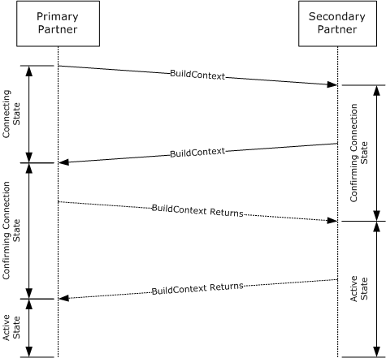
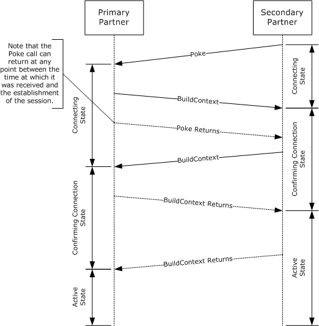
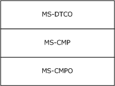
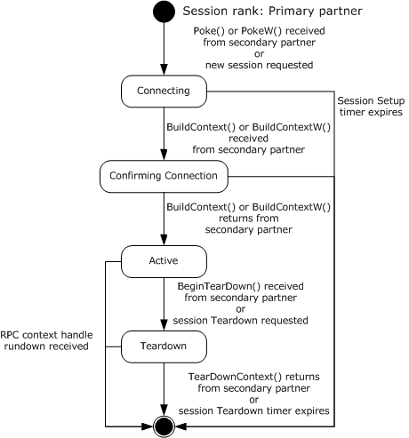
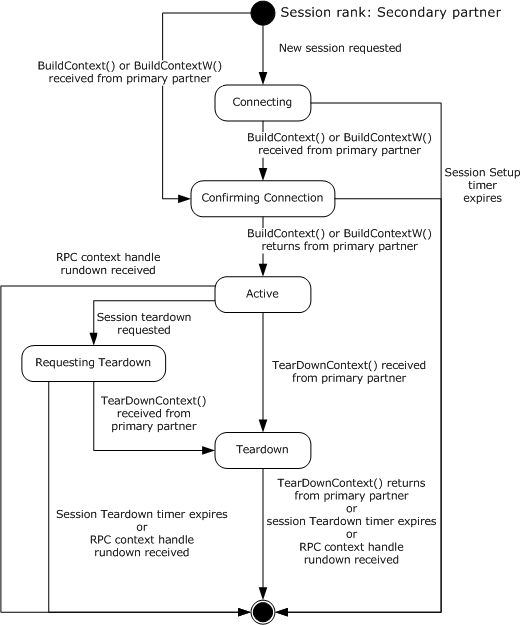

[MS-CMPO]:

MSDTC Connection Manager: OleTx Transports Protocol

Intellectual Property Rights Notice for Open Specifications Documentation

  Technical Documentation. Microsoft publishes Open Specifications documentation (“this

documentation”) for protocols, file formats, data portability, computer languages, and standards
support. Additionally, overview documents cover inter-protocol relationships and interactions.

  Copyrights. This documentation is covered by Microsoft copyrights. Regardless of any other

terms that are contained in the terms of use for the Microsoft website that hosts this
documentation, you can make copies of it in order to develop implementations of the technologies
that are described in this documentation and can distribute portions of it in your implementations
that use these technologies or in your documentation as necessary to properly document the
implementation. You can also distribute in your implementation, with or without modification, any
schemas, IDLs, or code samples that are included in the documentation. This permission also
applies to any documents that are referenced in the Open Specifications documentation.
  No Trade Secrets. Microsoft does not claim any trade secret rights in this documentation.
  Patents. Microsoft has patents that might cover your implementations of the technologies

described in the Open Specifications documentation. Neither this notice nor Microsoft's delivery of
this documentation grants any licenses under those patents or any other Microsoft patents.
However, a given Open Specifications document might be covered by the Microsoft Open
Specifications Promise or the Microsoft Community Promise. If you would prefer a written license,
or if the technologies described in this documentation are not covered by the Open Specifications
Promise or Community Promise, as applicable, patent licenses are available by contacting
iplg@microsoft.com.

  License Programs. To see all of the protocols in scope under a specific license program and the

associated patents, visit the Patent Map.

  Trademarks. The names of companies and products contained in this documentation might be
covered by trademarks or similar intellectual property rights. This notice does not grant any
licenses under those rights. For a list of Microsoft trademarks, visit
www.microsoft.com/trademarks.

  Fictitious Names. The example companies, organizations, products, domain names, email

addresses, logos, people, places, and events that are depicted in this documentation are fictitious.
No association with any real company, organization, product, domain name, email address, logo,
person, place, or event is intended or should be inferred.

Reservation of Rights. All other rights are reserved, and this notice does not grant any rights other
than as specifically described above, whether by implication, estoppel, or otherwise.

Tools. The Open Specifications documentation does not require the use of Microsoft programming
tools or programming environments in order for you to develop an implementation. If you have access
to Microsoft programming tools and environments, you are free to take advantage of them. Certain
Open Specifications documents are intended for use in conjunction with publicly available standards
specifications and network programming art and, as such, assume that the reader either is familiar
with the aforementioned material or has immediate access to it.

Support. For questions and support, please contact dochelp@microsoft.com.

[MS-CMPO] - v20240729
MSDTC Connection Manager: OleTx Transports Protocol
Copyright © 2024 Microsoft Corporation
Release: July 29, 2024

1 / 75

Revision Summary

Date

Revision
History

Revision
Class

Comments

4/3/2007

0.01

7/3/2007

1.0

7/20/2007

1.1

New

Major

Minor

Version 0.01 release

MLonghorn+90

Clarified the meaning of the technical content.

8/10/2007

1.1.1

Editorial

Changed language and formatting in the technical content.

9/28/2007

2.0

10/23/2007  3.0

Major

Major

Made a change to the IDL.

Updated and revised the technical content.

11/30/2007  3.0.1

Editorial

Changed language and formatting in the technical content.

1/25/2008

3.0.2

Editorial

Changed language and formatting in the technical content.

3/14/2008

4.0

Major

Updated and revised the technical content.

5/16/2008

4.0.1

Editorial

Changed language and formatting in the technical content.

6/20/2008

5.0

7/25/2008

5.1

8/29/2008

6.0

10/24/2008  7.0

12/5/2008

8.0

1/16/2009

9.0

2/27/2009

10.0

4/10/2009

11.0

5/22/2009

12.0

7/2/2009

13.0

8/14/2009

13.1

9/25/2009

14.0

11/6/2009

15.0

12/18/2009  16.0

1/29/2010

17.0

3/12/2010

18.0

4/23/2010

19.0

6/4/2010

20.0

7/16/2010

20.0

8/27/2010

20.0

Major

Minor

Major

Major

Major

Major

Major

Major

Major

Major

Minor

Major

Major

Major

Major

Major

Major

Major

None

None

Updated and revised the technical content.

Clarified the meaning of the technical content.

Updated and revised the technical content.

Updated and revised the technical content.

Updated and revised the technical content.

Updated and revised the technical content.

Updated and revised the technical content.

Updated and revised the technical content.

Updated and revised the technical content.

Updated and revised the technical content.

Clarified the meaning of the technical content.

Updated and revised the technical content.

Updated and revised the technical content.

Updated and revised the technical content.

Updated and revised the technical content.

Updated and revised the technical content.

Updated and revised the technical content.

Updated and revised the technical content.

No changes to the meaning, language, or formatting of the
technical content.

No changes to the meaning, language, or formatting of the

2 / 75

[MS-CMPO] - v20240729
MSDTC Connection Manager: OleTx Transports Protocol
Copyright © 2024 Microsoft Corporation
Release: July 29, 2024

Date

Revision
History

Revision
Class

Comments

technical content.

10/8/2010

20.0

None

No changes to the meaning, language, or formatting of the
technical content.

11/19/2010  20.0

1/7/2011

21.0

2/11/2011

22.0

3/25/2011

22.0

None

Major

Major

None

No changes to the meaning, language, or formatting of the
technical content.

Updated and revised the technical content.

Updated and revised the technical content.

No changes to the meaning, language, or formatting of the
technical content.

5/6/2011

22.0

None

No changes to the meaning, language, or formatting of the
technical content.

6/17/2011

22.1

Minor

Clarified the meaning of the technical content.

9/23/2011

22.1

None

No changes to the meaning, language, or formatting of the
technical content.

12/16/2011  23.0

Major

Updated and revised the technical content.

3/30/2012

23.0

None

No changes to the meaning, language, or formatting of the
technical content.

7/12/2012

23.0

None

No changes to the meaning, language, or formatting of the
technical content.

10/25/2012  23.1

Minor

Clarified the meaning of the technical content.

1/31/2013

23.1

None

No changes to the meaning, language, or formatting of the
technical content.

8/8/2013

23.2

Minor

Clarified the meaning of the technical content.

11/14/2013  23.2

None

No changes to the meaning, language, or formatting of the
technical content.

2/13/2014

23.2

None

No changes to the meaning, language, or formatting of the
technical content.

5/15/2014

23.2

None

No changes to the meaning, language, or formatting of the
technical content.

6/30/2015

24.0

Major

Significantly changed the technical content.

10/16/2015  24.0

None

No changes to the meaning, language, or formatting of the
technical content.

7/14/2016

24.0

None

No changes to the meaning, language, or formatting of the
technical content.

6/1/2017

24.0

9/15/2017

25.0

9/12/2018

26.0

None

Major

Major

No changes to the meaning, language, or formatting of the
technical content.

Significantly changed the technical content.

Significantly changed the technical content.

[MS-CMPO] - v20240729
MSDTC Connection Manager: OleTx Transports Protocol
Copyright © 2024 Microsoft Corporation
Release: July 29, 2024

3 / 75

Date

Revision
History

Revision
Class

Comments

4/7/2021

27.0

6/25/2021

28.0

4/23/2024

29.0

7/8/2024

30.0

7/29/2024

31.0

Major

Major

Major

Major

Major

Significantly changed the technical content.

Significantly changed the technical content.

Significantly changed the technical content.

Significantly changed the technical content.

Significantly changed the technical content.

[MS-CMPO] - v20240729
MSDTC Connection Manager: OleTx Transports Protocol
Copyright © 2024 Microsoft Corporation
Release: July 29, 2024

4 / 75

Table of Contents

1.3

1.1
1.2

1.2.1
1.2.2

1.3.1
1.3.2
1.3.3

1  Introduction ............................................................................................................ 7
Glossary ........................................................................................................... 7
References ........................................................................................................ 9
Normative References ................................................................................... 9
Informative References ............................................................................... 10
Overview ........................................................................................................ 10
Identifiers and Partner Roles ........................................................................ 10
Finding the RPC Endpoint and Constructing a Binding Handle ........................... 10
Session Lifecycle ........................................................................................ 11
Establishing a Session ........................................................................... 11
Negotiating Resources ........................................................................... 13
Sending and Receiving Messages ............................................................ 13
Terminating a Session ........................................................................... 14
Relationship to Other Protocols .......................................................................... 14
Prerequisites/Preconditions ............................................................................... 14
Applicability Statement ..................................................................................... 15
Versioning and Capability Negotiation ................................................................. 15
Vendor-Extensible Fields ................................................................................... 15
Standards Assignments ..................................................................................... 16

1.3.3.1
1.3.3.2
1.3.3.3
1.3.3.4

1.4
1.5
1.6
1.7
1.8
1.9

2.2

2.1

2.1.1
2.1.2
2.1.3

2  Messages ............................................................................................................... 17
Transport ........................................................................................................ 17
Protocol Sequences ..................................................................................... 17
Endpoints .................................................................................................. 17
Security..................................................................................................... 17
Common Data Types ........................................................................................ 17
BIND_INFO_BLOB ....................................................................................... 18
BIND_VERSION_SET ................................................................................... 18
BOUND_VERSION_SET ................................................................................ 19
COM_PROTOCOL ........................................................................................ 20
HRESULT ................................................................................................... 20
GUID/UUID ................................................................................................ 20
RESOURCE_TYPE ........................................................................................ 21
SESSION_RANK ......................................................................................... 21
TEARDOWN_TYPE ....................................................................................... 21
Constants Used in Method Definitions ............................................................ 21

2.2.1
2.2.2
2.2.3
2.2.4
2.2.5
2.2.6
2.2.7
2.2.8
2.2.9
2.2.10

3.2.1

3.1
3.2

3.2.1.1
3.2.1.2
3.2.1.3
3.2.1.4

3  Protocol Details ..................................................................................................... 22
Protocol Versioning ........................................................................................... 22
Common Details .............................................................................................. 22
Abstract Data Model .................................................................................... 22
Partner State ........................................................................................ 23
Session State ....................................................................................... 24
Cleaning Up a Session Object ................................................................. 26
Name Object ........................................................................................ 27
Name Object Comparison ................................................................. 27
Timers ...................................................................................................... 27
Session Setup Timer.............................................................................. 27
Session Teardown Timer ........................................................................ 27
Initialization ............................................................................................... 27
Initialization By a Higher-Level Protocol ................................................... 28
Initialization By the Protocol ................................................................... 28
Message Processing Events and Sequencing Rules .......................................... 28
Timer Events .............................................................................................. 28
Session Setup Timer.............................................................................. 28

3.2.2.1
3.2.2.2

3.2.3.1
3.2.3.2

3.2.4
3.2.5

3.2.1.4.1

3.2.5.1

3.2.2

3.2.3

[MS-CMPO] - v20240729
MSDTC Connection Manager: OleTx Transports Protocol
Copyright © 2024 Microsoft Corporation
Release: July 29, 2024

5 / 75

3.2.5.2

3.3

3.2.6

3.3.1
3.3.2
3.3.3
3.3.4

3.3.4.1
3.3.4.2

3.3.4.2.1
3.3.4.2.2

3.3.4.3
3.3.4.4
3.3.4.5

3.3.4.5.1
3.3.4.5.2
3.3.4.5.3

Session Teardown Timer ........................................................................ 29
Other Local Events ...................................................................................... 29
IXnRemote Server Details ................................................................................. 29
Abstract Data Model .................................................................................... 29
Timers ...................................................................................................... 30
Initialization ............................................................................................... 30
Message Processing Events and Sequencing Rules .......................................... 31
Poke (Opnum 0) ................................................................................... 31
BuildContext (Opnum 1) ........................................................................ 34
Primary .......................................................................................... 36
Secondary ...................................................................................... 38
NegotiateResources (Opnum 2) .............................................................. 39
SendReceive (Opnum 3) ........................................................................ 40
TearDownContext (Opnum 4) ................................................................. 41
Problem ......................................................................................... 42
Primary .......................................................................................... 42
Secondary ...................................................................................... 43
BeginTearDown (Opnum 5) .................................................................... 43
PokeW (Opnum 6)................................................................................. 44
BuildContextW (Opnum 7) ..................................................................... 45
Timer Events .............................................................................................. 47
Other Local Events ...................................................................................... 48
Context Handle Rundown ....................................................................... 48
IXnRemote Client Details .................................................................................. 48
Abstract Data Model .................................................................................... 48
Timers ...................................................................................................... 49
RPC Call Timer ...................................................................................... 49
Initialization ............................................................................................... 49
Message Processing Events and Sequencing Rules .......................................... 49
Timer Events .............................................................................................. 49
RPC Call Timer ...................................................................................... 49
Other Local Events ...................................................................................... 49
New Session Requested ......................................................................... 49
Primary .......................................................................................... 49
Secondary ...................................................................................... 50
Forced Session Teardown Requested ....................................................... 51
Problem Session Teardown Requested ..................................................... 51
Resource Allocation Requested ............................................................... 52
Message Send Requested ....................................................................... 52

3.4.5.1

3.4.6.1

3.4.6.1.1
3.4.6.1.2

3.4.6.2
3.4.6.3
3.4.6.4
3.4.6.5

3.3.4.6
3.3.4.7
3.3.4.8

3.3.5
3.3.6

3.3.6.1

3.4.2.1

3.4

3.4.1
3.4.2

3.4.3
3.4.4
3.4.5

3.4.6

4.1
4.2
4.3
4.4

4  Protocol Examples ................................................................................................. 53
Initiating a Session as Primary Partner ............................................................... 53
Initiating a Session as Secondary Partner ............................................................ 56
Negotiating Connection Resources ...................................................................... 59
Terminating a Session ...................................................................................... 60
Terminating a Session by a Primary Partner ................................................... 60
Terminating a Session by a Secondary Partner ............................................... 61

4.4.1
4.4.2

5  Security ................................................................................................................. 63
Security Considerations for Implementers ........................................................... 63
Index of Security Parameters ............................................................................ 63

5.1
5.2

6  Appendix A: Full IDL .............................................................................................. 64

7  Appendix B: Product Behavior ............................................................................... 67

8  Change Tracking .................................................................................................... 72

9  Index ..................................................................................................................... 73

[MS-CMPO] - v20240729
MSDTC Connection Manager: OleTx Transports Protocol
Copyright © 2024 Microsoft Corporation
Release: July 29, 2024

6 / 75

1  Introduction

This document specifies the MSDTC Connection Manager: OleTx Transports Protocol. The MSDTC
Connection Manager: OleTx Transports Protocol is a remote procedure call (RPC) interface for
establishing duplex sessions between two partners and for exchanging messages between them.
The MSDTC Connection Manager: OleTx Transports Protocol is a framing and message transport
protocol and, as such, is designed to have other protocols layered over the basic session, messaging,
and security services that it provides.

Sections 1.5, 1.8, 1.9, 2, and 3 of this specification are normative. All other sections and examples in
this specification are informative.

1.1  Glossary

This document uses the following terms:

authenticated RPC call: An RPC call that establishes authentication information through the use

of the rpc_binding_set_auth_info procedure defined in [C706], the security provider extension
defined in [MS-RPCE] section 2.2.1.1.7, and the authentication levels extension defined in [MS-
RPCE] section 2.2.1.1.8.

client: A computer on which the remote procedure call (RPC) client is executing.

connection: In OleTx, an ordered set of logically related messages. The relationship between the
messages is defined by the higher-layer protocol, but they are guaranteed to be delivered
exactly one time and in order relative to other messages in the connection.

contact identifier: A universally unique identifier (UUID) that identifies a partner in the

MSDTC Connection Manager: OleTx Transports Protocol. These UUIDs are frequently converted
to and from string representations. This string representation has to follow the format specified
in [C706] Appendix A. In addition, the UUIDs have to be compared, as specified in [C706]
Appendix A.

dynamic endpoint: A network-specific server address that is requested and assigned at run time.

For more information, see [C706].

endpoint: A remote procedure call (RPC) dynamic endpoint, as specified in [C706], part 4.

endpoint mapper: A service on a remote procedure call (RPC) server that maintains a

database of dynamic endpoints and allows clients to map an interface/object UUID pair to a
local dynamic endpoint. For more information, see [C706].

globally unique identifier (GUID): A term used interchangeably with universally unique

identifier (UUID) in Microsoft protocol technical documents (TDs). Interchanging the usage of
these terms does not imply or require a specific algorithm or mechanism to generate the value.
Specifically, the use of this term does not imply or require that the algorithms described in
[RFC4122] or [C706] have to be used for generating the GUID. See also universally unique
identifier (UUID).

Interface Definition Language (IDL): The International Standards Organization (ISO) standard

language for specifying the interface for remote procedure calls. For more information, see
[C706] section 4.

level-three protocol: The MSDTC Connection Manager: OleTx Transports Protocol is designed to

be a transport protocol over which two other protocols are layered. When used in this document,
level-three protocol refers to the protocol that is layered immediately on top of the level-two
protocol, as described in section 2.2.2. [MS-DTCO] is an implementation of a level-three
protocol; however, any other custom implementation could be used.

7 / 75

[MS-CMPO] - v20240729
MSDTC Connection Manager: OleTx Transports Protocol
Copyright © 2024 Microsoft Corporation
Release: July 29, 2024

level-two protocol: The MSDTC Connection Manager: OleTx Transports Protocol is designed to be
a transport protocol over which two other protocols are layered. When used in this document,
level-two protocol refers to the protocol that is layered immediately on top of MSDTC
Connection Manager: OleTx Transports Protocol, as described in section 2.2.2. [MS-CMP] is an
implementation of a level-two protocol; however, any other custom implementation could be
used.

Microsoft Interface Definition Language (MIDL): The Microsoft implementation and extension
of the OSF-DCE Interface Definition Language (IDL). MIDL can also mean the Interface
Definition Language (IDL) compiler provided by Microsoft. For more information, see [MS-
RPCE].

NetBIOS name: A 16-byte address that is used to identify a NetBIOS resource on the network.

For more information, see [RFC1001] and [RFC1002].

Network Data Representation (NDR): A specification that defines a mapping from Interface
Definition Language (IDL) data types onto octet streams. NDR also refers to the runtime
environment that implements the mapping facilities (for example, data provided to NDR). For
more information, see [MS-RPCE] and [C706] section 14.

opnum: An operation number or numeric identifier that is used to identify a specific remote

procedure call (RPC) method or a method in an interface. For more information, see [C706]
section 12.5.2.12 or [MS-RPCE].

partner: A participant in the MSDTC Connection Manager: OleTx Transports Protocol. Each

partner has its own contact identifier (CID), and uses the IXnRemote interface to invoke and
receive remote procedure calls (RPCs). The IXnRemote interface is described within the full
Interface Definition Language (IDL) for [MS-CMPO] in section 6.

primary partner: One of the two participants in an MSDTC Connection Manager: OleTx Transports

Protocol session. The primary partner is the partner with the larger CID, as specified in
[C706] Appendix A, where larger means that the CID of the primary partner follows the CID
of the other partner.

remote procedure call (RPC): A communication protocol used primarily between client and

server. The term has three definitions that are often used interchangeably: a runtime
environment providing for communication facilities between computers (the RPC runtime); a set
of request-and-response message exchanges between computers (the RPC exchange); and the
single message from an RPC exchange (the RPC message).  For more information, see [C706].

RPC protocol sequence: A character string that represents a valid combination of a remote

procedure call (RPC) protocol, a network layer protocol, and a transport layer protocol, as
described in [C706] and [MS-RPCE].

RPC server: A computer on the network that waits for messages, processes them when they

arrive, and sends responses using RPC as its transport acts as the responder during a remote
procedure call (RPC) exchange.

RPC transfer syntax: A method for encoding messages defined in an Interface Definition

Language (IDL) file. Remote procedure call (RPC) can support different encoding methods or
transfer syntaxes. For more information, see [C706].

RPC transport: The underlying network services used by the remote procedure call (RPC) runtime

for communications between network nodes. For more information, see [C706] section 2.

secondary partner: One of the two participants in an MSDTC Connection Manager: OleTx

Transports Protocol session. The secondary partner is the partner with the smaller CID, as
specified in [C706] Appendix A, where smaller means that the CID of the secondary partner
precedes the CID of the other partner.

[MS-CMPO] - v20240729
MSDTC Connection Manager: OleTx Transports Protocol
Copyright © 2024 Microsoft Corporation
Release: July 29, 2024

8 / 75

security level: An implementation-specific enumeration value that specifies the security behavior

of a protocol partner. The generic values of this enumeration are described in [MS-CMPO]
section 3.2.1.1.

security provider: A pluggable security module that is specified by the protocol layer above the

remote procedure call (RPC) layer, and will cause the RPC layer to use this module to secure
messages in a communication session with the server. The security provider is sometimes
referred to as an authentication service. For more information, see [C706] and [MS-RPCE].

session: In OleTx, a transport-level connection between a Transaction Manager and another

Distributed Transaction participant over which multiplexed logical connections and messages
flow. A session remains active so long as there are logical connections using it.

session rank: The role of a partner in an [MS-CMPO] session, either primary or secondary. The

rank is determined by comparing the CIDs of the two partners (as specified in [C706] Appendix
A). The partner with the larger CID is the primary partner; the CID of the primary partner
follows the CID of the other partner. The partner with the smaller CID is the secondary
partner; the CID of the secondary partner precedes the CID of the other partner.

unauthenticated RPC call: An RPC call that does not establish authentication information

through the use of the rpc_binding_set_auth_info procedure defined in [C706], the security
provider extension defined in [MS-RPCE] section 2.2.1.1.7, and the authentication levels
extension defined in [MS-RPCE] section 2.2.1.1.8.

universally unique identifier (UUID): A 128-bit value. UUIDs can be used for multiple

purposes, from tagging objects with an extremely short lifetime, to reliably identifying very
persistent objects in cross-process communication such as client and server interfaces, manager
entry-point vectors, and RPC objects. UUIDs are highly likely to be unique. UUIDs are also
known as globally unique identifiers (GUIDs) and these terms are used interchangeably in
the Microsoft protocol technical documents (TDs). Interchanging the usage of these terms does
not imply or require a specific algorithm or mechanism to generate the UUID. Specifically, the
use of this term does not imply or require that the algorithms described in [RFC4122] or [C706]
has to be used for generating the UUID.

MAY, SHOULD, MUST, SHOULD NOT, MUST NOT: These terms (in all caps) are used as defined
in [RFC2119]. All statements of optional behavior use either MAY, SHOULD, or SHOULD NOT.

1.2  References

Links to a document in the Microsoft Open Specifications library point to the correct section in the
most recently published version of the referenced document. However, because individual documents
in the library are not updated at the same time, the section numbers in the documents may not
match. You can confirm the correct section numbering by checking the Errata.

1.2.1  Normative References

We conduct frequent surveys of the normative references to assure their continued availability. If you
have any issue with finding a normative reference, please contact dochelp@microsoft.com. We will
assist you in finding the relevant information.

[C706] The Open Group, "DCE 1.1: Remote Procedure Call", C706, August 1997,
https://publications.opengroup.org/c706

Note Registration is required to download the document.

[MS-DTYP] Microsoft Corporation, "Windows Data Types".

[MS-ERREF] Microsoft Corporation, "Windows Error Codes".

[MS-CMPO] - v20240729
MSDTC Connection Manager: OleTx Transports Protocol
Copyright © 2024 Microsoft Corporation
Release: July 29, 2024

9 / 75

[MS-RPCE] Microsoft Corporation, "Remote Procedure Call Protocol Extensions".

[NETBEUI] IBM Corporation, "LAN Technical Reference: 802.2 and NetBIOS APIs", 1986,
https://www.ardent-tool.com/docs/boo/bk8p7001.boo

Note Requires IBM Softcopy Reader for Windows V4.0 to read the file.

[RFC1001] Network Working Group, "Protocol Standard for a NetBIOS Service on a TCP/UDP
Transport: Concepts and Methods", RFC 1001, March 1987, https://www.rfc-editor.org/info/rfc1001

[RFC1002] Network Working Group, "Protocol Standard for a NetBIOS Service on a TCP/UDP
Transport: Detailed Specifications", STD 19, RFC 1002, March 1987, https://www.rfc-
editor.org/info/rfc1002

[RFC2119] Bradner, S., "Key words for use in RFCs to Indicate Requirement Levels", BCP 14, RFC
2119, March 1997, https://www.rfc-editor.org/info/rfc2119

1.2.2  Informative References

[MS-CMOM] Microsoft Corporation, "MSDTC Connection Manager: OleTx Management Protocol".

[MS-CMP] Microsoft Corporation, "MSDTC Connection Manager: OleTx Multiplexing Protocol".

[MS-DTCO] Microsoft Corporation, "MSDTC Connection Manager: OleTx Transaction Protocol".

[MS-SPNG] Microsoft Corporation, "Simple and Protected GSS-API Negotiation Mechanism (SPNEGO)
Extension".

1.3  Overview

The MSDTC Connection Manager: OleTx Transports Protocol is a peer-to-peer messaging protocol
layered over a bidirectional pair of RPC connections. Although there is asymmetry in the setup and
teardown of a session, the peers (or partners) are considered equal for the purposes of sending
messages to each other.

Together, the pair of RPC connections between the partners is called a session.

1.3.1  Identifiers and Partner Roles

Each of the partners involved in an MSDTC Connection Manager: OleTx Transports Protocol session
has a distinct UUID called its contact identifier (CID). Each partner is identified by the combination
of its contact identifier (CID) and the NetBIOS name of the computer in which it resides. For more
information on NetBIOS, see [NETBEUI], [RFC1001], and [RFC1002].

There are two slightly different roles in the MSDTC Connection Manager: OleTx Transports Protocol:
primary partner and secondary partner. Any partner has the option to take either role, but within
a session, one is chosen to be the primary partner, and the other is chosen to be the secondary
partner. (A partner's role in the session is also referred to as its session rank.) Each partner in the
pair self-determines its role by comparing its contact identifier (CID) with the contact identifier (CID)
of the other partner. For comparing UUIDs, see [C706]. The partner that has the larger contact
identifier (CID) is the primary partner, and the other partner is the secondary partner (larger means
that the CID of the primary partner follows the CID of the other secondary partner).

1.3.2  Finding the RPC Endpoint and Constructing a Binding Handle

When a partner is initialized, it creates a dynamic endpoint on each of its supported RPC protocols
and registers the interface (IXnRemote) with the RPC endpoint mapper. When a partner performs

[MS-CMPO] - v20240729
MSDTC Connection Manager: OleTx Transports Protocol
Copyright © 2024 Microsoft Corporation
Release: July 29, 2024

10 / 75

this registration, it specifies its contact identifier (CID) as the object identifier. See specification
[C706].

A partner initiating communication with another partner begins with a name object that contains
contact information for a remote partner. The name object is used to create an RPC binding handle
(see specification [C706]) to the remote partner's RPC endpoint.

To create an RPC binding handle from a name object, a string binding has to be generated by calling
the RPC API routine rpc_string_binding_compose (see specification [C706] section 3.1.20) and
passing the data from the name object as follows:

1.  The protseq input value is taken from one of the entries in the Protocols list in the name object.
The protocol has to be one of the protocols supported by both partners as specified in section
2.1.1. The protocol is selected from the Protocols list according to the following heuristic:

1.  If both partners are on the same machine, use the value "ncalrpc"; otherwise, proceed to the

next step.

2.  If "ncacn_ip_tcp" is on the Protocols list, set this protocol as the value; otherwise, proceed to

the next step.

3.  If "ncacn_spx" is on the Protocols list, set this protocol as the value;<1> otherwise, proceed

to the next step.

4.  If "ncacn_nb_nb" is on the Protocols list, set this protocol as the value; otherwise, proceed to

the next step.

5.  The partner fails to generate a string binding.

2.  The network_addr input value is specified as the Hostname in the name object.

3.  The obj_uuid input value is specified as the contact identifier (CID) in the name object.

4.  Set NULL or empty string("") for the endpoint and options input values.

After generating the string binding, the partner can instantiate a RPC binding handle passing the string
binding to the rpc_binding_from_string_binding RPC API routine (see specification [C706] section
3.1.20). Because the string binding doesn't define an endpoint field, the returned binding is a partially
bound binding handle.

If, for any reason, a partner fails to generate a string binding or to instantiate a RPC binding handle,
an implementation-specific error code is returned.

This partial binding is resolved into a full binding by using the RPC endpoint mapper service at the
host network address and the full binding handle is used for every call to the remote partner.

1.3.3  Session Lifecycle

The following sections specify supported MSDTC Connection Manager: OleTx Transports Protocol
sequences for implementers.

1.3.3.1  Establishing a Session

A session is established by making a nested series of synchronous remote procedure call (RPC)
between the IXnRemote interfaces of the two partners. These calls are made in order; furthermore,
no call begins before the last call completes, unless an error occurs.

Once one of the partners decides to establish a session, the sequence is as follows. If the primary
partner decides to establish the session, it proceeds immediately. If the secondary partner decides
to establish the session, it establishes an RPC connection to the primary partner and calls either the

11 / 75

[MS-CMPO] - v20240729
MSDTC Connection Manager: OleTx Transports Protocol
Copyright © 2024 Microsoft Corporation
Release: July 29, 2024

<!-- Extracted images from page 12 -->

<!-- /Extracted images from page 12 -->

Poke method or the PokeW method, which has the effect of informing the primary that the secondary
wants to establish a session. The primary partner begins the handshake series by establishing an RPC
connection to the secondary partner, and by making a BuildContext call or BuildContextW call to the
secondary partner. The secondary partner responds to the incoming call by making a corresponding
BuildContext callback or BuildContextW callback to the primary (after establishing an RPC connection,
if necessary).

The primary partner then verifies the callback, and the chain of procedure calls progresses. The
primary partner returns from the BuildContext call or the BuildContextW call that was made by the
secondary partner, and then the secondary partner returns from the BuildContext call or the
BuildContextW call that was made by the primary. Once these calls have returned, the session has
been established. The following sequence diagrams illustrate this process.

Figure 1: Session initiation by primary partner

[MS-CMPO] - v20240729
MSDTC Connection Manager: OleTx Transports Protocol
Copyright © 2024 Microsoft Corporation
Release: July 29, 2024

12 / 75

<!-- Extracted images from page 13 -->

<!-- /Extracted images from page 13 -->

Figure 2: Session initiation by secondary partner

1.3.3.2  Negotiating Resources

Once a session has been established, a partner has the option to call the NegotiateResources
method to request that the other partner allocate resources to be associated with the session. The
level-two protocol specifies the allocated resource type. This type is defined by the
RESOURCE_TYPE (section 2.2.7) enumeration.

1.3.3.3  Sending and Receiving Messages

Once a session has been established, a partner calls the SendReceive method to send messages to
the other partner. As with resources, the MSDTC Connection Manager: OleTx Transports Protocol does
not define any messages or message formats; the definition of such things is left to the particular
protocol being layered over it.

[MS-CMPO] - v20240729
MSDTC Connection Manager: OleTx Transports Protocol
Copyright © 2024 Microsoft Corporation
Release: July 29, 2024

13 / 75

<!-- Extracted images from page 14 -->

<!-- /Extracted images from page 14 -->

1.3.3.4  Terminating a Session

Termination requires a nested series of RPCs between the IXnRemote interfaces of the two partners.
Either partner has the option to terminate the session. If the primary partner decides to terminate
the session, the session termination proceeds immediately. If the secondary partner decides to
terminate the session, it sends a BeginTearDown request to the primary partner, which has the effect
of informing the primary to terminate the session.

The primary partner begins the handshake series by making a TearDownContext call to the secondary
partner. The secondary partner responds by freeing some of its local state and making a
corresponding TearDownContext callback to the primary partner.

On receiving this callback, the primary partner frees its local state associated with the session.

Note that the exact conditions under which a partner decides to terminate a session are outside the
scope of the MSDTC Connection Manager: OleTx Transports Protocol; it is the responsibility of the
protocol being layered above the MSDTC Connection Manager: OleTx Transports Protocol to provide
mechanisms for determining the lifetime of a session.

1.4  Relationship to Other Protocols

This protocol is dependent on RPC, which is its transport. The RPC protocol provides extensibility
elements that are used by this protocol to provide sessions and peer-to-peer message exchange
services. The protocol described in [MS-CMP] can be layered on top of this protocol to provide
message batching and connection multiplexing services to protocols layered above the multiplexing
protocol. For example, other message-based protocols, such as [MS-DTCO], are layered on top of the
multiplexing to provide application-specific functionality. The following diagram illustrates the protocol
layering.

Figure 3: Protocol relationships

Ultimately, the MSDTC Connection Manager suite of protocols is used as the communication
mechanism for the Microsoft Distributed Transaction Coordinator, which is used to coordinate atomic
transactions.

1.5  Prerequisites/Preconditions

The MSDTC Connection Manager: OleTx Transports Protocol is an RPC interface, and therefore has the
prerequisites identified in [MS-RPCE] as being common to RPC interfaces.

The security model employed by this protocol is based on the Security provider model specified in
[MS-RPCE], section 1.7. As a result, the function of the protocol requires the availability of a Security
provider infrastructure that can be used for RPC security.

[MS-CMPO] - v20240729
MSDTC Connection Manager: OleTx Transports Protocol
Copyright © 2024 Microsoft Corporation
Release: July 29, 2024

14 / 75

It is assumed that an MSDTC Connection Manager: OleTx Transports Protocol partner has obtained a
name object containing the contact information for another partner that supports the MSDTC
Connection Manager: OleTx Transports Protocol before establishing a session. How a partner obtains
this name object is not addressed in this specification.

1.6  Applicability Statement

This protocol is primarily designed to provide a peer-to-peer system for exchanging messages over
reliable connections. Its use of bidirectional RPC connections to RPC dynamic endpoints means
that it is applicable only when the participants can directly contact each other. This protocol requires
that the partners refer to each other by NetBIOS name; that is, the participants need to use a
name service. Also, the use of Mutual Authentication in conjunction with the protocol's reliance on
NetBIOS means that the participants are required to be either in the same domain or in domains that
have a trust relationship.

1.7  Versioning and Capability Negotiation

This document covers versioning issues in the following areas:

  Supported RPC Transports: The MSDTC Connection Manager: OleTx Transports Protocol uses

multiple RPC protocol sequences, as specified in section 2.1.1.



Protocol Versions: The MSDTC Connection Manager: OleTx Transports Protocol RPC interface has
a single version number of 1.0; however, there are two instances of this interface:

  A base interface.

  An extended interface obtained by appending methods at the end of the base interface

described in section 3.1.

Corresponding to the two interface instances, this protocol defines two versions, which for the
purposes of this specification are referred as "MS-CMPO 1.0" (implements the base interface) and
"MS-CMPO 1.1" (implements the extended interface).<2>

It is possible to further extend the MSDTC Connection Manager: OleTx Transports Protocol without
altering the interface version number by adding RPC methods to the interface with opnums
numerically beyond those defined in this specification.

A client determines support for a certain interface instance (or protocol version) from a server by
attempting to invoke an instance-specific method. If the method is not supported, the RPC server
returns an RPC_S_PROCNUM_OUT_OF_RANGE error. For RPC versioning and capacity negotiation
in this situation, see [C706], section 4.2.4.2, and [MS-RPCE], section 1.7.

  Security and Authentication Methods: When using authentication, the MSDTC Connection

Manager: OleTx Transports Protocol uses the security provider security model as specified in
[MS-RPCE], section 2.2.1.1.7. The specific methods of authentication for this protocol are highly
implementation-dependent. In order to communicate securely, two protocol partners have to
agree on a common security provider package to use. Security provider negotiation packages are
specified in [MS-SPNG]. Windows implementations of MSDTC Connection Manager: OleTx
Transports Protocol use by default the SPNEGO security provider described in [MS-SPNG], which
allows for in-band negotiation of a security provider package.

1.8  Vendor-Extensible Fields

This protocol uses HRESULT values as defined in [MS-ERREF]. Vendors can choose their own HRESULT
values, provided they set the C bit (0x20000000) for each vendor-defined value, indicating the value
is a customer code.

[MS-CMPO] - v20240729
MSDTC Connection Manager: OleTx Transports Protocol
Copyright © 2024 Microsoft Corporation
Release: July 29, 2024

15 / 75

1.9  Standards Assignments

Parameter

Value

Reference

RPC interface UUID  906B0CE0-C70B-1067-B317-00DD010662DA  Section 2.1

[MS-CMPO] - v20240729
MSDTC Connection Manager: OleTx Transports Protocol
Copyright © 2024 Microsoft Corporation
Release: July 29, 2024

16 / 75

2  Messages

This protocol references commonly used data types as defined in [MS-DTYP].

2.1  Transport

2.1.1  Protocol Sequences

The MSDTC Connection Manager: OleTx Transports Protocol uses several different RPC protocol
sequences; it SHOULD use the "ncacn_ip_tcp" RPC protocol sequence.

Also, the MSDTC Connection Manager: OleTx Transports Protocol MAY use either or both of the
"ncacn_nb_nb" and "ncacn_spx" RPC protocol sequences. Very few implementations use these
protocols, and so they SHOULD NOT be the only protocols supported by a partner.<3>

2.1.2  Endpoints

The MSDTC Connection Manager: OleTx Transports Protocol MUST use the endpoint mapper to
allocate the endpoint that will be used during the exchange of messages. This endpoint MUST be
allocated dynamically on a port that MUST be defined by the endpoint mapper, as specified in [C706])
part 2, or by the local data element Server TCP Port if the RPC protocol is TCP/IP.<4>

2.1.3  Security

The MSDTC Connection Manager: OleTx Transports Protocol partners SHOULD use a security
provider, as specified in [MS-RPCE] section 2.2.1.1.7, and an authentication level as specified in [MS-
RPCE] section 2.2.1.1.8.<5>

The MSDTC Connection Manager: OleTx Transports Protocol SHOULD support three security levels:
mutual authentication, incoming authentication, and no authentication.







If the security level is mutual authentication, the MSDTC Connection Manager: OleTx Transports
Protocol partner MUST attempt to establish an RPC connection using authenticated RPC calls.
If this fails, the RPC connection attempt fails. When using this security level, the MSDTC
Connection Manager: OleTx Transports Protocol partner SHOULD accept authenticated RPC calls
only if the authentication level is set to RPC_C_AUTHN_LEVEL_PKT_PRIVACY.<6>

If the security level is incoming authentication, the MSDTC Connection Manager: OleTx Transports
Protocol partner MUST first attempt to establish an RPC connection using authenticated RPC calls
for sessions that were initiated (through the BuildContextW method or the PokeW method) by
another protocol partner. If it fails to accept authenticated RPC calls, the MSDTC Connection
Manager: OleTx Transports Protocol partner MUST attempt to establish an RPC connection using
unauthenticated RPC calls. When using this security level, the MSDTC Connection Manager:
OleTx Transports Protocol partner SHOULD accept authenticated RPC calls only if the
authentication level is set to RPC_C_AUTHN_LEVEL_PKT_PRIVACY.<7>

If the security level is no authentication, the MSDTC Connection Manager: OleTx Transports
Protocol partner SHOULD first attempt to establish an RPC connection using authenticated RPC
calls to another protocol partner. If this fails, the MSDTC Connection Manager: OleTx Transports
Protocol partner MUST attempt to establish an RPC connection using unauthenticated RPC calls.

2.2  Common Data Types

The MSDTC Connection Manager: OleTx Transports Protocol MUST indicate (to the RPC runtime) that
it is only to support the Network Data Representation (NDR) transfer syntax as the RPC transfer

[MS-CMPO] - v20240729
MSDTC Connection Manager: OleTx Transports Protocol
Copyright © 2024 Microsoft Corporation
Release: July 29, 2024

17 / 75

syntax, as specified in [C706] part 4. In addition to RPC base types and definitions specified in
[C706] and [MS-DTYP], more data types are defined in the following sections.

2.2.1  BIND_INFO_BLOB

The BIND_INFO_BLOB packet is a structure containing details on how to bind to a partner.

0  1  2  3  4  5  6  7  8  9

1
0  1  2  3  4  5  6  7  8  9

2
0  1  2  3  4  5  6  7  8  9

3
0  1

dwcbThisStruct

grbitComProtocols

dwcbThisStruct (4 bytes): An unsigned 4-byte integer. The size of this structure in bytes. This

value MUST be set to 8.

grbitComProtocols (4 bytes): A COM_PROTOCOL bit field specifying the RPC protocol sequences

that the partner supports.

2.2.2  BIND_VERSION_SET

The BIND_VERSION_SET structure holds three sets of version range values that specify the version
ranges supported by a partner for three protocols: this protocol, MSDTC Connection Manager: OleTx
Transports Protocol, and two other protocols that are layered on top of this protocol. This is because
MSDTC Connection Manager: OleTx Transports Protocol is designed to be a transport protocol over
which two other protocols are layered. For the rest of this specification, the protocol that is layered
immediately on top of the MSDTC Connection Manager: OleTx Transports Protocol is referred to as the
level-two protocol, and the protocol layered on top of the level-two protocol is the level-three
protocol. The ranges of level-two version number values and level-three version number values are
specific to the level-two protocol and level-three protocol, respectively.

 typedef struct _BindVersionSet {
   DWORD dwMinLevelOne;
   DWORD dwMaxLevelOne;
   DWORD dwMinLevelTwo;
   DWORD dwMaxLevelTwo;
   DWORD dwMinLevelThree;
   DWORD dwMaxLevelThree;
 } BIND_VERSION_SET;

dwMinLevelOne:  A 4-byte unsigned integer value containing the minimum supported MSDTC

Connection Manager: OleTx Transports Protocol version. dwMinLevelOne MUST be less than or
equal to dwMaxLevelOne.

This field indicates whether the unsigned_char_t [C706] version of the Session creation API calls
(Poke/BuildContext) or the wchar_t [C706] version of the Session creation API calls
(PokeW/BuildContextW) are used. This field MUST be one of the following values:

Value

Meaning

0x00000001  The unsigned_char_t version of the Session creation API (Poke and BuildContext) is used.

0x00000002  The wchar_t version of the Session creation API (PokeW and BuildContextW) is used.

dwMaxLevelOne:  A 4-byte unsigned integer value containing the maximum version supported for a

level-one session. dwMaxLevelOne MUST be greater than or equal to dwMinLevelOne.

18 / 75

[MS-CMPO] - v20240729
MSDTC Connection Manager: OleTx Transports Protocol
Copyright © 2024 Microsoft Corporation
Release: July 29, 2024

This field indicates whether the unsigned_char_t version of the Session creation API calls
(Poke/BuildContext) or the wchar_t version of the Session creation API calls
(PokeW/BuildContextW) are used. This field MUST be one of the following values:

Value

Meaning

0x00000001  The unsigned_char_t version of the Session creation API (Poke and BuildContext) is used.

0x00000002  The wchar_t version of the Session creation API (PokeW and BuildContextW) is used.

dwMinLevelTwo:  A 4-byte unsigned integer value containing the minimum version supported for the

level-two protocol session. The value for dwMinLevelTwo MUST be less than or equal to
dwMaxLevelTwo.

dwMaxLevelTwo:  A 4-byte unsigned integer value containing the maximum version supported for

the level-two protocol session. The value for dwMaxLevelTwo MUST be greater than or equal to
dwMinLevelTwo.

dwMinLevelThree:  A 4-byte unsigned integer value containing the minimum version supported for
the level-three protocol session. The value for dwMinLevelThree MUST be less than or equal to
dwMaxLevelThree.

dwMaxLevelThree:  A 4-byte unsigned integer value containing the maximum version supported for

the level-three protocol session. dwMaxLevelThree MUST be greater than or equal to
dwMinLevelThree.

2.2.3  BOUND_VERSION_SET

The BOUND_VERSION_SET is a structure containing the MSDTC Connection Manager: OleTx
Transports Protocol version numbers that were successfully negotiated during a BuildContext call or a
BuildContextW call.

 typedef struct _BoundVersionSet {
   DWORD dwLevelOneAccepted;
   DWORD dwLevelTwoAccepted;
   DWORD dwLevelThreeAccepted;
 } BOUND_VERSION_SET;

dwLevelOneAccepted:  A session level-one bind was successfully created.

A 4-byte unsigned integer value containing the MSDTC Connection Manager: OleTx Transports
Protocol version that was negotiated with the partner and MUST be used in MSDTC Connection
Manager: OleTx Transports Protocol exchanges with the partner.

Value

Meaning

0x00000001

 The unsigned_char_t version of the Session creation API (Poke and BuildContext) is used.

0x00000002  The wchar_t version of the Session creation API (PokeW and BuildContextW) is used.

dwLevelTwoAccepted:  A 4-byte unsigned integer value containing the level-two protocol version

that was negotiated with the partner and MUST be used in level-two protocol exchanges with the
partner.

dwLevelThreeAccepted:  A 4-byte unsigned integer value containing the level-three protocol

version that was negotiated with the partner and MUST be used in level-three protocol exchanges
with the partner.

[MS-CMPO] - v20240729
MSDTC Connection Manager: OleTx Transports Protocol
Copyright © 2024 Microsoft Corporation
Release: July 29, 2024

19 / 75

2.2.4  COM_PROTOCOL

The COM_PROTOCOL is a bit field defining the set of RPC protocol sequences supported by an
MSDTC Connection Manager: OleTx Transports Protocol partner.

0  1  2  3  4  5  6  7  8  9

1
0  1  2  3  4  5  6  7  8  9

2
0  1  2  3  4  5  6  7  8  9

3
0  1

bitFieldEncoding

bitFieldEncoding (4 bytes): The bits of this data type MUST be encoded as follows.

0  1  2  3  4  5  6  7  8  9

1
0  1  2  3  4  5  6  7  8  9

2
0  1  2  3  4  5  6  7  8  9

3
0  1

T  S  B  U  0  L  0  0  0  0  0  0  0  0  0  0  0  0  0  0  0  0  0  0  0  0  0  0  0  0  0  0

Value

T

PROT_IP_TCP
(0x00000001)

S

PROT_SPX
(0x00000002)

B

PROT_NET_BEUI
(0x00000004)

U

PROT_IP_UDP
(0x00000008)

L

PROT_LRPC
(0x00000020)

Description

A flag indicating whether the "ncacn_ip_tcp" RPC protocol sequence is
supported by the endpoint. If the value is 1, the protocol sequence is
supported; otherwise, it is not.

A flag indicating whether the "ncacn_spx" RPC protocol sequence is
supported by the endpoint. If the value is 1, the protocol sequence is
supported; otherwise, it is not.

A flag indicating whether the "ncacn_nb_nb" RPC protocol sequence is
supported by the endpoint. If the value is 1, the protocol sequence is
supported; otherwise, it is not.

A flag indicating whether the "ncacn_ip_udp" RPC protocol sequence is
supported by the endpoint. If the value is 1, the protocol sequence is
supported; otherwise, it is not.

A flag indicating whether the "ncalrpc" RPC protocol sequence is supported
by the endpoint. If the value is 1, the protocol sequence is supported;
otherwise, the protocol sequence is not supported.

If none of the bits are set, then bitFieldEncoding is assumed to be set to PROT_IP_TCP by
default.

2.2.5  HRESULT

This specification uses the HRESULT type. See [MS-ERREF].

2.2.6  GUID/UUID

This specification uses the GUID type. See [MS-DTYP]. GUID (globally unique identifier) is also known
as a UUID (universally unique identifier) and is a 16-byte structure, intended to serve as a unique
identifier for an object. When formatted as a string, it MUST follow the specification described in
[C706] Appendix A.

20 / 75

[MS-CMPO] - v20240729
MSDTC Connection Manager: OleTx Transports Protocol
Copyright © 2024 Microsoft Corporation
Release: July 29, 2024

2.2.7  RESOURCE_TYPE

The RESOURCE_TYPE enumeration provides 4-byte signed integer values that describe the resource to
be negotiated.

 typedef  enum _ResourceType
 {
   RT_CONNECTIONS = 0x00000000
 } RESOURCE_TYPE;

RT_CONNECTIONS:  Indicates that the resource is a connection.

2.2.8  SESSION_RANK

The SESSION_RANK enumeration provides 4-byte signed integer values that describe whether the
machine is a primary partner or a secondary partner.

 typedef  enum _SessionRank
 {
   SRANK_PRIMARY = 0x00000001,
   SRANK_SECONDARY = 0x00000002
 } SESSION_RANK;

SRANK_PRIMARY:  Primary partner.

SRANK_SECONDARY:  Secondary partner.

2.2.9  TEARDOWN_TYPE

The TEARDOWN_TYPE enumeration provides a set of 4-byte signed integer values indicating the
reason for starting the teardown phase of session management.

 typedef  enum _TearDownType
 {
   TT_FORCE = 0x00000000,
   TT_PROBLEM = 0x00000002,
 } TEARDOWN_TYPE;

TT_FORCE:  Force a teardown.

TT_PROBLEM:  Severe session error detected; start a teardown.

2.2.10 Constants Used in Method Definitions

The following constants are used in various methods.

Constant/value

Description

GUID_LENGTH

37

The minimum or maximum number of characters in the string form of a
contact identifier (CID) that contains a GUID value.

MAX_COMPUTERNAME_LENGTH

15

An operand used to specify the maximum number of characters in the string
form of a host name.

[MS-CMPO] - v20240729
MSDTC Connection Manager: OleTx Transports Protocol
Copyright © 2024 Microsoft Corporation
Release: July 29, 2024

21 / 75

3  Protocol Details

The RPC interface specified by this protocol is called IXnRemote (see section 6 for the Interface
Definition Language (IDL) specification). Every IXnRemote client is also an IXnRemote server, and
every IXnRemote server is also an IXnRemote client. Therefore, the information in section 3.2 applies
equally to both IXnRemote server and IXnRemote client.

3.1  Protocol Versioning

This protocol currently has two versions: MS-CMPO 1.0 and MS-CMPO 1.1. The only differences
between the two versions are related to the methods supported by the RPC interface, as shown in the
following table.

IXnRemote methods

MS-CMPO 1.0  MS-CMPO 1.1

Poke (Opnum 0)

Supported

Supported

BuildContext (Opnum 1)

Supported

Supported

NegotiateResources (Opnum 2)  Supported

Supported

SendReceive (Opnum 3)

Supported

Supported

TearDownContext (Opnum 4)

Supported

Supported

BeginTearDown (Opnum 5)

Supported

Supported

PokeW (Opnum 6)

Not supported

Supported

BuildContextW (Opnum 7)

Not supported

Supported

3.2  Common Details

3.2.1  Abstract Data Model

This section describes a conceptual model of possible data organization that an implementation
maintains to participate in this protocol. The described organization is provided to facilitate the
explanation of how the protocol behaves. This document does not mandate that implementations
adhere to this model as long as their external behavior is consistent with what is described in this
document.

Note  The abstract interface notation (Public) indicates that the Abstract Data Model element can be
directly accessed from outside this protocol.

An MSDTC Connection Manager: OleTx Transports Protocol implementation MUST have two partners,
as described in section 1.3.1. Within a session, based upon the comparison of their contact
identifiers (CIDs): one partner is the primary partner, and the other is the secondary partner.
For the sake of clarity, the term "local partner" is used to indicate the role that is being described, and
the term "remote partner" is used to indicate the partner with which the local partner is
communicating.

The abstract data model described in this section applies to an implementation of the MSDTC
Connection Manager: OleTx Transports Protocol as a whole. Therefore, the IXnRemote server and
IXnRemote client roles, which are both implemented by the local partner, share one instance of the
model described here.

22 / 75

[MS-CMPO] - v20240729
MSDTC Connection Manager: OleTx Transports Protocol
Copyright © 2024 Microsoft Corporation
Release: July 29, 2024

The MSDTC Connection Manager: OleTx Transports Protocol uses the registry to retrieve the values for
the Server TCP Port and Service Network Protocols data elements described in this section, and the
persistent store is shared with the MSDTC Connection Manager: OleTx Transaction Protocol [MS-
DTCO] and the MSDTC Connection Manager: OleTx Management Protocol [MS-CMOM].

3.2.1.1  Partner State

An MSDTC Connection Manager: OleTx Transports Protocol partner MUST allocate and maintain the
following local data elements:

Local Name Object (Public): A name object that contains the contact information for the local

partner.

Minimum Level 1 Version Number: A 4-byte unsigned integer, whose value represents the
minimum version supported by a MSDTC Connection Manager: OleTx Transports Protocol
implementation.

Maximum Level 1 Version Number: A 4-byte unsigned integer, whose value represents the
maximum version supported by a MSDTC Connection Manager: OleTx Transports Protocol
implementation.

Minimum Level 2 Version Number (Public): A 4-byte unsigned integer, whose value represents

the minimum version supported by the level-two protocol layered on top of the MSDTC
Connection Manager: OleTx Transports Protocol implementation.

Maximum Level 2 Version Number (Public): A 4-byte unsigned integer, whose value represents

the maximum version supported by the level-two protocol layered on top of the MSDTC
Connection Manager: OleTx Transports Protocol implementation.

Minimum Level 3 Version Number (Public): A 4-byte unsigned integer, whose value represents
the minimum version supported by the level-three protocol layered on top of the level-two
protocol.

Maximum Level 3 Version Number (Public): A 4-byte unsigned integer, whose value represents

the maximum version supported by the level-three protocol layered on top of the level-two
protocol.

Security Level (Public): An implementation-specific enumeration value that specifies the security
behavior of a protocol partner. The generic values of this enumeration are given in the following
table.

Security Level
value

Mutual
authentication

Incoming
authentication

No Authentication

Meaning

This value specifies that the protocol partner MUST use an authenticated RPC call to
establish a communication between the client and server. The server RPC security
MUST be configured as specified by the Server Security Settings, and the client
security MUST be configured as specified by the Client Security Settings.

This value specifies that the protocol partner MUST use an authenticated RPC call
when it is initiated (through BuildContextW or PokeW) by another protocol partner. For
sessions initiated by itself, a partner MUST first attempt to use an authenticated RPC
call; if that is not supported, the partner MUST use an unauthenticated RPC call.

This value specifies that the protocol partner SHOULD use authenticated RPC calls to
establish a communication between the client and server. The server RPC security
MUST be configured as specified by the Server Security Settings, and the client
security MUST be configured as specified by the Client Security Settings. If this fails,
both the client and server sides of the protocol partner MUST use an unauthenticated
RPC call. The settings specified by the Server Security Settings and Client Security

23 / 75

[MS-CMPO] - v20240729
MSDTC Connection Manager: OleTx Transports Protocol
Copyright © 2024 Microsoft Corporation
Release: July 29, 2024

Security Level
value

Meaning

Settings objects MUST be ignored.

These data elements are set during the initialization of the partner and are not changed thereafter.
See section 3.3.3.

Note  It is possible to implement the abstract data model by using a variety of techniques. The
protocol does not prescribe or advocate any specific implementation technique.

3.2.1.2  Session State

An MSDTC Connection Manager: OleTx Transports Protocol partner MUST maintain a session table (a
table of session objects) keyed by the contact identifier (CID) field of the Name field referenced by
each session object. Each partner maintains a table of the sessions in progress. This table grows and
shrinks as sessions are established and terminated. A session object MUST maintain the following data
elements:

Name: A name object that contains contact information for the remote partner.

Version: A BOUND_VERSION_SET structure representing the session values negotiated between the

two participants in the session.

Binding Handle: An RPC binding handle to the remote partner.

Context Handle: The RPC context handle associated with this session for the remote partner.

Timers: Each session has two timers: a Session Setup timer and a Session Teardown timer.

State: The current state of the session. The state of the session MUST be one of the following values:

  Connecting

  Confirming Connection

  Active

  Requesting Teardown



Teardown

The valid state transitions are described by one of the two following state diagrams, depending on
whether the local partner is the primary partner in the session or not. Only a secondary partner
has the option to enter the Requesting Teardown state.

[MS-CMPO] - v20240729
MSDTC Connection Manager: OleTx Transports Protocol
Copyright © 2024 Microsoft Corporation
Release: July 29, 2024

24 / 75

<!-- Extracted images from page 25 -->

<!-- /Extracted images from page 25 -->

Figure 4: Primary session state

[MS-CMPO] - v20240729
MSDTC Connection Manager: OleTx Transports Protocol
Copyright © 2024 Microsoft Corporation
Release: July 29, 2024

25 / 75

<!-- Extracted images from page 26 -->

<!-- /Extracted images from page 26 -->

Figure 5: Secondary session state

Note  It is possible to implement the conceptual data defined in this section using a variety of
techniques. An implementation is at liberty to implement such data in any way it pleases.

3.2.1.3  Cleaning Up a Session Object

When a session object is removed from the session table, it MUST be cleaned up as follows:

  Any outstanding RPC associated with the session object MUST be canceled; this includes calls to

BuildContext, BuildContextW, Poke, PokeW, BeginTearDown, and TearDownContext that are being
used to establish or tear down the session represented by the session object.

[MS-CMPO] - v20240729
MSDTC Connection Manager: OleTx Transports Protocol
Copyright © 2024 Microsoft Corporation
Release: July 29, 2024

26 / 75

  All active timers associated with the session object MUST be canceled.





The RPC binding handle stored in the session object MUST be released if it has been allocated. For
RPC binding handles, see [C706].

The RPC context handle stored in the session object MUST be released if it has been allocated. For
RPC context handles, see [C706].

3.2.1.4  Name Object

A name object contains the contact information of a partner. This information is composed of the
following data elements that MUST be present on a Name object implementation:

Hostname: The NetBIOS name of the machine on which the partner is listening. For NetBIOS, see

[NETBEUI], [RFC1001], and [RFC1002].

CID: The contact identifier (CID) of the partner.

Protocols: A COM_PROTOCOL structure representing a set of the RPC network protocols supported

by the partner.

Note  It is possible to implement the conceptual data defined in this section using a variety of
techniques. An implementation is at liberty to implement such data in any way it pleases.

3.2.1.4.1 Name Object Comparison

Two name objects are considered equal if (and only if) their contact identifier (CID) are identical
GUIDs, and the Hostname fields are identical NetBIOS host names. For NetBIOS, see [NETBEUI] and
[RFC1001].

3.2.2  Timers

An implementation of the MSDTC Connection Manager: OleTx Transports Protocol MUST provide
Session Setup timers and Session Teardown timers. Each session object is associated with a pair of
these timers.

3.2.2.1  Session Setup Timer

There is an instance of this timer corresponding to each session object. This timer MUST be set when
the associated session enters the Connecting state or the Confirming Connection state, and is
canceled when the session enters the Active state.

The default value of the timer is specific to the implementation.<8>

3.2.2.2  Session Teardown Timer

There is an instance of this timer corresponding to each session object. This timer MUST be set when
the associated session enters the Teardown state, and is canceled when the session leaves that state.

The default value of the timer is specific to the implementation. The local partner SHOULD set the
default value of this timer to 10 seconds.

3.2.3  Initialization

Each MSDTC Connection Manager: OleTx Transports Protocol partner is explicitly initialized with the
data elements identified in section 3.2.1.1, and described in sections Initialization By a Higher-Level
Protocol (section 3.2.3.1) and Initialization By the Protocol (section 3.2.3.2).

27 / 75

[MS-CMPO] - v20240729
MSDTC Connection Manager: OleTx Transports Protocol
Copyright © 2024 Microsoft Corporation
Release: July 29, 2024

3.2.3.1  Initialization By a Higher-Level Protocol

A MSDTC Connection Manager: OleTx Transports Protocol partner is explicitly initialized with the
following data elements identified in section 3.2.1.1.

  A Local Name object supplied by a higher-level protocol.





The Minimum and Maximum Level 2 Version Numbers are public elements set by a higher-level
protocol that is initializing this partner.

The Minimum and Maximum Level 3 Version Numbers are public elements set by a higher-level
protocol that is initializing this partner.

  A Security Level is a public element set by a higher-level protocol that is initializing this partner.

As those elements are supplied to the MSDTC Connection Manager: OleTx Transport Protocol partner,
their initialization MUST be done by the higher-level protocol.

3.2.3.2  Initialization By the Protocol

The MSDTC Connection Manager OleTx Transports Protocol partner MUST perform the following
actions.

  Set the Minimum and Maximum Level 1 Version Numbers as follows.



If the local partner implements the MSDTC Connection Manager OleTx Transports Protocol 1.1
protocol version, the Minimum Level 1 Version Number MUST be set to 0x00000001 and the
Maximum Level 1 Version Number MUST be set to 0x00000002.

  Otherwise, if the local partner implements only the MSDTC Connection Manager OleTx

Transports Protocol 1.0 protocol version, both the Minimum and Maximum Level 1 Version
Number MUST be set to 0x00000001.

  Create an empty session table and assign it to the Session Table field.

In addition to the initialization steps that are performed by a higher-level protocol and the steps that
are common to both the Server and Client roles discussed here, some role-specific initialization also
needs to be performed. See section 3.3.3 for initialization steps specific to the IXnRemote Server role
and section 3.4.3 for initialization steps specific to the IXnRemote Client role.

If any of the initialization of the above elements fails, an implementation-specific failure result MUST
be returned to the higher-layer protocol.

3.2.4  Message Processing Events and Sequencing Rules

None.

3.2.5  Timer Events

Note that the events that follow are described as asynchronous with respect to the normal operation
of the MSDTC Connection Manager: OleTx Transports Protocol. If events are implemented this way, it
is the responsibility of the implementation to ensure that its state remains consistent.

3.2.5.1  Session Setup Timer

When the Session Setup timer expires, the local partner SHOULD:

  Cancel any outstanding call to BuildContext or BuildContextW.

[MS-CMPO] - v20240729
MSDTC Connection Manager: OleTx Transports Protocol
Copyright © 2024 Microsoft Corporation
Release: July 29, 2024

28 / 75

When the Session Setup timer expires, the local partner MUST:

1.  Remove the associated session object from the session table, and close any context handle or

binding handle stored in the session object. (See [C706].)

2.  Return an error result from the current incoming call to BuildContext or BuildContextW from the

remote partner identified by the name object stored in the timer's corresponding session object, if
any.

3.  Return an error result to the level-two protocol that is requesting a new session to the remote

partner identified by the name object stored in the timer's corresponding session object, if any.

3.2.5.2  Session Teardown Timer

When the Session Teardown timer expires, the local partner SHOULD:

  Cancel any outstanding call to TearDownContext.

When the Session Teardown timer expires, the local partner MUST:

1.  Remove the associated session object from the session table, and close any context handle or

binding handle stored in the session object. (See [C706].)

2.  Return an error result from the current incoming call to TearDownContext from the remote partner
identified by the name object associated with the timer's session object, if any. The local partner
SHOULD return 0x80004005 (E_FAIL).

3.  Report success to any level-two protocol that is requesting a new session to the partner
identified by the name object stored in the timer's session corresponding object, if any.

3.2.6  Other Local Events

None.

3.3  IXnRemote Server Details

3.3.1  Abstract Data Model

In addition to the abstract data model described in section 3.2.1, when implementing an IXnRemote
server role an MSDTC Connection Manager: OleTx Transports Protocol partner MUST allocate and
maintain the following local data element:

Server TCP Port: A 4-byte unsigned integer whose value determines the TCP port number of the

RPC server endpoint.<9>

Service Network Protocols: An implementation-specific object that identifies which RPC protocol

sequences to use, such as ncacn_ip_tcp, ncacn_nb_nb, ncacn_ip_udp, and ncacn_spx.<10> The
ncacn_ protocols are described in [MS-RPCE] section 2.

Server Security Settings: A collection of settings the value of which represents security provider–
specific settings used to configure the RPC security of the server. As those settings are internal to
this protocol and no network traffic is involved in the setting of their values, the following
conditions SHOULD be observed:<11>



They are stored on an implementation-specific source that SHOULD be secured for write
access by system administrators only.

[MS-CMPO] - v20240729
MSDTC Connection Manager: OleTx Transports Protocol
Copyright © 2024 Microsoft Corporation
Release: July 29, 2024

29 / 75



They SHOULD be established during installation, and the MSDTC Connection Manager: OleTx
Transports Protocol does not modify the settings. It only reads them during protocol instance
initialization. There are no protocols defined to initialize them.

  Since the storage location is implementation specific, a separate tool could be used to update

the storage locations independent of the protocol.

The following settings are the Server Security Settings that MUST be specified:

  RPC Security Provider: A 4-byte unsigned integer element that identifies the security provider
being used. The possible values for this element are defined in [MS-RPCE] section 2.2.1.1.7.

3.3.2  Timers

The timers for an IXnRemote server are described in section 3.2.2.

3.3.3  Initialization

The MSDTC Connection Manager: OleTx Transports Protocol partner when initiating the IXnRemote
Server role, MUST perform the following actions.





Initialize the Server TCP Port data element by retrieving it directly from the registry, as defined in
[MS-CMOM] section 3.3.1.2.1.<12>

Initialize the Service Network Protocols data element by retrieving it directly from the registry, as
defined in [MS-CMOM] section 3.3.1.2.3.



For each supported RPC protocol on the Service Network Protocols data element:











If the supported RPC protocol is TCP/IP and the Server TCP Port data element is supported,
then register for an RPC dynamic endpoint using the port number defined on the Server TCP
Port.<13>

If the supported RPC protocol is TCP/IP and the Server TCP Port local data element is not
supported, then register for an RPC dynamic endpoint using the port number automatically
assigned by the endpoint mapper.

If the supported RPC protocol is not TCP/IP, then register for an RPC dynamic endpoint.

If registration of the dynamic endpoint succeeds, then register the interface with the RPC
endpoint mapper. During this registration, the local contact identifier (CID) of the interface
is specified as the object identifier. See [C706].

If registration of the dynamic endpoint does not succeed, then the MSDTC Connection
Manager: OleTx Transports Protocol partner MUST NOT be initialized.





If an "ncalrpc" RPC protocol endpoint was not registered, then register a dynamic endpoint using
this protocol. This endpoint SHOULD be registered even when the "ncalrpc" RPC protocol
sequence is not included as an entry in the Service Network Protocols data element.

Initialize the Server Security Settings data element by retrieving the RPC Security Provider data
element value from an implementation-specific source.<14>

  Start the RPC server, using the Server Security Settings, to listen for RPC calls.

[MS-CMPO] - v20240729
MSDTC Connection Manager: OleTx Transports Protocol
Copyright © 2024 Microsoft Corporation
Release: July 29, 2024

30 / 75

3.3.4  Message Processing Events and Sequencing Rules

The MSDTC Connection Manager: OleTx Transports Protocol SHOULD indicate to the RPC runtime that
it is to perform a strict NDR data consistency check at target level 5.0, as specified in [MS-RPCE]
section 3.<15>

MSDTC Connection Manager: OleTx Transports Protocol MUST indicate to the RPC runtime via the
strict_context_handle attribute that it is to reject use of context handles created by a method of a
different RPC interface than this one, as specified in [MS-RPCE] section 3.

Methods in RPC Opnum Order

Method

Description

Poke

Opnum: 0

BuildContext

Opnum: 1

NegotiateResources  Opnum: 2

SendReceive

Opnum: 3

TearDownContext

Opnum: 4

BeginTearDown

Opnum: 5

PokeW

Opnum: 6

BuildContextW

Opnum: 7

All methods MUST NOT throw exceptions beyond those thrown by the underlying RPC protocol, as
specified in [MS-RPCE].

3.3.4.1  Poke (Opnum 0)

The Poke method is used by a secondary partner to request the primary partner session
initiation. The parameter values specified in the call identify both participants.

 HRESULT Poke(
   [in] handle_t hBinding,
   [in] SESSION_RANK sRank,
   [in, string, range(GUID_LENGTH, GUID_LENGTH)]
     unsigned char pszCalleeUuid[],
   [in, string, range(1, MAX_COMPUTERNAME_LENGTH+1)]
     unsigned char pszHostName[],
   [in, string, range(GUID_LENGTH, GUID_LENGTH)]
     unsigned char pszUuidString[],
   [in, range(sizeof(BIND_INFO_BLOB),sizeof(BIND_INFO_BLOB))]
     DWORD dwcbSizeOfBlob,
   [in, size_is(dwcbSizeOfBlob)] unsigned char rguchBlob[]
 );

hBinding: The RPC primitive binding handle of the partner receiving the call, as specified in [C706]

part Binding Handle.

sRank: The session rank of the partner making the call. This parameter MUST be set to 0x02

(SRANK_SECONDARY).

[MS-CMPO] - v20240729
MSDTC Connection Manager: OleTx Transports Protocol
Copyright © 2024 Microsoft Corporation
Release: July 29, 2024

31 / 75

Value

Meaning

SRANK_SECONDARY

The caller is the secondary participant.

0x02

pszCalleeUuid: A string containing the primary partner's contact identifier (CID) in the form of a

GUID. The contact identifier (CID) MUST match the CID in the primary partner's local name object
and MUST be formatted into a string.

pszHostName: The string form of the caller's host name. This host name identifies the machine on
which the caller's instance of the MSDTC Connection Manager: OleTx Transports Protocol is
running. This value is used by the primary participant to establish the RPC binding handle for its
subsequent call to BuildContext. This MUST be a NetBIOS name. For NetBIOS, see [NETBEUI],
[RFC1001], and [RFC1002].

pszUuidString: The string form of the caller's contact identifier (CID) in the form of a GUID. This

contact identifier (CID) identifies the caller's instance of the MSDTC Connection Manager: OleTx
Transports Protocol. It MUST match the CID in the caller's local name object, and MUST be
formatted into a string. This value is used by the primary participant to establish the RPC binding
handle for its subsequent call to BuildContext.

dwcbSizeOfBlob: The count, in bytes, of the size of the binding info structure. This parameter MUST

be set to 0x00000008.

rguchBlob: A byte array containing a BIND_INFO_BLOB structure specifying the transport protocols

supported. This information is used to build the RPC binding for the reverse connection.

Return Values: This method MUST return zero (0x00000000) on success. On failure, it MUST return

either one of the values described in the following table or an implementation-specific HRESULT. A
client MUST NOT depend on implementation-specific failure HRESULT values. For more
information about how the client SHOULD behave based on the possible return values, see section
3.4.6.1.2. Standard errors are defined in [MS-ERREF] section 2.2.

Return value/code

Description

0x00000000

ERROR_STATUS

0x80000123

E_CM_SERVER_NOT_READY

0x80070057

E_INVALIDARG

0x000006BB

RPC_S_SERVER_TOO_BUSY

The return value indicates success.

The session object is not in the Connecting state.<16>

The return value indicates that one of the specified arguments is
invalid.<17>

The return value indicates that the partner is too busy to
complete this operation. For more information, see [MS-RPCE]
section 3.1.1.5.5

0x80000173

E_CM_S_PROTOCOL_NOT_SUPPORTED

The return value indicates that none of the protocols described in
the rguchBlob parameter is supported by the partner.

The opnum field value for this method is zero.

Poke SHOULD NOT be invoked on a secondary partner. If it is, the secondary partner SHOULD respond
by making a Poke callback on the primary partner.<18> In this case, the parameters to the Poke call
MUST be calculated from the incoming parameters and the secondary partner's local name object;
specifically, the pszCalleeUuid parameter MUST be set to the value of the pszUuidString parameter;
the pszHostName parameter MUST be the Hostname field of the secondary partner's local name
object; and the pszUuidString parameter MUST be the string form of the CID field of the secondary

32 / 75

[MS-CMPO] - v20240729
MSDTC Connection Manager: OleTx Transports Protocol
Copyright © 2024 Microsoft Corporation
Release: July 29, 2024

partner's local name object. The secondary partner MAY return from the Poke method before this call
has completed.

When Poke is invoked on a primary partner, the primary partner MUST construct a name object using
the host name specified in the pszHostName parameter, the contact identifier (CID) specified in the
pszUuidString parameter, and the RPC protocols specified in the grbitComProtocols field of the
BIND_INFO_BLOB structure.

The primary partner MUST use this name object to check whether or not an existing session with a
matching name object already exists in the session table.

If an existing session is found, the primary partner MUST check the State field of the session object.



If the value is set to Connecting, the existing session will be used during the rest of the call.

  Otherwise, the primary partner MUST return an implementation-specific error code.<19>

If an existing session is not found, a new session object MUST be created and added to the session
table. The new session object MUST be initialized with the created name object. An RPC binding
handle to the secondary partner MUST be created and stored in the session object. For binding
handles, see [C706]. The State field MUST be set to Connecting.

At this point, the primary partner does not have to wait until the entire process is completed. It
SHOULD return success from the method, while it continues to perform the following actions.<20>

After identifying a valid existing session or initializing a new session object and adding it to the session
table, the primary partner MUST attempt to call either the BuildContextW method or the BuildContext
method on the secondary partner with the RPC binding handle stored in the session object. For details
on making BuildContext calls to a partner, see section 3.3.4.2 and section 3.4.6.1.1.

To determine whether the secondary partner supports BuildContextW, the primary partner calls
BuildContextW on the secondary partner and waits for a return value.

If the secondary partner does not support the BuildContextW method, the primary partner MUST call
the BuildContext method.

If the secondary partner does support the BuildContextW method, the primary partner MUST NOT call
the BuildContext method. During this call, the secondary partner will make a nested synchronous
callback to the primary partner to complete the session establishment. See section 3.4.6.1.1.

If the call completes successfully, the primary partner MUST examine the State field of the session
object; if the value is "Confirming Connection", it MUST set the state of the session object to Active
and cancel the Session Setup timer associated with that session object.

If the call completes unsuccessfully, the primary partner SHOULD behave according to the error code
that was returned:





If the error code is 0x80000712 (E_CM_VERSION_SET_NOTSUPPORTED), or 0x800000173
(E_CM_S_PROTOCOL_NOT_SUPPORTED), or it retried the nested call for more than the number of
times specified in the Session Setup Retry Count ADM element, or if the State field of the
session object is not "Confirming Connection", the primary partner MUST remove the session
object from the session table and clean it up. For instructions on cleaning up a session object, see
section 3.2.1.3.

If the error code is ox800000123 (E_CM_SERVER_NOT_READY) or 0x000006BB
(RPC_S_SERVER_TOO_BUSY), or any other implementation-specific error code, the primary
partner SHOULD retry the call for the number of times specified in the Session Setup Retry
Count ADM element.

[MS-CMPO] - v20240729
MSDTC Connection Manager: OleTx Transports Protocol
Copyright © 2024 Microsoft Corporation
Release: July 29, 2024

33 / 75

3.3.4.2  BuildContext (Opnum 1)

The BuildContext method is invoked by either a primary partner or a secondary partner. When
invoked by a primary partner, the BuildContext method requests that the secondary partner begin the
next step of establishing a session. When invoked by a secondary partner, the BuildContext method
requests that the primary partner complete the establishment of the session.

 HRESULT BuildContext(
   [in] handle_t hBinding,
   [in] SESSION_RANK sRank,
   [in] BIND_VERSION_SET BindVersionSet,
   [in, string, range(GUID_LENGTH,GUID_LENGTH)]
     unsigned char pszCalleeUuid[],
   [in, string, range(1,MAX_COMPUTERNAME_LENGTH+1)]
     unsigned char pszHostName[],
   [in, string, range(GUID_LENGTH,GUID_LENGTH)]
     unsigned char pszUuidString[],
   [in, string, range(GUID_LENGTH,GUID_LENGTH)]
     unsigned char pszGuidIn[],
   [in, out, string, range(GUID_LENGTH,GUID_LENGTH)]
     unsigned char pszGuidOut[],
   [in, out] BOUND_VERSION_SET* pBoundVersionSet,
   [in, range(sizeof(BIND_INFO_BLOB), sizeof(BIND_INFO_BLOB))]
     DWORD dwcbSizeOfBlob,
   [in, size_is(dwcbSizeOfBlob)] unsigned char rguchBlob[],
   [out] PPCONTEXT_HANDLE ppHandle
 );

hBinding: RPC primitive binding handle for the connection, as specified in [C706] part 3.

sRank: The session rank of the partner making the call. It MUST be one of the following values.

Value

Meaning

SRANK_PRIMARY

The caller is the primary partner in this session.

1

SRANK_SECONDARY

The caller is the secondary partner in this session.

2

BindVersionSet: A BIND_VERSION_SET structure that contains the minimum and maximum versions
supported by the partner, as specified by the Minimum Level 1 Version Number, Maximum
Level 1 Version Number, Minimum Level 2 Version Number, Maximum Level 2 Version
Number, Minimum Level 3 Version Number, and Maximum Level 3 Version Number ADM
elements (see section 3.2.1.1).

pszCalleeUuid: A string containing the callee's contact identifier (CID) in the form of a GUID. The

contact identifier (CID) MUST match the contact identifier (CID) in the callee's local name object
and MUST be formatted into a string.

pszHostName: The string form of the caller's host name. This host name identifies the machine in
which the caller's instance of the MSDTC Connection Manager: OleTx Transports Protocol is
running. This MUST be a NetBIOS name. For NetBIOS, see [NETBEUI], [RFC1001], and
[RFC1002].

If this is the primary partner call, this value is used by the called secondary partner to establish
the RPC binding handle for its corresponding call to BuildContext.

pszUuidString: The string form of the caller's contact identifier (CID) in the form of a GUID. This CID
identifies the caller's instance of the MSDTC Connection Manager: OleTx Transports Protocol. It

34 / 75

[MS-CMPO] - v20240729
MSDTC Connection Manager: OleTx Transports Protocol
Copyright © 2024 Microsoft Corporation
Release: July 29, 2024

MUST match the contact identifier (CID) in the caller's local name object and MUST be formatted
into a string.

If this is the primary participant's call, this value is used by the called secondary participant to
establish the RPC binding handle for its corresponding call to BuildContext.

pszGuidIn: A string form of a GUID that represents a unique identifier for this bind attempt. The

GUID MUST be formatted as a string.

For the primary participant's call to BuildContext, this is a new GUID generated by the primary
partner to uniquely identify the session. For the secondary partner's call back to the primary
partner, this MUST be the parameter value from the primary partner's call to the secondary
partner.

pszGuidOut: A string form of a GUID that represents a global identifier for this bind attempt. On

input, the pszGuidOut parameter MUST be set to 00000000-0000-0000-0000-000000000000. On
return, if the bind attempt is ultimately successful, the pszGuidOut parameter MUST be equal to
the value of the pszGuidIn parameter. Otherwise, if the bind attempt is ultimately unsuccessful,
the pszGuidOut parameter MUST be set to 00000000-0000-0000-0000-000000000000 on return.

pBoundVersionSet: A pointer to a BOUND_VERSION_SET structure. This structure is filled in by the
callee. If any error is returned, this structure MUST be filled with zeros before returning. On
successful completion, the caller receives a BOUND_VERSION_SET on return.

dwcbSizeOfBlob: The count in bytes of the size of the binding info structure. This parameter MUST

be set to the size of the BIND_INFO_BLOB, 8.

rguchBlob: A byte array containing the BIND_INFO_BLOB structure specifying the supported

transport protocols. This information is used to build the RPC binding for the reverse connection.

ppHandle: On successful return, an RPC context handle that correlates with the session object

created by (or referenced by) this method. For RPC context handles, see [C706].

Return Values: This method MUST return zero (0x00000000) on success. On failure, it MUST return
either one of the values described in the following table of return values or an implementation-
specific HRESULT. A client MUST NOT depend on implementation-specific failure HRESULT values.
For more information about how the client SHOULD behave based on the possible return values,
see section 3.4.6.1.1. Standard errors are defined in [MS-ERREF] section 2.2.

Standard errors are defined in [MS-ERREF] section 4.

Return value/code

Description

0x00000000

ERROR_STATUS

0x80000172

E_CM_VERSION_SET_NOTSUPPORTED

0x80000124

E_CM_S_TIMEDOUT

The return value indicates success.

The return value indicates that the callee partner does not support
the caller’s BindVersionSet parameter and will not execute the
requested operation.

The return value indicates that the callee timed out while waiting
for the caller to complete the bind. This is returned by a secondary
partner to a primary partner if the primary partner does not return
from the secondary partner's call to BuildContext within half of the
Session Setup Timer (section 3.2.2.1) interval.

0x000006BB

RPC_S_SERVER_TOO_BUSY

The return value indicates that the partner is too busy to complete
this operation. For more information, see [MS-RPCE] section
3.1.1.5.5.

0x80000173

The return value indicates that none of the protocols described in

35 / 75

[MS-CMPO] - v20240729
MSDTC Connection Manager: OleTx Transports Protocol
Copyright © 2024 Microsoft Corporation
Release: July 29, 2024

Return value/code

Description

E_CM_S_PROTOCOL_NOT_SUPPORTED

the rguchBlob parameter are supported by the partner.

0x80070057

E_INVALIDARG

The return value indicates that one of the specified arguments is
invalid.

The following table of return values describes the possible errors that SHOULD be returned by this
method.

Return value/code

Description

0x80000120

E_CM_SESSION_DOWN

In a scenario where the value of the sRank parameter is SRANK_SECONDARY,
if BuildContext is called and an existing session object is not found, the call
SHOULD return this value.<21>

0x80000123

The session object is not in the Connecting state.<22>

E_CM_SERVER_NOT_READY

The opnum field value for this method is 1. For more information, see [C706].

This method has different effects depending on the value of the sRank parameter.

For the structure and sequence of data on the wire, see [C706] Transfer Syntax Network Data
Representation (NDR) topics.

3.3.4.2.1 Primary

If the sRank parameter is SRANK_PRIMARY, the caller MUST be a primary partner, and the callee
MUST be a secondary partner. The session object has already been created on the primary partner,
and its state has been set to Connecting.

The secondary partner MUST construct a name object using the host name specified in the
pszHostName parameter, the contact identifier (CID) specified in the pszUuidString parameter, and
the RPC protocols specified in the grbitComProtocols field of the BIND_INFO_BLOB structure
contained in the rguchBlob parameter.

The secondary partner MUST use this name object to check whether an existing session with a
matching name object already exists in the session table.

If an existing session object is found (which would occur if the secondary partner initiated the
connection through a call to the Poke method or the PokeW method), the secondary partner MUST
check the State field of the session object.



If the value is set to Connecting, the existing session will be used during the rest of the call.

  Otherwise, the secondary partner SHOULD return an implementation-specific error code or

indicate that the bind was unsuccessful.<23>

If an existing session object is not found, a new session object MUST be created, MUST be initialized
with the name object, and added to the session table. Regardless of whether the session object was
found or created, the State field of the session object MUST be set to Confirming Connection.

Next, the secondary partner MUST calculate the pBoundVersionSet parameter as follows:



The dwLevelOneAccepted member MUST be set to the largest value such that:



It is greater than or equal to the larger of the two values:



The dwMinLevelOne member of the BindVersionSet parameter

36 / 75

[MS-CMPO] - v20240729
MSDTC Connection Manager: OleTx Transports Protocol
Copyright © 2024 Microsoft Corporation
Release: July 29, 2024



The local Minimum Level 1 Version Number ADM element



It is less than or equal to the lesser of the two values:





The dwMaxLevelOne member of the BindVersionSet parameter

The local Maximum Level 1 Version Number ADM element

If no such value exists, then the function MUST return with the 0x80000172
(E_CM_VERSION_SET_NOTSUPPORTED) error, and the cleanup steps described in the following
list MUST be followed.



The dwLevelTwoAccepted member MUST be set to the largest value such that:



It is greater than or equal to the larger of the two values:





The dwMinLevelTwo member of the BindVersionSet parameter

The local Minimum Level 2 Version Number ADM element



It is less than or equal to the lesser of the two values:





The dwMaxLevelTwo member of the BindVersionSet parameter

The local Maximum Level 2 Version Number ADM element

If no such value exists, then the function MUST return with the 0x80000172
(E_CM_VERSION_SET_NOTSUPPORTED) error, and the following cleanup steps MUST be
followed:



The dwLevelThreeAccepted member MUST be set to the largest value such that:



It is greater than or equal to the larger of the two values:





The dwMinLevelThree member of the BindVersionSet parameter

The local Minimum Level 3 Version Number ADM element



It is less than or equal to the lesser of the two values:





The dwMaxLevelThree member of the BindVersionSet parameter

The local Maximum Level 3 Version Number ADM element

If no such value exists, then the function MUST return with the 0x80000172
(E_CM_VERSION_SET_NOTSUPPORTED) error, and the following cleanup steps MUST be
followed:

The pBoundVersionSet parameter calculated previously contains the maximum protocol versions
supported by both partners for the MSDTC Connection Manager: OleTx Transports Protocol
implementation, and the level-two and level-three protocol implementations layered on top of that
implementation (see also 3.2.1.1). These represent the negotiated protocol versions that MUST be
used in the respective protocol communications.

If any of the previously described operations fails, the secondary partner MUST remove the session
object from the session table and clean it up. See section 3.2.1.3. After cleaning up the session object,
the secondary partner MUST return from this method with an error code
(E_CM_VERSION_SET_NOTSUPPORTED or an implementation-specific error).

If the previously described calculations succeed, a copy of the BOUND_VERSION_SET structure MUST
also be stored in the Version ADM element of the session object. Once this is done, the secondary
partner MUST start the Session Setup timer associated with that session object if it has not already

37 / 75

[MS-CMPO] - v20240729
MSDTC Connection Manager: OleTx Transports Protocol
Copyright © 2024 Microsoft Corporation
Release: July 29, 2024

been started. The Session Setup timer will not have been started if the session establishment began
with the primary partner. In this case, this method call is the first time that the secondary partner has
considered this session.

An RPC binding handle to the primary partner MUST be created and stored in the session object. For
binding handles, see [C706]. The secondary partner MUST attempt to call either the BuildContextW
method or the BuildContext method on the primary partner using the binding handle stored in the
session object. For making calls to a partner, see section 3.4.

To determine whether the primary partner supports BuildContextW, the secondary partner calls
BuildContextW on the primary partner and waits for a return value. If the call completes with error
code RPC_S_PROCNUM_OUT_OF_RANGE, then the primary partner does not support BuildContextW.

If the primary partner supports the BuildContextW method:



If the secondary partner supports the BuildContextW method, then the secondary partner MUST
call the BuildContextW method.

  Otherwise, secondary partner SHOULD call the BuildContext method.<24>

The secondary partner MUST NOT return from the current call to BuildContext or BuildContextW until
the nested call to BuildContext or BuildContextW has completed.

If the incoming RPC is authenticated, the secondary partner SHOULD use the authenticated identity of
the caller as the server principal name for performing mutual authentication, and then use the
secondary partner's identity on the nested call.<25>

If the nested call completes successfully, the secondary partner MUST set the state of the session
object to Active, store the received context handle in the associated session object, and cancel the
Session Setup timer associated with that session object. It MUST set the contextHandle parameter to
a context handle (see [C706]) that identifies the session object, and then return from the method with
the S_OK code.

If the nested call completes unsuccessfully, the secondary partner SHOULD behave according to the
error code that was returned:





If the error code is 0x80000172 (E_CM_VERSION_SET_NOTSUPPORTED), or 0x80000173
(E_CM_S_PROTOCOL_NOT_SUPPORTED), or 0x80000124 (indicating that the Session Setup timer
expired), or it retried the nested call for more than the number of times specified in the Session
Setup Retry Count ADM element, the secondary partner MUST remove the session object from
the session table and clean it up. See section 3.2.1.3. After cleaning up the session object, the
secondary partner MUST return the error code to the caller.

If the error code is 0x80000123 (E_CM_SERVER_NOT_READY) or 0x000006BB
(RPC_S_SERVER_TOO_BUSY), or any other implementation-specific error code, the secondary
partner SHOULD retry the nested call for the number of times specified in the Session Setup
Retry Count ADM element.

3.3.4.2.2 Secondary

If the sRank parameter is SRANK_SECONDARY, the caller MUST be a secondary partner, and the
callee MUST be a primary partner. The primary partner MUST construct a name object using the
host name specified in the pszHostName parameter, the contact identifier (CID) specified in the
pszUuidString parameter, and the RPC protocols specified in the grbitComProtocols field of the
BIND_INFO_BLOB structure contained in the rguchBlob parameter.

The primary partner MUST use this name object to check whether or not an existing session with a
matching name object already exists in the session table. If an existing session cannot be found, the
primary partner SHOULD return an implementation-specific error code or indicate that the bind was

[MS-CMPO] - v20240729
MSDTC Connection Manager: OleTx Transports Protocol
Copyright © 2024 Microsoft Corporation
Release: July 29, 2024

38 / 75

unsuccessful.<26> Note that for this case, the state of the session object does not influence the
behavior of BuildContext.

Next, the primary partner MUST compute the pBoundVersionSet parameter, as specified in section
3.3.4.2.1. If the computation fails, the session object MUST be cleaned up, as specified in section
3.3.4.2.1. This value MUST also be stored in the Version ADM element of the session object. Finally,
the primary partner MUST set the State ADM element of the session object to Confirming Connection
and then return from the method with the S_OK code.

3.3.4.3  NegotiateResources (Opnum 2)

The NegotiateResources method is invoked by one partner to request that the other partner allocate
resources for future use.

 HRESULT NegotiateResources(
   [in] PCONTEXT_HANDLE phContext,
   [in] RESOURCE_TYPE resourceType,
   [in] DWORD dwcRequested,
   [in, out] DWORD* pdwcAccepted
 );

phContext: An RPC context, returned by a call to BuildContext or BuildContextW, correlated with a

session object that is in the Active state. For context handles, see [C706].

resourceType: A RESOURCE_TYPE enumerated value indicating the resource type to be negotiated.

Value

Meaning

RT_CONNECTIONS

The resource to be negotiated is a connection.

0x00

dwcRequested: An unsigned 32-bit integer that specifies the number of resources to allocate. This

value MUST be greater than 0x00 and less than 1,000.

pdwcAccepted: A pointer to an unsigned 32-bit integer that receives the number of resources that

were allocated on behalf of the caller. This value SHOULD be smaller than the value of
dwcRequested if the partner was incapable of allocating all of the requested resources. On input,
this value MUST be set to 0x00000000.

Return Values: This method MUST return zero (0x00000000) on success. On failure, it MUST return
either one of the values described in the following table of return values or an implementation-
specific HRESULT. A client MUST NOT depend on implementation-specific failure HRESULT values.
For more information about how the client SHOULD behave based on the possible return values,
see section 3.4.6.4. Standard errors are defined in [MS-ERREF] section 2.2.

Return value/code

Description

0x00000000

ERROR_STATUS

0x80000127

E_CM_OUTOFRESOURCES

The return value indicates success.

The server was unable to allocate the resources requested and will continue to
operate with the current set of resources.

The following table of return values describes the possible errors that SHOULD be returned by this
method.

[MS-CMPO] - v20240729
MSDTC Connection Manager: OleTx Transports Protocol
Copyright © 2024 Microsoft Corporation
Release: July 29, 2024

39 / 75

Return value/code

Description

0x80070057

E_INVALIDARG

This value is returned in the following scenarios:



If the resource type that was passed in the resourceType parameter is not
a valid resource.



If the value of the dwcRequested parameter is not between 1 and 1000.

0x80000123

The session object is not in the Active state.

E_CM_SERVER_NOT_READY

The opnum field value for this method is 2. See [C706].

For the structure and sequence of data on the wire, see [C706] Transfer Syntax Network Data
Representation (NDR) topics.

On receiving this method call, the receiving partner MUST verify that the contextHandle parameter is
associated with a session object that is in the Active state. For context handles, see [C706]. If the
session object is not in the Active state, the partner MUST return from this method with an error code.
Otherwise, if the session object is not in the Active state, the server SHOULD return a 0x80000123
(E_CM_SERVER_NOT_READY) error code.

The operation of this method is determined by the level-two protocol that is layered on top of the
MSDTC Connection Manager: OleTx Transports Protocol; it is this protocol that defines the range of
valid values for the resourceType parameter. If the resourceType parameter does not identify a valid
resource, the partner MUST return from this method one of the errors specified on the table above.
The server SHOULD return E_INVALIDARG. See [MS-ERREF] section 2.1 for the error code. If the
level-two protocol cannot reserve any resources at all, the partner MUST return 0x80000127
(E_CM_OUTOFRESOURCES). Otherwise, if at least one resource is allocated, the partner MUST set the
pdwcAccepted parameter to the number of resources allocated by this request, and then return S_OK.

3.3.4.4  SendReceive (Opnum 3)

The SendReceive method is invoked by one partner to transmit messages to the other partner. Both
the primary and the secondary participants have the option to call this method multiple times after a
session has been established between them.

 HRESULT SendReceive(
   [in] PCONTEXT_HANDLE phContext,
   [in, range(1, 4095)] DWORD dwcMessages,
   [in, range(40, 0x14000)] DWORD dwcbSizeOfBoxCar,
   [in, size_is(dwcbSizeOfBoxCar)]
     unsigned char rguchBoxCar[]
 );

phContext: An RPC context handle, returned by a call to BuildContext or BuildContextW, correlated

with a session object in the Active state. For context handles, see [C706].

dwcMessages: An unsigned 32-bit integer specifying the number of messages being sent.

dwcbSizeOfBoxCar: Size in bytes of the box car specified by rguchBoxCar.

rguchBoxCar: An array of bytes that contains the messages being sent.

Return Values: This method MUST return zero (0x00000000) on success. On failure, it MUST return
either one of the values described in the following table of return values or an implementation-
specific HRESULT. A client MUST NOT depend on implementation-specific failure HRESULT values.

40 / 75

[MS-CMPO] - v20240729
MSDTC Connection Manager: OleTx Transports Protocol
Copyright © 2024 Microsoft Corporation
Release: July 29, 2024

For more information about how the client SHOULD behave based on the possible return values,
see section 3.4.6.4. Standard errors are defined in [MS-ERREF] section 2.2.

Return value/code  Description

0x00000000

The return value indicates success.

ERROR_STATUS

The table below describes the possible errors that SHOULD be returned by this method.

Return value/code

Description

0x80000119

The session object is in the Requesting Teardown or Teardown state.

E_CM_TEARING_DOWN

0x80000123

The session object is not in the Active state.

E_CM_SERVER_NOT_READY

The opnum field value for this method is 3, as specified in [C706].

For the structure and sequence of data on the wire, see [C706] section 14.

On receiving this method call, the receiving partner MUST verify that the contextHandle parameter is
associated with a session object that is in the Active state. For context handles, see [C706]. If the
session object is in the Requesting Teardown or Teardown state or it is not in the Active state, the
partner MUST return from this method with an implementation-specific error code.

Otherwise, the operation of this method is determined by the level-two protocol that is layered on
top of the MSDTC Connection Manager: OleTx Transports Protocol; the session object, the count of
messages, and the byte array MUST be presented to the level-two protocol. It is this protocol that
defines the format of the rguchBoxCar buffer and the messages contained therein. Similarly, any
correlation between the dwcMessages parameter and the contents of the rguchBoxCar buffer lies
strictly in the domain of the level-two protocol.

3.3.4.5  TearDownContext (Opnum 4)

The TearDownContext method is invoked by either a primary partner or a secondary partner.
When invoked by a primary partner, the TearDownContext method requests that the secondary
partner begin the next step of tearing down a session. When invoked by a secondary partner, the
TearDownContext method requests that the primary partner complete the teardown of the session.
The Microsoft Interface Definition Language (MIDL) syntax of the method is as follows.

 HRESULT TearDownContext(
   [in, out] PPCONTEXT_HANDLE contextHandle,
   [in] SESSION_RANK sRank,
   [in] TEARDOWN_TYPE tearDownType
 );

contextHandle: An RPC context handle, returned by a call to BuildContext or BuildContextW, is

correlated with a session object that is in the Active state. After TearDownContext is executed, on
either success or failure requests, contextHandle will be set to null. For context handles, see
[C706].

sRank: A SESSION_RANK enumerated value indicating whether the teardown request is being made

by a primary partner or secondary partner. The teardown request MUST be sent from a primary
partner only.

[MS-CMPO] - v20240729
MSDTC Connection Manager: OleTx Transports Protocol
Copyright © 2024 Microsoft Corporation
Release: July 29, 2024

41 / 75

Value

Meaning

SRANK_PRIMARY

0x01

The caller is the primary partner in this session. The callee MUST be a secondary
partner in this session, and the caller MUST be a primary partner in this session.

SRANK_SECONDARY

0x02

The caller is the secondary partner in this session. The callee MUST be a primary
partner in this session, and the caller MUST be a secondary partner in this session.

tearDownType: The reason for tearing down the session. It MUST be one of the following values.

Value

Meaning

TT_FORCE

The session is being forcefully torn down.

0x00

TT_PROBLEM

The session is being torn down because an error has occurred.

0x02

Return Values: This method MUST return zero (0x00000000) on success. On failure, it MUST return
an implementation-specific HRESULT. A client MUST NOT depend on implementation-specific
failure HRESULT values. From an over-the-wire communication point of view, the client MUST
implement only a behavior for the case when the call succeeds and another behavior for the case
when the call does not succeed, (see section 3.4.6.2). Standard errors are defined in [MS-ERREF]
section 2.2. A client MUST NOT exhibit behavior observable on the wire that is dependent on
implementation-specific failure HRESULT values.

Return
value/code

Description

0x00000000

The return value indicates success.

ERROR_STATUS

0x80070057

E_INVALIDARG

0x80004005

E_FAIL

This value MAY be returned when an invalid sRank value is passed as a
parameter.<27>

This return value indicates that the session failed to tear down within the interval
specified by the Session Teardown Timer (section 3.2.2.2).

Thereafter, the method has a different effect depending on the value of the sRank parameter and the
value of the teardownType parameter.

3.3.4.5.1 Problem

If the teardownType parameter is TT_PROBLEM, the receiving partner MUST invalidate the context
handle, remove the associated session object from the session table, and close the binding handle
associated with the session object. (See [C706].) Once this has been done, the level-two protocol
MUST be notified that a problem teardown has occurred, and provide the level-two protocol with the
session object.

3.3.4.5.2 Primary

If the teardownType parameter is not TT_PROBLEM, and the sRank parameter is SRANK_PRIMARY,
the caller MUST be a primary partner, and the callee MUST be a secondary partner.

The secondary partner MUST:

  Set the state of the session object associated with the context handle to Teardown.

42 / 75

[MS-CMPO] - v20240729
MSDTC Connection Manager: OleTx Transports Protocol
Copyright © 2024 Microsoft Corporation
Release: July 29, 2024



Free the context handle associated with the session by setting the contextHandle parameter to
NULL.

  Return S_OK from the method.

In addition, it MUST start the Session Teardown timer associated with that session object if it has not
already been started, and attempt to call the TearDown method on the primary partner. When the call
completes, regardless of whether it was successful or not, or when the Session Teardown timer
expires, the secondary partner MUST close the binding handle of the session object, cancel the
Session Teardown timer, and remove the session object from the session table. (See [C706].) Once
this has been done, the level-two protocol MUST be notified that a forced teardown has occurred,
and provide the level-two protocol with the session object.

The secondary partner SHOULD choose to perform these actions asynchronously.

3.3.4.5.3 Secondary

If the teardownType parameter is not TT_PROBLEM, and the sRank parameter is
SRANK_SECONDARY, the caller MUST be a secondary partner, and the callee MUST be a primary
partner.

The primary partner MUST close the binding handle of the session object, cancel any active timers
associated with the session object, and remove the session object from the session table. The primary
partner MUST then free the context handle associated with that session and return S_OK from the
method. (See [C706].) Once this has been done, the level-two protocol MUST be notified that a
forced teardown has occurred, and provide the level-two protocol with the session object.

3.3.4.6  BeginTearDown (Opnum 5)

The BeginTearDown method is invoked by a secondary partner to request that a primary partner
begin session teardown.

 HRESULT BeginTearDown(
   [in] PCONTEXT_HANDLE contextHandle,
   [in] TEARDOWN_TYPE tearDownType
 );

contextHandle: An RPC context handle that is correlated with a session object that is in the Active

state. For context handles, see [C706].

tearDownType: The reason for tearing down the session. It MUST be set to 0x00 (TT_FORCE).

Value  Meaning

0x00

TT_FORCE

Return Values: This method MUST return zero (0x00000000) on success. On failure, it MUST return
an implementation-specific HRESULT. A client MUST NOT depend on implementation-specific
failure HRESULT values. From an over-the-wire communication point of view, the client MUST
implement only a behavior for the case when the call succeeds and another behavior for the case
when the call does not succeed, (see section 3.4.6.2). Standard errors are defined in [MS-ERREF]
section 2.2.

Return value/code  Description

0x00000000

The return value indicates success.

ERROR_STATUS

[MS-CMPO] - v20240729
MSDTC Connection Manager: OleTx Transports Protocol
Copyright © 2024 Microsoft Corporation
Release: July 29, 2024

43 / 75

BeginTearDown MUST NOT be invoked on a secondary partner.

If the session object is in the Teardown state, the primary partner MUST immediately return from the
method with S_OK. Otherwise, the primary partner MUST set the state of the session object
associated with the context handle to Teardown and return S_OK from the method. Also, it MUST start
the Session Teardown timer associated with that session object and attempt to call the
TearDownContext method on the secondary partner. The secondary partner SHOULD choose to
perform these actions asynchronously.

3.3.4.7  PokeW (Opnum 6)

The PokeW method is equivalent in all ways to the Poke method except that its string parameters are
encoded in UTF-16.

 HRESULT PokeW(
   [in] handle_t hBinding,
   [in] SESSION_RANK sRank,
   [in, string, range(GUID_LENGTH, GUID_LENGTH)]
     wchar_t pwszCalleeUuid[],
   [in, string, range(1, MAX_COMPUTERNAME_LENGTH+1)]
     wchar_t pwszHostName[],
   [in, string, range(GUID_LENGTH, GUID_LENGTH)]
     wchar_t pwszUuidString[],
   [in, range(sizeof(BIND_INFO_BLOB),sizeof(BIND_INFO_BLOB))]
     DWORD dwcbSizeOfBlob,
   [in, size_is(dwcbSizeOfBlob)] unsigned char rguchBlob[]
 );

hBinding: The RPC primitive binding handle, as specified in [C706] part 3.

sRank: The SESSION_RANK of the partner making the call. This parameter MUST be set to 0x02

(SRANK_SECONDARY).

Value

Meaning

SRANK_SECONDARY

The caller is the secondary participant.

0x02

pwszCalleeUuid: The string form of the primary partner contact identifier (CID). The contact

identifier (CID) MUST match the contact identifier (CID) in the primary partner local name object,
and MUST be formatted into a string.

pwszHostName: The string form of the caller's host name. This host name identifies the machine in

which the caller's instance of the MSDTC Connection Manager: OleTx Transports Protocol is
running. This MUST be a NetBIOS name. For NetBIOS, see [NETBEUI], [RFC1001], and
[RFC1002].

pwszUuidString: The string form of the caller's contact identifier (CID). This contact identifier (CID)
identifies the caller's instance of the MSDTC Connection Manager: OleTx Transports Protocol; it
MUST match the contact identifier (CID) in the caller's local name object and MUST be formatted
into a string.

dwcbSizeOfBlob: The count, in bytes, of the size of the binding info structure. This parameter MUST

be set to the size of the BIND_INFO_BLOB, 8.

rguchBlob: A byte array that contains a BIND_INFO_BLOB structure.

Return Values: This method MUST return zero (0x00000000) on success. On failure, it MUST return
an implementation-specific HRESULT. A client MUST NOT depend on implementation-specific

44 / 75

[MS-CMPO] - v20240729
MSDTC Connection Manager: OleTx Transports Protocol
Copyright © 2024 Microsoft Corporation
Release: July 29, 2024

failure HRESULT values. From an over-the-wire communication point of view, the client MUST
implement only a behavior for the case when the call succeeds and another behavior for the case
when the call does not succeed, (see section 3.4.6.1.2). Standard errors are defined in [MS-
ERREF] section 2.2.

Return value/code

Description

0x00000000

ERROR_STATUS

0x000006D1

RPC_S_PROCNUM_OUT_OF_RANGE

The return value indicates success.

The return value indicates that the caller does not support this call.

0x80000123

The session object is not in the Connecting state.<28>

E_CM_SERVER_NOT_READY

0x80070057

E_INVALIDARG

0x000006BB

RPC_S_SERVER_TOO_BUSY

The return value indicates that one of the specified arguments is
invalid.<29>

The return value indicates that the partner is too busy to complete
this operation. For more information, see [MS-RPCE] section
3.1.1.5.5.

0x80000173

E_CM_S_PROTOCOL_NOT_SUPPORTED

The return value indicates that none of the protocols described in
the rguchBlob parameter is supported by the partner.

When a partner calls PokeW on another partner, an error code of RPC_S_PROCNUM_OUT_OF_RANGE
means that the callee does not support PokeW.

3.3.4.8  BuildContextW (Opnum 7)

The BuildContextW method is equivalent in all ways to the BuildContext method, except that its string
parameters are encoded in UTF-16. The MIDL syntax of the method is as follows.

 HRESULT BuildContextW(
   [in] handle_t hBinding,
   [in] SESSION_RANK sRank,
   [in] BIND_VERSION_SET BindVersionSet,
   [in, string, range(GUID_LENGTH, GUID_LENGTH)]
     wchar_t pwszCalleeUuid[],
   [in, string, range(1, MAX_COMPUTERNAME_LENGTH+1)]
     wchar_t pwszHostName[],
   [in, string, range(GUID_LENGTH, GUID_LENGTH)]
     wchar_t pwszUuidString[],
   [in, string, range(GUID_LENGTH, GUID_LENGTH)]
     wchar_t pwszGuidIn[],
   [in, out, string, range(GUID_LENGTH, GUID_LENGTH)]
     wchar_t pwszGuidOut[],
   [in, out] BOUND_VERSION_SET* pBoundVersionSet,
   [in, range(sizeof(BIND_INFO_BLOB), sizeof(BIND_INFO_BLOB))]
     DWORD dwcbSizeOfBlob,
   [in, size_is(dwcbSizeOfBlob)] unsigned char rguchBlob[],
   [out] PPCONTEXT_HANDLE ppHandle
 );

hBinding: RPC primitive binding handle, as specified in [C706] part 3.

sRank: The rank of the caller.

[MS-CMPO] - v20240729
MSDTC Connection Manager: OleTx Transports Protocol
Copyright © 2024 Microsoft Corporation
Release: July 29, 2024

45 / 75

Value

Meaning

SRANK_PRIMARY

The caller is the primary partner in this session.

0x01

SRANK_SECONDARY

The caller is the secondary partner in this session.

0x02

BindVersionSet: A BIND_VERSION_SET structure that contains the minimum and maximum versions

supported by the partner.

pwszCalleeUuid: The string form of the callee's contact identifier (CID). The contact identifier

(CID) MUST match the contact identifier (CID) in the callee's local name object and MUST be
formatted into a string.

pwszHostName: The string form of the caller's host name. This host name identifies the machine in

which the caller's instance of the MSDTC Connection Manager: OleTx Transports Protocol is
running. This MUST be a NetBIOS name. For NetBIOS, see [NETBEUI], [RFC1001], and
[RFC1002].

pwszUuidString: The string form of the caller's contact identifier (CID). This contact identifier (CID)
identifies the caller's instance of the MSDTC Connection Manager: OleTx Transports Protocol. This
MUST match the contact identifier (CID) in the caller's local name object and MUST be formatted
into a string.

pwszGuidIn: A string form of a UUID that represents a unique identifier for this bind attempt. The

UUID MUST be formatted into a string.

pwszGuidOut: A string form of a UUID that represents a unique identifier for this bind attempt. On
input, the pwszGuidOut parameter MUST be set to 00000000-0000-0000-0000-000000000000.
On return, if the bind attempt is ultimately successful, the pwszGuidOut parameter MUST be equal
to the value of the pszGuidIn parameter. Otherwise, if the bind attempt is ultimately unsuccessful,
the pwszGuidOut parameter MUST be set to 00000000-0000-0000-0000-000000000000 on
return.

pBoundVersionSet: A pointer to a BOUND_VERSION_SET structure. When the method is called,
every field of the BOUND_VERSION_SET structure MUST be initialized to zero. This parameter
receives a BOUND_VERSION_SET on successful completion and also on return.

dwcbSizeOfBlob: The count in bytes of the size of the binding info structure. This parameter MUST

be set to the size of BIND_INFO_BLOB, 8.

rguchBlob: A byte array that contains a BIND_INFO_BLOB structure.

ppHandle: On successful return, an RPC context handle (see [C706]) that correlates with the session

object created by, or referenced by, this method.

Return Values: This method MUST return zero (0x00000000) on success. On failure, it MUST return

either 0x80000172 (E_CM_VERSION_SET_NOTSUPPORTED) or an implementation-specific
HRESULT. A client SHOULD distinguish between 0x80000172 and other error codes, as specified in
sections 3.3.4.2.1 and 3.3.4.2.2, but MUST NOT depend on implementation-specific failure
HRESULT values. From an over-the-wire communication point of view, the client MUST implement
only behaviors for the errors described in the following table.

Standard errors are defined in [MS-ERREF] section 4.

Return value/code

Description

0x00000000

The return value indicates success.

46 / 75

[MS-CMPO] - v20240729
MSDTC Connection Manager: OleTx Transports Protocol
Copyright © 2024 Microsoft Corporation
Release: July 29, 2024

Return value/code

Description

ERROR_STATUS

0x80000172

E_CM_VERSION_SET_NOTSUPPORTED

The return value indicates that the callee partner does not support
the caller's BindVersionSet parameter and will not execute the
requested operation.

0x000006D1

The return value indicates that the caller does not support this call.

RPC_S_PROCNUM_OUT_OF_RANGE

0x80000124

E_CM_S_TIMEDOUT

The return value indicates that the callee timed out while waiting
for the caller to complete the bind. This value is returned by a
secondary partner to a primary partner if the primary partner does
not return from the secondary partner's call to BuildContext
within half the amount of time specified in the Session Setup
Timer (section 3.2.2.1).

0x000006BB

RPC_S_SERVER_TOO_BUSY

The return value indicates that the partner is too busy to complete
this operation. For more information, see [MS-RPCE] section
3.1.1.5.5.

0x80000173

E_CM_S_PROTOCOL_NOT_SUPPORTED

The return value indicates that none of the protocols described in
the rguchBlob parameter is supported by the partner.

0x80070057

E_INVALIDARG

The return value indicates that one of the specified arguments is
invalid.

The following table describes the possible implementation-specific errors that SHOULD be returned
by this method.

Return value/code

Description

0x80000120

E_CM_SESSION_DOWN

In a scenario where the value of the sRank parameter is SRANK_SECONDARY,
if BuildContextW is called and an existing session object is not found, the call
SHOULD return this value.<30>

0x80000123

The session object is not in the Connecting state.<31>

E_CM_SERVER_NOT_READY

When a partner calls BuildContextW on another partner, an error code of
RPC_S_PROCNUM_OUT_OF_RANGE means that the callee does not support BuildContextW.

3.3.5  Timer Events

The handling of timer events for the IXnRemote server role is described in section 3.2.5.

3.3.6  Other Local Events

3.3.6.1  Context Handle Rundown

When the RPC runtime indicates that a context handle associated with a session is being run down,
the participant MUST remove the associated session object from the session table, and close any
context handle or binding handle stored in the session object. (See [C706].) Once this has been done,
the MSDTC Connection Manager: OleTx Transports Protocol MUST notify the level-two protocol that
a teardown has occurred by signaling a Session Down  event as described in [MS-CMP] section
3.1.7.2.

[MS-CMPO] - v20240729
MSDTC Connection Manager: OleTx Transports Protocol
Copyright © 2024 Microsoft Corporation
Release: July 29, 2024

47 / 75

Note  Context handle rundown SHOULD be asynchronous with respect to the normal operation of the
protocol. It is the responsibility of the implementation to ensure that session's state remains
consistent.

3.4  IXnRemote Client Details

3.4.1  Abstract Data Model

In addition to the abstract data model described in section 3.2.1, when implementing an IXnRemote
client role, an MSDTC Connection Manager: OleTx Transports Protocol partner MUST implement the
following local data elements:

  Session Setup Retry Count: a 4-byte unsigned element that identifies the number of times that

the client SHOULD try to establish a session to another partner before giving up.<32>

  Client Security Settings: A collection of settings that are used to configure the RPC security of
the client. As those settings are internal to this protocol and no network traffic is involved in the
setting of their values, the following conditions SHOULD be observed:<33>





They are stored on an implementation-specific source that SHOULD be secured for write
access by system administrators only.

They SHOULD be established during installation, and the MSDTC Connection Manager: OleTx
Transports Protocol does not modify the settings. It only reads them during protocol instance
initialization. There are no protocols defined to initialize them.

  Since the storage location is implementation-specific, a separate tool could be used to update

the storage locations independent of the protocol.

The following Client Security Settings MUST be specified:

  RPC Security Provider: A 4-byte unsigned integer element that identifies the security

provider being used. The possible values for this element are defined in [MS-RPCE] section
2.2.1.1.7. The client and server RPC Security Provider SHOULD always have the same value.
This value SHOULD be used only in the case of authenticated RPC calls. In the case of
unauthenticated RPC calls, the partner SHOULD ignore the value of this element and use
the value RPC_C_AUTHN_NONE.

  RPC Authentication Level: A 4-byte unsigned integer element that specifies the

authentication level being used. Through the authentication level, it is possible to specify if
encryption will be used during the exchange of RPC messages between the client and the
server. The possible values for these settings are defined in [MS-RPCE] section
2.2.1.1.8.<34> This value SHOULD be used only in the case of authenticated RPC calls. In the
case of unauthenticated RPC calls, the partner SHOULD ignore the value of this element and
use the value RPC_C_AUTHN_LEVEL_NONE.

3.4.2  Timers

In addition to the timers described in section 3.2.2, an IXnremote client also implements the RPC Call
Timer (section 3.4.2.1).

3.4.2.1  RPC Call Timer

Each RPC method call, including BuildContext, BuildContextW, Poke, PokeW, BeginTearDown,
and TearDownContext, that is made by a client is associated with an RPC Call Timer. This timer
MUST be set before the RPC call is made and is canceled when the RPC call returns.

[MS-CMPO] - v20240729
MSDTC Connection Manager: OleTx Transports Protocol
Copyright © 2024 Microsoft Corporation
Release: July 29, 2024

48 / 75

This timer is used in a request/reply scenario to cancel RPC calls that fail to return within the interval
specified by this timer. The default value of the timer is specific to the implementation.<35>

3.4.3  Initialization

The MSDTC Connection Manager: OleTx Transports Protocol partner, when initiating the IXnRemote
Client role, MUST perform the following actions.



Initialize the Client Security Settings data element by:

  Retrieving the RPC Security Provider from an implementation-specific source.<36>

  Retrieving the RPC Authentication Level from an implementation-specific source.<37>

3.4.4  Message Processing Events and Sequencing Rules

This protocol SHOULD indicate to the RPC runtime that it is to perform a strict NDR data consistency
check at target level 5.0, as specified in [MS-RPCE] section 3.<38>

3.4.5  Timer Events

In addition to handling timer events described in section 3.2.5, the IXnRemote client role also
handles events associated with the RPC Call Timer (section 3.4.5.1).

3.4.5.1  RPC Call Timer

When the RPC Call Timer expires, the local partner SHOULD cancel the RPC call associated with the
timer. For more information about canceling RPC calls, see [C706] section 6.1.8.

3.4.6  Other Local Events

3.4.6.1  New Session Requested

When the level-two protocol requests a new session, it provides the name object of the remote
partner being requested to the local partner.

The local partner uses this name object to create an RPC binding handle (see [C706]) to the remote
partner's RPC endpoint. The RPC binding handle is instantiated as specified in section 1.3.2.

After creating the RPC binding handle, the local partner then determines the session rank for the
new session.

3.4.6.1.1 Primary

When the local partner is the primary partner, it MUST use the provided name object to check
whether or not an existing session with a matching name object already exists in the session table.



If an existing session is found, the session object is returned to the level-two protocol and the
request completes successfully.

  Otherwise, a new session object MUST be created and added to the session table.

After creating a new session object, the primary partner MUST set the state of the session object to
Connecting, and start the Session Setup timer associated with that session object. An RPC binding
handle to the secondary partner MUST be created and stored in the session object (for binding
handles, see [C706]). The primary partner MUST attempt to call either the BuildContextW or
BuildContext method on the secondary partner using the binding handle stored in the session object.

49 / 75

[MS-CMPO] - v20240729
MSDTC Connection Manager: OleTx Transports Protocol
Copyright © 2024 Microsoft Corporation
Release: July 29, 2024

(For making calls to a partner, see section 3.4.) The binding handle used to make the call MUST be
stored in the session object. (For binding handles, see [C706].)

To determine whether the secondary partner supports BuildContextW, the primary partner calls
BuildContextW on the secondary partner and waits for a return value. If the call completes with error
code RPC_S_PROCNUM_OUT_OF_RANGE, then the secondary partner does not support
BuildContextW.

If the secondary partner does not support the BuildContextW method, the primary partner MUST call
the BuildContext method. If the secondary partner does support the BuildContextW method, the
primary partner MUST NOT call the BuildContext method. During this call, the secondary partner will
make a nested, synchronous callback to the primary partner to complete the session establishment.

If the call to BuildContext or BuildContextW completes unsuccessfully, the primary partner
SHOULD behave according to the error code that was returned:





If the error code is 0x80000172 (E_CM_VERSION_SET_NOTSUPPORTED) or 0x80000173
(E_CM_S_PROTOCOL_NOT_SUPPORTED), or 0x80000124 (E_CM_S_TIMEDOUT, indicating that
the Session Setup Timer expired), or the call was retried for more than the number of times
specified in the Session Setup Retry Count ADM element, the primary partner MUST report an
error to the level-two protocol.

If the error code is 0x80000123 (E_CM_SERVER_NOT_READY) or 0x000006BB
(RPC_S_SERVER_TOO_BUSY), or any other implementation-specific error code, the primary
partner SHOULD retry the nested call for the number of times specified in the Session Setup
Retry Count ADM element.

If an error is reported to the level-two protocol, the session object MUST be removed from the session
table and cleaned up. For how to clean up a session object, see section 3.2.1.3.

3.4.6.1.2 Secondary

When the local partner is the secondary partner, it MUST use the provided name object to check
whether or not an existing session with a matching name object already exists in the session table.



If an existing session is found, the session object is returned to the level-two protocol and the
request completes successfully.

  Otherwise, a new session object MUST be created and added to the session table.

After creating a new session object, the secondary partner MUST make a call to either the Poke
method or the PokeW method on the primary partner. (For making calls to a partner, see section
3.4.)

To determine whether the primary partner supports PokeW, the secondary partner calls PokeW on the
primary partner and waits for a return value. If the call completes with error code
RPC_S_PROCNUM_OUT_OF_RANGE, then the primary partner does not support PokeW.

If the primary partner does not support the PokeW method, the secondary partner MUST call the Poke
method.

If the primary partner does support the PokeW method, the secondary partner MUST NOT call the
Poke method.

If the call completes successfully, the secondary partner MUST wait until a session object associated
with the provided name object is in the session table and the state of that session object is Active.

If the call completes unsuccessfully, the secondary partner SHOULD behave according to the error
code that was returned:

[MS-CMPO] - v20240729
MSDTC Connection Manager: OleTx Transports Protocol
Copyright © 2024 Microsoft Corporation
Release: July 29, 2024

50 / 75





If the error code is 0x80000172 (E_CM_VERSION_SET_NOTSUPPORTED) or 0x80000173
(E_CM_S_PROTOCOL_NOT_SUPPORTED), or it retried the nested call for more than the number of
times specified in the Session Setup Retry Count ADM element, or if the State field of the
session object is not "Confirming Connection", the secondary partner MUST remove the session
object from the session table and clean it up.  For instructions on cleaning up a session object, see
section 3.2.1.3.

If the error code is 0x80000123 (E_CM_SERVER_NOT_READY) or 0x000006BB
(RPC_S_SERVER_TOO_BUSY), or any other implementation-specific error code, the secondary
partner SHOULD retry the call for the number of times specified in the Session Setup Retry
Count ADM element.

If an error is reported to the level-two protocol, the session object MUST be removed from the session
table and cleaned up. For instructions regarding how to clean up a session object, see section 3.2.1.3.

3.4.6.2  Forced Session Teardown Requested

When the level-two protocol requests a forced session teardown, it indicates what session object it
issues the teardown on. The session object MUST be in the Active state.

If the local partner is the primary partner, it MUST set the State field of the session object to
Teardown, and then issue a TearDownContext call on the secondary partner, specifying the
contextHandle parameter to be the context handle from the session object, the teardownType
parameter as 0x00 (TT_FORCE), and the sRank parameter as SRANK_PRIMARY.

If the local partner is the secondary partner, it MUST set the State field of the session object to
Requesting Teardown, and then issue a BeginTearDown call on the primary partner. It MUST specify
the contextHandle parameter to be the context handle from the session object, and the teardownType
parameter as 0x00 (TT_FORCE).

Any error that occurs while processing this request MUST be ignored.

3.4.6.3  Problem Session Teardown Requested

When the level-two protocol requests a problem session teardown, it indicates what session object
it wants to issue the teardown on.

The local partner MUST start the Session Setup timer associated with the session, set the State field
of the session object to Teardown, and issue a TearDownContext call on the remote partner,
specifying the contextHandle parameter to be the context handle from the session object, the
teardownType parameter as 0x02 (TT_PROBLEM), and the sRank parameter as either 0x01
(SRANK_PRIMARY) if the local partner is the primary partner, or 0x02 (SRANK_SECONDARY) if the
local partner is the secondary partner.

When the call completes, regardless of whether it was successful or not, or when the Session
Teardown timer expires, the local partner MUST remove the session object from the session table and
clean up the session object. For how to clean up a session object, see section 3.2.1.3.

Any error that occurs while processing this request MUST be ignored.

3.4.6.4  Resource Allocation Requested

When the level-two protocol requests resource allocation, it indicates what session object it wants
to allocate resources from. It also provides the type of resource to be allocated, and the number of
resources that it wants to allocate. The local partner MUST issue a NegotiateResources call on the
remote partner, specifying the contextHandle parameter as the context handle from the session
object, the resourceType parameter as the provided resource type, and the dwcRequested parameter

[MS-CMPO] - v20240729
MSDTC Connection Manager: OleTx Transports Protocol
Copyright © 2024 Microsoft Corporation
Release: July 29, 2024

51 / 75

as the number of resources being requested. If the request succeeds, the value of the pdwcAccepted
parameter MUST be provided back to the level-two protocol.

Any error that occurs while processing this request MUST be reported to the level-two protocol.

3.4.6.5  Message Send Requested

When the level-two protocol requests a message send, it indicates what session object it wants to
send the messages on. It also provides an integer count of messages (between 1 and 4,095 inclusive)
and the message data contained in a byte array (containing from 32 to 81,920 bytes). The local
partner MUST issue a SendReceive call on the remote partner, specifying the contextHandle
parameter as the context handle from the session object, the dwcMessages parameter as the count of
messages, the dwcbSizeOfBoxCar parameter as the size of the message data byte array, and the
rguchBoxCar parameter as the message data byte array.

Any error that occurs while processing this request MUST be reported to the level-two protocol.

[MS-CMPO] - v20240729
MSDTC Connection Manager: OleTx Transports Protocol
Copyright © 2024 Microsoft Corporation
Release: July 29, 2024

52 / 75

4  Protocol Examples

To participate in an MSDTC Connection Manager: OleTx Transports Protocol session, a partner
exposes an endpoint to its implementation of the IXnRemote interface. Each partner's endpoint is
identified by its name object, which includes its NetBIOS machine name, supported RPC network
protocols, and contact identifier (CID), as specified in section 3.2.1.4. To begin a session, the first
partner needs to have knowledge of the second partner's name object.

From the second partner's contact identifier (CID), the first partner determines if it is the primary
partner or secondary partner by performing a case-insensitive string comparison of the first
partner's and second partner's contact identifier (CID), as specified in [C706]. If the first partner's
contact identifier (CID) string is greater than (follows) the second partner's contact identifier (CID)
string, the first partner is the primary partner. If the first partner's contact identifier (CID) string is
less than (precedes) the second partner's contact identifier (CID) string, the first partner is the
secondary partner.

A session is initiated by the primary partner sending a BuildContext (or BuildContextW) call to the
secondary partner with sRank set to SRANK_PRIMARY. In response, the secondary partner sends a
BuildContext call to the secondary partner with sRank set to SRANK_SECONDARY. When the primary
partner accepts the BuildContext call from the secondary partner, the secondary partner returns
success to the primary partner's BuildContext call. Because the first BuildContext call in the protocol
handshake originates from the primary partner, the secondary partner is required to begin a session
with the primary partner by calling Poke (or PokeW), which instructs the primary partner to send a
BuildContext call to the secondary partner.

4.1  Initiating a Session as Primary Partner

In this example, the first partner is on Machine_1 with contact identifier (CID) b51996ef-c434-
4f79-a288-56efd302fc8e, and the second partner is on Machine_2 with contact identifier (CID)
a3afb37b-f64a-4e6c-9017-f6a96ba6f166. Therefore, the first partner assumes the role of the primary
partner, and the second partner assumes the role of the secondary partner.

In this example, both partners support the PokeW and BuildContextW method calls. This example
assumes that the primary partner does not have an existing session with the secondary partner,
because only one session is allowed between any two partners.

Because this is a new session, the primary partner will create a new object with a newly generated
session GUID. The session object is keyed to the session secondary partner name object and is
maintained in a list to ensure that there is only one session established with the secondary partner.

To begin a session, the primary partner obtains an RPC binding handle (0x004377b0) from the
secondary partner name object, as described in section 1.3.2. The primary partner uses the binding
handle to send a BuildContextW call to the secondary partner using SRANK_PRIMARY. In the
BuildContextW call, the primary partner passes its NetBIOS machine name (pwszHostName) and
contact identifier (CID) (pwszUuidString), and the secondary partner's contact identifier (CID)
(pwszCalleeUuid). The primary partner also sends the session GUID (pwszGuidIn), which will be
returned in pwszGuidOut when the session is accepted. In the BindVersionSet, the primary partner
indicates that it supports both the Poke / BuildContext and PokeW / BuildContextW method calls, that
it supports version 1 of the level-two protocol and version 5 of the level-three protocol. (In this
example, this is version 1 of the protocol described in [MS-CMP], and version 5 of this protocol, which
is the current version at the level of Windows XP operating system Service Pack 2 (SP2), Windows
Server 2003 operating system with Service Pack 1 (SP1), or Windows Vista operating system.) In the
BindInfo (rguchBlob), the primary partner indicates that it supports PROT_IP_TCP (bit 0) and
PROT_LRPC (bit 5). See section 2.2.4. The primary partner also passes a pointer to a
PCONTEXT_HANDLE, into which it will receive the secondary partner PCONTEXT_HANDLE when the
session is accepted.

[MS-CMPO] - v20240729
MSDTC Connection Manager: OleTx Transports Protocol
Copyright © 2024 Microsoft Corporation
Release: July 29, 2024

53 / 75

Field

hRPC

sRank

Value description

RPC_BINDING_HANDLE=0x004377b0

SRANK_PRIMARY

BindVersionSet

dwMinLevelOne : 1

dwMaxLevelOne : 2

dwMinLevelTwo : 1

dwMaxLevelTwo : 1

dwMinLevelThree : 1

dwMaxLevelThree : 5

pwszCalleeUuid

L"a3afb37b-f64a-4e6c-9017-f6a96ba6f166"

pwszHostName

L"Machine_1"

pwszUuidString

L"b51996ef-c434-4f79-a288-56efd302fc8e"

pwszGuidIn

L"a5acacb4-b766-4074-b45d-ade720d1d8e8"

pwszGuidOut [in_out]

L"00000000-0000-0000-0000-000000000000"

pBoundVersionSet [in_out]  dwLevelOneAccepted : 0

dwLevelTwoAccepted : 0

dwLevelThreeAccepted : 0

dwcbSizeOfBlob

dwcbSizeOfBlob: 8

rguchBlob

dwcbThisStruct : 8

ppHandle [out]

*PPCONTEXT_HANDLE=0x00000000

PROT_IP_TCP | PROT_LRPC

When the secondary partner receives the BuildContextW call from the primary partner, the secondary
partner attempts to locate an existing session object associated with the primary partner. If an
existing session object is found, the secondary partner returns E_CM_SERVER_NOT_READY
(0x80000123), which will occur if a previous session has not been completely torn down before a new
session is begun.

If no existing session is found, the secondary partner will create a new session object with session
GUID passed to it from the primary partner. The session object is keyed to the primary partner name
object and is maintained in a list maintained by the secondary partner to ensure that one session is
established with the primary partner.

To complete the session, the secondary partner obtains an RPC binding handle (0x001e7bd0) from the
primary partner's name object, as described in section 1.3.2. The secondary partner uses the binding
handle to send a BuildContextW message call to the primary partner using SRANK_SECONDARY. In
the BuildContextW call to the primary partner, the secondary partner passes its NetBIOS machine
name (pwszHostName) and contact identifier (CID) (pwszUuidString) and the primary partner's
contact identifier (CID) (pwszCalleeUuid). The secondary partner also passes in the primary partner's
session GUID (pwszGuidIn) from the initial call and a pointer to a PCONTEXT_HANDLE, which will be
filled when the primary partner accepts the session.

[MS-CMPO] - v20240729
MSDTC Connection Manager: OleTx Transports Protocol
Copyright © 2024 Microsoft Corporation
Release: July 29, 2024

54 / 75

Field

hRPC

sRank

Value description

RPC_BINDING_HANDLE=0x001e7bd0

SRANK_SECONDARY

BindVersionSet

dwMinLevelOne : 1

dwMaxLevelOne : 2

dwMinLevelTwo : 1

dwMaxLevelTwo : 1

dwMinLevelThree : 1

dwMaxLevelThree : 5

pwszCalleeUuid

L"b51996ef-c434-4f79-a288-56efd302fc8e"

pwszHostName

L"Machine_2"

pwszUuidString

L"a3afb37b-f64a-4e6c-9017-f6a96ba6f166"

pwszGuidIn

L"a5acacb4-b766-4074-b45d-ade720d1d8e8"

pwszGuidOut [in_out]

L"00000000-0000-0000-0000-000000000000"

pBoundVersionSet [in_out]  dwLevelOneAccepted : 0

dwLevelTwoAccepted : 0

dwLevelThreeAccepted : 0

dwcbSizeOfBlob [in_out]

dwcbSizeOfBlob: 8

rguchBlob

dwcbThisStruct : 8

ppHandle [out]

*PPCONTEXT_HANDLE=0x00000000

PROT_IP_TCP | PROT_LRPC

When the BuildContextW call is received by the primary partner, the primary partner fills in the
pwszGuidOut with the session GUID from pwszGuidIn, and will fill in the BoundVersionSet with its
accepted values. The primary partner will also pass a reference pointer (0x00436e68) to the RPC
context handle associated with its session object via the PPCONTEXT_HANDLE, and will reply S_OK.
Once the session is established, all future communication from the secondary partner will reference
this PCONTEXT_HANDLE.

Field

Value description

pwszGuidOut [in_out]

L"a5acacb4-b766-4074-b45d-ade720d1d8e8"

pBoundVersionSet [in_out]  dwLevelOneAccepted : 2

dwLevelTwoAccepted : 1

dwLevelThreeAccepted : 5

ppHandle [out]

*PPCONTEXT_HANDLE=0x00436e68

When S_OK is returned to the secondary partner on its BuildContextW call, the secondary partner fills
in the pszGuidOut with the session GUID from pszGuidIn and sets the accepted values for the

55 / 75

[MS-CMPO] - v20240729
MSDTC Connection Manager: OleTx Transports Protocol
Copyright © 2024 Microsoft Corporation
Release: July 29, 2024

BoundVersionSet. The secondary partner will also pass a reference pointer (0x0053b710) to the RPC
context handle associated with its session object via the PPCONTEXT_HANDLE and will reply S_OK.
Once the session is established, all future communication from the primary partner will need to
reference this PCONTEXT_HANDLE.

Field

Value description

pwszGuidOut [in_out]

L"a5acacb4-b766-4074-b45d-ade720d1d8e8"

pBoundVersionSet [in_out]  dwLevelOneAccepted : 2

dwLevelTwoAccepted : 1

dwLevelThreeAccepted : 5

ppHandle [out]

*PPCONTEXT_HANDLE=0x0053b710

At this point, a session has been established between the primary partner and the secondary partner.
Either partner is now free to call NegotiateResources and initiate connections.

4.2  Initiating a Session as Secondary Partner

In this example, the first partner is on Machine_1 with contact identifier (CID) (474cf518-d7ae-
451f-a31f-caad29fa5e9f), and the second partner is on Machine_2 with contact identifier (CID)
(a3afb37b-f64a-4e6c-9017-f6a96ba6f166). Therefore, the first partner assumes the role of the
secondary partner, and the second partner assumes the role of the primary partner. This example
assumes that the secondary partner does not have an existing session with the primary partner, as
there is only one established session between any two partners.

Because this is a new session, the secondary partner will create a new session object. However, the
secondary partner will not generate a session GUID, but will obtain the session GUID from the primary
partner BuildContextW call. The session object is keyed to the primary partner's name object and is
maintained in a list for the secondary partner to ensure that there is only one session established with
the primary partner.

To begin a session, the secondary partner obtains an RPC binding handle (0x00227b88) from the
primary partner's name object, as described in section 1.3.2. Because it is against protocol for the
secondary partner to send the first BuildContextW call, the secondary partner uses the binding handle
to send a PokeW call to the primary partner. In the Poke call, the secondary partner passes its
NetBIOS machine name (pszHostName) and contact identifier (CID) (pszUuidString) and the
primary partner contact identifier (CID) (pszCalleeUuid). In the BindInfo (rguchBlob), the secondary
partner indicates that it supports PROT_IP_TCP (bit 0) and PROT_LRPC (bit 5). See section 2.2.4.

Field

hRPC

sRank

Value description

RPC_BINDING_HANDLE=0x00227b88

SRANK_SECONDARY

pwszCalleeUuid

L"a3afb37b-f64a-4e6c-9017-f6a96ba6f166"

pwszHostName

L"Machine_1"

pwszUuidString

L"474cf518-d7ae-451f-a31f-caad29fa5e9f"

dwcbSizeOfBlob  dwcbSizeOfBlob: 8

rguchBlob

dwcbThisStruct : 8

PROT_IP_TCP | PROT_LRPC

[MS-CMPO] - v20240729
MSDTC Connection Manager: OleTx Transports Protocol
Copyright © 2024 Microsoft Corporation
Release: July 29, 2024

56 / 75

When the primary partner receives the Poke call from the secondary partner, the primary partner will
attempt to locate an existing session object associated with the secondary partner. If an existing
session object is found, the primary partner returns E_CM_SERVER_NOT_READY (0x80000123), which
will occur if a previous session has not been completely torn down before a new session is begun.

If no existing session is found, the primary partner will create a new session object and identify it with
a newly generated session GUID. The session object is keyed to the secondary partner's name object
and is maintained in a list for the primary partner to ensure that there is only one session established
with the secondary partner. At this point, the primary partner replies S_OK to the Poke call from the
secondary partner, and assumes the role of the primary partner.

As in the first example (see section 4.1), the primary partner obtains an RPC binding handle
(0x004dae28) from the secondary partner's name object (see section 1.3.2) to begin a session. The
primary partner uses the binding handle to send a BuildContextW call to the secondary partner using
SRANK_PRIMARY. In the BuildContextW call, the primary partner passes its NetBIOS machine name
(pwszHostName) and contact identifier (CID) (pwszUuidString) and the secondary partner's contact
identifier (CID) (pwszCalleeUuid). The primary partner also sends the session GUID (pwszGuidIn),
which will be returned in pwszGuidOut when the session is accepted. In the BindVersionSet, the
primary partner indicates that it supports both the Poke / BuildContext and PokeW / and
BuildContextW method calls, that it supports version 1 of the level-two protocol and version 5 of the
level-three protocol. In the BindInfo (rguchBlob), the primary partner indicates that it supports
PROT_IP_TCP (bit 0) and PROT_LRPC (bit 5). See section 2.2.4. The primary partner also passes a
pointer to a PCONTEXT_HANDLE into which it will receive the secondary partner's PCONTEXT_HANDLE
when the session is accepted.

Field

hRPC

sRank

Value description

RPC_BINDING_HANDLE=0x004dae28

SRANK_PRIMARY

BindVersionSet

dwMinLevelOne : 1

dwMaxLevelOne : 2

dwMinLevelTwo : 1

dwMaxLevelTwo : 1

dwMinLevelThree : 1

dwMaxLevelThree : 5

pwszCalleeUuid

L"474cf518-d7ae-451f-a31f-caad29fa5e9f"

pwszHostName

L"Machine_2"

pwszUuidString

L"a3afb37b-f64a-4e6c-9017-f6a96ba6f166"

pwszGuidIn

L"79135638-e1c2-4fb5-9a47-6951d28e4d9c"

pwszGuidOut [in_out]

L"00000000-0000-0000-0000-000000000000"

pBoundVersionSet [in_out]  dwLevelOneAccepted : 0

dwLevelTwoAccepted : 0

dwLevelThreeAccepted : 0

dwcbSizeOfBlob

dwcbSizeOfBlob: 8

rguchBlob

dwcbThisStruct : 8

[MS-CMPO] - v20240729
MSDTC Connection Manager: OleTx Transports Protocol
Copyright © 2024 Microsoft Corporation
Release: July 29, 2024

57 / 75

Field

Value description

PROT_IP_TCP | PROT_LRPC

ppHandle [out]

*PPCONTEXT_HANDLE=0x00000000

When the secondary partner receives the BuildContextW call from the primary partner, the secondary
partner will locate the existing session object associated with the primary partner, and will copy in the
session GUID passed to it from the primary partner.

Because the primary partner has specified that it supports both the Poke / BuildContext and PokeW /
and BuildContextW method calls (dwMaxLevelOne = 2), the secondary partner sends a BuildContextW
message call to the primary partner using SRANK_SECONDARY. In the BuildContextW call to the
primary partner, the secondary partner passes its NetBIOS machine name (pwszHostName) and
contact identifier (CID) (pwszUuidString), and the primary partner contact identifier (CID)
(pwszCalleeUuid). The secondary partner also passes in the primary partner's session GUID
(pwszGuidIn) from the initial call. The secondary partner also passes a pointer to a
PCONTEXT_HANDLE, which will be filled when the primary partner accepts the session.

Field

hRPC

sRank

Value description

RPC_BINDING_HANDLE=0x00227b88

SRANK_SECONDARY

BindVersionSet

dwMinLevelOne : 1

dwMaxLevelOne : 2

dwMinLevelTwo : 1

dwMaxLevelTwo : 1

dwMinLevelThree : 1

dwMaxLevelThree : 5

pwszCalleeUuid

L"a3afb37b-f64a-4e6c-9017-f6a96ba6f166"

pwszHostName

L"Machine_1"

pwszUuidString

L"474cf518-d7ae-451f-a31f-caad29fa5e9f"

pwszGuidIn

L"79135638-e1c2-4fb5-9a47-6951d28e4d9c"

pwszGuidOut [in_out]

L"00000000-0000-0000-0000-000000000000"

pBoundVersionSet [in_out]  dwLevelOneAccepted : 0

dwLevelTwoAccepted : 0

dwLevelThreeAccepted : 0

dwcbSizeOfBlob

dwcbSizeOfBlob: 8

rguchBlob

dwcbThisStruct : 8

ppHandle [out]

*PPCONTEXT_HANDLE=0x00000000

PROT_IP_TCP | PROT_LRPC

[MS-CMPO] - v20240729
MSDTC Connection Manager: OleTx Transports Protocol
Copyright © 2024 Microsoft Corporation
Release: July 29, 2024

58 / 75

When the BuildContextW call is received by the primary partner, the primary partner fills in the
pwszGuidOut with the session GUID from pwszGuidIn, and will fill in the BoundVersionSet with its
accepted values. The primary partner will also pass a reference pointer (0x0012af48) to the RPC
context handle associated with its session object via the PPCONTEXT_HANDLE, and replies S_OK.
Once the session is established, all future communication from the secondary partner will reference
this PCONTEXT_HANDLE.

Field

Value description

pwszGuidOut [in_out]

L"79135638-e1c2-4fb5-9a47-6951d28e4d9c"

pBoundVersionSet [in_out]  dwLevelOneAccepted : 2

dwLevelTwoAccepted : 1

dwLevelThreeAccepted : 5

ppHandle [out]

*PPCONTEXT_HANDLE=0x0012af48

When S_OK is returned to the secondary partner on its BuildContextW call, the secondary partner fills
in the pszGuidOut with the session GUID from pszGuidIn and sets the accepted values for the
BoundVersionSet. The secondary partner will also pass a reference pointer (0x00bf90e0) to the RPC
context handle associated with its session object via the PPCONTEXT_HANDLE and reply S_OK. Once
the session is established, all future communication from the primary partner will need to reference
this PCONTEXT_HANDLE.

Field

Value description

pwszGuidOut [in_out]

L"79135638-e1c2-4fb5-9a47-6951d28e4d9c"

pBoundVersionSet [in_out]  dwLevelOneAccepted : 2

dwLevelTwoAccepted : 1

dwLevelThreeAccepted : 5

ppHandle [out]

*PPCONTEXT_HANDLE=0x005f90e0

At this point, a session has been established between the primary partner and the secondary partner.
Either partner is now free to call NegotiateResources and initiate connections.

4.3  Negotiating Connection Resources

After a session is established, each partner needs to respond to requests from MSDTC Connection
Manager: OleTx Multiplexing Protocol to negotiate resources with its partner.

In this example, the first partner requests 100 connection resources from the second partner. The
first partner will pass in the PCONTEXT_HANDLE that it received from its BuildContext (or
BuildContextW) call to the second partner and the ResourceType for the connection resources
(RT_CONNECTIONS in this example).

Field

Value description

phContext

PCONTEXT_HANDLE=0x0053b710

ResourceType

RT_CONNECTIONS

dwcRequested

100

pdwcAccepted [in_out]  0

[MS-CMPO] - v20240729
MSDTC Connection Manager: OleTx Transports Protocol
Copyright © 2024 Microsoft Corporation
Release: July 29, 2024

59 / 75

When the second partner receives the NegotiateResources call, it will attempt to allocate sufficient
resources to support the 100 concurrent connections requested. If successful, the second partner will
return S_OK and indicate that all 100 concurrent connection resources have been allocated.

Field

Value description

pdwcAccepted [in_out]  100

When the first partner receives the S_OK from the second partner, the first partner is now ready to
begin establishing connections with the second partner.

4.4  Terminating a Session

Terminating a session follows a similar protocol handshake as that of establishing a session (see
section 4.1).

A session is terminated by the primary partner sending a TearDownContext call to the secondary
partner. In response, the secondary partner sends a TearDownContext call to the primary partner.
When the primary partner returns success to the TearDownContext call from the secondary partner,
the secondary partner returns success to the primary partner's TearDownContext call. Because the
first TearDownContext call in the sequence originates from the primary partner, the secondary partner
is only allowed to initiate teardown of a session with the primary partner by calling BeginTearDown,
which instructs the primary partner to send a TearDownContext call to the secondary partner.

4.4.1  Terminating a Session by a Primary Partner

A primary partner terminates a session by sending a TearDownContext call to the secondary
partner, passing a pointer to the PCONTEXT_HANDLE given to it from the secondary partner, its
SESSION_RANK (that is, SRANK_PRIMARY), and a reason for tearing down the session; in this
example, the TEAR_DOWN_TYPE is TT_FORCE.

Field

Value description

pphContext [in_out]  *PPCONTEXT_HANDLE=0x0053b710

sRank

SRANK_PRIMARY

TearDownType

TT_FORCE

When the secondary partner receives the TearDownContext call, it will send a TearDownContext call to
the primary partner, passing a pointer to the PCONTEXT_HANDLE passed to it from the primary
partner, its SESSION_RANK (that is, SRANK_SECONDARY), and copy the TEAR_DOWN_TYPE from the
incoming call (that is, TT_FORCE).

Field

Value description

pphContext [in_out]  *PPCONTEXT_HANDLE=0x00436e68

sRank

SRANK_SECONDARY

TearDownType

TT_FORCE

When the primary partner receives the TearDownContext request, it will delete its PCONTEXT_HANDLE
and null out pphContext. Any negotiated resources will be released, and it will reply S_OK.

[MS-CMPO] - v20240729
MSDTC Connection Manager: OleTx Transports Protocol
Copyright © 2024 Microsoft Corporation
Release: July 29, 2024

60 / 75

Field

Value description

pphContext [in_out]  *PPCONTEXT_HANDLE=0x00000000

When the secondary partner receives S_OK on the TearDownContext call, it will delete its
PCONTEXT_HANDLE and null out pphContext. Any negotiated resources will be released, and it will
reply S_OK.

Field

Value description

pphContext [in_out]  *PPCONTEXT_HANDLE=0x00000000

The session has now been terminated, and no further messages will be sent.

4.4.2  Terminating a Session by a Secondary Partner

In this example, the secondary partner initiates the session termination process by sending a
BeginTearDown call to the primary partner, passing the primary partner's PCONTEXT_HANDLE and
the reason for the tear-down request; in this example, the TEAR_DOWN_TYPE is TT_FORCE.

Field

Value description

phContext

PCONTEXT_HANDLE=0x005f90e0

TearDownType  TT_FORCE

When the primary partner receives the BeginTearDown call, it will send a TearDownContext call to the
secondary partner, passing a pointer to the secondary partner PCONTEXT_HANDLE, its
SESSION_RANK (that is, SRANK_PRIMARY), and a reason for tearing down the session sent to it in the
BeginTearDown call (that is, TT_FORCE).

Field

Value description

pphContext [in_out]  *PPCONTEXT_HANDLE=0x0012af48

sRank

SRANK_PRIMARY

TearDownType

TT_FORCE

When the secondary partner receives the TearDownContext call, it will send a TearDownContext call to
the primary partner, passing a pointer to the PCONTEXT_HANDLE passed to it from the primary
partner, its SESSION_RANK (that is, SRANK_SECONDARY), and copy the TEAR_DOWN_TYPE from the
incoming call (that is, TT_FORCE).

Field

Value description

pphContext [in_out]  *PPCONTEXT_HANDLE=0x005f90e0

sRank

SRANK_SECONDARY

TearDownType

TT_FORCE

When the primary partner receives the TearDownContext request, it will delete its PCONTEXT_HANDLE
and null out pphContext. Any negotiated resources will be released, and it will reply S_OK.

[MS-CMPO] - v20240729
MSDTC Connection Manager: OleTx Transports Protocol
Copyright © 2024 Microsoft Corporation
Release: July 29, 2024

61 / 75

Field

Value description

pphContext [in_out]  *PPCONTEXT_HANDLE=0x00000000

When the secondary partner receives S_OK on the TearDownContext call, it will delete its
PCONTEXT_HANDLE and null out pphContext. Any negotiated resources will be released, and it will
reply S_OK.

Field

Value description

pphContext [in_out]  *PPCONTEXT_HANDLE=0x00000000

The session has now been terminated, and no further messages will be sent.

[MS-CMPO] - v20240729
MSDTC Connection Manager: OleTx Transports Protocol
Copyright © 2024 Microsoft Corporation
Release: July 29, 2024

62 / 75

5  Security

5.1  Security Considerations for Implementers

For security considerations for both authenticated RPC and unauthenticated RPC calls used in this
protocol, see section 2.1.3 and [MS-RPCE].

The client can fail over to unauthenticated RPC calls when authenticated RPC calls fail for backward
compatibility. The unauthenticated RPC call is not as secure as an authenticated RPC call; the client
audits or supports this automatic failover only when it is explicitly specified.<39> For every RPC call,
the client executes the following sequence of steps:



Execute an authenticated RPC call.



If the call does not succeed and fallback is allowed:



Execute an unauthenticated RPC call.



If the call does not succeed, return a failure to the caller.

  Otherwise, return a failure to the caller.

The server is the only role that can impersonate RPC calls. However, the impersonation level ([MS-
RPCE] section 2.2.1.1.9) allowed by the client affects the server's ability to perform impersonation. If
the incoming RPC is an authenticated RPC call, the server can use the authenticated identity of the
client as the server principal name for performing mutual authentication, and then use the server's
identity on the nested call.<40> Preferably, the client would use the RPC_C_IMPL_LEVEL_IDENTIFY
impersonation level ([MS-RPCE] section 2.2.1.1.9) when making the RPC call. Use of the
RPC_C_IMPL_LEVEL_IMPERSONATE or RPC_C_IMPL_LEVEL_DELEGATE levels can represent a security
risk and are to be avoided unless necessary.

5.2  Index of Security Parameters

Security parameter

Section

Usage of secured and unsecured RPC connections  2.1.3

[MS-CMPO] - v20240729
MSDTC Connection Manager: OleTx Transports Protocol
Copyright © 2024 Microsoft Corporation
Release: July 29, 2024

63 / 75

6  Appendix A: Full IDL

For ease of implementation, the full IDL is provided below.

import "ms-dtyp.idl";

[
    uuid (906B0CE0-C70B-1067-B317-00DD010662DA),
    version(1.0),
    pointer_default(unique)
]

interface IXnRemote
{

#define MAX_COMPUTERNAME_LENGTH 15
#define GUID_LENGTH 37

    typedef enum _TearDownType
    {
        TT_FORCE = 0x00000000,
        TT_PROBLEM = 0x00000002,
    } TEARDOWN_TYPE;

    typedef enum _SessionRank
    {
        SRANK_PRIMARY = 0x00000001,
        SRANK_SECONDARY = 0x00000002
    } SESSION_RANK;

    typedef enum _ResourceType
    {
        RT_CONNECTIONS = 0x00000000
    } RESOURCE_TYPE;

    typedef struct _BindVersionSet
    {
        DWORD   dwMinLevelOne;
        DWORD   dwMaxLevelOne;
        DWORD   dwMinLevelTwo;
        DWORD   dwMaxLevelTwo;
        DWORD   dwMinLevelThree;
        DWORD   dwMaxLevelThree;
    } BIND_VERSION_SET;

    typedef struct _BoundVersionSet
    {
        DWORD   dwLevelOneAccepted;
        DWORD   dwLevelTwoAccepted;
        DWORD   dwLevelThreeAccepted;
    } BOUND_VERSION_SET;

    typedef unsigned long COM_PROTOCOL;

    typedef struct _BindInfoBlob
    {
        DWORD       dwcbThisStruct;
        COM_PROTOCOL grbitComProtocols;
    } BIND_INFO_BLOB;

    HRESULT Poke (
      [in] handle_t hBinding,
      [in] SESSION_RANK sRank,
      [in, string, range(GUID_LENGTH, GUID_LENGTH)]
           unsigned char  pszCalleeUuid[],
      [in, string, range(1, MAX_COMPUTERNAME_LENGTH+1)]

[MS-CMPO] - v20240729
MSDTC Connection Manager: OleTx Transports Protocol
Copyright © 2024 Microsoft Corporation
Release: July 29, 2024

64 / 75

           unsigned char pszHostName[],
      [in, string, range(GUID_LENGTH, GUID_LENGTH)]
           unsigned char pszUuidString[],
      [in, range(sizeof(BIND_INFO_BLOB),sizeof(BIND_INFO_BLOB))]
           DWORD   dwcbSizeOfBlob,
      [in, size_is (dwcbSizeOfBlob)] unsigned char rguchBlob[]);

    HRESULT BuildContext (
      [in] handle_t hBinding,
      [in] SESSION_RANK sRank,
      [in] BIND_VERSION_SET BindVersionSet,
      [in, string, range(GUID_LENGTH, GUID_LENGTH)]
           unsigned char  pszCalleeUuid[],
      [in, string, range(1, MAX_COMPUTERNAME_LENGTH+1)]
           unsigned char pszHostName[],
      [in, string, range(GUID_LENGTH, GUID_LENGTH)]
           unsigned char pszUuidString[],
      [in, string, range(GUID_LENGTH, GUID_LENGTH)]
           unsigned char pszGuidIn[],
      [in, out, string, range(GUID_LENGTH, GUID_LENGTH)]
           unsigned char pszGuidOut[],
      [in, out] BOUND_VERSION_SET *   pBoundVersionSet,
      [in, range(sizeof(BIND_INFO_BLOB), sizeof(BIND_INFO_BLOB))]
           DWORD dwcbSizeOfBlob,
      [in, size_is (dwcbSizeOfBlob)] unsigned char rguchBlob[],
      [out] PPCONTEXT_HANDLE ppHandle);

    HRESULT NegotiateResources (
      [in] PCONTEXT_HANDLE phContext,
      [in] RESOURCE_TYPE resourceType,
      [in] DWORD  dwcRequested,
      [in,out] DWORD * pdwcAccepted);

    HRESULT SendReceive (
      [in] PCONTEXT_HANDLE phContext,
      [in, range(1, 4095)] DWORD  dwcMessages,
      [in, range(40, 0x14000)] DWORD  dwcbSizeOfBoxCar,
      [in, size_is (dwcbSizeOfBoxCar)]
           unsigned char rguchBoxCar[]);

    HRESULT TearDownContext (
      [in, out] PPCONTEXT_HANDLE contextHandle,
      [in] SESSION_RANK sRank,
      [in] TEARDOWN_TYPE tearDownType);

    HRESULT BeginTearDown (
      [in] PCONTEXT_HANDLE contextHandle,
      [in] TEARDOWN_TYPE tearDownType);

    HRESULT PokeW (
      [in] handle_t hBinding,
      [in] SESSION_RANK sRank,
      [in, string, range(GUID_LENGTH, GUID_LENGTH)]
           wchar_t pwszCalleeUuid[],
      [in, string, range(1, MAX_COMPUTERNAME_LENGTH+1)]
           wchar_t pwszHostName[],
      [in, string, range(GUID_LENGTH, GUID_LENGTH)]
           wchar_t pwszUuidString[],
      [in, range(sizeof(BIND_INFO_BLOB), sizeof(BIND_INFO_BLOB))]
           DWORD dwcbSizeOfBlob,
      [in, size_is (dwcbSizeOfBlob)] unsigned char rguchBlob[]);

    HRESULT BuildContextW (
      [in] handle_t hBinding,
      [in] SESSION_RANK sRank,
      [in] BIND_VERSION_SET BindVersionSet,

[MS-CMPO] - v20240729
MSDTC Connection Manager: OleTx Transports Protocol
Copyright © 2024 Microsoft Corporation
Release: July 29, 2024

65 / 75

      [in, string, range(GUID_LENGTH, GUID_LENGTH)]
           wchar_t  pwszCalleeUuid[],
      [in, string, range(1, MAX_COMPUTERNAME_LENGTH+1)]
           wchar_t pwszHostName[],
      [in, string, range(GUID_LENGTH, GUID_LENGTH)]
           wchar_t pwszUuidString[],
      [in, string, range(GUID_LENGTH, GUID_LENGTH)]
           wchar_t pwszGuidIn[],
      [in,out, string, range(GUID_LENGTH, GUID_LENGTH)]
           wchar_t pwszGuidOut[],
      [in, out] BOUND_VERSION_SET *pBoundVersionSet,
      [in, range(sizeof(BIND_INFO_BLOB), sizeof(BIND_INFO_BLOB))]
           DWORD dwcbSizeOfBlob,
      [in, size_is (dwcbSizeOfBlob)] unsigned char rguchBlob[],
      [out] PPCONTEXT_HANDLE ppHandle);

}

[MS-CMPO] - v20240729
MSDTC Connection Manager: OleTx Transports Protocol
Copyright © 2024 Microsoft Corporation
Release: July 29, 2024

66 / 75

7  Appendix B: Product Behavior

The information in this specification is applicable to the following Microsoft products or supplemental
software. References to product versions include updates to those products.

  Windows NT 4.0 operating system Option Pack for Windows NT Server

  Windows 2000 operating system

  Windows XP operating system

  Windows Server 2003 operating system

  Windows Vista operating system

  Windows Server 2008 operating system

  Windows 7 operating system

  Windows Server 2008 R2 operating system

  Windows 8 operating system

  Windows Server 2012 operating system

  Windows 8.1 operating system

  Windows Server 2012 R2 operating system

  Windows 10 operating system

  Windows Server 2016 operating system

  Windows Server operating system

  Windows Server 2019 operating system

  Windows Server 2022 operating system

  Windows 11 operating system

  Windows Server 2025 operating system

Exceptions, if any, are noted in this section. If an update version, service pack or Knowledge Base
(KB) number appears with a product name, the behavior changed in that update. The new behavior
also applies to subsequent updates unless otherwise specified. If a product edition appears with the
product version, behavior is different in that product edition.

Unless otherwise specified, any statement of optional behavior in this specification that is prescribed
using the terms "SHOULD" or "SHOULD NOT" implies product behavior in accordance with the
SHOULD or SHOULD NOT prescription. Unless otherwise specified, the term "MAY" implies that the
product does not follow the prescription.

<1> Section 1.3.2:  In Windows, except in Windows NT 4.0 Option Pack, Windows 2000, Windows XP,
and Windows Server 2003, the "ncacn_spx" protocol is not supported, its entry will be ignored, and
the protocol selection will proceed to the next step.

<2> Section 1.7: Windows NT 4.0 Option Pack uses version 1.0 of the protocol. Otherwise Windows
uses version 1.1 of the protocol.

[MS-CMPO] - v20240729
MSDTC Connection Manager: OleTx Transports Protocol
Copyright © 2024 Microsoft Corporation
Release: July 29, 2024

67 / 75

<3> Section 2.1.1: Windows by default supports "ncacn_ip_tcp" but can be configured to support
either or both of the "ncacn_spx" and "ncacn_nb_nb" protocols. However, "ncacn_spx" is only
supported by Windows NT 4.0 Option Pack, Windows 2000, Windows XP, and Windows Server 2003.
The ncacn_ protocols are described in [MS-RPCE] section 2.

<4> Section 2.1.2: The usage of a specific port, instead of the one automatically selected by the
endpoint mapper, is not supported by Windows NT 4.0 Option Pack, Windows 2000, Windows XP,
Windows Server 2003, Windows Vista, and Windows Server 2008.

<5> Section 2.1.3: The security level No Authentication is supported by all applicable Windows
releases. In applicable Windows releases except in Windows NT 4.0 Option Pack, Windows 2000,
Windows XP operating system Service Pack 1 (SP1), and Windows Server 2003 without service packs,
Incoming Authentication and Mutual Authentication are supported and the security level is
configurable to any of the three values.

<6> Section 2.1.3: In Windows NT 4.0 Option Pack, Windows 2000, Windows XP, Windows Server
2003, and Windows Vista releases, the callee does not check for the authentication level configuration
that was set by the caller. Otherwise, applicable Windows releases require that the caller use an
authentication level of RPC_C_AUTHN_LEVEL_PKT_PRIVACY or the call will be rejected.

<7> Section 2.1.3: In Windows NT 4.0 Option Pack, Windows 2000, Windows XP, Windows Server
2003, and Windows Vista releases the callee does not check for the authentication level configuration
that was set by the caller. Otherwise, applicable Windows releases require that the caller use an
authentication level of RPC_C_AUTHN_LEVEL_PKT_PRIVACY or the call will be rejected.

<8> Section 3.2.2.1: Applicable Windows releases calculate this value using the formula
CmCancelRpcAfter/2, where the value of CmCancelRpcAfter is retrieved from the registry.  The
following table specifies the registry path and key name for the location of this value, and the default
value in milliseconds that Windows uses if the key is not present in the registry.

Registry Path

Key value

Default value

HKEY_LOCAL_MACHINE\Software\Microsoft\MSDTC\  CmCancelRpcAfter  12000

<9> Section 3.3.1: This object is supported only on Windows 7, Windows Server 2008 R2 operating
system, Windows 8, Windows Server 2012, Windows 8.1, and Windows Server 2012 R2.

<10> Section 3.3.1: The "ncacn_spx" protocol is not supported by applicable Windows releases,
except by Windows NT 4.0 Option Pack, Windows 2000, Windows XP, and Windows Server 2003.

<11> Section 3.3.1: The usage of Server Security Settings is not supported in Windows NT 4.0 Option
Pack.

<12> Section 3.3.3: The Server TCP Port local data element is not supported by Windows NT 4.0
Option Pack, Windows 2000, Windows XP, Windows Server 2003, Windows Vista, and Windows Server
2008.

<13> Section 3.3.3: The Server TCP Port local data element is not supported by Windows NT 4.0
Option Pack, Windows 2000, Windows XP, Windows Server 2003, Windows Vista, and Windows Server
2008.

<14> Section 3.3.3: Windows retrieves this value from the Windows registry. The following table
specifies the registry path, the key name, and the default value that Windows uses if the key is not
present in the registry.

[MS-CMPO] - v20240729
MSDTC Connection Manager: OleTx Transports Protocol
Copyright © 2024 Microsoft Corporation
Release: July 29, 2024

68 / 75

Registry path

Key value

Default value

HKEY_LOCAL_MACHINE\Software\Microsoft\MSDTC\  RpcAuthnSvc  RPC_C_AUTHN_GSS_NEGOTIATE

<15> Section 3.3.4: Windows NT 4.0 Option Pack and Windows 2000 do not indicate to the RPC
runtime that it is to perform such a check.

<16> Section 3.3.4.1: The expected error code 0x80000123 (E_CM_SERVER_NOT_READY) is
returned by Windows, except that Windows NT 4.0 Option Pack, Windows 2000, Windows XP, and
Windows Server 2003 return 0x00000000 and set the pszGuidOut parameter to 00000000-0000-
0000-0000-000000000000 to indicate that the bind was successful.

<17> Section 3.3.4.1: In Windows NT 4.0 Option Pack, Windows 2000, Windows XP, and Windows
Server 2003, when a Poke is invoked on a secondary partner, the secondary partner responds by
making a BuildContext callback on the primary partner. Otherwise in applicable Windows releases a
Poke can be invoked only on a primary partner. If a Poke is invoked on a secondary partner, Windows
returns the 0x80070057 (E_INVALIDARG) error code.

<18> Section 3.3.4.1: On Windows NT 4.0 Option Pack, Windows 2000, Windows XP, and Windows
Server 2003, when a Poke is invoked on a secondary partner, the secondary partner responds by
making a BuildContext callback on the primary partner. Otherwise in applicable Windows releases a
Poke can be invoked only on a primary partner. If a Poke is invoked on a secondary partner, Windows
returns the 0x80070057 (E_INVALIDARG) error code.

<19> Section 3.3.4.1: The expected error code 0x80000123 (E_CM_SERVER_NOT_READY) is
returned by Windows, except that Windows NT 4.0 Option Pack, Windows 2000, Windows XP, and
Windows Server 2003 return 0x00000000 and set the pszGuidOut parameter to 00000000-0000-
0000-0000-000000000000 to indicate that the bind was unsuccessful.

<20> Section 3.3.4.1: In Windows, when a Poke or PokeW call is received by a primary partner, the
work of establishing the session with the subsequent BuildContext or BuildContextW call is done on a
separate thread. Therefore, the call to Poke or PokeW will most likely return before the call to
BuildContext or BuildContextW is made on the secondary partner; however, due to multithreading
behavior, the reverse order can occur.

<21> Section 3.3.4.2: The expected error code 0x80000120 (E_CM_SESSION_DOWN) is returned by
Windows, except that Windows NT 4.0 Option Pack, Windows 2000, Windows XP, and Windows Server
2003 return 0x00000000 and set the pszGuidOut parameter to 00000000-0000-0000-0000-
000000000000 to indicate that the bind was unsuccessful.

<22> Section 3.3.4.2: The expected error code 0x80000123 (E_CM_SERVER_NOT_READY) is
returned by Windows, except that Windows NT 4.0 Option Pack, Windows 2000, Windows XP, and
Windows Server 2003 return 0x00000000 and set the pszGuidOut parameter to 00000000-0000-
0000-0000-000000000000 to indicate that the bind was successful.

<23> Section 3.3.4.2.1: The expected error code 0x80000123 (E_CM_SERVER_NOT_READY) is
returned by Windows, except that Windows NT 4.0 Option Pack, Windows 2000, Windows XP, and
Windows Server 2003 return 0x00000000 and set the pszGuidOut parameter to 00000000-0000-
0000-0000-000000000000 to indicate that the bind was unsuccessful.

<24> Section 3.3.4.2.1: The BuildContextW or PokeW method is always tried first in applicable
Windows releases, except by Windows NT operating system. If the BuildContextW or PokeW method
fails, as indicated by an RPC_S_PROCNUM_OUT_OF_RANGE error, Windows falls back to the
BuildContext or Poke method. Windows does not inspect the BIND_VERSION_SET to determine which
methods are supported by the partner.

[MS-CMPO] - v20240729
MSDTC Connection Manager: OleTx Transports Protocol
Copyright © 2024 Microsoft Corporation
Release: July 29, 2024

69 / 75

<25> Section 3.3.4.2.1: Windows NT 4.0 Option Pack, Windows 2000, and Windows XP do not
support Mutual Authentication.

<26> Section 3.3.4.2.2: The expected error code 0x80000120 (E_CM_SESSION_DOWN) is returned
by Windows, except that Windows NT 4.0 Option Pack, Windows 2000, Windows XP, and Windows
Server 2003 return 0x00000000 and set the pszGuidOut parameter to 00000000-0000-0000-0000-
000000000000 to indicate that the bind was unsuccessful.

<27> Section 3.3.4.5: Windows does not check if the sRank value passed as a parameter is valid and
returns 0x00000000 (ERROR_STATUS).

<28> Section 3.3.4.7: The expected error code 0x80000123 (E_CM_SERVER_NOT_READY) is
returned by Windows, except that Windows NT 4.0 Option Pack, Windows 2000, Windows XP, and
Windows Server 2003 return 0x00000000 and set the pszGuidOut parameter to 00000000-0000-
0000-0000-000000000000 to indicate that the bind was successful.

<29> Section 3.3.4.7: In Windows 2000, Windows XP, and Windows Server 2003, when a PokeW is
invoked on a secondary partner, the secondary partner responds by making a BuildContextW callback
on the primary partner. In applicable Windows releases, except Windows NT 4.0 Option Pack,
Windows 2000, Windows XP, Windows Server 2003, and Windows Vista without service packs, a
PokeW can be invoked only on a primary partner. If a PokeW is invoked on a secondary partner,
Windows returns the 0x80070057 (E_INVALIDARG) error code.

<30> Section 3.3.4.8: The expected error code 0x80000120 (E_CM_SESSION_DOWN) is returned by
Windows, except that Windows NT 4.0 Option Pack, Windows 2000, Windows XP, and Windows Server
2003 return 0x00000000 and set the pszGuidOut parameter to 00000000-0000-0000-0000-
000000000000 to indicate that the bind was unsuccessful.

<31> Section 3.3.4.8: The expected error code 0x80000123 (E_CM_SERVER_NOT_READY) is
returned by Windows, except that Windows NT 4.0 Option Pack, Windows 2000, Windows XP, and
Windows Server 2003 return 0x00000000 and set the pszGuidOut parameter to 00000000-0000-
0000-0000-000000000000 to indicate that the bind was successful.

<32> Section 3.4.1: Windows calculates this value using the formula ((CmMaxNumberBindRetries +
1) / 2) * 3, where CmMaxNumberBindRetries is retrieved from the registry. The following table
specifies the registry path, the key name, and the default value that Windows uses if the key is not
present in the registry.

Registry path

Key name

Default value

HKEY_LOCAL_MACHINE\Software\Microsoft\MSDTC  CmMaxNumberBindRetries  8

<33> Section 3.4.1: The usage of Client Security Settings is not supported in Windows NT 4.0 Option
Pack.

<34> Section 3.4.1: Windows NT 4.0 Option Pack does not support the RPC Authentication Level
setting.

<35> Section 3.4.2.1: Windows retrieves this value from the registry. The following table specifies the
registry path, the key name, and the default value in milliseconds that Windows uses if the key is not
present in the registry.

Registry path

Key name

Default value

HKEY_LOCAL_MACHINE\Software\Microsoft\MSDTC\  CmCancelRpcAfter  12000

[MS-CMPO] - v20240729
MSDTC Connection Manager: OleTx Transports Protocol
Copyright © 2024 Microsoft Corporation
Release: July 29, 2024

70 / 75

<36> Section 3.4.3: Windows retrieves this value from the registry. The following table specifies the
registry path, the key name, and the default value that Windows uses if the key is not present in the
registry.

Registry path

Key value

Default value

HKEY_LOCAL_MACHINE\Software\Microsoft\MSDTC  RpcAuthnSvc  RPC_C_AUTHN_GSS_NEGOTIATE

<37> Section 3.4.3: Applicable Windows releases always set the value of the Authentication Level to
RPC_C_AUTHN_LEVEL_PKT_PRIVACY, and do not allow the user to change this value, except in
Windows NT 4.0 Option Pack, Windows 2000 operating system Service Pack 1 (SP1), Windows XP,
Windows Server 2003, and Windows Vista allows the user to configure this value through the Windows
registry. The following table specifies the registry path, the key name, and the default value that
Windows uses if the key is not present in the registry.

Registry path

Key value

Default value

HKEY_LOCAL_MACHINE\Software\Microsoft\MSDTC  RpcAuthnLevel  RPC_C_AUTHN_LEVEL_PKT_PRIVACY

<38> Section 3.4.4: The strict NDR data consistency check is indicated to the RPC runtime in
Windows, except in Windows NT 4.0 Option Pack and Windows 2000.

<39> Section 5.1: Applicable Windows releases support unauthenticated RPC calls. Applicable
Windows releases by default support authenticated RPC calls except on Windows NT 4.0 Option
Pack, Windows 2000, and Windows XP SP1. In addition, these systems by default do not allow fallback
to unauthenticated RPC calls but can be configured to do so.

<40> Section 5.1: Windows NT 4.0 Option Pack, Windows 2000, and Windows XP do not support
Mutual Authentication.

[MS-CMPO] - v20240729
MSDTC Connection Manager: OleTx Transports Protocol
Copyright © 2024 Microsoft Corporation
Release: July 29, 2024

71 / 75

8  Change Tracking

This section identifies changes that were made to this document since the last release. Changes are
classified as Major, Minor, or None.

The revision class Major means that the technical content in the document was significantly revised.
Major changes affect protocol interoperability or implementation. Examples of major changes are:

  A document revision that incorporates changes to interoperability requirements.
  A document revision that captures changes to protocol functionality.

The revision class Minor means that the meaning of the technical content was clarified. Minor changes
do not affect protocol interoperability or implementation. Examples of minor changes are updates to
clarify ambiguity at the sentence, paragraph, or table level.

The revision class None means that no new technical changes were introduced. Minor editorial and
formatting changes may have been made, but the relevant technical content is identical to the last
released version.

The changes made to this document are listed in the following table. For more information, please
contact dochelp@microsoft.com.

Section

Description

1.3.1 Identifiers and Partner
Roles

11751 : Reinstated [NETBEUI] as reference with
download link

3.2.1.4 Name Object

11751 : Reinstated [NETBEUI] as reference with
download link

3.2.1.4.1 Name Object
Comparison

11751 : Reinstated [NETBEUI] as reference with
download link

3.3.4.1 Poke (Opnum 0)

11751 : Reinstated [NETBEUI] as reference with
download link

3.3.4.2 BuildContext (Opnum 1)

11751 : Reinstated [NETBEUI] as reference with
download link

3.3.4.7 PokeW (Opnum 6)

11751 : Reinstated [NETBEUI] as reference with
download link

3.3.4.8 BuildContextW (Opnum
7)

11751 : Reinstated [NETBEUI] as reference with
download link

Revision
class

Major

Major

Major

Major

Major

Major

Major

[MS-CMPO] - v20240729
MSDTC Connection Manager: OleTx Transports Protocol
Copyright © 2024 Microsoft Corporation
Release: July 29, 2024

72 / 75

9  Index
A

Abstract data model
   client 48
   common 22
   server 29
Applicability 15

B

BeginTearDown (Opnum 5) method 43
BeginTearDown method 43
BIND_INFO_BLOB packet 18
BIND_VERSION_SET structure 18
Binding handles 10
BOUND_VERSION_SET structure 19
BuildContext (Opnum 1) method 34
BuildContext method 34
BuildContextW (Opnum 7) method 45
BuildContextW method 45

C

Capability negotiation 15
Change tracking 72
Client
   abstract data model 48
   initialization 49
   local events 49
   message processing 49
   sequencing rules 49
   timer events 49
   timers 49
COM_PROTOCOL packet 20
Common
   abstract data model 22
   initialization 27
   local events 29
   message processing 28
   sequencing rules 28
   timer events 28
   timers 27
Common data types 17
Connection resources example 59
Context handle rundown 48

D

Data model - abstract
   client 48
   common 22
   server 29
Data types 17
   common - overview 17

E

Endpoints
   message 17
   RPC 10
Events

[MS-CMPO] - v20240729
MSDTC Connection Manager: OleTx Transports Protocol
Copyright © 2024 Microsoft Corporation
Release: July 29, 2024

   timer - client 49
   timer - server 47
Examples
   initiating a session as primary partner 53
   initiating a session as secondary partner 56
   negotiating connection resources 59
   negotiating connection resources example 59
   overview 53
   primary partner example 53
   secondary partner example 56
   terminating a session 60
   terminating session by primary partner example

60

   terminating session by secondary partner example

61

   terminating session examples 60

F

Fields - vendor-extensible 15
Forced session teardown request 51
Full IDL 64

G

Glossary 7
GUID 20
GUID_LENGTH 21

H

HRESULT 20

I

Identifiers 10
IDL 64
Implementer - security considerations 63
Index of security parameters 63
Informative references 10
Initialization
   client 49
   common 27
   server 30
Initiating a session as primary partner example 53
Initiating a session as secondary partner example 56
Introduction 7

L

Lifecycle - session 11
Local events
   client 49
   common 29
   server 48

M

MAX_COMPUTERNAME_LENGTH 21
Message processing
   client 49

73 / 75

   common 28
   server 31
Messages
   common data types 17
   data types 17
   endpoints 17
   protocol sequences 17
   security 17
   session 13
   session send request 52
   transport 17
Methods
   BeginTearDown (Opnum 5) 43
   BuildContext (Opnum 1) 34
   BuildContextW (Opnum 7) 45
   NegotiateResources (Opnum 2) 39
   Poke (Opnum 0) 31
   PokeW (Opnum 6) 44
   SendReceive (Opnum 3) 40
   TearDownContext (Opnum 4) 41

N

Name object 27
Name object comparison 27
NegotiateResources (Opnum 2) method 39
NegotiateResources method 39
Negotiating connection resources example 59
Normative references 9

O

Overview 10
Overview (synopsis) 10

P

Parameters - security index 63
Partner roles 10
partner state 23
Poke (Opnum 0) method 31
Poke method 31
PokeW (Opnum 6) method 44
PokeW method 44
Preconditions 14
Prerequisites 14
Primary partner example 53
Primary session request 49
Problem session teardown request 51
Product behavior 67
Protocol Details
   overview 22
Protocol sequences - messages 17

R

References 9
   informative 10
   normative 9
Relationship to other protocols 14
Resource allocation request 52
Resources - session 13
ResourceType enumeration 21
RPC endpoint 10

[MS-CMPO] - v20240729
MSDTC Connection Manager: OleTx Transports Protocol
Copyright © 2024 Microsoft Corporation
Release: July 29, 2024

S

Secondary partner example 56
Secondary session request 50
Security
   implementer considerations 63
   messages 17
   parameter index 63
SendReceive (Opnum 3) method 40
SendReceive method 40
Sequencing rules
   client 49
   common 28
   server 31
Server
   abstract data model 29
   BeginTearDown (Opnum 5) method 43
   BuildContext (Opnum 1) method 34
   BuildContextW (Opnum 7) method 45
   initialization 30
   local events 48
   message processing 31
   NegotiateResources (Opnum 2) method 39
   Poke (Opnum 0) method 31
   PokeW (Opnum 6) method 44
   SendReceive (Opnum 3) method 40
   sequencing rules 31
   TearDownContext (Opnum 4) method 41
   timer events 47
   timers 30
Session
   forced teardown request 51
   message send request 52
   object 26
   primary request 49
   problem teardown request 51
   request 49
   resource allocation request 52
   secondary request 50
   setup timer (section 3.2.2.1 27, section 3.2.5.1

28)

   state 24
   teardown timer (section 3.2.2.2 27, section 3.2.5.2

29)

Session object 26
SessionRank enumeration 21
Sessions
   establishing 11
   lifecycle 11
   messages 13
   negotiating resources 13
   terminating 14
Setup timer - session (section 3.2.2.1 27, section

3.2.5.1 28)

Standards assignments 16

T

Teardown timer - session (section 3.2.2.2 27, section

3.2.5.2 29)

TearDownContext (Opnum 4) method 41
TearDownContext method 41
TearDownType enumeration 21
Terminating a session example 60
Terminating session by primary partner example 60

74 / 75

Terminating session by secondary partner example

61

Terminating session examples 60
Timer events
   client 49
   common 28
   server 47
Timers
   client 49
   common 27
   server 30
Tracking changes 72
Transport - message 17

U

UUID 20

V

Vendor-extensible fields 15
Versioning (section 1.7 15, section 3.1 22)

[MS-CMPO] - v20240729
MSDTC Connection Manager: OleTx Transports Protocol
Copyright © 2024 Microsoft Corporation
Release: July 29, 2024

75 / 75

