[MS-CMRP]:

Failover Cluster: Management API (ClusAPI) Protocol

Intellectual Property Rights Notice for Open Specifications Documentation

  Technical Documentation. Microsoft publishes Open Specifications documentation (“this

documentation”) for protocols, file formats, data portability, computer languages, and standards
support. Additionally, overview documents cover inter-protocol relationships and interactions.

  Copyrights. This documentation is covered by Microsoft copyrights. Regardless of any other

terms that are contained in the terms of use for the Microsoft website that hosts this
documentation, you can make copies of it in order to develop implementations of the technologies
that are described in this documentation and can distribute portions of it in your implementations
that use these technologies or in your documentation as necessary to properly document the
implementation. You can also distribute in your implementation, with or without modification, any
schemas, IDLs, or code samples that are included in the documentation. This permission also
applies to any documents that are referenced in the Open Specifications documentation.
  No Trade Secrets. Microsoft does not claim any trade secret rights in this documentation.
  Patents. Microsoft has patents that might cover your implementations of the technologies

described in the Open Specifications documentation. Neither this notice nor Microsoft's delivery of
this documentation grants any licenses under those patents or any other Microsoft patents.
However, a given Open Specifications document might be covered by the Microsoft Open
Specifications Promise or the Microsoft Community Promise. If you would prefer a written license,
or if the technologies described in this documentation are not covered by the Open Specifications
Promise or Community Promise, as applicable, patent licenses are available by contacting
iplg@microsoft.com.

  License Programs. To see all of the protocols in scope under a specific license program and the

associated patents, visit the Patent Map.

  Trademarks. The names of companies and products contained in this documentation might be
covered by trademarks or similar intellectual property rights. This notice does not grant any
licenses under those rights. For a list of Microsoft trademarks, visit
www.microsoft.com/trademarks.

  Fictitious Names. The example companies, organizations, products, domain names, email

addresses, logos, people, places, and events that are depicted in this documentation are fictitious.
No association with any real company, organization, product, domain name, email address, logo,
person, place, or event is intended or should be inferred.

Reservation of Rights. All other rights are reserved, and this notice does not grant any rights other
than as specifically described above, whether by implication, estoppel, or otherwise.

Tools. The Open Specifications documentation does not require the use of Microsoft programming
tools or programming environments in order for you to develop an implementation. If you have access
to Microsoft programming tools and environments, you are free to take advantage of them. Certain
Open Specifications documents are intended for use in conjunction with publicly available standards
specifications and network programming art and, as such, assume that the reader either is familiar
with the aforementioned material or has immediate access to it.

Support. For questions and support, please contact dochelp@microsoft.com.

[MS-CMRP] - v20250811
Failover Cluster: Management API (ClusAPI) Protocol
Copyright © 2025 Microsoft Corporation
Release: August 11, 2025

1 / 662

Revision Summary

Date

Revision
History

Revision
Class

Comments

4/3/2007

0.01

6/1/2007

1.0

7/20/2007

2.0

New

Major

Major

Version 0.01 release

MLonghorn+90 release.

Added non-native technical content.

8/10/2007

2.0.1

Editorial

Changed language and formatting in the technical content.

9/28/2007

2.0.2

Editorial

Changed language and formatting in the technical content.

10/23/2007  2.1

Minor

Clarified the meaning of the technical content.

11/30/2007  2.1.1

Editorial

Changed language and formatting in the technical content.

1/25/2008

2.1.2

Editorial

Changed language and formatting in the technical content.

3/14/2008

3.0

Major

Updated and revised the technical content.

5/16/2008

3.0.1

Editorial

Changed language and formatting in the technical content.

6/20/2008

3.1

Minor

Clarified the meaning of the technical content.

7/25/2008

3.1.1

Editorial

Changed language and formatting in the technical content.

8/29/2008

3.1.2

Editorial

Changed language and formatting in the technical content.

10/24/2008  3.1.3

Editorial

Changed language and formatting in the technical content.

12/5/2008

4.0

1/16/2009

5.0

2/27/2009

6.0

4/10/2009

7.0

5/22/2009

8.0

7/2/2009

9.0

8/14/2009

10.0

9/25/2009

11.0

11/6/2009

12.0

12/18/2009  13.0

1/29/2010

13.1

3/12/2010

14.0

4/23/2010

15.0

6/4/2010

16.0

7/16/2010

17.0

8/27/2010

18.0

Major

Major

Major

Major

Major

Major

Major

Major

Major

Major

Minor

Major

Major

Major

Major

Major

Updated and revised the technical content.

Updated and revised the technical content.

Updated and revised the technical content.

Updated and revised the technical content.

Updated and revised the technical content.

Updated and revised the technical content.

Updated and revised the technical content.

Updated and revised the technical content.

Updated and revised the technical content.

Updated and revised the technical content.

Clarified the meaning of the technical content.

Updated and revised the technical content.

Updated and revised the technical content.

Updated and revised the technical content.

Updated and revised the technical content.

Updated and revised the technical content.

[MS-CMRP] - v20250811
Failover Cluster: Management API (ClusAPI) Protocol
Copyright © 2025 Microsoft Corporation
Release: August 11, 2025

2 / 662

Date

Revision
History

Revision
Class

Comments

10/8/2010

19.0

11/19/2010  20.0

1/7/2011

21.0

2/11/2011

22.0

3/25/2011

23.0

5/6/2011

23.0

Major

Major

Major

Major

Major

None

Updated and revised the technical content.

Updated and revised the technical content.

Updated and revised the technical content.

Updated and revised the technical content.

Updated and revised the technical content.

No changes to the meaning, language, or formatting of the
technical content.

6/17/2011

23.1

Minor

Clarified the meaning of the technical content.

9/23/2011

23.1

12/16/2011  24.0

3/30/2012

25.0

7/12/2012

26.0

10/25/2012  27.0

1/31/2013

27.0

8/8/2013

28.0

11/14/2013  29.0

2/13/2014

30.0

5/15/2014

30.0

None

Major

Major

Major

Major

None

Major

Major

Major

None

No changes to the meaning, language, or formatting of the
technical content.

Updated and revised the technical content.

Updated and revised the technical content.

Updated and revised the technical content.

Updated and revised the technical content.

No changes to the meaning, language, or formatting of the
technical content.

Updated and revised the technical content.

Updated and revised the technical content.

Updated and revised the technical content.

No changes to the meaning, language, or formatting of the
technical content.

6/30/2015

31.0

Major

Significantly changed the technical content.

10/16/2015  31.0

7/14/2016

32.0

6/1/2017

33.0

9/15/2017

34.0

12/1/2017

34.0

3/16/2018

34.1

9/12/2018

35.0

3/13/2019

36.0

3/4/2020

37.0

8/26/2020

38.0

None

Major

Major

Major

None

Minor

Major

Major

Major

Major

No changes to the meaning, language, or formatting of the
technical content.

Significantly changed the technical content.

Significantly changed the technical content.

Significantly changed the technical content.

No changes to the meaning, language, or formatting of the
technical content.

Clarified the meaning of the technical content.

Significantly changed the technical content.

Significantly changed the technical content.

Significantly changed the technical content.

Significantly changed the technical content.

[MS-CMRP] - v20250811
Failover Cluster: Management API (ClusAPI) Protocol
Copyright © 2025 Microsoft Corporation
Release: August 11, 2025

3 / 662

Date

Revision
History

Revision
Class

Comments

4/7/2021

39.0

6/25/2021

40.0

4/29/2022

41.0

11/28/2023  42.0

4/23/2024

43.0

8/11/2025

44.0

Major

Major

Major

Major

Major

Major

Significantly changed the technical content.

Significantly changed the technical content.

Significantly changed the technical content.

Significantly changed the technical content.

Significantly changed the technical content.

Significantly changed the technical content.

[MS-CMRP] - v20250811
Failover Cluster: Management API (ClusAPI) Protocol
Copyright © 2025 Microsoft Corporation
Release: August 11, 2025

4 / 662

## Table of Contents

- [1 Introduction](#1-introduction)
  - [1.1 Glossary](#11-glossary)
  - [1.2 References](#12-references)
    - [1.2.1 Normative References](#121-normative-references)
    - [1.2.2 Informative References](#122-informative-references)
  - [1.3 Overview](#13-overview)
  - [1.4 Relationship to Other Protocols](#14-relationship-to-other-protocols)
  - [1.5 Prerequisites/Preconditions](#15-prerequisitespreconditions)
  - [1.6 Applicability Statement](#16-applicability-statement)
  - [1.7 Versioning and Capability Negotiation](#17-versioning-and-capability-negotiation)
  - [1.8 Vendor-Extensible Fields](#18-vendor-extensible-fields)
  - [1.9 Standards Assignments](#19-standards-assignments)
- [2 Messages](#2-messages)
  - [2.1 Transport](#21-transport)
  - [2.2 Common Data Types](#22-common-data-types)
    - [2.2.1 Data Types](#221-data-types)
      - [2.2.1.1 HCLUSTER_RPC](#2211-hclusterrpc)
      - [2.2.1.2 HNODE_RPC](#2212-hnoderpc)
      - [2.2.1.3 HGROUP_RPC](#2213-hgrouprpc)
      - [2.2.1.4 HRES_RPC](#2214-hresrpc)
      - [2.2.1.5 HKEY_RPC](#2215-hkeyrpc)
      - [2.2.1.6 HNOTIFY_RPC](#2216-hnotifyrpc)
      - [2.2.1.7 HNETWORK_RPC](#2217-hnetworkrpc)
      - [2.2.1.8 HNETINTERFACE_RPC](#2218-hnetinterfacerpc)
      - [2.2.1.9 HBATCH_PORT_RPC](#2219-hbatchportrpc)
      - [2.2.1.10 HGENERIC_RPC](#22110-hgenericrpc)
      - [2.2.1.11 HGROUPSET_RPC](#22111-hgroupsetrpc)
    - [2.2.2 Enumerations](#222-enumerations)
      - [2.2.2.1 CLUSTER_PROPERTY_TYPE](#2221-clusterpropertytype)
      - [2.2.2.2 CLUSTER_PROPERTY_FORMAT](#2222-clusterpropertyformat)
      - [2.2.2.3 CLUSTER_PROPERTY_SYNTAX](#2223-clusterpropertysyntax)
      - [2.2.2.4 CLUS_CHARACTERISTICS](#2224-cluscharacteristics)
      - [2.2.2.5 CLUS_FLAGS](#2225-clusflags)
      - [2.2.2.6 MAINTENANCE_MODE_TYPE](#2226-maintenancemodetype)
      - [2.2.2.7 CLUSTER_CHANGE](#2227-clusterchange)
      - [2.2.2.8 CLUSTER_REG_BATCH_COMMAND](#2228-clusterregbatchcommand)
      - [2.2.2.9 IDL_CLUSTER_SET_PASSWORD_FLAGS](#2229-idlclustersetpasswordflags)
      - [2.2.2.10 CLUSTER_QUORUM_VALUE](#22210-clusterquorumvalue)
      - [2.2.2.11 CLUSTER_OBJECT_TYPE](#22211-clusterobjecttype)
      - [2.2.2.12 CLUSTER_CHANGE_CLUSTER_V2](#22212-clusterchangeclusterv2)
      - [2.2.2.13 CLUSTER_CHANGE_GROUP_V2](#22213-clusterchangegroupv2)
      - [2.2.2.14 CLUSTER_CHANGE_RESOURCE_V2](#22214-clusterchangeresourcev2)
      - [2.2.2.15 CLUSTER_CHANGE_RESOURCE_TYPE_V2](#22215-clusterchangeresourcetypev2)
      - [2.2.2.16 CLUSTER_CHANGE_NETINTERFACE_V2](#22216-clusterchangenetinterfacev2)
      - [2.2.2.17 CLUSTER_CHANGE_NETWORK_V2](#22217-clusterchangenetworkv2)
      - [2.2.2.18 CLUSTER_CHANGE_NODE_V2](#22218-clusterchangenodev2)
      - [2.2.2.19 CLUSTER_CHANGE_REGISTRY_V2](#22219-clusterchangeregistryv2)
      - [2.2.2.20 CLUSTER_CHANGE_QUORUM_V2](#22220-clusterchangequorumv2)
      - [2.2.2.21 CLUSTER_CHANGE_SHARED_VOLUME_V2](#22221-clusterchangesharedvolumev2)
      - [2.2.2.22 CLUSDSK_DISKID_ENUM](#22222-clusdskdiskidenum)
      - [2.2.2.23 S2DCACHE_MODE](#22223-s2dcachemode)
      - [2.2.2.24 CLUSTER_CHANGE_GROUPSET_V2](#22224-clusterchangegroupsetv2)
      - [2.2.2.25 CLUSTER_CHANGE_SPACEPORT_V2](#22225-clusterchangespaceportv2)
      - [2.2.2.26 CLUSTER_CHANGE_NODE_UPGRADE_PHASE_V2](#22226-clusterchangenodeupgradephasev2)
      - [2.2.2.27 STORAGE_MEDIA_TYPE](#22227-storagemediatype)
      - [2.2.2.28 CLUSTER_FAULT_DOMAIN_ENUM_TYPE](#22228-clusterfaultdomainenumtype)
    - [2.2.3 Structures](#223-structures)
      - [2.2.3.1 RPC_SECURITY_DESCRIPTOR](#2231-rpcsecuritydescriptor)
      - [2.2.3.2 RPC_SECURITY_ATTRIBUTES](#2232-rpcsecurityattributes)
      - [2.2.3.3 CLUSTER_OPERATIONAL_VERSION_INFO](#2233-clusteroperationalversioninfo)
      - [2.2.3.4 ENUM_ENTRY](#2234-enumentry)
      - [2.2.3.5 ENUM_LIST](#2235-enumlist)
      - [2.2.3.6 IDL_CLUSTER_SET_PASSWORD_STATUS](#2236-idlclustersetpasswordstatus)
      - [2.2.3.7 CLUS_RESOURCE_CLASS_INFO](#2237-clusresourceclassinfo)
      - [2.2.3.8 CLUS_SCSI_ADDRESS](#2238-clusscsiaddress)
      - [2.2.3.9 CLUS_PARTITION_INFO](#2239-cluspartitioninfo)
      - [2.2.3.10 PROPERTY_LIST](#22310-propertylist)
        - [2.2.3.10.1 Property Value](#223101-property-value)
      - [2.2.3.11 CLUS_PARTITION_INFO_EX](#22311-cluspartitioninfoex)
      - [2.2.3.12 CLUS_STORAGE_REMAP_DRIVELETTER](#22312-clusstorageremapdriveletter)
      - [2.2.3.13 CLUS_NETNAME_PWD_INFO](#22313-clusnetnamepwdinfo)
      - [2.2.3.14 CLUS_MAINTENANCE_MODE_INFO](#22314-clusmaintenancemodeinfo)
      - [2.2.3.15 CLUS_MAINTENANCE_MODE_INFO_EX](#22315-clusmaintenancemodeinfoex)
      - [2.2.3.16 CLUS_STORAGE_SET_DRIVELETTER](#22316-clusstoragesetdriveletter)
      - [2.2.3.17 CLUSTER_REG_BATCH_UPDATE](#22317-clusterregbatchupdate)
        - [2.2.3.17.1 BATCH_UPDATE_COMMAND](#223171-batchupdatecommand)
      - [2.2.3.18 CLUS_CSV_VOLUME_INFO](#22318-cluscsvvolumeinfo)
      - [2.2.3.19 CLUS_CSV_MAINTENANCE_MODE_INFO](#22319-cluscsvmaintenancemodeinfo)
      - [2.2.3.20 CLUS_SHARED_VOLUME_BACKUP_MODE](#22320-clussharedvolumebackupmode)
      - [2.2.3.21 CLUSTER_CREATE_GROUP_INFO_RPC](#22321-clustercreategroupinforpc)
      - [2.2.3.22 NOTIFY_FILTER_AND_TYPE_RPC](#22322-notifyfilterandtyperpc)
      - [2.2.3.23 NOTIFICATION_DATA_RPC](#22323-notificationdatarpc)
      - [2.2.3.24 NOTIFICATION_RPC](#22324-notificationrpc)
      - [2.2.3.25 GROUP_ENUM_ENTRY](#22325-groupenumentry)
      - [2.2.3.26 GROUP_ENUM_LIST](#22326-groupenumlist)
      - [2.2.3.27 RESOURCE_ENUM_ENTRY](#22327-resourceenumentry)
      - [2.2.3.28 RESOURCE_ENUM_LIST](#22328-resourceenumlist)
      - [2.2.3.29 CLUSTER_SHARED_VOLUME_STATE_INFO](#22329-clustersharedvolumestateinfo)
      - [2.2.3.30 NOTIFICATION_DATA_ASYNC_RPC](#22330-notificationdataasyncrpc)
      - [2.2.3.31 CLUS_POOL_DRIVE_INFO](#22331-cluspooldriveinfo)
      - [2.2.3.32 CLUSTER_SHARED_VOLUME_STATE_INFO_EX](#22332-clustersharedvolumestateinfoex)
      - [2.2.3.33 CLUSDSK_DISKID](#22333-clusdskdiskid)
      - [2.2.3.34 CLUSCTL_RESOURCE_NETNAME_CHECK_OU_PERMISSIONS_INPUT](#22334-clusctlresourcenetnamecheckoupermissionsinput)
      - [2.2.3.35 CLUSCTL_RESOURCE_NETNAME_CHECK_OU_PERMISSIONS_OUTPUT](#22335-clusctlresourcenetnamecheckoupermissionsoutput)
      - [2.2.3.36 SR_RESOURCE_TYPE_QUERY_ELIGIBLE_LOGDISKS](#22336-srresourcetypequeryeligiblelogdisks)
      - [2.2.3.37 SR_RESOURCE_TYPE_ELIGIBLE_DISKS_RESULT](#22337-srresourcetypeeligibledisksresult)
      - [2.2.3.38 SR_RESOURCE_TYPE_QUERY_ELIGIBLE_TARGET_DATADISKS](#22338-srresourcetypequeryeligibletargetdatadisks)
      - [2.2.3.39 SR_RESOURCE_TYPE_QUERY_ELIGIBLE_SOURCE_DATADISKS](#22339-srresourcetypequeryeligiblesourcedatadisks)
      - [2.2.3.40 SR_RESOURCE_TYPE_REPLICATED_DISK](#22340-srresourcetypereplicateddisk)
      - [2.2.3.41 SR_RESOURCE_TYPE_REPLICATED_DISKS_RESULT](#22341-srresourcetypereplicateddisksresult)
      - [2.2.3.42 CLUSTER_MEMBERSHIP_INFO](#22342-clustermembershipinfo)
      - [2.2.3.43 OS_AND_OS_VERSION_INFO](#22343-osandosversioninfo)
      - [2.2.3.44 CLUS_DISK_NUMBER_INFO](#22344-clusdisknumberinfo)
      - [2.2.3.45 CLUS_PARTITION_INFO_EX2](#22345-cluspartitioninfoex2)
      - [2.2.3.46 NodeUtilizationInfo](#22346-nodeutilizationinfo)
      - [2.2.3.47 CBFLT_PATH_IDS](#22347-cbfltpathids)
      - [2.2.3.48 CLUS_GET_CLUSBFLT_PATHINFO_EX_IN](#22348-clusgetclusbfltpathinfoexin)
      - [2.2.3.49 CLUS_PHYSICAL_DISK_INFO_EX_IN](#22349-clusphysicaldiskinfoexin)
      - [2.2.3.50 CLUS_PHYSICAL_DISK_INFO_HEADER](#22350-clusphysicaldiskinfoheader)
      - [2.2.3.51 CLUS_PHYSICAL_DISK_INFO](#22351-clusphysicaldiskinfo)
      - [2.2.3.52 CLUS_STRING_NAME_INFO](#22352-clusstringnameinfo)
      - [2.2.3.53 CLUS_GET_SBL_DISK_STATE_EX_IN](#22353-clusgetsbldiskstateexin)
      - [2.2.3.54 CLUS_SBL_DISK_STATE](#22354-clussbldiskstate)
      - [2.2.3.55 CLUS_GET_SBL_DISK_STATE_OUT](#22355-clusgetsbldiskstateout)
      - [2.2.3.56 CLUS_SBL_DISK_HEALTH_STAT](#22356-clussbldiskhealthstat)
      - [2.2.3.57 CLUS_SBL_CACHE_CONFIG_EX_IN](#22357-clussblcacheconfigexin)
      - [2.2.3.58 CLUS_SBL_CACHE_CONFIG](#22358-clussblcacheconfig)
      - [2.2.3.59 CLUS_CREATE_INFRASTRUCTURE_FILESERVER_INPUT](#22359-cluscreateinfrastructurefileserverinput)
      - [2.2.3.60 CLUS_CREATE_INFRASTRUCTURE_FILESERVER_OUTPUT](#22360-cluscreateinfrastructurefileserveroutput)
      - [2.2.3.61 ClusterUtilizationInfo](#22361-clusterutilizationinfo)
      - [2.2.3.62 CLUS_NETNAME_PWD_INFOEX](#22362-clusnetnamepwdinfoex)
- [3 Protocol Details](#3-protocol-details)
  - [3.1 Server Details](#31-server-details)
    - [3.1.1 Abstract Data Model](#311-abstract-data-model)
        - [3.1.4.2.69 for protocol version 3).](#314269-for-protocol-version-3)
        - [3.1.4.2.109 (ClusAPI Protocol version 3).](#3142109-clusapi-protocol-version-3)
        - [3.1.4.2.110 (ClusAPI Protocol version 3).](#3142110-clusapi-protocol-version-3)
        - [3.1.4.2.146 (protocol version 3).](#3142146-protocol-version-3)
        - [3.1.4.2.149 (protocol version 3).](#3142149-protocol-version-3)
      - [3.2.4.6 as recoverable errors and initiate the reconnect procedure as specified in section 3.2.4.6.](#3246-as-recoverable-errors-and-initiate-the-reconnect-procedure-as-specified-in-section-3246)
      - [3.2.4.7 Closing a Context Handle](#3247-closing-a-context-handle)
      - [3.2.4.8 Reading the Notification Port Event Queue](#3248-reading-the-notification-port-event-queue)
        - [3.2.4.8.1 Reading the Notification Port Event Queue for Version 1](#32481-reading-the-notification-port-event-queue-for-version-1)
        - [3.2.4.8.2 Reading the Version 2 Notification Port Event Queue](#32482-reading-the-version-2-notification-port-event-queue)
    - [3.2.5 Timer Events](#325-timer-events)
    - [3.2.6 Other Local Events](#326-other-local-events)
- [4 Protocol Examples](#4-protocol-examples)
  - [4.1 Querying the Private Properties of Resources](#41-querying-the-private-properties-of-resources)
  - [4.2 Moving a Group](#42-moving-a-group)
  - [4.3 Receiving Cluster Object Event Indications](#43-receiving-cluster-object-event-indications)
  - [4.4 Setting a Complex Dependency for a Resource](#44-setting-a-complex-dependency-for-a-resource)
- [5 Security](#5-security)
  - [5.1 Security Considerations for Implementers](#51-security-considerations-for-implementers)
  - [5.2 Index of Security Parameters](#52-index-of-security-parameters)
- [6 Appendix A: Full IDL](#6-appendix-a-full-idl)
  - [6.1 Appendix A.1: clusapi2.idl](#61-appendix-a1-clusapi2idl)
  - [6.2 Appendix A.2: clusapi3.idl](#62-appendix-a2-clusapi3idl)
- [7 Appendix B: Product Behavior](#7-appendix-b-product-behavior)
- [8 Change Tracking](#8-change-tracking)
- [9 Index](#9-index)

## 1 Introduction

The Failover Cluster: Management API (ClusAPI) Protocol is a remote procedure call (RPC)–based
protocol that is used for remotely managing a failover cluster. Managing a failover cluster involves
managing the data that represents the configuration of the cluster, the entities that constitute the
cluster, and the applications and services that run in a cluster. For example, the ClusAPI Protocol is
used to determine the version of the cluster and to read and write data in the cluster registry. This
protocol is also used to determine whether a computer system is currently acting as a member of a
failover cluster. Lastly, the ClusAPI Protocol is used to control and query a service or application that is
hosted by a failover cluster.

Sections 1.5, 1.8, 1.9, 2, and 3 of this specification are normative. All other sections and examples in
this specification are informative.

### 1.1 Glossary

This document uses the following terms:

active node: A node that is currently successfully executing the implementation-specific server-

to-server protocols that constitute participation in a cluster.

authentication level: A numeric value indicating the level of authentication or message protection

that remote procedure call (RPC) will apply to a specific message exchange. For more
information, see [C706] section 13.1.2.1 and [MS-RPCE].

Authentication Service (AS): A service that issues ticket granting tickets (TGTs), which are used
for authenticating principals within the realm or domain served by the Authentication Service.

basic volume: A partition on a basic disk.

characteristic: A read-only, intrinsic attribute associated with a cluster object.

client: A computer on which the remote procedure call (RPC) client is executing.

cluster: A group of computers that are able to dynamically assign resource tasks among nodes in

a group.

cluster name: The computer name that is associated with a cluster, rather than with a single

computer system.

Cluster Name Object (CNO): An Active Directory Domain Services (AD DS) named computer

account that matches the cluster name (Cluster Name Object (CNO)) is automatically created
for the failover cluster during setup.

cluster network: A distinct communication path between a set of nodes that typically represents

a subnet in the underlying network infrastructure.

cluster network interface: An instance of a connection point on a cluster network that is

associated with a specific node.

cluster object: An entity that can be accessed or managed via the ClusAPI Protocol. A cluster
object is either a cluster, node, resource, group, cluster network, cluster network
interface, or cluster registry key.

cluster registry: A hierarchical data store that has lightly typed elements and that is stored by

and accessed through the cluster. The abstraction that is presented to clients is similar to that
presented by the Windows registry.

[MS-CMRP] - v20250811
Failover Cluster: Management API (ClusAPI) Protocol
Copyright © 2025 Microsoft Corporation
Release: August 11, 2025

18 / 662

cluster registry root key: The root key of the cluster registry. The root key is described in [MS-

RRP] section 3.1.1.1.1.

cluster security descriptor: A security descriptor that is associated with the management of a

cluster.

cluster state: A state that consists of all the non-volatile configuration data and volatile current

status data that is maintained by the cluster and accessible to active nodes.

common property: A named element of a schema defined by the server and specific to a cluster
object. A schema element has at least one value consisting of a type and a format. Each object
instance maintains its own set of values, which is part of the object's nonvolatile configuration
data. All cluster objects, with the exception of a cluster registry key, have common
properties.

computer name: The DNS or NetBIOS name.

curly braced GUID string: The string representation of a 128-bit globally unique identifier

(GUID) using the form {XXXXXXXX-XXXX-XXXX-XXXX-XXXXXXXXXXXX}, where X denotes a
hexadecimal digit. The string representation between the enclosing braces is the standard
representation of a GUID as described in [RFC4122] section 3. Unlike a GUIDString, a curly
braced GUID string includes enclosing braces.

disk number: An integer value that can be used to identify a device in the system device

namespace. As specified in [MS-DMRP], the Windows implementation uses device names in the
form \device\HarddiskNNN for hard disks. All Windows NT operating system namespace device
paths are created under \device for Windows. The disk number is the NNN in the Windows NT
namespace device path.

disk signature: A unique identifier for a disk. For a master boot record (MBR)-formatted disk,
this identifier is a 4-byte value stored at the end of the MBR, which is located in sector 0 on the
disk. For a GUID partitioning table (GPT)-formatted disk, this value is a GUID stored in the
GPT disk header at the beginning of the disk.

Domain Name System (DNS): A hierarchical, distributed database that contains mappings of
domain names to various types of data, such as IP addresses. DNS enables the location of
computers and services by user-friendly names, and it also enables the discovery of other
information stored in the database.

dynamic endpoint: A network-specific server address that is requested and assigned at run time.

For more information, see [C706].

environment variable: A set of string name/value pairs that are used to abstract host-specific

parameters, such as the location of the operating system or installed binaries.

failover cluster: A set of independent computers that work together to increase the availability of

services and applications. The term cluster is sometimes used as shorthand for failover
cluster.

fault domain: A set of hardware components that share a single point of failure.

file system flags: A set of values used by a file system to configure and report file system

features and operations.

fully qualified domain name (FQDN): An unambiguous domain name that gives an absolute

location in the Domain Name System's (DNS) hierarchy tree, as defined in [RFC1035] section
3.1 and [RFC2181] section 11.

globally unique identifier (GUID): A term used interchangeably with universally unique

identifier (UUID) in Microsoft protocol technical documents (TDs). Interchanging the usage of

19 / 662

[MS-CMRP] - v20250811
Failover Cluster: Management API (ClusAPI) Protocol
Copyright © 2025 Microsoft Corporation
Release: August 11, 2025

these terms does not imply or require a specific algorithm or mechanism to generate the value.
Specifically, the use of this term does not imply or require that the algorithms described in
[RFC4122] or [C706] have to be used for generating the GUID. See also universally unique
identifier (UUID).

group: A cluster group is a container for zero or more cluster resources, when referring to
cluster groups. Groups enable resources to be combined into larger logical units and are
owned by only one node in the cluster at a time.

group set: A cluster group set is a container for zero or more cluster groups. Group sets enable
groups to be combined into larger logical units. The groups in a group set can be owned by
different nodes in a cluster.

GUID partition table (GPT): A disk-partitioning scheme that is used by the Extensible Firmware
Interface (EFI). GPT offers more advantages than master boot record (MBR) partitioning
because it allows up to 128 partitions per disk, provides support for volumes up to 18
exabytes in size, allows primary and backup partition tables for redundancy, and supports
unique disk and partition IDs through the use of globally unique identifiers (GUIDs). Disks
with GPT schemes are referred to as GPT disks.

GUIDString: A GUID in the form of an ASCII or Unicode string, consisting of one group of 8
hexadecimal digits, followed by three groups of 4 hexadecimal digits each, followed by one
group of 12 hexadecimal digits. It is the standard representation of a GUID, as described in
[RFC4122] section 3. For example, "6B29FC40-CA47-1067-B31D-00DD010662DA". Unlike a
curly braced GUID string, a GUIDString is not enclosed in braces.

Interface Definition Language (IDL): The International Standards Organization (ISO) standard

language for specifying the interface for remote procedure calls. For more information, see
[C706] section 4.

master boot record (MBR): Metadata such as the partition table, the disk signature, and the
executable code for initiating the operating system boot process that is located on the first
sector of a disk. Disks that have MBRs are referred to as MBR disks. GUID partitioning table
(GPT) disks, instead, have unused dummy data in the first sector where the MBR would
normally be.

MULTI_SZ: A character buffer for holding null-terminated strings, as specified in [MS-DTYP]

section 2.8.

NetBIOS name: A 16-byte address that is used to identify a NetBIOS resource on the network.

For more information, see [RFC1001] and [RFC1002].

network: A communications infrastructure over which two or more nodes in the cluster can
communicate with one another. A cluster network represents a subnet on which a network
interface is connected.

Network Data Representation (NDR): A specification that defines a mapping from Interface
Definition Language (IDL) data types onto octet streams. NDR also refers to the runtime
environment that implements the mapping facilities (for example, data provided to NDR). For
more information, see [MS-RPCE] and [C706] section 14.

network interface: An interface on a cluster network that is connected to a node and is used to

communicate with other nodes on the same network.

node: A computer system that is configured as a member of a cluster. That is, the computer has
the necessary software installed and configured to participate in the cluster, and the cluster
configuration includes this computer as a member.

[MS-CMRP] - v20250811
Failover Cluster: Management API (ClusAPI) Protocol
Copyright © 2025 Microsoft Corporation
Release: August 11, 2025

20 / 662

notification port: An event creation mechanism, subscribed to by applications, that provides

information about changes in the state and configuration of one or more objects in the cluster
state.

NT file system (NTFS): A proprietary Microsoft file system. For more information, see [MSFT-

NTFS].

opnum: An operation number or numeric identifier that is used to identify a specific remote

procedure call (RPC) method or a method in an interface. For more information, see [C706]
section 12.5.2.12 or [MS-RPCE].

partition: In the context of hard disks, a logical region of a hard disk. A hard disk can be

subdivided into one or more partitions.

private property: A named element of a schema defined by and specific to a cluster object. A

schema element has at least one value consisting of a type and a format. Not all objects define
private schemas and an object can define the private schema for another object. If a schema is
defined, each object instance maintains its own set of values, which are part of the object's
nonvolatile configuration data.

protocol server state: A status that is local to a server and that indicates the server's ability to

accept ClusAPI Protocol requests that operate on the cluster state.

registry: A local system-defined database in which applications and system components store and
retrieve configuration data. It is a hierarchical data store with lightly typed elements that are
logically stored in tree format. Applications use the registry API to retrieve, modify, or delete
registry data. The data stored in the registry varies according to the version of the operating
system.

remote procedure call (RPC): A communication protocol used primarily between client and

server. The term has three definitions that are often used interchangeably: a runtime
environment providing for communication facilities between computers (the RPC runtime); a set
of request-and-response message exchanges between computers (the RPC exchange); and the
single message from an RPC exchange (the RPC message).  For more information, see [C706].

resource: Any physical or logical component that can be managed by a cluster. A resource is

owned by a single node at any one time.

resource class: A collection of resources that share a similar trait.

resource dependency: A relationship between two resources in which one resource cannot be

online unless the other is online.

resource persistent state: A resource state to which the resource was most recently

commanded to transition by a client.

resource private property: The part of a resource's nonvolatile configuration data whose

schema is specific to the resource type.

resource type: A cluster resource type that uniquely categorizes cluster resources and
codifies the functionality that is required for a node to own that resource in a cluster.

resource type private property: The part of a resource type's nonvolatile configuration data
whose schema is specific to the resource type. The private properties of a resource type
and its resources can be identical, can intersect, or can be mutually exclusive.

RPC context handle: A representation of state maintained between a remote procedure call (RPC)
client and server. The state is maintained on the server on behalf of the client. An RPC context
handle is created by the server and given to the client. The client passes the RPC context handle

[MS-CMRP] - v20250811
Failover Cluster: Management API (ClusAPI) Protocol
Copyright © 2025 Microsoft Corporation
Release: August 11, 2025

21 / 662

back to the server in method calls to assist in identifying the state. For more information, see
[C706].

RPC protocol sequence: A character string that represents a valid combination of a remote

procedure call (RPC) protocol, a network layer protocol, and a transport layer protocol, as
described in [C706] and [MS-RPCE].

RPC transport: The underlying network services used by the remote procedure call (RPC) runtime

for communications between network nodes. For more information, see [C706] section 2.

security descriptor: A data structure containing the security information associated with a

securable object. A security descriptor identifies an object's owner by its security identifier
(SID). If access control is configured for the object, its security descriptor contains a
discretionary access control list (DACL) with SIDs for the security principals who are allowed
or denied access. Applications use this structure to set and query an object's security status.
The security descriptor is used to guard access to an object as well as to control which type of
auditing takes place when the object is accessed. The security descriptor format is specified in
[MS-DTYP] section 2.4.6; a string representation of security descriptors, called SDDL, is
specified in [MS-DTYP] section 2.5.1.

security identifier (SID): An identifier for security principals that is used to identify an account

or a group. Conceptually, the SID is composed of an account authority portion (typically a
domain) and a smaller integer representing an identity relative to the account authority, termed
the relative identifier (RID). The SID format is specified in [MS-DTYP] section 2.4.2; a string
representation of SIDs is specified in [MS-DTYP] section 2.4.2 and [MS-AZOD] section 1.1.1.2.

security principal: An identity that can be used to regulate access to resources. A security

principal can be a user, a computer, or a group that represents a set of users.

security provider: A pluggable security module that is specified by the protocol layer above the

remote procedure call (RPC) layer, and will cause the RPC layer to use this module to secure
messages in a communication session with the server. The security provider is sometimes
referred to as an authentication service. For more information, see [C706] and [MS-RPCE].

server: A computer on which the remote procedure call (RPC) server is executing.

storage pool: A group of disks where all of the storage space on all of the disks is aggregated and

managed as a single unit.

storage pool drive: A disk that is part of a storage pool.

subkey: A child node in the logical tree of the hierarchical data store.

top-level resource: A resource that no resource depends on.

Unicode: A character encoding standard developed by the Unicode Consortium that represents

almost all of the written languages of the world. The Unicode standard [UNICODE5.0.0/2007]
provides three forms (UTF-8, UTF-16, and UTF-32) and seven schemes (UTF-8, UTF-16, UTF-16
BE, UTF-16 LE, UTF-32, UTF-32 LE, and UTF-32 BE).

Unicode string: A Unicode 8-bit string is an ordered sequence of 8-bit units, a Unicode 16-bit
string is an ordered sequence of 16-bit code units, and a Unicode 32-bit string is an ordered
sequence of 32-bit code units. In some cases, it could be acceptable not to terminate with a
terminating null character. Unless otherwise specified, all Unicode strings follow the UTF-16LE
encoding scheme with no Byte Order Mark (BOM).

unique identifier (UID): A pair consisting of a GUID and a version sequence number to identify
each resource uniquely. The UID is used to track the object for its entire lifetime through any
number of times that the object is modified or renamed.

[MS-CMRP] - v20250811
Failover Cluster: Management API (ClusAPI) Protocol
Copyright © 2025 Microsoft Corporation
Release: August 11, 2025

22 / 662

universally unique identifier (UUID): A 128-bit value. UUIDs can be used for multiple

purposes, from tagging objects with an extremely short lifetime, to reliably identifying very
persistent objects in cross-process communication such as client and server interfaces, manager
entry-point vectors, and RPC objects. UUIDs are highly likely to be unique. UUIDs are also
known as globally unique identifiers (GUIDs) and these terms are used interchangeably in
the Microsoft protocol technical documents (TDs). Interchanging the usage of these terms does
not imply or require a specific algorithm or mechanism to generate the UUID. Specifically, the
use of this term does not imply or require that the algorithms described in [RFC4122] or [C706]
has to be used for generating the UUID.

value: A data element associated with a key.

Virtual Computer Object (VCO): When a Cluster Name Object (CNO) clustered role is created
or configured with a client access point, the cluster automatically creates a Virtual Computer
Object (VCO).

volume: A group of one or more partitions that forms a logical region of storage and the basis for
a file system. A volume is an area on a storage device that is managed by the file system as a
discrete logical storage unit. A partition contains at least one volume, and a volume can exist
on one or more partitions.

volume identifier (VolumeId): A 128-bit value used to represent a volume. The value of a
VolumeId is unique on a single computer (the local file system or a remote file server).

MAY, SHOULD, MUST, SHOULD NOT, MUST NOT: These terms (in all caps) are used as defined
in [RFC2119]. All statements of optional behavior use either MAY, SHOULD, or SHOULD NOT.

### 1.2 References

Links to a document in the Microsoft Open Specifications library point to the correct section in the
most recently published version of the referenced document. However, because individual documents
in the library are not updated at the same time, the section numbers in the documents may not
match. You can confirm the correct section numbering by checking the Errata.

#### 1.2.1 Normative References

We conduct frequent surveys of the normative references to assure their continued availability. If you
have any issue with finding a normative reference, please contact dochelp@microsoft.com. We will
assist you in finding the relevant information.

[C706] The Open Group, "DCE 1.1: Remote Procedure Call", C706, August 1997,
https://publications.opengroup.org/c706

Note Registration is required to download the document.

[MS-DMRP] Microsoft Corporation, "Disk Management Remote Protocol".

[MS-DTYP] Microsoft Corporation, "Windows Data Types".

[MS-ERREF] Microsoft Corporation, "Windows Error Codes".

[MS-LSAD] Microsoft Corporation, "Local Security Authority (Domain Policy) Remote Protocol".

[MS-NLMP] Microsoft Corporation, "NT LAN Manager (NTLM) Authentication Protocol".

[MS-RPCE] Microsoft Corporation, "Remote Procedure Call Protocol Extensions".

[MS-RRP] Microsoft Corporation, "Windows Remote Registry Protocol".

[MS-CMRP] - v20250811
Failover Cluster: Management API (ClusAPI) Protocol
Copyright © 2025 Microsoft Corporation
Release: August 11, 2025

23 / 662

[MS-SCMR] Microsoft Corporation, "Service Control Manager Remote Protocol".

[MS-SPNG] Microsoft Corporation, "Simple and Protected GSS-API Negotiation Mechanism (SPNEGO)
Extension".

[RFC1035] Mockapetris, P., "Domain Names - Implementation and Specification", STD 13, RFC 1035,
November 1987, https://www.rfc-editor.org/info/rfc1035

[RFC2119] Bradner, S., "Key words for use in RFCs to Indicate Requirement Levels", BCP 14, RFC
2119, March 1997, https://www.rfc-editor.org/info/rfc2119

[UNICODE] The Unicode Consortium, "The Unicode Consortium Home Page", http://www.unicode.org/

#### 1.2.2 Informative References

[MSDN-CLUSRESTYPES] Microsoft Corporation, "Resource Types", http://msdn.microsoft.com/en-
us/library/aa372279.aspx

[MSDN-CSP] Microsoft Corporation, "Cryptographic Provider Names", http://msdn.microsoft.com/en-
us/library/aa380243.aspx

[SYSERR] Microsoft Corporation, "System Error Codes", http://msdn.microsoft.com/en-
us/library/ms681381.aspx

### 1.3 Overview

The ClusAPI Protocol is used to remotely manage a cluster. For example, this protocol can be used
for the following purposes:

  Determining whether a computer system is configured or active as a node in a cluster.

  Querying the configuration of the cluster; for example, cluster and node versions.

  Storing data in and retrieving data from the cluster registry.

  Querying the configuration of applications and services that are hosted by the cluster.

  Starting and stopping applications and services that are hosted by the cluster.

An implementation can include methods that are executed using implementation-specific methods
between servers. These include adding nodes to a cluster, changing the configuration of the cluster
(for example, quorum policies or cluster version), restoring the cluster, and configuring applications
and services to be hosted by a cluster. Such methods are specific to cluster-server implementations.

A cluster is composed of computer systems that are called nodes. Before a computer can participate in
a cluster as a node, it is configured as a cluster node. A node can be configured as a member of only
one cluster at a time. After it is configured, a node can actively participate in its cluster.

The nodes of a cluster are interconnected by one or more cluster networks and their corresponding
cluster network interfaces. A cluster network represents a distinct communication path between a
set of nodes and typically represents a subnet in the underlying network infrastructure. A cluster
network interface is an instance of a connection point on a cluster network and is associated with a
specific node. Thus, a given cluster network has a set of interfaces that defines the set of nodes that
are reachable on that cluster network.

Applications and services that are hosted by a cluster are represented as cluster resources. A
resource can be started and stopped, consequently starting and stopping the application or service
that the resource represents. Resources are contained in logical units called groups. A resource can be
configured to depend on other resources in the same group. Resources are started and stopped in

24 / 662

[MS-CMRP] - v20250811
Failover Cluster: Management API (ClusAPI) Protocol
Copyright © 2025 Microsoft Corporation
Release: August 11, 2025

dependency order. A group is owned by one cluster node at a time, and a client can request that a
group be moved from one node to another node. Moving a group in this manner stops all the
resources on one node and starts them on the other node.

Each resource is of one resource type. The resource type codifies how the resource is hosted by the
cluster; for example, the semantics of starting or stopping it. Resource types that codify similar
functionality can be grouped into a resource class. For example, resources that represent data
storage devices can be grouped into a storage class even if they are of different resource types. The
configuration of an object includes its common and private properties if such properties are part of the
object's configuration and have been defined.

Applications are made aware of changes in both the non-volatile and volatile cluster state through a
notification port. The application can subscribe to a variety of events, such as the creation and
deletion of objects and changes in object state and property values.

The cluster registry is organized in a hierarchical tree structure that consists of keys and values. The
cluster registry is rooted at a single key. Each object is associated with a key in the cluster registry,
and the object's properties are stored under this key.

In a typical ClusAPI Protocol session, the client connects to the server and requests to open a cluster
object on the server. If the server accepts the request, it responds with an RPC context handle that
refers to the cluster object. The client uses this RPC context handle to operate on that cluster object.
Typically, the client then sends another request to the server and specifies the type of operation to
perform and any specific parameters that are associated with that operation. If the server accepts this
request, it attempts to query or change the state of the cluster object based on the request and
responds to the client with the result of the operation. After the client is finished operating on the
server cluster object, it terminates the protocol by sending a request to close the RPC context handle.

The ClusAPI Protocol is an RPC-based protocol. For every method that the server receives, it executes
the method against the current server configuration and cluster state. The server maintains client
state information, and in some cases, protocol methods are executed in a particular order.

In response to some specific errors that are returned by the server or the RPC transport, a client
might attempt to connect to a different server in the cluster and reissue the method, thus masking the
error from the caller.

### 1.4 Relationship to Other Protocols

This protocol is dependent on Microsoft RPC, as specified in [MS-RPCE], and uses the User Datagram
Protocol (UDP) and Transmission Control Protocol (TCP) as the protocol transport.

In some cases, a client can use the Windows Remote Registry Protocol [MS-RRP] or the Service
Control Manager Remote Protocol [MS-SCMR] to query server state. This is done together with
issuing methods in the ClusAPI Protocol.

### 1.5 Prerequisites/Preconditions

The ClusAPI Protocol is an RPC interface and, as a result, has the prerequisites that are specified in
[MS-RPCE] as being common to RPC interfaces.

It is assumed that a ClusAPI Protocol client has obtained the name or IP address of a remote
computer that supports the ClusAPI Protocol before this protocol is called. This is done by using any
implementation-specific method.

The following security packages are required for the RPC Authentication Service (AS):



For ClusAPI Protocol version 2.0, NT LAN Manager (NTLM) protocol [MS-NLMP].

[MS-CMRP] - v20250811
Failover Cluster: Management API (ClusAPI) Protocol
Copyright © 2025 Microsoft Corporation
Release: August 11, 2025

25 / 662



For ClusAPI Protocol version 3.0, Simple and Protected Generic Security Service Application
Program Interface Negotiation Mechanism (SPNEGO) [MS-SPNG].

Further prerequisites for client initialization of the protocol are specified in section 3.2.3.1.

### 1.6 Applicability Statement

The data and methods of the ClusAPI Protocol are specific to a failover cluster. As such, the protocol
is applicable to managing a failover cluster and discovering whether a remote computer system is
configured or active as a node in a failover cluster.

### 1.7 Versioning and Capability Negotiation

This document covers versioning issues in the following areas:

  Supported Transports: This protocol uses multiple RPC protocol sequences as specified in

section 2.1.



Protocol Versions: This protocol has multiple interface versions, which are defined in section 2.1.

  Security and Authentication Methods: This protocol supports the following authentication methods:
NTLM, as specified in [MS-NLMP], in ClusAPI Protocol version 2.0, and SPNEGO, as specified in
[MS-SPNG], in ClusAPI Protocol version 3.0. These authentication methods are specified in section
2.1.



Localization: This protocol passes text strings in various methods. Localization considerations for
such strings are specified in the server specifications of the methods in section 3.1.4.

  Capability Negotiation: This protocol does not support negotiation of which interface version to

use. Instead, an implementation is configured with the interface version to use. That interface is
explicitly specified on the server and requested on the client during RPC binding.

### 1.8 Vendor-Extensible Fields

The ClusAPI Protocol uses Win32 and HRESULT error codes. These values are taken from the
Windows error number space specified in [MS-ERREF]. Vendors SHOULD<1> reuse those values with
their indicated meanings. Choosing any other value runs the risk of a collision in the future.

### 1.9 Standards Assignments

Parameter

Value

Reference

Interface UUID  b97db8b2-4c63-11cf-bff6-08002be23f2f  As specified in section 6.

[MS-CMRP] - v20250811
Failover Cluster: Management API (ClusAPI) Protocol
Copyright © 2025 Microsoft Corporation
Release: August 11, 2025

26 / 662

## 2 Messages

### 2.1 Transport

This protocol uses RPC dynamic endpoints as specified in [C706] part 4.

This protocol uses Security Support Provider (SSP) security as specified in [MS-RPCE].

This protocol MUST use the UUID, as specified in section 1.9. There are two versions of this protocol:
ClusAPI Protocol version 2.0 and ClusAPI Protocol version 3.0. <2>

For ClusAPI Protocol version 2.0, this protocol uses the following RPC Protocol Sequence: RPC over
UDP, as specified in [MS-RPCE]. The client MUST specify an RPC authentication level of at least
RPC_C_AUTHN_LEVEL_CONNECT. The client SHOULD specify the RPC authentication level
RPC_C_AUTHN_LEVEL_PKT_INTEGRITY except when the ApiSetServiceAccountPassword method, as
specified in section 3.1.4.2.108, is called; the client MUST specify the RPC authentication level
RPC_C_AUTHN_LEVEL_PKT_PRIVACY as defined in [MS-RPCE] section 2.2.1.1.8) if this method will be
called as part of this RPC session. The client MUST specify the RPC Authentication Service as NTLM,
as specified in [MS-RPCE]. The client MUST use the default security Quality of Service (QoS) settings
for the NTLM Security provider.

For ClusAPI Protocol version 3.0, this protocol uses the following RPC Protocol Sequence: RPC over
TCP, as specified in [MS-RPCE]. The client MUST specify an RPC authentication level of at least
RPC_C_AUTHN_LEVEL_PKT_PRIVACY. The client SHOULD specify the RPC authentication level
RPC_C_AUTHN_LEVEL_PKT_PRIVACY. The server MUST refuse clients that establish connections by
using an RPC authentication level that is less than RPC_C_AUTHN_LEVEL_PKT_PRIVACY. The client
MUST specify the RPC Authentication Service as SPNEGO, as specified in [MS-RPCE].

For ClusAPI Protocol version 3.0, if the client connects to the server by using a computer name, the
client SHOULD indicate a service principal name as specified below. If the client connects to the server
by using an IP address, the client SHOULD indicate a NULL security principal name, which causes
the SPNEGO security provider to fall back to the NTLM security provider.

For ClusAPI Protocol version 3.0, if the client indicates a service principal name, the service principal
name MUST be composed as follows: the Unicode string "MSServerClusterMgmtAPI", followed by the
Unicode "/" character, followed by the server computer name. The client MUST then specify the
following security QoS settings to the security provider.

 Value

 Description

RPC_C_QOS_CAPABILITIES_MUTUAL_AUTH  The security provider is required to perform mutual authentication
of client and server.

RPC_C_QOS_IDENTITY_STATIC

The security context is created only one time and is never revised
during the entire communication, even if the client-side changes it.

RPC_C_IMP_LEVEL_IMPERSONATE

The server can impersonate the client's security context on its local
system, but not on remote systems.

Otherwise, for ClusAPI Protocol version 3.0, if the client indicates a NULL service principal name, it
MUST direct the security provider to use its default security QoS settings.

In ClusAPI Protocol version 2.0 and ClusAPI Protocol version 3.0, the server MUST allow calls only by
clients that are permitted by the cluster security descriptor. The RPC Authentication Service is used
to establish the identity of the client. The server MUST<3> validate that the authenticated client is
authorized to call protocol methods by using the cluster security descriptor.

In ClusAPI Protocol version 2.0, the server MUST register the NTLM security provider.

27 / 662

[MS-CMRP] - v20250811
Failover Cluster: Management API (ClusAPI) Protocol
Copyright © 2025 Microsoft Corporation
Release: August 11, 2025

In ClusAPI Protocol version 3.0, the server MUST register the SPNEGO security provider with the
service principal name composed as follows: the Unicode string "MSServerClusterMgmtAPI", followed
by the Unicode character "/", followed by the client name.

### 2.2 Common Data Types

Starting with version 3.0, the ClusAPI Protocol MUST indicate to the RPC runtime that it is to support
both the Network Data Representation (NDR) and NDR64 transfer syntaxes. This protocol MUST
also provide a negotiation mechanism for determining which transfer syntax will be used, as specified
in [MS-RPCE] section 3. This protocol uses little-endian format for all applicable data types. Unless
otherwise specified, all textual strings MUST be in Unicode version 5.0 format, as specified in
[UNICODE], using the 16-bit Unicode Transformation Format (UTF-16) form of the encoding.

In addition to the RPC base types and definitions that are specified in [C706] and [MS-DTYP],
additional data types are defined in the following table, which also summarizes enumerations and
structures that are defined in this specification.

Data type

HCLUSTER_RPC

Section 2.2.1.1

HNODE_RPC

Section 2.2.1.2

HGROUP_RPC

Section 2.2.1.3

HRES_RPC

Section 2.2.1.4

HKEY_RPC

Section 2.2.1.5

HNOTIFY_RPC

Section 2.2.1.6

HNETWORK_RPC

Section 2.2.1.7

HNETINTERFACE_RPC

Section 2.2.1.8

HBATCH_PORT_RPC

Section 2.2.1.9

Description

A context handle that represents the cluster state that is allocated
on the server for the client .

A context handle that represents the node state that is allocated on
the server for the client

A context handle that represents the cluster group state that is
allocated on the server for the client.

A context handle that represents the cluster resource state that is
allocated on the server for the client.

A context handle that represents a key in the cluster registry.

A context handle that represents a cluster event notification port that
is allocated on the server for the client.

A context handle that represents the cluster network state that is
allocated on the server for the client.

A context handle that represents the cluster network interface
state that is allocated on the server for the client.

A context handle that represents a cluster registry batch update port
that is allocated on the server for the client.

CLUSTER_PROPERTY_TYPE

Section 2.2.2.1

The property types that are supported by a PROPERTY_LIST
structure.

CLUSTER_PROPERTY_FORMAT

The data type of a property value in a PROPERTY_LIST structure.

Section 2.2.2.2

CLUSTER_PROPERTY_SYNTAX

Section 2.2.2.3

The possible values for the syntax structures in a PROPERTY_LIST
structure.

CLUS_CHARACTERISTICS

The characteristics associated with a cluster object.

Section 2.2.2.4

[MS-CMRP] - v20250811
Failover Cluster: Management API (ClusAPI) Protocol
Copyright © 2025 Microsoft Corporation
Release: August 11, 2025

28 / 662

Data type

CLUS_FLAGS

Section 2.2.2.5

MAINTENANCE_MODE_TYPE

Section 2.2.2.6

CLUSTER_CHANGE

Section 2.2.2.7

Description

The flags associated with a cluster object.

The types of maintenance modes in which a storage class resource
can be placed.

The possible values for the set of object event filters for a cluster
notification port.

IDL_CLUSTER_SET_PASSWORD_FLAGS

Section 2.2.2.9

The possible values for the flags that can modify the changing of the
password associated with the cluster service identity.

CLUSTER_QUORUM_VALUE

Section 2.2.2.10

The possible values associated with checking when a cluster
configuration change will cause loss of quorum.

RPC_SECURITY_DESCRIPTOR

The RPC security descriptors.

Section 2.2.3.1

RPC_SECURITY_ATTRIBUTES

The RPC security attributes.

Section 2.2.3.2

CLUSTER_OPERATIONAL_VERSION_INFO

The version information about the cluster and the cluster nodes.

Section 2.2.3.3

ENUM_ENTRY

Section 2.2.3.4

ENUM_LIST

Section 2.2.3.5

The data structure that contains the information about a single
element in an enumeration of cluster objects.

The data structure that contains an enumeration of cluster objects.

CLUS_RESOURCE_CLASS_INFO

The identifier for the class of a cluster resource.

Section 2.2.3.7

CLUS_SCSI_ADDRESS

Section 2.2.3.8

CLUS_PARTITION_INFO

Section 2.2.3.9

PROPERTY_LIST

Section 2.2.3.10

The format of a property value that has the syntax
CLUSPROP_SYNTAX_SCSI_ADDRESS.

The format in which a property value of syntax
CLUSPROP_SYNTAX_PARTITION_INFO appears.

A self-describing data structure that contains a sequence of value
lists.

CLUS_PARTITION_INFO_EX

Section 2.2.3.11

The format in which a property value of syntax
CLUSPROP_SYNTAX_PARTITION_INFO_EX appears.

CLUS_STORAGE_REMAP_DRIVELETTER

Section 2.2.3.12

The data structure that contains information about modifying the
drive letter of a partition of a storage device on the server.

CLUS_NETNAME_PWD_INFO

Section 2.2.3.13

The data structure that contains information about modifying the
information associated with a security principal.

CLUS_MAINTENANCE_MODE_INFO

Section 2.2.3.14

The data structure that contains information about the maintenance
mode state of a storage class resource.

CLUS_MAINTENANCE_MODE_INFO_EX

Section 2.2.3.15

The data structure that contains information about the maintenance
mode state of a storage class resource.

[MS-CMRP] - v20250811
Failover Cluster: Management API (ClusAPI) Protocol
Copyright © 2025 Microsoft Corporation
Release: August 11, 2025

29 / 662

Data type

Description

CLUS_STORAGE_SET_DRIVELETTER

 Section 2.2.3.16

The data structure that contains information about modifying the
drive letter of a partition on a storage class resource.

CLUSTER_REG_BATCH_UPDATE

Section 2.2.3.17

The data structure that contains information about modifying one or
more values and/or keys of the cluster registry in a single operation.

IDL_CLUSTER_SET_PASSWORD_STATUS

Section 2.2.3.6

The data structure that contains information about the results of
changing the password for the cluster service identity.

#### 2.2.1 Data Types

##### 2.2.1.1 HCLUSTER_RPC

HCLUSTER_RPC is an RPC context handle, as specified in [MS-RPCE]. It represents the server
context for the operations of a client on a cluster. An HCLUSTER_RPC is obtained as specified in
section 3.1.4.2.1.

This type is declared as follows:

 typedef [context_handle] void* HCLUSTER_RPC;

##### 2.2.1.2 HNODE_RPC

HNODE_RPC is an RPC context handle as specified in [MS-RPCE]. It represents the server context
for the operations of a client on a cluster node. An HNODE_RPC is obtained as specified in section
3.1.4.2.67.

This type is declared as follows:

 typedef [context_handle] void* HNODE_RPC;

##### 2.2.1.3 HGROUP_RPC

HGROUP_RPC is an RPC context handle as specified in [MS-RPCE]. It represents the server context
for the operations of a client on a cluster group. An HGROUP_RPC is obtained as specified in
sections 3.1.4.2.42 and 3.1.4.2.43.

This type is declared as follows:

 typedef [context_handle] void* HGROUP_RPC;

##### 2.2.1.4 HRES_RPC

HRES_RPC is an RPC context handle as specified in [MS-RPCE]. It represents the server context for
the operations of a client on a cluster resource. An HRES_RPC is obtained as specified in sections
3.1.4.2.9 and 3.1.4.2.10.

This type is declared as follows:

30 / 662

[MS-CMRP] - v20250811
Failover Cluster: Management API (ClusAPI) Protocol
Copyright © 2025 Microsoft Corporation
Release: August 11, 2025

 typedef [context_handle] void* HRES_RPC;

##### 2.2.1.5 HKEY_RPC

HKEY_RPC is an RPC context handle as specified in [MS-RPCE]. It represents the server context for
the operations of a client on a key in the cluster registry. An HKEY_RPC is obtained as specified in
sections 3.1.4.2.29, 3.1.4.2.30, and 3.1.4.2.31.

This type is declared as follows:

 typedef [context_handle] void* HKEY_RPC;

##### 2.2.1.6 HNOTIFY_RPC

HNOTIFY_RPC is an RPC context handle as specified in [MS-RPCE]. It represents the server context
for the client to obtain cluster event notifications. An HNOTIFY_RPC is obtained as specified in section
3.1.4.2.56.

This type is declared as follows:

 typedef [context_handle] void* HNOTIFY_RPC;

##### 2.2.1.7 HNETWORK_RPC

HNETWORK_RPC is an RPC context handle as specified in [MS-RPCE]. It represents the server
context for the operations of a client on a cluster network. An HNETWORK_RPC is obtained as
specified in section 3.1.4.2.81.

This type is declared as follows:

 typedef [context_handle] void* HNETWORK_RPC;

##### 2.2.1.8 HNETINTERFACE_RPC

HNETINTERFACE_RPC is an RPC context handle as specified in [MS-RPCE]. It represents the server
context for the operations of a client on a cluster network interface. An HNETINTERFACE_RPC is
obtained as specified in section 3.1.4.2.92.

This type is declared as follows:

 typedef [context_handle] void* HNETINTERFACE_RPC;

##### 2.2.1.9 HBATCH_PORT_RPC

HBATCH_PORT_RPC is an RPC context handle as specified in [MS-RPCE]. It represents the server
context for a set of transacted operations of a client on keys and data in the cluster registry. An
HBATCH_PORT_RPC is obtained as specified in section 3.1.4.2.113. ClusAPI Protocol version 2.0
servers do not support this data type.

This type is declared as follows:

[MS-CMRP] - v20250811
Failover Cluster: Management API (ClusAPI) Protocol
Copyright © 2025 Microsoft Corporation
Release: August 11, 2025

31 / 662

 typedef [context_handle] void* HBATCH_PORT_RPC;

##### 2.2.1.10 HGENERIC_RPC

HGENERIC_RPC is an RPC context handle as specified in [MS-RPCE]. It represents the server
context for the operations of a client. An HGENERIC_RPC is obtained as specified in section
3.1.4.2.137. ClusAPI Protocol version 2.0 servers do not support this data type.

This type is declared as follows:

 typedef [context_handle] void* HGENERIC_RPC;

##### 2.2.1.11 HGROUPSET_RPC

HGROUPSET_RPC<4> is an RPC context handle as specified in [MS-RPCE]. It represents the
server context for the operations of a client on a cluster group set. An HGROUPSET_RPC is obtained
as specified in sections 3.1.4.2.146 and 3.1.4.2.147.

This type is declared as follows:

 typedef [context_handle] void* HGROUPSET_RPC;

#### 2.2.2 Enumerations

##### 2.2.2.1 CLUSTER_PROPERTY_TYPE

The CLUSTER_PROPERTY_TYPE enumeration defines the property types that are supported by a
cluster PROPERTY_LIST (section 2.2.3.10) structure.

CLUSTER_PROPERTY_TYPE values are unsigned 16-bit integer values.
CLUSTER_PROPERTY_TYPE values provide the upper 2 bytes for the
CLUSTER_PROPERTY_SYNTAX (section 2.2.2.3) enumeration values.

The CLUSTER_PROPERTY_TYPE values identify the type of data that is stored in a
PROPERTY_LIST. Using the CLUSTER_PROPERTY_TYPE values, a client can parse a
PROPERTY_LIST to associate the proper semantics with each data value in the list.

CLUSTER_PROPERTY_TYPE values MUST be used when specifying the type of data value that is
stored in a PROPERTY_LIST. Any other value, when received in a form that specifies the type of data
value that is stored in a PROPERTY_LIST, MUST be treated as an error.

The valid constant values for CLUSTER_PROPERTY_TYPE are listed below. The server MUST return
only these values. All other values are reserved and MUST be treated as an error.

 typedef  enum
 {
   CLUSPROP_TYPE_ENDMARK = 0x0000,
   CLUSPROP_TYPE_LIST_VALUE = 0x0001,
   CLUSPROP_TYPE_RESCLASS = 0x0002,
   CLUSPROP_TYPE_NAME = 0x0004,
   CLUSPROP_TYPE_SIGNATURE = 0x0005,
   CLUSPROP_TYPE_SCSIADDRESS = 0x0006,
   CLUSPROP_TYPE_DISK_NUMBER = 0x0007,
   CLUSPROP_TYPE_PARTITION_INFO = 0x0008,
   CLUSPROP_TYPE_DISK_SERIALNUMBER = 0x000a,

[MS-CMRP] - v20250811
Failover Cluster: Management API (ClusAPI) Protocol
Copyright © 2025 Microsoft Corporation
Release: August 11, 2025

32 / 662

   CLUSPROP_TYPE_DISK_GUID = 0x000b,
   CLUSPROP_TYPE_DISK_SIZE = 0x000c,
   CLUSPROP_TYPE_PARTITION_INFO_EX = 0x000d,
   CLUSPROP_TYPE_PARTITION_INFO_EX2 = 0x000e
 } CLUSTER_PROPERTY_TYPE;

CLUSPROP_TYPE_ENDMARK: Indicates that the property type is an end mark. End marks denote

the end of a value list.

CLUSPROP_TYPE_LIST_VALUE: Describes a data value in a property list. For example, in the

property list passed to a control code function for a property validation operation,
CLUSPROP_TYPE_LIST_VALUE is the type required for inclusion with each property value.

CLUSPROP_TYPE_RESCLASS: Indicates a property value that contains information about the class

of the resource, as specified in section 2.2.3.7.

CLUSPROP_TYPE_NAME: Indicates a property name.

CLUSPROP_TYPE_SIGNATURE: Indicates a property value that contains a disk signature.

CLUSPROP_TYPE_SCSIADDRESS: Indicates a property value that contains a SCSI address, as

specified in section 2.2.3.8.

CLUSPROP_TYPE_DISK_NUMBER: Indicates a property value that contains a disk number.

CLUSPROP_TYPE_PARTITION_INFO: Indicates a property value that contains the partition

information from a partition of a storage device, as specified in section 2.2.3.9.

CLUSPROP_TYPE_DISK_SERIALNUMBER: Indicates a property value that contains a disk serial

number.

CLUSPROP_TYPE_DISK_GUID: Indicates a property value that contains a GUID for a GUID

partitioning table (GPT) disk, as specified in [MS-DTYP] section 2.3.4.

CLUSPROP_TYPE_DISK_SIZE: Indicates a property value that contains the total size of a disk, in

bytes.

CLUSPROP_TYPE_PARTITION_INFO_EX: Indicates a property value that contains the extended

partition information from a partition of a storage device, as specified in section 2.2.3.11.

CLUSPROP_TYPE_PARTITION_INFO_EX2: Indicates a property value that contains the extended

partition information from a partition of a storage device, as specified in section 2.2.3.45.

##### 2.2.2.2 CLUSTER_PROPERTY_FORMAT

The CLUSTER_PROPERTY_FORMAT enumeration is used to specify the data type of a property
value in a PROPERTY_LIST (section 2.2.3.10) structure.

CLUSTER_PROPERTY_FORMAT values are 16-bit unsigned integers.
CLUSTER_PROPERTY_FORMAT values provide the lower 2 bytes for the
CLUSTER_PROPERTY_SYNTAX (section 2.2.2.3) enumeration values.

CLUSTER_PROPERTY_FORMAT values identify the type of representation of a data value that is
stored in a PROPERTY_LIST. Using the CLUSTER_PROPERTY_FORMAT value, a client that is
parsing a PROPERTY_LIST can correctly interpret a buffer of bytes in a PROPERTY_LIST value as
the correct, specific data type.

[MS-CMRP] - v20250811
Failover Cluster: Management API (ClusAPI) Protocol
Copyright © 2025 Microsoft Corporation
Release: August 11, 2025

33 / 662

These values MUST be used when specifying the representation of a value that is stored in a
PROPERTY_LIST. Any other value, when received in a form that specifies the representation of a
value that is stored in a PROPERTY_LIST, MUST be treated as an error.

 typedef  enum
 {
   CLUSPROP_FORMAT_UNKNOWN = 0x0000,
   CLUSPROP_FORMAT_BINARY = 0x0001,
   CLUSPROP_FORMAT_DWORD = 0x0002,
   CLUSPROP_FORMAT_SZ = 0x0003,
   CLUSPROP_FORMAT_EXPAND_SZ = 0x0004,
   CLUSPROP_FORMAT_MULTI_SZ = 0x0005,
   CLUSPROP_FORMAT_ULARGE_INTEGER = 0x0006,
   CLUSPROP_FORMAT_LONG = 0x0007,
   CLUSPROP_FORMAT_EXPANDED_SZ = 0x0008,
   CLUSPROP_FORMAT_SECURITY_DESCRIPTOR = 0x0009,
   CLUSPROP_FORMAT_LARGE_INTEGER = 0x000a,
   CLUSPROP_FORMAT_WORD = 0x000b,
   CLUSPROP_FORMAT_FILETIME = 0x000c
 } CLUSTER_PROPERTY_FORMAT;

CLUSPROP_FORMAT_UNKNOWN: The property format is unknown, or this property value

represents an end mark for a value list.

CLUSPROP_FORMAT_BINARY: The property value contains data, but the data MUST NOT be

interpreted or assigned a more granular structure.

CLUSPROP_FORMAT_DWORD: The property value is an unsigned long integer.

CLUSPROP_FORMAT_SZ: The property value is a null-terminated Unicode string.

CLUSPROP_FORMAT_EXPAND_SZ: The property value is a null-terminated Unicode string that

contains embedded environment variables.

CLUSPROP_FORMAT_MULTI_SZ: The property value in the format string, as specified for

REG_MULTI_SZ in [MS-RRP] (section 2.2.5).

CLUSPROP_FORMAT_ULARGE_INTEGER: The property value is a ULARGE_INTEGER structure, as

specified in [MS-DTYP] section 2.3.15.

CLUSPROP_FORMAT_LONG: The property value is a 32-bit signed integer.

CLUSPROP_FORMAT_EXPANDED_SZ: The property value is a null-terminated Unicode string where
embedded environment variables have been substituted with their corresponding values as stored
on the server. See section 2.2.2.3 for more information.

CLUSPROP_FORMAT_SECURITY_DESCRIPTOR: The property value is a

SECURITY_DESCRIPTOR structure, as specified in [MS-DTYP] section 2.4.6.

CLUSPROP_FORMAT_LARGE_INTEGER: The property value is a LARGE_INTEGER structure, as

specified in [MS-DTYP] section 2.3.5.

CLUSPROP_FORMAT_WORD: The property value is a 16-bit unsigned integer.

CLUSPROP_FORMAT_FILETIME: The property value is a FILETIME structure, as specified in [MS-

DTYP] section 2.3.3.

[MS-CMRP] - v20250811
Failover Cluster: Management API (ClusAPI) Protocol
Copyright © 2025 Microsoft Corporation
Release: August 11, 2025

34 / 662

##### 2.2.2.3 CLUSTER_PROPERTY_SYNTAX

The CLUSTER_PROPERTY_SYNTAX enumeration provides the possible values for the syntax
structures in a PROPERTY_LIST (section 2.2.3.10) structure. CLUSTER_PROPERTY_SYNTAX
values are unsigned 32-bit integers.

The upper 2 bytes of a CLUSTER_PROPERTY_SYNTAX MUST be a valid
CLUSTER_PROPERTY_TYPE (section 2.2.2.1) enumeration value. The lower 2 bytes of a
CLUSTER_PROPERTY_SYNTAX MUST be a valid CLUSTER_PROPERTY_FORMAT (section 2.2.2.2)
enumeration value. As a combination of the CLUSTER_PROPERTY_TYPE and
CLUSTER_PROPERTY_FORMAT, the CLUSTER_PROPERTY_SYNTAX specifies for the client both
the semantics of a property data value and its representation in the property value buffer. Use the
values that are specified here as a single value that has the meaning that is indicated in the structure
that follows.

The client MUST NOT specify a syntax value of CLUSPROP_SYNTAX_LIST_VALUE_EXPANDED_SZ
when adding a property value to a PROPERTY_LIST.

When constructing a PROPERTY_LIST for any property value of syntax
CLUSPROP_SYNTAX_LIST_VALUE_EXPAND_SZ to return to the client, the PROPERTY_LIST
MUST contain two property values. The first property value is of syntax
CLUSPROP_SYNTAX_LIST_VALUE_EXPAND_SZ and the second property value is of syntax
CLUSPROP_SYNTAX_LIST_VALUE_EXPANDED_SZ. The first value contains the property value
exactly as it is stored on the server. The second value contains the property value as it is stored on
the server, except that each embedded environment variable has been replaced by its value as stored
on the server.

The valid constant values for CLUSTER_PROPERTY_SYNTAX are listed below. The server MUST
return only these values. All other values are reserved and MUST be treated as an error.

 typedef  enum
 {
   CLUSPROP_SYNTAX_ENDMARK = 0x00000000,
   CLUSPROP_SYNTAX_NAME = 0x00040003,
   CLUSPROP_SYNTAX_RESCLASS = 0x00020002,
   CLUSPROP_SYNTAX_LIST_VALUE_SZ = 0x00010003,
   CLUSPROP_SYNTAX_LIST_VALUE_EXPAND_SZ = 0x00010004,
   CLUSPROP_SYNTAX_LIST_VALUE_DWORD = 0x00010002,
   CLUSPROP_SYNTAX_LIST_VALUE_BINARY = 0x00010001,
   CLUSPROP_SYNTAX_LIST_VALUE_MULTI_SZ = 0x00010005,
   CLUSPROP_SYNTAX_LIST_VALUE_LONG = 0x00010007,
   CLUSPROP_SYNTAX_LIST_VALUE_EXPANDED_SZ = 0x00010008,
   CLUSPROP_SYNTAX_LIST_VALUE_SECURITY_DESCRIPTOR = 0x00010009,
   CLUSPROP_SYNTAX_LIST_VALUE_LARGE_INTEGER = 0x0001000a,
   CLUSPROP_SYNTAX_LIST_VALUE_ULARGE_INTEGER = 0x00010006,
   CLUSPROP_SYNTAX_LIST_VALUE_WORD = 0x0001000b,
   CLUSPROP_SYNTAX_LIST_VALUE_FILETIME = 0x0001000c,
   CLUSPROP_SYNTAX_DISK_SIGNATURE = 0x00050002,
   CLUSPROP_SYNTAX_SCSI_ADDRESS = 0x00060002,
   CLUSPROP_SYNTAX_DISK_NUMBER = 0x00070002,
   CLUSPROP_SYNTAX_PARTITION_INFO = 0x00080001,
   CLUSPROP_SYNTAX_DISK_SERIALNUMBER = 0x000a0003,
   CLUSPROP_SYNTAX_DISK_GUID = 0x000b0003,
   CLUSPROP_SYNTAX_DISK_SIZE = 0x000c0006,
   CLUSPROP_SYNTAX_PARTITION_INFO_EX = 0x000d0001,
   CLUSPROP_SYNTAX_PARTITION_INFO_EX2 = 0x000e0001
 } CLUSTER_PROPERTY_SYNTAX;

CLUSPROP_SYNTAX_ENDMARK: Marks the end of a value list.

CLUSPROP_SYNTAX_NAME: Specifies a property name as an unsigned long.

[MS-CMRP] - v20250811
Failover Cluster: Management API (ClusAPI) Protocol
Copyright © 2025 Microsoft Corporation
Release: August 11, 2025

35 / 662

CLUSPROP_SYNTAX_RESCLASS: Specifies a resource class value as an unsigned long.

CLUSPROP_SYNTAX_LIST_VALUE_SZ: Specifies a NULL-terminated Unicode string value.

CLUSPROP_SYNTAX_LIST_VALUE_EXPAND_SZ: Specifies a NULL-terminated Unicode string value

that contains embedded environment variables.

CLUSPROP_SYNTAX_LIST_VALUE_DWORD: Specifies a 32-bit unsigned integer value.

CLUSPROP_SYNTAX_LIST_VALUE_BINARY: Specifies a value that is a series of one or more 8-bit

integers.

CLUSPROP_SYNTAX_LIST_VALUE_MULTI_SZ: Specifies a value that is a MULTI_SZ string, as

specified in [MS-DTYP] section 2.3.8.

CLUSPROP_SYNTAX_LIST_VALUE_LONG: Specifies a 32-bit signed integer value.

CLUSPROP_SYNTAX_LIST_VALUE_EXPANDED_SZ: Specifies a NULL-terminated Unicode string

value that used to contain embedded environment variables that have been substituted with their
corresponding values on the server.

CLUSPROP_SYNTAX_LIST_VALUE_SECURITY_DESCRIPTOR: Specifies a value that is a

SECURITY_DESCRIPTOR structure, as specified in [MS-DTYP] section 2.4.6.

CLUSPROP_SYNTAX_LIST_VALUE_LARGE_INTEGER: Specifies a value that is a

LARGE_INTEGER structure, as specified in [MS-DTYP] section 2.3.5.

CLUSPROP_SYNTAX_LIST_VALUE_ULARGE_INTEGER: Specifies a value that is a

ULARGE_INTEGER structure, as specified in [MS-DTYP] section 2.3.15.

CLUSPROP_SYNTAX_LIST_VALUE_WORD: Specifies a 16-bit unsigned integer value.

CLUSPROP_SYNTAX_LIST_VALUE_FILETIME: Specifies a value that is a FILETIME structure, as

specified in [MS-DTYP] section 2.3.3.

CLUSPROP_SYNTAX_DISK_SIGNATURE: Specifies a disk signature as an unsigned long.

CLUSPROP_SYNTAX_SCSI_ADDRESS: Specifies a SCSI address value in a CLUS_SCSI_ADDRESS

(section 2.2.3.8) data structure.

CLUSPROP_SYNTAX_DISK_NUMBER: Specifies a disk number as an unsigned long.

CLUSPROP_SYNTAX_PARTITION_INFO: Specifies a collection of information about a physical disk
resource, such as its device name and volume label. Partition information is contained in a
CLUS_PARTITION_INFO (section 2.2.3.9) structure.

CLUSPROP_SYNTAX_DISK_SERIALNUMBER: Specifies the serial number of a disk as a NULL-

terminated Unicode string.

CLUSPROP_SYNTAX_DISK_GUID: Specifies a GUID for a GPT disk in the form of a NULL-

terminated Unicode curly braced GUID string, as specified in [MS-DTYP] section 2.3.4.

CLUSPROP_SYNTAX_DISK_SIZE: Specifies a value containing the total size of the disk, in bytes, as

an ULARGE_INTEGER structure, as specified in [MS-DTYP] section 2.3.15.

CLUSPROP_SYNTAX_PARTITION_INFO_EX: Specifies a collection of information about a physical
disk resource, such as its device name and volume label. Partition information is contained in a
CLUS_PARTITION_INFO_EX (section 2.2.3.11) structure.

[MS-CMRP] - v20250811
Failover Cluster: Management API (ClusAPI) Protocol
Copyright © 2025 Microsoft Corporation
Release: August 11, 2025

36 / 662

CLUSPROP_SYNTAX_PARTITION_INFO_EX2: Specifies a collection of information about a

physical disk resource, such as its device name and volume label. Partition information is
contained in a CLUS_PARTITION_INFO_EX2 (section 2.2.3.45) structure.

##### 2.2.2.4 CLUS_CHARACTERISTICS

The CLUS_CHARACTERISTICS enumeration is a bitmask of the possible values describing one or
more intrinsic attributes associated with a resource or resource type object.
CLUS_CHARACTERISTICS values are unsigned 32-bit integers.

The valid constant values for CLUS_CHARACTERISTICS are listed below. The server MUST return a
value that consists of the bitwise OR operator of one or more values that are listed here. All other
values are reserved and MUST be treated as an error.

 typedef  enum
 {
   CLUS_CHAR_UNKNOWN = 0x00000000,
   CLUS_CHAR_QUORUM = 0x00000001,
   CLUS_CHAR_DELETE_REQUIRES_ALL_NODES = 0x00000002,
   CLUS_CHAR_LOCAL_QUORUM = 0x00000004,
   CLUS_CHAR_BROADCAST_DELETE = 0x00000020,
   CLUS_CHAR_SINGLE_CLUSTER_INSTANCE = 0x00000040,
   CLUS_CHAR_SINGLE_GROUP_INSTANCE = 0x00000080,
   CLUS_CHAR_COEXIST_IN_SHARED_VOLUME_GROUP = 0x00000100,
   CLUS_CHAR_RESERVED1 = 0x00000200,
   CLUS_CHAR_MONITOR_DETACH = 0x00000400,
   CLUS_CHAR_RESERVED2 = 0x00000800,
   CLUS_CHAR_RESERVED3 = 0x00001000,
   CLUS_CHAR_RESERVED4 = 0x00002000
 } CLUS_CHARACTERISTICS;

CLUS_CHAR_UNKNOWN: The object has none of the characteristics defined in this enumeration.

CLUS_CHAR_QUORUM: The resource participates in making quorum decisions.

CLUS_CHAR_DELETE_REQUIRES_ALL_NODES: The resource requires that all configured nodes

are active in the cluster before it can be deleted from the nonvolatile cluster state.

CLUS_CHAR_LOCAL_QUORUM: The resource is an instance of the local quorum resource type.<5>

The following values are not supported in ClusAPI Protocol version 2.0:

CLUS_CHAR_BROADCAST_DELETE: When the server executes delete actions indicated by the type
of a resource, and the resource has the CLUS_CHAR_BROADCAST_DELETE characteristic, all
nodes on the cluster also execute the same delete action.

CLUS_CHAR_SINGLE_CLUSTER_INSTANCE: Only one instance of the resource type is permitted in

a cluster.

CLUS_CHAR_SINGLE_GROUP_INSTANCE: Only one instance of the resource type is permitted in a

group.

CLUS_CHAR_COEXIST_IN_SHARED_VOLUME_GROUP: The resource can be made part of a group

that is a special group (see Cluster Node Volume Accessibility (section 3.1.1.1.4).

CLUS_CHAR_RESERVED1: This value is reserved for local use and MUST be ignored by the client.

ClusAPI Protocol version 2.0 servers do not support this value.

CLUS_CHAR_MONITOR_DETACH: The resource can be deleted without being taken offline.

CLUS_CHAR_RESERVED2: This value is reserved for local use and MUST be ignored by the client.

37 / 662

[MS-CMRP] - v20250811
Failover Cluster: Management API (ClusAPI) Protocol
Copyright © 2025 Microsoft Corporation
Release: August 11, 2025

CLUS_CHAR_RESERVED3: This value is reserved for local use and MUST be ignored by the client.

CLUS_CHAR_RESERVED4: This value is reserved for local use and MUST be ignored by the client.

##### 2.2.2.5 CLUS_FLAGS

The CLUS_FLAGS enumeration is a bitmask of the possible values for the flags associated with a
resource, resource type, or group object.

The following table specifies valid constant values for CLUS_FLAGS that are interpreted by the
server. Entities external to the cluster can define other values. If they do, these values MUST be
written as defined in section 3.1.4.3.1.3 and section 3.1.4.3.2.3.

 typedef  enum
 {
   CLUS_FLAG_CORE = 0x00000001
 } CLUS_FLAGS;

CLUS_FLAG_CORE: The object is core to the operation of the cluster and cannot be deleted from the

non-volatile cluster state. When the flags are associated with a resource object, the resource is
designated as a core resource, as defined in section 3.1.1.1.1.

##### 2.2.2.6 MAINTENANCE_MODE_TYPE

The MAINTENANCE_MODE_TYPE enumeration defines the possible states in which this resource in
the storage class can be placed when marked for maintenance.<6>

The valid constant values for MAINTENANCE_MODE_TYPE are as follows. The server MUST return
only these values. All other values are reserved.

 typedef  enum
 {
   MaintenanceModeTypeDisableIsAliveCheck = 1,
   MaintenanceModeTypeOfflineResource = 2,
   MaintenanceModeTypeUnclusterResource = 3
 } MAINTENANCE_MODE_TYPE;

MaintenanceModeTypeDisableIsAliveCheck: Indicates that the server is ignoring the result of the

resource's health check.

MaintenanceModeTypeOfflineResource: Indicates that the server has internally performed the

operations to bring the storage resource to the ClusterResourceOffline state without changing the
client visible state of the resource.

MaintenanceModeTypeUnclusterResource: Indicates that the server has released ownership of

the storage resource. ClusAPI Protocol version 2.0 servers do not support this value.

##### 2.2.2.7 CLUSTER_CHANGE

The CLUSTER_CHANGE enumeration defines the possible values for a notification port event filter.
A client specifies one or more values to indicate the types of event indication it is interested in. A
server returns only one such value for each indication it posts to the notification port.

The constant values for CLUSTER_CHANGE are listed here. All other values are reserved.

 typedef  enum
 {

[MS-CMRP] - v20250811
Failover Cluster: Management API (ClusAPI) Protocol
Copyright © 2025 Microsoft Corporation
Release: August 11, 2025

38 / 662

   CLUSTER_CHANGE_NODE_STATE = 0x00000001,
   CLUSTER_CHANGE_NODE_DELETED = 0x00000002,
   CLUSTER_CHANGE_NODE_ADDED = 0x00000004,
   CLUSTER_CHANGE_NODE_PROPERTY = 0x00000008,
   CLUSTER_CHANGE_REGISTRY_NAME = 0x00000010,
   CLUSTER_CHANGE_REGISTRY_ATTRIBUTES = 0x00000020,
   CLUSTER_CHANGE_REGISTRY_VALUE = 0x00000040,
   CLUSTER_CHANGE_REGISTRY_SUBTREE = 0x00000080,
   CLUSTER_CHANGE_RESOURCE_STATE = 0x00000100,
   CLUSTER_CHANGE_RESOURCE_DELETED = 0x00000200,
   CLUSTER_CHANGE_RESOURCE_ADDED = 0x00000400,
   CLUSTER_CHANGE_RESOURCE_PROPERTY = 0x00000800,
   CLUSTER_CHANGE_GROUP_STATE = 0x00001000,
   CLUSTER_CHANGE_GROUP_DELETED = 0x00002000,
   CLUSTER_CHANGE_GROUP_ADDED = 0x00004000,
   CLUSTER_CHANGE_GROUP_PROPERTY = 0x00008000,
   CLUSTER_CHANGE_RESOURCE_TYPE_DELETED = 0x00010000,
   CLUSTER_CHANGE_RESOURCE_TYPE_ADDED = 0x00020000,
   CLUSTER_CHANGE_RESOURCE_TYPE_PROPERTY = 0x00040000,
   CLUSTER_CHANGE_CLUSTER_RECONNECT = 0x00080000,
   CLUSTER_CHANGE_NETWORK_STATE = 0x00100000,
   CLUSTER_CHANGE_NETWORK_DELETED = 0x00200000,
   CLUSTER_CHANGE_NETWORK_ADDED = 0x00400000,
   CLUSTER_CHANGE_NETWORK_PROPERTY = 0x00800000,
   CLUSTER_CHANGE_NETINTERFACE_STATE = 0x01000000,
   CLUSTER_CHANGE_NETINTERFACE_DELETED = 0x02000000,
   CLUSTER_CHANGE_NETINTERFACE_ADDED = 0x04000000,
   CLUSTER_CHANGE_NETINTERFACE_PROPERTY = 0x08000000,
   CLUSTER_CHANGE_QUORUM_STATE = 0x10000000,
   CLUSTER_CHANGE_CLUSTER_STATE = 0x20000000,
   CLUSTER_CHANGE_CLUSTER_PROPERTY = 0x40000000,
   CLUSTER_CHANGE_HANDLE_CLOSE = 0x80000000
 } CLUSTER_CHANGE;

CLUSTER_CHANGE_NODE_STATE: The state of the specified node has changed.

CLUSTER_CHANGE_NODE_DELETED: The specified node (2) was removed from the cluster

nonvolatile cluster state.

CLUSTER_CHANGE_NODE_ADDED: The specified node was added to the cluster nonvolatile cluster

state.

CLUSTER_CHANGE_NODE_PROPERTY: A property of the specified node has changed value.

CLUSTER_CHANGE_REGISTRY_NAME: The specified cluster registry key either has been created

or deleted.

CLUSTER_CHANGE_REGISTRY_ATTRIBUTES: The security descriptor of the specified cluster

registry key has changed.

CLUSTER_CHANGE_REGISTRY_VALUE: A value of the specified cluster registry key has changed or

been deleted.

CLUSTER_CHANGE_REGISTRY_SUBTREE: (Client only) Instructs the server to post an event
indication if any name, attribute, or value under either the root cluster registry key or the
specified cluster registry key has changed.

CLUSTER_CHANGE_RESOURCE_STATE: The state of the specified resource has changed.

CLUSTER_CHANGE_RESOURCE_DELETED: The specified resource was removed from the cluster

nonvolatile cluster state.

CLUSTER_CHANGE_RESOURCE_ADDED: The specified resource was added to the cluster

nonvolatile cluster state.

39 / 662

[MS-CMRP] - v20250811
Failover Cluster: Management API (ClusAPI) Protocol
Copyright © 2025 Microsoft Corporation
Release: August 11, 2025

CLUSTER_CHANGE_RESOURCE_PROPERTY: A property value, dependency relationship, or the set

of hosting nodes of the specified resource has changed.

CLUSTER_CHANGE_GROUP_STATE: The state of the specified group has changed.

CLUSTER_CHANGE_GROUP_DELETED: The specified group was removed from the cluster

nonvolatile cluster state.

CLUSTER_CHANGE_GROUP_ADDED: The specified group was added to the cluster nonvolatile

cluster state.

CLUSTER_CHANGE_GROUP_PROPERTY: A property value of the specified group has changed or a

resource has been moved either into or out of the group.

CLUSTER_CHANGE_RESOURCE_TYPE_DELETED: The specified resource type was removed from

the cluster nonvolatile cluster state.

CLUSTER_CHANGE_RESOURCE_TYPE_ADDED: The specified resource type was added to the

cluster nonvolatile cluster state.

CLUSTER_CHANGE_RESOURCE_TYPE_PROPERTY: A property of the specified resource type has

changed value.

CLUSTER_CHANGE_CLUSTER_RECONNECT: When generated by a client, this value indicates that
the RPC connection to a server has been reconnected to another server for the specified cluster.
When generated by the server, this value indicates that notification events were dropped by the
server for the port.

CLUSTER_CHANGE_NETWORK_STATE: The state of the specified cluster network has changed.

CLUSTER_CHANGE_NETWORK_DELETED: The specified cluster network was removed from the

cluster nonvolatile cluster state.

CLUSTER_CHANGE_NETWORK_ADDED: The specified cluster network was added to the cluster

nonvolatile cluster state.

CLUSTER_CHANGE_NETWORK_PROPERTY: A property of the specified cluster network has

changed value.

CLUSTER_CHANGE_NETINTERFACE_STATE: The state of the specified cluster network interface

has changed.

CLUSTER_CHANGE_NETINTERFACE_DELETED: The specified cluster network interface was

removed from the cluster nonvolatile cluster state.

CLUSTER_CHANGE_NETINTERFACE_ADDED: The specified cluster network interface was added to

the cluster nonvolatile cluster state.

CLUSTER_CHANGE_NETINTERFACE_PROPERTY: A property of the specified cluster network

interface has changed value.

CLUSTER_CHANGE_QUORUM_STATE: The quorum configuration of the cluster has changed.

ClusAPI Protocol version 2.0 servers do not support this value.

CLUSTER_CHANGE_CLUSTER_STATE: (Client only) The connection to the specified cluster is no

longer available.

CLUSTER_CHANGE_CLUSTER_PROPERTY: A property of the specified cluster has changed value.

CLUSTER_CHANGE_HANDLE_CLOSE: (Client only) The cluster object context handle associated

with this notification port has been closed.

40 / 662

[MS-CMRP] - v20250811
Failover Cluster: Management API (ClusAPI) Protocol
Copyright © 2025 Microsoft Corporation
Release: August 11, 2025

##### 2.2.2.8 CLUSTER_REG_BATCH_COMMAND

The CLUSTER_REG_BATCH_COMMAND enumeration defines the possible values that are specified
in a cluster registry batch update command block. The valid constant values are as follows. All other
values are reserved.

 typedef  enum
 {
   CLUSREG_SET_VALUE = 1,
   CLUSREG_CREATE_KEY = 2,
   CLUSREG_DELETE_KEY = 3,
   CLUSREG_DELETE_VALUE = 4,
   CLUSREG_VALUE_DELETED = 6,
   CLUSREG_READ_KEY = 7,
   CLUSREG_READ_VALUE = 8,
   CLUSREG_READ_ERROR = 9,
   CLUSREG_CONTROL_COMMAND = 10,
   CLUSREG_CONDITION_EXISTS = 11,
   CLUSREG_CONDITION_NOT_EXISTS = 12,
   CLUSREG_CONDITION_IS_EQUAL = 13,
   CLUSREG_CONDITION_IS_NOT_EQUAL = 14,
   CLUSREG_CONDITION_IS_GREATER_THAN = 15,
   CLUSREG_CONDITION_IS_LESS_THAN = 16,
   CLUSREG_CONDITION_KEY_EXISTS = 17,
   CLUSREG_CONDITION_KEY_NOT_EXISTS = 18
 } CLUSTER_REG_BATCH_COMMAND;

CLUSREG_SET_VALUE: Instructs the server to create a value with the name and data set to the

respective values stored in the batch command data block.

CLUSREG_CREATE_KEY: Instructs the server to create a new subkey, or to open an existing subkey

by using the name stored in the batch command data block.

CLUSREG_DELETE_KEY: Instructs the server to delete the subkey using the name stored in the

batch command data block.

CLUSREG_DELETE_VALUE: Instructs the server to delete the value using the name stored in the

batch command data block.

CLUSREG_VALUE_DELETED: Indicates that the named value has either been deleted from the

registry or the value data has been changed. Returned only through a batch update notification
port.

CLUSREG_READ_KEY: Instructs the server to execute future operations on a key, and indicates that

the server has executed operations on a key.

CLUSREG_READ_VALUE: Instructs the server to read the specified value of the current key, and

represents that the server has read a value.

CLUSREG_READ_ERROR: Indicates that a CLUSREG_READ_VALUE operation on the server has

failed.

CLUSREG_CONTROL_COMMAND: A value of 1 indicates to synchronize the registry write to all
nodes, a value of 2 indicates the batch can be executed in isolation without synchronizing the
registry to all nodes.

CLUSREG_CONDITION_EXISTS: Indicates to successfully complete the batch if the specified value

exists.

CLUSREG_CONDITION_NOT_EXISTS: Indicates to successfully complete the batch if the specified

value does not exist.

[MS-CMRP] - v20250811
Failover Cluster: Management API (ClusAPI) Protocol
Copyright © 2025 Microsoft Corporation
Release: August 11, 2025

41 / 662

CLUSREG_CONDITION_IS_EQUAL: Indicates to successfully complete the batch if the specified

value is equal to the value in the registry.

CLUSREG_CONDITION_IS_NOT_EQUAL: Indicates to successfully complete the batch if the

specified value is not the same.

CLUSREG_CONDITION_IS_GREATER_THAN: Indicates to successfully complete the batch if the

registry value is greater than the specified value.

CLUSREG_CONDITION_IS_LESS_THAN: Indicates to successfully complete the batch if the

registry value is less than the specified value.

CLUSREG_CONDITION_KEY_EXISTS: Indicates to successfully complete the batch if the specified

key exists.

CLUSREG_CONDITION_KEY_NOT_EXISTS: Indicates to successfully complete the batch if the

specified value does not exist.

##### 2.2.2.9 IDL_CLUSTER_SET_PASSWORD_FLAGS

The IDL_CLUSTER_SET_PASSWORD_FLAGS enumeration defines the possible values for the
dwFlags parameter of the method ApiSetServiceAccountPassword (section 3.1.4.1.108). The valid
constant values are as follows. All other values are reserved.

 typedef  enum IDL_CLUSTER_SET_PASSWORD_FLAGS
 {
   IDL_CLUSTER_SET_PASSWORD_IGNORE_DOWN_NODES = 1
 } IDL_CLUSTER_SET_PASSWORD_FLAGS;

IDL_CLUSTER_SET_PASSWORD_IGNORE_DOWN_NODES:  Indicates to the server to proceed
with the password change operation even if there are nodes configured in the cluster that are
currently in the ClusterNodeUp state, as specified in section 3.1.4.1.69.

##### 2.2.2.10 CLUSTER_QUORUM_VALUE

The CLUSTER_QUORUM_VALUE enumeration defines the possible values that are returned when
querying the cluster as to whether a configuration change will cause a loss of quorum, as specified in
sections 3.1.4.3.7.3 and 3.1.4.3.7.4. The following constant values are valid. All other values are
reserved.

 typedef  enum
 {
   CLUSTER_QUORUM_MAINTAINED = 0,
   CLUSTER_QUORUM_LOST = 1
 } CLUSTER_QUORUM_VALUE;

CLUSTER_QUORUM_MAINTAINED: Indicates that the change to the cluster state will not cause

quorum to be lost.

CLUSTER_QUORUM_LOST: Indicates that the change to the cluster state will cause quorum to be

lost.

##### 2.2.2.11 CLUSTER_OBJECT_TYPE

The CLUSTER_OBJECT_TYPE enumeration is used to define the type of the object for which a
notification is requested or generated.

42 / 662

[MS-CMRP] - v20250811
Failover Cluster: Management API (ClusAPI) Protocol
Copyright © 2025 Microsoft Corporation
Release: August 11, 2025

 typedef  enum
 {
   CLUSTER_OBJECT_TYPE_CLUSTER = 0x00000001,
   CLUSTER_OBJECT_TYPE_GROUP = 0x00000002,
   CLUSTER_OBJECT_TYPE_RESOURCE = 0x00000003,
   CLUSTER_OBJECT_TYPE_RESOURCE_TYPE = 0x00000004,
   CLUSTER_OBJECT_TYPE_NETWORK_INTERFACE = 0x00000005,
   CLUSTER_OBJECT_TYPE_NETWORK = 0x00000006,
   CLUSTER_OBJECT_TYPE_NODE = 0x00000007,
   CLUSTER_OBJECT_TYPE_REGISTRY = 0x00000008,
   CLUSTER_OBJECT_TYPE_QUORUM = 0x00000009,
   CLUSTER_OBJECT_TYPE_SHARED_VOLUME = 0x0000000a,
   CLUSTER_OBJECT_TYPE_SPACEPORT = 0x0000000b,
   CLUSTER_OBJECT_TYPE_UPGRADE = 0x0000000c,
   CLUSTER_OBJECT_TYPE_GROUPSET = 0x0000000d,
   CLUSTER_OBJECT_TYPE_SBL_DEVICE = 0x0000000e,
   CLUSTER_OBJECT_TYPE_CERT = 0x0000000f,
   CLUSTER_OBJECT_TYPE_AFFINITYRULE = 0x00000010
 } CLUSTER_OBJECT_TYPE;

CLUSTER_OBJECT_TYPE_CLUSTER: The notification is for the cluster.

CLUSTER_OBJECT_TYPE_GROUP: The notification is for a group.

CLUSTER_OBJECT_TYPE_RESOURCE: The notification is for a resource.

CLUSTER_OBJECT_TYPE_RESOURCE_TYPE: The notification is for a resource type.

CLUSTER_OBJECT_TYPE_NETWORK_INTERFACE: The notification is for a cluster network

interface.

CLUSTER_OBJECT_TYPE_NETWORK: The notification is for a cluster network.

CLUSTER_OBJECT_TYPE_NODE: The notification is for a cluster node.

CLUSTER_OBJECT_TYPE_REGISTRY: The notification is for a cluster registry key.

CLUSTER_OBJECT_TYPE_QUORUM: The notification is for a quorum resource.

CLUSTER_OBJECT_TYPE_SHARED_VOLUME: The notification is for a cluster shared volume.

CLUSTER_OBJECT_TYPE_SPACEPORT: The notification is for a spaceport.

CLUSTER_OBJECT_TYPE_UPGRADE: The notification is for an upgrade.

CLUSTER_OBJECT_TYPE_GROUPSET: The notification is for a group set.

CLUSTER_OBJECT_TYPE_SBL_DEVICE: The notification is for an SBL device.<7>

CLUSTER_OBJECT_TYPE_CERT: The notification is for a certificate.<8>

CLUSTER_OBJECT_TYPE_AFFINITY_RULE: The notification is for an affinity rule.<9>

##### 2.2.2.12 CLUSTER_CHANGE_CLUSTER_V2

The CLUSTER_CHANGE_CLUSTER_V2 enumeration defines the list of notifications that are
generated for the cluster. These notifications are available only with ApiGetNotifyV2 (section
3.1.4.2.138). The object type is CLUSTER_OBJECT_TYPE_CLUSTER.

 typedef  enum
 {
   CLUSTER_CHANGE_CLUSTER_RECONNECT_V2 = 0x00000001,

[MS-CMRP] - v20250811
Failover Cluster: Management API (ClusAPI) Protocol
Copyright © 2025 Microsoft Corporation
Release: August 11, 2025

43 / 662

   CLUSTER_CHANGE_CLUSTER_STATE_V2 = 0x00000002,
   CLUSTER_CHANGE_CLUSTER_GROUP_ADDED_V2 = 0x00000004,
   CLUSTER_CHANGE_CLUSTER_HANDLE_CLOSE_V2 = 0x00000008,
   CLUSTER_CHANGE_CLUSTER_NETWORK_ADDED_V2 = 0x00000010,
   CLUSTER_CHANGE_CLUSTER_NODE_ADDED_V2 = 0x00000020,
   CLUSTER_CHANGE_CLUSTER_RESOURCE_TYPE_ADDED_V2 = 0x00000040,
   CLUSTER_CHANGE_CLUSTER_COMMON_PROPERTY_V2 = 0x00000080,
   CLUSTER_CHANGE_CLUSTER_PRIVATE_PROPERTY_V2 = 0x00000100,
   CLUSTER_CHANGE_CLUSTER_LOST_NOTIFICATIONS_V2 = 0x00000200,
   CLUSTER_CHANGE_CLUSTER_RENAME_V2 = 0x00000400,
   CLUSTER_CHANGE_CLUSTER_MEMBERSHIP_V2 = 0x00000800,
   CLUSTER_CHANGE_CLUSTER_UPGRADED_V2 = 0x00001000
 } CLUSTER_CHANGE_CLUSTER_V2;

CLUSTER_CHANGE_CLUSTER_RECONNECT_V2: (Client only) For details of this notification, see

section 3.2.4.6.

CLUSTER_CHANGE_CLUSTER_STATE_V2: (Client only) For details of this notification, see section

3.2.4.6.

CLUSTER_CHANGE_CLUSTER_GROUP_ADDED_V2: This notification indicates that a new group

was created.

CLUSTER_CHANGE_CLUSTER_HANDLE_CLOSE_V2: (Client only) For details of this notification,

see section 3.2.4.7.

CLUSTER_CHANGE_CLUSTER_NETWORK_ADDED_V2: This notification indicates that a cluster

network was added to the cluster.

CLUSTER_CHANGE_CLUSTER_NODE_ADDED_V2: This notification indicates that a node was

added to the cluster. The way nodes are added to a cluster is implementation-specific.

CLUSTER_CHANGE_CLUSTER_RESOURCE_TYPE_ADDED_V2: This notification indicates that a

new resource type was added to the cluster.

CLUSTER_CHANGE_CLUSTER_COMMON_PROPERTY_V2: This notification indicates that a cluster

common property has changed.

CLUSTER_CHANGE_CLUSTER_PRIVATE_PROPERTY_V2: This notification indicates that a cluster

private property has changed.

CLUSTER_CHANGE_CLUSTER_LOST_NOTIFICATIONS_V2: This notification indicates that

notifications might have been lost due to a transient condition on the server.

CLUSTER_CHANGE_CLUSTER_RENAME_V2: This notification indicates that the name of the cluster

has changed.

CLUSTER_CHANGE_CLUSTER_MEMBERSHIP_V2: This notification indicates that a node or quorum

in the cluster is in a different state.

CLUSTER_CHANGE_CLUSTER_UPGRADED_V2: This notification indicates that the operating

version of the cluster has changed.

##### 2.2.2.13 CLUSTER_CHANGE_GROUP_V2

The CLUSTER_CHANGE_GROUP_V2 enumeration SHOULD<10> define the list of notifications that
are generated for a group. These notifications are available only with ApiGetNotifyV2 (section
3.1.4.2.138). The object type is CLUSTER_OBJECT_TYPE_GROUP. ClusAPI Protocol version 2.0 servers
do not support this value.

[MS-CMRP] - v20250811
Failover Cluster: Management API (ClusAPI) Protocol
Copyright © 2025 Microsoft Corporation
Release: August 11, 2025

44 / 662

 typedef  enum
 {
   CLUSTER_CHANGE_GROUP_DELETED_V2 = 0x00000001,
   CLUSTER_CHANGE_GROUP_COMMON_PROPERTY_V2 = 0x00000002,
   CLUSTER_CHANGE_GROUP_PRIVATE_PROPERTY_V2 = 0x00000004,
   CLUSTER_CHANGE_GROUP_STATE_V2 = 0x00000008,
   CLUSTER_CHANGE_GROUP_OWNER_NODE_V2 = 0x00000010,
   CLUSTER_CHANGE_GROUP_PREFERRED_OWNERS_V2 = 0x00000020,
   CLUSTER_CHANGE_GROUP_RESOURCE_ADDED_V2 = 0x00000040,
   CLUSTER_CHANGE_GROUP_RESOURCE_GAINED_V2 = 0x00000080,
   CLUSTER_CHANGE_GROUP_RESOURCE_LOST_V2 = 0x00000100,
   CLUSTER_CHANGE_GROUP_HANDLE_CLOSE_V2 = 0x00000200
 } CLUSTER_CHANGE_GROUP_V2;

CLUSTER_CHANGE_GROUP_DELETED_V2: This notification indicates that a group was deleted.

CLUSTER_CHANGE_GROUP_COMMON_PROPERTY_V2: This notification indicates that a group's

common property has changed. For details of group property lists, see section 2.2.3.10.

CLUSTER_CHANGE_GROUP_PRIVATE_PROPERTY_V2: This notification indicates that a group's

private property has changed. For details of group property lists, see section 2.2.3.10.

CLUSTER_CHANGE_GROUP_STATE_V2: This notification indicates that the state of the group has

changed. For details on group states, see section 3.1.4.2.46.

CLUSTER_CHANGE_GROUP_OWNER_NODE_V2: This notification indicates that the group's owner

node has changed.

CLUSTER_CHANGE_GROUP_PREFERRED_OWNERS_V2: This notification indicates that the

group's preferred owners have changed.

CLUSTER_CHANGE_GROUP_RESOURCE_ADDED_V2: This notification indicates that a resource

was added to the group.

CLUSTER_CHANGE_GROUP_RESOURCE_GAINED_V2: This notification indicates that the group

gained a resource.

CLUSTER_CHANGE_GROUP_RESOURCE_LOST_V2: This notification indicates that a resource is no

longer part of the group.

CLUSTER_CHANGE_GROUP_HANDLE_CLOSE_V2: For details of this notification, see section

3.2.4.7.

##### 2.2.2.14 CLUSTER_CHANGE_RESOURCE_V2

The CLUSTER_CHANGE_RESOURCE_V2 enumeration defines the list of notifications that are
generated for a resource. ClusAPI Protocol version 2.0 servers do not support this value.<11> These
notifications are available only with ApiGetNotifyV2 (section 3.1.4.2.138). The object type is
CLUSTER_OBJECT_TYPE_RESOURCE.

 typedef  enum
 {
   CLUSTER_CHANGE_RESOURCE_COMMON_PROPERTY_V2 = 0x00000001,
   CLUSTER_CHANGE_RESOURCE_PRIVATE_PROPERTY_V2 = 0x00000002,
   CLUSTER_CHANGE_RESOURCE_STATE_V2 = 0x00000004,
   CLUSTER_CHANGE_RESOURCE_OWNER_GROUP_V2 = 0x00000008,
   CLUSTER_CHANGE_RESOURCE_DEPENDENCIES_V2 = 0x00000010,
   CLUSTER_CHANGE_RESOURCE_DEPENDENTS_V2 = 0x00000020,
   CLUSTER_CHANGE_RESOURCE_POSSIBLE_OWNERS_V2 = 0x00000040,
   CLUSTER_CHANGE_RESOURCE_DELETED_V2 = 0x00000080,
   CLUSTER_CHANGE_RESOURCE_DLL_UPGRADED_V2 = 0x00000100,

[MS-CMRP] - v20250811
Failover Cluster: Management API (ClusAPI) Protocol
Copyright © 2025 Microsoft Corporation
Release: August 11, 2025

45 / 662

   CLUSTER_CHANGE_RESOURCE_HANDLE_CLOSE_V2 = 0x00000200
 } CLUSTER_CHANGE_RESOURCE_V2;

CLUSTER_CHANGE_RESOURCE_COMMON_PROPERTY_V2: This notification indicates that the

resource's common properties have changed.

CLUSTER_CHANGE_RESOURCE_PRIVATE_PROPERTY_V2: This notification indicates that the

resource's private properties have changed.

CLUSTER_CHANGE_RESOURCE_STATE_V2: This notification indicates that the state of the

resource has changed.

CLUSTER_CHANGE_RESOURCE_OWNER_GROUP_V2: This notification indicates that the owner

group of the resource has changed.

CLUSTER_CHANGE_RESOURCE_DEPENDENCIES_V2: This notification indicates that the

resource's dependencies have changed.

CLUSTER_CHANGE_RESOURCE_DEPENDENTS_V2: This notification indicates that the resource's

dependents have changed.

CLUSTER_CHANGE_RESOURCE_POSSIBLE_OWNERS_V2: This notification indicates that the

resource's possible owner nodes have changed.

CLUSTER_CHANGE_RESOURCE_DELETED_V2: This notification indicates that the resource has

been deleted.

CLUSTER_CHANGE_RESOURCE_DLL_UPGRADED_V2: This notification indicates that the

resource's DLL has been upgraded.

CLUSTER_CHANGE_RESOURCE_HANDLE_CLOSE_V2: For details of this notification, see section

3.2.4.7.

##### 2.2.2.15 CLUSTER_CHANGE_RESOURCE_TYPE_V2

The CLUSTER_CHANGE_RESOURCE_TYPE_V2 enumeration SHOULD<12> define the set of
notifications that are generated for a resource type. ClusAPI Protocol version 2.0 servers do not
support this value. These notifications are only available with ApiGetNotifyV2 (section 3.1.4.2.138).
The object type is CLUSTER_OBJECT_TYPE_RESOURCE_TYPE. The ParentId is not set for these
notifications.

 typedef  enum
 {
   CLUSTER_CHANGE_RESOURCE_TYPE_DELETED_V2 = 0x00000001,
   CLUSTER_CHANGE_RESOURCE_TYPE_COMMON_PROPERTY_V2 = 0x00000002,
   CLUSTER_CHANGE_RESOURCE_TYPE_PRIVATE_PROPERTY_V2 = 0x00000004,
   CLUSTER_CHANGE_RESOURCE_TYPE_POSSIBLE_OWNERS_V2 = 0x00000008,
   CLUSTER_CHANGE_RESOURCE_TYPE_DLL_UPGRADED_V2 = 0x00000010,
   CLUSTER_RESOURCE_TYPE_SPECIFIC_V2 = 0x00000020
 } CLUSTER_CHANGE_RESOURCE_TYPE_V2;

CLUSTER_CHANGE_RESOURCE_TYPE_DELETED_V2: This notification indicates that the resource

type has been deleted.

CLUSTER_CHANGE_RESOURCE_TYPE_COMMON_PROPERTY_V2: This notification indicates that

the resource type common properties have changed.

[MS-CMRP] - v20250811
Failover Cluster: Management API (ClusAPI) Protocol
Copyright © 2025 Microsoft Corporation
Release: August 11, 2025

46 / 662

CLUSTER_CHANGE_RESOURCE_TYPE_PRIVATE_PROPERTY_V2: This notification indicates that

the resource type private properties have changed.

CLUSTER_CHANGE_RESOURCE_TYPE_POSSIBLE_OWNERS_V2: This notification indicates that

the possible owners for the resource type have changed.

CLUSTER_CHANGE_RESOURCE_TYPE_DLL_UPGRADED_V2: This notification indicates that the

resource type DLL has been upgraded.

CLUSTER_RESOURCE_TYPE_SPECIFIC_V2: This notification indicates a resource DLL has raised a

notification.

##### 2.2.2.16 CLUSTER_CHANGE_NETINTERFACE_V2

The CLUSTER_CHANGE_NETINTERFACE_V2 enumeration SHOULD<13> define the notifications
that are generated for a cluster network interface. These notifications are only available with
ApiGetNotifyV2 (section 3.1.4.2.138). The object type is
CLUSTER_OBJECT_TYPE_NETWORK_INTERFACE. The ParentId is not set for these notifications.
ClusAPI Protocol version 2.0 servers do not support this value.

 typedef  enum
 {
   CLUSTER_CHANGE_NETINTERFACE_DELETED_V2 = 0x00000001,
   CLUSTER_CHANGE_NETINTERFACE_COMMON_PROPERTY_V2 = 0x00000002,
   CLUSTER_CHANGE_NETINTERFACE_PRIVATE_PROPERTY_V2 = 0x00000004,
   CLUSTER_CHANGE_NETINTERFACE_STATE_V2 = 0x00000008,
   CLUSTER_CHANGE_NETINTERFACE_HANDLE_CLOSE_V2 = 0x00000010
 } CLUSTER_CHANGE_NETINTERFACE_V2;

CLUSTER_CHANGE_NETINTERFACE_DELETED_V2: This notification indicates that the cluster

network interface has been deleted.

CLUSTER_CHANGE_NETINTERFACE_COMMON_PROPERTY_V2: This notification indicates that

the common properties for the cluster interface have changed.

CLUSTER_CHANGE_NETINTERFACE_PRIVATE_PROPERTY_V2: This notification indicates that

the private properties for the cluster interface have changed.

CLUSTER_CHANGE_NETINTERFACE_STATE_V2: This notification indicates that the state of the

cluster interface has changed.

CLUSTER_CHANGE_NETINTERFACE_HANDLE_CLOSE_V2: For details of this notification, see

section 3.2.4.7.

##### 2.2.2.17 CLUSTER_CHANGE_NETWORK_V2

The CLUSTER_CHANGE_NETWORK_V2 enumeration SHOULD<14> list the notifications that are
generated for a cluster network. ClusAPI Protocol version 2.0 servers do not support this value.

These notifications are available only with ApiGetNotifyV2 (section 3.1.4.2.138). The object type is
CLUSTER_OBJECT_TYPE_NETWORK. The ParentId is not set for these notifications.

 typedef  enum
 {
   CLUSTER_CHANGE_NETWORK_DELETED_V2 = 0x00000001,
   CLUSTER_CHANGE_NETWORK_COMMON_PROPERTY_V2 = 0x00000002,
   CLUSTER_CHANGE_NETWORK_PRIVATE_PROPERTY_V2 = 0x00000004,
   CLUSTER_CHANGE_NETWORK_STATE_V2 = 0x00000008,
   CLUSTER_CHANGE_NETWORK_HANDLE_CLOSE_V2 = 0x00000010

[MS-CMRP] - v20250811
Failover Cluster: Management API (ClusAPI) Protocol
Copyright © 2025 Microsoft Corporation
Release: August 11, 2025

47 / 662

 } CLUSTER_CHANGE_NETWORK_V2;

CLUSTER_CHANGE_NETWORK_DELETED_V2: This notification indicates that the cluster network

has been deleted.

CLUSTER_CHANGE_NETWORK_COMMON_PROPERTY_V2: This notification indicates that the

common properties for the cluster network have changed.

CLUSTER_CHANGE_NETWORK_PRIVATE_PROPERTY_V2: This notification indicates that the

private properties for the cluster network have changed.

CLUSTER_CHANGE_NETWORK_STATE_V2: This notification indicates that the cluster network

state has changed.

CLUSTER_CHANGE_NETWORK_HANDLE_CLOSE_V2: For details of this notification, see section

3.2.4.7.

##### 2.2.2.18 CLUSTER_CHANGE_NODE_V2

The CLUSTER_CHANGE_NODE_V2 enumeration SHOULD<15> list the notifications that are
generated for a cluster node. ClusAPI Protocol version 2.0 servers do not support this value.

These notifications are available only with ApiGetNotifyV2 (section 3.1.4.2.138). The object type is
CLUSTER_OBJECT_TYPE_NODE. The ParentId is not set for these notifications.

 typedef  enum
 {
   CLUSTER_CHANGE_NODE_NETINTERFACE_ADDED_V2 = 0x00000001,
   CLUSTER_CHANGE_NODE_DELETED_V2 = 0x00000002,
   CLUSTER_CHANGE_NODE_COMMON_PROPERTY_V2 = 0x00000004,
   CLUSTER_CHANGE_NODE_PRIVATE_PROPERTY_V2 = 0x00000008,
   CLUSTER_CHANGE_NODE_STATE_V2 = 0x00000010,
   CLUSTER_CHANGE_NODE_GROUP_GAINED_V2 = 0x00000020,
   CLUSTER_CHANGE_NODE_GROUP_LOST_V2 = 0x00000040,
   CLUSTER_CHANGE_NODE_HANDLE_CLOSE_V2 = 0x00000080
 } CLUSTER_CHANGE_NODE_V2;

CLUSTER_CHANGE_NODE_NETINTERFACE_ADDED_V2: This notification indicates that the

network interface for the cluster node has been added.

CLUSTER_CHANGE_NODE_DELETED_V2: This notification indicates that the cluster node has been

deleted.

CLUSTER_CHANGE_NODE_COMMON_PROPERTY_V2: This notification indicates that the common

properties for the cluster node have been changed.

CLUSTER_CHANGE_NODE_PRIVATE_PROPERTY_V2: This notification indicates that the private

properties for the cluster node have been changed.

CLUSTER_CHANGE_NODE_STATE_V2: This notification indicates that the state of the cluster node

has changed.

CLUSTER_CHANGE_NODE_GROUP_GAINED_V2: This notification indicates that the cluster node

has gained a group.

CLUSTER_CHANGE_NODE_GROUP_LOST_V2: This notification indicates that the cluster node has

lost a group.

[MS-CMRP] - v20250811
Failover Cluster: Management API (ClusAPI) Protocol
Copyright © 2025 Microsoft Corporation
Release: August 11, 2025

48 / 662

CLUSTER_CHANGE_NODE_HANDLE_CLOSE_V2: For details of this notification, see section

3.2.4.7.

##### 2.2.2.19 CLUSTER_CHANGE_REGISTRY_V2

The CLUSTER_CHANGE_REGISTRY_V2 enumeration lists the notifications that are generated for a
registry key. ClusAPI Protocol version 2.0 servers do not support this value.<16>

These notifications are available only with ApiGetNotifyV2 (section 3.1.4.2.138). The object type is
CLUSTER_OBJECT_TYPE_REGISTRY. The ParentId is not set for these notifications.

 typedef  enum
 {
   CLUSTER_CHANGE_REGISTRY_ATTRIBUTES_V2 = 0x00000001,
   CLUSTER_CHANGE_REGISTRY_NAME_V2 = 0x00000002,
   CLUSTER_CHANGE_REGISTRY_SUBTREE_V2 = 0x00000004,
   CLUSTER_CHANGE_REGISTRY_VALUE_V2 = 0x00000008,
   CLUSTER_CHANGE_REGISTRY_HANDLE_CLOSE_V2 = 0x00000010
 } CLUSTER_CHANGE_REGISTRY_V2;

CLUSTER_CHANGE_REGISTRY_ATTRIBUTES_V2: This notification indicates that the registry

attributes changed.

CLUSTER_CHANGE_REGISTRY_NAME_V2: This notification indicates that the registry key name

has changed.

CLUSTER_CHANGE_REGISTRY_SUBTREE_V2: This notification indicates that the registry subtree

has changed.

CLUSTER_CHANGE_REGISTRY_VALUE_V2: This notification indicates that the registry value has

changed.

CLUSTER_CHANGE_REGISTRY_HANDLE_CLOSE_V2: For details of this notification, see section

3.2.4.7.

##### 2.2.2.20 CLUSTER_CHANGE_QUORUM_V2

The CLUSTER_CHANGE_QUORUM_V2 enumeration SHOULD<17> list the notifications that are
generated for quorum-specific information. ClusAPI Protocol version 2.0 servers do not support this
value.

These notifications are available only with ApiGetNotifyV2 (section 3.1.4.2.138). The object type is
CLUSTER_OBJECT_TYPE_QUORUM. The ParentId is not set for these notifications.

 typedef  enum
 {
   CLUSTER_CHANGE_QUORUM_STATE_V2 = 0x00000001
 } CLUSTER_CHANGE_QUORUM_V2;

CLUSTER_CHANGE_QUORUM_STATE_V2: This notification indicates that the quorum configuration

of the cluster has changed.

##### 2.2.2.21 CLUSTER_CHANGE_SHARED_VOLUME_V2

The CLUSTER_CHANGE_SHARED_VOLUME_V2 enumeration SHOULD<18> list the notifications
that are generated for a cluster shared volume. ClusAPI Protocol version 2.0 servers do not support
this value.

49 / 662

[MS-CMRP] - v20250811
Failover Cluster: Management API (ClusAPI) Protocol
Copyright © 2025 Microsoft Corporation
Release: August 11, 2025

These notifications are available only with ApiGetNotifyV2 (section 3.1.4.2.138). The object type is
CLUSTER_OBJECT_TYPE_SHARED_VOLUME.

 typedef  enum
 {
   CLUSTER_CHANGE_SHARED_VOLUME_STATE_V2 = 0x00000001
 } CLUSTER_CHANGE_SHARED_VOLUME_V2;

CLUSTER_CHANGE_SHARED_VOLUME_STATE_V2: This notification indicates that the cluster

shared volume state has changed.

##### 2.2.2.22 CLUSDSK_DISKID_ENUM

The CLUSDSK_DISKID_ENUM enumeration defines the possible values of the disk ID types.

 typedef  enum
 {
   DiskIdSignature = 0x00000001,
   DiskIdGuid = 0x00000002,
   DiskIdUnKnown = 0x00001388
 } CLUSDSK_DISKID_ENUM;

DiskIdSignature: This value indicates a master boot record (MBR) disk type.

DiskIdGuid: This value indicates a GPT disk type.

DiskIdUnKnown: This value indicates a disk whose partition type is unknown.

##### 2.2.2.23 S2DCACHE_MODE

The S2DCACHE_MODE enumeration<19> represents the disk cache mode of cluster manager.

 typedef enum
 {
   S2DCacheMode_Disabled = 0x00000000,
   S2DCacheMode_Enabled = 0x00000002,
   S2DCacheMode_ReadOnly = 0x00000004,
   S2DCacheMode_ReadWrite = 0x00000008,
   S2DCacheMode_WriteOnly = 0x0000000c
 } S2DCacheMode;

S2DCacheMode_Disabled: This value indicates that the storage manager's disk cache access is
disabled.

S2DCacheMode_Enabled: This value indicates that the storage manager’s disk cache access is
enabled.

S2DCacheMode_ReadOnly: This value indicates that the storage manager's disk cache has read-
only access.

S2DCacheMode_ReadWrite: This value indicates that the storage manager's disk cache has
read/write access.

S2DCacheMode_WriteOnly: This value indicates that the storage manager's disk cache has write-
only mode.

[MS-CMRP] - v20250811
Failover Cluster: Management API (ClusAPI) Protocol
Copyright © 2025 Microsoft Corporation
Release: August 11, 2025

50 / 662

##### 2.2.2.24 CLUSTER_CHANGE_GROUPSET_V2

The CLUSTER_CHANGE_GROUPSET_V2 enumeration SHOULD<20> define the list of notifications
that are generated for a group set. These notifications are available only with ApiGetNotifyV2
(section 3.1.4.2.138). The object type is CLUSTER_OBJECT_TYPE_GROUPSET. ClusAPI Protocol
version 2.0 servers do not support this value.

 typedef enum CLUSTER_CHANGE_GROUPSET_V2 {
   CLUSTER_CHANGE_GROUPSET_DELETED_v2
   CLUSTER_CHANGE_GROUPSET_COMMON_PROPERTY_V2
   CLUSTER_CHANGE_GROUPSET_PRIVATE_PROPERTY_V2
   CLUSTER_CHANGE_GROUPSET_STATE_V2
   CLUSTER_CHANGE_GROUPSET_GROUP_ADDED
   CLUSTER_CHANGE_GROUPSET_GROUP_REMOVED
   CLUSTER_CHANGE_GROUPSET_DEPENDENCIES_V2
   CLUSTER_CHANGE_GROUPSET_DEPENDENTS_V2
   CLUSTER_CHANGE_GROUPSET_HANDLE_CLOSE_v2
 } CLUSTER_CHANGE_GROUPSET_V2;

= 0x00000001,
= 0x00000002,
= 0x00000004,
= 0x00000008,
= 0x00000010,
= 0x00000020,
= 0x00000040,
= 0x00000080,
= 0x00000100

CLUSTER_CHANGE_GROUPSET_DELETED_v2: This notification indicates that a group set was
deleted.

CLUSTER_CHANGE_GROUPSET_COMMON_PROPERTY_V2: This notification indicates that a
group set's common property has changed. For details of group set property lists, see section
2.2.3.10.

CLUSTER_CHANGE_GROUPSET_PRIVATE_PROPERTY_V2: This notification indicates that a group
set's private property has changed. For details of group set property lists, see section 2.2.3.10.

CLUSTER_CHANGE_GROUPSET_STATE_V2: This notification indicates that a group set's state has
changed.

CLUSTER_CHANGE_GROUPSET_GROUP_ADDED: This notification indicates that a group was
added to the group set.

CLUSTER_CHANGE_GROUPSET_GROUP_REMOVED: This notification indicates that a group was
removed from the group set.

CLUSTER_CHANGE_GROUPSET_DEPENDENCIES_V2: This notification indicates that there is a
change in group set's dependencies.

CLUSTER_CHANGE_GROUPSET_DEPENDENTS_V2: This notification indicates that there is a
change in group set's dependents.

CLUSTER_CHANGE_GROUPSET_HANDLE_CLOSE_v2: This notification indicates that a group set
handle is closed. For details of this notification, see section 3.2.4.7.

##### 2.2.2.25 CLUSTER_CHANGE_SPACEPORT_V2

The CLUSTER_CHANGE_SPACEPORT_V2 enumeration SHOULD<21> define the list of notifications
that are generated for a spaceport. These notifications are available only with ApiGetNotifyV2
(section 3.1.4.2.138). The object type is CLUSTER_OBJECT_TYPE_SPACEPORT. ClusAPI Protocol
version 2.0 servers do not support this value.

 typedef enum
 {
   CLUSTER_CHANGE_SPACEPORT_CUSTOM_PNP_V2 = 0x00000001
 } CLUSTER_CHANGE_SPACEPORT_V2;

[MS-CMRP] - v20250811
Failover Cluster: Management API (ClusAPI) Protocol
Copyright © 2025 Microsoft Corporation
Release: August 11, 2025

51 / 662

CLUSTER_CHANGE_SPACEPORT_CUSTOM_PNP_V2: This notification indicates a spaceport event.

##### 2.2.2.26 CLUSTER_CHANGE_NODE_UPGRADE_PHASE_V2

The CLUSTER_CHANGE_NODE_UPGRADE_PHASE_V2 enumeration SHOULD<22> define the list
of notifications that are generated for node upgrades. These notifications are available only with
ApiGetNotifyV2 (section 3.1.4.2.138). The object type is CLUSTER_OBJECT_TYPE_UPGRADE.
ClusAPI Protocol version 2.0 servers do not support this value.

 typedef enum
 {
   CLUSTER_CHANGE_UPGRADE_NODE_PREPARE = 0x00000001,
   CLUSTER_CHANGE_UPGRADE_NODE_COMMIT = 0x00000002,
   CLUSTER_CHANGE_UPGRADE_NODE_POSTCOMMIT = 0x00000004,
   CLUSTER_CHANGE_UPGRADE_ALL = 0x00000007
 } CLUSTER_CHANGE_NODE_UPGRADE_PHASE_V2;

CLUSTER_CHANGE_UPGRADE_NODE_PREPARE: This notification indicates that the node is
preparing upgrade.

CLUSTER_CHANGE_UPGRADE_NODE_COMMIT: This notification indicates that the node is
committing upgrade.

CLUSTER_CHANGE_UPGRADE_NODE_POSTCOMMIT: This notification indicates that the node is
post-processing upgrade.

CLUSTER_CHANGE_UPGRADE_ALL: This value is used for prepare, commit and post-processing
upgrade notifications.

##### 2.2.2.27 STORAGE_MEDIA_TYPE

The STORAGE_MEDIA_TYPE enumeration defines the possible values of media type.

 typedef enum STORAGE_MEDIA_TYPE
 {
   UNKNOWN = 0x00000000,
   DISK = 0x00000003,
   SSD = 0x00000004,
   SCM = 0x00000005
 };

Unknown: The type of storage media is unknown.

Disk: The storage media is a hard disk.

SSD: The storage media is a flash disk.

SCM: The storage media is Storage Class Memory.

##### 2.2.2.28 CLUSTER_FAULT_DOMAIN_ENUM_TYPE

The CLUSTER_FAULT_DOMAIN_ENUM_TYPE enumeration defines the type of fault domain.

 typedef enum CLUSTER_FAULT_DOMAIN_ENUM_TYPE
 {
     CLUSTER_FAULT_DOMAIN_TYPE_INVALID = 0,
     CLUSTER_FAULT_DOMAIN_TYPE_SITE = 1000,
     CLUSTER_FAULT_DOMAIN_TYPE_RACK = 2000,

[MS-CMRP] - v20250811
Failover Cluster: Management API (ClusAPI) Protocol
Copyright © 2025 Microsoft Corporation
Release: August 11, 2025

52 / 662

     CLUSTER_FAULT_DOMAIN_TYPE_CHASSIS = 3000,
     CLUSTER_FAULT_DOMAIN_TYPE_NODE = 4000,
     CLUSTER_FAULT_DOMAIN_TYPE_ENCLOSURE = 5000,
     CLUSTER_FAULT_DOMAIN_TYPE_MIN = CLUSTER_FAULT_DOMAIN_TYPE_INVALID,
     CLUSTER_FAULT_DOMAIN_TYPE_MAX = CLUSTER_FAULT_DOMAIN_TYPE_ENCLOSURE
 } CLUSTER_FAULT_DOMAIN_ENUM_TYPE;

CLUSTER_FAULT_DOMAIN_TYPE_INVALID: The Fault domain type is invalid.

CLUSTER_FAULT_DOMAIN_TYPE_SITE: The level of Fault domain is “Site”.

CLUSTER_FAULT_DOMAIN_TYPE_RACK: The level of Fault domain is “Rack”.

CLUSTER_FAULT_DOMAIN_TYPE_CHASIS: The level of Fault domain is “Chasis”.

CLUSTER_FAULT_DOMAIN_TYPE_NODE: The level of Fault domain is “Node”.

CLUSTER_FAULT_DOMAIN_TYPE_ENCLOSURE: The level of Fault domain is “Enclosure”.

CLUSTER_FAULT_DOMAIN_TYPE_MIN: The minimum level of fault domain. This MUST be set to
CLUSTER_FAULT_DOMAIN_TYPE_INVALID.

CLUSTER_FAULT_DOMAIN_TYPE_MAX: The maximum level of fault domain. This MUST be set to
CLUSTER_FAULT_DOMAIN_TYPE_ENCLOSURE.

#### 2.2.3 Structures

##### 2.2.3.1 RPC_SECURITY_DESCRIPTOR

The RPC_SECURITY_DESCRIPTOR structure is a container for passing a security descriptor that
can be marshaled and unmarshaled by RPC. In this protocol it is part of the
RPC_SECURITY_ATTRIBUTES structure (section 2.2.3.2).

 typedef struct _RPC_SECURITY_DESCRIPTOR {
   [size_is(cbInSecurityDescriptor), length_is(cbOutSecurityDescriptor)]
     unsigned char* lpSecurityDescriptor;
   unsigned long cbInSecurityDescriptor;
   unsigned long cbOutSecurityDescriptor;
 } RPC_SECURITY_DESCRIPTOR,
  *PRPC_SECURITY_DESCRIPTOR;

lpSecurityDescriptor: A variable-length buffer that contains a security descriptor in self-relative

form.

cbInSecurityDescriptor: The size, in bytes, of memory that is allocated for the security descriptor.

If no security descriptor is specified, this field MUST be zero.

cbOutSecurityDescriptor: The number of bytes of the lpSecurityDescriptor to be transmitted. If

no security descriptor is specified, this field MUST be zero.

##### 2.2.3.2 RPC_SECURITY_ATTRIBUTES

The RPC_SECURITY_ATTRIBUTES structure represents security attributes that can be marshaled
and unmarshaled by RPC.

The RPC_SECURITY_ATTRIBUTES is used by a client to indicate the security attributes that are
assigned when creating a new cluster registry key, as specified in section 3.1.4.2.30.

[MS-CMRP] - v20250811
Failover Cluster: Management API (ClusAPI) Protocol
Copyright © 2025 Microsoft Corporation
Release: August 11, 2025

53 / 662

 typedef struct _RPC_SECURITY_ATTRIBUTES {
   unsigned long nLength;
   RPC_SECURITY_DESCRIPTOR RpcSecurityDescriptor;
   long bInheritHandle;
 } RPC_SECURITY_ATTRIBUTES,
  *PRPC_SECURITY_ATTRIBUTES;

nLength: The length of the structure, in bytes.

RpcSecurityDescriptor: A self-relative security descriptor that can be marshaled and unmarshaled

by RPC, as specified in section 2.2.3.1.

bInheritHandle: Any nonzero value if a new spawned process inherits the handle; however, because
cluster registry keys are not inheritable, this field MUST be set to zero for use in ApiCreateKey
(section 3.1.4.2.30).

##### 2.2.3.3 CLUSTER_OPERATIONAL_VERSION_INFO

The CLUSTER_OPERATIONAL_VERSION_INFO structure contains information about the versions
of cluster software with which all nodes in the cluster are compatible.

 typedef struct _CLUSTER_OPERATIONAL_VERSION_INFO {
   unsigned long dwSize;
   unsigned long dwClusterHighestVersion;
   unsigned long dwClusterLowestVersion;
   unsigned long dwFlags;
   unsigned long dwReserved;
 } CLUSTER_OPERATIONAL_VERSION_INFO,
  *PCLUSTER_OPERATIONAL_VERSION_INFO;

dwSize: The size, in bytes, of this structure. MUST be set to 20 bytes.

dwClusterHighestVersion: The highest version of cluster software with which all nodes in the
cluster are compatible. The upper 2 bytes of dwClusterHighestVersion identify the cluster
software internal major version number, and the lower 2 bytes identify the cluster software
internal minor version number. Note that the internal version and build numbers are not
necessarily identical to the operating system version and build numbers. The
dwClusterHighestVersion member SHOULD<23> be set to one of the following values.

Value

Meaning

0x000100e0

0x000200e0

0x00030893

0x00040ECE

0x00051771

0x00061DB0

One or more nodes support an internal version that is no higher than 0x0001
with internal build number 0x00e0.

One or more nodes support an internal version that is no higher than 0x0002
with internal build number 0x00e0.

One or more nodes support an internal version that is no higher than 0x0003
with internal build number 0x0893.

One or more nodes support an internal version that is no higher than 0x0004
with internal build number 0x0ECE.

One or more nodes support an internal version that is no higher than 0x0005
with internal build number 0x1771.

One or more nodes support an internal version that is no higher than 0x0006
with internal build number 0x1DB0.

[MS-CMRP] - v20250811
Failover Cluster: Management API (ClusAPI) Protocol
Copyright © 2025 Microsoft Corporation
Release: August 11, 2025

54 / 662

Value

Meaning

0x00061DB1

0x000723F0

0x00082580

0x00090003

0x000a0001

0x000a0002

0x000a0003

0x000b0003

0x000c0004

One or more nodes support an internal version that is no higher than 0x0006
with internal build number 0x1DB1.

One or more nodes support an internal version that is no higher than 0x0007
with internal build number 0x23F0.

One or more nodes support an internal version that is no higher than 0x0008
with internal build number 0x2580.

One or more nodes support an internal version that is no higher than 0x0009
with internal build number 0x0003.

One or more nodes support an internal version that is no higher than 0x000a
with internal build number 0x0001.

One or more nodes support an internal version that is no higher than 0x000a
with internal build number 0x0002.

One or more nodes support an internal version that is no higher than 0x000a
with internal build number 0x0003.

One or more nodes support an internal version that is no higher than 0x000b
with internal build number 0x0003.

One or more nodes support an internal version that is no higher than 0x000c
with internal build number 0x0004.

dwClusterLowestVersion: The lowest version of cluster software with which all nodes in the cluster

are compatible. The upper 2 bytes of dwClusterLowestVersion identify the cluster software internal
major version number, and the lower 2 bytes of dwClusterLowestVersion identify the cluster
software internal minor version number. The dwClusterLowestVersion member SHOULD<24> be
set to one of the following values.

Value

Meaning

0x000100e0

0x000200e0

0x00030893

0x00040ECE

0x00051771

0x00061DB0

0x00061DB1

0x000723F0

0x00082580

One or more nodes support an internal version that is no lower than 0x0001
with internal build number 0x00e0.

One or more nodes support an internal version that is no lower than 0x0002
with internal build number 0x00e0.

One or more nodes support an internal version that is no lower than 0x0003
with internal build number 0x0893.

One or more nodes support an internal version that is no lower than 0x0004
with internal build number 0x0ECE.

One or more nodes support an internal version that is no lower than 0x0005
with internal build number 0x1771.

One or more nodes support an internal version that is no lower than 0x0006
with internal build number 0x1DB0.

One or more nodes support an internal version that is no lower than 0x0003
with internal build number 0x1DB1.

One or more nodes support an internal version that is no lower than 0x0007
with internal build number 0x23F0.

One or more nodes support an internal version that is no lower than 0x0008
with internal build number 0x2580.

55 / 662

[MS-CMRP] - v20250811
Failover Cluster: Management API (ClusAPI) Protocol
Copyright © 2025 Microsoft Corporation
Release: August 11, 2025

Value

Meaning

0x00090003

0x000a0001

0x000a0002

0x000a0003

0x000b0003

0x000c0004

One or more nodes support an internal version that is no lower than 0x0009
with internal build number 0x0003.

One or more nodes support an internal version that is no lower than 0x000a
with internal build number 0x0001.

One or more nodes support an internal version that is no lower than 0x000a
with internal build number 0x0002.

One or more nodes support an internal version that is no higher than 0x000a
with internal build number 0x0003.

One or more nodes support an internal version that is no lower than 0x000b
with internal build number 0x0003.

One or more nodes support an internal version that is no lower than 0x000c
with internal build number 0x0004.

dwFlags:  The flags that identify the characteristics of the cluster operational version. The dwFlags

member MUST be set to one of the following values.

Value

0x00000000

Meaning

All nodes in the cluster are running the same version of the
cluster software.

CLUSTER_VERSION_FLAG_MIXED_MODE

0x00000001

The cluster is configured with nodes that are running different
versions of the cluster software.

dwReserved: Reserved. MUST be set to 0 and ignored by the client.

##### 2.2.3.4 ENUM_ENTRY

The ENUM_ENTRY structure contains information about a single element in an ENUM_LIST (section
2.2.3.5). An ENUM_ENTRY contains the name of a cluster object.

 typedef struct _ENUM_ENTRY {
   DWORD Type;
   [string] LPWSTR Name;
 } ENUM_ENTRY,
  *PENUM_ENTRY;

Type: Specifies the type of the object that is represented by the list element. This member MUST be

set to one of the following values.

If the ENUM_LIST is returned by a call to ApiCreateEnum (section 3.1.4.2.8) or
ApiCreateEnumEx (section 3.1.4.2.124), Type is set to one of the following values.

Value

Meaning

CLUSTER_ENUM_NODE

0x00000001

If returned by ApiCreateEnum, this ENUM_ENTRY list
element contains the name of a cluster node. If returned
by ApiCreateEnumEx, this ENUM_ENTRY list element
contains the name or ID, as specified in
ApiCreateEnumEx, of a cluster node.

CLUSTER_ENUM_RESTYPE

If returned by ApiCreateEnum, this ENUM_ENTRY list

56 / 662

[MS-CMRP] - v20250811
Failover Cluster: Management API (ClusAPI) Protocol
Copyright © 2025 Microsoft Corporation
Release: August 11, 2025

Value

0x00000002

CLUSTER_ENUM_RESOURCE

0x00000004

CLUSTER_ENUM_GROUP

0x00000008

CLUSTER_ENUM_NETWORK

0x00000010

CLUSTER_ENUM_NETINTERFACE

0x00000020

CLUSTER_ENUM_SHARED_VOLUME_RESOURCE

0x40000000

CLUSTER_ENUM_INTERNAL_NETWORK

0x80000000

Meaning

element contains the name of a cluster resource type.
If returned by ApiCreateEnumEx, this ENUM_ENTRY
list element contains the name or ID, as specified in
ApiCreateEnumEx, of a cluster resource type.

If returned by ApiCreateEnum, this ENUM_ENTRY list
element contains the name of a cluster resource. If
returned by ApiCreateEnumEx, this ENUM_ENTRY list
element contains the name or ID, as specified in
ApiCreateEnumEx, of a cluster resource.

If returned by ApiCreateEnum, this ENUM_ENTRY list
element contains the name of a cluster group. If returned
by ApiCreateEnumEx, this ENUM_ENTRY list element
contains the name or ID, as specified in
ApiCreateEnumEx, of a cluster group.

If returned by ApiCreateEnum, this ENUM_ENTRY list
element contains the name of a cluster network. If
returned by ApiCreateEnumEx, this ENUM_ENTRY list
element contains the name or ID, as specified in
ApiCreateEnumEx, of a cluster network.

If returned by ApiCreateEnum, this ENUM_ENTRY list
element contains the name of a cluster network interface.
If returned by ApiCreateEnumEx, this ENUM_ENTRY
list element contains the name or ID, as specified in
ApiCreateEnumEx, of a cluster network interface.

If returned by ApiCreateEnum, this ENUM_ENTRY list
element contains the name of a cluster shared volume.
If returned by ApiCreateEnumEx, this ENUM_ENTRY
list element contains the name or ID, as specified in
ApiCreateEnumEx, of a cluster shared volume.

If returned by ApiCreateEnum, this ENUM_ENTRY list
element contains the name of a cluster network used
only for internal cluster communications. If returned by
ApiCreateEnumEx, this ENUM_ENTRY list element
contains the name or ID, as specified in
ApiCreateEnumEx, of a cluster network used only for
internal cluster communications.

If the ENUM_LIST is returned by a call to ApiCreateResEnum (section 3.1.4.2.23), Type is set
to one of the following values.

Value

Meaning

CLUSTER_RESOURCE_ENUM_DEPENDS

0x00000001

This ENUM_ENTRY list element contains the name of a cluster
resource that is depended upon, as described in Resources
(section 3.1.1.1.1) by the resource designated in the call to
ApiCreateResEnum.

CLUSTER_RESOURCE_ENUM_PROVIDES

0x00000002

This ENUM_ENTRY list element contains the name of a cluster
resource that depends upon, as described in Resources by the
resource designated in the call to ApiCreateResEnum.

CLUSTER_RESOURCE_ENUM_NODES

0x00000004

This ENUM_ENTRY list element contains the name of a cluster
node that can host the resource designated in the call to
ApiCreateResEnum.

[MS-CMRP] - v20250811
Failover Cluster: Management API (ClusAPI) Protocol
Copyright © 2025 Microsoft Corporation
Release: August 11, 2025

57 / 662

If the ENUM_LIST is returned by a call to ApiCreateGroupResourceEnum (section 3.1.4.2.54),
Type is set to one of the following values.

Value

Meaning

CLUSTER_GROUP_ENUM_CONTAINS

0x00000001

This ENUM_ENTRY list element contains the name of a cluster
resource that is contained in the group designated in the call to
ApiCreateGroupResourceEnum.

CLUSTER_GROUP_ENUM_NODES

0x00000002

This ENUM_ENTRY list element contains the name of a cluster node
that can host the group designated in the call to
ApiCreateGroupResourceEnum.

If the ENUM_LIST is returned by a call to ApiCreateNetworkEnum (section 3.1.4.2.85), Type is
set to one of the following values.

Value

Meaning

CLUSTER_NETWORK_ENUM_NETINTERFACES

0x00000001

This ENUM_ENTRY list element contains the name of a
cluster network interface.

If the ENUM_LIST is returned by a call to ApiCreateNodeEnum (section 3.1.4.2.101) or
ApiCreateNodeEnumEx (section 3.1.4.2.123), Type is set to one of the following values.

Value

Meaning

CLUSTER_NODE_ENUM_NETINTERFACES

0x00000001

This ENUM_ENTRY list element contains the name of a cluster
network interface.

CLUSTER_NODE_ENUM_GROUPS

0x00000002

If returned by ApiCreateNodeEnum, this ENUM_ENTRY list
element contains the name of a cluster group. If returned by
ApiCreateNodeEnumEx, this ENUM_ENTRY list element
contains the name or ID, as specified in
ApiCreateNodeEnumEx, of a cluster group.

If the ENUM_LIST is returned by a call to ApiCreateResTypeEnum (section 3.1.4.2.103), Type
is set to one of the following values.

Value

Meaning

CLUSTER_RESOURCE_TYPE_ENUM_NODES

0x00000001

This ENUM_ENTRY list element contains the name of a
cluster node.

CLUSTER_RESOURCE_TYPE_ENUM_RESOURCES

0x00000002

This ENUM_ENTRY list element contains the name of a
cluster resource.

If the ENUM_LIST is returned by a call to ApiCreateNetInterfaceEnum, as specified in section
3.1.4.2.163, Type is set to one of the following values.

Value

Meaning

CLUSTER_ENUM_NETINTERFACE

0x00000020

If returned by ApiCreateNetInterfaceEnum, this ENUM_ENTRY list
element contains the list of cluster network interfaces.

Name: If the ENUM_LIST is returned by a call to ApiCreateNodeEnumEx, it contains the return

data specified in section 3.1.4.2.123.

[MS-CMRP] - v20250811
Failover Cluster: Management API (ClusAPI) Protocol
Copyright © 2025 Microsoft Corporation
Release: August 11, 2025

58 / 662

If the ENUM_LIST is returned by a call to ApiCreateEnumEx, it contains the return data
specified in section 3.1.4.2.124.

Otherwise, a null-terminated Unicode string that specifies the name of the object that is
represented by the list element. See section 3.1.4 for information about the maximum length of
this string.

##### 2.2.3.5 ENUM_LIST

The ENUM_LIST structure is a container for a list of ENUM_ENTRY (section 2.2.3.4) structures. An
ENUM_LIST encapsulates the results of a query that is performed on the cluster state. The
semantics of the collection of named cluster objects depends on the query that is performed. For
example, the ApiCreateEnum (section 3.1.4.2.8) method can be used to query a list of nodes in the
cluster or a list of resources in the cluster. The result of either query is returned to the client as an
ENUM_LIST.

 typedef struct _ENUM_LIST {
   DWORD EntryCount;
   [size_is(EntryCount)] ENUM_ENTRY Entry[*];
 } ENUM_LIST,
  *PENUM_LIST;

EntryCount: An unsigned 32-bit integer. The number of elements in the field Entry.

Entry: An array of ENUM_ENTRY structures that represents the contents of the list.

##### 2.2.3.6 IDL_CLUSTER_SET_PASSWORD_STATUS

The IDL_CLUSTER_SET_PASSWORD_STATUS structure contains information about the results of a
service account password change, as specified in section 3.1.4.2.108, on a particular node in the
cluster.

 typedef struct IDL_CLUSTER_SET_PASSWORD_STATUS {
   DWORD NodeId;
   BOOLEAN SetAttempted;
   DWORD ReturnStatus;
 } IDL_CLUSTER_SET_PASSWORD_STATUS,
  *PIDL_CLUSTER_SET_PASSWORD_STATUS;

NodeId: A 32-bit integer containing the ID of a configured node in the cluster.

SetAttempted: A Boolean where TRUE indicates that the password change was attempted on this

node; any other value indicates that no attempt was made.

ReturnStatus: The Win32 error code associated with the attempt. This field MUST be ignored if the

SetAttempted field is FALSE.

##### 2.2.3.7 CLUS_RESOURCE_CLASS_INFO

The CLUS_RESOURCE_CLASS_INFO structure identifies the class of a cluster resource. A resource
class is a collection of resources that share a similar trait. For example, resources that represent a
disk are placed in a class that identifies storage devices.

CLUS_RESOURCE_CLASS_INFO is a custom-marshaled structure as follows.

[MS-CMRP] - v20250811
Failover Cluster: Management API (ClusAPI) Protocol
Copyright © 2025 Microsoft Corporation
Release: August 11, 2025

59 / 662

0  1  2  3  4  5  6  7  8  9

1
0  1  2  3  4  5  6  7  8  9

2
0  1  2  3  4  5  6  7  8  9

3
0  1

Class

SubClass

Class (4 bytes): An unsigned 32-bit integer. Identifies the resource class of the designated resource
. On successful completion of the method, the server MUST set this field to one of the following
values.

Value

Meaning

CLUS_RESCLASS_UNKNOWN

The resource is not identified with a class.

0x00000000

CLUS_RESCLASS_STORAGE

0x00000001

CLUS_RESCLASS_NETWORK

0x00000002

The resource represents a physical or logical entity on which data
can be persistently written.

The resource represents a physical or logical entity that pertains to
networks.

SubClass (4 bytes): An unsigned 32-bit integer. Identifies the subclass, within the class, of the

designated resource. On successful completion of the method, the server MUST set this field to
one of the following values.

Value

0x00000000

0x80000000

Meaning

The resource is not identified with a subclass.

For resources of class CLUS_RESCLASS_STORAGE, the storage entity
is shared; that is, it can potentially be accessed by more than one
computer.

For resources of class CLUS_RESCLASS_NETWORK, the resource
represents an IP address.

##### 2.2.3.8 CLUS_SCSI_ADDRESS

The CLUS_SCSI_ADDRESS data structure is the format in which a property value of syntax
CLUSPROP_SYNTAX_SCSI_ADDRESS, as specified in 2.2.2.3, is written as a property value, as
specified in section 2.2.3.10.1.

CLUS_SCSI_ADDRESS is a custom-marshaled data structure that has fields as follows.

0  1  2  3  4  5  6  7  8  9

1
0  1  2  3  4  5  6  7  8  9

2
0  1  2  3  4  5  6  7  8  9

3
0  1

PortNumber

PathId

TargetID

LUN

PortNumber (1 byte): An unsigned 8-bit integer. Specifies the SCSI port number of the disk.

PathId (1 byte): An unsigned 8-bit integer. Indicates the bus number if the SCSI adapter that is
identified by PortNumber is connected to multiple SCSI buses. This field is an index that MUST

[MS-CMRP] - v20250811
Failover Cluster: Management API (ClusAPI) Protocol
Copyright © 2025 Microsoft Corporation
Release: August 11, 2025

60 / 662

start at 0 and that is local to the SCSI adapter. For adapters that are connected to only one bus,
this field MUST be 0.

TargetID (1 byte): An unsigned 8-bit integer. Identifies the SCSI target of the disk.

LUN (1 byte): An unsigned 8-bit integer. Specifies the SCSI logical unit number (LUN) of the disk.

##### 2.2.3.9 CLUS_PARTITION_INFO

The CLUS_PARTITION_INFO data structure is the format in which a property value of syntax
CLUSPROP_SYNTAX_PARTITION_INFO, as specified in section 2.2.2.3, is written as a property value,
as specified in section 2.2.3.10.1. CLUS_PARTITION_INFO contains data about a disk partition
that is configured with a basic volume.

CLUS_PARTITION_INFO is a custom-marshaled data structure that has fields as follows.

0  1  2  3  4  5  6  7  8  9

1
0  1  2  3  4  5  6  7  8  9

2
0  1  2  3  4  5  6  7  8  9

3
0  1

dwFlags

szDeviceName (520 bytes)

...

...

szVolumeLabel (520 bytes)

...

...

dwSerialNumber

rgdwMaximumComponentLength

dwFileSystemFlags

szFileSystem (64 bytes)

...

...

dwFlags (4 bytes): An unsigned 32-bit integer. Indicates characteristics about the partition. Can

be a combination of the following values.

Value

Meaning

CLUSPROP_PIFLAG_STICKY

The volume is configured with a drive letter.

0x00000001

Can be combined with any other flag.

[MS-CMRP] - v20250811
Failover Cluster: Management API (ClusAPI) Protocol
Copyright © 2025 Microsoft Corporation
Release: August 11, 2025

61 / 662

Value

Meaning

CLUSPROP_PIFLAG_REMOVABLE

0x00000002

The partition is formatted with a file system that is
removable by the cluster software.

CLUSPROP_PIFLAG_USABLE

0x00000004

CLUSPROP_PIFLAG_DEFAULT_QUORUM

0x00000008

The partition is formatted with a file system that is usable by
the cluster software. This flag SHOULD be set if and only if
the partition is formatted with the NT file system (NTFS).

Can be combined with any other flag, but MUST be set if
CLUSPROP_PIFLAG_DEFAULT_QUORUM is set.

Indicates that the smallest NTFS partition MUST be at least
50,000,000 bytes in size.

Can be combined with any other flag, but
CLUSPROP_PIFLAG_USABLE MUST also be set if this flag is
set.

CLUSPROP_PIFLAG_USABLE_FOR_CSV

0x00000010

This flag is set if and only if the partition is formatted with
NTFS/ReFS. Can be combined with any other flag.

CLUSPROP_PIFLAG_ENCRYPTION_ENABLED

0x00000020

CLUSPROP_PIFLAG_RAW

0x00000040

Encryption is enabled and this flag is used when
ENCRYPTION_ENABLED flag is set in EncryptionFlags field.

The partition is a raw volume and is not formatted with a file
system.

CLUSPROP_PIFLAG_UNKNOWN

Partition is of unknown file system type.

0x80000000

szDeviceName (520 bytes): A 520-byte long fixed-length field. It contains a null-terminated

Unicode string that contains the drive letter of the volume if the volume has a drive letter. If the
volume is not configured with a drive letter, a null-terminated Unicode string of the format
"DiskNNNPartitionYYY", where NNN is the disk number and YYY is the partition number, as
specified in [MS-DMRP].

szVolumeLabel (520 bytes): A 520-byte long fixed-length field. It contains the file system label.

This field is a null-terminated Unicode string.

dwSerialNumber (4 bytes): An unsigned 32-bit integer. This is the serial number that is assigned

by the operating system when the partition was formatted.

rgdwMaximumComponentLength (4 bytes): An unsigned 32-bit integer. A value specifying the
maximum length, in characters, of a file name component that is supported by the specified file
system. A file name component is the portion of a file name between "\" characters.

dwFileSystemFlags (4 bytes): An unsigned 32-bit integer that identifies the file system flags.

szFileSystem (64 bytes): A 64-byte long fixed-length field that contains a null-terminated Unicode

string, which is the name of the file system, as specified in [MS-DMRP].

##### 2.2.3.10 PROPERTY_LIST

A PROPERTY_LIST is a self-describing data structure that contains a sequence of value lists. A
PROPERTY_LIST MUST consist of the following elements:

  A count of the properties in the list.

  One value list for each property.

[MS-CMRP] - v20250811
Failover Cluster: Management API (ClusAPI) Protocol
Copyright © 2025 Microsoft Corporation
Release: August 11, 2025

62 / 662

<!-- Extracted images from page 63 -->
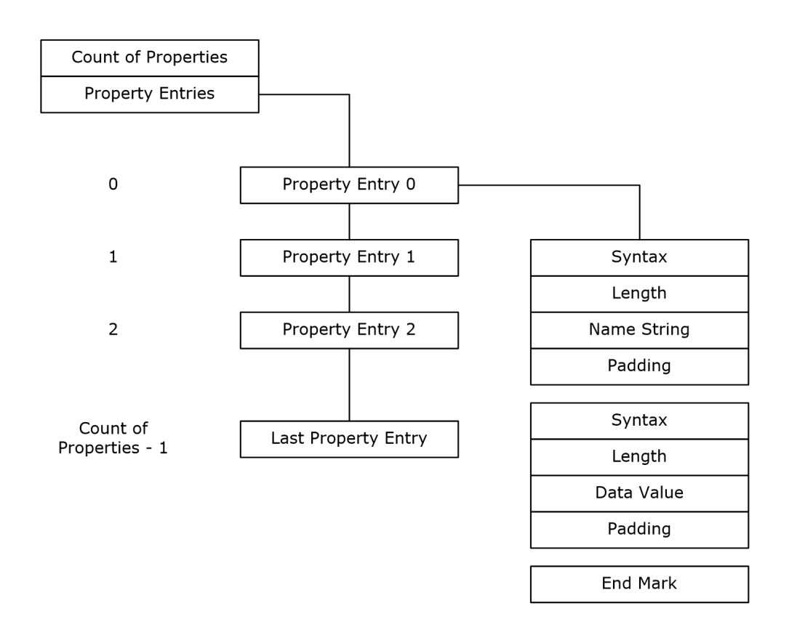
<!-- /Extracted images from page 63 -->

Each property value list, in turn, MUST consist of the following elements:

  A property name.

  One or more property values. Each property value is represented by a data structure that is

appropriate to the type of data. Each property value can consist of multiple data values, such
as a string, an array, or a structure.

  An enumeration value set to CLUSPROP_SYNTAX_ENDMARK.

Conceptually, a PROPERTY_LIST can be illustrated as in the following diagram.

Figure 1: Property list

The PROPERTY_LIST is a custom-marshaled contiguous buffer with fields that are specified as
follows.

0  1  2  3  4  5  6  7  8  9

1
0  1  2  3  4  5  6  7  8  9

2
0  1  2  3  4  5  6  7  8  9

3
0  1

propertyCount

propertyValue (variable)

...

[MS-CMRP] - v20250811
Failover Cluster: Management API (ClusAPI) Protocol
Copyright © 2025 Microsoft Corporation
Release: August 11, 2025

63 / 662

propertyCount (4 bytes): An unsigned 32-bit integer. The PROPERTY_LIST buffer MUST begin
with an unsigned long indicating the count of properties in the PROPERTY_LIST. The count of
properties MUST be followed by the properties in the form of property values.

propertyValue (variable): A variable-sized buffer of Property Value (section 2.2.3.10.1)

structures. A property value MUST contain the name of the property that the value is associated
with.

The layout of the property name, value list, and value list end mark is repeated in the
PROPERTY_LIST buffer for each property in the PROPERTY_LIST. There MUST be one end mark
structure for each property in the PROPERTY_LIST. The number of property names and value lists
MUST sum to the count of properties that are specified at the beginning of the PROPERTY_LIST
buffer. Therefore, the following statement MUST hold true:



propertyCount = number of properties

where each individual property contains a name and a value list.

###### 2.2.3.10.1 Property Value

The Property Value is a custom-marshaled contiguous buffer with fields that are specified as follows.
This buffer MUST contain at least one element in the PropertyValues array.

0  1  2  3  4  5  6  7  8  9

1
0  1  2  3  4  5  6  7  8  9

2
0  1  2  3  4  5  6  7  8  9

3
0  1

CLUSPROP_SYNTAX_NAME

size

buffer (variable)

...

padding (variable)

...

PropertyValues (variable)

...

CLUSPROP_SYNTAX_ENDMARK

CLUSPROP_SYNTAX_NAME (4 bytes): An unsigned long. The property name structure MUST begin
with the CLUSTER_PROPERTY_SYNTAX (section 2.2.2.3) value CLUSPROP_SYNTAX_NAME
(0x00040003).

Name

Value

CLUSPROP_SYNTAX_NAME

0x00040003

size (4 bytes): An unsigned long. This field MUST be an unsigned long that specifies the size of the
buffer that contains the property name. Padding MUST be included so that the next byte in

[MS-CMRP] - v20250811
Failover Cluster: Management API (ClusAPI) Protocol
Copyright © 2025 Microsoft Corporation
Release: August 11, 2025

64 / 662

contiguous memory after the buffer is aligned to 4 bytes; however, the padding is not included in
the size specified by this parameter.

buffer (variable): A buffer of 16-bit Unicode characters. This field MUST be a buffer that contains
the property name as a null-terminated Unicode string. Following the property name buffer
MUST be 0 or more bytes of padding. The contents of the padding bytes MUST be ignored.

padding (variable): This field MUST be 0 or 2 bytes of padding such that the size of the buffer field,
plus the size of this field, is divisible by 4. The contents of the padding bytes MUST be ignored.

PropertyValues (variable): One to three PropertyValues structures, as follows.

0  1  2  3  4  5  6  7  8  9

1
0  1  2  3  4  5  6  7  8  9

2
0  1  2  3  4  5  6  7  8  9

3
0  1

Syntax

Size

Buffer (variable)

...

Padding (variable)

...

Syntax (4 bytes): An unsigned 32-bit integer. This field MUST be one of the

CLUSTER_PROPERTY_SYNTAX values and MUST NOT contain CLUSPROP_SYNTAX_NAME or
CLUSPROP_SYNTAX_ENDMARK.

Size (4 bytes): An unsigned 32-bit integer. This field MUST be an unsigned long that specifies
the size of the buffer that contains the property. Padding MUST be included so that the next
byte in contiguous memory after the buffer is aligned to 4 bytes; however, the padding is not
included in the size specified by this parameter.

Buffer (variable): A buffer of 8-bit integers. This field MUST be a buffer that contains the value

of the property as specified by the Syntax member of this structure. Following the property
buffer there MUST be 0 or more bytes of padding. The contents of the padding bytes MUST be
ignored.

Padding (variable): This field MUST be 0 to 3 bytes of padding such that the size of the buffer
field, plus the size of this field, is divisible by 4. The contents of the padding bytes MUST be
ignored.

CLUSPROP_SYNTAX_ENDMARK (4 bytes): An unsigned 32-bit integer. The last value in the value

list MUST be followed by a 4-byte CLUSPROP_SYNTAX_ENDMARK, as specified in section
2.2.2.3. Any other syntax value, as specified in section 2.2.2.3, that follows a value MUST mark
the beginning of another value in the value list.

##### 2.2.3.11 CLUS_PARTITION_INFO_EX

The CLUS_PARTITION_INFO_EX data structure is the format in which a property value of syntax
CLUSPROP_SYNTAX_PARTITION_INFO_EX (section 2.2.2.3), is written as a property value, as
specified in section 2.2.3.10.1. CLUS_PARTITION_INFO_EX contains data about a disk partition
that is configured with a basic volume.

65 / 662

[MS-CMRP] - v20250811
Failover Cluster: Management API (ClusAPI) Protocol
Copyright © 2025 Microsoft Corporation
Release: August 11, 2025

CLUS_PARTITION_INFO_EX is a custom-marshaled data structure that has fields as follows.

0  1  2  3  4  5  6  7  8  9

1
0  1  2  3  4  5  6  7  8  9

2
0  1  2  3  4  5  6  7  8  9

3
0  1

dwFlags

szDeviceName (520 bytes)

...

...

szVolumeLabel (520 bytes)

...

...

dwSerialNumber

rgdwMaximumComponentLength

dwFileSystemFlags

szFileSystem (64 bytes)

...

...

TotalSizeInBytes

...

FreeSizeInBytes

...

DeviceNumber

PartitionNumber

VolumeGuid (16 bytes)

...

...

dwFlags (4 bytes): An unsigned 32-bit integer. Indicates characteristics about the partition. Can

be a combination of the following values.

66 / 662

[MS-CMRP] - v20250811
Failover Cluster: Management API (ClusAPI) Protocol
Copyright © 2025 Microsoft Corporation
Release: August 11, 2025

Value

Meaning

CLUSPROP_PIFLAG_STICKY

The volume is configured with a drive letter.

0x00000001

Can be combined with any other flag.

CLUSPROP_PIFLAG_REMOVABLE

0x00000002

The partition is formatted with a file system that is
removable by the cluster software.

CLUSPROP_PIFLAG_USABLE

0x00000004

CLUSPROP_PIFLAG_DEFAULT_QUORUM

0x00000008

The partition is formatted with a file system that is usable by
the cluster software. This flag SHOULD be set if and only if
the partition is formatted with the NTFS file system.

Can be combined with any other flag, but MUST be set if
CLUSPROP_PIFLAG_DEFAULT_QUORUM is set.

Indicates that the smallest NTFS partition MUST be at least
50,000,000 bytes in size.

Can be combined with any other flag, but
CLUSPROP_PIFLAG_USABLE MUST also be set if this flag is
set.

CLUSPROP_PIFLAG_USABLE_FOR_CSV

0x00000010

This flag is set if and only if the partition is formatted with
NTFS/ReFS. Can be combined with any other flag.

CLUSPROP_PIFLAG_ENCRYPTION_ENABLED

0x00000020

CLUSPROP_PIFLAG_RAW

0x00000040

Encryption is enabled and this flag is used when
ENCRYPTION_ENABLED flag is set in EncryptionFlags field.

The partition is a raw volume and is not formatted with a file
system.

CLUSPROP_PIFLAG_UNKNOWN

Partition is of unknown file system type.

0x80000000

szDeviceName (520 bytes): A fixed-length buffer 520 bytes long that contains a null-terminated

Unicode string based on the following rules:







If the volume has a drive letter and the state of the designated storage resource is
ClusterResourceOnline, the server MUST return the drive letter of the volume followed by a
Unicode ':'.

If the volume is not configured with a drive letter and the resource is online, the server MUST
return a string of the form "\\?\Volume{GGG}" where GGG is the identifier of the volume.

If the resource is offline, the server MUST return a string of the form
"\\?\GLOBALROOT\Device\HarddiskNNN\PartitionYYY", where NNN is the disk number and
YYY is the partition number ([MS-DMRP]).

Note: If the resource is offline, the remaining fields in this structure are left unfilled and MUST
NOT be considered valid data.

szVolumeLabel (520 bytes): A fixed-length buffer 520 bytes long that contains the file system

label. This field is a null-terminated Unicode string.

dwSerialNumber (4 bytes): An unsigned 32-bit integer. This is the serial number that is assigned

by the operating system when the partition was formatted.

rgdwMaximumComponentLength (4 bytes): An unsigned 32-bit integer. A value specifying the
maximum length, in characters, of a file name component that is supported by the specified file
system. A file name component is the portion of a file name between "\" characters.

dwFileSystemFlags (4 bytes): An unsigned 32-bit integer that identifies the file system flags.

67 / 662

[MS-CMRP] - v20250811
Failover Cluster: Management API (ClusAPI) Protocol
Copyright © 2025 Microsoft Corporation
Release: August 11, 2025

szFileSystem (64 bytes): A fixed-length buffer 64 bytes long that contains a null-terminated

Unicode string representing the name of the file system, as specified in [MS-DMRP].

TotalSizeInBytes (8 bytes): An unsigned 64-bit integer specifying the total size, in bytes, of the

volume.

FreeSizeInBytes (8 bytes): An unsigned 64-bit integer specifying the size, in bytes, of the

unallocated space on the volume.

DeviceNumber (4 bytes): An unsigned 32-bit integer indicating the disk number.

PartitionNumber (4 bytes): An unsigned 32-bit integer indicating the partition number, as specified

in [MS-DMRP].

VolumeGuid (16 bytes): A 128-bit value that contains the volume identifier.

##### 2.2.3.12 CLUS_STORAGE_REMAP_DRIVELETTER

The CLUS_STORAGE_REMAP_DRIVELETTER structure identifies the existing and target drive letter
for a disk drive on a node.

CLUS_STORAGE_REMAP_DRIVELETTER is a custom-marshaled structure that has fields as follows.

0  1  2  3  4  5  6  7  8  9

1
0  1  2  3  4  5  6  7  8  9

2
0  1  2  3  4  5  6  7  8  9

3
0  1

CurrentDriveLetterMask

TargetDriveLetterMask

CurrentDriveLetterMask (4 bytes): A 32-bit bitmask indicating the drive letter to be changed. The
least significant bit represents the drive letter 'A' through bit 25, which represents the drive letter
'Z'.

TargetDriveLetterMask (4 bytes): A 32-bit bitmask indicating the new drive letter for the disk drive

that corresponds to the drive letter specified in CurrentDriveLetterMask.

##### 2.2.3.13 CLUS_NETNAME_PWD_INFO

The CLUS_NETNAME_PWD_INFO structure provides information for resetting an alternate
computer name's associated security principal.

CLUS_NETNAME_PWD_INFO is a custom-marshaled structure that has fields as follows.

0  1  2  3  4  5  6  7  8  9

1
0  1  2  3  4  5  6  7  8  9

2
0  1  2  3  4  5  6  7  8  9

3
0  1

Flags

Password (32 bytes)

...

...

CreatingDC (516 bytes)

[MS-CMRP] - v20250811
Failover Cluster: Management API (ClusAPI) Protocol
Copyright © 2025 Microsoft Corporation
Release: August 11, 2025

68 / 662

...

...

ObjectGuid (128 bytes)

...

...

Flags (4 bytes): A 32-bit field indicating whether other fields in the structure have valid data. Can be

a combination of the following values.

Value

0x00000000

GUID_PRESENT

0x00000001

Meaning

No flags are set, indicating that only the Password field is valid.

The ObjectGuid field has valid data.

CREATEDC_PRESENT

The CreatingDC field has valid data.

0x00000002

Password (32 bytes): A 32-byte long fixed-length field that contains the new password, as a null-
terminated Unicode string, for the alternate computer name's associated security principal.
Remaining bytes after null-termination MAY contain any value.

CreatingDC (516 bytes): A 516-byte long fixed-length field that contains the name of a directory
server, as a null-terminated Unicode string, where the associated security principal object is
stored. Remaining bytes after null-termination MAY contain any value.

ObjectGuid (128 bytes): A GUIDString, as a null-terminated Unicode string, of the security

principal object on a directory server. Remaining bytes after null-termination MAY contain any
value.

##### 2.2.3.14 CLUS_MAINTENANCE_MODE_INFO

The CLUS_MAINTENANCE_MODE_INFO structure represents the maintenance mode setting for a
storage class resource.

CLUS_MAINTENANCE_MODE_INFO is a custom-marshaled structure that has fields as follows.

0  1  2  3  4  5  6  7  8  9

1
0  1  2  3  4  5  6  7  8  9

2
0  1  2  3  4  5  6  7  8  9

3
0  1

InMaintenance

InMaintenance (4 bytes): A 32-bit integer that indicates the current maintenance mode state when
written by the server or the target maintenance mode state when provided by the client for a
storage class resource. Zero indicates that the resource is not in maintenance mode and one
indicates that the storage resource is in maintenance mode.

[MS-CMRP] - v20250811
Failover Cluster: Management API (ClusAPI) Protocol
Copyright © 2025 Microsoft Corporation
Release: August 11, 2025

69 / 662

##### 2.2.3.15 CLUS_MAINTENANCE_MODE_INFO_EX

The CLUS_MAINTENANCE_MODE_INFO_EX structure represents the extended maintenance mode
settings for a storage class resource.

CLUS_MAINTENANCE_MODE_INFO_EX is a custom-marshaled structure that has fields as follows.

0  1  2  3  4  5  6  7  8  9

1
0  1  2  3  4  5  6  7  8  9

2
0  1  2  3  4  5  6  7  8  9

3
0  1

InMaintenance

MaintenanceModeType

InternalState

Signature

InMaintenance (4 bytes): A 32-bit integer that indicates the current maintenance mode state when
written by the server or the target maintenance mode state when provided by the client for a
storage class resource. Zero indicates that the resource is not in maintenance mode and one
indicates that the storage resource is in maintenance mode.

MaintenanceModeType (4 bytes): A 4-byte MAINTENANCE_MODE_TYPE (section 2.2.2.6)

enumeration that indicates the current maintenance mode type when written by the server or the
target maintenance mode type when provided by the client for a storage class resource.

InternalState (4 bytes): A 32-bit integer representing the internal resource state, as specified in

section 3.1.4.2.13. This field is valid only when written by the server.

Signature (4 bytes): A 32-bit integer that MUST contain the value 0xABBAF00F.

##### 2.2.3.16 CLUS_STORAGE_SET_DRIVELETTER

The CLUS_STORAGE_SET_DRIVELETTER structure supplies drive letter information for a disk
partition associated with a storage class resource.

The CLUS_STORAGE_SET_DRIVELETTER is a custom-marshaled structure that has fields as
follows.

0  1  2  3  4  5  6  7  8  9

1
0  1  2  3  4  5  6  7  8  9

2
0  1  2  3  4  5  6  7  8  9

3
0  1

PartitionNumber

DriveLetterMask

PartitionNumber (4 bytes): A 32-bit integer that indicates a partition on the storage device.

DriveLetterMask (4 bytes): A 32-bit integer bitmask that indicates either the new drive letter of the
partition or that the partition's drive letter SHOULD be removed. Each bit represents a drive letter
where bit 0 represents 'A', bit 1 represents 'B', and so forth through bit 25. Bits 26 through 31 are
ignored. A value of zero indicates that the drive letter SHOULD be removed.

[MS-CMRP] - v20250811
Failover Cluster: Management API (ClusAPI) Protocol
Copyright © 2025 Microsoft Corporation
Release: August 11, 2025

70 / 662

<!-- Extracted images from page 71 -->
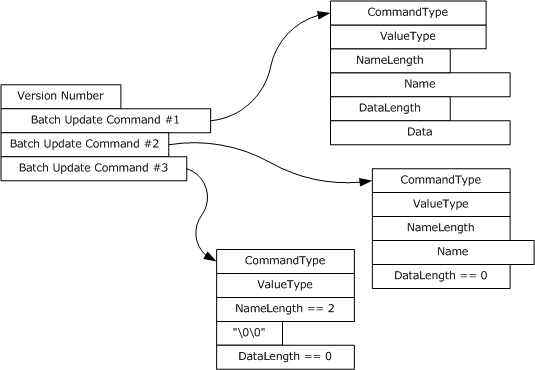
<!-- /Extracted images from page 71 -->

##### 2.2.3.17 CLUSTER_REG_BATCH_UPDATE

The CLUSTER_REG_BATCH_UPDATE structure is a self-describing data structure that contains a
sequence of command blocks that describes one or more modifications or read operations to be
performed on the cluster registry. A CLUSTER_REG_BATCH_UPDATE structure MUST consist of the
following elements:

  A version number.

  One or more batch update command blocks describing a set of modifications to the registry or

read operations from the registry.

Each batch update command block, in turn, MUST consist of the following elements:

  A command type.



The name of a key or value.

  Any optional data required for the command.

Conceptually, a CLUSTER_REG_BATCH_UPDATE structure can be illustrated as in the following
diagram.

Figure 2: CLUSTER_REG_BATCH_UPDATE structure

CLUSTER_REG_BATCH_UPDATE is a custom-marshaled structure that has fields as follows.

0  1  2  3  4  5  6  7  8  9

1
0  1  2  3  4  5  6  7  8  9

2
0  1  2  3  4  5  6  7  8  9

3
0  1

VersionNumber

[MS-CMRP] - v20250811
Failover Cluster: Management API (ClusAPI) Protocol
Copyright © 2025 Microsoft Corporation
Release: August 11, 2025

71 / 662

BatchUpdateCommand (variable)

...

VersionNumber (4 bytes): A 32-bit integer that indicates the version of the batch update command

block. This value MUST be set to one.

BatchUpdateCommand (variable): One or more instances of a variable-length data structure that

describes a set of modifications to be made to the cluster registry.

###### 2.2.3.17.1 BATCH_UPDATE_COMMAND

The BATCH_UPDATE_COMMAND is a stream of bytes that describes an individual update to be
applied to the cluster registry or returned from a call to ApiExecuteReadBatch (section 3.1.4.2.141).
It defines two variable-length fields, Name and Data, that MUST be present in the stream if their
associated length fields are nonzero. The end of each structure is aligned to a 16-bit boundary.

The BATCH_UPDATE_COMMAND is a custom-marshaled structure that has fields as follows.

0  1  2  3  4  5  6  7  8  9

1
0  1  2  3  4  5  6  7  8  9

2
0  1  2  3  4  5  6  7  8  9

3
0  1

CommandType

ValueType

NameLength

Name (variable)

...

DataLength

Data (variable)

...

Padding (optional)

CommandType (4 bytes): An unsigned 32-bit integer. A CLUSTER_REG_BATCH_COMMAND

(section 2.2.2.8) enumeration value that indicates the type of update operation.

ValueType (4 bytes): An unsigned 32-bit integer. The ValueType field MUST be set to one of the
types specified in ApiSetValue (section 3.1.4.2.33 when the CommandType field is set to
CLUSREG_SET_VALUE or CLUSREG_READ_VALUE. If CommandType is set to
CLUSREG_READ_ERROR, the value is a status code. Otherwise, the field is ignored. The server
SHOULD support all values as specified in ApiSetValue.<25>

NameLength (4 bytes): An unsigned 32-bit integer indicating the size, in bytes, of the string stored
in the Name field. Minimum value is two, indicating the Name field contains the null Unicode
string (0x0000).

[MS-CMRP] - v20250811
Failover Cluster: Management API (ClusAPI) Protocol
Copyright © 2025 Microsoft Corporation
Release: August 11, 2025

72 / 662

Name (variable): A variable-length, null-terminated Unicode string containing the name of the key

or value on which the command is executed.

DataLength (4 bytes): An unsigned 32-bit integer indicating the size, in bytes, of the binary data

stored in the Data field. Can be zero.

Data (variable): A variable-length series of 8-bit integers containing the data associated with a

CLUSREG_SET_VALUE operation. This field is not present if the DataLength field is set to zero.

Padding (1 byte): Up to 1 byte. A variable-length series of zero or one 8-bit integers used to align

the end of the structure to a 16-bit boundary. This field is not present if the DataLength field is of
even length.

##### 2.2.3.18 CLUS_CSV_VOLUME_INFO

 The CLUS_CSV_VOLUME_INFO structure represents information about a cluster shared volume.

CLUS_CSV_VOLUME_INFO is a custom-marshaled structure that has fields as follows.

0  1  2  3  4  5  6  7  8  9

1
0  1  2  3  4  5  6  7  8  9

2
0  1  2  3  4  5  6  7  8  9

3
0  1

VolumeOffset

...

PartitionNumber

FaultState

BackupState

szVolumeFriendlyName (520 bytes)

...

...

szVolumeName (100 bytes)

...

...

VolumeOffset (8 bytes):  A 64-bit unsigned integer that indicates the offset of the volume.

PartitionNumber (4 bytes):  A 32-bit unsigned integer that indicates the partition number of the

volume.

FaultState (4 bytes): A 32-bit integer that indicates the existence of faults for this volume, or that

the volume is in volume maintenance mode, backup mode, or redirected mode. The block
redirected mode of the volume is not reflected in this field. Possible values are as follows.

[MS-CMRP] - v20250811
Failover Cluster: Management API (ClusAPI) Protocol
Copyright © 2025 Microsoft Corporation
Release: August 11, 2025

73 / 662

Value

Meaning

VolumeStateNoFaults

0x00000000

VolumeStateRedirected

0x00000001

VolumeStateNoAccess

0x00000002

Indicates that the volume is accessible on all nodes. None of these
modes are enabled: volume maintenance mode, backup mode, or
redirected mode.

Indicates that volume maintenance mode is not enabled and that the
volume is either in redirected mode, in backup mode, or in both
redirected and backup modes.

Indicates that the volume is not accessible to applications
irrespective of whether the volume maintenance, redirected, or
backup modes are enabled.

VolumeStateInMaintenance

0x00000004

Indicates that the volume is in volume maintenance mode
irrespective of whether redirected or backup modes are enabled.

BackupState (4 bytes): A 32-bit integer that indicates the current backup mode of the volume, as

specified in Cluster Node Volume Accessibility (section 3.1.1.4). Possible values are as follows.

Value

Meaning

VolumeBackupNone

Indicates that the volume is not in backup mode.

0x00000000

VolumeBackupInProgress

Indicates that the volume is in backup mode.

0x00000001

szVolumeFriendlyName (520 bytes):  A fixed-length buffer 520 bytes long that contains a null-

terminated Unicode string that indicates the friendly name of the volume.

szVolumeName (100 bytes): A fixed-length buffer 100 bytes long that contains a null-terminated
Unicode string that indicates the name of the volume in the volume GUID format. For example:

 \\?\Volume{00000000-0000-0000-0000-000000000000}\

##### 2.2.3.19 CLUS_CSV_MAINTENANCE_MODE_INFO

The CLUS_CSV_MAINTENANCE_MODE_INFO structure supplies maintenance mode information
about a cluster shared volume.

CLUS_CSV_MAINTENANCE_MODE_INFO is a custom-marshaled structure that has fields as
follows.

0  1  2  3  4  5  6  7  8  9

1
0  1  2  3  4  5  6  7  8  9

2
0  1  2  3  4  5  6  7  8  9

3
0  1

InMaintenance

VolumeName (520 bytes)

...

...

[MS-CMRP] - v20250811
Failover Cluster: Management API (ClusAPI) Protocol
Copyright © 2025 Microsoft Corporation
Release: August 11, 2025

74 / 662

InMaintenance (4 bytes): A 32-bit integer that indicates the desired volume maintenance mode of
the volume, as specified in Cluster Node Volume Accessibility (section 3.1.1.4). Possible
values are as follows.

Value

TRUE

0x00000001

FALSE

0x00000000

Meaning

Instructs the server to transition the volume into volume maintenance
mode.

Instructs the server to transition the volume out of volume maintenance
mode.

VolumeName (520 bytes): A fixed-length buffer, 520 bytes long, which contains a null-terminated
Unicode string that indicates the name of the volume. The server MUST accept either a friendly
name described as szVolumeFriendlyName or a volume GUID name as szVolumeName (both
as specified in section 2.2.3.18).

##### 2.2.3.20 CLUS_SHARED_VOLUME_BACKUP_MODE

The CLUS_SHARED_VOLUME_BACKUP_MODE structure supplies backup mode information about a
cluster shared volume.

CLUS_SHARED_VOLUME_BACKUP_MODE is a custom-marshaled structure that has fields as
follows.

0  1  2  3  4  5  6  7  8  9

1
0  1  2  3  4  5  6  7  8  9

2
0  1  2  3  4  5  6  7  8  9

3
0  1

BackupState

DelayTimerInSecs

VolumeName (520 bytes)

...

...

BackupState (4 bytes): A 32-bit integer that indicates the desired backup mode of the volume, as

specified in Cluster Node Volume Accessibility (section 3.1.1.4). Possible values are as follows.

Value

Meaning

VolumeBackupInProgress

Instructs the server to transition the volume into backup mode.

0x00000001

VolumeBackupNone

Instructs the server to transition the volume out of backup mode.

0x00000000

DelayTimerInSecs (4 bytes): A 32-bit unsigned integer indicating the maximum time (in seconds)

for the server to wait to detect that a backup has started on that volume.

VolumeName (520 bytes): A fixed-length buffer, 520 bytes long, which contains a null-terminated
Unicode string that indicates the name of the volume. The server MUST accept either a friendly

[MS-CMRP] - v20250811
Failover Cluster: Management API (ClusAPI) Protocol
Copyright © 2025 Microsoft Corporation
Release: August 11, 2025

75 / 662

name described as szVolumeFriendlyName or a volume GUID name as szVolumeName (both
as specified in CLUS_CSV_VOLUME_INFO (section 2.2.3.18) structure).

##### 2.2.3.21 CLUSTER_CREATE_GROUP_INFO_RPC

The CLUSTER_CREATE_GROUP_INFO_RPC structure contains information about the creation of a
group, as specified in ApiCreateGroupEx (section 3.1.4.2.128).<26>

 typedef struct _CLUSTER_CREATE_GROUP_INFO_RPC {
   DWORD dwVersion;
   DWORD dwGroupType;
 } CLUSTER_CREATE_GROUP_INFO_RPC,
  *PCLUSTER_CREATE_GROUP_INFO_RPC;

dwVersion: The version of the CLUSTER_CREATE_GROUP_INFO_RPC data structure.

dwGroupType: Designates the type of group.

##### 2.2.3.22 NOTIFY_FILTER_AND_TYPE_RPC

The NOTIFY_FILTER_AND_TYPE_RPC structure contains information about notifications that clients
register for by using ApiAddNotifyV2 (section 3.1.4.2.137) or that clients get notification for by
using ApiGetNotifyV2 (section 3.1.4.2.138).<27>

 typedef struct _NOTIFY_FILTER_AND_TYPE_RPC {
   DWORD dwObjectType;
   LONGLONG FilterFlags;
 } NOTIFY_FILTER_AND_TYPE_RPC,
  *PNOTIFY_FILTER_AND_TYPE_RPC;

dwObjectType: The type of object for which the notification is generated (see section 2.2.2.12).

FilterFlags: A set of flags indicating the particular notification that was generated for the object. See

ApiCreateNotifyV2 (section 3.1.4.2.136) for the list of object-specific notifications.

##### 2.2.3.23 NOTIFICATION_DATA_RPC

The NOTIFICATION_DATA_RPC structure contains the information for a specific notification. See
ApiGetNotifyV2 (section 3.1.4.2.138) for the exact values the fields of this structure use for specific
notification objects and their types.<28>

 typedef struct _NOTIFICATION_DATA_RPC {
   NOTIFY_FILTER_AND_TYPE_RPC FilterAndType;
   [ size_is(dwBufferSize) ] BYTE* buffer;
   DWORD dwBufferSize;
   [ string ] LPWSTR ObjectId;
   [ string ] LPWSTR ParentId;
   [ string ] LPWSTR Name;
   [ string ] LPWSTR Type;
 } NOTIFICATION_DATA_RPC,
  *PNOTIFICATION_DATA_RPC;

FilterAndType: A NOTIFY_FILTER_AND_TYPE_RPC (section 2.2.3.22) structure containing the

object type and notification value.

buffer: A pointer to the payload buffer. The format of this buffer is specific to the notification type.

For details, see ApiGetNotifyV2.

76 / 662

[MS-CMRP] - v20250811
Failover Cluster: Management API (ClusAPI) Protocol
Copyright © 2025 Microsoft Corporation
Release: August 11, 2025

dwBufferSize: The size in bytes of the buffer field.

ObjectId: A buffer of 16-bit Unicode characters containing the Id of the object for which the

notification was generated. This field MUST be followed by 0 or more bytes of padding, which
MUST be ignored.

ParentId: A buffer of 16-bit Unicode characters containing the Id of the parent of the object

represented by the ObjectId field. This field MUST be followed by 0 or more bytes of padding,
which MUST be ignored.

Name: A buffer of 16-bit Unicode characters containing the name of the object for which the

notification was generated. This field MUST be followed by 0 or more bytes of padding, which
MUST be ignored.

Type: A buffer of 16-bit Unicode characters containing the object type for which the notification was

generated. This field MUST be followed by 0 or more bytes of padding, which MUST be ignored.

##### 2.2.3.24 NOTIFICATION_RPC

The NOTIFICATION_RPC structure associates the NOTIFICATION_DATA_RPC structure with the
notify key that was passed as a parameter to ApiAddNotifyV2 (section 3.1.4.2.137).

 typedef struct _NOTIFICATION_RPC {
   DWORD_PTR dwNotifyKey;
   NOTIFICATION_DATA_RPC NotificationData;
 } NOTIFICATION_RPC,
  *PNOTIFICATION_RPC;

dwNotifyKey: A 32-bit value provided by the client.

NotificationData: A NOTIFICATION_DATA_RPC structure as defined in section 2.2.3.23.

##### 2.2.3.25 GROUP_ENUM_ENTRY

The GROUP_ENUM_ENTRY structure contains information for each group in the enumeration list
returned by ApiCreateGroupEnum (section 3.1.4.2.139).

 typedef struct _GROUP_ENUM_ENTRY {
   [string] LPWSTR Name;
   [string] LPWSTR Id;
   DWORD dwState;
   [string] LPWSTR Owner;
   DWORD dwFlags;
   DWORD cbProperties;
   [size_is(cbProperties)] UCHAR* Properties;
   DWORD cbRoProperties;
   [size_is(cbRoProperties)] UCHAR* RoProperties;
 } GROUP_ENUM_ENTRY,
  *PGROUP_ENUM_ENTRY;

Name: The name of the group.

Id: The Id of the group.

dwState: The state of the group, as specified in section 3.1.4.2.46.

Owner: The name of the group's current owner node.

[MS-CMRP] - v20250811
Failover Cluster: Management API (ClusAPI) Protocol
Copyright © 2025 Microsoft Corporation
Release: August 11, 2025

77 / 662

dwFlags: The group's flags, as would be returned by CLUSCTL_GROUP_GET_FLAGS (section

3.1.4.3.3.3).

cbProperties: The size in bytes of the buffer pointed to by the Properties field.

Properties: A PROPERTY_LIST (section 2.2.3.10) containing common properties of the group.

cbRoProperties: The size in bytes of the buffer pointed to by the RoProperties field.

RoProperties: A PROPERTY_LIST containing read-only common properties of the group.

##### 2.2.3.26 GROUP_ENUM_LIST

The GROUP_ENUM_LIST structure is a container for a list of GROUP_ENUM_ENTRY (section
2.2.3.25) structures. This structure encapsulates the results of a call to ApiCreateGroupEnum
(section 3.1.4.2.139), which clients use to enumerate the groups in a cluster.

 typedef struct _GROUP_ENUM_LIST {
   DWORD EntryCount;
   [size_is(EntryCount)] GROUP_ENUM_ENTRY Entry[*];
 } GROUP_ENUM_LIST,
  *PGROUP_ENUM_LIST;

EntryCount: The number of GROUP_ENUM_ENTRY structures contained in the Entry field.

Entry: An array of GROUP_ENUM_ENTRY structures that represent information for the groups being

enumerated.

##### 2.2.3.27 RESOURCE_ENUM_ENTRY

The RESOURCE_ENUM_ENTRY (section 2.2.3.27) structure represents information for each resource
in the enumeration list returned by ApiCreateResourceEnum (section 3.1.4.2.140).

 typedef struct _RESOURCE_ENUM_ENTRY {
   [string] LPWSTR Name;
   [string] LPWSTR Id;
   [string] LPWSTR OwnerName;
   [string] LPWSTR OwnerId;
   DWORD cbProperties;
   [size_is(cbProperties)] UCHAR* Properties;
   DWORD cbRoProperties;
   [size_is(cbRoProperties)] UCHAR* RoProperties;
 } RESOURCE_ENUM_ENTRY,
  *PRESOURCE_ENUM_ENTRY;

Name: The name of the resource.

Id: The Id of the resource.

OwnerName: The name of the group that contains this resource.

OwnerId: The Id of the group that contains this resource.

cbProperties: The size in bytes of the buffer pointed to by the Properties field.

Properties: A PROPERTY_LIST (section 2.2.3.10) containing the common properties of the

resource.

cbRoProperties: The size in bytes of the buffer pointed to by the RoProperties field.

[MS-CMRP] - v20250811
Failover Cluster: Management API (ClusAPI) Protocol
Copyright © 2025 Microsoft Corporation
Release: August 11, 2025

78 / 662

RoProperties: A PROPERTY_LIST containing the common read-only properties of the resource.

##### 2.2.3.28 RESOURCE_ENUM_LIST

The RESOURCE_ENUM_LIST structure is a container for a list of RESOURCE_ENUM_ENTRY
(section 2.2.3.27) structures. This structure encapsulates the results of a call to
ApiCreateResourceEnum (section 3.1.4.2.140), which clients use to enumerate resources.

 typedef struct _RESOURCE_ENUM_LIST {
   DWORD EntryCount;
   [size_is(EntryCount)] RESOURCE_ENUM_ENTRY Entry[*];
 } RESOURCE_ENUM_LIST,
  *PRESOURCE_ENUM_LIST;

EntryCount: The number of RESOURCE_ENUM_ENTRY in the Entry field.

Entry: An array of RESOURCE_ENUM_ENTRY that contain information for each enumerated

resource.

##### 2.2.3.29 CLUSTER_SHARED_VOLUME_STATE_INFO

The CLUSTER_SHARED_VOLUME_STATE_INFO structure contains information about the cluster
shared volume for which a notification was generated. See
CLUSTER_CHANGE_SHARED_VOLUME_V2 (section 2.2.2.21) for details.<29>

CLUSTER_SHARED_VOLUME_STATE_INFO is a custom-marshaled structure that has the following
fields:

0  1  2  3  4  5  6  7  8  9

1
0  1  2  3  4  5  6  7  8  9

2
0  1  2  3  4  5  6  7  8  9

3
0  1

szVolumeName (520 bytes)

...

...

szNodeName (520 bytes)

...

...

VolumeState

szVolumeName (520 bytes): A buffer of 16-bit Unicode characters that MUST contain the null-

terminated friendly name of the cluster shared volume for which the notification was generated. If
the volume name plus terminating null character is less than the size of the buffer, the buffer is
padded with additional null characters. The client MUST ignore these additional null characters.

szNodeName (520 bytes): A buffer of 16-bit Unicode characters representing the name of the node
which generated the notification. This buffer MUST contain the node name as a null-terminated
Unicode string. If the node name is less than the size of the buffer, the string MUST be padded
with null characters. Any such padding MUST be ignored.

79 / 662

[MS-CMRP] - v20250811
Failover Cluster: Management API (ClusAPI) Protocol
Copyright © 2025 Microsoft Corporation
Release: August 11, 2025

VolumeState (4 bytes): A 32-bit integer that MUST contain one of the following values, indicating

the state of the cluster shared volume.

Value

Meaning

SharedVolumeStateUnavailable

The shared volume is unavailable.

0x00000000

SharedVolumeStatePaused

The shared volume is paused.

0x00000001

SharedVolumeStateActive

The shared volume is active.

0x00000002

SharedVolumeStateActiveRedirected

The shared volume is active and in redirected mode.

0x00000003

SharedVolumeStateActiveBlockRedirected

The shared volume is active and in block redirected mode.

0x00000004

##### 2.2.3.30 NOTIFICATION_DATA_ASYNC_RPC

The NOTIFICATION_DATA_ASYNC_RPC structure contains the information for a specific
notification. See ApiGetNotifyAsync (section 3.1.4.2.143) for more information.

 typedef struct _NOTIFICATION_DATA_ASYNC_RPC {
   DWORD dwNotifyKey;
   DWORD dwFilter;
   [string] LPWSTR Name;
 } NOTIFICATION_DATA_ASYNC_RPC, *PNOTIFICATION_DATA_ASYNC_RPC;

dwNotifyKey: The address of a 32-bit integer that the server MUST write upon successful

completion of this method. The value was supplied as the dwNotifyKey parameter in a previous
call to one of the following methods: ApiAddNotifyCluster (section 3.1.4.1.58),
ApiAddNotifyNode (section 3.1.4.1.59), ApiAddNotifyGroup (section 3.1.4.1.60),
ApiAddNotifyResource (section 3.1.4.1.61), ApiAddNotifyKey (section 3.1.4.1.62),
ApiAddNotifyNetwork (section 3.1.4.1.90), ApiAddNotifyNetInterface (section 3.1.4.1.99),
ApiReAddNotifyNode (section 3.1.4.1.63), ApiReAddNotifyGroup (section 3.1.4.1.64),
ApiReAddNotifyResource (section 3.1.4.1.65), ApiReAddNotifyNetwork (section 3.1.4.1.91),
or ApiReAddNotifyNetInterface (section 3.1.4.1.100).

dwFilter: The address of a 32-bit integer value that the server MUST write upon successful

completion of this method, which contains the CLUSTER_CHANGE (section 2.2.2.7) enumeration
value, indicating the type of event. The value MUST match one or more filter blocks that were
provided in a previous call to one of the following methods: ApiAddNotifyCluster,
ApiAddNotifyNode, ApiAddNotifyGroup, ApiAddNotifyResource, ApiAddNotifyKey,
ApiAddNotifyNetwork, ApiAddNotifyNetInterface, ApiReAddNotifyNode,
ApiReAddNotifyGroup, ApiReAddNotifyResource, ApiReAddNotifyNetwork, or
ApiReAddNotifyNetInterface.

Name: The address of a pointer where the server MUST write, upon successful completion of this

method, the address of a Unicode string buffer that contains the name of the object to which the
event pertains. If a name is not associated with the event, then the buffer contains the null
Unicode string.

[MS-CMRP] - v20250811
Failover Cluster: Management API (ClusAPI) Protocol
Copyright © 2025 Microsoft Corporation
Release: August 11, 2025

80 / 662

##### 2.2.3.31 CLUS_POOL_DRIVE_INFO

The CLUS_POOL_DRIVE_INFO structure contains the information about a storage pool drive. See
CLUSCTL_RESOURCE_POOL_GET_DRIVE_INFO (section 3.1.4.3.1.56) for more information.

CLUS_POOL_DRIVE_INFO is a custom-marshaled structure that has fields as follows.

0  1  2  3  4  5  6  7  8  9

1
0  1  2  3  4  5  6  7  8  9

2
0  1  2  3  4  5  6  7  8  9

3
0  1

DriveName (512 bytes)

...

...

IncursSeekPenalty

Padding1

Padding2

Padding3

DriveHealth

DriveState

TotalCapacity

...

ConsumedCapacity

...

Usage

BusType

Slot

EnclosureName (2048 bytes)

...

...

DriveName (512 bytes): A buffer of 16-bit Unicode characters representing the name of the

storage pool drive. This buffer MUST contain the name as a null-terminated Unicode string. If
the name is less than the size of the buffer, the string MUST be padded with null characters. The
client MUST ignore any padding.

IncursSeekPenalty (1 byte): A flag that indicates whether the storage pool drive incurs any latency

when reading from an arbitrary sector.

Padding1 (1 byte): The client MUST ignore this field.

Padding2 (1 byte): The client MUST ignore this field.

[MS-CMRP] - v20250811
Failover Cluster: Management API (ClusAPI) Protocol
Copyright © 2025 Microsoft Corporation
Release: August 11, 2025

81 / 662

Padding3 (1 byte): The client MUST ignore this field.

DriveHealth (4 bytes): The health of the storage pool drive. The server MUST set this field to one

of the following values.

Value

Description

SpHealthUnknown

0x00000000

SpHealthUnhealthy

0x00000001

SpHealthWarning

0x00000002

SpHealthHealthy

0x00000003

The health of the storage pool drive is not known.

The storage pool drive has encountered a severe error condition,
such as a media failure.

The storage pool drive has encountered an automatically recoverable
error condition, such as an I/O error that can be retried.

The storage pool drive is healthy.

DriveState (4 bytes): The state of the storage pool drive. The server MUST set this field to one of

the following values.

Value

Description

SpDriveStateUnknown

The state of the storage pool drive is not known.

0x00000000

SpDriveStateBecomingReady

The storage pool drive is becoming ready.

0x00000001

SpDriveStateCorruptMetadata

The storage pool drive has corrupt metadata.

0x00000002

SpDriveStateFailedMedia

The storage pool drive detected a failure when accessing the media.

0x00000003

SpDriveStateSplit

0x00000004

The storage pool drive metadata was changed while separated from a
two-drive pool. The split metadata cannot automatically be corrected.

SpDriveStateStaleMetadata

The storage pool drive has stale metadata

0x00000005

SpDriveStateIOError

The storage pool drive has encountered an I/O error.

0x00000006

SpDriveStateMissing

The storage pool drive is missing.

0x00000007

SpDriveStateOkay

0x00000008

The storage pool drive is ready and in a nominal state.

TotalCapacity (8 bytes): A 64-bit value containing the total capacity, in bytes, of the storage pool

drive.

ConsumedCapacity (8 bytes): A 64-bit value containing the amount of capacity, in bytes, that is

currently in use on the storage pool drive.

Usage (4 bytes): The usage of the storage pool drive. The server MUST set this field to one of the

following values.

82 / 662

[MS-CMRP] - v20250811
Failover Cluster: Management API (ClusAPI) Protocol
Copyright © 2025 Microsoft Corporation
Release: August 11, 2025

Value

Description

SpDriveUsageUnknown

The usage of the storage pool drive is unknown.

0x00000000

SpDriveUsageAutoAllocation

The storage pool drive is used for automatic allocation.

0x00000001

SpDriveUsageManualAllocation

The storage pool drive is used for manual allocation.

0x00000002

SpDriveUsageSpare

The storage pool drive is used as a spare.

0x00000003

SpDriveUsageJournal

The storage pool drive is used exclusively for journaling.

0x00000004

SpDriveUsageRetired

The storage pool drive is retired and not used for capacity allocations.

0x00000005

BusType (4 bytes): The type of bus to which the storage pool drive is attached. The server MUST set

this field to one of the following values.

Value

Description

BusTypeUnknown

0x00000000

The bus type is unknown.

BusTypeScsi

0x00000001

BusTypeAtapi

0x00000002

BusTypeAta

0x00000003

BusType1394

0x00000004

BusTypeSsa

0x00000005

BusTypeFibre

0x00000006

BusTypeUsb

0x00000007

BusTypeRAID

0x000000008

BusTypeiScsi

0x00000009

BusTypeSas

0x0000000A

The bus type is small computer system interface (SCSI).

The bus type is AT attachment packet interface (ATAPI).

The bus type is advanced technology attachment (ATA).

The bus type is IEEE 1394, commonly known as FireWire.

The bus type is serial storage architecture (SSA)

The bus type is Fibre Channel.

The bus type is universal serial bus (USB).

The bus type is redundant array of independent disks (RAID).

The bus type is internet small computer system interface (iSCSI).

The bus type is serial attached SCSI (SAS).

[MS-CMRP] - v20250811
Failover Cluster: Management API (ClusAPI) Protocol
Copyright © 2025 Microsoft Corporation
Release: August 11, 2025

83 / 662

Value

BusTypeSata

0x0000000B

BusTypeSd

0x0000000C

BusTypeMmc

0x0000000D

BusTypeVirtual

0x00000000E

Description

The bus type is serial ATA (SATA).

The bus type is secure digital (SD).

The bus type is multimedia card (MMC).

The bus type is virtual.

BusTypeFileBackedVirtual

The bus type is file-backed virtual.

0x00000000F

BusTypeSpaces

0x00000010

The bus type is Spaces.

Slot (4 bytes): A 32-bit value containing the slot in which the storage pool drive is located.

EnclosureName (2048 bytes): A buffer of 16-bit Unicode characters representing the name of the
enclosure in which the storage pool drive is located. This buffer MUST contain the name as a null-
terminated Unicode string. If the name is less than the size of the buffer, the string MUST be
padded with null characters. Any such padding MUST be ignored.

##### 2.2.3.32 CLUSTER_SHARED_VOLUME_STATE_INFO_EX

The CLUSTER_SHARED_VOLUME_STATE_INFO_EX structure<30> contains information about the
cluster shared volume for which a notification was generated. See
CLUSTER_CHANGE_SHARED_VOLUME_V2 (section 2.2.2.21) for details.

CLUSTER_SHARED_VOLUME_STATE_INFO_EX is a custom-marshaled structure that has fields as
follows.

0  1  2  3  4  5  6  7  8  9

1
0  1  2  3  4  5  6  7  8  9

2
0  1  2  3  4  5  6  7  8  9

3
0  1

szVolumeName (520 bytes)

...

...

szNodeName (520 bytes)

...

...

VolumeState

szVolumeFriendlyName (520 bytes)

[MS-CMRP] - v20250811
Failover Cluster: Management API (ClusAPI) Protocol
Copyright © 2025 Microsoft Corporation
Release: August 11, 2025

84 / 662

...

...

RedirectedIOReason

...

BlockRedirectedIOReason

...

szVolumeName (520 bytes): A buffer of 16-bit Unicode characters that MUST contain the null-

terminated name of the volume in the volume GUID format. For example:

 \\?\Volume{00000000-0000-0000-0000-000000000000}\

The buffer MUST be padded with additional null characters from the end of the volume name plus
null-termination to the end of the buffer. The client MUST ignore any such padding.

szNodeName (520 bytes): A buffer of 16-bit Unicode characters representing the name of the node
that generated the notification. This buffer MUST contain the node name as a null-terminated
Unicode string. If the node name is less than the size of the buffer, the string MUST be padded
with null characters. Any such padding MUST be ignored.

VolumeState (4 bytes): A 32-bit integer that MUST contain one of the following values, indicating

the state of the cluster shared volume:

Value

Meaning

SharedVolumeStateUnavailable

The shared volume is unavailable.

0x00000000

SharedVolumeStatePaused

The shared volume is paused.

0x00000001

SharedVolumeStateActive

The shared volume is active.

0x00000002

SharedVolumeStateActiveRedirected

The shared volume is active and in redirected mode.

0x00000003

SharedVolumeStateActiveBlockRedirected

The shared volume is active and in block redirected mode.

0x00000004

szVolumeFriendlyName (520 bytes): A buffer of 16-bit Unicode characters that MUST contain the
name of the cluster shared volume for which the notification was generated. This buffer MUST
contain the name as a null-terminated Unicode string. If the volume name is less than the size of
the buffer, the string MUST be padded with null characters. The client MUST ignore any such
padding.

RedirectedIOReason (8 bytes): A 64-bit integer that MUST contain the bitwise OR of one or more

of the following values:

[MS-CMRP] - v20250811
Failover Cluster: Management API (ClusAPI) Protocol
Copyright © 2025 Microsoft Corporation
Release: August 11, 2025

85 / 662

Value

Meaning

RedirectedIOReasonNotRedirected

0x0000000000000000

RedirectedIOReasonUserRequest

0x0000000000000001

RedirectedIOReasonIncompatibleFileSystemFilter

0x0000000000000002

RedirectedIOReasonIncompatibleVolumeFilter

0x0000000000000004

RedirectedIOReasonFileSystemConfiguration

0x0000000000000008

RedirectedIOReasonVolumeEncryption

0x0000000000000010

Indicates that the cluster shared volume redirected
mode is FALSE.

Indicates that the cluster shared volume redirected
mode is TRUE due to a client request, such as via the
CLUSCTL_RESOURCE_DISABLE_SHARED_VOLUME
_DIRECTIO (section 3.1.4.3.1.53) method.

Indicates that the cluster shared volume redirected
mode is TRUE due to an incompatible component that is
configured with a file system of the storage-class
resource associated with the cluster shared volume.
What the server considers an incompatible component
and how the server identifies the incompatible
component are implementation-specific.

Indicates that the cluster shared volume redirected
mode is TRUE due to an incompatible component
configured with a volume of the storage-class resource
associated with the cluster shared volume. What the
server considers an incompatible component and how
the server identifies the incompatible component are
implementation-specific.

Indicates that the cluster shared volume redirected
mode is TRUE due to the configuration of the file system
of the storage-class resource associated with the cluster
shared volume. What the server considers a valid file
system configuration for redirected mode and how the
server identifies the valid configuration are
implementation-specific.

Indicates that the cluster shared volume redirected
mode is TRUE due to an encryption operation on the
storage object represented by the storage-class
resource associated with the cluster shared volume.
What constitutes an encryption operation is
implementation-specific.

BlockRedirectedIOReason (8 bytes): A 64-bit integer that MUST contain the bitwise OR of one or

more of the following values:

Value

Meaning

BlockRedirectedIOReasonNotRedirected

0x0000000000000000

Indicates that the cluster shared volume block
redirected mode is FALSE.

BlockRedirectedIOReasonNoDiskConnectivity

0x0000000000000001

Indicates that the cluster shared volume block
redirected mode is TRUE because the server is not
connected to the disk.

BlockRedirectedIOReasonStorageSpaceNotAttached

0x0000000000000002

Indicates that the cluster shared volume block
redirected mode is TRUE because the storage-class
resource associated with the cluster shared volume is
formed from a storage pool and can only be accessed
by the server via network communication to a different
node.

[MS-CMRP] - v20250811
Failover Cluster: Management API (ClusAPI) Protocol
Copyright © 2025 Microsoft Corporation
Release: August 11, 2025

86 / 662

##### 2.2.3.33 CLUSDSK_DISKID

The CLUSDSK_DISKID structure contains the identification information of the disk of the designated
storage class resource type.

 typedef struct _CLUSDSK_DISKID {
   CLUSDSK_DISKID_ENUM DiskIdType;
   [switch_is(DiskIdType)] union {
     [case(DiskIdSignature)] unsigned long DiskSignature;
     [case(DiskIdGuid)] GUID DiskGuid;
   };
 } CLUSDSK_DISKID, *PCLUSDSK_DISKID;

DiskIdType: A 32-bit integer indicating disk ID type. See CLUSDSK_DISKID_ENUM (section

2.2.2.22).

DiskSignature: Identification information of the disk is an MBR disk signature.

DiskGuid: Identification information of the disk is a GPT disk ID, which is a 128-bit GUID.

##### 2.2.3.34 CLUSCTL_RESOURCE_NETNAME_CHECK_OU_PERMISSIONS_INPUT

The CLUSCTL_RESOURCE_NETNAME_CHECK_OU_PERMISSIONS_INPUT structure
SHOULD<31> be used to determine whether the server has permissions to access a directory server.
It is a custom-marshaled structure that contains the following fields.

0  1  2  3  4  5  6  7  8  9

1
0  1  2  3  4  5  6  7  8  9

2
0  1  2  3  4  5  6  7  8  9

3
0  1

dwVersion

dwPermissions

GUID (16 bytes)

...

...

...

dwVersion (4 bytes): A 32-bit unsigned integer. The client MUST set this to 0x00000001.

dwPermissions (4 bytes): A 32-bit unsigned integer that indicates the permissions to check. The

client MUST set this to field to 0x00000011.

GUID (16 bytes): A GUID, as specified in [MS-DTYP] section 2.3.4.2, identifying the type of

directory object for which permissions are checked. The client MUST set Data1 to 0xbf967a86,
Data2 to 0x0de6, Data3 to 0x11d0, and Data4 to 0xe24930aa0085a211d0.

##### 2.2.3.35 CLUSCTL_RESOURCE_NETNAME_CHECK_OU_PERMISSIONS_OUTPUT

The CLUSCTL_RESOURCE_NETNAME_CHECK_OU_PERMISSIONS_OUTPUT structure
SHOULD<32> indicate whether the server has access as requested. It is a custom-marshaled
structure that contains the following fields.

[MS-CMRP] - v20250811
Failover Cluster: Management API (ClusAPI) Protocol
Copyright © 2025 Microsoft Corporation
Release: August 11, 2025

87 / 662

0  1  2  3  4  5  6  7  8  9

1
0  1  2  3  4  5  6  7  8  9

2
0  1  2  3  4  5  6  7  8  9

3
0  1

bHasAccess

bDefaultOU

OUSize

OUName (variable)

...

bHasAccess (4 bytes): Set to 0x00000001 if the server has access to the directory server sufficient

to create a computer object and read all properties for a computer object; otherwise, it is set to
0x00000000.

bDefaultOU (4 bytes): Set to 0x00000001 if the access request is for the default organizational unit

on the directory server; otherwise, it is set to 0x00000000.

OUSize (4 bytes): The number of bytes in OUName.

OUName (variable): A null-terminated Unicode string containing the name of the directory server

organizational unit for which access was checked.

##### 2.2.3.36 SR_RESOURCE_TYPE_QUERY_ELIGIBLE_LOGDISKS

The SR_RESOURCE_TYPE_QUERY_ELIGIBLE_LOGDISKS structure SHOULD<33> be used to
query eligible log disks, given either a source or target disk, for storage replication. It is a custom-
marshaled structure that contains the following fields.

0  1  2  3  4  5  6  7  8  9

1
0  1  2  3  4  5  6  7  8  9

2
0  1  2  3  4  5  6  7  8  9

3
0  1

DataDiskGuid (16 bytes)

...

...

IncludeOfflineDisks

Reserved1

Reserved2

Reserved3

DataDiskGuid (16 bytes): A GUID, as specified in [MS-DTYP] section 2.3.4.2, that contains the
resource ID of the storage class resource that is either the source or target of replication.

IncludeOfflineDisks (1 byte): The client sets this field to 0x01 to request that results include disks
whose resource state is ClusterResourceOffline. Otherwise, the client sets this field to 0x00.

Reserved1 (1 byte): The field MUST be ignored.

Reserved2 (1 byte): This field MUST be ignored.

Reserved3 (1 byte): This field MUST be ignored.

[MS-CMRP] - v20250811
Failover Cluster: Management API (ClusAPI) Protocol
Copyright © 2025 Microsoft Corporation
Release: August 11, 2025

88 / 662

##### 2.2.3.37 SR_RESOURCE_TYPE_ELIGIBLE_DISKS_RESULT

The SR_RESOURCE_TYPE_ELIGIBLE_DISKS_RESULT structure SHOULD<34> be used to return a
list of disks for storage replication. It is a custom-marshalled structure that contains the following
fields.

0  1  2  3  4  5  6  7  8  9

1
0  1  2  3  4  5  6  7  8  9

2
0  1  2  3  4  5  6  7  8  9

3
0  1

Count

Reserved1

DiskGuid (variable)

...

...

Count (2 bytes): The number of GUID elements in the DiskGuid field.

Reserved1 (2 bytes): This field MUST be ignored.

DiskGuid (variable): An array of GUID structures, as specified in [MS-DTYP] section 2.3.4.2, each

containing the resource ID of a storage class resource.

##### 2.2.3.38 SR_RESOURCE_TYPE_QUERY_ELIGIBLE_TARGET_DATADISKS

The SR_RESOURCE_TYPE_QUERY_ELIGIBLE_TARGET_DATADISKS structure SHOULD<35> be
used to query eligible target disks, given a source disk, for storage replication. It is a custom-
marshalled structure that has fields as follows.

0  1  2  3  4  5  6  7  8  9

1
0  1  2  3  4  5  6  7  8  9

2
0  1  2  3  4  5  6  7  8  9

3
0  1

SourceDataDiskGuid (16 bytes)

...

...

SkipConnectivityCheck

IncludeOfflineDisks

Reserved1

Reserved2

SourceDataDiskGuid (16 bytes): A GUID, as specified in [MS-DTYP] section 2.3.4.2, that contains

the resource ID of the storage class resource that is the replication source.

SkipConnectivityCheck (1 byte): The client sets this field to 0x01 to request that the server not

consider connectivity of disks to cluster nodes when preparing results. The client sets this field to
0x00 to request that the server return only disks that are not connected to any of the cluster
nodes that are connected to the disk represented by SourceDataDiskGuid.

IncludeOfflineDisks (1 byte): The client sets this field to 0x01 to request that results include disks
whose resource state is ClusterResourceOffline. Otherwise, the client sets this field to 0x00.

Reserved1 (1 byte): This field MUST be ignored.

89 / 662

[MS-CMRP] - v20250811
Failover Cluster: Management API (ClusAPI) Protocol
Copyright © 2025 Microsoft Corporation
Release: August 11, 2025

Reserved2 (1 byte): This field MUST be ignored.

##### 2.2.3.39 SR_RESOURCE_TYPE_QUERY_ELIGIBLE_SOURCE_DATADISKS

The SR_RESOURCE_TYPE_QUERY_ELIGIBLE_SOURCE_DATADISKS structure SHOULD<36> be
used to query eligible source disks that can be added to the same replication group as a given source
disk. It is a custom-marshalled structure that contains the following fields.

0  1  2  3  4  5  6  7  8  9

1
0  1  2  3  4  5  6  7  8  9

2
0  1  2  3  4  5  6  7  8  9

3
0  1

SourceDataDiskGuid (16 bytes)

...

...

IncludeAvailableStorageDi
sks

Reserved1

Reserved2

Reserved3

SourceDataDiskGuid (16 bytes): A GUID, as specified in [MS-DTYP] section 2.3.4.2, that contains

the resource ID of the storage class resource that is the replication source.

IncludeAvailableStorageDisks (1 byte): The client sets this field to 0x01 to request that results

include storage class resources that have not yet been configured as cluster shared volumes.
Otherwise, the client sets this field to 0x00.

Reserved1 (1 byte): This field MUST be ignored.

Reserved2 (1 byte): This field MUST be ignored.

Reserved3 (1 byte): This field MUST be ignored.

##### 2.2.3.40 SR_RESOURCE_TYPE_REPLICATED_DISK

The SR_RESOURCE_TYPE_REPLICATED_DISK structure SHOULD<37> represent one disk in an
enumeration of the replicated disks in the cluster state. It is a custom-marshalled structure that
contains the following fields.

0  1  2  3  4  5  6  7  8  9

1
0  1  2  3  4  5  6  7  8  9

2
0  1  2  3  4  5  6  7  8  9

3
0  1

Type

ClusterDiskResourceGuid (16 bytes)

...

...

ReplicationGroupId (16 bytes)

...

[MS-CMRP] - v20250811
Failover Cluster: Management API (ClusAPI) Protocol
Copyright © 2025 Microsoft Corporation
Release: August 11, 2025

90 / 662

...

ReplicationGroupName (520 bytes)

...

...

Type (4 bytes): A 32-bit integer that MUST contain one of the following values, indicating the role

this disk plays in storage replication:

Value

Meaning

SrReplicatedDiskTypeSource

Source disk

0x00000001

SrReplicatedDiskTypeLogSource

Source log disk

0x00000002

SrReplicatedDiskTypeDestination

Target disk

0x00000003

SrReplicatedDiskTypeLogDestination

Target log disk

0x00000004

ClusterDiskResourceGuid (16 bytes): A GUID, as specified in [MS-DTYP] section 2.3.4.2, that

contains the resource ID of the storage class resource corresponding to this disk.

ReplicationGroupId (16 bytes): A GUID that contains the ID of the replication group.

ReplicationGroupName (520 bytes): A buffer of 16-bit Unicode characters representing the name
of the replication group. This buffer MUST contain the replication group name as a null-terminated
Unicode string. If the replication group name plus null termination is less than the size of the
buffer, the string MUST be padded with additional null characters. Any such padding MUST be
ignored.

##### 2.2.3.41 SR_RESOURCE_TYPE_REPLICATED_DISKS_RESULT

The SR_RESOURCE_TYPE_REPLICATED_DISKS_RESULT structure SHOULD<38> be used to
enumerate the replicated disks in the cluster state. It is a custom-marshalled structure that contains
the following fields.

0  1  2  3  4  5  6  7  8  9

1
0  1  2  3  4  5  6  7  8  9

2
0  1  2  3  4  5  6  7  8  9

3
0  1

Count

Reserved1

ReplicatedDisks (variable)

...

...

[MS-CMRP] - v20250811
Failover Cluster: Management API (ClusAPI) Protocol
Copyright © 2025 Microsoft Corporation
Release: August 11, 2025

91 / 662

Count (2 bytes): The number of SR_RESOURCE_TYPE_REPLICATED_DISK elements in the

ReplicatedDisks field.

Reserved1 (2 bytes): This field MUST be ignored.

ReplicatedDisks (variable): An array of SR_RESOURCE_TYPE_REPLICATED_DISK elements,

each representing a replicated disk in the cluster state.

##### 2.2.3.42 CLUSTER_MEMBERSHIP_INFO

The CLUSTER_MEMBERSHIP_INFO structure SHOULD<39> be used to represent the membership
view in the cluster. It is a custom-marshalled structure that contains the following fields.

0  1  2  3  4  5  6  7  8  9

1
0  1  2  3  4  5  6  7  8  9

2
0  1  2  3  4  5  6  7  8  9

3
0  1

HasQuorum

...

UpNodesSize

UpNodes (variable)

...

...

HasQuorum (1 byte): A Boolean where TRUE indicates if the current view in the cluster has quorum.

UpNodesSize (4 bytes): The number of nodes that are in the UP state in the cluster.

UpNodes (variable): An array of bytes of length UpNodesSize where each byte contains a node ID

of a node that is in the UP state in the cluster.

##### 2.2.3.43 OS_AND_OS_VERSION_INFO

The OS_AND_OS_VERSION_INFO structure SHOULD<40> be used to determine the cluster node’s
operating system version. It is a custom-marshalled structure that contains the following fields.

0  1  2  3  4  5  6  7  8  9

1
0  1  2  3  4  5  6  7  8  9

2
0  1  2  3  4  5  6  7  8  9

3
0  1

dwOSSize

dwOSVersionSize

OS (variable)

...

dwOSSize (4 bytes): Specifies the number of characters in the operating system string.

dwOSVersionSize (4 bytes): Specifies the number of characters in the operating system version

string.

OS (variable): Specifies the location where the null-terminated Unicode operating system string

starts. A null-terminated string that represents the operating system version immediately follows
the null termination of the operating system string.

92 / 662

[MS-CMRP] - v20250811
Failover Cluster: Management API (ClusAPI) Protocol
Copyright © 2025 Microsoft Corporation
Release: August 11, 2025

##### 2.2.3.44 CLUS_DISK_NUMBER_INFO

The CLUS_DISK_NUMBER_INFO structure SHOULD<41> be used to get the disk number
information.

0  1  2  3  4  5  6  7  8  9

1
0  1  2  3  4  5  6  7  8  9

2
0  1  2  3  4  5  6  7  8  9

3
0  1

DiskNumber

BytesPerSector

DiskNumber (4 bytes): Specifies the disk number.

BytesPerSector (4 bytes): Specifies the number of bytes per sector of the disk.

##### 2.2.3.45 CLUS_PARTITION_INFO_EX2

The CLUS_PARTITION_INFO_EX2 data structure SHOULD<42> be used to store data about the
disk partition that is configure with a basic volume.

The CLUS_PARTITION_INFO_EX2 is the format in which a property value of syntax
CLUS_SYNTAX_PARTITION_INFO_EX2 (section 2.2.2.3) is written as a property value, as
specified in Property Value (section 2.2.3.10.1).

CLUS_PARTITION_INFO_EX2 is a custom-marshaled data structure that has fields as follows.

0  1  2  3  4  5  6  7  8  9

1
0  1  2  3  4  5  6  7  8  9

2
0  1  2  3  4  5  6  7  8  9

3
0  1

dwFlags

szDeviceName_(520_bytes)

...

...

szVolumeLabel_(520_bytes)

...

...

dwSerialNumber

rgdwMaximumComponentLength

dwFileSystemFlags

szFileSystem_(64_bytes)

...

[MS-CMRP] - v20250811
Failover Cluster: Management API (ClusAPI) Protocol
Copyright © 2025 Microsoft Corporation
Release: August 11, 2025

93 / 662

...

TotalSizeInBytes

...

FreeSizeInBytes

...

DeviceNumber

PartitionNumber

VolumeGuid_(16_bytes)

...

...

GptPartitionId_(16_bytes)

...

...

szPartitionName_(520_bytes)

...

...

EncryptionFlags

dwFlags (4 bytes): An unsigned 32-bit integer that indicates characteristics of the partition. Can

be a combination of the following values.

Value

Meaning

CLUSPROP_PIFLAG_STICKY

The volume is configured with a drive letter.

0x00000001

Can be combined with any other flag.

CLUSPROP_PIFLAG_REMOVABLE

0x00000002

The partition is formatted with a file system that is
removable by the cluster software.

CLUSPROP_PIFLAG_USABLE

0x00000004

The partition is formatted with a file system that is usable by
the cluster software. This flag SHOULD be set only if the
partition is formatted with the NT file system (NTFS).

Can be combined with any other flag, but MUST be set if
CLUSPROP_PIFLAG_DEFAULT_QUORUM is set.

CLUSPROP_PIFLAG_DEFAULT_QUORUM

Indicates that the smallest NTFS partition MUST be at least

94 / 662

[MS-CMRP] - v20250811
Failover Cluster: Management API (ClusAPI) Protocol
Copyright © 2025 Microsoft Corporation
Release: August 11, 2025

Value

0x00000008

Meaning

50,000,000 bytes in size.

Can be combined with any other flag, but
CLUSPROP_PIFLAG_USABLE MUST also be set if this flag is
set.

CLUSPROP_PIFLAG_USABLE_FOR_CSV

0x00000010

This flag is set if and only if the partition is formatted with
NTFS/ReFS. Can be combined with any other flag.

CLUSPROP_PIFLAG_ENCRYPTION_ENABLED

0x00000020

CLUSPROP_PIFLAG_RAW

0x00000040

Encryption is enabled and this flag is used when
ENCRYPTION_ENABLED flag is set in EncryptionFlags field.

The partition is a raw volume and is not formatted with a file
system.

CLUSPROP_PIFLAG_UNKNOWN

Partition is of unknown file system type.

0x80000000

szDeviceName_(520_bytes): A fixed-length buffer that contains a null-terminated Unicode string

based on the following rules:







If the volume has a drive letter and the state of the designated storage resource is
ClusterResourceOnline, the server MUST return the drive letter of the volume followed by a
Unicode ':'.

If the volume is not configured with a drive letter and the resource is online, the server MUST
return a string of the form "\\?\Volume{GGG}" where GGG is the identifier of the volume.

If the resource is offline, the server MUST return a string of the form
"\\?\GLOBALROOT\Device\HarddiskNNN\PartitionYYY", where NNN is the disk number and YYY
is the partition number ([MS-DMRP]).

Note: If the resource is offline, the remaining fields in this structure are left unfilled and MUST
NOT be considered valid data.

szVolumeLabel_(520_bytes): A fixed-length buffer that contains the file system label. This field is

a null-terminated Unicode string.

dwSerialNumber (4 bytes): An unsigned 32-bit integer that is the serial number assigned by the

operating system when the partition was formatted.

rgdwMaximumComponentLength (4 bytes): An unsigned 32-bit integer specifying the maximum

length, in characters, of a file name component that is supported by the specified file system. A
file name component is the portion of a file name between "\" characters.

dwFileSystemFlags (4 bytes): An unsigned 32-bit integer that identifies the file system flags.

szFileSystem_(64_bytes): A fixed-length buffer 64 bytes long that contains a null-terminated

Unicode string representing the name of the file system, as specified in [MS-DMRP].

TotalSizeInBytes (8 bytes): An unsigned 64-bit integer specifying the total size, in bytes, of the

volume.

FreeSizeInBytes (8 bytes): An unsigned 64-bit integer specifying the size, in bytes, of the

unallocated space on the volume.

DeviceNumber (4 bytes): An unsigned 32-bit integer indicating the disk number.

[MS-CMRP] - v20250811
Failover Cluster: Management API (ClusAPI) Protocol
Copyright © 2025 Microsoft Corporation
Release: August 11, 2025

95 / 662

PartitionNumber (4 bytes): An unsigned 32-bit integer indicating the partition number, as specified

in [MS-DMRP].

VolumeGuid_(16_bytes): A 128-bit value that contains the volume identifier.

GptPartitionId_(16_bytes): A 128-bit value that contains the GUID Partition Table identifier.

szPartitionName_(520_bytes): A fixed-length buffer that contains the partition name. This field is

a null-terminated Unicode string.

EncryptionFlags (32 bits): A 32-bit integer that indicates the encryption status on the partition. Can

be a combination of the following values.

Value

0x00000000

Meaning

No flags are set.

ENCRYPTION_ENABLED

Encryption is enabled.

0x00000001

ENCRYPTION_DECRYPTED

Data is fully decrypted.

0x00000004

ENCRYPTION_ENCRYPTED

Data is fully encrypted.

0x00000008

ENCRYPTION_DECRYPTING

When encryption is disabled decryption starts.

0x00000010

ENCRYPTION_ENCRYPTING

Encryption in progress.

0x00000020

ENCRYPTION_PAUSED

Encryption/Decryption is put on pause state.

0x00000040

##### 2.2.3.46 NodeUtilizationInfo

The NodeUtilizationInfo structure<43> represents the information about a designated node and its
utilization in the cluster. It is a custom-marshalled structure that contains the following fields.

0  1  2  3  4  5  6  7  8  9

1
0  1  2  3  4  5  6  7  8  9

2
0  1  2  3  4  5  6  7  8  9

3
0  1

NodeName (variable)

...

...

...

NodeId

TotalMemory

[MS-CMRP] - v20250811
Failover Cluster: Management API (ClusAPI) Protocol
Copyright © 2025 Microsoft Corporation
Release: August 11, 2025

96 / 662

...

AvailableMemory

...

AvailableMemoryAfterReclamation

...

NodeAverageCpuUsage

...

LpCount

NodeMaxCpuReserve

...

NodeFreeCpuReserve

...

NodeLocalDiskFreeSpaceInMB

NodeLocalDiskTotalSpaceInMB

ReservedCpu

...

ReservedMemory

...

ReservedLocalDiskUsage

...

Version

NodeName (variable): A buffer of Unicode characters representing the name of the node.

NodeId (4 bytes): A unique identifier that identifies the node.

TotalMemory (8 bytes): A 64-bit value indicating total memory used by all tasks that are running in

the cluster.

AvailableMemory (8 bytes): A 64-bit value indicating the remaining available memory in the

cluster.

97 / 662

[MS-CMRP] - v20250811
Failover Cluster: Management API (ClusAPI) Protocol
Copyright © 2025 Microsoft Corporation
Release: August 11, 2025

AvailableMemoryAfterReclamation (8 bytes): A 64-bit value indicating the available memory in

the cluster after a node restart.

NodeAverageCpuUsage (8 bytes): A 64-bit value indicating the average CPU usage across all

compute nodes in the cluster.

LpCount (4 bytes): A 32-bit integer value representing the CPU Logical Processor count of node in a

cluster.

NodeMaxCpuReserve (8 bytes): A 64-bit value indicating the maximum CPU reserve of a node in a

cluster.

NodeFreeCpuReserve (8 bytes): A 64-bit value indicating the free CPU reserve of a node in a

cluster.

NodeLocalDiskFreeSpaceInMB (4 bytes): A 32-bit value indicating the available disk space in a

node.

NodeLocalDiskTotalSpaceInMB (4 bytes): A 32-bit value indicating the total available disk space

in a node.

ReservedCpu (8 bytes): A 64-bit value indicating the reserve CPU usage of a node.

ReservedMemory (8 bytes): A 64-bit value indicating the reserve memory usage of a node.

ReservedLocalDiskUsage (8 bytes): A 64-bit value indicating the reserve local disk usage of a

node.

Version (4 bytes): A 32-bit value containing the version of the request structure. This field MUST be

set to 0x00000001.

##### 2.2.3.47 CBFLT_PATH_IDS

The CBFLT_PATH_IDS structure represents the information about the path to storage units. It is a
custom-marshalled structure that contains the following fields.

0  1  2  3  4  5  6  7  8  9

1
0  1  2  3  4  5  6  7  8  9

2
0  1  2  3  4  5  6  7  8  9

3
0  1

Version

Count

TargetInstanceId

...

...

...

PathId (variable)

...

...

[MS-CMRP] - v20250811
Failover Cluster: Management API (ClusAPI) Protocol
Copyright © 2025 Microsoft Corporation
Release: August 11, 2025

98 / 662

...

Version (4 bytes): Indicates the version of this structure, expressed as its size in bytes.

Count (4 bytes): Indicates the total number of path identifiers to the storage unit.

TargetInstanceId (16 bytes): A GUID indicating the instance Id of the node.

PathId (variable): An array, of size Count, containing 32-bit path identifiers.

##### 2.2.3.48 CLUS_GET_CLUSBFLT_PATHINFO_EX_IN

The CLUS_GET_CLUSBFLT_PATHINFO_EX_IN structure retrieves the path information to storage
scale unit. It is a custom-marshalled structure that contains the following fields.

0  1  2  3  4  5  6  7  8  9

1
0  1  2  3  4  5  6  7  8  9

2
0  1  2  3  4  5  6  7  8  9

3
0  1

Version

SSUName (variable)

...

...

...

PathIdBufferSize

PathIdBuffer (variable)

...

...

...

Version (4 bytes): Indicates the version of the request structure. This field MUST be set to

0x00000001.

SSUName (variable): A null-terminated Unicode string containing the name of the Storage Scale

Unit. This is in the form "\\BlockTarget$".

PathIdBufferSize (4 bytes): A 32-bit value containing the size of PathIdBuffer.

PathIdBuffer (variable): A buffer containing the path identifiers, as defined in CBFLT_PATH_IDS

(section 2.2.3.47), to the target.

##### 2.2.3.49 CLUS_PHYSICAL_DISK_INFO_EX_IN

The CLUS_PHYSICAL_DISK_INFO_EX_IN structure denotes physical disk information to which the
node is trying to connect. It is a custom-marshalled structure that contains the following fields.

99 / 662

[MS-CMRP] - v20250811
Failover Cluster: Management API (ClusAPI) Protocol
Copyright © 2025 Microsoft Corporation
Release: August 11, 2025

0  1  2  3  4  5  6  7  8  9

1
0  1  2  3  4  5  6  7  8  9

2
0  1  2  3  4  5  6  7  8  9

3
0  1

Version

SSUName (variable)

...

...

...

Version (4 bytes): Indicates the version of the request structure. This field MUST be set to

0x00000001.

SSUName (variable): A null-terminated Unicode string containing the name of the Storage Scale

Unit. This is in the form "\\BlockTarget$".

##### 2.2.3.50 CLUS_PHYSICAL_DISK_INFO_HEADER

The CLUS_PHYSICAL_DISK_INFO_HEADER structure<44> is sent in response to the
CLUSCTL_NODE_STORAGE_GET_PHYSICAL_DISK_INFO_EX (section 3.1.4.3.4.19) control code.
It is a custom-marshalled structure that contains the following fields.

0  1  2  3  4  5  6  7  8  9

1
0  1  2  3  4  5  6  7  8  9

2
0  1  2  3  4  5  6  7  8  9

3
0  1

Version

NumberOfDisks

PhysicalDiskInfo (variable)

...

...

...

Version (4 bytes): Indicates the version of the request structure. This field MUST be set to

0x00000001.

NumberOfDisks (4 bytes): Indicates the total number of disks connected to the storage unit.

PhysicalDiskInfo (variable): A CLUS_PHYSICAL_DISK_INFO (section 2.2.3.51) structure.

##### 2.2.3.51 CLUS_PHYSICAL_DISK_INFO

The CLUS_PHYSICAL_DISK_INFO structure represents the information of the physical disk to which
the node is connected. It is a custom-marshalled structure that contains the following fields.

[MS-CMRP] - v20250811
Failover Cluster: Management API (ClusAPI) Protocol
Copyright © 2025 Microsoft Corporation
Release: August 11, 2025

100 / 662

0  1  2  3  4  5  6  7  8  9

1
0  1  2  3  4  5  6  7  8  9

2
0  1  2  3  4  5  6  7  8  9

3
0  1

PhydiscId

...

...

...

BusType

MediaType

IsClusBFltCandidate

IsSystemCritical

Manufacturer (variable)

...

...

...

ModelInfo (variable)

...

...

...

FriendlyNameInfo (variable)

...

...

...

PhydiscId (16 bytes): A GUID ([MS-DTYP] section 2.3.4) that identifies the physical disk in

designated cluster.

BusType (4 bytes): The type of bus to which the physical storage disk is attached. The server MUST

set this field to one of the following values.

Value/code

Description

BusTypeUnknown

0x00000000

BusTypeScsi

0x00000001

The bus type is unknown.

The bus type is small computer system interface (SCSI).

101 / 662

[MS-CMRP] - v20250811
Failover Cluster: Management API (ClusAPI) Protocol
Copyright © 2025 Microsoft Corporation
Release: August 11, 2025

Value/code

BusTypeAtapi

0x00000002

BusTypeAta

0x00000003

BusType1394

0x00000004

BusTypeSsa

0x00000005

BusTypeFibre

0x00000006

BusTypeUsb

0x00000007

BusTypeRAID

0x00000008

BusTypeiScsi

0x00000009

BusTypeSas

0x0000000A

BusTypeSata

0x0000000B

BusTypeSd

0x0000000C

BusTypeMmc

0x0000000D

BusTypeVirtual

0x0000000E

Description

The bus type is AT attachment packet interface (ATAPI).

The bus type is advanced technology attachment (ATA).

The bus type is IEEE 1394, commonly known as FireWire.

The bus type is serial storage architecture (SSA).

The bus type is Fibre Channel.

The bus type is universal serial bus (USB).

The bus type is redundant array of independent disks (RAID).

The bus type is internet small computer system interface (iSCSI).

The bus type is serial attached SCSI (SAS).

The bus type is serial ATA (SATA).

The bus type is secure digital (SD).

The bus type is multimedia card (MMC).

The bus type is virtual.

BusTypeFileBackedVirtual

The bus type is file-backed virtual.

0x0000000F

BusTypeSpaces

0x00000010

BusTypeMax

0x00000011

The bus type is Spaces.

Maximum bus type.

BusTypeMaxReserved

Reserved.

0x0000007F

MediaType (4 bytes): A media type enumerated by STORAGE_MEDIA_TYPE, as specified in section

2.2.2.27.

IsClusBFltCandidate (1 byte): A Boolean where TRUE indicates that the disk is a CBFLT disk.

[MS-CMRP] - v20250811
Failover Cluster: Management API (ClusAPI) Protocol
Copyright © 2025 Microsoft Corporation
Release: August 11, 2025

102 / 662

IsSystemCritical (1 byte): A Boolean where TRUE indicates that the state of the disk is system

critical.

Manufacturer (variable): Represents the name of the disk manufacturer as specified in

CLUS_STRING_NAME_INFO (section 2.2.3.52).

ModelInfo (variable): Represents the disk model information as specified in

CLUS_STRING_NAME_INFO.

FriendlyNameInfo (variable): Denotes the disk alternate name of type

CLUS_STRING_NAME_INFO.

##### 2.2.3.52 CLUS_STRING_NAME_INFO

The CLUS_STRING_NAME_INFO structure<45> denotes the string names used in the cluster. It is
a custom-marshalled structure that contains the following fields.

0  1  2  3  4  5  6  7  8  9

1
0  1  2  3  4  5  6  7  8  9

2
0  1  2  3  4  5  6  7  8  9

3
0  1

StringNameSize

StringName (variable)

...

...

...

StringNameSize (4 bytes): A 32-bit integer value indicating the size of the cluster string name.

StringName (variable): A null-terminated Unicode string containing the cluster string name.

##### 2.2.3.53 CLUS_GET_SBL_DISK_STATE_EX_IN

The CLUS_GET_SBL_DISK_STATE_EX_IN structure is an input in processing the
CLUSCTL_NODE_GET_SBL_DISK_STATE_EX (section 3.1.4.3.4.20) control code. It is used in
retrieving the disk states of all storage devices. It is a custom-marshalled structure that contains the
following fields.

0  1  2  3  4  5  6  7  8  9

1
0  1  2  3  4  5  6  7  8  9

2
0  1  2  3  4  5  6  7  8  9

3
0  1

Version

SSUName (variable)

...

...

...

[MS-CMRP] - v20250811
Failover Cluster: Management API (ClusAPI) Protocol
Copyright © 2025 Microsoft Corporation
Release: August 11, 2025

103 / 662

Version (4 bytes): Indicates the version of the request structure. This field MUST be set to

0x00000001.

SSUName (variable): A null-terminated Unicode string containing the name of the Storage Scale

Unit. This is in the form "\\BlockTarget$".

##### 2.2.3.54 CLUS_SBL_DISK_STATE

The CLUS_SBL_DISK_STATE structure<46> represents the disk state information in processing the
CLUSCTL_NODE_GET_SBL_DISK_STATE_EX (section 3.1.4.3.4.20) control code (section
3.1.4.3.4.20). It is a custom-marshalled structure that contains the following fields.

0  1  2  3  4  5  6  7  8  9

1
0  1  2  3  4  5  6  7  8  9

2
0  1  2  3  4  5  6  7  8  9

3
0  1

Version

DiskId

...

...

...

DeviceNumber

IsFlash

IsCacheDevice

Reserved1

Status

State

AdditionalStateInfo

CacheMode

DirtyDataBytes

...

Read (24 bytes)

Write (24 bytes)

Reserved2

Version (4 bytes): Indicates the version of the request structure. This field MUST be set to

0x00000001.

DiskId (16 bytes): A GUID which represents the disk identifier.

DeviceNumber (4 bytes): A 32-bit integer indicating the device number of the disk.

104 / 662

[MS-CMRP] - v20250811
Failover Cluster: Management API (ClusAPI) Protocol
Copyright © 2025 Microsoft Corporation
Release: August 11, 2025

IsFlash (1 byte): A Boolean value. When set to TRUE indicates that this is a flash device.

IsCacheDevice (1 byte): A Boolean value. When set to TRUE indicates this is a cache device.

Reserved1 (2 bytes): Used as padding bytes. This field MUST be ignored.

Status (4 bytes): Indicates the configuration status of the disk.

State (4 bytes): Indicates the storage disk's state. This is set to one of the following values.

Value

Meaning

S2DCacheDiskStateUnknown

Indicates disk is in unknown state.

0x00000000

S2DCacheDiskStateInvalid

Indicates disk is in invalid state.

0x00001001

S2DCacheDiskStateMissing

Indicates disk state is missing.

0x00001002

S2DCacheDiskStateCannotSurface

Indicates disk state cannot be surfaced.

0x00001003

S2DCacheDiskStateNeedsRepair

Indicates disk needs repair.

0x00001004

S2DCacheDiskStateConfiguring

Indicates disk is in configuring state.

0x00002001

S2DCacheDiskStateBound

Indicates disk is in bound state.

0x00003001

S2DCacheDiskStateDisabled

Indicates disk is in disabled state.

0x00003002

S2DCacheDiskStateInMaintenance

Indicates disk is in maintenance state.

0x00003003

S2DCacheDiskStateNoFlash

Indicates disk has no flash.

0x00003004

S2DCacheDiskStateNotHybrid

Indicates disk state is not hybrid.

0x00003005

AdditionalStateInfo (4 bytes): Indicates extra details about the current state of the disk.

CacheMode (4 bytes): Indicates the type of cache mode. This is set to one of the following values.

Value

Disabled

0x00000000

ReadOnly

0x00000001

ReadWrite

0x00000002

Meaning

Indicates cache is in disabled mode.

Indicates cache is in read-only mode.

Indicates cache is in read-write mode.

[MS-CMRP] - v20250811
Failover Cluster: Management API (ClusAPI) Protocol
Copyright © 2025 Microsoft Corporation
Release: August 11, 2025

105 / 662

Value

WriteOnly

0x00000003

Meaning

Indicates cache is in write-only mode.

DirtyDataBytes (8 bytes): A 64-bit value that indicates the total number of bytes of dirty data of

cached disk.

Read (24 bytes): Indicates the read error statistics of the cached disk as specified in

CLUS_SBL_DISK_HEALTH_STAT (section 2.2.3.56).

Write (24 bytes): Indicates the write error statistics of the cached disk as specified in

CLUS_SBL_DISK_HEALTH_STAT.

Reserved2 (4 bytes): Reserved for future use. This field MUST be ignored.

##### 2.2.3.55 CLUS_GET_SBL_DISK_STATE_OUT

The CLUS_GET_SBL_DISK_STATE_OUT structure is sent in response to the
CLUSCTL_NODE_GET_SBL_DISK_STATE_EX (section 3.1.4.3.4.20) control code by the node. It is
a custom-marshalled structure that contains the following fields.

0  1  2  3  4  5  6  7  8  9

1
0  1  2  3  4  5  6  7  8  9

2
0  1  2  3  4  5  6  7  8  9

3
0  1

DiskCount

DiskState (variable)

...

...

...

DiskCount (4 bytes): A 32-bit integer representing the number of disks connected to the node.

DiskState (variable): An array of size DiskCount each indicating the state of each disk as specified

in section 2.2.3.54.

##### 2.2.3.56 CLUS_SBL_DISK_HEALTH_STAT

The CLUS_SBL_DISK_HEALTH_STAT structure<47> represents the disk health state information.
It is a custom-marshalled structure that contains the following fields.

0  1  2  3  4  5  6  7  8  9

1
0  1  2  3  4  5  6  7  8  9

2
0  1  2  3  4  5  6  7  8  9

3
0  1

ErrorCountTotal

...

ErrorCountMedia

[MS-CMRP] - v20250811
Failover Cluster: Management API (ClusAPI) Protocol
Copyright © 2025 Microsoft Corporation
Release: August 11, 2025

106 / 662

...

ErrorCountTimeOut

...

ErrorCountTotal (8 bytes): A 64-bit integer value indicating total error count encountered on the

disk.

ErrorCountMedia (8 bytes): A 64-bit integer value indicating total media error count encountered

on the disk.

ErrorCountTimeOut (8 bytes): A 64-bit integer value indicating total timeout error count

encountered on the disk.

##### 2.2.3.57 CLUS_SBL_CACHE_CONFIG_EX_IN

The CLUS_SBL_CACHE_CONFIG_EX_IN structure represents the cache configuration details for the
designated cluster. It is a custom-marshalled structure that has fields as follows.

0  1  2  3  4  5  6  7  8  9

1
0  1  2  3  4  5  6  7  8  9

2
0  1  2  3  4  5  6  7  8  9

3
0  1

Version

SSUName (variable)

...

...

...

Version (4 bytes): Indicates the version of the request structure. This field MUST be set to

0x00000001.

SSUName (variable): A null-terminated Unicode string containing the name of the Storage Scale

Unit. This is in the form "\\BlockTarget$".

##### 2.2.3.58 CLUS_SBL_CACHE_CONFIG

The CLUS_SBL_CACHE_CONFIG structure represents the cache configuration information of
designated target. This is sent in response to CLUSCTL_NODE_GET_SBL_CACHE_CONFIG_EX
(section 3.1.4.3.4.21). It is a custom-marshalled structure that has fields as follows.

0  1  2  3  4  5  6  7  8  9

1
0  1  2  3  4  5  6  7  8  9

2
0  1  2  3  4  5  6  7  8  9

3
0  1

Version

TargetIdentifier

...

[MS-CMRP] - v20250811
Failover Cluster: Management API (ClusAPI) Protocol
Copyright © 2025 Microsoft Corporation
Release: August 11, 2025

107 / 662

...

...

SpacesDirectEnabled

Reserved

CurrentState

DesiredState

CacheDesiredModeHDD

CacheCurrentModeHDD

CacheDesiredModeSSD

CacheCurrentModeSSD

ProvisioningStage

...

ProvisioningStageMax

...

CurrentStateProgress

...

CurrentStateProgressMax

...

FlashMetadataReserveBytes

...

CachePagingSize

CacheBehavior

...

Version (4 bytes): Indicates the version of the request structure. This field MUST be set to

0x00000001.

TargetIdentifier (16 bytes): A GUID representing the target manager.

SpacesDirectEnabled (1 byte): A Boolean value. When set to TRUE, indicates that Storage Spaces

Direct is enabled.

108 / 662

[MS-CMRP] - v20250811
Failover Cluster: Management API (ClusAPI) Protocol
Copyright © 2025 Microsoft Corporation
Release: August 11, 2025

Reserved (3 bytes): Reserved for padding. This field MUST be ignored.

CurrentState (4 bytes): A 32-bit integer indicating the current state of the cache.

DesiredState (4 bytes): A 32-bit integer indicating the desired state of the cache.

CacheDesiredModeHDD (4 bytes): Indicates the cache desired mode on HDD disk as defined in

S2DCACHE_MODE (section 2.2.2.23).

CacheCurrentModeHDD (4 bytes): Indicates the cache current mode on HDD disk as defined in

S2DCACHE_MODE.

CacheDesiredModeSSD (4 bytes): Indicates the cache desired mode on SSD disk as defined in

S2DCACHE_MODE.

CacheCurrentModeSSD (4 bytes): Indicates the cache current mode on SSD disk as defined in

S2DCACHE_MODE.

ProvisioningStage (8 bytes): A 64-bit integer indicating the current provisioning stage index.

ProvisioningStageMax (8 bytes): A 64-bit integer indicating the maximum provisioning stage

index.

CurrentStateProgress (8 bytes): A 64-bit integer indicating the state of current process.

CurrentStateProgressMax (8 bytes): A 64-bit integer indicating the maximum state of current

process.

FlashMetadataReserveBytes (8 bytes): A 64-bit integer that specifies the number of bytes to be

reserved for other flash metadata operations.

CachePagingSize (4 bytes): A 32-bit integer indicating the number of kilobytes that make up a

single cache page.

CacheBehavior (8 bytes): A 64-bit integer indicating the implementation-specific behavior flags of

cache.

##### 2.2.3.59 CLUS_CREATE_INFRASTRUCTURE_FILESERVER_INPUT

The CLUS_CREATE_INFRASTRUCTURE_FILESERVER_INPUT structure is used as input parameter
to the cluster control code CLUSCTL_CLUSTER_CREATE_INFRASTRUCTURE_FILESERVER
(section 3.1.4.3.7.28). It contains the information about the cluster file system infrastructure to
create. It is a custom-marshalled structure that contains the following fields.

0  1  2  3  4  5  6  7  8  9

1
0  1  2  3  4  5  6  7  8  9

2
0  1  2  3  4  5  6  7  8  9

3
0  1

FileServerName

...

...

...

FileServerName (16 bytes): This field contains the cluster infrastructure file server name.

[MS-CMRP] - v20250811
Failover Cluster: Management API (ClusAPI) Protocol
Copyright © 2025 Microsoft Corporation
Release: August 11, 2025

109 / 662

##### 2.2.3.60 CLUS_CREATE_INFRASTRUCTURE_FILESERVER_OUTPUT

The CLUS_CREATE_INFRASTRUCTURE_FILESERVER_OUTPUT structure<48> is sent in response
to the cluster control code CLUSCTL_CLUSTER_CREATE_INFRASTRUCTURE_FILESERVER
(section 3.1.4.3.7.28). It is a custom-marshalled structure that contains the following fields.

0  1  2  3  4  5  6  7  8  9

1
0  1  2  3  4  5  6  7  8  9

2
0  1  2  3  4  5  6  7  8  9

3
0  1

FileServerName

...

...

...

FileServerName (480 bytes): A Unicode string containing the name of the file server.

##### 2.2.3.61 ClusterUtilizationInfo

The ClusterUtilizationInfo structure<49> contains the information about the nodes that are part of
the cluster, which in turn gives the utilization information of the complete cluster. It is a custom-
marshalled structure that contains the following fields.

0  1  2  3  4  5  6  7  8  9

1
0  1  2  3  4  5  6  7  8  9

2
0  1  2  3  4  5  6  7  8  9

3
0  1

NodeInfos (variable)

...

...

...

NodeInfos (variable): An array of NodeUtilizationInfo (section 2.2.3.46) structures.

##### 2.2.3.62 CLUS_NETNAME_PWD_INFOEX

The CLUS_NETNAME_PWD_INFOEX structure provides information for resetting an alternate
computer name's associated security principals.

CLUS_NETNAME_PWD_INFOEX is a custom-marshaled structure that has fields as follows.

0  1  2  3  4  5  6  7  8  9

1
0  1  2  3  4  5  6  7  8  9

2
0  1  2  3  4  5  6  7  8  9

3
0  1

Flags

Password (256 bytes)

...

[MS-CMRP] - v20250811
Failover Cluster: Management API (ClusAPI) Protocol
Copyright © 2025 Microsoft Corporation
Release: August 11, 2025

110 / 662

...

CreatingDC (516 bytes)

...

...

ObjectGuid (128 bytes)

...

...

Flags (4 bytes): An 32-bit field indicating whether other fields in the structure have valid data. Can

be a combination of the following values.

Value

0x00000000

GUID_PRESENT

0x00000001

Meaning

No flags are set, indicating that only the Password field is valid.

The ObjectGuid field has valid data.

CREATEDC_PRESENT

The CreatingDC field has valid data.

0x00000002

Password (256 bytes): A 256-byte long fixed-length field that contains the new password, as a null-

terminated Unicode string, for the alternate computer name's associated security principal.
Remaining bytes after null-termination MAY contain any value.

CreatingDC (516 bytes): A 516-byte long fixed-length field that contains the name of a directory
server, as a null-terminated Unicode string, where the associated security principal object is
stored. Remaining bytes after null-termination MAY contain any value.

ObjectGuid (128 bytes): A GUIDString, as a null-terminated Unicode string, of the security
principal object on a directory server. Remaining bytes after null-termination MAY contain any value.

[MS-CMRP] - v20250811
Failover Cluster: Management API (ClusAPI) Protocol
Copyright © 2025 Microsoft Corporation
Release: August 11, 2025

111 / 662

## 3 Protocol Details

Except for the methods that return context handles, the methods comprising this RPC interface all
return 0x00000000 to indicate success and a nonzero error code to indicate failure. Aside from the
values listed in section 3.2.4.6 and the values that represent particular error conditions listed in
section 3.1.4, the server can return any implementation-specific nonzero Win32 error value to signify
an error condition (as specified in section 1.8). The values listed in section 3.2.4.6 indicate a cluster
node failure and MUST be used as specified in section 3.2.4.6. Certain error codes that are returned
by some methods SHOULD cause the client to attempt to reconnect to the cluster, as specified in
section 3.2.4.6.

Methods that return context handles MUST return a valid context handle to indicate success and NULL
to indicate failure.

Certain methods require the client to supply one or more context handles that are obtained by a
previous method call. In particular:









 The ApiOpenCluster method or the ApiOpenClusterEx method MUST be called in order to obtain
an HCLUSTER_RPC context handle prior to invoking the following methods: ApiAddNotifyCluster,
ApiNodeResourceTypeControl, ApiResourceTypeControl, ApiNodeClusterControl, ApiClusterControl,
ApiCreateNetInterfaceEnum, and ApiCloseCluster. After ApiCloseCluster is called, the specified
HCLUSTER_RPC context handle is no longer valid.

 The ApiOpenNode method  or the ApiOpenNodeEx method MUST be called in order to obtain an
HNODE_RPC context handle prior to invoking the following methods: ApiAddResourceNode,
ApiRemoveResourceNode, ApiGetNodeId, ApiMoveGroupToNode, ApiAddNotifyNode,
ApiReAddNotifyNode, ApiGetNodeState, ApiCloseNode, ApiPauseNode, ApiResumeNode,
ApiEvictNode, ApiNodeResourceControl, ApiNodeResourceTypeControl, ApiNodeGroupControl,
ApiNodeNodeControl, ApiNodeControl, ApiNodeNetworkControl, ApiNodeNetInterfaceControl,
ApiCreateNodeEnum, and ApiNodeClusterControl. After ApiCloseNode is invoked, the specified
HNODE_RPC context handle is no longer valid.

The ApiOpenGroup method, the ApiOpenGroupEx method, or the ApiCreateGroup method MUST
be called in order to obtain an HGROUP_RPC context handle prior to invoking the following
methods: ApiCreateResource, ApiChangeResourceGroup, ApiDeleteGroup, ApiSetGroupName,
ApiGetGroupId, ApiGetNodeId, ApiOnlineGroup, ApiOfflineGroup, ApiSetGroupNodeList,
ApiAddNotifyGroup, ApiReAddNotifyGroup, ApiNodeGroupControl, ApiGroupControl,
ApiCreateGroupResourceEnum, ApiGetGroupState, ApiMoveGroup, ApiMoveGroupToNode,
ApiSetGroupDependencyExpression, ApiRemoveClusterGroupDependency,
ApiAddGroupSetDependency, ApiAddGroupToGroupSetDependency, and ApiCloseGroup. After
ApiCloseGroup is called, the specified HGROUP_RPC context handle is no longer valid.

The ApiOpenResource method, the ApiOpenResourceEx method, or the ApiCreateResource method
MUST be called in order to obtain an HRES_RPC context handle prior to invoking the following
methods: ApiSetQuorumResource, ApiDeleteResource, ApiSetResourceName,
ApiGetResourceType, ApiFailResource, ApiCanResourceBeDependent, ApiAddResourceNode,
ApiRemoveResourceNode, ApiChangeResourceGroup, ApiAddNotifyResource,
ApiReAddNotifyResource, ApiSetResourceDependencyExpression,
ApiGetResourceDependencyExpression, ApiGetResourceNetworkName, ApiGetResourceState,
ApiGetResourceId, ApiOnlineResource, ApiOfflineResource, ApiAddResourceDependency,
ApiRemoveResourceDependency, ApiCreateResEnum, ApiNodeResourceControl,
ApiResourceControl, ApiChangeCsvStateEx, and ApiCloseResource. After ApiCloseResource is
called, the specified HRES_RPC context handle is no longer valid.



Either the ApiGetRootKey, the ApiCreateKey, or the ApiOpenKey method MUST be called in order
to obtain an HKEY_RPC context handle prior to invoking the following methods: ApiCreateKey,
ApiOpenKey, ApiEnumKey, ApiSetValue, ApiDeleteValue, ApiQueryValue, ApiDeleteKey,
ApiEnumValue, ApiQueryInfoKey, ApiSetKeySecurity, ApiGetKeySecurity, ApiAddNotifyKey,

112 / 662

[MS-CMRP] - v20250811
Failover Cluster: Management API (ClusAPI) Protocol
Copyright © 2025 Microsoft Corporation
Release: August 11, 2025

ApiExecuteBatch, ApiCreateBatchPort, ApiGetBatchNotification, ApiCloseBatchPort, and
ApiCloseKey. After ApiCloseKey is called, the specified HKEY_RPC context handle is no longer
valid.

The ApiCreateNotify method MUST be called in order to obtain an HNOTIFY_RPC context handle
prior to calling the following methods: ApiAddNotifyCluster, ApiAddNotifyNode, ApiAddNotifyGroup,
ApiAddNotifyResource, ApiAddNotifyKey, ApiAddNotifyNetwork, ApiAddNotifyNetInterface,
ApiReAddNotifyNode, ApiReAddNotifyGroup, ApiReAddNotifyResource, ApiReAddNotifyNetwork,
ApiReAddNotifyNetInterface, ApiUnblockGetNotifyCall, and ApiCloseNotify. After ApiCloseNotify is
called, the specified HNOTIFY_RPC context handle is no longer valid.

Either the ApiOpenNetwork or ApiOpenNetworkEx method MUST be called in order to obtain an
HNETWORK_RPC context handle prior to calling the following methods: ApiGetNetworkState,
ApiSetNetworkName, ApiCreateNetworkEnum, ApiGetNetworkId, ApiSetNetworkPriorityOrder,
ApiNodeNetworkControl, ApiNetworkControl, ApiAddNotifyNetwork, ApiReAddNotifyNetwork, and
ApiCloseNetwork. After ApiCloseNetwork is called, the specified HNETWORK_RPC context handle is
no longer valid.

Either the ApiOpenNetInterface or ApiOpenNetInterfaceEx method MUST be called in order to
obtain an HNETINTERFACE_RPC context handle prior to calling the following methods:
ApiGetNetInterfaceState, ApiGetNetInterfaceId, ApiNodeNetInterfaceControl,
ApiNetInterfaceControl, ApiAddNotifyNetInterface, ApiReAddNotifyNetInterface, and
ApiCloseNetInterface. After ApiCloseNetInterface is called, the specified HNETINTERFACE_RPC
context handle is no longer valid.

The ApiCreateBatchPort method MUST be called in order to obtain an HBATCH_PORT_RPC context
handle prior to calling the following methods: ApiGetBatchNotification and ApiCloseBatchPort. After
ApiCloseBatchPort is called, the specified HBATCH_PORT_RPC context handle is no longer valid.









### 3.1 Server Details

#### 3.1.1 Abstract Data Model

This section describes a conceptual model of possible data organization that an implementation
maintains to participate in this protocol. The described organization is provided to explain how the
protocol behaves. This document does not mandate that implementations adhere to this model as long
as their external behavior is consistent with the behavior that is described in this document.

A server that implements this protocol is potentially a node in a failover cluster. As such, a server
maintains state indicating whether or not it is configured as a node in a failover cluster and whether or
not the cluster software is currently running such that this information can be reported upon request.

A server that is an active node in a failover cluster has access to the current cluster state by using
implementation-specific mechanisms and protocols between servers. The cluster state consists of all
the nonvolatile configuration and volatile current status data that is maintained by the cluster and
accessible to active nodes. For example, the cluster state includes the cluster name; the
configuration and status of nodes (section 3.1.1.6), cluster networks (section 3.1.1.7), and cluster
network interfaces (section 3.1.1.7); the configuration and status of resources (section 3.1.1.1.1),
resource types (section 3.1.1.5), and groups (section 3.1.1.1.4); the content of the cluster
registry (section 3.1.1.2); and the cluster security descriptor (section 3.1.1.3).

The cluster name is a nonvolatile property of the cluster that is used to uniquely identify the cluster.
The cluster name is case-insensitive and consists of a DNS host name (in the format of a label as
specified in [RFC1035]).

A server maintains its protocol server state. This indicates the extent to which it can accept protocol
requests that operate on the cluster state. The protocol server state has one of the following values:

[MS-CMRP] - v20250811
Failover Cluster: Management API (ClusAPI) Protocol
Copyright © 2025 Microsoft Corporation
Release: August 11, 2025

113 / 662

  None: The node has not sufficiently initialized to accept any protocol requests.

  Read/Write: The node can accept all requests.

  Read-Only: The node can accept requests that do not modify the cluster state.

Any active node in the cluster can accept ClusAPI Protocol requests from valid clients. A valid client  is
a client that has successfully completed the initialization steps as specified in section 3.2.3. For client
requests that change the cluster state, after the client request is completed, the updated cluster state
is accessible to the same or other protocol clients by means of a ClusAPI Protocol session to any active
node.

A node that is running the cluster software but is not yet an active node in the cluster can accept
ClusAPI Protocol requests that do not modify the cluster state. For this to occur, each node locally
maintains its protocol server state, which indicates the extent to which it can accept protocol requests
that operate on the cluster state. A server supports the following values for protocol server state:
None (indicating that the node has not sufficiently initialized to accept any protocol requests), Read-
Only (indicating that the node accepts requests that do not modify the cluster state), and Read/Write
(indicating that the node accepts all requests). The protocol server state of an active node is
Read/Write, as specified in ApiGetNodeState Opnum 68 (section 3.1.4.1.69) for protocol version 2, or
###### 3.1.4.2.69 for protocol version 3).

3.1.1.1  Resource Model

3.1.1.1.1 Resources

A cluster resource is any physical or logical component that can be hosted by a cluster and can be
owned by only one node at a time. The cluster state includes at least a list of all cluster resources.
This list includes the following for each cluster resource: the configuration, the current owner, and the
current state. The configuration of a resource consists of the information that is needed to host that
resource in a cluster.

A protocol client can perform the following management operations on a cluster resource (see section
4.1 for an example):

  Create: Create a new instance of a specific type of resource. For more information, refer to

3.1.4.1.10 (protocol version 2) or 3.1.4.2.10 (protocol version 3).

  Delete: Delete a resource from the nonvolatile cluster state. For more information, refer to

3.1.4.1.11 (protocol version 2) or 3.1.4.2.11 (protocol version 3).

  Online: Bringing a resource online consists of starting the resource or making the resource active
or available on a cluster node. For more information, refer to 3.1.4.1.18 (protocol version 2) or
3.1.4.2.18 (protocol version 3).

  Offline: Bringing a resource offline consists of stopping the resource or making the resource

inactive or unavailable on all cluster nodes. For more information, refer to 3.1.4.1.19 (protocol
version 2) or 3.1.4.2.19 (protocol version 3).



Fail: Force the resource to fail its health check. For more information, refer to 3.1.4.1.17 (protocol
version 2) or 3.1.4.2.17 (protocol version 3).

  Get state: Query the state of the resource. For more information, refer to 3.1.4.1.13 (protocol

version 2) or 3.1.4.2.13 (protocol version 3).

  Query configuration: Querying the configuration data for a resource. For more information, see
sections 3.1.4.1.8, 3.1.4.1.15, 3.1.4.1.16, 3.1.4.1.22, and 3.1.4.1.23 (protocol version 2), and
sections 3.1.4.2.8, 3.1.4.2.15, 3.1.4.2.16, 3.1.4.2.22, and 3.1.4.2.23 (protocol version 3).

[MS-CMRP] - v20250811
Failover Cluster: Management API (ClusAPI) Protocol
Copyright © 2025 Microsoft Corporation
Release: August 11, 2025

114 / 662

  Set configuration: Change the configuration data for a resource. For more information, see

sections 3.1.4.1.14, 3.1.4.1.20, 3.1.4.1.21, 3.1.4.1.24, 3.1.4.1.25, 3.1.4.1.26, and 3.1.4.1.74
(protocol version 2), and sections 3.1.4.2.14, 3.1.4.2.20, 3.1.4.2.21, 3.1.4.2.24, 3.1.4.2.25,
3.1.4.2.26, and 3.1.4.2.74 (protocol version 3).

A resource is uniquely identified in a cluster by separate Unicode strings that contain the name and
ID of the resource. Both the resource name and resource ID are case-insensitive and contain any
Unicode character in any position except as follows: the string is null-terminated, the string contains
no Unicode null character other than for termination, and the string contains at least one character
that is not Unicode 0x20, 0x09, 0x0d, 0x0a, or null. In addition to these exceptions, the resource ID
string does not include the backslash ('\') character. The size of resource name and ID strings are not
limited by this protocol. The resource name can be changed (so long as it remains unique). The
resource ID is assigned by the cluster at resource creation and remains constant until the resource is
deleted. A resource cannot have a name that is the same as the ID of a different resource.

Each resource has an associated persistent state, which itself has a value of either online or offline.
The persistent state of a resource is stored in a nonvolatile cluster state. The persistent state of a
resource indicates whether the resource was most recently commanded to transition online or offline
by a protocol client. A client can query the current state of a resource. The server will maintain the
current state of a resource. The current state of a resource is one of the values that is specified in
section 3.1.4.1.13 (protocol version 2) or 3.1.4.2.13 (protocol version 3) when a client successfully
queries for the state.

A resource maintains a set of configured nodes that restrict where the resource is hosted. The possible
node hosts are stored in a nonvolatile cluster state.

A resource can be designated as a core resource. A core resource is critical to the operation of the
cluster and cannot be deleted from the non-volatile cluster state. How a server determines which
resources are core resources is implementation-specific, except as specified in section 3.1.4.1.7
(protocol version 2) or section 3.1.4.2.7 (protocol version 3).

A resource is associated with a set of characteristics that are defined by its resource type. For
example, a characteristic can be used to determine whether it is appropriate to create more than one
instance of a resource type in a group or within the cluster.

The nonvolatile cluster state associated with a resource includes a set of flags; these flags can be set
by a client individually for each resource and the server returns them when queried by a client. The
flags, as defined in section 2.2.2.5, are interpreted by the server as appropriate for the individual flag
value. Any other flag values are not interpreted by the server or associated with any semantics.

A resource maintains a state sequence number that represents whether a change in the resource's
configuration or state has occurred.

A resource can be placed in locked mode. This is maintained in the volatile cluster state.

3.1.1.1.1.1  Checkpoints

A resource provides an external data checkpoint mechanism for binding data stored outside of the
cluster to a resource. An application can have data associated with it that is not stored as part of the
nonvolatile cluster state but that needs to be present on the node hosting the application and its
resource in order to ensure proper operation.

A resource checkpoint supports two sources of checkpoint data: server registry data and
cryptographic keys. Registry checkpoints are rooted underneath the "HKEY_LOCAL_MACHINE" key in
the server's registry, as described in [MS-RRP] section 3.1.1.7. Registry checkpoints recursively
include all values, subkeys, and their values under the key to be checkpointed.

Cryptographic keys are stored in a server implementation-specific database.

[MS-CMRP] - v20250811
Failover Cluster: Management API (ClusAPI) Protocol
Copyright © 2025 Microsoft Corporation
Release: August 11, 2025

115 / 662

The location of the registry data is specified as a null-terminated Unicode string containing a registry
path that is relative to the well-known registry key "HKEY_LOCAL_MACHINE". A server can provide an
alternate registry for backward compatibility with non-native applications. If the alternate registry
exists, a server will allow the client to specify a path to a checkpoint in the alternate registry as long
as the same path in the native registry has not already been checkpointed for a given resource; that
is, the registry path namespace is common to both registries.

The location of the cryptographic keys is specified as a null-terminated Unicode string, and is present
as the string representation form of the numeric cryptographic service provider (CSP) type, followed
by a "\", the CSP name, followed by a "\", and the key container name. A server SHOULD support
CSPs. For more information on CSPs, see [MSDN-CSP].

3.1.1.1.1.2  Maintenance Mode

A storage class resource supports a mode of operation where the storage device is part of the cluster
configuration and in the online state but allows for maintenance activity to take place that will not
affect the health of the resource from the cluster's perspective.

There are two types of maintenance modes for storage class resources: simple and extended. In
simple mode, the server suppresses negative health indications for the resource and continues to
advertise that the resource is in the online state.

Extended mode is further subdivided by three types: disable health check, offline disk, and remove
from cluster control.The "disable health check" extended mode type is equivalent to placing the
resource in maintenance mode via simple mode. The "offline disk" type instructs the resource to
internally perform the operations of placing the disk in the offline state while the state of the resource
remains online. The "remove from cluster control" type instructs the resource to internally take the
disk offline and unmount it from the system, thereby facilitating operations such as hot swapping.

3.1.1.1.2 Dependencies

Resource dependencies govern the order and circumstances in which resources transition between
resource states.

A resource can depend on zero or more resources, a resource can have zero or more resources
depend on it, and a resource can depend on a resource that in turn depends on one or more other
resources. However, dependency relations cannot be circular. A resource is in a circular dependency
relation if any chain of dependencies leads from the resource back to itself. There can be at most only
one dependency relation between two resources. A dependency is uniquely identified in a cluster by
the resources in the dependency relation.

In ClusAPI Protocol version 3.0, the maximum depth for a resource's dependency tree is 100. There is
no specified maximum depth in protocol version 2.0 servers.

A resource that no resource depends on is a top-level resource. The resource that depends on
another resource is also called the dependent resource, and the resource that is depended on is also
called the provider resource (for complex dependencies, there can be multiple provider resources).

A protocol client can perform the following management operations on a dependency relation (see
section 4.4 for an example). Note that complex dependencies are supported only in ClusAPI Protocol
version 3.

  Add a dependency: Add a simple or complex dependency to a resource. For more information, see
section 3.1.4.1.20 (ClusAPI Protocol version 2), and sections 3.1.4.2.20 and 3.1.4.2.109 (ClusAPI
Protocol version 3).

  Remove a dependency: Remove a simple or complex dependency to a resource. For more

information, see section 3.1.4.1.21 (ClusAPI Protocol version 2), and sections 3.1.4.2.21 and
###### 3.1.4.2.109 (ClusAPI Protocol version 3).

116 / 662

[MS-CMRP] - v20250811
Failover Cluster: Management API (ClusAPI) Protocol
Copyright © 2025 Microsoft Corporation
Release: August 11, 2025

  Validate: Determine whether a simple or complex dependency is valid. For more information, see

section 3.1.4.1.22 (ClusAPI Protocol version 2) and section 3.1.4.2.22 (ClusAPI Protocol version
3).

  Query Configuration: Query the configuration data for a resource's dependency tree. For more

information, see section 3.1.4.1.23 (ClusAPI Protocol version 2), and sections 3.1.4.2.23 and
###### 3.1.4.2.110 (ClusAPI Protocol version 3).

3.1.1.1.2.1  Simple Dependencies

A simple dependency is a relationship between two resources, a dependent and a provider, with the
following rules:







The dependent resource cannot be brought online until the provider resource is online.

The provider resource cannot be brought offline until the dependent resource is offline.

The dependent resource will not remain online if the provider resource is not online (for example,
if the provider resource has failed).

Simple resource dependencies are maintained as nonvolatile configuration data in the cluster
state.

3.1.1.1.2.2  Complex Dependencies

A complex dependency is a dependency between a dependent resource and a non-empty set of
provider resources with the following rules:







The dependent resource cannot be brought online until at least one resource in the set of provider
resources is online.

If there is only one resource in the provider set that is online, then that resource cannot be
brought offline until the dependent resource is offline.

The dependent resource cannot remain online if zero resources in the set of provider resources is
online (for example, if all of the resources in the provider set are either offline or have failed).

Note that if the set of provider resources contains only one resource, then the complex dependency
behaves identically to a simple dependency, where the dependent resource depends on the one
resource in the provider set.

A resource can be simultaneously configured with zero or more simple dependencies and zero or more
complex dependencies. However, a resource cannot have more than one dependency relationship with
another resource, whether simple or complex. Thus, if the same provider resource is in two different
sets of provider resources, then a dependent resource cannot have a complex dependency on both
sets. For example, if a resource B is in two sets S1 and S2, then resource A cannot have a
dependency on both S1 and S2.

Complex resource dependencies are maintained as nonvolatile configuration data in the cluster
state.

3.1.1.1.3 Resource Type

A resource is of exactly one resource type. The resource type codifies the functionality that is
required to manage a resource and host it in a cluster. This codification might be implemented in an
object, such as a dynamic-link library, that either is or is not present on a particular server. The
following list provides examples of the type of functionality that can be attached to a resource type:



The procedure used to bring the resource online and offline.

[MS-CMRP] - v20250811
Failover Cluster: Management API (ClusAPI) Protocol
Copyright © 2025 Microsoft Corporation
Release: August 11, 2025

117 / 662





The parameters used to configure the resource in the cluster.

The manner in which the health of the resource is monitored.

  A restriction on the number of resources of that resource type that can be configured in a single

cluster.



The manner in which the resource enters and exits locked mode (see section 3.1.1.1.1).

A resource type is uniquely identified in a cluster by a Unicode string that contains the resource type
name. The resource type name is case-insensitive and contains any Unicode character in any position
except as follows: the string is null-terminated, the string contains no Unicode null character other
than for termination, the first character in the string is not "\", and the string contains at least one
character that is not Unicode 0x20, 0x09, 0x0d, 0x0a, or null. The resource type name string does not
exceed 514 bytes. Once a resource type is created, its name remains constant until it is deleted.

The resource type is part of the configuration of a resource and is thus included in nonvolatile cluster
state. A resource type can have certain requirements for proper operation. These are referred to as
its characteristics and they convey the following requirements to the cluster:

  Only one instance of this resource type is allowed in the cluster.

  Only one instance of this resource type is allowed in a group.



The deletion of a resource type is sent to every active node.

  All configured nodes need to be active in order to delete the resource.

A protocol client can perform the following management operations on a cluster resource type:

  Create: Create a new type of resource. For more information, see section 3.1.4.1.27 (protocol

version 2) and section 3.1.4.2.27 (protocol version 3).

  Delete: Delete a resource type. For more information, see section 3.1.4.1.28 (protocol version 2)

and section 3.1.4.2.28 (protocol version 3).

  Query Configuration: Query the configuration data for a resource type. For more information, see
sections 3.1.4.1.8, 3.1.4.1.75, 3.1.4.1.76 and 3.1.4.1.103 (protocol version 2), and sections
3.1.4.2.8, 3.1.4.2.75, 3.1.4.2.76 and 3.1.4.2.103 (protocol version 3).

  Set configuration: Change the configuration data for a resource type. For more information, see
sections 3.1.4.1.75 and 3.1.4.1.76 (protocol version 2), and sections 3.1.4.2.75 and 3.1.4.2.76
(protocol version 3).

3.1.1.1.4 Groups

A group is a container for zero or more cluster resources. Each resource is contained by exactly one
group. Groups cannot be nested in other groups; that is, a group contains only resources--not other
groups. Groups are the unit of ownership in a cluster; that is, all the resources in a group are owned
by the same node. A resource cannot depend on a resource that is in a different group from itself. In
order for two resources to be configured in a dependency relation, they need to be in the same group.

Groups have a state that is calculated from the configuration and state of the resources that are
contained in that group.

Each group has an associated persistent state, which has a value of either online or offline. The
persistent state of a group is stored in a nonvolatile cluster state. The persistent state of a group
indicates whether the group was most recently commanded to transition online or offline by a protocol
client. A group maintains state as indicated in section 3.1.4.2.46.

A resource can move from one group to another.

[MS-CMRP] - v20250811
Failover Cluster: Management API (ClusAPI) Protocol
Copyright © 2025 Microsoft Corporation
Release: August 11, 2025

118 / 662

A ClusAPI Protocol client can perform the following management operations on a cluster group (see
section 4.2 for an example):

  Create: Create a new, empty instance of a group. For more information, see section 3.1.4.1.43

(protocol version 2) and section 3.1.4.2.43 (protocol version 3).

  Delete: Delete a group from the nonvolatile cluster state. For more information, see section

3.1.4.1.44 (protocol version 2) and section 3.1.4.2.44 (protocol version 3).

  Online: Bringing a group online consists of bringing all the resources in a group to their online

state. For more information, see section 3.1.4.1.50 (protocol version 2) and section 3.1.4.2.50
(protocol version 3).

  Offline: Bringing a group offline consists of bringing all the resources in a group to their offline

state. For more information, see section 3.1.4.1.51 (protocol version 2) and 3.1.4.2.51 (protocol
version 3).

  Get state: Query the state of the group. See section 3.1.4.1.46 (protocol version 2) and

3.1.4.2.46 (protocol version 3) for more details.

  Move: Change ownership of the group to another node in the cluster. For more information, see
sections 3.1.4.1.52 and 3.1.4.1.53 (protocol version 2), and sections 3.1.4.2.52 and 3.1.4.2.53
(protocol version 3).

  Query configuration: Querying the configuration data for a group. For more information, see

sections 3.1.4.1.8, 3.1.4.1.48, 3.1.4.1.54, 3.1.4.1.77 and 3.1.4.1.78 (protocol version 2), and
sections 3.1.4.2.8, 3.1.4.2.48, 3.1.4.2.54, 3.1.4.2.77 and 3.1.4.2.78 (protocol version 3).

  Set configuration: Change the configuration data for a group. For more information, see sections
3.1.4.1.47, 3.1.4.1.55, 3.1.4.1.77 and 3.1.4.1.78 (protocol version 2), and sections 3.1.4.2.47,
3.1.4.2.55, 3.1.4.2.77 and 3.1.4.2.78 (protocol version 3).

A group can be uniquely identified in a cluster by separate Unicode strings that contain the name
and ID of the group. Both the group name and group ID are case-insensitive and contain any Unicode
character in any position except as follows: the string is null-terminated, the string contains no
Unicode null character other than for termination, and the string contains at least one character that is
not Unicode 0x20, 0x09, 0x0d, 0x0a, and null. The size of group name and ID strings are not limited
by this protocol. The group name can be changed (so long as it remains unique). The group ID is
assigned by the cluster at group creation and remains constant until the resource is deleted.

Groups, and the resources that are contained in each group, are part of the nonvolatile cluster state.

A group maintains a prioritized list of configured nodes that are considered to be the preferred hosts
of the group. The list is initialized as empty when a group is created, indicating that there is no
hosting preference for the group. The list is stored as part of the nonvolatile cluster state.

A cluster group has no defined characteristics.

The nonvolatile cluster state associated with a group includes a set of flags; these flags can be set by
a client individually for each group, and the server returns them when queried by a client. The flags,
as defined in section 2.2.2.5, are interpreted by the server as appropriate for the individual flag value.
Any other flag values will not be interpreted by the server or associated with any semantics.

A group maintains a state sequence number that represents whether a change in the group's state has
occurred. It is monotonically incremented for any transition between the group states, as specified in
section 3.1.4.2.46.

Affinity establishes a relationship between two or more specified roles (for example, virtual machines,
resource groups, etc.) to keep them together on the group’s cluster nodes. Anti-affinity is the same
but is used to keep the specified roles apart from each other.

119 / 662

[MS-CMRP] - v20250811
Failover Cluster: Management API (ClusAPI) Protocol
Copyright © 2025 Microsoft Corporation
Release: August 11, 2025

It is possible for a group to have anti-affinity with other groups. The anti-affinity setting identifies
groups in the cluster that, if possible given current cluster conditions, won't typically be hosted on the
same node. The nonvolatile cluster state associated with a group is often used to indicate anti-affinity
with other groups. The format and means of configuring the anti-affinity setting are implementation-
specific. For instance, it might not be possible to honor anti-affinity settings if only one node in the
cluster is active, meaning that there is only one node in the cluster capable of hosting groups.

A group has a type. This is a DWORD value that is assigned to the group when it is created. The group
type behavior is further described in section 3.1.4.2.128.

A group is in locked mode<50> if one or more resources contained in the group are in locked mode
(section 3.1.1.1.1).

A group can be designated as a special group. The special group designation prohibits a protocol client
from performing the following operations on the group:

  Bringing the group online (ApiOnlineGroup (Opnum 49); section 3.1.4.1.50 for protocol version

2, or section 3.1.4.2.50 for protocol version 3).

  Bringing the group offline (ApiOfflineGroup (Opnum 50); section 3.1.4.1.51 for protocol version

2, or section 3.1.4.2.51 for protocol version 3).

  Changing the node list (ApiSetGroupNodeList (Opnum 54); section 3.1.4.1.55 for protocol

version 2, or section 3.1.4.2.55 for protocol version 3).

How a server determines which groups are special groups is implementation-specific, except as
specified in ApiChangeCsvState (Opnum 123) (section 3.1.4.2.122) and ApiChangeCsvStateEx
(Opnum 182) (section 3.1.4.2.164) (protocol version 3 only).

3.1.1.1.5 Group Sets

A cluster group set<51> is a container for zero or more cluster groups. Group sets enable groups to
be combined into larger logical units. The groups in a group set may be owned by different nodes in a
cluster. Group sets cannot be nested in other group sets; that is, a group set contains only groups,
not other group sets.

A group can move from one group set to another.

A ClusAPI Protocol client can perform the following management operations on a cluster group:

  Create: Create a new, empty instance of a group set. For more information, see section

###### 3.1.4.2.146 (protocol version 3).

  Delete: Delete a group set from the nonvolatile cluster state. For more information, see section

###### 3.1.4.2.149 (protocol version 3).

A group set can be uniquely identified in a cluster by a separate Unicode string that contains the ID
of the group set, which is assigned by the cluster at group set creation and remains constant until the
group set is deleted.

All groups and group sets have an implicit dependency on a group set that is designated as global.
Explicit use of the ApiAddGroupSetDependency (section 3.1.4.2.153) method to add a dependency
on a global group set is not required.

Group sets, and the groups that are contained in each group set, are part of the nonvolatile cluster
state.

[MS-CMRP] - v20250811
Failover Cluster: Management API (ClusAPI) Protocol
Copyright © 2025 Microsoft Corporation
Release: August 11, 2025

120 / 662

3.1.1.2  Cluster Registry

The ClusAPI Protocol is used to manage the cluster registry, which is a persistent data store that
presents a hierarchical view of the stored data. The protocol server operates on this data store and
responds to specific client requests, as specified in section 3.1.4. The content of the cluster registry is
part of the cluster state as specified in section 3.1.1.

The cluster registry data store presents data in a tree format. The cluster registry tree format consists
of a hierarchical set of keys and values, and is the same as the registry format, as specified in [MS-
RRP] sections 2.2 and 3.1.1, except as follows:



The cluster registry has only one root key. Clients cannot access the cluster registry root key by
name, but the registry can be opened as specified in ApiGetRootKey (see 3.1.4.1.29 for protocol
version 2 or 3.1.4.2.29 for protocol version 3).

  Because the cluster registry root key cannot be named by clients, the fully qualified name of a key

does not apply to the cluster registry. Keys in the cluster registry are always identified by using a
hierarchical name that is relative to a parent key.





 The cluster registry does not expose key types. Keys cannot be volatile, in that the information is
persisted to the backing data store and is preserved when the data store or cluster system is
restarted.

The type of a value is one of the types as specified in ApiSetValue (see 3.1.4.1.33 for protocol
version 2 or 3.1.4.2.33 for protocol version 3). The server typically supports all values as specified
in ApiSetValue.<52>

  Cluster registry keys do not expose classes.



The cluster registry associates a key with each resource, resource type, group, node, cluster
network, and cluster network interface.

A key can have access restrictions, as indicated in ApiGetRootKey, ApiCreateKey (see 3.1.4.1.30 for
protocol version 2 or 3.1.4.2.30 for protocol version 3), and ApiOpenKey (see 3.1.4.1.31 for protocol
version 2 or 3.1.4.2.31 for protocol version 3).

3.1.1.3  Cluster Security Descriptor

A server that is an active node in a failover cluster also has access to the cluster security
descriptor. The cluster security descriptor is used to determine whether a particular client is
permitted to call methods in the RPC interface. Methods in the RPC interface require either "Read" or
"All" access. A client granted "All" access is also granted "Read" access. The cluster security descriptor
indicates the level of access that a client can obtain.

The format and storage mechanism for the cluster security descriptor is implementation-specific. It is
set and typically permits "All" access to clients that are members of the server's local Administrators
group.

3.1.1.4  Cluster Node Volume Accessibility

A cluster can support making a Volume on a disk accessible to all cluster nodes. A volume that is
accessible to all cluster nodes is referred to in this document as a "cluster shared volume".

A server maintains the EnableSharedVolumes state, which indicates whether or not the server
supports cluster shared volumes. EnableSharedVolumes is a Boolean. How it is configured is
implementation-specific. EnableSharedVolumes is part of the nonvolatile cluster state.

A cluster shared volume is associated with a storage class resource. There can be zero or more
shared volumes associated with a single storage class resource. For each resource, a server maintains

121 / 662

[MS-CMRP] - v20250811
Failover Cluster: Management API (ClusAPI) Protocol
Copyright © 2025 Microsoft Corporation
Release: August 11, 2025

the ResourceSharedVolumes state with data type Boolean. A value of TRUE indicates that the volumes
associated with that resource are cluster shared volumes. ResourceSharedVolumes is part of the
nonvolatile cluster state. ResourceSharedVolumes is FALSE for all resources that are not storage class
resources. If EnableSharedVolumes is FALSE, then ResourceSharedVolumes is FALSE for all resources.
ResourceSharedVolumes is initially FALSE when a resource is created.

A server associates four state variables with each cluster shared volume: volume maintenance mode,
redirected mode, block redirected mode, and backup mode. A server maintains the values of these
four state variables independently, in that a value change in one state variable does not cause a value
change in a different variable. However, some protocol methods that change one of these state
variables are rejected based on another of these state variables (as specified for
CLUSCTL_RESOURCE_ENABLE_SHARED_VOLUME_DIRECTIO (section 3.1.4.3.1.52) and
CLUSCTL_RESOURCE_DISABLE_SHARED_VOLUME_DIRECTIO (section 3.1.4.3.1.53)).

Volume maintenance mode is similar to but distinct from maintenance mode for storage class disk
resources described in section 3.1.1.1.1.2. In this document it will be referred to as "volume
maintenance mode" as opposed to just "maintenance mode". Volume maintenance mode indicates
whether or not maintenance activities can be performed on the volume. Volume-level health checks
are disabled while a cluster shared volume is in volume maintenance mode. If there are multiple
volumes associated with the same storage class resource, volume maintenance mode can be enabled
differently for each volume. The method by which the server supports volume maintenance mode is
implementation-specific. Whether or not a specific cluster shared volume is in volume maintenance
mode is part of the nonvolatile cluster state. The volume maintenance mode state has data type
Boolean, where a value of TRUE indicates that the cluster shared volume is in volume maintenance
mode (also referred to as volume maintenance mode enabled). Volume maintenance mode
corresponds to the InMaintenance field of CLUS_CSV_MAINTENANCE_MODE_INFO (section 2.2.3.19)
and the VolumeStateInMaintenance value of the FaultState field of
CLUS_CSV_VOLUME_INFO (section 2.2.3.18). Volume maintenance mode is initially FALSE when a
volume is made a cluster shared volume.

Redirected mode indicates that although the volume is accessible on the server, the accessibility is
provided via network communication from the server to a different node in the cluster due to
configuration of the file system on the storage-class resource associated with the volume. The method
by which the server supports redirected mode is implementation-specific. Whether or not a specific
cluster shared volume is in redirected mode is part of the nonvolatile cluster state. The redirected
mode state has data type Boolean, where a value of TRUE indicates that the cluster shared volume is
in redirected mode (also referred to as redirected mode enabled). Redirected mode is initially FALSE
when a volume is made a cluster shared volume.

Block redirected mode indicates that although the volume is accessible on the server, the accessibility
is provided via network communication from the server to a different node in the cluster. The method
by which the server supports block redirected mode is implementation-specific. The block redirected
mode state has data type Boolean, where a value of TRUE indicates that the cluster shared volume is
in block redirected mode (also referred to as block redirected mode enabled). Block redirected mode is
initially FALSE when a volume is made a cluster shared volume. Block redirected mode cannot be
changed via this protocol. How and when the value of the block redirected mode state is modified by
the server is implementation-specific.

Backup mode indicates whether or not a backup of the volume is currently expected or being
performed. If there are multiple volumes associated with the same storage class resource, the backup
mode of these volumes can differ.

The method by which the server supports backup mode is implementation-specific. Whether or not a
specific cluster shared volume is in backup mode is part of the volatile cluster state. The backup mode
state has data type Boolean, where a value of TRUE indicates that the cluster shared volume is in
backup mode (also referred to as backup mode enabled). Backup mode corresponds to the
BackupState field of CLUS_CSV_VOLUME_INFO (section 2.2.3.18) and the BackupState field of
CLUS_SHARED_VOLUME_BACKUP_MODE (section 2.2.3.20). Backup mode is initially FALSE when a
volume is made a cluster shared volume.

122 / 662

[MS-CMRP] - v20250811
Failover Cluster: Management API (ClusAPI) Protocol
Copyright © 2025 Microsoft Corporation
Release: August 11, 2025

A protocol client can perform the following management operations for cluster shared volumes. These
operations are supported in ClusAPI Protocol version 3 only.

  Change ResourceSharedVolumes: change whether the volumes associated with a resource are
cluster shared volumes. For more information, see sections 3.1.4.2.122 and 3.1.4.2.162.



Enumerate: enumerate the resources that have cluster shared volumes. For more information, see
section 3.1.4.2.8.

  Query configuration: query the configuration of a cluster shared volume. For more information,

see 3.1.4.3.1.48.

  Change configuration: change the configuration of a cluster shared volume. For more information,

see 3.1.4.3.1.51, 3.1.4.3.1.52, 3.1.4.3.1.53, and 3.1.4.3.1.54.

3.1.1.5  Resource Types

The cluster state, as specified in section 3.1.1, is typically configured by default with several
resource types; however, the configured resource types can be modified by implementation-specific
methods between servers. For information about the default resource types in the cluster state, see
[MSDN-CLUSRESTYPES].

The cluster state includes a resource type that allows alternate IP addresses to be instantiated on a
server. A cluster supports a resource type that allows an alternate computer name to be instantiated
as an endpoint with which client applications can make authenticated connections. The cluster
typically maintains a security principal that is based on the primary cluster name and is made
available to services, applications, and resources within the cluster.

The cluster state also includes a resource type that allows storage to be replicated.<53> Storage
replication occurs from a volume on a source disk to a volume on a target disk. Multiple source disks
can be aggregated in the same replication group and replicated together to a corresponding
aggregation of target disks. Storage replication typically uses a log disk associated with the source
disks and a log disk associated with the target disks to maintain replication data. Each of these disks is
represented by a storage class resource in the cluster state. The mechanisms to replicate storage, to
aggregate disks into replication groups, and to determine eligibility of storage class resources for
replication are implementation-specific.

3.1.1.6  Nodes

A cluster node object represents a server that is configured as a member of a cluster. A server
cannot be a member of more than one cluster simultaneously. A node is configured when it is added
to the cluster nonvolatile configuration; evicting a node removes it from the cluster nonvolatile
configuration. Adding a server to the cluster configuration and becoming an active node in the cluster
are performed through implementation-specific methods and protocols between servers.

A node is uniquely identified in a cluster by separate Unicode strings that contain the computer
name of the server and the node's ID. The node name is case-insensitive and consists of a DNS host
name (in the format of a label as specified in [RFC1035]). The node ID is represented as a positive
integer within the range of 1 and the maximum number of nodes in the cluster (but no greater than
0xFFFFFFFF), and is assigned by the cluster when the server is added to the cluster. The node name
and ID cannot change while the server is a configured member of the cluster.

Each node has an associated persistent state, which has a value of either operational or paused. The
persistent state of a node is stored in a nonvolatile cluster state. The persistent state of a node
indicates whether the node was most recently commanded to transition to operational or paused by a
protocol client. The server initializes the persistent node state to operational when a server is added
to the cluster nonvolatile configuration. A client can query the current state of a node. The server

123 / 662

[MS-CMRP] - v20250811
Failover Cluster: Management API (ClusAPI) Protocol
Copyright © 2025 Microsoft Corporation
Release: August 11, 2025

maintains the current state of a node. The current state of a node is one of the values specified in
ApiGetNodeState (Opnum 68; see 3.1.4.1.69 for protocol version 2 or 3.1.4.2.69 for protocol version
3) when a client successfully queries for the state.

A cluster node has no defined characteristics.

The nonvolatile cluster state associated with a node includes a set of flags; these flags can be set by a
client individually for each cluster node, and the server will return them when queried by a client.
These flags will not be interpreted by the server and will not be associated with any semantics on the
server.

A ClusAPI Protocol client can perform the following management operations on a cluster node:



Pause: Pause group failover activity and set the persistent state of the node to paused, see
ApiPauseNode (Opnum 69; 3.1.4.1.70 for protocol version 2 or 3.1.4.2.70 for protocol version 3).

  Resume: Resume group failover activity and set the persistent state of the node to operational,
see ApiResumeNode (Opnum 70; 3.1.4.1.71 for protocol version 2 or 3.1.4.2.71 for protocol
version 3).



Evict: Remove a configured node from a cluster, see ApiEvictNode (Opnum 71; 3.1.4.1.72 for
protocol version 2 or 3.1.4.2.72 for protocol version 3).

  Query the configured nodes: Querying a cluster for a list of its configured nodes, see

ApiCreateEnum (Opnum 7; 3.1.4.1.8 for protocol version 2 or 3.1.4.2.8 for protocol version 3).

  Query configuration: Querying the configuration data for a node, see ApiGetNodeId (Opnum 48;
3.1.4.1.49 for protocol version 2 or 3.1.4.2.49 for protocol version 3), ApiNodeNodeControl
(Opnum 78; 3.1.4.1.79 for protocol version 2 or 3.1.4.2.79 for protocol version 3),
ApiNodeControl (Opnum 79; 3.1.4.1.80 for protocol version 2 or 3.1.4.2.80 for protocol version
3), and ApiCreateNodeEnum (Opnum 101; 3.1.4.1.101 for protocol version 2 or 3.1.4.2.101 for
protocol version 3).

  Set configuration: Change the configuration data for a node, see ApiNodeNodeControl (Opnum 78;
3.1.4.1.79 for protocol version 2 or 3.1.4.2.79 for protocol version 3) and ApiNodeControl (Opnum
79; 3.1.4.1.80 for protocol version 2 or 3.1.4.2.80 for protocol version 3).

3.1.1.7  Cluster Networks and Cluster Network Interfaces

A cluster network represents a communication path between cluster nodes. A cluster network
interface represents a connection on a node for a particular cluster network. There is at most one
cluster network interface for a given node and cluster network combination.

A cluster network is uniquely identified in a cluster by separate Unicode strings that contain the
name and ID of the cluster network. Both the network name and network ID are case-insensitive and
can contain any Unicode character in any position except as follows: the string is null-terminated, the
string contains no Unicode null character other than for termination, and the string contains at least
one character that is not Unicode 0x20 and null. In addition to these exceptions, the network ID string
does not include the backslash character ('\'). The size of network name and ID strings are not limited
by this protocol. The network name can be changed as long as the name remains unique among all
cluster networks. The network ID is assigned by the cluster when the cluster network is added to the
cluster and remains constant until the cluster network is deleted. A cluster network cannot have a
name that is the same as the ID of a cluster network.

A cluster network interface is uniquely identified in a cluster by separate Unicode strings that contain
the name and ID of the cluster network interface. Both the network interface name and network
interface ID are case-insensitive and can contain any Unicode character in any position except as
follows: the string is null-terminated, the string contains no Unicode null character other than for
termination, and the string contains at least one character that is not Unicode null. In addition to

124 / 662

[MS-CMRP] - v20250811
Failover Cluster: Management API (ClusAPI) Protocol
Copyright © 2025 Microsoft Corporation
Release: August 11, 2025

these exceptions, the network interface ID string does not include the backslash character ("\"). The
network interface name is created by the cluster and set through implementation-specific methods
and protocols between servers. The network interface name is case-insensitive and can change as
long as the name remains unique among all cluster network interfaces. The network interface ID is
assigned by the cluster when the cluster network interface is added to the cluster and remains
constant until the cluster network interface is deleted. A cluster network interface cannot have a name
that is the same as the ID of a cluster network interface.

A cluster network has a role in the cluster as either private, public, mixed, or none. A private cluster
network carries internal cluster communication, a public cluster network provides clients with access
to cluster applications, and a cluster network that is mixed carries both internal communication and
client-based communication. A cluster network with a role of "none" does not carry any cluster or
client related communication. Mixed and private cluster networks are referred to as a cluster internal
network. The role of each cluster network is stored in the nonvolatile configuration data in the cluster
state.

Cluster Networks and cluster network interfaces are added to and removed from the nonvolatile
cluster state through implementation-specific methods and protocols between servers.

ClusAPI Protocol version 2.0 servers normally maintain a cluster internal network prioritization list.
The cluster internal network prioritization list includes each cluster internal network and indicates the
order the server will choose a cluster network for internal cluster communications. The cluster internal
network prioritization list is part of the nonvolatile cluster state. A server typically maintains the
cluster internal network prioritization list as an array of cluster network IDs in decreasing priority
order, as specified for the NetworkIdList parameter for ApiSetNetworkPriorityOrder (section
3.1.4.1.87). When an internal network is added to the nonvolatile cluster state, its position in the
cluster internal network prioritization list is arbitrary and implementation-specific. When a cluster
network is removed from the nonvolatile cluster state, it is removed from the cluster internal network
prioritization list. Any ordering of cluster networks by version 3.0 servers is implementation-specific.

Cluster network and cluster network interface objects have no defined characteristics.

The nonvolatile cluster state associated with a cluster network and cluster network interface includes a
set of flags; these flags can be set by a client individually for each cluster network and cluster network
interface, and the server returns them when queried by a client, but those flags will not be interpreted
by the server and will not be associated with any semantics on the server.

A ClusAPI Protocol client can perform the following management operations on a cluster network:

  Get State: For more information, see section 3.1.4.1.83 (protocol version 2) and section

3.1.4.2.83 (protocol version 3).

  Query configuration: Querying the configuration data for a cluster network. For more information,
see sections 3.1.4.1.8, 3.1.4.1.85, 3.1.4.1.86, 3.1.4.1.88 and 3.1.4.1.89 (protocol version 2), and
sections 3.1.4.2.8, 3.1.4.2.85, 3.1.4.2.86, 3.1.4.2.88 and 3.1.4.2.89 (protocol version 3).

  Set configuration: Change the configuration data for a cluster network. For more information, see
sections 3.1.4.1.84, 3.1.4.1.87, 3.1.4.1.88, and 3.1.4.1.89 (protocol version 2), and sections
3.1.4.2.84, 3.1.4.2.88, and 3.1.4.2.89 (protocol version 3).

A ClusAPI Protocol client can perform the following management operations on a cluster network
interface:

Get State: Return the current state of the designated cluster network interface. For more information,
see section 3.1.4.1.94 (ClusAPI Protocol version 2.0) and section 3.1.4.2.94 (ClusAPI Protocol
version 3.0).

Query configuration: Query the configuration data for a cluster network interface. For more
information, see sections 3.1.4.1.95 through 3.1.4.1.98 (protocol version 2), and sections
3.1.4.2.95 through 3.1.4.2.98 (protocol version 3).

125 / 662

[MS-CMRP] - v20250811
Failover Cluster: Management API (ClusAPI) Protocol
Copyright © 2025 Microsoft Corporation
Release: August 11, 2025

Set configuration: Change the configuration data for a cluster network interface. For more

information, see sections 3.1.4.1.88 and 3.1.4.1.89 (protocol version 2), and sections 3.1.4.2.88
and 3.1.4.2.89 (protocol version3).

3.1.1.8  Notification Ports

A notification port is a first-in, first-out queue containing indications that some portion of the volatile
and/or nonvolatile cluster state has changed. A notification port is not part of the nonvolatile cluster
state.

Notification ports have a version which is either 1 or 2, depending on whether the notification was
created with a call to ApiCreateNotify (ClusAPI Protocol version 2, section 3.1.4.1.56 or ClusAPI
Protocol version 3, section 3.1.4.2.56) or ApiCreateNotifyV2 (protocol version 3 section 3.1.4.2.136),
respectively.

A version 1 event indication contains the following information:

  A value from the CLUSTER_CHANGE (section 2.2.2.7) enumeration, as described in section

2.2.2.7, that indicates the type of event that has occurred.





The name of the object to which the event pertains.

For objects with state, a numerical value associated with the object's state.

  A client-supplied context value.

A version 2 event indication contains the following information:

  A value from the CLUSTER_OBJECT_TYPE (section 2.2.2.11) enumeration that indicates the type

of cluster object for which the event has occurred.

  A value from one of the following enumerations, indicating the type of event that occurred.

  CLUSTER_CHANGE_CLUSTER_V2 (section 2.2.2.12)

  CLUSTER_CHANGE_GROUP_V2 (section 2.2.2.13)

  CLUSTER_CHANGE_RESOURCE_V2 (section 2.2.2.14)

  CLUSTER_CHANGE_RESOURCE_TYPE_V2 (section 2.2.2.15)

  CLUSTER_CHANGE_NETINTERFACE_V2 (section 2.2.2.16)

  CLUSTER_CHANGE_NETWORK_V2 (section 2.2.2.17)

  CLUSTER_CHANGE_NODE_V2 (section 2.2.2.18)

  CLUSTER_CHANGE_REGISTRY_V2 (section 2.2.2.19)

  CLUSTER_CHANGE_QUORUM_V2 (section 2.2.2.20)

  CLUSTER_CHANGE_SHARED_VOLUME_V2 (section 2.2.2.21)





The name of the object the event pertains to.

The ID of the object the event pertains to.

  A buffer containing additional information specific to the type of object and the type of notification.

  A client-supplied context value.

[MS-CMRP] - v20250811
Failover Cluster: Management API (ClusAPI) Protocol
Copyright © 2025 Microsoft Corporation
Release: August 11, 2025

126 / 662

A notification port supports the registration of one or more filters that identify the types of event
indications that are posted to the port. The filter is associated either with one or more cluster object
classes or a specific cluster object and has an associated 32-bit integer context value that is supplied
at registration; this value is returned with each indication that was queued to the port as a result of a
match between the context value's filter and the event type.

Each version 1 indication includes a 32-bit integer value that is associated with the current state of the
object; this value is supplied to various ClusAPI methods during the reconnection process, as specified
in section 3.2.4.6. The state value is not part of the nonvolatile cluster state. The value is made
consistent on all active nodes in the cluster through implementation-specific methods and protocols
between servers.

A ClusAPI Protocol client can perform the following management operations on a version 1 cluster
notification port (see section 4.3 for an example):

  Create: Create a notification port for receiving information about changes in the cluster. For more
information, see sections 3.1.4.1.56 (protocol version 2) and 3.1.4.2.56 (protocol version 3).

  Close: Close the notification port. For more information, see sections 3.1.4.1.57 (protocol version
2), 3.1.4.2.57 (protocol version 3), 3.1.4.1.107 (protocol version 2), and 3.1.4.2.107 (protocol
version 3).

  Configure a notification port: Add a filter mask, a context value and/or objects of interest. For
more information, see sections 3.1.4.1.58 through 3.1.4.1.65 (protocol version 2), sections
3.1.4.2.58 through 3.1.4.2.65 (protocol version 3), and sections 3.1.4.1.90 (protocol version 2),
3.1.4.1.91 (protocol version 2), 3.1.4.1.99 (protocol version 2), 3.1.4.1.100 (protocol version 2),
3.1.4.2.90 (protocol version 3), 3.1.4.2.91 (protocol version 3), 3.1.4.2.99 (protocol version 3),
and 3.1.4.2.100 (protocol version 3).

  Retrieve an event: Get the first event at the head of the queue. For more information, see

sections 3.1.4.1.66 (protocol version 2) and 3.1.4.2.66 (protocol version 3).

A ClusAPI Protocol client can perform the following management operations on a version 2 cluster
notification port:

  Create: Create a notification port for receiving information about changes in the cluster. For more

information, see ApiCreateNotifyV2 (section 3.1.4.2.136).

  Close: Close the notification port. For more information, see ApiCloseNotify (section 3.1.4.2.57)

and ApiUnblockGetNotifyCall (section 3.1.4.2.107).

  Configure a notification port: Add a filter mask, a context value and/or objects of interest. For

more information, see ApiAddNotifyV2 (section 3.1.4.2.137).

  Retrieve an event: Get the events at the head of the queue. For more information, see

ApiGetNotifyV2 (section 3.1.4.2.138).

3.1.1.8.1 Cluster Registry Batch Update Notification Ports

A cluster registry batch update notification port is a first-in, first-out queue containing indications
that some portion of the cluster registry has changed. A cluster registry batch update notification port
is not part of the nonvolatile cluster state and is not related in any way to a cluster object notification
port.

A batch update notification port is similar in functionality to a cluster object notification port but is
strictly used for receiving event indications that pertain to changes made to the cluster registry
through the ApiExecuteBatch method. There are no event filters, context values, or state sequence
numbers associated with a batch update notification port.

[MS-CMRP] - v20250811
Failover Cluster: Management API (ClusAPI) Protocol
Copyright © 2025 Microsoft Corporation
Release: August 11, 2025

127 / 662

A ClusAPI Protocol client can perform the following management operations on a cluster registry
batch update notification port:

  Create: Create a batch update notification port for receiving information about changes in the

cluster registry. For more information, see section 3.1.4.2.113.

  Close: Close the notification port. For more information, see section 3.1.4.2.115.

  Retrieve an event: Get the first event at the head of the queue. For more information, see section

3.1.4.2.114.

3.1.1.9  Object Properties

A property is part of a schema that defines zero or more name, data syntax, and value tuples. Each
object type, with the exception of a cluster registry key, has its own schema and is further
categorized by a hierarchy of scopes: common, private, or unknown, with common being the highest
scope, followed by private and then unknown.

A property name is a case-insensitive, non-null Unicode string and is unique within its schema. The
name is associated with a scope that defines its place in the hierarchy. After it is defined, a property
name cannot be reused in a lesser scope.

The data syntax consists of two parts: a type and a format. The type indicates how the data is
structured, while the format indicates a core data type (integer, string, binary) indicating how the data
is stored in the cluster nonvolatile cluster database. The data syntax for a common or private
property is immutable.

The cluster state contains a common schema for group, resource, resource type, cluster
network, and cluster network interface object types. For example, such configuration data can
include parameters about failure recovery actions and restrictions on owner nodes. Private schema is
defined by the object type; resource and resource type objects can define a private schema, when
appropriate, while all other object types cannot define a private schema. Unknown schema can be
defined by an entity outside of the cluster and can be associated with any cluster object. All
properties, regardless of scope, are stored as part of the object's nonvolatile cluster state.

The common and private schemas can mark a property as read-only, as appropriate, indicating that
the client can obtain the data associated with the property but cannot modify the property value. An
object can use read-only properties to convey internal data that is of interest to the client but remains
under the object's control. Unknown property schema does not support read-only properties.

The schema can also define a minimum, maximum, and default value for the property, where
appropriate for the data type. The minimum and maximum values are used to validate requests to
modify the value of the property. The default value is used to provide an initial value for the property.

A ClusAPI Protocol client can perform the following management operations on properties:

  Query information: Query information about property names and formats. For more information,
see sections 3.1.4.3.1.9, 3.1.4.3.1.14, 3.1.4.3.1.15, 3.1.4.3.1.20, 3.1.4.3.2.7, 3.1.4.3.2.12,
3.1.4.3.2.13, 3.1.4.3.2.14, 3.1.4.3.2.19, 3.1.4.3.2.20, 3.1.4.3.3.6, 3.1.4.3.3.11, 3.1.4.3.3.12,
3.1.4.3.4.7, 3.1.4.3.4.12, 3.1.4.3.5.6, 3.1.4.3.5.11, 3.1.4.3.6.8, 3.1.4.3.6.13, 3.1.4.3.7.6,
3.1.4.3.7.11, and 3.1.4.3.7.12.

  Query values: Query the values of one or more properties. For more information, see sections
3.1.4.3.1.10, 3.1.4.3.1.11, 3.1.4.3.1.16, 3.1.4.3.1.17, 3.1.4.3.2.8, 3.1.4.3.2.9, 3.1.4.3.2.15,
3.1.4.3.2.16, 3.1.4.3.3.7, 3.1.4.3.3.8, 3.1.4.3.3.13, 3.1.4.3.3.14, 3.1.4.3.4.8, 3.1.4.3.4.9,
3.1.4.3.4.13, 3.1.4.3.4.14, 3.1.4.3.5.7, 3.1.4.3.5.8, 3.1.4.3.5.12, 3.1.4.3.5.13, 3.1.4.3.6.9,
3.1.4.3.6.10, 3.1.4.3.6.14, 3.1.4.3.6.15, 3.1.4.3.7.7, 3.1.4.3.7.8, 3.1.4.3.7.13, and 3.1.4.3.7.14.

[MS-CMRP] - v20250811
Failover Cluster: Management API (ClusAPI) Protocol
Copyright © 2025 Microsoft Corporation
Release: August 11, 2025

128 / 662

  Set values: Change the value of one or more properties. For more information, see sections

3.1.4.3.1.12, 3.1.4.3.1.18, 3.1.4.3.2.10, 3.1.4.3.2.17, 3.1.4.3.3.9, 3.1.4.3.3.15, 3.1.4.3.4.10,
3.1.4.3.4.15, 3.1.4.3.5.9, 3.1.4.3.5.14, 3.1.4.3.6.11, 3.1.4.3.6.16, 3.1.4.3.7.9, and 3.1.4.3.7.15.

  Validate values: Confirm that the values for one or more properties are within operating limits. For

more information, see sections 3.1.4.3.1.13, 3.1.4.3.1.19, 3.1.4.3.2.11, 3.1.4.3.2.18,
3.1.4.3.3.10, 3.1.4.3.3.16, 3.1.4.3.4.11, 3.1.4.3.4.16, 3.1.4.3.5.10, 3.1.4.3.5.15, 3.1.4.3.6.12,
3.1.4.3.6.17, 3.1.4.3.7.10, and 3.1.4.3.7.16.

3.1.1.9.1 Resource Private Properties

Resource private properties are the configuration parameters of a resource whose schema
(number, names, and types of private properties) is specific to the resource type.

A resource type can have private properties that are part of its own private scope and are separate
from the private scope it maintains for its resources. The two scopes can define two sets of properties
whose schema is identical, overlaps, or is mutually exclusive.

The following rules determine the value of a resource private property:







The value last assigned if a value has been assigned.

The value of the corresponding resource type private property if the property exists in the
resource type private property schema and a value has been assigned.

The default value in the resource type's schema for its resources. For more information about that
configuration data and how it is expected to be described, see [MSDN-CLUSRESTYPES].

3.1.1.10

Quorum

The non-volatile state of the cluster is stored in the cluster configuration database, which is
accessible to all active nodes in the cluster. A set of one or more storage elements holds the master
copy of this database. This set is referred to as the quorum storage, because a majority, or quorum,
of these elements has to be available in order for one or more configured nodes to form and operate a
cluster.

The storage elements are either a single storage device that can be accessed by any configured node,
or they are storage devices that are accessible only by the configured nodes themselves. In order to
form a cluster, one or more configured nodes needs to control a majority of the storage elements.

A slight variation of this is another type of quorum, called Witness, which does not require that the
storage element contain the full copy of the cluster configuration database. Witness quorum only
maintains cluster information on a node that is separate from the configured nodes in a cluster (hence
the "Witness" moniker) about which nodes have the most up-to-date version of the configuration data.
The information stored on the Witness allows configured nodes to determine whether their locally
stored copy is up-to-date and therefore is able to go forward with forming a cluster.

The following is a list of specific quorum types and their operating characteristics:

  Shared Disk: A disk that is physically accessible by all configured nodes in the cluster that contains
the master copy of the configuration data. The node that has acquired ownership of this disk is
able to form a cluster.

  Majority of Nodes: A majority of the configured nodes are available to form a cluster, using their

locally stored copies of the configuration data.

  Hybrid: A combination of the two preceding types, except that ownership of the disk by itself does
not constitute the ability to form a cluster. This style is used in clusters with an even number of
nodes in order to allow the cluster to form when the node majority is off by one.

129 / 662

[MS-CMRP] - v20250811
Failover Cluster: Management API (ClusAPI) Protocol
Copyright © 2025 Microsoft Corporation
Release: August 11, 2025



Local: A variation of Shared Disk where the storage element is a local disk on the node. This type
can only be used when there is one configured node in the cluster.

  Witness: As described in the preceding paragraph.

The nonvolatile cluster state contains the quorum configuration of the cluster.

3.1.1.11

Access Granted to a Client

The level of access granted to a client is associated with the following context handles:
HCLUSTER_RPC, HRES_RPC, HGROUP_RPC, HNODE_RPC, HNETWORK_RPC, and
HNETINTERFACE_RPC.

The level of access granted to a client is initialized when the context handle is created or opened, as
specified in the following sections:

  HCLUSTER_RPC: ApiOpenCluster (3.1.4.1.1 for protocol version 2 and 3.1.4.2.1 for protocol

version 3) and ApiOpenClusterEx (protocol version 3 only).

  HRES_RPC: ApiOpenResource (3.1.4.1.9 for protocol version 2 and 3.1.4.2.9 for protocol version
3), ApiOpenResourceEx (protocol version 3 only), and ApiCreateResource (3.1.4.1.10 for protocol
version 2 and 3.1.4.2.10 for protocol version 3).

  HGROUP_RPC: ApiOpenGroup (3.1.4.1.42 for protocol version 2 and 3.1.4.2.42 for protocol
version 3), ApiOpenGroupEx (protocol version 3 only), and ApiCreateGroup (3.1.4.1.43 for
protocol version 2 and 3.1.4.2.43 for protocol version 3).

  HNODE_RPC: ApiOpenNode (3.1.4.1.67 for protocol version 2 and 3.1.4.2.67 for protocol version

3) and ApiOpenNodeEx (protocol version 3 only).

  HNETWORK_RPC: ApiOpenNetwork (3.1.4.1.81 for protocol version 2 and 3.1.4.2.81 for protocol

version 3) and ApiOpenNetworkEx (protocol version 3 only).

  HNETINTERFACE_RPC: ApiOpenNetInterface (3.1.4.1.92 for protocol version 2 and 3.1.4.2.92 for

protocol version 3) and ApiOpenNetInterfaceEx (protocol version 3 only).

3.1.1.12

Cluster Version

A cluster has an operational version, consisting of an internal major version number and an internal
minor version number. A server is capable of operating at one or more versions. The cluster
operational version is a version on which all nodes are capable of operating. How the nodes determine
which version or versions they are capable of operating at is implementation-specific.

The cluster operational version can be incremented if the nodes support a higher version than that on
which the cluster is currently operating.

The cluster operational version and whether an upgrade to the cluster operational version is currently
in progress are part of the nonvolatile cluster state.

A client can perform the following management operations on the cluster version:

Query: Queries the version at which the cluster is currently operating. For more information, see
ApiGetClusterVersion2 (section 3.1.4.1.102 for Protocol Version 2 and section 3.1.4.2.102 for
Protocol Version 3).

Upgrade: Upgrades the cluster to a higher supported version (Protocol Version 3 only). For more
information, see CLUSCTL_CLUSTER_UPGRADE_CLUSTER_VERSION (section 3.1.4.3.7.18),
CLUSCTL_CLUSTER_CLEAR_UPGRADE_IN_PROGRESS (section 3.1.4.3.7.19), and
CLUSCTL_CLUSTER_IS_READY_FOR_UPGRADE (section 3.1.4.3.7.20).

130 / 662

[MS-CMRP] - v20250811
Failover Cluster: Management API (ClusAPI) Protocol
Copyright © 2025 Microsoft Corporation
Release: August 11, 2025

3.1.2  Timers

3.1.2.1  Volume Backup Timer

The server maintains a volume backup timer for each cluster shared volume. This timer controls the
amount of time the server waits for a backup operation to commence for that volume, as specified in
section 3.1.4.3.1.54.

3.1.2.2  LooksAlive Timer

The server maintains a LooksAlive timer for each resource. This timer is used by the server in an
implementation-specific manner to schedule low-cost health-checks of the resource, as specified in
section 3.1.4.2.27.

3.1.2.3  IsAlive Timer

The server maintains an IsAlive timer for each resource. This timer is used by the server in an
implementation-specific manner to schedule in-depth health-checks of the resource, as specified in
section 3.1.4.2.27.

3.1.2.4  GetNotify Timer

 ClusAPI Protocol version 2.0 servers maintain a GetNotify timer for each notification port. This timer
controls the amount of time the server waits for an event to be queued to the notification port (see
ApiGetNotify for Protocol version 2).

3.1.2.5  Arbitration Timer

The server maintains an Arbitration timer for the quorum resource if a quorum resource has been
designated by a call to the ApiSetQuorumResource (Opnum 6) method (see ApiSetQuorumResource;
3.1.4.1.7 for protocol version 2 or 3.1.4.2.7 for protocol version 3). This timer is used by the server in
an implementation-specific manner as specified in
CLUSCTL_RESOURCE_TYPE_GET_ARB_TIMEOUT (section 3.1.4.3.2.6).

3.1.3  Initialization

A server MUST perform appropriate server-side initialization of the protocol so that it can accept
client requests by using the RPC interface when it is an active node of a cluster. A node becomes
an active node of a cluster through implementation-specific mechanisms between servers.

ClusAPI Protocol message sequences begin with a client establishing an RPC connection to a server.
Before the server responds to any methods that are issued by the client, the server MUST validate
that the client has appropriate permission. First, the identity of the client MUST be established by
using the RPC Authentication Service, as specified in section 2.1. Then, the server MUST use the
cluster security descriptor to validate that the authenticated client is permitted to call methods in
the RPC interface. If the client is not permitted, the server MUST return a nonzero error code and
terminate the RPC connection.

3.1.3.1  ClusterInstallationState Registry Value

For ClusAPI Protocol version 2.0, a server SHOULD<54> make the following registry subkey readable
to clients by means of the Windows Remote Registry Protocol specified in [MS-RRP]:
"HKEY_LOCAL_MACHINE\SOFTWARE\Microsoft\Windows NT\CurrentVersion\Cluster
Server\ClusterInstallationState".

[MS-CMRP] - v20250811
Failover Cluster: Management API (ClusAPI) Protocol
Copyright © 2025 Microsoft Corporation
Release: August 11, 2025

131 / 662

For ClusAPI Protocol version 3.0, this registry key MUST NOT be set.

If this subkey is absent from the server, the client SHOULD interpret this absence to mean that the
server is not configured as a cluster node. If the subkey is present on the server, its value MUST be
set to one of the values in the following table.

Value

Description

0x00000000

The server is not configured as a cluster node.

eClusterInstallStateUnknown

0x00000001

eClusterInstallStateFilesCopied

The server is configured as a cluster node, but since configuration, it has not yet
participated in the cluster as an active node.

0x00000002

eClusterInstallStateConfigured

The server is configured as a cluster node, and since configuration, it has
participated in the cluster as an active node.

0x00000003

eClusterInstallStateUpgraded

The server was configured as a cluster node prior to an upgrade of the server
operating system. Since the upgrade, the server has not yet participated in the
cluster as an active node.

3.1.3.2  Service Control Manager Configuration and Status

Servers MUST provide information about the configuration and current status of the cluster software
by using the Service Control Manager Remote Protocol, as specified in [MS-SCMR]. In particular:







If a server is configured as a node in a cluster, the server MUST complete with success the
OpenService method for service name "ClusSvc".

If a server is configured as a node in a cluster, the server MUST complete with success the
QueryServiceConfig method for the ClusSvc service, and the returned service start type MUST
NOT be 0x00000004 (SERVICE_DISABLED).

If the cluster software is currently running, the server MUST complete with success the
QueryServiceStatus method, and the returned current status SHOULD<55> be 0x00000004
(SERVICE_RUNNING).

3.1.3.3  Cluster Registry Key Associated with an Object

Each cluster object, with the exception of cluster registry keys, is associated with a key in the cluster
registry. The hierarchical name of the registry key, relative to the root key that is obtained by using
the ApiGetRootKey (section 3.1.4.1.29) and the ApiGetRootKey (section 3.1.4.2.29) methods, MUST
be as follows: a null-terminated Unicode string that is specific to the object type, followed by the
Unicode character "\", followed by the object ID that is obtained by using the object appropriate
method for obtaining the object's ID:









For resources, ApiGetResourceId (Opnum 14): section 3.1.4.1.15 for protocol version 2, and
3.1.4.2.15 for protocol version 3.0.

For groups, ApiGetGroupId (Opnum 47): section 3.1.4.1.48 for protocol version 2, and 3.1.4.2.48
for protocol version 3.0.

For nodes, ApiGetNodeId (Opnum 48): section 3.1.4.1.49 for protocol version 2, and 3.1.4.2.49
for protocol version 3.0.

For cluster networks, ApiGetNetworkId (Opnum 86): section 3.1.4.1.86 for protocol version 2, and
3.1.4.2.86 for protocol version 3.0.

132 / 662

[MS-CMRP] - v20250811
Failover Cluster: Management API (ClusAPI) Protocol
Copyright © 2025 Microsoft Corporation
Release: August 11, 2025



For cluster network interfaces, ApiGetNetInterfaceId (Opnum 96): section 3.1.4.1.96 for protocol
version 2, and 3.1.4.2.96 for protocol version 3.0.

For example, consider a resource with the following ID.

 "186cd9dc4fd84c728e3e-239d3719a5cf"

This resource has its non-volatile cluster state stored under the path represented by the following null-
terminated Unicode string.

 "Resources"

This is followed by the Unicode character "\". Finally, the preceding strings are followed by the
resource ID obtained by using the ApiGetResourceId method (see section 3.1.4.1.15 for ClusAPI
Protocol version 2 and section 3.1.4.2.15 for ClusAPI Protocol version 3).

 "186cd9dc4fd84c728e3e-239d3719a5cf"

The private properties of an object MUST be stored in the cluster registry in a key whose parent key
is the key that is associated with the object (as specified in the introductory paragraph in this section)
and whose name is the null-terminated Unicode string "Parameters". For each private property, the
private property data MUST be accessible via the cluster registry as a value under the object's
"Parameters" key.

3.1.4  Message Processing Events and Sequencing Rules

This protocol supports two distinct versions, namely, ClusAPI Protocol version 2 and ClusAPI Protocol
version 3.

Message Processing Events and Sequencing Rules are specified in section 3.1.4.1 for ClusAPI Protocol
version 2 and in section 3.1.4.2 for ClusAPI Protocol version 3.

3.1.4.1  Protocol Version 2

Protocol Version 2.0<56> MUST indicate to the RPC runtime that it is to perform a strict NDR
consistency check at target level 5.0, as specified in [MS-RPCE] section 3.

This protocol<57> MUST indicate to the RPC runtime by means of the strict_context_handle attribute
that it is to reject the use of context handles that are created by a method of an RPC interface that is
different from this one, as specified in [MS-RPCE] section 3.

The methods MUST NOT throw an exception except those thrown by the underlying RPC protocol [MS-
RPCE], as specified in [MS-RPCE].

Any active node in the cluster MUST have protocol server state set to read/write, as specified in
section 3.1.1. As such, it MUST accept ClusAPI Protocol requests from clients that have successfully
completed the initialization steps, as specified in section 3.2.3. For client requests that change the
cluster state, after the client request is completed, the updated state MUST be accessible to the
same or other protocol clients by means of a ClusAPI Protocol session to any active node. For client
requests that change non-volatile cluster state, after the client request has completed, the updated
state MUST be accessible to the same or other protocol clients by means of a ClusAPI Protocol session
to any active node, even after one or all nodes have failed or restarted.

Any active node in the cluster MUST accept ClusAPI Protocol requests from valid clients. A valid client
is a client that has successfully completed the initialization steps as specified in section 3.2.3. For

133 / 662

[MS-CMRP] - v20250811
Failover Cluster: Management API (ClusAPI) Protocol
Copyright © 2025 Microsoft Corporation
Release: August 11, 2025

client requests that change the cluster state, after the client request is completed, the updated cluster
state MUST be accessible to the same or other protocol clients by means of a ClusAPI Protocol session
to any active node.

A node that is running the cluster software but is not yet an active node in the cluster SHOULD accept
ClusAPI Protocol requests that do not modify the cluster state. As such, each node SHOULD locally
maintain its protocol server state, which indicates the extent to which it can accept protocol requests
that operate on the cluster state. A server SHOULD support the following values for protocol server
state:

None: Indicates that the node has not sufficiently initialized to accept any protocol requests.

Read-Only: Indicates that the node accepts requests that do not modify the cluster state.

Read/Write: Indicates that the node accepts all requests.

If a client has successfully completed the initialization steps, as specified in section 3.2.3, and calls a
method that requires greater access than the server's current protocol server state allows, as specified
in section 3.1.1, the server MUST NOT accept the method request, and it MUST fail the method with
error 0x00000046 (ERROR_SHARING_PAUSED).Error codes are specified in [SYSERR].

It is implementation-specific how a server determines when to stop processing protocol requests as it
ceases to be an active node. For example, a server typically ceases to be an active node when the
server computer is shut down or when the server software is terminated.

If a server receives a protocol request but determines that it is unable to process that request because
it is no longer an active node due to server computer shut down, the server MUST return 0x0000045B
(ERROR_SHUTDOWN_IN_PROGRESS) or 0x000004E7 (ERROR_SERVER_SHUTDOWN_IN_PROGRESS).
If a server receives a protocol request but determines that it is unable to process that request because
it is no longer an active node due to any other reason, the server MUST return 0x000013D0
(ERROR_CLUSTER_NODE_NOT_READY) or 0x000013D1
(ERROR_CLUSTER_NODE_SHUTTING_DOWN). Note that failure of the server to respond will result in
an RPC error on the client, as specified in [MS-RPCE]. The client SHOULD treat all of these responses
the same.

Methods in the RPC interface require that the client have appropriate security access. ClusAPI Protocol
Version 2.0 has only one level of security access: "All".

The server MUST require an access level of "All" for all methods.

The server MUST treat a method invocation as an implicit request by the client for "All" access. If a
client that does not have "All" access invokes a method then the server MUST fail the method with
error 0x00000005 (ERROR_ACCESS_DENIED).

The server MUST determine the level of access a client can obtain from the cluster security
descriptor (specified in section 3.1.1.3). Since ClusAPI Protocol Version 2.0 supports only "All"
access, if the cluster security descriptor does not permit a particular client "All" access, then the
server MUST fail the method with error 0x00000005 (ERROR_ACCESS_DENIED).

For methods that return one of the following context handles, the server MUST maintain with the state
represented by this context handle that the client is granted "All" access.

The server MUST NOT return any of the following context handles that do not have "All" access.

  HCLUSTER_RPC, HRES_RPC, HGROUP_RPC, HNODE_RPC, HNETWORK_RPC, or

HNETINTERFACE_RPC

RPC parameters for methods in this protocol have maximum size restrictions as follows:

  A cluster name or node name MUST be a null-terminated Unicode string that does not exceed

32 bytes.

134 / 662

[MS-CMRP] - v20250811
Failover Cluster: Management API (ClusAPI) Protocol
Copyright © 2025 Microsoft Corporation
Release: August 11, 2025

  Cluster registry key and value names have size limitations as specified in [MS-RRP].

Methods in RPC Opnum Order

Method

Description

ApiOpenCluster

Obtains an HCLUSTER_RPC context handle to a cluster, enabling the client to
issue subsequent methods pertaining to the specified cluster.

Opnum: 0

ApiCloseCluster

Instructs the server to free the context specified by the HCLUSTER_RPC
context handle previously obtained by ApiOpenCluster.

Opnum: 1

ApiSetClusterName

Changes the name of the cluster.

Opnum: 2

ApiGetClusterName

Queries the cluster name and the host name of the node acting as an RPC
interface server.

Opnum: 3

ApiGetClusterVersion

Queries version information about the cluster and the protocol server
software.

Opnum: 4

ApiGetQuorumResource

Queries the quorum configuration for the cluster.

Opnum: 5

ApiSetQuorumResource

Changes the quorum configuration for the cluster.

Opnum: 6

ApiCreateEnum

Queries an enumeration of named objects from the cluster state.

Opnum: 7

ApiOpenResource

Obtains an HRES_RPC context handle to a resource, enabling the client to
issue subsequent methods pertaining to the specified resource.

Opnum: 8

ApiCreateResource

Creates an instance of a cluster resource in the non-volatile cluster state for
the specified resource type. Returns an HRES_RPC context handle to the
resource, enabling the client to issue subsequent methods pertaining to the
specified resource.

Opnum: 9

ApiDeleteResource

Removes the specified resource from the non-volatile cluster state.

Opnum: 10

ApiCloseResource

Instructs the server to free the context specified by the HRES_RPC context
handle previously obtained by ApiOpenResource.

Opnum: 11

ApiGetResourceState

Queries the current state of the specified resource.

Opnum: 12

ApiSetResourceName

Changes the name of the specified resource.

Opnum: 13

ApiGetResourceId

Queries the unique identifier (UID) of the specified resource.

Opnum: 14

[MS-CMRP] - v20250811
Failover Cluster: Management API (ClusAPI) Protocol
Copyright © 2025 Microsoft Corporation
Release: August 11, 2025

135 / 662

Method

Description

ApiGetResourceType

Queries a string identifying the resource type of the designated resource.

Opnum: 15

ApiFailResource

Initiates a failure of the specified resource. Tests the recovery policy
associated with the resource.

Opnum: 16

ApiOnlineResource

Instructs the server to bring the specified resource to the online state.

Opnum: 17

ApiOfflineResource

Instructs the server to bring the specified resource to the offline state.

Opnum: 18

ApiAddResourceDependency

Instructs the server to add a simple dependency between the two specified
resources.

Opnum: 19

ApiRemoveResourceDependency

Instructs the server to remove the dependency between the two specified
resources.

Opnum: 20

ApiCanResourceBeDependent

Determines whether the specified resource can be dependent on another
specified resource.

Opnum: 21

ApiCreateResEnum

Queries an enumeration of the resources on which the specified resource
depends.

Opnum: 22

ApiAddResourceNode

Adds the specified node to the set of nodes that can host the specified
resource.

Opnum: 23

ApiRemoveResourceNode

Removes the specified node from the set of nodes that can host the specified
resource.

Opnum: 24

ApiChangeResourceGroup

Moves the specified resource from its current group to the specified group.

Opnum: 25

ApiCreateResourceType

Adds the specified resource type to the non-volatile cluster state.

Opnum: 26

ApiDeleteResourceType

Removes the specified resource type from the non-volatile cluster state.

Opnum: 27

ApiGetRootKey

Obtains a context handle for the root key of the cluster registry.

Opnum: 28

ApiCreateKey

Creates a key in the cluster registry and returns a context handle for the
created key.

Opnum: 29

ApiOpenKey

Opens and returns a context handle to a key in the cluster registry.

Opnum: 30

ApiEnumKey

Obtains, by index, the name of a subkey of a key in the cluster registry.

[MS-CMRP] - v20250811
Failover Cluster: Management API (ClusAPI) Protocol
Copyright © 2025 Microsoft Corporation
Release: August 11, 2025

136 / 662

Method

Description

Opnum: 31

ApiSetValue

Sets the data stored in a value in the cluster registry.

Opnum: 32

ApiDeleteValue

Deletes a value from the cluster registry.

Opnum: 33

ApiQueryValue

Queries the data stored in a value in the cluster registry.

Opnum: 34

ApiDeleteKey

Deletes a key from the cluster registry.

Opnum: 35

ApiEnumValue

Retrieve, by index, a value under a key in the cluster registry.

Opnum: 36

ApiCloseKey

Close a cluster registry key.

Opnum: 37

ApiQueryInfoKey

Queries information about a key in the cluster registry.

Opnum: 38

ApiSetKeySecurity

Sets the security descriptor of a key in the cluster registry.

Opnum: 39

ApiGetKeySecurity

Retrieves the security descriptor of a key in the cluster registry.

Opnum: 40

ApiOpenGroup

Obtains an HGROUP_RPC context handle to a group, enabling the client to
issue subsequent methods pertaining to the specified group.

Opnum: 41

ApiCreateGroup

Creates an instance of a cluster group in the non-volatile cluster state. Returns
an HGROUP_RPC context handle to the group, enabling the client to issue
subsequent methods pertaining to the specified group.

Opnum: 42

ApiDeleteGroup

Removes the specified group from the non-volatile cluster state.

Opnum: 43

ApiCloseGroup

Instructs the server to free the context specified by the HGROUP_RPC context
handle previously obtained by ApiOpenGroup.

Opnum: 44

ApiGetGroupState

Queries the current state of the specified group.

Opnum: 45

ApiSetGroupName

Changes the name of the specified group.

Opnum: 46

ApiGetGroupId

Queries the UID of the specified group.

Opnum: 47

ApiGetNodeId

Queries the unique identifier (UID) of the specified node.

Opnum: 48

ApiOnlineGroup

Instructs the server to bring the specified group to the ClusterGroupOnline

137 / 662

[MS-CMRP] - v20250811
Failover Cluster: Management API (ClusAPI) Protocol
Copyright © 2025 Microsoft Corporation
Release: August 11, 2025

Method

Description

state.

Opnum: 49

ApiOfflineGroup

Instructs the server to bring the specified resource to the ClusterGroupOffline
state.

Opnum: 50

ApiMoveGroup

Instructs the server to move the group to another node in the cluster.

Opnum: 51

ApiMoveGroupToNode

Instructs the server to move the group to the specified node.

Opnum: 52

ApiCreateGroupResourceEnum

Queries an enumeration of the resources that are contained in the specified
group.

Opnum: 53

ApiSetGroupNodeList

Sets a list of nodes, in order of preference, indicating where the specified
group is hosted.

Opnum: 54

ApiCreateNotify

Obtains an HNOTIFY_RPC context handle to a notification port, enabling the
client to issue subsequent methods pertaining to the events in the cluster.

Opnum: 55

ApiCloseNotify

Instructs the server to free the context specified by the HNOTIFY_RPC context
handle previously obtained by ApiCreateNotify.

Opnum: 56

ApiAddNotifyCluster

Registers an event filter mask with the specified notification port whose scope
covers all objects in the cluster.

Opnum: 57

ApiAddNotifyNode

Registers an event filter mask with the specified notification port whose scope
is limited to the specified node.

Opnum: 58

ApiAddNotifyGroup

Registers an event filter mask with the specified notification port whose scope
is limited to the specified group.

Opnum: 59

ApiAddNotifyResource

Registers an event filter mask with the specified notification port whose scope
is limited to the specified resource.

Opnum: 60

ApiAddNotifyKey

Registers an event filter mask with the specified notification port whose scope
is limited to the specified cluster registry key.

Opnum: 61

ApiReAddNotifyNode

Re-registers an event filter mask with the specified notification port whose
scope is limited to the specified node.

Opnum: 62

ApiReAddNotifyGroup

Re-registers an event filter mask with the specified notification port whose
scope is limited to the specified group.

Opnum: 63

ApiReAddNotifyResource

Re-registers an event filter mask with the specified notification port whose

138 / 662

[MS-CMRP] - v20250811
Failover Cluster: Management API (ClusAPI) Protocol
Copyright © 2025 Microsoft Corporation
Release: August 11, 2025

Method

Description

scope is limited to the specified resource.

Opnum: 64

ApiGetNotify

Retrieves the next event from the specified notification port.

Opnum: 65

ApiOpenNode

ApiCloseNode

Obtains an HNODE_RPC context handle to a node, enabling the client to issue
subsequent methods pertaining to the specified node.

Opnum: 66

Instructs the server to free the context specified by the HNODE_RPC context
handle previously obtained by ApiOpenNode.

Opnum: 67

ApiGetNodeState

Queries the current state of the specified node.

Opnum: 68

ApiPauseNode

Instructs the server to pause group failover activity on the specified node.

Opnum: 69

ApiResumeNode

Instructs the server to resume group failover activity on the specified node.

Opnum: 70

ApiEvictNode

Instructs the server to remove the specified node as a configured node in the
cluster.

Opnum: 71

ApiNodeResourceControl

Instructs the server to initiate an operation on the specified resource based on
the specified control code. The operation is executed on the specified node.

Opnum: 72

ApiResourceControl

Instructs the server to initiate an operation on the specified resource based on
the specified control code. The operation is executed on the node hosting the
group that contains the resource.

Opnum: 73

ApiNodeResourceTypeControl

Instructs the server to initiate an operation on the specified resource type
based on the specified control code. The operation is executed on the specified
node.

Opnum: 74

ApiResourceTypeControl

Instructs the server to initiate an operation on the specified resource type
based on the specified control code. The operation is executed on the node
where the HCLUSTER_RPC context handle was obtained.

Opnum: 75

ApiNodeGroupControl

Instructs the server to initiate an operation on the specified group based on
the specified control code. The operation is executed on the specified node.

Opnum: 76

ApiGroupControl

Instructs the server to initiate an operation on the specified group based on
the specified control code. The operation is executed on the node hosting the
group.

Opnum: 77

ApiNodeNodeControl

Instructs the server to initiate an operation on the specified node based on the
specified control code. The operation is executed on the specified node.

Opnum: 78

139 / 662

[MS-CMRP] - v20250811
Failover Cluster: Management API (ClusAPI) Protocol
Copyright © 2025 Microsoft Corporation
Release: August 11, 2025

Method

Description

ApiNodeControl

Instructs the server to initiate an operation on the specified node based on the
specified control code. The operation is executed on the node where the
HNODE_RPC context handle was obtained.

Opnum: 79

Opnum80NotUsedOnWire

Reserved for local use.

Opnum: 80

ApiOpenNetwork

Obtains an HNETWORK_RPC context handle to a cluster network, enabling
the client to issue subsequent methods pertaining to the specified cluster
network.

Opnum: 81

ApiCloseNetwork

Instructs the server to free the context specified by the HNETWORK_RPC
context handle previously obtained by ApiOpenNetwork.

Opnum: 82

ApiGetNetworkState

Queries the current state of the specified cluster network.

Opnum: 83

ApiSetNetworkName

Changes the name of the specified cluster network.

Opnum: 84

ApiCreateNetworkEnum

Queries an enumeration of cluster network interface objects that are
installed on the specified cluster network.

Opnum: 85

ApiGetNetworkId

Queries the unique ID of the specified cluster network.

Opnum: 86

ApiSetNetworkPriorityOrder

Sets the priority ordered list of internal cluster networks to use for internal
cluster communication.

Opnum: 87

ApiNodeNetworkControl

Instructs the server to initiate an operation on the specified cluster network
based on the specified control code. The operation is executed on the specified
node.

Opnum: 88

ApiNetworkControl

Instructs the server to initiate an operation on the specified cluster network
based on the specified control code. The operation is executed on the node
where the HNETWORK_RPC context handle was obtained.

Opnum: 89

ApiAddNotifyNetwork

Registers an event filter mask with the specified notification port whose scope
is limited to the specified cluster network.

Opnum: 90

ApiReAddNotifyNetwork

Re-registers an event filter mask with the specified notification port whose
scope is limited to the specified cluster network.

Opnum: 91

ApiOpenNetInterface

Obtains an HNETINTERFACE_RPC context handle to a cluster network
interface, enabling the client to issue subsequent methods pertaining to the
specified cluster network interface.

Opnum: 92

ApiCloseNetInterface

Instructs the server to free the context specified by the HNETINTERFACE_RPC

140 / 662

[MS-CMRP] - v20250811
Failover Cluster: Management API (ClusAPI) Protocol
Copyright © 2025 Microsoft Corporation
Release: August 11, 2025

Method

Description

context handle previously obtained by ApiOpenNetInterface.

Opnum: 93

ApiGetNetInterfaceState

Queries the current state of the specified cluster network interface.

Opnum: 94

ApiGetNetInterface

Queries the name of a cluster network interface for a specified node and
cluster network.

Opnum: 95

ApiGetNetInterfaceId

Queries the unique ID of the specified cluster network interface.

Opnum: 96

ApiNodeNetInterfaceControl

Instructs the server to initiate an operation on the specified cluster network
interface based on the specified control code. The operation is executed on the
specified node.

Opnum: 97

ApiNetInterfaceControl

Instructs the server to initiate an operation on the specified cluster network
interface based on the specified control code. The operation is executed on the
node where the HNETINTERFACE_RPC context handle was obtained.

Opnum: 98

ApiAddNotifyNetInterface

Registers an event filter mask with the specified notification port whose scope
is limited to the specified cluster network interface.

Opnum: 99

ApiReAddNotifyNetInterface

Re-registers an event filter mask with the specified notification port whose
scope is limited to the specified cluster network interface.

Opnum: 100

ApiCreateNodeEnum

Queries an enumeration of named cluster objects that are associated with a
particular node.

Opnum: 101

ApiGetClusterVersion2

Queries version information about the cluster and the protocol server
software.

Opnum: 102

ApiCreateResTypeEnum

Queries an enumeration of named cluster objects associated with the
specified resource type.

Opnum: 103

ApiBackupClusterDatabase

Instructs the server to make a backup copy of the cluster configuration data.

Opnum: 104

ApiNodeClusterControl

Instructs the server to initiate an operation on the specified cluster based on
the specified control code. The operation is executed on the specified node.

Opnum: 105

ApiClusterControl

Instructs the server to initiate an operation on the specified cluster based on
the specified control code. The operation is executed on the node where the
HCLUSTER_RPC context handle was obtained.

Opnum: 106

ApiUnblockGetNotifyCall

Instructs the server to complete any outstanding ApiGetNotify calls as a
precursor to closing the notification port.

Opnum: 107

141 / 662

[MS-CMRP] - v20250811
Failover Cluster: Management API (ClusAPI) Protocol
Copyright © 2025 Microsoft Corporation
Release: August 11, 2025

Method

Description

ApiSetServiceAccountPassword

Changes the password associated with the operational identity of the cluster
service.

Opnum: 108

In the preceding table, the phrase "Reserved for local use" means that the client MUST NOT send the
opnum and that the server behavior is undefined because it does not affect interoperability.

3.1.4.1.1 ApiOpenCluster (Opnum 0)

(Protocol Version 2) The ApiOpenCluster method establishes context on the server about client
interaction with the cluster by means of the current RPC connection. ApiOpenCluster returns a
context handle so that the client can refer to the context that is created in subsequent method calls.

The server SHOULD accept an ApiOpenCluster request if its protocol server state is read-only and
MUST accept the request for processing if it is in the read/write state, as specified in section 3.1.1.

 HCLUSTER_RPC ApiOpenCluster(
   [out] error_status_t *Status
 );

Status: Indicates the status of this operation. Status MUST be set to ERROR_SUCCESS (0x00000000)

to indicate success; otherwise, it MUST return an implementation-specific nonzero value.

Return Values: The method MUST return a valid HCLUSTER_RPC (section 2.2.1.1) context handle to

indicate success; otherwise, it MUST return NULL.

3.1.4.1.2 ApiCloseCluster (Opnum 1)

(Protocol Version 2) The ApiCloseCluster method instructs the server to free any context information
that is created in a previous ApiOpenCluster method call.

The server SHOULD accept an ApiCloseCluster request if its protocol server state is read-only and
MUST accept the request for processing if it is in the read/write state, as specified in section 3.1.1.

 error_status_t ApiCloseCluster(
   [in, out] HCLUSTER_RPC *Cluster
 );

Cluster: A pointer to an HCLUSTER_RPC context handle that is obtained in a previous ApiOpenCluster
method call. Upon success, the server MUST set to NULL the context handle that this parameter
points to. Upon failure, the client MUST ignore the context handle to which this parameter points.

Return Values: The method MUST return the following error codes for the conditions that are

specified in the following table.

Return value/code

Description

0x00000000

Success.

ERROR_SUCCESS

0x00000006

ERROR_INVALID_HANDLE

The data that is pointed to by the Cluster parameter does not represent a valid
HCLUSTER_RPC context handle.

[MS-CMRP] - v20250811
Failover Cluster: Management API (ClusAPI) Protocol
Copyright © 2025 Microsoft Corporation
Release: August 11, 2025

142 / 662

For any other condition, this method MUST return a value that is not listed in the preceding table.
The client MUST behave in one consistent, identical manner for all values that are not listed in the
preceding table.

3.1.4.1.3 ApiSetClusterName (Opnum 2)

(Protocol Version 2) The ApiSetClusterName method changes the name of the cluster.

The server MUST accept an ApiSetClusterName request only if its protocol server state is
read/write, as specified in section 3.1.1.

 error_status_t ApiSetClusterName(
   [in, string] LPCWSTR NewClusterName
 );

NewClusterName: A pointer to a case-insensitive Unicode string indicating the new name for the
cluster. The new name consists of a DNS host name (in the format of a label as specified in
[RFC1035]) and MUST NOT exceed 32 bytes (16 Unicode characters), including the terminating
null character.

Return Values: The method MUST return the following error codes for the specified conditions.

Return value/code

0x00000000

ERROR_SUCCESS

0x00000034

ERROR_DUP_NAME

Description

Success.

The NewClusterName parameter is already used as the name of
a configured node.

0x000006CF

RPC_S_STRING_TOO_LONG

The NewClusterName parameter exceeds 32 bytes (16 Unicode
characters), including the terminating null character.

0x000013A0

ERROR_RESOURCE_PROPERTIES_STORED

The server is unable to immediately affect the behavior of the
cluster and make the new name of the configured node visible
to entities external to the cluster. If this condition applies, the
server MUST store the change to the nonvolatile cluster state
and then return this error code.

For any other condition, the server sets Status to a value that is not one of the values listed in the
preceding table. The client MUST treat all values that are not listed in the preceding table the
same, except as specified in section 3.2.4.6.

3.1.4.1.4 ApiGetClusterName (Opnum 3)

(Protocol Version 2) The ApiGetClusterName method returns the cluster name and the computer
name of the node that is acting as an RPC interface server.

The server SHOULD accept an ApiGetClusterName request if its protocol server state is read-only
and MUST accept the request for processing if it is in the read/write state, as specified in section
3.1.1.

 error_status_t ApiGetClusterName(
   [out][string] LPWSTR *ClusterName,
   [out] [string] LPWSTR *NodeName
 );

[MS-CMRP] - v20250811
Failover Cluster: Management API (ClusAPI) Protocol
Copyright © 2025 Microsoft Corporation
Release: August 11, 2025

143 / 662

ClusterName: The address of a pointer where the server MUST, upon successful completion of this

method, write the address of a case-insensitive Unicode string buffer containing the cluster
name. The server MUST attempt to allocate as much memory as is required to return the cluster
name. If the method fails, this parameter MUST be ignored.

NodeName: The address of a pointer that receives the address of a Unicode string where the server
MUST, upon successful completion of this method, write the address of a Unicode string buffer
containing the computer name. If the method fails, this parameter MUST be ignored.

Return Values: The method MUST return the following error codes for the specified conditions.

Return value/code

Description

0x00000000

ERROR_SUCCESS

0x00000008

ERROR_NOT_ENOUGH_MEMORY

Success.

The server failed to allocate enough memory for the ClusterName
parameter or the NodeName parameter.

For any other condition, this method MUST return a value that is not one of the values listed in the
preceding table. The client MUST behave in one consistent, identical manner for all values that are
not listed in the preceding table. However, the client SHOULD treat errors specified in section
##### 3.2.4.6 as recoverable errors and initiate the reconnect procedure as specified in section 3.2.4.6.

3.1.4.1.5 ApiGetClusterVersion (Opnum 4)

(Protocol Version 2) The ApiGetClusterVersion method retrieves version information about the cluster
and the server that the client is connected to.

The server SHOULD accept an ApiGetClusterVersion request if its protocol server state is read-only
and MUST accept the request for processing if it is in the read/write state, as specified in section
3.1.1.

For successful completion of this method, servers MUST set the parameters that are specified as
follows.

 error_status_t ApiGetClusterVersion(
   [out] WORD* lpwMajorVersion,
   [out] WORD* lpwMinorVersion,
   [out] WORD* lpwBuildNumber,
   [out, string] LPWSTR* lpszVendorId,
   [out, string] LPWSTR* lpszCSDVersion
 );

lpwMajorVersion: Identifies the major version number of the protocol server software, as specified

in section 3.1.4.1.102.

lpwMinorVersion: Identifies the minor version number of the protocol server software, as specified

in section 3.1.4.1.102.

lpwBuildNumber: Identifies the build number of the protocol server software, as specified in section

3.1.4.1.102.

lpszVendorId: Identifies the vendor product ID name of the protocol server software, as specified in

section 3.1.4.1.102.

lpszCSDVersion: Identifies the latest operating system service pack that is installed on the server, as

specified in section 3.1.4.1.102.

144 / 662

[MS-CMRP] - v20250811
Failover Cluster: Management API (ClusAPI) Protocol
Copyright © 2025 Microsoft Corporation
Release: August 11, 2025

Return Values: Upon successful completion of this method the server MUST return 0x0000000

(ERROR_SUCCESS).

For any other condition, the server MUST return a value that is not one of the values listed in the
following table. The client MUST behave in one consistent, identical manner for all values that are
not listed except as specified in section 3.2.4.6.

Return value/code  Description

0x00000000

Success.

ERROR_SUCCESS

3.1.4.1.6 ApiGetQuorumResource (Opnum 5)

(Protocol Version 2) The ApiGetQuorumResource method returns information about how quorum is
configured in the cluster.

The server MUST return:







The name of the storage class resource that is determining quorum for the cluster.

The fully qualified disk path associated with the quorum resource that contains the cluster
configuration data file area.

The maximum size to which the quorum log file can grow. The server usage details of quorum log
file is implementation-specific.

The server SHOULD accept an ApiGetQuorumResource request if its protocol server state is read-only
and MUST accept the request for processing if it is in the read/write state, as specified in section
3.1.1.

 error_status_t ApiGetQuorumResource(
   [out, string] LPWSTR *lpszResourceName,
   [out, string] LPWSTR *lpszDeviceName,
   [out] DWORD* pdwMaxQuorumLogSize
 );

lpszResourceName: The address of a pointer where the server MUST, upon successful completion of
this method, write the address of a Unicode string buffer containing the name of the quorum
resource. The server MUST allocate as much memory as is required to return the name. If the
method fails, this parameter MUST be ignored.

lpszDeviceName: The address of a pointer where the server MUST, upon successful completion of

this method, write the address of a Unicode string buffer containing a path on the disk
represented by the resource identified in the lpszResourceName parameter. The server MUST
allocate as much memory as is required to return the path. If the method fails, this parameter
MUST be ignored.

pdwMaxQuorumLogSize: The address of a 32-bit integer where the server MUST, upon successful

completion of this method, write the maximum size, in bytes, to which the quorum log file can
grow.

Return Values: The method MUST return the following error codes for the conditions that are

specified as follows.

[MS-CMRP] - v20250811
Failover Cluster: Management API (ClusAPI) Protocol
Copyright © 2025 Microsoft Corporation
Release: August 11, 2025

145 / 662

Return value/code  Description

0x00000000

Success.

ERROR_SUCCESS

For any other condition, the server MUST set Status to a value that is not one of the values listed
in the preceding table. The client MUST behave in one consistent, identical manner for all values
that are not listed, except as specified in section 3.2.4.6.

3.1.4.1.7 ApiSetQuorumResource (Opnum 6)

(Protocol Version 2) The ApiSetQuorumResource method instructs the server to change the cluster's
quorum configuration information. The process of changing the quorum configuration information and
synchronizing the change with other cluster nodes is achieved through implementation-specific
methods and protocols between servers.

The cluster SHOULD<58> support the following types of quorum: Shared Disk, Majority of Nodes, and
Local.

The cluster SHOULD NOT support the Hybrid and Witness styles of quorum.

The designated server resource has the following attributes:











The resource's subclass information, as specified in section 2.2.3.7, MUST indicate that it is a
shared storage class resource.

The resource MUST return CLUS_CHAR_QUORUM, as specified in section 2.2.2.4, when queried for
its characteristics.

The resource MUST support the CLUSCTL_RESOURCE_STORAGE_GET_DISK_INFO resource
control, as specified in section 3.1.4.3.1.38.

The resource MUST NOT indicate that it is in maintenance, as specified in section 3.1.4.3.1.42.

The resource MUST NOT have any other resources dependent on it.

The configuration database is stored in a directory on the storage device represented by hResource.
The path is specified via the lpszDeviceName parameter and MUST be one of the following values:

  NULL, indicating that the server MUST use a default partition and directory path on the storage

device represented by hResource.

  A drive letter, indicating that the server MUST use a default directory path on the partition that

corresponds to the specified drive letter.

  A fully qualified path (drive letter and path), indicating that the server MUST place the quorum

configuration data in this area.

Upon successful completion of this method, the server SHOULD designate that resource indicated by
the hResource parameter as a core resource. If a different resource is associated with the quorum
configuration information at the time of this method invocation (due to a previous call to
ApiSetQuorumResource), then upon successful completion of this method the server SHOULD remove
the core resource designation from that different resource.

The server MUST accept an ApiSetQuorumResource request only if its protocol server state is
read/write, as specified in section 3.1.1.

 error_status_t ApiSetQuorumResource(
   [in] HRES_RPC hResource,
   [in, string] LPCWSTR lpszDeviceName,

[MS-CMRP] - v20250811
Failover Cluster: Management API (ClusAPI) Protocol
Copyright © 2025 Microsoft Corporation
Release: August 11, 2025

146 / 662

   [in] DWORD dwMaxQuorumLogSize
 );

hResource: An HRES_RPC context handle that was obtained in a previous ApiOpenResource or

ApiCreateResource method call.

lpszDeviceName: A Unicode string identifying a directory on the disk (when the hResource

parameter represents a storage device) where the cluster will store its configuration database.

dwMaxQuorumLogSize: A 32-bit integer that indicates the maximum size, in bytes, to which the
quorum log file will grow. If zero is supplied, then the server MUST set the log size to a default
value. Whether and how a server uses a quorum log file as well as the default log size value is
implementation-specific. A client can query the server for the default log size by setting
dwMaxQuorumLogSize to 0, and then performing a subsequent call to the ApiGetQuorumResource
method.

Return Values: The method MUST return the following error codes for the conditions that are

specified as follows.

For any other condition, the server MUST return a value that is not one of the values listed in the
following table. The client MUST behave in one consistent, identical manner for all values that are
not listed here.

Return value/code

Description

0x00000000

ERROR_SUCCESS

0x00000006

ERROR_INVALID_HANDLE

Success.

The hResource parameter does not represent a valid HRES_RPC
context handle.

0x0000138C

ERROR_RESOURCE_NOT_ONLINE

The resource represented by HRES_RPC is not in the
ClusterResourceOnline state.

0x0000139D

The server is not capable of participating in a quorum.

ERROR_NOT_QUORUM_CAPABLE

0x000013A1

ERROR_NOT_QUORUM_CLASS

The class of the resource represented by HRES_RPC does not
indicate that it is a shared storage device.

0x000013B8

ERROR_CLUSTER_INVALID_REQUEST

The resource represented by HRES_RPC is in a maintenance
state, as described in either section 2.2.3.14 or section 2.2.3.15.

0x000013CD

ERROR_DEPENDENCY_NOT_ALLOWED

The resource represented by HRES_RPC has other resources
dependent on it.

For any other condition, the server MUST set Status to a value that is not one of the values listed
in the preceding table. The client MUST treat all values that are not listed in the preceding table
the same, except as specified in section 3.2.4.6.

3.1.4.1.8 ApiCreateEnum (Opnum 7)

(Protocol Version 2) The ApiCreateEnum method returns a collection of names of objects from the
cluster state that are of the specified enumeration type. If multiple enumeration types are indicated,
the resulting ENUM_LIST contains zero or more entries of each type, and the type of each entry in the
list is indicated by the ENUM_ENTRY data structure, as specified in section 2.2.3.4.

[MS-CMRP] - v20250811
Failover Cluster: Management API (ClusAPI) Protocol
Copyright © 2025 Microsoft Corporation
Release: August 11, 2025

147 / 662

The server MUST accept an ApiCreateEnum request only when its protocol server state is
read/write, as specified in section 3.1.1, except when the dwType parameter is
CLUSTER_ENUM_NODE. If the dwType parameter is CLUSTER_ENUM_NODE, the server MUST accept
an ApiCreateEnum request when the protocol server state is read/write, and the server SHOULD
accept an ApiCreateEnum request when the protocol server state is read-only.

 error_status_t ApiCreateEnum(
   [in] DWORD dwType,
   [out] PENUM_LIST *ReturnEnum
 );

dwType: The type of enumeration to be returned by the server. This value MUST be set to the

bitwise OR operator of one or more of the following values, except as noted for
CLUSTER_ENUM_INTERNAL_NETWORK and
CLUSTER_ENUM_SHARED_VOLUME_RESOURCE.

Value

Meaning

CLUSTER_ENUM_NODE

Returns an enumeration of names of cluster nodes.

0x00000001

CLUSTER_ENUM_RESTYPE

Returns an enumeration of names of resource types.

0x00000002

CLUSTER_ENUM_RESOURCE

Returns an enumeration of names of cluster resources.

0x00000004

CLUSTER_ENUM_GROUP

Returns an enumeration of names of cluster groups.

0x00000008

CLUSTER_ENUM_NETWORK

Returns an enumeration of names of cluster networks.

0x00000010

CLUSTER_ENUM_NETINTERFACE

Returns an enumeration of names of cluster network interfaces.

0x00000020

CLUSTER_ENUM_INTERNAL_NETWORK

0x80000000

Cannot be specified with any other value for this parameter.
Returns an enumeration of names of cluster networks that can
be used for internal communications. The list is ordered from
highest to lowest priority order, as maintained by the server in
the cluster internal network prioritization list.

ReturnEnum: A pointer to a PENUM_LIST, as specified in section 2.2.3.5. The pointer contains the
data that matches the enumeration type that is indicated by the dwType parameter. The server
MUST allocate as much memory as is required to return the enumeration data. If the method fails,
this parameter MUST be ignored.

Return Values: The method MUST return the following error codes for the conditions that are

specified as follows.

Return value/code

Description

0x00000000

ERROR_SUCCESS

0x00000008

ERROR_NOT_ENOUGH_MEMORY

Success.

The server failed to allocate enough memory for the ReturnEnum
parameter.

[MS-CMRP] - v20250811
Failover Cluster: Management API (ClusAPI) Protocol
Copyright © 2025 Microsoft Corporation
Release: August 11, 2025

148 / 662

Return value/code

Description

0x00000057

The enumeration type that is specified by dwType is not valid.

ERROR_INVALID_PARAMETER

For any other condition, the server MUST return a value that is not one of the values listed in the
preceding table. The client MUST behave in one consistent, identical manner for all values that are
not listed in the preceding table. However, the client SHOULD treat errors specified in 3.2.4.6 as
recoverable errors and initiate the reconnect procedure as specified in section 3.2.4.6.

3.1.4.1.9 ApiOpenResource (Opnum 8)

(Protocol Version 2) The ApiOpenResource method establishes context on the server about the
interaction of a client with the specified cluster resource by using the current RPC connection.
ApiOpenResource returns a context handle so that the client can refer to the resource in subsequent
method call.

There are several ways in which the client can determine the name of the resource to specify for the
lpszResourceName parameter. A resource can have a well-known name if the resource was configured
as such by using implementation-specific methods between servers. Optionally, a client can use
ApiCreateEnum with enumeration type CLUSTER_ENUM_RESOURCE, as specified in section 3.1.4.1.8.
This method obtains a list of all resource names in the cluster state. The client can then examine
names or open resources to call additional methods to determine which resources to operate on.

The server SHOULD accept an ApiOpenResource request if its protocol server state is read-only, and
MUST accept the request for processing if it is in the read/write state, as specified in section 3.1.1.

 HRES_RPC ApiOpenResource(
   [in, string] LPCWSTR lpszResourceName,
   [out] error_status_t *Status
 );

lpszResourceName: A Unicode string that contains the name of the resource for which to establish
context on the server. The server MUST also accept the resource unique ID as returned by the
ApiGetResourceId method.

Status: Indicates the status of this operation. The server MUST set Status to the following error codes

for the specified conditions.

Value

ERROR_SUCCESS

0x0000000

Meaning

Success.

ERROR_RESOURCE_NOT_FOUND

0x0000138f

A resource that matches name lpszResourceName was not found in the
cluster configuration.

For any other condition, the server MUST set Status to a value that is not one of the values listed
in the preceding table. The client MUST treat all values that are not listed in the preceding table
the same, except as specified in section 3.2.4.6.

Return Values: The method MUST return a valid HRES_RPC context handle, as specified in section

2.2.1.4, to indicate success; otherwise, it MUST return NULL.

3.1.4.1.10  ApiCreateResource (Opnum 9)

[MS-CMRP] - v20250811
Failover Cluster: Management API (ClusAPI) Protocol
Copyright © 2025 Microsoft Corporation
Release: August 11, 2025

149 / 662

(Protocol Version 2) The ApiCreateResource method adds a resource of the specified type to the
nonvolatile cluster state and establishes context on the server about the interaction of a client with
the new resource by using the current RPC connection. The method returns a context handle so that
the client can refer to the resource in subsequent method calls.

The server MUST initialize the resource's persistent state to ClusterResourceOffline, as described in
section 3.1.1.1.1, and initialize the set of nodes that are capable of hosting the resource to all
configured nodes.

A resource MUST maintain a state sequence number. The sequence number MUST be initialized to
zero when the resource is created.

The resource ID MUST be assigned by the cluster at resource creation and MUST remain constant until
the resource is deleted. The value that the cluster assigns for the resource ID is implementation-
specific but MUST comply with the requirements specified in section 3.1.1.1.1. The cluster SHOULD
assign the resource ID with a GUIDString.

The resource MUST initialize an empty set when the resource is created.

The server MUST configure the new resource with the default health detection and recovery actions as
defined by its resource type.

The server MUST allow the creation of a resource even when the server implementation-specific object
for its resource type is not present on any or all configured nodes in the cluster.

The server MUST initialize ResourceSharedVolumes to FALSE.

The server MUST accept an ApiCreateResource request only if its protocol server state is read/write,
as specified in section 3.1.1.

 HRES_RPC ApiCreateResource(
   [in] HGROUP_RPC hGroup,
   [in, string] LPCWSTR lpszResourceName,
   [in, string] LPCWSTR lpszResourceType,
   [in] DWORD dwFlags,
   [out] error_status_t *Status
 );

hGroup: An HGROUP_RPC context handle that was obtained in a previous ApiOpenGroup or

ApiCreateGroup method call.

lpszResourceName: A Unicode string that is the name to be associated with the new resource.

lpszResourceType: A Unicode string that contains the name of the type of resource to be created.

dwFlags: Identifies whether the resource instance is hosted in the default or its own resource monitor

process. The dwFlags member MUST be set to one of the following values.

Value

Meaning

CLUSTER_RESOURCE_DEFAULT_MONITOR

The resource is co-located with other resources.

0x00000000

CLUSTER_RESOURCE_SEPARATE_MONITOR

The resource is hosted separately from other resources.

0x00000001

Status: Indicates the status of this operation. The server MUST set Status to the following error codes

for the specified conditions.

[MS-CMRP] - v20250811
Failover Cluster: Management API (ClusAPI) Protocol
Copyright © 2025 Microsoft Corporation
Release: August 11, 2025

150 / 662

Value

ERROR_SUCCESS

0x00000000

Meaning

Success.

ERROR_INVALID_HANDLE

0x00000006

The hGroup parameter does not represent a valid HGROUP_RPC
context handle.

ERROR_INVALID_PARAMETER

One or more flags in the dwFlags parameter are not valid.

0x00000057

ERROR_OBJECT_ALREADY_EXISTS

0x00001392

The resource name is not unique. The resource name matches
either the name or the ID of a different resource.

ERROR_GROUP_NOT_AVAILABLE

0x00001394

The group represented by the hGroup parameter is in the act of
being deleted but still remains in the cluster state.

ERROR_GROUP_NOT_FOUND

0x00001395

The group represented by the hGroup parameter no longer exists
in the nonvolatile cluster state.

For any other condition, the server MUST set Status to a value that is not one of the values listed
in the preceding table. The client MUST treat all values that are not listed in the preceding table
the same, except as specified in section 3.2.4.6.

Return Values: The method MUST return a valid HRES_RPC context handle, as specified in section

2.2.1.4, to indicate success; otherwise, it MUST return NULL.

3.1.4.1.11  ApiDeleteResource (Opnum 10)

(Protocol Version 2) The ApiDeleteResource method removes the designated resource from the
nonvolatile cluster state.

If the resource has the CLUS_CHAR_BROADCAST_DELETE characteristic and the server executes a
delete action indicated by the type of the resource, then all nodes in the cluster MUST execute the
same delete action. Actions indicated by a resource type are implementation-specific.

The server MUST fail this method for any of the following conditions:



The resource is not in either the ClusterResourceOffline or ClusterResourceFailed state, as
specified in section 3.1.4.1.13.

  Another resource is directly dependent on the designated resource.



The resource has the CLUS_CHAR_DELETE_REQUIRES_ALL_NODES characteristic, as specified in
section 2.2.2.4, and one or more nodes are not active within the cluster.



The resource is a core resource.

A client SHOULD immediately close the HRES_RPC handle to the resource using the ApiCloseResource
method upon successful completion of this method.

The server MUST accept an ApiDeleteResource request only if its protocol server state is read/write,
as specified in section 3.1.1.

 error_status_t ApiDeleteResource(
   [in] HRES_RPC hResource
 );

[MS-CMRP] - v20250811
Failover Cluster: Management API (ClusAPI) Protocol
Copyright © 2025 Microsoft Corporation
Release: August 11, 2025

151 / 662

hResource: An HRES_RPC context handle that was obtained in a previous ApiOpenResource or

ApiCreateResource method call.

Return Values: The method MUST return the following error codes for the specified conditions.

Return value/code

0x00000000

ERROR_SUCCESS

0x00000006

ERROR_INVALID_HANDLE

0x00001389

ERROR_DEPENDENT_RESOURCE_EXISTS

Description

Success.

The hResource parameter does not represent a valid
HRES_RPC context handle.

The resource represented by the hResource parameter has
other resources dependent on it.

0x0000138E

ERROR_RESOURCE_NOT_AVAILABLE

The resource represented by the hResource parameter no
longer exists in the nonvolatile cluster state.

0x0000139B

ERROR_RESOURCE_ONLINE

0x0000139F

ERROR_INVALID_STATE

0x000013A2

ERROR_CORE_RESOURCE

The resource represented by the hResource parameter is not
in the Offline or Failed state.

The group or resource is not in the correct state to perform the
requested operation.

The resource represented by the hResource parameter is a
core resource.

0x000013AD

ERROR_ALL_NODES_NOT_AVAILABLE

The resource represented by the hResource parameter
requires all nodes in the cluster to be active in order to be
deleted.

For any other condition, the server MUST set Status to a value that is not one of the values listed
in the preceding table. The client MUST treat all values that are not listed in the preceding table
the same, except as specified in section 3.2.4.6.

3.1.4.1.12  ApiCloseResource (Opnum 11)

(Protocol Version 2) The ApiCloseResource method instructs the server to free any context
information that is created in a previous ApiOpenResource or ApiCreateResource method.

The server SHOULD accept an ApiCloseResource request if its protocol server state is read-only and
MUST accept the request for processing if it is in the read/write state, as specified in section 3.1.1.

 error_status_t ApiCloseResource(
   [in, out] HRES_RPC *Resource
 );

Resource: A pointer to an HRES_RPC context handle that was obtained in a previous

ApiOpenResource or ApiCreateResource method call. Upon success, the server MUST set to NULL
(0x00000000) the context handle that this parameter points to.

Return Values: The method MUST return the following error codes for the conditions specified as

follows.

Return value/code

Description

0x00000000

Success.

[MS-CMRP] - v20250811
Failover Cluster: Management API (ClusAPI) Protocol
Copyright © 2025 Microsoft Corporation
Release: August 11, 2025

152 / 662

Return value/code

Description

ERROR_SUCCESS

0x00000006

ERROR_INVALID_HANDLE

The data that is pointed to by the Resource parameter does not represent a
valid HRES_RPC context handle.

For any other condition, the server MUST return a value that is not listed in the preceding table.
The client MUST behave in one consistent, identical manner for all values that are not listed in the
preceding table.

3.1.4.1.13  ApiGetResourceState (Opnum 12)

(Protocol Version 2) The ApiGetResourceState method returns the current state of the specified
resource, the name of the node that currently owns the resource, and the name of the group that
contains the resource.

The server SHOULD accept an ApiGetResourceState request if its protocol server state is read-only
and MUST accept the request for processing if it is in the read/write state, as specified in section
3.1.1.

The server SHOULD change the state of a resource according to implementation-specific mechanisms
and protocols between servers, such as when the cluster detects that a resource that was online has
failed.

The resource state sequence number MUST be monotonically incremented when a transition between
the resource states occurs.

The current state of a resource MUST be one of the possible values specified for the State parameter
later in this section.

 error_status_t ApiGetResourceState(
   [in] HRES_RPC hResource,
   [out] DWORD *State,
   [out, string] LPWSTR *NodeName,
   [out, string] LPWSTR *GroupName
 );

hResource: An HRES_RPC context handle that was obtained in a previous ApiOpenResource or

ApiCreateResource method call.

State: The current state of the resource, which is written by the server to indicate the success of this
method. If the method fails, this parameter MUST be ignored. If the method succeeds, State
MUST be set to one of the following values.

Value

Meaning

ClusterResourceInitializing

The resource is performing initialization.

0x00000001

ClusterResourceOnline

The resource is active or available and functioning normally.

0x00000002

ClusterResourceOffline

The resource is not active or available.

0x00000003

ClusterResourceFailed

The resource failed to reach the online state.

0x00000004

[MS-CMRP] - v20250811
Failover Cluster: Management API (ClusAPI) Protocol
Copyright © 2025 Microsoft Corporation
Release: August 11, 2025

153 / 662

Value

Meaning

ClusterResourceOnlinePending

0x00000081

The resource is in the process of transitioning to the
ClusterResourceOnline state.

ClusterResourceOfflinePending

0x00000082

The resource is in the process of transitioning to the
ClusterResourceOffline state.

ClusterResourceStateUnknown

The operation to retrieve resource state was not successful.

0xFFFFFFFF

NodeName: The address of a pointer where the server MUST write, upon successful completion of
this method, the address of a Unicode string buffer containing the name of the node that
currently owns this resource. The server MUST allocate as much memory as is required to return
the node name. If the method fails, this parameter MUST be ignored.

GroupName: The address of a pointer where the server MUST write, upon successful completion of

this method, the address of a Unicode string buffer containing the name of the group that contains
this resource. The server MUST allocate as much memory as is required to return the group name.
If the method fails, this parameter MUST be ignored.

Return Values: The method MUST return the following error codes for the specified conditions.

Return value/code

Description

0x00000000

ERROR_SUCCESS

Success.

0x00000006

ERROR_INVALID_HANDLE

The hResource parameter does not represent a valid HRES_RPC
context handle.

0x0000138E

The cluster resource is not available.

ERROR_RESOURCE_NOT_AVAILABLE

For any other condition, this method MUST return a value that is not one of the values listed in the
preceding table. The client MUST behave in one consistent, identical manner for all values that are
not listed in the preceding table. The client SHOULD treat errors specified in section 3.2.4.6 as
recoverable errors and initiate the reconnect procedure as specified in section 3.2.4.6.

3.1.4.1.14  ApiSetResourceName (Opnum 13)

(Protocol Version 2) The ApiSetResourceName method sets the name of the designated resource to
the string represented by the lpszResourceName parameter. The nonvolatile cluster state associated
with this resource is updated.

The server MUST accept an ApiSetResourceName request for processing only if it is in the read/write
state, as specified in section 3.1.1.

 error_status_t ApiSetResourceName(
   [in] HRES_RPC hResource,
   [in, string] LPCWSTR lpszResourceName
 );

hResource: An HRES_RPC context handle that was obtained in a previous ApiOpenResource or

ApiCreateResource method call.

lpszResourceName: A pointer to a Unicode string that contains the new name of the resource.

154 / 662

[MS-CMRP] - v20250811
Failover Cluster: Management API (ClusAPI) Protocol
Copyright © 2025 Microsoft Corporation
Release: August 11, 2025

Return Values: The method MUST return the following error codes for the specified conditions.

Return value/code

Description

0x00000000

ERROR_SUCCESS

0x00000006

ERROR_INVALID_HANDLE

0x0000007B

ERROR_INVALID_NAME

Success.

The hResource parameter does not represent a valid HRES_RPC
context handle.

The name pointed to by the lpszResourceName parameter MUST
contain at least one character.

0x0000138E

ERROR_RESOURCE_NOT_AVAILABLE

The resource represented by the hResource parameter no longer
exists in the nonvolatile cluster state.

0x000000B7

ERROR_ALREADY_EXISTS

The specified name is already in use as either the name or the ID
of another resource.

For any other condition, the server MUST set Status to a value that is not one of the values listed
in the preceding table. The client MUST treat all values that are not listed in the preceding table
the same, except as specified in section 3.2.4.6.

3.1.4.1.15  ApiGetResourceId (Opnum 14)

(Protocol Version 2) The ApiGetResourceId method returns the unique ID of the specified resource.

The server SHOULD accept an ApiGetResourceId request if its protocol server state is read-only,
and MUST accept the request for processing if it is in the read/write state, as specified in section
3.1.1.

 error_status_t ApiGetResourceId(
   [in] HRES_RPC hResource,
   [out, string] LPWSTR* pGuid
 );

hResource: An HRES_RPC context handle that was obtained in a previous ApiOpenResource or

ApiCreateResource method call.

pGuid: The address of a pointer where the server MUST write, upon successful completion of this

method, the address of a Unicode string buffer containing the unique ID of the resource. The
server MUST allocate as much memory as is required to return the ID. If the method fails, this
parameter MUST be ignored.<59>

Return Values: The method MUST return the following error codes for the specified conditions.

Return value/code

Description

0x00000000

Success.

ERROR_SUCCESS

0x00000006

ERROR_INVALID_HANDLE

The hResource parameter does not represent a valid HRES_RPC context
handle.

For any other condition, this method MUST return a value that is not one of the values listed in the
preceding table. The client MUST behave in one consistent, identical manner for all values that are

[MS-CMRP] - v20250811
Failover Cluster: Management API (ClusAPI) Protocol
Copyright © 2025 Microsoft Corporation
Release: August 11, 2025

155 / 662

not listed in the preceding table. The client SHOULD treat errors specified in 3.2.4.6 as
recoverable errors, and initiate the reconnect procedure as specified in section 3.2.4.6.

3.1.4.1.16  ApiGetResourceType (Opnum 15)

(Protocol Version 2) The ApiGetResourceType method returns the name of the resource type of the
specified resource.

The server SHOULD accept an ApiGetResourceType request if its protocol server state is read-only
and MUST accept the request for processing if it is in the read/write state, as specified in section
3.1.1.

 error_status_t ApiGetResourceType(
   [in] HRES_RPC hResource,
   [out, string] LPWSTR* lpszResourceType
 );

hResource: An HRES_RPC context handle that was obtained in a previous ApiOpenResource or

ApiCreateResource method call.

lpszResourceType: The address of a pointer where the server MUST write, upon successful

completion of this method, the address of a Unicode string buffer containing the name of the
resource type of the specified resource. The server MUST allocate as much memory as is required
to return the resource type. If the method fails, this parameter MUST be ignored.

Return Values: The method MUST return the following error codes for the specified conditions.

Return value/code

Description

0x00000000

Success.

ERROR_SUCCESS

0x00000006

ERROR_INVALID_HANDLE

The data that is pointed to by the hResource parameter does not represent a
valid HRES_RPC context handle.

For any other condition, this method MUST return a value that is not one of the values listed in the
preceding table. The client MUST behave in one consistent, identical manner for all values that are
not listed in the preceding table. The client SHOULD treat errors specified in section 3.2.4.6 as
recoverable errors and initiate the reconnect procedure as specified in section 3.2.4.6.

3.1.4.1.17  ApiFailResource (Opnum 16)

(Protocol Version 2) The ApiFailResource method instructs the cluster to treat the designated
resource as having failed the criteria that determine whether the resource is functioning correctly. The
cluster MAY choose to call recovery methods as specified in section 3.1.1.1.1.

The server MUST accept an ApiFailResource request for processing only if it is in the read/write state,
as specified in section 3.1.1.

 error_status_t ApiFailResource(
   [in] HRES_RPC hResource
 );

hResource: An HRES_RPC context handle that was obtained in a previous ApiOpenResource or

ApiCreateResource method call.

Return Values: The method MUST return the following error codes for the specified conditions.

156 / 662

[MS-CMRP] - v20250811
Failover Cluster: Management API (ClusAPI) Protocol
Copyright © 2025 Microsoft Corporation
Release: August 11, 2025

Return value/code

Description

0x00000000

ERROR_SUCCESS

Success.

0x00000006

ERROR_INVALID_HANDLE

The data that is pointed to by the hResource parameter does not
represent a valid HRES_RPC context handle.

0x0000138E

ERROR_RESOURCE_NOT_AVAILABLE

The resource represented by the hResource parameter no longer
exists in the nonvolatile cluster state.

0x000013DC

The resource is not in the ClusterResourceOnline state.

ERROR_RESMON_INVALID_STATE

For any other condition, the server MUST set Status to a value that is not one of the values listed
in the preceding table. The client MUST treat all values not listed in the preceding table the same,
except as specified in section 3.2.4.6.

3.1.4.1.18  ApiOnlineResource (Opnum 17)

(Protocol Version 2) The ApiOnlineResource method instructs the server to make the specified
resource active or available on the node that currently owns it.

For a successful completion of this method, the server MUST execute any implementation-specific
methods and protocols between servers to transition the specified resource to the
ClusterResourceOnline state, as specified in section 3.1.4.1.13.

The server MUST fail this method with ERROR_INVALID_STATE (0x0000139F) if the specified resource
is not in either the ClusterResourceInitializing, ClusterResourceOnline, ClusterResourceOffline, or
ClusterResourceFailed state, as specified in section 3.1.4.1.13.

Otherwise, the server MUST update the persistent state in the configuration of the resource to be
ClusterResourceOnline. The cluster SHOULD continue to take appropriate steps to maintain this
resource in the ClusterResourceOnline state, regardless of the success or failure of this immediate
attempt.

If the designated resource is in the ClusterResourceOnline state, the server MUST complete the
method with ERROR_SUCCESS (0x00000000).

If the designated resource is in the ClusterResourceInitializing state, the server MUST first transition
the resource to the ClusterResourceOffline state before attempting to transition the resource to the
ClusterResourceOnline state.

The server MUST adhere to the rules of dependency relations, as specified in section 3.1.1.1.2. In
particular, if the specified resource has one or more simple dependencies, the server MUST first bring
online the resources that this resource depends on.

Depending on how the resource type of the designated resource specifies the procedure of bringing
the resource online, the server MAY complete this method while the online procedure is executed
asynchronously. In this case, the server MUST transition the resource to the
ClusterResourceOnlinePending state, as specified in section 3.1.4.1.13, and return 0x000003E5
(ERROR_IO_PENDING). After the completion of the online procedure, depending on whether the
procedure succeeded or failed, the server MUST set the resource state to ClusterResourceOnline or
ClusterResourceFailed, respectively.

If the server executes the full online procedure synchronously, and if the resource fails to come online,
the server MUST return a nonzero error code other than 0x000003E5 (ERROR_IO_PENDING) and set
the resource state to ClusterResourceFailed.

157 / 662

[MS-CMRP] - v20250811
Failover Cluster: Management API (ClusAPI) Protocol
Copyright © 2025 Microsoft Corporation
Release: August 11, 2025

Whether the online procedure is executed synchronously or asynchronously, if the resource fails to
come online and its state is thus set to ClusterResourceFailed, the server SHOULD attempt recovery
action, such as attempting to bring the resource online again on the same node or attempting to bring
the resource online on a different node. Recovery actions SHOULD be triggered when the resource
persistent state is ClusterResourceOnline but the current resource state is ClusterResourceFailed or
ClusterResourceOffline. Recovery actions are configured and executed by using implementation-
specific methods between servers. The server MUST update the resource state in accordance with the
success or failure of the recovery actions.

The server SHOULD store, in the resource configuration in the nonvolatile cluster state, preferences
for and limitations on how and where (for example, which owner node) a resource can come online.
The server SHOULD customize the online procedure according to these policies. These policies are
configured and executed by using implementation-specific methods between servers.

The cluster, meaning one or more active cluster nodes, SHOULD monitor the health of all resources
that are online in the cluster. In this manner, the cluster detects resource failure if a resource is
expected to be online. If the cluster detects that a resource has failed, the cluster SHOULD attempt to
perform recovery actions, such as attempting to bring the resource online again on the same node or
attempting to bring the resource online on a different node. Resource health detection and recovery
actions are executed by using implementation-specific mechanisms and methods between servers.

The server MUST accept an ApiOnlineResource request only if its protocol server state is read/write,
as specified in section 3.1.1.

 error_status_t ApiOnlineResource(
   [in] HRES_RPC hResource
 );

hResource: An HRES_RPC context handle that was obtained in a previous ApiOpenResource or

ApiCreateResource method call.

Return Values: The method MUST return the following error codes for the specified conditions.

Return value/code

0x00000000

ERROR_SUCCESS

0x00000006

ERROR_INVALID_HANDLE

0x000003E5

ERROR_IO_PENDING

0x00000046

ERROR_SHARING_PAUSED

Description

Success.

The data that is pointed to by the hResource
parameter does not represent a valid HRES_RPC
context handle.

The resource is in the process of becoming functional.
The resource transitioned to the
ClusterResourceOnlinePending state.

Either the node that owns the designated resource is
in the ClusterNodePaused state or the current protocol
server state of the server is not read/write.

0x0000138E

The cluster resource is not available.

ERROR_RESOURCE_NOT_AVAILABLE

0x0000139F

ERROR_INVALID_STATE

0x00001736

ERROR_CLUSTER_RESOURCE_PROVIDER_FAILED

The group or resource is not in the correct state to
perform the requested operation.

The resource failed to come online due to the failure
of one or more provider resources.

[MS-CMRP] - v20250811
Failover Cluster: Management API (ClusAPI) Protocol
Copyright © 2025 Microsoft Corporation
Release: August 11, 2025

158 / 662

For any other condition, this method MUST return a value that is not one of the values listed in the
preceding table. The client MUST behave in one consistent, identical manner for all values that are
not listed in the preceding table. The client SHOULD treat errors specified in section 3.2.4.6 as
recoverable errors and initiate the reconnect procedure as specified in section 3.2.4.6.

3.1.4.1.19  ApiOfflineResource (Opnum 18)

(Protocol Version 2) The ApiOfflineResource method instructs the server to make the specified
resource inactive or unavailable.

For a successful completion of this method, the server MUST execute any implementation-specific
methods and protocols between servers in order to transition the specified resource to the
ClusterResourceOffline state, as specified in section 3.1.4.1.13.

The server MUST fail this method with ERROR_INVALID_STATE (0x0000139F) if the specified resource
is not in the ClusterResourceOnline state, the ClusterResourceOffline state, or the
ClusterResourceFailed state, as specified in section 3.1.4.1.13.

Otherwise, the server MUST update the persistent state in the configuration of the resource to be
ClusterResourceOffline, indicating that the cluster SHOULD NOT attempt to maintain the resource in
the ClusterResourceOnline state.

If the resource is in the ClusterResourceOffline state, the server MUST complete the method with
ERROR_SUCCESS (0x00000000). If the resource is in the ClusterResourceFailed state, the server
MUST complete the method with ERROR_RESOURCE_FAILED (0x000013AE).

The server MUST adhere to the rules of dependency relations, as specified in section 3.1.1.1.2. In
particular, if there are one or more resources with a simple dependency on the designated resource,
the server MUST first bring offline the resources that depend on the designated resource before it
brings offline the designated resource.

Depending on how the resource type of the designated resource specifies the procedure of bringing
the resource offline, the server MAY complete this method while the offline procedure is executed
asynchronously. In this case, the server MUST transition the resource to the
ClusterResourceOfflinePending state, as specified in section 3.1.4.1.13, and return 0x000003E5
(ERROR_IO_PENDING). After the completion of the offline procedure, depending on whether the
procedure succeeded or failed, the server MUST set the resource state to ClusterResourceOffline or
ClusterResourceFailed, respectively.

If the server executes the full offline procedure synchronously, and if the resource fails to come
offline, the server MUST return a nonzero error code other than 0x000003E5 (ERROR_IO_PENDING)
and set the resource state to ClusterResourceFailed.

Whether the offline procedure is executed synchronously or asynchronously, if the resource fails to
come offline and its state is thus set to ClusterResourceFailed, the server SHOULD NOT attempt
recovery action. Recovery actions SHOULD NOT be triggered when the resource persistent state is
ClusterResourceOffline and the current resource state is ClusterResourceFailed or
ClusterResourceOffline. Recovery actions are configured and executed by using implementation-
specific methods between servers.

The server MUST accept an ApiOfflineResource request only if its protocol server state is read/write,
as specified in section 3.1.1.

 error_status_t ApiOfflineResource(
   [in] HRES_RPC hResource
 );

hResource: An HRES_RPC context handle that is obtained in a previous ApiOpenResource or

ApiCreateResource method call.

159 / 662

[MS-CMRP] - v20250811
Failover Cluster: Management API (ClusAPI) Protocol
Copyright © 2025 Microsoft Corporation
Release: August 11, 2025

Return Values: The method MUST return the following error codes for the specified conditions.

Return value/code

Description

0x00000000

ERROR_SUCCESS

0x00000006

ERROR_INVALID_HANDLE

0x000003E5

ERROR_IO_PENDING

Success.

The data that is pointed to by the hResource parameter does not
represent a valid HRES_RPC context handle.

The resource is in the process of becoming inactive or unavailable.
The resource transitioned to the ClusterResourceOfflinePending
state.

0x0000138E

The cluster resource is not available.

ERROR_RESOURCE_NOT_AVAILABLE

For any other condition, this method MUST return a value that is not one of the values listed in the
preceding table. The client MUST behave in one consistent, identical manner for all values that are
not listed in the preceding table. The client SHOULD treat errors specified in section 3.2.4.6 as
recoverable errors and initiate the reconnect procedure as specified in section 3.2.4.6.

3.1.4.1.20  ApiAddResourceDependency (Opnum 19)

(Protocol Version 2) The ApiAddResourceDependency method instructs the server to add a simple
dependency, as specified in section 3.1.1.1.2, from the resource that is identified by the hResource
parameter to the resource that is identified by the hDependsOn parameter. For successful completion
of the method, the server MUST add the dependency to the nonvolatile cluster state.

The server MUST fail this method with ERROR_DEPENDENCY_ALREADY_EXISTS (0x0000138B) if a
dependency already exists between the resource that is identified by hResource and the resource that
is identified by hDependsOn. The server MUST fail this method with ERROR_CIRCULAR_DEPENDENCY
(0x00000423)  if the new dependency would result in a circular dependency between the two
resources. The server MUST fail this method with ERROR_INVALID_PARAMETER (0x00000057) if
hResource and hDependsOn designate the same resource.

Any limits imposed by the server on the depth of a resource's dependency tree are implementation-
specific.

The server MUST accept an ApiAddResourceDependency request only if its protocol server state is
read/write, as specified in section 3.1.1.

 error_status_t ApiAddResourceDependency(
   [in] HRES_RPC hResource,
   [in] HRES_RPC hDependsOn
 );

hResource: An HRES_RPC context handle that was obtained in a previous ApiOpenResource or

ApiCreateResource method call.

hDependsOn: An HRES_RPC context handle that was obtained in a previous ApiOpenResource
method call. After successful completion of this method, the resource that is specified in the
hResource parameter has a simple dependency to this resource.

Return Values: The method MUST return the following error codes for the specified conditions.

[MS-CMRP] - v20250811
Failover Cluster: Management API (ClusAPI) Protocol
Copyright © 2025 Microsoft Corporation
Release: August 11, 2025

160 / 662

Return value/code

Description

0x00000000

ERROR_SUCCESS

0x00000006

ERROR_INVALID_HANDLE

Success.

The data that is pointed to by either the hResource parameter
or the hDependsOn parameter does not represent a valid
HRES_RPC context handle.

0x0000138B

ERROR_DEPENDENCY_ALREADY_EXISTS

A dependency already exists from the resource that is
identified by hResource to the resource that is identified by
hDependsOn.

0x13CD

The dependent resource is the quorum.

ERROR_DEPENDENCY_NOT_ALLOWED

0x00000423

ERROR_CIRCULAR_DEPENDENCY

The new dependency would result in a circular dependency
between the two resources.

0x00000057

ERROR_INVALID_PARAMETER

0x0000139B

ERROR_RESOURCE_ONLINE

The hResource parameter and the hDependsOn parameter
designate the same resource.

This error code MUST be returned if the following condition is
true:



The resource that is identified by hResource is not in the
ClusterResourceFailed, ClusterResourceOffline, or
ClusterResourceInitializing state.

0x0000138E

ERROR_RESOURCE_NOT_AVAILABLE

The resource represented by either the hResource parameter
or the hDependsOn parameter no longer exists in the
nonvolatile cluster state.

For any other condition, this method MUST return a value that is not one of the values listed in the
preceding table. The client MUST behave in one consistent, identical manner for all values that are
not listed in the preceding table. The client SHOULD treat errors specified in section 3.2.4.6 as
recoverable errors and initiate the reconnect procedure as specified in section 3.2.4.6.

3.1.4.1.21  ApiRemoveResourceDependency (Opnum 20)

(Protocol Version 2) The ApiRemoveResourceDependency method instructs the server to remove the
dependency relation (section 3.1.1.1.2) that exists from the resource that is identified by hResource
to the resource that is identified by hDependsOn. For successful completion of the method, the server
MUST remove the dependency from the nonvolatile cluster state.

The server MUST fail this method with ERROR_DEPENDENCY_NOT_FOUND (0x0000138a) if no
dependency exists between the resource that is identified by hResource and the resource that is
identified by hDependsOn.

The server MUST fail this method by returning ERROR_INVALID_STATE if either the resource that is
identified by hResource or the resource that is identified by hDependsOn is not in one of the following
states: ClusterResourceFailed, ClusterResourceOffline, or ClusterResourceInitializing.

The server MUST accept an ApiRemoveResourceDependency request only if its protocol server state
is read/write, as specified in section 3.1.1.

 error_status_t ApiRemoveResourceDependency(
   [in] HRES_RPC hResource,
   [in] HRES_RPC hDependsOn

[MS-CMRP] - v20250811
Failover Cluster: Management API (ClusAPI) Protocol
Copyright © 2025 Microsoft Corporation
Release: August 11, 2025

161 / 662

 );

hResource: An HRES_RPC context handle that is obtained in a previous ApiOpenResource or

ApiCreateResource method call.

hDependsOn: An HRES_RPC context handle that is obtained in a previous ApiOpenResource method

call.

Return Values: The method MUST return the following error codes for the specified conditions.

Return value/code

Description

0x00000000

ERROR_SUCCESS

0x00000006

ERROR_INVALID_HANDLE

Success.

The data that is pointed to by either the hResource parameter or
the hDependsOn parameter does not represent a valid HRES_RPC
context handle.

0x0000138a

ERROR_DEPENDENCY_NOT_FOUND

No dependency exists between the resource that is identified by
hResource and the resource that is identified by hDependsOn.

0x0000138E

The cluster resource is not available.

ERROR_RESOURCE_NOT_AVAILABLE

0x0000139B

See the preceding text for details of when this error can occur.

ERROR_RESOURCE_ONLINE

0x0000139F

ERROR_INVALID_STATE

See the preceding text for details of when this error can occur.

For any other condition, this method MUST return a value that is not one of the values listed in the
preceding table. The client MUST behave in one consistent, identical manner for all values that are
not listed in the preceding table. The client SHOULD treat errors specified in 3.2.4.6 as
recoverable errors and initiate the reconnect procedure as specified in section 3.2.4.6.

3.1.4.1.22  ApiCanResourceBeDependent (Opnum 21)

(Protocol Version 2) The ApiCanResourceBeDependent method determines whether a resource can be
dependent on another resource as specified in section 3.1.1.1.2. The nonvolatile cluster state
associated with either resource is not updated.

The server MUST fail this method using error ERROR_DEPENDENCY_ALREADY_EXISTS for any of the
following conditions:





hResource and hResourceDependent represent the same resource.

The resources are not in the same group.

  A dependency between hResource and hResourceDependent already exists.

  A dependent of hResourceDependent is already dependent on hResource, either directly or

indirectly. That is, circular dependencies are not permitted.

The server SHOULD accept an ApiCanResourceBeDependent request if its protocol server state is
read-only, and MUST accept the request for processing if it is in the read/write state, as specified in
section 3.1.1.

[MS-CMRP] - v20250811
Failover Cluster: Management API (ClusAPI) Protocol
Copyright © 2025 Microsoft Corporation
Release: August 11, 2025

162 / 662

 error_status_t ApiCanResourceBeDependent(
   [in] HRES_RPC hResource,
   [in] HRES_RPC hResourceDependent
 );

hResource: An HRES_RPC context handle that was obtained in a previous ApiOpenResource or

ApiCreateResource method call.

hResourceDependent: An HRES_RPC context handle that was obtained in a previous

ApiOpenResource or ApiCreateResource method call.

Return Values: The method MUST return the following error codes for the specified conditions.

Return value/code

0x00000000

ERROR_SUCCESS

0x00000006

ERROR_INVALID_HANDLE

0x00000057

ERROR_INVALID_PARAMETER

0x00000423

ERROR_CIRCULAR_DEPENDENCY

Description

Success.

The data that is pointed to by either the hResource
parameter or the hResourceDependent parameter does not
represent a valid HRES_RPC context handle.

See the preceding text for details of when this error can
occur.

See the preceding text for details of when this error can
occur.

0x0000138B

ERROR_DEPENDENCY_ALREADY_EXISTS

See the preceding text for details of when this error can
occur.

0x0000138E

ERROR_RESOURCE_NOT_AVAILABLE

The resource represented by either the hResource
parameter or the hResourceDependent parameter no longer
exists in the nonvolatile cluster state.

0x0000139B

ERROR_RESOURCE_ONLINE

See the preceding text for details of when this error can
occur.

0x000013CD

ERROR_DEPENDENCY_NOT_ALLOWED

See the preceding text for details of when this error can
occur.

0x00001729

ERROR_DEPENDENCY_TREE_TOO_COMPLEX

See the preceding text for details of when this error can
occur.

For any other condition, the server MUST set Status to a value that is not one of the values listed
in the preceding table. The client MUST treat all values that are not listed in the preceding table
the same, except as specified in section 3.2.4.6.

3.1.4.1.23  ApiCreateResEnum (Opnum 22)

(Protocol Version 2) The ApiCreateResEnum method returns a collection of names of objects from the
cluster state that are of the specified enumeration type and have a direct relationship to the resource
designated by the hResource parameter. If multiple enumeration types are indicated, the resulting
ENUM_LIST contains zero or more entries of each type, and the type of each entry in the list is
indicated by the ENUM_ENTRY data structure, as specified in section 2.2.3.4.

The server SHOULD accept an ApiCreateResEnum request if its protocol server state is read-only
and MUST accept the request for processing if it is in the read/write state, as specified in section
3.1.1.

163 / 662

[MS-CMRP] - v20250811
Failover Cluster: Management API (ClusAPI) Protocol
Copyright © 2025 Microsoft Corporation
Release: August 11, 2025

 If the value specified by dwType includes CLUSTER_RESOURCE_ENUM_DEPENDS, the server MUST
return the name of all resources on which the resource that is designated by hResource has a simple
dependency.

 error_status_t ApiCreateResEnum(
   [in] HRES_RPC hResource,
   [in] DWORD dwType,
   [out] PENUM_LIST *ReturnEnum
 );

hResource: An HRES_RPC context handle that is obtained in a previous ApiOpenResource or

ApiCreateResource method call.

dwType: The type of enumeration to be returned by the server. This value MUST be set to the

bitwise OR operator of one or more of the following values.

Value

Meaning

CLUSTER_RESOURCE_ENUM_DEPENDS

0x00000001

Returns an enumeration of zero or more resource names on
which the resource that is specified by hResource depends.

CLUSTER_RESOURCE_ENUM_PROVIDES

0x00000002

Returns an enumeration of zero or more resource names that
depend on the resource specified by hResource.

CLUSTER_RESOURCE_ENUM_NODES

0x00000004

Returns an enumeration of zero or more node names that can
host the resource specified by hResource.

ReturnEnum: A pointer to a PENUM_LIST (section 2.2.3.5) that contains the data that matches the
enumeration type that is indicated by the dwType parameter. The server MUST allocate as much
memory as is required to return the enumeration data. If the method fails, this parameter MUST
be ignored.

Return Values: The method MUST return the following error codes for the specified conditions.

Return value/code

Description

0x00000000

ERROR_SUCCESS

Success.

0x00000057

The parameter is incorrect.

ERROR_INVALID_PARAMETER

For any other condition, this method MUST return a value that is not one of the values listed in the
preceding table. The client MUST behave in one consistent, identical manner for all values that are
not listed in the preceding table. The client SHOULD treat errors specified in section 3.2.4.6 as
recoverable errors and initiate the reconnect procedure as specified in section 3.2.4.6.

3.1.4.1.24  ApiAddResourceNode (Opnum 23)

(Protocol Version 2) The ApiAddResourceNode method instructs the server to add the designated
node to the set of nodes that can host the designated resource, as specified in section 3.1.1.1.1. The
non-volatile cluster state associated with this resource is updated.

The server MUST enforce that the resource will only be hosted on a node that is a member of the set.
If none of the nodes in the set is active, then the resource SHOULD be hosted on a node that is not a
member of the set, but the resource MUST remain in the ClusterResourceOffline state.

[MS-CMRP] - v20250811
Failover Cluster: Management API (ClusAPI) Protocol
Copyright © 2025 Microsoft Corporation
Release: August 11, 2025

164 / 662

The server MUST fail this method using error ERROR_OBJECT_ALREADY_EXISTS if the set is not
empty and the node is already a member of the set.

The server MUST accept an ApiAddResourceNode request for processing only if it is in the read/write
state, as specified in section 3.1.1.

 error_status_t ApiAddResourceNode(
   [in] HRES_RPC hResource,
   [in] HNODE_RPC hNode
 );

hResource: An HRES_RPC context handle that was obtained in a previous ApiOpenResource or

ApiCreateResource method call.

hNode: An HNODE_RPC context handle that was obtained in a previous ApiOpenNode method call.

Return Values: The method MUST return the following error codes for the specified conditions.

Return value/code

0x00000000

ERROR_SUCCESS

0x00000006

ERROR_INVALID_HANDLE

Description

Success.

Either the hResource parameter does not represent a
valid HRES_RPC context handle or the hNode parameter
does not represent a valid HNODE_RPC context handle.

0x0000138E

ERROR_RESOURCE_NOT_AVAILABLE

The resource represented by the hResource parameter no
longer exists in the non-volatile cluster state.

0x00001392

ERROR_OBJECT_ALREADY_EXISTS

See the preceding text for details of when this error can
occur.

0x000013D7

ERROR_CLUSTER_RESTYPE_NOT_SUPPORTED

The node represented by hNode is not capable of hosting
any resource of this type.

For any other condition, the server MUST set Status to a value that is not one of the values listed
in the preceding table. The client MUST treat all values that are not listed in the preceding table
the same, except as specified in section 3.2.4.6.

3.1.4.1.25  ApiRemoveResourceNode (Opnum 24)

(Protocol Version 2) The ApiRemoveResourceNode method instructs the server to remove the
designated node from the set of nodes that can host the designated resource, as specified in section
3.1.1.1.1. The non-volatile cluster state associated with this resource is updated.

The server MUST enforce that a resource will be hosted only on a node that is a member of the set. If
none of the nodes in the set is active, then the resource MUST be hosted on another node but MUST
remain in the ClusterResourceOffline state.

The server fails this method using error ERROR_INVALID_STATE if the specified node is the current
owner of the resource and the resource is in the ClusterResourceOnline,
ClusterResourceOnlinePending, or ClusterResourceOfflinePending state or the group hosting the
resource is not in the ClusterResourceOffline state.

The server fails this method using error ERROR_CLUSTER_NODE_NOT_FOUND if the set is not empty
and the node is not a member of the set.

[MS-CMRP] - v20250811
Failover Cluster: Management API (ClusAPI) Protocol
Copyright © 2025 Microsoft Corporation
Release: August 11, 2025

165 / 662

The server MUST accept an ApiRemoveResourceNode request for processing only if it is in the
read/write state, as specified in section 3.1.1.

 error_status_t ApiRemoveResourceNode(
   [in] HRES_RPC hResource,
   [in] HNODE_RPC hNode
 );

hResource: An HRES_RPC context handle that was obtained in a previous ApiOpenResource or

ApiCreateResource method call.

hNode:  An HNODE_RPC context handle that is obtained in a previous ApiOpenNode method call.

Return Values: The method MUST return the following error codes for the specified conditions.

Return value/code

Description

0x00000000

ERROR_SUCCESS

0x00000006

ERROR_INVALID_HANDLE

Success.

Either the hResource parameter does not represent a valid
HRES_RPC context handle or the hNode parameter does not
represent a valid HNODE_RPC context handle.

0x0000138E

ERROR_RESOURCE_NOT_AVAILABLE

The resource represented by the hResource parameter no longer
exists in the non-volatile cluster state.

0x0000139F

ERROR_INVALID_STATE

0x000013B2

ERROR_CLUSTER_NODE_NOT_FOUND

See the preceding text for details of when this error can occur.

The node specified by hNode is not in the set of possible owners
for the resource specified by hResource.

For any other condition, the server MUST set Status to a value that is not one of the values listed
in the preceding table. The client MUST treat all other values the same, except as specified in
section 3.2.4.6.

3.1.4.1.26  ApiChangeResourceGroup (Opnum 25)

(Protocol Version 2) The ApiChangeResourceGroup method moves the designated resource and all
the resources in its dependency tree out of its current group and into the designated group. The
nonvolatile cluster state is updated to reflect this change.

The server MUST fail this method if the resource is already a member of the group designated by
hGroup. In this event, the server returns ERROR_ALREADY_EXISTS.

The server fails this method using error ERROR_HOST_NODE_NOT_GROUP_OWNER if the group
containing hResource and the destination group are not hosted on the same node.

The resource state sequence number MUST be monotonically incremented when the resource is
transferred to another group.

The server MUST accept an ApiChangeResourceGroup request for processing only if it is in the
read/write state, as specified in section 3.1.1.

 error_status_t ApiChangeResourceGroup(
   [in] HRES_RPC hResource,
   [in] HGROUP_RPC hGroup

[MS-CMRP] - v20250811
Failover Cluster: Management API (ClusAPI) Protocol
Copyright © 2025 Microsoft Corporation
Release: August 11, 2025

166 / 662

 );

hResource: An HRES_RPC context handle that was obtained in a previous ApiOpenResource or

ApiCreateResource method call.

hGroup: An HGROUP_RPC context handle that was obtained in a previous ApiOpenGroup or

ApiCreateGroup method call.

Return Values: The method MUST return the following error codes for the specified conditions.

Return value/code

0x00000000

ERROR_SUCCESS

0x00000006

ERROR_INVALID_HANDLE

0x000000B7

ERROR_ALREADY_EXISTS

Description

Success.

Either the hResource parameter does not represent a valid
HRES_RPC context handle or the hGroup parameter does
not represent a valid HGROUP_RPC context handle.

See the preceding text for when this error can occur.

0x0000138E

ERROR_RESOURCE_NOT_AVAILABLE

The resource represented by the hResource parameter no
longer exists in the nonvolatile cluster state.

0x00001394

ERROR_GROUP_NOT_AVAILABLE

The group represented by the hGroup parameter no longer
exists in the nonvolatile cluster state.

0x00001398

ERROR_HOST_NODE_NOT_GROUP_OWNER

See the preceding text for details of when this error can
occur.

For any other condition, the server MUST set Status to a value that is not one of the values listed
in the preceding table. The client MUST treat all values that are not listed in the preceding table
the same, except as specified in section 3.2.4.6.

3.1.4.1.27  ApiCreateResourceType (Opnum 26)

(Protocol Version 2) The ApiCreateResourceType method adds the designated resource type to the
nonvolatile cluster state. The nonvolatile cluster state is updated.

The server MUST fail the method if the resource type name is not unique. The server MUST return
ERROR_ALREADY_EXISTS or ERROR_OBJECT_ALREADY_EXISTS.

A server MUST allow a resource type to be added to the nonvolatile cluster state without requiring
the presence of the server implementation specific object that codifies the resource's functionality on
any configured node. The server MUST NOT allow the resource to be hosted on a node where the
object is not present except when all of the active nodes are missing the object; then the cluster
MUST host the resource on an active node but it MUST NOT attempt to bring the resource to the
Online state. For more information on resource type objects, see section 3.1.1.1.3.

The dwLooksAlive and dwIsAlive parameters specify periodic time intervals. These time intervals
SHOULD be used to determine when the health of a resource of this type is checked. The resource
MUST inherit the current values for these parameters when it is created.

The server MUST accept an ApiCreateResourceType request for processing only if it is in the
read/write state, as specified in section 3.1.1.

 error_status_t ApiCreateResourceType(

[MS-CMRP] - v20250811
Failover Cluster: Management API (ClusAPI) Protocol
Copyright © 2025 Microsoft Corporation
Release: August 11, 2025

167 / 662

   [in, string] LPCWSTR lpszTypeName,
   [in, string] LPCWSTR lpszDisplayName,
   [in, string] LPCWSTR lpszDllName,
   [in] unsigned long dwLooksAlive,
   [in] unsigned long dwIsAlive
 );

lpszTypeName: A pointer to a Unicode string buffer that uniquely specifies the name of the new

resource type.

lpszDisplayName: A pointer to a Unicode string buffer that specifies the display name of the new

resource type. The display name SHOULD be used to provide a localized, friendly name suitable
for display in cluster management tools.

lpszDllName: A pointer to a Unicode string buffer that specifies a server implementation-specific
object that codifies the methods for controlling, configuring, and monitoring the health of a
resource based on this type.

dwLooksAlive: The periodic interval of time, in milliseconds, when the cluster SHOULD instruct the

server to perform a low-cost check of the health of a resource of this type. The server SHOULD
use this value to configure the LooksAlive timer for any resource subsequently created with this
resource type. How the server implements this low-cost health-check, how the server uses the
timer to schedule the health-check, and how the server reacts to the result of the health-check are
all implementation-specific.

dwIsAlive: The periodic interval of time, in milliseconds, when the cluster SHOULD instruct the server
to perform a more in-depth check of the health of a resource of this type. The server SHOULD use
this value to configure the IsAlive timer for any resource subsequently created with this resource
type. How the server implements this more in-depth health-check, how the server uses the timer
to schedule the health-check, and how the server reacts to the result of the health-check are all
implementation-specific.

Return Values: The method MUST return the following error codes for the specified conditions.

Return value/code

Description

0x00000000

ERROR_SUCCESS

Success.

0x000000B7

See the preceding text for when this error can occur.

ERROR_ALREADY_EXISTS

0x00001392

See the preceding text for when this error can occur.

ERROR_OBJECT_ALREADY_EXISTS

For any other condition, the server MUST set Status to a value that is not one of the values listed
in the preceding table. The client MUST treat all values that are not listed in the preceding table
the same, except as specified in section 3.2.4.6.

3.1.4.1.28  ApiDeleteResourceType (Opnum 27)

(Protocol Version 2) The ApiDeleteResourceType method removes the designated resource type from
the cluster configuration. The nonvolatile cluster state associated with this resource is updated.

The server fails this method using error ERROR_DIR_NOT_EMPTY if one or more resources of this
type exist in the cluster configuration.

[MS-CMRP] - v20250811
Failover Cluster: Management API (ClusAPI) Protocol
Copyright © 2025 Microsoft Corporation
Release: August 11, 2025

168 / 662

The server MUST accept an ApiDeleteResourceType request for processing only if it is in the read/write
state, as specified in section 3.1.1.

 error_status_t ApiDeleteResourceType(
   [in, string] const wchar_t * lpszTypeName
 );

lpszTypeName: A pointer to a Unicode string buffer that uniquely specifies the name of the

resource type to delete.

Return Values: The method MUST return the following error codes for the specified conditions.

Return value/code

Description

0x00000000

Success.

ERROR_SUCCESS

0x00000091

See the preceding text for when this error can occur.

ERROR_DIR_NOT_EMPTY

For any other condition, the server MUST set Status to a value that is not one of the values listed
in the preceding table. The client MUST treat all values that are not listed in the preceding table
the same, except as specified in section 3.2.4.6.

3.1.4.1.29  ApiGetRootKey (Opnum 28)

(Protocol Version 2) In response to the ApiGetRootKey method, the server returns an HKEY_RPC
context handle that represents the root key of the cluster registry. The server MUST evaluate the
security descriptor that is associated with the key against the user authorization context and the
requested access that is expressed in the samDesired parameter in order to determine whether the
caller can open this key.

The server SHOULD accept an ApiGetRootKey request if its protocol server state is read-only and
MUST accept the request for processing if it is in the read/write state, as specified in section 3.1.1.

 HKEY_RPC ApiGetRootKey(
   [in] unsigned long samDesired,
   [out] error_status_t *Status
 );

samDesired: A bitmask that indicates the requested level of access to the root key. The values in the

bitmask are as specified in [MS-RRP] for REGSAM.

Status: Indicates the status of this operation. The server MUST set Status to the following error codes

for the specified conditions.

Value

Meaning

ERROR_SUCCESS

Success.

0x00000000

ERROR_ACCESS_DENIED

The client is not permitted to open the root key with the requested access.

0x00000005

[MS-CMRP] - v20250811
Failover Cluster: Management API (ClusAPI) Protocol
Copyright © 2025 Microsoft Corporation
Release: August 11, 2025

169 / 662

For any other condition, the server MUST set Status to a value that is not one of the values listed
in the preceding table. The client MUST treat all values that are not listed in the preceding table
the same, except as specified in section 3.2.4.6.

Return Values: If the method succeeds, the server MUST return a valid HKEY_RPC context handle;

otherwise, the server MUST return NULL.

3.1.4.1.30  ApiCreateKey (Opnum 29)

(Protocol Version 2) In response to the ApiCreateKey method, for a successful operation, either the
server MUST create the specified key in the cluster registry, or if the key already exists in the
cluster registry, the server MUST open the specified key.

If the lpSubKey exists, the server MUST evaluate the security descriptor that is associated with the
key against the user authorization context and the wanted access that is expressed in the samDesired
parameter in order to determine whether the caller can open this key.

The server MUST accept an ApiCreateKey request only if its protocol server state is read/write, as
specified in section 3.1.1.

 HKEY_RPC ApiCreateKey(
   [in] HKEY_RPC hKey,
   [in, string] const wchar_t * lpSubKey,
   [in] unsigned long dwOptions,
   [in] unsigned long samDesired,
   [in, unique] PRPC_SECURITY_ATTRIBUTES lpSecurityAttributes,
   [out] unsigned long * lpdwDisposition,
   [out] error_status_t *Status
 );

hKey: The RPC context handle for a key that was previously obtained by a call to ApiGetRootKey,

ApiCreateKey, or ApiOpenKey.

lpSubKey: A NULL-terminated Unicode string that specifies the name of the subkey to be created

or opened. The lpSubKey parameter MUST be either the empty string or a subkey that is a child of
the key that is identified by hKey; does not begin with the "\" character; and is not NULL. If
lpSubKey is an empty string, the server MUST return an HKEY_RPC context handle that represents
the cluster registry key that is represented by hKey.

dwOptions:

MUST be set to 0x00000000. Otherwise, the server MUST return ERROR_INVALID_PARAMETER.

samDesired: A bitmask that indicates the requested level of access to the subkey. The values in the

bitmask MUST be as specified in [MS-RRP] for REGSAM.

lpSecurityAttributes: The security attributes data structure that contains the security descriptor for
the new key in the lpSecurityDescriptor field. The lpSecurityAttributes parameter MAY be NULL.
If lpSecurityAttributes is NULL, the server MUST use a default security descriptor as specified in
[MS-DTYP] section 2.4.6 in order to complete the request. If a security descriptor already exists
for the key, the specified security descriptor overwrites the existing value of the security
descriptor. Handles to cluster registry keys are not inheritable; therefore, the bInheritHandle
member of the SECURITY_ATTRIBUTES structure MUST be zero.

lpdwDisposition: If the method succeeds, the server MUST set lpdwDisposition to one of the

following values. If the method fails, the client MUST ignore the output value of lpdwDisposition.

[MS-CMRP] - v20250811
Failover Cluster: Management API (ClusAPI) Protocol
Copyright © 2025 Microsoft Corporation
Release: August 11, 2025

170 / 662

Value

Meaning

REG_CREATED_NEW_KEY

The key did not exist and was created.

0x00000001

REG_OPENED_EXISTING_KEY

The key existed and was opened.

0x00000002

Status: Indicates the status of this operation. The server MUST set Status to the following error codes

for the specified conditions.

Value

ERROR_SUCCESS

0x00000000

Meaning

Success.

ERROR_ACCESS_DENIED

0x00000005

The client is not permitted to create or open the specified subkey
with the wanted access.

ERROR_INVALID_HANDLE

The hKey value does not indicate a valid cluster registry key.

0x00000006

ERROR_SHARING_PAUSED

0x00000046

The remote server has been paused or is in the process of being
started.

ERROR_INVALID_PARAMETER

Returned whenever dwOptions is not set to 0x00000000.

0x00000057

ERROR_INVALID_SECURITY_DESCR

The security descriptor structure is invalid.

0x0000053A

For any other condition, the server MUST set Status to a value that is not listed in the preceding
table. The client MUST treat all values not included in the preceding table the same, except as
specified in section 3.2.4.6.

Return Values: If the method succeeds, the server MUST return a valid HKEY_RPC context handle;

otherwise, the server MUST return NULL.

3.1.4.1.31  ApiOpenKey (Opnum 30)

(Protocol Version 2) In response to the ApiOpenKey method, for a successful operation, the server
MUST open the key in the cluster registry that is specified by lpSubKey.

The server MUST evaluate the security descriptor that is associated with the key against the user
authorization context and requested access as expressed in the samDesired parameter in order to
determine whether the caller can open this key.

The server SHOULD accept an ApiOpenKey request if its protocol server state is read-only and
MUST accept the request for processing if it is in the read/write state, as specified in section 3.1.1.

 HKEY_RPC ApiOpenKey(
   [in] HKEY_RPC hKey,
   [in, string] const wchar_t * lpSubKey,
   [in] unsigned long samDesired,
   [out] error_status_t *Status
 );

[MS-CMRP] - v20250811
Failover Cluster: Management API (ClusAPI) Protocol
Copyright © 2025 Microsoft Corporation
Release: August 11, 2025

171 / 662

hKey: The RPC context handle for a key that was previously obtained by a call to ApiGetRootKey,

ApiCreateKey, or ApiOpenKey.

lpSubKey: A null-terminated Unicode string that specifies the name of the subkey to be opened.

The lpSubKey parameter MUST indicate a subkey that is a child of the key that is identified by
hKey; does not begin with the "\" character; and is not NULL. The lpSubKey parameter can be an
empty string, in which case the server MUST return an HKEY_RPC context handle that represents
the cluster registry key that is represented by hKey.

samDesired: The bitmask that indicates the requested level of access to the subkey. The values in

the bitmask are as specified in [MS-RRP] for REGSAM.

Status: Indicates the status of this operation. The server MUST set Status to the following error codes

for the specified conditions.

Value

Meaning

ERROR_SUCCESS

Success.

0x00000000

ERROR_ACCESS_DENIED

0x00000005

The client is not permitted to open the specified subkey with the requested
access.

ERROR_INVALID_HANDLE

The hKey value does not indicate a valid cluster registry key.

0x00000006

For any other condition, the server MUST set Status to a value that is not one of the values listed
in the preceding table. The client MUST treat all values that are not listed in the preceding table
the same, except as specified in section 3.2.4.6.

Return Values: If the method succeeds, the server MUST return a valid HKEY_RPC context handle;

otherwise, the server MUST return NULL.

3.1.4.1.32  ApiEnumKey (Opnum 31)

(Protocol Version 2) In response to an ApiEnumKey request from the client, for a successful
operation, the server MUST return the subkey at the index that is specified by dwIndex for the
cluster registry key that is specified by hkey.

The server SHOULD accept an ApiEnumKey request if its protocol server state is read-only and
MUST accept the request for processing if it is in the read/write state, as specified in section 3.1.1.

 error_status_t ApiEnumKey(
   [in] HKEY_RPC hKey,
   [in] unsigned long dwIndex,
   [out, string] wchar_t * *KeyName,
   [out] FILETIME *lpftLastWriteTime
 );

hKey: The RPC context handle for a key that was previously obtained by a call to ApiGetRootKey,

ApiCreateKey, or ApiOpenKey.

dwIndex: The index of the key, as specified in [MS-RRP], whose name is to be retrieved.

KeyName: On successful completion of the method, the server MUST copy the name of the retrieved
subkey (as specified in [MS-RRP]), including the terminating NULL character, to the buffer that is
pointed to by the KeyName parameter. If the method fails, this parameter MUST be ignored.

[MS-CMRP] - v20250811
Failover Cluster: Management API (ClusAPI) Protocol
Copyright © 2025 Microsoft Corporation
Release: August 11, 2025

172 / 662

lpftLastWriteTime: On successful completion of the method, the server MUST set lpftLastWriteTime

to the time the enumerated subkey was last modified. If the method fails, this parameter MUST be
ignored. The lpftLastWriteTime parameter is a FILETIME data structure as specified in [MS-DTYP]
section 2.3.3.

Return Values: The method MUST return the following error codes for the specified conditions.

Return value/code

Description

0x00000000

Success.

ERROR_SUCCESS

0x00000006

ERROR_INVALID_HANDLE

 The data that is pointed to by the hKey parameter does not represent a valid
HKEY_RPC context handle.

0x00000103

ERROR_NO_MORE_ITEMS

Either the key specified by hKey has zero subkeys, or dwIndex is greater than
or equal to the nonzero number of subkeys under the key specified by hKey.

For any other condition, this method MUST return a value that is not one of the values listed in the
preceding table. The client MUST behave in one consistent, identical manner for all values that are
not listed in the preceding table. The client SHOULD treat errors specified in 3.2.4.6 as
recoverable errors, and initiate the reconnect procedure as specified in section 3.2.4.6.

3.1.4.1.33  ApiSetValue (Opnum 32)

(Protocol Version 2) In response to the ApiSetValue request from the client, the server MUST set the
data that is associated with the specified value and cluster registry key.

The server MUST accept an ApiSetValue request only if its protocol server state is read/write, as
specified in section 3.1.1.

 error_status_t ApiSetValue(
   [in] HKEY_RPC hKey,
   [in, string] const wchar_t * lpValueName,
   [in] unsigned long dwType,
   [in, size_is(cbData)] const unsigned char *lpData,
   [in] unsigned long cbData
 );

hKey: The RPC context handle for a key that was previously obtained by a call to ApiGetRootKey,

ApiCreateKey, or ApiOpenKey.

lpValueName: A null-terminated string that is the name of the value to set, as specified in [MS-RRP].
If this parameter is set to NULL or an empty string, the server MUST set the value to the default
value of the specified key, as specified in [MS-RRP]. If the specified value name is not present, the
server MUST create it.

dwType: The type of data to be stored MUST be one of the following values. A server SHOULD

support all of the following values.

Value

Meaning

REG_NONE

No defined value type.

0x00000000

REG_SZ

A null-terminated Unicode string.

0x00000001

[MS-CMRP] - v20250811
Failover Cluster: Management API (ClusAPI) Protocol
Copyright © 2025 Microsoft Corporation
Release: August 11, 2025

173 / 662

Value

Meaning

REG_EXPAND_SZ

0x00000002

A null-terminated Unicode string that contains unexpanded references to environment
variables.

REG_BINARY

Binary data in any form.

0x00000003

REG_DWORD

A 32-bit unsigned integer, as defined in [MS-DTYP] section 2.2.9.

0x00000004

REG_MULTI_SZ

0x00000007

A null-terminated array of null-terminated Unicode strings, such that the last two
characters of the array are both null terminators. See [MS-RRP] section 2.2.5.

lpData: A pointer to a buffer that contains the data to set for the value entry, or NULL.

cbData: The length, in bytes, of the data to be stored.

Return Values: The method MUST return 0x00000000 (ERROR_SUCCESS) on success.

For any other condition, the server MUST return a value that is not one of the values listed in the
preceding table. The client MUST behave in one consistent, identical manner for all values that are
not listed in the preceding table, except as specified in section 3.2.4.6.

3.1.4.1.34  ApiDeleteValue (Opnum 33)

(Protocol Version 2) In response to the ApiDeleteValue request from the client, for a successful
operation, the server MUST delete the named value from the cluster registry key that is specified
by the hKey parameter in the client request.

The server MUST accept an ApiDeleteValue request only if its protocol server state is read/write, as
specified in section 3.1.1.

 error_status_t ApiDeleteValue(
   [in] HKEY_RPC hKey,
   [in, string] const wchar_t * lpValueName
 );

hKey: The HKEY_RPC context handle for a key that was previously obtained by a call to

ApiGetRootKey, ApiCreateKey, or ApiOpenKey.

lpValueName: The name of the value, as specified in [MS-RRP], to delete. If the value name is NULL

or an empty string, the server MUST delete the data in the default value of the specified key, as
specified in section 3.1.1.2.

Return Values: The method MUST return 0x00000000 (ERROR_SUCCESS) to indicate success.

For any other condition, the server MUST return a value that is not 0x00000000. The client MUST
behave in one consistent, identical manner for all values that are not 0x00000000, except as
specified in section 3.2.4.6.

3.1.4.1.35  ApiQueryValue (Opnum 34)

(Protocol Version 2) In response to an ApiQueryValue request from the client, for a successful
operation the server MUST return the data that is associated with the value that is specified by
lpValueName for the cluster registry key that is specified by hKey.

[MS-CMRP] - v20250811
Failover Cluster: Management API (ClusAPI) Protocol
Copyright © 2025 Microsoft Corporation
Release: August 11, 2025

174 / 662

The server SHOULD accept an ApiQueryValue request if its protocol server state is read-only and
MUST accept the request for processing if it is in the read/write state, as specified in section 3.1.1.

 error_status_t ApiQueryValue(
   [in] HKEY_RPC hKey,
   [in, string] const wchar_t * lpValueName,
   [out] unsigned long *lpValueType,
   [out, size_is(cbData)] unsigned char *lpData,
   [in] unsigned long cbData,
   [out] unsigned long * lpcbRequired
 );

hKey: The RPC context handle for a key that was previously obtained by a call to ApiGetRootKey,

ApiCreateKey, or ApiOpenKey.

lpValueName: The name of the value (as specified in [MS-RRP]) to query. If the name value was not
specified and an empty string is presented to the server, the server MUST return the data in the
default value of the specified key, as specified in [MS-RRP].

lpValueType: Upon successful completion of this method, the server MUST set lpValueType to one of
the value types specified for the dwType parameter in section 3.1.4.1.33. Upon failure of this
method, the client MUST ignore the value assigned to lpValueType.

lpData: A pointer to a buffer to receive the data of the value entry. If the size of lpData is too small to

hold the lpValueName data (as indicated by cbData), the server MUST return 0x000000EA
(ERROR_MORE_DATA) and set lpcbRequired to the size of the lpData buffer that is necessary to
return the lpValueName data, and the client MUST ignore the value of lpData. If there is sufficient
size, the server MUST copy the data of the value entry into lpData.

cbData: On input, the size, in bytes, of lpData.

lpcbRequired: If the method succeeds, the server MUST set lpcbRequired to the number of bytes

that are written into the lpData buffer. If the server returns 0x000000EA (ERROR_MORE_DATA),
the server MUST set lpcbRequired to the size of the lpData buffer that is necessary to return the
lpValueName data. If the method fails with any other error code, this parameter MUST be ignored.

Return Values: The method MUST return the following error codes for the specified conditions.

Return value/code

Description

0x00000000

Success.

ERROR_SUCCESS

0x00000006

ERROR_INVALID_HANDLE

The data that is pointed to by the hKey parameter does not represent a valid
HKEY_RPC context handle.

0x000000EA

ERROR_MORE_DATA

The cbData parameter indicates that the lpData buffer is too small to hold the
lpValueName data.

For any other condition, this method MUST return a value that is not one of the values listed in the
preceding table. The client MUST behave in one consistent, identical manner for all values that are
not listed in the preceding table. The client SHOULD treat errors specified in section 3.2.4.6 as
recoverable errors and initiate the reconnect procedure as specified in section 3.2.4.6.

3.1.4.1.36  ApiDeleteKey (Opnum 35)

(Protocol Version 2) In response to an ApiDeleteKey request from the client, for a successful
operation, the server MUST delete the registry key that is specified by the lpSubKey parameter in
the client request.

175 / 662

[MS-CMRP] - v20250811
Failover Cluster: Management API (ClusAPI) Protocol
Copyright © 2025 Microsoft Corporation
Release: August 11, 2025

The server MUST accept an ApiDeleteKey request only if its protocol server state is read/write, as
specified in section 3.1.1.

 error_status_t ApiDeleteKey(
   [in] HKEY_RPC hKey,
   [in, string] const wchar_t * lpSubKey
 );

hKey: The HKEY_RPC context handle for a key that was previously obtained by a call to

ApiGetRootKey, ApiCreateKey, or ApiOpenKey.

lpSubKey: A null-terminated Unicode string that specifies the name of the subkey to be deleted.

The lpSubKey parameter MUST indicate a subkey that is a child of the key that is identified by
hKey, does not begin with the "\" character, and is not NULL. The server MUST fail the request
with ERROR_ACCESS_DENIED (0x00000005) if lpSubKey has one or more subkeys.

Return Values: The method MUST return the following error codes for the specified conditions.

Return value/code

Description

0x00000000

Success.

ERROR_SUCCESS

0x00000005

The lpSubKey parameter has one or more subkeys.

ERROR_ACCESS_DENIED

0x00000006

ERROR_INVALID_HANDLE

The data that is pointed to by the hKey parameter does not represent a valid
HKEY_RPC context handle.

For any other condition, this method MUST return a value that is not one of the values listed in the
preceding table. The client MUST behave in one consistent, identical manner for all values that are
not listed in the preceding table. The client SHOULD treat errors specified in 3.2.4.6 as
recoverable errors and initiate the reconnect procedure as specified in section 3.2.4.6.

3.1.4.1.37  ApiEnumValue (Opnum 36)

(Protocol Version 2) In response to an ApiEnumValue request from the client, the server MUST
return the value and data at the index that is specified by dwIndex for the cluster registry key that
is specified by hKey in the client request.

The server SHOULD accept an ApiEnumValue request if its protocol server state is read-only, and
the server MUST accept the request for processing if it is in the read/write state, as specified in
section 3.1.1.

 error_status_t ApiEnumValue(
   [in] HKEY_RPC hKey,
   [in] unsigned long dwIndex,
   [out, string] wchar_t * *lpValueName,
   [out] unsigned long * lpType,
   [out, size_is(*lpcbData)] unsigned char * lpData,
   [in, out] unsigned long * lpcbData,
   [out] unsigned long * TotalSize
 );

hKey: The HKEY_RPC context handle for a key that was previously obtained by a call to

ApiGetRootKey, ApiCreateKey, or ApiOpenKey.

[MS-CMRP] - v20250811
Failover Cluster: Management API (ClusAPI) Protocol
Copyright © 2025 Microsoft Corporation
Release: August 11, 2025

176 / 662

dwIndex: The index of the value, as specified in [MS-RRP], whose name, type, and data are to be

retrieved.

lpValueName: On success, the server MUST set this parameter to a null-terminated Unicode string
that contains the name of the value at dwIndex. On failure, this parameter MUST be ignored. The
lpValueName parameter MUST NOT equal NULL.

lpType: On success, the server MUST set lpType to one of the value types for the dwType parameter,

as specified in section 3.1.4.1.33. On failure, this parameter MUST be ignored. The lpType
parameter MUST NOT equal NULL.

lpData: On success, the server MUST write the lpValueName data to the lpData buffer. On failure, this

parameter MUST be ignored. The lpData parameter MUST NOT be NULL.

lpcbData: On input, the variable that is pointed to by lpcbData MUST be set to the size, in bytes, of
the lpData buffer. On successful completion of the method, the server MUST set the variable that
is pointed to by lpcbData to the number of bytes written into the lpData buffer. The lpcbData
parameter MUST NOT be NULL.

TotalSize: On success, the server MUST set the variable that is pointed to by TotalSize to the number

of bytes written into the lpData buffer. If the input value of the variable that is pointed to by
lpcbData indicates that the lpData buffer is too small for the data, the server MUST return 234
(ERROR_MORE_DATA) and set the variable that is pointed to by TotalSize to the required size of
the lpData buffer. If the method fails with any other error code, TotalSize MUST be ignored.
TotalSize MUST NOT be NULL.

Return Values: The method MUST return the following error codes for the specified conditions.

Return value/code

Description

0x00000000

Success.

ERROR_SUCCESS

0x00000006

ERROR_INVALID_HANDLE

The data that is pointed to by the hKey parameter does not represent a valid
HKEY_RPC context handle.

0x000000EA

ERROR_MORE_DATA

The lpcbData parameter indicates that the lpData buffer is too small to hold
the lpValueName data.

0x00000103

ERROR_NO_MORE_ITEMS

Either the key specified by hKey has zero subkeys, or dwIndex is greater
than or equal to the nonzero number of subkeys under the key specified by
hKey.

For any other condition, this method MUST return a value that is not one of the values listed in the
preceding table. The client MUST behave in one consistent, identical manner for all values that are
not listed in the preceding table. The client SHOULD treat errors specified in section 3.2.4.6 as
recoverable errors and initiate the reconnect procedure as specified in section 3.2.4.6.

3.1.4.1.38  ApiCloseKey (Opnum 37)

(Protocol Version 2) In response to an ApiCloseKey request from the client, for a successful
operation, the server MUST close the handle to the cluster registry key that is specified by the hKey
parameter in the client request.

The server SHOULD accept an ApiCloseKey request if its protocol server state is read-only, and the
server MUST accept the request for processing if it is in the read/write state, as specified in section
3.1.1.

 error_status_t ApiCloseKey(

[MS-CMRP] - v20250811
Failover Cluster: Management API (ClusAPI) Protocol
Copyright © 2025 Microsoft Corporation
Release: August 11, 2025

177 / 662

   [in, out] HKEY_RPC *pKey
 );

pKey: A pointer to an HKEY_RPC context handle for a key that was previously obtained by a call to

ApiGetRootKey, ApiCreateKey, or ApiOpenKey. After successful completion of the method, the
server MUST set hKey to NULL. After failure of the method, this parameter MUST be ignored.

Return Values: The method MUST return the following error codes for the specified conditions.

Return value/code

Description

0x00000000

Success.

ERROR_SUCCESS

0x00000006

ERROR_INVALID_HANDLE

The data that is pointed to by the pKey parameter does not represent a valid
HKEY_RPC context handle.

For any other condition, this method MUST return a value that is not one of the values listed in the
preceding table. The client MUST behave in one consistent, identical manner for all values that are
not listed in the preceding table.

3.1.4.1.39  ApiQueryInfoKey (Opnum 38)

(Protocol Version 2) The ApiQueryInfoKey method returns information about the designated cluster
key. This includes the number of values in the key, the number of immediate subkeys in the key, the
length of the longest key and value names, the length of the largest data value, and the length of the
key's security descriptor.

The server SHOULD accept an ApiQueryInfoKey request if its protocol server state is read-only,
and the server MUST accept the request for processing if it is in the read/write state, as specified in
section 3.1.1.

 error_status_t ApiQueryInfoKey(
   [in] HKEY_RPC hKey,
   [out] LPDWORD lpcSubKeys,
   [out] LPDWORD lpcbMaxSubKeyLen,
   [out] LPDWORD lpcValues,
   [out] LPDWORD lpcbMaxValueNameLen,
   [out] LPDWORD lpcbMaxValueLen,
   [out] LPDWORD lpcbSecurityDescriptor,
   [out] PFILETIME lpftLastWriteTime
 );

hKey: The HKEY_RPC context handle for a key that was previously obtained by a call to

ApiGetRootKey, ApiCreateKey, or ApiOpenKey.

lpcSubKeys: On successful completion of the method, the server MUST set the variable pointed to by

lpcSubKeys to the number of keys that are contained in the designated key.

lpcbMaxSubKeyLen: On successful completion of the method, the server MUST set the variable

pointed to by lpcbMaxSubKeyLen to the length, in characters of the subkey with the longest name.

lpcValues: On successful completion of the method, the server MUST set the variable pointed to by

lpcValues to the number of values that are associated with the key.

lpcbMaxValueNameLen: On successful completion of the method, the server MUST set the variable
pointed to by lpcbMaxValueNameLen to the length, in characters, of the value with the longest
name.

178 / 662

[MS-CMRP] - v20250811
Failover Cluster: Management API (ClusAPI) Protocol
Copyright © 2025 Microsoft Corporation
Release: August 11, 2025

lpcbMaxValueLen: On successful completion of the method, the server MUST set the variable

pointed to by lpcbMaxValueLen to the length, in bytes, of the key's value that contains the largest
amount of data.

lpcbSecurityDescriptor: On successful completion of the method, the server MUST set the variable
pointed to by lpcbSecurityDescriptor to the length, in bytes, of the key's security descriptor.

lpftLastWriteTime: On successful completion of the method, the server MUST set lpftLastWriteTime
to the time of the most recent modification to the key or any of its values. The lpftLastWriteTime
parameter is a FILETIME data structure as specified in [MS-DTYP].

Return Values: The method MUST return the following error codes for the specified conditions.

Return value/code

Description

0x00000000

Success.

ERROR_SUCCESS

0x00000006

The hKey parameter does not represent a valid HKEY_RPC context handle.

ERROR_INVALID_HANDLE

For any other condition, the server MUST set Status to a value that is not one of the values listed
in the preceding table. The client MUST treat all values not listed in the preceding table the same,
except as specified in section 3.2.4.6.

3.1.4.1.40  ApiSetKeySecurity (Opnum 39)

(Protocol Version 2) The ApiSetKeySecurity method modifies any or all components of the security
descriptor for the designated cluster key.

The server MUST accept an ApiSetKeySecurity request for processing only if it is in the read/write
state, as specified in section 3.1.1.

 error_status_t ApiSetKeySecurity(
   [in] HKEY_RPC hKey,
   [in] DWORD SecurityInformation,
   [in] PRPC_SECURITY_DESCRIPTOR pRpcSecurityDescriptor
 );

hKey: The RPC context handle for a key that was previously obtained by a call to ApiGetRootKey,

ApiCreateKey, or ApiOpenKey.

SecurityInformation: A bitmask, as described in [MS-RRP] section 2.2.9, that indicates which

components of the security descriptor designated pRpcSecurityDescriptor are used to modify the
key's security descriptor.

pRpcSecurityDescriptor: A pointer to an RPC_SECURITY_DESCRIPTOR structure, as specified in

section 2.2.3.1, that contains the security attributes for the designated key.

Return Values: The method MUST return the following error codes for the specified conditions.

Return value/code

Description

0x00000000

ERROR_SUCCESS

Success.

0x00000006

The hKey parameter does not represent a valid HKEY_RPC context handle.

ERROR_INVALID_HANDLE

179 / 662

[MS-CMRP] - v20250811
Failover Cluster: Management API (ClusAPI) Protocol
Copyright © 2025 Microsoft Corporation
Release: August 11, 2025

Return value/code

Description

0x00000057

ERROR_INVALID_PARAMETER

The RPC_SECURITY_DESCRIPTOR data structure identified by the
pRpcSecurityDescriptor parameter does not contain a valid security
descriptor in self-relative form, as specified in [MS-DTYP] section 2.4.6.

For any other condition, the server MUST set Status to a value that is not one of the values listed
in the preceding table. The client MUST treat all values not listed in the preceding table the same,
except as specified in section 3.2.4.6.

3.1.4.1.41  ApiGetKeySecurity (Opnum 40)

(Protocol Version 2) The ApiGetKeySecurity method retrieves any or all components of the security
descriptor for the designated cluster key.

The server SHOULD accept an ApiGetKeySecurity request if its protocol server state is read-only,
and the server MUST accept the request for processing if it is in the read/write state, as specified in
section 3.1.1.

 error_status_t ApiGetKeySecurity(
   [in] HKEY_RPC hKey,
   [in] DWORD SecurityInformation,
   [in, out] PRPC_SECURITY_DESCRIPTOR pRpcSecurityDescriptor
 );

hKey: The HKEY_RPC RPC context handle for a key that was previously obtained by a call to

ApiGetRootKey, ApiCreateKey, or ApiOpenKey.

SecurityInformation: A bitmask, as described in [MS-RRP] section 2.2.9, that indicates the

components of the security descriptor to retrieve.

pRpcSecurityDescriptor: On successful completion of the method, the server MUST set

pRpcSecurityDescriptor to the address of an RPC_SECURITY_DESCRIPTOR structure, as specified
in section 2.2.3.1.

Return Values: The method MUST return the following error codes for the specified conditions.

Return value/code

Description

0x00000000

Success.

ERROR_SUCCESS

0x00000006

The hKey parameter does not represent a valid HKEY_RPC context handle.

ERROR_INVALID_HANDLE

For any other condition, the server MUST set Status to a value that is not one of the values listed
in the preceding table. The client MUST treat all values that are not listed in the preceding table
the same, except as specified in section 3.2.4.6.

3.1.4.1.42  ApiOpenGroup (Opnum 41)

(Protocol Version 2) The ApiOpenGroup method establishes context on the server about the
interaction of a client with a specified cluster group by means of the current RPC connection.
ApiOpenGroup returns a context handle so that the client can refer to the group in subsequent method
calls.

There are several ways by which the client can determine the name of the group to specify for the
lpszGroupName parameter. A group can have a well-known name if the group was configured as such

180 / 662

[MS-CMRP] - v20250811
Failover Cluster: Management API (ClusAPI) Protocol
Copyright © 2025 Microsoft Corporation
Release: August 11, 2025

using implementation-specific methods between servers. Alternatively, a client can use
ApiGetResourceState which returns the name of the group that a resource is contained in.

The server SHOULD accept an ApiOpenGroup request if its protocol server state is read-only and
MUST accept the request for processing if it is in the read/write state, as specified in section 3.1.1.

 HGROUP_RPC ApiOpenGroup(
   [in, string] const wchar_t * lpszGroupName,
   [out] error_status_t *Status
 );

lpszGroupName: A Unicode string that contains the name of the group for which to establish

context on the server.

Status: Indicates the status of this operation. The server MUST set Status to the following error codes

for the specified conditions.

Value

Meaning

ERROR_SUCCESS

Success.

0x00000000

ERROR_SHARING_PAUSED

The remote server has been paused, or is in the process of being started.

0x00000046

ERROR_GROUP_NOT_FOUND

0x00001395

A group that matches the name lpszGroupName was not found in the
cluster configuration.

For any other condition, the server MUST set Status to a value that is not one of the values listed
in the preceding table. The client MUST treat all values that are not listed in the preceding table
the same, except as specified in section 3.2.4.6.

Return Values: This method MUST return a valid HGROUP_RPC context handle, as specified in

section 2.2.1.3, to indicate success; otherwise, it MUST return NULL.

3.1.4.1.43  ApiCreateGroup (Opnum 42)

(Protocol Version 2) The ApiCreateGroup method adds a resource group to the nonvolatile cluster
state and establishes context on the server about the interaction of a client with the new group by
using the current RPC connection. The method returns a context handle so that the client can refer to
the group in subsequent method calls.

The group contains no resources and is hosted on the node to which the current RPC connection was
made. The initial persistent state of a group is offline and its preferred hosts list, as described in
section 3.1.1.1.4, is initialized as empty.

The group ID MUST be assigned by the cluster at group creation and MUST NOT be changed until the
group is deleted. The value that the cluster assigns for the group ID is implementation-specific but
MUST comply with the requirements specified in section 3.1.1.1.4. The cluster SHOULD assign the
group ID with a GUIDString.

A group MUST maintain a state sequence number that represents whether a change in the group's
state has occurred. This sequence number is initialized to zero when the group is created.

The server fails the method using ERROR_OBJECT_ALREADY_EXISTS if the group name is same as
either the name or the ID of a different group.

[MS-CMRP] - v20250811
Failover Cluster: Management API (ClusAPI) Protocol
Copyright © 2025 Microsoft Corporation
Release: August 11, 2025

181 / 662

The server MUST accept an ApiCreateGroup request for processing only if it is in the read/write state,
as specified in section 3.1.1.

 HGROUP_RPC ApiCreateGroup(
   [in, string] LPCWSTR lpszGroupName,
   [out] error_status_t *Status
 );

lpszGroupName: A Unicode string that is the name associated with the group.

Status: Indicates the status of this operation. The server MUST set Status to the following error codes

for the specified conditions.

Value

ERROR_SUCCESS

0x00000000

Meaning

Success.

ERROR_SHARING_PAUSED

0x00000046

The remote server has been paused or is in the process of being
started.

ERROR_OBJECT_ALREADY_EXISTS

See the preceding text for when this error can occur.

0x00001392

For any other condition, the server MUST set Status to a value that is not one of the values listed
in the preceding table. The client MUST treat all values that are not listed in the preceding table
the same, except as specified in section 3.2.4.6.

Return Values: The method MUST return a valid HGROUP_RPC context handle, as specified in section

2.2.1.3, to indicate success; otherwise, it MUST return NULL.

3.1.4.1.44  ApiDeleteGroup (Opnum 43)

(Protocol Version 2) The ApiDeleteGroup method removes the designated group from the nonvolatile
cluster state.

The server fails this method using error ERROR_DIR_NOT_EMPTY if one or more resources are
contained in the group.

A client SHOULD immediately close the HGROUP_RPC handle to the group using the ApiCloseGroup
method upon successful completion of this method.

The server MUST accept an ApiDeleteGroup request only if its protocol server state is read/write, as
specified in section 3.1.1.

 error_status_t ApiDeleteGroup(
   [in] HGROUP_RPC Group
 );

Group: An HGROUP_RPC context handle that was obtained in a previous ApiOpenGroup or

ApiCreateGroup method call.

Return Values: The method MUST return the following error codes for the specified conditions.

Return value/code

Description

0x00000000

Success.

[MS-CMRP] - v20250811
Failover Cluster: Management API (ClusAPI) Protocol
Copyright © 2025 Microsoft Corporation
Release: August 11, 2025

182 / 662

Return value/code

Description

ERROR_SUCCESS

0x00000006

ERROR_INVALID_HANDLE

The hGroup parameter does not represent a valid HGROUP_RPC context
handle.

0x00000091

One or more resources are contained in the group.

ERROR_DIR_NOT_EMPTY

0x00001394

ERROR_GROUP_NOT_AVAILABLE

The group represented by the hGroup parameter is not part of the
nonvolatile cluster state.

0x00001395

ERROR_GROUP_NOT_FOUND

The group represented by the hGroup parameter no longer exists in the
nonvolatile cluster state.

For any other condition, the server MUST set Status to a value that is not one of the values listed
in the preceding table. The client MUST treat all values that are not listed in the preceding table
the same, except as specified in section 3.2.4.6.





The server MUST return ERROR_GROUP_NOT_AVAILABLE if, at the time the server receives the
request from the client, the group represented by the hGroup parameter is not part of the
nonvolatile cluster state.

The server SHOULD return ERROR_GROUP_NOT_FOUND if the server determines that the group
represented by the hGroup parameter has already been deleted. This is determined while
communicating with other servers to delete the group from the nonvolatile cluster state. The
manner of determination is implementation-specific.

3.1.4.1.45  ApiCloseGroup (Opnum 44)

(Protocol Version 2) The ApiCloseGroup method instructs the server to free any context information
that is created in a previous ApiOpenGroup or ApiCreateGroup method.

The server SHOULD accept an ApiCloseGroup request if its protocol server state is read-only and
MUST accept the request for processing if it is in the read/write state, as specified in section 3.1.1.

 error_status_t ApiCloseGroup(
   [in, out] HGROUP_RPC *Group
 );

Group: A pointer to an HGROUP_RPC context handle that was obtained in a previous ApiOpenGroup

or ApiCreateGroup method call. Upon success of this method, the server MUST set to NULL the
context handle that this parameter points to. Upon failure, the client MUST ignore the context
handle that this parameter points to.

Return Values: The method MUST return the following error codes for the specified conditions.

Return value/code

Description

0x00000000

Success.

ERROR_SUCCESS

0x00000006

ERROR_INVALID_HANDLE

The data that is pointed to by the Group parameter does not represent a valid
HGROUP_RPC context handle.

[MS-CMRP] - v20250811
Failover Cluster: Management API (ClusAPI) Protocol
Copyright © 2025 Microsoft Corporation
Release: August 11, 2025

183 / 662

For any other condition, this method MUST return a value that is not one of the values listed in the
preceding table. The client MUST behave in one consistent, identical manner for all values that are
not listed in the preceding table.

3.1.4.1.46  ApiGetGroupState (Opnum 45)

(Protocol Version 2) The ApiGetGroupState method returns the current state of the specified group
and the name of the node that owns the group. The group state is determined by the server at the
time it is requested; that is, the state of the group is dynamically determined and is based on the
configuration and collective set of resource states (section 3.1.4.1.13) that are contained in the
group.

The group state is meant to convey an exceptional resource state by using an increasing level of
precedence. The group state does not imply the state of all the resources in the group; typically it
implies that at least one resource state is exceptional or transitional. Therefore, if the group state is
ClusterGroupFailed, it is possible that some resources are in a state other than ClusterResourceFailed.
The order of precedence is defined as follows:



If one or more resources in the group is in the state ClusterResourceFailed, the server MUST
return the group state ClusterGroupFailed.

  Otherwise, if one or more resources in the group is in the state ClusterResourceOnlinePending or
ClusterResourceOfflinePending, the server MUST return the group state ClusterGroupPending.

  Otherwise, if one or more but not all resources are in the state ClusterResourceOnline, the server

MUST return the group state ClusterGroupPartialOnline.

  Otherwise, if all resources are in state ClusterResourceOnline, the server MUST return group state
ClusterGroupOnline; if all resources are in state ClusterResourceOffline, the server MUST return
group state ClusterGroupOffline.

The state and ownership of a group SHOULD change according to implementation-specific mechanisms
between servers, such as when the cluster detects that a resource that was online has failed.

The group state sequence number MUST be monotonically incremented for any transition between the
group states.

The server SHOULD accept an ApiGetGroupState request if its protocol server state is read-only,
and MUST accept the request for processing if it is in the read/write state, as specified in section
3.1.1.

 error_status_t ApiGetGroupState(
   [in] HGROUP_RPC hGroup,
   [out] unsigned long *State,
   [out, string] wchar_t * *NodeName
 );

hGroup: An HGROUP_RPC context handle that was obtained in a previous ApiOpenGroup or

ApiCreateGroup method call.

State: The current state of the group, which is written by the server after successful completion of

this method. If the method fails, this parameter MUST be ignored. If the method succeeds, State
MUST be set to one of the following values.

Value

Meaning

ClusterGroupOnline

All the resources in the group are in the state ClusterResourceOnline.

0x00000000

[MS-CMRP] - v20250811
Failover Cluster: Management API (ClusAPI) Protocol
Copyright © 2025 Microsoft Corporation
Release: August 11, 2025

184 / 662

Value

Meaning

ClusterGroupOffline

0x00000001

ClusterGroupFailed

0x00000002

All the resources in the group are in the state ClusterResourceOffline. This is
also the state of group that contains no resources.

At least one resource in the group has failed; that is, the resources are in
the state ClusterResourceFailed.

ClusterGroupPartialOnline

0x00000003

At least one resource in the group is in state ClusterResourceOnline, but not
all resources are in this state. No resources are in the state
ClusterResourceOnlinePending, ClusterResourceOfflinePending, or
ClusterResourceFailed.

ClusterGroupPending

0x00000004

At least one resource in the group is in state ClusterResourceOnlinePending
or ClusterResourceOfflinePending. There are no resources in the state
ClusterResourceFailed.

ClusterGroupStateUnknown

The operation to retrieve the group state was unsuccessful.

0xFFFFFFFF

NodeName: The address of a pointer where the server MUST write, upon successful completion of
this method, the address of a Unicode string buffer containing the name of the node that
currently owns this group. The server MUST allocate as much memory as is required to return the
node name. If the method fails, this parameter MUST be ignored.

Return Values: The method MUST return the following error codes for the specified conditions.

Return value/code

Description

0x00000000

ERROR_SUCCESS

Success.

0x00000006

ERROR_INVALID_HANDLE

The hGroup parameter does not represent a valid HGROUP_RPC
context handle.

0x00001394

The cluster group is not available for any new requests.

ERROR_GROUP_NOT_AVAILABLE

For any other condition, this method MUST return a value that is not one of the values listed in the
preceding table. The client MUST behave in one consistent, identical manner for all values that
are not listed in the preceding table. However, the client SHOULD treat errors specified in 3.2.4.6
as recoverable errors and initiate the reconnect procedure as specified in section 3.2.4.6.

3.1.4.1.47  ApiSetGroupName (Opnum 46)

(Protocol Version 2) The ApiSetGroupName method sets the name of the designated group to the
specified name. The non-volatile cluster state associated with the group is updated.

The server fails this method using error ERROR_ALREADY_EXISTS if the specified name is already
used as either the name or the ID of another group.

The server MUST accept an ApiSetGroupName request for processing only if it is in the read/write
state, as specified in section 3.1.1.

 error_status_t ApiSetGroupName(
   [in] HGROUP_RPC hGroup,
   [in, string] LPCWSTR lpszGroupName
 );

[MS-CMRP] - v20250811
Failover Cluster: Management API (ClusAPI) Protocol
Copyright © 2025 Microsoft Corporation
Release: August 11, 2025

185 / 662

hGroup: An HGROUP_RPC context handle that was obtained in a previous ApiOpenGroup or

ApiCreateGroup method call.

lpszGroupName: A pointer to a Unicode string that contains the new name of the group.

Return Values: The method MUST return the following error codes for the specified conditions.

Return value/code

Description

0x00000000

ERROR_SUCCESS

0x00000006

ERROR_INVALID_HANDLE

0x0000007B

ERROR_INVALID_NAME

Success.

The hGroup parameter does not represent a valid HGROUP_RPC context
handle.

The name pointed to by the lpszGroupName parameter MUST contain at
least one character.

0x00001394

ERROR_GROUP_NOT_AVAILABLE

The group represented by the hGroup parameter no longer exists in the
non-volatile cluster state.

0x000000B7

See the preceding text for when this error can occur.

ERROR_ALREADY_EXISTS

For any other condition, the server MUST set Status to a value that is not one of the values listed
in the preceding table. The client MUST treat all values that are not listed in the preceding table
the same, except as specified in section 3.2.4.6.

3.1.4.1.48  ApiGetGroupId (Opnum 47)

(Protocol Version 2) The ApiGetGroupId method returns the unique ID of the designated group.

The server SHOULD accept an ApiGetGroupId request if its protocol server state is read-only, and
MUST accept the request for processing if it is in the read/write state, as specified in section 3.1.1.

 error_status_t ApiGetGroupId(
   [in] HGROUP_RPC hGroup,
   [out, string] LPWSTR *pGuid
 );

hGroup: An HGROUP_RPC context handle that was obtained in a previous ApiOpenGroup or

ApiCreateGroup method call.

pGuid: The address of a pointer that receives a pointer to a Unicode string buffer where the server
MUST return the unique ID of the group after successful completion of this method. The server
MUST allocate as much memory as is required to return the ID. If the method fails, this parameter
MUST be ignored.<60>

Return Values: The method MUST return the following error codes for the specified conditions.

Return value/code

Description

0x00000000

ERROR_SUCCESS

Success.

0x00000006

ERROR_INVALID_HANDLE

The hGroup parameter does not represent a valid HGROUP_RPC
context handle.

[MS-CMRP] - v20250811
Failover Cluster: Management API (ClusAPI) Protocol
Copyright © 2025 Microsoft Corporation
Release: August 11, 2025

186 / 662

Return value/code

Description

0x00001394

ERROR_GROUP_NOT_AVAILABLE

The group represented by the hGroup parameter no longer exists in
the non-volatile cluster state.

For any other condition, this method MUST return a value that is not one of the values listed in the
preceding table. The client MUST behave in one consistent, identical manner for all values that
are not listed in the preceding table. The client SHOULD treat errors specified in 3.2.4.6 as
recoverable errors and initiate the reconnect procedure as specified in section 3.2.4.6.

3.1.4.1.49  ApiGetNodeId (Opnum 48)

(Protocol Version 2) The ApiGetNodeId method returns the unique ID of the designated node.

The server SHOULD accept an ApiGetNodeId request if its protocol server state is read-only and
MUST accept the request for processing if it is in the read/write state, as specified in section 3.1.1.

 error_status_t ApiGetNodeId(
   [in] HNODE_RPC hNode,
   [out, string] LPWSTR *pGuid
 );

hNode: An HNODE_RPC context handle that was obtained in a previous ApiOpenNode method call.

pGuid: The address of a pointer that receives a pointer to a Unicode string buffer where the server
MUST return the unique ID of the node after successful completion of this method. The server
MUST allocate as much memory as is required to return the ID. If the method fails, this parameter
MUST be ignored.

Return Values: The method MUST return the following error codes for the specified conditions.

Return value/code

Description

0x00000000

ERROR_SUCCESS

Success.

0x00000006

ERROR_INVALID_HANDLE

The hNode parameter does not represent a valid HNODE_RPC context
handle.

0x000013AC

ERROR_NODE_NOT_AVAILABLE

The node represented by the hNode parameter no longer exists in the
non-volatile cluster state.

For any other condition, this method MUST return a value that is not one of the values listed in the
preceding table. The client MUST behave in one consistent, identical manner for all values that
are not listed in the preceding table. The client SHOULD treat errors specified in 3.2.4.6 as
recoverable errors and initiate the reconnect procedure as specified in section 3.2.4.6.

3.1.4.1.50  ApiOnlineGroup (Opnum 49)

(Protocol Version 2) The ApiOnlineGroup method instructs the server to make all the resources in the
designated group active or available on the node that is hosting the group. The persistent state of
the group is set to online and is updated in the nonvolatile cluster state.

The server MUST attempt to make all resources in the group active or available as specified in section
3.1.4.1.18.

[MS-CMRP] - v20250811
Failover Cluster: Management API (ClusAPI) Protocol
Copyright © 2025 Microsoft Corporation
Release: August 11, 2025

187 / 662

The server MUST fail this method using the error ERROR_NODE_CANT_HOST_RESOURCE if the node
is already hosting a group with one or more resources in the ClusterResourceOnline state, and the
group has the same anti-affinity setting as the designated group. For information about anti-affinity,
see section 3.1.1.1.4.

The server MUST fail this method using the error ERROR_SHARING_PAUSED if the node hosting the
group is in the paused state.

The server MUST accept an ApiOnlineGroup request for processing only if it is in the read/write state,
as specified in section 3.1.1.

 error_status_t ApiOnlineGroup(
   [in] HGROUP_RPC hGroup
 );

hGroup: An HGROUP_RPC context handle that was obtained in a previous ApiOpenGroup or

ApiCreateGroup method call.

Return Values: The method MUST return the following error codes for the specified conditions.

Return value/code

Description

0x00000000

ERROR_SUCCESS

0x00000006

ERROR_INVALID_HANDLE

Success.

The hGroup parameter does not represent a valid HGROUP_RPC
context handle.

0x00000046

The node hosting the group is in the paused state.

ERROR_SHARING_PAUSED

0x000003E5

ERROR_IO_PENDING

0x0000055C

ERROR_SPECIAL_GROUP

The server is in the process of making the group's resources
active or available.

Cannot perform this operation on this built-in special
group (section 3.1.1.1.4).

0x00001394

ERROR_GROUP_NOT_AVAILABLE

The group represented by the hGroup parameter no longer
exists in the nonvolatile cluster state.

0x0000139F

ERROR_INVALID_STATE

The group is already in the ClusterGroupPending state, or the
group is in the process of being deleted but is still in the cluster
state.

0x000013CF

ERROR_NODE_CANT_HOST_RESOURCE

The node is already hosting a group with one or more resources
in the ClusterResourceOnline state and the group has the same
anti-affinity setting as the designated group.

For any other condition, this method MUST return a value that is not one of the values listed in the
preceding table. The client MUST behave in one consistent, identical manner for all values that
are not listed in the preceding table. The client SHOULD treat errors specified in section 3.2.4.6 as
recoverable errors and initiate the reconnect procedure as specified in section 3.2.4.6.

3.1.4.1.51  ApiOfflineGroup (Opnum 50)

(Protocol Version 2) The ApiOfflineGroup method instructs the server to make all the resources in the
designated group inactive or unavailable on the node that is hosting the group. The group's
persistent state is set to offline and is updated in the non-volatile cluster state.

188 / 662

[MS-CMRP] - v20250811
Failover Cluster: Management API (ClusAPI) Protocol
Copyright © 2025 Microsoft Corporation
Release: August 11, 2025

The server MUST attempt to make all resources in the group inactive or unavailable as specified in
section 3.1.4.1.19.

The server MUST accept an ApiOfflineGroup request for processing only if it is in the read/write state,
as specified in section 3.1.1.

 error_status_t ApiOfflineGroup(
   [in] HGROUP_RPC hGroup
 );

hGroup: An HGROUP_RPC context handle that was obtained in a previous ApiOpenGroup or

ApiCreateGroup method call.

Return Values: The method MUST return the following error codes for the specified conditions.

Return value/code

Description

0x00000000

ERROR_SUCCESS

Success.

0x00000006

ERROR_INVALID_HANDLE

The hGroup parameter does not represent a valid HGROUP_RPC
context handle.

0x000003E5

ERROR_IO_PENDING

0x00001394

ERROR_GROUP_NOT_AVAILABLE

0x0000055C

ERROR_SPECIAL_GROUP

0x0000139F

ERROR_INVALID_STATE

The server is in the process of making the group's resources inactive
or unavailable.

The group represented by the hGroup parameter no longer exists in
the non-volatile cluster state.

The server cannot perform this operation on this built-in special
group (section 3.1.1.1.4).

The group or resource is not in the correct state to perform the
requested operation.

For any other condition, this method MUST return a value that is not one of the values listed in the
preceding table. The client MUST behave in one consistent, identical manner for all values that
are not listed in the preceding table. The client SHOULD treat errors specified in 3.2.4.6 as
recoverable errors, and initiate the reconnect procedure as specified in section 3.2.4.6.

3.1.4.1.52  ApiMoveGroup (Opnum 51)

(Protocol Version 2) The ApiMoveGroup method instructs the server to move ownership of the
specified group to another node in the cluster. The server SHOULD select the destination node
based on preferences and limitations on where the resources in the group can be owned and any
preferred node that is associated with the group. These policies are configured and executed by using
implementation-specific methods between servers.

The server MUST initiate transition of all resources that are contained in the ClusterResourceOnline
group state to the ClusterResourceOffline state. When all the resources have reached either the
ClusterResourceOffline or ClusterResourceFailed state, the server MUST attempt to transfer ownership
of the group to another active node in the cluster.

On the destination node, the server MUST initiate transition of each resource in the group to its
persistent state. That is, if the persistent state of the resource is ClusterResourceOnline, the server
MUST attempt to transition the resource from the ClusterResourceOffline state to the
ClusterResourceOnline state. It is possible for the final group state on the destination node to be
different from the group state prior to the move.

189 / 662

[MS-CMRP] - v20250811
Failover Cluster: Management API (ClusAPI) Protocol
Copyright © 2025 Microsoft Corporation
Release: August 11, 2025

The server MAY return from this method while the move procedure is executed asynchronously. In this
case, the server MUST return 0x000003E5 (ERROR_IO_PENDING). After completion of the move
procedure, depending on whether the resources that are contained in the designated group were
successfully brought to their persistent states, the server MUST set the group state as specified in
section 3.1.4.1.46.

If the server executes the full move procedure synchronously, and if the server fails to bring the
resources that are contained in the group to their persistent states, the server MUST return a nonzero
error code other than 0x000003E5 and set the group state as specified in section 3.1.4.1.46.

Whether the move procedure is executed synchronously or asynchronously, it is possible for the
resources in the group to fail to reach their persistent state on the destination node. In this case, the
server SHOULD attempt recovery actions, such as moving the group to another node in the cluster,
which might include moving the group to the node that was the owner prior to the move request.

The server MUST fail this method if the specified group is in the ClusterGroupPending state, as
specified in section 3.1.4.1.46, or if any of the group resources are in either the
ClusterResourceOnlinePending or ClusterResourceOfflinePending states.

The server MUST accept an ApiMoveGroup request only if its protocol server state is read/write, as
specified in section 3.1.1.

 error_status_t ApiMoveGroup(
   [in] HGROUP_RPC hGroup
 );

hGroup: An HGROUP_RPC context handle that is obtained in a previous ApiOpenGroup or

ApiCreateGroup method call.

Return Values: The method MUST return the following error codes for the specified conditions.

Return value/code

Description

0x00000000

ERROR_SUCCESS

0x00000005

ERROR_ACCESS_DENIED

0x00000006

ERROR_INVALID_HANDLE

0x000003E5

ERROR_IO_PENDING

The move of the designated group was successfully completed.

Access is denied.

The hGroup parameter does not represent a valid HGROUP_RPC
context handle.

The ownership of the group is in transition.

0x0000138D

A cluster node is not available for this operation.

ERROR_HOST_NODE_NOT_AVAILABLE

For any other condition, this method MUST return a value that is not one of the values listed in the
preceding table. The client MUST behave in one consistent, identical manner for all values that
are not listed in the preceding table. The client SHOULD treat errors specified in 3.2.4.6 as
recoverable errors and initiate the reconnect procedure as specified in section 3.2.4.6.

3.1.4.1.53  ApiMoveGroupToNode (Opnum 52)

(Protocol Version 2) The ApiMoveGroupToNode method instructs the server to move ownership of the
specified group to the specified node in the cluster. If the designated group is currently owned by

190 / 662

[MS-CMRP] - v20250811
Failover Cluster: Management API (ClusAPI) Protocol
Copyright © 2025 Microsoft Corporation
Release: August 11, 2025

the target destination node, the server MUST complete the method using ERROR_SUCCESS
(0x00000000).

The server SHOULD fail this method if it maintains limitations on which nodes can own the resources
in the group and the destination node is not identified as a potential owner. These policies are
configured and executed by using implementation-specific methods between server.

The server MUST initiate transition of all resources that are contained in the ClusterResourceOnline
group state to the ClusterResourceOffline state. When all the resources reach either the
ClusterResourceOffline or ClusterResourceFailed state, the server MUST attempt to transfer ownership
of the group to the destination node that is specified by hNode.

On the destination node, the server MUST initiate transition of each resource in the group to its
persistent state. For example, if the persistent state of the resource is ClusterResourceOnline, the
server MUST attempt to transition the resource from the ClusterResourceOffline state to the
ClusterResourceOnline state. It is possible for the final group state on the destination node to be
different from the group state prior to the move.

The server MAY return from this method while the move procedure is executed asynchronously. In this
case, the server MUST return 0x000003E5 (ERROR_IO_PENDING). After the move procedure is
completed, depending on whether the resources that are contained in the designated group were
successfully brought to their persistent states, the server MUST set the group state as specified in
section 3.1.4.1.46.

If the server executes the full move procedure synchronously, and if the server fails to bring the
resources that are contained in the group to their persistent states, the server MUST return a nonzero
error code other than 0x000003E5 and set the group state as specified in section 3.1.4.1.46.

Whether the move procedure is executed synchronously or asynchronously, it is possible for the
resources in the group to fail to reach their persistent state on the destination node. In this case, the
server SHOULD attempt recovery actions, such as moving the group to another node in the cluster,
which might include moving the group to the node that was the owner prior to the move request.

If the destination node is in the ClusterNodePaused state, as specified in section 3.1.4.1.69, or if the
current protocol server state of the server is not read/write, as specified in section 3.1.1, the server
MUST fail this call using ERROR_SHARING_PAUSED. Otherwise, if the node is not in the
ClusterNodeUp state, the server MUST fail this call using ERROR_HOST_NODE_NOT_AVAILABLE.

The server MUST accept an ApiMoveGroupToNode request only if its protocol server state is
read/write, as specified in section 3.1.1.

 error_status_t ApiMoveGroupToNode(
   [in] HGROUP_RPC hGroup,
   [in] HNODE_RPC hNode
 );

hGroup: An HGROUP_RPC context handle that is obtained in a previous ApiOpenGroup or

ApiCreateGroup method call.

hNode: An HNODE_RPC context handle that was obtained in a previous ApiOpenNode method call

indicating the node that will take ownership of the group.

Return Values: The method MUST return the following error codes for the specified conditions.

Return value/code

Description

0x00000000

ERROR_SUCCESS

The move of the designated group to the designated node was
successfully completed.

[MS-CMRP] - v20250811
Failover Cluster: Management API (ClusAPI) Protocol
Copyright © 2025 Microsoft Corporation
Release: August 11, 2025

191 / 662

Return value/code

Description

0x00000005

ERROR_ACCESS_DENIED

0x00000006

ERROR_INVALID_HANDLE

0x00000046

ERROR_SHARING_PAUSED

0x000003E5

ERROR_IO_PENDING

0x0000138D

ERROR_HOST_NODE_NOT_AVAILABLE

Access is denied.

The hGroup parameter and the hNode parameter represent a
valid RPC context handle. The hGroup parameter is not of type
HGROUP_RPC, or the hNode parameter is not of type
HNODE_RPC, or both are not of the correct type.

Either the destination node that is specified by hNode is in the
ClusterNodePaused state and cannot take ownership of the group
that is identified by hGroup or the current protocol server state of
the server is not read/write.

Ownership of the group is in transition.

The destination node that is specified by hNode is not in either
the ClusterNodeUp or the ClusterNodePaused state.

0x000013B2

ERROR_CLUSTER_NODE_NOT_FOUND

The destination node that is specified by hNode is no longer
attached to the cluster.

For any other condition, this method MUST return a value that is not one of the values listed in the
preceding table. The client MUST behave in one consistent, identical manner for all values that
are not listed in the preceding table. The client SHOULD treat errors specified in 3.2.4.6 as
recoverable errors, and initiate the reconnect procedure as specified in section 3.2.4.6.

3.1.4.1.54  ApiCreateGroupResourceEnum (Opnum 53)

(Protocol Version 2) The ApiCreateGroupResourceEnum method returns a collection of names of
objects from the cluster state that are of the specified enumeration type and have a direct
relationship to the group that is specified by hGroup. If multiple enumeration types are indicated, the
resulting PENUM_LIST contains zero or more entries of each type, and the type of each entry in the
list is indicated by the ENUM_ENTRY data structure, as specified in section 2.2.3.4.

The server SHOULD accept an ApiCreateGroupResourceEnum request if its protocol server state is
read-only and MUST accept the request for processing if it is in the read/write state, as specified in
section 3.1.1.

 error_status_t ApiCreateGroupResourceEnum(
   [in] HGROUP_RPC hGroup,
   [in] unsigned long dwType,
   [out] PENUM_LIST *ReturnEnum
 );

hGroup: An HGROUP_RPC context handle that was obtained in a previous ApiOpenGroup or

ApiCreateGroup method call.

dwType: The type of enumeration to be returned by the server. The client MUST set dwType to the

bitwise OR operator of one or more of the following values.

Value

Meaning

CLUSTER_GROUP_ENUM_CONTAINS

0x00000001

Returns an enumeration of zero or more resource names that
represent the resources that are contained in the specified group.

[MS-CMRP] - v20250811
Failover Cluster: Management API (ClusAPI) Protocol
Copyright © 2025 Microsoft Corporation
Release: August 11, 2025

192 / 662

Value

Meaning

CLUSTER_GROUP_ENUM_NODES

0x00000002

Returns an enumeration of one or more node names that
represent the prioritized list of nodes that are given preference
when the server is making a decision for which node will host the
specified group.

ReturnEnum: A pointer to a PENUM_LIST, as specified in section 2.2.3.5, that contains the data that
matches the enumeration type that is indicated by the dwType parameter. The server MUST
allocate as much memory as is required to return the enumeration data. If the method fails, this
parameter MUST be ignored.

If the client sets dwType to a value other than as specified earlier in this section, the server
SHOULD ignore all bits in dwType except those that match the bit(s) in allowable dwType values
and complete the method successfully, provided no other failure conditions are met.

Return Values: The method MUST return the following error codes for the specified conditions:

Return value/code  Description

0x00000000

Success.

ERROR_SUCCESS

For any other condition, this method MUST return a value that is not one of the values listed in the
preceding table. The client MUST behave in one consistent, identical manner for all values that are
not listed in the preceding table. The client SHOULD treat errors specified in 3.2.4.6 as
recoverable errors, and initiate the reconnect procedure as specified in section 3.2.4.6.

3.1.4.1.55  ApiSetGroupNodeList (Opnum 54)

(Protocol Version 2) The ApiSetGroupNodeList method sets the specified list of nodes on which the
designated group prefers to be hosted.

The server MUST overwrite any existing data in the set with the designated list. The set is emptied as
specified in protocol version-specific information later in this section. The server SHOULD append, in
any order, the remaining nodes to the list if the designated list does not include all configured nodes in
the cluster.

The server SHOULD use the set when making placement decisions for the designated group. The
server SHOULD place the group on the first node in the list when the group is moved by using the
ApiMoveGroup method. The server SHOULD use the next node in the list, relative to the node that is
currently hosting the group, if the group moves due to group and/or resource failure.

The server MUST return ERROR_INVALID_PARAMETER (0x00000057) for any input node list that is
not properly formatted. An input node list is not properly formatted if it meets any of the following
criteria:







The lpNodeList parameter is NULL.

The number of bytes in lpNodeList, as indicated by cchListSize, is not an even multiple of the size
of a Unicode character.

The number of Unicode characters in lpNodeList, as determined by dividing cchListSize by the size
of a Unicode character, is less than 1.



The last Unicode character, as indicated by cchListSize, in lpNodeList is not NULL.

[MS-CMRP] - v20250811
Failover Cluster: Management API (ClusAPI) Protocol
Copyright © 2025 Microsoft Corporation
Release: August 11, 2025

193 / 662



The lpNodeList parameter contains more than one Unicode character, and the second-to-last
Unicode character is not NULL. The number of Unicode characters contained in lpNodeList and the
second-to-last Unicode character are both indicated by cchListSize.

The server MUST accept any other input. However, if any string specified by lpNodeList is not a valid
node ID, then the server SHOULD ignore that particular string when performing group placement
decisions as specified earlier in this section.

The server MUST treat the input as an empty list of nodes if lpNodeList contains only Unicode NULL
characters and at least one Unicode NULL character.

The server MUST accept an ApiSetGroupNodeList request only if its protocol server state is
read/write, as specified in section 3.1.1.

 error_status_t ApiSetGroupNodeList(
   [in] HGROUP_RPC hGroup,
   [in, unique, size_is(cbListSize)] UCHAR *lpNodeList,
   [in] DWORD cbListSize
 );

hGroup: An HGROUP_RPC context handle that was obtained in a previous ApiOpenGroup or

ApiCreateGroup method call.

lpNodeList: A pointer to a buffer that contains a MULTI_SZ string of the IDs of the nodes in the

preferred list. In both cases the Unicode node IDs are passed.

The node IDs are returned by the ApiGetNodeId method.

cchListSize: The total number of bytes, including all terminating NULL characters, in lpNodeList.

Return Values: The method MUST return the following error codes for the specified conditions.

Return value/code

Description

0x00000000

ERROR_SUCCESS

0x00000057

ERROR_INVALID_PARAMETER

Success.

Refer to the processing rules included earlier in this section for details
about this return value.

0x0000055C

ERROR_SPECIAL_GROUP

Cannot perform this operation on this built-in special
group (section 3.1.1.1.4).

0x00001394

The cluster group is not available for new requests.

ERROR_GROUP_NOT_AVAILABLE

For any other condition, this method MUST return a value that is not one of the values listed in the
preceding table. The client MUST behave in one consistent, identical manner for all values that
are not listed in the preceding table. The client SHOULD treat errors specified in section 3.2.4.6 as
recoverable errors and initiate the reconnect procedure as specified in section 3.2.4.6.

3.1.4.1.56  ApiCreateNotify (Opnum 55)

(Protocol Version 2) The ApiCreateNotify method establishes context on the server about the
interaction of a client with a version 1 cluster notification port by using the current RPC
connection.

[MS-CMRP] - v20250811
Failover Cluster: Management API (ClusAPI) Protocol
Copyright © 2025 Microsoft Corporation
Release: August 11, 2025

194 / 662

Upon receipt of this method, the server MUST create and maintain a queuing mechanism for posting
event indications to the port, as described in section 3.1.1.8. This mechanism is maintained using
implementation-specific methods and protocols between servers.

The server MUST NOT queue any event indications to the port until the first event filter has been
registered, as specified in ApiAddNotifyCluster (section 3.1.4.1.58),
ApiAddNotifyNode (section 3.1.4.1.59), ApiAddNotifyGroup (section 3.1.4.1.60),
ApiAddNotifyResource (section 3.1.4.1.61), ApiAddNotifyKey (section 3.1.4.1.62),
ApiAddNotifyNetwork (section 3.1.4.1.90), and ApiAddNotifyNetInterface (section 3.1.4.1.99).

The server MUST accept an ApiCreateNotify request only if its protocol server state is read/write, as
specified in section 3.1.1.

 HNOTIFY_RPC ApiCreateNotify(
   [out] error_status_t *Status
 );

Status: Indicates the status of this operation. The server MUST set Status to the following error codes

for the specified conditions.

Value

Meaning

ERROR_SUCCESS

Success.

0x00000000

For any other condition, the server MUST set Status to a value that is not one of the values listed
in the preceding table. The client MUST treat all values that are not listed in the preceding table
the same, except as specified in section 3.2.4.6.

Return Values: The method MUST return a valid HNOTIFY_RPC (section 2.2.1.6) context handle, as

specified in section 2.2.1.6, to indicate success; otherwise, it MUST return NULL.

3.1.4.1.57  ApiCloseNotify (Opnum 56)

(Protocol Version 2) The ApiCloseNotify method instructs the server to free any context information
that was created in a previous ApiCreateNotify method.

The server MUST complete all outstanding ApiGetNotify calls and flush any undelivered event
indications still associated with this port.

The server SHOULD accept an ApiCloseNotify request if its protocol server state is read-only and
MUST accept the request for processing if it is in the read/write state, as specified in section 3.1.1.

 error_status_t ApiCloseNotify(
   [in, out] HNOTIFY_RPC* hNotify
 );

hNotify: A pointer to an HNOTIFY_RPC context handle that was obtained in a previous

ApiCreateNotify method call. To indicate success, the server MUST set the context handle, which is
pointed to by this parameter, to NULL.

Return Values: The method MUST return the following error codes for the specified conditions.

Return value/code

Description

0x00000000

Success.

[MS-CMRP] - v20250811
Failover Cluster: Management API (ClusAPI) Protocol
Copyright © 2025 Microsoft Corporation
Release: August 11, 2025

195 / 662

Return value/code

Description

ERROR_SUCCESS

0x00000006

The HNOTIFY_RPC context handle indicated by hNotify is not valid.

ERROR_INVALID_HANDLE

For any other condition, this method MUST return a value that is not one of the values listed in the
preceding table. The client MUST behave in one consistent, identical manner for all values that
are not listed in the preceding table.

3.1.4.1.58  ApiAddNotifyCluster (Opnum 57)

(Protocol Version 2) The ApiAddNotifyCluster method instructs the server to begin queuing event
indications to the designated version 1 notification port. Event indications correspond to internal
cluster volatile and/or non-volatile configuration and/or state changes that map to a value in the
designated filter. Indications are queued for all instances of the various cluster objects.

The server MUST queue a separate event indication to the port for every filter that has the
CLUSTER_CHANGE (section 2.2.2.7) value set (section 2.2.2.7) that corresponds to the internal event.

The server MUST use the root key of the cluster registry as the key for which state/configuration
changes are monitored if any of the following CLUSTER_CHANGE (section 2.2.2.7) values are specified
for the filter: CLUSTER_CHANGE_REGISTRY_NAME, CLUSTER_CHANGE_REGISTRY_ATTRIBUTES,
CLUSTER_CHANGE_REGISTRY_VALUE, or CLUSTER_CHANGE_REGISTRY_SUBTREE.

If the CLUSTER_CHANGE_REGISTRY_SUBTREE value is included in the filter, the server MUST extend
the scope of monitoring to the following: all subkeys, all subkey security descriptors, and all values
under the root key. The server MUST also report changes under the specified key and all subkeys.

The server SHOULD accept an ApiAddNotifyCluster request if its protocol server state is read-only
and MUST accept the request for processing if it is in the read/write state, as specified in section
3.1.1.

 error_status_t ApiAddNotifyCluster(
   [in] HNOTIFY_RPC hNotify,
   [in] HCLUSTER_RPC hCluster,
   [in] DWORD dwFilter,
   [in] DWORD dwNotifyKey
 );

hNotify: An HNOTIFY_RPC (section 2.2.1.6) context handle that was obtained in a previous

ApiCreateNotify (section 3.1.4.1.56) method call.

hCluster: An HCLUSTER_RPC (section 2.2.1.1) context handle that was obtained in a previous

ApiOpenCluster (section 3.1.4.1.1) method call.

dwFilter: A 32-bit integer bitmask containing the bitwise OR operator of one or more values in a
CLUSTER_CHANGE (section 2.2.2.7) enumeration. This parameter MUST NOT have any of the
following values set: CLUSTER_CHANGE_CLUSTER_STATE,
CLUSTER_CHANGE_CLUSTER_RECONNECT, or CLUSTER_CHANGE_HANDLE_CLOSE.

dwNotifyKey: A 32-bit integer context value chosen by the client. This value MUST be returned to
the client via a subsequent completion of the ApiGetNotify (section 3.1.4.1.66) method, if the
name of the object pertaining to the event matches the name of the object designated by hCluster
(the second parameter).

Return Values: The method MUST return the following error codes for the specified conditions.

196 / 662

[MS-CMRP] - v20250811
Failover Cluster: Management API (ClusAPI) Protocol
Copyright © 2025 Microsoft Corporation
Release: August 11, 2025

Return value/code

Description

0x00000000

Success.

ERROR_SUCCESS

0x00000006

ERROR_INVALID_HANDLE

The data that is pointed to by the hNotify parameter or the hCluster
parameter does not respectively represent a valid
HNOTIFY_RPC (section 2.2.1.6) or HCLUSTER_RPC (section 2.2.1.1) context
handle.

For any other condition, this method MUST return a value that is not one of the values listed in the
preceding table. The client MUST behave in one consistent, identical manner for all values that are
not listed in the preceding table. The client SHOULD treat errors specified in section 3.2.4.6 as
recoverable errors and initiate the reconnect procedure as specified in section 3.2.4.6.

3.1.4.1.59  ApiAddNotifyNode (Opnum 58)

(Protocol Version 2) The ApiAddNotifyNode method instructs the server to begin queuing event
indications. Event indications correspond to internal cluster node state and configuration changes
that map to a value in the designated filter of the designated version 1 notification port. Indications
are queued for the node represented by the designated context handle.

The server MUST queue a separate event indication to the port for every filter that has the
CLUSTER_CHANGE (section 2.2.2.7) value set (section 2.2.2.7) that corresponds to the internal event.

The server SHOULD accept an ApiAddNotifyNode request if its protocol server state is read-only and
MUST accept the request for processing if it is in the read/write state, as specified in section 3.1.1.

 error_status_t ApiAddNotifyNode(
   [in] HNOTIFY_RPC hNotify,
   [in] HNODE_RPC hNode,
   [in] DWORD dwFilter,
   [in] DWORD dwNotifyKey,
   [out] DWORD *dwStateSequence
 );

hNotify: An HNOTIFY_RPC (section 2.2.1.6) context handle that was obtained in a previous

ApiCreateNotify (section 3.1.4.2.56) method call.

hNode: An HNODE_RPC (section 2.2.1.2) context handle that was obtained in a previous

ApiOpenNode (section 3.1.4.1.67) method call.

dwFilter: A 32-bit integer bitmask containing one or more node-specific values in a

CLUSTER_CHANGE (section 2.2.2.7) enumeration. The value of this parameter MUST be set to the
bitwise OR operator of one or more of the following values: CLUSTER_CHANGE_NODE_ADDED,
CLUSTER_CHANGE_NODE_DELETED, CLUSTER_CHANGE_NODE_STATE, or
CLUSTER_CHANGE_NODE_PROPERTY.

dwNotifyKey: A 32-bit integer context value chosen by the client. This value MUST be returned to
the client via a subsequent completion of the ApiGetNotify (section 3.1.4.1.66) method, if the
name of the object pertaining to the event  matches the name of the object designated by hNode
(the second parameter).

dwStateSequence: The address of a 32-bit integer that the server MUST write upon successful

completion of this method. The client MUST retain the most current value of this parameter and
provide it back to the server via the StateSequence parameter of the
ApiReAddNotifyNode (section 3.1.4.1.63) method.

Return Values: The method MUST return the following error codes for the specified conditions.

197 / 662

[MS-CMRP] - v20250811
Failover Cluster: Management API (ClusAPI) Protocol
Copyright © 2025 Microsoft Corporation
Release: August 11, 2025

Return value/code

Description

0x00000000

Success.

ERROR_SUCCESS

0x00000006

ERROR_INVALID_HANDLE

The data that is pointed to by the hNotify parameter or the hNode parameter
does not respectively represent a valid HNOTIFY_RPC (section 2.2.1.6) or
HNODE_RPC (section 2.2.1.2) context handle.

For any other condition, this method MUST return a value that is not one of the values listed in the
preceding table. The client MUST behave in one consistent, identical manner for all values that are
not listed in the preceding table. The client SHOULD treat errors specified in 3.2.4.6 as
recoverable errors, and initiate the reconnect procedure as specified in section 3.2.4.6.

3.1.4.1.60  ApiAddNotifyGroup (Opnum 59)

(Protocol Version 2) The ApiAddNotifyGroup method instructs the server to begin queuing event
indications. Event indications correspond to internal cluster group state and configuration changes
that map to a value in the designated filter of the designated version 1 notification port. Indications
are queued for the group object represented by the designated context handle.

The server MUST queue a separate event indication to the port for every filter that has the
CLUSTER_CHANGE (section 2.2.2.7) value set (section 2.2.2.7) that corresponds to the internal event.

The server SHOULD accept an ApiAddNotifyGroup request if its protocol server state is read-only
and MUST accept the request for processing if it is in the read/write state, as specified in section
3.1.1.

 error_status_t ApiAddNotifyGroup(
   [in] HNOTIFY_RPC hNotify,
   [in] HGROUP_RPC hGroup,
   [in] DWORD dwFilter,
   [in] DWORD dwNotifyKey,
   [out] DWORD *dwStateSequence
 );

hNotify: An HNOTIFY_RPC (section 2.2.1.6) context handle that was obtained in a previous

ApiCreateNotify (section 3.1.4.1.56) method call.

hGroup: An HGROUP_RPC (section 2.2.1.3) context handle that was obtained in a previous
ApiOpenGroup (section 3.1.4.1.42) or ApiCreateGroup (section 3.1.4.1.43) method call.

dwFilter: A 32-bit integer bitmask containing one or more group-specific values in a

CLUSTER_CHANGE (section 2.2.2.7) enumeration. The value of this parameter MUST be set to the
bitwise OR operator of one or more of the following values: CLUSTER_CHANGE_GROUP_ADD,
CLUSTER_CHANGE_GROUP_DELETE, CLUSTER_CHANGE_GROUP_STATE, or
CLUSTER_CHANGE_GROUP_PROPERTY.

dwNotifyKey: A 32-bit integer context value chosen by the client. This value MUST be returned to
the client via a subsequent completion of the ApiGetNotify (section 3.1.4.1.66) method, if the
name of the object pertaining to the event matches the name of the object designated by hGroup
(the second parameter).

dwStateSequence: The address of a 32-bit integer that the server MUST write upon successful

completion of this method. The client MUST retain the most current value of this parameter and
provide it back to the server via the dwStateSequence parameter of the
ApiReAddNotifyGroup (section 3.1.4.1.64) method, as specified in section 3.1.4.2.64.

Return Values: The method MUST return the following error codes for the specified conditions.

198 / 662

[MS-CMRP] - v20250811
Failover Cluster: Management API (ClusAPI) Protocol
Copyright © 2025 Microsoft Corporation
Release: August 11, 2025

Return value/code

Description

0x00000000

Success.

ERROR_SUCCESS

0x00000006

ERROR_INVALID_HANDLE

The data that is pointed to by the hNotify parameter or the hGroup parameter
does not respectively represent a valid HNOTIFY_RPC (section 2.2.1.6) or
HGROUP_RPC (section 2.2.1.3) context handle.

For any other condition, this method MUST return a value that is not one of the values listed in the
preceding table. The client MUST behave in one consistent, identical manner for all values that are
not listed in the preceding table. The client SHOULD treat errors specified in 3.2.4.6 as
recoverable errors, and initiate the reconnect procedure as specified in section 3.2.4.6.

3.1.4.1.61  ApiAddNotifyResource (Opnum 60)

(Protocol Version 2) The ApiAddNotifyResource method instructs the server to begin queuing event
indications. Event indications correspond to internal cluster resource state and configuration
changes that map to a value in the designated filter of the designated version 1 notification port.
Indications are queued for the resource object represented by the designated context handle.

The server MUST queue a separate event indication to the port for every filter that has the
CLUSTER_CHANGE (section 2.2.2.7) value set (section 2.2.2.7) that corresponds to the internal event.

The server SHOULD accept an ApiAddNotifyResource request if its protocol server state is read-only
and MUST accept the request for processing if it is in the read/write state, as specified in section
3.1.1.

 error_status_t ApiAddNotifyResource(
   [in] HNOTIFY_RPC hNotify,
   [in] HRES_RPC hResource,
   [in] DWORD dwFilter,
   [in] DWORD dwNotifyKey,
   [out] DWORD *dwStateSequence
 );

hNotify: An HNOTIFY_RPC (section 2.2.1.6) context handle that was obtained in a previous

ApiCreateNotify (section 3.1.4.1.56) method call.

hResource: An HRES_RPC (section 2.2.1.4) context handle that was obtained in a previous

ApiOpenResource (section 3.1.4.1.9) or ApiCreateResource (section 3.1.4.1.10) method call.

dwFilter: A 32-bit integer bitmask containing one or more resource-specific values in a

CLUSTER_CHANGE (section 2.2.2.7) enumeration. The value of this parameter MUST be set to the
bitwise OR operator of one or more of the following values: CLUSTER_CHANGE_RESOURCE_ADD,
CLUSTER_CHANGE_RESOURCE_DELETE, CLUSTER_CHANGE_RESOURCE_STATE, or
CLUSTER_CHANGE_RESOURCE_PROPERTY.

dwNotifyKey: A 32-bit integer context value chosen by the client. This value MUST be returned to
the client via a subsequent completion of the ApiGetNotify (section 3.1.4.1.66) method, if the
name of the object pertaining to the event matches the name of the object designated by
hResource (the second parameter).

dwStateSequence: The address of a 32-bit integer that the server MUST write upon successful

completion of this method. The client MUST retain the most current value of this parameter and
provide it back to the server via the dwStateSequence parameter of the
ApiReAddNotifyResource (section 3.1.4.1.65) method, as specified in section 3.1.4.2.65.

Return Values: The method MUST return the following error codes for the specified conditions.

199 / 662

[MS-CMRP] - v20250811
Failover Cluster: Management API (ClusAPI) Protocol
Copyright © 2025 Microsoft Corporation
Release: August 11, 2025

Return value/code

Description

0x00000000

Success.

ERROR_SUCCESS

0x00000006

ERROR_INVALID_HANDLE

The data that is pointed to by the hNotify parameter or the hResource
parameter does not respectively represent a valid
HNOTIFY_RPC (section 2.2.1.6) or HRES_RPC (section 2.2.1.4) context
handle.

For any other condition, this method MUST return a value that is not one of the values listed in the
preceding table. The client MUST behave in one consistent, identical manner for all values that are
not listed in the preceding table. The client SHOULD treat errors specified in section 3.2.4.6 as
recoverable errors and initiate the reconnect procedure as specified in section 3.2.4.6.

3.1.4.1.62  ApiAddNotifyKey (Opnum 61)

(Protocol Version 2) The ApiAddNotifyKey method instructs the server to begin queuing event
indications. Event indications correspond to internal cluster registry state and configuration changes
that map to a value in the designated filter of the designated version 1 notification port. Indications
are queued for the cluster registry key represented by the designated context handle.

The server MUST queue a separate event indication to the port for every filter that has the
CLUSTER_CHANGE (section 2.2.2.7) value set (section 2.2.2.7) that corresponds to the internal event.

The server MUST monitor the designated key for changes in the key, its security descriptor, or any
of its values, and post the corresponding CLUSTER_CHANGE event indication. If the WatchSubTree
parameter is set to TRUE, the server MUST extend the scope of monitoring to all subkeys and to their
security descriptors and values under the designated key, and post individual event indications for
each detected change.

The server SHOULD accept an ApiAddNotifyKey request if its protocol server state is read-only and
MUST accept the request for processing if it is in the read/write state, as specified in section 3.1.1.

 error_status_t ApiAddNotifyKey(
   [in] HNOTIFY_RPC hNotify,
   [in] HKEY_RPC hKey,
   [in] DWORD dwNotifyKey,
   [in] DWORD dwFilter,
   [in] BOOL WatchSubTree
 );

hNotify: An HNOTIFY_RPC (section 2.2.1.6) context handle that was obtained in a previous

ApiCreateNotify (section 3.1.4.1.56) method call.

hKey: An HKEY_RPC (section 2.2.1.5) context handle that was obtained in a previous

ApiGetRootKey (section 3.1.4.1.29), ApiCreateKey (section 3.1.4.1.30) or
ApiOpenKey (section 3.1.4.1.31) method call that indicates the key in the cluster registry that is
monitored for changes.

dwNotifyKey: A 32-bit integer context value chosen by the client. This value MUST be returned to
the client via a subsequent completion of the ApiGetNotify (section 3.1.4.1.66) method, if the
name of the object pertaining to the event matches the name of the object designated by hKey
(the second parameter).

dwFilter: A 32-bit integer containing one or more registry-specific values in a

CLUSTER_CHANGE (section 2.2.2.7) enumeration. The value of this parameter MUST be set to the
bitwise OR operator of one or more of the following values: CLUSTER_CHANGE_REGISTRY_NAME,
CLUSTER_CHANGE_REGISTRY_ATTRIBUTES, or CLUSTER_CHANGE_REGISTRY_VALUE.

200 / 662

[MS-CMRP] - v20250811
Failover Cluster: Management API (ClusAPI) Protocol
Copyright © 2025 Microsoft Corporation
Release: August 11, 2025

WatchSubTree: A Boolean value where TRUE indicates that a change in any subkeys and/or values
under the specified cluster registry key will cause event indications to be queued when a change
corresponding to the appropriate filter has been detected.

Return Values: The method MUST return the following error codes for the specified conditions.

Return value/code

Description

0x00000000

Success.

ERROR_SUCCESS

0x00000006

ERROR_INVALID_HANDLE

The data that is pointed to by the hNotify parameter or the hKey parameter
does not respectively represent a valid HNOTIFY_RPC (section 2.2.1.6) or
HKEY_RPC (section 2.2.1.5) context handle.

For any other condition, this method MUST return a value that is not one of the values listed in the
preceding table. The client MUST behave in one consistent, identical manner for all values that are
not listed in the preceding table. The client SHOULD treat errors specified in section 3.2.4.6 as
recoverable errors and initiate the reconnect procedure as specified in section 3.2.4.6.

3.1.4.1.63  ApiReAddNotifyNode (Opnum 62)

(Protocol Version 2) The ApiReAddNotifyNode method instructs the server to begin queuing event
indications. Event indications correspond to internal cluster node state and configuration changes that
map to a value in the designated filter of the designated version 1 notification port. Indications are
queued for the node represented by the designated context handle.

The server MUST queue a separate event indication to the port for every filter that has the
CLUSTER_CHANGE (section 2.2.2.7) value set (section 3.1.4.1.69) that corresponds to the internal
event.

As part of the successful completion of this method, the server MUST queue a
CLUSTER_CHANGE_NODE_STATE event indication to the port if the StateSequence parameter is not
equal to the internal state of the node, as specified in section 3.1.4.1.59.

The server SHOULD accept an ApiReAddNotifyNode request if its protocol server state is read-only
and MUST accept the request for processing if it is in the read/write state, as specified in section
3.1.4.1.66.

 error_status_t ApiReAddNotifyNode(
   [in] HNOTIFY_RPC hNotify,
   [in] HNODE_RPC hNode,
   [in] DWORD dwFilter,
   [in] DWORD dwNotifyKey,
   [in] DWORD StateSequence
 );

hNotify: An HNOTIFY_RPC (section 2.2.1.6) context handle that was obtained in a previous

ApiCreateNotify (section 3.1.4.1.56) method call.

hNode: An HNODE_RPC (section 2.2.1.2) context handle that was obtained in a previous

ApiOpenNode (section 3.1.4.1.56) method call.

dwFilter: A 32-bit integer bitmask containing one or more node-specific values in a

CLUSTER_CHANGE (section 2.2.2.7) enumeration. The value of this parameter MUST be set to the
bitwise OR operator of one or more of the following values: CLUSTER_CHANGE_NODE_ADDED,
CLUSTER_CHANGE_NODE_DELETED, CLUSTER_CHANGE_NODE_STATE, and
CLUSTER_CHANGE_NODE_PROPERTY.

201 / 662

[MS-CMRP] - v20250811
Failover Cluster: Management API (ClusAPI) Protocol
Copyright © 2025 Microsoft Corporation
Release: August 11, 2025

dwNotifyKey: A 32-bit integer context value chosen by the client. This value MUST be returned to

the client via a subsequent completion of the ApiGetNotify (section 3.1.4.1.66) method, if the
name of the object pertaining to the event  matches the name of the object designated by hNode
(the second parameter).

dwStateSequence: A 32-bit integer that was obtained from a call to

ApiAddNotifyNode (section 3.1.4.1.59), as specified in section 3.1.4.1.59, or the most recent value
obtained from subsequent calls to ApiGetNotify (section 3.1.4.1.66), as specified in section
3.1.4.1.66.

Return Values: The method MUST return the following error codes for the specified conditions.

Return value/code

Description

0x00000000

Success.

ERROR_SUCCESS

0x00000006

ERROR_INVALID_HANDLE

The data that is pointed to by the hNotify parameter or the hNode parameter
does not respectively represent a valid HNOTIFY_RPC (section 2.2.1.6) or
HNODE_RPC (section 2.2.1.2) context handle.

For any other condition, this method MUST return a value that is not one of the values listed in the
preceding table. The client MUST behave in one consistent, identical manner for all values that are
not listed in the preceding table. The client SHOULD treat errors specified in section 3.2.4.6 as
recoverable errors and initiate the reconnect procedure as specified in section 3.2.4.6.

3.1.4.1.64  ApiReAddNotifyGroup (Opnum 63)

(Protocol Version 2) The ApiReAddNotifyGroup (section 3.1.4.1.64) method instructs the server to
begin queuing event indications. Event indications correspond to internal cluster group state and
configuration changes that map to a value in the designated filter of the designated version 1
notification port. Indications are queued for the group represented by the designated context
handle.

The server MUST queue a separate event indication to the port for every filter that has the
CLUSTER_CHANGE (section 2.2.2.7) value set (section 2.2.2.7) that corresponds to the internal event.

The server MUST queue a CLUSTER_CHANGE_GROUP_STATE event indication to the port if the
dwStateSequence parameter is not equal to the internal state sequence of the group.

The server SHOULD accept an ApiReAddNotifyGroup (section 3.1.4.1.64) request if its protocol
server state is read-only and MUST accept the request for processing if it is in the read/write state,
as specified in section 3.1.1.

 error_status_t ApiReAddNotifyGroup(
   [in] HNOTIFY_RPC hNotify,
   [in] HGROUP_RPC hGroup,
   [in] DWORD dwFilter,
   [in] DWORD dwNotifyKey,
   [in] DWORD StateSequence
 );

hNotify: An HNOTIFY_RPC (section 2.2.1.6) context handle that was obtained in a previous

ApiCreateNotify (section 3.1.4.1.56) method call.

hGroup: An HGROUP_RPC (section 2.2.1.3) context handle that was obtained in a previous
ApiOpenGroup (section 3.1.4.1.42) or ApiCreateGroup (section 3.1.4.1.43) method call.

[MS-CMRP] - v20250811
Failover Cluster: Management API (ClusAPI) Protocol
Copyright © 2025 Microsoft Corporation
Release: August 11, 2025

202 / 662

dwFilter: A 32-bit integer containing one or more group-specific values in a CLUSTER_CHANGE

enumeration. The value of this parameter MUST be set to the bitwise OR operator of one or more
of the following values: CLUSTER_CHANGE_GROUP_ADD, CLUSTER_CHANGE_GROUP_DELETE,
CLUSTER_CHANGE_GROUP_STATE, and CLUSTER_CHANGE_GROUP_PROPERTY.

dwNotifyKey: A 32-bit integer context value chosen by the client. This value MUST be returned to
the client via a subsequent completion of the ApiGetNotify (section 3.1.4.1.66) method, if the
name of the object pertaining to the event  matches the name of the object designated by hGroup
(the second parameter).

dwStateSequence: A 32-bit integer value that was obtained from a call to the

ApiAddNotifyGroup (section 3.1.4.1.60) method, as specified in section 3.1.4.1.60, or from the
most recent value obtained from subsequent calls to ApiGetNotify (section 3.1.4.1.66), as
specified in section 3.1.4.1.66.

Return Values: The method MUST return the following error codes for the specified conditions.

Return value/code

Description

0x00000000

Success.

ERROR_SUCCESS

0x00000006

ERROR_INVALID_HANDLE

The data that is pointed to by the hNotify parameter or the hGroup parameter
does not respectively represent a valid HNOTIFY_RPC (section 2.2.1.6) or
HGROUP_RPC (section 2.2.1.3) context handle.

For any other condition, this method MUST return a value that is not one of the values listed in the
preceding table. The client MUST behave in one consistent, identical manner for all values that are
not listed in the preceding table. The client SHOULD treat errors specified in 3.2.4.6 as
recoverable errors, and initiate the reconnect procedure as specified in section 3.2.4.6.

3.1.4.1.65  ApiReAddNotifyResource (Opnum 64)

(Protocol Version 2) The ApiReAddNotifyResource method instructs the server to begin queuing event
indications. Event indications correspond to internal cluster resource state and configuration
changes that map to a value in the designated filter of the designated version 1 notification port.
Indications are queued for the resource object represented by the designated context handle.

The server MUST queue a separate event indication to the port for every filter that has the
CLUSTER_CHANGE (section 2.2.2.7) value set (section 2.2.2.7) that corresponds to the internal event.

The server MUST post a CLUSTER_CHANGE_RESOURCE_STATE event indication to the port if the
dwStateSequence parameter is not equal to the internal state sequence of the resource.

The server SHOULD accept an ApiReAddNotifyResource request if its protocol server state is read-
only and MUST accept the request for processing if it is in the read/write state, as specified in section
3.1.1.

 error_status_t ApiReAddNotifyResource(
   [in] HNOTIFY_RPC hNotify,
   [in] HRES_RPC hResource,
   [in] DWORD dwFilter,
   [in] DWORD dwNotifyKey,
   [in] DWORD StateSequence
 );

hNotify: An HNOTIFY_RPC (section 2.2.1.6) context handle that was obtained in a previous

ApiCreateNotify (section 3.1.4.1.56) method call.

[MS-CMRP] - v20250811
Failover Cluster: Management API (ClusAPI) Protocol
Copyright © 2025 Microsoft Corporation
Release: August 11, 2025

203 / 662

hResource: An HRES_RPC (section 2.2.1.4) context handle that was obtained in a previous

ApiOpenResource (section 3.1.4.1.9) or ApiCreateResource (section 3.1.4.1.10) method call.

dwFilter: A 32-bit integer containing one or more resource-specific values in a CLUSTER_CHANGE
enumeration. The value of this parameter MUST be set to the bitwise OR operator of one or more
of the following values: CLUSTER_CHANGE_RESOURCE_ADD,
CLUSTER_CHANGE_RESOURCE_DELETE, CLUSTER_CHANGE_RESOURCE_STATE and
CLUSTER_CHANGE_RESOURCE_PROPERTY.

dwNotifyKey: A 32-bit integer context value chosen by the client. This value MUST be returned to
the client via a subsequent completion of the ApiGetNotify (section 3.1.4.1.66) method, if the
name of the object pertaining to the event matches the name of the object designated by
hResource (the second parameter).

dwStateSequence: A 32-bit integer value that was obtained from a call to

ApiAddNotifyResource (section 3.1.4.1.61) or from the most recent value obtained from
subsequent calls to ApiGetNotify (section 3.1.4.1.66).

Return Values: The method MUST return the following error codes for the specified conditions.

Return value/code

Description

0x00000000

Success.

ERROR_SUCCESS

0x00000006

ERROR_INVALID_HANDLE

The data that is pointed to by the hNotify parameter or the hResource
parameter does not respectively represent a valid
HNOTIFY_RPC (section 2.2.1.6) or HRES_RPC (section 2.2.1.4) context
handle.

For any other condition, this method MUST return a value that is not one of the values listed in the
preceding table. The client MUST behave in one consistent, identical manner for all values that are
not listed in the preceding table. The client SHOULD treat errors specified in 3.2.4.6 as
recoverable errors and initiate the reconnect procedure as specified in section 3.2.4.6.

3.1.4.1.66  ApiGetNotify (Opnum 65)

(Protocol Version 2) The ApiGetNotify method instructs the server to retrieve the first queued event
indication from the designated version 1 notification port. The server MUST NOT complete this
method until an indication has been queued to the port or the port has been closed through a separate
call to the ApiUnblockGetNotifyCall (section 3.1.4.1.107) method or the
ApiCloseNotify (section 3.1.4.1.57).

The server MUST NOT return the following CLUSTER_CHANGE (section 2.2.2.7) enumeration values in
the dwFilter parameter: CLUSTER_CHANGE_REGISTRY_SUBTREE,
CLUSTER_CHANGE_CLUSTER_STATE, CLUSTER_CHANGE_CLUSTER_RECONNECT, or
CLUSTER_CHANGE_HANDLE_CLOSE.

The server SHOULD accept an ApiGetNotify request if its protocol server state is read-only, and
MUST accept the request for processing if it is in the read/write state, as specified in section 3.1.1.

 error_status_t ApiGetNotify(
   [in] HNOTIFY_RPC hNotify,
   [in] DWORD Timeout,
   [out] DWORD *dwNotifyKey,
   [out] DWORD *dwFilter,
   [out] DWORD *dwStateSequence,
   [out, string] LPWSTR *Name
 );

[MS-CMRP] - v20250811
Failover Cluster: Management API (ClusAPI) Protocol
Copyright © 2025 Microsoft Corporation
Release: August 11, 2025

204 / 662

hNotify: An HNOTIFY_RPC (section 2.2.1.6) context handle that was obtained in a previous

ApiCreateNotify (section 3.1.4.1.56) method call.

Timeout: The amount of time, in milliseconds, the call will wait in the server for an event indication to

be posted to the port. The server MUST initialize the GetNotify timer associated with the
notification port to this value. If no indication is received before the GetNotify timer expires the
server MUST complete the method with status WAIT_TIMEOUT (0x00000102). The server MUST
cancel the GetNotify timer upon completing the method for any other reason.

dwNotifyKey: The address of a 32-bit integer that the server MUST write upon successful completion

of this method. The value was supplied as the dwNotifyKey parameter in a previous call to one of
the following methods: ApiAddNotifyCluster (section 3.1.4.1.58),
ApiAddNotifyNode (section 3.1.4.1.59), ApiAddNotifyGroup (section 3.1.4.1.60),
ApiAddNotifyResource (section 3.1.4.1.61), ApiAddNotifyKey (section 3.1.4.1.62),
ApiAddNotifyNetwork (section 3.1.4.1.90), ApiAddNotifyNetInterface (section 3.1.4.1.99),
ApiReAddNotifyNode (section 3.1.4.1.63), ApiReAddNotifyGroup (section 3.1.4.1.64),
ApiReAddNotifyResource (section 3.1.4.1.65), ApiReAddNotifyNetwork (section 3.1.4.1.91), or
ApiReAddNotifyNetInterface (section 3.1.4.1.100).

dwFilter: The address of a 32-bit integer value that the server MUST write upon successful

completion of this method, which contains the CLUSTER_CHANGE (section 2.2.2.7) enumeration
value, as specified in section 2.2.2.7, indicating the type of event. The value MUST match one or
more filter blocks that were provided in a previous call to one of the following methods:
ApiAddNotifyCluster (section 3.1.4.1.58), ApiAddNotifyNode (section 3.1.4.2.59),
ApiAddNotifyGroup (section 3.1.4.1.60), ApiAddNotifyResource (section 3.1.4.2.61),
ApiAddNotifyKey (section 3.1.4.1.62), ApiAddNotifyNetwork (section 3.1.4.1.90),
ApiAddNotifyNetInterface (section 3.1.4.1.99), ApiReAddNotifyNode (section 3.1.4.1.63),
ApiReAddNotifyGroup (section 3.1.4.1.64), ApiReAddNotifyResource (section 3.1.4.1.65),
ApiReAddNotifyNetwork (section 3.1.4.1.91), or ApiReAddNotifyNetInterface (section 3.1.4.1.100).

dwStateSequence: The address of a 32-bit integer value that the server MUST write upon successful
completion of this method. The client MUST retain this value for reuse when calling any of the
following methods: ApiReAddNotifyNode (section 3.1.4.1.63),
ApiReAddNotifyGroup (section 3.1.4.1.64), ApiReAddNotifyResource (section 3.1.4.1.65),
ApiReAddNotifyNetwork (section 3.1.4.1.91), or ApiReAddNotifyNetInterface (section 3.1.4.1.100).

Name: The address of a pointer where the server MUST write, upon successful completion of this

method, the address of a Unicode string buffer that contains the name of the object to which the
event pertains. If a name is not associated with the event, then the buffer contains the null
Unicode string.

Return Values: The method MUST return the following error codes for the specified conditions.

Return value/code

Description

0x00000000

ERROR_SUCCESS

Success.

0x00000006

ERROR_INVALID_HANDLE

The data that is pointed to by the hNotify parameter does not represent a
valid HNOTIFY_RPC (section 2.2.1.6) context handle.

0x00000103

The notify port represented by the hNotify parameter has been closed.

ERROR_NO_MORE_ITEMS

0x00000001

ERROR_INVALID_FUNCTION

Either the ApiCloseNotify (section 3.1.4.1.57) method or the
ApiUnblockGetNotifyCall (section 3.1.4.1.107) method has been called in
another thread. The client SHOULD kill the notification thread.

0x00000102

The time designated by the Timeout parameter expired before an event

205 / 662

[MS-CMRP] - v20250811
Failover Cluster: Management API (ClusAPI) Protocol
Copyright © 2025 Microsoft Corporation
Release: August 11, 2025

Return value/code

Description

WAIT_TIMEOUT

indication was posted to the port.

For any other condition, this method MUST return a value that is not one of the values listed in the
preceding table. The client MUST behave in one consistent, identical manner for all values that are
not listed in the preceding table. The client SHOULD treat errors specified in section 3.2.4.6 as
recoverable errors and initiate the reconnect procedure as specified in section 3.2.4.6.

3.1.4.1.67  ApiOpenNode (Opnum 66)

(Protocol Version 2) The ApiOpenNode method establishes context on the server about the interaction
of a client with the specified cluster node by using the current RPC connection. ApiOpenNode
returns a context handle so that the client can refer to the context that is created in subsequent
method calls.

There are several ways by which the client can determine the name of the node to specify for the
lpszNodeName parameter. A node can have a well-known name if the node was configured as such by
using implementation-specific methods between servers. Optionally, a client can use ApiCreateEnum
with enumeration type CLUSTER_ENUM_NODE, as specified in section 3.1.4.1.8. This method obtains
a list of all node names in the cluster state. The client can then examine names or open nodes to call
additional methods in order to determine which nodes to operate on.

The server SHOULD accept an ApiOpenNode request if its protocol server state is read-only and
MUST accept the request for processing if it is in the read/write state, as specified in section 3.1.1.

 HNODE_RPC ApiOpenNode(
   [in, string] const wchar_t * lpszNodeName,
   [out] error_status_t *Status
 );

lpszNodeName: A null-terminated Unicode string that contains the computer name of the node

for which to establish context on the server.

Status: Indicates the status of this operation. The server MUST set Status to the following error codes

for the specified conditions.

Value

ERROR_SUCCESS

0x00000000

Meaning

Success.

ERROR_CLUSTER_NODE_NOT_FOUND

0x000013B2

A node that matches the name lpszNodeName was not found in
the cluster configuration.

For any other condition, the server MUST set Status to a value that is not one of the values listed
in the preceding table. The client MUST treat all values not listed in the preceding table the same,
except as specified in section 3.2.4.6.

Return Values: The method MUST return a valid HNODE_RPC context handle, as specified in section

2.2.1.2, to indicate success; otherwise, it MUST return NULL.

3.1.4.1.68  ApiCloseNode (Opnum 67)

(Protocol Version 2) The ApiCloseNode method instructs the server to free any context information
that was created in a previous ApiOpenNode method.

[MS-CMRP] - v20250811
Failover Cluster: Management API (ClusAPI) Protocol
Copyright © 2025 Microsoft Corporation
Release: August 11, 2025

206 / 662

The server SHOULD accept an ApiCloseNode request if its protocol server state is read-only and
MUST accept the request for processing if it is in the read/write state, as specified in section 3.1.1.

 error_status_t ApiCloseNode(
   [in, out] HNODE_RPC *Node
 );

Node: A pointer to an HNODE_RPC context handle that was obtained in a previous ApiOpenNode

method. To indicate success, the server MUST set to NULL the context handle that this parameter
points to. Upon failure, the client MUST ignore the context handle that this parameter points to.

Return Values: The method MUST return the following error codes for the specified conditions.

Return value/code

Description

0x00000000

Success.

ERROR_SUCCESS

0x00000006

ERROR_INVALID_HANDLE

The data that is pointed to by the hNode parameter does not represent a valid
HNODE_RPC context handle.

For any other condition, this method MUST return a value that is not one of the values listed in the
preceding table. The client MUST behave in one consistent, identical manner for all values that are
not listed in the preceding table.

3.1.4.1.69  ApiGetNodeState (Opnum 68)

(Protocol Version 2) The ApiGetNodeState method returns the current state of the specified node.

The server SHOULD accept an ApiGetNodeState request if its protocol server state is read-only,
and MUST accept the request for processing if it is in the read/write state, as specified in section
3.1.1.

The state of a node SHOULD change according to implementation-specific methods and protocols
between servers, such as when other active nodes detect that a configured node is active or has
failed. A client MAY query the current state of a node.

 error_status_t ApiGetNodeState(
   [in] HNODE_RPC hNode,
   [out] unsigned long *State
 );

hNode: An HNODE_RPC context handle that was obtained in a previous ApiOpenNode method.

State: The current state of the node, which is written by the server after successful completion of this
method. If the method fails, this parameter MUST be ignored. If the method succeeds, this field
MUST be set to one of the following values.

Value

Meaning

ClusterNodeUp

0x00000000

The node is active.

ClusterNodeDown

The node is not active.

0x00000001

ClusterNodeJoining

The node is in the process of becoming active by joining a cluster.

207 / 662

[MS-CMRP] - v20250811
Failover Cluster: Management API (ClusAPI) Protocol
Copyright © 2025 Microsoft Corporation
Release: August 11, 2025

Value

0x00000003

ClusterNodePaused

0x00000002

Meaning

The node is active, but it has temporarily suspended activity, as specified in
section 3.1.4.1.70.

ClusterNodeStateUnknown

The operation to retrieve the node state was not successful.

0xFFFFFFFF

Return Values: The method MUST return the following error codes for the specified conditions.

Return value/code

Description

0x00000000

Success.

ERROR_SUCCESS

0x00000006

ERROR_INVALID_HANDLE

The data that is pointed to by the hNode parameter does not represent a valid
HNODE_RPC context handle.

For any other condition, this method MUST return a value that is not one of the values listed in the
preceding table. The client MUST behave in one consistent, identical manner for all values that are
not listed in the preceding table. The client SHOULD treat errors specified in section 3.2.4.6 as
recoverable errors and initiate the reconnect procedure as specified in section 3.2.4.6.

3.1.4.1.70  ApiPauseNode (Opnum 69)

(Protocol Version 2) The ApiPauseNode method instructs the server to suspend group ownership and
failover activity on the designated node. The persistent state of the node is set to paused, as specified
in section 3.1.1.6.

The server MUST NOT move a group to a node in the ClusterNodePaused state in response to a client
request, such as ApiMoveGroup or ApiMoveGroupToNode. If a node hosting one or more groups fails,
then the server MUST NOT move those groups to a node in the ClusterNodePaused state if there are
any other nodes in the ClusterNodeUp state. If a node hosting one or more groups fails, and there are
no remaining nodes in the ClusterNodeUp state but there are nodes in the ClusterNodePaused state,
then the server MUST move those groups to a node in the ClusterNodePaused state; however, the
server MUST NOT bring those groups online. If there are groups hosted on a node in the
ClusterNodePaused state, the server MUST NOT allow those groups or any resources in those groups
to transition to the online state, such as in response to an ApiOnlineGroup or ApiOnlineResource
request from a client. However, the server MUST permit the quorum resource, as designated by a
previous call to ApiSetQuorumResource, to come online on a node, even if that node is in the
ClusterNodePaused state.

The cluster takes necessary and appropriate actions, by using implementation-specific mechanisms
between servers, in order to bring all nodes into their persistent state.

The server MUST complete this method with ERROR_SUCCESS (0x00000000) if the designated node is
already in the ClusterNodePaused state. Otherwise, the server MUST fail this method using error
ERROR_CLUSTER_NODE_DOWN (0x000013BA) if the designated node is not in the ClusterNodeUp
state. If the designated node is in the ClusterNodeUp state, the server MUST transition the node to the
ClusterNodePaused state and return ERROR_SUCCESS.

The server MUST accept an ApiPauseNode request only if its protocol server state is read/write, as
specified in section 3.1.1.

 error_status_t ApiPauseNode(
   [in] HNODE_RPC hNode

[MS-CMRP] - v20250811
Failover Cluster: Management API (ClusAPI) Protocol
Copyright © 2025 Microsoft Corporation
Release: August 11, 2025

208 / 662

 );

hNode: An HNODE_RPC context handle that was obtained in a previous ApiOpenNode method call.

Return Values: The method MUST return the following error codes for the specified conditions.

Return value/code

Description

0x00000000

ERROR_SUCCESS

Success.

0x00000006

ERROR_INVALID_HANDLE

The data that is pointed to by the hNode parameter does not represent a
valid HNODE_RPC context handle.

0x000013BA

See the preceding text for details of when this error can occur.

ERROR_CLUSTER_NODE_DOWN

For any other condition, this method MUST return a value that is not one of the values listed in the
preceding table. The client MUST behave in one consistent, identical manner for all values that are
not listed in the preceding table. The client SHOULD treat errors specified in 3.2.4.6 as
recoverable errors and initiate the reconnect procedure as specified in section 3.2.4.6.

3.1.4.1.71  ApiResumeNode (Opnum 70)

(Protocol Version 2) The ApiResumeNode method instructs the server to resume normal group
ownership and failover activity on the specified node. The persistent state of the node is set to
operational, as specified in section 3.1.1.6.

The server MUST allow a group to be hosted or move off the designated node. The server MUST allow
a group and its resources to transition to online on the designated node.

The server MUST accept an ApiResumeNode request only if its protocol server state is read/write,
as specified in section 3.1.1.

 error_status_t ApiResumeNode(
   [in] HNODE_RPC hNode
 );

hNode: An HNODE_RPC context handle that was obtained in a previous ApiOpenNode method call.

Return Values: The method MUST return the following error codes for the specified conditions.

Return value/code

Description

0x00000000

Success.

ERROR_SUCCESS

0x00000006

The hNode parameter does not represent a valid HNODE_RPC context handle.

ERROR_INVALID_HANDLE

For any other condition, the server MUST return a value that is not one of the values listed in the
preceding table. The client MUST behave in one consistent, identical manner for all values that
are not listed in the preceding table. However, the client SHOULD treat errors specified in section
3.2.4.6 as recoverable errors and initiate the reconnect procedure as specified in section 3.2.4.6.

3.1.4.1.72  ApiEvictNode (Opnum 71)

[MS-CMRP] - v20250811
Failover Cluster: Management API (ClusAPI) Protocol
Copyright © 2025 Microsoft Corporation
Release: August 11, 2025

209 / 662

(Protocol Version 2) The ApiEvictNode method instructs the server to remove the specified node, as
specified in section 3.1.1.6, from the nonvolatile cluster configuration.

The server MUST remove any reference to the designated node from data in the cluster nonvolatile
cluster store that is used to control placement of a resource or group. The server SHOULD effect a
cleanup of itself so as to allow it to join another cluster.

A node SHOULD allow itself to be evicted even if it is not active.

The server MUST accept an ApiEvictNode request only if its protocol server state is read/write, as
specified in section 3.1.1.

 error_status_t ApiEvictNode(
   [in] HNODE_RPC hNode
 );

hNode: An HNODE_RPC context handle that was obtained in a previous ApiOpenNode method call.

Return Values: The method MUST return the following error codes for the specified conditions.

Return value/code

Description

0x00000000

Success.

ERROR_SUCCESS

0x00000006

The hNode parameter does not represent a valid HNODE_RPC context handle.

ERROR_INVALID_HANDLE

For any other condition, this method MUST return a value that is not one of the values listed in the
preceding table. The client MUST behave in one consistent, identical manner for all values that
are not listed in the preceding table. However, the client SHOULD treat errors specified in section
3.2.4.6 as recoverable errors and initiate the reconnect procedure as specified in section 3.2.4.6.

3.1.4.1.73  ApiNodeResourceControl (Opnum 72)

(Protocol Version 2) The ApiNodeResourceControl method instructs the server to initiate, on the
specified resource, an operation that is defined by the specified control code. If necessary, the
operation is forwarded to and executed on the specified node.

The semantic behavior as well as all parameters with the exception of hNode are identical to the
ApiResourceControl method, as specified in section 3.1.4.1.74.

 error_status_t ApiNodeResourceControl(
   [in] HRES_RPC hResource,
   [in] HNODE_RPC hNode,
   [in] DWORD dwControlCode,
   [in, unique, size_is(nInBufferSize)] UCHAR *lpInBuffer,
   [in] DWORD nInBufferSize,
   [out, size_is(nOutBufferSize), length_is(*lpBytesReturned)]
     UCHAR *lpOutBuffer,
   [in] DWORD nOutBufferSize,
   [out] DWORD *lpBytesReturned,
   [out] DWORD *lpcbRequired
 );

hNode:  An HNODE_RPC context handle that is obtained in a previous ApiOpenNode method call.

3.1.4.1.74  ApiResourceControl (Opnum 73)

210 / 662

[MS-CMRP] - v20250811
Failover Cluster: Management API (ClusAPI) Protocol
Copyright © 2025 Microsoft Corporation
Release: August 11, 2025

(Protocol Version 2) The ApiResourceControl method instructs the server to initiate, on the node
hosting the specified resource, an operation that is defined by the specified control code.

 error_status_t ApiResourceControl(
   [in] HRES_RPC hResource,
   [in] unsigned long dwControlCode,
   [in, unique, size_is(nInBufferSize)] unsigned char *lpInBuffer,
   [in] unsigned long nInBufferSize,
   [out, size_is(nOutBufferSize),
     length_is (*lpBytesReturned)] unsigned char *lpOutBuffer,
   [in] unsigned long nOutBufferSize,
   [out] unsigned long *lpBytesReturned,
   [out] unsigned long *lpcbRequired
 );

hResource: An HRES_RPC context handle that is obtained in a previous ApiOpenResource or

ApiCreateResource method call.

dwControlCode: Indicates the operation to perform on the resource. It MUST be one of the following

values.

Value

CLUSCTL_RESOURCE_UNKNOWN

0x1000000

Meaning

Verifies that control codes for the resource
are being processed.

CLUSCTL_RESOURCE_GET_CHARACTERISTICS

0x1000005

Retrieves the intrinsic characteristics
associated with the resource.

CLUSCTL_RESOURCE_GET_FLAGS

0x1000009

CLUSCTL_RESOURCE_GET_CLASS_INFO

0x100000D

CLUSCTL_RESOURCE_GET_REQUIRED_DEPENDENCIES

0x1000011

Retrieves the flags that are set for a
resource.

Retrieves info about the class to which the
designated resource belongs.

Retrieves a list of the names of resource
types on which the designated resource
MUST be dependent on in order to
properly operate.

CLUSCTL_RESOURCE_GET_NAME

Retrieves the name of the resource.

0x1000029

CLUSCTL_RESOURCE_GET_RESOURCE_TYPE

0x100002D

Retrieves the resource type of the
designated resource.

CLUSCTL_RESOURCE_GET_ID

Retrieves the unique ID for the resource.

0x1000039

CLUSCTL_RESOURCE_ENUM_COMMON_PROPERTIES

0x1000051

Retrieves a list of the common property
names for the designated resource.

CLUSCTL_RESOURCE_GET_RO_COMMON_PROPERTIES

0x1000055

Retrieves the read-only common property
values for the designated resource.

CLUSCTL_RESOURCE_GET_COMMON_PROPERTIES

0x1000059

Retrieves all common property values for
the designated resource.

CLUSCTL_RESOURCE_SET_COMMON_PROPERTIES

Sets the common property values for the
designated resource.

211 / 662

[MS-CMRP] - v20250811
Failover Cluster: Management API (ClusAPI) Protocol
Copyright © 2025 Microsoft Corporation
Release: August 11, 2025

Value

0x140005E

Meaning

CLUSCTL_RESOURCE_VALIDATE_COMMON_PROPERTIES

0x1000061

CLUSCTL_RESOURCE_GET_COMMON_PROPERTY_FMTS

0x1000065

Validates that the values supplied for the
common properties are acceptable for the
designated resource.

Retrieves a list of the common properties
formats for the designated resource.

CLUSCTL_RESOURCE_ENUM_PRIVATE_PROPERTIES

0x1000079

Retrieves a list of the private property
names for the designated resource.

CLUSCTL_RESOURCE_GET_RO_PRIVATE_PROPERTIES

0x100007D

Retrieves the read-only private property
values for the designated resource.

CLUSCTL_RESOURCE_GET_PRIVATE_PROPERTIES

0x1000081

Retrieves all private property values for
the designated resource.

CLUSCTL_RESOURCE_SET_PRIVATE_PROPERTIES

0x1400086

Sets the private property values for the
designated resource.

CLUSCTL_RESOURCE_VALIDATE_PRIVATE_PROPERTIES

0x1000089

CLUSCTL_RESOURCE_GET_PRIVATE_PROPERTY_FMTS

0x100008D

Validates that the values supplied for the
private properties are acceptable for the
designated resource.

Retrieves a list of the private property
formats for the designated resource.

CLUSCTL_RESOURCE_ADD_REGISTRY_CHECKPOINT

0x14000A2

Adds a registry checkpoint to the
designated resource.

CLUSCTL_RESOURCE_DELETE_REGISTRY_CHECKPOINT

0x14000A6

Removes a registry checkpoint from the
designated resource.

CLUSCTL_RESOURCE_GET_REGISTRY_CHECKPOINTS

0x10000A9

Retrieves a list of registry checkpoints
associated with the designated resource.

CLUSCTL_RESOURCE_ADD_CRYPTO_CHECKPOINT

0x14000AE

Associates a cryptographic container
checkpoint with the designated resource.

CLUSCTL_RESOURCE_DELETE_CRYPTO_CHECKPOINT

0x14000B2

Removes the cryptographic container
checkpoint from the designated resource.

CLUSCTL_RESOURCE_GET_CRYPTO_CHECKPOINTS

0x010000B5

CLUSCTL_RESOURCE_UPGRADE_DLL

0x14000BA

Retrieves a list of cryptographic container
checkpoints associated with the
designated resource.

Instructs the server to change the
resource DLL for the resource type of the
designated resource without stopping the
cluster service.

CLUSCTL_RESOURCE_ADD_REGISTRY_CHECKPOINT_64BIT

0x14000BE

CLUSCTL_RESOURCE_ADD_REGISTRY_CHECKPOINT_32BIT

0x14000C2

Add a registry checkpoint to the
designated resource.

Add a registry checkpoint to the
designated resource.

CLUSCTL_RESOURCE_GET_NETWORK_NAME

Queries the NetBIOS name of the

[MS-CMRP] - v20250811
Failover Cluster: Management API (ClusAPI) Protocol
Copyright © 2025 Microsoft Corporation
Release: August 11, 2025

212 / 662

Value

0x1000169

CLUSCTL_RESOURCE_NETNAME_REGISTER_DNS_RECORDS

0x1000172

CLUSCTL_RESOURCE_GET_DNS_NAME

0x1000175

Meaning

designated resource.

Instructs the server to register the
Domain Name System (DNS) records
associated with the designated resource.

Queries the DNS of the designated
resource.

CLUSCTL_RESOURCE_NETNAME_SET_PWD_INFO

0x100017A

Updates information about the security
principal of the designated resource.

CLUSCTL_RESOURCE_NETNAME_DELETE_CO

0x100017E

Deletes the security principal of the
designated resource.

CLUSCTL_RESOURCE_NETNAME_VALIDATE_VCO

0x1000181

CLUSCTL_RESOURCE_NETNAME_RESET_VCO

0x1000185

CLUSCTL_RESOURCE_NETNAME_CREDS_UPDATED

0x1c0018a

CLUSCTL_RESOURCE_STORAGE_GET_DISK_INFO

0x1000191

CLUSCTL_RESOURCE_STORAGE_IS_PATH_VALID

0x1000199

Confirms whether the security principal of
the designated resource can be managed
by the cluster.

Resets the password for the designated
alternate computer name's associated
security principal.

Notifies the resource that the credentials
for the domain account associated with
the resource have changed.

Retrieves data about the disk that the
designated storage-class resource
represents.

Confirms that the path exists on the
designated resource.

CLUSCTL_RESOURCE_IPADDRESS_RENEW_LEASE

0x14001BE

Acquires or renews the IP address
associated with the designated resource.

CLUSCTL_RESOURCE_IPADDRESS_RELEASE_LEASE

0x14001C2

Releases the IP address associated with
the designated resource.

CLUSCTL_RESOURCE_QUERY_MAINTENANCE_MODE

0x10001E1

Queries the maintenance state of the
designated storage-class resource.

CLUSCTL_RESOURCE_SET_MAINTENANCE_MODE

0x14001E6

Places the designated storage-class
resource into maintenance.

CLUSCTL_RESOURCE_STORAGE_SET_DRIVELETTER

0x14001EA

CLUSCTL_RESOURCE_STORAGE_GET_DISK_INFO_EX

0x10001F1

CLUSCTL_RESOURCE_STORAGE_GET_DIRTY

0x1000219

Modifies the drive letter associated with
the designated storage-class resource.

Retrieves data about the disk that the
designated storage-class resource
represents.

Retrieves a list of dirty volumes on the
disk.

CLUSCTL_RESOURCE_STORAGE_GET_MOUNTPOINTS

0x1000211

Retrieves a list of volume path names for
a partition on the disk.

CLUSCTL_RESOURCE_STORAGE_GET_SHARED_VOLUME_INFO  Retrieves information about a cluster

[MS-CMRP] - v20250811
Failover Cluster: Management API (ClusAPI) Protocol
Copyright © 2025 Microsoft Corporation
Release: August 11, 2025

213 / 662

Value

0x1000225

Meaning

shared volume.

CLUSCTL_RESOURCE_VM_START_MIGRATION

0x1600004

Indicates to the VM resource that it needs
to migrate to the specified cluster node.

CLUSCTL_RESOURCE_VM_CANCEL_MIGRATION

0x1600008

Indicates to the VM resource that it needs
to cancel any pending migration.

CLUSCTL_RESOURCE_SET_CSV_MAINTENANCE_MODE

0x1400296

Enables or disables volume maintenance
mode on the designated cluster shared
volume.

CLUSCTL_RESOURCE_ENABLE_SHARED_VOLUME_DIRECTIO

0x140028a

CLUSCTL_RESOURCE_DISABLE_SHARED_VOLUME_DIRECTIO

0x140028e

Disables redirected mode on the
designated cluster shared volume.

Enables redirected mode on the
designated cluster shared volume.

CLUSCTL_RESOURCE_SET_SHARED_VOLUME_BACKUP_MODE

0x140029a

Enables or disables backup mode on the
designated cluster shared volume.

lpInBuffer: The input data for the operation that is specified by dwControlCode. See the following
sections for the data structures that are required for each dwControlCode. If a section does not
specify the contents of lpInBuffer, then lpInBuffer is not defined for that control code and the
server MUST ignore this parameter.

nInBufferSize: The size, in bytes, of the buffer that is specified by lpInBuffer.

lpOutBuffer: The output data for the operation that is specified by dwControlCode. The output buffer

MUST be allocated and provided by the client.

nOutBufferSize: The available size of the buffer that is specified by lpOutBuffer, as allocated by the

client.

lpBytesReturned: On successful completion of the method, the server MUST set lpBytesReturned to

the number of bytes that are written to the lpOutBuffer buffer.

lpcbRequired: If nOutBufferSize indicates that the buffer that is specified by lpOutBuffer is too small

for the output data, the server MUST return 0x000000EA (ERROR_MORE_DATA) and set
lpcbRequired to the number of bytes that are required for the output buffer. If the method
completes successfully and lpBytesReturned is 0x00000000 then the server MUST set
lpcbRequired to 0x00000000. In any other condition the client MUST ignore lpcbRequired after this
method completes.

Return Values: The method MUST return the following error codes for the specified conditions.

Return value/code

0x00000000

ERROR_SUCCESS

0x00000001

ERROR_INVALID_FUNCTION

0x0000000D

ERROR_INVALID_DATA

Description

Success.

The resource that is designated by hResource does not
support the operation that is designated by dwControlCode.

The input data was invalid or was incorrectly formatted.

0x00000057

The input data was invalid or was incorrectly formatted.

214 / 662

[MS-CMRP] - v20250811
Failover Cluster: Management API (ClusAPI) Protocol
Copyright © 2025 Microsoft Corporation
Release: August 11, 2025

Return value/code

Description

ERROR_INVALID_PARAMETER

0x000000EA

ERROR_MORE_DATA

0x0000139B

ERROR_RESOURCE_ONLINE

The nOutBufferSize parameter indicates that the buffer that
is pointed to by lpOutBuffer is not large enough to hold the
data that resulted from the operation.

The server MUST fail this method using error code
ERROR_RESOURCE_ONLINE unless the resource is in
ClusterResourceOffline or ClusterResourceFailed state (see
section 3.1.4.3).

0x000013A0

See section 3.1.4.3 for when this error can occur.

ERROR_RESOURCE_PROPERTIES_STORED

For any other condition, this method MUST return a value that is not one of the values listed in the
preceding table. The client MUST behave in one consistent, identical manner for all values that are
not listed in the preceding table. The client SHOULD treat errors specified in section 3.2.4.6 as
recoverable errors and initiate the reconnect procedure as specified in section 3.2.4.6.

Upon receiving this message, the server MUST:

  Determine the number of bytes that are required for lpOutBuffer. If the size indicated by
nOutBufferSize is less than the number of bytes that are required for lpOutBuffer, return
ERROR_MORE_DATA (0x000000EA), except as specified in the following sub-sections where a
different value is returned, and set lpcbRequired to the number of bytes that are required for the
output buffer.

  Return either ERROR_INVALID_DATA or ERROR_INVALID_PARAMETER if the input data is invalid

or incorrectly formatted. The client MUST treat these two error codes the same.

3.1.4.1.75  ApiNodeResourceTypeControl (Opnum 74)

(Protocol Version 2) The ApiNodeResourceTypeControl method instructs the server to initiate, on the
specified resource type, an operation that is defined by the specified control code. If necessary, the
operation is forwarded to and executed on the specified node.

The semantic behavior as well as all parameters with the exception of hNode are identical to the
ApiResourceTypeControl method including parameter descriptions.

 error_status_t ApiNodeResourceTypeControl(
   [in] HCLUSTER_RPC hCluster,
   [in, string] LPCWSTR lpszResourceTypeName,
   [in] HNODE_RPC hNode,
   [in] DWORD dwControlCode,
   [in, unique, size_is(nInBufferSize)]
     UCHAR *lpInBuffer,
   [in] DWORD nInBufferSize,
   [out, size_is(nOutBufferSize),
     length_is (*lpBytesReturned)] UCHAR *lpOutBuffer,
   [in] DWORD nOutBufferSize,
   [out] DWORD *lpBytesReturned,
   [out] DWORD *lpcbRequired
 );

hNode: An HNODE_RPC context handle that is obtained in a previous ApiOpenNode method call.

3.1.4.1.76  ApiResourceTypeControl (Opnum 75)

[MS-CMRP] - v20250811
Failover Cluster: Management API (ClusAPI) Protocol
Copyright © 2025 Microsoft Corporation
Release: August 11, 2025

215 / 662

(Protocol Version 2) The ApiResourceTypeControl method instructs the server to initiate, on the
specified resource type, an operation that is defined by the specified control code. The operation is
executed on the node where the specified cluster context handle was obtained.

 error_status_t ApiResourceTypeControl(
   [in] HCLUSTER_RPC hCluster,
   [in, string] LPCWSTR lpszResourceTypeName,
   [in] DWORD dwControlCode,
   [in, unique, size_is(nInBufferSize)] UCHAR *lpInBuffer,
   [in] DWORD nInBufferSize,
   [out, size_is(nOutBufferSize),
     length_is (*lpBytesReturned)] UCHAR *lpOutBuffer,
   [in] DWORD nOutBufferSize,
   [out] DWORD *lpBytesReturned,
   [out] DWORD *lpcbRequired
 );

hCluster: An HCLUSTER_RPC context handle that is obtained in a previous ApiOpenCluster method

call.

lpszResourceTypeName: A Unicode string that is the name of the type of resource that will

execute this operation.

dwControlCode: Indicates the operation to perform on the resource type. MUST be one of the

following values.

Value

CLUSCTL_RESOURCE_TYPE_UNKNOWN

0x02000000

CLUSCTL_RESOURCE_TYPE_GET_CHARACTERISTICS

0x02000005

CLUSCTL_RESOURCE_TYPE_GET_FLAGS

0x02000009

CLUSCTL_RESOURCE_TYPE_GET_CLASS_INFO

0x0200000D

CLUSCTL_RESOURCE_TYPE_GET_REQUIRED_DEPENDENCIES

0x02000011

CLUSCTL_RESOURCE_TYPE_GET_ARB_TIMEOUT

0x02000015

CLUSCTL_RESOURCE_TYPE_ENUM_COMMON_PROPERTIES

0x02000051

CLUSCTL_RESOURCE_TYPE_GET_RO_COMMON_PROPERTIES

0x02000055

CLUSCTL_RESOURCE_TYPE_GET_COMMON_PROPERTIES

[MS-CMRP] - v20250811
Failover Cluster: Management API (ClusAPI) Protocol
Copyright © 2025 Microsoft Corporation
Release: August 11, 2025

Meaning

Verifies that control codes for
the resource type are being
processed.

Retrieves the intrinsic
characteristics associated
with the resource type.

Retrieves the flags that are set
for the resource type.

Retrieves info about the class
to which the resource type
belongs.

Retrieves a list of the names of
resource types on which an
instance of this resource type
MUST be dependent on in order
to properly operate.

Queries the arbitration time-out
value for the designated
storage class resource.

Retrieves a list of the common
property names for the
designated resource type.

Retrieves the read-only
common property values for
the designated resource type.

Retrieves all common property
values for the designated

216 / 662

Value

0x02000059

CLUSCTL_RESOURCE_TYPE_SET_COMMON_PROPERTIES

0x0240005E

CLUSCTL_RESOURCE_TYPE_VALIDATE_COMMON_PROPERTIES

0x02000061

CLUSCTL_RESOURCE_TYPE_GET_COMMON_PROPERTY_FMTS

0x02000065

CLUSCTL_RESOURCE_TYPE_GET_COMMON_RESOURCE_PROPERTY_FMTS

0x02000069

CLUSCTL_RESOURCE_TYPE_ENUM_PRIVATE_PROPERTIES

0x02000079

CLUSCTL_RESOURCE_TYPE_GET_RO_PRIVATE_PROPERTIES

0x0200007D

CLUSCTL_RESOURCE_TYPE_GET_PRIVATE_PROPERTIES

0x02000081

CLUSCTL_RESOURCE_TYPE_SET_PRIVATE_PROPERTIES

0x02400086

CLUSCTL_RESOURCE_TYPE_VALIDATE_PRIVATE_PROPERTIES

0x02000089

CLUSCTL_RESOURCE_TYPE_GET_PRIVATE_PROPERTY_FMTS

0x0200008D

CLUSCTL_RESOURCE_TYPE_GET_PRIVATE_RESOURCE_PROPERTY_FMTS

0x02000091

CLUSCTL_RESOURCE_TYPE_STORAGE_GET_AVAILABLE_DISKS

0x02000195

CLUSCTL_RESOURCE_TYPE_NETNAME_VALIDATE_NETNAME

0x02000235

CLUSCTL_RESOURCE_TYPE_VALIDATE_PATH

0x02000231

Meaning

resource type.

Sets the common property
values for the designated
resource type.

Validates that the values
supplied for the common
properties are acceptable for
the designated resource type.

Retrieves a list of the common
property formats for the
designated resource type.

Retrieves a list of the common
property formats for resource
instances of the designated
resource type.

Retrieves a list of the private
property names for the
designated resource type.

Retrieves the read-only private
property values for the
designated resource type.

Retrieves all private property
values for the designated
resource type.

Sets the private property
values for the designated
resource type.

Validates that the values
supplied for the private
properties are acceptable for
the designated resource type.

Retrieves a list of the private
property formats for the
designated resource type.

Retrieves a list of the private
property formats for resource
instances of the designated
resource type.

Queries information on the
designated node about disks
that can be placed under
cluster control.

Confirms that the name is valid
as an alternate connection
point for the cluster.

Confirms that for resources of
type "Generic Application", the
server can access the file using
the supplied path.

217 / 662

[MS-CMRP] - v20250811
Failover Cluster: Management API (ClusAPI) Protocol
Copyright © 2025 Microsoft Corporation
Release: August 11, 2025

Value

CLUSCTL_RESOURCE_TYPE_GEN_APP_VALIDATE_DIRECTORY

0x02000239

CLUSCTL_RESOURCE_TYPE_STORAGE_GET_DRIVELETTERS

0x020001ED

CLUSCTL_RESOURCE_TYPE_STORAGE_GET_AVAILABLE_DISKS_EX

0x020001F5

CLUSCTL_RESOURCE_TYPE_STORAGE_REMAP_DRIVELETTER

0x02000201

CLUSCTL_RESOURCE_TYPE_STORAGE_GET_DISKID

0x02000205

CLUSCTL_RESOURCE_TYPE_STORAGE_IS_CLUSTERABLE

0x02000209

CLUSCTL_RESOURCE_TYPE_STORAGE_RELEASE_OWNERSHIP

0x0240020E

CLUSCTL_RESOURCE_TYPE_STORAGE_IS_CSV_FILE

0x1000229

Meaning

Confirms that, for resources of
type "Generic Application", the
supplied directory exists.

Queries a bitmask of the drive
letters that are in use on the
designated node.

Queries information on the
designated node about disks
that can be placed under
cluster control.

Modifies the drive letter of a
disk on the designated node.

Queries the ID of a disk on the
designated node.

Confirms whether a disk on the
designated node can be placed
under cluster control.

Releases control of a disk on
the designated node.

Queries whether a file is stored
on a cluster shared volume.

lpInBuffer: The input data for the operation that is specified by dwControlCode. See the following

sections for the data structures that are required for each dwControlCode.

nInBufferSize: The size, in bytes, of the buffer that is specified by lpInBuffer.

lpOutBuffer: The output data for the operation that is specified by dwControlCode. The output

buffer MUST be allocated and provided by the client.

nOutBufferSize: The available size of the buffer that is specified by lpOutBuffer, as allocated by the

client.

lpBytesReturned: On successful completion of the method, the server MUST set lpBytesReturned to

the number of bytes that are written to the lpOutBuffer buffer.

lpcbRequired: If nOutBufferSize indicates that the buffer that is specified by lpOutBuffer is too small

for the output data, the server MUST return 0x000000EA (ERROR_MORE_DATA) and set
lpcbRequired to the number of bytes that are required for the output buffer. If the method
completes successfully and lpBytesReturned is 0x00000000 then the server MUST set
lpcbRequired to 0x00000000. In any other condition the client MUST ignore lpcbRequired after this
method completes.

Return Values: The method MUST return the following error codes for the specified conditions.

Return value/code

Description

0x00000000

ERROR_SUCCESS

Success.

0x00000001

The resource type that is designated by lpszResourceTypeName does not

218 / 662

[MS-CMRP] - v20250811
Failover Cluster: Management API (ClusAPI) Protocol
Copyright © 2025 Microsoft Corporation
Release: August 11, 2025

Return value/code

Description

ERROR_INVALID_FUNCTION

support the operation that is designated by dwControlCode.

0x0000000D

The input data was invalid or was incorrectly formatted.

ERROR_INVALID_DATA

0x00000057

The input data was invalid or was incorrectly formatted.

ERROR_INVALID_PARAMETER

0x000000EA

ERROR_MORE_DATA

The nOutBufferSize parameter indicates that the buffer that is pointed to
by lpOutBuffer is not large enough to hold the data that resulted from the
operation.

For any other condition, this method MUST return a value that is not one of the values listed in the
preceding table. The client MUST behave in one consistent, identical manner for all values that are
not listed in the preceding table. The client SHOULD treat errors specified in section 3.2.4.6 as
recoverable errors and initiate the reconnect procedure as specified in section 3.2.4.6.

Upon receiving this message, the server MUST:

  Determine the number of bytes that are required for lpOutBuffer. If the size indicated by
nOutBufferSize is less than the number of bytes that are required for lpOutBuffer, return
ERROR_MORE_DATA (0x000000EA), except as specified in the subsections of 3.1.4.3.2 where a
different value is returned, and set lpcbRequired to the number of bytes that are required for the
output buffer.

  Return either ERROR_INVALID_DATA or ERROR_INVALID_PARAMETER if the input data is invalid

or incorrectly formatted. The client MUST treat these two error codes the same.

3.1.4.1.77  ApiNodeGroupControl (Opnum 76)

(Protocol Version 2) The ApiNodeGroupControl method instructs the server to initiate, on the specified
group, an operation that is defined by the specified control code. If necessary, the operation is
forwarded to and executed on the specified node.

The semantic behavior as well as all parameters with the exception of hNode are identical to the
ApiGroupControl method, as specified in section 3.1.4.1.78.

 error_status_t ApiNodeGroupControl(
   [in] HGROUP_RPC hGroup,
   [in] HNODE_RPC hNode,
   [in] DWORD dwControlCode,
   [in, unique, size_is(nInBufferSize)] UCHAR *lpInBuffer,
   [in] DWORD nInBufferSize,
   [out, size_is(nOutBufferSize),
     length_is (*lpBytesReturned)] UCHAR *lpOutBuffer,
   [in] DWORD nOutBufferSize,
   [out] DWORD *lpBytesReturned,
   [out] DWORD *lpcbRequired
 );

hNode: An HNODE_RPC context handle that is obtained in a previous ApiOpenNode method call.

3.1.4.1.78  ApiGroupControl (Opnum 77)

(Protocol Version 2) The ApiGroupControl method instructs the server to initiate, on the specified
group, an operation that is defined by the specified control code. The operation is performed on the
node hosting the group.

219 / 662

[MS-CMRP] - v20250811
Failover Cluster: Management API (ClusAPI) Protocol
Copyright © 2025 Microsoft Corporation
Release: August 11, 2025

 error_status_t ApiGroupControl(
   [in] HGROUP_RPC hGroup,
   [in] DWORD dwControlCode,
   [in, unique, size_is(nInBufferSize)] UCHAR *lpInBuffer,
   [in] DWORD nInBufferSize,
   [out, size_is(nOutBufferSize),
     length_is (*lpBytesReturned)] UCHAR *lpOutBuffer,
   [in] DWORD nOutBufferSize,
   [out] DWORD *lpBytesReturned,
   [out] DWORD *lpcbRequired
 );

hGroup: An HGROUP_RPC context handle that is obtained in a previous ApiOpenGroup or

ApiCreateGroup method call.

dwControlCode: Indicates the operation to perform on the group. It MUST be one of the following

values:

Value

Meaning

CLUSCTL_GROUP_UNKNOWN

0x3000000

Verifies that control codes for the group are being
processed.

CLUSCTL_GROUP_GET_CHARACTERISTICS

0x3000005

Retrieves the intrinsic characteristics associated
with the group.

CLUSCTL_GROUP_GET_FLAGS

Retrieves the flags that are set for the group.

0x3000009

CLUSCTL_GROUP_GET_NAME

Retrieves the name of the group.

0x3000029

CLUSCTL_GROUP_GET_ID

Retrieves the unique ID for the group.

0x3000039

CLUSCTL_GROUP_ENUM_COMMON_PROPERTIES

0x3000051

Retrieves a list of the common property names
for the designated group.

CLUSCTL_GROUP_GET_RO_COMMON_PROPERTIES

0x3000055

Retrieves the read-only common property values
for the designated group.

CLUSCTL_GROUP_GET_COMMON_PROPERTIES

0x3000059

Retrieves all common property values for the
designated group.

CLUSCTL_GROUP_SET_COMMON_PROPERTIES

0x340005E

Sets the common property values for the
designated group.

CLUSCTL_GROUP_VALIDATE_COMMON_PROPERTIES

0x3000061

Validates that the values supplied for the common
properties are acceptable for the designated group.

CLUSCTL_GROUP_GET_COMMON_PROPERTY_FMTS

0x3000065

Retrieves a list of the common property formats for
the designated group.

CLUSCTL_GROUP_ENUM_PRIVATE_PROPERTIES

0x3000079

Retrieves a list of the private property names for
the designated group.

CLUSCTL_GROUP_GET_RO_PRIVATE_PROPERTIES

0x300007D

Retrieves the read-only private property values for
the designated group.

[MS-CMRP] - v20250811
Failover Cluster: Management API (ClusAPI) Protocol
Copyright © 2025 Microsoft Corporation
Release: August 11, 2025

220 / 662

Value

Meaning

CLUSCTL_GROUP_GET_PRIVATE_PROPERTIES

0x3000081

Retrieves all private property values for the
designated group.

CLUSCTL_GROUP_SET_PRIVATE_PROPERTIES

0x3400086

Sets the private property values for the designated
group.

CLUSCTL_GROUP_VALIDATE_PRIVATE_PROPERTIES

Validates that the supplied property list is valid.

0x3000089

lpInBuffer: The input data for the operation that is specified by dwControlCode. See the following

sections for the data structures that are required for each dwControlCode.

nInBufferSize: The size, in bytes, of the buffer that is specified by lpInBuffer.

lpOutBuffer: The output data for the operation that is specified by dwControlCode. The output buffer

MUST be allocated and provided by the client.

nOutBufferSize: The available size of the buffer that is specified by lpOutBuffer, as allocated by the

client.

lpBytesReturned: On successful completion of the method, the server MUST set lpBytesReturned to

the number of bytes that are written to the lpOutBuffer buffer.

lpcbRequired: If nOutBufferSize indicates that the buffer that is specified by lpOutBuffer is too small

for the output data, the server MUST return 0x000000EA (ERROR_MORE_DATA) and set
lpcbRequired to the number of bytes that are required for the output buffer. If the method
completes successfully and lpBytesReturned is 0x00000000 then the server MUST set
lpcbRequired to 0x00000000. In any other condition the client MUST ignore lpcbRequired after this
method completes.

Return Values: The method MUST return the following error codes for the specified conditions.

Return value/code

Description

0x00000000

ERROR_SUCCESS

0x00000001

ERROR_INVALID_FUNCTION

Success.

The group that is designated by hGroup does not support the operation
that is designated by dwControlCode.

0x0000000D

The input data was invalid or was incorrectly formatted.

ERROR_INVALID_DATA

0x00000057

The input data was invalid or was incorrectly formatted.

ERROR_INVALID_PARAMETER

0x000000EA

ERROR_MORE_DATA

The nOutBufferSize parameter indicates that the buffer that is pointed to
by lpOutBuffer is not large enough to hold the data that resulted from the
operation.

For any other condition, this method MUST return a value that is not one of the values listed in the
preceding table. The client MUST behave in one consistent, identical manner for all values that are
not listed in the preceding table. The client SHOULD treat errors specified in section 3.2.4.6 as
recoverable errors and initiate the reconnect procedure as specified in section 3.2.4.6.

Upon receiving this message, the server MUST:

[MS-CMRP] - v20250811
Failover Cluster: Management API (ClusAPI) Protocol
Copyright © 2025 Microsoft Corporation
Release: August 11, 2025

221 / 662

  Determine the number of bytes that are required for lpOutBuffer. If the size indicated by
nOutBufferSize is less than the number of bytes that are required for lpOutBuffer, return
ERROR_MORE_DATA (0x000000EA) and set lpcbRequired to the number of bytes that are required
for the output buffer.

  Return either ERROR_INVALID_DATA or ERROR_INVALID_PARAMETER if the input data is invalid

or incorrectly formatted. The client MUST treat these two error codes the same.

3.1.4.1.79  ApiNodeNodeControl (Opnum 78)

(Protocol Version 2) The ApiNodeNodeControl method instructs the server to initiate, on the node
designated by hNode, an operation that is defined by the specified control code. The operation is
forwarded to and executed on the node designated by hHostNode. The hNode parameter MUST NOT
be set to the calling node.

The semantic behavior and all parameters, with the exception of hHostNode, are identical to the
ApiNodeControl method, as specified in section 3.1.4.1.80.

 error_status_t ApiNodeNodeControl(
   [in] HNODE_RPC hNode,
   [in] HNODE_RPC hHostNode,
   [in] DWORD dwControlCode,
   [in, unique, size_is(nInBufferSize)] UCHAR *lpInBuffer,
   [in] DWORD nInBufferSize,
   [out, size_is(nOutBufferSize),
     length_is (*lpBytesReturned)] UCHAR *lpOutBuffer,
   [in] DWORD nOutBufferSize,
   [out] DWORD *lpBytesReturned,
   [out] DWORD *lpcbRequired
 );

hHostNode: An HNODE_RPC context handle that is obtained in a previous ApiOpenNode method call.

3.1.4.1.80  ApiNodeControl (Opnum 79)

(Protocol Version 2) The ApiNodeControl method instructs the server to initiate, on the specified
node, an operation that is defined by the specified control code. The operation is executed on the
node where the specified node context handle was obtained.

 error_status_t ApiNodeControl(
   [in] HNODE_RPC hNode,
   [in] DWORD dwControlCode,
   [in, unique, size_is(nInBufferSize)] UCHAR *lpInBuffer,
   [in] DWORD nInBufferSize,
   [out, size_is(nOutBufferSize),
     length_is (*lpBytesReturned)] UCHAR *lpOutBuffer,
   [in] DWORD nOutBufferSize,
   [out] DWORD *lpBytesReturned,
   [out] DWORD *lpcbRequired
 );

hNode: An HNODE_RPC context handle that is obtained in a previous ApiOpenNode method call.

dwControlCode: Indicates the operation to perform on the node. MUST be one of the following

values.

Value

Meaning

CLUSCTL_NODE_UNKNOWN

Verifies that control codes for the node are

222 / 662

[MS-CMRP] - v20250811
Failover Cluster: Management API (ClusAPI) Protocol
Copyright © 2025 Microsoft Corporation
Release: August 11, 2025

Value

0x4000000

Meaning

being processed.

CLUSCTL_NODE_GET_CHARACTERISTICS

0x4000005

Retrieves the intrinsic characteristics
associated with the node.

CLUSCTL_NODE_GET_FLAGS

Retrieves the flags that are set for the node.

0x4000009

CLUSCTL_NODE_GET_NAME

Retrieves the name of the node.

0x4000029

CLUSCTL_NODE_GET_ID

0x4000039

Retrieves the unique ID for the node.

CLUSCTL_NODE_GET_CLUSTER_SERVICE_ACCOUNT_NAME

0x4000041

Retrieves the identity of the service on the
designated node.

CLUSCTL_NODE_ENUM_COMMON_PROPERTIES

0x4000051

Retrieves a list of the common property
names for the designated node.

CLUSCTL_NODE_GET_RO_COMMON_PROPERTIES

0x4000055

Retrieves the read-only common property
values for the designated node.

CLUSCTL_NODE_GET_COMMON_PROPERTIES

0x4000059

Retrieves all common property values for the
designated node.

CLUSCTL_NODE_SET_COMMON_PROPERTIES

0x440005E

Sets the common property values for the
designated node.

CLUSCTL_NODE_VALIDATE_COMMON_PROPERTIES

0x4000061

CLUSCTL_NODE_ENUM_PRIVATE_PROPERTIES

0x4000079

Validates that the values supplied for the
common properties are acceptable for the
designated node.

Retrieves a list of the private property
names for the designated node.

CLUSCTL_NODE_GET_RO_PRIVATE_PROPERTIES

0x400007D

Retrieves the read-only private property
names for the designated node.

CLUSCTL_NODE_GET_PRIVATE_PROPERTIES

0x4000081

Retrieves all private property values for the
designated node.

CLUSCTL_NODE_SET_PRIVATE_PROPERTIES

0x4400086

Sets the private property values for the
designated node.

CLUSCTL_NODE_VALIDATE_PRIVATE_PROPERTIES

0x4000089

Validates that the supplied property list is
valid.

lpInBuffer: The input data for the operation that is specified by dwControlCode. See the following

sections for the data structures that are required for each dwControlCode.

nInBufferSize: The size, in bytes, of the buffer that is specified by lpInBuffer.

lpOutBuffer: The output data for the operation that is specified by dwControlCode. The output buffer

MUST be allocated and provided by the client.

nOutBufferSize: The available size of the buffer that is specified by lpOutBuffer, as allocated by the

client.

223 / 662

[MS-CMRP] - v20250811
Failover Cluster: Management API (ClusAPI) Protocol
Copyright © 2025 Microsoft Corporation
Release: August 11, 2025

lpBytesReturned: On successful completion of the method, the server MUST set lpBytesReturned to

the number of bytes that are written to the lpOutBuffer buffer.

lpcbRequired: If nOutBufferSize indicates that the buffer that is specified by lpOutBuffer is too small

for the output data, the server MUST return 0x000000EA (ERROR_MORE_DATA) and set
lpcbRequired to the number of bytes that are required for the output buffer. If the method
completes successfully and lpBytesReturned is 0x00000000 then the server MUST set
lpcbRequired to 0x00000000. In any other condition the client MUST ignore lpcbRequired after this
method completes.

Return Values: The method MUST return the following error codes for the specified conditions.

Return value/code

Description

0x00000000

ERROR_SUCCESS

0x00000001

ERROR_INVALID_FUNCTION

Success.

The node that is designated by hNode does not support the operation that
is designated by dwControlCode.

0x0000000D

The input data was invalid or was incorrectly formatted.

ERROR_INVALID_DATA

0x00000057

The input data was invalid or was incorrectly formatted.

ERROR_INVALID_PARAMETER

0x000000EA

ERROR_MORE_DATA

The nOutBufferSize parameter indicates that the buffer that is pointed to
by lpOutBuffer is not large enough to hold the data that resulted from the
operation.

For any other condition, this method MUST return a value that is not one of the values listed in the
preceding table. The client MUST behave in one consistent, identical manner for all values that are
not listed in the preceding table. The client SHOULD treat errors specified in section 3.2.4.6 as
recoverable errors and initiate the reconnect procedure as specified in section 3.2.4.6.

Upon receiving this message, the server MUST:

  Determine the number of bytes that are required for lpOutBuffer. If the size indicated by
nOutBufferSize is less than the number of bytes that are required for lpOutBuffer, return
ERROR_MORE_DATA (0x000000EA), except as specified in the following sub-sections where a
different value is returned, and set lpcbRequired to the number of bytes that are required for the
output buffer.

  Return either ERROR_INVALID_DATA or ERROR_INVALID_PARAMETER if the input data is invalid

or incorrectly formatted. The client MUST treat these two error codes the same.

3.1.4.1.81  ApiOpenNetwork (Opnum 81)

(Protocol Version 2) The ApiOpenNetwork method establishes context on the server about the
interaction of a client with the specified cluster network by using the current RPC connection.
ApiOpenNetwork returns a context handle so that the client can refer to the context that is created in
subsequent method calls.

There are several ways by which the client can determine the name of the cluster network to specify
for the lpszNetworkName parameter. A cluster network can have a well-known name if the cluster
network was configured as such by using implementation-specific methods between servers.
Optionally, a client can use ApiCreateEnum with enumeration type CLUSTER_ENUM_NETWORK, as
specified in section 3.1.4.1.8. This method obtains a list of all cluster network names in the cluster

[MS-CMRP] - v20250811
Failover Cluster: Management API (ClusAPI) Protocol
Copyright © 2025 Microsoft Corporation
Release: August 11, 2025

224 / 662

state. The client can then examine names or open cluster networks to call additional methods in order
to determine which cluster networks to operate on.

The server SHOULD accept an ApiOpenNetwork request if its protocol server state is read-only and
MUST accept the request for processing if it is in the read/write state, as specified in section 3.1.1.

 HNETWORK_RPC ApiOpenNetwork(
   [in, string] LPCWSTR lpszNetworkName,
   [out] error_status_t *Status
 );

lpszNetworkName: A null-terminated Unicode string that contains the name of the cluster network

for which to establish context on the cluster network.

Status: Indicates the status of this operation. The cluster network MUST set Status to the following

error codes for the specified conditions.

Value

ERROR_SUCCESS

0x00000000

Meaning

Success.

ERROR_CLUSTER_NETWORK_NOT_FOUND

0x000013B5

A cluster network that matches the name lpszNetworkName
was not found in the cluster configuration.

Return Values: For any other condition, the server MUST set Status to a value that is not one of the
values listed in the preceding table. The client MUST treat all values that are not listed in the
preceding table the same, except as specified in section 3.2.4.6.

The method MUST return a valid HNETWORK_RPC context handle, as specified in section 2.2.1.7,
to indicate success; otherwise, it MUST return NULL.

3.1.4.1.82  ApiCloseNetwork (Opnum 82)

(Protocol Version 2) The ApiCloseNetwork method instructs the server to free any context information
that was created in a previous ApiOpenNetwork method.

The server SHOULD accept an ApiCloseNetwork request if its protocol server state is read-only and
MUST accept the request for processing if it is in the read/write state, as specified in section 3.1.1.

 error_status_t ApiCloseNetwork(
   [in, out] HNETWORK_RPC *hNetwork
 );

hNetwork: A pointer to an HNETWORK_RPC context handle that was obtained in a previous

ApiOpenNetwork method. To indicate success, the server MUST set to NULL the context handle
that this parameter points to.

Return Values: The method MUST return the following error codes for the specified conditions.

Return value/code

Description

0x00000000

Success.

ERROR_SUCCESS

0x00000006

ERROR_INVALID_HANDLE

The data that is pointed to by the hNetwork parameter does not represent a
valid HNETWORK_RPC context handle.

225 / 662

[MS-CMRP] - v20250811
Failover Cluster: Management API (ClusAPI) Protocol
Copyright © 2025 Microsoft Corporation
Release: August 11, 2025

For any other condition, this method MUST return a value that is not one of the values listed in the
preceding table. The client MUST behave in one consistent, identical manner for all values that
are not listed in the preceding table.

3.1.4.1.83  ApiGetNetworkState (Opnum 83)

(Protocol Version 2) The ApiGetNetworkState method returns the current state of the specified cluster
network.

A cluster network has a state that is calculated from the configuration and state of its cluster
interfaces that are installed on that cluster network. The state of a cluster network and its associated
cluster network interfaces can change according to implementation-specific mechanisms between
servers, such as when the server detects that an interface on that cluster network has failed.

The server SHOULD accept an ApiGetNetworkState request if its protocol server state is read-only
and MUST accept the request for processing if it is in the read/write state, as specified in section
3.1.1.

 error_status_t ApiGetNetworkState(
   [in] HNETWORK_RPC hNetwork,
   [out] DWORD *State
 );

hNetwork: An HNETWORK_RPC context handle that was obtained in a previous ApiOpenNetwork

method.

State: The current state of the cluster network, which is written by the server after successful

completion of this method. If the method fails, this parameter MUST be ignored. If the method
succeeds, this field MUST be set to one of the following values.

Value

Meaning

ClusterNetworkUnavailable

0x00000000

All cluster network interfaces on the network are in the
ClusterNetInterfaceUnavailable state.

ClusterNetworkDown

0x00000001

All cluster network interfaces on the network are in either the
ClusterNetInterfaceFailed state or the ClusterNetInterfaceUnreachable
state.

ClusterNetworkPartitioned

0x00000002

One or more cluster network interfaces are in the
ClusterNetInterfaceUnreachable state, and at least two interfaces are in the
ClusterNetInterfaceUp state.

ClusterNetworkUp

All cluster network interfaces are in the ClusterNetInterfaceUp state.

0x00000003

ClusterNetworkStateUnknown

The operation to retrieve cluster network state was not successful.

0xFFFFFFFF

Return Values: The method MUST return the following error codes for the specified conditions.

Return value/code

Description

0x00000000

Success.

ERROR_SUCCESS

0x00000006

ERROR_INVALID_HANDLE

The data that is pointed to by the hNetwork parameter does not represent a
valid HNETWORK_RPC context handle.

226 / 662

[MS-CMRP] - v20250811
Failover Cluster: Management API (ClusAPI) Protocol
Copyright © 2025 Microsoft Corporation
Release: August 11, 2025

For any other condition, this method MUST return a value that is not one of the values listed in the
preceding table. The client MUST behave in one consistent, identical manner for all values that
are not listed in the preceding table. The client SHOULD treat errors specified in 3.2.4.6 as
recoverable errors and initiate the reconnect procedure as specified in section 3.2.4.6.

3.1.4.1.84  ApiSetNetworkName (Opnum 84)

(Protocol Version 2) The ApiSetNetworkName method sets the name of the cluster network
represented by the hNetwork parameter to the string represented by the lpszNetworkName
parameter. The nonvolatile cluster state associated with this cluster network is updated.

The server MUST fail this method using error ERROR_OBJECT_ALREADY_EXISTS if the specified name
is already the name or ID of a cluster network.

The server MUST accept an ApiSetNetworkName request for processing only if it is in the read/write
state, as specified in section 3.1.1.

 error_status_t ApiSetNetworkName(
   [in] HNETWORK_RPC hNetwork,
   [in, string] LPCWSTR lpszNetworkName
 );

hNetwork: An HNETWORK_RPC context handle that was obtained in a previous ApiOpenNetwork

method call.

lpszNetworkName: A pointer to a Unicode string that contains the new name of the cluster

network.

Return Values: The method MUST return the following error codes for the specified conditions.

Return value/code

Description

0x00000000

ERROR_SUCCESS

0x00000006

ERROR_INVALID_HANDLE

0x0000007B

ERROR_INVALID_NAME

Success.

The data that is pointed to by the hNetwork parameter does not
represent a valid HNETWORK_RPC context handle.

The name pointed to by the lpszNetworkName parameter MUST
contain at least one character.

0x00001392

See the preceding text for when this error can occur.

ERROR_OBJECT_ALREADY_EXISTS

0x000013AB

ERROR_NETWORK_NOT_AVAILABLE

The cluster network represented by the hNetwork parameter no
longer exists in the nonvolatile cluster state.

For any other condition, the server MUST set Status to a value that is not one of the values listed in
the preceding table. The client MUST treat all values that are not listed in the preceding table the
same, except as specified in section 3.2.4.6.

3.1.4.1.85  ApiCreateNetworkEnum (Opnum 85)

(Protocol Version 2) The ApiCreateNetworkEnum method returns a collection of cluster network
interface names from the cluster state that are installed on the cluster network that is specified
by hNetwork.

[MS-CMRP] - v20250811
Failover Cluster: Management API (ClusAPI) Protocol
Copyright © 2025 Microsoft Corporation
Release: August 11, 2025

227 / 662

The server SHOULD accept an ApiCreateNetworkEnum request if its protocol server state is read-
only and MUST accept the request for processing if it is in the read/write state, as specified in section
3.1.1.

 error_status_t ApiCreateNetworkEnum(
   [in] HNETWORK_RPC hNetwork,
   [in] DWORD dwType,
   [out] PENUM_LIST *ReturnEnum
 );

hNetwork: An HNETWORK_RPC context handle that was obtained in a previous ApiOpenNetwork

method call.

dwType: The type of enumeration to be returned by the server. The client MUST set dwType to the

following value.

Value

Meaning

CLUSTER_NETWORK_ENUM_NETINTERFACES

0x00000001

Return an enumeration of one or more names that
represent the cluster network interfaces that are installed
on the specified cluster network.

ReturnEnum: A pointer to a PENUM_LIST, as specified in section 2.2.3.5, that contains the data that
matches the enumeration type that is indicated by the dwType parameter. The server MUST
allocate as much memory as is required to return the enumeration data. If the method fails, this
parameter MUST be ignored.

If the client sets dwType to a value other than as specified above, the server SHOULD ignore all
bits in dwType except those that match the bit(s) in allowable dwType values and complete the
method successfully, provided no other failure conditions are met.

Return Values: The method MUST return the following error codes for the specified conditions.

Return value/code  Description

0x00000000

Success.

ERROR_SUCCESS

For any other condition, this method MUST return a value that is not one of the values listed in the
preceding table. The client MUST behave in one consistent, identical manner for all values that are
not listed in the preceding table. The client SHOULD treat errors specified in section 3.2.4.6 as
recoverable errors and initiate the reconnect procedure as specified in section 3.2.4.6.

3.1.4.1.86  ApiGetNetworkId (Opnum 86)

(Protocol Version 2) The ApiGetNetworkId method returns the unique ID of the specified cluster
network.

The server SHOULD accept an ApiGetNetworkId request if its protocol server state is read-only,
and MUST accept the request for processing if it is in the read/write state, as specified in section
3.1.1.

 error_status_t ApiGetNetworkId(
   [in] HNETWORK_RPC hNetwork,
   [out, string] LPWSTR *pGuid
 );

[MS-CMRP] - v20250811
Failover Cluster: Management API (ClusAPI) Protocol
Copyright © 2025 Microsoft Corporation
Release: August 11, 2025

228 / 662

hNetwork: An HNETWORK_RPC context handle that was obtained in a previous ApiOpenNetwork

method call.

pGuid: The address of a pointer that receives a pointer to a Unicode string buffer where the server
MUST return the unique ID of the cluster network after successful completion of this method. The
server MUST allocate as much memory as is required to return the ID. If the method fails, this
parameter MUST be ignored. <61>

Return Values: The method MUST return the following error codes for the specified conditions.

Return value/code

Description

0x00000000

ERROR_SUCCESS

Success.

0x00000006

ERROR_INVALID_HANDLE

The data that is pointed to by the hNetwork parameter does not
represent a valid HNETWORK_RPC context handle.

0x000013AB

ERROR_NETWORK_NOT_AVAILABLE

The cluster network represented by the hNetwork parameter no
longer exists in the non-volatile cluster state.

For any other condition, this method MUST return a value that is not one of the values listed in the
preceding table. The client MUST behave in one consistent, identical manner for all values that
are not listed in the preceding table. The client SHOULD treat errors specified in section 3.2.4.6 as
recoverable errors and initiate the reconnect procedure as specified in section 3.2.4.6.

3.1.4.1.87  ApiSetNetworkPriorityOrder (Opnum 87)

(Protocol Version 2) The ApiSetNetworkPriorityOrder method sets the list of internal networks to use,
in decreasing order of priority, which a cluster node uses for cluster-related communication with
other cluster nodes, as maintained by the server in the cluster internal network prioritization list.

The server fails this method using error ERROR_INVALID_PARAMETER if the count of networks
specified by the NetworkCount parameter does not match the count of networks with a role of private
or mixed.

The server MUST accept an ApiSetNetworkPriorityOrder request for processing only if it is in the
read/write state, as specified in section 3.1.1.

 error_status_t ApiSetNetworkPriorityOrder(
   [in, range(0, 1000)] DWORD NetworkCount,
   [in, string, size_is(NetworkCount)]
     LPWSTR NetworkIdList[*]
 );

NetworkCount: A count of pointers in the NetworkIdList parameter.

NetworkIdList: A pointer to an array of pointers that point to null-terminated Unicode strings that

are the IDs, as specified in section 3.1.4.1.86, of internal networks.

Return Values: The method MUST return the following error codes for the specified conditions.

Return value/code

Description

0x00000000

ERROR_SUCCESS

Success.

0x00000006

See the preceding text for when this error can occur.

229 / 662

[MS-CMRP] - v20250811
Failover Cluster: Management API (ClusAPI) Protocol
Copyright © 2025 Microsoft Corporation
Release: August 11, 2025

Return value/code

Description

ERROR_INVALID_HANDLE

0x00000057

ERROR_INVALID_PARAMETER

The count of networks specified by the NetworkCount parameter does not
match the count of networks with a role of private or mixed.

For any other condition, the server MUST set Status to a value that is not one of the values listed in
the preceding table. The client MUST treat all values that are not listed in the preceding table the
same, except as specified in section 3.2.4.6.

3.1.4.1.88  ApiNodeNetworkControl (Opnum 88)

(Protocol Version 2) The ApiNodeNetworkControl method instructs the server to initiate, on the
specified cluster network, an operation that is defined by the specified control code. The operation is
forwarded to and executed on the specified node.

The semantic behavior as well as all parameters with the exception of hNode are identical to the
ApiNetworkControl method.

 error_status_t ApiNodeNetworkControl(
   [in] HNETWORK_RPC hNetwork,
   [in] HNODE_RPC hNode,
   [in] DWORD dwControlCode,
   [in, unique, size_is(nInBufferSize)] UCHAR *lpInBuffer,
   [in] DWORD nInBufferSize,
   [out, size_is(nOutBufferSize),
     length_is (*lpBytesReturned)] UCHAR *lpOutBuffer,
   [in] DWORD nOutBufferSize,
   [out] DWORD *lpBytesReturned,
   [out] DWORD *lpcbRequired
 );

hNode: An HNODE_RPC context handle that is obtained in a previous ApiOpenNode method call.

3.1.4.1.89  ApiNetworkControl (Opnum 89)

(Protocol Version 2) The ApiNetworkControl method instructs the server to initiate, on the specified
cluster network, an operation that is defined by the specified control code. The operation is executed
on the node where the specified cluster network context handle was obtained.

 error_status_t ApiNetworkControl(
   [in] HNETWORK_RPC hNetwork,
   [in] DWORD dwControlCode,
   [in, unique, size_is(nInBufferSize)] UCHAR *lpInBuffer,
   [in] DWORD nInBufferSize,
   [out, size_is(nOutBufferSize),
     length_is (*lpBytesReturned)] UCHAR *lpOutBuffer,
   [in] DWORD nOutBufferSize,
   [out] DWORD *lpBytesReturned,
   [out] DWORD *lpcbRequired
 );

hNetwork: An HNETWORK_RPC context handle that is obtained in a previous ApiOpenNetwork

method call.

dwControlCode: Indicates the operation to perform on the cluster network. MUST be one of the

following values.

[MS-CMRP] - v20250811
Failover Cluster: Management API (ClusAPI) Protocol
Copyright © 2025 Microsoft Corporation
Release: August 11, 2025

230 / 662

Value

Meaning

CLUSCTL_NETWORK_UNKNOWN

0x5000000

Verifies that control codes for the cluster network
are being processed.

CLUSCTL_NETWORK_GET_CHARACTERISTICS

0x5000005

Retrieves the intrinsic characteristics
associated with the cluster network.

CLUSCTL_NETWORK_GET_FLAGS

0x5000009

Retrieves the flags that are set for the cluster
network.

CLUSCTL_NETWORK_GET_NAME

Retrieves the name of the cluster network.

0x5000029

CLUSCTL_NETWORK_GET_ID

Retrieves the unique ID for the cluster network.

0x5000039

CLUSCTL_NETWORK_ENUM_COMMON_PROPERTIES

0x5000051

Retrieves a list of the common property names
for the designated cluster network.

CLUSCTL_NETWORK_GET_RO_COMMON_PROPERTIES

0x5000055

Retrieves the read-only common property values
for the designated cluster network.

CLUSCTL_NETWORK_GET_COMMON_PROPERTIES

0x5000059

Retrieves all common property values for the
designated cluster network.

CLUSCTL_NETWORK_SET_COMMON_PROPERTIES

0x540005E

Sets the common property values for the
designated cluster network.

CLUSCTL_NETWORK_VALIDATE_COMMON_PROPERTIES

0x5000061

Validates that the values supplied for the
common properties are acceptable for the
designated cluster network.

CLUSCTL_NETWORK_ENUM_PRIVATE_PROPERTIES

0x5000079

Retrieves a list of the private property names
for the designated cluster network.

CLUSCTL_NETWORK_GET_RO_PRIVATE_PROPERTIES

0x500007D

Retrieves the read-only private property names
for the designated cluster network.

CLUSCTL_NETWORK_GET_PRIVATE_PROPERTIES

0x5000081

Retrieves all private property values for the
designated cluster network.

CLUSCTL_NETWORK_SET_PRIVATE_PROPERTIES

0x5400086

Sets the private property values for the
designated cluster network.

CLUSCTL_NETWORK_VALIDATE_PRIVATE_PROPERTIES

Validates that the supplied property list is valid.

0x5000089

lpInBuffer: The input data for the operation that is specified by dwControlCode. See the following

sections for the data structures that are required for each dwControlCode.

nInBufferSize: The size, in bytes, of the buffer that is specified by lpInBuffer.

lpOutBuffer: The output data for the operation that is specified by dwControlCode. The output buffer

MUST be allocated and provided by the client.

nOutBufferSize: The available size of the buffer that is specified by lpOutBuffer, as allocated by the

client.

[MS-CMRP] - v20250811
Failover Cluster: Management API (ClusAPI) Protocol
Copyright © 2025 Microsoft Corporation
Release: August 11, 2025

231 / 662

lpBytesReturned: On successful completion of the method, the server MUST set lpBytesReturned to

the number of bytes that are written to the lpOutBuffer buffer.

lpcbRequired: If nOutBufferSize indicates that the buffer that is specified by lpOutBuffer is too small

for the output data, the server MUST return 0x000000EA (ERROR_MORE_DATA) and set
lpcbRequired to the number of bytes that are required for the output buffer. If the method
completes successfully and lpBytesReturned is 0x00000000 then the server MUST set
lpcbRequired to 0x00000000. In any other condition the client MUST ignore lpcbRequired after
this method completes.

Return Values: The method MUST return the following error codes for the specified conditions.

Return value/code

Description

0x00000000

ERROR_SUCCESS

0x00000001

ERROR_INVALID_FUNCTION

Success.

The cluster network that is designated by hNetwork does not support the
operation that is designated by dwControlCode.

0x0000000D

The input data was invalid or was incorrectly formatted.

ERROR_INVALID_DATA

0x00000057

The input data was invalid or was incorrectly formatted.

ERROR_INVALID_PARAMETER

0x000000EA

ERROR_MORE_DATA

The nOutBufferSize parameter indicates that the buffer that is pointed to
by lpOutBuffer is not large enough to hold the data that resulted from the
operation.

For any other conditions, this method MUST return a value that is not one of the values listed in
the preceding table. The client MUST behave in one consistent, identical manner for all values that
are not listed in the preceding table. The client SHOULD treat errors specified in section 3.2.4.6 as
recoverable errors and initiate the reconnect procedure as specified in section 3.2.4.6.

Upon receiving this message, the server MUST:

  Determine the number of bytes that are required for lpOutBuffer. If the size indicated by
nOutBufferSize is less than the number of bytes that are required for lpOutBuffer, return
ERROR_MORE_DATA (0x000000EA), except as specified in the following sub-sections where a
different value is returned, and set lpcbRequired to the number of bytes that are required for the
output buffer.

  Return either ERROR_INVALID_DATA or ERROR_INVALID_PARAMETER if the input data is invalid

or incorrectly formatted. The client MUST treat these two error codes the same.

3.1.4.1.90  ApiAddNotifyNetwork (Opnum 90)

(Protocol Version 2) The ApiAddNotifyNetwork method instructs the server to begin queuing event
indications to the designated version 1 notification port. These indications, which correspond to
internal cluster network state and configuration changes that map to a value in the designated filter,
are queued only for the resource object represented by the designated context handle.

The server MUST queue a separate event indication to the port for every filter that has the
CLUSTER_CHANGE (section 2.2.2.7) value set that corresponds to the internal event.

The server SHOULD accept an ApiAddNotifyNetwork request if its protocol server state is read-only,
and the server MUST accept the request for processing if it is in the read/write state, as specified in
section 3.1.1.

232 / 662

[MS-CMRP] - v20250811
Failover Cluster: Management API (ClusAPI) Protocol
Copyright © 2025 Microsoft Corporation
Release: August 11, 2025

 error_status_t ApiAddNotifyNetwork(
   [in] HNOTIFY_RPC hNotify,
   [in] HNETWORK_RPC hNetwork,
   [in] DWORD dwFilter,
   [in] DWORD dwNotifyKey,
   [out] DWORD *dwStateSequence
 );

hNotify: An HNOTIFY_RPC (section 2.2.1.6) context handle that was obtained in a previous

ApiCreateNotify (section 3.1.4.1.56) method call.

hNetwork: An HNETWORK_RPC (section 2.2.1.7) context handle that was obtained in a previous

ApiOpenNetwork (section 3.1.4.1.81) method call.

dwFilter: A 32-bit integer containing one or more cluster network-specific values in a

CLUSTER_CHANGE (section 2.2.2.7) enumeration. The value of this parameter MUST be set to the
bitwise OR operator of one or more of the following values: CLUSTER_CHANGE_NETWORK_ADD,
CLUSTER_CHANGE_NETWORK_DELETE, CLUSTER_CHANGE_NETWORK_STATE, or
CLUSTER_CHANGE_NETWORK_PROPERTY.

dwNotifyKey: A 32-bit integer context value chosen by the client. This value MUST be returned to
the client via a subsequent completion of the ApiGetNotify (section 3.1.4.1.66) method, if the
name of the object pertaining to the event matches the name of the object designated by
hNetwork (the second parameter).

dwStateSequence: The address of a 32-bit integer value that the server MUST write upon successful
completion of this method. The client MUST retain the most current value of this parameter and
provide it back to the server via the StateSequence parameter of the
ApiReAddNotifyNetwork (section 3.1.4.1.91) method, as specified in section 3.1.4.1.91.

Return Values: The method MUST return the following error codes for the specified conditions.

Return value/code

Description

0x00000000

Success.

ERROR_SUCCESS

0x00000006

ERROR_INVALID_HANDLE

The data that is pointed to by the hNotify parameter or the hNetwork
parameter does not respectively represent a valid
HNOTIFY_RPC (section 2.2.1.6) or HNETWORK_RPC (section 2.2.1.7) context
handle.

For any other condition, this method MUST return a value that is not one of the values listed in the
preceding table. The client MUST behave in one consistent, identical manner for all values that are
not listed in the preceding table. The client SHOULD treat errors specified in 3.2.4.6 as
recoverable errors, and initiate the reconnect procedure as specified in section 3.2.4.6.

3.1.4.1.91  ApiReAddNotifyNetwork (Opnum 91)

(Protocol Version 2) The ApiReAddNotifyNetwork method instructs the server to begin queuing event
indications to the designated version 1 notification port. These indications, which correspond to
internal cluster network state and configuration changes that map to a value in the designated filter,
are queued for the resource object represented by the designated context handle.

The server MUST queue a separate event indication to the port for every filter that has the
CLUSTER_CHANGE (section 2.2.2.7) value set that corresponds to the internal event.

[MS-CMRP] - v20250811
Failover Cluster: Management API (ClusAPI) Protocol
Copyright © 2025 Microsoft Corporation
Release: August 11, 2025

233 / 662

The server MUST queue a CLUSTER_CHANGE_NETWORK_STATE event indication to the port if the
StateSequence parameter is not equal to the internal state of the cluster network, as specified in
section 3.1.4.1.83.

The server SHOULD accept an ApiReAddNotifyNetwork request if its protocol server state is read-
only, and the server MUST accept the request for processing if it is in the read/write state, as specified
in section 3.1.1.

 error_status_t ApiReAddNotifyNetwork(
   [in] HNOTIFY_RPC hNotify,
   [in] HNETWORK_RPC hNetwork,
   [in] DWORD dwFilter,
   [in] DWORD dwNotifyKey,
   [in] DWORD StateSequence
 );

hNotify: An HNOTIFY_RPC (section 2.2.1.6) context handle that was obtained in a previous

ApiCreateNotify (section 3.1.4.1.56) method call.

hNetwork: An HNETWORK_RPC (section 2.2.1.7) context handle that was obtained in a previous

ApiOpenNetwork (section 3.1.4.1.81) method call.

dwFilter: A 32-bit integer containing one or more cluster network-specific values in a

CLUSTER_CHANGE (section 2.2.2.7) enumeration. The value of this parameter MUST be set to the
bitwise OR operator of one or more of the following values: CLUSTER_CHANGE_NETWORK_ADD,
CLUSTER_CHANGE_NETWORK_DELETE, CLUSTER_CHANGE_NETWORK_STATE, or
CLUSTER_CHANGE_NETWORK_PROPERTY.

dwNotifyKey: A 32-bit integer context value chosen by the client. This value MUST be returned to
the client via a subsequent completion of the ApiGetNotify (section 3.1.4.1.66) method, if the
name of the object pertaining to the event matches the name of the object designated by
hNetwork (the second parameter).

dwStateSequence: A 32-bit integer value that was obtained from a call to

ApiAddNotifyNetwork (section 3.1.4.1.90) or the most recent value obtained from subsequent calls
to ApiGetNotify (section 3.1.4.1.66).

Return Values: The method MUST return the following error codes for the specified conditions.

Return value/code

Description

0x00000000

Success.

ERROR_SUCCESS

0x00000006

ERROR_INVALID_HANDLE

The data that is pointed to by the hNotify parameter or the hNetwork
parameter does not respectively represent a valid
HNOTIFY_RPC (section 2.2.1.6) or HNETWORK_RPC (section 2.2.1.7) context
handle.

For any other condition, this method MUST return a value that is not one of the values listed in the
preceding table. The client MUST behave in one consistent, identical manner for all values that are
not listed in the preceding table. The client SHOULD treat errors specified in section 3.2.4.6 as
recoverable errors and initiate the reconnect procedure as specified in section 3.2.4.6.

3.1.4.1.92  ApiOpenNetInterface (Opnum 92)

(Protocol Version 2) The ApiOpenNetInterface method establishes context on the server about the
interaction of a client with the specified cluster network interface by using the current RPC

234 / 662

[MS-CMRP] - v20250811
Failover Cluster: Management API (ClusAPI) Protocol
Copyright © 2025 Microsoft Corporation
Release: August 11, 2025

connection. ApiOpenNetInterface returns a context handle so that the client can refer to the context
that is created in subsequent method calls.

There are several ways by which the client can determine the name of the cluster network interface to
specify for the lpszNetInterfaceName parameter. A cluster network interface can have a well-known
name if the cluster network interface was configured as such by using implementation-specific
methods between servers. Optionally, a client can use ApiCreateEnum with enumeration type
CLUSTER_ENUM_NETINTERFACE, as specified in section 3.1.4.1.8. This method obtains a list of all
cluster network interface names in the cluster state. The client can then examine names or open the
cluster network interface to call additional methods in order to determine which cluster network
interface to operate on. Finally, a client supplying the name of the node and cluster network to the
ApiGetNetInterface method will get back the corresponding cluster network interface object name for
that combination, which can then be provided to this method.

The server SHOULD accept an ApiOpenNetInterface request if its protocol server state is read-only,
and the server MUST accept the request for processing if it is in the read/write state, as specified in
section 3.1.1.

 HNETINTERFACE_RPC ApiOpenNetInterface(
   [in, string] LPCWSTR lpszNetInterfaceName,
   [out] error_status_t *Status
 );

lpszNetInterfaceName: A null-terminated Unicode string that contains the name of the cluster

network interface for which to establish context on the server.

Status: Indicates the status of this operation. The server MUST set Status to the following error codes

for the specified conditions.

Value

ERROR_SUCCESS

0x00000000

Meaning

Success.

ERROR_CLUSTER_NETINTERFACE_NOT_FOUND

0x000013b7

A cluster network interface that matches the name
lpszNetInterfaceName was not found in the cluster
configuration.

For any other condition, the server MUST set Status to a value that is not one of the values listed
in the preceding table. The client MUST treat all values that are not listed in the preceding table
the same, except as specified in section 3.2.4.6.

Return Values: The method MUST return a valid HNETINTERFACE_RPC context handle, as specified

in section 2.2.1.8, to indicate success; otherwise, it MUST return NULL.

3.1.4.1.93  ApiCloseNetInterface (Opnum 93)

(Protocol Version 2) The ApiCloseNetInterface method instructs the server to free any context
information that was created in a previous ApiOpenNetInterface method.

The server SHOULD accept an ApiCloseNetInterface request if its protocol server state is read-only,
and the server MUST accept the request for processing if it is in the read/write state, as specified in
section 3.1.1.

 error_status_t ApiCloseNetInterface(
   [in, out] HNETINTERFACE_RPC *hNetInterface
 );

[MS-CMRP] - v20250811
Failover Cluster: Management API (ClusAPI) Protocol
Copyright © 2025 Microsoft Corporation
Release: August 11, 2025

235 / 662

hNetInterface: A pointer to an HNETINTERFACE_RPC context handle that was obtained in a previous

ApiOpenNetInterface method. To indicate success, the server MUST set to NULL the context
handle that this parameter points to. Upon failure, the client MUST ignore the context handle that
this parameter points to.

Return Values: The method MUST return the following error codes for the specified conditions.

Return value/code

Description

0x00000000

Success.

ERROR_SUCCESS

0x00000006

ERROR_INVALID_HANDLE

The data that is pointed to by the hNetInterface parameter does not represent
a valid HNETINTERFACE_RPC context handle.

For any other condition, this method MUST return a value that is not one of the values listed in the
preceding table. The client MUST behave in one consistent, identical manner for all values that are
not listed in the preceding table.

3.1.4.1.94  ApiGetNetInterfaceState (Opnum 94)

(Protocol Version 2) The ApiGetNetInterfaceState method returns the current state of the designated
cluster network interface.

The server SHOULD detect changes in cluster network interface state and use that information
accordingly to determine if it is best suited to continue hosting its resources.

The server SHOULD accept an ApiGetNetInterfaceState request if its protocol server state is read-
only, and the server MUST accept the request for processing if it is in the read/write state, as specified
in section 3.1.1.

 error_status_t ApiGetNetInterfaceState(
   [in] HNETINTERFACE_RPC hNetInterface,
   [out] DWORD *State
 );

hNetInterface: An HNETINTERFACE_RPC context handle that was obtained in a previous

ApiOpenNetInterface method.

State: The current state of the cluster network interface, which is written by the server after

successful completion of this method. If the method fails, this parameter MUST be ignored. If the
method succeeds, this field MUST be set to one of the following values.

Value

Meaning

ClusterNetInterfaceFailed

0x00000000

The cluster network interface cannot communicate with any other
cluster network interface.

ClusterNetInterfaceUnreachable

0x00000001

The cluster network interface cannot communicate with at least one
other cluster network interface whose state is not
ClusterNetInterfaceFailed or ClusterNetInterfaceUnavailable.

ClusterNetInterfaceUnavailable

0x00000002

The node on which this cluster network interface is installed is not in
either the ClusterNodeUp state or the ClusterNodePaused state.

ClusterNetInterfaceUp

0x00000003

The cluster network interface can communicate with all other cluster
network interfaces whose state is not ClusterNetInterfaceFailed or
ClusterNetInterfaceUnavailable.

236 / 662

[MS-CMRP] - v20250811
Failover Cluster: Management API (ClusAPI) Protocol
Copyright © 2025 Microsoft Corporation
Release: August 11, 2025

Value

Meaning

ClusterNetInterfaceStateUnknown

0xFFFFFFFF

The operation to retrieve cluster network interface state was not
successful.

Return Values: The method MUST return the following error codes for the specified conditions.

Return value/code

Description

0x00000000

Success.

ERROR_SUCCESS

0x00000006

ERROR_INVALID_HANDLE

The data that is pointed to by the hNetInterface parameter does not represent
a valid HNETINTERFACE_RPC context handle.

For any other condition, this method MUST return a value that is not one of the values listed in the
preceding table. The client MUST behave in one consistent, identical manner for all values that
are not listed in the preceding table. The client SHOULD treat errors specified in section 3.2.4.6 as
recoverable errors and initiate the reconnect procedure as specified in section 3.2.4.6.

3.1.4.1.95  ApiGetNetInterface (Opnum 95)

(Protocol Version 2) The ApiGetNetInterface method returns the name of the cluster network
interface that is installed on the specified node and cluster network.

The server SHOULD accept an ApiGetNetInterface request if its protocol server state is read-only,
and the server MUST accept the request for processing if it is in the read/write state, as specified in
section 3.1.1.

 error_status_t ApiGetNetInterface(
   [in, string] LPCWSTR lpszNodeName,
   [in, string] LPCWSTR lpszNetworkName,
   [out, string] LPWSTR *lppszInterfaceName
 );

lpszNodeName: A null-terminated Unicode string that contains the computer name of the node

on which to locate the cluster network interface.

lpszNetworkName: A null-terminated Unicode string that contains the name of the cluster network

on which to locate the cluster network interface.

lppszInterfaceName: The address of a pointer that receives a pointer to a Unicode string buffer. The
server MUST use the lppszInterfaceName parameter to return the name of the cluster network
interface upon successful completion of this method. The server MUST allocate as much memory
as is required to return the name. If the method fails, this parameter MUST be ignored.

Return Values: The method MUST return the following error codes for the specified conditions.

Return value/code

0x00000000

ERROR_SUCCESS

0x000013B2

ERROR_CLUSTER_NODE_NOT_FOUND

Description

Success.

A node that matches the name lpszNodeName was not
found in the cluster configuration.

0x000013b7

A cluster network interface that matches the name

237 / 662

[MS-CMRP] - v20250811
Failover Cluster: Management API (ClusAPI) Protocol
Copyright © 2025 Microsoft Corporation
Release: August 11, 2025

Return value/code

Description

ERROR_CLUSTER_NETINTERFACE_NOT_FOUND

lpszNetworkName was not found in the cluster
configuration.

For any other condition, this method MUST return a value that is not one of the values listed in the
preceding table. The client MUST behave in one consistent, identical manner for all values that
are not listed in the preceding table. The client SHOULD treat errors specified in section 3.2.4.6 as
recoverable errors and initiate the reconnect procedure as specified in section 3.2.4.6.

3.1.4.1.96  ApiGetNetInterfaceId (Opnum 96)

(Protocol Version 2) The ApiGetNetInterfaceId method returns the unique ID of the specified cluster
network interface.

The server SHOULD accept an ApiGetNetInterfaceId request if its protocol server state is read-
only, and the server MUST accept the request for processing if it is in the read/write state, as specified
in section 3.1.1.

 error_status_t ApiGetNetInterfaceId(
   [in] HNETINTERFACE_RPC hNetInterface,
   [out, string] LPWSTR *pGuid
 );

hNetInterface: An HNETINTERFACE_RPC context handle that was obtained in a previous

ApiOpenNetInterface method call.

pGuid: The address of a pointer that receives a pointer to a Unicode string buffer. The server MUST
use the pGuid parameter to return the unique ID of the cluster network interface upon successful
completion of this method. The server MUST allocate as much memory as is required to return the
ID. If the method fails, this parameter MUST be ignored.<62>

Return Values: The method MUST return the following error codes for the specified conditions.

Return value/code

Description

0x00000000

Success.

ERROR_SUCCESS

0x00000006

ERROR_INVALID_HANDLE

The data that is pointed to by the hNetInterface parameter does not represent a
valid HNETINTERFACE_RPC context handle.

For any other condition, this method MUST return a value that is not one of the values listed in the
preceding table. The client MUST behave in one consistent, identical manner for all values that
are not listed in the preceding table. The client SHOULD treat errors specified in section 3.2.4.6 as
recoverable errors and initiate the reconnect procedure as specified in section 3.2.4.6.

3.1.4.1.97  ApiNodeNetInterfaceControl (Opnum 97)

(Protocol Version 2) The ApiNodeNetInterfaceControl method instructs the server to initiate, on the
specified cluster network interface, an operation that is defined by the specified control code. If
necessary, the operation is forwarded to and executed on the specified node.

The semantic behavior as well as all parameters, with the exception of hNode, are identical to that of
the ApiNetInterfaceControl method. All return values are identical to those specified in
ApiNetInterfaceControl.

[MS-CMRP] - v20250811
Failover Cluster: Management API (ClusAPI) Protocol
Copyright © 2025 Microsoft Corporation
Release: August 11, 2025

238 / 662

 error_status_t ApiNodeNetInterfaceControl(
   [in] HNETINTERFACE_RPC hNetInterface,
   [in] HNODE_RPC hNode,
   [in] DWORD dwControlCode,
   [in, unique, size_is(nInBufferSize)] UCHAR *lpInBuffer,
   [in] DWORD nInBufferSize,
   [out, size_is(nOutBufferSize),
     length_is (*lpBytesReturned)] UCHAR *lpOutBuffer,
   [in] DWORD nOutBufferSize,
   [out] DWORD *lpBytesReturned,
   [out] DWORD *lpcbRequired
 );

hNode: An HNODE_RPC context handle that is obtained in a previous ApiOpenNode method call.

3.1.4.1.98  ApiNetInterfaceControl (Opnum 98)

(Protocol Version 2) The ApiNetInterfaceControl method instructs the server to initiate, on the
specified cluster network interface, an operation that is defined by the specified control code. The
operation is executed on the node where the specified cluster network interface context handle was
obtained.

 error_status_t ApiNetInterfaceControl(
   [in] HNETINTERFACE_RPC hNetInterface,
   [in] DWORD dwControlCode,
   [in, unique, size_is(nInBufferSize)] UCHAR *lpInBuffer,
   [in] DWORD nInBufferSize,
   [out, size_is(nOutBufferSize),
     length_is (*lpBytesReturned)] UCHAR *lpOutBuffer,
   [in] DWORD nOutBufferSize,
   [out] DWORD *lpBytesReturned,
   [out] DWORD *lpcbRequired
 );

hNetInterface: An HNETINTERFACE_RPC context handle that is obtained in a previous

ApiOpenNetInterface method call.

dwControlCode: Indicates the operation to perform on the cluster network interface. It MUST be one

of the following values.

Value

Meaning

CLUSCTL_NETINTERFACE_UNKNOWN

0x6000000

Verifies that control codes for the cluster
network interface are being processed.

CLUSCTL_NETINTERFACE_GET_CHARACTERISTICS

0x6000005

Retrieves the intrinsic characteristics
associated with the cluster network interface.

CLUSCTL_NETINTERFACE_GET_FLAGS

0x6000009

CLUSCTL_NETINTERFACE_GET_NAME

0x6000029

CLUSCTL_NETINTERFACE_GET_NODE

0x6000031

Retrieves the flags that are set for the cluster
network interface.

Retrieves the name of the cluster network
interface.

Retrieves the name of the node on the
cluster network interface is installed.

CLUSCTL_NETINTERFACE_GET_NETWORK

0x6000035

Retrieves the name of the cluster network
to which the cluster network interface is

239 / 662

[MS-CMRP] - v20250811
Failover Cluster: Management API (ClusAPI) Protocol
Copyright © 2025 Microsoft Corporation
Release: August 11, 2025

Value

Meaning

connected.

CLUSCTL_NETINTERFACE_GET_ID

0x6000039

CLUSCTL_NETINTERFACE_ENUM_COMMON_PROPERTIES

0x6000051

CLUSCTL_NETINTERFACE_GET_RO_COMMON_PROPERTIES

0x6000055

Retrieves the unique ID for the cluster
network interface.

Retrieves a list of the common property
names for the designated cluster network
interface.

Retrieves the read-only common property
values for the designated cluster network
interface.

CLUSCTL_NETINTERFACE_GET_COMMON_PROPERTIES

0x6000059

Retrieves all common property values for the
designated cluster network interface.

CLUSCTL_NETINTERFACE_SET_COMMON_PROPERTIES

0x640005E

CLUSCTL_NETINTERFACE_VALIDATE_COMMON_PROPERTIES

0x6000061

CLUSCTL_NETINTERFACE_ENUM_PRIVATE_PROPERTIES

0x6000079

CLUSCTL_NETINTERFACE_GET_RO_PRIVATE_PROPERTIES

0x600007D

Sets the common property values for the
designated cluster network interface.

Validates that the values supplied for the
common properties are acceptable for the
designated cluster network interface.

Retrieves a list of the private property
names for the designated cluster network
interface.

Retrieves the read-only private property
names for the designated cluster network
interface.

CLUSCTL_NETINTERFACE_GET_PRIVATE_PROPERTIES

0x6000081

Retrieves all private property values for the
designated cluster network interface.

CLUSCTL_NETINTERFACE_SET_PRIVATE_PROPERTIES

0x6400086

Sets the private property values for the
designated cluster network interface.

CLUSCTL_NETINTERFACE_VALIDATE_PRIVATE_PROPERTIES

0x6000089

Validates that the supplied property list is
valid.

lpInBuffer: The input data for the operation that is specified by dwControlCode. See the following

sections for the data structures that are required for each dwControlCode.

nInBufferSize: The size, in bytes, of the buffer that is specified by lpInBuffer.

lpOutBuffer: The output data for the operation that is specified by dwControlCode. The output buffer

MUST be allocated and provided by the client.

nOutBufferSize: The available size of the buffer that is specified by lpOutBuffer, as allocated by the

client.

lpBytesReturned: On successful completion of the method, the server MUST set lpBytesReturned to

the number of bytes that are written to the lpOutBuffer buffer.

lpcbRequired: If nOutBufferSize indicates that the buffer that is specified by lpOutBuffer is too small

for the output data, the server MUST return 0x000000EA (ERROR_MORE_DATA) and set
lpcbRequired to the number of bytes that are required for the output buffer. If the method
completes successfully and lpBytesReturned is 0x00000000 then the server MUST set

[MS-CMRP] - v20250811
Failover Cluster: Management API (ClusAPI) Protocol
Copyright © 2025 Microsoft Corporation
Release: August 11, 2025

240 / 662

lpcbRequired to 0x00000000. In any other condition the client MUST ignore lpcbRequired after this
method completes.

Return Values: The method MUST return the following error codes for the specified conditions.

Return value/code

Description

0x00000000

ERROR_SUCCESS

0x00000001

ERROR_INVALID_FUNCTION

Success.

The cluster network interface that is designated by hNetInterface does not
support the operation that is designated by dwControlCode.

0x0000000D

The input data was invalid or was incorrectly formatted.

ERROR_INVALID_DATA

0x00000057

The input data was invalid or was incorrectly formatted.

ERROR_INVALID_PARAMETER

0x000000EA

ERROR_MORE_DATA

The nOutBufferSize parameter indicates that the buffer that is pointed to by
lpOutBuffer is not large enough to hold the data that resulted from the
operation.

For any other condition, this method MUST return a value that is not one of the values listed in the
preceding table. The client MUST behave in one consistent, identical manner for all values that are
not listed in the preceding table. The client SHOULD treat errors specified in section 3.2.4.6 as
recoverable errors and initiate the reconnect procedure as specified in section 3.2.4.6.

Upon receiving this message, the server MUST:

  Determine the number of bytes that are required for lpOutBuffer. If the size indicated by
nOutBufferSize is less than the number of bytes that are required for lpOutBuffer, return
ERROR_MORE_DATA (0x000000EA), except as specified in the following sub-sections where a
different value is returned, and set lpcbRequired to the number of bytes that are required for the
output buffer.

  Return either ERROR_INVALID_DATA or ERROR_INVALID_PARAMETER if the input data is invalid

or incorrectly formatted. The client MUST treat these two error codes the same.

3.1.4.1.99  ApiAddNotifyNetInterface (Opnum 99)

(Protocol Version 2) The ApiAddNotifyNetInterface method instructs the server to begin queuing
event indications to the designated version 1 notification port. These indications, which correspond
to internal cluster network interface state and configuration changes that map to a value in the
designated filter, are queued only for the cluster network interface object represented by the
designated context handle.

The server MUST queue a separate event indication to the port for every filter that has the
CLUSTER_CHANGE (section 2.2.2.7) value set that corresponds to the internal event.

The server SHOULD accept an ApiAddNotifyNetInterface request if its protocol server state is read-
only, and the server MUST accept the request for processing if it is in the read/write state, as specified
in section 3.1.1.

 error_status_t ApiAddNotifyNetInterface(
   [in] HNOTIFY_RPC hNotify,
   [in] HNETINTERFACE_RPC hNetInterface,
   [in] DWORD dwFilter,
   [in] DWORD dwNotifyKey,
   [out] DWORD *dwStateSequence

[MS-CMRP] - v20250811
Failover Cluster: Management API (ClusAPI) Protocol
Copyright © 2025 Microsoft Corporation
Release: August 11, 2025

241 / 662

 );

hNotify: An HNOTIFY_RPC (section 2.2.1.6) context handle that was obtained in a previous

ApiCreateNotify (section 3.1.4.1.56) method call.

hNetInterface: An HNETINTERFACE_RPC (section 2.2.1.8) context handle that was obtained in a

previous ApiOpenNetInterface (section 3.1.4.1.92) method call.

dwFilter: A 32-bit integer containing one or more cluster network interface specific values in a

CLUSTER_CHANGE (section 2.2.2.7) enumeration. The value of this parameter MUST be set to the
bitwise OR operator of one or more of the following values:
CLUSTER_CHANGE_NETINTERFACE_ADD, CLUSTER_CHANGE_NETINTERFACE_DELETE,
CLUSTER_CHANGE_NETINTERFACE_STATE, or CLUSTER_CHANGE_NETINTERFACE_PROPERTY.

dwNotifyKey: A 32-bit integer context value chosen by the client. This value MUST be returned to
the client via a subsequent completion of the ApiGetNotify (section 3.1.4.1.66) method, if the
name of the object pertaining to the event  matches the name of the object designated by
hNetInterface (the second parameter).

dwStateSequence: The address of a 32-bit integer value that the server MUST write upon successful
completion of this method. The client MUST retain the most current value of this parameter and
provide it back to the server via the StateSequence parameter of the
ApiReAddNotifyNetInterface (section 3.1.4.1.100) method.

Return Values: The method MUST return the following error codes for the specified conditions.

Return value/code

Description

0x00000000

Success.

ERROR_SUCCESS

0x00000006

ERROR_INVALID_HANDLE

The data that is pointed to by the hNotify parameter or the hNetInterface
parameter does not respectively represent a valid
HNOTIFY_RPC (section 2.2.1.6) or HNETINTERFACE_RPC (section 2.2.1.8)
context handle.

For any other condition, this method MUST return a value that is not one of the values listed in the
preceding table. The client MUST behave in one consistent, identical manner for all values that are
not listed in the preceding table. The client SHOULD treat errors specified in 3.2.4.6 as
recoverable errors and initiate the reconnect procedure as specified in section 3.2.4.6.

3.1.4.1.100  ApiReAddNotifyNetInterface (Opnum 100)

(Protocol Version 2) The ApiReAddNotifyNetInterface method instructs the server to begin queuing
event indications to the designated version 1 notification port. These indications, which correspond
to internal cluster network interface state and configuration changes that map to a value in the
designated filter, are queued only for the cluster network interface object represented by the
designated context handle.

The server MUST queue a separate event indication to the port for every filter that has the
CLUSTER_CHANGE (section 2.2.2.7) value set that corresponds to the internal event.

The server MUST post a CLUSTER_CHANGE_NETINTERFACE_STATE event indication to the port if the
StateSequence parameter is not equal to the internal state of the cluster network interface, as
specified in section 3.1.4.1.94.

[MS-CMRP] - v20250811
Failover Cluster: Management API (ClusAPI) Protocol
Copyright © 2025 Microsoft Corporation
Release: August 11, 2025

242 / 662

The server SHOULD accept an ApiReAddNotifyNetInterface request if its protocol server state is
read-only, and the server MUST accept the request for processing if it is in the read/write state, as
specified in section 3.1.1.

 error_status_t ApiReAddNotifyNetInterface(
   [in] HNOTIFY_RPC hNotify,
   [in] HNETINTERFACE_RPC hNetInterface,
   [in] DWORD dwFilter,
   [in] DWORD dwNotifyKey,
   [in] DWORD StateSequence
 );

hNotify: An HNOTIFY_RPC (section 2.2.1.6) context handle that was obtained in a previous

ApiCreateNotify (section 3.1.4.1.56) method call.

hNetInterface: An HNETINTERFACE_RPC (section 2.2.1.8) context handle that was obtained in a

previous ApiOpenNetInterface (section 3.1.4.1.92) method call.

dwFilter: A 32-bit integer containing one or more cluster network interface-specific values in a

CLUSTER_CHANGE (section 2.2.2.7) enumeration. The value of this parameter MUST be set to the
bitwise OR operator of one or more of the following values:
CLUSTER_CHANGE_NETINTERFACE_ADD, CLUSTER_CHANGE_NETINTERFACE_DELETE,
CLUSTER_CHANGE_NETINTERFACE_STATE, or CLUSTER_CHANGE_NETINTERFACE_PROPERTY.

dwNotifyKey: A 32-bit integer context value chosen by the client. This value MUST be returned to
the client via a subsequent completion of the ApiGetNotify (section 3.1.4.1.66) method, if the
name of the object pertaining to the event matches the name of the object designated by
hNetInterface (the second parameter).

dwStateSequence: A 32-bit integer value that was obtained from a call to

ApiAddNotifyNetInterface (section 3.1.4.1.99) or the most recent value obtained from subsequent
calls to ApiGetNotify (section 3.1.4.1.66).

Return Values: The method MUST return the following error codes for the specified conditions.

Return value/code

Description

0x00000000

Success.

ERROR_SUCCESS

0x00000006

ERROR_INVALID_HANDLE

The data that is pointed to by the hNotify parameter or the hNetInterface
parameter does not respectively represent a valid
HNOTIFY_RPC (section 2.2.1.6) or HNETINTERFACE_RPC (section 2.2.1.8)
context handle.

For any other condition, this method MUST return a value that is not one of the values listed in the
preceding table. The client MUST behave in one consistent, identical manner for all values that are
not listed in the preceding table. The client SHOULD treat errors specified in section 3.2.4.6 as
recoverable errors and initiate the reconnect procedure as specified in section 3.2.4.6.

3.1.4.1.101  ApiCreateNodeEnum (Opnum 101)

(Protocol Version 2) The ApiCreateNodeEnum method returns a collection of named objects in the
cluster state associated with a particular node.

The server SHOULD accept an ApiCreateNodeEnum request if its protocol server state is read-only,
and the server MUST accept the request for processing if it is in the read/write state, as specified in
section 3.1.1.

243 / 662

[MS-CMRP] - v20250811
Failover Cluster: Management API (ClusAPI) Protocol
Copyright © 2025 Microsoft Corporation
Release: August 11, 2025

 error_status_t ApiCreateNodeEnum(
   [in] HNODE_RPC hNode,
   [in] DWORD dwType,
   [out] PENUM_LIST *ReturnEnum
 );

hNode: An HNODE_RPC context handle that was obtained in a previous ApiOpenNode method call.

dwType: The type of enumeration to be returned by the server. The client MUST set dwType to the

bit-wise OR operator of one or more of the following values.

Value

Meaning

CLUSTER_NODE_ENUM_NETINTERFACES

0x00000001

Return an enumeration of one or more cluster network
interface names that represent the cluster network interfaces
that are installed on the specified node.

ReturnEnum: A pointer to an ENUM_LIST, as specified in section 2.2.3.5, that contains the data that
matches the enumeration type that is indicated by the dwType parameter. The server MUST
allocate as much memory as is required to return the enumeration data. If the method fails, this
parameter MUST be ignored.

If the client sets dwType to a value other than as specified above, the server SHOULD ignore all
bits in dwType except those that match the bit(s) in allowable dwType values and complete the
method successfully, provided no other failure conditions are met.

Return Values: The method MUST return the following error codes for the specified conditions.

Return value/code  Description

0x00000000

Success.

ERROR_SUCCESS

For any other condition, this method MUST return a value that is not one of the values listed in the
preceding table. The client MUST behave in one consistent, identical manner for all values that are
not listed in the preceding table. The client SHOULD treat errors specified in 3.2.4.6 as
recoverable errors and initiate the reconnect procedure as specified in section 3.2.4.6.

3.1.4.1.102  ApiGetClusterVersion2 (Opnum 102)

(Protocol Version 2) The ApiGetClusterVersion2 method retrieves version information about the
cluster and the server to which the client is connected. Note that the version of the cluster and the
version of the server can differ from the version of the ClusAPI Protocol.

The server SHOULD<63> accept an ApiGetClusterVersion2 request if its protocol server state is
read-only, and the server MUST accept the request for processing if it is in the read/write state, as
specified in section 3.1.1.

 error_status_t ApiGetClusterVersion2(
   [out] WORD* lpwMajorVersion,
   [out] WORD* lpwMinorVersion,
   [out] WORD* lpwBuildNumber,

   [out, string] wchar_t * *lpszVendorId,
   [out, string] wchar_t * *lpszCSDVersion,
   [out] PCLUSTER_OPERATIONAL_VERSION_INFO *ppClusterOpVerInfo
 );

[MS-CMRP] - v20250811
Failover Cluster: Management API (ClusAPI) Protocol
Copyright © 2025 Microsoft Corporation
Release: August 11, 2025

244 / 662

lpwMajorVersion: Identifies the major version number of the protocol server software. After

successful completion of this method, a server SHOULD<64> set this parameter to 0x0005. If the
method fails, this parameter MUST be ignored.

lpwMinorVersion: Identifies the minor version number of the protocol server software. After

successful completion of this method, a server SHOULD<65> set this parameter to 0x0002. If the
method fails, this parameter MUST be ignored.

lpwBuildNumber: Identifies the build number of the protocol server software. After successful

completion of this method, a server SHOULD<66> set this parameter to 0x0ECE. If the method
fails, this parameter MUST be ignored.

lpszVendorId: Identifies the vendor product ID name of the protocol server software. After

successful completion of this method, the server MUST set this parameter either to a null-
terminated Unicode string that identifies the vendor product or to an empty Unicode string.<67>
The server MUST allocate sufficient memory to store this string, including null-termination. If the
method fails, this parameter MUST be ignored.

lpszCSDVersion: Identifies the latest operating system service pack that is installed on the server.
After successful completion of this method, the server MUST set this parameter to either a null-
terminated Unicode string identifying an operating system service pack that is installed (if
any),<68> or a null-terminated Unicode empty string. If the method fails, this parameter MUST
be ignored.

ppClusterOpVerInfo: Identifies the operational version of the cluster, as specified in section 2.2.3.3,
of which the server is an active node. After successful completion of this method, the server
MUST allocate sufficient memory to return a CLUSTER_OPERATIONAL_VERSION_INFO structure
and set the ppClusterOpVerInfo to point to the allocated buffer. If the method fails, this parameter
MUST be ignored.

Return Values: Upon successful completion of this method, the server MUST return 0x00000000

(ERROR_SUCCESS).

Return value/code  Description

0x00000000

Success.

ERROR_SUCCESS

For any other condition, the server MUST return a value that is not one of the values listed in the
preceding table. The client MUST behave in one consistent, identical manner for all values that are not
listed in the preceding table, except as specified in section 3.2.4.6.

3.1.4.1.103  ApiCreateResTypeEnum (Opnum 103)

(Protocol Version 2) The ApiCreateResTypeEnum method returns a collection of named objects in the
cluster state associated with the designated resource type.

The server SHOULD<69> accept an ApiCreateResTypeEnum request if its protocol server state is
read-only, and the server MUST accept the request for processing if it is in the read/write state, as
specified in section 3.1.1.

 error_status_t ApiCreateResTypeEnum(
   [in, string] LPCWSTR lpszTypeName,

   [in] DWORD dwType,
   [out] PENUM_LIST *ReturnEnum
 );

[MS-CMRP] - v20250811
Failover Cluster: Management API (ClusAPI) Protocol
Copyright © 2025 Microsoft Corporation
Release: August 11, 2025

245 / 662

lpszTypeName: A pointer to a null-terminated Unicode string buffer containing the name of the

resource type.

dwType: The type of enumeration to be returned by the server. The client MUST set dwType to the

bitwise OR operator of one or more of the following values.

Value

Meaning

CLUSTER_RESOURCE_TYPE_ENUM_NODES

0x00000001

Returns an enumeration of zero or more node names where
the server implementation-specific object that codifies the
resource's functionality is present, hence for which a resource
of the type specified by lpszTypeName can be created or
hosted.

ReturnEnum: A pointer to an ENUM_LIST structure, as specified in section 2.2.3.5, that contains the
data that matches the enumeration type that is indicated by the dwType parameter. The server
MUST allocate as much memory as is required to return the enumeration data. If the method fails,
this parameter MUST be ignored.

If the client sets dwType to a value other than as specified above, the server SHOULD ignore all
bits in dwType except those that match the bit(s) in allowable dwType values and complete the
method successfully, provided no other failure conditions are met.

Return Values: The method MUST return the following error codes for the specified conditions.

Return value/code

0x00000000

ERROR_SUCCESS

0x000013D6

ERROR_CLUSTER_RESOURCE_TYPE_NOT_FOUND

Description

Success.

The resource type specified by the lpszTypeName
parameter is not part of the nonvolatile cluster state.

For any other condition, the server MUST set Status to a value that is not one of the values listed in
the preceding table. The client MUST treat all values that are not listed in the preceding table the
same, except as specified in section 3.2.4.6.

3.1.4.1.104  ApiBackupClusterDatabase (Opnum 104)

(Protocol Version 2) The ApiBackupClusterDatabase method SHOULD<70> instruct the server to
make a copy of the current cluster configuration data in the designated path. The server MUST
ensure its configuration state is up-to-date and that no attributes are changed while the backup is in
progress.

 error_status_t ApiBackupClusterDatabase(
   [in, string] LPCWSTR lpszPathName
 );

lpszPathName: A null-terminated Unicode string containing the path to a location to which the

backup data is copied.

Return Values: The method MUST return the following error codes for the specified conditions.

Return value/code  Description

0x00000000

Success.

ERROR_SUCCESS

[MS-CMRP] - v20250811
Failover Cluster: Management API (ClusAPI) Protocol
Copyright © 2025 Microsoft Corporation
Release: August 11, 2025

246 / 662

For any other condition, the server MUST set Status to a value that is not one of the values listed in
the preceding table. The client MUST treat all values that are not listed in the preceding table the
same, except as specified in section 3.2.4.6.

3.1.4.1.105  ApiNodeClusterControl (Opnum 105)

(Protocol Version 2) The ApiNodeClusterControl method SHOULD<71> instruct the server to initiate,
on the specified cluster, an operation that is defined by the specified control code. If necessary, the
operation is forwarded to and executed on the specified node.

The semantic behavior as well as all the parameters, with the exception of hHostNode, are identical to
those of the ApiClusterControl method. All return values are identical to those specified in
ApiClusterControl.

 error_status_t ApiNodeClusterControl(
   [in] HCLUSTER_RPC hCluster,
   [in] HNODE_RPC hHostNode,
   [in] DWORD dwControlCode,
   [in, unique, size_is(nInBufferSize)] UCHAR *lpInBuffer,
   [in] DWORD nInBufferSize,
   [out, size_is(nOutBufferSize),
     length_is (*lpBytesReturned)] UCHAR *lpOutBuffer,
   [in] DWORD nOutBufferSize,
   [out] DWORD *lpBytesReturned,
   [out] DWORD *lpcbRequired
 );

hHostNode: An HNODE_RPC context handle that is obtained in a previous ApiOpenNode method call.

3.1.4.1.106  ApiClusterControl (Opnum 106)

(Protocol Version 2) The ApiClusterControl method SHOULD<72> instruct the server to initiate, on
the specified cluster, an operation that is defined by the specified control code. The operation is
executed on the node from which the specified cluster context handle is obtained.

 error_status_t ApiClusterControl(
   [in] HCLUSTER_RPC hCluster,
   [in] DWORD dwControlCode,
   [in, unique, size_is(nInBufferSize)] UCHAR *lpInBuffer,
   [in] DWORD nInBufferSize,
   [out, size_is(nOutBufferSize),
     length_is (*lpBytesReturned)] UCHAR *lpOutBuffer,
   [in] DWORD nOutBufferSize,
   [out] DWORD *lpBytesReturned,
   [out] DWORD *lpcbRequired
 );

hCluster: An HCLUSTER_RPC context handle that is obtained in a previous ApiOpenCluster method

call.

dwControlCode: Indicates the operation to perform on the cluster. It MUST be one of the following

values.

Value

Meaning

CLUSCTL_CLUSTER_UNKNOWN

0x07000000

Verifies that control codes for the cluster are being
processed.

CLUSCTL_CLUSTER_GET_FQDN

Retrieves the fully qualified domain name

247 / 662

[MS-CMRP] - v20250811
Failover Cluster: Management API (ClusAPI) Protocol
Copyright © 2025 Microsoft Corporation
Release: August 11, 2025

Value

0x0700003D

Meaning

(FQDN) of the cluster.

CLUSCTL_CLUSTER_CHECK_VOTER_EVICT

0x07000045

CLUSCTL_CLUSTER_CHECK_VOTER_DOWN

0x07000049

CLUSCTL_CLUSTER_SHUTDOWN

0x0700004D

Queries the cluster to determine whether evicting
the specified node will cause the cluster to lose
quorum.

Queries the cluster to determine whether taking the
specified resource offline or stopping the specified
active node will cause the cluster to lose quorum.

Instructs the server to stop the cluster service on
every active node.

CLUSCTL_CLUSTER_ENUM_COMMON_PROPERTIES

0x07000051

Retrieves a list of the common property names
for the designated cluster.

CLUSCTL_CLUSTER_GET_RO_COMMON_PROPERTIES

0x07000055

Retrieves the read-only common property values
for the designated cluster.

CLUSCTL_CLUSTER_GET_COMMON_PROPERTIES

0x07000059

Retrieves all common property values for the
designated cluster.

CLUSCTL_CLUSTER_SET_COMMON_PROPERTIES

0x0740005E

Sets the common property values for the
designated cluster.

CLUSCTL_CLUSTER_VALIDATE_COMMON_PROPERTIES

0x07000061

Validates that the values supplied for the common
property are acceptable for the designated cluster.

CLUSCTL_CLUSTER_GET_COMMON_PROPERTY_FMTS

0x07000065

Retrieves a list of the common property formats for
the designated cluster.

CLUSCTL_CLUSTER_ENUM_PRIVATE_PROPERTIES

0x07000079

Retrieves a list of the private property names for
the designated cluster.

CLUSCTL_CLUSTER_GET_RO_PRIVATE_PROPERTIES

0x0700007D

Retrieves the read-only private property values for
the designated cluster.

CLUSCTL_CLUSTER_GET_PRIVATE_PROPERTIES

0x07000081

Gets the private property values for the designated
cluster.

CLUSCTL_CLUSTER_SET_PRIVATE_PROPERTIES

0x07400086

Sets the private property values for the designated
cluster.

CLUSCTL_CLUSTER_VALIDATE_PRIVATE_PROPERTIES

0x07000089

Validates that the supplied private property list is
valid.

CLUSCTL_CLUSTER_GET_SHARED_VOLUME_ID

0x07000291

Verifies that the file path is on the cluster shared
volume and retrieves a unique volume identifier
corresponding to that volume.

lpInBuffer: The input data for the operation that is specified by dwControlCode. See the following

sections for the data structures that are required for each dwControlCode.

nInBufferSize: The size, in bytes, of the buffer that is specified by lpInBuffer.

lpOutBuffer: The output data for the operation that is specified by dwControlCode. The output buffer

MUST be allocated and provided by the client.

[MS-CMRP] - v20250811
Failover Cluster: Management API (ClusAPI) Protocol
Copyright © 2025 Microsoft Corporation
Release: August 11, 2025

248 / 662

nOutBufferSize: The available size of the buffer that is specified by lpOutBuffer, as allocated by the

client.

lpBytesReturned: On successful completion of the method, the server MUST set lpBytesReturned to

the number of bytes that are written to the lpOutBuffer buffer.

lpcbRequired: If nOutBufferSize indicates that the buffer that is specified by lpOutBuffer is too small

for the output data, the server MUST return 0x000000EA (ERROR_MORE_DATA) and set
lpcbRequired to the number of bytes that are required for the output buffer. If the method
completes successfully and lpBytesReturned is 0x00000000 then the server MUST set
lpcbRequired to 0x00000000. In any other condition the client MUST ignore lpcbRequired after this
method completes.

Return Values: The method MUST return the following error codes for the specified conditions.

Return value/code

0x00000000

ERROR_SUCCESS

0x00000001

ERROR_INVALID_FUNCTION

0x0000000D

ERROR_INVALID_DATA

Description

Success.

The cluster that is designated by hCluster does not support the
operation that is designated by dwControlCode.

The input data was invalid or was incorrectly formatted.

0x00000057

The input data was invalid or was incorrectly formatted.

ERROR_INVALID_PARAMETER

0x000000EA

ERROR_MORE_DATA

The nOutBufferSize parameter indicates that the buffer that is
pointed to by lpOutBuffer is not large enough to hold the data
that resulted from the operation.

0x00001739

ERROR_CLUSTER_NOT_SHARED_VOLUME

See section 3.1.4.3.7.17 for details about when this error can
occur.

For any other condition, this method MUST return a value that is not one of the values listed in the
preceding table. The client MUST behave in one consistent, identical manner for all values that are
not listed in the preceding table. The client SHOULD treat errors specified in 3.2.4.6 as
recoverable errors, and initiate the reconnect procedure as specified in section 3.2.4.6.

Upon receiving this message, the server MUST:

  Determine the number of bytes that are required for lpOutBuffer. If the size indicated by
nOutBufferSize is less than the number of bytes that are required for lpOutBuffer, return
ERROR_MORE_DATA (0x000000EA), except as specified in the following sub-sections where a
different value is returned, and set lpcbRequired to the number of bytes that are required for the
output buffer.

  Return either ERROR_INVALID_DATA or ERROR_INVALID_PARAMETER if the input data is invalid

or incorrectly formatted. The client MUST treat these two error codes the same.

3.1.4.1.107  ApiUnblockGetNotifyCall (Opnum 107)

(Protocol Version 2) The ApiUnblockGetNotifyCall method SHOULD<73> instruct the server to
complete any outstanding ApiGetNotify calls for the designated notification port so that the port can
be closed.

 error_status_t ApiUnblockGetNotifyCall(

[MS-CMRP] - v20250811
Failover Cluster: Management API (ClusAPI) Protocol
Copyright © 2025 Microsoft Corporation
Release: August 11, 2025

249 / 662

   [in] HNOTIFY_RPC hNotify
 );

hNotify: An HNOTIFY_RPC context handle that was obtained in a previous ApiCreateNotify method

call.

Return Values: The method MUST return the following error codes for the specified conditions.

Return value/code

Description

0x00000000

Success.

ERROR_SUCCESS

0x00000006

ERROR_INVALID_HANDLE

The data that is pointed to by the <hNotify> parameter does not respectively
represent a valid HNOTIFY_RPC context handle.

For any other condition, this method MUST return a value that is not one of the values listed in the
preceding table. The client MUST behave in one consistent, identical manner for all values that
are not listed in the preceding table. The client SHOULD treat errors specified in section 3.2.4.6 as
recoverable errors and initiate the reconnect procedure as specified in section 3.2.4.6.

3.1.4.1.108  ApiSetServiceAccountPassword (Opnum 108)

(Protocol Version 2) The ApiSetServiceAccountPassword method SHOULD<74> instruct the server to
change the password of the operational identity that each configured node uses to run the cluster
service. The operation is sent to all active nodes in the cluster where the password of the account is
updated as appropriate for the server.

Each configured node MUST use the same operational identity.

The server fails this method using ERROR_ALL_NODES_NOT_AVAILABLE if one or more configured
nodes are not active in the cluster and IDL_CLUSTER_SET_PASSWORD_IGNORE_DOWN_NODES (as
specified in section 2.2.2.9) is not set in the dwFlags parameter.

The server accepts an ApiSetServiceAccountPassword request for processing if it is in the read/write
state, as specified in section 3.1.1.

 error_status_t ApiSetServiceAccountPassword(
   [in, string] LPWSTR lpszNewPassword,
   [in] IDL_CLUSTER_SET_PASSWORD_FLAGS dwFlags,
   [out, size_is(ReturnStatusBufferSize), length_is(*SizeReturned)]
     IDL_CLUSTER_SET_PASSWORD_STATUS ReturnStatusBufferPtr[*],
   [in] DWORD ReturnStatusBufferSize,
   [out] DWORD *SizeReturned,
   [out] DWORD *ExpectedBufferSize
 );

lpszNewPassword: A pointer to a null-terminated, non-null Unicode string buffer containing the

password to be set for the cluster identity.

dwFlags: A 32-bit integer providing a value from the IDL_CLUSTER_SET_PASSWORD_FLAGS

enumeration, as specified in section 2.2.2.9, that the server MUST use to modify the requirements
for completing this method. When the one supported value,
IDL_CLUSTER_SET_PASSWORD_IGNORE_DOWN_NODES, is set, the server MUST proceed with
changing the password when one or more configured nodes are not active in the cluster.

ReturnStatusBufferPtr: A pointer to an array of IDL_CLUSTER_SET_PASSWORD_STATUS

structures, as specified in section 2.2.3.6, with one array element per active node in the cluster,

250 / 662

[MS-CMRP] - v20250811
Failover Cluster: Management API (ClusAPI) Protocol
Copyright © 2025 Microsoft Corporation
Release: August 11, 2025

that the server MUST write upon successful completion of this method. Each element contains
information about the status of a node's attempt at changing the password of the cluster identity.
The client MUST set this parameter to a non-null value even if no return information is desired.

ReturnStatusBufferSize: A 32-bit integer indicating the size, in

IDL_CLUSTER_SET_PASSWORD_STATUS sized elements, of the buffer represented by the
ReturnStatusBufferPtr parameter. The client MUST set this value to zero if no return information is
desired.

SizeReturned: A pointer to a 32-bit integer that the server MUST fill in, upon successful completion
of the method, indicating the number of IDL_CLUSTER_SET_PASSWORD_STATUS sized elements
that were written to the buffer pointed to by the ReturnStatusBufferPtr parameter.

ExpectedBufferSize: A pointer to a 32-bit integer that the server MUST fill in, when returning

ERROR_MORE_DATA, indicating the total number of IDL_CLUSTER_SET_PASSWORD_STATUS
sized elements that are needed in the buffer pointed to by the ReturnStatusBufferPtr parameter.

Return Values: The method MUST return the following error codes for the specified conditions.

Return value/code

Description

0x00000000

ERROR_SUCCESS

0x000000EA

ERROR_MORE_DATA

Success.

 The ReturnStatusBufferSize parameter indicates that the
ReturnStatusBufferPtr buffer is too small to hold the information
returned by the server.

0x000013AD

See the preceding text for when this error can occur.

ERROR_ALL_NODES_NOT_AVAILABLE

For any other condition, this method MUST return a value that is not one of the values listed in the
preceding table. The client MUST behave in one consistent, identical manner for all values that are
not listed in the preceding table. The client SHOULD treat errors specified in section 3.2.4.6 as
recoverable errors and initiate the reconnect procedure as specified in section 3.2.4.6.

3.1.4.2  Protocol Version 3

This protocol MUST indicate to the RPC runtime that it is to perform a strict NDR consistency check at
target level 6.0, as specified in [MS-RPCE] section 3.

This protocol MUST indicate to the RPC runtime that it is to reject a NULL unique pointer or NULL full
pointer with nonzero conformant value, as specified in [MS-RPCE] section 3.

This protocol MUST indicate to the RPC runtime by means of the strict_context_handle attribute that it
is to reject the use of context handles that are created by a method of an RPC interface that is
different from this one, as specified in [MS-RPCE] section 3.

The methods MUST NOT throw an exception except those thrown by the underlying RPC protocol [MS-
RPCE], as specified in [MS-RPCE].

Any active node in the cluster MUST have protocol server state set to read/write, as specified in
section 3.1.1. As such, it MUST accept ClusAPI Protocol requests from clients that have successfully
completed the initialization steps, as specified in section 3.2.3. For client requests that change the
cluster state, after the client request is completed, the updated state MUST be accessible to the
same or other protocol clients by means of a ClusAPI Protocol session to any active node. For client
requests that change non-volatile cluster state, after the client request has completed, the updated
state MUST be accessible to the same or other protocol clients by means of a ClusAPI Protocol session
to any active node, even after one or all nodes have failed or restarted.

251 / 662

[MS-CMRP] - v20250811
Failover Cluster: Management API (ClusAPI) Protocol
Copyright © 2025 Microsoft Corporation
Release: August 11, 2025

Any active node in the cluster MUST accept ClusAPI Protocol requests from valid clients. A valid client
is a client that has successfully completed the initialization steps as specified in section 3.2.3. For
client requests that change the cluster state, after the client request is completed, the updated cluster
state MUST be accessible to the same or other protocol clients by means of a ClusAPI Protocol session
to any active node.

A node that is running the cluster software but is not yet an active node in the cluster SHOULD accept
ClusAPI Protocol requests that do not modify the cluster state. As such, each node SHOULD locally
maintain its protocol server state, which indicates the extent to which it can accept protocol requests
that operate on the cluster state. A server SHOULD support the following values for protocol server
state:

None: Indicates that the node has not sufficiently initialized to accept any protocol requests.

Read-Only: Indicates that the node accepts requests that do not modify the cluster state.

Read/Write: Indicates that the node accepts all requests.

If a client has successfully completed the initialization steps, as specified in section 3.2.3, and calls a
method that requires greater access than the server's current protocol server state allows, as specified
in section 3.1.1, the server MUST NOT accept the method request, and it MUST fail the method with
error 0x00000046 (ERROR_SHARING_PAUSED).Error codes are specified in [SYSERR].

It is implementation-specific how a server determines when to stop processing protocol requests as it
ceases to be an active node. For example, a server typically ceases to be an active node when the
server computer is shut down or when the server software is terminated.

If a server receives a protocol request but determines that it is unable to process that request because
it is no longer an active node, the server MUST return 0x000013D0
(ERROR_CLUSTER_NODE_NOT_READY) or 0x000013D1
(ERROR_CLUSTER_NODE_SHUTTING_DOWN). Note that failure of the server to respond will result in
an RPC error on the client, as specified in [MS-RPCE]. The client SHOULD treat all of these responses
the same.

Methods in the RPC interface require that the client have appropriate security access. There are three
levels of security access: "All", "Read with Backup Privilege", and "Read".<75> The access level "All"
subsumes the access level of "Read with Backup Privilege", which subsumes the access level of
"Read". The "All" access level is said to be of greater access than "Read with Backup Privilege", which
is said to be of greater access than "Read".

The server SHOULD require the access level specified per method in the following subsections. For
some methods, as specified in the following subsections, the server SHOULD determine the required
access level based on the input parameters set by the client.

The server SHOULD treat a method invocation as an implicit request by the client for the minimum
level of access required for the method being invoked, except for the following methods. In the
following methods, the server SHOULD evaluate the level of access explicitly requested by the client:
ApiOpenClusterEx (section 3.1.4.2.116), ApiOpenNodeEx (section 3.1.4.2.117), ApiOpenGroupEx
(section 3.1.4.2.118), ApiOpenResourceEx (section 3.1.4.2.119), ApiOpenNetworkEx (section
3.1.4.2.120), and ApiOpenNetInterfaceEx (section 3.1.4.2.121). If a client implicitly or explicitly
requests a level of access greater than the client is entitled to, the server MUST fail the method with
error 0x00000005 (ERROR_ACCESS_DENIED).

The server MUST determine the level of access a client can obtain both from the cluster security
descriptor and from whether the client has the backup privilege [MS-LSAD]. In particular, the server
SHOULD evaluate the client's request for access as follows:

If a client (with or without the backup privilege) requests "All" access and the cluster security
descriptor does not allow the client to have "All" access, the server SHOULD fail the method with error
0x00000005 (ERROR_ACCESS_DENIED). If the cluster security descriptor does allow the client "All"

252 / 662

[MS-CMRP] - v20250811
Failover Cluster: Management API (ClusAPI) Protocol
Copyright © 2025 Microsoft Corporation
Release: August 11, 2025

access, then the server SHOULD accept the client's request and grant the client an access level of
"All".

If a client without the backup privilege requests "Read" access and the cluster security descriptor does
not permit the client "Read" access, the server SHOULD fail the method with error 0x00000005
(ERROR_ACCESS_DENIED). If the cluster security descriptor does permit the client "Read" access,
then the server SHOULD accept the client's request and grant the client an access level of "Read".

If a client with the backup privilege requests "Read" access, the server SHOULD accept the client's
request and grant the client an access level of "Read with Backup Privilege".

For methods that do not have one of the following context handles as a parameter, the server MUST
perform an access check for the particular client when the method is called. If the particular client
does not have the required level of access, the server MUST fail the method with error 0x00000005
(ERROR_ACCESS_DENIED).

  HCLUSTER_RPC, HRES_RPC, HGROUP_RPC, HNODE_RPC, HNETWORK_RPC, or

HNETINTERFACE_RPC

For methods that return one of the following context handles, the server MUST maintain with the state
represented by this context handle the level of access granted to the client:

  HCLUSTER_RPC, HRES_RPC, HGROUP_RPC, HNODE_RPC, HNETWORK_RPC, or

HNETINTERFACE_RPC

When the client invokes a method using one of the following context handles the server MUST validate
that the level of access granted upon context handle creation is sufficient. If a client calls a method
using a context handle that was opened with insufficient access, the server MUST fail the method with
error 0x00000005 (ERROR_ACCESS_DENIED).

  HCLUSTER_RPC, HRES_RPC, HGROUP_RPC, HNODE_RPC, HNETWORK_RPC, or

HNETINTERFACE_RPC

The server SHOULD NOT<76> return any of the following context handles that do not have "Read"
access or higher:

  HCLUSTER_RPC, HRES_RPC, HGROUP_RPC, HNODE_RPC, HNETWORK_RPC, or

HNETINTERFACE_RPC

RPC parameters for methods in this protocol have maximum size restrictions as follows:

  A cluster name or node name MUST be a null-terminated Unicode string that does not exceed

128 bytes.

  Cluster registry key and value names have size limitations as specified in [MS-RRP].

Methods in RPC Opnum Order

Method

ApiOpenCluster

ApiCloseCluster

Description

Obtains an HCLUSTER_RPC context handle to a cluster,
enabling the client to issue subsequent methods pertaining to
the specified cluster.

Opnum: 0

Instructs the server to free the context specified by the
HCLUSTER_RPC context handle previously obtained by
ApiOpenCluster.

Opnum: 1

253 / 662

[MS-CMRP] - v20250811
Failover Cluster: Management API (ClusAPI) Protocol
Copyright © 2025 Microsoft Corporation
Release: August 11, 2025

Method

Description

ApiSetClusterName

Changes the name of the cluster.

Opnum: 2

ApiGetClusterName

ApiGetClusterVersion

Queries the cluster name and the host name of the node
acting as an RPC interface server.

Opnum: 3

Queries version information about the cluster and the protocol
server software.

Opnum: 4

ApiGetQuorumResource

Queries the quorum configuration for the cluster.

Opnum: 5

ApiSetQuorumResource

Changes the quorum configuration for the cluster.

ApiCreateEnum

ApiOpenResource

ApiCreateResource

ApiDeleteResource

ApiCloseResource

Opnum: 6

Queries an enumeration of named objects from the cluster
state.

Opnum: 7

Obtains an HRES_RPC context handle to a resource, enabling
the client to issue subsequent methods pertaining to the
specified resource.

Opnum: 8

Creates an instance of a cluster resource in the non-volatile
cluster state for the specified resource type. Returns an
HRES_RPC context handle to the resource, enabling the client
to issue subsequent methods pertaining to the specified
resource.

Opnum: 9

Removes the specified resource from the non-volatile cluster
state.

Opnum: 10

Instructs the server to free the context specified by the
HRES_RPC context handle previously obtained by
ApiOpenResource or ApiOpenResourceEx.

Opnum: 11

ApiGetResourceState

Queries the current state of the specified resource.

Opnum: 12

ApiSetResourceName

Changes the name of the specified resource.

ApiGetResourceId

ApiGetResourceType

ApiFailResource

Opnum: 13

Queries the unique identifier (UID) of the specified
resource.

Opnum: 14

Queries a string identifying the resource type of the
designated resource.

Opnum: 15

Initiates a failure of the specified resource. Tests the recovery
policy associated with the resource.

254 / 662

[MS-CMRP] - v20250811
Failover Cluster: Management API (ClusAPI) Protocol
Copyright © 2025 Microsoft Corporation
Release: August 11, 2025

Method

ApiOnlineResource

ApiOfflineResource

Description

Opnum: 16

Instructs the server to bring the specified resource to the
online state.

Opnum: 17

Instructs the server to bring the specified resource to the
offline state.

Opnum: 18

ApiAddResourceDependency

Instructs the server to add a simple dependency between the
two specified resources.

Opnum: 19

ApiRemoveResourceDependency

Instructs the server to remove the dependency between the
two specified resources.

Opnum: 20

ApiCanResourceBeDependent

Determines whether the specified resource can be dependent
on another specified resource.

ApiCreateResEnum

ApiAddResourceNode

ApiRemoveResourceNode

ApiChangeResourceGroup

ApiCreateResourceType

ApiDeleteResourceType

ApiGetRootKey

ApiCreateKey

ApiOpenKey

Opnum: 21

Queries an enumeration of the resources on which the
specified resource depends.

Opnum: 22

Adds the specified node to the set of nodes that can host the
specified resource.

Opnum: 23

Removes the specified node from the set of nodes that can
host the specified resource.

Opnum: 24

Moves the specified resource from its current group to the
specified group.

Opnum: 25

Adds the specified resource type to the non-volatile cluster
state.

Opnum: 26

Removes the specified resource type from the non-volatile
cluster state.

Opnum: 27

Obtains a context handle for the root key of the cluster
registry.

Opnum: 28

Creates a key in the cluster registry and returns a context
handle for the created key.

Opnum: 29

Opens and returns a context handle to a key in the cluster
registry.

Opnum: 30

ApiEnumKey

Obtains, by index, the name of a subkey of a key in the

255 / 662

[MS-CMRP] - v20250811
Failover Cluster: Management API (ClusAPI) Protocol
Copyright © 2025 Microsoft Corporation
Release: August 11, 2025

Method

Description

cluster registry.

Opnum: 31

ApiSetValue

Sets the data stored in a value in the cluster registry.

Opnum: 32

ApiDeleteValue

Deletes a value from the cluster registry.

Opnum: 33

ApiQueryValue

Queries the data stored in a value in the cluster registry.

Opnum: 34

ApiDeleteKey

Deletes a key from the cluster registry.

Opnum: 35

ApiEnumValue

Retrieve, by index, a value under a key in the cluster registry.

ApiCloseKey

Opnum: 36

Close a cluster registry key.

Opnum: 37

ApiQueryInfoKey

Queries information about a key in the cluster registry.

Opnum: 38

ApiSetKeySecurity

Sets the security descriptor of a key in the cluster registry.

ApiGetKeySecurity

ApiOpenGroup

ApiCreateGroup

ApiDeleteGroup

ApiCloseGroup

Opnum: 39

Retrieves the security descriptor of a key in the cluster
registry.

Opnum: 40

Obtains an HGROUP_RPC context handle to a group, enabling
the client to issue subsequent methods pertaining to the
specified group.

Opnum: 41

Creates an instance of a cluster group in the non-volatile
cluster state. Returns an HGROUP_RPC context handle to the
group, enabling the client to issue subsequent methods
pertaining to the specified group.

Opnum: 42

Removes the specified group from the non-volatile cluster
state.

Opnum: 43

Instructs the server to free the context specified by the
HGROUP_RPC context handle previously obtained by
ApiOpenGroup.

Opnum: 44

ApiGetGroupState

Queries the current state of the specified group.

Opnum: 45

ApiSetGroupName

Changes the name of the specified group.

Opnum: 46

ApiGetGroupId

Queries the UID of the specified group.

[MS-CMRP] - v20250811
Failover Cluster: Management API (ClusAPI) Protocol
Copyright © 2025 Microsoft Corporation
Release: August 11, 2025

256 / 662

Method

Description

Opnum: 47

ApiGetNodeId

Queries the unique identifier (UID) of the specified node.

ApiOnlineGroup

ApiOfflineGroup

ApiMoveGroup

Opnum: 48

Instructs the server to bring the specified group to the
ClusterGroupOnline state.

Opnum: 49

Instructs the server to bring the specified resource to the
ClusterGroupOffline state.

Opnum: 50

Instructs the server to move the group to another node in the
cluster.

Opnum: 51

ApiMoveGroupToNode

Instructs the server to move the group to the specified node.

Opnum: 52

ApiCreateGroupResourceEnum

Queries an enumeration of the resources that are contained in
the specified group.

ApiSetGroupNodeList

ApiCreateNotify

ApiCloseNotify

ApiAddNotifyCluster

ApiAddNotifyNode

ApiAddNotifyGroup

ApiAddNotifyResource

ApiAddNotifyKey

Opnum: 53

Sets a list of nodes, in order of preference, indicating where
the specified group is hosted.

Opnum: 54

Obtains an HNOTIFY_RPC context handle to a notification
port, enabling the client to issue subsequent methods
pertaining to the events in the cluster.

Opnum: 55

Instructs the server to free the context specified by the
HNOTIFY_RPC context handle previously obtained by
ApiCreateNotify.

Opnum: 56

Registers an event filter mask with the specified notification
port whose scope covers all objects in the cluster.

Opnum: 57

Registers an event filter mask with the specified notification
port whose scope is limited to the specified node.

Opnum: 58

Registers an event filter mask with the specified notification
port whose scope is limited to the specified group.

Opnum: 59

Registers an event filter mask with the specified notification
port whose scope is limited to the specified resource.

Opnum: 60

Registers an event filter mask with the specified notification
port whose scope is limited to the specified cluster registry
key.

Opnum: 61

257 / 662

[MS-CMRP] - v20250811
Failover Cluster: Management API (ClusAPI) Protocol
Copyright © 2025 Microsoft Corporation
Release: August 11, 2025

Method

ApiReAddNotifyNode

ApiReAddNotifyGroup

Description

Re-registers an event filter mask with the specified notification
port whose scope is limited to the specified node.

Opnum: 62

Re-registers an event filter mask with the specified notification
port whose scope is limited to the specified group.

Opnum: 63

ApiReAddNotifyResource

Re-registers an event filter mask with the specified notification
port whose scope is limited to the specified resource.

Opnum: 64

ApiGetNotify

Retrieves the next event from the specified notification port.

ApiOpenNode

ApiCloseNode

Opnum: 65

Obtains an HNODE_RPC context handle to a node, enabling
the client to issue subsequent methods pertaining to the
specified node.

Opnum: 66

Instructs the server to free the context specified by the
HNODE_RPC context handle previously obtained by
ApiOpenNode.

Opnum: 67

ApiGetNodeState

Queries the current state of the specified node.

ApiPauseNode

ApiResumeNode

ApiEvictNode

ApiNodeResourceControl

ApiResourceControl

ApiNodeResourceTypeControl

ApiResourceTypeControl

Opnum: 68

Instructs the server to pause group failover activity on the
specified node.

Opnum: 69

Instructs the server to resume group failover activity on the
specified node.

Opnum: 70

Instructs the server to remove the specified node as a
configured node in the cluster.

Opnum: 71

Instructs the server to initiate an operation on the specified
resource based on the specified control code. The operation is
executed on the specified node.

Opnum: 72

Instructs the server to initiate an operation on the specified
resource based on the specified control code. The operation is
executed on the node hosting the group that contains the
resource.

Opnum: 73

Instructs the server to initiate an operation on the specified
resource type based on the specified control code. The
operation is executed on the specified node.

Opnum: 74

Instructs the server to initiate an operation on the specified
resource type based on the specified control code. The
operation is executed on the node where the HCLUSTER_RPC

258 / 662

[MS-CMRP] - v20250811
Failover Cluster: Management API (ClusAPI) Protocol
Copyright © 2025 Microsoft Corporation
Release: August 11, 2025

Method

Description

ApiNodeGroupControl

ApiGroupControl

ApiNodeNodeControl

ApiNodeControl

context handle was obtained.

Opnum: 75

Instructs the server to initiate an operation on the specified
group based on the specified control code. The operation is
executed on the specified node.

Opnum: 76

Instructs the server to initiate an operation on the specified
group based on the specified control code. The operation is
executed on the node hosting the group.

Opnum: 77

Instructs the server to initiate an operation on the specified
node based on the specified control code. The operation is
executed on the specified node.

Opnum: 78

Instructs the server to initiate an operation on the specified
node based on the specified control code. The operation is
executed on the node where the HNODE_RPC context handle
was obtained.

Opnum: 79

Opnum80NotUsedOnWire

Reserved for local use. Opnum: 80

Opnum: 80

ApiOpenNetwork

ApiCloseNetwork

Obtains an HNETWORK_RPC context handle to a cluster
network, enabling the client to issue subsequent methods
pertaining to the specified cluster network.

Opnum: 81

Instructs the server to free the context specified by the
HNETWORK_RPC context handle previously obtained by
ApiOpenNetwork or ApiOpenNetworkEx.

Opnum: 82

ApiGetNetworkState

Queries the current state of the specified cluster network.

Opnum: 83

ApiSetNetworkName

Changes the name of the specified cluster network.

ApiCreateNetworkEnum

Opnum: 84

Queries an enumeration of cluster network interface
objects that are installed on the specified cluster network.

Opnum: 85

ApiGetNetworkId

Queries the unique ID of the specified cluster network.

Opnum: 86

ApiSetNetworkPriorityOrder

Sets the priority ordered list of internal cluster networks to use
for internal cluster communication.

ApiNodeNetworkControl

Opnum: 87

Instructs the server to initiate an operation on the specified
cluster network based on the specified control code. The
operation is executed on the specified node.

Opnum: 88

259 / 662

[MS-CMRP] - v20250811
Failover Cluster: Management API (ClusAPI) Protocol
Copyright © 2025 Microsoft Corporation
Release: August 11, 2025

Method

ApiNetworkControl

ApiAddNotifyNetwork

ApiReAddNotifyNetwork

ApiOpenNetInterface

ApiCloseNetInterface

ApiGetNetInterfaceState

ApiGetNetInterface

ApiGetNetInterfaceId

ApiNodeNetInterfaceControl

ApiNetInterfaceControl

ApiAddNotifyNetInterface

ApiReAddNotifyNetInterface

Description

Instructs the server to initiate an operation on the specified
cluster network based on the specified control code. The
operation is executed on the node where the HNETWORK_RPC
context handle was obtained.

Opnum: 89

Registers an event filter mask with the specified notification
port whose scope is limited to the specified cluster network.

Opnum: 90

Re-registers an event filter mask with the specified notification
port whose scope is limited to the specified cluster network.

Opnum: 91

Obtains an HNETINTERFACE_RPC context handle to a cluster
network interface, enabling the client to issue subsequent
methods pertaining to the specified cluster network interface.

Opnum: 92

Instructs the server to free the context specified by the
HNETINTERFACE_RPC context handle previously obtained by
ApiOpenNetInterface or ApiOpenNetInterfaceEx.

Opnum: 93

Queries the current state of the specified cluster network
interface.

Opnum: 94

Queries the name of a cluster network interface for a specified
node and cluster network.

Opnum: 95

Queries the unique ID of the specified cluster network
interface.

Opnum: 96

Instructs the server to initiate an operation on the specified
cluster network interface based on the specified control code.
The operation is executed on the specified node.

Opnum: 97

Instructs the server to initiate an operation on the specified
cluster network interface based on the specified control code.
The operation is executed on the node where the
HNETINTERFACE_RPC context handle was obtained.

Opnum: 98

Registers an event filter mask with the specified notification
port whose scope is limited to the specified cluster network
interface.

Opnum: 99

Re-registers an event filter mask with the specified notification
port whose scope is limited to the specified cluster network
interface.

Opnum: 100

ApiCreateNodeEnum

Queries an enumeration of named cluster objects that are
associated with a particular node.

260 / 662

[MS-CMRP] - v20250811
Failover Cluster: Management API (ClusAPI) Protocol
Copyright © 2025 Microsoft Corporation
Release: August 11, 2025

Method

ApiGetClusterVersion2

ApiCreateResTypeEnum

ApiBackupClusterDatabase

ApiNodeClusterControl

ApiClusterControl

ApiUnblockGetNotifyCall

Description

Opnum: 101

Queries version information about the cluster and the protocol
server software.

Opnum: 102

Queries an enumeration of named cluster objects associated
with the specified resource type.

Opnum: 103

Instructs the server to make a backup copy of the cluster
configuration data.

Opnum: 104

Instructs the server to initiate an operation on the specified
cluster based on the specified control code. The operation is
executed on the specified node.

Opnum: 105

Instructs the server to initiate an operation on the specified
cluster based on the specified control code. The operation is
executed on the node where the HCLUSTER_RPC context
handle was obtained.

Opnum: 106

Instructs the server to complete any outstanding ApiGetNotify
calls as a precursor to closing the notification port.

Opnum: 107

ApiSetServiceAccountPassword

Changes the password associated with the operational identity
of the cluster service.

Opnum: 108

ApiSetResourceDependencyExpression

Instructs the server to modify a complex dependency for the
resource.

Opnum: 109

ApiGetResourceDependencyExpression

Instructs the server to retrieve the complex dependency for
the resource.

Opnum: 110

Opnum111NotUsedOnWire

Reserved for local use. Opnum: 111

Opnum: 111

ApiGetResourceNetworkName

Retrieves the name of the resource matching resource type
"Network Name" on which the specified resource depends.

Opnum: 112

ApiExecuteBatch

Modifies the cluster registry through a series of transactions.

ApiCreateBatchPort

Opnum: 113

Obtains an HBATCH_NOTIFY_RPC context handle to a
cluster registry batch update notification port, enabling the
client to issue subsequent methods pertaining to the specified
cluster network interface.

Opnum: 114

ApiGetBatchNotification

Instructs the server to retrieve batch update notifications,
which indicate a set of modifications made to the cluster

261 / 662

[MS-CMRP] - v20250811
Failover Cluster: Management API (ClusAPI) Protocol
Copyright © 2025 Microsoft Corporation
Release: August 11, 2025

Method

ApiCloseBatchPort

ApiOpenClusterEx

ApiOpenNodeEx

ApiOpenGroupEx

ApiOpenResourceEx

ApiOpenNetworkEx

ApiOpenNetInterfaceEx

ApiChangeCsvState

ApiCreateNodeEnumEx

ApiCreateEnumEx

ApiPauseNodeEx

Description

registry.

Opnum: 115

Instructs the server to free the context specified by the
HBATCH_NOTIFY_RPC context handle previously obtained
by a call to the ApiCreateBatchPort method.

Opnum: 116

Obtains an HCLUSTER_RPC context handle to a cluster at a
specified access level, enabling the client to issue subsequent
methods pertaining to the specified cluster.

Opnum: 117

Obtains an HNODE_RPC context handle to a node at a
specified access level, enabling the client to issue subsequent
methods pertaining to the specified node.

Opnum: 118

Obtains an HGROUP_RPC context handle to a group at a
specified access level, enabling the client to issue subsequent
methods pertaining to the specified group.

Opnum: 119

Obtains an HRES_RPC context handle to a resource at a
specified access level, enabling the client to issue subsequent
methods pertaining to the specified resource.

Opnum: 120

Obtains an HNETWORK_RPC context handle to a cluster
network at a specified access level, enabling the client to issue
subsequent methods pertaining to the specified cluster
network.

Opnum: 121

Obtains an HNETINTERFACE_RPC context handle to a cluster
network interface at a specified access level, enabling the
client to issue subsequent methods pertaining to the specified
cluster network interface.

Opnum: 122

Instructs the server to change the accessibility of a clustered
disk.

Opnum: 123

Queries from the cluster state an enumeration of names and
IDs of objects associated with a particular node.

Opnum: 124

Queries from the cluster state an enumeration of names and
IDs of objects.

Opnum: 125

Instructs the server to pause group failover activity on the
specified node. The caller can also specify whether to move all
groups off the cluster node.

Opnum: 126

ApiPauseNodeWithDrainTarget

Instructs the server to suspend group failover activity on the
specified cluster node and move all the groups from the target

262 / 662

[MS-CMRP] - v20250811
Failover Cluster: Management API (ClusAPI) Protocol
Copyright © 2025 Microsoft Corporation
Release: August 11, 2025

Method

Description

ApiResumeNodeEx

ApiCreateGroupEx

ApiOnlineGroupEx

ApiOfflineGroupEx

ApiMoveGroupEx

ApiMoveGroupToNodeEx

cluster node to the specified destination cluster node.

Opnum: 127

Instructs the server to resume group failover activity on the
specified node.

Opnum: 128

Creates an instance of a cluster group in the nonvolatile
cluster state. Returns an HGROUP_RPC context handle to the
group, enabling the client to issue subsequent methods
pertaining to the group.

Opnum: 129

Instructs the server to bring the specified group to the
ClusterGroupOnline state.

Opnum: 130

Instructs the server to bring the specified group to the
ClusterGroupOffline state.

Opnum: 131

Instructs the server to move the group to another node in the
cluster.

Opnum: 132

Instructs the server to move the group to a particular node,
given as a parameter to the call.

Opnum: 133

ApiCancelClusterGroupOperation

Instructs the server to cancel any existing move operation on
the specified group.

ApiOnlineResourceEx

ApiOfflineResourceEx

ApiCreateNotifyV2

ApiAddNotifyV2

Opnum: 134

Instructs the server to bring the specified resource to the
online state.

Opnum: 135

Instructs the server to bring the specified resource to the
offline state.

Opnum: 136

Obtains an HNOTIFY_RPC context handle to a cluster's
notification port, enabling the client to issue subsequent
method calls pertaining to the events in the cluster.

Opnum: 137

Registers for notifications for the object and type specified on
a given HNOTIFY_RPC context handle.

Opnum: 138

ApiGetNotifyV2

Retrieves the next event from the specified notification port.

Opnum: 139

Opnum140NotUsedOnWire

Reserved for local use. Opnum: 140

Opnum: 140

Opnum141NotUsedOnWire

Reserved for local use. Opnum: 141.

Opnum: 141

263 / 662

[MS-CMRP] - v20250811
Failover Cluster: Management API (ClusAPI) Protocol
Copyright © 2025 Microsoft Corporation
Release: August 11, 2025

Method

Description

Opnum142NotUsedOnWire

Reserved for local use. Opnum: 142

Opnum: 142

ApiCreateGroupEnum

ApiCreateResourceEnum

Obtains an enumeration of information about groups in a given
cluster state.

Opnum: 143

Obtains an enumeration of information about resources in a
given cluster state.

Opnum: 144

ApiExecuteReadBatch

Retrieves a set of values from the cluster registry.

ApiRestartResource

ApiGetNotifyAsync

Opnum: 145

Instructs the server to take the designated resource offline
and then bring it back online without changing its persistent
state.

Opnum: 146

Retrieves a set of next events from the specified notification
port.

Opnum: 147

Opnum148NotUsedOnWire

Reserved for local use. Opnum: 148

Opnum: 148

Opnum149NotUsedOnWire

Reserved for local use. Opnum: 149

Opnum: 149

Opnum150NotUsedOnWire

Reserved for local use. Opnum: 150

Opnum: 150

Opnum151NotUsedOnWire

Reserved for local use. Opnum: 151

Opnum: 151

Opnum152NotUsedOnWire

Reserved for local use. Opnum: 152

Opnum: 152

Opnum153NotUsedOnWire

Reserved for local use: Opnum: 153

Opnum: 153

Opnum154NotUsedOnWire

Reserved for local use: Opnum: 154

Opnum: 154

ApiAddNotifyResourceTypeV2

Registers for notifications for a resource type specified on a
given HNOTIFY_RPC context handle.

Opnum: 155

Opnum156NotUsedOnWire

Reserved for local use: Opnum: 156

Opnum: 156

ApiExecuteReadBatchEx

Retrieves a set of values from the cluster registry.

Opnum: 157

Opnum158NotUsedOnWire

Reserved for local use: Opnum: 158

Opnum: 158

[MS-CMRP] - v20250811
Failover Cluster: Management API (ClusAPI) Protocol
Copyright © 2025 Microsoft Corporation
Release: August 11, 2025

264 / 662

Method

Description

Opnum159NotUsedOnWire

Reserved for local use: Opnum: 159

Opnum: 159

Opnum160NotUsedOnWire

Reserved for local use: Opnum: 160

Opnum: 160

Opnum161NotUsedOnWire

Reserved for local use: Opnum: 161

Opnum: 161

Opnum162NotUsedOnWire

Reserved for local use: Opnum: 162

Opnum: 162

ApiCreateGroupSet

Instructs the server to create a new group set object.

ApiOpenGroupSet

ApiCloseGroupSet

ApiDeleteGroupSet

ApiAddGroupToGroupSet

Opnum: 163

Instructs the server to open the handle to an existing group
set object is created by ApiCreateGroupSet methods.

Opnum: 164

Instructs the server to free any context information that is
created in a previous ApiOpenGroupSet or
ApiCreateGroupSet methods.

Opnum: 165

Removes the designated cluster group set from the nonvolatile
cluster state.

Opnum: 166

Adds an existing group to the cluster group set, which is
created successfully earlier using the ApiCreateGroupSet or
ApiOpenGroupSet method.

Opnum: 167

ApiRemoveGroupFromGroupSet

Instructs the server to remove the designated group from a
group set.

ApiMoveGroupToGroupSet

Opnum: 168

Instructs the server to move the specified group into the
specified group set in the cluster.

Opnum: 169

Opnum170NotUsedOnWire

Reserved for local use: Opnum: 170

Opnum: 170

ApiAddGroupSetDependency

Adds dependency between two cluster group sets.

Opnum: 171

ApiAddGroupToGroupSetDependency

Adds dependency between a cluster group and a cluster group
set.

ApiNodeGroupSetControl

ApiGroupSetControl

Opnum: 172

Instructs the server to initiate, on the specified group set, an
operation that is defined by the specified control code.

Opnum: 173

Instructs the server to initiate, on the specified group set, an
operation that is defined by the specified control code. The
operation is performed on the node hosting the group set.

265 / 662

[MS-CMRP] - v20250811
Failover Cluster: Management API (ClusAPI) Protocol
Copyright © 2025 Microsoft Corporation
Release: August 11, 2025

Method

Description

Opnum: 174

ApiSetGroupDependencyExpression

Instructs the server to set the dependency relationship for the
Cluster Group.

Opnum: 175

ApiRemoveClusterGroupDependency

Instructs the server to remove the dependency relation that
exists from the Cluster Group.

Opnum: 176

ApiSetGroupSetDependencyExpression

Instructs the server to set the dependency relationship for the
cluster group set.

Opnum: 177

ApiRemoveGroupSetDependency

Instructs the server to remove the dependency relation that
exists from the group set.

Opnum: 178

ApiRemoveClusterGroupToGroupSetDependency

Instructs the server to remove the dependency that exists
from the group set.

Opnum: 179

ApiCreateGroupSetEnum

Returns an enumeration of group sets from the current cluster.

ApiCreateNetInterfaceEnum

Opnum: 180

Returns a collection of cluster network interface names from
the cluster state that is installed on the cluster network.

Opnum: 181

ApiChangeCsvStateEx

Instructs the server to change the accessibility of the disk.

ApiAddGroupToGroupSetEx

Opnum: 182

Adds an existing group to an existing cluster group set.
Additionally adds the group to the specified FaultDomain and
UpdateDomain.

Opnum: 183

ApiChangeResourceGroupEx

Moves the specified resource from its current group to the
specified group.

Opnum185Reserved

Opnum186Reserved

Opnum187Reserved

Opnum188Reserved

Opnum189Reserved

Opnum190Reserved

Opnum: 184

Reserved for future use.

Opnum: 185

Reserved for future use.

Opnum: 186

Reserved for future use.

Opnum: 187

Reserved for future use.

Opnum: 188

Reserved for future use.

Opnum: 189

Reserved for future use.

Opnum: 190

[MS-CMRP] - v20250811
Failover Cluster: Management API (ClusAPI) Protocol
Copyright © 2025 Microsoft Corporation
Release: August 11, 2025

266 / 662

Method

Opnum191Reserved

Opnum192Reserved

Opnum193Reserved

Opnum194Reserved

Opnum195Reserved

Opnum196Reserved

Opnum197Reserved

Opnum198Reserved

Opnum199Reserved

Opnum200Reserved

Opnum201Reserved

Opnum202Reserved

Opnum203Reserved

Opnum204Reserved

Opnum205Reserved

Opnum206Reserved

Opnum207Reserved

Opnum208Reserved

Opnum209Reserved

Description

Reserved for future use.

Opnum: 191

Reserved for future use.

Opnum: 192

Reserved for future use.

Opnum: 193

Reserved for future use.

Opnum: 194

Reserved for future use.

Opnum: 195

Reserved for future use.

Opnum: 196

Reserved for future use.

Opnum: 197

Reserved for future use.

Opnum: 198

Reserved for future use.

Opnum: 199

Reserved for future use.

Opnum: 200

Reserved for future use.

Opnum: 201

Reserved for future use.

Opnum: 202

Reserved for future use.

Opnum: 203

Reserved for future use.

Opnum: 204

Reserved for future use.

Opnum: 205

Reserved for future use.

Opnum: 206

Reserved for future use.

Opnum: 207

Reserved for future use.

Opnum: 208

Reserved for future use.

Opnum: 209

[MS-CMRP] - v20250811
Failover Cluster: Management API (ClusAPI) Protocol
Copyright © 2025 Microsoft Corporation
Release: August 11, 2025

267 / 662

Method

Opnum210Reserved

Opnum211Reserved

Opnum212Reserved

Opnum213Reserved

Opnum214Reserved

Opnum215Reserved

Opnum216Reserved

Opnum217Reserved

Opnum218Reserved

Opnum219Reserved

Opnum220Reserved

Opnum221Reserved

Opnum222Reserved

Opnum223Reserved

Opnum224Reserved

Opnum225Reserved

Opnum226Reserved

Opnum227Reserved

Opnum228Reserved

Description

Reserved for future use.

Opnum: 210

Reserved for future use.

Opnum: 211

Reserved for future use.

Opnum: 212

Reserved for future use.

Opnum: 213

Reserved for future use.

Opnum: 214

Reserved for future use.

Opnum: 215

Reserved for future use.

Opnum: 216

Reserved for future use.

Opnum: 217

Reserved for future use.

Opnum: 218

Reserved for future use.

Opnum: 219

Reserved for future use.

Opnum: 220

Reserved for future use.

Opnum: 221

Reserved for future use.

Opnum: 222

Reserved for future use.

Opnum: 223

Reserved for future use.

Opnum: 224

Reserved for future use.

Opnum: 225

Reserved for future use.

Opnum: 226

Reserved for future use.

Opnum: 227

Reserved for future use.

Opnum: 228

[MS-CMRP] - v20250811
Failover Cluster: Management API (ClusAPI) Protocol
Copyright © 2025 Microsoft Corporation
Release: August 11, 2025

268 / 662

Method

Opnum229Reserved

Opnum230Reserved

Opnum231Reserved

Opnum232Reserved

Opnum233Reserved

Opnum234Reserved

Opnum235Reserved

Opnum236Reserved

Opnum237Reserved

Opnum238Reserved

Opnum239Reserved

Opnum240Reserved

Opnum241Reserved

Opnum242Reserved

Opnum243Reserved

Opnum244Reserved

Opnum245Reserved

Opnum246Reserved

Opnum247Reserved

Description

Reserved for future use.

Opnum: 229

Reserved for future use.

Opnum: 230

Reserved for future use.

Opnum: 231

Reserved for future use.

Opnum: 232

Reserved for future use.

Opnum: 233

Reserved for future use.

Opnum: 234

Reserved for future use.

Opnum: 235

Reserved for future use.

Opnum: 236

Reserved for future use.

Opnum: 237

Reserved for future use.

Opnum: 238

Reserved for future use.

Opnum: 239

Reserved for future use.

Opnum: 240

Reserved for future use.

Opnum: 241

Reserved for future use.

Opnum: 242

Reserved for future use.

Opnum: 243

Reserved for future use.

Opnum: 244

Reserved for future use.

Opnum: 245

Reserved for future use.

Opnum: 246

Reserved for future use.

Opnum: 247

[MS-CMRP] - v20250811
Failover Cluster: Management API (ClusAPI) Protocol
Copyright © 2025 Microsoft Corporation
Release: August 11, 2025

269 / 662

Method

Opnum248Reserved

Opnum249Reserved

Opnum250Reserved

Opnum251Reserved

Opnum252Reserved

Opnum253Reserved

Opnum254Reserved

Opnum255Reserved

Opnum256Reserved

Opnum257Reserved

Opnum258Reserved

Opnum259Reserved

Opnum260Reserved

Opnum261Reserved

Opnum262Reserved

Opnum263Reserved

Description

Reserved for future use.

Opnum: 248

Reserved for future use.

Opnum: 249

Reserved for future use.

Opnum: 250

Reserved for future use.

Opnum: 251

Reserved for future use.

Opnum: 252

Reserved for future use.

Opnum: 253

Reserved for future use.

Opnum: 254

Reserved for future use.

Opnum: 255

Reserved for future use.

Opnum: 256

Reserved for future use.

Opnum: 257

Reserved for future use.

Opnum: 258

Reserved for future use.

Opnum: 259

Reserved for future use.

Opnum: 260

Reserved for future use.

Opnum: 261

Reserved for future use.

Opnum: 262

Reserved for future use.

Opnum: 263

Opnum264NotUsedOnWire

Reserved for local use.

Opnum: 264

In the preceding table, the phrase “Reserved for local use” means that the client MUST NOT send the
opnum and that the server behavior is undefined because it does not affect interoperability.

In the preceding table, the phrase “Reserved for future use” (Opnum185Reserved through
Opnum263Reserved) means that the client SHOULD NOT send the opnum and the server MUST
return RPC_S_PROCNUM_OUT_OF_RANGE (0x000006D1).

270 / 662

[MS-CMRP] - v20250811
Failover Cluster: Management API (ClusAPI) Protocol
Copyright © 2025 Microsoft Corporation
Release: August 11, 2025

3.1.4.2.1 ApiOpenCluster (Opnum 0)

(Protocol Version 3) The ApiOpenCluster method establishes context on the server about client
interaction with the cluster by means of the current RPC connection. ApiOpenCluster returns a
context handle so that the client can refer to the context that is created in subsequent method calls.

The server SHOULD accept an ApiOpenCluster request if its protocol server state is read-only and
MUST accept the request for processing if it is in the read/write state, as specified in section 3.1.1.

The server MUST require that the client have a security access level of "All" (section 3.1.4).

Upon success, the server MUST associate a security access level of "All" with the context it has
established.

 HCLUSTER_RPC ApiOpenCluster(
   [out] error_status_t *Status
 );

Status: Indicates the status of this operation. Status MUST be set to ERROR_SUCCESS (0x00000000)

to indicate success; otherwise, it MUST return an implementation-specific nonzero value.

Return Values: The method MUST return a valid HCLUSTER_RPC (section 2.2.1.1) context handle to

indicate success; otherwise, it MUST return NULL.

3.1.4.2.2 ApiCloseCluster (Opnum 1)

(Protocol Version 3) The ApiCloseCluster method instructs the server to free any context information
that is created in a previous ApiOpenCluster method or ApiOpenClusterEx method call.

The server SHOULD accept an ApiCloseCluster request if its protocol server state is read-only and
MUST accept the request for processing if it is in the read/write state, as specified in section 3.1.1.

The server SHOULD accept an ApiCloseCluster request if the access level associated with the Cluster
context handle is at least "Read" (section 3.1.4).

 error_status_t ApiCloseCluster(
   [in, out] HCLUSTER_RPC *Cluster
 );

Cluster: A pointer to an HCLUSTER_RPC context handle that is obtained in a previous ApiOpenCluster
method or ApiOpenClusterEx method call. Upon success, the server MUST set to NULL the context
handle that this parameter points to. Upon failure, the client MUST ignore the context handle that
this parameter points to.

Return Values: The method MUST return the following error codes for the conditions that are

specified in the following table.

Return value/code

Description

0x00000000

Success.

ERROR_SUCCESS

0x00000006

ERROR_INVALID_HANDLE

The data that is pointed to by the Cluster parameter does not represent a valid
HCLUSTER_RPC context handle.

[MS-CMRP] - v20250811
Failover Cluster: Management API (ClusAPI) Protocol
Copyright © 2025 Microsoft Corporation
Release: August 11, 2025

271 / 662

For any other condition, this method MUST return a value that is not listed in the preceding table.
The client MUST behave in one consistent, identical manner for all values that are not listed in the
preceding table.

3.1.4.2.3 ApiSetClusterName (Opnum 2)

(Protocol Version 3) The ApiSetClusterName method changes the name of the cluster.

The server MUST accept an ApiSetClusterName request only if its protocol server state is
read/write, as specified in section 3.1.1.

The server MUST require that the client have a security access level of "All" (section 3.1.4).

 error_status_t ApiSetClusterName(
   [in, string] LPCWSTR NewClusterName,
   [out] error_status_t *rpc_status
 );

NewClusterName: A pointer to a case-insensitive Unicode string indicating the new name for the
cluster. The new name consists of a DNS host name (in the format of a label as specified in
[RFC1035]) and MUST NOT exceed 128 bytes (64 Unicode characters), including the terminating
null character.

rpc_status: A 32-bit integer used to indicate success or failure. The RPC runtime MUST indicate, by
writing to this parameter, whether it succeeded in executing this method on the server. The
encoding of the value passed in this parameter MUST conform to encoding for comm_status and
fault_status, as specified in Appendix E of [C706].

Return Values: The method returns the following error codes for the specified conditions.

Return value/code

0x00000000

ERROR_SUCCESS

0x0000007B

ERROR_INVALID_NAME

0x000006CF

RPC_S_STRING_TOO_LONG

0x0000139B

ERROR_RESOURCE_ONLINE

0x000013A0

ERROR_RESOURCE_PROPERTIES_STORED

Description

Success.

The NewClusterName parameter is already used as the name of
a configured node.

The NewClusterName parameter exceeds 128 bytes (64 Unicode
characters), including the terminating null character.

The cluster name could not be changed because the resource
associated with the primary security principal of the cluster is
in the ClusterResourceOnline state.

The resource associated with the primary security principal of
the cluster is in the ClusterResourceOnline or
ClusterResourceOnlinePending state, and the value of the
NewClusterName parameter is the same as the current name of
the cluster. In this case, the server MUST ensure that the value
of NewClusterName is stored in the nonvolatile cluster state
and then return this error code.

For any other condition, the server MUST set Status to a value that is not one of the values listed in
the preceding table. The client MUST treat all values that are not listed in the preceding table the
same, except as specified in section 3.2.4.6.

3.1.4.2.4 ApiGetClusterName (Opnum 3)

272 / 662

[MS-CMRP] - v20250811
Failover Cluster: Management API (ClusAPI) Protocol
Copyright © 2025 Microsoft Corporation
Release: August 11, 2025

(Protocol Version 3) The ApiGetClusterName method returns the cluster name and the computer
name of the node that is acting as an RPC interface server.

The server SHOULD accept an ApiGetClusterName request if its protocol server state is read-only
and MUST accept the request for processing if it is in the read/write state, as specified in section
3.1.1.

The server SHOULD accept an ApiGetClusterName request if the client's access level is at least "Read"
(section 3.1.4).

 error_status_t ApiGetClusterName(
   [out, string] LPWSTR *ClusterName,
   [out, string] LPWSTR *NodeName
 );

ClusterName: The address of a pointer where the server MUST, on successful completion of this
method, write the address of a case-insensitive Unicode string buffer containing the cluster
name. The server MUST attempt to allocate as much memory as is required to return the cluster
name. If the method fails, this parameter MUST be ignored.

NodeName: The address of a pointer that receives the address of a Unicode string where the server
MUST, on successful completion of this method, write the address of a Unicode string buffer
containing the computer name. If the method fails, this parameter MUST be ignored.

Return Values: The method MUST return the following error codes for the specified conditions.

Return value/code

Description

0x00000000

ERROR_SUCCESS

0x00000008

ERROR_NOT_ENOUGH_MEMORY

Success.

The server failed to allocate enough memory for the ClusterName
parameter or the NodeName parameter.

For any other condition, this method MUST return a value that is not one of the values listed in the
preceding table. The client MUST behave in one consistent, identical manner for all values that are
not listed in the preceding table. However, the client SHOULD treat errors specified in section
3.2.4.6 as recoverable errors and initiate the reconnect procedure as specified in section 3.2.4.6.

3.1.4.2.5 ApiGetClusterVersion (Opnum 4)

Servers MUST fail this method using error ERROR_CALL_NOT_IMPLEMENTED.

 error_status_t ApiGetClusterVersion(
   [out] WORD *lpwMajorVersion,
   [out] WORD *lpwMinorVersion,
   [out] WORD *lpwBuildNumber,
   [out, string] *LPWSTR lpszVendorId,

   [out, string] *LPWSTR lpszCSDVersion
 );

lpwMajorVersion: Not used.

lpwMinorVersion: Not used.

lpwBuildNumber: Not used.

[MS-CMRP] - v20250811
Failover Cluster: Management API (ClusAPI) Protocol
Copyright © 2025 Microsoft Corporation
Release: August 11, 2025

273 / 662

lpszVendorId: Not used.

lpszCSDVersion: Not used.

Return value/code

Description

0x00000078

Servers MUST return this error code.

ERROR_CALL_NOT_IMPLEMENTED

3.1.4.2.6 ApiGetQuorumResource (Opnum 5)

(Protocol Version 3) The ApiGetQuorumResource method returns information about how quorum is
configured in the cluster.

The server MUST return:





The name of the resource that is participating in quorum for the cluster or the null Unicode
string, indicating that there is no specific resource associated with cluster quorum.

The fully qualified disk path associated with the quorum resource that contains the cluster
configuration data file area or the null Unicode string if the quorum resource name is the null
Unicode string.

  A flag indicating the type of quorum that is configured.

The server SHOULD accept an ApiGetQuorumResource request if its protocol server state is read-
only and MUST accept the request for processing if it is in the read/write state, as specified in section
3.1.1.

The server SHOULD accept an ApiGetQuorumResource request if the client's access level is at least
"Read" (section 3.1.4).

 error_status_t ApiGetQuorumResource(
   [out, string] LPWSTR *lpszResourceName,
   [out, string] LPWSTR *lpszDeviceName,
   [out] DWORD *pdwMaxQuorumLogSize,
   [out] error_status_t *rpc_status
 );

lpszResourceName: The address of a pointer where the server MUST, upon successful completion of

this method, write the address of a Unicode string buffer containing either the name of the
quorum resource or the null Unicode string (0x0000) if no specific resource is associated with
cluster quorum. The server MUST allocate as much memory as is required to return the name. If
the method fails, this parameter MUST be ignored.

lpszDeviceName: The address of a pointer where the server MUST, upon successful completion of
this method, write the address of a Unicode string buffer containing either a path on the disk
represented by the resource identified in the lpszResourceName parameter or the null Unicode
string if the lpszResourceName parameter is set to the null Unicode string. The server MUST
allocate as much memory as is required to return the path. If the method fails, this parameter
MUST be ignored.

pdwMaxQuorumLogSize:



The address of a 32-bit integer where the server MUST, upon successful completion of this
method, write one of the following values:

[MS-CMRP] - v20250811
Failover Cluster: Management API (ClusAPI) Protocol
Copyright © 2025 Microsoft Corporation
Release: August 11, 2025

274 / 662

  0x00000000, indicating that the cluster has been configured with Majority Node Set

quorum. The lpszResourceName and lpszDeviceName parameters contain null-terminated
strings.

  0x00000400, indicating that the cluster has been configured with either Hybrid or Witness

quorum. When Hybrid is configured, the lpszResourceName and lpszDeviceName
parameters both contain non-null-terminated strings, while only the lpszResourceName
parameter contains a non-null-terminated string for a Witness quorum.

A return value other than 0x0000000 or 0x00000400 indicates that the cluster is configured
with Shared Disk quorum. Both the lpszResourceName and lpszDeviceName parameters
contain non-null strings.

rpc_status: A 32-bit integer used to indicate success or failure. The RPC runtime MUST indicate, by
writing to this parameter, whether it succeeded in executing this method on the server The
encoding of the value passed in this parameter MUST conform to encoding for comm_status and
fault_status, as specified in Appendix E of [C706].

Return Values: The method MUST return the following error codes for the conditions that are

specified as follows.

Return value/code  Description

0x00000000

Success.

ERROR_SUCCESS

For any other condition, the server MUST set Status to a value that is not one of the values listed in
the preceding table. The client MUST behave in one consistent, identical manner for all values that are
not listed, except as specified in section 3.2.4.6.

3.1.4.2.7 ApiSetQuorumResource (Opnum 6)

(Protocol Version 3) The ApiSetQuorumResource method instructs the server to change the cluster's
quorum configuration information. The process of changing the quorum configuration information and
synchronizing the change with other cluster nodes is achieved through implementation-specific
methods and protocols between servers.

The cluster SHOULD support the following types of quorum: Shared Disk, Majority of Nodes, Hybrid,
and Witness. The cluster SHOULD NOT support the Local style of quorum.

If a resource is designated by the hResource parameter, it has the following attributes:









The resource MUST return CLUS_CHAR_QUORUM, as specified in section 2.2.2.4, when queried for
its characteristics.

The resource MUST support the CLUSCTL_RESOURCE_STORAGE_GET_DISK_INFO_EX resource
control, as specified in section 3.1.4.3.1.45.

The resource MUST NOT indicate that it is in maintenance, as specified in section 3.1.4.3.1.42.

The resource MUST NOT have any other resources dependent on it.

The configuration database is stored in a directory on the storage device represented by hResource.
The path is specified via the lpszDeviceName parameter and MUST be one of the following values:

  NULL, indicating that the server MUST use a default partition and directory path on the storage

device represented by hResource.

  A drive letter, indicating that the server MUST use a default directory path on the partition that

corresponds to the specified drive letter.

275 / 662

[MS-CMRP] - v20250811
Failover Cluster: Management API (ClusAPI) Protocol
Copyright © 2025 Microsoft Corporation
Release: August 11, 2025

  A fully qualified path (drive letter and path), indicating that the server MUST place the quorum

configuration data in this area.

If a resource is designated by the hResource parameter, then upon successful completion of this
method, the server SHOULD designate that resource as a core resource. If a different resource is
associated with the quorum configuration information at the time of this method invocation (due to a
previous call to ApiSetQuorumResource), then upon successful completion of this method the server
SHOULD remove the core resource designation from that different resource.

The server MUST accept an ApiSetQuorumResource request only if its protocol server state is
read/write, as specified in section 3.1.1.

If dwMaxQuorumLogSize is set to "0x00000000", then the server SHOULD require that the client's
access level is "All" (section 3.1.4). If dwMaxQuorumLogSize is not set to "0x00000000", then the
server SHOULD require that the access level associated with the hResource context handle is "All".

 error_status_t ApiSetQuorumResource(
   [in] HRES_RPC hResource,
   [in, string] LPCWSTR lpszDeviceName,
   [in] DWORD dwMaxQuorumLogSize,
   [out] error_status_t *rpc_status
 );

hResource: An HRES_RPC context handle that was obtained in a previous ApiOpenResource,

ApiOpenResourceEx, or ApiCreateResource method call. If the dwMaxQuorumLogSize parameter is
set to 0x00000000, hResource MUST be set to a handle of a current quorum resource.

lpszDeviceName: A Unicode string identifying a directory on the disk (when the hResource

parameter represents a storage device) where the cluster stores its configuration database. If the
dwMaxQuorumLogSize parameter is set to 0x00000000, this parameter SHOULD be set to an
empty string by clients and ignored by servers.

dwMaxQuorumLogSize:  A 32-bit integer contains one of the following values:

  0x00000000, indicating that the quorum type is to be set to Majority of Nodes quorum.

  0x00000400, indicating that the quorum type is to be set to either Hybrid or Witness quorum. To

select Hybrid quorum, the client MUST set the hResource parameter to a context handle
representing a storage class resource and set the lpszDeviceName parameter as described in the
preceding paragraphs. Otherwise, for the quorum type to be set to Witness, the client MUST set
the hResource parameter to a context handle representing a resource of type "File Share Witness"
or "Cloud Witness", and the lpszDeviceName parameter to the null Unicode string (0x0000).

  Any other value indicates that the quorum type is set to Disk quorum. The hResource parameter
represents a storage class resource and the lpszDeviceName parameter as described in the
preceding paragraphs.

rpc_status: A 32-bit integer used to indicate success or failure. The RPC runtime MUST indicate, by

writing to this parameter, whether the runtime succeeded in executing this method on the server.
A value of 0x00000000 indicates that the method call was successfully transported to the server,
executed with no faults, and returned control to the client without encountering any
communication faults. This value is separate from the value returned by the method and does not
represent the success of the method. The client MUST treat all nonzero values the same, except as
specified in section 3.2.4.6.

Return Values: The method MUST return the following error codes for the conditions that are

specified as follows.

[MS-CMRP] - v20250811
Failover Cluster: Management API (ClusAPI) Protocol
Copyright © 2025 Microsoft Corporation
Release: August 11, 2025

276 / 662

For any other condition, the server MUST return a value that is not listed in the following table.
The client MUST behave in one consistent, identical manner for all values that are not listed.

Return value/code

Description

0x00000000

ERROR_SUCCESS

0x00000006

ERROR_INVALID_HANDLE

Success.

The hResource parameter does not represent a valid HRES_RPC
context handle.

0x0000138C

ERROR_RESOURCE_NOT_ONLINE

The resource represented by HRES_RPC is not in the
ClusterResourceOnline state.

0x0000139D

The server is not capable of participating in a quorum.

ERROR_NOT_QUORUM_CAPABLE

0x0000139F

ERROR_INVALID_STATE

0x000013CD

ERROR_DEPENDENCY_NOT_ALLOWED

The resource represented by HRES_RPC is in a maintenance state,
as described in either section 2.2.3.14 or section 2.2.3.15.

The resource represented by HRES_RPC has other resources
dependent on it.

For any other condition, the server MUST set Status to a value that is not one of the values listed in
the preceding table. The client MUST treat all values that are not listed in the preceding table the
same, except as specified in section 3.2.4.6.

3.1.4.2.8 ApiCreateEnum (Opnum 7)

(Protocol Version 3) The ApiCreateEnum method returns a collection of names of objects from the
cluster state that are of the specified enumeration type. If multiple enumeration types are indicated,
the resulting ENUM_LIST contains zero or more entries of each type, and the type of each entry in the
list is indicated by the ENUM_ENTRY data structure, as specified in section 2.2.3.4.

The server MUST accept an ApiCreateEnum request only if its protocol server state is read/write,
as specified in section 3.1.1, except when the dwType parameter is CLUSTER_ENUM_NODE. If the
dwType parameter is CLUSTER_ENUM_NODE, the server MUST accept an ApiCreateEnum request if
the protocol server state is read/write, and the server SHOULD accept an ApiCreateEnum request
when the protocol server state is read-only.

The server SHOULD accept an ApiCreateEnum request if the client's access level is at least "Read"
(section 3.1.4).

 error_status_t ApiCreateEnum(
   [in] DWORD dwType,
   [out] PENUM_LIST *ReturnEnum,
   [out] error_status_t *rpc_status
 );

dwType: The type of enumeration to be returned by the server. This value MUST be set to the

bitwise OR operator of one or more of the following values, except as noted for
CLUSTER_ENUM_INTERNAL_NETWORK and
CLUSTER_ENUM_SHARED_VOLUME_RESOURCE.

Value

Meaning

CLUSTER_ENUM_NODE

Returns an enumeration of names of cluster nodes.

277 / 662

[MS-CMRP] - v20250811
Failover Cluster: Management API (ClusAPI) Protocol
Copyright © 2025 Microsoft Corporation
Release: August 11, 2025

Value

0x00000001

Meaning

CLUSTER_ENUM_RESTYPE

Returns an enumeration of names of resource types.

0x00000002

CLUSTER_ENUM_RESOURCE

Returns an enumeration of names of cluster resources.

0x00000004

CLUSTER_ENUM_GROUP

Returns an enumeration of names of cluster groups.

0x00000008

CLUSTER_ENUM_NETWORK

Returns an enumeration of names of cluster networks.

0x00000010

CLUSTER_ENUM_NETINTERFACE

0x00000020

Returns an enumeration of names of cluster network
interfaces.

CLUSTER_ENUM_INTERNAL_NETWORK

0x80000000

Cannot be specified with any other value for this
parameter. Returns an enumeration of names of cluster
networks that can be used for internal communications.

CLUSTER_ENUM_SHARED_VOLUME_RESOURCE

0x40000000

Returns an enumeration of names of resources that
represent cluster shared volumes
(ResourceSharedVolumes state is TRUE).

Cannot be specified with any other value for this
parameter.<77>

ReturnEnum: A pointer to a PENUM_LIST, as specified in section 2.2.3.5. The pointer contains the
data that matches the enumeration type that is indicated by the dwType parameter. The server
MUST allocate as much memory as is required to return the enumeration data. If the method fails,
this parameter MUST be ignored.

rpc_status: A 32-bit integer used to indicate success or failure. The RPC runtime MUST indicate, by
writing to this parameter, whether it succeeded in executing this method on the server. The
encoding of the value passed in this parameter MUST conform to encoding for comm_status and
fault_status, as specified in Appendix E of [C706].

Return Values: The method MUST return the following error codes for the conditions that are

specified as follows.

Return value/code

Description

0x00000000

ERROR_SUCCESS

0x00000008

ERROR_NOT_ENOUGH_MEMORY

Success.

The server failed to allocate enough memory for the ReturnEnum
parameter.

0x00000057

The enumeration type that is specified by dwType is not valid.

ERROR_INVALID_PARAMETER

For any other condition, the server MUST return a value that is not one of the values listed in the
preceding table. The client MUST behave in one consistent, identical manner for all values that are not
listed in the preceding table. However, the client SHOULD treat errors specified in 3.2.4.6 as
recoverable errors and initiate the reconnect procedure as specified in section 3.2.4.6.

3.1.4.2.9 ApiOpenResource (Opnum 8)

[MS-CMRP] - v20250811
Failover Cluster: Management API (ClusAPI) Protocol
Copyright © 2025 Microsoft Corporation
Release: August 11, 2025

278 / 662

(Protocol Version 3) The ApiOpenResource method establishes context on the server about the
interaction of a client with the specified cluster resource by using the current RPC connection.
ApiOpenResource returns a context handle so that the client can refer to the resource in subsequent
method call.

There are several ways in which the client can determine the name of the resource to specify for the
lpszResourceName parameter. A resource can have a well-known name if the resource was configured
as such by using implementation-specific methods between servers. Optionally, a client can use
ApiCreateEnum with enumeration type CLUSTER_ENUM_RESOURCE, as specified in section 3.1.4.2.8.
This method obtains a list of all resource names in the cluster state. The client can then examine
names or open resources to call additional methods to determine which resources to operate on.

The server SHOULD accept an ApiOpenResource request if its protocol server state is read-only, and
MUST accept the request for processing if it is in the read/write state, as specified in section 3.1.1.

The server MUST require that the client have a security access level of "All" (section 3.1.4).

Upon success, the server MUST associate a security access level of "All" with the context it has
established.

 HRES_RPC ApiOpenResource(
   [in, string] LPCWSTR lpszResourceName,
   [out] error_status_t *Status,
   [out] error_status_t *rpc_status
 );

lpszResourceName: A Unicode string that contains the name of the resource for which to establish
context on the server. The server MUST also accept the resource unique ID as returned by the
ApiGetResourceId method.

Status: Indicates the status of this operation. The server MUST set Status to the following error codes

for the specified conditions.

Value

ERROR_SUCCESS

0x0000000

Meaning

Success.

ERROR_RESOURCE_NOT_FOUND

0x0000138f

A resource that matches name lpszResourceName was not found in the
cluster configuration.

For any other condition, the server MUST set Status to a value that is not one of the values listed
in the preceding table. The client MUST treat all values that are not listed in the preceding table
the same, except as specified in section 3.2.4.6.

rpc_status: A 32-bit integer used to indicate success or failure. The RPC runtime MUST indicate, by
writing to this parameter, whether it succeeded in executing this method on the server. The
encoding of the value passed in this parameter MUST conform to encoding for  comm_status and
fault_status, as specified in Appendix E of [C706].

Return Values: The method MUST return a valid HRES_RPC context handle, as specified in section

2.2.1.4, to indicate success; otherwise, it MUST return NULL.

3.1.4.2.10  ApiCreateResource (Opnum 9)

(Protocol Version 3) The ApiCreateResource method adds a resource of the specified type to the
nonvolatile cluster state and establishes context on the server about the interaction of a client with

[MS-CMRP] - v20250811
Failover Cluster: Management API (ClusAPI) Protocol
Copyright © 2025 Microsoft Corporation
Release: August 11, 2025

279 / 662

the new resource by using the current RPC connection. The method returns a context handle so that
the client can refer to the resource in subsequent method calls.

The server MUST initialize the resource's persistent state to ClusterResourceOffline, as described in
section 3.1.1.1.1, and initialize the set of nodes that are capable of hosting the resource to all
configured nodes.

A resource MUST maintain a state sequence number. The sequence number MUST be initialized to
zero when the resource is created.

The resource ID MUST be assigned by the cluster at resource creation and MUST remain constant until
the resource is deleted. The value that the cluster assigns for the resource ID is implementation-
specific but MUST comply with the requirements specified in section 3.1.1.1.1. The cluster SHOULD
assign the resource ID with a GUIDString.

The resource MUST initialize an empty set when the resource is created.

The server MUST configure the new resource with the default health detection and recovery actions as
defined by its resource type.

The server MUST allow the creation of a resource even when the server implementation-specific object
for its resource type is not present on any or all configured nodes in the cluster.

The server MUST initialize ResourceSharedVolumes to FALSE.

The server MUST accept an ApiCreateResource request only if its protocol server state is read/write,
as specified in section 3.1.1.

The server MUST require that the access level associated with the hGroup context handle is "All"
(section 3.1.4).

Upon success, the server MUST associate a security access level of "All" with the resource context it
has established.

 HRES_RPC ApiCreateResource(
   [in] HGROUP_RPC hGroup,
   [in, string] LPCWSTR lpszResourceName,
   [in, string] LPCWSTR lpszResourceType,
   [in] DWORD dwFlags,
   [out] error_status_t *Status,
   [out] error_status_t *rpc_status
 );

hGroup: An HGROUP_RPC context handle that was obtained in a previous ApiOpenGroup,

ApiOpenGroupEx, or ApiCreateGroup method call.

lpszResourceName: A Unicode string that is the name to be associated with the new resource.

lpszResourceType: A Unicode string that contains the name of the type of resource to be created.

dwFlags: Identifies whether the resource instance is hosted in the default or its own resource monitor

process. The dwFlags member MUST be set to one of the following values.

Value

Meaning

CLUSTER_RESOURCE_DEFAULT_MONITOR

The resource is co-located with other resources.

0x00000000

CLUSTER_RESOURCE_SEPARATE_MONITOR

The resource is hosted separately from other resources.

0x00000001

280 / 662

[MS-CMRP] - v20250811
Failover Cluster: Management API (ClusAPI) Protocol
Copyright © 2025 Microsoft Corporation
Release: August 11, 2025

Status: Indicates the status of this operation. The server MUST set Status to the following error codes

for the specified conditions.

Value

ERROR_SUCCESS

0x00000000

ERROR_INVALID_HANDLE

0x00000006

ERROR_INVALID_PARAMETER

0x00000057

ERROR_OBJECT_ALREADY_EXISTS

0x00001392

ERROR_GROUP_NOT_AVAILABLE

0x00001394

ERROR_GROUP_NOT_FOUND

0x00001395

ERROR_CLUSTER_SINGLETON_RESOURCE

0x00001734

ERROR_CLUSTER_GROUP_SINGLETON_RESOURCE

0x00001735

Meaning

Success.

The hGroup parameter does not represent a valid
HGROUP_RPC context handle.

One or more flags in the dwFlags parameter are not
valid.

The resource name is not unique. The resource name
matches either the name or the ID of a different
resource.

The group represented by the hGroup parameter is in
the act of being deleted but still remains in the cluster
state.

The group represented by the hGroup parameter no
longer exists in the nonvolatile cluster state.

The resource type has indicated via its characteristics
that only one resource of its type is permitted in a
cluster, and that a resource of that type already exists.
ClusAPI Protocol version 2.0 servers do not support this
value.

The resource type has indicated via its characteristics
that only one resource of its type is permitted in a
group, and a resource of that type already exists in the
designated group. ClusAPI Protocol version 2.0 servers
do not support this value.

ERROR_CLUSTER_USE_SHARED_VOLUMES_API

0x0000173C

This group or resource cannot be directly manipulated.
Use shared volume APIs to perform the requested
operation.

For any other condition, the server MUST set Status to a value that is not one of the values listed
in the preceding table. The client MUST treat all values that are not listed in the preceding table
the same, except as specified in section 3.2.4.6.

rpc_status: A 32-bit integer used to indicate success or failure. The RPC runtime MUST indicate, by
writing to this parameter, whether or not it succeeded in executing this method on the server. A
value of 0x00000000 indicates that the method call was successfully transported to the server,
executed with no faults, and returned control to the client without encountering any
communication faults. This value is separate from the value returned by the method and does not
represent the success of the method. The client MUST treat all nonzero values the same, except as
specified in section 3.2.4.6.

Return Values: The method MUST return a valid HRES_RPC context handle, as specified in section

2.2.1.4, to indicate success; otherwise, it MUST return NULL.

3.1.4.2.11  ApiDeleteResource (Opnum 10)

(Protocol Version 3) The ApiDeleteResource method removes the designated resource from the
nonvolatile cluster state.

281 / 662

[MS-CMRP] - v20250811
Failover Cluster: Management API (ClusAPI) Protocol
Copyright © 2025 Microsoft Corporation
Release: August 11, 2025

If the resource has the CLUS_CHAR_BROADCAST_DELETE characteristic and the server executes a
delete action indicated by the type of the resource, then all nodes in the cluster MUST execute the
same delete action. Actions indicated by a resource type are implementation-specific.

The server MUST fail this method for any of the following conditions:



The resource is not in either the ClusterResourceOffline or ClusterResourceFailed state, as
specified in section 3.1.4.2.13.

  Another resource is directly dependent on the designated resource.



The resource has the CLUS_CHAR_DELETE_REQUIRES_ALL_NODES characteristic, as specified in
section 2.2.2.4, and one or more nodes are not active within the cluster.



The resource is a core resource.

A client SHOULD immediately close the HRES_RPC handle to the resource using the ApiCloseResource
method upon successful completion of this method.

The server MUST accept an ApiDeleteResource request only if its protocol server state is read/write,
as specified in section 3.1.1.

The server MUST require that the access level associated with the hResource context handle is "All"
(section 3.1.4).

 error_status_t ApiDeleteResource(
   [in] HRES_RPC hResource,
   [out] error_status_t *rpc_status
 );

hResource: An HRES_RPC context handle that was obtained in a previous ApiOpenResource,

ApiOpenResourceEx, or ApiCreateResource method call.

rpc_status: A 32-bit integer used to indicate success or failure. The RPC runtime MUST indicate, by
writing to this parameter, whether it succeeded in executing this method on the server. The
encoding of the value passed in this parameter MUST conform to encoding for comm_status and
fault_status, as specified in Appendix E of [C706].

Return Values: The method MUST return the following error codes for the specified conditions.

Return value/code

0x00000000

ERROR_SUCCESS

0x00000006

ERROR_INVALID_HANDLE

0x00001389

ERROR_DEPENDENT_RESOURCE_EXISTS

Description

Success.

The hResource parameter does not represent a valid HRES_RPC
context handle.

The resource represented by the hResource parameter has other
resources dependent on it.

0x0000138E

ERROR_RESOURCE_NOT_AVAILABLE

The resource represented by the hResource parameter no longer
exists in the nonvolatile cluster state.

0x0000139B

ERROR_RESOURCE_ONLINE

0x0000139F

ERROR_INVALID_STATE

The resource represented by the hResource parameter is not in
the Offline or Failed state.

The group or resource is not in the correct state to perform the
requested operation.

282 / 662

[MS-CMRP] - v20250811
Failover Cluster: Management API (ClusAPI) Protocol
Copyright © 2025 Microsoft Corporation
Release: August 11, 2025

Return value/code

Description

0x000013A2

ERROR_CORE_RESOURCE

The resource represented by the hResource parameter is a core
resource.

0x000013AD

ERROR_ALL_NODES_NOT_AVAILABLE

The resource represented by the hResource parameter requires
all nodes in the cluster to be active in order to be deleted.

For any other condition, the server MUST set Status to a value that is not one of the values listed in
the preceding table. The client MUST treat all values that are not listed in the preceding table the
same, except as specified in section 3.2.4.6.

3.1.4.2.12  ApiCloseResource (Opnum 11)

(Protocol Version 3) The ApiCloseResource method instructs the server to free any context
information that is created in a previous ApiOpenResource, ApiOpenResourceEx, or ApiCreateResource
method.

The server SHOULD accept an ApiCloseResource request if its protocol server state is read-only and
MUST accept the request for processing if it is in the read/write state, as specified in section 3.1.1.

The server SHOULD accept an ApiCloseResource request if the access level associated with the
Resource context handle is at least "Read" (section 3.1.4).

 error_status_t ApiCloseResource(
   [in, out] HRES_RPC *Resource
 );

Resource: A pointer to an HRES_RPC context handle that was obtained in a previous

ApiOpenResource, ApiOpenResourceEx, or ApiCreateResource method call. Upon success, the
server MUST set to NULL (0x00000000) the context handle that this parameter points to.

Return Values: The method MUST return the following error codes for the conditions specified as

follows.

Return value/code

Description

0x00000000

Success.

ERROR_SUCCESS

0x00000006

ERROR_INVALID_HANDLE

The data that is pointed to by the Resource parameter does not represent a
valid HRES_RPC context handle.

For any other condition, the server MUST return a value that is not listed in the preceding table. The
client MUST behave in one consistent, identical manner for all values that are not listed in the
preceding table.

3.1.4.2.13  ApiGetResourceState (Opnum 12)

(Protocol Version 3) The ApiGetResourceState method returns the current state of the specified
resource, the name of the node that currently owns the resource, and the name of the group that
contains the resource.

The server SHOULD accept an ApiGetResourceState request if its protocol server state is read-only
and MUST accept the request for processing if it is in the read/write state, as specified in section
3.1.1.

[MS-CMRP] - v20250811
Failover Cluster: Management API (ClusAPI) Protocol
Copyright © 2025 Microsoft Corporation
Release: August 11, 2025

283 / 662

The server SHOULD change the state of a resource according to implementation-specific mechanisms
and protocols between servers, such as when the cluster detects that a resource that was online has
failed.

The resource state sequence number MUST be monotonically incremented when a transition between
the resource states occurs.

The current state of a resource MUST be one of the possible values specified for the State parameter
later in this section.

The server SHOULD accept an ApiGetResourceState request if the access level associated with the
hResource context handle is at least "Read" (section 3.1.4).

 error_status_t ApiGetResourceState(
   [in] HRES_RPC hResource,
   [out] DWORD *State,
   [out, string] LPWSTR *NodeName,
   [out, string] LPWSTR *GroupName,
   [out] error_status_t *rpc_status
 );

hResource: An HRES_RPC context handle that was obtained in a previous ApiOpenResource,

ApiOpenResourceEx, or ApiCreateResource method call.

State: The current state of the resource, which is written by the server to indicate the success of this
method. If the method fails, this parameter MUST be ignored. If the method succeeds, State
MUST be set to one of the following values.

Value

Meaning

ClusterResourceInitializing

The resource is performing initialization.

0x00000001

ClusterResourceOnline

The resource is active or available and functioning normally.

0x00000002

ClusterResourceOffline

The resource is not active or available.

0x00000003

ClusterResourceFailed

The resource failed to reach the online state.

0x00000004

ClusterResourceOnlinePending

0x00000081

The resource is in the process of transitioning to the ClusterResourceOnline
state.

ClusterResourceOfflinePending

0x00000082

The resource is in the process of transitioning to the ClusterResourceOffline
state.

ClusterResourceStateUnknown

The operation to retrieve resource state was not successful.

0xFFFFFFFF

NodeName: The address of a pointer where the server MUST write, upon successful completion of
this method, the address of a Unicode string buffer containing the name of the node that
currently owns this resource. The server MUST allocate as much memory as is required to return
the node name. If the method fails, this parameter MUST be ignored.

GroupName: The address of a pointer where the server MUST write, upon successful completion of

this method, the address of a Unicode string buffer containing the name of the group that contains

284 / 662

[MS-CMRP] - v20250811
Failover Cluster: Management API (ClusAPI) Protocol
Copyright © 2025 Microsoft Corporation
Release: August 11, 2025

this resource. The server MUST allocate as much memory as is required to return the group name.
If the method fails, this parameter MUST be ignored.

rpc_status: A 32-bit integer used to indicate success or failure. The RPC runtime MUST indicate, by
writing to this parameter, whether it succeeded in executing this method on the server. The
encoding of the value passed in this parameter MUST conform to encoding for  comm_status and
fault_status, as specified in Appendix E of [C706].

Return Values: The method MUST return the following error codes for the specified conditions.

Return value/code

Description

0x00000000

ERROR_SUCCESS

Success.

0x00000006

ERROR_INVALID_HANDLE

The hResource parameter does not represent a valid HRES_RPC
context handle.

0x0000138E

The cluster resource is not available.

ERROR_RESOURCE_NOT_AVAILABLE

For any other condition, this method MUST return a value that is not one of the values listed in the
preceding table. The client MUST behave in one consistent, identical manner for all values that are not
listed in the preceding table. The client SHOULD treat errors specified in section 3.2.4.6 as
recoverable errors and initiate the reconnect procedure as specified in section 3.2.4.6.

3.1.4.2.14  ApiSetResourceName (Opnum 13)

(Protocol Version 3) The ApiSetResourceName method sets the name of the designated resource to
the string represented by the lpszResourceName parameter. The nonvolatile cluster state associated
with this resource is updated.

The server MUST accept an ApiSetResourceName request for processing only if it is in the read/write
state, as specified in section 3.1.1.

The server MUST require that the access level associated with the hResource context handle is "All"
(section 3.1.4).

 error_status_t ApiSetResourceName(
   [in] HRES_RPC hResource,
   [in, string] LPCWSTR lpszResourceName,
   [out] error_status_t *rpc_status
 );

hResource: An HRES_RPC context handle that was obtained in a previous ApiOpenResource,

ApiOpenResourceEx, or ApiCreateResource method call.

lpszResourceName: A pointer to a Unicode string that contains the new name of the resource.

rpc_status: A 32-bit integer that indicates success or failure. The RPC runtime MUST indicate, by
writing to this parameter, whether it succeeded in executing this method on the server. The
encoding of the value passed in this parameter MUST conform to encoding for comm_status and
fault_status, as specified in Appendix E of [C706].

Return Values: The method MUST return the following error codes for the specified conditions.

[MS-CMRP] - v20250811
Failover Cluster: Management API (ClusAPI) Protocol
Copyright © 2025 Microsoft Corporation
Release: August 11, 2025

285 / 662

Return value/code

Description

0x00000000

ERROR_SUCCESS

0x00000006

ERROR_INVALID_HANDLE

0x0000007B

ERROR_INVALID_NAME

Success.

The hResource parameter does not represent a valid HRES_RPC
context handle.

The name pointed to by the lpszResourceName parameter MUST
contain at least one character.

0x0000138E

ERROR_RESOURCE_NOT_AVAILABLE

The resource represented by the hResource parameter no longer
exists in the nonvolatile cluster state.

0x000000B7

ERROR_ALREADY_EXISTS

The specified name is already in use as either the name or the ID of
another resource.

For any other condition, the server MUST set Status to a value that is not one of the values listed in
the preceding table. The client MUST treat all values that are not listed in the preceding table the
same, except as specified in section 3.2.4.6.

3.1.4.2.15  ApiGetResourceId (Opnum 14)

(Protocol Version 3) The ApiGetResourceId method returns the unique ID of the specified resource.

The server SHOULD accept an ApiGetResourceId request if its protocol server state is read-only,
and MUST accept the request for processing if it is in the read/write state, as specified in section
3.1.1.

The server SHOULD accept an ApiGetResourceId request if the access level associated with the
hResource context handle is at least "Read" (section 3.1.4).

 error_status_t ApiGetResourceId(
   [in] HRES_RPC hResource,
   [out, string] LPWSTR *pGuid,
   [out] error_status_t *rpc_status
 );

hResource: An HRES_RPC context handle that was obtained in a previous ApiOpenResource,

ApiOpenResourceEx, or ApiCreateResource method call.

pGuid: The address of a pointer where the server MUST write, upon successful completion of this

method, the address of a Unicode string buffer containing the unique ID of the resource. The
server MUST allocate as much memory as is required to return the ID. If the method fails, this
parameter MUST be ignored.<78>

rpc_status: A 32-bit integer used to indicate success or failure. The RPC runtime MUST indicate, by
writing to this parameter, whether it succeeded in executing this method on the server. The
encoding of the value passed in this parameter MUST conform to encoding for  comm_status and
fault_status, as specified in Appendix E of [C706].

Return Values: The method MUST return the following error codes for the specified conditions.

Return value/code

Description

0x00000000

Success.

ERROR_SUCCESS

[MS-CMRP] - v20250811
Failover Cluster: Management API (ClusAPI) Protocol
Copyright © 2025 Microsoft Corporation
Release: August 11, 2025

286 / 662

Return value/code

Description

0x00000006

The hResource parameter does not represent a valid HRES_RPC context handle.

ERROR_INVALID_HANDLE

For any other condition, this method MUST return a value that is not one of the values listed in the
preceding table. The client MUST behave in one consistent, identical manner for all values that are not
listed in the preceding table. The client SHOULD treat errors specified in 3.2.4.6 as recoverable
errors, and initiate the reconnect procedure as specified in section 3.2.4.6.

3.1.4.2.16  ApiGetResourceType (Opnum 15)

(Protocol Version 3) The ApiGetResourceType method returns the name of the resource type of the
specified resource.

The server SHOULD accept an ApiGetResourceType request if its protocol server state is read-only
and MUST accept the request for processing if it is in the read/write state, as specified in section
3.1.1.

The server SHOULD accept an ApiGetResourceType request if the access level associated with the
hResource context handle is at least "Read" (section 3.1.4).

 error_status_t ApiGetResourceType(
   [in] HRES_RPC hResource,
   [out, string] LPWSTR *lpszResourceType,
   [out] error_status_t *rpc_status
 );

hResource: An HRES_RPC context handle that was obtained in a previous ApiOpenResource,

ApiOpenResourceEx, or ApiCreateResource method call.

lpszResourceType: The address of a pointer where the server MUST write, upon successful

completion of this method, the address of a Unicode string buffer containing the name of the
resource type of the specified resource. The server MUST allocate as much memory as is required
to return the resource type. If the method fails, this parameter MUST be ignored.

rpc_status: A 32-bit integer used to indicate success or failure. The RPC runtime MUST indicate, by
writing to this parameter, whether it succeeded in executing this method on the server. The
encoding of the value passed in this parameter MUST conform to encoding for  comm_status and
fault_status, as specified in Appendix E of [C706].

Return Values: The method MUST return the following error codes for the specified conditions.

Return value/code

Description

0x00000000

Success.

ERROR_SUCCESS

0x00000006

ERROR_INVALID_HANDLE

The data that is pointed to by the hResource parameter does not represent a
valid HRES_RPC context handle.

For any other condition, this method MUST return a value that is not one of the values listed in the
preceding table. The client MUST behave in one consistent, identical manner for all values that are not
listed in the preceding table. The client SHOULD treat errors specified in section 3.2.4.6 as
recoverable errors and initiate the reconnect procedure as specified in section 3.2.4.6.

3.1.4.2.17  ApiFailResource (Opnum 16)

[MS-CMRP] - v20250811
Failover Cluster: Management API (ClusAPI) Protocol
Copyright © 2025 Microsoft Corporation
Release: August 11, 2025

287 / 662

(Protocol Version 3) The ApiFailResource method instructs the cluster to treat the designated
resource as having failed the criteria that determine whether the resource is functioning correctly. The
cluster MAY choose to call recovery methods as specified in section 3.1.1.1.1.

The server MUST accept an ApiFailResource request for processing only if it is in the read/write state,
as specified in section 3.1.1.

The server MUST require that the access level associated with the hResource context handle is "All"
(section 3.1.4).

 error_status_t ApiFailResource(
   [in] HRES_RPC hResource,
   [out] error_status_t *rpc_status
 );

hResource: An HRES_RPC context handle that was obtained in a previous ApiOpenResource,

ApiOpenResourceEx, or ApiCreateResource method call.

rpc_status: A 32-bit integer used to indicate success or failure. The RPC runtime MUST indicate, by
writing to this parameter, whether it succeeded in executing this method on the server. The
encoding of the value passed in this parameter MUST conform to encoding for  comm_status and
fault_status, as specified in Appendix E of [C706].

Return Values: The method MUST return the following error codes for the specified conditions.

Return value/code

Description

0x00000000

ERROR_SUCCESS

Success.

0x00000006

ERROR_INVALID_HANDLE

The data that is pointed to by the hResource parameter does not
represent a valid HRES_RPC context handle.

0x0000138E

ERROR_RESOURCE_NOT_AVAILABLE

The resource represented by the hResource parameter no longer
exists in the nonvolatile cluster state.

0x0000139F

ERROR_INVALID_STATE

The resource is not in the ClusterResourceOnline,
ClusterResourceOnlinePending, or ClusterResourceOfflinePending
states.

For any other condition, the server MUST set Status to a value that is not one of the values listed in
the preceding table. The client MUST treat all values not listed in the preceding table the same,
except as specified in section 3.2.4.6.

3.1.4.2.18  ApiOnlineResource (Opnum 17)

(Protocol Version 3) The ApiOnlineResource method instructs the server to make the specified
resource active or available on the node that currently owns it.

For a successful completion of this method, the server MUST execute any implementation-specific
methods and protocols between servers to transition the specified resource to the
ClusterResourceOnline state, as specified in section 3.1.4.2.13.

The server MUST fail this method with ERROR_INVALID_STATE (0x0000139F) if the specified resource
is not in either the ClusterResourceInitializing, ClusterResourceOnline, ClusterResourceOffline, or
ClusterResourceFailed state, as specified in section 3.1.4.2.13.

Otherwise, the server MUST update the persistent state in the configuration of the resource to be
ClusterResourceOnline. Thereafter, the cluster SHOULD continue to take appropriate steps to maintain

288 / 662

[MS-CMRP] - v20250811
Failover Cluster: Management API (ClusAPI) Protocol
Copyright © 2025 Microsoft Corporation
Release: August 11, 2025

this resource in the ClusterResourceOnline state, regardless of the success or failure of this immediate
attempt.

If the designated resource is in the ClusterResourceOnline state, the server MUST complete the
method with ERROR_SUCCESS (0x00000000).

If the designated resource is in the ClusterResourceInitializing state, the server MUST first transition
the resource to the ClusterResourceOffline state before attempting to transition the resource to the
ClusterResourceOnline state.

The server MUST adhere to the rules of dependency relations, as specified in section 3.1.1.1.2. In
particular, if the specified resource has one or more simple dependencies, the server MUST first bring
online the resources that this resource depends on. If the specified resource has one or more complex
dependencies, the server MUST bring online at least one resource in each set of resources in each
complex dependency relation.

Depending on how the resource type of the designated resource specifies the procedure of bringing
the resource online, the server MAY complete this method while the online procedure is executed
asynchronously. In this case, the server MUST transition the resource to the
ClusterResourceOnlinePending state, as specified in section 3.1.4.2.13, and return 0x000003E5
(ERROR_IO_PENDING). After the completion of the online procedure, depending on whether the
procedure succeeded or failed, the server MUST set the resource state to ClusterResourceOnline or
ClusterResourceFailed, respectively.

If the server executes the full online procedure synchronously, and if the resource fails to come online,
the server MUST return a nonzero error code other than 0x000003E5 (ERROR_IO_PENDING) and set
the resource state to ClusterResourceFailed.

Whether the online procedure is executed synchronously or asynchronously, if the resource fails to
come online and its state is thus set to ClusterResourceFailed, the server SHOULD attempt recovery
action, such as attempting to bring the resource online again on the same node or attempting to bring
the resource online on a different node. Recovery actions SHOULD be triggered when the resource
persistent state is ClusterResourceOnline but the current resource state is ClusterResourceFailed or
ClusterResourceOffline. Recovery actions are configured and executed by using implementation-
specific methods between servers. The server MUST update the resource state in accordance with the
success or failure of the recovery actions.

The server SHOULD store, in the resource configuration in the nonvolatile cluster state, preferences
for and limitations on how and where (for example, which owner node) a resource can come online.
The server SHOULD customize the online procedure according to these policies. These policies are
configured and executed by using implementation-specific methods between servers.

The cluster, meaning one or more active cluster nodes, SHOULD monitor the health of all resources
that are online in the cluster. In this manner, the cluster detects resource failure if a resource is
expected to be online. If the cluster detects that a resource has failed, the cluster SHOULD attempt to
perform recovery actions, such as attempting to bring the resource online again on the same node or
attempting to bring the resource online on a different node. Resource health detection and recovery
actions are executed by using implementation-specific mechanisms and methods between servers.

The server fails this method using the error ERROR_CLUSTER_RESOURCE_LOCKED_STATUS if the
resource or any of its providers are in locked mode, as specified in section 3.1.1.1.4.

The server MUST accept an ApiOnlineResource request only if its protocol server state is read/write,
as specified in section 3.1.1.

The server MUST require that the access level associated with the hResource context handle is "All"
(section 3.1.4).

 error_status_t ApiOnlineResource(
   [in] HRES_RPC hResource,

[MS-CMRP] - v20250811
Failover Cluster: Management API (ClusAPI) Protocol
Copyright © 2025 Microsoft Corporation
Release: August 11, 2025

289 / 662

   [out] error_status_t *rpc_status
 );

hResource: An HRES_RPC (section 2.2.1.4) context handle that was obtained in a previous
ApiOpenResource (section 3.1.4.2.9), ApiOpenResourceEx (section 3.1.4.2.119), or
ApiCreateResource (section 3.1.4.2.10) method call.

rpc_status: A 32-bit integer used to indicate success or failure. The RPC runtime MUST indicate, by
writing to this parameter, whether it succeeded in executing this method on the server. The
encoding of the value passed in this parameter MUST conform to encoding for comm_status and
fault_status, as specified in Appendix E of [C706].

Return Values: The method MUST return the following error codes for the specified conditions.

Return value/code

0x00000000

ERROR_SUCCESS

0x00000006

ERROR_INVALID_HANDLE

0x000003E5

ERROR_IO_PENDING

0x00000046

ERROR_SHARING_PAUSED

Description

Success.

The data that is pointed to by the hResource parameter
does not represent a valid HRES_RPC (section 2.2.1.4)
context handle.

The resource is in the process of becoming functional.
The resource transitioned to the
ClusterResourceOnlinePending state.

Either the node that owns the designated resource is in
the ClusterNodePaused state or the current protocol
server state of the server is not read/write.

0x0000138E

The cluster resource is not available.

ERROR_RESOURCE_NOT_AVAILABLE

0x0000139F

ERROR_INVALID_STATE

0x00001736

ERROR_CLUSTER_RESOURCE_PROVIDER_FAILED

The group or resource is not in the correct state to
perform the requested operation.

The resource failed to come online due to the failure of
one or more provider resources.

For any other condition, this method MUST return a value that is not one of the values listed in the
preceding table. The client MUST behave in one consistent, identical manner for all values that are not
listed in the preceding table. The client SHOULD treat errors specified in section 3.2.4.6 as
recoverable errors and initiate the reconnect procedure as specified in section 3.2.4.6.

3.1.4.2.19  ApiOfflineResource (Opnum 18)

(Protocol Version 3) The ApiOfflineResource method instructs the server to make the specified
resource inactive or unavailable.

For a successful completion of this method, the server MUST execute any implementation-specific
methods and protocols between servers in order to transition the specified resource to the
ClusterResourceOffline state, as specified in section 3.1.4.2.13.

The server MUST fail this method with ERROR_INVALID_STATE (0x0000139F) if the specified resource
is not in the ClusterResourceOnline state, the ClusterResourceOffline state, or the
ClusterResourceFailed state, as specified in section 3.1.4.2.13.

[MS-CMRP] - v20250811
Failover Cluster: Management API (ClusAPI) Protocol
Copyright © 2025 Microsoft Corporation
Release: August 11, 2025

290 / 662

Otherwise, the server MUST update the persistent state in the configuration of the resource to be
ClusterResourceOffline, indicating that the cluster SHOULD NOT attempt to maintain the resource in
the ClusterResourceOnline state.

If the resource is in the ClusterResourceOffline state, the server MUST complete the method with
ERROR_SUCCESS (0x00000000). If the resource is in the ClusterResourceFailed state, the server
MUST complete the method with ERROR_RESOURCE_FAILED (0x000013AE).

The server MUST adhere to the rules of dependency relations, as specified in section 3.1.1.1.2. In
particular, if there are one or more resources with a simple dependency on the designated resource,
the server MUST first bring offline the resources that depend on the designated resource before it
brings offline the designated resource. If the designated resource is in a complex dependency set, and
if it is the only resource in that set that is online, the server MUST first bring offline the resources that
depend on the designated resource's complex dependency set before it brings offline the designated
resource.

Depending on how the resource type of the designated resource specifies the procedure of bringing
the resource offline, the server MAY complete this method while the offline procedure is executed
asynchronously. In this case, the server MUST transition the resource to the
ClusterResourceOfflinePending state, as specified in section 3.1.4.2.13, and return 0x000003E5
(ERROR_IO_PENDING). After the completion of the offline procedure, depending on whether the
procedure succeeded or failed, the server MUST set the resource state to ClusterResourceOffline or
ClusterResourceFailed, respectively.

If the server executes the full offline procedure synchronously, and if the resource fails to come
offline, the server MUST return a nonzero error code other than 0x000003E5 (ERROR_IO_PENDING)
and set the resource state to ClusterResourceFailed.

Whether the offline procedure is executed synchronously or asynchronously, if the resource fails to
come offline and its state is thus set to ClusterResourceFailed, the server SHOULD NOT attempt
recovery action. Recovery actions SHOULD NOT be triggered when the resource persistent state is
ClusterResourceOffline and the current resource state is ClusterResourceFailed or
ClusterResourceOffline. Recovery actions are configured and executed by using implementation-
specific methods between servers.

The server fails this method using the error ERROR_CLUSTER_RESOURCE_LOCKED_STATUS if the
designated resource, or any resources that need to be made offline according to the dependency
relations, are in locked mode as specified in section 3.1.1.1.4.

The server MUST accept an ApiOfflineResource request only if its protocol server state is read/write,
as specified in section 3.1.1.

The server MUST require that the access level associated with the hResource context handle is "All"
(section 3.1.4).

 error_status_t ApiOfflineResource(
   [in] HRES_RPC hResource,
   [out] error_status_t *rpc_status

 );

hResource: An HRES_RPC (section 2.2.1.4) context handle that is obtained in a previous
ApiOpenResource (section 3.1.4.2.9), ApiOpenResourceEx (section 3.1.4.2.119), or
ApiCreateResource (section 3.1.4.2.10) method call.

rpc_status: A 32-bit integer used to indicate success or failure. The RPC runtime MUST indicate, by
writing to this parameter, whether it succeeded in executing this method on the server. The
encoding of the value passed in this parameter MUST conform to encoding for  comm_status and
fault_status, as specified in Appendix E of [C706].

291 / 662

[MS-CMRP] - v20250811
Failover Cluster: Management API (ClusAPI) Protocol
Copyright © 2025 Microsoft Corporation
Release: August 11, 2025

Return Values: The method MUST return the following error codes for the specified conditions.

Return value/code

Description

0x00000000

ERROR_SUCCESS

0x00000006

ERROR_INVALID_HANDLE

0x000003E5

ERROR_IO_PENDING

Success.

The data that is pointed to by the hResource parameter does not
represent a valid HRES_RPC (section 2.2.1.4) context handle.

The resource is in the process of becoming inactive or unavailable.
The resource transitioned to the ClusterResourceOfflinePending state.

0x0000138E

The cluster resource is not available.

ERROR_RESOURCE_NOT_AVAILABLE

0x0000139F

ERROR_INVALID_STATE

The resource represented by hResource is not in the
ClusterResourceOnline state, the ClusterResourceOffline state, or the
ClusterResourceFailed state, as specified in section 3.1.4.2.13.

0x000013AE

ERROR_RESOURCE_FAILED

The resource represented by hResource is in the
ClusterResourceFailed state, as specified in section 3.1.4.2.13.

For any other condition, this method MUST return a value that is not one of the values listed in the
preceding table. The client MUST behave in one consistent, identical manner for all values that are not
listed in the preceding table. The client SHOULD treat errors specified in section 3.2.4.6 as
recoverable errors and initiate the reconnect procedure as specified in section 3.2.4.6.

3.1.4.2.20  ApiAddResourceDependency (Opnum 19)

(Protocol Version 3) The ApiAddResourceDependency method instructs the server to add a simple
dependency, as specified in section 3.1.1.1.2, from the resource that is identified by the hResource
parameter to the resource that is identified by the hDependsOn parameter. For successful completion
of the method, the server MUST add the dependency to the nonvolatile cluster state.

The server MUST fail this method with ERROR_DEPENDENCY_ALREADY_EXISTS (0x0000138B) if a
dependency already exists between the resource that is identified by hResource and the resource that
is identified by hDependsOn. The server MUST fail this method with ERROR_CIRCULAR_DEPENDENCY
(0x00000423)  if the new dependency would result in a circular dependency between the two
resources. The server MUST fail this method with ERROR_INVALID_PARAMETER (0x00000057) if
hResource and hDependsOn designate the same resource.

The server MUST limit the depth of a resource's dependency tree to 100.

The server MUST accept an ApiAddResourceDependency request only if its protocol server state is
read/write, as specified in section 3.1.1.

The server MUST require that the access level associated with the hResource context handle is "All"
and that the access level associated with the hDependsOn context handle is "All" (section 3.1.4).

 error_status_t ApiAddResourceDependency(
   [in] HRES_RPC hResource,
   [in] HRES_RPC hDependsOn,
   [out] error_status_t *rpc_status
 );

hResource: An HRES_RPC context handle that was obtained in a previous ApiOpenResource,

ApiOpenResourceEx, or ApiCreateResource method call.

292 / 662

[MS-CMRP] - v20250811
Failover Cluster: Management API (ClusAPI) Protocol
Copyright © 2025 Microsoft Corporation
Release: August 11, 2025

hDependsOn: An HRES_RPC context handle that was obtained in a previous ApiOpenResource or

ApiOpenResourceEx method call. After successful completion of this method, the resource that is
specified in the hResource parameter has a simple dependency to this resource.

rpc_status: A 32-bit integer used to indicate success or failure. The RPC runtime MUST indicate, by
writing to this parameter, whether it succeeded in executing this method on the server. The
encoding of the value passed in this parameter MUST conform to encoding for comm_status and
fault_status, as specified in Appendix E of [C706].

Return Values: The method MUST return the following error codes for the specified conditions.

Return value/code

Description

0x00000000

ERROR_SUCCESS

0x00000006

ERROR_INVALID_HANDLE

Success.

The data that is pointed to by either the hResource parameter or
the hDependsOn parameter does not represent a valid HRES_RPC
context handle.

0x0000138B

ERROR_DEPENDENCY_ALREADY_EXISTS

A dependency already exists from the resource that is identified
by hResource to the resource that is identified by hDependsOn.

0x13CD

The dependent resource is the quorum.

ERROR_DEPENDENCY_NOT_ALLOWED

0x00000423

ERROR_CIRCULAR_DEPENDENCY

The new dependency would result in a circular dependency
between the two resources.

0x00000057

ERROR_INVALID_PARAMETER

0x0000139B

ERROR_RESOURCE_ONLINE

The hResource parameter and the hDependsOn parameter
designate the same resource.

This error code MUST be returned if any of the following
conditions are true:





The resource designated by hResource is in the
ClusterResourceOnlinePending state.

The resource designated by hResource is in the
ClusterResourceOnline state and the resource designated by
hDependsOn is not in the ClusterResourceOnline state.

0x0000138E

ERROR_RESOURCE_NOT_AVAILABLE

The resource represented by either the hResource parameter or
the hDependsOn parameter no longer exists in the nonvolatile
cluster state.

For any other condition, this method MUST return a value that is not one of the values listed in the
preceding table. The client MUST behave in one consistent, identical manner for all values that are not
listed in the preceding table. The client SHOULD treat errors specified in section 3.2.4.6 as
recoverable errors and initiate the reconnect procedure as specified in section 3.2.4.6.

3.1.4.2.21  ApiRemoveResourceDependency (Opnum 20)

(Protocol Version 3) The ApiRemoveResourceDependency method instructs the server to remove the
dependency relation (section 3.1.1.1.2) that exists from the resource that is identified by hResource
to the resource that is identified by hDependsOn. For successful completion of the method, the server
MUST remove the dependency from the nonvolatile cluster state.

[MS-CMRP] - v20250811
Failover Cluster: Management API (ClusAPI) Protocol
Copyright © 2025 Microsoft Corporation
Release: August 11, 2025

293 / 662

The server MUST fail this method with ERROR_DEPENDENCY_NOT_FOUND (0x0000138a) if no
dependency exists between the resource that is identified by hResource and the resource that is
identified by hDependsOn.

The server MUST fail this method with ERROR_RESOURCE_ONLINE if the resource that is designated
by hResource is in either the ClusterResourceOnline, ClusterResourceOnlinePending, or
ClusterResourceOfflinePending state; AND the resource that is designated by hDependsOn is in the
ClusterResourceOnline state; AND the resource that is designated by hDependsOn is a member of a
complex dependency set that contains more than one resource.

The server MUST accept an ApiRemoveResourceDependency request only if its protocol server state
is read/write, as specified in section 3.1.1.

The server MUST require that the access level associated with the hResource context handle is "All"
and that the access level associated with the hDependsOn context handle is "All" (section 3.1.4).

 error_status_t ApiRemoveResourceDependency(
   [in] HRES_RPC hResource,
   [in] HRES_RPC hDependsOn,
   [out] error_status_t *rpc_status
 );

hResource: An HRES_RPC context handle that is obtained in a previous ApiOpenResource,

ApiOpenResourceEx, or ApiCreateResource method call.

hDependsOn: An HRES_RPC context handle that is obtained in a previous ApiOpenResource, or

ApiOpenResourceEx method call.

rpc_status: A 32-bit integer used to indicate success or failure. The RPC runtime MUST indicate, by

writing to this parameter, whether the runtime succeeded in executing this method on the server.
The encoding of the value passed in this parameter MUST conform to encoding for  comm_status
and fault_status, as specified in Appendix E of [C706].

Return Values: The method MUST return the following error codes for the specified conditions.

Return value/code

Description

0x00000000

ERROR_SUCCESS

0x00000006

ERROR_INVALID_HANDLE

Success.

The data that is pointed to by either the hResource parameter or the
hDependsOn parameter does not represent a valid HRES_RPC context
handle.

0x0000138a

ERROR_DEPENDENCY_NOT_FOUND

No dependency exists between the resource that is identified by
hResource and the resource that is identified by hDependsOn.

0x0000138E

The cluster resource is not available.

ERROR_RESOURCE_NOT_AVAILABLE

0x0000139B

See the preceding text for details of when this error can occur.

ERROR_RESOURCE_ONLINE

0x0000139F

ERROR_INVALID_STATE

See the preceding text for details of when this error can occur.

For any other condition, this method MUST return a value that is not one of the values listed in the
preceding table. The client MUST behave in one consistent, identical manner for all values that are not

294 / 662

[MS-CMRP] - v20250811
Failover Cluster: Management API (ClusAPI) Protocol
Copyright © 2025 Microsoft Corporation
Release: August 11, 2025

listed in the preceding table. The client SHOULD treat errors specified in 3.2.4.6 as recoverable errors
and initiate the reconnect procedure as specified in section 3.2.4.6.

3.1.4.2.22  ApiCanResourceBeDependent (Opnum 21)

(Protocol Version 3) The ApiCanResourceBeDependent method determines whether a resource can be
dependent on another resource as specified in section 3.1.1.1.2. The nonvolatile cluster state
associated with either resource is not updated.

The server MUST fail this method by using one of the following errors for any of the error's associated
conditions described as follows:



ERROR_INVALID_PARAMETER





hResource and hResourceDependent represent the same resource.

The resources are not in the same group.



ERROR_DEPENDENCY_ALREADY_EXISTS

  A dependency between hResource and hResourceDependent already exists.



ERROR_CIRCULAR_DEPENDENCY

  A dependent of hResourceDependent is already dependent on hResource, either directly or

indirectly. That is, circular dependencies are not permitted.



ERROR_RESOURCE_ONLINE





hResource is in the ClusterResourceOnlinePending state.

hResource is in the ClusterResourceOnline state and hResourceDependent is in the
ClusterResourceOnline state.



ERROR_DEPENDENCY_TREE_TOO_COMPLEX



The existing dependency tree for hResourceDependent is at its maximum depth.

The server SHOULD accept an ApiCanResourceBeDependent request if its protocol server state is
read-only, and MUST accept the request for processing if it is in the read/write state, as specified in
section 3.1.1.

The server SHOULD accept an ApiCanResourceBeDependent request if the access levels associated
with the hResource and hResourceDependent context handles are at least "Read" (section 3.1.4).

 error_status_t ApiCanResourceBeDependent(
   [in] HRES_RPC hResource,
   [in] HRES_RPC hResourceDependent,
   [out] error_status_t *rpc_status
 );

hResource: An HRES_RPC context handle that was obtained in a previous ApiOpenResource,

ApiOpenResourceEx, or ApiCreateResource method call.

hResourceDependent: An HRES_RPC context handle that was obtained in a previous

ApiOpenResource, ApiOpenResourceEx, or ApiCreateResource method call.

rpc_status: A 32-bit integer used to indicate success or failure. The RPC runtime MUST indicate, by
writing to this parameter, whether it succeeded in executing this method on the server. The

[MS-CMRP] - v20250811
Failover Cluster: Management API (ClusAPI) Protocol
Copyright © 2025 Microsoft Corporation
Release: August 11, 2025

295 / 662

encoding of the value passed in this parameter MUST conform to encoding for  comm_status and
fault_status, as specified in Appendix E of [C706].

Return Values: The method MUST return the following error codes for the specified conditions.

Return value/code

0x00000000

ERROR_SUCCESS

0x00000006

ERROR_INVALID_HANDLE

Description

Success.

The data that is pointed to by either the hResource parameter
or the hResourceDependent parameter does not represent a
valid HRES_RPC context handle.

0x00000057

ERROR_INVALID_PARAMETER

0x00000423

ERROR_CIRCULAR_DEPENDENCY

See the preceding text for details of when this error can
occur.

See the preceding text for details of when this error can
occur.

0x0000138B

ERROR_DEPENDENCY_ALREADY_EXISTS

See the preceding text for details of when this error can
occur.

0x0000138E

ERROR_RESOURCE_NOT_AVAILABLE

The resource represented by either the hResource parameter
or the hResourceDependent parameter no longer exists in the
nonvolatile cluster state.

0x0000139B

ERROR_RESOURCE_ONLINE

See the preceding text for details of when this error can
occur.

0x000013CD

ERROR_DEPENDENCY_NOT_ALLOWED

See the preceding text for details of when this error can
occur.

0x00001729

ERROR_DEPENDENCY_TREE_TOO_COMPLEX

See the preceding text for details of when this error can
occur.

For any other condition, the server MUST set Status to a value that is not one of the values listed in
the preceding table. The client MUST treat all values that are not listed in the preceding table the
same, except as specified in section 3.2.4.6.

3.1.4.2.23  ApiCreateResEnum (Opnum 22)

(Protocol Version 3) The ApiCreateResEnum method returns a collection of names of objects from the
cluster state that are of the specified enumeration type and have a direct relationship to the resource
designated by the hResource parameter. If multiple enumeration types are indicated, the resulting
ENUM_LIST contains zero or more entries of each type, and the type of each entry in the list is
indicated by the ENUM_ENTRY data structure, as specified in section 2.2.3.4.

The server SHOULD accept an ApiCreateResEnum request if its protocol server state is read-only
and MUST accept the request for processing if it is in the read/write state, as specified in section
3.1.1.

 If the value specified by dwType includes CLUSTER_RESOURCE_ENUM_DEPENDS, the server MUST
return the name of all resources on which the resource that is designated by hResource has either a
simple or a complex dependency.

The server SHOULD accept an ApiCreateResEnum request if the access level associated with the
hResource context handle is at least "Read" (section 3.1.4).

[MS-CMRP] - v20250811
Failover Cluster: Management API (ClusAPI) Protocol
Copyright © 2025 Microsoft Corporation
Release: August 11, 2025

296 / 662

 error_status_t ApiCreateResEnum(
   [in] HRES_RPC hResource,
   [in] DWORD dwType,
   [out] PENUM_LIST *ReturnEnum,
   [out] error_status_t *rpc_status
 );

hResource: An HRES_RPC context handle that is obtained in a previous ApiOpenResource,

ApiOpenResourceEx, or ApiCreateResource method call.

dwType: The type of enumeration to be returned by the server. This value MUST be set to the

bitwise OR operator of one or more of the following values.

Value

Meaning

CLUSTER_RESOURCE_ENUM_DEPENDS

0x00000001

Returns an enumeration of zero or more resource names on which
the resource that is specified by hResource depends.

CLUSTER_RESOURCE_ENUM_PROVIDES

0x00000002

Returns an enumeration of zero or more resource names that
depend on the resource specified by hResource.

CLUSTER_RESOURCE_ENUM_NODES

0x00000004

Returns an enumeration of zero or more node names that can
host the resource specified by hResource.

ReturnEnum: A pointer to a PENUM_LIST (section 2.2.3.5) that contains the data that matches the
enumeration type that is indicated by the dwType parameter. The server MUST allocate as much
memory as is required to return the enumeration data. If the method fails, this parameter MUST
be ignored.

rpc_status: A 32-bit integer used to indicate success or failure. The RPC runtime MUST indicate, by

writing to this parameter, whether the runtime succeeded in executing this method on the server.
A value of 0x00000000 indicates that the method call was successfully transported to the server,
executed with no faults, and returned control to the client without encountering any
communication faults. This value is separate from the value returned by the method and does not
represent the success of the method. The client MUST treat all nonzero values the same, except as
specified in section 3.2.4.6.

Return Values: The method MUST return the following error codes for the specified conditions.

Return value/code

Description

0x00000000

ERROR_SUCCESS

Success.

0x00000057

The parameter is incorrect.

ERROR_INVALID_PARAMETER

For any other condition, this method MUST return a value that is not one of the values listed in the
preceding table. The client MUST behave in one consistent, identical manner for all values that are not
listed in the preceding table. The client SHOULD treat errors specified in section 3.2.4.6 as recoverable
errors and initiate the reconnect procedure as specified in section 3.2.4.6.

3.1.4.2.24  ApiAddResourceNode (Opnum 23)

(Protocol Version 3) The ApiAddResourceNode method instructs the server to add the designated
node to the set of nodes that can host the designated resource, as specified in section 3.1.1.1.1. The
non-volatile cluster state associated with this resource is updated.

297 / 662

[MS-CMRP] - v20250811
Failover Cluster: Management API (ClusAPI) Protocol
Copyright © 2025 Microsoft Corporation
Release: August 11, 2025

The server MUST enforce that the resource will only be hosted on a node that is a member of the set.
If none of the nodes in the set is active, then the resource SHOULD be hosted on a node that is not a
member of the set, but the resource MUST remain in the ClusterResourceOffline state.

The server MUST fail this method using ERROR_OBJECT_ALREADY_EXISTS if the set is not empty and
the node is already a member of the set.

The server MUST accept an ApiAddResourceNode request for processing only if it is in the read/write
state, as specified in section 3.1.1.

The server MUST require that the access level associated with the hResource context handle is "All"
and that the access level associated with the hNode context handle is "All" (section 3.1.4).

 error_status_t ApiAddResourceNode(
   [in] HRES_RPC hResource,
   [in] HNODE_RPC hNode,
   [out] error_status_t *rpc_status
 );

hResource: An HRES_RPC context handle that was obtained in a previous ApiOpenResource,

ApiOpenResourceEx, or ApiCreateResource method call.

hNode: An HNODE_RPC context handle that was obtained in a previous ApiOpenNode or

ApiOpenNodeEx method call.

rpc_status: A 32-bit integer used to indicate success or failure. The RPC runtime MUST indicate, by
writing to this parameter, whether it succeeded in executing this method on the server. The
encoding of the value passed in this parameter MUST conform to encoding for  comm_status and
fault_status, as specified in Appendix E of [C706].

Return Values: The method MUST return the following error codes for the specified conditions.

Return value/code

0x00000000

ERROR_SUCCESS

0x00000006

ERROR_INVALID_HANDLE

Description

Success.

Either the hResource parameter does not represent a valid
HRES_RPC context handle or the hNode parameter does not
represent a valid HNODE_RPC context handle.

0x0000138E

ERROR_RESOURCE_NOT_AVAILABLE

The resource represented by the hResource parameter no
longer exists in the non-volatile cluster state.

0x00001392

ERROR_OBJECT_ALREADY_EXISTS

See the preceding text for details of when this error can
occur.

0x000013D7

ERROR_CLUSTER_RESTYPE_NOT_SUPPORTED

The node represented by hNode is not capable of hosting
any resource of this type.

For any other condition, the server MUST set Status to a value that is not one of the values listed in
the preceding table. The client MUST treat all values that are not listed in the preceding table the
same, except as specified in section 3.2.4.6.

3.1.4.2.25  ApiRemoveResourceNode (Opnum 24)

(Protocol Version 3) The ApiRemoveResourceNode method instructs the server to remove the
designated node from the set of nodes that can host the designated resource, as specified in section
3.1.1.1.1. The nonvolatile cluster state associated with this resource is updated.

298 / 662

[MS-CMRP] - v20250811
Failover Cluster: Management API (ClusAPI) Protocol
Copyright © 2025 Microsoft Corporation
Release: August 11, 2025

The server MUST enforce that a resource will be hosted only on a node that is a member of the set. If
none of the nodes in the set is active, then the resource MUST be hosted on another node but MUST
remain in the ClusterResourceOffline state.

The server MUST fail this method using ERROR_INVALID_STATE if the specified node is the current
owner of the resource and the resource is in the ClusterResourceOnline,
ClusterResourceOnlinePending or ClusterResourceOfflinePending state.

The server MUST fail this method using ERROR_CLUSTER_NODE_NOT_FOUND if the set is not empty
and the node is not a member of the set.

The server MUST accept an ApiRemoveResourceNode request for processing only if it is in the
read/write state, as specified in section 3.1.1.

The server MUST require that the access level associated with the hResource context handle is "All"
and that the access level associated with the hNode context handle is "All" (section 3.1.4).

 error_status_t ApiRemoveResourceNode(
   [in] HRES_RPC hResource,
   [in] HNODE_RPC hNode,
   [out] error_status_t *rpc_status
 );

hResource: An HRES_RPC context handle that was obtained in a previous ApiOpenResource,

ApiOpenResourceEx, or ApiCreateResource method call.

hNode:  An HNODE_RPC context handle that is obtained in a previous ApiOpenNode or

ApiOpenNodeEx method call.

rpc_status: A 32-bit integer used to indicate success or failure. The RPC runtime MUST indicate, by

writing to this parameter, whether the runtime succeeded in executing this method on the server.
The encoding of the value passed in this parameter MUST conform to encoding for comm_status
and fault_status, as specified in Appendix E of [C706].

Return Values: The method MUST return the following error codes for the specified conditions.

Return value/code

Description

0x00000000

ERROR_SUCCESS

0x00000006

ERROR_INVALID_HANDLE

Success.

Either the hResource parameter does not represent a valid
HRES_RPC context handle or the hNode parameter does not
represent a valid HNODE_RPC context handle.

0x0000138E

ERROR_RESOURCE_NOT_AVAILABLE

The resource represented by the hResource parameter no longer
exists in the non-volatile cluster state.

0x0000139F

ERROR_INVALID_STATE

0x000013B2

ERROR_CLUSTER_NODE_NOT_FOUND

See the preceding text for details of when this error can occur.

The node specified by hNode is not in the set of possible owners for
the resource specified by hResource.

For any other condition, the server MUST set Status to a value that is not one of the values listed in
the preceding table. The client MUST treat all other values the same, except as specified in section
3.2.4.6.

3.1.4.2.26  ApiChangeResourceGroup (Opnum 25)

299 / 662

[MS-CMRP] - v20250811
Failover Cluster: Management API (ClusAPI) Protocol
Copyright © 2025 Microsoft Corporation
Release: August 11, 2025

(Protocol Version 3) The ApiChangeResourceGroup method moves the designated resource and all
the resources in its dependency tree out of its current group and into the designated group. The
nonvolatile cluster state is updated to reflect this change.

The server MUST fail this method if the resource is already a member of the group designated by
hGroup. In this event, the server MUST return ERROR_ALREADY_EXISTS.

The server MUST fail this method using ERROR_RESOURCE_ONLINE if the destination group is hosted
on another node and hResource or any of its dependents are not in the Offline or Failed state.

The server MUST fail this method using ERROR_HOST_NODE_NOT_RESOURCE_OWNER if the
destination group is currently hosted by a different node than the current group and if the node
hosting the destination group is not a possible owner for the resource or any of its dependents (no
DLL, or not in possible owner's list).

The server MUST fail this method using ERROR_CLUSTER_GROUP_SINGLETON_RESOURCE if the
resource has indicated via its characteristics that only one resource of its type is permitted in a
group and a resource of that type already exists in the destination group.

The server fails this method using ERROR_CLUSTER_RESOURCE_LOCKED_STATUS if either the group
that owns the specified resource is in locked mode or the specified target group is in locked mode, as
specified in section 3.1.1.1.4.

The resource state sequence number MUST be monotonically incremented when the resource is
transferred to another group.

The server MUST accept an ApiChangeResourceGroup request for processing only if it is in the
read/write state, as specified in section 3.1.1.

The server MUST require that the access level associated with the hResource context handle is "All"
and that the access level associated with the hGroup context handle is "All" (section 3.1.4).

 error_status_t ApiChangeResourceGroup(
   [in] HRES_RPC hResource,
   [in] HGROUP_RPC hGroup,
   [out] error_status_t *rpc_status
 );

hResource: An HRES_RPC (section 2.2.1.4) context handle that was obtained in a previous
ApiOpenResource (section 3.1.4.2.9), ApiOpenResourceEx (section 3.1.4.2.119), or
ApiCreateResource (section 3.1.4.2.10) method call.

hGroup: An HGROUP_RPC (section 2.2.1.3) context handle that was obtained in a previous

ApiOpenGroup (section 3.1.4.2.42), ApiOpenGroupEx (section 3.1.4.2.118), or
ApiCreateGroup (section 3.1.4.2.43) method call.

rpc_status: A 32-bit integer used to indicate success or failure. The RPC runtime MUST indicate, by
writing to this parameter, whether it succeeded in executing this method on the server. The
encoding of the value passed in this parameter MUST conform to encoding for  comm_status and
fault_status, as specified in Appendix E of [C706].

Return Values: The method MUST return the following error codes for the specified conditions.

Return value/code

0x00000000

ERROR_SUCCESS

0x00000006

Description

Success.

Either the hResource parameter does not represent a

300 / 662

[MS-CMRP] - v20250811
Failover Cluster: Management API (ClusAPI) Protocol
Copyright © 2025 Microsoft Corporation
Release: August 11, 2025

Return value/code

ERROR_INVALID_HANDLE

0x000000B7

ERROR_ALREADY_EXISTS

0x0000138E

ERROR_RESOURCE_NOT_AVAILABLE

0x00001394

ERROR_GROUP_NOT_AVAILABLE

0x0000139B

ERROR_RESOURCE_ONLINE

0x00001735

ERROR_CLUSTER_GROUP_SINGLETON_RESOURCE

0x00001397

ERROR_HOST_NODE_NOT_RESOURCE_OWNER

Description

valid HRES_RPC (section 2.2.1.4) context handle or
the hGroup parameter does not represent a valid
HGROUP_RPC (section 2.2.1.3) context handle.

See the preceding text for when this error can occur.

The resource represented by the hResource parameter
no longer exists in the nonvolatile cluster state.

The group represented by the hGroup parameter no
longer exists in the nonvolatile cluster state.

See the preceding text for details of when this error
can occur.

See the preceding text for details of when this error
can occur.

The operation failed because the destination group is
currently hosted by a different node than the current
group, and the node hosting the destination group is
not a possible owner for the resource (or at least one
of the resource's dependents).

0x00001728

ERROR_QUORUM_NOT_ALLOWED_IN_THIS_GROUP

Quorum resource cannot reside in the available
storage group.

0x0000173C

ERROR_CLUSTER_USE_SHARED_VOLUMES_API

The group or resource cannot be directly manipulated.
Use shared volume APIs to perform the required
operation.

For any other condition, the server MUST set Status to a value that is not one of the values listed in
the preceding table. The client MUST treat all values that are not listed in the preceding table the
same, except as specified in section 3.2.4.6.

3.1.4.2.27  ApiCreateResourceType (Opnum 26)

(Protocol Version 3) The ApiCreateResourceType method adds the designated resource type to the
nonvolatile cluster state. The nonvolatile cluster state is updated.

The server MUST fail the method if the resource type name is not unique. The server MUST return
ERROR_ALREADY_EXISTS or ERROR_OBJECT_ALREADY_EXISTS.

A server MUST allow a resource type to be added to the nonvolatile cluster state without requiring
the presence of the server implementation specific object that codifies the resource's functionality on
any configured node. The server MUST NOT allow the resource to be hosted on a node where the
object is not present except when all of the active nodes are missing the object; then the cluster
MUST host the resource on an active node but it MUST NOT attempt to bring the resource to the
Online state. For more information on resource type objects, see section 3.1.1.1.3.

The dwLooksAlive and dwIsAlive parameters specify periodic time intervals. These time intervals
SHOULD be used to determine when the health of a resource of this type is checked. The resource
MUST inherit the current values for these parameters when it is created.

The server MUST accept an ApiCreateResourceType request for processing only if it is in the
read/write state, as specified in section 3.1.1.

[MS-CMRP] - v20250811
Failover Cluster: Management API (ClusAPI) Protocol
Copyright © 2025 Microsoft Corporation
Release: August 11, 2025

301 / 662

The server MUST require that the client have a security access level of "All" (section 3.1.4).

 error_status_t ApiCreateResourceType(
   [in, string] LPCWSTR lpszTypeName,
   [in, string] LPCWSTR lpszDisplayName,
   [in, string] LPCWSTR lpszDllName,
   [in] DWORD dwLooksAlive,
   [in] DWORD dwIsAlive,
   [out] error_status_t *rpc_status
 );

lpszTypeName: A pointer to a Unicode string buffer that uniquely specifies the name of the new

resource type.

lpszDisplayName: A pointer to a Unicode string buffer that specifies the display name of the new

resource type. The display name SHOULD be used to provide a localized, friendly name suitable
for display in cluster management tools.

lpszDllName: A pointer to a Unicode string buffer that specifies a server implementation-specific
object that codifies the methods for controlling, configuring, and monitoring the health of a
resource based on this type.

dwLooksAlive: The periodic interval of time, in milliseconds, when the cluster SHOULD instruct the

server to perform a low-cost check of the health of a resource of this type. The server SHOULD
use this value to configure the LooksAlive timer for any resource subsequently created with this
resource type. How the server implements this low-cost health-check, how the server uses the
timer to schedule the health-check, and how the server reacts to the result of the health-check are
all implementation-specific.

dwIsAlive: The periodic interval of time, in milliseconds, when the cluster SHOULD instruct the server
to perform a more in-depth check of the health of a resource of this type. The server uses this
value to configure the IsAlive timer for any resource subsequently created with this resource type.
How the server implements this more in-depth health-check, how the server uses the timer to
schedule the health-check, and how the server reacts to the result of the health-check are all
implementation-specific.

rpc_status: A 32-bit integer used to indicate success or failure. The RPC runtime MUST indicate, by

writing to this parameter, whether the runtime succeeded in executing this method on the server.
A value of 0x00000000 indicates that the method call was successfully transported to the server,
executed with no faults with control returned to the client without encountering any
communication faults. This value is separate from the value returned by the method and does not
represent the success of the method. The client MUST treat all nonzero values the same, except as
specified in section 3.2.4.6.

Return Values: The method MUST return the following error codes for the specified conditions.

Return value/code

Description

0x00000000

ERROR_SUCCESS

Success.

0x000000B7

See the preceding text for when this error can occur.

ERROR_ALREADY_EXISTS

0x00001392

See the preceding text for when this error can occur.

ERROR_OBJECT_ALREADY_EXISTS

[MS-CMRP] - v20250811
Failover Cluster: Management API (ClusAPI) Protocol
Copyright © 2025 Microsoft Corporation
Release: August 11, 2025

302 / 662

For any other condition, the server MUST set Status to a value that is not one of the values listed in
the preceding table. The client MUST treat all values that are not listed in the preceding table the
same, except as specified in section 3.2.4.6.

3.1.4.2.28  ApiDeleteResourceType (Opnum 27)

(Protocol Version 3) The ApiDeleteResourceType method removes the designated resource type from
the cluster configuration. The non-volatile cluster state associated with this resource is updated.

The server MUST fail this method using ERROR_DIR_NOT_EMPTY if one or more resources of this
type exist in the cluster configuration.

The server MUST accept an ApiDeleteResourceType request for processing only if it is in the read/write
state, as specified in section 3.1.1.

The server MUST require that the client have a security access level of "All" (section 3.1.4).

 error_status_t ApiDeleteResourceType(
   [in, string] LPCWSTR lpszTypeName,
   [out] error_status_t *rpc_status
 );

lpszTypeName: A pointer to a Unicode string buffer that uniquely specifies the name of the

resource type to delete.

rpc_status: A 32-bit integer used to indicate success or failure. The RPC runtime MUST indicate, by
writing to this parameter, whether it succeeded in executing this method on the server by writing
to this parameter. The encoding of the value passed in this parameter MUST conform to encoding
for comm_status and fault_status, as specified in Appendix E of [C706].

Return Values: The method returns the following error codes for the specified conditions.

Return value/code

Description

0x00000000

Success.

ERROR_SUCCESS

0x00000091

See the preceding text for when this error can occur.

ERROR_DIR_NOT_EMPTY

For any other condition, the server MUST set Status to a value that is not one of the values listed in
the preceding table. The client MUST treat all values that are not listed in the preceding table the
same, except as specified in section 3.2.4.6.

3.1.4.2.29  ApiGetRootKey (Opnum 28)

(Protocol Version 3) In response to the ApiGetRootKey method, the server returns an HKEY_RPC
context handle that represents the root key of the cluster registry. The server MUST evaluate the
security descriptor that is associated with the key against the user authorization context and the
requested access that is expressed in the samDesired parameter in order to determine whether the
caller can open this key.

The server SHOULD accept an ApiGetRootKey request if its protocol server state is read-only and
MUST accept the request for processing if it is in the read/write state, as specified in section 3.1.1.

The server SHOULD accept an ApiGetRootKey request if the client's access level is at least "Read"
(section 3.1.4).

[MS-CMRP] - v20250811
Failover Cluster: Management API (ClusAPI) Protocol
Copyright © 2025 Microsoft Corporation
Release: August 11, 2025

303 / 662

 HKEY_RPC ApiGetRootKey(
   [in] DWORD samDesired,
   [out] error_status_t *Status,
   [out] error_status_t *rpc_status
 );

samDesired: A bitmask that indicates the requested level of access to the root key. The values in the

bitmask are as specified in [MS-RRP] for REGSAM.

Status: Indicates the status of this operation. The server MUST set Status to the following error codes

for the specified conditions.

Value

Meaning

ERROR_SUCCESS

Success.

0x00000000

ERROR_ACCESS_DENIED

The client is not permitted to open the root key with the requested access.

0x00000005

For any other condition, the server MUST set Status to a value that is not one of the values listed
in the preceding table. The client MUST treat all values that are not listed in the preceding table
the same, except as specified in section 3.2.4.6.

rpc_status: A 32-bit integer used to indicate success or failure. The RPC runtime MUST indicate, by
writing to this parameter, whether it succeeded in executing this method on the server. The
encoding of the value passed in this parameter MUST conform to encoding for comm_status and
fault_status, as specified in Appendix E of [C706].

Return Values: If the method succeeds, the server MUST return a valid HKEY_RPC context handle;

otherwise, the server MUST return NULL.

3.1.4.2.30  ApiCreateKey (Opnum 29)

(Protocol Version 3) In response to the ApiCreateKey method, for a successful operation, either the
server MUST create the specified key in the cluster registry, or if the key already exists in the
cluster registry, the server MUST open the specified key.

If the lpSubKey exists, the server MUST evaluate the security descriptor that is associated with the
key against the user authorization context and the wanted access that is expressed in the samDesired
parameter in order to determine whether the caller can open this key.

The server MUST accept an ApiCreateKey request only if its protocol server state is read/write, as
specified in section 3.1.1.

The server MUST require that the client have a security access level of "All" (section 3.1.4).

 HKEY_RPC ApiCreateKey(
   [in] HKEY_RPC hKey,
   [in, string] LPCWSTR lpSubKey,
   [in] DWORD dwOptions,
   [in] DWORD samDesired,
   [in, unique] PRPC_SECURITY_ATTRIBUTES lpSecurityAttributes,
   [out] LPDWORD lpdwDisposition,
   [out] error_status_t *Status,
   [out] error_status_t *rpc_status
 );

[MS-CMRP] - v20250811
Failover Cluster: Management API (ClusAPI) Protocol
Copyright © 2025 Microsoft Corporation
Release: August 11, 2025

304 / 662

hKey: The RPC context handle for a key that was previously obtained by a call to ApiGetRootKey,

ApiCreateKey, or ApiOpenKey.

lpSubKey: A NULL-terminated Unicode string that specifies the name of the subkey to be created

or opened. The lpSubKey parameter MUST be either the empty string or a subkey that is a child of
the key that is identified by hKey; does not begin with the "\" character; and is not NULL. If
lpSubKey is an empty string, the server MUST return an HKEY_RPC context handle that represents
the cluster registry key that is represented by hKey.

dwOptions: Ignored by the server.

samDesired: A bitmask that indicates the requested level of access to the subkey. The values in the

bitmask MUST be as specified in [MS-RRP] for REGSAM.

lpSecurityAttributes: The security attributes data structure that contains the security descriptor for
the new key in the lpSecurityDescriptor field. The lpSecurityAttributes parameter MAY be NULL.
If lpSecurityAttributes is NULL, the server MUST use a default security descriptor as specified in
[MS-DTYP] section 2.4.6 in order to complete the request. If a security descriptor already exists
for the key, the specified security descriptor overwrites the existing value of the security
descriptor. Handles to cluster registry keys are not inheritable; therefore, the bInheritHandle
member of the SECURITY_ATTRIBUTES structure MUST be zero.

lpdwDisposition: If the method succeeds, the server MUST set lpdwDisposition to one of the

following values. If the method fails, the client MUST ignore the output value of lpdwDisposition.

Value

Meaning

REG_CREATED_NEW_KEY

The key did not exist and was created.

0x00000001

REG_OPENED_EXISTING_KEY

The key existed and was opened.

0x00000002

Status: Indicates the status of this operation. The server MUST set Status to the following error codes

for the specified conditions.

Value

ERROR_SUCCESS

0x00000000

Meaning

Success.

ERROR_ACCESS_DENIED

0x00000005

The client is not permitted to create or open the specified subkey with
the wanted access or the client does not have an access level of "All"
(section 3.1.4).

ERROR_INVALID_HANDLE

The hKey value does not indicate a valid cluster registry key.

0x00000006

ERROR_SHARING_PAUSED

0x00000046

The remote server has been paused or is in the process of being
started.

ERROR_INVALID_SECURITY_DESCR

The security descriptor structure is invalid.

0x0000053A

For any other condition, the server MUST set Status to a value that is not listed in the preceding
table. The client MUST treat all values not included in the preceding table the same, except as
specified in section 3.2.4.6.

[MS-CMRP] - v20250811
Failover Cluster: Management API (ClusAPI) Protocol
Copyright © 2025 Microsoft Corporation
Release: August 11, 2025

305 / 662

rpc_status: A 32-bit integer that the RPC runtime MUST write indicating whether or not it succeeded
in executing this method on the server. A value of 0x00000000 indicates that the method call was
successfully transported to the server, executed with no faults, and returned control to the client
without encountering any communication faults. This value is separate from the value returned by
the method and does not represent the success of the method. The client MUST treat all nonzero
values the same, except as specified in section 3.2.4.6.

Return Values: If the method succeeds, the server MUST return a valid HKEY_RPC context handle;

otherwise, the server MUST return NULL.

3.1.4.2.31  ApiOpenKey (Opnum 30)

(Protocol Version 3) In response to the ApiOpenKey method, for a successful operation, the server
MUST open the key in the cluster registry that is specified by lpSubKey.

The server MUST evaluate the security descriptor that is associated with the key against the user
authorization context and requested access as expressed in the samDesired parameter in order to
determine whether the caller can open this key.

The server SHOULD accept an ApiOpenKey request if its protocol server state is read-only and
MUST accept the request for processing if it is in the read/write state, as specified in section 3.1.1.

The server SHOULD accept an ApiOpenKey request if the client's access level is at least "Read"
(section 3.1.4).

 HKEY_RPC ApiOpenKey(
   [in] HKEY_RPC hKey,
   [in, string] LPCWSTR lpSubKey,
   [in] DWORD samDesired,
   [out] error_status_t *Status,
   [out] error_status_t *rpc_status
 );

hKey: The RPC context handle for a key that was previously obtained by a call to ApiGetRootKey,

ApiCreateKey, or ApiOpenKey.

lpSubKey: A null-terminated Unicode string that specifies the name of the subkey to be opened.

The lpSubKey parameter MUST indicate a subkey that is a child of the key that is identified by
hKey; does not begin with the "\" character; and is not NULL. The lpSubKey parameter can be an
empty string, in which case the server MUST return an HKEY_RPC context handle that represents
the cluster registry key that is represented by hKey.

samDesired: The bitmask that indicates the requested level of access to the subkey. The values in

the bitmask are as specified in [MS-RRP] for REGSAM.

Status: Indicates the status of this operation. The server MUST set Status to the following error codes

for the specified conditions.

Value

Meaning

ERROR_SUCCESS

Success.

0x00000000

ERROR_ACCESS_DENIED

0x00000005

The client is not permitted to open the specified subkey with the requested
access.

ERROR_INVALID_HANDLE

The hKey value does not indicate a valid cluster registry key.

0x00000006

[MS-CMRP] - v20250811
Failover Cluster: Management API (ClusAPI) Protocol
Copyright © 2025 Microsoft Corporation
Release: August 11, 2025

306 / 662

For any other condition, the server MUST set Status to a value that is not one of the values listed
in the preceding table. The client MUST treat all values that are not listed in the preceding table
the same, except as specified in section 3.2.4.6.

rpc_status: A 32-bit integer used to indicate success or failure. The RPC runtime MUST indicate, by
writing to this parameter, whether it succeeded in executing this method on the server. The
encoding of the value passed in this parameter MUST conform to encoding for  comm_status and
fault_status, as specified in Appendix E of [C706].

Return Values: If the method succeeds, the server MUST return a valid HKEY_RPC context handle;

otherwise, the server MUST return NULL.

3.1.4.2.32  ApiEnumKey (Opnum 31)

(Protocol Version 3) In response to an ApiEnumKey request from the client, for a successful
operation, the server MUST return the subkey at the index that is specified by dwIndex for the
cluster registry key that is specified by hkey.

The server SHOULD accept an ApiEnumKey request if its protocol server state is read-only and
MUST accept the request for processing if it is in the read/write state, as specified in section 3.1.1.

The server SHOULD accept an ApiEnumKey request if the client's access level is at least "Read"
(section 3.1.4).

 error_status_t ApiEnumKey(
   [in] HKEY_RPC hKey,
   [in] DWORD dwIndex,
   [out, string] LPWSTR *KeyName,
   [out] FILETIME *lpftLastWriteTime,
   [out] error_status_t *rpc_status
 );

hKey: The RPC context handle for a key that was previously obtained by a call to ApiGetRootKey,

ApiCreateKey, or ApiOpenKey.

dwIndex: The index of the key, as specified in [MS-RRP], whose name is to be retrieved.

KeyName: On successful completion of the method, the server MUST copy the name of the retrieved
subkey (as specified in [MS-RRP]), including the terminating NULL character, to the buffer that is
pointed to by the KeyName parameter. If the method fails, this parameter MUST be ignored.

lpftLastWriteTime: On successful completion of the method, the server MUST set lpftLastWriteTime

to the time the enumerated subkey was last modified. If the method fails, this parameter MUST be
ignored. The lpftLastWriteTime parameter is a FILETIME data structure as specified in [MS-DTYP]
section 2.3.3.

rpc_status: A 32-bit integer used to indicate success or failure. The RPC runtime MUST indicate, by

writing to this parameter, whether the runtime succeeded in executing this method on the server.
A value of 0x00000000 indicates that the method call was successfully transported to the server,
executed with no faults, and returned control to the client without encountering any
communication faults. This value is separate from the value returned by the method and does not
represent the success of the method. The client MUST treat all nonzero values the same, except as
specified in section 3.2.4.6.

Return Values: The method MUST return the following error codes for the specified conditions.

Return value/code

Description

0x00000000

Success.

[MS-CMRP] - v20250811
Failover Cluster: Management API (ClusAPI) Protocol
Copyright © 2025 Microsoft Corporation
Release: August 11, 2025

307 / 662

Return value/code

Description

ERROR_SUCCESS

0x00000006

ERROR_INVALID_HANDLE

 The data that is pointed to by the hKey parameter does not represent a valid
HKEY_RPC context handle.

0x00000103

ERROR_NO_MORE_ITEMS

Either the key specified by hKey has zero subkeys, or dwIndex is greater than or
equal to the nonzero number of subkeys under the key specified by hKey.

For any other condition, this method MUST return a value that is not one of the values listed in the
preceding table. The client MUST behave in one consistent, identical manner for all values that are not
listed in the preceding table. The client SHOULD treat errors specified in 3.2.4.6 as recoverable errors,
and initiate the reconnect procedure as specified in section 3.2.4.6.

3.1.4.2.33  ApiSetValue (Opnum 32)

(Protocol Version 3) In response to the ApiSetValue request from the client, the server MUST set the
data that is associated with the specified value and cluster registry key.

The server MUST accept an ApiSetValue request only if its protocol server state is read/write, as
specified in section 3.1.1.

The server MUST require that the client have a security access level of "All" (section 3.1.4).

 error_status_t ApiSetValue(
   [in] HKEY_RPC hKey,
   [in, string] LPCWSTR lpValueName,
   [in] DWORD dwType,
   [in, size_is(cbData)] const UCHAR *lpData,
   [in] DWORD cbData,
   [out] error_status_t *rpc_status
 );

hKey: The RPC context handle for a key that was previously obtained by a call to ApiGetRootKey,

ApiCreateKey, or ApiOpenKey.

lpValueName: A null-terminated string that is the name of the value to set, as specified in [MS-RRP].
If this parameter is set to NULL or an empty string, the server MUST set the value to the default
value of the specified key, as specified in [MS-RRP]. If the specified value name is not present, the
server MUST create it.

dwType: The type of data to be stored as one of the following values. A server SHOULD support all of

the following values.

Value

Meaning

REG_NONE

No defined value type.

0x00000000

REG_SZ

A null-terminated Unicode string.

0x00000001

REG_EXPAND_SZ

0x00000002

A null-terminated Unicode string that contains unexpanded references to environment
variables.

REG_BINARY

Binary data in any form.

0x00000003

[MS-CMRP] - v20250811
Failover Cluster: Management API (ClusAPI) Protocol
Copyright © 2025 Microsoft Corporation
Release: August 11, 2025

308 / 662

Value

Meaning

REG_DWORD

A 32-bit unsigned integer, as defined in[MS-DTYP] section 2.2.9.

0x00000004

REG_MULTI_SZ

0x00000007

An array of null-terminated Unicode strings that are terminated by two NULL characters,
as defined in [MS-RRP] section 2.2.5.

REG_QWORD

A 64-bit unsigned integer, as defined in [MS-DTYP] section 2.2.40.

0x0000000B

lpData: A pointer to a buffer that contains the data to set for the value entry, or NULL.

cbData: The length, in bytes, of the data to be stored.

rpc_status: A 32-bit integer used to indicate success or failure. The RPC runtime MUST indicate, by

writing to this parameter, whether the runtime succeeded in executing this method on the server.
A value of 0x00000000 indicates that the method call was successfully transported to the server,
executed with no faults, and returned control to the client without encountering any
communication faults. This value is separate from the value returned by the method and does not
represent the success of the method. The client MUST treat all nonzero values the same, except as
specified in section 3.2.4.6.

Return Values: On success, the method returns 0x00000000 (ERROR_SUCCESS).

For any other condition, the server MUST return a value that is not one of the values listed in the
preceding table. The client MUST behave in one consistent, identical manner for all values that are not
listed in the preceding table, except as specified in section 3.2.4.6.

3.1.4.2.34  ApiDeleteValue (Opnum 33)

(Protocol Version 3) In response to the ApiDeleteValue request from the client, for a successful
operation, the server MUST delete the named value from the cluster registry key that is specified
by the hKey parameter in the client request.

The server MUST accept an ApiDeleteValue request only if its protocol server state is read/write, as
specified in section 3.1.1.

The server MUST require that the client have a security access level of "All" (section 3.1.4).

 error_status_t ApiDeleteValue(
   [in] HKEY_RPC hKey,
   [in, string] LPCWSTR lpValueName,
   [out] error_status_t *rpc_status
 );

hKey: The HKEY_RPC context handle for a key that was previously obtained by a call to

ApiGetRootKey, ApiCreateKey, or ApiOpenKey.

lpValueName: The name of the value, as specified in [MS-RRP], to delete. If the value name is NULL

or an empty string, the server MUST delete the data in the default value of the specified key, as
specified in section 3.1.1.2.

rpc_status: A 32-bit integer used to indicate success or failure. The RPC runtime MUST indicate, by
writing to this parameter, whether it succeeded in executing this method on the server. The
encoding of the value passed in this parameter MUST conform to encoding for  comm_status and
fault_status, as specified in Appendix E of [C706].

Return Values: The method returns 0x00000000 (ERROR_SUCCESS) to indicate success.

309 / 662

[MS-CMRP] - v20250811
Failover Cluster: Management API (ClusAPI) Protocol
Copyright © 2025 Microsoft Corporation
Release: August 11, 2025

For any other condition, the server MUST return a value that is not 0x00000000. The client MUST
behave in one consistent, identical manner for all values that are not 0x00000000, except as specified
in section 3.2.4.6.

3.1.4.2.35  ApiQueryValue (Opnum 34)

(Protocol Version 3) In response to an ApiQueryValue request from the client, for a successful
operation the server MUST return the data that is associated with the value that is specified by
lpValueName for the cluster registry key that is specified by hKey.

The server SHOULD accept an ApiQueryValue request if its protocol server state is read-only and
MUST accept the request for processing if it is in the read/write state, as specified in section 3.1.1.

The server SHOULD accept an ApiQueryValue request if the client's access level is at least "Read"
(section 3.1.4).

 error_status_t ApiQueryValue(
   [in] HKEY_RPC hKey,
   [in, string] LPCWSTR lpValueName,
   [out] DWORD *lpValueType,
   [out, size_is(cbData)] UCHAR *lpData,
   [in] DWORD cbData,
   [out] LPDWORD lpcbRequired,
   [out] error_status_t *rpc_status
 );

hKey: The RPC context handle for a key that was previously obtained by a call to ApiGetRootKey,

ApiCreateKey, or ApiOpenKey.

lpValueName: The name of the value (as specified in [MS-RRP]) to query. If the name value was not
specified and an empty string is presented to the server, the server MUST return the data in the
default value of the specified key, as specified in [MS-RRP].

lpValueType: Upon successful completion of this method, the server MUST set lpValueType to one of
the value types specified for the dwType parameter in section 3.1.4.2.33. Upon failure of this
method, the client MUST ignore the value assigned to lpValueType.

lpData: A pointer to a buffer to receive the data of the value entry. If the size of lpData is too small to

hold the lpValueName data (as indicated by cbData), the server MUST return 0x000000EA
(ERROR_MORE_DATA) and set lpcbRequired to the size of the lpData buffer that is necessary to
return the lpValueName data, and the client MUST ignore the value of lpData. If there is sufficient
size, the server MUST copy the data of the value entry into lpData.

cbData: On input, the size, in bytes, of lpData.

lpcbRequired: If the method succeeds, the server MUST set lpcbRequired to the number of bytes

that are written into the lpData buffer. If the server returns 0x000000EA (ERROR_MORE_DATA),
the server MUST set lpcbRequired to the size of the lpData buffer that is necessary to return the
lpValueName data. If the method fails with any other error code, this parameter MUST be ignored.

rpc_status: A 32-bit integer used to indicate success or failure. The RPC runtime MUST indicate, by
writing to this parameter, whether it succeeded in executing this method on the server. The
encoding of the value passed in this parameter MUST conform to encoding for  comm_status and
fault_status, as specified in Appendix E of [C706].

Return Values: The method MUST return the following error codes for the specified conditions.

[MS-CMRP] - v20250811
Failover Cluster: Management API (ClusAPI) Protocol
Copyright © 2025 Microsoft Corporation
Release: August 11, 2025

310 / 662

Return value/code

Description

0x00000000

Success.

ERROR_SUCCESS

0x00000006

ERROR_INVALID_HANDLE

The data that is pointed to by the hKey parameter does not represent a valid
HKEY_RPC context handle.

0x000000EA

ERROR_MORE_DATA

The cbData parameter indicates that the lpData buffer is too small to hold the
lpValueName data.

For any other condition, this method MUST return a value that is not one of the values listed in the
preceding table. The client MUST behave in one consistent, identical manner for all values that are not
listed in the preceding table. The client SHOULD treat errors specified in section 3.2.4.6 as recoverable
errors and initiate the reconnect procedure as specified in section 3.2.4.6.

3.1.4.2.36  ApiDeleteKey (Opnum 35)

(Protocol Version 3) In response to an ApiDeleteKey request from the client, for a successful
operation, the server MUST delete the registry key that is specified by the lpSubKey parameter in
the client request.

The server MUST accept an ApiDeleteKey request only if its protocol server state is read/write, as
specified in section 3.1.1.

The server MUST require that the client have a security access level of "All" (section 3.1.4).

 error_status_t ApiDeleteKey(
   [in] HKEY_RPC hKey,
   [in, string] LPCWSTR lpSubKey,
   [out] error_status_t *rpc_status
 );

hKey: The HKEY_RPC context handle for a key that was previously obtained by a call to

ApiGetRootKey, ApiCreateKey, or ApiOpenKey.

lpSubKey: A null-terminated Unicode string that specifies the name of the subkey to be deleted.

The lpSubKey parameter MUST indicate a subkey that is a child of the key that is identified by
hKey, does not begin with the "\" character, and is not NULL. The server MUST fail the request
with ERROR_ACCESS_DENIED (0x00000005) if lpSubKey has one or more subkeys.

rpc_status: A 32-bit integer used to indicate success or failure. The RPC runtime MUST indicate, by
writing to this parameter, whether it succeeded in executing this method on the server. The
encoding of the value passed in this parameter MUST conform to encoding for comm_status and
fault_status, as specified in Appendix E of [C706].

Return Values: The method MUST return the following error codes for the specified conditions.

Return value/code

Description

0x00000000

Success.

ERROR_SUCCESS

0x00000005

ERROR_ACCESS_DENIED

The lpSubKey parameter has one or more subkeys. The client does not have an
access level of "All", as specified in section 3.1.4.

0x00000006

The data that is pointed to by the hKey parameter does not represent a valid
HKEY_RPC context handle.

311 / 662

[MS-CMRP] - v20250811
Failover Cluster: Management API (ClusAPI) Protocol
Copyright © 2025 Microsoft Corporation
Release: August 11, 2025

Return value/code

Description

ERROR_INVALID_HANDLE

For any other condition, this method MUST return a value that is not one of the values listed in the
preceding table. The client MUST behave in one consistent, identical manner for all values that are not
listed in the preceding table. The client SHOULD treat errors specified in 3.2.4.6 as recoverable errors
and initiate the reconnect procedure as specified in section 3.2.4.6.

3.1.4.2.37  ApiEnumValue (Opnum 36)

(Protocol Version 3) In response to an ApiEnumValue request from the client, the server MUST
return the value and data at the index that is specified by dwIndex for the cluster registry key that
is specified by hKey in the client request.

The server SHOULD accept an ApiEnumValue request if its protocol server state is read-only, and
the server MUST accept the request for processing if it is in the read/write state, as specified in
section 3.1.1.

The server SHOULD accept an ApiEnumValue request if the client's access level is at least "Read"
(section 3.1.4).

 error_status_t ApiEnumValue(
   [in] HKEY_RPC hKey,
   [in] DWORD dwIndex,
   [out, string] LPWSTR *lpValueName,
   [out] LPDWORD lpType,
   [out, size_is(*lpcbData)] UCHAR *lpData,
   [in, out] LPDWORD lpcbData,
   [out] LPDWORD TotalSize,
   [out] error_status_t *rpc_status
 );

hKey: The HKEY_RPC context handle for a key that was previously obtained by a call to

ApiGetRootKey, ApiCreateKey, or ApiOpenKey.

dwIndex: The index of the value, as specified in [MS-RRP], whose name, type, and data are to be

retrieved.

lpValueName: On success, the server MUST set this parameter to a null-terminated Unicode string
that contains the name of the value at dwIndex. On failure, this parameter MUST be ignored. The
lpValueName parameter MUST NOT equal NULL.

lpType: On success, the server MUST set lpType to one of the value types for the dwType parameter,

as specified in section 3.1.4.2.33. On failure, this parameter MUST be ignored. The lpType
parameter MUST NOT equal NULL.

lpData: On success, the server MUST write the lpValueName data to the lpData buffer. On failure, this

parameter MUST be ignored. The lpData parameter MUST NOT be NULL.

lpcbData: On input, the variable that is pointed to by lpcbData MUST be set to the size, in bytes, of
the lpData buffer. On successful completion of the method, the server MUST set the variable that
is pointed to by lpcbData to the number of bytes written into the lpData buffer. The lpcbData
parameter MUST NOT be NULL.

TotalSize: On success, the server MUST set the variable that is pointed to by TotalSize to the number

of bytes written into the lpData buffer. If the input value of the variable that is pointed to by
lpcbData indicates that the lpData buffer is too small for the data, the server MUST return 234
(ERROR_MORE_DATA) and set the variable that is pointed to by TotalSize to the required size of

312 / 662

[MS-CMRP] - v20250811
Failover Cluster: Management API (ClusAPI) Protocol
Copyright © 2025 Microsoft Corporation
Release: August 11, 2025

the lpData buffer. If the method fails with any other error code, TotalSize MUST be ignored.
TotalSize MUST NOT be NULL.

rpc_status: A 32-bit integer used to indicate success or failure. The RPC runtime MUST indicate, by
writing to this parameter, whether it succeeded in executing this method on the server. The
encoding of the value passed in this parameter MUST conform to encoding for comm_status and
fault_status, as specified in Appendix E of [C706].

Return Values: The method MUST return the following error codes for the specified conditions.

Return value/code

Description

0x00000000

Success.

ERROR_SUCCESS

0x00000006

ERROR_INVALID_HANDLE

The data that is pointed to by the hKey parameter does not represent a valid
HKEY_RPC context handle.

0x000000EA

ERROR_MORE_DATA

The lpcbData parameter indicates that the lpData buffer is too small to hold the
lpValueName data.

0x00000103

ERROR_NO_MORE_ITEMS

Either the key specified by hKey has zero subkeys, or dwIndex is greater than
or equal to the nonzero number of subkeys under the key specified by hKey.

For any other condition, this method MUST return a value that is not one of the values listed in the
preceding table. The client MUST behave in one consistent, identical manner for all values that are not
listed in the preceding table. The client SHOULD treat errors specified in section 3.2.4.6 as recoverable
errors and initiate the reconnect procedure as specified in section 3.2.4.6.

3.1.4.2.38  ApiCloseKey (Opnum 37)

(Protocol Version 3) In response to an ApiCloseKey request from the client, for a successful
operation, the server MUST close the handle to the cluster registry key that is specified by the hKey
parameter in the client request.

The server SHOULD accept an ApiCloseKey request if its protocol server state is read-only, and the
server MUST accept the request for processing if it is in the read/write state, as specified in section
3.1.1.

The server SHOULD accept an ApiCloseKey request if the client's access level is at least "Read"
(section 3.1.4).

 error_status_t ApiCloseKey(
   [in, out] HKEY_RPC *pKey
 );

pKey: A pointer to an HKEY_RPC context handle for a key that was previously obtained by a call to

ApiGetRootKey, ApiCreateKey, or ApiOpenKey. After successful completion of the method, the
server MUST set hKey to NULL. After failure of the method, this parameter MUST be ignored.

Return Values: The method MUST return the following error codes for the specified conditions.

Return value/code

Description

0x00000000

Success.

ERROR_SUCCESS

[MS-CMRP] - v20250811
Failover Cluster: Management API (ClusAPI) Protocol
Copyright © 2025 Microsoft Corporation
Release: August 11, 2025

313 / 662

Return value/code

Description

0x00000006

ERROR_INVALID_HANDLE

 The data that is pointed to by the pKey parameter does not represent a valid
HKEY_RPC context handle.

For any other condition, this method MUST return a value that is not one of the values listed in the
preceding table. The client MUST behave in one consistent, identical manner for all values that are not
listed in the preceding table.

3.1.4.2.39  ApiQueryInfoKey (Opnum 38)

(Protocol Version 3) The ApiQueryInfoKey method returns information about the designated cluster
key. This includes the number of values in the key, the number of immediate subkeys in the key, the
length of the longest key and value names, the length of the largest data value, and the length of the
key's security descriptor.

The server SHOULD accept an ApiQueryInfoKey request if its protocol server state is read-only,
and the server MUST accept the request for processing if it is in the read/write state, as specified in
section 3.1.1.

The server SHOULD accept an ApiQueryInfoKey request if the client's access level is at least "Read"
(section 3.1.4).

 error_status_t ApiQueryInfoKey(
   [in] HKEY_RPC hKey,
   [out] LPDWORD lpcSubKeys,
   [out] LPDWORD lpcbMaxSubKeyLen,
   [out] LPDWORD lpcValues,
   [out] LPDWORD lpcbMaxValueNameLen,
   [out] LPDWORD lpcbMaxValueLen,
   [out] LPDWORD lpcbSecurityDescriptor,
   [out] PFILETIME lpftLastWriteTime,
   [out] error_status_t *rpc_status
 );

hKey: The HKEY_RPC context handle for a key that was previously obtained by a call to

ApiGetRootKey, ApiCreateKey, or ApiOpenKey.

lpcSubKeys: On successful completion of the method, the server MUST set the variable pointed to by

lpcSubKeys to the number of keys that are contained in the designated key.

lpcbMaxSubKeyLen: On successful completion of the method, the server MUST set the variable

pointed to by lpcbMaxSubKeyLen to the length, in characters of the subkey with the longest name.

lpcValues: On successful completion of the method, the server MUST set the variable pointed to by

lpcValues to the number of values that are associated with the key.

lpcbMaxValueNameLen: On successful completion of the method, the server MUST set the variable
pointed to by lpcbMaxValueNameLen to the length, in characters, of the value with the longest
name.

lpcbMaxValueLen: On successful completion of the method, the server MUST set the variable

pointed to by lpcbMaxValueLen to the length, in bytes, of the key's value that contains the largest
amount of data.

lpcbSecurityDescriptor: On successful completion of the method, the server MUST set the variable
pointed to by lpcbSecurityDescriptor to the length, in bytes, of the key's security descriptor.

[MS-CMRP] - v20250811
Failover Cluster: Management API (ClusAPI) Protocol
Copyright © 2025 Microsoft Corporation
Release: August 11, 2025

314 / 662

lpftLastWriteTime: On successful completion of the method, the server MUST set lpftLastWriteTime
to the time of the most recent modification to the key or any of its values. The lpftLastWriteTime
parameter is a FILETIME data structure as specified in [MS-DTYP].

rpc_status: A 32-bit integer used to indicate success or failure. The RPC runtime MUST indicate, by

writing to this parameter, whether the runtime succeeded in executing this method on the server.
A value of 0x00000000 indicates that the method call was successfully transported to the server,
executed with no faults with control returned to the client without encountering any
communication faults. This value is separate from the value returned by the method and does not
represent the success of the method. The client MUST treat all nonzero values the same, except as
specified in section 3.2.4.6.

Return Values: The method MUST return the following error codes for the specified conditions.

Return value/code

Description

0x00000000

Success.

ERROR_SUCCESS

0x00000006

The hKey parameter does not represent a valid HKEY_RPC context handle.

ERROR_INVALID_HANDLE

For any other condition, the server MUST set Status to a value that is not one of the values listed in
the preceding table. The client MUST treat all values not listed in the preceding table the same, except
as specified in section 3.2.4.6.

3.1.4.2.40  ApiSetKeySecurity (Opnum 39)

(Protocol Version 3) The ApiSetKeySecurity method modifies any or all components of the security
descriptor for the designated cluster key.

The server MUST accept an ApiSetKeySecurity request for processing only if it is in the read/write
state, as specified in section 3.1.1.

The server MUST require that the client have a security access level of "All" (section 3.1.4).

 error_status_t ApiSetKeySecurity(
   [in] HKEY_RPC hKey,
   [in] DWORD SecurityInformation,
   [in] PRPC_SECURITY_DESCRIPTOR pRpcSecurityDescriptor,
   [out] error_status_t *rpc_status
 );

hKey: The RPC context handle for a key that was previously obtained by a call to ApiGetRootKey,

ApiCreateKey, or ApiOpenKey.

SecurityInformation: A bitmask, as described in [MS-RRP] section 2.2.9, that indicates which

components of the security descriptor designated pRpcSecurityDescriptor are used to modify the
key's security descriptor.

pRpcSecurityDescriptor: A pointer to an RPC_SECURITY_DESCRIPTOR structure, as specified in

section 2.2.3.1, that contains the security attributes for the designated key.

rpc_status: A 32-bit integer used to indicate success or failure. The RPC runtime MUST indicate, by

writing to this parameter, whether the runtime succeeded in executing this method on the server.
The encoding of the value passed in this parameter MUST conform to encoding for  comm_status
and fault_status, as specified in Appendix E of [C706].

Return Values: The method MUST return the following error codes for the specified conditions.

315 / 662

[MS-CMRP] - v20250811
Failover Cluster: Management API (ClusAPI) Protocol
Copyright © 2025 Microsoft Corporation
Release: August 11, 2025

Return value/code

Description

0x00000000

ERROR_SUCCESS

Success.

0x00000006

The hKey parameter does not represent a valid HKEY_RPC context handle.

ERROR_INVALID_HANDLE

0x00000057

ERROR_INVALID_PARAMETER

The RPC_SECURITY_DESCRIPTOR data structure identified by the
pRpcSecurityDescriptor parameter does not contain a valid security
descriptor in self-relative form, as specified in [MS-DTYP] section 2.4.6.

For any other condition, the server MUST set Status to a value that is not one of the values listed in
the preceding table. The client MUST treat all values not listed in the preceding table the same, except
as specified in section 3.2.4.6.

3.1.4.2.41  ApiGetKeySecurity (Opnum 40)

(Protocol Version 3) The ApiGetKeySecurity method retrieves any or all components of the security
descriptor for the designated cluster key.

The server SHOULD accept an ApiGetKeySecurity request if its protocol server state is read-only,
and the server MUST accept the request for processing if it is in the read/write state, as specified in
section 3.1.1.

The server SHOULD accept an ApiGetKeySecurity request if the client's access level is at least "Read"
(section 3.1.4).

 error_status_t ApiGetKeySecurity(
   [in] HKEY_RPC hKey,
   [in] DWORD SecurityInformation,
   [in, out] PRPC_SECURITY_DESCRIPTOR pRpcSecurityDescriptor,
   [out] error_status_t *rpc_status
 );

hKey: The HKEY_RPC RPC context handle for a key that was previously obtained by a call to

ApiGetRootKey, ApiCreateKey, or ApiOpenKey.

SecurityInformation: A bitmask, as described in [MS-RRP] section 2.2.9, that indicates the

components of the security descriptor to retrieve.

pRpcSecurityDescriptor: On successful completion of the method, the server MUST set

pRpcSecurityDescriptor to the address of an RPC_SECURITY_DESCRIPTOR structure, as specified
in section 2.2.3.1.

rpc_status: A 32-bit integer used to indicate success or failure. The RPC runtime MUST indicate, by
writing to this parameter, whether it succeeded in executing this method on the server. The
encoding of the value passed in this parameter MUST conform to encoding for  comm_status and
fault_status, as specified in Appendix E of [C706].

Return Values: The method MUST return the following error codes for the specified conditions.

Return value/code

Description

0x00000000

Success.

ERROR_SUCCESS

0x00000006

The hKey parameter does not represent a valid HKEY_RPC context handle.

[MS-CMRP] - v20250811
Failover Cluster: Management API (ClusAPI) Protocol
Copyright © 2025 Microsoft Corporation
Release: August 11, 2025

316 / 662

Return value/code

Description

ERROR_INVALID_HANDLE

For any other condition, the server MUST set Status to a value that is not one of the values listed in
the preceding table. The client MUST treat all values that are not listed in the preceding table the
same, except as specified in section 3.2.4.6.

3.1.4.2.42  ApiOpenGroup (Opnum 41)

(Protocol Version 3) The ApiOpenGroup method establishes context on the server about the
interaction of a client with a specified cluster group by means of the current RPC connection.
ApiOpenGroup returns a context handle so that the client can refer to the group in subsequent method
calls.

There are several ways by which the client can determine the name of the group to specify for the
lpszGroupName parameter. A group can have a well-known name if the group was configured as such
using implementation-specific methods between servers. Alternatively, a client can use
ApiGetResourceState, as specified in 3.1.4.2.13, which returns the name of the group that a resource
is contained in.

The server SHOULD accept an ApiOpenGroup request if its protocol server state is read-only and
MUST accept the request for processing if it is in the read/write state, as specified in section 3.1.1.

The server MUST require that the client have a security access level of "All" (section 3.1.4).

Upon success, the server MUST associate a security access level of "All" with the context it has
established.

 HGROUP_RPC ApiOpenGroup(
   [in, string] LPCWSTR lpszGroupName,
   [out] error_status_t *Status,
   [out] error_status_t *rpc_status
 );

lpszGroupName: A Unicode string that contains the name of the group for which to establish

context on the server.

Status: Indicates the status of this operation. The server MUST set Status to the following error codes

for the specified conditions.

Value

Meaning

ERROR_SUCCESS

Success.

0x00000000

ERROR_SHARING_PAUSED

The remote server has been paused, or is in the process of being started.

0x00000046

ERROR_GROUP_NOT_FOUND

0x00001395

A group that matches the name lpszGroupName was not found in the cluster
configuration.

For any other condition, the server MUST set Status to a value that is not one of the values listed
in the preceding table. The client MUST treat all values that are not listed in the preceding table
the same, except as specified in section 3.2.4.6.

rpc_status: A 32-bit integer used to indicate success or failure. The RPC runtime MUST indicate, by
writing to this parameter, whether it succeeded in executing this method on the server. The

317 / 662

[MS-CMRP] - v20250811
Failover Cluster: Management API (ClusAPI) Protocol
Copyright © 2025 Microsoft Corporation
Release: August 11, 2025

encoding of the value passed in this parameter MUST conform to encoding for  comm_status and
fault_status, as specified in Appendix E of [C706].

Return Values: This method MUST return a valid HGROUP_RPC context handle, as specified in

section 2.2.1.3, to indicate success; otherwise, it MUST return NULL.

3.1.4.2.43  ApiCreateGroup (Opnum 42)

(Protocol Version 3) The ApiCreateGroup method adds a resource group to the nonvolatile cluster
state and establishes context on the server about the interaction of a client with the new group by
using the current RPC connection. The method returns a context handle so that the client can refer to
the group in subsequent method calls.

The group contains no resources and is hosted on the node to which the current RPC connection was
made. The initial persistent state of a group is offline and its preferred hosts list, as described in
section 3.1.1.1.4, is initialized as empty.

The group ID MUST be assigned by the cluster at group creation and MUST NOT be changed until the
group is deleted.

A group MUST maintain a state sequence number that represents whether a change in the group's
state has occurred. This sequence number MUST be initialized to zero when the group is created. The
value that the cluster assigns for the group ID is implementation-specific but MUST comply with the
requirements specified in section 3.1.1.1.4. The cluster SHOULD assign the group ID with a
GUIDString.

The server MUST initialize the group type to 0x0000270F, ClusGroupTypeUnknown.

The server MUST fail the method using ERROR_OBJECT_ALREADY_EXISTS if the group name is same
as either the name or the ID of a different group.

The server MUST accept an ApiCreateGroup request for processing only if it is in the read/write state,
as specified in section 3.1.1.

The server MUST require that the client have a security access level of "All" (section 3.1.4).

Upon success, the server MUST associate a security access level of "All" with the resource context it
has established.

 HGROUP_RPC ApiCreateGroup(
   [in, string] LPCWSTR lpszGroupName,
   [out] error_status_t *Status,
   [out] error_status_t *rpc_status
 );

lpszGroupName: A Unicode string that is the name associated with the group.

Status: Indicates the status of this operation. The server MUST set Status to the following error codes

for the specified conditions.

Value

ERROR_SUCCESS

0x00000000

Meaning

Success.

ERROR_SHARING_PAUSED

0x00000046

The remote server has been paused or is in the process of being
started.

ERROR_OBJECT_ALREADY_EXISTS  See the preceding text for when this error can occur.

318 / 662

[MS-CMRP] - v20250811
Failover Cluster: Management API (ClusAPI) Protocol
Copyright © 2025 Microsoft Corporation
Release: August 11, 2025

Value

0x00001392

Meaning

For any other condition, the server MUST set Status to a value that is not one of the values listed
in the preceding table. The client MUST treat all values that are not listed in the preceding table
the same, except as specified in section 3.2.4.6.

rpc_status: A 32-bit integer used to indicate success or failure. The RPC runtime MUST indicate, by

writing to this parameter, whether the runtime succeeded in executing this method on the server.
The encoding of the value passed in this parameter MUST conform to encoding for  comm_status
and fault_status, as specified in Appendix E of [C706].

Return Values: The method MUST return a valid HGROUP_RPC context handle, as specified in section

2.2.1.3, to indicate success; otherwise, it MUST return NULL.

3.1.4.2.44  ApiDeleteGroup (Opnum 43)

(Protocol Version 3) The ApiDeleteGroup method removes the designated group from the nonvolatile
cluster state.

The server MUST fail this method using ERROR_DIR_NOT_EMPTY if one or more resources are
contained in the group and the force parameter is set to false, unless the resource is one of core
resources, in which case server returns ERROR_CORE_RESOURCE.

A client SHOULD immediately close the HGROUP_RPC handle to the group using the ApiCloseGroup
method upon successful completion of this method.

The server MUST accept an ApiDeleteGroup request only if its protocol server state is read/write, as
specified in section 3.1.1.

The server MUST require that the access level associated with the Group context handle is "All"
(section 3.1.4).

 error_status_t ApiDeleteGroup(
   [in] HGROUP_RPC Group,
   [in] BOOL force,
   [out] error_status_t *rpc_status
 );

Group: An HGROUP_RPC context handle that was obtained in a previous ApiOpenGroup,

ApiOpenGroupEx, or ApiCreateGroup method call.

force: When set to TRUE, the server MUST bring all resources contained within the group to either the
ClusterResourceOffline or ClusterResourceFailed state, delete the resources, and delete the group.

rpc_status: A 32-bit integer used to indicate success or failure. The RPC runtime MUST indicate, by

writing to this parameter, whether the runtime succeeded in executing this method on the server.
The encoding of the value passed in this parameter MUST conform to encoding for  comm_status
and fault_status, as specified in Appendix E of [C706].

Return Values: The method MUST return the following error codes for the specified conditions.

Return value/code

Description

0x00000000

ERROR_SUCCESS

Success.

0x00000006

The hGroup parameter does not represent a valid HGROUP_RPC context

319 / 662

[MS-CMRP] - v20250811
Failover Cluster: Management API (ClusAPI) Protocol
Copyright © 2025 Microsoft Corporation
Release: August 11, 2025

Return value/code

Description

ERROR_INVALID_HANDLE

handle.

0x00000091

One or more resources are contained in the group.

ERROR_DIR_NOT_EMPTY

0x00001394

ERROR_GROUP_NOT_AVAILABLE

The group represented by the hGroup parameter is not part of the
nonvolatile cluster state.

0x00001395

ERROR_GROUP_NOT_FOUND

The group represented by the hGroup parameter no longer exists in the
nonvolatile cluster state.

0x000013A2

One or more of the resources contained in the group is a core resource.

ERROR_CORE_RESOURCE

For any other condition, the server MUST set Status to a value that is not one of the values listed in
the preceding table. The client MUST treat all values that are not listed in the preceding table the
same, except as specified in section 3.2.4.6.





The server MUST return ERROR_GROUP_NOT_AVAILABLE if, at the time the server receives the
request from the client, the group represented by the hGroup parameter is not part of the
nonvolatile cluster state.

The server SHOULD return ERROR_GROUP_NOT_FOUND if the server determines that the group
represented by the hGroup parameter has already been deleted. This is determined while
communicating with other servers to delete the group from the nonvolatile cluster state. The
manner of determination is implementation-specific.

3.1.4.2.45  ApiCloseGroup (Opnum 44)

(Protocol Version 3) The ApiCloseGroup method instructs the server to free any context information
that is created in a previous ApiOpenGroup, ApiOpenGroupEx, or ApiCreateGroup method.

The server SHOULD accept an ApiCloseGroup request if its protocol server state is read-only and
MUST accept the request for processing if it is in the read/write state, as specified in section 3.1.1.

The server SHOULD accept an ApiCloseGroup request if the access level associated with the Group
context handle is at least "Read" (section 3.1.4).

 error_status_t ApiCloseGroup(
   [in, out] HGROUP_RPC *Group
 );

Group: A pointer to an HGROUP_RPC context handle that was obtained in a previous ApiOpenGroup,
ApiOpenGroupEx, or ApiCreateGroup method call. Upon success of this method, the server MUST
set to NULL the context handle that this parameter points to. Upon failure, the client MUST ignore
the context handle that this parameter points to.

Return Values: The method MUST return the following error codes for the specified conditions.

Return value/code

Description

0x00000000

Success.

ERROR_SUCCESS

0x00000006

ERROR_INVALID_HANDLE

The data that is pointed to by the Group parameter does not represent a valid
HGROUP_RPC context handle.

320 / 662

[MS-CMRP] - v20250811
Failover Cluster: Management API (ClusAPI) Protocol
Copyright © 2025 Microsoft Corporation
Release: August 11, 2025

For any other condition, this method MUST return a value that is not one of the values listed in the
preceding table. The client MUST behave in one consistent, identical manner for all values that are not
listed in the preceding table.

3.1.4.2.46  ApiGetGroupState (Opnum 45)

(Protocol Version 3) The ApiGetGroupState method returns the current state of the specified group
and the name of the node that owns the group. The group state is determined by the server at the
time it is requested; that is, the state of the group is dynamically determined and is based on the
configuration and collective set of resource states (section 3.1.4.2.13) that are contained in the
group.

The group state is meant to convey an exceptional resource state by using an increasing level of
precedence. The group state does not imply the state of all the resources in the group; typically it
implies that at least one resource state is exceptional or transitional. Therefore, if the group state is
ClusterGroupFailed, it is possible that some resources are in a state other than ClusterResourceFailed.
The order of precedence is defined as follows:



If one or more resources in the group is in the state ClusterResourceFailed, the server MUST
return the group state ClusterGroupFailed.

  Otherwise, if one or more resources in the group is in the state ClusterResourceOnlinePending or
ClusterResourceOfflinePending, the server MUST return the group state ClusterGroupPending.

  Otherwise, if one or more but not all top-level resources are in the state ClusterResourceOnline,

the server MUST return the group state ClusterGroupPartialOnline.

  Otherwise, if all top-level resources are in the state ClusterResourceOnline, the server MUST

return the group state ClusterGroupOnline; if all top-level resources are in the state
ClusterResourceOffline, the server MUST return the group state ClusterGroupOffline.

The state and ownership of a group SHOULD change according to implementation-specific mechanisms
between servers, such as when the cluster detects that a resource that was online has failed.

The group state sequence number MUST be monotonically incremented for any transition between the
group states.

The server SHOULD accept an ApiGetGroupState request if its protocol server state is read-only,
and MUST accept the request for processing if it is in the read/write state, as specified in section
3.1.1.

The server SHOULD accept an ApiGetGroupState request if the access level associated with the
hGroup context handle is at least "Read" (section 3.1.4).

 error_status_t ApiGetGroupState(
   [in] HGROUP_RPC hGroup,
   [out] DWORD *State,
   [out, string] LPWSTR *NodeName,
   [out] error_status_t *rpc_status
 );

hGroup: An HGROUP_RPC context handle that was obtained in a previous ApiOpenGroup,

ApiOpenGroupEx, or ApiCreateGroup method call.

State: The current state of the group, which is written by the server after successful completion of

this method. If the method fails, this parameter MUST be ignored. If the method succeeds, State
MUST be set to one of the following values.

[MS-CMRP] - v20250811
Failover Cluster: Management API (ClusAPI) Protocol
Copyright © 2025 Microsoft Corporation
Release: August 11, 2025

321 / 662

Value

Meaning

ClusterGroupOnline

0x00000000

ClusterGroupOffline

0x00000001

ClusterGroupFailed

0x00000002

All the top-level resources in the group (resources as specified in section
3.1.1.1.2) are in the state ClusterResourceOnline.

All the resources in the group are in the state ClusterResourceOffline. This is
also the state of a group that contains no resources.

At least one resource in the group has failed; that is, the resources are in the
state ClusterResourceFailed.

ClusterGroupPartialOnline

0x00000003

At least one top-level resource in the group is in the state
ClusterResourceOnline but not all resources are in this state. No top-level
resources are in the state ClusterResourceOnlinePending,
ClusterResourceOfflinePending, or ClusterResourceFailed.

ClusterGroupPending

0x00000004

At least one resource in the group is in the state
ClusterResourceOnlinePending or ClusterResourceOfflinePending. There are
no resources in the state ClusterResourceFailed.

ClusterGroupStateUnknown

The operation to retrieve the group state was unsuccessful.

0xFFFFFFFF

NodeName: The address of a pointer where the server MUST write, upon successful completion of
this method, the address of a Unicode string buffer containing the name of the node that
currently owns this group. The server MUST allocate as much memory as is required to return the
node name. If the method fails, this parameter MUST be ignored.

rpc_status: A 32-bit integer used to indicate success or failure. The RPC runtime MUST indicate, by

writing to this parameter, whether the runtime succeeded in executing this method on the server.
The encoding of the value passed in this parameter MUST conform to encoding for  comm_status
and fault_status, as specified in Appendix E of [C706].

Return Values: The method MUST return the following error codes for the specified conditions.

Return value/code

Description

0x00000000

ERROR_SUCCESS

Success.

0x00000006

ERROR_INVALID_HANDLE

The hGroup parameter does not represent a valid HGROUP_RPC context
handle.

0x00001394

The cluster group is not available for any new requests.

ERROR_GROUP_NOT_AVAILABLE

For any other condition, this method MUST return a value that is not one of the values listed in the
preceding table. The client MUST behave in one consistent, identical manner for all values that are
not listed in the preceding table. However, the client SHOULD treat errors specified in 3.2.4.6 as
recoverable errors and initiate the reconnect procedure as specified in section 3.2.4.6.

3.1.4.2.47  ApiSetGroupName (Opnum 46)

(Protocol Version 3) The ApiSetGroupName method sets the name of the designated group to the
specified name. The non-volatile cluster state associated with the group is updated.

The server MUST fail this method using ERROR_ALREADY_EXISTS if the specified name is already
used as either the name or the ID of another group.

[MS-CMRP] - v20250811
Failover Cluster: Management API (ClusAPI) Protocol
Copyright © 2025 Microsoft Corporation
Release: August 11, 2025

322 / 662

The server MUST accept an ApiSetGroupName request for processing only if it is in the read/write
state, as specified in section 3.1.1.

The server MUST require that the access level associated with the hGroup context handle is "All"
(section 3.1.4).

 error_status_t ApiSetGroupName(
   [in] HGROUP_RPC hGroup,
   [in, string] LPCWSTR lpszGroupName,
   [out] error_status_t *rpc_status
 );

hGroup: An HGROUP_RPC context handle that was obtained in a previous ApiOpenGroup,

ApiOpenGroupEx, or ApiCreateGroup method call.

lpszGroupName: A pointer to a Unicode string that contains the new name of the group.

rpc_status: A 32-bit integer used to indicate success or failure. The RPC runtime MUST indicate, by
writing to this parameter, whether it succeeded in executing this method on the server. The
encoding of the value passed in this parameter MUST conform to encoding for comm_status and
fault_status, as specified in Appendix E of [C706].

Return Values: The method MUST return the following error codes for the specified conditions.

Return value/code

Description

0x00000000

ERROR_SUCCESS

0x00000006

ERROR_INVALID_HANDLE

0x0000007B

ERROR_INVALID_NAME

Success.

The hGroup parameter does not represent a valid HGROUP_RPC context
handle.

The name pointed to by the lpszGroupName parameter MUST contain at
least one character.

0x00001394

ERROR_GROUP_NOT_AVAILABLE

The group represented by the hGroup parameter no longer exists in the
non-volatile cluster state.

0x000000B7

See the preceding text for when this error can occur.

ERROR_ALREADY_EXISTS

For any other condition, the server MUST set Status to a value that is not one of the values listed in
the preceding table. The client MUST treat all values that are not listed in the preceding table the
same, except as specified in section 3.2.4.6.

3.1.4.2.48  ApiGetGroupId (Opnum 47)

(Protocol Version 3) The ApiGetGroupId method returns the unique ID of the designated group.

The server SHOULD accept an ApiGetGroupId request if its protocol server state is read-only, and
MUST accept the request for processing if it is in the read/write state, as specified in section 3.1.1.

The server SHOULD accept an ApiGetGroupId request if the access level associated with the hGroup
context handle is at least "Read" (section 3.1.4).

 error_status_t ApiGetGroupId(
   [in] HGROUP_RPC hGroup,
   [out, string] LPWSTR *pGuid,
   [out] error_status_t *rpc_status

[MS-CMRP] - v20250811
Failover Cluster: Management API (ClusAPI) Protocol
Copyright © 2025 Microsoft Corporation
Release: August 11, 2025

323 / 662

 );

hGroup: An HGROUP_RPC context handle that was obtained in a previous ApiOpenGroup,

ApiOpenGroupEx, or ApiCreateGroup method call.

pGuid: The address of a pointer that receives a pointer to a Unicode string buffer where the server
MUST return the unique ID of the group after successful completion of this method. The server
MUST allocate as much memory as is required to return the ID. If the method fails, this parameter
MUST be ignored.<79>

rpc_status: A 32-bit integer used to indicate success or failure. The RPC runtime MUST indicate, by
writing to this parameter, whether it succeeded in executing this method on the server. The
encoding of the value passed in this parameter MUST conform to encoding for  comm_status and
fault_status, as specified in Appendix E of [C706].

Return Values: The method MUST return the following error codes for the specified conditions.

Return value/code

Description

0x00000000

ERROR_SUCCESS

Success.

0x00000006

ERROR_INVALID_HANDLE

The hGroup parameter does not represent a valid HGROUP_RPC context
handle.

0x00001394

ERROR_GROUP_NOT_AVAILABLE

The group represented by the hGroup parameter no longer exists in the
non-volatile cluster state.

For any other condition, this method MUST return a value that is not one of the values listed in the
preceding table. The client MUST behave in one consistent, identical manner for all values that are
not listed in the preceding table. The client SHOULD treat errors specified in 3.2.4.6 as recoverable
errors and initiate the reconnect procedure as specified in section 3.2.4.6.

3.1.4.2.49  ApiGetNodeId (Opnum 48)

(Protocol Version 3) The ApiGetNodeId method returns the unique ID of the designated node.

The server SHOULD accept an ApiGetNodeId request if its protocol server state is read-only, and
MUST accept the request for processing if it is in the read/write state, as specified in section 3.1.1.

The server SHOULD accept an ApiGetNodeId request if the access level associated with the hNode
context handle is at least "Read" (section 3.1.4).

 error_status_t ApiGetNodeId(
   [in] HNODE_RPC hNode,
   [out, string] LPWSTR *pGuid,
   [out] error_status_t *rpc_status
 );

hNode: An HNODE_RPC context handle that was obtained in a previous ApiOpenNode or

ApiOpenNodeEx method call.

pGuid: The address of a pointer that receives a pointer to a Unicode string buffer where the server
MUST return the unique ID of the node after successful completion of this method. The server
MUST allocate as much memory as is required to return the ID. If the method fails, this parameter
MUST be ignored.

324 / 662

[MS-CMRP] - v20250811
Failover Cluster: Management API (ClusAPI) Protocol
Copyright © 2025 Microsoft Corporation
Release: August 11, 2025

rpc_status: A 32-bit integer used to indicate success or failure. The RPC runtime MUST indicate, by
writing to this parameter, whether it succeeded in executing this method on the server. The
encoding of the value passed in this parameter MUST conform to encoding for  comm_status and
fault_status, as specified in Appendix E of [C706].

Return Values: The method MUST return the following error codes for the specified conditions.

Return value/code

Description

0x00000000

ERROR_SUCCESS

Success.

0x00000006

ERROR_INVALID_HANDLE

The hNode parameter does not represent a valid HNODE_RPC context
handle.

0x000013AC

ERROR_NODE_NOT_AVAILABLE

The node represented by the hNode parameter no longer exists in the non-
volatile cluster state.

For any other condition, this method MUST return a value that is not one of the values listed in the
preceding table. The client MUST behave in one consistent, identical manner for all values that are
not listed in the preceding table. The client SHOULD treat errors specified in 3.2.4.6 as recoverable
errors and initiate the reconnect procedure as specified in section 3.2.4.6.

3.1.4.2.50  ApiOnlineGroup (Opnum 49)

(Protocol Version 3) The ApiOnlineGroup method instructs the server to make all the resources in the
designated group active or available on the node that is hosting the group. The persistent state of
the group is set to online and is updated in the nonvolatile cluster state.

The server MUST attempt to make all resources in the group active or available as specified in section
3.1.4.2.18.

The server MUST fail this method using the error ERROR_NODE_CANT_HOST_RESOURCE if the node
is already hosting a group with one or more resources in the ClusterResourceOnline state, and the
group has the same anti-affinity setting as the designated group. For information about anti-affinity,
see section 3.1.1.1.4.

The server MUST fail this method using the error ERROR_SHARING_PAUSED if the node hosting the
group is in the paused state.

The server fails this method using the error ERROR_CLUSTER_RESOURCE_LOCKED_STATUS if the
group is in locked mode, as specified in section 3.1.1.1.4.

The server MUST accept an ApiOnlineGroup request for processing only if it is in the read/write state,
as specified in section 3.1.1.

The server MUST require that the access level associated with the hGroup context handle is "All"
(section 3.1.4).

 error_status_t ApiOnlineGroup(
   [in] HGROUP_RPC hGroup,
   [out] error_status_t *rpc_status
 );

hGroup: An HGROUP_RPC (section 2.2.1.3) context handle that was obtained in a previous

ApiOpenGroup (section 3.1.4.2.42), ApiOpenGroupEx (section 3.1.4.2.118), or
ApiCreateGroup (section 3.1.4.2.43) method call.

[MS-CMRP] - v20250811
Failover Cluster: Management API (ClusAPI) Protocol
Copyright © 2025 Microsoft Corporation
Release: August 11, 2025

325 / 662

rpc_status: A 32-bit integer used to indicate success or failure. The RPC runtime MUST indicate, by
writing to this parameter, whether it succeeded in executing this method on the server. The
encoding of the value passed in this parameter MUST conform to encoding for  comm_status and
fault_status, as specified in Appendix E of [C706].

Return Values: The method MUST return the following error codes for the specified conditions.

Return value/code

0x00000000

ERROR_SUCCESS

0x00000006

ERROR_INVALID_HANDLE

0x00000046

ERROR_SHARING_PAUSED

0x000003E5

ERROR_IO_PENDING

0x0000055C

ERROR_SPECIAL_GROUP

Description

Success.

The hGroup parameter does not represent a valid
HGROUP_RPC context handle.

The node hosting the group is in the paused state.

The server is in the process of making the group's
resources active or available.

Cannot perform this operation on this built-in special
group (section 3.1.1.1.4).

0x00001394

ERROR_GROUP_NOT_AVAILABLE

The group represented by the hGroup parameter no
longer exists in the nonvolatile cluster state.

0x0000139F

ERROR_INVALID_STATE

0x000013CF

ERROR_NODE_CANT_HOST_RESOURCE

The group is already in the ClusterGroupPending state, or
the group is in the process of being deleted but is still in
the cluster state.

The node is already hosting a group with one or more
resources in the ClusterResourceOnline state and the
group has the same anti-affinity setting as the designated
group.

0x00001748

ERROR_CLUSTER_RESOURCE_LOCKED_STATUS

The group is in locked mode, as specified in section
3.1.1.1.4.

For any other condition, this method MUST return a value that is not one of the values listed in the
preceding table. The client MUST behave in one consistent, identical manner for all values that are
not listed in the preceding table. The client SHOULD treat errors specified in section 3.2.4.6 as
recoverable errors and initiate the reconnect procedure as specified in section 3.2.4.6.

3.1.4.2.51  ApiOfflineGroup (Opnum 50)

(Protocol Version 3) The ApiOfflineGroup method instructs the server to make all the resources in the
designated group inactive or unavailable on the node that is hosting the group. The group's
persistent state is set to offline and is updated in the non-volatile cluster state.

The server MUST attempt to make all resources in the group inactive or unavailable as specified in
section 3.1.4.2.19.

The server fails this method using the error ERROR_CLUSTER_RESOURCE_LOCKED_STATUS if the
group is in locked mode, as specified in section 3.1.1.1.4.

The server MUST accept an ApiOfflineGroup request for processing only if it is in the read/write state,
as specified in section 3.1.1.

[MS-CMRP] - v20250811
Failover Cluster: Management API (ClusAPI) Protocol
Copyright © 2025 Microsoft Corporation
Release: August 11, 2025

326 / 662

The server MUST require that the access level associated with the hGroup context handle is "All"
(section 3.1.4).

 error_status_t ApiOfflineGroup(
   [in] HGROUP_RPC hGroup,
   [out] error_status_t *rpc_status
 );

hGroup: An HGROUP_RPC (section 2.2.1.3) context handle that was obtained in a previous

ApiOpenGroup (section 3.1.4.2.42), ApiOpenGroupEx (section 3.1.4.2.118), or
ApiCreateGroup (section 3.1.4.2.43) method call.

rpc_status: A 32-bit integer used to indicate success or failure. The RPC runtime MUST indicate, by
writing to this parameter, whether it succeeded in executing this method on the server by writing
to this parameter. The encoding of the value passed in this parameter MUST conform to encoding
for  comm_status and fault_status, as specified in Appendix E of [C706].

Return Values: The method MUST return the following error codes for the specified conditions.

Return value/code

Description

0x00000000

ERROR_SUCCESS

Success.

0x00000006

ERROR_INVALID_HANDLE

The hGroup parameter does not represent a valid HGROUP_RPC context
handle.

0x000003E5

ERROR_IO_PENDING

0x00001394

ERROR_GROUP_NOT_AVAILABLE

0x0000055C

ERROR_SPECIAL_GROUP

0x0000139F

ERROR_INVALID_STATE

The server is in the process of making the group's resources inactive or
unavailable.

The group represented by the hGroup parameter no longer exists in the
non-volatile cluster state.

The server cannot perform this operation on this built-in special
group (section 3.1.1.1.4).

The group or resource is not in the correct state to perform the requested
operation.

For any other condition, this method MUST return a value that is not one of the values listed in the
preceding table. The client MUST behave in one consistent, identical manner for all values that are
not listed in the preceding table. The client SHOULD treat errors specified in 3.2.4.6 as recoverable
errors, and initiate the reconnect procedure as specified in section 3.2.4.6.

3.1.4.2.52  ApiMoveGroup (Opnum 51)

(Protocol Version 3) The ApiMoveGroup method instructs the server to move ownership of the
specified group to another node in the cluster. The server SHOULD select the destination node
based on preferences and limitations on where the resources in the group can be owned and any
preferred node that is associated with the group. These policies are configured and executed by using
implementation-specific methods between servers.

The server MUST initiate transition of all resources that are contained in the ClusterResourceOnline
group state to the ClusterResourceOffline state. When all the resources have reached either the
ClusterResourceOffline or ClusterResourceFailed state, the server MUST attempt to transfer ownership
of the group to another active node in the cluster.

[MS-CMRP] - v20250811
Failover Cluster: Management API (ClusAPI) Protocol
Copyright © 2025 Microsoft Corporation
Release: August 11, 2025

327 / 662

On the destination node, the server MUST initiate transition of each resource in the group to its
persistent state. That is, if the persistent state of the resource is ClusterResourceOnline, the server
MUST attempt to transition the resource from the ClusterResourceOffline state to the
ClusterResourceOnline state. It is possible for the final group state on the destination node to be
different from the group state prior to the move.

The server MAY return from this method while the move procedure is executed asynchronously. In this
case, the server MUST return 0x000003E5 (ERROR_IO_PENDING). After completion of the move
procedure, depending on whether the resources that are contained in the designated group were
successfully brought to their persistent states, the server MUST set the group state as specified in
section 3.1.4.2.46.

If the server executes the full move procedure synchronously, and if the server fails to bring the
resources that are contained in the group to their persistent states, the server MUST return a nonzero
error code other than 0x000003E5 and set the group state as specified in section 3.1.4.2.46.

Whether the move procedure is executed synchronously or asynchronously, it is possible for the
resources in the group to fail to reach their persistent state on the destination node. In this case, the
server SHOULD attempt recovery actions, such as moving the group to another node in the cluster,
which might include moving the group to the node that was the owner prior to the move request.

The server fails this method using the error ERROR_CLUSTER_RESOURCE_LOCKED_STATUS if the
group is in locked mode, as specified in section 3.1.1.1.4.

The server MUST fail this method if the specified group is in the ClusterGroupPending state, as
specified in section 3.1.4.2.46, or if any of the group resources are in either the
ClusterResourceOnlinePending or ClusterResourceOfflinePending states.

The server MUST accept an ApiMoveGroup request only if its protocol server state is read/write, as
specified in section 3.1.1.

The server SHOULD apply the following criteria to determine whether the client has a sufficient level
of access for the ApiMoveGroup request. Either the following condition is true:



The access level associated with the hGroup context handle is "All" (section 3.1.4).

Or, the following two conditions are true:





The access level associated with the hGroup context handle is at least "Read with Backup
Privilege" (section 3.1.4).

The hGroup context handle designates a group that contains a cluster shared volume resource, as
specified in sections 3.1.4.2.122 and 3.1.4.2.162.

 error_status_t ApiMoveGroup(
   [in] HGROUP_RPC hGroup,
   [out] error_status_t *rpc_status
 );

hGroup: An HGROUP_RPC (section 2.2.1.3) context handle that is obtained in a previous

ApiOpenGroup (section 3.1.4.2.42), ApiOpenGroupEx (section 3.1.4.2.118), or
ApiCreateGroup (section 3.1.4.2.43) method call.

rpc_status: A 32-bit integer used to indicate success or failure. The RPC runtime MUST indicate, by
writing to this parameter, whether it succeeded in executing this method on the server. The
encoding of the value passed in this parameter MUST conform to encoding for comm_status and
fault_status, as specified in Appendix E of [C706].

Return Values: The method MUST return the following error codes for the specified conditions.

328 / 662

[MS-CMRP] - v20250811
Failover Cluster: Management API (ClusAPI) Protocol
Copyright © 2025 Microsoft Corporation
Release: August 11, 2025

Return value/code

Description

0x00000000

ERROR_SUCCESS

0x00000005

ERROR_ACCESS_DENIED

0x00000006

ERROR_INVALID_HANDLE

0x000003E5

ERROR_IO_PENDING

The move of the designated group was successfully completed.

Access is denied.

The hGroup parameter does not represent a valid
HGROUP_RPC (section 2.2.1.3) context handle.

The ownership of the group is in transition.

0x0000138D

A cluster node is not available for this operation.

ERROR_HOST_NODE_NOT_AVAILABLE

For any other condition, this method MUST return a value that is not one of the values listed in the
preceding table. The client MUST behave in one consistent, identical manner for all values that are not
listed in the preceding table. The client SHOULD treat errors specified in 3.2.4.6 as recoverable errors
and initiate the reconnect procedure as specified in section 3.2.4.6.

3.1.4.2.53  ApiMoveGroupToNode (Opnum 52)

(Protocol Version 3) The ApiMoveGroupToNode method instructs the server to move ownership of the
specified group to the specified node in the cluster. If the designated group is currently owned by
the target destination node, the server MUST complete the method using ERROR_SUCCESS
(0x00000000).

The server SHOULD fail this method if it maintains limitations on which nodes can own the resources
in the group and the destination node is not identified as a potential owner. These policies are
configured and executed by using implementation-specific methods between server.

The server MUST initiate transition of all resources that are contained in the ClusterResourceOnline
group state to the ClusterResourceOffline state. When all the resources reach either the
ClusterResourceOffline or ClusterResourceFailed state, the server MUST attempt to transfer ownership
of the group to the destination node that is specified by hNode.

On the destination node, the server MUST initiate transition of each resource in the group to its
persistent state. For example, if the persistent state of the resource is ClusterResourceOnline, the
server MUST attempt to transition the resource from the ClusterResourceOffline state to the
ClusterResourceOnline state. It is possible for the final group state on the destination node to be
different from the group state prior to the move.

The server MAY return from this method while the move procedure is executed asynchronously. In this
case, the server MUST return 0x000003E5 (ERROR_IO_PENDING). After the move procedure is
completed, depending on whether the resources that are contained in the designated group were
successfully brought to their persistent states, the server MUST set the group state as specified in
section 3.1.4.2.46.

If the server executes the full move procedure synchronously, and if the server fails to bring the
resources that are contained in the group to their persistent states, the server MUST return a nonzero
error code other than 0x000003E5 and set the group state as specified in section 3.1.4.2.46.

Whether the move procedure is executed synchronously or asynchronously, it is possible for the
resources in the group to fail to reach their persistent state on the destination node. In this case, the
server SHOULD attempt recovery actions, such as moving the group to another node in the cluster,
which might include moving the group to the node that was the owner prior to the move request.

329 / 662

[MS-CMRP] - v20250811
Failover Cluster: Management API (ClusAPI) Protocol
Copyright © 2025 Microsoft Corporation
Release: August 11, 2025

If the destination node is in the ClusterNodePaused state, as specified in section 3.1.4.2.69, or if the
current protocol server state of the server is not read/write, as specified in section 3.1.1, the server
MUST fail this call using ERROR_SHARING_PAUSED. Otherwise, if the node is not in the
ClusterNodeUp state, the server MUST fail this call using ERROR_HOST_NODE_NOT_AVAILABLE.

The server fails this method using ERROR_CLUSTER_RESOURCE_LOCKED_STATUS if the resource or
any of its providers are in locked mode, as specified in section 3.1.1.1.4.

The server MUST accept an ApiMoveGroupToNode request only if its protocol server state is
read/write, as specified in section 3.1.1.

The server SHOULD apply the following criteria to determine whether the client has a sufficient level
of access for the ApiMoveGroupToNode request. Either the following two conditions are true:





The access level associated with the hGroup context handle is "All" (section 3.1.4).

The access level associated with the hNode context handle is "All" (section 3.1.4).

Or, the following three conditions are true:







The access level associated with the hGroup context handle is at least "Read with Backup
Privilege" (section 3.1.4).

The access level associated with the hNode context handle is at least "Read with Backup Privilege"
(section 3.1.4).

The hGroup context handle designates a group that contains a cluster shared volume resource, as
specified in sections 3.1.4.2.122 and 3.1.4.2.162.

 error_status_t ApiMoveGroupToNode(
   [in] HGROUP_RPC hGroup,
   [in] HNODE_RPC hNode,
   [out] error_status_t *rpc_status
 );

hGroup: An HGROUP_RPC (section 2.2.1.3) context handle that is obtained in a previous

ApiOpenGroup (section 3.1.4.2.42), ApiOpenGroupEx (section 3.1.4.2.118), or
ApiCreateGroup (section 3.1.4.2.43) method call.

hNode: An HNODE_RPC (section 2.2.1.2) context handle that was obtained in a previous

ApiOpenNode (section 3.1.4.2.67) or ApiOpenNodeEx (section 3.1.4.2.117), method call indicating
the node that will take ownership of the group.

rpc_status: A 32-bit integer used to indicate success or failure. The RPC runtime MUST indicate, by
writing to this parameter, whether it succeeded in executing this method on the server. The
encoding of the value passed in this parameter MUST conform to encoding for comm_status and
fault_status, as specified in Appendix E of [C706].

Return Values: The method MUST return the following error codes for the specified conditions.

Return value/code

Description

0x00000000

ERROR_SUCCESS

0x00000005

ERROR_ACCESS_DENIED

0x00000006

The move of the designated group to the designated node was
successfully completed.

Access is denied.

The hGroup parameter and the hNode parameter represent a valid
RPC context handle. The hGroup parameter is not of type

330 / 662

[MS-CMRP] - v20250811
Failover Cluster: Management API (ClusAPI) Protocol
Copyright © 2025 Microsoft Corporation
Release: August 11, 2025

Return value/code

Description

ERROR_INVALID_HANDLE

0x00000046

ERROR_SHARING_PAUSED

0x000003E5

ERROR_IO_PENDING

0x0000138D

ERROR_HOST_NODE_NOT_AVAILABLE

HGROUP_RPC (section 2.2.1.3), or the hNode parameter is not of
type HNODE_RPC (section 2.2.1.2), or both are not of the correct
type.

Either the destination node that is specified by hNode is in the
ClusterNodePaused state and cannot take ownership of the group
that is identified by hGroup or the current protocol server state of
the server is not read/write.

Ownership of the group is in transition.

The destination node that is specified by hNode is not in either the
ClusterNodeUp or the ClusterNodePaused state.

0x000013B2

ERROR_CLUSTER_NODE_NOT_FOUND

The destination node that is specified by hNode is no longer
attached to the cluster.

For any other condition, this method MUST return a value that is not one of the values listed in the
preceding table. The client MUST behave in one consistent, identical manner for all values that are not
listed in the preceding table. The client SHOULD treat errors specified in 3.2.4.6 as recoverable errors,
and initiate the reconnect procedure as specified in section 3.2.4.6.

3.1.4.2.54  ApiCreateGroupResourceEnum (Opnum 53)

(Protocol Version 3) The ApiCreateGroupResourceEnum method returns a collection of names of
objects from the cluster state that are of the specified enumeration type and have a direct
relationship to the group that is specified by hGroup. If multiple enumeration types are indicated, the
resulting PENUM_LIST contains zero or more entries of each type, and the type of each entry in the
list is indicated by the ENUM_ENTRY data structure, as specified in section 2.2.3.4.

The server SHOULD accept an ApiCreateGroupResourceEnum request if its protocol server state is
read-only and MUST accept the request for processing if it is in the read/write state, as specified in
section 3.1.1.

The server SHOULD accept an ApiCreateGroupResourceEnum request if the client's access level is at
least "Read" (section 3.1.4).

 error_status_t ApiCreateGroupResourceEnum(
   [in] HGROUP_RPC hGroup,
   [in] DWORD dwType,
   [out] PENUM_LIST *ReturnEnum,
   [out] error_status_t *rpc_status
 );

hGroup: An HGROUP_RPC context handle that was obtained in a previous ApiOpenGroup,

ApiOpenGroupEx, or ApiCreateGroup method call.

dwType: The type of enumeration to be returned by the server. The client MUST set dwType to the

bitwise OR operator of one or more of the following values.

Value

Meaning

CLUSTER_GROUP_ENUM_CONTAINS

0x00000001

Returns an enumeration of zero or more resource names that
represent the resources that are contained in the specified group.

CLUSTER_GROUP_ENUM_NODES

Returns an enumeration of one or more node names that represent

331 / 662

[MS-CMRP] - v20250811
Failover Cluster: Management API (ClusAPI) Protocol
Copyright © 2025 Microsoft Corporation
Release: August 11, 2025

Value

0x00000002

Meaning

the prioritized list of nodes that are given preference when the server
is making a decision for which node will host the specified group.

ReturnEnum: A pointer to a PENUM_LIST, as specified in section 2.2.3.5, that contains the data that
matches the enumeration type that is indicated by the dwType parameter. The server MUST
allocate as much memory as is required to return the enumeration data. If the method fails, this
parameter MUST be ignored.

If the client sets dwType to a value other than as specified earlier in this section, the server
SHOULD ignore all bits in dwType except those that match the bit(s) in allowable dwType values
and complete the method successfully, provided no other failure conditions are met.

rpc_status: A 32-bit integer used to indicate success or failure. The RPC runtime MUST indicate, by
writing to this parameter, whether it succeeded in executing this method on the server. The
encoding of the value passed in this parameter MUST conform to encoding for comm_status and
fault_status, as specified in Appendix E of [C706].

Return Values: The method MUST return the following error codes for the specified conditions:

Return value/code  Description

0x00000000

Success.

ERROR_SUCCESS

For any other condition, this method MUST return a value that is not one of the values listed in the
preceding table. The client MUST behave in one consistent, identical manner for all values that are not
listed in the preceding table. The client SHOULD treat errors specified in 3.2.4.6 as recoverable errors,
and initiate the reconnect procedure as specified in section 3.2.4.6.

3.1.4.2.55  ApiSetGroupNodeList (Opnum 54)

(Protocol Version 3) The ApiSetGroupNodeList method sets the specified list of nodes on which the
designated group prefers to be hosted.

The server MUST overwrite any existing data in the set with the designated list. The set is emptied as
specified in protocol version-specific information later in this section. The server SHOULD append, in
any order, the remaining nodes to the list if the designated list does not include all configured nodes in
the cluster.

The server SHOULD use the set when making placement decisions for the designated group. The
server SHOULD place the group on the first node in the list when the group is moved by using the
ApiMoveGroup method. The server SHOULD use the next node in the list, relative to the node that is
currently hosting the group, if the group moves due to group and/or resource failure.

If cchListSize is not greater than 1 or if multiSzNodeList is NULL, then the server MUST treat the input
as an empty node list. Otherwise, the server MUST return ERROR_INVALID_PARAMETER
(0x00000057) if multiSzNodeList is not terminated by at least one Unicode NULL character, where
the terminating character is determined by cchListSize. If the two preceding conditions are not met,
the server MUST return ERROR_ASSERTION_FAILURE (0x0000029c) if any individual string in
multiSzNodeList is not a valid node ID. The server MUST accept any other input.

The server MUST accept an ApiSetGroupNodeList request only if its protocol server state is
read/write, as specified in section 3.1.1.

The server MUST require that the access level associated with the hGroup context handle is "All"
(section 3.1.4).

332 / 662

[MS-CMRP] - v20250811
Failover Cluster: Management API (ClusAPI) Protocol
Copyright © 2025 Microsoft Corporation
Release: August 11, 2025

 error_status_t ApiSetGroupNodeList(
   [in] HGROUP_RPC hGroup,
   [in, unique, size_is(cchListSize)]
     wchar_t* multiSzNodeList,
   [in] DWORD cchListSize,
   [out] error_status_t *rpc_status
 );

hGroup: An HGROUP_RPC context handle that was obtained in a previous ApiOpenGroup,

ApiOpenGroupEx, or ApiCreateGroup method call.

multiSzNodeList: A pointer to a buffer that contains a MULTI_SZ string of the IDs of the nodes in

the preferred list. The node IDs are returned by ApiGetNodeId.

cchListSize: The total number of characters, including all terminating NULL characters, in

multiSzNodeList.

rpc_status: A 32-bit integer used to indicate success or failure. The RPC runtime MUST indicate, by
writing to this parameter, whether it succeeded in executing this method on the server. The
encoding of the value passed in this parameter MUST conform to encoding for comm_status and
fault_status, as specified in Appendix E of [C706].

Return Values: The method MUST return the following error codes for the specified conditions.

Return value/code

Description

0x00000000

ERROR_SUCCESS

0x00000057

ERROR_INVALID_PARAMETER

Success.

Refer to the processing rules included earlier in this section for details
about this return value.

0x0000055C

ERROR_SPECIAL_GROUP

Cannot perform this operation on this built-in special
group (section 3.1.1.1.4).

0x00001394

The cluster group is not available for new requests.

ERROR_GROUP_NOT_AVAILABLE

For any other condition, this method MUST return a value that is not one of the values listed in the
preceding table. The client MUST behave in one consistent, identical manner for all values that are
not listed in the preceding table. The client SHOULD treat errors specified in section 3.2.4.6 as
recoverable errors and initiate the reconnect procedure as specified in section 3.2.4.6.

3.1.4.2.56  ApiCreateNotify (Opnum 55)

(Protocol Version 3) The ApiCreateNotify method establishes context on the server about the
interaction of a client with a version 1 cluster notification port by using the current RPC
connection.

Upon receipt of this method, the server MUST create and maintain a queuing mechanism for posting
event indications to the port, as described in section 3.1.1.8. This mechanism is maintained using
implementation-specific methods and protocols between servers.

The server MUST NOT queue any event indications to the port until the first event filter has been
registered, as specified in ApiAddNotifyCluster (section 3.1.4.2.58),
ApiAddNotifyNode (section 3.1.4.2.59), ApiAddNotifyGroup (section 3.1.4.2.60),
ApiAddNotifyResource (section 3.1.4.2.61), ApiAddNotifyKey (section 3.1.4.2.62),
ApiAddNotifyNetwork (section 3.1.4.2.90), and ApiAddNotifyNetInterface (section 3.1.4.2.99).

[MS-CMRP] - v20250811
Failover Cluster: Management API (ClusAPI) Protocol
Copyright © 2025 Microsoft Corporation
Release: August 11, 2025

333 / 662

The server SHOULD accept an ApiCreateNotify request if its protocol server state is read-only and
MUST accept the request for processing if it is in the read/write state, as specified in section 3.1.1.

The server SHOULD accept an ApiCreateNotify request if the client's access level is at least "Read"
(section 3.1.4).

 HNOTIFY_RPC ApiCreateNotify(
   [out] error_status_t *Status,
   [out] error_status_t *rpc_status
 );

Status: Indicates the status of this operation. The server MUST set Status to the following error codes

for the specified conditions.

Value

Meaning

ERROR_SUCCESS

Success.

0x00000000

For any other condition, the server MUST set Status to a value that is not one of the values listed
in the preceding table. The client MUST treat all values that are not listed in the preceding table
the same, except as specified in section 3.2.4.6.

rpc_status: A 32-bit integer used to indicate success or failure. The RPC runtime MUST indicate, by

writing to this parameter, whether the runtime succeeded in executing this method on the server.
The encoding of the value passed in this parameter MUST conform to encoding for comm_status
and fault_status, as specified in Appendix E of [C706].

Return Values: The method MUST return a valid HNOTIFY_RPC (section 2.2.1.6) context handle, as

specified in section 2.2.1.6, to indicate success; otherwise, it MUST return NULL.

3.1.4.2.57  ApiCloseNotify (Opnum 56)

(Protocol Version 3) The ApiCloseNotify method instructs the server to free any context information
that was created in a previous call to the ApiCreateNotify (section 3.1.4.2.56) or
ApiCreateNotifyV2 (section 3.1.4.2.136) method.

The server MUST complete all outstanding ApiGetNotify (section 3.1.4.2.66),
ApiGetNotifyAsync (section 3.1.4.2.143), and ApiGetNotifyV2 (section 3.1.4.2.138) calls, and flush any
undelivered event indications still associated with this port.

The server SHOULD accept an ApiCloseNotify request if its protocol server state is read-only and
MUST accept the request for processing if it is in the read/write state, as specified in section 3.1.1.

The server SHOULD accept an ApiCloseNotify request if the client's access level is at least "Read"
(section 3.1.4).

 error_status_t ApiCloseNotify(
   [in, out] HNOTIFY_RPC *Notify
 );

hNotify: A pointer to an HNOTIFY_RPC (section 2.2.1.6) context handle that was obtained in a

previous ApiCreateNotify (section 3.1.4.2.56) method call. To indicate success, the server MUST
set the context handle, which is pointed to by this parameter, to NULL.

Return Values: The method MUST return the following error codes for the specified conditions.

[MS-CMRP] - v20250811
Failover Cluster: Management API (ClusAPI) Protocol
Copyright © 2025 Microsoft Corporation
Release: August 11, 2025

334 / 662

Return value/code

Description

0x00000000

Success.

ERROR_SUCCESS

0x00000006

ERROR_INVALID_HANDLE

The HNOTIFY_RPC (section 2.2.1.6) context handle indicated by hNotify is not
valid.

For any other condition, this method MUST return a value that is not one of the values listed in the
preceding table. The client MUST behave in one consistent, identical manner for all values that are
not listed in the preceding table.

3.1.4.2.58  ApiAddNotifyCluster (Opnum 57)

(Protocol Version 3) The ApiAddNotifyCluster method instructs the server to begin queuing event
indications to the designated version 1 notification port. Event indications correspond to internal
cluster volatile and/or nonvolatile configuration and/or state changes that map to a value in the
designated filter. Indications are queued for all instances of the various cluster objects.

The server MUST queue a separate event indication to the port for every filter that has the
CLUSTER_CHANGE (section 2.2.2.7) value set (section 2.2.2.7) that corresponds to the internal event.

The server MUST use the root key of the cluster registry as the key for which state/configuration
changes are monitored if any of the following CLUSTER_CHANGE (section 2.2.2.7) values are specified
for the filter: CLUSTER_CHANGE_REGISTRY_NAME, CLUSTER_CHANGE_REGISTRY_ATTRIBUTES,
CLUSTER_CHANGE_REGISTRY_VALUE, or CLUSTER_CHANGE_REGISTRY_SUBTREE.

If the CLUSTER_CHANGE_REGISTRY_SUBTREE value is included in the filter, the server MUST extend
the scope of monitoring to the following: all subkeys, all subkey security descriptors, and all values
under the root key. The server MUST also report changes under the specified key and all subkeys.

The server SHOULD accept an ApiAddNotifyCluster request if its protocol server state is read-only
and MUST accept the request for processing if it is in the read/write state, as specified in section
3.1.1.

The server SHOULD accept an ApiAddNotifyCluster request if the access level associated with the
hCluster context handle is at least "Read" (section 3.1.4).

 error_status_t ApiAddNotifyCluster(
   [in] HNOTIFY_RPC hNotify,
   [in] HCLUSTER_RPC hCluster,
   [in] DWORD dwFilter,
   [in] DWORD dwNotifyKey,
   [out] error_status_t *rpc_status
 );

hNotify: An HNOTIFY_RPC (section 2.2.1.6) context handle that was obtained in a previous

ApiCreateNotify (section 3.1.4.2.56) method call.

hCluster: An HCLUSTER_RPC (section 2.2.1.1) context handle that was obtained in a previous
ApiOpenCluster (section 3.1.4.2.1) or ApiOpenClusterEx (section 3.1.4.2.116) method call.

dwFilter: A 32-bit integer bitmask containing the bitwise OR operator of one or more values in a
CLUSTER_CHANGE (section 2.2.2.7) enumeration. This parameter MUST NOT have any of the
following values set: CLUSTER_CHANGE_CLUSTER_STATE,
CLUSTER_CHANGE_CLUSTER_RECONNECT, or CLUSTER_CHANGE_HANDLE_CLOSE.

dwNotifyKey: A 32-bit integer context value chosen by the client. This value MUST be returned to
the client via a subsequent completion of the ApiGetNotify (section 3.1.4.2.66) method, if the

335 / 662

[MS-CMRP] - v20250811
Failover Cluster: Management API (ClusAPI) Protocol
Copyright © 2025 Microsoft Corporation
Release: August 11, 2025

name of the object pertaining to the event matches the name of the object designated by hCluster
(the second parameter).

rpc_status: A 32-bit integer used to indicate success or failure. The RPC runtime MUST indicate, by
writing to this parameter, whether it succeeded in executing this method on the server. The
encoding of the value passed in this parameter MUST conform to encoding for comm_status and
fault_status, as specified in Appendix E of [C706].

Return Values: The method MUST return the following error codes for the specified conditions.

Return value/code

Description

0x00000000

Success.

ERROR_SUCCESS

0x00000006

ERROR_INVALID_HANDLE

The data that is pointed to by the hNotify parameter or the hCluster parameter
does not respectively represent a valid HNOTIFY_RPC (section 2.2.1.6) or
HCLUSTER_RPC (section 2.2.1.1) context handle.

For any other condition, this method MUST return a value that is not one of the values listed in the
preceding table. The client MUST behave in one consistent, identical manner for all values that are not
listed in the preceding table. The client SHOULD treat errors specified in section 3.2.4.6 as recoverable
errors and initiate the reconnect procedure as specified in section 3.2.4.6.

3.1.4.2.59  ApiAddNotifyNode (Opnum 58)

(Protocol Version 3) The ApiAddNotifyNode method instructs the server to begin queuing event
indications. Event indications correspond to internal cluster node state and configuration changes
that map to a value in the designated filter of the designated version 1 notification port. Indications
are queued for the node represented by the designated context handle.

The server MUST queue a separate event indication to the port for every filter that has the
CLUSTER_CHANGE (section 2.2.2.7) value set (section 2.2.2.7) that corresponds to the internal event.

The server SHOULD accept an ApiAddNotifyNode request if its protocol server state is read-only and
MUST accept the request for processing if it is in the read/write state, as specified in section 3.1.1.

The server SHOULD accept an ApiAddNotifyNode request if the access level associated with the hNode
context handle is at least "Read" (section 3.1.4).

 error_status_t ApiAddNotifyNode(
   [in] HNOTIFY_RPC hNotify,
   [in] HNODE_RPC hNode,
   [in] DWORD dwFilter,
   [in] DWORD dwNotifyKey,
   [out] DWORD *dwStateSequence,
   [out] error_status_t *rpc_status
 );

hNotify: An HNOTIFY_RPC (section 2.2.1.6) context handle that was obtained in a previous

ApiCreateNotify (section 3.1.4.2.56) method call.

hNode: An HNODE_RPC (section 2.2.1.2) context handle that was obtained in a previous

ApiOpenNode (section 3.1.4.2.67) or ApiOpenNodeEx (section 3.1.4.2.117) method call.

dwFilter: A 32-bit integer bitmask containing one or more node-specific values in a

CLUSTER_CHANGE (section 2.2.2.7) enumeration. The value of this parameter MUST be set to the
bitwise OR operator of one or more of the following values: CLUSTER_CHANGE_NODE_ADDED,

[MS-CMRP] - v20250811
Failover Cluster: Management API (ClusAPI) Protocol
Copyright © 2025 Microsoft Corporation
Release: August 11, 2025

336 / 662

CLUSTER_CHANGE_NODE_DELETED, CLUSTER_CHANGE_NODE_STATE, or
CLUSTER_CHANGE_NODE_PROPERTY.

dwNotifyKey: A 32-bit integer context value chosen by the client. This value MUST be returned to
the client via a subsequent completion of the ApiGetNotify (section 3.1.4.2.66) method, if the
name of the object pertaining to the event  matches the name of the object designated by hNode
(the second parameter).

dwStateSequence: The address of a 32-bit integer that the server MUST write upon successful

completion of this method. The client MUST retain the most current value of this parameter and
provide it back to the server via the StateSequence parameter of the
ApiReAddNotifyNode (section 3.1.4.2.63) method.

rpc_status: A 32-bit integer used to indicate success or failure. The RPC runtime MUST indicate, by
writing to this parameter, whether it succeeded in executing this method on the server. The
encoding of the value passed in this parameter MUST conform to encoding for comm_status and
fault_status, as specified in Appendix E of [C706].

Return Values: The method MUST return the following error codes for the specified conditions.

Return value/code

Description

0x00000000

Success.

ERROR_SUCCESS

0x00000006

ERROR_INVALID_HANDLE

The data that is pointed to by the hNotify parameter or the hNode parameter
does not respectively represent a valid HNOTIFY_RPC (section 2.2.1.6) or
HNODE_RPC (section 2.2.1.2) context handle.

For any other condition, this method MUST return a value that is not one of the values listed in the
preceding table. The client MUST behave in one consistent, identical manner for all values that are not
listed in the preceding table. The client SHOULD treat errors specified in 3.2.4.6 as recoverable errors,
and initiate the reconnect procedure as specified in section 3.2.4.6.

3.1.4.2.60  ApiAddNotifyGroup (Opnum 59)

(Protocol Version 3) The ApiAddNotifyGroup method instructs the server to begin queuing event
indications. Event indications correspond to internal cluster group state and configuration changes
that map to a value in the designated filter of the designated version 1 notification port. Indications
are queued for the group object represented by the designated context handle.

The server MUST queue a separate event indication to the port for every filter that has the
CLUSTER_CHANGE (section 2.2.2.7) value set (section 2.2.2.7) that corresponds to the internal event.

The server SHOULD accept an ApiAddNotifyGroup request if its protocol server state is read-only
and MUST accept the request for processing if it is in the read/write state, as specified in section
3.1.1.

The server SHOULD accept an ApiAddNotifyGroup request if the access level associated with the
hGroup context handle is at least "Read" (section 3.1.4).

 error_status_t ApiAddNotifyGroup(
   [in] HNOTIFY_RPC hNotify,
   [in] HGROUP_RPC hGroup,
   [in] DWORD dwFilter,
   [in] DWORD dwNotifyKey,
   [out] DWORD *dwStateSequence,
   [out] error_status_t *rpc_status
 );

[MS-CMRP] - v20250811
Failover Cluster: Management API (ClusAPI) Protocol
Copyright © 2025 Microsoft Corporation
Release: August 11, 2025

337 / 662

hNotify: An HNOTIFY_RPC (section 2.2.1.6) context handle that was obtained in a previous

ApiCreateNotify (section 3.1.4.2.56) method call.

hGroup: An HGROUP_RPC (section 2.2.1.3) context handle that was obtained in a previous

ApiOpenGroup (section 3.1.4.2.42), ApiOpenGroupEx (section 3.1.4.2.118), or
ApiCreateGroup (section 3.1.4.2.43) method call.

dwFilter: A 32-bit integer bitmask containing one or more group-specific values in a

CLUSTER_CHANGE (section 2.2.2.7) enumeration. The value of this parameter MUST be set to the
bitwise OR operator of one or more of the following values: CLUSTER_CHANGE_GROUP_ADD,
CLUSTER_CHANGE_GROUP_DELETE, CLUSTER_CHANGE_GROUP_STATE, or
CLUSTER_CHANGE_GROUP_PROPERTY.

dwNotifyKey: A 32-bit integer context value chosen by the client. This value MUST be returned to
the client via a subsequent completion of the ApiGetNotify (section 3.1.4.2.66) method, if the
name of the object pertaining to the event  matches the name of the object designated by hGroup
(the second parameter).

dwStateSequence: The address of a 32-bit integer that the server MUST write upon successful

completion of this method. The client MUST retain the most current value of this parameter and
provide it back to the server via the dwStateSequence parameter of the
ApiReAddNotifyGroup (section 3.1.4.2.64) method.

rpc_status: A 32-bit integer used to indicate success or failure. The RPC runtime MUST indicate, by
writing to this parameter, whether it succeeded in executing this method on the server. The
encoding of the value passed in this parameter MUST conform to encoding for comm_status and
fault_status, as specified in Appendix E of [C706].

Return Values: The method MUST return the following error codes for the specified conditions.

Return value/code

Description

0x00000000

Success.

ERROR_SUCCESS

0x00000006

ERROR_INVALID_HANDLE

The data that is pointed to by the hNotify parameter or the hGroup parameter
does not respectively represent a valid HNOTIFY_RPC (section 2.2.1.6) or
HGROUP_RPC (section 2.2.1.3) context handle.

For any other condition, this method MUST return a value that is not one of the values listed in the
preceding table. The client MUST behave in one consistent, identical manner for all values that are not
listed in the preceding table. The client SHOULD treat errors specified in section 3.2.4.6 as recoverable
errors, and initiate the reconnect procedure as specified in section 3.2.4.6.

3.1.4.2.61  ApiAddNotifyResource (Opnum 60)

(Protocol Version 3) The ApiAddNotifyResource method instructs the server to begin queuing event
indications. Event indications correspond to internal cluster resource state and configuration
changes that map to a value in the designated filter of the designated version 1 notification port.
Indications are queued for the resource object represented by the designated context handle.

The server MUST queue a separate event indication to the port for every filter that has the
CLUSTER_CHANGE (section 2.2.2.7) value set (section 2.2.2.7) that corresponds to the internal event.

The server SHOULD accept an ApiAddNotifyResource request if its protocol server state is read-only
and MUST accept the request for processing if it is in the read/write state, as specified in section
3.1.1.

[MS-CMRP] - v20250811
Failover Cluster: Management API (ClusAPI) Protocol
Copyright © 2025 Microsoft Corporation
Release: August 11, 2025

338 / 662

The server SHOULD accept an ApiAddNotifyResource request if the access level associated with the
hResource context handle is at least "Read" (section 3.1.4).

 error_status_t ApiAddNotifyResource(
   [in] HNOTIFY_RPC hNotify,
   [in] HRES_RPC hResource,
   [in] DWORD dwFilter,
   [in] DWORD dwNotifyKey,
   [out] DWORD *dwStateSequence,
   [out] error_status_t *rpc_status
 );

hNotify: An HNOTIFY_RPC (section 2.2.1.6) context handle that was obtained in a previous

ApiCreateNotify (section 3.1.4.2.56) method call.

hResource: An HRES_RPC (section 2.2.1.4) context handle that was obtained in a previous
ApiOpenResource (section 3.1.4.2.9), ApiOpenResourceEx (section 3.1.4.2.119), or
ApiCreateResource (section 3.1.4.2.10) method call.

dwFilter: A 32-bit integer bitmask containing one or more resource-specific values in a

CLUSTER_CHANGE (section 2.2.2.7) enumeration. The value of this parameter MUST be set to the
bitwise OR operator of one or more of the following values: CLUSTER_CHANGE_RESOURCE_ADD,
CLUSTER_CHANGE_RESOURCE_DELETE, CLUSTER_CHANGE_RESOURCE_STATE, or
CLUSTER_CHANGE_RESOURCE_PROPERTY.

dwNotifyKey: A 32-bit integer context value chosen by the client. This value MUST be returned to
the client via a subsequent completion of the ApiGetNotify (section 3.1.4.2.66) method, if the
name of the object pertaining to the event matches the name of the object designated by
hResource (the second parameter).

dwStateSequence: The address of a 32-bit integer that the server MUST write upon successful

completion of this method. The client MUST retain the most current value of this parameter and
provide it back to the server via the dwStateSequence parameter of the
ApiReAddNotifyResource (section 3.1.4.2.65) method.

rpc_status: A 32-bit integer used to indicate success or failure. The RPC runtime MUST indicate, by
writing to this parameter, whether it succeeded in executing this method on the server. The
encoding of the value passed in this parameter MUST conform to encoding for comm_status and
fault_status, as specified in Appendix E of [C706].

Return Values: The method MUST return the following error codes for the specified conditions.

Return value/code

Description

0x00000000

Success.

ERROR_SUCCESS

0x00000006

ERROR_INVALID_HANDLE

The data that is pointed to by the hNotify parameter or the hResource
parameter does not respectively represent a valid
HNOTIFY_RPC (section 2.2.1.6) or HRES_RPC (section 2.2.1.4) context handle.

For any other condition, this method MUST return a value that is not one of the values listed in the
preceding table. The client MUST behave in one consistent, identical manner for all values that are not
listed in the preceding table. The client SHOULD treat errors specified in section 3.2.4.6 as recoverable
errors and initiate the reconnect procedure as specified in section 3.2.4.6.

3.1.4.2.62  ApiAddNotifyKey (Opnum 61)

[MS-CMRP] - v20250811
Failover Cluster: Management API (ClusAPI) Protocol
Copyright © 2025 Microsoft Corporation
Release: August 11, 2025

339 / 662

(Protocol Version 3) The ApiAddNotifyKey method instructs the server to begin queuing event
indications. Event indications correspond to internal cluster registry state and configuration changes
that map to a value in the designated filter of the designated version 1 notification port. Indications
are queued for the cluster registry key represented by the designated context handle.

The server MUST queue a separate event indication to the port for every filter that has the
CLUSTER_CHANGE (section 2.2.2.7) value set (section 2.2.2.7) that corresponds to the internal event.

The server MUST monitor the designated key for changes in the key, its security descriptor, or any
of its values, and post the corresponding CLUSTER_CHANGE event indication. If the WatchSubTree
parameter is set to TRUE, the server MUST extend the scope of monitoring to all subkeys and to their
security descriptors and values under the designated key, and post individual event indications for
each detected change.

The server SHOULD accept an ApiAddNotifyKey request if its protocol server state is read-only and
MUST accept the request for processing if it is in the read/write state, as specified in section 3.1.1.

The server SHOULD accept an ApiAddNotifyKey request if the client's access level is at least "Read"
(section 3.1.4).

 error_status_t ApiAddNotifyKey(
   [in] HNOTIFY_RPC hNotify,
   [in] HKEY_RPC hKey,
   [in] DWORD dwNotifyKey,
   [in] DWORD Filter,
   [in] BOOL WatchSubTree,
   [out] error_status_t *rpc_status
 );

hNotify: An HNOTIFY_RPC (section 2.2.1.6) context handle that was obtained in a previous

ApiCreateNotify (section 3.1.4.2.56) method call.

hKey: An HKEY_RPC (section 2.2.1.5) context handle that was obtained in a previous

ApiGetRootKey (section 3.1.4.2.29), ApiCreateKey (section 3.1.4.2.30) or
ApiOpenKey (section 3.1.4.2.31) method call that indicates the key in the cluster registry that is
monitored for changes.

dwNotifyKey: A 32-bit integer context value chosen by the client. This value MUST be returned to
the client via a subsequent completion of the ApiGetNotify (section 3.1.4.2.66) method, if the
name of the object pertaining to the event matches the name of the object designated by hKey
(the second parameter).

Filter: A 32-bit integer containing one or more registry-specific values in a

CLUSTER_CHANGE (section 2.2.2.7) enumeration. The value of this parameter MUST be set to the
bitwise OR operator of one or more of the following values: CLUSTER_CHANGE_REGISTRY_NAME,
CLUSTER_CHANGE_REGISTRY_ATTRIBUTES, or CLUSTER_CHANGE_REGISTRY_VALUE.

WatchSubTree: A Boolean value where TRUE indicates that a change in any subkeys and/or values
under the specified cluster registry key will cause event indications to be queued when a change
corresponding to the appropriate filter has been detected.

rpc_status: A 32-bit integer used to indicate success or failure. The RPC runtime MUST indicate, by
writing to this parameter, whether it succeeded in executing this method on the server. The
encoding of the value passed in this parameter MUST conform to encoding for comm_status and
fault_status, as specified in Appendix E of [C706].

Return Values: The method MUST return the following error codes for the specified conditions.

[MS-CMRP] - v20250811
Failover Cluster: Management API (ClusAPI) Protocol
Copyright © 2025 Microsoft Corporation
Release: August 11, 2025

340 / 662

Return value/code

Description

0x00000000

Success.

ERROR_SUCCESS

0x00000006

ERROR_INVALID_HANDLE

The data that is pointed to by the hNotify parameter or the hKey parameter
does not respectively represent a valid HNOTIFY_RPC (section 2.2.1.6) or
HKEY_RPC (section 2.2.1.5) context handle.

For any other condition, this method MUST return a value that is not one of the values listed in the
preceding table. The client MUST behave in one consistent, identical manner for all values that are not
listed in the preceding table. The client SHOULD treat errors specified in section 3.2.4.6 as recoverable
errors and initiate the reconnect procedure as specified in section 3.2.4.6.

3.1.4.2.63  ApiReAddNotifyNode (Opnum 62)

(Protocol Version 3) The ApiReAddNotifyNode method instructs the server to begin queuing event
indications. Event indications correspond to internal cluster node state and configuration changes that
map to a value in the designated filter of the designated version 1 notification port. Indications are
queued for the node represented by the designated context handle.

The server MUST queue a separate event indication to the port for every filter that has the
CLUSTER_CHANGE (section 2.2.2.7) value set (section 2.2.2.7) that corresponds to the internal event.

As part of the successful completion of this method, the server MUST queue a
CLUSTER_CHANGE_NODE_STATE event indication to the port if the StateSequence parameter is not
equal to the internal state of the node, as specified in section 3.1.4.2.69.

The server SHOULD accept an ApiReAddNotifyNode request if its protocol server state is read-only
and MUST accept the request for processing if it is in the read/write state, as specified in section
3.1.1.

The server SHOULD accept an ApiReAddNotifyNode request if the access level associated with the
hNode context handle is at least "Read" (section 3.1.4).

 error_status_t ApiReAddNotifyNode(
   [in] HNOTIFY_RPC hNotify,
   [in] HNODE_RPC hNode,
   [in] DWORD dwFilter,
   [in] DWORD dwNotifyKey,
   [in] DWORD StateSequence,
   [out] error_status_t *rpc_status
 );

hNotify: An HNOTIFY_RPC (section 2.2.1.6) context handle that was obtained in a previous

ApiCreateNotify (section 3.1.4.2.56) method call.

hNode: An HNODE_RPC (section 2.2.1.2) context handle that was obtained in a previous

ApiOpenNode (section 3.1.4.2.67) or ApiOpenNodeEx (section 3.1.4.2.117), method call.

dwFilter: A 32-bit integer bitmask containing one or more node-specific values in a

CLUSTER_CHANGE (section 2.2.2.7) enumeration. The value of this parameter MUST be set to the
bitwise OR operator of one or more of the following values: CLUSTER_CHANGE_NODE_ADDED,
CLUSTER_CHANGE_NODE_DELETED, CLUSTER_CHANGE_NODE_STATE, and
CLUSTER_CHANGE_NODE_PROPERTY.

dwNotifyKey: A 32-bit integer context value chosen by the client. This value MUST be returned to

the client via a subsequent completion of the ApiGetNotify (section 3.1.4.2.66) method, if the

[MS-CMRP] - v20250811
Failover Cluster: Management API (ClusAPI) Protocol
Copyright © 2025 Microsoft Corporation
Release: August 11, 2025

341 / 662

name of the object pertaining to the event matches the name of the object designated by hNode
(the second parameter).

dwStateSequence: A 32-bit integer that was obtained from a call to

ApiAddNotifyNode (section 3.1.4.2.59) or the most recent value obtained from subsequent calls to
ApiGetNotify (section 3.1.4.2.66).

rpc_status: A 32-bit integer used to indicate success or failure. The RPC runtime MUST indicate, by

writing to this parameter, whether the runtime succeeded in executing this method on the server.
The encoding of the value passed in this parameter MUST conform to encoding for comm_status
and fault_status, as specified in Appendix E of [C706].

Return Values: The method MUST return the following error codes for the specified conditions.

Return value/code

Description

0x00000000

Success.

ERROR_SUCCESS

0x00000006

ERROR_INVALID_HANDLE

The data that is pointed to by the hNotify parameter or the hNode parameter
does not respectively represent a valid HNOTIFY_RPC (section 2.2.1.6) or
HNODE_RPC (section 2.2.1.2) context handle.

For any other condition, this method MUST return a value that is not one of the values listed in the
preceding table. The client MUST behave in one consistent, identical manner for all values that are not
listed in the preceding table. The client SHOULD treat errors specified in section 3.2.4.6 as
recoverable errors and initiate the reconnect procedure as specified in section 3.2.4.6.

3.1.4.2.64  ApiReAddNotifyGroup (Opnum 63)

(Protocol Version 3) The ApiReAddNotifyGroup method instructs the server to begin queuing event
indications. Event indications correspond to internal cluster group state and configuration changes
that map to a value in the designated filter of the designated version 1 notification port. Indications
are queued for the group represented by the designated context handle.

The server MUST queue a separate event indication to the port for every filter that has the
CLUSTER_CHANGE (section 2.2.2.7) value set (section 2.2.2.7) that corresponds to the internal event.

The server MUST queue a CLUSTER_CHANGE_GROUP_STATE event indication to the port if the
dwStateSequence parameter is not equal to the internal state sequence of the group.

The server SHOULD accept an ApiReAddNotifyGroup request if its protocol server state is read-only
and MUST accept the request for processing if it is in the read/write state, as specified in section
3.1.1.

The server SHOULD accept an ApiReAddNotifyGroup request if the access level associated with the
hGroup context handle is at least "Read" (section 3.1.4).

 error_status_t ApiReAddNotifyGroup(
   [in] HNOTIFY_RPC hNotify,
   [in] HGROUP_RPC hGroup,
   [in] DWORD dwFilter,
   [in] DWORD dwNotifyKey,
   [in] DWORD StateSequence,
   [out] error_status_t *rpc_status
 );

hNotify: An HNOTIFY_RPC (section 2.2.1.6) context handle that was obtained in a previous

ApiCreateNotify (section 3.1.4.2.56) method call.

342 / 662

[MS-CMRP] - v20250811
Failover Cluster: Management API (ClusAPI) Protocol
Copyright © 2025 Microsoft Corporation
Release: August 11, 2025

hGroup: An HGROUP_RPC (section 2.2.1.3) context handle that was obtained in a previous

ApiOpenGroup (section 3.1.4.2.42), ApiOpenGroupEx (section 3.1.4.2.118), or
ApiCreateGroup (section 3.1.4.2.43) method call.

dwFilter: A 32-bit integer containing one or more group-specific values in a CLUSTER_CHANGE

enumeration. The value of this parameter MUST be set to the bitwise OR operator of one or more
of the following values: CLUSTER_CHANGE_GROUP_ADD, CLUSTER_CHANGE_GROUP_DELETE,
CLUSTER_CHANGE_GROUP_STATE, and CLUSTER_CHANGE_GROUP_PROPERTY.

dwNotifyKey: A 32-bit integer context value chosen by the client. This value MUST be returned to
the client via a subsequent completion of the ApiGetNotify (section 3.1.4.2.66) method, if the
name of the object pertaining to the event  matches the name of the object designated by hGroup
(the second parameter).

dwStateSequence: A 32-bit integer value that was obtained from a call to the

ApiAddNotifyGroup (section 3.1.4.2.60) method or from the most recent value obtained from
subsequent calls to ApiGetNotify (section 3.1.4.2.66).

rpc_status: A 32-bit integer used to indicate success or failure. The RPC runtime MUST indicate, by

writing to this parameter, whether the runtime succeeded in executing this method on the server.
The encoding of the value passed in this parameter MUST conform to encoding for comm_status
and fault_status, as specified in Appendix E of [C706].

Return Values: The method MUST return the following error codes for the specified conditions.

Return value/code

Description

0x00000000

Success.

ERROR_SUCCESS

0x00000006

ERROR_INVALID_HANDLE

The data that is pointed to by the hNotify parameter or the hGroup parameter
does not respectively represent a valid HNOTIFY_RPC (section 2.2.1.6) or
HGROUP_RPC (section 2.2.1.3) context handle.

For any other condition, this method MUST return a value that is not one of the values listed in the
preceding table. The client MUST behave in one consistent, identical manner for all values that are not
listed in the preceding table. The client SHOULD treat errors specified in section 3.2.4.6 as recoverable
errors, and initiate the reconnect procedure as specified in section 3.2.4.6.

3.1.4.2.65  ApiReAddNotifyResource (Opnum 64)

(Protocol Version 3) The ApiReAddNotifyResource method instructs the server to begin queuing event
indications. Event indications correspond to internal cluster resource state and configuration
changes that map to a value in the designated filter of the designated version 1 notification port.
Indications are queued for the resource object represented by the designated context handle.

The server MUST queue a separate event indication to the port for every filter that has the
CLUSTER_CHANGE (section 2.2.2.7) value set (section 2.2.2.7) that corresponds to the internal event.

The server MUST post a CLUSTER_CHANGE_RESOURCE_STATE event indication to the port if the
dwStateSequence parameter is not equal to the internal state sequence of the resource.

The server SHOULD accept an ApiReAddNotifyResource request if its protocol server state is read-
only and MUST accept the request for processing if it is in the read/write state, as specified in section
3.1.1.

The server SHOULD accept an ApiReAddNotifyResource request if the access level associated with the
hResource context handle is at least "Read" (section 3.1.4).

[MS-CMRP] - v20250811
Failover Cluster: Management API (ClusAPI) Protocol
Copyright © 2025 Microsoft Corporation
Release: August 11, 2025

343 / 662

 error_status_t ApiReAddNotifyResource(
   [in] HNOTIFY_RPC hNotify,
   [in] HRES_RPC hResource,
   [in] DWORD dwFilter,
   [in] DWORD dwNotifyKey,
   [in] DWORD StateSequence,
   [out] error_status_t *rpc_status
 );

hNotify: An HNOTIFY_RPC (section 2.2.1.6) context handle that was obtained in a previous

ApiCreateNotify (section 3.1.4.2.56) method call.

hResource: An HRES_RPC (section 2.2.1.4) context handle that was obtained in a previous
ApiOpenResource (section 3.1.4.2.9), ApiOpenResourceEx (section 3.1.4.2.119), or
ApiCreateResource (section 3.1.4.2.10) method call.

dwFilter: A 32-bit integer containing one or more resource-specific values in a CLUSTER_CHANGE
enumeration. The value of this parameter MUST be set to the bitwise OR operator of one or more
of the following values: CLUSTER_CHANGE_RESOURCE_ADD,
CLUSTER_CHANGE_RESOURCE_DELETE, CLUSTER_CHANGE_RESOURCE_STATE and
CLUSTER_CHANGE_RESOURCE_PROPERTY.

dwNotifyKey: A 32-bit integer context value chosen by the client. This value MUST be returned to
the client via a subsequent completion of the ApiGetNotify (section 3.1.4.2.66) method, if the
name of the object pertaining to the event matches the name of the object designated by
hResource (the second parameter).

dwStateSequence: A 32-bit integer value that was obtained from a call to

ApiAddNotifyResource (section 3.1.4.2.61) or from the most recent value obtained from
subsequent calls to ApiGetNotify (section 3.1.4.2.66).

rpc_status: A 32-bit integer used to indicate success or failure. The RPC runtime MUST indicate, by

writing to this parameter, whether the runtime succeeded in executing this method on the server.
The encoding of the value passed in this parameter MUST conform to encoding for comm_status
and fault_status, as specified in Appendix E of [C706].

Return Values: The method MUST return the following error codes for the specified conditions.

Return value/code

Description

0x00000000

Success.

ERROR_SUCCESS

0x00000006

ERROR_INVALID_HANDLE

The data that is pointed to by the hNotify parameter or the hResource
parameter does not respectively represent a valid
HNOTIFY_RPC (section 2.2.1.6) or HRES_RPC (section 2.2.1.4) context handle.

For any other condition, this method MUST return a value that is not one of the values listed in the
preceding table. The client MUST behave in one consistent, identical manner for all values that are not
listed in the preceding table. The client SHOULD treat errors specified in section 3.2.4.6 as recoverable
errors and initiate the reconnect procedure as specified in section 3.2.4.6.

3.1.4.2.66  ApiGetNotify (Opnum 65)

(Protocol Version 3) The ApiGetNotify method instructs the server to retrieve the first queued event
indication from the designated version 1 notification port. The server MUST NOT complete this
method until an indication has been queued to the port or the port has been closed through a separate
call to the ApiUnblockGetNotifyCall (section 3.1.4.2.107) method or the
ApiCloseNotify (section 3.1.4.2.57) method.

344 / 662

[MS-CMRP] - v20250811
Failover Cluster: Management API (ClusAPI) Protocol
Copyright © 2025 Microsoft Corporation
Release: August 11, 2025

The server MUST NOT return the following CLUSTER_CHANGE (section 2.2.2.7) enumeration values in
the dwFilter parameter: CLUSTER_CHANGE_REGISTRY_SUBTREE,
CLUSTER_CHANGE_CLUSTER_STATE, or CLUSTER_CHANGE_HANDLE_CLOSE. The server
SHOULD<80> return the value CLUSTER_CHANGE_CLUSTER_RECONNECT in each case where the
server fails to return one or more event indications on the port. How and when the server fails to
return an event indication is implementation-specific.

The server SHOULD accept an ApiGetNotify request if its protocol server state is read-only, and
MUST accept the request for processing if it is in the read/write state, as specified in section 3.1.1.

The server SHOULD accept an ApiGetNotify request if the client's access level is at least "Read"
(section 3.1.4).

 error_status_t ApiGetNotify(
   [in] HNOTIFY_RPC hNotify,
   [out] DWORD *dwNotifyKey,
   [out] DWORD *dwFilter,
   [out] DWORD *dwStateSequence,
   [out, string] LPWSTR *Name,
   [out] error_status_t *rpc_status
 );

hNotify: An HNOTIFY_RPC (section 2.2.1.6) context handle that was obtained in a previous

ApiCreateNotify (section 3.1.4.2.56) method call.

dwNotifyKey: The address of a 32-bit integer that the server MUST write upon successful completion

of this method. The value was supplied as the dwNotifyKey parameter in a previous call to one of
the following methods: ApiAddNotifyCluster (section 3.1.4.2.58),
ApiAddNotifyNode (section 3.1.4.2.59), ApiAddNotifyGroup (section 3.1.4.2.60),
ApiAddNotifyResource (section 3.1.4.2.61), ApiAddNotifyKey (section 3.1.4.2.62),
ApiAddNotifyNetwork (section 3.1.4.2.90), ApiAddNotifyNetInterface (section 3.1.4.2.99),
ApiReAddNotifyNode (section 3.1.4.2.63), ApiReAddNotifyGroup (section 3.1.4.2.64),
ApiReAddNotifyResource (section 3.1.4.2.65), ApiReAddNotifyNetwork (section 3.1.4.2.91), or
ApiReAddNotifyNetInterface (section 3.1.4.2.100).

dwFilter: The address of a 32-bit integer value that the server MUST write upon successful

completion of this method, which contains the CLUSTER_CHANGE (section 2.2.2.7) enumeration
value, as specified in section 2.2.2.7, indicating the type of event. The value MUST match one or
more filter blocks that were provided in a previous call to one of the following methods:
ApiAddNotifyCluster, ApiAddNotifyNode, ApiAddNotifyGroup, ApiAddNotifyResource,
ApiAddNotifyKey, ApiAddNotifyNetwork, ApiAddNotifyNetInterface, ApiReAddNotifyNode,
ApiReAddNotifyGroup, ApiReAddNotifyResource, ApiReAddNotifyNetwork, or
ApiReAddNotifyNetInterface.

dwStateSequence: The address of a 32-bit integer value that the server MUST write upon successful
completion of this method. The client MUST retain this value for reuse when calling any of the
following methods: ApiReAddNotifyNode, ApiReAddNotifyGroup, ApiReAddNotifyResource,
ApiReAddNotifyNetwork, or ApiReAddNotifyNetInterface.

Name: The address of a pointer where the server MUST write, upon successful completion of this

method, the address of a Unicode string buffer that contains the name of the object to which the
event pertains. If a name is not associated with the event, then the buffer contains the null
Unicode string.

rpc_status: A 32-bit integer used to indicate success or failure. The RPC runtime MUST indicate, by
writing to this parameter, whether it succeeded in executing this method on the server. The
encoding of the value passed in this parameter MUST conform to encoding for comm_status and
fault_status, as specified in Appendix E of [C706].

[MS-CMRP] - v20250811
Failover Cluster: Management API (ClusAPI) Protocol
Copyright © 2025 Microsoft Corporation
Release: August 11, 2025

345 / 662

Return Values: The method MUST return the following error codes for the specified conditions.

Return value/code

Description

0x00000000

ERROR_SUCCESS

Success.

0x00000006

ERROR_INVALID_HANDLE

The data that is pointed to by the hNotify parameter does not represent a
valid HNOTIFY_RPC (section 2.2.1.6) context handle.

0x00000103

The notify port represented by the hNotify parameter has been closed.

ERROR_NO_MORE_ITEMS

0x00000001

ERROR_INVALID_FUNCTION

Either the ApiCloseNotify (section 3.1.4.2.57) method or the
ApiUnblockGetNotifyCall (section 3.1.4.2.107) method has been called in
another thread. The client SHOULD kill the notification thread.

For any other condition, this method MUST return a value that is not one of the values listed in the
preceding table. The client MUST behave in one consistent, identical manner for all values that are not
listed in the preceding table. The client SHOULD treat errors specified in section 3.2.4.6 as recoverable
errors and initiate the reconnect procedure as specified in section 3.2.4.6.

3.1.4.2.67  ApiOpenNode (Opnum 66)

(Protocol Version 3) The ApiOpenNode method establishes context on the server about the interaction
of a client with the specified cluster node by using the current RPC connection. ApiOpenNode
returns a context handle so that the client can refer to the context that is created in subsequent
method calls.

There are several ways by which the client can determine the name of the node to specify for the
lpszNodeName parameter. A node can have a well-known name if the node was configured as such by
using implementation-specific methods between servers. Optionally, a client can use ApiCreateEnum
with enumeration type CLUSTER_ENUM_NODE, as specified in section 3.1.4.2.8. This method obtains
a list of all node names in the cluster state. The client can then examine names or open nodes to call
additional methods in order to determine which nodes to operate on.

The server SHOULD accept an ApiOpenNode request if its protocol server state is read-only and
MUST accept the request for processing if it is in the read/write state, as specified in section 3.1.1.

The server MUST require that the client have a security access level of "All" (section 3.1.4).

Upon success, the server MUST associate a security access level of "All" with the context it has
established.

 HNODE_RPC ApiOpenNode(
   [in, string] LPCWSTR lpszNodeName,
   [out] error_status_t *Status,
   [out] error_status_t *rpc_status
 );

lpszNodeName: A null-terminated Unicode string that contains the computer name of the node

for which to establish context on the server.

Status: Indicates the status of this operation. The server MUST set Status to the following error codes

for the specified conditions.

[MS-CMRP] - v20250811
Failover Cluster: Management API (ClusAPI) Protocol
Copyright © 2025 Microsoft Corporation
Release: August 11, 2025

346 / 662

Value

ERROR_SUCCESS

0x00000000

Meaning

Success.

ERROR_CLUSTER_NODE_NOT_FOUND

0x000013B2

A node that matches the name lpszNodeName was not found in the
cluster configuration.

For any other condition, the server MUST set Status to a value that is not one of the values listed
in the preceding table. The client MUST treat all values not listed in the preceding table the same,
except as specified in section 3.2.4.6.

rpc_status: A 32-bit integer used to indicate success or failure. The RPC runtime MUST indicate, by
writing to this parameter, whether it succeeded in executing this method on the server. The
encoding of the value passed in this parameter MUST conform to encoding for comm_status and
fault_status, as specified in Appendix E of [C706].

Return Values: The method MUST return a valid HNODE_RPC context handle, as specified in section

2.2.1.2, to indicate success; otherwise, it MUST return NULL.

3.1.4.2.68  ApiCloseNode (Opnum 67)

(Protocol Version 3) The ApiCloseNode method instructs the server to free any context information
that was created in a previous ApiOpenNode or ApiOpenNodeEx method.

The server SHOULD accept an ApiCloseNode request if its protocol server state is read-only and
MUST accept the request for processing if it is in the read/write state, as specified in section 3.1.1.

The server SHOULD accept an ApiCloseNode request if the access level associated with the hNode
context handle is at least "Read" (section 3.1.4).

 error_status_t ApiCloseNode(
   [in, out] HNODE_RPC *Node
 );

Node: A pointer to an HNODE_RPC context handle that was obtained in a previous ApiOpenNode
method or ApiOpenNodeEx method call. To indicate success, the server MUST set to NULL the
context handle that this parameter points to. Upon failure, the client MUST ignore the context
handle that this parameter points to.

Return Values: The method MUST return the following error codes for the specified conditions.

Return value/code

Description

0x00000000

Success.

ERROR_SUCCESS

0x00000006

ERROR_INVALID_HANDLE

The data that is pointed to by the hNode parameter does not represent a valid
HNODE_RPC context handle.

For any other condition, this method MUST return a value that is not one of the values listed in the
preceding table. The client MUST behave in one consistent, identical manner for all values that are not
listed in the preceding table.

3.1.4.2.69  ApiGetNodeState (Opnum 68)

(Protocol Version 3) The ApiGetNodeState method returns the current state of the specified node.

347 / 662

[MS-CMRP] - v20250811
Failover Cluster: Management API (ClusAPI) Protocol
Copyright © 2025 Microsoft Corporation
Release: August 11, 2025

The server SHOULD accept an ApiGetNodeState request if its protocol server state is read-only,
and MUST accept the request for processing if it is in the read/write state, as specified in section
3.1.1.

The state of a node SHOULD change according to implementation-specific methods and protocols
between servers, such as when other active nodes detect that a configured node is active or has
failed. A client MAY query the current state of a node.

The server SHOULD accept an ApiGetNodeState request if the access level associated with the hNode
context handle is at least "Read" (section 3.1.4).

 error_status_t ApiGetNodeState(
   [in] HNODE_RPC hNode,
   [out] DWORD *State,
   [out] error_status_t *rpc_status
 );

hNode: An HNODE_RPC context handle that was obtained in a previous ApiOpenNode or

ApiOpenNodeEx method.

State: The current state of the node, which is written by the server after successful completion of this
method. If the method fails, this parameter MUST be ignored. If the method succeeds, this field
MUST be set to one of the following values.

Value

Meaning

ClusterNodeUp

0x00000000

The node is active.

ClusterNodeDown

The node is not active.

0x00000001

ClusterNodeJoining

The node is in the process of becoming active by joining a cluster.

0x00000003

ClusterNodePaused

0x00000002

The node is active, but it has temporarily suspended activity, as specified in
section 3.1.4.2.70.

ClusterNodeStateUnknown

The operation to retrieve the node state was not successful.

0xFFFFFFFF

rpc_status: A 32-bit integer used to indicate success or failure. The RPC runtime MUST indicate, by
writing to this parameter, whether it succeeded in executing this method on the server. The
encoding of the value passed in this parameter MUST conform to encoding for comm_status and
fault_status, as specified in Appendix E of [C706].

Return Values: The method MUST return the following error codes for the specified conditions.

Return value/code

Description

0x00000000

Success.

ERROR_SUCCESS

0x00000006

ERROR_INVALID_HANDLE

The data that is pointed to by the hNode parameter does not represent a valid
HNODE_RPC context handle.

For any other condition, this method MUST return a value that is not one of the values listed in the
preceding table. The client MUST behave in one consistent, identical manner for all values that are not

348 / 662

[MS-CMRP] - v20250811
Failover Cluster: Management API (ClusAPI) Protocol
Copyright © 2025 Microsoft Corporation
Release: August 11, 2025

listed in the preceding table. The client SHOULD treat errors specified in section 3.2.4.6 as recoverable
errors and initiate the reconnect procedure as specified in section 3.2.4.6.

3.1.4.2.70  ApiPauseNode (Opnum 69)

(Protocol Version 3) The ApiPauseNode method instructs the server to suspend group ownership and
failover activity on the designated node. The persistent state of the node is set to paused, as specified
in section 3.1.1.6.

The server MUST NOT move a group to a node in the ClusterNodePaused state in response to a client
request, such as ApiMoveGroup or ApiMoveGroupToNode. If a node hosting one or more groups fails,
then the server MUST NOT move those groups to a node in the ClusterNodePaused state if there are
any other nodes in the ClusterNodeUp state. If a node hosting one or more groups fails, and there are
no remaining nodes in the ClusterNodeUp state but there are nodes in the ClusterNodePaused state,
then the server MUST move those groups to a node in the ClusterNodePaused state; however, the
server MUST NOT bring those groups online. If there are groups hosted on a node in the
ClusterNodePaused state, the server MUST NOT allow those groups or any resources in those groups
to transition to the online state, such as in response to an ApiOnlineGroup or ApiOnlineResource
request from a client. However, the server MUST permit the quorum resource, as designated by a
previous call to ApiSetQuorumResource, to come online on a node, even if that node is in the
ClusterNodePaused state.

The cluster takes necessary and appropriate actions, by using implementation-specific mechanisms
between servers, in order to bring all nodes into their persistent state.

The server MUST complete this method with ERROR_SUCCESS (0x00000000) if the designated node is
already in the ClusterNodePaused state. Otherwise, the server MUST fail this method using
ERROR_CLUSTER_NODE_DOWN (0x000013BA) if the designated node is not in the ClusterNodeUp
state. If the designated node is in the ClusterNodeUp state, the server MUST transition the node to the
ClusterNodePaused state and return ERROR_SUCCESS (0x00000000).

The server MUST accept an ApiPauseNode request only if its protocol server state is read/write, as
specified in section 3.1.1.

The server MUST require that the access level associated with the hNode context handle is "All"
(section 3.1.4).

 error_status_t ApiPauseNode(
   [in] HNODE_RPC hNode,
   [out] error_status_t *rpc_status
 );

hNode: An HNODE_RPC context handle that was obtained in a previous ApiOpenNode method call.

rpc_status: A 32-bit integer used to indicate success or failure. The RPC runtime MUST indicate, by

writing to this parameter, whether the runtime succeeded in executing this method on the server.
The encoding of the value passed in this parameter MUST conform to encoding for comm_status
and fault_status, as specified in Appendix E of [C706].

Return Values: The method MUST return the following error codes for the specified conditions.

Return value/code

Description

0x00000000

ERROR_SUCCESS

Success.

0x00000006

ERROR_INVALID_HANDLE

 The data that is pointed to by the hNode parameter does not represent a
valid HNODE_RPC context handle.

349 / 662

[MS-CMRP] - v20250811
Failover Cluster: Management API (ClusAPI) Protocol
Copyright © 2025 Microsoft Corporation
Release: August 11, 2025

Return value/code

Description

0x000013BA

See the preceding text for details of when this error can occur.

ERROR_CLUSTER_NODE_DOWN

For any other condition, this method MUST return a value that is not one of the values listed in the
preceding table. The client MUST behave in one consistent, identical manner for all values that are not
listed in the preceding table. The client SHOULD treat errors specified in 3.2.4.6 as recoverable errors
and initiate the reconnect procedure as specified in section 3.2.4.6.

3.1.4.2.71  ApiResumeNode (Opnum 70)

(Protocol Version 3) The ApiResumeNode method instructs the server to resume normal group
ownership and failover activity on the specified node. The persistent state of the node is set to
operational, as specified in section 3.1.1.6.

The server MUST allow a group to be hosted or move off the designated node. The server MUST allow
a group and its resources to transition to online on the designated node.

The server MUST accept an ApiResumeNode request only if its protocol server state is read/write,
as specified in section 3.1.1.

The server MUST require that the access level associated with the hNode context handle is "All"
(section 3.1.4).

 error_status_t ApiResumeNode(
   [in] HNODE_RPC hNode,
   [out] error_status_t *rpc_status
 );

hNode: An HNODE_RPC context handle that was obtained in a previous ApiOpenNode or

ApiOpenNodeEx method call.

rpc_status: A 32-bit integer used to indicate success or failure. The RPC runtime MUST indicate, by

writing to this parameter, whether the runtime succeeded in executing this method on the server.
The encoding of the value passed in this parameter MUST conform to encoding for comm_status
and fault_status, as specified in Appendix E of [C706].

Return Values: The method MUST return the following error codes for the specified conditions.

Return value/code

Description

0x00000000

Success.

ERROR_SUCCESS

0x00000006

The hNode parameter does not represent a valid HNODE_RPC context handle.

ERROR_INVALID_HANDLE

For any other condition, the server MUST return a value that is not one of the values listed in the
preceding table. The client MUST behave in one consistent, identical manner for all values that are
not listed in the preceding table. However, the client SHOULD treat errors specified in section 3.2.4.6
as recoverable errors and initiate the reconnect procedure as specified in section 3.2.4.6.

3.1.4.2.72  ApiEvictNode (Opnum 71)

(Protocol Version 3) The ApiEvictNode method instructs the server to remove the specified node, as
specified in section 3.1.1.6, from the nonvolatile cluster configuration.

350 / 662

[MS-CMRP] - v20250811
Failover Cluster: Management API (ClusAPI) Protocol
Copyright © 2025 Microsoft Corporation
Release: August 11, 2025

The server MUST remove any reference to the designated node from data in the cluster nonvolatile
cluster store that is used to control placement of a resource or group. The server SHOULD effect a
cleanup of itself so as to allow it to join another cluster.

A node SHOULD allow itself to be evicted even if it is not active.

The server MUST accept an ApiEvictNode request only if its protocol server state is read/write, as
specified in section 3.1.1.

The server MUST require that the access level associated with the hNode context handle is "All"
(section 3.1.4).

 error_status_t ApiEvictNode(
   [in] HNODE_RPC hNode,
   [out] error_status_t *rpc_status
 );

hNode: An HNODE_RPC context handle that was obtained in a previous ApiOpenNode or

ApiOpenNodeEx method call.

rpc_status: A 32-bit integer used to indicate success or failure. The RPC runtime MUST indicate, by

writing to this parameter, whether the runtime succeeded in executing this method on the server.
The encoding of the value passed in this parameter MUST conform to encoding for comm_status
and fault_status, as specified in Appendix E of [C706].

Return Values: The method MUST return the following error codes for the specified conditions.

Return value/code

Description

0x00000000

Success.

ERROR_SUCCESS

0x00000006

The hNode parameter does not represent a valid HNODE_RPC context handle.

ERROR_INVALID_HANDLE

For any other condition, this method MUST return a value that is not one of the values listed in the
preceding table. The client MUST behave in one consistent, identical manner for all values that are
not listed in the preceding table. However, the client SHOULD treat errors specified in section 3.2.4.6
as recoverable errors and initiate the reconnect procedure as specified in section 3.2.4.6.

3.1.4.2.73  ApiNodeResourceControl (Opnum 72)

(Protocol Version 3) The ApiNodeResourceControl method instructs the server to initiate, on the
specified resource, an operation that is defined by the specified control code. If necessary, the
operation is forwarded to and executed on the specified node.

The semantic behavior as well as all parameters with the exception of hNode are identical to the
ApiResourceControl method, as specified in section 3.1.4.2.74. In addition, the server MUST require
that the access level associated with the hNode context handle is "All" (section 3.1.4), if and only if
the bitwise AND of dwControlCode and 0x00400000 is not equal to zero, except as otherwise specified
for particular control codes in section 3.1.4.2.74.

 error_status_t ApiNodeResourceControl(
   [in] HRES_RPC hResource,
   [in] HNODE_RPC hNode,
   [in] DWORD dwControlCode,
   [in, unique, size_is(nInBufferSize)] UCHAR *lpInBuffer,
   [in] DWORD nInBufferSize,
   [out, size_is(nOutBufferSize),

[MS-CMRP] - v20250811
Failover Cluster: Management API (ClusAPI) Protocol
Copyright © 2025 Microsoft Corporation
Release: August 11, 2025

351 / 662

     length_is (*lpBytesReturned)] UCHAR *lpOutBuffer,
   [in] DWORD nOutBufferSize,
   [out] DWORD *lpBytesReturned,
   [out] DWORD *lpcbRequired,
   [out] error_status_t *rpc_status
 );

hNode:  An HNODE_RPC context handle that is obtained in a previous ApiOpenNode or

ApiOpenNodeEx method call.

3.1.4.2.74  ApiResourceControl (Opnum 73)

(Protocol Version 3) The ApiResourceControl method instructs the server to initiate, on the node
hosting the specified resource, an operation that is defined by the specified control code.

The access level associated with the hResource context handle MUST be "All" (section 3.1.4), only if
the bitwise AND of dwControlCode and 0x00400000 is not equal to zero, except as otherwise specified
for particular control codes in the following subsections.

 error_status_t ApiResourceControl(
   [in] HRES_RPC hResource,
   [in] DWORD dwControlCode,
   [in, unique, size_is(nInBufferSize)] UCHAR *lpInBuffer,
   [in] DWORD nInBufferSize,
   [out, size_is(nOutBufferSize),
     length_is (*lpBytesReturned)] UCHAR *lpOutBuffer,
   [in] DWORD nOutBufferSize,
   [out] DWORD *lpBytesReturned,
   [out] DWORD *lpcbRequired,
   [out] error_status_t *rpc_status
 );

hResource: An HRES_RPC (section 2.2.1.4) context handle that is obtained in a previous
ApiOpenResource (section 3.1.4.2.9), ApiOpenResourceEx (section 3.1.4.2.119) or
ApiCreateResource (section 3.1.4.2.10) method call.

dwControlCode: Indicates the operation to perform on the resource. It MUST be one of the following

values.

Value

CLUSCTL_RESOURCE_UNKNOWN (section 3.1.4.3.1.1)

0x1000000

CLUSCTL_RESOURCE_GET_CHARACTERISTICS (section 3.1.4.3.1.2)

0x1000005

CLUSCTL_RESOURCE_GET_FLAGS (section 3.1.4.3.1.3)

0x1000009

Meaning

Verifies that control codes for the
resource are being processed.

Retrieves the intrinsic
characteristics associated with the
resource.

Retrieves the flags that are set for a
resource.

CLUSCTL_RESOURCE_GET_CLASS_INFO (section 3.1.4.3.1.4)

0x100000D

Retrieves info about the class to which
the designated resource belongs.

CLUSCTL_RESOURCE_GET_REQUIRED_DEPENDENCIES (section 3.1.4.3.
1.5)

0x1000011

Retrieves a list of the names of
resource types on which the
designated resource MUST be
dependent on in order to properly

352 / 662

[MS-CMRP] - v20250811
Failover Cluster: Management API (ClusAPI) Protocol
Copyright © 2025 Microsoft Corporation
Release: August 11, 2025

Value

Meaning

operate.

CLUSCTL_RESOURCE_GET_NAME (section 3.1.4.3.1.6)

Retrieves the name of the resource.

0x1000029

CLUSCTL_RESOURCE_GET_RESOURCE_TYPE (section 3.1.4.3.1.7)

0x100002D

CLUSCTL_RESOURCE_GET_ID (section 3.1.4.3.1.8)

0x1000039

CLUSCTL_RESOURCE_ENUM_COMMON_PROPERTIES (section 3.1.4.3.1.
9)

0x1000051

CLUSCTL_RESOURCE_GET_RO_COMMON_PROPERTIES (section 3.1.4.3.
1.10)

0x1000055

Retrieves the resource type of the
designated resource.

Retrieves the unique ID for the
resource.

Retrieves a list of the common
property names for the designated
resource.

Retrieves the read-only common
property values for the designated
resource.

CLUSCTL_RESOURCE_GET_COMMON_PROPERTIES (section 3.1.4.3.1.11
)

Retrieves all common property values
for the designated resource.

0x1000059

CLUSCTL_RESOURCE_SET_COMMON_PROPERTIES (section 3.1.4.3.1.12
)

Sets the common property values for
the designated resource.

0x140005E

CLUSCTL_RESOURCE_VALIDATE_COMMON_PROPERTIES (section 3.1.4.
3.1.13)

0x1000061

CLUSCTL_RESOURCE_GET_COMMON_PROPERTY_FMTS (section 3.1.4.3.
1.14)

0x1000065

CLUSCTL_RESOURCE_ENUM_PRIVATE_PROPERTIES (section 3.1.4.3.1.1
5)

0x1000079

CLUSCTL_RESOURCE_GET_RO_PRIVATE_PROPERTIES (section 3.1.4.3.
1.16)

0x100007D

CLUSCTL_RESOURCE_GET_PRIVATE_PROPERTIES (section 3.1.4.3.1.17)

0x1000081

CLUSCTL_RESOURCE_SET_PRIVATE_PROPERTIES (section 3.1.4.3.1.18)

0x1400086

CLUSCTL_RESOURCE_VALIDATE_PRIVATE_PROPERTIES (section 3.1.4.3
.1.19)

0x1000089

Validates that the values supplied for
the common properties are acceptable
for the designated resource.

Retrieves a list of the common
properties formats for the designated
resource.

Retrieves a list of the private
property names for the designated
resource.

Retrieves the read-only private
property values for the designated
resource.

Retrieves all private property values
for the designated resource.

Sets the private property values for
the designated resource.

Validates that the values supplied for
the private properties are acceptable
for the designated resource.

CLUSCTL_RESOURCE_GET_PRIVATE_PROPERTY_FMTS (section 3.1.4.3.
1.20)

Retrieves a list of the private property
formats for the designated resource.

0x100008D

CLUSCTL_RESOURCE_ADD_REGISTRY_CHECKPOINT (section 3.1.4.3.1.

Adds a registry checkpoint to the

353 / 662

[MS-CMRP] - v20250811
Failover Cluster: Management API (ClusAPI) Protocol
Copyright © 2025 Microsoft Corporation
Release: August 11, 2025

Value

21)

0x14000A2

Meaning

designated resource.

CLUSCTL_RESOURCE_DELETE_REGISTRY_CHECKPOINT (section 3.1.4.3
.1.22)

Removes a registry checkpoint from
the designated resource.

0x14000A6

CLUSCTL_RESOURCE_GET_REGISTRY_CHECKPOINTS (section 3.1.4.3.1
.23)

0x10000A9

CLUSCTL_RESOURCE_ADD_CRYPTO_CHECKPOINT (section 3.1.4.3.1.24
)

0x14000AE

CLUSCTL_RESOURCE_DELETE_CRYPTO_CHECKPOINT (section 3.1.4.3.1
.25)

0x14000B2

CLUSCTL_RESOURCE_GET_CRYPTO_CHECKPOINTS (section 3.1.4.3.1.2
6)

0x010000B5

CLUSCTL_RESOURCE_UPGRADE_DLL (section 3.1.4.3.1.27)

0x14000BA

Retrieves a list of registry checkpoints
associated with the designated
resource.

Associates a cryptographic container
checkpoint with the designated
resource.

Removes the cryptographic container
checkpoint from the designated
resource.

Retrieves a list of cryptographic
container checkpoints associated with
the designated resource.

Instructs the server to change the
resource DLL for the resource type of
the designated resource without
stopping the cluster service.

CLUSCTL_RESOURCE_ADD_REGISTRY_CHECKPOINT_64BIT (section 3.1
.4.3.1.28)

Add a registry checkpoint to the
designated resource.

0x14000BE

CLUSCTL_RESOURCE_ADD_REGISTRY_CHECKPOINT_32BIT (section 3.1
.4.3.1.29)

Add a registry checkpoint to the
designated resource.

0x14000C2

CLUSCTL_RESOURCE_GET_NETWORK_NAME (section 3.1.4.3.1.30)

0x1000169

CLUSCTL_RESOURCE_NETNAME_REGISTER_DNS_RECORDS (section 3.
1.4.3.1.31)

0x1000172

CLUSCTL_RESOURCE_GET_DNS_NAME (section 3.1.4.3.1.32)

0x1000175

CLUSCTL_RESOURCE_NETNAME_SET_PWD_INFO (section 3.1.4.3.1.33)

0x100017A

CLUSCTL_RESOURCE_NETNAME_DELETE_CO (section 3.1.4.3.1.34)

0x100017E

CLUSCTL_RESOURCE_NETNAME_VALIDATE_VCO (section 3.1.4.3.1.35)

0x1000181

CLUSCTL_RESOURCE_NETNAME_RESET_VCO (section 3.1.4.3.1.36)

Queries the NetBIOS name of the
designated resource.

Instructs the server to register the
Domain Name System (DNS)
records associated with the
designated resource.

Queries the DNS of the designated
resource.

Updates information about the
security principal of the designated
resource.

Deletes the security principal of the
designated resource.

Confirms whether the security
principal of the designated resource
can be managed by the cluster.

Resets the password for the
designated alternate computer

354 / 662

[MS-CMRP] - v20250811
Failover Cluster: Management API (ClusAPI) Protocol
Copyright © 2025 Microsoft Corporation
Release: August 11, 2025

Value

0x1000185

CLUSCTL_RESOURCE_NETNAME_CREDS_UPDATED (section 3.1.4.3.1.37
)

0x1c0018a

CLUSCTL_RESOURCE_STORAGE_GET_DISK_INFO

0x1000191

CLUSCTL_RESOURCE_STORAGE_IS_PATH_VALID (section 3.1.4.3.1.39)

0x1000199

CLUSCTL_RESOURCE_IPADDRESS_RENEW_LEASE (section 3.1.4.3.1.40
)

0x14001BE

Meaning

name's associated security principal.

Notifies the resource that the
credentials for the domain account
associated with the resource have
changed.

Retrieves data about the disk that the
designated storage-class resource
represents.

Confirms that the path exists on the
designated resource.

Acquires or renews the IP address
associated with the designated
resource.

CLUSCTL_RESOURCE_IPADDRESS_RELEASE_LEASE (section 3.1.4.3.1.4
1)

Releases the IP address associated
with the designated resource.

0x14001C2

CLUSCTL_RESOURCE_QUERY_MAINTENANCE_MODE (section 3.1.4.3.1.
42)

Queries the maintenance state of the
designated storage-class resource.

0x10001E1

CLUSCTL_RESOURCE_SET_MAINTENANCE_MODE (section 3.1.4.3.1.43)

0x14001E6

CLUSCTL_RESOURCE_STORAGE_SET_DRIVELETTER (section 3.1.4.3.1.4
4)

0x14001EA

CLUSCTL_RESOURCE_STORAGE_GET_DISK_INFO_EX (section 3.1.4.3.1
.45)

0x10001F1

CLUSCTL_RESOURCE_STORAGE_GET_DIRTY (section 3.1.4.3.1.46)

0x1000219

Places the designated storage-class
resource into maintenance.

Modifies the drive letter associated
with the designated storage-class
resource.

Retrieves data about the disk that the
designated storage-class resource
represents.

Retrieves a list of dirty volumes on
the disk.

CLUSCTL_RESOURCE_STORAGE_GET_MOUNTPOINTS (section 3.1.4.3.1
.47)

Retrieves a list of volume path names
for a partition on the disk.

0x1000211

CLUSCTL_RESOURCE_STORAGE_GET_SHARED_VOLUME_INFO (section
3.1.4.3.1.48)

Retrieves information about a cluster
shared volume.

0x1000225

CLUSCTL_RESOURCE_VM_START_MIGRATION (section 3.1.4.3.1.49)

0x1600004

CLUSCTL_RESOURCE_VM_CANCEL_MIGRATION (section 3.1.4.3.1.50)

0x1600008

CLUSCTL_RESOURCE_SET_CSV_MAINTENANCE_MODE (section 3.1.4.3.
1.51)

0x1400296

Indicates to the VM resource that it
needs to migrate to the specified
cluster node.

Indicates to the VM resource that it
needs to cancel any pending
migration.

Enables or disables volume
maintenance mode on the designated
cluster shared volume.<81>

355 / 662

[MS-CMRP] - v20250811
Failover Cluster: Management API (ClusAPI) Protocol
Copyright © 2025 Microsoft Corporation
Release: August 11, 2025

Value

Meaning

CLUSCTL_RESOURCE_ENABLE_SHARED_VOLUME_DIRECTIO (section 3.
1.4.3.1.52)

Disables redirected mode on the
designated cluster shared volume.

0x140028a

CLUSCTL_RESOURCE_DISABLE_SHARED_VOLUME_DIRECTIO (section 3
.1.4.3.1.53)

Enables redirected mode on the
designated cluster shared volume.

0x140028e

CLUSCTL_RESOURCE_SET_SHARED_VOLUME_BACKUP_MODE (section 3
.1.4.3.1.54)

0x140029a

CLUSCTL_RESOURCE_GET_RELATED_RESOURCE_NAMES (section 3.1.4.
3.1.55)

0x1001fad

CLUSCTL_RESOURCE_POOL_GET_DRIVE_INFO (section 3.1.4.3.1.56)

0x10002b5

Enables or disables backup mode on
the designated cluster shared
volume.<82>

Returns the list of other resources
that will also be validated if this
resource is validated by the cluster
validation process.<83>

Returns the list of drives and
information about them that comprise
the storage pool.

CLUSCTL_CLOUD_WITNESS_RESOURCE_UPDATE_TOKEN (section
3.1.4.3.1.57)

Updates the token used by the server
to authenticate access to the witness.

 0x014020e6

CLUSCTL_RESOURCE_NETNAME_CHECK_OU_PERMISSIONS (section
3.1.4.3.1.58)

0x07002121

CLUSCTL_RESOURCE_NETNAME_CHECK_AD_STATE (section
3.1.4.3.1.59)

0x07002125

CLUSCTL_RESOURCE_GET_STATE_CHANGE_TIME (section 3.1.4.3.1.60)

0x01002d5d

CLUSCTL_RESOURCE_STORAGE_GET_DISK_INFO_EX2 (section
3.1.4.3.1.61)

0x010001f9

Determines whether the primary
security principal of the cluster has
the proper level of authorization to
create an alternate computer object
on a directory server.

Queries for status information about
the alternate computer name
associated with the resource.

Gets the last time the resource
changed state.

Returns information about a disk.

CLUSCTL_RESOURCE_STORAGE_GET_DISK_NUMBER_INFO (section
3.1.4.3.1.62)

Returns the disk device number and
sector size.

0x010001a1

CLUSCTL_RESOURCE_NETNAME_SET_PWD_INFOEX (section
3.1.4.3.1.63)

0x0100031a

CLUSCTL_RESOURCE_GET_NODES_IN_FD

0x01002de1

Updates information about the
security principals of the designated
resource. <84>

Retrieves the nodes in the fault
domain.<85>

lpInBuffer: The input data for the operation that is specified by dwControlCode. See the following
sections for the data structures that are required for each dwControlCode. If a section does not
specify the contents of lpInBuffer, then lpInBuffer is not defined for that control code and the
server MUST ignore this parameter.

356 / 662

[MS-CMRP] - v20250811
Failover Cluster: Management API (ClusAPI) Protocol
Copyright © 2025 Microsoft Corporation
Release: August 11, 2025

nInBufferSize: The size, in bytes, of the buffer that is specified by lpInBuffer.

lpOutBuffer: The output data for the operation that is specified by dwControlCode. The output buffer

MUST be allocated and provided by the client.

nOutBufferSize: The available size of the buffer that is specified by lpOutBuffer, as allocated by the

client.

lpBytesReturned: On successful completion of the method, the server MUST set lpBytesReturned to

the number of bytes that are written to the lpOutBuffer buffer.

lpcbRequired: If nOutBufferSize indicates that the buffer that is specified by lpOutBuffer is too small

for the output data, the server MUST return 0x000000EA (ERROR_MORE_DATA) and set
lpcbRequired to the number of bytes that are required for the output buffer. If the method
completes successfully and lpBytesReturned is 0x00000000 then the server MUST set
lpcbRequired to 0x00000000. In any other condition the client MUST ignore lpcbRequired after this
method completes.

rpc_status: A 32-bit integer used to indicate success or failure. The RPC runtime MUST indicate, by

writing to this parameter, whether the runtime succeeded in executing this method on the server.
The encoding of the value passed in this parameter MUST conform to encoding for comm_status
and fault_status, as specified in [C706] Appendix E.

Return Values: The method MUST return the following error codes for the specified conditions.

Return value/code

0x00000000

ERROR_SUCCESS

0x00000001

ERROR_INVALID_FUNCTION

0x0000000D

ERROR_INVALID_DATA

Description

Success.

The resource that is designated by hResource does not support
the operation that is designated by dwControlCode.

The input data was invalid or was incorrectly formatted.

0x00000057

The input data was invalid or was incorrectly formatted.

ERROR_INVALID_PARAMETER

0x000000EA

ERROR_MORE_DATA

0x0000139B

ERROR_RESOURCE_ONLINE

The nOutBufferSize parameter indicates that the buffer that is
pointed to by lpOutBuffer is not large enough to hold the data
that resulted from the operation.

The server MUST fail this method using error code
ERROR_RESOURCE_ONLINE unless the resource is in
ClusterResourceOffline or ClusterResourceFailed state (see
section 3.1.4.3).

0x000013A0

See section 3.1.4.3 for when this error can occur.

ERROR_RESOURCE_PROPERTIES_STORED

For any other condition, this method MUST return a value that is not one of the values listed in the
preceding table. The client MUST behave in one consistent, identical manner for all values that are not
listed in the preceding table. The client SHOULD treat errors specified in section 3.2.4.6 as recoverable
errors and initiate the reconnect procedure as specified in section 3.2.4.6.

Upon receiving this message, the server MUST:

  Determine the number of bytes that are required for lpOutBuffer. If the size indicated by
nOutBufferSize is less than the number of bytes that are required for lpOutBuffer, return

357 / 662

[MS-CMRP] - v20250811
Failover Cluster: Management API (ClusAPI) Protocol
Copyright © 2025 Microsoft Corporation
Release: August 11, 2025

ERROR_MORE_DATA (0x000000EA), except as specified in the following sub-sections where a
different value is returned, and set lpcbRequired to the number of bytes that are required for the
output buffer.

  Return either ERROR_INVALID_DATA or ERROR_INVALID_PARAMETER if the input data is invalid

or incorrectly formatted. The client MUST treat these two error codes the same.

3.1.4.2.75  ApiNodeResourceTypeControl (Opnum 74)

(Protocol Version 3) The ApiNodeResourceTypeControl method instructs the server to initiate, on the
specified resource type, an operation that is defined by the specified control code. If necessary, the
operation is forwarded to and executed on the specified node.

The semantic behavior as well as all parameters with the exception of hNode are identical to the
ApiResourceTypeControl method including parameter descriptions. In addition, the server MUST
require that the access level associated with the hNode context handle is "All" (section 3.1.4), if and
only if the bitwise AND of dwControlCode and 0x00400000 is not equal to zero, except as otherwise
specified for particular control codes in section 3.1.4.2.76.

 error_status_t ApiNodeResourceTypeControl(
   [in] HCLUSTER_RPC hCluster,
   [in, string] LPCWSTR lpszResourceTypeName,
   [in] HNODE_RPC hNode,
   [in] DWORD dwControlCode,
   [in, unique, size_is(nInBufferSize)] UCHAR *lpInBuffer,
   [in] DWORD nInBufferSize,
   [out, size_is(nOutBufferSize),
     length_is (*lpBytesReturned)] UCHAR *lpOutBuffer,
   [in] DWORD nOutBufferSize,
   [out] DWORD *lpBytesReturned,
   [out] DWORD *lpcbRequired,
   [out] error_status_t *rpc_status
 );

hNode: An HNODE_RPC context handle that is obtained in a previous ApiOpenNode or

ApiOpenNodeEx method call.

3.1.4.2.76  ApiResourceTypeControl (Opnum 75)

(Protocol Version 3) The ApiResourceTypeControl method instructs the server to initiate, on the
specified resource type, an operation that is defined by the specified control code. The operation is
executed on the node where the specified cluster context handle was obtained.

The server MUST require that the access level associated with the hCluster context handle is "All"
(section 3.1.4), if and only if the bitwise AND of dwControlCode and 0x00400000 is not equal to zero,
except as otherwise specified for particular control codes in the following subsections.

 error_status_t ApiResourceTypeControl(
   [in] HCLUSTER_RPC hCluster,
   [in, string] LPCWSTR lpszResourceTypeName,
   [in] DWORD dwControlCode,
   [in, unique, size_is(nInBufferSize)] UCHAR *lpInBuffer,
   [in] DWORD nInBufferSize,
   [out, size_is(nOutBufferSize),
     length_is (*lpBytesReturned)] UCHAR *lpOutBuffer,
   [in] DWORD nOutBufferSize,

   [out] DWORD *lpBytesReturned,
   [out] DWORD *lpcbRequired,

[MS-CMRP] - v20250811
Failover Cluster: Management API (ClusAPI) Protocol
Copyright © 2025 Microsoft Corporation
Release: August 11, 2025

358 / 662

   [out] error_status_t *rpc_status
 );

hCluster: An HCLUSTER_RPC context handle that is obtained in a previous ApiOpenCluster or

ApiOpenClusterEx method call.

lpszResourceTypeName: A Unicode string that is the name of the type of resource that will

execute this operation.

dwControlCode: Indicates the operation to perform on the resource type. MUST be one of the

following values.

Value

CLUSCTL_RESOURCE_TYPE_UNKNOWN

0x02000000

CLUSCTL_RESOURCE_TYPE_GET_CHARACTERISTICS

0x02000005

CLUSCTL_RESOURCE_TYPE_GET_FLAGS

0x02000009

CLUSCTL_RESOURCE_TYPE_GET_CLASS_INFO

0x0200000D

CLUSCTL_RESOURCE_TYPE_GET_REQUIRED_DEPENDENCIES

0x02000011

CLUSCTL_RESOURCE_TYPE_GET_ARB_TIMEOUT

0x02000015

CLUSCTL_RESOURCE_TYPE_ENUM_COMMON_PROPERTIES

0x02000051

CLUSCTL_RESOURCE_TYPE_GET_RO_COMMON_PROPERTIES

0x02000055

CLUSCTL_RESOURCE_TYPE_GET_COMMON_PROPERTIES

0x02000059

CLUSCTL_RESOURCE_TYPE_SET_COMMON_PROPERTIES

0x0240005E

CLUSCTL_RESOURCE_TYPE_VALIDATE_COMMON_PROPERTIES

[MS-CMRP] - v20250811
Failover Cluster: Management API (ClusAPI) Protocol
Copyright © 2025 Microsoft Corporation
Release: August 11, 2025

Meaning

Verifies that control codes
for the resource type are
being processed.

Retrieves the intrinsic
characteristics
associated with the
resource type.

Retrieves the flags that
are set for the resource
type.

Retrieves info about the
class to which the
resource type belongs.

Retrieves a list of the
names of resource types
on which an instance of
this resource type MUST
be dependent on in order
to properly operate.

Queries the arbitration
time-out value for the
designated storage class
resource.

Retrieves a list of the
common property
names for the designated
resource type.

Retrieves the read-only
common property values
for the designated
resource type.

Retrieves all common
property values for the
designated resource type.

Sets the common
property values for the
designated resource type.

Validates that the values
supplied for the common

359 / 662

Value

0x02000061

CLUSCTL_RESOURCE_TYPE_GET_COMMON_PROPERTY_FMTS

0x02000065

CLUSCTL_RESOURCE_TYPE_GET_COMMON_RESOURCE_PROPERTY_FMTS

0x02000069

CLUSCTL_RESOURCE_TYPE_ENUM_PRIVATE_PROPERTIES

0x02000079

CLUSCTL_RESOURCE_TYPE_GET_RO_PRIVATE_PROPERTIES

0x0200007D

CLUSCTL_RESOURCE_TYPE_GET_PRIVATE_PROPERTIES

0x02000081

CLUSCTL_RESOURCE_TYPE_SET_PRIVATE_PROPERTIES

0x02400086

CLUSCTL_RESOURCE_TYPE_VALIDATE_PRIVATE_PROPERTIES

0x02000089

CLUSCTL_RESOURCE_TYPE_GET_PRIVATE_PROPERTY_FMTS

0x0200008D

CLUSCTL_RESOURCE_TYPE_GET_PRIVATE_RESOURCE_PROPERTY_FMTS

0x02000091

CLUSCTL_RESOURCE_TYPE_STORAGE_GET_AVAILABLE_DISKS

0x02000195

CLUSCTL_RESOURCE_TYPE_NETNAME_VALIDATE_NETNAME

0x02000235

CLUSCTL_RESOURCE_TYPE_VALIDATE_PATH

[MS-CMRP] - v20250811
Failover Cluster: Management API (ClusAPI) Protocol
Copyright © 2025 Microsoft Corporation
Release: August 11, 2025

Meaning

properties are acceptable
for the designated
resource type.

Retrieves a list of the
common property formats
for the designated
resource type.

Retrieves a list of the
common property formats
for resource instances of
the designated resource
type.

Retrieves a list of the
private property names
for the designated
resource type.

Retrieves the read-only
private property values
for the designated
resource type.

Retrieves all private
property values for the
designated resource type.

Sets the private property
values for the designated
resource type.

Validates that the values
supplied for the private
properties are acceptable
for the designated
resource type.

Retrieves a list of the
private property formats
for the designated
resource type.

Retrieves a list of the
private property formats
for resource instances of
the designated resource
type.

Queries information on
the designated node
about disks that can be
placed under cluster
control.

Confirms that the name is
valid as an alternate
connection point for the
cluster.

Confirms that for
resources of type

360 / 662

Value

0x02000231

CLUSCTL_RESOURCE_TYPE_GEN_APP_VALIDATE_DIRECTORY

0x02000239

CLUSCTL_RESOURCE_TYPE_STORAGE_GET_DRIVELETTERS

0x020001ED

CLUSCTL_RESOURCE_TYPE_STORAGE_GET_AVAILABLE_DISKS_EX

0x020001F5

CLUSCTL_RESOURCE_TYPE_STORAGE_REMAP_DRIVELETTER

0x02000201

CLUSCTL_RESOURCE_TYPE_STORAGE_GET_DISKID

0x02000205

CLUSCTL_RESOURCE_TYPE_STORAGE_IS_CLUSTERABLE

0x02000209

CLUSCTL_RESOURCE_TYPE_STORAGE_RELEASE_OWNERSHIP

0x0240020E

CLUSCTL_RESOURCE_TYPE_STORAGE_IS_CSV_FILE

0x1000229

CLUSCTL_CLOUD_WITNESS_RESOURCE_TYPE_VALIDATE_CREDENTIALS

0x020020e1

CLUSCTL_RESOURCE_TYPE_REPLICATION_GET_ELIGIBLE_LOGDISKS

0x02002149

CLUSCTL_RESOURCE_TYPE_REPLICATION_GET_ELIGIBLE_TARGET_DATADISKS

0x0200214D

CLUSCTL_RESOURCE_TYPE_REPLICATION_GET_ELIGIBLE_SOURCE_DATADISKS

0x02002151

Meaning

"Generic Application", the
server can access the file
using the supplied path.

Confirms that, for
resources of type
"Generic Application", the
supplied directory exists.

Queries a bitmask of the
drive letters that are in
use on the designated
node.

Queries information on
the designated node
about disks that can be
placed under cluster
control.

Modifies the drive letter of
a disk on the designated
node.

Queries the ID of a disk
on the designated node.

Confirms whether a disk
on the designated node
can be placed under
cluster control.

Releases control of a disk
on the designated node.

Queries whether a file is
stored on a cluster shared
volume.

Validates that the server
can successfully access
the witness using the
supplied credentials.

Retrieves the eligible
storage replication log
disks for a given source
or target disk.

Retrieves the eligible
storage replication target
disks for a given source
disk.

Retrieves the eligible
storage replication data
disks that can be
aggregated into the same
replication group as a
given source disk.

CLUSCTL_RESOURCE_TYPE_REPLICATION_GET_REPLICA_VOLUMES

Retrieves the volumes on

361 / 662

[MS-CMRP] - v20250811
Failover Cluster: Management API (ClusAPI) Protocol
Copyright © 2025 Microsoft Corporation
Release: August 11, 2025

Value

0x02002159

CLUSCTL_RESOURCE_TYPE_REPLICATION_GET_LOG_VOLUME

0x0200215D

CLUSCTL_RESOURCE_TYPE_REPLICATION_GET_REPLICATED_DISKS

0x02002155

CLUSCTL_RESOURCE_TYPE_REPLICATION_GET_RESOURCE_GROUP

0x02002161

CLUSCTL_RESOURCE_TYPE_REPLICATION_GET_LOG_INFO

0x02002145

Meaning

a given source disk and a
given target disk that can
be paired for storage
replication.

Retrieves the path where
log data can be written
given a source or target
disk and a log disk.

Retrieves the storage
replication disks from the
cluster state.

Retrieves the cluster
groups from the cluster
state that contain a
storage class resource
configured for storage
replication.

Gets the replication log
constraints.

lpInBuffer: The input data for the operation that is specified by dwControlCode. See the following

sections for the data structures that are required for each dwControlCode.

nInBufferSize: The size, in bytes, of the buffer that is specified by lpInBuffer.

lpOutBuffer: The output data for the operation that is specified by dwControlCode. The output

buffer MUST be allocated and provided by the client.

nOutBufferSize: The available size of the buffer that is specified by lpOutBuffer, as allocated by the

client.

lpBytesReturned: On successful completion of the method, the server MUST set lpBytesReturned to

the number of bytes that are written to the lpOutBuffer buffer.

lpcbRequired: If nOutBufferSize indicates that the buffer that is specified by lpOutBuffer is too small

for the output data, the server MUST return 0x000000EA (ERROR_MORE_DATA) and set
lpcbRequired to the number of bytes that are required for the output buffer. If the method
completes successfully and lpBytesReturned is 0x00000000 then the server MUST set
lpcbRequired to 0x00000000. In any other condition the client MUST ignore lpcbRequired after this
method completes.

rpc_status: A 32-bit integer used to indicate success or failure. The RPC runtime MUST indicate, by

writing to this parameter, whether the runtime succeeded in executing this method on the server.
A value of 0x00000000 indicates that the method call was successfully transported to the server,
executed with no faults, and returned control to the client without encountering any
communication faults. This value is separate from the value returned by the method and does not
represent the success of the method. The client MUST treat all nonzero values the same, except as
specified in section 3.2.4.6.

Return Values: The method MUST return the following error codes for the specified conditions.

Return value/code

0x00000000

ERROR_SUCCESS

Description

Success.

[MS-CMRP] - v20250811
Failover Cluster: Management API (ClusAPI) Protocol
Copyright © 2025 Microsoft Corporation
Release: August 11, 2025

362 / 662

Return value/code

Description

0x00000001

ERROR_INVALID_FUNCTION

0x0000000D

ERROR_INVALID_DATA

The resource type that is designated by
lpszResourceTypeName does not support the operation that is
designated by dwControlCode.

The input data was invalid or was incorrectly formatted.

0x00000057

The input data was invalid or was incorrectly formatted.

ERROR_INVALID_PARAMETER

0x000000EA

ERROR_MORE_DATA

0x00001732

ERROR_FILE_SHARE_RESOURCE_CONFLICT

The nOutBufferSize parameter indicates that the buffer that is
pointed to by lpOutBuffer is not large enough to hold the data
that resulted from the operation.

For CLUSCTL_RESOURCE_TYPE_VALIDATE_PATH, the path in
lpInBuffer refers to a file share that is hosted by one of the
nodes in the cluster of which the server is a member.

For any other condition, this method MUST return a value that is not one of the values listed in the
preceding table. The client MUST behave in one consistent, identical manner for all values that are not
listed in the preceding table. The client SHOULD treat errors specified in section 3.2.4.6 as recoverable
errors and initiate the reconnect procedure as specified in section 3.2.4.6.

Upon receiving this message, the server MUST:

  Determine the number of bytes that are required for lpOutBuffer. If the size indicated by
nOutBufferSize is less than the number of bytes that are required for lpOutBuffer, return
ERROR_MORE_DATA (0x000000EA), except as specified in the subsections of 3.1.4.3.2 where a
different value is returned, and set lpcbRequired to the number of bytes that are required for the
output buffer.

  Return either ERROR_INVALID_DATA or ERROR_INVALID_PARAMETER if the input data is invalid

or incorrectly formatted. The client MUST treat these two error codes the same.

3.1.4.2.77  ApiNodeGroupControl (Opnum 76)

(Protocol Version 3) The ApiNodeGroupControl method instructs the server to initiate, on the specified
group, an operation that is defined by the specified control code. If necessary, the operation is
forwarded to and executed on the specified node.

The semantic behavior as well as all parameters with the exception of hNode are identical to the
ApiGroupControl method. In addition, the server MUST require that the access level associated with
the hNode context handle is "All" (section 3.1.4), if and only if the bitwise AND of dwControlCode and
0x00400000 is not equal to zero.

 error_status_t ApiNodeGroupControl(
   [in] HGROUP_RPC hGroup,
   [in] HNODE_RPC hNode,
   [in] DWORD dwControlCode,
   [in, unique, size_is(nInBufferSize)] UCHAR *lpInBuffer,
   [in] DWORD nInBufferSize,
   [out, size_is(nOutBufferSize),
     length_is (*lpBytesReturned)] UCHAR *lpOutBuffer,
   [in] DWORD nOutBufferSize,
   [out] DWORD *lpBytesReturned,

   [out] DWORD *lpcbRequired,
   [out] error_status_t *rpc_status
 );

[MS-CMRP] - v20250811
Failover Cluster: Management API (ClusAPI) Protocol
Copyright © 2025 Microsoft Corporation
Release: August 11, 2025

363 / 662

hNode: An HNODE_RPC context handle that is obtained in a previous ApiOpenNode or

ApiOpenNodeEx method call.

3.1.4.2.78  ApiGroupControl (Opnum 77)

(Protocol Version 3) The ApiGroupControl method instructs the server to initiate, on the specified
group, an operation that is defined by the specified control code. The operation is performed on the
node hosting the group.

The server MUST require that the access level associated with the hGroup context handle is "All"
(section 3.1.4), if and only if the bitwise AND of dwControlCode and 0x00400000 is not equal to zero.

 error_status_t ApiGroupControl(
   [in] HGROUP_RPC hGroup,
   [in] DWORD dwControlCode,
   [in, unique, size_is(nInBufferSize)] UCHAR *lpInBuffer,
   [in] DWORD nInBufferSize,
   [out, size_is(nOutBufferSize),
     length_is (*lpBytesReturned)] UCHAR *lpOutBuffer,
   [in] DWORD nOutBufferSize,
   [out] DWORD *lpBytesReturned,
   [out] DWORD *lpcbRequired,
   [out] error_status_t *rpc_status
 );

hGroup: An HGROUP_RPC context handle that is obtained in a previous ApiOpenGroup,

ApiOpenGroupEx, or ApiCreateGroup method call.

dwControlCode: Indicates the operation to perform on the group. It MUST be one of the following

values:

Value

CLUSCTL_GROUP_UNKNOWN

0x3000000

CLUSCTL_GROUP_GET_CHARACTERISTICS

0x3000005

CLUSCTL_GROUP_GET_FLAGS

0x3000009

CLUSCTL_GROUP_GET_NAME

0x3000029

CLUSCTL_GROUP_GET_ID

0x3000039

CLUSCTL_GROUP_ENUM_COMMON_PROPERTIES

0x3000051

CLUSCTL_GROUP_GET_RO_COMMON_PROPERTIES

0x3000055

CLUSCTL_GROUP_GET_COMMON_PROPERTIES

0x3000059

[MS-CMRP] - v20250811
Failover Cluster: Management API (ClusAPI) Protocol
Copyright © 2025 Microsoft Corporation
Release: August 11, 2025

Meaning

Verifies that control codes for
the group are being processed.

Retrieves the intrinsic
characteristics associated with
the group.

Retrieves the flags that are set
for the group.

Retrieves the name of the
group.

Retrieves the unique ID for the
group.

Retrieves a list of the common
property names for the
designated group.

Retrieves the read-only common
property values for the
designated group.

Retrieves all common property
values for the designated group.

364 / 662

Value

Meaning

CLUSCTL_GROUP_SET_COMMON_PROPERTIES

0x340005E

CLUSCTL_GROUP_VALIDATE_COMMON_PROPERTIES

0x3000061

CLUSCTL_GROUP_GET_COMMON_PROPERTY_FMTS

0x3000065

CLUSCTL_GROUP_ENUM_PRIVATE_PROPERTIES

0x3000079

CLUSCTL_GROUP_GET_RO_PRIVATE_PROPERTIES

0x300007D

CLUSCTL_GROUP_GET_PRIVATE_PROPERTIES

0x3000081

CLUSCTL_GROUP_SET_PRIVATE_PROPERTIES

0x3400086

CLUSCTL_GROUP_VALIDATE_PRIVATE_PROPERTIES

0x3000089

CLUSCTL_GROUP_GET_STATE_CHANGE_TIME

0x03002d5d

Sets the common property
values for the designated group.

Validates that the values
supplied for the common
properties are acceptable for the
designated group.

Retrieves a list of the common
property formats for the
designated group.

Retrieves a list of the private
property names for the
designated group.

Retrieves the read-only private
property values for the
designated group.

Retrieves all private property
values for the designated group.

Sets the private property values
for the designated group.

Validates that the supplied
property list is valid.

Gets the last time the group
changed state.

CLUSCTL_GROUP_CHECK_FOR_STABLE_ONLINE_OR_TERMINAL_FAILED

Retrieves the group state.

0x0300228D

CLUSCTL_GROUP_SET_CCF_FROM_MASTER

0x03402D86

Stores the common property
values for the designated group.

lpInBuffer: The input data for the operation that is specified by dwControlCode. See the following

sections for the data structures that are required for each dwControlCode.

nInBufferSize: The size, in bytes, of the buffer that is specified by lpInBuffer.

lpOutBuffer: The output data for the operation that is specified by dwControlCode. The output buffer

MUST be allocated and provided by the client.

nOutBufferSize: The available size of the buffer that is specified by lpOutBuffer, as allocated by the

client.

lpBytesReturned: On successful completion of the method, the server MUST set lpBytesReturned to

the number of bytes that are written to the lpOutBuffer buffer.

lpcbRequired: If nOutBufferSize indicates that the buffer that is specified by lpOutBuffer is too small

for the output data, the server MUST return 0x000000EA (ERROR_MORE_DATA) and set
lpcbRequired to the number of bytes that are required for the output buffer. If the method
completes successfully and lpBytesReturned is 0x00000000 then the server MUST set
lpcbRequired to 0x00000000. In any other condition the client MUST ignore lpcbRequired after this
method completes.

365 / 662

[MS-CMRP] - v20250811
Failover Cluster: Management API (ClusAPI) Protocol
Copyright © 2025 Microsoft Corporation
Release: August 11, 2025

rpc_status: A 32-bit integer used to indicate success or failure. The RPC runtime MUST indicate, by
writing to this parameter, whether it succeeded in executing this method on the server. The
encoding of the value passed in this parameter MUST conform to encoding for comm_status and
fault_status, as specified in Appendix E of [C706].

Return Values: The method MUST return the following error codes for the specified conditions.

Return value/code

Description

0x00000000

ERROR_SUCCESS

0x00000001

ERROR_INVALID_FUNCTION

Success.

The group that is designated by hGroup does not support the operation that
is designated by dwControlCode.

0x0000000D

The input data was invalid or was incorrectly formatted.

ERROR_INVALID_DATA

0x00000057

The input data was invalid or was incorrectly formatted.

ERROR_INVALID_PARAMETER

0x000000EA

ERROR_MORE_DATA

The nOutBufferSize parameter indicates that the buffer that is pointed to by
lpOutBuffer is not large enough to hold the data that resulted from the
operation.

For any other condition, this method returns a value that is not one of the values listed in the
preceding table. The client MUST behave in one consistent, identical manner for all values that are not
listed in the preceding table. The client SHOULD treat errors specified in section 3.2.4.6 as recoverable
errors and initiate the reconnect procedure as specified in section 3.2.4.6.

Upon receiving this message, the server MUST:

  Determine the number of bytes that are required for lpOutBuffer. If the size indicated by
nOutBufferSize is less than the number of bytes that are required for lpOutBuffer, return
ERROR_MORE_DATA (0x000000EA) and set lpcbRequired to the number of bytes that are required
for the output buffer.

  Return either ERROR_INVALID_DATA or ERROR_INVALID_PARAMETER if the input data is invalid

or incorrectly formatted. The client MUST treat these two error codes the same.

3.1.4.2.79  ApiNodeNodeControl (Opnum 78)

(Protocol Version 3) The ApiNodeNodeControl method instructs the server to initiate, on the node
designated by hNode, an operation that is defined by the specified control code. The operation is
forwarded to and executed on the node designated by hHostNode. The hNode parameter MUST NOT
be set to the calling node.

The semantic behavior and all parameters, with the exception of hHostNode, are identical to the
ApiNodeControl method. In addition, the server MUST require that the access level associated with the
hHostNode context handle is "All" (section 3.1.4), if and only if the bitwise AND of dwControlCode and
0x00400000 is not equal to zero.

 error_status_t ApiNodeNodeControl(
   [in] HNODE_RPC hNode,
   [in] HNODE_RPC hHostNode,
   [in] DWORD dwControlCode,
   [in, unique, size_is(nInBufferSize)] UCHAR *lpInBuffer,
   [in] DWORD nInBufferSize,
   [out, size_is(nOutBufferSize),
     length_is (*lpBytesReturned)] UCHAR *lpOutBuffer,

[MS-CMRP] - v20250811
Failover Cluster: Management API (ClusAPI) Protocol
Copyright © 2025 Microsoft Corporation
Release: August 11, 2025

366 / 662

   [in] DWORD nOutBufferSize,
   [out] DWORD *lpBytesReturned,
   [out] DWORD *lpcbRequired,
   [out] error_status_t *rpc_status
 );

hHostNode: An HNODE_RPC context handle that is obtained in a previous ApiOpenNode or

ApiOpenNodeEx method call.

3.1.4.2.80  ApiNodeControl (Opnum 79)

(Protocol Version 3) The ApiNodeControl method instructs the server to initiate, on the specified
node, an operation that is defined by the specified control code. The operation is executed on the
node where the specified node context handle was obtained.

The server requires that the access level associated with the hNode context handle is "All" (section
3.1.4), if and only if the bitwise AND of dwControlCode and 0x00400000 is not equal to zero.

 error_status_t ApiNodeControl(
   [in] HNODE_RPC hNode,
   [in] DWORD dwControlCode,
   [in, unique, size_is(nInBufferSize)] UCHAR *lpInBuffer,
   [in] DWORD nInBufferSize,
   [out, size_is(nOutBufferSize),
     length_is (*lpBytesReturned)] UCHAR *lpOutBuffer,
   [in] DWORD nOutBufferSize,
   [out] DWORD *lpBytesReturned,
   [out] DWORD *lpcbRequired,
   [out] error_status_t *rpc_status
 );

hNode: An HNODE_RPC context handle that is obtained in a previous ApiOpenNode or

ApiOpenNodeEx method call.

dwControlCode: Indicates the operation to perform on the node. MUST be one of the following

values.

Value

CLUSCTL_NODE_UNKNOWN

0x4000000

Meaning

Verifies that control codes for the node are
being processed.

CLUSCTL_NODE_GET_CHARACTERISTICS

0x4000005

Retrieves the intrinsic characteristics
associated with the node.

CLUSCTL_NODE_GET_FLAGS

Retrieves the flags that are set for the node.

0x4000009

CLUSCTL_NODE_GET_NAME

Retrieves the name of the node.

0x4000029

CLUSCTL_NODE_GET_ID

0x4000039

Retrieves the unique ID for the node.

CLUSCTL_NODE_GET_CLUSTER_SERVICE_ACCOUNT_NAME

0x4000041

CLUSCTL_NODE_ENUM_COMMON_PROPERTIES

Retrieves the identity of the service on the
designated node.

Retrieves a list of the common property
names for the designated node.

367 / 662

[MS-CMRP] - v20250811
Failover Cluster: Management API (ClusAPI) Protocol
Copyright © 2025 Microsoft Corporation
Release: August 11, 2025

Value

0x4000051

Meaning

CLUSCTL_NODE_GET_RO_COMMON_PROPERTIES

0x4000055

Retrieves the read-only common property
values for the designated node.

CLUSCTL_NODE_GET_COMMON_PROPERTIES

0x4000059

Retrieves all common property values for the
designated node.

CLUSCTL_NODE_SET_COMMON_PROPERTIES

0x440005E

Sets the common property values for the
designated node.

CLUSCTL_NODE_VALIDATE_COMMON_PROPERTIES

0x4000061

CLUSCTL_NODE_ENUM_PRIVATE_PROPERTIES

0x4000079

Validates that the values supplied for the
common properties are acceptable for the
designated node.

Retrieves a list of the private property
names for the designated node.

CLUSCTL_NODE_GET_RO_PRIVATE_PROPERTIES

0x400007D

Retrieves the read-only private property
names for the designated node.

CLUSCTL_NODE_GET_PRIVATE_PROPERTIES

0x4000081

Retrieves all private property values for the
designated node.

CLUSCTL_NODE_SET_PRIVATE_PROPERTIES

0x4400086

Sets the private property values for the
designated node.

CLUSCTL_NODE_VALIDATE_PRIVATE_PROPERTIES

0x4000089

Validates that the supplied property list is
valid.

CLUSCTL_NODE_GET_CLUSBFLT_PATHS

0x40002FD

Retrieves the path Ids for the designated
nodes.

CLUSCTL_NODE_GET_CLUSBFLT_PATHINFO_EX

0x400021F1

Retrieves the path info for each designated
node.

CLUSCTL_NODE_STORAGE_GET_PHYSICAL_DISK_INFO_EX

0x400021E9

Retrieves the physical disk information on the
node.

CLUSCTL_NODE_GET_SBL_DISK_STATE_EX

Retrieves the storage disk state.

0x400021DD

CLUSCTL_NODE_GET_SBL_CACHE_CONFIG_EX

Retrieves the storage cache configuration.

0x400021E1

CLUSCTL_NODE_SCALEOUTNODE_PLACEMENT_UPDATE

0x40002d2d

Returns the result of VM migration from one
cluster to another cluster.

lpInBuffer: The input data for the operation that is specified by dwControlCode. See the following

sections for the data structures that are required for each dwControlCode.

nInBufferSize: The size, in bytes, of the buffer that is specified by lpInBuffer.

lpOutBuffer: The output data for the operation that is specified by dwControlCode. The output buffer

MUST be allocated and provided by the client.

nOutBufferSize: The available size of the buffer that is specified by lpOutBuffer, as allocated by the

client.

368 / 662

[MS-CMRP] - v20250811
Failover Cluster: Management API (ClusAPI) Protocol
Copyright © 2025 Microsoft Corporation
Release: August 11, 2025

lpBytesReturned: On successful completion of the method, the server MUST set lpBytesReturned to

the number of bytes that are written to the lpOutBuffer buffer.

lpcbRequired: If nOutBufferSize indicates that the buffer that is specified by lpOutBuffer is too small

for the output data, the server MUST return 0x000000EA (ERROR_MORE_DATA) and set
lpcbRequired to the number of bytes that are required for the output buffer. If the method
completes successfully and lpBytesReturned is 0x00000000 then the server MUST set
lpcbRequired to 0x00000000. In any other condition the client MUST ignore lpcbRequired after this
method completes.

rpc_status: A 32-bit integer used to indicate success or failure. The RPC runtime MUST indicate, by
writing to this parameter, whether it succeeded in executing this method on the server. The
encoding of the value passed in this parameter MUST conform to encoding for comm_status and
fault_status, as specified in Appendix E of [C706].

Return Values: The method MUST return the following error codes for the specified conditions.

Return value/code

Description

0x00000000

ERROR_SUCCESS

0x00000001

ERROR_INVALID_FUNCTION

Success.

The node that is designated by hNode does not support the operation that is
designated by dwControlCode.

0x0000000D

The input data was invalid or was incorrectly formatted.

ERROR_INVALID_DATA

0x00000057

The input data was invalid or was incorrectly formatted.

ERROR_INVALID_PARAMETER

0x000000EA

ERROR_MORE_DATA

The nOutBufferSize parameter indicates that the buffer that is pointed to by
lpOutBuffer is not large enough to hold the data that resulted from the
operation.

For any other condition, this method returns a value that is not one of the values listed in the
preceding table. The client MUST behave in one consistent, identical manner for all values that are not
listed in the preceding table. The client SHOULD treat errors specified in section 3.2.4.6 as recoverable
errors and initiate the reconnect procedure as specified in section 3.2.4.6.

Upon receiving this message, the server MUST:

  Determine the number of bytes that are required for lpOutBuffer. If the size indicated by
nOutBufferSize is less than the number of bytes that are required for lpOutBuffer, return
ERROR_MORE_DATA (0x000000EA), except as specified in the following sub-sections where a
different value is returned, and set lpcbRequired to the number of bytes that are required for the
output buffer.

  Return either ERROR_INVALID_DATA or ERROR_INVALID_PARAMETER if the input data is invalid

or incorrectly formatted. The client MUST treat these two error codes the same.

3.1.4.2.81  ApiOpenNetwork (Opnum 81)

(Protocol Version 3) The ApiOpenNetwork method establishes context on the server about the
interaction of a client with the specified cluster network by using the current RPC connection.
ApiOpenNetwork returns a context handle so that the client can refer to the context that is created in
subsequent method calls.

[MS-CMRP] - v20250811
Failover Cluster: Management API (ClusAPI) Protocol
Copyright © 2025 Microsoft Corporation
Release: August 11, 2025

369 / 662

There are several ways by which the client can determine the name of the cluster network to specify
for the lpszNetworkName parameter. A cluster network can have a well-known name if the cluster
network was configured as such by using implementation-specific methods between servers.
Optionally, a client can use ApiCreateEnum with enumeration type CLUSTER_ENUM_NETWORK, as
specified in section 3.1.4.2.8. This method obtains a list of all cluster network names in the cluster
state. The client can then examine names or open cluster networks to call additional methods in order
to determine which cluster networks to operate on.

The server SHOULD accept an ApiOpenNetwork request if its protocol server state is read-only and
MUST accept the request for processing if it is in the read/write state, as specified in section 3.1.1.

The server MUST require that the client have a security access level of "All" (section 3.1.4).

Upon success, the server MUST associate a security access level of "All" with the context it has
established.

 HNETWORK_RPC ApiOpenNetwork(
   [in, string] LPCWSTR lpszNetworkName,
   [out] error_status_t *Status,
   [out] error_status_t *rpc_status
 );

lpszNetworkName: A null-terminated Unicode string that contains the name of the cluster network

for which to establish context on the cluster network.

Status: Indicates the status of this operation. The cluster network MUST set Status to the following

error codes for the specified conditions.

Value

ERROR_SUCCESS

0x00000000

Meaning

Success.

ERROR_CLUSTER_NETWORK_NOT_FOUND

0x000013B5

A cluster network that matches the name lpszNetworkName
was not found in the cluster configuration.

rpc_status: A 32-bit integer used to indicate success or failure. The RPC runtime MUST indicate, by
writing to this parameter, whether it succeeded in executing this method on the server. The
encoding of the value passed in this parameter MUST conform to encoding for comm_status and
fault_status, as specified in Appendix E of [C706].

Return Values: For any other condition, the server MUST set Status to a value that is not one of the
values listed in the preceding table. The client MUST treat all values that are not listed in the
preceding table the same, except as specified in section 3.2.4.6.

The method returns a valid HNETWORK_RPC context handle, as specified in section 2.2.1.7, to
indicate success; otherwise, it returns NULL.

3.1.4.2.82  ApiCloseNetwork (Opnum 82)

(Protocol Version 3) The ApiCloseNetwork method instructs the server to free any context information
that was created in a previous ApiOpenNetwork method or ApiOpenNetworkEx method call.

The server SHOULD accept an ApiCloseNetwork request if its protocol server state is read-only and
MUST accept the request for processing if it is in the read/write state, as specified in section 3.1.1.

The server SHOULD accept an ApiCloseNetwork request if the access level associated with the
hNetwork context handle is at least "Read" (section 3.1.4).

370 / 662

[MS-CMRP] - v20250811
Failover Cluster: Management API (ClusAPI) Protocol
Copyright © 2025 Microsoft Corporation
Release: August 11, 2025

 error_status_t ApiCloseNetwork(
   [in, out] HNETWORK_RPC *Network
 );

hNetwork: A pointer to an HNETWORK_RPC context handle that was obtained in a previous

ApiOpenNetwork method or ApiOpenNetworkEx method call. To indicate success, the server MUST
set to NULL the context handle that this parameter points to.

Return Values: The method returns the following error codes for the specified conditions.

Return value/code

Description

0x00000000

Success.

ERROR_SUCCESS

0x00000006

ERROR_INVALID_HANDLE

The data that is pointed to by the hNetwork parameter does not represent a
valid HNETWORK_RPC context handle.

For any other condition, this method returns a value that is not one of the values listed in the
preceding table. The client MUST behave in one consistent, identical manner for all values that are
not listed in the preceding table.

3.1.4.2.83  ApiGetNetworkState (Opnum 83)

(Protocol Version 3) The ApiGetNetworkState method returns the current state of the specified cluster
network.

A cluster network has a state that is calculated from the configuration and state of its cluster
interfaces that are installed on that cluster network. The state of a cluster network and its associated
cluster network interfaces can change according to implementation-specific mechanisms between
servers, such as when the server detects that an interface on that cluster network has failed.

The server SHOULD accept an ApiGetNetworkState request if its protocol server state is read-only
and MUST accept the request for processing if it is in the read/write state, as specified in section
3.1.1.

The server SHOULD accept an ApiGetNetworkState request if the access level associated with the
hNetwork context handle is at least "Read" (section 3.1.4).

 error_status_t ApiGetNetworkState(
   [in] HNETWORK_RPC hNetwork,
   [out] DWORD *State,
   [out] error_status_t *rpc_status
 );

hNetwork: An HNETWORK_RPC context handle that was obtained in a previous ApiOpenNetwork or

ApiOpenNetworkEx method.

State: The current state of the cluster network, which is written by the server after successful

completion of this method. If the method fails, this parameter MUST be ignored. If the method
succeeds, this field MUST be set to one of the following values.

Value

Meaning

ClusterNetworkUnavailable

0x00000000

All cluster network interfaces on the network are in the
ClusterNetInterfaceUnavailable state.

[MS-CMRP] - v20250811
Failover Cluster: Management API (ClusAPI) Protocol
Copyright © 2025 Microsoft Corporation
Release: August 11, 2025

371 / 662

Value

Meaning

ClusterNetworkDown

0x00000001

All cluster network interfaces on the network are in either the
ClusterNetInterfaceFailed state or the ClusterNetInterfaceUnreachable state.

ClusterNetworkPartitioned

0x00000002

One or more cluster network interfaces are in the
ClusterNetInterfaceUnreachable state, and at least two interfaces are in the
ClusterNetInterfaceUp state.

ClusterNetworkUp

All cluster network interfaces are in the ClusterNetInterfaceUp state.

0x00000003

ClusterNetworkStateUnknown

The operation to retrieve cluster network state was not successful.

0xFFFFFFFF

rpc_status: A 32-bit integer used to indicate success or failure. The RPC runtime MUST indicate, by
writing to this parameter, whether it succeeded in executing this method on the server. The
encoding of the value passed in this parameter MUST conform to encoding for comm_status and
fault_status, as specified in Appendix E of [C706].

Return Values: The method returns the following error codes for the specified conditions.

Return value/code

Description

0x00000000

Success.

ERROR_SUCCESS

0x00000006

ERROR_INVALID_HANDLE

The data that is pointed to by the hNetwork parameter does not represent a
valid HNETWORK_RPC context handle.

For any other condition, this method MUST return a value that is not one of the values listed in the
preceding table. The client MUST behave in one consistent, identical manner for all values that are
not listed in the preceding table. The client SHOULD treat errors specified in 3.2.4.6 as recoverable
errors and initiate the reconnect procedure as specified in section 3.2.4.6.

3.1.4.2.84  ApiSetNetworkName (Opnum 84)

(Protocol Version 3) The ApiSetNetworkName method sets the name of the cluster network
represented by the hNetwork parameter to the string represented by the lpszNetworkName
parameter. The nonvolatile cluster state associated with this cluster network is updated.

The server MUST fail this method using ERROR_ALREADY_EXISTS if the specified name is already the
name or ID of a cluster network.

The server MUST accept an ApiSetNetworkName request for processing only if it is in the read/write
state, as specified in section 3.1.1.

The server MUST require that the access level associated with the hNetwork context handle is "All"
(section 3.1.4).

 error_status_t ApiSetNetworkName(
   [in] HNETWORK_RPC hNetwork,
   [in, string] LPCWSTR lpszNetworkName,
   [out] error_status_t *rpc_status
 );

hNetwork: An HNETWORK_RPC context handle that was obtained in a previous ApiOpenNetwork or

ApiOpenNetworkEx method call.

372 / 662

[MS-CMRP] - v20250811
Failover Cluster: Management API (ClusAPI) Protocol
Copyright © 2025 Microsoft Corporation
Release: August 11, 2025

lpszNetworkName: A pointer to a Unicode string that contains the new name of the cluster

network.<86>

rpc_status: A 32-bit integer used to indicate success or failure. The RPC runtime MUST indicate, by

writing to this parameter, whether the runtime succeeded in executing this method on the server.
The encoding of the value passed in this parameter MUST conform to encoding for comm_status
and fault_status, as specified in Appendix E of [C706].

Return Values: The method MUST return the following error codes for the specified conditions.

Return value/code

Description

0x00000000

ERROR_SUCCESS

0x00000006

ERROR_INVALID_HANDLE

0x0000007B

ERROR_INVALID_NAME

Success.

The data that is pointed to by the hNetwork parameter does not
represent a valid HNETWORK_RPC context handle.

The name pointed to by the lpszNetworkName parameter MUST
contain at least one character.

0x000000B7

See the preceding text for when this error can occur.

ERROR_ALREADY_EXISTS

0x000013AB

ERROR_NETWORK_NOT_AVAILABLE

The cluster network represented by the hNetwork parameter no longer
exists in the nonvolatile cluster state.

For any other condition, the server MUST set Status to a value that is not one of the values listed in
the preceding table. The client MUST treat all values that are not listed in the preceding table the
same, except as specified in section 3.2.4.6.

3.1.4.2.85  ApiCreateNetworkEnum (Opnum 85)

(Protocol Version 3) The ApiCreateNetworkEnum method returns a collection of cluster network
interface names from the cluster state that are installed on the cluster network that is specified
by hNetwork.

The server SHOULD accept an ApiCreateNetworkEnum request if its protocol server state is read-
only and MUST accept the request for processing if it is in the read/write state, as specified in section
3.1.1.

The server SHOULD accept an ApiCreateNetworkEnum request if the access level associated with the
hNetwork context handle is at least "Read" (section 3.1.4).

 error_status_t ApiCreateNetworkEnum(
   [in] HNETWORK_RPC hNetwork,
   [in] DWORD dwType,
   [out] PENUM_LIST *ReturnEnum,
   [out] error_status_t *rpc_status
 );

hNetwork: An HNETWORK_RPC context handle that was obtained in a previous ApiOpenNetwork or

ApiOpenNetworkEx method call.

dwType: The type of enumeration to be returned by the server. The client MUST set dwType to the

following value.

[MS-CMRP] - v20250811
Failover Cluster: Management API (ClusAPI) Protocol
Copyright © 2025 Microsoft Corporation
Release: August 11, 2025

373 / 662

Value

Meaning

CLUSTER_NETWORK_ENUM_NETINTERFACES

0x00000001

Return an enumeration of one or more names that represent
the cluster network interfaces that are installed on the
specified cluster network.

ReturnEnum: A pointer to a PENUM_LIST, as specified in section 2.2.3.5, that contains the data that
matches the enumeration type that is indicated by the dwType parameter. The server MUST
allocate as much memory as is required to return the enumeration data. If the method fails, this
parameter MUST be ignored.

If the client sets dwType to a value other than as specified above, the server SHOULD ignore all
bits in dwType except those that match the bit(s) in allowable dwType values and complete the
method successfully, provided no other failure conditions are met.

rpc_status: A 32-bit integer used to indicate success or failure. The RPC runtime MUST indicate, by

writing to this parameter, whether the runtime succeeded in executing this method on the server.
The encoding of the value passed in this parameter MUST conform to encoding for comm_status
and fault_status, as specified in Appendix E of [C706].

Return Values: The method MUST return the following error codes for the specified conditions.

Return value/code  Description

0x00000000

Success.

ERROR_SUCCESS

For any other condition, this method MUST return a value that is not one of the values listed in the
preceding table. The client MUST behave in one consistent, identical manner for all values that are not
listed in the preceding table. The client SHOULD treat errors specified in section 3.2.4.6 as recoverable
errors and initiate the reconnect procedure as specified in section 3.2.4.6.

3.1.4.2.86  ApiGetNetworkId (Opnum 86)

(Protocol Version 3) The ApiGetNetworkId method returns the unique ID of the specified cluster
network.

The server SHOULD accept an ApiGetNetworkId request if its protocol server state is read-only,
and MUST accept the request for processing if it is in the read/write state, as specified in section
3.1.1.

The server SHOULD accept an ApiGetNetworkId request if the access level associated with the
hNetwork context handle is at least "Read" (section 3.1.4).

 error_status_t ApiGetNetworkId(
   [in] HNETWORK_RPC hNetwork,
   [out, string] LPWSTR *pGuid,
   [out] error_status_t *rpc_status
 );

hNetwork: An HNETWORK_RPC context handle that was obtained in a previous ApiOpenNetwork or

ApiOpenNetworkEx method call.

pGuid: The address of a pointer that receives a pointer to a Unicode string buffer where the server
MUST return the unique ID of the cluster network after successful completion of this method. The
server MUST allocate as much memory as is required to return the ID. If the method fails, this
parameter MUST be ignored. <87>

374 / 662

[MS-CMRP] - v20250811
Failover Cluster: Management API (ClusAPI) Protocol
Copyright © 2025 Microsoft Corporation
Release: August 11, 2025

rpc_status: A 32-bit integer used to indicate success or failure. The RPC runtime MUST indicate, by

writing to this parameter, whether the runtime succeeded in executing this method on the server.
The encoding of the value passed in this parameter MUST conform to encoding for comm_status
and fault_status, as specified in Appendix E of [C706].

Return Values: The method MUST return the following error codes for the specified conditions.

Return value/code

Description

0x00000000

ERROR_SUCCESS

Success.

0x00000006

ERROR_INVALID_HANDLE

The data that is pointed to by the hNetwork parameter does not
represent a valid HNETWORK_RPC context handle.

0x000013AB

ERROR_NETWORK_NOT_AVAILABLE

The cluster network represented by the hNetwork parameter no longer
exists in the non-volatile cluster state.

For any other condition, this method MUST return a value that is not one of the values listed in the
preceding table. The client MUST behave in one consistent, identical manner for all values that are
not listed in the preceding table. The client SHOULD treat errors specified in section 3.2.4.6 as
recoverable errors and initiate the reconnect procedure as specified in section 3.2.4.6.

3.1.4.2.87  ApiSetNetworkPriorityOrder (Opnum 87)

(Protocol Version 3) The server MUST fail this method using ERROR_CALL_NOT_IMPLEMENTED.

 error_status_t ApiSetNetworkPriorityOrder(
   [in, range(0, 1000)] DWORD NetworkCount,
   [in, string, size_is(NetworkCount)]
     LPWSTR NetworkIdList[*],
   [out] error_status_t *rpc_status
 );

NetworkCount: Not used.

NetworkIdList: Not used.

rpc_status: Not used.

Return value/code

Description

0x00000078

Servers MUST return this error code.

ERROR_CALL_NOT_IMPLEMENTED

3.1.4.2.88  ApiNodeNetworkControl (Opnum 88)

(Protocol Version 3) The ApiNodeNetworkControl method instructs the server to initiate, on the
specified cluster network, an operation that is defined by the specified control code. The operation is
forwarded to and executed on the specified node.

The semantic behavior as well as all parameters with the exception of hNode are identical to the
ApiNetworkControl method. In addition, the server MUST require that the access level associated with
the hNode context handle is "All" (section 3.1.4), if and only if the bitwise AND of dwControlCode and
0x00400000 is not equal to zero.

375 / 662

[MS-CMRP] - v20250811
Failover Cluster: Management API (ClusAPI) Protocol
Copyright © 2025 Microsoft Corporation
Release: August 11, 2025

 error_status_t ApiNodeNetworkControl(
   [in] HNETWORK_RPC hNetwork,
   [in] HNODE_RPC hNode,
   [in] DWORD dwControlCode,
   [in, unique, size_is(nInBufferSize)] UCHAR *lpInBuffer,
   [in] DWORD nInBufferSize,
   [out, size_is(nOutBufferSize),
     length_is (*lpBytesReturned)] UCHAR *lpOutBuffer,
   [in] DWORD nOutBufferSize,
   [out] DWORD *lpBytesReturned,
   [out] DWORD *lpcbRequired,
   [out] error_status_t *rpc_status
 );

hNode: An HNODE_RPC context handle that is obtained in a previous ApiOpenNode or

ApiOpenNodeEx method call.

3.1.4.2.89  ApiNetworkControl (Opnum 89)

(Protocol Version 3) The ApiNetworkControl method instructs the server to initiate, on the specified
cluster network, an operation that is defined by the specified control code. The operation is executed
on the node where the specified cluster network context handle was obtained.

The server MUST require that the access level associated with the hNetwork context handle is "All"
(section 3.1.4), if and only if the bitwise AND of dwControlCode and 0x00400000 is not equal to zero.

 error_status_t ApiNetworkControl(
   [in] HNETWORK_RPC hNetwork,
   [in] DWORD dwControlCode,
   [in, unique, size_is(nInBufferSize)] UCHAR *lpInBuffer,
   [in] DWORD nInBufferSize,
   [out, size_is(nOutBufferSize),
     length_is (*lpBytesReturned)] UCHAR *lpOutBuffer,
   [in] DWORD nOutBufferSize,
   [out] DWORD *lpBytesReturned,
   [out] DWORD *lpcbRequired,
   [out] error_status_t *rpc_status
 );

hNetwork: An HNETWORK_RPC context handle that is obtained in a previous ApiOpenNetwork or

ApiOpenNetworkEx method call.

dwControlCode: Indicates the operation to perform on the cluster network. MUST be one of the

following values.

Value

Meaning

CLUSCTL_NETWORK_UNKNOWN

0x5000000

Verifies that control codes for the cluster network
are being processed.

CLUSCTL_NETWORK_GET_CHARACTERISTICS

0x5000005

Retrieves the intrinsic characteristics associated
with the cluster network.

CLUSCTL_NETWORK_GET_FLAGS

0x5000009

Retrieves the flags that are set for the cluster
network.

CLUSCTL_NETWORK_GET_NAME

Retrieves the name of the cluster network.

0x5000029

CLUSCTL_NETWORK_GET_ID

Retrieves the unique ID for the cluster network.

376 / 662

[MS-CMRP] - v20250811
Failover Cluster: Management API (ClusAPI) Protocol
Copyright © 2025 Microsoft Corporation
Release: August 11, 2025

Value

0x5000039

Meaning

CLUSCTL_NETWORK_ENUM_COMMON_PROPERTIES

0x5000051

Retrieves a list of the common property names
for the designated cluster network.

CLUSCTL_NETWORK_GET_RO_COMMON_PROPERTIES

0x5000055

Retrieves the read-only common property values
for the designated cluster network.

CLUSCTL_NETWORK_GET_COMMON_PROPERTIES

0x5000059

Retrieves all common property values for the
designated cluster network.

CLUSCTL_NETWORK_SET_COMMON_PROPERTIES

0x540005E

Sets the common property values for the
designated cluster network.

CLUSCTL_NETWORK_VALIDATE_COMMON_PROPERTIES

0x5000061

Validates that the values supplied for the common
properties are acceptable for the designated
cluster network.

CLUSCTL_NETWORK_ENUM_PRIVATE_PROPERTIES

0x5000079

Retrieves a list of the private property names for
the designated cluster network.

CLUSCTL_NETWORK_GET_RO_PRIVATE_PROPERTIES

0x500007D

Retrieves the read-only private property names
for the designated cluster network.

CLUSCTL_NETWORK_GET_PRIVATE_PROPERTIES

0x5000081

Retrieves all private property values for the
designated cluster network.

CLUSCTL_NETWORK_SET_PRIVATE_PROPERTIES

0x5400086

Sets the private property values for the
designated cluster network.

CLUSCTL_NETWORK_VALIDATE_PRIVATE_PROPERTIES

Validates that the supplied property list is valid.

0x5000089

lpInBuffer: The input data for the operation that is specified by dwControlCode. See the following

sections for the data structures that are required for each dwControlCode.

nInBufferSize: The size, in bytes, of the buffer that is specified by lpInBuffer.

lpOutBuffer: The output data for the operation that is specified by dwControlCode. The output buffer

MUST be allocated and provided by the client.

nOutBufferSize: The available size of the buffer that is specified by lpOutBuffer, as allocated by the

client.

lpBytesReturned: On successful completion of the method, the server MUST set lpBytesReturned to

the number of bytes that are written to the lpOutBuffer buffer.

lpcbRequired: If nOutBufferSize indicates that the buffer that is specified by lpOutBuffer is too small

for the output data, the server MUST return 0x000000EA (ERROR_MORE_DATA) and set
lpcbRequired to the number of bytes that are required for the output buffer. If the method
completes successfully and lpBytesReturned is 0x00000000 then the server MUST set
lpcbRequired to 0x00000000. In any other condition the client MUST ignore lpcbRequired after
this method completes.

rpc_status: A 32-bit integer used to indicate success or failure. The RPC runtime MUST indicate, by
writing to this parameter, whether it succeeded in executing this method on the server. The
encoding of the value passed in this parameter MUST conform to encoding for comm_status and
fault_status, as specified in Appendix E of [C706].

377 / 662

[MS-CMRP] - v20250811
Failover Cluster: Management API (ClusAPI) Protocol
Copyright © 2025 Microsoft Corporation
Release: August 11, 2025

Return Values: The method MUST return the following error codes for the specified conditions.

Return value/code

Description

0x00000000

ERROR_SUCCESS

0x00000001

ERROR_INVALID_FUNCTION

Success.

The cluster network that is designated by hNetwork does not support the
operation that is designated by dwControlCode.

0x0000000D

The input data was invalid or was incorrectly formatted.

ERROR_INVALID_DATA

0x00000057

The input data was invalid or was incorrectly formatted.

ERROR_INVALID_PARAMETER

0x000000EA

ERROR_MORE_DATA

The nOutBufferSize parameter indicates that the buffer that is pointed to by
lpOutBuffer is not large enough to hold the data that resulted from the
operation.

For any other conditions, this method MUST return a value that is not one of the values listed in the
preceding table. The client MUST behave in one consistent, identical manner for all values that are not
listed in the preceding table. The client SHOULD treat errors specified in section 3.2.4.6 as recoverable
errors and initiate the reconnect procedure as specified in section 3.2.4.6.

Upon receiving this message, the server MUST:

  Determine the number of bytes that are required for lpOutBuffer. If the size indicated by
nOutBufferSize is less than the number of bytes that are required for lpOutBuffer, return
ERROR_MORE_DATA (0x000000EA), except as specified in the following sub-sections where a
different value is returned, and set lpcbRequired to the number of bytes that are required for the
output buffer.

  Return either ERROR_INVALID_DATA or ERROR_INVALID_PARAMETER if the input data is invalid

or incorrectly formatted. The client MUST treat these two error codes the same.

3.1.4.2.90  ApiAddNotifyNetwork (Opnum 90)

(Protocol Version 3) The ApiAddNotifyNetwork method instructs the server to begin queuing event
indications to the designated version 1 notification port. These indications, which correspond to
internal cluster network state and configuration changes that map to a value in the designated filter,
are queued only for the resource object represented by the designated context handle.

The server MUST queue a separate event indication to the port for every filter that has the
CLUSTER_CHANGE (section 2.2.2.7) value set that corresponds to the internal event.

The server SHOULD accept an ApiAddNotifyNetwork request if its protocol server state is read-only,
and the server MUST accept the request for processing if it is in the read/write state, as specified in
section 3.1.1.

The server SHOULD accept an ApiAddNotifyNetwork request if the access level associated with the
hNetwork context handle is at least "Read" (section 3.1.4).

 error_status_t ApiAddNotifyNetwork(
   [in] HNOTIFY_RPC hNotify,
   [in] HNETWORK_RPC hNetwork,
   [in] DWORD dwFilter,
   [in] DWORD dwNotifyKey,
   [out] DWORD *dwStateSequence,
   [out] error_status_t *rpc_status

[MS-CMRP] - v20250811
Failover Cluster: Management API (ClusAPI) Protocol
Copyright © 2025 Microsoft Corporation
Release: August 11, 2025

378 / 662

 );

hNotify: An HNOTIFY_RPC (section 2.2.1.6) context handle that was obtained in a previous

ApiCreateNotify (section 3.1.4.2.56) method call.

hNetwork: An HNETWORK_RPC (section 2.2.1.7) context handle that was obtained in a previous

ApiOpenNetwork (section 3.1.4.2.81) or ApiOpenNetworkEx (section 3.1.4.2.120) method call.

dwFilter: A 32-bit integer containing one or more cluster network-specific values in a

CLUSTER_CHANGE (section 2.2.2.7) enumeration. The value of this parameter MUST be set to the
bitwise OR operator of one or more of the following values: CLUSTER_CHANGE_NETWORK_ADD,
CLUSTER_CHANGE_NETWORK_DELETE, CLUSTER_CHANGE_NETWORK_STATE, or
CLUSTER_CHANGE_NETWORK_PROPERTY.

dwNotifyKey: A 32-bit integer context value chosen by the client. This value MUST be returned to
the client via a subsequent completion of the ApiGetNotify (section 3.1.4.2.66) method, if the
name of the object pertaining to the event matches the name of the object designated by
hNetwork (the second parameter).

dwStateSequence: The address of a 32-bit integer value that the server MUST write upon successful
completion of this method. The client MUST retain the most current value of this parameter and
provide it back to the server via the StateSequence parameter of the
ApiReAddNotifyNetwork (section 3.1.4.2.91) method.

rpc_status: A 32-bit integer used to indicate success or failure. The RPC runtime MUST indicate, by

writing to this parameter, whether the runtime succeeded in executing this method on the server.
The encoding of the value passed in this parameter MUST conform to encoding for comm_status
and fault_status, as specified in Appendix E of [C706].

Return Values: The method MUST return the following error codes for the specified conditions.

Return value/code

Description

0x00000000

Success.

ERROR_SUCCESS

0x00000006

ERROR_INVALID_HANDLE

The data that is pointed to by the hNotify parameter or the hNetwork parameter
does not respectively represent a valid HNOTIFY_RPC (section 2.2.1.6) or
HNETWORK_RPC (section 2.2.1.7) context handle.

For any other condition, this method MUST return a value that is not one of the values listed in the
preceding table. The client MUST behave in one consistent, identical manner for all values that are not
listed in the preceding table. The client SHOULD treat errors specified in section 3.2.4.6 as recoverable
errors, and initiate the reconnect procedure as specified in section 3.2.4.6.

3.1.4.2.91  ApiReAddNotifyNetwork (Opnum 91)

(Protocol Version 3) The ApiReAddNotifyNetwork method instructs the server to begin queuing event
indications to the designated version 1 notification port. These indications, which correspond to
internal cluster network state and configuration changes that map to a value in the designated filter,
are queued for the resource object represented by the designated context handle.

The server MUST queue a separate event indication to the port for every filter that has the
CLUSTER_CHANGE (section 2.2.2.7) value set that corresponds to the internal event.

The server MUST queue a CLUSTER_CHANGE_NETWORK_STATE event indication to the port if the
StateSequence parameter is not equal to the internal state of the cluster network, as specified in
section 3.1.4.2.83.

379 / 662

[MS-CMRP] - v20250811
Failover Cluster: Management API (ClusAPI) Protocol
Copyright © 2025 Microsoft Corporation
Release: August 11, 2025

The server SHOULD accept an ApiReAddNotifyNetwork request if its protocol server state is read-
only, and the server MUST accept the request for processing if it is in the read/write state, as specified
in section 3.1.1.

 error_status_t ApiReAddNotifyNetwork(
   [in] HNOTIFY_RPC hNotify,
   [in] HNETWORK_RPC hNetwork,
   [in] DWORD dwFilter,
   [in] DWORD dwNotifyKey,
   [in] DWORD StateSequence,
   [out] error_status_t *rpc_status
 );

hNotify: An HNOTIFY_RPC (section 2.2.1.6) context handle that was obtained in a previous

ApiCreateNotify (section 3.1.4.2.56) method call.

hNetwork: An HNETWORK_RPC (section 2.2.1.7) context handle that was obtained in a previous

ApiOpenNetwork (section 3.1.4.2.81) or ApiOpenNetworkEx (section 3.1.4.2.120) method call.

dwFilter: A 32-bit integer containing one or more cluster network-specific values in a

CLUSTER_CHANGE (section 2.2.2.7) enumeration. The value of this parameter MUST be set to the
bitwise OR operator of one or more of the following values: CLUSTER_CHANGE_NETWORK_ADD,
CLUSTER_CHANGE_NETWORK_DELETE, CLUSTER_CHANGE_NETWORK_STATE, or
CLUSTER_CHANGE_NETWORK_PROPERTY.

dwNotifyKey: A 32-bit integer context value chosen by the client. This value MUST be returned to
the client via a subsequent completion of the ApiGetNotify (section 3.1.4.2.66) method, if the
name of the object pertaining to the event matches the name of the object designated by
hNetwork (the second parameter).

dwStateSequence: A 32-bit integer value that was obtained from a call to

ApiAddNotifyNetwork (section 3.1.4.2.90) or the most recent value obtained from subsequent calls
to ApiGetNotify (section 3.1.4.2.66).

rpc_status: A 32-bit integer used to indicate success or failure. The RPC runtime MUST indicate, by

writing to this parameter, whether the runtime succeeded in executing this method on the server.
The encoding of the value passed in this parameter MUST conform to encoding for comm_status
and fault_status, as specified in Appendix E of [C706].

Return Values: The method MUST return the following error codes for the specified conditions.

Return value/code

Description

0x00000000

Success.

ERROR_SUCCESS

0x00000006

ERROR_INVALID_HANDLE

The data that is pointed to by the hNotify parameter or the hNetwork parameter
does not respectively represent a valid HNOTIFY_RPC (section 2.2.1.6) or
HNETWORK_RPC (section 2.2.1.7) context handle.

For any other condition, this method MUST return a value that is not one of the values listed in the
preceding table. The client MUST behave in one consistent, identical manner for all values that are not
listed in the preceding table. The client SHOULD treat errors specified in section 3.2.4.6 as recoverable
errors and initiate the reconnect procedure as specified in section 3.2.4.6.

3.1.4.2.92  ApiOpenNetInterface (Opnum 92)

(Protocol Version 3) The ApiOpenNetInterface method establishes context on the server about the
interaction of a client with the specified cluster network interface by using the current RPC

380 / 662

[MS-CMRP] - v20250811
Failover Cluster: Management API (ClusAPI) Protocol
Copyright © 2025 Microsoft Corporation
Release: August 11, 2025

connection. ApiOpenNetInterface returns a context handle so that the client can refer to the context
that is created in subsequent method calls.

There are several ways by which the client can determine the name of the cluster network interface to
specify for the lpszNetInterfaceName parameter. A cluster network interface can have a well-known
name if the cluster network interface was configured as such by using implementation-specific
methods between servers. Optionally, a client can use ApiCreateEnum with enumeration type
CLUSTER_ENUM_NETINTERFACE, as specified in section 3.1.4.2.8. This method obtains a list of all
cluster network interface names in the cluster state. The client can then examine names or open the
cluster network interface to call additional methods in order to determine which cluster network
interface to operate on. Finally, a client supplying the name of the node and cluster network to the
ApiGetNetInterface method will get back the corresponding cluster network interface object name for
that combination, which can then be provided to this method.

The server SHOULD accept an ApiOpenNetInterface request if its protocol server state is read-only,
and the server MUST accept the request for processing if it is in the read/write state, as specified in
section 3.1.1.

The server MUST require that the client have a security access level of "All" (section 3.1.4). Upon
success, the server MUST associate a security access level of "All" with the context it has established.

 HNETINTERFACE_RPC ApiOpenNetInterface(
   [in, string] LPCWSTR lpszNetInterfaceName,
   [out] error_status_t *Status,
   [out] error_status_t *rpc_status
 );

lpszNetInterfaceName: A null-terminated Unicode string that contains the name of the cluster

network interface for which to establish context on the server.

Status: Indicates the status of this operation. The server MUST set Status to the following error codes

for the specified conditions.

Value

ERROR_SUCCESS

0x00000000

Meaning

Success.

ERROR_CLUSTER_NETINTERFACE_NOT_FOUND

0x000013b7

A cluster network interface that matches the name
lpszNetInterfaceName was not found in the cluster
configuration.

For any other condition, the server sets Status to a value that is not one of the values listed in the
preceding table. The client MUST treat all values that are not listed in the preceding table the
same, except as specified in section 3.2.4.6.

rpc_status: A 32-bit integer used to indicate success or failure. The RPC runtime MUST indicate, by
writing to this parameter, whether it succeeded in executing this method on the server. The
encoding of the value passed in this parameter MUST conform to encoding for comm_status and
fault_status, as specified in Appendix E of [C706].

Return Values: The method MUST return a valid HNETINTERFACE_RPC context handle, as specified

in section 2.2.1.8, to indicate success; otherwise, it MUST return NULL.

3.1.4.2.93  ApiCloseNetInterface (Opnum 93)

(Protocol Version 3) The ApiCloseNetInterface method instructs the server to free any context
information that was created in a previous ApiOpenNetInterface method.

381 / 662

[MS-CMRP] - v20250811
Failover Cluster: Management API (ClusAPI) Protocol
Copyright © 2025 Microsoft Corporation
Release: August 11, 2025

The server SHOULD accept an ApiCloseNetInterface request if its protocol server state is read-only,
and the server MUST accept the request for processing if it is in the read/write state, as specified in
section 3.1.1.

The server SHOULD accept an ApiCloseNetInterface request if the access level associated with the
hNetInterface context handle is at least "Read" (section 3.1.4).

 error_status_t ApiCloseNetInterface(
   [in, out] HNETINTERFACE_RPC *NetInterface
 );

hNetInterface: A pointer to an HNETINTERFACE_RPC context handle that was obtained in a previous
ApiOpenNetInterface method or ApiOpenNetInterfaceEx method call. To indicate success, the
server MUST set to NULL the context handle that this parameter points to. Upon failure, the client
MUST ignore the context handle that this parameter points to.

Return Values: The method MUST return the following error codes for the specified conditions.

Return value/code

Description

0x00000000

Success.

ERROR_SUCCESS

0x00000006

ERROR_INVALID_HANDLE

The data that is pointed to by the hNetInterface parameter does not represent a
valid HNETINTERFACE_RPC context handle.

For any other condition, this method MUST return a value that is not one of the values listed in the
preceding table. The client MUST behave in one consistent, identical manner for all values that are not
listed in the preceding table.

3.1.4.2.94  ApiGetNetInterfaceState (Opnum 94)

(Protocol Version 3) The ApiGetNetInterfaceState method returns the current state of the designated
cluster network interface.

The server SHOULD detect changes in cluster network interface state and use that information
accordingly to determine if it is best suited to continue hosting its resources.

The server SHOULD accept an ApiGetNetInterfaceState request if its protocol server state is read-
only, and the server MUST accept the request for processing if it is in the read/write state, as specified
in section 3.1.1.

The server SHOULD accept an ApiGetNetInterfaceState request if the access level associated with the
hNetInterface context handle is at least "Read" (section 3.1.4).

 error_status_t ApiGetNetInterfaceState(
   [in] HNETINTERFACE_RPC hNetInterface,
   [out] DWORD *State,
   [out] error_status_t *rpc_status
 );

hNetInterface: An HNETINTERFACE_RPC context handle that was obtained in a previous

ApiOpenNetInterface method or ApiOpenNetInterfaceEx method call.

State: The current state of the cluster network interface, which is written by the server after

successful completion of this method. If the method fails, this parameter MUST be ignored. If the
method succeeds, this field MUST be set to one of the following values.

382 / 662

[MS-CMRP] - v20250811
Failover Cluster: Management API (ClusAPI) Protocol
Copyright © 2025 Microsoft Corporation
Release: August 11, 2025

Value

Meaning

ClusterNetInterfaceFailed

0x00000000

The cluster network interface cannot communicate with any other cluster
network interface.

ClusterNetInterfaceUnreachable

0x00000001

The cluster network interface cannot communicate with at least one
other cluster network interface whose state is not
ClusterNetInterfaceFailed or ClusterNetInterfaceUnavailable.

ClusterNetInterfaceUnavailable

0x00000002

The node on which this cluster network interface is installed is not in
either the ClusterNodeUp state or the ClusterNodePaused state.

ClusterNetInterfaceUp

0x00000003

The cluster network interface can communicate with all other cluster
network interfaces whose state is not ClusterNetInterfaceFailed or
ClusterNetInterfaceUnavailable.

ClusterNetInterfaceStateUnknown

0xFFFFFFFF

The operation to retrieve cluster network interface state was not
successful.

rpc_status: A 32-bit integer used to indicate success or failure. The RPC runtime MUST indicate, by
writing to this parameter, whether it succeeded in executing this method on the server. The
encoding of the value passed in this parameter MUST conform to encoding for comm_status and
fault_status, as specified in Appendix E of [C706].

Return Values: The method MUST return the following error codes for the specified conditions.

Return value/code

Description

0x00000000

Success.

ERROR_SUCCESS

0x00000006

ERROR_INVALID_HANDLE

The data that is pointed to by the hNetInterface parameter does not represent a
valid HNETINTERFACE_RPC context handle.

For any other condition, this method MUST return a value that is not one of the values listed in the
preceding table. The client MUST behave in one consistent, identical manner for all values that are
not listed in the preceding table. The client SHOULD treat errors specified in section 3.2.4.6 as
recoverable errors and initiate the reconnect procedure as specified in section 3.2.4.6.

3.1.4.2.95  ApiGetNetInterface (Opnum 95)

(Protocol Version 3) The ApiGetNetInterface method returns the name of the cluster network
interface that is installed on the specified node and cluster network.

The server SHOULD accept an ApiGetNetInterface request if its protocol server state is read-only,
and the server MUST accept the request for processing if it is in the read/write state, as specified in
section 3.1.1.

The server SHOULD accept an ApiGetNetInterface request if the client's access level is at least "Read"
(section 3.1.4).

 error_status_t ApiGetNetInterface(
   [in, string] LPCWSTR lpszNodeName,
   [in, string] LPCWSTR lpszNetworkName,
   [out, string] LPWSTR *lppszInterfaceName,
   [out] error_status_t *rpc_status
 );

[MS-CMRP] - v20250811
Failover Cluster: Management API (ClusAPI) Protocol
Copyright © 2025 Microsoft Corporation
Release: August 11, 2025

383 / 662

lpszNodeName: A null-terminated Unicode string that contains the computer name of the node

on which to locate the cluster network interface.

lpszNetworkName: A null-terminated Unicode string that contains the name of the cluster network

on which to locate the cluster network interface.

lppszInterfaceName: The address of a pointer that receives a pointer to a Unicode string buffer. The
server MUST use the lppszInterfaceName parameter to return the name of the cluster network
interface upon successful completion of this method. The server MUST allocate as much memory
as is required to return the name. If the method fails, this parameter MUST be ignored.

rpc_status: A 32-bit integer used to indicate success or failure. The RPC runtime MUST indicate, by
writing to this parameter, whether it succeeded in executing this method on the server. The
encoding of the value passed in this parameter MUST conform to encoding for comm_status and
fault_status, as specified in Appendix E of [C706].

Return Values: The method MUST return the following error codes for the specified conditions.

Return value/code

0x00000000

ERROR_SUCCESS

0x000013B2

ERROR_CLUSTER_NODE_NOT_FOUND

Description

Success.

A node that matches the name lpszNodeName was not
found in the cluster configuration.

0x000013b7

ERROR_CLUSTER_NETINTERFACE_NOT_FOUND

A cluster network interface that matches the name
lpszNetworkName was not found in the cluster
configuration.

For any other condition, this method MUST return a value that is not one of the values listed in the
preceding table. The client MUST behave in one consistent, identical manner for all values that are
not listed in the preceding table. The client SHOULD treat errors specified in section 3.2.4.6 as
recoverable errors and initiate the reconnect procedure as specified in section 3.2.4.6.

3.1.4.2.96  ApiGetNetInterfaceId (Opnum 96)

(Protocol Version 3) The ApiGetNetInterfaceId method returns the unique ID of the specified cluster
network interface.

The server SHOULD accept an ApiGetNetInterfaceId request if its protocol server state is read-
only, and the server MUST accept the request for processing if it is in the read/write state, as specified
in section 3.1.1.

The server SHOULD accept an ApiGetNetInterfaceId request if the access level associated with the
hNetInterface context handle is at least "Read" (section 3.1.4).

 error_status_t ApiGetNetInterfaceId(
   [in] HNETINTERFACE_RPC hNetInterface,
   [out, string] LPWSTR *pGuid,
   [out] error_status_t *rpc_status
 );

hNetInterface: An HNETINTERFACE_RPC context handle that was obtained in a previous

ApiOpenNetInterface or ApiOpenNetInterfaceEx method call.

pGuid: The address of a pointer that receives a pointer to a Unicode string buffer. The server MUST
use the pGuid parameter to return the unique ID of the cluster network interface upon successful

384 / 662

[MS-CMRP] - v20250811
Failover Cluster: Management API (ClusAPI) Protocol
Copyright © 2025 Microsoft Corporation
Release: August 11, 2025

completion of this method. The server MUST allocate as much memory as is required to return the
ID. If the method fails, this parameter MUST be ignored.<88>

rpc_status: A 32-bit integer used to indicate success or failure. The RPC runtime MUST indicate, by
writing to this parameter, whether it succeeded in executing this method on the server. The
encoding of the value passed in this parameter MUST conform to encoding for comm_status and
fault_status, as specified in Appendix E of [C706].

Return Values: The method MUST return the following error codes for the specified conditions.

Return value/code

Description

0x00000000

Success.

ERROR_SUCCESS

0x00000006

ERROR_INVALID_HANDLE

The data that is pointed to by the hNetInterface parameter does not represent a
valid HNETINTERFACE_RPC context handle.

For any other condition, this method MUST return a value that is not one of the values listed in the
preceding table. The client MUST behave in one consistent, identical manner for all values that are
not listed in the preceding table. The client SHOULD treat errors specified in section 3.2.4.6 as
recoverable errors and initiate the reconnect procedure as specified in section 3.2.4.6.

3.1.4.2.97  ApiNodeNetInterfaceControl (Opnum 97)

(Protocol Version 3) The ApiNodeNetInterfaceControl method instructs the server to initiate, on the
specified cluster network interface, an operation that is defined by the specified control code. If
necessary, the operation is forwarded to and executed on the specified node.

The semantic behavior as well as all parameters, with the exception of hNode, are identical to that of
the ApiNetInterfaceControl method. All return values are identical to those specified in
ApiNetInterfaceControl. In addition, the server MUST require that the access level associated with the
hNode context handle is "All" (section 3.1.4), if and only if the bitwise AND of dwControlCode and
0x00400000 is not equal to zero.

 error_status_t ApiNodeNetInterfaceControl(
   [in] HNETINTERFACE_RPC hNetInterface,
   [in] HNODE_RPC hNode,
   [in] DWORD dwControlCode,
   [in, unique, size_is(nInBufferSize)] UCHAR *lpInBuffer,
   [in] DWORD nInBufferSize,
   [out, size_is(nOutBufferSize),
     length_is (*lpBytesReturned)] UCHAR *lpOutBuffer,
   [in] DWORD nOutBufferSize,
   [out] DWORD *lpBytesReturned,
   [out] DWORD *lpcbRequired,
   [out] error_status_t *rpc_status
 );

hNode: An HNODE_RPC context handle that is obtained in a previous ApiOpenNode or

ApiOpenNodeEx method call.

3.1.4.2.98  ApiNetInterfaceControl (Opnum 98)

The ApiNetInterfaceControl method instructs the server to initiate, on the specified cluster network
interface, an operation that is defined by the specified control code. The operation is executed on the
node where the specified cluster network interface context handle was obtained.

[MS-CMRP] - v20250811
Failover Cluster: Management API (ClusAPI) Protocol
Copyright © 2025 Microsoft Corporation
Release: August 11, 2025

385 / 662

For ClusAPI Protocol version 3.0, the server MUST require that the access level associated with the
hNetInterface context handle is "All" (section 3.1.4), if and only if the bitwise AND of dwControlCode
and 0x00400000 is not equal to zero.

 error_status_t ApiNetInterfaceControl(
   [in] HNETINTERFACE_RPC hNetInterface,
   [in] DWORD dwControlCode,
   [in, unique, size_is(nInBufferSize)] UCHAR *lpInBuffer,
   [in] DWORD nInBufferSize,
   [out, size_is(nOutBufferSize),
     length_is (*lpBytesReturned)] UCHAR *lpOutBuffer,
   [in] DWORD nOutBufferSize,
   [out] DWORD *lpBytesReturned,
   [out] DWORD *lpcbRequired,
   [out] error_status_t *rpc_status
 );

hNetInterface: An HNETINTERFACE_RPC context handle that is obtained in a previous

ApiOpenNetInterface or ApiOpenNetInterfaceEx method call.

dwControlCode: Indicates the operation to perform on the cluster network interface. It MUST be one

of the following values.

Value

Meaning

CLUSCTL_NETINTERFACE_UNKNOWN

0x6000000

Verifies that control codes for the cluster
network interface are being processed.

CLUSCTL_NETINTERFACE_GET_CHARACTERISTICS

0x6000005

Retrieves the intrinsic characteristics
associated with the cluster network interface.

CLUSCTL_NETINTERFACE_GET_FLAGS

0x6000009

CLUSCTL_NETINTERFACE_GET_NAME

0x6000029

CLUSCTL_NETINTERFACE_GET_NODE

0x6000031

CLUSCTL_NETINTERFACE_GET_NETWORK

0x6000035

CLUSCTL_NETINTERFACE_GET_ID

0x6000039

CLUSCTL_NETINTERFACE_ENUM_COMMON_PROPERTIES

0x6000051

CLUSCTL_NETINTERFACE_GET_RO_COMMON_PROPERTIES

0x6000055

Retrieves the flags that are set for the cluster
network interface.

Retrieves the name of the cluster network
interface.

Retrieves the name of the node on the
cluster network interface is installed.

Retrieves the name of the cluster network
to which the cluster network interface is
connected.

Retrieves the unique ID for the cluster
network interface.

Retrieves a list of the common property
names for the designated cluster network
interface.

Retrieves the read-only common property
values for the designated cluster network
interface.

CLUSCTL_NETINTERFACE_GET_COMMON_PROPERTIES

0x6000059

Retrieves all common property values for the
designated cluster network interface.

CLUSCTL_NETINTERFACE_SET_COMMON_PROPERTIES

0x640005E

Sets the common property values for the
designated cluster network interface.

386 / 662

[MS-CMRP] - v20250811
Failover Cluster: Management API (ClusAPI) Protocol
Copyright © 2025 Microsoft Corporation
Release: August 11, 2025

Value

Meaning

CLUSCTL_NETINTERFACE_VALIDATE_COMMON_PROPERTIES

0x6000061

CLUSCTL_NETINTERFACE_ENUM_PRIVATE_PROPERTIES

0x6000079

CLUSCTL_NETINTERFACE_GET_RO_PRIVATE_PROPERTIES

0x600007D

Validates that the values supplied for the
common properties are acceptable for the
designated cluster network interface.

Retrieves a list of the private property
names for the designated cluster network
interface.

Retrieves the read-only private property
names for the designated cluster network
interface.

CLUSCTL_NETINTERFACE_GET_PRIVATE_PROPERTIES

0x6000081

Retrieves all private property values for the
designated cluster network interface.

CLUSCTL_NETINTERFACE_SET_PRIVATE_PROPERTIES

0x6400086

Sets the private property values for the
designated cluster network interface.

CLUSCTL_NETINTERFACE_VALIDATE_PRIVATE_PROPERTIES

0x6000089

Validates that the supplied property list is
valid.

lpInBuffer: The input data for the operation that is specified by dwControlCode. See the following

sections for the data structures that are required for each dwControlCode.

nInBufferSize: The size, in bytes, of the buffer that is specified by lpInBuffer.

lpOutBuffer: The output data for the operation that is specified by dwControlCode. The output buffer

MUST be allocated and provided by the client.

nOutBufferSize: The available size of the buffer that is specified by lpOutBuffer, as allocated by the

client.

lpBytesReturned: On successful completion of the method, the server MUST set lpBytesReturned to

the number of bytes that are written to the lpOutBuffer buffer.

lpcbRequired: If nOutBufferSize indicates that the buffer that is specified by lpOutBuffer is too small

for the output data, the server MUST return 0x000000EA (ERROR_MORE_DATA) and set
lpcbRequired to the number of bytes that are required for the output buffer. If the method
completes successfully and lpBytesReturned is 0x00000000 then the server MUST set
lpcbRequired to 0x00000000. In any other condition the client MUST ignore lpcbRequired after this
method completes.

rpc_status: (ClusAPI Protocol version 3.0 only) A 32-bit integer used to indicate success or failure.

The RPC runtime MUST indicate, by writing to this parameter, whether it succeeded in executing
this method on the server. The encoding of the value passed in this parameter MUST conform to
encoding for comm_status and fault_status, as specified in Appendix E of [C706].

Return Values: The method MUST return the following error codes for the specified conditions.

Return value/code

Description

0x00000000

ERROR_SUCCESS

0x00000001

ERROR_INVALID_FUNCTION

Success.

The cluster network interface that is designated by hNetInterface does not
support the operation that is designated by dwControlCode.

0x0000000D

The input data was invalid or was incorrectly formatted.

387 / 662

[MS-CMRP] - v20250811
Failover Cluster: Management API (ClusAPI) Protocol
Copyright © 2025 Microsoft Corporation
Release: August 11, 2025

Return value/code

Description

ERROR_INVALID_DATA

0x00000057

The input data was invalid or was incorrectly formatted.

ERROR_INVALID_PARAMETER

0x000000EA

ERROR_MORE_DATA

The nOutBufferSize parameter indicates that the buffer that is pointed to by
lpOutBuffer is not large enough to hold the data that resulted from the
operation.

For any other condition, this method MUST return a value that is not one of the values listed in the
preceding table. The client MUST behave in one consistent, identical manner for all values that are not
listed in the preceding table. The client SHOULD treat errors specified in section 3.2.4.6 as recoverable
errors and initiate the reconnect procedure as specified in section 3.2.4.6.

Upon receiving this message, the server MUST:

  Determine the number of bytes that are required for lpOutBuffer. If the size indicated by
nOutBufferSize is less than the number of bytes that are required for lpOutBuffer, return
ERROR_MORE_DATA (0x000000EA), except as specified in the following sub-sections where a
different value is returned, and set lpcbRequired to the number of bytes that are required for the
output buffer.

  Return either ERROR_INVALID_DATA or ERROR_INVALID_PARAMETER if the input data is invalid

or incorrectly formatted. The client MUST treat these two error codes the same.

3.1.4.2.99  ApiAddNotifyNetInterface (Opnum 99)

(Protocol Version 3) The ApiAddNotifyNetInterface method instructs the server to begin queuing
event indications to the designated version 1 notification port. These indications, which correspond
to internal cluster network interface state and configuration changes that map to a value in the
designated filter, are queued only for the cluster network interface object represented by the
designated context handle.

The server MUST queue a separate event indication to the port for every filter that has the
CLUSTER_CHANGE (section 2.2.2.7) value set that corresponds to the internal event.

The server SHOULD accept an ApiAddNotifyNetInterface request if its protocol server state is read-
only, and the server MUST accept the request for processing if it is in the read/write state, as specified
in section 3.1.1.

The server SHOULD accept an ApiAddNotifyNetInterface request if the access level associated with the
hNetInterface context handle is at least "Read" (section 3.1.4).

 error_status_t ApiAddNotifyNetInterface(
   [in] HNOTIFY_RPC hNotify,
   [in] HNETINTERFACE_RPC hNetInterface,
   [in] DWORD dwFilter,
   [in] DWORD dwNotifyKey,
   [out] DWORD *dwStateSequence,
   [out] error_status_t *rpc_status
 );

hNotify: An HNOTIFY_RPC (section 2.2.1.6) context handle that was obtained in a previous

ApiCreateNotify (section 3.1.4.2.56) method call.

hNetInterface: An HNETINTERFACE_RPC (section 2.2.1.8) context handle that was obtained in a

previous ApiOpenNetInterface (section 3.1.4.2.92) or
ApiOpenNetInterfaceEx (section 3.1.4.2.121) method call.

388 / 662

[MS-CMRP] - v20250811
Failover Cluster: Management API (ClusAPI) Protocol
Copyright © 2025 Microsoft Corporation
Release: August 11, 2025

dwFilter: A 32-bit integer containing one or more cluster network interface specific values in a

CLUSTER_CHANGE (section 2.2.2.7) enumeration. The value of this parameter MUST be set to the
bitwise OR operator of one or more of the following values:
CLUSTER_CHANGE_NETINTERFACE_ADD, CLUSTER_CHANGE_NETINTERFACE_DELETE,
CLUSTER_CHANGE_NETINTERFACE_STATE, or CLUSTER_CHANGE_NETINTERFACE_PROPERTY.

dwNotifyKey: A 32-bit integer context value chosen by the client. This value MUST be returned to
the client via a subsequent completion of the ApiGetNotify (section 3.1.4.2.66) method, if the
name of the object pertaining to the event  matches the name of the object designated by
hNetInterface (the second parameter).

dwStateSequence: The address of a 32-bit integer value that the server MUST write upon successful
completion of this method. The client MUST retain the most current value of this parameter and
provide it back to the server via the StateSequence parameter of the
ApiReAddNotifyNetInterface (section 3.1.4.2.100) method.

rpc_status: A 32-bit integer used to indicate success or failure. The RPC runtime MUST indicate, by

writing to this parameter, whether the runtime succeeded in executing this method on the server.
The encoding of the value passed in this parameter MUST conform to encoding for comm_status
and fault_status, as specified in Appendix E of [C706].

Return Values: The method MUST return the following error codes for the specified conditions.

Return value/code

Description

0x00000000

Success.

ERROR_SUCCESS

0x00000006

ERROR_INVALID_HANDLE

The data that is pointed to by the hNotify parameter or the hNetInterface
parameter does not respectively represent a valid
HNOTIFY_RPC (section 2.2.1.6) or HNETINTERFACE_RPC (section 2.2.1.8)
context handle.

For any other condition, this method MUST return a value that is not one of the values listed in the
preceding table. The client MUST behave in one consistent, identical manner for all values that are not
listed in the preceding table. The client SHOULD treat errors specified in section 3.2.4.6 as recoverable
errors and initiate the reconnect procedure as specified in section 3.2.4.6.

3.1.4.2.100  ApiReAddNotifyNetInterface (Opnum 100)

(Protocol Version 3) The ApiReAddNotifyNetInterface method instructs the server to begin queuing
event indications to the designated version 1 notification port. These indications, which correspond
to internal cluster network interface state and configuration changes that map to a value in the
designated filter, are queued only for the cluster network interface object represented by the
designated context handle.

The server MUST queue a separate event indication to the port for every filter that has the
CLUSTER_CHANGE (section 2.2.2.7) value set that corresponds to the internal event.

The server MUST post a CLUSTER_CHANGE_NETINTERFACE_STATE event indication to the port if the
StateSequence parameter is not equal to the internal state of the cluster network interface, as
specified in section 3.1.4.2.94.

The server SHOULD accept an ApiReAddNotifyNetInterface request if its protocol server state is
read-only, and the server MUST accept the request for processing if it is in the read/write state, as
specified in section 3.1.1.

The server SHOULD accept an ApiReAddNotifyNetInterface request if the access level associated with
the hNetInterface context handle is at least "Read" (section 3.1.4).

389 / 662

[MS-CMRP] - v20250811
Failover Cluster: Management API (ClusAPI) Protocol
Copyright © 2025 Microsoft Corporation
Release: August 11, 2025

 error_status_t ApiReAddNotifyNetInterface(
   [in] HNOTIFY_RPC hNotify,
   [in] HNETINTERFACE_RPC hNetInterface,
   [in] DWORD dwFilter,
   [in] DWORD dwNotifyKey,
   [in] DWORD StateSequence,
   [out] error_status_t *rpc_status
 );

hNotify: An HNOTIFY_RPC (section 2.2.1.6) context handle that was obtained in a previous

ApiCreateNotify (section 3.1.4.2.56) method call.

hNetInterface: An HNETINTERFACE_RPC (section 2.2.1.8) context handle that was obtained in a

previous ApiOpenNetInterface (section 3.1.4.2.92) or
ApiOpenNetInterfaceEx (section 3.1.4.2.121) method call.

dwFilter: A 32-bit integer containing one or more cluster network interface-specific values in a

CLUSTER_CHANGE (section 2.2.2.7) enumeration. The value of this parameter MUST be set to the
bitwise OR operator of one or more of the following values:
CLUSTER_CHANGE_NETINTERFACE_ADD, CLUSTER_CHANGE_NETINTERFACE_DELETE,
CLUSTER_CHANGE_NETINTERFACE_STATE, or CLUSTER_CHANGE_NETINTERFACE_PROPERTY.

dwNotifyKey: A 32-bit integer context value chosen by the client. This value MUST be returned to
the client via a subsequent completion of the ApiGetNotify (section 3.1.4.2.66) method, if the
name of the object pertaining to the event matches the name of the object designated by
hNetInterface (the second parameter).

dwStateSequence: A 32-bit integer value that was obtained from a call to

ApiAddNotifyNetInterface (section 3.1.4.2.99) or the most recent value obtained from subsequent
calls to ApiGetNotify (section 3.1.4.2.66).

rpc_status: A 32-bit integer used to indicate success or failure. The RPC runtime MUST indicate, by
writing to this parameter, whether it succeeded in executing this method on the server. The
encoding of the value passed in this parameter MUST conform to encoding for comm_status and
fault_status, as specified in Appendix E of [C706].

Return Values: The method MUST return the following error codes for the specified conditions.

Return value/code

Description

0x00000000

Success.

ERROR_SUCCESS

0x00000006

ERROR_INVALID_HANDLE

The data that is pointed to by the hNotify parameter or the hNetInterface
parameter does not respectively represent a valid
HNOTIFY_RPC (section 2.2.1.6) or HNETINTERFACE_RPC (section 2.2.1.8)
context handle.

For any other condition, this method MUST return a value that is not one of the values listed in the
preceding table. The client MUST behave in one consistent, identical manner for all values that are not
listed in the preceding table. The client SHOULD treat errors specified in section 3.2.4.6 as recoverable
errors and initiate the reconnect procedure as specified in section 3.2.4.6.

3.1.4.2.101  ApiCreateNodeEnum (Opnum 101)

(Protocol Version 3) The ApiCreateNodeEnum method returns a collection of named objects in the
cluster state associated with a particular node.

[MS-CMRP] - v20250811
Failover Cluster: Management API (ClusAPI) Protocol
Copyright © 2025 Microsoft Corporation
Release: August 11, 2025

390 / 662

The server SHOULD accept an ApiCreateNodeEnum request if its protocol server state is read-only,
and the server MUST accept the request for processing if it is in the read/write state, as specified in
section 3.1.1.

The server SHOULD accept an ApiCreateNodeEnum request if the access level associated with the
hNode context handle is at least "Read" (section 3.1.4).

 error_status_t ApiCreateNodeEnum(
   [in] HNODE_RPC hNode,
   [in] DWORD dwType,
   [out] PENUM_LIST *ReturnEnum,
   [out] error_status_t *rpc_status
 );

hNode: An HNODE_RPC context handle that was obtained in a previous ApiOpenNode or

ApiOpenNodeEx method call.

dwType: The type of enumeration to be returned by the server. The client MUST set dwType to the

bit-wise OR operator of one or more of the following values.

Value

Meaning

CLUSTER_NODE_ENUM_NETINTERFACES

0x00000001

Return an enumeration of one or more cluster network
interface names that represent the cluster network interfaces
that are installed on the specified node.

CLUSTER_NODE_ENUM_GROUPS

0x00000002

Return an enumeration of one or more group names that
represent the groups that are currently owned by the specified
node.<89>

ReturnEnum: A pointer to an ENUM_LIST, as specified in section 2.2.3.5, that contains the data that
matches the enumeration type that is indicated by the dwType parameter. The server MUST
allocate as much memory as is required to return the enumeration data. If the method fails, this
parameter MUST be ignored.

If the client sets dwType to a value other than as specified above, the server SHOULD ignore all
bits in dwType except those that match the bit(s) in allowable dwType values and complete the
method successfully, provided no other failure conditions are met.

rpc_status: A 32-bit integer used to indicate success or failure. The RPC runtime MUST indicate, by

writing to this parameter, whether the runtime succeeded in executing this method on the server.
The encoding of the value passed in this parameter MUST conform to encoding for comm_status
and fault_status, as specified in Appendix E of [C706].

Return Values: The method MUST return the following error codes for the specified conditions.

Return value/code  Description

0x00000000

Success.

ERROR_SUCCESS

For any other condition, this method returns a value that is not one of the values listed in the
preceding table. The client MUST behave in one consistent, identical manner for all values that are not
listed in the preceding table. The client SHOULD treat errors specified in 3.2.4.6 as recoverable errors
and initiate the reconnect procedure as specified in section 3.2.4.6.

3.1.4.2.102  ApiGetClusterVersion2 (Opnum 102)

[MS-CMRP] - v20250811
Failover Cluster: Management API (ClusAPI) Protocol
Copyright © 2025 Microsoft Corporation
Release: August 11, 2025

391 / 662

(Protocol Version 3) The ApiGetClusterVersion2 method retrieves version information about the
cluster and the server to which the client is connected. Note that the version of the cluster and the
version of the server can differ from the version of the ClusAPI Protocol.

The server SHOULD accept an ApiGetClusterVersion2 request if its protocol server state is read-
only, and the server MUST accept the request for processing if it is in the read/write state, as specified
in section 3.1.1.

The server accepts an ApiGetClusterVersion2 request if the client's access level is at least "Read"
(section 3.1.4).

 error_status_t ApiGetClusterVersion2(
   [out] WORD *lpwMajorVersion,
   [out] WORD *lpwMinorVersion,
   [out] WORD *lpwBuildNumber,
   [out, string] LPWSTR *lpszVendorId,
   [out, string] LPWSTR *lpszCSDVersion,
   [out] PCLUSTER_OPERATIONAL_VERSION_INFO *ppClusterOpVerInfo,
   [out] error_status_t *rpc_status
 );

lpwMajorVersion: Identifies the major version number of the protocol server software After
successful completion of this method a server SHOULD<90> set this parameter to an
implementation-specific value. If the method fails, this parameter MUST be ignored.

lpwMinorVersion: Identifies the minor version number of the protocol server software. After
successful completion of this method, a server SHOULD<91> set this parameter to an
implementation-specific value. If the method fails, this parameter MUST be ignored.

lpwBuildNumber: Identifies the build number of the protocol server software. After successful

completion of this method, a server MUST set this parameter to an implementation-specific value.
If the method fails, this parameter MUST be ignored.

lpszVendorId: Identifies the vendor product ID name of the protocol server software. After

successful completion of this method, the server MUST set this parameter either to a null-
terminated Unicode string that identifies the vendor product or to an empty Unicode string.<92>
The server MUST allocate sufficient memory to store this string, including null-termination. If the
method fails, this parameter MUST be ignored.

lpszCSDVersion: Identifies the latest operating system service pack that is installed on the server.
After successful completion of this method, the server MUST set this parameter to either a null-
terminated Unicode string identifying an operating system service pack that is installed (if
any),<93> or a null-terminated Unicode empty string. If the method fails, this parameter MUST
be ignored.

ppClusterOpVerInfo: Identifies the operational version of the cluster, as specified in section 2.2.3.3,
of which the server is an active node. After successful completion of this method, the server
MUST allocate sufficient memory to return a CLUSTER_OPERATIONAL_VERSION_INFO structure
and set the ppClusterOpVerInfo to point to the allocated buffer. If the method fails, this parameter
MUST be ignored.

rpc_status: A 32-bit integer used to indicate success or failure. The RPC runtime MUST indicate

whether or not it succeeded in executing this method on the server by writing to this parameter.
The encoding of the value passed in this parameter MUST conform to encoding for comm_status
and fault_status, as specified in Appendix E of [C706].

Return Values: Upon successful completion of this method, the server MUST return 0x00000000

(ERROR_SUCCESS).

[MS-CMRP] - v20250811
Failover Cluster: Management API (ClusAPI) Protocol
Copyright © 2025 Microsoft Corporation
Release: August 11, 2025

392 / 662

Return value/code  Description

0x00000000

Success.

ERROR_SUCCESS

For any other condition, the server returns a value that is not one of the values listed in the preceding
table. The client MUST behave in one consistent, identical manner for all values that are not listed in
the preceding table, except as specified in section 3.2.4.6.

3.1.4.2.103  ApiCreateResTypeEnum (Opnum 103)

(Protocol Version 3) The ApiCreateResTypeEnum method returns a collection of named objects in the
cluster state associated with the designated resource type.

The server SHOULD accept an ApiCreateResTypeEnum request if its protocol server state is read-
only, and the server MUST accept the request for processing if it is in the read/write state, as specified
in section 3.1.1.

The server SHOULD accept an ApiCreateResTypeEnum request if the client's access level is at least
"Read" (section 3.1.4).

 error_status_t ApiCreateResTypeEnum(
   [in, string] LPCWSTR lpszTypeName,
   [in] DWORD dwType,
   [out] PENUM_LIST *ReturnEnum,
   [out] error_status_t *rpc_status
 );

lpszTypeName: A pointer to a null-terminated Unicode string buffer containing the name of the

resource type.

dwType: The type of enumeration to be returned by the server. The client MUST set dwType to the

bitwise OR operator of one or more of the following values.

Value

Meaning

CLUSTER_RESOURCE_TYPE_ENUM_NODES

0x00000001

CLUSTER_RESOURCE_TYPE_ENUM_RESOURCES

0x00000002

Returns an enumeration of zero or more node
names where the server implementation-specific
object that codifies the resource's functionality is
present, hence for which a resource of the type
specified by lpszTypeName can be created or
hosted.

Returns an enumeration of zero or more resource
names that contains all the resource instances in the
cluster state that have the resource type specified
by lpszTypeName.<94>

ReturnEnum: A pointer to an ENUM_LIST structure, as specified in section 2.2.3.5, that contains the
data that matches the enumeration type that is indicated by the dwType parameter. The server
MUST allocate as much memory as is required to return the enumeration data. If the method fails,
this parameter MUST be ignored.

If the client sets dwType to a value other than as specified above, the server SHOULD ignore all
bits in dwType except those that match the bit(s) in allowable dwType values and complete the
method successfully, provided no other failure conditions are met.

rpc_status: A 32-bit integer used to indicate success or failure. The RPC runtime MUST indicate, by

writing to this parameter, whether the runtime succeeded in executing this method on the server.

393 / 662

[MS-CMRP] - v20250811
Failover Cluster: Management API (ClusAPI) Protocol
Copyright © 2025 Microsoft Corporation
Release: August 11, 2025

The encoding of the value passed in this parameter MUST conform to encoding for comm_status
and fault_status, as specified in Appendix E of [C706].

Return Values: The method MUST return the following error codes for the specified conditions.

Return value/code

0x00000000

ERROR_SUCCESS

0x000013D6

ERROR_CLUSTER_RESOURCE_TYPE_NOT_FOUND

Description

Success.

The resource type specified by the lpszTypeName
parameter is not part of the nonvolatile cluster state.

For any other condition, the server sets Status to a value that is not one of the values listed in the
preceding table. The client MUST treat all values that are not listed in the preceding table the same,
except as specified in section 3.2.4.6.

3.1.4.2.104  ApiBackupClusterDatabase (Opnum 104)

The server MUST fail this method using error ERROR_CALL_NOT_IMPLEMENTED.

 error_status_t ApiBackupClusterDatabase(
   [in, string] LPCWSTR lpszPathName,
   [out] error_status_t *rpc_status
 );

lpszPathName: Not used.

rpc_status: Not used.

Return value/code

Description

0x00000078

Servers MUST return this error code.

ERROR_CALL_NOT_IMPLEMENTED

3.1.4.2.105  ApiNodeClusterControl (Opnum 105)

(Protocol Version 3) The ApiNodeClusterControl method instructs the server to initiate, on the
specified cluster, an operation that is defined by the specified control code. If necessary, the
operation is forwarded to and executed on the specified node.

The semantic behavior as well as all the parameters, with the exception of hHostNode, are identical to
those of the ApiClusterControl method. All return values are identical to those specified in section
3.1.4.2.106.

In addition, the server MUST require that the access level associated with the hNode context handle is
"All" (section 3.1.4), if and only if the bitwise AND of dwControlCode and 0x00400000 is not equal to
zero.

 error_status_t ApiNodeClusterControl(
   [in] HCLUSTER_RPC hCluster,
   [in] HNODE_RPC hHostNode,
   [in] DWORD dwControlCode,
   [in, unique, size_is(nInBufferSize)] UCHAR *lpInBuffer,
   [in] DWORD nInBufferSize,
   [out, size_is(nOutBufferSize),

[MS-CMRP] - v20250811
Failover Cluster: Management API (ClusAPI) Protocol
Copyright © 2025 Microsoft Corporation
Release: August 11, 2025

394 / 662

     length_is (*lpBytesReturned)] UCHAR *lpOutBuffer,
   [in] DWORD nOutBufferSize,
   [out] DWORD *lpBytesReturned,
   [out] DWORD *lpcbRequired,
   [out] error_status_t *rpc_status
 );

hHostNode:  An HNODE_RPC context handle that is obtained in a previous ApiOpenNode or

ApiOpenNodeEx method call.

3.1.4.2.106  ApiClusterControl (Opnum 106)

(Protocol Version 3) The ApiClusterControl method instructs the server to initiate, on the specified
cluster, an operation that is defined by the specified control code. The operation is executed on the
node where the specified cluster context handle was obtained.

The server MUST require that the access level associated with the hCluster context handle is "All"
(section 3.1.4), if and only if the bitwise AND of dwControlCode and 0x00400000 is not equal to zero.

 error_status_t ApiClusterControl(
   [in] HCLUSTER_RPC hCluster,
   [in] DWORD dwControlCode,
   [in, unique, size_is(nInBufferSize)] UCHAR *lpInBuffer,
   [in] DWORD nInBufferSize,
   [out, size_is(nOutBufferSize),
     length_is (*lpBytesReturned)] UCHAR *lpOutBuffer,
   [in] DWORD nOutBufferSize,
   [out] DWORD *lpBytesReturned,
   [out] DWORD *lpcbRequired,
   [out] error_status_t *rpc_status
 );

hCluster: An HCLUSTER_RPC context handle that is obtained in a previous ApiOpenCluster or

ApiOpenClusterEx method call.

dwControlCode: Indicates the operation to perform on the cluster. Must be one of the following

values.

Value

CLUSCTL_CLUSTER_UNKNOWN

0x07000000

Meaning

Verifies that control codes for the cluster
are being processed.

CLUSCTL_CLUSTER_GET_FQDN

Retrieves the FQDN of the cluster.

0x0700003D

CLUSCTL_CLUSTER_CHECK_VOTER_EVICT

0x07000045

CLUSCTL_CLUSTER_CHECK_VOTER_DOWN

0x07000049

CLUSCTL_CLUSTER_SHUTDOWN

0x0700004D

CLUSCTL_CLUSTER_ENUM_COMMON_PROPERTIES

[MS-CMRP] - v20250811
Failover Cluster: Management API (ClusAPI) Protocol
Copyright © 2025 Microsoft Corporation
Release: August 11, 2025

Queries the cluster to determine whether
evicting the specified node will cause the
cluster to lose quorum.

Queries the cluster to determine whether
taking the specified resource offline or
stopping the specified active node will
cause the cluster to lose quorum.

Instructs the server to stop the cluster
service on every active node.

Retrieves a list of the common
property names for the designated

395 / 662

Value

0x07000051

Meaning

cluster.

CLUSCTL_CLUSTER_GET_RO_COMMON_PROPERTIES

0x07000055

Retrieves the read-only common
property values for the designated
cluster.

CLUSCTL_CLUSTER_GET_COMMON_PROPERTIES

0x07000059

Retrieves all common property values for
the designated cluster.

CLUSCTL_CLUSTER_SET_COMMON_PROPERTIES

0x0740005E

Sets the common property values for the
designated cluster.

CLUSCTL_CLUSTER_VALIDATE_COMMON_PROPERTIES

0x07000061

CLUSCTL_CLUSTER_GET_COMMON_PROPERTY_FMTS

0x07000065

Validates that the values supplied for the
common property are acceptable for the
designated cluster.

Retrieves a list of the common property
formats for the designated cluster.

CLUSCTL_CLUSTER_ENUM_PRIVATE_PROPERTIES

0x07000079

Retrieves a list of the private property
names for the designated cluster.

CLUSCTL_CLUSTER_GET_RO_PRIVATE_PROPERTIES

0x0700007D

Retrieves the read-only private property
values for the designated cluster.

CLUSCTL_CLUSTER_GET_PRIVATE_PROPERTIES

0x07000081

Gets the private property values for the
designated cluster.

CLUSCTL_CLUSTER_SET_PRIVATE_PROPERTIES

0x07400086

Sets the private property values for the
designated cluster.

CLUSCTL_CLUSTER_VALIDATE_PRIVATE_PROPERTIES

0x07000089

Validates that the supplied private
property list is valid.

CLUSCTL_CLUSTER_GET_SHARED_VOLUME_ID

0x07000291

CLUSCTL_CLUSTER_UPGRADE_CLUSTER_VERSION

0x074000ce

CLUSCTL_CLUSTER_CLEAR_UPGRADE_IN_PROGRESS

0x074000d2

CLUSCTL_CLUSTER_IS_READY_FOR_UPGRADE

0x070000d5

CLUSCTL_CLUSTER_SET_ACCOUNT_ACCESS

0x074000f2

CLUSCTL_CLUSTER_SET_DNS_DOMAIN

0x0740030a

Verifies that the file path is on the cluster
shared volume and retrieves a unique
volume identifier corresponding to that
volume.

Upgrades the operational version of the
cluster.

Indicates that the current upgrade to the
cluster operational version is no longer in
progress.

Determines whether all nodes in a
cluster support an upgrade to a higher
operational version.

Updates SIDs on the cluster security
descriptor.

Sets the DNS suffix with which Cluster
Name Object (CNO) and Virtual
Computer Object (VCO) are registered
into DNS.

CLUSCTL_CLUSTER_GET_OS_AND_OS_VERSION_INFO

Gets the operating system (OS) name

396 / 662

[MS-CMRP] - v20250811
Failover Cluster: Management API (ClusAPI) Protocol
Copyright © 2025 Microsoft Corporation
Release: August 11, 2025

Value

0x07002101

Meaning

and OS version info on a machine.

CLUSCTL_CLUSTER_NODE_REPLACEMENT

Replaces existing node with new node.

0x070021F1

CLUSCTL_CLUSTER_GET_CLUSTER_UTILIZATION

0x07002115

Retrieves the utilization information for
the designated cluster.

CLUSCTL_CLUSTER_NOTIFY_INFRASTRUCTURE_SOFS_CHANGED

0x07402d92

CLUSCTL_CLUSTER_CREATE_INFRASTRUCTURE_FILESERVER

0x074023F2

CLUSCTL_CLUSTER_REMOVE_INFRASTRUCTURE_FILESERVER

0x074023F6

CLUSCTL_CLUSTER_ENUM_AFFINITY_RULE_NAMES

0x09402ddd

Instructs the server to inform every
active node in the cluster that SOFS
changed.

Instructs the server to create file server
for the cluster set.

Instructs the server to remove the file
server from the cluster set.

Enumerates the affinity rule names in
the cluster.<95>

lpInBuffer: The input data for the operation that is specified by dwControlCode. See the following

sections for the data structures that are required for each dwControlCode.

nInBufferSize: The size, in bytes, of the buffer that is specified by lpInBuffer.

lpOutBuffer: The output data for the operation that is specified by dwControlCode. The output buffer

MUST be allocated and provided by the client.

nOutBufferSize: The available size of the buffer that is specified by lpOutBuffer, as allocated by the

client.

lpBytesReturned: On successful completion of the method, the server MUST set lpBytesReturned to

the number of bytes that are written to the lpOutBuffer buffer.

lpcbRequired: If nOutBufferSize indicates that the buffer that is specified by lpOutBuffer is too small

for the output data, the server MUST return 0x000000EA (ERROR_MORE_DATA) and set
lpcbRequired to the number of bytes that are required for the output buffer. If the method
completes successfully and lpBytesReturned is 0x00000000 then the server MUST set
lpcbRequired to 0x00000000. In any other condition the client MUST ignore lpcbRequired after this
method completes.

rpc_status: A 32-bit integer used to indicate success or failure. The RPC runtime MUST indicate, by

writing to this parameter, whether the runtime succeeded in executing this method on the server.
A value of 0x00000000 indicates that the method call was successfully transported to the server,
executed with no faults, and returned control to the client without encountering any
communication faults. This value is separate from the value returned by the method and does not
represent the success of the method. The client MUST treat all nonzero values the same, except as
specified in section 3.2.4.6.

Return Values: The method MUST return the following error codes for the specified conditions.

Return value/code

0x00000000

ERROR_SUCCESS

0x00000001

Description

Success.

The cluster that is designated by hCluster does not support the

397 / 662

[MS-CMRP] - v20250811
Failover Cluster: Management API (ClusAPI) Protocol
Copyright © 2025 Microsoft Corporation
Release: August 11, 2025

Return value/code

Description

ERROR_INVALID_FUNCTION

operation that is designated by dwControlCode.

0x0000000D

ERROR_INVALID_DATA

The input data was invalid or was incorrectly formatted.

0x00000057

The input data was invalid or was incorrectly formatted.

ERROR_INVALID_PARAMETER

0x000000EA

ERROR_MORE_DATA

The nOutBufferSize parameter indicates that the buffer that is
pointed to by lpOutBuffer is not large enough to hold the data
that resulted from the operation.

0x00001739

ERROR_CLUSTER_NOT_SHARED_VOLUME

See section 3.1.4.3.7.17 for details about when this error can
occur.

For any other condition, this method MUST return a value that is not one of the values listed in the
preceding table. The client MUST behave in one consistent, identical manner for all values that are not
listed in the preceding table. The client SHOULD treat errors specified in 3.2.4.6 as recoverable errors,
and initiate the reconnect procedure as specified in section 3.2.4.6.

Upon receiving this message, the server MUST:

  Determine the number of bytes that are required for lpOutBuffer. If the size indicated by
nOutBufferSize is less than the number of bytes that are required for lpOutBuffer, return
ERROR_MORE_DATA (0x000000EA), except as specified in the following sub-sections where a
different value is returned, and set lpcbRequired to the number of bytes that are required for the
output buffer.

  Return either ERROR_INVALID_DATA or ERROR_INVALID_PARAMETER if the input data is invalid

or incorrectly formatted. The client MUST treat these two error codes the same.

3.1.4.2.107  ApiUnblockGetNotifyCall (Opnum 107)

(Protocol Version 3) The ApiUnblockGetNotifyCall method instructs the server to complete any
outstanding ApiGetNotify (section 3.1.4.2.66), ApiGetNotifyV2 (section 3.1.4.2.138), and
ApiGetNotifyAsync (section 3.1.4.2.143) calls for the designated notification port so that the port
can be closed.

The server SHOULD accept an ApiUnblockGetNotifyCall request if the client's access level is at least
"Read" (section 3.1.4).

 error_status_t ApiUnblockGetNotifyCall(
   [in] HNOTIFY_RPC hNotify
 );

hNotify: An HNOTIFY_RPC (section 2.2.1.6) context handle that was obtained in a previous

ApiCreateNotify (section 3.1.4.2.56) method call.

Return Values: The method MUST return the following error codes for the specified conditions.

Return value/code

Description

0x00000000

Success.

ERROR_SUCCESS

0x00000006

The data that is pointed to by the <hNotify> parameter does not respectively

398 / 662

[MS-CMRP] - v20250811
Failover Cluster: Management API (ClusAPI) Protocol
Copyright © 2025 Microsoft Corporation
Release: August 11, 2025

Return value/code

Description

ERROR_INVALID_HANDLE

represent a valid HNOTIFY_RPC (section 2.2.1.6) context handle.

For any other condition, this method MUST return a value that is not one of the values listed in the
preceding table. The client MUST behave in one consistent, identical manner for all values that are
not listed in the preceding table. The client SHOULD treat errors specified in section 3.2.4.6 as
recoverable errors and initiate the reconnect procedure as specified in section 3.2.4.6.

3.1.4.2.108  ApiSetServiceAccountPassword (Opnum 108)

The server MUST fail this method  using error ERROR_CALL_NOT_IMPLEMENTED.

 error_status_t ApiSetServiceAccountPassword(
   [in, string] LPWSTR lpszNewPassword,
   [in] IDL_CLUSTER_SET_PASSWORD_FLAGS dwFlags,
   [out, size_is(ReturnStatusBufferSize), length_is(*SizeReturned)]
     IDL_CLUSTER_SET_PASSWORD_STATUS ReturnStatusBufferPtr[*],
   [in, range(0, (64 * 1024))] DWORD ReturnStatusBufferSize,
   [out] DWORD *SizeReturned,
   [out] DWORD *ExpectedBufferSize
 );

lpszNewPassword: Not used.

dwFlags: Not used.

ReturnStatusBufferPtr: Not used.

ReturnStatusBufferSize: Not used.

SizeReturned: Not used.

ExpectedBufferSize: Not used.

Return value/code

Description

0x00000078

Servers MUST return this error code.

ERROR_CALL_NOT_IMPLEMENTED

3.1.4.2.109  ApiSetResourceDependencyExpression (Opnum 109)

(Protocol Version 3) The ApiSetResourceDependencyExpression method instructs the server to set the
dependency relationship for the resource that is identified by hResource to the complex dependency,
as specified in section 3.1.1.1.2, using dependency expression represented by
lpszDependencyExpression. For successful completion of the method, the server MUST add the
dependency information to the nonvolatile cluster state.

Servers MUST maintain complex resource dependencies as nonvolatile configuration data in their
cluster state.

The server MUST limit the depth of a resource's dependency tree to 100.

Dependency expressions are "ANDs of Ors" such as (a or b) and (c or d), and so on. The client MUST
provide an input lpszDependencyExpression that conforms to the following grammar:

 expression:

[MS-CMRP] - v20250811
Failover Cluster: Management API (ClusAPI) Protocol
Copyright © 2025 Microsoft Corporation
Release: August 11, 2025

399 / 662

       or_expression
     | "(" or_expression ")"
     | "(" or_expression ")" "and" and_or_expression

 or_expression:
       resource
     | resource "or" or_expression

 and_or_expression:
       "(" or_expression ")"
     | "(" or_expression ")" "and" and_or_expression
     | resource
     | resource "and" and_or_expression

 resource:
       "[" resourceID "]"
     | "[" resourceName "]"

In this grammar, "resourceID" represents the ID of a resource, as returned by
CLUSCTL_RESOURCE_GET_ID (3.1.4.3.1.8), and "resourceName" represents the name of a resource,
as returned by CLUSCTL_RESOURCE_GET_NAME (3.1.4.3.1.6).

For example, the following expression indicates that hResource will remain online as long as a
resource from each of the parenthesized expressions remains online.

  (
   [a904e1b7-95dd-47f0-9b2e-f1007d92699b]
   or
   [ae6fcf48-c42f-4960-a61a-7f1044067668]
  )
 and
  (
   [c471abc6-e454-482e-8be4-fae084cf799b]
   or
   [de976488-82cb-4950-8ce0-1b45e868e058]
  )

The server MUST fail this method using ERROR_INVALID_PARAMETER if the dependency expression
does not conform to this grammar.

The server MUST clear the dependency relationship for hResource if the null Unicode string (0x0000)
is specified.

The server MUST fail this method by using one of the following errors for any of the error's associated
conditions described as follows:



ERROR_INVALID_PARAMETER



hResource's resource ID is present in the dependency expression.

  One or more of the resources in the dependency expression are not in the same group as the

resource represented by hResource.



ERROR_DEPENDENCY_ALREADY_EXISTS



The same resource ID is specified more than once in the dependency expression.

  A dependency between hResource and a resource in the dependency expression already

exists.



ERROR_CIRCULAR_DEPENDENCY

[MS-CMRP] - v20250811
Failover Cluster: Management API (ClusAPI) Protocol
Copyright © 2025 Microsoft Corporation
Release: August 11, 2025

400 / 662

  A resource in the dependency expression is dependent on the resource represented by

hResource. That is, circular dependencies are not permitted.



ERROR_RESOURCE_ONLINE





hResource is in the ClusterResourceOnlinePending state.

hResource is in the ClusterResourceOnline state and none of the resources in the dependency
expression are in the ClusterResourceOnline state.

The server MUST accept an ApiSetResourceDependencyExpression request only if its protocol server
state is read/write, as specified in section 3.1.1.

The server MUST require that the access level associated with the hResource context handle is "All"
(section 3.1.4).

 error_status_t ApiSetResourceDependencyExpression(
   [in] HRES_RPC hResource,
   [in, string, unique] LPCWSTR lpszDependencyExpression,
   [out] error_status_t *rpc_status
 );

hResource: An HRES_RPC context handle that was obtained in a previous ApiOpenResource,

ApiOpenResourceEx, or ApiCreateResource method call.

lpszDependencyExpression: A pointer to a null-terminated Unicode string buffer containing a valid

dependency expression.

rpc_status: A 32-bit integer used to indicate success or failure. The RPC runtime MUST indicate, by

writing to this parameter, whether the runtime succeeded in executing this method on the server.
The encoding of the value passed in this parameter MUST conform to encoding for comm_status
and fault_status, as specified in Appendix E of [C706].

Return Values: The method MUST return the following error codes for the specified conditions.

Return value/code

Description

0x00000000

ERROR_SUCCESS

0x00000006

ERROR_INVALID_HANDLE

Success.

The data that is pointed to by the hResource parameter does not
represent a valid HRES_RPC context handle.

0x00000057

See the preceding text for details of when this error can occur.

ERROR_INVALID_PARAMETER

0x00000423

See the preceding text for details of when this error can occur.

ERROR_CIRCULAR_DEPENDENCY

0x0000138B

See the preceding text for details of when this error can occur.

ERROR_DEPENDENCY_ALREADY_EXISTS

0x0000139B

See the preceding text for details of when this error can occur.

ERROR_RESOURCE_ONLINE

0x000013CD

Cannot depend on quorum resource.

ERROR_DEPENDENCY_NOT_ALLOWED

[MS-CMRP] - v20250811
Failover Cluster: Management API (ClusAPI) Protocol
Copyright © 2025 Microsoft Corporation
Release: August 11, 2025

401 / 662

For any other condition, this method MUST return a value that is not one of the values listed in the
preceding table. The client MUST behave in one consistent, identical manner for all values that are not
listed in the preceding table. The client SHOULD treat errors specified in section 3.2.4.6 as recoverable
errors and initiate the reconnect procedure as specified in section 3.2.4.6.

3.1.4.2.110  ApiGetResourceDependencyExpression (Opnum 110)

(Protocol Version 3) The ApiGetResourceDependencyExpression method instructs the server to
retrieve the complex dependency expression, as specified in section 3.1.1.1.2, for the resource
represented by hResource.

The server SHOULD accept an ApiGetResourceDependencyExpression request if its protocol server
state is read-only, and the server MUST accept an ApiGetResourceDependencyExpression request for
processing if it is in the read/write state, as specified in section 3.1.1.

The server SHOULD accept an ApiGetResourceDependencyExpression request if the access level
associated with the hResource context handle is at least "Read" (section 3.1.4).

 error_status_t ApiGetResourceDependencyExpression(
   [in] HRES_RPC hResource,
   [out, string] LPWSTR *lpszDependencyExpression,
   [out] error_status_t *rpc_status
 );

hResource: An HRES_RPC context handle that was obtained in a previous ApiOpenResource,

ApiOpenResourceEx, or ApiCreateResource method call.

lpszDependencyExpression: The address of a pointer that receives a pointer to a Unicode string

buffer where the server MUST return the null-terminated complex dependency expression after
successful completion of this method. The server MUST allocate as much memory as is required to
return the expression. If the method fails, this parameter MUST be ignored.

rpc_status: A 32-bit integer used to indicate success or failure. The RPC runtime MUST indicate, by
writing to this parameter, whether it succeeded in executing this method on the server. The
encoding of the value passed in this parameter MUST conform to encoding for comm_status and
fault_status, as specified in appendix E of [C706].

Return Values: The method MUST return the following error codes for the specified conditions.

Return value/code

Description

0x00000000

Success.

ERROR_SUCCESS

0x00000006

ERROR_INVALID_HANDLE

The data that is pointed to by the hResource parameter does not represent a
valid HRES_RPC context handle.

For any other condition, this method MUST return a value that is not one of the values listed in the
preceding table. The client MUST behave in one consistent, identical manner for all values that are
not listed in the preceding table. The client SHOULD treat errors as recoverable errors and initiate the
reconnect procedure as specified in section 3.2.4.6.

3.1.4.2.111  ApiGetResourceNetworkName (Opnum 112)

(Protocol Version 3) The ApiGetResourceNetworkName method retrieves the NetBIOS computer
name associated with the resource upon which the designated resource depends and whose
resource type, as specified in section 3.1.4.2.16, matches the Unicode string "Network Name".

[MS-CMRP] - v20250811
Failover Cluster: Management API (ClusAPI) Protocol
Copyright © 2025 Microsoft Corporation
Release: August 11, 2025

402 / 662

The server MUST return a "Network Name" type resource even if the dependency is not direct; that
is, the designated resource can have a chain of dependencies that lead to the "Network Name" type
resource.

If there is more than one "Network Name" type resource on which the designated resource depends
(as specified in the preceding paragraph), the server MUST return the name of one resource. The set
of "Network Name" type resources that the server returns is implementation-specific.

The dependency chain, as previously specified, can include zero or more complex dependencies, as
specified in section 3.1.1.1.2.2.

The server SHOULD accept an ApiGetResourceNetworkName request if its protocol server state is
read-only, and the server MUST accept the request for processing if it is in the read/write state, as
specified in section 3.1.1.

The server SHOULD accept an ApiGetResourceNetworkName request if the access level associated
with the hResource context handle is at least "Read" (section 3.1.4).

 error_status_t ApiGetResourceNetworkName(
   [in] HRES_RPC hResource,
   [out, string] LPWSTR *lpszName,
   [out] error_status_t *rpc_status
 );

hResource: An HRES_RPC context handle that was obtained in a previous ApiOpenResource,

ApiOpenResourceEx, or ApiCreateResource method call.

lpszName: A pointer to a Unicode string buffer. The lpszName parameter receives the NetBIOS

computer name associated with the resource with the following properties:





This resource has a resource type that matches the Unicode string "Network Name".

This resource is depended upon by the specified resource, possibly through a chain of
dependencies.

The server MUST allocate as much memory as is required to return the resource type. If the
method fails, this parameter MUST be ignored.

rpc_status: A 32-bit integer used to indicate success or failure. The RPC runtime MUST indicate, by
writing to this parameter, whether it succeeded in executing this method on the server. The
encoding of the value passed in this parameter MUST conform to encoding for comm_status and
fault_status, as specified in Appendix E of [C706].

Return Values: The method MUST return the following error codes for the specified conditions.

Return value/code

Description

0x00000000

ERROR_SUCCESS

Success.

0x00000006

ERROR_INVALID_HANDLE

The data that is pointed to by the hResource parameter does not
represent a valid HRES_RPC context handle.

0x0000138A

ERROR_DEPENDENCY_NOT_FOUND

A resource that has the resource type that matches the Unicode string
"Network Name" was not found in any dependency chains that start
from the designated resource.

For any other condition, this method MUST return a value that is not one of the values listed in the
preceding table. The client MUST behave in one consistent, identical manner for all values that are

403 / 662

[MS-CMRP] - v20250811
Failover Cluster: Management API (ClusAPI) Protocol
Copyright © 2025 Microsoft Corporation
Release: August 11, 2025

not listed in the preceding table. The client SHOULD treat errors specified in 3.2.4.6 as recoverable
errors and initiate the reconnect procedure as specified in section 3.2.4.6.

3.1.4.2.112  ApiExecuteBatch (Opnum 113)

(Protocol Version 3) The ApiExecuteBatch method instructs the server to perform a transacted series
of modifications, relative to the designated key, to the cluster registry. The contents of the registry
are changed only if all the modifications succeed; the first failure causes all previous modifications to
be backed out.

The modifications are described in a CLUSTER_REG_BATCH_UPDATE structure, as described in section
2.2.3.17. Each batch update command instructs the server as to how the registry is modified.

The server MUST NOT fail this method if the key identified in a CLUSREG_CREATE_KEY already exists.
The server MUST NOT fail this method if the key identified in a CLUSREG_DELETE_KEY command or
the value identified in a CLUSREG_DELETE_VALUE does not exist.

The server MUST maintain a current key pointer that is initially set to the designated key and is
changed to the key identified in a CLUSREG_CREATE_KEY command when it is executed. The current
key pointer is cleared when a CLUSREG_DELETE_KEY command is executed requiring a subsequent
CLUSREG_CREATE_KEY command to be executed before any CLUSREG_SET_VALUE or
CLUSREG_DELETE_VALUE commands can be processed. After the key pointer is cleared, the server
MUST fail this method with ERROR_INVALID_PARAMETER (0x00000057) if a CLUSREG_SET_VALUE or
CLUSREG_DELETE_VALUE command is encountered prior to a CLUSREG_CREATE_KEY command.

The Name field for the CLUSREG_CREATE_KEY and CLUSREG_DELETE_KEY commands is the path to
the key to be created/opened or deleted and is relative to the designated key. The key namespace is
hierarchical, and each level in the hierarchy is separated by a Unicode backslash ("\"). The following
are examples of properly formed key names: "test", "test\KeyToDelete".

The following table describes the command type, how the Name and Data fields are interpreted for
the command, and the effect the command has on the key pointer.

Command type

Action

Name

Data

CLUSREG_SET_VALUE

Creates or
updates the
named value with
the specified data.

The name of the value. Can
be the null Unicode string
(0x0000) indicating the
default (unnamed) value
associated with the key.

The optional
data associated
with the value.

Key
pointer
effect

None.

CLUSREG_CREATE_KEY

CLUSREG_DELETE_KEY

Creates or opens
the named subkey
relative to the
current key
pointer.

Deletes the named
subkey relative to
the current key
pointer.

A subkey path relative to the
current key pointer.

Not used.

Key pointer
is set to
this key.

A subkey path relative to the
current key pointer.

Not used.

Key pointer
is cleared.

CLUSREG_DELETE_VALUE  Deletes the named

value relative to
the current key
pointer.

The name of the value. Can
be the null Unicode string
(0x0000) indicating the
default (unnamed) value
associated with the key.

Not used.

None.

[MS-CMRP] - v20250811
Failover Cluster: Management API (ClusAPI) Protocol
Copyright © 2025 Microsoft Corporation
Release: August 11, 2025

404 / 662

The server MUST accept an ApiExecuteBatch request for processing if it is in the read/write state, as
specified in section 3.1.1.

The server MUST require that the client have a security access level of "All" (section 3.1.4).

 error_status_t ApiExecuteBatch(
   [in] HKEY_RPC hKey,
   [in] DWORD cbData,
   [in, size_is(cbData)] UCHAR const * lpData,
   [out] int * pdwFailedCommand,
   [out] error_status_t *rpc_status
 );

hKey: The RPC context handle for a key that was previously obtained by a call to ApiGetRootKey,

ApiCreateKey, or ApiOpenKey. The key represented by this parameter is the initial key from which
all commands in the buffer of the lpData parameter are executed.

cbData: A 32-bit integer that provides the size, in bytes, of the buffer pointed to by the lpData

parameter.

lpData: A pointer to a buffer containing a variable-length CLUSTER_REG_BATCH_UPDATE structure,

as described in section 2.2.3.17, that contains a series of commands describing a set of
modifications to be applied to the cluster registry.

pdwFailedCommand: A pointer to a 32-bit integer that is written, upon failure of the method, with
the number of the command that caused the failure. Commands are numbered beginning at one
and increase monotonically.

rpc_status: A 32-bit integer used to indicate success or failure. The RPC runtime MUST indicate, by
writing to this parameter, whether it succeeded in executing this method on the server. The
encoding of the value passed in this parameter MUST conform to encoding for comm_status and
fault_status, as specified in Appendix E of [C706].

Return Values: The method MUST return the following error codes for the specified conditions.

Return value/code

Description

0x00000000

ERROR_SUCCESS

Success.

0x00000006

ERROR_INVALID_HANDLE

The data that is pointed to by the hKey parameter does not represent a valid
HKEY_RPC context handle.

0x00000057

ERROR_INVALID_PARAMETER

A CLUSREG_SET_VALUE or CLUSREG_DELETE_VALUE command has been
encountered prior to a CLUSREG_CREATE_KEY command.

For any other condition, this method MUST return a value that is not one of the values listed in the
preceding table. The client MUST behave in one consistent, identical manner for all values that are not
listed in the preceding table. The client SHOULD treat errors specified in section 3.2.4.6 as recoverable
errors and initiate the reconnect procedure as specified in section 3.2.4.6.

3.1.4.2.113  ApiCreateBatchPort (Opnum 114)

(Protocol Version 3) The ApiCreateBatchPort method establishes context on the server about client
interaction with a cluster registry batch update notification port by means of the current RPC
connection. ApiCreateBatchPort returns a context handle so that the client can refer to the context
that is created in subsequent method invocations.

[MS-CMRP] - v20250811
Failover Cluster: Management API (ClusAPI) Protocol
Copyright © 2025 Microsoft Corporation
Release: August 11, 2025

405 / 662

The server SHOULD accept an ApiCreateBatchPort request if the client's access level is at least "Read"
(section 3.1.4).

 error_status_t ApiCreateBatchPort(
   [in] HKEY_RPC hKey,
   [out] HBATCH_PORT_RPC * phBatchPort,
   [out] error_status_t *rpc_status
 );

hKey: The HKEY_RPC RPC context handle for a key that was previously obtained by a call to

ApiGetRootKey, ApiCreateKey, or ApiOpenKey.

phBatchPort: If the method succeeds, the server MUST write a valid HBATCH_PORT_RPC context

handle, as specified in section 2.2.1.9, to the address supplied by this parameter. Otherwise, the
value at this address MUST be ignored.

rpc_status: A 32-bit integer used to indicate success or failure. The RPC runtime MUST indicate, by
writing to this parameter, whether it succeeded in executing this method on the server. The
encoding of the value passed in this parameter MUST conform to encoding for comm_status and
fault_status, as specified in Appendix E of [C706].

Return Values: The method MUST return the following error codes for the specified conditions.

Return value/code

Description

0x00000000

Success.

ERROR_SUCCESS

0x00000006

ERROR_INVALID_HANDLE

The data that is pointed to by the hKey parameter does not represent a valid
HKEY_RPC context handle.

For any other condition, this method MUST return a value that is not one of the values listed in the
preceding table. The client MUST behave in one consistent, identical manner for all values that are not
listed in the preceding table. The client SHOULD treat errors as recoverable errors, and initiate the
reconnect procedure as specified in section 3.2.4.6.

3.1.4.2.114  ApiGetBatchNotification (Opnum 115)

(Protocol Version 3) The ApiGetBatchNotification method instructs the server to retrieve the first
queued batch update event indication from the designated batch update notification_port. The
server MUST NOT complete this method until an indication has been queued to the port or the port
has been closed through a separate call to the ApiCloseBatchPort method.

Upon successful completion of this method, the server MUST write a CLUSTER_REG_BATCH_UPDATE
structure, as specified in section 2.2.3.17, indicating the modifications that have been made to the
cluster registry. This information essentially mirrors the CLUSTER_REG_BATCH_UPDATE structure
provided to the ApiExecuteBatch method with the modification that a CLUSREG_VALUE_DELETED
command precedes every CLUSREG_SET_VALUE and CLUSREG_DELETE_VALUE command in the
returned notification data if the value has existing data. The Name field identifies the name of the
value that was modified, and the Data field contains the value data that existed prior to executing the
aforementioned value command.

For example, the client calls ApiExecuteBatch with the following series of commands for a value
named "NotifyTest" that does not already exist in the registry:

  Delete Value

  Set Value to "hello world"

[MS-CMRP] - v20250811
Failover Cluster: Management API (ClusAPI) Protocol
Copyright © 2025 Microsoft Corporation
Release: August 11, 2025

406 / 662

  Set Value to "hello universe"

  Delete Value

The series of change notifications that the server returns to the client through this method are as
follows:

  Delete Value

  Set Value to "hello world"

  Value Deleted with the data set to "hello world"

  Set Value to "hello universe"

  Value Deleted with the data set to "hello universe"

  Delete Value

The following diagrams illustrate the preceding command and notification sequence.

[MS-CMRP] - v20250811
Failover Cluster: Management API (ClusAPI) Protocol
Copyright © 2025 Microsoft Corporation
Release: August 11, 2025

407 / 662

<!-- Extracted images from page 408 -->
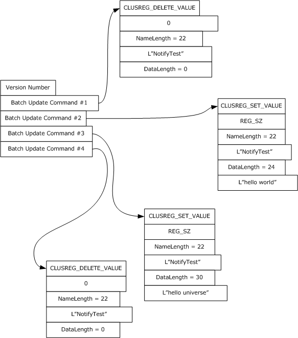
<!-- /Extracted images from page 408 -->

Figure 3: Client-issued registry update

[MS-CMRP] - v20250811
Failover Cluster: Management API (ClusAPI) Protocol
Copyright © 2025 Microsoft Corporation
Release: August 11, 2025

408 / 662

<!-- Extracted images from page 409 -->
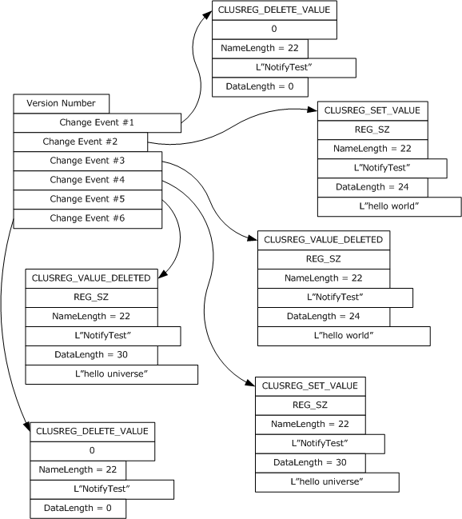
<!-- /Extracted images from page 409 -->

Figure 4: Corresponding change notifications returned by server

The server SHOULD accept an ApiGetBatchNotification request if the client's access level is at least
"Read" (section 3.1.4).

 error_status_t ApiGetBatchNotification(
   [in] HBATCH_PORT_RPC hBatchNotify,
   [out] DWORD * cbData,
   [out, size_is(,*cbData)] UCHAR ** lpData
 );

hBatchNotify: A pointer to an HBATCH_PORT_RPC context handle that was obtained in a previous

ApiCreateBatchPort method call.

cbData: A pointer to a 32-bit integer. Upon successful completion of this method, the server MUST

write the size, in bytes, of the lpData buffer to the integer location indicated by cbData.

409 / 662

[MS-CMRP] - v20250811
Failover Cluster: Management API (ClusAPI) Protocol
Copyright © 2025 Microsoft Corporation
Release: August 11, 2025

lpData: The address of a pointer where the server MUST write, upon successful completion of this

method, a CLUSTER_REG_BATCH_UPDATE structure as previously described.

Return Values: The method MUST return the following error codes for the specified conditions.

Return value/code

Description

0x00000000

Success.

ERROR_SUCCESS

0x00000006

ERROR_INVALID_HANDLE

The data that is pointed to by the hBatchNotify parameter does not represent a
valid HBATCH_PORT_RPC context handle.

0x00000103

ERROR_NO_MORE_ITEMS

The port referenced by the hBatchNotify parameter has been closed by a
separate call to the ApiCloseBatchPort method.

For any other condition, this method MUST return a value that is not one of those listed in the
preceding table. The client MUST behave in one consistent, identical manner for all values that are not
listed in the preceding table.

3.1.4.2.115  ApiCloseBatchPort (Opnum 116)

(Protocol Version 3) The ApiCloseBatchPort method instructs the server to free any context
information that is created in a previous ApiCreateBatchPort method.

The server SHOULD accept an ApiCloseBatchPort request if its protocol server state is read-only,
and the server MUST accept the request for processing if it is in the read/write state, as specified in
section 3.1.1.

The server SHOULD accept an ApiCloseBatchPort request if the client's access level is at least "Read"
(section 3.1.4).

 error_status_t ApiCloseBatchPort(
   [in, out] HBATCH_PORT_RPC * phBatchPort
 );

phBatchPort: A pointer to an HBATCH_PORT_RPC context handle that was obtained in a previous
ApiCreateBatchPort method call. Upon success, the server MUST set to NULL (0x00000000) the
context handle pointed to by this parameter.

Return Values: The method MUST return the following error codes for the specified conditions.

Return value/code

Description

0x00000000

Success.

ERROR_SUCCESS

0x00000006

ERROR_INVALID_HANDLE

The data that is pointed to by the phBatchPort parameter does not represent a
valid HBATCH_PORT_RPC context handle.

For any other condition, this method MUST return a value that is not one of the values listed in the
preceding table. The client MUST behave in one consistent, identical manner for all values that are
not listed in the preceding table.

3.1.4.2.116  ApiOpenClusterEx (Opnum 117)

[MS-CMRP] - v20250811
Failover Cluster: Management API (ClusAPI) Protocol
Copyright © 2025 Microsoft Corporation
Release: August 11, 2025

410 / 662

(Protocol Version 3) The ApiOpenClusterEx method SHOULD<96> establish context on the server
about client interaction with the cluster by means of the current RPC connection. ApiOpenClusterEx
returns a context handle so that the client can refer to the context that is created in subsequent
method calls.

The server MUST determine the level of access to be granted to the client (section 3.1.4). Upon
success, the server MUST associate that level of access with the cluster context it has established.

The server SHOULD accept an ApiOpenClusterEx request if its protocol server state is read-only and
MUST accept the request for processing if it is in the read/write state, as specified in section 3.1.1.

 HCLUSTER_RPC ApiOpenClusterEx(
   [in] DWORD dwDesiredAccess,
   [out] DWORD * lpdwGrantedAccess,
   [out] error_status_t *Status
 );

dwDesiredAccess: Indicates the access level desired by the caller. The client SHOULD set

dwDesiredAccess to the bitwise OR of one or more values in the following table (except for
restrictions as noted in the table). The server SHOULD permit the cluster security descriptor to
express permissions other than those specified in the following table. The server SHOULD perform
an access check against those other permissions if requested by the client, except if the client sets
dwDesiredAccess to a value that is invalid as specified in the following table. The server SHOULD
NOT support a value for dwDesiredAccess that allows the client to request an access level of "Read
with Backup Privilege".

Value

Meaning

CLUSAPI_READ_ACCESS

0x00000001

The client requests a context handle that can be used in subsequent method
calls that require "Read" access.

CLUSAPI_CHANGE_ACCESS

0x00000002

The client requests a context handle that can be used in subsequent method
calls that require "All" access. The server MUST return
ERROR_INVALID_PARAMETER (0x00000057) if the dwDesiredAccess bitwise
OR includes CLUSAPI_CHANGE_ACCESS but not CLUSAPI_READ_ACCESS.

GENERIC_READ

0x80000000

GENERIC-WRITE

0x40000000

GENERIC_EXECUTE

0x20000000

GENERIC_ALL

0x10000000

MAXIMUM_ALLOWED

0x02000000

The server MUST treat this value the same as CLUSAPI_READ_ACCESS.

The server MUST treat this value the same as the bitwise OR of
CLUSAPI_READ_ACCESS and CLUSAPI_CHANGE_ACCESS.

The server MUST treat this value the same as the bitwise OR of
CLUSAPI_READ_ACCESS and CLUSAPI_CHANGE_ACCESS.

The server MUST treat this value the same as the bitwise OR of
CLUSAPI_READ_ACCESS and CLUSAPI_CHANGE_ACCESS.

The client requests a context handle that can be used in subsequent method
calls that require the maximum access level granted to the client, as specified
in section 3.1.4.

lpdwGrantedAccess: A pointer to a 32-bit value that indicates the access level granted to the client.
If the method fails, the client MUST ignore this value. Upon successful completion of this method,
the server MUST set this value to one of the values in the following table.

[MS-CMRP] - v20250811
Failover Cluster: Management API (ClusAPI) Protocol
Copyright © 2025 Microsoft Corporation
Release: August 11, 2025

411 / 662

Value

Meaning

GENERIC_READ

0x80000000

The returned context handle can be used in subsequent methods that require "Read"
access. If the client has backup privilege, the returned context handle can also be used in
subsequent methods that require "Read with Backup Privilege" access.

GENERIC_ALL

The returned context handle can be used in subsequent methods that require "All" access.

0x10000000

Status: Indicates the status of this operation. The server MUST set Status to the following error codes

for the specified conditions.

Value

ERROR_SUCCESS

0x00000000

Meaning

Success.

ERROR_ACCESS_DENIED

0x00000005

dwDesiredAccess indicates a level of access exceeding what the client
is entitled to (section 3.1.4).

ERROR_INVALID_PARAMETER

dwDesiredAccess is invalid, as specified earlier in this section.

0x00000057

RPC_S_PROCNUM_OUT_OF_RANGE

The server does not support this method.

0x000006D1

For any other condition, the server sets Status to a value that is not one of the values listed in the
preceding table. The client MUST treat all values that are not listed in the preceding table the
same, except as specified in section 3.2.4.6.

Return Values: The method MUST return a valid HCLUSTER_RPC (section 2.2.1.1) context handle to

indicate success; otherwise, it MUST return NULL.

3.1.4.2.117  ApiOpenNodeEx (Opnum 118)

(Protocol Version 3) The ApiOpenNodeEx method SHOULD<97> establish context on the server about
the interaction of a client with the specified cluster node by using the current RPC connection.
ApiOpenNodeEx returns a context handle so that the client can refer to the context that is created in
subsequent method calls.

The server MUST determine the level of access to be granted to the client (section 3.1.4). Upon
success, the server MUST associate that level of access with the node context it has established.

The client can determine the name of the node to specify for the lpszNodeName parameter in one of
two ways. A node can have a well-known name if it was configured as such by using implementation-
specific methods between servers. Or, a client can use ApiCreateEnum with enumeration type
CLUSTER_ENUM_NODE, as specified in section 3.1.4.2.8. This method obtains a list of all node names
in the cluster state. The client can then examine names or open nodes to call additional methods to
determine which nodes to operate on.

The server SHOULD accept an ApiOpenNodeEx request if its protocol server state is read-only, and
MUST accept the request for processing if it is in the read/write state, as specified in section 3.1.1.

 HNODE_RPC ApiOpenNodeEx(
   [in, string] LPCWSTR lpszNodeName,
   [in] DWORD dwDesiredAccess,
   [out] DWORD * lpdwGrantedAccess,
   [out] error_status_t *Status,
   [out] error_status_t *rpc_status

[MS-CMRP] - v20250811
Failover Cluster: Management API (ClusAPI) Protocol
Copyright © 2025 Microsoft Corporation
Release: August 11, 2025

412 / 662

 );

lpszNodeName: A null-terminated Unicode string that contains the computer name of the node

for which to establish context on the server.

dwDesiredAccess: The value for this parameter is the same as specified for dwDesiredAccess in

ApiOpenClusterEx.

lpdwGrantedAccess: The value for this parameter is the same as specified for lpdwGrantedAccess in
ApiOpenClusterEx, with the additional stipulation that if the server sets lpdwGrantedAccess to
GENERIC_READ and if the client has the backup privilege, as defined in [MS-LSAD], then the
returned context handle can also be used in a subsequent call to ApiMoveGroupToNode.

Status: Indicates the status of this operation. The server MUST set Status to the following error codes

for the specified conditions.

Value

ERROR_SUCCESS

0x00000000

Meaning

Success.

ERROR_ACCESS_DENIED

0x00000005

dwDesiredAccess indicates a level of access exceeding what the
client is entitled to (section 3.1.4).

ERROR_INVALID_PARAMETER

dwDesiredAccess is invalid, as specified earlier in this section.

0x00000057

ERROR_CLUSTER_NODE_NOT_FOUND

0x000013B2

A node that matches the name lpszNodeName was not found in the
cluster configuration.

RPC_S_PROCNUM_OUT_OF_RANGE

The server does not support this method.

0x000006D1

For any other condition, the server sets Status to a value that is not one of the values listed in the
preceding table. The client MUST treat all values not listed in the preceding table the same, except
as specified in section 3.2.4.6.

rpc_status: A 32-bit integer used to indicate success or failure. The RPC runtime MUST indicate, by
writing to this parameter, whether it succeeded in executing this method on the server. The
encoding of the value passed in this parameter MUST conform to encoding for comm_status and
fault_status, as specified in Appendix E of [C706].

Return Values: The method MUST return a valid HNODE_RPC (section 2.2.1.2) context handle to

indicate success; otherwise, it MUST return NULL.

3.1.4.2.118  ApiOpenGroupEx (Opnum 119)

(Protocol Version 3) The ApiOpenGroupEx method SHOULD<98> establish context on the server about
the interaction of a client with a specified cluster group by means of the current RPC connection.
ApiOpenGroupEx returns a context handle so that the client can refer to the group in subsequent
method calls.

The server MUST determine the level of access to be granted to the client (section 3.1.4). Upon
success, the server MUST associate that level of access with the group context it has established.

The client has two ways to determine the group name to specify for the lpszGroupName parameter. A
group can have a well-known name if it was configured as such using implementation-specific

413 / 662

[MS-CMRP] - v20250811
Failover Cluster: Management API (ClusAPI) Protocol
Copyright © 2025 Microsoft Corporation
Release: August 11, 2025

methods between servers. Alternatively, a client can use ApiGetResourceState which returns the name
of the group in which a resource is contained.

The server SHOULD accept an ApiOpenGroupEx request if its protocol server state is read-only and
MUST accept the request for processing if it is in the read/write state, as specified in section 3.1.1.

 HGROUP_RPC ApiOpenGroupEx(
   [in, string] LPCWSTR lpszGroupName,
   [in] DWORD dwDesiredAccess,
   [out] DWORD * lpdwGrantedAccess,
   [out] error_status_t *Status,
   [out] error_status_t *rpc_status
 );

lpszGroupName: A Unicode string that contains the name of the group for which to establish

context on the server.

dwDesiredAccess: The value for this parameter is the same as specified for dwDesiredAccess in

ApiOpenClusterEx.

lpdwGrantedAccess: The value for this parameter is the same as specified for lpdwGrantedAccess in
ApiOpenClusterEx, with the additional stipulation that if the server sets lpdwGrantedAccess to
GENERIC_READ and if the client has the backup privilege, as defined in [MS-LSAD], then the
returned context handle can also be used in a subsequent call to ApiMoveGroup or
ApiMoveGroupToNode.

Status: Indicates the status of this operation. The server MUST set Status to the following error

codes for the specified conditions.

Value

ERROR_SUCCESS

0x00000000

ERROR_ACCESS_DENIED

0x00000005

ERROR_SHARING_PAUSED

0x00000046

Meaning

Success.

dwDesiredAccess indicates a level of access exceeding what the client
is entitled to (section 3.1.4).

The remote server has been paused or is in the process of being
started.

ERROR_INVALID_PARAMETER

dwDesiredAccess is invalid, as specified earlier in this section.

0x00000057

RPC_S_PROCNUM_OUT_OF_RANGE

The server does not support this method.

0x000006D1

ERROR_GROUP_NOT_FOUND

0x00001395

A group that matches the name lpszGroupName was not found in the
cluster configuration.

For any other condition, the server sets Status to a value that is not one of the values listed in the
preceding table. The client MUST treat all values that are not listed in the preceding table the
same, except as specified in section 3.2.4.6.

rpc_status: A 32-bit integer used to indicate success or failure. The RPC runtime MUST indicate, by
writing to this parameter, whether it succeeded in executing this method on the server. The
encoding of the value passed in this parameter MUST conform to encoding for comm_status and
fault_status, as specified in Appendix E of [C706].

[MS-CMRP] - v20250811
Failover Cluster: Management API (ClusAPI) Protocol
Copyright © 2025 Microsoft Corporation
Release: August 11, 2025

414 / 662

Return Values: The method MUST return a valid HGROUP_RPC context handle (section 2.2.1.3) to

indicate success; otherwise, it MUST return NULL.

3.1.4.2.119  ApiOpenResourceEx (Opnum 120)

(Protocol Version 3) The ApiOpenResourceEx method SHOULD<99> establish context on the server
about the interaction of a client with the specified cluster resource by using the current RPC
connection. ApiOpenResourceEx returns a context handle so that the client can refer to the resource
in subsequent method calls.

The server MUST determine the level of access to be granted to the client (section 3.1.4). Upon
success, the server MUST associate that level of access with the resource context it has established.

The client has several ways to determine the resource name to specify for the lpszResourceName
parameter. A resource can have a well-known name if it was configured as such by using
implementation-specific methods between servers. Or, a client can use ApiCreateEnum with
enumeration type CLUSTER_ENUM_RESOURCE, as specified in section 3.1.4.2.8. This method obtains
a list of all resource names in the cluster state. The client can then examine names or open
resources to call additional methods to determine on which resources to operate.

The server SHOULD accept an ApiOpenResourceEx request if its protocol server state is read-only,
and MUST accept the processing request if it is in the read/write state, as specified in section 3.1.1.

 HRES_RPC ApiOpenResourceEx(
   [in, string] LPCWSTR lpszResourceName,
   [in] DWORD dwDesiredAccess,
   [out] DWORD * lpdwGrantedAccess,
   [out] error_status_t *Status,
   [out] error_status_t *rpc_status
 );

lpszResourceName: A Unicode string that contains the name of the resource for which to establish
context on the server. For version 3.0, the server MUST also accept the resource unique ID as
returned by the ApiGetResourceId method.

dwDesiredAccess: The value for this parameter is the same as specified for dwDesiredAccess in

ApiOpenClusterEx.

lpdwGrantedAccess: The value for this parameter is the same as specified for lpdwGrantedAccess in

ApiOpenClusterEx.

Status: Indicates the status of this operation. The server MUST set Status to the following error codes

for the specified conditions.

Value

ERROR_SUCCESS

0x0000000

Meaning

Success.

ERROR_ACCESS_DENIED

0x00000005

dwDesiredAccess indicates a level of access exceeding what the client
is entitled to (section 3.1.4).

ERROR_INVALID_PARAMETER

dwDesiredAccess is invalid, as specified earlier in this section.

0x00000057

RPC_S_PROCNUM_OUT_OF_RANGE

The server does not support this method.

0x000006D1

ERROR_RESOURCE_NOT_FOUND

A resource that matches name lpszResourceName was not found in the

415 / 662

[MS-CMRP] - v20250811
Failover Cluster: Management API (ClusAPI) Protocol
Copyright © 2025 Microsoft Corporation
Release: August 11, 2025

Value

0x0000138f

Meaning

cluster configuration.

For any other condition, the server sets Status to a value that is not one of the values listed in the
preceding table. The client MUST treat all values that are not listed in the preceding table the
same, except as specified in section 3.2.4.6.

rpc_status: A 32-bit integer used to indicate success or failure. The RPC runtime MUST indicate, by
writing to this parameter, whether it succeeded in executing this method on the server. The
encoding of the value passed in this parameter MUST conform to encoding for comm_status and
fault_status, as specified in Appendix E of [C706].

Return Values: The method MUST return a valid HRES_RPC (section 2.2.1.4) context handle to

indicate success; otherwise, it MUST return NULL.

3.1.4.2.120  ApiOpenNetworkEx (Opnum 121)

(Protocol Version 3) The ApiOpenNetworkEx method SHOULD<100> establish context on the server
about the interaction of a client with the specified cluster network by using the current RPC
connection. ApiOpenNetworkEx returns a context handle so that the client can refer to the context
that is created in subsequent method calls.

The server MUST determine the level of access to be granted to the client (section 3.1.4). Upon
success, the server MUST associate with the node context it has established that level of access.

There are several ways by which the client can determine the name of the cluster network to specify
for the lpszNetworkName parameter. A cluster network can have a well-known name if the cluster
network was configured as such by using implementation-specific methods between servers.
Optionally, a client can use ApiCreateEnum with enumeration type CLUSTER_ENUM_NETWORK, as
specified in section 3.1.4.2.8. This method obtains a list of all cluster network names in the cluster
state. The client can then examine names or open networks to call additional methods in order to
determine which networks to operate on.

The server SHOULD accept an ApiOpenNetworkEx request if its protocol server state is read-only
and MUST accept the request for processing if it is in the read/write state, as specified in section
3.1.1.

 HNETWORK_RPC ApiOpenNetworkEx(
   [in, string] LPCWSTR lpszNetworkName,
   [in] DWORD dwDesiredAccess,
   [out] DWORD * lpdwGrantedAccess,
   [out] error_status_t *Status,
   [out] error_status_t *rpc_status
 );

lpszNetworkName: A null-terminated Unicode string that contains the name of the cluster network

for which to establish context on the server.

dwDesiredAccess: The value for this parameter is the same as specified for dwDesiredAccess in

ApiOpenClusterEx.

lpdwGrantedAccess: The value for this parameter is the same as specified for lpdwGrantedAccess in

ApiOpenClusterEx.

Status: Indicates the status of this operation. The server MUST set Status to the following error

codes for the specified conditions.

[MS-CMRP] - v20250811
Failover Cluster: Management API (ClusAPI) Protocol
Copyright © 2025 Microsoft Corporation
Release: August 11, 2025

416 / 662

Value

ERROR_SUCCESS

0x00000000

ERROR_ACCESS_DENIED

0x00000005

Meaning

Success.

dwDesiredAccess indicates a level of access exceeding what the
client is entitled to (section 3.1.4).

ERROR_INVALID_PARAMETER

dwDesiredAccess is invalid, as specified earlier in this section.

0x00000057

RPC_S_PROCNUM_OUT_OF_RANGE

The server does not support this method.

0x000006D1

ERROR_CLUSTER_NETWORK_NOT_FOUND

0x000013B5

A cluster network that matches the name lpszNetworkName
was not found in the cluster configuration.

For any other condition, the server sets Status to a value that is not one of the values listed in the
preceding table. The client MUST treat all values that are not listed in the preceding table the
same, except as specified in section 3.2.4.6.

rpc_status: A 32-bit integer used to indicate success or failure. The RPC runtime MUST indicate, by
writing to this parameter, whether it succeeded in executing this method on the server. The
encoding of the value passed in this parameter MUST conform to encoding for comm_status and
fault_status, as specified in Appendix E of [C706].

Return Values: The method MUST return a valid HNETWORK_RPC (section 2.2.1.7) context handle to

indicate success; otherwise, it MUST return NULL.

3.1.4.2.121  ApiOpenNetInterfaceEx (Opnum 122)

(Protocol Version 3) The ApiOpenNetInterfaceEx method SHOULD<101> establish context on the
server about the interaction of a client with the specified cluster network interface by using the
current RPC connection. ApiOpenNetInterfaceEx returns a context handle so that the client can refer
to the context that is created in subsequent method calls.

The server MUST determine the level of access to be granted to the client (section 3.1.4). Upon
success, the server MUST associate that level of access with the node context it has established.

The client can determine the name of the cluster network interface in several ways to specify for the
lpszNetInterfaceName parameter. A cluster network interface can have a well-known name if the
cluster network interface was configured as such by using implementation-specific methods between
servers. Or, a client can use ApiCreateEnum with enumeration type CLUSTER_ENUM_NETINTERFACE,
as specified in section 3.1.4.2.8. This method obtains a list of all cluster network interface names in
the cluster state. The client then can examine names or open cluster network interfaces to call
additional methods to determine which cluster network interfaces to operate on. Finally, a client
supplying the name of the node and network to the ApiGetNetInterface method, will get the
corresponding cluster network interface object name for that combination, which then can be provided
to this method.

The server SHOULD accept an ApiOpenNetInterfaceEx request if its protocol server state is read-
only and MUST accept the request for processing if it is in the read/write state, as specified in section
3.1.1.

 HNETINTERFACE_RPC ApiOpenNetInterfaceEx(
   [in, string] LPCWSTR lpszNetInterfaceName,
   [in] DWORD dwDesiredAccess,
   [out] DWORD * lpdwGrantedAccess,
   [out] error_status_t *Status,

[MS-CMRP] - v20250811
Failover Cluster: Management API (ClusAPI) Protocol
Copyright © 2025 Microsoft Corporation
Release: August 11, 2025

417 / 662

   [out] error_status_t *rpc_status
 );

lpszNetInterfaceName: A null-terminated Unicode string that contains the name of the cluster

network interface for which to establish context on the server.

dwDesiredAccess: The value for this parameter is the same as specified for dwDesiredAccess in

ApiOpenClusterEx.

lpdwGrantedAccess: The value for this parameter is the same as specified for lpdwGrantedAccess in

ApiOpenClusterEx.

Status: Indicates the status of this operation. The server MUST set Status to the following error codes

for the specified conditions.

Value

ERROR_SUCCESS

0x00000000

ERROR_ACCESS_DENIED

0x00000005

ERROR_INVALID_PARAMETER

0x00000057

Meaning

Success.

dwDesiredAccess indicates a level of access exceeding
what the client is entitled to (section 3.1.4).

dwDesiredAccess is invalid, as specified earlier in this
section.

RPC_S_PROCNUM_OUT_OF_RANGE

The server does not support this method.

0x000006D1

ERROR_CLUSTER_NETINTERFACE_NOT_FOUND

0x000013b7

A cluster network interface that matches the name
lpszNetInterfaceName was not found in the cluster
configuration.

For any other condition, the server sets Status to a value that is not one of the values listed in the
preceding table. The client MUST treat all values that are not listed in the preceding table the
same, except as specified in section 3.2.4.6.

rpc_status: A 32-bit integer used to indicate success or failure. The RPC runtime MUST indicate, by
writing to this parameter, whether it succeeded in executing this method on the server. The
encoding of the value passed in this parameter MUST conform to encoding for comm_status and
fault_status, as specified in Appendix E of [C706].

Return Values: The method MUST return a valid HNETINTERFACE_RPC (section 2.2.1.8) context

handle to indicate success; otherwise, it MUST return NULL.

3.1.4.2.122  ApiChangeCsvState (Opnum 123)

(Protocol Version 3) The ApiChangeCsvState method SHOULD<102> instruct the server to change
the accessibility of the disk associated with hResource.

If dwState is 1, the server MUST set ResourceSharedVolumes to TRUE and convert all volumes
associated with hResource to cluster shared volumes. The server MUST set the initial state of all
cluster shared volumes associated with hResource such that volume maintenance mode, redirected
mode, and backup mode are all disabled.

If dwState is 1, the server SHOULD also designate the group associated with hResource as a special
group, as specified in section 3.1.1.1.4.

[MS-CMRP] - v20250811
Failover Cluster: Management API (ClusAPI) Protocol
Copyright © 2025 Microsoft Corporation
Release: August 11, 2025

418 / 662

If dwState is 0, the server MUST set ResourceSharedVolumes to FALSE and stop making the volumes
associated with hResource accessible to all nodes as cluster shared volumes.

If dwState is 0, the server SHOULD also remove the special group designation of the group associated
with hResource.

The server SHOULD accept an ApiChangeCsvState request if its protocol server state is read-only,
and the server MUST accept the request for processing if it is in the read/write state, as specified in
section 3.1.1.

The server MUST require that the access level associated with the hResource context handle is "All"
(section 3.1.4).

 error_status_t ApiChangeCsvState(
   [in] HRES_RPC hResource,
   [in] DWORD dwState,
   [out] error_status_t *rpc_status
 );

hResource: An HRES_RPC context handle that was obtained in a previous ApiOpenResource,

ApiOpenResourceEx, or ApiCreateResource method call.

dwState: This MUST be 1 to make the disk associated with hResource accessible from all cluster
nodes. This MUST be 0 to make the disk associated with hResource accessible only from the
cluster node that mounted the disk.

rpc_status: A 32-bit integer used to indicate success or failure. The RPC runtime MUST indicate, by
writing to this parameter, whether it succeeded in executing this method on the server. The
encoding of the value passed in this parameter MUST conform to encoding for comm_status and
fault_status, as specified in Appendix E of [C706].

Return Values: The method MUST return the following error codes for the specified conditions.

Return value/code

0x00000000

ERROR_SUCCESS

0x000003E5

ERROR_IO_PENDING

Description

Success.

The operation is still in progress.

0x00000046

ERROR_SHARING_PAUSED

The current protocol server state of the server is not
read/write.

0x000006D1

The server does not support this method.

RPC_S_PROCNUM_OUT_OF_RANGE

0x000013B8

ERROR_CLUSTER_INVALID_REQUEST

[MS-CMRP] - v20250811
Failover Cluster: Management API (ClusAPI) Protocol
Copyright © 2025 Microsoft Corporation
Release: August 11, 2025

The operation is invalid for the cluster or for the specified
resource . It is invalid for the cluster if the dwState
parameter is 1 and the requested state is not enabled for
the cluster; for instance, the server EnableSharedVolumes
state is FALSE (indicating that the server does not support
cluster shared volumes) (see section 3.1.1.4). The operation
is invalid for the specified resource if any of the following
conditions are met:



The dwState parameter is 1, and the specified resource
is already deployed to an application/service.



The dwState parameter is 1, and the specified resource

419 / 662

Return value/code

Description

is in maintenance mode (see section 3.1.1.1.1.2).





The dwState parameter is 1, and the specified resource
depends on one or more additional resources.

The dwState parameter is 0, and the specified resource
does not currently allow volumes to be shared to all
nodes in a cluster (ResourceSharedVolumes is already
FALSE).

0x000013D7

ERROR_CLUSTER_RESTYPE_NOT_SUPPORTED

The dwState parameter is 1 and the specified resource is
not of the correct type. Shared access can only be enabled
for resources that are of the Physical Disk Resource type.

0x0000138C

ERROR_RESOURCE_NOT_ONLINE

The dwState parameter is 1 and the specified resource is
not online. The resource MUST be online to enable shared
access.

For any other condition, this method returns a value that is not one of the values listed in the
preceding table. The client MUST behave in one consistent, identical manner for all values that are
not listed in the preceding table. The client treats errors specified in 3.2.4.6 as recoverable errors and
initiate the reconnect procedure as specified in section 3.2.4.6.

3.1.4.2.123  ApiCreateNodeEnumEx (Opnum 124)

(Protocol Version 3) The ApiCreateNodeEnumEx method SHOULD<103> return two ENUM_LIST
structures of equal length containing the ID and Name attributes of the requested objects of the
specified enumeration type from the cluster state. Each Element in the ReturnIdEnum parameter
corresponds to the ID of the element at the same offset in the ReturnNameEnum parameter.

If multiple enumeration types are indicated, the resulting ENUM_LIST contains zero or more entries of
each type, and the type of each entry in the lists are indicated by the ENUM_ENTRY data structure, as
specified in section 2.2.3.4.

The server SHOULD accept an ApiCreateNodeEnumEx request if its protocol server state is read-
only, and the server MUST accept the request for processing if it is in the read/write state, as specified
in section 3.1.1.

The server MUST fail this method with the ERROR_INVALID_PARAMETER (0x00000057) return value if
the dwType parameter is not one of the specified values or if the dwOptions parameter is not
0x00000000.

The server SHOULD accept an ApiCreateNodeEnumEx request if the access level associated with the
hNode context handle is at least "Read" (section 3.1.4).

 error_status_t ApiCreateNodeEnumEx(
   [in] HNODE_RPC hNode,
   [in] DWORD dwType,
   [in] DWORD dwOptions,
   [out] PENUM_LIST* ReturnIdEnum,
   [out] PENUM_LIST* ReturnNameEnum,
   [out] error_status_t* rpc_status
 );

hNode: An HNODE_RPC context handle that was obtained in a previous ApiOpenNode (Opnum 66) or

ApiOpenNodeEx (Opnum 118) method call.

[MS-CMRP] - v20250811
Failover Cluster: Management API (ClusAPI) Protocol
Copyright © 2025 Microsoft Corporation
Release: August 11, 2025

420 / 662

dwType: The type of enumeration to be returned by the server. This value MUST be set to the bitwise

OR operator of one or more of the following values:

Value

Meaning

CLUSTER_NODE_ENUM_NETINTERFACES

0x00000001

CLUSTER_NODE_ENUM_GROUPS

0x00000002

The server MUST return an enumeration of names, in
ReturnNameEnum, and an enumeration of IDs, in ReturnIdEnum,
representing one or more cluster network interfaces installed
on the specified node.

Each element of ReturnIdEnum that sets dwType to
CLUSTER_NODE_ENUM_NETINTERFACES contains the ID of the
cluster network interface as if the
CLUSCTL_NETINTERFACE_GET_ID control code is sent to the
cluster network interface represented by the name in the
corresponding element of the ReturnNameEnum.

The server MUST return an enumeration of names, in
ReturnNameEnum, and an enumeration of IDs, in ReturnIdEnum,
representing one or more cluster groups currently owned by the
specified node.

Each element of ReturnIdEnum that sets dwType to
CLUSTER_NODE_ENUM_GROUPS contains the ID of the cluster
group as if the CLUSCTL_GROUP_GET_ID control code is sent to
the cluster group represented by the name in the corresponding
element of the ReturnNameEnum.

dwOptions: A 32-bit integer that specifies the options on the type of elements to return. The client
MUST set this value to 0x00000000. The server MUST fail the call if this parameter is not set to
0x00000000.

ReturnIdEnum: A pointer to an ENUM_LIST (section 2.2.3.5) that contains IDs of the objects that

match the enumeration type that is indicated by the dwType parameter. The server MUST allocate
as much memory as is required to return the enumeration data. If the method fails, this
parameter MUST be ignored.

ReturnNameEnum: A pointer to an ENUM_LIST (section 2.2.3.5) that contains the names of the

objects that match the enumeration type that is indicated by the dwType parameter. The server
MUST allocate as much memory as is required to return the enumeration data. If the method fails,
this parameter MUST be ignored.

rpc_status: A 32-bit integer used to indicate success or failure. The RPC runtime MUST indicate, by

writing to this parameter, whether the runtime succeeded in executing this method on the server.
The encoding of the value passed in this parameter MUST conform to encoding for comm_status
and fault_status, as specified in Appendix E of [C706].

Return Values: The method MUST return the following error codes for the specified conditions.

Return value/code

Description

0x00000000

ERROR_SUCCESS

0x000000057

ERROR_INVALID_PARAMETER

Success.

The dwType parameter is not one of the specified values, or the
dwOptions parameter is not 0x00000000.

0x000006D1

The server does not support this method.

RPC_S_PROCNUM_OUT_OF_RANGE

For any other condition, this method returns a value that is not one of the values listed in the
preceding table. The client MUST behave in one consistent, identical manner for all values that are not

421 / 662

[MS-CMRP] - v20250811
Failover Cluster: Management API (ClusAPI) Protocol
Copyright © 2025 Microsoft Corporation
Release: August 11, 2025

listed in the preceding table. The client SHOULD treat errors specified in 3.2.4.6 as recoverable errors
and initiate the reconnect procedure as specified in section 3.2.4.6.

3.1.4.2.124  ApiCreateEnumEx (Opnum 125)

(Protocol Version 3) The ApiCreateEnumEx method SHOULD<104> return two ENUM_LIST structures
of equal length containing the ID and Name attributes of the requested objects of the specified
enumeration type from the cluster state. Each Element in the ReturnIdEnum parameter
corresponds to the ID of the element at the same offset in the ReturnNameEnum parameter.

If multiple enumeration types are indicated, the resulting ENUM_LIST contains zero or more entries of
each type, and the type of each entry in the list is indicated by the ENUM_ENTRY data structure, as
specified in section 2.2.3.4.

The server SHOULD accept an ApiCreateEnumEx request if its protocol server state is read-only, as
specified in section 3.1.1, and the dwType parameter is CLUSTER_ENUM_NODE. The server MUST
accept an ApiCreateEnumEx request if its protocol server state is read/write.

The server MUST fail this method with the ERROR_INVALID_PARAMETER (0x00000057) return value if
the dwType parameter is not one of the specified values or if the dwOptions parameter is not
0x00000000.

The server SHOULD accept an ApiCreateEnumEx request if the access level associated with the
hCluster context handle is at least "Read" (section 3.1.4).

 error_status_t ApiCreateEnumEx(
   [in] HCLUSTER_RPC hCluster,
   [in] DWORD dwType,
   [in] DWORD dwOptions,
   [out] PENUM_LIST* ReturnIdEnum,
   [out] PENUM_LIST* ReturnNameEnum,
   [out] error_status_t* rpc_status
 );

hCluster: An HCLUSTER_RPC (section 2.2.1.1) context handle that was obtained in a previous
ApiOpenCluster (section 3.1.4.2.1) or ApiOpenClusterEx (section 3.1.4.2.116) method call.

dwType: The type of enumeration to be returned by the server. This value MUST be set to the bitwise

OR operator of one or more of the following values, except as noted for
CLUSTER_ENUM_INTERNAL_NETWORK.

Value

Meaning

CLUSTER_ENUM_NODE

0x00000001

CLUSTER_ENUM_RESTYPE

0x00000002

The server MUST return an enumeration of names, in
ReturnNameEnum, and an enumeration of IDs, in ReturnIdEnum,
representing cluster nodes that are members of the cluster.

Each element of ReturnIdEnum that sets dwType to
CLUSTER_ENUM_NODE contains the ID of the cluster node as if the
CLUSCTL_NODE_GET_ID control code is sent to the node with the
name in the corresponding element of the ReturnNameEnum.

The serer MUST return an enumeration of names representing the
resource types installed in the cluster as the ReturnNameEnum
out parameter.

The server MUST return an ENUM_LIST of equal length in the
ReturnIdEnum out parameter with each element that sets dwType
to CLUSTER_ENUM_RESTYPE a zero-length null-terminated
Unicode string.

CLUSTER_ENUM_RESOURCE

The server MUST return an enumeration of names, in

422 / 662

[MS-CMRP] - v20250811
Failover Cluster: Management API (ClusAPI) Protocol
Copyright © 2025 Microsoft Corporation
Release: August 11, 2025

Value

0x00000004

CLUSTER_ENUM_GROUP

0x00000008

CLUSTER_ENUM_NETWORK

0x00000010

CLUSTER_ENUM_NETINTERFACE

0x00000020

Meaning

ReturnNameEnum,  and an enumeration of IDs, in ReturnIdEnum,
representing the cluster resources.

Each element of ReturnIdEnum that sets dwType to
CLUSTER_ENUM_RESOURCE contains the ID of the cluster resource
as if the CLUSCTL_RESOURCE_GET_ID control code is sent to the
resource with the name in the corresponding element of the
ReturnNameEnum.

The server MUST return an enumeration of names, in
ReturnNameEnum, and an enumeration of IDs, in ReturnIdEnum,
of cluster groups.

Each element of ReturnIdEnum that sets dwType to
CLUSTER_ENUM_GROUP contains the ID of the cluster group as if
the CLUSCTL_GROUP_GET_ID control code is sent to the group
with the name in the corresponding element of the
ReturnNameEnum.

The server MUST return an enumeration of names, in
ReturnNameEnum, and an enumeration of IDs, in ReturnIdEnum,
of cluster networks.

Each element of ReturnIdEnum that sets dwType to
CLUSTER_ENUM_NETWORK contains the ID of the cluster network
as if the CLUSCTL_NETWORK_GET_ID control code is sent to the
cluster network with the name in the corresponding element of the
ReturnNameEnum.

The server MUST return an enumeration of names, in
ReturnNameEnum, and an enumeration of IDs, in ReturnIdEnum,
of cluster network interfaces.

Each element of ReturnIdEnum that sets dwType to
CLUSTER_ENUM_NETINTERFACE contains the ID of the cluster
network interface as if the CLUSCTL_NETINTERFACE_GET_ID
control code is sent to the cluster network interface with the name
in the corresponding element of the ReturnNameEnum.

CLUSTER_ENUM_INTERNAL_NETWORK

Cannot be specified with any other value for this parameter.

0x80000000

The server MUST return an enumeration of names, in
ReturnNameEnum, and an enumeration of IDs, in ReturnIdEnum,
of cluster networks that are used only for internal communications.

Each element of ReturnIdEnum that sets dwType to
CLUSTER_ENUM_INTERNAL_NETWORK contains the ID of the
cluster network as if the CLUSCTL_NETWORK_GET_ID control code
is sent to the cluster network with the name in the corresponding
element of the ReturnNameEnum.

dwOptions: A 32-bit integer that specifies the options on the type of elements to return. The client
MUST set this value to 0x00000000. The server MUST fail the call if this parameter is not set to
0x00000000.

ReturnIdEnum: A pointer to a PENUM_LIST (section 2.2.3.5). The pointer contains the IDs of the

objects that match the enumeration type that is indicated by the dwType parameter. The server
MUST allocate as much memory as is required to return the enumeration data. If the method fails,
this parameter MUST be ignored.

ReturnNameEnum: A pointer to a PENUM_LIST (section 2.2.3.5). The pointer contains the name of
the objects that match the enumeration type that is indicated by the dwType parameter, except
where noted above. The server MUST allocate as much memory as is required to return the
enumeration data. If the method fails, this parameter MUST be ignored.

[MS-CMRP] - v20250811
Failover Cluster: Management API (ClusAPI) Protocol
Copyright © 2025 Microsoft Corporation
Release: August 11, 2025

423 / 662

rpc_status: A 32-bit integer used to indicate success or failure. The RPC runtime MUST indicate, by
writing to this parameter, whether it succeeded in executing this method on the server. The
encoding of the value passed in this parameter MUST conform to encoding for comm_status and
fault_status, as specified in Appendix E of [C706].

Return Values: The method MUST return the following error codes for the conditions that are

specified as follows.

Return value/code

Description

0x00000000

ERROR_SUCCESS

0x00000008

ERROR_NOT_ENOUGH_MEMORY

Success.

The server failed to allocate enough memory for the ReturnEnum
parameter.

0x000000057

ERROR_INVALID_PARAMETER

The enumeration type that is specified by dwType is not valid or
dwOptions is not set to 0x00000000.

0x000006D1

The server does not support this method.

RPC_S_PROCNUM_OUT_OF_RANGE

For any other condition, the server returns a value that is not one of the values listed in the preceding
table. The client MUST behave in one consistent, identical manner for all values that are not listed in
the preceding table. However, the client SHOULD treat errors specified in 3.2.4.6 as recoverable errors
and initiate the reconnect procedure as specified in section 3.2.4.6.

3.1.4.2.125  ApiPauseNodeEx (Opnum 126)

(Protocol Version 3) The ApiPauseNodeEx method SHOULD<105> instruct the server to suspend
group ownership and failover activity on the designated node and, optionally, to move groups on the
designated node to different nodes in the cluster.

The server MUST handle this method in the same manner as ApiPauseNode (section 3.1.4.1.70)
except as specified in this section.

This method enables the client to specify whether to evacuate the node by moving all the groups to
other nodes in the cluster. The client requests evacuation by setting the bDrainNode parameter to
TRUE. In this case, the server MUST move each group owned by the node designated by the hNode
parameter to a different node in the cluster.

If the client calls this method with bDrainNode set to TRUE:





The server MUST fail this method with ERROR_CLUSTER_NODE_EVACUATION_IN_PROGRESS
(0x0000174A) if evacuation is already in progress for the designated node. The way the server
determines that evacuation is in progress is implementation-specific, although for evacuation to
not be in progress, the following condition MUST be met: if the dwPauseFlags parameter does not
include the CLUSAPI_NODE_PAUSE_REMAIN_ON_PAUSED_NODE_ON_MOVE_ERROR flag, the
node designated by the hNode parameter cannot host any groups.

The server MUST fail this method with ERROR_CLUSTER_NODE_DOWN (0x000013BA) if there are
no nodes in the cluster that are in the ClusterNodeUp state (as specified in section 3.1.4.1.69)
other than the node designated by the hNode parameter.

Otherwise, if the client calls this method with bDrainNode set to TRUE, the server MUST return
ERROR_IO_PENDING (0x000003E5) and proceed to move the groups asynchronously.

The server SHOULD move the groups according to preferences, limitations, and other policies that are
configured and executed through implementation-specific methods between servers, as if

424 / 662

[MS-CMRP] - v20250811
Failover Cluster: Management API (ClusAPI) Protocol
Copyright © 2025 Microsoft Corporation
Release: August 11, 2025

ApiMoveGroup (section 3.1.4.1.52) or ApiMoveGroupEx (section 3.1.4.2.131) had been called for each
of these groups individually. If a preference, limitation, or other policy would prevent the server from
moving the group such that a call to ApiMoveGroup or ApiMoveGroupEx would fail, then unless the
CLUSAPI_NODE_PAUSE_REMAIN_ON_PAUSED_NODE_ON_MOVE_ERROR flag is set in the
dwPauseFlags parameter, the server MUST move the group to a different node anyway, even if the
server does not bring the group to its persistent state on the destination node.

The server MUST accept an ApiPauseNodeEx request only if its protocol server state is read/write,
as specified in section 3.1.1.

The server MUST require that the access level associated with the hNode parameter context handle is
"All", as specified in section 3.1.4.

 error_status_t ApiPauseNodeEx(
   [in] HNODE_RPC hNode,
   [in] BOOL bDrainNode,
   [in] DWORD dwPauseFlags,
   [out] error_status_t *rpc_status
 );

hNode: An HNODE_RPC context handle that was obtained in a previous call to

ApiOpenNode (section 3.1.4.1.67) or ApiOpenNodeEx (section 3.1.4.2.117).

bDrainNode: Indicates whether to evacuate the node. If set to TRUE, the server MUST evacuate the

node specified by the hNode parameter as specified in this section.

dwPauseFlags: This parameter can be set to

CLUSAPI_NODE_PAUSE_REMAIN_ON_PAUSED_NODE_ON_MOVE_ERROR (0x00000001),
indicating that the server MUST allow a group to remain on the node designated by the hNode
parameter if policies prohibit moving the group to any other nodes that are in the ClusterNodeUp
state. Otherwise, this parameter MUST be set to zero. The server MUST ignore the value of this
parameter entirely if the bDrainNode parameter is set to FALSE.

rpc_status: A 32-bit integer used to indicate success or failure. The RPC runtime MUST indicate, by
writing to this parameter, whether it succeeded in executing this method on the server. The
encoding of the value passed in this parameter MUST conform to encoding for comm_status and
fault_status, as specified in Appendix E of [C706].

Return Values: The method MUST return one of the following error codes.

Return value/code

Description

0x00000000

ERROR_SUCCESS

0x00000006

ERROR_INVALID_HANDLE

0x000013BA

ERROR_CLUSTER_NODE_DOWN

0x000003E5

ERROR_IO_PENDING

0x0000174A

ERROR_CLUSTER_NODE_EVACUATION_IN_PROGRESS

[MS-CMRP] - v20250811
Failover Cluster: Management API (ClusAPI) Protocol
Copyright © 2025 Microsoft Corporation
Release: August 11, 2025

The method completed successfully.

The data that is designated by the hNode
parameter does not represent a valid HNODE_RPC
context handle.

There are no nodes in the cluster that are in the
ClusterNodeUp state other than the node
designated by the hNode parameter.

The server is in the process of evacuating the
specified node.

The server is already evacuating the specified node
due to a prior call to this method.

425 / 662

For any other condition, the server returns a value that is not one of the values listed in the preceding
table. The client MUST behave identically for all return values that are not listed in the preceding
table; however, the client SHOULD treat errors specified in section 3.2.4.6 as recoverable errors and
initiate the reconnect procedure as specified in that section.

3.1.4.2.126  ApiPauseNodeWithDrainTarget (Opnum 127)

(Protocol Version 3) The ApiPauseNodeWithDrainTarget method SHOULD<106> instruct the server to
suspend group ownership and failover activity on the designated target node and to move all groups
from the designated node to a designated node in the cluster.

This server MUST handle this method in the same manner as ApiPauseNodeEx (section 3.1.4.2.125)
except that the server MUST attempt to move groups hosted by the node specified by the hNode
parameter to the node specified by the hNodeDrainTarget parameter. The server SHOULD move the
groups according to preferences, limitations, and other policies as if
ApiMoveGroupToNode (section 3.1.4.2.53) or ApiMoveGroupToNodeEx (section 3.1.4.2.132) had been
called for each of these groups individually.

The server MUST fail this method with ERROR_HOST_NODE_NOT_AVAILABLE (0x0000138D) if the
node designated by the hNodeDrainTarget parameter is not in the ClusterNodeUp state as specified in
section 3.1.4.2.69.

The server MUST accept an ApiPauseNodeWithDrainTarget request only if its protocol server state is
read/write, as specified in section 3.1.1.

The server MUST require that the access level associated with the hNodeDrainTarget parameter
context handle is "All", as specified in section 3.1.4.

 void ApiPauseNodeWithDrainTarget(
   [in] HNODE_RPC hNode,
   [in] DWORD dwPauseFlags,
   [in] HNODE_RPC hNodeDrainTarget,
   [out] error_status_t* rpc_status
 );

hNode: An HNODE_RPC context handle that was obtained in a previous call to

ApiOpenNode (section 3.1.4.1.67) or ApiOpenNodeEx (section 3.1.4.2.117).

dwPauseFlags: This parameter can be set to

CLUSAPI_NODE_PAUSE_REMAIN_ON_PAUSED_NODE_ON_MOVE_ERROR (0x00000001),
indicating that the server MUST allow a group to remain on the node designated by the hNode
parameter if policies prohibit moving the group to the node designated by the hNodeDrainTarget
parameter. Otherwise, this parameter MUST be set to zero.

hNodeDrainTarget: An HNODE_RPC context handle to the destination node, obtained in a previous

call to ApiOpenNode (section 3.1.4.1.67) or ApiOpenNodeEx (section 3.1.4.2.117). The
hNodeDrainTarget parameter MUST NOT specify the same node as the hNode parameter.

rpc_status: A 32-bit integer used to indicate success or failure. The RPC runtime MUST indicate, by
writing to this parameter, whether it succeeded in executing this method on the server. The
encoding of the value passed in this parameter MUST conform to encoding for comm_status and
fault_status, as specified in Appendix E of [C706].

Return Values: This method MUST return one of the error codes returned by
ApiPauseNodeEx (section 3.1.4.2.125) or one of the following values:

Return value/code

Description

0x0000138D

The node designated by the hNodeDrainTarget parameter is in an

426 / 662

[MS-CMRP] - v20250811
Failover Cluster: Management API (ClusAPI) Protocol
Copyright © 2025 Microsoft Corporation
Release: August 11, 2025

Return value/code

Description

ERROR_HOST_NODE_NOT_AVAILABLE

invalid state.

0x00000072

ERROR_INVALID_TARGET_HANDLE

The node designated by the hNodeDrainTarget parameter is an
invalid destination node. This method MUST return
ERROR_INVALID_TARGET_HANDLE if the node designated by the
hNodeDrainTarget parameter is the same as the node designated
by the hNode parameter.

For any other condition, the server returns a value that is not one of the values listed in the preceding
table. The client MUST behave identically for all return values that are not listed in the preceding
table; however, the client SHOULD treat errors specified in section 3.2.4.6 as recoverable errors and
initiate the reconnect procedure as specified in that section.

3.1.4.2.127  ApiResumeNodeEx (Opnum 128)

(Protocol Version 3) The ApiResumeNodeEx method SHOULD<107> instruct the server to resume
normal group ownership and failover activity on the designated node and, optionally, to initiate
operations to move groups to the designated node.

The server MUST handle this method in the same manner as ApiResumeNode (section 3.1.4.2.71)
except as specified below for the dwResumeFailbackType parameter.

The server MUST require that the access level associated with the hNode parameter context handle is
"All", as specified in section 3.1.4.

 error_status_t ApiResumeNodeEx(
   [in] HNODE_RPC hNode,
   [in] DWORD dwResumeFailbackType,
   [in] DWORD dwResumeFlagsReserved,
   [out] error_status_t *rpc_status
 );

hNode: An HNODE_RPC context handle that was obtained in a previous call to

ApiOpenNode (section 3.1.4.1.67) or ApiOpenNodeEx (section 3.1.4.2.117).

dwResumeFailbackType: Designates whether the server MUST initiate operations to move groups to
the node designated by the hNode parameter. This parameter MUST be set to one of the following
values:

Value  Description

0

1

2

The server SHOULD NOT move groups to the node designated by the hNode parameter as a result
of the call to this method. The server MAY subsequently move groups to the node designated by the
hNode parameter according to other implementation-specific policies.

The server SHOULD move groups to the node designated by the hNode parameter as a result of the
call to this method. The server SHOULD use implementation-specific policies to determine the
groups to move and the manner in which to move them. In determining the groups to move, the
server SHOULD ignore previously configured policies that control whether groups are to be moved to
a node upon its transition to the ClusterNodeUp state (as specified in section 3.1.4.1.69).

The server SHOULD move groups to the node designated by the hNode parameter as a result of the
call to this method. The server SHOULD use implementation-specific policies to determine the
groups to move and the manner in which to move them. In selecting the groups to move, the server
SHOULD adhere to policies that control whether groups are to be moved to a node upon its
transition to the ClusterNodeUp state (as specified in section 3.1.4.1.69).

This setting will cause failback due to potential violations of configured policies (such as possible
owners, anti-affinity, and preferred owners) only if failback is enabled. Although callers can specify a

427 / 662

[MS-CMRP] - v20250811
Failover Cluster: Management API (ClusAPI) Protocol
Copyright © 2025 Microsoft Corporation
Release: August 11, 2025

Value  Description

failback window in which failback would normally occur, in this situation the server will ignore any
caller-specified failback window. The failback can happen at any time. This setting also causes
failback of all groups from all paused nodes to this node.

dwResumeFlagsReserved: Reserved for future use.

rpc_status: A 32-bit integer used to indicate success or failure. The RPC runtime MUST indicate, by
writing to this parameter, whether it succeeded in executing this method on the server. The
encoding of the value passed in this parameter MUST conform to encoding for comm_status and
fault_status, as specified in Appendix E of [C706].

Return Values: The method MUST return one of the following error codes:

Return value/code

Description

0x00000000

ERROR_SUCCESS

0x00000006

ERROR_INVALID_HANDLE

The method completed successfully.

The hNode parameter does not contain a valid HNODE_RPC context
handle.

0x000013C2

The node designated by the hNode parameter is not paused.

ERROR_CLUSTER_NODE_NOT_PAUSED

0x000013BA

The node designated by the hNode parameter is down.

ERROR_CLUSTER_NODE_DOWN

3.1.4.2.128  ApiCreateGroupEx (Opnum 129)

(Protocol Version 3) The ApiCreateGroupEx method SHOULD<108> extend functionality of the
ApiCreateGroup (section 3.1.4.2.43) method, allowing the client to provide additional information
about the group being created.

The server MUST handle this method in the same manner as ApiCreateGroup (section 3.1.4.2.43)
except as specified later in this section for the pGroupInfo parameter.

 HGROUP_RPC ApiCreateGroupEx(
   [in, string] LPCWSTR lpszGroupName,
   [in, unique] PCLUSTER_CREATE_GROUP_INFO_RPC pGroupInfo,
   [out] error_status_t *Status,
   [out] error_status_t *rpc_status
 );

lpszGroupName: A Unicode string that is the name associated with the group.

pGroupInfo: Contains information about the group to be created. The client MUST set the

dwVersion field of the CLUSTER_CREATE_GROUP_INFO_RPC (section 2.2.3.21) to 0x00000001.
Except for the following reserved values, the client sets the dwGroupType field to an arbitrary
value that the client can use to associate meaning or context with the group. Upon successful
creation of the group, the server MUST set the group type to the value specified by the client and
the server MUST treat all values identically. If a client does not need to associate any particular
meaning or context with the group, the client SHOULD set the group type to 0x0000270F
(ClusGroupTypeUnknown).

[MS-CMRP] - v20250811
Failover Cluster: Management API (ClusAPI) Protocol
Copyright © 2025 Microsoft Corporation
Release: August 11, 2025

428 / 662

Value

Description

0x00000001

Reserved for local use.

ClusGroupTypeReserved1

0x00000002

Reserved for local use.

ClusGroupTypeReserved2

0x00000004

Reserved for local use.

ClusGroupTypeReserved3

0x00000005

Reserved for local use.

ClusGroupTypeReserved4

Status: Indicates the status of this operation. The server MUST set this parameter to one of the

following error codes:

Value

Description

0x00000000

ERROR_SUCCESS

The operation completed successfully.

0x00000046

The remote server is paused or is in the process of being started.

ERROR_SHARING_PAUSED

0x00001392

A group with the designated name already exists.

ERROR_OBJECT_ALREADY_EXISTS

For any other condition, the server sets the Status parameter to a value that is not one of the
values listed in this table. The client MUST treat all values not listed in this table identically, except
as specified in section 3.2.4.6.

rpc_status: A 32-bit integer used to indicate success or failure. The RPC runtime MUST indicate, by
writing to this parameter, whether it succeeded in executing this method on the server. The
encoding of the value passed in this parameter MUST conform to encoding for comm_status and
fault_status, as specified in Appendix E of [C706].

Return Values: This method MUST return a valid HGROUP_RPC context handle, as specified in

section 2.2.1.3, to indicate success. Otherwise, it MUST return NULL.

3.1.4.2.129  ApiOnlineGroupEx (Opnum 130)

(Protocol Version 3) The ApiOnlineGroupEx method SHOULD<109> instruct the server to make all the
resources in the designated group active or available on the node that is hosting the group. The
persistent state of the group is set to Online and is updated in the nonvolatile cluster state.

The server MUST handle this method in the same manner as ApiOnlineGroup (section 3.1.4.2.50)
except as follows:





If the CLUSAPI_GROUP_ONLINE_IGNORE_RESOURCE_STATUS flag is set in the dwOnlineFlags
parameter, the server MUST ignore the locked mode value of the group designated by the hGroup
parameter.

If the CLUSAPI_GROUP_ONLINE_SYNCHRONOUS flag is set in the dwOnlineFlags parameter, the
server MUST perform the operation synchronously to bring the group designated by the hGroup
parameter online.

[MS-CMRP] - v20250811
Failover Cluster: Management API (ClusAPI) Protocol
Copyright © 2025 Microsoft Corporation
Release: August 11, 2025

429 / 662







If the CLUSAPI_GROUP_ONLINE_BEST_POSSIBLE_NODE flag is set in the dwOnlineFlags
parameter, the server MUST determine the best possible node that will host the group designated
by the hGroup parameter.

If the CLUSAPI_GROUP_ONLINE_IGNORE_AFFINITY_RULE flag is set in the dwOnlineFlags
parameter, the server MUST ignore the affinity rule of the group designated by the hGroup
parameter.

For each resource contained in the group designated by the hGroup parameter that is not in the
ClusterResourceOnline state (section 3.1.4.2.13), the server MUST provide the buffer specified by
the lpInBuffer parameter to the server implementation-specific object that controls the resource
operation while bringing the resource online.

The server MUST accept an ApiOnlineGroupEx request only if it is in the read/write state, as specified
in section 3.1.1.

The server MUST require that the access level associated with the hGroup parameter is "All" (section
3.1.4).

 error_status_t ApiOnlineGroupEx(
   [in] HGROUP_RPC hGroup,
   [in] DWORD dwOnlineFlags,
   [in, size_is(cbInBufferSize)] BYTE* lpInBuffer,
   [in] DWORD cbInBufferSize,
   [out] error_status_t *rpc_status
 );

hGroup: An HGROUP_RPC context handle that was obtained in a previous call to

ApiOpenGroup (section 3.1.4.2.42), ApiOpenGroupEx (section 3.1.4.2.118), or
ApiCreateGroup (section 3.1.4.2.43).

dwOnlineFlags: A bitwise-OR of zero or more of the following flags.

Value

0x00000001

CLUSAPI_GROUP_ONLINE_IGNORE_RESOURCE_STATUS

Description

The server MUST ignore the locked mode of the
group as specified in section 3.1.1.1.4.

0x00000002

CLUSAPI_GROUP_ONLINE_SYNCHRONOUS

The server MUST perform the operation
synchronously to bring the group online.<110>

0x00000004

CLUSAPI_GROUP_ONLINE_BEST_POSSIBLE_NODE

0x00000008

CLUSAPI_GROUP_ONLINE_IGNORE_AFFINITY_RULE

The server MUST determine the best possible
node that will host the group when it is brought
online.<111>

The server MUST ignore the affinity rule of the
group.<112>

lpInBuffer: A pointer to a buffer that the server will provide to implementation-specific objects that

control the resource operations for each resource in the group. The client SHOULD set this
parameter to a PROPERTY_LIST (section 2.2.3.10). For each value in this list, the client SHOULD
set the property name to the name of the resource type of one of the resources in the group.
The client MAY provide a buffer that does not have a property value corresponding to each
resource type in the group, and the client MAY provide a buffer that has multiple property values
for the same resource type. Except for the following property values, the server MUST treat all
property values provided by the client identically.

[MS-CMRP] - v20250811
Failover Cluster: Management API (ClusAPI) Protocol
Copyright © 2025 Microsoft Corporation
Release: August 11, 2025

430 / 662

Property Name  CLUSTER_PROPERTY_FORMAT  Value

Description

Virtual Machine

CLUSPROP_FORMAT_DWORD

0x00000004  Reserved for local use.

cbInBufferSize: The size in bytes of the buffer pointed to by the lpInBuffer parameter.

rpc_status: A 32-bit integer used to indicate success or failure. The RPC runtime MUST indicate, by
writing to this parameter, whether it succeeded in executing this method on the server. The
encoding of the value passed in this parameter MUST conform to encoding for comm_status and
fault_status, as specified in Appendix E of [C706].

Return Values: This method MUST return the same error codes as specified for
ApiOnlineGroup (section 3.1.4.2.50), in addition to the following return value.

Return value/code

Description

0x00000057

The dwOnlineFlags parameter is not one of the specified values.

ERROR_INVALID_PARAMETER

3.1.4.2.130  ApiOfflineGroupEx (Opnum 131)

(Protocol Version 3) The ApiOfflineGroupEx method SHOULD<113> instruct the server to make all the
resources in the designated group inactive or unavailable on the node that is hosting the group.

The server MUST handle this method in the same manner as ApiOfflineGroup (section 3.1.4.2.51)
except as follows:





If the CLUSAPI_GROUP_OFFLINE_IGNORE_RESOURCE_STATUS flag is set in the dwOfflineFlags
parameter, the server MUST ignore the locked mode value of the group designated by the hGroup
parameter.

For each resource contained in the group designated by the hGroup parameter that is in the
ClusterResourceOnline state (section 3.1.4.2.13), the server MUST provide the buffer specified by
the lpInBuffer parameter to the server implementation-specific object that controls the resource
operation while bringing the resource offline.

The server MUST accept an ApiOfflineGroupEx request only if it is in the read/write state, as specified
in section 3.1.1.

The server MUST require that the access level associated with the hGroup parameter is "All" (section
3.1.4).

 error_status_t ApiOfflineGroupEx(
   [in] HGROUP_RPC hGroup,
   [in] DWORD dwOfflineFlags,
   [in, size_is(cbInBufferSize)] BYTE* lpInBuffer,
   [in] DWORD cbInBufferSize,
   [out] error_status_t *rpc_status
 );

hGroup: An HGROUP_RPC context handle that was obtained in a previous call to

ApiOpenGroup (section 3.1.4.2.42), ApiOpenGroupEx (section 3.1.4.2.118), or
ApiCreateGroup (section 3.1.4.2.43).

[MS-CMRP] - v20250811
Failover Cluster: Management API (ClusAPI) Protocol
Copyright © 2025 Microsoft Corporation
Release: August 11, 2025

431 / 662

dwOfflineFlags: Either CLUSAPI_GROUP_OFFLINE_IGNORE_RESOURCE_STATUS (0x00000001), if
the client needs the server to ignore the locked mode for the group specified by the hGroup
parameter (section 3.1.1.1.4), or zero.

lpInBuffer: A pointer to a buffer that the server will provide to implementation-specific objects that

control the resource operations for each resource in the group. The client SHOULD set this
parameter to a PROPERTY_LIST (section 2.2.3.10). For each value in this list, the client SHOULD
set the property name to the name of the resource type of one of the resources in the group.
The client MAY provide a buffer that does not have a property value corresponding to each
resource type in the group, and the client MAY provide a buffer that has multiple property values
for the same resource type. Except for the following property values, the server MUST treat all
property values provided by the client identically.

Property
Name

Virtual
Machine

Virtual
Machine

Virtual
Machine

Virtual
Machine

Virtual
Machine

CLUSTER_PROPERTY_FORMAT  Value

Description

CLUSPROP_FORMAT_DWORD

0x00000000  For a resource of type "Virtual Machine" in

the group that is in the
ClusterResourceOnline state (section
3.1.4.2.13), the server MUST turn off the
corresponding virtual machine.

CLUSPROP_FORMAT_DWORD

0x00000001  For a resource of type "Virtual Machine" in

the group that is in the
ClusterResourceOnline state (section
3.1.4.2.13), the server MUST save the
corresponding virtual machine.

CLUSPROP_FORMAT_DWORD

0x00000002  For a resource of type "Virtual Machine" in

the group that is in the
ClusterResourceOnline state (section
3.1.4.2.13), the server MUST shut down the
corresponding virtual machine.

CLUSPROP_FORMAT_DWORD

0x00000003  For a resource of type "Virtual Machine" in

the group that is in the
ClusterResourceOnline state (section
3.1.4.2.13), the server MUST forcibly shut
down the corresponding virtual machine.

CLUSPROP_FORMAT_DWORD

0x00000004  Reserved.

cbInBufferSize: The size in bytes of the buffer pointed to by the lpInBuffer parameter.

rpc_status: A 32-bit integer used to indicate success or failure. The RPC runtime MUST indicate, by
writing to this parameter, whether it succeeded in executing this method on the server. The
encoding of the value passed in this parameter MUST conform to encoding for comm_status and
fault_status, as specified in Appendix E of [C706].

Return Values: This method MUST return the same error codes as specified for

ApiOfflineGroup (section 3.1.4.2.51).

3.1.4.2.131  ApiMoveGroupEx (Opnum 132)

(Protocol Version 3) The ApiMoveGroupEx method SHOULD<114> instruct the server to move
ownership of the specified group to another node in the cluster.

The server MUST handle this method in the same manner as ApiMoveGroup (section 3.1.4.2.52)
except as follows:

[MS-CMRP] - v20250811
Failover Cluster: Management API (ClusAPI) Protocol
Copyright © 2025 Microsoft Corporation
Release: August 11, 2025

432 / 662















If the CLUSAPI_GROUP_MOVE_IGNORE_RESOURCE_STATUS flag is set in the dwMoveFlags
parameter, the server MUST ignore the locked mode value of the group designated by the hGroup
parameter.

If the CLUSAPI_GROUP_MOVE_RETURN_TO_SOURCE_NODE_ON_ERROR flag is set in the
dwMoveFlags parameter, and if the designated group cannot be brought to its persistent state on
the destination node selected by the server, the server MUST move the group back to the source
node and bring the group to its persistent state on the source node.

If the CLUSAPI_GROUP_MOVE_QUEUE_ENABLED flag is set in the dwMoveFlags parameter, and if
server implementation-specific policies preclude the move operation from proceeding, the server
MUST retry the move operation until either the move succeeds, or the move fails due to a different
reason, or the move is canceled.

If the CLUSAPI_GROUP_MOVE_HIGH_PRIORITY_START flag is set in the dwMoveFlags parameter,
then on the destination node when bringing the group to its persistent state, the server SHOULD
bring this group to its persistent state as soon as possible, regardless of other implementation-
specific policies that govern the ordering and/or prioritization of bringing groups to their persistent
states.

If the CLUSAPI_GROUP_MOVE_FAILBACK flag is set in the dwMoveFlags parameter, and if move
group operation fails, the server MUST perform failback operation.

If the CLUSAPI_GROUP_MOVE_IGNORE_AFFINITY_RULE flag is set in the dwMoveFlags parameter,
the server MUST ignore the affinity rule of the group designated by the hGroup parameter.

For each resource contained in the group designated by hGroup that is in the state
ClusterResourceOnline (section 3.1.4.2.13), the server MUST provide the buffer designated by the
lpInBuffer parameter to the server implementation-specific object that controls the resource
operation while bringing the resource offline on the current node and when bringing the resource
online on the destination node. How the server provides this buffer is implementation-specific.

The server accepts an ApiMoveGroupEx request only if it is in the read/write state, as specified in
section 3.1.1.

The server MUST require that the access level associated with the hGroup parameter is "All" (section
3.1.4).

 error_status_t ApiMoveGroupEx(
   [in] HGROUP_RPC hGroup,
   [in] DWORD dwMoveFlags,
   [in, size_is(cbInBufferSize)] BYTE* lpInBuffer,
   [in] DWORD cbInBufferSize,
   [out] error_status_t *rpc_status
 );

hGroup: An HGROUP_RPC context handle that was obtained in a previous call to

ApiOpenGroup (section 3.1.4.2.42), ApiOpenGroupEx (section 3.1.4.2.118), or
ApiCreateGroup (section 3.1.4.2.43).

dwMoveFlags: A bitwise-OR of zero or more of the following flags, with the exception that

CLUSAPI_GROUP_MOVE_IGNORE_RESOURCE_STATUS and
CLUSAPI_GROUP_MOVE_QUEUE_ENABLED cannot be specified together and MUST be rejected by
the server with the error 0x00000057 (ERROR_INVALID_PARAMETER).

Value

0x00000001

CLUSAPI_GROUP_MOVE_IGNORE_RESOURCE_STATUS

Description

The server MUST ignore the group
locked mode as specified in section

433 / 662

[MS-CMRP] - v20250811
Failover Cluster: Management API (ClusAPI) Protocol
Copyright © 2025 Microsoft Corporation
Release: August 11, 2025

Value

0x00000002

CLUSAPI_GROUP_MOVE_RETURN_TO_SOURCE_NODE_ON_ERROR

0x00000004

CLUSAPI_GROUP_MOVE_QUEUE_ENABLED

0x00000008

CLUSAPI_GROUP_MOVE_HIGH_PRIORITY_START

CLUSAPI_GROUP_MOVE_FAILBACK

0x00000010

CLUSAPI_GROUP_MOVE_IGNORE_AFFINITY_RULE

0x00000020

Description

3.1.1.1.4.

If the designated group cannot be
brought to its persistent state on the
destination node selected by the server,
the server MUST move the group back
to the source node and bring the group
to its persistent state on the source
node.

If server implementation-specific
policies preclude the move operation
from proceeding, the server MUST retry
the move operation until either the
move succeeds, or the move fails due
to a different reason, or the move is
canceled.

When bringing the group to its
persistent state on the destination
node, the server SHOULD bring this
group to its persistent state as soon as
possible without regard to
implementation-specific policies that
govern the ordering and/or
prioritization of bringing groups to their
persistent states.

If move group operation fails, the
server MUST perform failback
operation.

The server MUST ignore the affinity rule
while performing move group
operation.<115>

lpInBuffer: A pointer to a buffer that the server will provide to implementation-specific objects that

control the resource operations for each resource in the group. The client SHOULD set this
parameter to a PROPERTY_LIST (section 2.2.3.10). For each value in this list, the client sets the
property name to the name of the resource type of one of the resources in the group. The client
MAY provide a buffer that does not have a property value corresponding to each resource type in
the group, and the client MAY provide a buffer that has multiple property values for the same
resource type. Except for the following property values, the server MUST treat all property values
provided by the client identically.

Proper
ty
Name

Virtual
Machin
e

Virtual
Machin
e

CLUSTER_PROPERTY_FO
RMAT

Value

Description

CLUSPROP_FORMAT_DWO
RD

0x000000
00

CLUSPROP_FORMAT_DWO
RD

0x000000
01

For a resource of resource type "Virtual Machine" in
the group that is in the ClusterResourceOnline state
(section 3.1.4.2.13), the server MUST turn off the
corresponding virtual machine on the source node of
the move operation.

For a resource of resource type "Virtual Machine" in
the group that is in the ClusterResourceOnline state
(section 3.1.4.2.13), the server MUST save the
corresponding virtual machine on the source node of
the move operation.

[MS-CMRP] - v20250811
Failover Cluster: Management API (ClusAPI) Protocol
Copyright © 2025 Microsoft Corporation
Release: August 11, 2025

434 / 662

Proper
ty
Name

Virtual
Machin
e

Virtual
Machin
e

Virtual
Machin
e

CLUSTER_PROPERTY_FO
RMAT

Value

Description

CLUSPROP_FORMAT_DWO
RD

0x000000
02

CLUSPROP_FORMAT_DWO
RD

0x000000
03

CLUSPROP_FORMAT_DWO
RD

0x000000
04

For a resource of resource type "Virtual Machine" in
the group that is in the ClusterResourceOnline state
(section 3.1.4.2.13), the server MUST shut down the
corresponding virtual machine on the source node of
the move operation.

For a resource of resource type "Virtual Machine" in
the group that is in the ClusterResourceOnline state
(section 3.1.4.2.13), the server MUST forcibly shut
down the corresponding virtual machine on the source
node of the move operation.

For a resource of resource type "Virtual Machine" in
the group that is in the ClusterResourceOnline state
(section 3.1.4.2.13), the server MUST migrate the
corresponding virtual machine to a destination node
chosen by the server.

If the client includes this property value in the
lpInBuffer parameter, the client SHOULD also enable
the
CLUSAPI_GROUP_MOVE_RETURN_TO_SOURCE_NODE
_ON_ERROR,
CLUSAPI_GROUP_MOVE_QUEUE_ENABLED, and
CLUSAPI_GROUP_MOVE_HIGH_PRIORITY_START flags
in the dwMoveFlags parameter.

cbInBufferSize: The size in bytes of the buffer pointed to by the lpInBuffer parameter.

rpc_status: A 32-bit integer used to indicate success or failure. The RPC runtime MUST indicate, by
writing to this parameter, whether it succeeded in executing this method on the server. The
encoding of the value passed in this parameter MUST conform to encoding for comm_status and
fault_status, as specified in Appendix E of [C706].

Return Values: This method MUST return the same error codes as specified for
ApiMoveGroup (section 3.1.4.2.52), in addition to the following return value.

Return value/code

Description

0x00000057

ERROR_INVALID_PARAMETER

The client included both the
CLUSAPI_GROUP_MOVE_IGNORE_RESOURCE_STATUS and
CLUSAPI_GROUP_MOVE_QUEUE_ENABLED flags in the dwMoveFlags
parameter.

3.1.4.2.132  ApiMoveGroupToNodeEx (Opnum 133)

(Protocol Version 3) The ApiMoveGroupToNodeEx method SHOULD<116> instructs the server to move
ownership of a group to the specified node in the cluster.

The server MUST handle this method in the same manner as
ApiMoveGroupToNode (section 3.1.4.2.53) except as follows:



The server handles the dwMoveFlags and lpInBuffer parameters as specified for
ApiMoveGroupEx (section 3.1.4.2.131), with any reference to the destination node now referring
to the node designated by the hNode parameter.

435 / 662

[MS-CMRP] - v20250811
Failover Cluster: Management API (ClusAPI) Protocol
Copyright © 2025 Microsoft Corporation
Release: August 11, 2025

The server accepts an ApiMoveGroupToNodeEx request only if it is in the read/write state, as specified
in section 3.1.1.

The server MUST require that the access level associated with the hGroup parameter is "All" (section
3.1.4).

 error_status_t ApiMoveGroupToNodeEx(
   [in] HGROUP_RPC hGroup,
   [in] HNODE_RPC hNode,
   [in] DWORD dwMoveFlags,
   [in, size_is(cbInBufferSize)] BYTE* lpInBuffer,
   [in] DWORD cbInBufferSize,
   [out] error_status_t *rpc_status
 );

hGroup: An HGROUP_RPC context handle that was obtained in a previous call to

ApiOpenGroup (section 3.1.4.2.42), ApiOpenGroupEx (section 3.1.4.2.118), or
ApiCreateGroup (section 3.1.4.2.43).

hNode: An HNODE_RPC context handle that was obtained in a previous call to

ApiOpenNode (section 3.1.4.2.67) or ApiOpenNodeEx (section 3.1.4.2.117), indicating the node
that will take ownership of the group specified in the hGroup parameter.

dwMoveFlags: The available values for this parameter are identical to those specified for the

ApiMoveGroupEx (section 3.1.4.2.131) method.

lpInBuffer: A pointer to a buffer that the server will provide to implementation-specific objects that

control the resource operations for each resource in the group. The client SHOULD set this
parameter to a PROPERTY_LIST (section 2.2.3.10). For each value in this list, the client sets the
property name to the name of the resource type of one of the resources in the group. The client
can provide a buffer that does not have a property value corresponding to each resource type in
the group, and the client can provide a buffer that has multiple property values for the same
resource type. Except for the following property values, the server MUST treat all property values
provided by the client identically.

cbInBufferSize: The size in bytes of the buffer pointed to by the lpInBuffer parameter.

rpc_status: A 32-bit integer used to indicate success or failure. The RPC runtime MUST indicate, by
writing to this parameter, whether it succeeded in executing this method on the server. The
encoding of the value passed in this parameter MUST conform to encoding for comm_status and
fault_status, as specified in Appendix E of [C706].

Return Values: This method MUST return the same error codes as specified for

ApiMoveGroupToNode (section 3.1.4.2.53) and ApiMoveGroupEx (section 3.1.4.2.131).

3.1.4.2.133  ApiCancelClusterGroupOperation (Opnum 134)

(Protocol Version 3) The ApiCancelClusterGroupOperation SHOULD<117>allow a client to cancel a
pending group move operation.

The server MUST fail this method with error 0x0000139F (ERROR_INVALID_STATE) if the specified
group is not in the ClusterGroupPending state (section 3.1.4.2.46) or if the server is not retrying a
move operation due to the CLUSAPI_GROUP_MOVE_QUEUE_ENABLED flag, as specified in sections
3.1.4.2.131 and 3.1.4.2.132. The server SHOULD fail this method with 0x0000139F
(ERROR_INVALID_STATE) if the server determines that there is no operation in progress for the
designated group that can be canceled. How the server determines whether there is a cancellable
operation in progress is implementation-specific.

[MS-CMRP] - v20250811
Failover Cluster: Management API (ClusAPI) Protocol
Copyright © 2025 Microsoft Corporation
Release: August 11, 2025

436 / 662

If the server accepts the ApiCancelClusterGroupOperation request and will process it asynchronously,
the server MUST return ERROR_IO_PENDING.

The server accepts an ApiCancelClusterGroupOperation request only if it is in the read/write state, as
specified in section 3.1.1.

The server MUST require that the access level associated with the hGroup parameter is "All" (section
3.1.4).

 error_status_t ApiCancelClusterGroupOperation(
   [in] HGROUP_RPC hGroup,
   [in] DWORD dwCancelFlags,
   [out] error_status_t *rpc_status
 );

hGroup: An HGROUP_RPC context handle that was obtained in a previous call to

ApiOpenGroup (section 3.1.4.2.42), ApiOpenGroupEx (section 3.1.4.2.118), or
ApiCreateGroup (section 3.1.4.2.43).

dwCancelFlags: Reserved. The client MUST set this parameter to 0.

rpc_status: A 32-bit integer used to indicate success or failure. The RPC runtime MUST indicate, by
writing to this parameter, whether it succeeded in executing this method on the server. The
encoding of the value passed in this parameter MUST conform to encoding for comm_status and
fault_status, as specified in Appendix E of [C706].

Return Values: This method MUST return one of the following values.

Return value/code

Description

0x00000000

ERROR_SUCCESS

The method completed successfully.

0x00000005

Access is denied.

ERROR_ACCESS_DENIED

0x00000057

The dwCancelFlags parameter is not set to 0.

ERROR_INVALID_PARAMETER

0x00000006

ERROR_INVALID_HANDLE

The hGroup parameter does not represent a valid HGROUP_RPC context
handle.

0x000003E5

The server has accepted the request and will process it asynchronously.

ERROR_IO_PENDING

0x0000139F

ERROR_INVALID_STATE

The specified group is not moving or the group move operation is no longer
cancellable.

For any other condition, the server returns a value that is not one of the values listed in the preceding
table. The client MUST treat all values that are not listed in the preceding table identically. However,
the client SHOULD treat errors specified in section 3.2.4.6 as recoverable errors and initiate the
reconnect procedure as specified in section 3.2.4.6.

3.1.4.2.134  ApiOnlineResourceEx (Opnum 135)

(Protocol Version 3) The ApiOnlineResourceEx method SHOULD<118> instruct the server to make the
specified resource active or available on the node that currently owns it.

[MS-CMRP] - v20250811
Failover Cluster: Management API (ClusAPI) Protocol
Copyright © 2025 Microsoft Corporation
Release: August 11, 2025

437 / 662

The server MUST handle this method in the same manner as ApiOnlineResource (section 3.1.4.2.18)
except as follows:













If the CLUSAPI_RESOURCE_ONLINE_IGNORE_RESOURCE_STATUS flag is set in the dwOnlineFlags
parameter, the server MUST ignore the locked mode value of the resource designated by the
hResource parameter as well as the locked mode value of any of its provider resources as
specified in section 3.1.1.1.2.

If the CLUSAPI_RESOURCE_ONLINE_DO_NOT_UPDATE_PERSISTENT_STATE flag is set in the
dwOnlineFlags parameter, the server MUST not update the persistent state of the resource
designated by the hResource parameter.

If the CLUSAPI_RESOURCE_ONLINE_NECESSARY_FOR_QUORUM flag is set in the dwOnlineFlags
parameter, the server MUST bring the resource designated by the hResource parameter to online
to maintain a quorum.

If the CLUSAPI_RESOURCE_ONLINE_BEST_POSSIBLE_NODE flag is set in the dwOnlineFlags
parameter, the server MUST determine the best possible node that will host the resource
designated by the hResource parameter.

If the CLUSAPI_RESOURCE_ONLINE_IGNORE_AFFINITY_RULE flag is set in the dwOnlineFlags
parameter, the server MUST ignore the affinity rule of the resource designated by the hResource
parameter.

If the resource designated by hResource is not already in the ClusterResourceOnline state (section
3.1.4.2.13), the server MUST provide the buffer designated by the lpInBuffer parameter to the
server implementation-specific object that controls the resource operation while bringing the
resource online and MUST provide this buffer to the server implementation-specific objects for any
of the designated resource's provider resources that are not already in the ClusterResourceOnline
state. How the server provides this buffer is implementation-specific.

The server accepts an ApiOnlineResourceEx request only if it is in the read/write state, as specified in
section 3.1.1.

The server MUST require that the access level associated with the hResource parameter is "All"
(section 3.1.4).

 error_status_t ApiOnlineResourceEx(
   [in] HRES_RPC hResource,
   [in] DWORD dwOnlineFlags,
   [in, size_is(cbInBufferSize)] BYTE* lpInBuffer,
   [in] DWORD cbInBufferSize,
   [out] error_status_t *rpc_status
 );

hResource: An HRES_RPC context handle that was obtained in a previous call to

ApiOpenResource (section 3.1.4.2.9), ApiOpenResourceEx (section 3.1.4.2.119), or
ApiCreateResource (section 3.1.4.2.10).

dwOnlineFlags: A bitwise-OR of zero or more of the following flags.

Value

0x00000001

CLUSAPI_RESOURCE_ONLINE_IGNORE_RESOURCE_STATUS

0x00000002

CLUSAPI_RESOURCE_ONLINE_DO_NOT_UPDATE_PERSISTENT_STATE

Description

The server MUST ignore the
resource locked mode as specified in
section 3.1.1.1.1.

The server MUST not update the
persistent state of the resource.

438 / 662

[MS-CMRP] - v20250811
Failover Cluster: Management API (ClusAPI) Protocol
Copyright © 2025 Microsoft Corporation
Release: August 11, 2025

Value

0x00000004

CLUSAPI_RESOURCE_ONLINE_NECESSARY_FOR_QUORUM

0x00000008

CLUSAPI_RESOURCE_ONLINE_BEST_POSSIBLE_NODE

0x00000020

CLUSAPI_RESOURCE_ONLINE_IGNORE_AFFINITY_RULE

Description

The server MUST bring the resource
to online to maintain a quorum.

The server MUST determine the best
possible node that will host the
resource.<119>

The server MUST ignore the affinity
rule of the resource.<120>

lpInBuffer: A pointer to a buffer that the server will provide to implementation-specific objects that

control the resource operations for each resource in the group. The client SHOULD set this
parameter to a PROPERTY_LIST (section 2.2.3.10). For each value in this list, the client SHOULD
set the property name to the name of the resource type of one of the resources in the group.
The client MAY provide a buffer that does not have a property value corresponding to each
resource type in the group, and the client MAY provide a buffer that has multiple property values
for the same resource type. Except for the following property values, the server MUST treat all
property values provided by the client identically.

Property Name  CLUSTER_PROPERTY_FORMAT  Value

Description

Virtual Machine

CLUSPROP_FORMAT_DWORD

0x00000004  Reserved for local use.

cbInBufferSize: The size in bytes of the buffer pointed to by the lpInBuffer parameter.

rpc_status: A 32-bit integer used to indicate success or failure. The RPC runtime MUST indicate, by
writing to this parameter, whether it succeeded in executing this method on the server. The
encoding of the value passed in this parameter MUST conform to encoding for comm_status and
fault_status, as specified in Appendix E of [C706].

Return Values: This method MUST return the same error codes as returned by the
ApiOnlineResource (section 3.1.4.2.18) method, in addition to the following return value.

Return value/code

Description

0x00000057

The dwOnlineFlags parameter is not one of the specified values.

ERROR_INVALID_PARAMETER

3.1.4.2.135  ApiOfflineResourceEx (Opnum 136)

(Protocol Version 3) The ApiOfflineResourceEx SHOULD<121> instruct the server to make the
designated resource inactive or unavailable on the node that currently owns it.

The server MUST handle this method in the same manner as ApiOfflineResource (section 3.1.4.2.19)
except as follows:





If the CLUSAPI_RESOURCE_OFFLINE_IGNORE_RESOURCE_STATUS flag is set in the
dwOfflineFlags parameter, the server MUST ignore the locked mode value of the resource
designated by the hResource parameter as well as the locked mode value of any of its dependent
resources as specified in section 3.1.1.1.2.

If the CLUSAPI_RESOURCE_OFFLINE_FORCE_WITH_TERMINATION flag is set in the dwOfflineFlags
parameter, the server MUST shut down the resource designated by the hResource parameter.

439 / 662

[MS-CMRP] - v20250811
Failover Cluster: Management API (ClusAPI) Protocol
Copyright © 2025 Microsoft Corporation
Release: August 11, 2025





If the CLUSAPI_RESOURCE_OFFLINE_DO_NOT_UPDATE_PERSISTENT_STATE flag is set in the
dwOfflineFlags parameter, the server MUST not update the persistent state of the resource
designated by the hResource parameter when it is brought offline.

If the resource designated by the hResource parameter is in the ClusterResourceOnline state
(section 3.1.4.2.13), then the server MUST provide the buffer designated by the lpInBuffer
parameter to the server implementation-specific object that controls the resource operation while
bringing the resource offline. The server MUST also provide this buffer to the server
implementation-specific objects for any of the designated resource's dependent resources that are
also in the ClusterResourceOnline state. How the server provides this buffer is implementation-
specific.

The server MUST accept an ApiOfflineResourceEx request only if it is in the read/write state, as
specified in section 3.1.1.

The server MUST require that the access level associated with the hResource parameter is "All"
(section 3.1.4).

 error_status_t ApiOfflineResourceEx(
   [in] HRES_RPC hResource,
   [in] DWORD dwOfflineFlags,
   [in, size_is(cbInBufferSize)] BYTE* lpInBuffer,
   [in] DWORD cbInBufferSize,
   [out] error_status_t *rpc_status
 );

hResource: An HRES_RPC context handle that was obtained in a previous call to

ApiOpenResource (section 3.1.4.2.9), ApiOpenResourceEx (section 3.1.4.2.119), or
ApiCreateResource (section 3.1.4.2.10).

dwOfflineFlags: A bitwise-OR of zero or more of the following flags.

Value

0x00000001

CLUSAPI_RESOURCE_OFFLINE_IGNORE_RESOURCE_STATUS

0x00000002

CLUSAPI_RESOURCE_OFFLINE_FORCE_WITH_TERMINATION

0x00000004

CLUSAPI_RESOURCE_OFFLINE_DO_NOT_UPDATE_PERSISTENT_STATE

Description

The server MUST ignore the locked
mode value of the resource as well
as the locked mode value of any of
its dependent resources as
specified in section 3.1.1.1.2.

The server MUST shut down the
resource.

The server MUST not update the
persistent state of the resource
when it is brought offline.<122>

lpInBuffer: A pointer to a buffer that the server will provide to implementation-specific objects that

control the resource operations for each resource in the group. The client SHOULD set this
parameter to a PROPERTY_LIST (section 2.2.3.10). For each value in this list, the client SHOULD
set the property name to the name of the resource type of one of the resources in the group.
The client MAY provide a buffer that does not have a property value corresponding to each
resource type in the group, and the client MAY provide a buffer that has multiple property values
for the same resource type. Except for the following property values, the server MUST treat all
property values provided by the client identically.

[MS-CMRP] - v20250811
Failover Cluster: Management API (ClusAPI) Protocol
Copyright © 2025 Microsoft Corporation
Release: August 11, 2025

440 / 662

Property
Name

Virtual
Machine

Virtual
Machine

Virtual
Machine

Virtual
Machine

Virtual
Machine

CLUSTER_PROPERTY_FORMAT  Value

Description

CLUSPROP_FORMAT_DWORD

CLUSPROP_FORMAT_DWORD

CLUSPROP_FORMAT_DWORD

CLUSPROP_FORMAT_DWORD

0x00000000  For a resource of resource type "Virtual
Machine" that is in the
ClusterResourceOnline state (section
3.1.4.2.13), the server MUST turn off the
corresponding virtual machine.

0x00000001  For a resource of resource type "Virtual
Machine" that is in the
ClusterResourceOnline state (section
3.1.4.2.13), the server MUST save the
corresponding virtual machine.

0x00000002  For a resource of resource type "Virtual
Machine" that is in the
ClusterResourceOnline state (section
3.1.4.2.13), the server MUST shut down the
corresponding virtual machine.

0x00000003  For a resource of resource type "Virtual
Machine" that is in the
ClusterResourceOnline state (section
3.1.4.2.13), the server MUST forcibly shut
down the corresponding virtual machine.

CLUSPROP_FORMAT_DWORD

0x00000000  Reserved.

cbInBufferSize: The size in bytes of the buffer pointed to by the lpInBuffer parameter.

rpc_status: A 32-bit integer used to indicate success or failure. The RPC runtime MUST indicate, by
writing to this parameter, whether it succeeded in executing this method on the server. The
encoding of the value passed in this parameter MUST conform to encoding for comm_status and
fault_status, as specified in Appendix E of [C706].

Return Values: This method MUST return the same error codes returned by the
ApiOfflineResource (section 3.1.4.2.19) method, in addition to the following return value.

Return value/code

Description

0x00000057

The dwOfflineFlags parameter is not one of the specified values.

ERROR_INVALID_PARAMETER

3.1.4.2.136  ApiCreateNotifyV2 (Opnum 137)

(Protocol Version 3) The ApiCreateNotifyV2 method uses the current RPC connection to establish a
context on the server about the interaction of a client with a cluster version 2 notification port.

Upon receipt of this method, the server MUST create and maintain a queuing mechanism for posting
event indications to the notification port, as specified in section 3.1.1.8. This mechanism is maintained
using implementation-specific methods and protocols between servers.

The server MUST NOT queue any event indications to the port until the first event filter has been
registered, as specified in ApiAddNotifyV2 (section 3.1.4.2.137).

[MS-CMRP] - v20250811
Failover Cluster: Management API (ClusAPI) Protocol
Copyright © 2025 Microsoft Corporation
Release: August 11, 2025

441 / 662

When calling theApiAddNotifyV2 (section 3.1.4.2.137), ApiGetNotifyV2 (section 3.1.4.2.138),
ApiCloseNotify (section 3.1.4.2.57), and ApiUnblockGetNotifyCall (section 3.1.4.2.107) methods, the
client MUST use the HNOTIFY_RPC handle obtained by calling this method.

The server SHOULD accept an ApiCreateNotifyV2 request if its protocol server state is read-only.
The server MUST accept an ApiCreateNotifyV2 request if it is in the read/write state, as specified in
section 3.1.1.

The server SHOULD accept an ApiCreateNotifyV2 request if the client's access level is at least "Read"
(section 3.1.4).

 HNOTIFY_RPC ApiCreateNotifyV2(
   [out] error_status_t *rpc_error,
   [out] error_status_t *rpc_status
 );

rpc_error: Indicates the status of the operation. The server MUST set this parameter to the value

ERROR_SUCCESS (0x00000000) on success, or to one of the values specified in
ApiCreateNotify (section 3.1.4.2.56) for other conditions. Clients MUST treat all values the same
except as specified in section 3.2.4.6.

rpc_status: A 32-bit integer used to indicate success or failure. The RPC runtime MUST indicate, by
writing to this parameter, whether it succeeded in executing this method on the server. The
encoding of the value passed in this parameter MUST conform to encoding for comm_status and
fault_status, as specified in Appendix E of [C706].

Return Values: The method MUST return a valid HNOTIFY_RPC context handle, as specified in

section 2.2.1.6, to indicate success. Otherwise, it MUST return NULL.

3.1.4.2.137  ApiAddNotifyV2 (Opnum 138)

(Protocol Version 3) The ApiAddNotifyV2 method SHOULD<123> register for notifications for the
object and type specified on an HNOTIFY_RPC context handle previously returned by a call to
ApiCreateNotifyV2 (section 3.1.4.2.136). Clients can use this method to register for multiple
notifications for a given object in a single call. However, clients MUST call this method for every object
for which it needs to receive notifications.

Clients MUST only call this method with an HNOTIFY_RPC handle returned by the
ApiCreateNotifyV2 (section 3.1.4.2.136) method. The server MUST use the root key of the cluster
registry as the key for which state and configuration changes are monitored if the object type
specified in the filter parameter is CLUSTER_OBJECT_TYPE_REGISTRY.

If the filter includes the CLUSTER_CHANGE_REGISTRY_SUBTREE_V2 value, the server MUST extend
the scope of monitoring to include all subkeys, all subkey security descriptors, and all values under the
root key. The server MUST also report changes under the specified key and all subkeys.

The server SHOULD accept an ApiAddNotifyV2 request if its protocol server state is read-only and
MUST accept the request if its state is read/write, as specified in section 3.1.1.

The server SHOULD accept an ApiAddNotifyV2 request if the client's access level is at least "Read"
(section 3.1.4).

 error_status_t ApiAddNotifyV2(
   [in] HNOTIFY_RPC hNotify,
   [in] HGENERIC_RPC hObject,
   [in] NOTIFY_FILTER_AND_TYPE_RPC filter,
   [in] DWORD dwNotifyKey,
   [in] DWORD dwVersion,
   [in] BOOL isTargetedAtObject,

[MS-CMRP] - v20250811
Failover Cluster: Management API (ClusAPI) Protocol
Copyright © 2025 Microsoft Corporation
Release: August 11, 2025

442 / 662

   [out] error_status_t *rpc_status
 );

hNotify: An HNOTIFY_RPC context handle that was obtained in a previous call to

ApiCreateNotifyV2 (section 3.1.4.2.136).

hObject: A context handle. The type of handle depends on the value of the filter parameter.

Filter

Context handle

CLUSTER_OBJECT_TYPE_CLUSTER

CLUSTER_OBJECT_TYPE_QUORUM

CLUSTER_OBJECT_TYPE_RESOURCE_TYPE

CLUSTER_OBJECT_TYPE_GROUP

CLUSTER_OBJECT_TYPE_RESOURCE

CLUSTER_OBJECT_TYPE_NETWORK

An HCLUSTER_RPC context handle that was obtained
from a call to ApiOpenCluster (section 3.1.4.2.1) or
ApiOpenClusterEx (section 3.1.4.2.116).

An HCLUSTER_RPC context handle that was obtained
from a call to ApiOpenCluster (section 3.1.4.2.1) or
ApiOpenClusterEx (section 3.1.4.2.116).

An HCLUSTER_RPC context handle that was obtained
from a call to ApiOpenCluster (section 3.1.4.2.1) or
ApiOpenClusterEx (section 3.1.4.2.116).

An HGROUP_RPC context handle that was obtained from
a call to ApiOpenGroup (section 3.1.4.2.42),
ApiOpenGroupEx (section 3.1.4.2.118), or
ApiCreateGroup (section 3.1.4.2.43).

An HRES_RPC context handle that was obtained from a
call to ApiOpenResource (section 3.1.4.2.9),
ApiOpenResourceEx (section 3.1.4.2.119), or
ApiCreateResource (section 3.1.4.2.10).

An HNETWORK_RPC context handle that was obtained
from a call to ApiOpenNetwork (section 3.1.4.2.81) or
ApiOpenNetworkEx (section 3.1.4.2.120).

CLUSTER_OBJECT_TYPE_NETWORK_INTERFACE  An HNETINTERFACE_RPC context handle that was

CLUSTER_OBJECT_TYPE_NODE

CLUSTER_OBJECT_TYPE_REGISTRY

CLUSTER_OBJECT_TYPE_SHARED_VOLUME

obtained from a call to
ApiOpenNetInterface (section 3.1.4.2.92) or
ApiOpenNetInterfaceEx (section 3.1.4.2.121).

An HNODE_RPC context handle that was obtained from a
call to ApiOpenNode (section 3.1.4.2.67) or
ApiOpenNodeEx (section 3.1.4.2.117).

An HKEY_RPC context handle that was obtained from a
call to ApiGetRootKey (section 3.1.4.2.29),
ApiCreateKey (section 3.1.4.2.30), or
ApiOpenKey (section 3.1.4.2.31).

An HCLUSTER_RPC context handle that was obtained
from a call to ApiOpenCluster (section 3.1.4.2.1) or
ApiOpenClusterEx (section 3.1.4.2.116).

CLUSTER_OBJECT_TYPE_SPACEPORT

An HCLUSTER_RPC context handle that was obtained
from a call to ApiOpenCluster or ApiOpenClusterEx.

CLUSTER_OBJECT_TYPE_UPGRADE

An HCLUSTER_RPC context handle that was obtained
from a call to ApiOpenCluster or ApiOpenClusterEx.

CLUSTER_OBJECT_TYPE_GROUPSET

An HGROUPSET_RPC context handle that was obtained
from a call to ApiOpenGroupSet (section 3.1.4.2.147)
or ApiCreateGroupSet (section 3.1.4.2.146).

443 / 662

[MS-CMRP] - v20250811
Failover Cluster: Management API (ClusAPI) Protocol
Copyright © 2025 Microsoft Corporation
Release: August 11, 2025

filter: Identifies the notifications for the specified object type that the client is registering for. For

details of the NOTIFY_FILTER_AND_TYPE_RPC structure, see section 2.2.3.22. Clients MUST set
this structure with the object type, as specified in section 2.2.2.12, and a bitwise-OR of flags from
enumerations that correspond to the desired notifications. For some notifications, certain flags are
disallowed.

Notification type

Enumeration

CLUSTER_OBJECT_TYPE_CLUSTER

CLUSTER_CHANGE_CLUSTER_V2 (section 2.2.2.12)

The client MUST NOT set the following flags:
CLUSTER_CHANGE_CLUSTER_RECONNECT_V2,
CLUSTER_CHANGE_CLUSTER_HANDLE_CLOSE_V2,
CLUSTER_CHANGE_CLUSTER_STATE_V2.

CLUSTER_OBJECT_TYPE_QUORUM

CLUSTER_CHANGE_QUORUM_V2 (section 2.2.2.20)

CLUSTER_OBJECT_TYPE_RESOURCE_TYPE

CLUSTER_CHANGE_RESOURCE_TYPE_V2 (section 2.2.2.1
5)

CLUSTER_OBJECT_TYPE_GROUP

CLUSTER_CHANGE_GROUP_V2 (section 2.2.2.13)

The client MUST NOT set the
CLUSTER_CHANGE_GROUP_HANDLE_CLOSE_V2 flag.

CLUSTER_OBJECT_TYPE_RESOURCE

CLUSTER_CHANGE_RESOURCE_V2 (section 2.2.2.14)

The client MUST NOT set the
CLUSTER_CHANGE_RESOURCE_HANDLE_CLOSE_V2 flag.

CLUSTER_OBJECT_TYPE_NETWORK

CLUSTER_CHANGE_NETWORK_V2 (section 2.2.2.17)

CLUSTER_OBJECT_TYPE_NETWORK_INTERFAC
E

The client MUST NOT set the
CLUSTER_CHANGE_NETWORK_HANDLE_CLOSE_V2 flag.

CLUSTER_CHANGE_NETINTERFACE_V2 (section 2.2.2.16)

The client MUST NOT set the
CLUSTER_CHANGE_NETINTERFACE_HANDLE_CLOSE_V2
flag.

CLUSTER_OBJECT_TYPE_NODE

CLUSTER_CHANGE_NODE_V2 (section 2.2.2.18)

The client MUST NOT set the
CLUSTER_CHANGE_NODE_HANDLE_CLOSE_V2 flag.

CLUSTER_OBJECT_TYPE_REGISTRY

CLUSTER_CHANGE_REGISTRY_V2 (section 2.2.2.19)

The client MUST NOT set the
CLUSTER_CHANGE_REGISTRY_HANDLE_CLOSE_V2 flag.

CLUSTER_OBJECT_TYPE_SHARED_VOLUME

CLUSTER_CHANGE_SHARED_VOLUME_V2 (section 2.2.2.
21).

CLUSTER_OBJECT_TYPE_SPACEPORT

CLUSTER_CHANGE_SPACEPORT_V2 (section
2.2.2.25).

CLUSTER_OBJECT_TYPE_UPGRADE

CLUSTER_CHANGE_NODE_UPGRADE_PHASE_V2
(section 2.2.2.26).

CLUSTER_OBJECT_TYPE_GROUPSET

CLUSTER_CHANGE_GROUPSET_V2 (section 2.2.2.24).

The client MUST NOT set the
CLUSTER_CHANGE_GROUPSET_HANDLE_CLOSE_v2 flag.

dwNotifyKey: A 32-bit integer context value chosen by the client. This value MUST be returned to

the client via a subsequent completion of the ApiGetNotifyV2 (section 3.1.4.2.138) method, if the
name of the object pertaining to the event matches the name of the object indicated by the
hObject parameter.

444 / 662

[MS-CMRP] - v20250811
Failover Cluster: Management API (ClusAPI) Protocol
Copyright © 2025 Microsoft Corporation
Release: August 11, 2025

dwVersion: Clients MUST set this value to 2.

isTargetedAtObject: A value of TRUE indicates that the client is registering for notification for a

particular object that it MUST specify in the hObject parameter. A value of FALSE indicates that
the hObject parameter contains an HCLUSTER_RPC context handle that the client has previously
obtained from a call to ApiOpenCluster (section 3.1.4.2.1) or
ApiOpenClusterEx (section 3.1.4.2.116).

rpc_status: A 32-bit integer used to indicate success or failure. The RPC runtime MUST indicate, by
writing to this parameter, whether it succeeded in executing this method on the server. The
encoding of the value passed in this parameter MUST conform to encoding for comm_status and
fault_status, as specified in Appendix E of [C706].

Return Values: This method MUST return one of the following error codes.

Return value/code

Description

0x00000000

ERROR_SUCCESS

The method completed successfully.

0x00000006

ERROR_INVALID_HANDLE

Either the hNotify parameter does not represent a valid HNOTIFY_RPC
context handle, or the hObject parameter does not represent a valid
HGENERIC_RPC context handle, or both.

0x00000057

Any of the following conditions:

ERROR_INVALID_PARAMETER







The filter parameter contains invalid flags.

The filter parameter specifies an invalid object type.

The dwVersion parameter contains an invalid value.

For any other condition, the server returns a value that is not one of the values listed in the above
table. The client MUST treat all values that are not listed in the preceding table identically, except for
recoverable errors specified in section 3.2.4.6, for which the client SHOULD initiate the reconnect
procedure.

3.1.4.2.138  ApiGetNotifyV2 (Opnum 139)

(Protocol Version 3) The ApiGetNotifyV2 method is an asynchronous RPC method that SHOULD<124>
instruct the server to return a set of queued events from a designated version 2 notification port
corresponding to a particular context handle. The server MUST NOT complete this method until an
indication has been queued to the port or the port has been closed through a separate call to the
ApiUnblockGetNotifyCall (section 3.1.4.2.107) or ApiCloseNotify (section 3.1.4.2.57) method.

The server MUST return the notification enumeration values registered by the client as specified in
ApiAddNotifyV2 (section 3.1.4.2.137).

The server MUST NOT return these notification filter flags:

  CLUSTER_CHANGE_CLUSTER_RECONNECT_V2

  CLUSTER_CHANGE_CLUSTER_STATE_V2

  CLUSTER_CHANGE_CLUSTER_HANDLE_CLOSE_V2

  CLUSTER_CHANGE_CLUSTER_GROUP_HANDLE_CLOSE_V2

  CLUSTER_CHANGE_CLUSTER_RESOURCE_HANDLE_CLOSE_V2

[MS-CMRP] - v20250811
Failover Cluster: Management API (ClusAPI) Protocol
Copyright © 2025 Microsoft Corporation
Release: August 11, 2025

445 / 662

  CLUSTER_CHANGE_CLUSTER_NETWORK_HANDLE_CLOSE_V2

  CLUSTER_CHANGE_CLUSTER_NETINTERFACE_HANDLE_CLOSE_V2

  CLUSTER_CHANGE_CLUSTER_NODE_HANDLE_CLOSE_V2

  CLUSTER_CHANGE_CLUSTER_REGISTRY_HANDLE_CLOSE_V2

  CLUSTER_CHANGE_CLUSTER_REGISTRY_SUBTREE_V2

The server SHOULD accept an ApiGetNotifyV2 request if its protocol server state is read-only and
MUST accept the request if it is in the read/write state, as specified in section 3.1.1.

The server MUST require that the access level associated with the hResource parameter is "Read"
(section 3.1.4).

 error_status_t ApiGetNotifyV2(
   [in] HNOTIFY_RPC hNotify,
   [out, size_is (,*dwNumNotifications)]
     PNOTIFICATION_RPC* Notifications,
   [out] DWORD *dwNumNotifications
 );

hNotify: An HNOTIFY_RPC context handle that was obtained from a previous call to

ApiCreateNotifyV2 (section 3.1.4.2.136).

Notifications: A pointer to an array of one or more NOTIFICATION_RPC (section 2.2.3.24) structures
corresponding to notification events that have been generated on the designated notification port
since the previous call to ApiGetNotifyV2 or since the client registered for events with
ApiAddNotifyV2. For each NOTIFICATION_RPC element in the array, the dwNotifyKey member is
set to the value provided by the client in the previous ApiAddNotifyV2 call corresponding to the
event indication contained in the NOTIFICATION_RPC structure. Each NOTIFICATION_RPC
structure contains a NOTIFICATION_DATA_RPC (section 2.2.3.23) structure, which is populated
according to the particular notification event.

For event indications pertaining to a cluster object, as specified for
CLUSTER_OBJECT_TYPE_CLUSTER (section 2.2.2.11), the server MUST set the
NOTIFICATION_DATA_RPC structure as follows:





FilterAndType.dwObjectType: CLUSTER_OBJECT_TYPE_CLUSTER (section 2.2.2.11).

FilterAndType.FilterFlags: one flag from the
CLUSTER_CHANGE_CLUSTER_V2 (section 2.2.2.12) enumeration, indicating the event that
occurred.

  ObjectId: an empty Unicode string.





Type: an empty Unicode string.

dwBufferSize: the number of bytes in the buffer field.

The remaining fields are set depending on the event that occurred, identified by the
FilterAndType.FilterFlags field, as specified in the following table.

FilterAndType.FilterFlags

buffer

ObjectId

ParentId

Name

CLUSTER_CHANGE_CLUSTER_GROUP
_ADDED_V2

A DWORD containing the type
of the group.

The ID of
the group.

The ID of
the node
where the
group is

The name of
the group

446 / 662

[MS-CMRP] - v20250811
Failover Cluster: Management API (ClusAPI) Protocol
Copyright © 2025 Microsoft Corporation
Release: August 11, 2025

FilterAndType.FilterFlags

buffer

ObjectId

ParentId

Name

CLUSTER_CHANGE_CLUSTER_NETWORK
_ADDED_V2

Empty.

The ID of
the cluster
network.

CLUSTER_CHANGE_CLUSTER_NODE
_ADDED_V2

A DWORD containing the
state of the node, as specified
in 3.1.4.2.69

The ID of
the cluster
node.

CLUSTER_CHANGE_CLUSTER_RESOURCE
_TYPE_ADDED_V2

Empty.

An empty
Unicode
string.

hosted.

An empty
Unicode
string.

An empty
Unicode
string.

An empty
Unicode
string.

The name of
the cluster
network.

The name of
the cluster
node.

The name of
the new
resource
type.

CLUSTER_CHANGE_CLUSTER_COMMON
_PROPERTY_V2

CLUSTER_CHANGE_CLUSTER_PRIVATE
_PROPERTY

A Property
List (section 2.2.3.10)
containing one or more
Property
Values (section 2.2.3.10.1)
with updated values.

A Property
List (section 2.2.3.10)
containing one or more
Property
Values (section 2.2.3.10.1)
with updated values.

An empty
Unicode
string.

An empty
Unicode
string.

An empty
Unicode
string.

An empty
Unicode
string.

An empty
Unicode
string.

An empty
Unicode
string.

CLUSTER_CHANGE_CLUSTER_LOST
_NOTIFICATIONS_V2

Empty.

CLUSTER_CHANGE_CLUSTER

Empty.

_RENAME_V2

CLUSTER_CHANGE_CLUSTER
_MEMBERSHIP_V2

A
CLUSTER_MEMBERSHIP_INFO
(section 2.2.3.42) containing
new information about the
cluster membership.

An empty
Unicode
string.

An empty
Unicode
string.

An empty
Unicode
string.

An empty
Unicode
string.

An empty
Unicode
string.

An empty
Unicode
string.

An empty
Unicode
string.

The new
name of the
cluster.

An empty
Unicode
string.

CLUSTER_CHANGE_CLUSTER
_UPGRADED_V2

A DWORD containing the
cluster operating version.

An empty
Unicode
string.

An empty
Unicode
string.

An empty
Unicode
string.

For event indications pertaining to a group object as specified for
CLUSTER_OBJECT_TYPE_GROUP (section 2.2.2.11), the server MUST set the
NOTIFICATION_DATA_RPC structure as follows:











FilterAndType.dwObjectType: CLUSTER_OBJECT_TYPE_GROUP (section 2.2.2.11).

FilterAndType.FilterFlags: one flag from the CLUSTER_CHANGE_GROUP_V2 (section 2.2.2.13)
enumeration, indicating the event that occurred.

ParentId: ID of the node on which the group is hosted.

Type: an empty Unicode string.

dwBufferSize: the number of bytes in the buffer field.

447 / 662

[MS-CMRP] - v20250811
Failover Cluster: Management API (ClusAPI) Protocol
Copyright © 2025 Microsoft Corporation
Release: August 11, 2025

The remaining fields are set depending on the event that occurred, identified by the
FilterAndType.FilterFlags field, as specified in the following table.

FilterAndType.FilterFlags

buffer

ObjectId

Name

CLUSTER_CHANGE_GROUP_
DELETED_V2

Empty.

CLUSTER_CHANGE_GROUP_
COMMON_PROPERTY_V2

CLUSTER_CHANGE_GROUP_P
RIVATE_PROPERTY_V2

CLUSTER_CHANGE_GROUP_
STATE_V2

A Property
List (section 2.2.3.10)
containing one or more
Property
Values (section 2.2.3.10.
1) with updated values.

A Property
List (section 2.2.3.10)
containing one or more
Property
Values (section 2.2.3.10.
1) with updated values.

A DWORD containing the
new group state (see
section 3.1.4.2.46).

The ID of the group.

The ID of the group.

The name of the
group.

The name of the
group.

The ID of the group.

The name of the
group.

The ID of the group.

The name of the
group.

CLUSTER_CHANGE_GROUP_
OWNER_NODE_V2

The ID of the new owner
node.

The ID of the group.

CLUSTER_CHANGE_GROUP_P
REFERRED_OWNER_V2

The ID of the group.

A MULTI_SZ list of
string IDs of the
preferred owners, as
would be set for a
multiSzNodeList in a call
to
ApiSetGroupNodeList (se
ction 3.1.4.2.55).

The name of the
group.

The name of the
group.

CLUSTER_CHANGE_GROUP_
RESOURCE_ADDED_V2

The ID of the group.

CLUSTER_CHANGE_GROUP_
RESOURCE_GAINED_V2

CLUSTER_CHANGE_GROUP_
RESOURCE_LOST_V2

The ID of the resource
added to this group,
either by
ApiCreateResource (secti
on 3.1.4.2.10) or
ApiChangeResourceGroup
 (section 3.1.4.2.26) or

ApiChangeResourceGroup
Ex (section 3.1.4.2.166).

The ID of the resource
removed from this group,
either by
ApiDeleteResource (secti
on 3.1.4.2.11) or
ApiChangeResourceGroup
 (section 3.1.4.2.26) or

ApiChangeResourceGroup

[MS-CMRP] - v20250811
Failover Cluster: Management API (ClusAPI) Protocol
Copyright © 2025 Microsoft Corporation
Release: August 11, 2025

The ID of the resource
created in the cluster
and contained in this
group (see
ApiCreateResource (se
ction 3.1.4.2.10)).

The name of the
resource created in
the cluster and
contained in this
group (see
ApiCreateResource (se
ction 3.1.4.2.10)).

The ID of the group.

The name of the
group.

The ID of the group.

The name of the
group.

448 / 662

FilterAndType.FilterFlags

buffer

ObjectId

Name

Ex (section 3.1.4.2.166).

For event indications pertaining to a resource object as specified for
CLUSTER_OBJECT_TYPE_RESOURCE (section 2.2.2.11), the server MUST set the
NOTIFICATION_DATA_RPC structure as follows:





FilterAndType.dwObjectType: CLUSTER_OBJECT_TYPE_RESOURCE (section 2.2.2.11).

FilterAndType.FilterFlags: one flag from the
CLUSTER_CHANGE_RESOURCE_V2 (section 2.2.2.14) enumeration, indicating the event that
occurred.

  ObjectId: ID of the resource.



ParentId: ID of the group that contains the resource.

  Name: the name of the resource.





Type: the name of the resource type.

dwBufferSize: the number of bytes in the buffer field.

The remaining fields are set depending on the event that occurred, identified by the
FilterAndType.FilterFlags field, as specified in the following table.

FilterAndType.FilterFlags

buffer

CLUSTER_CHANGE_RESOURCE_COMMON_PROPER
TY_V2

A Property List (section 2.2.3.10) containing one or
more Property Values (section 2.2.3.10.1) with
updated values.

CLUSTER_CHANGE_RESOURCE_PRIVATE_PROPER
TY_V2

Empty.

CLUSTER_CHANGE_RESOURCE_STATE_V2

A DWORD containing the resource state (see
3.1.4.2.13).

CLUSTER_CHANGE_RESOURCE_OWNER_GROUP_V
2

CLUSTER_CHANGE_RESOURCE_DEPENDENCIES_V
2

The ID of the group that now contains the resource.

A new dependency expression, as would be returned
by a call to
ApiGetResourceDependencyExpression (section 3.1.4.2
.110).

CLUSTER_CHANGE_RESOURCE_DEPENDENTS_V2

A MULTI_SZ list of resource ID strings that now list this
resource as a provider.

CLUSTER_CHANGE_RESOURCE_POSSIBLE_OWNER
S_V2

A MULTI_SZ list of node IDs that can host the
resource.

CLUSTER_CHANGE_RESOURCE_DELETED_V2

The ID of the group that contained the resource before
it was deleted.

CLUSTER_CHANGE_RESOURCE_DLL_UPGRADED_V
2

The ID of the node that issued
CLUSCTL_RESOURCE_UPGRADED_DLL (section 3.1.4.3
.1.27).

[MS-CMRP] - v20250811
Failover Cluster: Management API (ClusAPI) Protocol
Copyright © 2025 Microsoft Corporation
Release: August 11, 2025

449 / 662

For event indications pertaining to a resource type object as specified for
CLUSTER_OBJECT_TYPE_RESOURCE_TYPE (section 2.2.2.11), the server MUST set the
NOTIFICATION_DATA_RPC structure as follows:





FilterAndType.dwObjectType: CLUSTER_OBJECT_TYPE_RESOURCE_TYPE (section 2.2.2.11).

FilterAndType.FilterFlags: one flag from the
CLUSTER_CHANGE_RESOURCE_TYPE_V2 (section 2.2.2.15) enumeration, indicating the event
that occurred.

  ObjectId: An empty Unicode string.



ParentId: An empty Unicode string.

  Name: the name of the resource type.





Type: An empty Unicode string.

dwBufferSize: the number of bytes in the buffer field.

The buffer field is set depending on the event that occurred, identified by the
FilterAndType.FilterFlags field, as specified in the following table.

FilterAndType.FilterFlags

CLUSTER_CHANGE_RESOURCE_TYPE_DELETED_V2

buffer

Empty.

CLUSTER_CHANGE_RESOURCE_TYPE_COMMON_PROPERTY_V2  A Property List (section 2.2.3.10) containing one or more
Property Values (section 2.2.3.10.1) with updated values.

CLUSTER_CHANGE_RESOURCE_TYPE_PRIVATE_PROPERTY_V2

Empty.

CLUSTER_CHANGE_RESOURCE_TYPE_POSSIBLE_OWNERS_V2

A MULTI_SZ list of cluster node IDs that can host this
resource type.

CLUSTER_CHANGE_RESOURCE_TYPE_DLL_UPGRADED_V2

CLUSTER_RESOURCE_TYPE_SPECIFIC_V2

The ID of the node that issued
CLUSCTL_RESOURCE_UPGRADED_DLL (section 3.1.4.3.1.
27).

The same buffer field that a resource DLL used when it
raised the notification.

For event indications pertaining to a cluster network interface as specified for
CLUSTER_OBJECT_TYPE_NETWORK_INTERFACE (section 2.2.2.11), the server MUST set the
NOTIFICATION_DATA_RPC structure as follows:





FilterAndType.dwObjectType:
CLUSTER_OBJECT_TYPE_NETWORK_INTERFACE (section 2.2.2.11).

FilterAndType.FilterFlags: one flag from the
CLUSTER_CHANGE_NETINTERFACE_V2 (section 2.2.2.16) enumeration, indicating the event
that occurred.

  ObjectId: ID of the cluster network interface.



ParentId: ID of the node associated with the cluster network interface.

  Name: the name of the cluster network interface.





Type: An empty Unicode string.

dwBufferSize: the number of bytes in the buffer field.

450 / 662

[MS-CMRP] - v20250811
Failover Cluster: Management API (ClusAPI) Protocol
Copyright © 2025 Microsoft Corporation
Release: August 11, 2025

The buffer field is set depending on the event that occurred, identified by the
FilterAndType.FilterFlags field, as specified in the following table.

FilterAndType.FilterFlags

CLUSTER_CHANGE_NETINTERFACE_DELETED_V2

buffer

Empty.

CLUSTER_CHANGE_NETINTERFACE_COMMON_PROPERTY_V
2

CLUSTER_CHANGE_NETINTERFACE_PRIVATE_PROPERTY_V2

CLUSTER_CHANGE_NETINTERFACE_STATE_V2

A Property List (section 2.2.3.10) containing
one or more Property
Values (section 2.2.3.10.1) with updated
values.

A Property List (section 2.2.3.10) containing
one or more Property
Values (section 2.2.3.10.1) with updated
values.

A DWORD containing the cluster network
interface state as would be returned from a
call to
ApiGetNetInterfaceState (section 3.1.4.2.94)
.

For event indications pertaining to a cluster network object as specified for
CLUSTER_OBJECT_TYPE_NETWORK (section 2.2.2.11), the server MUST set the
NOTIFICATION_DATA_RPC structure as follows:





FilterAndType.dwObjectType: CLUSTER_OBJECT_TYPE_NETWORK (section 2.2.2.11).

FilterAndType.FilterFlags: one flag from the
CLUSTER_CHANGE_NETWORK_V2 (section 2.2.2.17) enumeration, indicating the event that
occurred.

  ObjectId: ID of the cluster network.



ParentId: An empty Unicode string.

  Name: the name of the cluster network.





Type: An empty Unicode string.

dwBufferSize: the number of bytes in the buffer field.

The buffer field is set depending on the event that occurred, identified by the
FilterAndType.FilterFlags field, as specified in the following table.

FilterAndType.FilterFlags

CLUSTER_CHANGE_NETWORK_DELETED_V2

Buffer

Empty.

CLUSTER_CHANGE_NETWORK_COMMON_PROPERTY_V2  A Property List (section 2.2.3.10) containing one

CLUSTER_CHANGE_NETWORK_PRIVATE_PROPERTY_V2

CLUSTER_CHANGE_NETWORK_STATE_V2

[MS-CMRP] - v20250811
Failover Cluster: Management API (ClusAPI) Protocol
Copyright © 2025 Microsoft Corporation
Release: August 11, 2025

or more Property Values (section 2.2.3.10.1) with
updated values.

A Property List (section 2.2.3.10) containing one
or more Property Values (section 2.2.3.10.1) with
updated values.

A DWORD containing the cluster network state, as
would be returned by a call to
ApiGetNetworkState (section 3.1.4.2.83).

451 / 662

For event indications pertaining to a cluster node object as specified for
CLUSTER_OBJECT_TYPE_NODE (section 2.2.2.11), the server MUST set the
NOTIFICATION_DATA_RPC structure as follows:











FilterAndType.dwObjectType: CLUSTER_OBJECT_TYPE_NODE (section 2.2.2.11).

FilterAndType.FilterFlags: one flag from the CLUSTER_CHANGE_NODE_V2 (section 2.2.2.18)
enumeration, indicating the event that occurred.

ParentId: An empty Unicode string.

Type: An empty Unicode string.

dwBufferSize: the number of bytes in the buffer field.

The remaining fields are set depending on the event that occurred, identified by the
FilterAndType.FilterFlags field, as specified in the following table.

FilterAndType.FilterFlags

buffer

CLUSTER_CHANGE_NODE_NETINTERFACE_ADDE
D_V2

The ID of the cluster node.

ObjectI
d

The ID
of the
cluster
network
interface
.

CLUSTER_CHANGE_NODE_DELETED_V2

CLUSTER_CHANGE_NODE_COMMON_PROPERTY_
V2

CLUSTER_CHANGE_NODE_PRIVATE_PROPERTY_
V2

CLUSTER_CHANGE_NODE_STATE_V2

CLUSTER_CHANGE_NODE_GROUP_GAINED_V2

A DWORD containing the state of
the cluster node as would be
returned from a call to
ApiGetNodeState (section 3.1.4.2.
69).

The ID
of the
cluster
node.

A Property List (section 2.2.3.10)
containing one or more Property
Values (section 2.2.3.10.1) with
updated values.

The ID
of the
cluster
node.

A Property List (section 2.2.3.10)
containing one or more Property
Values (section 2.2.3.10.1) with
updated values.

The ID
of the
cluster
node.

A DWORD containing the state of
the cluster node as would be
returned from a call to
ApiGetNodeState (section 3.1.4.2.
69).

The ID of the group that has
moved to this node.

Name

The
name of
the
cluster
network
interfac
e.

The
name of
the
cluster
node.

The
name of
the
cluster
node.

The
name of
the
cluster
node.

The
name of
the
cluster
node.

The
name of
the
cluster
node.

The
name of
the
cluster

452 / 662

The ID
of the
cluster
node.

The ID
of the
cluster
node.

The ID
of the
cluster
node.

CLUSTER_CHANGE_NODE_GROUP_LOST_V2

The ID of the group that has
moved away from this node.

[MS-CMRP] - v20250811
Failover Cluster: Management API (ClusAPI) Protocol
Copyright © 2025 Microsoft Corporation
Release: August 11, 2025

FilterAndType.FilterFlags

buffer

ObjectI
d

Name

node.

For event indications pertaining to a cluster registry key object as specified for
CLUSTER_OBJECT_TYPE_REGISTRY (section 2.2.2.11), the server MUST set the
NOTIFICATION_DATA_RPC structure as follows:













FilterAndType.dwObjectType: CLUSTER_OBJECT_TYPE_REGISTRY (section 2.2.2.11).

FilterAndType.FilterFlags: one flag from the
CLUSTER_CHANGE_REGISTRY_V2 (section 2.2.2.19) enumeration, indicating the event that
occurred.

ParentId: An empty Unicode string.

Type: An empty Unicode string.

buffer: An empty buffer.

dwBufferSize: 0x00000000.

The remaining fields are set depending on the event that occurred, identified by the
FilterAndType.FilterFlags field, as specified in the following table.

FilterAndType.FilterFlags

ObjectId

Name

CLUSTER_CHANGE_REGISTRY_ATTRIBUTES_V2  An empty Unicode

string.

Relative name of the cluster
database key whose attributes
changed.

CLUSTER_CHANGE_REGISTRY_NAME_V2

The name of the
changed value.

Relative name of the renamed
cluster database key.

CLUSTER_CHANGE_REGISTRY_SUBTREE_V2

An empty Unicode
string.

An empty Unicode string.

CLUSTER_CHANGE_REGISTRY_VALUE_V2

The name of the
changed value.

Relative name of the changed
cluster database key.

For event indications pertaining to a cluster quorum as specified for
CLUSTER_OBJECT_TYPE_QUORUM (section 2.2.2.11), the server MUST set the
NOTIFICATION_DATA_RPC structure as follows:











FilterAndType.dwObjectType: CLUSTER_OBJECT_TYPE_QUORUM (section 2.2.2.11).

FilterAndType.FilterFlags: one flag from the
CLUSTER_CHANGE_QUORUM_V2 (section 2.2.2.19) enumeration, indicating the event that
occurred.

ParentId: NULL.

Type: NULL.

dwBufferSize: the number of bytes in the buffer field.

The remaining fields are set depending on the event that occurred, identified by the
FilterAndType.FilterFlags field, as specified in the following table.

[MS-CMRP] - v20250811
Failover Cluster: Management API (ClusAPI) Protocol
Copyright © 2025 Microsoft Corporation
Release: August 11, 2025

453 / 662

FilterAndType.FilterFlags

buffer

CLUSTER_CHANGE_QUORUM_STATE_V
2

A DWORD describing the new state of the
resource, as would be returned from a
call to
ApiGetResourceState (section 3.1.4.2.13)
.

ObjectI
d

The ID of
the
resource.

Name

The
name of
the
resource
.

Note  For the CLUSTER_CHANGE_QUORUM_STATE_V2 value, if and only if a quorum disk
resource is included, a payload will also be provided and the target will be the resource.

For event indications pertaining to a shared volume as specified for
CLUSTER_OBJECT_TYPE_SHARED_VOLUME (section 2.2.2.11), the server SHOULD<125> set the
NOTIFICATION_DATA_RPC structure as follows:











FilterAndType.dwObjectType: CLUSTER_OBJECT_TYPE_SHARED_VOLUME (section 2.2.2.11).

FilterAndType.FilterFlags: one flag from the
CLUSTER_CHANGE_SHARED_VOLUME_V2 (section 2.2.2.21) enumeration, indicating the
event that occurred.

ParentId: NULL.

Type: NULL.

dwBufferSize: the number of bytes in the buffer field.

The remaining fields are set depending on the event that occurred, identified by the
FilterAndType.FilterFlags field, as specified in the following table.

FilterAndType.FilterFlags

buffer

CLUSTER_CHANGE_SHARED_VOLU
ME_STATE_V2

A Property List (section 2.2.3.10) containing
one or more Property
Values (section 2.2.3.10.1) of type binary
value, with each binary data value
representing a
CLUSTER_SHARED_VOLUME_STATE_INFO_EX
(section 2.2.3.32) structure.

ObjectI
d

The ID of
the
cluster
shared
volume
resource.

Name

The
name of
the
cluster
shared
volume
resource
.

dwNumNotifications: A pointer to a DWORD that contains the count of NOTIFICATION_RPC

structures.

rpc_status: A 32-bit integer used to indicate success or failure. The RPC runtime MUST indicate, by
writing to this parameter, whether it succeeded in executing this method on the server. The
encoding of the value passed in this parameter MUST conform to encoding for comm_status and
fault_status, as specified in Appendix E of [C706].

Return Values: This method MUST return the following error codes for the following conditions.

Return value/code

Description

0x00000000

ERROR_SUCCESS

The method completed successfully.

0x00000006

ERROR_INVALID_HANDLE

The data that is pointed to by the hNotify parameter does not represent a
valid HNOTIFY_RPC context handle.

454 / 662

[MS-CMRP] - v20250811
Failover Cluster: Management API (ClusAPI) Protocol
Copyright © 2025 Microsoft Corporation
Release: August 11, 2025

Return value/code

Description

0x00000103

The notification port represented by the hNotify parameter has been closed.

ERROR_NO_MORE_ITEMS

0x00000001

ERROR_INVALID_FUNCTION

Either the ApiUnblockGetNotifyCall (section 3.1.4.2.107) method or the
ApiCloseNotify (section 3.1.4.2.57) method has been called in another thread.
The client SHOULD terminate the notification thread.

For any other condition, the server returns a value that is not one of the values listed in the preceding
table. The client MUST treat all such values identically, with the exception of errors specified in section
3.2.4.6, which are recoverable and for which the client SHOULD initiate the reconnect procedure.

3.1.4.2.139  ApiCreateGroupEnum (Opnum 143)

(Protocol Version 3) The ApiCreateGroupEnum method SHOULD<126> return an enumeration of
groups from the current set of groups in the cluster.

The server MUST accept an ApiCreateGroupEnum request only if it is in the read/write state, as
specified in section 3.1.1.

The server SHOULD accept an ApiCreateGroupEnum request if the access level associated with the
hCluster parameter is "Read" (section 3.1.4).

 error_status_t ApiCreateGroupEnum(
   [in] HCLUSTER_RPC hCluster,
   [in, unique, size_is(cbProperties)]
     UCHAR* pProperties,
   [in] DWORD cbProperties,
   [in, unique, size_is(cbRoProperties)]
     UCHAR* pRoProperties,
   [in] DWORD cbRoProperties,
   [out] PGROUP_ENUM_LIST* ppResultList,
   [out] error_status_t *rpc_status
 );

hCluster: A valid context handle to the cluster from which the client wishes to obtain a group

enumeration.

pProperties: A MULTI_SZ list containing a list of names of common properties requested by the

client. For each GROUP_ENUM_ENTRY (section 2.2.3.25) in the resulting
GROUP_ENUM_LIST (section 2.2.3.26), the server MUST return a
PROPERTY_LIST (section 2.2.3.10) containing a Property Value (section 2.2.3.10.1) for each
property name specified by the client in the pProperties parameter. If the client sets the
pProperties parameter to a single NULL-terminated Unicode string equaling "*", then the server
MUST return a PROPERTY_LIST containing a Property Value for each of the common properties of
the group, as would be returned by a call to
CLUSCTL_GROUP_GET_COMMON_PROPERTIES (section 3.1.4.3.3.8).

cbProperties: The size in bytes of the property list buffer pointed to by the pProperties parameter.

pRoProperties: A MULTI_SZ list containing a list of names of common read-only properties requested

by the client. For each GROUP_ENUM_ENTRY (section 2.2.3.25) in the resulting
GROUP_ENUM_LIST (section 2.2.3.26), the server MUST return a
PROPERTY_LIST (section 2.2.3.10) containing a Property Value (section 2.2.3.10.1) for each
property name specified by the client in the pRoProperties parameter. If the client sets the
pRoProperties parameter to a single NULL-terminated Unicode string equaling "*", then the server
MUST return a PROPERTY_LIST containing a Property Value for each of the common read-only

[MS-CMRP] - v20250811
Failover Cluster: Management API (ClusAPI) Protocol
Copyright © 2025 Microsoft Corporation
Release: August 11, 2025

455 / 662

properties of the group, as would be returned by a call to
CLUSCTL_GROUP_GET_RO_COMMON_PROPERTIES (section 3.1.4.3.3.7).

cbRoProperties: The size in bytes of the property list buffer pointed to by the pRoProperties

parameter.

ppResultList: A pointer to the enumerated group list as specified in

GROUP_ENUM_LIST (section 2.2.3.26). Each entry in the list is specified by a
GROUP_ENUM_ENTRY (section 2.2.3.25).

rpc_status: A 32-bit integer used to indicate success or failure. The RPC runtime MUST indicate, by
writing to this parameter, whether it succeeded in executing this method on the server. The
encoding of the value passed in this parameter MUST conform to encoding for comm_status and
fault_status, as specified in Appendix E of [C706].

Return Values: This method MUST return the following values for the following conditions.

Return value/code

Description

0x00000000

ERROR_SUCCESS

0x00000057

ERROR_INVALID_PARAMETER

The method completed successfully.

The client specified a property name in the pProperties or pRoProperties
parameters that is not the name of a group common or private property,
respectively.

For any other condition, the server returns a value that is not one of the values listed in the preceding
table. Clients MUST treat all such values identically, with the exception of errors specified in section
3.2.4.6, which are recoverable errors for which the client SHOULD initiate the reconnect procedure.

3.1.4.2.140  ApiCreateResourceEnum (Opnum 144)

(Protocol Version 3) The ApiCreateResourceEnum method SHOULD<127> return an enumeration of
resources from the current set of resources in the cluster.

The server MUST accept an ApiCreateResourceEnum request only if it is in the read/write state, as
specified in section 3.1.1.

The server SHOULD accept an ApiCreateResourceEnum request if the access level associated with the
hCluster parameter is "Read" (section 3.1.4).

 error_status_t ApiCreateResourceEnum(
   [in] HCLUSTER_RPC hCluster,
   [in, unique, size_is(cbProperties)]
     UCHAR* pProperties,
   [in] DWORD cbProperties,
   [in, unique, size_is(cbRoProperties)]
     UCHAR* pRoProperties,
   [in] DWORD cbRoProperties,
   [out] PRESOURCE_ENUM_LIST* ppResultList,
   [out] error_status_t *rpc_status
 );

hCluster: A valid context handle to the cluster from which the client wishes to obtain a resource

enumeration.

pProperties: A MULTI_SZ list containing a list of names of common properties requested by the

client. For each RESOURCE_ENUM_ENTRY (section 2.2.3.27) in the resulting
RESOURCE_ENUM_LIST (section 2.2.3.28), the server MUST return a
PROPERTY_LIST (section 2.2.3.10) containing a Property Value (section 2.2.3.10.1) for each

456 / 662

[MS-CMRP] - v20250811
Failover Cluster: Management API (ClusAPI) Protocol
Copyright © 2025 Microsoft Corporation
Release: August 11, 2025

property name specified by the client in the pProperties parameter. If the client sets the
pProperties parameter to a single NULL-terminated Unicode string equaling "*", then the server
MUST return a PROPERTY_LIST containing a Property Value for each of the common properties of
the resource, as would be returned by a call to
CLUSCTL_RESOURCE_GET_COMMON_PROPERTIES (section 3.1.4.3.1.11).

cbProperties: The size in bytes of the property list buffer pointed to by the pProperties parameter.

pRoProperties: A MULTI_SZ list containing a list of names of read-only properties requested by the

client. For each RESOURCE_ENUM_ENTRY (section 2.2.3.27) in the resulting
RESOURCE_ENUM_LIST (section 2.2.3.28), the server MUST return a
PROPERTY_LIST (section 2.2.3.10) containing a Property Value (section 2.2.3.10.1) for each
property name specified by the client in the pRoProperties parameter. If the client sets the
pRoProperties parameter to a single NULL-terminated Unicode string equaling "*", then the server
MUST return a PROPERTY_LIST containing a Property Value for each of the read-only properties of
the resource, as would be returned by a call to
CLUSCTL_RESOURCE_GET_RO_COMMON_PROPERTIES (section 3.1.4.3.1.10).

cbRoProperties: The size in bytes of the property list buffer pointed to by the pRoProperties

parameter.

ppResultList: A pointer to the enumerated resource list as specified in

RESOURCE_ENUM_LIST (section 2.2.3.28). Each entry in the list is specified by a
RESOURCE_ENUM_ENTRY (section 2.2.3.27).

rpc_status: A 32-bit integer used to indicate success or failure. The RPC runtime MUST indicate, by
writing to this parameter, whether it succeeded in executing this method on the server. The
encoding of the value passed in this parameter MUST conform to encoding for comm_status and
fault_status, as specified in Appendix E of [C706].

Return Values: This method MUST return the following values for the following conditions.

Return value/code

Description

0x00000000

ERROR_SUCCESS

The method completed successfully.

For any other condition, the server returns a value that is not one of the values listed in the preceding
table. Clients MUST treat all such values identically, with the exception of errors specified in section
3.2.4.6, which are recoverable errors for which the client SHOULD initiate the reconnect procedure.

3.1.4.2.141  ApiExecuteReadBatch (Opnum 145)

(Protocol Version 3) The ApiExecuteReadBatch method SHOULD<128> instruct the server to
perform a series of cluster registry value read operations, relative to the designated key on the cluster
registry.

The individual read operations are described by means of a CLUSTER_REG_BATCH_UPDATE structure.
Each batch update command instructs the server as to how the registry is to be read. The server
MUST maintain a current key pointer that is initially set to the designated key and is changed to the
key identified in a CLUSREG_READ_KEY command when that command is executed.

The Name field for the CLUSREG_READ_KEY command is a path to the key to read, and is relative to
the designated key. The key namespace is hierarchical, and each level in the hierarchy is separated by
a Unicode backslash ("\"). The following are examples of properly formed key names: "test",
"test\KeyToReadValuesOf".

The following table describes the different command types.

[MS-CMRP] - v20250811
Failover Cluster: Management API (ClusAPI) Protocol
Copyright © 2025 Microsoft Corporation
Release: August 11, 2025

457 / 662

Command Type

Action

Name

Data

Effect on
Key Pointer

CLUSREG_READ_KEY

Changes the current
key to be relative to
the previous current
key.

A subkey path relative to the current
key pointer.

Not
used.

The key
pointer is set
to this key.

CLUSREG_READ_VALUE  Reads the named

value relative to the
current key pointer.

The name of the value to be read.
This can be the null Unicode string
(0x0000), indicating the default,
unnamed value associated with the
key.

Not
used.

None.

On successful completion of this method, the server MUST set the lpOutData parameter to a buffer
containing a CLUSTER_REG_BATCH_UPDATE structure. For each BATCH_UPDATE_COMMAND
structure in the variable-length CLUSTER_REG_BATCH_UPDATE structure pointed to by lpInData,
the server MUST include, in the same order, a CLUSTER_REG_BATCH_UPDATE structure in the
lpOutData parameter. If the read operation is successful, a BATCH_UPDATE_COMMAND of command
type CLUSREG_READ_VALUE is returned with its Data and ValueType fields filled out. If the read
operation is not successful, a CLUSREG_READ_ERROR is returned with the ValueType field set to the
status code corresponding to the failure, as would be returned by the server if the designed query
were attempted via the ApiQueryValue (section 3.1.4.2.35) method.

The server SHOULD accept calls to ApiExecuteReadBatch if it is in the read state, and MUST accept
calls to ApiExecuteReadBatch if it is in the read/write state, as specified in section 3.1.1.

The server MUST require that the client have a security access level of "Read", as specified in section
3.1.4.

 error_status_t ApiExecuteReadBatch(
   [in] HKEY_RPC hKey,
   [in] DWORD cbInData,
   [in, size_is(cbInData)] UCHAR const * lpInData,
   [out] DWORD * cbOutData,
   [out, size_is(,*cbOutData)] UCHAR ** lpOutData,
   [out] error_status_t *rpc_status
 );

hKey: The RPC context handle for a key that was previously obtained by a call to ApiGetRootKey,

ApiCreateKey, or ApiOpenKey. The key represented by this parameter is the initial key from which
all commands in the buffer of the lpInData parameter are executed.

cbInData: A 32-bit integer that provides the size, in bytes, of the buffer pointed to by the lpInData

parameter.

lpInData: A pointer to a buffer containing a variable-length CLUSTER_REG_BATCH_UPDATE structure
that contains a series of commands describing a set of values to read from the cluster registry.

cbOutData: A 32-bit integer that provides the size, in bytes, of the buffer pointed to by the lpOutData

parameter.

lpOutData: A pointer to a pointer to a buffer containing a variable-length

CLUSTER_REG_BATCH_UPDATE structure that contains the results of the read operations from the
cluster registry.

rpc_status: A 32-bit integer indicating success or failure. The RPC runtime MUST indicate, by writing

to this parameter, whether it succeeded in executing this method on the server. The encoding of
the value passed in this parameter MUST conform to encoding for comm_status and fault_status,
as described in [C706] Appendix E.

458 / 662

[MS-CMRP] - v20250811
Failover Cluster: Management API (ClusAPI) Protocol
Copyright © 2025 Microsoft Corporation
Release: August 11, 2025

Return Values: The method MUST return the following error codes for the following conditions.

Return value/code

Description

0x00000000

ERROR_SUCCESS

The operation completed successfully.

0x00000006

ERROR_INVALID_HANDLE

The data that is pointed to by the hKey parameter does not represent a valid
HKEY_RPC context handle.

0x00000057

ERROR_INVALID_PARAMETER

A CLUSREG_SET_VALUE or CLUSREG_DELETE_VALUE command was
encountered in the input CLUSTER_REG_BATCH_UPDATE structure prior to a
CLUSREG_CREATE_KEY command.

For any other condition, this method returns a value that is not one of the values listed in the
preceding table. The client MUST behave in one consistent, identical manner for all values that are not
listed in the preceding table. The client SHOULD treat errors specified in section 3.2.4.6 as recoverable
errors and initiate the reconnect procedure specified in section 3.2.4.6.

3.1.4.2.142  ApiRestartResource (Opnum 146)

The ApiRestartResource method SHOULD<129> instruct the server to restart a resource without
affecting the resource's persistent state. The server SHOULD bring the resource offline, then bring the
resource back to its persistent state.

The server MUST accept an ApiRestartResource request only if it is in the read/write state, as specified
in section 3.1.1.

The server MUST require that the access level associated with the hResource parameter is "All"
(section 3.1.4).

 error_status_t ApiRestartResource(
   [in] HRES_RPC hResource,
   [in] DWORD dwFlags,
   [out] error_status_t *rpc_status
 );

hResource: An HRES_RPC context handle that was obtained in a previous call to

ApiOpenResource (section 3.1.4.2.9), ApiOpenResourceEx (section 3.1.4.2.119), or
ApiCreateResource (section 3.1.4.2.10).

dwFlags: This field is reserved and is ignored by the server. Clients MUST set this value to 0.

rpc_status: A 32-bit integer used to indicate success or failure. The RPC runtime MUST indicate, by
writing to this parameter, whether it succeeded in executing this method on the server. The
encoding of the value passed in this parameter MUST conform to encoding for comm_status and
fault_status, as specified in Appendix E of [C706].

Return Values: This method MUST return ERROR_SUCCESS (0x00000000) on success, or a different

value for any other condition. Clients MUST treat all values other than ERROR_SUCCESS
identically, except for recoverable errors as specified in section 3.2.4.6, for which the client MUST
initiate the reconnect procedure.

3.1.4.2.143  ApiGetNotifyAsync (Opnum 147)

(Protocol Version 3) The ApiGetNotifyAsync method is an asynchronous RPC method that
SHOULD<130> be used instead of ApiGetNotify to instruct the server to return the next set of queued
events corresponding to a particular context handle. The server MUST NOT complete this method until

459 / 662

[MS-CMRP] - v20250811
Failover Cluster: Management API (ClusAPI) Protocol
Copyright © 2025 Microsoft Corporation
Release: August 11, 2025

an indication has been queued to the port or the port has been closed through a separate call to the
ApiUnblockGetNotifyCall or ApiCloseNotify method.

 error_status_t ApiGetNotifyAsync(
   [in] HNOTIFY_RPC hNotify,
   [out, size_is(,*dwNumNotifications)]
     PNOTIFICATION_DATA_ASYNC_RPC* Notifications,
   [out] DWORD *dwNumNotifications
 );

hNotify: An HNOTIFY_RPC (section 2.2.1.6) context handle that was obtained in a previous

ApiCreateNotify (section 3.1.4.2.56) method call.

Notifications: A pointer to an array of one or more

NOTIFICATION_DATA_ASYNC_RPC (section 2.2.3.30) structures corresponding to the next
notification events that have been generated on the specified notification port, but have not yet
been retrieved through previous calls to ApiGetNotifyAsync or ApiGetNotify.

dwNumNotifications: A pointer to a DWORD that contains the count of

NOTIFICATION_DATA_ASYNC_RPC structures.

Return Values: This method MUST return one of the following values.

Return value/code

Description

0x00000000

ERROR_SUCCESS

The method completed successfully.

0x00000006

ERROR_INVALID_HANDLE

The data that is pointed to by the hNotify parameter does not represent a
valid HNOTIFY_RPC context handle.

0x00000103

The notification port represented by the hNotify parameter has been closed.

ERROR_NO_MORE_ITEMS

0x00000001

ERROR_INVALID_FUNCTION

Either the ApiUnblockGetNotifyCall (section 3.1.4.2.107) method or the
ApiCloseNotify (section 3.1.4.2.57) method has been called in another thread.
The client SHOULD terminate the notification thread.

For any other condition, the server returns a value that is not one of the values listed in the preceding
table. The client MUST treat all such values identically, with the exception of errors specified in section
3.2.4.6, which are recoverable and for which the client SHOULD initiate the reconnect procedure.

3.1.4.2.144  ApiAddNotifyResourceTypeV2 (Opnum 155)

(Protocol Version 3) The ApiAddNotifyResourceV2 SHOULD<131> be used to register for notifications
for the resource type specified on an HNOTIFY_RPC (section 2.2.1.6) context handle previously
returned by a call to ApiCreateNotifyV2 (section 3.1.4.2.136). Clients can use this method to register
for notifications for the given resource type in a single call. However, clients MUST call this method for
every resource type for which it needs to receive notifications.

Clients MUST call this method only with an HNOTIFY_RPC handle returned by the
ApiCreateNotifyV2 (section 3.1.4.2.136) method.

The server SHOULD accept an ApiAddNotifyResourceV2 request if its protocol server state is read-
only and MUST accept the request if its state is read/write, as specified in section 3.1.1.

The server SHOULD accept an ApiAddNotifyResourceV2 request if the client's access level is at least
"Read" (section 3.1.4).

460 / 662

[MS-CMRP] - v20250811
Failover Cluster: Management API (ClusAPI) Protocol
Copyright © 2025 Microsoft Corporation
Release: August 11, 2025

 error_status_t ApiAddNotifyResourceTypeV2(
     [ in ] HNOTIFY_RPC hNotify,
     [ in ] LONGLONG filter,
     [ in ] DWORD dwNotifyKey,
     [ in ] LPCWSTR resTypeName,
     [ in ] DWORD dwVersion,
     [ out ] error_status_t *rpc_status
 );

hNotify: An HNOTIFY_RPC context handle that was obtained in a previous call to

ApiCreateNotifyV2 (section 3.1.4.2.136).

filter: Identifies the notifications for the specified object type for which the client is registering. Clients
MUST set this field with a bitwise-OR of flags from enumerations that correspond to the desired
notifications. For some notifications, certain flags are disallowed. See
CLUSTER_CHANGE_RESOURCE_TYPE_V2 (section 2.2.2.15) for more details.

dwNotifyKey: A 32-bit integer context value chosen by the client. This value MUST be returned to

the client via a subsequent completion of the ApiGetNotifyV2 (section 3.1.4.2.138) method, if the
name of the object pertaining to the event matches the name of the object indicated by the
hObject parameter.

resTypeName: A Unicode string that is the name of the type of resource that will execute this

operation.

dwVersion: Clients MUST set this value to 2.

rpc_status: A 32-bit integer used to indicate success or failure. The RPC runtime MUST indicate, by
writing to this parameter, whether it succeeded in executing this method on the server. The
encoding of the value passed in this parameter MUST conform to encoding for comm_status and
fault_status, as specified in Appendix E of [C706].

Return Values: This method MUST return one of the following error codes.

Return value

Description

0x00000000

ERROR_SUCCESS

The method completed successfully.

0x00000006

ERROR_INVALID_HANDLE

Either the hNotify parameter does not represent a valid HNOTIFY_RPC
context handle, or the hObject parameter does not represent a valid
HGENERIC_RPC context handle, or both.

0x00000057

Any of the following conditions:

ERROR_INVALID_PARAMETER







The filter parameter contains invalid flags.

The filter parameter specifies an invalid object type.

The dwVersion parameter contains an invalid value.

For any other condition, the server returns a value that is not one of the values listed in the above
table. The client MUST treat all values that are not listed in the preceding table identically, except for
recoverable errors specified in section 3.2.4.6, for which the client SHOULD initiate the reconnect
procedure.

3.1.4.2.145  ApiExecuteReadBatchEx (Opnum 157)

(Protocol Version 3)

461 / 662

[MS-CMRP] - v20250811
Failover Cluster: Management API (ClusAPI) Protocol
Copyright © 2025 Microsoft Corporation
Release: August 11, 2025

The ApiExecuteReadBatchEx method SHOULD<132> instruct the server to perform a series of cluster
registry value read operations, relative to the designated key on the cluster registry.

The server MUST handle this method as specified for ApiExecuteReadBatch (section 3.1.4.2.141)
except as follows. The server MUST determine whether the bit-wise AND of the flags parameter with
CLUSREG_DATABASE_ISOLATE_READ (0x00000002) is nonzero. If so, the server MUST ensure that
the values returned by the read operation are isolated from concurrent writes; for instance via
ApiSetValue (section 3.1.4.2.33). That is, the values returned by the server for
ApiExecuteReadBatchEx MUST reflect the cluster state from either before all concurrent writes or from
after all concurrent writes.

 error_status_t ApiExecuteReadBatchEx(
   [in] HKEY_RPC hKey,
   [in] DWORD cbInData,
   [in, size_is(cbInData)] const UCHAR* lpInData,
   [in] DWORD flags,
   [out] DWORD* cbOutData,
   [out, size_is(,*cbOutData)] UCHAR** lpOutData,
   [out] error_status_t *rpc_status
 );

hKey: As specified for hKey in ApiExecuteReadBatch (section 3.1.4.2.141).

cbInData: As specified for cbInData in ApiExecuteReadBatch.

lpInData: As specified for lpInData in ApiExecuteReadBatch.

flags: Indicates that the server MUST isolate the batch read from concurrent writes, if the bit-wise

AND of flags with 0x00000002 (CLUSREG_DATABASE_ISOLATE_READ) is nonzero.

cbOutData: As specified for cbOutData in ApiExecuteReadBatch.

lpOutData: As specified for lpOutData in ApiExecuteReadBatch.

rpc_status: As specified for rpc_status in ApiExecuteReadBatch.

Return Values: As specified for Return Values in ApiExecuteReadBatch.

3.1.4.2.146  ApiCreateGroupSet (Opnum 163)

The ApiCreateGroupSet method<133> instructs the server to create a new group set object. The
method establishes context on the server about the interaction of a client with a specified cluster
group set by means of the current RPC connection. The method returns a context handle so that the
client can refer to the group set in subsequent method calls.

The server MUST fail the method using ERROR_INVALID_NAME if lpszGroupSetName is empty.

The server MUST fail the method using ERROR_OBJECT_ALREADY_EXISTS if the group set name is the
same as the name of a different group set.

The server MUST accept an ApiCreateGroupSet request for processing only if it is in the read/write
state, as specified in section 3.1.1.

The server MUST require that the client have a security access level of "All" (section 3.1.4).

 HGROUPSET_RPC
 ApiCreateGroupSet  (
   [ in, string ] LPCWSTR lpszGroupSetName,
   [ out ] error_status_t *Status,
   [ out ] error_status_t *rpc_status

[MS-CMRP] - v20250811
Failover Cluster: Management API (ClusAPI) Protocol
Copyright © 2025 Microsoft Corporation
Release: August 11, 2025

462 / 662

 );

lpszGroupSetName: A Unicode string that is the name associated with the group set.

Status: Indicates the status of this operation. The server MUST set Status to the following error codes

for the specified conditions.

Value

0x00000000

ERROR_SUCCESS

0x00000046

ERROR_SHARING_PAUSED

Meaning

Success

The remote server has been paused or is in the process of being
started.

0x00001392

See the preceding text for when this error can occur.

ERROR_OBJECT_ALREADY_EXISTS

rpc_status: A 32-bit integer used to indicate success or failure. The RPC runtime MUST indicate, by

writing to this parameter, whether the runtime succeeded in executing this method on the server.
The encoding of the value passed in this parameter MUST conform to encoding for comm_status
and fault_status, as specified in Appendix E of [C706].

Return Values: The method MUST return a valid HGROUPSET_RPC context handle, as specified in
section 2.2.1.11, to indicate success; otherwise, it MUST return NULL.

3.1.4.2.147  ApiOpenGroupSet (Opnum 164)

The ApiOpenGroupSet method<134> instructs the server to open the handle to an existing group
set object created by the ApiCreateGroupSet (section 3.1.4.2.146) method. The method establishes
context on the server about the interaction of a client with a specified cluster group set by means of
the current RPC connection. ApiOpenGroupSet returns a context handle so that the client can refer
to the group set in subsequent method calls.

There are several ways by which the client can determine the name of the group set to specify for the
lpszGroupSetName parameter. A group set can have a well-known name if the group set was
configured as such using implementation-specific methods between servers.

The server SHOULD accept an ApiOpenGroupSet request if its protocol server state is read-only
and MUST accept the request for processing if it is in the read/write state, as specified in section
3.1.1.

Upon success, the server MUST associate a security access level of "All" with the context it has
established.

 HGROUPSET_RPC
 ApiOpenGroupSet  (
   [ in, string ] LPCWSTR lpszGroupSetName,
   [ out ] error_status_t *Status,
   [ out ] error_status_t *rpc_status
 );

lpszGroupSetName: A Unicode string that contains the name of the group set.

Status: Indicates the status of this operation. The server MUST set Status to the following error codes

for the specified conditions.

[MS-CMRP] - v20250811
Failover Cluster: Management API (ClusAPI) Protocol
Copyright © 2025 Microsoft Corporation
Release: August 11, 2025

463 / 662

Value

0x00000000

ERROR_SUCCESS

0x00000046

ERROR_SHARING_PAUSED

Meaning

Success

The remote server has been paused or is in the process of
being started.

0x000013D1

The cluster node is shutting down.

ERROR_CLUSTER_NODE_SHUTTING_DOWN

0x00001768

ERROR_GROUPSET_NOT_FOUND

The cluster group set represented by the lpszGroupSetName
parameter is not available for any further requests.

rpc_status: A 32-bit integer used to indicate success or failure. The RPC runtime MUST indicate, by

writing to this parameter, whether the runtime succeeded in executing this method on the server.
The encoding of the value passed in this parameter MUST conform to encoding for comm_status
and fault_status, as specified in Appendix E of [C706].

Return Values: This method MUST return a valid HGROUPSET_RPC context handle, as specified in
section 2.2.1.11, to indicate success; otherwise, it MUST return NULL.

3.1.4.2.148  ApiCloseGroupSet (Opnum 165)

The ApiCloseGroupSet method<135> instructs the server to free any context information that is
created in a previous ApiOpenGroupSet (section 3.1.4.2.147) or ApiCreateGroupSet (section
3.1.4.2.146) method.

The server SHOULD accept an ApiCloseGroupSet request if its protocol server state is read-only
and MUST accept the request for processing if it is in the read/write state, as specified in section
3.1.1.

 error_status_t
 ApiCloseGroupSet {
   [ in, out ] HGROUPSET_RPC *GroupSet
 }

GroupSet: A pointer to an HGROUPSET_RPC context handle (section 2.2.1.11) that was obtained in
a previous ApiOpenGroupSet or ApiCreateGroupSet method call. Upon success of this method,
the server MUST set to NULL the context handle that this parameter points to. Upon failure, the
client MUST ignore the context handle that this parameter points to.

Return Values: The method MUST return the following error codes for the specified conditions.

Return value/code

0x00000000

ERROR_SUCCESS

0x00000006

ERROR_INVALID_HANDLE

Description

Success

The data that is pointed to by the GroupSet parameter does
not represent a valid HGROUPSET_RPC context handle.

For any other condition, this method MUST return a value that is not one of the values listed in the
preceding table. The client MUST behave in one consistent, identical manner for all values that are not
listed in the preceding table.

3.1.4.2.149  ApiDeleteGroupSet (Opnum 166)

464 / 662

[MS-CMRP] - v20250811
Failover Cluster: Management API (ClusAPI) Protocol
Copyright © 2025 Microsoft Corporation
Release: August 11, 2025

The ApiDeleteGroupSet method<136> removes the designated cluster group set from the
nonvolatile cluster state.

The server MUST fail this method using ERROR_DIR_NOT_EMPTY if one or more dependents exist for
the group set identified by GroupSet.

The server MUST accept an ApiDeleteGroupSet request only if its protocol server state is
read/write, as specified in section 3.1.1.

The server MUST require that the access level associated with the GroupSet context handle is "All"
(section 3.1.4).

 error_status_t
 ApiDeleteGroupSet {
   [ in ] HGROUPSET_RPC GroupSet,
   [ out ] error_status_t *rpc_status
 }

GroupSet: An HGROUPSET_RPC (section 2.2.1.11) context handle that was obtained in a previous
ApiOpenGroupSet (section 3.1.4.2.147) or ApiCreateGroupSet (section 3.1.4.2.146) method
call.

rpc_status: A 32-bit integer used to indicate success or failure. The RPC runtime MUST indicate by

writing to this parameter whether the runtime succeeded in executing this method on the server.
The encoding of the value passed in this parameter MUST conform to encoding for comm_status
and fault_status, as specified in Appendix E of [C706].

Return Values: The method MUST return the following error codes for the specified conditions.

Return value/code

0x00000000

ERROR_SUCCESS

0x00000006

ERROR_INVALID_HANDLE

0x00000091

ERROR_DIR_NOT_EMPTY

Description

Success

The GroupSet parameter does not represent a valid
HGROUPSET_RPC context handle.

One or more dependents exist for the group set.

0x00001767

ERROR_GROUPSET_NOT_AVAILABLE

The group set represented by the GroupSet parameter is not
part of the nonvolatile cluster state.

0x00001768

ERROR_GROUPSET_NOT_FOUND

The group set represented by the GroupSet parameter is not
available for any further requests.

For any other condition, the server MUST set rpc_status to a value that is not one of the values listed
in the preceding table. The client MUST treat all values that are not listed in the preceding table the
same, except as specified in section 3.2.4.6.

The server MUST return ERROR_GROUPSET_NOT_AVAILABLE if, at the time the server receives the
request from the client, the group set represented by the GroupSet parameter is not part of the
nonvolatile cluster state.

The server SHOULD return ERROR_GROUPSET_NOT_FOUND if the server determines that the group
represented by the GroupSet parameter has already been deleted. This is determined while
communicating with other servers to delete the group set from the nonvolatile cluster state. The
manner of determination is implementation-specific.

[MS-CMRP] - v20250811
Failover Cluster: Management API (ClusAPI) Protocol
Copyright © 2025 Microsoft Corporation
Release: August 11, 2025

465 / 662

3.1.4.2.150  ApiAddGroupToGroupSet (Opnum 167)

The ApiAddGroupToGroupSet method<137> adds the existing group to the cluster group set
which is created successfully earlier using the ApiCreateGroupSet (section 3.1.4.2.146) or
ApiOpenGroupSet (section 3.1.4.2.147) methods.

The server SHOULD accept an ApiAddGroupToGroupSet request only if its protocol server state is
read/write and MUST accept the request for processing if it is in the read/write state, as specified in
section 3.1.1.

The server SHOULD accept an ApiAddGroupToGroupSet request if the access level associated with
the GroupSet context handle is at least "Read" (section 3.1.4).

 error_status_t
 ApiAddGroupToGroupSet (
   [ in ] HGROUPSET_RPC GroupSet,
   [ in ] HGROUP_RPC Group,
   [ out ] error_status_t *rpc_status
 );

GroupSet: An HGROUPSET_RPC (section 2.2.1.11) context handle that was obtained in a previous

ApiOpenGroupSet or ApiCreateGroupSet method call.

Group: An HGROUP_RPC (section 2.2.1.3) context handle that was obtained in a previous

ApiOpenGroup (section 3.1.4.2.42) or ApiCreateGroup (section 3.1.4.2.43) method call.

rpc_status: A 32-bit integer used to indicate success or failure. The RPC runtime MUST indicate by
writing to this parameter whether the runtime succeeded in executing this method on the server.
The encoding of the value passed in this parameter MUST conform to encoding for comm_status
and fault_status, as specified in Appendix E of [C706].

Return Values: The method MUST return the following error codes for the specified conditions.

Return value/code

0x00000000

ERROR_SUCCESS

0x00000006

ERROR_INVALID_HANDLE

0x00000032

ERROR_NOT_SUPPORTED

0x00000091

ERROR_DIR_NOT_EMPTY

0x000000B7

ERROR_ALREADY_EXISTS

Description

Success.

The GroupSet parameter does not represent a valid
HGROUPSET_RPC context handle.

The request is not supported.

One or more resources are contained in the group set
represented by GroupSet.

The group cannot be added because it already exists in the
GroupSet.

0x00000428

ERROR_EXCEPTION_IN_SERVICE

An exception occurred in the service when handling the
control request.

0x0000139F

ERROR_INVALID_STATE

0x000013D1

ERROR_CLUSTER_NODE_SHUTTING_DOWN

The group or resource is not in the correct state to perform
the requested operation.

The cluster node is shutting down in cluster group set
represented by GroupSet.

[MS-CMRP] - v20250811
Failover Cluster: Management API (ClusAPI) Protocol
Copyright © 2025 Microsoft Corporation
Release: August 11, 2025

466 / 662

Return value/code

Description

0x00001767

ERROR_GROUPSET_NOT_AVAILABLE

The group represented in the GroupSet parameter is not part
of the nonvolatile cluster state.

0x00001768

ERROR_GROUPSET_NOT_FOUND

The cluster group set represented by the GroupSet
parameter is not available for any further requests.

For any other condition, the server MUST set rpc_status to a value that is not one of the values listed
in the preceding table. The client MUST treat all values that are not listed in the preceding table the
same, except as specified in section 3.2.4.6.

The server MUST return ERROR_GROUPSET_NOT_AVAILABLE if at the time the server receives the
request from the client, the group set represented by the GroupSet parameter is not part of the
nonvolatile cluster state.

The server MUST return ERROR_GROUPSET_NOT_FOUND if the server determines that the group set
represented by the GroupSet parameter has already been deleted. This is determined while
communicating with other servers to delete the group from the nonvolatile cluster state. The manner
of determination is implementation-specific.

3.1.4.2.151  ApiRemoveGroupFromGroupSet (Opnum 168)

The ApiRemoveGroupFromGroupSet method<138> instructs the server to remove the designated
group from a group set. The nonvolatile cluster state associated with this group is updated.

The server SHOULD accept an ApiRemoveGroupFromGroupSet request only if its protocol server
state is read/write and MUST accept the request for processing if it is in the read/write state as
specified in section 3.1.1.

The server SHOULD require that the access level associated with the Group context handle is "All"
(section 3.1.4).

 error_status_t
 ApiRemoveGroupFromGroupSet (
   [ in ] HGROUP_RPC Group,
   [ out ] error-status_t *rpc_status
 );

Group: An HGROUP_RPC (section 2.2.1.3) context handle that was obtained in a previous

ApiCreateGroupSet (section 3.1.4.2.146) or ApiOpenGroupSet (section 3.1.4.2.147) method
call.

rpc_status: A 32-bit integer used to indicate success or failure. The RPC runtime MUST indicate by
writing to this parameter whether the runtime succeeded in executing this method on the server.
The encoding of the value passed in this parameter MUST conform to encoding for comm_status
and fault_status, as specified in Appendix E of [C706].

Return Values: The method MUST return the following error codes for the specified conditions.

Return value/code

0x00000000

ERROR_SUCCESS

0x00000006

ERROR_INVALID_HANDLE

Description

Success

The Group parameter does not represent a valid
HGROUP_RPC context handle.

[MS-CMRP] - v20250811
Failover Cluster: Management API (ClusAPI) Protocol
Copyright © 2025 Microsoft Corporation
Release: August 11, 2025

467 / 662

Return value/code

Description

0x00000032

ERROR_NOT_SUPPORTED

0x00000091

ERROR_DIR_NOT_EMPTY

0x00000428

ERROR_EXCEPTION_IN_SERVICE

0x00001394

ERROR_GROUP_NOT_AVAILABLE

0x0000139F

ERROR_INVALID_STATE

0x000013D1

ERROR_CLUSTER_NODE_SHUTTING_DOWN

The request is not supported.

One or more resources are contained in the group set
represented by Group.

An exception occurred in the service when handling the
control request.

The group represented by the Group parameter is not
available in the cluster.

The group or resource is not in the correct state to perform
the requested operation.

The cluster node is shutting down in cluster group
represented by Group.

For any other condition, the server MUST set rpc_status to a value that is not one of the values listed
in the preceding table. The client MUST treat all values that are not listed in the preceding table the
same, except as specified in section 3.2.4.6.

The server SHOULD return ERROR_GROUP_NOT_FOUND if the server determines that the group
represented by the Group parameter has already been deleted. This is determined while
communicating with other servers to delete the group from the nonvolatile cluster state. The manner
of determination is implementation-specific.

3.1.4.2.152  ApiMoveGroupToGroupSet (Opnum 169)

The ApiMoveGroupToGroupSet method<139> instructs the server to move the specified group into
the specified group set in the cluster.

The semantic behavior is identical to the ApiAddGroupToGroupSet (section 3.1.4.2.150) if the
group is not already in a cluster group set. And the semantic behavior is identical to calling
ApiRemoveGroupFromGroupSet (section 3.1.4.2.151) and then ApiAddGroupToGroupSet if the
group is currently in a group set.

The server MUST accept an ApiMoveGroupToGroupSet request for processing only if it is in the
read/write state, as specified in section 3.1.1.

The server MUST require that the access level associated with the GroupSet context handle is "All" and
that the access level associated with the Group context handle is "All" (section 3.1.4).

 error_status_t
 ApiMoveGroupToGroupSet (
   [ in ] HGROUPSET_RPC GroupSet,
   [ in ] HGROUP_RPC Group,
   [ out ] error_status_t *rpc_status
 );

GroupSet: An HGROUPSET_RPC (section 2.2.1.11) context handle that was obtained in a previous
ApiOpenGroupSet (section 3.1.4.2.147) or ApiCreateGroupSet (section 3.1.4.2.146) method
call.

Group: An HGROUP_RPC (section 2.2.1.3) context handle that was obtained in a previous

ApiOpenGroupSet or ApiCreateGroupSet method call.

468 / 662

[MS-CMRP] - v20250811
Failover Cluster: Management API (ClusAPI) Protocol
Copyright © 2025 Microsoft Corporation
Release: August 11, 2025

rpc_status: A 32-bit integer used to indicate success or failure. The RPC runtime MUST indicate by
writing to this parameter whether the runtime succeeded in executing this method on the server.
The encoding of the value passed in this parameter MUST conform to encoding for comm_status
and fault_status, as specified in Appendix E of [C706].

Return Values: The method MUST return the following error codes for the specified conditions.

Return value/code

0x00000000

ERROR_SUCCESS

0x00000032

ERROR_NOT_SUPPORTED

0x00000046

ERROR_SHARING_PAUSED

0x00000428

ERROR_EXCEPTION_IN_SERVICE

0x00001394

ERROR_GROUP_NOT_AVAILABLE

0x0000139F

ERROR_INVALID_STATE

0x000013D1

ERROR_CLUSTER_NODE_SHUTTING_DOWN

Description

Success

The request is not supported.

The remote server has been paused, or is in the process of
being started.

An exception occurred in the service when handling the
request.

The group represented by the Group parameter is not
available in the cluster.

The group is not in the correct state to perform the
requested operation.

The cluster node is shutting down in cluster group set
represented by GroupSet.

0x00001767

ERROR_GROUPSET_NOT_AVAILABLE

The group set represented by the GroupSet parameter is
not part of the nonvolatile cluster state.

0x00001768

ERROR_GROUPSET_NOT_FOUND

The cluster group set represented by the GroupSet
parameter is not available for any further requests.

For any other condition, the server MUST set rpc_status to a value that is not one of the values listed
in the preceding table. The client MUST treat all values that are not listed in the preceding table the
same, except as specified in section 3.2.4.6.

3.1.4.2.153  ApiAddGroupSetDependency (Opnum 171)

The ApiAddGroupSetDependency method<140> instructs the server to add dependency from the
group set that is identified by the DependentGroupSet parameter to the group set that is identified
by the ProviderGroupSet parameter.

The server MUST fail this method using ERROR_INVALID_PARAMETER in the following cases:





If adding a dependency from the dependent group set to the provider group set would introduce a
circular dependency.

If the dependent group set is a global group set and the provider group set is not a global group
set.



If either the dependent group set or the provider group set is empty.

The server MUST accept an ApiAddGroupSetDependency request for processing only if it is in the
read/write state, as specified in section 3.1.1.

[MS-CMRP] - v20250811
Failover Cluster: Management API (ClusAPI) Protocol
Copyright © 2025 Microsoft Corporation
Release: August 11, 2025

469 / 662

The server MUST require that the access level associated with DependentGroupSet context handle is
"All" and the access level associated with ProviderGroupSet context handle is "All" (section 3.1.4).

 error_status_t
 ApiAddGroupSetDependency (
   [ in ] HGROUPSET_RPC DependentGroupSet,
   [ in ] HGROUPSET_RPC ProviderGroupSet,
   [ out ] error_status_t *rpc_status
 );

DependentGroupSet: An HGROUPSET_RPC (section 2.2.1.11) context handle that was obtained in

a previous ApiOpenGroupSet (section 3.1.4.2.147) or ApiCreateGroupSet (section
3.1.4.2.146) method call. This field supplies the context handle to the group set that is dependent
on the ProviderGroupSet.

ProviderGroupSet: An HGROUPSET_RPC context handle that was obtained in a previous

ApiOpenGroupSet or ApiCreateGroupSet method calls. This field supplies the context handle to
the group set that DependentGroupSet depends on.

rpc_status: A 32-bit integer used to indicate success or failure. The RPC runtime MUST indicate by
writing to this parameter whether the runtime succeeded in executing this method on the server.
The encoding of the value passed in this parameter MUST conform to encoding for comm_status
and fault_status, as specified in Appendix E of [C706].

Return Values: The method MUST return the following error codes for the specified conditions.

Return value/code

ERROR_SUCCESS

0x00000000

Description

Success.

ERROR_NOT_SUPPORTED

The request is not supported.

0x00000032

ERROR_INVALID_PARAMETER

The parameter is incorrect.

0x00000057

ERROR_EXCEPTION_IN_SERVICE

0x00000428

An exception occurred in the service when handling the
control request.

ERROR_CLUSTER_NODE_SHUTTING_DOWN

The cluster node is shutting down in the cluster group set.

0x000013D1

ERROR_GROUPSET_NOT_AVAILABLE

0x00001767

The group set represented by the DependentGroupSet or
ProviderGroupSet parameter is not part of the nonvolatile
cluster state.

ERROR_GROUPSET_NOT_FOUND

0x00001768

The cluster group set represented by the
DependentGroupSet or ProviderGroupSet parameter is not
available for any further requests.

For any other condition, the server MUST set rpc_status to a value that is not one of the values listed
in the preceding table. The client MUST treat all values that are not listed in the preceding table the
same, except as specified in section 3.2.4.6.

The server MUST return ERROR_GROUPSET_NOT_AVAILABLE if at the time the server receives the
request from the client, the group sets represented by the DependentGroupSet or ProviderGroupSet
parameter is not part of the nonvolatile cluster state.

[MS-CMRP] - v20250811
Failover Cluster: Management API (ClusAPI) Protocol
Copyright © 2025 Microsoft Corporation
Release: August 11, 2025

470 / 662

3.1.4.2.154  ApiAddGroupToGroupSetDependency (Opnum 172)

The ApiAddGroupToGroupSetDependency method<141> instructs the server to add a cluster
group identified by the DependentGroup parameter to the cluster group set identified by the
ProviderGroupSet parameter. A cluster group can only be dependent on one cluster group set.

The server MUST accept an ApiAddGroupToGroupSetDependency request for processing only if it
is in the read/write state, as specified in section 3.1.1.

The server MUST require that the access level associated with the DependentGroup context handle is
"All" and that the access level associated with the ProviderGroupSet context handle is "All" (section
3.1.4).

 error_status_t
 ApiAddGroupToGroupSetDependency (
   [ in ] HGROUP_RPC DependentGroup,
   [ in ] HGROUPSET_RPC ProviderGroupSet,
   [ out ] error_status_t *rpc_status
 );

DependentGroup: An HGROUP_RPC (section 2.2.1.3) context handle that was obtained in a

previous ApiOpenGroup (section 3.1.4.2.42) or ApiCreateGroup (section 3.1.4.2.43) method
call. This field supplies the context handle to the group set that is dependent on the
ProviderGroupSet.

ProviderGroupSet: An HGROUPSET_RPC (section 2.2.1.11) context handle that was obtained in a
previous ApiOpenGroupSet (section 3.1.4.2.147) or ApiCreateGroupSet (section 3.1.4.2.146)
method call. This field supplies the context handle to the group set that DependentGroup depends
on.

rpc_status: A 32-bit integer used to indicate success or failure. The RPC runtime MUST indicate by

writing to this parameter whether the runtime succeeded in executing this method on the server.
The encoding of the value passed in this parameter MUST conform to encoding for comm_status
and fault_status, as specified in Appendix E of [C706].

Return Values: The method MUST return the following error codes for the specified conditions.

Return value/code

0x00000000

ERROR_SUCCESS

0x00000032

ERROR_NOT_SUPPORTED

0x00000057

ERROR_INVALID_PARAMETER

0x00000428

ERROR_EXCEPTION_IN_SERVICE

0x00001394

ERROR_GROUP_NOT_AVAILABLE

Description

Success.

The request is not supported.

The parameter is incorrect.

An exception occurred in the service when handling the
control request.

The group represented by the DependentGroup
parameter is not available in the cluster.

0x000013D1

ERROR_CLUSTER_NODE_SHUTTING_DOWN

The cluster node is shutting down in the cluster group
set.

0x00001714

The group is unable to accept the request since the
move operation is performed to another node.

471 / 662

[MS-CMRP] - v20250811
Failover Cluster: Management API (ClusAPI) Protocol
Copyright © 2025 Microsoft Corporation
Release: August 11, 2025

Return value/code

Description

ERROR_CLUSTER_GROUP_MOVING

0x0000175C

ERROR_NODE_NOT_ACTIVE_CLUSTER_MEMBER

The operation has failed because the requested node is
not currently part of active cluster membership.

0x00001767

ERROR_GROUPSET_NOT_AVAILABLE

The group set represented by the ProviderGroupSet
parameter is not part of the nonvolatile cluster state.

0x00001768

ERROR_GROUPSET_NOT_FOUND

The cluster group set represented by the
ProviderGroupSet parameter is not available for any
further requests.

For any other condition, the server MUST set rpc_status to a value that is not one of the values listed
in the preceding table. The client MUST treat all values that are not listed in the preceding table the
same, except as specified in section 3.2.4.6.

3.1.4.2.155  ApiNodeGroupSetControl (Opnum 173)

The ApiNodeGroupSetControl method<142> provides arbitrary communication and control between
an application and an instance of a group set. This method instructs the server to initiate, on the
specified group set, an operation that is defined by the specified control code. If necessary, the
operation is forwarded to and executed on the specified node.

The semantic behavior, as well as all parameters with the exception of hNode, are identical to the
ApiGroupSetControl (section 3.1.4.2.156) method. In addition, the server MUST require that the
access level associated with the hGroupSet context handle is "All" (section 3.1.4), if and only if the
bitwise AND of dwControlCode and 0x00400000 is not equal to zero. The server MUST require that the
access level associated with the hNode context handle is the same as the access level required for the
control code identified by dwControlCode.

 error_status_t
 ApiNodeGroupSetControl (
   [ in ] HGROUPSET_RPC hGroupSet,
   [ in ] HNODE_RPC hNode,
   [ in ] DWORD dwControlCode,
   [ in, unique, size_is(nInBufferSize) ] UCHAR *lpInBuffer,
   [ in ] DWORD nInBufferSize,
   [ out, size_is(nOutBufferSize), length_is(*lpBytesReturned) ] UCHAR *lpOutBuffer,
   [ in, range(0, MAX_CLUSTER_CONTROL_CODE_BUFFER_SIZE) ] DWORD nOutBufferSize,
   [ out ] DWORD *lpBytesReturned,
   [ out ] DWORD *lpcbRequired,
   [ out ] error_status_t *rpc_status
 );

hNode: An HNODE_RPC (section 2.2.1.2) context handle that is obtained in a previous

ApiOpenNode (section 3.1.4.2.67) or ApiOpenNodeEx (section 3.1.4.2.117) method call. hNode
represents a handle to the node on which the control should be delivered. If this is NULL, the node
where the application is bound performs the request.

3.1.4.2.156  ApiGroupSetControl (Opnum 174)

The ApiGroupSetControl method<143> provides for arbitrary communication and control between
an application and an instance of a group. This method instructs the server to initiate, on the specified
group set, an operation that is defined by the specified control code. The operation is performed on
the node hosting the group set.

[MS-CMRP] - v20250811
Failover Cluster: Management API (ClusAPI) Protocol
Copyright © 2025 Microsoft Corporation
Release: August 11, 2025

472 / 662

The server MUST require that the access level associated with the hGroupSet context handle is "All"
(section 3.1.4), if and only if the bitwise AND of dwControlCode and 0x00400000 is not equal to zero,
except as otherwise specified for particular control codes in section 3.1.4.3.8.

 error_status_t
 ApiGroupSetControl (
   [ in ] HGROUPSET_RPC hGroupSet,
   [ in ] DWORD dwControlCode,
   [ in, unique, size_is(nInBufferSize) ] UCHAR *lpInBuffer,
   [ in ] DWORD nInBufferSize,
   [ out, size_is(nOutBufferSize), length_is(*lpBytesReturned) ] UCHAR *lpOutBuffer,
   [ in, range(0, MAX_CLUSTER_CONTROL_CODE_BUFFER_SIZE) ] DWORD nOutBufferSize,
   [ out ] DWORD *lpBytesReturned,
   [ out ] DWORD *lpcbRequired,
   [ out ] error_status_t *rpc_status
 );

hGroupSet: An HGROUPSET_RPC (section 2.2.1.11) context handle that is obtained in a previous
ApiOpenGroupSet (section 3.1.4.2.147) or ApiCreateGroupSet (section 3.1.4.2.146) method
call.

dwControlCode: Indicates the operation to perform on the group. It MUST be one of the following

values.

Value/code

Description

CLUSCTL_GROUPSET_GET_ID

Retrieves the unique ID for the group set.

0x08000039

CLUSCTL_GROUPSET_GET_RO_COMMON_PROPERTIES

0x08000055

Retrieves the read-only common property values
for the designated group set.

CLUSCTL_GROUPSET_GET_COMMON_PROPERTIES

0x08000059

Retrieves all common property values for the
designated group set.

CLUSCTL_GROUPSET_GET_GROUPS

0x08002D71

Retrieves the list of groups for the designated
group set.

CLUSCTL_GROUPSET_GET_PROVIDER_GROUPS

0x08002D75

Retrieves the list of provider groups for the
designated group set.

CLUSCTL_GROUPSET_GET_PROVIDER_GROUPSETS

0x08002D79

Retrieves a list of the provider group sets for the
designated group set.

CLUSCTL_GROUPSET_SET_COMMON_PROPERTIES

0x0840005E

Sets the common property values for the
designated group set.

lpInBuffer: The input data for the operation that is specified by dwControlCode. See section 3.1.4.3.8

for the data structures that are required for each dwControlCode.

nInBufferSize: The size, in bytes, of the buffer that is specified by lpInBuffer.

lpOutBuffer: The output data for the operation that is specified by dwControlCode. The output buffer

MUST be allocated and provided by the client.

nOutBufferSize: The available size of the buffer that is specified by lpOutBuffer, as allocated by the

client.

lpBytesReturned: On successful completion of the method, the server MUST set lpBytesReturned to

the number of bytes that are written to the lpOutBuffer buffer.

473 / 662

[MS-CMRP] - v20250811
Failover Cluster: Management API (ClusAPI) Protocol
Copyright © 2025 Microsoft Corporation
Release: August 11, 2025

lpcbRequired: If nOutBufferSize indicates that the buffer that is specified by lpOutBuffer is too small

for the output data, the server MUST return 0x000000EA (ERROR_MORE_DATA) and set
lpcbRequired to the number of bytes that are required for the output buffer. If the method
completes successfully and lpBytesReturned is 0x00000000, then the server MUST set
lpcbRequired to 0x00000000. In any other condition the client MUST ignore lpcbRequired after this
method completes.

rpc_status: A 32-bit integer used to indicate success or failure. The RPC runtime MUST indicate by
writing to this parameter whether the runtime succeeded in executing this method on the server.
The encoding of the value passed in this parameter MUST conform to encoding for comm_status
and fault_status, as specified in Appendix E of [C706].

Return Values: The method MUST return the following error codes for the specified conditions.

Return value/code

0x00000000

ERROR_SUCCESS

0x00000001

ERROR_INVALID_FUNCTION

0x0000000D

ERROR_INVALID_DATA

0x00000057

ERROR_INVALID_PARAMETER

0x000000EA

ERROR_MORE_DATA

0x00000522

ERROR_PRIVILEGE_NOT_HELD

Description

Success.

The group that is designated by hGroup does not
support the operation that is designated by
dwControlCode.

The input data was invalid or was incorrectly formatted.

The input data was invalid or was incorrectly formatted.

The nOutBufferSize parameter indicates that the buffer
that is pointed to by lpOutBuffer is not large enough to
hold the data that resulted from the operation.

A required privilege is not held by the client.

0x000013D1

The cluster node is shutting down.

ERROR_CLUSTER_NODE_SHUTTING_DOWN

0x00001767

ERROR_GROUPSET_NOT_AVAILABLE

The cluster group set is not available for any further
requests.

For any other condition, this method returns a value that is not one of the values listed in the
preceding table. The client MUST behave in one consistent, identical manner for all values that are not
listed in the preceding table. The client SHOULD treat errors specified in section 3.2.4.6 as recoverable
errors, and initiate the reconnect procedure as specified in section 3.2.4.6.

Upon receiving this message, the server MUST:

  Determine the number of bytes that are required for lpOutBuffer. If the size indicated by
nOutBufferSize is less than the number of bytes that are required for lpOutBuffer, return
ERROR_MORE_DATA (0x000000EA) and set lpcbRequired to the number of bytes that are required
for the output buffer.

Return either ERROR_INVALID_DATA or ERROR_INVALID_PARAMETER if the input data is invalid or
incorrectly formatted. The client MUST treat these two error codes the same.

3.1.4.2.157  ApiSetGroupDependencyExpression (Opnum 175)

[MS-CMRP] - v20250811
Failover Cluster: Management API (ClusAPI) Protocol
Copyright © 2025 Microsoft Corporation
Release: August 11, 2025

474 / 662

The ApiSetGroupDependencyExpression method<144> instructs the server to set the dependency
relationship for the Cluster Group that is identified by hGroup to the complex dependency, as specified
in section 3.1.1.1.2, using dependency expression represented by lpszDependencyExpression. For
successful completion of the method, the server MUST add the dependency information to the
nonvolatile cluster state.

Servers MUST maintain complex group dependencies as nonvolatile configuration data in their cluster
state.

Dependency expressions are "ANDs" only; "ORs" are not allowed, and parentheticals, "(" and ")", are
ignored. Example dependency expressions can be as follows: a and b, a and (b and c), a and b … and
n, and so on. The server MUST fail this method with ERROR_INVALID_PARAMETER if the dependency
expression contains "ORs". The client MUST provide an input lpszDependencyExpression that conforms
to the following grammar:

 expression:
     and_expression
   | "{" and_expression "}"
   | "{" and_expression "}" "and" and_expression

 and_expression:
     group
   | group "and" and_expression
   | "{" and_expression "}" "and" and_expression

 group:
     "[" groupID "]"
   | "[" groupName "]"

In this grammar, "groupID" represents the ID of a group, as returned by CLUSCTL_GROUP_GET_ID
(section 3.1.4.3.3.5), and "groupName" represents the name of a group, as returned by
CLUSCTL_GROUP_GET_NAME (section 3.1.4.3.3.4).

The server MUST clear the dependency relationship for hGroup if the null Unicode string (0x0000) is
specified.

The server MUST fail this method using ERROR_INVALID_PARAMETER in the following cases:







If the dependency expression does not conform to the above grammar.

If one of the provider groups depend on hGroup, where a circular dependency would be
introduced.

If hGroup depends on a provider group set that contains hGroup, where a circular dependency
would be introduced.

The server MUST accept an ApiSetGroupDependencyExpression request only if its protocol
server state is read/write, as specified in section 3.1.1.

The server MUST require that the access level associated with the hGroup context handle is "All"
(section 3.1.4).

 error_status_t
 ApiSetGroupDependencyExpresson (
   [ in ] HGROUP_RPC hGroup,
   [ in ] LPCWSTR lpszDependencyExpression,
   [ out ] error_status_t *rpc_status
 );

[MS-CMRP] - v20250811
Failover Cluster: Management API (ClusAPI) Protocol
Copyright © 2025 Microsoft Corporation
Release: August 11, 2025

475 / 662

hGroup: An HGROUP_RPC (section 2.2.1.3) context handle that was obtained in a previous

ApiOpenGroup (section 3.1.4.2.42), ApiOpenGroupEx (section 3.1.4.2.118), or
ApiCreateGroup (section 3.1.4.2.43) method call.

lpszDependencyExpression: A pointer to a null-terminated Unicode string buffer containing a valid

dependency expression.

rpc_status: A 32-bit integer used to indicate success or failure. The RPC runtime MUST indicate by
writing to this parameter whether the runtime succeeded in executing this method on the server.
The encoding of the value passed in this parameter MUST conform to encoding for comm_status
and fault_status, as specified in Appendix E of [C706].

Return Values: The method MUST return the following error codes for the specified conditions.

Return value/code

0x00000000

ERROR_SUCCESS

0x00000006

ERROR_INVALID_HANDLE

0x00000428

ERROR_EXCEPTION_IN_SERVICE

0x000006BA

RPC_S_SERVER_UNAVAILABLE

0x00001394

ERROR_GROUP_NOT_AVAILABLE

Description

Success.

The data that is pointed to by either the hGroup
parameter or the hDependsOn parameter does not
represent a valid HGROUP_RPC context handle.

An exception occurred in the service when handling the
control request.

RPC server is unavailable.

The group represented by the hGroup parameter no
longer exists in the nonvolatile cluster state.

0x000013D1

The cluster node is shutting down.

ERROR_CLUSTER_NODE_SHUTTING_DOWN

For any other condition, this method MUST return a value that is not one of the values listed in the
preceding table. The client MUST behave in one consistent, identical manner for all values that are not
listed in the preceding table. The client SHOULD treat errors specified in section 3.2.4.6 as recoverable
errors, and initiate the reconnect procedure as specified in section 3.2.4.6.

3.1.4.2.158  ApiRemoveClusterGroupDependency (Opnum 176)

The ApiRemoveClusterGroupDependency method<145> instructs the server to remove the
dependency relation (section 3.1.1.1.2) that exists from the Cluster Group that is identified by hGroup
to the Cluster Group that is identified by hDependsOn. For successful completion of the method, the
server MUST remove the dependency from the nonvolatile cluster state.

The server MUST accept an ApiRemoveClusterGroupDependency request only if its protocol
server state is read/write, as specified in section 3.1.1.

The server MUST require that the access level associated with the hGroup context handle is "All" and
that the access level associated with the hDependsOn context handle is "All" (section 3.1.4).

 error_status_t
 ApiRemoveClusterGroupDependency (
   [ in ] HGROUP_RPC hGroup,
   [ in ] HGROUP_RPC hDependsOn,
   [ out ] error_status_t *rpc_status
 );

[MS-CMRP] - v20250811
Failover Cluster: Management API (ClusAPI) Protocol
Copyright © 2025 Microsoft Corporation
Release: August 11, 2025

476 / 662

hGroup: An HGROUP_RPC (section 2.2.1.3) context handle that was obtained in a previous

ApiOpenGroup (section 3.1.4.2.42), ApiOpenGroupEx (section 3.1.4.2.118), or
ApiCreateGroup (section 3.1.4.2.43) method call.

hDependsOn: An HGROUP_RPC context handle that was obtained in a previous ApiOpenGroup or

ApiOpenGroupEx method call.

rpc_status: A 32-bit integer used to indicate success or failure. The RPC runtime MUST indicate by
writing to this parameter whether the runtime succeeded in executing this method on the server.
The encoding of the value passed in this parameter MUST conform to encoding for comm_status
and fault_status, as specified in Appendix E of [C706].

Return Values: The method MUST return the following error codes for the specified conditions.

Return value/code

0x00000000

ERROR_SUCCESS

0x00000006

ERROR_INVALID_HANDLE

0x00000428

ERROR_EXCEPTION_IN_SERVICE

0x00001394

ERROR_GROUP_NOT_AVAILABLE

Description

Success.

The data that is pointed to by either the hGroup
parameter or the hDependsOn parameter does not
represent a valid HGROUP_RPC context handle.

An exception occurred in the service when handling the
control request.

The group represented by the hGroup parameter no
longer exists in the nonvolatile cluster state.

0x000013D1

The cluster node is shutting down.

ERROR_CLUSTER_NODE_SHUTTING_DOWN

For any other condition, this method MUST return a value that is not one of the values listed in the
preceding table. The client MUST behave in one consistent, identical manner for all values that are not
listed in the preceding table. The client SHOULD treat errors specified in section 3.2.4.6 as recoverable
errors, and initiate the reconnect procedure as specified in section 3.2.4.6.

3.1.4.2.159  ApiSetGroupSetDependencyExpression (Opnum 177)

The ApiSetGroupSetDependencyExpression method<146> instructs the server to set the
dependency relationship for the cluster group set that is identified by hGroupSet to the complex
dependency, as specified in section 3.1.1.1.2, using the dependency expression represented by
lpszDependencyExpression. For successful completion of the method, the server MUST add the
dependency information to the nonvolatile cluster state.

Servers MUST maintain complex group set dependencies as nonvolatile configuration data in their
cluster state.

Dependency expressions are "ANDs" only; "ORs" are not allowed, and parentheticals, "(" and ")" are
ignored. Example dependency expressions can be as follows: a and b, a and (b and c), a and b … and
n, and so on. The server MUST fail this method with ERROR_INVALID_PARAMETER if the dependency
expression contains "ORs". The client MUST provide an input lpszDependencyExpression that conforms
to the following grammar:

 expression:
     and_expression
   | "(" and_expression ")"
   | "(" and_expression ")" "and" and_expression

 and_expression:

[MS-CMRP] - v20250811
Failover Cluster: Management API (ClusAPI) Protocol
Copyright © 2025 Microsoft Corporation
Release: August 11, 2025

477 / 662

     groupset
   | groupset "and" and expression
   | "(" and_expression ")" "and" and_expression

 groupset:
     "[" groupSetID "]"

In this grammar, "groupSetID" represents the ID of a group, as returned by
CLUSCTL_GROUPSET_GET_ID (3.1.4.3.8.7).

The server MUST clear the dependency relationship for hGroupSet if the null Unicode string
(0x0000) is specified.

The server MUST fail this method using ERROR_INVALID_PARAMETER in the following cases:







If the dependency expression does not conform to the above grammar.

If adding a dependency would introduce a circular dependency.

If the dependent group set is a global group set and the provider group set is not a global group
set.

The server MUST accept an ApiSetGroupSetDependencyExpression request only if its protocol
server state is read/write, as specified in section 3.1.1.

The server MUST require that the access level associated with the hGroup context handle is "All"
(section 3.1.4).

 error_status_t
 ApiSetGroupSetDependencyExpression (
   [ in ] HGROUPSET_RPC hGroupSet,
   [ in ] LPCWSTR lpszDependencyExpression,
   [ out ] error_status_t *rpc_status
 );

hGroupSet: An HGROUPSET_RPC (section 2.2.1.11) context handle that is obtained in a previous
ApiOpenGroupSet (section 3.1.4.2.147) or ApiCreateGroupSet (section 3.1.4.2.146) method
call.

lpszDependencyExpression: A pointer to a null-terminated Unicode string buffer containing a valid

dependency expression.

rpc_status: A 32-bit integer used to indicate success or failure. The RPC runtime MUST indicate by
writing to this parameter whether the runtime succeeded in executing this method on the server.
The encoding of the value passed in this parameter MUST conform to encoding for comm_status
and fault_status, as specified in Appendix E of [C706].

Return Values: The method MUST return the following error codes for the specified conditions.

Return value/code

0x00000000

ERROR_SUCCESS

0x00000006

ERROR_INVALID_HANDLE

Description

Success.

The data that is pointed to by the hGroupSet parameter
does not represent a valid HGROUPSET_RPC context
handle.

0x00000057

See the preceding text for details of when this error can

478 / 662

[MS-CMRP] - v20250811
Failover Cluster: Management API (ClusAPI) Protocol
Copyright © 2025 Microsoft Corporation
Release: August 11, 2025

Return value/code

ERROR_INVALID_PARAMETER

Description

occur.

0x00001768

The cluster group set could not be found.

ERROR_GROUPSET_NOT_FOUND

For any other condition, this method MUST return a value that is not one of the values listed in the
preceding table. The client MUST behave in one consistent, identical manner for all values that are not
listed in the preceding table. The client SHOULD treat errors specified in section 3.2.4.6 as recoverable
errors, and initiate the reconnect procedure as specified in section 3.2.4.6.

3.1.4.2.160  ApiRemoveGroupSetDependency (Opnum 178)

The ApiRemoveGroupSetDependency method<147> instructs the server to remove the
dependency relation (section 3.1.1.1.2) that exists from the group set that is identified by hGroupSet
to the group set that is identified by hDependsOn. For successful completion of the method, the server
MUST remove the dependency from the nonvolatile cluster state.

The server MUST fail this method with ERROR_GROUPSET_NOT_AVAILABLE (0x00001767) if group set
that is identified by hGroupSet is not found in cluster group sets.

The server MUST accept an ApiRemoveGroupSetDependency request only if its protocol server
state is read/write, as specified in section 3.1.1.

The server MUST require that the access level associated with the hGroupSet context handle is "All"
and that the access level associated with the hDependsOn context handle is "All" (section 3.1.4).

 error_status_t
 ApiRemoveGroupSetDependency (
   [ in ] HGROUPSET_RPC *hGroupSet,
   [ in ] HGROUPSET_RPC *hDependsOn,
   [ out ] error_status_t *rpc_status
 );

hGroupSet: An HGROUPSET_RPC (section 2.2.1.11) context handle that is obtained in a previous
ApiOpenGroupSet (section 3.1.4.2.147) or ApiCreateGroupSet (section 3.1.4.2.146) method
call.

hDependsOn: An HGROUPSET_RPC context handle that is obtained in a previous

ApiOpenGroupSet or ApiCreateGroupSet method call.

rpc_status: A 32-bit integer used to indicate success or failure. The RPC runtime MUST indicate by
writing to this parameter whether the runtime succeeded in executing this method on the server.
The encoding of the value passed in this parameter MUST conform to encoding for comm_status
and fault_status, as specified in Appendix E of [C706].

Return Values: The method MUST return the following error codes for the specified conditions.

Return value/code

0x00000000

ERROR_SUCCESS

0x00000006

ERROR_INVALID_HANDLE

Description

Success.

The data that is pointed to by either the hGroupSet
parameter or the hDependsOn parameter does not
represent a valid HGROUPSET_RPC context handle.

0x000013D1

The cluster node is shutting down.

479 / 662

[MS-CMRP] - v20250811
Failover Cluster: Management API (ClusAPI) Protocol
Copyright © 2025 Microsoft Corporation
Release: August 11, 2025

Return value/code

Description

ERROR_CLUSTER_NODE_SHUTTING_DOWN

0x00001767

ERROR_GROUPSET_NOT_AVAILABLE

The cluster group set is not available for any further
requests.

For any other condition, this method MUST return a value that is not one of the values listed in the
preceding table. The client MUST behave in one consistent, identical manner for all values that are not
listed in the preceding table. The client SHOULD treat errors specified in section 3.2.4.6 as recoverable
errors, and initiate the reconnect procedure as specified in section 3.2.4.6.

3.1.4.2.161  ApiRemoveClusterGroupToGroupSetDependency (Opnum 179)

The ApiRemoveClusterGroupToGroupSetDependency method<148> instructs the server to
remove the dependency relation (section 3.1.1.1.2) that exists from the Group that is identified by
hGroup to the group set that is identified by hDependsOn. For successful completion of the method,
the server MUST remove the dependency from the nonvolatile cluster state.

The server MUST fail this method with ERROR_GROUP_NOT_AVAILABLE (0x00001767) if the group
that is identified by hGroup is not found.

The server MUST accept an ApiRemoveClusterGroupToGroupSetDependency request only if its
protocol server state is read/write, as specified in section 3.1.1.

The server MUST require that the access level associated with the hGroup context handle is "All" and
that the access level associated with the hDependsOn context handle is "All" (section 3.1.4).

 error_status_t
 ApiRemoveClusterGroupToGroupSetDependency (
   [ in ] HGROUP_RPC *hGroup,
   [ in ] HGROUPSET_RPC hDependsOn,
   [ out ] error_status_t *rpc_status
 );

hGroup: An HGROUP_RPC (section 2.2.1.3) context handle that is obtained in a previous
ApiOpenGroup (section 3.1.4.2.42), ApiOpenGroupEx (section 3.1.4.2.118), or
ApiCreateGroup (section 3.1.4.2.43) method call.

hDependsOn: An HGROUPSET_RPC (section 2.2.1.11) context handle that is obtained in a previous

ApiOpenGroupSet (section 3.1.4.2.147) or ApiCreateGroupSet (section 3.1.4.2.146) method
call.

rpc_status: A 32-bit integer used to indicate success or failure. The RPC runtime MUST indicate by

writing to this parameter whether the runtime succeeded in executing this method on the server.
The encoding of the value passed in this parameter MUST conform to encoding for comm_status
and fault_status, as specified in Appendix E of [C706].

Return Values: The method MUST return the following error codes for the specified conditions.

Return value/code

0x00000000

ERROR_SUCCESS

0x00000006

ERROR_INVALID_HANDLE

Description

Success.

The data that is pointed to by either the hGroup
parameter or the hDependsOn parameter does not
represent a valid HGROUP_RPC or HGROUPSET_RPC
context handle.

480 / 662

[MS-CMRP] - v20250811
Failover Cluster: Management API (ClusAPI) Protocol
Copyright © 2025 Microsoft Corporation
Release: August 11, 2025

Return value/code

Description

0x00000428

ERROR_EXCEPTION_IN_SERVICE

0x00001394

ERROR_GROUP_NOT_AVAILABLE

0x0000139B

ERROR_RESOURCE_ONLINE

An exception occurred in the service when handling the
control request.

The group represented by the hGroup parameter no
longer exists in the nonvolatile cluster state.

See the preceding text for details of when this error can
occur.

0x000013D1

The cluster node is shutting down.

ERROR_CLUSTER_NODE_SHUTTING_DOWN

0x00001767

ERROR_GROUPSET_NOT_AVAILABLE

The cluster group set is not available for any further
requests.

For any other condition, this method MUST return a value that is not one of the values listed in the
preceding table. The client MUST behave in one consistent, identical manner for all values that are not
listed in the preceding table. The client SHOULD treat errors specified in section 3.2.4.6 as recoverable
errors, and initiate the reconnect procedure as specified in section 3.2.4.6.

3.1.4.2.162  ApiCreateGroupSetEnum (Opnum 180)

The ApiCreateGroupSetEnum method<149> returns an enumeration of group sets in the current
cluster.

The server SHOULD accept an ApiCreateGroupSetEnum request if its protocol server state is
read-only, and the server MUST accept the request for processing if it is in the read/write state, as
specified in section 3.1.1.

The server SHOULD accept an ApiCreateGroupSetEnum request if the access level associated with
the hCluster context handle is at least "Read" (section 3.1.4).

 error_status_t
 ApiCreateGroupSetEnum (
   [ in ] HCLUSTER_RPC hCluster,
   [ out ] PENUM_LIST *ReturnEnum,
   [ out ] error_status_t *rpc_status
 );

hCluster: An HCLUSTER_RPC (section 2.2.1.1) context handle that is obtained in a previous

ApiOpenCluster (section 3.1.4.2.1) or ApiOpenClusterEx (section 3.1.4.2.116) method call.

ReturnEnum: A pointer to a PENUM_LIST, as specified in section 2.2.3.5. The server MUST allocate

as much memory as is required to return the enumeration data. If the method fails, this
parameter MUST be ignored.

rpc_status: A 32-bit integer used to indicate success or failure. The RPC runtime MUST indicate by
writing to this parameter whether the runtime succeeded in executing this method on the server.
The encoding of the value passed in this parameter MUST conform to encoding for comm_status
and fault_status, as specified in Appendix E of [C706].

Return Values: The method MUST return the following error codes for the specified conditions.

Return value/code

0x00000000

Description

Success.

481 / 662

[MS-CMRP] - v20250811
Failover Cluster: Management API (ClusAPI) Protocol
Copyright © 2025 Microsoft Corporation
Release: August 11, 2025

Return value/code

ERROR_SUCCESS

0x00000008

ERROR_NOT_ENOUGH_MEMORY

Description

The server failed to allocate enough memory for the
ReturnEnum parameter.

For any other condition, this method MUST return a value that is not one of the values listed in the
preceding table. The client MUST behave in one consistent, identical manner for all values that are not
listed in the preceding table. However, the client SHOULD treat errors specified in section 3.2.4.6 as
recoverable errors, and initiate the reconnect procedure as specified in section 3.2.4.6.

3.1.4.2.163  ApiCreateNetInterfaceEnum (Opnum 181)

The ApiCreateNetInterfaceEnum method<150> returns a collection of cluster network interface
names from the cluster state that is installed on the cluster network that are specified by hCluster.

The server MUST accept an ApiCreateNetInterfaceEnum request if its protocol server state is
read-only, as specified in section 3.1.1.

The server MUST accept an ApiCreateNetInterfaceEnum request if the access level associated with
the hCluster context handle is at least "Read" (section 3.1.4).

 error_status_t
 ApiCreateNetInterfaceEnum (
   [ in ] HCLUSTER_RPC hCluster,
   [ in, string ] LPCWSTR lpszNodeName,
   [ in, string ] LPCWSTR lpszNetworkName,
   [ out ] PENUM_LIST *ReturnEnum,
   [ out ] error_status_t *rpc_status
 );

hCluster: An HCLUSTER_RPC (section 2.2.1.1) context handle that is obtained in a previous

ApiOpenCluster (section 3.1.4.2.1) or ApiOpenClusterEx (section 3.1.4.2.116) method call.

lpszNodeName: A null-terminated Unicode string that contains the name of the node on which to

locate the cluster network interface.

lpszNetworkName: A null-terminated Unicode string that contains the name of the cluster network

on which to locate the cluster network interface.

ReturnEnum: A pointer to a PENUM_LIST, as specified in section 2.2.3.5, that contains the data

that matches the enumeration type that is indicated by the dwType parameter. The server MUST
allocate as much memory as is required to return the enumeration data. If the method fails, this
parameter MUST be ignored.

rpc_status: A 32-bit integer used to indicate success or failure. The RPC runtime MUST indicate by
writing to this parameter whether the runtime succeeded in executing this method on the server.
The encoding of the value passed in this parameter MUST conform to encoding for comm_status
and fault_status, as specified in Appendix E of [C706].

Return Values: The method MUST return the following error codes for the specified conditions.

Return value/code

0x00000000

ERROR_SUCCESS

0x00000008

Description

Success.

The server failed to allocate enough memory for the

482 / 662

[MS-CMRP] - v20250811
Failover Cluster: Management API (ClusAPI) Protocol
Copyright © 2025 Microsoft Corporation
Release: August 11, 2025

Return value/code

Description

ERROR_NOT_ENOUGH_MEMORY

ReturnEnum parameter.

0x000013B2

ERROR_CLUSTER_NODE_NOT_FOUND

A node that matches the name lpszNodeName was not
found in the cluster configuration.

0x000013B5

ERROR_CLUSTER_NETWORK_NOT_FOUND

A cluster network that matches the name
lpszNetworkName was not found in the cluster
configuration.

For any other condition, this method MUST return a value that is not one of the values listed in the
preceding table. The client MUST behave in one consistent, identical manner for all values that are not
listed in the preceding table. The client SHOULD treat errors specified in section 3.2.4.6 as recoverable
errors, and initiate the reconnect procedure as specified in section 3.2.4.6.

3.1.4.2.164  ApiChangeCsvStateEx (Opnum 182)

The ApiChangeCsvStateEx method<151> SHOULD<152> instruct the server to change the
accessibility of the disk associated with hResource.

If dwState is 1, the server MUST set ResourceSharedVolumes to TRUE and convert all volumes
associated with hResource to cluster shared volumes. The server MUST add the volume identified by
lpszVolumeName to the disk. The server MUST set the initial state of all cluster shared volumes
associated with hResource such that volume maintenance mode, redirected mode, and backup mode
are all disabled.

If dwState is 1, the server MUST also designate the group associated with hResource as a special
group, as specified in section 3.1.1.1.4.

If dwState is 0, the server MUST set ResourceSharedVolumes to FALSE and stop making the volumes
associated with hResource accessible to all nodes as cluster shared volumes.

If dwState is 0, the server MUST also remove the special group designation of the group associated
with hResource.

The server MUST accept an ApiChangeCsvStateEx request if its protocol server state is read-only,
and the server MUST accept the request for processing if it is in the read/write state, as specified in
section 3.1.1.

The server MUST require that the access level associated with the hResource context handle is "All"
(section 3.1.4).

 error_status_t
 ApiChnageCsvStateEx (
   [ in ] HRES_RPC hResource,
   [ in ] DWORD dwState,
   [ in, string ] LPCWSTR lpszVolumeName,
   [ out ] error_status_t *rpc_status
 );

hResource: An HRES_RPC (section 2.2.1.4) context handle that was obtained in a previous

ApiOpenResource (section 3.1.4.2.9), ApiOpenResourceEx (section 3.1.4.2.119), or
ApiCreateResource (section 3.1.4.2.10) method call.

DwState: This MUST be 1 to make the disk associated with hResource accessible from all cluster

nodes. This MUST be 0 to make the disk associated with hResource accessible only from the
cluster node that mounted the disk.

[MS-CMRP] - v20250811
Failover Cluster: Management API (ClusAPI) Protocol
Copyright © 2025 Microsoft Corporation
Release: August 11, 2025

483 / 662

lpszVolumeName: A null-terminated Unicode string that contains the volume name of the cluster

shared volume.

rpc_status: A 32-bit integer used to indicate success or failure. The RPC runtime MUST indicate by
writing to this parameter whether the runtime succeeded in executing this method on the server.
The encoding of the value passed in this parameter MUST conform to encoding for comm_status
and fault_status, as specified in Appendix E of [C706].

Return Values: The method MUST return the following error codes for the specified conditions.

Return value/code

0x00000000

ERROR_SUCCESS

0x00000046

ERROR_SHARING_PAUSED

0x000003E5

ERROR_IO_PENDING

0x000006D1

RPC_S_PROCNUM_OUT_OF_RANGE

Description

Success.

The current protocol server state of the server is not
read/write.

The operation is still in progress.

The server does not support this method.

0x00001389

ERROR_DEPENDENT_RESOURCE_EXISTS

The resource represented by the hResource
parameter has other resources dependent on it.

0x00001390

ERROR_SHUTDOWN_CLUSTER

0x0000138C

ERROR_RESOURCE_NOT_ONLINE

0x000013B8

ERROR_CLUSTER_INVALID_REQUEST

0x000013D7

ERROR_CLUSTER_RESTYPE_NOT_SUPPORTED

[MS-CMRP] - v20250811
Failover Cluster: Management API (ClusAPI) Protocol
Copyright © 2025 Microsoft Corporation
Release: August 11, 2025

The cluster is being shut down.

The dwState parameter is 1 and the specified
resource is not online. The resource MUST be online
to enable shared access.

The operation is invalid for the cluster or for the
specified resource. It is invalid for the cluster if the
dwState parameter is 1 and the requested state is
not enabled for the cluster; for instance, the server
EnableSharedVolumes state is FALSE (indicating that
the server does not support cluster shared volumes)
(see section 3.1.1.4). The operation is invalid for the
specified resource if any of the following conditions
are met:









The dwState parameter is 1 and the specified
resource is already deployed to an
application/service.

The dwState parameter is 1 and the specified
resource is in maintenance mode (see section
3.1.1.1.1.2).

The dwState parameter is 1 and the specified
resource depends on one or more additional
resources.

The dwState parameter is 0 and the specified
resource does not currently allow volumes to be
shared to all nodes in a cluster
(ResourceSharedVolumes is already FALSE).

The dwState parameter is 1 and the specified
resource is not of the correct type. Shared access can
only be enabled for resources that are of the Physical
Disk Resource type.

484 / 662

Return value/code

Description

0x0000174C

ERROR_DISK_NOT+CSV_CAPABLE

The disk is not configured in a way to be used with
CSV. CSV disks must have at least one partition that
is formatted with NTFS or REFS.

0x0000174D

ERROR_RESOURCE_NOT_IN_AVAILABLE_STORAGE

The resource must be part of the Available Storage
group to complete this action.

For any other condition, this method returns a value that is not one of the values listed in the
preceding table. The client MUST behave in one consistent, identical manner for all values that are not
listed in the preceding table. The client SHOULD treat errors specified in section 3.2.4.6 as recoverable
errors, and initiate the reconnect procedure as specified in section 3.2.4.6

3.1.4.2.165  ApiAddGroupToGroupSetEx (Opnum 183)

The ApiAddGroupToGroupSetEx method<153> adds the existing group to the cluster group set
which is created successfully earlier using the ApiCreateGroupSet (section 3.1.4.2.146) or
ApiOpenGroupSet (section 3.1.4.2.147) method. Additionally, this method adds the group to the
specified FaultDomain and UpdateDomain.

The server MUST handle this method in the same manner as ApiAddGroupToGroupSet (section
3.1.4.2.150) except as specified below for UseDomains parameter.

The server SHOULD accept an ApiAddGroupToGroupSetEx request only if its protocol server
state is read/write and MUST accept the request for processing if it is in the read/write state, as
specified in section 3.1.1.

The server SHOULD accept an ApiAddGroupToGroupSetEx request if the access level associated
with the GroupSet context handle is at least "Read" (section 3.1.4).

 error_status_t
 ApiAddGroupToGroupSetEx (
   [ in ] HGROUPSET_RPC GroupSet,
   [ in ] HGROUP_RPC Group,
   [ in ] Dword FaultDomain,
   [ in ] Dword UpdateDomain,
   [ in ] Bool UseDomains,
   [ in ] Dword *Reserved,
   [ out ] error_status_t *rpc_status
 );

GroupSet: An HGROUPSET_RPC (section 2.2.1.11) context handle that was obtained in a previous

ApiOpenGroupSet or ApiCreateGroupSet method call.

Group: An HGROUP_RPC (section 2.2.1.3) context handle that was obtained in a previous

ApiOpenGroup (section 3.1.4.1.42) or ApiCreateGroup (section 3.1.4.1.43) method call.

FaultDomain: The fault domain under which the Group MUST be placed.

UpdateDomain: The update domain under which the Group MUST be placed.

UseDomains: A Boolean value where TRUE indicates to add the Group to FaultDomain and

UpdateDomain.

Reserved: This field is reserved. The client MUST set this value to 0 and MUST be ignored by the
server.

rpc_status: A 32-bit integer that indicates success or failure. The RPC runtime MUST indicate by

writing to this parameter whether the runtime succeeded in executing this method on the server.

485 / 662

[MS-CMRP] - v20250811
Failover Cluster: Management API (ClusAPI) Protocol
Copyright © 2025 Microsoft Corporation
Release: August 11, 2025

The encoding of the value passed in this parameter MUST conform to encoding for comm_status
and fault_status, as specified in Appendix E of [C706].

Return Values: The method MUST return the following error codes for the specified conditions.

Return value/code

0x00000000

ERROR_SUCCESS

0x00000006

ERROR_INVALID_HANDLE

0x00000032

ERROR_NOT_SUPPORTED

0x00000091

ERROR_DIR_NOT_EMPTY

0x000000B7

ERROR_ALREADY_EXISTS

Description

Success.

The GroupSet parameter does not represent a valid
HGROUPSET_RPC context handle.

The request is not supported.

One or more resources are contained in the group set
represented by GroupSet.

The group cannot be added because it already exists in the
GroupSet.

0x00000428

ERROR_EXCEPTION_IN_SERVICE

An exception occurred in the service when handling the
control request.

0x0000139F

ERROR_INVALID_STATE

0x000013D1

ERROR_CLUSTER_NODE_SHUTTING_DOWN

The group or resource is not in the correct state to perform
the requested operation.

The cluster node is shutting down in cluster group set
represented by GroupSet.

0x00001767

ERROR_GROUPSET_NOT_AVAILABLE

The group represented in the GroupSet parameter is not part
of the nonvolatile cluster state.

0x00001768

ERROR_GROUPSET_NOT_FOUND

The cluster group set represented by the GroupSet
parameter is not available for any further requests.

For any other condition, the server MUST set rpc_status to a value that is not one of the values listed
in the preceding table. The client MUST treat all values that are not listed in the preceding table the
same, except as specified in section 3.2.4.6.

If at the time the server receives the request from the client, the group set represented by the
GroupSet parameter is not part of the nonvolatile cluster state, the server MUST return
ERROR_GROUPSET_NOT_AVAILABLE.

If the server determines that the group set represented by the GroupSet parameter has already been
deleted, the server MUST return ERROR_GROUPSET_NOT_FOUND. This is determined while
communicating with other servers to delete the group from the nonvolatile cluster state. The manner
of determination is implementation-specific.

If UseDomains is TRUE, the server MUST add the Group to UpdateDomain and FaultDomain.

3.1.4.2.166  ApiChangeResourceGroupEx (Opnum 184)

The ApiChangeResourceGroupEx method<154> moves the designated resource  and all the resources
in its dependency tree out of its current group and into the designated group. The nonvolatile cluster
state is updated to reflect this change.

[MS-CMRP] - v20250811
Failover Cluster: Management API (ClusAPI) Protocol
Copyright © 2025 Microsoft Corporation
Release: August 11, 2025

486 / 662

The server MUST handle this method in the same manner as ApiChangeResourceGroup (section
3.1.4.2.26) except as follows:



If the CLUSAPI_CHANGE_RESOURCE_GROUP_FORCE_MOVE_TO_CSV flag is set in the flags
parameter, the server MUST move the resource designated by the hResource parameter to cluster
shared volume group designated by the hGroup parameter.

The server MUST accept an ApiChangeResourceGroupEx request for processing only if it is in the
read/write state, as specified in section 3.1.1.

The server MUST require that the access level associated with the hResource context handle is "All"
and that the access level associated with the hGroup context handle is "All" (section 3.1.4).

 error_status_t ApiChangeResourceGroupEx(
   [in] HRES_RPC hResource,
   [in] HGROUP_RPC hGroup,
   [in] ULONGLONG flags,
   [out] error_status_t *rpc_status
 );

hResource: An HRES_RPC (section 2.2.1.4) context handle that was obtained in a previous
ApiOpenResource (section 3.1.4.2.9), ApiOpenResourceEx (section 3.1.4.2.119), or
ApiCreateResource (section 3.1.4.2.10) method call.

hGroup: An HGROUP_RPC (section 2.2.1.3) context handle that was obtained in a previous

ApiOpenGroup (section 3.1.4.2.42), ApiOpenGroupEx (section 3.1.4.2.118), or
ApiCreateGroup (section 3.1.4.2.43) method call.

flags: Either CLUSAPI_CHANGE_RESOURCE_GROUP_FORCE_MOVE_TO_CSV (0x0000000000000001),
if the client needs the server to move the resource designated by the hResource parameter to
cluster shared volume group designated by the hGroup parameter, or zero.

rpc_status: A 32-bit integer used to indicate success or failure. The RPC runtime MUST indicate, by
writing to this parameter, whether it succeeded in executing this method on the server. The
encoding of the value passed in this parameter MUST conform to encoding for comm_status and
fault_status, as specified in Appendix E of [C706].

Return Values: This method MUST return the same error codes as specified for

ApiChangeResourceGroup (section 3.1.4.2.26), in addition to the following return values.

Return value/code

Description

0x00000057

The flags parameter is not one of the specified values.

ERROR_INVALID_PARAMETER

0x000013B8

ERROR_CLUSTER_INVALID_REQUEST

The resource group represented by HGROUP_RPC is not a cluster
shared volume resource group.

3.1.4.2.167  ApiClusterNativeUpdateControl (Opnum 185)

The ApiClusterNativeUpdateControl method<155> is reserved for future use.

error_status_t ApiClusterNativeUpdateControl(
    [in] handle_t  IDL_handle,
    [in] UCHAR* inBuffer,
    [in] DWORD inBufferSize,
    [out] UCHAR* outBuffer,

[MS-CMRP] - v20250811
Failover Cluster: Management API (ClusAPI) Protocol
Copyright © 2025 Microsoft Corporation
Release: August 11, 2025

487 / 662

    [in] DWORD outBufferSize,
    [out] LPDWORD lpBytesReturned,
    [out] LPDWORD lpBytesNeeded,
    [out] error_status_t *rpc_status
)

IDL_handle:  An RPC context handle that is obtained in a previous ApiOpenCluster or

ApiOpenClusterEx call.

inBuffer: The input data for the operation.

inBufferSize: The size, in bytes, of the buffer that is specified by inBuffer.

outBuffer: The output data for the operation that is specified in the input data. The output buffer

MUST be allocated and provided by the client.

outBufferSize: The available size of the buffer that is specified by outBuffer, as allocated by the

client.

lpBytesReturned: On successful completion of the method, the server MUST set lpBytesReturned to

the number of bytes that are written to the outBuffer buffer.

lpBytesNeeded: If outBufferSize indicates that the buffer that is specified by outBuffer is too small

for the output data, the server MUST return 0x000000EA (ERROR_MORE_DATA) and set
lpBytesNeeded to the number of bytes that are required for the output buffer. If the method
completes successfully and lpBytesReturned is 0x00000000, then the server MUST set
lpBytesNeeded to 0x00000000. In any other condition, the client MUST ignore lpBytesRequired
after this method completes.

rpc_status: A 32-bit integer used to indicate success or failure. The RPC runtime MUST indicate, by

writing to this parameter, whether the runtime succeeded in executing this method on the server.
A value of 0x00000000 indicates that the method call was successfully transported to the server,
executed with no faults and returned control to the client without encountering any
communication faults. This value is separate from the value returned by the method and does not
represent the success of the method. The client MUST treat all nonzero values the same, except as
specified in section 3.2.4.6.

Return values: The method MUST return ERROR_NOT_SUPPORTED.

3.1.4.3  Method Control Codes

This section contains the control code values that are common between the ClusAPI Protocol version
2.0 (section 3.1.4.1) methods and ClusAPI Protocol version 3.0 (3.1.4.2) methods.

3.1.4.3.1 ApiResourceControl (Opnum 73) Control Codes

This section contains the control codes for the ApiResourceControl (Opnum 73) method for ClusAPI
Protocol version 2.0 (section 3.1.4.2.74) and ClusAPI Protocol version 3.0 (section 3.1.4.2.74).

3.1.4.3.1.1  CLUSCTL_RESOURCE_UNKNOWN

The CLUSCTL_RESOURCE_UNKNOWN resource control code verifies that control codes are being
processed on the node where the ApiResourceControl was issued.

The server SHOULD accept a CLUSCTL_RESOURCE_UNKNOWN resource control code request if its
protocol server state is read-only, and the server MUST accept the request for processing if it is in
the read/write state, as specified in section 3.1.1.

[MS-CMRP] - v20250811
Failover Cluster: Management API (ClusAPI) Protocol
Copyright © 2025 Microsoft Corporation
Release: August 11, 2025

488 / 662

Upon successful completion of the method, the server MUST return 0x00000000 (ERROR_SUCCESS).
If control codes are not being processed, the server MUST return an implementation-specific error
code.

3.1.4.3.1.2  CLUSCTL_RESOURCE_GET_CHARACTERISTICS

The CLUSCTL_RESOURCE_GET_CHARACTERISTICS resource control code retrieves the intrinsic
characteristics of the designated resource. If the resource has multiple characteristics, the server
MUST indicate each characteristic by setting a value for each characteristic.

After the successful completion of this method, the server MUST write a CLUS_CHARACTERISTICS
enumeration, as specified in section 2.2.2.4, to the buffer that is indicated by lpOutBuffer.

For ClusAPI Protocol version 3.0, if the size indicated by nOutBufferSize is less than the number of
bytes that are required for lpOutBuffer and if nOutBufferSize is 0x00000000, then the server MUST
return ERROR_SUCCESS (0x00000000).

The server SHOULD accept a CLUSCTL_RESOURCE_GET_CHARACTERISTICS resource control code
request if its protocol server state is read-only, and the server MUST accept the request for
processing if it is in the read/write state, as specified in section 3.1.1.

3.1.4.3.1.3  CLUSCTL_RESOURCE_GET_FLAGS

The CLUSCTL_RESOURCE_GET_FLAGS resource control code retrieves the flags associated with the
designated resource. Flags are used to identify the specific attributes and/or capabilities that are
provided by the resource. If the resource has multiple attributes and/or capabilities, the server MUST
indicate each attribute and/or capability by setting a value for each attribute and/or capability.

After the successful completion of this method, the server MUST calculate the bitwise OR operator of
the values of a CLUS_FLAGS enumeration as well as any other undefined flag values that are
appropriate for the designated resource. The server MUST write the result to the buffer designated by
lpOutBuffer.

For protocol version 3.0, if the size indicated by nOutBufferSize is less than the number of bytes that
are required for lpOutBuffer and if nOutBufferSize is 0x00000000, then the server MUST return
ERROR_SUCCESS (0x00000000).

The server SHOULD accept a CLUSCTL_RESOURCE_GET_FLAGS resource control code request if its
protocol server state is read-only, and the server MUST accept the request for processing if it is in
the read/write state, as specified in section 3.1.1.

3.1.4.3.1.4  CLUSCTL_RESOURCE_GET_CLASS_INFO

The CLUSCTL_RESOURCE_GET_CLASS_INFO resource control code retrieves the class to which the
specified resource belongs.

After the successful completion of this method, the server MUST write a
CLUS_RESOURCE_CLASS_INFO structure to the buffer that is indicated by lpOutBuffer. Except where
specified as follows, the server MUST report that a resource is in class CLUS_RESCLASS_UNKNOWN
with subclass 0x0, as specified in section 2.2.3.7.





For versions 2.0 and 3.0, if the specified resource has a resource type, as specified in section
3.1.4.2.16, that is identified by the Unicode string "Physical Disk", the server MUST return class
0x00000001 (CLUS_RESCLASS_STORAGE) and subClass 0x80000000.

For version 3.0, if the specified resource has a resource type that is identified by either of the
Unicode strings "IP Address", "IPv6 Address", or "IPv6 Tunnel Address", the server MUST return
class 0x00000002 (CLUS_RESCLASS_NETWORK) and subClass 0x80000000.

[MS-CMRP] - v20250811
Failover Cluster: Management API (ClusAPI) Protocol
Copyright © 2025 Microsoft Corporation
Release: August 11, 2025

489 / 662

If the method succeeds and the server writes any other data to lpOutBuffer, the client MUST
determine that the specified resource is not an instance of one of the resource types that were
previously specified.

For protocol version 3.0, if the size indicated by nOutBufferSize is less than the number of bytes that
are required for lpOutBuffer and if nOutBufferSize is 0x00000000, then the server MUST return
ERROR_SUCCESS (0x00000000).

The server SHOULD accept a CLUSCTL_RESOURCE_GET_CLASS_INFO resource control code request if
its protocol server state is read-only, and the server MUST accept the request for processing if it is
in the read/write state, as specified in section 3.1.1.

3.1.4.3.1.5  CLUSCTL_RESOURCE_GET_REQUIRED_DEPENDENCIES

The CLUSCTL_RESOURCE_GET_REQUIRED_DEPENDENCIES resource control code retrieves a
PROPERTY_LIST value list (section 2.2.3.10.1) that contains information about resource types
and/or classes. The designated resource MUST have an explicit dependency on these resource types
and/or classes in order to operate correctly.

After the successful completion of this method, the server MUST return a value list containing zero or
more of the following structures to the buffer that is designated by lpOutBuffer. These structures can
be marshaled in any order.

  A resource class information structure that MUST begin with the CLUSPROP_SYNTAX_RESCLASS
value, as specified in section 2.2.2.3, followed by a 4-byte unsigned long set to the size, in bytes,
of a CLUS_RESOURCE_CLASS_INFO structure, as defined in section 2.2.3.7, followed by the
CLUS_RESOURCE_CLASS_INFO structure containing information about the resource class.

  A resource type name structure that MUST begin with the CLUSPROP_SYNTAX_NAME value, as
specified in section 2.2.2.3, followed by a 4-byte unsigned long set to the size, in bytes, of the
resource type name as a null-terminated Unicode string, followed by the null-terminated Unicode
string containing the resource type name.

As specified in section 2.2.3.10.1, the value list MUST be terminated by a
CLUSPROP_SYNTAX_ENDMARK.

The server SHOULD accept a CLUSCTL_RESOURCE_GET_REQUIRED_DEPENDENCIES resource control
code request if its protocol server state is read-only and MUST accept the request for processing if it
is in the read/write state, as specified in section 3.1.1.

3.1.4.3.1.6  CLUSCTL_RESOURCE_GET_NAME

The CLUSCTL_RESOURCE_GET_NAME resource control code retrieves the name of the resource, as
specified in section 3.1.1.1.1. After successful completion of the method, the server MUST write the
resource name, as a null-terminated Unicode string, to the buffer that is designated by lpOutBuffer.
If the lpOutBuffer buffer is not large enough to accommodate the name string and the terminating
Unicode null character, error 0x000000EA (ERROR_MORE_DATA) MUST be returned.

The server SHOULD accept a CLUSCTL_RESOURCE_GET_NAME resource control code request if its
protocol server state is read-only and MUST accept the request for processing if it is in the
read/write state, as specified in section 3.1.1.

3.1.4.3.1.7  CLUSCTL_RESOURCE_GET_RESOURCE_TYPE

The CLUSCTL_RESOURCE_GET_RESOURCE_TYPE resource control code retrieves the resource type
name of the designated resource, as specified in section 3.1.4.2.16. After successful completion of the
method, the server MUST write the name of the resource type as a null-terminated Unicode string
to the buffer that is designated by lpOutBuffer. The lpOutBuffer buffer MUST be large enough to
accommodate the resource type name string and the terminating Unicode NULL character.

490 / 662

[MS-CMRP] - v20250811
Failover Cluster: Management API (ClusAPI) Protocol
Copyright © 2025 Microsoft Corporation
Release: August 11, 2025

The server SHOULD accept a CLUSCTL_RESOURCE_GET_RESOURCE_TYPE resource control code
request if its protocol server state is read-only and MUST accept the request for processing if it is in
the read/write state, as specified in section 3.1.1.

3.1.4.3.1.8  CLUSCTL_RESOURCE_GET_ID

The CLUSCTL_RESOURCE_GET_ID resource control code retrieves the unique ID of the designated
resource, as specified in section 3.1.1.1.1.

After successful completion of the method, the server MUST write the resource ID, as a null-
terminated Unicode string, to the buffer that is designated by lpOutBuffer<156>. If the lpOutBuffer
buffer is not large enough to accommodate the ID string and the terminating Unicode NULL
character, error 0x000000EA (ERROR_MORE_DATA) MUST be returned.

The server SHOULD accept a CLUSCTL_RESOURCE_GET_ID resource control code request if its
protocol server state is read-only and MUST accept the request for processing if it is in the
read/write state, as specified in section 3.1.1.

3.1.4.3.1.9  CLUSCTL_RESOURCE_ENUM_COMMON_PROPERTIES

The CLUSCTL_RESOURCE_ENUM_COMMON_PROPERTIES resource control code retrieves the names
of the common properties, as specified in section 3.1.1.9, of the designated resource.

The common properties of a resource are the part of the non-volatile configuration data of the
resource that is maintained in the cluster state and whose schema is defined by the server .

After successful completion of the method, the server MUST write the names, as a MULTI_SZ
formatted Unicode string, of common properties that can be modified to the buffer that is designated
by lpOutBuffer. If the lpOutBuffer buffer is not large enough to accommodate the string, error
0x000000EA (ERROR_MORE_DATA) MUST be returned.

The server SHOULD accept a CLUSCTL_RESOURCE_ENUM_COMMON_PROPERTIES resource control
code request if its protocol server state is read-only and MUST accept the request for processing if it
is in the read/write state, as specified in section 3.1.1.

3.1.4.3.1.10  CLUSCTL_RESOURCE_GET_RO_COMMON_PROPERTIES

The CLUSCTL_RESOURCE_GET_RO_COMMON_PROPERTIES resource control code retrieves the read-
only common properties, as specified in section 3.1.1.9, of the designated resource.

The common properties of a resource are the part of the non-volatile configuration data of the
resource that is maintained in the cluster state and whose schema is defined by the server.

After successful completion of this method, the server MUST write a PROPERTY_LIST structure, as
specified in section 2.2.3.10, to the buffer that is designated by lpOutBuffer containing zero or more
names and values of the read-only common properties for the designated resource. If the lpOutBuffer
buffer is not large enough to accommodate the string, error 0x000000EA (ERROR_MORE_DATA) MUST
be returned.

The server SHOULD accept a CLUSCTL_RESOURCE_GET_RO_COMMON_PROPERTIES resource control
code request if its protocol server state is read-only and MUST accept the request for processing if it
is in the read/write state, as specified in section 3.1.1.

3.1.4.3.1.11  CLUSCTL_RESOURCE_GET_COMMON_PROPERTIES

The CLUSCTL_RESOURCE_GET_COMMON_PROPERTIES resource control code retrieves the common
properties, as specified in section 3.1.1.9, of the designated resource.

[MS-CMRP] - v20250811
Failover Cluster: Management API (ClusAPI) Protocol
Copyright © 2025 Microsoft Corporation
Release: August 11, 2025

491 / 662

The common properties of a resource are the part of the non-volatile configuration data of the
resource that is maintained in the cluster state and whose schema is defined by the server .

After successful completion of this method, the server MUST write a PROPERTY_LIST structure
(section 2.2.3.10) to the buffer that is designated by lpOutBuffer. This PROPERTY_LIST structure
MUST contain one or more names and values of the writable common properties for the designated
resource. If the lpOutBuffer buffer is not large enough to accommodate the string, error 0x000000EA
(ERROR_MORE_DATA) MUST be returned.

The server SHOULD accept a CLUSCTL_RESOURCE_GET_COMMON_PROPERTIES resource control code
request if its protocol server state is read-only, and the server MUST accept the request for
processing if it is in the read/write state, as specified in section 3.1.1.

3.1.4.3.1.12  CLUSCTL_RESOURCE_SET_COMMON_PROPERTIES

The CLUSCTL_RESOURCE_SET_COMMON_PROPERTIES resource control code stores the common
properties, as specified in section 3.1.1.9, of the designated resource as part of the resource's non-
volatile cluster state.

The common properties of a resource are the part of the non-volatile configuration data of the
resource that is maintained in the cluster state and whose schema is defined by the server.

The client MUST provide one or more common property names and their associated values, as
specified in section 2.2.3.10, in the buffer designated by lpInBuffer.

The server SHOULD fail this method if validation of the property names and values, as specified in
section 3.1.4.3.1.13, fails.

After successful completion of the method, the server SHOULD NOT write any data to the buffer
designated by lpOutBuffer.

The server MUST store the data values to the non-volatile cluster state and return 0x000013A0
(ERROR_RESOURCE_PROPERTIES_STORED) if the resource is in the ClusterResourceOnline state and
is unable to immediately affect the behavior of the resource such that the change in its common
properties is visible to entities external to the cluster.

 The server MUST accept a CLUSCTL_RESOURCE_SET_COMMON_PROPERTIES resource control code
request if its protocol server state is in the read/write state, as specified in section 3.1.1.

3.1.4.3.1.13  CLUSCTL_RESOURCE_VALIDATE_COMMON_PROPERTIES

The CLUSCTL_RESOURCE_VALIDATE_COMMON_PROPERTIES resource control code confirms that the
supplied values for the common properties, as specified in section 3.1.1.9, of the designated
resource are within the operating limits imposed by the cluster.

The common properties of a resource are the part of the non-volatile configuration data of the
resource that is maintained in the cluster state and whose schema is defined by the server.

The client MUST provide one or more common property names and their associated values, by using
the format as specified in section 2.2.3.10, in the buffer designated by lpInBuffer.

After successful completion of the method, the server SHOULD NOT write any data to the buffer
designated by lpOutBuffer.

The server SHOULD accept a CLUSCTL_RESOURCE_VALIDATE_COMMON_PROPERTIES resource
control code request if its protocol server state is read-only and MUST accept the request for
processing if it is in the read/write state, as specified in section 3.1.1.

3.1.4.3.1.14  CLUSCTL_RESOURCE_GET_COMMON_PROPERTY_FMTS

492 / 662

[MS-CMRP] - v20250811
Failover Cluster: Management API (ClusAPI) Protocol
Copyright © 2025 Microsoft Corporation
Release: August 11, 2025

The CLUSCTL_RESOURCE_GET_COMMON_PROPERTY_FMTS resource control code SHOULD<157>
retrieve the name and data format of each writable common property, as specified in section
3.1.1.9, of the designated resource.

The common properties of a resource are the part of the nonvolatile configuration data of the resource
that is maintained in the cluster state and whose schema is defined by the server.

After successful completion of this method, the server MUST write a PROPERTY_LIST structure, as
specified in section 2.2.3.10, to the buffer that is designated by lpOutBuffer. If the lpOutBuffer buffer
is not large enough to accommodate the string, error 0x000000EA (ERROR_MORE_DATA) MUST be
returned.

Each common property in the returned property list is represented by a property value, as specified in
section 2.2.3.10.1, and is of the following format:



 A property name structure that MUST begin with the 4-byte CLUSPROP_SYNTAX_NAME value, as
specified in section 2.2.2.3.

  A property values structure, as specified in section 2.2.3.10.1, describing the data format of the

property value. The structure MUST begin with 0x0001000B
(CLUSPROP_SYNTAX_LIST_VALUE_WORD) value, as specified in section 2.2.2.3, followed by the
4-byte Size field set to 0x00000002, and followed by a 2-byte value from the
CLUSTER_PROPERTY_FORMAT enumeration, as specified in section 2.2.2.2, followed by 2
bytes of zero padding.

  An enumeration value set to CLUSPROP_SYNTAX_ENDMARK.

The server SHOULD accept a CLUSCTL_RESOURCE_GET_COMMON_PROPERTY_FMTS resource control
code request if its protocol server state is read-only and MUST accept the request for processing if it
is in the read/write state, as specified in section 3.1.1.

3.1.4.3.1.15  CLUSCTL_RESOURCE_ENUM_PRIVATE_PROPERTIES

The CLUSCTL_RESOURCE_ENUM_PRIVATE_PROPERTIES resource control code retrieves the names of
the writable private properties , as specified in section 3.1.1.9, of the designated resource.

The private properties of a resource are the part of the non-volatile configuration data of the resource
that is maintained in the cluster state and whose schema is defined by the resource type of the
resource.

After successful completion of the method, the server MUST write zero or more names, as a
MULTI_SZ formatted string, of private properties that can be modified to the buffer that is designated
by lpOutBuffer. If the lpOutBuffer buffer is not large enough to accommodate the string, error
0x000000EA (ERROR_MORE_DATA) MUST be returned.

The server SHOULD accept a CLUSCTL_RESOURCE_ENUM_PRIVATE_PROPERTIES resource control
code request if its protocol server state is read-only and MUST accept the request for processing if it
is in the read/write state, as specified in section 3.1.1.

3.1.4.3.1.16  CLUSCTL_RESOURCE_GET_RO_PRIVATE_PROPERTIES

The CLUSCTL_RESOURCE_GET_RO_PRIVATE_PROPERTIES resource control code retrieves the read-
only private properties of the designated resource, as specified in section 3.1.1.9.

The private properties of a resource are the part of the non-volatile configuration data of the resource
that is maintained in the cluster state and whose schema is defined by the resource type of the
resource.

After successful completion of this method, the server MUST write a PROPERTY_LIST structure
(section 2.2.3.10) to the buffer that is designated by lpOutBuffer. This structure MUST contain zero or

493 / 662

[MS-CMRP] - v20250811
Failover Cluster: Management API (ClusAPI) Protocol
Copyright © 2025 Microsoft Corporation
Release: August 11, 2025

more names and associated values of the read-only private properties. The server MUST return data,
as specified in section 2.2.3.10, which indicates that there are no properties with this attribute. If the
lpOutBuffer buffer is not large enough to accommodate the string, error 0x000000EA
(ERROR_MORE_DATA) MUST be returned.

The server SHOULD accept a CLUSCTL_RESOURCE_GET_RO_PRIVATE_PROPERTIES resource control
code request if its protocol server state is read-only and MUST accept the request for processing if it
is in the read/write state, as specified in section 3.1.1.

3.1.4.3.1.17  CLUSCTL_RESOURCE_GET_PRIVATE_PROPERTIES

The CLUSCTL_RESOURCE_GET_PRIVATE_PROPERTIES resource control code retrieves the private
and unknown properties of the designated resource, as specified in section 3.1.1.9.

The private and unknown properties of a resource are the part of the non-volatile configuration data of
the resource that is maintained in the cluster state. Private property schema is specific to the
resource type of the resource, while unknown property schema is defined by an entity external to
the cluster.

After successful completion of this method, the server MUST write a PROPERTY_LIST structure, as
specified in section 2.2.3.10, to the buffer that is designated by lpOutBuffer containing zero or more
names and values of the writable private and all unknown properties for the designated resource. If
the lpOutBuffer buffer is not large enough to accommodate the string, error 0x000000EA
(ERROR_MORE_DATA) MUST be returned.

The server SHOULD accept a CLUSCTL_RESOURCE_GET_PRIVATE_PROPERTIES resource control code
request if its protocol server state is read-only and MUST accept the request for processing if it is in
the read/write state, as specified in section 3.1.1.

3.1.4.3.1.18  CLUSCTL_RESOURCE_SET_PRIVATE_PROPERTIES

The CLUSCTL_RESOURCE_SET_PRIVATE_PROPERTIES resource control code stores the private and
unknown properties, as specified in section 3.1.1.9, of the designated resource as part of the non-
volatile cluster state of the resource.

The private and unknown properties of a resource are the part of the non-volatile configuration data of
the resource that is maintained in the cluster state. Private property schema is specific to the
resource type of the resource, while unknown property schema is defined by an entity external to
the cluster.

The client MUST provide one or more private and/or unknown property names and their associated
values, by using the format as specified in section 2.2.3.10, in the buffer that is designated by
lpInBuffer.

The server SHOULD fail this method if validation of the private property names and values, as
specified in section 3.1.4.3.1.19, fails.

After successful completion of the method, the server SHOULD NOT write any data to the buffer that is
designated by lpOutBuffer.

The server MUST store the data values to the non-volatile cluster state and return 0x000013A0
(ERROR_RESOURCE_PROPERTIES_STORED) if the resource is in the ClusterResourceOnline state and
is unable to immediately affect the behavior of the resource such that the change in its private
properties is visible to entities external to the cluster.

The server MUST accept a CLUSCTL_RESOURCE_SET_PRIVATE_PROPERTIES resource control code
request if its protocol server state is in the read/write state, as specified in section 3.1.1.

3.1.4.3.1.19  CLUSCTL_RESOURCE_VALIDATE_PRIVATE_PROPERTIES

494 / 662

[MS-CMRP] - v20250811
Failover Cluster: Management API (ClusAPI) Protocol
Copyright © 2025 Microsoft Corporation
Release: August 11, 2025

The CLUSCTL_RESOURCE_VALIDATE_PRIVATE_PROPERTIES resource control code confirms that the
supplied values for the private properties, as specified in section 3.1.1.9, of the designated resource
are within the operating limits imposed by the server.

The private properties of a resource are the part of the non-volatile configuration data of the resource
that is maintained in the cluster state and whose schema is defined by the resource type of the
resource.

The client MUST provide one or more private property names and their associated values by using
the format, as specified in section 2.2.3.10, in the buffer that is designated by lpInBuffer.

After successful completion of the method, the server SHOULD NOT write any data to the buffer that is
designated by lpOutBuffer.

The server SHOULD accept a CLUSCTL_RESOURCE_VALIDATE_PRIVATE_PROPERTIES resource control
code request if its protocol server state is read-only and MUST accept the request for processing if it
is in the read/write state, as specified in section 3.1.1.

3.1.4.3.1.20  CLUSCTL_RESOURCE_GET_PRIVATE_PROPERTY_FMTS

The CLUSCTL_RESOURCE_GET_PRIVATE_PROPERTY_FMTS resource control code SHOULD<158>
retrieve the name and data format of each private property, as specified in section 3.1.1.9, of the
designated resource.

The private properties of a resource are the part of the nonvolatile configuration data of the resource
that is maintained in the cluster state and whose schema is defined by the resource type of the
resource.

After successful completion of this method, the server MUST write a PROPERTY_LIST structure, as
specified in section 3.1.4.3.1.14, to the buffer that is designated by lpOutBuffer for the designated
resource. If the lpOutBuffer buffer is not large enough to accommodate the string, error 0x000000EA
(ERROR_MORE_DATA) MUST be returned.

The server SHOULD accept a CLUSCTL_RESOURCE_GET_PRIVATE_PROPERTY_FMTS resource control
code request if its protocol server state is read-only and MUST accept the request for processing if it
is in the read/write state, as specified in section 3.1.1.

3.1.4.3.1.21  CLUSCTL_RESOURCE_ADD_REGISTRY_CHECKPOINT

The CLUSCTL_RESOURCE_ADD_REGISTRY_CHECKPOINT resource control code associates a registry
checkpoint, as specified in section 3.1.1.1.1.1, with the designated resource.

The client MUST provide the path, in the buffer that is designated by lpInBuffer, to the data in the
server's default registry, as specified in section 3.1.1.1.1.1.

After successful completion of the method, the server SHOULD NOT write any data to the buffer that
is designated by lpOutBuffer.

The server MUST restore the registry data on the node hosting the resource prior to bringing the
resource online. The server MAY choose to detect changes in the registry data and take another
checkpoint of the data associated with the resource. The server SHOULD monitor changes in the
checkpointed registry key and take another checkpoint when a change has been detected.

The server MUST accept a CLUSCTL_RESOURCE_ADD_REGISTRY_CHECKPOINT resource control code
request if its protocol server state is in the read/write state, as specified in section 3.1.1.

3.1.4.3.1.22  CLUSCTL_RESOURCE_DELETE_REGISTRY_CHECKPOINT

The CLUSCTL_RESOURCE_DELETE_REGISTRY_CHECKPOINT resource control code removes a
registry checkpoint, as specified in section 3.1.1.1.1.1, from the designated resource.

495 / 662

[MS-CMRP] - v20250811
Failover Cluster: Management API (ClusAPI) Protocol
Copyright © 2025 Microsoft Corporation
Release: August 11, 2025

The client MUST provide the path of an existing registry checkpoint, as specified in section
3.1.1.1.1.1, in the buffer that is designated by lpInBuffer. The checkpoint for the path MUST have
been previously associated with the designated resource using the
CLUSCTL_RESOURCE_ADD_REGISTRY_CHECKPOINT control, as specified in section 3.1.4.3.1.21.

After successful completion of the method, the server SHOULD NOT write any data to the buffer that
is designated by lpOutBuffer.

The server MUST accept a CLUSCTL_RESOURCE_DELETE_REGISTRY_CHECKPOINT resource control
code request if its protocol server state is in the read/write state, as specified in section 3.1.1.

3.1.4.3.1.23  CLUSCTL_RESOURCE_GET_REGISTRY_CHECKPOINTS

The CLUSCTL_RESOURCE_GET_REGISTRY_CHECKPOINTS resource control code returns a list of
existing registry checkpoints, as specified in section 3.1.1.1.1.1, associated with the designated
resource.

After successful completion of the method, the server MUST write zero or more relative registry
paths, as a MULTI_SZ string, to the buffer that is designated by lpOutBuffer.

The server SHOULD accept a CLUSCTL_RESOURCE_GET_REGISTRY_CHECKPOINTS resource control
code request if its protocol server state is read-only and MUST accept the request for processing if it
is in the read/write state, as specified in section 3.1.1.

3.1.4.3.1.24  CLUSCTL_RESOURCE_ADD_CRYPTO_CHECKPOINT

The CLUSCTL_RESOURCE_ADD_CRYPTO_CHECKPOINT resource control code SHOULD<159>
associate a cryptographic key checkpoint, as specified in section 3.1.1.1.1.1, with the designated
resource.

The client MUST provide the location of the cryptographic keys, as specified in section 3.1.1.1.1.1, in
the buffer that is designated by lpInBuffer.

After successful completion of the method, the server SHOULD NOT write any data to the buffer that
is designated by lpOutBuffer.

The server MUST restore the cryptographic key on the node hosting the resource prior to bringing the
resource online. The server MAY choose to detect changes in the checkpointed data and take another
checkpoint of the data associated with the resource.

The server MUST accept a CLUSCTL_RESOURCE_ADD_CRYPTO_CHECKPOINT resource control code
request if its protocol server state is in the read/write state, as specified in section 3.1.1.

3.1.4.3.1.25  CLUSCTL_RESOURCE_DELETE_CRYPTO_CHECKPOINT

The CLUSCTL_RESOURCE_DELETE_CRYPTO_CHECKPOINT resource control code SHOULD<160>
remove a cryptographic key checkpoint, as specified in section 3.1.1.1.1.1, from the designated
resource.

The client MUST provide the location of the cryptographic keys, as specified in section 3.1.1.1.1.1, in
the buffer that is designated by lpInBuffer. The checkpoint for the keys MUST have been previously
associated with the designated resource using the CLUSCTL_RESOURCE_ADD_CRYPTO_CHECKPOINT
control, as specified in section 3.1.4.3.1.24.

After successful completion of the method, the server SHOULD NOT write any data to the buffer that
is designated by lpOutBuffer.

The server MUST accept a CLUSCTL_RESOURCE_DELETE_CRYPTO_CHECKPOINT resource control code
request if its protocol server state is in the read/write state, as specified in section 3.1.1.

496 / 662

[MS-CMRP] - v20250811
Failover Cluster: Management API (ClusAPI) Protocol
Copyright © 2025 Microsoft Corporation
Release: August 11, 2025

3.1.4.3.1.26  CLUSCTL_RESOURCE_GET_CRYPTO_CHECKPOINTS

The CLUSCTL_RESOURCE_GET_CRYPTO_CHECKPOINTS resource control code SHOULD<161> return
a list of existing cryptographic key checkpoints, as specified in section 3.1.1.1.1.1, associated with the
designated resource.

After successful completion of the method, the server MUST write zero or more cryptographic key
locations, as a MULTI_SZ string, to the buffer that is designated by lpOutBuffer.

The server SHOULD accept a CLUSCTL_RESOURCE_GET_CRYPTO_CHECKPOINTS resource control
code request if its protocol server state is read-only and MUST accept the request for processing if it
is in the read/write state, as specified in section 3.1.1.

3.1.4.3.1.27  CLUSCTL_RESOURCE_UPGRADE_DLL

The CLUSCTL_RESOURCE_UPGRADE_DLL resource control code SHOULD<162> replace the server
implementation-specific object that controls resource operation and health monitoring without
stopping the cluster service on the node where the ApiResourceControl was issued.

The client MUST provide the location of the object on the server in the buffer that is designated by
lpInBuffer. The client SHOULD specify a file path to the object that specifies a disk on the designated
node.

After successful completion of the method, the server SHOULD NOT write any data to the buffer that is
designated by lpOutBuffer.

The server MUST accept a CLUSCTL_RESOURCE_UPGRADE_DLL resource control code request if its
protocol server state is in the read/write state, as specified in section 3.1.1.

The server MUST return ERROR_INVALID_PARAMETER (0x00000057) if the final component of the
path name in the input buffer differs from the final component of the path name that was specified for
lpszDllName in ApiCreateResourceType (3.1.4.2.27) when the resource type was created. For
example, if lpszDllName was "D:\dir1\dir2\object.dll", then the input buffer could be
"D:\upgrade\object.dll" but it could not be "D:\upgrade\objectv2.dll".

3.1.4.3.1.28  CLUSCTL_RESOURCE_ADD_REGISTRY_CHECKPOINT_64BIT

The CLUSCTL_RESOURCE_ADD_REGISTRY_CHECKPOINT_64BIT resource control code
SHOULD<163> associate registry data, as specified in section 3.1.1.1.1.1, from the 64-bit version of
the registry of the server with the designated resource.

The client MUST provide the path, in the buffer that is designated by lpInBuffer, to the data in the
server's default registry, as specified in section 3.1.1.1.1.1.

After successful completion of the method, the server SHOULD NOT write any data to the buffer that is
designated by lpOutBuffer.

The server MUST restore the registry data on the node hosting the resource prior to bringing the
resource online. The server MAY choose to detect changes in the registry data and take another
checkpoint of the data associated with the resource. The server SHOULD monitor changes in the
checkpointed registry key and take another checkpoint when a change has been detected.

The server MUST accept a CLUSCTL_RESOURCE_ADD_REGISTRY_CHECKPOINT_64BIT resource
control code request if its protocol server state is in the read/write state, as specified in section
3.1.1.

3.1.4.3.1.29  CLUSCTL_RESOURCE_ADD_REGISTRY_CHECKPOINT_32BIT

[MS-CMRP] - v20250811
Failover Cluster: Management API (ClusAPI) Protocol
Copyright © 2025 Microsoft Corporation
Release: August 11, 2025

497 / 662

The CLUSCTL_RESOURCE_ADD_REGISTRY_CHECKPOINT_32BIT resource control code
SHOULD<164> associate registry data, as specified in section 3.1.1.1.1.1, from the 32-bit version of
the registry of the server with the designated resource.

The client MUST provide the path, in the buffer that is designated by lpInBuffer, to the data in the
alternate registry of the server, as specified in section 3.1.1.1.1.1. If the alternate registry does not
exist, then the path specifies the location of data in the default registry of the server.

After successful completion of the method, the server SHOULD NOT write any data to the buffer that is
designated by lpOutBuffer.

The server MUST restore the registry data on the node hosting the resource prior to bringing the
resource online. The server MAY choose to detect changes in the registry data and take another
checkpoint of the data associated with the resource. The server SHOULD monitor changes in the
checkpointed registry key and take another checkpoint when a change has been detected.

The server MUST accept a CLUSCTL_RESOURCE_ADD_REGISTRY_CHECKPOINT_32BIT resource
control code request if its protocol server state is in the read/write state, as specified in section
3.1.1.

3.1.4.3.1.30  CLUSCTL_RESOURCE_GET_NETWORK_NAME

The CLUSCTL_RESOURCE_GET_NETWORK_NAME resource control code SHOULD<165> retrieve the
NetBIOS computer name from the designated resource.

The server MUST fail this method using ERROR_INVALID_FUNCTION (0x00000001) if the designated
type of the resource does not support the functionality of an alternate computer name.

After successful completion of the method, the server MUST write the computer name, as a null-
terminated Unicode string, to the buffer that is designated by lpOutBuffer.

The server SHOULD accept a CLUSCTL_RESOURCE_GET_NETWORK_NAME resource control code
request if its protocol server state is read-only and MUST accept the request for processing if it is in
the read/write state, as specified in section 3.1.1.

3.1.4.3.1.31  CLUSCTL_RESOURCE_NETNAME_REGISTER_DNS_RECORDS

The CLUSCTL_RESOURCE_NETNAME_REGISTER_DNS_RECORDS resource control code instructs the
designated resource to re-register its DNS Host records with the DNS server associated with the
designated node.

The server MUST fail this method using ERROR_INVALID_FUNCTION (0x00000001) if the designated
type of the resource does not support the functionality of an alternate computer name.

After successful completion of the method, the server SHOULD NOT write any data to the buffer that is
designated by lpOutBuffer.

The server SHOULD<166> accept a CLUSCTL_RESOURCE_NETNAME_REGISTER_DNS_RECORDS
resource control code request if its protocol server state is read-only and MUST accept the request
for processing if it is in the read/write state, as specified in section 3.1.1.

3.1.4.3.1.32  CLUSCTL_RESOURCE_GET_DNS_NAME

The CLUSCTL_RESOURCE_GET_DNS_NAME resource control code retrieves the fully qualified
domain name (FQDN) from the designated resource.

Protocol version 2.0 servers SHOULD fail this method using ERROR_INVALID_FUNCTION
(0x00000001).

[MS-CMRP] - v20250811
Failover Cluster: Management API (ClusAPI) Protocol
Copyright © 2025 Microsoft Corporation
Release: August 11, 2025

498 / 662

The server MUST fail this method by using error code 0x00000001 (ERROR_INVALID_FUNCTION) if
the designated type of the resource does not support the functionality of an alternate computer
name.

After successful completion of the method, the server MUST write the computer name, as a null-
terminated Unicode string, to the buffer that is designated by lpOutBuffer.

The server SHOULD accept a CLUSCTL_RESOURCE_GET_DNS_NAME resource control code request if
its protocol server state is read-only and MUST accept the request for processing if it is in the
read/write state, as specified in section 3.1.1.

3.1.4.3.1.33  CLUSCTL_RESOURCE_NETNAME_SET_PWD_INFO

The CLUSCTL_RESOURCE_NETNAME_SET_PWD_INFO resource control code updates information
about the designated associated security principal of the resource.

ClusAPI Protocol version 2.0 servers fail this method by using error code 0x00000001
(ERROR_INVALID_FUNCTION).

The server MUST fail this method by using error code 0x00000001 (ERROR_INVALID_FUNCTION) if
the designated type of the resource does not support the functionality of an alternate computer
name with an associated security principal. The server MUST fail this method if the designated
resource is not in the ClusterResourceOffline state.

The client MUST provide a CLUS_NETNAME_PWD_INFO structure, as specified in section 2.2.3.13, in
the buffer that is designated by lpInBuffer.

After successful completion of the method, the server SHOULD NOT write any data to the buffer that is
designated by lpOutBuffer.

Prior to invoking this method, the client SHOULD use implementation-specific mechanisms to ensure
that the state of the associated security principal on a directory server is consistent with the data
provided in the  CLUS_NETNAME_PWD_INFO input data structure. If the provided
CLUS_NETNAME_PWD_INFO input data structure is not consistent with the associated security
principal on a directory server, then the server MUST still complete the method (assuming no other
failure conditions are met), but the server SHOULD subsequently fail to bring the designated resource
online.

The server SHOULD accept a CLUSCTL_RESOURCE_NETNAME_SET_PWD_INFO resource control code
request if its protocol server state is read-only and MUST accept the request for processing if it is in
the read/write state, as specified in section 3.1.1.

3.1.4.3.1.34  CLUSCTL_RESOURCE_NETNAME_DELETE_CO

The CLUSCTL_RESOURCE_NETNAME_DELETE_CO resource control code deletes the designated
associated security principal of the resource.

Protocol version 2.0 servers SHOULD fail this method by using error code 0x00000001
(ERROR_INVALID_FUNCTION).

The server MUST fail this method by using error code 0x00000001 (ERROR_INVALID_FUNCTION) if
the designated type of the resource does not support the functionality of an alternate computer
name.

The client MUST provide the objectGuid in the buffer that is designated by lpInBuffer. The objectGUID
MUST be a null-terminated Unicode string of the security principal object on a directory server.

After successful completion of the method, the server SHOULD NOT write any data to the buffer that is
designated by lpOutBuffer. After successful completion of this method, the server SHOULD fail

499 / 662

[MS-CMRP] - v20250811
Failover Cluster: Management API (ClusAPI) Protocol
Copyright © 2025 Microsoft Corporation
Release: August 11, 2025

subsequent requests to bring the designated resource online, and the client SHOULD delete the
resource.

The server SHOULD accept a CLUSCTL_RESOURCE_NETNAME_DELETE_CO resource control code
request if its protocol server state is read-only and MUST accept the request for processing if it is in
the read/write state, as specified in section 3.1.1.

3.1.4.3.1.35  CLUSCTL_RESOURCE_NETNAME_VALIDATE_VCO

The CLUSCTL_RESOURCE_NETNAME_VALIDATE_VCO resource control code confirms whether the
primary security principal of the cluster has the proper level of authorization to manage the security
principal designated by lpInBuffer.

Protocol version 2.0 servers SHOULD fail this method by using error code 0x00000001
(ERROR_INVALID_FUNCTION).

The server MUST fail this method by using error code 0x00000001 (ERROR_INVALID_FUNCTION) if
the designated type of the resource does not support the functionality of an alternate computer
name.

The client MUST provide the name of the security principal, as a null-terminated Unicode string, in
the buffer that is designated by lpInBuffer. The server MUST fail this method with
ERROR_INVALID_PARAMETER (0x00000057) if the resource designated by the hResource parameter
does not correspond to the primary cluster name. The server SHOULD fail this method with
ERROR_ACCESS_DENIED (0x00000005) if the buffer designated by lpInBuffer contains the alternate
computer name associated with primary cluster name. For example, the client can designate the
primary cluster name with the hResource parameter and the NetBIOS name of a non-primary cluster
name with the lpInBuffer parameter.

After successful completion of the method, the server SHOULD NOT write any data to the buffer that is
designated by lpOutBuffer.

The server SHOULD accept a CLUSCTL_RESOURCE_NETNAME_VALIDATE_VCO resource control code
request if its protocol server state is read-only and MUST accept the request for processing if it is in
the read/write state, as specified in section 3.1.1.

3.1.4.3.1.36  CLUSCTL_RESOURCE_NETNAME_RESET_VCO

The CLUSCTL_RESOURCE_NETNAME_RESET_VCO resource control code resets the password for the
associated security principal of the alternate computer name. How the server constructs the new
password is implementation-specific.

ClusAPI Protocol version 2.0 servers fail this method by using error code 0x00000001
(ERROR_INVALID_FUNCTION).

The server MUST fail this method by using error code 0x00000001 (ERROR_INVALID_FUNCTION) if
the designated type of the resource does not support the functionality of an alternate computer name.

The server MUST fail this method with 0x000013B8 (ERROR_CLUSTER_INVALID_REQUEST) if the
resource designated by the hResource parameter does not correspond to the primary cluster name,
as defined in section 3.1.1.5.

The client MUST provide the alternate computer name whose security principal password is to be
reset, as a null-terminated Unicode string, in the buffer that is designated by lpInBuffer.

The client MUST provide the name of the security principal, as a null-terminated Unicode string, in the
buffer that is designated by lpInBuffer. The server MUST fail this method with
ERROR_CLUSTER_INVALID_REQUEST (0x000013B8) if the resource designated by the hResource
parameter does not correspond to the primary cluster name. The server SHOULD fail this method with
ERROR_ACCESS_DENIED (0x00000005) if the buffer designated by lpInBuffer contains the alternate

500 / 662

[MS-CMRP] - v20250811
Failover Cluster: Management API (ClusAPI) Protocol
Copyright © 2025 Microsoft Corporation
Release: August 11, 2025

computer name associated with the primary cluster name. For example, the client can designate the
primary cluster name with the hResource parameter and the NetBIOS name of a non-primary cluster
name with the lpInBuffer parameter.

After successful completion of the method, the server SHOULD NOT write any data to the buffer that is
designated by lpOutBuffer.

The server SHOULD accept a CLUSCTL_RESOURCE_NETNAME_RESET_VCO resource control code
request if its protocol server state is read-only and MUST accept the request for processing if it is in
the read/write state, as specified in section 3.1.1.

For ClusAPI Protocol version 3.0, the server MUST require that the access level associated with the
hResource context handle is "All" (section 3.1.4). For ApiNodeResourceControl, the server MUST also
require that the access level associated with the hNode context handle is "All" (section 3.1.4).

3.1.4.3.1.37  CLUSCTL_RESOURCE_NETNAME_CREDS_UPDATED

The CLUSCTL_RESOURCE_NETNAME_CREDS_UPDATED resource control code notifies the resource
that the credentials for the domain account associated with the resource has changed.

Protocol version 2.0 servers SHOULD fail this method by using error code 0x00000001
(ERROR_INVALID_FUNCTION).

After successful completion of the method, the server SHOULD NOT write any data to the buffer that
is designated by lpOutBuffer.

The server SHOULD accept a CLUSCTL_RESOURCE_NETNAME_CREDS_UPDATED resource control code
request if its protocol server state is read-only, and MUST accept the request for processing if it is
in the read/write state, as specified in section 3.1.1.

3.1.4.3.1.38  CLUSCTL_RESOURCE_STORAGE_GET_DISK_INFO

The CLUSCTL_RESOURCE_STORAGE_GET_DISK_INFO resource control code retrieves a
PROPERTY_LIST value list (section 2.2.3.10.1) that contains information about the disk that is
represented by the designated storage class resource.

The server MUST fail this method by using error code 0x00000001 (ERROR_INVALID_FUNCTION) if
the designated resource is not in class CLUS_RESCLASS_STORAGE, as specified in section 3.1.4.3.1.4.

After successful completion of this method, the server MUST return a value list as follows:





 For ClusAPI Protocol version 2.0, the value list MUST begin with a
CLUSPROP_SYNTAX_DISK_SIGNATURE value, as specified in section 2.2.2.3, that specifies the
disk signature of a master boot record (MBR) disk.

For ClusAPI Protocol version 3.0, the value list MUST begin with either a
CLUSPROP_SYNTAX_DISK_SIGNATURE value that specifies the disk signature of an MBR disk, or if
the disk is a GPT disk, a CLUSPROP_SYNTAX_DISK_GUID value that specifies the disk GUID.

Following the disk signature value, which is a GUID for GPT disks in version 3.0, the value list MAY
contain the following values in any order:



 A CLUSPROP_SYNTAX_SCSI_ADDRESS value, as specified in section 2.2.2.3, that specifies the
SCSI address of the device that is represented by the storage class resource, if applicable.

  A CLUSPROP_SYNTAX_DISK_NUMBER value, as specified in section 2.2.2.3, that specifies the disk

number of the storage class resource, if applicable.

  One CLUSPROP_SYNTAX_PARTITION_INFO value, as specified in section 2.2.2.3, for each

partition that has a basic volume that is assigned to the storage class resource, if applicable.

501 / 662

[MS-CMRP] - v20250811
Failover Cluster: Management API (ClusAPI) Protocol
Copyright © 2025 Microsoft Corporation
Release: August 11, 2025

As specified in section 2.2.3.10.1, the value list MUST be terminated by a
CLUSPROP_SYNTAX_ENDMARK.

The server SHOULD accept a CLUSCTL_RESOURCE_STORAGE_GET_DISK_INFO resource control code
request if its protocol server state is read-only, and the server MUST accept the request for
processing if it is in the read/write state, as specified in section 3.1.1.

3.1.4.3.1.39  CLUSCTL_RESOURCE_STORAGE_IS_PATH_VALID

The CLUSCTL_RESOURCE_STORAGE_IS_PATH_VALID resource control code confirms that the
designated path exists on the storage device associated with the designated resource.

The server MUST fail this method by using error code 0x00000001 (ERROR_INVALID_FUNCTION) if
the designated resource is not in class CLUS_RESCLASS_STORAGE, as specified in section 3.1.4.3.1.4.

The client MUST provide the path, as a null-terminated Unicode string, in the buffer that is
designated by lpInBuffer.

After successful completion of the method, the server SHOULD NOT write any data to the buffer that is
designated by lpOutBuffer.

The server SHOULD accept a CLUSCTL_RESOURCE_STORAGE_IS_PATH_VALID resource control code
request if its protocol server state is read-only and MUST accept the request for processing if it is in
the read/write state, as specified in section 3.1.1.

3.1.4.3.1.40  CLUSCTL_RESOURCE_IPADDRESS_RENEW_LEASE

The CLUSCTL_RESOURCE_IPADDRESS_RENEW_LEASE resource control code renews the Dynamic
Host Configuration Protocol (DHCP)-based lease of the IP address associated with the designated
resource.

Protocol version 2.0 servers SHOULD fail this method by using error code 0x00000001
(ERROR_INVALID_FUNCTION).

The server MUST fail this method by using error code 0x00000001 (ERROR_INVALID_FUNCTION) if
the designated resource is not in class CLUS_RESCLASS_NETWORK, as specified in section
3.1.4.3.1.4.

After successful completion of the method, the server SHOULD NOT write any data to the buffer that is
designated by lpOutBuffer.

The server MUST accept a CLUSCTL_RESOURCE_IPADDRESS_RENEW_LEASE resource control code
request if its protocol server state is in the read/write state, as specified in section 3.1.1.

3.1.4.3.1.41  CLUSCTL_RESOURCE_IPADDRESS_RELEASE_LEASE

The CLUSCTL_RESOURCE_IPADDRESS_RELEASE_LEASE resource control code releases the DHCP-
based lease of the IP address associated with the designated resource.

Protocol version 2.0 servers SHOULD fail this method by using error code 0x00000001
(ERROR_INVALID_FUNCTION).

The server MUST fail this method by using error code 0x00000001 (ERROR_INVALID_FUNCTION) if
the designated resource is not in class CLUS_RESCLASS_NETWORK, as specified in section
3.1.4.3.1.4.

After successful completion of the method, the server SHOULD NOT write any data to the buffer that is
designated by lpOutBuffer.

[MS-CMRP] - v20250811
Failover Cluster: Management API (ClusAPI) Protocol
Copyright © 2025 Microsoft Corporation
Release: August 11, 2025

502 / 662

The server MUST accept a CLUSCTL_RESOURCE_IPADDRESS_RELEASE_LEASE resource control code
request if its protocol server state is in the read/write state, as specified in section 3.1.1.

3.1.4.3.1.42  CLUSCTL_RESOURCE_QUERY_MAINTENANCE_MODE

The CLUSCTL_RESOURCE_QUERY_MAINTENANCE_MODE resource control code retrieves the
maintenance mode setting of the designated resource, as specified in section 3.1.1.1.2.

ClusAPI Protocol version 2.0 servers SHOULD<167> support this control. ClusAPI Protocol version 3.0
servers MUST support this control.

The server MUST fail this method by using error ERROR_INVALID_FUNCTION (0x00000001) if
maintenance mode is queried for any nonstorage class resource type.

After successful completion of the method, the server MUST write either a
CLUS_MAINTENANCE_MODE_INFO structure (section 2.2.3.14) or a
CLUS_MAINTENANCE_MODE_INFO_EX structure (section 2.2.3.15) to the buffer designated by
lpOutBuffer. The structure written depends upon the size of lpOutBuffer, as designated by
nOutBufferSize.

For example, a disk is placed in maintenance mode if the disk requires a consistency check that, as a
side effect, locks the volume, making it unavailable to the cluster. Normally, this would cause the
health check for the resource to fail, but because the resource is in maintenance, the resource MUST
continue to report that the disk is healthy. Other applications MAY fail as a result, but the cluster
MUST NOT fail the resource.

The server SHOULD accept a CLUSCTL_RESOURCE_QUERY_MAINTENANCE_MODE resource control
code request if its protocol server state is read-only and MUST accept the request for processing if it
is in the read/write state, as specified in section 3.1.1.

3.1.4.3.1.43  CLUSCTL_RESOURCE_SET_MAINTENANCE_MODE

The CLUSCTL_RESOURCE_SET_MAINTENANCE_MODE resource control code controls when the
designated resource enters or leaves maintenance mode. The designated resource SHOULD enter or
leave maintenance mode, as specified in section 3.1.1.1.1.2.<168>

ClusAPI Protocol version 2.0 servers SHOULD<169> support this control. ClusAPI Protocol version 3.0
servers MUST support this control.

The server MUST fail this method by using error ERROR_INVALID_FUNCTION (0x00000001) if
maintenance mode is set for any nonstorage class resource type.

For ClusAPI Protocol version 2.0, the client MUST provide either a CLUS_MAINTENANCE_MODE_INFO
structure, as specified in section 2.2.3.14, or a CLUS_MAINTENANCE_MODE_INFO_EX, as specified in
section 2.2.3.15, in the buffer that is designated by lpInBuffer.

If the CLUS_MAINTENANCE_MODE_INFO_EX structure is used, the client MUST place the resource in
extended maintenance mode by using type MaintenanceModeTypeDisableIsAliveCheck before the
resource can be set to extended maintenance mode type MaintenanceModeTypeOfflineResource.
Similarly, if the extended maintenance mode type is currently set to
MaintenanceModeTypeOfflineResource, the client MUST set the resource to extended maintenance
mode type MaintenanceModeTypeDisableIsAliveCheck before removing the resource from maintenance
mode. The client SHOULD NOT remove the resource from maintenance mode using simple mode if the
resource was originally placed in maintenance mode using extended mode.

For ClusAPI Protocol version 2.0, when a resource is moved to a new hosting node in the cluster, a
server MUST set the resource's maintenance mode state so that the resource is not in maintenance
mode.

[MS-CMRP] - v20250811
Failover Cluster: Management API (ClusAPI) Protocol
Copyright © 2025 Microsoft Corporation
Release: August 11, 2025

503 / 662

For ClusAPI Protocol version 3.0, the client MUST provide a CLUS_MAINTENANCE_MODE_INFO
structure, as specified in section 2.2.3.14, or a CLUS_MAINTENANCE_MODE_INFO_EX, as specified in
section 2.2.3.15, in the buffer that is designated by lpInBuffer.

If the CLUS_MAINTENANCE_MODE_INFO_EX structure is used, the client SHOULD place the resource
in extended maintenance mode by using type MaintenanceModeTypeUnclusterResource but MAY use
the other types for backward compatibility with protocol version 2.0.

For ClusAPI Protocol version 3.0, a resource MUST store its maintenance mode state as part of the
nonvolatile cluster state. Upon restart of the cluster, a resource MUST remain in its maintenance
mode state until removed by either administrative action or notification from another server
component.

After successful completion of the method, the server SHOULD NOT write any data to the buffer that is
designated by lpOutBuffer.

The server MUST accept a CLUSCTL_RESOURCE_SET_MAINTENANCE_MODE resource control code
request if its protocol server state is in the read/write state, as specified in section 3.1.1.

3.1.4.3.1.44  CLUSCTL_RESOURCE_STORAGE_SET_DRIVELETTER

The CLUSCTL_RESOURCE_STORAGE_SET_DRIVELETTER resource control code sets, changes or
removes the drive letter on the disk represented by the designated resource.

ClusAPI Protocol version 2.0 servers SHOULD fail this method by using error code 0x00000001
(ERROR_INVALID_FUNCTION).

The client MUST provide a CLUS_STORAGE_SET_DRIVELETTER structure, as specified in section
2.2.3.16, in the buffer that is designated by lpInBuffer.

After successful completion of the method, the server SHOULD NOT write any data to the buffer that
is designated by lpOutBuffer.

The server MUST accept a CLUSCTL_RESOURCE_STORAGE_SET_DRIVELETTER resource control code
request if its protocol server state is in the read/write state, as specified in section 3.1.1.

3.1.4.3.1.45  CLUSCTL_RESOURCE_STORAGE_GET_DISK_INFO_EX

The CLUSCTL_RESOURCE_STORAGE_GET_DISK_INFO_EX resource control code retrieves a
PROPERTY_LIST value list, as specified in section 2.2.3.10.1, that contains information about the disk
that is represented by the designated storage class resource.

Protocol version 2.0 servers SHOULD fail this method by using error code 0x00000001
(ERROR_INVALID_FUNCTION).

The server MUST fail this method by using error code 0x00000001 (ERROR_INVALID_FUNCTION) if
the designated resource is not in class CLUS_RESCLASS_STORAGE, as specified in section 3.1.4.3.1.4.

After successful completion of this method, the server MUST write a value list as follows to the buffer
that is designated by lpOutBuffer:



The value list MUST begin with either a CLUSPROP_SYNTAX_DISK_SIGNATURE value that specifies
the disk signature of an MBR disk, or, if the disk is a GPT disk, a CLUSPROP_SYNTAX_DISK_GUID
value that specifies the disk GUID.

Following the disk signature value, which is a GUID for GPT disks in version 3.0, the value list MAY
contain the following values in any order:

  A CLUSPROP_SYNTAX_SCSI_ADDRESS value, as specified in section 2.2.2.3, that specifies the
SCSI address of the device that is represented by the storage class resource, if applicable.

504 / 662

[MS-CMRP] - v20250811
Failover Cluster: Management API (ClusAPI) Protocol
Copyright © 2025 Microsoft Corporation
Release: August 11, 2025

  A CLUSPROP_SYNTAX_DISK_NUMBER value, as specified in section 2.2.2.3, that specifies the disk

number of the storage class resource, if applicable.

  A CLUSPROP_SYNTAX_DISK_SIZE value, as specified in section 2.2.2.3, that specifies the total

size of the disk, in bytes, of the storage class resource.

  One CLUSPROP_SYNTAX_PARTITION_INFO_EX value, as specified in section 2.2.2.3, for each

partition that has a basic volume that is assigned to the storage class resource, if applicable.

As specified in section 2.2.3.10.1, the value list MUST be terminated by a
CLUSPROP_SYNTAX_ENDMARK.

The server SHOULD accept a CLUSCTL_RESOURCE_STORAGE_GET_DISK_INFO_EX resource control
code request if its protocol server state is read-only and MUST accept the request for processing if it
is in the read/write state, as specified in section 3.1.1.

3.1.4.3.1.46  CLUSCTL_RESOURCE_STORAGE_GET_DIRTY

 The CLUSCTL_RESOURCE_STORAGE_GET_DIRTY resource control code retrieves a list of dirty
volumes on the disk.

After successful completion of this method, the server MUST write a series of 32-bit unsigned values,
corresponding to the volume numbers of the corrupted volumes, to the buffer that is designated by
lpOutBuffer.

The server SHOULD accept a CLUSCTL_RESOURCE_STORAGE_GET_DIRTY resource control code
request if its protocol server state is read-only, and MUST accept the request for processing if it is
in the read/write state, as specified in section 3.1.1.

3.1.4.3.1.47  CLUSCTL_RESOURCE_STORAGE_GET_MOUNTPOINTS

 The CLUSCTL_RESOURCE_STORAGE_GET_MOUNTPOINTS resource control code retrieves a list of
volume path names for a partition on the disk.

Protocol version 2.0 servers SHOULD fail this method by using error code ERROR_INVALID_FUNCTION
(0x00000001).

The client MUST provide a 32-bit unsigned value in the buffer that is designated by lpInBuffer, to
indicate the partition number.

After successful completion of this method, the server MUST write a list of path names for the volume
corresponding to the above mentioned partition, to the buffer that is designated by lpOutBuffer. This
list is a series of null-terminated strings terminated by an additional null character.

The server SHOULD accept a CLUSCTL_RESOURCE_STORAGE_GET_MOUNTPOINTS resource control
code request if its protocol server state is read-only, and MUST accept the request for processing if
it is in the read/write state, as specified in section 3.1.1.

3.1.4.3.1.48  CLUSCTL_RESOURCE_STORAGE_GET_SHARED_VOLUME_INFO

The CLUSCTL_RESOURCE_STORAGE_GET_SHARED_VOLUME_INFO resource control code retrieves
information about all of the cluster shared volumes associated with the storage class resource
designated by hResource.

ClusAPI Protocol version 2.0 servers SHOULD fail this method by using error code
ERROR_INVALID_FUNCTION (0x00000001).

ClusAPI Protocol version 3.0 servers SHOULD<170> support this resource control code.

[MS-CMRP] - v20250811
Failover Cluster: Management API (ClusAPI) Protocol
Copyright © 2025 Microsoft Corporation
Release: August 11, 2025

505 / 662

The server MUST fail this method by using error ERROR_INVALID_FUNCTION (0x00000001) if the
resource designated by hResource does not contain a cluster shared volume (ResourceSharedVolumes
MUST be TRUE).

If the resource designated by hResource is not in the ClusterResourceOnline state, then the server
MUST return error code ERROR_RESOURCE_NOT_ONLINE (0x0000138C).

After successful completion of this method, the server MUST write a
PROPERTY_LIST (section 2.2.3.10) value list to the buffer that is designated by lpOutBuffer. This value
list MUST consist of one CLUSPROP_SYNTAX_LIST_VALUE_BINARY (section 2.2.2.3) for each cluster
shared volume associated with the designated resource. Each value Buffer MUST contain a unique
CLUS_CSV_VOLUME_INFO (section 2.2.3.18) structure providing information about a cluster shared
volume associated with the designated resource. If the lpOutBuffer buffer is not large enough to
accommodate the resulting PROPERTY_LIST value list, then the server MUST return error
ERROR_MORE_DATA (0x000000EA).

The server SHOULD accept a CLUSCTL_RESOURCE_STORAGE_GET_SHARED_VOLUME_INFO resource
control code request if its protocol server state is read-only, and MUST accept the request for
processing if it is in the read/write state, as specified in section 3.1.1.

3.1.4.3.1.49  CLUSCTL_RESOURCE_VM_START_MIGRATION

The CLUSCTL_RESOURCE_VM_START_MIGRATION resource control code indicates to a virtual
machine resource that it needs to migrate to the specified cluster node or to a virtual machine
configuration resource that it needs to refresh its state.

The client MUST write to the buffer designated by lpInBuffer a Unicode string that indicates the
cluster node to which the virtual machine is to migrate. However, if the type of the resource
designated by the hResource parameter is "Virtual Machine Configuration", then the client SHOULD
write no data into the lpInBuffer parameter, and the server MUST ignore the lpInBuffer parameter.

The server SHOULD accept a CLUSCTL_RESOURCE_VM_START_MIGRATION resource control code
request if its protocol server state is read-only, and MUST accept the request for processing if it is
in the read/write state, as specified in section 3.1.1.

The server SHOULD<171> fail this method with ERROR_INVALID_FUNCTION.

3.1.4.3.1.50  CLUSCTL_RESOURCE_VM_CANCEL_MIGRATION

The CLUSCTL_RESOURCE_VM_CANCEL_MIGRATION resource control code indicates to a virtual
machine resource that it needs to cancel any pending migration.

The server SHOULD accept a CLUSCTL_RESOURCE_VM_CANCEL_MIGRATION resource control code
request if its protocol server state is read-only, and MUST accept the request for processing if it is
in the read/write state, as specified in section 3.1.1.

The server SHOULD<172> fail this method with error ERROR_INVALID_FUNCTION.

3.1.4.3.1.51  CLUSCTL_RESOURCE_SET_CSV_MAINTENANCE_MODE

The CLUSCTL_RESOURCE_SET_CSV_MAINTENANCE_MODE resource control code controls when the
designated cluster shared volume on the designated resource enters or leaves volume maintenance
mode.

ClusAPI Protocol servers SHOULD<173> fail this method by using error code
ERROR_INVALID_FUNCTION (0x00000001).

[MS-CMRP] - v20250811
Failover Cluster: Management API (ClusAPI) Protocol
Copyright © 2025 Microsoft Corporation
Release: August 11, 2025

506 / 662

The server fails this method by using error ERROR_INVALID_FUNCTION (0x00000001) if the resource
designated by hResource does not contain a cluster shared volume (ResourceSharedVolumes MUST be
TRUE).

The server fails this method by using error ERROR_RESOURCE_NOT_ONLINE (0x0000138C) if the
resource designated by hResource is not currently online.

The client MUST provide a CLUS_CSV_MAINTENANCE_MODE_INFO (section 2.2.3.19) structure in the
buffer that is designated by lpInBuffer. The VolumeName field MUST be set to a unique volume
identifier as specified in section 2.2.3.19. The client SHOULD obtain the appropriate volume identifier
by calling CLUSCTL_RESOURCE_STORAGE_GET_SHARED_VOLUME_INFO (section 3.1.4.3.1.48). The
client sets the CLUS_CSV_MAINTENANCE_MODE_INFO InMaintenance field to TRUE to enable or
FALSE to disable volume maintenance mode for the designated cluster shared volume. If the volume
is already in cluster shared volume maintenance mode state requested by the client, the server MUST
complete the method successfully. Otherwise, the server MUST transition the volume maintenance
mode state as requested. How the server performs this transition is implementation-specific.

After successful completion of the method, the server SHOULD NOT write any data to the buffer that is
designated by lpOutBuffer.

The server MUST accept a CLUSCTL_RESOURCE_SET_CSV_MAINTENANCE_MODE resource control
code request only if it is in the read/write state, as specified in section 3.1.1.

3.1.4.3.1.52  CLUSCTL_RESOURCE_ENABLE_SHARED_VOLUME_DIRECTIO

The CLUSCTL_RESOURCE_ENABLE_SHARED_VOLUME_DIRECTIO resource control code disables
redirected mode for the designated cluster shared volume on the designated resource.

ClusAPI Protocol version 2.0 servers fail this method by using error code ERROR_INVALID_FUNCTION
(0x00000001).

ClusAPI Protocol version 3.0 servers SHOULD<174> support this control code.

The server MUST fail this method by using error ERROR_INVALID_FUNCTION (0x00000001) if the
resource designated by hResource does not contain a cluster shared volume (ResourceSharedVolumes
MUST be TRUE).

The server MUST fail this method by using error ERROR_RESOURCE_NOT_ONLINE (0x0000138C) if
the resource designated by hResource is not currently online.

The client MUST provide a volume unique identifier in the buffer that is designated by lpInBuffer, in
the same manner as specified for the VolumeName of the CLUS_CSV_MAINTENANCE_MODE_INFO
structure in section 2.2.3.19. The client SHOULD obtain the appropriate volume identifier by calling
CLUSCTL_RESOURCE_STORAGE_GET_SHARED_VOLUME_INFO (section 3.1.4.3.1.48).

The server MUST fail this method by using error ERROR_CLUSTER_INVALID_REQUEST (0x000013B8)
if the designated cluster shared volume is in volume maintenance mode.

The server MUST fail this method by using error ERROR_CLUSTER_BACKUP_IN_PROGRESS
(0x0000173D) if the designated cluster shared volume is in backup mode.

If the designated cluster shared volume is in  redirected mode, the server MUST transition the cluster
shared volume out of redirected mode. How the server performs this transition is implementation-
specific. Irrespective of the invocation of this method, the server SHOULD transition cluster shared
volumes into redirected mode in order to handle errors and other unexpected conditions. The policies
driving these transitions are implementation-specific.

If the server successfully transitions the cluster shared volume out of redirected mode, or if the cluster
shared volume was already not in redirected mode, and if the client designates a non-empty output
buffer with lpOutBuffer, then the server MUST write the volume name of the designated cluster shared

507 / 662

[MS-CMRP] - v20250811
Failover Cluster: Management API (ClusAPI) Protocol
Copyright © 2025 Microsoft Corporation
Release: August 11, 2025

volume into the lpOutBuffer. The volume name is as specified for the szVolumeName field of the
CLUS_CSV_VOLUME_INFO (section 2.2.3.18). If lpOutBuffer is too small to accommodate the volume
name, then the server MUST return ERROR_MORE_DATA, though the server MUST not undo any
redirected mode transition it performed in handling this method.

The server MUST accept a CLUSCTL_RESOURCE_ENABLE_SHARED_VOLUME_DIRECTIO resource
control code request only if it is in the read/write state, as specified in section 3.1.1.

3.1.4.3.1.53  CLUSCTL_RESOURCE_DISABLE_SHARED_VOLUME_DIRECTIO

The CLUSCTL_RESOURCE_DISABLE_SHARED_VOLUME_DIRECTIO resource control code enables
redirected mode for the designated cluster shared volume on the designated resource.

ClusAPI Protocol version 2.0 servers fail this method by using error code ERROR_INVALID_FUNCTION
(0x00000001).

ClusAPI Protocol version 3.0 servers SHOULD<175> support this control code.

The server MUST fail this method by using error ERROR_INVALID_FUNCTION (0x00000001) if the
resource designated by hResource does not contain a cluster shared volume (ResourceSharedVolumes
MUST be TRUE).

The server MUST fail this method by using error ERROR_RESOURCE_NOT_ONLINE (0x0000138C) if
the resource designated by hResource is not currently online.

The client MUST provide a volume unique identifier in the buffer that is designated by lpInBuffer, in
the same manner as specified for the VolumeName of the
CLUS_CSV_MAINTENANCE_MODE_INFO (section 2.2.3.19) structure. The client SHOULD obtain the
appropriate volume identifier by calling
CLUSCTL_RESOURCE_STORAGE_GET_SHARED_VOLUME_INFO (section 3.1.4.3.1.48).

The server MUST fail this method by using error ERROR_CLUSTER_INVALID_REQUEST (0x000013B8)
if the designated volume is in cluster shared volume maintenance mode.

The server MUST fail this method by using error ERROR_CLUSTER_BACKUP_IN_PROGRESS
(0x0000173D) if the designated volume is in cluster shared  backup mode.

If the designated cluster shared volume is not in  redirected mode, the server MUST transition the
cluster shared volume into  redirected mode. How the server performs this transition is
implementation-specific. Irrespective of the invocation of this method, the server SHOULD transition
cluster shared volumes into  redirected mode in order to handle errors and other unexpected
conditions. The policies driving these transitions are implementation-specific.

If the server successfully transitions the cluster shared volume into  redirected mode, or if the cluster
shared volume was already in  redirected mode, and if the client designates a non-empty output
buffer with lpOutBuffer, then the server MUST write the volume name of the designated cluster shared
volume into the lpOutBuffer. The volume name is as specified for the szVolumeName field of the
CLUS_CSV_VOLUME_INFO (section 2.2.3.18). If lpOutBuffer is too small to accommodate the volume
name, then the server MUST return ERROR_MORE_DATA, though the server MUST not undo any
redirected mode transition it performed in handling this method.

The server MUST accept a CLUSCTL_RESOURCE_DISABLE_SHARED_VOLUME_DIRECTIO resource
control code request only if it is in the read/write state, as specified in section 3.1.1.

3.1.4.3.1.54  CLUSCTL_RESOURCE_SET_SHARED_VOLUME_BACKUP_MODE

The CLUSCTL_RESOURCE_SET_SHARED_VOLUME_BACKUP_MODE resource control code changes the
backup mode of the designated cluster shared volume.

[MS-CMRP] - v20250811
Failover Cluster: Management API (ClusAPI) Protocol
Copyright © 2025 Microsoft Corporation
Release: August 11, 2025

508 / 662

ClusAPI Protocol version 2.0 servers fail this method by using error code ERROR_INVALID_FUNCTION
(0x00000001).

ClusAPI Protocol version 3.0 servers SHOULD<176> support this control code.

The server MUST fail this method by using error ERROR_INVALID_FUNCTION (0x00000001) if the
resource designated by hResource does not contain a cluster shared volume (ResourceSharedVolumes
MUST be TRUE).

The server MUST fail this method by using error ERROR_RESOURCE_NOT_ONLINE (0x0000138C) if
the resource designated by hResource is not currently online.

The client MUST provide a CLUS_SHARED_VOLUME_BACKUP_MODE (section 2.2.3.20) structure in
the buffer that is designated by lpInBuffer. The client MUST set the VolumeName field to a unique
volume identifier as specified in section 2.2.3.20.

If the client sets the CLUS_SHARED_VOLUME_BACKUP_MODE BackupState field to
VolumeBackupInProgress, the server MUST enable  backup mode and complete the method. In the
meantime, the server MUST monitor the cluster shared volume for initiation of a backup operation. If
no backup operation has been detected within the number of seconds designated by the client in the
CLUSCTL_RESOURCE_SET_SHARED_VOLUME_BACKUP_MODE DelayTimerInSecs field, then the
server MUST disable backup mode for the cluster shared volume.

If the client sets the CLUS_SHARED_VOLUME_BACKUP_MODE BackupState field to
VolumeBackupInProgress, the server MUST enable  backup mode and complete the method. In the
meantime, the server MUST initialize the volume backup timer associated with the designated cluster
shared volume to the value specified by the client in the
CLUSCTL_RESOURCE_SET_SHARED_VOLUME_BACKUP_MODE DelayTimerInSecs field. The server
MUST monitor the cluster shared volume for initiation of a backup operation. If no backup operation
has been detected by the time the volume backup timer has expired, the server MUST disable backup
mode for the cluster shared volume. If the cluster shared volume transitions out of  backup mode for
any other reason, or if the server detects a backup operation on the cluster shared volume, the server
MUST cancel the volume backup timer.

If the server detects a backup operation while the cluster shared volume is not in  backup mode, the
server MUST enable  backup mode. When a backup operation completes, the server MUST disable
backup mode for the cluster shared volume. The method of server detecting the start of a backup
operation, the server detecting the completion of a backup operation, and performing backup
operation are all implementation-specific. If the storage class resource associated with a cluster
shared volume transitions out of the ClusterResourceOnline state, the server MUST reinitialize the
backup mode to disabled.

After successful completion of the method, the server SHOULD NOT write any data to the buffer that is
designated by lpOutBuffer.The server MUST accept a
CLUSCTL_RESOURCE_SET_SHARED_VOLUME_BACKUP_MODE resource control code request only if it
is in the read/write state, as specified in section 3.1.1.

3.1.4.3.1.55  CLUSCTL_RESOURCE_GET_RELATED_RESOURCE_NAMES

The CLUSCTL_RESOURCE_GET_RELATED_RESOURCE_NAMES resource control code returns the list
of other resources that are also validated if this resource is validated by the cluster validation process.

ClusAPI Protocol version 2.0 servers fail this method using error code ERROR_INVALID_FUNCTION
(0x00000001).

ClusAPI Protocol version 3.0 servers SHOULD<177> support this control code.

The server MUST fail this method by using error ERROR_RESOURCE_NOT_ONLINE (0x0000138C) if
the resource designated by hResource is not currently online.

509 / 662

[MS-CMRP] - v20250811
Failover Cluster: Management API (ClusAPI) Protocol
Copyright © 2025 Microsoft Corporation
Release: August 11, 2025

After successful completion of this method, the server MUST write a list of other resources that will
also be validated if this resource is validated by the cluster validation process, to the buffer that is
designated by lpOutBuffer. This list is a series of null-terminated strings terminated by an additional
null character.

The server SHOULD accept a CLUSCTL_RESOURCE_GET_RELATED_RESOURCE_NAMES resource
control code request if its protocol server state is read-only, and MUST accept the request for
processing if it is in the read/write state, as specified in section 3.1.1.

3.1.4.3.1.56  CLUSCTL_RESOURCE_POOL_GET_DRIVE_INFO

The CLUSCTL_RESOURCE_POOL_GET_DRIVE_INFO resource control code returns information about
the drives in a storage pool. ClusAPI Protocol version 2.0 servers fail this method using error code
ERROR_INVALID_FUNCTION (0x00000001). ClusAPI Protocol version 3.0 servers SHOULD<178>
support this control code.

After successful completion of the method, the server MUST write an array of
CLUS_POOL_DRIVE_INFO (section 2.2.3.31) structures, one for each drive in the storage pool, to the
buffer designated by lpOutBuffer. If the size of lpOutBuffer, as designated by nOutBufferSize, is not
sufficient to contain the array, the server MUST return ERROR_MORE_DATA (0x000000EA) and set
lpcbRequired to the number of bytes that are required for the output buffer.

The server SHOULD accept a CLUSCTL_RESOURCE_POOL_GET_DRIVE_INFO resource control code
request if its protocol server state is read-only and MUST accept the request for processing if it is in
the read/write state, as specified in section 3.1.1.

3.1.4.3.1.57  CLUSCTL_CLOUD_WITNESS_RESOURCE_UPDATE_TOKEN

The CLUSCTL_CLOUD_WITNESS_RESOURCE_UPDATE_TOKEN resource control code SHOULD<179>
update the token used by the server to authenticate access to the witness.

ClusAPI Protocol Version 2.0 servers fail this method by using error code 0x00000001
(ERROR_INVALID_FUNCTION).

The server SHOULD accept CLUSCTL_CLOUD_WITNESS_RESOURCE_UPDATE_TOKEN resource control
code request(s) if its protocol server state is read-only, and the server MUST accept the request for
processing if it is in the read/write state, as specified in section 3.1.1.

The client MUST provide a PROPERTY_LIST structure, as specified in section 2.2.3.10, in the buffer
that is designated by the lpInBuffer parameter. The PROPERTY_LIST MUST contain a property with
name "PrimaryToken" whose syntax is CLUSPROP_SYNTAX_LIST_VALUE_SZ, as specified in
section 2.2.2.3, followed by a null-terminated Unicode string containing the string representation of
an access token. The representation of the token and how the server uses the token to access the
witness are implementation-specific.

After successful completion of the method, the server SHOULD NOT write any data to the buffer that
is designated by the lpOutBuffer parameter.

3.1.4.3.1.58  CLUSCTL_RESOURCE_NETNAME_CHECK_OU_PERMISSIONS

The CLUSCTL_RESOURCE_NETNAME_CHECK_OU_PERMISSIONS resource control code
SHOULD<180> determine whether the primary security principal of the cluster has the proper level of
authorization to create an alternate computer object on a directory server.

ClusAPI Protocol Version 2.0 servers fail this method using error code 0x00000001
(ERROR_INVALID_FUNCTION). The server fails this method using the same error code if the
designated type of the resource does not support the functionality of an alternate computer name.

[MS-CMRP] - v20250811
Failover Cluster: Management API (ClusAPI) Protocol
Copyright © 2025 Microsoft Corporation
Release: August 11, 2025

510 / 662

The server fails this method with 0x000013B8 (ERROR_CLUSTER_INVALID_REQUEST) if the resource
designated by the hResource parameter does not correspond to the primary cluster name, as defined
in section 3.1.1.5.

The client MUST provide a CLUSCTL_RESOURCE_NETNAME_CHECK_OU_PERMISSIONS_INPUT
structure, as specified in section 2.2.3.34, in the buffer that is designated by the lpInBuffer
parameter. Upon successful completion of the method, the server MUST provide a
CLUSCTL_RESOURCE_NETNAME_CHECK_OU_PERMISSIONS_OUTPUT structure, as specified in section
2.2.3.35, in the buffer designated by the lpOutBuffer parameter.

The server SHOULD accept a CLUSCTL_RESOURCE_NETNAME_CHECK_OU_PERMISSIONS resource
control code request if its protocol server state is read-only and MUST accept the request for
processing if it is in the read/write state, as specified in section 3.1.1.

3.1.4.3.1.59  CLUSCTL_RESOURCE_NETNAME_CHECK_AD_STATE

The CLUSCTL_RESOURCE_NETNAME_CHECK_AD_STATE resource control code SHOULD<181> query
status information about the alternate computer name associated with the resource.

Protocol version 2.0 servers fail this method using error code 0x00000001
(ERROR_INVALID_FUNCTION).

The server MUST fail this method using ERROR_INVALID_FUNCTION if the designated type of the
resource does not support the functionality of an alternate computer name.

The server MUST ignore any data in the buffer designated by the lpInBuffer parameter. Upon
successful completion of this method, the server MUST write to the buffer designated by the
lpOutBuffer parameter a 32-bit unsigned integer containing the bitwise OR of zero or more of the
following values:

Value

Meaning

NETNAME_CHECK_AD_STATE_FLAGS_NO_DCS

0x00000001

The server was unable to contact a directory
server.

NETNAME_CHECK_AD_STATE_FLAGS_NO_OBJECT

0x00000002

The alternate computer name security principal
associated with the resource was not found on a
directory server.

NETNAME_CHECK_AD_STATE_FLAGS_BAD_PWD

0x00000004

The server has an incorrect password for the
associated alternate computer name's security
principal.

NETNAME_CHECK_AD_STATE_FLAGS_OBJ_DISABLED

0x00000008

The alternate computer name security principal is
disabled on a directory server.

The server SHOULD accept a CLUSCTL_RESOURCE_NETNAME_CHECK_OU_PERMISSIONS resource
control code request if its protocol server state is read-only and MUST accept the request for
processing if it is in the read/write state, as specified in section 3.1.1.

3.1.4.3.1.60  CLUSCTL_RESOURCE_GET_STATE_CHANGE_TIME

The CLUSCTL_RESOURCE_GET_STATE_CHANGE_TIME resource control code SHOULD query the time
that the resource last changed state.

Protocol version 2.0 servers fail this method using error code 0x00000001
(ERROR_INVALID_FUNCTION).

The server MUST ignore any data in the buffer designated by the lpInBuffer parameter. Upon
successful completion of this method, the server MUST write to the buffer designated by the

511 / 662

[MS-CMRP] - v20250811
Failover Cluster: Management API (ClusAPI) Protocol
Copyright © 2025 Microsoft Corporation
Release: August 11, 2025

lpOutBuffer parameter a FILETIME data structure as specified in [MS-DTYP] section 2.3.3, which
contains the time on the receiving node when the resource last changed state.

The server SHOULD accept a CLUSCTL_RESOURCE_GET_STATE_CHANGE_TIME resource control code
request if its protocol server state is read-only and MUST accept the request for processing if it is in
the read/write state, as specified in section 3.1.1.

3.1.4.3.1.61  CLUSCTL_RESOURCE_STORAGE_GET_DISK_INFO_EX2

The CLUSCTL_RESOURCE_STORAGE_GET_DISK_INFO_EX2 resource control code retrieves a
PROPERTY_LIST value list, as specified in section 2.2.3.10.1, that contains information about the disk
that is represented by the designated storage class resource.

Protocol version 2.0 servers SHOULD fail this method by using error code 0x00000001
(ERROR_INVALID_FUNCTION).

The server MUST fail this method by using error code 0x00000001 (ERROR_INVALID_FUNCTION) if
the designated resource is not in class CLUS_RESCLASS_STORAGE, as specified in section 3.1.4.3.1.4.

After successful completion of this method, the server MUST write a value list as follows to the buffer
that is designated by lpOutBuffer:



The value list MUST begin with either a CLUSPROP_SYNTAX_DISK_SIGNATURE value that specifies
the disk signature of an MBR disk, or, if the disk is a GPT disk, a CLUSPROP_SYNTAX_DISK_GUID
value that specifies the disk GUID.

Following the disk signature value, which is a GUID for GPT disks in version 3.0, the value list MAY
contain the following values in any order:

  A CLUSPROP_SYNTAX_SCSI_ADDRESS value, as specified in section 2.2.2.3, that specifies the
SCSI address of the device that is represented by the storage class resource, if applicable.

  A CLUSPROP_SYNTAX_DISK_NUMBER value, as specified in section 2.2.2.3, that specifies the disk

number of the storage class resource, if applicable.

  A CLUSPROP_SYNTAX_DISK_SIZE value, as specified in section 2.2.2.3, that specifies the total

size of the disk, in bytes, of the storage class resource.

  One CLUSPROP_SYNTAX_PARTITION_INFO_EX2 value, as specified in section 2.2.2.3, for each

partition that has a basic volume that is assigned to the storage class resource, if applicable.

The value list MUST be terminated by a CLUSPROP_SYNTAX_ENDMARK as specified in section
2.2.3.10.1.

The server SHOULD accept a CLUSCTL_RESOURCE_STORAGE_GET_DISK_INFO_EX2 resource control
code request if its protocol server state is read-only and MUST accept the request for processing if it
is in the read/write state, as specified in section 3.1.1.

3.1.4.3.1.62  CLUSCTL_RESOURCE_STORAGE_GET_DISK_NUMBER_INFO

The CLUSCTL_RESOURCE_STORAGE_GET_DISK_NUMBER_INFO resource control code retrieves a
structure that returns the disk device number and sector size of the disk.

After a successful completion of this method, the server MUST write a structure
CLUS_DISK_NUMBER_INFO corresponding to the disk, to the buffer that is designated by lpOutBuffer.

The server SHOULD accept a CLUSCTL_RESOURCE_STORAGE_GET_DISK_NUMBER_INFO resource
control code request if its protocol server state is read-only, and MUST accept the request for
processing if it is in the read/write state, as specified in section 3.1.1.

[MS-CMRP] - v20250811
Failover Cluster: Management API (ClusAPI) Protocol
Copyright © 2025 Microsoft Corporation
Release: August 11, 2025

512 / 662

3.1.4.3.1.63  CLUSCTL_RESOURCE_NETNAME_SET_PWD_INFOEX

This control code is only applicable for ClusApi Protocol Version 3.0.

The CLUSCTL_RESOURCE_NETNAME_SET_PWD_INFOEX resource control code updates information
about the designated associated security principals of the resource.

The server MUST fail this method by using error code 0x00000001 (ERROR_INVALID_FUNCTION) if
the designated type of the resource does not support the functionality of an alternate computer name
with an associated security principal. The server MUST fail this method if the designated resource is
not in the ClusterResourceOffline state.

The client provides a CLUS_NETNAME_PWD_INFOEX structure, as specified in section 2.2.3.62, in the
buffer that is designated by lpInBuffer.

If nInBufferSize is less than the size of CLUS_NETNAME_PWD_INFOEX structure, the server MUST fail
the request with ERROR_INVALID_PARAMETER.

If the length of the new password in Password field in CLUS_NETNAME_PWD_INFOEX structure is
greater than 127, the server MUST fail the request with ERROR_PASSWORD_RESTRICTION.

Prior to invoking this method, the client uses implementation-specific mechanisms to ensure that the
state of the associated security principal on a directory server is consistent with the data provided in
the CLUS_NETNAME_PWD_INFOEX input data structure. If the provided
CLUS_NETNAME_PWD_INFOEX input data structure is not consistent with the associated security
principal on a directory server, then the server MUST still complete the method (assuming no other
failure conditions are met), but the server SHOULD subsequently fail to bring the designated resource
online.

3.1.4.3.1.64  CLUSCTL_RESOURCE_GET_NODES_IN_FD

The CLUSCTL_RESOURCE_GET_NODES_IN_FD control code retrieves the nodes in the fault domain.

If nOutBufferSize is not equal to 8, the server MUST return ERROR_MORE_DATA by setting the
following values:





lpBytesReturned set to 0x00000000.

lpcbRequired set to 0x00000008.

If lpInBuffer is empty, nInBufferSize is not equal to size of CLUSTER_FAULT_DOMAIN_ENUM_TYPE
defined in section 2.2.2.28, or fault domain type is CLUSTER_FAULT_DOMAIN_TYPE_INVALID, the
server MUST return a 64-bit value with all bits set.

The server MUST search for a parent fault domain associated with the node of the specified type that
contains the node currently hosting the resource in an implementation-specific manner. If parent fault
domain is not NULL, the server MUST retrieve all the nodes in the parent fault domain. Otherwise, the
server MUST retrieve all the nodes in the quorum.

The server MUST initialize lpOutBuffer to a 64-bit value. For each node ID 'n' in the nodes retrieved,
the server MUST set the nth bit in lpOutBuffer.

After successful completion of this method, the server MUST set lpBytesReturned to 0x00000008,
lpcbRequired to 0x00000000, and return ERROR_SUCCESS (0x00000000).

The server SHOULD accept a CLUSCTL_RESOURCE_GET_NODES_IN_FD resource control code if its
protocol server state is read-only, and MUST accept the request for processing if it is in the
read/write state, as specified in section 3.1.1.

3.1.4.3.2 ApiResourceTypeControl (Opnum 75) Control Codes

513 / 662

[MS-CMRP] - v20250811
Failover Cluster: Management API (ClusAPI) Protocol
Copyright © 2025 Microsoft Corporation
Release: August 11, 2025

This section contains the control codes for the ApiResourceTypeControl (Opnum 75) method for
ClusAPI Protocol version 2.0 (section 3.1.4.1.76) and ClusAPI Protocol version 3.0 (section
3.1.4.2.76).

3.1.4.3.2.1  CLUSCTL_RESOURCE_TYPE_UNKNOWN

The CLUSCTL_RESOURCE_TYPE_UNKNOWN resource type control code verifies that control codes are
being processed on the node where the ApiResourceTypeControl method was issued.

The server SHOULD accept a CLUSCTL_RESOURCE_TYPE_UNKNOWN resource type control code
request if its protocol server state is read-only, and the server MUST accept the request for
processing if it is in the read/write state, as specified in section 3.1.1.

Upon successful completion of the method, the server MUST return 0x00000000 (ERROR_SUCCESS).
If control codes are not being processed, the server MUST return an implementation-specific error
code.

3.1.4.3.2.2  CLUSCTL_RESOURCE_TYPE_GET_CHARACTERISTICS

The CLUSCTL_RESOURCE_TYPE_GET_CHARACTERISTICS resource type control code retrieves the
intrinsic characteristics of the designated resource type. A resource type can have more than one
characteristic.

After the successful completion of this method, the server MUST write a CLUS
CHARACTERISTICS (section 2.2.2.4) enumeration to the buffer that is designated by lpOutBuffer.

For protocol version 3.0, if the size indicated by nOutBufferSize is less than the number of bytes that
are required for lpOutBuffer and if nOutBufferSize is 0x00000000, then the server MUST return
ERROR_SUCCESS (0x00000000).

The server SHOULD accept a CLUSCTL_RESOURCE_TYPE_GET_CHARACTERISTICS resource type
control code request if its protocol server state is read-only, and the server MUST accept the
request for processing if it is in the read/write state, as specified in section 3.1.1.

3.1.4.3.2.3  CLUSCTL_RESOURCE_TYPE_GET_FLAGS

The CLUSCTL_RESOURCE_TYPE_GET_FLAGS resource control code retrieves the flags associated with
the designated resource type. Flags are used to identify the specific attributes and/or capabilities that
are provided by the resource type. If the resource type provides multiple attributes and/or
capabilities, the server MUST indicate each attribute and/or capability by setting a value for each
attribute and/or capability.

After the successful completion of this method, the server MUST write the bitwise OR operator of the
values of a CLUS_FLAGS enumeration (section 2.2.2.5). The server MUST also write any unknown flag
values appropriate for the designated resource to the buffer that is designated by lpOutBuffer. For
example, unknown flag values might designate a custom resource type defined by a third party.

The server SHOULD accept a CLUSCTL_RESOURCE_TYPE_GET_FLAGS resource type control code
request if its protocol server state is read-only, and the server MUST accept the request for
processing if it is in the read/write state, as specified in section 3.1.1.

3.1.4.3.2.4  CLUSCTL_RESOURCE_TYPE_GET_CLASS_INFO

The CLUSCTL_RESOURCE_TYPE_GET_CLASS_INFO resource type control code retrieves the class to
which the designated resource type belongs.

The behavior for this resource type control is identical to that of the
CLUSCTL_RESOURCE_GET_CLASS_INFO resource control, as specified in section 3.1.4.3.1.4.

[MS-CMRP] - v20250811
Failover Cluster: Management API (ClusAPI) Protocol
Copyright © 2025 Microsoft Corporation
Release: August 11, 2025

514 / 662

For protocol version 3.0, if the size indicated by nOutBufferSize is less than the number of bytes that
are required for lpOutBuffer and if nOutBufferSize is 0x00000000, then the server MUST return
ERROR_SUCCESS (0x00000000).

3.1.4.3.2.5  CLUSCTL_RESOURCE_TYPE_GET_REQUIRED_DEPENDENCIES

The CLUSCTL_RESOURCE_TYPE_GET_REQUIRED_DEPENDENCIES resource type control code
retrieves a PROPERTY_LIST value list (section 2.2.3.10.1) that contains information about the
resource types and/or classes on which the designated resource type is required to have an explicit
dependency in order to properly operate.

The behavior for this resource type control is identical to that of the
CLUSCTL_RESOURCE_GET_REQUIRED_DEPENDENCIES (section 3.1.4.3.1.5) resource control.

3.1.4.3.2.6  CLUSCTL_RESOURCE_TYPE_GET_ARB_TIMEOUT

The CLUSCTL_RESOURCE_TYPE_GET_ARB_TIMEOUT resource type control code
SHOULD<182>query the designated resource type for its arbitration timeout value. The arbitration
timeout value is associated with taking control of a storage or Witness element for the purposes of
cluster quorum, as specified in section 3.1.1.10. The server SHOULD use the arbitration timeout
value returned by this control code to configure the Arbitration timer (section 3.1.2.5); however, when
and how the server determines control of a storage or Witness element, as well as when and how the
server uses the Arbitration timer, are implementation-specific.

The server MUST fail this control if the designated resource type does not have the
CLUS_CHAR_QUORUM characteristic, as specified in section 2.2.2.4. The error code used SHOULD
be ERROR_INVALID_FUNCTION (0x00000001).

After the successful completion of this method, the server MUST write a 32-bit integer that indicates
the arbitration time-out value, in seconds, to the buffer that is designated by lpOutBuffer.

The server SHOULD accept a CLUSCTL_RESOURCE_TYPE_GET_ARB_TIMEOUT resource type control
code request if its protocol server state is read-only, and the server MUST accept the request for
processing if it is in the read/write state, as specified in section 3.1.1.

3.1.4.3.2.7  CLUSCTL_RESOURCE_TYPE_ENUM_COMMON_PROPERTIES

The CLUSCTL_RESOURCE_TYPE_ENUM_COMMON_PROPERTIES resource type control code retrieves
the names of the common properties (section 3.1.1.9) of the designated resource type.

The common properties of a resource type are the part of the resource type's non-volatile
configuration data that is maintained in the cluster state and whose schema is defined by the
server.

After successful completion of the method, the server MUST write the names, as a MULTI_SZ
formatted Unicode string, of properties that can be modified to the buffer that is designated by
lpOutBuffer.

The server SHOULD accept a CLUSCTL_RESOURCE_TYPE_ENUM_COMMON_PROPERTIES resource type
control code request if its protocol server state is read-only, and the server MUST accept the
request for processing if it is in the read/write state, as specified in section 3.1.1.

3.1.4.3.2.8  CLUSCTL_RESOURCE_TYPE_GET_RO_COMMON_PROPERTIES

The CLUSCTL_RESOURCE_TYPE_GET_RO_COMMON_PROPERTIES resource type control code
retrieves the read-only common properties (section 3.1.1.9) of the designated resource type.

[MS-CMRP] - v20250811
Failover Cluster: Management API (ClusAPI) Protocol
Copyright © 2025 Microsoft Corporation
Release: August 11, 2025

515 / 662

The common properties of a resource type are the part of the resource type's non-volatile
configuration data that is maintained in the cluster state and whose schema is defined by the
server.

After successful completion of this method, the server MUST write a PROPERTY_LIST structure
(section 2.2.3.10) to the buffer that is designated by lpOutBuffer. This PROPERTY_LIST structure
MUST contain zero or more names and values of the read-only common properties for the designated
resource type. If the designated resource type has no read-only common properties, the server MUST
write a property list that indicates there are no properties of this designation.

The server SHOULD accept a CLUSCTL_RESOURCE_TYPE_GET_RO_COMMON_PROPERTIES resource
type control code request if its protocol server state is read-only, and the server MUST accept the
request for processing if it is in the read/write state, as specified in section 3.1.1.

3.1.4.3.2.9  CLUSCTL_RESOURCE_TYPE_GET_COMMON_PROPERTIES

The CLUSCTL_RESOURCE_TYPE_GET_COMMON_PROPERTIES resource type control code retrieves
the common properties (section 3.1.1.9) of the designated resource type.

The common properties of a resource type are the part of the resource type's non-volatile
configuration data that is maintained in the cluster state and whose schema is defined by the
server.

After successful completion of this method, the server MUST write a PROPERTY_LIST structure
(section 2.2.3.10) to the buffer that is designated by lpOutBuffer. This PROPERTY_LIST structure
MUST contain one or more names and values of the writable common properties for the designated
resource type.

The server SHOULD accept a CLUSCTL_RESOURCE_TYPE_GET_COMMON_PROPERTIES resource type
control code request if its protocol server state is read-only, and the server MUST accept the
request for processing if it is in the read/write state, as specified in section 3.1.1.

3.1.4.3.2.10  CLUSCTL_RESOURCE_TYPE_SET_COMMON_PROPERTIES

The CLUSCTL_RESOURCE_TYPE_SET_COMMON_PROPERTIES resource type control code stores the
common properties (section 3.1.1.9) of the designated resource type as part of the resource type's
nonvolatile cluster state.

The common properties of a resource type are the part of the resource type's non-volatile
configuration data that is maintained in the cluster state and whose schema is defined by the server.

The client MUST provide one or more common property names and their associated values (section
2.2.3.10) in the buffer that is designated by lpInBuffer.

The server SHOULD fail this method if validation of the property names and values (section
3.1.4.3.2.11) fails. Validation error codes are implementation-dependent, and MUST NOT be equal to
ERROR_SUCCESS (0x00000000).

After successful completion of the method, the server SHOULD NOT write any data to the buffer that is
designated by lpOutBuffer.

The server MUST accept a CLUSCTL_RESOURCE_TYPE_SET_COMMON_PROPERTIES resource type
control code request if its protocol server state is in the read/write state, as specified in section
3.1.1.

3.1.4.3.2.11  CLUSCTL_RESOURCE_TYPE_VALIDATE_COMMON_PROPERTIES

[MS-CMRP] - v20250811
Failover Cluster: Management API (ClusAPI) Protocol
Copyright © 2025 Microsoft Corporation
Release: August 11, 2025

516 / 662

The CLUSCTL_RESOURCE_TYPE_VALIDATE_COMMON_PROPERTIES resource type control code
confirms that the supplied values for the common properties (section 3.1.1.9) of the designated
resource type are within the operating limits imposed by the cluster.

The common properties of a resource type are the part of the resource type's non-volatile
configuration data that is maintained in the cluster state and whose schema is defined by the
server.

The client MUST provide one or more common property names and their associated values by using
the format specified in section 2.2.3.10 in the buffer that is designated by lpInBuffer.

After successful completion of the method, the server SHOULD NOT write any data to the buffer that is
designated by lpOutBuffer.

The server SHOULD accept a CLUSCTL_RESOURCE_TYPE_VALIDATE_COMMON_PROPERTIES resource
type control code request if its protocol server state is read-only, and the server MUST accept the
request for processing if it is in the read/write state, as specified in section 3.1.1.

3.1.4.3.2.12  CLUSCTL_RESOURCE_TYPE_GET_COMMON_PROPERTY_FMTS

The CLUSCTL_RESOURCE_TYPE_GET_COMMON_PROPERTY_FMTS resource type control code
retrieves the name and data format of each resource type common property, as specified in section
3.1.1.9, of the designated resource type.

The server SHOULD NOT<183> support this control.

The common properties of a resource type are the part of the resource type's non-volatile
configuration data that is maintained in the cluster state and whose schema is defined by the server.

After successful completion of this method, the server MUST write a PROPERTY_LIST structure
(section 3.1.4.3.1.14) to the buffer that is designated by lpOutBuffer.

The server SHOULD accept a CLUSCTL_RESOURCE_TYPE_GET_COMMON_PROPERTY_FMTS resource
type control code request if its protocol server state is read-only, and the server MUST accept the
request for processing if it is in the read/write state, as specified in section 3.1.1.

3.1.4.3.2.13  CLUSCTL_RESOURCE_TYPE_GET_COMMON_RESOURCE_PROPERTY_FMT

S

The CLUSCTL_RESOURCE_TYPE_GET_COMMON_RESOURCE_PROPERTY_FMTS resource type control
code SHOULD<184> retrieve the name and data format of each common property, as specified in
section 3.1.1.9, of a resource of the designated resource type.

The common properties of a resource are the part of the resource type's non-volatile configuration
data that is maintained in the cluster state and whose schema is defined by the server.

After successful completion of this method, the server MUST write a PROPERTY_LIST structure
(section 3.1.4.3.1.14) to the buffer that is designated by lpOutBuffer.

The server SHOULD accept a
CLUSCTL_RESOURCE_TYPE_GET_COMMON_RESOURCE_PROPERTY_FMTS resource type control code
request if its protocol server state is read-only, and the server MUST accept the request for
processing if it is in the read/write state, as specified in section 3.1.1.

3.1.4.3.2.14  CLUSCTL_RESOURCE_TYPE_ENUM_PRIVATE_PROPERTIES

The CLUSCTL_RESOURCE_TYPE_ENUM_PRIVATE_PROPERTIES resource type control code retrieves
the names of the private properties (section 3.1.1.9) of the designated resource type.

[MS-CMRP] - v20250811
Failover Cluster: Management API (ClusAPI) Protocol
Copyright © 2025 Microsoft Corporation
Release: August 11, 2025

517 / 662

The private properties of a resource type are the part of the resource type's non-volatile
configuration data that is maintained in the cluster state and whose schema is defined by the
resource type.

After successful completion of the method, the server MUST write zero or more names, as a
MULTI_SZ formatted string, of properties that can be modified to the buffer that is designated by
lpOutBuffer.

The server SHOULD accept a CLUSCTL_RESOURCE_TYPE_ENUM_PRIVATE_PROPERTIES resource type
control code request if its protocol server state is read-only, and the server MUST accept the
request for processing if it is in the read/write state, as specified in section 3.1.1.

3.1.4.3.2.15  CLUSCTL_RESOURCE_TYPE_GET_RO_PRIVATE_PROPERTIES

The CLUSCTL_RESOURCE_TYPE_GET_RO_PRIVATE_PROPERTIES resource type control code retrieves
the read-only private properties of the designated resource type, as specified in section 3.1.1.9.

The private properties of a resource type are the part of the resource type's non-volatile
configuration data that is maintained in the cluster state and whose schema is defined by the
resource type.

After successful completion of this method, the server MUST write a PROPERTY_LIST structure, using
the format specified in section 2.2.3.10, to the buffer that is designated by lpOutBuffer. This
PROPERTY_LIST structure MUST contain zero or more names and values of the read-only private
properties for the designated resource type.

The server SHOULD accept a CLUSCTL_RESOURCE_TYPE_GET_RO_PRIVATE_PROPERTIES resource
type control code request if its protocol server state is read-only, and the server MUST accept the
request for processing if it is in the read/write state, as specified in section 3.1.1.

3.1.4.3.2.16  CLUSCTL_RESOURCE_TYPE_GET_PRIVATE_PROPERTIES

The CLUSCTL_RESOURCE_TYPE_GET_PRIVATE_PROPERTIES resource type control code retrieves the
private and unknown properties of the designated resource type, as specified in section 3.1.1.9.

The private and unknown properties of a resource type are the part of the resource type's non-
volatile configuration data that is maintained in the cluster state. Private property schema is
specific to the resource type while unknown property schema is defined by an entity external to the
cluster.

After successful completion of this method, the server MUST write a PROPERTY_LIST structure
(section 2.2.3.10) to the buffer that is designated by lpOutBuffer. This PROPERTY_LIST structure
MUST contain zero or more names and values of the writable private and all unknown properties for
the designated resource type.

The server SHOULD accept a CLUSCTL_RESOURCE_TYPE_GET_PRIVATE_PROPERTIES resource type
control code request if its protocol server state is read-only and MUST accept the request for
processing if it is in the read/write state, as specified in section 3.1.1.

3.1.4.3.2.17  CLUSCTL_RESOURCE_TYPE_SET_PRIVATE_PROPERTIES

The CLUSCTL_RESOURCE_TYPE_SET_PRIVATE_PROPERTIES resource type control code stores the
private properties, as specified in section 3.1.1.9, of the designated resource type as part of the
resource type's nonvolatile cluster state.

The private and unknown properties of a resource type are the part of the resource type's
nonvolatile configuration data that is maintained in the cluster state. Private property schema is
specific to the resource type while unknown property schema is defined by an entity external to the
cluster.

518 / 662

[MS-CMRP] - v20250811
Failover Cluster: Management API (ClusAPI) Protocol
Copyright © 2025 Microsoft Corporation
Release: August 11, 2025

The client MUST provide one or more private and/or unknown property names and their associated
values, by using the format as specified in section 2.2.3.10, in the buffer that is designated by
lpInBuffer.

The server SHOULD fail this method if validation of the private property names and values, as
specified in section 3.1.4.3.2.18, fails. Validation error codes are implementation-dependent, and
MUST NOT be equal to ERROR_SUCCESS (0x00000000).

After successful completion of the method, the server SHOULD NOT write any data to the buffer that is
designated by lpOutBuffer.

The server MUST accept a CLUSCTL_RESOURCE_TYPE_SET_PRIVATE_PROPERTIES resource type
control code request if its protocol server state is in the read/write state, as specified in section
3.1.1.

3.1.4.3.2.18  CLUSCTL_RESOURCE_TYPE_VALIDATE_PRIVATE_PROPERTIES

The CLUSCTL_RESOURCE_TYPE_VALIDATE_PRIVATE_PROPERTIES resource type control code
confirms that the supplied values for the private properties (section 3.1.1.9) of the designated
resource type are within the operating limits imposed by the server.

The private properties of a resource type are the part of the resource type's non-volatile
configuration data that is maintained in the cluster state and whose schema is defined by the
resource type.

The client MUST provide one or more private property names and their associated values by using
the format specified in section 2.2.3.10 in the buffer that is designated by lpInBuffer.

After successful completion of the method, the server SHOULD NOT write any data to the buffer that is
designated by lpOutBuffer.

The server SHOULD accept a CLUSCTL_RESOURCE_TYPE_VALIDATE_PRIVATE_PROPERTIES resource
type control code request if its protocol server state is read-only, and the server MUST accept the
request for processing if it is in the read/write state, as specified in section 3.1.1.

3.1.4.3.2.19  CLUSCTL_RESOURCE_TYPE_GET_PRIVATE_PROPERTY_FMTS

The CLUSCTL_RESOURCE_TYPE_GET_PRIVATE_PROPERTY_FMTS resource type control code retrieves
the name and data format of each private property (section 3.1.1.9) of the designated resource
type.

The private properties of a resource type are the part of the resource type's non-volatile
configuration data that is maintained in the cluster state and whose schema is defined by the
resource type.

After successful completion of this method, the server MUST write a PROPERTY_LIST structure
(section 3.1.4.3.1.14) to the buffer that is designated by lpOutBuffer.

ClusAPI P rotocol version 2.0 servers do not support this control and return 0x00000001
(ERROR_INVALID_FUNCTION).

The server SHOULD accept a CLUSCTL_RESOURCE_TYPE_GET_PRIVATE_PROPERTY_FMTS resource
type control code request if its protocol server state is read-only, and the server MUST accept the
request for processing if it is in the read/write state, as specified in section 3.1.1.

3.1.4.3.2.20  CLUSCTL_RESOURCE_TYPE_GET_PRIVATE_RESOURCE_PROPERTY_FMTS

The CLUSCTL_RESOURCE_TYPE_GET_PRIVATE_RESOURCE_PROPERTY_FMTS resource type control
code SHOULD<185> retrieve the name and data format of each private property (section 3.1.1.9)
of a resource of the designated resource type.

519 / 662

[MS-CMRP] - v20250811
Failover Cluster: Management API (ClusAPI) Protocol
Copyright © 2025 Microsoft Corporation
Release: August 11, 2025

The private properties of a resource are the part of the resource type's non-volatile configuration data
that is maintained in the cluster state and whose schema is defined by the resource type.

After successful completion of this method, the server MUST write a PROPERTY_LIST structure, as
specified in section 3.1.4.3.1.14, to the buffer that is designated by lpOutBuffer.

The server SHOULD accept a CLUSCTL_RESOURCE_TYPE_GET_PRIVATE_RESOURCE_PROPERTY_FMTS
resource type control code request if its protocol server state is read-only, and the server MUST
accept the request for processing if it is in the read/write state, as specified in section 3.1.1.

3.1.4.3.2.21  CLUSCTL_RESOURCE_TYPE_STORAGE_GET_AVAILABLE_DISKS

The CLUSCTL_RESOURCE_TYPE_STORAGE_GET_AVAILABLE_DISKS resource type control code
retrieves a PROPERTY_LIST value list (section 2.2.3.10.1) from the designated storage class resource
type. The PROPERTY_LIST value list MUST contain information about the disks that can be placed
under cluster control on the node where the ApiResourceTypeControl method was issued.

After successful completion of this method, the server MUST write the value list (section
3.1.4.3.1.38), or return zero or more sets of the value lists, to the buffer that is designated by
lpOutBuffer. An empty value list is signified with a CLUSPROP_SYNTAX_ENDMARK as its first
component.

The server SHOULD accept a CLUSCTL_RESOURCE_TYPE_STORAGE_GET_AVAILABLE_DISKS
resource type control code request if its protocol server state is read-only, and the server MUST
accept the request for processing if it is in the read/write state, as specified in section 3.1.1.

3.1.4.3.2.22  CLUSCTL_RESOURCE_TYPE_NETNAME_VALIDATE_NETNAME

The CLUSCTL_RESOURCE_TYPE_NETNAME_VALIDATE_NETNAME resource type control code confirms
that the specified computer name is valid as an alternate communication endpoint on the cluster's
network.

ClusAPI Protocol version 2.0 servers fail this method using error code 0x00000001
(ERROR_INVALID_FUNCTION).

The client MUST provide a DNS label or NetBIOS computer name, as a null-terminated Unicode
string, in the buffer that is designated by lpInBuffer.

After successful completion of the method, the server SHOULD NOT write any data to the buffer that
is designated by lpOutBuffer.

The server SHOULD accept a CLUSCTL_RESOURCE_TYPE_NETNAME_VALIDATE_NETNAME resource
type control code request if its protocol server state is read-only, and the server MUST accept the
request for processing if it is in the read/write state, as specified in section 3.1.1.

3.1.4.3.2.23  CLUSCTL_RESOURCE_TYPE_VALIDATE_PATH

The CLUSCTL_RESOURCE_TYPE_VALIDATE_PATH resource type control code confirms that the
supplied file path is valid on the node where the ApiResourceTypeControl method was issued.

ClusAPI Protocol version 2.0 servers fail this method using error code 0x00000001
(ERROR_INVALID_FUNCTION).

The server SHOULD accept CLUSCTL_RESOURCE_TYPE_VALIDATE_PATH resource type control code
request(s) if its protocol server state is read-only, and the server MUST accept the request for
processing if it is in the read/write state, as specified in section 3.1.1.

The client MUST provide a file path, as a null-terminated Unicode string, in the buffer that is
designated by lpInBuffer.

520 / 662

[MS-CMRP] - v20250811
Failover Cluster: Management API (ClusAPI) Protocol
Copyright © 2025 Microsoft Corporation
Release: August 11, 2025

After successful completion of the method, the server SHOULD NOT write any data to the buffer that is
designated by lpOutBuffer.

However, if the resource type designated by the lpscResourceTypeName parameter is "File Share
Witness", then the client MUST provide a PROPERTY_LIST value list, as specified in section 2.2.3.10, in
the buffer that is designated by lpInBuffer. The property name MUST be "SharePath" and the syntax
for the property value MUST be the value "CLUSPROP_SYNTAX_LIST_VALUE_SZ", as specified in
section 2.2.2.3, followed by a null-terminated Unicode string of the form "\\servername\sharename"
indicating the path to validate.

Furthermore, if the resource type designated by the lpscResourceTypeName parameter is "File Share
Witness", then the server SHOULD accept, as a valid path, a path to a file share that meets the
following requirements:





The file share is not hosted on any node in the cluster of which the servers is a member.

The file share is accessible by the primary security principal of the cluster of which the servers is
a member.

3.1.4.3.2.24  CLUSCTL_RESOURCE_TYPE_GEN_APP_VALIDATE_DIRECTORY

The CLUSCTL_RESOURCE_TYPE_GEN_APP_VALIDATE_DIRECTORY resource type control code
confirms that the supplied directory path is valid for the designated resource type on the node where
the ApiResourceTypeControl method was issued.

ClusAPI Protocol version 2.0 servers fail this method using error code 0x00000001
(ERROR_INVALID_FUNCTION).

The client MUST provide a directory path, as a null-terminated Unicode string, in the buffer that is
designated by lpInBuffer.

After successful completion of the method, the server SHOULD NOT write any data to the buffer that
is designated by lpOutBuffer.

The server SHOULD accept a CLUSCTL_RESOURCE_TYPE_GEN_APP_VALIDATE_DIRECTORY resource
type control code request if its protocol server state is read-only, and the server MUST accept the
request for processing if it is in the read/write state, as specified in section 3.1.1.

3.1.4.3.2.25  CLUSCTL_RESOURCE_TYPE_STORAGE_GET_DRIVELETTERS

The CLUSCTL_RESOURCE_TYPE_STORAGE_GET_DRIVELETTERS resource type control code returns a
32-bit integer bitmask that represents the drive letters that have been assigned to disk drives of the
designated storage class resource type on the node where the ApiResourceTypeControl method was
issued.

ClusAPI Protocol version 2.0 servers fail this method using error code 0x00000001
(ERROR_INVALID_FUNCTION).

The least significant bit represents the letter 'A' and is set to zero if any partition on the node has
that drive letter in use. This convention continues until bit 26, which represents the letter 'Z'. The
value of bits 27 through 32 is not defined.

After successful completion of this method, the server MUST write a 32-bit integer to the buffer that
is designated by lpOutBuffer.

The server SHOULD accept a CLUSCTL_RESOURCE_TYPE_STORAGE_GET_DRIVELETTERS resource
type control code request if its protocol server state is read-only, and the server MUST accept the
request for processing if it is in the read/write state, as specified in section 3.1.1.

3.1.4.3.2.26  CLUSCTL_RESOURCE_TYPE_STORAGE_GET_AVAILABLE_DISKS_EX

521 / 662

[MS-CMRP] - v20250811
Failover Cluster: Management API (ClusAPI) Protocol
Copyright © 2025 Microsoft Corporation
Release: August 11, 2025

The CLUSCTL_RESOURCE_TYPE_STORAGE_GET_AVAILABLE_DISKS_EX resource type control code
retrieves zero or more PROPERTY_LIST value lists (section 2.2.3.10.1) that contain information about
disks of the designated storage class resource type on the node where the ApiResourceTypeControl
method was issued.

Protocol version 2.0 servers SHOULD fail this method using ERROR_INVALID_FUNCTION
(0x00000001).

After successful completion of this method, the server MUST write the value list, as specified in
section 2.2.3.10, with the exception that zero or more instances of the value lists MUST be returned to
the buffer that is designated by lpOutBuffer. An empty value list is signified with a
CLUSPROP_SYNTAX_ENDMARK as its first component.

The server MUST NOT return information for a disk if it does not meet the server-implementation-
specific criteria for whether a disk can be placed under cluster control.

The server SHOULD accept a CLUSCTL_RESOURCE_TYPE_STORAGE_GET_AVAILABLE_DISKS_EX
resource control code request if its protocol server state is read-only, and the server MUST accept
the request for processing if it is in the read/write state, as specified in section 3.1.1.

3.1.4.3.2.27  CLUSCTL_RESOURCE_TYPE_STORAGE_REMAP_DRIVELETTER

The CLUSCTL_RESOURCE_TYPE_STORAGE_REMAP_DRIVELETTER resource type control code
changes the drive letter of a disk drive of the designated storage class resource type on the node
where the ApiResourceTypeControl method was issued.

Protocol version 2.0 servers fail this method using ERROR_INVALID_FUNCTION (0x00000001).

The client MUST provide a CLUS_STORAGE_REMAP_DRIVELETTER structure, as specified in section
2.2.3.12, in the buffer that is designated by lpInBuffer.

After successful completion of the method, the server SHOULD NOT write any data to the buffer that
is designated by lpOutBuffer.

The server MUST accept a CLUSCTL_RESOURCE_TYPE_STORAGE_REMAP_DRIVELETTER resource
control code request if its protocol server state is in the read/write state, as specified in section
3.1.1.

For protocol version 3.0, the server MUST require that the access level associated with the hCluster
context handle is "All" (section 3.1.4). For ApiNodeResourceTypeControl, the server MUST also require
that the access level associated with the hNode context handle is "All" (section 3.1.4).

3.1.4.3.2.28  CLUSCTL_RESOURCE_TYPE_STORAGE_GET_DISKID

The CLUSCTL_RESOURCE_TYPE_STORAGE_GET_DISKID resource type control code returns the
identification information of the disk of the designated storage class resource type with the specified
file path on the node where the ApiResourceTypeControl method was issued.

Protocol version 2.0 servers fail this method using ERROR_INVALID_FUNCTION (0x00000001).

The client MUST provide the file path on the target disk, as a null-terminated Unicode string, in the
buffer that is designated by lpInBuffer.

After successful completion of this method, the server MUST write the following data as a
CLUSDSK_DISKID structure, as specified in section 2.2.3.33 to the buffer that is designated by
lpOutBuffer:

  A 32-bit integer indicating ID type. Valid values for this field are 0x00000001 for MBR disks,
0x00000002 for GPT disks, and 0x00001388 for disks whose partition type is unknown.

[MS-CMRP] - v20250811
Failover Cluster: Management API (ClusAPI) Protocol
Copyright © 2025 Microsoft Corporation
Release: August 11, 2025

522 / 662

  A 32-bit integer if the preceding ID type is an MBR disk signature or device number or a GUID

(128-bit) if the preceding ID type is GPT disk ID.

The server MUST fail this method by using error code 0x00000002 (ERROR_FILE_NOT_FOUND) or
0x00000003 (ERROR_PATH_NOT_FOUND) if the file name or path name, respectively, sent in the
input buffer is not associated with a disk of the designated storage class resource type. The client
MUST treat the two error codes equivalently.

The server MUST fail this method by using error code 0x0000139F (ERROR_INVALID_STATE) if the ID
type is 0x00001388 (partition type is unknown).

The server SHOULD accept a CLUSCTL_RESOURCE_TYPE_STORAGE_GET_DISKID resource control
code request if its protocol server state is read-only, and the server MUST accept the request for
processing if it is in the read/write state, as specified in section 3.1.1.

3.1.4.3.2.29  CLUSCTL_RESOURCE_TYPE_STORAGE_IS_CLUSTERABLE

The CLUSCTL_RESOURCE_TYPE_STORAGE_IS_CLUSTERABLE resource type control code identifies
whether the specified disk of the designated storage class resource type can be placed under cluster
control on the node where the ApiResourceTypeControl method was issued.

Protocol version 2.0 servers SHOULD fail this method by using error code ERROR_INVALID_FUNCTION
(0x00000001).

Protocol version 3.0: The server MUST fail this method with ERROR_WRONG_DISK (0x00000034) if
the target disk does not meet the server implementation-specific criteria for whether a disk can be
placed under cluster control.

The client MUST provide the disk ID, as specified in section 3.1.4.3.2.28, for the target disk in the
buffer that is designated by lpInBuffer.

On successful completion of this method, the server MUST return ERROR_SUCCESS (0x00000000),
and the client MUST ignore the lpOutBuffer value.

The server SHOULD accept a CLUSCTL_RESOURCE_TYPE_STORAGE_IS_CLUSTERABLE resource
control code request if its protocol server state is read-only, and the server MUST accept the
request for processing if it is in the read/write state, as specified in section 3.1.1.

3.1.4.3.2.30  CLUSCTL_RESOURCE_TYPE_STORAGE_RELEASE_OWNERSHIP

The CLUSCTL_RESOURCE_TYPE_STORAGE_RELEASE_OWNERSHIP resource type control code
permits access to the specified disk by components running on the server . A server SHOULD provide
a disk access control mechanism preventing components on the server from accessing a disk. For
example, this mechanism might be used when a disk is physically connected to multiple machines, but
one of those machines requires exclusive access. All connected machines except the one requiring
exclusive access would locally restrict access to the disk. Note that the access control mechanism
affected by this resource type control code is applied only to components local to the server. This
access control mechanism has no bearing on the ability of components on other machines to access
the disk, if that disk is connected to multiple machines. How access control mechanisms are
implemented and set by a server for a particular disk are implementation-specific and beyond the
scope of this protocol specification.

In response to the CLUSCTL_RESOURCE_TYPE_STORAGE_RELEASE_OWNERSHIP resource type
control code, the server SHOULD remove access restrictions and permit access to the disk as if the
disk were capable of connection to multiple machines but not currently connected to multiple
machines. If there are no access restrictions for the disk, the server SHOULD NOT fail the request, and
the disk SHOULD continue to have no access restrictions.

[MS-CMRP] - v20250811
Failover Cluster: Management API (ClusAPI) Protocol
Copyright © 2025 Microsoft Corporation
Release: August 11, 2025

523 / 662

The client SHOULD issue this resource type control for a disk that it intends to bring into cluster
control and for which the server currently has access restrictions. A client brings a disk into cluster
control by creating a storage class resource (ApiCreateResource) representing that disk.

The client MUST NOT issue this resource type control for a disk that is currently represented by a
storage class resource. If the client issues this resource type control for a disk that is currently
represented by a storage class resource, the server SHOULD NOT fail the request. However, the
resulting behavior is implementation-specific.

Protocol version 2.0 servers SHOULD fail this method by using error code 0x00000001
(ERROR_INVALID_FUNCTION).

The client MUST provide the disk ID (section 3.1.4.3.2.28) for the target disk in the buffer that is
designated by lpInBuffer.

After successful completion of the method, the server SHOULD NOT write any data to the buffer that is
designated by lpOutBuffer.

The server MUST accept a CLUSCTL_RESOURCE_TYPE_STORAGE_RELEASE_OWNERSHIP resource
control code request if its protocol server state is in the read/write state, as specified in section
3.1.1.

3.1.4.3.2.31  CLUSCTL_RESOURCE_TYPE_STORAGE_IS_CSV_FILE

The CLUSCTL_RESOURCE_TYPE_STORAGE_IS_CSV_FILE resource type control code queries whether
a file is stored on a cluster shared volume.

Protocol version 2.0 servers SHOULD fail this method by using error code 0x00000001
(ERROR_INVALID_FUNCTION).

The client MUST provide a null-terminated Unicode string in the buffer that is designated by
lpInBuffer. This string MUST specify the absolute or relative path to the file the query is about.

If the specified file is stored on a cluster shared volume, this method MUST complete successfully.
Otherwise, the server MUST fail this method with the error code 0x00001739
(ERROR_CLUSTER_NOT_SHARED_VOLUME).

The server MUST accept a CLUSCTL_RESOURCE_TYPE_STORAGE_IS_CSV_FILE resource control code
request if its protocol server state is in the read/write state, as specified in section 3.1.1.

3.1.4.3.2.32  CLUSCTL_CLOUD_WITNESS_RESOURCE_TYPE_VALIDATE_CREDENTIALS

The CLUSCTL_CLOUD_WITNESS_RESOURCE_TYPE_VALIDATE_CREDENTIALS resource control code
SHOULD<186> validate that the server can successfully access the witness using the supplied
credentials.

ClusAPI Protocol Version 2.0 servers fail this method by using error code 0x00000001
(ERROR_INVALID_FUNCTION).

The server SHOULD accept CLUSCTL_CLOUD_WITNESS_RESOURCE_TYPE_VALIDATE_CREDENTIALS
resource control code request(s) if its protocol server state is read-only, and the server MUST
accept the request for processing if it is in the read/write state, as specified in section 3.1.1.

The client MUST provide a PROPERTY_LIST structure, as specified in section 2.2.3.10, in the buffer
that is designated by the lpInBuffer parameter. The PROPERTY_LIST MUST contain a property with
name "PrimaryToken" whose syntax is CLUSPROP_SYNTAX_LIST_VALUE_SZ, as specified in
section 2.2.2.3, followed by a null-terminated Unicode string containing the string representation of
an access token. The PROPERTY_LIST MUST also contain a property with name "AccountName" whose
syntax is CLUSPROP_SYNTAX_LIST_VALUE_SZ, as specified in section 2.2.2.3, followed by a null-
terminated Unicode string containing an account name. The PROPERTY_LIST MUST contain a property

524 / 662

[MS-CMRP] - v20250811
Failover Cluster: Management API (ClusAPI) Protocol
Copyright © 2025 Microsoft Corporation
Release: August 11, 2025

with name "EndpointInfo" whose syntax is CLUSPROP_SYNTAX_LIST_VALUE_SZ, as specified in
section 2.2.2.3, followed by a null-terminated Unicode string containing the string representation of
endpoint information. The representation of the token and how the server uses the token, account
name, and endpoint information to access the witness are implementation-specific.

After successful completion of the method, the server SHOULD NOT write any data to the buffer that is
designated by the lpOutBuffer parameter.

3.1.4.3.2.33  CLUSCTL_RESOURCE_TYPE_REPLICATION_GET_ELIGIBLE_LOGDISKS

The CLUSCTL_RESOURCE_TYPE_REPLICATION_GET_ELIGIBLE_LOGDISKS resource type control code
SHOULD<187> retrieve the eligible storage replication log disks for a given source or target disk.

ClusAPI Protocol version 2.0 servers fail this method by using error code 0x00000001
(ERROR_INVALID_FUNCTION).

The server SHOULD accept a CLUSCTL_RESOURCE_TYPE_REPLICATION_GET_ELIGIBLE_LOGDISKS
resource type control request(s) if its protocol server state is read-only, and the server MUST
accept the request for processing if it is in the read/write state, as specified in section 3.1.1.

The client MUST provide a SR_RESOURCE_TYPE_QUERY_ELIGIBLE_LOGDISKS structure (section
2.2.3.36) in the buffer that is designated by the lpInBuffer parameter.

Upon successful completion of this method, the server MUST provide a
SR_RESOURCE_TYPE_ELIGIBLE_DISKS_RESULT structure (section 2.2.3.37) in the buffer that is
designated by the lpOutBuffer parameter.

3.1.4.3.2.34  CLUSCTL_RESOURCE_TYPE_REPLICATION_GET_ELIGIBLE_TARGET_DAT

ADISKS

The CLUSCTL_RESOURCE_TYPE_REPLICATION_GET_ELIGIBLE_TARGET_DATADISKS resource type
control code SHOULD<188> retrieve the eligible storage replication target disks for a given source
disk.

ClusAPI Protocol version 2.0 servers fail this method using error code 0x00000001
(ERROR_INVALID_FUNCTION).

The server SHOULD accept this resource type control request(s) if its protocol server state is read-
only, and the server MUST accept the request for processing if it is in the read/write state, as specified
in section 3.1.1.

The client MUST provide a SR_RESOURCE_TYPE_QUERY_ELIGIBLE_TARGET_DATADISKS structure
(section 2.2.3.38) in the buffer that is designated by the lpInBuffer parameter.

Upon successful completion of this method, the server MUST provide a
SR_RESOURCE_TYPE_ELIGIBLE_DISKS_RESULT structure (section 2.2.3.37) in the buffer that is
designated by the lpOutBuffer parameter.

3.1.4.3.2.35  CLUSCTL_RESOURCE_TYPE_REPLICATION_GET_ELIGIBLE_SOURCE_DAT

ADISKS

The CLUSCTL_RESOURCE_TYPE_REPLICATION_GET_ELIGIBLE_SOURCE_DATADISKS resource type
control code SHOULD<189> retrieve the eligible storage replication data disks that can be aggregated
into the same replication group as a given source disk.

ClusAPI Protocol version 2.0 servers fail this method using error code 0x00000001
(ERROR_INVALID_FUNCTION).

[MS-CMRP] - v20250811
Failover Cluster: Management API (ClusAPI) Protocol
Copyright © 2025 Microsoft Corporation
Release: August 11, 2025

525 / 662

The server SHOULD accept this resource type control request(s) if its protocol server state is read-
only, and the server MUST accept the request for processing if it is in the read/write state, as specified
in section 3.1.1.

The client MUST provide a SR_RESOURCE_TYPE_QUERY_ELIGIBLE_SOURCE_DATADISKS
structure (section 2.2.3.39) in the buffer that is designated by the lpInBuffer parameter.

Upon successful completion of this method, the server MUST provide a
SR_RESOURCE_TYPE_ELIGIBLE_DISKS_RESULT structure (section 2.2.3.37) in the buffer that is
designated by the lpOutBuffer parameter.

3.1.4.3.2.36  CLUSCTL_RESOURCE_TYPE_REPLICATION_GET_REPLICA_VOLUMES

The CLUSCTL_RESOURCE_TYPE_REPLICATION_GET_REPLICA_VOLUMES resource type control code
SHOULD<190> retrieve the volumes on a given source disk and a given target disk that can be
paired for storage replication.

ClusAPI Protocol version 2.0 servers fail this method using error code 0x00000001
(ERROR_INVALID_FUNCTION).

The server SHOULD accept CLUSCTL_RESOURCE_TYPE_REPLICATION_GET_REPLICA_VOLUMES
request(s) if its protocol server state is read-only, and the server MUST accept the request for
processing if it is in the read/write state, as specified in section 3.1.1.

The client MUST provide in the buffer designated by the lpInBuffer parameter a Property List (section
2.2.3.10) containing two Property Values section 2.2.3.10.1). The first value MUST have as name the
null-terminated Unicode string "SourceResourceId". The syntax of this value MUST be set to
CLUSPROP_SYNTAX_LIST_VALUE_SZ and the property value buffer MUST contain a null-terminated
Unicode string containing the resource ID of the storage replication source disk. The second value
MUST have as name the null-terminated Unicode string "TargetResourceId". The syntax of this value
MUST be set to CLUSPROP_SYNTAX_LIST_VALUE_SZ and the property value buffer MUST contain a
null-terminated Unicode string containing the resource ID of the storage replication target disk.

Upon successful completion of this method, the server MUST provide in the buffer designated by the
lpOutBuffer parameter a Property List containing two properties. The first property MUST have as
name the null-terminated Unicode string "SourceVolumes", and the second property MUST have as
name the null-terminated Unicode string "TargetVolumes". These two properties MUST contain the
same number of PropertyValue structures. The PropertyValue structures MUST be ordered such that
the first structure in the "SourceVolumes" list represents a volume that can be paired with the volume
represented by the first structure in the "TargetVolumes" list, and so on. The PropertyValue structures
MUST have syntax set to CLUSPROP_SYNTAX_LIST_VALUE_SZ, and the buffer MUST contain the null-
terminated Unicode name of the volume in the volume GUID format. For example:

 \\?\Volume{00000000-0000-0000-0000-000000000000}\

3.1.4.3.2.37  CLUSCTL_RESOURCE_TYPE_REPLICATION_GET_LOG_VOLUME

The CLUSCTL_RESOURCE_TYPE_REPLICATION_GET_LOG_VOLUME resource type control code
SHOULD<191> retrieve the path where log data can be written given a source or target disk and a log
disk.

ClusAPI Protocol version 2.0 servers fail this method using error code 0x00000001
(ERROR_INVALID_FUNCTION).

The server accepts CLUSCTL_RESOURCE_TYPE_REPLICATION_GET_LOG_VOLUME resource type
control request(s) if its protocol server state is read-only, and the server MUST accept the request
for processing if it is in the read/write state, as specified in section 3.1.1.

[MS-CMRP] - v20250811
Failover Cluster: Management API (ClusAPI) Protocol
Copyright © 2025 Microsoft Corporation
Release: August 11, 2025

526 / 662

The client MUST provide in the buffer designated by the lpInBuffer parameter a Property List (section
2.2.3.10) containing two Property Values (section 2.2.3.10.1). The first value MUST have as name the
null-terminated Unicode string "DataResourceId". The syntax of this value MUST be set to
CLUSPROP_SYNTAX_LIST_VALUE_SZ and the property value buffer MUST contain a null-terminated
Unicode string containing the resource ID of the storage replication disk (either source or target) for
which the log path is being queried. The second value MUST have as name the null-terminated
Unicode string "LogResourceId". The syntax of this value MUST be set to
CLUSPROP_SYNTAX_LIST_VALUE_SZ and the property value buffer MUST contain a null-terminated
Unicode string containing the resource ID of the storage replication log disk.

Upon successful completion of this method, the server MUST provide in the buffer designated by the
lpOutBuffer parameter a Property List containing one Property Value. The value MUST have as name
the null-terminated Unicode string "LogVolume". The syntax of this value MUST be set to
CLUSPROP_SYNTAX_LIST_VALUE_SZ and the property value buffer MUST contain a null-terminated
Unicode string containing the path at which log data can be written.

3.1.4.3.2.38  CLUSCTL_RESOURCE_TYPE_REPLICATION_GET_REPLICATED_DISKS

The CLUSCTL_RESOURCE_TYPE_REPLICATION_GET_REPLICATED_DISKS resource type control code
SHOULD<192> retrieve the storage replication disks from the cluster state.

ClusAPI Protocol version 2.0 servers SHOULD fail this method by using error code 0x00000001
(ERROR_INVALID_FUNCTION).

The server SHOULD accept CLUSCTL_RESOURCE_TYPE_REPLICATION_GET_REPLICATED_DISKS
resource type control request(s) if its protocol server state is read-only, and the server MUST
accept the request for processing if it is in the read/write state, as specified in section 3.1.1.

The buffer that is designated by the lpInBuffer parameter MUST be ignored.

Upon successful completion of this method, the server MUST provide a
SR_RESOURCE_TYPE_REPLICATED_DISKS_RESULT structure (section 2.2.3.41) in the buffer that is
designated by the lpOutBuffer parameter.

3.1.4.3.2.39  CLUSCTL_RESOURCE_TYPE_REPLICATION_GET_RESOURCE_GROUP

The CLUSCTL_RESOURCE_TYPE_REPLICATION_GET_RESOURCE_GROUP resource type control code
SHOULD<193> retrieve the cluster groups from the cluster state that contain a storage class resource
configured for storage replication.

Protocol version 2.0 servers fail this method using error code 0x00000001
(ERROR_INVALID_FUNCTION).

The server accepts CLUSCTL_RESOURCE_TYPE_REPLICATION_GET_RESOURCE_GROUP resource type
control request(s) if its protocol server state is read-only, and the server MUST accept the request
for processing if it is in the read/write state, as specified in section 3.1.1.

The buffer that is designated by the lpInBuffer parameter MUST be ignored.

Upon successful completion of this method, the server MUST provide in the buffer designated by the
lpOutBuffer parameter a list of PropertyValues structures (section 2.2.3.10.1). Each property value
has CLUSPROP_SYNTAX_LIST_VALUE_BINARY syntax as defined in section 2.2.2.3. The buffer
contains a PROPERTY_LIST data structure (section 2.2.3.10) containing three properties.





The first property is a null-terminated Unicode string named ReplicationGroupId, whose syntax is
CLUSPROP_SYNTAX_LIST_VALUE_SZ, with a buffer containing the ID of a replication group as a
null-terminated Unicode string.

The second property is a the null-terminated Unicode string named ClusterGroupId, whose syntax
is CLUSPROP_SYNTAX_LIST_VALUE_SZ, with a buffer containing the ID of a cluster group that

527 / 662

[MS-CMRP] - v20250811
Failover Cluster: Management API (ClusAPI) Protocol
Copyright © 2025 Microsoft Corporation
Release: August 11, 2025

contains a storage class resource representing a disk that is in the replication group referenced by
the first property.



The third property is a null-terminated Unicode string named ReplicationClusterGroupType, whose
syntax is CLUSPROP_SYNTAX_LIST_VALUE_DWORD, and data buffer is set to 0x00000000 or
0x00000001, depending on whether the storage class resource in this cluster group represents the
target or the source disk for storage replication, respectively.

3.1.4.3.2.40  CLUSCTL_RESOURCE_TYPE_REPLICATION_GET_LOG_INFO

The CLUSCTL_RESOURCE_TYPE_REPLICATION_GET_LOG_INFO resource type control code
SHOULD<194> retrieve the replica log constraints for a storage class resource configured for storage
replication.

Protocol version 2.0 servers fail this method using error code 0x00000001
(ERROR_INVALID_FUNCTION).

The server accepts CLUSCTL_RESOURCE_TYPE_REPLICATION_GET_LOG_INFO resource type control
request(s) if its protocol server state is read-only, and the server MUST accept the request for
processing if it is in the read/write state, as specified in section 3.1.1.

The server MUST update the buffer designated by the lpInBuffer parameter with a GUID of the replica
to get the replica log constraints received from client.

Upon successful completion of this method, the server MUST provide a Property List (section 2.2.3.10)
containing following three Property Values (section 2.2.3.10.1).

  A property with the type CLUSPROP_SYNTAX_LIST_VALUE_ULARGE_INTEGER and the name

"MinimumLogSizeInBytes" and the value representing that the Storage Replica log size cannot be
smaller than this value per volume in the replication group.

  A property with the type CLUSPROP_SYNTAX_LIST_VALUE_ULARGE_INTEGER and the name

"UnitOfLogSizeChangeInBytes" and the value representing that the Storage Replica log size can be
increased or decreased by this value.

  A property with the type CLUSPROP_SYNTAX_LIST_VALUE_DWORD and the name

"LogSizeMultiple" and the value representing that the Storage Replica log size per volume times
LogSizeMultiple provides the total replication log size for the entire replication group.

3.1.4.3.3 ApiGroupControl (Opnum 77) Control Codes

This section contains the control codes for the ApiGroupControl (Opnum 77) method for ClusAPI
Protocol version 2.0 (section 3.1.4.1.78) and ClusAPI Protocol version 3.0 (section 3.1.4.2.78).

3.1.4.3.3.1  CLUSCTL_GROUP_UNKNOWN

The CLUSCTL_GROUP_UNKNOWN group control code verifies that control codes are being processed
on the node where execution of the control is directed.

The server SHOULD accept a CLUSCTL_GROUP_UNKNOWN group control code request if its protocol
server state is read-only, and the server MUST accept the request for processing if it is in the
read/write state, as specified in section 3.1.1.

Upon successful completion of the method, the server MUST return 0x00000000 (ERROR_SUCCESS).
If control codes are not being processed, the server MUST return an implementation-specific error
code.

3.1.4.3.3.2  CLUSCTL_GROUP_GET_CHARACTERISTICS

[MS-CMRP] - v20250811
Failover Cluster: Management API (ClusAPI) Protocol
Copyright © 2025 Microsoft Corporation
Release: August 11, 2025

528 / 662

The CLUSCTL_GROUP_GET_CHARACTERISTICS group control code retrieves the intrinsic
characteristics of the designated group. A group MUST NOT have any characteristics.

After the successful completion of this method, the server MUST write the CLUS_CHAR_UNKNOWN
value (section 2.2.2.4) to the buffer that is indicated by lpOutBuffer.

The server SHOULD accept a CLUSCTL_GROUP_GET_CHARACTERISTICS group control code request if
its protocol server state is read-only, and the server MUST accept the request for processing if it is
in the read/write state, as specified in section 3.1.1.

3.1.4.3.3.3  CLUSCTL_GROUP_GET_FLAGS

The CLUSCTL_GROUP_GET_FLAGS group control code retrieves the flags associated with the
designated group. Flags are used to identify the specific attributes and/or capabilities that are
provided by the group. If the group has multiple attributes and capabilities, the server MUST indicate
each attribute or capability by setting a value for each attribute or capability.

After the successful completion of this method, the server MUST write the following to the buffer that
is designated by lpOutBuffer: the bitwise OR operator of the values of a CLUS_FLAGS enumeration
(section 2.2.2.5) and any other undefined flag values that are appropriate for the designated resource.

The server SHOULD accept a CLUSCTL_GROUP_GET_FLAGS group control code request if its protocol
server state is read-only, and the server MUST accept the request for processing if it is in the
read/write state, as specified in section 3.1.1.

3.1.4.3.3.4  CLUSCTL_GROUP_GET_NAME

The CLUSCTL_GROUP_GET_NAME group control code retrieves the name of the designated group, as
specified in section 3.1.1.1.4.

After successful completion of the method, the server MUST write the group name, as a null-
terminated Unicode string, to the buffer that is designated by lpOutBuffer. If the lpOutBuffer buffer
is not large enough to accommodate the name string and the terminating Unicode NULL character,
error 0x000000EA (ERROR_MORE_DATA) MUST be returned.

The server SHOULD accept a CLUSCTL_GROUP_GET_NAME group control code request if its protocol
server state is read-only, and the server MUST accept the request for processing if it is in the
read/write state, as specified in section 3.1.1.

3.1.4.3.3.5  CLUSCTL_GROUP_GET_ID

The CLUSCTL_GROUP_GET_ID group control code retrieves the unique ID of the designated group, as
specified in section 3.1.1.1.4.

After successful completion of the method, the server MUST write the group ID, as a null-terminated
Unicode string, to the buffer that is designated by lpOutBuffer<195>. If the lpOutBuffer buffer is not
large enough to accommodate the ID string and the terminating Unicode NULL character, error
0x000000EA (ERROR_MORE_DATA) MUST be returned.

The server SHOULD accept a CLUSCTL_GROUP_GET_ID group control code request if its protocol
server state is read-only, and the server MUST accept the request for processing if it is in the
read/write state, as specified in section 3.1.1.

3.1.4.3.3.6  CLUSCTL_GROUP_ENUM_COMMON_PROPERTIES

The CLUSCTL_GROUP_ENUM_COMMON_PROPERTIES group control code retrieves the names of the
common properties, as specified in section 3.1.1.9, of the designated group.

[MS-CMRP] - v20250811
Failover Cluster: Management API (ClusAPI) Protocol
Copyright © 2025 Microsoft Corporation
Release: August 11, 2025

529 / 662

The common properties of a group are the part of the group's nonvolatile configuration data that is
maintained in the cluster state and whose schema is defined by the server.

After successful completion of the method, the server MUST write, to the buffer that is designated by
lpOutBuffer, the names of common properties that can be modified. The server MUST write these
names as a MULTI_SZ string. If the lpOutBuffer buffer is not large enough to accommodate the
string, error 0x000000EA (ERROR_MORE_DATA) MUST be returned.

The server SHOULD accept a CLUSCTL_GROUP_ENUM_COMMON_PROPERTIES group control code
request if its protocol server state is read only, and the server MUST accept the request for
processing if it is in the read/write state, as specified in section 3.1.1.

3.1.4.3.3.7  CLUSCTL_GROUP_GET_RO_COMMON_PROPERTIES

The CLUSCTL_GROUP_GET_RO_COMMON_PROPERTIES group control code retrieves the read-only
common properties, as specified in section 3.1.1.9, of the designated group.

The common properties of a group are the part of the group's non-volatile configuration data that is
maintained in the cluster state and whose schema is defined by the server.

After successful completion of this method, the server MUST write a PROPERTY_LIST structure
(section 2.2.3.10) to the buffer that is designated by lpOutBuffer. This PROPERTY_LIST structure
MUST contain zero or more names and values of the read-only common properties for the designated
group. If the lpOutBuffer buffer is not large enough to accommodate the string, error 0x000000EA
(ERROR_MORE_DATA) MUST be returned.

The server SHOULD accept a CLUSCTL_GROUP_GET_RO_COMMON_PROPERTIES group control code
request if its protocol server state is read-only, and the server MUST accept the request for
processing if it is in the read/write state, as specified in section 3.1.1.

3.1.4.3.3.8  CLUSCTL_GROUP_GET_COMMON_PROPERTIES

The CLUSCTL_GROUP_GET_COMMON_PROPERTIES group control code retrieves the common
properties (section 3.1.1.9) of the designated group.

The common properties of a group are the part of the group's non-volatile configuration data that is
maintained in the cluster state and whose schema is defined by the server.

After successful completion of this method, the server MUST write a PROPERTY_LIST structure
(section 2.2.3.10) to the buffer that is designated by lpOutBuffer. This PROPERTY_LIST structure
MUST contain one or more names and values of the writable common properties for the designated
group. If the lpOutBuffer buffer is not large enough to accommodate the string, error 0x000000EA
(ERROR_MORE_DATA) MUST be returned.

The server SHOULD accept a CLUSCTL_GROUP_GET_COMMON_PROPERTIES group control code
request if its protocol server state is read-only and MUST accept the request for processing if it is in
the read/write state, as specified in section 3.1.1.

3.1.4.3.3.9  CLUSCTL_GROUP_SET_COMMON_PROPERTIES

The CLUSCTL_GROUP_SET_COMMON_PROPERTIES group control code stores the common
properties (section 3.1.1.9) of the designated group as part of the group's nonvolatile cluster state.

The common properties of a group are the part of the group's nonvolatile configuration data that is
maintained in the cluster state and whose schema is defined by the server.

The client MUST provide one or more common property names and their associated values (section
2.2.3.10) in the buffer that is designated by lpInBuffer.

[MS-CMRP] - v20250811
Failover Cluster: Management API (ClusAPI) Protocol
Copyright © 2025 Microsoft Corporation
Release: August 11, 2025

530 / 662

The server SHOULD fail this method if validation of the property names and values (section
3.1.4.3.3.10) fails. Validation error codes are implementation-dependent, and MUST NOT be equal to
ERROR_SUCCESS (0x00000000).

After successful completion of the method, the server SHOULD NOT write any data to the buffer that is
designated by lpOutBuffer.

The server MUST accept a CLUSCTL_GROUP_SET_COMMON_PROPERTIES group control code request
if its protocol server state is in the read/write state, as specified in section 3.1.1.

3.1.4.3.3.10  CLUSCTL_GROUP_VALIDATE_COMMON_PROPERTIES

The CLUSCTL_GROUP_VALIDATE_COMMON_PROPERTIES group control code confirms that the
supplied values for the common properties (section 3.1.1.9) of the designated group are within the
operating limits imposed by the cluster.

The common properties of a group are the part of the group's non-volatile configuration data that is
maintained in the cluster state and whose schema is defined by the server.

The client MUST provide one or more common property names and their associated values, by using
the format specified in section 2.2.3.10, in the buffer that is designated by lpInBuffer.

After successful completion of the method, the server SHOULD NOT write any data to the buffer that is
designated by lpOutBuffer.

The server SHOULD accept a CLUSCTL_GROUP_VALIDATE_COMMON_PROPERTIES group control code
request if its protocol server state is read-only, and the server MUST accept the request for
processing if it is in the read/write state, as specified in section 3.1.1.

3.1.4.3.3.11  CLUSCTL_GROUP_GET_COMMON_PROPERTY_FMTS

The CLUSCTL_GROUP_GET_COMMON_PROPERTY_FMTS group control code retrieves the name and
data format of each common property (section 3.1.1.9) of the designated group.

The common properties of a group are the part of the group's non-volatile configuration data that is
maintained in the cluster state and whose schema is defined by the server.

After successful completion of this method, the server MUST write a PROPERTY_LIST structure
(section 3.1.4.3.1.14) to the buffer that is designated by lpOutBuffer. If the lpOutBuffer buffer is not
large enough to accommodate the string, error 0x000000EA (ERROR_MORE_DATA) MUST be
returned.

Protocol version 2.0 servers SHOULD fail this method by using error code 0x00000001
(ERROR_INVALID_FUNCTION).

The server SHOULD accept a CLUSCTL_GROUP_GET_COMMON_PROPERTY_FMTS group control code
request if its protocol server state is read-only, and the server MUST accept the request for
processing if it is in the read/write state, as specified in section 3.1.1.

3.1.4.3.3.12  CLUSCTL_GROUP_ENUM_PRIVATE_PROPERTIES

The CLUSCTL_GROUP_ENUM_PRIVATE_PROPERTIES group control code retrieves the names of any
unknown properties (section 3.1.1.9) associated with the designated group.

The unknown properties of a group are the part of the group's nonvolatile configuration data that is
maintained in the cluster state and whose schema is defined by an entity external to the cluster.

After successful completion of the method, the server MUST write zero or more names of unknown
properties to the buffer that is designated by lpOutBuffer. The server MUST write these names as a

531 / 662

[MS-CMRP] - v20250811
Failover Cluster: Management API (ClusAPI) Protocol
Copyright © 2025 Microsoft Corporation
Release: August 11, 2025

MULTI_SZ formatted Unicode string. If the lpOutBuffer buffer is not large enough to accommodate
the string, error 0x000000EA (ERROR_MORE_DATA) MUST be returned.

The server SHOULD accept a CLUSCTL_GROUP_ENUM_PRIVATE_PROPERTIES group control code
request if its protocol server state is read-only, and the server MUST accept the request for
processing if it is in the read/write state, as specified in section 3.1.1.

3.1.4.3.3.13  CLUSCTL_GROUP_GET_RO_PRIVATE_PROPERTIES

The CLUSCTL_GROUP_GET_RO_PRIVATE_PROPERTIES group control code retrieves the read-only
private properties of the designated group, as specified in section 3.1.1.9. A group MUST NOT have
any read-only private properties; therefore the server MUST return an empty PROPERTY_LIST
structure, as specified in section 2.2.3.10.

After successful completion of this method, the server MUST write a 4-byte value set to 0x00000000
indicating that the group does not have any read-only private properties. If the lpOutBuffer buffer is
not large enough to accommodate the string, error 0x000000EA (ERROR_MORE_DATA) MUST be
returned.

The server SHOULD accept a CLUSCTL_GROUP_GET_RO_PRIVATE_PROPERTIES group control code
request if its protocol server state is read-only and MUST accept the request for processing if it is in
the read/write state, as specified in section 3.1.1.

3.1.4.3.3.14  CLUSCTL_GROUP_GET_PRIVATE_PROPERTIES

The CLUSCTL_GROUP_GET_PRIVATE_PROPERTIES group control code retrieves any unknown
properties associated with the designated group, as specified in section 3.1.1.9.

The unknown properties of a group are the part of the group's non-volatile configuration data that is
maintained in the cluster state and whose schema is defined by an entity external to the cluster.

After successful completion of this method, the server MUST write a PROPERTY_LIST structure, using
the format specified in section 2.2.3.10, to the buffer that is designated by lpOutBuffer. This
PROPERTY_LIST structure MUST contain zero or more names and values of all of the unknown
properties associated with the designated group. If the lpOutBuffer buffer is not large enough to
accommodate the string, error 0x000000EA (ERROR_MORE_DATA) MUST be returned.

The server SHOULD accept a CLUSCTL_GROUP_GET_PRIVATE_PROPERTIES group control code
request if its protocol server state is read-only and MUST accept the request for processing if it is in
the read/write state, as specified in section 3.1.1.

3.1.4.3.3.15  CLUSCTL_GROUP_SET_PRIVATE_PROPERTIES

The CLUSCTL_GROUP_SET_PRIVATE_PROPERTIES group control code stores the unknown properties
(section 3.1.1.9) for the designated group as part of the group's non-volatile cluster state.

The unknown properties of a group are the part of the group's non-volatile configuration data that is
maintained in the cluster state and whose schema is defined by an entity external to the cluster.

The client MUST provide one or more unknown property names and their associated values, by using
the format specified in section 2.2.3.10, in the buffer that is designated by lpInBuffer. After successful
completion of the method, the server SHOULD NOT write any data to the buffer that is designated by
lpOutBuffer.

The server MUST accept a CLUSCTL_GROUP_SET_PRIVATE_PROPERTIES group control code request if
its protocol server state is in the read/write state, as specified in section 3.1.1.

3.1.4.3.3.16  CLUSCTL_GROUP_VALIDATE_PRIVATE_PROPERTIES

[MS-CMRP] - v20250811
Failover Cluster: Management API (ClusAPI) Protocol
Copyright © 2025 Microsoft Corporation
Release: August 11, 2025

532 / 662

The CLUSCTL_GROUP_VALIDATE_PRIVATE_PROPERTIES group control code confirms that the
designated property list describing a set of unknown properties (section 3.1.1.9) for the designated
group is properly formed.

The unknown properties of a group are the part of the group's non-volatile configuration data that is
maintained in the cluster state and whose schema is defined by an entity external to the cluster.

The client MUST provide one or more unknown property names and their associated values, by using
the format specified in section 2.2.3.10, in the buffer that is designated by lpInBuffer.

After successful completion of the method, the server SHOULD NOT write any data to the buffer that
is designated by lpOutBuffer.

The server SHOULD accept a CLUSCTL_GROUP_VALIDATE_PRIVATE_PROPERTIES group control code
request if its protocol server state is read-only, and the server MUST accept the request for
processing if it is in the read/write state, as specified in section 3.1.1.

3.1.4.3.3.17  CLUSCTL_GROUP_GET_STATE_CHANGE_TIME

The CLUSCTL_GROUP_GET_STATE_CHANGE_TIME group control code retrieves the time that the
group last changed state.

Protocol version 2.0 servers fail this method using error code 0x00000001
(ERROR_INVALID_FUNCTION).

The server MUST ignore any data in the buffer designated by the lpInBuffer parameter.

Upon successful completion of this method, the server MUST write to the buffer designated by the
lpOutBuffer parameter a FILETIME data structure as specified in [MS-DTYP] that contains the time on
the receiving node when the group last changed state.

The server SHOULD accept a CLUSCTL_GROUP_GET_STATE_CHANGE_TIME group control code
request if its protocol server state is read-only and MUST accept the request for processing if it is in
the read/write state, as specified in section 3.1.1.

3.1.4.3.3.18  CLUSCTL_GROUP_CHECK_FOR_STABLE_ONLINE_OR_TERMINAL_FAILED

The CLUSCTL_GROUP_CHECK_FOR_STABLE_ONLINE_OR_TERMINAL_FAILED group control code
retrieves the group state.

Protocol version 2.0 servers fail this method using error code 0x00000001
(ERROR_INVALID_FUNCTION).

The server MUST ignore any data in the buffer designated by the lpInBuffer parameter.

Upon successful completion of this method, the server MUST write to the buffer designated by the
lpOutBuffer parameter a 4-byte value indicating the state of the group with the following possible
values.

Value

ERROR_SUCCESS

0x00000000

ERROR_IO_PENDING

0x0000139A

Meaning

When the group is online or partially online.

When the group is still in pending state.

ERROR_RESMON_ONLINE_FAILED

When the group failed.

0x0000139A

533 / 662

[MS-CMRP] - v20250811
Failover Cluster: Management API (ClusAPI) Protocol
Copyright © 2025 Microsoft Corporation
Release: August 11, 2025

The server SHOULD accept a CLUSCTL_GROUP_CHECK_FOR_STABLE_ONLINE_OR_TERMINAL_FAILED
group control code request if its protocol server state is read-only and MUST accept the request for
processing if it is in the read/write state, as specified in section 3.1.1.

3.1.4.3.3.19  CLUSCTL_GROUP_SET_CCF_FROM_MASTER

The CLUSCTL_GROUP_SET_CCF_FROM_MASTER group control code<196> stores the common
properties (section 3.1.1.9) of the designated group as part of the group's nonvolatile cluster state.

The common properties of a group are the part of the group's nonvolatile configuration data that is
maintained in the cluster state and whose schema is defined by the server.

The client MUST provide exactly two common property names and their associated values (section
2.2.3.10) in the buffer that is designated by lpInBuffer.

The server SHOULD fail this method if validation of the property names and values (section
3.1.4.3.3.10) fails. Validation error codes are implementation-dependent and MUST NOT be equal to
ERROR_SUCCESS (0x00000000).

After successful completion of the method, the server SHOULD NOT write any data to the buffer that is
designated by lpOutBuffer.

The server MUST accept a CLUSCTL_GROUP_SET_CCF_FROM_MASTER group control code request if
its protocol server state is in the read/write state, as specified in section 3.1.1.

3.1.4.3.3.20  CLUSCTL_GROUP_GET_PROVIDER_GROUPS

The CLUSCTL_GROUP_GET_PROVIDER_GROUPS cluster group set control code<197> retrieves
the list of the provider groups, as specified in section 3.1.1.1.4, for designated cluster group.

After successful completion of the method, the server MUST write the list of provider group names, as
a null-terminated Unicode string, to the buffer that is designated by lpOutBuffer. If the lpOutBuffer
buffer is not large enough to accommodate the provider group name strings and the terminating
Unicode NULL character, error 0x000000EA (ERROR_MORE_DATA) MUST be returned.

The server SHOULD accept a CLUSCTL_GROUP_GET_PROVIDER_GROUPS cluster group set
control code request if its protocol server state is read-only, and the server MUST accept the
request for processing if it is in the read/write state, as specified in section 3.1.1.

3.1.4.3.3.21  CLUSCTL_GROUP_GET_PROVIDER_GROUPSETS

The CLUSCTL_GROUP_GET_PROVIDER_GROUPSETS cluster group set control code<198>
retrieves the list of the provider group sets in a cluster.

After successful completion of the method, the server MUST write the list of provider group set names,
as a null-terminated Unicode string, to the buffer that is designated by lpOutBuffer. If the
lpOutBuffer buffer is not large enough to accommodate the provider group set name strings and the
terminating Unicode NULL character, error 0x000000EA (ERROR_MORE_DATA) MUST be returned.

The server SHOULD accept a CLUSCTL_GROUP_GET_PROVIDER_GROUPSETS cluster group set
control code request if its protocol server state is read-only, and the server MUST accept the
request for processing if it is in the read/write state, as specified in section 3.1.1.

3.1.4.3.4 ApiNodeControl (Opnum 79) Control Codes

This section contains the control codes for the ApiNodeControl (Opnum 79) method for ClusAPI
Protocol version 2.0 (section 3.1.4.1.80) and ClusAPI Protocol version 3.0 (section 3.1.4.2.80).

3.1.4.3.4.1  CLUSCTL_NODE_UNKNOWN

[MS-CMRP] - v20250811
Failover Cluster: Management API (ClusAPI) Protocol
Copyright © 2025 Microsoft Corporation
Release: August 11, 2025

534 / 662

The CLUSCTL_NODE_UNKNOWN node control code verifies that control codes are being processed on
the node where execution of the control is directed.

The server SHOULD accept a CLUSCTL_NODE_UNKNOWN node control code request if its protocol
server state is read-only and MUST accept the request for processing if it is in the read/write state,
as specified in section 3.1.1.

Upon successful completion of the method, the server MUST return 0x00000000 (ERROR_SUCCESS).
If control codes are not being processed, the server is required to return an implementation-specific
error code.

3.1.4.3.4.2  CLUSCTL_NODE_GET_CHARACTERISTICS

The CLUSCTL_NODE_GET_CHARACTERISTICS node control code retrieves the intrinsic
characteristics of the designated node. A node MUST NOT have any characteristics.

After the successful completion of this method, the server MUST write the CLUS_CHAR_UNKNOWN
value, as specified in section 2.2.2.4, to the buffer that is indicated by lpOutBuffer.

The server SHOULD accept a CLUSCTL_NODE_GET_CHARACTERISTICS node control code request if its
protocol server state is read-only, and the server MUST accept the request for processing if it is in
the read/write state, as specified in section 3.1.1.

3.1.4.3.4.3  CLUSCTL_NODE_GET_FLAGS

The CLUSCTL_NODE_GET_FLAGS node control code retrieves the flags associated with the designated
node. Flags are used to identify the specific attributes and/or capabilities that are provided by the
node.

After the successful completion of this method, the server MUST write a CLUS_FLAGS enumeration
(section 2.2.2.5) to the buffer that is designated by lpOutBuffer. If the node has multiple attributes
and capabilities, the server MUST indicate each attribute or capability by setting a value for each
attribute or capability.

The server SHOULD accept a CLUSCTL_NODE_GET_FLAGS node control code request if its protocol
server state is read-only, and the server MUST accept the request for processing if it is in the
read/write state, as specified in section 3.1.1.

3.1.4.3.4.4  CLUSCTL_NODE_GET_NAME

The CLUSCTL_NODE_GET_NAME node control code retrieves the name of the designated node as
specified in section 3.1.1.

After successful completion of the method, the server MUST write the node name, as a null-
terminated Unicode string, to the buffer that is designated by lpOutBuffer. If the lpOutBuffer buffer
is not large enough to accommodate the name string and the terminating Unicode NULL character,
error 0x000000EA (ERROR_MORE_DATA) MUST be returned.

The server SHOULD accept a CLUSCTL_NODE_GET_NAME node control code request if its protocol
server state is read-only, and the server MUST accept the request for processing if it is in the
read/write state, as specified in section 3.1.1.

3.1.4.3.4.5  CLUSCTL_NODE_GET_ID

The CLUSCTL_NODE_GET_ID node control code retrieves the unique ID of the designated node, as
specified in section 3.1.1.

After successful completion of the method, the server MUST write the node ID, as a null-terminated
Unicode string, to the buffer that is designated by lpOutBuffer. If the lpOutBuffer buffer is not large

535 / 662

[MS-CMRP] - v20250811
Failover Cluster: Management API (ClusAPI) Protocol
Copyright © 2025 Microsoft Corporation
Release: August 11, 2025

enough to accommodate the ID string and the terminating Unicode NULL character, error
0x000000EA (ERROR_MORE_DATA) MUST be returned.

The server SHOULD accept a CLUSCTL_NODE_GET_ID node control code request if its protocol
server state is read-only, and the server MUST accept the request for processing if it is in the
read/write state, as specified in section 3.1.1.

3.1.4.3.4.6  CLUSCTL_NODE_GET_CLUSTER_SERVICE_ACCOUNT_NAME

The CLUSCTL_NODE_GET_CLUSTER_SERVICE_ACCOUNT_NAME node control code retrieves the name
of the security principal under which the cluster service is run. <199>

After successful completion of the method, the server MUST write the name of the security principal as
a null-terminated Unicode string, to the buffer that is designated by lpOutBuffer. If the lpOutBuffer
buffer is not large enough to accommodate the name and the terminating Unicode NULL character,
error 0x000000EA (ERROR_MORE_DATA) MUST be returned.

The server SHOULD accept a CLUSCTL_NODE_GET_CLUSTER_SERVICE_ACCOUNT_NAME node
control code request if its protocol server state is read-only, and the server MUST accept the
request for processing if it is in the read/write state, as specified in section 3.1.1.

3.1.4.3.4.7  CLUSCTL_NODE_ENUM_COMMON_PROPERTIES

The CLUSCTL_NODE_ENUM_COMMON_PROPERTIES node control code retrieves the names of the
common properties, as specified in section 3.1.1.9, of the designated node.

The common properties of a node are the part of the node's nonvolatile configuration data that is
maintained in the cluster state and whose schema is defined by the server.

After successful completion of the method, the server MUST write the names, as a MULTI_SZ
formatted Unicode string, of properties that can be modified to the buffer that is designated by
lpOutBuffer. If the lpOutBuffer buffer is not large enough to accommodate the string, error
0x000000EA (ERROR_MORE_DATA) MUST be returned.

The server SHOULD accept a CLUSCTL_NODE_ENUM_COMMON_PROPERTIES node control code
request if its protocol server state is read-only, and the server MUST accept the request for
processing if it is in the read/write state, as specified in section 3.1.1.

3.1.4.3.4.8  CLUSCTL_NODE_GET_RO_COMMON_PROPERTIES

The CLUSCTL_NODE_GET_RO_COMMON_PROPERTIES node control code retrieves the read-only
common properties, as specified in section 3.1.1.9, of the designated node.

The common properties of a node are the part of the node's non-volatile configuration data that is
maintained in the cluster state and whose schema is defined by the server.

After successful completion of this method, the server MUST write a PROPERTY_LIST structure
(section 2.2.3.10) to the buffer that is designated by lpOutBuffer. This PROPERTY_LIST structure
MUST contain zero or more names and values of the read-only common properties for the designated
node. If the lpOutBuffer buffer is not large enough to accommodate the string, error 0x000000EA
(ERROR_MORE_DATA) MUST be returned.

The server SHOULD accept a CLUSCTL_NODE_GET_RO_COMMON_PROPERTIES node control code
request if its protocol server state is read-only, and the server MUST accept the request for
processing if it is in the read/write state, as specified in section 3.1.1.

3.1.4.3.4.9  CLUSCTL_NODE_GET_COMMON_PROPERTIES

[MS-CMRP] - v20250811
Failover Cluster: Management API (ClusAPI) Protocol
Copyright © 2025 Microsoft Corporation
Release: August 11, 2025

536 / 662

The CLUSCTL_NODE_GET_COMMON_PROPERTIES node control code retrieves the common
properties, as specified in section 3.1.1.9, of the designated node.

The common properties of a node are the part of the node's non-volatile configuration data that is
maintained in the cluster state and whose schema is defined by the server.

After successful completion of this method, the server MUST write a PROPERTY_LIST structure
(section 2.2.3.10) to the buffer that is designated by lpOutBuffer. This PROPERTY_LIST structure
MUST contain one or more names and values of the writable common properties for the designated
node. If the lpOutBuffer buffer is not large enough to accommodate the string, error 0x000000EA
(ERROR_MORE_DATA) MUST be returned.

The server SHOULD accept a CLUSCTL_NODE_GET_COMMON_PROPERTIES node control code request
if its protocol server state is read-only, and the server MUST accept the request for processing if it
is in the read/write state, as specified in section 3.1.1.

3.1.4.3.4.10  CLUSCTL_NODE_SET_COMMON_PROPERTIES

The CLUSCTL_NODE_SET_COMMON_PROPERTIES node control code stores the common properties
(section 3.1.1.9) of the designated node as part of the node's non-volatile cluster state.

The common properties of a node are the part of the node's non-volatile configuration data that is
maintained in the cluster state and whose schema is defined by the server.

The client MUST provide one or more common property names and their associated values (section
2.2.3.10) in the buffer that is designated by lpInBuffer.

The server SHOULD fail this method if validation of the property names and values (section
3.1.4.3.4.11) fails.

After successful completion of the method, the server SHOULD NOT write any data to the buffer that is
designated by lpOutBuffer.

The server MUST accept a CLUSCTL_NODE_SET_COMMON_PROPERTIES node control code request if
its protocol server state is in the read/write state, as specified in section 3.1.1.

3.1.4.3.4.11  CLUSCTL_NODE_VALIDATE_COMMON_PROPERTIES

The CLUSCTL_NODE_VALIDATE_COMMON_PROPERTIES node control code confirms that the supplied
values for the common properties, as specified in section 3.1.1.9, of the designated node are within
the operating limits imposed by the cluster.

The common properties of a node are the part of the node's non-volatile configuration data that is
maintained in the cluster state and whose schema is defined by the server.

The client MUST provide one or more common property names and their associated values, by using
the format as specified in section 2.2.3.10, in the buffer that is designated by lpInBuffer.

After successful completion of the method, the server SHOULD NOT write any data to the buffer that is
designated by lpOutBuffer.

The server SHOULD accept a CLUSCTL_NODE_VALIDATE_COMMON_PROPERTIES node control code
request if its protocol server state is read-only, and the server MUST accept the request for
processing if it is in the read/write state, as specified in section 3.1.1.

3.1.4.3.4.12  CLUSCTL_NODE_ENUM_PRIVATE_PROPERTIES

The CLUSCTL_NODE_ENUM_PRIVATE_PROPERTIES node control code retrieves the names of any
unknown properties (section 3.1.1.9) associated with the designated node.

537 / 662

[MS-CMRP] - v20250811
Failover Cluster: Management API (ClusAPI) Protocol
Copyright © 2025 Microsoft Corporation
Release: August 11, 2025

The unknown properties of a node are the part of the node's non-volatile configuration data that is
maintained in the cluster state and whose schema is defined by an entity external to the cluster.

After successful completion of the method, the server MUST write zero or more names of unknown
properties to the buffer that is designated by lpOutBuffer. The server MUST write these names as a
MULTI_SZ string. If the lpOutBuffer buffer is not large enough to accommodate the string, error
0x000000EA (ERROR_MORE_DATA) MUST be returned.

The server SHOULD accept a CLUSCTL_NODE_ENUM_PRIVATE_PROPERTIES node control code
request if its protocol server state is read-only, and the server MUST accept the request for
processing if it is in the read/write state, as specified in section 3.1.1.

3.1.4.3.4.13  CLUSCTL_NODE_GET_RO_PRIVATE_PROPERTIES

The CLUSCTL_NODE_GET_RO_PRIVATE_PROPERTIES node control code retrieves the read-only
private properties of the designated node, as specified in section 3.1.1.9. A node MUST NOT have any
read-only private properties; therefore the server MUST return an empty PROPERTY_LIST structure,
as specified in section 2.2.3.10.

After successful completion of this method, the server MUST write a 4-byte value set to 0x00000000
indicating that the node does not have any read-only private properties. If the lpOutBuffer buffer is
not large enough to accommodate the string, error 0x000000EA (ERROR_MORE_DATA) MUST be
returned.

The server SHOULD accept a CLUSCTL_NODE_GET_RO_PRIVATE_PROPERTIES node control code
request if its protocol server state is read-only, and the server MUST accept the request for
processing if it is in the read/write state, as specified in section 3.1.1.

3.1.4.3.4.14  CLUSCTL_NODE_GET_PRIVATE_PROPERTIES

The CLUSCTL_NODE_GET_PRIVATE_PROPERTIES node control code retrieves any unknown properties
associated with the designated node, as specified in section 3.1.1.9.

The unknown properties of a node are the part of the node's non-volatile configuration data that is
maintained in the cluster state and whose schema is defined by an entity external to the cluster.

After successful completion of this method, the server MUST write a PROPERTY_LIST structure to the
buffer that is designated by lpOutBuffer. This PROPERTY_LIST structure MUST contain zero or more
names and values of all of the unknown properties associated with the designated node. This
PROPERTY_LIST structure MUST use the format specified in section 2.2.3.10. If the lpOutBuffer buffer
is not large enough to accommodate the string, error 0x000000EA (ERROR_MORE_DATA) MUST be
returned.

The server SHOULD accept a CLUSCTL_NODE_GET_PRIVATE_PROPERTIES node control code request
if its protocol server state is read-only and MUST accept the request for processing if it is in the
read/write state, as specified in section 3.1.1.

3.1.4.3.4.15  CLUSCTL_NODE_SET_PRIVATE_PROPERTIES

The CLUSCTL_NODE_SET_PRIVATE_PROPERTIES node control code stores the unknown properties
(section 3.1.1.9) for the designated node as part of the node's non-volatile cluster state.

The unknown properties of a node are the part of the node's non-volatile configuration data that is
maintained in the cluster state and whose schema is defined by an entity external to the cluster.

The client MUST provide one or more unknown property names and their associated values, by using
the format specified in section 2.2.3.10, in the buffer that is designated by lpInBuffer.

[MS-CMRP] - v20250811
Failover Cluster: Management API (ClusAPI) Protocol
Copyright © 2025 Microsoft Corporation
Release: August 11, 2025

538 / 662

After successful completion of the method, the server SHOULD NOT write any data to the buffer that
is designated by lpOutBuffer.

The server MUST accept a CLUSCTL_NODE_SET_PRIVATE_PROPERTIES node control code request if
its protocol server state is in the read/write state, as specified in section 3.1.1.

3.1.4.3.4.16  CLUSCTL_NODE_VALIDATE_PRIVATE_PROPERTIES

The CLUSCTL_NODE_VALIDATE_PRIVATE_PROPERTIES node control code confirms that the
designated property list describing a set of unknown properties (section 3.1.1.9) for the designated
node is properly formed.

The unknown properties of a node are the part of the node's non-volatile configuration data that is
maintained in the cluster state and whose schema is defined by an entity external to the cluster.

The client MUST provide one or more unknown property names and their associated values, by using
the format specified in section 2.2.3.10, in the buffer that is designated by lpInBuffer.

After successful completion of the method, the server SHOULD NOT write any data to the buffer that
is designated by lpOutBuffer.

The server SHOULD accept a CLUSCTL_NODE_VALIDATE_PRIVATE_PROPERTIES node control code
request if its protocol server state is read-only, and the server MUST accept the request for
processing if it is in the read/write state, as specified in section 3.1.1.

3.1.4.3.4.17  CLUSCTL_NODE_GET_CLUSBFLT_PATHS

The CLUSCTL_NODE_GET_CLUSBFLT_PATHS node control code<200> retrieves the path Ids for
the designated nodes as specified in section 3.1.1.

The client MUST provide a CBFLT_PATH_IDS (section 2.2.3.47) structure in the buffer that is
designated by lpInBuffer.

After successful completion of the method, the server MUST set the path as a null-terminated
Unicode string to the buffer that is designated by lpOutBuffer. If the lpOutBuffer buffer is not large
enough to accommodate the path, error 0x000000EA (ERROR_MORE_DATA) MUST be returned.

The server SHOULD accept a CLUSCTL_NODE_GET_CLUSBFLT_PATHS node control code request if
its protocol server state is read-only, and the server MUST accept the request for processing if it is
in the read/write state, as specified in section 3.1.1.

3.1.4.3.4.18  CLUSCTL_NODE_GET_CLUSBFLT_PATHINFO_EX

The CLUSCTL_NODE_GET_CLUSBFLT_PATHINFO_EX node control code<201> retrieves the path
information for the designated node on the server as specified in section 3.1.1.

ClusAPI Protocol version 2.0 servers do not support this control and MUST fail this method using error
code 0x00000001 (ERROR_INVALID_FUNCTION).

The client MUST provide a CLUS_GET_CLUSBFLT_PATHINFO_EX_IN (section 2.2.3.48) structure
in the buffer that is designated by lpInBuffer.

After successful completion of the method, the server MUST update the path information to the buffer
that is designated by lpOutBuffer. If the lpOutBuffer buffer is not large enough to accommodate the
path information, error 0x000000EA (ERROR_MORE_DATA) MUST be returned.

The server SHOULD accept a CLUSCTL_NODE_GET_CLUSBFLT_PATHINFO_EX node control code
request if its protocol server state is read-only, and the server MUST accept the request for
processing if it is in the read/write state as specified in section 3.1.1.

539 / 662

[MS-CMRP] - v20250811
Failover Cluster: Management API (ClusAPI) Protocol
Copyright © 2025 Microsoft Corporation
Release: August 11, 2025

3.1.4.3.4.19  CLUSCTL_NODE_STORAGE_GET_PHYSICAL_DISK_INFO_EX

The CLUSCTL_NODE_STORAGE_GET_PHYSICAL_DISK_INFO_EX node control code<202>
retrieves the physical disk information of the storage unit.

ClusAPI Protocol version 2.0 servers do not support this control and MUST fail this method using error
code 0x00000001 (ERROR_INVALID_FUNCTION).

The client MUST provide a CLUS_PHYSICAL_DISK_INFO_EX_IN (section 2.2.3.49) structure in the
buffer that is designated by lpInBuffer.

After successful completion of the method, the server MUST update the physical disk information of
the device to the buffer that is designated by lpOutBuffer. If the lpOutBuffer buffer is not large enough
to accommodate the physical disk information, error 0x000000EA (ERROR_MORE_DATA) MUST be
returned.

The server SHOULD accept a CLUSCTL_NODE_STORAGE_GET_PHYSICAL_DISK_INFO_EX node control
code request if its protocol server state is read-only, and the server MUST accept the request for
processing if it is in the read/write state, as specified in section 3.1.1.

The server MUST update the CLUS_PHYSICAL_DISK_INFO_HEADER structure, as specified in section
2.2.3.50, to the buffer designated by lpOutBuffer.

3.1.4.3.4.20  CLUSCTL_NODE_GET_SBL_DISK_STATE_EX

The CLUSCTL_NODE_GET_SBL_DISK_STATE_EX node control code<203> retrieves the disk state
of the storage unit.

ClusAPI Protocol version 2.0 servers do not support this control and MUST fail this method using error
code 0x00000001 (ERROR_INVALID_FUNCTION).

The client MUST provide a CLUS_GET_SBL_DISK_STATE_EX_IN (section 2.2.3.53) structure in the
buffer that is designated by lpInBuffer.

After successful completion of the method, the server MUST update the disk state information for all
disks connected to the storage that is designated by lpOutBuffer. If the lpOutBuffer buffer is not large
enough to accommodate the storage disk state information, error 0x000000EA (ERROR_MORE_DATA)
MUST be returned.

The server SHOULD accept a CLUSCTL_NODE_GET_SBL_DISK_STATE_EX node control code
request if its protocol server state is read-only, and the server MUST accept the request for
processing if it is in the read/write state, as specified in section 3.1.1.

The server MUST update the CLUS_GET_SBL_DISK_STATE_OUT (section 2.2.3.55) structure to
buffer designated by lpOutBuffer.

3.1.4.3.4.21  CLUSCTL_NODE_GET_SBL_CACHE_CONFIG_EX

The CLUSCTL_NODE_GET_SBL_CACHE_CONFIG_EX node control code<204> retrieves the cache
configuration of the storage disk.

ClusAPI Protocol version 2.0 servers do not support this control and MUST fail this method using error
code 0x00000001 (ERROR_INVALID_FUNCTION).

The client MUST provide a CLUS_SBL_CACHE_CONFIG_EX_IN (section 2.2.3.57) structure in the
buffer that is designated by lpInBuffer.

After successful completion of the method, the server MUST update the cache configuration of the disk
that is designated by lpOutBuffer. If the lpOutBuffer buffer is not large enough to accommodate the
cache configuration, error 0x000000EA (ERROR_MORE_DATA) MUST be returned.

540 / 662

[MS-CMRP] - v20250811
Failover Cluster: Management API (ClusAPI) Protocol
Copyright © 2025 Microsoft Corporation
Release: August 11, 2025

The server SHOULD accept a CLUSCTL_NODE_GET_SBL_CACHE_CONFIG_EX node control code
request if its protocol server state is read-only, and the server MUST accept the request for
processing if it is in the read/write state, as specified in section 3.1.1.

The server MUST update the CLUS_SBL_CACHE_CONFIG (section 2.2.3.58) structure to buffer
designated by lpOutBuffer.

3.1.4.3.4.22  CLUSCTL_NODE_SCALEOUTNODE_PLACEMENT_UPDATE

The CLUSCTL_NODE_SCALEOUTNODE_PLACEMENT_UPDATE node control code<205> returns the
migration result of the virtual machine from one cluster to another cluster.

The client MUST provide a PROPERTY_LIST structure, as specified in section 2.2.3.10, in the buffer
that is designated by the lpInBuffer parameter. The PROPERTY_LIST MUST contain a property with
names "CLUSREG_NAME_RES_VM_ID” whose syntax is CLUSPROP_SYNTAX_LIST_VALUE_SZ,
“SCALEOUT_PLACEMENT_VERSION” whose syntax is CLUSPROP_SYNTAX_LIST_VALUE_DWORD,
and “SCALEOUT_PLACEMENT_RESULT_VM_MIGRATION_RESULT” whose syntax is
CLUSPROP_SYNTAX_LIST_VALUE_DWORD. See section 2.2.2.3 for more details.

If CLUSREG_NAME_RES_VM_ID is not provided in the lpInBuffer, the server MUST fail the request
with ERROR_INVALID_DATA.

If SCALEOUT_PLACEMENT_RESULT_VM_MIGRATION_RESULT is not provided in the lpInBuffer, the
server MUST fail the request with ERROR_INVALID_DATA.

After successful completion of this method, the server MUST update scaleout node placement, using
the properties provided by the client, to cluster service in an implementation-specific manner.

The server MUST accept a CLUSCTL_NODE_SCALEOUTNODE_PLACEMENT_STATE node control code
request if its protocol server state is in the read/write state, as specified in section 3.1.1.

3.1.4.3.5 ApiNetworkControl (Opnum 89) Control Codes

This section contains the control codes for the ApiNetworkControl (Opnum 89) method for ClusAPI
Protocol version 2.0 (section 3.1.4.1.89) and ClusAPI Protocol version 3.0 (section 3.1.4.2.89).

3.1.4.3.5.1  CLUSCTL_NETWORK_UNKNOWN

The CLUSCTL_NETWORK_UNKNOWN cluster network control code verifies that control codes are
being processed on the node where the ApiNetworkControl method was issued.

The server SHOULD accept a CLUSCTL_NETWORK_UNKNOWN cluster network control code request if
its protocol server state is read-only and MUST accept the request for processing if it is in the
read/write state, as specified in section 3.1.1.

Upon successful completion of the method, the server MUST return 0x00000000 (ERROR_SUCCESS).
If control codes are not being processed, the server is required to return an implementation-specific
error code.

3.1.4.3.5.2  CLUSCTL_NETWORK_GET_CHARACTERISTICS

The CLUSCTL_NETWORK_GET_CHARACTERISTICS cluster network control code retrieves the
intrinsic characteristics of the designated cluster network. A cluster network MUST NOT have any
characteristics.

After the successful completion of this method, the server MUST write the CLUS_CHAR_UNKNOWN
value, as specified in section 2.2.2.4, to the buffer that is indicated by lpOutBuffer.

[MS-CMRP] - v20250811
Failover Cluster: Management API (ClusAPI) Protocol
Copyright © 2025 Microsoft Corporation
Release: August 11, 2025

541 / 662

The server SHOULD accept a CLUSCTL_NETWORK_GET_CHARACTERISTICS cluster network control
code request if its protocol server state is read-only and MUST accept the request for processing if it
is in the read/write state, as specified in section 3.1.1.

3.1.4.3.5.3  CLUSCTL_NETWORK_GET_FLAGS

The CLUSCTL_NETWORK_GET_FLAGS cluster network control code retrieves the flags associated
with the designated cluster network. Flags are used to identify the specific attributes and/or
capabilities that are provided by the cluster network.

After the successful completion of this method, the server MUST write a CLUS_FLAGS enumeration,
as specified in section 2.2.2.5, to the buffer that is designated by lpOutBuffer. If the cluster network
has multiple attributes and capabilities, the server MUST indicate each attribute or capability by
setting a value for each attribute or capability.

The server SHOULD accept a CLUSCTL_NETWORK_GET_FLAGS cluster network control code request if
its protocol server state is read-only and MUST accept the request for processing if it is in the
read/write state, as specified in section 3.1.1.

3.1.4.3.5.4  CLUSCTL_NETWORK_GET_NAME

The CLUSCTL_NETWORK_GET_NAME cluster network control code retrieves the name of the
designated cluster network as specified in section 3.1.1.7.

After successful completion of the method, the server MUST write the cluster network name, as a
null-terminated Unicode string, to the buffer that is designated by lpOutBuffer. If the lpOutBuffer
buffer is not large enough to accommodate the name string and the terminating Unicode NULL
character, error 0x000000EA (ERROR_MORE_DATA) MUST be returned.

The server SHOULD accept a CLUSCTL_NETWORK_GET_NAME cluster network control code request if
its protocol server state is read-only and MUST accept the request for processing if it is in the
read/write state, as specified in section 3.1.1.

3.1.4.3.5.5  CLUSCTL_NETWORK_GET_ID

 The CLUSCTL_NETWORK_GET_ID cluster network control code retrieves the unique ID of the
designated cluster network, as specified in section 3.1.1.7.

 After successful completion of the method, the server MUST write the cluster network ID, as a null-
terminated Unicode string, to the buffer that is designated by lpOutBuffer<206>. If the lpOutBuffer
buffer is not large enough to accommodate the ID string and the terminating Unicode null character,
error 0x000000EA (ERROR_MORE_DATA) MUST be returned.

 The server SHOULD accept a CLUSCTL_NETWORK_GET_ID cluster network control code request if its
protocol server state is read-only and MUST accept the request for processing if it is in the
read/write state, as specified in section 3.1.1.

3.1.4.3.5.6  CLUSCTL_NETWORK_ENUM_COMMON_PROPERTIES

The CLUSCTL_NETWORK_ENUM_COMMON_PROPERTIES cluster network control code retrieves the
names of the common properties, as specified in section 3.1.1.9, of the designated cluster network.

The common properties of a cluster network are the part of the cluster network's non-volatile
configuration data that is maintained in the cluster state and whose schema is defined by the
server.

After successful completion of the method, the server MUST write the names, as a MULTI_SZ
formatted Unicode string, of common properties that can be modified to the buffer that is designated

[MS-CMRP] - v20250811
Failover Cluster: Management API (ClusAPI) Protocol
Copyright © 2025 Microsoft Corporation
Release: August 11, 2025

542 / 662

by lpOutBuffer. If the lpOutBuffer buffer is not large enough to accommodate the string, error
0x000000EA (ERROR_MORE_DATA) MUST be returned.

The server SHOULD accept a CLUSCTL_NETWORK_ENUM_COMMON_PROPERTIES cluster network
control code request if its protocol server state is read-only and MUST accept the request for
processing if it is in the read/write state, as specified in section 3.1.1.

3.1.4.3.5.7  CLUSCTL_NETWORK_GET_RO_COMMON_PROPERTIES

The CLUSCTL_NETWORK_GET_RO_COMMON_PROPERTIES cluster network control code retrieves
the read-only common properties, as specified in section 3.1.1.9, of the designated cluster network.

The common properties of a cluster network are the part of the cluster network's non-volatile
configuration data that is maintained in the cluster state and whose schema is defined by the
server.

After successful completion of this method, the server MUST write a property list, as specified in
section 2.2.3.10, to the buffer that is designated by lpOutBuffer containing zero or more names and
values of the read-only common properties for the designated cluster network. If the designated
cluster network has no read-only common properties, the server MUST return data, as specified in
section 2.2.3.10, that indicates there are no properties of this designation. If the lpOutBuffer buffer is
not large enough to accommodate the string, error 0x000000EA (ERROR_MORE_DATA) MUST be
returned.

The server SHOULD accept a CLUSCTL_NETWORK_GET_RO_COMMON_PROPERTIES cluster network
control code request if its protocol server state is read-only and MUST accept the request for
processing if it is in the read/write state, as specified in section 3.1.1.

3.1.4.3.5.8  CLUSCTL_NETWORK_GET_COMMON_PROPERTIES

The CLUSCTL_NETWORK_GET_COMMON_PROPERTIES cluster network control code retrieves the
common properties, as specified in section 3.1.1.9, of the designated cluster network.

The common properties of a cluster network are the part of the cluster network's non-volatile
configuration data that is maintained in the cluster state and whose schema is defined by the
server.

After successful completion of this method, the server MUST write a property list, as specified in
section 2.2.3.10, to the buffer that is designated by lpOutBuffer containing one or more names and
values of the writable common properties for the designated cluster network. If the lpOutBuffer buffer
is not large enough to accommodate the string, error 0x000000EA (ERROR_MORE_DATA) MUST be
returned.

The server SHOULD accept a CLUSCTL_NETWORK_GET_COMMON_PROPERTIES cluster network
control code request if its protocol server state is read-only and MUST accept the request for
processing if it is in the read/write state, as specified in section 3.1.1.

3.1.4.3.5.9  CLUSCTL_NETWORK_SET_COMMON_PROPERTIES

The CLUSCTL_NETWORK_SET_COMMON_PROPERTIES cluster network control code stores the
common properties, as specified in section 3.1.1.9, of the designated cluster network as part of the
cluster network's non-volatile cluster state.

The common properties of a cluster network are the part of the cluster network's non-volatile
configuration data that is maintained in the cluster state and whose schema is defined by the server.

The client MUST provide one or more common property names and their associated values, as
specified in section 2.2.3.10, in the buffer that is designated by lpInBuffer.

[MS-CMRP] - v20250811
Failover Cluster: Management API (ClusAPI) Protocol
Copyright © 2025 Microsoft Corporation
Release: August 11, 2025

543 / 662

The server SHOULD fail this method if validation of the property names and values, as specified in
section 3.1.4.3.5.10, fails. Validation error codes are implementation-dependent, and MUST NOT be
equal to ERROR_SUCCESS (0x00000000).

After successful completion of the method, the server SHOULD NOT write any data to the buffer that is
designated by lpOutBuffer.

The server MUST accept a CLUSCTL_NETWORK_SET_COMMON_PROPERTIES cluster network control
code request if its protocol server state is in the read/write state, as specified in section 3.1.1.

3.1.4.3.5.10  CLUSCTL_NETWORK_VALIDATE_COMMON_PROPERTIES

The CLUSCTL_NETWORK_VALIDATE_COMMON_PROPERTIES cluster network control code confirms
that the supplied values for the common properties, as specified in section 3.1.1.9, of the
designated cluster network are within the operating limits imposed by the cluster.

The common properties of a cluster network are the part of the cluster network's non-volatile
configuration data that is maintained in the cluster state and whose schema is defined by the
server.

The client MUST provide one or more common property names and their associated values, by using
the format as specified in section 2.2.3.10, in the buffer that is designated by lpInBuffer.

After successful completion of the method, the server SHOULD NOT write any data to the buffer that is
designated by lpOutBuffer.

The server SHOULD accept a CLUSCTL_NETWORK_VALIDATE_COMMON_PROPERTIES cluster network
control code request if its protocol server state is read-only and MUST accept the request for
processing if it is in the read/write state, as specified in section 3.1.1.

3.1.4.3.5.11  CLUSCTL_NETWORK_ENUM_PRIVATE_PROPERTIES

 The CLUSCTL_NETWORK_ENUM_PRIVATE_PROPERTIES cluster network control code retrieves the
names of any unknown properties, as specified in section 3.1.1.9, associated with the designated
cluster network.

 The unknown properties of a cluster network are the part of the cluster network's non-volatile
configuration data that is maintained in the cluster state and whose schema is defined by an entity
external to the cluster.

 After successful completion of the method, the server MUST write zero or more names, as a
MULTI_SZ formatted string, of unknown properties to the buffer that is designated by lpOutBuffer. If
the lpOutBuffer buffer is not large enough to accommodate the string, error 0x000000EA
(ERROR_MORE_DATA) MUST be returned.

The server SHOULD accept a CLUSCTL_NETWORK_ENUM_PRIVATE_PROPERTIES cluster network
control code request if its protocol server state is read-only and MUST accept the request for
processing if it is in the read/write state, as specified in section 3.1.1.

3.1.4.3.5.12  CLUSCTL_NETWORK_GET_RO_PRIVATE_PROPERTIES

The CLUSCTL_NETWORK_GET_RO_PRIVATE_PROPERTIES cluster network control code retrieves the
read-only private properties of the designated cluster network, as specified in section 3.1.1.9. A
cluster network MUST NOT have any read-only private properties; therefore the server MUST return
an empty PROPERTY_LIST structure, as specified in section 2.2.3.10.

After successful completion of this method, the server MUST write a 4-byte value set to 0x00000000
indicating that the cluster network does not have any read-only private properties. If the lpOutBuffer

[MS-CMRP] - v20250811
Failover Cluster: Management API (ClusAPI) Protocol
Copyright © 2025 Microsoft Corporation
Release: August 11, 2025

544 / 662

buffer is not large enough to accommodate the string, error 0x000000EA (ERROR_MORE_DATA) MUST
be returned.

The server SHOULD accept a CLUSCTL_NETWORK_GET_RO_PRIVATE_PROPERTIES cluster network
control code request if its protocol server state is read-only and MUST accept the request for
processing if it is in the read/write state, as specified in section 3.1.1.

3.1.4.3.5.13  CLUSCTL_NETWORK_GET_PRIVATE_PROPERTIES

The CLUSCTL_NETWORK_GET_PRIVATE_PROPERTIES cluster network control code retrieves any
unknown properties associated with the designated cluster network, as specified in section 3.1.1.9.

The unknown properties of a cluster network are the part of the cluster network's non-volatile
configuration data that is maintained in the cluster state and whose schema is defined by an entity
external to the cluster.

After successful completion of this method, the server MUST write a PROPERTY_LIST structure, using
the format as specified in section 2.2.3.10, to the buffer that is designated by lpOutBuffer containing
zero or more names and values of all of the unknown properties associated with the designated cluster
network. If the lpOutBuffer buffer is not large enough to accommodate the string, error 0x000000EA
(ERROR_MORE_DATA) MUST be returned.

The server SHOULD accept a CLUSCTL_NETWORK_GET_PRIVATE_PROPERTIES cluster network control
code request if its protocol server state is read-only and MUST accept the request for processing if it
is in the read/write state, as specified in section 3.1.1.

3.1.4.3.5.14  CLUSCTL_NETWORK_SET_PRIVATE_PROPERTIES

The CLUSCTL_NETWORK_SET_PRIVATE_PROPERTIES cluster network control code stores the
unknown properties, as specified in section 3.1.1.9, for the designated cluster network as part of the
cluster network's non-volatile cluster state.

The unknown properties of a cluster network are the part of the cluster network's non-volatile
configuration data that is maintained in the cluster state and whose schema is defined by an entity
external to the cluster.

The client MUST provide one or more unknown property names and their associated values, by using
the format as specified in section 2.2.3.10, in the buffer that is designated by lpInBuffer.

After successful completion of the method, the server SHOULD NOT write any data to the buffer that
is designated by lpOutBuffer.

The server MUST accept a CLUSCTL_NETWORK_SET_PRIVATE_PROPERTIES cluster network control
code request if its protocol server state is in the read/write state, as specified in section 3.1.1.

3.1.4.3.5.15  CLUSCTL_NETWORK_VALIDATE_PRIVATE_PROPERTIES

The CLUSCTL_NETWORK_VALIDATE_PRIVATE_PROPERTIES cluster network control code confirms
that the designated property list describing a set of unknown properties, as specified in section
3.1.1.9, for the designated cluster network is properly formed.

The unknown properties of a cluster network are the part of the cluster network's non-volatile
configuration data that is maintained in the cluster state and whose schema is defined by an entity
external to the cluster.

The client MUST provide one or more unknown property names and their associated values, by using
the format as specified in section 2.2.3.10, in the buffer that is designated by lpInBuffer.

After successful completion of the method, the server SHOULD NOT write any data to the buffer that
is designated by lpOutBuffer.

545 / 662

[MS-CMRP] - v20250811
Failover Cluster: Management API (ClusAPI) Protocol
Copyright © 2025 Microsoft Corporation
Release: August 11, 2025

The server SHOULD accept a CLUSCTL_NETWORK_VALIDATE_PRIVATE_PROPERTIES cluster network
control code request if its protocol server state is read-only and MUST accept the request for
processing if it is in the read/write state, as specified in section 3.1.1.

3.1.4.3.6 ApiNetInterfaceControl (Opnum 98) Control Codes

This section contains the control codes for the ApiNetInterfaceControl (Opnum 98) method for ClusAPI
Protocol version 2.0 (section 3.1.4.1.98) and ClusAPI Protocol version 3.0 (section 3.1.4.2.98).

3.1.4.3.6.1  CLUSCTL_NETINTERFACE_UNKNOWN

The CLUSCTL_NETINTERFACE_UNKNOWN cluster network interface control code verifies that
control codes are being processed on the node where execution of the control is directed.

The server SHOULD accept a CLUSCTL_NETINTERFACE_UNKNOWN cluster network interface control
code request if its protocol server state is read-only, and the server MUST accept the request for
processing if it is in the read/write state, as specified in section 3.1.1.

Upon successful completion of the method, the server MUST return 0x00000000 (ERROR_SUCCESS).
If control codes are not being processed, the server is required to return an implementation-specific
error code.

3.1.4.3.6.2  CLUSCTL_NETINTERFACE_GET_CHARACTERISTICS

The CLUSCTL_NETINTERFACE_GET_CHARACTERISTICS cluster network interface control code
retrieves the intrinsic characteristics of the designated cluster network interface. A cluster network
interface MUST NOT have any characteristics.

After the successful completion of this method, the server MUST write the CLUS_CHAR_UNKNOWN
value, as specified in section 2.2.2.4, to the buffer that is indicated by lpOutBuffer.

The server SHOULD accept a CLUSCTL_NETINTERFACE_GET_CHARACTERISTICS cluster network
interface control code request if its protocol server state is read-only, and the server MUST accept
the request for processing if it is in the read/write state, as specified in section 3.1.1.

3.1.4.3.6.3  CLUSCTL_NETINTERFACE_GET_FLAGS

The CLUSCTL_NETINTERFACE_GET_FLAGS cluster network interface control code retrieves the
flags associated with the designated cluster network interface. Flags are used to identify the specific
attributes and/or capabilities that are provided by the cluster network interface.

After the successful completion of this method, the server MUST write a
CLUS_FLAGS (section 2.2.2.5) enumeration to the buffer that is designated by lpOutBuffer. If the
cluster network interface has multiple attributes and capabilities, the server MUST indicate each
attribute or capability by setting a value for each attribute or capability.

The server SHOULD accept a CLUSCTL_NETINTERFACE_GET_FLAGS cluster network interface control
code request if its protocol server state is read-only, and the server MUST accept the request for
processing if it is in the read/write state, as specified in section 3.1.1.

3.1.4.3.6.4  CLUSCTL_NETINTERFACE_GET_NAME

The CLUSCTL_NETINTERFACE_GET_NAME cluster network interface control code retrieves the
name of the designated cluster network interface as specified in section 3.1.1.7.

After successful completion of the method, the server MUST write the cluster network interface name,
as a null-terminated Unicode string, to the buffer that is designated by lpOutBuffer. If the
lpOutBuffer buffer is not large enough to accommodate the name string and the terminating Unicode
NULL character, error 0x000000EA (ERROR_MORE_DATA) MUST be returned.

546 / 662

[MS-CMRP] - v20250811
Failover Cluster: Management API (ClusAPI) Protocol
Copyright © 2025 Microsoft Corporation
Release: August 11, 2025

The server SHOULD accept a CLUSCTL_NETINTERFACE_GET_NAME cluster network interface control
code request if its protocol server state is read-only, and the server MUST accept the request for
processing if it is in the read/write state, as specified in section 3.1.1.

3.1.4.3.6.5  CLUSCTL_NETINTERFACE_GET_NODE

The CLUSCTL_NETINTERFACE_GET_NODE cluster network interface control code retrieves the
name of the node , as specified in section 3.1.1.6, on which the designated cluster network interface
is installed.

After successful completion of the method, the server MUST write the node name, as a null-
terminated Unicode string, to the buffer that is designated by lpOutBuffer. If the lpOutBuffer buffer
is not large enough to accommodate the name string and the terminating Unicode NULL character,
error 0x000000EA (ERROR_MORE_DATA) MUST be returned.

The server SHOULD accept a CLUSCTL_NETINTERFACE_GET_NODE cluster network interface control
code request if its protocol server state is read-only, and the server MUST accept the request for
processing if it is in the read/write state, as specified in section 3.1.1.

3.1.4.3.6.6  CLUSCTL_NETINTERFACE_GET_NETWORK

The CLUSCTL_NETINTERFACE_GET_NETWORK cluster network interface control code retrieves the
name of the cluster network, as specified in section 3.1.1.7, on which the designated cluster
network interface is connected.

After successful completion of the method, the server MUST write the cluster network name, as a
null-terminated Unicode string, to the buffer that is designated by lpOutBuffer. If the lpOutBuffer
buffer is not large enough to accommodate the name string and the terminating Unicode NULL
character, error 0x000000EA (ERROR_MORE_DATA) MUST be returned.

The server SHOULD accept a CLUSCTL_NETINTERFACE_GET_NETWORK cluster network interface
control code request if its protocol server state is read-only, and the server MUST accept the
request for processing if it is in the read/write state, as specified in section 3.1.1.

3.1.4.3.6.7  CLUSCTL_NETINTERFACE_GET_ID

The CLUSCTL_NETINTERFACE_GET_ID cluster network interface control code retrieves the unique
ID of the designated cluster network interface, as specified in section 3.1.1.7.

After successful completion of the method, the server MUST write the cluster network interface ID, as
a null-terminated Unicode string, to the buffer that is designated by lpOutBuffer<207>. If the
lpOutBuffer buffer is not large enough to accommodate the ID string and the terminating Unicode
NULL character, error 0x000000EA (ERROR_MORE_DATA) MUST be returned.

The server SHOULD accept a CLUSCTL_NETINTERFACE_GET_ID cluster network interface control code
request if its protocol server state is read-only, and the server MUST accept the request for
processing if it is in the read/write state, as specified in section 3.1.1.

3.1.4.3.6.8  CLUSCTL_NETINTERFACE_ENUM_COMMON_PROPERTIES

The CLUSCTL_NETINTERFACE_ENUM_COMMON_PROPERTIES cluster network interface control
code retrieves the names of the common properties, as specified in section 3.1.1.9, of the
designated cluster network interface, as specified in section 3.1.1.9.

The common properties of a cluster network interface are the part of the cluster network interface's
non-volatile configuration data that is maintained in the cluster state and whose schema is defined
by the server.

[MS-CMRP] - v20250811
Failover Cluster: Management API (ClusAPI) Protocol
Copyright © 2025 Microsoft Corporation
Release: August 11, 2025

547 / 662

After successful completion of the method, the server MUST write the names, as a MULTI_SZ
formatted Unicode string, of common properties that can be modified to the buffer that is designated
by lpOutBuffer. If the lpOutBuffer buffer is not large enough to accommodate the string, error
0x000000EA (ERROR_MORE_DATA) MUST be returned.

The server SHOULD accept a CLUSCTL_NETINTERFACE_ENUM_COMMON_PROPERTIES cluster network
interface control code request if its protocol server state is read-only, and the server MUST accept
the request for processing if it is in the read/write state, as specified in section 3.1.1.

3.1.4.3.6.9  CLUSCTL_NETINTERFACE_GET_RO_COMMON_PROPERTIES

The CLUSCTL_NETINTERFACE_GET_RO_COMMON_PROPERTIES cluster network interface control
code retrieves the read-only common properties, as specified in section 3.1.1.9, of the designated
cluster network interface.

The common properties of a cluster network interface are the part of the cluster network interface's
non-volatile configuration data that is maintained in the cluster state and whose schema is defined
by the server.

After successful completion of this method, the server MUST write a property list, as specified in
section 2.2.3.10, to the buffer that is designated by lpOutBuffer containing zero or more names and
values of the read-only common properties for the designated cluster network interface. If the
designated cluster network interface has no read-only common properties, the server MUST return
data, as specified in section 2.2.3.10, which indicates there are no properties of this designation. If
the lpOutBuffer buffer is not large enough to accommodate the string, error 0x000000EA
(ERROR_MORE_DATA) MUST be returned.

The server SHOULD accept a CLUSCTL_NETINTERFACE_GET_RO_COMMON_PROPERTIES cluster
network interface control code request if its protocol server state is read-only, and the server MUST
accept the request for processing if it is in the read/write state, as specified in section 3.1.1.

3.1.4.3.6.10  CLUSCTL_NETINTERFACE_GET_COMMON_PROPERTIES

The CLUSCTL_NETINTERFACE_GET_COMMON_PROPERTIES cluster network interface control code
retrieves the common properties, as specified in section 3.1.1.9, of the designated cluster network
interface.

The common properties of a cluster network interface are the part of the cluster network interface's
non-volatile configuration data that is maintained in the cluster state and whose schema is defined
by the server.

After successful completion of this method, the server MUST write a property list, as specified in
section 2.2.3.10, to the buffer that is designated by lpOutBuffer containing one or more names and
values of the writable common properties for the designated cluster network interface. If the
lpOutBuffer buffer is not large enough to accommodate the string, error 0x000000EA
(ERROR_MORE_DATA) MUST be returned.

The server SHOULD accept a CLUSCTL_NETINTERFACE_GET_COMMON_PROPERTIES cluster network
interface control code request if its protocol server state is read-only, and the server MUST accept
the request for processing if it is in the read/write state, as specified in section 3.1.1.

3.1.4.3.6.11  CLUSCTL_NETINTERFACE_SET_COMMON_PROPERTIES

The CLUSCTL_NETINTERFACE_SET_COMMON_PROPERTIES cluster network interface control code
stores the common properties, as specified in section 3.1.1.9, of the designated cluster network
interface as part of the cluster network interface's non-volatile cluster state.

[MS-CMRP] - v20250811
Failover Cluster: Management API (ClusAPI) Protocol
Copyright © 2025 Microsoft Corporation
Release: August 11, 2025

548 / 662

The common properties of a cluster network interface are the part of the cluster network interface's
non-volatile configuration data that is maintained in the cluster state and whose schema is defined by
the server.

The client MUST provide one or more common property names and their associated values, as
specified in section 2.2.3.10, in the buffer that is designated by lpInBuffer.

The server SHOULD fail this method if validation of the property names and values, as specified in
section 3.1.4.3.6.12, fails. Validation error codes are implementation-dependent, and MUST NOT be
equal to ERROR_SUCCESS (0x00000000).

After successful completion of the method, the server SHOULD NOT write any data to the buffer that is
designated by lpOutBuffer.

The server MUST accept a CLUSCTL_NETINTERFACE_SET_COMMON_PROPERTIES cluster network
interface control code request if its protocol server state is in the read/write state, as specified in
section 3.1.1.

3.1.4.3.6.12  CLUSCTL_NETINTERFACE_VALIDATE_COMMON_PROPERTIES

The CLUSCTL_NETINTERFACE_VALIDATE_COMMON_PROPERTIES cluster network interface control
code confirms that the supplied values for the common properties, as specified in section 3.1.1.9, of
the designated cluster network interface are within the operating limits imposed by the cluster.

The common properties of a cluster network interface are the part of the cluster network interface's
non-volatile configuration data that is maintained in the cluster state and whose schema is defined
by the server.

The client MUST provide one or more common property names and their associated values, by using
the format as specified in section 2.2.3.10, in the buffer that is designated by lpInBuffer.

After successful completion of the method, the server SHOULD NOT write any data to the buffer that is
designated by lpOutBuffer.

The server SHOULD accept a CLUSCTL_NETINTERFACE_VALIDATE_COMMON_PROPERTIES cluster
network interface control code request if its protocol server state is read-only, and the server MUST
accept the request for processing if it is in the read/write state, as specified in section 3.1.1.

3.1.4.3.6.13  CLUSCTL_NETINTERFACE_ENUM_PRIVATE_PROPERTIES

The CLUSCTL_NETINTERFACE_ENUM_PRIVATE_PROPERTIES cluster network interface control code
retrieves the names of any unknown properties, as specified in section 3.1.1.9, associated with the
designated cluster network interface.

The unknown properties of a cluster network interface are the part of the cluster network interface's
non-volatile configuration data that is maintained in the cluster state and whose schema is defined
by an entity external to the cluster.

After successful completion of the method, the server MUST write zero or more names, as a
MULTI_SZ formatted string, of unknown properties to the buffer that is designated by lpOutBuffer. If
the lpOutBuffer buffer is not large enough to accommodate the string, error 0x000000EA
(ERROR_MORE_DATA) MUST be returned.

The server SHOULD accept a CLUSCTL_NETINTERFACE_ENUM_PRIVATE_PROPERTIES cluster network
interface control code request if its protocol server state is read-only, and the server MUST accept
the request for processing if it is in the read/write state, as specified in section 3.1.1.

3.1.4.3.6.14  CLUSCTL_NETINTERFACE_GET_RO_PRIVATE_PROPERTIES

[MS-CMRP] - v20250811
Failover Cluster: Management API (ClusAPI) Protocol
Copyright © 2025 Microsoft Corporation
Release: August 11, 2025

549 / 662

The CLUSCTL_NETINTERFACE_GET_RO_PRIVATE_PROPERTIES cluster network interface control
code retrieves the read-only private properties of the designated cluster network interface, as
specified in section 3.1.1.9. A cluster network interface MUST NOT have any read-only private
properties; therefore, the server MUST return an empty PROPERTY_LIST structure, as specified in
section 2.2.3.10.

After successful completion of this method, the server MUST write a 4-byte value set to 0x00000000
indicating that the cluster network interface does not have any read-only private properties. If the
lpOutBuffer buffer is not large enough to accommodate the string, error 0x000000EA
(ERROR_MORE_DATA) MUST be returned.

The server SHOULD accept a CLUSCTL_NETINTERFACE_GET_RO_PRIVATE_PROPERTIES cluster
network interface control code request if its protocol server state is read-only, and the server MUST
accept the request for processing if it is in the read/write state, as specified in section 3.1.1.

3.1.4.3.6.15  CLUSCTL_NETINTERFACE_GET_PRIVATE_PROPERTIES

The CLUSCTL_NETINTERFACE_GET_PRIVATE_PROPERTIES cluster network interface control code
retrieves any unknown properties associated with the designated cluster network interface, as
specified in section 3.1.1.9.

The unknown properties of a cluster network interface are the part of the cluster network interface's
non-volatile configuration data that is maintained in the cluster state and whose schema is defined
by an entity external to the cluster.

After successful completion of this method, the server MUST write a PROPERTY_LIST structure, using
the format as specified in section 2.2.3.10, to the buffer that is designated by lpOutBuffer containing
zero or more names and values of all of the unknown properties associated with the designated cluster
network interface. If the lpOutBuffer buffer is not large enough to accommodate the string, error
0x000000EA (ERROR_MORE_DATA) MUST be returned.

The server SHOULD accept a CLUSCTL_NETINTERFACE_GET_PRIVATE_PROPERTIES cluster network
interface control code request if its protocol server state is read-only, and the server MUST accept
the request for processing if it is in the read/write state, as specified in section 3.1.1.

3.1.4.3.6.16  CLUSCTL_NETINTERFACE_SET_PRIVATE_PROPERTIES

The CLUSCTL_NETINTERFACE_SET_PRIVATE_PROPERTIES cluster network interface control code
stores the unknown properties, as specified in section 3.1.1.9, for the designated cluster network
interface as part of the cluster network interface's non-volatile cluster state.

The unknown properties of a cluster network interface are the part of the cluster network interface's
non-volatile configuration data that is maintained in the cluster state and whose schema is defined by
an entity external to the cluster.

The client MUST provide one or more unknown property names and their associated values, by using
the format as specified in section 2.2.3.10, in the buffer that is designated by lpInBuffer.

After successful completion of the method, the server SHOULD NOT write any data to the buffer that
is designated by lpOutBuffer.

The server MUST accept a CLUSCTL_NETINTERFACE_SET_PRIVATE_PROPERTIES cluster network
interface control code request if its protocol server state is in the read/write state, as specified in
section 3.1.1.

3.1.4.3.6.17  CLUSCTL_NETINTERFACE_VALIDATE_PRIVATE_PROPERTIES

[MS-CMRP] - v20250811
Failover Cluster: Management API (ClusAPI) Protocol
Copyright © 2025 Microsoft Corporation
Release: August 11, 2025

550 / 662

The CLUSCTL_NETINTERFACE_VALIDATE_PRIVATE_PROPERTIES cluster network interface control
code confirms that the designated property list describing a set of unknown properties, as specified in
section 3.1.1.9, for the designated cluster network interface is properly formed.

The unknown properties of a cluster network interface are the part of the cluster network interface's
non-volatile configuration data that is maintained in the cluster state and whose schema is defined
by an entity external to the cluster.

The client MUST provide one or more unknown property names and their associated values, by using
the format as specified in section 2.2.3.10, in the buffer that is designated by lpInBuffer.

After successful completion of the method, the server SHOULD NOT write any data to the buffer that
is designated by lpOutBuffer.

The server SHOULD accept a CLUSCTL_NETINTERFACE_VALIDATE_PRIVATE_PROPERTIES cluster
network interface control code request if its protocol server state is read-only, and the server MUST
accept the request for processing if it is in the read/write state, as specified in section 3.1.1.

3.1.4.3.7 ApiClusterControl (Opnum 106) Control Codes

This section contains the control codes for the ApiClusterControl (Opnum 106) method for ClusAPI
Protocol version 2.0 (section 3.1.4.1.106) and ClusAPI Protocol version 3.0 (section 3.1.4.2.106).

3.1.4.3.7.1  CLUSCTL_CLUSTER_UNKNOWN

The CLUSCTL_CLUSTER_UNKNOWN cluster control code verifies that control codes are being
processed on the node where execution of the control is directed.

The server SHOULD accept a CLUSCTL_CLUSTER_UNKNOWN cluster control code request if its
protocol server state is read-only, and the server MUST accept the request for processing if it is in
the read/write state, as specified in section 3.1.1.

Upon successful completion of the method, the server MUST return 0x00000000 (ERROR_SUCCESS).
If control codes are not being processed, the server MUST return an implementation-specific error
code.

3.1.4.3.7.2  CLUSCTL_CLUSTER_GET_FQDN

The CLUSCTL_CLUSTER_GET_FQDN cluster control code retrieves the FQDN of the cluster.

After successful completion of the method, the server MUST write the FQDN, as a null-terminated
Unicode string, to the buffer that is designated by lpOutBuffer. If the lpOutBuffer buffer is not large
enough to accommodate the FQDN string and the terminating Unicode null character, error
0x000000EA (ERROR_MORE_DATA) MUST be returned.

The server SHOULD<208> accept a CLUSCTL_CLUSTER_GET_FQDN resource control code request if
its protocol server state is read-only, and the server MUST accept the request for processing if it is
in the read/write state, as specified in section 3.1.1.

3.1.4.3.7.3  CLUSCTL_CLUSTER_CHECK_VOTER_EVICT

The CLUSCTL_CLUSTER_CHECK_VOTER_EVICT cluster control code queries the server for whether
evicting the designated configured node from the cluster or changing the cluster quorum
configuration such that the designated resource is no longer participating in quorum, as defined in
section 3.1.1.10, will cause the loss of quorum.

Protocol version 2.0 servers do not support this control and MUST fail this method using error code
0x00000001 (ERROR_INVALID_FUNCTION).

[MS-CMRP] - v20250811
Failover Cluster: Management API (ClusAPI) Protocol
Copyright © 2025 Microsoft Corporation
Release: August 11, 2025

551 / 662

The client MUST NOT invoke this method if the server is in a Shared Disk quorum type cluster, as
defined in section 3.1.1.10.

The client MUST provide either a resource or node ID, as specified in sections 3.1.4.2.15 and
3.1.4.2.49 respectively, as a null-terminated Unicode string in the buffer that is designated by
lpInBuffer. The server MUST fail this method by using ERROR_INVALID_PARAMETER if the resource
specified is not the one currently configured as the quorum resource, as specified in section 3.1.1.10,
or the node ID does not correspond to the ID of a configured node in the cluster.

 After successful completion of the method, the server MUST write a 32-bit integer containing one of
the values from the CLUSTER_QUORUM_VALUE enumeration (as specified in section 2.2.2.10) to the
buffer that is designated by lpOutBuffer, indicating whether quorum will be lost. If the lpOutBuffer
buffer is not large enough to accommodate the enumeration value, error 0x000000EA
(ERROR_MORE_DATA) MUST be returned.

 The server SHOULD accept a CLUSCTL_CLUSTER_CHECK_VOTER_EVICT cluster control code request
if its protocol server state is read-only, and the server MUST accept the request for processing if it
is in the read/write state, as specified in section 3.1.1.

3.1.4.3.7.4  CLUSCTL_CLUSTER_CHECK_VOTER_DOWN

The CLUSCTL_CLUSTER_CHECK_VOTER_DOWN cluster control code queries the server for whether
taking the specified quorum resource offline or stopping the specified active node will cause the
cluster to lose quorum.

Protocol version 2.0 servers do not support this control and MUST fail this method by using error code
0x00000001 (ERROR_INVALID_FUNCTION).

The client MUST provide either a resource or node ID, as specified in sections 3.1.4.2.15 and
3.1.4.2.49 respectively, as a null-terminated Unicode string in the buffer that is designated by
lpInBuffer. The server MUST fail this method by using ERROR_INVALID_PARAMETER if the resource
specified is not the one currently configured as the quorum resource, as specified in section 3.1.1.10,
or if the node ID does not correspond to the ID of a configured node in the cluster.

 After successful completion of the method, the server MUST write a 32-bit integer containing one of
the values from the CLUSTER_QUORUM_VALUE enumeration (as specified in section 2.2.2.10) to the
buffer that is designated by lpOutBuffer, indicating whether quorum will be lost. If the lpOutBuffer
buffer is not large enough to accommodate the enumeration value, error 0x000000EA
(ERROR_MORE_DATA) MUST be returned.

The server SHOULD accept a CLUSCTL_CLUSTER_CHECK_VOTER_DOWN cluster control code request
if its protocol server state is read-only, and the server MUST accept the request for processing if it
is in the read/write state, as specified in section 3.1.1.

3.1.4.3.7.5  CLUSCTL_CLUSTER_SHUTDOWN

The CLUSCTL_CLUSTER_SHUTDOWN cluster control code instructs the server to inform every active
node in the cluster to stop participating in the cluster.

Protocol version 2.0 servers do not support this control and MUST fail this method by using error code
0x00000001 (ERROR_INVALID_FUNCTION).

The client SHOULD set the nInBufferSize parameter to zero, indicating that there is no input data
associated with this control. The server MUST ignore any input data specified by the client.

After successful completion of the method, the server SHOULD NOT write any data to the buffer that is
designated by lpOutBuffer.

The server SHOULD accept a CLUSCTL_CLUSTER_SHUTDOWN cluster control code request if its
protocol server state is in the read/write state, as specified in section 3.1.1.

552 / 662

[MS-CMRP] - v20250811
Failover Cluster: Management API (ClusAPI) Protocol
Copyright © 2025 Microsoft Corporation
Release: August 11, 2025

3.1.4.3.7.6  CLUSCTL_CLUSTER_ENUM_COMMON_PROPERTIES

The CLUSCTL_CLUSTER_ENUM_COMMON_PROPERTIES cluster control code retrieves the names of
the common properties, as specified in section 3.1.1.9, of the designated cluster, as specified in
section 3.1.1.9.

The common properties of a cluster are the part of the cluster's nonvolatile configuration data that is
maintained in the cluster state and whose schema is defined by the server.

After successful completion of the method, the server MUST write the names, as a MULTI_SZ
formatted Unicode string, of common properties that can be modified to the buffer that is designated
by lpOutBuffer. If the lpOutBuffer buffer is not large enough to accommodate the string, error
0x000000EA (ERROR_MORE_DATA) MUST be returned.

The server SHOULD accept a CLUSCTL_CLUSTER_ENUM_COMMON_PROPERTIES cluster control code
request if its protocol server state is read-only, and the server MUST accept the request for
processing if it is in the read/write state, as specified in section 3.1.1.

3.1.4.3.7.7  CLUSCTL_CLUSTER_GET_RO_COMMON_PROPERTIES

The CLUSCTL_CLUSTER_GET_RO_COMMON_PROPERTIES cluster control code retrieves the read-only
common properties, as specified in section 3.1.1.9, of the designated cluster.

The common properties of a cluster are the part of the cluster's nonvolatile configuration data that is
maintained in the cluster state and whose schema is defined by the server.

After successful completion of this method, the server MUST write a property list, as specified in
section 2.2.3.10, to the buffer that is designated by lpOutBuffer containing zero or more names and
values of the read-only common properties for the designated cluster. If the designated cluster has no
read-only common properties, the server MUST return data, as specified in section 2.2.3.10, that
indicates there are no properties of this designation. If the lpOutBuffer buffer is not large enough to
accommodate the string, error 0x000000EA (ERROR_MORE_DATA) MUST be returned.

The server SHOULD accept a CLUSCTL_CLUSTER_GET_RO_COMMON_PROPERTIES cluster control
code request if its protocol server state is read-only, and the server MUST accept the request for
processing if it is in the read/write state, as specified in section 3.1.1.

3.1.4.3.7.8  CLUSCTL_CLUSTER_GET_COMMON_PROPERTIES

The CLUSCTL_CLUSTER_GET_COMMON_PROPERTIES cluster control code retrieves the common
properties, as specified in section 3.1.1.9, of the designated cluster.

The common properties of a cluster are the part of the cluster's nonvolatile configuration data that is
maintained in the cluster state and whose schema is defined by the server.

After successful completion of this method, the server MUST write a property list, as specified in
section 2.2.3.10, to the buffer that is designated by lpOutBuffer containing one or more names and
values of the writable common properties for the designated cluster. If the lpOutBuffer buffer is not
large enough to accommodate the string, error 0x000000EA (ERROR_MORE_DATA) MUST be
returned.

The server SHOULD accept a CLUSCTL_CLUSTER_GET_COMMON_PROPERTIES cluster control code
request if its protocol server state is read-only, and the server MUST accept the request for
processing if it is in the read/write state, as specified in section 3.1.1.

3.1.4.3.7.9  CLUSCTL_CLUSTER_SET_COMMON_PROPERTIES

[MS-CMRP] - v20250811
Failover Cluster: Management API (ClusAPI) Protocol
Copyright © 2025 Microsoft Corporation
Release: August 11, 2025

553 / 662

The CLUSCTL_CLUSTER_SET_COMMON_PROPERTIES cluster control code stores the common
properties, as specified in section 3.1.1.9, of the designated cluster as part of the cluster's nonvolatile
cluster state.

The common properties of a cluster are the part of the cluster's nonvolatile configuration data that is
maintained in the cluster state and whose schema is defined by the server.

The client MUST provide one or more common property names and their associated values, as
specified in section 2.2.3.10, in the buffer that is designated by lpInBuffer.

The server SHOULD fail this method if validation of the property names and values, as specified in
section 3.1.4.3.7.10, fails. Validation error codes are implementation-dependent, and MUST NOT be
equal to ERROR_SUCCESS (0x00000000).

After successful completion of the method, the server SHOULD NOT write any data to the buffer that is
designated by lpOutBuffer.

The server SHOULD accept a CLUSCTL_CLUSTER_SET_COMMON_PROPERTIES cluster control code
request if its protocol server state in the read/write state, as specified in section 3.1.1.

3.1.4.3.7.10  CLUSCTL_CLUSTER_VALIDATE_COMMON_PROPERTIES

The CLUSCTL_CLUSTER_VALIDATE_COMMON_PROPERTIES cluster control code confirms that the
supplied values for the common properties, as specified in section 3.1.1.9, of the designated cluster
are within the operating limits imposed by the cluster.

The common properties of a cluster are the part of the cluster's nonvolatile configuration data that is
maintained in the cluster state and whose schema is defined by the server.

The client MUST provide one or more common property names and their associated values, by using
the format as specified in section 2.2.3.10, in the buffer that is designated by lpInBuffer.

After successful completion of the method, the server SHOULD NOT write any data to the buffer that is
designated by lpOutBuffer.

The server SHOULD accept a CLUSCTL_CLUSTER_VALIDATE_COMMON_PROPERTIES cluster control
code request if its protocol server state is read-only, and the server MUST accept the request for
processing if it is in the read/write state, as specified in section 3.1.1.

3.1.4.3.7.11  CLUSCTL_CLUSTER_GET_COMMON_PROPERTY_FMTS

The CLUSCTL_CLUSTER_GET_COMMON_PROPERTY_FMTS cluster control code SHOULD<209>
retrieve the name and data format of each common property, as specified in section 3.1.1.9, of the
designated cluster.

The common properties of a cluster are the part of the cluster's nonvolatile configuration data that is
maintained in the cluster state and whose schema is defined by the server.

After successful completion of this method, the server MUST write a PROPERTY_LIST structure, as
specified in section 3.1.4.3.1.13, to the buffer that is designated by lpOutBuffer. If the lpOutBuffer
buffer is not large enough to accommodate the string, error 0x000000EA (ERROR_MORE_DATA) MUST
be returned.

The server SHOULD accept a CLUSCTL_CLUSTER_GET_COMMON_PROPERTY_FMTS cluster control
code request if its protocol server state is read-only, and the server MUST accept the request for
processing if it is in the read/write state, as specified in section 3.1.1.

3.1.4.3.7.12  CLUSCTL_CLUSTER_ENUM_PRIVATE_PROPERTIES

[MS-CMRP] - v20250811
Failover Cluster: Management API (ClusAPI) Protocol
Copyright © 2025 Microsoft Corporation
Release: August 11, 2025

554 / 662

The CLUSCTL_CLUSTER_ENUM_PRIVATE_PROPERTIES cluster control code retrieves the names of
any unknown properties, as specified in section 3.1.1.9, associated with the designated cluster.

The unknown properties of a cluster are the part of the cluster's nonvolatile configuration data that is
maintained in the cluster state and whose schema is defined by an entity external to the cluster.

After successful completion of the method, the server MUST write zero or more names, as a
MULTI_SZ formatted string, of unknown properties to the buffer that is designated by lpOutBuffer. If
the lpOutBuffer buffer is not large enough to accommodate the string, error 0x000000EA
(ERROR_MORE_DATA) MUST be returned.

The server SHOULD accept a CLUSCTL_CLUSTER_ENUM_PRIVATE_PROPERTIES cluster control code
request if its protocol server state is read-only, and the server MUST accept the request for
processing if it is in the read/write state, as specified in section 3.1.1.

3.1.4.3.7.13  CLUSCTL_CLUSTER_GET_RO_PRIVATE_PROPERTIES

The CLUSCTL_CLUSTER_GET_RO_PRIVATE_PROPERTIES cluster control code retrieves the read-only
private properties of the designated cluster, as specified in section 3.1.1.9. A cluster MUST NOT have
any read-only private properties; therefore, the server MUST return an empty PROPERTY_LIST
structure, as specified in section 2.2.3.10.

After successful completion of this method, the server MUST write a 4-byte value set to 0x00000000
indicating that the cluster does not have any read-only private properties. If the lpOutBuffer buffer is
not large enough to accommodate the string, error 0x000000EA (ERROR_MORE_DATA) MUST be
returned.

The server SHOULD accept a CLUSCTL_CLUSTER_GET_RO_PRIVATE_PROPERTIES cluster control code
request if its protocol server state is read-only, and the server MUST accept the request for
processing if it is in the read/write state, as specified in section 3.1.1.

3.1.4.3.7.14  CLUSCTL_CLUSTER_GET_PRIVATE_PROPERTIES

The CLUSCTL_CLUSTER_GET_PRIVATE_PROPERTIES cluster control code retrieves any unknown
properties associated with the designated cluster, as specified in 3.1.1.9.

The unknown properties of a cluster are the part of the cluster's nonvolatile configuration data that is
maintained in the cluster state and whose schema is defined by an entity external to the cluster.

After successful completion of this method, the server MUST write a PROPERTY_LIST structure, using
the format as specified in section 2.2.3.10, to the buffer that is designated by lpOutBuffer containing
zero or more names and values of all the unknown properties associated with the designated cluster.
If the lpOutBuffer buffer is not large enough to accommodate the string, error 0x000000EA
(ERROR_MORE_DATA) MUST be returned.

The server SHOULD accept a CLUSCTL_CLUSTER_GET_PRIVATE_PROPERTIES cluster control code
request if its protocol server state is read-only, and the server MUST accept the request for
processing if it is in the read/write state, as specified in section 3.1.1.

3.1.4.3.7.15  CLUSCTL_CLUSTER_SET_PRIVATE_PROPERTIES

The CLUSCTL_CLUSTER_SET_PRIVATE_PROPERTIES cluster control code stores the unknown
properties, as specified in section 3.1.1.9, for the designated cluster as part of the cluster's non-
volatile cluster state.

The unknown properties of a cluster are the part of the cluster's non-volatile configuration data that is
maintained in the cluster state and whose schema is defined by an entity external to the cluster.

[MS-CMRP] - v20250811
Failover Cluster: Management API (ClusAPI) Protocol
Copyright © 2025 Microsoft Corporation
Release: August 11, 2025

555 / 662

The client MUST provide one or more unknown property names and their associated values, by using
the format as specified in section 2.2.3.10, in the buffer that is designated by lpInBuffer.

After successful completion of the method, the server SHOULD NOT write any data to the buffer that
is designated by lpOutBuffer.

The server MUST accept a CLUSCTL_CLUSTER_SET_PRIVATE_PROPERTIES cluster control code
request if its protocol server state is in the read/write state, as specified in section 3.1.1.

3.1.4.3.7.16  CLUSCTL_CLUSTER_VALIDATE_PRIVATE_PROPERTIES

The CLUSCTL_CLUSTER_VALIDATE_PRIVATE_PROPERTIES cluster control code confirms that the
designated property list describing a set of unknown properties, as specified in section 3.1.1.9, for the
designated cluster is properly formed.

The unknown properties of a cluster are the part of the cluster's nonvolatile configuration data that is
maintained in the cluster state and whose schema is defined by an entity external to the cluster.

The client MUST provide one or more unknown property names and their associated values, by using
the format as specified in section 2.2.3.10, in the buffer that is designated by lpInBuffer.

After successful completion of the method, the cluster SHOULD NOT write any data to the buffer that
is designated by lpOutBuffer.

The cluster SHOULD accept a CLUSCTL_CLUSTER_VALIDATE_PRIVATE_PROPERTIES cluster control
code request if its protocol server state is read-only, and the cluster MUST accept the request for
processing if it is in the read/write state, as specified in section 3.1.1.

3.1.4.3.7.17  CLUSCTL_CLUSTER_GET_SHARED_VOLUME_ID

The CLUSCTL_CLUSTER_GET_SHARED_VOLUME_ID resource control code verifies that the file path is
on the cluster shared volume and retrieves a unique volume identifier corresponding to that volume.

ClusAPI Protocol version 2.0 servers do not support this control and MUST fail this method using error
code 0x00000001 (ERROR_INVALID_FUNCTION).

The client MUST provide a path to a file as a NULL-terminated Unicode string in the buffer that is
designated by lpInBuffer.

After successful completion of the method, the server MUST write a volume unique id, as a NULL-
terminated Unicode string, to the buffer that is designated by lpOutBuffer. If the lpOutBuffer buffer is
not large enough to accommodate the volume unique id and the terminating Unicode NULL character,
error 0x000000EA (ERROR_MORE_DATA) MUST be returned and lpcbRequired MUST be set to the
number of bytes that are required for the output buffer.

If the file path does not point to an existing file or directory, the server MUST fail this method and
return the error supplied by a file system.

If the file or directory pointed by the file path does not reside on a shared volume, the server MUST
fail this method by using error code 0x00001739 (ERROR_CLUSTER_NOT_SHARED_VOLUME).

volume unique id returned MUST be of form:

 RESOURCE-ID : PARTITIONOFFSET,

where RESOURCE-ID is a unique resource ID (as specified in 3.1.4.2.15) identifying disk resource
hosting the shared volume, and where PARTITIONOFFSET is decimal number representing the offset
of the disk partition containing the volume on that disk.

556 / 662

[MS-CMRP] - v20250811
Failover Cluster: Management API (ClusAPI) Protocol
Copyright © 2025 Microsoft Corporation
Release: August 11, 2025

Example:

    Input:  c:\clusterstorage\volume1\a.txt
    Output:  c12fde64-73df-4efb-bf36-11f13ea99a31:65536

3.1.4.3.7.18  CLUSCTL_CLUSTER_UPGRADE_CLUSTER_VERSION

The CLUSCTL_CLUSTER_UPGRADE_CLUSTER_VERSION control code SHOULD<210> be used to
upgrade the operational version of the cluster.

Servers that do not support this control fail this method and return error code 0x00000001
(ERROR_INVALID_FUNCTION).

The client MUST provide a 32-bit value in the buffer designated by the lpInBuffer parameter indicating
whether the server is to check the possibility of the cluster version upgrade or perform the cluster
version upgrade.

The server MUST set the buffer designated by the lpOutBuffer parameter to a 32-bit value containing
the cluster major version number, if the method completes successfully and if the client set lpInBuffer
to 0x00000002. In other cases, the client MUST ignore lpOutBuffer.

Upon accepting this method, the server MUST proceed only after determining that no upgrade to the
cluster operational version is in progress, waiting for any in-progress upgrade to complete if
necessary.

If the client provides an input value of 0x00000001:



The server MUST determine whether at least one node in the cluster supports an increment of the
current major version by one.





If not, the server returns 0x00000000 (ERROR_SUCCESS).

If so, the server determines whether all nodes support an increment of the cluster major
version by one.



If so, the server returns 0x00000000 (ERROR_SUCCESS).

  Otherwise, the server returns 0x00001755

(ERROR_CLUSTER_UPGRADE_INCOMPATIBLE_VERSIONS).

If the client provides an input value of 0x00000002:



The server MUST determine whether at least one node in the cluster supports an increment of the
current major version by one.





If not, the server returns 0x00000000 (ERROR_SUCCESS) and set lpOutBuffer to the current
major version.

If so, the server determines whether all nodes support an increment of the cluster major
version by one.





If not, the server MUST return 0x00001755
(ERROR_CLUSTER_UPGRADE_INCOMPATIBLE_VERSIONS).

If so, the server MUST set in the cluster nonvolatile state that an upgrade to the cluster
operational version is in progress. The server MUST then upgrade the cluster major
version to the current major version plus one. How the server increments the major
version is implementation-specific. Upon successful upgrade of the cluster major version,
the server MUST return 0x00000000 (ERROR_SUCCESS) and set lpOutBuffer to the new
cluster major version.

557 / 662

[MS-CMRP] - v20250811
Failover Cluster: Management API (ClusAPI) Protocol
Copyright © 2025 Microsoft Corporation
Release: August 11, 2025

The server MUST fail this method with 0x00000057 (ERROR_INVALID_PARAMETER) if the client sets
lpInBuffer to any other value

The server MUST accept a CLUSCTL_CLUSTER_UPGRADE_CLUSTER_VERSION cluster control code
request if its protocol server state is in the read/write state, as specified in section 3.1.1.

3.1.4.3.7.19  CLUSCTL_CLUSTER_CLEAR_UPGRADE_IN_PROGRESS

The CLUSCTL_CLUSTER_CLEAR_UPGRADE_IN_PROGRESS control code SHOULD<211> be used to
indicate that the current upgrade to the cluster operational version is no longer in progress.

Servers do not support this control fail this method by returning error code 0x00000001
(ERROR_INVALID_FUNCTION).

The server MUST set in the cluster nonvolatile state that an upgrade to the cluster operational version
is not in progress.

The server MUST accept a CLUSCTL_CLUSTER_CLEAR_UPGRADE_IN_PROGRESS cluster control code
request if its protocol server state is in the read/write state, as specified in section 3.1.1

3.1.4.3.7.20  CLUSCTL_CLUSTER_IS_READY_FOR_UPGRADE

The CLUSCTL_CLUSTER_IS_READY_FOR_UPGRADE control code SHOULD<212> determine whether
all nodes in a cluster support an upgrade to a higher operational version.

Servers that do not support this control fail this method by returning error code 0x00000001
(ERROR_INVALID_FUNCTION).

Upon accepting this method, the server proceeds only after determining that no upgrade to the cluster
operational version is in progress, waiting for any in-progress upgrade to complete if necessary.

The server MUST determine whether all nodes in the cluster support an increment of the current
major version by one. If not, the server MUST return 0x00001755
(ERROR_CLUSTER_UPGRADE_INCOMPATIBLE_VERSIONS). If so, the server MUST return 0x00000000
(ERROR_SUCCESS).

The server MUST accept a CLUSCTL_CLUSTER_IS_READY_FOR_UPGRADE cluster control code request
if its protocol server state is in the read/write state, as specified in section 3.1.1.

3.1.4.3.7.21  CLUSCTL_CLUSTER_SET_ACCOUNT_ACCESS

The CLUSCTL_CLUSTER_SET_ACCOUNT_ACCESS control code SHOULD modify a particular given SID
on the cluster security descriptor.

Servers that do not support this control fail this method by returning error code 0x00000001
(ERROR_INVALID_FUNCTION).

The client MUST provide three property names and their associated values, by using the format as
specified in section 2.2.3.10, in the buffer that is designated by lpInBuffer as below:

  A CLUSPROP_SYNTAX_LIST_VALUE_SZ with the name "AccountSID" and value is a string that

specifies the SID to modify.

  A CLUSPROP_SYNTAX_LIST_VALUE_DWORD with the name "AccountAccessMask" and value

representing one of the following on the mask to apply to the SID.

Value

Meaning

CLUSAPI_READ_ACCESS

Read access.

[MS-CMRP] - v20250811
Failover Cluster: Management API (ClusAPI) Protocol
Copyright © 2025 Microsoft Corporation
Release: August 11, 2025

558 / 662

Value

0x00000001

Meaning

CLUSAPI_CHANGE_ACCESS

Change access.

0x00000002

CLUSAPI_ALL_ACCESS

The bitwise OR of CLUSAPI_READ_ACCESS and CLUSAPI_CHANGE_ACCESS.

0x00000003

CLUSAPI_NO_ACCESS

No access.

0x00000004

  A CLUSPROP_SYNTAX_LIST_VALUE_DWORD with the name "AccountAccessType" and value

representing one of the following

Value

Meaning

CLUSTER_SET_ACCESS_TYPE_ALLOWED

Add an allowed ACE.

0

CLUSTER_SET_ACCESS_TYPE_DENIED

Add a denied ACE.

1

CLUSTER_DELETE_ACCESS_CONTROL_ENTRY

Delete all ACEs for a particular SID.

2

After successful completion of the method, the cluster SHOULD NOT write any data to the buffer that
is designated by lpOutBuffer.

The server MUST accept a CLUSCTL_CLUSTER_SET_ACCOUNT_ACCESS cluster control code request if
its protocol server state is in the read/write state, as specified in section 3.1.1. The server MUST
not accept a CLUSCTL_CLUSTER_SET_ACCOUNT_ACCESS cluster control code request if its protocol
server state is in the read-only state.

3.1.4.3.7.22  CLUSCTL_CLUSTER_SET_DNS_DOMAIN

The CLUSCTL_CLUSTER_SET_DNS_DOMAIN control code SHOULD<213> update the DNS suffix to
indicate that Cluster Name Object and VCO are registered into DNS.

Servers that do not support this control fail this method by returning error code 0x00000001
(ERROR_INVALID_FUNCTION).

The client MUST provide a Unicode null-terminated string in the buffer that is designated by the
lpInBuffer parameter, which represents the DNS suffix to use.

After successful completion of the method, the server SHOULD NOT write any data to the buffer that is
designated by lpOutBuffer.

The server MUST accept a CLUSCTL_CLUSTER_SET_DNS_DOMAIN cluster control code request if its
protocol server state is in the read/write state, as specified in section 3.1.1. The server MUST not
accept a CLUSCTL_CLUSTER_SET_DNS_DOMAIN cluster control code request if its protocol server
state is in the read only state.

3.1.4.3.7.23  CLUSCTL_CLUSTER_GET_OS_AND_OS_VERSION_INFO

[MS-CMRP] - v20250811
Failover Cluster: Management API (ClusAPI) Protocol
Copyright © 2025 Microsoft Corporation
Release: August 11, 2025

559 / 662

The CLUSCTL_CLUSTER_GET_OS_AND_OS_VERSION_INFO control code SHOULD<214> get the
operating system (OS) name and version information.

Servers that do not support this control fail this method by returning error code 0x00000001
(ERROR_INVALID_FUNCTION).

The server MUST ignore data in the buffer that is designated by the lpInBuffer parameter.

After successful completion of the method, the server MUST set the OS and OS version information of
type OS_AND_OS_VERSION_INFO specified in section 2.2.3.43 to the buffer that is designated by the
lpOutBuffer parameter.

The server MUST accept a CLUSCTL_CLUSTER_GET_OS_AND_OS_VERSION_INFO cluster control code
request if its protocol server state is in the read/write state or read-only state, as specified in
section 3.1.1.

3.1.4.3.7.24  CLUSCTL_CLUSTER_NODE_REPLACEMENT

The CLUSCTL_CLUSTER_NODE_REPLACEMENT cluster control code<215> replaces existing node
with new node.

The client MUST provide the names of the current node and replacement node, as a null-terminated
Unicode string, in the buffer that is designated by lpInBuffer. The server MUST fail this method with
ERROR_INVALID_PARAMETER (0x00000056) if the current node is not present. The server MUST
replace current node with replacement node.

The server MUST accept a CLUSCTL_CLUSTER_NODE_REPLACEMENT cluster control code request
if its protocol server state is in the read/write state, as specified in section 3.1.1.

3.1.4.3.7.25  CLUSCTL_CLUSTER_GET_CLUSTER_UTILIZATION

The CLUSCTL_CLUSTER_GET_CLUSTER_UTILIZATION control code<216> retrieves the utilization
information for the designated cluster as specified in section 3.1.1.

After successful completion of the method, the server MUST update the cluster utilization information,
as specified in section 2.2.3.61, to the buffer that is designated by lpOutBuffer. If the lpOutBuffer
buffer is not large enough to accommodate the information, error 0x000000EA (ERROR_MORE_DATA)
MUST be returned.

The server SHOULD accept a CLUSCTL_CLUSTER_GET_CLUSTER_UTILIZATION cluster control
code request if its protocol server state is read-only, and the server MUST accept the request for
processing if it is in the read/write state, as specified in section 3.1.1.

3.1.4.3.7.26  CLUSCTL_CLUSTER_REMOVE_INFRASTRUCTURE_FILESERVER

The CLUSCTL_CLUSTER_REMOVE_INFRASTRUCTURE_FILESERVER cluster control code<217>
instructs the server to remove file server on the cluster set.

Protocol version 2.0 servers do not support this control and MUST fail this method by using error code
0x00000001 (ERROR_INVALID_FUNCTION).

The client SHOULD set the InBuffer parameter to
CLUS_CREATE_INFRASTRUCTURE_FILESERVER_INPUT, as specified in section 2.2.3.59,
associated with this control.

After successful completion of the method, the server MUST remove the file server created from the
FileServerName specified in the InBuffer.

[MS-CMRP] - v20250811
Failover Cluster: Management API (ClusAPI) Protocol
Copyright © 2025 Microsoft Corporation
Release: August 11, 2025

560 / 662

The server SHOULD accept a CLUSCTL_CLUSTER_REMOVE_INFRASTRUCTURE_FILESERVER
cluster control code request if its protocol server state is in the read/write state, as specified in
section 3.1.1.

3.1.4.3.7.27  CLUSCTL_CLUSTER_NOTIFY_INFRASTRUCTURE_SOFS_CHANGED

The CLUSCTL_CLUSTER_NOTIFY_INFRASTRUCTURE_SOFS_CHANGED cluster control
code<218> instructs the server to inform every active node in the cluster that SOFS changed.

Protocol version 2.0 servers do not support this control and MUST fail this method by using error code
0x00000001 (ERROR_INVALID_FUNCTION).

The client SHOULD set the nInBufferSize parameter to zero, indicating that there is no input data
associated with this control. The server MUST ignore any input data specified by the client.

After successful completion of the method, the server SHOULD NOT write any data to the buffer that is
designated by lpOutBuffer.

The server SHOULD accept a CLUSCTL_CLUSTER_NOTIFY_INFRASTRUCTURE_SOFS_CHANGED
cluster control code request if its protocol server state is in the read/write state, as specified in
section 3.1.1.

3.1.4.3.7.28  CLUSCTL_CLUSTER_CREATE_INFRASTRUCTURE_FILESERVER

The CLUSCTL_CLUSTER_CREATE_INFRASTRUCTURE_FILESERVER cluster control code<219>
instructs the server to create a file server for the cluster set.

Protocol version 2.0 servers do not support this control and MUST fail this method by using error code
0x00000001 (ERROR_INVALID_FUNCTION).

The client SHOULD set the InBuffer parameter to
CLUS_CREATE_INFRASTRUCTURE_FILESERVER_INPUT, as specified in section 2.2.3.59,
associated with this control. If length of InBuffer is greater than 16, the server MUST fail the operation
with ERROR_INVALID_PARAMETER.

The server MUST create a file server for cluster set indicated by the FileServerName specified in
InBuffer and update the file server name in the
CLUS_CREATE_INFRASTRUCTURE_FILESERVER_OUTPUT structure as specified in section 2.2.3.60.

The server SHOULD accept a CLUSCTL_CLUSTER_CREATE_INFRASTRUCTURE_FILESERVER
cluster control code request if its protocol server state is in the read/write state, as specified in
section 3.1.1.

3.1.4.3.7.29  CLUSCTL_CLUSTER_ENUM_AFFINITY_RULE_NAMES

The CLUSCTL_CLUSTER_ENUM_AFFINITY_RULE_NAMES cluster control enumerates the affinity
rule names in the cluster.

The client SHOULD set the InBufferSize parameter to zero, indicating that there is no input data
associated with this control. The server MUST ignore any input data specified by the client.

After successful completion of the method, the server MUST update the affinity rule names to the
buffer that is designated by OutBuffer. If the OutBuffer is not large enough to accommodate the
information, error 0x000000EA (ERROR_MORE_DATA) MUST be returned.

The server SHOULD accept a CLUSCTL_CLUSTER_ENUM_AFFINITY_RULE_NAMES cluster control
code request if its protocol server state is in the read/write state, as specified in section 3.1.1.

3.1.4.3.8 ApiGroupSetControl (Opnum 174) Control Codes

561 / 662

[MS-CMRP] - v20250811
Failover Cluster: Management API (ClusAPI) Protocol
Copyright © 2025 Microsoft Corporation
Release: August 11, 2025

This section contains the control codes for the ApiGroupSetControl (Opnum 174) method<220>
for ClusAPI Protocol version 3.0 (section 3.1.4.2.156).

3.1.4.3.8.1  CLUSCTL_GROUPSET_GET_COMMON_PROPERTIES

The CLUSCTL_GROUPSET_GET_COMMON_PROPERTIES group set control code retrieves the
common properties (section 3.1.1.9) of the designated group.

The common properties of a group set are the part of the group set's nonvolatile configuration data
that is maintained in the cluster state and whose schema is defined by the server.

After successful completion of this method, the server MUST write a PROPERTY_LIST structure
(section 2.2.3.10) to the buffer that is designated by lpOutBuffer. This PROPERTY_LIST MUST
contain one or more names and values of the writable common properties for the designated group
set. If the lpOutBuffer buffer is not large enough to accommodate the string, error 0x000000EA
(ERROR_MORE_DATA) MUST be returned.

The server SHOULD accept a CLUSCTL_GROUPSET_GET_COMMON_PROPERTIES group set
control code request if its protocol server state is read-only and MUST accept the request for
processing if it is in the read/write state, as specified in section 3.1.1.

3.1.4.3.8.2  CLUSCTL_GROUPSET_GET_RO_COMMON_PROPERTIES

The CLUSCTL_GROUPSET_GET_RO_COMMON_PROPERTIES group set control code retrieves the
read-only common properties, as specified in section 3.1.1.9 of the designated group.

The common properties of a group set are the part of the group set's nonvolatile configuration data
that is maintained in the cluster state and whose schema is defined by the server.

After successful completion of this method, the server MUST write a PROPERTY_LIST structure
(section 2.2.3.10) to the buffer that is designated by lpOutBuffer. This PROPERTY_LIST MUST
contain zero or more names and values of the read-only common properties for the designated group.
If the lpOutBuffer buffer is not large enough to accommodate the string, error 0x000000EA
(ERROR_MORE_DATA) MUST be returned.

The server SHOULD accept a CLUSCTL_GROUPSET_GET_RO_COMMON_PROPERTIES group set
control code request if its protocol server state is read-only, and the server MUST accept the
request for processing if it is in the read/write state, as specified in section 3.1.1.

3.1.4.3.8.3  CLUSCTL_GROUPSET_SET_COMMON_PROPERTIES

The CLUSCTL_GROUPSET_SET_COMMON_PROPERTIES group set control code stores the
common properties (section 3.1.1.9) of the designated group as part of the group's nonvolatile cluster
state.

The common properties of a group set are the part of the group set's nonvolatile configuration data
that is maintained in the cluster state and whose schema is defined by the server.

The client MUST provide one or more common property names and their associated values (section
2.2.3.10) in the buffer that is designated by lpInBuffer.

The server SHOULD fail this method if validation of the property names and values (section
3.1.4.3.3.10) fails. Validation error codes are implementation-dependent and MUST NOT be equal to
ERROR_SUCCESS (0x00000000).

After successful completion of the method, the server SHOULD NOT write any data to the buffer that is
designated by lpOutBuffer.

The server MUST accept a CLUSCTL_GROUPSET_SET_COMMON_PROPERTIES group set control
code request if its protocol server state is in the read/write state, as specified in section 3.1.1.

562 / 662

[MS-CMRP] - v20250811
Failover Cluster: Management API (ClusAPI) Protocol
Copyright © 2025 Microsoft Corporation
Release: August 11, 2025

3.1.4.3.8.4  CLUSCTL_GROUPSET_GET_GROUPS

The CLUSCTL_GROUPSET_GET_GROUPS cluster group set control code retrieves the list of the
groups, as specified in section 3.1.1.1.4, for the designated cluster group set.

After successful completion of the method, the server MUST write the list of groups, as a null-
terminated Unicode string, to the buffer that is designated by lpOutBuffer. If the lpOutBuffer buffer
is not large enough to accommodate groups and the terminating Unicode NULL character, error
0x000000EA (ERROR_MORE_DATA) MUST be returned.

The server SHOULD accept a CLUSCTL_GROUPSET_GET_GROUPS cluster group set control code
request if its protocol server state is read-only, and the server MUST accept the request for
processing if it is in the read/write state, as specified in section 3.1.1.

3.1.4.3.8.5  CLUSCTL_GROUPSET_GET_PROVIDER_GROUPS

The CLUSCTL_GROUPSET_GET_PROVIDER_GROUPS cluster group set control code retrieves the
list of the provider groups, as specified in section 3.1.1.1.4, for the designated cluster group set.

After successful completion of the method, the server MUST write the list of provider group names, as
a null-terminated Unicode string, to the buffer that is designated by lpOutBuffer. If the lpOutBuffer
buffer is not large enough to accommodate the provider group's name string and the terminating
Unicode NULL character, error 0x000000EA (ERROR_MORE_DATA) MUST be returned.

The server SHOULD accept a CLUSCTL_GROUPSET_GET_PROVIDER_GROUPS cluster group set
control code request if its protocol server state is read-only, and the server MUST accept the
request for processing if it is in the read/write state, as specified in section 3.1.1.

3.1.4.3.8.6  CLUSCTL_GROUPSET_GET_PROVIDER_GROUPSETS

The CLUSCTL_GROUPSET_GET_PROVIDER_GROUPSETS cluster group set control code retrieves
the list of the provider group sets, for designated cluster group set.

After successful completion of the method, the server MUST write the list of provider group set names,
as a null-terminated Unicode string, to the buffer that is designated by lpOutBuffer. If the
lpOutBuffer buffer is not large enough to accommodate the provider group set name strings and the
terminating Unicode NULL character, error 0x000000EA (ERROR_MORE_DATA) MUST be returned.

The server SHOULD accept a CLUSCTL_GROUPSET_GET_PROVIDER_GROUPSETS cluster group
set control code request if its protocol server state is read-only, and the server MUST accept the
request for processing if it is in the read/write state, as specified in section 3.1.1.

3.1.4.3.8.7  CLUSCTL_GROUPSET_GET_ID

The CLUSCTL_GROUPSET_GET_ID group set control code retrieves the unique ID of the
designated group set.

After successful completion of the method, the server MUST write the group set ID, as a null-
terminated Unicode string, to the buffer that is designated by lpOutBuffer. If the lpOutBuffer buffer
is not large enough to accommodate the ID string and the terminating Unicode NULL character, error
0x000000EA (ERROR_MORE_DATA) MUST be returned.

The server SHOULD accept a CLUSCTL_GROUPSET_GET_ID group set control code request if its
protocol server state is read-only, and the server MUST accept the request for processing if it is in
the read/write state, as specified in section 3.1.1

[MS-CMRP] - v20250811
Failover Cluster: Management API (ClusAPI) Protocol
Copyright © 2025 Microsoft Corporation
Release: August 11, 2025

563 / 662

3.1.5  Timer Events

No protocol timer events are required on the server except for the timers that are required in the
underlying RPC transport and the timers specified in the following subsections.

3.1.5.1  Volume Backup Timer Event

The Volume Backup Timer (section 3.1.2.1) MUST be started when the server processes the
CLUSCTL_RESOURCE_SET_SHARED_VOLUME_BACKUP_MODE method (section 3.1.4.3.1.54). The
expiration time of the Volume Backup Timer is designated by the
CLUSCTL_RESOURCE_SET_SHARED_VOLUME_BACKUP_MODE DelayTimerInSecs field in the
CLUSCTL_RESOURCE_SET_SHARED_VOLUME_BACKUP_MODE method.

When the volume backup timer expires, the server MUST determine whether a backup has been
initiated for the associated cluster shared volume. If no backup has been initiated, the server MUST
disable backup mode for the cluster shared volume. If the cluster shared volume transitions out of
backup mode for any other reason, or if the server detects a backup operation on the cluster shared
volume before the volume backup timer expires, then the server MUST cancel the volume backup
timer. The method of the server detecting a backup operation is implementation-specific.

3.1.5.2  LooksAlive Timer Event

As specified in the ApiCreateResoureType method (see section 3.1.4.1.27 for protocol version 2, or
section 3.1.4.2.27 for protocol version 3), the point in time when the server starts the LooksAlive
timer (section 3.1.2.2) is implementation specific, and the actions performed by the server when the
LooksAlive timer expires are implementation specific.

A server typically starts the LooksAlive timer when the associated resource transitions into the
ClusterResourceOnline state (see ApiGetResourceState: section 3.1.4.1.13 for protocol version 2, or
section 3.1.4.2.13 for protocol version 3). The expiration time of the LooksAlive timer is typically
designated by the dwLooksAlive parameter in the ApiCreateResourceType method or by other
implementation-specific mechanisms. When the LooksAlive timer expires, the server typically performs
an implementation-specific low-cost health-check of the resource. If the health-check fails, the server
typically performs implementation-specific actions to confirm or restore the health of the resource. If
the health-check succeeds, then the server typically reschedules the LooksAlive timer for the same
interval. If the resource transitions out of the ClusterResourceOnline state, then the server typically
cancels the LooksAlive timer.

3.1.5.3  IsAlive Timer Event

As specified in the ApiCreateResourceType method (see section 3.1.4.1.27 for protocol version 2, or
section 3.1.4.2.27 for protocol version 3), the point in time when the server starts the IsAlive
timer (section 3.1.2.3) is implementation specific, and the actions performed by the server when the
IsAlive timer expires are implementation specific.

A server typically starts the IsAlive timer when the associated resource transitions into the
ClusterResourceOnline state (see ApiGetResourceState: section 3.1.4.1.13 for protocol version 2, or
section 3.1.4.2.13 for protocol version 3). The expiration time of the IsAlive timer is typically
designated by the dwIsAlive parameter in the ApiCreateResourceType method or by other
implementation-specific mechanisms. When the IsAlive timer expires, the server typically performs an
implementation-specific in-depth health-check of the resource. If the health-check fails, the server
typically performs implementation-specific actions to confirm or restore the health of the resource. If
the health-check succeeds, the server typically reschedules the IsAlive timer for the same interval. If
the resource transitions out of the ClusterResourceOnline state, then the server typically cancels the
IsAlive timer.

[MS-CMRP] - v20250811
Failover Cluster: Management API (ClusAPI) Protocol
Copyright © 2025 Microsoft Corporation
Release: August 11, 2025

564 / 662

3.1.5.4  GetNotify Timer Event

The GetNotify timer (section 3.1.2.4) MUST be started when a protocol version 2.0 server processes
an ApiGetNotify method, as specified in section 3.1.4.1.66. The expiration time of the GetNotify timer
is designated by the Timeout parameter of the ApiGetNotify method.

When the GetNotify timer expires, the server MUST complete the associated ApiGetNotify method with
the status WAIT_TIMEOUT (0x00000102). If the server completes the ApiGetNotify method for any
other reason before the GetNotify timer expires (for instance, the server has an event indication to
return to the client), then the server MUST cancel the GetNotify timer.

3.1.5.5  Arbitration Timer Event

As specified in CLUSCTL_RESOURCE_TYPE_GET_ARB_TIMEOUT (section 3.1.4.3.2.6), the point in time
when the server starts the Arbitration timer (section 3.1.2.5) is implementation-specific, and the
actions performed by the server when the Arbitration timer expires are implementation-specific.

A server typically starts the Arbitration timer when it attempts to take control of a resource that was
designated as the quorum resource by a previous call to the ApiSetQuorumResource (Opnum 6)
method (section 3.1.4.1.7 for protocol version 2, or section 3.1.4.2.7 for protocol version 3). The
expiration time of the Arbitration timer is typically designated by the result of the
CLUSCTL_RESOURCE_TYPE_GET_ARB_TIMEOUT method (section 3.1.4.3.2.6) for the resource type
associated with the quorum resource or by other implementation-specific mechanisms. When the
Arbitration timer expires, the server typically stops attempting to take control of the quorum resource
and typically takes implementation-specific recovery actions, depending on the quorum
type (section 3.1.1.10). The server typically cancels the Arbitration timer if it successfully takes
control of the quorum resource before the timer expires. When and how the server determines control
of a quorum resource is implementation-specific.

3.1.6  Other Local Events

Except as specified in the following paragraphs in this section, no local events are used on the server
except the events that are maintained in the underlying RPC transport.

If the RPC connection fails, the server SHOULD free all context that is associated with the client.
Such context MUST exist if any of the following has occurred:









The client has previously called ApiOpenCluster (section 3.1.4.1.1 for protocol version 2, or
3.1.4.2.1 for protocol version 3) or ApiOpenClusterEx (section 3.1.4.2.116 for protocol version 3)
and not yet called ApiCloseCluster (section 3.1.4.1.2 for protocol version 2, or 3.1.4.2.2 for
protocol version 3).

The client has previously called ApiOpenNode (section 3.1.4.1.67 for protocol version 2, or
3.1.4.2.67 for protocol version 3) or ApiOpenNodeEx (section 3.1.4.2.117 for protocol version 3)
and not yet called ApiCloseNode (section 3.1.4.1.68 for protocol version 2, or 3.1.4.2.68 for
protocol version 3).

The client has previously called ApiOpenResource (section 3.1.4.1.9 for protocol version 2, or
3.1.4.2.9 for protocol version 3), ApiOpenResourceEx (section 3.1.4.2.119 for protocol version 3),
or ApiCreateResource (section 3.1.4.1.10 for protocol version 2, or 3.1.4.2.10 for protocol version
3) and not yet called ApiCloseResource (section 3.1.4.1.12 for protocol version 2, or 3.1.4.2.12 for
protocol version 3).

The client has previously called ApiOpenGroup (section 3.1.4.1.42 for protocol version 2, or
3.1.4.2.42 for protocol version 3), ApiOpenGroupEx (section 3.1.4.2.118 for protocol version 3),
or ApiCreateGroup (section 3.1.4.1.43 for protocol version 2, or 3.1.4.2.43 for protocol version 3)
and not yet called ApiCloseGroup (section 3.1.4.1.45 for protocol version 2, or 3.1.4.2.45 for
protocol version 3).

565 / 662

[MS-CMRP] - v20250811
Failover Cluster: Management API (ClusAPI) Protocol
Copyright © 2025 Microsoft Corporation
Release: August 11, 2025











The client has previously called ApiGetRootKey (section 3.1.4.1.29 for protocol version 2, or
3.1.4.2.29 for protocol version 3), ApiCreateKey (section 3.1.4.1.30 for protocol version 2, or
3.1.4.2.30 for protocol version 3), or ApiOpenKey (section 3.1.4.1.31 for protocol version 2, or
3.1.4.2.31 for protocol version 3) and did not call ApiCloseKey (section 3.1.4.1.38 for protocol
version 2, or 3.1.4.2.38 for protocol version 3).

The client has previously called ApiOpenNetInterface (section 3.1.4.1.92 for protocol version 2, or
3.1.4.2.92 for protocol version 3) or ApiOpenNetInterfaceEx (section 3.1.4.2.121 for protocol
version 3) and not yet called ApiCloseNetInterface (section 3.1.4.1.93 for protocol version 2, or
3.1.4.2.93 for protocol version 3).

The client has previously called ApiOpenNetwork (section 3.1.4.1.81 for protocol version 2, or
3.1.4.2.81 for protocol version 3) or ApiOpenNetworkEx (section 3.1.4.2.120 for protocol version
3) and not yet called ApiCloseNetwork (section 3.1.4.1.82 for protocol version 2, or 3.1.4.2.82 for
protocol version 3).

The client has previously called ApiCreateNotify (section 3.1.4.1.56 for protocol version 2, or
3.1.4.2.56 for protocol version 3) and not yet called ApiCloseNotify (section 3.1.4.1.57 for protocol
version 2, or 3.1.4.2.57 for protocol version 3).

The client has previously called ApiCreateBatchPort (protocol version 3 only) and not yet called
ApiCloseBatchPort (protocol version 3 only).

  Note that additional context might exist due to pending operations or in progress operations.

3.2  Client Details

The interfaces used by a client implementation of protocol version 2 are documented by the Full IDL in
section 6.1, and the interfaces used by a client implementation of protocol version 3 are documented
by the Full IDL in section 6.2. Although not required, a client implementation of the protocol that
exposes either version-specific interface to higher-layer applications and protocols SHOULD implement
the client behaviors specified in section 3.2.4 within this interface implementation as follows:

  As specified in sections 3.1.4.1 and 3.1.4.2, the client implementation SHOULD perform the

Reconnect Procedure in response to particular errors, as specified in section 3.2.4.6.



The client implementation SHOULD maintain a client-side notification queue for each Notification
Port as specified in sections 3.2.4.5 and 3.2.4.8.



The client implementation SHOULD close context handles as specified in section 3.2.4.7.

Unless otherwise stated, these behaviors are transparent to the client and do not impact the caller or
the method parameters.

Unless otherwise stated, all references to IDL methods within this protocol made by other protocols
are assumed to be referencing the behavior inclusive of the client behaviors detailed above.

3.2.1  Abstract Data Model

A client that implements this protocol takes advantage of a server that is potentially a node in a
failover cluster. Because any active node in the cluster acts as an RPC interface server (as
specified in section 3.1.1), the client can be implemented to connect to a different node and resubmit
methods if it detects that the current node, or the RPC connection with the current node, has failed.

In order to implement this reconnect logic, the client can maintain the following state:

  A list of reconnect candidates that consists of the cluster name and the computer name of all

the nodes that are configured as members of the cluster, regardless of their current state.

[MS-CMRP] - v20250811
Failover Cluster: Management API (ClusAPI) Protocol
Copyright © 2025 Microsoft Corporation
Release: August 11, 2025

566 / 662



The computer name of the node that is currently acting as server for the RPC interface.

  Open RPC context handles for cluster objects, as specified in sections 2.2.1.1, 2.2.1.2,

2.2.1.3, 2.2.1.4, 2.2.1.5, 2.2.1.6, 2.2.1.7, 2.2.1.8, and 2.2.1.9. For protocol version 3.0,<221>
the client maintains the level of access that was granted by the server when the context handle
was created with each open HCLUSTER_RPC, HNODE_RPC, HGROUP_RPC, HRES_RPC,
HNETWORK_RPC, and HNETINTERFACE_RPC context handle.

3.2.1.1  Notification Ports

3.2.1.1.1 Version 1 Notification Port Event Filters

For each version 1 notification port, the client maintains a list of event filters that have been
registered with the port. This information includes the following:



The CLUSTER_CHANGE filter mask indicating one or more types of event indications that MUST be
queued to the port.

  A 32-bit integer context value that is returned to the client when an event indication is retrieved.



The cluster object context handle associated with the event filter, as specified in the following
methods:

  ApiAddNotifyNode (section 3.1.4.1.59) for protocol version 2, or section 3.1.4.2.59 for

protocol version 3

  ApiAddNotifyGroup (section 3.1.4.1.60) for protocol version 2, or section 3.1.4.2.60 for

protocol version 3

  ApiAddNotifyResource (section 3.1.4.1.65) for protocol version 2, or section 3.1.4.2.61 for

protocol version 3

  ApiAddNotifyKey (section 3.1.4.1.62) for protocol version 2, or section 3.1.4.2.62 for protocol

version 3

  ApiAddNotifyNetwork (section 3.1.4.1.90) for protocol version 2, or section 3.1.4.2.90 for

protocol version 3

  ApiAddNotifyNetInterface (section 3.1.4.1.99) for protocol version 2, or section 3.1.4.2.99 for

protocol version 3



The latest state sequence number associated with an event filter that is specific to a resource,
group, node, cluster network, or cluster network interface cluster object.

3.2.1.1.2 Version 2 Notification Port Event Filters

For each version 2 notification port, the client maintains a list of event filters that have been
registered with the port. This information includes the following:



The combination of object type (section 2.2.2.11) and filter flags (section 2.2.2.13 through
2.2.2.21) indicating one or more types of event indications that MUST be queued to the port.

  A 32-bit integer context value that is returned to the client when an event indication is retrieved.





The cluster object context handle associated with the event filter, as specified in
ApiAddNotifyV2 (section 3.1.4.2.137) for protocol version 3.

The latest state sequence number associated with an event filter that is specific to a resource,
group, node, cluster network, or cluster network interface cluster object.

[MS-CMRP] - v20250811
Failover Cluster: Management API (ClusAPI) Protocol
Copyright © 2025 Microsoft Corporation
Release: August 11, 2025

567 / 662

3.2.2  Timers

No protocol timers are required.

3.2.3  Initialization

The server state that is specified in sections 3.1.3.1 and 3.1.3.2 MUST be accessed by Windows
Remote Registry Protocol [MS-RRP] and Service Control Manager Remote Protocol [MS-SCMR]
respectively, prior to using this protocol. Windows Remote Registry Protocol and Service Control
Manager Remote Protocol MUST be initialized as specified in their respective requirements.

3.2.3.1  Client Prerequisites for Protocol Initialization

The following are prerequisites for initializing the client side of the ClusAPI Protocol:



The client MUST be capable of accessing the server remotely through the cluster network. That
is, the server MUST be turned on and ready to respond to cluster network requests, the cluster
network MUST be functioning sufficiently well for connectivity between the client and server, and
there MUST NOT be firewalls or other obstacles blocking protocol traffic between client and server.

If, after completing client-side protocol initialization as specified in sections 3.2.3.2 and 3.2.3.3,
the server or server cluster network connectivity fails but other nodes in the cluster remain
active, the client MUST be capable of accessing the remaining active nodes remotely through
the cluster network.



The client MUST be permitted by the cluster security descriptor to invoke the ClusAPI Protocol
methods on the server.



The client MUST be permitted to access server state, as specified in sections 3.1.3.1 and 3.1.3.2.

If these prerequisites are not met, the client MUST NOT make determinations whether a server is a
configured node, whether a server is an active node in a cluster, or about the state or configuration of
any cluster objects. Validation of these prerequisites is implementation-specific.

3.2.3.2  RPC Connection Initialization

The client initializes and secures an RPC connection to a server as specified in section 2.1.

3.2.3.3  Reconnect Logic Initialization

Along with establishing an RPC connection, client-side initialization SHOULD gather the state that is
necessary to execute the reconnect-on-failure logic as specified in sections 3.2.1 and 3.2.4.6. The
client SHOULD initialize reconnect logic according to the following procedure. This procedure MUST
NOT be executed until an RPC connection is successfully established, as specified in section 3.2.3.2.

The client SHOULD call the ApiGetClusterName (section 3.1.4.1.4 for protocol version 2, or 3.1.4.2.4
for protocol version 3) method in order to retrieve the cluster name and the current server
computer name. As long as this method fails with status 0x000006BF (RPC_CALL_FAILED_DNE), the
client SHOULD<222> try the method again, although it SHOULD NOT exceed four attempts. If the
method fails, either with a status other than 0x000006BF (RPC_CALL_FAILED_DNE) or by exhausting
retries, the client SHOULD terminate the RPC connection and deduce that the server is not an active
node in a cluster. If the method is successful, the client SHOULD add the cluster name to the list of
reconnect candidates, as specified in section 3.2.1, and save the current server computer name.

The client SHOULD call the ApiOpenCluster (section 3.1.4.1.1 for protocol version 2, or 3.1.4.2.1 for
protocol version 3) or ApiOpenClusterEx (section 3.1.4.2.116 for protocol version 3) method. If the

[MS-CMRP] - v20250811
Failover Cluster: Management API (ClusAPI) Protocol
Copyright © 2025 Microsoft Corporation
Release: August 11, 2025

568 / 662

method fails, the client SHOULD terminate the RPC connection and deduce that the server is not an
active node in a cluster.

The client SHOULD retrieve an enumeration of cluster nodes by using the ApiCreateEnum (section
3.1.4.1.8 for protocol version 2, or 3.1.4.2.8 for protocol version 3) method. If the method fails, the
client SHOULD terminate the RPC connection and deduce that the server is not an active node in a
cluster. If the method is successful, the client SHOULD add the Computer Name of all cluster nodes to
the list of reconnect candidates, as specified in section 3.2.1.

3.2.4  Message Processing Events and Sequencing Rules

The ClusAPI Protocol enables clients to remotely manage a failover cluster and remotely discover
whether a computer system is configured or active as a node in a failover cluster.

Depending on the protocol version and the operations that are requested by the client, clients MAY
follow one or more of these protocol sequences:







 Determine whether a computer is configured as a cluster node or whether it is currently active in
the cluster, as specified in section 3.2.4.1.

 Configure and activate resources and groups, as specified in section 3.2.4.2.

 Access the cluster registry, as specified in section 3.2.4.3.

  Obtain configuration and state information about nodes, cluster networks, and cluster network

interfaces, as specified in section 3.2.4.4.

  Configure notification ports and retrieve event indications, as specified in section 3.2.4.5.

Clients MAY invoke protocol methods in any order, unless otherwise noted in the following
subsections, and except where ordering is determined by RPC context-handling requirements (as
specified in section 3.1). Upon successfully accepting the client request, the server MUST execute the
method against the current configuration and state of the cluster.

Clients SHOULD implement reconnect-on-failure logic, as specified in section 3.2.1, by interpreting
specific error codes that are returned by methods on either the client or server side of the RPC
transport. Those error codes and the actions taken are as specified in section 3.2.4.6.

Except as specified in section 3.2.4.6, when a method completes, the values that are returned by RPC
MUST be returned unmodified to the upper layer.

Except as specified in section 3.2.4.6, the client MUST ignore errors that are returned from the RPC
server and notify the application invoker of the error received in the higher layer.

Clients SHOULD close context handles as specified in section 3.2.4.7.

Clients SHOULD maintain a client-side notification queue for each notification port as specified in
sections 3.2.4.5 and 3.2.4.8.

3.2.4.1  Determining Cluster Node Configuration and State

For the following two scenarios, a client attempts to determine the configuration and state of a
computer when it participates in a cluster:





The client attempts to determine whether the computer is configured as a node in a cluster, and if
so, whether it is currently an active node. For more information, see section 3.2.4.1.2.

The client attempts to determine whether a computer is currently an active node in a cluster. If
the computer is not an active node in a cluster, it is irrelevant to the client whether the computer
is configured as a node in a cluster. For more information, see section 3.2.4.1.3.

569 / 662

[MS-CMRP] - v20250811
Failover Cluster: Management API (ClusAPI) Protocol
Copyright © 2025 Microsoft Corporation
Release: August 11, 2025

Both scenarios rely on the protocol sequence, as specified in section 3.2.4.1.1, in order to query the
state of a cluster node, as determined by the cluster that is using implementation-specific mechanisms
between servers.

3.2.4.1.1 Querying the State of a Cluster Node

The state of a node in a cluster is determined by the cluster using implementation-specific
mechanisms and methods between servers. In order to query that state, a client SHOULD follow the
procedure that is specified in this section. As a prerequisite for this procedure, a client MUST establish
an RPC connection to a cluster node, as specified in section 3.2.3.

1.  Call the ApiOpenNode (section 3.1.4.1.67 for protocol version 2, or 3.1.4.2.67 for protocol version
3) method indicating the computer name of the node whose state is to be queried. The client
SHOULD interpret failure of this method as the node having state ClusterNodeDown, as specified
in the ApiGetNodeState (section 3.1.4.1.69 for protocol version 2, or 3.1.4.2.69 for protocol
version 3) method.

2.  Call the ApiGetNodeState method indicating the HNODE_RPC context handle obtained in the

previous step. The client SHOULD interpret failure of this method as the node having state
ClusterNodeDown (see the ApiGetNodeState method); otherwise, the client SHOULD conclude that
the state of the node is that returned by the ApiGetNodeState method.

3.  Call the ApiCloseNode (section 3.1.4.1.68 for protocol version 2, or 3.1.4.2.68 for protocol version
3) method indicating the HNODE_RPC context handle that was obtained in the previous call to
ApiOpenNode.

3.2.4.1.2 Determining Cluster Node Configuration and State

This section describes the sequence of methods that a client SHOULD follow in order to determine
whether a computer is configured as a cluster node, and if so, whether it is currently an Active
Node.

A client that implements version 2.0 of the protocol SHOULD<223> perform the following procedure:

1.  The client SHOULD query the cluster installation status of the server from the registry, as

specified in section 3.1.3.1. If the registry query fails, the client SHOULD deduce that the server is
not configured as a cluster node.

2.  The client SHOULD<224> query whether the cluster software of the server is running, as specified

in section 3.1.3.2.

3.  If the cluster software of the server is not running, as determined in the previous step, the client
SHOULD<225> attempt an RPC connection to the server, as specified in section 3.2.3. The client
SHOULD interpret a failure to establish an RPC connection to mean that the server is not an active
node in the cluster.

4.  The client SHOULD query the cluster node state, as specified in section 3.2.4.1.1. The client
SHOULD interpret the failure of this call to mean that the server is not an active node in the
cluster.

A client that implements version 3.0 of the protocol SHOULD perform the following procedure:

1.

 Query whether the server's cluster software is running, as specified in section 3.1.3.2.

2.  If the server's cluster software is running, as specified in section 3.1.3.2, the client SHOULD

establish an RPC connection to the server, as specified in section 3.2.3. The client SHOULD
interpret a failure to establish an RPC connection to mean that the server is not an active node in
the cluster.

[MS-CMRP] - v20250811
Failover Cluster: Management API (ClusAPI) Protocol
Copyright © 2025 Microsoft Corporation
Release: August 11, 2025

570 / 662

3.  The client SHOULD enumerate the nodes of the cluster, as specified in the ApiCreateEnum (section
3.1.4.1.8 for protocol version 2, or 3.1.4.2.8 for protocol version 3) method. The client SHOULD
interpret the failure of this method to mean that the server is not an active node in the cluster.

4.  For each node in the enumeration, the client SHOULD query the cluster node state, as specified in

section 3.2.4.1.1. If at least one node is found to have state ClusterNodeUp or
ClusterNodePaused, as specified in the ApiGetNodeState (section 3.1.4.1.69 for protocol version 2,
or 3.1.4.2.69 for protocol version 3) method, the client SHOULD conclude that the target
computer is an active node in the cluster. The client MAY stop querying the state of the remaining
nodes in the enumeration. If no node is found to have state ClusterNodeUp or ClusterNodePaused,
as specified in section 3.2.4.1.1, the client SHOULD conclude that the target computer is a
configured node in the cluster, although not an active node. If a cluster node state query, as
specified in section 3.2.4.1.1, fails, the client SHOULD conclude that the target computer is not a
node in the cluster.

3.2.4.1.3 Identifying an Active Node

A client can determine whether a computer is an active node in a cluster by first establishing an
RPC connection to the computer, as specified in section 3.2.3.

For protocol version 2.0, if the connection succeeds, the client SHOULD conclude that the server is
currently an active node in a cluster.

For protocol version 3.0, if the connection succeeds, the client SHOULD conclude that the server is a
node in a cluster. However, in order to determine whether the server is an active node, the client
SHOULD query the node state as specified in section 3.2.4.1.1.

If the RPC connection succeeded, the client SHOULD call the ApiCloseCluster (section 3.1.4.1.2 for
protocol version 2, or 3.1.4.2.2 for protocol version 3) method to clean up any server context that is
no longer needed.

If the client fails to establish an RPC connection, as specified in section 3.2.3, the client SHOULD
conclude that the computer is not an active node in a cluster; however, the client SHOULD NOT
conclude that the computer either is or is not configured as a node in a cluster.

3.2.4.2  Cluster Resources and Groups

In order to operate on a cluster resource or group, a client MUST establish a ClusAPI RPC interface
connection to an active node, as specified in section 3.2.3.

In order to operate on a cluster resource , the client MAY call ApiOpenResource (section 3.1.4.1.9 for
protocol version 2, or 3.1.4.2.9 for protocol version 3), designating either the resource name or ID. If
the resource does not have a well-known name, the client MAY determine the name by using a
mechanism such as a resource enumeration.

For example, to access a resource of a particular resource type, a client obtains an enumeration of
all resources in the cluster by using ApiCreateEnum (section 3.1.4.1.8 for protocol version 2, or
3.1.4.2.8 for protocol version 3) with enumeration type CLUSTER_ENUM_RESOURCE. For each
resource name in the enumeration, the client calls ApiOpenResource followed by ApiGetResourceType
(section 3.1.4.1.16 for protocol version 2, or 3.1.4.2.16 for protocol version 3), and the client
compares the returned resource type name to the name of the resource type it is searching for.

As another example, to open all resources that are not in the ClusterResourceOnline state (as
specified in ApiGetResourceState; section 3.1.4.1.13 for protocol version 2, or 3.1.4.2.13 for protocol
version 3), the client calls ApiCreateEnum with enumeration type CLUSTER_ENUM_RESOURCE, and for
each resource name in the enumeration, the client calls ApiOpenResource followed by
ApiGetResourceState.

[MS-CMRP] - v20250811
Failover Cluster: Management API (ClusAPI) Protocol
Copyright © 2025 Microsoft Corporation
Release: August 11, 2025

571 / 662

After a resource is opened and a client has an HRES_RPC context handle, the client can perform
operations on the resource, such as:

  Bringing it online: ApiOnlineResource (section 3.1.4.1.18 for protocol version 2, or 3.1.4.2.18 for

protocol version 3)

  Bringing it offline: ApiOfflineResource (section 3.1.4.1.19 for protocol version 2, or 3.1.4.2.19 for

protocol version 3)

  Adding dependencies: ApiAddResourceDependency (section 3.1.4.1.20 for protocol version 2, or

3.1.4.2.20 for protocol version 3)

  Removing dependencies: ApiRemoveResourceDependency (section 3.1.4.1.21 for protocol version

2, or 3.1.4.2.21 for protocol version 3)

When a client has finished performing operations with an HRES_RPC context handle, it SHOULD
release the context handle by calling ApiCloseResource (section 3.1.4.1.12 for protocol version 2, or
3.1.4.2.12 for protocol version 3).

In order to operate on a cluster group, the client MAY call ApiOpenGroup (section 3.1.4.1.42 for
protocol version 2, or 3.1.4.2.42 for protocol version 3) designating the name of the group. If the
group does not have a well-known name, the client MAY obtain the group name by querying the state
of one of the group resources. See ApiGetResourceState (section 3.1.4.1.13 for protocol version 2, or
3.1.4.2.13 for protocol version 3).

After a group is opened and a client has an HGROUP_RPC context handle, the client MAY perform
operations on the group, such as moving it using ApiMoveGroup (section 3.1.4.1.52 for protocol
version 2, or 3.1.4.2.52 for protocol version 3), moving it using ApiMoveGroupToNode (section
3.1.4.1.53 for protocol version 2, or 3.1.4.2.53 for protocol version 3), querying its state using
ApiGetGroupState (section 3.1.4.1.46 for protocol version 2, or 3.1.4.2.46 for protocol version 3),
setting group dependency expression using ApiSetGroupDependencyExpression (section
3.1.4.2.157 for protocol version 3), and removing cluster group dependency using
ApiRemoveClusterGroupDependency (section 3.1.4.2.158 for protocol version 3).

When a client has finished performing operations with an HGROUP_RPC context handle, it MAY release
the context handle by calling ApiCloseGroup (section 3.1.4.1.45 for protocol version 2, or 3.1.4.2.45
for protocol version 3).

3.2.4.3  Cluster Registry

In order to access the cluster registry, a client MUST establish an RPC interface connection to an
active node, as specified in section 3.2.3. Operations on the cluster registry begin with the client
calling ApiGetRootKey (section 3.1.4.1.29 for protocol version 2, or 3.1.4.2.29 for protocol version 3)
to open the cluster registry root key. After this key is opened, an RPC context handle is
associated with this opened key, as specified in [MS-RPCE], and this handle is returned to the client.
The client MAY then perform operations on this key, such as:

  Open the key: ApiOpenKey (section 3.1.4.1.31 for protocol version 2, or 3.1.4.2.31 for protocol

version 3)

  Create subkeys: ApiCreateKey (section 3.1.4.1.30 for protocol version 2, or 3.1.4.2.30 for

protocol version 3)

  Read values associated with this key: ApiQueryValue (section 3.1.4.1.35 for protocol version 2, or

3.1.4.2.35 for protocol version 3)

  Set values associated with this key: ApiSetValue (section 3.1.4.1.33 for protocol version 2, or

3.1.4.2.33 for protocol version 3)

[MS-CMRP] - v20250811
Failover Cluster: Management API (ClusAPI) Protocol
Copyright © 2025 Microsoft Corporation
Release: August 11, 2025

572 / 662

  Delete subkeys: ApiDeleteKey (section 3.1.4.1.36 for protocol version 2, or 3.1.4.2.36 for protocol

version 3)

After finishing operations, the client MAY call the ApiCloseKey (section 3.1.4.1.38 for protocol version
2, or 3.1.4.2.38 for protocol version 3) method for each opened key.

When enumerating keys or values, a client MAY first invoke ApiEnumKey (section 3.1.4.1.32 for
protocol version 2, or 3.1.4.2.32 for protocol version 3) or ApiEnumValue (section 3.1.4.1.37 for
protocol version 2, or 3.1.4.2.37 for protocol version 3) with the index set to 0. Then the client MAY
continue calling ApiEnumKey or ApiEnumValue, incrementing the index on each call, until 0x00000103
(ERROR_NO_MORE_ITEMS) is returned.

3.2.4.4  Cluster Nodes, Cluster Networks, and Cluster Network Interfaces

In order to operate on a cluster node, cluster network, or cluster network interface, a client
MUST first establish a ClusAPI RPC interface connection to an active node, as specified in section
3.2.3.

In order to operate on a cluster node object, the client MAY call ApiOpenNode (section 3.1.4.1.67 for
protocol version 2, or 3.1.4.2.67 for protocol version 3), which obtains an HNODE_RPC context handle
to the designated configured node in the cluster. The client MAY determine the names of the
configured nodes by using a mechanism such as a node enumeration (see ApiCreateEnum; section
3.1.4.1.8 for protocol version 2, or 3.1.4.2.8 for protocol version 3).

For example, to get the current state of all nodes that are not in the ClusterNodeUp state, the client
calls ApiCreateEnum with enumeration type CLUSTER_ENUM_NODE, and for each node name in the
enumeration, the client calls ApiOpenNode followed by ApiGetNodeState (section 3.1.4.1.69 for
protocol version 2, or 3.1.4.2.69 for protocol version 3).

After a node is opened, the client MAY perform operations on the node such as:



Pause node: ApiPauseNode (section 3.1.4.1.70 for protocol version 2, or 3.1.4.2.70 for protocol
version 3)

  Resume node: ApiResumeNode (section 3.1.4.1.71 for protocol version 2, or 3.1.4.2.71 for

protocol version 3)

  Remove node from the cluster configuration: ApiEvictNode (section 3.1.4.1.72 for protocol version

2, or 3.1.4.2.72 for protocol version 3)

When a client has finished performing operations with an HNODE_RPC context handle, it MAY release
the context handle by calling ApiCloseNode (section 3.1.4.1.68 for protocol version 2, or 3.1.4.2.68 for
protocol version 3).

In order to operate on a cluster network, the client MAY call ApiOpenNetwork (section 3.1.4.1.81 for
protocol version 2, or 3.1.4.2.81 for protocol version 3), which obtains an HNETWORK_RPC context
handle to the designated cluster network. If the cluster network does not have a well-known name,
the client MAY determine the names of the configured networks by using a mechanism such as a
cluster network enumeration (see ApiCreateEnum).

After a cluster network is opened, the client MAY perform operations on the cluster network, such as:

  Query its state: ApiGetNetworkState (section 3.1.4.1.83 for protocol version 2, or 3.1.4.2.83 for

protocol version 3)

  Change its name: ApiSetNetworkName (section 3.1.4.1.84 for protocol version 2, or 3.1.4.2.84 for

protocol version 3)

[MS-CMRP] - v20250811
Failover Cluster: Management API (ClusAPI) Protocol
Copyright © 2025 Microsoft Corporation
Release: August 11, 2025

573 / 662



Enumerate the cluster network interfaces associated with this cluster network:
ApiCreateNetworkEnum (section 3.1.4.1.85 for protocol version 2 or 3.1.4.2.85 for protocol
version 3), or ApiCreateNetInterfaceEnum (section 3.1.4.2.163) for protocol version 3.

When a client has finished performing operations with an HNETWORK_RPC context handle, it MAY
release the context handle by calling ApiCloseNetwork (section 3.1.4.1.82 for protocol version 2, or
3.1.4.2.82 for protocol version 3).

In order to operate on a cluster network interface, the client MAY call ApiOpenNetInterface (section
3.1.4.1.92 for protocol version 2, or 3.1.4.2.92 for protocol version 3), which obtains an
HNETINTERFACE_RPC context handle to the designated cluster network interface. If the cluster
network interface does not have a well-known name, the client MAY determine the names of the
configured cluster network interfaces by using a mechanism such as a cluster network interface
enumeration, as specified in ApiCreateEnum.

After a cluster network interface is opened, the client MAY perform operations on the cluster network
interface, such as querying its state (see ApiGetNetInterfaceState; section 3.1.4.1.94 for protocol
version 2, or 3.1.4.2.94 for protocol version 3) and obtaining its unique ID (see ApiGetNetInterfaceId;
section 3.1.4.1.96 for protocol version 2, or 3.1.4.2.96 for protocol version 3).

When a client has finished performing operations with an HNETINTERFACE_RPC context handle, it MAY
release the context handle by calling ApiCloseNetInterface (section 3.1.4.1.93 for protocol version 2,
or 3.1.4.2.93 for protocol version 3).

3.2.4.5  Notification Ports

In order to operate on a cluster notification port, a client MUST first establish a ClusAPI RPC
interface connection to an active node, as specified in section 3.2.3.

3.2.4.5.1 Version 1 Notification Ports

To create a version 1 notification port, the client SHOULD call ApiCreateNotify (section 3.1.4.1.56)
for protocol version 2, or section 3.1.4.2.56 for protocol version 3) to obtain an HNOTIFY_RPC context
handle. Upon successful completion of ApiCreateNotify, the client SHOULD create a client-side queue
associated with the notification port, as described in section 3.2.1.1, to hold event indications later
received using the ApiGetNotify method (protocol version 2 or protocol version 3) as well as
CLUSTER_CHANGE_CLUSTER_STATE, CLUSTER_CHANGE_CLUSTER_RECONNECT, and
CLUSTER_CHANGE_HANDLE_CLOSE event indications. No event indications are queued by the server
to the notification port until an event filter with an optional target cluster object has been registered
with the port.

After the port is opened, the client MAY register an event filter to instruct the server to begin queuing
the respective event indications on the port. The following methods are used to register the event
filters:

  ApiAddNotifyCluster (section 3.1.4.1.58 for protocol version 2, or section 3.1.4.2.58 for protocol

version 3)

  ApiAddNotifyNode (section 3.1.4.1.59 for protocol version 2, or section 3.1.4.2.59 for protocol

version 3)

  ApiAddNotifyGroup (section 3.1.4.1.60 for protocol version 2, or section 3.1.4.2.60 for protocol

version 3)

  ApiAddNotifyResource (section 3.1.4.1.61 for protocol version 2, or section 3.1.4.2.61 for protocol

version 3)

  ApiAddNotifyKey (section 3.1.4.1.62 for protocol version 2, or section 3.1.4.2.62 for protocol

version 3)

574 / 662

[MS-CMRP] - v20250811
Failover Cluster: Management API (ClusAPI) Protocol
Copyright © 2025 Microsoft Corporation
Release: August 11, 2025

  ApiAddNotifyNetwork (section 3.1.4.1.90 for protocol version 2, or section 3.1.4.2.90 for protocol

version 3)

  ApiAddNotifyNetInterface (section 3.1.4.1.99 for protocol version 2, or section 3.1.4.2.99 for

protocol version 3)

After the first event filter is registered, the client SHOULD call ApiGetNotify to begin receiving event
indications that are queued to the port. The client MAY continue to register additional event filters as
necessary.

When a client has finished performing operations with an HNOTIFY_RPC context handle, it SHOULD
unblock any outstanding ApiGetNotify calls by calling ApiUnblockGetNotifyCall (section 3.1.4.1.107) for
protocol version 2, or section 3.1.4.2.107 for protocol version 3<226> and then release the context
handle by calling ApiCloseNotify (section 3.1.4.1.57 for protocol version 2, or 3.1.4.2.57 for protocol
version 3).

3.2.4.5.2 Version 2 Notification Ports

To create a version 2 notification port, the client SHOULD call ApiCreateNotifyV2 (section 3.1.4.2.136)
for protocol version 3 to obtain an HNOTIFY_RPC (section 2.2.1.6) context handle. Upon successful
completion of ApiCreateNotifyV2, the client SHOULD create a client-side queue associated with the
notification port, as described in section 3.2.1.1.2, to hold event indications later received using the
ApiGetNotifyV2 (section 3.1.4.2.138) method (protocol version 3) as well as the following event
indications:

  CLUSTER_CHANGE_CLUSTER_STATE_V2

  CLUSTER_CHANGE_CLUSTER_RECONNECT_V2

  CLUSTER_CHANGE_CLUSTER_HANDLE_CLOSE_V2

  CLUSTER_CHANGE_RESOURCE_HANDLE_CLOSE_V2

  CLUSTER_CHANGE_GROUP_HANDLE_CLOSE_V2

  CLUSTER_CHANGE_NETWORK_HANDLE_CLOSE_V2

  CLUSTER_CHANGE_NETINTERFACE_HANDLE_CLOSE_V2

  CLUSTER_CHANGE_NODE_HANDLE_CLOSE_V2

  CLUSTER_CHANGE_REGISTRY_HANDLE_CLOSE_V2

No event indications are queued by the server to the notification port until an event filter with an
optional target cluster object has been registered with the port.

After the port is opened, the client MAY invoke ApiAddNotifyV2 (section 3.1.4.2.137) for protocol
version 3 to register an event filter to instruct the server to begin queuing the respective event
indications on the port.

After the first event filter is registered, the client SHOULD call ApiGetNotifyV2 (section 3.1.4.2.138) to
begin receiving event indications that are queued to the port. The client MAY continue to register
additional event filters as necessary.

When a client has finished performing operations with an HNOTIFY_RPC context handle, it SHOULD
unblock any outstanding ApiGetNotifyV2 calls by calling ApiUnblockGetNotifyCall (section 3.1.4.2.107)
for protocol version 3 and then release the context handle by calling ApiCloseNotify for protocol
version 3.

[MS-CMRP] - v20250811
Failover Cluster: Management API (ClusAPI) Protocol
Copyright © 2025 Microsoft Corporation
Release: August 11, 2025

575 / 662

3.2.4.6  Reconnect Procedure

If certain methods fail, the client SHOULD attempt to reconnect to the cluster and reissue the
method. Those methods are noted in their specifications, as specified in section 3.1.4.

Reconnect logic is triggered by specific error codes. For methods that return a context handle rather
than an error code, the error code MUST be obtained by the client from the status parameter. Note
that the status parameter is set by the server upon completion of such a method. For all other
methods, the error code MUST be directly obtained from the return value of the method.

For version 2.0 of the protocol, clients SHOULD<227> reconnect on receipt of the following error
codes.

Value   Symbol

6

ERROR_INVALID_HANDLE

1115

ERROR_SHUTDOWN_IN_PROGRESS

1255

ERROR_SERVER_SHUTDOWN_IN_PROGRESS

1702

RPC_S_INVALID_BINDING

1717

RPC_S_UNKNOWN_IF

1722

RPC_S_SERVER_UNAVAILABLE

1723

RPC_S_SERVER_TOO_BUSY

1726

RPC_S_CALL_FAILED

1727

RPC_S_CALL_FAILED_DNE

1747

RPC_S_UNKNOWN_AUTHN_SERVICE

1753

EPT_S_NOT_REGISTERED

1775

RPC_X_SS_IN_NULL_CONTEXT

5072

ERROR_CLUSTER_NODE_NOT_READY

5073

ERROR_CLUSTER_NODE_SHUTTING_DOWN

For version 3.0 of the protocol, clients SHOULD reconnect on the following error codes.

Value   Symbol

1702

RPC_S_INVALID_BINDING

1717

RPC_S_UNKNOWN_IF

1722

RPC_S_SERVER_UNAVAILABLE

1723

RPC_S_SERVER_TOO_BUSY

1726

RPC_S_CALL_FAILED

1727

RPC_S_CALL_FAILED_DNE

1747

RPC_S_UNKNOWN_AUTHN_SERVICE

1753

EPT_S_NOT_REGISTERED

[MS-CMRP] - v20250811
Failover Cluster: Management API (ClusAPI) Protocol
Copyright © 2025 Microsoft Corporation
Release: August 11, 2025

576 / 662

Value   Symbol

1775

RPC_X_SS_IN_NULL_CONTEXT

1825

RPC_S_SEC_PKG_ERROR

5050

ERROR_CLUSTER_NODE_DOWN

5072

ERROR_CLUSTER_NODE_NOT_READY

5073

ERROR_CLUSTER_NODE_SHUTTING_DOWN

Note that in the previous two tables of error codes, those error codes whose values are in the range of
1702 to 1825 are returned by RPC, as specified in [MS-RPCE].

When the client receives one of the specific error codes from a call to one of the specific methods, the
client SHOULD reconnect to the cluster and retry the method according to the following procedure:

1.  The client SHOULD obtain a reconnect candidate name from the list of reconnect candidates that
were previously constructed as specified in section 3.2.3.3. If all candidates in the list have
already been attempted in this reconnect procedure, reconnect has failed, and the client SHOULD
perform the following steps:





For each version 1 notification port associated with the cluster, a
CLUSTER_CHANGE_CLUSTER_STATE event indication, as specified in section 2.2.2.7, is
posted to the client queue of event indications, specifying the cluster name as the name of
the object associated with the event.

For each version 2 notification port associated with the cluster, a
CLUSTER_CHANGE_GROUP_STATE_V2 event indication, as specified in section 2.2.2.13, is
posted to the client queue of event indications, specifying the cluster name as the name of the
object associated with the event.

  Return the original error code to the caller.

2.  The client SHOULD determine whether the candidate name matches the computer name of the

server that the client was connected to when the reconnect procedure started. That server
computer name SHOULD have been obtained as specified in section 3.2.3.3. If the candidate
name matches the server name, the client SHOULD proceed to the next candidate in the list of
reconnect candidates and go back to step 1. However, if all other candidates in the list have
already been attempted, the client SHOULD proceed with the candidate whose name matches the
server computer name.

3.  The client SHOULD free any existing RPC binding to a node in the cluster.

4.  The client SHOULD attempt to establish an RPC connection to the reconnect candidate name, as
specified in section 3.2.3.2. If RPC connection establishment fails, the client SHOULD proceed to
the next node in the enumeration and go back to step 1.

5.  The client SHOULD call ApiGetClusterName (section 3.1.4.1.4 for protocol version 2, or 3.1.4.2.4
for protocol version 3) to obtain the cluster name and the computer name of the server currently
connected to. If ApiGetClusterName fails, the client SHOULD proceed to the next candidate in the
list of reconnect candidates and go back to step 1. The client SHOULD NOT interpret error codes
from ApiGetClusterName for reconnection as specified in this section. If ApiGetClusterName
succeeds, the client SHOULD use the returned cluster name and node name to replace the cluster
name and the computer name of the server that it is currently connected to. The returned cluster
name and node were previously obtained as specified in section 3.2.3.3 or in a previous reconnect
attempt.

[MS-CMRP] - v20250811
Failover Cluster: Management API (ClusAPI) Protocol
Copyright © 2025 Microsoft Corporation
Release: August 11, 2025

577 / 662

6.  The client SHOULD free any existing HCLUSTER_RPC context handle, which was obtained as

specified in section 3.2.3.3 or in a previous reconnect attempt.

7.  For protocol version 3.0, if the level of access granted for the HCLUSTER_RPC context handle in

step 6 was not "All", the client SHOULD<228> call ApiOpenClusterEx (section 3.1.4.2.116, for
protocol version 3 only), requesting the same level of access. Otherwise, and for protocol version
2.0, the client SHOULD call ApiOpenCluster (section 3.1.4.1.1 for protocol version 2, or 3.1.4.2.1
for protocol version 3). If this method fails, the client SHOULD proceed to the next candidate in
the list of reconnect candidates and go back to step 1.

8.  For each HNODE_RPC context handle that the client has retained from a previous RPC connection
or reconnect attempt, the client SHOULD first free that context. Then, for protocol version 3.0, if
the level of access granted for the HNODE_RPC context handle was not "All", the client SHOULD
call ApiOpenNodeEx (section 3.1.4.2.117, for protocol version 3 only), requesting the same level
of access. Otherwise, and for protocol version 2.0, the client SHOULD call ApiOpenNode (section
3.1.4.1.67 for protocol version 2, or 3.1.4.2.67 for protocol version 3) to obtain an HNODE_RPC
context handle that has the new RPC binding. If the ApiOpenNode method fails, the client SHOULD
proceed to the next candidate in the list of reconnect candidates and go back to step 1. The client
SHOULD NOT interpret error codes from ApiOpenNode for reconnection as specified in this section.

9.  The client SHOULD repeat step 8 by using HGROUP_RPC handles instead of HNODE_RPC handles
and by using ApiOpenGroupEx (section 3.1.4.2.118, for protocol version 3 only) or ApiOpenGroup
(section 3.1.4.1.42 for protocol version 2, or 3.1.4.2.42 for protocol version 3) to open context
handles with the new RPC binding.

10. The client SHOULD repeat step 8; however, this time, the client SHOULD use HRES_RPC handles
and ApiOpenResourceEx (section 3.1.4.2.119, for protocol version 3 only) or ApiOpenResource
(section 3.1.4.1.9 for protocol version 2, or 3.1.4.2.9 for protocol version 3) to open context
handles with the new RPC binding.

11. The client SHOULD repeat step 8; however, this time, the client SHOULD NOT consider the level of
access previously granted, and the client SHOULD use HKEY_RPC handles and ApiGetRootKey
(section 3.1.4.1.29 for protocol version 2, or 3.1.4.2.29 for protocol version 3) and ApiOpenKey
(section 3.1.4.1.31 for protocol version 2, or 3.1.4.2.31 for protocol version 3) to open context
handles with the new RPC binding.

12. The client SHOULD repeat step 8; however, this time, the client SHOULD use HNETWORK_RPC

handles and ApiOpenNetworkEx (section 3.1.4.2.120, for protocol version 3 only) or
ApiOpenNetwork (section 3.1.4.1.81 for protocol version 2, or 3.1.4.2.81 for protocol version 3) to
open context handles with the new RPC binding.

13. The client SHOULD repeat step 8; however, this time, the client SHOULD use

HNETINTERFACE_RPC handles and ApiOpenNetInterfaceEx (section 3.1.4.2.121, for protocol
version 3 only) or ApiOpenNetInterface (section 3.1.4.1.92 for protocol version 2, or 3.1.4.2.92 for
protocol version 3) to open context handles with the new RPC binding.

14. The client SHOULD repeat step 8; however, this time, the client SHOULD NOT consider the level of
access previously granted, and the client SHOULD use HNOTIFY_RPC handles associated with
version 1 notification ports and ApiCreateNotify (section 3.1.4.1.56 for protocol version 2, or
3.1.4.2.56 for protocol version 3) to open context handles with the new RPC binding.

15. For each HNOTIFY_RPC context handle that the client re-created in step 14, the client SHOULD re-

register the event filters associated with the port by calling the registration method that is
appropriate for the type of event filter and queue a local reconnect event indication to the port. If
any of the registration methods in the following list fails, the client SHOULD proceed to the next
candidate in the list of reconnect candidates and go back to step 1. The client SHOULD NOT
interpret any error code from the registration methods for reconnection as specified in this
section.

[MS-CMRP] - v20250811
Failover Cluster: Management API (ClusAPI) Protocol
Copyright © 2025 Microsoft Corporation
Release: August 11, 2025

578 / 662

1.  The client SHOULD call the ApiAddNotifyCluster (section 3.1.4.1.58 for protocol version 2, or

3.1.4.2.58 for protocol version 3) method for event filters that were registered with a previous
call to ApiAddNotifyCluster.

2.  The client SHOULD call the ApiAddNotifyKey (section 3.1.4.1.62 for protocol version 2, or

3.1.4.2.62 for protocol version 3) method for event filters that were registered with a previous
call to ApiAddNotifyKey.

3.  The client SHOULD call the ApiReAddNotifyNode (section 3.1.4.1.63 for protocol version 2, or

3.1.4.2.63 for protocol version 3) method for event filters that were registered with a previous
call to ApiAddNotifyNode (section 3.1.4.1.59 for protocol version 2, or 3.1.4.2.59 for protocol
version 3).

4.  The client SHOULD call the ApiReAddNotifyGroup (section 3.1.4.1.64 for protocol version 2, or
3.1.4.2.64 for protocol version 3) method for event filters that were registered with a previous
call to ApiAddNotifyGroup (section 3.1.4.1.60 for protocol version 2, or 3.1.4.2.60 for protocol
version 3).

5.  The client SHOULD call the ApiReAddNotifyResource (section 3.1.4.1.65 for protocol version 2,

or 3.1.4.2.65 for protocol version 3) method for event filters that were registered with a
previous call to ApiAddNotifyResource (section 3.1.4.1.61 for protocol version 2, or 3.1.4.2.61
for protocol version 3).

6.  The client SHOULD call the ApiReAddNotifyNetwork (section 3.1.4.1.91 for protocol version 2,
or 3.1.4.2.91 for protocol version 3) method for event filters that were registered with a
previous call to ApiAddNotifyNetwork (section 3.1.4.1.90 for protocol version 2, or 3.1.4.2.90
for protocol version 3).

7.  The client SHOULD call the ApiReAddNotifyNetInterface (section 3.1.4.1.100 for protocol

version 2, or 3.1.4.2.100 for protocol version 3) method for event filters that were registered
with a previous call to ApiAddNotifyNetInterface (section 3.1.4.1.99 for protocol version 2, or
3.1.4.2.99 for protocol version 3).

8.  The client SHOULD post a CLUSTER_CHANGE_CLUSTER_RECONNECT to the client-side

queue of event indications specifying the cluster name as the name of the object associated
with the event.

16. The client SHOULD repeat step 8; however, this time the client SHOULD NOT consider the level of
access previously granted, and the client SHOULD use HNOTIFY_RPC handles associated with
version 2 notification ports and ApiCreateNotifyV2 (section 3.1.4.2.136) for protocol version 3 to
open context handles with the new RPC binding.

17. For each HNOTIFY_RPC context handle that the client re-created in step 16, the client SHOULD re-

register the event filters associated with the port by calling the
ApiAddNotifyV2 (section 3.1.4.2.137) method and queue a local reconnect event indication to the
port. If any of the registration methods in the following list fails, the client SHOULD proceed to the
next candidate in the list of reconnect candidates and go back to step 1. The client SHOULD NOT
interpret any error code from the registration methods for reconnection as specified in this
section.

1.  The client SHOULD call the ApiAddNotifyV2 for protocol version 3 method for event filters that

were registered with a previous call to ApiAddNotifyV2.

2.  The client SHOULD post a CLUSTER_CHANGE_CLUSTER_RECONNECT_V2 to the client-
side queue of event indications specifying the cluster name as the name of the object
associated with the event.

Reconnect has succeeded. In preparation for a possible future reconnection, the client SHOULD
consider all candidates in the list of reconnect candidates as having not yet attempted any connection.

[MS-CMRP] - v20250811
Failover Cluster: Management API (ClusAPI) Protocol
Copyright © 2025 Microsoft Corporation
Release: August 11, 2025

579 / 662

The client SHOULD use the new RPC connection and context handles to reattempt the method whose
failure initiated the reconnect procedure.

##### 3.2.4.7 Closing a Context Handle

If a context handle has been registered with a version 1 notification port event filter, then the client
SHOULD post a CLUSTER_CHANGE_HANDLE_CLOSE (section 2.2.2.7) event indication to the client-
side queue of events when the context handle is closed. Context handles are registered with a
notification port event filter as specified in following sections:

  ApiAddNotifyNode (section 3.1.4.1.59 for protocol version 2, or 3.1.4.2.59 for protocol version 3)

  ApiAddNotifyGroup (section 3.1.4.1.60 for protocol version 2, or 3.1.4.2.60 for protocol version 3)

  ApiAddNotifyResource (section 3.1.4.1.61 for protocol version 2, or 3.1.4.2.61 for protocol version

3)

  ApiAddNotifyKey (section 3.1.4.1.62 for protocol version 2, or 3.1.4.2.62 for protocol version 3)

  ApiAddNotifyNetwork (section 3.1.4.1.90 for protocol version 2, or 3.1.4.2.90 for protocol version

3)

  ApiAddNotifyNetInterface (section 3.1.4.1.99 for protocol version 2, or 3.1.4.2.99 for protocol

version 3)

If a context handle has been registered with a version 2 notification port event filter, then the client
SHOULD post an event indication to the client-side queue of events when the context handle is closed
as follows:

















For HCLUSTER_RPC, CLUSTER_CHANGE_CLUSTER_HANDLE_CLOSE_V2 (section 2.2.2.12).

For HGROUP_RPC, CLUSTER_CHANGE_GROUP_HANDLE_CLOSE_V2 (section 2.2.2.13).

For HRES_RPC, CLUSTER_CHANGE_RESOURCE_HANDLE_CLOSE_V2 (section 2.2.2.14).

For HNETINTERFACE_RPC, CLUSTER_CHANGE_NETINTERFACE_HANDLE_CLOSE_V2 (section
2.2.2.16).

For HNETWORK_RPC, CLUSTER_CHANGE_NETWORK_HANDLE_CLOSE_V2 (section 2.2.2.17).

For HNODE_RPC, CLUSTER_CHANGE_NODE_HANDLE_CLOSE_V2 (section 2.2.2.18).

For HKEY_RPC, CLUSTER_CHANGE_REGISTRY_HANDLE_CLOSE_V2 (section 2.2.2.19).

For HGROUPSET_RPC, CLUSTER_CHANGE_GROUPSET_HANDLE_CLOSE_v2 (section 2.2.2.24).

Context handles are registered with a notification port event filter as specified for
ApiAddNotifyV2 (section 3.1.4.2.137) (for protocol version 3).

For both version 1 and version 2 notification port handle close event indications, the object name
associated with the context handle is the object name associated with the event indication except for
cluster registry context handles where the object name returned is the NULL string.

A context handle is closed using its corresponding close methods, as specified in the following
sections:

  ApiCloseResource (section 3.1.4.1.12 for protocol version 2, or 3.1.4.2.12 for protocol version 3)

  ApiCloseKey (section 3.1.4.1.38 for protocol version 2, or 3.1.4.2.38 for protocol version 3)

  ApiCloseGroup (section 3.1.4.1.45 for protocol version 2, or 3.1.4.2.45 for protocol version 3)

580 / 662

[MS-CMRP] - v20250811
Failover Cluster: Management API (ClusAPI) Protocol
Copyright © 2025 Microsoft Corporation
Release: August 11, 2025

  ApiCloseNode (section 3.1.4.1.68 for protocol version 2, or 3.1.4.2.68 for protocol version 3)

  ApiCloseNetwork (section 3.1.4.1.82 for protocol version 2, or 3.1.4.2.82 for protocol version 3)

  ApiCloseNetInterface (section 3.1.4.1.93 for protocol version 2, or 3.1.4.2.93 for protocol version

3)

  ApiCloseGroupSet (section 3.1.4.2.148 for protocol version 3)

##### 3.2.4.8 Reading the Notification Port Event Queue

###### 3.2.4.8.1 Reading the Notification Port Event Queue for Version 1

The client -side queue of events specified in section 3.2.1.1 holds event indications returned by the
ApiGetNotify method (section 3.1.4.1.66 for protocol version 2, or 3.1.4.2.66 for protocol version 3).
It also holds the following events generated by the client:

  CLUSTER_CHANGE_CLUSTER_STATE, as specified in section 3.2.4.6.

  CLUSTER_CHANGE_CLUSTER_RECONNECT, as specified in section 3.2.4.6.

  CLUSTER_CHANGE_HANDLE_CLOSE, as specified in section 3.2.4.7.

When a client application requests an event from a particular notification port, the client SHOULD
remove the next entry from the client-side queue associated with that notification port and return to
the application the event identifier (section 2.2.2.7) and name of the object associated with the event.

In response to event identifier CLUSTER_CHANGE_CLUSTER_STATE, an application typically cleans up
any client-side state associated with the protocol session.

In response to event identifier CLUSTER_CHANGE_HANDLE_CLOSE, an application typically unblocks
and closes the notification port as specified in section 3.2.4.5, if there are no remaining open context
handles that were previously registered with the notification port, as specified in the following
sections:

  ApiAddNotifyNode (section 3.1.4.1.59 for protocol version 2, or 3.1.4.2.59 for protocol version 3)

  ApiAddNotifyGroup (section 3.1.4.1.60 for protocol version 2, or 3.1.4.2.60 for protocol version 3)

  ApiAddNotifyResource (section 3.1.4.1.61 for protocol version 2, or 3.1.4.2.61 for protocol version

3)

  ApiAddNotifyKey (section 3.1.4.1.62 for protocol version 2, or 3.1.4.2.62 for protocol version 3)

  ApiAddNotifyNetwork (section 3.1.4.1.90 for protocol version 2, or 3.1.4.2.90 for protocol version

3)

  ApiAddNotifyNetInterface (section 3.1.4.1.99 for protocol version 2, or 3.1.4.2.99 for protocol

version 3)

All other event identifiers are informative to the application and suggest no particular action on the
part of the client or the application.

###### 3.2.4.8.2 Reading the Version 2 Notification Port Event Queue

The client-side queue of events specified in section 3.2.1.1.1 holds event indications returned by the
ApiGetNotifyV2 method (section 3.1.4.2.138 for protocol version 3). It also holds the following events
generated by the client:

  CLUSTER_CHANGE_CLUSTER_STATE_V2, as specified in section 3.2.4.6.

581 / 662

[MS-CMRP] - v20250811
Failover Cluster: Management API (ClusAPI) Protocol
Copyright © 2025 Microsoft Corporation
Release: August 11, 2025

  CLUSTER_CHANGE_CLUSTER_RECONNECT_V2, as specified in section 3.2.4.6.

  CLUSTER_CHANGE_CLUSTER_HANDLE_CLOSE_V2, as specified in section 3.2.4.7.

  CLUSTER_CHANGE_RESOURCE_HANDLE_CLOSE_V2, as specified in section 3.2.4.7.

  CLUSTER_CHANGE_GROUP_HANDLE_CLOSE_V2, as specified in section 3.2.4.7.

  CLUSTER_CHANGE_NETWORK_HANDLE_CLOSE_V2, as specified in section 3.2.4.7.

  CLUSTER_CHANGE_NETINTERFACE_HANDLE_CLOSE_V2, as specified in section 3.2.4.7.

  CLUSTER_CHANGE_NODE_HANDLE_CLOSE_V2, as specified in section 3.2.4.7.

  CLUSTER_CHANGE_REGISTRY_HANDLE_CLOSE_V2, as specified in section 3.2.4.7.

When a client application requests an event from a particular notification port, the client SHOULD
remove the next entry from the client-side queue associated with that notification port and return the
notification event information to the application as specified in section 3.1.4.2.138.

In response to the event identifier CLUSTER_CHANGE_CLUSTER_STATE_V2, an application typically
cleans up any client-side state associated with the protocol session.

In response to the following event identifiers:

  CLUSTER_CHANGE_CLUSTER_HANDLE_CLOSE_V2

  CLUSTER_CHANGE_RESOURCE_HANDLE_CLOSE_V2

  CLUSTER_CHANGE_GROUP_HANDLE_CLOSE_V2

  CLUSTER_CHANGE_NETWORK_HANDLE_CLOSE_V2

  CLUSTER_CHANGE_NETINTERFACE_HANDLE_CLOSE_V2

  CLUSER_CHANGE_NODE_HANDLE_CLOSE_V2

  CLUSTER_CHANGE_REGISTRY_HANDLE_CLOSE_V2

An application typically unblocks and closes the notification port as specified in section 3.2.4.5, if there
are no remaining open context handles that were previously registered with the notification port, as
specified in ApiAddNotifyV2 (section 3.1.4.2.137) for protocol version 3. All other event identifiers are
informative to the application and suggest no particular action on the part of the client or application
part.

#### 3.2.5 Timer Events

None.

#### 3.2.6 Other Local Events

No local events are used on the client except the events that are maintained in the underlying RPC
transport.

[MS-CMRP] - v20250811
Failover Cluster: Management API (ClusAPI) Protocol
Copyright © 2025 Microsoft Corporation
Release: August 11, 2025

582 / 662

## 4 Protocol Examples

### 4.1 Querying the Private Properties of Resources

This example shows a client that is retrieving from a server the "Address" private property of a
resource whose resource type is "IP Address". Although the example PROPERTY_LIST contains one
property, a server can return additional properties. The property "Address" will have a string value of
"10.1.2.3". The following diagram represents the example PROPERTY_LIST.

The property with name "Address" can be located anywhere in the PROPERTY_LIST. It can be
preceded by zero or more properties in the PROPERTY_LIST, and it can have zero or more properties
after it. In this example, "Address" is the first property in the list.

[MS-CMRP] - v20250811
Failover Cluster: Management API (ClusAPI) Protocol
Copyright © 2025 Microsoft Corporation
Release: August 11, 2025

583 / 662

<!-- Extracted images from page 584 -->
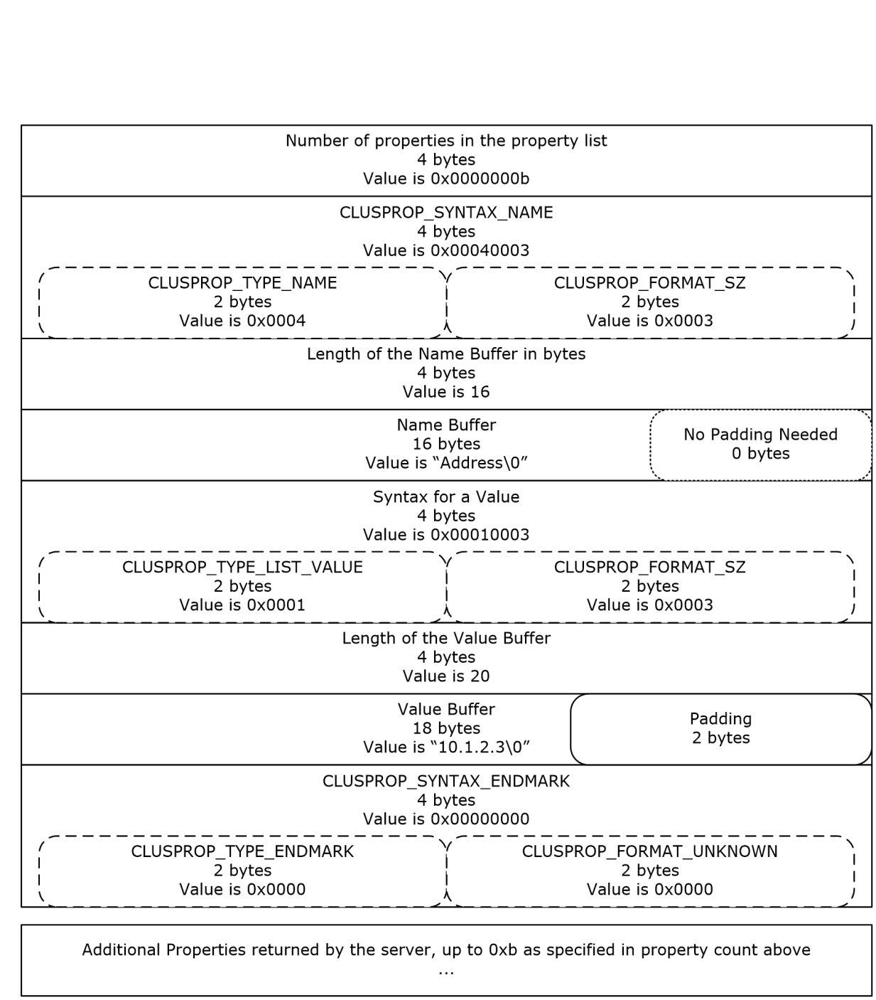
<!-- /Extracted images from page 584 -->

Figure 5: Organization of a PROPERTY_LIST structure

The following steps describe connecting to a cluster, opening a cluster resource , determining the size
of the private PROPERTY_LIST, getting the private PROPERTY_LIST from the resource, and parsing the
PROPERTY_LIST into its name/value pairs. The following diagram depicts the message flow.

[MS-CMRP] - v20250811
Failover Cluster: Management API (ClusAPI) Protocol
Copyright © 2025 Microsoft Corporation
Release: August 11, 2025

584 / 662

<!-- Extracted images from page 585 -->
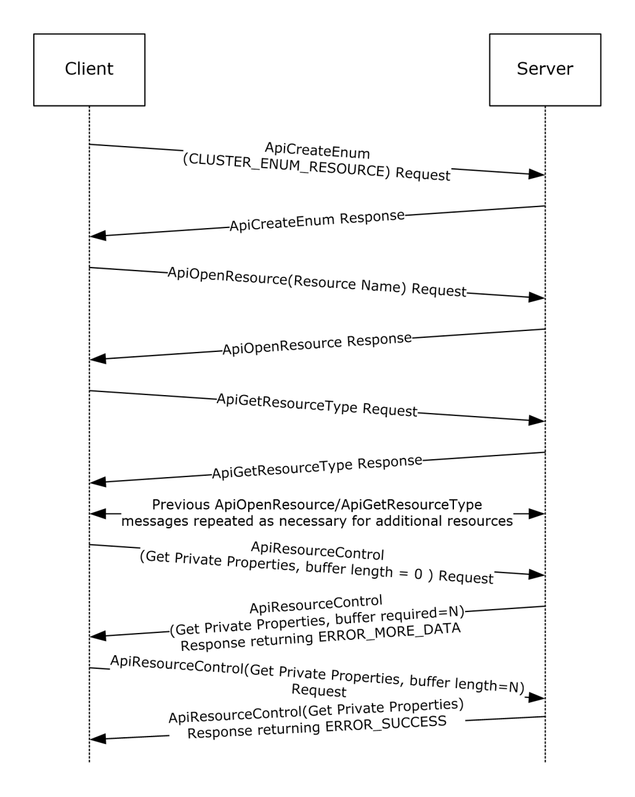
<!-- /Extracted images from page 585 -->

Figure 6: Message flow: Obtaining PROPERTY_LIST

First, a client initializes an RPC connection to the cluster, as specified in section 3.2.3. Any
implementation-specific method can be used to locate the cluster.

Next, the client calls ApiCreateEnum (section 3.1.4.1.8 for protocol version 2, or 3.1.4.2.8 for protocol
version 3) and specifies the enumeration type CLUSTER_ENUM_RESOURCE (also specified in
ApiCreateEnum). The server returns an ENUM_LIST (section 2.2.3.5) containing an
ENUM_ENTRY (section 2.2.3.4) for each resource in the cluster state.

For each entry in the ENUM_ENTRY, the client calls ApiOpenResource (section 3.1.4.1.9 for protocol
version 2, or 3.1.4.2.9 for protocol version 3) providing the ENUM_ENTRY Name buffer as the resource
name parameter. This ApiOpenResource call obtains an HRES_RPC context handle to the resource that
is represented by the ENUM_ENTRY.

585 / 662

[MS-CMRP] - v20250811
Failover Cluster: Management API (ClusAPI) Protocol
Copyright © 2025 Microsoft Corporation
Release: August 11, 2025

The client then calls ApiGetResourceType (section 3.1.4.1.16 for protocol version 2, or 3.1.4.2.16 for
protocol version 3) on the HRES_RPC context handle. The returned buffer contains the resource's
resource type name as a null-terminated Unicode string.

Next, because the client is searching for a resource that has the type name "IP Address", the client
performs a case-insensitive comparison of the returned resource type string to the null-terminated
Unicode string "IP Address".

When a resource type name match is found, the client calls ApiResourceControl (section 3.1.4.1.74 for
protocol version 2, or 3.1.4.2.74 for protocol version 3) passing the control code
CLUSCTL_RESOURCE_GET_PRIVATE_PROPERTIES (0x001000081), as specified in section
3.1.4.3.1.17. The client sets the output buffer lpOutBuffer to a non-null pointer and sets the
nOutputBuffer parameter to 0.

The server returns ERROR_MORE_DATA (234) and returns the size, in bytes, that is required for the
output buffer by means of the lpcbRequired parameter.

The client allocates an output buffer of the prescribed size and calls ApiResourceControl again; this
time the client specifies control code CLUSCTL_RESOURCE_GET_PRIVATE_PROPERTIES
(0x001000081), the allocated buffer, and the prescribed buffer size.

The server returns a status code of ERROR_SUCCESS and writes the private properties of the resource
into the buffer that is indicated by lpOutBuffer. The format of the buffer is a
PROPERTY_LIST (section 2.2.3.10).

The client now parses the PROPERTY_LIST to extract the value that is associated with the "Address"
property. The client follows these steps:

1.  Reads the first 4 bytes of the output buffer. These 4 bytes contain the count of properties in the

PROPERTY_LIST. For this example, the count is 0xb.

2.  Advances the pointer 4 bytes to get to the syntax for the property name of the first property.

3.  Reads the next 4 bytes of the buffer. The value is 0x00040003 (CLUSPROP_SYNTAX_NAME).

4.  Advances the pointer 4 bytes to get to the length of the property name.

5.  Reads the next 4 bytes in the buffer. The value is 16: the length of the Unicode string "Address"
plus the terminating Unicode null character. No additional padding needs to be added to the 16-
byte buffer to attain 4-byte alignment.

6.  Advances the pointer 4 bytes to get to the name buffer. The pointer is now pointing to the

beginning of the property name.

7.  Performs a case-insensitive string comparison of the property name to the Unicode string

"Address". In this example, the property name matches.

8.  Advances the pointer 16 bytes to get past the property name and to the syntax of its value.

9.  Reads the next 4 bytes. The value is 0x00010003 (CLUSPROP_SYNTAX_LIST_VALUE_SZ),

indicating that the property value buffer contains data that is a null-terminated Unicode string.

10. Advances the pointer 4 bytes to get to the length of the value buffer.

11. Reads the next 4 bytes. The value is 20, the length of the string "10.1.2.3" plus the terminating

null character, plus 2 bytes of padding to attain 4-byte alignment.

12. Advances the pointer 4 bytes to get to the value buffer. The pointer is now at the beginning of a

null-terminated string that is the value for this property.

[MS-CMRP] - v20250811
Failover Cluster: Management API (ClusAPI) Protocol
Copyright © 2025 Microsoft Corporation
Release: August 11, 2025

586 / 662

13. The client reads that address string ("10.1.2.3") and performs whatever client-specific operations

were intended for that address.

14. Advances the pointer 20 bytes to get past the value buffer and to the end mark syntax.

15. Reads the next 4 bytes. The value is 0x00000000 (CLUSPROP_SYNTAX_ENDMARK) because it is

the end of the value list for the first property.

16. Advances the pointer 4 bytes. If there are additional properties in the list (indicated by the
property count obtained in step 1), the pointer points to the CLUSPROP_SYNTAX_NAME
enumeration of the next property in the PROPERTY_LIST. If there are no more properties, the
pointer points to the end of the buffer.

The client now calls ApiCloseResource (section 3.1.4.1.12 for protocol version 2, or 3.1.4.2.12 for
protocol version 3) to close the HRES_RPC context handle that represents the resource.

After the client is finished processing the enumeration, the client can free the ENUM_LIST. The client
then closes the RPC connection to the server.

### 4.2 Moving a Group

The following example illustrates how a protocol client ensures that a specific group is owned by a
specific node, moving the group to that node if necessary. Assume that in this example, the client is
managing a group that has the well-known name "Application Group". Assume that there are three
nodes in the cluster that have the names "NodeA", "NodeB", and "NodeC", and all nodes are currently
active. The client needs the group to be owned by NodeB.

The following diagram depicts the message flow.

[MS-CMRP] - v20250811
Failover Cluster: Management API (ClusAPI) Protocol
Copyright © 2025 Microsoft Corporation
Release: August 11, 2025

587 / 662

<!-- Extracted images from page 588 -->
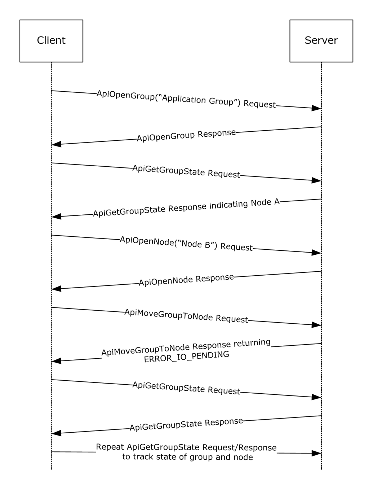
<!-- /Extracted images from page 588 -->

Figure 7: Message flow: Moving a group

First, the client initializes an RPC connection to the cluster, as specified in section 3.2.3. The client
knows the names of the nodes and can use either node to establish the connection.

The client next opens a context handle to the group by calling ApiOpenGroup (section 3.1.4.1.42 for
protocol version 2, or 3.1.4.2.42 for protocol version 3) with the lpszGroupName parameter set to the
null-terminated Unicode string "Application Group".

The client then determines which node currently owns the group by calling ApiGetGroupState (section
3.1.4.1.46 for protocol version 2, or 3.1.4.2.46 for protocol version 3). During this call the client
passes the HGROUP_RPC context handle that was just obtained from ApiOpenGroup. Assume for this
example that, in response to the ApiGetGroupState method, the server returns a current node name

588 / 662

[MS-CMRP] - v20250811
Failover Cluster: Management API (ClusAPI) Protocol
Copyright © 2025 Microsoft Corporation
Release: August 11, 2025

of "NodeA". Because the client needs the group to be owned by NodeB, the client now needs to move
the group.

The client obtains an HNODE_RPC context handle for NodeB by calling ApiOpenNode (section
3.1.4.1.67 for protocol version 2, or 3.1.4.2.67 for protocol version 3) and setting the lpszNodeName
parameter to the null-terminated Unicode string "NodeB". Then the client calls ApiMoveGroupToNode
(section 3.1.4.1.53 for protocol version 2, or 3.1.4.2.53 for protocol version 3) indicating the group
that is identified by the HGROUP_RPC and the destination node indicated by the HNODE_RPC.

Assume that the server returns status 0x000003E5 (ERROR_IO_PENDING), but the client is waiting
until the move is complete. So the client polls by calling ApiGetGroupState every five seconds until the
group is no longer in state ClusterGroupPending. Assuming that the group is now in state
ClusterGroupOnline, the move is complete. If the group were in ClusterGroupFailed, the client could
expect recovery action to be attempted to bring all resources in the group to their persistent states.

### 4.3 Receiving Cluster Object Event Indications

The following example shows how a protocol client receives event indications for when any group is
added or deleted to the cluster configuration and when changes in state for a resource named
"Resource1" occur.

This example assumes that the client has provided a higher-level programming abstraction in which its
callers can create notification ports, register event filters, and receive cluster event indications.
Underneath this abstraction, the client maintains the necessary data structures and queuing
mechanism in order to accomplish this functionality.

One possible organization is for the client to maintain a data structure for every notification port it
creates and from that, a linked set of data structures for event filter/context value registered by the
caller for that port. Due to the blocking nature of the ApiGetNotify method (section 3.1.4.1.66 for
protocol version 2 or section 3.1.4.2.66 for protocol version 3), the client also maintains a separate
thread of execution that can retrieve event indications from the server and post them to the client-
side queue. This allows the client's callers to register additional event filters after the port has been
activated by the registration of its first event filter. The following diagram shows the client-side data
organization of this abstraction.

[MS-CMRP] - v20250811
Failover Cluster: Management API (ClusAPI) Protocol
Copyright © 2025 Microsoft Corporation
Release: August 11, 2025

589 / 662

<!-- Extracted images from page 590 -->
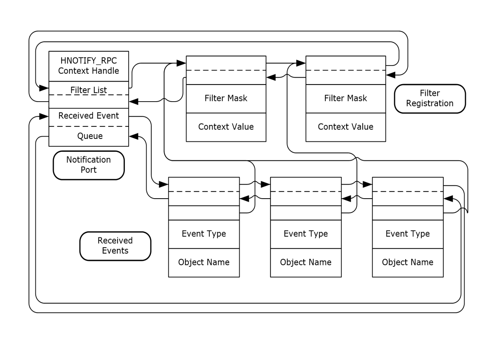
<!-- /Extracted images from page 590 -->

Figure 8: Client/server data organization for a notification port abstraction

The following diagram depicts the message flow for this example.

[MS-CMRP] - v20250811
Failover Cluster: Management API (ClusAPI) Protocol
Copyright © 2025 Microsoft Corporation
Release: August 11, 2025

590 / 662

<!-- Extracted images from page 591 -->
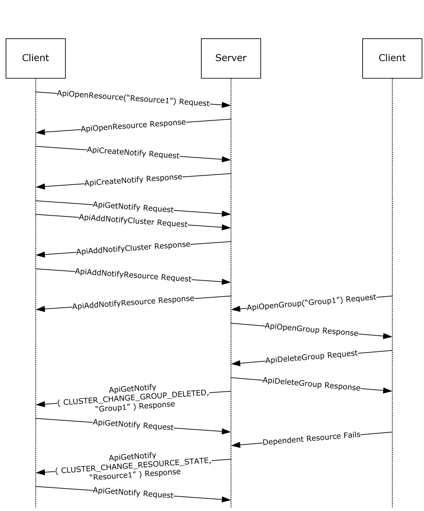
<!-- /Extracted images from page 591 -->

Figure 9: Message flow: Registering and receiving events from a notification port

First, the client initializes an RPC connection to the cluster, as specified in section 3.2.3. Any
implementation-specific method can be used to locate the cluster. The client reserves the
HCLUSTER_RPC context handle, obtained in the Reconnect Logic Initialization (section 3.2.3.3), for
invocation of ApiAddNotifyCluster described in the following paragraphs.

[MS-CMRP] - v20250811
Failover Cluster: Management API (ClusAPI) Protocol
Copyright © 2025 Microsoft Corporation
Release: August 11, 2025

591 / 662

The client next obtains an HRES_RPC context handle to the resource by calling ApiOpenResource
(section 3.1.4.1.9 for protocol version 2 or section 3.1.4.2.9 for protocol version 3) with the
lpszResourceName parameter set to the null-terminated Unicode string "Resource1".

The caller notifies the client through the programming abstraction to create a new notification port.
The client obtains an HNOTIFY_RPC context handle on behalf of the caller by calling the
ApiCreateNotify (section 3.1.4.1.56 for protocol version 2, or 3.1.4.2.56 for protocol version 3)
method. A new client-side notification data structure is allocated and initialized with the context
handle of the port and the pointer to the list of filters set to NULL. A separate thread of execution is
started and calls the ApiGetNotify method; this is called the port service thread. This method will not
complete because no event filters have been registered.

The caller now registers an event filter with the client that causes the server to provide an indication
each time a group is created or deleted. The client creates an event filter data structure, initializes it
with the caller supplied data, and links it to the notification port data structure. The client calls
ApiAddNotifyCluster (section 3.1.4.1.58 for protocol version 2 or section 3.1.4.2.58 for protocol
version 3) with the following:









The hNotify parameter set to the HNOTIFY_RPC context handle obtained in the previous step.

The hCluster parameter set to the HCLUSTER_RPC context handle obtained in section 3.2.3.

The dwFilter parameter set to the values CLUSTER_CHANGE_GROUP_ADDED and
CLUSTER_CHANGE_GROUP_DELETED logically OR'd together (0x00006000).

The dwNotifyKey parameter set to the address of the filter block created for this registration
request.

The caller next registers an event filter with the client that will cause the server to provide an
indication each time "Resource1" changes state. The client creates an event filter data structure,
initializes it with the caller supplied data, and links it to the notification port data structure. The client
calls ApiAddNotifyResource (section 3.1.4.1.61 for protocol version 2, or 3.1.4.2.61 for protocol
version 3) with the following:











The hNotify parameter set to the HNOTIFY_RPC context handle obtained from the previous
ApiCreateNotify call.

The hResource parameter set to the HRES_RPC context handle obtained from the previous
ApiOpenResource call.

The dwFilter parameter set to the value CLUSTER_CHANGE_RESOURCE_STATE (0x00000100).

The dwNotifyKey parameter set to the address of the filter block created for this registration
request.

The dwStateSequence parameter set to the address of the StateSequence field in the event filter
data structure.

Externally, another client has made a connection to the cluster and obtained an HGROUP_RPC context
handle for a group named "Group1" by calling the ApiOpenGroup (section 3.1.4.1.42 for protocol
version 2, or 3.1.4.2.42 for protocol version 3) method; this client then calls ApiDeleteGroup
(section 3.1.4.1.44 for protocol version 2, or 3.1.4.2.44 for protocol version 3) using this context
handle. The server responds by removing the group from the cluster configuration and generates an
internal event indicating that "Group1" has been deleted. The server's notification port mechanism
allocates an indication structure with the event type set to CLUSTER_CHANGE_GROUP_DELETED
(0x00002000) and the object name set to "Group1" and posts it to all notification ports that have
indicated an interest in this type of event.

The server thread representing the client's port service thread dequeues the indication from the server
queue and returns the data in the indication to the client via ApiGetNotify parameters:

592 / 662

[MS-CMRP] - v20250811
Failover Cluster: Management API (ClusAPI) Protocol
Copyright © 2025 Microsoft Corporation
Release: August 11, 2025









The dwNotifyKey parameter is set to the address of the client-side event filter data structure that
was registered in the previous ApiAddNotifyCluster call.

The dwFilter parameter is set to the event type: CLUSTER_CHANGE_GROUP_DELETED
(0x00002000).

The dwStateSequence is set to the current state sequence number of this group.

The Name parameter contains the name of the object ("Group1") as a Unicode string.

The port service thread allocates a client-side event indication structure and sets its values to the
same event type and object name but sets the caller's context value in the structure instead of the
context value returned by ApiGetNotify. The client port service thread queues this structure to the
client-side queue and calls ApiGetNotify to wait for another indication.

A resource on which "Resource1" is dependent has failed and due to the server's restart policy,
"Resource1" is taken offline and then returned to the online state. The server generates an internal
event indicating that "Resource1" is in the ClusterResourceOffline state. The server's notification port
mechanism allocates an indication structure with the type set to
CLUSTER_CHANGE_RESOURCE_STATE (0x00000100) and the object name set to "Resource1" and
posts it to all notification ports that have indicated an interest in this type of event.

The server thread representing the client's port service thread dequeues the indication from the server
queue and returns the data in the indication to the client via ApiGetNotify parameters;









The dwNotifyKey parameter is set to address of the client-side event filter data structure that was
registered in the previous ApiAddNotifyResource call.

The dwFilter parameter is set to the event type: CLUSTER_CHANGE_RESOURCE_STATE
(0x00000100).

The dwStateSequence is set to the current state sequence number of this resource.

The Name parameter contains the name of the object ("Resource1") as a Unicode string.

The port service thread allocates a client-side event indication structure and sets its values to the
same event type and object name but sets the caller's context value in the structure instead of the
context value returned by ApiGetNotify. The ApiGetNotify thread queues this structure to the
client-side queue and calls ApiGetNotify to wait for another indication.

When "Resource1" reaches the ClusterResourceOnline state, a similar internal event is generated and
the server and client go through the same set of steps in which the online state change indication is
delivered to the client-side queue, ready for consumption by the client's callers.

### 4.4 Setting a Complex Dependency for a Resource

Complex dependencies are supported only by protocol version 3.

The following example illustrates how a client sets a complex dependency for a resource
representing a database service within a cluster. This example requires a group that contains the
following resources:

  A resource that represents the database service

  A cluster network name resource and its dependent IP address resources

  A set of storage device resources where each device contains one database

The service is traditionally structured where a client connects to it via the virtual cluster network name
(whose IP addresses are registered with a name resolution service within the cluster network

593 / 662

[MS-CMRP] - v20250811
Failover Cluster: Management API (ClusAPI) Protocol
Copyright © 2025 Microsoft Corporation
Release: August 11, 2025

<!-- Extracted images from page 594 -->
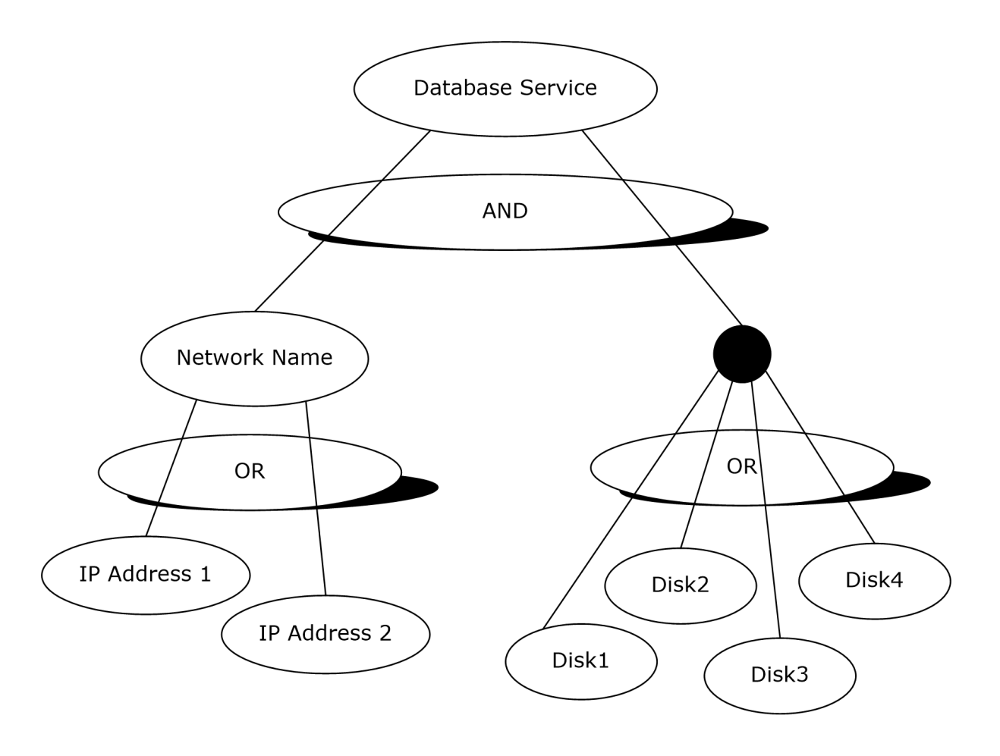
<!-- /Extracted images from page 594 -->

infrastructure) and the service stores its persistent data on the storage devices. The goal of the
dependency relationship is to keep the database service hosted on this node as long as the cluster
network name and at least one storage device are online.

The construction of this tiered dependency is performed in two steps:

  Setting an OR dependency for the Network Name resource and its two IP address resources

  Setting the AND/OR dependency for the Service and its Network Name and Disk resources

The following diagram depicts the target dependency relationship.

Figure 10: Database service with its dependent resources

The following diagram depicts the message flow for this example.

[MS-CMRP] - v20250811
Failover Cluster: Management API (ClusAPI) Protocol
Copyright © 2025 Microsoft Corporation
Release: August 11, 2025

594 / 662

<!-- Extracted images from page 595 -->
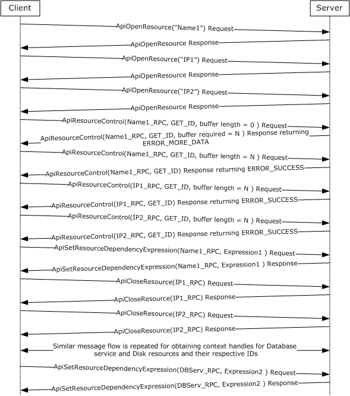
<!-- /Extracted images from page 595 -->

Figure 11: Message flow: Setting a complex dependency relationship for a resource

First, the client initializes an RPC connection to the cluster, as specified in section 3.2.3. Any
implementation-specific method can be used to locate the cluster.

The client next obtains three HRES_RPC context handles to the Network Name and IP address
resources by calling ApiOpenResource (see section 3.1.4.2.9 for protocol version 3) with the
lpszResourceName parameter set to the null-terminated Unicode strings, "Name1", "IP1", and "IP2",
respectively, for each call.

The client then obtains the resource IDs for the two IP address resources through use of the
ApiResourceControl (see section 3.1.4.2.74 for protocol version 3). If the size of the resource ID string
is well known, the client can pre-allocate a suitably sized buffer for each ID string including space for
the null-termination (in this example, five buffers will eventually be needed). Otherwise, it will
discover the size of the ID string for each resource by setting the nOutBufferSize parameter to zero

[MS-CMRP] - v20250811
Failover Cluster: Management API (ClusAPI) Protocol
Copyright © 2025 Microsoft Corporation
Release: August 11, 2025

595 / 662

and the lpcbRequired pointer to the address of the 32-bit integer that will receive the size, in bytes, of
the ID string.

Using the allocated buffers holding the respective ID strings of the IP address resources, the client
calls ApiResourceControl once for each IP address. For each IP address resource, the client sets the
hResource parameter to the respective HRES_RPC context handle, the dwControlCode parameter to
CLUSCTL_RESOURCE_GET_ID (0x1000039), and the lpOutBuffer parameter to a different allocated
buffer each time.

Using the size of the two IP address resource strings, the client allocates another buffer to contain the
dependency expression for the Network Name resource. This expression is a null-terminated Unicode
string of the form "[IP1-ID] OR [IP2-ID]". If GUIDs were used for ID strings, then the expression
would look like the following.

 [0b8b76df-d814-4813-a7c2-37837933c157] OR
 [1bd68f61-3882-421f-9c31-555459f29e8a]

The client would then call ApiSetResourceDependencyExpression (see section 3.1.4.2.109; protocol
version 3 only) with the hResource parameter set to the Network Name resource context handle and
the lpszDependencyExpression parameter set to the expression previously shown.

The client calls ApiCloseResource (see section 3.1.4.2.12 for protocol version 3) on the two IP address
context handles. The client obtains the resource IDs of the four disk resources, using the same
technique described in the preceding paragraphs. After the resource IDs have been obtained, the
client forms a complex dependency expression using the Network Name ID and the four Disk IDs:
[NN-ID] AND ([D1] OR [D2] OR [D3] OR [D4]). If names were used for ID strings, the expression
would look like the following.

 [Netname] AND ([Disk1] OR [Disk2] OR [Disk3] OR [Disk4])

The client calls ApiSetResourceDependencyExpression with the hResource parameter set to the
Database Service resource context handle and the lpszDependencyExpression parameter set to the
expression previously shown.

 The client then closes the context handles for the remaining resources using the ApiCloseResource
method.

[MS-CMRP] - v20250811
Failover Cluster: Management API (ClusAPI) Protocol
Copyright © 2025 Microsoft Corporation
Release: August 11, 2025

596 / 662

## 5 Security

### 5.1 Security Considerations for Implementers

Implementers who use ClusAPI Protocol version 2.0 will use an RPC authentication level that is
appropriate for the data that is to be transferred to the cluster. For example, if sensitive data is
written to the cluster registry by means of the ApiSetValue method, binding to the cluster by using
RPC_C_AUTHN_LEVEL_PKT_PRIVACY (defined in [MS-RPCE] section 2.2.1.1.8) obscures the data to
any node that was capturing data flow on the network.

Implementers who use ClusAPI Protocol version 3.0 will use an RPC authentication level of at least
RPC_C_AUTHN_LEVEL_PKT_PRIVACY to ensure a level of privacy for sensitive data.

For more information, see section 2.1.

### 5.2 Index of Security Parameters

 Security parameter

 Section

RPC authentication level

As specified in section 2.1.

RPC Authentication Service

As specified in section 2.1.

Service principal name

As specified in section 2.1.

Client security quality of service requirements  As specified in section 2.1.

[MS-CMRP] - v20250811
Failover Cluster: Management API (ClusAPI) Protocol
Copyright © 2025 Microsoft Corporation
Release: August 11, 2025

597 / 662

## 6 Appendix A: Full IDL

For ease of implementation, the full Interface Definition Language (IDL) for each protocol version
is provided here, where "ms-dtyp.idl" is the IDL that is found in [MS-DTYP] Appendix A.

### 6.1 Appendix A.1: clusapi2.idl

 import "ms-dtyp.idl";

  [
      uuid(b97db8b2-4c63-11cf-bff6-08002be23f2f),
     version(2.0)
  ]
  interface clusapi
  {

  typedef [context_handle] void *HCLUSTER_RPC;
  typedef [context_handle] void *HNODE_RPC;
  typedef [context_handle] void *HGROUP_RPC;
  typedef [context_handle] void *HRES_RPC;
  typedef [context_handle] void *HKEY_RPC;
  typedef [context_handle] void *HNOTIFY_RPC;
  typedef [context_handle] void *HNETWORK_RPC;
  typedef [context_handle] void *HNETINTERFACE_RPC;

  typedef struct _RPC_SECURITY_DESCRIPTOR {
      [ size_is( cbInSecurityDescriptor ),
        length_is( cbOutSecurityDescriptor ) ]
        unsigned char *lpSecurityDescriptor;
      unsigned long cbInSecurityDescriptor;
      unsigned long cbOutSecurityDescriptor;
  } RPC_SECURITY_DESCRIPTOR, *PRPC_SECURITY_DESCRIPTOR;

  typedef struct _RPC_SECURITY_ATTRIBUTES {
      unsigned long nLength;
      RPC_SECURITY_DESCRIPTOR RpcSecurityDescriptor;
      long bInheritHandle;
  } RPC_SECURITY_ATTRIBUTES, *PRPC_SECURITY_ATTRIBUTES;

  typedef struct _CLUSTER_OPERATIONAL_VERSION_INFO {
      unsigned long dwSize;
      unsigned long dwClusterHighestVersion;
      unsigned long dwClusterLowestVersion;
      unsigned long dwFlags;
      unsigned long dwReserved;
  }CLUSTER_OPERATIONAL_VERSION_INFO,*PCLUSTER_OPERATIONAL_VERSION_INFO;

  HCLUSTER_RPC
  ApiOpenCluster(
      [ out ] error_status_t *Status
      );

  error_status_t
  ApiCloseCluster(
      [ in, out ] HCLUSTER_RPC *Cluster
      );

  error_status_t
  ApiSetClusterName(
      [in, string] LPCWSTR NewClusterName
      );

[MS-CMRP] - v20250811
Failover Cluster: Management API (ClusAPI) Protocol
Copyright © 2025 Microsoft Corporation
Release: August 11, 2025

598 / 662

  error_status_t
  ApiGetClusterName(
      [ out ] [ string ] LPWSTR *ClusterName,
      [ out ] [ string ] LPWSTR *NodeName
      );

  error_status_t
  ApiGetClusterVersion(
      [out] WORD* lpwMajorVersion,
      [out] WORD* lpwMinorVersion,
      [out] WORD* lpwBuildNumber,
      [out, string]  LPWSTR* lpszVendorId,
      [out, string]  LPWSTR* lpszCSDVersion
      );

  error_status_t
  ApiGetQuorumResource(
      [ out, string ] LPWSTR *lpszResourceName,
      [ out, string ] LPWSTR *lpszDeviceName,
      [ out ] DWORD *pdwMaxQuorumLogSize
      );

  error_status_t
  ApiSetQuorumResource(
      [ in ] HRES_RPC hResource,
      [ in, string ] LPCWSTR  lpszDeviceName,
      [ in ] DWORD    dwMaxQuorumLogSize
      );

  typedef struct _ENUM_ENTRY {
      DWORD Type;
      [string] LPWSTR Name;
  } ENUM_ENTRY, *PENUM_ENTRY;

  typedef struct _ENUM_LIST {
      DWORD EntryCount;
      [size_is(EntryCount)] ENUM_ENTRY Entry[*];
  } ENUM_LIST, *PENUM_LIST;

  error_status_t
  ApiCreateEnum(
      [ in ] DWORD dwType,
      [ out ] PENUM_LIST *ReturnEnum
      );

  HRES_RPC
  ApiOpenResource(
      [in, string]  LPCWSTR lpszResourceName,
      [out] error_status_t *Status
      );

  HRES_RPC
  ApiCreateResource(
      [in] HGROUP_RPC hGroup,
      [in, string] LPCWSTR lpszResourceName,
      [in, string] LPCWSTR lpszResourceType,
      [in] DWORD dwFlags,
      [out] error_status_t *Status
      );

  error_status_t
  ApiDeleteResource(
      [in] HRES_RPC hResource
      );

  error_status_t

[MS-CMRP] - v20250811
Failover Cluster: Management API (ClusAPI) Protocol
Copyright © 2025 Microsoft Corporation
Release: August 11, 2025

599 / 662

  ApiCloseResource(
      [ in, out ] HRES_RPC *Resource
      );

  error_status_t
  ApiGetResourceState(
      [in] HRES_RPC hResource,
      [out] DWORD *State,
      [out, string] LPWSTR *NodeName,
      [out, string] LPWSTR *GroupName
      );

  error_status_t
  ApiSetResourceName(
      [in] HRES_RPC hResource,
      [in, string] LPCWSTR lpszResourceName
      );

  error_status_t
  ApiGetResourceId(
      [in] HRES_RPC hResource,
      [out, string] LPWSTR* pGuid
      );

  error_status_t
  ApiGetResourceType(
      [ in ] HRES_RPC hResource,
      [ out, string ] LPWSTR* lpszResourceType
      );

  error_status_t
 ApiFailResource(
      [in] HRES_RPC hResource
      );

  error_status_t
  ApiOnlineResource(
      [ in ] HRES_RPC hResource
      );

  error_status_t
  ApiOfflineResource(
      [ in ] HRES_RPC hResource
      );

  error_status_t
  ApiAddResourceDependency(
      [ in ] HRES_RPC hResource,
      [ in ] HRES_RPC hDependsOn
      );

  error_status_t
  ApiRemoveResourceDependency(
      [ in ] HRES_RPC hResource,
      [ in ] HRES_RPC hDependsOn
      );

  error_status_t
 ApiCanResourceBeDependent(
      [in] HRES_RPC hResource,
      [in] HRES_RPC hResourceDependent
      );

  error_status_t
  ApiCreateResEnum(
      [ in ] HRES_RPC hResource,
      [ in ] DWORD dwType,
      [ out ] PENUM_LIST *ReturnEnum
      );

[MS-CMRP] - v20250811
Failover Cluster: Management API (ClusAPI) Protocol
Copyright © 2025 Microsoft Corporation
Release: August 11, 2025

600 / 662

  error_status_t
  ApiAddResourceNode(
      [ in ] HRES_RPC hResource,
      [ in ] HNODE_RPC hNode
      );

  error_status_t
  ApiRemoveResourceNode(
      [ in ] HRES_RPC hResource,
      [ in ] HNODE_RPC hNode
      );

  error_status_t
  ApiChangeResourceGroup(
      [ in ] HRES_RPC hResource,
      [ in ] HGROUP_RPC hGroup
      );

  error_status_t
  ApiCreateResourceType(
      [ in, string ] LPCWSTR lpszTypeName,
      [ in, string ] LPCWSTR lpszDisplayName,
      [ in, string ] LPCWSTR lpszDllName,
      [ in ] unsigned long dwLooksAlive,
      [ in ] unsigned long dwIsAlive
      );

  error_status_t
  ApiDeleteResourceType(
      [ in, string ] const wchar_t * lpszTypeName
      );

  HKEY_RPC
  ApiGetRootKey(
      [ in ] unsigned long samDesired,
      [ out ] error_status_t *Status
      );

  HKEY_RPC
  ApiCreateKey(
      [ in ] HKEY_RPC hKey,
      [ in, string ] const wchar_t * lpSubKey,
      [ in ] unsigned long dwOptions,
      [ in ] unsigned long samDesired,
      [ in, unique ] PRPC_SECURITY_ATTRIBUTES lpSecurityAttributes,
      [ out ] unsigned long * lpdwDisposition,
      [ out ] error_status_t *Status
      );

  HKEY_RPC
  ApiOpenKey(
      [ in ] HKEY_RPC hKey,
      [ in, string ] const wchar_t * lpSubKey,
      [ in ] unsigned long samDesired,
      [ out ] error_status_t *Status
      );

  error_status_t
  ApiEnumKey(
      [ in ] HKEY_RPC hKey,
      [ in ] unsigned long dwIndex,
      [ out, string ] wchar_t * *KeyName,
      [ out ] FILETIME *lpftLastWriteTime
      );

  error_status_t
  ApiSetValue(

[MS-CMRP] - v20250811
Failover Cluster: Management API (ClusAPI) Protocol
Copyright © 2025 Microsoft Corporation
Release: August 11, 2025

601 / 662

      [ in ] HKEY_RPC hKey,
      [ in, string ] const wchar_t * lpValueName,
      [ in ] unsigned long dwType,
      [ in, size_is(cbData) ] const unsigned char *lpData,
      [ in ] unsigned long cbData
      );

  error_status_t
  ApiDeleteValue(
      [ in ] HKEY_RPC hKey,
      [ in, string ] const wchar_t * lpValueName
      );

  error_status_t
  ApiQueryValue(
      [ in ] HKEY_RPC hKey,
      [ in, string ] const wchar_t * lpValueName,
      [ out ] unsigned long *lpValueType,
      [ out, size_is(cbData) ] unsigned char *lpData,
      [ in ] unsigned long cbData,
      [ out ] unsigned long * lpcbRequired
      );

  error_status_t
  ApiDeleteKey(
      [ in ] HKEY_RPC hKey,
      [ in, string ] const wchar_t * lpSubKey
      );

  error_status_t
  ApiEnumValue(
      [ in ] HKEY_RPC hKey,
      [ in ] unsigned long dwIndex,
      [ out, string ] wchar_t * *lpValueName,
      [ out ] unsigned long * lpType,
      [ out, size_is(*lpcbData) ] unsigned char *lpData,
      [ in, out ] unsigned long * lpcbData,
      [ out ] unsigned long * TotalSize
      );

  error_status_t
  ApiCloseKey(
      [ in, out ] HKEY_RPC *pKey
      );

  error_status_t
  ApiQueryInfoKey(
      [ in ] HKEY_RPC hKey,
      [ out ] LPDWORD lpcSubKeys,
      [ out ] LPDWORD lpcbMaxSubKeyLen,
      [ out ] LPDWORD lpcValues,
      [ out ] LPDWORD lpcbMaxValueNameLen,
      [ out ] LPDWORD lpcbMaxValueLen,
      [ out ] LPDWORD lpcbSecurityDescriptor,
      [ out ] PFILETIME lpftLastWriteTime
      );

  error_status_t
  ApiSetKeySecurity(
      [ in ] HKEY_RPC hKey,
      [ in ] DWORD SecurityInformation,
      [ in ] PRPC_SECURITY_DESCRIPTOR pRpcSecurityDescriptor
      );

  error_status_t
  ApiGetKeySecurity(
      [ in ] HKEY_RPC hKey,
      [ in ] DWORD SecurityInformation,
      [ in, out ] PRPC_SECURITY_DESCRIPTOR pRpcSecurityDescriptor

[MS-CMRP] - v20250811
Failover Cluster: Management API (ClusAPI) Protocol
Copyright © 2025 Microsoft Corporation
Release: August 11, 2025

602 / 662

      );

  HGROUP_RPC
  ApiOpenGroup(
      [ in, string ] const wchar_t * lpszGroupName,
      [ out ] error_status_t *Status
      );

  HGROUP_RPC
  ApiCreateGroup(
      [ in, string ] LPCWSTR lpszGroupName,
      [ out ] error_status_t *Status
      );

  error_status_t
  ApiDeleteGroup(
      [ in ] HGROUP_RPC Group
      );

  error_status_t
  ApiCloseGroup(
      [ in, out ] HGROUP_RPC *Group
      );

  error_status_t
  ApiGetGroupState(
      [ in ] HGROUP_RPC hGroup,
      [ out ] unsigned long *State,
      [ out, string ] wchar_t * *NodeName
      );

  error_status_t
  ApiSetGroupName(
      [ in ] HGROUP_RPC hGroup,
      [ in, string ] LPCWSTR lpszGroupName
      );

  error_status_t
  ApiGetGroupId(
      [ in ] HGROUP_RPC hGroup,
      [ out, string ] LPWSTR *pGuid
      );

  error_status_t
  ApiGetNodeId(
      [ in ] HNODE_RPC hNode,
      [ out, string ] LPWSTR *pGuid
      );

  error_status_t
  ApiOnlineGroup(
      [ in ] HGROUP_RPC hGroup
      );

  error_status_t
  ApiOfflineGroup(
      [ in ] HGROUP_RPC hGroup
      );

  error_status_t
  ApiMoveGroup(
      [ in ] HGROUP_RPC hGroup
      );

  error_status_t
  ApiMoveGroupToNode(
      [ in ] HGROUP_RPC hGroup,
      [ in ] HNODE_RPC hNode

[MS-CMRP] - v20250811
Failover Cluster: Management API (ClusAPI) Protocol
Copyright © 2025 Microsoft Corporation
Release: August 11, 2025

603 / 662

      );

  error_status_t
  ApiCreateGroupResourceEnum(
      [ in ] HGROUP_RPC hGroup,
      [ in ] unsigned long dwType,
      [ out ] PENUM_LIST *ReturnEnum
      );

  error_status_t
  ApiSetGroupNodeList(
      [ in ] HGROUP_RPC hGroup,
      [ in, unique, size_is(cbListSize) ] UCHAR *lpNodeList,
      [ in ] DWORD cbListSize
      );

  HNOTIFY_RPC
  ApiCreateNotify(
      [ out ] error_status_t *Status
      );

  error_status_t
  ApiCloseNotify(
      [ in, out ] HNOTIFY_RPC* hNotify
      );

  error_status_t
  ApiAddNotifyCluster(
      [ in ] HNOTIFY_RPC hNotify,
      [ in ] HCLUSTER_RPC hCluster,
      [ in ] DWORD dwFilter,
      [ in ] DWORD dwNotifyKey
      );

  error_status_t
  ApiAddNotifyNode(
      [ in ] HNOTIFY_RPC hNotify,
      [ in ] HNODE_RPC hNode,
      [ in ] DWORD dwFilter,
      [ in ] DWORD dwNotifyKey,
      [ out ] DWORD *dwStateSequence
      );

  error_status_t
  ApiAddNotifyGroup(
      [ in ] HNOTIFY_RPC hNotify,
      [ in ] HGROUP_RPC hGroup,
      [ in ] DWORD dwFilter,
      [ in ] DWORD dwNotifyKey,
      [ out ] DWORD *dwStateSequence
      );

  error_status_t
  ApiAddNotifyResource(
      [ in ] HNOTIFY_RPC hNotify,
      [ in ] HRES_RPC hResource,
      [ in ] DWORD dwFilter,
      [ in ] DWORD dwNotifyKey,
      [ out ] DWORD *dwStateSequence
      );

  error_status_t
  ApiAddNotifyKey(
      [ in ] HNOTIFY_RPC hNotify,
      [ in ] HKEY_RPC hKey,
      [ in ] DWORD dwNotifyKey,
      [ in ] DWORD dwFilter,
      [ in ] BOOL WatchSubTree

[MS-CMRP] - v20250811
Failover Cluster: Management API (ClusAPI) Protocol
Copyright © 2025 Microsoft Corporation
Release: August 11, 2025

604 / 662

      );

  error_status_t
  ApiReAddNotifyNode(
      [ in ] HNOTIFY_RPC hNotify,
      [ in ] HNODE_RPC hNode,
      [ in ] DWORD dwFilter,
      [ in ] DWORD dwNotifyKey,
      [ in ] DWORD StateSequence
      );

  error_status_t
  ApiReAddNotifyGroup(
      [ in ] HNOTIFY_RPC hNotify,
      [ in ] HGROUP_RPC hGroup,
      [ in ] DWORD dwFilter,
      [ in ] DWORD dwNotifyKey,
      [ in ] DWORD StateSequence
      );

  error_status_t
  ApiReAddNotifyResource(
      [ in ] HNOTIFY_RPC hNotify,
      [ in ] HRES_RPC hResource,
      [ in ] DWORD dwFilter,
      [ in ] DWORD dwNotifyKey,
      [ in ] DWORD StateSequence
      );

  error_status_t
  ApiGetNotify(
      [ in ] HNOTIFY_RPC hNotify,
      [ in ] DWORD Timeout,
      [ out ] DWORD *dwNotifyKey,
      [ out ] DWORD *dwFilter,
      [ out ] DWORD *dwStateSequence,
      [ out, string ] LPWSTR *Name
      );

  HNODE_RPC
  ApiOpenNode(
      [ in, string ] const wchar_t * lpszNodeName,
      [ out ] error_status_t *Status
      );

  error_status_t
  ApiCloseNode(
      [ in, out ] HNODE_RPC *Node
      );

  error_status_t
  ApiGetNodeState(
      [ in ] HNODE_RPC hNode,
      [ out ] unsigned long *State
      );

  error_status_t
  ApiPauseNode(
      [ in ] HNODE_RPC hNode
      );

  error_status_t
  ApiResumeNode(
      [ in ] HNODE_RPC hNode
      );

  error_status_t
  ApiEvictNode(
      [ in ] HNODE_RPC hNode

[MS-CMRP] - v20250811
Failover Cluster: Management API (ClusAPI) Protocol
Copyright © 2025 Microsoft Corporation
Release: August 11, 2025

605 / 662

      );

  error_status_t
  ApiNodeResourceControl(
      [ in ] HRES_RPC hResource,
      [ in ] HNODE_RPC hNode,
      [ in ] DWORD dwControlCode,
      [ in, unique, size_is(nInBufferSize) ] UCHAR *lpInBuffer,
      [ in ] DWORD nInBufferSize,
      [ out, size_is(nOutBufferSize),
          length_is (*lpBytesReturned)] UCHAR *lpOutBuffer,
      [ in ] DWORD nOutBufferSize,
      [ out ] DWORD *lpBytesReturned,
      [ out ] DWORD *lpcbRequired
      );

  error_status_t
  ApiResourceControl(
      [ in ] HRES_RPC hResource,
      [ in ] unsigned long dwControlCode,
      [ in, unique, size_is(nInBufferSize) ] unsigned char *lpInBuffer,
      [ in ] unsigned long nInBufferSize,
      [ out, size_is(nOutBufferSize),
          length_is (*lpBytesReturned)] unsigned char *lpOutBuffer,
      [ in ] unsigned long nOutBufferSize,
      [ out ] unsigned long *lpBytesReturned,
      [ out ] unsigned long *lpcbRequired
      );

  error_status_t
  ApiNodeResourceTypeControl(
      [ in ] HCLUSTER_RPC hCluster,
      [ in, string ] LPCWSTR lpszResourceTypeName,
      [ in ] HNODE_RPC hNode,
      [ in ] DWORD dwControlCode,
      [ in, unique, size_is(nInBufferSize) ] UCHAR *lpInBuffer,
      [ in ] DWORD nInBufferSize,
      [ out, size_is(nOutBufferSize),
          length_is (*lpBytesReturned)] UCHAR *lpOutBuffer,
      [ in ] DWORD nOutBufferSize,
      [ out ] DWORD *lpBytesReturned,
      [ out ] DWORD *lpcbRequired
      );

  error_status_t
  ApiResourceTypeControl(
      [ in ] HCLUSTER_RPC hCluster,
      [ in, string ] LPCWSTR lpszResourceTypeName,
      [ in ] DWORD dwControlCode,
      [ in, unique, size_is(nInBufferSize) ] UCHAR *lpInBuffer,
      [ in ] DWORD nInBufferSize,
      [ out, size_is(nOutBufferSize),
          length_is (*lpBytesReturned)] UCHAR *lpOutBuffer,
      [ in ] DWORD nOutBufferSize,
      [ out ] DWORD *lpBytesReturned,
      [ out ] DWORD *lpcbRequired
      );

  error_status_t
  ApiNodeGroupControl(
      [ in ] HGROUP_RPC hGroup,
      [ in ] HNODE_RPC hNode,
      [ in ] DWORD dwControlCode,
      [ in, unique, size_is(nInBufferSize) ] UCHAR *lpInBuffer,
      [ in ] DWORD nInBufferSize,
      [ out, size_is(nOutBufferSize),
          length_is (*lpBytesReturned)] UCHAR *lpOutBuffer,
      [ in ] DWORD nOutBufferSize,
      [ out ] DWORD *lpBytesReturned,

[MS-CMRP] - v20250811
Failover Cluster: Management API (ClusAPI) Protocol
Copyright © 2025 Microsoft Corporation
Release: August 11, 2025

606 / 662

      [ out ] DWORD *lpcbRequired
      );

  error_status_t
  ApiGroupControl(
      [ in ] HGROUP_RPC hGroup,
      [ in ] DWORD dwControlCode,
      [ in, unique, size_is(nInBufferSize) ] UCHAR *lpInBuffer,
      [ in ] DWORD nInBufferSize,
      [ out, size_is(nOutBufferSize),
          length_is (*lpBytesReturned)] UCHAR *lpOutBuffer,
      [ in ] DWORD nOutBufferSize,
      [ out ] DWORD *lpBytesReturned,
      [ out ] DWORD *lpcbRequired
      );

  error_status_t
  ApiNodeNodeControl(
      [ in ] HNODE_RPC hNode,
      [ in ] HNODE_RPC hHostNode,
      [ in ] DWORD dwControlCode,
      [ in, unique, size_is(nInBufferSize) ] UCHAR *lpInBuffer,
      [ in ] DWORD nInBufferSize,
      [ out, size_is(nOutBufferSize),
         length_is (*lpBytesReturned)] UCHAR *lpOutBuffer,
      [ in ] DWORD nOutBufferSize,
      [ out ] DWORD *lpBytesReturned,
      [ out ] DWORD *lpcbRequired
      );

  error_status_t
  ApiNodeControl(
      [ in ] HNODE_RPC hNode,
      [ in ] DWORD dwControlCode,
      [ in, unique, size_is(nInBufferSize) ] UCHAR *lpInBuffer,
      [ in ] DWORD nInBufferSize,
      [ out, size_is(nOutBufferSize),
          length_is (*lpBytesReturned)] UCHAR *lpOutBuffer,
      [ in ] DWORD nOutBufferSize,
      [ out ] DWORD *lpBytesReturned,
      [ out ] DWORD *lpcbRequired
      );

  error_status_t
  Opnum80NotUsedOnWire(void);

  HNETWORK_RPC
  ApiOpenNetwork(
      [ in, string ] LPCWSTR lpszNetworkName,
      [ out ] error_status_t *Status
      );

  error_status_t
  ApiCloseNetwork(
      [ in, out ] HNETWORK_RPC *Network
      );

  error_status_t
  ApiGetNetworkState(
      [ in ] HNETWORK_RPC hNetwork,
      [ out ] DWORD *State
      );

  error_status_t
  ApiSetNetworkName(
      [ in ] HNETWORK_RPC hNetwork,
      [ in, string ] LPCWSTR lpszNetworkName
      );

[MS-CMRP] - v20250811
Failover Cluster: Management API (ClusAPI) Protocol
Copyright © 2025 Microsoft Corporation
Release: August 11, 2025

607 / 662

  error_status_t
  ApiCreateNetworkEnum(
      [ in ] HNETWORK_RPC hNetwork,
      [ in ] DWORD dwType,
      [ out ] PENUM_LIST *ReturnEnum
      );

  error_status_t
  ApiGetNetworkId(
      [ in ] HNETWORK_RPC hNetwork,
      [ out, string ] LPWSTR *pGuid
      );

  error_status_t
  ApiSetNetworkPriorityOrder(
      [ in, range(0, 1000)] DWORD NetworkCount,
      [ in, string, size_is(NetworkCount) ] LPWSTR NetworkIdList[*]
      );

  error_status_t
  ApiNodeNetworkControl(
      [ in ] HNETWORK_RPC hNetwork,
      [ in ] HNODE_RPC hNode,
      [ in ] DWORD dwControlCode,
      [ in, unique, size_is(nInBufferSize) ] UCHAR *lpInBuffer,
      [ in ] DWORD nInBufferSize,
      [ out, size_is(nOutBufferSize),
          length_is (*lpBytesReturned)] UCHAR *lpOutBuffer,
      [ in ] DWORD nOutBufferSize,
      [ out ] DWORD *lpBytesReturned,
      [ out ] DWORD *lpcbRequired
      );

  error_status_t
  ApiNetworkControl(
      [ in ] HNETWORK_RPC hNetwork,
      [ in ] DWORD dwControlCode,
      [ in, unique, size_is(nInBufferSize) ] UCHAR *lpInBuffer,
      [ in ] DWORD nInBufferSize,
      [ out, size_is(nOutBufferSize),
          length_is (*lpBytesReturned)] UCHAR *lpOutBuffer,
      [ in ] DWORD nOutBufferSize,
      [ out ] DWORD *lpBytesReturned,
      [ out ] DWORD *lpcbRequired
      );

  error_status_t
  ApiAddNotifyNetwork(
      [ in ] HNOTIFY_RPC hNotify,
      [ in ] HNETWORK_RPC hNetwork,
      [ in ] DWORD dwFilter,
      [ in ] DWORD dwNotifyKey,
      [ out ] DWORD *dwStateSequence
      );

  error_status_t
  ApiReAddNotifyNetwork(
      [ in ] HNOTIFY_RPC hNotify,
      [ in ] HNETWORK_RPC hNetwork,
      [ in ] DWORD dwFilter,
      [ in ] DWORD dwNotifyKey,
      [ in ] DWORD StateSequence
      );

  HNETINTERFACE_RPC
  ApiOpenNetInterface(
      [ in, string ] LPCWSTR lpszNetInterfaceName,
      [ out ] error_status_t *Status

[MS-CMRP] - v20250811
Failover Cluster: Management API (ClusAPI) Protocol
Copyright © 2025 Microsoft Corporation
Release: August 11, 2025

608 / 662

      );

  error_status_t
  ApiCloseNetInterface(
      [ in, out ] HNETINTERFACE_RPC *NetInterface
      );

  error_status_t
  ApiGetNetInterfaceState(
      [ in ] HNETINTERFACE_RPC hNetInterface,
      [ out ] DWORD *State
      );

  error_status_t
  ApiGetNetInterface(
      [ in, string ] LPCWSTR lpszNodeName,
      [ in, string ] LPCWSTR lpszNetworkName,
      [ out, string ] LPWSTR *lppszInterfaceName
      );

  error_status_t
  ApiGetNetInterfaceId(
      [ in ] HNETINTERFACE_RPC hNetInterface,
      [ out, string ] LPWSTR *pGuid
      );

  error_status_t
  ApiNodeNetInterfaceControl(
      [ in ] HNETINTERFACE_RPC hNetInterface,
      [ in ] HNODE_RPC hNode,
      [ in ] DWORD dwControlCode,
      [ in, unique, size_is(nInBufferSize) ] UCHAR *lpInBuffer,
      [ in ] DWORD nInBufferSize,
      [ out, size_is(nOutBufferSize),
          length_is (*lpBytesReturned)] UCHAR *lpOutBuffer,
      [ in ] DWORD nOutBufferSize,
      [ out ] DWORD *lpBytesReturned,
      [ out ] DWORD *lpcbRequired
      );

  error_status_t
  ApiNetInterfaceControl(
      [ in ] HNETINTERFACE_RPC hNetInterface,
      [ in ] DWORD dwControlCode,
      [ in, unique, size_is(nInBufferSize) ] UCHAR *lpInBuffer,
      [ in ] DWORD nInBufferSize,
      [ out, size_is(nOutBufferSize),
          length_is (*lpBytesReturned)] UCHAR *lpOutBuffer,
      [ in ] DWORD nOutBufferSize,
      [ out ] DWORD *lpBytesReturned,
      [ out ] DWORD *lpcbRequired
      );

  error_status_t
  ApiAddNotifyNetInterface(
      [ in ] HNOTIFY_RPC hNotify,
      [ in ] HNETINTERFACE_RPC hNetInterface,
      [ in ] DWORD dwFilter,
      [ in ] DWORD dwNotifyKey,
      [ out ] DWORD *dwStateSequence
      );

  error_status_t
  ApiReAddNotifyNetInterface(
      [ in ] HNOTIFY_RPC hNotify,
      [ in ] HNETINTERFACE_RPC hNetInterface,
      [ in ] DWORD dwFilter,
      [ in ] DWORD dwNotifyKey,
      [ in ] DWORD StateSequence

[MS-CMRP] - v20250811
Failover Cluster: Management API (ClusAPI) Protocol
Copyright © 2025 Microsoft Corporation
Release: August 11, 2025

609 / 662

      );

  error_status_t
  ApiCreateNodeEnum(
      [ in ] HNODE_RPC hNode,
      [ in ] DWORD dwType,
      [ out ] PENUM_LIST *ReturnEnum
      );

  error_status_t
  ApiGetClusterVersion2(
      [ out ] WORD* lpwMajorVersion,
      [ out ] WORD* lpwMinorVersion,
      [ out ] WORD* lpwBuildNumber,
      [ out, string ] wchar_t * *lpszVendorId,
      [ out, string ] wchar_t * *lpszCSDVersion,
      [ out ] PCLUSTER_OPERATIONAL_VERSION_INFO *ppClusterOpVerInfo
      );

  error_status_t
  ApiCreateResTypeEnum(
      [ in, string ] LPCWSTR lpszTypeName,
      [ in ] DWORD dwType,
      [ out ] PENUM_LIST *ReturnEnum
      );

  error_status_t
  ApiBackupClusterDatabase(
      [ in, string ] LPCWSTR lpszPathName
      );

  error_status_t
  ApiNodeClusterControl(
      [ in ] HCLUSTER_RPC hCluster,
      [ in ] HNODE_RPC hHostNode,
      [ in ] DWORD dwControlCode,
      [ in, unique, size_is(nInBufferSize) ] UCHAR *lpInBuffer,
      [ in ] DWORD nInBufferSize,
      [ out, size_is(nOutBufferSize),
          length_is (*lpBytesReturned)] UCHAR *lpOutBuffer,
      [ in ] DWORD nOutBufferSize,
      [ out ] DWORD *lpBytesReturned,
      [ out ] DWORD *lpcbRequired
      );

  error_status_t
  ApiClusterControl(
      [ in ] HCLUSTER_RPC hCluster,
      [ in ] DWORD dwControlCode,
      [ in, unique, size_is(nInBufferSize) ] UCHAR *lpInBuffer,
      [ in ] DWORD nInBufferSize,
      [ out, size_is(nOutBufferSize),
          length_is (*lpBytesReturned)] UCHAR *lpOutBuffer,
      [ in ] DWORD nOutBufferSize,
      [ out ] DWORD *lpBytesReturned,
      [ out ] DWORD *lpcbRequired
      );

  error_status_t
  ApiUnblockGetNotifyCall(
      [ in ] HNOTIFY_RPC hNotify
      );

  typedef struct IDL_CLUSTER_SET_PASSWORD_STATUS {
      DWORD    NodeId;
      BOOLEAN  SetAttempted;
      DWORD    ReturnStatus;
  } IDL_CLUSTER_SET_PASSWORD_STATUS, *PIDL_CLUSTER_SET_PASSWORD_STATUS;

[MS-CMRP] - v20250811
Failover Cluster: Management API (ClusAPI) Protocol
Copyright © 2025 Microsoft Corporation
Release: August 11, 2025

610 / 662

  typedef enum IDL_CLUSTER_SET_PASSWORD_FLAGS {
      IDL_CLUSTER_SET_PASSWORD_IGNORE_DOWN_NODES = 1
  } IDL_CLUSTER_SET_PASSWORD_FLAGS;

  error_status_t
  ApiSetServiceAccountPassword(
      [ in, string ] LPWSTR lpszNewPassword,
      [ in ]  IDL_CLUSTER_SET_PASSWORD_FLAGS dwFlags,
      [ out, size_is(ReturnStatusBufferSize),
          length_is(*SizeReturned) ] IDL_CLUSTER_SET_PASSWORD_STATUS
          ReturnStatusBufferPtr[*],
      [ in ] DWORD ReturnStatusBufferSize,
      [ out ] DWORD *SizeReturned,
      [ out ] DWORD *ExpectedBufferSize
      );
 }

### 6.2 Appendix A.2: clusapi3.idl

import "ms-dtyp.idl";

[
    uuid(b97db8b2-4c63-11cf-bff6-08002be23f2f),
    version(3.0)
]
#define MAX_CLUSTER_CONTROL_CODE_BUFFER_SIZE 0x7FFFFFFF

interface clusapi
{
 typedef [context_handle] void *HGROUPSET_RPC;
 typedef [context_handle] void *HCLUSTER_RPC;
 typedef [context_handle] void *HNODE_RPC;
 typedef [context_handle] void *HGROUP_RPC;
 typedef [context_handle] void *HRES_RPC;
 typedef [context_handle] void *HKEY_RPC;
 typedef [context_handle] void *HNOTIFY_RPC;
 typedef [context_handle] void *HNETWORK_RPC;
 typedef [context_handle] void *HNETINTERFACE_RPC;
 typedef [context_handle] void *HBATCH_PORT_RPC;

 typedef struct _RPC_SECURITY_DESCRIPTOR {
     [ size_is( cbInSecurityDescriptor ),
       length_is( cbOutSecurityDescriptor ) ]
       unsigned char *lpSecurityDescriptor;
     unsigned long cbInSecurityDescriptor;
     unsigned long cbOutSecurityDescriptor;
 } RPC_SECURITY_DESCRIPTOR, *PRPC_SECURITY_DESCRIPTOR;

 typedef struct _RPC_SECURITY_ATTRIBUTES {
     unsigned long nLength;
     RPC_SECURITY_DESCRIPTOR RpcSecurityDescriptor;
     long bInheritHandle;
 } RPC_SECURITY_ATTRIBUTES, *PRPC_SECURITY_ATTRIBUTES;

 typedef struct _CLUSTER_OPERATIONAL_VERSION_INFO {
     unsigned long dwSize;
     unsigned long dwClusterHighestVersion;
     unsigned long dwClusterLowestVersion;
     unsigned long dwFlags;
     unsigned long dwReserved;
 }CLUSTER_OPERATIONAL_VERSION_INFO, *PCLUSTER_OPERATIONAL_VERSION_INFO;

 typedef struct IDL_CLUSTER_SET_PASSWORD_STATUS {

[MS-CMRP] - v20250811
Failover Cluster: Management API (ClusAPI) Protocol
Copyright © 2025 Microsoft Corporation
Release: August 11, 2025

611 / 662

     DWORD    NodeId;
     BOOLEAN  SetAttempted;
     DWORD    ReturnStatus;
 } IDL_CLUSTER_SET_PASSWORD_STATUS, *PIDL_CLUSTER_SET_PASSWORD_STATUS;

 typedef enum IDL_CLUSTER_SET_PASSWORD_FLAGS {

     IDL_CLUSTER_SET_PASSWORD_IGNORE_DOWN_NODES = 1
 } IDL_CLUSTER_SET_PASSWORD_FLAGS;

typedef struct _CLUSTER_CREATE_GROUP_INFO_RPC {
    DWORD   dwVersion;
    DWORD   dwGroupType;
}CLUSTER_CREATE_GROUP_INFO_RPC, *PCLUSTER_CREATE_GROUP_INFO_RPC;

 HCLUSTER_RPC
 ApiOpenCluster(
     [ out ] error_status_t *Status
     );

 error_status_t
 ApiCloseCluster(
     [ in, out ] HCLUSTER_RPC *Cluster
     );

 error_status_t
 ApiSetClusterName(
     [ in, string ] LPCWSTR NewClusterName,
     [ out ] error_status_t *rpc_status
     );

 error_status_t
 ApiGetClusterName(
     [ out, string ] LPWSTR *ClusterName,
     [ out, string ] LPWSTR *NodeName
     );

 error_status_t
 ApiGetClusterVersion(
     [ out ] WORD *lpwMajorVersion,
     [ out ] WORD *lpwMinorVersion,
     [ out ] WORD *lpwBuildNumber,
     [ out, string ] LPWSTR *lpszVendorId,
     [ out, string ] LPWSTR *lpszCSDVersion
     );

 error_status_t
 ApiGetQuorumResource(
     [ out, string ] LPWSTR *lpszResourceName,
     [ out, string ] LPWSTR *lpszDeviceName,
     [ out ] DWORD *pdwMaxQuorumLogSize,
     [ out ] error_status_t *rpc_status
     );

 error_status_t
 ApiSetQuorumResource(
     [ in ] HRES_RPC hResource,
     [ in, string ] LPCWSTR  lpszDeviceName,
     [ in ] DWORD    dwMaxQuorumLogSize,
     [ out ] error_status_t *rpc_status
     );

 typedef struct _ENUM_ENTRY {
     DWORD Type;
     [string] LPWSTR Name;
 } ENUM_ENTRY, *PENUM_ENTRY;

 typedef struct _ENUM_LIST {
     DWORD EntryCount;

[MS-CMRP] - v20250811
Failover Cluster: Management API (ClusAPI) Protocol
Copyright © 2025 Microsoft Corporation
Release: August 11, 2025

612 / 662

     [size_is(EntryCount)] ENUM_ENTRY Entry[*];
 } ENUM_LIST, *PENUM_LIST;

typedef struct _GROUP_ENUM_ENTRY {
    [string] LPWSTR Name;
    [string] LPWSTR Id;
    DWORD dwState;
    [string] LPWSTR Owner;
    DWORD dwFlags;
    DWORD cbProperties;
    [size_is(cbProperties)] UCHAR* Properties;
    DWORD cbRoProperties;
    [size_is(cbRoProperties)] UCHAR* RoProperties;
} GROUP_ENUM_ENTRY, *PGROUP_ENUM_ENTRY;

typedef struct _RESOURCE_ENUM_ENTRY {
    [string] LPWSTR Name;
    [string] LPWSTR Id;
    [string] LPWSTR OwnerName;
    [string] LPWSTR OwnerId;
    DWORD cbProperties;
    [size_is(cbProperties)] UCHAR* Properties;
    DWORD cbRoProperties;
    [size_is(cbRoProperties)] UCHAR* RoProperties;
} RESOURCE_ENUM_ENTRY, *PRESOURCE_ENUM_ENTRY;

typedef struct _GROUP_ENUM_LIST {
    DWORD EntryCount;
    [size_is(EntryCount)] GROUP_ENUM_ENTRY Entry[*];
} GROUP_ENUM_LIST, *PGROUP_ENUM_LIST;

typedef struct _RESOURCE_ENUM_LIST {
    DWORD EntryCount;
    [size_is(EntryCount)] RESOURCE_ENUM_ENTRY Entry[*];
} RESOURCE_ENUM_LIST, *PRESOURCE_ENUM_LIST;

 error_status_t
 ApiCreateEnum(
     [ in ] DWORD dwType,
     [ out ] PENUM_LIST *ReturnEnum,
     [ out ] error_status_t *rpc_status
     );

 HRES_RPC
 ApiOpenResource(
     [ in, string ] LPCWSTR lpszResourceName,
     [ out ] error_status_t *Status,
     [ out ] error_status_t *rpc_status
     );

 HRES_RPC
 ApiCreateResource(
     [ in ] HGROUP_RPC hGroup,
     [ in, string ] LPCWSTR lpszResourceName,
     [ in, string ] LPCWSTR lpszResourceType,
     [ in ] DWORD dwFlags,
     [ out ] error_status_t *Status,
     [ out ] error_status_t *rpc_status
     );

 error_status_t
 ApiDeleteResource(
     [ in ] HRES_RPC hResource,
     [ out ] error_status_t *rpc_status
     );

 error_status_t
 ApiCloseResource(
     [ in, out ] HRES_RPC *Resource

[MS-CMRP] - v20250811
Failover Cluster: Management API (ClusAPI) Protocol
Copyright © 2025 Microsoft Corporation
Release: August 11, 2025

613 / 662

     );

 error_status_t
 ApiGetResourceState(
     [ in ] HRES_RPC hResource,
     [ out ] DWORD *State,
     [ out, string ] LPWSTR *NodeName,
     [ out, string ] LPWSTR *GroupName,
     [ out ] error_status_t *rpc_status
     );

 error_status_t
 ApiSetResourceName(
     [ in ] HRES_RPC hResource,
     [ in, string ] LPCWSTR lpszResourceName,
     [ out ] error_status_t *rpc_status
     );

 error_status_t
 ApiGetResourceId(
     [ in ] HRES_RPC hResource,
     [ out, string ] LPWSTR *pGuid,
     [ out ] error_status_t *rpc_status
     );

 error_status_t
 ApiGetResourceType(
     [ in ] HRES_RPC hResource,
     [ out, string ] LPWSTR *lpszResourceType,
     [ out ] error_status_t *rpc_status
     );

 error_status_t
 ApiFailResource(
     [ in ] HRES_RPC hResource,
     [ out ] error_status_t *rpc_status
     );

 error_status_t
 ApiOnlineResource(
     [ in ] HRES_RPC hResource,
     [ out ] error_status_t *rpc_status
     );

 error_status_t
 ApiOfflineResource(
     [ in ] HRES_RPC hResource,
     [ out ] error_status_t *rpc_status
     );

 error_status_t
 ApiAddResourceDependency(
     [ in ] HRES_RPC hResource,
     [ in ] HRES_RPC hDependsOn,
     [ out ] error_status_t *rpc_status
     );

 error_status_t
 ApiRemoveResourceDependency(
     [ in ] HRES_RPC hResource,
     [ in ] HRES_RPC hDependsOn,
     [ out ] error_status_t *rpc_status
     );

 error_status_t
 ApiCanResourceBeDependent(
     [ in ] HRES_RPC hResource,
     [ in ] HRES_RPC hResourceDependent,
     [ out ] error_status_t *rpc_status

[MS-CMRP] - v20250811
Failover Cluster: Management API (ClusAPI) Protocol
Copyright © 2025 Microsoft Corporation
Release: August 11, 2025

614 / 662

     );

 error_status_t
 ApiCreateResEnum(
     [ in ] HRES_RPC hResource,
     [ in ] DWORD dwType,
     [ out ] PENUM_LIST *ReturnEnum,
     [ out ] error_status_t *rpc_status
     );

 error_status_t
 ApiAddResourceNode(
     [ in ] HRES_RPC hResource,
     [ in ] HNODE_RPC hNode,
     [ out ] error_status_t *rpc_status
     );

 error_status_t
 ApiRemoveResourceNode(
     [ in ] HRES_RPC hResource,
     [ in ] HNODE_RPC hNode,
     [ out ] error_status_t *rpc_status
     );

 error_status_t
 ApiChangeResourceGroup(
     [ in ] HRES_RPC hResource,
     [ in ] HGROUP_RPC hGroup,
     [ out ] error_status_t *rpc_status
     );

 error_status_t
 ApiCreateResourceType(
     [ in, string ] LPCWSTR lpszTypeName,
     [ in, string ] LPCWSTR lpszDisplayName,
     [ in, string ] LPCWSTR lpszDllName,
     [ in ] DWORD dwLooksAlive,
     [ in ] DWORD dwIsAlive,
     [ out ] error_status_t *rpc_status
     );

 error_status_t
 ApiDeleteResourceType(
     [ in, string ] LPCWSTR lpszTypeName,
     [ out ] error_status_t *rpc_status
     );

 HKEY_RPC
 ApiGetRootKey(
     [ in ] DWORD samDesired,
     [ out ] error_status_t *Status,
     [ out ] error_status_t *rpc_status
     );

 HKEY_RPC
 ApiCreateKey(
     [ in ] HKEY_RPC hKey,
     [ in, string ] LPCWSTR lpSubKey,
     [ in ] DWORD dwOptions,
     [ in ] DWORD samDesired,
     [ in, unique ] PRPC_SECURITY_ATTRIBUTES lpSecurityAttributes,
     [ out ] LPDWORD lpdwDisposition,
     [ out ] error_status_t *Status,
     [ out ] error_status_t *rpc_status
     );

 HKEY_RPC
 ApiOpenKey(
     [ in ] HKEY_RPC hKey,

[MS-CMRP] - v20250811
Failover Cluster: Management API (ClusAPI) Protocol
Copyright © 2025 Microsoft Corporation
Release: August 11, 2025

615 / 662

     [ in, string ] LPCWSTR lpSubKey,
     [ in ] DWORD samDesired,
     [ out ] error_status_t *Status,
     [ out ] error_status_t *rpc_status
     );

 error_status_t
 ApiEnumKey(
     [ in ] HKEY_RPC hKey,
     [ in ] DWORD dwIndex,
     [ out, string ] LPWSTR *KeyName,
     [ out ] FILETIME *lpftLastWriteTime,
     [ out ] error_status_t *rpc_status
     );

 error_status_t
 ApiSetValue(
     [ in ] HKEY_RPC hKey,
     [ in, string ] LPCWSTR lpValueName,
     [ in ] DWORD dwType,
     [ in, size_is(cbData) ] const UCHAR *lpData,
     [ in ] DWORD cbData,
     [ out ] error_status_t *rpc_status
     );

 error_status_t
 ApiDeleteValue(
     [ in ] HKEY_RPC hKey,
     [ in, string ] LPCWSTR lpValueName,
     [ out ] error_status_t *rpc_status
     );

 error_status_t
 ApiQueryValue(
     [ in ] HKEY_RPC hKey,
     [ in, string ] LPCWSTR lpValueName,
     [ out ] DWORD *lpValueType,
     [ out, size_is(cbData) ] UCHAR *lpData,
     [ in ] DWORD cbData,
     [ out ] LPDWORD lpcbRequired,
     [ out ] error_status_t *rpc_status
     );

 error_status_t
 ApiDeleteKey(
     [ in ] HKEY_RPC hKey,
     [ in, string ] LPCWSTR lpSubKey,
     [ out ] error_status_t *rpc_status
     );

 error_status_t
 ApiEnumValue(
     [ in ] HKEY_RPC hKey,
     [ in ] DWORD dwIndex,
     [ out, string ] LPWSTR *lpValueName,
     [ out ] LPDWORD lpType,
     [ out, size_is(*lpcbData) ] UCHAR *lpData,
     [ in, out ] LPDWORD lpcbData,
     [ out ] LPDWORD TotalSize,
     [ out ] error_status_t *rpc_status
     );

 error_status_t
 ApiCloseKey(
     [ in, out ] HKEY_RPC *pKey
     );

 error_status_t
 ApiQueryInfoKey(

[MS-CMRP] - v20250811
Failover Cluster: Management API (ClusAPI) Protocol
Copyright © 2025 Microsoft Corporation
Release: August 11, 2025

616 / 662

     [ in ] HKEY_RPC hKey,
     [ out ] LPDWORD lpcSubKeys,
     [ out ] LPDWORD lpcbMaxSubKeyLen,
     [ out ] LPDWORD lpcValues,
     [ out ] LPDWORD lpcbMaxValueNameLen,
     [ out ] LPDWORD lpcbMaxValueLen,
     [ out ] LPDWORD lpcbSecurityDescriptor,
     [ out ] PFILETIME lpftLastWriteTime,
     [ out ] error_status_t *rpc_status
     );

 error_status_t
 ApiSetKeySecurity(
     [ in ] HKEY_RPC hKey,
     [ in ] DWORD SecurityInformation,
     [ in ] PRPC_SECURITY_DESCRIPTOR pRpcSecurityDescriptor,
     [ out ] error_status_t *rpc_status
     );

 error_status_t
 ApiGetKeySecurity(
     [ in ] HKEY_RPC hKey,
     [ in ] DWORD SecurityInformation,
     [ in, out ] PRPC_SECURITY_DESCRIPTOR pRpcSecurityDescriptor,
     [ out ] error_status_t *rpc_status
     );

 HGROUP_RPC
 ApiOpenGroup(
     [ in, string ] LPCWSTR lpszGroupName,
     [ out ] error_status_t *Status,
     [ out ] error_status_t *rpc_status
     );

 HGROUP_RPC
 ApiCreateGroup(
     [ in, string ] LPCWSTR lpszGroupName,
     [ out ] error_status_t *Status,
     [ out ] error_status_t *rpc_status
     );

 error_status_t
 ApiDeleteGroup(
     [ in ] HGROUP_RPC Group,
     [ in ] BOOL force,
     [ out ] error_status_t *rpc_status
     );

 error_status_t
 ApiCloseGroup(
     [ in, out ] HGROUP_RPC *Group
     );

 error_status_t
 ApiGetGroupState(
     [ in ] HGROUP_RPC hGroup,
     [ out ] DWORD *State,
     [ out, string ] LPWSTR *NodeName,
     [ out ] error_status_t *rpc_status
     );

 error_status_t
 ApiSetGroupName(
     [ in ] HGROUP_RPC hGroup,
     [ in, string ] LPCWSTR lpszGroupName,
     [ out ] error_status_t *rpc_status
     );

 error_status_t

[MS-CMRP] - v20250811
Failover Cluster: Management API (ClusAPI) Protocol
Copyright © 2025 Microsoft Corporation
Release: August 11, 2025

617 / 662

 ApiGetGroupId(
     [ in ] HGROUP_RPC hGroup,
     [ out, string ] LPWSTR *pGuid,
     [ out ] error_status_t *rpc_status
     );

 error_status_t
 ApiGetNodeId(
     [ in ] HNODE_RPC hNode,
     [ out, string ] LPWSTR *pGuid,
     [ out ] error_status_t *rpc_status
     );

 error_status_t
 ApiOnlineGroup(
     [ in ] HGROUP_RPC hGroup,
     [ out ] error_status_t *rpc_status
     );

 error_status_t
 ApiOfflineGroup(
     [ in ] HGROUP_RPC hGroup,
     [ out ] error_status_t *rpc_status
     );

 error_status_t
 ApiMoveGroup(
     [ in ] HGROUP_RPC hGroup,
     [ out ] error_status_t *rpc_status
     );

 error_status_t
 ApiMoveGroupToNode(
     [ in ] HGROUP_RPC hGroup,
     [ in ] HNODE_RPC hNode,
     [ out ] error_status_t *rpc_status
     );

 error_status_t
 ApiCreateGroupResourceEnum(
     [ in ] HGROUP_RPC hGroup,
     [ in ] DWORD dwType,
     [ out ] PENUM_LIST *ReturnEnum,
     [ out ] error_status_t *rpc_status
     );

 error_status_t
 ApiSetGroupNodeList(
     [ in ] HGROUP_RPC hGroup,
     [ in, unique, size_is(cchListSize) ] wchar_t* multiSzNodeList,
     [ in ] DWORD cchListSize,
     [ out ] error_status_t *rpc_status
     );

 HNOTIFY_RPC
 ApiCreateNotify(
     [ out ] error_status_t *Status,
     [ out ] error_status_t *rpc_status
     );

 error_status_t
 ApiCloseNotify(
     [ in, out ] HNOTIFY_RPC *Notify
     );

 error_status_t
 ApiAddNotifyCluster(
     [ in ] HNOTIFY_RPC hNotify,
     [ in ] HCLUSTER_RPC hCluster,

[MS-CMRP] - v20250811
Failover Cluster: Management API (ClusAPI) Protocol
Copyright © 2025 Microsoft Corporation
Release: August 11, 2025

618 / 662

     [ in ] DWORD dwFilter,
     [ in ] DWORD dwNotifyKey,
     [ out ] error_status_t *rpc_status
     );

 error_status_t
 ApiAddNotifyNode(
     [ in ] HNOTIFY_RPC hNotify,
     [ in ] HNODE_RPC hNode,
     [ in ] DWORD dwFilter,
     [ in ] DWORD dwNotifyKey,
     [ out ] DWORD *dwStateSequence,
     [ out ] error_status_t *rpc_status
     );

 error_status_t
 ApiAddNotifyGroup(
     [ in ] HNOTIFY_RPC hNotify,
     [ in ] HGROUP_RPC hGroup,
     [ in ] DWORD dwFilter,
     [ in ] DWORD dwNotifyKey,
     [ out ] DWORD *dwStateSequence,
     [ out ] error_status_t *rpc_status
     );

 error_status_t
 ApiAddNotifyResource(
     [ in ] HNOTIFY_RPC hNotify,
     [ in ] HRES_RPC hResource,
     [ in ] DWORD dwFilter,
     [ in ] DWORD dwNotifyKey,
     [ out ] DWORD *dwStateSequence,
     [ out ] error_status_t *rpc_status
     );

 error_status_t
 ApiAddNotifyKey(
     [ in ] HNOTIFY_RPC hNotify,
     [ in ] HKEY_RPC hKey,
     [ in ] DWORD dwNotifyKey,
     [ in ] DWORD Filter,
     [ in ] BOOL WatchSubTree,
     [ out ] error_status_t *rpc_status
     );

 error_status_t
 ApiReAddNotifyNode(
     [ in ] HNOTIFY_RPC hNotify,
     [ in ] HNODE_RPC hNode,
     [ in ] DWORD dwFilter,
     [ in ] DWORD dwNotifyKey,
     [ in ] DWORD StateSequence,
     [ out ] error_status_t *rpc_status
     );

 error_status_t
 ApiReAddNotifyGroup(
     [ in ] HNOTIFY_RPC hNotify,
     [ in ] HGROUP_RPC hGroup,
     [ in ] DWORD dwFilter,
     [ in ] DWORD dwNotifyKey,
     [ in ] DWORD StateSequence,
     [ out ] error_status_t *rpc_status
     );

 error_status_t
 ApiReAddNotifyResource(
     [ in ] HNOTIFY_RPC hNotify,
     [ in ] HRES_RPC hResource,

[MS-CMRP] - v20250811
Failover Cluster: Management API (ClusAPI) Protocol
Copyright © 2025 Microsoft Corporation
Release: August 11, 2025

619 / 662

     [ in ] DWORD dwFilter,
     [ in ] DWORD dwNotifyKey,
     [ in ] DWORD StateSequence,
     [ out ] error_status_t *rpc_status
     );

 error_status_t
 ApiGetNotify(
     [ in ] HNOTIFY_RPC hNotify,
     [ out ] DWORD *dwNotifyKey,
     [ out ] DWORD *dwFilter,
     [ out ] DWORD *dwStateSequence,
     [ out, string ] LPWSTR *Name,
     [ out ] error_status_t *rpc_status
     );

 HNODE_RPC
 ApiOpenNode(
     [ in, string ] LPCWSTR lpszNodeName,
     [ out ] error_status_t *Status,
     [ out ] error_status_t *rpc_status
     );

 error_status_t
 ApiCloseNode(
     [ in, out ] HNODE_RPC *Node
     );

 error_status_t
 ApiGetNodeState(
     [ in ] HNODE_RPC hNode,
     [ out ] DWORD *State,
     [ out ] error_status_t *rpc_status
     );

 error_status_t
 ApiPauseNode(
     [ in ] HNODE_RPC hNode,
     [ out ] error_status_t *rpc_status
     );

 error_status_t
 ApiResumeNode(
     [ in ] HNODE_RPC hNode,
     [ out ] error_status_t *rpc_status
     );

 error_status_t
 ApiEvictNode(
     [ in ] HNODE_RPC hNode,
     [ out ] error_status_t *rpc_status
     );

 error_status_t
 ApiNodeResourceControl(
     [ in ] HRES_RPC hResource,
     [ in ] HNODE_RPC hNode,
     [ in ] DWORD dwControlCode,
     [ in, unique, size_is(nInBufferSize) ] UCHAR *lpInBuffer,
     [ in ] DWORD nInBufferSize,
     [ out, size_is(nOutBufferSize),
         length_is (*lpBytesReturned)] UCHAR *lpOutBuffer,
     [ in ] DWORD nOutBufferSize,
     [ out ] DWORD *lpBytesReturned,
     [ out ] DWORD *lpcbRequired,
     [ out ] error_status_t *rpc_status
     );

[MS-CMRP] - v20250811
Failover Cluster: Management API (ClusAPI) Protocol
Copyright © 2025 Microsoft Corporation
Release: August 11, 2025

620 / 662

 error_status_t
 ApiResourceControl(
     [ in ] HRES_RPC hResource,
     [ in ] DWORD dwControlCode,
     [ in, unique, size_is(nInBufferSize) ] UCHAR *lpInBuffer,
     [ in ] DWORD nInBufferSize,
     [ out, size_is(nOutBufferSize),
         length_is (*lpBytesReturned)] UCHAR *lpOutBuffer,
     [ in ] DWORD nOutBufferSize,
     [ out ] DWORD *lpBytesReturned,
     [ out ] DWORD *lpcbRequired,
     [ out ] error_status_t *rpc_status
     );

 error_status_t
 ApiNodeResourceTypeControl(
     [ in ] HCLUSTER_RPC hCluster,
     [ in, string ] LPCWSTR lpszResourceTypeName,
     [ in ] HNODE_RPC hNode,
     [ in ] DWORD dwControlCode,
     [ in, unique, size_is(nInBufferSize) ] UCHAR *lpInBuffer,
     [ in ] DWORD nInBufferSize,
     [ out, size_is(nOutBufferSize),
         length_is (*lpBytesReturned)] UCHAR *lpOutBuffer,
     [ in ] DWORD nOutBufferSize,
     [ out ] DWORD *lpBytesReturned,
     [ out ] DWORD *lpcbRequired,
     [ out ] error_status_t *rpc_status
     );

 error_status_t
 ApiResourceTypeControl(
     [ in ] HCLUSTER_RPC hCluster,
     [ in, string ] LPCWSTR lpszResourceTypeName,
     [ in ] DWORD dwControlCode,
     [ in, unique, size_is(nInBufferSize) ] UCHAR *lpInBuffer,
     [ in ] DWORD nInBufferSize,
     [ out, size_is(nOutBufferSize),
         length_is (*lpBytesReturned)] UCHAR *lpOutBuffer,
     [ in ] DWORD nOutBufferSize,
     [ out ] DWORD *lpBytesReturned,
     [ out ] DWORD *lpcbRequired,
     [ out ] error_status_t *rpc_status
     );

 error_status_t
 ApiNodeGroupControl(
     [ in ] HGROUP_RPC hGroup,
     [ in ] HNODE_RPC hNode,
     [ in ] DWORD dwControlCode,
     [ in, unique, size_is(nInBufferSize) ] UCHAR *lpInBuffer,
     [ in ] DWORD nInBufferSize,
     [ out, size_is(nOutBufferSize),
         length_is (*lpBytesReturned)] UCHAR *lpOutBuffer,
     [ in ] DWORD nOutBufferSize,
     [ out ] DWORD *lpBytesReturned,
     [ out ] DWORD *lpcbRequired,
     [ out ] error_status_t *rpc_status
     );

 error_status_t
 ApiGroupControl(
     [ in ] HGROUP_RPC hGroup,
     [ in ] DWORD dwControlCode,
     [ in, unique, size_is(nInBufferSize) ] UCHAR *lpInBuffer,
     [ in ] DWORD nInBufferSize,
     [ out, size_is(nOutBufferSize),
         length_is (*lpBytesReturned)] UCHAR *lpOutBuffer,

[MS-CMRP] - v20250811
Failover Cluster: Management API (ClusAPI) Protocol
Copyright © 2025 Microsoft Corporation
Release: August 11, 2025

621 / 662

     [ in ] DWORD nOutBufferSize,
     [ out ] DWORD *lpBytesReturned,
     [ out ] DWORD *lpcbRequired,
     [ out ] error_status_t *rpc_status
     );

 error_status_t
 ApiNodeNodeControl(
     [ in ] HNODE_RPC hNode,
     [ in ] HNODE_RPC hHostNode,
     [ in ] DWORD dwControlCode,
     [ in, unique, size_is(nInBufferSize) ] UCHAR *lpInBuffer,
     [ in ] DWORD nInBufferSize,
     [ out, size_is(nOutBufferSize),
         length_is (*lpBytesReturned)] UCHAR *lpOutBuffer,
     [ in ] DWORD nOutBufferSize,
     [ out ] DWORD *lpBytesReturned,
     [ out ] DWORD *lpcbRequired,
     [ out ] error_status_t *rpc_status
     );

 error_status_t
 ApiNodeControl(
     [ in ] HNODE_RPC hNode,
     [ in ] DWORD dwControlCode,
     [ in, unique, size_is(nInBufferSize) ] UCHAR *lpInBuffer,
     [ in ] DWORD nInBufferSize,
     [ out, size_is(nOutBufferSize),
         length_is (*lpBytesReturned)] UCHAR *lpOutBuffer,
     [ in ] DWORD nOutBufferSize,
     [ out ] DWORD *lpBytesReturned,
     [ out ] DWORD *lpcbRequired,
     [ out ] error_status_t *rpc_status
     );

 error_status_t
 Opnum80NotUsedOnWire(void);

 HNETWORK_RPC
 ApiOpenNetwork(
     [ in, string ] LPCWSTR lpszNetworkName,
     [ out ] error_status_t *Status,
     [ out ] error_status_t *rpc_status
     );

 error_status_t
 ApiCloseNetwork(
     [ in, out ] HNETWORK_RPC *Network
     );

 error_status_t
 ApiGetNetworkState(
     [ in ] HNETWORK_RPC hNetwork,
     [ out ] DWORD *State,
     [ out ] error_status_t *rpc_status
     );

 error_status_t
 ApiSetNetworkName(
     [ in ] HNETWORK_RPC hNetwork,
     [ in, string ] LPCWSTR lpszNetworkName,
     [ out ] error_status_t *rpc_status
     );

 error_status_t
 ApiCreateNetworkEnum(
     [ in ] HNETWORK_RPC hNetwork,
     [ in ] DWORD dwType,
     [ out ] PENUM_LIST *ReturnEnum,

[MS-CMRP] - v20250811
Failover Cluster: Management API (ClusAPI) Protocol
Copyright © 2025 Microsoft Corporation
Release: August 11, 2025

622 / 662

     [ out ] error_status_t *rpc_status
     );

 error_status_t
 ApiGetNetworkId(
     [ in ] HNETWORK_RPC hNetwork,
     [ out, string ] LPWSTR *pGuid,
     [ out ] error_status_t *rpc_status
     );

 error_status_t
 ApiSetNetworkPriorityOrder(
     [ in, range(0, 1000)] DWORD NetworkCount,
     [ in, string, size_is(NetworkCount) ] LPWSTR NetworkIdList[*],
     [ out ] error_status_t *rpc_status
     );

 error_status_t
 ApiNodeNetworkControl(
     [ in ] HNETWORK_RPC hNetwork,
     [ in ] HNODE_RPC hNode,
     [ in ] DWORD dwControlCode,
     [ in, unique, size_is(nInBufferSize) ] UCHAR *lpInBuffer,
     [ in ] DWORD nInBufferSize,
     [ out, size_is(nOutBufferSize),
         length_is (*lpBytesReturned)] UCHAR *lpOutBuffer,
     [ in ] DWORD nOutBufferSize,
     [ out ] DWORD *lpBytesReturned,
     [ out ] DWORD *lpcbRequired,
     [ out ] error_status_t *rpc_status
     );

 error_status_t
 ApiNetworkControl(
     [ in ] HNETWORK_RPC hNetwork,
     [ in ] DWORD dwControlCode,
     [ in, unique, size_is(nInBufferSize) ] UCHAR *lpInBuffer,
     [ in ] DWORD nInBufferSize,
     [ out, size_is(nOutBufferSize),
         length_is (*lpBytesReturned)] UCHAR *lpOutBuffer,
     [ in ] DWORD nOutBufferSize,
     [ out ] DWORD *lpBytesReturned,
     [ out ] DWORD *lpcbRequired,
     [ out ] error_status_t *rpc_status
     );

 error_status_t
 ApiAddNotifyNetwork(
     [ in ] HNOTIFY_RPC hNotify,
     [ in ] HNETWORK_RPC hNetwork,
     [ in ] DWORD dwFilter,
     [ in ] DWORD dwNotifyKey,
     [ out ] DWORD *dwStateSequence,
     [ out ] error_status_t *rpc_status
     );

 error_status_t
 ApiReAddNotifyNetwork(
     [ in ] HNOTIFY_RPC hNotify,
     [ in ] HNETWORK_RPC hNetwork,
     [ in ] DWORD dwFilter,
     [ in ] DWORD dwNotifyKey,
     [ in ] DWORD StateSequence,
     [ out ] error_status_t *rpc_status
     );

 HNETINTERFACE_RPC
 ApiOpenNetInterface(
     [ in, string ] LPCWSTR lpszNetInterfaceName,

[MS-CMRP] - v20250811
Failover Cluster: Management API (ClusAPI) Protocol
Copyright © 2025 Microsoft Corporation
Release: August 11, 2025

623 / 662

     [ out ] error_status_t *Status,
     [ out ] error_status_t *rpc_status
     );

 error_status_t
 ApiCloseNetInterface(
     [ in, out ] HNETINTERFACE_RPC *NetInterface
     );

 error_status_t
 ApiGetNetInterfaceState(
     [ in ] HNETINTERFACE_RPC hNetInterface,
     [ out ] DWORD *State,
     [ out ] error_status_t *rpc_status
     );

 error_status_t
 ApiGetNetInterface(
     [ in, string ] LPCWSTR lpszNodeName,
     [ in, string ] LPCWSTR lpszNetworkName,
     [ out, string ] LPWSTR *lppszInterfaceName,
     [ out ] error_status_t *rpc_status
     );

 error_status_t
 ApiGetNetInterfaceId(
     [ in ] HNETINTERFACE_RPC hNetInterface,
     [ out, string ] LPWSTR *pGuid,
     [ out ] error_status_t *rpc_status
     );

 error_status_t
 ApiNodeNetInterfaceControl(
     [ in ] HNETINTERFACE_RPC hNetInterface,
     [ in ] HNODE_RPC hNode,
     [ in ] DWORD dwControlCode,
     [ in, unique, size_is(nInBufferSize) ] UCHAR *lpInBuffer,
     [ in ] DWORD nInBufferSize,
     [ out, size_is(nOutBufferSize),
         length_is (*lpBytesReturned)] UCHAR *lpOutBuffer,
     [ in ] DWORD nOutBufferSize,
     [ out ] DWORD *lpBytesReturned,
     [ out ] DWORD *lpcbRequired,
     [ out ] error_status_t *rpc_status
     );

 error_status_t
 ApiNetInterfaceControl(
     [ in ] HNETINTERFACE_RPC hNetInterface,
     [ in ] DWORD dwControlCode,
     [ in, unique, size_is(nInBufferSize) ] UCHAR *lpInBuffer,
     [ in ] DWORD nInBufferSize,
     [ out, size_is(nOutBufferSize),
         length_is (*lpBytesReturned)] UCHAR *lpOutBuffer,
     [ in ] DWORD nOutBufferSize,
     [ out ] DWORD *lpBytesReturned,
     [ out ] DWORD *lpcbRequired,
     [ out ] error_status_t *rpc_status
     );

 error_status_t
 ApiAddNotifyNetInterface(
     [ in ] HNOTIFY_RPC hNotify,
     [ in ] HNETINTERFACE_RPC hNetInterface,
     [ in ] DWORD dwFilter,
     [ in ] DWORD dwNotifyKey,
     [ out ] DWORD *dwStateSequence,
     [ out ] error_status_t *rpc_status
     );

[MS-CMRP] - v20250811
Failover Cluster: Management API (ClusAPI) Protocol
Copyright © 2025 Microsoft Corporation
Release: August 11, 2025

624 / 662

 error_status_t
 ApiReAddNotifyNetInterface(
     [ in ] HNOTIFY_RPC hNotify,
     [ in ] HNETINTERFACE_RPC hNetInterface,
     [ in ] DWORD dwFilter,
     [ in ] DWORD dwNotifyKey,
     [ in ] DWORD StateSequence,
     [ out ] error_status_t *rpc_status
     );

 error_status_t
 ApiCreateNodeEnum(
     [ in ] HNODE_RPC hNode,
     [ in ] DWORD dwType,
     [ out ] PENUM_LIST *ReturnEnum,
     [ out ] error_status_t *rpc_status
     );

 error_status_t
 ApiGetClusterVersion2(
     [ out ] WORD *lpwMajorVersion,
     [ out ] WORD *lpwMinorVersion,
     [ out ] WORD *lpwBuildNumber,
     [ out, string ] LPWSTR *lpszVendorId,
     [ out, string ] LPWSTR *lpszCSDVersion,
     [ out ] PCLUSTER_OPERATIONAL_VERSION_INFO *ppClusterOpVerInfo,
     [ out ] error_status_t *rpc_status
     );

 error_status_t
 ApiCreateResTypeEnum(
     [ in, string ] LPCWSTR lpszTypeName,
     [ in ] DWORD dwType,
     [ out ] PENUM_LIST *ReturnEnum,
     [ out ] error_status_t *rpc_status
     );

 error_status_t
 ApiBackupClusterDatabase(
     [ in, string ] LPCWSTR lpszPathName,
     [ out ] error_status_t *rpc_status
     );

 error_status_t
 ApiNodeClusterControl(
     [ in ] HCLUSTER_RPC hCluster,
     [ in ] HNODE_RPC hHostNode,
     [ in ] DWORD dwControlCode,
     [ in, unique, size_is(nInBufferSize) ] UCHAR *lpInBuffer,
     [ in ] DWORD nInBufferSize,
     [ out, size_is(nOutBufferSize),
         length_is (*lpBytesReturned)] UCHAR *lpOutBuffer,
     [ in ] DWORD nOutBufferSize,
     [ out ] DWORD *lpBytesReturned,
     [ out ] DWORD *lpcbRequired,
     [ out ] error_status_t *rpc_status
     );

 error_status_t
 ApiClusterControl(
     [ in ] HCLUSTER_RPC hCluster,
     [ in ] DWORD dwControlCode,
     [ in, unique, size_is(nInBufferSize) ] UCHAR *lpInBuffer,
     [ in ] DWORD nInBufferSize,
     [ out, size_is(nOutBufferSize),
         length_is (*lpBytesReturned)] UCHAR *lpOutBuffer,
     [ in ] DWORD nOutBufferSize,
     [ out ] DWORD *lpBytesReturned,

[MS-CMRP] - v20250811
Failover Cluster: Management API (ClusAPI) Protocol
Copyright © 2025 Microsoft Corporation
Release: August 11, 2025

625 / 662

     [ out ] DWORD *lpcbRequired,
     [ out ] error_status_t *rpc_status
     );

 error_status_t
 ApiUnblockGetNotifyCall(
     [ in ] HNOTIFY_RPC hNotify
     );

 error_status_t
 ApiSetServiceAccountPassword(
     [ in, string ] LPWSTR lpszNewPassword,
     [ in ]  IDL_CLUSTER_SET_PASSWORD_FLAGS dwFlags,
     [ out, size_is(ReturnStatusBufferSize), length_is(*SizeReturned) ]
         IDL_CLUSTER_SET_PASSWORD_STATUS ReturnStatusBufferPtr[*],
     [ in, range(0, (64 * 1024)) ] DWORD ReturnStatusBufferSize,
     [ out ] DWORD *SizeReturned,
     [ out ] DWORD *ExpectedBufferSize
     );

 error_status_t
 ApiSetResourceDependencyExpression(
     [ in ] HRES_RPC hResource,
     [ in, string, unique ] LPCWSTR lpszDependencyExpression,
     [ out ] error_status_t *rpc_status
     );

 error_status_t
 ApiGetResourceDependencyExpression(
     [ in ] HRES_RPC hResource,
     [ out, string ] LPWSTR *lpszDependencyExpression,
     [ out ] error_status_t *rpc_status
     );

 error_status_t
  Opnum111NotUsedOnWire(void);

 error_status_t
 ApiGetResourceNetworkName(
  [ in ] HRES_RPC hResource,
     [ out, string ] LPWSTR *lpszName,
     [ out ] error_status_t *rpc_status
     );

 error_status_t
 ApiExecuteBatch(
     [ in ] HKEY_RPC hKey,
     [ in ] DWORD cbData,
     [ in, size_is(cbData)] UCHAR const * lpData,
     [ out ] int * pdwFailedCommand,
     [ out ] error_status_t *rpc_status
     );

 error_status_t
 ApiCreateBatchPort(
     [ in ] HKEY_RPC hKey,
     [ out ] HBATCH_PORT_RPC * phBatchPort,
     [ out ] error_status_t *rpc_status
     );

 error_status_t
 ApiGetBatchNotification(
      [ in ] HBATCH_PORT_RPC hBatchNotify,
      [ out ] DWORD * cbData,
      [ out, size_is(,*cbData) ] UCHAR ** lpData
     );

 error_status_t
 ApiCloseBatchPort(

[MS-CMRP] - v20250811
Failover Cluster: Management API (ClusAPI) Protocol
Copyright © 2025 Microsoft Corporation
Release: August 11, 2025

626 / 662

      [ in, out ] HBATCH_PORT_RPC * phBatchPort
     );

HCLUSTER_RPC
ApiOpenClusterEx(
    [ in ] DWORD dwDesiredAccess,
    [ out ] DWORD * lpdwGrantedAccess,
    [ out ] error_status_t *Status
    );

HNODE_RPC
ApiOpenNodeEx(
    [ in, string ] LPCWSTR lpszNodeName,
    [ in ] DWORD dwDesiredAccess,
    [ out ] DWORD * lpdwGrantedAccess,
    [ out ] error_status_t *Status,
    [ out ] error_status_t *rpc_status
    );

HGROUP_RPC
ApiOpenGroupEx(
    [ in, string ] LPCWSTR lpszGroupName,
    [ in ] DWORD dwDesiredAccess,
    [ out ] DWORD * lpdwGrantedAccess,
    [ out ] error_status_t *Status,
    [ out ] error_status_t *rpc_status
    );

HRES_RPC
ApiOpenResourceEx(
    [ in, string ] LPCWSTR lpszResourceName,
    [ in ] DWORD dwDesiredAccess,
    [ out ] DWORD * lpdwGrantedAccess,
    [ out ] error_status_t *Status,
    [ out ] error_status_t *rpc_status
    );

HNETWORK_RPC
ApiOpenNetworkEx(
    [ in, string ] LPCWSTR lpszNetworkName,
    [ in ] DWORD dwDesiredAccess,
    [ out ] DWORD * lpdwGrantedAccess,
    [ out ] error_status_t *Status,
    [ out ] error_status_t *rpc_status
    );

HNETINTERFACE_RPC
ApiOpenNetInterfaceEx(
    [ in, string ] LPCWSTR lpszNetInterfaceName,
    [ in ] DWORD dwDesiredAccess,
    [ out ] DWORD * lpdwGrantedAccess,
    [ out ] error_status_t *Status,
    [ out ] error_status_t *rpc_status
    );

error_status_t
ApiChangeCsvState(
    [ in ] HRES_RPC hResource,
    [ in ] DWORD dwState,
    [ out ] error_status_t *rpc_status
    );

error_status_t ApiCreateNodeEnumEx(
    [in] HNODE_RPC hNode,
    [in] DWORD dwType,
    [in] DWORD dwOptions,
    [out] PENUM_LIST* ReturnIdEnum,
    [out] PENUM_LIST* ReturnNameEnum,
    [out] error_status_t* rpc_status

[MS-CMRP] - v20250811
Failover Cluster: Management API (ClusAPI) Protocol
Copyright © 2025 Microsoft Corporation
Release: August 11, 2025

627 / 662

);

error_status_t ApiCreateEnumEx(
    [in] HCLUSTER_RPC hCluster,
    [in] DWORD dwType,
    [in] DWORD dwOptions,
    [out] PENUM_LIST* ReturnIdEnum,
    [out] PENUM_LIST* ReturnNameEnum,
    [out] error_status_t* rpc_status
);

error_status_t
ApiPauseNodeEx(
    [ in ] HNODE_RPC hNode,
    [ in ] BOOL bDrainNode,
    [ in ] DWORD dwPauseFlags,
    [ out ] error_status_t *rpc_status
    );

error_status_t
ApiPauseNodeWithDrainTarget(
    [ in ] HNODE_RPC hNode,
    [ in ] DWORD dwPauseFlags,
    [ in ] HNODE_RPC hNodeDrainTarget,
    [ out ] error_status_t *rpc_status
    );

error_status_t
ApiResumeNodeEx(
    [ in ] HNODE_RPC hNode,
    [ in ] DWORD dwResumeFailbackType,
    [ in ] DWORD dwResumeFlagsReserved,
    [ out ] error_status_t *rpc_status
    );

HGROUP_RPC
ApiCreateGroupEx(
    [ in, string ] LPCWSTR lpszGroupName,
    [ in, unique ] PCLUSTER_CREATE_GROUP_INFO_RPC pGroupInfo,
    [ out ] error_status_t *Status,
    [ out ] error_status_t *rpc_status
    );

error_status_t
ApiOnlineGroupEx(
    [ in ] HGROUP_RPC hGroup,
    [ in ] DWORD     dwOnlineFlags,
    [ in, size_is(cbInBufferSize) ] BYTE* lpInBuffer,
    [ in ] DWORD     cbInBufferSize,
    [ out ] error_status_t *rpc_status
    );

error_status_t
ApiOfflineGroupEx(
    [ in ] HGROUP_RPC hGroup,
    [ in ] DWORD     dwOfflineFlags,
    [ in, size_is(cbInBufferSize) ] BYTE* lpInBuffer,
    [ in ] DWORD     cbInBufferSize,
    [ out ] error_status_t *rpc_status
    );

error_status_t
ApiMoveGroupEx(
    [ in ] HGROUP_RPC hGroup,
    [ in ] DWORD      dwMoveFlags,
    [ in, size_is(cbInBufferSize) ] BYTE* lpInBuffer,
    [ in ] DWORD      cbInBufferSize,
    [ out ] error_status_t *rpc_status
    );

[MS-CMRP] - v20250811
Failover Cluster: Management API (ClusAPI) Protocol
Copyright © 2025 Microsoft Corporation
Release: August 11, 2025

628 / 662

error_status_t
ApiMoveGroupToNodeEx(
    [ in ] HGROUP_RPC hGroup,
    [ in ] HNODE_RPC  hNode,
    [ in ] DWORD      dwMoveFlags,
    [ in, size_is(cbInBufferSize) ] BYTE* lpInBuffer,
    [ in ] DWORD      cbInBufferSize,
    [ out ] error_status_t *rpc_status
    );

error_status_t
ApiCancelClusterGroupOperation(
    [ in ] HGROUP_RPC   hGroup,
    [ in ] DWORD        dwCancelFlags,
    [ out ] error_status_t *rpc_status
    );

error_status_t
ApiOnlineResourceEx(
    [ in ] HRES_RPC hResource,
    [ in ] DWORD     dwOnlineFlags,
    [ in, size_is(cbInBufferSize) ] BYTE* lpInBuffer,
    [ in ] DWORD     cbInBufferSize,
    [ out ] error_status_t *rpc_status
    );

error_status_t
ApiOfflineResourceEx(
    [ in ] HRES_RPC hResource,
    [ in ] DWORD     dwOfflineFlags,
    [ in, size_is(cbInBufferSize) ] BYTE* lpInBuffer,
    [ in ] DWORD     cbInBufferSize,
    [ out ] error_status_t *rpc_status
    );

typedef [context_handle] void *HGENERIC_RPC;

typedef struct _NOTIFY_FILTER_AND_TYPE_RPC
{
    DWORD dwObjectType;     // really of type CLUSTER_OBJECT_TYPE_RPC
    LONGLONG FilterFlags;
} NOTIFY_FILTER_AND_TYPE_RPC, *PNOTIFY_FILTER_AND_TYPE_RPC;

typedef struct _NOTIFICATION_DATA_RPC
{
    NOTIFY_FILTER_AND_TYPE_RPC FilterAndType;
    [ size_is(dwBufferSize ) ] BYTE* buffer;
    DWORD dwBufferSize;
    [ string ] LPWSTR ObjectId;
    [ string ] LPWSTR ParentId;
    [ string ] LPWSTR Name;
    [ string ] LPWSTR Type;
} NOTIFICATION_DATA_RPC, *PNOTIFICATION_DATA_RPC;

typedef struct _NOTIFICATION_RPC
{
    DWORD_PTR dwNotifyKey;
    NOTIFICATION_DATA_RPC NotificationData;
} NOTIFICATION_RPC, *PNOTIFICATION_RPC;

//
// Notify interface V2 functions
//
HNOTIFY_RPC
ApiCreateNotifyV2(
    [ out ] error_status_t *rpc_error,
    [ out ] error_status_t *rpc_status
    );

[MS-CMRP] - v20250811
Failover Cluster: Management API (ClusAPI) Protocol
Copyright © 2025 Microsoft Corporation
Release: August 11, 2025

629 / 662

error_status_t
ApiAddNotifyV2(
    [ in ] HNOTIFY_RPC hNotify,
    [ in ] HGENERIC_RPC hObject,
    [ in ] NOTIFY_FILTER_AND_TYPE_RPC filter,
    [ in ] DWORD dwNotifyKey,
    [ in ] DWORD dwVersion,
    [ in ] BOOL isTargetedAtObject,
    [ out ] error_status_t *rpc_status
);

error_status_t
ApiGetNotifyV2(
    [ in ] HNOTIFY_RPC hNotify,
    [ out, size_is(,*dwNumNotifications) ] PNOTIFICATION_RPC* Notifications,
    [ out ] DWORD *dwNumNotifications
);
error_status_t
Opnum140NotUsedOnWire(void);

error_status_t
Opnum141NotUsedOnWire(void);

error_status_t
Opnum142NotUsedOnWire(void);

error_status_t
ApiCreateGroupEnum(
    [ in ] HCLUSTER_RPC hCluster,
    [ in, unique, size_is(cbProperties)] UCHAR* pProperties,
    [ in ] DWORD cbProperties,
    [ in, unique, size_is(cbRoProperties)] UCHAR* pRoProperties,
    [ in ] DWORD cbRoProperties,
    [ out ] PGROUP_ENUM_LIST* ppResultList,
    [ out ] error_status_t *rpc_status
    );

error_status_t
ApiCreateResourceEnum(
    [ in ] HCLUSTER_RPC hCluster,
    [ in, unique, size_is(cbProperties)] UCHAR* pProperties,
    [ in ] DWORD cbProperties,
    [ in, unique, size_is(cbRoProperties)] UCHAR* pRoProperties,
    [ in ] DWORD cbRoProperties,
    [ out ] PRESOURCE_ENUM_LIST* ppResultList,
    [ out ] error_status_t *rpc_status
    );

error_status_t
ApiExecuteReadBatch(
    [ in ] HKEY_RPC hKey,
    [ in ] DWORD cbInData,
    [ in, size_is(cbInData)] UCHAR const * lpInData,
    [ out ] DWORD * cbOutData,
    [ out, size_is(,*cbOutData) ] UCHAR ** lpOutData,
    [ out ] error_status_t *rpc_status
    );

error_status_t
ApiRestartResource(
    [ in ] HRES_RPC hResource,
    [ in ] DWORD dwFlags,
    [ out ] error_status_t *rpc_status
    );

typedef struct _NOTIFICATION_DATA_ASYNC_RPC
{

[MS-CMRP] - v20250811
Failover Cluster: Management API (ClusAPI) Protocol
Copyright © 2025 Microsoft Corporation
Release: August 11, 2025

630 / 662

    DWORD dwNotifyKey;
    DWORD dwFilter;
    [ string ] LPWSTR Name;
} NOTIFICATION_DATA_ASYNC_RPC, *PNOTIFICATION_DATA_ASYNC_RPC;

error_status_t
ApiGetNotifyAsync(
    [ in ] HNOTIFY_RPC hNotify,
    [ out, size_is(,*dwNumNotifications) ] PNOTIFICATION_DATA_ASYNC_RPC* Notifications,
    [ out ] DWORD *dwNumNotifications
    );
error_status_t
Opnum148NotUsedOnWire(void);

error_status_t
Opnum149otUsedOnWire(void);

error_status_t
Opnum150NotUsedOnWire(void);

error_status_t
Opnum151NotUsedOnWire(void);

error_status_t
Opnum152NotUsedOnWire(void);

error_status_t
Opnum153NotUsedOnWire(void);

error_status_t
Opnum154NotUsedOnWire(void);

error_status_t
ApiAddNotifyResourceTypeV2(
    [ in ] HNOTIFY_RPC hNotify,
    [ in ] LONGLONG filter,
    [ in ] DWORD dwNotifyKey,
    [ in ] LPCWSTR resTypeName,
    [ in ] DWORD dwVersion,
    [ out ] error_status_t *rpc_status
    );

error_status_t

 Opnum156NotUsedOnWire(void);

error_status_t

ApiExecuteReadBatchEx(
    [in] HKEY_RPC hKey,
    [in] DWORD cbInData,
    [in, size_is(cbInData)] const UCHAR* lpInData,
    [in] DWORD flags,
    [out] DWORD* cbOutData,
    [out, size_is(,*cbOutData)] UCHAR** lpOutData,

     [out] error_status_t *rpc_status
     );

typedef enum
{
  DiskIdSignature = 0x00000001,
  DiskIdGuid = 0x00000002,
  DiskIdUnKnown = 0x00001388
} CLUSDSK_DISKID_ENUM;

typedef struct _CLUSDSK_DISKID {
  CLUSDSK_DISKID_ENUM DiskIdType;
  [switch_is(DiskIdType)] union {
     [case(DiskIdSignature)] unsigned long DiskSignature;
     [case(DiskIdGuid)] GUID DiskGuid;

[MS-CMRP] - v20250811
Failover Cluster: Management API (ClusAPI) Protocol
Copyright © 2025 Microsoft Corporation
Release: August 11, 2025

631 / 662

};
} CLUSDSK_DISKID, *PCLUSDSK_DISKID;

error_status_t
Opnum158NotUsedOnWire(void);

error_status_t
Opnum159NotUsedOnWire(void);

error_status_t
Opnum160NotUsedOnWire(void);

error_status_t
Opnum161NotUsedOnWire(void);

error_status_t
Opnum162NotUsedOnWire(void);

HGROUPSET_RPC
ApiCreateGroupSet (

[ in, string ] LPCWSTR lpszGroupSetName,
[ out ] error_status_t *Status,
[ out ] error_status_t *rpc_status
);

HGROUPSET_RPC
ApiOpenGroupSet(

[ in, string ] LPCWSTR lpszGroupSetName,
[ out ] error_status_t *Status,
[ out ] error_status_t *rpc_status
);

error_status_t
ApiCloseGroupSet(

[ in, out ] HGROUPSET_RPC *GroupSet
);

error_status_t
ApiDeleteGroupSet(

[ in ] HGROUPSET_RPC GroupSet,
[ out ] error_status_t *rpc_status
);

error_status_t
ApiAddGroupToGroupSet(

[ in ] HGROUPSET_RPC GroupSet,
[ in ] HGROUP_RPC Group,
[ out ] error_status_t *rpc_status
);

error_status_t
ApiRemoveGroupFromGroupSet(

[ in ] HGROUP_RPC Group,
[ out ] error_status_t *rpc_status
);

error_status_t
ApiMoveGroupToGroupSet(

[ in ] HGROUPSET_RPC GroupSet,
[ in ] HGROUP_RPC Group,
[ out ] error_status_t *rpc_status
);

error_status_t
Opnum170NotUsedOnWire(void);

error_status_t
ApiAddGroupSetDependency(

[MS-CMRP] - v20250811
Failover Cluster: Management API (ClusAPI) Protocol
Copyright © 2025 Microsoft Corporation
Release: August 11, 2025

632 / 662

[ in ] HGROUPSET_RPC DependentGroupSet,
[ in ] HGROUPSET_RPC ProviderGroupSet,
[ out ] error_status_t *rpc_status
);

error_status_t
ApiAddGroupToGroupSetDependency(

[ in ] HGROUP_RPC DependentGroup,
[ in ] HGROUPSET_RPC ProviderGroupSet,
[ out ] error_status_t *rpc_status

);

error_status_t
ApiNodeGroupSetControl(
    [ in ] HGROUPSET_RPC hGroupSet,
    [ in ] HNODE_RPC hNode,
    [ in ] DWORD dwControlCode,
    [ in, unique, size_is(nInBufferSize) ] UCHAR *lpInBuffer,
    [ in ] DWORD nInBufferSize,
    [ out, size_is(nOutBufferSize), length_is (*lpBytesReturned)] UCHAR *lpOutBuffer,
    [ in, range(0, MAX_CLUSTER_CONTROL_CODE_BUFFER_SIZE)] DWORD nOutBufferSize,
    [ out ] DWORD *lpBytesReturned,
    [ out ] DWORD *lpcbRequired,
    [ out ] error_status_t *rpc_status
    );

error_status_t
ApiGroupSetControl(
  [ in ] HGROUPSET_RPC hGroupSet,
  [ in ] DWORD dwControlCode,
  [ in, unique, size_is(nInBufferSize) ] UCHAR *lpInBuffer,
  [ in ] DWORD nInBufferSize,
  [ out, size_is(nOutBufferSize), length_is (*lpBytesReturned)] UCHAR *lpOutBuffer,
  [ in, range(0, 0x7FFFFFFF)] DWORD nOutBufferSize,
  [ out ] DWORD *lpBytesReturned,
  [ out ] DWORD *lpcbRequired,
  [ out ] error_status_t *rpc_status
   );

 error_status_t

ApiSetGroupDependencyExpression(
    [ in ] HGROUP_RPC hGroup,
    [ in ] LPCWSTR lpszDependencyExpression,
    [ out ] error_status_t *rpc_status

     );

error_status_t
ApiRemoveClusterGroupDependency(
    [ in ] HGROUP_RPC hGroup,
    [ in ] HGROUP_RPC hDependsOn,
    [ out ] error_status_t *rpc_status
    );

error_status_t
ApiSetGroupSetDependencyExpression(
    [ in ] HGROUPSET_RPC hGroupSet,
    [ in ] LPCWSTR lpszDependencyExpression,
    [ out ] error_status_t *rpc_status
    );

error_status_t
ApiRemoveGroupSetDependency(
    [ in ] HGROUPSET_RPC hGroupSet,
    [ in ] HGROUPSET_RPC hDependsOn,
    [ out ] error_status_t *rpc_status
    );

error_status_t

[MS-CMRP] - v20250811
Failover Cluster: Management API (ClusAPI) Protocol
Copyright © 2025 Microsoft Corporation
Release: August 11, 2025

633 / 662

ApiRemoveClusterGroupToGroupSetDependency(
    [ in ] HGROUP_RPC hGroup,
    [ in ] HGROUPSET_RPC hDependsOn,
    [ out ] error_status_t *rpc_status

     );

error_status_t
ApiCreateGroupSetEnum(
    [ in ]  HCLUSTER_RPC hCluster,
    [ out ] PENUM_LIST *ReturnEnum,
    [ out ] error_status_t * rpc_status
    );

error_status_t
ApiCreateNetInterfaceEnum(
    [in] HCLUSTER_RPC hCluster,
    [in] LPCWSTR lpszNodeName,
    [in] LPCWSTR lpszNetworkName,
    [out] PENUM_LIST * ReturnEnum,
    [out] error_status_t * rpc_status
    );

error_status_t
ApiChangeCsvStateEx(
    [ in ] HRES_RPC hResource,
    [ in ] DWORD dwState,
    [ in, string ] LPCWSTR lpszVolumeName,

          [ out ] error_status_t *rpc_status
          );

error_status_t

ApiAddGroupToGroupSetEx (
  [ in ] HGROUPSET_RPC GroupSet,
  [ in ] HGROUP_RPC Group,
  [ in ] DWORD FaultDomain,
  [ in ] DWORD UpdateDomain,
  [ in ] BOOL UseDomains,
  [ in ] DWORD *Reserved,
  [ out ] error_status_t *rpc_status
  );

error_status_t
ApiChangeResourceGroupEx(
  [ in ] HRES_RPC hResource,
  [ in ] HGROUP_RPC hGroup,
  [ in ] ULONGLONG flags,

  [ out ] error_status_t *rpc_status

);

error_status_t

ApiClusterNativeUpdateControl(
    [in] handle_t  IDL_handle,
    [in] UCHAR* inBuffer,
    [in] DWORD inBufferSize,
    [out] UCHAR* outBuffer,
    [in] DWORD outBufferSize,
    [out] LPDWORD lpBytesReturned,
    [out] LPDWORD lpBytesNeeded,
    [out] error_status_t *rpc_status
);

// reserved opnums
error_status_t Opnum186Reserved(void);
error_status_t Opnum187Reserved(void);
error_status_t Opnum188Reserved(void);
error_status_t Opnum189Reserved(void);
error_status_t Opnum190Reserved(void);
error_status_t Opnum191Reserved(void);

[MS-CMRP] - v20250811
Failover Cluster: Management API (ClusAPI) Protocol
Copyright © 2025 Microsoft Corporation
Release: August 11, 2025

634 / 662

error_status_t Opnum192Reserved(void);
error_status_t Opnum193Reserved(void);
error_status_t Opnum194Reserved(void);
error_status_t Opnum195Reserved(void);
error_status_t Opnum196Reserved(void);
error_status_t Opnum197Reserved(void);
error_status_t Opnum198Reserved(void);
error_status_t Opnum199Reserved(void);
error_status_t Opnum200Reserved(void);
error_status_t Opnum201Reserved(void);
error_status_t Opnum202Reserved(void);
error_status_t Opnum203Reserved(void);
error_status_t Opnum204Reserved(void);
error_status_t Opnum205Reserved(void);
error_status_t Opnum206Reserved(void);
error_status_t Opnum207Reserved(void);
error_status_t Opnum208Reserved(void);
error_status_t Opnum209Reserved(void);
error_status_t Opnum210Reserved(void);
error_status_t Opnum211Reserved(void);
error_status_t Opnum212Reserved(void);
error_status_t Opnum213Reserved(void);
error_status_t Opnum214Reserved(void);
error_status_t Opnum215Reserved(void);
error_status_t Opnum216Reserved(void);
error_status_t Opnum217Reserved(void);
error_status_t Opnum218Reserved(void);
error_status_t Opnum219Reserved(void);
error_status_t Opnum220Reserved(void);
error_status_t Opnum221Reserved(void);
error_status_t Opnum222Reserved(void);
error_status_t Opnum223Reserved(void);
error_status_t Opnum224Reserved(void);
error_status_t Opnum225Reserved(void);
error_status_t Opnum226Reserved(void);
error_status_t Opnum227Reserved(void);
error_status_t Opnum228Reserved(void);
error_status_t Opnum229Reserved(void);
error_status_t Opnum230Reserved(void);
error_status_t Opnum231Reserved(void);
error_status_t Opnum232Reserved(void);
error_status_t Opnum233Reserved(void);
error_status_t Opnum234Reserved(void);
error_status_t Opnum235Reserved(void);
error_status_t Opnum236Reserved(void);
error_status_t Opnum237Reserved(void);
error_status_t Opnum238Reserved(void);
error_status_t Opnum239Reserved(void);
error_status_t Opnum240Reserved(void);
error_status_t Opnum241Reserved(void);
error_status_t Opnum242Reserved(void);
error_status_t Opnum243Reserved(void);
error_status_t Opnum244Reserved(void);
error_status_t Opnum245Reserved(void);
error_status_t Opnum246Reserved(void);
error_status_t Opnum247Reserved(void);
error_status_t Opnum248Reserved(void);
error_status_t Opnum249Reserved(void);
error_status_t Opnum250Reserved(void);
error_status_t Opnum251Reserved(void);
error_status_t Opnum252Reserved(void);
error_status_t Opnum253Reserved(void);
error_status_t Opnum254Reserved(void);
error_status_t Opnum255Reserved(void);
error_status_t Opnum256Reserved(void);
error_status_t Opnum257Reserved(void);
error_status_t Opnum258Reserved(void);
error_status_t Opnum259Reserved(void);
error_status_t Opnum260Reserved(void);

[MS-CMRP] - v20250811
Failover Cluster: Management API (ClusAPI) Protocol
Copyright © 2025 Microsoft Corporation
Release: August 11, 2025

635 / 662

error_status_t Opnum261Reserved(void);
error_status_t Opnum262Reserved(void);
error_status_t Opnum263Reserved(void);
// not used on wire
error_status_t Opnum264NotUsedOnWire(void);
}

[MS-CMRP] - v20250811
Failover Cluster: Management API (ClusAPI) Protocol
Copyright © 2025 Microsoft Corporation
Release: August 11, 2025

636 / 662

## 7 Appendix B: Product Behavior

The information in this specification is applicable to the following Microsoft products or supplemental
software. References to product versions include updates to those products.

The terms "earlier" and "later", when used with a product version, refer to either all preceding
versions or all subsequent versions, respectively. The term "through" refers to the inclusive range of
versions. Applicable Microsoft products are listed chronologically in this section.

Windows Client

  Windows NT 4.0 operating system Service Pack 3 (SP3)

  Windows 2000 operating system

  Windows XP operating system

  Windows NT 4.0 operating system Service Pack 4 (SP4)

  Windows Vista operating system with Service Pack 1 (SP1)

  Windows 7 operating system

  Windows 8 operating system

  Windows 8.1 operating system

  Windows 10 operating system

  Windows 11 operating system

Windows Server

  Windows NT 4.0 SP3

  Windows 2000 Server operating system

  Windows Server 2003 operating system

  Windows Server 2008 operating system

  Windows Server 2008 R2 operating system

  Windows Server 2012 operating system

  Windows Server 2012 R2 operating system

  Windows Server 2016 operating system

  Windows Server operating system

  Windows Server 2019 operating system

  Windows Server 2022 operating system

  Windows Server 2025 operating system

Exceptions, if any, are noted in this section. If an update version, service pack or Knowledge Base
(KB) number appears with a product name, the behavior changed in that update. The new behavior
also applies to subsequent updates unless otherwise specified. If a product edition appears with the
product version, behavior is different in that product edition.

637 / 662

[MS-CMRP] - v20250811
Failover Cluster: Management API (ClusAPI) Protocol
Copyright © 2025 Microsoft Corporation
Release: August 11, 2025

Unless otherwise specified, any statement of optional behavior in this specification that is prescribed
using the terms "SHOULD" or "SHOULD NOT" implies product behavior in accordance with the
SHOULD or SHOULD NOT prescription. Unless otherwise specified, the term "MAY" implies that the
product does not follow the prescription.

<1> Section 1.8: Windows uses only the values in [MS-ERREF].

<2> Section 2.1: Only Windows NT 4.0 SP3 and subsequent service packs, Windows 2000, and
Windows Server 2003 implement ClusAPI Protocol version 2. Windows XP implements the client side
of ClusAPI Protocol version 2. Windows Server 2008 and later implement ClusAPI Protocol version 3.0.

The following versions of Windows implement only the client side of ClusAPI Protocol version 3:

  Windows Vista SP1

Note: Any attempt to use these methods on Windows Vista operating system prior to SP1 causes
a nonzero error code to be returned.

  Windows 7

  Windows 8

  Windows 8.1

  Windows 10

<3> Section 2.1: For ClusAPI Protocol version 3.0, Windows also validates client authorization for any
methods that do not require that a context handle be acquired in a previous method. Thus, any
method could be the first method called after establishing the RPC connection. This picks up changes
in the cluster security descriptor, which could occur at any time through implementation-specific
methods between servers.

<4> Section 2.2.1.11:  The HGROUPSET_RPC context handle is not supported in Windows NT 4.0
SP3, Windows NT 4.0 SP4, Windows 2000, Windows XP, Windows Server 2003, Windows Vista SP1,
Windows Server 2008, Windows 7, Windows Server 2008 R2, Windows 8, Windows Server 2012,
Windows 8.1, and Windows Server 2012 R2.

<5> Section 2.2.2.4: In Windows, CLUS_CHAR_LOCAL_QUORUM is returned by protocol version
2.0 servers only when the resource being queried for its characteristics is of type "Local Quorum".

<6> Section 2.2.2.6: This enumeration is supported by Windows Server 2003 operating system with
Service Pack 2 (SP2), Windows Server 2008, and Windows Server 2008 R2.

<7> Section 2.2.2.11: The CLUSTER_OBJECT_TYPE_SBL_DEVICE enumeration value is not
available in Windows 2000, Windows Server 2003, Windows Server 2008, Windows Server 2008 R2,
Windows Server 2012, and Windows Server 2012 R2.

<8> Section 2.2.2.11: The CLUSTER_OBJECT_TYPE_CERT enumeration value is not available in
Windows 2000, Windows Server 2003, Windows Server 2008, Windows Server 2008 R2, Windows
Server 2012, Windows Server 2012 R2, and Windows Server 2016.

<9> Section 2.2.2.11: Windows 10 v1909 operating system and earlier and Windows Server v1909
operating system and earlier operating systems do not support this object type.

<10> Section 2.2.2.13: Windows Server 2008 and Windows Server 2008 R2 do not support this
object type.

<11> Section 2.2.2.14: Windows Server 2008 and Windows Server 2008 R2 do not support this
object type.

[MS-CMRP] - v20250811
Failover Cluster: Management API (ClusAPI) Protocol
Copyright © 2025 Microsoft Corporation
Release: August 11, 2025

638 / 662

<12> Section 2.2.2.15: Windows Server 2008 and Windows Server 2008 R2 do not support this
object type.

<13> Section 2.2.2.16: Windows Server 2008 and Windows Server 2008 R2 do not support this
object type.

<14> Section 2.2.2.17: Windows Server 2008 and Windows Server 2008 R2 do not support this
object type.

<15> Section 2.2.2.18: Windows Server 2008 and Windows Server 2008 R2 do not support this
object type.

<16> Section 2.2.2.19: Windows Server 2008 and Windows Server 2008 R2 do not support this
object type.

<17> Section 2.2.2.20: Windows Server 2008 and Windows Server 2008 R2 do not support this
object type.

<18> Section 2.2.2.21: Windows Server 2008 and Windows Server 2008 R2 do not support this
object type.

<19> Section 2.2.2.23: The S2DCACHE_MODE enumeration is not available in Windows 2000,
Windows Server 2003, Windows Server 2008, Windows Server 2008 R2, Windows Server 2012, and
Windows Server 2012 R2.

<20> Section 2.2.2.24: Windows Server 2008, Windows Server 2008 R2, Windows Server 2012, and
Windows Server 2012 R2 do not support this object type.

<21> Section 2.2.2.25: Windows Server 2008, Windows Server 2008 R2, Windows Server 2012, and
Windows Server 2012 R2 do not support this object type.

<22> Section 2.2.2.26: Windows Server 2008, Windows Server 2008 R2, Windows Server 2012, and
Windows Server 2012 R2 do not support this object type.

<23> Section 2.2.3.3:  The following table lists the dwClusterHighestVersion values that are
returned by a cluster and the corresponding Windows version(s) on which all of the nodes in the
cluster are running.

dwClusterHighestVersion value
returned

Applicable Windows Server releases on which all nodes
are running

0x000100e0

0x000200e0

0x00030893

Windows NT 4.0 SP3 or both Windows NT 4.0 SP3 and
Windows NT 4.0 SP4

Windows NT 4.0 SP4 or both Windows NT 4.0 SP4 and
Windows 2000 Server

Windows 2000 Server or both Windows 2000 Server and
Windows Server 2003

0x00040ECE

Windows Server 2003

0x00051771

Windows Server 2008

[MS-CMRP] - v20250811
Failover Cluster: Management API (ClusAPI) Protocol
Copyright © 2025 Microsoft Corporation
Release: August 11, 2025

639 / 662

dwClusterHighestVersion value
returned

Applicable Windows Server releases on which all nodes
are running

0x00061DB0

0x00061DB1

0x000723F0

0x00082580

0x00090003

0x000a0001

0x000a0003

0x000b0001

0x000b0003

0x000c0004

0x000c0006

Windows Server 2008 R2 or both Windows Server 2008
R2 and Windows Server 2008 operating system with
Service Pack 2 (SP2)

Windows Server 2008 R2 operating system with Service Pack 1
(SP1) or both Windows Server 2008 R2 and Windows Server
2008 R2 SP1.

Windows Server 2012

Windows Server 2012 R2 or both Windows Server 2012 R2 and
Windows Server 2016. This value also is returned by a cluster
that is running Windows Server 2016 on all nodes, but
previously had a node running Windows Server 2012 R2, and
has not incremented its operational version as specified in
section 3.1.4.3.7.18.

Windows Server 2016 and either no node running Windows
Server 2012 R2 has previously been a member of this cluster or
the cluster operational version has been incremented as
specified in section 3.1.4.3.7.18.

Windows Server operating system

Windows Server 2019

Windows Server operating system

Windows Server 2022

Windows Server 2022, 23H2 operating system

Windows Server 2025

<24> Section 2.2.3.3:  The following table lists the dwClusterLowestVersion values that are
returned by a cluster and the corresponding Windows version(s) on which all of the nodes in the
cluster are running.

dwClusterLowestVersion value

Applicable Windows Server releases on which all nodes are
running

0x000100e0

Windows NT 4.0 SP3 and/or Windows NT 4.0 SP4

0x000200e0

Windows 2000 Server or both Windows 2000 Server and
Windows NT 4.0 SP4

[MS-CMRP] - v20250811
Failover Cluster: Management API (ClusAPI) Protocol
Copyright © 2025 Microsoft Corporation
Release: August 11, 2025

640 / 662

dwClusterLowestVersion value

Applicable Windows Server releases on which all nodes are
running

0x00030893

Windows Server 2003 or both Windows Server 2003 and
Windows 2000 Server

0x00040ECE

Windows Server 2003 operating system

0x00051771

Windows Server 2008

0x00061DB0

Windows Server 2008 R2 or both Windows Server 2008 R2
and Windows Server 2008 R2 SP1.

0x00061DB1

Windows Server 2008 R2 SP1

0x000723F0

Windows Server 2012

0x00082580

Windows Server 2012 R2 or both Windows Server 2012 R2
and Windows Server 2016.

This value is also returned by a cluster running Windows
Server 2016 that had a node running Windows Server 2012
R2 on which the operational version was not incremented as
specified in section 3.1.4.3.7.18.

0x00090003

Windows Server 2016 and either no node was running
Windows Server 2012 R2 or its cluster operational version was
incremented as specified in section 3.1.4.3.7.18.

0x000a0001

Windows Server operating system

0x000a0003

Windows Server 2019

0x000b0001

Windows Server operating system

0x000b0003

Windows Server 2022

0x000c0004

Windows Server 2022, 23H2

0x000c0006

Windows Server 2025

<25> Section 2.2.3.17.1: ClusAPI Protocol version 2.0 does not permit dwType 0x0000000B
(REG_QWORD). ClusAPI Protocol version 3.0 does not permit dwType 0x00000000 (REG_NONE).

[MS-CMRP] - v20250811
Failover Cluster: Management API (ClusAPI) Protocol
Copyright © 2025 Microsoft Corporation
Release: August 11, 2025

641 / 662

<26> Section 2.2.3.21: The CLUSTER_CREATE_GROUP_INFO_RPC structure is not supported in
Windows NT 4.0 operating system, Windows 2000, Windows Server 2003, Windows Server 2008, or
Windows Server 2008 R2.

<27> Section 2.2.3.22: The NOTIFY_FILTER_AND_TYPE_RPC structure is not supported in
Windows NT 4.0, Windows 2000, Windows Server 2003, Windows Server 2008, or Windows Server
2008 R2.

<28> Section 2.2.3.23: The NOTIFICATION_DATA_RPC structure is not supported in Windows NT
4.0, Windows 2000, Windows Server 2003, Windows Server 2008, or Windows Server 2008 R2.

<29> Section 2.2.3.29: The CLUSTER_SHARED_VOLUME_STATE_INFO structure is not supported
in Windows NT 4.0, Windows 2000, Windows Server 2003, Windows Server 2008, or Windows Server
2008 R2.

<30> Section 2.2.3.32: The CLUSTER_SHARED_VOLUME_STATE_INFO_EX structure is not
supported in Windows NT 4.0, Windows 2000, Windows Server 2003, Windows Server 2008, Windows
Server 2008 R2, or Windows Server 2012.

<31> Section 2.2.3.34: The
CLUSCTL_RESOURCE_NETNAME_CHECK_OU_PERMISSIONS_INPUT structure is not
implemented in Windows NT 4.0 SP3, Windows NT 4.0 SP4, Windows 2000, Windows XP, Windows
Server 2003, Windows Vista SP1, Windows Server 2008, Windows 7, Windows Server 2008 R2,
Windows 8, Windows Server 2012, Windows 8.1, and Windows Server 2012 R2.

<32> Section 2.2.3.35: The
CLUSCTL_RESOURCE_NETNAME_CHECK_OU_PERMISSIONS_OUTPUT structure is not
implemented in Windows NT 4.0 SP3, Windows NT 4.0 SP4, Windows 2000, Windows XP, Windows
Server 2003, Windows Vista SP1, Windows Server 2008, Windows 7, Windows Server 2008 R2,
Windows 8, Windows Server 2012, Windows 8.1, and Windows Server 2012 R2.

<33> Section 2.2.3.36: The SR_RESOURCE_TYPE_QUERY_ELIGIBLE_LOGDISKS structure is not
implemented in Windows NT 4.0 SP3, Windows NT 4.0 SP4, Windows 2000, Windows XP, Windows
Server 2003, Windows Vista SP1, Windows Server 2008, Windows 7, Windows Server 2008 R2,
Windows 8, Windows Server 2012, Windows 8.1, and Windows Server 2012 R2.

<34> Section 2.2.3.37: The SR_RESOURCE_TYPE_ELIGIBLE_DISKS_RESULT structure is not
implemented in Windows NT 4.0 SP3, Windows NT 4.0 SP4, Windows 2000, Windows XP, Windows
Server 2003, Windows Vista SP1, Windows Server 2008, Windows 7, Windows Server 2008 R2,
Windows 8, Windows Server 2012, Windows 8.1, and Windows Server 2012 R2.

<35> Section 2.2.3.38: The SR_RESOURCE_TYPE_QUERY_ELIGIBLE_TARGET_DATADISKS
structure is not implemented in Windows NT 4.0 SP3, Windows NT 4.0 SP4, Windows 2000, Windows
XP, Windows Server 2003, Windows Vista SP1, Windows Server 2008, Windows 7, Windows Server
2008 R2, Windows 8, Windows Server 2012, Windows 8.1, and Windows Server 2012 R2.

<36> Section 2.2.3.39: The SR_RESOURCE_TYPE_QUERY_ELIGIBLE_SOURCE_DATADISKS
structure is not implemented in Windows NT 4.0 SP3, Windows NT 4.0 SP4, Windows 2000, Windows
XP, Windows Server 2003, Windows Vista SP1, Windows Server 2008, Windows 7, Windows Server
2008 R2, Windows 8, Windows Server 2012, Windows 8.1, and Windows Server 2012 R2.

<37> Section 2.2.3.40: The SR_RESOURCE_TYPE_REPLICATED_DISK structure is not
implemented in Windows NT 4.0 SP3, Windows NT 4.0 SP4, Windows 2000, Windows XP, Windows
Server 2003, Windows Vista SP1, Windows Server 2008, Windows 7, Windows Server 2008 R2,
Windows 8, Windows Server 2012, Windows 8.1, and Windows Server 2012 R2.

<38> Section 2.2.3.41: The SR_RESOURCE_TYPE_REPLICATED_DISKS_RESULT structure is not
implemented in Windows NT 4.0 SP3, Windows NT 4.0 SP4, Windows 2000, Windows XP, Windows
Server 2003, Windows Vista SP1, Windows Server 2008, Windows 7, Windows Server 2008 R2,
Windows 8, Windows Server 2012, Windows 8.1, and Windows Server 2012 R2.

642 / 662

[MS-CMRP] - v20250811
Failover Cluster: Management API (ClusAPI) Protocol
Copyright © 2025 Microsoft Corporation
Release: August 11, 2025

<39> Section 2.2.3.42: The CLUSTER_MEMBERSHIP_INFO structure is not implemented in
Windows NT 4.0 SP3, Windows NT 4.0 SP4, Windows 2000, Windows XP, Windows Server 2003,
Windows Vista SP1, Windows Server 2008, Windows 7, Windows Server 2008 R2, Windows 8,
Windows Server 2012, Windows 8.1, and Windows Server 2012 R2.

<40> Section 2.2.3.43: The OS_AND_OS_VERSION_INFO structure is not available in Windows NT
4.0, Windows 2000 operating system, Windows XP operating system, Windows Server 2003, Windows
Vista SP1, Windows Server 2008, Windows 7, Windows Server 2008 R2, Windows 8, Windows Server
2012, Windows 8.1, Windows Server 2012 R2, Windows 10 v1507 operating system, and Windows 10
v1511 operating system.

<41> Section 2.2.3.44: The CLUS_DISK_NUMBER_INFO structure is not available in Windows NT
4.0, Windows 2000, Windows XP, Windows Server 2003, Windows Vista SP1, Windows Server 2008,
Windows 7, Windows Server 2008 R2, Windows 8, Windows Server 2012, Windows 8.1, Windows
Server 2012 R2, and Windows 10 v1507.

<42> Section 2.2.3.45: The CLUS_PARTITION_INFO_EX2 structure is not available in Windows NT
4.0, Windows 2000, Windows XP, Windows Server 2003, Windows Vista SP1, Windows Server 2008,
Windows 7, Windows Server 2008 R2, Windows 8, Windows Server 2012, Windows 8.1, Windows
Server 2012 R2, and Windows 10 v1507.

<43> Section 2.2.3.46: The NodeUtilizationInfo structure is not available in Windows NT 4.0 SP3,
Windows NT 4.0 SP4, Windows 2000, Windows XP, Windows Server 2003, Windows Vista SP1,
Windows Server 2008, Windows 7, Windows Server 2008 R2, Windows 8, Windows Server 2012,
Windows 8.1, Windows Server 2012 R2, Windows 10, and Windows Server 2016.

<44> Section 2.2.3.50: The CLUS_PHYSICAL_DISK_INFO_HEADER structure is not available in
Windows NT 4.0 SP3, Windows NT 4.0 SP4, Windows 2000, Windows XP, Windows Server 2003,
Windows Vista SP1, Windows Server 2008, Windows 7, Windows Server 2008 R2, Windows 8,
Windows Server 2012, Windows 8.1, Windows Server 2012 R2, and Windows Server 2016.

<45> Section 2.2.3.52: The CLUS_STRING_NAME_INFO structure is not available in Windows NT
4.0 SP3, Windows NT 4.0 SP4, Windows 2000, Windows XP, Windows Server 2003, Windows Vista
SP1, Windows Server 2008, Windows 7, Windows Server 2008 R2, Windows 8, Windows Server 2012,
Windows 8.1, and Windows Server 2012 R2.

<46> Section 2.2.3.54: The CLUS_SBL_DISK_STATE structure is not available in Windows NT 4.0
SP3, Windows NT 4.0 SP4, Windows 2000, Windows XP, Windows Server 2003, Windows Vista SP1,
Windows Server 2008, Windows 7, Windows Server 2008 R2, Windows 8, Windows Server 2012,
Windows 8.1, and Windows Server 2012 R2.

<47> Section 2.2.3.56: The CLUS_SBL_DISK_HEALTH_STAT structure is not available in Windows
NT 4.0 SP3, Windows NT 4.0 SP4, Windows 2000, Windows XP, Windows Server 2003, Windows Vista
SP1, Windows Server 2008, Windows 7, Windows Server 2008 R2, Windows 8, Windows Server 2012,
Windows 8.1, and Windows Server 2012 R2.

<48> Section 2.2.3.60: The CLUS_CREATE_INFRASTRUCTURE_FILESERVER_OUTPUT is not
available in Windows NT 4.0 SP3, Windows NT 4.0 SP4, Windows 2000, Windows XP, Windows Server
2003, Windows Vista SP1, Windows Server 2008, Windows 7, Windows Server 2008 R2, Windows 8,
Windows Server 2012, Windows 8.1, Windows Server 2012 R2, and Windows Server 2016.

<49> Section 2.2.3.61: The ClusterUtilizationInfo structure is not available in Windows NT 4.0 SP3,
Windows NT 4.0 SP4, Windows 2000, Windows XP, Windows Server 2003, Windows Vista SP1,
Windows Server 2008, Windows 7, Windows Server 2008 R2, Windows 8, Windows Server 2012,
Windows 8.1, Windows Server 2012 R2, and Windows Server 2016.

<50> Section 3.1.1.1.4: Group locked mode is not supported in Windows NT 4.0, Windows 2000,
Windows Server 2003, Windows Server 2008, Windows Server 2008 R2, or Windows Server 2012.

[MS-CMRP] - v20250811
Failover Cluster: Management API (ClusAPI) Protocol
Copyright © 2025 Microsoft Corporation
Release: August 11, 2025

643 / 662

<51> Section 3.1.1.1.5: Group Sets are not supported in Windows NT 4.0 SP3, Windows NT 4.0 SP4,
Windows 2000, Windows XP, Windows Server 2003, Windows Vista SP1, Windows Server 2008,
Windows 7, Windows Server 2008 R2, Windows 8, Windows Server 2012, Windows 8.1, and Windows
Server 2012 R2.

<52> Section 3.1.1.2: On servers running ClusAPI Protocol version 2.0, dwType 0x0000000B
(REG_QWORD) is not permitted. On servers running ClusAPI Protocol version 3.0, dwType
0x00000000 (REG_NONE) is not permitted.

<53> Section 3.1.1.5:  Storage replication is not implemented in Windows NT 4.0 SP3, Windows NT
4.0 SP4, Windows 2000, Windows XP, Windows Server 2003, Windows Vista SP1, Windows Server
2008, Windows 7, Windows Server 2008 R2, Windows 8, Windows Server 2012, Windows 8.1, and
Windows Server 2012 R2.

<54> Section 3.1.3.1: For protocol version 2.0, the registry subkey
"HKEY_LOCAL_MACHINE\SOFTWARE\Microsoft\Windows NT\CurrentVersion\Cluster
Server\ClusterInstallationState" is not set in Windows NT operating system.

<55> Section 3.1.3.2: In Windows NT, Windows 2000, and Windows Server 2003, it is possible for
the cluster software to run but not as a Windows service as specified in [MS-SCMR]. In this case, the
QueryServiceStatus method can return a status value other than 0x00000004 (SERVICE_RUNNING)
even though the cluster software is running.

<56> Section 3.1.4.1: For Protocol Version 2.0, Windows NT 4.0 and Windows 2000 implementations
do not indicate to the RPC runtime that it is to perform a strict NDR data consistency check at target
level 5.0, as specified in [MS-RPCE] section 3.

<57> Section 3.1.4.1: For Protocol Version 2.0, Windows NT 4.0 and Windows 2000 implementations
do not indicate to the RPC runtime by means of the strict_context_handle attribute that it is to reject
the use of context handles that are created by a method of an RPC interface that is different from this
one, as specified in [MS-RPCE] section 3.

<58> Section 3.1.4.1.7: Windows NT and Windows 2000 Server do not support the Majority of Nodes
quorum.

<59> Section 3.1.4.1.15: The resource ID returned by Windows is a GUIDString.

<60> Section 3.1.4.1.48: The group ID returned by Windows is a GUIDString.

<61> Section 3.1.4.1.86: The cluster network ID returned by Windows is a GUIDString.

<62> Section 3.1.4.1.96: The cluster network interface ID returned by Windows is a GUIDString.

<63> Section 3.1.4.1.102: Windows NT 4.0 SP3 does not support this method and returns
0x000006D1 (RPC_S_PROCNUM_OUT_OF_RANGE).

<64> Section 3.1.4.1.102: Windows NT 4.0 SP4 (and subsequent service packs) sets the
lpwMajorVersion parameter to 0x0004.

<65> Section 3.1.4.1.102: Windows NT and Windows 2000 set this parameter to 0x0000.

<66> Section 3.1.4.1.102: Windows NT 4.0 SP4 (and subsequent service packs) sets this parameter
to 0x00E0. Windows 2000 sets this parameter to 0x893.

<67> Section 3.1.4.1.102:  Windows Server 2003 and Windows Server 2008 R2 set this value to
"Microsoft(R) Cluster service".

<68> Section 3.1.4.1.102: Windows NT 4.0 SP3, Windows NT 4.0 SP4, Windows 2000 Server,
Windows Server 2003, and Windows Server 2008 R2, set this Value to a null-terminated Unicode
string that is constructed as follows: "Service Pack X", where X is replaced by an integer service pack

[MS-CMRP] - v20250811
Failover Cluster: Management API (ClusAPI) Protocol
Copyright © 2025 Microsoft Corporation
Release: August 11, 2025

644 / 662

number. For example, if the server operating system has Service Pack 3 installed, the server would
set this parameter to the null-terminated Unicode string "Service Pack 3".

<69> Section 3.1.4.1.103: Windows NT 4.0 SP3 does not support this method and returns
0x000006D1 (RPC_S_PROCNUM_OUT_OF_RANGE).

<70> Section 3.1.4.1.104: Windows NT Server 4.0 operating system does not support this method
and returns 0x000006D1 (RPC_S_PROCNUM_OUT_OF_RANGE).

<71> Section 3.1.4.1.105: Windows NT Server 4.0 does not support this method and returns
0x000006D1 (RPC_S_PROCNUM_OUT_OF_RANGE).

<72> Section 3.1.4.1.106: Windows NT Server 4.0 does not support this method and returns
0x000006D1 (RPC_S_PROCNUM_OUT_OF_RANGE).

<73> Section 3.1.4.1.107: Windows NT and Windows 2000 do not support this method and return
0x000006D1 (RPC_S_PROCNUM_OUT_OF_RANGE).

<74> Section 3.1.4.1.108: Only Windows Server 2003 supports this method. Windows NT and
Windows 2000 return 0x000006D1 (RPC_S_PROCNUM_OUT_OF_RANGE).

<75> Section 3.1.4.2: Windows Server 2008 supports only "All" access and determines client access
the same as Protocol Version 2.0 servers (see section 3.1.4.1).

<76> Section 3.1.4.2: Servers running Windows Server 2008 do not return context handles that do
not have "All" access.

<77> Section 3.1.4.2.8: This value is not supported in Windows Server 2008.

<78> Section 3.1.4.2.15: The resource ID returned by Windows is a GUIDString.

<79> Section 3.1.4.2.48: The group ID returned by Windows is a GUIDString.

<80> Section 3.1.4.2.66: Windows Server 2012, Windows Server 2012 R2, and Windows Server 2016
return CLUSTER_CHANGE_CLUSTER_RECONNECT if notifications were dropped for the port.

<81> Section 3.1.4.2.74: Windows 8, Windows 8.1, and Windows 10 implementations return
ERROR_INVALID_FUNCTION.

<82> Section 3.1.4.2.74: Windows 8, Windows 8.1, and Windows 10 implementations return
ERROR_NOT_SUPPORTED.

<83> Section 3.1.4.2.74: Windows 7 implementations return ERROR_INVALID_FUNCTION.

<84> Section 3.1.4.2.74: Windows Server v1909 and earlier, and Windows 10 v1909 and earlier do
not send or process this control code.

<85> Section 3.1.4.2.74: Windows Server v2004 operating system and earlier operating systems do
not send or process this control code.

<86> Section 3.1.4.2.84: Windows removes any preceding and trailing space (Unicode 0x20)
characters from lpszNetworkName prior to checking for name uniqueness and setting the name.

<87> Section 3.1.4.2.86: The cluster network ID returned by Windows is a GUIDString.

<88> Section 3.1.4.2.96: The cluster network interface ID returned by Windows is a GUIDString.

<89> Section 3.1.4.2.101: dwType value CLUSTER_NODE_ENUM_GROUPS is not supported in
Windows Vista SP1.

[MS-CMRP] - v20250811
Failover Cluster: Management API (ClusAPI) Protocol
Copyright © 2025 Microsoft Corporation
Release: August 11, 2025

645 / 662

<90> Section 3.1.4.2.102: Windows Server 2008 operating system with Service Pack 2 (SP2) through
Windows Server 2012 R2 operating system set lpwMajorVersion to 0x0006 and Windows Server 2016
through Windows Server 2022 set lpwMajorVersion to 0x000a.

<91> Section 3.1.4.2.102: The following table lists lpwMinorVersion values for additional Windows
versions:

Windows Version

lpwMinorVersion

Windows Server 2008

Windows Server 2008 R2

Windows Server 2012

Windows Server 2012 R2

 Windows Server 2016

0x0000

0x0001

0x0002

0x0003

0x0000

Windows Server operating system

0x0000

Windows Server 2019

0x0000

Windows Server v1903 operating system   0x0000

Windows Server v1909

Windows Server v2004

0x0000

0x0000

Windows Server v20H2 operating system  0x0000

Windows Server 2022

Windows Server 2025

0x0000

0x0000

<92> Section 3.1.4.2.102: Applicable Windows Server releases running ClusAPI Protocol version 3 set
this value to "Microsoft(R) Cluster service".

<93> Section 3.1.4.2.102: Applicable Windows Server releases running ClusAPI Protocol version 3 set
this value to a null-terminated Unicode string that is constructed as follows: "Service Pack X", where X
is replaced by an integer service pack number. For example, if the server operating system has
Service Pack 3 installed, the server would set this parameter to the null-terminated Unicode string
"Service Pack 3".

<94> Section 3.1.4.2.103: dwType value CLUSTER_RESOURCE_TYPE_ENUM_RESOURCES is not
supported in Windows Vista SP1 or Windows Server 2008.

<95> Section 3.1.4.2.106:  Windows 10 v1909 and earlier and Windows Server v1909 and earlier
operating systems do not send or process this control code.

<96> Section 3.1.4.2.116: Windows Server 2008 does not support this method and fails the method
call with a return value of 0x000006D1 (RPC_S_PROCNUM_OUT_OF_RANGE).

<97> Section 3.1.4.2.117: Windows Server 2008 does not support this method and fails calls with
RPC_S_PROCNUM_OUT_OF_RANGE (0x000006D1).

<98> Section 3.1.4.2.118: Windows Server 2008 does not support this method and fails calls with
RPC_S_PROCNUM_OUT_OF_RANGE (0x000006D1).

[MS-CMRP] - v20250811
Failover Cluster: Management API (ClusAPI) Protocol
Copyright © 2025 Microsoft Corporation
Release: August 11, 2025

646 / 662

<99> Section 3.1.4.2.119: Windows Server 2008 does not support this method and fails calls with
RPC_S_PROCNUM_OUT_OF_RANGE (0x000006D1).

<100> Section 3.1.4.2.120: Windows Server 2008 does not support this method and fails calls with
RPC_S_PROCNUM_OUT_OF_RANGE (0x000006D1).

<101> Section 3.1.4.2.121: Windows Server 2008 does not support this method and fails calls with
RPC_S_PROCNUM_OUT_OF_RANGE (0x000006D1).

<102> Section 3.1.4.2.122: Windows Server 2008 does not support this method and fails calls with
RPC_S_PROCNUM_OUT_OF_RANGE (0x000006D1).

<103> Section 3.1.4.2.123: Windows Server 2008 does not support this method and fails calls with
RPC_S_PROCNUM_OUT_OF_RANGE (0x000006D1).

<104> Section 3.1.4.2.124: Windows Server 2008 does not support this method and fails calls with
RPC_S_PROCNUM_OUT_OF_RANGE (0x000006D1).

<105> Section 3.1.4.2.125: Windows Server 2008 and Windows Server 2008 R2 do not support this
method and fail calls with RPC_S_PROCNUM_OUT_OF_RANGE (0x000006D1).

<106> Section 3.1.4.2.126: Windows Server 2008 and Windows Server 2008 R2 do not support this
method and fail calls with RPC_S_PROCNUM_OUT_OF_RANGE (0x000006D1).

<107> Section 3.1.4.2.127: Windows Server 2008 and Windows Server 2008 R2 do not support this
method and fail calls with RPC_S_PROCNUM_OUT_OF_RANGE (0x000006D1).

<108> Section 3.1.4.2.128: Windows Server 2008 and Windows Server 2008 R2 do not support this
method and fail calls with RPC_S_PROCNUM_OUT_OF_RANGE (0x000006D1).

<109> Section 3.1.4.2.129: Windows Server 2008 and Windows Server 2008 R2 do not support this
method and fail calls with RPC_S_PROCNUM_OUT_OF_RANGE (0x000006D1).

<110> Section 3.1.4.2.129:  Windows Server 2012 R2 and earlier operating systems do not support
this value.

<111> Section 3.1.4.2.129:  Windows Server 2016 and earlier operating systems do not support this
value.

<112> Section 3.1.4.2.129:  Windows Server v1909 and earlier operating systems do not support this
value.

<113> Section 3.1.4.2.130: Windows Server 2008 and Windows Server 2008 R2 do not support this
method and fail calls with RPC_S_PROCNUM_OUT_OF_RANGE (0x000006D1).

<114> Section 3.1.4.2.131: Windows Server 2008 and Windows Server 2008 R2 do not support this
method and fail calls with RPC_S_PROCNUM_OUT_OF_RANGE (0x000006D1).

<115> Section 3.1.4.2.131:  Windows Server v1909 and earlier operating systems do not support this
value.

<116> Section 3.1.4.2.132: Windows Server 2008 and Windows Server 2008 R2 do not support this
method and fail calls with RPC_S_PROCNUM_OUT_OF_RANGE (0x000006D1).

<117> Section 3.1.4.2.133: Windows Server 2008 and Windows Server 2008 R2 do not support this
method and fail calls with RPC_S_PROCNUM_OUT_OF_RANGE (0x000006D1).

<118> Section 3.1.4.2.134: Windows Server 2008 and Windows Server 2008 R2 do not support this
method and fail calls with RPC_S_PROCNUM_OUT_OF_RANGE (0x000006D1).

[MS-CMRP] - v20250811
Failover Cluster: Management API (ClusAPI) Protocol
Copyright © 2025 Microsoft Corporation
Release: August 11, 2025

647 / 662

<119> Section 3.1.4.2.134: Windows Server 2016 and earlier operating systems do not support this
value.

<120> Section 3.1.4.2.134:  Windows Server v1909 and earlier operating systems do not support this
value.

<121> Section 3.1.4.2.135: Windows Server 2008 and Windows Server 2008 R2 do not support this
method and fail calls with RPC_S_PROCNUM_OUT_OF_RANGE (0x000006D1).

<122> Section 3.1.4.2.135:  Windows Server 2016 and earlier operating systems do not support this
value.

<123> Section 3.1.4.2.137: Windows Server 2008 and Windows Server 2008 R2 do not support this
method and fail calls with RPC_S_PROCNUM_OUT_OF_RANGE (0x000006D1).

<124> Section 3.1.4.2.138: Windows Server 2008 and Windows Server 2008 R2 do not support this
method and fail calls with RPC_S_PROCNUM_OUT_OF_RANGE (0x000006D1).

<125> Section 3.1.4.2.138: For FilterAndType.FilterFlags value
CLUSTER_CHANGE_SHARED_VOLUME_STATE_V2, Windows Server 2012 sets the buffer to a
PROPERTY_LIST (section 2.2.3.10) containing one or more Property Values (section 2.2.3.10.1) of
type binary value, with each binary data value representing a
CLUSTER_SHARED_VOLUME_STATE_INFO (section 2.2.3.29) structure.

<126> Section 3.1.4.2.139: Windows Server 2008 and Windows Server 2008 R2 do not support this
method and fail calls with RPC_S_PROCNUM_OUT_OF_RANGE (0x000006D1).

<127> Section 3.1.4.2.140: Windows Server 2008 and Windows Server 2008 R2 do not support this
method and fail calls with RPC_S_PROCNUM_OUT_OF_RANGE (0x000006D1).

<128> Section 3.1.4.2.141: Windows Server 2008 and Windows Server 2008 R2 do not support this
method and fail calls with RPC_S_PROCNUM_OUT_OF_RANGE (0x000006D1).

<129> Section 3.1.4.2.142: Windows Server 2008 and Windows Server 2008 R2 do not support this
method and fail calls with RPC_S_PROCNUM_OUT_OF_RANGE (0x000006D1).

<130> Section 3.1.4.2.143: Windows Server 2008 and Windows Server 2008 R2 do not support this
method and fail calls with RPC_S_PROCNUM_OUT_OF_RANGE (0x000006D1).

<131> Section 3.1.4.2.144:  ApiAddNotifyResourceV2 is not available in Windows NT 4.0, Windows
2000, Windows XP, Windows Server 2003, Windows Vista SP1, Windows Server 2008, Windows 7,
Windows Server 2008 R2, Windows 8, Windows Server 2012, Windows 8.1, Windows Server 2012 R2,
Windows 10 v1507, and Windows 10 v1511.

<132> Section 3.1.4.2.145:  Windows Server 2008, Windows Server 2008 R2, Windows Server 2012,
and Windows Server 2012 R2 do not support this method and fail calls with
RPC_S_PROCNUM_OUT_OF_RANGE (0x000006D1).

<133> Section 3.1.4.2.146: The ApiCreateGroupSet method is not supported in Windows NT 4.0
SP3, Windows NT 4.0 SP4, Windows 2000, Windows XP, Windows Server 2003, Windows Vista SP1,
Windows Server 2008, Windows 7, Windows Server 2008 R2, Windows 8, Windows Server 2012,
Windows 8.1, and Windows Server 2012 R2.

<134> Section 3.1.4.2.147: The ApiOpenGroupSet method is not supported in Windows NT 4.0 SP3,
Windows NT 4.0 SP4, Windows 2000, Windows XP, Windows Server 2003, Windows Vista SP1,
Windows Server 2008, Windows 7, Windows Server 2008 R2, Windows 8, Windows Server 2012,
Windows 8.1, and Windows Server 2012 R2.

<135> Section 3.1.4.2.148: The ApiCloseGroupSet method is not supported in Windows NT 4.0 SP3,
Windows NT 4.0 SP4, Windows 2000, Windows XP, Windows Server 2003, Windows Vista SP1,

648 / 662

[MS-CMRP] - v20250811
Failover Cluster: Management API (ClusAPI) Protocol
Copyright © 2025 Microsoft Corporation
Release: August 11, 2025

Windows Server 2008, Windows 7, Windows Server 2008 R2, Windows 8, Windows Server 2012,
Windows 8.1, and Windows Server 2012 R2.

<136> Section 3.1.4.2.149: The ApiDeleteGroupSet method is not supported in Windows NT 4.0
SP3, Windows NT 4.0 SP4, Windows 2000, Windows XP, Windows Server 2003, Windows Vista SP1,
Windows Server 2008, Windows 7, Windows Server 2008 R2, Windows 8, Windows Server 2012,
Windows 8.1, and Windows Server 2012 R2.

<137> Section 3.1.4.2.150: The ApiAddGroupToGroupSet method is not supported in Windows NT
4.0 SP3, Windows NT 4.0 SP4, Windows 2000, Windows XP, Windows Server 2003, Windows Vista
SP1, Windows Server 2008, Windows 7, Windows Server 2008 R2, Windows 8, Windows Server 2012,
Windows 8.1, and Windows Server 2012 R2.

<138> Section 3.1.4.2.151: The APIRemoveGroupFromGroupSet method is not supported in
Windows NT 4.0 SP3, Windows NT 4.0 SP4, Windows 2000, Windows XP, Windows Server 2003,
Windows Vista SP1, Windows Server 2008, Windows 7, Windows Server 2008 R2, Windows 8,
Windows Server 2012, Windows 8.1, and Windows Server 2012 R2.

<139> Section 3.1.4.2.152: The APIMoveGroupToGroupSet method is not supported in Windows
NT 4.0 SP3, Windows NT 4.0 SP4, Windows 2000, Windows XP, Windows Server 2003, Windows Vista
SP1, Windows Server 2008, Windows 7, Windows Server 2008 R2, Windows 8, Windows Server 2012,
Windows 8.1, and Windows Server 2012 R2.

<140> Section 3.1.4.2.153: The APIAddGroupSetDependency method is not supported in Windows
NT 4.0 SP3, Windows NT 4.0 SP4, Windows 2000, Windows XP, Windows Server 2003, Windows Vista
SP1, Windows Server 2008, Windows 7, Windows Server 2008 R2, Windows 8, Windows Server 2012,
Windows 8.1, and Windows Server 2012 R2.

<141> Section 3.1.4.2.154: The ApiAddGroupToGroupSetDependency method is not supported in
Windows NT 4.0 SP3, Windows NT 4.0 SP4, Windows 2000, Windows XP, Windows Server 2003,
Windows Vista SP1, Windows Server 2008, Windows 7, Windows Server 2008 R2, Windows 8,
Windows Server 2012, Windows 8.1, and Windows Server 2012 R2.

<142> Section 3.1.4.2.155: The ApiNodeGroupSetControl method is not supported in Windows NT
4.0 SP3, Windows NT 4.0 SP4, Windows 2000, Windows XP, Windows Server 2003, Windows Vista
SP1, Windows Server 2008, Windows 7, Windows Server 2008 R2, Windows 8, Windows Server 2012,
Windows 8.1, and Windows Server 2012 R2.

<143> Section 3.1.4.2.156: The ApiGroupSetControl method is not supported in Windows NT 4.0
SP3, Windows NT 4.0 SP4, Windows 2000, Windows XP, Windows Server 2003, Windows Vista SP1,
Windows Server 2008, Windows 7, Windows Server 2008 R2, Windows 8, Windows Server 2012,
Windows 8.1, and Windows Server 2012 R2.

<144> Section 3.1.4.2.157: The ApiSetGroupDependencyExpression method is not supported in
Windows NT 4.0 SP3, Windows NT 4.0 SP4, Windows 2000, Windows XP, Windows Server 2003,
Windows Vista SP1, Windows Server 2008, Windows 7, Windows Server 2008 R2, Windows 8,
Windows Server 2012, Windows 8.1, and Windows Server 2012 R2.

<145> Section 3.1.4.2.158: The ApiRemveClusterGroupDependency method is not supported in
Windows NT 4.0 SP3, Windows NT 4.0 SP4, Windows 2000, Windows XP, Windows Server 2003,
Windows Vista SP1, Windows Server 2008, Windows 7, Windows Server 2008 R2, Windows 8,
Windows Server 2012, Windows 8.1, and Windows Server 2012 R2.

<146> Section 3.1.4.2.159: The ApiSetGroupSetDependencyExpression method is not supported
in Windows NT 4.0 SP3, Windows NT 4.0 SP4, Windows 2000, Windows XP, Windows Server 2003,
Windows Vista SP1, Windows Server 2008, Windows 7, Windows Server 2008 R2, Windows 8,
Windows Server 2012, Windows 8.1, and Windows Server 2012 R2.

<147> Section 3.1.4.2.160: The ApiRemoveGroupSetDependency method is not supported in
Windows NT 4.0 SP3, Windows NT 4.0 SP4, Windows 2000, Windows XP, Windows Server 2003,

649 / 662

[MS-CMRP] - v20250811
Failover Cluster: Management API (ClusAPI) Protocol
Copyright © 2025 Microsoft Corporation
Release: August 11, 2025

Windows Vista SP1, Windows Server 2008, Windows 7, Windows Server 2008 R2, Windows 8,
Windows Server 2012, Windows 8.1, and Windows Server 2012 R2.

<148> Section 3.1.4.2.161: The ApiRemoveClusterGroupToGroupSetDependency method is not
supported in Windows NT 4.0 SP3, Windows NT 4.0 SP4, Windows 2000, Windows XP, Windows
Server 2003, Windows Vista SP1, Windows Server 2008, Windows 7, Windows Server 2008 R2,
Windows 8, Windows Server 2012, Windows 8.1, and Windows Server 2012 R2.

<149> Section 3.1.4.2.162: The ApiCreateGroupSetEnum method is not supported in Windows NT
4.0 SP3, Windows NT 4.0 SP4, Windows 2000, Windows XP, Windows Server 2003, Windows Vista
SP1, Windows Server 2008, Windows 7, Windows Server 2008 R2, Windows 8, Windows Server 2012,
Windows 8.1, and Windows Server 2012 R2.

<150> Section 3.1.4.2.163: The ApiSetGroupDependencyExpression method is not supported in
Windows NT 4.0 SP3, Windows NT 4.0 SP4, Windows 2000, Windows XP, Windows Server 2003,
Windows Vista SP1, Windows Server 2008, Windows 7, Windows Server 2008 R2, Windows 8,
Windows Server 2012, Windows 8.1, and Windows Server 2012 R2.

<151> Section 3.1.4.2.164: The ApiChangeCsvStateEx method is not supported in Windows NT 4.0
SP3, Windows NT 4.0 SP4, Windows 2000, Windows XP, Windows Server 2003, Windows Vista SP1,
Windows Server 2008, Windows 7, Windows Server 2008 R2, Windows 8, Windows Server 2012,
Windows 8.1, and Windows Server 2012 R2.

<152> Section 3.1.4.2.164: Windows Server 2008 does not support this method and fails calls with
RPC_S_PROCNUM_OUT_OF_RANGE (0x000006D1).

<153> Section 3.1.4.2.165:  The ApiAddGroupToGroupSetEx method is not supported in Windows
Server v1803 operating system and earlier, and Windows 10 v1803 operating system and earlier.

<154> Section 3.1.4.2.166: Windows Server v2004 and earlier operating systems do not send or
process this method.

<155> Section 3.1.4.2.167:  The ApiClusterNativeUpdateControl method is available on Windows
11, version 24H2 operating system but returns an error if called.

<156> Section 3.1.4.3.1.8: The resource ID returned by Windows is a GUIDString.

<157> Section 3.1.4.3.1.14: Windows NT and Windows 2000 do not support this control and return
0x00000001 (ERROR_INVALID_FUNCTION.

<158> Section 3.1.4.3.1.20: Windows NT and Windows 2000 do not support this control and return
0x00000001 (ERROR_INVALID_FUNCTION).

<159> Section 3.1.4.3.1.24: Windows NT does not support this control and returns 0x00000001
(ERROR_INVALID_FUNCTION).

<160> Section 3.1.4.3.1.25: Windows NT does not support this control and returns 0x00000001
(ERROR_INVALID_FUNCTION).

<161> Section 3.1.4.3.1.26: Windows NT does not support this control and returns 0x00000001
(ERROR_INVALID_FUNCTION).

<162> Section 3.1.4.3.1.27: Windows NT and Windows 2000 do not support this control and return
0x00000001 (ERROR_INVALID_FUNCTION.

<163> Section 3.1.4.3.1.28: Windows NT and Windows 2000 do not support this control and return
0x00000001 (ERROR_INVALID_FUNCTION).

<164> Section 3.1.4.3.1.29: Windows NT and Windows 2000 do not support this control and return
0x00000001 (ERROR_INVALID_FUNCTION).

[MS-CMRP] - v20250811
Failover Cluster: Management API (ClusAPI) Protocol
Copyright © 2025 Microsoft Corporation
Release: August 11, 2025

650 / 662

<165> Section 3.1.4.3.1.30: Windows NT does not support this control and returns 0x00000001
(ERROR_INVALID_FUNCTION)

<166> Section 3.1.4.3.1.31: Windows NT and Windows 2000 do not support this control and return
0x00000001 (ERROR_INVALID_FUNCTION).

<167> Section 3.1.4.3.1.42: Only Windows Server 2003 operating system with Service Pack 1 (SP1)
and Windows Server 2003 SP2 support this control. Windows NT 4.0 with Service Pack 3 or higher
installed, Windows 2000, Windows XP, and Windows Server 2003 return 0x00000001
(ERROR_INVALID_FUNCTION).

<168> Section 3.1.4.3.1.43: No type of maintenance mode is supported by Windows NT. Simple
maintenance mode is supported by Windows 2000 and Windows Server 2003.

<169> Section 3.1.4.3.1.43: Only Windows Server 2003 with SP1 and Windows Server 2003 SP2
support this control. Windows NT 4.0 with Service Pack 3 or higher installed, Windows 2000, Windows
XP, and Windows Server 2003 return 0x00000001 (ERROR_INVALID_FUNCTION).

<170> Section 3.1.4.3.1.48: Windows Server 2008 returns ERROR_INVALID_FUNCTION
(0x00000001) for CLUSCTL_RESOURCE_STORAGE_GET_SHARED_VOLUME_INFO.

<171> Section 3.1.4.3.1.49: Only Windows Server 2008 R2 supports this method.

<172> Section 3.1.4.3.1.50: Only Windows Server 2008 R2 supports this method.

<173> Section 3.1.4.3.1.51: Only Windows Server 2008 R2 supports this method.

<174> Section 3.1.4.3.1.52: Windows Server 2008 returns ERROR_INVALID_FUNCTION
(0x00000001) for CLUSCTL_RESOURCE_ENABLE_SHARED_VOLUME_DIRECTIO.

<175> Section 3.1.4.3.1.53: Windows Server 2008 returns ERROR_INVALID_FUNCTION
(0x00000001) for CLUSCTL_RESOURCE_DISABLE_SHARED_VOLUME_DIRECTIO.

<176> Section 3.1.4.3.1.54: Windows Server 2008 returns ERROR_INVALID_FUNCTION
(0x00000001) for CLUSCTL_RESOURCE_SET_SHARED_VOLUME_BACKUP_MODE. Windows Server
2012, Windows Server 2012 R2, and Windows Server 2016 fail this method using error code
ERROR_INVALID_FUNCTION (0x00000001).

<177> Section 3.1.4.3.1.55: Implementations on Windows Server 2008 and Windows Server 2008 R2
fail this method with error code ERROR_INVALID_FUNCTION (0x00000001).

<178> Section 3.1.4.3.1.56: Implementations on Windows Server 2008 and Windows Server 2008 R2
fail this method with error code ERROR_INVALID_FUNCTION (0x00000001).

<179> Section 3.1.4.3.1.57:  CLUSCTL_RESOURCE_CLOUD_WITNESS_UPDATE_TOKEN is not
implemented in Windows NT 4.0 SP3, Windows NT 4.0 SP4, Windows 2000, Windows XP, Windows
Server 2003, Windows Vista SP1, Windows Server 2008, Windows 7, Windows Server 2008 R2,
Windows 8, Windows Server 2012, Windows 8.1, and Windows Server 2012 R2.

<180> Section 3.1.4.3.1.58: The CLUSCTL_RESOURCE_NETNAME_CHECK_OU_PERMISSIONS
resource control code is not implemented in Windows NT 4.0 SP3, Windows NT 4.0 SP4, Windows
2000, Windows XP, Windows Server 2003, Windows Vista SP1, Windows Server 2008, Windows 7,
Windows Server 2008 R2, Windows 8, Windows Server 2012, Windows 8.1, and Windows Server 2012
R2.

<181> Section 3.1.4.3.1.59: CLUSCTL_RESOURCE_NETNAME_CHECK_AD_STATE is not implemented
in Windows NT 4.0 SP3, Windows NT 4.0 SP4, Windows 2000, Windows XP, Windows Server 2003,
Windows Vista SP1, Windows Server 2008, Windows 7, Windows Server 2008 R2, Windows 8,
Windows Server 2012, Windows 8.1, and Windows Server 2012 R2.

[MS-CMRP] - v20250811
Failover Cluster: Management API (ClusAPI) Protocol
Copyright © 2025 Microsoft Corporation
Release: August 11, 2025

651 / 662

<182> Section 3.1.4.3.2.6: Windows NT, Windows 2000, and Windows Vista do not support this
control and return 0x00000001 (ERROR_INVALID_FUNCTION).

<183> Section 3.1.4.3.2.12: The resource types configured by default in Windows do not support this
control and return 0x00000001 (ERROR_INVALID_FUNCTION).

<184> Section 3.1.4.3.2.13: Windows NT and Windows 2000 do not support this control and return
0x00000001 (ERROR_INVALID_FUNCTION)

<185> Section 3.1.4.3.2.20: Windows NT and Windows 2000 do not support this control and return
0x00000001 (ERROR_INVALID_FUNCTION)

<186> Section 3.1.4.3.2.32: CLUSCTL_CLOUD_WITNESS_RESOURCE_TYPE_VALIDATE_CREDENTIALS
is not implemented in Windows NT 4.0 SP3, Windows NT 4.0 SP4, Windows 2000, Windows XP,
Windows Server 2003, Windows Vista SP1, Windows Server 2008, Windows 7, Windows Server 2008
R2, Windows 8, Windows Server 2012, Windows 8.1, and Windows Server 2012 R2.

<187> Section 3.1.4.3.2.33:  CLUSCTL_RESOURCE_TYPE_REPLICATION_GET_ELIGIBLE_LOGDISKS is
not implemented in Windows NT 4.0 SP3, Windows NT 4.0 SP4, Windows 2000, Windows XP, Windows
Server 2003, Windows Vista SP1, Windows Server 2008, Windows 7, Windows Server 2008 R2,
Windows 8, Windows Server 2012, Windows 8.1, and Windows Server 2012 R2.

<188> Section 3.1.4.3.2.34:
CLUSCTL_RESOURCE_TYPE_REPLICATION_GET_ELIGIBLE_TARGET_DATADISKS is not implemented in
Windows NT 4.0 SP3, Windows NT 4.0 SP4, Windows 2000, Windows XP, Windows Server 2003,
Windows Vista SP1, Windows Server 2008, Windows 7, Windows Server 2008 R2, Windows 8,
Windows Server 2012, Windows 8.1, and Windows Server 2012 R2.

<189> Section 3.1.4.3.2.35:
CLUSCTL_RESOURCE_TYPE_REPLICATION_GET_ELIGIBLE_SOURCE_DATADISKS is not implemented
in Windows NT 4.0 SP3, Windows NT 4.0 SP4, Windows 2000, Windows XP, Windows Server 2003,
Windows Vista SP1, Windows Server 2008, Windows 7, Windows Server 2008 R2, Windows 8,
Windows Server 2012, Windows 8.1, and Windows Server 2012 R2.

<190> Section 3.1.4.3.2.36:  CLUSCTL_RESOURCE_TYPE_REPLICATION_GET_REPLICA_VOLUMES is
not implemented in Windows NT 4.0 SP3, Windows NT 4.0 SP4, Windows 2000, Windows XP, Windows
Server 2003, Windows Vista SP1, Windows Server 2008, Windows 7, Windows Server 2008 R2,
Windows 8, Windows Server 2012, Windows 8.1, and Windows Server 2012 R2.

<191> Section 3.1.4.3.2.37:  CLUSCTL_RESOURCE_TYPE_REPLICATION_GET_LOG_VOLUME is not
implemented in Windows NT 4.0 SP3, Windows NT 4.0 SP4, Windows 2000, Windows XP, Windows
Server 2003, Windows Vista SP1, Windows Server 2008, Windows 7, Windows Server 2008 R2,
Windows 8, Windows Server 2012, Windows 8.1, and Windows Server 2012 R2.

<192> Section 3.1.4.3.2.38:  CLUSCTL_RESOURCE_TYPE_REPLICATION_GET_REPLICATED_DISKS is
not implemented in Windows NT 4.0 SP3, Windows NT 4.0 SP4, Windows 2000, Windows XP, Windows
Server 2003, Windows Vista SP1, Windows Server 2008, Windows 7, Windows Server 2008 R2,
Windows 8, Windows Server 2012, Windows 8.1, and Windows Server 2012 R2.

<193> Section 3.1.4.3.2.39:  CLUSCTL_RESOURCE_TYPE_REPLICATION_GET_RESOURCE_GROUP is
not implemented in Windows NT 4.0 SP3, Windows NT 4.0 SP4, Windows 2000, Windows XP, Windows
Server 2003, Windows Vista SP1, Windows Server 2008, Windows 7, Windows Server 2008 R2,
Windows 8, Windows Server 2012, Windows 8.1, and Windows Server 2012 R2.

<194> Section 3.1.4.3.2.40:  CLUSCTL_RESOURCE_TYPE_REPLICATION_GET_LOG_INFO is not
available in Windows NT 4.0, Windows 2000, Windows XP, Windows Server 2003, Windows Vista SP1,
Windows Server 2008, Windows 7, Windows Server 2008 R2, Windows 8, Windows Server 2012,
Windows 8.1, Windows Server 2012 R2, Windows 10 v1507, and Windows 10 v1511.

<195> Section 3.1.4.3.3.5: The group ID returned by Windows is a GUIDString.

652 / 662

[MS-CMRP] - v20250811
Failover Cluster: Management API (ClusAPI) Protocol
Copyright © 2025 Microsoft Corporation
Release: August 11, 2025

<196> Section 3.1.4.3.3.19: The CLUSCTL_GROUP_SET_CCF_FROM_MASTER control code is not
supported in Windows NT 4.0 SP3, Windows NT 4.0 SP4, Windows 2000, Windows XP, Windows
Server 2003, Windows Vista SP1, Windows Server 2008, Windows 7, Windows Server 2008 R2,
Windows 8, Windows Server 2012, Windows 8.1, Windows Server 2012 R2, and Windows Server
2016.

<197> Section 3.1.4.3.3.20: The CLUSCTL_GROUP_GET_PROVIDER_GROUPS control code is not
available in Windows NT 4.0 SP3, Windows NT 4.0 SP4, Windows 2000, Windows XP, Windows Server
2003, Windows Vista SP1, Windows Server 2008, Windows 7, Windows Server 2008 R2, Windows 8,
Windows Server 2012, Windows 8.1, and Windows Server 2012 R2.

<198> Section 3.1.4.3.3.21: The CLUSCTL_GROUP_GET_PROVIDER_GROUPSETS control code is
not available in Windows NT 4.0 SP3, Windows NT 4.0 SP4, Windows 2000, Windows XP, Windows
Server 2003, Windows Vista SP1, Windows Server 2008, Windows 7, Windows Server 2008 R2,
Windows 8, Windows Server 2012, Windows 8.1, and Windows Server 2012 R2.

<199> Section 3.1.4.3.4.6: For protocol version 2.0, only Windows Server 2003 supports this control;
Windows NT and Windows 2000 return 0x00000001 (ERROR_INVALID_FUNCTION). For protocol
version 3.0, Windows Server 2012, Windows Server 2012 R2, and Windows Server 2016 do not
support this control code and return ERROR_INVALID_FUNCTION.

<200> Section 3.1.4.3.4.17: The CLUSCTL_NODE_GET_CLUSBFLT_PATHS control code is not
available in Windows NT 4.0 SP3, Windows NT 4.0 SP4, Windows 2000, Windows XP, Windows Server
2003, Windows Vista SP1, Windows Server 2008, Windows 7, Windows Server 2008 R2, Windows 8,
Windows Server 2012, Windows 8.1, and Windows Server 2012 R2.

<201> Section 3.1.4.3.4.18: The CLUSCTL_NODE_GET_CLUSBFLT_PATHINFO_EX control code is
not available in Windows NT 4.0 SP3, Windows NT 4.0 SP4, Windows 2000, Windows XP, Windows
Server 2003, Windows Vista SP1, Windows Server 2008, Windows 7, Windows Server 2008 R2,
Windows 8, Windows Server 2012, Windows 8.1, and Windows Server 2012 R2.

<202> Section 3.1.4.3.4.19: The CLUSCT_NODE_STORAGE_GET_PHYSICAL_DISK_INFO_EX
control code is not available in Windows NT 4.0 SP3, Windows NT 4.0 SP4, Windows 2000, Windows
XP, Windows Server 2003, Windows Vista SP1, Windows Server 2008, Windows 7, Windows Server
2008 R2, Windows 8, Windows Server 2012, Windows 8.1, and Windows Server 2012 R2.

<203> Section 3.1.4.3.4.20: The CLUSCTL_NODE_GET_SBL_DISK_STATE_EX control code is not
available in Windows NT 4.0 SP3, Windows NT 4.0 SP4, Windows 2000, Windows XP, Windows Server
2003, Windows Vista SP1, Windows Server 2008, Windows 7, Windows Server 2008 R2, Windows 8,
Windows Server 2012, Windows 8.1, and Windows Server 2012 R2.

<204> Section 3.1.4.3.4.21: The CLUSCTL_NODE_GET_SBL_CACHE_CONFIG_EX control code is
not available in Windows NT 4.0 SP3, Windows NT 4.0 SP4, Windows 2000, Windows XP, Windows
Server 2003, Windows Vista SP1, Windows Server 2008, Windows 7, Windows Server 2008 R2,
Windows 8, Windows Server 2012, Windows 8.1, and Windows Server 2012 R2.

<205> Section 3.1.4.3.4.22:  The CLUSCTL_NODE_SCALEOUTNODE_PLACEMENT_UPDATE control
code is not supported in Windows Server v1803 and earlier, and Windows 10 v1803 and earlier.

<206> Section 3.1.4.3.5.5: The cluster network ID returned by Windows is a GUIDString.

<207> Section 3.1.4.3.6.7: The cluster network interface ID returned by Windows is a GUIDString.

<208> Section 3.1.4.3.7.2: Windows NT and Windows 2000 do not support this control and return
0x00000001 (ERROR_INVALID_FUNCTION).

<209> Section 3.1.4.3.7.11: Windows NT and Windows 2000 do not support this control and return
0x00000001 (ERROR_INVALID_FUNCTION).

[MS-CMRP] - v20250811
Failover Cluster: Management API (ClusAPI) Protocol
Copyright © 2025 Microsoft Corporation
Release: August 11, 2025

653 / 662

<210> Section 3.1.4.3.7.18: The CLUSCTL_CLUSTER_UPGRADE_CLUSTER_VERSION control
code is not implemented in Windows NT 4.0 SP3, Windows NT 4.0 SP4, Windows 2000, Windows XP,
Windows Server 2003, Windows Vista SP1, Windows Server 2008, Windows 7, Windows Server 2008
R2, Windows 8, Windows Server 2012, Windows 8.1, and Windows Server 2012 R2.

<211> Section 3.1.4.3.7.19:  The CLUSCTL_CLUSTER_CLEAR_UPGRADE_IN_PROGRESS control
code is not supported in Windows NT 4.0 SP3, Windows NT 4.0 SP4, Windows 2000, Windows XP,
Windows Server 2003, Windows Vista SP1, Windows Server 2008, Windows 7, Windows Server 2008
R2, Windows 8, Windows Server 2012, Windows 8.1, and Windows Server 2012 R2.

<212> Section 3.1.4.3.7.20: The CLUSCTL_CLUSTER_IS_READY_FOR_UPGRADE control code is
not supported in Windows NT 4.0 SP3, Windows NT 4.0 SP4, Windows 2000, Windows XP, Windows
Server 2003, Windows Vista SP1, Windows Server 2008, Windows 7, Windows Server 2008 R2,
Windows 8, Windows Server 2012, Windows 8.1, and Windows Server 2012 R2.

<213> Section 3.1.4.3.7.22:  The CLUSCTL_CLUSTER_SET_DNS_DOMAIN control code is not
supported in Windows NT 4.0, Windows 2000, Windows XP, Windows Server 2003, Windows Vista
SP1, Windows Server 2008, Windows 7, Windows Server 2008 R2, Windows 8, Windows Server 2012,
Windows 8.1, Windows Server 2012 R2, Windows 10 v1507, and Windows 10 v1511.

<214> Section 3.1.4.3.7.23:  The CLUSCTL_CLUSTER_GET_OS_AND_OS_VERSION_INFO
control code is not supported in Windows NT 4.0, Windows 2000, Windows XP, Windows Server 2003,
Windows Vista SP1, Windows Server 2008, Windows 7, Windows Server 2008 R2, Windows 8,
Windows Server 2012, Windows 8.1, Windows Server 2012 R2, Windows 10 v1507, and Windows 10
v1511.

<215> Section 3.1.4.3.7.24: The CLUSCTL_CLUSTER_NODE_REPLACEMENT control code is not
supported in Windows NT 4.0 SP3, Windows NT 4.0 SP4, Windows 2000, Windows XP, Windows
Server 2003, Windows Vista SP1, Windows Server 2008, Windows 7, Windows Server 2008 R2,
Windows 8, Windows Server 2012, Windows 8.1, and Windows Server 2012 R2.

<216> Section 3.1.4.3.7.25: The CLUSCTL_CLUSTER_GET_CLUSTER_UTILIZATION control code
is not supported in Windows NT 4.0 SP3, Windows NT 4.0 SP4, Windows 2000, Windows XP, Windows
Server 2003, Windows Vista SP1, Windows Server 2008, Windows 7, Windows Server 2008 R2,
Windows 8, Windows Server 2012, Windows 8.1, and Windows Server 2012 R2.

<217> Section 3.1.4.3.7.26: The CLUSCTL_CLUSTER_REMOVE_INFRASTRUCTURE_FILESERVER
control code is not supported in Windows NT 4.0 SP3, Windows NT 4.0 SP4, Windows 2000, Windows
XP, Windows Server 2003, Windows Vista SP1, Windows Server 2008, Windows 7, Windows Server
2008 R2, Windows 8, Windows Server 2012, Windows 8.1, and Windows Server 2012 R2.

<218> Section 3.1.4.3.7.27: The
CLUSCTL_CLUSTER_NOTIFY_INFRASTRUCTURE_SOFS_CHANGED control code is not supported
in Windows NT 4.0 SP3, Windows NT 4.0 SP4, Windows 2000, Windows XP, Windows Server 2003,
Windows Vista SP1, Windows Server 2008, Windows 7, Windows Server 2008 R2, Windows 8,
Windows Server 2012, Windows 8.1, or Windows Server 2012 R2.

<219> Section 3.1.4.3.7.28: The CLUSCTL_CLUSTER_CREATE_INFRASTRUCTURE_FILESERVER
control code is not supported in Windows NT 4.0 SP3, Windows NT 4.0 SP4, Windows 2000, Windows
XP, Windows Server 2003, Windows Vista SP1, Windows Server 2008, Windows 7, Windows Server
2008 R2, Windows 8, Windows Server 2012, Windows 8.1, or Windows Server 2012 R2.

<220> Section 3.1.4.3.8: The ApiGroupSetControl (Opnum 174) method is not supported in
Windows NT 4.0 SP3, Windows NT 4.0 SP4, Windows 2000, Windows XP, Windows Server 2003,
Windows Vista SP1, Windows Server 2008, Windows 7, Windows Server 2008 R2, Windows 8,
Windows Server 2012, Windows 8.1, and Windows Server 2012 R2.

<221> Section 3.2.1: Windows Vista SP1 and Windows Server 2008 clients do not maintain granted
level of access.

654 / 662

[MS-CMRP] - v20250811
Failover Cluster: Management API (ClusAPI) Protocol
Copyright © 2025 Microsoft Corporation
Release: August 11, 2025

<222> Section 3.2.3.3: Windows NT does not retry the ApiGetClusterName (section 3.1.4.1.4 for
protocol version 2, or 3.1.4.2.4 for protocol version 3) method if it fails with error 0x000006BF
(RPC_CALL_FAILED_DNE).

<223> Section 3.2.4.1.2: Clients running Windows NT do not perform the procedure that is specified
in this section for version 2.0 of the protocol.

<224> Section 3.2.4.1.2: Clients running Windows 2000 perform step 2 of the version 2.0 procedure
only if the registry value in step 1 is set to 2 (eClusterInstallStateConfigured) or 3
(eClusterInstallStateUpgraded).

<225> Section 3.2.4.1.2: Only clients running Windows Server 2003 perform step 3 of the version 2.0
procedure, as specified in this section.

<226> Section 3.2.4.5.1: A client issues this method only when connected to a server running
Windows Server 2003, Windows Server 2008, Windows Server 2008 R2, Windows Server 2012, or
Windows Server 2012 R2.

<227> Section 3.2.4.6: Windows versions that implement version 2.0 protocol clients differ in the
error codes that trigger a reconnect. The following table specifies the error codes that are used in each
Windows version that implements version 2.0 of this protocol.

Windows
NT

Windows
2000

Windows XP and
Windows Server 2003

Value   Symbol

6

ERROR_INVALID_HANDLE

1115

ERROR_SHUTDOWN_IN_PROGRESS

Yes

No

1255

ERROR_SERVER_SHUTDOWN_IN_PROGRESS  No

1702

RPC_S_INVALID_BINDING

1717

RPC_S_UNKNOWN_IF

1722

RPC_S_SERVER_UNAVAILABLE

1723

RPC_S_SERVER_TOO_BUSY

1726

RPC_S_CALL_FAILED

1727

RPC_S_CALL_FAILED_DNE

1747

RPC_S_UNKNOWN_AUTHN_SERVICE

1753

EPT_S_NOT_REGISTERED

1775

RPC_X_SS_IN_NULL_CONTEXT

5072

ERROR_CLUSTER_NODE_NOT_READY

No

Yes

Yes

Yes

Yes

No

No

No

No

No

5073

ERROR_CLUSTER_NODE_SHUTTING_DOWN

Yes

Yes

Yes

Yes

Yes

Yes

Yes

Yes

Yes

Yes

Yes

Yes

Yes

Yes

Yes

Yes

No

No

Yes

Yes

Yes

Yes

Yes

Yes

Yes

Yes

Yes

Yes

Yes

<228> Section 3.2.4.6: Windows Vista SP1 and Windows Server 2008 clients do not maintain the
level of access granted and behave as protocol version 2.0 clients during the reconnect procedure.

[MS-CMRP] - v20250811
Failover Cluster: Management API (ClusAPI) Protocol
Copyright © 2025 Microsoft Corporation
Release: August 11, 2025

655 / 662

## 8 Change Tracking

This section identifies changes that were made to this document since the last release. Changes are
classified as Major, Minor, or None.

The revision class Major means that the technical content in the document was significantly revised.
Major changes affect protocol interoperability or implementation. Examples of major changes are:

  A document revision that incorporates changes to interoperability requirements.
  A document revision that captures changes to protocol functionality.

The revision class Minor means that the meaning of the technical content was clarified. Minor changes
do not affect protocol interoperability or implementation. Examples of minor changes are updates to
clarify ambiguity at the sentence, paragraph, or table level.

The revision class None means that no new technical changes were introduced. Minor editorial and
formatting changes may have been made, but the relevant technical content is identical to the last
released version.

The changes made to this document are listed in the following table. For more information, please
contact dochelp@microsoft.com.

Section

Description

6.2 Appendix A.2:
clusapi3.idl

30452 : Removed invalid __RPC__ tags and fixed brace in
Appendix A.2 for full IDL compilation.

Revision
class

Major

[MS-CMRP] - v20250811
Failover Cluster: Management API (ClusAPI) Protocol
Copyright © 2025 Microsoft Corporation
Release: August 11, 2025

656 / 662

## 9 Index
A

Abstract data model
   client 566
      notification ports (section 3.2.1.1 567, section

3.2.1.1.1 567)

      overview 566
   server 113
      access granted - client 130
      cluster
         network interfaces 124
         networks 124
         node volume accessibility 121
         registry 121
         security descriptor 121
      nodes 123
      notification ports 126
      object properties 128
      overview 113
      quorum 129
      resource types 123
ApiAddNotifyCluster method (section 3.1.4.1.58 196,

section 3.1.4.2.58 335)

ApiAddNotifyGroup method (section 3.1.4.1.60 198,

section 3.1.4.2.60 337)

ApiAddNotifyKey method (section 3.1.4.1.62 200,

section 3.1.4.2.62 340)

ApiCloseNotify method (section 3.1.4.1.57 195,

section 3.1.4.2.57 334)

ApiCloseResource method (section 3.1.4.1.12 152,

section 3.1.4.2.12 283)

ApiClusterControl method (section 3.1.4.1.106 247,

section 3.1.4.2.106 395)
ApiCreateBatchPort method 406
ApiCreateEnum method (section 3.1.4.1.8 147,

section 3.1.4.2.8 277)
ApiCreateEnumEx method 422
ApiCreateGroup method (section 3.1.4.1.43 181,

section 3.1.4.2.43 318)
ApiCreateGroupEnum method 455
ApiCreateGroupEx method 428
ApiCreateGroupResourceEnum method (section
3.1.4.1.54 192, section 3.1.4.2.54 331)

ApiCreateKey method (section 3.1.4.1.30 170,

section 3.1.4.2.30 304)

ApiCreateNetworkEnum method (section 3.1.4.1.85

228, section 3.1.4.2.85 373)

ApiCreateNodeEnum method (section 3.1.4.1.101

243, section 3.1.4.2.101 390)

ApiCreateNodeEnumEx method 420
ApiCreateNotify method (section 3.1.4.1.56 194,

section 3.1.4.2.56 333)
ApiCreateNotifyV2 method 441
ApiCreateResEnum method (section 3.1.4.1.23 163,

ApiAddNotifyNetInterface method (section 3.1.4.1.99

section 3.1.4.2.23 296)

241, section 3.1.4.2.99 388)

ApiCreateResource method (section 3.1.4.1.10 149,

ApiAddNotifyNetwork method (section 3.1.4.1.90

section 3.1.4.2.10 280)

232, section 3.1.4.2.90 378)

ApiAddNotifyNode method (section 3.1.4.1.59 197,

section 3.1.4.2.59 336)

ApiCreateResourceEnum method 456
ApiCreateResourceType method (section 3.1.4.1.27

167, section 3.1.4.2.27 301)

ApiAddNotifyResource method (section 3.1.4.1.61

ApiCreateResTypeEnum method (section 3.1.4.1.103

199, section 3.1.4.2.61 338)

ApiAddNotifyV2 method 442
ApiAddResourceDependency method (section
3.1.4.1.20 160, section 3.1.4.2.20 292)
ApiAddResourceNode method (section 3.1.4.1.24

164, section 3.1.4.2.24 298)

ApiBackupClusterDatabase method (section

3.1.4.1.104 246, section 3.1.4.2.104 394)

ApiCancelClusterGroupOperation method 436
ApiCanResourceBeDependent method (section

3.1.4.1.22 162, section 3.1.4.2.22 295)

ApiChangeCsvState method 418
ApiChangeResourceGroup method (section

3.1.4.1.26 166, section 3.1.4.2.26 300)

ApiCloseBatchPort method 410
ApiCloseCluster method (section 3.1.4.1.2 142,

section 3.1.4.2.2 271)

ApiCloseGroup method (section 3.1.4.1.45 183,

section 3.1.4.2.45 320)

245, section 3.1.4.2.103 393)

ApiDeleteGroup method (section 3.1.4.1.44 182,

section 3.1.4.2.44 319)

ApiDeleteKey method (section 3.1.4.1.36 175,

section 3.1.4.2.36 311)

ApiDeleteResource method (section 3.1.4.1.11 151,

section 3.1.4.2.11 282)

ApiDeleteResourceType method (section 3.1.4.1.28

168, section 3.1.4.2.28 303)

ApiDeleteValue method (section 3.1.4.1.34 174,

section 3.1.4.2.34 309)

ApiEnumKey method (section 3.1.4.1.32 172,

section 3.1.4.2.32 307)

ApiEnumValue method (section 3.1.4.1.37 176,

section 3.1.4.2.37 312)

ApiEvictNode method (section 3.1.4.1.72 209,

section 3.1.4.2.72 350)

ApiExecuteBatch method 404
ApiExecuteReadBatch method (section 3.1.4.2.141

ApiCloseKey method (section 3.1.4.1.38 177, section

457, section 3.1.4.2.145 461)

3.1.4.2.38 313)

ApiCloseNetInterface method (section 3.1.4.1.93

235, section 3.1.4.2.93 381)

ApiCloseNetwork method (section 3.1.4.1.82 225,

section 3.1.4.2.82 370)

ApiFailResource method (section 3.1.4.1.17 156,

section 3.1.4.2.17 288)

ApiGetBatchNotification method 406
ApiGetClusterName method (section 3.1.4.1.4 143,

section 3.1.4.2.4 273)

ApiCloseNode method (section 3.1.4.1.68 206,

ApiGetClusterVersion method (section 3.1.4.1.5 144,

section 3.1.4.2.68 347)

section 3.1.4.2.5 273)

657 / 662

[MS-CMRP] - v20250811
Failover Cluster: Management API (ClusAPI) Protocol
Copyright © 2025 Microsoft Corporation
Release: August 11, 2025

ApiGetClusterVersion2 method (section 3.1.4.1.102

ApiNodeResourceTypeControl method (section

244, section 3.1.4.2.102 391)

ApiGetGroupId method (section 3.1.4.1.48 186,

section 3.1.4.2.48 323)

ApiGetGroupState method (section 3.1.4.1.46 184,

section 3.1.4.2.46 321)

ApiGetKeySecurity method (section 3.1.4.1.41 180,

section 3.1.4.2.41 316)

ApiGetNetInterface method (section 3.1.4.1.95 237,

section 3.1.4.2.95 383)

ApiGetNetInterfaceId method (section 3.1.4.1.96

238, section 3.1.4.2.96 384)

ApiGetNetInterfaceState method (section 3.1.4.1.94

236, section 3.1.4.2.94 382)

ApiGetNetworkId method (section 3.1.4.1.86 228,

section 3.1.4.2.86 374)

ApiGetNetworkState method (section 3.1.4.1.83 226,

section 3.1.4.2.83 371)

3.1.4.1.75 215, section 3.1.4.2.75 358)
ApiOfflineGroup method (section 3.1.4.1.51 188,

section 3.1.4.2.51 326)
ApiOfflineGroupEx method 431
ApiOfflineResource method (section 3.1.4.1.19 159,

section 3.1.4.2.19 291)
ApiOfflineResourceEx method 439
ApiOnlineGroup method (section 3.1.4.1.50 187,

section 3.1.4.2.50 325)
ApiOnlineGroupEx method 429
ApiOnlineResource method (section 3.1.4.1.18 157,

section 3.1.4.2.18 288)
ApiOnlineResourceEx method 437
ApiOpenCluster method (section 3.1.4.1.1 142,

section 3.1.4.2.1 271)
ApiOpenClusterEx method 410
ApiOpenGroup method (section 3.1.4.1.42 180,

ApiGetNodeId method (section 3.1.4.1.49 187,

section 3.1.4.2.42 317)

section 3.1.4.2.49 324)

ApiGetNodeState method (section 3.1.4.1.69 207,

ApiOpenGroupEx method 413
ApiOpenKey method (section 3.1.4.1.31 171, section

section 3.1.4.2.69 347)

3.1.4.2.31 306)

ApiGetNotify method (section 3.1.4.1.66 204, section

ApiOpenNetInterface method (section 3.1.4.1.92

3.1.4.2.66 344)

ApiGetNotifyAsync method 459
ApiGetNotifyV2 method 445
ApiGetQuorumResource method (section 3.1.4.1.6

145, section 3.1.4.2.6 274)

ApiGetResourceDependencyExpression method 402
ApiGetResourceId method (section 3.1.4.1.15 155,

section 3.1.4.2.15 286)

ApiGetResourceNetworkName method 403
ApiGetResourceState method (section 3.1.4.1.13

153, section 3.1.4.2.13 284)

ApiGetResourceType method (section 3.1.4.1.16

156, section 3.1.4.2.16 287)

ApiGetRootKey method (section 3.1.4.1.29 169,

section 3.1.4.2.29 303)

ApiGroupControl method (section 3.1.4.1.78 219,

section 3.1.4.2.78 364)

235, section 3.1.4.2.92 380)
ApiOpenNetInterfaceEx method 417
ApiOpenNetwork method (section 3.1.4.1.81 224,

section 3.1.4.2.81 369)
ApiOpenNetworkEx method 416
ApiOpenNode method (section 3.1.4.1.67 206,

section 3.1.4.2.67 346)
ApiOpenNodeEx method 412
ApiOpenResource method (section 3.1.4.1.9 149,

section 3.1.4.2.9 279)
ApiOpenResourceEx method 415
ApiPauseNode method (section 3.1.4.1.70 208,

section 3.1.4.2.70 349)

ApiPauseNodeEx method 424
ApiPauseNodeWithDrainTarget method 426
ApiQueryInfoKey method (section 3.1.4.1.39 178,

section 3.1.4.2.39 314)

ApiMoveGroup method (section 3.1.4.1.52 189,

ApiQueryValue method (section 3.1.4.1.35 174,

section 3.1.4.2.52 327)

ApiMoveGroupEx method 432
ApiMoveGroupToNode method (section 3.1.4.1.53

190, section 3.1.4.2.53 329)
ApiMoveGroupToNodeEx method 435
ApiNetInterfaceControl method (section 3.1.4.1.98

239, section 3.1.4.2.98 385)

section 3.1.4.2.35 310)

ApiReAddNotifyGroup method (section 3.1.4.1.64

202, section 3.1.4.2.64 342)

ApiReAddNotifyNetInterface method (section

3.1.4.1.100 242, section 3.1.4.2.100 389)
ApiReAddNotifyNetwork method (section 3.1.4.1.91

233, section 3.1.4.2.91 379)

ApiNetworkControl method (section 3.1.4.1.89 230,

ApiReAddNotifyNode method (section 3.1.4.1.63

section 3.1.4.2.89 376)

201, section 3.1.4.2.63 341)

ApiNodeClusterControl method (section 3.1.4.1.105

ApiReAddNotifyResource method (section 3.1.4.1.65

247, section 3.1.4.2.105 394)

ApiNodeControl method (section 3.1.4.1.80 222,

section 3.1.4.2.80 367)

203, section 3.1.4.2.65 343)

ApiRemoveResourceDependency method (section
3.1.4.1.21 161, section 3.1.4.2.21 294)

ApiNodeGroupControl method (section 3.1.4.1.77

ApiRemoveResourceNode method (section 3.1.4.1.25

219, section 3.1.4.2.77 363)

ApiNodeNetInterfaceControl method (section
3.1.4.1.97 238, section 3.1.4.2.97 385)

165, section 3.1.4.2.25 299)

ApiResourceControl method (section 3.1.4.1.74 210,

section 3.1.4.2.74 352)

ApiNodeNetworkControl method (section 3.1.4.1.88

ApiResourceTypeControl method (section 3.1.4.1.76

230, section 3.1.4.2.88 375)

215, section 3.1.4.2.76 358)

ApiNodeNodeControl method (section 3.1.4.1.79

222, section 3.1.4.2.79 366)

ApiRestartResource method 459
ApiResumeNode method (section 3.1.4.1.71 209,

ApiNodeResourceControl method (section 3.1.4.1.73

section 3.1.4.2.71 350, section 3.1.4.2.127 427)

210, section 3.1.4.2.73 351)

ApiSetClusterName method (section 3.1.4.1.3 143,

section 3.1.4.2.3 272)

658 / 662

[MS-CMRP] - v20250811
Failover Cluster: Management API (ClusAPI) Protocol
Copyright © 2025 Microsoft Corporation
Release: August 11, 2025

ApiSetGroupName method (section 3.1.4.1.47 185,

section 3.1.4.2.47 322)

ApiSetGroupNodeList method (section 3.1.4.1.55

193, section 3.1.4.2.55 332)

ApiSetKeySecurity method (section 3.1.4.1.40 179,

section 3.1.4.2.40 315)

ApiSetNetworkName method (section 3.1.4.1.84

227, section 3.1.4.2.84 372)

ApiSetNetworkPriorityOrder method (section
3.1.4.1.87 229, section 3.1.4.2.87 375)
ApiSetQuorumResource method (section 3.1.4.1.7

146, section 3.1.4.2.7 275)

ApiSetResourceDependencyExpression method 399
ApiSetResourceName method (section 3.1.4.1.14

154, section 3.1.4.2.14 285)

ApiSetServiceAccountPassword method (section

3.1.4.1.108 250, section 3.1.4.2.108 399)
ApiSetValue method (section 3.1.4.1.33 173, section

3.1.4.2.33 308)

ApiUnblockGetNotifyCall method (section 3.1.4.1.107

249, section 3.1.4.2.107 398)

Applicability 26

B

BATCH_UPDATE_COMMAND packet 72

C

Capability negotiation 26
Change tracking 656
Client
   abstract data model 566
      notification ports (section 3.2.1.1 567, section

3.2.1.1.1 567)

      overview 566
   Closing a Context Handle method 580
   Cluster Nodes - Cluster Networks - and Cluster

Network Interfaces method 573

   Cluster Registry method 572
   Cluster Resources and Groups method 571
   Determining Cluster Node Configuration and State

method 569

   initialization 568
      overview 568
      prerequisites 568
      reconnect logic 568
      RPC connection 568
   local events 582
   message processing 569
      cluster
         groups 571
         network interfaces 573
         networks 573
         node configuration 569
         node state 569
         nodes 573
         registry 572
         resources 571
      context handle - closing 580
      notification port event queue - reading 581
      notification ports 574
      overview 569
      reconnect procedure 576
   Notification Ports method 574

[MS-CMRP] - v20250811
Failover Cluster: Management API (ClusAPI) Protocol
Copyright © 2025 Microsoft Corporation
Release: August 11, 2025

   overview 566
   Reconnect Procedure method 576
   sequencing rules 569
      cluster
         groups 571
         network interfaces 573
         networks 573
         node configuration 569
         node state 569
         nodes 573
         registry 572
         resources 571
      context handle - closing 580
      notification port event queue - reading 581
      notification ports 574
      overview 569
      reconnect procedure 576
   timer events 582
   timers 568
Closing a Context Handle method 580
CLUS_CHARACTERISTICS enumeration 37
CLUS_CSV_MAINTENANCE_MODE_INFO packet 74
CLUS_CSV_VOLUME_INFO packet 73
CLUS_FLAGS enumeration 38
CLUS_MAINTENANCE_MODE_INFO packet 69
CLUS_MAINTENANCE_MODE_INFO_EX packet 70
CLUS_NETNAME_PWD_INFO packet 68
CLUS_PARTITION_INFO packet 61
CLUS_PARTITION_INFO_EX packet 65
CLUS_POOL_DRIVE_INFO packet 81
CLUS_RESOURCE_CLASS_INFO packet 59
CLUS_SCSI_ADDRESS packet 60
CLUS_SHARED_VOLUME_BACKUP_MODE packet 75
CLUS_STORAGE_REMAP_DRIVELETTER packet 68
CLUS_STORAGE_SET_DRIVELETTER packet 70
CLUSCTL_RESOURCE_NETNAME_CHECK_OU_PERMI

SSIONS_INPUT packet 87

CLUSCTL_RESOURCE_NETNAME_CHECK_OU_PERMI

SSIONS_OUTPUT packet 87

CLUSDSK_DISKID structure 87
CLUSDSK_DISKID_ENUM enumeration 50
Cluster Nodes - Cluster Networks - and Cluster

Network Interfaces method 573

Cluster Registry method 572
Cluster Resources and Groups method 571
CLUSTER_CHANGE enumeration 38
CLUSTER_CHANGE_CLUSTER_V2 enumeration 43
CLUSTER_CHANGE_GROUP_V2 enumeration 44
CLUSTER_CHANGE_NETINTERFACE_V2 enumeration

47

CLUSTER_CHANGE_NETWORK_V2 enumeration 47
CLUSTER_CHANGE_NODE_V2 enumeration 48
CLUSTER_CHANGE_QUORUM_V2 enumeration 49
CLUSTER_CHANGE_REGISTRY_V2 enumeration 49
CLUSTER_CHANGE_RESOURCE_TYPE_V2

enumeration 46

CLUSTER_CHANGE_RESOURCE_V2 enumeration 45
CLUSTER_CHANGE_SHARED_VOLUME_V2

enumeration 49

CLUSTER_CREATE_GROUP_INFO_RPC structure 76
CLUSTER_OBJECT_TYPE enumeration 42
CLUSTER_OPERATIONAL_VERSION_INFO 54
CLUSTER_OPERATIONAL_VERSION_INFO structure

54

CLUSTER_PROPERTY_FORMAT enumeration 33

659 / 662

CLUSTER_PROPERTY_SYNTAX enumeration 35
CLUSTER_PROPERTY_TYPE enumeration 32
CLUSTER_QUORUM_VALUE enumeration 42
CLUSTER_REG_BATCH_COMMAND enumeration 41
CLUSTER_REG_BATCH_UPDATE packet 71
CLUSTER_SHARED_VOLUME_STATE_INFO packet 79
CLUSTER_SHARED_VOLUME_STATE_INFO_EX

packet 84

Common data types 28

D

Data model - abstract
   client 566
      notification ports (section 3.2.1.1 567, section

3.2.1.1.1 567)

      overview 566
   server 113
      access granted - client 130
      cluster
         network interfaces 124
         networks 124
         node volume accessibility 121
         registry 121
         security descriptor 121
      nodes 123
      notification ports 126
      object properties 128
      overview 113
      quorum 129
      resource types 123
Data types
   common - overview 28
   HBATCH_PORT_RPC 31
   HCLUSTER_RPC 30
   HGENERIC_RPC 32
   HGROUP_RPC 30
   HKEY_RPC 31
   HNETINTERFACE_RPC 31
   HNETWORK_RPC 31
   HNODE_RPC 30
   HNOTIFY_RPC 31
   HRES_RPC 30
   overview 28
Determining Cluster Node Configuration and State

method 569

E

ENUM_ENTRY structure 56
ENUM_LIST structure 59
Events
   local
      client 582
      server 565
   local - client 582
   local - server 565
   timer
      client 582
      server
         Arbitration 565
         GetNotify 565
         IsAlive 564
         LooksAlive 564
         overview 564

[MS-CMRP] - v20250811
Failover Cluster: Management API (ClusAPI) Protocol
Copyright © 2025 Microsoft Corporation
Release: August 11, 2025

         Volume Backup 564
   timer - client 582
   timer - server 564
EXAMPLEENUM enumeration 38
Examples
   moving a group 587
   moving group example 587
   querying private properties of resource example

583

   querying the private properties of resources 583
   receiving cluster object event indications 589
   receiving cluster object event indications example

589

   setting a complex dependency for a resource 593
   setting a complex dependency for a resource

example 593

F

Fields - vendor-extensible 26
Full IDL (section 6 598, section 6.1 598, section 6.2

611)

G

Glossary 18
GROUP_ENUM_ENTRY structure 77
GROUP_ENUM_LIST structure 78

H

HBATCH_PORT_RPC data type 31
HCLUSTER_RPC data type 30
HGENERIC_RPC data type 32
HGROUP_RPC data type 30
HKEY_RPC data type 31
HNETINTERFACE_RPC data type 31
HNETWORK_RPC data type 31
HNODE_RPC data type 30
HNOTIFY_RPC data type 31
HRES_RPC data type 30

I

IDL (section 6 598, section 6.1 598, section 6.2 611)
IDL_CLUSTER_SET_PASSWORD_FLAGS enumeration

42

IDL_CLUSTER_SET_PASSWORD_STATUS structure

59

Implementer - security considerations 597
Index of security parameters 597
Informative references 24
Initialization
   client 568
      overview 568
      prerequisites 568
      reconnect logic 568
      RPC connection 568
   server 131
      cluster registry keys 132
      ClusterInstallationState registry value 131
      overview 131
      service control manager 132
Introduction 18

660 / 662

L

Local events
   client 582
   server 565

M

Message processing
   client 569
      cluster
         groups 571
         network interfaces 573
         networks 573
         node configuration 569
         node state 569
         nodes 573
         registry 572
         resources 571
      context handle - closing 580
      notification port event queue - reading 581
      notification ports 574
      overview 569
      reconnect procedure 576
   server 133
      method control codes 488
      overview 133
      Protocol Version 2 133
      Protocol Version 3 251
Messages
   common data types 28
   data types 28
   HBATCH_PORT_RPC data type 31
   HCLUSTER_RPC data type 30
   HGENERIC_RPC data type 32
   HGROUP_RPC data type 30
   HKEY_RPC data type 31
   HNETINTERFACE_RPC data type 31
   HNETWORK_RPC data type 31
   HNODE_RPC data type 30
   HNOTIFY_RPC data type 31
   HRES_RPC data type 30
   transport 27
Method Control Codes method 488
Methods
   Closing a Context Handle 580
   Cluster Nodes - Cluster Networks - and Cluster

Network Interfaces 573

   Cluster Registry 572
   Cluster Resources and Groups 571
   Determining Cluster Node Configuration and State

569

   Method Control Codes 488
   Notification Ports 574
   Protocol Version 2 133
   Protocol Version 3 251
   Reconnect Procedure 576
Moving a group example 587
Moving group example 587

N

Normative references 23
Notification Ports method 574
NOTIFICATION_DATA_ASYNC_RPC structure 80

[MS-CMRP] - v20250811
Failover Cluster: Management API (ClusAPI) Protocol
Copyright © 2025 Microsoft Corporation
Release: August 11, 2025

NOTIFICATION_DATA_RPC structure 76
NOTIFICATION_RPC structure 77
NOTIFY_FILTER_AND_TYPE_RPC structure 76

O

Overview 24
Overview (synopsis) 24

P

Parameters - security index 597
PCLUSDSK_DISKID 87
PCLUSTER_CREATE_GROUP_INFO_RPC 76
PENUM_ENTRY 56
PENUM_LIST 59
PGROUP_ENUM_ENTRY 77
PGROUP_ENUM_LIST 78
PIDL_CLUSTER_SET_PASSWORD_STATUS 59
PNOTIFICATION_DATA_RPC 76
PNOTIFICATION_RPC 77
PNOTIFY_FILTER_AND_TYPE_RPC 76
Preconditions 25
Prerequisites 25
PRESOURCE_ENUM_ENTRY 78
PRESOURCE_ENUM_LIST 79
Product behavior 637
PROPERTY_LIST packet 62
PROPERTY_VALUE packet 64
Protocol Details
   overview 112
Protocol Version 2 method 133
Protocol Version 3 method 251
PRPC_SECURITY_ATTRIBUTES 53
PRPC_SECURITY_DESCRIPTOR 53

Q

Querying private properties of resource example 583
Querying the private properties of resources example

583

R

Receiving cluster object event indications example

589

Reconnect Procedure method 576
References 23
   informative 24
   normative 23
Relationship to other protocols 25
RESOURCE_ENUM_ENTRY structure 78
RESOURCE_ENUM_LIST structure 79
RPC_SECURITY_ATTRIBUTES structure 53
RPC_SECURITY_DESCRIPTOR structure 53

S

Security
   implementer considerations 597
   parameter index 597
Sequencing rules
   client 569
      cluster

661 / 662

      Volume Backup 131
Setting a complex dependency for a resource

example 593

SR_RESOURCE_TYPE_ELIGIBLE_DISKS_RESULT

packet 89

SR_RESOURCE_TYPE_QUERY_ELIGIBLE_LOGDISKS

packet 88

SR_RESOURCE_TYPE_QUERY_ELIGIBLE_SOURCE_D

ATADISKS packet 90

SR_RESOURCE_TYPE_QUERY_ELIGIBLE_TARGET_DA

TADISKS packet 89

SR_RESOURCE_TYPE_REPLICATED_DISK 90
SR_RESOURCE_TYPE_REPLICATED_DISKS_RESULT

packet 91

Standards assignments 26

T

Timer events
   client 582
   server 564
      Arbitration 565
      GetNotify 565
      IsAlive 564
      LooksAlive 564
      overview 564
      Volume Backup 564
Timers
   client 568
   server
      Arbitration 131
      GetNotify 131
      IsAlive 131
      LooksAlive 131
      overview 131
      Volume Backup 131
Tracking changes 656
Transport 27

V

Vendor-extensible fields 26
Versioning 26

         groups 571
         network interfaces 573
         networks 573
         node configuration 569
         node state 569
         nodes 573
         registry 572
         resources 571
      context handle - closing 580
      notification port event queue - reading 581
      notification ports 574
      overview 569
      reconnect procedure 576
   server 133
      method control codes 488
      overview 133
      Protocol Version 2 133
      Protocol Version 3 251
Server
   abstract data model 113
      access granted - client 130
      cluster
         network interfaces 124
         networks 124
         node volume accessibility 121
         registry 121
         security descriptor 121
      nodes 123
      notification ports 126
      object properties 128
      overview 113
      quorum 129
      resource types 123
   initialization 131
      cluster registry keys 132
      ClusterInstallationState registry value 131
      overview 131
      service control manager 132
   local events 565
   message processing 133
      method control codes 488
      overview 133
      Protocol Version 2 133
      Protocol Version 3 251
   Method Control Codes method 488
   Protocol Version 2 method 133
   Protocol Version 3 method 251
   sequencing rules 133
      method control codes 488
      overview 133
      Protocol Version 2 133
      Protocol Version 3 251
   timer events 564
      Arbitration 565
      GetNotify 565
      IsAlive 564
      LooksAlive 564
      overview 564
      Volume Backup 564
   timers
      Arbitration 131
      GetNotify 131
      IsAlive 131
      LooksAlive 131
      overview 131

[MS-CMRP] - v20250811
Failover Cluster: Management API (ClusAPI) Protocol
Copyright © 2025 Microsoft Corporation
Release: August 11, 2025

662 / 662

