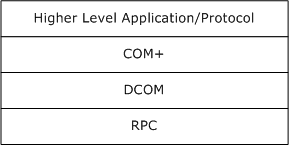
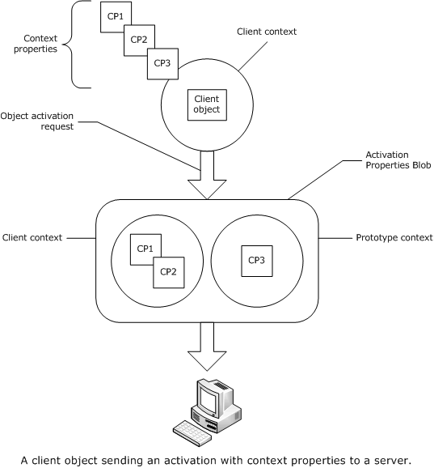
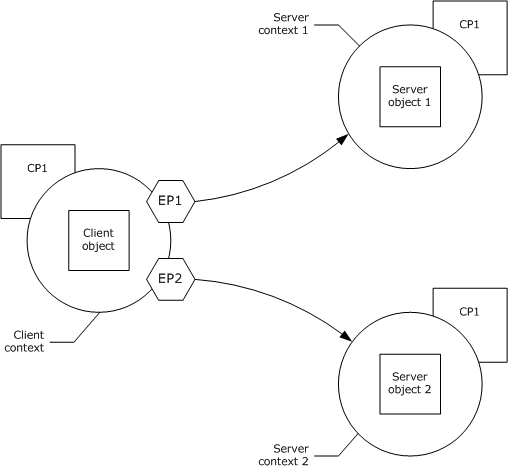
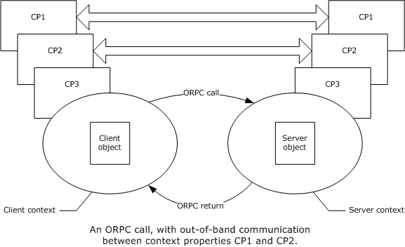
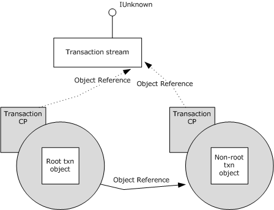
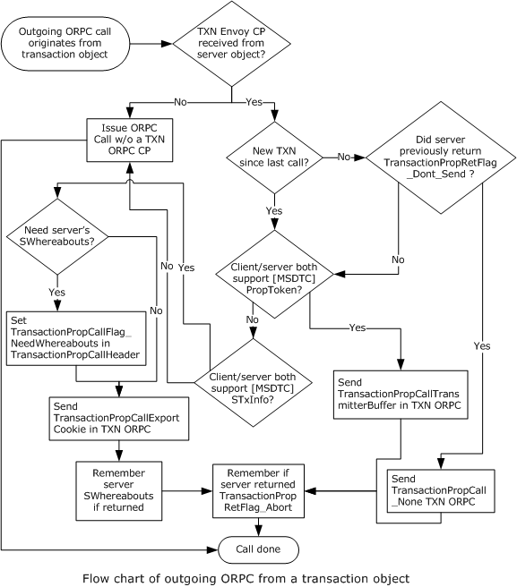
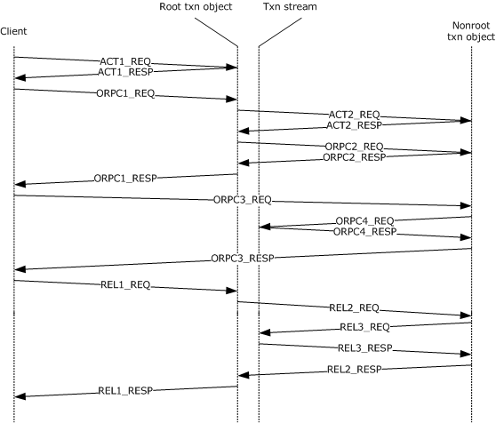

[MS-COM]:

Component Object Model Plus (COM+) Protocol

Intellectual Property Rights Notice for Open Specifications Documentation

  Technical Documentation. Microsoft publishes Open Specifications documentation (“this

documentation”) for protocols, file formats, data portability, computer languages, and standards
support. Additionally, overview documents cover inter-protocol relationships and interactions.

  Copyrights. This documentation is covered by Microsoft copyrights. Regardless of any other

terms that are contained in the terms of use for the Microsoft website that hosts this
documentation, you can make copies of it in order to develop implementations of the technologies
that are described in this documentation and can distribute portions of it in your implementations
that use these technologies or in your documentation as necessary to properly document the
implementation. You can also distribute in your implementation, with or without modification, any
schemas, IDLs, or code samples that are included in the documentation. This permission also
applies to any documents that are referenced in the Open Specifications documentation.
  No Trade Secrets. Microsoft does not claim any trade secret rights in this documentation.
  Patents. Microsoft has patents that might cover your implementations of the technologies

described in the Open Specifications documentation. Neither this notice nor Microsoft's delivery of
this documentation grants any licenses under those patents or any other Microsoft patents.
However, a given Open Specifications document might be covered by the Microsoft Open
Specifications Promise or the Microsoft Community Promise. If you would prefer a written license,
or if the technologies described in this documentation are not covered by the Open Specifications
Promise or Community Promise, as applicable, patent licenses are available by contacting
iplg@microsoft.com.

  License Programs. To see all of the protocols in scope under a specific license program and the

associated patents, visit the Patent Map.

  Trademarks. The names of companies and products contained in this documentation might be
covered by trademarks or similar intellectual property rights. This notice does not grant any
licenses under those rights. For a list of Microsoft trademarks, visit
www.microsoft.com/trademarks.

  Fictitious Names. The example companies, organizations, products, domain names, email

addresses, logos, people, places, and events that are depicted in this documentation are fictitious.
No association with any real company, organization, product, domain name, email address, logo,
person, place, or event is intended or should be inferred.

Reservation of Rights. All other rights are reserved, and this notice does not grant any rights other
than as specifically described above, whether by implication, estoppel, or otherwise.

Tools. The Open Specifications documentation does not require the use of Microsoft programming
tools or programming environments in order for you to develop an implementation. If you have access
to Microsoft programming tools and environments, you are free to take advantage of them. Certain
Open Specifications documents are intended for use in conjunction with publicly available standards
specifications and network programming art and, as such, assume that the reader either is familiar
with the aforementioned material or has immediate access to it.

Support. For questions and support, please contact dochelp@microsoft.com.

[MS-COM] - v20240423
Component Object Model Plus (COM+) Protocol
Copyright © 2024 Microsoft Corporation
Release: April 23, 2024

1 / 87

Revision Summary

Date

Revision
History

Revision
Class

Comments

12/18/2006  0.1

3/2/2007

1.0

4/3/2007

1.1

5/11/2007

1.2

New

Major

Minor

Minor

Version 0.1 release

Version 1.0 release

Version 1.1 release

Version 1.2 release

6/1/2007

1.2.1

Editorial

Changed language and formatting in the technical content.

7/3/2007

1.2.2

Editorial

Changed language and formatting in the technical content.

7/20/2007

1.2.3

Editorial

Changed language and formatting in the technical content.

8/10/2007

1.2.4

Editorial

Changed language and formatting in the technical content.

9/28/2007

1.2.5

Editorial

Changed language and formatting in the technical content.

10/23/2007  1.2.6

Editorial

Changed language and formatting in the technical content.

11/30/2007  1.2.7

Editorial

Changed language and formatting in the technical content.

1/25/2008

1.2.8

Editorial

Changed language and formatting in the technical content.

3/14/2008

1.2.9

Editorial

Changed language and formatting in the technical content.

5/16/2008

1.2.10

Editorial

Changed language and formatting in the technical content.

6/20/2008

1.3

Minor

Clarified the meaning of the technical content.

7/25/2008

1.3.1

Editorial

Changed language and formatting in the technical content.

8/29/2008

1.3.2

Editorial

Changed language and formatting in the technical content.

10/24/2008  1.3.3

12/5/2008

2.0

1/16/2009

3.0

2/27/2009

4.0

4/10/2009

4.1

5/22/2009

4.2

Major

Major

Major

Major

Minor

Minor

Updated and revised the technical content.

Updated and revised the technical content.

Updated and revised the technical content.

Updated and revised the technical content.

Clarified the meaning of the technical content.

Clarified the meaning of the technical content.

7/2/2009

4.2.1

Editorial

Changed language and formatting in the technical content.

8/14/2009

4.2.2

Editorial

Changed language and formatting in the technical content.

9/25/2009

4.3

Minor

Clarified the meaning of the technical content.

11/6/2009

4.3.1

Editorial

Changed language and formatting in the technical content.

12/18/2009  4.3.2

Editorial

Changed language and formatting in the technical content.

1/29/2010

4.4

Minor

Clarified the meaning of the technical content.

3/12/2010

4.4.1

Editorial

Changed language and formatting in the technical content.

[MS-COM] - v20240423
Component Object Model Plus (COM+) Protocol
Copyright © 2024 Microsoft Corporation
Release: April 23, 2024

2 / 87

Date

Revision
History

Revision
Class

Comments

4/23/2010

5.0

6/4/2010

5.1

7/16/2010

5.1

8/27/2010

5.1

10/8/2010

5.1

11/19/2010  5.1

1/7/2011

5.1

2/11/2011

5.1

3/25/2011

5.1

5/6/2011

5.1

Major

Minor

None

None

None

None

None

None

None

None

Updated and revised the technical content.

Clarified the meaning of the technical content.

No changes to the meaning, language, or formatting of the
technical content.

No changes to the meaning, language, or formatting of the
technical content.

No changes to the meaning, language, or formatting of the
technical content.

No changes to the meaning, language, or formatting of the
technical content.

No changes to the meaning, language, or formatting of the
technical content.

No changes to the meaning, language, or formatting of the
technical content.

No changes to the meaning, language, or formatting of the
technical content.

No changes to the meaning, language, or formatting of the
technical content.

6/17/2011

5.2

Minor

Clarified the meaning of the technical content.

9/23/2011

5.2

None

No changes to the meaning, language, or formatting of the
technical content.

12/16/2011  6.0

Major

Updated and revised the technical content.

3/30/2012

6.0

7/12/2012

6.0

10/25/2012  6.0

1/31/2013

6.0

None

None

None

None

No changes to the meaning, language, or formatting of the
technical content.

No changes to the meaning, language, or formatting of the
technical content.

No changes to the meaning, language, or formatting of the
technical content.

No changes to the meaning, language, or formatting of the
technical content.

8/8/2013

6.1

Minor

Clarified the meaning of the technical content.

11/14/2013  6.1

2/13/2014

6.1

5/15/2014

6.1

None

None

None

No changes to the meaning, language, or formatting of the
technical content.

No changes to the meaning, language, or formatting of the
technical content.

No changes to the meaning, language, or formatting of the
technical content.

6/30/2015

7.0

Major

Significantly changed the technical content.

10/16/2015  7.0

None

No changes to the meaning, language, or formatting of the
technical content.

[MS-COM] - v20240423
Component Object Model Plus (COM+) Protocol
Copyright © 2024 Microsoft Corporation
Release: April 23, 2024

3 / 87

Date

Revision
History

Revision
Class

Comments

7/14/2016

7.0

None

No changes to the meaning, language, or formatting of the
technical content.

6/1/2017

7.0

9/15/2017

8.0

9/12/2018

9.0

4/7/2021

10.0

6/25/2021

11.0

4/23/2024

12.0

None

Major

Major

Major

Major

Major

No changes to the meaning, language, or formatting of the
technical content.

Significantly changed the technical content.

Significantly changed the technical content.

Significantly changed the technical content.

Significantly changed the technical content.

Significantly changed the technical content.

[MS-COM] - v20240423
Component Object Model Plus (COM+) Protocol
Copyright © 2024 Microsoft Corporation
Release: April 23, 2024

4 / 87

Table of Contents

1.3

1.3.2

1.3.1

1.1
1.2

1.3.1.3

1.3.1.2

1.3.1.1

1.3.1.3.1

1.3.1.2.1

1.2.1
1.2.2

1.3.1.1.1
1.3.1.1.2
1.3.1.1.3

1  Introduction .......................................................................................................... 10
Glossary ......................................................................................................... 10
References ...................................................................................................... 12
Normative References ................................................................................. 12
Informative References ............................................................................... 12
Overview ........................................................................................................ 12
Context Properties ...................................................................................... 13
Context Properties and Activations .......................................................... 13
Client Context Within Activations ....................................................... 13
Prototype Context Within Activations ................................................. 14
Diagram ......................................................................................... 14
Context Properties and Marshaling .......................................................... 14
Diagram ......................................................................................... 15
Context Properties and ORPC Calls .......................................................... 15
Diagram ......................................................................................... 16
Transactions .............................................................................................. 16
Transaction Stream ............................................................................... 16
Root Transaction Object ......................................................................... 16
Non-root Transaction Object ................................................................... 17
Diagram .............................................................................................. 17
MS-DTC Transaction Propagation Methods................................................ 17
Transaction Lifetime .............................................................................. 18
Activities ................................................................................................... 18
Security..................................................................................................... 18
User-Defined Properties ............................................................................... 18
Partitions ................................................................................................... 18
Relationship to Other Protocols .......................................................................... 19
Prerequisites/Preconditions ............................................................................... 19
Applicability Statement ..................................................................................... 19
Versioning and Capability Negotiation ................................................................. 19
Vendor-Extensible Fields ................................................................................... 19
Standards Assignments ..................................................................................... 19

1.3.2.1
1.3.2.2
1.3.2.3
1.3.2.4
1.3.2.5
1.3.2.6

1.3.3
1.3.4
1.3.5
1.3.6

1.4
1.5
1.6
1.7
1.8
1.9

2.1
2.2

2.2.2.1

2.2.1
2.2.2

2.2.2.2
2.2.2.3

2.2.2.1.1
2.2.2.1.2
2.2.2.1.3

2  Messages ............................................................................................................... 21
Transport ........................................................................................................ 21
Common Data Types ........................................................................................ 21
LengthPrefixedName ................................................................................... 21
Activation Context Properties ....................................................................... 21
Transaction Context Property ................................................................. 22
TransactionContextPropertyHeader .................................................... 22
TransactionStream .......................................................................... 23
TransactionBuffer ............................................................................ 23
Activity Context Property ....................................................................... 24
User-Defined Context Property ............................................................... 25
UserProperty ................................................................................... 25
Context ORPC Extensions ............................................................................ 26
Transaction ORPC Extensions ................................................................. 27
Transaction ORPC Call Extensions ...................................................... 27
TransactionPropCallHeader .......................................................... 27
TransactionPropCallExportCookie ................................................. 28
TransactionPropCallTransmitterBuffer ........................................... 28
Transaction ORPC Return Extensions.................................................. 29
TransactionPropRetHeader .......................................................... 29
TransactionPropRetWhereabouts .................................................. 30
Security ORPC Extension ........................................................................ 30

2.2.3.1.1.1
2.2.3.1.1.2
2.2.3.1.1.3

2.2.3.1.2.1
2.2.3.1.2.2

2.2.2.3.1

2.2.3.1.1

2.2.3.1.2

2.2.3.2

2.2.3.1

2.2.3

[MS-COM] - v20240423
Component Object Model Plus (COM+) Protocol
Copyright © 2024 Microsoft Corporation
Release: April 23, 2024

5 / 87

2.2.3.2.1

2.2.3.2.1.1

2.2.3.2.2
2.2.3.2.3
2.2.3.2.4

Security Property ............................................................................ 31
Security Property Types .............................................................. 31
Security Property Collection Header ................................................... 32
Security Property Collection .............................................................. 33
Security ORPC Extension .................................................................. 33
OBJREF_EXTENDED Context Properties ......................................................... 34
Transaction Envoy Property .................................................................... 34
Security Envoy Property ......................................................................... 35
Class Factory Wrapper................................................................................. 36
Constants .................................................................................................. 38
DTCO Capabilities ................................................................................. 38
Transaction Isolation Levels ................................................................... 38

2.2.4

2.2.4.1
2.2.4.2

2.2.5
2.2.6

2.2.6.1
2.2.6.2

3.2

3.3

3.1

3.2.6.1

3.1.5
3.1.6

3.1.4.1
3.1.4.2

3.1.6.1
3.1.6.2

3.1.1
3.1.2
3.1.3
3.1.4

3.2.1
3.2.2
3.2.3
3.2.4
3.2.5
3.2.6

3  Protocol Details ..................................................................................................... 39
Client Root Transaction Object Activation Details .................................................. 39
Abstract Data Model .................................................................................... 39
Timers ...................................................................................................... 39
Initialization ............................................................................................... 40
Message Processing Events and Sequencing Rules .......................................... 40
Activation Using Transaction Stream ....................................................... 40
Activation Using Transaction Buffer ......................................................... 41
Timer Events .............................................................................................. 41
Other Local Events ...................................................................................... 41
Transaction Commit .............................................................................. 41
Transaction Abort.................................................................................. 41
Client Non-Root Transaction Object Activation Details ........................................... 41
Abstract Data Model .................................................................................... 41
Timers ...................................................................................................... 42
Initialization ............................................................................................... 42
Message Processing Events and Sequencing Rules .......................................... 42
Timer Events .............................................................................................. 42
Other Local Events ...................................................................................... 42
Transaction Outcome Participation .......................................................... 42
Client Activity Activation Details ......................................................................... 42
Abstract Data Model .................................................................................... 42
Timers ...................................................................................................... 43
Initialization ............................................................................................... 43
Message Processing Events and Sequencing Rules .......................................... 43
Timer Events .............................................................................................. 43
Other Local Events ...................................................................................... 43
Client Partition Activation Details ....................................................................... 43
Abstract Data Model .................................................................................... 43
Timers ...................................................................................................... 43
Initialization ............................................................................................... 43
Message Processing Events and Sequencing Rules .......................................... 43
Timer Events .............................................................................................. 44
Other Local Events ...................................................................................... 44
Client User Property Activation Details ................................................................ 44
Abstract Data Model .................................................................................... 44
Timers ...................................................................................................... 44
Initialization ............................................................................................... 44
Message Processing Events and Sequencing Rules .......................................... 44
Timer Events .............................................................................................. 44
Other Local Events ...................................................................................... 44
Client Class Factory Wrapper Activation Details .................................................... 44
Abstract Data Model .................................................................................... 44
Timers ...................................................................................................... 45
Initialization ............................................................................................... 45

3.3.1
3.3.2
3.3.3
3.3.4
3.3.5
3.3.6

3.4.1
3.4.2
3.4.3
3.4.4
3.4.5
3.4.6

3.5.1
3.5.2
3.5.3
3.5.4
3.5.5
3.5.6

3.6.1
3.6.2
3.6.3

3.5

3.6

3.4

[MS-COM] - v20240423
Component Object Model Plus (COM+) Protocol
Copyright © 2024 Microsoft Corporation
Release: April 23, 2024

6 / 87

3.7

3.8

3.9

3.8.6.1

3.6.4
3.6.5
3.6.6

3.7.1
3.7.2
3.7.3
3.7.4
3.7.5
3.7.6

3.8.1
3.8.2
3.8.3
3.8.4
3.8.5
3.8.6

3.9.1
3.9.2
3.9.3
3.9.4
3.9.5
3.9.6

Message Processing Events and Sequencing Rules .......................................... 45
Timer Events .............................................................................................. 46
Other Local Events ...................................................................................... 46
Server Root Transaction Object Activation Details ................................................ 46
Abstract Data Model .................................................................................... 46
Timers ...................................................................................................... 46
Initialization ............................................................................................... 46
Message Processing Events and Sequencing Rules .......................................... 46
Timer Events .............................................................................................. 46
Other Local Events ...................................................................................... 46
Server Non-Root Transaction Object Activation Details.......................................... 46
Abstract Data Model .................................................................................... 46
Timers ...................................................................................................... 47
Initialization ............................................................................................... 47
Message Processing Events and Sequencing Rules .......................................... 48
Timer Events .............................................................................................. 48
Other Local Events ...................................................................................... 48
Transaction Outcome Participation .......................................................... 48
Server Activity Activation Details ........................................................................ 48
Abstract Data Model .................................................................................... 48
Timers ...................................................................................................... 48
Initialization ............................................................................................... 48
Message Processing Events and Sequencing Rules .......................................... 48
Timer Events .............................................................................................. 49
Other Local Events ...................................................................................... 49
Server Partition Activation Details ...................................................................... 49
Abstract Data Model .................................................................................... 49
3.10.1
Timers ...................................................................................................... 49
3.10.2
3.10.3
Initialization ............................................................................................... 49
3.10.4  Message Processing Events and Sequencing Rules .......................................... 49
3.10.5
Timer Events .............................................................................................. 49
3.10.6  Other Local Events ...................................................................................... 50
Server User Property Activation Details ............................................................... 50
Abstract Data Model .................................................................................... 50
3.11.1
Timers ...................................................................................................... 50
3.11.2
3.11.3
Initialization ............................................................................................... 50
3.11.4  Message Processing Events and Sequencing Rules .......................................... 50
3.11.5
Timer Events .............................................................................................. 50
3.11.6  Other Local Events ...................................................................................... 50
Server Class Factory Wrapper Activation Details .................................................. 50
Abstract Data Model .................................................................................... 50
3.12.1
Timers ...................................................................................................... 50
3.12.2
3.12.3
Initialization ............................................................................................... 50
3.12.4  Message Processing Events and Sequencing Rules .......................................... 50
3.12.5
Timer Events .............................................................................................. 51
3.12.6  Other Local Events ...................................................................................... 51
Client Transaction ORPC Extension Details........................................................... 51
Abstract Data Model .................................................................................... 51
3.13.1
Timers ...................................................................................................... 52
3.13.2
3.13.3
Initialization ............................................................................................... 52
3.13.4  Message Processing Events and Sequencing Rules .......................................... 52
3.13.4.1  Diagram .............................................................................................. 53
Timer Events .............................................................................................. 54
3.13.5
3.13.6  Other Local Events ...................................................................................... 54
Transaction Outcome Participation .......................................................... 54
Client Security ORPC Extension Details ............................................................... 55
Abstract Data Model .................................................................................... 55
Timers ...................................................................................................... 55

3.14.1
3.14.2

3.13.6.1

3.10

3.11

3.12

3.13

3.14

[MS-COM] - v20240423
Component Object Model Plus (COM+) Protocol
Copyright © 2024 Microsoft Corporation
Release: April 23, 2024

7 / 87

3.16

3.15

3.15.6.1
3.15.6.2

3.14.3
Initialization ............................................................................................... 55
3.14.4  Message Processing Events and Sequencing Rules .......................................... 55
Timer Events .............................................................................................. 57
3.14.5
3.14.6  Other Local Events ...................................................................................... 57
Server Transaction ORPC Extension Details ......................................................... 58
Abstract Data Model .................................................................................... 58
3.15.1
Timers ...................................................................................................... 58
3.15.2
3.15.3
Initialization ............................................................................................... 58
3.15.4  Message Processing Events and Sequencing Rules .......................................... 58
3.15.5
Timer Events .............................................................................................. 62
3.15.6  Other Local Events ...................................................................................... 62
Server Non-Root Transaction Object Communication ................................. 62
Transaction Outcome Participation .......................................................... 62
Server Security ORPC Extension Details .............................................................. 62
3.16.1
Abstract Data Model .................................................................................... 62
3.16.2
Timers ...................................................................................................... 62
Initialization ............................................................................................... 62
3.16.3
3.16.4  Message Processing Events and Sequencing Rules .......................................... 63
3.16.5
Timer Events .............................................................................................. 63
3.16.6  Other Local Events ...................................................................................... 63
Server Activity ORPC Processing Details .............................................................. 63
Abstract Data Model .................................................................................... 63
3.17.1
Timers ...................................................................................................... 63
3.17.2
3.17.3
Initialization ............................................................................................... 63
3.17.4  Message Processing Events and Sequencing Rules .......................................... 63
Timer Events .............................................................................................. 64
3.17.5
3.17.6  Other Local Events ...................................................................................... 64
Server Transaction Envoy Marshaling Details ....................................................... 64
Abstract Data Model .................................................................................... 64
3.18.1
Timers ...................................................................................................... 65
3.18.2
3.18.3
Initialization ............................................................................................... 65
3.18.4  Message Processing Events and Sequencing Rules .......................................... 65
3.18.5
Timer Events .............................................................................................. 65
3.18.6  Other Local Events ...................................................................................... 66
Server Security Envoy Marshaling Details ............................................................ 66
Abstract Data Model .................................................................................... 66
3.19.1
Timers ...................................................................................................... 66
3.19.2
3.19.3
Initialization ............................................................................................... 66
3.19.4  Message Processing Events and Sequencing Rules .......................................... 66
3.19.5
Timer Events .............................................................................................. 66
3.19.6  Other Local Events ...................................................................................... 66
Client Transaction Envoy Unmarshaling Details .................................................... 67
Abstract Data Model .................................................................................... 67
3.20.1
Timers ...................................................................................................... 67
3.20.2
3.20.3
Initialization ............................................................................................... 67
3.20.4  Message Processing Events and Sequencing Rules .......................................... 68
3.20.5
Timer Events .............................................................................................. 68
3.20.6  Other Local Events ...................................................................................... 68
Client Transaction Envoy Marshaling Details ........................................................ 68
Abstract Data Model .................................................................................... 68
3.21.1
Timers ...................................................................................................... 68
3.21.2
3.21.3
Initialization ............................................................................................... 68
3.21.4  Message Processing Events and Sequencing Rules .......................................... 68
3.21.5
Timer Events .............................................................................................. 69
3.21.6  Other Local Events ...................................................................................... 69
Client Security Unmarshaling Details .................................................................. 69
Abstract Data Model .................................................................................... 69
Timers ...................................................................................................... 69

3.22.1
3.22.2

3.17

3.18

3.19

3.20

3.21

3.22

[MS-COM] - v20240423
Component Object Model Plus (COM+) Protocol
Copyright © 2024 Microsoft Corporation
Release: April 23, 2024

8 / 87

3.23

3.22.3
Initialization ............................................................................................... 69
3.22.4  Message Processing Events and Sequencing Rules .......................................... 69
Timer Events .............................................................................................. 69
3.22.5
3.22.6  Other Local Events ...................................................................................... 69
ITransactionStream Server Details ..................................................................... 70
Abstract Data Model .................................................................................... 70
3.23.1
Timers ...................................................................................................... 70
3.23.2
3.23.3
Initialization ............................................................................................... 70
3.23.4  Message Processing Events and Sequencing Rules .......................................... 70
ITransactionStream::GetSeqAndTxViaExport (Opnum 3) ........................... 70
ITransactionStream::GetSeqAndTxViaTransmitter (Opnum 4) .................... 71
ITransactionStream::GetTxViaExport (Opnum 5) ...................................... 72
ITransactionStream::GetTxViaTransmitter (Opnum 6) ............................... 73
3.23.5
Timer Events .............................................................................................. 73
3.23.6  Other Local Events ...................................................................................... 73

3.23.4.1
3.23.4.2
3.23.4.3
3.23.4.4

4  Protocol Examples ................................................................................................. 74
Client to RootTxn to Non-RootTxn Example ......................................................... 74

4.1

5  Security ................................................................................................................. 77
Security Considerations for Implementers ........................................................... 77
Index of Security Parameters ............................................................................ 77

5.1
5.2

6  Appendix A: Full IDL .............................................................................................. 78

7  Appendix B: Product Behavior ............................................................................... 79

8  Change Tracking .................................................................................................... 81

9  Index ..................................................................................................................... 82

[MS-COM] - v20240423
Component Object Model Plus (COM+) Protocol
Copyright © 2024 Microsoft Corporation
Release: April 23, 2024

9 / 87

1  Introduction

The Component Object Model Plus (COM+) Protocol consists of a DCOM interface, and remote protocol
extensions described in [MS-DCOM], used for adding transactions, implementing synchronization,
managing multiple object class configurations, enforcing security, and providing additional
functionality and attributes to DCOM-based distributed object applications.

Sections 1.5, 1.8, 1.9, 2, and 3 of this specification are normative. All other sections and examples in
this specification are informative.

1.1  Glossary

This document uses the following terms:

activity: A synchronization boundary; ORPC calls to objects within the boundary are serialized

based on their causality identifiers.

activity identifier: A GUID that identifies an activity.

authentication level: A numeric value indicating the level of authentication or message protection

that remote procedure call (RPC) will apply to a specific message exchange. For more
information, see [C706] section 13.1.2.1 and [MS-RPCE].

Authentication Service (AS): A service that issues ticket granting tickets (TGTs), which are used

for authenticating principals within the realm or domain served by the Authentication
Service.

causality identifier (CID): A GUID that is passed as part of an ORPC call to identify a chain of

calls that are causally related.

class factory: An object (3 or 4) whose purpose is to create objects (3 or 4) from a specific object

class (3 or 4).

class identifier (CLSID): A GUID that identifies a software component; for instance, a DCOM

object class or a COM class.

distributed transaction: A transaction that updates data on two or more networked computer

systems. Distributed transactions extend the benefits of transactions to applications that have to
update distributed data.

domain: A set of users and computers sharing a common namespace and management

infrastructure. At least one computer member of the set has to act as a domain controller (DC)
and host a member list that identifies all members of the domain, as well as optionally hosting
the Active Directory service. The domain controller provides authentication of members, creating
a unit of trust for its members. Each domain has an identifier that is shared among its members.
For more information, see [MS-AUTHSOD] section 1.1.1.5 and [MS-ADTS].

dynamic endpoint: A network-specific server address that is requested and assigned at run time.

For more information, see [C706].

global partition: The default, required partition on a COMA server.

globally unique identifier (GUID): A term used interchangeably with universally unique

identifier (UUID) in Microsoft protocol technical documents (TDs). Interchanging the usage of
these terms does not imply or require a specific algorithm or mechanism to generate the value.
Specifically, the use of this term does not imply or require that the algorithms described in
[RFC4122] or [C706] have to be used for generating the GUID. See also universally unique
identifier (UUID).

10 / 87

[MS-COM] - v20240423
Component Object Model Plus (COM+) Protocol
Copyright © 2024 Microsoft Corporation
Release: April 23, 2024

Interface Definition Language (IDL): The International Standards Organization (ISO) standard
language for specifying the interface for remote procedure calls. For more information, see
[C706] section 4.

object class: In COM, a category of objects identified by a CLSID, members of which can be

obtained through activation of the CLSID.

object remote procedure call (ORPC): A remote procedure call whose target is an interface on
an object. The target interface (and therefore the object) is identified by an interface pointer
identifier (IPID).

OBJREF: The marshaled form of an object reference.

partition: A container for a specific configuration of a COM+ object class.

partition identifier: A GUID that identifies a partition.

remote procedure call (RPC): A communication protocol used primarily between client and

server. The term has three definitions that are often used interchangeably: a runtime
environment providing for communication facilities between computers (the RPC runtime); a set
of request-and-response message exchanges between computers (the RPC exchange); and the
single message from an RPC exchange (the RPC message).  For more information, see [C706].

security identifier (SID): An identifier for security principals that is used to identify an account
or a group. Conceptually, the SID is composed of an account authority portion (typically a
domain) and a smaller integer representing an identity relative to the account authority,
termed the relative identifier (RID). The SID format is specified in [MS-DTYP] section 2.4.2; a
string representation of SIDs is specified in [MS-DTYP] section 2.4.2 and [MS-AZOD] section
1.1.1.2.

transaction: A unit of interaction that guarantees the ACID properties— atomicity, consistency,
isolation, and durability—as specified by the MSDTC Connection Manager: OleTx Transaction
Protocol ([MS-DTCO])

transaction manager: The party that is responsible for managing and distributing the outcome of

atomic transactions. A transaction manager is either a root transaction manager or a
subordinate transaction manager for a specified transaction.

transaction sequence number (TSN): A positive number that identifies a single transaction

within a transaction stream.

transaction stream: An object that supplies a series of transactions, each identified by a

monotonically increasing sequence number.

transaction stream ID: A GUID that identifies a transaction stream.

Unicode: A character encoding standard developed by the Unicode Consortium that represents

almost all of the written languages of the world. The Unicode standard [UNICODE5.0.0/2007]
provides three forms (UTF-8, UTF-16, and UTF-32) and seven schemes (UTF-8, UTF-16, UTF-16
BE, UTF-16 LE, UTF-32, UTF-32 LE, and UTF-32 BE).

universally unique identifier (UUID): A 128-bit value. UUIDs can be used for multiple

purposes, from tagging objects with an extremely short lifetime, to reliably identifying very
persistent objects in cross-process communication such as client and server interfaces, manager
entry-point vectors, and RPC objects. UUIDs are highly likely to be unique. UUIDs are also
known as globally unique identifiers (GUIDs) and these terms are used interchangeably in
the Microsoft protocol technical documents (TDs). Interchanging the usage of these terms does
not imply or require a specific algorithm or mechanism to generate the UUID. Specifically, the
use of this term does not imply or require that the algorithms described in [RFC4122] or [C706]
has to be used for generating the UUID.

11 / 87

[MS-COM] - v20240423
Component Object Model Plus (COM+) Protocol
Copyright © 2024 Microsoft Corporation
Release: April 23, 2024

Windows NT account name: A string identifying the name of a Windows NT operating system

account.

MAY, SHOULD, MUST, SHOULD NOT, MUST NOT: These terms (in all caps) are used as defined
in [RFC2119]. All statements of optional behavior use either MAY, SHOULD, or SHOULD NOT.

1.2  References

Links to a document in the Microsoft Open Specifications library point to the correct section in the
most recently published version of the referenced document. However, because individual documents
in the library are not updated at the same time, the section numbers in the documents may not
match. You can confirm the correct section numbering by checking the Errata.

1.2.1  Normative References

We conduct frequent surveys of the normative references to assure their continued availability. If you
have any issue with finding a normative reference, please contact dochelp@microsoft.com. We will
assist you in finding the relevant information.

[C706] The Open Group, "DCE 1.1: Remote Procedure Call", C706, August 1997,
https://publications.opengroup.org/c706

Note Registration is required to download the document.

[MS-DCOM] Microsoft Corporation, "Distributed Component Object Model (DCOM) Remote Protocol".

[MS-DTCO] Microsoft Corporation, "MSDTC Connection Manager: OleTx Transaction Protocol".

[MS-DTYP] Microsoft Corporation, "Windows Data Types".

[MS-ERREF] Microsoft Corporation, "Windows Error Codes".

[MS-NRPC] Microsoft Corporation, "Netlogon Remote Protocol".

[MS-OAUT] Microsoft Corporation, "OLE Automation Protocol".

[MS-RPCE] Microsoft Corporation, "Remote Procedure Call Protocol Extensions".

[RFC2119] Bradner, S., "Key words for use in RFCs to Indicate Requirement Levels", BCP 14, RFC
2119, March 1997, https://www.rfc-editor.org/info/rfc2119

1.2.2  Informative References

[MSDN-DTC] Microsoft Corporation, "Distributed Transaction Coordinator",
https://learn.microsoft.com/en-us/previous-versions/windows/desktop/ms684146(v=vs.85)

1.3  Overview

This protocol extends the protocol described in [MS-DCOM] by providing facilities to add
transactions, synchronization, multiple object class configurations, security, and other attributes to
distributed object applications. The protocol consists of a set of extensions layered on top of the DCOM
remote protocol. The following diagram shows the layering of the protocol stack.

[MS-COM] - v20240423
Component Object Model Plus (COM+) Protocol
Copyright © 2024 Microsoft Corporation
Release: April 23, 2024

12 / 87

<!-- Extracted images from page 13 -->

<!-- /Extracted images from page 13 -->

Figure 1: Layering of the protocol stack

1.3.1  Context Properties

This protocol operates by passing COM+ specific information in object activations, ORPC calls, and as
part of marshaled OBJREFs, using the context and context property extension mechanisms as
specified in [MS-DCOM] section 2.2.21.4. A COM+ object is configured using an implementation-
specific mechanism to require none, some, or all of the features described in this specification. These
features are implemented by creating the object within a context and associating properties with the
context. A context is a collection of attributes or context properties that describes an execution
environment. When an object in a context with one or more context properties creates or calls other
objects on the network, the protocol specifies mechanisms for those context properties to influence
the state of the object activations and ORPC calls.

A context can contain the following context properties:









The Transaction Context Property (section 1.3.2)

The Activity Context Property (section 1.3.3)

The Security Context Property (section 1.3.4)

The User-Defined Context Property (section 1.3.5)

1.3.1.1  Context Properties and Activations

Context properties can flow as part of activation. [MS-DCOM] specifies two ways to accomplish this:
the client context and the prototype context passed as part of an ActivationContextInfoData structure
([MS-DCOM] section 2.2.22.2.5) within an Activation Properties BLOB ([MS-DCOM] section 2.2.22).

1.3.1.1.1 Client Context Within Activations

The client context within the Activation Properties BLOB ([MS-DCOM] section 2.2.22) represents a set
of context properties associated with the client object context, and guides the creation of the server
object context.

The server can decide to use some, none, or all of the client context properties, depending on the
desired result or implementation-specific details.

For example, if the client context contains a transaction context property (section 2.2.2.1), this
indicates to the server that the client object is running within a transaction. The server then decides,
in an implementation-specific way, if the server object will run within the same transaction as the
client, a new transaction, or no transaction at all.

[MS-COM] - v20240423
Component Object Model Plus (COM+) Protocol
Copyright © 2024 Microsoft Corporation
Release: April 23, 2024

13 / 87

<!-- Extracted images from page 14 -->

<!-- /Extracted images from page 14 -->

1.3.1.1.2 Prototype Context Within Activations

The prototype context within the Activation Properties BLOB ([MS-DCOM] section 2.2.22) represents
the set of context properties of the client that the server needs to add to its object context. While the
client context is merely advisory, the prototype context is not. All the prototype context properties
have to be present among the context properties of the server object.

1.3.1.1.3 Diagram

Figure 2: A client object sending an activation with context properties to a server

1.3.1.2  Context Properties and Marshaling

When a server marshals a COM+ object running in a context, the server returns an
OBJREF_EXTENDED instance ([MS-DCOM] section 2.2.18.7). Within an OBJREF_EXTENDED instance,
the server can include a representation of its context called an envoy context, consisting of envoy
context properties. During unmarshaling, a client can use the envoy context properties to configure

14 / 87

[MS-COM] - v20240423
Component Object Model Plus (COM+) Protocol
Copyright © 2024 Microsoft Corporation
Release: April 23, 2024

<!-- Extracted images from page 15 -->

<!-- /Extracted images from page 15 -->

and influence future client-side behaviors, either in general or specifically with respect to future
communication with the unmarshaled reference.

For example, a marshaled transactional COM+ server object returns a transactional envoy context
property in an ORPC call, thereby allowing the client to determine whether the client and the server
share the same transaction. If they do not, the client can ignore the transactional envoy context
property. If they share the same transaction, the client can send extra information on subsequent
ORPC calls to the server, for example, to denote the current transaction sequence number, or to
send a new transaction if the previous transaction has ended.

1.3.1.2.1 Diagram

Figure 3: A client object with references to two server objects, each with a reference-
specific envoy property (EP1 and EP2) returned from the server during marshaling

1.3.1.3  Context Properties and ORPC Calls

Context properties can participate in out-of-band communication on ORPC calls. Via the Context ORPC
Extension mechanism ([MS-DCOM] section 2.2.21.4), a client-side context property and a server-side
context property can pass information back and forth on ORPC calls. In some cases, such
communication is influenced by an envoy context property returned from the server during the
marshaling/unmarshaling process. For example, during an ORPC call a transactional COM+ client

15 / 87

[MS-COM] - v20240423
Component Object Model Plus (COM+) Protocol
Copyright © 2024 Microsoft Corporation
Release: April 23, 2024

<!-- Extracted images from page 16 -->

<!-- /Extracted images from page 16 -->

object can send extra information about the state of the current transaction to a COM+ server
object.

1.3.1.3.1 Diagram

Figure 4: An ORPC call with out-of-band communication between context properties

1.3.2  Transactions

This protocol is designed to combine the work of collaborating objects under the aegis of a single
distributed transaction. The protocol itself does not define or implement distributed transaction
coordination and resource manager facilities; instead, it relies on the protocol described in [MS-DTCO]
for these operations, and all references to a "transaction" in this specification are references to
transaction protocol references. This protocol implements transactional semantics for objects by
extending the protocol described in [MS-DCOM] to send transactions and associated information
during object activations, in ORPC calls, and within marshaled OBJREF instances.

1.3.2.1  Transaction Stream

A transaction stream is an object that supplies a series of transactions, each identified by a
monotonically increasing transaction sequence number (TSN). Each transaction stream is uniquely
identified by a GUID known as a transaction stream ID. The TSN is used to synchronize the
transaction participants to the current active transaction. A new transaction in the stream might not
be initiated until the previous transaction has completed.

Transaction streams make it possible for sets of distributed objects to collaborate on sequential units
of work.

1.3.2.2  Root Transaction Object

The root transaction object is the object for which the initial transaction is created. There can only be
one root transaction object within a transaction. The root transaction object has an associated
transaction stream, which is responsible for supplying a series of transactions to the root object, as
well as to all non-root objects, as required.

16 / 87

[MS-COM] - v20240423
Component Object Model Plus (COM+) Protocol
Copyright © 2024 Microsoft Corporation
Release: April 23, 2024

<!-- Extracted images from page 17 -->

<!-- /Extracted images from page 17 -->

1.3.2.3  Non-root Transaction Object

Non-root transaction objects are objects created by or downstream from the root transaction object,
and those that share the root transaction object's transaction. There can be multiple non-root objects
within a transaction. A non-root transaction object communicates with the root transaction object and
its associated transaction stream to ensure that each ORPC call to the non-root transaction object
is always executed using a valid and current transaction.

After a transaction completes, the non-root transaction object retrieves the next transaction either by
communicating with the transaction stream, or by receiving it directly as part of an ORPC call from
another object running within the transaction.

1.3.2.4  Diagram

Figure 5: A root and non-root transaction object, each with a transaction context property
holding a reference to the transaction stream

1.3.2.5  MS-DTC Transaction Propagation Methods

The transaction protocol described in [MS-DTCO] specifies two methods for propagating a
transaction from one machine to another. For historical reasons, this protocol accommodates
transaction manager implementations on client and server machines that support either or both
methods. For more information, see section 2.2.6.1 and [MSDN-DTC].

[MS-COM] - v20240423
Component Object Model Plus (COM+) Protocol
Copyright © 2024 Microsoft Corporation
Release: April 23, 2024

17 / 87

1.3.2.6  Transaction Lifetime

Transactions in this protocol are started only by the root transaction object. Only the root
transaction object can commit a transaction. A transaction can be canceled by any participant in the
transaction.

1.3.3  Activities

An activity is a synchronization boundary; ORPC calls to objects within the boundary are serialized
based on the DCOM causality of the currently executing ORPC call. An activity is uniquely identified by
a GUID known as an activity ID. If an object in an activity is currently executing an incoming ORPC
call, incoming ORPC calls with different causality identifiers (CIDs, as specified in [MS-DCOM]
section 2.2.6) to other objects within the same activity are blocked for a specified period of time. If
the time-out expires before the incoming ORPC call is allowed to enter the activity, the call is rejected
and an error is returned to the client.

1.3.4  Security

The protocol offers the capability to send a collection of security identities and other security
information along an ORPC call chain; each element in the collection represents a caller in the ORPC
call chain. At any point in the call chain, an object can query, in an implementation-specific manner,
the following security attributes associated with each upstream caller:









The caller's identity (specified by a security identifier (SID) or Windows NT account name).

The authentication service of the call.

The authentication level of the call.

The impersonation level of the call.

In addition, an object in the call chain can also query the minimum authentication level used across
the entire call chain.

The protocol uses the security context property to send security information in ORPC calls as described
in section 1.3.1.3. When an object is marshaled, the protocol uses the security envoy
property (section 2.2.4.2) as described in section 1.3.1.2 to send information about the domain and
computer of the object. The protocol uses this information to translate SIDs to Windows NT
account names when sending the security identity of the caller in cross-computer and cross-domain
ORPC calls.

1.3.5  User-Defined Properties

User-defined properties are name/value pairs that are part of an object's context. These properties are
supplied and consumed by higher-level protocols or applications. This protocol supports the string
value type and the OBJREF value type. The protocol sends these properties as part of both the client
and prototype contexts during object activations.

1.3.6  Partitions

Partitions are used to support the side-by-side installation of multiple configurations of a COM+
object class. Each partition is uniquely identified by a GUID known as the partition ID. An object
class can have several versions of its configuration installed on a server, one per partition. A partition
contains at most one version of an object class.

[MS-COM] - v20240423
Component Object Model Plus (COM+) Protocol
Copyright © 2024 Microsoft Corporation
Release: April 23, 2024

18 / 87

Every machine has at minimum one partition, the global partition, which contains the default
configuration for every object class on the machine. The global partition serves as the default partition
when no criteria, such as a client-specified partition, exist to choose any other partition.

The partition of an object class is determined during the object activation request; it can be chosen
automatically by an implementation on behalf of the activating client, or the activating client can
specify a partition ID as part of the activation request.

For historical reasons, the client's partition information is not sent across the network in the form of a
context property; instead, it is sent as part of the base DCOM protocol. See the guidPartition field of
the SpecialPropertiesData structure, as specified in [MS-DCOM] section 2.2.22.2.2.

1.4  Relationship to Other Protocols

This protocol is built on top of the protocol described in [MS-DCOM]. This protocol requires the
protocol described in [MS-DTCO] to implement the transactional features in this specification.

1.5  Prerequisites/Preconditions

This protocol requires that both client and server possess implementations of the protocol described in
[MS-DCOM]. If the transactional features of this protocol are to be used, both client and server have
to possess implementations of the protocol described in [MS-DTCO].

1.6  Applicability Statement

This protocol is useful and appropriate when a distributed, object-based architecture with
transactions, synchronization, security, and side-by-side installation of multiple configurations of an
object class is required.

1.7  Versioning and Capability Negotiation

This document covers versioning issues in the following area:

  Capability Negotiation: The protocol performs explicit capability negotiation, as follows:

  By use of the COMVERSION structure ([MS-DCOM] section 2.2.11) as specified in section

2.2.5 and section 3.12.4.

  By use of the MS-DTC Capabilities (section 2.2.6.1) as specified in section 2.2.2.1.2 and

section 2.2.4.1.

1.8  Vendor-Extensible Fields

 This protocol uses HRESULTs as specified in [MS-ERREF] section 2.1. Vendors can define their own
HRESULT values, provided that the C bit (0x20000000) is set for each vendor-specific value.

1.9  Standards Assignments

The following is a table of well-known GUIDs in this protocol.

Parameter

Value

Reference

Transaction Context Property identifier,  Transaction ORPC
Extensions identifier, and Transaction Envoy Property identifier

{ecabaeb1-7f19-11d2-
978e-0000f8757e2a}

[C706] section
A.2.5

(guidTransactionProperty)

[MS-COM] - v20240423
Component Object Model Plus (COM+) Protocol
Copyright © 2024 Microsoft Corporation
Release: April 23, 2024

19 / 87

Parameter

Value

Reference

Activity Context Property identifier

(guidActivityProperty)

{ecabaeb4-7f19-11d2-
978e-0000f8757e2a}

[C706] section
A.2.5

Security Envoy Property identifier and Security ORPC Extension
identifier

{ecabaeb8-7f19-11d2-
978e-0000f8757e2a}

[C706] section
A.2.5

(guidSecurityProperty)

User-Defined Context Property identifier

(guidUserPropertiesProperty)

{ecabaeb6-7f19-11d2-
978e-0000f8757e2a}

[C706] section
A.2.5

OBJREF_CUSTOM unmarshaler CLSID for Class Factory Wrapper
(CLSID_CFW)

{ecabafc0-7f19-11d2-
978e-0000f8757e2a}

[C706] section
A.2.5

OBJREF_CUSTOM unmarshaler CLSID for User-Defined Context
Property (CLSID_UserContextProperty)

{ecabafb3-7f19-11d2-
978e-0000f8757e2a}

[C706] section
A.2.5

OBJREF_CUSTOM unmarshaler CLSID for Transaction Context
Property (CLSID_TransactionUnmarshal)

{ecabafac-7f19-11d2-
978e-0000f8757e2a}

[C706] section
A.2.5

OBJREF_CUSTOM unmarshaler CLSID for Activity Context
Property (CLSID_ActivityUnmarshal)

{ecabafaa-7f19-11d2-
978e-0000f8757e2a}

[C706] section
A.2.5

Unmarshaling CLSID for the Security Envoy Property
(CLSID_SecurityEnvoy)

{ecabafab-7f19-11d2-
978e-0000f8757e2a}

[C706] section
A.2.5

Unmarshaling CLSID for the Transaction Envoy Property
(CLSID_TransactionEnvoy)

{ecabafad-7f19-11d2-
978e-0000f8757e2a}

[C706] section
A.2.5

RPC interface UUID for ITransactionStream
(IID_ITransactionStream)

{97199110-DB2E-11d1-
A251-0000F805CA53}

[C706] section
A.2.5

[MS-COM] - v20240423
Component Object Model Plus (COM+) Protocol
Copyright © 2024 Microsoft Corporation
Release: April 23, 2024

20 / 87

2  Messages

All structures are defined in the IDL syntax and are marshaled as per [C706] part 3. The IDL is
specified in Appendix A.

Field types in packet diagrams are specified by the packet diagram and the field descriptions. All
integer-based fields in packet diagrams are marshaled using little-endian byte ordering unless
otherwise specified.

This protocol references commonly used data types as defined in [MS-DTYP].

Unless otherwise qualified, instances of GUID in sections 2 and 3 refer to [MS-DTYP] section 2.3.4.

2.1  Transport

This protocol uses RPC dynamic endpoints as specified in [C706] part 4.

2.2  Common Data Types

In addition to RPC base types and definitions specified in [C706] and [MS-DTYP], additional data
types are specified in this section.

2.2.1  LengthPrefixedName

The LengthPrefixedName type specifies an array of Unicode characters prefixed by the array length,
in characters.

0  1  2  3  4  5  6  7  8  9

1
0  1  2  3  4  5  6  7  8  9

2
0  1  2  3  4  5  6  7  8  9

3
0  1

Length

Name (variable)

...

Length (4 bytes): An unsigned long that MUST contain the number of Unicode characters in Name,

and MUST NOT be zero.

Name (variable):  A Unicode string; the string SHOULD NOT end in a NULL terminator.

2.2.2  Activation Context Properties

Activation context properties are included as part of the client and/or prototype contexts in a DCOM
Activation Properties BLOB ([MS-DCOM] section 2.2.22).

The following table shows which context properties are located within either the client or prototype
contexts.

 Context property

 In client or prototype context?

Transaction (section 2.2.2.1)

If present, this property MUST be in client context only.

Activity (section 2.2.2.2)

If present, this property MUST be in client context only.

[MS-COM] - v20240423
Component Object Model Plus (COM+) Protocol
Copyright © 2024 Microsoft Corporation
Release: April 23, 2024

21 / 87

 Context property

 In client or prototype context?

User-defined (section 2.2.2.3)

If present, this property MUST be in both client and prototype contexts.

The user context property, if present, MUST be sent within both the client and prototype contexts, and
both copies MUST be identical.

2.2.2.1  Transaction Context Property

To indicate to the server that the client is running within a transaction, the client MUST include a
transaction context property as part of the client context in an object activation request.

The policyId field of the PROPMARSHALHEADER instance ([MS-DCOM] section 2.2.20.1) for the
transaction context property MUST be set to guidTransactionProperty, as specified in section 1.9. The
CLSID field of the PROPMARSHALHEADER instance ([MS-DCOM] section 2.2.20.1) for the transaction
context property MUST be set to GUID_NULL. The transaction context property MUST be marshaled
using the OBJREF_CUSTOM format ([MS-DCOM] section 2.2.18.6), and the CLSID field of the
OBJREF_CUSTOM instance MUST be set to CLSID_TransactionUnmarshal, as specified in section 1.9.

The format of the OBJREF_CUSTOM.pObjectData buffer for CLSID_TransactionUnmarshal MUST be
specified as follows.

2.2.2.1.1 TransactionContextPropertyHeader

The TransactionContextPropertyHeader structure is the common header for all variants of the
Transaction Context Property.

0  1  2  3  4  5  6  7  8  9

1
0  1  2  3  4  5  6  7  8  9

2
0  1  2  3  4  5  6  7  8  9

3
0  1

MaxVersion

Variant

MinVersion

StreamID (16 bytes)

...

...

...

StreamVariant

MaxVersion (2 bytes): The major version of this marshaled format. MUST be set to 0x0001 or

0x0002. A value of 0x0002 indicates that an IsolationLevel field is present at the end of the
message (see sections 2.2.2.1.2 and 2.2.2.1.3); a value of 0x0001 indicates that no
IsolationLevel is present.

MinVersion (2 bytes): The minor version of this marshaled format. MUST be set to 0x0001.

Variant (2 bytes): This MUST be set to either 0x0000 or 0x0002, and MUST be ignored by the server

on receipt.

StreamID (16 bytes): A GUID identifying the controlling transaction stream.

StreamVariant (2 bytes): A value identifying the larger structure that contains the

TransactionContextPropertyHeader. It MUST be set to one of the following values:

[MS-COM] - v20240423
Component Object Model Plus (COM+) Protocol
Copyright © 2024 Microsoft Corporation
Release: April 23, 2024

22 / 87

Value

Meaning

StreamVariant

0x0001

The TransactionContextPropertyHeader structure MUST be contained as part of a
TransactionStream (section 2.2.2.1.2) structure.

TransactionVariant

0x0002

The TransactionContextPropertyHeader structure MUST be contained as part of a
TransactionBuffer (section 2.2.2.1.3) structure.

2.2.2.1.2 TransactionStream

The TransactionStream structure is used when the client passes a reference to the client's
ITransactionStream interface and conveys information about the capabilities of the DTCO transaction
manager implementation on the client.

0  1  2  3  4  5  6  7  8  9

1
0  1  2  3  4  5  6  7  8  9

2
0  1  2  3  4  5  6  7  8  9

3
0  1

Header (24 bytes)

...

...

...

MarshalSize

TransactionStream (variable)

IsolationLevel (optional)

DtcCapabilities

...

…

...

Header (24 bytes): A TransactionContextPropertyHeader; the StreamVariant field of the structure

MUST be set to 0x0001.

DtcCapabilities (2 bytes): A bitwise OR of one or more of the values defined in section 2.2.6.1

indicating the capabilities of the client’s DTCO transaction manager.

MarshalSize (4 bytes): The (unsigned) size in bytes of TransactionStream.

TransactionStream (variable): An OBJREF instance containing a marshaled ITransactionStream

interface instance.

IsolationLevel (optional) (4 bytes): The Transaction Isolation Level (section 2.2.6.2) used by the

COM+ client. This field MUST be present if the MaxVersion field of the header is 0x0002;
otherwise, this field MUST NOT be present.

2.2.2.1.3 TransactionBuffer

The TransactionBuffer structure is used when the client passes the currently active transaction to the
server.

[MS-COM] - v20240423
Component Object Model Plus (COM+) Protocol
Copyright © 2024 Microsoft Corporation
Release: April 23, 2024

23 / 87

0  1  2  3  4  5  6  7  8  9

1
0  1  2  3  4  5  6  7  8  9

2
0  1  2  3  4  5  6  7  8  9

3
0  1

Header (24 bytes)

...

...

BufferSize

TransactionBuffer (variable)

...

IsolationLevel (optional)

…

...

Header (24 bytes): A TransactionContextPropertyHeader structure. The StreamVariant field of the

structure MUST be set to 0x0002.

BufferSize (4 bytes): The unsigned size, in bytes, of TransactionBuffer.

TransactionBuffer (variable): An array of bytes that MUST contain a Propagation_Token structure

as specified in [MS-DTCO] section 2.2.5.4.

IsolationLevel (optional) (4 bytes): The Transaction Isolation Level (section 2.2.6.2) used by the
COM+ client. This field MUST be present if the MaxVersion field of header is 0x0002; otherwise,
this field MUST NOT be present.

2.2.2.2  Activity Context Property

To indicate to the server that the client is running within an activity, the client MUST include an
activity context property as part of the client context in an object activation request.

The policyId field of the PROPMARSHALHEADER instance ([MS-DCOM] section 2.2.20.1) for the
activity context property MUST be set to guidActivityProperty, as specified in section 1.9. The CLSID
field of the PROPMARSHALHEADER instance ([MS-DCOM] section 2.2.20.1) for the activity context
property MUST be set to GUID_NULL. The activity context property MUST be marshaled using the
OBJREF_CUSTOM format ([MS-DCOM] section 2.2.18.6), and the CLSID field of the OBJREF_CUSTOM
instance MUST be set to CLSID_ActivityUnmarshal, as specified in section 1.9.

The format of the OBJREF_CUSTOM.pObjectData buffer for CLSID_ActivityUnmarshal MUST be
specified as follows.

0  1  2  3  4  5  6  7  8  9

1
0  1  2  3  4  5  6  7  8  9

2
0  1  2  3  4  5  6  7  8  9

3
0  1

MaxVersion

MinVersion

ActivityID (16 bytes)

...

24 / 87

[MS-COM] - v20240423
Component Object Model Plus (COM+) Protocol
Copyright © 2024 Microsoft Corporation
Release: April 23, 2024

...

Timeout

MaxVersion (2 bytes): The major version number for this activity context property format. This field

MUST be set to 0x0001.

MinVersion (2 bytes): The minor version number for this activity context property format. This field

MUST be set to 0x0001.

ActivityID (16 bytes): A GUID that MUST specify the activity ID.

Timeout (4 bytes): An unsigned long that MUST specify the activity time-out in milliseconds. A value

of 0xFFFFFFFF MUST be interpreted to specify an INFINITE time-out.

2.2.2.3  User-Defined Context Property

The user-defined context property, if present, MUST be included as part of both the client and
prototype contexts during activation requests. This context property contains a logical set of
name/value pairs.

The policyId field of the PROPMARSHALHEADER instance ([MS-DCOM] section 2.2.20.1) for the user-
defined context property MUST be set to guidUserPropertiesProperty, as specified in section 1.9. The
CLSID field of the PROPMARSHALHEADER instance ([MS-DCOM] section 2.2.20.1) for the activity
context property MUST be set to GUID_NULL. The user-defined context property MUST be marshaled
using the OBJREF_CUSTOM format ([MS-DCOM] section 2.2.18.6), and the CLSID field of the
OBJREF_CUSTOM instance MUST be set to CLSID_UserContextProperty, as specified in section 1.9.

The format of the OBJREF_CUSTOM.pObjectData buffer for CLSID_UserContextProperty MUST be
specified as follows:

0  1  2  3  4  5  6  7  8  9

1
0  1  2  3  4  5  6  7  8  9

2
0  1  2  3  4  5  6  7  8  9

3
0  1

MaxVersion

PropCount

MinVersion

Properties (variable)

...

MaxVersion (2 bytes): The major version number for this UserProperty (section 2.2.2.3.1) format.

This field MUST be set to 0x0001.

MinVersion (2 bytes): The minor version number for this UserProperty format. This field MUST be

set to 0x0001.

PropCount (2 bytes): An unsigned short that MUST specify the number of elements in the

Properties array.

Properties (variable): An array of UserProperty structures.

2.2.2.3.1 UserProperty

The UserProperty structure is used to define a single name/value pair.

[MS-COM] - v20240423
Component Object Model Plus (COM+) Protocol
Copyright © 2024 Microsoft Corporation
Release: April 23, 2024

25 / 87

0  1  2  3  4  5  6  7  8  9

1
0  1  2  3  4  5  6  7  8  9

2
0  1  2  3  4  5  6  7  8  9

3
0  1

MaxVersion

MinVersion

vt

Name (variable)

...

...

...

Value (variable)

...

unused (14 bytes)

MaxVersion (2 bytes): The major version number for this UserProperty format; this field MUST be

set to 0x0001.

MinVersion (2 bytes): The minor version number for this UserProperty format; this field MUST be

set to 0x0001.

Name (variable): A LengthPrefixedName (section 2.2.1) containing the name of the UserProperty.

vt (2 bytes): The type of data contained in Value. It MUST be set to one of the following values:

vt
value

Meaning

0x0008

A LengthPrefixedName.

0x0009

An OBJREF ([MS-DCOM] section 2.2.18) with an iid field that MUST be set to IID_IUnknown ([MS-
DCOM] section 1.9).

0x000D

An OBJREF ([MS-DCOM] section 2.2.18) with an iid field that MUST be set to IID_IDispatch ([MS-
OAUT] section 1.9).

unused (14 bytes): SHOULD be set to zero, and MUST be ignored upon receipt.<1>

Value (variable): MUST contain the data for this name/value pair, as specified by the vt field.

2.2.3  Context ORPC Extensions

Context ORPC extensions are specified in [MS-DCOM] section 2.2.21.4. These extension formats are
passed as out-of-band data on ORPC calls. Each individual extension is identified by a "policyID" of
its corresponding EntryHeader ([MS-DCOM] section 2.2.21.5). A Context ORPC extension must be
contained in the PolicyData array element ([MS-DCOM] section 2.2.21.4) corresponding to the
EntryHeader  array element ([MS-DCOM] section 2.2.21.5) that contains the policyID of the Context
ORPC extension.

[MS-COM] - v20240423
Component Object Model Plus (COM+) Protocol
Copyright © 2024 Microsoft Corporation
Release: April 23, 2024

26 / 87

2.2.3.1  Transaction ORPC Extensions

These extensions are used to coordinate the state of a transaction in use by both the client and the
server.

The policyID field of the EntryHeader for this extension MUST be set to
guidTransactionProperty (section 1.9).

2.2.3.1.1 Transaction ORPC Call Extensions

These extensions are sent by a client in order to inform the server of the current transaction state,
and to request that other transaction-related data be returned by the server within the same call.

2.2.3.1.1.1  TransactionPropCallHeader

The TransactionPropCallHeader structure is used to pass the TSN of the current transaction to the
server.

0  1  2  3  4  5  6  7  8  9

1
0  1  2  3  4  5  6  7  8  9

2
0  1  2  3  4  5  6  7  8  9

3
0  1

m_usMaxVer

m_usMinVer

m_ulSeq

m_usFlags

m_usVariant

m_usMaxVer (2 bytes): The major version number for this TransactionPropCallHeader format. This

field MUST be set to 0x0001.

m_usMinVer (2 bytes): The minor version number for this TransactionPropCallHeader format; this

field MUST be set to 0x0001.

m_ulSeq (4 bytes): The sequence number of the current transaction.

m_usFlags (2 bytes): This MUST contain one of the following values:

Value

Meaning

TransactionPropCallFlag_None

0x0000

TransactionPropCallFlag_NeedWhereabouts

0x0001

A request that the server MUST return a
TransactionPropRetHeader structure with the m_usVariant field
set to TransactionPropCall_None, as specified in section
2.2.3.1.2.1.

 A request that the server MUST return a
TransactionPropRetHeader structure with the m_usVariant field
set to TransactionPropRet_Whereabouts, as specified in section
2.2.3.1.2.1.

m_usVariant (2 bytes): This MUST contain one of the following values:

Value

Meaning

TransactionPropCall_None

0x0001

The TransactionPropCallHeader structure MUST NOT be contained
within any larger structures.

TransactionPropCall_ExportCookie

0x0002

The TransactionPropCallHeader structure MUST be contained as part
of the TransactionPropCallExportCookie (section 2.2.3.1.1.2)

27 / 87

[MS-COM] - v20240423
Component Object Model Plus (COM+) Protocol
Copyright © 2024 Microsoft Corporation
Release: April 23, 2024

Value

Meaning

structure.

TransactionPropCall_TransmitterBuffer

0x0003

The TransactionPropCallHeader structure MUST be contained as part
of the TransactionPropCallTransmitterBuffer (section 2.2.3.1.1.3)
structure.

2.2.3.1.1.2  TransactionPropCallExportCookie

The TransactionPropCallExportCookie structure is used to send the currently active transaction to the
server, using the STxInfo format. For more details, see [MS-DTCO].

0  1  2  3  4  5  6  7  8  9

1
0  1  2  3  4  5  6  7  8  9

2
0  1  2  3  4  5  6  7  8  9

3
0  1

Header

...

...

...

Reserved

ExportCookie (variable)

Header (12 bytes): A TransactionPropCallHeader. The m_usVariant field of the structure MUST be

set to TransactionPropCall_ExportCookie (0x0002).

Reserved (2 bytes): This can be set to any arbitrary value and MUST be ignored on receipt.

ExportCookie (variable): An STxInfo structure as specified in [MS-DTCO] section 2.2.5.10. The size

of the structure is indicated as follows:

Obtain the value of the cbEHBuffer field from the EntryHeader ([MS-DCOM] section 2.2.21.5)
corresponding to the Transaction ORPC Call Extensions (section 2.2.3.1.1). Subtract the sum of
the size of the TransactionPropCallHeader structure and the size of the cbExportCookie field in
the TransactionPropCallExportCookie structure from the value of the cbEHBuffer field. The size of
the STxInfo structure is the result.

2.2.3.1.1.3  TransactionPropCallTransmitterBuffer

The TransactionPropCallTransmitterBuffer structure is used to send the currently active transaction
to the server, using the Propagation Token format; see [MS-DTCO] section 2.2.5.4 for more details.

0  1  2  3  4  5  6  7  8  9

1
0  1  2  3  4  5  6  7  8  9

2
0  1  2  3  4  5  6  7  8  9

3
0  1

Header

...

...

[MS-COM] - v20240423
Component Object Model Plus (COM+) Protocol
Copyright © 2024 Microsoft Corporation
Release: April 23, 2024

28 / 87

Reserved

TransmitterBuffer (variable)

...

Header (12 bytes): A TransactionPropCallHeader. The m_usVariant field of the structure MUST be

set to TransactionPropCall_TransmitterBuffer (0x0003).

Reserved (2 bytes): This can be set to any arbitrary value and MUST be ignored on receipt.

TransmitterBuffer (variable): A Propagation Token structure as specified in [MS-DTCO] section

2.2.5.4. The size of the array is indicated as follows:

Obtain the value of the cbEHBuffer field from the EntryHeader ([MS-DCOM] section 2.2.21.5)
corresponding to the Transaction ORPC Call Extensions (section 2.2.3.1.1). Subtract the sum of
the size of the TransactionPropCallHeader (section 2.2.3.1.1.1) structure and the size of the
cbTransmitterBuffer field in the TransactionPropCallTransmitterBuffer structure from the value
of the cbEHBuffer field. The size of the Propagation Token structure is the result.

2.2.3.1.2 Transaction ORPC Return Extensions

These extensions are returned in the ORPC response by a server in response to one of the call
extensions specified in section 2.2.3.1.

The policyID field of the EntryHeader for these extensions MUST be set to
guidTransactionProperty (section 1.9).

2.2.3.1.2.1  TransactionPropRetHeader

The server uses the TransactionPropRetHeader structure to communicate transaction status, and
optionally to return additional data that advises the client to cancel the current transaction or to stop
sending further information about it.

0  1  2  3  4  5  6  7  8  9

1
0  1  2  3  4  5  6  7  8  9

2
0  1  2  3  4  5  6  7  8  9

3
0  1

m_usMaxVer

m_usFlags

m_usMinVer

m_usVariant

m_usMaxVer (2 bytes): The major version number for this TransactionPropRetHeader format; this

field MUST be set to 0x0001.

m_usMinVer (2 bytes): The minor version number for this TransactionPropRetHeader format; this

field MUST be set to 0x0001.

m_usFlags (2 bytes): This MUST contain 0x0000 or the bitwise OR of one or more of the following

flags:

Value

Meaning

TransactionPropRetFlag_Abort

The client MUST cancel the transaction.

0x0001

TransactionPropRetFlag_DontSend

0x0002

The client SHOULD NOT send the currently active transaction (for
example, either as a
TransactionPropCallExportCookie (section 2.2.3.1.1.2) or as a
TransactionPropCallTransmitterBuffer (section 2.2.3.1.1.3)) to the

29 / 87

[MS-COM] - v20240423
Component Object Model Plus (COM+) Protocol
Copyright © 2024 Microsoft Corporation
Release: April 23, 2024

Value

Meaning

server again for the life of the transaction.

m_usVariant (2 bytes):  This MUST be one of the following values:

Value

Meaning

TransactionPropRet_None

0x0000

The TransactionPropRetHeader structure MUST NOT be contained
within any larger structures.

TransactionPropRet_Whereabouts

0x0001

The TransactionPropRetHeader structure MUST be contained as part of
TransactionPropRetWhereabouts (section 2.2.3.1.2.2).

2.2.3.1.2.2  TransactionPropRetWhereabouts

The TransactionPropRetWhereabouts structure is used by the server to return additional data and to
communicate transaction status to the client.

0  1  2  3  4  5  6  7  8  9

1
0  1  2  3  4  5  6  7  8  9

2
0  1  2  3  4  5  6  7  8  9

3
0  1

Reserved

Header

...

...

Whereabouts (variable)

Header (8 bytes):  A TransactionPropRetHeader (section 2.2.3.1.2.1). The m_usVariant field of the

structure MUST be set to TransactionPropRet_Whereabouts (0x1).

Reserved (2 bytes): This can be set to any arbitrary value and MUST be ignored on receipt.

Whereabouts (variable):  An SWhereabouts (section 2.2.5.11) structure as specified in [MS-DTCO]

section 2.2.5.11. The size of the array is indicated as follows:

Obtain the value of the cbEHBuffer field from the EntryHeader, [MS-DCOM] section 2.2.21.5,
corresponding to the Transaction ORPC Return Extensions (section 2.2.3.1.2). Subtract the sum of
the size of the TransactionPropRetHeader structure and the size of the cbWhereabouts field in
the TransactionPropRetWhereabouts structure from the value of the cbEHBuffer field. The size of
the SWhereabouts structure is the result.

2.2.3.2  Security ORPC Extension

This extension sends security information for this protocol as out-of-band data on ORPC calls between
two instances of this protocol. The security information provides a record of the chain of caller
identities and other security attributes within a series of ORPC calls.

The Security ORPC Extension structure MUST contain an array of Security Property
Collection (section 2.2.3.2.3) structures. Each Security Property Collection structure in turn MUST
contain an array of Security Property (section 2.2.3.2.1) structures. Each Security Property structure
MUST specify a Security Property Type (section 2.2.3.2.1.1).

30 / 87

[MS-COM] - v20240423
Component Object Model Plus (COM+) Protocol
Copyright © 2024 Microsoft Corporation
Release: April 23, 2024

The policyID field of the EntryHeader ([MS-DCOM] section 2.2.21.5) of the Security ORPC Extension
MUST be set to guidSecurityProperty (section 1.9).

2.2.3.2.1 Security Property

The Security Property structure specifies a security property sent by the security ORPC extension.

0  1  2  3  4  5  6  7  8  9

1
0  1  2  3  4  5  6  7  8  9

2
0  1  2  3  4  5  6  7  8  9

3
0  1

PropertyType

Size

Data (variable)

...

PropertyType (2 bytes):  An unsigned short that MUST contain one of the values specified in the

Type column in section 2.2.3.2.1.1.

Size (2 bytes): An unsigned short that MUST contain the size of the Data array as specified in

section 2.2.3.2.1.1.

Data (variable): An array of bytes that MUST contain a security property value as specified in section

2.2.3.2.1.1.

2.2.3.2.1.1  Security Property Types

The following table lists the valid Security Property Types for the PropertyType field of the Security
Property structure. See Security Property (section 2.2.3.2.1).

 Type

0x0b01
or
0x0b06

 Size field of
Security
Property

MUST be set to
the number of
bytes in the Data
field rounded to a
multiple of 4.

 Data field of Security Property

 Notes

MUST be an array of bytes specifying
the security identifier (SID) of the
caller. The array MUST be padded to
a multiple of 4.

If the value is 0x0b01, the Data field
MUST contain a SID obtained by
authenticating the caller using DCOM/RPC
authentication mechanisms.

If the value is 0x0b06, the Data field
MUST contain a SID supplied by an
application or a higher-level protocol.

The collectionType field of the security
property collection
header (section 2.2.3.2.2) MUST be set to
0x0a02.

If the value is 0x0b02, the Data field
MUST contain a Windows NT account
name obtained by authenticating the
caller using DCOM/RPC authentication
mechanisms.

If the value is 0x0b07, the Data field
MUST contain a Windows NT account
name supplied by an application or a
higher-level protocol.

The collectionType field of the security
property collection
header (section 2.2.3.2.2) MUST be set to

31 / 87

0x0b02
or
0x0b07

MUST be set to
the number of
bytes in the Data
field rounded to a
multiple of 4.

MUST be an array of Unicode
characters that specifies the
Windows NT account name of the
caller. The array MUST be
terminated with the NULL Unicode
character and MUST be padded to a
multiple of 4.

[MS-COM] - v20240423
Component Object Model Plus (COM+) Protocol
Copyright © 2024 Microsoft Corporation
Release: April 23, 2024

 Size field of
Security
Property

 Type

0x0b03

MUST be set to
0x0004.

0x0b04

MUST be set to
0x0004.

 Data field of Security Property

 Notes

0x0a02.

MUST be a DWORD that MUST
contain the RPC authentication
service value used in the ORPC call.
For more details on RPC
authentication services, see [MS-
RPCE] section 2.2.1.1.8.

MUST be a DWORD that MUST
contain the RPC authentication level
value used in the ORPC call. For
more details on RPC authentication
levels, see [MS-RPCE] section
2.2.1.1.8.

The collectionType field of the security
property collection
header (section 2.2.3.2.2) MUST be set to
0x0a02.

The collectionType field of the security
property collection
header (section 2.2.3.2.2) MUST be set to
0x0a02.

0x0b05

MUST be set to
0x0004.

MUST be a DWORD that MUST
contain the RPC impersonation level
value used in the ORPC call.

0x0b10

MUST be set to
0x0004.

MUST be a DWORD that contains
the minimum of the RPC
authentication level values used
across all the calls in the ORPC call
chain. For more details on RPC
authentication levels, see [MS-RPCE]
section 2.2.1.1.8.

The collectionType field of the security
property collection
header (section 2.2.3.2.2) MUST be set to
0x0a02.

The collectionType field of the security
property collection
header (section 2.2.3.2.2) MUST be set to
0x0a01.

2.2.3.2.2 Security Property Collection Header

The Security Property Collection Header structure specifies the header of a Security
Property (section 2.2.3.2.1) collection.

0  1  2  3  4  5  6  7  8  9

1
0  1  2  3  4  5  6  7  8  9

2
0  1  2  3  4  5  6  7  8  9

3
0  1

collectionType

cProperties

collectionType (2 bytes):  An unsigned short that MUST contain one of the following values:

Value  Meaning

0x0a01  The collection MUST contain properties that are not specific to any one caller in the ORPC call chain, but

that apply to the entire ORPC call chain.

0x0a02  The collection MUST contain properties that describe one caller in the ORPC call chain.

cProperties (2 bytes):  An unsigned short that MUST contain the number of Security Property

structures in the collection. MUST NOT be zero.

2.2.3.2.3 Security Property Collection

[MS-COM] - v20240423
Component Object Model Plus (COM+) Protocol
Copyright © 2024 Microsoft Corporation
Release: April 23, 2024

32 / 87

The Security Property Collection structure is used to specify an array of Security
Property (section 2.2.3.2.1) structures. It consists of a collection header followed by the Security
Property structures.

0  1  2  3  4  5  6  7  8  9

1
0  1  2  3  4  5  6  7  8  9

2
0  1  2  3  4  5  6  7  8  9

3
0  1

Header

Properties (variable)

...

Header (4 bytes): A Security Property Collection Header (section 2.2.3.2.2).

Properties (variable): An array of Security Property structures. The number of elements in the array

MUST be specified in the cProperties field of Header.

If the collectionType field of the Header has a value of 0x0a01, the Properties array SHOULD
contain a single element with the PropertyType field value set to 0x0b10, specifying the minimum
RPC authentication level used across the ORPC call chain.

If the collectionType field of the Header has a value of 0x0a02, the Properties array SHOULD
contain at least 4 elements with the PropertyType values set to 0x0b01, 0x0b03, 0x0b04 and
0x0b05, specifying, respectively, the SID, the authentication service, the authentication level, and
the impersonation level used in the ORPC call.

If the collectionType field of the Header has a value of 0x0a02 and if the ORPC call crosses a
domain boundary, the Properties array SHOULD contain an additional element with the
PropertyType value set to 0x0b02, specifying the Windows NT account name of the caller.

Otherwise, if the collectionType field of the Header has a value of 0x0a02, if the ORPC call crosses a
computer boundary and if the security identity of the client is scoped to the local computer, the
Properties array SHOULD contain an additional element with the PropertyType value set to 0x0b02,
specifying the Windows NT account name of the caller.

2.2.3.2.4 Security ORPC Extension

The Security ORPC Extension structure is used to specify the version, style, and number of security
property collections in the out-of-band data sent by the security ORPC extension.

0  1  2  3  4  5  6  7  8  9

1
0  1  2  3  4  5  6  7  8  9

2
0  1  2  3  4  5  6  7  8  9

3
0  1

MaxVersion

Style

MinVersion

cCollections

Collections (variable)

...

MaxVersion (2 bytes):  The major version number for this Security ORPC Extension format; this

field MUST be set to 0x0001.

[MS-COM] - v20240423
Component Object Model Plus (COM+) Protocol
Copyright © 2024 Microsoft Corporation
Release: April 23, 2024

33 / 87

MinVersion (2 bytes):  The minor version number for this Security ORPC Extension format; this field

MUST be set to 0x0001.

Style (2 bytes):  An unsigned short that MUST be set to one of the following values:

Value  Meaning

0x0000  The recipient of the ORPC call MUST append the security property collection (section 2.2.3.2.3) of the

recipient when making an outgoing ORPC call.

0x0002  The recipient of the ORPC call MUST NOT append the security property collection (section 2.2.3.2.3) of

the recipient when making an outgoing ORPC call.

cCollections (2 bytes):  The unsigned number of elements in the Collections array.

Collections (variable):  An array of security property collections (section 2.2.3.2.3). The

collectionType field in the Security Property Collection Header (section 2.2.3.2.2) of the first
element of the array, if present, MUST be set to 0x0a01. The collectionType field in the Security
Property Collection Header of the remaining elements of the array, if present, MUST be set to
0x0a02. The second array element, if present, indicates the security property of the direct ORPC
caller. Subsequent array elements, if present, indicate the security properties of previous callers in
the ORPC call chain.

2.2.4  OBJREF_EXTENDED Context Properties

The server represents some or all server context properties as part of the marshaled OBJREF using
the OBJREF_EXTENDED format ([MS-DCOM] section 2.2.18.7). Such properties are also known as
envoy properties.

2.2.4.1  Transaction Envoy Property

The Transaction Envoy Property is used to notify the unmarshaling client that the server object is
running within a transaction. The server object returns the transaction envoy context property as
part of an OBJREF_EXTENDED instance.

The policyId field of the PROPMARSHALHEADER instance ([MS-DCOM] section 2.2.20.1) for the
transaction envoy property MUST be set to guidTransactionProperty (see section 1.9). The CLSID field
of the PROPMARSHALHEADER instance ([MS-DCOM] section 2.2.20.1) for the transaction envoy
property MUST be set to CLSID_TransactionEnvoy (see section 1.9).

The marshaled data buffer for the property MUST be specified in the following format.

0  1  2  3  4  5  6  7  8  9

1
0  1  2  3  4  5  6  7  8  9

2
0  1  2  3  4  5  6  7  8  9

3
0  1

MaxVersion

MinVersion

StreamID (16 bytes)

...

...

WhereaboutsID (16 bytes)

...

[MS-COM] - v20240423
Component Object Model Plus (COM+) Protocol
Copyright © 2024 Microsoft Corporation
Release: April 23, 2024

34 / 87

...

DtcCapabilities

MaxVersion (2 bytes): The major version number for this Transaction Envoy property format; this

field MUST be set to 0x0001.

MinVersion (2 bytes): The minor version number for this Transaction Envoy property format; this

field MUST be set to 0x0001.

StreamID (16 bytes):  A GUID that MUST contain the transaction stream ID of the server.

WhereaboutsID (16 bytes):  A GUID identifying the server object's SWhereabouts. For more

information, see [MS-DTCO].

DtcCapabilities (2 bytes):  An unsigned short that MUST be set to one or more of the values defined

in section 2.2.6.1.

2.2.4.2  Security Envoy Property

This property is used to notify the unmarshaling client that the server object is using security specified
by this protocol. The server object returns the security envoy context property as part of an
OBJREF_EXTENDED instance.

The policyId field of the PROPMARSHALHEADER instance ([MS-DCOM] section 2.2.20.1) for the
security envoy property MUST be set to guidSecurityProperty (see section 1.9). The CLSID field of the
PROPMARSHALHEADER instance ([MS-DCOM] section 2.2.20.1) for the security envoy property MUST
be set to CLSID_SecurityEnvoy (see section 1.9).

The marshaled data buffer for the property MUST be specified in the following format:

0  1  2  3  4  5  6  7  8  9

1
0  1  2  3  4  5  6  7  8  9

2
0  1  2  3  4  5  6  7  8  9

3
0  1

MaxVersion

MinVersion

guidServerDomain (16 bytes)

...

...

guidServerMachine (16 bytes)

...

...

MaxVersion (2 bytes): The major version number for this security envoy property format; this field

MUST be set to 0x0001.

MinVersion (2 bytes): The minor version number for this security envoy property format; this field

MUST be set to 0x0001.

[MS-COM] - v20240423
Component Object Model Plus (COM+) Protocol
Copyright © 2024 Microsoft Corporation
Release: April 23, 2024

35 / 87

guidServerDomain (16 bytes): A GUID that uniquely identifies the domain of the server machine.

For more information, see [MS-NRPC] section 2.2.1.2.1.

guidServerMachine (16 bytes): A GUID that uniquely identifies the server machine.

2.2.5  Class Factory Wrapper

If a client with a COMVERSION ([MS-DCOM] section 2.2.11) greater than or equal to 5.6 requests a
class factory reference during activation ([MS-DCOM] section 3.1.2.5.2.3.2), the server MUST return
an OBJREF_CUSTOM instance containing a marshaled representation of the class factory. The
unmarshaler of the OBJREF_CUSTOM instance on the client MUST convert object creation requests on
the class factory reference to normal object activation requests. This process enables the client to
send its client and prototype context properties during class-factory-based object activation requests
in the same way that these properties are sent during normal object activation requests.

CLSID_CFW (see section 1.9) MUST be the unmarshaler CLSID for the OBJREF_CUSTOM instance.

The format of the OBJREF_CUSTOM.pObjectData buffer for this CLSID_CFW MUST be specified as
follows.

0  1  2  3  4  5  6  7  8  9

1
0  1  2  3  4  5  6  7  8  9

2
0  1  2  3  4  5  6  7  8  9

3
0  1

MaxVersion

MinVersion

Clsid (16 bytes)

...

...

ServerName (variable)

...

ShortNameCount

ShortNames (variable)

...

PartitionID (16 bytes, optional)

...

...

Clsctx (optional)

BytesRemaining (optional)

LongNameCount (optional)

[MS-COM] - v20240423
Component Object Model Plus (COM+) Protocol
Copyright © 2024 Microsoft Corporation
Release: April 23, 2024

36 / 87

LongNameBytes (optional)

LongNames (variable)

...

MaxVersion (2 bytes): The major version number for this Class Factory Wrapper format; this field

MUST be set to 0x0002, 0x0003, 0x0004, or 0x0005. The value indicates which fields are present,
as noted in the following relevant fields.

MinVersion (2 bytes): The minor version number for this Class Factory Wrapper format; this field

MUST be set to 0x0002.

Clsid (16 bytes):  A CLSID is a UUID that MUST identify the object class of the object to be

created.

ServerName (variable):  A LengthPrefixedName (section 2.2.1) that contains the name of the

server machine on which the object is to be created.

ShortNameCount (4 bytes):  A DWORD that MUST specify the number of elements in the

ShortNames array.

ShortNames (variable):  An array of LengthPrefixedName (section 2.2.1) that MUST specify

alternate names or addresses for the server machine on which the object is to be created. The
Length field of each element in the array MUST be less than 16.

PartitionID (16 bytes): A GUID that MUST specify the partition ID of the partition of the object

class of the server object. This field MUST NOT be present if MaxVersion is less than 0x0003 and
MUST be present otherwise.

Clsctx (4 bytes):  A DWORD that MUST be set to the value of the dwOrigClsCtx field contained in
the SpecialPropertiesData structure ([MS-DCOM] section 2.2.22.2.2) specified in an activation
request for the class factory. This field MUST NOT be present if MaxVersion is less than 0x0003
and MUST be present otherwise.

BytesRemaining (4 bytes):  A DWORD that MUST specify the number of bytes remaining in the

buffer after the BytesRemaining field. This value MUST be equal to the sum of LongNameBytes
plus 8. This field MUST NOT be present if MaxVersion is less than 0x0004 and MUST be present
otherwise.

LongNameCount (4 bytes):  A DWORD that MUST specify the number of elements in the

LongNames array. This field MUST NOT be present if MaxVersion is less than 0x0005 and MUST
be present otherwise.

LongNameBytes (4 bytes):  A DWORD that MUST specify the number of bytes needed to contain all
of the names contained in the LongNames array. This field MUST NOT be present if MaxVersion
is less than 0x0005 and MUST be present otherwise.

LongNames (variable):  An array of NULL-terminated Unicode strings that MUST specify alternate
names or addresses for the server machine on which the object is to be created. This field MUST
NOT be present if MaxVersion is less than 0x0005.

[MS-COM] - v20240423
Component Object Model Plus (COM+) Protocol
Copyright © 2024 Microsoft Corporation
Release: April 23, 2024

37 / 87

2.2.6  Constants

2.2.6.1  DTCO Capabilities

The constants in the following table specify the transaction propagation methods supported by a
DTCO implementation.

 Value

 Meaning

DtcCap_CanExport

(0x0001)

The DTCO implementation supports transaction export/import functionality via STxInfo as
specified in [MS-DTCO] section 2.2.5.10.

DtcCap_CanTransmit

(0x0002)

The DTCO implementation supports transaction transmitter/receiver functionality via
Propagation_Token as specified in [MS-DTCO] section 2.2.5.4.

2.2.6.2  Transaction Isolation Levels

The constants in the following table map a subset of the isolation levels defined in [MS-DTCO] section
2.2.6.9 to COM+ Protocol-specific values indicating the transaction isolation level used by the COM+
client.  COM+ supports only the isolation levels listed in the following table.

 Value

 Corresponding OLETX_ISOLATION_LEVEL value

TxIsolationLevelReadUncommitted

ISOLATIONLEVEL_READUNCOMMITTED

(0x00000001)

TxIsolationLevelReadCommitted

ISOLATIONLEVEL_READCOMMITTED

(0x00000002)

TxIsolationLevelRepeatableRead

ISOLATIONLEVEL_REPEATABLEREAD

(0x00000003)

TxIsolationLevelSerializable

ISOLATIONLEVEL_SERIALIZABLE

(0x00000004)

[MS-COM] - v20240423
Component Object Model Plus (COM+) Protocol
Copyright © 2024 Microsoft Corporation
Release: April 23, 2024

38 / 87

3  Protocol Details

This protocol influences object activations in two ways:

  Clients send context properties as part of the client and/or prototype contexts.

  Servers process the context properties in the client and/or prototype contexts during the creation

and configuration of server objects.

The following activation-related sections detail these operations as they pertain to the different
features of the protocol.

This protocol influences and adds special behaviors to ORPCs in several places:

  Client-side issuing of ORPCs.

  Server-side receipt of ORPCs.

  Server-side response to ORPCs.

  Client-side receipt of the server response to ORPCs.

The following ORPCs-related sections detail these operations as they pertain to the different features
of the protocol.

3.1  Client Root Transaction Object Activation Details

3.1.1  Abstract Data Model

This section describes a conceptual model of possible data organization that an implementation
maintains to participate in this protocol. The described organization is provided to facilitate the
explanation of how the protocol behaves. This document does not mandate that implementations
adhere to this model as long as their external behavior is consistent with that described in this
document.

A client root transaction object maintains the following data structures:

  A TransactionStream (section 2.2.2.1.2) object.

  A TransactionStreamID GUID. This GUID is shared with the Client Transaction Envoy

Unmarshaling (section 3.20)

  A DtcCapabilities value, consisting of a set of flags as specified in section 2.2.6.1. This value is

shared with the ITransactionStream Server (section 3.23).

  An IsolationLevel value.

  A CurrentTSN value. This value is shared with the ITransactionStream Server.

  A Propagation_Token instance.

  A RootTxnObject flag. This flag is shared with the Client Transaction ORPC

Extension (section 3.13).

3.1.2  Timers

None.

[MS-COM] - v20240423
Component Object Model Plus (COM+) Protocol
Copyright © 2024 Microsoft Corporation
Release: April 23, 2024

39 / 87

3.1.3  Initialization

When a client root transaction object is initialized, it MUST do the following:

  Create the data structures described in section 3.1.1.

  Set the RootTxnObject flag to TRUE.

  Set the CurrentTSN value to 1.

  Set the DtcCap_CanTransmit (section 2.2.6.1) bit in the DtcCapabilities value if the local DTCO
transaction manager implementation supports the Propagation_Token ([MS-DTCO] section
2.2.5.4) method of sending transactions.

  Set the DtcCap_CanExport (section 2.2.6.1) bit in the DtcCapabilities value if the local DTCO

transaction manager implementation supports the STxInfo ([MS-DTCO] section 2.2.5.10) method
of sending transactions.

  Set the IsolationLevel value to one of the values specified in section 2.2.6.2.

  Set the Propagation_Token instance to the Propagation_Token of the currently active transaction

instance.

  Create the TransactionStream (section 2.2.2.1.2) object.

  Set the TransactionStreamID GUID to a unique GUID.

3.1.4  Message Processing Events and Sequencing Rules

When a client root transaction object issues an object activation request, it MUST include a
Transaction Context Property (section 2.2.2.1) as part of the client context.

If the client designates the server object as able to participate in a stream of transactions for future
units of work, it MUST send a TransactionStream (section 2.2.2.1.2) structure and MUST initialize it as
specified in section 3.1.4.1.

Otherwise, if the client designates the server object as able to participate in only a single transaction,
it MUST send a TransactionBuffer (section 2.2.2.1.3) structure and MUST initialize it as specified in
section 3.1.4.2.

3.1.4.1  Activation Using Transaction Stream

The client root transaction object MUST do the following:

  Set the MaxVersion field to 0x0001 if the IsolationLevel field is not included; otherwise, to

0x0002.

  Set the Variant field to 0x0000.

  Set the StreamID field to the TransactionStreamID GUID.

  Set the StreamVariant field to 0x0001.

  Set the DtcCapabilities field to its DtcCapabilities value.

  Marshal the TransactionStream (section 2.2.2.1.2) object (as specified in [MS-DCOM] section

3.1.1.5.1) to an STDOBJREF structure ([MS-DCOM] section 2.2.18.2) and set the
TransactionStream field to the STDOBJREF. The iid field of the OBJREF ([MS-DCOM] section
2.2.18) structure contained in the STDOBJREF structure MUST be set to IID_ITransactionStream
as specified in section 1.9.

40 / 87

[MS-COM] - v20240423
Component Object Model Plus (COM+) Protocol
Copyright © 2024 Microsoft Corporation
Release: April 23, 2024

  Set the MarshalSize field to the size, in bytes, of the TransactionStream field.

  Set the IsolationLevel field, if present, to the IsolationLevel value.

3.1.4.2  Activation Using Transaction Buffer

The client root transaction object MUST set the following:















The MaxVersion field to 0x0001 if the IsolationLevel field is not included; otherwise, to 0x0002.

The Variant field to 0x0000.

The StreamID field to the TransactionStreamID GUID.

The StreamVariant field to 0x0002.

The TransactionBuffer field to the Propagation_Token instance.

The BufferSize field to the size in bytes of the TransactionBuffer field.

The IsolationLevel field, if present, to the IsolationLevel value.

When the activation request returns, the client root transaction object MUST unmarshal the application
object reference contained in the activation response as specified in section 3.20.

3.1.5  Timer Events

None.

3.1.6  Other Local Events

3.1.6.1  Transaction Commit

The client root transaction object MUST initiate a commit of the current transaction no later than the
point of destruction of the client root transaction object. It MUST also initiate a commit of the current
transaction if requested by a higher-level protocol.

When the client root transaction object initiates the commit of the current transaction, it MUST
increment the CurrentTSN value.

3.1.6.2  Transaction Abort

The client root transaction object MUST initiate a cancellation of the current transaction if requested
by a higher-level protocol or by the client Transaction ORPC Extension.

3.2  Client Non-Root Transaction Object Activation Details

3.2.1  Abstract Data Model

A client non-root transaction object maintains the following data structure:

  A RootTxnObject flag. This flag is shared with the Client Transaction ORPC

Extension (section 3.13).

[MS-COM] - v20240423
Component Object Model Plus (COM+) Protocol
Copyright © 2024 Microsoft Corporation
Release: April 23, 2024

41 / 87

3.2.2  Timers

None.

3.2.3  Initialization

At initialization time, a client non-root transaction object MUST do the following:

  Set the RootTxnObject flag to FALSE.

  Register as a transaction voter (see [MS-DTCO] section 3.5.4.9) or as a resource manager (see

[MS-DTCO] section 3.5.5.1) with its local DTCO resource manager implementation.

3.2.4  Message Processing Events and Sequencing Rules

When a client non-root transaction object issues an object activation request, it MUST include a
Transaction Context Property (section 2.2.2.1) as part of the client context.

If the client root or non-root transaction object supplies a transaction stream reference in the
TransactionStream field of the Transaction Context Property (section 2.2.2.1) during activation, the
client non-root transaction object MUST send a TransactionStream (section 2.2.2.1.2) structure and
MUST initialize it as specified in section 3.1.4.1.

If the client root or non-root transaction object supplies a transaction buffer in the TransactionBuffer
field of the Transaction Context Property (section 2.2.2.1) during activation, the client non-root
transaction object MUST send a TransactionBuffer (section 2.2.2.1.3)  structure and MUST initialize it
as specified in section 3.1.4.2.

When the activation request returns, the client non-root transaction object MUST unmarshal the
application object reference returned in the activation response as specified in section 3.20.

3.2.5  Timer Events

None.

3.2.6  Other Local Events

3.2.6.1  Transaction Outcome Participation

A client non-root transaction object MUST vote on the outcome of each transaction in which it
participates, when so requested by its local DTCO transaction manager implementation (see [MS-
DTCO], section 3.4.7.6).

A client non-root transaction object MUST vote to cancel a transaction if so requested by a higher-
level protocol or by the Client Transaction ORPC Extension Details (section 3.13).

3.3  Client Activity Activation Details

3.3.1  Abstract Data Model

This section describes a conceptual model of possible data organization that an implementation
maintains to participate in this protocol. The described organization is provided to facilitate the
explanation of how the protocol behaves. This document does not mandate that implementations
adhere to this model as long as their external behavior is consistent with that described in this
document.

[MS-COM] - v20240423
Component Object Model Plus (COM+) Protocol
Copyright © 2024 Microsoft Corporation
Release: April 23, 2024

42 / 87

 A client object running within an activity maintains the following data structures:

  An activity identifier GUID.

  An activity time-out value.

3.3.2  Timers

Not applicable to client activity activation.

3.3.3  Initialization

Not applicable to Client Activity Activation (section 3.3).

3.3.4  Message Processing Events and Sequencing Rules

If the client object is running in a context with an activity context property, the client MUST create an
activity context property (see section 2.2.2.2) as part of the client context in the activation request. It
MUST set the ActivityID field to the activity identifier of the client object's activity. It MUST set the
TimeOut field to the activity time-out of the client object's activity.

3.3.5  Timer Events

Not applicable to Client Activity Activation (section 3.3).

3.3.6  Other Local Events

Not applicable to Client Activity Activation (section 3.3).

3.4  Client Partition Activation Details

3.4.1  Abstract Data Model

Not applicable to Client Partition Activation (section 3.4).

3.4.2  Timers

Not applicable to Client Partition Activation (section 3.4).

3.4.3  Initialization

Not applicable to Client Partition Activation (section 3.4).

3.4.4  Message Processing Events and Sequencing Rules

When a client object issues an object activation, the client MUST specify a partition ID in the
guidPartition field of the SpecialPropertiesData structure ([MS-DCOM] section 2.2.22.2.2). The
specified partition ID MUST be ONE of the following:

  GUID_NULL, to request that the server select a partition for the client.





The partition ID associated with the client object context.

The ID of the partition that the client requires the server object to be configured in.

[MS-COM] - v20240423
Component Object Model Plus (COM+) Protocol
Copyright © 2024 Microsoft Corporation
Release: April 23, 2024

43 / 87

3.4.5  Timer Events

Not applicable to Client Partition Activation (section 3.4).

3.4.6  Other Local Events

Not applicable to Client Partition Activation (section 3.4).

3.5  Client User Property Activation Details

3.5.1  Abstract Data Model

This section describes a conceptual model of possible data organization that an implementation
maintains to participate in this protocol. The described organization is provided to facilitate the
explanation of how the protocol behaves. This document does not mandate that implementations
adhere to this model as long as their external behavior is consistent with that described in this
document.

A client user context property maintains the following data structures:

  A table of name/value pair mappings, with the types of names and values as specified in section

2.2.2.3.

3.5.2  Timers

Not applicable to Client User Property Activation (section 3.5).

3.5.3  Initialization

Not applicable to Client User Property Activation (section 3.5).

3.5.4  Message Processing Events and Sequencing Rules

If an application or higher-level protocol supplies user-defined context properties (see section 2.2.2.3)
during activation, the client MUST copy and propagate them as part of both the client context and the
prototype context in the activation request.

3.5.5  Timer Events

Not applicable to Client User Property Activation (section 3.5).

3.5.6  Other Local Events

Not applicable to Client User Property Activation (section 3.5).

3.6  Client Class Factory Wrapper Activation Details

3.6.1  Abstract Data Model

This section describes a conceptual model of possible data organization that an implementation
maintains to participate in this protocol. The described organization is provided to facilitate the
explanation of how the protocol behaves. This document does not mandate that implementations
adhere to this model as long as their external behavior is consistent with that described in this
document.

44 / 87

[MS-COM] - v20240423
Component Object Model Plus (COM+) Protocol
Copyright © 2024 Microsoft Corporation
Release: April 23, 2024

The client maintains the following data structure:

  A Class Factory Wrapper (section 2.2.5).

3.6.2  Timers

Not applicable to Client Class Factory Wrapper Activation (section 3.6).

3.6.3  Initialization

On initialization, the client MUST:

  Unmarshal the OBJREF_CUSTOM instance contained in the response to the activation request for a

class factory object.



Initialize the Class Factory Wrapper (section 2.2.5) structure with the corresponding fields from
the Class Factory Wrapper structure contained in the pObjectData field of the OBJREF_CUSTOM
instance.

3.6.4  Message Processing Events and Sequencing Rules

When the application makes object creation requests on the class factory object reference, the client
MUST:

  Make an object activation request ([MS-DCOM] sections 3.2.4.1.1 and 3.1.2.5.2) by:

  Specifying the value of the ServerName field from the Class Factory Wrapper (section 2.2.5)

structure as the remote server name for the activation request.

  Setting the value of the classID field in the InstantiationInfoData structure ([MS-DCOM]

section 2.2.22.2.1) to the value of the Clsid field from the class factory wrapper structure.

  Setting the value of the guidPartition field in the SpecialPropertiesData structure ([MS-

DCOM] section 2.2.22.2.2) to the value of the PartitionID field from the class factory
wrapper structure.

  Setting the value of the dwOrigClsCtx field in the SpecialPropertiesData structure ([MS-
DCOM] section 2.2.22.2.2) to the value of the Clsctx field from the class factory wrapper
structure.

  Sending client and prototype context properties in the ActivationContextInfoData structure

([MS-DCOM] section 2.2.22.2.5) as specified in section 1.3.1.1.





If the activation request succeeds, return success, or continue processing as follows if not.

For each element in the ShortNames array in the Class Factory Wrapper structure:

  Make an object activation request by specifying the ShortNames array element as the remote
server name and by setting all the other parameters to the same values specified in the first
activation request.



If the activation request succeeds, return success; otherwise, continue processing.



For each element in the LongNames array in the Class Factory Wrapper structure:

  Make an object activation request by specifying the LongNames array element as the remote
server name and by setting all the other parameters to the same values specified in the first
activation request.

[MS-COM] - v20240423
Component Object Model Plus (COM+) Protocol
Copyright © 2024 Microsoft Corporation
Release: April 23, 2024

45 / 87



If the activation request succeeds, return success; otherwise, continue processing.

  Return the error code from the last activation request to the application or higher layer protocol.

3.6.5  Timer Events

Not applicable to Client Class Factory Wrapper Activation (section 3.6).

3.6.6  Other Local Events

Not applicable to Client Class Factory Wrapper Activation (section 3.6).

3.7  Server Root Transaction Object Activation Details

3.7.1  Abstract Data Model

None.

3.7.2  Timers

None.

3.7.3  Initialization

None.

3.7.4  Message Processing Events and Sequencing Rules

When processing an activation, the server root transaction object MUST:

  Create the application object using an implementation-specific mechanism.

  Marshal the object as described in section 3.18.

3.7.5  Timer Events

None.

3.7.6  Other Local Events

None.

3.8  Server Non-Root Transaction Object Activation Details

3.8.1  Abstract Data Model

This section describes a conceptual model of possible data organization that an implementation
maintains to participate in this protocol. The described organization is provided to facilitate the
explanation of how the protocol behaves. This document does not mandate that implementations
adhere to this model as long as their external behavior is consistent with that described in this
document.

A server non-root transaction object maintains the following data structures:

[MS-COM] - v20240423
Component Object Model Plus (COM+) Protocol
Copyright © 2024 Microsoft Corporation
Release: April 23, 2024

46 / 87

  A TransactionStream (section 2.2.2.1.2) object reference. This object reference is shared with the

Server Transaction ORPC Extension (section 3.15).

  A TransactionStreamID GUID. This GUID is shared with the Server Transaction Envoy

Marshaling Details (section 3.18).

  A DtcCapabilities value, containing a set of flags as specified in section 2.2.6.1. This value is

shared with the Server Transaction ORPC Extension.

  An IsolationLevel value.

  A Propagation_Token ([MS-DTCO] section 2.2.5.4) instance.

  An InTransaction flag. This flag is shared with the Server Transaction ORPC Extension.

  A CommitTransaction flag. This flag is shared with the Server Transaction ORPC Extension.

3.8.2  Timers

None.

3.8.3  Initialization

When a server non-root transaction object is initialized, it MUST do the following:

  Create the data structures described in section 3.8.1.

  Set the InTransaction flag to FALSE.

  Set the CommitTransaction flag to TRUE.

  Set the TransactionStreamID GUID to the value of the StreamID field of the Transaction Context

Property (section 2.2.2.1) contained in the incoming activation request.

  Set the DtcCapabilities value to the value of the DtcCapabilities field of the Transaction Context

Property contained in the incoming activation request if the StreamVariant field of Transaction
Context Property is set to 0x0001.

  Otherwise, set the DtcCapabilities value to zero if the StreamVariant field of the Transaction

Context Property contained in the incoming activation request is set to 0x0002.

  Set the IsolationLevel value to the value of the IsolationLevel field of the Transaction Context

Property contained in the incoming activation request if the MaxVersion field of the Transaction
Context Property is set to 0x0002.

  Otherwise, set the IsolationLevel value to the TxIsolationLevelSerializable (section 2.2.6.2) value if
the MaxVersion field of the Transaction Context Property contained in the incoming activation
request is set to 0x0001.

  Copy the TransactionBuffer field of the Transaction Context Property contained in the incoming

activation request to the Propagation_Token instance if the StreamVariant field of the
Transaction Context Property is set to 0x0002.

  Otherwise, set the TransactionStream object reference by unmarshaling (as specified in [MS-

DCOM] section 3.2.4.1.2) the STDOBJREF ([MS-DCOM] section 2.2.18.2) structure contained in
the TransactionStream field of the Transaction Context Property contained in the incoming
activation request if the StreamVariant field of the Transaction Context Property is set to
0x0001.

[MS-COM] - v20240423
Component Object Model Plus (COM+) Protocol
Copyright © 2024 Microsoft Corporation
Release: April 23, 2024

47 / 87

  Register as a transaction voter (see [MS-DTCO] section 3.5.4.9) or as a resource manager (see

[MS-DTCO] section 3.5.5.1) with its local DTCO resource manager implementation.

3.8.4  Message Processing Events and Sequencing Rules

When processing an activation, the server non-root transaction object MUST do the following:

  Create the application object using an implementation-specific mechanism.

  Marshal the application object as described in section 3.18.

3.8.5  Timer Events

None.

3.8.6  Other Local Events

3.8.6.1  Transaction Outcome Participation

A server non-root transaction object MUST vote on the outcome of each transaction in which it
participates when so requested by its local DTCO transaction manager implementation (see [MS-
DTCO] section 3.4.7.6). It MUST vote to commit the transaction if the CommitTransaction flag is set
to TRUE. It MUST vote to abort the transaction if the CommitTransaction flag is set to FALSE.

The server non-root transaction object MUST set the InTransaction flag to FALSE after it votes on the
outcome of the transaction.

3.9  Server Activity Activation Details

3.9.1  Abstract Data Model

This section describes a conceptual model of possible data organization that an implementation
maintains to participate in this protocol. The described organization is provided to explain how the
protocol behaves. This document does not mandate that implementations adhere to this model as long
as their external behavior is consistent with that described in this document.

The server maintains the following data structures per object:

  An activity identifier GUID.

  An activity time-out value.

3.9.2  Timers

Not applicable to Server Activity Activation (section 3.9).

3.9.3  Initialization

Not applicable to Server Activity Activation (section 3.9).

3.9.4  Message Processing Events and Sequencing Rules

When processing an activation, the server MUST decide, in an implementation-specific way, if the
object is to share the client's activity, run in a new activity, or not use an activity at all.

48 / 87

[MS-COM] - v20240423
Component Object Model Plus (COM+) Protocol
Copyright © 2024 Microsoft Corporation
Release: April 23, 2024

If the object is to share the client's activity, the server MUST:

  Set the activity ID and activity time-out to the values from the corresponding fields in the client's

activity context property (see section 2.2.2.2).

If the object is to run in a new activity, the server MUST:

  Create a new activity ID GUID.

  Set the activity time-out to an implementation-specific value.<2>

If the server object is to run without an activity, the server MUST NOT associate activity data with the
object.

3.9.5  Timer Events

Not applicable to Server Activity Activation (section 3.9).

3.9.6  Other Local Events

Not applicable to Server Activity Activation (section 3.9).

3.10  Server Partition Activation Details

3.10.1 Abstract Data Model

Not applicable to Server Partition Activation (section 3.10).

3.10.2 Timers

Not applicable to Server Partition Activation (section 3.10).

3.10.3 Initialization

Not applicable to Server Partition Activation (section 3.10).

3.10.4 Message Processing Events and Sequencing Rules

When processing an activation request, the server MUST do the following:





If the partition ID specified by the client in the guidPartition field of the SpecialPropertiesData
structure ([MS-DCOM] section 2.2.22.2.2) is GUID_NULL, the server MUST select a partition for
the server object in an implementation-specific manner. If a partition cannot be determined in an
implementation-specific manner, the server MUST select the global partition.

If the partition ID specified by the client in the guidPartition field of the SpecialPropertiesData
structure ([MS-DCOM] section 2.2.22.2.2) is not GUID_NULL, the server MUST select the partition
specified by the partition ID. If the partition does not exist, the server MUST select the global
partition.

3.10.5 Timer Events

Not applicable to Server Partition Activation (section 3.10).

[MS-COM] - v20240423
Component Object Model Plus (COM+) Protocol
Copyright © 2024 Microsoft Corporation
Release: April 23, 2024

49 / 87

3.10.6 Other Local Events

Not applicable to Server Partition Activation (section 3.10).

3.11  Server User Property Activation Details

3.11.1 Abstract Data Model

Not applicable to Server User Property Activation (section 3.11).

3.11.2 Timers

Not applicable to Server User Property Activation (section 3.11).

3.11.3 Initialization

Not applicable to Server User Property Activation (section 3.11).

3.11.4 Message Processing Events and Sequencing Rules

When processing an activation, if user-defined context properties (section 2.2.2.3) are present in the
client and prototype contexts, the server MUST copy and supply these properties to applications or
higher-level protocols that consume the properties.

3.11.5 Timer Events

Not applicable to Server User Property Activation (section 3.11).

3.11.6 Other Local Events

Not applicable to Server User Property Activation (section 3.11).

3.12  Server Class Factory Wrapper Activation Details

3.12.1 Abstract Data Model

Not applicable to Server Class Factory Wrapper Activation (section 3.12).

3.12.2 Timers

Not applicable to Server Class Factory Wrapper Activation (section 3.12).

3.12.3 Initialization

Not applicable to Server Class Factory Wrapper Activation (section 3.12).

3.12.4 Message Processing Events and Sequencing Rules

If the activation request is for a class factory object ([MS-DCOM] section 3.1.2.5.2.3.2), and if the
COMVERSION ([MS-DCOM] section 2.2.11) of the client is greater than or equal to 5.6, the server
MUST:

[MS-COM] - v20240423
Component Object Model Plus (COM+) Protocol
Copyright © 2024 Microsoft Corporation
Release: April 23, 2024

50 / 87

  Create an OBJREF_CUSTOM instance ([MS-DCOM] section 2.2.18.6) for the marshaled object

reference of the class factory object.

  Create and initialize the pObjectData field of the OBJREF_CUSTOM instance, and MUST set:

























The MaxVersion field to 0x0005.

The MinVersion field to 0x0002.

The Clsid field to the GUID of the object class.

The ServerName field to a LengthPrefixedName (section 2.2.1) containing the computer
name of the server machine.<3>

The ShortNameCount to the number of elements in the ShortNames array.

The ShortNames field to an array of LengthPrefixedName structures. The array MUST contain
ShortNameCount elements. The Length field of each LengthPrefixedName structure MUST
be less than 16. The Name field of each LengthPrefixedName structure MUST contain an
alternate computer name or a network address of the server machine.<4>

Further, the server MUST set:

The PartitionID guid to the partition ID of the object class.

The Clsctx field to the value of the dwOrigClsctx field contained in the SpecialPropertiesData
structure ([MS-DCOM] section 2.2.22.2.2) specified in the activation request for the class
factory object.

The BytesRemaining field to the number of bytes in the LongNames array plus 8.

The LongNameCount field to the number of elements in the LongNames array.

The LongNames field to an array of Unicode strings. Each element in the array MUST contain
an alternate computer name or a network address of the server machine.<5>

3.12.5 Timer Events

Not applicable to Server Class Factory Wrapper Activation (section 3.12).

3.12.6 Other Local Events

Not applicable to Server Class Factory Wrapper Activation (section 3.12).

3.13  Client Transaction ORPC Extension Details

3.13.1 Abstract Data Model

This section describes a conceptual model of possible data organization that an implementation
maintains to participate in this protocol. The described organization is provided to explain how the
protocol behaves. This document does not mandate that implementations adhere to this model as long
as their external behavior is consistent with that described in this document.

The client transaction ORPC extension maintains the following data structures:

  A RootTxnObject flag. This flag is initialized by the Client Root Transaction Object (section 3.1)

or the Client Non-Root Transaction Object (section 3.2).

[MS-COM] - v20240423
Component Object Model Plus (COM+) Protocol
Copyright © 2024 Microsoft Corporation
Release: April 23, 2024

51 / 87

  A DtcCapabilities value, consisting of a set of flags as specified in section 2.2.6.1. This value is

shared with and initialized by the Client Transaction Envoy Unmarshaling (section 3.20).

  A TransactionRequiredInORPC flag. This flag is shared with and initialized by the Client

Transaction Envoy Unmarshaling.

  A WhereaboutsID GUID. This GUID is shared with and initialized by the Client Transaction

Envoy Unmarshaling.

  A CurrentTSN value.

  A KnownTSN value.

  A Whereabouts Table: A table of entries for each OBJREF_EXTENDED (section 2.2.4) object

reference unmarshaled by the client, where each entry contains a WhereaboutsID GUID and the
SWhereabouts structure identified by the WhereaboutsID GUID. The table is shared with and
initialized by the Client Transaction Envoy Unmarshaling.

3.13.2 Timers

None.

3.13.3 Initialization

When the client transaction ORPC extension is initialized, it MUST do the following:

  Create the data structures described in section 3.13.1.



If the RootTxnObject flag is set to TRUE, it MUST set the CurrentTSN value to the CurrentTSN
value of the client root transaction object (section 3.1).

  Otherwise, it MUST set the CurrentTSN value to 1.



It MUST set the KnownTSN value to 0.

3.13.4 Message Processing Events and Sequencing Rules

When the client transaction ORPC extension participates in an ORPC request, it MUST perform the
following sequence of operations.

If the TransactionRequiredInORPC flag is FALSE, the client MUST NOT send a transaction ORPC call
extension (section 2.2.3.1.1) in the ORPC request.

Otherwise, the client transaction ORPC extension MUST construct a
TransactionPropCallHeader (section 2.2.3.1.1.1) structure as follows:





It MUST set the m_ulSeq field to the CurrentTSN value.

If the DtcCap_CanTransmit bit (section 2.2.6.1) is set in the DtcCapabilities flag, the client
transaction ORPC extension MUST set the m_usFlags field to 0x00000000.

  Otherwise, if the DtcCap_CanExport bit (section 2.2.6.1) is set in the DtcCapabilities value:



The client transaction ORPC extension MUST look up the WhereaboutsID GUID in the global
Whereabouts table.



If the entry is found and if the entry has a non-empty SWhereabouts structure, it MUST
set the m_usFlags field to 0x00000000.

[MS-COM] - v20240423
Component Object Model Plus (COM+) Protocol
Copyright © 2024 Microsoft Corporation
Release: April 23, 2024

52 / 87

  Otherwise, it MUST set the m_usFlags field to
TransactionPropCallFlag_NeedWhereabouts.

  Otherwise, it MUST set the m_usFlags field to 0x00000000.



If the CurrentTSN value is the same as the KnownTSN value, the client transaction ORPC
extension MUST set the m_usVariant field to TransactionPropCall_None.

  Otherwise, if the m_usFlags field is set to TransactionPropCallFlag_NeedWhereabouts, the client
transaction ORPC extension MUST set the m_usVariant field to TransactionPropCall_None.

  Otherwise, if the DtcCap_CanTransmit bit is set in the DtcCapabilities value, the client transaction

ORPC extension MUST set the m_usVariant field to TransactionPropCall_TransmitterBuffer and
MUST follow the TransactionPropCallHeader structure with a
TransactionPropCallTransmitterBuffer (section 2.2.3.1.1.3) structure containing the
Propagation_Token ([MS-DTCO] section 2.2.5.4) for the current transaction.

  Otherwise, if the DtcCap_CanExport bit is set in the DtcCapabilities value, the client transaction

ORPC extension MUST set the m_usVariant field to
TransactionPropCallExportCookie (section 2.2.3.1.1.2) and MUST follow the
TransactionPropCallHeader structure with TransactionPropCallExportCookie containing the STxInfo
([MS-DTCO] section 2.2.5.10) for the current transaction.

If the ORPC request contains an application object in an ORPC request parameter, the client
transaction ORPC extension MUST marshal the application object as specified in section 3.19.

If the ORPC request contains an application object reference in an ORPC request parameter, the client
transaction ORPC extension MUST marshal the application object reference as specified in section
3.20.

Upon return of the ORPC call, the client transaction ORPC extension MUST process the returned
TransactionPropRetHeader (section 2.2.3.1.2.1) from the server as follows:







If the ORPC response contains an application object reference in an ORPC response parameter, the
client transaction ORPC extension MUST unmarshal the application object reference as specified in
section 3.20.

If the m_usFlags field of TransactionPropRetHeader contains the
TransactionPropRetFlag_DontSend flag, the client transaction envoy MUST set the KnownTSN
value to the CurrentTSN value.

If the m_usVariant field of TransactionPropRetHeader contains the
TransactionPropRet_Whereabouts flag, the client MUST do the following:



Look up the WhereaboutsID GUID in the global Whereabouts table.

  Set the SWhereabouts ([MS-DTCO] section 2.2.5.11) contained in the

TransactionPropRetWhereabouts (section 2.2.3.1.2.2) structure in the table entry.

3.13.4.1

Diagram

This diagram shows the logical processing flow when issuing an ORPC from a client transactional
object to a server object, which might or might not be running in the same transaction as the client
object.

[MS-COM] - v20240423
Component Object Model Plus (COM+) Protocol
Copyright © 2024 Microsoft Corporation
Release: April 23, 2024

53 / 87

<!-- Extracted images from page 54 -->

<!-- /Extracted images from page 54 -->

Figure 6: Flow chart of outgoing ORPC from a transactional object

3.13.5 Timer Events

None.

3.13.6 Other Local Events

3.13.6.1

Transaction Outcome Participation

The Client Transaction ORPC Extension MUST instruct the Client Root Transaction Object (section 3.1)
to initiate the cancellation of the transaction if the TransactionPropRetFlag_Abort flag is set in the
m_usFlags field of the TransactionPropRetHeader (section 2.2.3.1.2.1) structure contained in the
ORPC response.

54 / 87

[MS-COM] - v20240423
Component Object Model Plus (COM+) Protocol
Copyright © 2024 Microsoft Corporation
Release: April 23, 2024

The Client Transaction ORPC Extension MUST instruct the Client Non-Root Transaction
Object (section 3.2) to vote to cancel the transaction if the TransactionPropRetFlag_Abort flag is set in
the m_usFlags field of TransactionPropRetHeader contained in the ORPC response.

3.14  Client Security ORPC Extension Details

3.14.1 Abstract Data Model

This section describes a conceptual model of possible data organization that an implementation
maintains to participate in this protocol. The described organization is provided to explain how the
protocol behaves. This document does not mandate that implementations adhere to this model as long
as their external behavior is consistent with that described in this document.

If the client receives an ORPC, it acts as a server and maintains the data structures specified in
section 3.16.1. In addition, it maintains the data structures specified in section 3.22.1.

3.14.2 Timers

Not applicable to Client Security ORPC Extensions (section 3.14).

3.14.3 Initialization

Not applicable to Client Security ORPC Extensions (section 3.14).

3.14.4 Message Processing Events and Sequencing Rules

When the client makes an ORPC request (see [MS-DCOM] section 3.2.4.2), the extension MUST add a
Security ORPC Extension (section 2.2.3.2.4) structure to the ORPC message. The extension MUST
create the structure and MUST:

  Set the Style field to 0x0000 unless an application or a higher-level protocol requires the

extension to set this field to 0x0002.



If the Style field is set to 0x0000, the extension MUST create the rest of the structure as follows:



If the client is processing an incoming ORPC, the extension MUST look up the Security ORPC
Extension structure corresponding to the incoming ORPC in the Security ORPC Extension table.
It MUST increment the value of the cCollections field in the structure by 1 and set this value
in the cCollections field.

  Otherwise, the extension MUST set the cCollection field to 0x0002.

  Next, the extension MUST create the first collection and MUST:

  Set the collectionType field in the header to 0x0a01.

  Set the cProperties field in the header to 0x0001.

  Create the Security Property (section 2.2.3.2.1) for the collection and MUST:

  Set the Type field 0x0b10.

  Set the Size field to 0x0004.



If the client is processing an incoming ORPC, the extension MUST:



Look up the Security ORPC Extension structure corresponding to the incoming
ORPC in the Security ORPC Extension table.

55 / 87

[MS-COM] - v20240423
Component Object Model Plus (COM+) Protocol
Copyright © 2024 Microsoft Corporation
Release: April 23, 2024



Look up the Security Property value for type 0x0b10 in the Security ORPC
Extension structure.

  Compare this value to the authentication level of the outgoing ORPC request.

  Set the Data field to the minimum of the two values.

  Otherwise, the extension MUST set the Data field to the authentication level of the

current ORPC call.

  Next, if the client is processing an incoming ORPC, the extension MUST:





Look up the Security ORPC Extension structure corresponding to the incoming ORPC in the
Security ORPC Extension table.

For each Security Property Collection in the Security ORPC Extension structure with a
collectionType field in the header set to 0x0a02, the extension MUST:

  Copy the Security Property Collection to the Security ORPC Extension structure of the

outgoing ORPC.

  Next, the extension MUST add the last collection and MUST:

  Set the collectionType field in the header to 0x0a02.

  Set the cProperties field in the header to 0x0003.

  Create a Security Property for the collection and MUST set:







The Type field to 0x0b03.

The Size field to 0x0004.

The Data field to the authentication service of the current ORPC call.



The extension MUST next create a Security Property for the collection and MUST set:







The Type field to 0x0b04.

The Size field to 0x0004.

The Data field to the authentication level of the current ORPC call.



The extension MUST next create a Security Property for the collection and MUST set:







The Type field to 0x0b05.

The Size field to 0x0004.

The Data field to the impersonation level of the current ORPC call.



If the extension can obtain the security identifier (SID) of the caller via authentication
or from an application or higher-level protocol, it MUST:



Increment the cProperties field by 0x0001.

  Create a Security Property for the collection and MUST set:



The Type field to 0x0b01, unless an application or a higher-level protocol requires
that the extension set the Type field to 0x0b06.



The Size field to the size in bytes of the SID.

56 / 87

[MS-COM] - v20240423
Component Object Model Plus (COM+) Protocol
Copyright © 2024 Microsoft Corporation
Release: April 23, 2024



The Data field to the SID.

  Next the extension MUST compare the domainGUID of the client computer to that of the

object reference. If they are different, it MUST:

  Determine, in an implementation-specific manner or from an application or a higher-

level protocol, the Windows NT operating system account name of the caller.



Increment the cProperties field by 0x0001.

  Create a Security Property for the collection and MUST set:







The Type field to 0x0b02, unless an application or a higher-level protocol requires
that the extension set the Type field to 0x0b07.

The Size field to the size, in bytes, of the Data field.

The Data field to the Windows NT account name of the caller.

  Otherwise, the extension MUST compare the machineGUID of the client computer to that

of the object reference. If they are different, it MUST:

  Determine, in an implementation-specific manner, if the security identity of the caller
is scoped within the client computer (for example, if it is a local machine account).



If the caller is a local machine account, the extension MUST:

  Determine, in an implementation-specific manner or from an application or a

higher-level protocol, the Windows NT account name of the caller.



Increment the cProperties field by 0x0001.

  Create a Security Property for the collection and MUST set:







The Type field to 0x0b02, unless an application or a higher level protocol
requires that the extension set the Type field to 0x0b07.

The Size field to the size, in bytes, of the Data field.

The Data field to the Windows NT account name of the caller.



If the Style field is set to 0x0002, the extension MUST create the rest of the structure as follows:



If the client is currently processing an incoming ORPC, the extension MUST:



Look up the Security ORPC Extension structure corresponding to the incoming ORPC in the
Security ORPC Extension table.

  Set the rest of the Security ORPC Extension structure in the outgoing ORPC to the

corresponding data from the Security ORPC Extension structure of the incoming ORPC.

  Otherwise, the extension MUST set the cCollections field to 0x0000.

3.14.5 Timer Events

Not applicable to Client Security ORPC Extensions (section 3.14).

3.14.6 Other Local Events

Not applicable to Client Security ORPC Extensions (section 3.14).

[MS-COM] - v20240423
Component Object Model Plus (COM+) Protocol
Copyright © 2024 Microsoft Corporation
Release: April 23, 2024

57 / 87

3.15  Server Transaction ORPC Extension Details

The server transaction ORPC extension is applicable only to non-root transaction objects. It is not
applicable to root transaction objects.

3.15.1 Abstract Data Model

This section describes a conceptual model of possible data organization that an implementation
maintains to participate in this protocol. The described organization is provided to explain how the
protocol behaves. This document does not mandate that implementations adhere to this model as long
as their external behavior is consistent with that described in this document.

The Server Transaction ORPC Extension maintains the following data structures:

A TransactionStream object reference. This object reference is shared with and initialized by the
Server Non-Root Transaction Object (see section 3.8).

A CurrentTSN value.

A DtcCapabilities value, consisting of a set of flags as specified in section 2.2.6.1. This value is
shared with and initialized by the Server Non-Root Transaction Object.

A Propagation_Token instance ([MS-DTCO] section 2.2.5.4).

An STxInfo instance ([MS-DTCO] section 2.2.5.10).

A TransactionUpdated flag.

A CommitTransaction flag. This flag is shared with and initialized by the Server Non-Root
Transaction Object.

An InTransaction flag. This flag is shared with and initialized by the Server Non-Root Transaction
Object.

3.15.2 Timers

None.

3.15.3 Initialization

When the server transaction ORPC extension is initialized, it MUST do the following:

  Create the data structures described in section 3.15.1.

  Set the CurrentTSN value to zero.

  Set the TransactionUpdated flag to FALSE.

3.15.4 Message Processing Events and Sequencing Rules

When a Server Transaction ORPC Extension receives an ORPC, it MUST perform the following
sequence of operations.

If the incoming ORPC does not contain a Transaction ORPC Extension (section 2.2.3.1), the server
transaction ORPC extension MUST do the following:



If the DtcCap_CanExport bit (section 2.2.6.1) is not set in the DtcCapabilities value and the
DtcCap_CanTransmit bit (section 2.2.6.1) is not set in the DtcCapabilities value, the server

[MS-COM] - v20240423
Component Object Model Plus (COM+) Protocol
Copyright © 2024 Microsoft Corporation
Release: April 23, 2024

58 / 87

transaction ORPC extension MUST stop further processing and MUST return
CONTEXT_E_TMNOTAVAILABLE from the ORPC request.





If the DtcCap_CanExport bit is set in the DtcCapabilities value and the local DTCO transaction
manager implementation does not support the STxInfo ([MS-DTCO] section 2.2.5.10) method of
sending transactions or if the DtcCap_CanTransmit bit is set in the DtcCapabilities value and the
local DTCO transaction manager implementation does not support the Propagation_Token ([MS-
DTCO] section 2.2.5.4) method of sending transactions, the server transaction ORPC extension
MUST stop further processing and MUST return CONTEXT_E_TMNOTAVAILABLE from the ORPC
request.

If the DtcCap_CanExport bit is set in the DtcCapabilities value and the local DTCO transaction
manager implementation supports the STxInfo method of sending transactions, the server
transaction ORPC extension MUST do the following:

  Call the GetSeqAndTxViaExport (section 3.23.4.1) method of the

TransactionStream (section 2.2.2.1.2) object reference.



If the GetSeqAndTxViaExport call succeeds, the server transaction ORPC extension MUST do
the following:



If the value returned in pulCurrentSeq parameter is different from the CurrentTSN value,
the server transaction ORPC extension MUST do the following:





If the InTransaction flag is set to TRUE, it MUST abort the previous transaction.

It MUST set InTransaction flag to TRUE.

  Set the CurrentTSN value to the value returned in pulCurrentSeq.

  Set the STxInfo instance to the value returned in the prgbExportCookie parameter.

  Set the TransactionUpdated flag to TRUE.



If the GetSeqAndTxViaExport call fails, the server transaction ORPC extension MUST do the
following:

  Call the GetTxViaExport (section 3.23.4.3) method of the TransactionStream object

reference.



If the GetTxViaExport call succeeds, the server transaction ORPC extension MUST do the
following:

  Set the STxInfo instance to the value returned in prgbExportCookie.

  Set the TransactionUpdated flag to TRUE.



If the GetTxViaExport call fails, the server transaction ORPC extension MUST set the
CommitTransaction flag to FALSE.

  Otherwise, the server transaction ORPC extension MUST do the following:

  Call the GetSeqAndTxViaTransmitter (section 3.23.4.2) method of the TransactionStream

object reference.



If the GetSeqAndTxViaTransmitter call succeeds, the server transaction ORPC extension MUST
do the following:



If the value returned in pulCurrentSeq is different from the CurrentTSN value, the  server
transaction ORPC extension MUST do the following:

[MS-COM] - v20240423
Component Object Model Plus (COM+) Protocol
Copyright © 2024 Microsoft Corporation
Release: April 23, 2024

59 / 87





If InTransaction flag is set to TRUE, it MUST abort the previous transaction.

It MUST set InTransaction flag to TRUE.

  Set the CurrentTSN value to the value returned in pulCurrentSeq.

  Set the Propagation_Token instance to the value returned in the prgbTransmitterBuffer

parameter.

  Set the TransactionUpdated flag to TRUE.



If the GetSeqAndTxViaTransmitter call fails, the server transaction ORPC extension MUST do
the following:

  Call the GetTxViaTransmitter (section 3.23.4.4) method of the TransactionStream object

reference, setting the ulRequestSeq parameter to the CurrentTSN value.



If the GetTxViaTransmitter call succeeds, the server transaction ORPC extension MUST do
the following:

  Set the Propagation_Token instance to the value returned in prgbTransmitterBuffer.

  Set the TransactionUpdated flag to TRUE.



If the GetTxViaTransmitter call fails, the server transaction ORPC extension MUST set the
CommitTransaction flag to FALSE.



If the incoming ORPC does contain a Transaction ORPC Extension, the server transaction ORPC
extension MUST do the following:





If the m_ulSeq field of the TransactionPropCallHeader (section 2.2.3.1.1.1) is less than the
CurrentTSN value, the server transaction ORPC extension MUST return
CONTEXT_E_ABORTING from the ORPC request.

If the m_ulSeq field of the TransactionPropCallHeader is greater than the CurrentTSN value,
the server transaction ORPC extension MUST do the following:



If the InTransaction flag is set to TRUE, the server transaction ORPC extension MUST
abort the previous transaction.



It MUST set the InTransaction flag to TRUE.

  Set the CurrentTSN value to the value contained in m_ulSeq field of the

TransactionPropCallHeader.



If the m_usVariant field of the TransactionPropCallHeader is set to
TransactionPropCall_None, the server transaction ORPC extension MUST do the following:





If the DtcCap_CanExport bit is not set in the DtcCapabilities value and the
DtcCap_CanTransmit bit is not set in the DtcCapabilities value, the server transaction
ORPC extension MUST stop further processing and MUST return
CONTEXT_E_TMNOTAVAILABLE from the ORPC request.

If the DtcCap_CanExport bit is set in the DtcCapabilities value and the local DTCO
transaction manager implementation does not support the STxInfo method of sending
transactions or if the DtcCap_CanTransmit bit is set in the DtcCapabilities value and the
local DTCO transaction manager implementation does not support the Propagation_Token
method of sending transactions, the server transaction ORPC extension MUST stop further
processing and MUST return CONTEXT_E_TMNOTAVAILABLE from the ORPC request.

[MS-COM] - v20240423
Component Object Model Plus (COM+) Protocol
Copyright © 2024 Microsoft Corporation
Release: April 23, 2024

60 / 87



If the DtcCap_CanTransmit bit is set in the DtcCapabilities value and the local DTCO
transaction manager implementation supports the Propagation_Token method of sending
transactions, the server transaction ORPC extension MUST do the following:

  Call the GetTxViaTransmitter method of the TransactionStream object reference,

setting ulRequestSeq to the CurrentTSN value.



If the GetTxViaTransmitter call succeeds, the server transaction ORPC extension MUST
do the following:

  Set the Propagation_Token instance to the value returned in

prgbTransmitterBuffer.

  Set the TransactionUpdated flag to TRUE.



If the GetTxViaTransmitter  call fails, the server transaction ORPC extension MUST set
the CommitTransaction flag to FALSE.

  Otherwise, the server transaction ORPC extension MUST do the following:

  Call the GetTxViaExport method of the TransactionStream object reference.



If the GetTxViaExport call succeeds, the server transaction ORPC extension MUST:

  Set the STxInfo instance to the value returned in prgbExportCookie.

  Set the TransactionUpdated flag to TRUE.







If the GetTxViaExport call fails, the server transaction ORPC extension MUST set the
CommitTransaction flag to FALSE.

If the m_usVariant field of the TransactionPropCallHeader is set to
TransactionPropCall_ExportCookie, it MUST set the STxInfo instance to the STxInfo contained in
the ExportCookie field of the TransactionPropCallExportCookie (section 2.2.3.1.1.2) structure.

If the m_usVariant field of the TransactionPropCallHeader is set to
TransactionPropCall_TransmitterBuffer, it MUST set the Propagation_Token instance to the
Propagation_Token contained in the TransmitterBuffer field of the
TransactionPropCallTransmitterBuffer (section 2.2.3.1.1.3) structure.

If the ORPC request contains an application object reference in an ORPC request parameter, the
server transaction ORPC extension MUST unmarshal the application object reference as specified in
section 3.20.

The server transaction ORPC extension MUST then execute the ORPC call.

If an application or higher level protocol requests the server transaction ORPC extension to abort the
transaction, it MUST set the CommitTransaction flag to FALSE.

After the ORPC call is executed, the server transaction ORPC extension MUST do the following:







If the ORPC response contains an application object in an ORPC response parameter, the server
transaction ORPC extension MUST marshal the application object as specified in section 3.21.

If the ORPC response contains an application object reference in an ORPC response parameter, the
server transaction ORPC extension MUST marshal the application object reference as specified in
section 3.22.

If the client requested the server's SWhereabouts ([MS-DTCO] section 2.2.5.11) by setting the
TransactionPropCallFlag_NeedWhereabouts flag in the m_usFlags field of the

[MS-COM] - v20240423
Component Object Model Plus (COM+) Protocol
Copyright © 2024 Microsoft Corporation
Release: April 23, 2024

61 / 87

TransactionPropCallHeader, the server transaction ORPC extension MUST return a
TransactionPropRetWhereabouts (section 2.2.3.1.2.2) structure.







If the client did not request the server's SWhereabouts, it MUST return a
TransactionPropRetHeader (section 2.2.3.1.2.1) structure with the m_usVariant field of the
TransactionPropRetHeader structure set to TransactionPropRet_None.

If the TransactionUpdated flag is TRUE, the server transaction ORPC extension SHOULD <6>
set the TransactionPropRetFlag_DontSend bit in the m_usFlag field of the
TransactionPropRetHeader structure.

If the CommitTransaction flag is set to FALSE, the server transaction ORPC extension MUST set
the TransactionPropRetFlag_Abort bit in the m_usFlag field of the TransactionPropRetHeader
structure.

3.15.5 Timer Events

None.

3.15.6 Other Local Events

3.15.6.1

Server Non-Root Transaction Object Communication

When the Server Transaction ORPC Extension (section 3.15) is contacted by Server Non-Root
Transaction Object (section 3.8) to inform it that the current transaction is being aborted by a higher
level protocol, the Server Transaction ORPC Extension MUST set the AbortCurrentTransaction flag to
TRUE.

3.15.6.2

Transaction Outcome Participation

The server transaction ORPC extension MUST instruct the Server Non-Root Transaction
Object (section 3.8) to vote to cancel the previous transaction if the AbortPreviousTransaction flag is
set to TRUE.

3.16  Server Security ORPC Extension Details

3.16.1 Abstract Data Model

This section describes a conceptual model of possible data organization that an implementation
maintains to participate in this protocol. The described organization is provided to explain how the
protocol behaves. This document does not mandate that implementations adhere to this model as long
as their external behavior is consistent with that described in this document.

The server security ORPC extension (section 3.16) maintains a table of Security ORPC
Extension (section 2.2.3.2.4) structures.

3.16.2 Timers

None.

3.16.3 Initialization

None.

[MS-COM] - v20240423
Component Object Model Plus (COM+) Protocol
Copyright © 2024 Microsoft Corporation
Release: April 23, 2024

62 / 87

3.16.4 Message Processing Events and Sequencing Rules

On receipt of an ORPC ([MS-DCOM] section 3.1.1.5.4), the Security ORPC
Extension (section 2.2.3.2.4) MUST:

  Add an entry to the Security ORPC Extension table, and MUST set the fields in the entry to the
corresponding fields in the Security ORPC Extension structure contained in the ORPC message.

When returning from an ORPC ([MS-DCOM] section 3.1.1.5.4), the Security ORPC Extension MUST
remove the entry corresponding to the ORPC from the Security ORPC Extension table.

3.16.5 Timer Events

None.

3.16.6 Other Local Events

None.

3.17  Server Activity ORPC Processing Details

3.17.1 Abstract Data Model

This section describes a conceptual model of possible data organization that an implementation
maintains to participate in this protocol. The described organization is provided to explain how the
protocol behaves. This document does not mandate that implementations adhere to this model as long
as their external behavior is consistent with that described in this document.

The server maintains the data structures specified in section 3.9.1. In addition, the server maintains
the following:

  A table of objects, keyed by the activity ID.







 An activity timer for each activity.

 An activity lock.

 For each object, the causality identifier of the current outstanding ORPC call into the object, if
any.

3.17.2 Timers

The server MUST maintain a per-activity timer.

3.17.3 Initialization

The server MUST initialize the per-activity timer to the time-out value of the activity set during the
object activation request (see section 3.9.4).

3.17.4 Message Processing Events and Sequencing Rules

When processing an incoming ORPC call, the server MUST:





Look up the activity ID of the object that is processing the ORPC call.

Look up the list of objects that share the same activity.

63 / 87

[MS-COM] - v20240423
Component Object Model Plus (COM+) Protocol
Copyright © 2024 Microsoft Corporation
Release: April 23, 2024



For each object in the list, the server MUST:

  Determine the causality identifier of the outstanding ORPC call to the object.



If there is a causality identifier, the server MUST:

  Compare the causality identifier of the outstanding ORPC call to that of the incoming ORPC

call.



If they are the same, the server MUST allow the incoming ORPC call to the current object
to be executed.



If they are different, the server MUST:

  Start the activity timer.

  Attempt to take the activity lock.



If the timer expires, the server MUST reject the incoming ORPC call as specified in
section 3.17.5.



If the activity lock is acquired, the server MUST:

  Set the causality identifier of the current object to that of the incoming ORPC call.

  Reset the activity timer.

  Allow the incoming ORPC call to be executed.



If there is no causality identifier, the server MUST examine the next object.



If there are no outstanding ORPC calls on any object in the list, the server MUST:



Take the activity lock.

  Set the causality identifier of the current object to that of the incoming ORPC call.

  Allow the incoming ORPC call to be executed.

  When the ORPC call completes, the server MUST:

  Remove the causality identifier associated with the current object.

  Relinquish the activity lock.

3.17.5 Timer Events

The server MUST return CONTEXT_E_SYNCH_TIMEOUT to each outstanding ORPC call when the
activity timer of the current activity expires.

3.17.6 Other Local Events

None.

3.18  Server Transaction Envoy Marshaling Details

3.18.1 Abstract Data Model

This section describes a conceptual model of possible data organization that an implementation
maintains to participate in this protocol. The described organization is provided to explain how the

64 / 87

[MS-COM] - v20240423
Component Object Model Plus (COM+) Protocol
Copyright © 2024 Microsoft Corporation
Release: April 23, 2024

protocol behaves. This document does not mandate that implementations adhere to this model as long
as their external behavior is consistent with that described in this document.

The server transaction envoy (section 3.18) maintains the following data structures:

  A TransactionStreamID GUID. This GUID is shared with and initialized by the Server Non-Root

Transaction Object (section 3.8).

  An SWhereaboutsID GUID.

  A DtcCapabilities value, consisting of a set of flags specified in section 2.2.6.1.

3.18.2 Timers

None.

3.18.3 Initialization

When a server transaction envoy object is initialized, it MUST do the following:

  Create the data structures described in section 3.18.1.

  Set the DtcCap_CanTransmit bit (section 2.2.6.1) in the DtcCapabilities value if the local DTCO
transaction manager implementation supports the Propagation_Token ([MS-DTCO] section
2.2.5.4) method of sending transactions.

  Set the DtcCap_CanExport bit (2.2.6.1) in the DtcCapabilities value if the local DTCO transaction
manager implementation supports the STxInfo ([MS-DTCO] section 2.2.5.10) method of sending
transactions.

  Set the SWhereaboutsID GUID to a GUID that uniquely identifies the SWhereabouts ([MS-

DTCO] section 2.2.5.11) of the local DTCO transaction manager implementation.

3.18.4 Message Processing Events and Sequencing Rules

When an application object is marshaled, the server transaction envoy MUST produce an
OBJREF_EXTENDED ([MS-DCOM] section 2.2.18.7) instance if the DCOM version of the client is 5.6 or
greater.

If the server transaction envoy is for a Root Transaction Object (section 1.3.2.2), the server
transaction envoy MUST NOT contribute a Transaction Envoy Property (section 2.2.4.1) to the
OBJREF_EXTENDED instance.

If the server transaction envoy is for a Non-root Transaction Object (section 1.3.2.3), the server
transaction envoy MUST contribute a Transaction Envoy Property to the OBJREF_EXTENDED instance.







The StreamID field MUST be set to the TransactionStreamID GUID.

The WhereaboutsID field MUST be set to the SWhereaboutsID GUID.

The DtcCapabilities field MUST be set to the DtcCapabilities value.

3.18.5 Timer Events

None.

[MS-COM] - v20240423
Component Object Model Plus (COM+) Protocol
Copyright © 2024 Microsoft Corporation
Release: April 23, 2024

65 / 87

3.18.6 Other Local Events

None.

3.19  Server Security Envoy Marshaling Details

3.19.1 Abstract Data Model

This section describes a conceptual model of possible data organization that an implementation
maintains to participate in this protocol. The described organization is provided to explain how the
protocol behaves. This document does not mandate that implementations adhere to this model as long
as their external behavior is consistent with that described in this document.

The server security envoy (section 3.19) maintains the following GUID data structure instances:



domainGUID, which identifies the domain of the computer.

  machineGUID, which identifies the computer.

3.19.2 Timers

None.

3.19.3 Initialization

On initialization, the server security envoy (section 3.19) MUST:

  Set the domainGUID to the GUID of the domain of the computer. For more information, see [MS-

NRPC] section 2.2.1.2.1.

  Set the machineGUID to a GUID that uniquely identifies the computer.

3.19.4 Message Processing Events and Sequencing Rules

When an object is marshaled, the server security envoy (section 3.19) MUST contribute a security
envoy context property (section 2.2.4.2) to the OBJREF_EXTENDED ([MS-DCOM] section 2.2.18.7)
instance representing the marshaled object reference ([MS-DCOM] section 3.1.1.5.1). The security
envoy property MUST be created as follows:





The guidServerDomain field MUST be set to domainGUID.

The guidServerMachine field MUST be set to machineGUID.

3.19.5 Timer Events

None.

3.19.6 Other Local Events

None.

[MS-COM] - v20240423
Component Object Model Plus (COM+) Protocol
Copyright © 2024 Microsoft Corporation
Release: April 23, 2024

66 / 87

3.20  Client Transaction Envoy Unmarshaling Details

3.20.1 Abstract Data Model

This section describes a conceptual model of possible data organization that an implementation
maintains to participate in this protocol. The described organization is provided to explain how the
protocol behaves. This document does not mandate that implementations adhere to this model as long
as their external behavior is consistent with that described in this document.

The client transaction envoy unmarshaling maintains the following data structures, one for each
OBJREF_EXTENDED (section 2.2.4) object reference unmarshaled by the client:

  A TransactionStreamID GUID. This GUID is shared with and initialized by the Client Root

Transaction Object (section 3.1) if the client transaction envoy is for a root transaction object. This
GUID is shared with and initialized by the Client Non-Root Transaction Object (section 3.2) if the
client transaction envoy is for a non-root transaction object.

  A DtcCapabilities value, consisting of a set of flags specified in section 2.2.6.1. This flag is

shared with the Client Transaction ORPC Extension (section 3.13).

  A TransactionRequiredInORPC flag. This flag is shared with the Client Transaction ORPC

Extension.

  A WhereaboutsID GUID. This GUID is shared with the Client Transaction ORPC Extension.

  A Transaction Envoy Property (section 2.2.4.1) value. This value is shared with the client

transaction envoy marshaling.

In addition, the client transaction envoy unmarshaling maintains the following global table:

A Whereabouts Table. A table of entries for OBJREF_EXTENDED object references unmarshaled by
the client where each entry contains a WhereaboutsID GUID and the SWhereabouts identified by the
WhereaboutsID GUID. The table is shared with the Client Transaction ORPC Extension.

3.20.2 Timers

None.

3.20.3 Initialization

Upon unmarshaling an OBJREF_EXTENDED (section 2.2.4) object reference, the client transaction
envoy unmarshaling MUST do the following:

  Create the data structures described in section 3.20.1.

  Set the TransactionRequiredInORPC flag to FALSE if the OBJREF_EXTENDED structure does not

contain a Transaction Envoy Property (section 2.2.4.1) and stop further processing.

  Read the StreamID GUID from the Transaction Envoy Property and compare it with the

TransactionStreamID GUID. If they do not match, the client MUST set the
TransactionRequiredInORPC flag to FALSE and MUST stop further processing.

  Otherwise, set the TransactionRequiredInORPC flag to TRUE.

  Copy the Transaction Envoy Property contained in the OBJREF_EXTENDED structure to the

Transaction Envoy Property value.

  Set the DtcCap_CanTransmit bit (section 2.2.6.1) in the DtcCapabilities value if the local DTCO
transaction manager implementation supports the Propagation_Token ([MS-DTCO] section

67 / 87

[MS-COM] - v20240423
Component Object Model Plus (COM+) Protocol
Copyright © 2024 Microsoft Corporation
Release: April 23, 2024

2.2.5.4) method of sending transactions and if the DtcCap_CanTransmit bit is set in the
DtcCapabilities field of the Transaction Envoy Property contained in the OBJREF_EXTENDED
structure.

  Set the DtcCap_CanExport bit (section 2.2.6.1) in the DtcCapabilities value if the local DTCO

transaction manager implementation supports the STxInfo ([MS-DTCO] section 2.2.5.10) method
of sending transactions and if the DtcCap_CanExport bit is set in the DtcCapabilities field of the
Transaction Envoy Property contained in the OBJREF_EXTENDED structure.



If the only bit set in the DtcCapabilities value is DtcCap_CanExport, set the WhereaboutsID
GUID to the WhereaboutsID field of the Transaction Envoy Property contained in the
OBJREF_EXTENDED structure and look it up in the Whereabouts table. If the entry is not found in
the table, create an entry with the WhereaboutsID GUID and an empty SWhereabouts ([MS-
DTCO] section 2.2.5.11) and add the entry to the Whereabouts table.

3.20.4 Message Processing Events and Sequencing Rules

None.

3.20.5 Timer Events

None.

3.20.6 Other Local Events

None.

3.21  Client Transaction Envoy Marshaling Details

3.21.1 Abstract Data Model

This section describes a conceptual model of possible data organization that an implementation
maintains to participate in this protocol. The described organization is provided to explain how the
protocol behaves. This document does not mandate that implementations adhere to this model as long
as their external behavior is consistent with that described in this document.

The client transaction envoy marshaling maintains the following data structure for each object
reference unmarshaled by the client:

  A Transaction Envoy Property (section 2.2.4.1) value. This property is shared with and initialized

by the Client Transaction Envoy Unmarshaling (section 3.20).

3.21.2 Timers

None.

3.21.3 Initialization

None.

3.21.4 Message Processing Events and Sequencing Rules

When marshaling of an OBJREF_EXTENDED object reference, the client transaction envoy marshaling
MUST do the following:

[MS-COM] - v20240423
Component Object Model Plus (COM+) Protocol
Copyright © 2024 Microsoft Corporation
Release: April 23, 2024

68 / 87

  Copy the Transaction Envoy Property value to the OBJREF_EXTENDED structure.

3.21.5 Timer Events

None.

3.21.6 Other Local Events

None.

3.22  Client Security Unmarshaling Details

3.22.1 Abstract Data Model

This section describes a conceptual model of possible data organization that an implementation
maintains to participate in this protocol. The described organization is provided to explain how the
protocol behaves. This document does not mandate that implementations adhere to this model as long
as their external behavior is consistent with that described in this document.

The client security envoy maintains the following GUID data structures, one for each
OBJREF_EXTENDED object reference unmarshaled by the client:



domainGUID, which identifies the domain of the computer of the object reference.

  machineGUID, which identifies the computer of the object reference.

3.22.2 Timers

None.

3.22.3 Initialization

None.

3.22.4 Message Processing Events and Sequencing Rules

When an OBJREF_EXTENDED ([MS-DCOM] section 2.2.18.7) object reference is unmarshaled ([MS-
DCOM] section 3.2.4.1.2), the client security envoy MUST associate the following with the object
reference:





The domainGUID field MUST be set to guidServerDomain from the security envoy property.

The guidServerMachine field MUST be set to guidServerMachine from the security envoy
property.

3.22.5 Timer Events

None.

3.22.6 Other Local Events

None.

[MS-COM] - v20240423
Component Object Model Plus (COM+) Protocol
Copyright © 2024 Microsoft Corporation
Release: April 23, 2024

69 / 87

3.23  ITransactionStream Server Details

3.23.1 Abstract Data Model

This section describes a conceptual model of possible data organization that an implementation
maintains to participate in this protocol. The described organization is provided to explain how the
protocol behaves. This document does not mandate that implementations adhere to this model as long
as their external behavior is consistent with that described in this document.

An ITransactionStream Server (section 3.23) maintains the following data structures:

  A CurrentTSN value. This value is shared with and initialized by the Client Root Transaction

Object (section 3.1).

  A DtcCapabilities value, consisting of a set of flags as specified in section 2.2.6.1. This value is

shared with and initialized by the Client Root Transaction Object.

3.23.2 Timers

None.

3.23.3 Initialization

None.

3.23.4 Message Processing Events and Sequencing Rules

Methods in RPC Opnum Order

Method

Description

GetSeqAndTxViaExport

Returns an SWhereabouts and an STxInfo, and updates the client's currently
known TSN.

Opnum: 3

GetSeqAndTxViaTransmitter  Returns a Propagation_Token (as specified in [MS-DTCO]) and updates the client's

currently known TSN.

Opnum: 4

GetTxViaExport

Returns an STxInfo (as specified in [MS-DTCO]) for the requested TSN, or returns
an error.

Opnum: 5

GetTxViaTransmitter

Returns a Propagation_Token (as specified in [MS-DTCO]) for the specified TSN, or
returns an error.

Opnum: 6

The methods MUST NOT throw exceptions.

3.23.4.1

ITransactionStream::GetSeqAndTxViaExport (Opnum 3)

This method returns the STxInfo ([MS-DTCO] section 2.2.5.10) of the currently active transaction
and the CurrentTSN value.

 HRESULT GetSeqAndTxViaExport(
   [in] unsigned long ulKnownSeq,
   [in] unsigned long ulcbWhereabouts,

[MS-COM] - v20240423
Component Object Model Plus (COM+) Protocol
Copyright © 2024 Microsoft Corporation
Release: April 23, 2024

70 / 87

   [in, size_is(ulcbWhereabouts)] BYTE* rgbWhereabouts,
   [out] unsigned long* pulCurrentSeq,
   [out] unsigned long* pulcbExportCookie,
   [out, size_is(,*pulcbExportCookie)]
     BYTE** prgbExportCookie
 );

ulKnownSeq: The caller's CurrentTSN value of the currently active transaction known by the client.

ulcbWhereabouts: The unsigned size, in bytes, of rgbWhereabouts.

rgbWhereabouts: The SWhereabouts instance ([MS-DTCO] section 2.2.5.11) of the caller's local

DTCO transaction manager implementation.

pulCurrentSeq: The TSN of the currently active transaction.

pulcbExportCookie: The unsigned size, in bytes, of prgbExportCookie.

prgbExportCookie: An STxInfo of the currently active transaction (as specified in [MS-DTCO] section

2.2.5.10).

Return Values: The method MUST return a positive value or zero, to indicate successful completion,
or a negative value to indicate failure. The client MUST treat any negative return value as a fatal
error.

When processing this ORPC call, the ITransactionStream Server (section 3.23) MUST do the following:



If the DtcCap_CanExport bit is not set in the DtcCapabilities value, it MUST return
CO_E_NOT_SUPPORTED.



If ulKnownSeq is the same as the CurrentTSN value, the ITransactionStream Server MUST:

  Set pulCurrentSeq to ulKnownSeq.

  Set pulcbExportCookie to zero.

  Set prgbExportCookie to NULL.

  Otherwise, the ITransactionStream Server MUST:

  Set pulCurrentSeq to the CurrentTSN value.

  Set pulcbExportCookie to the size of prgbExportCookie.

  Copy the STxInfo of the currently active transaction to the prgbExportCookie out parameter.

3.23.4.2

ITransactionStream::GetSeqAndTxViaTransmitter (Opnum 4)

This method returns the Propagation_Token (as specified in [MS-DTCO]  section 2.2.5.4) of the
currently active transaction and the CurrentTSN value.

 HRESULT GetSeqAndTxViaTransmitter(
   [in] unsigned long ulKnownSeq,
   [out] unsigned long* pulCurrentSeq,
   [out] unsigned long* pulcbTransmitterBuffer,
   [out, size_is(,*pulcbTransmitterBuffer)]
     BYTE** prgbTransmitterBuffer
 );

ulKnownSeq: The caller's CurrentTSN value of the currently active transaction.

71 / 87

[MS-COM] - v20240423
Component Object Model Plus (COM+) Protocol
Copyright © 2024 Microsoft Corporation
Release: April 23, 2024

pulCurrentSeq: The TSN of the currently active transaction.

pulcbTransmitterBuffer: The unsigned size, in bytes, of prgbTransmitterBuffer.

prgbTransmitterBuffer: A Propagation_Token of the currently active transaction.

Return Values: The method MUST return a positive value or zero, to indicate successful completion,
or a negative value to indicate failure. The client MUST treat any negative return value as a fatal
error.

When processing this ORPC call, the ITransactionStream Server MUST do the following:





If the DtcCap_CanTransmit bit is not set in the DtcCapabilities value, it MUST return
CO_E_NOT_SUPPORTED.

If ulKnownSeq is the same as the CurrentTSN value, the ITransactionStream Server MUST do the
following:

  Set pulCurrentSeq to ulKnownSeq.

  Set pulcbTransmitterBuffer to zero.

  Set prgbTransmitterBuffer to NULL.

  Otherwise, the ITransactionStream Server MUST do the following:

  Set pulCurrentSeq to the CurrentTSN value.

  Set pulcbTransmitterBuffer to the size of prgbTransmitterBuffer.

  Copy the Propagation_Token of the currently active transaction to the prgbTransmitterBuffer

out parameter.

3.23.4.3

ITransactionStream::GetTxViaExport (Opnum 5)

This method returns the STxInfo instance (as specified in [MS-DTCO] section 2.2.5.10) of the
currently active transaction or returns an error if the specified TSN is not the same as the CurrentTSN
value.

 HRESULT GetTxViaExport(
   [in] unsigned long ulRequestSeq,
   [in] unsigned long ulcbWhereabouts,
   [in, size_is(ulcbWhereabouts)] BYTE* rgbWhereabouts,
   [out] unsigned long* pulcbExportCookie,
   [out, size_is(,*pulcbExportCookie)]
     BYTE** prgbExportCookie
 );

ulRequestSeq: The caller's CurrentTSN value of the currently active transaction.

ulcbWhereabouts: The unsigned size, in bytes, of rgbWhereabouts.

rgbWhereabouts: The SWhereabouts instance ([MS-DTCO] section 2.2.5.11) of the caller's local

DTCO transaction manager implementation.

pulcbExportCookie: The unsigned size, in bytes, of prgbExportCookie.

prgbExportCookie: An STxInfo instance of the currently active transaction (as specified in [MS-

DTCO] section 2.2.5.10).

[MS-COM] - v20240423
Component Object Model Plus (COM+) Protocol
Copyright © 2024 Microsoft Corporation
Release: April 23, 2024

72 / 87

Return Values: The method MUST return a positive value or zero to indicate successful completion,
or a negative value to indicate failure. The client MUST treat any negative return value as a fatal
error.

When processing this ORPC call, if ulRequestSeq is the same as the CurrentTSN value, the
ITransactionStream Server (section 3.23) MUST do the following:

  Set pulcbExportCookie to the size of prgbExportCookie.

  Copy STxInfo of the currently active transaction to the prgbExportCookie out parameter.

Otherwise, the ITransactionStream Server MUST return CONTEXT_E_ABORTED.

3.23.4.4

ITransactionStream::GetTxViaTransmitter (Opnum 6)

This method returns the Propagation_Token ([MS-DTCO] section 2.2.5.4) of the currently active
transaction, or returns an error if the specified TSN is not the same as the CurrentTSN value.

 HRESULT GetTxViaTransmitter(
   [in] unsigned long ulRequestSeq,
   [out] unsigned long* pulcbTransmitterBuffer,
   [out, size_is(,*pulcbTransmitterBuffer)]
     BYTE** prgbTransmitterBuffer
 );

ulRequestSeq: The caller's TSN of the currently active transaction.

pulcbTransmitterBuffer: The unsigned size, in bytes, of prgbTransmitterBuffer.

prgbTransmitterBuffer: A Propagation_Token of the currently active transaction.

Return Values: The method MUST return a positive value or zero to indicate successful completion,
or a negative value to indicate failure. The client MUST treat any negative return value as a fatal
error.

When processing this ORPC call, if ulRequestSeq is the same as the CurrentTSN, the
ITransactionStream Server (section 3.23) MUST:

  Set pulcbExportCookie to the size of prgbExportCookie.

  Copy Propagation_Token of the currently active transaction to the prgbExportCookie out

parameter.

Otherwise, the ITransactionStream Server MUST return CONTEXT_E_ABORTED.

3.23.5 Timer Events

None.

3.23.6 Other Local Events

None.

[MS-COM] - v20240423
Component Object Model Plus (COM+) Protocol
Copyright © 2024 Microsoft Corporation
Release: April 23, 2024

73 / 87

<!-- Extracted images from page 74 -->

<!-- /Extracted images from page 74 -->

4  Protocol Examples

4.1  Client to RootTxn to Non-RootTxn Example

The following figure shows a sequence for a client that activates and then calls a root txn object; the
root txn activates and calls a non-root txn object, and returns a reference to the non-root txn object
back to the client. The client then makes a call directly to the non-root txn object, then releases its
references to both root and non-root objects.

Figure 7: Client to rootTxn to non-rootTxn

ACT1_REQ: The client sends an activation request for the root txn object. The client is not an object,
so the activation request does not contain any context properties.

During activation, the root txn object initializes itself and its associated transaction stream. In
addition, the object is configured with an activity context property with an INFINITE activity time-out.
The object is then marshaled as described in section 3.18, including a transaction envoy context
property in the OBJREF_EXTENDED instance.

ACT1_RESP: The client receives the activation results, unmarshals the reference to the root object,
and determines that the returned OBJREF contains a transaction envoy context property; however,
since the client is not running within a transaction, it takes no special action.

[MS-COM] - v20240423
Component Object Model Plus (COM+) Protocol
Copyright © 2024 Microsoft Corporation
Release: April 23, 2024

74 / 87

ORPC1_REQ: The client makes a call to the root txn object. There are no ORPC extensions sent on
this call, because the client previously discarded the transaction envoy property after unmarshaling
the ACT1_RESP message.

At call entry to the root object, the root object's activity context property first checks to see that no
other calls with different DCOM causality IDs are already executing in the object (see section 3.17).
Since there are none, the call executes without delay.

ACT2_REQ: The root txn object activates the non-root txn object. As part of the activation, the root
txn object sends a transaction context property (see section 2.2.2.1) that contains a reference to its
associated transaction stream, and an activity context property (see section 2.2.2.2).

During activation, the non-root txn object is created and initialized using the same transaction and the
same activity as the root txn object. The non-root txn object saves a reference to the root object's
transaction stream; marshals itself, as described in section 3.18, including a transaction envoy context
property in the OBJREF_EXTENDED instance; and configures its server activity context property using
the activity context property supplied during the activation. The non-root object is then marshaled as
described in section 3.18, including a transaction envoy context property in the OBJREF_EXTENDED.

ACT2_RESP: The root txn object unmarshals the reference to the non-root txn object; detects the
returned transaction envoy context property; notes that both it and the non-root txn object are
running in the same transaction; and adds the returned envoy property to its table for action on
subsequent calls.

ORPC2_REQ: The root txn object makes a call to the non-root txn object. Since the root object has a
transaction envoy property for this reference, it includes a Transaction ORPC extension on the call as
described in section 2.2.3.1.1.

The non-root txn object receives the call and goes through the steps described in section 3.15 to
ensure that it is running within a valid transaction. In addition, at call entry to the non-root object, the
root object's activity context property first checks to see that no other calls with different DCOM
causality IDs are already executing in the object (see section 3.17). Since there are none, the call
executes without delay.

ORPC2_RESP: The non-root txn object returns to the root txn object. This response carries a
Transaction ORPC extension on the return, as described in section 2.2.3.1.2.

ORPC1_RESP: The root txn object returns to the client. One of the return parameters contains a
reference to the non-root txn object, so that the client can call the non-root txn object directly in
future.

The client unmarshals the reference to the non-root txn object. As in ACT1_RESP, the client ignores
the transaction envoy context property coming from the non-root txn object.

ORPC3_REQ: The client makes an ORPC call directly to the non-root txn object. There are no ORPC
extensions sent on this call.

ORPC4_REQ: The non-root txn object receives the call from the client and determines that no
Transaction ORPC Call Extension is present. To ensure that it is running within a valid transaction, it
makes an ORPC call to the root object's associated transaction stream, using either the
GetSeqAndTxViaExport (see section 3.23.4.1) or the GetSeqAndTxViaTransmitter (see section
3.23.4.2) method.

ORPC4_RESP: The transaction stream determines that the TSN specified by the non-root txn object is
still valid and returns a success code.

ORPC3_RESP: The non-root txn object returns to the client. Since ORPC3_REQ did not have a
Transaction ORPC Call extension, the response also does not have a Transaction ORPC Return
extension.

75 / 87

[MS-COM] - v20240423
Component Object Model Plus (COM+) Protocol
Copyright © 2024 Microsoft Corporation
Release: April 23, 2024

REL1_REQ: The client releases its reference to the root txn object. Since this is the last reference on
the root txn object, it is destroyed.

REL2_REQ: The root txn object releases its reference on the non-root txn object.

REL3_REQ: The non-root txn object releases its references on the transaction stream.

REL3_RESP: Returns from the release call on the transaction stream.

REL2_RESP: Returns from the release call on the non-root txn object.

REL1_RESP: Returns from the release call on the root txn object. Because this is the last release on
the root txn object, the transaction is committed at this point before returning.

[MS-COM] - v20240423
Component Object Model Plus (COM+) Protocol
Copyright © 2024 Microsoft Corporation
Release: April 23, 2024

76 / 87

5  Security

5.1  Security Considerations for Implementers

None.

5.2  Index of Security Parameters

None.

[MS-COM] - v20240423
Component Object Model Plus (COM+) Protocol
Copyright © 2024 Microsoft Corporation
Release: April 23, 2024

77 / 87

6  Appendix A: Full IDL

For ease of implementation, the full IDL is provided, where "ms-dcom.idl" is the IDL found in [MS-
DCOM] Appendix A.

 import "ms-dcom.idl";
 // Disable new Vista MIDL attribute if using an older MIDL compiler
 #if __midl < 700
 #define disable_consistency_check
 #endif
 [
     object,
     uuid(97199110-DB2E-11d1-A251-0000F805CA53),
     pointer_default(unique)
 ]
 interface ITransactionStream : IUnknown
 {
     HRESULT GetSeqAndTxViaExport (
         [in] unsigned long ulKnownSeq,
         [in] unsigned long ulcbWhereabouts,
         [in, size_is(ulcbWhereabouts)] BYTE* rgbWhereabouts,
         [out] unsigned long* pulCurrentSeq,
         [out] unsigned long* pulcbExportCookie,
         [out, size_is(,*pulcbExportCookie)]
         BYTE ** prgbExportCookie);

     HRESULT GetSeqAndTxViaTransmitter (
         [in] unsigned long ulKnownSeq,
         [out] unsigned long* pulCurrentSeq,
         [out] unsigned long* pulcbTransmitterBuffer,
         [out, size_is(,*pulcbTransmitterBuffer)]
         BYTE** prgbTransmitterBuffer);

     HRESULT GetTxViaExport (
         [in] unsigned long ulRequestSeq,
         [in] unsigned long ulcbWhereabouts,
         [in, size_is(ulcbWhereabouts)] BYTE* rgbWhereabouts,
         [out] unsigned long* pulcbExportCookie,
         [out, size_is(,*pulcbExportCookie)]
         BYTE** prgbExportCookie);

     HRESULT GetTxViaTransmitter (
         [in] unsigned long ulRequestSeq,
         [out] unsigned long* pulcbTransmitterBuffer,
         [out, size_is(,*pulcbTransmitterBuffer)]
         BYTE** prgbTransmitterBuffer);
 };

[MS-COM] - v20240423
Component Object Model Plus (COM+) Protocol
Copyright © 2024 Microsoft Corporation
Release: April 23, 2024

78 / 87

7  Appendix B: Product Behavior

The information in this specification is applicable to the following Microsoft products or supplemental
software. References to product versions include updates to those products.

  Windows 2000 operating system

  Windows XP operating system

  Windows Server 2003 operating system

  Windows Vista operating system

  Windows Server 2008 operating system

  Windows 7 operating system

  Windows Server 2008 R2 operating system

  Windows 8 operating system

  Windows Server 2012 operating system

  Windows 8.1 operating system

  Windows Server 2012 R2 operating system

  Windows 10 operating system

  Windows Server 2016 operating system

  Windows Server operating system

  Windows Server 2019 operating system

  Windows Server 2022 operating system

  Windows 11 operating system

  Windows Server 2025 operating system

Exceptions, if any, are noted in this section. If an update version, service pack or Knowledge Base
(KB) number appears with a product name, the behavior changed in that update. The new behavior
also applies to subsequent updates unless otherwise specified. If a product edition appears with the
product version, behavior is different in that product edition.

Unless otherwise specified, any statement of optional behavior in this specification that is prescribed
using the terms "SHOULD" or "SHOULD NOT" implies product behavior in accordance with the
SHOULD or SHOULD NOT prescription. Unless otherwise specified, the term "MAY" implies that the
product does not follow the prescription.

<1> Section 2.2.2.3.1: For historical reasons, Windows will set this field to random values.

<2> Section 3.9.4: Windows uses an activity time-out of INFINITE by default.

<3> Section 3.12.4: Applicable Windows Server releases will set this field to the NETBIOS name of
the server machine.

<4> Section 3.12.4: Applicable Windows Server releases will set this field to the NETBIOS name and
IPV4 addresses of the server machine.

[MS-COM] - v20240423
Component Object Model Plus (COM+) Protocol
Copyright © 2024 Microsoft Corporation
Release: April 23, 2024

79 / 87

<5> Section 3.12.4: Applicable Windows Server releases will set this field to the IPV6 addresses of
the server machine.

<6> Section 3.15.4: Applicable Windows Server releases do not set the
TransactionPropRetFlag_DontSend bit in the m_usFlag field of the TransactionPropRetHeader
structure

[MS-COM] - v20240423
Component Object Model Plus (COM+) Protocol
Copyright © 2024 Microsoft Corporation
Release: April 23, 2024

80 / 87

8  Change Tracking

This section identifies changes that were made to this document since the last release. Changes are
classified as Major, Minor, or None.

The revision class Major means that the technical content in the document was significantly revised.
Major changes affect protocol interoperability or implementation. Examples of major changes are:

  A document revision that incorporates changes to interoperability requirements.
  A document revision that captures changes to protocol functionality.

The revision class Minor means that the meaning of the technical content was clarified. Minor changes
do not affect protocol interoperability or implementation. Examples of minor changes are updates to
clarify ambiguity at the sentence, paragraph, or table level.

The revision class None means that no new technical changes were introduced. Minor editorial and
formatting changes may have been made, but the relevant technical content is identical to the last
released version.

The changes made to this document are listed in the following table. For more information, please
contact dochelp@microsoft.com.

Section

Description

7 Appendix B: Product
Behavior

Added Windows Server 2025 to the list of applicable
products.

Revision
class

Major

[MS-COM] - v20240423
Component Object Model Plus (COM+) Protocol
Copyright © 2024 Microsoft Corporation
Release: April 23, 2024

81 / 87

9  Index
A

Abstract data model
   client activity activation 42
   client class factory wrapper activation 44
   client partition activation 43
   client security ORPC extension 55
   client security unmarshaling 69
   client transaction ORPC extension 51
   client transaction unmarshaling 67
   client user property activation 44
   ITransactionStream server 70
   non-root transaction object activation 41
   overview 39
   server 70
   server activity activation 48
   server activity ORPC processing 63
   server class factory wrapper activation 50
   server partition activation 49
   server security envoy marshaling 66
   server security ORPC extension 62
   server transaction activation 46
   server transaction Marshaling 64
   server transaction ORPC extension 58
   server user property activation 50
Activation context properties 21
Activations
   client context 13
   context properties 13
   prototype context 14
Activities 18
Activity activation - client
   abstract data model 42
   initialization 43
   message processing 43
   sequencing rules 43
   timer events 43
   timers 43
Activity activation - server
   abstract data model 48
   initialization 48
   message processing 48
   sequencing rules 48
   timer events 49
   timers 48
Activity context property 24
Activity_Context_Property packet 24
Applicability 19

C

Capability negotiation 19
Change tracking 81
Class factory wrapper activation - client
   abstract data model 44
   initialization 45
   message processing 45
   sequencing rules 45
   timer events 46
   timers 45
Class factory wrapper activation - server

[MS-COM] - v20240423
Component Object Model Plus (COM+) Protocol
Copyright © 2024 Microsoft Corporation
Release: April 23, 2024

   abstract data model 50
   initialization 50
   message processing 50
   sequencing rules 50
   timer events 51
   timers 50
Class_Factory_Wrapper packet 36
Client activity activation
   abstract data model 42
   initialization 43
   local events 43
   message processing 43
   sequencing rules 43
   timer events 43
   timers 43
Client class factory wrapper activation
   abstract data model 44
   initialization 45
   local events 46
   message processing 45
   sequencing rules 45
   timer events 46
   timers 45
Client context within activations 13
Client partition activation
   abstract data model 43
   initialization 43
   local events 44
   message processing 43
   sequencing rules 43
   timer events 44
   timers 43
Client security ORPC extension
   abstract data model 55
   initialization 55
   local events 57
   message processing 55
   sequencing rules 55
   timer events 57
   timers 55
Client security unmarshaling
   abstract data model 69
   initialization 69
   local events 69
   message processing 69
   sequencing rules 69
   timer events 69
   timers 69
Client to RootTxn to NonrootTxn 74
Client to roottxn to non-roottxn example example 74
Client transaction ORPC extension
   abstract data model 51
   initialization 52
   local events 54
   message processing 52
   message processing - diagram 53
   sequencing rules 52
   sequencing rules - diagram 53
   timer events 54
   timers 52
Client transaction unmarshaling
   abstract data model 67

82 / 87

   initialization 67
   local events 68
   message processing 68
   sequencing rules 68
   timer events 68
   timers 67
Client user property activation
   abstract data model 44
   initialization 44
   message processing 44
   sequencing rules 44
   timer events 44
   timers 44
Client user property activation - overview 44
Common data types 21
Constants 38
Context ORPC extensions 26
Context properties
   activations 13
   ORPC calls 15
   overview 13

D

Data model - abstract
   client activity activation 42
   client class factory wrapper activation 44
   client partition activation 43
   client security ORPC extension 55
   client security unmarshaling 69
   client transaction ORPC extension 51
   client transaction unmarshaling 67
   client user property activation 44
   ITransactionStream server 70
   non-root transaction object activation 41
   server 70
   server activity activation 48
   server activity ORPC processing 63
   server class factory wrapper activation 50
   server partition activation 49
   server security envoy marshaling 66
   server security ORPC extension 62
   server transaction activation 46
   server transaction marshaling 64
   server transaction ORPC extension 58
   server user property activation 50
Data types 21
   common - overview 21
Diagram
   client transaction ORPC extension
      message processing 53
      sequencing rules 53
   context properties and activations 14
   context properties and marshaling 15
   context properties and ORPC calls 16
   transactions 17
DTC capabilities 38

E

Events
   local - server 73
   timer - server 73
Examples 74
   client to roottxn to non-roottxn example 74

[MS-COM] - v20240423
Component Object Model Plus (COM+) Protocol
Copyright © 2024 Microsoft Corporation
Release: April 23, 2024

F

Fields - vendor-extensible 19
Full IDL 78

G

GetSeqAndTxViaExport method 70
GetSeqAndTxViaTransmitter method 71
GetTxViaExport method 72
GetTxViaTransmitter method 73
Glossary 10

I

IDL 78
Implementer - security considerations 77
Index of security parameters 77
Informative references 12
Initialization
   client activity activation 43
   client class factory wrapper activation 45
   client partition activation 43
   client security ORPC extension 55
   client security unmarshaling 69
   client transaction ORPC extension 52
   client transaction unmarshaling 67
   client user property activation 44
   ITransactionStream server 70
   non-root transaction object activation 42
   overview 40
   server 70
   server activity activation 48
   server activity ORPC processing 63
   server class factory wrapper activation 50
   server partition activation 49
   server security envoy marshaling 66
   server security ORPC extension 62
   server transaction activation 46
   server transaction marshaling 65
   server transaction ORPC extension 58
   server user property activation 50
Introduction 10
ITransactionStream server
   abstract data model 70
   initialization 70
   local events 73
   message processing 70
   sequencing rules 70
   timer events 73
   timers 70
ITransactionStream::GetSeqAndTxViaExport (Opnum

3) method 70

ITransactionStream::GetSeqAndTxViaTransmitter

(Opnum 4) method 71

ITransactionStream::GetTxViaExport (Opnum 5)

method 72

ITransactionStream::GetTxViaTransmitter (Opnum

6) method 73

L

LengthPrefixedName packet 21
Local events

83 / 87

   client activity activation 43
   client class factory wrapper activation 46
   client partition activation 44
   client security ORPC extension 57
   client security unmarshaling 69
   client transaction ORPC extension 54
   client transaction unmarshaling 68
   ITransactionStream server 73
   non-root transaction object activation 42
   server 73
   server activity activation 49
   server activity ORPC processing 64
   server class factory wrapper activation 51
   server partition activation 50
   server security envoy marshaling 66
   server security ORPC extension 63
   server transaction activation 46
   server transaction marshaling 66
   server transaction ORPC extension 62
   server user property activation 50

M

Marshaling 14
Message processing
   client activity activation 43
   client class factory wrapper activation 45
   client partition activation 43
   client security ORPC extension 55
   client security unmarshaling 69
   client transaction ORPC extension 52
   client transaction unmarshaling 68
   client user property activation 44
   ITransactionStream server 70
   non-root transaction object activation 42
   overview 40
   server 70
   server activity activation 48
   server activity ORPC processing 63
   server class factory wrapper activation 50
   server partition activation 49
   server security envoy marshaling 66
   server security ORPC extension 63
   server transaction activation 46
   server transaction marshaling 65
   server transaction ORPC extension 58
   server user property activation 50
Messages
   common data types 21
   overview 21
   transport 21
Methods
   ITransactionStream::GetSeqAndTxViaExport

(Opnum 3) 70

   ITransactionStream::GetSeqAndTxViaTransmitter

(Opnum 4) 71

   ITransactionStream::GetTxViaExport (Opnum 5)

72

   ITransactionStream::GetTxViaTransmitter (Opnum

6) 73

MS-DTC transaction propagation methods 17

N

Non-root transaction object 17

[MS-COM] - v20240423
Component Object Model Plus (COM+) Protocol
Copyright © 2024 Microsoft Corporation
Release: April 23, 2024

Non-root transaction object activation
   abstract data model 41
   initialization 42
   local events 42
   message processing 42
   sequencing rules 42
   timer events 42
   timers 42
Normative references 12

O

OBJREF_EXTENDED context properties 34
ORPC calls 15
Overview
   abstract data model 39
   client user property activation 44
   initialization 40
   message processing 40
   sequencing rules 40
   timer events 41
   timers 39
Overview (synopsis) 12

P

Parameters - security index 77
Partition activation - client
   abstract data model 43
   initialization 43
   message processing 43
   sequencing rules 43
   timer events 44
   timers 43
Partition activation - server
   abstract data model 49
   initialization 49
   message processing 49
   sequencing rules 49
   timer events 49
   timers 49
Partitions 18
Preconditions 19
Prerequisites 19
Product behavior 79
Protocol Details
   overview 39
Prototype context within activations 14

R

References 12
   informative 12
   normative 12
Relationship to other protocols 19
Root transaction object 16

S

Security
   implementer considerations 77
   ORPC extension 30
   parameter index 77
   property types 31
   transactions 18

84 / 87

Security envoy marshaling - server
   abstract data model 66
   initialization 66
   message processing 66
   sequencing rules 66
   timer events 66
   timers 66
Security ORPC extension - client
   abstract data model 55
   initialization 55
   message processing 55
   sequencing rules 55
   timer events 57
   timers 55
Security ORPC extension - server
   abstract data model 62
   initialization 62
   message processing 63
   sequencing rules 63
   timer events 63
   timers 62
Security unmarshaling - client
   abstract data model 69
   initialization 69
   message processing 69
   sequencing rules 69
   timer events 69
   timers 69
Security_Envoy_Property packet 35
Security_ORPC_Extension packet 33
Security_Property packet 31
Security_Property_Collection_Header packet 32
SecurityPropertyCollection packet 33
Sequencing rules
   client activity activation 43
   client class factory wrapper activation 45
   client partition activation 43
   client security ORPC extension 55
   client security unmarshaling 69
   client transaction ORPC extension 52
   client transaction unmarshaling 68
   client user property activation 44
   ITransactionStream server 70
   non-root transaction object activation 42
   overview 40
   server 70
   server activity activation 48
   server activity ORPC processing 63
   server class factory wrapper activation 50
   server partition activation 49
   server security envoy marshaling 66
   server security ORPC extension 63
   server transaction activation 46
   server transaction marshaling 65
   server transaction ORPC extension 58
   server user property activation 50
Server
   abstract data model 70
   initialization 70
   ITransactionStream::GetSeqAndTxViaExport

(Opnum 3) method 70

   ITransactionStream::GetSeqAndTxViaTransmitter

(Opnum 4) method 71

   ITransactionStream::GetTxViaExport (Opnum 5)

method 72

[MS-COM] - v20240423
Component Object Model Plus (COM+) Protocol
Copyright © 2024 Microsoft Corporation
Release: April 23, 2024

   ITransactionStream::GetTxViaTransmitter (Opnum

6) method 73
   local events 73
   message processing 70
   sequencing rules 70
   timer events 73
   timers 70
Server - ITransactionStream
   abstract data model 70
   initialization 70
   message processing 70
   sequencing rules 70
   timer events 73
   timers 70
Server activity activation
   abstract data model 48
   initialization 48
   local events 49
   message processing 48
   sequencing rules 48
   timer events 49
   timers 48
Server activity ORPC processing
   abstract data model 63
   initialization 63
   local events 64
   message processing 63
   sequencing rules 63
   timer events 64
   timers 63
Server class factory wrapper activation
   abstract data model 50
   initialization 50
   local events 51
   message processing 50
   sequencing rules 50
   timer events 51
   timers 50
Server partition activation
   abstract data model 49
   initialization 49
   local events 50
   message processing 49
   sequencing rules 49
   timer events 49
   timers 49
Server security envoy marshaling
   abstract data model 66
   initialization 66
   local events 66
   message processing 66
   sequencing rules 66
   timer events 66
   timers 66
Server security ORPC extension
   abstract data model 62
   initialization 62
   local events 63
   message processing 63
   sequencing rules 63
   timer events 63
   timers 62
Server transaction activation
   abstract data model 46
   initialization 46

85 / 87

   local events 46
   message processing 46
   sequencing rules 46
   timer events 46
   timers 46
Server transaction marshaling
   abstract data model 64
   initialization 65
   local events 66
   message processing 65
   sequencing rules 65
   timer events 65
   timers 65
Server transaction ORPC extension
   abstract data model 58
   initialization 58
   local events 62
   message processing 58
   sequencing rules 58
   timer events 62
   timers 58
Server user property activation
   abstract data model 50
   initialization 50
   local events 50
   message processing 50
   sequencing rules 50
   timer events 50
   timers 50
Standards assignments 19

T

Timer events
   client activity activation 43
   client class factory wrapper activation 46
   client partition activation 44
   client security ORPC extension 57
   client security unmarshaling 69
   client transaction ORPC extension 54
   client transaction unmarshaling 68
   client user property activation 44
   ITransactionStream server 73
   non-root transaction object activation 42
   overview 41
   server 73
   server activity activation 49
   server activity ORPC processing 64
   server class factory wrapper activation 51
   server partition activation 49
   server security envoy marshaling 66
   server security ORPC extension 63
   server transaction activation 46
   server transaction marshaling 65
   server transaction ORPC extension 62
   server user property activation 50
Timers
   client activity activation 43
   client class factory wrapper activation 45
   client partition activation 43
   client security ORPC extension 55
   client security unmarshaling 69
   client transaction ORPC extension 52
   client transaction unmarshaling 67
   client user property activation 44

[MS-COM] - v20240423
Component Object Model Plus (COM+) Protocol
Copyright © 2024 Microsoft Corporation
Release: April 23, 2024

   ITransactionStream server 70
   non-root transaction object activation 42
   overview 39
   server 70
   server activity activation 48
   server activity ORPC processing 63
   server class factory wrapper activation 50
   server partition activation 49
   server security envoy marshaling 66
   server security ORPC extension 62
   server transaction activation 46
   server transaction marshaling 65
   server transaction ORPC extension 58
   server user property activation 50
Tracking changes 81
Transaction
   abort 41
   commit 41
   outcome participation 42
Transaction activation - server
   initialization 46
   message processing 46
   sequencing rules 46
   timer events 46
   timers 46
Transaction activation - server - abstract data model

46

Transaction context property 22
Transaction isolation levels 38
Transaction lifetime 18
Transaction marshaling - server
   abstract data model 64
   initialization 65
   message processing 65
   sequencing rules 65
   timers 65
Transaction object activation - non-root
   abstract data model 41
   initialization 42
   local events 42
   message processing 42
   sequencing rules 42
   timer events 42
   timers 42
Transaction ORPC call extensions 27
Transaction ORPC extension - client
   abstract data model 51
   initialization 52
   message processing 52
   sequencing rules 52
   timer events 54
   timers 52
Transaction ORPC extension - server
   abstract data model 58
   initialization 58
   message processing 58
   sequencing rules 58
   timer events 62
   timers 58
Transaction ORPC extensions 27
Transaction ORPC return extensions 29
Transaction stream 16
Transaction unmarshaling - client
   abstract data model 67
   initialization 67

86 / 87

   message processing 68
   sequencing rules 68
   timer events 68
   timers 67
Transaction_Envoy_Property packet 34
TransactionBuffer packet 23
TransactionContextPropertyHeader packet 22
TransactionPropCallExportCookie packet 28
TransactionPropCallHeader packet 27
TransactionPropCallTransmitterBuffer packet 28
TransactionPropRetHeader packet 29
TransactionPropRetWhereabouts packet 30
Transactions
   diagram 17
   MS-DTC transaction propagation methods 17
   non-root transaction object 17
   overview 16
   root transaction object 16
   transaction lifetime 18
   transaction stream 16
TransactionStream packet 23
Transport 21
Transport - message 21

U

User property activation - client
   abstract data model 44
   initialization 44
   message processing 44
   sequencing rules 44
   timer events 44
   timers 44
User property activation - server
   abstract data model 50
   initialization 50
   message processing 50
   sequencing rules 50
   timer events 50
   timers 50
User_defined_Context_Property packet 25
User-defined context property 25
User-defined properties 18
UserProperty packet 25

V

Vendor-extensible fields 19
Versioning 19

[MS-COM] - v20240423
Component Object Model Plus (COM+) Protocol
Copyright © 2024 Microsoft Corporation
Release: April 23, 2024

87 / 87

