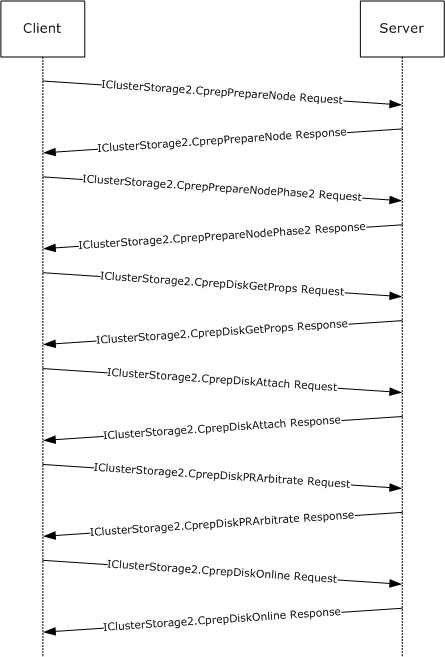
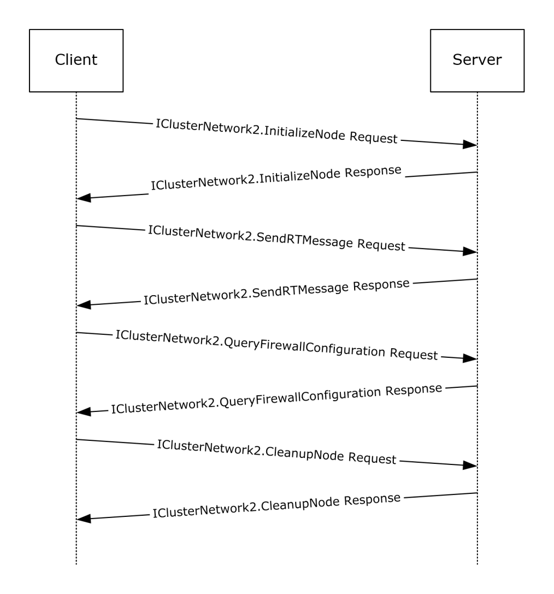
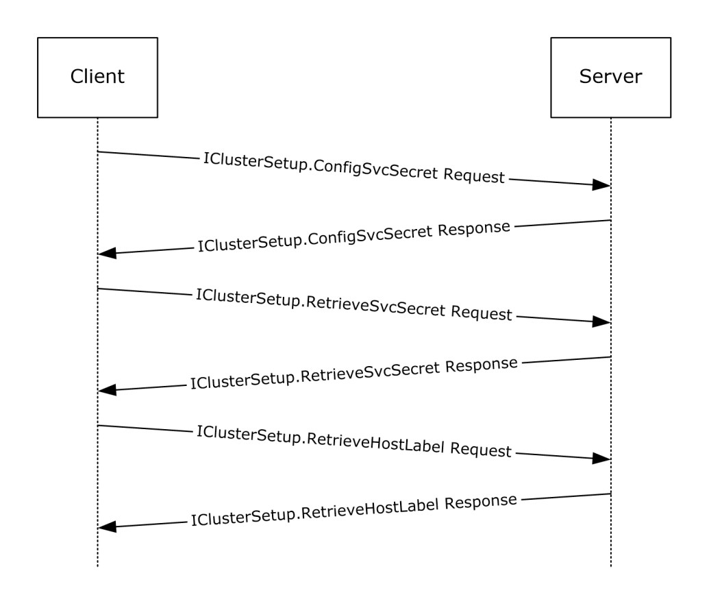

[MS-CSVP]:

Failover Cluster: Setup and Validation Protocol (ClusPrep)

Intellectual Property Rights Notice for Open Specifications Documentation

  Technical Documentation. Microsoft publishes Open Specifications documentation (“this

documentation”) for protocols, file formats, data portability, computer languages, and standards
support. Additionally, overview documents cover inter-protocol relationships and interactions.

  Copyrights. This documentation is covered by Microsoft copyrights. Regardless of any other

terms that are contained in the terms of use for the Microsoft website that hosts this
documentation, you can make copies of it in order to develop implementations of the technologies
that are described in this documentation and can distribute portions of it in your implementations
that use these technologies or in your documentation as necessary to properly document the
implementation. You can also distribute in your implementation, with or without modification, any
schemas, IDLs, or code samples that are included in the documentation. This permission also
applies to any documents that are referenced in the Open Specifications documentation.
  No Trade Secrets. Microsoft does not claim any trade secret rights in this documentation.
  Patents. Microsoft has patents that might cover your implementations of the technologies

described in the Open Specifications documentation. Neither this notice nor Microsoft's delivery of
this documentation grants any licenses under those patents or any other Microsoft patents.
However, a given Open Specifications document might be covered by the Microsoft Open
Specifications Promise or the Microsoft Community Promise. If you would prefer a written license,
or if the technologies described in this documentation are not covered by the Open Specifications
Promise or Community Promise, as applicable, patent licenses are available by contacting
iplg@microsoft.com.

  License Programs. To see all of the protocols in scope under a specific license program and the

associated patents, visit the Patent Map.

  Trademarks. The names of companies and products contained in this documentation might be
covered by trademarks or similar intellectual property rights. This notice does not grant any
licenses under those rights. For a list of Microsoft trademarks, visit
www.microsoft.com/trademarks.

  Fictitious Names. The example companies, organizations, products, domain names, email

addresses, logos, people, places, and events that are depicted in this documentation are fictitious.
No association with any real company, organization, product, domain name, email address, logo,
person, place, or event is intended or should be inferred.

Reservation of Rights. All other rights are reserved, and this notice does not grant any rights other
than as specifically described above, whether by implication, estoppel, or otherwise.

Tools. The Open Specifications documentation does not require the use of Microsoft programming
tools or programming environments in order for you to develop an implementation. If you have access
to Microsoft programming tools and environments, you are free to take advantage of them. Certain
Open Specifications documents are intended for use in conjunction with publicly available standards
specifications and network programming art and, as such, assume that the reader either is familiar
with the aforementioned material or has immediate access to it.

Support. For questions and support, please contact dochelp@microsoft.com.

[MS-CSVP] - v20251121
Failover Cluster: Setup and Validation Protocol (ClusPrep)
Copyright © 2025 Microsoft Corporation
Release: November 21, 2025

1 / 188

Revision Summary

Date

Revision
History

Revision
Class

Comments

1/25/2008

0.1

Major

MCPP Milestone RSAT Initial Availability

3/14/2008

0.1.1

Editorial

Changed language and formatting in the technical content.

5/16/2008

0.1.2

Editorial

Changed language and formatting in the technical content.

6/20/2008

1.0

Major

Updated and revised the technical content.

7/25/2008

1.0.1

Editorial

Changed language and formatting in the technical content.

8/29/2008

1.0.2

Editorial

Changed language and formatting in the technical content.

10/24/2008  1.1

12/5/2008

2.0

Minor

Major

Clarified the meaning of the technical content.

Updated and revised the technical content.

1/16/2009

2.0.1

Editorial

Changed language and formatting in the technical content.

2/27/2009

3.0

4/10/2009

4.0

5/22/2009

5.0

7/2/2009

6.0

Major

Major

Major

Major

Updated and revised the technical content.

Updated and revised the technical content.

Updated and revised the technical content.

Updated and revised the technical content.

8/14/2009

6.0.1

Editorial

Changed language and formatting in the technical content.

9/25/2009

6.1

11/6/2009

7.0

12/18/2009  8.0

1/29/2010

9.0

3/12/2010

10.0

Minor

Major

Major

Major

Major

Clarified the meaning of the technical content.

Updated and revised the technical content.

Updated and revised the technical content.

Updated and revised the technical content.

Updated and revised the technical content.

4/23/2010

10.0.1

Editorial

Changed language and formatting in the technical content.

6/4/2010

11.0

Major

Updated and revised the technical content.

7/16/2010

11.0

None

No changes to the meaning, language, or formatting of the
technical content.

8/27/2010

11.0

None

No changes to the meaning, language, or formatting of the
technical content.

10/8/2010

11.0

None

No changes to the meaning, language, or formatting of the
technical content.

11/19/2010  11.0

None

No changes to the meaning, language, or formatting of the
technical content.

1/7/2011

11.0

2/11/2011

12.0

3/25/2011

13.0

None

Major

Major

No changes to the meaning, language, or formatting of the
technical content.

Updated and revised the technical content.

Updated and revised the technical content.

[MS-CSVP] - v20251121
Failover Cluster: Setup and Validation Protocol (ClusPrep)
Copyright © 2025 Microsoft Corporation
Release: November 21, 2025

2 / 188

Date

Revision
History

Revision
Class

Comments

5/6/2011

13.0

6/17/2011

13.1

9/23/2011

14.0

12/16/2011  15.0

3/30/2012

16.0

7/12/2012

17.0

10/25/2012  18.0

1/31/2013

18.0

8/8/2013

19.0

11/14/2013  20.0

2/13/2014

20.0

5/15/2014

20.0

6/30/2015

21.0

10/16/2015  22.0

7/14/2016

23.0

6/1/2017

24.0

9/15/2017

25.0

12/1/2017

25.0

9/12/2018

26.0

3/13/2019

27.0

8/26/2020

28.0

4/7/2021

29.0

6/25/2021

30.0

9/20/2023

31.0

4/23/2024

32.0

8/12/2024

33.0

9/16/2024

33.0

None

Minor

Major

Major

Major

Major

Major

None

Major

Major

None

None

Major

Major

Major

Major

Major

None

Major

Major

Major

Major

Major

Major

Major

Major

None

No changes to the meaning, language, or formatting of the
technical content.

Clarified the meaning of the technical content.

Updated and revised the technical content.

Updated and revised the technical content.

Updated and revised the technical content.

Updated and revised the technical content.

Updated and revised the technical content.

No changes to the meaning, language, or formatting of the
technical content.

Updated and revised the technical content.

Updated and revised the technical content.

No changes to the meaning, language, or formatting of the
technical content.

No changes to the meaning, language, or formatting of the
technical content.

Significantly changed the technical content.

Significantly changed the technical content.

Significantly changed the technical content.

Significantly changed the technical content.

Significantly changed the technical content.

No changes to the meaning, language, or formatting of the
technical content.

Significantly changed the technical content.

Significantly changed the technical content.

Significantly changed the technical content.

Significantly changed the technical content.

Significantly changed the technical content.

Significantly changed the technical content.

Significantly changed the technical content.

Significantly changed the technical content.

No changes to the meaning, language, or formatting of the
technical content.

9/9/2025

34.0

Major

Significantly changed the technical content.

[MS-CSVP] - v20251121
Failover Cluster: Setup and Validation Protocol (ClusPrep)
Copyright © 2025 Microsoft Corporation
Release: November 21, 2025

3 / 188

Date

Revision
History

Revision
Class

Comments

11/21/2025  34.0

None

No changes to the meaning, language, or formatting of the
technical content.

[MS-CSVP] - v20251121
Failover Cluster: Setup and Validation Protocol (ClusPrep)
Copyright © 2025 Microsoft Corporation
Release: November 21, 2025

4 / 188

Table of Contents

1.1
1.2

1.2.1
1.2.2

1  Introduction .......................................................................................................... 11
Glossary ......................................................................................................... 11
References ...................................................................................................... 14
Normative References ................................................................................. 14
Informative References ............................................................................... 15
Overview ........................................................................................................ 15
Relationship to Other Protocols .......................................................................... 15
Prerequisites/Preconditions ............................................................................... 15
Applicability Statement ..................................................................................... 16
Versioning and Capability Negotiation ................................................................. 16
Vendor-Extensible Fields ................................................................................... 16
Standards Assignments ..................................................................................... 16

1.3
1.4
1.5
1.6
1.7
1.8
1.9

2.1
2.2

2  Messages ............................................................................................................... 18
Transport ........................................................................................................ 18
Common Data Types ........................................................................................ 19
CPREP_DISKID_ENUM ................................................................................. 19
2.2.1
CPREP_DISKID ........................................................................................... 20
2.2.2
DiskStackType ........................................................................................... 20
2.2.3
CPREP_SCSI_ADDRESS ............................................................................... 21
2.2.4
DISK_PROPS .............................................................................................. 21
2.2.5
DISK_PROPS_EX ........................................................................................ 24
2.2.6
REGISTERED_DSM ...................................................................................... 28
2.2.7
REGISTERED_DSMS .................................................................................... 29
2.2.8
STORAGE_DEVICE_ID_DESCRIPTOR ............................................................. 29
2.2.9
STORAGE_IDENTIFIER ................................................................................ 30
2.2.10
ADAPTERLIST ............................................................................................. 30
2.2.11
SERIALIZEDGUID ....................................................................................... 31
2.2.12
ADAPTER ................................................................................................... 32
2.2.13
IPPREFIX ................................................................................................... 35
2.2.14
CLUSTER_NETWORK_PROFILE ..................................................................... 35
2.2.15
ADAPTERLIST2 ........................................................................................... 35
2.2.16
2.2.17
ADAPTER2 ................................................................................................. 36
2.2.18  NODE_ROUTE_INFO .................................................................................... 40
ADD_ROUTES_REQUEST ............................................................................. 40
2.2.19
ROUTE_STATUS ......................................................................................... 41
2.2.20
ROUTE_LOSS_AND_STATE .......................................................................... 41
2.2.21
ADD_ROUTES_REPLY .................................................................................. 41
2.2.22
2.2.23
CLUSTER_CERT .......................................................................................... 42
2.2.24  DiskMediaType ........................................................................................... 42
ClusterLogExFlag ........................................................................................ 42
2.2.25
CLUSTER_CERTTYPE ................................................................................... 43
2.2.26
STORAGE_DEVICE_DESCRIPTOR .................................................................. 43
2.2.27
ClusterLogType .......................................................................................... 45
2.2.28

3.1

3  Protocol Details ..................................................................................................... 46
Common Client Details ..................................................................................... 46
Abstract Data Model .................................................................................... 46
Timers ...................................................................................................... 46
Initialization ............................................................................................... 46
Message Processing Events and Sequencing Rules .......................................... 46
Timer Events .............................................................................................. 46
Other Local Events ...................................................................................... 46
IClusterStorage2 Server Details ......................................................................... 46
Abstract Data Model .................................................................................... 46

3.1.1
3.1.2
3.1.3
3.1.4
3.1.5
3.1.6

3.2.1

3.2

[MS-CSVP] - v20251121
Failover Cluster: Setup and Validation Protocol (ClusPrep)
Copyright © 2025 Microsoft Corporation
Release: November 21, 2025

5 / 188

3.2.2
3.2.3
3.2.4

3.2.4.1
3.2.4.2
3.2.4.3
3.2.4.4
3.2.4.5
3.2.4.6
3.2.4.7
3.2.4.8
3.2.4.9
3.2.4.10
3.2.4.11
3.2.4.12
3.2.4.13
3.2.4.14
3.2.4.15
3.2.4.16
3.2.4.17
3.2.4.18
3.2.4.19
3.2.4.20
3.2.4.21
3.2.4.22
3.2.4.23
3.2.4.24
3.2.4.25
3.2.4.26
3.2.4.27
3.2.4.28
3.2.4.29

Timers ...................................................................................................... 47
Initialization ............................................................................................... 47
Message Processing Events and Sequencing Rules .......................................... 47
CprepDiskRawRead (Opnum 3) ............................................................... 52
CprepDiskRawWrite (Opnum 4) .............................................................. 53
CprepPrepareNode (Opnum 5) ................................................................ 55
CprepPrepareNodePhase2 (Opnum 6) ...................................................... 56
CprepDiskGetProps (Opnum 7) ............................................................... 57
CprepDiskStopDefense (Opnum 12) ........................................................ 58
CprepDiskOnline (Opnum 13) ................................................................. 59
CprepDiskVerifyUnique (Opnum 14) ........................................................ 60
CprepDiskWriteFileData (Opnum 17) ....................................................... 61
CprepDiskVerifyFileData (Opnum 18) ...................................................... 62
CprepDiskDeleteFile (Opnum 19) ............................................................ 63
CprepDiskOffline (Opnum 20) ................................................................. 64
CprepDiskGetUniqueIds (Opnum 22) ....................................................... 65
CprepDiskAttach (Opnum 23) ................................................................. 66
CprepDiskPRArbitrate (Opnum 24) .......................................................... 67
CprepDiskPRRegister (Opnum 25) ........................................................... 68
CprepDiskPRUnRegister (Opnum 26) ....................................................... 69
CprepDiskPRReserve (Opnum 27) ........................................................... 70
CprepDiskPRRelease (Opnum 28) ............................................................ 71
CprepDiskDiskPartitionIsNtfs (Opnum 29) ................................................ 71
CprepDiskGetArbSectors (Opnum 30) ...................................................... 72
CprepDiskIsPRPresent (Opnum 31) ......................................................... 73
CprepDiskPRPreempt (Opnum 32) ........................................................... 74
CprepDiskPRClear (Opnum 33) ............................................................... 75
CprepDiskIsOnline (Opnum 34) .............................................................. 76
CprepDiskSetOnline (Opnum 35) ............................................................ 77
CprepDiskGetFSName (Opnum 36) ......................................................... 77
CprepDiskIsReadable (Opnum 37)........................................................... 79
CprepDiskGetDsms (Opnum 38) ............................................................. 79
Timer Events .............................................................................................. 80
Other Local Events ...................................................................................... 80
Establish Ownership of a Disk ................................................................. 81
Relinquish Ownership of a Disk ............................................................... 81
IClusterStorage2 Client Details .......................................................................... 81
Abstract Data Model .................................................................................... 81
Timers ...................................................................................................... 81
Initialization ............................................................................................... 81
Message Processing Events and Sequencing Rules .......................................... 82
Preparing a Server ................................................................................ 82
Attaching CPrepDisks ............................................................................ 82
Querying Disk Sectors ........................................................................... 82
Querying Disk Partitions......................................................................... 82
Accessing a Partition File System ............................................................ 82
SCSI-3 Persistent Reservations ............................................................... 82
Timer Events .............................................................................................. 83
Other Local Events ...................................................................................... 83
IClusterStorage3 Server Details ......................................................................... 83
Abstract Data Model .................................................................................... 83
Timers ...................................................................................................... 84
Initialization ............................................................................................... 84
Message Processing Events and Sequencing Rules .......................................... 85
CprepDiskGetUniqueIds3 (Opnum 3) ....................................................... 88
CprepCheckNetFtBindings3 (Opnum 4) .................................................... 89
CprepCsvTestSetup3 (Opnum 5) ............................................................. 90
CprepIsNodeClustered3 (Opnum 6) ......................................................... 91

3.3.4.1
3.3.4.2
3.3.4.3
3.3.4.4
3.3.4.5
3.3.4.6

3.4.4.1
3.4.4.2
3.4.4.3
3.4.4.4

3.2.6.1
3.2.6.2

3.2.5
3.2.6

3.3

3.3.1
3.3.2
3.3.3
3.3.4

3.4

3.3.5
3.3.6

3.4.1
3.4.2
3.4.3
3.4.4

[MS-CSVP] - v20251121
Failover Cluster: Setup and Validation Protocol (ClusPrep)
Copyright © 2025 Microsoft Corporation
Release: November 21, 2025

6 / 188

3.4.4.5
3.4.4.6
3.4.4.7
3.4.4.8
3.4.4.9
3.4.4.10
3.4.4.11
3.4.4.12
3.4.4.13
3.4.4.14
3.4.4.15

CprepCreateNewSmbShares3 (Opnum 7) ................................................. 91
CprepConnectToNewSmbShares3 (Opnum 8) ........................................... 92
CprepDiskGetProps3 (Opnum 9) ............................................................. 93
CprepDiskIsReadOnly3 (Opnum 10) ........................................................ 94
CprepDiskPRRegister3 (Opnum 11) ......................................................... 95
CprepDiskFindKey3 (Opnum 12) ............................................................. 96
CprepDiskPRPreempt3 (Opnum 13) ......................................................... 97
CprepDiskPRReserve3 (Opnum 14) ......................................................... 98
CprepDiskIsPRPresent3 (Opnum 15) ....................................................... 99
CprepDiskPRRelease3 (Opnum 16) ......................................................... 100
CprepDiskPRClear3 (Opnum 17) ............................................................ 101
Timer Events ............................................................................................. 102
Other Local Events ..................................................................................... 102
IClusterStorage3 Client Details ......................................................................... 102
Abstract Data Model ................................................................................... 102
Timers ..................................................................................................... 102
Initialization .............................................................................................. 102
Message Processing Events and Sequencing Rules ......................................... 102
Preparing a Server ............................................................................... 102
Attaching CPrepDisks ........................................................................... 102
Querying Disk Sectors .......................................................................... 103
Querying Disk Partitions........................................................................ 103
Accessing a Partition File System ........................................................... 103
SCSI-3 Persistent Reservations .............................................................. 103
Accessing a Share ................................................................................ 104
Timer Events ............................................................................................. 104
Other Local Events ..................................................................................... 104
IClusterNetwork2 Server Details ....................................................................... 104
Abstract Data Model ................................................................................... 104
Timers ..................................................................................................... 105
Round-Trip Message Timer .................................................................... 105
Initialization .............................................................................................. 105
Message Processing Events and Sequencing Rules ......................................... 105
InitializeNode (Opnum 4) ...................................................................... 106
SendRTMessage (Opnum 3) .................................................................. 107
GetIpConfigSerialized (Opnum 5) ........................................................... 109
CleanupNode (Opnum 6) ...................................................................... 110
QueryFirewallConfiguration (Opnum 7) ................................................... 111
ProcessAddRoutes (Opnum 8) ............................................................... 112
GetAddRoutesStatus (Opnum 9) ............................................................ 113
CancelAddRoutesRequest (Opnum 11) .................................................... 114
Timer Events ............................................................................................. 115
Other Local Events ..................................................................................... 115
IClusterNetwork2 Client Details ......................................................................... 115
Abstract Data Model ................................................................................... 115
Timers ..................................................................................................... 115
Initialization .............................................................................................. 115
Message Processing Events and Sequencing Rules ......................................... 115
Timer Events ............................................................................................. 116
Other Local Events ..................................................................................... 116
IClusterCleanup Server Details ......................................................................... 116
Abstract Data Model ................................................................................... 116
Timers ..................................................................................................... 116
Delay Cleanup Timer ............................................................................ 116
Cleanup Timer ..................................................................................... 116
Initialization .............................................................................................. 116
Message Processing Events and Sequencing Rules ......................................... 117
CleanUpEvictedNode (Opnum 3) ............................................................ 117

3.5

3.4.5
3.4.6

3.5.1
3.5.2
3.5.3
3.5.4

3.5.4.1
3.5.4.2
3.5.4.3
3.5.4.4
3.5.4.5
3.5.4.6
3.5.4.7

3.6

3.5.5
3.5.6

3.6.1
3.6.2

3.6.2.1

3.6.3
3.6.4

3.6.4.1
3.6.4.2
3.6.4.3
3.6.4.4
3.6.4.5
3.6.4.6
3.6.4.7
3.6.4.8

3.7

3.6.5
3.6.6

3.7.1
3.7.2
3.7.3
3.7.4
3.7.5
3.7.6

3.8.1
3.8.2

3.8

3.8.2.1
3.8.2.2

3.8.3
3.8.4

3.8.4.1

[MS-CSVP] - v20251121
Failover Cluster: Setup and Validation Protocol (ClusPrep)
Copyright © 2025 Microsoft Corporation
Release: November 21, 2025

7 / 188

3.9

3.10

3.8.4.2

3.8.5
3.8.6

3.9.1
3.9.2
3.9.3
3.9.4
3.9.5
3.9.6

ClearPR (Opnum 4) .............................................................................. 118
Timer Events ............................................................................................. 119
Other Local Events ..................................................................................... 119
IClusterCleanup Client Details ........................................................................... 119
Abstract Data Model ................................................................................... 119
Timers ..................................................................................................... 120
Initialization .............................................................................................. 120
Message Processing Events and Sequencing Rules ......................................... 120
Timer Events ............................................................................................. 120
Other Local Events ..................................................................................... 120
IClusterSetup Server Details ............................................................................. 120
Abstract Data Model ................................................................................... 120
3.10.1
Timers ..................................................................................................... 121
3.10.2
3.10.3
Initialization .............................................................................................. 121
3.10.4  Message Processing Events and Sequencing Rules ......................................... 121
ConfigSvcSecret (Opnum 3) .................................................................. 122
3.10.4.1
RetrieveSvcSecret (Opnum 4) ............................................................... 123
3.10.4.2
3.10.4.3
RetrieveHostLabel (Opnum 5) ................................................................ 124
3.10.4.4  GetFunctionalLevel (Opnum 6) .............................................................. 124
ConfigClusterCert (Opnum 9) ................................................................ 125
3.10.4.5
RetrieveClusterCert (Opnum 10) ............................................................ 126
3.10.4.6
3.10.4.7  GenerateClusterCert (Opnum 11) ........................................................... 126
3.10.4.8  GetUpgradeVersion (Opnum 12) ............................................................ 127
3.10.4.9
ConfigClusterCertV2 (Opnum 14) ........................................................... 128
3.10.4.10  RetrieveClusterCertV2 (Opnum 15) ........................................................ 128
3.10.4.11  GenerateClusterCertV2 (Opnum 16) ....................................................... 129
3.10.5
Timer Events ............................................................................................. 130
3.10.6  Other Local Events ..................................................................................... 130
IClusterSetup Client Details .............................................................................. 130
Abstract Data Model ................................................................................... 130
3.11.1
Timers ..................................................................................................... 130
3.11.2
3.11.3
Initialization .............................................................................................. 130
3.11.4  Message Processing Events and Sequencing Rules ......................................... 130
3.11.5
Timer Events ............................................................................................. 131
3.11.6  Other Local Events ..................................................................................... 131
IClusterLog Server Details ................................................................................ 131
Abstract Data Model ................................................................................... 131
3.12.1
Timers ..................................................................................................... 131
3.12.2
Initialization .............................................................................................. 131
3.12.3
3.12.4  Message Processing Events and Sequencing Rules ......................................... 131
3.12.4.1  GenerateClusterLog (Opnum 3) ............................................................. 132
3.12.4.2  GenerateTimeSpanLog (Opnum 4) ......................................................... 133
3.12.4.3  GenerateClusterLogInLocalTime (Opnum 5) ............................................ 134
3.12.4.4  GenerateTimeSpanLogInLocalTime (Opnum 6) ........................................ 134
3.12.5
Timer Events ............................................................................................. 135
3.12.6  Other Local Events ..................................................................................... 135
IClusterLog Client Details ................................................................................. 135
Abstract Data Model ................................................................................... 135
3.13.1
Timers ..................................................................................................... 136
3.13.2
3.13.3
Initialization .............................................................................................. 136
3.13.4  Message Processing Events and Sequencing Rules ......................................... 136
3.13.5
Timer Events ............................................................................................. 136
3.13.6  Other Local Events ..................................................................................... 136
IClusterFirewall Server Details .......................................................................... 136
Abstract Data Model ................................................................................... 136
3.14.1
Timers ..................................................................................................... 136
3.14.2
3.14.3
Initialization .............................................................................................. 136
3.14.4  Message Processing Events and Sequencing Rules ......................................... 137

3.11

3.12

3.13

3.14

[MS-CSVP] - v20251121
Failover Cluster: Setup and Validation Protocol (ClusPrep)
Copyright © 2025 Microsoft Corporation
Release: November 21, 2025

8 / 188

3.15

3.16

3.17

3.18

3.16.4.1
3.16.4.2

3.14.4.1
InitializeAdapterConfiguration (Opnum 3) ............................................... 137
3.14.4.2  GetNextAdapterFirewallConfiguration (Opnum 4) ..................................... 138
Timer Events ............................................................................................. 140
3.14.5
3.14.6  Other Local Events ..................................................................................... 140
IClusterFirewall Client Details ........................................................................... 140
Abstract Data Model ................................................................................... 140
3.15.1
Timers ..................................................................................................... 140
3.15.2
3.15.3
Initialization .............................................................................................. 140
3.15.4  Message Processing Events and Sequencing Rules ......................................... 140
3.15.5
Timer Events ............................................................................................. 140
3.15.6  Other Local Events ..................................................................................... 140
IClusterUpdate Server Details ........................................................................... 141
Abstract Data Model ................................................................................... 141
3.16.1
Timers ..................................................................................................... 141
3.16.2
3.16.3
Initialization .............................................................................................. 141
3.16.4  Message Processing Events and Sequencing Rules ......................................... 141
IClusterUpdate::GetUpdates (Opnum 3) ................................................. 142
IClusterUpdate::Count (Opnum 4) ......................................................... 143
3.16.5
Timer Events ............................................................................................. 144
3.16.6  Other Local Events ..................................................................................... 144
IClusterUpdate Client Details ............................................................................ 144
Abstract Data Model ................................................................................... 144
3.17.1
Timers ..................................................................................................... 144
3.17.2
3.17.3
Initialization .............................................................................................. 144
3.17.4  Message Processing Events and Sequencing Rules ......................................... 145
Timer Events ............................................................................................. 145
3.17.5
3.17.6  Other Local Events ..................................................................................... 145
IClusterLogEx Server Details ............................................................................ 145
Abstract Data Model ................................................................................... 145
3.18.1
Timers ..................................................................................................... 145
3.18.2
3.18.3
Initialization .............................................................................................. 145
3.18.4  Message Processing Events and Sequencing Rules ......................................... 145
3.18.4.1  GenerateClusterLog (Opnum 3) ............................................................. 146
3.18.4.2  GenerateClusterHealthLog (Opnum 4) .................................................... 147
3.18.4.3  GenerateClusterSetLog (Opnum 5) ......................................................... 148
3.18.4.4  GenerateClusterNetworkLog (Opnum 6) .................................................. 149
3.18.4.5
ExportClusterPerformanceHistory (Opnum 7) .......................................... 150
3.18.4.6  GenerateNetftLog (Opnum 8) ................................................................ 151
Timer Events ............................................................................................. 152
3.18.5
3.18.6  Other Local Events ..................................................................................... 152
IClusterLogEx2 Server Details ........................................................................... 152
Abstract Data Model ................................................................................... 152
3.19.1
Timers ..................................................................................................... 152
3.19.2
Initialization .............................................................................................. 152
3.19.3
3.19.4  Message Processing Events and Sequencing Rules ......................................... 152
3.19.4.1  GenerateLogEx (Opnum 9) .................................................................... 152
3.19.4.2  GetCountLogs (Opnum 10) .................................................................... 154
3.19.4.3  GetLogFilePath (Opnum 11) .................................................................. 154
Timer Events ............................................................................................. 155
3.19.5
3.19.6  Other Local Events ..................................................................................... 155
IClusterLogEx3 Server Details ........................................................................... 155
Abstract Data Model ................................................................................... 155
3.20.1
Timers ..................................................................................................... 156
3.20.2
3.20.3
Initialization .............................................................................................. 156
3.20.4  Message Processing Events and Sequencing Rules ......................................... 156
3.20.4.1  GenerateLogEx2 (Opnum 17) ................................................................ 156
3.20.5
Timer Events ............................................................................................. 157
3.20.6  Other Local Events ..................................................................................... 157

3.20

3.19

[MS-CSVP] - v20251121
Failover Cluster: Setup and Validation Protocol (ClusPrep)
Copyright © 2025 Microsoft Corporation
Release: November 21, 2025

9 / 188

4  Protocol Examples ............................................................................................... 158
A Shared Disk Online ....................................................................................... 158
Validate Network Configuration ......................................................................... 159
Cluster Setup ................................................................................................. 160

4.1
4.2
4.3

5  Security ............................................................................................................... 162
Security Considerations for Implementers .......................................................... 162
Index of Security Parameters ........................................................................... 162

5.1
5.2

6  Appendix A: Full IDL ............................................................................................ 163

7  Appendix B: Product Behavior ............................................................................. 174

8  Change Tracking .................................................................................................. 179

9  Index ................................................................................................................... 180

[MS-CSVP] - v20251121
Failover Cluster: Setup and Validation Protocol (ClusPrep)
Copyright © 2025 Microsoft Corporation
Release: November 21, 2025

10 / 188

1  Introduction

The Failover Cluster: Setup and Validation Protocol (ClusPrep) consists of DCOM interfaces, as
specified in [MS-DCOM], that are used for remotely configuring cluster nodes cleaning up cluster
nodes and validating that hardware and software settings are compatible with use in a failover cluster.

Sections 1.5, 1.8, 1.9, 2, and 3 of this specification are normative. All other sections and examples in
this specification are informative.

1.1  Glossary

This document uses the following terms:

authentication level: A numeric value indicating the level of authentication or message protection

that remote procedure call (RPC) will apply to a specific message exchange. For more
information, see [C706] section 13.1.2.1 and [MS-RPCE].

basic volume: A partition on a basic disk.

binary large object (BLOB): A discrete packet of data that is stored in a database and is treated

as a sequence of uninterpreted bytes.

class identifier (CLSID): A GUID that identifies a software component; for instance, a DCOM

object class or a COM class.

cluster secret: A value unique to an instance of a cluster and known to all nodes configured in
the cluster. The cluster secret is used in implementation-specific server-to-server protocols
that enable a node to actively participate in a cluster.

device: Any peripheral or part of a computer system that can send or receive data.

Device-Specific Module (DSM): A hardware-specific driver that has passed the Microsoft

Multipath I/O (MPIO) test and submission process. For further information, see [MSFT-MPIO].

disk: A persistent storage device that can include physical hard disks, removable disk units, optical

drive units, and logical unit numbers (LUNs) unmasked to the system.

disk signature: A unique identifier for a disk. For a master boot record (MBR)-formatted disk,
this identifier is a 4-byte value stored at the end of the MBR, which is located in sector 0 on the
disk. For a GUID partitioning table (GPT)-formatted disk, this value is a GUID stored in the
GPT disk header at the beginning of the disk.

Distributed Component Object Model (DCOM): The Microsoft Component Object Model (COM)
specification that defines how components communicate over networks, as specified in [MS-
DCOM].

Dynamic Host Configuration Protocol (DHCP): A protocol that provides a framework for

passing configuration information to hosts on a TCP/IP network, as described in [RFC2131].

dynamic volume: A volume on a dynamic disk.

endpoint: A client that is on a network and is requesting access to a network access server (NAS).

failover cluster: A set of independent computers that work together to increase the availability of

services and applications. The term cluster is sometimes used as shorthand for failover
cluster.

firewall rule: A group of settings that specify which connections are allowed into and out of a

client computer.

11 / 188

[MS-CSVP] - v20251121
Failover Cluster: Setup and Validation Protocol (ClusPrep)
Copyright © 2025 Microsoft Corporation
Release: November 21, 2025

fully qualified domain name (FQDN): An unambiguous domain name that gives an absolute

location in the Domain Name System's (DNS) hierarchy tree, as defined in [RFC1035] section
3.1 and [RFC2181] section 11.

globally unique identifier (GUID): A term used interchangeably with universally unique

identifier (UUID) in Microsoft protocol technical documents (TDs). Interchanging the usage of
these terms does not imply or require a specific algorithm or mechanism to generate the value.
Specifically, the use of this term does not imply or require that the algorithms described in
[RFC4122] or [C706] have to be used for generating the GUID. See also universally unique
identifier (UUID).

GUID partition table (GPT): A disk-partitioning scheme that is used by the Extensible Firmware
Interface (EFI). GPT offers more advantages than master boot record (MBR) partitioning
because it allows up to 128 partitions per disk, provides support for volumes up to 18
exabytes in size, allows primary and backup partition tables for redundancy, and supports
unique disk and partition IDs through the use of globally unique identifiers (GUIDs). Disks
with GPT schemes are referred to as GPT disks.

interface: A specification in a Component Object Model (COM) server that describes how to access

the methods of a class. For more information, see [MS-DCOM].

Interface Definition Language (IDL): The International Standards Organization (ISO) standard
language for specifying the interface for remote procedure calls. For more information, see
[C706] section 4.

Internet Protocol version 4 (IPv4): An Internet protocol that has 32-bit source and destination

addresses. IPv4 is the predecessor of IPv6.

Internet Protocol version 6 (IPv6): A revised version of the Internet Protocol (IP) designed to
address growth on the Internet. Improvements include a 128-bit IP address size, expanded
routing capabilities, and support for authentication and privacy.

logical unit number (LUN): A number that is used to identify a disk on a given disk controller.

master boot record (MBR): Metadata such as the partition table, the disk signature, and the
executable code for initiating the operating system boot process that is located on the first
sector of a disk. Disks that have MBRs are referred to as MBR disks. GUID partitioning table
(GPT) disks, instead, have unused dummy data in the first sector where the MBR would
normally be.

Network Data Representation (NDR): A specification that defines a mapping from Interface
Definition Language (IDL) data types onto octet streams. NDR also refers to the runtime
environment that implements the mapping facilities (for example, data provided to NDR). For
more information, see [MS-RPCE] and [C706] section 14.

node: A computer system that is configured as a member of a cluster. That is, the computer has
the necessary software installed and configured to participate in the cluster, and the cluster
configuration includes this computer as a member.

offline: An operational state applicable to volumes and disks. In the offline state, the volume or

disk is unavailable for data input/output (I/O) or configuration.

online: An operational state applicable to volumes and disks. In the online state, the volume or

disk is available for data input/output (I/O) or configuration.

opnum: An operation number or numeric identifier that is used to identify a specific remote

procedure call (RPC) method or a method in an interface. For more information, see [C706]
section 12.5.2.12 or [MS-RPCE].

[MS-CSVP] - v20251121
Failover Cluster: Setup and Validation Protocol (ClusPrep)
Copyright © 2025 Microsoft Corporation
Release: November 21, 2025

12 / 188

partition: In the context of hard disks, a logical region of a hard disk. A hard disk can be

subdivided into one or more partitions.

QFE number: The unique number associated with a QFE that is used to easily identify a QFE.

registry: A local system-defined database in which applications and system components store and
retrieve configuration data. It is a hierarchical data store with lightly typed elements that are
logically stored in tree format. Applications use the registry API to retrieve, modify, or delete
registry data. The data stored in the registry varies according to the version of the operating
system.

remote procedure call (RPC): A communication protocol used primarily between client and

server. The term has three definitions that are often used interchangeably: a runtime
environment providing for communication facilities between computers (the RPC runtime); a set
of request-and-response message exchanges between computers (the RPC exchange); and the
single message from an RPC exchange (the RPC message).  For more information, see [C706].

RPC dynamic endpoint: A network-specific server address that is requested and assigned at run

time, as described in [C706].

RPC protocol sequence: A character string that represents a valid combination of a remote

procedure call (RPC) protocol, a network layer protocol, and a transport layer protocol, as
described in [C706] and [MS-RPCE].

SCSI protocol: An architecture for SCSI, consisting of a group of standards created and

maintained by the Technical Committee (T10) of the InterNational Committee on Information
Technology Standards (INCITS).

sector: The smallest addressable unit of a disk.

share: A resource offered by a Common Internet File System (CIFS) server for access by CIFS
clients over the network. A share typically represents a directory tree and its included files
(referred to commonly as a "disk share" or "file share") or a printer (a "print share"). If the
information about the share is saved in persistent store (for example, Windows registry) and
reloaded when a file server is restarted, then the share is referred to as a "sticky share". Some
share names are reserved for specific functions and are referred to as special shares: IPC$,
reserved for interprocess communication, ADMIN$, reserved for remote administration, and A$,
B$, C$ (and other local disk names followed by a dollar sign), assigned to local disk devices.

small computer system interface (SCSI): A set of standards for physically connecting and

transferring data between computers and peripheral devices.

storage pool: A group of disks where all of the storage space on all of the disks is aggregated and

managed as a single unit.

strict NDR/NDR64 data consistency check: A set of related rules for data validation during

processing of an octet stream.

thin-provisioned: A method for optimal allocation of storage. Blocks are allocated on demand.

time source: A component that possesses a clock and that makes the clock's time available to

other components for synchronization. For more information, see "reference source" in
[RFC1305].

UncPath: The location of a file in a network of computers, as specified in Universal Naming

Convention (UNC) syntax.

universally unique identifier (UUID): A 128-bit value. UUIDs can be used for multiple

purposes, from tagging objects with an extremely short lifetime, to reliably identifying very
persistent objects in cross-process communication such as client and server interfaces, manager

13 / 188

[MS-CSVP] - v20251121
Failover Cluster: Setup and Validation Protocol (ClusPrep)
Copyright © 2025 Microsoft Corporation
Release: November 21, 2025

entry-point vectors, and RPC objects. UUIDs are highly likely to be unique. UUIDs are also
known as globally unique identifiers (GUIDs) and these terms are used interchangeably in
the Microsoft protocol technical documents (TDs). Interchanging the usage of these terms does
not imply or require a specific algorithm or mechanism to generate the UUID. Specifically, the
use of this term does not imply or require that the algorithms described in [RFC4122] or [C706]
has to be used for generating the UUID.

volume: A group of one or more partitions that forms a logical region of storage and the basis for
a file system. A volume is an area on a storage device that is managed by the file system as a
discrete logical storage unit. A partition contains at least one volume, and a volume can exist
on one or more partitions.

VPD: Vital product data. See [SPC-3] section 7.6.

well-known endpoint: A preassigned, network-specific, stable address for a particular

client/server instance. For more information, see [C706].

MAY, SHOULD, MUST, SHOULD NOT, MUST NOT: These terms (in all caps) are used as defined
in [RFC2119]. All statements of optional behavior use either MAY, SHOULD, or SHOULD NOT.

1.2  References

Links to a document in the Microsoft Open Specifications library point to the correct section in the
most recently published version of the referenced document. However, because individual documents
in the library are not updated at the same time, the section numbers in the documents may not
match. You can confirm the correct section numbering by checking the Errata.

1.2.1  Normative References

We conduct frequent surveys of the normative references to assure their continued availability. If you
have any issue with finding a normative reference, please contact dochelp@microsoft.com. We will
assist you in finding the relevant information.

[C706] The Open Group, "DCE 1.1: Remote Procedure Call", C706, August 1997,
https://publications.opengroup.org/c706

Note Registration is required to download the document.

[IANAifType] IANA, "IANAifType-MIB Definitions", January 2007,
http://www.iana.org/assignments/ianaiftype-mib

[MS-CMRP] Microsoft Corporation, "Failover Cluster: Management API (ClusAPI) Protocol".

[MS-DCOM] Microsoft Corporation, "Distributed Component Object Model (DCOM) Remote Protocol".

[MS-DTYP] Microsoft Corporation, "Windows Data Types".

[MS-ERREF] Microsoft Corporation, "Windows Error Codes".

[MS-FASP] Microsoft Corporation, "Firewall and Advanced Security Protocol".

[MS-OAUT] Microsoft Corporation, "OLE Automation Protocol".

[MS-RPCE] Microsoft Corporation, "Remote Procedure Call Protocol Extensions".

[MS-SMB2] Microsoft Corporation, "Server Message Block (SMB) Protocol Versions 2 and 3".

[RFC1924] Elz, R., "A Compact Representation of IPv6 Addresses", RFC 1924, April 1996,
https://www.rfc-editor.org/info/rfc1924

14 / 188

[MS-CSVP] - v20251121
Failover Cluster: Setup and Validation Protocol (ClusPrep)
Copyright © 2025 Microsoft Corporation
Release: November 21, 2025

[RFC2119] Bradner, S., "Key words for use in RFCs to Indicate Requirement Levels", BCP 14, RFC
2119, March 1997, https://www.rfc-editor.org/info/rfc2119

[RFC2553] Gilligan, R., Thomson, S., Bound, J., and Stevens, W., "Basic Socket Interface Extensions
for IPv6", RFC 2553, March 1999, https://www.rfc-editor.org/info/rfc2553

[RFC2863] McCloghrie, K., and Kastenholz, F., "The Interfaces Group MIB", RFC 2863, June 2000,
https://www.rfc-editor.org/info/rfc2863

[SPC-3] International Committee on Information Technology Standards, "SCSI Primary Commands - 3
(SPC-3)", Project T10/1416-D, May 2005, http://www.t10.org/cgi-bin/ac.pl?t=f&f=/spc3r23.pdf

Note Fill out guest access form, sign in, or purchase the standard to access the file.

1.2.2  Informative References

[MS-UAMG] Microsoft Corporation, "Update Agent Management Protocol".

1.3  Overview

The Failover Cluster: Setup and Validation Protocol (ClusPrep) is a COM/DCOM protocol to setup,
cleanup, and validate a set of machines for failover cluster capability. The setup of state includes
pushing to a new server the state required to participate in the failover cluster. Validation of state
includes retrieving failover cluster state from a server to validate the state and directing the server to
perform specific tasks and report status to validate it is functioning correctly. Cleanup of state includes
removing restrictions on accessing shared disks and deletion of cluster state from the server.

The ClusPrep Protocol provides DCOM interfaces that enable a client to:

  Validate the server configuration so as to make it eligible to become a node in a failover cluster.

  Configure a server to no longer be a node in a failover cluster.

  Retrieve log information from a node in a failover cluster.

  Determine whether the hardware/software settings of a server meet the requirements to be part

of a failover cluster.

1.4  Relationship to Other Protocols

The Failover Cluster: Setup and Validation Protocol (ClusPrep) relies on the Distributed Component
Object Model (DCOM) Remote Protocol, which uses remote procedure call (RPC) as a transport, as
specified in [MS-DCOM].

The Failover Cluster: Setup and Validation Protocol (ClusPrep) creates a file containing diagnostic
data, as specified in section 3.12.4. The server makes this file available to clients via a file share.
Protocol clients can access this file using the Server Message Block (SMB) Version 2 Protocol, as
specified in [MS-SMB2].

The Failover Cluster: Cluster Management Remote Protocol (ClusAPI) ([MS-CMRP]) clients can use the
ClusPrep Protocol in conjunction with the ClusAPI Protocol when removing a node from a cluster, as
specified in section 3.8.4.1.

1.5  Prerequisites/Preconditions

This protocol is implemented over DCOM and RPC and, as a result, has the prerequisites identified in
[MS-DCOM] and [MS-RPCE] as being common to DCOM and RPC interfaces.

[MS-CSVP] - v20251121
Failover Cluster: Setup and Validation Protocol (ClusPrep)
Copyright © 2025 Microsoft Corporation
Release: November 21, 2025

15 / 188

1.6  Applicability Statement

The ClusPrep Protocol is specific to a failover cluster. As such, the protocol is applicable to a server
that will be, is, or was a node in a failover cluster.

1.7  Versioning and Capability Negotiation

This document covers versioning issues in the following areas:

  Supported Transports: This protocol uses the DCOM Remote Protocol and multiple RPC

protocol sequences as specified in section 2.1.

  Protocol Versions: This protocol has multiple interfaces, as defined in section 2.1.

  Security and Authentication Methods: Authentication and security are provided as specified in

[MS-DCOM] and [MS-RPCE].

  Capability Negotiation: This protocol does not support negotiation of the interface version to
use. Instead, this protocol uses only the interface version number specified in the Interface
Definition Language (IDL) for versioning and capability negotiation.

1.8  Vendor-Extensible Fields

This protocol does not define any vendor-extensible fields.

This protocol uses HRESULT values as defined in [MS-ERREF] section 2.1. Vendors can define their
own HRESULT values provided that they set the C bit (0x20000000) for each vendor-defined value to
indicate that the value is a customer code.

1.9  Standards Assignments

Parameter

Value

Reference

RPC Interface UUID for IClusterStorage2  12108A88-6858-4467-B92F-E6CF4568DFB6

None

RPC Interface UUID for IClusterStorage3

11942D87-A1DE-4E7F-83FB-A840D9C5928D  None

RPC Interface UUID for IClusterNetwork2

2931C32C-F731-4c56-9FEB-3D5F1C5E72BF

None

RPC Interface UUID for IClusterCleanup

D6105110-8917-41A5-AA32-8E0AA2933DC9  None

RPC Interface UUID for IClusterSetup

491260B5-05C9-40D9-B7F2-1F7BDAE0927F  None

RPC Interface UUID for IClusterLog

85923CA7-1B6B-4E83-A2E4-F5BA3BFBB8A3  None

RPC Interface UUID for IClusterFirewall

F1D6C29C-8FBE-4691-8724-F6D8DEAEAFC8  None

RPC Interface UUID for IClusterUpdate

E3C9B851-C442-432B-8FC6-A7FAAFC09D3B  None

RPC Interface UUID for IClusterLogEx

BD7C23C2-C805-457C-8F86-D17FE6B9D19F  None

RPC Interface UUID for IClusterLogEx2

2510EA7D-C355-40C9-852C-E3B1B1338D67  None

RPC Interface UUID for IClusterLogEx3

E6D3C166-560F-4B58-B31A-FDEA05FB606F  None

CLSID for ClusterStorage2

C72B09DB-4D53-4f41-8DCC-2D752AB56F7C  None

CLSID for ClusterNetwork2

E1568352-586D-43e4-933F-8E6DC4DE317A  None

CLSID for ClusterCleanup

A6D3E32B-9814-4409-8DE3-CFA673E6D3DE  None

[MS-CSVP] - v20251121
Failover Cluster: Setup and Validation Protocol (ClusPrep)
Copyright © 2025 Microsoft Corporation
Release: November 21, 2025

16 / 188

Parameter

Value

Reference

CLSID for ClusterSetup

04D55210-B6AC-4248-9E69-2A569D1D2AB6  None

CLSID for ClusterLog

88E7AC6D-C561-4F03-9A60-39DD768F867D  None

CLSID for ClusterFirewall

3CFEE98C-FB4B-44C6-BD98-A1DB14ABCA3F  None

CLSID for ClusterUpdate

4142DD5D-3472-4370-8641-DE7856431FB0  None

[MS-CSVP] - v20251121
Failover Cluster: Setup and Validation Protocol (ClusPrep)
Copyright © 2025 Microsoft Corporation
Release: November 21, 2025

17 / 188

2  Messages

This protocol references commonly used data types as defined in [MS-DTYP].

2.1  Transport

This protocol uses the DCOM Remote Protocol, as specified in [MS-DCOM], as its transport. On its
behalf, the DCOM Remote Protocol uses the following RPC protocol sequence: RPC over TCP, as
specified in [MS-RPCE]. This protocol uses RPC dynamic endpoints, as specified in [C706] section 4.
The server MUST require an RPC authentication level that is not less than
RPC_C_AUTHN_LEVEL_PKT_PRIVACY, also specified in [MS-RPCE].

This protocol MUST use the following universally unique identifiers (UUIDs):























IClusterStorage2: 12108A88-6858-4467-B92F-E6CF4568DFB6

IClusterStorage3: 11942D87-A1DE-4E7F-83FB-A840D9C5928D

IClusterNetwork2: 2931C32C-F731-4c56-9FEB-3D5F1C5E72BF

IClusterCleanup: D6105110-8917-41A5-AA32-8E0AA2933DC9

IClusterSetup: 491260B5-05C9-40D9-B7F2-1F7BDAE0927F

IClusterLog: 85923CA7-1B6B-4E83-A2E4-F5BA3BFBB8A3

IClusterFirewall: F1D6C29C-8FBE-4691-8724-F6D8DEAEAFC8

IClusterUpdate: E3C9B851-C442-432B-8FC6-A7FAAFC09D3B

IClusterLogEx: BD7C23C2-C805-457C-8F86-D17FE6B9D19F

IClusterLogEx2: 2510EA7D-C355-40C9-852C-E3B1B1338D67

IClusterLogEx3: E6D3C166-560F-4B58-B31A-FDEA05FB606F

The protocol MUST use the following class identifiers (CLSIDs):

  C72B09DB-4D53-4f41-8DCC-2D752AB56F7C for the class that implements IClusterStorage2



E1568352-586D-43e4-933F-8E6DC4DE317A for the class that implements IClusterNetwork2

  A6D3E32B-9814-4409-8DE3-CFA673E6D3DE for the class that implements IClusterCleanup

  04D55210-B6AC-4248-9E69-2A569D1D2AB6 for the class that implements IClusterSetup

  88E7AC6D-C561-4F03-9A60-39DD768F867D for the class that implements IClusterLog

  3CFEE98C-FB4B-44C6-BD98-A1DB14ABCA3F for the class that implements IClusterFirewall

The following CLSID MUST be used when IClusterStorage3 is supported:

  C72B09DB-4D53-4f41-8DCC-2D752AB56F7C for the class that implements IClusterStorage3

The following CLSID MUST be used when IClusterUpdate is supported:

  4142DD5D-3472-4370-8641-DE7856431FB0 for the class that implements IClusterUpdate

[MS-CSVP] - v20251121
Failover Cluster: Setup and Validation Protocol (ClusPrep)
Copyright © 2025 Microsoft Corporation
Release: November 21, 2025

18 / 188

2.2  Common Data Types

In addition to the RPC base types and definitions specified in [C706] and [MS-RPCE], additional data
types are defined in this section.

The following list summarizes the types that are defined in this specification:

  CPREP_DISKID_ENUM

  CPREP_DISKID

  DiskStackType

  CPREP_SCSI_ADDRESS

  DISK_PROPS

  DISK_PROPS_EX

  REGISTERED_DSM

  REGISTERED_DSMS

  STORAGE_DEVICE_ID_DESCRIPTOR

  STORAGE_IDENTIFIER

  ADAPTERLIST

  ADAPTERLIST2

  SERIALIZEDGUID

  ADAPTER

  ADAPTER2



IPPREFIX

  CLUSTER_NETWORK_PROFILE

  NODE_ROUTE_INFO

  ADD_ROUTES_REQUEST

  ROUTE_STATUS

  ROUTE_LOSS_AND_STATE

  ADD_ROUTES_REPLY

2.2.1  CPREP_DISKID_ENUM

The CPREP_DISKID_ENUM enumeration defines possible kinds of disk identifiers.

 typedef  enum _CPREP_DISKID_ENUM
 {
   CprepIdSignature = 0x00000000,
   CprepIdGuid = 0x00000001,
   CprepIdNumber = 0x00000fa0,
   CprepIdUnknown = 0x00001388
 } CPREP_DISKID_ENUM,

[MS-CSVP] - v20251121
Failover Cluster: Setup and Validation Protocol (ClusPrep)
Copyright © 2025 Microsoft Corporation
Release: November 21, 2025

19 / 188

  *PCPREP_DISKID_ENUM;

CprepIdSignature:  A small computer system interface (SCSI) signature that is 4 bytes in

length. Used to identify master boot record (MBR) disks.

CprepIdGuid:  A signature of a GUID partitioning table (GPT) disk, which is a GUID. A GUID, also
known as a UUID, is a 16-byte structure, intended to serve as a unique identifier for an object.

CprepIdNumber:  The number by which the disk is identified.

CprepIdUnknown:  Used for disks that are not identified via one of the previously described ways.

2.2.2  CPREP_DISKID

The CPREP_DISKID structure identifies an operating system disk and typically corresponds to a
LUN. This structure holds either the operating system disk number (not the BIOS disk number) or the
disk signature .

 typedef struct _CPREP_DISKID {
   CPREP_DISKID_ENUM DiskIdType;
   [switch_is(DiskIdType), switch_type(CPREP_DISKID_ENUM)] union DiskId {
     [case(CprepIdSignature)]
       unsigned long DiskSignature;
     [case(CprepIdGuid)]
       GUID DiskGuid;
     [case(CprepIdNumber)]
       unsigned long DeviceNumber;
     [case(CprepIdUnknown)]
       unsigned long Junk;
   }DiskId;
 } CPREP_DISKID,
  *PCPREP_DISKID;

DiskIdType:  This MUST be one of the valid CPREP_DISKID_ENUM values.

DiskSignature:  This field is valid only if DiskIdType is CprepIdSignature. It MUST contain the 4-
byte signature of the disk. How the disk signature is assigned is implementation-specific.

DiskGuid:   This field is valid only if DiskIdType is CprepIdGuid. It MUST contain the GUID that

identifies the disk. How the disk GUID is assigned is implementation-specific.

DeviceNumber:  This field is valid only if DiskIdType is CprepIdNumber. It MUST contain the

operating system disk number, not the BIOS disk number. The device number ranges from zero
to the number of disks accessible by the server minus one. How the device number is assigned is
implementation-specific.

Junk:   This field is valid only if DiskIdType is CprepIdUnknown. The value of this field is not used.

2.2.3  DiskStackType

The DiskStackType enumeration defines valid driver types that a disk driver is implemented as.

 typedef  enum _DiskStackType
 {
   DiskStackScsiPort = 0x00000000,
   DiskStackStorPort = 0x00000001,
   DiskStackFullPort = 0x00000002
 } DiskStackType;

[MS-CSVP] - v20251121
Failover Cluster: Setup and Validation Protocol (ClusPrep)
Copyright © 2025 Microsoft Corporation
Release: November 21, 2025

20 / 188

DiskStackScsiPort:  The driver is a SCSIPort driver.

DiskStackStorPort:  The driver is a StorPort driver.

DiskStackFullPort:  The driver is a monolithic driver and does not conform to any storage driver

submodel.

2.2.4  CPREP_SCSI_ADDRESS

The CPREP_SCSI_ADDRESS structure holds information to identify a disk via the SCSI protocol.
The structure is included in this document because it is referenced by the DISK_PROPS structure;
however, the values in this structure are never read by the client.

 typedef struct _CPREP_SCSI_ADDRESS {
   unsigned long Length;
   unsigned char PortNumber;
   unsigned char PathId;
   unsigned char TargetId;
   unsigned char Lun;
 } CPREP_SCSI_ADDRESS,
  *PCPREP_SCSI_ADDRESS;

Length:  Contains the length of this structure in bytes.

PortNumber:  Contains the number of the SCSI adapter.

PathId:  Contains the number of the bus.

TargetId:  Contains the number of the target device.

Lun:  Contains the logical unit number.

2.2.5  DISK_PROPS

The DISK_PROPS structure holds information about a single disk.<1>

 typedef struct _DISK_PROPS {
   unsigned long DiskNumber;
   CPREP_DISKID DiskId;
   unsigned long DiskBusType;
   DiskStackType StackType;
   CPREP_SCSI_ADDRESS ScsiAddress;
   long DiskIsClusterable;
   wchar_t AdapterDesc[260];
   unsigned long NumPaths;
   unsigned long Flags;
 } DISK_PROPS,
  *PDISK_PROPS;

DiskNumber:  The zero-based device number assigned to the disk by the operating system.

DiskId:  A valid CPREP_DISKID structure with the correct identifier for the disk.

DiskBusType:  The type of bus to which the disk is attached. It MAY<2> be one of the following

values.

Value

Meaning

BusTypeUnknown

The bus type is not one of those that follows.

21 / 188

[MS-CSVP] - v20251121
Failover Cluster: Setup and Validation Protocol (ClusPrep)
Copyright © 2025 Microsoft Corporation
Release: November 21, 2025

Value

0x00000000

BusTypeScsi

0x00000001

BusTypeAtapi

0x00000002

BusTypeAta

0x00000003

BusType1394

0x00000004

BusTypeSsa

0x00000005

BusTypeFibre

0x00000006

BusTypeUsb

0x00000007

BusTypeRAID

0x00000008

BusTypeiScsi

0x00000009

BusTypeSas

0x0000000A

BusTypeSata

0x0000000B

BusTypeSd

0x0000000C

BusTypeMmc

0x0000000D

Meaning

The bus type is SCSI.

The bus type is AT attachment packet interface (ATAPI).

The bus type is advanced technology attachment (ATA).

The bus type is IEEE 1394.

The bus type is serial storage architecture (SSA).

The bus type is Fibre Channel.

The bus type is universal serial bus (USB).

The bus type is redundant array of independent disks (RAID).

The bus type is iSCSI.

The bus type is Serial Attached SCSI (SAS).

The bus type is Serial ATA (SATA).

The bus type is Sd.

The bus type is Mmc.

BusTypeVirtual

0x0000000E

The bus type is Virtual.

BusTypeFileBackedVirtual

The bus type is File Backed Virtual.

0x0000000F

BusTypeSpaces

The bus is type Spaces.

0x00000010

StackType:  The driver subtype of the device driver. It MUST be one of the valid values for

DiskStackType.

ScsiAddress:  The SCSI address of the disk. It MUST be a valid CPREP_SCSI_ADDRESS.

DiskIsClusterable:  A Boolean flag that indicates whether the disk can be represented by a storage

class resource in a failover cluster, as specified in [MS-CMRP]. A value of TRUE or 1 indicates

22 / 188

[MS-CSVP] - v20251121
Failover Cluster: Setup and Validation Protocol (ClusPrep)
Copyright © 2025 Microsoft Corporation
Release: November 21, 2025

that the disk can be represented by a storage class resource. A value of FALSE or 0 indicates that
the disk cannot be represented by a storage class resource. The value of the DiskIsClusterable
member can be determined in an implementation-specific way.

AdapterDesc:  A user-friendly description of the adapter to which the disk is connected.

NumPaths:  The number of IO paths to the disk. A Multipath I/O (MPIO) disk has a number greater

than 1.

Flags:  Information about the disk. It MAY<3> be one or more of the following values bitwise OR'd

together.

Value

DISK_BOOT

0x00000001

DISK_SYSTEM

0x00000002

DISK_PAGEFILE

0x00000004

DISK_HIBERNATE

0x00000008

DISK_CRASHDUMP

0x00000010

DISK_REMOVABLE

0x00000020

Meaning

The disk is the boot device.

The disk contains the operating system.

The disk contains an operating system pagefile.

The disk will be used to store system hibernation data.

The disk will be used to store system crash dump data.

The disk is on removable media.

DISK_CLUSTERNOSUPP

0x00000040

The disk is not supported by the cluster implementation. The
criteria for support are implementation-specific.

DISK_BUSNOSUPP

0x00000100

DISK_SYSTEMBUS

0x00000200

The disk is on a bus not supported by the cluster implementation.
The criteria for support are implementation-specific.

The disk is on the same bus as the disk containing the operating
system.

DISK_ALREADY_CLUSTERED

The disk is already controlled by the cluster.

0x00000400

DISK_SYTLE_MBR

0x00001000

DISK_STYLE_GPT

0x00002000

DISK_STYLE_RAW

0x00004000

DISK_PART_BASIC

0x00008000

The disk is MBR.

The disk is GPT.

The disk is neither MBR nor GPT.

The disk is configured with basic volumes.

DISK_PART_DYNAMIC

The disk is configured with dynamic volumes.

0x00010000

[MS-CSVP] - v20251121
Failover Cluster: Setup and Validation Protocol (ClusPrep)
Copyright © 2025 Microsoft Corporation
Release: November 21, 2025

23 / 188

Value

Meaning

DISK_CLUSTERED_ONLINE

The disk is controlled by the cluster and is online.

0x00020000

DISK_UNREADABLE

The disk cannot be read.

0x00040000

DISK_MPIO

0x00080000

DISK_CLUSTERED_OTHER

0x00100000

DISK_MISSING

0x00200000

DISK_REDUNDANT

0x00400000

DISK_SNAPSHOT

0x00800000

DISK_FAILING_IO

0x02000000

DISK_NO_PAGE83

0x04000000

The disk is controlled by MPIO.

The disk is controlled by cluster software other than the failover
cluster implementation.

The disk could not be found.

The disk is exposed to the operating system multiple times
through redundant paths.

The disk is a snapshot disk.

The disk is unable to gather disk information.

The disk does not have a Device Identification VPD page (see
[SPC-3] section 7.6.3) with PAGE CODE (see [SPC-3] table 294)
set to 83h, a device ASSOCIATION (see [SPC-3] table 297),
and IDENTIFIER TYPE (see [SPC-3] table 298) of Type 8,
Type 3, or Type 2.

DISK_COLLISION

0x08000000

The disk's signature collides with the signature on another disk
visible to this server, and disk signature collision resolution is
disabled.

DISK_OUTOFSPACE

The disk is a thin-provisioned LUN that has no free space.

0x10000000

DISK_POOL_DRIVE

0x20000000

The disk is a member of a storage pool.

DISK_POOL_DRIVE_NOT_TESTABLE

0x40000000

The disk is a member of a storage pool and cannot be tested
because the storage pool is in use.

DISK_POOL_CLUSTERED

0x80000000

The disk is member of a storage pool and the storage pool to
which it belongs is a cluster resource.

2.2.6  DISK_PROPS_EX

The DISK_PROPS_EX structure holds information about a single disk. This structure SHOULD<4> be
supported and is required for the IClusterStorage3 interface.

 typedef struct _DISK_PROPS_EX {
   ULONG DiskNumber;
   CPREP_DISKID DiskId;
   ULONG DiskBusType;

[MS-CSVP] - v20251121
Failover Cluster: Setup and Validation Protocol (ClusPrep)
Copyright © 2025 Microsoft Corporation
Release: November 21, 2025

24 / 188

   DiskStackType StackType;
   CPREP_SCSI_ADDRESS ScsiAddress;
   BOOL DiskIsClusterable;
   wchar_t AdapterDesc[260];
   [string] LPWSTR pwszFriendlyName;
   unsigned long NumPaths;
   unsigned long Flags;
   unsigned long ExtendedFlags;
   [string] LPWSTR pwszPoolName;
   [string] LPWSTR pwszPage83Id;
   [string] LPWSTR pwszSerialNumber;
   GUID guidPoolId;
 } DISK_PROPS_EX,
  *PDISK_PROPS_EX;

DiskNumber:  The zero-based device number assigned to the disk by the operating system.

DiskId:  A valid CPREP_DISKID structure with the correct identifier for the disk.

DiskBusType:  The type of bus to which the disk is attached. It contains one of the following values.

Value

Meaning

BusTypeUnknown

The bus type is not one of those that follow.

0x00000000

BusTypeScsi

0x00000001

BusTypeAtapi

0x00000002

BusTypeAta

0x00000003

BusType1394

0x00000004

BusTypeSsa

0x00000005

BusTypeFibre

0x00000006

BusTypeUsb

0x00000007

BusTypeRAID

0x00000008

BusTypeiScsi

0x00000009

BusTypeSas

0x0000000A

BusTypeSata

0x0000000B

The bus type is SCSI.

The bus type is AT attachment packet interface (ATAPI).

The bus type is advanced technology attachment (ATA).

The bus type is IEEE 1394.

The bus type is serial storage architecture (SSA).

The bus type is Fibre Channel.

The bus type is universal serial bus (USB).

The bus type is redundant array of independent disks (RAID).

The bus type is iSCSI.

The bus type is Serial Attached SCSI (SAS).

The bus type is Serial ATA (SATA).

BusTypeSd

The bus type is Sd.

[MS-CSVP] - v20251121
Failover Cluster: Setup and Validation Protocol (ClusPrep)
Copyright © 2025 Microsoft Corporation
Release: November 21, 2025

25 / 188

Value

0x0000000C

BusTypeMmc

0x0000000D

BusTypeVirtual

0x0000000E

Meaning

The bus type is Mmc.

The bus type is Virtual.

BusTypeFileBackedVirtual

The bus type is File Backed Virtual.

0x0000000F

BusTypeSpaces

The bus type is Spaces.

0x00000010

StackType:  The driver subtype of the device driver. It MUST be one of the valid values for

DiskStackType.

ScsiAddress:  The SCSI address of the disk. It MUST be a valid CPREP_SCSI_ADDRESS.

DiskIsClusterable:  A Boolean flag that indicates whether the disk can be clustered. A value of TRUE

or 1 indicates that the disk can be clustered. A value of FALSE or 0 indicates that the disk cannot
be clustered. The value of the DiskIsClusterable member can be determined in an
implementation-specific way.

AdapterDesc:  A user-friendly description of the adapter to which the disk is connected.

pwszFriendlyName:  A null-terminated string containing a user-friendly description of the disk.

Memory for this string is allocated by the server and MUST be freed by the client.

NumPaths:  The number of IO paths to the disk. A Multipath I/O (MPIO) disk has a number greater

than 1.

Flags:  Information about the disk. It contains one or more of the following values bitwise OR'd

together.

Value

DISK_BOOT

0x00000001

DISK_SYSTEM

0x00000002

DISK_PAGEFILE

0x00000004

DISK_HIBERNATE

0x00000008

DISK_CRASHDUMP

0x00000010

DISK_REMOVABLE

0x00000020

Meaning

The disk is the boot device.

The disk contains the operating system.

The disk contains an operating system pagefile.

The disk will be used to store system hibernation data.

The disk will be used to store system crash dump data.

The disk is on removable media.

DISK_CLUSTERNOSUPP

0x00000040

The disk is not supported by the cluster implementation. The criteria
for support are implementation-specific.

26 / 188

[MS-CSVP] - v20251121
Failover Cluster: Setup and Validation Protocol (ClusPrep)
Copyright © 2025 Microsoft Corporation
Release: November 21, 2025

Value

Meaning

DISK_BUSNOSUPP

0x00000100

DISK_SYSTEMBUS

0x00000200

The disk is on a bus not supported by the cluster implementation. The
criteria for support are implementation-specific.

The disk is on the same bus as the disk containing the operating
system.

DISK_ALREADY_CLUSTERED

The disk is already controlled by the cluster.

0x00000400

DISK_SYTLE_MBR

0x00001000

DISK_STYLE_GPT

0x00002000

DISK_STYLE_RAW

0x00004000

DISK_PART_BASIC

0x00008000

The disk is MBR.

The disk is GPT.

The disk is neither MBR nor GPT.

The disk is configured with basic volumes.

DISK_PART_DYNAMIC

The disk is configured with dynamic volumes.

0x00010000

DISK_CLUSTERED_ONLINE

The disk is controlled by the cluster and is online.

0x00020000

DISK_UNREADABLE

The disk cannot be read.

0x00040000

DISK_MPIO

0x00080000

DISK_CLUSTERED_OTHER

0x00100000

DISK_MISSING

0x00200000

DISK_REDUNDANT

0x00400000

DISK_SNAPSHOT

0x00800000

DISK_FAILING_IO

0x02000000

DISK_NO_PAGE83

0x04000000

The disk is controlled by MPIO.

The disk is controlled by cluster software other than the failover
cluster implementation.

The disk could not be found.

The disk is exposed to the operating system more than once through
redundant paths.

The disk is a snapshot disk.

The disk is unable to gather disk information.

The disk does not have a Device Identification VPD page (see
[SPC-3] section 7.6.3) with PAGE CODE (see [SPC-3] table 294) set
to 83h, a device ASSOCIATION (see [SPC-3] table 297), and
IDENTIFIER TYPE (see [SPC-3] table 298) of Type 8, Type 3, or
Type 2.

DISK_COLLISION

0x08000000

The disk's signature collides with the signature of another disk visible
to this server, and disk signature collision resolution is disabled.

[MS-CSVP] - v20251121
Failover Cluster: Setup and Validation Protocol (ClusPrep)
Copyright © 2025 Microsoft Corporation
Release: November 21, 2025

27 / 188

Value

Meaning

DISK_OUTOFSPACE

The disk is a thin-provisioned LUN that has no free space.

0x10000000

DISK_POOL_DRIVE

0x20000000

The disk is a member of a storage pool.

DISK_POOL_DRIVE_NOT_TESTABLE

0x40000000

The disk is a member of a storage pool but does not meet
implementation-specific criteria for testing.

DISK_POOL_CLUSTERED

0x80000000

The disk is a member of a storage pool, and the storage pool to which
it belongs is a cluster resource.

ExtendedFlags:  Additional information about the disk. It contains one or more of the following

values bitwise OR'd together.

Value

Meaning

DISK_EX_SPLITPOOLCONFIG

The storage pool drive is configured for both pool and non-pool data.

0x00000001

DISK_EX_POOL_NOT_CLUSTERABLE

0x00000002

The storage pool drive is part of a pool that is not suitable for failover
clustering.

pwszPoolName:  A null-terminated string indicating the name of the storage pool that the disk is a
member of. If the disk is not a member of a storage pool, this field MUST be initialized to NULL.

Memory is allocated by the server and MUST be freed by the client.

pwszPage83Id:  A null-terminated string containing a VPD 83h identifier (see [SPC-3] section 7.6.3)
associated with the addressed logical unit number. The VPD 83h ASSOCIATION field (see
[SPC-3] table 297) has the value 00bh, and IDENTIFIER TYPE (see [SPC-3] table 298) equal to
SCSI name string (8h), NAA (3h), or EUI-64 based (2h).

The order of precedence when choosing a VPD 83h identifier to return is: SCSI name string type
has precedence over NAA or EUI-64 based, and NAA has precedence over EUI-64 based.

Memory is allocated by the server and MUST be freed by the client.

pwszSerialNumber:  A null-terminated string containing the VPD page 80h (Unit Serial Number
see [SPC-3]section 7.6.10). This field is optional, as defined in [SPC-3] (it can be all spaces).
Memory for this string is allocated by the server and MUST be freed by the client.

guidPoolId:  The identifier of the storage pool that the disk is a member of. If the disk is not a

member of a storage pool, this field MUST be initialized to zero.

2.2.7  REGISTERED_DSM

The REGISTERED_DSM packet contains information about a single Device-Specific Module (DSM).

0  1  2  3  4  5  6  7  8  9

1
0  1  2  3  4  5  6  7  8  9

2
0  1  2  3  4  5  6  7  8  9

3
0  1

DsmName (128 bytes)

[MS-CSVP] - v20251121
Failover Cluster: Setup and Validation Protocol (ClusPrep)
Copyright © 2025 Microsoft Corporation
Release: November 21, 2025

28 / 188

...

...

MajorVersion

MinorVersion

ProductBuild

QfeNumber

DsmName (128 bytes): The name of the DSM.

MajorVersion (4 bytes):  The major version of the driver.

MinorVersion (4 bytes):  The minor version of the driver.

ProductBuild (4 bytes):  The build number of the driver.

QfeNumber (4 bytes):  The QFE number of the driver.

2.2.8  REGISTERED_DSMS

The REGISTERED_DSMS packet contains a list of REGISTERED_DSM structures and their count.

0  1  2  3  4  5  6  7  8  9

1
0  1  2  3  4  5  6  7  8  9

2
0  1  2  3  4  5  6  7  8  9

3
0  1

NumDsms

Dms (variable)

...

NumDsms (4 bytes):  The number of REGISTERED_DSM structures that directly follow this field.

Dms (variable): An array of valid REGISTERED_DSM structures.

2.2.9  STORAGE_DEVICE_ID_DESCRIPTOR

The STORAGE_DEVICE_ID_DESCRIPTOR structure contains identifiers for a given storage device.

0  1  2  3  4  5  6  7  8  9

1
0  1  2  3  4  5  6  7  8  9

2
0  1  2  3  4  5  6  7  8  9

3
0  1

Version

Size

NumberOfIdentifiers

[MS-CSVP] - v20251121
Failover Cluster: Setup and Validation Protocol (ClusPrep)
Copyright © 2025 Microsoft Corporation
Release: November 21, 2025

29 / 188

Identifiers (variable)

...

Version (4 bytes): This field MUST be set to 13, indicating the size of this structure through the first

byte of the Identifiers field.

Size (4 bytes): The size of the structure, in bytes, including the Identifiers field.

NumberOfIdentifiers (4 bytes):  The number of identifiers in the Identifiers field of the structure.

Identifiers (variable):  A set of STORAGE_IDENTIFIER structures. The first structure starts at the

start of this field.

2.2.10 STORAGE_IDENTIFIER

 The STORAGE_IDENTIFIER structure contains an identifier for a storage device.

0  1  2  3  4  5  6  7  8  9

1
0  1  2  3  4  5  6  7  8  9

2
0  1  2  3  4  5  6  7  8  9

3
0  1

CodeSet

Type

IdentifierSize

NextOffset

Association

Identifier (variable)

...

CodeSet (4 bytes):  This field has the same meaning and possible values as the CODE SET field

defined in [SPC-3] section 7.6.3.1.

Type (4 bytes):  This field has the same meaning and possible values as the IDENTIFIER TYPE

field defined in [SPC-3] section 7.6.3.1.

IdentifierSize (2 bytes):  The length, in bytes, of the Identifier field.

NextOffset (2 bytes):  The offset, in bytes, from the start of this structure to the next

STORAGE_IDENTIFIER structure.

Association (4 bytes):  This field has the same meaning and possible values as the ASSOCIATION

field defined in [SPC-3] section 7.6.3.1.

Identifier (variable):  This field has the same meaning as the IDENTIFIER field defined in [SPC-3]

section 7.6.3.1.

2.2.11 ADAPTERLIST

An ADAPTERLIST contains a list of information about the network adapters on a given system.

[MS-CSVP] - v20251121
Failover Cluster: Setup and Validation Protocol (ClusPrep)
Copyright © 2025 Microsoft Corporation
Release: November 21, 2025

30 / 188

0  1  2  3  4  5  6  7  8  9

1
0  1  2  3  4  5  6  7  8  9

2
0  1  2  3  4  5  6  7  8  9

3
0  1

AdapterListNameLength

AdapterListName (46 bytes)

ServerNameLength

NumberOfAdapters

NumberOfGuids

...

...

...

...

...

ServerName (variable)

Adapter (variable)

Guid (variable)

AdapterListNameLength (2 bytes): An unsigned short that MUST contain the value 0x002E.

AdapterListName (46 bytes): MUST be the UNICODE string "class mscs::AdapterList" without a

terminating null character.

ServerNameLength (2 bytes): An unsigned short that MUST contain the size in bytes of the

ServerName field.

ServerName (variable): MUST be the fully qualified domain name (FQDN) of the server as a

Unicode string without a terminating null character.

NumberOfAdapters (2 bytes): An unsigned short that MUST contain the number of Adapter items

that follow it.

Adapter (variable): MUST be a valid ADAPTER structure.

NumberOfGuids (2 bytes): An unsigned short that MUST contain the number of Guid items that

follow it.

Guid (variable): MUST be a valid SERIALIZEDGUID structure. The number of Guids MUST be greater

than or equal to 2 multiplied by the value of NumberOfAdapters.

2.2.12 SERIALIZEDGUID

The SERIALIZEDGUID contains a GUID in string format.

0  1  2  3  4  5  6  7  8  9

1
0  1  2  3  4  5  6  7  8  9

2
0  1  2  3  4  5  6  7  8  9

3
0  1

GuidLength

Guid (72 bytes)

...

[MS-CSVP] - v20251121
Failover Cluster: Setup and Validation Protocol (ClusPrep)
Copyright © 2025 Microsoft Corporation
Release: November 21, 2025

31 / 188

...

...

GuidLength (2 bytes): An unsigned short that MUST be 0x0048.

Guid (72 bytes): MUST be the Unicode string UUID as defined in [C706].

2.2.13 ADAPTER

The ADAPTER structure contains information about a single network adapter on the system.

0  1  2  3  4  5  6  7  8  9

1
0  1  2  3  4  5  6  7  8  9

2
0  1  2  3  4  5  6  7  8  9

3
0  1

AdapterNameLength

AdapterName (38 bytes)

DescriptionLength

FriendlyNameLength

NameLength

NumberOfPrefixes

PhysicalAddressLength

NumberOfAddresses

...

...

...

...

...

...

...

...

...

Description (variable)

FriendlyName (variable)

Name (variable)

Prefix (variable)

PhysicalAddress (variable)

Address (128 bytes)

...

NumberOfGatewayAddresses

GatewayAddress (128 bytes)

32 / 188

[MS-CSVP] - v20251121
Failover Cluster: Setup and Validation Protocol (ClusPrep)
Copyright © 2025 Microsoft Corporation
Release: November 21, 2025

...

...

AdapterType

TunnelType

OperStatus

DhcpEnabled

InternalNetwork

ClusterAdapter

AdapterNameLength (2 bytes): An unsigned short that MUST be the value 0x0026.

AdapterName (38 bytes):  MUST be the Unicode string "class mscs::Adapter" without a terminating

null character.

DescriptionLength (2 bytes): An unsigned short that MUST contain the size, in bytes, of the

Description field.

Description (variable): A user-friendly description of the adapter, the value of which is

implementation-specific. The string SHOULD be unique for ADAPTERs in an ADAPTERLIST. MUST
be a Unicode string without a terminating null character.

FriendlyNameLength (2 bytes): An unsigned short that MUST contain the size, in bytes, of the

FriendlyName field.

FriendlyName (variable): A user-friendly name to identify the adapter, the value of which is

implementation-specific. The string MUST be unique for ADAPTERs in an ADAPTERLIST. MUST be a
Unicode string without a terminating null character.

NameLength (2 bytes):  An unsigned short that MUST contain the size, in bytes, of the Name field.

Name (variable): The name that the adapter identifies itself as, the value of which is

implementation-specific. The string MUST be unique for ADAPTERs in an ADAPTERLIST. MUST be a
Unicode string without a terminating null character.

NumberOfPrefixes (2 bytes): An unsigned short that MUST be the number of following Prefix

elements.

Prefix (variable): MUST be a valid IPPREFIX structure. Contains the associated prefix lengths for the

addresses of the adapter listed in the Address field.

PhysicalAddressLength (2 bytes):  An unsigned short that MUST contain the size, in bytes, of the

PhysicalAddress field.

PhysicalAddress (variable): MUST be a Unicode string without a terminating null character. The

value of the string is the string representation in hexadecimal of the Media Access Control (MAC)
address of the adapter. If the AdapterType field is IF_TYPE_ETHERNET_CSMACD (0x00000006),
this string MUST be in the form "AA-BB-CC-DD-EE-FF", where AA is the 2-byte hexadecimal
representation of the first byte of the MAC address, BB is the 2-byte representation of the second
byte of the MAC address, etc., to FF, the 2-byte representation of the sixth byte of the MAC
address. Alphabetic characters (A–F) in the hexadecimal representations MUST be capitalized. If
the AdapterType field is some value other than IF_TYPE_ETHERNET_CSMACD, then the same
form is used. If the MAC address has fewer than 8 bytes, the server SHOULD set characters
beyond the length of the MAC address to 0x00.

[MS-CSVP] - v20251121
Failover Cluster: Setup and Validation Protocol (ClusPrep)
Copyright © 2025 Microsoft Corporation
Release: November 21, 2025

33 / 188

NumberOfAddresses (2 bytes): An unsigned short that MUST be the number of following Address

elements.

Address (128 bytes): The addresses of the adapter. MUST be laid out as a sockaddr_in or

sockaddr_in6 structure as specified in [RFC2553]. The remaining bytes SHOULD be set to 0x00.

NumberOfGatewayAddresses (2 bytes): An unsigned short that MUST be the number of following

GatewayAddress structures.

GatewayAddress (128 bytes):  The addresses of the network gateway. MUST be laid out as a

sockaddr_in or sockaddr_in6 structure defined in [RFC2553]. The remaining bytes SHOULD be set
to 0x00.

AdapterType (4 bytes): A constant that describes the adapter type. MUST be one of the values

defined by the Internet Assigned Numbers Authority (IANA) [IANAifType].

TunnelType (4 bytes): A constant that describes the type of tunnel protocol that the adapter

supports. MUST be one of the values defined by the IANA [IANAifType] or 0.

Value

1 — 15

Meaning

A tunnel type defined by the IANA [IANAifType].

TUNNEL_TYPE_NONE

A tunnel type was not specified.

0

OperStatus (4 bytes): A number representing the status of the adapter. MUST be one of the values

defined in [RFC2863].

DhcpEnabled (1 byte): MUST be set to 0x01 if the adapter is enabled for Dynamic Host

Configuration Protocol (DHCP); otherwise, the value MUST be 0x00.

Value  Meaning

0x01

The adapter is enabled for DHCP.

0x00

The adapter is not enabled for DHCP.

InternalNetwork (1 byte): MUST be set to 0x01 if the adapter is recommended by the

implementation to be suitable as a private network; otherwise, the value MUST be set to 0x00. A
private network is defined in [MS-CMRP] section 3.1.1.7. The algorithm to determine private
network suitability is implementation-specific.

Value  Meaning

0x01

The adapter is recommended by the implementation to be suitable as a private network.

0x00

The adapter is not recommended by the implementation to be suitable as a private network.

ClusterAdapter (1 byte): MUST be set to 0x01 if the adapter is determined to be a cluster adapter;
otherwise, the value MUST be set to 0x00. A cluster adapter is a virtual adapter managed by the
cluster software but is not a cluster network interface as defined in [MS-CMRP]. In a given
ADAPTERLIST, there SHOULD be exactly one ADAPTER with ClusterAdapter set to 1.

Value  Meaning

0x01

The adapter is a cluster adapter.

0x00

The adapter is not a cluster adapter.

[MS-CSVP] - v20251121
Failover Cluster: Setup and Validation Protocol (ClusPrep)
Copyright © 2025 Microsoft Corporation
Release: November 21, 2025

34 / 188

2.2.14 IPPREFIX

The IPPREFIX structure contains an IP address and the prefix length of its associated network.

0  1  2  3  4  5  6  7  8  9

1
0  1  2  3  4  5  6  7  8  9

2
0  1  2  3  4  5  6  7  8  9

3
0  1

Endpoint (128 bytes)

...

...

PrefixLength

Endpoint (128 bytes): MUST be laid out as a sockaddr_in or sockaddr_in6 structure as specified in

[RFC2553]. The remaining bytes SHOULD be set to 0x00.

PrefixLength (4 bytes): The prefix length of the associated network of the IP address in Endpoint.

2.2.15 CLUSTER_NETWORK_PROFILE

The CLUSTER_NETWORK_PROFILE enumeration defines the valid values for network adapter
firewall profiles. When the server firewall enforces policies specified in [MS-FASP], the server SHOULD
determine the network adapter firewall profile by querying the server firewall for the network adapter
profile and mapping that value as specified below.

 typedef  enum _CLUSTER_NETWORK_PROFILE
 {
   ClusterNetworkProfilePublic = 0x00,
   ClusterNetworkProfilePrivate = 0x01,
   ClusterNetworkProfileDomainAuthenticated = 0x02
 } CLUSTER_NETWORK_PROFILE,
  *PCLUSTER_NETWORK_PROFILE;

ClusterNetworkProfilePublic:  See FW_PROFILE_TYPE_PUBLIC in [MS-FASP] section 2.2.2.

ClusterNetworkProfilePrivate:  See FW_PROFILE_TYPE_PRIVATE in [MS-FASP] section 2.2.2.

ClusterNetworkProfileDomainAuthenticated:  See FW_PROFILE_TYPE_DOMAIN in [MS-
FASP] section 2.2.2.

2.2.16 ADAPTERLIST2

An ADAPTERLIST2 contains a list of information about the network adapters on a given system.

0  1  2  3  4  5  6  7  8  9

1
0  1  2  3  4  5  6  7  8  9

2
0  1  2  3  4  5  6  7  8  9

3
0  1

AdapterList2IdentifierLength

AdapterList2Identifier

ServerNameLength

ServerName (variable)

[MS-CSVP] - v20251121
Failover Cluster: Setup and Validation Protocol (ClusPrep)
Copyright © 2025 Microsoft Corporation
Release: November 21, 2025

35 / 188

NumberOfAdapter2s

NumberOfGuids

...

...

...

Adapter2 (variable)

Guid (variable)

AdapterList2IdentifierLength (2 bytes): An unsigned short that MUST contain the value 0x0002.

AdapterList2Identifier (2 bytes): An unsigned short that MUST contain the value 0x227A.

ServerNameLength (2 bytes): An unsigned short that MUST contain the size, in bytes, of the

ServerName field.

ServerName (variable): This field MUST be the fully qualified domain name (FQDN) of the

server represented as a Unicode string without a terminating null character.

NumberOfAdapter2s (2 bytes): An unsigned short that MUST contain the number of Adapter items

that follow it.

Adapter2 (variable): This field MUST be a valid ADAPTER2 structure.

NumberOfGuids (2 bytes): An unsigned short that MUST contain the number of Guid items that

follow it.

Guid (variable): This field MUST be a valid SERIALIZEDGUID structure. The number of Guids MUST

be greater than or equal to 2 multiplied by the value of NumberOfAdapters.

2.2.17 ADAPTER2

The ADAPTER2 structure contains information about a single network adapter on the system.

0  1  2  3  4  5  6  7  8  9

1
0  1  2  3  4  5  6  7  8  9

2
0  1  2  3  4  5  6  7  8  9

3
0  1

Adapter2IdentifierLength

Adapter2Identifier

DescriptionLength

Description (variable)

FriendlyNameLength

NameLength

...

...

...

FriendlyName (variable)

Name (variable)

NumberOfPrefixes

Prefix (variable)

[MS-CSVP] - v20251121
Failover Cluster: Setup and Validation Protocol (ClusPrep)
Copyright © 2025 Microsoft Corporation
Release: November 21, 2025

36 / 188

PhysicalAddressLength

NumberOfAddresses

...

...

...

...

PhysicalAddress (variable)

Address (128 bytes)

...

NumberOfGatewayAddresses

GatewayAddress (128 bytes)

...

...

InterfaceIndex

AdapterType

TunnelType

OperStatus

DhcpEnabled

InternalNetwork

ClusterAdapter

ConnectedToiSCSI

LinkSpeed

...

RdmaCapable

RssCapable

Adapter2IdentifierLength (2 bytes): An unsigned short that MUST be the value 0x0002.

Adapter2Identifier (2 bytes): An unsigned short that MUST be the value 0x227B.

DescriptionLength (2 bytes): An unsigned short that MUST contain the size, in bytes, of the

Description field.

Description (variable): A user-friendly description of the adapter, the value of which is

implementation-specific. The string SHOULD be unique within the set of ADAPTER2s in an
ADAPTERLIST2. This field MUST be a Unicode string without a terminating null character.

FriendlyNameLength (2 bytes): An unsigned short that MUST contain the size, in bytes, of the

FriendlyName field.

[MS-CSVP] - v20251121
Failover Cluster: Setup and Validation Protocol (ClusPrep)
Copyright © 2025 Microsoft Corporation
Release: November 21, 2025

37 / 188

FriendlyName (variable): A user-friendly name to identify the adapter, the value of which is
implementation-specific. The string MUST be unique within the set of ADAPTER2s in an
ADAPTERLIST2. This field MUST be a Unicode string without a terminating null character.

NameLength (2 bytes): An unsigned short that MUST contain the size, in bytes, of the Name field.

Name (variable): The name that the adapter identifies itself as, the value of which is

implementation-specific. The string MUST be unique within the set of ADAPTER2s in an
ADAPTERLIST2. This field MUST be a Unicode string without a terminating null character.

NumberOfPrefixes (2 bytes): An unsigned short that MUST be the number of elements in the

Prefix field.

Prefix (variable): This field MUST be a valid IPPREFIX structure. Contains the associated prefix

lengths for the addresses of the adapter listed in the Address field.

PhysicalAddressLength (2 bytes): An unsigned short that MUST contain the size, in bytes, of the

PhysicalAddress field.

PhysicalAddress (variable): This field MUST be a Unicode string without a terminating null

character. The value of the string is the string representation in hexadecimal of the Media Access
Control (MAC) address of the adapter. If the AdapterType field is IF_TYPE_ETHERNET_CSMACD
(0x00000006), this string MUST be in the form "AA-BB-CC-DD-EE-FF", where AA is the 2-byte
hexadecimal representation of the first byte of the MAC address, BB is the 2-byte representation
of the second byte of the MAC address, and continuing in like fashion to the end of the string,
where FF is the 2-byte representation of the sixth byte of the MAC address. Alphabetic characters
(A–F) in the hexadecimal representations MUST be capitalized. If the AdapterType field is some
value other than IF_TYPE_ETHERNET_CSMACD, then the same form is used. If the MAC address
has fewer than 8 bytes, the server SHOULD treat bytes beyond the length of the MAC address as
0x00.

NumberOfAddresses (2 bytes): An unsigned short that MUST be the number of elements in the

Address field.

Address (128 bytes): The addresses of the adapter. This field MUST be laid out as a sockaddr_in or

sockaddr_in6 structure as specified in [RFC2553]. The remaining bytes SHOULD be set to 0x00.

NumberOfGatewayAddresses (2 bytes): An unsigned short that MUST be the number of elements

in the GatewayAddress field.

GatewayAddress (128 bytes): The addresses of the network gateway. This field MUST be laid out
as a sockaddr_in or sockaddr_in6 structure as specified in [RFC2553]. The remaining bytes
SHOULD be set to 0x00.

InterfaceIndex (4 bytes): The client MUST ignore this value.

AdapterType (4 bytes): A constant that describes the adapter type. This field MUST be one of the

values specified by the Internet Assigned Numbers Authority (IANA) [IANAifType].

TunnelType (4 bytes): A constant that describes the type of tunnel protocol that the adapter
supports. This field MUST be one of the values defined by the IANA [IANAifType] or 0.

Value

1 — 15

Meaning

A tunnel type defined by IANA [IANAifType].

TUNNEL_TYPE_NONE

A tunnel type was not specified.

0

[MS-CSVP] - v20251121
Failover Cluster: Setup and Validation Protocol (ClusPrep)
Copyright © 2025 Microsoft Corporation
Release: November 21, 2025

38 / 188

OperStatus (4 bytes): A number representing the status of the adapter. MUST be one of the values

defined in [RFC2863].

DhcpEnabled (1 byte): This field MUST be set to 0x01 if the adapter is enabled for Dynamic Host

Configuration Protocol (DHCP); otherwise, the value MUST be 0x00.

Value  Meaning

0x01

The adapter is enabled for DHCP.

0x00

The adapter is not enabled for DHCP.

InternalNetwork (1 byte): This field MUST be set to 0x01 if the adapter is recommended by the

implementation to be suitable as a private network; otherwise, the value MUST be set to 0x00. A
private network is specified in [MS-CMRP] section 3.1.1.7. The algorithm to determine private
network suitability is implementation-specific.

Value  Meaning

0x01

The adapter is recommended by the implementation to be suitable as a private network.

0x00

The adapter is not recommended by the implementation to be suitable as a private network.

ClusterAdapter (1 byte): This field MUST be set to 0x01 if the adapter is determined to be a cluster
adapter; otherwise, the value MUST be set to 0x00. A cluster adapter is a virtual adapter managed
by the cluster software but is not a cluster network interface as specified in [MS-CMRP]. In a given
ADAPTERLIST2, there SHOULD be exactly one ADAPTER2 with ClusterAdapter set to 0x01.

Value  Meaning

0x01

The adapter is a cluster adapter.

0x00

The adapter is not a cluster adapter.

ConnectedToiSCSI (1 byte): This field MUST be set to 0x01 if the server is configured to use the

adapter to fulfill the Initiator role in the iSCSI protocol.

Value  Meaning

0x01

The server is configured to use the adapter to fulfill the Initiator role in the iSCSI protocol.

0x00

The server is not configured to use the adapter to fulfill the Initiator role in the iSCSI protocol.

LinkSpeed (8 bytes): This field MUST be set to the number of bytes per second the server can

transmit and receive using the adapter.

RdmaCapable (1 byte): This field MUST be set to 0x01 if the adapter is recommended by the

implementation for efficiency in transfer of large data payloads, such as for Remote Direct Memory
Access. The algorithm by which a server implementation determines whether an adapter is
recommended for efficiency in transfer of large data payloads is implementation-specific.

Value  Meaning

0x01

The adapter is recommended by the implementation for efficiency in transfer of large data payloads.

0x00

The adapter is not recommended by the implementation for efficiency in transfer of large data payloads.

[MS-CSVP] - v20251121
Failover Cluster: Setup and Validation Protocol (ClusPrep)
Copyright © 2025 Microsoft Corporation
Release: November 21, 2025

39 / 188

RssCapable (1 byte): This field MUST be set to 0x01 if the adapter is recommended by the
implementation for efficiency in processing received data across multiple processors. The
algorithm by which a server implementation determines whether an adapter is recommended for
efficiency in processing received data across multiple processors is implementation-specific.

Value  Meaning

0x01

The adapter is recommended by the implementation for efficiency in processing received data across
multiple processors.

0x00

The adapter is not recommended by the implementation for efficiency in processing received data across
multiple processors.

2.2.18 NODE_ROUTE_INFO

A client uses a NODE_ROUTE_INFO structure<5> to add routes that share the same
remoteVirtualIP IP address field.

The IP addresses in the remoteVirtualIP field and the elements of the localUnicastIPs array and
the remoteUnicastIPs array can be either IPv4 or IPv6 and are contained in Unicode strings. IPv4
addresses MUST be represented in dotted decimal notation. IPv6 addresses MUST be represented in
the form specified by [RFC1924].

 typedef struct NODE_ROUTE_INFO {
   BSTR remoteVirtualIP;
   SAFEARRAY(BSTR) localUnicastIPs;
   SAFEARRAY(BSTR) remoteUnicastIPs;
   SAFEARRAY(ULONG) indices;
 } NODE_ROUTE_INFO;

remoteVirtualIP:  An IP address that is common to all routes designated by the

NODE_ROUTE_INFO data structure. A client uses a remoteVirtualIP as the common identifier
for all communication routes to a remote host.

localUnicastIPs:  An array of IP addresses. A client sets the elements of localUnicastIPs to the IP

addresses from which the server can send network traffic to a remote host.

remoteUnicastIPs:  An array of IP addresses. A client sets the elements of remoteUnicastIPs to

the IP address to which network traffic can be sent on a remote host.

indices:  An array of unsigned integers that MUST be unique among all indices specified in all
NODE_ROUTE_INFO structures contained in an ADD_ROUTES_REQUEST structure.

2.2.19 ADD_ROUTES_REQUEST

The ADD_ROUTES_REQUEST structure<6> designates a collection of communication routes to
monitor for status and packet loss. The manifestation of a communication route is implementation-
specific. A communication route includes network endpoints, identified by IP addresses, between
which packets can be sent and received.

 typedef struct ADD_ROUTES_REQUEST {
   BSTR localVirtualIP;
   SAFEARRAY(NODE_ROUTE_INFO) nodeRouteInfos;
 } ADD_ROUTES_REQUEST;

[MS-CSVP] - v20251121
Failover Cluster: Setup and Validation Protocol (ClusPrep)
Copyright © 2025 Microsoft Corporation
Release: November 21, 2025

40 / 188

localVirtualIP:  The IP address that is common to all routes initiated from a server. Typically a client

uses an arbitrary localVirtualIP as the common identifier for all communication routes from the
server to any remote host. The IP address is represented as a Unicode string and can be either
IPv4 or IPv6. IPv4 addresses MUST be represented in dotted decimal notation. IPv6 addresses
MUST be represented in the form specified by [RFC1924].

nodeRouteInfos:  An array of NODE_ROUTE_INFO objects.

2.2.20 ROUTE_STATUS

The ROUTE_STATUS enumeration<7> defines the possible states of a communication route.

 typedef  enum ROUTE_STATUS
 {
   DOWN,
   UP,
   UP_DOWN
 } ROUTE_STATUS;

DOWN:  Using implementation-specific mechanisms, the server deemed the route unsuitable for

communication to the remote host.

UP:  Using implementation-specific mechanisms, the server deemed the route suitable for

communication to the remote host.

UP_DOWN:  Using implementation-specific mechanisms, the server deemed the route neither
consistently suitable nor consistently unsuitable for communication to the remote host.

2.2.21 ROUTE_LOSS_AND_STATE

The ROUTE_LOSS_AND_STATE structure<8> contains information about a route’s packet loss and
its status.

 typedef struct ROUTE_LOSS_AND_STATE {
   ULONG packetLoss;
   ROUTE_STATUS status;
 } ROUTE_LOSS_AND_STATE;

packetLoss:  A value between 0x00000000 and 0x00000064. Designates the reliability of

communication on the route measured by the server using implementation-specific mechanisms. A
value of 0x00000000 represents most reliable, and 0x00000064 designates least reliable. A server
sends a collection of network packets to the remote host and measures the number of packets
that are successfully delivered.

status:  The status of the communication route.

2.2.22 ADD_ROUTES_REPLY

The ADD_ROUTES_REPLY structure<9> contains information about packet loss and route status for
routes previously added by the client.

 typedef struct ADD_ROUTES_REPLY {
   SAFEARRAY(ULONG) indices;
   SAFEARRAY(ROUTE_LOSS_AND_STATE) replies;
   BOOLEAN routeUnavailable;
 } ADD_ROUTES_REPLY;

[MS-CSVP] - v20251121
Failover Cluster: Setup and Validation Protocol (ClusPrep)
Copyright © 2025 Microsoft Corporation
Release: November 21, 2025

41 / 188

indices:  An array of unsigned integers matching the indices previously designated by the client in an

ADD_ROUTES_REQUEST data structure.

replies:  An array of ROUTE_LOSS_AND_STATE (section 2.2.21) objects representing the

communication data collected by the server using implementation-specific mechanisms.

routeUnavailable:  A value of TRUE indicates that the server was not in the correct state to set the

remaining fields of the ROUTE_LOSS_AND_STATE data structure. In this case, the indices and
replies fields MUST be ignored.

2.2.23 CLUSTER_CERT

The CLUSTER_CERT structure contains certificate information and the cluster secret that is
distributed by the client to all nodes in the cluster.

typedef struct _CLUSTER_CERT {
    ULONG CbCertData;
    ULONG CbKeyData;
    BYTE CertData[1024 * 5];
    BYTE KeyData[1024 * 10];
    WCHAR ClusterSecret[32 + 1];
} CLUSTER_CERT;

CbCertData: Length of the CertData field.

CbKeyData: Length of the KeyData field.

CertData: Exported certificate blob from the certificate store.

KeyData: Exported private key blob from the crypto container that matches the certificate.

ClusterSecret: Cluster secret data as defined in section 3.10.1.

2.2.24 DiskMediaType

The DiskMediaType enumeration defines a valid type of media for a disk.

 typedef enum DiskMediaType
 {
   DiskMediaTypeUnknown = 0x00000000,
   DiskMediaTypeHDD = 0x00000001,
   DiskMediaTypeSSD = 0x00000002,
   DiskMediaTypeSCM = 0x00000003
 }  DiskMediaType;

DiskMediaTypeUnknown: Disk media type is unknown.

DiskMediaTypeHDD: Disk media type is hard disk drive.

DiskMediaTypeSSD: Disk media type is solid-state disk.

DiskMediaTypeSCM: Disk media type is storage-class memory.

2.2.25 ClusterLogExFlag

The ClusterLogExFlag enumeration defines the flags used in processing cluster logs.

[MS-CSVP] - v20251121
Failover Cluster: Setup and Validation Protocol (ClusPrep)
Copyright © 2025 Microsoft Corporation
Release: November 21, 2025

42 / 188

 typedef enum ClusterLogExFlag
 {
   ClusterLogFlagNone = 0x00000000,
   ClusterLogFlagLocalTime = 0x00000001,
   ClusterLogFlagSkipClusterState = 0x00000002
 } ClusterLogExFlag;

ClusterLogFlagNone: Indicates that no flags are used in processing cluster logs.

ClusterLogFlagLocalTime: Indicates to the server to use local time in processing cluster logs.

ClusterLogSkipClusterState: Indicates to the server to skip the cluster state in processing cluster
logs.

2.2.26 CLUSTER_CERTTYPE

The CLUSTER_CERTTYPE enumeration defines the certificate type used by the client to communicate
with the nodes in the cluster.

 typedef enum CLUSTER_CERTTYPE
 {
   Cluster_SChannel = 0,
   ClusterSet_SChannel = 1,
   Cluster_PKU2U = 2,
   ClusterSet_PKU2U = 3
 } CLUSTER_CERTTYPE;

Cluster_SChannel: Indicates the certificate type used for the cluster is SChannel.

ClusterSet_SChannel: Indicates the certificate type used for the cluster set is SChannel.

Cluster_PKU2U: Indicates the certificate type used for the cluster is PKU2U.

ClusterSet_PKU2U: Indicates the certificate type used for the cluster set is PKU2U.

2.2.27 STORAGE_DEVICE_DESCRIPTOR

The STORAGE_DEVICE_DESCRIPTOR structure contains storage device descriptor data for a device.

0  1  2  3  4  5  6  7  8  9

1
0  1  2  3  4  5  6  7  8  9

2
0  1  2  3  4  5  6  7  8  9

3
0  1

Version

Size

DeviceType

Reserved

RemovableMedia

CommandQueueing

VendorIdOffset

ProductIdOffset

ProductRevisionOffset

[MS-CSVP] - v20251121
Failover Cluster: Setup and Validation Protocol (ClusPrep)
Copyright © 2025 Microsoft Corporation
Release: November 21, 2025

43 / 188

SerialNumberOffset

StorageBusType

RawPropertiesLength

RawDeviceProperties (variable)

...

Version (4 bytes): This field MUST be set to 37, indicating the size of this structure through the first

byte of the RawDeviceProperties field.

Size (4 bytes): Contains size in bytes, of the structure including length of the vendor ID specified at

VendorIdOffset, length of the product ID specified at ProductIdOffset, length of the product
revision specified at ProductRevisionOffset and length of the serial number specified at
SerialNumberOffset.

DeviceType (1 byte): Specifies the device type as defined by PERIPHERAL DEVICE TYPE field in

[SPC-3] section 6.4.2.

Reserved (1 byte): This field SHOULD be set to zero and MUST ignore it on receipt.

RemovableMedia (1 byte): A Boolean value, where zero represents FALSE and nonzero represents
TRUE. Indicates when TRUE that the device's media (if any) is removable. If the device has no media,
this member MUST be ignored. When FALSE the device's media is not removable.

CommandQueueing (1 byte): A Boolean value, where zero represents FALSE and nonzero
represents TRUE. Indicates when TRUE that the device supports multiple outstanding commands
(SCSI tagged queuing or equivalent). When FALSE, the device does not support SCSI-tagged queuing
or the equivalent.

VendorIdOffset (4 bytes): Specifies the byte offset from the beginning of the structure to a null-
terminated ASCII string that contains the device's vendor ID within the RawDeviceProperties field.
If the device has no vendor ID, this member is zero.

ProductIdOffset (4 bytes): Specifies the byte offset from the beginning of the structure to a null-
terminated ASCII string that contains the device's product ID within the RawDeviceProperties field.
If the device has no product ID, this member is zero.

ProductRevisionOffset (4 bytes): Specifies the byte offset from the beginning of the structure to a
null-terminated ASCII string that contains the device's product revision string within the
RawDeviceProperties field. If the device has no product revision string, this member is zero.

SerialNumberOffset (4 bytes): Specifies the byte offset from the beginning of the structure to a
null-terminated ASCII string that contains the device's serial number within the
RawDeviceProperties field. If the device has no serial number, this member is zero.

StorageBusType (4 bytes): Indicates the type of bus, as specified in DiskBusType in section 2.2.5.

RawPropertiesLength (4 bytes): Indicates the number of bytes of bus-specific data contained in
RawDeviceProperties.

RawDeviceProperties (variable): Contains implementation-specific bus specific property data.

[MS-CSVP] - v20251121
Failover Cluster: Setup and Validation Protocol (ClusPrep)
Copyright © 2025 Microsoft Corporation
Release: November 21, 2025

44 / 188

2.2.28 ClusterLogType

The ClusterLogType enumeration defines the type of log when processing cluster logs.

 typedef enum _ClusterLogType
 {
   ClusterLogTypeCluster = 0x00000000,
   ClusterLogTypeHealth = 0x00000001,
   ClusterLogTypeClusterSet = 0x00000002,
   ClusterLogTypeNetwork = 0x00000003,
   ClusterLogTypeNetft = 0x00000004,
 } ClusterLogType;

[MS-CSVP] - v20251121
Failover Cluster: Setup and Validation Protocol (ClusPrep)
Copyright © 2025 Microsoft Corporation
Release: November 21, 2025

45 / 188

3  Protocol Details

The client side of this protocol is simply a pass-through. That is, no additional timer or other state is
required on the client side of this protocol. Calls made by the higher-layer protocol or application are
passed directly to the transport, and the results returned by the transport are passed directly back to
the higher-layer protocol or application.

3.1  Common Client Details

The client side of the Failover Cluster: Setup and Validation Protocol (ClusPrep) is implemented by all
client interfaces on a per configuration basis.

3.1.1  Abstract Data Model

None.

3.1.2  Timers

None.

3.1.3  Initialization

None.

3.1.4  Message Processing Events and Sequencing Rules

None.

3.1.5  Timer Events

None.

3.1.6  Other Local Events

None.

3.2  IClusterStorage2 Server Details

3.2.1  Abstract Data Model

This section describes a conceptual model of possible data organization that an implementation
maintains to participate in this protocol. The described organization is provided to facilitate the
explanation of how the protocol behaves. This document does not mandate that implementations
adhere to this model as long as their external behavior is consistent with that described in this
document.

The server MUST implement the following elements:

ClusPrepDisk: A ClusPrepDisk is an object that is associated with a disk that is accessible to the

server and implements the target role in the SCSI-3 protocol [SPC-3] with the server fulfilling the
role of initiator. A disk associated with a ClusPrepDisk is typically a storage device.

ClusPrepDisk.CPrep_DiskId: A ClusPrepDisk has identification properties as specified in the

CPREP_DISKID (section 2.2.2) structure.

46 / 188

[MS-CSVP] - v20251121
Failover Cluster: Setup and Validation Protocol (ClusPrep)
Copyright © 2025 Microsoft Corporation
Release: November 21, 2025

ClusPrepDisk.DiskProps: A ClusPrepDisk has configuration properties as specified in the

DISK_PROPS (section 2.2.5) or the DISK_PROPS_EX (section 2.2.6) structure.

ClusPrepDisk.AttachedState: A ClusPrepDisk has an attach state that is either Attached or Not

Attached as specified in CprepDiskAttach (section 3.2.4.14).

ClusPrepDisk.OwnedState: A ClusPrepDisk has an owned state that is NotOwned,

OwnedButNotByThisServer, or OwnedByThisServer. ClusPrepDisk.OwnedState transitions
between NotOwned and OwnedByThisServer as specified in
CprepDiskPRArbitrate (section 3.2.4.15) and CprepDiskStopDefense (section 3.2.4.6).

ClusPrepDisk.OnlineState: A ClusPrepDisk has an online state that is either Online or Not Online
as specified in CprepDiskOnline (section 3.2.4.7) and CprepDiskSetOnline (section 3.2.4.26).

The disk associated with a ClusPrepDisk can have one or more partitions. Partitions are
numbered from zero to the number of partitions on that disk minus one.

Partitions are associated with volumes that can have a file system. Partitions and volumes are
accessible when ClusPrepDisk.OnlineState is equal to Online. How partitions and volumes are
manipulated and associated with each other with respect to a disk is implementation-specific.

ClusPrepDiskList: A ClusPrepDiskList is an unordered list of ClusPrepDisks.

See CprepPrepareNodePhase2 (section 3.2.4.4) for more information on how the
ClusPrepDiskList is constructed.

Prepare State: A server maintains its prepare state, which indicates whether it is capable of handling

all of the methods in the interface. Possible values can be Initial, Preparing, or Online.

Latency Time Source: A server maintains a time source that can be used to measure the latency of
an operation in millisecond granularity. For example, a server typically has a local time source that
reports the time of day or that reports the elapsed time since the server computer booted.

3.2.2  Timers

No protocol timers are required beyond those used internally by RPC to implement resiliency to
network outages, as specified in [MS-RPCE] section 3.2.3.2.1.

3.2.3  Initialization

The Failover Cluster: Setup and Validation IClusterStorage2 Remote Protocol server MUST be
initialized by registering the RPC interface and listening on the RPC well-known endpoint, as
specified in section 2.1. The server MUST then wait for Failover Cluster: Setup and Validation
IClusterStorage2 Remote Protocol clients to establish connections.

The Prepare State is initialized to Initial.

The ClusPrepDiskList is initialized to an empty list.

3.2.4  Message Processing Events and Sequencing Rules

This protocol MUST indicate to the RPC runtime that it is to perform a strict Network Data
Representation (NDR) data consistency check at target level 6.0, as specified in section 3 of [MS-
RPCE].

This protocol MUST indicate to the RPC runtime that it is to reject a NULL unique or full pointer with
nonzero conformant value, as specified in section 3 of [MS-RPCE].

[MS-CSVP] - v20251121
Failover Cluster: Setup and Validation Protocol (ClusPrep)
Copyright © 2025 Microsoft Corporation
Release: November 21, 2025

47 / 188

The server MUST fail a method with error 0x80070548 (ERROR_INVALID_SERVER_STATE) if the
server's Prepare State (3.2.1) is not correct for that method. The required Prepare State is as
follows:

  CprepPrepareNode (section 3.2.4.3) requires Prepare State Initial.

  CprepPrepareNodePhase2 (section 3.2.4.4) requires Prepare State Preparing.

  All other methods require Prepare State Online.

Once the server's Prepare State is Online, it remains Online until the DCOM object exporter removes
the application-specific state associated with the IClusterStorage2 interface, as specified in [MS-
DCOM] section 1.3.6.

A ClusPrepDisk object has three state variables, as specified in section 3.2.1:
ClusPrepDisk.AttachedState, ClusPrepDisk.OwnedState, and ClusPrepDisk.OnlineState.
These states are related as follows:

  ClusPrepDisk.AttachedState MUST be Attached in order for ClusPrepDisk.OwnedState to be

OwnedByThisServer.

  ClusPrepDisk.OwnedState MUST be OwnedByThisServer in order for

ClusPrepDisk.OnlineState to be Online.

Methods in the protocol that take a CPREP_DISKID (section 2.2.2) as an input parameter have
requirements on the values of ClusPrepDisk.AttachedState, ClusPrepDisk.OwnedState, and
ClusPrepDisk.OnlineState. The server MUST accept the following methods regardless of the values
of ClusPrepDisk.AttachedState, ClusPrepDisk.OwnedState, and ClusPrepDisk.OnlineState:

  CprepDiskGetProps (section 3.2.4.5)

  CprepDiskGetUniqueIds (section 3.2.4.13)

  CprepDiskAttach (section 3.2.4.14)

  CprepDiskGetUniqueIds3 (section 3.4.4.1)

For the following methods, the server MUST require that the value of ClusPrepDisk.AttachedState
is equal to Attached:

  CprepDiskRawRead (section 3.2.4.1)

  CprepDiskRawWrite (section 3.2.4.2)

  CprepDiskVerifyUnique (section 3.2.4.8)

  CprepDiskPRArbitrate (section 3.2.4.15)

  CprepDiskPRRegister (section 3.2.4.16)

  CprepDiskPRUnRegister (section 3.2.4.17)

  CprepDiskPRReserve (section 3.2.4.18)

  CprepDiskPRRelease (section 3.2.4.19)

  CprepDiskGetArbSectors (section 3.2.4.21)

  CprepDiskIsPRPresent (section 3.2.4.22)

  CprepDiskPRPreempt (section 3.2.4.23)

[MS-CSVP] - v20251121
Failover Cluster: Setup and Validation Protocol (ClusPrep)
Copyright © 2025 Microsoft Corporation
Release: November 21, 2025

48 / 188

  CprepDiskPRClear (section 3.2.4.24)

  CprepDiskIsOnline (section 3.2.4.25)

  CprepDiskIsReadable (section 3.2.4.28)

  CprepDiskPRRegister3 (section 3.4.4.9)

  CprepDiskFindKey3 (section 3.4.4.10)

  CprepDiskPRPreempt3 (section 3.4.4.11)

  CprepDiskPRReserve3 (section 3.4.4.12)

  CprepDiskIsPRPresent3 (section 3.4.4.13)

  CprepDiskPRRelease3 (section 3.4.4.14)

  CprepDiskPRClear3 (section 3.4.4.15)

For the following methods, the server MUST additionally require that the value of
ClusPrepDisk.OwnedState is equal to OwnedByThisServer:

  CprepDiskStopDefense (section 3.2.4.6)

  CprepDiskOnline (section 3.2.4.7)

  CprepDiskSetOnline (section 3.2.4.26)

For the following methods, the server MUST additionally require that the value of
ClusPrepDisk.OnlineState is equal to Online:

  CprepDiskWriteFileData (section 3.2.4.9)

  CprepDiskVerifyFileData (section 3.2.4.10)

  CprepDiskDeleteFile (section 3.2.4.11)

  CprepDiskOffline (section 3.2.4.12)

  CprepDiskDiskPartitionIsNtfs (section 3.2.4.20)

  CprepDiskGetFSName (section 3.2.4.27)

For methods that take a CPREP_DISKID (section 2.2.2) as an input parameter, the server MUST look
in the ClusPrepDiskList for a ClusPrepDisk object that matches the CPREP_DISKID input
parameter. If no such object is found, the server SHOULD<10> return 0x80070002
(ERROR_FILE_NOT_FOUND). If the CPREP_DISKID provided by the client matches more than one
ClusPrepDisk in the server's ClusPrepDiskList, then the server SHOULD execute the method for
one of the matching ClusPrepDisk objects. The matching ClusPrepDisk that the server chooses is
arbitrary and implementation-specific.

For those methods listed previously that take a CPREP_DISKID as an input parameter and require that
ClusPrepDisk.AttachedState is equal to Attached (or that ClusPrepDisk.OwnedState is equal to
OwnedByThisServer or that ClusPrepDisk.OnlineState is equal to Online), the server SHOULD<11>
fail the method with 0x8007139F (ERROR_INVALID_STATE) if the matching
ClusPrepDisk.AttachedState is not equal to Attached.

For those methods listed previously that take a CPREP_DISKID as an input parameter and require that
ClusPrepDisk.OwnedState is equal to OwnedByThisServer (or that ClusPrepDisk.OnlineState is
equal to Online), the server MUST fail with error 0x8007139F (ERROR_INVALID_STATE) if the
matching ClusPrepDisk.OwnedState is not equal to OwnedByThisServer.

49 / 188

[MS-CSVP] - v20251121
Failover Cluster: Setup and Validation Protocol (ClusPrep)
Copyright © 2025 Microsoft Corporation
Release: November 21, 2025

For those methods listed previously that take a CPREP_DISKID as an input parameter and require that
ClusPrepDisk.OnlineState is equal to Online, the server MUST fail with error 0x8007139F
(ERROR_INVALID_STATE) if the matching ClusPrepDisk.OnlineState is not equal to Online.

For those methods that take a ulPartition as the partition number, the server MUST use an
implementation-specific mechanism to map the partition identified by ulPartition to a volume. If
ulPartition cannot be mapped to a volume, then the server MUST return ERROR_FILE_NOT_FOUND.

For those methods that access a volume through a file system, the server MUST use an
implementation-specific mechanism to verify that the volume contains a file system. If the volume
does not contain a file system, then the server MUST return ERROR_UNRECOGNIZED_VOLUME.

All methods MUST NOT throw exceptions.

This DCOM interface inherits the IUnknown interface. Method opnum field values start with 3; opnum
values 0 through 2 represent the IUnknown::QueryInterface, IUnknown::AddRef, and
IUnknown::Release methods, respectively, as specified in [MS-DCOM] section 3.1.1.5.8.

Methods in RPC Opnum Order

Method

Description

CprepDiskRawRead

Reads a given sector on a disk.

Opnum: 3

CprepDiskRawWrite

Writes to a given sector on a disk.

Opnum: 4

CprepPrepareNode

A setup method called before other methods.

Opnum: 5

CprepPrepareNodePhase2

Determines the number of disks that are accessible to the server and
implement the target role in the SCSI-3 protocol [SPC-3] on the system.

Opnum: 6

CprepDiskGetProps

Gets the properties about a given ClusPrepDisk.

Opnum: 7

Opnum8NotUsedOnWire

This method is not called.

Opnum: 8

Opnum9NotUsedOnWire

This method is not called.

Opnum: 9

Opnum10NotUsedOnWire

This method is not called.

Opnum: 10

Opnum11NotUsedOnWire

This method is not called.

Opnum: 11

CprepDiskStopDefense

Stops any ownership defense started by CprepDiskPRArbitrate for a disk.

Opnum: 12

CprepDiskOnline

Performs the process of transitioning ClusPrepDisk.OnlineState to Online.
This method waits for the process of transitioning to be completed and the file
systems to be mounted.

Opnum: 13

CprepDiskVerifyUnique

Determines whether multiple ClusPrepDisks have the same signature.

[MS-CSVP] - v20251121
Failover Cluster: Setup and Validation Protocol (ClusPrep)
Copyright © 2025 Microsoft Corporation
Release: November 21, 2025

50 / 188

Method

Description

Opnum: 14

Opnum15NotUsedOnWire

This method is not called.

Opnum: 15

Opnum16NotUsedOnWire

This method is not called.

Opnum: 16

CprepDiskWriteFileData

Writes to a given file on a given partition on a given disk.

Opnum: 17

CprepDiskVerifyFileData

Verifies the contents of a given file on a given partition on a given disk.

Opnum: 18

CprepDiskDeleteFile

Deletes a given file on a given partition on a given disk.

Opnum: 19

CprepDiskOffline

Performs the process of transitioning a ClusPrepDisk.OnlineState to a value
of Not Online.

Opnum: 20

Opnum21NotUsedOnWire

This method is not called.

Opnum: 21

CprepDiskGetUniqueIds

Retrieves SCSI page 83h data for a given disk.

Opnum: 22

CprepDiskAttach

Performs specific setup for the ClusPrepDisk before executing other methods.
If setup is successful, the ClusPrepDisk.AttachedState transitions to
Attached.

Opnum: 23

CprepDiskPRArbitrate

Attempts to take ownership of a disk and starts the process to maintain
ownership.

Opnum: 24

CprepDiskPRRegister

Adds a SCSI-3 persistent reservation registration to a disk.

Opnum: 25

CprepDiskPRUnRegister

Removes a SCSI-3 persistent reservation registration from a disk.

Opnum: 26

CprepDiskPRReserve

Performs a SCSI-3 persistent reservation reserve to disk.

Opnum: 27

CprepDiskPRRelease

Performs a SCSI-3 persistent reservation release to disk.

Opnum: 28

CprepDiskDiskPartitionIsNtfs  Determines whether a given partition on a given disk has the NT file system

(NTFS) file system.

Opnum: 29

CprepDiskGetArbSectors

Gets two free sectors on a given disk for read/write access.

Opnum: 30

CprepDiskIsPRPresent

Determines whether a SCSI-3 persistent reservation is present on a disk.

Opnum: 31

[MS-CSVP] - v20251121
Failover Cluster: Setup and Validation Protocol (ClusPrep)
Copyright © 2025 Microsoft Corporation
Release: November 21, 2025

51 / 188

Method

Description

CprepDiskPRPreempt

Performs a SCSI-3 persistent reservation preempt to a disk.

Opnum: 32

CprepDiskPRClear

Performs a SCSI-3 persistent reservation clear on a disk.

Opnum: 33

CprepDiskIsOnline

Determines whether a ClusPrepDisk.OnlineState is equal to Online.

Opnum: 34

CprepDiskSetOnline

Begins the process of transitioning ClusPrepDisk.OnlineState to Online. This
method does not wait for the process of transitioning to be completed and for
the file systems to be mounted.

Opnum: 35

CprepDiskGetFSName

Returns the name of the file system on a given partition on a given disk.

Opnum: 36

CprepDiskIsReadable

Determines whether the disk can be read.

Opnum: 37

CprepDiskGetDsms

Gets MPIO device driver information.

Opnum: 38

3.2.4.1  CprepDiskRawRead (Opnum 3)

The CprepDiskRawRead method reads information directly from a single 512 byte sector on a given
disk.

 HRESULT CprepDiskRawRead(
   [in] CPREP_DISKID DiskId,
   [in] unsigned long ulSector,
   [in] unsigned long cbData,
   [out, size_is(cbData), length_is(*pcbDataRead)]
     byte* pbData,
   [out] unsigned long* pcbDataRead,
   [out] unsigned long* ulLatency
 );

DiskId: The identifier of the ClusPrepDisk representing the disk that holds the sector from which to

read.

ulSector: The sector number to read from.

cbData: The size, in bytes, of the buffer pbData.

pbData: The data to read from the disk.

pcbDataRead: On successful completion, the server MUST set this to cbData. Otherwise the client

MUST ignore this value.

ulLatency: The time, in milliseconds, that the read took to be performed.

Return Values: A signed 32-bit value that indicates return status. If the method returns a negative
value, it has failed. Zero or positive values indicate success, with the lower 16 bits in positive

[MS-CSVP] - v20251121
Failover Cluster: Setup and Validation Protocol (ClusPrep)
Copyright © 2025 Microsoft Corporation
Release: November 21, 2025

52 / 188

nonzero values containing warnings or flags defined in the method implementation. For more
information about Win32 error codes and HRESULT values, see [MS-ERREF] sections 2.2 and 2.1.

Return value/code

Description

0x00000000

S_OK

0x80070002

ERROR_FILE_NOT_FOUND

0x8007001E

ERROR_READ_FAULT

The call was successful.

The disk was not found.

An attempt to read a buffer size larger than 512 was performed.

0x80070548

The server's Prepare State is not Online.

ERROR_INVALID_SERVER_STATE

For any other condition, this method MUST return a value that is not one of the values listed in the
preceding table. The client MUST behave in one consistent, identical manner for all values that are
not listed in the preceding table.

Exceptions Thrown: No exceptions are thrown beyond those thrown by the underlying RPC protocol
[MS-RPCE].

The opnum field value for this method is 3.

When processing this call, the server MUST do the following:

  Obtain the ClusPrepDisk identified by the DiskId parameter as specified in section 3.2.4.



If cbData is larger than 512, then return ERROR_READ_FAULT.

  Read a 512 byte sector from the disk at the correct sector and place the first cbData bytes from

this data into the pbData buffer.

Note  While performing the read operation, use the Latency Time Source ADM element in an
implementation-specific manner to determine the elapsed time. For example, prior to initiating
the read operation, observe the current time of day in millisecond granularity. Upon completion
of the read, again observe the current time of day. The elapsed time can be calculated by
subtracting the first observed value from the second.

  Set pcbDataRead to cbData.

  Set ulLatency to the time, in milliseconds, that the read operation took to complete.

The server returns the following information to the client:



The data read

  How long the read took to complete

3.2.4.2  CprepDiskRawWrite (Opnum 4)

The CprepDiskRawWrite method writes information directly to a single 512 byte sector on a given
disk.

 HRESULT CprepDiskRawWrite(
   [in] CPREP_DISKID DiskId,
   [in] unsigned long ulSector,
   [in] unsigned long cbData,

[MS-CSVP] - v20251121
Failover Cluster: Setup and Validation Protocol (ClusPrep)
Copyright © 2025 Microsoft Corporation
Release: November 21, 2025

53 / 188

   [in, size_is(cbData)] byte* pbData,
   [out] unsigned long* pcbDataWritten,
   [out] unsigned long* ulLatency
 );

DiskId: The identifier of the ClusPrepDisk representing the disk that holds the sector to which to

write.

ulSector: The sector number to write to.

cbData: The size, in bytes of the buffer pbData.

pbData: The data to write to the disk.

pcbDataWritten: If the CprepDiskRawWrite method is successful, the server MUST set this value to

512. If an error occurs, the server MUST set pcbDataWritten to zero.

ulLatency: The time, in milliseconds, that the write took to be performed.

Return Values: A signed, 32-bit value that indicates return status. If the method returns a negative
value, it has failed. Zero or positive values indicate success, with the lower 16 bits in positive
nonzero values containing warnings or flags defined in the method implementation. For more
information about Win32 error codes and HRESULT values, see [MS-ERREF] sections 2.2 and 2.1.

Return value/code

Description

0x00000000

S_OK

0x80070002

ERROR_FILE_NOT_FOUND

The call was successful.

The disk was not found.

0x8007001D

The size of the passed buffer was larger than 512 bytes.

ERROR_WRITE_FAULT

0x80070548

The server's Prepare State is not Online.

ERROR_INVALID_SERVER_STATE

For any other condition, this method MUST return a value that is not one of the values listed in the
preceding table. The client MUST behave in one consistent, identical manner for all values that are
not listed in the preceding table.

Exceptions Thrown: No exceptions are thrown beyond those thrown by the underlying RPC protocol
[MS-RPCE].

The opnum field value for this method is 4.

When processing this call, the server MUST do the following:

  Obtain the ClusPrepDisk identified by the DiskId parameter as specified in section 3.2.4.



If the passed cbData is greater than 512, then return ERROR_WRITE_FAULT.

  Write a single sector of 512 bytes from pbData to the disk at the correct sector. If the size of

cbData is less than 512 bytes, then pbData is padded to 512 bytes with arbitrary data.

Note  While performing the write operation, use the Latency Time Source ADM element in an
implementation-specific manner to determine the elapsed time. For example, prior to initiating
the write operation, observe the current time of day in millisecond granularity. Upon completion

54 / 188

[MS-CSVP] - v20251121
Failover Cluster: Setup and Validation Protocol (ClusPrep)
Copyright © 2025 Microsoft Corporation
Release: November 21, 2025

of the write, again observe the current time of day. The elapsed time can be calculated by
subtracting the first observed value from the second.

  Set pcbDataWritten to 512.

  Set ulLatency to the time, in milliseconds, that the write operation took to complete.

The server returns the following information to the client:



The amount of data written (512 bytes).

  How long the write took.

3.2.4.3  CprepPrepareNode (Opnum 5)

The CprepPrepareNode method prepares the server in an implementation-specific way to execute
the other methods in the interface. It also informs the client about version information.

This method is called before any other.

 HRESULT CprepPrepareNode(
   [out] unsigned long* pulMajorVersion,
   [out] unsigned long* pulMinorVersion,
   [out] unsigned long* pdwCPrepVersion
 );

pulMajorVersion: The server MUST set this to the operating system major version.

pulMinorVersion: The server MUST set this to the operating system minor version.

pdwCPrepVersion: The client MUST ignore this value.

Return Values: A signed 32-bit value that indicates return status. If the method returns a negative
value, it has failed. Zero or positive values indicate success, with the lower 16 bits in positive
nonzero values containing warnings or flags defined in the method implementation. For more
information about Win32 error codes and HRESULT values, see [MS-ERREF] sections 2.2 and 2.1.

Return value/code  Description

0x00000000

The call was successful.

S_OK

For any other condition, this method MUST return a value that is not one of the values listed in the
preceding table. The client MUST behave in one consistent, identical manner for all values that are
not listed in the preceding table.

Exceptions Thrown: No exceptions are thrown beyond those thrown by the underlying RPC protocol
[MS-RPCE].

The opnum field value for this method is 5.

When processing this call the server MUST do the following:

  Set pulMajorVersion as discussed earlier in this section.

  Set pulMinorVersion as discussed earlier in this section.

  Set the server Prepare State to Preparing.

[MS-CSVP] - v20251121
Failover Cluster: Setup and Validation Protocol (ClusPrep)
Copyright © 2025 Microsoft Corporation
Release: November 21, 2025

55 / 188

The server returns the following information to the client:



The pulMajorVersion and pulMinorVersion output parameters set to the appropriate values. The
pdwCPrepVersion value is set arbitrarily by the server and MUST be ignored by the client.

3.2.4.4  CprepPrepareNodePhase2 (Opnum 6)

The CprepPrepareNodePhase2 method determines the number of disks accessible to the system.

 HRESULT CprepPrepareNodePhase2(
   [in] unsigned long Flags,
   [out] unsigned long* pulNumDisks
 );

Flags:   The client SHOULD<12> pass in one of the following values:

Value

Meaning

ForceOfflineNonClusteredDisks

0x00000001

SkipNonClusteredPools

0x00000002

When set, the spaces on the nonclustered pool
are force detached.

When set, the nonclustered pools are skipped.

pulNumDisks: The number of disks accessible to the system.

Return Values: A signed 32-bit value that indicates return status. If the method returns a negative
value, it has failed. Zero or positive values indicate success, with the lower 16 bits in positive
nonzero values containing warnings or flags defined in the method implementation. For more
information about Win32 error codes and HRESULT values, see [MS-ERREF] sections 2.2 and 2.1.

Return value/code

Description

0x00000000

S_OK

0x80070548

ERROR_INVALID_SERVER_STATE

The call was successful.

The server's Prepare State is not Online.

For any other condition, this method MUST return a value that is not one of the values listed in the
preceding table. The client MUST behave in one consistent, identical manner for all values that are
not listed in the preceding table.

Exceptions Thrown: No exceptions are thrown beyond those thrown by the underlying RPC protocol
[MS-RPCE].

The opnum field value for this method is 6.

When processing this call, the server MUST do the following:

  Determine the number of disks accessible to the system in an implementation-specific way.





If the Flags field includes ForceOfflineNonClusteredDisks but does not include
SkipNonClusteredPools, detach spaces using nonclustered pools before including them in disks
eligible for validation.

If the Flags field includes SkipNonClusteredPools, and the server supports SkipNonClusteredPools
flag, skip nonclustered pools for validation.

56 / 188

[MS-CSVP] - v20251121
Failover Cluster: Setup and Validation Protocol (ClusPrep)
Copyright © 2025 Microsoft Corporation
Release: November 21, 2025





For any other Flags field combination, skip nonclustered pools with attached spaces for validation.

For each disk:

  Create a ClusPrepDisk object.







Initialize ClusPrepDisk.AttachedState to Not Attached.

Initialize ClusPrepDisk.OnlineState to Not Online.

Initialize ClusPrepDisk.OwnedState to Not Owned.

  Add the disk to ClusPrepDiskList.

  Set pulNumDisks to the number of disks in ClusPrepDiskList.

  Set the server Prepare State to Online.

The server returns the following information to the client:



pulNumDisks

3.2.4.5  CprepDiskGetProps (Opnum 7)

The CprepDiskGetProps method retrieves information about the configuration and status of a given
disk.

 HRESULT CprepDiskGetProps(
   [in] CPREP_DISKID DiskId,
   [out] DISK_PROPS* DiskProps
 );

DiskId: The identifier of the ClusPrepDisk for which to get the disk properties.

DiskProps: The properties of the selected ClusPrepDisk.

Return Values: A signed 32-bit value that indicates return status. If the method returns a negative
value, it has failed. Zero or positive values indicate success, with the lower 16 bits in positive
nonzero values containing warnings or flags defined in the method implementation. For more
information about Win32 error codes and HRESULT values, see [MS-ERREF] sections 2.2 and 2.1.

Return value/code

Description

0x00000000

S_OK

0x80070002

ERROR_FILE_NOT_FOUND

The call was successful.

The disk was not found.

0x80070548

The server's Prepare State is not Online.

ERROR_INVALID_SERVER_STATE

For any other condition, this method MUST return a value that is not one of the values listed in the
preceding table. The client MUST behave in one consistent, identical manner for all values that are
not listed in the preceding table.

Exceptions Thrown: No exceptions are thrown beyond those thrown by the underlying RPC protocol
[MS-RPCE].

[MS-CSVP] - v20251121
Failover Cluster: Setup and Validation Protocol (ClusPrep)
Copyright © 2025 Microsoft Corporation
Release: November 21, 2025

57 / 188

The opnum field value for this method is 7.

When processing this call, the server MUST do the following:

  Obtain the ClusPrepDisk identified by the DiskId parameter as specified in section 3.2.4.

  Gather the information about the given disk.



Populate a valid DISK_PROPS structure with the information.

The server returns the following information to the client:



The properties of the selected disk.

3.2.4.6  CprepDiskStopDefense (Opnum 12)

The CprepDiskStopDefense method stops any implementation-specific method of maintaining
ownership of a disk.

In order to perform a "stop defense", the following conditions MUST be met:



The Ownership value of the designated disk MUST be OwnedByThisServer, as a result of a
previous successful CprepDiskPRArbitrate (section 3.2.4.15) call.



The affected ClusPrepDisk.OnlineState has to be equal to Not Online.

  Both the CprepDiskPRArbitrate and CprepDiskOffline (section 3.2.4.12) methods MUST be called

before CprepDiskStopDefense.

 HRESULT CprepDiskStopDefense(
   [in] CPREP_DISKID DiskId
 );

DiskId: The identifier of the ClusPrepDisk representing the disk.

Return Values: A signed 32-bit value that indicates return status. If the method returns a negative
value, it has failed. Zero or positive values indicate success, with the lower 16 bits in positive
nonzero values containing warnings or flags defined in the method implementation. For more
information about Win32 error codes and HRESULT values, see [MS-ERREF] sections 2.2 and 2.1.

Return value/code

Description

0x00000000

S_OK

0x80070002

ERROR_FILE_NOT_FOUND

0x8007139F

ERROR_INVALID_STATE

The call was successful.

The disk was not found.

The value of ClusPrepDisk.OwnedState is not equal to
OwnedByThisServer.

0x80070548

The server's Prepare State is not Online.

ERROR_INVALID_SERVER_STATE

0x8007139F

The value of ClusPrepDisk.AttachedState is not equal to Attached.

ERROR_INVALID_STATE

[MS-CSVP] - v20251121
Failover Cluster: Setup and Validation Protocol (ClusPrep)
Copyright © 2025 Microsoft Corporation
Release: November 21, 2025

58 / 188

For any other condition, this method MUST return a value that is not one of the values listed in the
preceding table. The client MUST behave in one consistent, identical manner for all values that are
not listed in the preceding table.

Exceptions Thrown: No exceptions are thrown beyond those thrown by the underlying RPC protocol
[MS-RPCE].

The opnum field value for this method is 12.

When processing this call, the server MUST do the following:

  Obtain the ClusPrepDisk identified by the DiskId parameter as specified in section 3.2.4.

  Relinquish ownership of the disk associated with the ClusPrepDisk object, as specified in section

3.2.6.2.

  Set the ClusPrepDisk.OwnedState value to NotOwned.

3.2.4.7  CprepDiskOnline (Opnum 13)

The CprepDiskOnline method begins the transition of a ClusPrepDisk.OnlineState to Online and
then waits for the transition to complete.

 HRESULT CprepDiskOnline(
   [in] CPREP_DISKID DiskId,
   [out] unsigned long* MaxPartitionNumber
 );

DiskId: The identifier of the ClusPrepDisk representing the disk whose associated volumes will

become online.

MaxPartitionNumber:  The number of partitions on the disk.

Return Values:  A signed 32-bit value that indicates return status. If the method returns a negative
value, it has failed. Zero or positive values indicate success, with the lower 16 bits in positive
nonzero values containing warnings or flags defined in the method implementation. For more
information about Win32 error codes and HRESULT values, see [MS-ERREF] sections 2.2 and 2.1.

Return value/code

Description

0x00000000

S_OK

0x80070002

ERROR_FILE_NOT_FOUND

0x8007139F

ERROR_INVALID_STATE

The call was successful.

The disk was not found.

The value of ClusPrepDisk.OwnedState is not equal to
OwnedByThisServer.

0x80070548

The server's Prepare State is not Online.

ERROR_INVALID_SERVER_STATE

For any other condition, this method MUST return a value that is not one of the values listed in the
preceding table. The client MUST behave in one consistent, identical manner for all values that are
not listed in the preceding table.

Exceptions Thrown: No exceptions are thrown beyond those thrown by the underlying RPC protocol
[MS-RPCE].

59 / 188

[MS-CSVP] - v20251121
Failover Cluster: Setup and Validation Protocol (ClusPrep)
Copyright © 2025 Microsoft Corporation
Release: November 21, 2025

The opnum field value for this method is 13.

When processing this call, the server MUST do the following:

  Obtain the ClusPrepDisk identified by the DiskId parameter as specified in section 3.2.4.

  Start the online process in the same way that CprepDiskSetOnline does.

  Wait for the implementation-specific process where volumes on the disk become online, to

complete.



If the online process is successful, then count the number of partitions on the disk.

  Set ClusPrepDisk.OnlineState to Online.

The server returns the following information to the client:



The number of partitions on the disk

If the ClusPrepDisk.OnlineState was already Online, then the online process is not performed and
the method returns S_OK.

3.2.4.8  CprepDiskVerifyUnique (Opnum 14)

The CprepDiskVerifyUnique method determines whether the same disk identifier is assigned to
more than one ClusPrepDisk in the attached state.

 HRESULT CprepDiskVerifyUnique(
   [in] CPREP_DISKID DiskId
 );

DiskId: The identifier of the ClusPrepDisk representing the disk.

Return Values: A signed 32-bit value that indicates return status. If the method returns a negative
value, it has failed. Zero or positive values indicate success, with the lower 16 bits in positive
nonzero values containing warnings or flags defined in the method implementation. For more
information about Win32 error codes and HRESULT values, see [MS-ERREF] sections 2.2 and 2.1.

Return value/code

Description

0x00000000

S_OK

0x800707DE

ERROR_DUPLICATE_TAG

The call was successful and only one ClusPrepDisk has the ID.

There is more than one ClusPrepDisk with the given ID.

0x80070002

The disk was not found.

ERROR_FILE_NOT_FOUND

0x80070548

The server's Prepare State is not Online.

ERROR_INVALID_SERVER_STATE

For any other condition, this method MUST return a value that is not one of the values listed in the
preceding table. The client MUST behave in one consistent, identical manner for all values that are
not listed in the preceding table.

Exceptions Thrown: No exceptions are thrown beyond those thrown by the underlying RPC protocol
[MS-RPCE].

60 / 188

[MS-CSVP] - v20251121
Failover Cluster: Setup and Validation Protocol (ClusPrep)
Copyright © 2025 Microsoft Corporation
Release: November 21, 2025

The opnum field value for this method is 14.

When processing this call, the server MUST do the following:

  Obtain the ClusPrepDisk identified by the DiskId parameter as specified in section 3.2.4.

  Determine whether any other ClusPrepDisk objects in ClusPrepDiskList also match the DiskId

parameter and have the ClusPrepDisk.AttachedState value set equal to Attached.

3.2.4.9  CprepDiskWriteFileData (Opnum 17)

The CprepDiskWriteFileData method writes information to a file on a given partition on a given disk.

 HRESULT CprepDiskWriteFileData(
   [in] CPREP_DISKID DiskId,
   [in] unsigned long ulPartition,
   [in, string] wchar_t* FileName,
   [in] unsigned long cbDataIn,
   [in, size_is(cbDataIn)] byte* DataIn
 );

DiskId: The identifier of the ClusPrepDisk representing the disk that holds the file to write to.

ulPartition: The partition number of the partition associated with the volume on the disk that holds

the file to write to.

FileName: The path and name of the file to write to.

cbDataIn: The size, in bytes, of the buffer DataIn.

DataIn: The data to write to the file.

Return Values: A signed 32-bit value that indicates return status. If the method returns a negative
value, it has failed. Zero or positive values indicate success, with the lower 16 bits in positive
nonzero values containing warnings or flags defined in the method implementation. For more
information about Win32 error codes and HRESULT values, see [MS-ERREF] sections 2.2 and 2.1.

Return value/code

Description

0x00000000

S_OK

0x8007139F

ERROR_INVALID_STATE

The call was successful.

The ClusPrepDisk.OnlineState is not equal to Online.

0x80070002

The disk was not found or ulPartition cannot be mapped to a volume.

ERROR_FILE_NOT_FOUND

0x800703ED

The volume does not contain a file system.

ERROR_UNRECOGNIZED_VOLUME

0x80070548

The server's Prepare State is not Online.

ERROR_INVALID_SERVER_STATE

For any other condition, this method MUST return a value that is not one of the values listed in the
preceding table. The client MUST behave in one consistent, identical manner for all values that are
not listed in the preceding table.

[MS-CSVP] - v20251121
Failover Cluster: Setup and Validation Protocol (ClusPrep)
Copyright © 2025 Microsoft Corporation
Release: November 21, 2025

61 / 188

Exceptions Thrown: No exceptions are thrown beyond those thrown by the underlying RPC protocol
[MS-RPCE].

The opnum field value for this method is 17.

When processing this call, the server MUST do the following as specified in section 3.2.4:

  Obtain the ClusPrepDisk identified by the DiskId parameter.

  Verify that the ClusPrepDisk.OnlineState is Online.

  Map ulPartition to the corresponding volume.

  Verify that the volume contains a file system.

  Create the file if it does not exist.

  Write the contents of buffer DataIn to the file, starting at offset 0.



Truncate the file length to cbDataIn bytes if its current length is greater than cbDataIn bytes.

3.2.4.10

CprepDiskVerifyFileData (Opnum 18)

The CprepDiskVerifyFileData method verifies that the data in the file matches the data passed to
the method.

 HRESULT CprepDiskVerifyFileData(
   [in] CPREP_DISKID DiskId,
   [in] unsigned long ulPartition,
   [in, string] wchar_t* FileName,
   [in] unsigned long cbDataIn,
   [in, size_is(cbDataIn)] byte* DataIn
 );

DiskId:  The identifier of the ClusPrepDisk representing the disk that holds the file to verify.

ulPartition: The partition number of the partition associated with the volume on the disk that holds

the file to verify from.

FileName:  The path and name of the file to verify from.

cbDataIn:  The size, in bytes, of the buffer DataIn.

DataIn:  The data to verify against the file.

Return Values:  A signed 32-bit value that indicates return status. If the method returns a negative
value, it has failed. Zero or positive values indicate success, with the lower 16 bits in positive
nonzero values containing warnings or flags defined in the method implementation. For more
information about Win32 error codes and HRESULT values, see [MS-ERREF] sections 2.2 and 2.1.

Return value/code

Description

0x00000000

S_OK

0x8007139F

ERROR_INVALID_STATE

The call was successful.

The ClusPrepDisk.OnlineState is not equal to Online.

0x80070002

The disk was not found or ulPartition cannot be mapped to a volume.

[MS-CSVP] - v20251121
Failover Cluster: Setup and Validation Protocol (ClusPrep)
Copyright © 2025 Microsoft Corporation
Release: November 21, 2025

62 / 188

Return value/code

Description

ERROR_FILE_NOT_FOUND

The file does not exist.

0x800703ED

The volume does not contain a file system.

ERROR_UNRECOGNIZED_VOLUME

0x80070548

The server's Prepare State is not Online.

ERROR_INVALID_SERVER_STATE

For any other condition, this method MUST return a value that is not one of the values listed in the
preceding table. The client MUST behave in one consistent, identical manner for all values that are
not listed in the preceding table.

Exceptions Thrown: No exceptions are thrown beyond those thrown by the underlying RPC protocol
[MS-RPCE].

The opnum field value for this method is 18.

When processing this call, the server MUST do the following as specified in section 3.2.4:

  Obtain the ClusPrepDisk identified by the DiskId parameter.

  Verify that the ClusPrepDisk.OnlineState is Online.

  Map ulPartition to the corresponding volume.

  Verify that the volume contains a file system.



If the file does not exist, return ERROR_FILE_NOT_FOUND.

  Starting at offset 0, verify that the contents of the file match the number of cbDataIn bytes and

the contents of DataIn. Verification is performed by a byte for byte comparison of the two sets of
data.

3.2.4.11

CprepDiskDeleteFile (Opnum 19)

The CprepDiskDeleteFile method deletes a file on a given partition on a given disk.

 HRESULT CprepDiskDeleteFile(
   [in] CPREP_DISKID DiskId,
   [in] unsigned long ulPartition,
   [in, string] wchar_t* FileName
 );

DiskId:  The identifier of the ClusPrepDisk representing the disk that holds the file to be deleted.

ulPartition: The partition number of the partition associated with the volume on the disk that holds

the file to be deleted.

FileName:  The path and name of the file to delete.

Return Values:  A signed 32-bit value that indicates return status. If the method returns a negative
value, it has failed. Zero or positive values indicate success, with the lower 16 bits in positive
nonzero values containing warnings or flags defined in the method implementation. For more
information about Win32 error codes and HRESULT values, see [MS-ERREF] sections 2.2 and 2.1.

[MS-CSVP] - v20251121
Failover Cluster: Setup and Validation Protocol (ClusPrep)
Copyright © 2025 Microsoft Corporation
Release: November 21, 2025

63 / 188

Return value/code

Description

0x00000000

S_OK

0x8007139F

ERROR_INVALID_STATE

The call was successful.

The ClusPrepDisk.OnlineState is not equal to Online.

0x80070002

The disk was not found or ulPartition cannot be mapped to a volume.

ERROR_FILE_NOT_FOUND

0x800703ED

The volume does not contain a file system.

ERROR_UNRECOGNIZED_VOLUME

0x80070548

The server's Prepare State is not Online.

ERROR_INVALID_SERVER_STATE

For any other condition, this method MUST return a value that is not one of the values listed in the
preceding table. The client MUST behave in one consistent, identical manner for all values that are
not listed in the preceding table.

Exceptions Thrown: No exceptions are thrown beyond those thrown by the underlying RPC protocol
[MS-RPCE].

The opnum field value for this method is 19.

When processing this call, the server MUST do the following as specified in section 3.2.4:

  Obtain the ClusPrepDisk identified by the DiskId parameter.

  Verify that the ClusPrepDisk.OnlineState is Online.

  Map ulPartition to the corresponding volume.

  Verify that the volume contains a file system.

  Delete the file specified in an implementation-specific manner.

3.2.4.12

CprepDiskOffline (Opnum 20)

The CprepDiskOffline method begins the transition of a ClusPrepDisk.OnlineState to Not Online
and then waits for the transition to complete.

 HRESULT CprepDiskOffline(
   [in] CPREP_DISKID DiskId
 );

DiskId: The identifier of the ClusPrepDisk representing the disk whose associated volumes will

become Offline.

Return Values: A signed 32-bit value that indicates return status. If the method returns a negative
value, it has failed. Zero or positive values indicate success, with the lower 16 bits in positive
nonzero values containing warnings or flags defined in the method implementation. For more
information about Win32 error codes and HRESULT values, see [MS-ERREF] sections 2.2 and 2.1.

Return value/code

Description

0x00000000

The call was successful.

[MS-CSVP] - v20251121
Failover Cluster: Setup and Validation Protocol (ClusPrep)
Copyright © 2025 Microsoft Corporation
Release: November 21, 2025

64 / 188

Return value/code

Description

S_OK

0x80070002

The disk was not found.

ERROR_FILE_NOT_FOUND

0x8007139F

The value of ClusPrepDisk.OnlineState is not equal to Online.

ERROR_INVALID_STATE

0x80070548

The server's Prepare State is not Online.

ERROR_INVALID_SERVER_STATE

For any other condition, this method MUST return a value that is not one of the values listed in the
preceding table. The client MUST behave in one consistent, identical manner for all values that are
not listed in the preceding table.

Exceptions Thrown: No exceptions are thrown beyond those thrown by the underlying RPC protocol
[MS-RPCE].

The opnum field value for this method is 20.

When processing this call, the server MUST do the following:

  Obtain the ClusPrepDisk identified by the DiskId parameter as described in section 3.2.4.





Flush all unwritten data to the disk.

Invalidate all handles to files on the disk.

  Dismount all file systems on the disk.

  Block read/write access to the disk.



Perform implementation-specific processing to make the volumes associated with the disk offline.

  Set ClusPrepDisk.OnlineState to Not Online.

3.2.4.13

CprepDiskGetUniqueIds (Opnum 22)

The CprepDiskGetUniqueIds method returns device ID data about the ClusPrepDisk.

 HRESULT CprepDiskGetUniqueIds(
   [in] CPREP_DISKID DiskId,
   [in] unsigned long cbData,
   [out, size_is(cbData), length_is(*pcbDataOut)]
     byte* pbData,
   [out] unsigned long* pcbDataOut,
   [out] unsigned long* pcbNeeded
 );

DiskId: The identifier representing the ClusPrepDisk for which to retrieve the device ID data.

cbData: The size, in bytes, of the pbData buffer passed to the server.

pbData: The output buffer for the device ID data.

pcbDataOut: The size, in bytes, of the amount of data written to pbData on a successful return.

[MS-CSVP] - v20251121
Failover Cluster: Setup and Validation Protocol (ClusPrep)
Copyright © 2025 Microsoft Corporation
Release: November 21, 2025

65 / 188

pcbNeeded: If ERROR_INSUFFICIENT_BUFFER is returned, then this parameter contains the size, in

bytes, of the buffer required for a successful call.

Return Values: A signed 32-bit value that indicates return status. If the method returns a negative
value, it has failed. Zero or positive values indicate success, with the lower 16 bits in positive
nonzero values containing warnings or flags defined in the method implementation. For more
information about Win32 error codes and HRESULT values, see [MS-ERREF] sections 2.2 and 2.1.

Return value/code

Description

0x00000000

S_OK

0x8007007A

ERROR_INSUFFICIENT_BUFFER

The call was successful.

pbData is not large enough.

0x80070032

The disk does not support device ID data.

ERROR_NOT_SUPPORTED

0x80070548

The server's Prepare State is not Online.

ERROR_INVALID_SERVER_STATE

For any other condition, this method MUST return a value that is not one of the values listed in the
preceding table. The client MUST behave in one consistent, identical manner for all values that are
not listed in the preceding table.

Exceptions Thrown: No exceptions are thrown beyond those thrown by the underlying RPC protocol
[MS-RPCE].

The opnum field value for this method is 22.

When processing this call, the server MUST do the following:

  Obtain the ClusPrepDisk identified by the DiskId parameter as described in section 3.2.4.

  Retrieve the page 83h SCSI data defined in [SPC-3] section 7.6.3.1 in an implementation-specific

way for the given disk.





If the retrieved 83h SCSI data does not contain at least one identifier of the type SCSI name
string, EUI-64 based  or NAA as defined in [SPC-3] section 7.6.3.1, then return
ERROR_NOT_SUPPORTED.

If the data buffer pbData with size cbData is not large enough to store the SCSI page 83 data
formatted as a STORAGE_DEVICE_ID_DESCRIPTOR structure, then return
ERROR_INSUFFICIENT_BUFFER.



Pack the data pbData formatted as a STORAGE_DEVICE_ID_DESCRIPTOR structure.

The server returns the following data to the client:

  A STORAGE_DEVICE_ID_DESCRIPTOR with SCSI page 83h data for the disk

3.2.4.14

CprepDiskAttach (Opnum 23)

The CprepDiskAttach method offers implementations an opportunity to do disk-specific setup before
processing is done on a disk.

 HRESULT CprepDiskAttach(
   [in] CPREP_DISKID DiskId

[MS-CSVP] - v20251121
Failover Cluster: Setup and Validation Protocol (ClusPrep)
Copyright © 2025 Microsoft Corporation
Release: November 21, 2025

66 / 188

 );

DiskId: The identifier of the ClusPrepDisk representing the disk.

Return Values:  A signed 32-bit value that indicates return status. If the method returns a negative
value, it has failed. Zero or positive values indicate success, with the lower 16 bits in positive
nonzero values containing warnings or flags defined in the method implementation. For more
information about Win32 error codes and HRESULT values, see [MS-ERREF] sections 2.2 and 2.1.

Return value/code

Description

0x00000000

S_OK

0x80070490

ERROR_NOT_FOUND

The call was successful.

The disk was not found.

0x80070548

The server's Prepare State is not Online.

ERROR_INVALID_SERVER_STATE

For any other condition, this method MUST return a value that is not one of the values listed in the
preceding table. The client MUST behave in one consistent, identical manner for all values that are
not listed in the preceding table.

Exceptions Thrown: No exceptions are thrown beyond those thrown by the underlying RPC protocol
[MS-RPCE].

The opnum field value for this method is 23.

When processing this call, the server MUST:

  Obtain the ClusPrepDisk identified by the DiskId parameter as described in section 3.2.4.



Perform any implementation-specific processing needed to support the successful operation of the
other methods that require a ClusPrepDisk.AttachedState to be Attached.

  Set the attach state of the designated ClusPrepDisk.AttachedState to Attached.

If the ClusPrepDisk.AttachedState was already equal to Attached, then the attach process is not
performed and the method returns S_OK.

3.2.4.15

CprepDiskPRArbitrate (Opnum 24)

The CprepDiskPRArbitrate method establishes ownership of a ClusPrepDisk.

 HRESULT CprepDiskPRArbitrate(
   [in] CPREP_DISKID DiskId
 );

DiskId: The identifier of the ClusPrepDisk representing the disk.

Return Values: A signed 32-bit value that indicates return status. If the method returns a negative
value, it has failed. Zero or positive values indicate success, with the lower 16 bits in positive
nonzero values containing warnings or flags defined in the method implementation. For more
information about Win32 error codes and HRESULT values, see [MS-ERREF] sections 2.2 and 2.1.

[MS-CSVP] - v20251121
Failover Cluster: Setup and Validation Protocol (ClusPrep)
Copyright © 2025 Microsoft Corporation
Release: November 21, 2025

67 / 188

Return value/code

Description

0x00000000

S_OK

0x80070002

ERROR_FILE_NOT_FOUND

The call was successful.

The disk was not found.

0x80070548

The server's Prepare State is not Online.

ERROR_INVALID_SERVER_STATE

For any other condition, this method MUST return a value that is not one of the values listed in the
preceding table. The client MUST behave in one consistent, identical manner for all values that are
not listed in the preceding table.

Exceptions Thrown: No exceptions are thrown beyond those thrown by the underlying RPC protocol
[MS-RPCE].

The opnum field value for this method is 24.

When processing this call, the server MUST do the following:

  Obtain the ClusPrepDisk identified by the DiskId parameter as described in section 3.2.4.





Establish ownership of the disk associated with the ClusPrepDisk object, as specified in section
3.2.6.1.

If the result of establishing ownership indicates that the disk is owned by a different server, set
ClusPrepDisk.OwnedState to OwnedButNotByThisServer and return a nonzero error code.

  Otherwise, set the ClusPrepDisk.OwnedState value to OwnedByThisServer.

3.2.4.16

CprepDiskPRRegister (Opnum 25)

The CprepDiskPRRegister method performs a SCSI PERSISTENT RESERVE OUT command (see
[SPC-3] section 6.12) with a REGISTER AND IGNORE EXISTING KEY action.

 HRESULT CprepDiskPRRegister(
   [in] CPREP_DISKID DiskId
 );

DiskId: The identifier of the ClusPrepDisk representing the disk.

Return Values: A signed 32-bit value that indicates return status. If the method returns a negative
value, it has failed. Zero or positive values indicate success, with the lower 16 bits in positive
nonzero values containing warnings or flags defined in the method implementation. For more
information about Win32 error codes and HRESULT values, see [MS-ERREF] sections 2.2 and 2.1.

Return value/code

Description

0x00000000

S_OK

0x80070002

ERROR_FILE_NOT_FOUND

The call was successful.

The disk was not found.

0x80070548

The server's Prepare State is not Online.

[MS-CSVP] - v20251121
Failover Cluster: Setup and Validation Protocol (ClusPrep)
Copyright © 2025 Microsoft Corporation
Release: November 21, 2025

68 / 188

Return value/code

Description

ERROR_INVALID_SERVER_STATE

0x8007139F

The value of ClusPrepDisk.AttachedState is not equal to Attached.

ERROR_INVALID_STATE

For any other condition, this method MUST return a value that is not one of the values listed in the
preceding table. The client MUST behave in one consistent, identical manner for all values that are
not listed in the preceding table.

Exceptions Thrown: No exceptions are thrown beyond those thrown by the underlying RPC protocol
[MS-RPCE].

The opnum field value for this method is 25.

When processing this call, the server MUST do the following:

  Obtain the ClusPrepDisk identified by the DiskId parameter as described in section 3.2.4.

  Generate an arbitrary non-zero key using an implementation-specific method suitable for the
PERSISTENT RESERVE OUT command with a REGISTER AND IGNORE EXISTING KEY action as
specified in [SPC-3] section 6.12.



Issue a PERSISTENT RESERVE OUT command with a REGISTER AND IGNORE EXISTING KEY action
as specified in [SPC-3] section 6.12, using the key generated in the previous step.

3.2.4.17

CprepDiskPRUnRegister (Opnum 26)

The CprepDiskPRUnRegister method performs a SCSI PERSISTENT RESERVE OUT command (see
[SPC-3] section 6.12) with a REGISTER AND IGNORE EXISTING KEY action with a key of 0.

 HRESULT CprepDiskPRUnRegister(
   [in] CPREP_DISKID DiskId
 );

DiskId: The identifier of the ClusPrepDisk representing the disk.

Return Values: A signed 32-bit value that indicates return status. If the method returns a negative
value, it has failed. Zero or positive values indicate success, with the lower 16 bits in positive
nonzero values containing warnings or flags defined in the method implementation. For more
information about Win32 error codes and HRESULT values, see [MS-ERREF] sections 2.2 and 2.1.

Return value/code

Description

0x00000000

S_OK

0x80070002

ERROR_FILE_NOT_FOUND

The call was successful.

The disk was not found.

0x80070548

The server's Prepare State is not Online.

ERROR_INVALID_SERVER_STATE

0x8007139F

The value of ClusPrepDisk.AttachedState is not equal to Attached.

ERROR_INVALID_STATE

[MS-CSVP] - v20251121
Failover Cluster: Setup and Validation Protocol (ClusPrep)
Copyright © 2025 Microsoft Corporation
Release: November 21, 2025

69 / 188

For any other condition, this method MUST return a value that is not one of the values listed in the
preceding table. The client MUST behave in one consistent, identical manner for all values that are
not listed in the preceding table.

Exceptions Thrown: No exceptions are thrown beyond those thrown by the underlying RPC protocol
[MS-RPCE].

The opnum field value for this method is 26.

When processing this call, the server MUST do the following:

  Obtain the ClusPrepDisk identified by the DiskId parameter as specified in section 3.2.4.



Issue a PERSISTENT RESERVE OUT command with a REGISTER AND IGNORE EXISTING KEY action
as specified in [SPC-3] section 6.12. The key value MUST be zero.

3.2.4.18

CprepDiskPRReserve (Opnum 27)

The CprepDiskPRReserve method performs a SCSI PERSISTENT RESERVE OUT command (see
[SPC-3] section 6.12) with a RESERVE action.

 HRESULT CprepDiskPRReserve(
   [in] CPREP_DISKID DiskId
 );

DiskId: The identifier of the ClusPrepDisk representing the disk.

Return Values:  A signed 32-bit value that indicates return status. If the method returns a negative
value, it has failed. Zero or positive values indicate success, with the lower 16 bits in positive
nonzero values containing warnings or flags defined in the method implementation. For more
information about Win32 error codes and HRESULT values, see [MS-ERREF] sections 2.2 and 2.1.

Return value/code

Description

0x00000000

S_OK

0x80070002

ERROR_FILE_NOT_FOUND

The call was successful.

The disk was not found.

0x80070548

The server's Prepare State is not Online.

ERROR_INVALID_SERVER_STATE

0x8007139F

The value of ClusPrepDisk.AttachedState is not equal to Attached.

ERROR_INVALID_STATE

For any other condition, this method MUST return a value that is not one of the values listed in the
preceding table. The client MUST behave in one consistent, identical manner for all values that are
not listed in the preceding table.

Exceptions Thrown: No exceptions are thrown beyond those thrown by the underlying RPC protocol
[MS-RPCE].

The opnum field value for this method is 27.

When processing this call, the server MUST do the following:

  Obtain the ClusPrepDisk identified by the DiskId parameter as specified in section 3.2.4.

70 / 188

[MS-CSVP] - v20251121
Failover Cluster: Setup and Validation Protocol (ClusPrep)
Copyright © 2025 Microsoft Corporation
Release: November 21, 2025



Issue a PERSISTENT RESERVE OUT command with a RESERVE action as specified in [SPC-3]
section 6.12.

3.2.4.19

CprepDiskPRRelease (Opnum 28)

The CprepDiskPRRelease method performs a SCSI PERSISTENT RESERVE OUT command (see
[SPC-3] section 6.12) with a RELEASE action.

 HRESULT CprepDiskPRRelease(
   [in] CPREP_DISKID DiskId
 );

DiskId: The identifier of the ClusPrepDisk representing the disk.

Return Values: A signed 32-bit value that indicates return status. If the method returns a negative
value, it has failed. Zero or positive values indicate success, with the lower 16 bits in positive
nonzero values containing warnings or flags defined in the method implementation. For more
information about Win32 error codes and HRESULT values, see [MS-ERREF] sections 2.2 and 2.1.

Return value/code

Description

0x00000000

S_OK

0x80070002

ERROR_FILE_NOT_FOUND

The call was successful.

The disk was not found.

0x80070548

The server's Prepare State is not Online.

ERROR_INVALID_SERVER_STATE

0x8007139F

The value of ClusPrepDisk.AttachedState is not equal to Attached.

ERROR_INVALID_STATE

For any other condition, this method MUST return a value that is not one of the values listed in the
preceding table. The client MUST behave in one consistent, identical manner for all values that are
not listed in the preceding table.

Exceptions Thrown: No exceptions are thrown beyond those thrown by the underlying RPC protocol
[MS-RPCE].

The opnum field value for this method is 28.

When processing this call, the server MUST do the following:

  Obtain the ClusPrepDisk identified by the DiskId parameter as specified in section 3.2.4.



Issue a PERSISTENT RESERVE OUT command with a RELEASE action as specified in [SPC-3]
section 6.12.

3.2.4.20

CprepDiskDiskPartitionIsNtfs (Opnum 29)

The CprepDiskDiskPartitionIsNtfs method determines whether the file system on a given partition
on a given disk is NTFS.

 HRESULT CprepDiskDiskPartitionIsNtfs(
   [in] CPREP_DISKID DiskId,
   [in] unsigned long ulPartition

[MS-CSVP] - v20251121
Failover Cluster: Setup and Validation Protocol (ClusPrep)
Copyright © 2025 Microsoft Corporation
Release: November 21, 2025

71 / 188

 );

DiskId: The identifier of the ClusPrepDisk representing the disk.

ulPartition: The partition number of the partition associated with the volume to query for file system

information.

Return Values: A signed 32-bit value that indicates return status. If the method returns a negative
value, it has failed. Zero or positive values indicate success, with the lower 16 bits in positive
nonzero values containing warnings or flags defined in the method implementation. For more
information about Win32 error codes and HRESULT values, see [MS-ERREF] sections 2.2 and 2.1.

Return value/code

Description

0x00000000

S_OK

0x80070022

ERROR_WRONG_DISK

The call was successful.

The partition on the disk has a file system other than NTFS.

0x8007139F

The ClusPrepDisk.OnlineState value is not equal to Online.

ERROR_INVALID_STATE

0x80070002

The disk was not found or ulPartition cannot be mapped to a volume.

ERROR_FILE_NOT_FOUND

0x80070548

The server's Prepare State is not Online.

ERROR_INVALID_SERVER_STATE

For any other condition, this method MUST return a value that is not one of the values listed in the
preceding table. The client MUST behave in one consistent, identical manner for all values that are
not listed in the preceding table.

Exceptions Thrown: No exceptions are thrown beyond those thrown by the underlying RPC protocol
[MS-RPCE].

The opnum field value for this method is 29.

When processing this call, the server MUST do the following:

  Obtain the ClusPrepDisk identified by the DiskId parameter as specified in section 3.2.4.

  Verify that the ClusPrepDisk.OnlineState is Online as specified in section 3.2.4.

  Map ulPartition to the corresponding volume as specified in section 3.2.4.

  Return ERROR_WRONG_DISK if CprepDiskGetFSName would return any file system name other

than "NTFS".

  Return S_OK if CprepDiskGetFSName would return "NTFS".

3.2.4.21

CprepDiskGetArbSectors (Opnum 30)

The CprepDiskGetArbSectors method returns two sectors on the disk that can be used as a
"scratch pad" for raw reads/writes.

 HRESULT CprepDiskGetArbSectors(
   [in] CPREP_DISKID DiskId,

[MS-CSVP] - v20251121
Failover Cluster: Setup and Validation Protocol (ClusPrep)
Copyright © 2025 Microsoft Corporation
Release: November 21, 2025

72 / 188

   [out] unsigned long* SectorX,
   [out] unsigned long* SectorY
 );

DiskId: The identifier of the ClusPrepDisk representing the disk.

SectorX: The first sector number that is available.

SectorY: The second sector number that is available.

Return Values: A signed 32-bit value that indicates return status. If the method returns a negative
value, it has failed. Zero or positive values indicate success, with the lower 16 bits in positive
nonzero values containing warnings or flags defined in the method implementation. For more
information about Win32 error codes and HRESULT values, see [MS-ERREF] sections 2.2 and 2.1.

Return value/code

Description

0x00000000

S_OK

0x80070002

ERROR_FILE_NOT_FOUND

The call was successful.

The disk was not found.

0x80070548

The server's Prepare State is not Online.

ERROR_INVALID_SERVER_STATE

For any other condition, this method MUST return a value that is not one of the values listed in the
preceding table. The client MUST behave in one consistent, identical manner for all values that are
not listed in the preceding table.

Exceptions Thrown: No exceptions are thrown beyond those thrown by the underlying RPC protocol
[MS-RPCE].

The opnum field value for this method is 30.

When processing this call, the server MUST do the following:

  Obtain the ClusPrepDisk identified by the DiskId parameter as specified in section 3.2.4.



In an implementation-specific way, identify the two sectors on the disk, which are pre-allocated
for raw read/write, without disturbing any data that resides on the disk.

The server returns the following information to the client:



The numbers of the two available sectors

3.2.4.22

CprepDiskIsPRPresent (Opnum 31)

The CprepDiskIsPRPresent method determines whether there are any PERSISTENT RESERVE
reservations on the disk.

 HRESULT CprepDiskIsPRPresent(
   [in] CPREP_DISKID DiskId,
   [out] unsigned long* Present
 );

DiskId: The identifier of the ClusPrepDisk representing the disk.

[MS-CSVP] - v20251121
Failover Cluster: Setup and Validation Protocol (ClusPrep)
Copyright © 2025 Microsoft Corporation
Release: November 21, 2025

73 / 188

Present: MUST be 0x00000000 if no reserves are present. MUST be 0x00000001 or 0x00000002 if

reserves are present.

Value

Meaning

0x00000000  No reserves are present.

0x00000001  A persistent reservation is present and is not held by the local server.

0x00000002  A persistent reservation is present and is held by the local server.<13>

Return Values: A signed 32-bit value that indicates return status. If the method returns a negative
value, it has failed. Zero or positive values indicate success, with the lower 16 bits in positive
nonzero values containing warnings or flags defined in the method implementation. For more
information about Win32 error codes and HRESULT values, see [MS-ERREF] sections 2.2 and 2.1.

Return value/code

Description

0x00000000

S_OK

0x80070002

ERROR_FILE_NOT_FOUND

The call was successful.

The disk was not found.

0x80070548

The server's Prepare State is not Online.

ERROR_INVALID_SERVER_STATE

For any other condition, this method MUST return a value that is not one of the values listed in the
preceding table. The client MUST behave in one consistent, identical manner for all values that are
not listed in the preceding table.

Exceptions Thrown: No exceptions are thrown beyond those thrown by the underlying RPC protocol
[MS-RPCE].

The opnum field value for this method is 31.

When processing this call, the server MUST do the following:

  Obtain the ClusPrepDisk identified by the DiskId parameter as described in section 3.2.4.



Issue a PERSISTENT RESERVE IN command with a READ RESERVATION action, as specified in
[SPC-3] section 6.11.

  Set the Present parameter correctly, depending on the results.

Upon successful completion, the server returns the following data to the client:

  A value indicating whether persistent reserves are present on the disk

3.2.4.23

CprepDiskPRPreempt (Opnum 32)

The CprepDiskPRPreempt method performs a SCSI PERSISTENT RESERVE OUT command (see
[SPC-3] section 6.12) with a PREEMPT action.

 HRESULT CprepDiskPRPreempt(
   [in] CPREP_DISKID DiskId
 );

[MS-CSVP] - v20251121
Failover Cluster: Setup and Validation Protocol (ClusPrep)
Copyright © 2025 Microsoft Corporation
Release: November 21, 2025

74 / 188

DiskId: The identifier of the ClusPrepDisk representing the disk.

Return Values:  A signed 32-bit value that indicates return status. If the method returns a negative
value, it has failed. Zero or positive values indicate success, with the lower 16 bits in positive
nonzero values containing warnings or flags defined in the method implementation. For more
information about Win32 error codes and HRESULT values, see [MS-ERREF] sections 2.2 and 2.1.

Return value/code

Description

0x00000000

S_OK

0x80070002

ERROR_FILE_NOT_FOUND

The call was successful.

The disk was not found.

0x80070548

The server's Prepare State is not Online.

ERROR_INVALID_SERVER_STATE

For any other condition, this method MUST return a value that is not one of the values listed in the
preceding table. The client MUST behave in one consistent, identical manner for all values that are
not listed in the preceding table.

Exceptions Thrown: No exceptions are thrown beyond those thrown by the underlying RPC protocol
[MS-RPCE].

The opnum field value for this method is 32.

When processing this call, the server MUST do the following:

  Obtain the ClusPrepDisk identified by the DiskId parameter as specified in section 3.2.4.



Issue a PERSISTENT RESERVE OUT command with a PREEMPT action as specified in [SPC-3]
section 6.12.

3.2.4.24

CprepDiskPRClear (Opnum 33)

The CprepDiskPRClear method performs a SCSI PERSISTENT RESERVE OUT command (see [SPC-3]
section 6.12) with a CLEAR action.

 HRESULT CprepDiskPRClear(
   [in] CPREP_DISKID DiskId
 );

DiskId: The identifier of the ClusPrepDisk representing the disk.

Return Values: A signed 32-bit value that indicates return status. If the method returns a negative
value, it has failed. Zero or positive values indicate success, with the lower 16 bits in positive
nonzero values containing warnings or flags defined in the method implementation. For more
information about Win32 error codes and HRESULT values, see [MS-ERREF] sections 2.2 and 2.1.

Return value/code

Description

0x00000000

S_OK

0x80070002

ERROR_FILE_NOT_FOUND

The call was successful.

The disk was not found.

[MS-CSVP] - v20251121
Failover Cluster: Setup and Validation Protocol (ClusPrep)
Copyright © 2025 Microsoft Corporation
Release: November 21, 2025

75 / 188

Return value/code

Description

0x80070548

The server's Prepare State is not Online.

ERROR_INVALID_SERVER_STATE

For any other condition, this method MUST return a value that is not one of the values listed in the
preceding table. The client MUST behave in one consistent, identical manner for all values that are
not listed in the preceding table.

Exceptions Thrown: No exceptions are thrown beyond those thrown by the underlying RPC protocol
[MS-RPCE].

The opnum field value for this method is 33.

When processing this call, the server MUST do the following:

  Obtain the ClusPrepDisk identified by the DiskId parameter as specified in section 3.2.4.



Issue a PERSISTENT RESERVE OUT command with a CLEAR action as specified in [SPC-3] section
6.12.

3.2.4.25

CprepDiskIsOnline (Opnum 34)

The CprepDiskIsOnline method reports whether the ClusPrepDisk, identified by the DiskId
parameter, has ClusPrepDisk.OnlineState equal to Online.

 HRESULT CprepDiskIsOnline(
   [in] CPREP_DISKID DiskId
 );

DiskId: The identifier representing the ClusPrepDisk.

Return Values:  A signed 32-bit value that indicates return status. If the method returns a negative
value, it has failed. Zero or positive values indicate success, with the lower 16 bits in positive
nonzero values containing warnings or flags defined in the method implementation. For more
information about Win32 error codes and HRESULT values, see [MS-ERREF] sections 2.2 and 2.1.

Return value/code

Description

0x00000000

S_OK

0x80070015

ERROR_NOT_READY

The call was successful and ClusPrepDisk.OnlineState is equal to
Online.

ClusPrepDisk.OnlineState is not equal to Online.

0x80070548

The server's Prepare State is not Online.

ERROR_INVALID_SERVER_STATE

For any other condition, this method MUST return a value that is not one of the values listed in the
preceding table. The client MUST behave in one consistent, identical manner for all values that are
not listed in the preceding table.

Exceptions Thrown: No exceptions are thrown beyond those thrown by the underlying RPC protocol
[MS-RPCE].

The opnum field value for this method is 34.

[MS-CSVP] - v20251121
Failover Cluster: Setup and Validation Protocol (ClusPrep)
Copyright © 2025 Microsoft Corporation
Release: November 21, 2025

76 / 188

When processing this call, the server MUST do the following:

  Obtain the ClusPrepDisk identified by the DiskId parameter as specified in section 3.2.4.

  Return S_OK if the ClusPrepDisk.OnlineState is Online or ERROR_NOT_READY if the

ClusPrepDisk.OnlineState is Not Online state.

3.2.4.26

CprepDiskSetOnline (Opnum 35)

The CprepDiskSetOnline method starts the process of transitioning ClusPrepDisk.OnlineState to
the Online state.

 HRESULT CprepDiskSetOnline(
   [in] CPREP_DISKID DiskId
 );

DiskId: The identifier representing the ClusPrepDisk.

Return Values:  A signed 32-bit value that indicates return status. If the method returns a negative
value, it has failed. Zero or positive values indicate success, with the lower 16 bits in positive
nonzero values containing warnings or flags defined in the method implementation. For more
information about Win32 error codes and HRESULT values, see [MS-ERREF] sections 2.2 and 2.1.

Return value/code

Description

0x00000000

S_OK

0x8007139F

ERROR_INVALID_STATE

The call was successful.

The value of ClusPrepDisk.OwnedState is not equal to
OwnedByThisServer.

0x80070548

The server's Prepare State is not Online.

ERROR_INVALID_SERVER_STATE

For any other condition, this method MUST return a value that is not one of the values listed in the
preceding table. The client MUST behave in one consistent, identical manner for all values that are
not listed in the preceding table.

Exceptions Thrown: No exceptions are thrown beyond those thrown by the underlying RPC protocol
[MS-RPCE].

The opnum field value for this method is 35.

When processing this call, the server MUST do the following:

  Obtain the ClusPrepDisk identified by the DiskId parameter as specified in section 3.2.4.

  Start the process for transitioning the ClusPrepDisk.OnlineState to Online. This process is done
via an implementation-specific mechanism that causes the volumes on the disk to become online.

If the ClusPrepDisk.OnlineState is already in the Online state, then the online process is repeated.

3.2.4.27

CprepDiskGetFSName (Opnum 36)

The CprepDiskGetFSName method returns the name of the file system on a given partition on a
given disk.

[MS-CSVP] - v20251121
Failover Cluster: Setup and Validation Protocol (ClusPrep)
Copyright © 2025 Microsoft Corporation
Release: November 21, 2025

77 / 188

 HRESULT CprepDiskGetFSName(
   [in] CPREP_DISKID DiskId,
   [in] unsigned long Partition,
   [out] wchar_t FsName[100]
 );

DiskId: The identifier of the ClusPrepDisk representing the disk.

Partition: The partition number of the partition associated with the volume to query for file system

information.

FsName: A null-terminated output string that contains the name of the file system. The value MUST

be "NTFS" if the partition has the NTFS file system. The value MUST be "FAT" for the file allocation
table (FAT) file system. No file system and unrecognized file systems MUST be "RAW". Other
values can be used for file systems not specified here.

Value  Meaning

"NTFS"  The partition file system is NTFS.

"FAT"

The partition file system is FAT.

"RAW"

There is no partition file system, or it is unrecognized.

Return Values: A signed 32-bit value that indicates return status. If the method returns a negative
value, it has failed. Zero or positive values indicate success, with the lower 16 bits in positive
nonzero values containing warnings or flags defined in the method implementation. For more
information about Win32 error codes and HRESULT values, see [MS-ERREF] sections 2.2 and 2.1.

Return value/code

Description

0x00000000

S_OK

0x80070002

ERROR_FILE_NOT_FOUND

The call was successful.

The disk was not found or ulPartition cannot be mapped to a volume.

0x8007139F

The ClusPrepDisk.OnlineState is not equal to Online.

ERROR_INVALID_STATE

0x80070548

The server's Prepare State is not Online.

ERROR_INVALID_SERVER_STATE

For any other condition, this method MUST return a value that is not one of the values listed in the
preceding table. The client MUST behave in one consistent, identical manner for all values that are
not listed in the preceding table.

Exceptions Thrown: No exceptions are thrown beyond those thrown by the underlying RPC protocol
[MS-RPCE].

The opnum field value for this method is 36.

When processing this call, the server MUST do the following:

  Obtain the ClusPrepDisk identified by the DiskId parameter as specified in section 3.2.4.

  Verify that the ClusPrepDisk.OnlineState is Online as specified in section 3.2.4.

  Map ulPartition to the corresponding volume as specified in section 3.2.4.

78 / 188

[MS-CSVP] - v20251121
Failover Cluster: Setup and Validation Protocol (ClusPrep)
Copyright © 2025 Microsoft Corporation
Release: November 21, 2025

  Determine the file system on the given partition on the given disk.



Place the name of the file system in the FsName buffer.

The server returns the following information to the client:



The name of the file system.

3.2.4.28

CprepDiskIsReadable (Opnum 37)

The CprepDiskIsReadable method determines whether the disk data on the disk can be successfully
read.

 HRESULT CprepDiskIsReadable(
   [in] CPREP_DISKID DiskId
 );

DiskId: The identifier of the ClusPrepDisk representing the disk.

Return Values: A signed 32-bit value that indicates return status. If the method returns a negative
value, it has failed. Zero or positive values indicate success, with the lower 16 bits in positive
nonzero values containing warnings or flags defined in the method implementation. For more
information about Win32 error codes and HRESULT values, see [MS-ERREF] sections 2.2 and 2.1.

Return value/code

Description

0x00000000

S_OK

0x80070002

ERROR_FILE_NOT_FOUND

The call was successful.

The disk was not found.

0x80070548

The server's Prepare State is not Online.

ERROR_INVALID_SERVER_STATE

For any other condition, this method MUST return a value that is not one of the values listed in the
preceding table. The client MUST behave in one consistent, identical manner for all values that are
not listed in the preceding table.

Exceptions Thrown: No exceptions are thrown beyond those thrown by the underlying RPC protocol
[MS-RPCE].

The opnum field value for this method is 37.

When processing this call, the server MUST do the following:

  Obtain the ClusPrepDisk identified by the DiskId parameter as specified in section 3.2.4.

  Via an implementation-specific means, attempt to read from the disk and if successful, then

conclude that the disk supports being read from. If unsuccessful, then conclude that the disk does
not support being read from.

3.2.4.29

CprepDiskGetDsms (Opnum 38)

The CprepDiskGetDsms method returns the DSMs installed on the system.

 HRESULT CprepDiskGetDsms(

79 / 188

[MS-CSVP] - v20251121
Failover Cluster: Setup and Validation Protocol (ClusPrep)
Copyright © 2025 Microsoft Corporation
Release: November 21, 2025

   [in] unsigned long Size,
   [out] unsigned long* pReserved,
   [out, size_is(Size), length_is(*pReserved)]
     byte* RegisteredDsms
 );

Size: The size, in bytes, of the RegisteredDsms parameter.

pReserved: After completion of the method, the client MUST ignore this value.

RegisteredDsms: The buffer that holds the DSM data. The format of the buffer is a

REGISTERED_DSMS structure.

Return Values: A signed 32-bit value that indicates return status. If the method returns a negative
value, it has failed. Zero or positive values indicate success, with the lower 16 bits in positive
nonzero values containing warnings or flags defined in the method implementation. For more
information about Win32 error codes and HRESULT values, see [MS-ERREF] sections 2.2 and 2.1.

Return value/code  Description

0x00000000

The call was successful.

S_OK

0x800700EA

RegisteredDsms was not large enough to hold all the data.

ERROR_MORE_DATA

For any other condition, this method MUST return a value that is not one of the values listed in the
preceding table. The client MUST behave in one consistent, identical manner for all values that are
not listed in the preceding table.

Exceptions Thrown: No exceptions are thrown beyond those thrown by the underlying RPC protocol
[MS-RPCE].

The opnum field value for this method is 38.

When processing this call, the server MUST do the following:

  Using an implementation-specific process, determine the set of DSMs on the system.



Populate the RegisteredDsms parameter with DSM data in the format of a REGISTERED_DSMS
structure.

The server returns the following information to the client:



If the number of bytes required to return all DSMs in the RegisteredDsms parameter is larger than
the size of RegisteredDsms, then return ERROR_MORE_DATA.



The DSMs used by the system.

3.2.5  Timer Events

No protocol timer events are required on the server beyond the timers required in the underlying RPC
protocol.

3.2.6  Other Local Events

Except as specified in the following subsections, no additional local events are used on the server
beyond the events maintained in the underlying RPC protocol.

80 / 188

[MS-CSVP] - v20251121
Failover Cluster: Setup and Validation Protocol (ClusPrep)
Copyright © 2025 Microsoft Corporation
Release: November 21, 2025

3.2.6.1  Establish Ownership of a Disk

The server has a mechanism to establish ownership of the disk associated with a ClusPrepDisk
object. This event is invoked within the IClusterStorage2 server and is not exposed externally.

The caller provides the following:

  CPREP_DISKID: Identifies the disk of which ownership is to be established

The server SHOULD first determine whether the designated disk is owned by a different server. If so,
the server SHOULD return a result to the caller indicating that the disk is owned by a different server.

If the disk is not owned by a different server, the server SHOULD establish itself as the owner of the
disk. The server SHOULD maintain ownership of the disk until a subsequent call to relinquish
ownership of the disk, as specified in section 3.2.6.2. The server SHOULD return a result to the caller
indicating that ownership of the disk was established successfully.

How the server determines whether the designated disk is owned by a different server, how the server
establishes itself as owner of the disk, and how the server maintains ownership of the disk are all
implementation-specific.

3.2.6.2  Relinquish Ownership of a Disk

The server has a mechanism to relinquish ownership of the disk associated with a ClusPrepDisk
object. This event is invoked within the IClusterStorage2 server and is not exposed externally.

The caller provides the following:

  CPREP_DISKID: Identifies the disk of which ownership is to be relinquished.

The server SHOULD stop maintaining ownership of the disk and remove itself as the owner of the disk,
such that the disk has no owner.

No information is returned to the caller from this event.

How the server stops maintaining ownership of the disk and how the server removes itself as owner of
the disk are implementation-specific.

3.3  IClusterStorage2 Client Details

3.3.1  Abstract Data Model

None.

3.3.2  Timers

No protocol timers are required beyond those used internally by RPC to implement resiliency to
network outages, as specified in [MS-RPCE] section 3.2.3.2.1.

3.3.3  Initialization

The client application initiates the conversation with the server by performing DCOM activation ([MS-
DCOM] section 3.2.4.1.1) of the CLSID ([MS-DCOM] section 2.2.7) specified in section 1.9. After
delivering the interface pointer to the DCOM object as a result of the activation, the client application
works with the object by making calls on the DCOM interface that it supports. After the conversation
with the server completes, the client application performs a release on the interface pointer.

[MS-CSVP] - v20251121
Failover Cluster: Setup and Validation Protocol (ClusPrep)
Copyright © 2025 Microsoft Corporation
Release: November 21, 2025

81 / 188

3.3.4  Message Processing Events and Sequencing Rules

This protocol MUST indicate to the RPC runtime that it is to perform a strict NDR/NDR64 data
consistency check at target level 6.0, as specified in section 3 of [MS-RPCE].

This protocol MUST indicate to the RPC runtime that it is to reject a NULL unique or full pointer with
nonzero conformant value, as specified in section 3 of [MS-RPCE].

Clients MAY invoke protocol methods in any order, unless otherwise noted in the following
subsections, and except where ordering is determined by server Prepare State requirements, server
ClusPrepDisk.AttachedState requirements, or server ClusPrepDisk.OnlineState requirements (as
specified in section 3.2).

3.3.4.1  Preparing a Server

Because the server's initial Prepare State (3.2.1) restricts the methods that can be called, the client
MUST call CprepPrepareNode before any other methods in the interface. Then, before calling any
further methods in the interface, the client MUST call CprepPrepareNodePhase2.

3.3.4.2  Attaching CPrepDisks

Because the ClusPrepDisk.AttachedState (section 3.2.1) restricts the methods that can be called
for a ClusPrepDisk, the client MUST call CprepDiskAttach (section 3.2.4.14) before calling any other
method with a CPREP_DISKID input parameter, except for CprepDiskGetProps (section 3.2.4.5),
CprepDiskGetProps3 (section 3.4.4.7), CprepDiskGetUniqueIds (section 3.2.4.13), and
CprepDiskGetUniqueIds3 (section 3.4.4.1).

3.3.4.3  Querying Disk Sectors

Prior to calling any method that designates a sector for reading or writing (CprepDiskRawRead and
CprepDiskRawWrite), a client SHOULD call CprepDiskGetArbSectors to determine the sector numbers
to use.

3.3.4.4  Querying Disk Partitions

Prior to any method that references a partition (CprepDiskWriteFileData, CprepDiskVerifyFileData,
CprepDiskDeleteFile, CprepDiskDiskPartitionIsNtfs, and CprepDiskGetFSName), a client MUST call
CprepDiskOnline to transition the ClusPrepDisk.OnlineState to Online. In subsequent methods that
reference a partition, the client SHOULD NOT designate a partition number outside of the integer
range of 1 to the number of partitions returned by CprepDiskOnline.

3.3.4.5  Accessing a Partition File System

A client SHOULD NOT call methods that access a disk file system (CprepDiskWriteFileData,
CprepDiskVerifyFileData, and CprepDiskDeleteFile) unless the client first identifies the partition as an
NTFS partition, either by calling CprepDiskDiskPartitionIsNtfs or CprepDiskGetFSName.

3.3.4.6  SCSI-3 Persistent Reservations

Certain methods in the interface require the server and a disk to fulfill the SCSI-3 protocol [SPC-3],
particularly with respect to persistent reservations. As such, for a successful outcome to these
methods, it is necessary that method ordering requirements of the SCSI-3 protocol be followed.

For a particular disk, assuming that the server behaves correctly as an initiator and the disk behaves
correctly as a target, a client SHOULD adhere to the following sequencing for successful execution of
methods:

82 / 188

[MS-CSVP] - v20251121
Failover Cluster: Setup and Validation Protocol (ClusPrep)
Copyright © 2025 Microsoft Corporation
Release: November 21, 2025

  CprepDiskPRRegister SHOULD be called before CprepDiskPRUnRegister.

  CprepDiskPRRegister SHOULD be called before CprepDiskPRReserve.

  CprepDiskPRReserve SHOULD be called before CprepDiskPRPreempt.

  CprepDiskPRArbitrate and CprepDiskOffline MUST be called before CprepDiskStopDefense.

  CprepDiskPRClear SHOULD be called before CprepDiskPRRegister, when used as part of a

persistent reservation sequence as follows:

  CprepDiskPRClear

  CprepDiskPRRegister

  CprepDiskPRReserve

  CprepDiskPRReserve SHOULD be called before CprepDiskPRRelease.

3.3.5  Timer Events

No protocol timer events are required on the client beyond the timers required in the underlying RPC
protocol.

3.3.6  Other Local Events

A client's invocation of each method is typically the result of local application activity. The local
application on the client computer specifies values for all input parameters. No other higher-layer
triggered events are processed. The values specified for input parameters are described in section 2.

No additional local events are used on the client beyond the events maintained in the underlying RPC
protocol.

3.4  IClusterStorage3 Server Details

3.4.1  Abstract Data Model

This section describes a conceptual model of possible data organization that an implementation
maintains to participate in this protocol. The described organization is provided to facilitate the
explanation of how the protocol behaves. This document does not mandate that implementations
adhere to this model as long as their external behavior is consistent with that described in this
document.

The server MUST implement the following elements:

ClusPrepDisk: A ClusPrepDisk is an object that is associated with a disk that is accessible to the

server and implements the target role in the SCSI-3 protocol [SPC-3] with the server fulfilling the
role of initiator. A disk associated with a ClusPrepDisk is typically a storage device.

ClusPrepDisk.CPrep_DiskId: A ClusPrepDisk has identification properties as specified in the

CPREP_DISKID (section 2.2.2) structure.

ClusPrepDisk.DiskProps: A ClusPrepDisk has configuration properties as specified in the

DISK_PROPS (section 2.2.5) or the DISK_PROPS_EX (section 2.2.6) structure.

ClusPrepDisk.AttachedState: A ClusPrepDisk has an attach state that is either Attached or Not

Attached as specified in CprepDiskAttach (section 3.2.4.14).

[MS-CSVP] - v20251121
Failover Cluster: Setup and Validation Protocol (ClusPrep)
Copyright © 2025 Microsoft Corporation
Release: November 21, 2025

83 / 188

ClusPrepDisk.OwnedState: A ClusPrepDisk has an owned state that is NotOwned,

OwnedButNotByThisServer, or OwnedByThisServer. ClusPrepDisk.OwnedState transitions
between NotOwned and OwnedByThisServer as specified in
CprepDiskPRArbitrate (section 3.2.4.15) and CprepDiskStopDefense (section 3.2.4.6).

ClusPrepDisk.OnlineState: A ClusPrepDisk has an online state that is either Online or Not Online
as specified in CprepDiskOnline (section 3.2.4.7) and CprepDiskSetOnline (section 3.2.4.26).

The disk associated with a ClusPrepDisk can have one or more partitions. Partitions are
numbered from zero to the number of partitions on that disk minus one.

Partitions are associated with volumes that can have a file system. Partitions and volumes are
accessible when ClusPrepDisk.OnlineState is equal to Online. How partitions and volumes are
manipulated and associated with each other with respect to a disk is implementation-specific.

ClusPrepDiskList: A ClusPrepDiskList is an unordered list of ClusPrepDisks.

See CprepPrepareNodePhase2 (section 3.2.4.4) for more information on how the
ClusPrepDiskList is constructed.

Prepare State: A server maintains its prepare state, which indicates whether it is capable of handling

all of the methods in the interface. Possible values can be Initial, Preparing, or Online.

Latency Time Source: A server maintains a time source that can be used to measure the latency of
an operation in millisecond granularity. For example, a server typically has a local time source that
reports the time of day or that reports the elapsed time since the server computer booted.

ClusterFileShareTestSetupState: A server maintains a state that indicates whether the cluster file
share tests are set up. The ClusterFileShareTestSetupState is ClusterFileShareTestSetup if
the tests are set up, or ClusterFileShareTestNotSetup if the tests are not set up.

ClusPrepShare: A share that is available on one server in the set of servers being validated to be

connected to by another server in the set.

ClusPrepShareList: A list of ClusPrepShare on a specific node.

3.4.2  Timers

No protocol timers are required beyond those used internally by RPC to implement resiliency to
network outages, as specified in [MS-RPCE] section 3.2.3.2.1.

3.4.3  Initialization

The Failover Cluster: Setup and Validation IClusterStorage3 Remote Protocol server MUST be
initialized by registering the RPC interface and listening on the RPC well-known endpoint, as
specified in section 2.1. The server MUST then wait for Failover Cluster: Setup and Validation
IClusterStorage3 Remote Protocol clients to establish connections.





The Prepare State is initialized to Initial.

The ClusPrepDiskList is initialized to an empty list.

  ClusterFileShareTestSetupState is initialized to ClusterFileShareTestNotSetup.

  ClusPrepShareList is initialized to an empty list.

[MS-CSVP] - v20251121
Failover Cluster: Setup and Validation Protocol (ClusPrep)
Copyright © 2025 Microsoft Corporation
Release: November 21, 2025

84 / 188

3.4.4  Message Processing Events and Sequencing Rules

This protocol MUST indicate to the RPC runtime that it is to perform a strict Network Data
Representation (NDR) data consistency check at target level 6.0, as specified in [MS-RPCE] section
3.

This protocol MUST indicate to the RPC runtime that it is to reject a NULL unique or full pointer with
nonzero conformant value, as specified in [MS-RPCE] section 3.

This interface SHOULD<14> be supported.

The server MUST fail a method with error 0x80070548 (ERROR_INVALID_SERVER_STATE) if the
server's Prepare State (3.2.1) is not correct for that method. The required Prepare State is as
follows:

  CprepPrepareNode (section 3.2.4.3) requires Prepare State Initial.

  CprepPrepareNodePhase2 (section 3.2.4.4) requires Prepare State Preparing.

  All other methods require Prepare State Online.

Once the server's Prepare State is Online, it remains Online until the DCOM object exporter removes
the application-specific state associated with the IClusterStorage2 interface, as defined in [MS-DCOM]
section 1.3.6.

A ClusPrepDisk object has three state variables, as specified in section 3.2.1:
ClusPrepDisk.AttachedState, ClusPrepDisk.OwnedState, and ClusPrepDisk.OnlineState.
These states are related as follows:

  ClusPrepDisk.AttachedState MUST be Attached for ClusPrepDisk.OwnedState to be

OwnedByThisServer.

  ClusPrepDisk.OwnedState MUST be OwnedByThisServer for ClusPrepDisk.OnlineState to be

Online.

Methods in the protocol that take a CPREP_DISKID (section 2.2.2) as an input parameter have
requirements on the values of ClusPrepDisk.AttachedState, ClusPrepDisk.OwnedState, and
ClusPrepDisk.OnlineState. The server MUST accept the following methods regardless of the values
of ClusPrepDisk.AttachedState, ClusPrepDisk.OwnedState, and ClusPrepDisk.OnlineState:

  CprepDiskGetProps (section 3.2.4.5)

  CprepDiskGetProps3 (section 3.4.4.7)

  CprepDiskGetUniqueIds (section 3.2.4.13)

  CprepDiskGetUniqueIds3 (section 3.4.4.1)

  CprepDiskAttach (section 3.2.4.14)

For the following methods, the server MUST require the value of ClusPrepDisk.AttachedState to be
equal to Attached:

  CprepDiskRawRead (section 3.2.4.1)

  CprepDiskRawWrite (section 3.2.4.2)

  CprepDiskVerifyUnique (section 3.2.4.8)

  CprepDiskPRArbitrate (section 3.2.4.15)

  CprepDiskPRRegister (section 3.2.4.16)

[MS-CSVP] - v20251121
Failover Cluster: Setup and Validation Protocol (ClusPrep)
Copyright © 2025 Microsoft Corporation
Release: November 21, 2025

85 / 188

  CprepDiskPRUnRegister (section 3.2.4.17)

  CprepDiskPRReserve (section 3.2.4.18)

  CprepDiskPRRelease (section 3.2.4.19)

  CprepDiskGetArbSectors (section 3.2.4.21)

  CprepDiskIsPRPresent (section 3.2.4.22)

  CprepDiskPRPreempt (section 3.2.4.23)

  CprepDiskPRClear (section 3.2.4.24)

  CprepDiskIsOnline (section 3.2.4.25)

  CprepDiskIsReadable (section 3.2.4.28)

  CprepDiskIsReadOnly3 (section 3.4.4.8)

For the following methods, the server MUST additionally require the value of
ClusPrepDisk.OwnedState to be equal to OwnedByThisServer:

  CprepDiskStopDefense (section 3.2.4.6)

  CprepDiskOnline (section 3.2.4.7)

  CprepDiskSetOnline (section 3.2.4.26)

  CprepConnectToNewSmbShares3 (section 3.4.4.6)

  CprepCsvTestSetup3 (section 3.4.4.3)

For the following methods, the server MUST additionally require the value of
ClusPrepDisk.OnlineState to be equal to Online:

  CprepDiskWriteFileData (section 3.2.4.9)

  CprepDiskVerifyFileData (section 3.2.4.10)

  CprepDiskDeleteFile (section 3.2.4.11)

  CprepDiskOffline (section 3.2.4.12)

  CprepDiskDiskPartitionIsNtfs (section 3.2.4.20)

  CprepDiskGetFSName (section 3.2.4.27)

  CprepConnectToNewSmbShares3

  CprepCsvTestSetup3

For methods that take a CPREP_DISKID (section 2.2.2) as an input parameter, the server MUST look
in the ClusPrepDiskList for a ClusPrepDisk object that matches the CPREP_DISKID input
parameter. If no such object is found, the server SHOULD<15> return 0x80070002
(ERROR_FILE_NOT_FOUND). If the CPREP_DISKID provided by the client matches more than one
ClusPrepDisk in the server's ClusPrepDiskList, the server SHOULD execute the method for one of
the matching ClusPrepDisk objects. The matching ClusPrepDisk that the server chooses is arbitrary
and implementation-specific.

For those methods listed previously that take a CPREP_DISKID as an input parameter and require
ClusPrepDisk.AttachedState to be equal to Attached (or ClusPrepDisk.OwnedState to be equal

86 / 188

[MS-CSVP] - v20251121
Failover Cluster: Setup and Validation Protocol (ClusPrep)
Copyright © 2025 Microsoft Corporation
Release: November 21, 2025

to OwnedByThisServer or ClusPrepDisk.OnlineState to be equal to Online), the server
SHOULD<16> fail the method with 0x80070002 (ERROR_FILE_NOT_FOUND) if the matching
ClusPrepDisk.AttachedState is not equal to Attached.

For those methods listed previously that take a CPREP_DISKID as an input parameter and require
ClusPrepDisk.OwnedState to be equal to OwnedByThisServer (or ClusPrepDisk.OnlineState to be
equal to Online), the server MUST fail with error 0x8007139F (ERROR_INVALID_STATE) if the
matching ClusPrepDisk.OwnedState is not equal to OwnedByThisServer.

For those methods listed previously that take a CPREP_DISKID as an input parameter and require
ClusPrepDisk.OnlineState to be equal to Online, the server MUST fail with error 0x8007139F
(ERROR_INVALID_STATE) if the matching ClusPrepDisk.OnlineState is not equal to Online.

For those methods that take a ulPartition as the partition number, the server MUST use an
implementation-specific mechanism to map the partition identified by ulPartition to a volume. If
ulPartition cannot be mapped to a volume, the server MUST return ERROR_FILE_NOT_FOUND.

For those methods that access a volume through a file system, the server MUST use an
implementation-specific mechanism to verify that the volume contains a file system. If the volume
does not contain a file system, the server MUST return ERROR_UNRECOGNIZED_VOLUME.

All methods MUST NOT throw exceptions.

This DCOM interface inherits the IUnknown interface. Method opnum field values start with 3;
opnum values 0 through 2 represent the IUnknown::QueryInterface, IUnknown::AddRef, and
IUnknown::Release methods, respectively, as specified in [MS-DCOM] section 3.1.1.5.8.

Methods in RPC Opnum Order

Method

Description

CprepDiskGetUniqueIds3

Retrieves SCSI page 80h and 83h data for a given disk.

Opnum: 3

CprepCheckNetFtBindings3

Verifies that an implementation-specific file and print sharing mechanism is
enabled.

Opnum: 4

CprepCsvTestSetup3

A test setup method called before other methods. Changes the server
ClusterFileShareTestSetupState to ClusterFileShareTestSetup.

Opnum: 5

CprepIsNodeClustered3

Returns values indicating whether the server is part of a cluster.

Opnum: 6

CprepCreateNewSmbShares3

A server returns a list of shares available via an implementation-specific
mechanism

Opnum: 7

CprepConnectToNewSmbShares3  A target server attempts to connect to a list of shares via an implementation-

specific mechanism.

Opnum: 8

CprepDiskGetProps3

Gets the properties about a given ClusPrepDisk.

Opnum: 9

CprepDiskIsReadOnly3

Returns the state of the LUN underlying the disk, if the disk is backed by a
LUN.

Opnum: 10

[MS-CSVP] - v20251121
Failover Cluster: Setup and Validation Protocol (ClusPrep)
Copyright © 2025 Microsoft Corporation
Release: November 21, 2025

87 / 188

3.4.4.1  CprepDiskGetUniqueIds3 (Opnum 3)

The CprepDiskGetUniqueIds3 method returns device ID data about the ClusPrepDisk.

 HRESULT CprepDiskGetUniqueIds3(
   [in] CPREP_DISKID DiskId,
   [out, size_is(,*pcbDihSize)] BYTE** ppbDeviceIdHeader,
   [out] ULONG* pcbDihSize,
   [out, size_is(,* pcbDdSize)] BYTE** ppDeviceDescriptor,
   [out] ULONG* pcbDdSize
 );

DiskId: The identifier representing the ClusPrepDisk for which to retrieve the device ID data.

ppbDeviceIdHeader: On successful return, the address of a pointer to a *pcbDihSize-sized block of
BYTEs. The server allocates and initializes the returned buffer. Callers MUST free this memory
when they are finished with it. On unsuccessful return, the client MUST ignore this value.

pcbDihSize: On successful return, the number of BYTEs returned in ppbDeviceIdHeader. On

unsuccessful return, the client MUST ignore this value.

ppDeviceDescriptor: On successful return, the address of a pointer to a *pcbDdSize-sized block of
BYTEs. The server allocates and initializes the returned buffer. Callers MUST free this memory
when they are finished with it. On unsuccessful return, the client MUST ignore this value.

pcbDdSize: On successful return, the number of BYTEs returned in ppDeviceDescriptor. On

unsuccessful return, the client MUST ignore this value.

Return Values: A signed 32-bit value that indicates return status. If the method returns a negative
value, it has failed. Zero or positive values indicate success, with the lower 16 bits in positive
nonzero values containing warnings or flags defined in the method implementation. For more
information about Win32 error codes and HRESULT values, see [MS-ERREF] sections 2.2 and 2.1.

Return value/code

Description

0x00000000

S_OK

0x80070057

E_INVALIDARG

The call was successful.

One or more arguments are invalid.

0x80070032

The disk does not support device ID data.

ERROR_NOT_SUPPORTED

For any other condition, this method MUST return a value that is not one of the values listed in the
preceding table. The client MUST behave in one consistent, identical manner for all values that are
not listed in the preceding table.

Exceptions Thrown: No exceptions are thrown beyond those thrown by the underlying RPC protocol
[MS-RPCE].

The opnum field value for this method is 3.

When processing this call, the server MUST do the following:

  Obtain the ClusPrepDisk identified by the DiskId parameter as described in section 3.2.4.

88 / 188

[MS-CSVP] - v20251121
Failover Cluster: Setup and Validation Protocol (ClusPrep)
Copyright © 2025 Microsoft Corporation
Release: November 21, 2025

  Retrieve the page 83h SCSI data described in [SPC-3] section 7.6.3.1 in an implementation-

specific way for the given disk.



If the retrieved 83h SCSI data does not contain at least one identifier of the types SCSI name
string, EUI-64 based, or NAA as described in [SPC-3] section 7.6.3.1, with device-specific
association, return ERROR_NOT_SUPPORTED.

  Allocate a block of BYTEs large enough to store the SCSI page 83h data formatted as a

STORAGE_DEVICE_ID_DESCRIPTOR structure.

  Copy the data formatted as a STORAGE_DEVICE_ID_DESCRIPTOR structure into the

ppbDeviceIdHeader buffer.



Initialize *pcbDihSize  to the number of BYTEs being returned.

When processing this call, the server MAY do the following:

  Retrieve the SCSI page 80h Unit Serial Number, as described in [SPC-3], in an

implementation-specific way for the given disk.



If the retrieved 80h Unit Serial Number is available, allocate a block of BYTEs large enough to
store the SCSI page 80h Unit Serial Number, formatted as a
STORAGE_DEVICE_DESCRIPTOR structure (as specified in section 2.2.27).

  Copy the data formatted as a STORAGE_DEVICE_DESCRIPTOR structure into the

ppDeviceDescriptor buffer.



Initialize *pcbDdSize to the number of BYTEs being returned.

If no SCSI page 80h Unit Serial Number is available, the server MUST initialize *pcbDdSize to zero,
and *ppDeviceDescriptor to NULL.

The server returns the following data to the client:

  A STORAGE_DEVICE_ID_DESCRIPTOR with SCSI page 80h serial number for the disk.

  A STORAGE_DEVICE_DESCRIPTOR with SCSI page 80h serial number for the disk.

The client is responsible for freeing the returned memory allocation.

3.4.4.2  CprepCheckNetFtBindings3 (Opnum 4)

The CprepCheckNetFtBindings3 method verifies that an implementation-specific mechanism is
available for use as a network file sharing protocol.

 HRESULT CprepCheckNetFtBindings3(
   void
 );

Return Values: A signed 32-bit value that indicates return status. If the method returns a negative
value, it has failed. Zero or positive values indicate success, with the lower 16 bits in positive
nonzero values containing warnings or flags defined in the method implementation. For more
information about Win32 error codes and HRESULT values, see [MS-ERREF] sections 2.2 and 2.1.

Return value/code  Description

0x00000000

The call was successful.

S_OK

[MS-CSVP] - v20251121
Failover Cluster: Setup and Validation Protocol (ClusPrep)
Copyright © 2025 Microsoft Corporation
Release: November 21, 2025

89 / 188

For any other condition, this method MUST return a value that is not one of the values listed in the
preceding table. The client MUST behave in one consistent, identical manner for all values that are
not listed in the preceding table.

Exceptions Thrown: No exceptions are thrown beyond those thrown by the underlying RPC protocol
[MS-RPCE].

The opnum field value for this method is 4.

When processing this call, the server MUST do the following:

  Verify that an implementation-specific mechanism that allows shared access to files on networked

servers is available.

3.4.4.3  CprepCsvTestSetup3 (Opnum 5)

ClusterFileShareTestSetupState transitions to ClusterFileShareTestSetup.

The CprepCsvTestSetup3 method can be used to set up in advance any constructs necessary to
support calls to IClusterStorage3::CprepCreateNewSmbShares3 or
IClusterStorage3::CprepConnectToNewSmbShares3.

 HRESULT CprepCsvTestSetup3(
   [in] GUID TestShareGuid,
   [in, string] LPWSTR Reserved
 );

TestShareGuid: The client generates a GUID and passes it to all nodes. The GUID can be used to

form a unique share name and create the ClusPrepShareList.

Reserved: A string generated on the client and passed to the server. The string MAY be used to

supply a user password.

Return Values: A signed 32-bit value that indicates return status. If the method returns a negative
value, it has failed. Zero or positive values indicate success, with the lower 16 bits in positive
nonzero values containing warnings or flags defined in the method implementation. For more
information about Win32 error codes and HRESULT values, see [MS-ERREF] sections 2.2 and 2.1.

Return value/code  Description

0x00000000

The call was successful.

S_OK

For any other condition, this method MUST return a value that is not one of the values listed in the
preceding table. The client MUST behave in one consistent, identical manner for all values that are
not listed in the preceding table.

Exceptions Thrown: No exceptions are thrown beyond those thrown by the underlying RPC protocol
[MS-RPCE].

The opnum field value for this method is 5.

When processing this call, the server MUST do the following:

  Set up any constructs necessary to support proper processing of calls to

IClusterStorage3::CprepCreateNewSmbShares3. Note that any constructs created in this call
SHOULD be cleaned up during the final release on the IClusterStorage3 interface.

[MS-CSVP] - v20251121
Failover Cluster: Setup and Validation Protocol (ClusPrep)
Copyright © 2025 Microsoft Corporation
Release: November 21, 2025

90 / 188

  Create a set of ClusPrepShares and place them in a ClusPrepShareList  that represents shares

accessible via an implementation-specific mechanism from other servers.

  Change the state of ClusterFileShareTestSetupState to ClusterFileShareTestSetup.

3.4.4.4  CprepIsNodeClustered3 (Opnum 6)

The CprepIsNodeClustered3 method determines whether the server is a node within a cluster.

 HRESULT CprepIsNodeClustered3(
   [out] BOOLEAN* pbIsClusterNode
 );

pbIsClusterNode: The address of a pointer to a BOOLEAN value. Returns TRUE if the server is a

node within a cluster.

Return Values: A signed 32-bit value that indicates return status. If the method returns a negative
value, it has failed. Zero or positive values indicate success, with the lower 16 bits in positive
nonzero values containing warnings or flags defined in the method implementation. For more
information about Win32 error codes and HRESULT values, see [MS-ERREF] sections 2.2 and 2.1.

Return value/code  Description

0x00000000

The call was successful.

S_OK

0x80070057

One or more arguments are invalid.

E_INVALIDARG

For any other condition, this method MUST return a value that is not one of the values listed in the
preceding table. The client MUST behave in one consistent, identical manner for all values that are
not listed in the preceding table.

Exceptions Thrown: No exceptions are thrown beyond those thrown by the underlying RPC protocol
[MS-RPCE].

The opnum field value for this method is 6.

When processing this call, the server MUST do the following:

  Determine whether the server is a node within a cluster. Initialize *pbIsClusterNode to TRUE if this

is the case; otherwise initialize *pbIsClusterNode to FALSE.

3.4.4.5  CprepCreateNewSmbShares3 (Opnum 7)

The CprepCreateNewSmbShares3 method retrieves the list of IP addresses, with \\ prepended. This
method can be used to access a share via an implementation-specific mechanism.

The output strings have the form



\\<IPv4 address>

or



\\[<IPv6 address>].

 HRESULT CprepCreateNewSmbShares3(

[MS-CSVP] - v20251121
Failover Cluster: Setup and Validation Protocol (ClusPrep)
Copyright © 2025 Microsoft Corporation
Release: November 21, 2025

91 / 188

   [out, string, size_is(,*pdwNumberOfPaths)]
     LPWSTR** ppwszSharePaths,
   [out] DWORD* pdwNumberOfPaths
 );

ppwszSharePaths: On successful return, specifies the address of a pointer to a

*pdwNumberOfPaths-sized block of LPWSTRs. The server allocates and initializes the returned
buffer. Callers MUST free this memory when they are finished with it.

pdwNumberOfPaths: The number of file share path names returned in ppwszSharePaths.

Return Values: A signed 32-bit value that indicates return status. If the method returns a negative
value, it has failed. Zero or positive values indicate success, with the lower 16 bits in positive
nonzero values containing warnings or flags defined in the method implementation. For more
information about Win32 error codes and HRESULT values, see [MS-ERREF] sections 2.2 and 2.1.

Return value/code  Description

0x00000000

The call was successful.

S_OK

0x80070057

One or more arguments are invalid.

E_INVALIDARG

For any other condition, this method MUST return a value that is not one of the values listed in the
preceding table. The client MUST behave in one consistent, identical manner for all values that are
not listed in the preceding table.

Exceptions Thrown: No exceptions are thrown beyond those thrown by the underlying RPC protocol
[MS-RPCE].

The opnum field value for this method is 7.

When processing this call, the server MUST do the following:

  Construct or retrieve one or more IP addresses that are prepended with \\, for the server, that

allow access to shares on that server represented by ClusPrepShares in the ClusPrepShareList,
via an implementation-specific mechanism.

  Allocate a buffer, and copy the list of IP address strings to the buffer. Each IP address string MUST

have at least one NULL terminator character appended to the file share path name string.



Initialize pdwNumberOfPaths to the number of BYTEs being returned.

The client is responsible for freeing the returned memory allocation.

3.4.4.6  CprepConnectToNewSmbShares3 (Opnum 8)

The CprepConnectToNewSmbShares3 method attempts to connect to shares represented by
ClusPrepShares in the ClusprepShareList at the given list of IP address strings.

 HRESULT CprepConnectToNewSmbShares3(
   [in, string, size_is(dwNumberOfPaths,)]
     LPWSTR* ppwszSharePaths,
   [in] DWORD dwNumberOfPaths
 );

[MS-CSVP] - v20251121
Failover Cluster: Setup and Validation Protocol (ClusPrep)
Copyright © 2025 Microsoft Corporation
Release: November 21, 2025

92 / 188

ppwszSharePaths: Specifies the address of a dwNumberOfPaths-sized block of LPWSTRs.

Return Values: A signed 32-bit value that indicates return status. If the method returns a negative
value, it has failed. Zero or positive values indicate success, with the lower 16 bits in positive
nonzero values containing warnings or flags defined in the method implementation. For more
information about Win32 error codes and HRESULT values, see [MS-ERREF] sections 2.2 and 2.1.

Return
value/code

0x00000000

S_OK

Description

The call was successful. The connection used at least one of the file shares specified in
ppwszSharePaths.

0x80070057

One or more arguments are invalid.

E_INVALIDARG

For any other condition, this method MUST return a value that is not one of the values listed in the
preceding table. The client MUST behave in one consistent, identical manner for all values that are
not listed in the preceding table.

Exceptions Thrown: No exceptions are thrown beyond those thrown by the underlying RPC protocol
[MS-RPCE].

The opnum field value for this method is 8.

When processing this call, the server MUST do the following:

  Via an implementation-specific mechanism, connect to the shares represented by

ClusPrepShares in the ClusprepShareList, using one or more of the IP addresses passed.

3.4.4.7  CprepDiskGetProps3 (Opnum 9)

The CprepDiskGetProps3 method retrieves information about the configuration and status of a given
disk.

 HRESULT CprepDiskGetProps3(
   [in] CPREP_DISKID DiskId,
   [out] DISK_PROPS_EX* pDiskProps
 );

DiskId: The identifier of the ClusPrepDisk for which to get the disk properties.

pDiskProps: The properties of the selected ClusPrepDisk.

Return Values: A signed 32-bit value that indicates return status. If the method returns a negative
value, it has failed. Zero or positive values indicate success, with the lower 16 bits in positive
nonzero values containing warnings or flags defined in the method implementation. For more
information about Win32 error codes and HRESULT values, see [MS-ERREF] sections 2.2 and 2.1.

Return value/code

Description

0x00000000

S_OK

The call was successful.

0x80070002

The disk was not found.

ERROR_FILE_NOT_FOUND

[MS-CSVP] - v20251121
Failover Cluster: Setup and Validation Protocol (ClusPrep)
Copyright © 2025 Microsoft Corporation
Release: November 21, 2025

93 / 188

For any other condition, this method MUST return a value that is not one of the values listed in the
preceding table. The client MUST behave in one consistent, identical manner for all values that are
not listed in the preceding table.

Exceptions Thrown: No exceptions are thrown beyond those thrown by the underlying RPC protocol
[MS-RPCE].

The opnum field value for this method is 9.

When processing this call, the server MUST do the following:

  Obtain the ClusPrepDisk identified by the DiskId parameter as described in section 3.2.4.

  Gather the information about the given disk.



Populate a valid DISK_PROPS_EX structure with the information.

The server returns the following information to the client:



The properties of the selected disk.

3.4.4.8  CprepDiskIsReadOnly3 (Opnum 10)

The CprepDiskIsReadOnly3 method returns a Boolean value indicating whether the LUN underlying
the operating system disk is writable.

 HRESULT CprepDiskIsReadOnly3(
   [in] CPREP_DISKID DiskId,
   [out] BOOLEAN* pbReadOnly
 );

DiskId: The identifier of the ClusPrepDisk for which to return the disk writable status.

pbReadOnly: Returns a nonzero value if the LUN underlying the operating system disk identified by

ClusPrepDisk is not writable.

Return Values: A signed 32-bit value that indicates return status. If the method returns a negative
value, it has failed. Zero or positive values indicate success, with the lower 16 bits in positive
nonzero values containing warnings or flags defined in the method implementation. For more
information about Win32 error codes and HRESULT values, see [MS-ERREF] sections 2.2 and 2.1.

Return value/code

Description

0x00000000

S_OK

0x80070002

ERROR_FILE_NOT_FOUND

The call was successful.

The disk was not found.

0x80070548

The server's Prepare State is not Online.

ERROR_INVALID_SERVER_STATE

For any other condition, this method MUST return a value that is not one of the values listed in the
preceding table. The client MUST behave in one consistent, identical manner for all values that are
not listed in the preceding table.

Exceptions Thrown: No exceptions are thrown beyond those thrown by the underlying RPC protocol
[MS-RPCE].

94 / 188

[MS-CSVP] - v20251121
Failover Cluster: Setup and Validation Protocol (ClusPrep)
Copyright © 2025 Microsoft Corporation
Release: November 21, 2025

The opnum field value for this method is 10.

When processing this call, the server MUST do the following:

  Obtain the ClusPrepDisk identified by the DiskId parameter, as described in section 3.2.4.

  Determine whether the LUN underlying the operating system disk is writable.

  Return a Boolean value indicating whether or not the LUN underlying the operating system disk is
writable. If the operating system disk is not backed by a LUN, this method will return FALSE in
pbReadOnly.

The server returns the following information to the client:

  A Boolean value set to TRUE if the disk is not writable.

3.4.4.9  CprepDiskPRRegister3 (Opnum 11)

The CprepDiskPRRegister3 method performs a SCSI PERSISTENT RESERVE OUT command (see [SPC-
3] section 6.12) with a REGISTER or REGISTER_IGNORE_EXISTING action.

 HRESULT CprepDiskPRRegister3(
   [in] CPREP_DISKID DiskId,
   [in] ULONGLONG OldPrKey,
   [in] ULONGLONG NewPrKey
 );

DiskId: The identifier of the ClusPrepDisk representing the disk.

OldPrKey: The key used in the Reservation Key field of the SCSI PERSISTENT RESERVE OUT

command. If the value of OldPrKey is zero, the REGISTER_IGNORE_EXISTING action is used.
Otherwise, the REGISTER action is used.

NewPrKey: The key used in the Service Action Reservation Key field of the SCSI PERSISTENT

RESERVE OUT command.

Return Values: A signed 32-bit value that indicates return status. If the method returns a negative
value, it has failed. Non-negative values indicate success, with the lower 16 bits of the value
containing warnings or flags defined in the method implementation. For more information about
Win32 error codes and HRESULT values, see [MS-ERREF] sections 2.2 and 2.1.

Return value/code

Description

0x00000000

S_OK

0x80070002

ERROR_FILE_NOT_FOUND

The call was successful.

The disk was not found.

0x00000057

An internal error occurred.

ERROR_INVALID_PARAMETER

0x80070548

The server's Prepare State is not Online.

ERROR_INVALID_SERVER_STATE

0x8007139F

The value of ClusPrepDisk.AttachedState is not Attached.

ERROR_INVALID_STATE

[MS-CSVP] - v20251121
Failover Cluster: Setup and Validation Protocol (ClusPrep)
Copyright © 2025 Microsoft Corporation
Release: November 21, 2025

95 / 188

For any other condition, this method MUST return a value that is not one of the values listed in the
preceding table. The client MUST behave in one consistent, identical manner for all values that are
not listed in the preceding table.

Exceptions Thrown: No exceptions are thrown beyond those thrown by the underlying RPC protocol
(see [MS-RPCE]).

The opnum field value for this method is 11.

When processing this call, the server MUST do the following:

  Obtain the ClusPrepDisk identified by the DiskId parameter, as described in section 3.2.4.



Issue a PERSISTENT RESERVE OUT command with a REGISTER or REGISTER_IGNORE_EXISTING
action as specified in [SPC-3] section 6.12.

3.4.4.10

CprepDiskFindKey3 (Opnum 12)

The CprepDiskFindKey3 method queries the SCSI Persistent Reserve registration table for the disk
and determines if the specified key is listed in the table.

The user supplies a key and this method returns a BOOLEAN indicating whether the key is found in the
registration table.

 HRESULT CprepDiskFindKey3(
   [in] CPREP_DISKID DiskId,
   [in] ULONGLONG Key,
   [out] BOOLEAN* pbFound
 );

DiskId: The identifier of the ClusPrepDisk representing the disk.

Key: The registration key to search for in the SCSI Persistent Reserve registration table for the LUN
underlying the operating system disk identified by the DiskId parameter. A value of zero for this
parameter indicates that the caller is querying to discover whether any keys are registered.

pbFound: Returns a nonzero value if the registration key is found in the SCSI Persistent Reserve
registration table for the LUN underlying the operating system disk identified by the DiskId
parameter.

Return Values: A signed 32-bit value that indicates return status. If the method returns a negative
value, it has failed. Non-negative values indicate success, with the lower 16 bits of the value
containing warnings or flags defined in the method implementation. For more information about
Win32 error codes and HRESULT values, see [MS-ERREF] sections 2.2 and 2.1.

Return value/code

Description

0x00000000

S_OK

0x80070002

ERROR_FILE_NOT_FOUND

The call was successful.

The disk was not found.

0x00000057

An internal error occurred.

ERROR_INVALID_PARAMETER

0x80070548

The server's Prepare State is not Online.

ERROR_INVALID_SERVER_STATE

[MS-CSVP] - v20251121
Failover Cluster: Setup and Validation Protocol (ClusPrep)
Copyright © 2025 Microsoft Corporation
Release: November 21, 2025

96 / 188

Return value/code

Description

0x8007139F

The value of ClusPrepDisk.AttachedState is not Attached.

ERROR_INVALID_STATE

For any other condition, this method MUST return a value that is not one of the values listed in the
preceding table. The client MUST behave in one consistent, identical manner for all values that are
not listed in the preceding table.

Exceptions Thrown: No exceptions are thrown beyond those thrown by the underlying RPC protocol
(see [MS-RPCE]).

The opnum field value for this method is 12.

When processing this call, the server MUST do the following:

  Obtain the ClusPrepDisk identified by the DiskId parameter, as described in section 3.2.4.





If the Key parameter is not zero, search for that key in the SCSI Persistent Reserve registration
table for the LUN underlying the operating system disk identified by the DiskId parameter, as
specified in [SPC-3] section 6.12 and return TRUE in the pbFound parameter if the key is found.

If the Key parameter is zero, return TRUE in the pbFound parameter if at least one key is present
in the SCSI Persistent Reserve registration table for the LUN underlying the operating system disk
identified by the DiskId parameter.

3.4.4.11

CprepDiskPRPreempt3 (Opnum 13)

The CprepDiskPRPreempt3 method performs a SCSI PERSISTENT RESERVE OUT command (see [SPC-
3] section 6.12) with a PREEMPT action.

 HRESULT CprepDiskPRPreempt3(
   [in] CPREP_DISKID DiskId,
   [in] ULONGLONG OwnerKey,
   [in] ULONGLONG NewKey
 );

DiskId: The identifier of the ClusPrepDisk representing the disk.

OwnerKey: The key used in the Service Action Reservation Key field of the SCSI PERSISTENT

RESERVE OUT command.

NewKey: The key used in the Reservation Key field of the SCSI PERSISTENT RESERVE OUT

command.

Return Values: A signed 32-bit value that indicates return status. If the method returns a negative
value, it has failed. Non-negative values indicate success, with the lower 16 bits of the value
containing warnings or flags defined in the method implementation. For more information about
Win32 error codes and HRESULT values, see [MS-ERREF] sections 2.2 and 2.1.

Return value/code

Description

0x00000000

S_OK

0x80070002

ERROR_FILE_NOT_FOUND

The call was successful.

The disk was not found.

[MS-CSVP] - v20251121
Failover Cluster: Setup and Validation Protocol (ClusPrep)
Copyright © 2025 Microsoft Corporation
Release: November 21, 2025

97 / 188

Return value/code

Description

0x00000057

An internal error occurred.

ERROR_INVALID_PARAMETER

0x80070548

The server's Prepare State is not Online.

ERROR_INVALID_SERVER_STATE

0x8007139F

The value of ClusPrepDisk.AttachedState is not Attached.

ERROR_INVALID_STATE

For any other condition, this method MUST return a value that is not one of the values listed in the
preceding table. The client MUST behave in one consistent, identical manner for all values that are
not listed in the preceding table.

Exceptions Thrown: No exceptions are thrown beyond those thrown by the underlying RPC protocol
(see [MS-RPCE]).

The opnum field value for this method is 13.

When processing this call, the server MUST do the following:

  Obtain the ClusPrepDisk identified by the DiskId parameter, as described in section 3.2.4.



Issue a PERSISTENT RESERVE OUT command with a PREEMPT action as specified in [SPC-3]
section 6.12.

3.4.4.12

CprepDiskPRReserve3 (Opnum 14)

The CprepDiskPRReserve3 method performs a SCSI PERSISTENT RESERVE OUT command (see [SPC-
3] section 6.12) with a RESERVE action.

 HRESULT CprepDiskPRReserve3(
   [in] CPREP_DISKID DiskId,
   [in] ULONGLONG Key
 );

DiskId: The identifier of the ClusPrepDisk representing the disk.

Key: The key used in the Reservation Key field of the SCSI PERSISTENT RESERVE OUT command.

Return Values: A signed 32-bit value that indicates return status. If the method returns a negative
value, it has failed. Non-negative values indicate success, with the lower 16 bits of the value
containing warnings or flags defined in the method implementation. For more information about
Win32 error codes and HRESULT values, see [MS-ERREF] sections 2.2 and 2.1.

Return value/code

Description

0x00000000

S_OK

0x80070002

ERROR_FILE_NOT_FOUND

The call was successful.

The disk was not found.

0x00000057

An internal error occurred.

ERROR_INVALID_PARAMETER

0x80070548

The server's Prepare State is not Online.

[MS-CSVP] - v20251121
Failover Cluster: Setup and Validation Protocol (ClusPrep)
Copyright © 2025 Microsoft Corporation
Release: November 21, 2025

98 / 188

Return value/code

Description

ERROR_INVALID_SERVER_STATE

0x8007139F

The value of ClusPrepDisk.AttachedState is not Attached.

ERROR_INVALID_STATE

For any other condition, this method MUST return a value that is not one of the values listed in the
preceding table. The client MUST behave in one consistent, identical manner for all values that are
not listed in the preceding table.

Exceptions Thrown: No exceptions are thrown beyond those thrown by the underlying RPC protocol
(see [MS-RPCE]).

The opnum field value for this method is 14.

When processing this call, the server MUST do the following:

  Obtain the ClusPrepDisk identified by the DiskId parameter, as described in section 3.2.4.



Issue a PERSISTENT RESERVE OUT command with a RESERVE action as specified in [SPC-3]
section 6.12.

3.4.4.13

CprepDiskIsPRPresent3 (Opnum 15)

The CprepDiskIsPRPresent3 method queries the SCSI Persistent Reserve reservation table for the disk
and determines if the specified key is listed in the table.

 HRESULT CprepDiskIsPRPresent3(
   [in] CPREP_DISKID DiskId,
   [in] ULONGLONG Key
 );

DiskId: The identifier of the ClusPrepDisk representing the disk.

Key: The reservation key to search for in the SCSI Persistent Reserve reservation table for the LUN

underlying the operating system disk identified by the DiskId parameter.

Return Values: A signed 32-bit value that indicates return status. If the method returns a negative
value, it has failed. Non-negative values indicate success, with the lower 16 bits of the value
containing warnings or flags defined in the method implementation. For more information about
Win32 error codes and HRESULT values, see [MS-ERREF] sections 2.2 and 2.1.

Return value/code

Description

0x00000000

S_OK

0x80070490

ERROR_NOT_FOUND

The call was successful.

The key was not found in the reservation table.

0x80070002

The disk was not found.

ERROR_FILE_NOT_FOUND

0x00000057

An internal error occurred.

ERROR_INVALID_PARAMETER

0x80070548

The server's Prepare State is not Online.

[MS-CSVP] - v20251121
Failover Cluster: Setup and Validation Protocol (ClusPrep)
Copyright © 2025 Microsoft Corporation
Release: November 21, 2025

99 / 188

Return value/code

Description

ERROR_INVALID_SERVER_STATE

0x8007139F

The value of ClusPrepDisk.AttachedState is not Attached.

ERROR_INVALID_STATE

For any other condition, this method MUST return a value that is not one of the values listed in the
preceding table. The client MUST behave in one consistent, identical manner for all values that are
not listed in the preceding table.

Exceptions Thrown: No exceptions are thrown beyond those thrown by the underlying RPC protocol
(see [MS-RPCE]).

The opnum field value for this method is 15.

When processing this call, the server MUST do the following:

  Obtain the ClusPrepDisk identified by the DiskId parameter, as described in section 3.2.4.

  Search the SCSI Persistent Reserve reservation table as specified in [SPC-3] section 6.12.

3.4.4.14

CprepDiskPRRelease3 (Opnum 16)

The CprepDiskPRRelease3 method performs a SCSI PERSISTENT RESERVE OUT command (see [SPC-
3] section 6.12) with a RELEASE action.

 HRESULT CprepDiskPRRelease3(
   [in] CPREP_DISKID DiskId,
   [in] ULONGLONG Key
 );

DiskId: The identifier of the ClusPrepDisk representing the disk.

Key: The key used in the Reservation Key field of the SCSI PERSISTENT RESERVE OUT command.

Return Values: A signed 32-bit value that indicates return status. If the method returns a negative
value, it has failed. Non-negative values indicate success, with the lower 16 bits of the value
containing warnings or flags defined in the method implementation. For more information about
Win32 error codes and HRESULT values, see [MS-ERREF] sections 2.2 and 2.1.

Return value/code

Description

0x00000000

S_OK

0x80070002

ERROR_FILE_NOT_FOUND

The call was successful.

The disk was not found.

0x00000057

An internal error occurred.

ERROR_INVALID_PARAMETER

0x80070548

The server's Prepare State is not Online.

ERROR_INVALID_SERVER_STATE

0x8007139F

The value of ClusPrepDisk.AttachedState is not Attached.

ERROR_INVALID_STATE

[MS-CSVP] - v20251121
Failover Cluster: Setup and Validation Protocol (ClusPrep)
Copyright © 2025 Microsoft Corporation
Release: November 21, 2025

100 / 188

For any other condition, this method MUST return a value that is not one of the values listed in the
preceding table. The client MUST behave in one consistent, identical manner for all values that are
not listed in the preceding table.

Exceptions Thrown: No exceptions are thrown beyond those thrown by the underlying RPC protocol
(see [MS-RPCE]).

The opnum field value for this method is 16.

When processing this call, the server MUST do the following:

  Obtain the ClusPrepDisk identified by the DiskId parameter, as described in section 3.2.4.



Issue a PERSISTENT RESERVE OUT command with a RELEASE action as specified in [SPC-3]
section 6.12.

3.4.4.15

CprepDiskPRClear3 (Opnum 17)

The CprepDiskPRClear3 method performs a SCSI PERSISTENT RESERVE OUT command (see [SPC-3]
section 6.12) with a CLEAR action.

 HRESULT CprepDiskPRClear3(
   [in] CPREP_DISKID DiskId,
   [in] ULONGLONG Key
 );

DiskId: The identifier of the ClusPrepDisk representing the disk.

Key: The key used in the Reservation Key field of the SCSI PERSISTENT RESERVE OUT command.

Return Values: A signed 32-bit value that indicates return status. If the method returns a negative
value, it has failed. Non-negative values indicate success, with the lower 16 bits of the value
containing warnings or flags defined in the method implementation. For more information about
Win32 error codes and HRESULT values, see [MS-ERREF] sections 2.2 and 2.1.

Return value/code

Description

0x00000000

S_OK

0x80070002

ERROR_FILE_NOT_FOUND

The call was successful.

The disk was not found.

0x00000057

An internal error occurred.

ERROR_INVALID_PARAMETER

0x80070548

The server's Prepare State is not Online.

ERROR_INVALID_SERVER_STATE

0x8007139F

The value of ClusPrepDisk.AttachedState is not Attached.

ERROR_INVALID_STATE

For any other condition, this method MUST return a value that is not one of the values listed in the
preceding table. The client MUST behave in one consistent, identical manner for all values that are
not listed in the preceding table.

Exceptions Thrown: No exceptions are thrown beyond those thrown by the underlying RPC protocol
(see [MS-RPCE]).

101 / 188

[MS-CSVP] - v20251121
Failover Cluster: Setup and Validation Protocol (ClusPrep)
Copyright © 2025 Microsoft Corporation
Release: November 21, 2025

The opnum field value for this method is 17.

When processing this call, the server MUST do the following:

  Obtain the ClusPrepDisk identified by the DiskId parameter, as described in section 3.2.4.



Issue a PERSISTENT RESERVE OUT command with a CLEAR action as specified in [SPC-3] section
6.12.

3.4.5  Timer Events

No protocol timer events are required on the server beyond the timers required in the underlying RPC
protocol.

3.4.6  Other Local Events

Except as specified in the following subsections, no additional local events are used on the server
beyond the events maintained in the underlying RPC protocol.

3.5  IClusterStorage3 Client Details

This interface SHOULD<17> be supported.

3.5.1  Abstract Data Model

None.

3.5.2  Timers

No protocol timers are required beyond those used internally by RPC to implement resiliency to
network outages, as specified in [MS-RPCE] section 3.2.3.2.1.

3.5.3  Initialization

The client application initiates the conversation with the server by performing DCOM activation ([MS-
DCOM] section 3.2.4.1.1) of the CLSID ([MS-DCOM] section 2.2.7) specified in section 1.9. After
delivering the interface pointer to the DCOM object as a result of the activation, the client application
works with the object by making calls on the DCOM interface that it supports. After the conversation
with the server completes, the client application performs a release on the interface pointer.

3.5.4  Message Processing Events and Sequencing Rules

None.

3.5.4.1  Preparing a Server

Because the server's initial Prepare State (section 3.2.1) restricts the methods that can be called,
the client MUST call CprepPrepareNode before any other methods in the interface. Then, before
calling any further methods in the interface, the client MUST call CprepPrepareNodePhase2.

3.5.4.2  Attaching CPrepDisks

Because ClusPrepDisk.AttachedState (section 3.2.1) restricts the methods that can be called for a
ClusPrepDisk, the client MUST call CprepDiskAttach (section 3.2.4.14) before calling any other
method with a CPREP_DISKID input parameter except for CprepDiskGetProps (section 3.2.4.5),

102 / 188

[MS-CSVP] - v20251121
Failover Cluster: Setup and Validation Protocol (ClusPrep)
Copyright © 2025 Microsoft Corporation
Release: November 21, 2025

CprepDiskGetProps3 (section 3.4.4.7), CprepDiskGetUniqueIds (section 3.2.4.13), and
CprepDiskGetUniqueIds3 (section 3.4.4.1).

3.5.4.3  Querying Disk Sectors

Prior to calling any method that designates a sector for reading or writing (CprepDiskRawRead and
CprepDiskRawWrite), a client SHOULD call CprepDiskGetArbSectors to determine the sector numbers
to use.

3.5.4.4  Querying Disk Partitions

Prior to any method that references a partition (CprepDiskWriteFileData, CprepDiskVerifyFileData,
CprepDiskDeleteFile, CprepDiskDiskPartitionIsNtfs, and CprepDiskGetFSName), a client MUST call
CprepDiskOnline to transition the ClusPrepDisk.OnlineState to Online. In subsequent methods that
reference a partition, the client SHOULD NOT designate a partition number outside the integer range
of 1 to the number of partitions returned by CprepDiskOnline.

3.5.4.5  Accessing a Partition File System

A client SHOULD NOT call methods that access a disk file system (CprepDiskWriteFileData,
CprepDiskVerifyFileData, and CprepDiskDeleteFile) unless the client first identifies the partition as an
NTFS partition by calling either CprepDiskDiskPartitionIsNtfs or CprepDiskGetFSName.

3.5.4.6  SCSI-3 Persistent Reservations

Certain methods in the interface require the server and a disk to fulfill the SCSI-3 protocol [SPC-3],
particularly with respect to persistent reservations. Therefore, for a successful outcome to these
methods, it is necessary that method-ordering requirements of the SCSI-3 protocol [SPC-3] be
followed.

For a particular disk, assuming that the server behaves correctly as an initiator and the disk behaves
correctly as a target, a client SHOULD adhere to the following sequencing for successful execution of
methods:

1.  CprepDiskPRRegister SHOULD be called before CprepDiskPRUnRegister.

2.  CprepDiskPRRegister SHOULD be called before CprepDiskPRReserve.

3.  CprepDiskPRReserve SHOULD be called before CprepDiskPRPreempt.

4.  CprepDiskPRArbitrate and CprepDiskOffline MUST be called before CprepDiskStopDefense.

5.  CprepDiskPRClear SHOULD be called before CprepDiskPRRegister when used as part of a

persistent reservation sequence as follows:

1.  CprepDiskPRClear

2.  CprepDiskPRRegister

3.  CprepDiskPRReserve

6.  CprepDiskPRReserve SHOULD be called before CprepDiskPRRelease.

7.  CprepDiskPRRegister3 SHOULD be called before CprepDiskPRReserve3 and CprepDiskFindKey3.

8.  CprepDiskPRReserve3 SHOULD be called before CprepDiskIsPRPresent3, CprepDiskPRPreempt3,

and CprepDiskPRRelease3.

[MS-CSVP] - v20251121
Failover Cluster: Setup and Validation Protocol (ClusPrep)
Copyright © 2025 Microsoft Corporation
Release: November 21, 2025

103 / 188

9.  CprepDiskPRClear3 SHOULD be called before CprepDiskPRRegister3 when used as part of a

persistent reservation sequence as follows:

1.  CprepDiskPRClear3

2.  CprepDiskPRRegister3

3.  CprepDiskPRReserve3

4.  CprepDiskPRPreempt3

3.5.4.7  Accessing a Share

The CprepCreateNewSmbShares3 method connects to one or more shares, one for each IP address
that can be used to identify the server on the network. Each of the shares MUST allow access by other
servers that are being validated. A client will call this method on one server, for example, to get a list
of IP address strings. The client will then pass the list of IP address strings to another server in the set
of servers that is being validated using the CprepConnectToNewSmbShares3 method. The second
server will use the IP address strings to connect via an implementation-specific mechanism to shares
on the first server, in order to verify share access between the two servers.



IClusterStorage3::CprepCreateNewSmbShares3 SHOULD be called before
IClusterStorage3::CprepConnectToNewSmbShares3.

3.5.5  Timer Events

No protocol timer events are required on the client beyond the timers required in the underlying RPC
protocol.

3.5.6  Other Local Events

A client's invocation of each method is typically the result of local application activity. The local
application on the client computer specifies values for all input parameters. No other higher-layer
triggered events are processed. The values specified for input parameters are described in section 2.

No additional local events are used on the client beyond the events maintained in the underlying RPC
protocol.

3.6  IClusterNetwork2 Server Details

3.6.1  Abstract Data Model

This section describes a conceptual model of possible data organization that an implementation
maintains to participate in this protocol. The described organization is provided to facilitate the
explanation of how the protocol behaves. This document does not mandate that implementations
adhere to this model as long as their external behavior is consistent with that described in this
document.

Firewall State: The set of firewall rules currently configured and enabled on the server. A firewall
rule can be associated with a group of firewall rules that is identifiable by name. There can be
multiple groups of firewall rules configured in the Firewall State of a server. A firewall rule is also
associated with a network adapter such that for each network adapter on the server, it can be
determined which firewall rules and/or groups of firewall rules are associated with that adapter.
The data type of a firewall rule and the initialization of a firewall rule are implementation-specific.
A server typically defines and initializes a firewall rule as specified for FW_RULE in [MS-FASP].

[MS-CSVP] - v20251121
Failover Cluster: Setup and Validation Protocol (ClusPrep)
Copyright © 2025 Microsoft Corporation
Release: November 21, 2025

104 / 188

Network Adapter Configuration: Information about the set of network adapters on the server and

their associated settings and configuration. In this protocol, the Network Adapter
Configuration is defined as the data type ADAPTERLIST2 (section 2.2.16) <18>. The
initialization and manipulation of Network Adapter Configuration is implementation-specific.

Initialization State: Indicates whether the server has been initialized and can fulfill methods in the

interface. The value can be set to either TRUE or FALSE and is initially set to False.

Route: A Route<19> represents a potential communication path from the server to a different

network host. How the communication is manifested in actual network traffic is implementation-
specific. A Route contains of the following data elements:

LocalVirtualIP: Corresponds to the localVirtualIP field of an ADD_ROUTES_REQUEST
structure as specified in section 2.2.19.

RemoteVirtualIP: Corresponds to the remoteVirtualIP field of a
NODE_ROUTE_INFO (section 2.2.18) structure as specified in section 2.2.18.

LocalUnicastIP: Corresponds to a single element of the localUnicastIPs field of a
NODE_ROUTE_INFO structure.

RemoteUnicastIP: Corresponds to a single element of the remoteUnicastIPs field of a
NODE_ROUTE_INFO structure.

LossAndState: A ROUTE_LOSS_AND_STATE data structure, as specified in section 2.2.21.

Index: Corresponds to a single element of the indices field of a NODE_ROUTE_INFO structure.

Route Collection: A collection of Routes. The initial contents of Route Collection is empty.

Route Monitoring State: Indicates whether the server is monitoring Route elements in Route

Collection.

3.6.2  Timers

No protocol timers are required except those listed in the following subsections and those used
internally by RPC to implement resiliency to network outages, as specified in [MS-RPCE] section
3.2.3.2.1.

3.6.2.1  Round-Trip Message Timer

This timer controls the amount of time the server waits for completion of round-trip communication,
as specified in section 3.6.4.2.

3.6.3  Initialization

The Failover Cluster Setup and Validation IClusterNetwork2 Remote Protocol server MUST be initialized
by registering the RPC interface and listening on the RPC well-known endpoint, as specified in
section 2.1. The server MUST then wait for Failover Cluster Setup and Validation IClusterNetwork2
Remote Protocol clients to establish connections.

3.6.4  Message Processing Events and Sequencing Rules

This protocol MUST indicate to the RPC runtime that it is to perform a strict NDR/NDR64 data
consistency check at target level 6.0, as specified in [MS-RPCE] section 3.

This protocol MUST indicate to the RPC runtime that it is to reject a NULL unique or full pointer with
nonzero conformant value, as specified in [MS-RPCE] section 3.

105 / 188

[MS-CSVP] - v20251121
Failover Cluster: Setup and Validation Protocol (ClusPrep)
Copyright © 2025 Microsoft Corporation
Release: November 21, 2025

The InitializeNode (Opnum 4) method SHOULD be called before other methods described in section
3.6.4.

All methods MUST NOT throw exceptions.

This DCOM interface inherits the IUnknown interface. Method opnum field values start with 3;
opnum values 0 through 2 represent the IUnknown::QueryInterface, IUnknown::AddRef, and
IUnknown::Release methods, respectively, as specified in [MS-DCOM] section 3.1.1.5.8.

Methods in RPC Opnum Order

Method

Description

SendRTMessage

Sends a message from the server to another server, to which the other server
responds.

Opnum: 3

InitializeNode

Performs server setup required to successfully implement the other methods.

Opnum: 4

GetIpConfigSerialized

Returns information about the network interfaces attached to the system.

Opnum: 5

CleanupNode

Restores the server to its pre-InitializeNode state.

Opnum: 6

QueryFirewallConfiguration  Determines whether the server's firewall configuration is set appropriately for

cluster operation.

Opnum: 7

ProcessAddRoutes

Adds routes for monitoring.

Opnum: 8

GetAddRoutesStatus

Retrieves data for routes being monitored and stops monitoring.

Reserved

Opnum: 9

Reserved.

Opnum: 10

CancelAddRoutesRequest

Cancels monitoring of routes without retrieving data.

Opnum: 11

3.6.4.1  InitializeNode (Opnum 4)

The InitializeNode method prepares the server in an implementation-specific way to execute the other
methods in the interface. It also informs the client about what port will be used and version
information.

 HRESULT InitializeNode(
   [in] unsigned short RequestUDPPort,
   [out] unsigned short* BoundUDPPort,
   [out] unsigned long* NodeMajorVersion,
   [out] unsigned long* NodeMinorVersion,
   [out] unsigned long* ClusprepVersion
 );

[MS-CSVP] - v20251121
Failover Cluster: Setup and Validation Protocol (ClusPrep)
Copyright © 2025 Microsoft Corporation
Release: November 21, 2025

106 / 188

RequestUDPPort: A value that the client provides that affects the value of BoundUDPPort.

BoundUDPPort:  This parameter is currently not used by the protocol.

NodeMajorVersion: The server’s operating system major version value.

NodeMinorVersion: The server’s operating system minor version value.

ClusprepVersion: The cluster prepare version.

Return Values: A signed 32-bit value that indicates return status. If the method returns a negative
value, it has failed. Zero or positive values indicate success, with the lower 16 bits in positive
nonzero values containing warnings or flags defined in the method implementation. For more
information about Win32 error codes and HRESULT values, see [MS-ERREF] sections 2.2 and 2.1.

Return value/code  Description

0x00000000

The call was successful.

S_OK

For any other condition, this method MUST return a value that is not one of the values listed in the
preceding table. The client MUST behave in one consistent, identical manner for all values that are
not listed in the preceding table.

Exceptions Thrown: No exceptions are thrown beyond those thrown by the underlying RPC protocol
[MS-RPCE].

The opnum field value for this method is 4.

When processing this call the server MUST do the following:

  Set the server Initialization State to TRUE. The initialized state remains TRUE until either the
CleanupNode (section 3.6.4.4) method is called or the DCOM object exporter removes the
application-specific state associated with the IClusterNetwork2 interface, as defined in [MS-DCOM]
section 1.3.6.

  Set NodeMajorVersion to an implementation-specific value.<20>

  Set NodeMinorVersion to an implementation-specific value.<21>

  Set ClusprepVersion to an implementation-specific value.<22>



If RequestUDPPort is nonzero, set BoundUDPPort to RequestUDPPort; else set BoundUDPPort to
3343.

The server returns the following information to the client:



The output parameters set to the values specified previously

3.6.4.2  SendRTMessage (Opnum 3)

The SendRTMessage method determines whether roundtrip communication works between two
network addresses.

The server SHOULD fail this method if the server Initialization State is FALSE.

 HRESULT SendRTMessage(
   [in] BSTR SourceIPAddress,
   [in] BSTR DestIPAddress,
   [in] unsigned short DestPort,

[MS-CSVP] - v20251121
Failover Cluster: Setup and Validation Protocol (ClusPrep)
Copyright © 2025 Microsoft Corporation
Release: November 21, 2025

107 / 188

   [in] unsigned short AddressFamily,
   [in] unsigned long MessageSize,
   [in] unsigned long Timeout,
   [out] unsigned long* RTElapsedTime
 );

SourceIPAddress: The address from which to send the network request. IPv4 addresses MUST be

represented in dotted decimal notation. IPv6 addresses MUST be represented in the form
specified by [RFC1924].<23>

DestIPAddress: The address to which to send the network request. The address is in the same

representation as SourceIPAddress.

DestPort: This server MUST ignore this value.

AddressFamily: The address type of the SourceIPAddress and DestIPAddress parameters.

Value

Meaning

AF_INET

The addresses are in IPv4 format.

0x0002

AF_INET6

The addresses are in IPv6 format.

0x0017

MessageSize: The server MUST ignore this value.

Timeout: An implementation-specific value<24> indicating the maximum amount of time to wait for

a response from the destination address.

RTElapsedTime: The elapsed time (in milliseconds) between when the server sends the message
from the SourceIPAddress to DestIPAddress and when it receives a reply from the destination
address.

Return Values: A signed 32-bit value that indicates return status. If the method returns a negative
value, it has failed. Zero or positive values indicate success, with the lower 16 bits in positive
nonzero values containing warnings or flags defined in the method implementation. For more
information about Win32 error codes and HRESULT values, see [MS-ERREF] sections 2.2 and 2.1.

Return value/code  Description

0x00000000

The call was successful.

S_OK

For any other condition, this method MUST return a value that is not one of the values listed in the
preceding table. The client MUST behave in one consistent, identical manner for all values that are
not listed in the preceding table.

Exceptions Thrown: No exceptions are thrown beyond those thrown by the underlying RPC protocol
[MS-RPCE].

The opnum field value for this method is 3.

When processing this call, the server MUST do the following:



Initialize the Round-Trip Message Timer to 1000 milliseconds.

[MS-CSVP] - v20251121
Failover Cluster: Setup and Validation Protocol (ClusPrep)
Copyright © 2025 Microsoft Corporation
Release: November 21, 2025

108 / 188

  Use an implementation-specific mechanism to send a network message from SourceIPAddress to

DestIPAddress, such that a reply message is sent back from DestIPAddress to the
SourceIPAddress.

Note  While performing the round-trip message operation, use an implementation-specific
mechanism to determine the elapsed time. For example, prior to sending the message, observe
the current time of day in millisecond granularity. Upon receipt of the reply, again observe the
current time of day. The elapsed time can be calculated by subtracting the first observed value
from the second.



If the Round-Trip Message Timer (section 3.6.2.1) expires before receiving the reply, the server
MUST return an error code.

Return the following information to the client:



The elapsed time (in milliseconds) between when the server sends the message from the
SourceIPAddress to DestIPAddress and when it receives a reply from the destination address.

3.6.4.3  GetIpConfigSerialized (Opnum 5)

The GetIpConfigSerialized method queries the network adapter configuration and returns select
information about the adapters.

The server SHOULD support this method even if the server Initialization State is FALSE.

 HRESULT GetIpConfigSerialized(
   [in] BOOLEAN ApplyClusterFilter,
   [out] SAFEARRAY( byte )* Data,
   [out] int* pcbOut
 );

ApplyClusterFilter: A flag that indicates which adapters to return. If FALSE, then all adapters MUST
be returned. If TRUE, then all nonfiltered adapters MUST be returned. Adapters that MUST be
filtered are cluster adapters (as specified in the ClusterAdapter field of the ADAPTER2 <25>
structure), loopback adapters, and tunnel adapters.

Value

Meaning

TRUE

Return all nonfiltered adapters.

-128 — -1

FALSE

Return all adapters.

0

TRUE

Return all nonfiltered adapters.

1 — 128

Data: A buffer that, on success, SHOULD<26> contain a valid ADAPTERLIST2 structure. The client

MUST ignore all Guid items in the ADAPTERLIST2 structure except for those Guid items ranging
from the first item through the count of 2 multiplied by the value of NumberOfAdapters.

pcbOut: MUST be the size of the Data buffer, in bytes.

Return Values: A signed 32-bit value that indicates return status. If the method returns a negative
value, it has failed. Zero or positive values indicate success, with the lower 16 bits in positive
nonzero values containing warnings or flags defined in the method implementation. For more
information about Win32 error codes and HRESULT values, see [MS-ERREF] sections 2.2 and 2.1.

[MS-CSVP] - v20251121
Failover Cluster: Setup and Validation Protocol (ClusPrep)
Copyright © 2025 Microsoft Corporation
Release: November 21, 2025

109 / 188

Return value/code  Description

0x00000000

The call was successful.

S_OK

For any other condition, this method MUST return a value that is not one of the values listed in the
preceding table. The client MUST behave in one consistent, identical manner for all values that are
not listed in the preceding table.

Exceptions Thrown: No exceptions are thrown beyond those thrown by the underlying RPC protocol
[MS-RPCE].

The opnum field value for this method is 5.

When processing this call, the server MUST do the following:

  Query the network adapter configuration using an implementation-specific method.





Filter out adapters as required by the ApplyClusterFilter parameter.

Format the data as an ADAPTERLIST2 structure.

Return the following information to the client:

  Return the adapter data via the Data parameter.

  Return the size, in bytes, of Data via the pcbOut parameter.

3.6.4.4  CleanupNode (Opnum 6)

The CleanupNode method cleans up any state initialized by InitializeNode.

The server SHOULD fail this method if the server Initialization State is FALSE.

 HRESULT CleanupNode();

This method has no parameters.

Return Values: A signed 32-bit value that indicates return status. If the method returns a negative
value, it has failed. Zero or positive values indicate success, with the lower 16 bits in positive
nonzero values containing warnings or flags defined in the method implementation. For more
information about Win32 error codes and HRESULT values, see [MS-ERREF] sections 2.2 and 2.1.

Return value/code  Description

0x00000000

The call was successful.

S_OK

For any other condition, this method MUST return a value that is not one of the values listed in the
preceding table. The client MUST behave in one consistent, identical manner for all values that are
not listed in the preceding table.

Exceptions Thrown: No exceptions are thrown beyond those thrown by the underlying RPC protocol
[MS-RPCE].

The opnum field value for this method is 6.

When processing this call, the server MUST do the following:

[MS-CSVP] - v20251121
Failover Cluster: Setup and Validation Protocol (ClusPrep)
Copyright © 2025 Microsoft Corporation
Release: November 21, 2025

110 / 188



Perform implementation-specific cleanup to reverse any state setup by InitializeNode.

  Set the server Initialization State ADM element to FALSE.

3.6.4.5  QueryFirewallConfiguration (Opnum 7)

The QueryFirewallConfiguration method determines whether the firewall state of the server is
compatible with use in a failover cluster. The firewall settings that constitute failover cluster
compatibility are implementation-specific. When the server firewall enforces policies specified in [MS-
FASP], the server SHOULD determine the firewall state according to how the group of rules is enabled,
as specified later in this section.

The server SHOULD support this method even if the server Initialization State is FALSE.

 HRESULT QueryFirewallConfiguration(
   [out] BOOLEAN* serverRulesEnabled,
   [out] BOOLEAN* mgmtRulesEnabled
 );

serverRulesEnabled: An output parameter that MUST be set on a successful return. The value MUST

be TRUE if firewall settings are compatible with server-to-server communication in a failover
cluster. When the server firewall enforces policies specified in [MS-FASP], the server SHOULD set
this value to TRUE if the group of rules with the localized name "Failover Clusters" is enabled.

Value

Meaning

TRUE

Firewall settings allow the traffic specified previously.

-128 — -1

FALSE

Firewall settings do not allow the traffic specified previously.

0

TRUE

Firewall settings allow the traffic specified previously.

1 — 128

mgmtRulesEnabled: An output parameter that MUST be set on a successful return. The value MUST

be TRUE if firewall settings are compatible with failover cluster management components. When
the server firewall enforces policies specified in [MS-FASP], the server SHOULD set this value to
TRUE if the group of rules with the localized name "Failover Cluster Manager"<27> is enabled.

Value

Meaning

TRUE

Firewall settings allow the traffic specified previously.

-128 — -1

FALSE

Firewall settings do not allow the traffic specified previously.

0

TRUE

Firewall settings allow the traffic specified previously.

1 — 128

Return Values: A signed 32-bit value that indicates return status. If the method returns a negative
value, it has failed. Zero or positive values indicate success, with the lower 16 bits in positive
nonzero values containing warnings or flags defined in the method implementation. For more
information about Win32 error codes and HRESULT values, see [MS-ERREF] sections 2.2 and 2.1.

[MS-CSVP] - v20251121
Failover Cluster: Setup and Validation Protocol (ClusPrep)
Copyright © 2025 Microsoft Corporation
Release: November 21, 2025

111 / 188

Return value/code  Description

0x00000000

The call was successful.

S_OK

For any other condition, this method MUST return a value that is not one of the values listed in the
preceding table. The client MUST behave in one consistent, identical manner for all values that are
not listed in the preceding table.

Exceptions Thrown: No exceptions are thrown beyond those thrown by the underlying RPC protocol
[MS-RPCE].

The opnum field value for this method is 7.

When processing this call the server MUST do the following:

  Query the firewall state for the server to determine whether the Firewall Rules that meet the

serverRulesEnabled category are present and enabled.

  Query the firewall state for the server to determine whether the Firewall Rules that meet the

mgmtRulesEnabled category are present and enabled.

Return the following information to the client:



serverRulesEnabled and mgmtRulesEnabled set as described previously.

3.6.4.6  ProcessAddRoutes (Opnum 8)

The ProcessAddRoutes method<28> adds Route elements to a Route Collection and initiates
monitoring of these routes for packet loss and status data.

 HRESULT ProcessAddRoutes(
   [in] const ADD_ROUTES_REQUEST* request
 );

request: Designates Route elements to be added to Route Collection.

Return Values: A signed 32-bit value that indicates return status. If the method returns a negative
value, it has failed. Zero or positive values indicate success, with the lower 16 bits in positive
nonzero values containing warnings or flags defined in the method implementation. For more
information about Win32 error codes and HRESULT values, see [MS-ERREF] sections 2.1 and 2.2.

Return value/code  Description

0x00000000

The call was successful.

S_OK

0x80004005

Route Monitoring State is TRUE.

E_FAIL

For any other condition, this method MUST return a value that is not one of the values listed in the
preceding table. The client MUST behave in one consistent, identical manner for all values that are
not listed in the preceding table.

Exceptions Thrown: No exceptions are thrown beyond those thrown by the underlying RPC protocol
specified in [MS-RPCE].

The opnum field value for this method is 8.

[MS-CSVP] - v20251121
Failover Cluster: Setup and Validation Protocol (ClusPrep)
Copyright © 2025 Microsoft Corporation
Release: November 21, 2025

112 / 188

When processing this call the server MUST do the following:





Fail the request with error 0x80004005 (E_FAIL) if Route Monitoring State is TRUE.

For each NODE_ROUTE_INFO element nri in the request.nodeRouteInfos:



For unsigned integer k, from 0 to the number of elements in request.nri.indices:

  Construct a Route element newRoute as follows:

  Set newRoute.LocalVirtualIP to request.localVirtualIP.

  Set newRoute.RemoteVirtualIP to request.nri.remoteVirtualIP.

  Set newRoute.LocalUnicastIP to request.nri.localUnicastIPs[k].

  Set newRoute.RemoteUnicastIP to request.nri.remoteUnicastIPs[k].

  Set newRoute.LossAndState.packetLoss to 0x00000000.

  Set newRoute.LossAndState.status to DOWN.

  Set newRoute.Index to request.nri.indices[k].

  Add newRoute to Route Collection.



In an implementation-specific way, begin monitoring status and packet loss for Route elements
added to Route Collection as a result of this method.

  Set Route Monitoring State to TRUE.

3.6.4.7  GetAddRoutesStatus (Opnum 9)

The GetAddRoutesStatus method<29> retrieves packet loss information and status for the Route
elements in the Route Collection previously added with the ProcessAddRoutes method.

 HRESULT GetAddRoutesStatus (
   [out] ADD_ROUTES_REPLY* reply
 );

reply: Contains packet loss information and status for Route elements.

Return Values: A signed 32-bit value that indicates return status. If the method returns a negative
value, it has failed. Zero or positive values indicate success, with the lower 16 bits in positive
nonzero values containing warnings or flags defined in the method implementation. For more
information about Win32 error codes and HRESULT values, see [MS-ERREF] sections 2.1 and 2.2.

Return value/code  Description

0x00000000

The call was successful.

S_OK

For any other condition, this method MUST return a value that is not one of the values listed in the
preceding table. The client MUST behave in one consistent, identical manner for all values that are
not listed in the preceding table.

Exceptions Thrown: No exceptions are thrown beyond those thrown by the underlying RPC protocol
specified in [MS-RPCE].

[MS-CSVP] - v20251121
Failover Cluster: Setup and Validation Protocol (ClusPrep)
Copyright © 2025 Microsoft Corporation
Release: November 21, 2025

113 / 188

The opnum field value for this method is 9.

When processing this call the server MUST do the following:



If Route Monitoring State is FALSE, set the routeUnavailable field of the reply data structure
to TRUE and return. Otherwise, set the routeUnavailable field of the reply data structure to
FALSE.

  Count the Route elements in Route Collection. Allocate the ADD_ROUTES_REPLY reply data

structure such that both the reply.indices and reply.replies arrays contain this many elements. For
integer k from 0 to the number of these elements:





Locate a Route element r in Route Collection.

In an implementation-specific manner, update r.LossAndState.

  Set reply.indices[k] to r.Index.

  Set reply.replies[k] to r.LossAndState.

  Remove element r from Route Collection.

  Set the Route Monitoring State to FALSE.

Return the following information to the client:



The reply data structure.

3.6.4.8  CancelAddRoutesRequest (Opnum 11)

The CancelAddRoutesRequest method<30> stops packet loss and status monitoring for Route
elements previously added in a ProcessAddRoutes (section 3.6.4.6) invocation and removes these
routes from Route Collection.

 HRESULT CancelAddRoutesRequest();

This method has no parameters.

Return Values: A signed 32-bit value that indicates return status. If the method returns a negative
value, it has failed. Zero or positive values indicate success, with the lower 16 bits in positive
nonzero values containing warnings or flags defined in the method implementation. For more
information about Win32 error codes and HRESULT values, see [MS-ERREF] sections 2.1 and 2.2.

Return value/code  Description

0x00000000

The call was successful.

S_OK

0x80004005

Route Monitoring State is FALSE.

E_FAIL

For any other condition, this method MUST return a value that is not one of the values listed in the
preceding table. The client MUST behave in one consistent, identical manner for all values that are
not listed in the preceding table.

Exceptions Thrown: No exceptions are thrown beyond those thrown by the underlying RPC protocol
specified in [MS-RPCE].

[MS-CSVP] - v20251121
Failover Cluster: Setup and Validation Protocol (ClusPrep)
Copyright © 2025 Microsoft Corporation
Release: November 21, 2025

114 / 188

The opnum field value for this method is 11.

When processing this call the server MUST do the following:





Fail the method with error 0x80004005 (E_FAIL) if Route Monitoring State is FALSE.

For each Route element in Route Collection, remove the Route from Route Collection and stop any
implementation-specific monitoring of packet loss and status that was initiated with a previous
ProcessAddRoutes method.

  Set Route Monitoring State to FALSE.

3.6.5  Timer Events

No protocol timer events are required on the server beyond the timers required in the underlying RPC
protocol.

3.6.6  Other Local Events

No additional local events are used on the server beyond the events maintained in the underlying RPC
protocol.

3.7  IClusterNetwork2 Client Details

3.7.1  Abstract Data Model

None.

3.7.2  Timers

No protocol timers are required beyond those used internally by RPC to implement resiliency to
network outages, as specified in [MS-RPCE] section 3.2.3.2.1.

3.7.3  Initialization

The client application initiates the conversation with the server by performing DCOM activation (as
specified in [MS-DCOM] section 3.2.4.1.1) of the CLSID, as specified in section 1.9. After getting the
interface pointer to the DCOM object as a result of the activation, the client application works with
the object by making calls on the DCOM interface that it supports. After the conversation with the
server completes, the client application performs a release on the interface pointer.

3.7.4  Message Processing Events and Sequencing Rules

This protocol MUST indicate to the RPC runtime that it is to perform a strict NDR/NDR64 data
consistency check at target level 6.0, as specified in section 3 of [MS-RPCE].

This protocol MUST indicate to the RPC runtime that it is to reject a NULL unique or full pointer with
nonzero-conformant value, as specified in section 3 of [MS-RPCE].

The client MUST successfully call InitializeNode (section 3.6.4.1) before calling any other method in
the interface.

The client SHOULD call CleanupNode (section 3.6.4.4) after it is finished calling all other methods in
the interface.

[MS-CSVP] - v20251121
Failover Cluster: Setup and Validation Protocol (ClusPrep)
Copyright © 2025 Microsoft Corporation
Release: November 21, 2025

115 / 188

3.7.5  Timer Events

No protocol timer events are required on the client beyond the timers required in the underlying RPC
protocol.

3.7.6  Other Local Events

A client's invocation of each method is typically the result of local application activity. The local
application on the client computer specifies values for all input parameters. No other higher-layer
triggered events are processed. The values for input parameters are specified in section 2.

No additional local events are used on the client beyond the events maintained in the underlying RPC
protocol.

3.8  IClusterCleanup Server Details

The ClusPrep server provides a method to allow a client to restore a server which was formerly a
node in a cluster but was evicted from that cluster to its precluster installation state. Evicting a node
from a cluster is specified in [MS-CMRP] section 3.1.1.6.

3.8.1  Abstract Data Model

This section describes a conceptual model of possible data organization that an implementation
maintains to participate in this protocol. The described organization is provided to facilitate the
explanation of how the protocol behaves. This document does not mandate that implementations
adhere to this model as long as their external behavior is consistent with that described in this
document.

A server that implements this protocol was potentially configured as a node in a failover cluster. As
such, the configuration operation can have left various executable and data files on the server as well
as other persisted data, such as data that can be stored in a registry.

Configuration of a server as a node of a cluster is done by using implementation-specific methods
between servers.

3.8.2  Timers

No protocol timers are required except those listed in the following subsections and those used
internally by RPC to implement resiliency to network outages, as specified in [MS-RPCE] section
3.2.3.2.1.

3.8.2.1  Delay Cleanup Timer

This timer controls the amount of time the server waits before initiating cleanup, as specified in
section 3.8.4.1.

3.8.2.2  Cleanup Timer

This timer controls the amount of time the server waits for cleanup to complete, as specified in section
3.8.4.1.

3.8.3  Initialization

The Failover Cluster Setup and Validation IClusterCleanup Remote Protocol server MUST be initialized
by registering the RPC interface and listening on the RPC well-known endpoint, as specified in

116 / 188

[MS-CSVP] - v20251121
Failover Cluster: Setup and Validation Protocol (ClusPrep)
Copyright © 2025 Microsoft Corporation
Release: November 21, 2025

section 2.1. The server MUST then wait for Failover Cluster Setup and Validation IClusterCleanup
Remote Protocol clients to establish connections.

3.8.4  Message Processing Events and Sequencing Rules

This protocol MUST indicate to the RPC runtime that it is to perform a strict NDR/NDR64 data
consistency check at target level 6.0, as specified in section 3 of [MS-RPCE].

This protocol MUST indicate to the RPC runtime that it is to reject a NULL unique or full pointer with
nonzero conformant value, as specified in section 3 of [MS-RPCE].

The IClusterCleanup interface methods do not have any dependencies, including:

  CleanUpEvictedNode (Opnum 3)

  ClearPR (Opnum 4)

All methods MUST NOT throw exceptions.

This DCOM interface inherits the IUnknown interface. Method opnum field values start with 3; opnum
values 0 through 2 represent the IUnknown::QueryInterface, IUnknown::AddRef, and
IUnknown::Release methods, respectively, as specified in [MS-DCOM] section 3.1.1.5.8.

Methods in RPC Opnum Order

Method

Description

CleanUpEvictedNode  Restores the server to its precluster installation state.

Opnum: 3

ClearPR

Removes SCSI-3 persistent reservations on the disk.

Opnum: 4

3.8.4.1  CleanUpEvictedNode (Opnum 3)

The CleanUpEvictedNode method removes all persistent artifacts that exist on the server after it is
evicted from a cluster.

This method is idempotent. After it is invoked, the target server can no longer be a server for the
Failover Cluster: Cluster Management Remote Protocol (ClusAPI) ([MS-CMRP]) until the server is
reconfigured as a member of a cluster by using implementation-specific methods between servers.

 HRESULT CleanUpEvictedNode(
   [in] unsigned long DelayBeforeCleanup,
   [in] unsigned long TimeOut,
   [in] unsigned long Flags
 );

DelayBeforeCleanup: The number of milliseconds that the server MUST delay before cleanup is
started on the target server. If this value is zero, the server is cleaned up immediately.

TimeOut: The number of milliseconds that the server MUST wait for cleanup to complete. This time-
out is independent of the preceding delay; therefore, if DelayBeforeCleanup is greater than
TimeOut, this method will time out. However, after cleanup is initiated, cleanup will run to
completion regardless of the method waiting.

[MS-CSVP] - v20251121
Failover Cluster: Setup and Validation Protocol (ClusPrep)
Copyright © 2025 Microsoft Corporation
Release: November 21, 2025

117 / 188

Flags: A set of bit flags specifying the requested actions to be taken during cleanup. This parameter

MUST be set to at least one of the following values.

Value

Meaning

CLUSTERCLEANUP_STOP_CLUSTER_SERVICE

0x00000000

Issue a stop command to the cluster service
and wait for it to stop.

CLUSTERCLEANUP_DONT_STOP_CLUSTER_SERVICE

0x00000001

Do not issue a stop command to the cluster
service.

CLUSTERCLEANUP_DONT_WAIT_CLUSTER_SERVICE_STOP

Do not wait for the cluster service to stop.

0x00000002

Return Values: A signed 32-bit value that indicates return status. If the method returns a negative
value, it has failed. Zero or positive values indicate success, with the lower 16 bits in positive
nonzero values containing warnings or flags defined in the method implementation. For more
information about Win32 error codes and HRESULT values, see [MS-ERREF] sections 2.2 and 2.1.

Return value/code  Description

0x00000000

The call was successful.

S_OK

0x80070102

The Cleanup Timer (section 3.8.2.2) expired before cleanup was completed.

WAIT_TIMEOUT

For any other condition, this method MUST return a value that is not one of the values listed in the
preceding table. The client MUST behave in one consistent, identical manner for all values that are
not listed in the preceding table.

Exceptions Thrown: No exceptions are thrown beyond those thrown by the underlying RPC protocol
[MS-RPCE].

The opnum field value for this method is 3.

When processing this call the server MUST do the following:





Initialize the Cleanup Timer to the value specified in the Timeout parameter.

Initialize the Delay Cleanup Timer (section 3.8.2.1) to the value specified in the
DelayBeforeCleanup parameter.

  Wait for the Delay Cleanup Timer to expire.

  Remove all artifacts on the server that make it part of a cluster.

  At any time during execution of the previous steps, if the Cleanup Timer expires, the server MUST

complete the method, even though cleanup operations continue.

3.8.4.2  ClearPR (Opnum 4)

The ClearPR method performs a SCSI PERSISTENT RESERVE OUT command (see [SPC-3] section
6.12) with a REGISTER AND IGNORE EXISTING KEY action, followed by a CLEAR action.

 HRESULT ClearPR(
   [in] unsigned long DeviceNumber
 );

[MS-CSVP] - v20251121
Failover Cluster: Setup and Validation Protocol (ClusPrep)
Copyright © 2025 Microsoft Corporation
Release: November 21, 2025

118 / 188

DeviceNumber:  The number of the disk to act on.

Return Values:  A signed 32-bit value that indicates return status. If the method returns a negative
value, it has failed. Zero or positive values indicate success, with the lower 16 bits in positive
nonzero values containing warnings or flags defined in the method implementation. For more
information about Win32 error codes and HRESULT values, see [MS-ERREF] sections 2.2 and 2.1.

Return value/code

Description

0x00000000

S_OK

The call was successful.

0x80070002

The disk was not found.

ERROR_FILE_NOT_FOUND

For any other condition, this method MUST return a value that is not one of the values listed in the
preceding table. The client MUST behave in one consistent, identical manner for all values that are
not listed in the preceding table.

Exceptions Thrown: No exceptions are thrown beyond those thrown by the underlying RPC protocol
[MS-RPCE].

The opnum field value for this method is 4.

When processing this call, the server MUST do the following:

  Determine the list of disks accessible to the system and for each disk, create an entry in a list that

stores the device number in an implementation-specific way. Device numbers are assigned
incrementally starting from zero to the number of disks minus one. The mapping between device
number and actual device is implementation-specific and is established prior to the method call.





Find the disk corresponding to the value passed in the DeviceNumber parameter. If the disk is not
found, return ERROR_FILE_NOT_FOUND.

Issue a PERSISTENT RESERVE OUT command REGISTER AND IGNORE EXISTING KEY action as
specified in [SPC-3] section 6.12.



Issue a PERSISTENT RESERVE OUT command CLEAR action as specified in [SPC-3] section 6.12.

  Destroy the list of disks accessible to the system created as part of this method.

3.8.5  Timer Events

No protocol timer events are required on the server beyond the timers required in the underlying RPC
protocol.

3.8.6  Other Local Events

No additional local events are used on the server beyond the events maintained in the underlying RPC
protocol.

3.9  IClusterCleanup Client Details

3.9.1  Abstract Data Model

None.

[MS-CSVP] - v20251121
Failover Cluster: Setup and Validation Protocol (ClusPrep)
Copyright © 2025 Microsoft Corporation
Release: November 21, 2025

119 / 188

3.9.2  Timers

No protocol timers are required beyond those used internally by RPC to implement resiliency to
network outages, as specified in [MS-RPCE] section 3.2.3.2.1.

3.9.3  Initialization

The client application initiates the conversation with the server by performing DCOM activation (as
specified in [MS-DCOM] section 3.2.4.1.1) of the CLSID specified in section 1.9. After getting the
interface pointer to the DCOM object as a result of the activation, the client application works with
the object by making calls on the DCOM interface that it supports. After the conversation with the
server completes, the client application performs a release on the interface pointer.

3.9.4  Message Processing Events and Sequencing Rules

This protocol MUST indicate to the RPC runtime that it is to perform a strict NDR/NDR64 data
consistency check at target level 6.0, as specified in section 3 of [MS-RPCE].

This protocol MUST indicate to the RPC runtime that it is to reject a NULL unique or full pointer with
nonzero conformant value, as specified in section 3 of [MS-RPCE].

3.9.5  Timer Events

No protocol timer events are required on the client beyond the timers required in the underlying RPC
protocol.

3.9.6  Other Local Events

A client's invocation of each method is typically the result of local application activity. The local
application on the client computer specifies values for all input parameters. No other higher-layer
triggered events are processed. The values for input parameters are specified in section 2.

No additional local events are used on the client beyond the events maintained in the underlying RPC
protocol.

3.10  IClusterSetup Server Details

3.10.1 Abstract Data Model

This section describes a conceptual model of possible data organization that an implementation
maintains to participate in this protocol. The described organization is provided to facilitate the
explanation of how the protocol behaves. This document does not mandate that implementations
adhere to this model as long as their external behavior is consistent with that described in this
document.

The following information MUST be maintained by the server for use in responding to client queries
and commands:

cluster secret: Of type BSTR (section 2.2.5), as specified in [MS-DTYP] section 2.2.5. The size of the

cluster secret is not bounded by this protocol.

Fully qualified domain name (FQDN): Corresponds to the fully qualified domain name (FQDN)

of the server.

[MS-CSVP] - v20251121
Failover Cluster: Setup and Validation Protocol (ClusPrep)
Copyright © 2025 Microsoft Corporation
Release: November 21, 2025

120 / 188

3.10.2 Timers

No protocol timers are required beyond those used internally by RPC to implement resiliency to
network outages, as specified in [MS-RPCE] section 3.2.3.2.1.

3.10.3 Initialization

The Failover Cluster Setup and Validation IClusterSetup Remote Protocol server MUST be initialized by
registering the RPC interface and listening on the RPC well-known endpoint, as specified in section
2.1. The server MUST then wait for Failover Cluster Setup and Validation IClusterSetup Remote
Protocol clients to establish connections.

The server initializes the cluster secret ADM element to the last value that was set by a client using
the ConfigSvcSecret (section 3.10.4.1) method in a previous activation of the IClusterSetup interface.
If ConfigSvcSecret has not successfully executed on this server in a previous activation of the
IClusterSetup interface, the server initializes the cluster secret to an empty string.

The server initializes the fully qualified domain name (FQDN) ADM element with the fully qualified
domain name (FQDN) of the server.

3.10.4 Message Processing Events and Sequencing Rules

This protocol MUST indicate to the RPC runtime that it is to perform a strict NDR/NDR64 data
consistency check at target level 6.0, as specified in section 3 of [MS-RPCE].

This protocol MUST indicate to the RPC runtime that it is to reject a NULL unique or full pointer with a
nonzero conformant value, as specified in section 3 of [MS-RPCE].

The order in which IClusterSetup interface methods are invoked becomes a precondition for
subsequent methods. Preconditions include the following:



The ConfigSvcSecret (Opnum 3) method MUST be called before the RetrieveSvcSecret (Opnum 4)
method is called; however, the ConfigSvcSecret call MAY be from a previous activation of the
IClusterSetup interface.



The RetrieveHostLabel (Opnum 5) method has no dependencies.

All methods MUST NOT throw exceptions.

This DCOM interface inherits the IUnknown interface. Method opnum field values start with 3; opnum
values 0 through 2 represent the IUnknown::QueryInterface, IUnknown::AddRef, and
IUnknown::Release methods, respectively, as specified in [MS-DCOM] section 3.1.1.5.8.

Methods in RPC Opnum Order

Method

Description

ConfigSvcSecret

Instructs the server to store the cluster secret locally.

Opnum: 3

RetrieveSvcSecret

Retrieves the cluster secret from the server.

Opnum: 4

RetrieveHostLabel

Retrieves the fully qualified domain name (FQDN) of the server.

Opnum: 5

GetFunctionalLevel

Returns the maximum functional level of the cluster supported by this server.

Opnum: 6

121 / 188

[MS-CSVP] - v20251121
Failover Cluster: Setup and Validation Protocol (ClusPrep)
Copyright © 2025 Microsoft Corporation
Release: November 21, 2025

Method

Description

Opnum7NotUsedOnWire

Reserved for local use.

Opnum: 7

Opnum8NotUsedOnWire

Reserved for local use.

Opnum: 8

ConfigClusterCert

Stores the certificate and cluster secret in an implementation-specific manner on the
server.

Opnum: 9

RetrieveClusterCert

Returns the certificate and cluster secret stored on this server.

Opnum: 10

GenerateClusterCert

Generates and returns a new certificate.

Opnum: 11

GetUpgradeVersion

Returns the maximum upgrade version of the cluster supported by this server.

Opnum: 12

Opnum13NotUsedOnWire  Reserved for local use.

Opnum: 13

ConfigClusterCertV2

Stores the certificate and cluster secret in an implementation-specific manner on the
server.

Opnum: 14

RetrieveClusterCertV2

Returns the certificate and cluster secret stored on this server.

Opnum: 15

GenerateClusterCertV2

Generates and returns a new certificate.

Opnum :16

3.10.4.1

ConfigSvcSecret (Opnum 3)

The ConfigSvcSecret method stores the cluster secret in an implementation-specific manner on the
server.

 HRESULT ConfigSvcSecret(
   [in] BSTR SecretBLOB
 );

SecretBLOB: The cluster secret for the cluster in which this server is or will be a node.

Return Values: A signed 32-bit value that indicates return status. If the method returns a negative
value, it has failed. Zero or positive values indicate success, with the lower 16 bits in positive
nonzero values containing warnings or flags defined in the method implementation. For more
information about Win32 error codes and HRESULT values, see [MS-ERREF] sections 2.2 and 2.1.

Return value/code

Description

0x00000000

The call was successful.

S_OK

[MS-CSVP] - v20251121
Failover Cluster: Setup and Validation Protocol (ClusPrep)
Copyright © 2025 Microsoft Corporation
Release: November 21, 2025

122 / 188

For any other condition, this method MUST return a value that is not one of the values listed in the
preceding table. The client MUST behave in one consistent, identical manner for all values that are
not listed in the preceding table.

Exceptions Thrown: No exceptions are thrown beyond those thrown by the underlying RPC protocol
[MS-RPCE].

The opnum field value for this method is 3.

When processing this call the server MUST store the cluster secret such that it persists across reboots
and does not change except as part of processing a subsequent ConfigSvcSecret method call. The
server MUST overwrite any previous value of the cluster secret. The server SHOULD store the cluster
secret in a secure way.

3.10.4.2

RetrieveSvcSecret (Opnum 4)

The RetrieveSvcSecret method returns the cluster secret stored on this server.

 HRESULT RetrieveSvcSecret(
   [out] BSTR* SecretBLOB
 );

SecretBLOB: The value of the cluster secret as stored on this server.

Return Values: A signed 32-bit value that indicates return status. If the method returns a negative
value, it has failed. Zero or positive values indicate success, with the lower 16 bits in positive
nonzero values containing warnings or flags defined in the method implementation. For more
information about Win32 error codes and HRESULT values, see [MS-ERREF] sections 2.2 and 2.1.

Return value/code

Description

0x00000000

S_OK

0x80070002

ERROR_FILE_NOT_FOUND

The call was successful.

The cluster secret has not yet been configured by a previous call to
ConfigSvcSecret.

For any other condition, this method MUST return a value that is not one of the values listed in the
preceding table. The client MUST behave in one consistent, identical manner for all values that are
not listed in the preceding table.

Exceptions Thrown: No exceptions are thrown beyond those thrown by the underlying RPC protocol
[MS-RPCE].

The opnum field value for this method is 4.

When processing this call the server MUST do the following:

  Retrieve the cluster secret from its storage in an implementation-specific manner.



If the cluster secret was not previously set by a call to ConfigSvcSecret, the server MUST return
0x80070002 (ERROR_FILE_NOT_FOUND) error code.

The server returns the following information to the client:



The cluster secret.

[MS-CSVP] - v20251121
Failover Cluster: Setup and Validation Protocol (ClusPrep)
Copyright © 2025 Microsoft Corporation
Release: November 21, 2025

123 / 188

3.10.4.3

RetrieveHostLabel (Opnum 5)

The RetrieveHostLabel method returns the fully qualified domain name (FQDN) of the server.

 HRESULT RetrieveHostLabel(
   [out] BSTR* HostLabel
 );

HostLabel: The host name of the server. This is the first part of the FQDN.

Return Values: A signed 32-bit value that indicates return status. If the method returns a negative
value, it has failed. Zero or positive values indicate success, with the lower 16 bits in positive
nonzero values containing warnings or flags defined in the method implementation. For more
information about Win32 error codes and HRESULT values, see [MS-ERREF] sections 2.2 and 2.1.

Return value/code

Description

0x00000000

S_OK

The call was successful.

For any other condition, this method MUST return a value that is not one of the values listed in the
preceding table. The client MUST behave in one consistent, identical manner for all values that are
not listed in the preceding table.

Exceptions Thrown: No exceptions are thrown beyond those thrown by the underlying RPC protocol
[MS-RPCE].

The opnum field value for this method is 5.

When processing this call, the server MUST do the following:

  Retrieve the server hostname via an implementation-specific method.

Return the following information to the client:



The server hostname

3.10.4.4

GetFunctionalLevel (Opnum 6)

The GetFunctionalLevel method SHOULD<31> return the maximum functional level of the cluster
supported by this server.

HRESULT GetFunctionalLevel(
  [out] WORD* FunctionalLevel
);

FunctionalLevel: The cluster functional level.

Return Values: A signed 32-bit value that indicates the return status. If the method returns a

negative value, it has failed. Zero or positive values indicate success, with the lower 16 bits in
positive nonzero values containing warnings or flags defined in the method implementation. For
more information about Win32 error codes and HRESULT values, see [MS-ERREF] section 2.1 and
section 2.2.

Return value/code

Description

0x00000000

The call was successful.

[MS-CSVP] - v20251121
Failover Cluster: Setup and Validation Protocol (ClusPrep)
Copyright © 2025 Microsoft Corporation
Release: November 21, 2025

124 / 188

Return value/code

Description

S_OK

For any other condition, this method MUST return a value that is not one of the values listed in the
preceding table. The client MUST behave in one consistent, identical manner for all values that are
not listed in the preceding table.

Exceptions Thrown: No exceptions are thrown beyond those thrown by the underlying RPC protocol
[MS-RPCE].

The opnum field value for this method is 6.

When processing this call, the server MUST retrieve the cluster functional level using an
implementation-specific method.

The server MUST return the cluster functional level to the client.

3.10.4.5

ConfigClusterCert (Opnum 9)

The ConfigClusterCert method SHOULD<32> store the certificate and cluster secret in an
implementation-specific manner on the server.

HRESULT ConfigClusterCert(
  [in] CLUSTER_CERT * ClusterCert
);

ClusterCert: The certificate and cluster secret for the cluster in which this server is or will be a node.

The CLUSTER_CERT structure is defined in section 2.2.23.

Return Values: A signed 32-bit value that indicates return status. If the method returns a negative
value, it has failed. Zero or positive values indicate success, with the lower 16 bits in positive
nonzero values containing warnings or flags defined in the method implementation. For more
information about Win32 error codes and HRESULT values, see [MS-ERREF] section 2.1 and
section 2.2.

Return value/code

Description

0x00000000

The call was successful.

S_OK

For any other condition, this method MUST return a value that is not one of the values listed in the
preceding table. The client MUST behave in one consistent, identical manner for all values that are
not listed in the preceding table.

Exceptions Thrown: No exceptions are thrown beyond those thrown by the underlying RPC protocol
[MS-RPCE].

The opnum field value for this method is 9.

When processing this call, the server MUST store the certificate and cluster secret such that it persists
across reboots and does not change, except as part of processing a subsequent ConfigClusterCert
method call. The server MUST overwrite any previous value of the certificate and cluster secret. The
server SHOULD store the private key of the certificate and cluster secret in a secure way.

[MS-CSVP] - v20251121
Failover Cluster: Setup and Validation Protocol (ClusPrep)
Copyright © 2025 Microsoft Corporation
Release: November 21, 2025

125 / 188

3.10.4.6

RetrieveClusterCert (Opnum 10)

The RetrieveClusterCert method SHOULD<33> return the certificate and cluster secret stored on
the server.

HRESULT RetrieveClusterCert(
  [out] CLUSTER_CERT * ClusterCert
);

ClusterCert: The certificate and cluster secret for the cluster that is stored in the node. The

CLUSTER_CERT structure is defined in section 2.2.23.

Return Values: A signed 32-bit value that indicates return status. If the method returns a negative
value, it has failed. Zero or positive values indicate success, with the lower 16 bits in positive
nonzero values containing warnings or flags defined in the method implementation. For more
information about Win32 error codes and HRESULT values, see [MS-ERREF] section 2.1 and
section 2.2.

Return value/code

Description

0x00000000

S_OK

0x80070002

ERROR_FILE_NOT_FOUND

The call was successful.

The certificate or cluster secret has not yet been configured by a previous call
to RetrieveClusterCert.

For any other condition, this method MUST return a value that is not one of the values listed in the
preceding table. The client MUST behave in a consistent, identical manner for all values that are
not listed in the preceding table.

Exceptions Thrown: No exceptions are thrown beyond those thrown by the underlying RPC protocol
[MS-RPCE].

The opnum field value for this method is 10.

When processing this call the server MUST do the following:

  Retrieve the certificate and cluster secret from storage in an implementation-specific manner.



If the certificate or cluster secret was not previously set by a call to ConfigClusterCert, the server
MUST return 0x80070002 (ERROR_FILE_NOT_FOUND).

The server returns the certificate and cluster secret to the client.

3.10.4.7

GenerateClusterCert (Opnum 11)

The GenerateClusterCert method SHOULD<34> generate and return a new certificate.

HRESULT GenerateClusterCert(
  [in,out] CLUSTER_CERT * ClusterCert
);

ClusterCert: The new certificate for the cluster. The CLUSTER_CERT structure is defined in section

2.2.23.

Return Values: A signed 32-bit value that indicates return status. If the method returns a negative
value, it has failed. Zero or positive values indicate success, with the lower 16 bits in positive

126 / 188

[MS-CSVP] - v20251121
Failover Cluster: Setup and Validation Protocol (ClusPrep)
Copyright © 2025 Microsoft Corporation
Release: November 21, 2025

nonzero values containing warnings or flags defined in the method implementation. For more
information about Win32 error codes and HRESULT values, see [MS-ERREF] section 2.1 and
section 2.2.

Return value/code

Description

0x00000000

The call was successful.

S_OK

For any other condition, this method MUST return a value that is not one of the values listed in the
preceding table. The client MUST behave in one consistent, identical manner for all values that are
not listed in the preceding table.

Exceptions Thrown: No exceptions are thrown beyond those thrown by the underlying RPC protocol
[MS-RPCE].

The opnum field value for this method is 11.

When processing this call the server MUST generate the new certificate.

The server returns the certificate to the client.

3.10.4.8

GetUpgradeVersion (Opnum 12)

The GetUpgradeVersion method SHOULD<35> return the maximum upgrade version of the cluster
supported by this server.

HRESULT GetUpgradeVersion(
  [out] WORD* UpgradeVersion
);

UpgradeVersion: An integer value representing the upgrade version.

Return Values: A signed 32-bit value that indicates the return status. If the method returns a

negative value, it has failed. Zero or positive values indicate success, with the lower 16 bits in
positive nonzero values containing warnings or flags defined in the method implementation. For
more information about Win32 error codes and HRESULT values, see [MS-ERREF] section 2.1 and
section 2.2.

Return value/code

Description

0x00000000

The call was successful.

S_OK

For any other condition, this method MUST return a value that is not one of the values listed in the
preceding table. The client MUST behave in one consistent, identical manner for all values that are
not listed in the preceding table.

Exceptions Thrown: No exceptions are thrown beyond those thrown by the underlying RPC protocol
[MS-RPCE].

The opnum field value for this method is 12.

When processing this call, the server MUST retrieve the upgrade version using an implementation-
specific method.

The server MUST return the upgrade version to the client.

127 / 188

[MS-CSVP] - v20251121
Failover Cluster: Setup and Validation Protocol (ClusPrep)
Copyright © 2025 Microsoft Corporation
Release: November 21, 2025

3.10.4.9

ConfigClusterCertV2 (Opnum 14)

The ConfigClusterCertV2 method<36> SHOULD store the certificate and cluster secret in an
implementation-specific manner on the server.

 HRESULT ConfigClusterCertV2 {
   [ in ] CLUSTER_CERT = CLusterCert,
   [ in ] CLUSTER_CERTTYPE certType
 };

ClusterCert: The certificate and cluster secret for the cluster in which this server is or will be a node.

The CLUSTER_CERT structure is defined in section 2.2.23.

CertType: Type of certificate used by the cluster as specified in section 2.2.26.

Return Values: A signed 32-bit value that indicates return status. If the method returns a negative
value, it has failed. Zero or positive values indicate success, with the lower 16 bits in positive
nonzero values containing warnings or flags defined in the method implementation. For more
information about Win32 error codes and HRESULT values, see [MS-ERREF] sections 2.1 and 2.2.

Return value/code

Description

0x00000000

The call was successful.

S_OK

For any other condition, this method MUST return a value that is not one of the values listed in the
preceding table. The client MUST behave in one consistent, identical manner for all values that are
not listed in the preceding table.

Exceptions Thrown: No exceptions are thrown beyond those thrown by the underlying RPC protocol
[MS-RPCE].

The opnum field value for this method is 14.

When processing this call, if CertType is Cluster_SChannel or ClusterSet_SChannel, the server MUST
store the certificate and cluster secret such that it persists across reboots and does not change except
as part of processing a subsequent ConfigClusterCertV2 method call. If CertType is Cluster_PKU2U
or ClusterSet_PKU2U, the server MUST store the certificate in the PKU2U local root store. The server
SHOULD store the private key of the certificate and cluster secret in a secure way.

3.10.4.10

RetrieveClusterCertV2 (Opnum 15)

The RetrieveClusterCertV2 method<37> SHOULD return the certificate and cluster secret stored
on the server.

 HRESULT RetrieveClusterCertV2 {
   [ out ] CLUSTER_CERT* ClusterCert,
   [ in ] CLUSTER_CERTTYPE certType
 };

ClusterCert: The certificate and cluster secret for the cluster that is stored in the node. The
CLUSTER_CERT structure is defined in section 2.2.23.

CertType: Type of certificate used by the cluster, as specified in section 2.2.26.

Return Values: A signed 32-bit value that indicates return status. If the method returns a negative
value, it has failed. Zero or positive values indicate success, with the lower 16 bits in positive

128 / 188

[MS-CSVP] - v20251121
Failover Cluster: Setup and Validation Protocol (ClusPrep)
Copyright © 2025 Microsoft Corporation
Release: November 21, 2025

nonzero values containing warnings or flags defined in the method implementation. For more
information about Win32 error codes and HRESULT values, see [MS-ERREF] sections 2.1 and 2.2.

Return value/code

Description

0x00000000

S_OK

0x80070002

ERROR_FILE_NOT_FOUND

The call was successful.

The certificate or cluster secret has not yet been
configured by a previous call to
ConfigClusterCertV2.

For any other condition, this method MUST return a value that is not one of the values listed in the
preceding table. The client MUST behave in one consistent, identical manner for all values that are
not listed in the preceding table.

Exceptions Thrown: No exceptions are thrown beyond those thrown by the underlying RPC protocol
[MS-RPCE].

The opnum field value for this method is 15.

When processing this call, the server MUST do the following:







If certType is Cluster_SChannel or ClusterSet_SChannel, retrieve the certificate and cluster secret
from storage in an implementation-specific manner.

If certType is Cluster_PKU2U or ClusterSet_PKU2U, retrieve the certificate and cluster secret from
the PKU2U local root store in an implementation-specific manner.

If the certificate or cluster secret was not previously set by a call to ConfigClusterCertV2, the
server MUST return 0x80070002 (ERROR_FILE_NOT_FOUND).

The server returns the certificate and cluster secret to the client.

3.10.4.11

GenerateClusterCertV2 (Opnum 16)

The GenerateClusterCertV2 method<38> SHOULD generate and return a new certificate.

 HRESULT GenerateClusterCertV2 {
   [ in, out ] CLUSTER_CERT *ClusterCert,
   [ in ] CLUSTER_CERTTYPE certType
 };

ClusterCert: The new certificate for the cluster. The CLUSTER_CERT structure is defined in section
2.2.23.

CertType: Type of certificate used by the cluster, as specified in section 2.2.26.

Return Values: A signed 32-bit value that indicates return status. If the method returns a negative
value, it has failed. Zero or positive values indicate success, with the lower 16 bits in positive
nonzero values containing warnings or flags defined in the method implementation. For more
information about Win32 error codes and HRESULT values, see [MS-ERREF] sections 2.1 and 2.2.

Return value/code

Description

0x00000000

The call was successful.

S_OK

[MS-CSVP] - v20251121
Failover Cluster: Setup and Validation Protocol (ClusPrep)
Copyright © 2025 Microsoft Corporation
Release: November 21, 2025

129 / 188

For any other condition, this method MUST return a value that is not one of the values listed in the
preceding table. The client MUST behave in one consistent, identical manner for all values that are
not listed in the preceding table.

Exceptions Thrown: No exceptions are thrown beyond those thrown by the underlying RPC protocol
[MS-RPCE].

The opnum field value for this method is 16.

When processing this call, the server MUST generate a new certificate with certificate name set as
follows:





If certType is Cluster_PKU2U, the certificate name MUST be set to CLIUSR.

If certType is ClusterSet_PKU2U, the certificate name MUST be set to CSUSR.

The server returns the certificate to the client.

3.10.5 Timer Events

No protocol timer events are required on the server beyond the timers required in the underlying RPC
protocol.

3.10.6 Other Local Events

No additional local events are used on the server beyond the events maintained in the underlying RPC
protocol.

3.11  IClusterSetup Client Details

3.11.1 Abstract Data Model

None.

3.11.2 Timers

No protocol timers are required beyond those used internally by RPC to implement resiliency to
network outages, as specified in [MS-RPCE] section 3.2.3.2.1.

3.11.3 Initialization

The client application initiates the conversation with the server by performing DCOM activation (as
specified in [MS-DCOM] section 3.2.4.1.1) of the CLSID specified in section 1.9. After getting the
interface pointer to the DCOM object as a result of the activation, the client application works with
the object by making calls on the DCOM interface that it supports. After the conversation with the
server completes, the client application performs a release on the interface pointer.

3.11.4 Message Processing Events and Sequencing Rules

This protocol MUST indicate to the RPC runtime that it is to perform a strict NDR/NDR64 data
consistency check at target level 6.0, as specified in section 3 of [MS-RPCE].

This protocol MUST indicate to the RPC runtime that it is to reject a NULL unique or full pointer with a
nonzero conformant value, as specified in section 3 of [MS-RPCE].

[MS-CSVP] - v20251121
Failover Cluster: Setup and Validation Protocol (ClusPrep)
Copyright © 2025 Microsoft Corporation
Release: November 21, 2025

130 / 188

The client MUST have previously called ConfigSvcSecret before calling RetrieveSvcSecret; however,
the ConfigSvcSecret call MAY be from a previous activation of the IClusterSetup interface.

3.11.5 Timer Events

No protocol timer events are required on the client beyond the timers required in the underlying RPC
protocol.

3.11.6 Other Local Events

A client's invocation of each method is typically the result of local application activity. The local
application on the client computer specifies values for all input parameters. No other higher-layer
triggered events are processed. The values for input parameters are specified in section 2.

No additional local events are used on the client beyond the events maintained in the underlying RPC
protocol.

3.12  IClusterLog Server Details

3.12.1 Abstract Data Model

None.

3.12.2 Timers

No protocol timers are required beyond those used internally by RPC to implement resiliency to
network outages, as specified in [MS-RPCE] section 3.2.3.2.1.

3.12.3 Initialization

The Failover Cluster Setup and Validation IClusterLog Remote Protocol server MUST be initialized by
registering the RPC interface and listening on the RPC well-known endpoint, as specified in section
2.1. The server MUST then wait for Failover Cluster Setup and Validation IClusterLog Remote Protocol
clients to establish connections.

3.12.4 Message Processing Events and Sequencing Rules

This protocol MUST indicate to the RPC runtime that it is to perform a strict NDR/NDR64 data
consistency check at target level 6.0, as specified in section 3 of [MS-RPCE].

This protocol MUST indicate to the RPC runtime that it is to reject a NULL unique or full pointer with
nonzero conformant value, as specified in section 3 of [MS-RPCE].

The IClusterLog interface methods do not have any dependencies, including:

  GenerateClusterLog (Opnum 3)

  GenerateTimeSpanLog (Opnum 4)

  GenerateClusterLogInLocalTime (Opnum 5)

  GenerateTimeSpanLogInLocalTime (Opnum 6)

All methods MUST NOT throw exceptions.

[MS-CSVP] - v20251121
Failover Cluster: Setup and Validation Protocol (ClusPrep)
Copyright © 2025 Microsoft Corporation
Release: November 21, 2025

131 / 188

This DCOM interface inherits the IUnknown interface. Method opnum field values start with 3; opnum
values 0 through 2 represent the IUnknown::QueryInterface, IUnknown::AddRef, and
IUnknown::Release methods, respectively, as specified in [MS-DCOM] section 3.1.1.5.8.

Methods in RPC Opnum Order

Method

Description

GenerateClusterLog

Creates a file with log entries.

Opnum: 3

GenerateTimeSpanLog

Creates a file with log entries that date back only for the specified number of
minutes.

Opnum: 4

GenerateClusterLogInLocalTime

Creates a file with log entries using local time instead of GMT.

Opnum: 5

GeneratetimeSpanLogInLocalTime  Creates a file with log entries that date back only for the specified number of
minutes. Uses local time instead of GMT.

Opnum: 6

3.12.4.1

GenerateClusterLog (Opnum 3)

The GenerateClusterLog method writes a file that contains diagnostic information about failover
clusters for the server on which it executes. The content and format of the file are implementation-
specific, but SHOULD contain diagnostic information.

 HRESULT GenerateClusterLog(
   [out] BSTR* LogFilePath
 );

LogFilePath: Upon successful completion of this method, the server MUST set this parameter to the

location where the server has exposed a file containing the diagnostic log data. The path is
relative to the machine and starts with a share name. The format is "<share>\<filename>"
where <share> is a share name, and <filename> is the name of the file or device. The
LogFilePath parameter MUST form a valid UncPath if "\\<servername>\" is prepended to its
contents. On unsuccessful completion of this method, the client MUST ignore this value.

Return Values: A signed 32-bit value that indicates return status. If the method returns a negative
value, it has failed. Zero or positive values indicate success, with the lower 16 bits in positive
nonzero values containing warnings or flags defined in the method implementation. For more
information about Win32 error codes and HRESULT values, see [MS-ERREF] sections 2.2 and 2.1.

Return value/code  Description

0x00000000

The call was successful.

S_OK

For any other condition, this method MUST return a value that is not one of the values listed in the
preceding table. The client MUST behave in one consistent, identical manner for all values that are
not listed in the preceding table.

Exceptions Thrown: No exceptions are thrown beyond those thrown by the underlying RPC protocol
[MS-RPCE].

132 / 188

[MS-CSVP] - v20251121
Failover Cluster: Setup and Validation Protocol (ClusPrep)
Copyright © 2025 Microsoft Corporation
Release: November 21, 2025

The opnum field value for this method is 3.

When processing this call, the server MUST do the following:



Place a file in a shared location on the machine.

  Generate the server-relative path to the file.

The server returns the following information to the client:



The server-relative path to the file

3.12.4.2

GenerateTimeSpanLog (Opnum 4)

The GenerateTimeSpanLog method writes a file that contains diagnostic information about failover
clusters for the server on which it executes. The log entries in the file date back only for the specified
number of minutes. The content and format of the file is implementation-specific, but SHOULD contain
diagnostic information.

 HRESULT GenerateTimeSpanLog(
   [in] unsigned long SpanMinutes,
   [out] BSTR* LogFilePath
 );

SpanMinutes: A value, in minutes, that indicates those values that SHOULD be in the log. Events
that occurred in the range of Now to (Now - SpanMinutes) MUST be in the log and no others.
Now is the GMT on the server.

LogFilePath: Has the same meaning as parameter LogFilePath for the GenerateClusterLog method

specified in section 3.12.4.1.

Return Values: Return values are the same as the return values for the GenerateClusterLog method

specified in section 3.12.4.1.

Return value/code

Description

0x00000000

The call was successful.

S_OK

For any other condition, this method MUST return a value that is not one of the values listed in the
preceding table. The client MUST behave in a consistent, identical manner for all values that are
not listed in the preceding table.

Exceptions Thrown: No exceptions are thrown beyond those thrown by the underlying RPC protocol
[MS-RPCE].

The opnum field value for this method is 4.

When processing this call, the server MUST do the following:

  Generate the file with the correct data, honoring the SpanMinutes parameter.



Place the file in a valid LogFilePath on the machine, as specified in section 3.12.4.1.

  Generate the server-relative path to the file.

Return the following information to the client:



The server-relative path to the file.

[MS-CSVP] - v20251121
Failover Cluster: Setup and Validation Protocol (ClusPrep)
Copyright © 2025 Microsoft Corporation
Release: November 21, 2025

133 / 188

3.12.4.3

GenerateClusterLogInLocalTime (Opnum 5)

The GenerateClusterLogInLocalTime method<39> writes a file that contains diagnostic information
about failover clusters for the server on which it executes. The file uses local time instead of GMT.
The content and format of the file are implementation-specific but SHOULD contain diagnostic
information.

 HRESULT GenerateClusterLogInLocalTime {
   [ out ] BSTR* LogFilePath
 };

LogFilePath: Upon successful completion of this method, the server MUST set this parameter to the
location where the server has exposed a file containing the diagnostic log data. The path is relative to
the machine and starts with a share name. The format is "<share>\<filename>" where <share> is a
share name and <filename> is the name of the file or device. The LogFilePath parameter MUST form
a valid UncPath if \\<servername>\ is prepended to its contents. On unsuccessful completion of this
method, the client MUST ignore this value.

Return Values: A signed 32-bit value that indicates return status. If the method returns a negative
value, it has failed. Zero or positive values indicate success, with the lower 16 bits in positive
nonzero values containing warnings or flags defined in the method implementation. For more
information about Win32 error codes and HRESULT values, see [MS-ERREF] sections 2.2 and 2.1.

Return value/code

Description

0x00000000

The call was successful.

S_OK

For any other condition, this method MUST return a value that is not one of the values listed in the
preceding table. The client MUST behave in a consistent, identical manner for all values that are
not listed in the preceding table.

Exceptions Thrown: No exceptions are thrown beyond those thrown by the underlying RPC protocol
[MS-RPCE].

The opnum field value for this method is 5.

When processing this call, the server MUST do the following:



Place a file in a shared location on the machine.

  Generate the server-relative path to the file.

The server returns the following information to the client:



The server-relative path to the file.

3.12.4.4

GenerateTimeSpanLogInLocalTime (Opnum 6)

The GenerateTimeSpanLogInLocalTime method<40> writes a file that contains diagnostic
information about failover clusters for the server on which it executes. The log entries in the file
date back only for the specified number of minutes. The file uses local time instead of GMT. The
content and format of the file is implementation-specific but SHOULD contain diagnostic information.

 HRESULT GenerateTimeSpanLogInLocalTime {
   [ in ] unsigned long SpanMinutes,
   [ out ] BSTR* LogFilePath

[MS-CSVP] - v20251121
Failover Cluster: Setup and Validation Protocol (ClusPrep)
Copyright © 2025 Microsoft Corporation
Release: November 21, 2025

134 / 188

 };

SpanMinutes: A value, in minutes, that indicates those values that SHOULD be in the log. Events
that occurred in the range of Now to (Now - SpanMinutes) MUST be in the log and no others.
Now is the local time on the server.

LogFilePath: Has the same meaning as parameter LogFilePath for the GenerateClusterLog method

specified in section 3.12.4.1.

Return Values: Return values are the same as the return values for the GenerateClusterLog

method specified in section 3.12.4.1.

Return value/code

Description

0x00000000

The call was successful.

S_OK

For any other condition, this method MUST return a value that is not one of the values listed in the
preceding table. The client MUST behave in a consistent, identical manner for all values that are
not listed in the preceding table.

Exceptions Thrown: No exceptions are thrown beyond those thrown by the underlying RPC protocol
[MS-RPCE].

The opnum field value for this method is 6.

When processing this call, the server MUST do the following:

  Generate the file with the correct data, honoring the SpanMinutes parameter.



Place the file in a valid LogFilePath on the machine, as specified in section 3.12.4.1.

  Generate the server-relative path to the file.

Return the following information to the client:



The server-relative path to the file.

3.12.5 Timer Events

No protocol timer events are required on the server beyond the timers required in the underlying RPC
protocol.

3.12.6 Other Local Events

No additional local events are used on the server beyond the events maintained in the underlying RPC
protocol.

3.13  IClusterLog Client Details

3.13.1 Abstract Data Model

The client can use the abstract data model defined by the server; see section 3.12.1.

[MS-CSVP] - v20251121
Failover Cluster: Setup and Validation Protocol (ClusPrep)
Copyright © 2025 Microsoft Corporation
Release: November 21, 2025

135 / 188

3.13.2 Timers

No protocol timers are required beyond those used internally by RPC to implement resiliency to
network outages, as specified in [MS-RPCE] section 3.2.3.2.1.

3.13.3 Initialization

The client application initiates the conversation with the server by performing DCOM activation ([MS-
DCOM] section 3.2.4.1.1) of the CLSID specified in section 1.9. After getting the interface pointer to
the DCOM object as a result of the activation, the client application works with the object by making
calls on the DCOM interface that it supports. After the conversation with the server completes, the
client application performs a release on the interface pointer.

3.13.4 Message Processing Events and Sequencing Rules

This protocol MUST indicate to the RPC runtime that it is to perform a strict NDR/NDR64 data
consistency check at target level 6.0, as specified in section 3 of [MS-RPCE].

This protocol MUST indicate to the RPC runtime that it is to reject a NULL unique or full pointer with a
nonzero conformant value, as specified in section 3 of [MS-RPCE].

3.13.5 Timer Events

No protocol timer events are required on the client beyond the timers required in the underlying RPC
protocol.

3.13.6 Other Local Events

A client's invocation of each method is typically the result of local application activity. The local
application on the client computer specifies values for all input parameters. No other higher-layer
triggered events are processed. The values for input parameters are specified in section 2.

No additional local events are used on the client beyond the events maintained in the underlying RPC
protocol.

3.14  IClusterFirewall Server Details

The server SHOULD<41> support the IClusterFirewall DCOM interface.

3.14.1 Abstract Data Model

The abstract data model for IClusterFirewall is the same as the abstract data model for
IClusterNetwork2 in section 3.6.1.

3.14.2 Timers

No protocol timers are required beyond those used internally by RPC to implement resiliency to
network outages, as specified in [MS-RPCE] section 3.2.3.2.1.

3.14.3 Initialization

The Failover Cluster Setup and Validation IClusterFirewall Remote Protocol server MUST be initialized
by registering the RPC interface and listening on the RPC well-known endpoint, as specified in
section 2.1. The server MUST then wait for Failover Cluster Setup and Validation IClusterFirewall
Remote Protocol clients to establish connections.

136 / 188

[MS-CSVP] - v20251121
Failover Cluster: Setup and Validation Protocol (ClusPrep)
Copyright © 2025 Microsoft Corporation
Release: November 21, 2025

3.14.4 Message Processing Events and Sequencing Rules

This protocol MUST indicate to the RPC runtime that it is to perform a strict NDR/NDR64 data
consistency check at target level 6.0, as specified in [MS-RPCE] section 3.

This protocol MUST indicate to the RPC runtime that it is to reject a NULL unique or full pointer with
nonzero conformant value, as specified in [MS-RPCE] section 3.

The order in which IClusterFirewall interface methods are invoked becomes a precondition for
subsequent methods. Preconditions include the following:



The InitializeAdapterConfiguration (Opnum 3) method MUST be called before other methods
defined in section 3.14.

All methods MUST NOT throw exceptions.

This DCOM interface inherits the IUnknown interface. Method opnum field values start with 3; opnum
values 0 through 2 represent the IUnknown::QueryInterface, IUnknown::AddRef, and
IUnknown::Release methods, respectively, as specified in [MS-DCOM] section 3.1.1.5.8.

Methods in RPC Opnum Order

Method

Description

InitializeAdapterConfiguration

Performs server setup required to successfully implement the other
methods.

Opnum: 3

GetNextAdapterFirewallConfiguration  Returns information about a network interface attached to the system.

Opnum: 4

3.14.4.1

InitializeAdapterConfiguration (Opnum 3)

The InitializeAdapterConfiguration method initializes the server Firewall State to process
subsequent calls of GetNextAdapterFirewallConfiguration.

This method is called at least once before GetNextAdapterFirewallConfiguration.

 HRESULT InitializeAdapterConfiguration(
   [out] unsigned long* cRetAdapters
 );

cRetAdapters: A pointer to an unsigned 32-bit integer indicating the number of adapters in the

network adapter index of the Firewall State. Upon successful completion of this method, the
server MUST set this value. If the method fails, the client MUST ignore this value.

Return Values: A signed 32-bit value that indicates return status. If the method returns a negative
value, it has failed. Zero or positive values indicate success, with the lower 16 bits in positive
nonzero values containing warnings or flags defined in the method implementation. For more
information about Win32 error codes and HRESULT values, see [MS-ERREF] sections 2.2 and 2.1.

Return value/code  Description

0x00000000

The call was successful.

S_OK

[MS-CSVP] - v20251121
Failover Cluster: Setup and Validation Protocol (ClusPrep)
Copyright © 2025 Microsoft Corporation
Release: November 21, 2025

137 / 188

Exceptions Thrown: No exceptions are thrown beyond those thrown by the underlying RPC protocol
[MS-RPCE].

The opnum field value for this method is 3.

When processing this call, the server MUST initialize the Firewall State. The server MUST retain the
Firewall State until either the protocol session terminates or this method is called again (in which
case the server MUST reinitialize the Firewall State).

The server returns the following information to the client:



The output parameters set to the values specified previously.

3.14.4.2

GetNextAdapterFirewallConfiguration (Opnum 4)

The GetNextAdapterFirewallConfiguration method returns information about a specific network adapter
attached to the system.

 HRESULT GetNextAdapterFirewallConfiguration(
   [in] unsigned long idx,
   [out] GUID* adapterId,
   [out] CLUSTER_NETWORK_PROFILE* adapterProfile,
   [out] BOOLEAN* serverRulesEnabled,
   [out] BOOLEAN* managementRulesEnabled,
   [out] BOOLEAN* commonRulesEnabled
 );

idx: A 32-bit unsigned integer that indicates the index of the adapter information to retrieve. The

server MUST fail this method with error 0x80070057 (E_INVALIDARG) if idx is greater than or
equal to the cRetAdapters value returned by the previous call to InitializeAdapterConfiguration
(Opnum 3).

adapterId: A GUID that uniquely identifies the network adapter on the system. Upon successful

completion of this method, the server MUST set this value. If the method fails, the client MUST
ignore this value.

adapterProfile: The firewall profile assigned to the network adapter. Upon successful completion of

this method, the server MUST set this value to one of the specified values of
CLUSTER_NETWORK_PROFILE. If the method fails, the client MUST ignore this value.

serverRulesEnabled: An output parameter that indicates whether the server is suitable for server-

to-server failover cluster communication. Upon successful completion of this method, the server
MUST set this value to TRUE if the server is suitable or to FALSE if the server is not suitable. When
the server firewall enforces policies specified in [MS-FASP], the server sets this value to TRUE if
the group of rules with the localized name "Failover Clusters" is enabled. If the method fails, the
client MUST ignore this value.

Value

Meaning

TRUE

Firewall settings allow the traffic specified previously.

-128 — -1

FALSE

Firewall settings do not allow the traffic specified previously.

0

TRUE

Firewall settings allow the traffic specified previously.

1 — 128

[MS-CSVP] - v20251121
Failover Cluster: Setup and Validation Protocol (ClusPrep)
Copyright © 2025 Microsoft Corporation
Release: November 21, 2025

138 / 188

managementRulesEnabled: An output parameter that indicates whether the server is compatible

with the failover cluster management components. Upon successful completion of this method, the
server MUST set this value to TRUE if the server is compatible or to FALSE if the server is not
compatible. When the server firewall enforces policies specified in [MS-FASP], the server SHOULD
set this value to TRUE if the group of rules with the localized name "Failover Cluster Manager" is
enabled. If the method fails, the client MUST ignore this value.

Value

Meaning

TRUE

Firewall settings allow the traffic specified previously.

-128 — -1

FALSE

Firewall settings do not allow the traffic specified previously.

0

TRUE

Firewall settings allow the traffic specified previously.

1 — 128

commonRulesEnabled: An output parameter that indicates whether the server is compatible with

the failover cluster components common to failover cluster management and server-to-server
failover cluster communications. Upon successful completion of this method, the server MUST set
this value to TRUE if the server is compatible or to FALSE if the server is not compatible. When the
server firewall enforces policies specified in [MS-FASP], the server SHOULD set this value to TRUE
if the group of rules with the localized name "Failover Cluster Common" is enabled. If the method
fails, the client MUST ignore this value.

Value

Meaning

TRUE

Firewall settings allow the traffic specified previously.

-128 — -1

FALSE

Firewall settings do not allow the traffic specified previously.

0

TRUE

Firewall settings allow the traffic specified previously.

1 — 128

Return Values: A signed 32-bit value that indicates return status. If the method returns a negative
value, it has failed. Zero or positive values indicate success, with the lower 16 bits in positive
nonzero values containing warnings or flags defined in the method implementation. For more
information about Win32 error codes and HRESULT values, see [MS-ERREF] sections 2.2 and 2.1.

Return
value/code

Description

0x00000000

The call was successful.

S_OK

0x80070057

E_INVALIDARG

The value the client specified in idx is greater than or equal to the cRetAdapters value
returned by the previous call to InitializeAdapterConfiguration.

0x8000FFFF

InitializeAdapterConfiguration has not yet been called.

E_UNEXPECTED

Exceptions Thrown: No exceptions are thrown beyond those thrown by the underlying RPC protocol
[MS-RPCE].

The opnum field value for this method is 4.

[MS-CSVP] - v20251121
Failover Cluster: Setup and Validation Protocol (ClusPrep)
Copyright © 2025 Microsoft Corporation
Release: November 21, 2025

139 / 188

The server returns the following information to the client:



The output parameters set to the values specified previously.

3.14.5 Timer Events

None.

3.14.6 Other Local Events

None.

3.15  IClusterFirewall Client Details

The client SHOULD<42> support the IClusterFirewall DCOM interface.

3.15.1 Abstract Data Model

The client can use the abstract data model defined by the server; see section 3.14.1.

3.15.2 Timers

No protocol timers are required beyond those used internally by RPC to implement resiliency to
network outages, as specified in [MS-RPCE] section 3.2.3.2.1.

3.15.3 Initialization

The client application initiates the conversation with the server by performing DCOM activation (as
specified in [MS-DCOM] section 3.2.4.1.1) of the CLSID as specified in section 1.9. After getting the
interface pointer to the DCOM object as a result of the activation, the client application works with
the object by making calls on the DCOM interface that it supports. After the conversation with the
server completes, the client application performs a release on the interface pointer.

3.15.4 Message Processing Events and Sequencing Rules

This protocol MUST indicate to the RPC runtime that it is to perform a strict NDR/NDR64 data
consistency check at target level 6.0, as specified in [MS-RPCE] section 3.

This protocol MUST indicate to the RPC runtime that it is to reject a NULL unique or full pointer with
nonzero conformant value, as specified in [MS-RPCE] section 3.

3.15.5 Timer Events

No protocol timer events are required on the client beyond the timers required in the underlying RPC
protocol.

3.15.6 Other Local Events

A client's invocation of each method typically is the result of local application activity. The local
application on the client computer specifies values for all input parameters. No other higher-layer
triggered events are processed. The values for input parameters are specified in section 2.

No additional local events are used on the client beyond the events maintained in the underlying RPC
protocol.

[MS-CSVP] - v20251121
Failover Cluster: Setup and Validation Protocol (ClusPrep)
Copyright © 2025 Microsoft Corporation
Release: November 21, 2025

140 / 188

3.16  IClusterUpdate Server Details

3.16.1 Abstract Data Model

This section describes a conceptual model of possible data organization that an implementation
maintains to participate in this protocol. The described organization is provided to facilitate the
explanation of how the protocol behaves. This document does not mandate that implementations
adhere to this model as long as their external behavior is consistent with that described in this
document.

ClusterUpdates: A set of ClusterUpdate data structures representing the updates that have been

installed on the server.

ClusterUpdate: A data structure representing an update that includes the following elements:

  ClusterUpdate.Id: A string containing the ID of the update, for example, the string that would be
returned by the IUpdateIdentity::UpdateId method described in [MS-UAMG] (section 3.36.4.2).

  ClusterUpdate.Title: A string containing the title of the update, for example, the string that
would be returned by the IUpdate::Title method described in [MS-UAMG] (section 3.20.4.1).

  ClusterUpdate.Description: A string containing the description of the update, for example, the

string that would be returned by the IUpdate::Description method described in [MS-
UAMG] (section 3.20.4.9).

  ClusterUpdate.SupportUrl: A string containing the support URL of the update, for example, the

string that would be returned by the IUpdate::SupportUrl method described in [MS-
UAMG] (section 3.20.4.34).

  ClusterUpdate.ArticleIds: A collection of strings, each containing the ID of a Knowledge Base

article for the update, for example, the strings that would be returned by the
IUPdate::KBArticleIDs method described in [MS-UAMG] (section 3.20.4.39).

  ClusterUpdate.BulletinIds: A collection of strings, each containing the ID of a security bulletin

associated with the update, for example, the strings that would be returned by the
IUpdate::SecurityBulletinIDs method described in [MS-UAMG] (section 3.20.4.32).

  ClusterUpdate.UpdateIds: A collection of strings, each containing the ID of an update

superseded by this update, for example, the strings that would be returned by the
IUpdate::SupersededUpdateIDs method described in [MS-UAMG] (section 3.20.4.33).

3.16.2 Timers

None.

3.16.3 Initialization

Servers implementing IClusterUpdate MUST be initialized by registering the RPC interface and
listening on the RPC well-known endpoint, as specified in section 2.1. The server MUST then wait
for clients to establish connections.

3.16.4 Message Processing Events and Sequencing Rules

This protocol MUST indicate to the RPC runtime that it is to perform a strict NDR/NDR64 data
consistency check at target level 6.0, as specified in [MS-RPCE] (section 3). This protocol MUST
indicate to the RPC runtime that it is to reject a NULL unique or full pointer with nonzero conformant
value, as specified in [MS-RPCE] (section 3).

[MS-CSVP] - v20251121
Failover Cluster: Setup and Validation Protocol (ClusPrep)
Copyright © 2025 Microsoft Corporation
Release: November 21, 2025

141 / 188

The IClusterUpdate interface methods do not have any dependencies. This interface SHOULD<43>
be supported.

All methods in this interface MUST NOT throw exceptions.

This DCOM interface inherits the IUnknown interface. Method opnum field values for the
IClusterUpdate methods start with 3. Opnum values 0, 1, and 2 represent the
IUnknown::QueryInterface, IUnknown::AddRef, and IUnknown::Release methods, respectively, as
specified in [MS-DCOM] (section 3.1.1.5.8).

Methods in RPC Opnum Order

Method

Description

GetUpdates  Returns an XML string describing the updates installed on the server

Opnum: 3

Count

Returns the number of updates installed on the server.

Opnum: 4

3.16.4.1

IClusterUpdate::GetUpdates (Opnum 3)

The GetUpdates method queries the local server for all of the updates that are installed on the local
server.

 HRESULT GetUpdates(
   [out] ULONG* UpdateCount,
   [out] BSTR* updates
 );

UpdateCount: Upon successful completion of the method, the server MUST set this parameter to the

number of updates in the ClusterUpdates collection.

updates: Upon successful completion of this method, the server MUST set this parameter to a null-
terminated Unicode string containing XML representing the contents of the ClusterUpdates
collection. The XML is formatted as follows:

The XML string starts with an XML tag with the name "updates" that has an attribute with the
name "version" with a value set to 1.0.

 <updates version="1.0">

Next, for each ClusterUpdate entry in the ClusterUpdates collection, there is an XML element
with the name "update". These elements MUST contain the following child elements:

"id", with text containing the value of ClusterUpdate.Id.

"title", with text containing the value of ClusterUpdate.Title.

"description", with text containing the value of ClusterUpdate.Description.

"supportUrl", with text containing the value of ClusterUpdate.SupportUrl.

"knowledgebase", with a child "articleId" XML element for each entry in the
ClusterUpdate.ArticleIds collection. If the ClusterUpdate.ArticleIds collection is empty, then











142 / 188

[MS-CSVP] - v20251121
Failover Cluster: Setup and Validation Protocol (ClusPrep)
Copyright © 2025 Microsoft Corporation
Release: November 21, 2025





the "knowledgebase" element MUST be an empty XML element. Otherwise, the child XML elements
are as follows:



"articleId", with text containing the value of one entry from the ClusterUpdate.ArticleIds
collection.

"securityBulletin", with a child XML element for each entry in the
ClusterUpdate.SecurityBulletins collection. If the ClusterUpdate.SecurityBulletins collection
is empty, then the "securityBulletin" element MUST be an empty XML element. Otherwise, the
child XML elements are as follows:



"bulletinId", with text containing the value of one entry from the
ClusterUpdate.SecurityBulletins collection.

"superseded", with a child XML element for each entry in the ClusterUpdate.UpdateIds
collection. If the ClusterUpdate.UpdateIds collection is empty, then the "superseded" element
MUST be an empty XML element. Otherwise, the child XML elements are as follows:



"updateId", with text containing the value of one entry from the ClusterUpdate.UpdateIds
collection.

The XML string concludes with an XML close tag with the name "updates".

Return Values: A signed 32-bit value that indicates return status. If the method returns a negative
value, it has failed. Zero or positive values indicate success, with the lower 16 bits in positive
nonzero values containing warnings or flags defined in the method implementation. For more
information about Win32 error codes and HRESULT values, see [MS-ERREF] sections 2.2 and 2.1.

Return value/code  Description

0x00000000

The call was successful.

S_OK

For any other condition, this method MUST return a value that is not one of the values listed in the
preceding table. The client MUST behave in an identical manner for all return values not listed in
the preceding table.

Exceptions Thrown: No exceptions are thrown beyond those thrown by the underlying RPC protocol
[MS-RPCE].

The opnum field value for this method is 3.

When processing this call, the server MUST do the following:

  Construct the ClusterUpdates collection consisting of the list of software updates installed on the

local server, using an implementation-specific mechanism.

The server returns the following information to the client:



The XML string that describes the updates installed on the local server.

3.16.4.2

IClusterUpdate::Count (Opnum 4)

The Count method returns the number of updates that are installed on the local server.

 HRESULT Count(
   [out] LONG* Count
 );

[MS-CSVP] - v20251121
Failover Cluster: Setup and Validation Protocol (ClusPrep)
Copyright © 2025 Microsoft Corporation
Release: November 21, 2025

143 / 188

Count: A value indicating the number of updates installed on the local server.

Return Values: A signed 32-bit value that indicates return status. If the method returns a negative
value, it has failed. Zero or positive values indicate success, with the lower 16 bits in positive
nonzero values containing warnings or flags defined in the method implementation. For more
information about Win32 error codes and HRESULT values, see [MS-ERREF] sections 2.2 and 2.1.

Return value/code  Description

0x00000000

The call was successful.

S_OK

For any other condition, this method MUST return a value that is not one of the values listed in the
preceding table. The client MUST behave in an identical manner for all return values not listed in
the preceding table.

Exceptions Thrown: No exceptions are thrown beyond those thrown by the underlying RPC protocol
[MS-RPCE].

The opnum field value for this method is 4.

When processing this call, the server MUST do the following:

  Construct the ClusterUpdates collection consisting of the list of software updates installed on the

local server, using an implementation-specific mechanism.

The server returns the following information to the client:



The number of updates in the ClusterUpdates collection.

3.16.5 Timer Events

No protocol timer events are required on the server beyond the timers required in the underlying RPC
protocol.

3.16.6 Other Local Events

No additional local events are used on the server beyond the events maintained in the underlying RPC
protocol.

3.17  IClusterUpdate Client Details

3.17.1 Abstract Data Model

None.

3.17.2 Timers

No protocol timers are required beyond those used internally by the RPC protocol to implement
resiliency to network outages, as specified in [MS-RPCE] (section 3.2.3.2.1).

3.17.3 Initialization

The client application initiates the conversation with the server by performing DCOM activation, as
specified in [MS-DCOM] (section 3.2.4.1.1), of the CLSID specified in section 1.9. After obtaining an
interface pointer to the DCOM object as a result of the activation, the client application works with the

144 / 188

[MS-CSVP] - v20251121
Failover Cluster: Setup and Validation Protocol (ClusPrep)
Copyright © 2025 Microsoft Corporation
Release: November 21, 2025

object by making calls on the DCOM interface that it supports. After the conversation with the server
completes, the client application releases the interface pointer.

3.17.4 Message Processing Events and Sequencing Rules

This protocol MUST indicate to the RPC runtime that it is to perform a strict NDR/NDR64 data
consistency check at target level 6.0, as specified in [MS-RPCE] (section 3). This protocol MUST
indicate to the RPC runtime that it is to reject a NULL unique or full pointer with nonzero conformant
value, as specified in [MS-RPCE] (section 3).

3.17.5 Timer Events

No protocol timer events are required on the client beyond the timers required in the underlying RPC
protocol.

3.17.6 Other Local Events

A client's invocation of each method is typically the result of local application activity. The local
application on the client computer specifies values for all input parameters. No other higher-layer
triggered events are processed. The values for input parameters are specified in section 2.

No additional local events are used on the client beyond the events maintained in the underlying RPC
protocol.

3.18  IClusterLogEx Server Details

3.18.1 Abstract Data Model

None.

3.18.2 Timers

No protocol timers are required beyond those used internally by RPC to implement resiliency to
network outages, as specified in [MS-RPCE] section 3.2.3.2.1.

3.18.3 Initialization

The Failover Cluster Setup and Validation IClusterLogEx Remote Protocol server<44> MUST be
initialized by registering the RPC interface and listening on the RPC well-known endpoint, as
specified in section 2.1. The server MUST then wait for Failover Cluster Setup and Validation
IClusterLogEx Remote Protocol clients to establish connections.

3.18.4 Message Processing Events and Sequencing Rules

This protocol MUST indicate to the RPC runtime that it is to perform a strict NDR/NDR64 data
consistency check at target level 6.0, as specified in section 3 of [MS-RPCE].

The IClusterLogEx interface methods do not have any dependencies, including:

  GenerateClusterLog (Opnum 3)

  GenerateClusterHealthLog (Opnum 4)

  GenerateClusterSetLog (Opnum 5)

[MS-CSVP] - v20251121
Failover Cluster: Setup and Validation Protocol (ClusPrep)
Copyright © 2025 Microsoft Corporation
Release: November 21, 2025

145 / 188

  GenerateClusterNetworkLog (Opnum 6)

  ExportClusterPerformanceHistory (Opnum 7)

  GenerateNetftLog (Opnum 8)

All methods MUST NOT throw exceptions.

This DCOM interface inherits the IUnknown interface. Method opnum field values start with 3; opnum
values 0 through 2 represent the IUnknown::QueryInterface, IUnknown::AddRef, and
IUnknown::Release methods, respectively, as specified in [MS-DCOM] section 3.1.1.5.8.

Methods in RPC Opnum Order

Method

Description

GenerateClusterLog

Creates a file with log entries.

Opnum: 3

GenerateClusterHealthLog

Creates a file with health log entries.

Opnum: 4

GenerateClusterSetLog

Creates a file with cluster set log entries.

Opnum: 5

GenerateClusterNetworkLog

Creates a file with cluster network log entries.

Opnum: 6

ExportClusterPerfomanceHistory

Creates a file with the cluster performance history.

Opnum: 7

GEnerateNetftLog

Creates a file with Netft log entries.

Opnum: 8

3.18.4.1

GenerateClusterLog (Opnum 3)

The GenerateClusterLog method<45> writes a file that contains diagnostic information about
failover clusters for the server on which it executes. The content and format of the file are
implementation-specific but contain diagnostic information.

 HRESULT GenerateClusterLog {
   [ in ] ULONG SpanMinutes,
   [ in ] ClusterLogExFlag flags,
   [ out ] BSTR* LongFilePath
 };

SpanMinutes: A value, in minutes, that indicates those values that SHOULD be in the log. Events
that occurred in the range of Now to (Now – SpanMinutes) MUST be in the log and no others.
Now is the GMT on the server.

Flags: Is of type ClusterLogExFlag enum as specified in section 2.2.25.

LogFilePath: Upon successful completion of this method, the server MUST set this parameter to the

location where the server has exposed a file containing the diagnostic log data. The path is
relative to the machine and starts with a share name. The format is "<share>\<filename>"
where <share> is a share name, and <filename> is the name of the file or device. The

146 / 188

[MS-CSVP] - v20251121
Failover Cluster: Setup and Validation Protocol (ClusPrep)
Copyright © 2025 Microsoft Corporation
Release: November 21, 2025

LogFilePath parameter MUST form a valid UncPath if \\servername>\ is prepended to its
contents. On unsuccessful completion of this method, the client MUST ignore this value.

Return Values: A signed 32-bit value that indicates return status. If the method returns a negative
value, it has failed. Zero or positive values indicate success, with the lower 16 bits in positive
nonzero values containing warnings or flags defined in the method implementation. For more
information about Win32 error codes and HRESULT values, see [MS-ERREF] sections 2.2 and 2.1.

Return value/code

Description

0x00000000

The call was successful.

S_OK

For any other condition, this method MUST return a value that is not one of the values listed in the
preceding table. The client MUST behave in an identical manner for all return values not listed in
the preceding table.

Exceptions Thrown: No exceptions are thrown beyond those thrown by the underlying RPC protocol
[MS-RPCE].

The opnum field value for this method is 3.

When processing this call, the server MUST do the following:





If ClusterLogFlagLocalTime is set in Flags field, use local time on the server.

If ClusterLogFlagSkipClusterState is set in the Flags field, the server MUST skip including the
cluster state in the log.

  Generate the file with the correct data, honoring the SpanMinutes parameter.



Place the file in a valid LogFilePath on the machine, as specified in section 3.18.4.1.

  Generate the server-relative path to the file.

Return the following information to the client:



The server-relative path to the file.

3.18.4.2

GenerateClusterHealthLog (Opnum 4)

The GenerateClusterHealthLog method<46> generates the health log file on cluster nodes. The
content and format of the file is implementation-specific but SHOULD contain diagnostic information.

 HRESULT GenerateClusterHealthLog {
   [ in ] unsigned long SpanMinutes,
   [ in ] ClusterLogExFlag flags,
   [ out ] BSTR* LogFilePath
 };

SpanMinutes: A value, in minutes, that indicates those values that SHOULD be in the log. Events

that occurred in the range of Now to (Now – SpanMinutes) MUST be in the log and no others. If
ClusterLogFlagLocalTime is set in the Flags field, Now is the GMT on the server; otherwise, it is
the local time on the server.

Flags: Is the type ClusterLogExFlag enum as specified in section 2.2.25.

LogFilePath: Has the same meaning as parameter LogFilePath for the GenerateClusterLog method

specified in section 3.12.4.1.

147 / 188

[MS-CSVP] - v20251121
Failover Cluster: Setup and Validation Protocol (ClusPrep)
Copyright © 2025 Microsoft Corporation
Release: November 21, 2025

Return Values: Return values are the same as the return values for the GenerateClusterLog

method specified in section 3.12.4.1.

Return value/code

Description

0x00000000

The call was successful.

S_OK

For any other condition, this method MUST return a value that is not one of the values listed in the
preceding table. The client MUST behave in an identical manner for all return values not listed in
the preceding table.

Exceptions Thrown: No exceptions are thrown beyond those thrown by the underlying RPC protocol
[MS-RPCE].

The opnum field value for this method is 4.

When processing this call, the server MUST do the following:



If ClusterLogFlagLocalTime is set in the Flags field, use local time on the server.

  Generate the health log file with the correct data, honoring the SpanMinutes parameter.



Place the file in a valid LogFilePath on the machine, as specified in section 3.18.4.1.

  Generate the server-relative path to the file.

Return the following information to the client:



The server-relative path to the file.

3.18.4.3

GenerateClusterSetLog (Opnum 5)

The GenerateClusterSetLog method<47> generates the cluster set log file on cluster nodes. The
content and format of the file is implementation-specific but SHOULD contain diagnostic information.

 HRESULT GenerateClusterSetLog {
   [ in ] unsigned long SpanMinutes,
   [ in ] ClusterLogExFlag flags,
   [ out ] BSTR* LogFilePath
 };

SpanMinutes: A value, in minutes, that indicates those values that SHOULD be in the log. Events

that occurred in the range of Now to (Now – SpanMinutes) MUST be in the log and no others. If
ClusterLogFlagLocalTime is set in the Flags field, Now is the GMT on the server; otherwise, it is
the local time on the server.

Flags: Is the type ClusterLogExFlag enum as specified in section 2.2.25.

LogFilePath: Has the same meaning as parameter LogFilePath for the GenerateClusterLog method

specified in section 3.12.4.1.

Return Values: Return values are the same as the return values for the GenerateClusterLog

method specified in section 3.12.4.1.

Return value/code

Description

0x00000000

The call was successful.

[MS-CSVP] - v20251121
Failover Cluster: Setup and Validation Protocol (ClusPrep)
Copyright © 2025 Microsoft Corporation
Release: November 21, 2025

148 / 188

Return value/code

Description

S_OK

For any other condition, this method MUST return a value that is not one of the values listed in the
preceding table. The client MUST behave in an identical manner for all return values not listed in
the preceding table.

Exceptions Thrown: No exceptions are thrown beyond those thrown by the underlying RPC protocol
[MS-RPCE].

The opnum field value for this method is 5.

When processing this call, the server MUST do the following:



If ClusterLogFlagLocalTime is set in the Flags field, use local time on the server.

  Generate the health log file with the correct data, honoring the SpanMinutes parameter.



Place the file in a valid LogFilePath on the machine, as specified in section 3.18.4.1.

  Generate the server-relative path to the file.

Return the following information to the client:



The server-relative path to the file.

3.18.4.4

GenerateClusterNetworkLog (Opnum 6)

The GenerateClusterNetworkLog method<48> generates the cluster network log file on cluster
nodes. The content and format of the file is implementation-specific but SHOULD contain diagnostic
information.

 HRESULT GenerateClusterNetworkLog {
   [ in ] unsigned long SpanMinutes,
   [ in ] ClusterLogExFlag flags,
   [ out ] BSTR* LogFilePath
 };

SpanMinutes: A value, in minutes, that indicates those values that SHOULD be in the log. Events

that occurred in the range of Now to (Now – SpanMinutes) MUST be in the log and no others. If
ClusterLogFlagLocalTime is set in the Flags field, Now is the GMT on the server; otherwise, it is
the local time on the server.

Flags: Is the type ClusterLogExFlag enum as specified in section 2.2.25.

LogFilePath: Has the same meaning as parameter LogFilePath for the GenerateClusterLog method

specified in section 3.12.4.1.

Return Values: Return values are the same as the return values for the GenerateClusterLog

method specified in section 3.12.4.1.

Return value/code

Description

0x00000000

The call was successful.

S_OK

[MS-CSVP] - v20251121
Failover Cluster: Setup and Validation Protocol (ClusPrep)
Copyright © 2025 Microsoft Corporation
Release: November 21, 2025

149 / 188

For any other condition, this method MUST return a value that is not one of the values listed in the
preceding table. The client MUST behave in an identical manner for all return values not listed in
the preceding table.

Exceptions Thrown: No exceptions are thrown beyond those thrown by the underlying RPC protocol
[MS-RPCE].

The opnum field value for this method is 6.

When processing this call, the server MUST do the following:



If ClusterLogFlagLocalTime is set in the Flags field, use local time on the server.

  Generate the health log file with the correct data, honoring the SpanMinutes parameter.



Place the file in a valid LogFilePath on the machine, as specified in section 3.18.4.1.

  Generate the server-relative path to the file.

Return the following information to the client:



The server-relative path to the file.

3.18.4.5

ExportClusterPerformanceHistory (Opnum 7)

The ExportClusterPerformanceHistroy method<49> generates the health log file on cluster nodes.
The content and format of the file is implementation-specific but SHOULD contain diagnostic
information.

 HRESULT ExportClusterPerformanceHistory {
   [ in ] BSTR Pattern,
   [ in ] BSTR StreamName,
   [ in ] ClusterLogExFlag flags,
   [ out ] BSTR* LogFilePath
 };

Pattern: This parameter MUST be ignored.

StreamName: The name of the performance history stream to be exported.

Flags: Is the type ClusterLogExFlag enum as specified in section 2.2.25.

LogFilePath: Has the same meaning as parameter LogFilePath for the GenerateClusterLog method

specified in section 3.12.4.1.

Return Values: Return values are the same as the return values for the GenerateClusterLog

method specified in section 3.12.4.1.

Return value/code

Description

0x00000000

The call was successful.

S_OK

For any other condition, this method MUST return a value that is not one of the values listed in the
preceding table. The client MUST behave in an identical manner for all return values not listed in
the preceding table.

Exceptions Thrown: No exceptions are thrown beyond those thrown by the underlying RPC protocol
[MS-RPCE].

150 / 188

[MS-CSVP] - v20251121
Failover Cluster: Setup and Validation Protocol (ClusPrep)
Copyright © 2025 Microsoft Corporation
Release: November 21, 2025

The opnum field value for this method is 7.

When processing this call, the server MUST do the following:



If ClusterLogFlagLocalTime is set in the Flags field, use local time on the server.

  Generate the performance history log file from the correct stream.



Place the file in a valid LogFilePath on the machine, as specified in section 3.18.4.1.

  Generate the server-relative path to the file.

Return the following information to the client:



The server-relative path to the file.

3.18.4.6

GenerateNetftLog (Opnum 8)

The GenerateNetftLog method<50> generates the Netft log file on cluster nodes. The content and
format of the file is implementation-specific but SHOULD contain diagnostic information.

 HRESULT GenerateNeftLog {
   [ in ] unsigned long SpanMinutes,
   [ in ] ClusterLogExFlag flags,
   [ out ] BSTR* LogFilePath
 };

SpanMinutes: A value, in minutes, that indicates those values that SHOULD be in the log. Events

that occurred in the range of Now to (Now – SpanMinutes) MUST be in the log and no others. If
ClusterLogFlagLocalTime is set in the Flags field, Now is the GMT on the server; otherwise, it is
the local time on the server.

Flags: Is the type ClusterLogExFlag enum as specified in section 2.2.25.

LogFilePath: Has the same meaning as parameter LogFilePath for the GenerateClusterLog method

specified in section 3.12.4.1.

Return Values: Return values are the same as the return values for the GenerateClusterLog

method specified in section 3.12.4.1.

Return value/code

Description

0x00000000

The call was successful.

S_OK

For any other condition, this method MUST return a value that is not one of the values listed in the
preceding table. The client MUST behave in an identical manner for all return values not listed in
the preceding table.

Exceptions Thrown: No exceptions are thrown beyond those thrown by the underlying RPC protocol
[MS-RPCE].

The opnum field value for this method is 8.

When processing this call, the server MUST do the following:



If ClusterLogFlagLocalTime is set in the Flags field, use local time on the server.

  Generate the health log file with the correct data, honoring the SpanMinutes parameter.

151 / 188

[MS-CSVP] - v20251121
Failover Cluster: Setup and Validation Protocol (ClusPrep)
Copyright © 2025 Microsoft Corporation
Release: November 21, 2025



Place the file in a valid LogFilePath on the machine, as specified in section 3.18.4.1.

  Generate the server-relative path to the file.

Return the following information to the client:



The server-relative path to the file.

3.18.5 Timer Events

No protocol timer events are required on the server beyond the timers required in the underlying RPC
protocol.

3.18.6 Other Local Events

No additional local events are used on the server beyond the events maintained in the underlying RPC
protocol.

3.19  IClusterLogEx2 Server Details

3.19.1 Abstract Data Model

None.

3.19.2 Timers

No protocol timers are required beyond those used internally by RPC to implement resiliency to
network outages, as specified in [MS-RPCE] section 3.2.3.2.1.

3.19.3 Initialization

The Failover Cluster Setup and Validation IClusterLogEx2 Remote Protocol server<51> MUST be
initialized by registering the RPC interface and listening on the RPC well-known endpoint, as
specified in section 2.1. The server MUST then wait for Failover Cluster Setup and Validation
IClusterLogEx2 Remote Protocol clients to establish connections.

3.19.4 Message Processing Events and Sequencing Rules

This protocol MUST indicate to the RPC runtime that it is to perform a strict NDR/NDR64 data
consistency check at target level 6.0, as specified in [MS-RPCE] section 3.

The IClusterLogEx2 interface methods do not have any dependencies, including:

  GenerateLogEx (Opnum 9)

  GetCountLogs (Opnum 10)

  GetLogFilePath (Opnum 11)

3.19.4.1

GenerateLogEx (Opnum 9)

The GenerateLogEx method<52> writes a file that contains diagnostic information about failover
clusters for the server on which it executes. The content and format of the file are implementation-
specific but SHOULD contain diagnostic information.

[MS-CSVP] - v20251121
Failover Cluster: Setup and Validation Protocol (ClusPrep)
Copyright © 2025 Microsoft Corporation
Release: November 21, 2025

152 / 188

 HRESULT GenerateLogEx {
   [ in ] ClusterLogType Type,
   [ in ] ULONG SpanMinutes,
   [ in ] ClusterLogExFlag flags,
   [ out ] BSTR* LongFilePath,
   [ in ] BOOL NoCollate
 };

Type: Is of type ClusterLogType enum as specified in section 2.2.28.

SpanMinutes: A value, in minutes, that indicates those values that SHOULD be in the log. Events
that occurred in the range of Now to (Now – SpanMinutes) MUST be in the log and no others.
Now is the GMT on the server.

Flags: Is of type ClusterLogExFlag enum as specified in section 2.2.25.

LogFilePath: Upon successful completion of this method, the server MUST set this parameter to the

location where the server has exposed a file containing the diagnostic log data. The path is
relative to the machine and starts with a share name. The format is "<share>\<filename>"
where <share> is a share name, and <filename> is the name of the file or device. The
LogFilePath parameter MUST form a valid UncPath if \\servername>\ is prepended to its
contents. On unsuccessful completion of this method, the client MUST ignore this value.

NoCollate: If TRUE and if the generated cluster log would consist of multiple sections, individual

sections of the log file SHOULD<53> be generated into separate files in LogFilePath.

Return Values: A signed 32-bit value that indicates return status. If the method returns a negative
value, it has failed. Zero or positive values indicate success, with the lower 16 bits in positive
nonzero values containing warnings or flags defined in the method implementation. For more
information about Microsoft Win32 error codes and HRESULT values, see [MS-ERREF] sections 2.2
and 2.1.

Return value/code

Description

0x00000000

The call was successful.

S_OK

For any other condition, this method MUST return a value that is not one of the values listed in the
preceding table. The client MUST behave in an identical manner for all return values not listed in
the preceding table.

Exceptions Thrown: No exceptions are thrown beyond those thrown by the underlying RPC protocol
[MS-RPCE].

The opnum field value for this method is 9.

When processing this call, the server MUST do the following:





If ClusterLogFlagLocalTime is set in Flags field, use local time on the server.

If ClusterLogFlagSkipClusterState is set in the Flags field, the server MUST skip including the
cluster state in the log.

  Generate the file with the correct data, honoring the SpanMinutes parameter.



Place the file in a valid LogFilePath on the machine, as specified in section 3.18.4.1.

  Generate the server-relative path to the file.

Return the following information to the client:

[MS-CSVP] - v20251121
Failover Cluster: Setup and Validation Protocol (ClusPrep)
Copyright © 2025 Microsoft Corporation
Release: November 21, 2025

153 / 188



The server-relative path to the file.

3.19.4.2

GetCountLogs (Opnum 10)

The GetCountLogs method<54> returns the number of log files that were generated by a preceding
call to the GenerateLogEx method (section 3.19.4.1).

 HRESULT GetCountLogs {
   [ out ] ULONG* Count
 };

Count: The number of log files generated by a preceding call to GenerateLogEx (section 3.19.4.1).

Return Values: A signed 32-bit value that indicates return status. If the method returns a negative
value, it has failed. Zero or positive values indicate success, with the lower 16 bits in positive
nonzero values containing warnings or flags defined in the method implementation. For more
information about Win32 error codes and HRESULT values, see [MS-ERREF] sections 2.2 and 2.1.

Return value/code

Description

0x00000000

S_OK

The call was successful.

For any other condition, this method MUST return a value that is not one of the values listed in the
preceding table. The client MUST behave in an identical manner for all return values not listed in
the preceding table.

Exceptions Thrown: No exceptions are thrown beyond those thrown by the underlying RPC protocol
[MS-RPCE].

The opnum field value for this method is 10.

When processing this call, the server MUST do the following:



If a preceding call to GenerateLogEx successfully generated logs, Count MUST be set to the
number of logs files generated.

  Otherwise, Count MUST be set to 0.

Return the following information to the client:



The value of Count

3.19.4.3

GetLogFilePath (Opnum 11)

The GetLogFilePath method<55> returns the server-relative path of a log file that was generated by
a preceding call to the GenerateLogEx method (section 3.19.4.1).

 HRESULT GetLogFilePath {
   [ in ] ULONG Index,
   [ out ] BSTR* LogFilePath
 };

Index: The index of the log file generated by a preceding call to GenerateLogEx (section 3.19.4.1).

LogFilePath: Upon successful completion of this method, the server MUST set this parameter to the
location where the server has exposed a file containing the requested diagnostic log data. The

154 / 188

[MS-CSVP] - v20251121
Failover Cluster: Setup and Validation Protocol (ClusPrep)
Copyright © 2025 Microsoft Corporation
Release: November 21, 2025

path is relative to the machine and starts with a share name. The format is
"<share>\<filename>" where <share> is a share name, and <filename> is the name of the file or
device. The LogFilePath parameter MUST form a valid UncPath if \\servername>\ is prepended
to its contents. On unsuccessful completion of this method, the client MUST ignore this value.

Return Values: A signed 32-bit value that indicates return status. If the method returns a negative
value, it has failed. Zero or positive values indicate success, with the lower 16 bits in positive
nonzero values containing warnings or flags defined in the method implementation. For more
information about Win32 error codes and HRESULT values, see [MS-ERREF] section 2.2 and 2.1.

Return value/code

Description

0x00000000

The call was successful.

S_OK

0x8007000E

Index is out of range for the list of available logs.

E_OUTOFMEMORY

For any other condition, this method MUST return a value that is not one of the values listed in the
preceding table. The client MUST behave in an identical manner for all return values not listed in
the preceding table.

Exceptions Thrown: No exceptions are thrown beyond those thrown by the underlying RPC protocol
[MS-RPCE]

The opnum field value for this method is 11.

When processing this call, the server MUST do the following:



If Index is greater than the count of logs generated by a preceding call to GenerateLogEx,
return E_OUTOFMEMORY.

  Otherwise, generate the server-relative path to the file referenced by the Index parameter.

Return the following information to the client:



The server-relative path to the file.

3.19.5 Timer Events

No protocol timer events are required on the server beyond the timers required in the underlying RPC
protocol.

3.19.6 Other Local Events

No additional local events are used on the server beyond the events maintained in the underlying RPC
protocol.

3.20  IClusterLogEx3 Server Details

3.20.1 Abstract Data Model

None.

[MS-CSVP] - v20251121
Failover Cluster: Setup and Validation Protocol (ClusPrep)
Copyright © 2025 Microsoft Corporation
Release: November 21, 2025

155 / 188

3.20.2 Timers

No protocol timers are required beyond those used internally by RPC to implement resiliency to
network outages, as specified in [MS-RPCE] section 3.2.3.2.1.

3.20.3 Initialization

The Failover Cluster Setup and Validation IClusterLogEx3 Remote Protocol server<56> MUST be
initialized by registering the RPC interface and listening on the RPC well-known endpoint, as
specified in section 2.1. The server MUST then wait for Failover Cluster Setup and Validation
IClusterLogEx3 Remote Protocol clients to establish connections.

3.20.4 Message Processing Events and Sequencing Rules

This protocol MUST indicate to the RPC runtime that it is to perform a strict NDR/NDR64 data
consistency check at target level 6.0, as specified in [MS-RPCE] section 3.

The IClusterLogEx3 interface methods do not have any dependencies, including:

GenerateLogEx2 (Opnum 17)

3.20.4.1

GenerateLogEx2 (Opnum 17)

The GenerateLogEx2 method<57> writes a file that contains diagnostic information about failover
clusters for the server on which it executes. The content and format of the file are implementation-
specific but SHOULD contain diagnostic information.

 HRESULT GenerateLogEx2 (
   [ in ] ClusterLogType Type,
   [ in ] ULONG SpanMinutes,
   [ in ] ClusterLogExFlag flags,
   [ out ] BSTR* LongFilePath,
   [ in ] BOOL NoCollate,
   [ out ] BSTR* SemicolonSeperatedLogFilesPath
 );

Type: Is of type ClusterLogType enum as specified in section 2.2.28.

SpanMinutes: A value, in minutes, that indicates those values that SHOULD be in the log. Events
that occurred in the range of Now to (Now – SpanMinutes) MUST be in the log and no others.
Now is the GMT on the server.

Flags: Is of type ClusterLogExFlag enum as specified in section 2.2.25.

LogFilePath: Upon successful completion of this method, the server MUST set this parameter to the

location where the server has exposed a file containing the diagnostic log data. The path is
relative to the machine and starts with a share name. The format is "<share>\<filename>"
where <share> is a share name, and <filename> is the name of the file or device. The
LogFilePath parameter MUST form a valid UncPath if \\servername>\ is prepended to its
contents. On unsuccessful completion of this method, the client MUST ignore this value.

NoCollate: If TRUE and if the generated cluster log would consist of multiple sections, individual

sections of the log file SHOULD<58> be generated into separate files in LogFilePath.

SemicolonSeperatedLogFilesPath: Upon successful completion of this method, the server MUST set
this parameter to a semicolon-delimited list of all the files generated into the path specified by
LogFilePath. On unsuccessful completion of this method, the client MUST ignore this value.

[MS-CSVP] - v20251121
Failover Cluster: Setup and Validation Protocol (ClusPrep)
Copyright © 2025 Microsoft Corporation
Release: November 21, 2025

156 / 188

Return Values: A signed 32-bit value that indicates return status. If the method returns a negative
value, it has failed. Zero or positive values indicate success, with the lower 16 bits in positive
nonzero values containing warnings or flags defined in the method implementation. For more
information about Win32 error codes and HRESULT values, see [MS-ERREF] section 2.2 and 2.1.

Return value/code

Description

0x00000000

The call was successful.

S_OK

For any other condition, this method MUST return a value that is not one of the values listed in the
preceding table. The client MUST behave in an identical manner for all return values not listed in
the preceding table.

Exceptions Thrown: No exceptions are thrown beyond those thrown by the underlying RPC protocol
[MS-RPCE].

The opnum field value for this method is 9.

When processing this call, the server MUST do the following:





If ClusterLogFlagLocalTime is set in Flags field, use local time on the server.

If ClusterLogFlagSkipClusterState is set in the Flags field, the server MUST skip including the
cluster state in the log.

  Generate the file with the correct data, honoring the SpanMinutes parameter.



Place the file in a valid LogFilePath on the machine, as specified in section 3.18.4.1.

  Generate the server-relative path to the file.

Return the following information to the client:



The server-relative path to the file.

3.20.5 Timer Events

No protocol timer events are required on the server beyond the timers required in the underlying RPC
protocol.

3.20.6 Other Local Events

No local events are used on the server beyond the events maintained in the underlying RPC protocol.

[MS-CSVP] - v20251121
Failover Cluster: Setup and Validation Protocol (ClusPrep)
Copyright © 2025 Microsoft Corporation
Release: November 21, 2025

157 / 188

<!-- Extracted images from page 158 -->

<!-- /Extracted images from page 158 -->

4  Protocol Examples

4.1  A Shared Disk Online

The following example illustrates how a protocol client brings a disk that is shared by multiple servers
online. Assume that only one disk will be brought online and that the disk is currently not owned by
any server.

The following diagram is a depiction of the message flow.

[MS-CSVP] - v20251121
Failover Cluster: Setup and Validation Protocol (ClusPrep)
Copyright © 2025 Microsoft Corporation
Release: November 21, 2025

158 / 188

Figure 1: Message flow: Bringing a shared Disk online

1.  The client initializes an RPC connection for the correct interface as specified in section 3.3.3. The

client knows the names of the server.

2.  The client issues a CprepPrepareNode request.

3.  The client issues a CprepPrepareNodePhase2 request. This returns the number of disks attached to

the system.

4.  The client picks a disk number for a shared disk and issues a CprepDiskGetProps request. This

returns, among other things, the CPREP_DISKID structure to use to represent the ClusPrepDisk.

5.  The client uses the CPREP_DISKID from the previous call and issues a CprepDiskAttach call. This

allows the server-side implementation to do any preprocessing needed to support further
operations on the disk.

6.  The client issues a CprepDiskPRArbitrate request, again using the CPREP_DISKID for the disk. This

establishes ownership of the disk, which is required to bring the disk online.

7.  The client uses the CPREP_DISKID for the ClusPrepDisk and calls CprepDiskOnline, which brings

the ClusPrepDisk to an online state.

4.2  Validate Network Configuration

The following example illustrates how a protocol client validates network communication to and from
the protocol server.

[MS-CSVP] - v20251121
Failover Cluster: Setup and Validation Protocol (ClusPrep)
Copyright © 2025 Microsoft Corporation
Release: November 21, 2025

159 / 188

<!-- Extracted images from page 160 -->

<!-- /Extracted images from page 160 -->

Figure 2: Message flow: Validating the network configuration

1.  The client initializes an RPC connection for the correct interface as specified in section 3.6.3. The

client recognizes the names of the server.

2.  The client issues an InitializeNode method request. This prepares the server for further

communication with the client.

3.  The client issues a SendRTMessage method request. This verifies that the networking

communication channel is functional.

4.  The client uses the QueryFirewallConfiguration method to determine whether the firewall state of

the server is compatible with use in a failover cluster.

5.  The client uses the CleanupNode method to remove any state initialized by InitializeNode.

4.3  Cluster Setup

The following example illustrates how a protocol client sets up a cluster to and from the protocol
server.

[MS-CSVP] - v20251121
Failover Cluster: Setup and Validation Protocol (ClusPrep)
Copyright © 2025 Microsoft Corporation
Release: November 21, 2025

160 / 188

<!-- Extracted images from page 161 -->

<!-- /Extracted images from page 161 -->

Figure 3: Message flow: Setting up a cluster

1.  The client initializes an RPC connection for the correct interface as specified in section 3.10.3. The

client recognizes the names of the server.

2.  The client uses the ConfigSvcSecret method to store the cluster secret in an implementation-

specific manner on the server.

3.  The client uses the RetrieveSvcSecret method to retrieve the cluster secret stored on this server.

4.  The client uses the RetrieveHostLabel method to obtain the fully qualified domain name

(FQDN) of the server.

[MS-CSVP] - v20251121
Failover Cluster: Setup and Validation Protocol (ClusPrep)
Copyright © 2025 Microsoft Corporation
Release: November 21, 2025

161 / 188

5  Security

5.1  Security Considerations for Implementers

None.

5.2  Index of Security Parameters

None.

[MS-CSVP] - v20251121
Failover Cluster: Setup and Validation Protocol (ClusPrep)
Copyright © 2025 Microsoft Corporation
Release: November 21, 2025

162 / 188

6  Appendix A: Full IDL

 For ease of implementation, the full IDL follows, where "ms-oaut.idl" refers to the IDL found in [MS-
OAUT] Appendix A. The syntax uses the IDL syntax extensions defined in [MS-RPCE] sections 2.2.4
and 3.1.1.5.1. For example, as noted in [MS-RPCE] section 2.2.4.9, a pointer_default declaration is
not required and pointer_default(unique) is assumed.

This IDL imports the IDL from the OLE Automation Protocol [MS-OAUT] section 6, to provide support
for the SAFEARRAY type definition.

 import "ms-oaut.idl";

#define SAFEARRAY(type) SAFEARRAY

typedef enum _CPREP_DISKID_ENUM {
    CprepIdSignature = 0x00000000,
    CprepIdGuid      = 0x00000001,
    CprepIdNumber    = 0x00000fa0,
    CprepIdUnknown   = 0x00001388
} CPREP_DISKID_ENUM, *PCPREP_DISKID_ENUM;

typedef struct _CPREP_DISKID {
    CPREP_DISKID_ENUM       DiskIdType;
    [switch_is(DiskIdType), switch_type(CPREP_DISKID_ENUM)] union DiskId {
        [case(CprepIdSignature)]    unsigned long DiskSignature;
        [case(CprepIdGuid)]         GUID          DiskGuid;
        [case(CprepIdNumber)]       unsigned long DeviceNumber;
        [case(CprepIdUnknown)]      unsigned long Junk;
    }DiskId;
} CPREP_DISKID, *PCPREP_DISKID;

typedef enum _DiskStackType {
    DiskStackScsiPort = 0x00000000,
    DiskStackStorPort = 0x00000001,
    DiskStackFullPort = 0x00000002
} DiskStackType;

typedef struct _CPREP_SCSI_ADDRESS {
    unsigned long  Length;
    unsigned char  PortNumber;
    unsigned char  PathId;
    unsigned char  TargetId;
    unsigned char  Lun;
} CPREP_SCSI_ADDRESS, *PCPREP_SCSI_ADDRESS;

typedef struct _DISK_PROPS {
    unsigned long       DiskNumber;
    CPREP_DISKID        DiskId;
    unsigned long       DiskBusType;
    DiskStackType       StackType;
    CPREP_SCSI_ADDRESS  ScsiAddress;
    long                DiskIsClusterable;
    wchar_t             AdapterDesc[260];
    unsigned long       NumPaths;
    unsigned long       Flags;
} DISK_PROPS, * PDISK_PROPS;

typedef struct _DISK_PROPS_EX {
    ULONG               DiskNumber;
    CPREP_DISKID        DiskId;
    ULONG               DiskBusType;
    DiskStackType       StackType;
    CPREP_SCSI_ADDRESS  ScsiAddress;
    BOOL                DiskIsClusterable;
    wchar_t             AdapterDesc[260];
    [string] LPWSTR     pwszFriendlyName;
    unsigned long       NumPaths;

[MS-CSVP] - v20251121
Failover Cluster: Setup and Validation Protocol (ClusPrep)
Copyright © 2025 Microsoft Corporation
Release: November 21, 2025

163 / 188

    unsigned long       Flags;
    unsigned long       ExtendedFlags;
    [string] LPWSTR     pwszPoolName;
    [string] LPWSTR     pwszPage83Id;
    [string] LPWSTR     pwszSerialNumber;
    GUID                guidPoolId;
} DISK_PROPS_EX, * PDISK_PROPS_EX;

typedef  enum _CLUSTER_NETWORK_PROFILE {
  ClusterNetworkProfilePublic = 0x00,
  ClusterNetworkProfilePrivate = 0x01,
  ClusterNetworkProfileDomainAuthenticated = 0x02
} CLUSTER_NETWORK_PROFILE, *PCLUSTER_NETWORK_PROFILE;

[
    object,
    uuid(12108A88-6858-4467-B92F-E6CF4568DFB6),
    pointer_default(unique)
]
interface IClusterStorage2 : IUnknown
{
    HRESULT CprepDiskRawRead(
      [in] CPREP_DISKID DiskId,
      [in] unsigned long ulSector,
      [in] unsigned long cbData,
      [out, size_is(cbData), length_is(*pcbDataRead)] byte *pbData,
      [out] unsigned long *pcbDataRead,
      [out] unsigned long *ulLatency
    );

    HRESULT CprepDiskRawWrite(
      [in] CPREP_DISKID DiskId,
      [in] unsigned long ulSector,
      [in] unsigned long cbData,
      [in, size_is(cbData)] byte* pbData,
      [out] unsigned long* pcbDataWritten,
      [out] unsigned long *ulLatency
    );

    HRESULT CprepPrepareNode(
      [out] unsigned long* pulMajorVersion,
      [out] unsigned long* pulMinorVersion,
      [out] unsigned long* pdwCPrepVersion
    );

    HRESULT CprepPrepareNodePhase2(
      [in] unsigned long Flags,
      [out] unsigned long* pulNumDisks
    );

    HRESULT CprepDiskGetProps(
      [in] CPREP_DISKID DiskId,
      [out] DISK_PROPS * DiskProps
    );

    HRESULT Opnum8NotUsedOnWire();
    HRESULT Opnum9NotUsedOnWire();
    HRESULT Opnum10NotUsedOnWire();
    HRESULT Opnum11NotUsedOnWire();

    HRESULT CprepDiskStopDefense(
      [in] CPREP_DISKID DiskId
    );

    HRESULT CprepDiskOnline(
      [in] CPREP_DISKID DiskId,
      [out] unsigned long* MaxPartitionNumber
    );

[MS-CSVP] - v20251121
Failover Cluster: Setup and Validation Protocol (ClusPrep)
Copyright © 2025 Microsoft Corporation
Release: November 21, 2025

164 / 188

    HRESULT CprepDiskVerifyUnique(
      [in] CPREP_DISKID DiskId
    );

    HRESULT Opnum15NotUsedOnWire();
    HRESULT Opnum16NotUsedOnWire();

    HRESULT CprepDiskWriteFileData(
      [in] CPREP_DISKID DiskId,
      [in] unsigned long ulPartition,
      [in, string] wchar_t* FileName,
      [in] unsigned long cbDataIn,
      [in, size_is(cbDataIn)] byte* DataIn
    );

    HRESULT CprepDiskVerifyFileData(
      [in] CPREP_DISKID DiskId,
      [in] unsigned long ulPartition,
      [in, string] wchar_t* FileName,
      [in] unsigned long cbDataIn,
      [in, size_is(cbDataIn)] byte* DataIn
    );

    HRESULT CprepDiskDeleteFile(
      [in] CPREP_DISKID DiskId,
      [in] unsigned long ulPartition,
      [in, string] wchar_t* FileName
    );

    HRESULT CprepDiskOffline(
      [in] CPREP_DISKID DiskId
    );

    HRESULT Opnum21NotUsedOnWire();

    HRESULT CprepDiskGetUniqueIds(
      [in] CPREP_DISKID DiskId,
      [in] unsigned long cbData,
      [out, size_is(cbData), length_is(*pcbDataOut)] byte* pbData,
      [out] unsigned long *pcbDataOut,
      [out] unsigned long *pcbNeeded
    );

    HRESULT CprepDiskAttach(
      [in] CPREP_DISKID DiskId
    );

    HRESULT CprepDiskPRArbitrate(
      [in] CPREP_DISKID DiskId
    );

    HRESULT CprepDiskPRRegister(
      [in] CPREP_DISKID DiskId
    );

    HRESULT CprepDiskPRUnRegister(
      [in] CPREP_DISKID DiskId
    );

    HRESULT CprepDiskPRReserve(
      [in] CPREP_DISKID DiskId
    );

    HRESULT CprepDiskPRRelease(
      [in] CPREP_DISKID DiskId
    );

    HRESULT CprepDiskDiskPartitionIsNtfs(
      [in] CPREP_DISKID DiskId,

[MS-CSVP] - v20251121
Failover Cluster: Setup and Validation Protocol (ClusPrep)
Copyright © 2025 Microsoft Corporation
Release: November 21, 2025

165 / 188

      [in] unsigned long ulPartition
    );

    HRESULT CprepDiskGetArbSectors(
      [in] CPREP_DISKID DiskId,
      [out] unsigned long *SectorX,
      [out] unsigned long *SectorY
    );

    HRESULT CprepDiskIsPRPresent(
      [in] CPREP_DISKID DiskId,
      [out] unsigned long *Present
    );

    HRESULT CprepDiskPRPreempt(
      [in] CPREP_DISKID DiskId
    );

    HRESULT CprepDiskPRClear(
      [in] CPREP_DISKID DiskId
    );

    HRESULT CprepDiskIsOnline(
      [in] CPREP_DISKID DiskId
    );

    HRESULT CprepDiskSetOnline(
      [in] CPREP_DISKID DiskId
    );

    HRESULT CprepDiskGetFSName(
      [in] CPREP_DISKID DiskId,
      [in] unsigned long Partition,
      [out] wchar_t FsName[100]
    );

    HRESULT CprepDiskIsReadable(
      [in] CPREP_DISKID DiskId
    );

    HRESULT CprepDiskGetDsms(
      [in] unsigned long Size,
      [out] unsigned long *pReserved,
      [out, size_is(Size), length_is(*pReserved)] byte *RegisteredDsms
    );
};

[
  object,
  uuid(11942D87-A1DE-4E7F-83FB-A840D9C5928D),
  helpstring("IClusterStorage3 Interface"),
  pointer_default(unique)
]

interface IClusterStorage3 : IUnknown{

  [helpstring("method DiskGetUniqueIds3")]
    HRESULT CprepDiskGetUniqueIds3(
      [in]                           CPREP_DISKID      DiskId,
      [out, size_is( ,*pcbDihSize)]  BYTE              **ppbDeviceIdHeader,
      [out]                          ULONG             *pcbDihSize,
      [out, size_is( ,*pcbDdSize)]   BYTE              **ppDeviceDescriptor,
      [out]                          ULONG             *pcbDdSize
    );

    [helpstring("method CprepCheckNetFtBindings3")]
    HRESULT CprepCheckNetFtBindings3(
         void

[MS-CSVP] - v20251121
Failover Cluster: Setup and Validation Protocol (ClusPrep)
Copyright © 2025 Microsoft Corporation
Release: November 21, 2025

166 / 188

    );

    [helpstring("method CprepCsvTestSetup3")]
    HRESULT CprepCsvTestSetup3(
      [in]                                GUID       TestShareGuid,
      [in, string]                        LPWSTR     Reserved
    );

    [helpstring("method CprepIsNodeClustered3")]
    HRESULT CprepIsNodeClustered3(
      [out]                                BOOLEAN     *pbIsClusterNode
    );

    [helpstring("method CprepCreateNewSmbShares3")]
    HRESULT CprepCreateNewSmbShares3(
      [out, string, size_is(,*pdwNumberOfPaths)]  LPWSTR      **ppwszSharePaths,
      [out]                                       DWORD       *pdwNumberOfPaths
    );

    [helpstring("method CprepConnectToNewSmbShares3")]
    HRESULT CprepConnectToNewSmbShares3(
      [in, string, size_is(dwNumberOfPaths,)]  LPWSTR      *ppwszSharePaths,
      [in]                                     DWORD       dwNumberOfPaths
            );

    [helpstring("method CprepDiskGetProps3")]
    HRESULT CprepDiskGetProps3(
      [in]                            CPREP_DISKID    DiskId,
      [out]                           DISK_PROPS_EX   *pDiskProps
    );

    [helpstring("method CprepDiskIsReadOnly3")]
    HRESULT CprepDiskIsReadOnly3(
      [in]                             CPREP_DISKID    DiskId,
      [out]                            BOOLEAN         *pbReadOnly
    );

    [helpstring("method CprepDiskPRRegister3")]
    HRESULT CprepDiskPRRegister3(
      [in]                             CPREP_DISKID    DiskId,
      [in]                             ULONGLONG       OldPrKey,
      [in]                             ULONGLONG       NewPrKey
    );

    [helpstring("method CprepDiskFindKey3")]
    HRESULT CprepDiskFindKey3(
      [in]                             CPREP_DISKID    DiskId,
      [in]                             ULONGLONG       Key,
      [out]                            BOOLEAN         *pbFound
    );

    [helpstring("method CprepDiskPRPreempt3")]
    HRESULT CprepDiskPRPreempt3(
      [in]                              CPREP_DISKID    DiskId,
      [in]                              ULONGLONG       OwnerKey,
      [in]                              ULONGLONG       NewKey
    );

    [helpstring("method CprepDiskPRReserve3")]
    HRESULT CprepDiskPRReserve3(
      [in]                             CPREP_DISKID    DiskId,
      [in]                             ULONGLONG       Key
    );

    [helpstring("method CprepDiskIsPRPresent3")]
    HRESULT CprepDiskIsPRPresent3(
      [in]                             CPREP_DISKID    DiskId,

[MS-CSVP] - v20251121
Failover Cluster: Setup and Validation Protocol (ClusPrep)
Copyright © 2025 Microsoft Corporation
Release: November 21, 2025

167 / 188

      [in]                             ULONGLONG       Key
    );

    [helpstring("method CprepDiskPRRelease3")]
    HRESULT CprepDiskPRRelease3(
      [in]                             CPREP_DISKID    DiskId,
      [in]                             ULONGLONG       Key
    );

    [helpstring("method CprepDiskPRClear3")]
    HRESULT CprepDiskPRClear3(
      [in]                             CPREP_DISKID    DiskId,
      [in]                             ULONGLONG       Key
    );
};

typedef struct NODE_ROUTE_INFO {
  BSTR                    remoteVirtualIP;
  SAFEARRAY(BSTR)         localUnicastIPs;
  SAFEARRAY(BSTR)         remoteUnicastIPs;
  SAFEARRAY(ULONG)        indices;
} NODE_ROUTE_INFO;

typedef struct ADD_ROUTES_REQUEST {
   BSTR                        localVirtualIP;
   SAFEARRAY(NODE_ROUTE_INFO)  nodeRouteInfos;
} ADD_ROUTES_REQUEST;

typedef enum ROUTE_STATUS {
   DOWN,
   UP,
   UP_DOWN
} ROUTE_STATUS;

typedef struct ROUTE_LOSS_AND_STATE {
   ULONG            packetLoss;
   ROUTE_STATUS     status;
} ROUTE_LOSS_AND_STATE;

typedef struct ADD_ROUTES_REPLY {
   SAFEARRAY(ULONG)                    indices;
   SAFEARRAY(ROUTE_LOSS_AND_STATE)     replies;
   BOOLEAN                             routeUnavailable;
} ADD_ROUTES_REPLY;

typedef enum DiskMediaType {
   DiskMediaTypeUnknown = 0x00000000,
   DiskMediaTypeHDD = 0x00000001,
   DiskMediaTypeSSD = 0x00000002,
   DiskMediaTypeSCM = 0x00000003
} DiskMediaType;

typedef enum _ClusterLogExFlag {
   ClusterLogFlagNone = 0,
   ClusterLogFlagLocalTime = 1,
   ClusterLogFlagSkipClusterState = 2,
} ClusterLogExFlag;

typedef enum _ClusterLogType {
  ClusterLogTypeCluster = 0,
  ClusterLogTypeHealth = 1,
  ClusterLogTypeClusterSet = 2,
  ClusterLogTypeNetwork = 3,
  ClusterLogTypeNetft = 4
} ClusterLogType;

typedef enum CLUSTER_CERTTYPE {
  Cluster_SChannel = 0,
  ClusterSet_SChannel = 1,

[MS-CSVP] - v20251121
Failover Cluster: Setup and Validation Protocol (ClusPrep)
Copyright © 2025 Microsoft Corporation
Release: November 21, 2025

168 / 188

  Cluster_PKU2U = 2,
  ClusterSet_PKU2U = 3
} CLUSTER_CERTTYPE;

typedef struct _CLUSTER_CERT {
  ULONG  CbCertData;
  ULONG  CbKeyData;
  BYTE  CertData[1024 * 5];
  BYTE  KeyData[1024 * 10];
  WCHAR  ClusterSecret[32 + 1];
} CLUSTER_CERT;

[
  object,
  uuid(2931C32C-F731-4c56-9FEB-3D5F1C5E72BF),
  pointer_default(unique)
]
interface IClusterNetwork2 : IUnknown
{
    HRESULT SendRTMessage(
      [in] BSTR SourceIPAddress,
      [in] BSTR DestIPAddress,
      [in] unsigned short DestPort,
      [in] unsigned short AddressFamily,
      [in] unsigned long MessageSize,
      [in] unsigned long Timeout,
      [out] unsigned long* RTElapsedTime
    );

    HRESULT InitializeNode(
      [in] unsigned short RequestUDPPort,
      [out] unsigned short *BoundUDPPort,
      [out] unsigned long* NodeMajorVersion,
      [out] unsigned long* NodeMinorVersion,
      [out] unsigned long* ClusprepVersion
    );

    HRESULT GetIpConfigSerialized(
      [in]  BOOLEAN ApplyClusterFilter,
      [out] SAFEARRAY(byte) * Data,
      [out] int* pcbOut
    );

    HRESULT CleanupNode ();

    HRESULT QueryFirewallConfiguration(
      [out] BOOLEAN* serverRulesEnabled,
      [out] BOOLEAN* mgmtRulesEnabled
    );

    HRESULT ProcessAddRoutes(
      [in]  const ADD_ROUTES_REQUEST* request
    );

    HRESULT GetAddRoutesStatus(
      [out] ADD_ROUTES_REPLY* reply
    );

    HRESULT Opnum10Reserved();

    HRESULT CancelAddRoutesRequest();
};

[
    object,
    uuid(D6105110-8917-41A5-AA32-8E0AA2933DC9),
    pointer_default(unique)
]

[MS-CSVP] - v20251121
Failover Cluster: Setup and Validation Protocol (ClusPrep)
Copyright © 2025 Microsoft Corporation
Release: November 21, 2025

169 / 188

interface IClusterCleanup : IUnknown
{
    HRESULT CleanUpEvictedNode(
      [in] unsigned long DelayBeforeCleanup,
      [in] unsigned long TimeOut,
      [in] unsigned long Flags
    );

    HRESULT ClearPR(
      [in] unsigned long DeviceNumber
    );
};

[
    object,
    uuid(491260B5-05C9-40D9-B7F2-1F7BDAE0927F),
    pointer_default(unique)
]
interface IClusterSetup : IUnknown
{
    HRESULT ConfigSvcSecret(
      [in] BSTR SecretBLOB
    );

    HRESULT RetrieveSvcSecret(
      [out] BSTR* SecretBLOB
    );

    HRESULT RetrieveHostLabel(
      [out] BSTR* HostLabel
    );

    HRESULT GetFunctionalLevel(
      [out] WORD* FunctionalLevel
    );

         HRESULT Opnum7Reserved();

         HRESULT Opnum8Reserved();

    HRESULT ConfigClusterCert(
      [in] CLUSTER_CERT * ClusterCert
    );

    HRESULT RetrieveClusterCert(
      [out] CLUSTER_CERT * ClusterCert
    );

    HRESULT GenerateClusterCert(
      [in,out] CLUSTER_CERT * ClusterCert
    );

          HRESULT GetUpgradeVersion(
      [out] WORD* UpgradeVersion
    );

    HRESULT Opnum13Reserved();

    HRESULT ConfigClusterCerV2(
      [in] CLUSTER_CERT * ClusterCert,
      [in] CLUSTER_CERTTYPE certType
    );

    HRESULT RetrieveClusterCertV2(
      [in] CLUSTER_CERT * ClusterCert,
      [out] CLUSTER_CERTTYPE *certType
    );

    HRESULT GenerateClusterCertV2(
      [in, out] CLUSTER_CERT * ClusterCert,

[MS-CSVP] - v20251121
Failover Cluster: Setup and Validation Protocol (ClusPrep)
Copyright © 2025 Microsoft Corporation
Release: November 21, 2025

170 / 188

      [in] CLUSTER_CERTTYPE certType
    );
};

[
    object,
    uuid(85923CA7-1B6B-4E83-A2E4-F5BA3BFBB8A3),
    pointer_default(unique)
]
interface IClusterLog : IUnknown
{
    HRESULT GenerateClusterLog(
      [out] BSTR* LogFilePath
    );

    HRESULT GenerateTimeSpanLog(
      [in] unsigned long SpanMinutes,
      [out] BSTR* LogFilePath
    );

    HRESULT GenerateClusterLogInLocalTime(
      [out] BSTR* LogFilePath
    );

    HRESULT GenerateTimeSpanLogInLocalTime(
      [in] ULONG SpanMinutes,
      [out] BSTR* LogFilePath
    );
};

[
    object,
    uuid (BD7C23C2-C805-457C-8F86-D17FE6B9D19F),
    pointer_default(unique)
]
interface IClusterLogEx : IUnknown{
    HRESULT GenerateClusterLog(
      [in] ULONG SpanMinutes,
      [in] ClusterLogExFlag flags,
      [out] BSTR* LogFilePath
    );

    HRESULT GenerateClusterHealthLog(
      [in] ULONG SpanMinutes,
      [in] ClusterLogExFlag flags,
      [out] BSTR* LogFilePath
    );

    HRESULT GenerateClusterSetLog(
      [in] ULONG SpanMinutes,
      [in] ClusterLogExFlag flags,
      [out] BSTR* LogFilePath
    );

    HRESULT GenerateClusterNetworkhLog(
      [in] ULONG SpanMinutes,
      [in] int NetworkDiagnosticsLevel,
      [in] ClusterLogExFlag flags,
      [out] BSTR* LogFilePath
    );

    HRESULT ExportClusterPerformanceHistory(
      [in] BSTR Pattern,
      [in] BSTR StreamName,
      [in] ClusterLogExFlag flags,
      [out] BSTR* LogFilePath
    );

    HRESULT GenerateNetftLog(

[MS-CSVP] - v20251121
Failover Cluster: Setup and Validation Protocol (ClusPrep)
Copyright © 2025 Microsoft Corporation
Release: November 21, 2025

171 / 188

      [in] ULONG SpanMinutes,
      [in] ClusterLogExFlag flags,
      [out] BSTR* LogFilePath
    );
};

     [

    object,
    uuid(2510EA7D-C355-40C9-852C-E3B1B1338D67),
    pointer_default(unique)
]
interface IClusterLogEx2 : IClusterLogEx{
    HRESULT GenerateLogEx(
      [in] ClusterLogType Type,
      [in] ULONG SpanMinutes,
      [in] ClusterLogExFlag flags,
      [out] BSTR* LogFilePath,
      [in] BOOL NoCollate
    );

    HRESULT GetCountLogs(
      [out] ULONG* Count
    );

    HRESULT GetLogFilePath(
      [in] ULONG Index,
      [out] BSTR* LogFilePath
    );
};

[
    object,
    uuid(E6D3C166-560F-4B58-B31A-FDEA05FB606F),
    pointer_default(unique)
]
interface IClusterLogEx3 : IClusterLogEx2{
    HRESULT GenerateLogEx2 (
      [ in ] ClusterLogType Type,
      [ in ] ULONG SpanMinutes,
      [ in ] ClusterLogExFlag flags,
      [ out ] BSTR* LongFilePath,
      [ in ] BOOL NoCollate,
      [ out ] BSTR* SemicolonSeperatedLogFilesPath
    );
};

[
    object,
    uuid(F1D6C29C-8FBE-4691-8724-F6D8DEAEAFC8),
    pointer_default(unique)
]
interface IClusterFirewall : IUnknown{
    HRESULT InitializeAdapterConfiguration (
      [out] unsigned long* cRetAdapters
    );
    HRESULT GetNextAdapterFirewallConfiguration (
      [in] unsigned long idx,
      [out] GUID * adapterId,
      [out] CLUSTER_NETWORK_PROFILE * adapterProfile,
      [out] BOOLEAN* serverRulesEnabled,
      [out] BOOLEAN* managementRulesEnabled,
      [out] BOOLEAN* commonRulesEnabled
    );
};

[
    object,
    uuid(E3C9B851-C442-432B-8FC6-A7FAAFC09D3B),
    pointer_default(unique)

[MS-CSVP] - v20251121
Failover Cluster: Setup and Validation Protocol (ClusPrep)
Copyright © 2025 Microsoft Corporation
Release: November 21, 2025

172 / 188

]
interface IClusterUpdate : IUnknown {

    HRESULT GetUpdates(
      [out] ULONG* UpdateCount,
      [out] BSTR* updates
    );

    HRESULT Count(
      [out] LONG* Count
    );
};
    [
        uuid(C72B09DB-4D53-4f41-8DCC-2D752AB56F7C),
    ]
    coclass ClusterStorage2
    {
        [default] interface IClusterStorage2;
    };

    [
        uuid(E1568352-586D-43e4-933F-8E6DC4DE317A),
    ]
    coclass ClusterNetwork2
    {
        [default] interface IClusterNetwork2;
    };

    [
        uuid(A6D3E32B-9814-4409-8DE3-CFA673E6D3DE),
    ]
    coclass ClusterCleanup
    {
        [default] interface IClusterCleanup;
    };

    [
        uuid(04D55210-B6AC-4248-9E69-2A569D1D2AB6),
    ]
    coclass ClusterSetup
    {
        [default] interface IClusterSetup;
    };

    [
        uuid(88E7AC6D-C561-4F03-9A60-39DD768F867D),
    ]
    coclass ClusterLog
    {
        [default] interface IClusterLog;
    };

    [
        uuid(3CFEE98C-FB4B-44C6-BD98-A1DB14ABCA3F),
    ]
    coclass ClusterFirewall
    {
        [default] interface IClusterFirewall;
    };
    [
        uuid(4142DD5D-3472-4370-8641-DE7856431FB0),
    ]
    coclass ClusterUpdate
    {
        [default] interface IClusterUpdate;
    };

[MS-CSVP] - v20251121
Failover Cluster: Setup and Validation Protocol (ClusPrep)
Copyright © 2025 Microsoft Corporation
Release: November 21, 2025

173 / 188

7  Appendix B: Product Behavior

The information in this specification is applicable to the following Microsoft products or supplemental
software. References to product versions include updates to those products.

The terms "earlier" and "later", when used with a product version, refer to either all preceding
versions or all subsequent versions, respectively. The term "through" refers to the inclusive range of
versions. Applicable Microsoft products are listed chronologically in this section.

Windows Client

  Windows Vista operating system with Service Pack 1 (SP1)

  Windows 7 operating system

  Windows 8 operating system

  Windows 8.1 operating system

  Windows 10 operating system

  Windows 11 operating system

Windows Server

  Windows Server 2008 operating system

  Windows Server 2008 R2 operating system

  Windows Server 2012 operating system

  Windows Server 2012 R2 operating system

  Windows Server 2016 operating system

  Windows Server 2019 operating system

  Windows Server 2022 operating system

  Windows Server 2025 operating system

Exceptions, if any, are noted in this section. If an update version, service pack or Knowledge Base
(KB) number appears with a product name, the behavior changed in that update. The new behavior
also applies to subsequent updates unless otherwise specified. If a product edition appears with the
product version, behavior is different in that product edition.

Unless otherwise specified, any statement of optional behavior in this specification that is prescribed
using the terms "SHOULD" or "SHOULD NOT" implies product behavior in accordance with the
SHOULD or SHOULD NOT prescription. Unless otherwise specified, the term "MAY" implies that the
product does not follow the prescription.

<1> Section 2.2.5: This structure is not implemented in Windows Vista SP1.

<2> Section 2.2.5: BusTypeUnknown, BusTypeScsi, BusTypeAtapi, BusTypeAta, BusType1394,
BusTypeSsa, BusTypeFibre, BusTypeUsb, BusTypeRAID, BusTypeiScsi, BusTypeSas, BusTypeSata,
BusTypeSd, BusTypeMmc, and BusTypeMmc are not valid in Windows 7 and later.

BusTypeVirtual and BusTypeFileBackedVirtual are not valid in Windows Vista SP1, Windows Server
2008, Windows 7, Windows 8.1, and Windows 10.

[MS-CSVP] - v20251121
Failover Cluster: Setup and Validation Protocol (ClusPrep)
Copyright © 2025 Microsoft Corporation
Release: November 21, 2025

174 / 188

BusTypeSpaces is not valid in Windows Vista SP1, Windows Server 2008, Windows 7, Windows Server
2008 R2, Windows 8, and Windows 8.1.

<3> Section 2.2.5: DISK_FAILING_IO, DISK_NO_PAGE83, DISK_COLLISION, DISK_OUTOFSPACE,
DISK_POOL_DRIVE, DISK_POOL_DRIVE_NOT_TESTABLE, and DISK_POOL_CLUSTERED are not used
in Windows Vista SP1, Windows Server 2008, Windows 7, Windows Server 2008 R2, Windows 8,
Windows 8.1, Windows 10, and Windows 11 .

<4> Section 2.2.6: This structure is not implemented in Windows Vista SP1, Windows Server 2008,
and Windows Server 2008 R2 operating system.

<5> Section 2.2.18: This structure is not implemented in Windows Vista SP1, Windows Server 2008,
and Windows Server 2008 R2.

<6> Section 2.2.19: This structure is not implemented in Windows Vista SP1, Windows Server 2008,
and Windows Server 2008 R2.

<7> Section 2.2.20: This structure is not implemented in Windows Vista SP1, Windows Server 2008,
and Windows Server 2008 R2.

<8> Section 2.2.21: This structure is not implemented in Windows Vista SP1, Windows Server 2008,
and Windows Server 2008 R2.

<9> Section 2.2.22: This structure is not implemented in Windows Vista SP1, Windows Server 2008,
and Windows Server 2008 R2.

<10> Section 3.2.4: For CprepDiskAttach, ERROR_NOT_FOUND is returned.

<11> Section 3.2.4: CprepDiskIsOnline (section 3.2.4.25) and CprepDiskSetOnline (section 3.2.4.26)
return 0x80070490 (ERROR_NOT_FOUND) if the ClusPrepDisk designated by the CPREP_DISKID
parameter is not in the Attached state.

<12> Section 3.2.4.4: The SkipNonClusteredPools value is not supported in Windows Server 2019
and earlier.

<13> Section 3.2.4.22: This structure is not implemented in Windows Vista SP1, Windows Server
2008, and Windows Server 2008 R2.

<14> Section 3.4.4: The following versions of Windows do not support the IClusterStorage3 interface:
Windows Vista SP1, Windows Server 2008, and Windows Server 2008 R2.

<15> Section 3.4.4: For CprepDiskAttach, ERROR_NOT_FOUND is returned.

<16> Section 3.4.4: CprepDiskIsOnline (section 3.2.4.25) and CprepDiskSetOnline (section 3.2.4.26)
return 0x80070490 (ERROR_NOT_FOUND) if the ClusPrepDisk designated by the CPREP_DISKID
parameter is not in the Attached state.

<17> Section 3.5: The following versions of Windows do not support the IClusterStorage3 interface:
Windows Vista SP1, Windows Server 2008, and Windows Server 2008 R2.

<18> Section 3.6.1: In Windows Server 2008 and Windows Server 2008 R2, the Network Adapter
Configuration is defined as the data type ADAPTERLIST.

<19> Section 3.6.1: Routes are not implemented in Windows Vista SP1, Windows Server 2008, and
Windows Server 2008 R2.

<20> Section 3.6.4.1: In Windows Server 2008 this value is set to 100.

<21> Section 3.6.4.1: In Windows Server 2008 this value is set to 200.

[MS-CSVP] - v20251121
Failover Cluster: Setup and Validation Protocol (ClusPrep)
Copyright © 2025 Microsoft Corporation
Release: November 21, 2025

175 / 188

<22> Section 3.6.4.1: In Windows Server 2008 this value is set to 2. In Windows Server 2008 R2 and
Windows Server 2012 this value is set to 3. In Windows Server 2012 R2 this value is set to 4. In
Windows Server 2016 and later this value is set to 5.

<23> Section 3.6.4.2: The SourceIPAddress parameter currently serves only as a placeholder that is
used to enable future modifications to the method of network verification.

<24> Section 3.6.4.2: In Windows Server 2008 R2 and later, the maximum value for the Timeout
field is 1,000 milliseconds. In Windows Server 2008, the value is unused, and the server MUST ignore
it.

<25> Section 3.6.4.3: For Windows Server 2008 and Windows Server 2008 R2, cluster adapters are
identified by the ClusterAdapter field in the ADAPTER structure.

<26> Section 3.6.4.3: Windows Server 2008 and Windows Server 2008 R2 set the Data parameter to
a buffer that contains a valid ADAPTERLIST structure, as specified in section 2.2.11.

<27> Section 3.6.4.5: Windows Server 2008 sets this value to TRUE if the group of rules with the
localized name "Failover Cluster Management" is enabled.

<28> Section 3.6.4.6: The ProcessAddRoutes method is not available in Windows 8.1 and earlier.

<29> Section 3.6.4.7: The GetAddRoutesStatus method is not available in Windows 8.1 and earlier.

<30> Section 3.6.4.8: The CancelAddRoutesRequest method is not available in Windows 8.1 and
earlier.

<31> Section 3.10.4.4: The GetFunctionalLevel method is implemented in Windows Server 2016
and later.

The functional level is set based on the following table.

Operating system

Cluster functional level

Windows Server 2025

Windows Server 2022, 23H2 operating system

Windows Server 2022

Windows Server v20H2 operating system

Windows Server v2004 operating system

Windows Server v1909 operating system

12

12

11

Windows Server v1903 operating system

Windows Server 2019

Windows Server v1809 operating system

Windows Server v1803 operating system

Windows Server v1709 operating system

Windows Server 2016

10

10

9

<32> Section 3.10.4.5: The ConfigClusterCert method is implemented in Windows Server 2016 and
later.

<33> Section 3.10.4.6: The RetrieveClusterCert method is implemented in Windows Server 2016
and later.

[MS-CSVP] - v20251121
Failover Cluster: Setup and Validation Protocol (ClusPrep)
Copyright © 2025 Microsoft Corporation
Release: November 21, 2025

176 / 188

<34> Section 3.10.4.7: The GenerateClusterCert method is implemented in Windows Server 2016
and later.

<35> Section 3.10.4.8: The GetUpgradeVersion method is implemented in Windows Server 2016
and later.

The upgrade version is set based on the following table.

Operating system

Cluster upgrade level

Windows Server 2025

Windows Server 2022

Windows Server v20H2

Windows Server v2004

Windows Server v1909

Windows Server v1903

Windows Server 2019

Windows Server v1809

Windows Server v1803

Windows Server v1709

Windows Server 2016

4

4

3

2

1

3

3

2

1

8

<36> Section 3.10.4.9: The ConfigClusterCertV2 method is implemented in Windows Server v1803
and later.

<37> Section 3.10.4.10: The RetrieveClusterCertV2 method is implemented in Windows Server
v1803 and later.

<38> Section 3.10.4.11: The GenerateClusterCertV2 method is implemented in Windows Server
v1803 and later.

<39> Section 3.12.4.3: The GenerateClusterLogInLocalTime method is implemented in Windows
Server v1709 and later.

<40> Section 3.12.4.4: The GenerateTimeSpanLogInLocalTime method is implemented in
Windows Server v1709 and later.

<41> Section 3.14: Windows Server 2008 operating system does not support the IClusterFirewall
DCOM interface.

<42> Section 3.15: Windows Server 2008 and Windows Vista SP1 do not support the IClusterFirewall
DCOM interface.

<43> Section 3.16.4:  Windows Server 2008 and Windows Vista SP1 do not support the
IClusterUpdate DCOM interface.

<44> Section 3.18.3: The Failover Cluster Setup and Validation IClusterLogEx Remote Protocol server
is implemented in Windows Server 2022, 23H2 and later.

<45> Section 3.18.4.1: The GenerateClusterLog method is implemented in Windows Server 2022,
23H2 and later.

177 / 188

[MS-CSVP] - v20251121
Failover Cluster: Setup and Validation Protocol (ClusPrep)
Copyright © 2025 Microsoft Corporation
Release: November 21, 2025

<46> Section 3.18.4.2: The GenerateClusterHealthLog method is implemented in Windows Server
2022, 23H2 and later.

<47> Section 3.18.4.3: The GenerateClusterSetLog method is implemented in Windows Server
2022, 23H2 and later.

<48> Section 3.18.4.4: The GenerateClusterNetworkLog method is implemented in Windows
Server 2022, 23H2 and later.

<49> Section 3.18.4.5: The ExportClusterPerformanceHistroy method is implemented in Windows
Server 2022, 23H2 and later.

<50> Section 3.18.4.6: The GenerateNetftLog method is implemented in Windows Server 2022,
23H2 and later.

<51> Section 3.19.3: The Failover Cluster Setup and Validation IClusterLogEx2 Remote Protocol
server is implemented in Windows Server 2022, 23H2 and later.

<52> Section 3.19.4.1: The GenerateLogEx method is implemented in Windows Server 2022, 23H2
and later.

<53> Section 3.19.4.1: The NoCollate parameter is implemented in Windows Server 2022, 23H2 and
later.

<54> Section 3.19.4.2: The GetCountLogs method is implemented in Windows Server 2022, 23H2
and later.

<55> Section 3.19.4.3: The GetLogFilePath method is implemented in Windows Server 2022, 23H2
and later.

<56> Section 3.20.3: The Failover Cluster Setup and Validation IClusterLogEx3 Remote Protocol
server is implemented in Windows Server 2025 and later.

<57> Section 3.20.4.1:  The GenerateLogEx2 method is implemented in Windows Server 2025 and
later.

<58> Section 3.20.4.1: The NoCollate parameter is implemented in Windows Server 2022, 23H2 and
later.

[MS-CSVP] - v20251121
Failover Cluster: Setup and Validation Protocol (ClusPrep)
Copyright © 2025 Microsoft Corporation
Release: November 21, 2025

178 / 188

8  Change Tracking

No table of changes is available. The document is either new or has had no changes since its last
release.

[MS-CSVP] - v20251121
Failover Cluster: Setup and Validation Protocol (ClusPrep)
Copyright © 2025 Microsoft Corporation
Release: November 21, 2025

179 / 188

9  Index
A

A shared disk online example 158
Abstract data model
   client (section 3.1.1 46, section 3.3.1 81, section

3.5.1 102, section 3.7.1 115, section 3.9.1 119,
section 3.11.1 130, section 3.13.1 135, section
3.15.1 140, section 3.17.1 144)

      IClusterCleanup (section 3.1.1 46, section 3.9.1

119)

      IClusterFirewall (section 3.1.1 46, section 3.15.1

140)

section 3.9.1 119, section 3.11.1 130, section
3.13.1 135, section 3.15.1 140, section 3.17.1
144)

   Accessing a Partition File System method (section

3.3.4.5 82, section 3.5.4.5 103)

   Accessing a Share method 104
   Attaching CPrepDisks method (section 3.3.4.2 82,

section 3.5.4.2 102)

   common interface 46
   IClusterCleanup
      abstract data model (section 3.1.1 46, section

3.9.1 119)

      IClusterLog (section 3.1.1 46, section 3.13.1

      initialization (section 3.1.3 46, section 3.9.3

135)

120)

      IClusterNetwork2 (section 3.1.1 46, section

3.7.1 115)

      local events (section 3.1.6 46, section 3.9.6 120)
      message processing (section 3.1.4 46, section

      IClusterSetup (section 3.1.1 46, section 3.11.1

3.9.4 120)

130)

      IClusterStorage2 (section 3.1.1 46, section 3.3.1

81)

      overview 46
      sequencing rules (section 3.1.4 46, section 3.9.4

120)

      IClusterStorage3 (section 3.1.1 46, section 3.5.1

      timer events (section 3.1.5 46, section 3.9.5

102)

   server (section 3.2.1 46, section 3.4.1 83, section
3.6.1 104, section 3.8.1 116, section 3.10.1
120, section 3.12.1 131, section 3.14.1 136,
section 3.16.1 141, section 3.18.1 145, section
3.19.1 152, section 3.20.1 155)

      IClusterCleanup 116
      IClusterFirewall 136
      IClusterLog 131
      IClusterNetwork2 104
      IClusterSetup 120
      IClusterStorage2 46
      IClusterStorage3 83
Accessing a Partition File System method (section

3.3.4.5 82, section 3.5.4.5 103)

Accessing a Share method 104
ADAPTER packet 32
ADAPTER2 packet 36
ADAPTERLIST packet 30
ADAPTERLIST2 packet 35
ADD_ROUTES_REPLY structure 41
ADD_ROUTES_REQUEST structure 40
Applicability 16
Attaching CPrepDisks method (section 3.3.4.2 82,

section 3.5.4.2 102)

C

CancelAddRoutesRequest (Opnum 11) method 114
CancelAddRoutesRequest method 114
Capability negotiation 16
Change tracking 179
CleanUpEvictedNode (Opnum 3) method 117
CleanUpEvictedNode method 117
CleanupNode (Opnum 6) method 110
CleanupNode method 110
ClearPR (Opnum 4) method 118
ClearPR method 118
Client
   abstract data model (section 3.1.1 46, section

3.3.1 81, section 3.5.1 102, section 3.7.1 115,

[MS-CSVP] - v20251121
Failover Cluster: Setup and Validation Protocol (ClusPrep)
Copyright © 2025 Microsoft Corporation
Release: November 21, 2025

120)

      timers (section 3.1.2 46, section 3.9.2 120)
   IClusterFirewall
      abstract data model (section 3.1.1 46, section

3.15.1 140)

      initialization (section 3.1.3 46, section 3.15.3

140)

      local events (section 3.1.6 46, section 3.15.6

140)

      message processing (section 3.1.4 46, section

3.15.4 140)

      overview (section 3.1 46, section 3.15 140)
      sequencing rules (section 3.1.4 46, section

3.15.4 140)

      timer events (section 3.1.5 46, section 3.15.5

140)

      timers (section 3.1.2 46, section 3.15.2 140)
   iclusterfirewall interface 140
   IClusterLog
      abstract data model (section 3.1.1 46, section

3.13.1 135)

      initialization (section 3.1.3 46, section 3.13.3

136)

      local events (section 3.1.6 46, section 3.13.6

136)

      message processing (section 3.1.4 46, section

3.13.4 136)
      overview 46
      sequencing rules (section 3.1.4 46, section

3.13.4 136)

      timer events (section 3.1.5 46, section 3.13.5

136)

      timers (section 3.1.2 46, section 3.13.2 136)
   IClusterNetwork2
      abstract data model (section 3.1.1 46, section

3.7.1 115)

      initialization (section 3.1.3 46, section 3.7.3

115)

      local events (section 3.1.6 46, section 3.7.6 116)
      message processing (section 3.1.4 46, section

3.7.4 115)

      overview 46

180 / 188

      sequencing rules (section 3.1.4 46, section 3.7.4

115)

      timer events (section 3.1.5 46, section 3.7.5

116)

      timers (section 3.1.2 46, section 3.7.2 115)
   IClusterSetup
      abstract data model (section 3.1.1 46, section

3.11.1 130)

      initialization (section 3.1.3 46, section 3.11.3

130)

      local events (section 3.1.6 46, section 3.11.6

131)

      message processing (section 3.1.4 46, section

3.11.4 130)
      overview 46
      sequencing rules (section 3.1.4 46, section

3.11.4 130)

      timer events (section 3.1.5 46, section 3.11.5

131)

      timers (section 3.1.2 46, section 3.11.2 130)
   IClusterStorage2
      abstract data model (section 3.1.1 46, section

3.3.1 81)

      initialization (section 3.1.3 46, section 3.3.3 81)
      local events (section 3.1.6 46, section 3.3.6 83)
      message processing
         CPrepDisks - attaching 82
         disk
            partitions - querying 82
            sectors - querying 82
         overview (section 3.1.4 46, section 3.3.4 82)
         partition file system - accessing 82
         SCSI-3 persistent reservations 82
         server - preparing 82
      overview 46
      sequencing rules
         CPrepDisks - attaching 82
         disk
            partitions - querying 82
            sectors - querying 82
         overview (section 3.1.4 46, section 3.3.4 82)
         partition file system - accessing 82
         SCSI-3 persistent reservations 82
         server - preparing 82
      timer events (section 3.1.5 46, section 3.3.5 83)
      timers (section 3.1.2 46, section 3.3.2 81)
   IClusterStorage3
      abstract data model (section 3.1.1 46, section

3.5.1 102)

      initialization (section 3.1.3 46, section 3.5.3

102)

      local events (section 3.1.6 46, section 3.5.6 104)
      message processing
         CPrepDisks - attaching 102
         disk
            partitions - querying 103
            sectors - querying 103
         overview (section 3.1.4 46, section 3.5.4 102)
         partition file system - accessing 103
         SCSI-3 persistent reservations 103
         server
            preparing 102
            share access 104
      sequencing rules
         CPrepDisks - attaching 102

[MS-CSVP] - v20251121
Failover Cluster: Setup and Validation Protocol (ClusPrep)
Copyright © 2025 Microsoft Corporation
Release: November 21, 2025

         disk
            partitions - querying 103
            sectors - querying 103
         overview (section 3.1.4 46, section 3.5.4 102)
         partition file system - accessing 103
         SCSI-3 persistent reservations 103
         server
            preparing 102
            share access 104
      timer events 46
      timers (section 3.1.2 46, section 3.5.2 102)
   iclusterstorage3 interface 102
   initialization (section 3.1.3 46, section 3.3.3 81,
section 3.5.3 102, section 3.7.3 115, section
3.9.3 120, section 3.11.3 130, section 3.13.3
136, section 3.15.3 140, section 3.17.3 144)
   local events (section 3.1.6 46, section 3.3.6 83,
section 3.5.6 104, section 3.7.6 116, section
3.9.6 120, section 3.11.6 131, section 3.13.6
136, section 3.15.6 140, section 3.17.6 145)
   message processing (section 3.1.4 46, section

3.3.4 82, section 3.5.4 102, section 3.7.4 115,
section 3.9.4 120, section 3.11.4 130, section
3.13.4 136, section 3.15.4 140, section 3.17.4
145)

   overview (section 3.1 46, section 3.5 102, section

3.15 140)

   Preparing a Server method (section 3.3.4.1 82,

section 3.5.4.1 102)

   Querying Disk Partitions method (section 3.3.4.4

82, section 3.5.4.4 103)

   Querying Disk Sectors method (section 3.3.4.3 82,

section 3.5.4.3 103)

   SCSI-3 Persistent Reservations method (section

3.3.4.6 82, section 3.5.4.6 103)

   sequencing rules (section 3.1.4 46, section 3.3.4

82, section 3.5.4 102, section 3.7.4 115, section
3.9.4 120, section 3.11.4 130, section 3.13.4
136, section 3.15.4 140, section 3.17.4 145)

   timer events (section 3.1.5 46, section 3.3.5 83,

section 3.5.5 104, section 3.7.5 116, section
3.9.5 120, section 3.11.5 131, section 3.13.5
136, section 3.15.5 140, section 3.17.5 145)
   timers (section 3.1.2 46, section 3.3.2 81, section
3.5.2 102, section 3.7.2 115, section 3.9.2 120,
section 3.11.2 130, section 3.13.2 136, section
3.15.2 140, section 3.17.2 144)

Cluster setup example 160
CLUSTER_CERT structure 42
CLUSTER_NETWORK_PROFILE enumeration 35
Common data types 19
common interface 46
ConfigClusterCert (Opnum 9) method 125
ConfigClusterCertV2 (Opnum 14) method 128
ConfigSvcSecret (Opnum 3) method 122
ConfigSvcSecret method 122
Count method 143
CPREP_DISKID structure 20
CPREP_DISKID_ENUM enumeration 19
CPREP_SCSI_ADDRESS structure 21
CprepCheckNetFtBindings3 (Opnum 4) method 89
CprepCheckNetFtBindings3 method 89
CprepConnectToNewSmbShares3 (Opnum 8) method

92

CprepConnectToNewSmbShares3 method 92

181 / 188

CprepCreateNewSmbShares3 (Opnum 7) method 91
CprepCreateNewSmbShares3 method 91
CprepCsvTestSetup3 (Opnum 5) method 90
CprepCsvTestSetup3 method 90
CprepDiskAttach (Opnum 23) method 66
CprepDiskAttach method 66
CprepDiskDeleteFile (Opnum 19) method 63
CprepDiskDeleteFile method 63
CprepDiskDiskPartitionIsNtfs (Opnum 29) method 71
CprepDiskDiskPartitionIsNtfs method 71
CprepDiskFindKey3 (Opnum 12) method 96
CprepDiskFindKey3 method 96
CprepDiskGetArbSectors (Opnum 30) method 72
CprepDiskGetArbSectors method 72
CprepDiskGetDsms (Opnum 38) method 79
CprepDiskGetDsms method 79
CprepDiskGetFSName (Opnum 36) method 77
CprepDiskGetFSName method 77
CprepDiskGetProps (Opnum 7) method 57
CprepDiskGetProps method 57
CprepDiskGetProps3 (Opnum 9) method 93
CprepDiskGetProps3 method 93
CprepDiskGetUniqueIds (Opnum 22) method 65
CprepDiskGetUniqueIds method 65
CprepDiskGetUniqueIds3 (Opnum 3) method 88
CprepDiskGetUniqueIds3 method 88
CprepDiskIsOnline (Opnum 34) method 76
CprepDiskIsOnline method 76
CprepDiskIsPRPresent (Opnum 31) method 73
CprepDiskIsPRPresent method 73
CprepDiskIsPRPresent3 (Opnum 15) method 99
CprepDiskIsPRPresent3 method 99
CprepDiskIsReadable (Opnum 37) method 79
CprepDiskIsReadable method 79
CprepDiskIsReadOnly3 (Opnum 10) method 94
CprepDiskIsReadOnly3 method 94
CprepDiskOffline (Opnum 20) method 64
CprepDiskOffline method 64
CprepDiskOnline (Opnum 13) method 59
CprepDiskOnline method 59
CprepDiskPRArbitrate (Opnum 24) method 67
CprepDiskPRArbitrate method 67
CprepDiskPRClear (Opnum 33) method 75
CprepDiskPRClear method 75
CprepDiskPRClear3 (Opnum 17) method 101
CprepDiskPRClear3 method 101
CprepDiskPRPreempt (Opnum 32) method 74
CprepDiskPRPreempt method 74
CprepDiskPRPreempt3 (Opnum 13) method 97
CprepDiskPRPreempt3 method 97
CprepDiskPRRegister (Opnum 25) method 68
CprepDiskPRRegister method 68
CprepDiskPRRegister3 (Opnum 11) method 95
CprepDiskPRRegister3 method 95
CprepDiskPRRelease (Opnum 28) method 71
CprepDiskPRRelease method 71
CprepDiskPRRelease3 (Opnum 16) method 100
CprepDiskPRRelease3 method 100
CprepDiskPRReserve (Opnum 27) method 70
CprepDiskPRReserve method 70
CprepDiskPRReserve3 (Opnum 14) method 98
CprepDiskPRReserve3 method 98
CprepDiskPRUnRegister (Opnum 26) method 69
CprepDiskPRUnRegister method 69
CprepDiskRawRead (Opnum 3) method 52

[MS-CSVP] - v20251121
Failover Cluster: Setup and Validation Protocol (ClusPrep)
Copyright © 2025 Microsoft Corporation
Release: November 21, 2025

CprepDiskRawRead method 52
CprepDiskRawWrite (Opnum 4) method 53
CprepDiskRawWrite method 53
CprepDiskSetOnline (Opnum 35) method 77
CprepDiskSetOnline method 77
CprepDiskStopDefense (Opnum 12) method 58
CprepDiskStopDefense method 58
CprepDiskVerifyFileData (Opnum 18) method 62
CprepDiskVerifyFileData method 62
CprepDiskVerifyUnique (Opnum 14) method 60
CprepDiskVerifyUnique method 60
CprepDiskWriteFileData (Opnum 17) method 61
CprepDiskWriteFileData method 61
CprepIsNodeClustered3 (Opnum 6) method 91
CprepIsNodeClustered3 method 91
CprepPrepareNode (Opnum 5) method 55
CprepPrepareNode method 55
CprepPrepareNodePhase2 (Opnum 6) method 56
CprepPrepareNodePhase2 method 56

D

Data model - abstract
   client (section 3.1.1 46, section 3.3.1 81, section

3.5.1 102, section 3.7.1 115, section 3.9.1 119,
section 3.11.1 130, section 3.13.1 135, section
3.15.1 140, section 3.17.1 144)

      IClusterCleanup (section 3.1.1 46, section 3.9.1

119)

      IClusterFirewall (section 3.1.1 46, section 3.15.1

140)

      IClusterLog (section 3.1.1 46, section 3.13.1

135)

      IClusterNetwork2 (section 3.1.1 46, section

3.7.1 115)

      IClusterSetup (section 3.1.1 46, section 3.11.1

130)

      IClusterStorage2 (section 3.1.1 46, section 3.3.1

81)

      IClusterStorage3 (section 3.1.1 46, section 3.5.1

102)

   server (section 3.2.1 46, section 3.4.1 83, section
3.6.1 104, section 3.8.1 116, section 3.10.1
120, section 3.12.1 131, section 3.14.1 136,
section 3.16.1 141, section 3.18.1 145, section
3.19.1 152, section 3.20.1 155)

      IClusterCleanup 116
      IClusterFirewall 136
      IClusterLog 131
      IClusterNetwork2 104
      IClusterSetup 120
      IClusterStorage2 46
      IClusterStorage3 83
Data types 19
   common - overview 19
DISK_PROPS structure 21
DISK_PROPS_EX structure 24
DiskStackType enumeration 20

E

Events
   local - client (section 3.1.6 46, section 3.3.6 83,

section 3.5.6 104, section 3.7.6 116, section

182 / 188

3.9.6 120, section 3.11.6 131, section 3.13.6
136, section 3.15.6 140, section 3.17.6 145)
   local - server (section 3.2.6 80, section 3.4.6 102,
section 3.6.6 115, section 3.8.6 119, section
3.10.6 130, section 3.12.6 135, section 3.14.6
140, section 3.16.6 144, section 3.18.6 152,
section 3.19.6 155, section 3.20.6 157)

   timer - client (section 3.1.5 46, section 3.3.5 83,

section 3.5.5 104, section 3.7.5 116, section
3.9.5 120, section 3.11.5 131, section 3.13.5
136, section 3.15.5 140, section 3.17.5 145)
   timer - server (section 3.2.5 80, section 3.4.5 102,
section 3.6.5 115, section 3.8.5 119, section
3.10.5 130, section 3.12.5 135, section 3.14.5
140, section 3.16.5 144, section 3.18.5 152,
section 3.19.5 155, section 3.20.5 157)

Examples
   a shared disk online 158
   cluster setup 160
   shared disk online 158
   validate network configuration 159
ExportClusterPerformanceHistory (Opnum 7) method

150

F

Fields - vendor-extensible 16
Full IDL 163

G

GenerateClusterCert (Opnum 11) method 126
GenerateClusterCertV2 (Opnum 16) method 129
GenerateClusterHealthLog (Opnum 4) method 147
GenerateClusterLog (Opnum 3) method (section

3.12.4.1 132, section 3.18.4.1 146)

GenerateClusterLog method 132
GenerateClusterLogInLocalTime (Opnum 5) method

134

GenerateClusterNetworkLog (Opnum 6) method 149
GenerateClusterSetLog (Opnum 5) method 148
GenerateLogEx (Opnum 9) method 152
GenerateLogEx2 (Opnum 17) method 156
GenerateNetftLog (Opnum 8) method 151
GenerateTimeSpanLog (Opnum 4) method 133
GenerateTimeSpanLog method 133
GenerateTimeSpanLogInLocalTime (Opnum 6)

method 134

GetAddRoutesStatus (Opnum 9) method 113
GetAddRoutesStatus method 113
GetCountLogs (Opnum 10) method 154
GetFunctionalLevel (Opnum 6) method 124
GetIpConfigSerialized (Opnum 5) method 109
GetIpConfigSerialized method 109
GetLogFilePath (Opnum 11) method 154
GetNextAdapterFirewallConfiguration (Opnum 4)

method 138

GetNextAdapterFirewallConfiguration method 138
GetUpdates method 142
GetUpgradeVersion (Opnum 12) method 127
Glossary 11

I

iclustercleanup interface 116

[MS-CSVP] - v20251121
Failover Cluster: Setup and Validation Protocol (ClusPrep)
Copyright © 2025 Microsoft Corporation
Release: November 21, 2025

IClusterCleanup interface - server 116
iclusterfirewall interface (section 3.14 136, section

3.15 140)

   client 140
   server 136
iclusterstorage3 interface 102
IClusterUpdate::Count (Opnum 4) method 143
IClusterUpdate::GetUpdates (Opnum 3) method 142
IDL 163
Implementer - security considerations 162
Index of security parameters 162
Informative references 15
Initialization
   client (section 3.1.3 46, section 3.3.3 81, section

3.5.3 102, section 3.7.3 115, section 3.9.3 120,
section 3.11.3 130, section 3.13.3 136, section
3.15.3 140, section 3.17.3 144)

      IClusterCleanup (section 3.1.3 46, section 3.9.3

120)

      IClusterFirewall (section 3.1.3 46, section 3.15.3

140)

      IClusterLog (section 3.1.3 46, section 3.13.3

136)

      IClusterNetwork2 (section 3.1.3 46, section

3.7.3 115)

      IClusterSetup (section 3.1.3 46, section 3.11.3

130)

      IClusterStorage2 (section 3.1.3 46, section 3.3.3

81)

      IClusterStorage3 (section 3.1.3 46, section 3.5.3

102)

   server (section 3.2.3 47, section 3.4.3 84, section
3.6.3 105, section 3.8.3 116, section 3.10.3
121, section 3.12.3 131, section 3.14.3 136,
section 3.16.3 141, section 3.18.3 145, section
3.19.3 152, section 3.20.3 156)

      IClusterCleanup 116
      IClusterFirewall 136
      IClusterLog 131
      IClusterNetwork2 105
      IClusterSetup 121
      IClusterStorage2 47
      IClusterStorage3 84
InitializeAdapterConfiguration (Opnum 3) method

137

InitializeAdapterConfiguration method 137
InitializeNode (Opnum 4) method 106
InitializeNode method 106
Interfaces
   client - IClusterFirewall 140
   server
      IClusterCleanup 116
      IClusterFirewall 136
Interfaces - client
   common 46
   iclusterfirewall 140
   iclusterstorage3 102
Interfaces - server
   iclustercleanup 116
   iclusterfirewall 136
Introduction 11
IPPREFIX packet 35

L

183 / 188

Local events
   client (section 3.1.6 46, section 3.3.6 83, section

3.5.6 104, section 3.7.6 116, section 3.9.6 120,
section 3.11.6 131, section 3.13.6 136, section
3.15.6 140, section 3.17.6 145)

      IClusterCleanup (section 3.1.6 46, section 3.9.6

120)

      IClusterFirewall (section 3.1.6 46, section 3.15.6

140)

      IClusterLog (section 3.1.6 46, section 3.13.6

136)

      IClusterNetwork2 (section 3.1.6 46, section

3.7.6 116)

      IClusterSetup (section 3.1.6 46, section 3.11.6

131)

      IClusterStorage2 (section 3.1.6 46, section 3.3.6

83)

      IClusterStorage3 (section 3.1.6 46, section 3.5.6

104)

   server (section 3.2.6 80, section 3.4.6 102, section
3.6.6 115, section 3.8.6 119, section 3.10.6
130, section 3.12.6 135, section 3.14.6 140,
section 3.16.6 144, section 3.18.6 152, section
3.19.6 155, section 3.20.6 157)

      IClusterCleanup 119
      IClusterFirewall 140
      IClusterLog 135
      IClusterNetwork2 115
      IClusterSetup 130
      IClusterStorage2
         disk
            establish ownership 81
            relinquish ownership 81
         overview 80
      IClusterStorage3 102

M

Message processing
   client (section 3.1.4 46, section 3.3.4 82, section

3.5.4 102, section 3.7.4 115, section 3.9.4 120,
section 3.11.4 130, section 3.13.4 136, section
3.15.4 140, section 3.17.4 145)

      IClusterCleanup (section 3.1.4 46, section 3.9.4

120)

      IClusterFirewall (section 3.1.4 46, section 3.15.4

140)

      IClusterLog (section 3.1.4 46, section 3.13.4

136)

      IClusterNetwork2 (section 3.1.4 46, section

3.7.4 115)

      IClusterSetup (section 3.1.4 46, section 3.11.4

130)

      IClusterStorage2
         CPrepDisks - attaching 82
         disk
            partitions - querying 82
            sectors - querying 82
         overview (section 3.1.4 46, section 3.3.4 82)
         partition file system - accessing 82
         SCSI-3 persistent reservations 82
         server - preparing 82
      IClusterStorage3
         CPrepDisks - attaching 102
         disk

[MS-CSVP] - v20251121
Failover Cluster: Setup and Validation Protocol (ClusPrep)
Copyright © 2025 Microsoft Corporation
Release: November 21, 2025

            partitions - querying 103
            sectors - querying 103
         overview (section 3.1.4 46, section 3.5.4 102)
         partition file system - accessing 103
         SCSI-3 persistent reservations 103
         server
            preparing 102
            share  access 104
            share access 104
   server (section 3.2.4 47, section 3.4.4 85, section
3.6.4 105, section 3.8.4 117, section 3.10.4
121, section 3.12.4 131, section 3.14.4 137,
section 3.16.4 141, section 3.18.4 145, section
3.19.4 152, section 3.20.4 156)

      IClusterCleanup 117
      IClusterFirewall 137
      IClusterLog 131
      IClusterNetwork2 105
      IClusterSetup 121
      IClusterStorage2 47
      IClusterStorage3 85
Messages
   common data types 19
   data types 19
   transport 18
Methods
   Accessing a Partition File System (section 3.3.4.5

82, section 3.5.4.5 103)

   Accessing a Share 104
   Attaching CPrepDisks (section 3.3.4.2 82, section

3.5.4.2 102)

   CancelAddRoutesRequest (Opnum 11) 114
   CleanUpEvictedNode (Opnum 3) 117
   CleanupNode (Opnum 6) 110
   ClearPR (Opnum 4) 118
   ConfigClusterCert (Opnum 9) 125
   ConfigClusterCertV2 (Opnum 14) 128
   ConfigSvcSecret (Opnum 3) 122
   CprepCheckNetFtBindings3 (Opnum 4) 89
   CprepConnectToNewSmbShares3 (Opnum 8) 92
   CprepCreateNewSmbShares3 (Opnum 7) 91
   CprepCsvTestSetup3 (Opnum 5) 90
   CprepDiskAttach (Opnum 23) 66
   CprepDiskDeleteFile (Opnum 19) 63
   CprepDiskDiskPartitionIsNtfs (Opnum 29) 71
   CprepDiskFindKey3 (Opnum 12) 96
   CprepDiskGetArbSectors (Opnum 30) 72
   CprepDiskGetDsms (Opnum 38) 79
   CprepDiskGetFSName (Opnum 36) 77
   CprepDiskGetProps (Opnum 7) 57
   CprepDiskGetProps3 (Opnum 9) 93
   CprepDiskGetUniqueIds (Opnum 22) 65
   CprepDiskGetUniqueIds3 (Opnum 3) 88
   CprepDiskIsOnline (Opnum 34) 76
   CprepDiskIsPRPresent (Opnum 31) 73
   CprepDiskIsPRPresent3 (Opnum 15) 99
   CprepDiskIsReadable (Opnum 37) 79
   CprepDiskIsReadOnly3 (Opnum 10) 94
   CprepDiskOffline (Opnum 20) 64
   CprepDiskOnline (Opnum 13) 59
   CprepDiskPRArbitrate (Opnum 24) 67
   CprepDiskPRClear (Opnum 33) 75
   CprepDiskPRClear3 (Opnum 17) 101
   CprepDiskPRPreempt (Opnum 32) 74
   CprepDiskPRPreempt3 (Opnum 13) 97

184 / 188

   CprepDiskPRRegister (Opnum 25) 68
   CprepDiskPRRegister3 (Opnum 11) 95
   CprepDiskPRRelease (Opnum 28) 71
   CprepDiskPRRelease3 (Opnum 16) 100
   CprepDiskPRReserve (Opnum 27) 70
   CprepDiskPRReserve3 (Opnum 14) 98
   CprepDiskPRUnRegister (Opnum 26) 69
   CprepDiskRawRead (Opnum 3) 52
   CprepDiskRawWrite (Opnum 4) 53
   CprepDiskSetOnline (Opnum 35) 77
   CprepDiskStopDefense (Opnum 12) 58
   CprepDiskVerifyFileData (Opnum 18) 62
   CprepDiskVerifyUnique (Opnum 14) 60
   CprepDiskWriteFileData (Opnum 17) 61
   CprepIsNodeClustered3 (Opnum 6) 91
   CprepPrepareNode (Opnum 5) 55
   CprepPrepareNodePhase2 (Opnum 6) 56
   ExportClusterPerformanceHistory (Opnum 7) 150
   GenerateClusterCert (Opnum 11) 126
   GenerateClusterCertV2 (Opnum 16) 129
   GenerateClusterHealthLog (Opnum 4) 147
   GenerateClusterLog (Opnum 3) (section 3.12.4.1

132, section 3.18.4.1 146)

   GenerateClusterLogInLocalTime (Opnum 5) 134
   GenerateClusterNetworkLog (Opnum 6) 149
   GenerateClusterSetLog (Opnum 5) 148
   GenerateLogEx (Opnum 9) 152
   GenerateLogEx2 (Opnum 17) 156
   GenerateNetftLog (Opnum 8) 151
   GenerateTimeSpanLog (Opnum 4) 133
   GenerateTimeSpanLogInLocalTime (Opnum 6) 134
   GetAddRoutesStatus (Opnum 9) 113
   GetCountLogs (Opnum 10) 154
   GetFunctionalLevel (Opnum 6) 124
   GetIpConfigSerialized (Opnum 5) 109
   GetLogFilePath (Opnum 11) 154
   GetNextAdapterFirewallConfiguration (Opnum 4)

138

   GetUpgradeVersion (Opnum 12) 127
   IClusterUpdate::Count (Opnum 4) 143
   IClusterUpdate::GetUpdates (Opnum 3) 142
   InitializeAdapterConfiguration (Opnum 3) 137
   InitializeNode (Opnum 4) 106
   Preparing a Server (section 3.3.4.1 82, section

3.5.4.1 102)

   ProcessAddRoutes (Opnum 8) 112
   QueryFirewallConfiguration (Opnum 7) 111
   Querying Disk Partitions (section 3.3.4.4 82,

section 3.5.4.4 103)

   Querying Disk Sectors (section 3.3.4.3 82, section

3.5.4.3 103)

   RetrieveClusterCert (Opnum 10) 126
   RetrieveClusterCertV2 (Opnum 15) 128
   RetrieveHostLabel (Opnum 5) 124
   RetrieveSvcSecret (Opnum 4) 123
   SCSI-3 Persistent Reservations (section 3.3.4.6

82, section 3.5.4.6 103)
   SendRTMessage (Opnum 3) 107

N

NODE_ROUTE_INFO structure 40
Normative references 14

O

[MS-CSVP] - v20251121
Failover Cluster: Setup and Validation Protocol (ClusPrep)
Copyright © 2025 Microsoft Corporation
Release: November 21, 2025

Overview (synopsis) 15

P

Parameters - security index 162
PCPREP_DISKID 20
PCPREP_SCSI_ADDRESS 21
PDISK_PROPS 21
PDISK_PROPS_EX 24
Preconditions 15
Preparing a Server method (section 3.3.4.1 82,

section 3.5.4.1 102)

Prerequisites 15
ProcessAddRoutes (Opnum 8) method 112
ProcessAddRoutes method 112
Product behavior 174
Protocol Details
   overview 46

Q

QueryFirewallConfiguration (Opnum 7) method 111
QueryFirewallConfiguration method 111
Querying Disk Partitions method (section 3.3.4.4 82,

section 3.5.4.4 103)

Querying Disk Sectors method (section 3.3.4.3 82,

section 3.5.4.3 103)

R

References 14
   informative 15
   normative 14
REGISTERED_DSM packet 28
REGISTERED_DSMS packet 29
Relationship to other protocols 15
RetrieveClusterCert (Opnum 10) method 126
RetrieveClusterCertV2 (Opnum 15) method 128
RetrieveHostLabel (Opnum 5) method 124
RetrieveHostLabel method 124
RetrieveSvcSecret (Opnum 4) method 123
RetrieveSvcSecret method 123
ROUTE_LOSS_AND_STATE structure 41
ROUTE_STATUS enumeration 41

S

SCSI-3 Persistent Reservations method (section

3.3.4.6 82, section 3.5.4.6 103)

Security
   implementer considerations 162
   parameter index 162
SendRTMessage (Opnum 3) method 107
SendRTMessage method 107
Sequencing rules
   client (section 3.1.4 46, section 3.3.4 82, section

3.5.4 102, section 3.7.4 115, section 3.9.4 120,
section 3.11.4 130, section 3.13.4 136, section
3.15.4 140, section 3.17.4 145)

      IClusterCleanup (section 3.1.4 46, section 3.9.4

120)

      IClusterFirewall (section 3.1.4 46, section 3.15.4

140)

185 / 188

      IClusterLog (section 3.1.4 46, section 3.13.4

136)

      IClusterNetwork2 (section 3.1.4 46, section

3.7.4 115)

      IClusterSetup (section 3.1.4 46, section 3.11.4

130)

      IClusterStorage2
         CPrepDisks - attaching 82
         disk
            partitions - querying 82
            sectors - querying 82
         overview (section 3.1.4 46, section 3.3.4 82)
         partition file system - accessing 82
         SCSI-3 persistent reservations 82
         server - preparing 82
      IClusterStorage3
         CPrepDisks - attaching 102
         disk
            partitions - querying 103
            sectors - querying 103
         overview (section 3.1.4 46, section 3.5.4 102)
         partition file system - accessing 103
         SCSI-3 persistent reservations 103
         server
            preparing 102
            share access 104
   server (section 3.2.4 47, section 3.4.4 85, section
3.6.4 105, section 3.8.4 117, section 3.10.4
121, section 3.12.4 131, section 3.14.4 137,
section 3.16.4 141, section 3.18.4 145, section
3.19.4 152, section 3.20.4 156)

      IClusterCleanup 117
      IClusterFirewall 137
      IClusterLog 131
      IClusterNetwork2 105
      IClusterSetup 121
      IClusterStorage2 47
      IClusterStorage3 85
SERIALIZEDGUID packet 31
Server
   abstract data model (section 3.2.1 46, section

3.4.1 83, section 3.6.1 104, section 3.8.1 116,
section 3.10.1 120, section 3.12.1 131, section
3.14.1 136, section 3.16.1 141, section 3.18.1
145, section 3.19.1 152, section 3.20.1 155)
   CancelAddRoutesRequest (Opnum 11) method 114
   CleanUpEvictedNode (Opnum 3) method 117
   CleanupNode (Opnum 6) method 110
   ClearPR (Opnum 4) method 118
   ConfigClusterCert (Opnum 9) method 125
   ConfigClusterCertV2 (Opnum 14) method 128
   ConfigSvcSecret (Opnum 3) method 122
   CprepCheckNetFtBindings3 (Opnum 4) method 89
   CprepConnectToNewSmbShares3 (Opnum 8)

method 92

   CprepCreateNewSmbShares3 (Opnum 7) method

91

   CprepCsvTestSetup3 (Opnum 5) method 90
   CprepDiskAttach (Opnum 23) method 66
   CprepDiskDeleteFile (Opnum 19) method 63
   CprepDiskDiskPartitionIsNtfs (Opnum 29) method

71

   CprepDiskFindKey3 (Opnum 12) method 96
   CprepDiskGetArbSectors (Opnum 30) method 72
   CprepDiskGetDsms (Opnum 38) method 79

[MS-CSVP] - v20251121
Failover Cluster: Setup and Validation Protocol (ClusPrep)
Copyright © 2025 Microsoft Corporation
Release: November 21, 2025

   CprepDiskGetFSName (Opnum 36) method 77
   CprepDiskGetProps (Opnum 7) method 57
   CprepDiskGetProps3 (Opnum 9) method 93
   CprepDiskGetUniqueIds (Opnum 22) method 65
   CprepDiskGetUniqueIds3 (Opnum 3) method 88
   CprepDiskIsOnline (Opnum 34) method 76
   CprepDiskIsPRPresent (Opnum 31) method 73
   CprepDiskIsPRPresent3 (Opnum 15) method 99
   CprepDiskIsReadable (Opnum 37) method 79
   CprepDiskIsReadOnly3 (Opnum 10) method 94
   CprepDiskOffline (Opnum 20) method 64
   CprepDiskOnline (Opnum 13) method 59
   CprepDiskPRArbitrate (Opnum 24) method 67
   CprepDiskPRClear (Opnum 33) method 75
   CprepDiskPRClear3 (Opnum 17) method 101
   CprepDiskPRPreempt (Opnum 32) method 74
   CprepDiskPRPreempt3 (Opnum 13) method 97
   CprepDiskPRRegister (Opnum 25) method 68
   CprepDiskPRRegister3 (Opnum 11) method 95
   CprepDiskPRRelease (Opnum 28) method 71
   CprepDiskPRRelease3 (Opnum 16) method 100
   CprepDiskPRReserve (Opnum 27) method 70
   CprepDiskPRReserve3 (Opnum 14) method 98
   CprepDiskPRUnRegister (Opnum 26) method 69
   CprepDiskRawRead (Opnum 3) method 52
   CprepDiskRawWrite (Opnum 4) method 53
   CprepDiskSetOnline (Opnum 35) method 77
   CprepDiskStopDefense (Opnum 12) method 58
   CprepDiskVerifyFileData (Opnum 18) method 62
   CprepDiskVerifyUnique (Opnum 14) method 60
   CprepDiskWriteFileData (Opnum 17) method 61
   CprepIsNodeClustered3 (Opnum 6) method 91
   CprepPrepareNode (Opnum 5) method 55
   CprepPrepareNodePhase2 (Opnum 6) method 56
   ExportClusterPerformanceHistory (Opnum 7)

method 150

   GenerateClusterCert (Opnum 11) method 126
   GenerateClusterCertV2 (Opnum 16) method 129
   GenerateClusterHealthLog (Opnum 4) method 147
   GenerateClusterLog (Opnum 3) method (section

3.12.4.1 132, section 3.18.4.1 146)
   GenerateClusterLogInLocalTime (Opnum 5)

method 134

   GenerateClusterNetworkLog (Opnum 6) method

149

   GenerateClusterSetLog (Opnum 5) method 148
   GenerateLogEx (Opnum 9) method 152
   GenerateLogEx2 (Opnum 17) method 156
   GenerateNetftLog (Opnum 8) method 151
   GenerateTimeSpanLog (Opnum 4) method 133
   GenerateTimeSpanLogInLocalTime (Opnum 6)

method 134

   GetAddRoutesStatus (Opnum 9) method 113
   GetCountLogs (Opnum 10) method 154
   GetFunctionalLevel (Opnum 6) method 124
   GetIpConfigSerialized (Opnum 5) method 109
   GetLogFilePath (Opnum 11) method 154
   GetNextAdapterFirewallConfiguration (Opnum 4)

method 138

   GetUpgradeVersion (Opnum 12) method 127
   IClusterCleanup
      abstract data model 116
      initialization 116
      interface 116
      local events 119

186 / 188

      message processing 117
      overview 116
      sequencing rules 117
      timer events 119
      timers
         cleanup 116
         delay cleanup 116
         overview 116
   iclustercleanup interface 116
   IClusterFirewall
      abstract data model 136
      initialization 136
      interface 136
      local events 140
      message processing 137
      overview 136
      sequencing rules 137
      timer events 140
      timers 136
   iclusterfirewall interface 136
   IClusterLog
      abstract data model 131
      initialization 131
      local events 135
      message processing 131
      sequencing rules 131
      timer events 135
      timers 131
   IClusterNetwork2
      abstract data model 104
      initialization 105
      local events 115
      message processing 105
      sequencing rules 105
      timer events 115
      timers
         overview 105
         round-trip message 105
   IClusterSetup
      abstract data model 120
      initialization 121
      local events 130
      message processing 121
      sequencing rules 121
      timer events 130
      timers 121
   IClusterStorage2
      abstract data model 46
      initialization 47
      local events
         disk
            establish ownership 81
            relinquish ownership 81
         overview 80
      message processing 47
      sequencing rules 47
      timer events 80
      timers 47
   IClusterStorage3
      abstract data model 83
      initialization 84
      local events 102
      message processing 85
      sequencing rules 85
      timer events 102

[MS-CSVP] - v20251121
Failover Cluster: Setup and Validation Protocol (ClusPrep)
Copyright © 2025 Microsoft Corporation
Release: November 21, 2025

      timers 84
   IClusterUpdate::Count (Opnum 4) method 143
   IClusterUpdate::GetUpdates (Opnum 3) method

142

   initialization (section 3.2.3 47, section 3.4.3 84,
section 3.6.3 105, section 3.8.3 116, section
3.10.3 121, section 3.12.3 131, section 3.14.3
136, section 3.16.3 141, section 3.18.3 145,
section 3.19.3 152, section 3.20.3 156)

   InitializeAdapterConfiguration (Opnum 3) method

137

   InitializeNode (Opnum 4) method 106
   local events (section 3.2.6 80, section 3.4.6 102,

section 3.6.6 115, section 3.8.6 119, section
3.10.6 130, section 3.12.6 135, section 3.14.6
140, section 3.16.6 144, section 3.18.6 152,
section 3.19.6 155, section 3.20.6 157)
   message processing (section 3.2.4 47, section

3.4.4 85, section 3.6.4 105, section 3.8.4 117,
section 3.10.4 121, section 3.12.4 131, section
3.14.4 137, section 3.16.4 141, section 3.18.4
145, section 3.19.4 152, section 3.20.4 156)

   overview (section 3.8 116, section 3.14 136)
   ProcessAddRoutes (Opnum 8) method 112
   QueryFirewallConfiguration (Opnum 7) method

111

   RetrieveClusterCert (Opnum 10) method 126
   RetrieveClusterCertV2 (Opnum 15) method 128
   RetrieveHostLabel (Opnum 5) method 124
   RetrieveSvcSecret (Opnum 4) method 123
   SendRTMessage (Opnum 3) method 107
   sequencing rules (section 3.2.4 47, section 3.4.4

85, section 3.6.4 105, section 3.8.4 117, section
3.10.4 121, section 3.12.4 131, section 3.14.4
137, section 3.16.4 141, section 3.18.4 145,
section 3.19.4 152, section 3.20.4 156)

   timer events (section 3.2.5 80, section 3.4.5 102,
section 3.6.5 115, section 3.8.5 119, section
3.10.5 130, section 3.12.5 135, section 3.14.5
140, section 3.16.5 144, section 3.18.5 152,
section 3.19.5 155, section 3.20.5 157)

   timers (section 3.2.2 47, section 3.4.2 84, section
3.6.2 105, section 3.8.2 116, section 3.10.2
121, section 3.12.2 131, section 3.14.2 136,
section 3.16.2 141, section 3.18.2 145, section
3.19.2 152, section 3.20.2 156)

Shared disk online example 158
Standards assignments 16
STORAGE_DEVICE_ID_DESCRIPTOR packet 29
STORAGE_IDENTIFIER packet 30

T

Timer events
   client (section 3.1.5 46, section 3.3.5 83, section

3.5.5 104, section 3.7.5 116, section 3.9.5 120,
section 3.11.5 131, section 3.13.5 136, section
3.15.5 140, section 3.17.5 145)

      IClusterCleanup (section 3.1.5 46, section 3.9.5

120)

      IClusterFirewall (section 3.1.5 46, section 3.15.5

140)

      IClusterLog (section 3.1.5 46, section 3.13.5

136)

187 / 188

      IClusterNetwork2 (section 3.1.5 46, section

3.7.5 116)

      IClusterSetup (section 3.1.5 46, section 3.11.5

131)

      IClusterStorage2 (section 3.1.5 46, section 3.3.5

83)

      IClusterStorage3 46
   server (section 3.2.5 80, section 3.4.5 102, section
3.6.5 115, section 3.8.5 119, section 3.10.5
130, section 3.12.5 135, section 3.14.5 140,
section 3.16.5 144, section 3.18.5 152, section
3.19.5 155, section 3.20.5 157)

      IClusterCleanup 119
      IClusterFirewall 140
      IClusterLog 135
      IClusterNetwork2 115
      IClusterSetup 130
      IClusterStorage2 80
      IClusterStorage3 102
Timers
   client (section 3.1.2 46, section 3.3.2 81, section

3.5.2 102, section 3.7.2 115, section 3.9.2 120,
section 3.11.2 130, section 3.13.2 136, section
3.15.2 140, section 3.17.2 144)

      IClusterCleanup (section 3.1.2 46, section 3.9.2

120)

      IClusterFirewall (section 3.1.2 46, section 3.15.2

140)

      IClusterLog (section 3.1.2 46, section 3.13.2

136)

      IClusterNetwork2 (section 3.1.2 46, section

3.7.2 115)

      IClusterSetup (section 3.1.2 46, section 3.11.2

130)

      IClusterStorage2 (section 3.1.2 46, section 3.3.2

81)

      IClusterStorage3 (section 3.1.2 46, section 3.5.2

102)

   server (section 3.2.2 47, section 3.4.2 84, section
3.6.2 105, section 3.8.2 116, section 3.10.2
121, section 3.12.2 131, section 3.14.2 136,
section 3.16.2 141, section 3.18.2 145, section
3.19.2 152, section 3.20.2 156)

      IClusterCleanup
         cleanup 116
         delay cleanup 116
         overview 116
      IClusterFirewall 136
      IClusterLog 131
      IClusterNetwork2
         overview 105
         round-trip message 105
      IClusterSetup 121
      IClusterStorage2 47
      IClusterStorage3 84
Tracking changes 179
Transport 18

V

Validate network configuration example 159
Vendor-extensible fields 16
Versioning 16

[MS-CSVP] - v20251121
Failover Cluster: Setup and Validation Protocol (ClusPrep)
Copyright © 2025 Microsoft Corporation
Release: November 21, 2025

188 / 188

