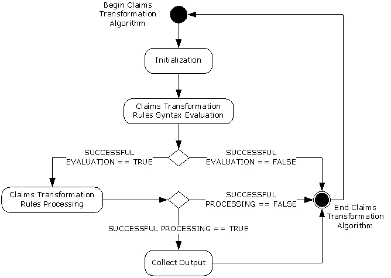
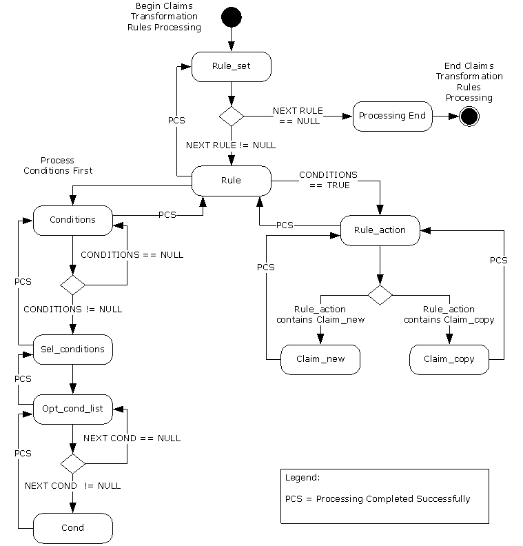

[MS-CTA]:

Claims Transformation Algorithm

Intellectual Property Rights Notice for Open Specifications Documentation

  Technical Documentation. Microsoft publishes Open Specifications documentation (“this

documentation”) for protocols, file formats, data portability, computer languages, and standards
support. Additionally, overview documents cover inter-protocol relationships and interactions.

  Copyrights. This documentation is covered by Microsoft copyrights. Regardless of any other

terms that are contained in the terms of use for the Microsoft website that hosts this
documentation, you can make copies of it in order to develop implementations of the technologies
that are described in this documentation and can distribute portions of it in your implementations
that use these technologies or in your documentation as necessary to properly document the
implementation. You can also distribute in your implementation, with or without modification, any
schemas, IDLs, or code samples that are included in the documentation. This permission also
applies to any documents that are referenced in the Open Specifications documentation.
  No Trade Secrets. Microsoft does not claim any trade secret rights in this documentation.
  Patents. Microsoft has patents that might cover your implementations of the technologies

described in the Open Specifications documentation. Neither this notice nor Microsoft's delivery of
this documentation grants any licenses under those patents or any other Microsoft patents.
However, a given Open Specifications document might be covered by the Microsoft Open
Specifications Promise or the Microsoft Community Promise. If you would prefer a written license,
or if the technologies described in this documentation are not covered by the Open Specifications
Promise or Community Promise, as applicable, patent licenses are available by contacting
iplg@microsoft.com.

  License Programs. To see all of the protocols in scope under a specific license program and the

associated patents, visit the Patent Map.

  Trademarks. The names of companies and products contained in this documentation might be
covered by trademarks or similar intellectual property rights. This notice does not grant any
licenses under those rights. For a list of Microsoft trademarks, visit
www.microsoft.com/trademarks.

  Fictitious Names. The example companies, organizations, products, domain names, email

addresses, logos, people, places, and events that are depicted in this documentation are fictitious.
No association with any real company, organization, product, domain name, email address, logo,
person, place, or event is intended or should be inferred.

Reservation of Rights. All other rights are reserved, and this notice does not grant any rights other
than as specifically described above, whether by implication, estoppel, or otherwise.

Tools. The Open Specifications documentation does not require the use of Microsoft programming
tools or programming environments in order for you to develop an implementation. If you have access
to Microsoft programming tools and environments, you are free to take advantage of them. Certain
Open Specifications documents are intended for use in conjunction with publicly available standards
specifications and network programming art and, as such, assume that the reader either is familiar
with the aforementioned material or has immediate access to it.

Support. For questions and support, please contact dochelp@microsoft.com.

[MS-CTA] - v20240423
Claims Transformation Algorithm
Copyright © 2024 Microsoft Corporation
Release: April 23, 2024

1 / 20

Revision Summary

Date

Revision
History

Revision
Class

Comments

12/16/2011  1.0

3/30/2012

1.0

7/12/2012

1.0

10/25/2012  1.0

1/31/2013

2.0

8/8/2013

3.0

11/14/2013  3.0

2/13/2014

3.0

5/15/2014

3.0

New

None

None

None

Major

Major

None

None

None

Released new document.

No changes to the meaning, language, or formatting of the
technical content.

No changes to the meaning, language, or formatting of the
technical content.

No changes to the meaning, language, or formatting of the
technical content.

Significantly changed the technical content.

Significantly changed the technical content.

No changes to the meaning, language, or formatting of the
technical content.

No changes to the meaning, language, or formatting of the
technical content.

No changes to the meaning, language, or formatting of the
technical content.

6/30/2015

4.0

Major

Significantly changed the technical content.

7/14/2016

4.0

None

No changes to the meaning, language, or formatting of the
technical content.

6/1/2017

4.0

9/15/2017

5.0

9/12/2018

6.0

3/15/2019

6.1

4/7/2021

7.0

4/23/2024

8.0

None

Major

Major

Minor

Major

Major

No changes to the meaning, language, or formatting of the
technical content.

Significantly changed the technical content.

Significantly changed the technical content.

Clarified the meaning of the technical content.

Significantly changed the technical content.

Significantly changed the technical content.

[MS-CTA] - v20240423
Claims Transformation Algorithm
Copyright © 2024 Microsoft Corporation
Release: April 23, 2024

2 / 20

Table of Contents

1.1
1.2

1.2.1
1.2.2

1  Introduction ............................................................................................................ 4
Glossary ........................................................................................................... 4
References ........................................................................................................ 5
Normative References ................................................................................... 5
Informative References ................................................................................. 5
Overview .......................................................................................................... 5
Relationship to Protocols and Other Algorithms ...................................................... 5
Applicability Statement ....................................................................................... 5
Standards Assignments ....................................................................................... 5

1.3
1.4
1.5
1.6

2.1

2.1.4.1

2.1.4.2
2.1.4.3

2.1.4.1.1
2.1.4.1.2

2.1.1
2.1.2
2.1.3
2.1.4

2  Algorithm Details..................................................................................................... 6
Claims Transformation Algorithm Details ............................................................... 6
Abstract Data Model ...................................................................................... 6
Data Structures ............................................................................................ 7
Initialization ................................................................................................. 7
Processing Rules ........................................................................................... 8
Claims Transformation Rules Language Syntax ........................................... 8
Language Terminals ........................................................................... 8
Language Syntax ............................................................................... 9
Claims Transformation Rules Syntax Evaluation ........................................ 10
Claims Transformation Rules Processing .................................................. 11
Rule-set ......................................................................................... 12
Rule ............................................................................................... 13
Conditions ...................................................................................... 13
Sel-condition .................................................................................. 13
Opt-cond-list................................................................................... 13
Cond .............................................................................................. 14
Rule-action ..................................................................................... 15
Claim-copy ..................................................................................... 15
Claim-new ...................................................................................... 15
Processing End ................................................................................ 15

2.1.4.3.1
2.1.4.3.2
2.1.4.3.3
2.1.4.3.4
2.1.4.3.5
2.1.4.3.6
2.1.4.3.7
2.1.4.3.8
2.1.4.3.9
2.1.4.3.10

3  Algorithm Examples .............................................................................................. 16
Processing "Allow All Claims" Rule ...................................................................... 16
Processing "Deny Some Claims" Rule .................................................................. 16
Processing "Issue always" Rule .......................................................................... 16
Processing an Invalid Rule ................................................................................. 16

3.1
3.2
3.3
3.4

4  Security ................................................................................................................. 17
Security Considerations for Implementers ........................................................... 17
Index of Security Parameters ............................................................................ 17

4.1
4.2

5  Appendix A: Product Behavior ............................................................................... 18

6  Change Tracking .................................................................................................... 19

7  Index ..................................................................................................................... 20

[MS-CTA] - v20240423
Claims Transformation Algorithm
Copyright © 2024 Microsoft Corporation
Release: April 23, 2024

3 / 20

1  Introduction

This document specifies the Claims Transformation Algorithm, which is an algorithm to transform
claims based on rules written in the claims transformation rules language, which is defined in this
document as well.

Sections 1.6 and 2 of this specification are normative. All other sections and examples in this
specification are informative.

1.1  Glossary

This document uses the following terms:

Augmented Backus-Naur Form (ABNF): A modified version of Backus-Naur Form (BNF),

commonly used by Internet specifications. ABNF notation balances compactness and simplicity
with reasonable representational power. ABNF differs from standard BNF in its definitions and
uses of naming rules, repetition, alternatives, order-independence, and value ranges. For more
information, see [RFC5234].

claim: An assertion about a security principal expressed as the n-tuple {Identifier, ValueType, m

Value(s) of type ValueType} where m is greater than or equal to 1. A claim with only one Value
in the n-tuple is called a single-valued claim; a claim with more than one Value is called a
multi-valued claim.

claims transformation: The process of converting one set of claims by analyzing and filtering the

claims and by adding new claims in order to generate a new set of claims.

claims transformation rules language syntax: The context-free grammar expressed in ABNF

that specifies the language used to describe the rules used in the Claims Transformation
Algorithm.

input claims: The set of claims provided as input to the Claims Transformation Algorithm.

production: An individual ABNF rule in the claims transformation rules language.

production name: The name on the left side of the production.

single-valued claim: A claim with only one Value in the n-tuple {Identifier, ValueType, m

Value(s) of type ValueType}.

tag: A production name or a terminal from the claims transformation rules language syntax that is

used to identify a portion of the given transformation rules.

terminal: A basic element of the claims transformation rules language syntax.

transformation rules: A set of rules defined according to the claims transformation rules

language syntax that specifies how claims are transformed when the Claims Transformation
Algorithm is invoked.

UTF-16: A standard for encoding Unicode characters, defined in the Unicode standard, in which the

most commonly used characters are defined as double-byte characters. Unless specified
otherwise, this term refers to the UTF-16 encoding form specified in [UNICODE5.0.0/2007]
section 3.9.

MAY, SHOULD, MUST, SHOULD NOT, MUST NOT: These terms (in all caps) are used as defined
in [RFC2119]. All statements of optional behavior use either MAY, SHOULD, or SHOULD NOT.

[MS-CTA] - v20240423
Claims Transformation Algorithm
Copyright © 2024 Microsoft Corporation
Release: April 23, 2024

4 / 20

1.2  References

Links to a document in the Microsoft Open Specifications library point to the correct section in the
most recently published version of the referenced document. However, because individual documents
in the library are not updated at the same time, the section numbers in the documents may not
match. You can confirm the correct section numbering by checking the Errata.

1.2.1  Normative References

We conduct frequent surveys of the normative references to assure their continued availability. If you
have any issue with finding a normative reference, please contact dochelp@microsoft.com. We will
assist you in finding the relevant information.

[ISO/IEC-9899] International Organization for Standardization, "Programming Languages - C",
ISO/IEC 9899:TC2, May 2005, http://www.open-std.org/jtc1/sc22/wg14/www/docs/n1124.pdf

[RFC2119] Bradner, S., "Key words for use in RFCs to Indicate Requirement Levels", BCP 14, RFC
2119, March 1997, https://www.rfc-editor.org/info/rfc2119

1.2.2  Informative References

None.

1.3  Overview

This document defines the Claims Transformation Algorithm, which enables parsing, filtering, issuance
and transformation of a set of input claims based on the input transformation rules.

The claims transformation rules language syntax specified in this document defines the syntax
for transformation rules.

The Claims Transformation Algorithm essentially is a programmable transformation of claims.

This algorithm can be summarized at a high level as follows: Validate the transformation rules using
the claims transformation rules language syntax and transform the input claims using the
transformation rules based on the claims transformation processing rules.

1.4  Relationship to Protocols and Other Algorithms

This algorithm does not depend on any other protocols or algorithms.

1.5  Applicability Statement

This algorithm is applicable when programmable claims transformation needs to be performed on
claims.

1.6  Standards Assignments

None.

[MS-CTA] - v20240423
Claims Transformation Algorithm
Copyright © 2024 Microsoft Corporation
Release: April 23, 2024

5 / 20

<!-- Extracted images from page 6 -->

<!-- /Extracted images from page 6 -->

2  Algorithm Details

2.1  Claims Transformation Algorithm Details

The Claims Transformation Algorithm is illustrated in the following state machine diagram, which
consists of the following states:



Initialization: Initializing the internal state (section 2.1.3).

  Claims Transformation Rules Syntax Evaluation: Validating that the given transformation rules

text conforms to the claims transformation rules language syntax and generating
transformation rules (section 2.1.4.2).

  Claims Transformation Rules Processing: Transforming input claims to output claims using

transformation rules (section 2.1.4.3).

  Collect Output: Collecting the output claims from the transformation process.

Figure 1: Claims Transformation Algorithm state machine

The Claims Transformation Algorithm depends only on the given input per invocation and does not use
any other state for its functioning. It maintains state only on a per-invocation basis and only for the
duration of the invocation and does not preserve state beyond that scope.

See the following sections for more details on the various states of the state machine.

2.1.1  Abstract Data Model

None.

[MS-CTA] - v20240423
Claims Transformation Algorithm
Copyright © 2024 Microsoft Corporation
Release: April 23, 2024

6 / 20

2.1.2  Data Structures

The following data structure definitions are applicable to the current document:

Claim: A claim is defined as the 3-tuple of following values:



TYPE: The type or identifier of the claim, represented as a UTF-16 string.

  VALUE_TYPE: The value type of the claim VALUE, represented as a UTF-16 string.

  VALUE: A single claim value; its type depends on the VALUE_TYPE.

This Claim is a single-valued claim.

VALUE_TYPE:  The VALUE_TYPE field in a claim MUST have one of the following UTF-16 values or

a case variation thereof:









"uint64"

"int64"

"string"

"boolean"

2.1.3  Initialization

The Claims Transformation Algorithm MUST be invoked by passing in the following parameters:

InputClaims: A set of zero or more claims (section 2.1.2) that need to be transformed.

InputTransformationRulesText: A set of transformation rules in UTF-16 format that define the

transformation based on the language defined in Claims Transformation Rules Language Syntax
(section 2.1.4.1).

The Claims Transformation Algorithm MUST generate the following output variables:

OutputClaims: This is a list of zero or more claims (section 2.1.2) returned by the Claims

Transformation Algorithm when it finishes processing the given input.

ReturnValue: This variable holds the resulting value returned by this algorithm. The possible values

are SUCCESS to indicate successful processing and FAILURE to indicate an error during the
processing.

The Claims Transformation Algorithm MUST maintain state during processing in the following
variables:

1.  InternalTransformationRules: This is the representation of InputTransformationRulesText
generated for Claims Transformation Rules Processing. This representation MUST contain the
following:

1.  InputTransformationRulesText

2.  An ordered, hierarchical list of tags from the claims transformation rules language

syntax that are arranged to match the given InputTransformationRulesText and the
corresponding matching portion of InputTransformationRulesText for each tag.

2.  InternalEvaluationContext: A list of claims on which the claims transformation rules processing

operates.

[MS-CTA] - v20240423
Claims Transformation Algorithm
Copyright © 2024 Microsoft Corporation
Release: April 23, 2024

7 / 20

3.  InternalOutputContext: A list of claims that collects the output of claims transformation rules

processing.

The Claims Transformation Algorithm MUST be initialized as follows:

1.  InternalTransformationRules MUST be initialized by clearing it.

2.  InternalEvaluationContext MUST be initialized by clearing it and then adding all InputClaims

to it.

3.  InternalOutputContext MUST be initialized by clearing it.

4.  OutputClaims MUST be initialized by clearing it.

5.  ReturnValue MUST be set to SUCCESS.

2.1.4  Processing Rules

The Claims Transformation Algorithm is invoked by a caller by providing InputClaims and the
InputTransformationRulesText as indicated in Initialization (section 2.1.3). This algorithm continues
processing until an error occurs or until successful completion.

The Claims Transformation Algorithm consists of the following processing steps.

1.  Parse InputTransformationRulesText to validate the syntax against the claims

transformation rules language syntax and generate InternalTransformationRules (section
2.1.4.2).

2.  If evaluation in the previous step fails, set ReturnValue to FAILURE and OutputClaims to an

empty list and exit this algorithm.

3.  Perform processing steps detailed in Claims Transformation Rules Processing (section 2.1.4.3) on

InternalEvaluationContext using InternalTransformationRules.

4.  If an error occurs in the previous processing, set ReturnValue to FAILURE and OutputClaims to

an empty list and exit this algorithm.

5.  Set ReturnValue to SUCCESS, copy all the claims from the InternalOutputContext to

OutputClaims, and exit this algorithm.

2.1.4.1  Claims Transformation Rules Language Syntax

The claims transformation rules language is a context-free language defined following, using
tokens and ABNF.

2.1.4.1.1 Language Terminals

The following table lists the complete set of terminal strings and associated language terminals used
in the claims transformation rules language. These definitions MUST be treated as case insensitive.
The terminal strings MUST be encoded in UTF-16.

String

"=>"

";"

":"

Terminal

IMPLY

SEMICOLON

COLON

[MS-CTA] - v20240423
Claims Transformation Algorithm
Copyright © 2024 Microsoft Corporation
Release: April 23, 2024

8 / 20

String

","

"."

"["

"]"

"("

")"

"=="

"!="

"=~"

"!~"

"="

"&&"

"issue"

"type"

"value"

Terminal

COMMA

DOT

O-SQ-BRACKET

C-SQ-BRACKET

O-BRACKET

C-BRACKET

EQ

NEQ

REGEXP-MATCH

REGEXP-NOT-MATCH

ASSIGN

AND

ISSUE

TYPE

VALUE

"valuetype"

VALUE-TYPE

"claim"

CLAIM

 "[_A-Za-z][_A-Za-z0-9]*"

IDENTIFIER

"\"[^\"\n]*\""

STRING

"uint64"

"int64"

"string"

UINT64-TYPE

INT64-TYPE

STRING-TYPE

"boolean"

BOOLEAN-TYPE

NULL

2.1.4.1.2 Language Syntax

The claims transformation rules language is specified here in ABNF form. This definition uses the
terminals specified in the previous section as well as new ABNF productions defined here. The rules
MUST be encoded in UTF-16. The string comparisons MUST be treated as case insensitive.

Rule-set               = NULL
                         / Rules
Rules                  = Rule

[MS-CTA] - v20240423
Claims Transformation Algorithm
Copyright © 2024 Microsoft Corporation
Release: April 23, 2024

9 / 20

                         / Rule Rules
Rule                   = Rule-body
Rule-body              = (Conditions IMPLY Rule-action SEMICOLON)
Conditions             = NULL
                         / Sel-condition-list
Sel-condition-list     = Sel-condition
                         / (Sel-condition-list AND Sel-condition)
Sel-condition          = Sel-condition-body
                         / (IDENTIFIER COLON Sel-condition-body)
Sel-condition-body     = O-SQ-BRACKET Opt-cond-list C-SQ-BRACKET
Opt-cond-list          = NULL
                         / Cond-list
Cond-list              = Cond
                         / (Cond-list COMMA Cond)
Cond                   = Value-cond
                         / Type-cond
Type-cond              = TYPE Cond-oper Literal-expr
Value-cond             = (Val-cond COMMA Val-type-cond)
                         /(Val-type-cond COMMA Val-cond)
Val-cond               = VALUE Cond-oper Literal-expr
Val-type-cond          = VALUE-TYPE Cond-oper Value-type-literal
Claim-prop             = TYPE
                         / VALUE
Cond-oper              = EQ-
                         / NEQ
                         / REGEXP-MATCH
                         / REGEXP-NOT-MATCH
Literal-expr           = Literal
                         / Value-type-literal
Expr                   = Literal
                         / Value-type-expr
                         / (IDENTIFIER DOT Claim-prop)
Value-type-expr        = Value-type-literal
                         /(IDENTIFIER DOT VALUE-TYPE)
Value-type-literal     = INT64-TYPE
                         / UINT64-TYPE
                         / STRING-TYPE
                         / BOOLEAN-TYPE
Literal                = STRING
Rule-action            = ISSUE O-BRACKET Issue-params C-BRACKET
Issue-params           = Claim-copy
                         / Claim-new
Claim-copy             = CLAIM ASSIGN IDENTIFIER
Claim-new              = Claim-prop-assign-list
Claim-prop-assign-list = (Claim-value-assign COMMA Claim-type-assign)
                         /(Claim-type-assign COMMA Claim-value-assign)
Claim-value-assign     = (Claim-val-assign COMMA Claim-val-type-assign)
                         /(Claim-val-type-assign COMMA Claim-val-assign)
Claim-val-assign       = VALUE ASSIGN Expr
Claim-val-type-assign  = VALUE-TYPE ASSIGN Value-type-expr
Claim-type-assign      = TYPE ASSIGN Expr

2.1.4.2  Claims Transformation Rules Syntax Evaluation

Syntax evaluation MUST perform the following processing:

1.  InputTransformationRulesText MUST be validated against the ABNF syntax definition of the

claims transformation rules language to ensure conformity. Any failure MUST be considered an
error, ReturnValue MUST be set to FAILURE, and the algorithm MUST exit.

2.  The following validation MUST be performed on InputTransformationRulesText.

1.  Each Sel-condition in Sel-condition-list either MUST use an IDENTIFIER unique among all

IDENTIFIERS in the Sel-condition-list or MUST use no IDENTIFIER.

[MS-CTA] - v20240423
Claims Transformation Algorithm
Copyright © 2024 Microsoft Corporation
Release: April 23, 2024

10 / 20

2.  If Rule-action contains one or more IDENTIFIERs, then each of the IDENTIFIERs MUST have

an identical matching IDENTIFIER in the Condition in the same Rule.

3.  If either of the preceding validation steps fails, it MUST be considered an error. ReturnValue

MUST be set to FAILURE, and the algorithm MUST exit.

3.  The InternalTransformationRules variable MUST be populated with

InputTransformationRulesText.

4.  The InternalTransformationRules variable MUST be populated in a depth-first fashion with

tags (production names and terminals) and the matching portion of
InputTransformationRulesText.

2.1.4.3  Claims Transformation Rules Processing

Claims transformation rules processing requires the InternalTransformationRules variable to be
populated using InputTransformationRulesText and requires all other variables to be initialized
(see section 2.1.3 and section 2.1.4.2).

Claims transformation rules processing uses an additional variable called
InternalMatchingClaimsList to store temporary data during processing. Each
InternalMatchingClaimsList is a list of claims that matches a Sel-condition (section 2.1.4.3.4).
InternalMatchingClaimsLists are created dynamically on a per-Rule (section 2.1.4.3.2) basis.

The following state diagram illustrates the logical processing flow, with error handling excluded. Any
error encountered during the claims transformation rules processing MUST set ReturnValue to
FAILURE, and the processing MUST immediately continue from the Processing End (section 2.1.4.3.10)
state.

[MS-CTA] - v20240423
Claims Transformation Algorithm
Copyright © 2024 Microsoft Corporation
Release: April 23, 2024

11 / 20

<!-- Extracted images from page 12 -->

<!-- /Extracted images from page 12 -->

Figure 2: Claims transformation state machine

For the purposes of this section, processing is defined as InternalTransformationRules evaluation
on the InternalEvaluationContext or InternalTransformationRules action taken using Matching
Claims.

The processing MUST begin at the first tag in InternalTransformationRules and MUST proceed
depth-first in the order in which the tags are placed.

The processing steps for the critical tags are specified in the following subsections. Those tags not
listed MUST be treated as if they have no processing steps and MUST be ignored during processing.

2.1.4.3.1 Rule-set

1.  Set ReturnValue to SUCCESS.

2.  If the Rule-set is NULL, go to Processing End (section 2.1.4.3.10).

3.  Process each Rule in the Rule-set.

12 / 20

[MS-CTA] - v20240423
Claims Transformation Algorithm
Copyright © 2024 Microsoft Corporation
Release: April 23, 2024

4.  Go to Processing End (section 2.1.4.3.10).

2.1.4.3.2 Rule

1.  Processing a Rule MUST perform the necessary operations using the InternalEvaluationContext

variable.

2.  Create as many InternalMatchingClaimsList variables as there are Sel-conditions in this Rule,

and initialize them by clearing them.

3.  Process the Conditions tag in this Rule.

4.  If the Conditions evaluates to TRUE, the Rule-action in this Rule MUST be processed using all the

n-tuples of claims generated by the Conditions.

2.1.4.3.3 Conditions

1.  This processing step MUST evaluate to TRUE or FALSE.

2.  When Conditions evaluates to TRUE, a list of zero or more matching n-tuples of claims, where n is

the number of Sel-conditions in the Conditions, MUST be returned.

3.  If the Conditions is NULL, the processing of this production must stop and the evaluation result

MUST be returned as TRUE with no entries in the matching n-tuples.

4.  The following processing applies when Conditions is not NULL:

1.  When all Sel-conditions in the Conditions evaluate to TRUE, the Conditions MUST evaluate to

TRUE; else the Conditions MUST evaluate to FALSE.

2.  Each Sel-condition MUST evaluate to TRUE when at least one claim in the

InternalEvaluationContext matches it.

3.  The process of matching each Sel-condition MUST determine all claims in the

InternalEvaluationContext that match it. The resulting list of matching claims MUST be
stored in the InternalMatchingClaimsList corresponding to that Sel-condition.

4.  If Conditions evaluates to TRUE, there MUST exist an n-tuple of claims from the

InternalEvaluationContext that matches each of the constituent "n" Sel-conditions. The n-
tuple can contain duplicate claims; that is, one claim can match one or more Sel-conditions.

5.  Evaluation of Conditions MUST determine all possible unique n-tuples of claims from the
InternalEvaluationContext that match each of the constituent "n" Sel-conditions.

6.  Return the list of n-tuples of claims.

2.1.4.3.4 Sel-condition

1.  This processing step MUST fill one InternalMatchingClaimsList with zero or more claims from

the InternalEvaluationContext. If an IDENTIFIER is used in the Sel-condition, the
InternalMatchingClaimsList MUST be tagged by the string represented by the IDENTIFIER.

2.  InternalMatchingClaimsList is filled by evaluating Opt-cond-list.

3.  If the InternalMatchingClaimsList contains zero claims, the returned evaluation result MUST be

FALSE; else it MUST be TRUE.

2.1.4.3.5 Opt-cond-list

[MS-CTA] - v20240423
Claims Transformation Algorithm
Copyright © 2024 Microsoft Corporation
Release: April 23, 2024

13 / 20

1.  If Opt-cond-list is NULL, the InternalMatchingClaimsList MUST be filled with all the claims in

the InternalEvaluationContext. The processing of this production MUST stop, and
InternalMatchingClaimsList must be returned as the evaluation result.

2.  The following processing rules apply when Opt-cond-list is not NULL:

1.  The following processing MUST start from the first claim in the InternalEvaluationContext,

and all the claims MUST be processed.

2.  If all the Conds in this Opt-cond-list evaluate to TRUE for a claim in the

InternalEvaluationContext, the claim MUST be added to the InternalMatchingClaimsList.

Return the InternalMatchingClaimsList as the evaluation result.

2.1.4.3.6 Cond

1.  This processing step MUST return TRUE if a given claim matches the current Cond, and FALSE

otherwise.

2.  The TYPE, VALUE, and VALUE-TYPE in a Cond MUST be replaced by the current claim's TYPE,

VALUE, and VALUE-TYPE, respectively (section 2.1.2). The current claim's TYPE and VALUE-TYPE
MUST always be treated as STRING-TYPE. The current claim's VALUE MUST be interpreted based
on its VALUE-TYPE.

3.  The right side of Cond-oper in the Cond MUST be convertible to the same type as the operand on

the left side of the Cond-oper; otherwise, the Cond MUST return the evaluation result as FALSE.
Converting STRING-TYPE variables to other types MUST be performed as specified in [ISO/IEC-
9899] section 7.20.1.4.

4.  The Cond-oper in the Cond MUST be interpreted based upon the type of the operand on the left

side of the Cond-oper, as shown in the following table.

INT64_TYPE

UINT64_TYPE

BOOLEAN_TYPE

STRING_TYPE

EQ

Signed integer
equality
comparison.

Unsigned integer
equality
comparison.

Case-insensitive, NULL
terminated Unicode-
string comparison,
excluding terminating
NULLs for equality.

BOOLEAN equality
comparison.

Unsigned integers
MUST be interpreted
as BOOLEAN values as
follows:

0 == FALSE

(!0) == TRUE

NEQ

Negation of EQ
comparison.

Negation of EQ
comparison.

Negation of EQ
comparison.

Negation of EQ
comparison.

REGEXP-MATCH

Not valid.

Not valid.

Not valid.

REGEXP-NOT-
MATCH

Not valid.

Not valid.

Not valid.

Regular expression
match of NULL
terminated Unicode
strings.

Negation of REGEXP-
MATCH.

5.  If the current processing encounters a Cond-oper and the type combination is identified as "Not
Valid" in the preceding table, the processing MUST return the result of the evaluation as FALSE.

6.  Return the result of the evaluation of Cond, comparing the operands based on interpretation of the

Cond-oper from the preceding table.

14 / 20

[MS-CTA] - v20240423
Claims Transformation Algorithm
Copyright © 2024 Microsoft Corporation
Release: April 23, 2024

2.1.4.3.7 Rule-action

1.  Successful processing of this step MUST result in creation of one or more claims.

2.  Rule-action acts on each of the n-tuples generated by Conditions in the same Rule.

3.  If this Rule-action contains a Claim-copy sub tag, Claim-copy (section 2.1.4.3.8) MUST be

processed using the matching n-tuples as input and the resulting claims collected as output.

4.  If this Rule-action contains a Claim-new sub tag, Claim-new (section 2.1.4.3.9) MUST be

processed using the matching n-tuples as input and the resulting claims collected as output.

The above processing MUST generate one or more claims. The generated claims MUST be appended to
the InternalEvaluationContext and the InternalOutputContext.

2.1.4.3.8 Claim-copy

1.  This processing step MUST create one claim per matching n-tuple.

2.  The new claim MUST be a copy of the claim in the matching n-tuple indicated by the IDENTIFIER

reference.

2.1.4.3.9 Claim-new

1.  Successful processing of this step MUST create one or more claims.

2.  If no matching n-tuples are presented to this processing step, the contained assignments MUST

have only Literals and MUST NOT have any IDENTIFIER references. In this case, only one claim is
generated.

3.  If matching n-tuples are presented, this processing step MUST create one claim per matching n-

tuple, using Literals and/or IDENTIFIER references to the matching n-tuple.

4.  Assignments to TYPE, VALUE, and VALUE-TYPE MUST be interpreted as assignments to TYPE,
VALUE and VALUE-TYPE, respectively, of each of the newly created Claims; see section 2.1.2.

5.  If the Expr on the right side of the ASSIGN is a Literal, it MUST be interpreted based on the type

on the left side of ASSIGN. When the left side of the Expr is not STRING-TYPE, the Literal MUST be
converted in accordance with the rules specified in [ISO/IEC-9899] section 7.20.1.4. If the right
side of the Assign is not a Literal, type conversion MUST NOT be performed.

6.  Each newly created claim MUST adhere to the definition in section 2.1.2; else it MUST be

considered invalid.

7.  If any type mismatches or errors in type conversions are encountered by ASSIGN, or if an invalid

claim is generated, processing MUST stop, and a processing error MUST be indicated.

2.1.4.3.10

Processing End



If ReturnValue is set to SUCCESS, copy the claims in the InternalOutputContext to
OutputClaims and exit the algorithm.



If ReturnValue is set to FAILURE, clear OutputClaims and exit the algorithm.

[MS-CTA] - v20240423
Claims Transformation Algorithm
Copyright © 2024 Microsoft Corporation
Release: April 23, 2024

15 / 20

3  Algorithm Examples

This section contains some examples of the Claims Transformation Algorithm.

3.1  Processing "Allow All Claims" Rule

 Input:

 InputTransformationRulesText: C1:[]=> ISSUE(Claim=C1);
 InputClaims:  {(TYPE = "type1", VALUE = 5, VALUE-TYPE = "int64"),
                 (TYPE = "type2", VALUE = "example", VALUE-TYPE = "string") }
 Output:
 OutputClaims: {(TYPE = "type1", VALUE = 5, VALUE-TYPE = "int64"),
                 (TYPE = "type2", VALUE = "example", VALUE-TYPE = "string") }
 ReturnValue: SUCCESS.

3.2  Processing "Deny Some Claims" Rule

 Input:

 InputTransformationRulesText: C1:[type != "Type1"] => ISSUE (Claim = C1);
 InputClaims:  {(TYPE = "type1", VALUE = 5, VALUE-TYPE = "uint64"),
                 (TYPE = "type2", VALUE = "example", VALUE-TYPE = "string"),
                 (TYPE = "type3", VALUE = -33, VALUE-TYPE = "int64")}
 Output:
 OutputClaims: { (TYPE = "type2", VALUE = "example", VALUE-TYPE = "string"),
                (TYPE = "type3", VALUE = -33, VALUE-TYPE = "int64")}
 ReturnValue: SUCCESS.

3.3  Processing "Issue always" Rule

 Input:

 InputTransformationRulesText: => ISSUE (type="type1", VALUE=false, VALUE-TYPE="boolean");
 InputClaims:  {}

 Output:
 OutputClaims: {(TYPE = "type1", VALUE = false, VALUE-TYPE = "boolean")}

 ReturnValue: SUCCESS.

3.4  Processing an Invalid Rule

 Input:
 InputTransformationRulesText: C1:[type] => ISSUE (Claim = C1);
 InputClaims:  {(TYPE = "type1", VALUE = 5, VALUE-TYPE = "uint64"),
                 (TYPE = "type2", VALUE = "example", VALUE-TYPE = "string")}

 Output:
 OutputClaims: {}
 ReturnValue: FAILURE.

[MS-CTA] - v20240423
Claims Transformation Algorithm
Copyright © 2024 Microsoft Corporation
Release: April 23, 2024

16 / 20

4  Security

4.1  Security Considerations for Implementers

None.

4.2  Index of Security Parameters

None.

[MS-CTA] - v20240423
Claims Transformation Algorithm
Copyright © 2024 Microsoft Corporation
Release: April 23, 2024

17 / 20

5  Appendix A: Product Behavior

The information in this specification is applicable to the following Microsoft products or supplemental
software. References to product versions include updates to those products.

  Windows Server 2012 operating system

  Windows Server 2012 R2 operating system

  Windows Server 2016 operating system

  Windows Server operating system

  Windows Server 2019 operating system

  Windows Server 2022 operating system

  Windows Server 2025 operating system

Exceptions, if any, are noted in this section. If an update version, service pack or Knowledge Base
(KB) number appears with a product name, the behavior changed in that update. The new behavior
also applies to subsequent updates unless otherwise specified. If a product edition appears with the
product version, behavior is different in that product edition.

Unless otherwise specified, any statement of optional behavior in this specification that is prescribed
using the terms "SHOULD" or "SHOULD NOT" implies product behavior in accordance with the
SHOULD or SHOULD NOT prescription. Unless otherwise specified, the term "MAY" implies that the
product does not follow the prescription.

[MS-CTA] - v20240423
Claims Transformation Algorithm
Copyright © 2024 Microsoft Corporation
Release: April 23, 2024

18 / 20

6  Change Tracking

This section identifies changes that were made to this document since the last release. Changes are
classified as Major, Minor, or None.

The revision class Major means that the technical content in the document was significantly revised.
Major changes affect protocol interoperability or implementation. Examples of major changes are:

  A document revision that incorporates changes to interoperability requirements.
  A document revision that captures changes to protocol functionality.

The revision class Minor means that the meaning of the technical content was clarified. Minor changes
do not affect protocol interoperability or implementation. Examples of minor changes are updates to
clarify ambiguity at the sentence, paragraph, or table level.

The revision class None means that no new technical changes were introduced. Minor editorial and
formatting changes may have been made, but the relevant technical content is identical to the last
released version.

The changes made to this document are listed in the following table. For more information, please
contact dochelp@microsoft.com.

Section

Description

5 Appendix A: Product
Behavior

Added Windows Server 2025 to the list of applicable
products.

Revision
class

Major

[MS-CTA] - v20240423
Claims Transformation Algorithm
Copyright © 2024 Microsoft Corporation
Release: April 23, 2024

19 / 20

7  Index
A

Abstract data model 6
Applicability 5

C

Change tracking 19
Claims Transformation
   overview 6

D

Data model - abstract 6
Data structures 7

E

Examples
   allow all claims rule 16
   deny some claims rule 16
   invalid rule 16
   issue always rule 16
   overview 16
   Processing "Allow All Claims" Rule 16
   Processing "Deny Some Claims" Rule 16
   Processing "Issue always" Rule 16
   Processing an Invalid Rule 16

G

Glossary 4

I

Implementer - security considerations 17
Index of security parameters 17
Informative references 5
Initialization 7
Introduction 4

N

Normative references 5

O

Overview (synopsis) 5

P

Parameters - security index 17
Processing "Allow All Claims" Rule example 16
Processing "Deny Some Claims" Rule example 16
Processing "Issue always" Rule example 16
Processing an Invalid Rule example 16
Processing rules 8
   allow all claims example 16
   deny some claims example 16
   invalid rule example 16

[MS-CTA] - v20240423
Claims Transformation Algorithm
Copyright © 2024 Microsoft Corporation
Release: April 23, 2024

   issue always example 16
Product behavior 18

R

References
   informative 5
   normative 5
Relationship to protocols and other algorithms 5

S

Security
   implementer considerations 17
   parameter index 17
Standards assignments 5
States 6
Structures 7

T

Tracking changes 19

20 / 20

