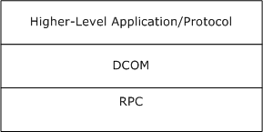
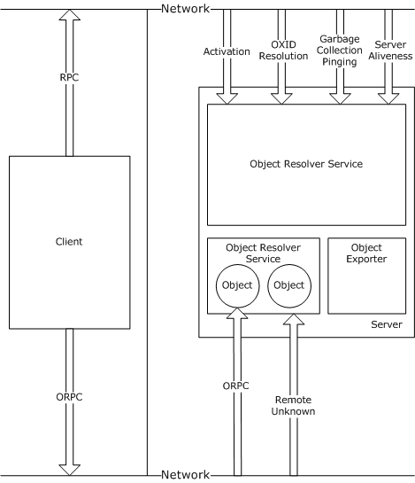
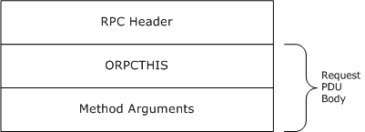
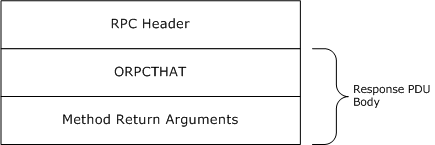
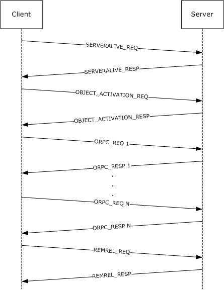
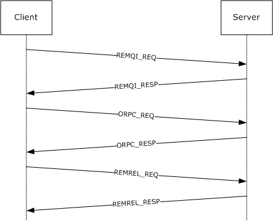
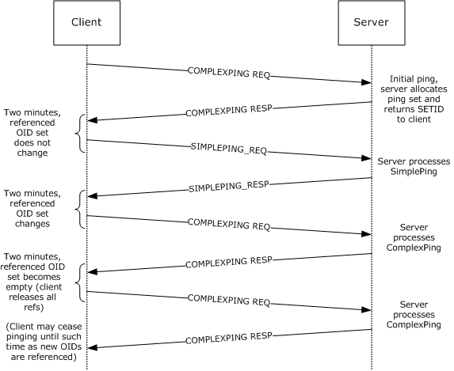
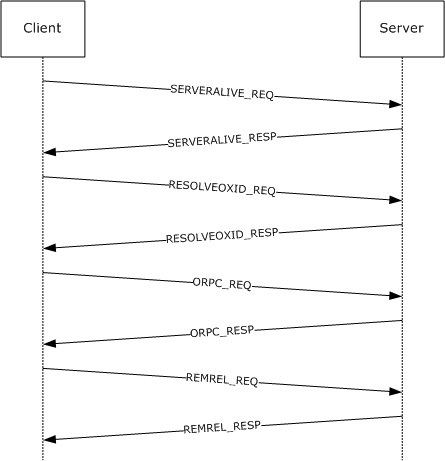

[MS-DCOM]:

Distributed Component Object Model (DCOM) Remote
Protocol

Intellectual Property Rights Notice for Open Specifications Documentation

  Technical Documentation. Microsoft publishes Open Specifications documentation (“this

documentation”) for protocols, file formats, data portability, computer languages, and standards
support. Additionally, overview documents cover inter-protocol relationships and interactions.

  Copyrights. This documentation is covered by Microsoft copyrights. Regardless of any other

terms that are contained in the terms of use for the Microsoft website that hosts this
documentation, you can make copies of it in order to develop implementations of the technologies
that are described in this documentation and can distribute portions of it in your implementations
that use these technologies or in your documentation as necessary to properly document the
implementation. You can also distribute in your implementation, with or without modification, any
schemas, IDLs, or code samples that are included in the documentation. This permission also
applies to any documents that are referenced in the Open Specifications documentation.
  No Trade Secrets. Microsoft does not claim any trade secret rights in this documentation.
  Patents. Microsoft has patents that might cover your implementations of the technologies

described in the Open Specifications documentation. Neither this notice nor Microsoft's delivery of
this documentation grants any licenses under those patents or any other Microsoft patents.
However, a given Open Specifications document might be covered by the Microsoft Open
Specifications Promise or the Microsoft Community Promise. If you would prefer a written license,
or if the technologies described in this documentation are not covered by the Open Specifications
Promise or Community Promise, as applicable, patent licenses are available by contacting
iplg@microsoft.com.

  License Programs. To see all of the protocols in scope under a specific license program and the

associated patents, visit the Patent Map.

  Trademarks. The names of companies and products contained in this documentation might be
covered by trademarks or similar intellectual property rights. This notice does not grant any
licenses under those rights. For a list of Microsoft trademarks, visit
www.microsoft.com/trademarks.

  Fictitious Names. The example companies, organizations, products, domain names, email

addresses, logos, people, places, and events that are depicted in this documentation are fictitious.
No association with any real company, organization, product, domain name, email address, logo,
person, place, or event is intended or should be inferred.

Reservation of Rights. All other rights are reserved, and this notice does not grant any rights other
than as specifically described above, whether by implication, estoppel, or otherwise.

Tools. The Open Specifications documentation does not require the use of Microsoft programming
tools or programming environments in order for you to develop an implementation. If you have access
to Microsoft programming tools and environments, you are free to take advantage of them. Certain
Open Specifications documents are intended for use in conjunction with publicly available standards
specifications and network programming art and, as such, assume that the reader either is familiar
with the aforementioned material or has immediate access to it.

Support. For questions and support, please contact dochelp@microsoft.com.

[MS-DCOM] - v20240916
Distributed Component Object Model (DCOM) Remote Protocol
Copyright © 2024 Microsoft Corporation
Release: September 16, 2024

1 / 119

Revision Summary

Date

Revision
History

Revision
Class

Comments

12/18/2006  0.01

3/2/2007

1.0

4/3/2007

1.1

5/11/2007

1.2

6/1/2007

1.3

New

Major

Minor

Minor

Minor

Version 0.01 release

Version 1.0 release

Version 1.1 release

Version 1.2 release

Clarified the meaning of the technical content.

7/3/2007

1.3.1

Editorial

Changed language and formatting in the technical content.

7/20/2007

2.0

Major

Updated and revised the technical content.

8/10/2007

2.0.1

Editorial

Changed language and formatting in the technical content.

9/28/2007

3.0

Major

Added an interface.

10/23/2007  3.0.1

Editorial

Changed language and formatting in the technical content.

11/30/2007  4.0

Major

Updated and revised the technical content.

1/25/2008

4.0.1

Editorial

Changed language and formatting in the technical content.

3/14/2008

4.1

5/16/2008

5.0

6/20/2008

6.0

7/25/2008

6.1

8/29/2008

7.0

10/24/2008  7.1

Minor

Major

Major

Minor

Major

Minor

Clarified the meaning of the technical content.

Updated and revised the technical content.

Updated and revised the technical content.

Clarified the meaning of the technical content.

Updated and revised the technical content.

Clarified the meaning of the technical content.

12/5/2008

7.1.1

Editorial

Changed language and formatting in the technical content.

1/16/2009

7.1.2

Editorial

Changed language and formatting in the technical content.

2/27/2009

8.0

4/10/2009

9.0

Major

Major

Updated and revised the technical content.

Updated and revised the technical content.

5/22/2009

9.0.1

Editorial

Changed language and formatting in the technical content.

7/2/2009

10.0

Major

Updated and revised the technical content.

8/14/2009

10.0.1

Editorial

Changed language and formatting in the technical content.

9/25/2009

10.1

Minor

Clarified the meaning of the technical content.

11/6/2009

10.1.1

Editorial

Changed language and formatting in the technical content.

12/18/2009  11.0

1/29/2010

11.1

Major

Minor

Updated and revised the technical content.

Clarified the meaning of the technical content.

3/12/2010

11.1.1

Editorial

Changed language and formatting in the technical content.

[MS-DCOM] - v20240916
Distributed Component Object Model (DCOM) Remote Protocol
Copyright © 2024 Microsoft Corporation
Release: September 16, 2024

2 / 119

Date

Revision
History

Revision
Class

Comments

4/23/2010

12.0

Major

Updated and revised the technical content.

6/4/2010

12.0.1

Editorial

Changed language and formatting in the technical content.

7/16/2010

12.0.1

None

No changes to the meaning, language, or formatting of the
technical content.

8/27/2010

12.0.1

None

No changes to the meaning, language, or formatting of the
technical content.

10/8/2010

12.0.1

None

No changes to the meaning, language, or formatting of the
technical content.

11/19/2010  12.0.1

None

No changes to the meaning, language, or formatting of the
technical content.

1/7/2011

12.0.1

None

No changes to the meaning, language, or formatting of the
technical content.

2/11/2011

12.0.1

None

No changes to the meaning, language, or formatting of the
technical content.

3/25/2011

12.0.1

None

No changes to the meaning, language, or formatting of the
technical content.

5/6/2011

12.0.1

None

No changes to the meaning, language, or formatting of the
technical content.

6/17/2011

12.1

9/23/2011

13.0

12/16/2011  14.0

3/30/2012

14.0

7/12/2012

15.0

10/25/2012  15.1

1/31/2013

15.1

Minor

Major

Major

None

Major

Minor

None

Clarified the meaning of the technical content.

Updated and revised the technical content.

Updated and revised the technical content.

No changes to the meaning, language, or formatting of the
technical content.

Updated and revised the technical content.

Clarified the meaning of the technical content.

No changes to the meaning, language, or formatting of the
technical content.

8/8/2013

16.0

Major

Updated and revised the technical content.

11/14/2013  16.0

None

No changes to the meaning, language, or formatting of the
technical content.

2/13/2014

16.0

None

No changes to the meaning, language, or formatting of the
technical content.

5/15/2014

16.0

6/30/2015

17.0

10/16/2015  18.0

7/14/2016

19.0

6/1/2017

19.0

None

Major

Major

Major

None

No changes to the meaning, language, or formatting of the
technical content.

Significantly changed the technical content.

Significantly changed the technical content.

Significantly changed the technical content.

No changes to the meaning, language, or formatting of the

[MS-DCOM] - v20240916
Distributed Component Object Model (DCOM) Remote Protocol
Copyright © 2024 Microsoft Corporation
Release: September 16, 2024

3 / 119

Date

Revision
History

Revision
Class

Comments

technical content.

9/15/2017

20.0

Major

Significantly changed the technical content.

12/1/2017

20.0

9/12/2018

21.0

4/7/2021

22.0

6/25/2021

23.0

9/20/2023

24.0

4/23/2024

25.0

9/16/2024

25.0

None

Major

Major

Major

Major

Major

None

No changes to the meaning, language, or formatting of the
technical content.

Significantly changed the technical content.

Significantly changed the technical content.

Significantly changed the technical content.

Significantly changed the technical content.

Significantly changed the technical content.

No changes to the meaning, language, or formatting of the
technical content.

[MS-DCOM] - v20240916
Distributed Component Object Model (DCOM) Remote Protocol
Copyright © 2024 Microsoft Corporation
Release: September 16, 2024

4 / 119

## Table of Contents

- [1 Introduction](#1-introduction)
  - [1.1 Glossary](#11-glossary)
  - [1.2 References](#12-references)
    - [1.2.1 Normative References](#121-normative-references)
    - [1.2.2 Informative References](#122-informative-references)
  - [1.3 Overview](#13-overview)
    - [1.3.1 Activation](#131-activation)
    - [1.3.2 Object References](#132-object-references)
    - [1.3.3 Object Exporter](#133-object-exporter)
    - [1.3.4 ORPC Calls](#134-orpc-calls)
    - [1.3.5 Causality Identifiers](#135-causality-identifiers)
    - [1.3.6 Reference Counts](#136-reference-counts)
    - [1.3.7 Object Resolver Service](#137-object-resolver-service)
  - [1.4 Relationship to Other Protocols](#14-relationship-to-other-protocols)
  - [1.5 Prerequisites/Preconditions](#15-prerequisitespreconditions)
  - [1.6 Applicability Statement](#16-applicability-statement)
  - [1.7 Versioning and Capability Negotiation](#17-versioning-and-capability-negotiation)
  - [1.8 Vendor-Extensible Fields](#18-vendor-extensible-fields)
  - [1.9 Standards Assignments](#19-standards-assignments)
- [2 Messages](#2-messages)
  - [2.1 Transport](#21-transport)
  - [2.2 Common Data Types](#22-common-data-types)
    - [2.2.1 OID](#221-oid)
    - [2.2.2 SETID](#222-setid)
    - [2.2.3 HRESULT](#223-hresult)
    - [2.2.4 error_status_t](#224-errorstatust)
    - [2.2.5 GUID](#225-guid)
    - [2.2.6 CID](#226-cid)
    - [2.2.7 CLSID](#227-clsid)
    - [2.2.8 IID](#228-iid)
    - [2.2.9 IPID](#229-ipid)
    - [2.2.10 OXID](#2210-oxid)
    - [2.2.11 COMVERSION](#2211-comversion)
    - [2.2.12 object IDL Attribute](#2212-object-idl-attribute)
    - [2.2.13 ORPCTHIS and ORPCTHAT](#2213-orpcthis-and-orpcthat)
      - [2.2.13.1 ORPC_EXTENT](#22131-orpcextent)
      - [2.2.13.2 ORPC_EXTENT_ARRAY](#22132-orpcextentarray)
      - [2.2.13.3 ORPCTHIS](#22133-orpcthis)
      - [2.2.13.4 ORPCTHAT](#22134-orpcthat)
    - [2.2.14 MInterfacePointer](#2214-minterfacepointer)
    - [2.2.15 PMInterfacePointerInternal](#2215-pminterfacepointerinternal)
    - [2.2.16 PMInterfacePointer](#2216-pminterfacepointer)
    - [2.2.17 iid_is IDL Attribute](#2217-iidis-idl-attribute)
    - [2.2.18 OBJREF](#2218-objref)
      - [2.2.18.1 STDOBJREF](#22181-stdobjref)
      - [2.2.18.2 STDOBJREF (Packet Version)](#22182-stdobjref-packet-version)
      - [2.2.18.3 STDOBJREF (IDL Version)](#22183-stdobjref-idl-version)
      - [2.2.18.4 OBJREF_STANDARD](#22184-objrefstandard)
      - [2.2.18.5 OBJREF_HANDLER](#22185-objrefhandler)
      - [2.2.18.6 OBJREF_CUSTOM](#22186-objrefcustom)
      - [2.2.18.7 OBJREF_EXTENDED](#22187-objrefextended)
      - [2.2.18.8 DATAELEMENT](#22188-dataelement)
    - [2.2.19 DUALSTRINGARRAY](#2219-dualstringarray)
      - [2.2.19.1 DUALSTRINGARRAY (Packet Version)](#22191-dualstringarray-packet-version)
      - [2.2.19.2 DUALSTRINGARRAY (IDL Version)](#22192-dualstringarray-idl-version)
      - [2.2.19.3 STRINGBINDING](#22193-stringbinding)
      - [2.2.19.4 SECURITYBINDING](#22194-securitybinding)
    - [2.2.20 Context](#2220-context)
      - [2.2.20.1 PROPMARSHALHEADER](#22201-propmarshalheader)
    - [2.2.21 ORPC Extensions](#2221-orpc-extensions)
      - [2.2.21.1 Error Information ORPC Extension](#22211-error-information-orpc-extension)
      - [2.2.21.2 Custom-Marshaled Error Information Format](#22212-custom-marshaled-error-information-format)
      - [2.2.21.3 ErrorInfoString](#22213-errorinfostring)
      - [2.2.21.4 Context ORPC Extension](#22214-context-orpc-extension)
      - [2.2.21.5 EntryHeader](#22215-entryheader)
    - [2.2.22 Activation Properties BLOB](#2222-activation-properties-blob)
      - [2.2.22.1 CustomHeader](#22221-customheader)
      - [2.2.22.2 Activation Properties](#22222-activation-properties)
        - [2.2.22.2.1 InstantiationInfoData](#222221-instantiationinfodata)
        - [2.2.22.2.2 SpecialPropertiesData](#222222-specialpropertiesdata)
        - [2.2.22.2.3 InstanceInfoData](#222223-instanceinfodata)
        - [2.2.22.2.4 ScmRequestInfoData](#222224-scmrequestinfodata)
          - [2.2.22.2.4.1 customREMOTE_REQUEST_SCM_INFO](#2222241-customremoterequestscminfo)
        - [2.2.22.2.5 ActivationContextInfoData](#222225-activationcontextinfodata)
        - [2.2.22.2.6 LocationInfoData](#222226-locationinfodata)
        - [2.2.22.2.7 SecurityInfoData](#222227-securityinfodata)
          - [2.2.22.2.7.1 COSERVERINFO](#2222271-coserverinfo)
        - [2.2.22.2.8 ScmReplyInfoData](#222228-scmreplyinfodata)
          - [2.2.22.2.8.1 customREMOTE_REPLY_SCM_INFO](#2222281-customremotereplyscminfo)
        - [2.2.22.2.9 PropsOutInfo](#222229-propsoutinfo)
    - [2.2.23 REMINTERFACEREF](#2223-reminterfaceref)
    - [2.2.24 REMQIRESULT](#2224-remqiresult)
    - [2.2.25 PREMQIRESULT](#2225-premqiresult)
    - [2.2.26 REFIPID](#2226-refipid)
    - [2.2.27 Local IDL Attribute](#2227-local-idl-attribute)
    - [2.2.28 Constant Definitions](#2228-constant-definitions)
      - [2.2.28.1 IDL Range Constants](#22281-idl-range-constants)
- [3 Protocol Details](#3-protocol-details)
  - [3.1 Server Details](#31-server-details)
    - [3.1.1 Object Exporter Details](#311-object-exporter-details)
      - [3.1.1.1 Abstract Data Model](#3111-abstract-data-model)
      - [3.1.1.2 Timers](#3112-timers)
      - [3.1.1.3 Initialization](#3113-initialization)
      - [3.1.1.4 Higher-Layer Triggered Events](#3114-higher-layer-triggered-events)
      - [3.1.1.5 Message Processing Events and Sequencing Rules](#3115-message-processing-events-and-sequencing-rules)
        - [3.1.1.5.1 Marshaling an Object](#31151-marshaling-an-object)
        - [3.1.1.5.2 Marshaling an Object Reference](#31152-marshaling-an-object-reference)
        - [3.1.1.5.3 Unmarshaling an Object Reference](#31153-unmarshaling-an-object-reference)
        - [3.1.1.5.4 ORPC Invocations](#31154-orpc-invocations)
        - [3.1.1.5.5 Lazy Protocol Registration](#31155-lazy-protocol-registration)
        - [3.1.1.5.6 IRemUnknown Interface](#31156-iremunknown-interface)
          - [3.1.1.5.6.1 IRemUnknown Methods](#311561-iremunknown-methods)
            - [3.1.1.5.6.1.1 IRemUnknown::RemQueryInterface (Opnum 3)](#3115611-iremunknownremqueryinterface-opnum-3)
            - [3.1.1.5.6.1.2 IRemUnknown::RemAddRef (Opnum 4 )](#3115612-iremunknownremaddref-opnum-4)
            - [3.1.1.5.6.1.3 IRemUnknown::RemRelease (Opnum 5)](#3115613-iremunknownremrelease-opnum-5)
        - [3.1.1.5.7 IRemUnknown2 Interface](#31157-iremunknown2-interface)
          - [3.1.1.5.7.1 IRemUnknown2 Methods](#311571-iremunknown2-methods)
            - [3.1.1.5.7.1.1 IRemUnknown2::RemQueryInterface2 (Opnum 6)](#3115711-iremunknown2remqueryinterface2-opnum-6)
        - [3.1.1.5.8 IUnknown Interface](#31158-iunknown-interface)
      - [3.1.1.6 Timer Events](#3116-timer-events)
        - [3.1.1.6.1 Pinging](#31161-pinging)
        - [3.1.1.6.2 Object Reclamation](#31162-object-reclamation)
      - [3.1.1.7 Other Local Events](#3117-other-local-events)
    - [3.1.2 Object Resolver Details](#312-object-resolver-details)
      - [3.1.2.1 Abstract Data Model](#3121-abstract-data-model)
      - [3.1.2.2 Timers](#3122-timers)
      - [3.1.2.3 Initialization](#3123-initialization)
      - [3.1.2.4 Higher-Layer Triggered Events](#3124-higher-layer-triggered-events)
      - [3.1.2.5 Message Processing Events and Sequencing Rules](#3125-message-processing-events-and-sequencing-rules)
        - [3.1.2.5.1 IObjectExporter Methods](#31251-iobjectexporter-methods)
          - [3.1.2.5.1.1 IObjectExporter::ResolveOxid (Opnum 0)](#312511-iobjectexporterresolveoxid-opnum-0)
          - [3.1.2.5.1.2 IObjectExporter::SimplePing (Opnum 1)](#312512-iobjectexportersimpleping-opnum-1)
          - [3.1.2.5.1.3 IObjectExporter::ComplexPing (Opnum 2)](#312513-iobjectexportercomplexping-opnum-2)
          - [3.1.2.5.1.4 IObjectExporter::ServerAlive (Opnum 3)](#312514-iobjectexporterserveralive-opnum-3)
          - [3.1.2.5.1.5 IObjectExporter::ResolveOxid2 (Opnum 4)](#312515-iobjectexporterresolveoxid2-opnum-4)
          - [3.1.2.5.1.6 IObjectExporter::ServerAlive2 (Opnum 5)](#312516-iobjectexporterserveralive2-opnum-5)
          - [3.1.2.5.1.7 Allocating and Deleting OID Entries](#312517-allocating-and-deleting-oid-entries)
          - [3.1.2.5.1.8 Allocating OXID Entries](#312518-allocating-oxid-entries)
        - [3.1.2.5.2 IActivation and IRemoteSCMActivator Methods](#31252-iactivation-and-iremotescmactivator-methods)
          - [3.1.2.5.2.1 IActivation Methods](#312521-iactivation-methods)
          - [3.1.2.5.2.2 IRemoteSCMActivator Methods](#312522-iremotescmactivator-methods)
          - [3.1.2.5.2.3 IActivation::RemoteActivation,](#312523-iactivationremoteactivation)
            - [3.1.2.5.2.3.1 IActivation:: RemoteActivation (Opnum 0)](#3125231-iactivation-remoteactivation-opnum-0)
            - [3.1.2.5.2.3.2 IRemoteSCMActivator:: RemoteGetClassObject (Opnum 3)](#3125232-iremotescmactivator-remotegetclassobject-opnum-3)
            - [3.1.2.5.2.3.3 IRemoteSCMActivator::RemoteCreateInstance (Opnum 4)](#3125233-iremotescmactivatorremotecreateinstance-opnum-4)
      - [3.1.2.6 Timer Events](#3126-timer-events)
      - [3.1.2.7 Other Local Events](#3127-other-local-events)
  - [3.2 Client Details](#32-client-details)
    - [3.2.1 Abstract Data Model](#321-abstract-data-model)
    - [3.2.2 Timers](#322-timers)
    - [3.2.3 Initialization](#323-initialization)
    - [3.2.4 Higher-Layer Triggered Events](#324-higher-layer-triggered-events)
      - [3.2.4.1 Creating Object References](#3241-creating-object-references)
        - [3.2.4.1.1 Activation](#32411-activation)
          - [3.2.4.1.1.1 Determining RPC Binding Information for Activation](#324111-determining-rpc-binding-information-for-activation)
          - [3.2.4.1.1.2 Issuing the Activation Request](#324112-issuing-the-activation-request)
          - [3.2.4.1.1.3 Updating the Client OXID Table after Activation](#324113-updating-the-client-oxid-table-after-activation)
        - [3.2.4.1.2 Unmarshaling an Object Reference](#32412-unmarshaling-an-object-reference)
          - [3.2.4.1.2.1 Determining RPC Binding Information for OXID Resolution](#324121-determining-rpc-binding-information-for-oxid-resolution)
          - [3.2.4.1.2.2 Issuing the OXID Resolution Request](#324122-issuing-the-oxid-resolution-request)
          - [3.2.4.1.2.3 Updating Client Tables After Unmarshaling](#324123-updating-client-tables-after-unmarshaling)
            - [3.2.4.1.2.3.1 Updating the OXID Table After Unmarshaling](#3241231-updating-the-oxid-table-after-unmarshaling)
            - [3.2.4.1.2.3.2 Updating the OID/IPID/Resolver Tables After Unmarshaling](#3241232-updating-the-oidipidresolver-tables-after-unmarshaling)
      - [3.2.4.2 ORPC Invocations](#3242-orpc-invocations)
      - [3.2.4.3 Marshaling an Object Reference](#3243-marshaling-an-object-reference)
      - [3.2.4.4 Managing Object Lifetime](#3244-managing-object-lifetime)
        - [3.2.4.4.1 Requesting Reference Counts on an Interface](#32441-requesting-reference-counts-on-an-interface)
        - [3.2.4.4.2 Releasing Reference Counts on an Interface](#32442-releasing-reference-counts-on-an-interface)
        - [3.2.4.4.3 Acquiring Additional Interfaces on the Object](#32443-acquiring-additional-interfaces-on-the-object)
    - [3.2.5 Message Processing Events and Sequencing Rules](#325-message-processing-events-and-sequencing-rules)
    - [3.2.6 Timer Events](#326-timer-events)
      - [3.2.6.1 Pinging](#3261-pinging)
    - [3.2.7 Other Local Events](#327-other-local-events)
- [4 Protocol Examples](#4-protocol-examples)
  - [4.1 Object Activation + ORPC Call + Release Sequence](#41-object-activation-orpc-call-release-sequence)
  - [4.2 QueryInterface + ORPC Call + Release Sequence](#42-queryinterface-orpc-call-release-sequence)
  - [4.3 Pinging Sequence](#43-pinging-sequence)
  - [4.4 OXID Resolution Sequence](#44-oxid-resolution-sequence)
  - [4.5 IDL Correlation Example for iid_is](#45-idl-correlation-example-for-iidis)
- [5 Security](#5-security)
  - [5.1 Security Considerations for Implementers](#51-security-considerations-for-implementers)
  - [5.2 Index of Security Parameters](#52-index-of-security-parameters)
- [6 Appendix A: Full IDL](#6-appendix-a-full-idl)
- [7 Appendix B: Product Behavior](#7-appendix-b-product-behavior)
- [8 Change Tracking](#8-change-tracking)
- [9 Index](#9-index)

## 1 Introduction

The Distributed Component Object Model (DCOM) Remote Protocol is a protocol for exposing
application objects by way of remote procedure calls (RPCs). The protocol consists of a set of
extensions layered on Microsoft Remote Procedure Call Protocol Extensions as specified in [MS-RPCE].

Sections 1.5, 1.8, 1.9, 2, and 3 of this specification are normative. All other sections and examples in
this specification are informative.

### 1.1 Glossary

This document uses the following terms:

activation: In the DCOM protocol, a mechanism by which a client provides the CLSID of an

object class and obtains an object, either from that object class or a class factory that is
able to create such objects. For more information, see [MS-DCOM].

authentication level: A numeric value indicating the level of authentication or message protection

that remote procedure call (RPC) will apply to a specific message exchange. For more
information, see [C706] section 13.1.2.1 and [MS-RPCE].

causality identifier (CID): A GUID that is passed as part of an ORPC call to identify a chain of

calls that are causally related.

class factory: An object (3 or 4) whose purpose is to create objects (3 or 4) from a specific object

class (3 or 4).

class identifier (CLSID): A GUID that identifies a software component; for instance, a DCOM

object class or a COM class.

client: A computer on which the remote procedure call (RPC) client is executing.

client context: A context describing an execution environment from which an activation request

has originated.

Component Object Model (COM): An object-oriented programming model that defines how

objects interact within a single process or between processes. In COM, clients have access to an
object through interfaces implemented on the object. For more information, see [MS-DCOM].

context: (1) A collection of context properties that describe an execution environment.

(2) An abstract concept that represents an association between a resource and a set of
messages that are exchanged between a client and a server. A context is uniquely identified by
a context identifier.

context identifier: A GUID that identifies a context.

context property: An attribute of an execution environment.

context property identifier: A GUID that identifies a context property.

Distributed Component Object Model (DCOM): The Microsoft Component Object Model (COM)
specification that defines how components communicate over networks, as specified in [MS-
DCOM].

dynamic endpoint: A network-specific server address that is requested and assigned at run time.

For more information, see [C706].

endpoint: A network-specific address of a remote procedure call (RPC) server process for remote

procedure calls. The actual name and type of the endpoint depends on the RPC protocol

9 / 119

[MS-DCOM] - v20240916
Distributed Component Object Model (DCOM) Remote Protocol
Copyright © 2024 Microsoft Corporation
Release: September 16, 2024

sequence that is being used. For example, for RPC over TCP (RPC Protocol Sequence
ncacn_ip_tcp), an endpoint might be TCP port 1025. For RPC over Server Message Block (RPC
Protocol Sequence ncacn_np), an endpoint might be the name of a named pipe. For more
information, see [C706].

envoy context: A context that is marshaled and returned to a client as a result of obtaining an

object reference.

fully qualified domain name (FQDN): An unambiguous domain name that gives an absolute

location in the Domain Name System's (DNS) hierarchy tree, as defined in [RFC1035] section
3.1 and [RFC2181] section 11.

garbage collection: The process of identifying logically deleted objects (also known as

tombstones) and link values that have passed their tombstone lifetime, and then permanently
removing these objects from a naming context (NC) replica. Garbage collection does not
generate replication traffic.

globally unique identifier (GUID): A term used interchangeably with universally unique

identifier (UUID) in Microsoft protocol technical documents (TDs). Interchanging the usage of
these terms does not imply or require a specific algorithm or mechanism to generate the value.
Specifically, the use of this term does not imply or require that the algorithms described in
[RFC4122] or [C706] have to be used for generating the GUID. See also universally unique
identifier (UUID).

interface: A specification in a Component Object Model (COM) server that describes how to

access the methods of a class. For more information, see [MS-DCOM].

Interface Definition Language (IDL): The International Standards Organization (ISO) standard
language for specifying the interface for remote procedure calls. For more information, see
[C706] section 4.

interface identifier (IID): A GUID that identifies an interface.

interface pointer identifier (IPID): A 128-bit number that uniquely identifies an interface on

an object within an object exporter.

little-endian: Multiple-byte values that are byte-ordered with the least significant byte stored in

the memory location with the lowest address.

NetBIOS name: A 16-byte address that is used to identify a NetBIOS resource on the network.

For more information, see [RFC1001] and [RFC1002].

Network Data Representation (NDR): A specification that defines a mapping from Interface
Definition Language (IDL) data types onto octet streams. NDR also refers to the runtime
environment that implements the mapping facilities (for example, data provided to NDR). For
more information, see [MS-RPCE] and [C706] section 14.

object: In the DCOM protocol, a software entity that implements one or more object remote
protocol (ORPC) interfaces and which is uniquely identified, within the scope of an object
exporter, by an object identifier (OID). For more information, see [MS-DCOM].

object class: In the DCOM protocol, a category of objects identified by a CLSID, members of

which can be obtained through activation of the CLSID. An object class is typically associated
with a common set of interfaces that are implemented by all objects in the object class.

object exporter: An object container (for example, process, machine, thread) in an object server.
Object exporters are callable using RPC interfaces, and they are responsible for dispatching
calls to the objects they contain.

[MS-DCOM] - v20240916
Distributed Component Object Model (DCOM) Remote Protocol
Copyright © 2024 Microsoft Corporation
Release: September 16, 2024

10 / 119

object exporter identifier (OXID): A 64-bit number that uniquely identifies an object exporter

within an object server.

object identifier (OID): In the context of an object server, a 64-bit number that uniquely

identifies an object.

object reference: In the DCOM protocol, a reference to an object, represented on the wire as an

OBJREF. An object reference enables the object to be reached by entities outside the
object's object exporter.

object remote procedure call (ORPC): A remote procedure call whose target is an interface on
an object. The target interface (and therefore the object) is identified by an interface pointer
identifier (IPID).

object resolver: A service in an object server that supports instantiating objects, obtaining

remote procedure call (RPC) binding information for object exporters, and managing object
lifetimes. Object resolvers can be reachable via well-known or dynamic RPC endpoints.

object server: An execution environment that contains a particular object resolver service and its

associated object exporters.

object UUID: A UUID that is used to represent a resource available on the remote procedure call

(RPC) servers. For more information, see [C706].

OBJREF: The marshaled form of an object reference.

opnum: An operation number or numeric identifier that is used to identify a specific remote

procedure call (RPC) method or a method in an interface. For more information, see [C706]
section 12.5.2.12 or [MS-RPCE].

ORPC extension: An out-of-band (not part of the explicit method signature), GUID-tagged binary
large object (BLOB) of data that is sent or received in an object remote procedure call (ORPC)
call.

OXID resolution: The process of obtaining the remote procedure call (RPC) binding information

that is required to communicate with the object exporter.

ping: In the Domain Controller (DC) Locator Protocol, a client sends a ping request to a DC to

determine its responsiveness. When a client is actively soliciting the attention of a DC, it is said
to be pinging the DC.

ping set: A set of DCOM objects on a particular object server in use by a particular client. The set
is grouped in order to maintain the lifetimes of object references collectively for the set rather
than individually for each object.

ping set identifier (SETID): A 64-bit number that uniquely identifies a ping set within an object

server.

pinging: The process by which a client periodically contacts an object server to maintain the

lifetime of its references to objects on that object server.

protocol sequence identifier: A numeric value that uniquely identifies an RPC transport protocol
when describing a protocol in the context of a protocol tower. For more details, see [C706]
Appendix I.

prototype context: A context that is sent as part of an activation request.

reference count: An integer value that is used to keep track of a Component Object Model (COM)
object. When an object is created, its reference count is set to 1. Every time an interface is
bound to the object, its reference count is incremented; when the interface connection is

[MS-DCOM] - v20240916
Distributed Component Object Model (DCOM) Remote Protocol
Copyright © 2024 Microsoft Corporation
Release: September 16, 2024

11 / 119

destroyed, the reference count is decremented. The object is destroyed when the reference
count reaches zero. All interfaces to that object are then invalid.

remote procedure call (RPC): A communication protocol used primarily between client and

server. The term has three definitions that are often used interchangeably: a runtime
environment providing for communication facilities between computers (the RPC runtime); a set
of request-and-response message exchanges between computers (the RPC exchange); and the
single message from an RPC exchange (the RPC message).  For more information, see [C706].

remote server name: A null-terminated Unicode string, supplied by an application, which in

conjunction with an RPC protocol sequence is used to initiate communication with an object
server.

remote unknown: An object exporter's remotely accessible implementation of the IUnknown

interface. Each object exporter has exactly one such remotely accessible IUnknown
implementation, which is responsible for handling all IUnknown invocations from clients.

RPC endpoint: A network-specific address of a server process for remote procedure calls (RPCs).
The actual name of the RPC endpoint depends on the RPC protocol sequence being used. For
example, for the NCACN_IP_TCP RPC protocol sequence an RPC endpoint might be TCP port
1025. For more information, see [C706].

RPC protocol sequence: A character string that represents a valid combination of a remote

procedure call (RPC) protocol, a network layer protocol, and a transport layer protocol, as
described in [C706] and [MS-RPCE].

RPC transport: The underlying network services used by the remote procedure call (RPC) runtime

for communications between network nodes. For more information, see [C706] section 2.

security provider: A pluggable security module that is specified by the protocol layer above the

remote procedure call (RPC) layer, and will cause the RPC layer to use this module to secure
messages in a communication session with the server. The security provider is sometimes
referred to as an authentication service. For more information, see [C706] and [MS-RPCE].

service principal name (SPN): The name a client uses to identify a service for mutual

authentication. (For more information, see [RFC1964] section 2.1.1.) An SPN consists of either
two parts or three parts, each separated by a forward slash ('/'). The first part is the service
class, the second part is the host name, and the third part (if present) is the service name. For
example, "ldap/dc-01.fabrikam.com/fabrikam.com" is a three-part SPN where "ldap" is the
service class name, "dc-01.fabrikam.com" is the host name, and "fabrikam.com" is the service
name. See [SPNNAMES] for more information about SPN format and composing a unique SPN.

universally unique identifier (UUID): A 128-bit value. UUIDs can be used for multiple

purposes, from tagging objects with an extremely short lifetime, to reliably identifying very
persistent objects in cross-process communication such as client and server interfaces, manager
entry-point vectors, and RPC objects. UUIDs are highly likely to be unique. UUIDs are also
known as globally unique identifiers (GUIDs) and these terms are used interchangeably in
the Microsoft protocol technical documents (TDs). Interchanging the usage of these terms does
not imply or require a specific algorithm or mechanism to generate the UUID. Specifically, the
use of this term does not imply or require that the algorithms described in [RFC4122] or [C706]
has to be used for generating the UUID.

well-known endpoint: A preassigned, network-specific, stable address for a particular

client/server instance. For more information, see [C706].

MAY, SHOULD, MUST, SHOULD NOT, MUST NOT: These terms (in all caps) are used as defined
in [RFC2119]. All statements of optional behavior use either MAY, SHOULD, or SHOULD NOT.

[MS-DCOM] - v20240916
Distributed Component Object Model (DCOM) Remote Protocol
Copyright © 2024 Microsoft Corporation
Release: September 16, 2024

12 / 119

### 1.2 References

Links to a document in the Microsoft Open Specifications library point to the correct section in the
most recently published version of the referenced document. However, because individual documents
in the library are not updated at the same time, the section numbers in the documents may not
match. You can confirm the correct section numbering by checking the Errata.

#### 1.2.1 Normative References

We conduct frequent surveys of the normative references to assure their continued availability. If you
have any issue with finding a normative reference, please contact dochelp@microsoft.com. We will
assist you in finding the relevant information.

[C706] The Open Group, "DCE 1.1: Remote Procedure Call", C706, August 1997,
https://publications.opengroup.org/c706

Note Registration is required to download the document.

[MS-DTYP] Microsoft Corporation, "Windows Data Types".

[MS-ERREF] Microsoft Corporation, "Windows Error Codes".

[MS-RPCE] Microsoft Corporation, "Remote Procedure Call Protocol Extensions".

[RFC1123] Braden, R., "Requirements for Internet Hosts - Application and Support", RFC 1123,
October 1989, https://www.rfc-editor.org/info/rfc1123

[RFC2119] Bradner, S., "Key words for use in RFCs to Indicate Requirement Levels", BCP 14, RFC
2119, March 1997, https://www.rfc-editor.org/info/rfc2119

[RFC4291] Hinden, R. and Deering, S., "IP Version 6 Addressing Architecture", RFC 4291, February
2006, https://www.rfc-editor.org/info/rfc4291

#### 1.2.2 Informative References

[MS-COM] Microsoft Corporation, "Component Object Model Plus (COM+) Protocol".

[MS-DMRP] Microsoft Corporation, "Disk Management Remote Protocol".

[MS-OAUT] Microsoft Corporation, "OLE Automation Protocol".

[MS-VDS] Microsoft Corporation, "Virtual Disk Service (VDS) Protocol".

[MS-WCCE] Microsoft Corporation, "Windows Client Certificate Enrollment Protocol".

[MS-WMI] Microsoft Corporation, "Windows Management Instrumentation Remote Protocol".

[MSDN-AccPerms] Microsoft Corporation, "AccessPermission", http://msdn.microsoft.com/en-
us/library/ms688679.aspx

[MSDN-CI] Microsoft Corporation, "Client Impersonation", http://msdn.microsoft.com/en-
us/library/aa376391.aspx

[MSDN-CLSCTX] Microsoft Corporation, "CLSCTX enumeration", http://msdn.microsoft.com/en-
us/library/ms693716.aspx

[MSDN-CoGetInstanceFromFile] Microsoft Corporation, "CoGetInstanceFromFile function",
http://msdn.microsoft.com/en-us/library/ms694473.aspx

[MS-DCOM] - v20240916
Distributed Component Object Model (DCOM) Remote Protocol
Copyright © 2024 Microsoft Corporation
Release: September 16, 2024

13 / 119

[MSDN-CoGetInstanceFromIStorage] Microsoft Corporation, "CoGetInstanceFromIStorage function",
http://msdn.microsoft.com/en-us/library/ms686574.aspx

[MSDN-CoMarshalInterface] Microsoft Corporation, "CoMarshalInterface function",
http://msdn.microsoft.com/en-us/library/ms678428.aspx

[MSDN-COM] Microsoft Corporation, "Component Object Model", http://msdn.microsoft.com/en-
us/library/aa286559.aspx

[MSDN-DefAccPerms] Microsoft Corporation, "DefaultAccessPermission",
http://msdn.microsoft.com/en-us/library/ms678417(VS.85).aspx

[MSDN-DefLnchPerms] Microsoft Corporation, "DefaultLaunchPermission",
http://msdn.microsoft.com/en-us/library/ms680050(VS.85).aspx

[MSDN-EOLE_AUTHENTICATION_CAPABILITIES] Microsoft Corporation,
"EOLE_AUTHENTICATION_CAPABILITIES enumeration", http://msdn.microsoft.com/en-
us/library/ms693368.aspx

[MSDN-IERRORINFO] Microsoft Corporation, "Component Automation IErrorInfo Interface",
http://msdn.microsoft.com/en-us/library/ms221233.aspx

[MSDN-IMarshal] Microsoft Corporation, "IMarshal interface", http://msdn.microsoft.com/en-
us/library/ms688712.aspx

[MSDN-IMessageFilter] Microsoft Corporation, "IMessageFilter interface",
http://msdn.microsoft.com/en-us/library/ms693740.aspx

[MSDN-IPersistFile] Microsoft Corporation, "IPersistFile inteface", http://msdn.microsoft.com/en-
us/library/ms687223.aspx

[MSDN-LaunchPerms] Microsoft Corporation, "LaunchPermission", http://msdn.microsoft.com/en-
us/library/ms687202(VS.85).aspx

[MSDN-LegAuthLevel] Microsoft Corporation, "LegacyAuthenticationLevel",
http://msdn.microsoft.com/en-us/library/ms693741(VS.85).aspx

[MSDN-LegIMPERSLVL] Microsoft Corporation, "LegacyImpersonationLevel",
http://msdn.microsoft.com/en-us/library/ms680736.aspx

[MSDN-MachAccRstr] Microsoft Corporation, "MachineAccessRestriction",
http://msdn.microsoft.com/en-us/library/ms691274(VS.85).aspx

[MSDN-MachLnchRstr] Microsoft Corporation, "MachineLaunchRestriction",
http://msdn.microsoft.com/en-us/library/ms680073(VS.85).aspx

[MSDN-MSHCTX] Microsoft Corporation, "MSHCTX enumeration", http://msdn.microsoft.com/en-
us/library/ms693446.aspx

[MSDN-MSHLFLAGS] Microsoft Corporation, "MSHLFLAGS enumeration",
http://msdn.microsoft.com/en-us/library/ms680759.aspx

[MSDN-RunAs] Microsoft Corporation, "RunAs", http://msdn.microsoft.com/en-
us/library/ms680046.aspx

[MSDN-SS] Microsoft Corporation, "Structured Storage", http://msdn.microsoft.com/en-
us/library/aa380369.aspx

[MS-DCOM] - v20240916
Distributed Component Object Model (DCOM) Remote Protocol
Copyright © 2024 Microsoft Corporation
Release: September 16, 2024

14 / 119

<!-- Extracted images from page 15 -->

<!-- /Extracted images from page 15 -->

[MSDN-STGMC] Microsoft Corporation, "STGM Constants", http://msdn.microsoft.com/en-
us/library/aa380337.aspx

[MSFT-CVE-2022-37978] Microsoft Corporation, "Windows Active Directory Certificate Services
Security Feature Bypass", CVE-2022-37978, October 11, 2022, https://msrc.microsoft.com/update-
guide/vulnerability/CVE-2022-37978

[RFC3493] Gilligan, R., Thomson, S., Bound, J., McCann, J., and Stevens, W., "Basic Socket Interface
Extensions for IPv6", RFC 3493, February 2003, https://www.rfc-editor.org/info/rfc3493

### 1.3 Overview

The Distributed Component Object Model (DCOM) Remote Protocol extends the Component Object
Model (COM) over a network by providing facilities for creating and activating objects, and for
managing object references, object lifetimes, and object interface queries. The DCOM Remote
Protocol is built on top of Remote Procedure Call Protocol Extensions, as specified in [MS-RPCE], and
relies on its authentication, authorization, and message integrity capabilities. The DCOM Remote
Protocol is also referred to as Object RPC or ORPC. The following diagram shows the layering of the
protocol stack.

Figure 1: DCOM protocol stack

The following diagram presents an overview of the protocol.

[MS-DCOM] - v20240916
Distributed Component Object Model (DCOM) Remote Protocol
Copyright © 2024 Microsoft Corporation
Release: September 16, 2024

15 / 119

<!-- Extracted images from page 16 -->

<!-- /Extracted images from page 16 -->

Figure 2: DCOM protocol overview

Higher-level applications use the DCOM client to obtain object references and make ORPC calls on the
object. The DCOM client in turn uses the Remote Procedure Call Protocol Extensions, as specified in
[MS-RPCE], to communicate with the object server.

The object server constitutes an object resolver service and one or more object exporters. Objects
are contained in object exporters. Objects are the target of the ORPC calls from the client.

#### 1.3.1 Activation

Activation is a generic term used to describe the act of creating (or sometimes finding) an existing
DCOM object or class factory. Two RPC interfaces in the DCOM Remote Protocol are used to
activate objects: IActivation methods and IRemoteSCMActivator methods. At a rudimentary level,
activation consists of sending the following to the object activation service on the remote machine:

  A class identifier (CLSID)

  One or more IIDs

[MS-DCOM] - v20240916
Distributed Component Object Model (DCOM) Remote Protocol
Copyright © 2024 Microsoft Corporation
Release: September 16, 2024

16 / 119

  Optionally, an initialization storage reference

The CLSID identifies the class of the object to be created. The IIDs identify the interfaces on the newly
created object that the client is asking for and, if specified, the storage reference identifies some
persistent store with which the newly created object is to be initialized after creation.

Activation returns object references to the client application. The client application can also send or
receive object references as part of ORPC calls.

#### 1.3.2 Object References

Object References are marshaled as OBJREF types. When an OBJREF type is marshaled in the
DCOM Remote Protocol, Network Data Representation (NDR) instructs the DCOM runtime to write
out an OBJREF wrapped inside an MInterfacePointer into the request/response protocol data unit
(PDU) stream. The marshaled data contains the information required by the client to create the RPC
binding back to the object. Similarly, when an OBJREF type is unmarshaled in the DCOM Remote
Protocol, NDR instructs the DCOM runtime to construct the object reference using the marshaled data
contained in the stream. The DCOM Remote Protocol returns the object reference to the application.

#### 1.3.3 Object Exporter

An object exporter is a conceptual container where objects are created, called, and released. An
object is required to be contained within a single object exporter and is required to not span multiple
object exporters. The protocol is intentionally vague about what an object exporter actually entails. An
object exporter can be a thread, a process, or a machine. It is recommended that clients not assume
implementation details about object exporters. For example, if two objects belong to the same object
exporter, it is recommended that clients not assume that both of the objects reside in the same
thread, process, or machine.

An object exporter listens on the network by way of RPC protocols.

An object exporter contains a remote unknown object, which supports the following ORPC
interfaces:

IRemUnknown interface: An ORPC interface that contains methods used to call QueryInterface,
AddRef, and Release on remote objects.

IRemUnknown2 interface: An ORPC interface that extends the functionality of IRemUnknown.

The client uses the AddRef and Release methods to manage the lifetime of objects contained in the
object exporter. The client uses the QueryInterface method to obtain object references for additional
interface types implemented by an object.

An object exporter is identified by its object exporter identifier (OXID). When a client receives an
OXID as part of an object reference, it needs to determine the RPC binding information required to
communicate with the remote unknown object of the object exporter. The client uses the OXID
resolution (see section 3.2.4.1.2.2) mechanism to achieve this.

#### 1.3.4 ORPC Calls

An ORPC call is equivalent to, and possesses a one-to-one correspondence with, RPC calls. ORPC calls
are distinguished from RPC calls by the contents of the Object UUID field of the RPC header, as
specified in [C706] section 12.5.2.6. In the DCOM Remote Protocol, the Object UUID field carries an
interface pointer identifier (IPID) specifying the interface targeted by a given ORPC call on an
object.

ORPC calls are further distinguished from RPC calls in that the former will always have implicit
additional parameters present within the request and response buffers for each call. These additional

17 / 119

[MS-DCOM] - v20240916
Distributed Component Object Model (DCOM) Remote Protocol
Copyright © 2024 Microsoft Corporation
Release: September 16, 2024

<!-- Extracted images from page 18 -->

<!-- /Extracted images from page 18 -->

parameters are referred to as ORPCTHIS and ORPCTHAT, respectively (see section 2.2.12). The
ORPCTHIS and ORPCTHAT parameters are conceptually and syntactically placed ahead of all other
values in the RPC PDU body (as specified in [C706] section 12.1).

Figure 3: Object RPC calls and the PDU body request

Figure 4: Object RPC calls and the PDU body response

The ORPCTHIS and ORPCTHAT arguments are used to provide versioning, causality information, and
the capability to send application-specific out-of-band data.

#### 1.3.5 Causality Identifiers

Each ORPC call carries with it, within the ORPCTHIS structure, a GUID known as the causality
identifier (CID). The CID connects a chain of ORPC calls that are causally related. Object exporters
can use the CID to provide synchronization around ORPC calls. They can also use the CID to prevent
deadlocks within ORPC calls.

If a new ORPC call is made from a client that is already executing an ORPC call, the new call is
required to be assigned the same CID as the existing call. If a new ORPC call is made from a client
that is not already executing an ORPC call, then a new CID is required to be allocated for it. For more
information, see section 3.2.4.2.

An object exporter needs to use the CID of an incoming ORPC call to detect whether it belongs to the
same causality chain as that of a currently executing outgoing ORPC. If the incoming and outgoing
CIDs are not the same, the object exporter might not process the incoming ORPC until the outgoing
ORPC completes. However, if they are the same, the object exporter needs to process the incoming
ORPC; otherwise, a deadlock occurs. For details, see section 3.1.1.5.4.

[MS-DCOM] - v20240916
Distributed Component Object Model (DCOM) Remote Protocol
Copyright © 2024 Microsoft Corporation
Release: September 16, 2024

18 / 119

#### 1.3.6 Reference Counts

The DCOM Remote Protocol uses reference counts to manage object lifetimes. Each interface on
an object has an associated reference count that governs its lifetime. There are two types of reference
counts associated with an interface: public references and private references. The sole distinction
between public and private references is that private references can be released only by the client
identity that requested them.

To ensure that object resources are recovered in the event of machine failures or network failures, the
DCOM Remote Protocol incorporates a garbage collection mechanism. The mechanism is based on
keep-alive pinging, which allows a client to maintain the lifetimes of its object references. If an
object server fails to receive pings for an object, then eventually the object server reclaims the
object. For details, see sections 3.2.6.1, 3.1.1.6.2, and 3.1.2.6.

#### 1.3.7 Object Resolver Service

The object resolver service is the part of the DCOM Remote Protocol that performs activation (see
section 3.2.4.1.1), OXID resolution (see section 3.1.2.5.1.1), garbage collection (see sections
3.1.1.6.2 and 3.1.2.6), and server aliveness tests (see section 3.1.2.5.1.6). The object resolver
service can be reached as specified in sections 1.9 and 3.1.2.3. The object resolver service
implements the following RPC interfaces:

IObjectExporter methods.

IActivation: Contains a method used to create objects and class factories.

IRemoteSCMActivator: Contains more methods used to create objects and class factories.

### 1.4 Relationship to Other Protocols

The DCOM Remote Protocol is built on top of Remote Procedure Call Protocol Extensions, as specified
in [MS-RPCE]. As described in section 2.1, the DCOM Remote Protocol uses additional buffer space at
the beginning of the RPC PDU body for passing out-of-band data that is not part of the method call
signature.

The following protocols are layered above the DCOM Remote Protocol:

  Windows Client Certificate Enrollment Protocol (as specified in [MS-WCCE]).

  Component Object Model Plus (COM+) Protocol (as specified in [MS-COM]).

  Disk Management Remote Protocol (as specified in [MS-DMRP]).

  Virtual Disk Service (VDS) Protocol (as specified in [MS-VDS]).

  Windows Management Instrumentation Remote Protocol (as specified in [MS-WMI]).

### 1.5 Prerequisites/Preconditions

The DCOM Remote Protocol requires that both client and object servers possess implementations of
Remote Procedure Call Protocol Extensions, as specified in [MS-RPCE]. In addition, on the server, the
object resolver must be running and reachable, as specified in section 3.1.2.3.

### 1.6 Applicability Statement

The DCOM Remote Protocol is useful and appropriate when a distributed object-based architecture is
required. The DCOM Remote Protocol is supported on Windows-based platforms starting with Windows
NT operating system.

19 / 119

[MS-DCOM] - v20240916
Distributed Component Object Model (DCOM) Remote Protocol
Copyright © 2024 Microsoft Corporation
Release: September 16, 2024

### 1.7 Versioning and Capability Negotiation

This document covers versioning issues in the following areas:

  Supported transports: The DCOM Remote Protocol needs to be implemented on top of at least one

of the RPC transports described in section 2.1.



Protocol versions: The DCOM Remote Protocol needs to use an RPC version of 0.0 for all RPC and
ORPC interfaces. At the DCOM Remote Protocol level, a major and minor version numbering
scheme is maintained (see section 2.2.11). The major version needs to be 5. The minor version
needs to be one of the following: 1, 2, 4, 6, or 7. A minor version of 3 or 5 is unused and is
required not to appear in any capability negotiation. The minor versions signify the addition of
various capabilities to the protocol. For example, minor version 2 signifies the addition of the
ResolveOXID2 method to the IObjectExporter interface (see section 3.1.2.5.1.5).

  Security and authentication methods: It is recommended that the DCOM Remote Protocol use the

underlying security and authentication services provided by RPC.

  Capability negotiation: The protocol needs to perform explicit capability negotiation, as specified in

this section.

The DCOM Remote Protocol implements version negotiation through the following two mechanisms:

1.  By the availability of an RPC method or interface on the server; the unavailability of that method
or interface implies a certain version to the client, which then undertakes a fallback action as
appropriate.

2.  By use of the COMVERSION structure, which is passed between client and server, clients and

servers associate specific version numbers with specific capabilities and behaviors.

The first mechanism is used at the initiation of the protocol, when the client has no knowledge of the
capabilities of the server. The second mechanism is used within the operation of the protocol when the
COMVERSION can be sent or received.

A client detects the version of a server using one of the following mechanisms:

1.  By calling either the IObjectExporter::ServerAlive2 (Opnum 5) method or the

IObjectExporter::ResolveOxid2 method on the object resolver. If the server does not support
either of these methods, the client assumes that the server supports COM version 5.1. Otherwise,
the server returns its version explicitly as a return argument during the method call.

2.  During an activation, a server returns its version to the client either as a return argument from

the IActivation:: RemoteActivation (Opnum 0) method, or as a field of the custom
REMOTE_REPLY_SCM_INFO structure contained in the ScmReplyInfoData property returned by
either IRemoteSCMActivator:: RemoteGetClassObject (Opnum 3) or
IRemoteSCMActivator::RemoteCreateInstance (Opnum 4).

Clients are required not to call servers with nonmatching major versions. Clients need to compute the
lower of the client and the server minor versions and need to pass this computed version as the client
minor version when making activation or ORPC calls. For example, if the client minor version is 7 and
the server minor version is 4, the client needs to specify 4 as its minor version when making
activation  or ORPC calls.

Servers need to reject activation requests or ORPC calls from clients with nonmatching major versions
or higher minor versions.

For more information on the capabilities introduced in each DCOM version, see section 2.2.11.

[MS-DCOM] - v20240916
Distributed Component Object Model (DCOM) Remote Protocol
Copyright © 2024 Microsoft Corporation
Release: September 16, 2024

20 / 119

### 1.8 Vendor-Extensible Fields

The DCOM Remote Protocol uses HRESULTs, which are vendor-extensible. Vendors are free to choose
their own values for this field, as long as the C bit (0x20000000) is set, indicating that it is a customer
code, as specified in [MS-ERREF] section 2.1.

The error_status_t return values used by this protocol are Win32 error codes as specified in [MS-
ERREF] section 2.2. Vendors SHOULD reuse those values with their indicated meanings. If vendors
choose any other value, they run the risk of a future collision.<1>

### 1.9 Standards Assignments

The DCOM Remote Protocol object resolver service either needs to use the same well-known
endpoints as the RPC endpoint mapper (as specified in [MS-RPCE] section 2.1), or it needs to
register its interfaces with the RPC endpoint mapper service.<2>

The following table presents well-known GUIDs in the DCOM Remote Protocol.

Name

GUID

Purpose

CLSID_ActivationContextInfo

{000001a5-0000-0000-
c000-000000000046}

Activation property CLSID for
ActivationContextInfoData

CLSID_ActivationPropertiesIn

{00000338-0000-0000-
c000-000000000046}

OBJREF_CUSTOM unmarshaler
CLSID for ActivationPropertiesIn

CLSID_ActivationPropertiesOut

{00000339-0000-0000-
c000-000000000046}

OBJREF_CUSTOM unmarshaler
CLSID for ActivationPropertiesOut

CLSID_CONTEXT_EXTENSION

{00000334-0000-0000-
c000-000000000046}

ORPC_EXTENT identifier for
context (2) ORPC extension

Section

2.2.22.2.5

3.1.2.5.2.3.2

3.1.2.5.2.3.3

3.1.2.5.2.3.2

3.1.2.5.2.3.3

2.2.21.4

CLSID_ContextMarshaler

{0000033b-0000-0000-
c000-000000000046}

OBJREF_CUSTOM unmarshaler
CLSID for contexts (2)

2.2.20

CLSID_ERROR_EXTENSION

{0000031c-0000-0000-
c000-000000000046}

ORPC_EXTENT identifier for Error
information ORPC extension

2.2.21.1

CLSID_ErrorObject

{0000031b-0000-0000-
c000-000000000046}

OBJREF_CUSTOM unmarshaler
CLSID for error information

2.2.21.2

CLSID_InstanceInfo

{000001ad-0000-0000-
c000-000000000046}

Activation property CLSID for
InstanceInfoData

CLSID_InstantiationInfo

{000001ab-0000-0000-
c000-000000000046}

Activation property CLSID for
InstantiationInfoData

CLSID_PropsOutInfo

{00000339-0000-0000-
c000-000000000046}

Activation property CLSID for
PropsOutInfo

CLSID_ScmReplyInfo

{000001b6-0000-0000-
c000-000000000046}

Activation property CLSID for
ScmReplyInfoData

CLSID_ScmRequestInfo

{000001aa-0000-0000-
c000-000000000046}

Activation property CLSID for
ScmRequestInfoData

CLSID_SecurityInfo

{000001a6-0000-0000-
c000-000000000046}

Activation property CLSID for
SecurityInfoData

CLSID_ServerLocationInfo

{000001a4-0000-0000-
c000-000000000046}

Activation property CLSID for
LocationInfoData

2.2.22.2.3

2.2.22.2.1

2.2.22.2.9

2.2.22.2.8

2.2.22.2.4

2.2.22.2.7

2.2.22.2.6

21 / 119

[MS-DCOM] - v20240916
Distributed Component Object Model (DCOM) Remote Protocol
Copyright © 2024 Microsoft Corporation
Release: September 16, 2024

Name

GUID

Purpose

CLSID_SpecialSystemProperties  {000001b9-0000-0000-

c000-000000000046}

Activation property CLSID for
SpecialPropertiesData

IID_IActivation

{4d9f4ab8-7d1c-11cf-
861e-0020af6e7c57}

RPC interface UUID for
IActivation

IID_IActivationPropertiesIn

{000001A2-0000-0000-
C000-000000000046}

The value of the iid field of the
pActProperties OBJREF structure

IID_IActivationPropertiesOut

 {000001A3-0000-
0000-C000-
000000000046}

The value of the iid field of the
ppActProperties OBJREF structure

Section

2.2.22.2.2

3.1.2.5.2.1

3.1.2.5.2.3.2

3.1.2.5.2.3.3

3.1.2.5.2.3.2

3.1.2.5.2.3.3

IID_IContext

{000001c0-0000-0000-
C000-000000000046}

The value of the iid field of the
Context structure.

2.2.20

IID_IObjectExporter

{99fcfec4-5260-101b-
bbcb-00aa0021347a}

RPC interface UUID for
IObjectExporter

IID_IRemoteSCMActivator

{000001A0-0000-0000-
C000-000000000046}

RPC interface UUID for
IRemoteSCMActivator

IID_IRemUnknown

IID_IRemUnknown2

IID_IUnknown

{00000131-0000-0000-
C000-000000000046}

RPC interface UUID for
IRemUnknown

{00000143-0000-0000-
C000-000000000046}

RPC interface UUID for
IRemUnknown2

3.1.2.5.1

3.1.2.5.2.2

3.1.1.5.6

3.1.1.5.7.1

{00000000-0000-0000-
C000-000000000046}

RPC interface UUID for IUnknown

3.1.1.5.8

[MS-DCOM] - v20240916
Distributed Component Object Model (DCOM) Remote Protocol
Copyright © 2024 Microsoft Corporation
Release: September 16, 2024

22 / 119

## 2 Messages

### 2.1 Transport

DCOM is based on RPC, and implementations SHOULD support the use of any RPC protocol
sequence available in the underlying RPC implementation. The client SHOULD discover an initial
working RPC protocol by calling the object resolver on multiple protocols.
IObjectExporter::ServerAlive2 (Opnum 5) SHOULD be used for this purpose, and then any RPC
protocol to which the object resolver responds SHOULD be used.

The object resolver and any given object exporter MUST indicate their supported RPC protocols
through an array of STRINGBINDING structures contained in the DUALSTRINGARRAY structure. The
DUALSTRINGARRAY structure is returned from the server to the client through various methods in the
protocol.

The object resolver service MUST be reachable at either well-known endpoints or through the RPC
endpoint mapper, as specified in section 1.9.

Object resolvers and object exporters MUST always support the OXID resolution mechanism
specified in section 3.2.4.1.2.2, even if the object exporters use well-known endpoints. Object
resolvers and object exporters MUST NOT rely on clients to know the endpoint other than obtaining it
through the protocol.

The interface version of all object (ORPC) interfaces MUST be 0.0. DCOM does not support versioning
of ORPC interfaces through the RPC interface versioning mechanism. Instead, all DCOM interfaces
MUST be immutable once defined.

The interface version of all native (nonobject) RPC interfaces used in the protocol MUST be 0.0.

ORPC calls are equivalent to, and possess a one-to-one correspondence with, RPC calls. ORPC calls are
distinguished from RPC calls by the contents of the Object UUID field of the RPC header, as specified
in [C706] section 12.5.2.6. In DCOM, the Object UUID field carries an IPID specifying the interface
targeted by a given ORPC call on an object.

ORPC calls are further distinguished from RPC calls in that the former will always have implicit
additional parameters present within the request and response buffers for each call. These additional
parameters are referred to as ORPCTHIS and ORPCTHAT respectively; see section 2.2.12. The
ORPCTHIS and ORPCTHAT values are conceptually and syntactically placed ahead of all other values in
the RPC PDU body (as specified in [C706] section 12.1).

RPC PDU types other than Request and Response PDUs (as specified in [C706] section 12) are used by
DCOM without extension or modification and are therefore not discussed further in this specification.

DCOM uses security, as described in [MS-RPCE] section 1.7.

The server SHOULD register one or more security providers specified in [MS-RPCE] section
2.2.1.1.7; the choice of security provider is implementation-dependent.<3>

### 2.2 Common Data Types

All structures are defined in the Interface Definition Language (IDL) syntax and are marshaled as
specified in [C706] Part 3. The IDL is documented in section 6.

Field types in packet diagrams are defined by the packet diagram and the field descriptions. All fields
in packet diagrams are marshaled using little-endian byte ordering, unless otherwise specified.

Unless otherwise specified, all extra padding bytes MUST be set to zero (0x00) when sent and MUST
be ignored upon receipt.

23 / 119

[MS-DCOM] - v20240916
Distributed Component Object Model (DCOM) Remote Protocol
Copyright © 2024 Microsoft Corporation
Release: September 16, 2024

Note that LPWSTR or WCHAR* types specified in an IDL structure that are annotated with the [string]
attribute MUST be null-terminated, as specified in [C706] section 14.3.4.

This protocol MUST indicate to the remote procedure call (RPC) runtime that it is to support the NDR
transfer syntax only, as specified in [C706] Part 4. In addition to RPC base types and definitions
specified in [C706] and [MS-RPCE], additional data types are defined in this section.

#### 2.2.1 OID

The OID type specifies an object identifier (OID).

This type is declared as follows:

 typedef unsigned hyper OID;

#### 2.2.2 SETID

The SETID type specifies a ping set identifier (SETID).

This type is declared as follows:

 typedef unsigned hyper SETID;

#### 2.2.3 HRESULT

This specification uses the HRESULT type, as specified in [MS-DTYP] section 2.2.18.

#### 2.2.4 error_status_t

This specification uses the error_status_t type, as specified in [C706] section 4.2.26 and in section 1.8
of this protocol specification.

#### 2.2.5 GUID

The GUID type specifies a GUID, as specified in [MS-DTYP] section 2.3.4.

#### 2.2.6 CID

The CID type specifies a CID.

This type is declared as follows:

 typedef GUID CID;

#### 2.2.7 CLSID

The CLSID type specifies a CLSID for a GUID that identifies an object class.

This type is declared as follows:

 typedef GUID CLSID;

[MS-DCOM] - v20240916
Distributed Component Object Model (DCOM) Remote Protocol
Copyright © 2024 Microsoft Corporation
Release: September 16, 2024

24 / 119

#### 2.2.8 IID

The IID type specifies an IID.

This type is declared as follows:

 typedef GUID IID;

#### 2.2.9 IPID

The IPID type specifies an IPID.

This type is declared as follows:

 typedef GUID IPID;

#### 2.2.10 OXID

The OXID type specifies an OXID.

This type is declared as follows:

 typedef unsigned hyper OXID;

#### 2.2.11 COMVERSION

The COMVERSION structure is used to specify the major and minor version of either the client or the
server DCOM Remote Protocol implementation.

 typedef struct tagCOMVERSION {
   unsigned short MajorVersion;
   unsigned short MinorVersion;
 } COMVERSION;

MajorVersion:  This MUST contain the major version of the DCOM Remote Protocol.

MinorVersion:  This MUST contain the minor version of the DCOM Remote Protocol.

The following table specifies the capabilities introduced in each DCOM version.<4>

Version   Change

5.1

5.2

5.3

5.4

5.5

5.6

Initial DCOM Remote Protocol release.

Added ResolveOxid2 to the IObjectExporter interface; see section 3.1.2.5.1.5.

MUST NOT be used.

Update in the marshaling of arrays of interface pointers.

Update in the marshaling of conformant embedded structures.

Unused. This is to avoid having a DCOM version with matching major and minor version numbers.

Added OBJREF_HANDLER and OBJREF_EXTENDED to the OBJREF type.

[MS-DCOM] - v20240916
Distributed Component Object Model (DCOM) Remote Protocol
Copyright © 2024 Microsoft Corporation
Release: September 16, 2024

25 / 119

Version   Change

Added IRemoteSCMActivator interface methods (see section 3.1.2.5.2.2).

Added IObjectExporter::ServerAlive2 (Opnum 5) method to IObjectExporter interface.

Added IRemUnknown2 interface.

5.7

No DCOM changes from 5.6.<5>

#### 2.2.12 object IDL Attribute

The object IDL Attribute is an IDL extension to the interface attributes specified in [C706] section
4.2.4.

This IDL extension specifies that calls on methods in the attributed interface MUST be ORPC calls.

#### 2.2.13 ORPCTHIS and ORPCTHAT

The ORPCTHIS and ORPCTHAT structures MUST be marshaled using the NDR Transfer Syntax whose
identifier is specified in [MS-RPCE] section 2.2.4.12.

##### 2.2.13.1 ORPC_EXTENT

ORPC_EXTENT is a binary large object (BLOB) of data whose format is identified by a GUID. It is used
on DCOM Remote Protocol calls to pass arbitrary out-of-band data that is not part of the explicit
method signature. Unless otherwise specified, clients and servers MUST ignore ORPC_EXTENTs whose
format they do not recognize.<6>

 typedef struct tagORPC_EXTENT {
   GUID id;
   unsigned long size;
   [size_is((size+7) & ~7)] byte data[];
 } ORPC_EXTENT;

id:  This MUST contain a GUID that identifies the format of the opaque data in the data field.

size:  This MUST specify the size, in bytes, in the data field excluding any padding bytes that were

added to round the array size to a multiple of 8.

data:  This MUST contain an array of bytes that form the extent data. The array size MUST be a

multiple of 8 for alignment reasons.

##### 2.2.13.2 ORPC_EXTENT_ARRAY

ORPC_EXTENT_ARRAY is an array of ORPC_EXTENT structures.

 typedef struct tagORPC_EXTENT_ARRAY {
   unsigned long size;
   unsigned long reserved;
   [size_is((size+1)&~1,), unique]
     ORPC_EXTENT** extent;
 } ORPC_EXTENT_ARRAY;

size:   This MUST specify the number of non-NULL elements in the extent field.

[MS-DCOM] - v20240916
Distributed Component Object Model (DCOM) Remote Protocol
Copyright © 2024 Microsoft Corporation
Release: September 16, 2024

26 / 119

reserved:  This MUST be set to zero when sent and MUST be ignored on receipt.

extent:   This MUST be an array of ORPC_EXTENTs. The array size MUST be a multiple of 2 for

alignment reasons.

##### 2.2.13.3 ORPCTHIS

The ORPCTHIS structure is the first (implicit) argument sent in an ORPC request PDU and is used to
send ORPC extension data to the server. The ORPCTHIS structure is also sent as an explicit
argument in activation RPC requests.

 typedef struct tagORPCTHIS {
   COMVERSION version;
   unsigned long flags;
   unsigned long reserved1;
   CID cid;
   [unique] ORPC_EXTENT_ARRAY* extensions;
 } ORPCTHIS;

version:   A COMVERSION structure that MUST contain the version number of the client. For details,

see section 2.2.11.

flags:   When the ORPCTHIS structure is used as a parameter in ORPC invocations (as specified in
section 3.2.4.2), this MUST be set to 0x00000000. When the ORPCTHIS structure is used as a
parameter in IActivation::RemoteActivation, IRemoteSCMActivator::RemoteGetClassObject and
IRemoteSCMActivator::RemoteCreateInstance methods (section 3.1.2.5.2.3), this can be set to
any arbitrary value when sent and MUST be ignored on receipt.

reserved1:   This MUST be set to zero when sent and MUST be ignored on receipt.

cid:  This MUST contain a CID for the ORPC call. For details, see section 1.3.5.

extensions:   If non-NULL, this MUST be a pointer to an ORPC_EXTENT_ARRAY structure.

##### 2.2.13.4 ORPCTHAT

The ORPCTHAT structure is the first (implicit) argument returned in an ORPC response PDU, and is
used to return ORPC extension data to the client. The ORPCTHAT structure is also returned as an
explicit argument from an activation request.

 typedef struct tagORPCTHAT {
   unsigned long flags;
   [unique] ORPC_EXTENT_ARRAY* extensions;
 } ORPCTHAT;

flags:  This can be set to any arbitrary value and MUST be ignored on receipt.

extensions:   If non-NULL, this field MUST contain an ORPC_EXTENT_ARRAY.

#### 2.2.14 MInterfacePointer

MInterfacePointer is an NDR-marshaled structure that MUST contain a hand-marshaled OBJREF.

 typedef struct tagMInterfacePointer {
   unsigned long ulCntData;
   [size_is(ulCntData)] byte abData[];

[MS-DCOM] - v20240916
Distributed Component Object Model (DCOM) Remote Protocol
Copyright © 2024 Microsoft Corporation
Release: September 16, 2024

27 / 119

 } MInterfacePointer;

ulCntData:  This MUST specify the size, in bytes, of the abData parameter.

abData:   An array of bytes that MUST contain an OBJREF.

#### 2.2.15 PMInterfacePointerInternal

The PMInterfacePointerInternal type specifies a pointer to an MInterfacePointer structure.

This type is declared as follows:

 typedef [disable_consistency_check] MInterfacePointer* PMInterfacePointerInternal;

where disable_consistency_check is as specified in [MS-RPCE] section 2.2.4.17.

#### 2.2.16 PMInterfacePointer

The PMInterfacePointer type specifies a pointer to an MInterfacePointer (section 2.2.14) structure.
Interface pointers specified in DCOM-based protocols are marshaled and unmarshaled as the
PMInterfacePointer type.

This type is declared as follows:

 typedef [unique] MInterfacePointer* PMInterfacePointer;

#### 2.2.17 iid_is IDL Attribute

iid_is IDL Attribute is an IDL extension that specifies the uuid ([C706] section 4.2.4.1) of an interface
type method parameter.

An interface type parameter attributed with iid_is MUST be marshaled as an MInterfacePointer
containing an OBJREF instance with its iid field set to the value of uuid.

When unmarshaling an interface type parameter attributed with iid_is, the implementation of target
level 5.0 Correlation Validation extensions, as specified in [MS-RPCE] section 3.1.1.5.3.2, SHOULD
validate that the iid specified in the OBJREF is equal to the uuid specified by the iid_is attribute. If
different, the implementation MUST indicate that the octet stream is invalid, as specified in [MS-RPCE]
section 3.1.2.5.1 and [MS-RPCE] section 3.1.3.5.2.

See the following for an example.

 HRESULT CreateInstance([in]REFIID riid,
                  [out, iid_is(riid)]Iunknown** ppUnknown);

In this example, the client MUST pass the uuid of the interface parameter, ppUnknown, in the riid
parameter. When returning a successful result, the server MUST marshal the ppUnknown parameter
as an MInterfacePointer containing an OBJREF instance with its iid field set to the value of riid.

[MS-DCOM] - v20240916
Distributed Component Object Model (DCOM) Remote Protocol
Copyright © 2024 Microsoft Corporation
Release: September 16, 2024

28 / 119

#### 2.2.18 OBJREF

OBJREF is the marshaled format for a DCOM Remote Protocol object reference. There are four
different formats for an OBJREF, which are specified by different definitions of the u_objref field. This
section defines the initial header information. The following sections define substructures found in the
u_objref field.

0  1  2  3  4  5  6  7  8  9

1
0  1  2  3  4  5  6  7  8  9

2
0  1  2  3  4  5  6  7  8  9

3
0  1

signature

flags

iid (16 bytes)

...

...

u_objref (variable)

...

signature (4 bytes): This MUST be set to the value 0x574f454d.

flags (4 bytes): This MUST be set to ONE of the following values.

Value

Meaning

OBJREF_STANDARD

u_objref MUST contain an OBJREF_STANDARD.

0x00000001

OBJREF_HANDLER

u_objref MUST contain an OBJREF_HANDLER.

0x00000002

OBJREF_CUSTOM

u_objref MUST contain an OBJREF_CUSTOM.

0x00000004

OBJREF_EXTENDED

u_objref MUST contain an OBJREF_EXTENDED.

0x00000008

iid (16 bytes):  The IID for which this OBJREF was marshaled; this MUST NOT be set to GUID_NULL.

The iid MUST be specified either by the uuid IDL attribute (as specified in [C706] section 4.2.4.1)
of the interface type method parameter, or it MUST be specified using the iid_is IDL Attribute.

u_objref (variable):  A structure specified by the value of the preceding flags.

##### 2.2.18.1 STDOBJREF

STDOBJREF is a supporting structure for three of the four different OBJREF formats. It is used to
specify standard information about an object reference: number of reference counts and the
identifying IPID, OXID, and OID.

[MS-DCOM] - v20240916
Distributed Component Object Model (DCOM) Remote Protocol
Copyright © 2024 Microsoft Corporation
Release: September 16, 2024

29 / 119

The STDOBJREF structure is marshaled by the protocol either as a byte array (for example, when it is
marshaled as part of an OBJREF) or in the NDR format (for example, when it is returned as part of a
REMQIRESULT from IRemUnknown::RemQueryInterface). The field definitions and meanings are
identical in both cases. When the STDOBJREF structure is marshaled as a byte array, all of its fields
MUST be marshaled in little-endian order.

##### 2.2.18.2 STDOBJREF (Packet Version)

0  1  2  3  4  5  6  7  8  9

1
0  1  2  3  4  5  6  7  8  9

2
0  1  2  3  4  5  6  7  8  9

3
0  1

flags

cPublicRefs

oxid

...

oid

...

ipid (16 bytes)

...

...

flags (4 bytes):  This can be one of the following values. Any other value MUST be ignored by the

client.

Value

Meaning

0x00000000

The client is requested to perform garbage collection pinging (see section 3.2.6.1) for
this object identifier (OID).

SORF_NOPING

0x00001000

The client is requested to not perform garbage collection pinging (see section 3.2.6.1) for
this object identifier (OID).<7>

cPublicRefs (4 bytes): The number of public references on the server object, which MUST be

released later. For more information, see section 3.2.4.4.2.

oxid (8 bytes):  This MUST be an OXID identifying the object exporter that contains the object.

oid (8 bytes):  This MUST be an OID identifying the object.

ipid (16 bytes):  This MUST be an IPID identifying a specific interface on the object.

##### 2.2.18.3 STDOBJREF (IDL Version)

The parameter meanings for this structure are identical to those defined in section 2.2.18.2.

 typedef struct tagSTDOBJREF {

30 / 119

[MS-DCOM] - v20240916
Distributed Component Object Model (DCOM) Remote Protocol
Copyright © 2024 Microsoft Corporation
Release: September 16, 2024

   unsigned long flags;
   unsigned long cPublicRefs;
   OXID oxid;
   OID oid;
   IPID ipid;
 } STDOBJREF;

##### 2.2.18.4 OBJREF_STANDARD

This form of OBJREF is the simplest, combining an STDOBJREF structure with a DUALSTRINGARRAY
structure. It is used when there is no need to utilize the extra fields offered by the other OBJREF
formats.

0  1  2  3  4  5  6  7  8  9

1
0  1  2  3  4  5  6  7  8  9

2
0  1  2  3  4  5  6  7  8  9

3
0  1

std (40 bytes)

...

...

saResAddr (variable)

...

std (40 bytes):  This MUST be an STDOBJREF.

saResAddr (variable):  A DUALSTRINGARRAY that MUST contain the network and security bindings

for the object resolver service on the server.

##### 2.2.18.5 OBJREF_HANDLER

This form of OBJREF is used by the server object to provide an identifier for a helper object on the
client, which the client can use as a proxy for the server object.

0  1  2  3  4  5  6  7  8  9

1
0  1  2  3  4  5  6  7  8  9

2
0  1  2  3  4  5  6  7  8  9

3
0  1

std (40 bytes)

...

...

clsid (16 bytes)

...

...

saResAddr (variable)

[MS-DCOM] - v20240916
Distributed Component Object Model (DCOM) Remote Protocol
Copyright © 2024 Microsoft Corporation
Release: September 16, 2024

31 / 119

std (40 bytes): This MUST specify an STDOBJREF.

...

clsid (16 bytes): This MUST specify a CLSID identifying an object class on the client that the client

uses as a handler for the interface identified by the iid field of the containing OBJREF.

saResAddr (variable):  This MUST specify a DUALSTRINGARRAY that MUST contain the network and

security bindings for the object resolver service on the server.

##### 2.2.18.6 OBJREF_CUSTOM

This form of OBJREF is used by a server object to marshal itself into an opaque BLOB using a custom
marshaler. The custom marshaler is a COM object that can marshal and unmarshal the data contained
in the BLOB. The CLSID of the custom marshaler object's object class is specified within the OBJREF.

If the interface specified by the iid field of the OBJREF structure contained in the OBJREF_CUSTOM
has the local IDL attribute (section 2.2.27), the OBJREF_CUSTOM MUST represent an object that is
local to the client that unmarshals the object.

0  1  2  3  4  5  6  7  8  9

1
0  1  2  3  4  5  6  7  8  9

2
0  1  2  3  4  5  6  7  8  9

3
0  1

clsid (16 bytes)

...

...

cbExtension

reserved

pObjectData (variable)

...

clsid (16 bytes): This MUST specify a CLSID, supplied by an application or higher-layer protocol,

identifying an object class associated with the data in the pObjectData field.<8>

cbExtension (4 bytes): This MUST be set to zero when sent and MUST be ignored on receipt.

reserved (4 bytes): Unused. This can be set to any arbitrary value when sent and MUST be ignored

on receipt.

pObjectData (variable): This MUST be an array of bytes containing data supplied by an application

or higher-layer protocol.

##### 2.2.18.7 OBJREF_EXTENDED

The OBJREF_EXTENDED format is used when the server returns a marshaled envoy context to the
client.

[MS-DCOM] - v20240916
Distributed Component Object Model (DCOM) Remote Protocol
Copyright © 2024 Microsoft Corporation
Release: September 16, 2024

32 / 119

0  1  2  3  4  5  6  7  8  9

1
0  1  2  3  4  5  6  7  8  9

2
0  1  2  3  4  5  6  7  8  9

3
0  1

std (40 bytes)

...

...

Signature1

saResAddr (variable)

...

nElms

Signature2

ElmArray (variable)

...

std (40 bytes):  This MUST contain an STDOBJREF structure.

Signature1 (4 bytes): This MUST be set to 0x4E535956.

saResAddr (variable): This MUST contain a DUALSTRINGARRAY structure containing network and

security bindings for the object resolver service on the server.

nElms (4 bytes): The number of elements in the ElmArray field. This field MUST be set to

0x00000001. (Note that while this protocol supports only a single element, for historical reasons
the protocol uses an array of one element.)

Signature2 (4 bytes): This MUST be set to 0x4E535956.

ElmArray (variable): This MUST be a DATAELEMENT entry.

##### 2.2.18.8 DATAELEMENT

The DATAELEMENT structure is used to identify and marshal an envoy context as part of a larger
OBJREF_EXTENDED structure.

0  1  2  3  4  5  6  7  8  9

1
0  1  2  3  4  5  6  7  8  9

2
0  1  2  3  4  5  6  7  8  9

3
0  1

dataID (16 bytes)

...

...

cbSize

[MS-DCOM] - v20240916
Distributed Component Object Model (DCOM) Remote Protocol
Copyright © 2024 Microsoft Corporation
Release: September 16, 2024

33 / 119

cbRounded

Data (variable)

...

dataID (16 bytes):  This MUST specify a context identifier for the marshaled context (1). This

MUST NOT be set to GUID_NULL.

cbSize (4 bytes):  The unsigned number of bytes present in the Data field, excluding any padding
bytes at the end of the Data field that were added to round the array size to an integral multiple
of eight bytes. This MUST NOT be 0.

cbRounded (4 bytes):  The unsigned size, in bytes, of the Data field. The cbRounded value MUST

equal the cbSize value, rounded up to a multiple of eight.

Data (variable):  An array of cbRounded bytes that MUST contain a marshaled envoy context; see

section 2.2.20.

#### 2.2.19 DUALSTRINGARRAY

The DUALSTRINGARRAY structure contains an array of string bindings and an array of security
bindings. The protocol uses this structure as a fundamental means of specifying RPC addressability
and security information for either an object resolver or an object exporter.

##### 2.2.19.1 DUALSTRINGARRAY (Packet Version)

0  1  2  3  4  5  6  7  8  9

1
0  1  2  3  4  5  6  7  8  9

2
0  1  2  3  4  5  6  7  8  9

3
0  1

wNumEntries

wSecurityOffset

StringBinding (variable)

...

...

SecBinding (variable)

nullterm1

nullterm2

wNumEntries (2 bytes):  The (unsigned) number of unsigned shorts (that is, 2-octet units) from the

first entry in the StringBinding array to the end of the buffer.

wSecurityOffset (2 bytes):  The (unsigned) number of unsigned shorts from the first entry in the

StringBinding array to the first entry in the SecBinding array.

StringBinding (variable): An array of one or more STRINGBINDING structures that SHOULD be

ordered in decreasing order of preference by the object server.<9>

nullterm1 (2 bytes): This MUST contain zero to denote the end of the array of STRINGBINDING

entries.

[MS-DCOM] - v20240916
Distributed Component Object Model (DCOM) Remote Protocol
Copyright © 2024 Microsoft Corporation
Release: September 16, 2024

34 / 119

SecBinding (variable): An array of one or more SECURITYBINDING structures that SHOULD be

ordered in decreasing order of preference by the object server.

nullterm2 (2 bytes): This MUST contain zero to denote the end of the array of SECURITYBINDING

entries.

The smallest possible DUALSTRINGARRAY structure consists of wNumEntries=0x0004 and
wSecurityOffset=0x0002 followed by an array of 4 unsigned shorts. Each array element has a value
0x0000.

##### 2.2.19.2 DUALSTRINGARRAY (IDL Version)

In certain cases in the DCOM Remote Protocol, a DUALSTRINGARRAY is passed or returned as a
parameter in an RPC call. For example, see section 3.1.2.5.2.3.1. In all such cases, the IDL definition
that the DCOM Remote Protocol uses is as follows.

 typedef struct tagDUALSTRINGARRAY {
   unsigned short wNumEntries;
   unsigned short wSecurityOffset;
   [size_is(wNumEntries)] unsigned short aStringArray[];
 } DUALSTRINGARRAY;

wNumEntries:   This MUST be set to the number of unsigned shorts in the aStringArray field.

wSecurityOffset:   This MUST be set to the number of unsigned shorts from the beginning of the

aStringArray array to the beginning of the first security binding within the array. For details, see
section 2.2.19.1.

aStringArray:  This MUST be an array of wNumEntries unsigned shorts. This field MUST be
interpreted to contain a sequence of STRINGBINDING entries followed by a sequence of
SECURITYBINDING entries, in the same syntax as defined in section 2.2.19.1.

##### 2.2.19.3 STRINGBINDING

The STRINGBINDING structure describes an RPC protocol, a network address, and, optionally, an RPC
endpoint for the RPC protocol that a client can use to communicate with either an object resolver or
an object exporter.

0  1  2  3  4  5  6  7  8  9

1
0  1  2  3  4  5  6  7  8  9

2
0  1  2  3  4  5  6  7  8  9

3
0  1

wTowerId

aNetworkAddr (variable)

...

wTowerId (2 bytes):  An unsigned short that MUST contain an RPC protocol sequence identifier

constant that identifies the protocol to be used in RPC calls to the server named in the
aNetworkAddr field, as specified in [C706] table I-2 Appendix I. Additionally, if this field is zero,
the aNetworkAddr field MUST NOT be present. If this field is not zero, the aNetworkAddr field
MUST be present.<10>

aNetworkAddr (variable):  An optional null-terminated Unicode string that, if present, MUST

contain a network address and, optionally, RPC endpoint information. This field MUST use one of
the two following formats:

The first format is "servername", where "servername" MUST be one of the following:

[MS-DCOM] - v20240916
Distributed Component Object Model (DCOM) Remote Protocol
Copyright © 2024 Microsoft Corporation
Release: September 16, 2024

35 / 119

  A NetBIOS Name.

  A fully qualified domain name (FQDN).

  An IPv4 address that MUST be sent in the dotted-decimal form specified in [RFC1123] section 2.1,

and SHOULD be validated on receipt.<11>

  An IPv6 address as specified in [RFC4291] section 2.2

  A network address usable by another protocol sequence as specified in [MS-RPCE]  section 2.1.

This is the format used when a DUALSTRINGARRAY containing object resolver bindings is returned
from IObjectExporter::ServerAlive2, for example, or in an OBJREF. Endpoint information is omitted,
as this information is assumed, as specified in [MS-RPCE] section 2.1.

The second format is "servername[endpoint]", for example, "10.0.0.1[5000]", where "servername" is
as specified above and "endpoint" MUST be an endpoint as specified in [MS-RPCE]  section 2.1. This is
the format used when a DUALSTRINGARRAY containing object exporter bindings is returned; for
example, from IObjectExporter::ResolveOxid2 or IActivation::RemoteActivation. The content of
endpoint is RPC protocol-specific ([C706] section 6.2.2).

An empty STRINGBINDING structure contains a wTowerId whose value is zero.

##### 2.2.19.4 SECURITYBINDING

The SECURITYBINDING structure describes an RPC security provider and a service principal
name (SPN). A client uses these to communicate with either an object resolver or an object
exporter.

0  1  2  3  4  5  6  7  8  9

1
0  1  2  3  4  5  6  7  8  9

2
0  1  2  3  4  5  6  7  8  9

3
0  1

wAuthnSvc

Reserved (optional)

aPrincName (variable)

...

wAuthnSvc (2 bytes):  An RPC security provider constant, as specified in [MS-RPCE] section

2.2.1.1.7. This field MUST NOT contain the value RPC_C_AUTHN_DEFAULT. Additionally, if this
field is RPC_C_AUTHN_NONE, the Reserved and aPrincName fields MUST NOT be present, and
this indicates that the client MUST NOT use any security on the ORPC invocations (see section
3.2.4.2). If this field is not RPC_C_AUTHN_NONE, the Reserved and aPrincName fields MUST be
present.

Reserved (2 bytes): If present, MUST be set to 0xffff when sent and MUST be ignored on receipt.

aPrincName (variable): An optional null-terminated Unicode string that, if present, MUST contain an
SPN. An empty null-terminated Unicode string in this field indicates that no SPN is specified, and
the client MUST NOT use an SPN for the ORPC invocations (see section 3.2.4.2).

#### 2.2.20 Context

This is the marshaled representation of a context (1). It contains an array of marshaled context
properties, each of which is represented by a PROPMARSHALHEADER.

There are three types of context (1) structures:

36 / 119

[MS-DCOM] - v20240916
Distributed Component Object Model (DCOM) Remote Protocol
Copyright © 2024 Microsoft Corporation
Release: September 16, 2024

  A client context. This type of context (1) is sent in an activation request in the pIFDClientCtx

field of the ActivationContextInfoData structure (section 2.2.22.2.5). The context (1) structure
MUST be marshaled into an OBJREF_CUSTOM structure (section 2.2.18.6) whose clsid field is set
to CLSID_ContextMarshaler (section 1.9). The iid field of the OBJREF portion of the
OBJREF_CUSTOM structure MUST be set to IID_IContext (section 1.9). An implementation MAY
use this value as the IID of an interface with the local IDL attribute (section 2.2.27).<12>

  A prototype context. An application or a higher-layer protocol can instruct a DCOM client to send

this type of context (1) in an activation request. The prototype context is sent in the
pIFDPrototypeCtx field of the ActivationContextInfoData structure (section 2.2.22.2.5). The
context (1) structure MUST be marshaled into an OBJREF_CUSTOM structure (section 2.2.18.6)
whose clsid field is set to CLSID_ContextMarshaler (section 1.9). The iid field of the OBJREF
portion of the OBJREF_CUSTOM structure MUST be set to IID_IContext (see section 1.9). An
implementation MAY use this value as the IID of an interface with the local IDL attribute (section
2.2.27).<13>

  An envoy context. An application or a higher-layer protocol can instruct a DCOM server to send
this type of context (1) when marshaling an object. The envoy context is sent in the Data field of
the ElmArray field (section 2.2.18.8) of an OBJREF_EXTENDED structure (section 2.2.18.7).

0  1  2  3  4  5  6  7  8  9

1
0  1  2  3  4  5  6  7  8  9

2
0  1  2  3  4  5  6  7  8  9

3
0  1

MajorVersion

MinVersion

ContextId (16 bytes)

...

...

Flags

Reserved

dwNumExtents

cbExtents

MshlFlags

Count

Frozen

PropMarshalHeader (variable)

...

MajorVersion (2 bytes):  The major version of this context marshaled format. This MUST be set to

0x0001.

MinVersion (2 bytes): The minor version of this context (1) marshaled format. This MUST be set to

0x0001.

37 / 119

[MS-DCOM] - v20240916
Distributed Component Object Model (DCOM) Remote Protocol
Copyright © 2024 Microsoft Corporation
Release: September 16, 2024

ContextId (16 bytes):  A GUID identifying the marshaled context (1).

Flags (4 bytes): This MUST be set to the following value.

Value

Meaning

CTXMSHLFLAGS_BYVAL

0x00000002

The context is marshaled by value (this is the only representation that is valid on
the wire).

Reserved (4 bytes):  This MUST be set to 0x00000000 and MUST be ignored on receipt.

dwNumExtents (4 bytes):  This MUST be set to 0x00000000.

cbExtents (4 bytes):  This MUST be set to 0x00000000.

MshlFlags (4 bytes): This MUST contain an implementation-specific value that MUST be ignored on

receipt.<14>

Count (4 bytes):  The unsigned number of elements in the PropMarshalHeader array.

Frozen (4 bytes):  A Boolean that MUST be set to TRUE (0x00000001) and that MUST be ignored on

receipt.

PropMarshalHeader (variable):  This MUST be an array of PROPMARSHALHEADER entries.

##### 2.2.20.1 PROPMARSHALHEADER

PROPMARSHALHEADER is the marshaled representation of a context property. It contains a context
property identifier and a context property data buffer supplied by an application or higher-layer
protocol. The data buffer contains either an OBJREF that can be of any valid OBJREF format
representing a client or prototype context property, or it contains opaque data representing an envoy
context property.

0  1  2  3  4  5  6  7  8  9

1
0  1  2  3  4  5  6  7  8  9

2
0  1  2  3  4  5  6  7  8  9

3
0  1

clsid (16 bytes)

...

...

policyId (16 bytes)

...

...

flags

cb

ctxProperty (variable)

...

[MS-DCOM] - v20240916
Distributed Component Object Model (DCOM) Remote Protocol
Copyright © 2024 Microsoft Corporation
Release: September 16, 2024

38 / 119

clsid (16 bytes):  This field MUST be either GUID_NULL or a CLSID supplied by the application or

higher-layer protocol identifying an object class associated with the data in the ctxProperty
field. If this field is GUID_NULL, ctxProperty MUST contain an OBJREF representing the
marshaled client or prototype context property; otherwise, ctxProperty MUST contain opaque
data representing the marshaled envoy context property.

policyId (16 bytes):  A GUID supplied by the application or higher-layer protocol containing a

context property identifier for the marshaled context property in ctxProperty.

flags (4 bytes): This MUST be set to one of the following values.

Value

Meaning

CPFLAG_PROPAGATE

This context property is part of a prototype context.

0x00000001

CPFLAG_EXPOSE

This context property is part of a client context.

0x00000002

CPFLAG_ENVOY

This context property is part of an envoy context.

0x00000004

cb (4 bytes): The unsigned size, in bytes, of the ctxProperty field.

ctxProperty (variable):  A buffer of cb bytes supplied by the application or higher-layer protocol.
This buffer MUST contain an OBJREF representing the marshaled client or prototype context
property if clsid is GUID_NULL; otherwise, it MUST contain opaque data representing the
marshaled envoy context property.

#### 2.2.21 ORPC Extensions

This section defines the format for well-known ORPC extensions used in the DCOM Remote Protocol.
They are well-known as these extensions are defined by the DCOM Remote Protocol itself and can be
used by applications or higher-layer protocols without additional specification. These ORPC extensions
are sent by applications or higher-layer protocols within the data field of ORPC_EXTENT structures as
part of ORPC calls. Each extension has a well-known identifying GUID that is sent within the id field
of the ORPC_EXTENT.

##### 2.2.21.1 Error Information ORPC Extension

The purpose of this ORPC extension is to provide a means of passing extended error information
between clients and servers.

CLSID_ERROR_EXTENSION (see section 1.9) is the identifying GUID for this ORPC extension. This
ORPC extension MUST be marshaled into the data field of an ORPC_EXTENT as an OBJREF.<15>

##### 2.2.21.2 Custom-Marshaled Error Information Format

This section defines the format of an OBJREF_CUSTOM that, depending on the use of the DCOM
Remote Protocol by an application or a higher-layer protocol, MAY be passed as an error information
ORPC extension (see section 2.2.21.1). CLSID_ErrorObject (see section 1.9) is the unmarshaler
CLSID for this OBJREF_CUSTOM. The format of the pObjectData field of the OBJREF_CUSTOM for
this CLSID is as follows.

[MS-DCOM] - v20240916
Distributed Component Object Model (DCOM) Remote Protocol
Copyright © 2024 Microsoft Corporation
Release: September 16, 2024

39 / 119

0  1  2  3  4  5  6  7  8  9

1
0  1  2  3  4  5  6  7  8  9

2
0  1  2  3  4  5  6  7  8  9

3
0  1

dwVersion

dwHelpContext

iid (16 bytes)

...

...

dwSourceSignature

Source (variable)

...

dwDescriptionSignature

Description (variable)

...

dwHelpFileSignature

HelpFile (variable)

...

dwVersion (4 bytes): This MUST be set to 0x00000000.

dwHelpContext (4 bytes): An implementation-specific value that SHOULD be ignored on

receipt.<16>

iid (16 bytes): An IID that MUST be the IID of the interface returning the error.

dwSourceSignature (4 bytes): This MUST be set to 0xFFFFFFFF if the Source field is present and

MUST be set to 0x00000000 if the Source field is not present.

Source (variable): This MUST contain an ErrorInfoString (see ErrorInfoString (section 2.2.21.3)) if

the dwSourceSignature field is set to 0xFFFFFFFF and MUST NOT be present if the
dwSourceSignature field is set to 0x00000000.<17>

dwDescriptionSignature (4 bytes): This MUST be set to 0xFFFFFFFF if the Description field is

present and that MUST be set to 0x00000000 if the Description field is not present.

Description (variable): This MUST contain an ErrorInfoString (see ErrorInfoString (section

2.2.21.3)) if the dwDescriptionSignature field is set to 0xFFFFFFFF and MUST NOT be present if
the dwDescriptionSignature field is set to 0x00000000.<18>

dwHelpFileSignature (4 bytes): This MUST be set to 0xFFFFFFFF if the HelpFile field is present

and MUST be set to 0x00000000 if the HelpFile field is not present.

40 / 119

[MS-DCOM] - v20240916
Distributed Component Object Model (DCOM) Remote Protocol
Copyright © 2024 Microsoft Corporation
Release: September 16, 2024

HelpFile (variable): This MUST contain an ErrorInfoString (see ErrorInfoString (section 2.2.21.3)) if

the dwHelpFileSignature field is set to 0xFFFFFFFF and MUST NOT be present if the
dwHelpFileSignature field is set to 0x00000000.<19>

##### 2.2.21.3 ErrorInfoString

This packet specifies the format of the string data that is contained in a Custom-Marshaled Error Info
Format (section 2.2.21.2) packet.

0  1  2  3  4  5  6  7  8  9

1
0  1  2  3  4  5  6  7  8  9

2
0  1  2  3  4  5  6  7  8  9

3
0  1

dwMax

dwOffSet

dwActual

Name (variable)

...

dwMax (4 bytes): The unsigned number of Unicode characters in the Name array including the

NULL terminator.

dwOffSet (4 bytes): This MUST be set to zero.

dwActual (4 bytes): This MUST be set to the value of the dwMax field.

Name (variable):  This MUST contain an implementation-specific NULL-terminated Unicode string

and SHOULD be ignored on receipt.

##### 2.2.21.4 Context ORPC Extension

CLSID_CONTEXT_EXTENSION is the identifying GUID for this ORPC extension, which is marshaled
into the data field of an ORPC_EXTENT using the structure format that follows.

A context ORPC extension is used when a client or server passes data associated with a context
property along with and in response to an ORPC call.

All fields MUST be marshaled with the same endianness as the encompassing RPC PDU.

0  1  2  3  4  5  6  7  8  9

1
0  1  2  3  4  5  6  7  8  9

2
0  1  2  3  4  5  6  7  8  9

3
0  1

Signature

Version

cPolicies

cbBuffer

cbSize

[MS-DCOM] - v20240916
Distributed Component Object Model (DCOM) Remote Protocol
Copyright © 2024 Microsoft Corporation
Release: September 16, 2024

41 / 119

hr

hrServer

reserved

EntryHeader (variable)

...

PolicyData (variable)

...

Signature (4 bytes):  This MUST be set to 0x414E554B.

Version (4 bytes):  This MUST be set to 0x00010000.

cPolicies (4 bytes): The unsigned number of elements in the EntryHeader array. This MUST also be

equal to the number of elements in the PolicyData array.

cbBuffer (4 bytes):  An implementation-specific value that MUST be ignored on receipt.<20>

cbSize (4 bytes): The unsigned size (in bytes) from the beginning of this structure to the end of the

last EntryHeader.

hr (4 bytes):  An HRESULT that MUST be set to zero and MUST be ignored on receipt.

hrServer (4 bytes):  An HRESULT that MUST be set to zero when sent from client to server and

MUST be ignored on receipt. When sent from server to client, this field MAY contain an
implementation-specific error value.<21>

reserved (4 bytes):  This MUST be set to zero and MUST be ignored on receipt.

EntryHeader (variable):  An array of EntryHeader structures. The number of elements in the array

MUST be specified in cPolicies.

PolicyData (variable):  An array of byte arrays. The number of elements in the outer array MUST be

specified in cPolicies. The number of elements in the byte array MUST be specified in the
cbEHBuffer field (see section 2.2.21.5) in the corresponding element in the EntryHeader array.

Both the EntryHeader and PolicyData arrays MUST have sizes that are integral multiples of eight, and
all padding bytes MUST be initialized to zero and MUST be ignored on receipt.

##### 2.2.21.5 EntryHeader

The EntryHeader structure is used to describe an opaque array of bytes associated with a context
property within the context ORPC extension.

All fields MUST be marshaled with the same endianness as the encompassing RPC PDU.

0  1  2  3  4  5  6  7  8  9

1
0  1  2  3  4  5  6  7  8  9

2
0  1  2  3  4  5  6  7  8  9

3
0  1

Signature

[MS-DCOM] - v20240916
Distributed Component Object Model (DCOM) Remote Protocol
Copyright © 2024 Microsoft Corporation
Release: September 16, 2024

42 / 119

cbEHBuffer

cbSize

reserved

policyID (16 bytes)

...

...

Signature (4 bytes): This MUST be set to 0x494E414E.

cbEHBuffer (4 bytes):  The unsigned size (in bytes) of the opaque policy data buffer corresponding

to this EntryHeader. This MUST NOT be zero.

cbSize (4 bytes): The unsigned size (in bytes) of the offset from the beginning of the context ORPC

extension buffer to the beginning of the opaque policy data buffer corresponding to this
EntryHeader.

reserved (4 bytes):  This MUST be set to 0x00000000 and MUST be ignored on receipt.

policyID (16 bytes):  A GUID that MUST contain a context property identifier.

#### 2.2.22 Activation Properties BLOB

Activation properties constitute a BLOB of data that contains information used to specify the
parameters of activation, or to return the results of activation. Activation properties BLOBs are passed
as [in] and [out] parameters of the IRemoteSCMActivator methods.

0  1  2  3  4  5  6  7  8  9

1
0  1  2  3  4  5  6  7  8  9

2
0  1  2  3  4  5  6  7  8  9

3
0  1

dwSize

dwReserved

CustomHeader (variable)

...

Property (variable)

...

dwSize (4 bytes): The unsigned total size (in bytes) from the beginning of the CustomHeader field

to the end of the last entry in the Property array.

dwReserved (4 bytes): This MUST be set to zero and MUST be ignored on receipt.

CustomHeader (variable): This MUST contain a CustomHeader marshaled using the NDR Type

Serialization 1 engine (as specified in [MS-RPCE] section 2.2.6).

[MS-DCOM] - v20240916
Distributed Component Object Model (DCOM) Remote Protocol
Copyright © 2024 Microsoft Corporation
Release: September 16, 2024

43 / 119

Property (variable):  This MUST contain an array of structures listed in section 2.2.22.2 marshaled

using the NDR Type Serialization 1 engine (as specified in [MS-RPCE] section 2.2.6). The format of
the Nth element in the array is identified by the CLSID specified in the Nth entry of the pclsid
array in the CustomHeader field. The number of elements in the array MUST be specified by the
cIfs field of the CustomHeader and MUST NOT be zero.

##### 2.2.22.1 CustomHeader

The CustomHeader structure is used to identify the format and ordering of the properties in the
activation properties BLOB.

 typedef struct tagCustomHeader {
   DWORD totalSize;
   DWORD headerSize;
   DWORD dwReserved;
   DWORD destCtx;
   [range(MIN_ACTPROP_LIMIT, MAX_ACTPROP_LIMIT)]
     DWORD cIfs;
   CLSID classInfoClsid;
   [size_is(cIfs)] CLSID* pclsid;
   [size_is(cIfs)] DWORD* pSizes;
   DWORD* pdwReserved;
 } CustomHeader;

totalSize:   This MUST be the total size (in bytes) from the beginning of the CustomHeader to the end

of the last entry in the subsequent Property array of the activation properties BLOB.

headerSize:  This MUST be the total size (in bytes) of the CustomHeader as marshaled by the NDR

Type Serialization 1 engine (as specified in [MS-RPCE] section 2.2.6).

dwReserved:  This MUST be set to zero and MUST be ignored on receipt.

destCtx:  This MUST contain an implementation-specific value that SHOULD be ignored on

receipt.<22>

cIfs:  This MUST be the total number of entries in the subsequent Property array of the activation
properties BLOB. The value MUST be between MIN_ACTPROP_LIMIT and MAX_ACTPROP_LIMIT
(see section 2.2.28.1).

classInfoClsid:  This MUST be set to GUID_NULL.

pclsid:  This MUST specify an array of cIfs CLSIDs; the Nth entry identifies the Nth entry in the
Property array of the activation properties BLOB. Each CLSID is used to uniquely identify an
activation property. The valid CLSID values are defined in section 1.9.

pSizes:  This MUST specify an array of cIfs DWORDs, each containing the size (in bytes) of the

corresponding property following the CustomHeader in the buffer.

pdwReserved:  This MUST be set to NULL and MUST be ignored on receipt.

##### 2.2.22.2 Activation Properties

This section documents the list of properties that MAY appear in the Property array of the Activation
Properties BLOB structure.

###### 2.2.22.2.1 InstantiationInfoData

The client uses this structure to specify basic details of the object to be activated, including the
identifying object CLSID and one or more requested object interfaces.

44 / 119

[MS-DCOM] - v20240916
Distributed Component Object Model (DCOM) Remote Protocol
Copyright © 2024 Microsoft Corporation
Release: September 16, 2024

CLSID_InstantiationInfo (section 1.9) is used to identify this property in the CustomHeader.pclsid
array.

 typedef struct tagInstantiationInfoData {
   CLSID classId;
   DWORD classCtx;
   DWORD actvflags;
   long fIsSurrogate;
   [range(1, MAX_REQUESTED_INTERFACES)]
     DWORD cIID;
   DWORD instFlag;
   [size_is(cIID)] IID* pIID;
   DWORD thisSize;
   COMVERSION clientCOMVersion;
 } InstantiationInfoData;

classId:  The CLSID of the COM object class that the client activates.

classCtx:  An implementation-specific value that SHOULD be ignored on receipt.<23>

actvflags:  0x00000000 or any combination of the following bit values.

Value

Meaning

ACTVFLAGS_DISABLE_AAA

0x00000002

The object resolver is requested to not execute the object exporter
under the client's identity.

ACTVFLAGS_ACTIVATE_32_BIT_SERVER

0x00000004

The object resolver is requested to execute the object exporter in the
32-bit address space.

ACTVFLAGS_ACTIVATE_64_BIT_SERVER

0x00000008

The object resolver is requested to execute the object exporter in the
64-bit address space.

ACTVFLAGS_NO_FAILURE_LOG

0x00000020

The object resolver is requested to not log an error if a failure occurs
during the activation request.

fIsSurrogate:   This MUST be set to FALSE (0x00000000) and MUST be ignored on receipt.

cIID:  The number of interfaces in the pIID array. This value MUST be between 1 and

MAX_REQUESTED_INTERFACES (see section 2.2.28.1).

instFlag:   This MUST be set to zero and MUST be ignored on receipt.

pIID:  An array of IIDs identifying the interfaces that the client requests from the server.

thisSize:  The size (in bytes) of this structure, as marshaled by the NDR Type Serialization 1 engine

(as specified in [MS-RPCE] section 2.2.6). It SHOULD be ignored on receipt.

clientCOMVersion:   The COMVERSION of the client. This MUST be ignored on receipt.

###### 2.2.22.2.2 SpecialPropertiesData

The SpecialPropertiesData structure contains miscellaneous parameters specified by the client for an
activation request.

CLSID_SpecialSystemProperties (see section 1.9) is used to identify this property in the
CustomHeader.pclsid array.

 typedef struct tagSpecialPropertiesData {
   unsigned long dwSessionId;

[MS-DCOM] - v20240916
Distributed Component Object Model (DCOM) Remote Protocol
Copyright © 2024 Microsoft Corporation
Release: September 16, 2024

45 / 119

   long fRemoteThisSessionId;
   long fClientImpersonating;
   long fPartitionIDPresent;
   DWORD dwDefaultAuthnLvl;
   GUID guidPartition;
   DWORD dwPRTFlags;
   DWORD dwOrigClsctx;
   DWORD dwFlags;
   DWORD Reserved1;
   unsigned __int64 Reserved2;
   DWORD Reserved3[5];
 } SpecialPropertiesData;

dwSessionId:  A value that uniquely identifies a logon session on the server. The value 0xFFFFFFFF

indicates that any logon session is acceptable to the client.

fRemoteThisSessionId:   This MUST be set to TRUE (0x00000001) if dwSessionId is not

0xFFFFFFFF; otherwise this MUST be set to FALSE (0x00000000). This field MUST be ignored on
receipt.

fClientImpersonating:  This SHOULD be set to FALSE (0x00000000) and MUST be ignored on

receipt.<24>

fPartitionIDPresent:  This MUST contain an implementation-specific value and MAY be ignored on

receipt.<25>

dwDefaultAuthnLvl:  This MUST contain an implementation-specific value and MUST be ignored on

receipt.<26>

guidPartition:   This MUST contain an implementation-specific value specified by higher-layer

protocols and MAY be ignored on receipt.<27>

dwPRTFlags:  This MUST be set to zero and MUST be ignored on receipt.

dwOrigClsctx:  This MUST contain an implementation-specific value and SHOULD be ignored on

receipt.<28>

dwFlags:  This is a set of bitflags, defined as follows.

Value

Meaning

SPD_FLAG_USE_CONSOLE_SESSION

0x00000001

If this bit is set, the object resolver is requested to create the object
exporter in the console logon session. If this bit is not set, the object
resolver is requested to create the object exporter in the logon session
specified in the dwSessionID field.

Object resolvers MUST ignore any other bits that are set in the dwFlags field.

Reserved1:  This MUST be set to zero when sent and MUST be ignored on receipt.

Reserved2:  This MUST be set to zero when sent and MUST be ignored on receipt.

Reserved3:  This can contain arbitrary values and MUST be ignored on receipt.

This structure has an alternate definition that is specified as follows.

 typedef struct tagSpecialPropertiesData_Alternate {
   unsigned long dwSessionId;
   long fRemoteThisSessionId;
   long fClientImpersonating;
   long fPartitionIDPresent;

[MS-DCOM] - v20240916
Distributed Component Object Model (DCOM) Remote Protocol
Copyright © 2024 Microsoft Corporation
Release: September 16, 2024

46 / 119

   DWORD dwDefaultAuthnLvl;
   GUID guidPartition;
   DWORD dwPRTFlags;
   DWORD dwOrigClsctx;
   DWORD dwFlags;
   DWORD Reserved3[8];
 } SpecialPropertiesData_Alternate;

All the fields have the same meaning as the corresponding fields in the first structure. A DCOM server
MUST accept as valid both definitions. A DCOM client SHOULD<29> use SpecialPropertiesData in
activation requests.

###### 2.2.22.2.3 InstanceInfoData

The InstanceInfoData structure contains data related to persistent activations; that is, object
activations in which the newly created object is immediately initialized with state from a previously
persisted instance of the object. For more information, see [MSDN-COM], [MSDN-SS], and [MSDN-
IPersistFile].

CLSID_InstanceInfo (see section 1.9) is used to identify this property in the CustomHeader.pclsid
array.

 typedef struct tagInstanceInfoData {
   [string] wchar_t* fileName;
   DWORD mode;
   MInterfacePointer* ifdROT;
   MInterfacePointer* ifdStg;
 } InstanceInfoData;

fileName:   This MAY contain a string to be used to initialize the object.<30>

mode:   This MUST contain an implementation-specific value and MAY be ignored on receipt.<31>

ifdROT:   The pointer MUST be set to NULL and MUST be ignored on receipt.

ifdStg:  This MAY contain a marshaled OBJREF to be used to initialize the object.<32>

###### 2.2.22.2.4 ScmRequestInfoData

The ScmRequestInfoData structure contains a customREMOTE_REQUEST_SCM_INFO structure.

CLSID_ScmRequestInfo (see section 1.9) is used to identify this property in the CustomHeader.pclsid
array.

 typedef struct tagScmRequestInfoData {
   DWORD* pdwReserved;
   customREMOTE_REQUEST_SCM_INFO* remoteRequest;
 } ScmRequestInfoData;

pdwReserved:   This MUST be set to NULL and MUST be ignored on receipt.

remoteRequest:   This MUST specify a customREMOTE_REQUEST_SCM_INFO structure. This field

MUST NOT be NULL.

###### 2.2.22.2.4.1 customREMOTE_REQUEST_SCM_INFO

The customREMOTE_REQUEST_SCM_INFO structure specifies the protocol sequence identifiers
supported by the client.

47 / 119

[MS-DCOM] - v20240916
Distributed Component Object Model (DCOM) Remote Protocol
Copyright © 2024 Microsoft Corporation
Release: September 16, 2024

 typedef struct _customREMOTE_REQUEST_SCM_INFO {
   DWORD ClientImpLevel;
   [range(0, MAX_REQUESTED_PROTSEQS)]
     unsigned short cRequestedProtseqs;
   [size_is(cRequestedProtseqs)] unsigned short* pRequestedProtseqs;
 } customREMOTE_REQUEST_SCM_INFO;

ClientImpLevel:   This MUST contain an implementation-specific value that MUST be ignored on

receipt.<33>

cRequestedProtseqs:   This MUST contain the number of elements in the pRequestedProtseqs

array and SHOULD be at least 1.

MAX_REQUESTED_PROTSEQS (see section 2.2.28.1) specifies the upper bound for the range of
permissible values in cRequestedProtseqs.

pRequestedProtseqs:  This MUST contain an array of RPC protocol sequence identifiers supported

by the client.

###### 2.2.22.2.5 ActivationContextInfoData

The ActivationContextInfoData structure passes a client context and optionally a prototype context
to the server as part of an activation request.

CLSID_ActivationContextInfo (see section 1.9) is used to identify this property in the
CustomHeader.pclsid array.

 typedef struct tagActivationContextInfoData {
   long clientOK;
   long bReserved1;
   DWORD dwReserved1;
   DWORD dwReserved2;
   MInterfacePointer* pIFDClientCtx;
   MInterfacePointer* pIFDPrototypeCtx;
 } ActivationContextInfoData;

clientOK:  This MUST be set to FALSE (0x00000000) and MUST be ignored on receipt.

bReserved1:   This MUST be set to FALSE (0x00000000) and MUST be ignored on receipt.

dwReserved1:  This MUST be set to zero and MUST be ignored on receipt.

dwReserved2:   This MUST be set to zero and MUST be ignored on receipt.

pIFDClientCtx:  This MUST contain an OBJREF specifying a marshaled client context as specified in
section 2.2.20. The server MUST return RPC_E_INVALID_OBJREF (as specified in [MS-ERREF]
section 2.1) if the OBJREF is NULL or invalid.

pIFDPrototypeCtx:  If an application or a higher-layer protocol instructs the client to send prototype
context properties, this MUST contain an OBJREF specifying a marshaled prototype context as
specified in section 2.2.20. Otherwise, this MUST be set to NULL.

###### 2.2.22.2.6 LocationInfoData

The LocationInfoData structure MUST be present in the Activation Properties BLOB structure. The
server MUST ignore this structure.

CLSID_ServerLocationInfo (see section 1.9) is used to identify this property in the
CustomHeader.pclsid array.

48 / 119

[MS-DCOM] - v20240916
Distributed Component Object Model (DCOM) Remote Protocol
Copyright © 2024 Microsoft Corporation
Release: September 16, 2024

 typedef struct tagLocationInfoData {
   [string] wchar_t* machineName;
   DWORD processId;
   DWORD apartmentId;
   DWORD contextId;
 } LocationInfoData;

machineName:  This MUST be set to NULL and MUST be ignored on receipt.

processId:   This MUST be set to 0 and MUST be ignored on receipt.

apartmentId:   This MUST be set to 0 and MUST be ignored on receipt.

contextId:   This MUST be set to 0 and MUST be ignored on receipt.

###### 2.2.22.2.7 SecurityInfoData

The SecurityInfoData structure SHOULD NOT be sent and MUST be ignored on receipt.<34>

CLSID_SecurityInfo (see section 1.9) is used to identify this property in the CustomHeader.pclsid
array.

 typedef struct tagSecurityInfoData {
   DWORD dwAuthnFlags;
   COSERVERINFO* pServerInfo;
   DWORD* pdwReserved;
 } SecurityInfoData;

dwAuthnFlags:  This MUST be set to zero and MUST be ignored on receipt.

pServerInfo:   This SHOULD be NULL and MUST be ignored on receipt. For details, see section

2.2.22.2.7.1.<35>

pdwReserved:   This MUST be set to NULL and MUST be ignored on receipt.

###### 2.2.22.2.7.1 COSERVERINFO

The COSERVERINFO structure SHOULD NOT be sent and MUST be ignored on receipt.

 typedef struct _COSERVERINFO {
   DWORD dwReserved1;
   [string] wchar_t* pwszName;
   DWORD* pdwReserved;
   DWORD dwReserved2;
 } COSERVERINFO;

dwReserved1:  This MUST be set to zero and MUST be ignored on receipt.

pwszName:  This SHOULD be set to NULL and MUST be ignored by servers.<36>

pdwReserved:   This MUST be set to NULL and MUST be ignored on receipt.

dwReserved2:  This MUST be set to zero and MUST be ignored on receipt.

###### 2.2.22.2.8 ScmReplyInfoData

The ScmReplyInfoData structure contains a customREMOTE_REPLY_SCM_INFO structure.

[MS-DCOM] - v20240916
Distributed Component Object Model (DCOM) Remote Protocol
Copyright © 2024 Microsoft Corporation
Release: September 16, 2024

49 / 119

CLSID_ScmReplyInfo (see section 1.9) is used to identify this property in the CustomHeader.pclsid
array.

 typedef struct tagScmReplyInfoData {
   DWORD* pdwReserved;
   customREMOTE_REPLY_SCM_INFO* remoteReply;
 } ScmReplyInfoData;

pdwReserved:   This MUST be set to NULL and MUST be ignored on receipt.

remoteReply:  This MUST specify the customREMOTE_REPLY_SCM_INFO for the object exporter of

the server object.

###### 2.2.22.2.8.1 customREMOTE_REPLY_SCM_INFO

The customREMOTE_REPLY_SCM_INFO structure is used to return information about the object
exporter, specifically the OXID, RPC bindings, COMVERSION, and IPID of the IRemUnknown
interface and the authentication hint of the object exporter.

 typedef struct _customREMOTE_REPLY_SCM_INFO {
   OXID Oxid;
   DUALSTRINGARRAY* pdsaOxidBindings;
   IPID ipidRemUnknown;
   DWORD authnHint;
   COMVERSION serverVersion;
 } customREMOTE_REPLY_SCM_INFO;

Oxid:   This MUST contain the OXID identifier for the object exporter.

pdsaOxidBindings:   This MUST specify the string and security bindings supported by the object
exporter and MUST NOT be NULL. The returned string bindings SHOULD contain endpoints.

ipidRemUnknown:   This MUST specify the IPID of the object exporter's Remote Unknown object.

authnHint:  This SHOULD contain an RPC authentication level (see [MS-RPCE] section 2.2.1.1.8)

that denotes the minimum authentication level supported by the object exporter. This field MAY be
ignored by the client.<37>

serverVersion:  This MUST contain the COMVERSION of the server.

###### 2.2.22.2.9 PropsOutInfo

The PropsOutInfo structure represents a collection of interfaces that the object implements and that
are returned to the client. If the object does not support a particular interface requested by the client,
it also sends an error back using this structure.

CLSID_PropsOutInfo (see section 1.9) is used to identify this property in the CustomHeader.pclsid
array.

 typedef struct tagPropsOutInfo {
   [range(1, MAX_REQUESTED_INTERFACES)]
     DWORD cIfs;
   [size_is(cIfs)] IID* piid;
   [size_is(cIfs)] HRESULT* phresults;
   [size_is(cIfs)] MInterfacePointer** ppIntfData;
 } PropsOutInfo;

[MS-DCOM] - v20240916
Distributed Component Object Model (DCOM) Remote Protocol
Copyright © 2024 Microsoft Corporation
Release: September 16, 2024

50 / 119

cIfs:  This MUST contain the number of interfaces being returned by the server. This value MUST be

between 1 and MAX_REQUESTED_INTERFACES (see section 2.2.28.1).

piid:  This MUST be an array of IIDs identifying the interfaces returned by the server.

phresults:   This MUST be an array of status codes indicating the success or failure of each attempt
to return an interface requested by the client. For each array location containing a zero value, a
non-NULL MInterfacePointer pointer MUST be present in the corresponding location in the
ppIntfData array. For each array location containing a negative value, a NULL MUST be present in
the corresponding location in the ppIntfData array.

ppIntfData:   This MUST be an array of MInterfacePointer pointers containing the OBJREFs for the

interfaces returned by the server.

#### 2.2.23 REMINTERFACEREF

The REMINTERFACEREF structure is passed as a parameter to either IRemUnknown::RemAddRef
(Opnum 4) or IRemUnknown::RemRelease (Opnum 5). It specifies the number and type of references
that the client requests to be added to (or subtracted from) an interface reference count.

 typedef struct tagREMINTERFACEREF {
   IPID ipid;
   unsigned long cPublicRefs;
   unsigned long cPrivateRefs;
 } REMINTERFACEREF;

ipid:  This MUST be the IPID of the interface reference count to be modified.

cPublicRefs:   This MUST be the number of public references (see section 1.3.6) on the interface

identified by IPID being requested by the client.

cPrivateRefs:  This MUST be the number of private references (see section 1.3.6) on the interface

identified by IPID being requested by the client.

#### 2.2.24 REMQIRESULT

The REMQIRESULT structure is passed as an output parameter from
IRemUnknown::RemQueryInterface. It contains the result of the RemQueryInterface and the
STDOBJREF containing the object reference for the queried interface.

 typedef struct tagREMQIRESULT {
   HRESULT hResult;
   STDOBJREF std;
 } REMQIRESULT;

hResult:   This MUST contain zero if the QueryInterface operation was successful. Otherwise, this

MUST contain a negative value to indicate failure; see section 3.1.1.5.6.1.1.

std:   If hResult is zero, this MUST contain a STDOBJREF instance that the client can unmarshal and
use to make calls on the interface. If hResult contains an error value, this field MUST be ignored.

#### 2.2.25 PREMQIRESULT

The PREMQIRESULT type specifies a pointer to a REMQIRESULT structure.

This type is declared as follows:

[MS-DCOM] - v20240916
Distributed Component Object Model (DCOM) Remote Protocol
Copyright © 2024 Microsoft Corporation
Release: September 16, 2024

51 / 119

 typedef [disable_consistency_check] REMQIRESULT* PREMQIRESULT;

where disable_consistency_check is as specified in [MS-RPCE] section 2.2.4.17

#### 2.2.26 REFIPID

The REFIPID type specifies a pointer to a const GUID structure.

This type is declared as follows:

 typedef const GUID* REFIPID;

#### 2.2.27 Local IDL Attribute

The local IDL attribute is an IDL extension to the interface attributes specified in [C706] section 4.2.4.

The local IDL attribute specifies that the methods of the interface cannot be invoked from a remote
machine using the Remote Procedure Call Protocol Extensions as specified in [MS-RPCE].

#### 2.2.28 Constant Definitions

##### 2.2.28.1 IDL Range Constants

The following table lists the constants used to specify lower and upper limits for various parameters.

Constant/value

Description

MAX_REQUESTED_INTERFACES

Maximum number of interfaces sent or returned.

0x8000

MAX_REQUESTED_PROTSEQS

Maximum value of cRequestedProtseqs

0x8000

MIN_ACTPROP_LIMIT

Minimum value of cIfs.

1

MAX_ACTPROP_LIMIT

Maximum value of cIfs.

10

[MS-DCOM] - v20240916
Distributed Component Object Model (DCOM) Remote Protocol
Copyright © 2024 Microsoft Corporation
Release: September 16, 2024

52 / 119

## 3 Protocol Details

This section specifies the DCOM Remote Protocol using two roles: the client role and the server role.
Implementations MUST support the client role and MAY support the server role.<38>

In this section, the term object reference MUST be regarded as one whose marshaled representation
is an OBJREF that contains a STDOBJREF, unless otherwise specified by an application or a higher-
layer protocol.

### 3.1 Server Details

An object server MUST contain exactly one object resolver and zero or more object exporters.
The object resolver and the object exporters communicate by way of an implementation-specific
mechanism.

#### 3.1.1 Object Exporter Details

##### 3.1.1.1 Abstract Data Model

This section describes a conceptual model of possible data organization that an implementation
maintains to participate in this protocol. The organization is provided to explain how the protocol
behaves. This document does not mandate that implementations adhere to this model as long as their
external behavior is consistent with that specified in this document.

Object exporters MUST maintain the following data elements:

Authentication level: The authentication level of the object exporter.

Permissions: An implementation-specific set of permissions that determine who can access the

object exporter.

IPID table: A table of entries to interfaces on objects, keyed by IPID or IID. Each entry MUST

contain:

The IPID of the interface.

The IID of the interface.

The OID of the object.

The OXID of the object exporter.

The public reference counts of the object reference.











  A list of private reference counts, one per client identity.

  A pointer to an application defined state for the object's implementation of the interface.

OID table: A table information about objects referenced by the client, keyed by OID or object

pointer. Each entry MUST contain:





The OID of the object.

The OXID of the object exporter.

  A list of IPIDs of the interfaces on the object.



The time of the last ORPC invocation on the OID.

[MS-DCOM] - v20240916
Distributed Component Object Model (DCOM) Remote Protocol
Copyright © 2024 Microsoft Corporation
Release: September 16, 2024

53 / 119

  An object pointer to an implementation-specific application state that represents the object.

  An implementation-defined hash of the STRINGBINDING of the saResAddr field contained in the

STDOBJREF.

  A Boolean garbage_collection flag that MUST be set to True if the object participates in pinging;

see the SORF_NOPING flag in section 2.2.18.2.

Resolver table: See section 3.2.1.

SETID table: See section 3.2.1.

OXID table: See section 3.2.1.

##### 3.1.1.2 Timers

Each object exporter instance MUST maintain a global timer for pinging, similar to those maintained
by clients; see section 3.2.2.

##### 3.1.1.3 Initialization

Object exporters MUST listen by way of RPC protocols described in section 3.1.2.3 and as specified
in [C706] section 3.1.20 (rpc_server_use_protseq). Because listening is potentially expensive, such
initialization SHOULD be delayed until an object reference is marshaled from the object exporter.

The object exporter MUST listen on an RPC protocol before returning the object exporter bindings that
specify that RPC protocol sequence identifier in the response to the activation or OXID resolution
requests.

The object exporter MUST obtain its OXID from the resolver.

The object exporter MUST obtain the OID of the Remote Unknown object from the resolver.

The object exporter MUST obtain the ping period from the resolver; for details, see section 3.1.2.2.

Each object exporter instance MUST create an IPID entry for its IRemUnknown interface. If an object
exporter instance is at COMVERSION 5.6 or above, it MUST also create an IPID entry for the
IRemUnknown2 interface. An object exporter instance MUST create its IPID entry as follows:











It MUST allocate an IPID and set it in the IPID entry.

It MUST set the IID in the IPID entry to the IID for the IRemUnknown interface or the
IRemUnknown2 interface.

It MUST instruct RPC to listen on the IRemUnknown interface or the IRemUnknown2 interface, as
specified in [C706] section 3.1.20 (rpc_server_register_if).

It MUST set the object pointer in the entry to the object pointer of the object exporter's
implementation of the IRemUnknown interface or the IRemUnknown2 interface.

It MUST set the OID and the OXID in the IPID entry to the corresponding values obtained from the
resolver.



It MUST add the IPID entry to the IPID table.

##### 3.1.1.4 Higher-Layer Triggered Events

When a higher-layer protocol or an application specifies the values of the authentication level and the
permissions needed to access the object exporter, the object server MUST store them in the

54 / 119

[MS-DCOM] - v20240916
Distributed Component Object Model (DCOM) Remote Protocol
Copyright © 2024 Microsoft Corporation
Release: September 16, 2024

corresponding fields specified in section 3.1.1.1. It is the responsibility of the specification of the
application or the higher-layer protocol to state such requirements, if any.

##### 3.1.1.5 Message Processing Events and Sequencing Rules

###### 3.1.1.5.1 Marshaling an Object

The object exporter MUST perform the following operations to marshal an object into an OBJREF of
OBJREF_STANDARD type when returning from an ORPC. In this case, the application or higher-layer
protocol MUST supply an object pointer and an IID; see section 4.5.





The object exporter MUST look up the OID entry in the OID table using the object pointer.

If the OID entry is not found, the object exporter MUST create an entry as follows:







The object exporter MUST contact the object resolver to allocate an OID and set it in the
OID entry.

The object exporter MUST initialize the IPID list in the OID entry to NULL.

The object exporter MUST set the object pointer in the OID entry to the object pointer
supplied by the application.



The object exporter MUST look up the IPID entry in the IPID list of the OID entry using the IID
specified by the application:



If the IPID entry is not found, the object exporter MUST create an IPID entry as follows:















The object exporter MUST allocate an IPID and set it in the IPID entry.

The object exporter MUST set the OID in the IPID entry to the OID obtained from the
object resolver.

The object exporter MUST set the OXID in the IPID entry to the OXID of the object
exporter.

The object exporter MUST set the IID in the IPID entry to the IID specified by the
application; see section 4.5.

The object exporter MUST set the public reference count in the IPID entry to an initial
value. The initial value MUST be 0 or more and SHOULD be 5.

The object exporter MUST set the private reference count to 0.

The object exporter MUST instruct RPC to listen on the interface designated by the IID, as
specified in [C706] section 3.1.20 (rpc_server_register_if).

  Set the object pointer in the IPID entry to the object pointer of the application's state that
implements the interface specified by the IID. The application state is implementation-
specific.



The object exporter MUST add the IPID to the IPID list of the OID entry.

  Otherwise, the object exporter MUST increment the public reference count in the IPID entry by

the initial value.

The object exporter MUST set the last ORPC invocation time in the OID entry to the current time.

The object exporter MUST construct a STDOBJREF instance for the object as follows:



The object exporter SHOULD set the flags field to 0.<39>





55 / 119

[MS-DCOM] - v20240916
Distributed Component Object Model (DCOM) Remote Protocol
Copyright © 2024 Microsoft Corporation
Release: September 16, 2024







The object exporter MUST set cPublicRefs to the initial value.

The object exporter MUST set the IPID and the OID from the respective IPID and OID entries.

The object exporter MUST set the OXID to the OXID of the object exporter.



The object exporter MUST create an OBJREF_STANDARD instance as follows:





The object exporter MUST set the std field to the constructed STDOBJREF instance.

The object exporter MUST set the saResAddr field to the DUALSTRING array of the object
resolver.



The object exporter MUST create an OBJREF instance as follows:









The object exporter MUST set the signature field to 0x574f454d.

The object exporter MUST set the flags field to OBJREF_STANDARD.

The object exporter MUST set the iid field to the IID supplied by the application.

The object exporter MUST set the u_objref field to the OBJREF_STANDARD instance.



The object exporter MUST use NDR to marshal the OBJREF into an MInterfacePointer that is
placed in the RPC PDU body.

Applications or higher-layer protocols can also instruct the object exporter to marshal OBJREF
instances of type OBJREF_HANDLER, OBJREF_EXTENDED, and OBJREF_CUSTOM. In this case, the
object exporter MUST create an OBJREF, as specified previously, with the exception that it MUST set
the flags field to the corresponding flag type of the OBJREF, and the u_objref field to the
corresponding OBJREF instance.

An application or higher-layer protocol can instruct the object exporter to return envoy context
properties when marshaling an object. In this case, the object exporter MUST create an
OBJREF_EXTENDED structure (see section 2.2.18.7) with an ElmArray (see section 2.2.18.8) whose
Data field contains a Context structure (see section 2.2.20). The object exporter MUST create the
Context structure as follows:





It MUST set the Count field of the Context structure to the number of envoy context properties
supplied by the application or higher-layer protocol.

For each envoy context property, it MUST create a PropMarshalHeader array element as
follows:











It MUST set the clsid field to the CLSID supplied by the application or higher-layer protocol.

It MUST set the policyId field to the context property identifier supplied by the application
or higher layer protocol.

It MUST set the flags field to CPFLAG_ENVOY.

It MUST set the cb field to the size of the buffer supplied by the application or the higher-layer
protocol.

It MUST set the ctxPropery field to the buffer supplied by the application or higher-layer
protocol.

###### 3.1.1.5.2 Marshaling an Object Reference

[MS-DCOM] - v20240916
Distributed Component Object Model (DCOM) Remote Protocol
Copyright © 2024 Microsoft Corporation
Release: September 16, 2024

56 / 119

The object exporter MUST perform the following operations to marshal an object reference when
returning from an ORPC invocation. In this case, the application or higher-layer protocol MUST supply
the IPID of the object reference:



The object exporter MUST proceed as a client to marshal the object reference. Specifically, it
MUST follow the steps specified in section 3.2.4.3 to marshal the object reference.

###### 3.1.1.5.3 Unmarshaling an Object Reference

The object exporter MUST perform the following operations to unmarshal an object reference when
receiving an ORPC invocation. The object exporter MUST use NDR to unmarshal an OBJREF from a
MInterfacePointer in the RPC PDU body. The unmarshaling mechanism consists of the following
sequence of operations:



If the flags field specifies OBJREF_STANDARD, the object exporter MUST extract the IID and the
OBJREF_STANDARD instance from the OBJREF instance.

  Next, the object exporter MUST extract the STDOBJREF instance and the DUALSTRINGARRAY

instance from the OBJREF_STANDARD instance.



The object exporter MUST compare the OXID in the STDOBJREF with the OXID of the object
exporter. If they are the same, it MUST do the following:











The object exporter MUST look up the IPID entry in the IPID table.

If the IPID entry is not found, the object exporter MUST return E_NOINTERFACE (as specified
in [MS-ERREF] section 2.1).

If the IPID entry is found, the object exporter MUST decrement the public reference count in
the IPID entry by the cPublicRefs in the STDOBJREF. If the public reference count in the IPID
entry becomes zero, the object exporter MUST remove the IPID entry from the IPID table.

The object exporter MUST look up the OID entry using the OID in the STDOBJREF.

The object exporter MUST return the object pointer in the OID entry to the application.

  Otherwise, the object exporter MUST proceed as a client. To unmarshal the object reference, see

section 3.2.4.1.2.

###### 3.1.1.5.4 ORPC Invocations

Object exporters MUST process ORPC invocations. An ORPC invocation is the receipt of an RPC
request with an object UUID field set to a non-GUID_NULL value, which is interpreted as an IPID.
The ORPC invocation specifies a method number (opnum), an ORPCTHIS, and a list of arguments to
the method.

Upon receipt of an ORPC request, the object exporter MUST perform the following:





It MUST perform capability negotiation as discussed in section 1.7; specifically, it MUST return
RPC_E_VERSION_MISMATCH (as specified in [MS-ERREF] section 2.1) if the client has a higher
COM minor version or a different COM major version.

If the object exporter requires security on the incoming ORPC, the object exporter MUST check the
security settings on the incoming ORPC as follows:



If the authentication level of the incoming ORPC is lower than the authentication level of the
object exporter, the object exporter MUST return E_ACCESSDENIED or
ERROR_ACCESS_DENIED. The return error code is chosen in an implementation-specific
manner.<40>

[MS-DCOM] - v20240916
Distributed Component Object Model (DCOM) Remote Protocol
Copyright © 2024 Microsoft Corporation
Release: September 16, 2024

57 / 119







The authentication level of the object exporter MUST be the value specified by the application
or the higher-level protocol (see section 3.1.1.4). If the value is not specified by the
application or higher-level protocol, it MUST be the default value obtained in an
implementation-specific manner.<41>

The object exporter MUST check if the client has the permissions to make the ORPC request. If
the permissions are not granted, the object exporter MUST return E_ACCESSDENIED or
ERROR_ACCESS_DENIED. The return code is chosen in an implementation-specific
manner.<42>

The permissions of the object exporter MUST be the value specified by the application or the
higher-level protocol (see section 3.1.1.4). If the value is not specified by the application or
the higher-level protocol, it MUST be the default value obtained in an implementation-specific
manner.<43>

If the flags field of the ORPCTHIS parameter contains a value other than 0x00000000, the object
exporter MUST return RPC_E_INVALID_HEADER.

It MUST use the cid field of the ORPCTHIS parameter to determine if the incoming ORPC belongs
to the same causality chain as that of a currently executing outgoing ORPC (see section 1.3.5).



If yes, the object exporter MUST process the incoming ORPC.

  Otherwise, the object exporter MAY delay the processing of the incoming ORPC until the

currently executing outgoing ORPC completes. It might do this to prevent re-entrancy in the
application.<44>

It MAY process the extensions fields in the ORPCTHIS implicit input parameter.<45>

It MUST look up the IPID entry identified by the IPID in the RPC UUID field. If the IPID entry is not
found, the object exporter MUST return RPC_E_DISCONNECTED (as specified in [MS-ERREF]
section 2.1).

It MUST unmarshal input parameters that are object reference types, as specified in section
3.1.1.5.3.

It MUST invoke the application-specified state in the IPID entry using the opnum and input
parameters specified in the RPC request.

It MUST return the output parameters from the application in the RPC response.

It MUST look up the OID entry and set the last ORPC invocation time to the current time.

It MAY return the extensions field in the ORPCTHAT implicit output parameter.<46>

If an object is returned as a parameter from the ORPC, the object exporter MUST marshal the
object (see section 3.1.1.5.1).

If an object reference is returned as a parameter from the ORPC, the object exporter MUST
marshal the object reference (see section 3.1.1.5.2).<47>























###### 3.1.1.5.5 Lazy Protocol Registration

If the object exporter delays RPC protocol initialization, the object exporter MUST respond to
requests from the object resolver to listen on RPC protocols, as specified in [C706] section 3.1.20
(rpc_server_use_protseq), as part of activation and OXID resolution requests.

###### 3.1.1.5.6 IRemUnknown Interface

[MS-DCOM] - v20240916
Distributed Component Object Model (DCOM) Remote Protocol
Copyright © 2024 Microsoft Corporation
Release: September 16, 2024

58 / 119

Object exporters MUST implement the IRemUnknown interface. The IRemUnknown interface is used
by clients to manage object lifetime and to acquire additional references on the object.

Methods in RPC Opnum Order

Method

Description

RemQueryInterface  Acquires standard object references to additional interfaces on the object.

Opnum: 3

RemAddRef

Requests that a specified number of reference counts be incremented on a specified
number of interfaces on the object.

Opnum: 4

RemRelease

Requests that a specified number of reference counts be decremented on a specified
number of interfaces on an object.

Opnum: 5

 The methods MUST NOT throw exceptions.

###### 3.1.1.5.6.1 IRemUnknown Methods

All object exporters MUST implement a Remote Unknown object that supports the IRemUnknown
interface. Clients MUST check for the RPC_S_UNKNOWN_IF error (as specified in [MS-ERREF] section
2.2) to determine if the object exporter supports the IRemUnknown interface.

This is an ORPC interface, not a native RPC interface.

###### 3.1.1.5.6.1.1 IRemUnknown::RemQueryInterface (Opnum 3)

This RemQueryInterface (Opnum 3) method acquires standard object references (see section
2.2.18.1) to additional interfaces on the object.

 HRESULT RemQueryInterface(
   [in] REFIPID ripid,
   [in] unsigned long cRefs,
   [in] unsigned short cIids,
   [in, size_is(cIids)] IID* iids,
   [out, size_is(,cIids)] PREMQIRESULT* ppQIResults
 );

ripid: This MUST specify an IPID that identifies the interface on the object to be queried for more

interfaces.

cRefs: This MUST specify the number of public reference counts requested on the new interfaces.

cIids:  This MUST specify the number of IIDs supplied in the iids parameter and returned in the

ppQIResults parameter.

iids:  This MUST specify an array of IIDs for which the client requests object references.

ppQIResults: This MUST contain an array of REMQIRESULT structures containing the results of the

QueryInterface on the identified object.

When processing this ORPC call, the object exporter MUST do the following:



It MUST look up the IPID entry of the interface specified by the ripid parameter. If the IPID entry
is not found, it MUST return RPC_E_INVALID_OBJECT as specified in [MS-ERREF] section 2.1.

[MS-DCOM] - v20240916
Distributed Component Object Model (DCOM) Remote Protocol
Copyright © 2024 Microsoft Corporation
Release: September 16, 2024

59 / 119







It MUST look up the OID entry for the IPID.

It MUST set the last ORPC invocation time in the OID entry to the current time.

For each IID requested by the client in the iids array:







It MUST find the IPID of the IID in the IPID list in the OID entry.

If the entry is found, it MUST increment the public reference counts by cRefs, the number of
references requested by the client.

If the entry is not found, it MUST use the application-defined state to determine, in an
implementation-specific manner, if the object supports the requested IID. If it does not, it
MUST set E_NOINTERFACE (as specified in [MS-ERREF] section 2.1) in the hResult field of the
corresponding REMQIRESULT array.

If the object implements the requested IID, the object exporter MUST create an IPID entry as
follows:



















It MUST allocate an IPID and set it in the IPID entry.

It MUST set the IID in the entry to the IID specified by the client.

It MUST set the OID in the IPID entry to the OID in the OID entry.

It MUST set the public reference count to cRefs, the number of references requested by
the client.

It MUST set the private reference count to 0.

It MUST instruct RPC to listen on the interface designated by the IID, as specified in
[C706] section 3.1.20 (rpc_server_register_if).

It MUST set the object pointer in the entry to the object pointer of the application's state
that implements the interface specified by the IID.

It MUST add the IPID entry to the IPID list in the OID.

It MUST add the IPID entry to the IPID table.



The object exporter MUST return the STDOBJREF representing the object reference in the
corresponding REMQIRESULT array element as follows:









It MUST set the flags field to 0.

It MUST set the cPublicRefs field to cRefs.

It MUST set the IPID and the OID from the IPID and OID entries.

It MUST set the OXID to the OXID of the object exporter.



The object exporter MUST set the corresponding HRESULT field to a success code of zero.

###### 3.1.1.5.6.1.2 IRemUnknown::RemAddRef (Opnum 4 )

The RemAddRef (Opnum 4) method requests that a specified number of reference counts be
incremented on a specified number of interfaces on the object.

 HRESULT RemAddRef(
   [in] unsigned short cInterfaceRefs,
   [in, size_is(cInterfaceRefs)] REMINTERFACEREF InterfaceRefs[],
   [out, size_is(cInterfaceRefs)] HRESULT* pResults

60 / 119

[MS-DCOM] - v20240916
Distributed Component Object Model (DCOM) Remote Protocol
Copyright © 2024 Microsoft Corporation
Release: September 16, 2024

 );

cInterfaceRefs:  This MUST specify the number of elements sent in the InterfaceRefs parameter and

returned in the pResults parameter.

InterfaceRefs:  This MUST specify an array of REMINTERFACEREF structures, each of which specifies
the number of public and private references to be added to the interface identified by the IPID.

pResults:  This MUST contain an array of HRESULTs specifying the respective success or failure of the

RemAddRef operation for each REMINTERFACEREF element.

When processing this ORPC call, the object exporter MUST do the following:

For each REMINTERFACEREF element in the InterfaceRefs array argument:



It MUST look up REMINTERFACEREF.ipid in the IPID table to find the IPID entry. If the entry is
not found, it MUST set the return code in the corresponding pResults array to CO_E_OBJNOTREG
(as specified in [MS-ERREF] section 2.1).



If the entry is found, the object exporter MUST do the following:









It MUST increment the public reference count in the IPID entry by
REMINTERFACEREF.cPublicRefs.

It MUST increment the private reference count in the IPID entry by
REMINTERFACEREF.cPrivateRefs.

 It SHOULD associate the private reference counts exclusively for use by the client.

It MUST set the return code in the corresponding pResults array to a success code of
zero.<48>

###### 3.1.1.5.6.1.3 IRemUnknown::RemRelease (Opnum 5)

The RemRelease (Opnum 5) method requests that a specified number of reference counts be
decremented on a specified number of interfaces on an object.

 HRESULT RemRelease(
   [in] unsigned short cInterfaceRefs,
   [in, size_is(cInterfaceRefs)] REMINTERFACEREF InterfaceRefs[]
 );

cInterfaceRefs:  This MUST specify the number of elements in the InterfaceRefs parameter.

InterfaceRefs:  This MUST specify an array of REMINTERFACEREF structures, each of which specifies
the number of public and private references to be released on the interface identified by the IPID.

When processing this ORPC call, the object exporter MUST do the following:

For each REMINTERFACEREF element in the InterfaceRefs array argument:



The object exporter MUST look up REMINTERFACEREF.ipid in the IPID table to find the IPID
entry. If the entry is found, the object exporter MUST do the following:



It MUST decrement the public reference count in the IPID entry by
REMINTERFACEREF.cPublicRefs. If REMINTERFACEREF.cPublicRefs is greater than the
public reference count in the IPID entry, the object exporter MUST set the public reference
count in the IPID entry to 0.

61 / 119

[MS-DCOM] - v20240916
Distributed Component Object Model (DCOM) Remote Protocol
Copyright © 2024 Microsoft Corporation
Release: September 16, 2024



It MUST decrement the private reference count associated with the client in the IPID entry by
REMINTERFACEREF.cPrivateRefs. If REMINTERFACEREF.cPrivateRefs is greater than
the private reference count in the IPID entry, the object exporter MUST set the private
reference count in the IPID entry to 0.<49>



If the public and private reference counts are zero, the object exporter MUST do the following:















It MUST remove the IPID entry from the IPID table.

It MUST remove the IPID from the list of IPIDs in the OID table.

It MUST remove the application-specific state of the object that implements the interface from
the IPID entry.

It MUST instruct RPC to stop listening on the interface, as specified in [C706] section 3.1.20
(rpc_server_unregister_if).

If the list of IPIDs in the OID entry is empty, it MUST remove the OID entry from the OID
table.

It MUST remove the application-specific state of the object from the OID entry.

It MUST contact the object resolver to release the OID.

###### 3.1.1.5.7 IRemUnknown2 Interface

If the server reports a COM version of 5.6 or greater, the object exporter Remote Unknown object
MUST support the IRemUnknown2 interface. Clients MUST check for the RPC_S_UNKNOWN_IF error
(as specified in [MS-ERREF] section 2.2) to determine if the object exporter supports the
IRemUnknown2 interface.

This is an ORPC interface, not a native RPC interface.

Methods in RPC Opnum Order

Method

Description

RemQueryInterface2  Acquires standard object references (see section 2.2.18.1) to additional interfaces on the

object, marshaled as MInterfacePointer.

Opnum: 6

The method listed earlier MUST NOT throw an exception.

###### 3.1.1.5.7.1 IRemUnknown2 Methods

###### 3.1.1.5.7.1.1 IRemUnknown2::RemQueryInterface2 (Opnum 6)

The RemQueryInterface2 (Opnum 6) method acquires standard object references (see section
2.2.18.1) to additional interfaces on the object, marshaled as an MInterfacePointer structure.

 HRESULT RemQueryInterface2(
   [in] REFIPID ripid,
   [in] unsigned short cIids,
   [in, size_is(cIids)] IID* iids,
   [out, size_is(cIids)] HRESULT* phr,
   [out, size_is(cIids)] PMInterfacePointerInternal* ppMIF
 );

[MS-DCOM] - v20240916
Distributed Component Object Model (DCOM) Remote Protocol
Copyright © 2024 Microsoft Corporation
Release: September 16, 2024

62 / 119

ripid:  This MUST specify an IPID that identifies the interface on the object in the object exporter

that is queried for more interfaces.

cIids:  This MUST specify the number of elements in the iids, phr, and ppMIF parameters.

iids:  This MUST specify an array of IIDs for which the client requests object references.

phr:  This MUST contain an array of HRESULTs specifying the respective success or failure of each

query operation.

ppMIF:  This MUST contain an array of MInterfacePointer structures containing the results of each

query operation.

When processing this ORPC call, the object exporter MUST perform the same operations as it does for
IRemUnknown::RemQueryInterface, except that it MUST return an OBJREF for each object reference
in the MInterfacePointer array instead of an STDOBJREF.

###### 3.1.1.5.8 IUnknown Interface

The IUnknown interface enables clients to retrieve pointers to other interfaces on a given object
through the QueryInterface method, and to manage the existence of the object through the
IUnknown::AddRef and IUnknown::Release methods. All other COM interfaces are inherited,
directly or indirectly, from IUnknown. Therefore, the three methods in IUnknown reserve opnums 0
through 2, inclusive, for every interface.

The IUnknown interface has the local IDL attribute (section 2.2.27).

The UUID for this interface is {00000000-0000-0000-C000-000000000046}.

Methods in RPC Opnum Order

Method

Description

Opnum0NotUsedOnWire  QueryInterface

Reserved for local use.

Opnum: 0

Opnum1NotUsedOnWire  AddRef

Reserved for local use.

Opnum: 1

Opnum2NotUsedOnWire  Release

Reserved for local use.

Opnum: 2

In the preceding table, the term "Reserved for local use" means that the client MUST NOT send the
opnum, and the server behavior is undefined<50> since it does not affect interoperability.

All methods MUST NOT throw exceptions.

##### 3.1.1.6 Timer Events

###### 3.1.1.6.1 Pinging

When the global timer expires, the object exporter MUST make ping calls, as specified in section
3.2.6.1.

###### 3.1.1.6.2 Object Reclamation

[MS-DCOM] - v20240916
Distributed Component Object Model (DCOM) Remote Protocol
Copyright © 2024 Microsoft Corporation
Release: September 16, 2024

63 / 119

The object exporter MUST respond to object reclamation requests from the object resolver when
the object resolver determines, by the pinging mechanism, that the client of the object is dead or
unreachable; see section 3.1.2.6. When processing this request, the object exporter MUST do the
following:



It MUST look up the OID entry for the object. If found:







It MUST check the last ORPC invocation time to see if an ORPC request has arrived in the last
ping period.

If yes, the object exporter SHOULD perform no further action.

If not, it MUST do the following:



For each IPID in the IPID list in the OID entry:









It MUST remove the IPID entry from the IPID table.

It MUST remove the IPID from the list of IPIDs in the OID table.

It MUST remove the application-specific state of the object that implements the
interface from the IPID entry.

It MUST instruct RPC to stop listening on the interface, as specified in [C706] section
3.1.20 (rpc_server_unregister_if).







It MUST remove the application-specific state of the object in the OID entry.

It MUST remove the OID from the OID entry.

It MUST contact the object resolver to release the OID.

##### 3.1.1.7 Other Local Events

Not applicable to object exporters.

#### 3.1.2 Object Resolver Details

##### 3.1.2.1 Abstract Data Model

This section describes a conceptual model of possible data organization that an implementation
maintains to participate in this protocol. The organization is provided to explain how the protocol
behaves.

This document does not mandate that an implementation adhere to this model, as long as its external
behavior is consistent with that specified in this document.

Object resolvers MUST maintain the following data elements:

CLSID table: A table of entries to object exporters managed by the resolver, keyed by CLSID. Each
entry MUST contain:



The CLSID of the object class.

  A pointer to an application-defined state for implementation of a class factory interface.



The OXID entry of the object exporter of the object class.

  Application identifier: An optional value that, if present, identifies a specific application or higher-

layer protocol that is associated with the object class.

64 / 119

[MS-DCOM] - v20240916
Distributed Component Object Model (DCOM) Remote Protocol
Copyright © 2024 Microsoft Corporation
Release: September 16, 2024

OXID table: A table of entries to object exporters managed by the resolver, keyed by OXID. Each
entry MUST contain:







The OXID of the object exporter.

The RPC binding information for the object exporter.

The IPID of the IRemUnknown interface of the object exporter.

  An authentication-level hint for the object exporter.



The COMVERSION of the object exporter.

SETID table: A table of ping set entries allocated by the resolver, keyed by SETID. Each entry MUST
contain:



The SETID of the ping set.

  A list of OIDs that are in the ping set.

  A sequence number.

  A ping set timer.

OID table: A table of OID entries allocated by the resolver, keyed by OID. Each entry MUST contain:

  An OID.

  A count of the number of SETID entries that reference the OID entry.



The OXID of the object exporter of the OID.

##### 3.1.2.2 Timers

Object resolvers MUST maintain the following timers:

  A ping set. The resolver MUST maintain a timer for each ping set whose SETID it returns to

clients. The ping set timer period MUST be at least three times the ping period and SHOULD be
exactly three times the ping period. The ping period MUST be at most 2 minutes and SHOULD be
exactly 2 minutes.

##### 3.1.2.3 Initialization

The DCOM Remote Protocol assumes that the object resolver is running and reachable (see section
1.9) before the protocol is used. The object resolver MAY listen on a variety of RPC protocols.<51>

##### 3.1.2.4 Higher-Layer Triggered Events

Not applicable to object resolvers.

##### 3.1.2.5 Message Processing Events and Sequencing Rules

###### 3.1.2.5.1 IObjectExporter Methods

IObjectExporter is the interface used for OXID resolution, pinging, and server aliveness tests. All
object resolvers MUST support the IObjectExporter interface. Clients MUST check for the
RPC_S_UNKNOWN_IF error (as specified in [MS-ERREF] section 2.2) to determine if the object
resolver supports the IObjectExporter interface.

[MS-DCOM] - v20240916
Distributed Component Object Model (DCOM) Remote Protocol
Copyright © 2024 Microsoft Corporation
Release: September 16, 2024

65 / 119

This is a native RPC interface, not an ORPC interface.

Methods in RPC Opnum Order

Method

Description

ResolveOxid

Returns the bindings and Remote Unknown IPID for an object exporter.

Opnum: 0

SimplePing

Performs a ping of a previously allocated ping set to maintain the reference counts on the
objects referred to by the set.

Opnum: 1

ComplexPing

Invoked to create or modify a ping set, to ping a ping set, or to perform a combination of these
operations in one invocation.

Opnum: 2

ServerAlive

Invoked by clients to test the aliveness of a server using a given RPC protocol.

Opnum: 3

ResolveOxid2  Returns the bindings and Remote Unknown IPID for an object exporter, and the COMVERSION of

the object server.

Opnum: 4

ServerAlive2

Introduced with version 5.6 of the DCOM Remote Protocol. Extends the ServerAlive method and
returns string and security bindings for the object resolver.

Opnum: 5

 The methods MUST NOT throw exceptions.

###### 3.1.2.5.1.1 IObjectExporter::ResolveOxid (Opnum 0)

The ResolveOxid method returns the bindings and Remote Unknown IPID for an object exporter.

 [idempotent] error_status_t ResolveOxid(
   [in] handle_t hRpc,
   [in] OXID* pOxid,
   [in] unsigned short cRequestedProtseqs,
   [in, ref, size_is(cRequestedProtseqs)]
     unsigned short arRequestedProtseqs[],
   [out, ref] DUALSTRINGARRAY** ppdsaOxidBindings,
   [out, ref] IPID* pipidRemUnknown,
   [out, ref] DWORD* pAuthnHint
 );

hRpc: This MUST specify an RPC binding handle, as specified in [MS-RPCE] section 3.2.2.3.1.

pOxid: This MUST specify an OXID identifying an object exporter.

cRequestedProtseqs: This MUST contain the number of elements in the arRequestedProtseqs array.

arRequestedProtseqs: This MUST contain an array of RPC protocol sequence identifiers

supported by the client.

ppdsaOxidBindings: This MUST contain the string and security bindings supported by the object
exporter and MUST NOT be NULL. The returned string bindings SHOULD contain endpoints.

pipidRemUnknown: This MUST contain the IPID of the object exporter Remote Unknown object.

[MS-DCOM] - v20240916
Distributed Component Object Model (DCOM) Remote Protocol
Copyright © 2024 Microsoft Corporation
Release: September 16, 2024

66 / 119

pAuthnHint: This SHOULD contain an RPC authentication level (see [MS-RPCE] section 2.2.1.1.8)
that indicates the minimum authentication level supported by the object exporter, which MAY be
ignored by the client.<52>

When processing this call:







The object resolver MAY compare the client's credentials against a set of implementation-specific
permissions.<53> If the permissions do not allow access to the client credentials, the object
resolver MUST return ERROR_ACCESS_DENIED (as specified in [MS-ERREF] section 2.2).

The object resolver MUST look up the OXID entry using the OXID specified by the client. If the
entry is not found, it MUST return OR_INVALID_OXID (as specified in [MS-ERREF] section 2.2).

If the entry is found and the RPC binding information in the entry is not present or does not
contain the RPC protocol sequence that the client specified, the object resolver MUST instruct
the object exporter to listen on the RPC protocol, as specified in [C706] section 3.1.20
(rpc_server_use_protseq), and set the RPC binding string of the object exporter in the OXID
entry.



The object resolver MUST return the following information to the client:







The RPC binding strings of the object exporter.

The authentication hint of the object exporter.

The IPID of the IRemUnknown interface of the object exporter.

###### 3.1.2.5.1.2 IObjectExporter::SimplePing (Opnum 1)

The SimplePing method performs a ping of a previously allocated ping set to maintain the reference
counts on the objects referred to by the set.

 [idempotent] error_status_t SimplePing(
   [in] handle_t hRpc,
   [in] SETID* pSetId
 );

hRpc: This MUST specify an RPC binding handle as specified in [MS-RPCE] section 3.2.2.3.1.

pSetId: MUST specify a SETID of the ping set to ping. This parameter MUST specify a SETID

previously returned from a call to IObjectExporter::ComplexPing.

When processing this call:





The object resolver MAY compare the client's credentials against a set of implementation-specific
permissions.<54> If the permissions do not allow access to the client credentials, the object
resolver MUST return ERROR_ACCESS_DENIED (as specified in [MS-ERREF] section 2.2).

The object resolver MUST look up the SETID entry of the SETID designated by the client. If the
entry is not found, it returns OR_INVALID_SET (as specified in [MS-ERREF] section 2.2).



If the entry is found, the object resolver MUST reset the ping set timer for the SETID entry.

###### 3.1.2.5.1.3 IObjectExporter::ComplexPing (Opnum 2)

The ComplexPing (Opnum 2) method is invoked to create or modify a ping set, to ping a ping set, or
to perform a combination of these operations in one invocation.

 [idempotent] error_status_t ComplexPing(

[MS-DCOM] - v20240916
Distributed Component Object Model (DCOM) Remote Protocol
Copyright © 2024 Microsoft Corporation
Release: September 16, 2024

67 / 119

   [in] handle_t hRpc,
   [in, out] SETID* pSetId,
   [in] unsigned short SequenceNum,
   [in] unsigned short cAddToSet,
   [in] unsigned short cDelFromSet,
   [in, unique, size_is(cAddToSet)]
     OID AddToSet[],
   [in, unique, size_is(cDelFromSet)]
     OID DelFromSet[],
   [out] unsigned short* pPingBackoffFactor
 );

hRpc: This MUST specify an RPC binding handle as specified in [MS-RPCE] section 3.2.2.3.1.

pSetId: This MUST specify the SETID of the ping set to ping. If the SETID specified by the client is

zero, the object resolver MUST return the SETID of a new ping set containing the OIDs specified
in AddToSet. If the SETID specified by the client is not zero, the object exporter MUST not
change the SETID.

SequenceNum: This MUST specify a sequence number shared between the client and the object

resolver.

cAddToSet: This MUST specify the number of OIDs in the AddToSet array.

cDelFromSet: This MUST specify the number of OIDs in the DelFromSet array.

AddToSet: This MUST specify an array of OIDs to add to the set.

DelFromSet: This MUST specify an array of OIDs to remove from the set.

pPingBackoffFactor: This MUST contain a hint to reduce ping load on the server. Servers MAY set

the hint to an implementation-specific value. Clients MAY choose to treat this as zero always.<55>

When processing this call:







The object resolver MAY compare the client's credentials against a set of implementation-specific
permissions.<56> If the permissions do not allow access to the client credentials, the object
resolver MUST return ERROR_ACCESS_DENIED (as specified in [MS-ERREF] section 2.2).

If the client specifies a nonzero SETID, the object resolver MUST look up the SETID entry for the
SETID. If the entry is not found, the object resolver MUST return OR_INVALID_SET (as specified in
[MS-ERREF] section 2.2).

If the entry is found, and if it has a sequence number greater than that specified by the client, the
object resolver MUST take no further action and return success.

  Otherwise, the object resolver MUST do the following:



For each OID in the AddToSet list:





It MUST look up the OID in the OID list in the SETID entry.

If not found:



It MUST look up the OID entry in the OID table. If found:





It MUST increment the reference count in the OID entry.

It MUST add the OID to the OID list in the SETID entry.



If the OID entry is not found, it MUST return OR_INVALID_OID ([MS-ERREF] section
2.2).

68 / 119

[MS-DCOM] - v20240916
Distributed Component Object Model (DCOM) Remote Protocol
Copyright © 2024 Microsoft Corporation
Release: September 16, 2024



For each OID in the DelFromSet list:





It MUST look up the OID in the OID list in the SETID entry.

If found:



It MUST look up the OID entry in the OID table. If found:



It MUST decrement the reference count in the OID entry.





If the OID entry is not found, it MUST proceed to the following step.

It MUST remove the OID from the OID list in the SETID entry.





It MUST reset the ping timer in the SETID entry.

It MUST set the sequence number to the value specified by the client.



If the client specifies a NULL SETID, it MUST add a new SETID entry as follows:











It MUST allocate a SETID.

It MUST set the sequence number to the value specified by the client.

For each OID in the AddToSet list, it MUST do the following:



It MUST look up the OID entry. If the entry is found:





It MUST increment the reference count in the OID entry.

It MUST add the OID to the OID list in the SETID entry.

It MUST start the ping set timer. It MUST initialize the timer, as specified in section 3.1.2.2.

It MUST return the SETID to the client.

###### 3.1.2.5.1.4 IObjectExporter::ServerAlive (Opnum 3)

The ServerAlive (Opnum 3) method is used by clients to test the aliveness of the server using a given
RPC protocol. If it returns without an error, the server is assumed to be reachable.

 [idempotent] error_status_t ServerAlive(
   [in] handle_t hRpc
 );

hRpc:  This MUST specify an RPC binding handle as specified in [MS-RPCE] section 3.2.2.3.1 .

When processing this call:





The object resolver MUST NOT check if the client has the permissions to make this call.

The object resolver MUST return an RPC success code of 0.

###### 3.1.2.5.1.5 IObjectExporter::ResolveOxid2 (Opnum 4)

The ResolveOxid2 method returns the bindings and Remote Unknown IPID for an object exporter,
and the COMVERSION of the object server. This method was introduced with version 5.2 of the
DCOM Remote Protocol.

 [idempotent] error_status_t ResolveOxid2(

[MS-DCOM] - v20240916
Distributed Component Object Model (DCOM) Remote Protocol
Copyright © 2024 Microsoft Corporation
Release: September 16, 2024

69 / 119

   [in] handle_t hRpc,
   [in] OXID* pOxid,
   [in] unsigned short cRequestedProtseqs,
   [in, ref, size_is(cRequestedProtseqs)]
     unsigned short arRequestedProtseqs[],
   [out, ref] DUALSTRINGARRAY** ppdsaOxidBindings,
   [out, ref] IPID* pipidRemUnknown,
   [out, ref] DWORD* pAuthnHint,
   [out, ref] COMVERSION* pComVersion
 );

hRpc:  This MUST specify an RPC binding handle as specified in [MS-RPCE] section 3.2.2.3.1.

pOxid:  This MUST specify an OXID identifying an object exporter.

cRequestedProtseqs: This MUST contain the number of elements in the arRequestedProtseqs array.

arRequestedProtseqs: This MUST contain an array of RPC protocol sequence identifiers

supported by the client.

ppdsaOxidBindings:  This MUST contain the string and security bindings supported by the object
exporter and MUST NOT be NULL. The returned string bindings SHOULD contain endpoints.

pipidRemUnknown:  This MUST contain the IPID of the object exporter Remote Unknown object.

pAuthnHint:  This SHOULD contain an RPC authentication level (see [MS-RPCE] section 2.2.1.1.8)

that denotes the minimum authentication level supported by the object exporter.<57>

pComVersion:  This MUST contain the COMVERSION of the object exporter. For details, see section

2.2.11.

When processing this call, the object resolver MUST perform the same operations that it does for the
IObjectExporter::ResolveOxid method. It MUST also return the object exporter's COMVERSION from
the OXID entry of the object exporter.

###### 3.1.2.5.1.6 IObjectExporter::ServerAlive2 (Opnum 5)

The ServerAlive2 (Opnum 5) method was introduced with version 5.6 of the DCOM Remote Protocol.
This method extends the ServerAlive method. It returns string and security bindings for the object
resolver, which allows the client to choose the most appropriate, mutually compatible settings.

 [idempotent] error_status_t ServerAlive2(
   [in] handle_t hRpc,
   [out, ref] COMVERSION* pComVersion,
   [out, ref] DUALSTRINGARRAY** ppdsaOrBindings,
   [out, ref] DWORD* pReserved
 );

hRpc:  This MUST specify an RPC binding handle as specified in [MS-RPCE] section 3.2.2.3.1.

pComVersion: This MUST contain the COMVERSION of the object resolver; see section 2.2.11.

ppdsaOrBindings:  MUST contain the string and security bindings of the object resolver. The

returned string bindings MUST NOT contain endpoints.

pReserved: MUST contain zero and MUST be ignored by the recipient.

When processing this call:



The object resolver MUST NOT check if the client has the permissions to make this call.

[MS-DCOM] - v20240916
Distributed Component Object Model (DCOM) Remote Protocol
Copyright © 2024 Microsoft Corporation
Release: September 16, 2024

70 / 119



 The object resolver MUST return the object resolver COMVERSION and the DUALSTRINGARRAY
containing its RPC bindings to the client.

###### 3.1.2.5.1.7 Allocating and Deleting OID Entries

When the object exporter contacts the object resolver to allocate an OID (section 3.1.1.5.1), the
object resolver MUST allocate an OID entry as follows:









It MUST allocate an OID and set it in the OID entry.

It MUST set the OXID of the object exporter in the OID entry.

It MUST set the SETID reference count to 0.

It MUST add the OID entry to the OID table.

When the object exporter contacts the object resolver to remove an OID entry from the OID table
(section 3.1.1.5.6.1.3), the object resolver MUST schedule the entry for removal. The scheduled
removal SHOULD occur immediately, but MAY instead be delayed for an implementation-specific<58>
period of time.

###### 3.1.2.5.1.8 Allocating OXID Entries

When the object exporter contacts the object resolver to allocate an OXID (see section 3.1.1.3),
the object resolver MUST allocate an OXID entry as follows:









It MUST allocate an OXID and set in the entry.

It MUST set the RPC binding of the object exporter to NULL.

It MUST set the COMVERSION to that of the object exporter.

It MUST set the authentication level hint to that of the object exporter.

###### 3.1.2.5.2 IActivation and IRemoteSCMActivator Methods

These interfaces MUST use the NDR Transfer Syntax whose identifier is specified in [MS-RPCE] section
2.2.4.12.

###### 3.1.2.5.2.1 IActivation Methods

IActivation is the DCOM Remote Protocol remote activation interface supported on all versions of the
DCOM Remote Protocol. All object resolvers MUST support the IActivation interface.

This is a native RPC interface, not an ORPC interface.

Methods in RPC Opnum Order

Method

Description

RemoteActivation  Used by clients to request the activation of an object.

Opnum: 0

The preceding method MUST NOT throw an exception.

###### 3.1.2.5.2.2 IRemoteSCMActivator Methods

IRemoteSCMActivator is another remote activation interface of the DCOM Remote Protocol. All object
exporters that report a COMVERSION of 5.6 or greater MUST support this interface.

71 / 119

[MS-DCOM] - v20240916
Distributed Component Object Model (DCOM) Remote Protocol
Copyright © 2024 Microsoft Corporation
Release: September 16, 2024

This is a native RPC interface, not an ORPC interface.

Methods in RPC Opnum Order

Method

Description

Opnum0NotUsedOnWire  Reserved for local use.

Opnum: 0

Opnum1NotUsedOnWire  Reserved for local use.

Opnum: 1

Opnum2NotUsedOnWire  Reserved for local use.

Opnum: 2

RemoteGetClassObject

Used by clients to create an object reference for the class factory object.

Opnum: 3

RemoteCreateInstance

Used by clients to create an object reference for the actual object.

Opnum: 4

In the table above, the term "Reserved for local use" means that the client MUST NOT send the
opnum, and the server behavior is undefined<59> since it does not affect interoperability.

The methods MUST NOT throw exceptions.

###### 3.1.2.5.2.3 IActivation::RemoteActivation,

IRemoteSCMActivator::RemoteGetClassObject,
IRemoteSCMActivator::RemoteCreateInstance

These three methods all perform the same conceptual operations and so are specified here together.

When processing any of these three method calls:











The object resolver MAY compare the client's credentials against a set of implementation-specific
permissions.<60> If the permissions do not allow access to the client credentials, the object
resolver MUST return E_ACCESSDENIED or ERROR_ACCESS_DENIED. The return error code is
chosen in an implementation-specific manner.<61>

The object resolver MUST use the COMVERSION of the client specified in the ORPCTHIS parameter
to perform capability negotiation as described in section 1.7. In particular, the object resolver
MUST return RPC_E_VERSION_MISMATCH (as specified in [MS-ERREF] section 2.1) if the client
has a higher minor COM version or a different COM major version.

The object resolver MUST look up the CLSID entry for the CLSID specified by the client. If the
entry is not found:





The object resolver MUST start an object exporter for the CLSID using an implementation-
specific mechanism.

The object resolver MUST create the CLSID entry specifying the CLSID, the OXID entry of the
exporter and the application-specific state of the class factory interface for the CLSID.

The object resolver MUST invoke the application-specific state of the class factory interface, in an
implementation-specific manner, to create the object in its object exporter and marshal an object
reference (see section 3.2.4.3) for each IID specified by the client.

If the RPC binding information in the OXID entry of the object exporter of the object is not
present or does not contain the RPC protocol sequence that the client specified, the object

72 / 119

[MS-DCOM] - v20240916
Distributed Component Object Model (DCOM) Remote Protocol
Copyright © 2024 Microsoft Corporation
Release: September 16, 2024

resolver MUST instruct the object exporter to listen on the RPC protocol, as specified in [C706]
section 3.1.20 (rpc_server_use_protseq).

When processing the IRemoteSCMActivator::RemoteGetClassObject or the
IRemoteSCMActivator::RemoteCreateInstance method calls, the object resolver MUST additionally
perform all of the following checks before creating the object exporter:













If the SPD_FLAG _USE_CONSOLE_SESSION flag is not set in the dwFlags field of the
SpecialPropertiesData structure (section 2.2.22.2.2) and if the dwSessionID field of the
SpecialPropertiesData structure does not contain 0xFFFFFFFF, the object resolver SHOULD<62>
attempt to create the object exporter in the logon session whose identifier is specified in the
dwSessionID field. If the object resolver cannot meet this requirement, it MUST return
CO_E_RUNAS_LOGON_FAILURE. If the dwSessionID field contains 0xFFFFFFFF, the object
resolver SHOULD attempt to create the object exporter in any logon session.

If the SPD_FLAG_USE_CONSOLE_SESSION flag is set in the dwFlags field of the
SpecialPropertiesData structure (section 2.2.22.2.2), the object resolver SHOULD<63> attempt to
create the object exporter in the console logon session. If the object resolver cannot meet this
requirement, it MUST return CO_E_RUNAS_LOGON_FAILURE.

If the ACTVFLAGS_DISABLE_AAA flag is set in the actvFlags field of the InstantiationInfoData
structure (section 2.2.22.2.1), the object resolver MUST return E_ACCESSDENIED if the object
exporter is configured to run under the client's identity. The object resolver determines the
configuration of the identity of the object exporter in an implementation-specific manner.<64>

If the ACTVFLAGS_ACTIVATE_32_BIT_SERVER flag is set in the actvFlags field of the
InstantiationInfoData structure (section 2.2.22.2.1), the object resolver SHOULD<65> create the
object exporter in the 32-bit address space and MUST return REGDB_E_CLASSNOTREG if it cannot
meet this requirement.

If the ACTVFLAGS_ACTIVATE_64_BIT_SERVER flag is set in the actvFlags field of the
InstantiationInfoData structure (section 2.2.22.2.1), the object resolver SHOULD<66> create the
object exporter in the 64-bit address space and MUST return REGDB_E_CLASSNOTREG if it cannot
meet this requirement.

If the ACTVFLAGS_NO_FAILURE_LOG flag is set in the actvFlags field of the InstantiationInfoData
structure (section 2.2.22.2.1), the object resolver SHOULD NOT<67> log any errors that occur
during the activation.

If the object class has an application identifier (section 3.1.2.1), the object resolver MUST do the
following:











The object resolver MUST read the Context structure (section 2.2.20) contained in
pIFDClientCtx field.

If the dwNumExtents field or the cbExtents field of the Context structure is not set to
0x00000000, the object resolver MUST return RPC_E_INVALID_OBJREF.

The object resolver MUST supply the client context properties contained in the
PROPMARSHALHEADER array (section 2.2.20.1) contained in the Context structure (section
2.2.20) to the application or the higher-layer protocol specified by the application identifier of
the object class.

If the pIFDPrototypeCtx field contained in the ActivationContextInfoData structure (section
2.2.22.2.5) is not NULL, the object resolver MUST read the Context structure (section 2.2.20)
contained in pIFDPrototypeCtx field.

If the dwNumExtents field or the cbExtents field of the Context structure is not set to
0x00000000, the object resolver MUST return RPC_E_INVALID_OBJREF.

[MS-DCOM] - v20240916
Distributed Component Object Model (DCOM) Remote Protocol
Copyright © 2024 Microsoft Corporation
Release: September 16, 2024

73 / 119



The object resolver MUST supply the prototype context properties contained in the
PROPMARSHALHEADER array (section 2.2.20.1) contained in the Context structure (section
2.2.20) to the application or the higher-layer protocol specified by the application identifier of
the object class.



The object resolver MUST return the following:

  An array of object references, one for each IID.







The IPID of the IRemUnknown interface of the object exporter.

The COMVERSION of the object exporter.

The RPC bindings of the object exporter.

###### 3.1.2.5.2.3.1 IActivation:: RemoteActivation (Opnum 0)

The RemoteActivation (Opnum 0) method is used by clients to request the activation of an object. It
returns the bindings, the IPID for the Remote Unknown, and the COMVERSION of the object
exporter that hosts the object.

 error_status_t RemoteActivation(
   [in] handle_t hRpc,
   [in] ORPCTHIS* ORPCthis,
   [out] ORPCTHAT* ORPCthat,
   [in] GUID* Clsid,
   [in, string, unique] wchar_t* pwszObjectName,
   [in, unique] MInterfacePointer* pObjectStorage,
   [in] DWORD ClientImpLevel,
   [in] DWORD Mode,
   [in, range(1, MAX_REQUESTED_INTERFACES)]
     DWORD Interfaces,
   [in, unique, size_is(Interfaces)]
     IID* pIIDs,
   [in, range(0, MAX_REQUESTED_PROTSEQS)]
     unsigned short cRequestedProtseqs,
   [in, size_is(cRequestedProtseqs)]
     unsigned short aRequestedProtseqs[],
   [out] OXID* pOxid,
   [out] DUALSTRINGARRAY** ppdsaOxidBindings,
   [out] IPID* pipidRemUnknown,
   [out] DWORD* pAuthnHint,
   [out] COMVERSION* pServerVersion,
   [out] HRESULT* phr,
   [out, size_is(Interfaces), disable_consistency_check]
     MInterfacePointer** ppInterfaceData,
   [out, size_is(Interfaces), disable_consistency_check]
     HRESULT* pResults
 );

hRpc: This MUST specify an RPC binding handle as specified in [MS-RPCE] section 3.2.2.3.1 .

ORPCthis: This MUST specify an ORPCTHIS. The COMVERSION field SHOULD contain the negotiated

version, as described in section 1.7. The extensions field MUST be set to NULL.

ORPCthat: This MUST contain an ORPCTHAT. The extensions field MUST be set to NULL.

Clsid: This MUST specify the CLSID of the object to be created.

pwszObjectName: This MAY contain a string to be used to initialize the object.<68>

pObjectStorage: This MAY contain a marshaled OBJREF to be used to initialize the object.<69>

[MS-DCOM] - v20240916
Distributed Component Object Model (DCOM) Remote Protocol
Copyright © 2024 Microsoft Corporation
Release: September 16, 2024

74 / 119

ClientImpLevel:  This MUST contain an implementation-specific value that MUST be ignored on

receipt.<70>

Mode: If the activation is for a class factory reference, this parameter MUST be 0xFFFFFFFF.

Otherwise, it MUST be 0, except when the client specifies an initialization string in
pwszObjectName. If it does, this field MAY contain an implementation-specific value.<71>

Interfaces: This MUST contain the number of elements in pIIDs. This value MUST be between 1 and

MAX_REQUESTED_INTERFACES; see section 2.2.28.1.

pIIDs:  This MUST be an array of requested IIDs on the object to be created.

cRequestedProtseqs: This MUST contain the number of elements in aRequestedProtseqs. This value

MUST be between 1 and MAX_REQUESTED_PROTSEQS (see section 2.2.28.1).

aRequestedProtseqs: This MUST specify an array of RPC protocol sequence identifiers that the

client supports.

pOxid: This MUST contain an OXID value identifying the object exporter containing this object.

ppdsaOxidBindings: This MUST contain the string and security bindings supported by the object
exporter and MUST NOT be NULL. The returned string bindings SHOULD contain endpoints.

pipidRemUnknown: This MUST contain the IPID of the object exporter Remote Unknown object.

pAuthnHint: This SHOULD contain an RPC authentication level (see [MS-RPCE] section 2.2.1.1.8)
that denotes the minimum authentication level supported by the server. This MAY be ignored by
the client.<72>

pServerVersion:  This MUST contain the COMVERSION of the object exporter. For details, see section

2.2.11.

phr: An HRESULT that indicates the result of the activation. Success codes other than 0x00000000

MUST NOT be used.

ppInterfaceData:  This MUST contain an array of MInterfacePointer structures containing the results

for each requested interface.

pResults: If the phr parameter contains 0x00000000, this MUST contain an array of HRESULTs

containing the results of querying the object for each interface in pIIDs. Success codes other than
0x00000000 MUST NOT be used in the results array. If the phr parameter contains a failure value,
this MUST contain an array of 0x00000000 values, one for each interface in pIIDs.

When processing this call, the object resolver MUST perform the operations specified in section
3.1.2.5.2.3.

###### 3.1.2.5.2.3.2 IRemoteSCMActivator:: RemoteGetClassObject (Opnum 3)

The RemoteGetClassObject (Opnum 3) method is used by clients to create an object reference for the
class factory object.

 HRESULT RemoteGetClassObject(
   [in] handle_t rpc,
   [in] ORPCTHIS* orpcthis,
   [out] ORPCTHAT* orpcthat,
   [in, unique] MInterfacePointer* pActProperties,
   [out] MInterfacePointer** ppActProperties
 );

rpc:  This MUST specify an RPC binding handle as specified in [MS-RPCE] section 3.2.2.3.1.

75 / 119

[MS-DCOM] - v20240916
Distributed Component Object Model (DCOM) Remote Protocol
Copyright © 2024 Microsoft Corporation
Release: September 16, 2024

orpcthis:  This MUST specify an ORPCTHIS. The COMVERSION field SHOULD contain the negotiated

version as specified in section 2.2.11. The extensions field MUST be set to NULL.

orpcthat: This MUST contain an ORPCTHAT. The extensions field MUST be set to NULL.

pActProperties: This MUST specify an MInterfacePointer that MUST contain an OBJREF_CUSTOM with
a CLSID field set to CLSID_ActivationPropertiesIn (section 1.9) and a pObjectData field that
MUST contain an activation properties BLOB (section 2.2.22). The iid field of the OBJREF portion
of the structure MUST be set to IID_IActivationPropertiesIn (see section 1.9). An implementation
MAY use this value as the IID of an interface with the local IDL attribute (section 2.2.27).<73>

The activation properties BLOB MUST contain properties marked Required in the following table
and MAY contain properties marked Optional.

Property Name

Section

Required or Optional

InstantiationInfoData

2.2.22.2.1  Required

ScmRequestInfoData

2.2.22.2.4  Required

LocationInfoData

2.2.22.2.6  Required

SecurityInfoData

2.2.22.2.7  Optional

ActivationContextInfoData  2.2.22.2.5  Optional

InstanceInfoData

2.2.22.2.3  Optional

SpecialPropertiesData

2.2.22.2.2  Optional

Servers SHOULD ignore properties that they do not recognize.<74>

ppActProperties:  This MUST contain an MInterfacePointer that MUST contain an OBJREF_CUSTOM

with a CLSID field set to CLSID_ActivationPropertiesOut (section 1.9) and a pObjectData field
that MUST contain an activation properties BLOB (section 2.2.22). The iid field of the OBJREF
portion of the structure MUST be set to IID_ IActivationPropertiesOut (see section 1.9). An
implementation MAY use this value as the IID of an interface with the local IDL attribute (section
2.2.27).<75>

The activation properties BLOB MUST contain all properties listed in the following table. Clients
SHOULD ignore properties that they do not recognize.

Property Name

Section

Required or Optional

ScmReplyInfoData  2.2.22.2.8  Required

PropsOutInfo

2.2.22.2.9  Required

When processing this call, the object resolver MUST perform the operations specified in section
3.1.2.5.2.3.

###### 3.1.2.5.2.3.3 IRemoteSCMActivator::RemoteCreateInstance (Opnum 4)

The RemoteCreateInstance (Opnum 4) method is used by clients to create an object reference for the
actual object.

 HRESULT RemoteCreateInstance(
   [in] handle_t rpc,
   [in] ORPCTHIS* orpcthis,
   [out] ORPCTHAT* orpcthat,

[MS-DCOM] - v20240916
Distributed Component Object Model (DCOM) Remote Protocol
Copyright © 2024 Microsoft Corporation
Release: September 16, 2024

76 / 119

   [in, unique] MInterfacePointer* pUnkOuter,
   [in, unique] MInterfacePointer* pActProperties,
   [out] MInterfacePointer** ppActProperties
 );

rpc:  This MUST specify an RPC binding handle as specified in [MS-RPCE] section 3.2.2.3.1.

orpcthis: This MUST specify an ORPCTHIS. The COMVERSION field SHOULD contain the negotiated

version as defined in section 1.7. The extensions field MUST be set to NULL.

orpcthat: This MUST contain an ORPCTHAT. The extensions field MUST be set to NULL.

pUnkOuter:  This MUST be NULL and MUST be ignored by the recipient.

pActProperties: This MUST specify an MInterfacePointer that MUST contain an OBJREF_CUSTOM with
a CLSID field set to CLSID_ActivationPropertiesIn (see section 1.9) and a pObjectData field that
MUST contain an activation properties BLOB (see section 2.2.22). The iid field of the OBJREF
portion of the structure MUST be set to IID_IActivationPropertiesIn (see section 1.9). An
implementation MAY use this value as the IID of an interface with the local IDL attribute (section
2.2.27).<76>

The activation properties BLOB MUST contain properties that are marked Required in the following
table and MAY contain properties that are marked Optional.

Property name

Section

Required or optional

InstantiationInfoData

2.2.22.2.1  Required

ScmRequestInfoData

2.2.22.2.4  Required

LocationInfoData

2.2.22.2.6  Required

SecurityInfoData

2.2.22.2.7  Optional

ActivationContextInfoData  2.2.22.2.5  Optional

InstanceInfoData

2.2.22.2.3  Optional

SpecialPropertiesData

2.2.22.2.2  Optional

Servers SHOULD ignore properties that they do not recognize.<77>

ppActProperties:  This MUST contain an MInterfacePointer that MUST contain an OBJREF_CUSTOM
with a CLSID field set to CLSID_ActivationPropertiesOut (see section 1.9) and a pObjectData
field that MUST contain an activation properties BLOB (see section 2.2.22). The iid field of the
OBJREF portion of the structure MUST be set to IID_IActivationPropertiesOut (see section 1.9). An
implementation MAY use this value as the IID of an interface with the local IDL attribute (section
2.2.27).<78>

The activation properties BLOB MUST contain all properties listed in the following table. Clients
SHOULD ignore properties that they do not recognize.

Property name

Section

Required or optional

ScmReplyInfoData  2.2.22.2.8  Required

PropsOutInfo

2.2.22.2.9  Required

When processing this call, the object resolver MUST perform the operations specified in section
3.1.2.5.2.3.

77 / 119

[MS-DCOM] - v20240916
Distributed Component Object Model (DCOM) Remote Protocol
Copyright © 2024 Microsoft Corporation
Release: September 16, 2024

##### 3.1.2.6 Timer Events

When the ping set timer expires, the object resolver SHOULD assume that the client is either dead
or is unreachable and MUST perform the following:



For each OID in the ping set entry:







It MUST look up the OID entry.

It MUST decrement the reference count of the OID entry held by the SETID entry.

If the reference count drops to zero:





It MUST remove the OID entry.

It MUST instruct the object exporter of the OID to reclaim the object.



It MUST remove the ping set entry from the SETID table.

##### 3.1.2.7 Other Local Events

Not applicable to object resolvers.

### 3.2 Client Details

Clients SHOULD support version 5.7 of the DCOM Remote Protocol.<79>

#### 3.2.1 Abstract Data Model

This section describes a conceptual model of possible data organization that an implementation
maintains to participate in this protocol. The organization is provided to explain how the protocol
behaves. This document does not mandate that implementations adhere to this model as long as their
external behavior is consistent with that specified in this document.

Clients MUST maintain the following data elements:

IPID table: A table of entries to interfaces on objects keyed by IPID. Each entry MUST contain:













The IPID of the interface.

The IID of the interface.

The OID of the object.

The OXID of the object exporter.

The public reference counts of the object reference.

The private reference counts of the object reference.

OXID table: A table of entries to object exporters known by the client, keyed by OXID. Each entry
MUST contain:









The OXID of the object exporter.

The RPC binding information for the object exporter.

The IPID of the IRemUnknown interface of the object exporter.

The Authentication level hint for the object exporter.

[MS-DCOM] - v20240916
Distributed Component Object Model (DCOM) Remote Protocol
Copyright © 2024 Microsoft Corporation
Release: September 16, 2024

78 / 119



The COMVERSION of the exporter.

OID table: A table of entries to objects known by the client, keyed by OID. Each entry MUST contain:



The OID of the object.

  A list of IPIDs of the interfaces on the object.



The OXID of the object exporter.

  An implementation-defined hash of the STRINGBINDING of the saResAddr field contained in the

STDOBJREF.

  A Boolean garbage_collection flag that MUST be set to True if the object participates in pinging;

see the SORF_NOPING flag in section 2.2.18.2.

Resolver table: A table of entries to object resolvers known by the client, keyed by a
STRINGBINDING hash. Each entry MUST contain:

  A STRINGBINDING hash.







The DUALSTRINGARRAY of the object resolver.

The SETID containing the ping set identifier of the object resolver.

The RPC binding information for the object resolver.

SETID table: A table of entries to ping sets referenced by the client, keyed by SETID. Each entry
MUST contain:



The SETID of the ping set.

  A list of OIDs that are in the ping set.

  A sequence number.

#### 3.2.2 Timers

Clients MUST maintain the following timers:

  Global timer: The client SHOULD maintain a global timer for garbage collection pings. The timer

period MUST be at most 2 minutes and SHOULD be exactly 2 minutes.

#### 3.2.3 Initialization

There are no protocol initialization steps required on the client beyond the initialization required for all
RPC-based protocols, as specified in [MS-RPCE].

#### 3.2.4 Higher-Layer Triggered Events

The operation of DCOM is initiated and subsequently driven by the following higher-layer triggered
events:

  A higher-layer protocol or an application creates an object reference.







The application uses the object reference to make ORPC calls.

The application acquires and uses object references for additional interfaces on the object.

The application marshals an object reference.

79 / 119

[MS-DCOM] - v20240916
Distributed Component Object Model (DCOM) Remote Protocol
Copyright © 2024 Microsoft Corporation
Release: September 16, 2024



The application releases an object reference.

##### 3.2.4.1 Creating Object References

The DCOM client MUST support the following DCOM mechanisms for creating and resolving object
references:

  Activation. To use the activation mechanism, the higher-layer protocol or application supplies to
the DCOM client a remote server name, the CLSID of the object class, and one or more IIDs of
interfaces for which it requires references. The higher-layer protocol or application can also supply
nondefault values for security provider, authentication level, impersonation level, SPN, and
credentials settings. In addition, the higher-layer protocol or application can also supply client and
prototype context property buffers and their context property identifiers to be sent in the
activation request. It is the responsibility of the specification of the application or higher-layer
protocol to state such requirements, if any.

  OXID resolution. To use the OXID resolution mechanism, the higher-layer application or protocol

supplies to the DCOM client an object reference obtained during unmarshaling parameters during
an ORPC call, and the IID of the interface for which it requires a reference.

###### 3.2.4.1.1 Activation

The activation mechanism consists of the following sequence of operations:

1.  First, the client MUST use the application-supplied remote server name to determine the RPC

binding information to be used for the activation request. The client MUST also perform capability
negotiation with the server (see section 1.7).

2.  Then the client MUST issue the activation request using the application-supplied CLSID and the

RPC binding information obtained in the first step.

3.  Next, the client MUST update the OXID table.

4.  Finally, the client MUST unmarshal the object references returned from the activation request.

###### 3.2.4.1.1.1 Determining RPC Binding Information for Activation

The client MUST call the IObjectExporter::ServerAlive2 method using the first RPC protocol
sequence listed in section 3.1.2.3, unless the client COMVERSION is less than 5.6, in which case the
client MUST call the IObjectExporter::ServerAlive method. The client MUST specify the RPC endpoint
information to contain the remote server name on which the application wants to activate the object
and the well-known endpoint of the object resolver.

The client MUST NOT specify security on the call.

If the IObjectExporter::ServerAlive2/IObjectExporter::ServerAlive call fails with the
RPC_S_UNKNOWN_IF error (as specified in [MS-ERREF] section 2.2) indicating that the interface is
not registered with the endpoint mapper of the server:





The client MUST perform dynamic endpoint resolution as specified in [C706] section 2.2.3.

The client MUST call the IObjectExporter::ServerAlive2 and IObjectExporter::ServerAlive methods
again.

If the client calls the IObjectExporter::ServerAlive2 method, and if the call fails with the
RPC_S_PROCNUM_OUT_OF_RANGE error (as specified in [MS-ERREF] section 2.2) indicating that the
opnum is not in range:

[MS-DCOM] - v20240916
Distributed Component Object Model (DCOM) Remote Protocol
Copyright © 2024 Microsoft Corporation
Release: September 16, 2024

80 / 119







The client MUST pick the RPC binding information used for the current
IObjectExporter::ServerAlive2 call to be used for the activation request.

The client MUST assume a server COMVERSION of 5.1.

The client SHOULD proceed to issue the activation request, as described in section 3.2.4.1.1.2.

Otherwise, if the call fails with any other RPC error:





The client MUST pick the next RPC protocol sequence listed in section 3.1.2.3.

The client MUST call the IObjectExporter::ServerAlive2 and IObjectExporter::ServerAlive methods
again and MUST treat RPC_S_UNKNOWN_IF and RPC_S_PROCNUM_OUT_OF_RANGE errors as
specified previously.

If the call succeeds:



The client MUST pick the RPC binding information used for the current ServerAlive/ServerAlive2
call to be used for the activation request.



The client SHOULD proceed to issue the activation request as described in section 3.2.4.1.1.2.

If the client cannot determine the RPC binding information to be used for the activation request after
using all the RPC protocol sequences listed in section 3.1.2.3, the client MUST fail the activation
request from the DCOM application and SHOULD return RPC_S_SERVER_UNAVAILABLE (as specified in
[MS-ERREF] section 2.2).

When the call completes, the client MUST perform capability negotiation as described in section 1.7.
For the server's COM version, the client MUST use the COMVERSION obtained from the
IObjectExporter::ServerAlive2 method. If the IObjectExporter::ServerAlive2 method failed with the
RPC_S_PROCNUM_OUT_OF_RANGE error (as specified in [MS-ERREF] section 2.2), or, if the client
used the IObjectExporter::ServerAlive method, the client MUST use 5.1 as the server's COM version.

###### 3.2.4.1.1.2 Issuing the Activation Request

The client MUST proceed to issue an activation request by:

  Selecting the security parameters.

  Selecting the activation interface.

  Selecting the activation request parameters.

The client SHOULD specify security on the activation call. The client SHOULD use the
SECURITYBINDING contained in the DUALSTRINGARRAY returned from the
IObjectExporter::ServerAlive2 method to pick a security provider that is common to both the client
and the object resolver, and that meets the client's security requirements.

The client MUST specify the default values for the following security settings:

The client MUST specify the credentials requested by the application, if supplied; otherwise, it MUST
specify the credentials of the security principal of the application that is issuing the activation request
as the default credentials for the activation call.

The client MUST specify the authentication level at least as high as what is requested by the
application, that is, if one is requested. However, note that the client MAY raise the authentication
level<80>. Otherwise, the client MUST specify a default authentication level that is obtained in an
implementation-specific manner.<81>

[MS-DCOM] - v20240916
Distributed Component Object Model (DCOM) Remote Protocol
Copyright © 2024 Microsoft Corporation
Release: September 16, 2024

81 / 119

The client MUST specify the impersonation level requested by the application, if one was supplied;
otherwise, it MUST specify a default impersonation level of at least
RPC_C_IMPL_LEVEL_IMPERSONATE (see [MS-RPCE] section 2.2.1.1.9).<82>

When using Kerberos and SPNEGO security providers, the client MUST specify the SPN requested by
the application, if one was supplied; otherwise, it MUST specify an SPN of "RPCSS/<remote server
name>", where <remote server name> is replaced by the remote server name passed by the higher-
layer application or protocol to the activation request.

The client MUST select the interface used to make the activation request as follows:



If the server's COM version, as determined in section 3.2.4.1.1.1, is less than 5.6, the client MUST
select the IActivation interface.

  Otherwise, the client MUST select the IRemoteSCMActivator interface if the client requires the
additional activation capabilities supported by the IRemoteSCMActivator interface over the
IActivation interface.

  Otherwise, the client MUST select the IActivation interface.

If the client selects the IActivation interface, it MUST specify the Mode parameter of the
RemoteActivation method as follows:



If the DCOM application requires an interface on the class factory object, the client MUST set the
Mode parameter to -1.

  Otherwise, the client MUST set the Mode parameter to 0.

If the client selects the IRemoteSCMActivator interface, it MUST pick an Activation method as follows:



If the DCOM application requires an interface on the class factory object, the client MUST call the
RemoteGetClassObject method.

  Otherwise, the client MUST call the RemoteCreateInstance method.



It MUST set the pIFDClientCtx field of the ActivationContextInfoData structure (see section
2.2.22.2.5) to an OBJREF containing a marshaled Context structure (see section 2.2.20). It MUST
create the Context structure as follows:





It MUST set the Count field of the Context structure to the number of client context
properties supplied by the application or higher-layer protocol.

For each client context property, it MUST create a PropMarshalHeader array element as
follows:











It MUST set the clsid field to GUID_NULL.

It MUST set the policyId field to the context property identifier supplied by the
application or higher-layer protocol.

It MUST set the flags field to CPFLAGS_EXPOSE.

It MUST set the cb field to the size of the buffer supplied by the application or the higher-
layer protocol.

It MUST set the ctxPropery field to the buffer supplied by the application or higher-layer
protocol.



If the application or higher-layer protocol supplies no prototype context properties, the client
MUST set the pIFDPrototypeCtx field of the ActivationContextInfoData structure (see section
2.2.22.2.5) to NULL. Otherwise, it MUST set the pIFDPrototypeCtx field to an OBJREF containing

82 / 119

[MS-DCOM] - v20240916
Distributed Component Object Model (DCOM) Remote Protocol
Copyright © 2024 Microsoft Corporation
Release: September 16, 2024

a marshaled Context structure (see section 2.2.20). It MUST create the Context structure as
follows:





It MUST set the Count field of the Context structure to the number of prototype context
properties supplied by the application or higher-layer protocol.

For each prototype context property, it MUST create a PropMarshalHeader array element as
follows:











It MUST set the clsid field to GUID_NULL.

It MUST set the policyId field to the context property identifier supplied by the application
or higher-layer protocol.

It MUST set the flags field to CPFLAGS_PROPAGATE.

It MUST set the cb field to the size of the buffer supplied by the application or the higher-
layer protocol.

It MUST set the ctxPropery field to the buffer supplied by the application or higher-layer
protocol.

The client MUST specify the remaining parameters common to both interfaces as follows:







The client MUST set the COMVERSION in the ORPCTHIS parameter to the value negotiated while
determining the RPC binding information (see section 3.2.4.1.1.1).

The client MUST specify the CLSID supplied by the DCOM application.

The client MUST supply an array of RPC Protocol Sequence Identifiers that the client's object
resolver listens on, as specified in section 3.1.2.3. The array SHOULD contain all such identifiers
(as opposed to only a subset of them).



The client MUST specify an array of IIDs supplied by the DCOM application.

When the activation call returns successfully, the following data MUST be returned to the client:

  An HRESULT indicating the overall result of the activation. If this is not success, the client MUST

return the HRESULT to the DCOM application.







The OXID and the RPC bindings of the object exporter.

The IPID of the IRemUnknown interface of the object exporter.

The COMVERSION of the server.

  An authentication hint for use in subsequent ORPCs to the object.

  An array of HRESULTS, one for each interface, that the client requested. If an element of this

array is not S_OK, the client MUST consider that the object reference for the corresponding
interface is not obtained.

  An array of object references to the interfaces on the object.

###### 3.2.4.1.1.3 Updating the Client OXID Table after Activation

The client MUST proceed to update its OXID table as follows:



The client MUST look up the OXID entry in the OXID table using the OXID value returned from the
activation request. If the OXID entry is not found, the client MUST add an entry to the OXID table
as follows:

83 / 119

[MS-DCOM] - v20240916
Distributed Component Object Model (DCOM) Remote Protocol
Copyright © 2024 Microsoft Corporation
Release: September 16, 2024



The client MUST set the OXID, RPC bindings, IPID, authentication level hint, and the
COMVERSION of the OXID entry to the corresponding values returned from the activation request.

For each object reference returned from the activation request for which the corresponding status
code indicates success, the client MUST unmarshal the object reference, as specified in the next
section.

###### 3.2.4.1.2 Unmarshaling an Object Reference

The client MUST use NDR to unmarshal an OBJREF from a MInterfacePointer in the RPC PDU body.
The unmarshaling mechanism consists of the following sequence of operations:







If the signature field of the OBJREF structure (section 2.2.18) is not set to 0x574f454d, the client
MUST return RPC_E_INVALID_OBJREF.

If the flags field of the OBJREF structure (section 2.2.18) is not set to only one of
OBJREF_STANDARD, OBJREF_HANDLER, OBJREF_CUSTOM or OBJREF_EXTENDED values, the
client MUST return RPC_E_INVALID_OBJREF.

If the OBJREF_STANDARD flag is set in the flags field of the OBJREF structure (section 2.2.18),
the client MUST do the following:



The client MUST extract the IID and the OBJREF_STANDARD from the OBJREF if the flags
field specifies OBJREF_STANDARD.

  Next, the client MUST extract the STDOBJREF and the DUALSTRINGARRAY from the

OBJREF_STANDARD.

  Next, the client MUST look up the OXID entry in the OXID table using the OXID from the

STDOBJREF. If the table entry is not found:



The client MUST determine the RPC binding information to be used for the OXID
resolution request, as specified in section 3.2.4.1.2.1.

  Next, the client MUST issue the OXID resolution request to obtain the RPC binding

information of the object exporter, as specified in section 3.2.4.1.2.2.

  Next, the client MUST update its tables, as specified in section 3.2.4.1.2.3.



Finally, the client MUST compare the IID in the OBJREF with the IID specified by the
application when unmarshaling the object reference (see section 4.5). If the IIDs are not
equal:



First, the client SHOULD acquire an object reference of the IID specified by the
application; see section 3.2.4.4.3. The client MAY instead report an error to the
application.<83>

  Next, the client MUST release the object reference unmarshaled from the OBJREF (see

section 3.2.4.4.2).

  Otherwise, if the OBJREF_EXTENDED flag is set in the flags field of the OBJREF structure (section

2.2.18), the client MUST do the following:





The client MUST read the Context structure (section 2.2.20) contained in the Data field of the
DATAELEMENT structure (section 2.2.18.8) contained in the ElmArray field of the
OBJREF_EXTENDED structure (section 2.2.18.7) contained in the OBJREF structure (section
2.2.18).

If the dwNumExtents field or the cbExtents field of the Context structure is not set to
0x00000000, the client MUST return RPC_E_INVALID_OBJREF.

[MS-DCOM] - v20240916
Distributed Component Object Model (DCOM) Remote Protocol
Copyright © 2024 Microsoft Corporation
Release: September 16, 2024

84 / 119

  Otherwise, the client MUST supply the context properties contained in the

PROPMARSHALHEADER array (section 2.2.20.1) contained in the Context structure (section
2.2.20) to the application or the higher-layer protocol.

  Otherwise, if the OBJREF_HANDLER or the OBJREF_CUSTOM flag is set in the flags field of the
OBJREF structure (section 2.2.18), the client MUST supply the OBJREF to the application or
higher-layer protocol to unmarshal the OBJREF_HANDLER (section 2.2.18.5) or the
OBJREF_CUSTOM (section 2.2.18.6) OBJREF types respectively.

###### 3.2.4.1.2.1 Determining RPC Binding Information for OXID Resolution

The client MUST call the IObjectExporter::ServerAlive2 method as follows, unless the client
COMVERSION is less than 5.6, in which case the client MUST call the IObjectExporter::ServerAlive
method:





The client MUST specify the RPC protocol sequence corresponding to the wTowerId in the first
STRINGBINDING of the saResAddr contained in the STDOBJREF of the object reference.

The client MUST specify the RPC endpoint information to contain the aNetworkAddr in the first
STRINGBINDING of the saResAddr contained in the STDOBJREF of the object reference and the
well-known endpoint of the object resolver.



The client MUST NOT specify security on the call.

If the IObjectExporter::ServerAlive2/IObjectExporter::ServerAlive call fails with the
RPC_S_UNKNOWN_IF error (as specified in [MS-ERREF] section 2.2) indicating that the interface is
not registered with the endpoint mapper:





The client MUST perform dynamic endpoint resolution as specified in [C706] section 2.2.3.

The client MUST call the IObjectExporter::ServerAlive2 and IObjectExporter::ServerAlive methods
again.

If the client calls the IObjectExporter::ServerAlive2 method, and if the call fails with the
RPC_S_PROCNUM_OUT_OF_RANGE error (as specified in [MS-ERREF] section 2.2) indicating that the
opnum is not in range:



The client MUST pick the RPC binding information used for the current
IObjectExporter::ServerAlive2 call to be used for the OXID resolution request.



The client SHOULD proceed to issue the OXID resolution as specified in section 3.2.4.1.2.2.

Otherwise, if the call fails with any other RPC error:







The client MUST specify the RPC protocol sequence corresponding to the wTowerId in the next
STRINGBINDING of the saResAddr contained in the STDOBJREF of the object reference.

The client MUST specify the RPC endpoint information to contain the aNetworkAddr in the next
STRINGBINDING of the saResAddr contained in the STDOBJREF of the object reference and the
well-known endpoint of the object resolver.

The client MUST make the IObjectExporter::ServerAlive2/IObjectExporter::ServerAlive call again,
and MUST treat RPC_S_UNKNOWN_IF and RPC_S_PROCNUM_OUT_OF_RANGE errors as specified
previously.

Otherwise, if the call succeeds:



The client MUST pick the RPC binding information used for the current
IObjectExporter::ServerAlive2 call to be used for the OXID resolution request.



The client SHOULD proceed to issue the OXID resolution, as specified in section 3.2.4.1.2.2.

85 / 119

[MS-DCOM] - v20240916
Distributed Component Object Model (DCOM) Remote Protocol
Copyright © 2024 Microsoft Corporation
Release: September 16, 2024

If the client cannot determine the RPC binding information to be used for OXID resolution after using
all the RPC protocol sequences available in the STRINGBINDING structure contained in the saResAddr
field, the client MUST fail the unmarshaling of the object reference and SHOULD return
OR_INVALID_OXID (as specified in [MS-ERREF] section 2.2) to the DCOM application.

###### 3.2.4.1.2.2 Issuing the OXID Resolution Request

The client MUST proceed to issue an OXID resolution request by:

  Selecting the security parameters.

  Selecting the OXID resolution request parameters.

The client SHOULD specify security on the OXID resolution request. The client SHOULD use the
SECURITYBINDING structure contained in the saResAddr field of the OBJREF to pick a security
provider that is common to both the client and the object resolver, and that meets the client's
security requirements.

The client MUST specify the values for the following security settings:

The client MUST specify the credentials of the security principal of the application or higher-level
protocol that is issuing the OXID resolution request as the credentials for the call.

The client MUST specify an authentication level of at least RPC_C_AUTHN_LEVEL_PKT_INTEGRITY
(see [MS-RPCE] section 2.2.1.1.8).<84>

The client MUST specify an impersonation level of at least RPC_C_IMPL_LEVEL_IDENTIFY (see [MS-
RPCE] section 2.2.1.1.9).<85>

When using Kerberos and SPNEGO security providers, the client MUST specify an SPN of
"RPCSS/<remote server name>", where <remote server name> is the network address used to
create the RPC binding information, as specified in section 3.2.4.1.2.1.

The client MUST call the ResolveOxid2 method of the IObjectExporter interface to make the OXID
resolution request.

If the ResolveOxid2 method fails with the RPC_S_PROCNUM_OUT_OF_RANGE error (as specified in
[MS-ERREF] section 2.2), the client MUST retry by calling the ResolveOxid method. In this case, it
MUST assume that the COMVERSION structure of the server specifies version 5.1.

The client MUST specify parameters to the OXID resolution request as follows:





The client MUST specify the OXID of the object exporter contained in the object reference
supplied by the DCOM application.

The client MUST supply an array of RPC protocol sequence identifiers that the client's object
resolver listens on, as specified in section 3.1.2.3. The array SHOULD contain all such identifiers
(as opposed to only a subset of them).

When OXID resolution completes successfully, the following data MUST be returned to the client:







The OXID bindings of the object exporter.

IPID of the IRemUnknown interface of the object exporter.

 The COMVERSION of the server in the case of ResolveOxid2.

  An authentication hint for use in subsequent ORPCs to the server.

###### 3.2.4.1.2.3 Updating Client Tables After Unmarshaling

[MS-DCOM] - v20240916
Distributed Component Object Model (DCOM) Remote Protocol
Copyright © 2024 Microsoft Corporation
Release: September 16, 2024

86 / 119

###### 3.2.4.1.2.3.1 Updating the OXID Table After Unmarshaling

The client MUST proceed to update its tables in the following sequence:



The client MUST look up the OXID entry in the OXID table using the OXID in the STDOBJREF of
the object reference. If the OXID entry is not found, the client MUST add an entry to the OXID
table as follows:





The client MUST set the OXID to the OXID in the STDOBJREF of the object reference.

The client MUST set the RPC bindings, IPID, authentication-level hint, and the
COMVERSION of the OXID entry to the corresponding values returned from the activation
request.

###### 3.2.4.1.2.3.2 Updating the OID/IPID/Resolver Tables After Unmarshaling



The client MUST look up the IPID entry in the IPID table using the IPID contained in the
STDOBJREF of the object reference.



If the entry is found, the client MUST add the public reference count from the STDOBJREF to
the public reference count in the IPID entry.



If the STDOBJREF contains a public reference count of 0, the client MUST obtain additional
references on the interface using the steps specified in section 3.2.4.4.1.



If the entry is not found, the client MUST add an entry to the IPID table as follows:









The client MUST set the IPID, OXID, and OID in the IPID entry to the corresponding
values contained in the STDOBJREF.

The client MUST set the IID to the IID in the OBJREF.

The client MUST set the public reference count to that contained in the STDOBJREF.

If the STDOBJREF contains a public reference count of zero, the client MUST obtain
additional references on the interface using the steps specified in section 3.2.4.4.1.



The client MUST set the private reference counts to zero.



The client MUST look up the OID entry in the OID table using the OID contained in the STDOBJREF
of the object reference.



If the OID entry is found, and if the IPID is not present in the IPID list of the OID entry, the
client MUST add the IPID to the IPID list of the OID entry.



If the OID entry is not found, the client MUST add an entry to the OID table as follows:











The client MUST set the OID to the value of the OID contained in the STDOBJREF of the
object reference.

The client MUST add the IPID contained in the STDOBJREF of the object reference to the
IPID list.

The client MUST set the garbage_collection flag to True if STDOBJREF does not contain the
SORF_NOPING flag.

The client MUST store the STRINGBINDING hash of the saResAddr field in the
STDOBJREF to the OID entry.

The client MUST look up the STRINGBINDING hash in the Resolver table. If the table entry
is not found, the client MUST add an entry to the Resolver table, including the hash key

87 / 119

[MS-DCOM] - v20240916
Distributed Component Object Model (DCOM) Remote Protocol
Copyright © 2024 Microsoft Corporation
Release: September 16, 2024

and the RPC binding information used for the activation request or the OXID resolution
request. The client MUST set the SETID to 0 in the Resolver table entry.

##### 3.2.4.2 ORPC Invocations

To make an ORPC call, a DCOM application supplies to the DCOM client an IPID to reference a
specific interface on an object, a method number (opnum), and a list of arguments to the method.
The DCOM application can also supply nondefault values for security provider, authentication
level, impersonation level, SPN, and credentials settings. It is the responsibility of the specification of
the higher-layer protocol to state such requirements, if any.

When an ORPC call is made, the DCOM client MUST perform the following sequence:

1.  It MUST look up the object exporter information in the client tables.

2.  It MUST perform capability negotiation.

3.  It MUST specify security settings for the ORPC.

4.  It MUST make the ORPC request.

The client MUST use the IPID specified by the client application to look up the IPID entry in the IPID
table. The client MUST then look up the OXID entry to obtain the DUALSTRINGARRAY that contains
the RPC binding information, the COMVERSION, and the authentication-level hint of the object
exporter.

The client MUST perform capability negotiation using the COMVERSION of the server, as specified in
section 1.7.

If the client specifies security on the call, it MUST specify the default values for the following security
settings:









The client MUST specify the security provider requested by the application. If the security provider
requested by the application is RPC_C_AUTHN_DEFAULT or if the application does not quest a
security provider, the client MUST pick the first security provider contained in the wAuthnSvc
field of the SECURITYBINDING array which is supported by the client. If the SECURITYBINDING
structure is empty, the client MUST NOT specify any security on the call.

The client MUST specify the authentication level requested by the application, if one was supplied;
otherwise, it MUST specify a value that is the higher value of the client's authentication level
value, obtained in an implementation-specific manner, and the authentication-level hint of the
object exporter.<86>

The client MUST specify the impersonation level requested by the application, if one was supplied;
otherwise, it MUST specify a default impersonation level that is obtained in an implementation-
specific manner.<87>

The client MUST specify the SPN requested by the application, if one was supplied; otherwise, it
MUST specify the aPrincName field in the SECURITYBINDING packet contained in the
DUALSTRINGARRAY of the object exporter bindings, if the aPrincName field is nonempty;
otherwise, if the aPrincName field is empty, the client MUST NOT specify an SPN.

The client MUST initiate the ORPC as follows:







The client MUST specify the IID from the IPID entry in the RPC interface UUID field.

The client MUST specify the RPC interface version as 0.0.

The client MUST specify the application-supplied RPC opnum of the method on the interface.

[MS-DCOM] - v20240916
Distributed Component Object Model (DCOM) Remote Protocol
Copyright © 2024 Microsoft Corporation
Release: September 16, 2024

88 / 119





The client MUST specify the application-supplied IPID in the object UUID field.

The client MUST specify the ORPCTHIS as the first implicit parameter in the ORPC request. In
particular:







The client MUST set the COMVERSION to the negotiated version from activation or OXID
resolution.

The client MUST set the cid to the CID of the current ORPC. If the client is currently executing
an incoming ORPC, the client MUST set the cid of the outgoing ORPC to be the same as the
cid in the ORPCTHIS of the incoming ORPC. If the client is not executing an incoming ORPC,
the client MUST specify a new CID. For details, see section 1.3.5.

The client MAY specify the extensions field if it needs to send out-of-band data to the
object.<88>



The client MUST marshal ORPC parameters of object reference types; see section 3.2.4.3.

On Windows 2000 operating system, Windows XP operating system, Windows XP operating
system Service Pack 1 (SP1), Windows XP operating system Service Pack 2 (SP2), Windows
Server 2003 operating system, and Windows Server 2003 operating system with Service Pack 1
(SP1), DCOM clients optionally append extra data to the end of an ORPC request. This is due to
a coding error and the extra data, if present, has no meaning and is ignored by Windows
recipients. Whether the data is sent or not does not affect interoperability, and the protocol
functions correctly.<89>

The client MUST process the ORPC response as follows:



The ORPCTHAT structure will be returned as the first implicit parameter of the ORPC response. In
particular:



The client MAY process the extensions field if it needs to receive out-of-band data from the
object.<90>



If an object reference is returned as a parameter from the ORPC, the client MUST unmarshal it;
see section 3.2.4.1.2.

##### 3.2.4.3 Marshaling an Object Reference

When a DCOM application sends an object reference in an ORPC invocation, it MUST supply the IPID.
To marshal the object reference, the client MUST do the following:









It MUST look up the IPID entry using the IPID.

It MUST look up the OID entry using the OID from the IPID entry.

It MUST look up the Resolver table entry using the STRINGBINDING hash from the OID entry.

It MUST create an STDOBJREF instance as follows:





It MUST set the flags field to SORF_NOPING if the garbage_collection flag in the OID entry is
True. Otherwise, it MUST set the flags field to 0.

If the IPID entry contains more than one public reference count, it SHOULD decrement the
public reference count of the IPID entry and set cPublicRefs to 1.

  Otherwise, it MUST request additional reference counts for the object reference, as specified in

section 3.2.4.4.1.



It MUST set the oxid field in the STDOBJREF instance to the value of the OXID from the IPID
entry.

89 / 119

[MS-DCOM] - v20240916
Distributed Component Object Model (DCOM) Remote Protocol
Copyright © 2024 Microsoft Corporation
Release: September 16, 2024





It MUST set the oid field in the STDOBJREF instance to the value of the OID from the IPID
entry.

It MUST set the ipid field in the STDOBJREF instance to the value of the IPID specified by the
DCOM application.



It MUST create an OBJREF_STANDARD instance as follows:





It MUST set the std field to the STDOBJREF instance created previously.

It MUST set the saResAddr field to the DUALSTRINGARRAY from the Resolver table entry.



It MUST create an OBJREF instance as follows:









It MUST set the signature field to 0x574f454d.

It MUST set the flags field to OBJREF_STANDARD.

It MUST set the iid field to the IID from the IPID entry.

It MUST set the u_objref to the OBJREF_STANDARD created previously.



It MUST use NDR to marshal the OBJREF into a MInterfacePointer that is placed in the RPC PDU
body.

##### 3.2.4.4 Managing Object Lifetime

If the client unmarshals an STDOBJREF instance that has a public reference count of 0, the client
MUST request additional reference counts for the object reference, as specified in section 3.2.4.4.1, to
keep the object alive.

###### 3.2.4.4.1 Requesting Reference Counts on an Interface

To request additional reference counts, the client MUST perform the following sequence of
operations:





It MUST look up the OXID entry for the OXID specified in the STDOBJREF instance.

It MUST use the IPID of the IRemUnknown interface of the object exporter contained in the
OXID entry to issue an ORPC call (see section 3.2.4.2) on the RemAddRef method of the
IRemUnknown interface.

The client MUST specify the following when making the call:

  An REMINTERFACEREF structure containing:







The IPID contained in the STDOBJREF.

The public reference count that the client requires.

The client MAY specify a private reference count if the application requires exclusive
references.<91>

When the call returns successfully, the client MUST do the following:





It MUST increment the public reference count in the IPID entry for the IPID contained in the
STDOBJREF.

It MUST increment the private reference count in the IPID entry for the IPID contained in the
STDOBJREF, if the client requested private reference counts.

[MS-DCOM] - v20240916
Distributed Component Object Model (DCOM) Remote Protocol
Copyright © 2024 Microsoft Corporation
Release: September 16, 2024

90 / 119

###### 3.2.4.4.2 Releasing Reference Counts on an Interface

When the DCOM application is finished using the object reference, the client MUST perform the
following sequence of operations:



It MUST look up the IPID entry for the IPID specified by the application.

  Using the OXID contained in the IPID entry, it MUST look up the OXID entry.

  Using the OID contained in the IPID entry, it MUST look up the OID entry.



It MUST use the IPID of the IRemUnknown interface of the object exporter contained in the
OXID entry to issue an ORPC call, see section 3.2.4.2, on the RemRelease method of the
IRemUnknown interface.

The client MUST specify the following when making the call:

  A REMINTERFACEREF structure containing:







The IPID specified by the application.

The number of public reference counts contained in the IPID entry.

The number of private reference counts contained in the IPID entry.<92>

When the call returns successfully, the client MUST perform the following:







It MUST remove the IPID entry from the IPID table.

It MUST remove the IPID from the IPID list in the OID entry.

If the IPID list of the OID entry is empty, it MUST remove the OID entry from the OID table.

###### 3.2.4.4.3 Acquiring Additional Interfaces on the Object

When the DCOM application requests references to additional interfaces on the object, the client MUST
perform the following sequence of operations:







It MUST look up the IPID entry for the IPID specified by the application.

It MUST look up the OXID entry for the OXID specified in the STDOBJREF instance.

It MUST use the IPID of the IRemUnknown interface of the object exporter contained in the
OXID entry to issue an ORPC call (see section 3.2.4.2) on the RemQueryInterface method of the
IRemUnknown interface.

The client MUST specify the following information when making the call:



The IPID specified by the application.

  An array of IIDs supplied by the client application.



The number of public reference counts requested on the new interfaces.

When the call returns successfully, the client MUST perform the following for each entry in the
REMQIRESULT array:



If the status code contains zero, the client MUST unmarshal the corresponding STDOBJREF and
return the object reference to the DCOM application (see section 3.2.4.1.2).

[MS-DCOM] - v20240916
Distributed Component Object Model (DCOM) Remote Protocol
Copyright © 2024 Microsoft Corporation
Release: September 16, 2024

91 / 119

#### 3.2.5 Message Processing Events and Sequencing Rules

Not applicable for clients.

#### 3.2.6 Timer Events

When the global timer expires, the client MUST make ping calls.

##### 3.2.6.1 Pinging

For each entry in the Resolver table:



If the SETID is 0, the client MUST add a SETID entry as follows:







It MUST search the OID table and form a list of OIDs with the same STRINGBINDING hash as
the Resolver table entry and add the list to the SETID entry. If the garbage_collection flag
(see the SORF_NOPING flag in section 2.2.18.2) is set to FALSE in the OID entry, the OID
MUST not be added to the list.

It MUST set the sequence number to 1.

It MUST call the ComplexPing method of the IObjectExporter using the RPC binding
information in the Resolver table entry. The client MUST specify:









The SETID as 0.

The sequence number as 1.

The OID list as the AddToSet parameter.

The DelFromSet parameter as NULL.

  When the call completes, the client MUST do the following:







It MUST set the SETID returned from the call in the SETID entry.

It MUST increment the sequence number in the SETID entry.

It MUST set the SETID in the Resolver table entry.



If the SETID is not NULL, the client MUST do the following:



It MUST look up the SETID entry using the SETID from the Resolver table entry. If the entry is
found:





It MUST search the OID table and form a list of OIDs with the same STRINGBINDING hash
as the Resolver table entry and compare the list to the OID list in the SETID entry.

If the sets are the same, the client SHOULD call the SimplePing method of the
IObjectExporter interface using the RPC binding information from the Resolver table entry.
The client MUST specify the SETID in the call.



If the sets are NOT the same, the client MUST do the following:





It MUST increment the sequence number.

It MUST call the ComplexPing method of the IObjectExporter interface using the RPC
binding information from the Resolver table entry. The client MUST specify:



The SETID from the SETID entry.

92 / 119

[MS-DCOM] - v20240916
Distributed Component Object Model (DCOM) Remote Protocol
Copyright © 2024 Microsoft Corporation
Release: September 16, 2024







The OIDs added since the last ping period in the AddToSet parameter.

The OIDs removed since the last ping period in the DelFromSet parameter.

The sequence number from the SETID entry.

  When the call completes, the client MUST store the new OID set in the SETID entry.



If the new OID set is empty, the client MUST do the following:





It MUST remove the SETID entry from the SETID table.

It MUST remove Resolver table entry.

For both the SimplePing and the ComplexPing calls, the client MUST specify the values of the following
security settings:









The client MUST specify the security provider associated with the RPC Binding stored in the
Resolver table.

The client MUST specify the credentials of the security principal of the application or higher-level
protocol that is issuing the ping request as the credentials for the call.

The client MUST specify an authentication level of at least
RPC_C_AUTHN_LEVEL_PKT_INTEGRITY (see [MS-RPCE] section 2.2.1.1.8).<93>

The client MUST specify an impersonation level of at least RPC_C_IMPL_LEVEL_IDENTIFY (see
[MS-RPCE] section 2.2.1.1.9).<94>

When using Kerberos and SPNEGO security providers, the client MUST specify an SPN of
"RPCSS/<remote server name>", where <remote server name> is the network address used to
create the RPC binding information stored in the Resolver table (see section 3.2.4.1.2.3.2).

#### 3.2.7 Other Local Events

Not applicable for clients.

[MS-DCOM] - v20240916
Distributed Component Object Model (DCOM) Remote Protocol
Copyright © 2024 Microsoft Corporation
Release: September 16, 2024

93 / 119

<!-- Extracted images from page 94 -->

<!-- /Extracted images from page 94 -->

## 4 Protocol Examples

### 4.1 Object Activation + ORPC Call + Release Sequence

Figure 5: Object activation + ORPC call + release sequence

This example shows a sequence for a client requesting an object activation from a server, making a
series of ORPC calls on the object, and then releasing the reference.

[MS-DCOM] - v20240916
Distributed Component Object Model (DCOM) Remote Protocol
Copyright © 2024 Microsoft Corporation
Release: September 16, 2024

94 / 119

<!-- Extracted images from page 95 -->

<!-- /Extracted images from page 95 -->

SERVERALIVE_REQ: Represents one or more RPC calls to the IObjectExporter::ServerAlive method or
the IObjectExporter::ServerAlive2 method to determine server aliveness and suitable protocols. The
client connects to the remote server name specified by the application or by a higher-layer protocol.

OBJECTACTIVATION_REQ: An RPC call to the object resolver service using the IActivation or the
IRemoteSCMActivator interface; the object resolver finds or creates an object exporter for the object.

ORPC_REQ: An ORPC call to the object exporter on the interface identified by the IPID.

REMREL_REQ: An ORPC call to the IRemUnknown::RemRelease method on the Remote Unknown of
the object exporter containing the existing object reference.

### 4.2 QueryInterface + ORPC Call + Release Sequence

Figure 6: QueryInterface + ORPC call + release sequence

This example shows a sequence for a client requesting a new interface on an existing object reference,
making an ORPC call on the new interface, and then releasing the interface.

REMQI_REQ: An ORPC call to the IRemUnknown::RemQueryInterface or
IRemUnknown2::RemQueryInterface2 method on the Remote Unknown of the object exporter
containing the existing object reference.

ORPC_REQ: An ORPC call to the object exporter on the new interface identified by the IPID.

REMREL_REQ: An ORPC call to the IRemUnknown::RemRelease method of the object exporter
containing the existing object reference.

[MS-DCOM] - v20240916
Distributed Component Object Model (DCOM) Remote Protocol
Copyright © 2024 Microsoft Corporation
Release: September 16, 2024

95 / 119

<!-- Extracted images from page 96 -->

<!-- /Extracted images from page 96 -->

### 4.3 Pinging Sequence

Figure 7: Client-to-server pinging sequence

This example shows a sequence for a client that pings the server to maintain object lifetimes.

COMPLEXPING_REQ: Represents one or more RPC calls to the IObjectExporter::ComplexPing method
on the object resolver to allocate a new ping set or to add/remove one or more objects from an
existing ping set.

SIMPLEPING_REQ: Represents one or more RPC calls to the IObjectExporter::SimplePing method on
the object resolver to ping an existing ping set.

[MS-DCOM] - v20240916
Distributed Component Object Model (DCOM) Remote Protocol
Copyright © 2024 Microsoft Corporation
Release: September 16, 2024

96 / 119

<!-- Extracted images from page 97 -->

<!-- /Extracted images from page 97 -->

### 4.4 OXID Resolution Sequence

Figure 8: OXID resolution sequence

There is no requirement for the client to receive an OBJREF via one of the object activation
interfaces: IActivation and IRemoteSCMActivator. However, if the client receives an OBJREF via some
other mechanism, the OBJREF does not contain sufficient information to make ORPC calls to the
object exporter. In particular, the RPC endpoint information for the object exporter is obtainable only
through the IObjectExporter::ResolveOxid method or the IObjectExporter::ResolveOxid2 method.

This example shows a sequence for a client that has received an OBJREF via some undefined
mechanism and needs to retrieve the RPC endpoint for the object exporter.

SERVERALIVE_REQ: Represents one or more RPC calls to the IObjectExporter::ServerAlive method or
the IObjectExporter::ServerAlive2 method to determine server aliveness and suitable protocols. The
server addresses used by the client were contained within the saResAddr field of OBJREF_STANDARD
contained in the OBJREF.

[MS-DCOM] - v20240916
Distributed Component Object Model (DCOM) Remote Protocol
Copyright © 2024 Microsoft Corporation
Release: September 16, 2024

97 / 119

RESOLVEOXID_REQ: An RPC call to the IObjectExporter::ResolveOxid method or the
IObjectExporter::ResolveOxid2 method on the object resolver to retrieve the RPC binding information
for the object exporter.

ORPC_REQ: An ORPC call to the object exporter on the interface identified by the IPID.

REMREL_REQ: An ORPC call to the IRemUnknown::RemRelease method on the Remote Unknown of
the object exporter containing the existing object reference.

### 4.5 IDL Correlation Example for iid_is

iid_is is an IDL language extension that allows clients or servers to specify how an interface passed as
a parameter is marshaled at run time, as opposed to being statically defined at compile time. See the
following example.

 HRESULT CreateInstance([in]REFIID riid,
                        [out, iid_is(riid)]Iunknown** ppUnknown);

In this example, the client calls the method, passing the interface to be invoked via the riid
parameter. When returning a successful result, the server is required to marshal the ppUnknown
parameter as a MInterfacePointer containing an OBJREF instance with its iid field set to the value of
riid.

[MS-DCOM] - v20240916
Distributed Component Object Model (DCOM) Remote Protocol
Copyright © 2024 Microsoft Corporation
Release: September 16, 2024

98 / 119

## 5 Security

### 5.1 Security Considerations for Implementers

Implementations can decide to enforce security (as specified in [C706] section 2.7) as needed on the
processes and operations defined in this specification.<95>

It is recommended that implementers review the security considerations as specified in [MS-RPCE]
section 5.1, as these are also valid for the DCOM Remote Protocol and protocols based on the DCOM
Remote Protocol.

### 5.2 Index of Security Parameters

None.

[MS-DCOM] - v20240916
Distributed Component Object Model (DCOM) Remote Protocol
Copyright © 2024 Microsoft Corporation
Release: September 16, 2024

99 / 119

## 6 Appendix A: Full IDL

For ease of implementation, the full IDL is provided.

 import "ms-dtyp.idl";

 typedef GUID CLSID;
 typedef GUID IID;
 typedef unsigned hyper ID;
 typedef unsigned hyper OXID;

 typedef unsigned hyper OID;
 typedef unsigned hyper SETID;
 typedef GUID    IPID;
 typedef GUID    CID;

 #define REFGUID const GUID *
 #define REFIID const IID *

 typedef REFGUID REFIPID;

 typedef struct tagCOMVERSION
 {
     unsigned short MajorVersion;
     unsigned short MinorVersion;
 } COMVERSION;

 typedef struct tagORPC_EXTENT
 {
     GUID                    id;
     unsigned long           size;
     [size_is((size+7)&~7)]  byte data[];
 } ORPC_EXTENT;

 typedef struct tagORPC_EXTENT_ARRAY
 {
     unsigned long size;
     unsigned long reserved;
     [size_is((size+1)&~1,), unique] ORPC_EXTENT **extent;
 } ORPC_EXTENT_ARRAY;

 typedef struct tagORPCTHIS
 {
     COMVERSION      version;
     unsigned long   flags;
     unsigned long   reserved1;
     CID             cid;
     [unique] ORPC_EXTENT_ARRAY *extensions;
 } ORPCTHIS;

 typedef struct tagORPCTHAT
 {
     unsigned long  flags;
     [unique] ORPC_EXTENT_ARRAY *extensions;
 } ORPCTHAT;

 typedef struct tagDUALSTRINGARRAY
 {
     unsigned short wNumEntries;
     unsigned short wSecurityOffset;
     [size_is(wNumEntries)] unsigned short aStringArray[];
 } DUALSTRINGARRAY;

 enum tagCPFLAGS
 {
     CPFLAG_PROPAGATE                    = 0x1,

[MS-DCOM] - v20240916
Distributed Component Object Model (DCOM) Remote Protocol
Copyright © 2024 Microsoft Corporation
Release: September 16, 2024

100 / 119

     CPFLAG_EXPOSE                       = 0x2,
     CPFLAG_ENVOY                        = 0x4,
 };

 typedef struct tagMInterfacePointer
 {
     unsigned long           ulCntData;
     [size_is(ulCntData)] byte abData[];
 } MInterfacePointer;

 typedef [unique] MInterfacePointer * PMInterfacePointer;

 typedef struct tagErrorObjectData
 {
     DWORD  dwVersion;
     DWORD  dwHelpContext;
     IID    iid;
     [unique,string]wchar_t* pszSource;
     [unique,string]wchar_t* pszDescription;
     [unique,string]wchar_t* pszHelpFile;
 } ErrorObjectData;

 [
     uuid(4d9f4ab8-7d1c-11cf-861e-0020af6e7c57),
     pointer_default(unique)
 ]
 interface IActivation
 {
     const unsigned long MAX_REQUESTED_INTERFACES = 0x8000;
     const unsigned long MAX_REQUESTED_PROTSEQS = 0x8000;

 error_status_t RemoteActivation(
         [in] handle_t                               hRpc,
         [in] ORPCTHIS                              *ORPCthis,
         [out] ORPCTHAT                             *ORPCthat,
         [in] GUID                                  *Clsid,
         [in, string, unique] wchar_t               *pwszObjectName,
         [in, unique] MInterfacePointer             *pObjectStorage,
         [in] DWORD                                  ClientImpLevel,
         [in] DWORD                                  Mode,
         [in,range(1,MAX_REQUESTED_INTERFACES)]DWORD Interfaces,
         [in,unique,size_is(Interfaces)] IID        *pIIDs,
         [in,range(0,MAX_REQUESTED_PROTSEQS)]
              unsigned short                    cRequestedProtseqs,
         [in, size_is(cRequestedProtseqs)]
                unsigned short                  aRequestedProtseqs[],
         [out] OXID                             *pOxid,
         [out] DUALSTRINGARRAY                  **ppdsaOxidBindings,
         [out] IPID                             *pipidRemUnknown,
         [out] DWORD                                *pAuthnHint,
         [out] COMVERSION                           *pServerVersion,
         [out] HRESULT                              *phr,
         [out,size_is(Interfaces), disable_consistency_check]
                                 MInterfacePointer **ppInterfaceData,
         [out,size_is(Interfaces), disable_consistency_check]
                                 HRESULT            *pResults
         );
 }

 [
     uuid(000001A0-0000-0000-C000-000000000046),
     pointer_default(unique)
 ]
 interface IRemoteSCMActivator
 {
  void Opnum0NotUsedOnWire(void);
  void Opnum1NotUsedOnWire(void);
  void Opnum2NotUsedOnWire(void);

[MS-DCOM] - v20240916
Distributed Component Object Model (DCOM) Remote Protocol
Copyright © 2024 Microsoft Corporation
Release: September 16, 2024

101 / 119

 HRESULT RemoteGetClassObject(
                     [in] handle_t rpc,
                     [in] ORPCTHIS *orpcthis,
                     [out] ORPCTHAT *orpcthat,
                     [in,unique]  MInterfacePointer *pActProperties,
                     [out] MInterfacePointer **ppActProperties
                     );

 HRESULT RemoteCreateInstance(
                     [in] handle_t rpc,
                     [in] ORPCTHIS *orpcthis,
                     [out] ORPCTHAT *orpcthat,
                     [in,unique]  MInterfacePointer *pUnkOuter,
                     [in,unique]  MInterfacePointer *pActProperties,
                     [out] MInterfacePointer **ppActProperties
                     );
 }

 [
     uuid(99fcfec4-5260-101b-bbcb-00aa0021347a),
     pointer_default(unique)
 ]

 interface IObjectExporter
 {
     [idempotent] error_status_t ResolveOxid
     (
 [in]       handle_t        hRpc,
 [in]       OXID           *pOxid,
 [in]       unsigned short  cRequestedProtseqs,
 [in,  ref, size_is(cRequestedProtseqs)]
    unsigned short  arRequestedProtseqs[],
 [out, ref] DUALSTRINGARRAY **ppdsaOxidBindings,
 [out, ref] IPID            *pipidRemUnknown,
 [out, ref] DWORD           *pAuthnHint
     );

 [idempotent] error_status_t SimplePing
     (
 [in]  handle_t  hRpc,
 [in]  SETID    *pSetId
     );

 [idempotent] error_status_t ComplexPing
     (
 [in]       handle_t        hRpc,
 [in, out]  SETID          *pSetId,
 [in]       unsigned short  SequenceNum,
 [in]       unsigned short  cAddToSet,
 [in]       unsigned short  cDelFromSet,
 [in, unique, size_is(cAddToSet)]   OID AddToSet[],
 [in, unique, size_is(cDelFromSet)] OID DelFromSet[],
 [out]      unsigned short *pPingBackoffFactor
     );

 [idempotent] error_status_t ServerAlive
     (
 [in]       handle_t        hRpc
     );

 [idempotent] error_status_t ResolveOxid2
     (
 [in]       handle_t        hRpc,
 [in]       OXID           *pOxid,
 [in]       unsigned short  cRequestedProtseqs,
 [in,  ref, size_is(cRequestedProtseqs)]
    unsigned short  arRequestedProtseqs[],
 [out, ref] DUALSTRINGARRAY **ppdsaOxidBindings,

[MS-DCOM] - v20240916
Distributed Component Object Model (DCOM) Remote Protocol
Copyright © 2024 Microsoft Corporation
Release: September 16, 2024

102 / 119

 [out, ref] IPID            *pipidRemUnknown,
 [out, ref] DWORD           *pAuthnHint,
 [out, ref] COMVERSION      *pComVersion
     );

     [idempotent] error_status_t ServerAlive2
     (
 [in]       handle_t        hRpc,
 [out, ref] COMVERSION      *pComVersion,
 [out, ref] DUALSTRINGARRAY **ppdsaOrBindings,
 [out, ref] DWORD           *pReserved
     );
 }

 typedef struct tagSTDOBJREF
 {
     unsigned long  flags;
     unsigned long  cPublicRefs;
     OXID           oxid;
     OID            oid;
     IPID           ipid;
 } STDOBJREF;

 typedef struct tagREMQIRESULT
 {
     HRESULT         hResult;
     STDOBJREF       std;
 } REMQIRESULT;

 typedef struct tagREMINTERFACEREF
 {
     IPID            ipid;
     unsigned long   cPublicRefs;
     unsigned long   cPrivateRefs;
 } REMINTERFACEREF;

 typedef [disable_consistency_check] REMQIRESULT* PREMQIRESULT;
 typedef [disable_consistency_check] MInterfacePointer*
                                     PMInterfacePointerInternal;

 [
 object,
 uuid(00000000-0000-0000-C000-000000000046),
 pointer_default(unique)
 ]
 interface IUnknown
 {
 HRESULT Opnum0NotUsedOnWire(void);
 HRESULT Opnum1NotUsedOnWire(void);
 HRESULT Opnum2NotUsedOnWire(void);
 };

 [
     object,
     uuid(00000131-0000-0000-C000-000000000046)
 ]
 interface IRemUnknown : IUnknown
 {
     HRESULT RemQueryInterface
     (
         [in] REFIPID                         ripid,
         [in] unsigned long                   cRefs,
         [in] unsigned short                  cIids,
         [in, size_is(cIids)] IID            *iids,
         [out, size_is(,cIids)] PREMQIRESULT *ppQIResults
     );

 HRESULT RemAddRef
     (

[MS-DCOM] - v20240916
Distributed Component Object Model (DCOM) Remote Protocol
Copyright © 2024 Microsoft Corporation
Release: September 16, 2024

103 / 119

         [in] unsigned short cInterfaceRefs,
         [in, size_is(cInterfaceRefs)] REMINTERFACEREF
                                        InterfaceRefs[],
         [out, size_is(cInterfaceRefs)] HRESULT *pResults
     );

 HRESULT RemRelease
     (
         [in] unsigned short cInterfaceRefs,
         [in, size_is(cInterfaceRefs)] REMINTERFACEREF
                                       InterfaceRefs[]
     );
 }

 [
     object,
     uuid(00000143-0000-0000-C000-000000000046)
 ]
 interface IRemUnknown2 : IRemUnknown
 {
     HRESULT RemQueryInterface2
     (
         [in] REFIPID                                      ripid,
         [in] unsigned short                               cIids,
         [in, size_is(cIids)] IID                         *iids,
         [out, size_is(cIids)] HRESULT                    *phr,
         [out, size_is(cIids)] PMInterfacePointerInternal *ppMIF
     );
 }

 const unsigned long MIN_ACTPROP_LIMIT = 1;
 const unsigned long MAX_ACTPROP_LIMIT = 10;

 typedef struct _COSERVERINFO
 {
     DWORD              dwReserved1;
     [string ] wchar_t* pwszName;
     DWORD *            pdwReserved;
     DWORD              dwReserved2;
 } COSERVERINFO;

 typedef struct _customREMOTE_REQUEST_SCM_INFO
 {
     DWORD                           ClientImpLevel;
     [range (0, MAX_REQUESTED_PROTSEQS)] unsigned short
                                         cRequestedProtseqs;
     [size_is(cRequestedProtseqs)]
     unsigned short                  *pRequestedProtseqs;
 } customREMOTE_REQUEST_SCM_INFO;

 typedef struct _customREMOTE_REPLY_SCM_INFO
 {
     OXID                            Oxid;
     DUALSTRINGARRAY                 *pdsaOxidBindings;
     IPID                            ipidRemUnknown;
     DWORD                           authnHint;
     COMVERSION                      serverVersion;
 } customREMOTE_REPLY_SCM_INFO;

 typedef struct tagInstantiationInfoData
 {
     CLSID classId;
     DWORD classCtx;
     DWORD actvflags;
     long  fIsSurrogate;
     [range (1,MAX_REQUESTED_INTERFACES)] DWORD cIID;
     DWORD instFlag;
     [size_is(cIID)] IID   *pIID;
     DWORD thisSize;

[MS-DCOM] - v20240916
Distributed Component Object Model (DCOM) Remote Protocol
Copyright © 2024 Microsoft Corporation
Release: September 16, 2024

104 / 119

     COMVERSION clientCOMVersion;
 } InstantiationInfoData;

 typedef struct tagLocationInfoData
 {
     [string] wchar_t  *machineName;
     DWORD processId;
     DWORD apartmentId;
     DWORD contextId;
 } LocationInfoData;

 typedef struct tagActivationContextInfoData
 {
    long  clientOK;
    long  bReserved1;
    DWORD dwReserved1;
    DWORD dwReserved2;
    MInterfacePointer *pIFDClientCtx;
    MInterfacePointer *pIFDPrototypeCtx;
 } ActivationContextInfoData;

 typedef struct tagCustomHeader
 {
     DWORD totalSize;
     DWORD headerSize;
     DWORD dwReserved;
     DWORD destCtx;
     [range (MIN_ACTPROP_LIMIT, MAX_ACTPROP_LIMIT)] DWORD cIfs;
     CLSID classInfoClsid;
     [size_is(cIfs)] CLSID *pclsid;
     [size_is(cIfs)] DWORD *pSizes;
     DWORD *pdwReserved;
 } CustomHeader;

 typedef struct tagPropsOutInfo
 {
     [range (1, MAX_REQUESTED_INTERFACES)] DWORD cIfs;
     [size_is(cIfs)] IID *piid;
     [size_is(cIfs)] HRESULT *phresults;
     [size_is(cIfs)] MInterfacePointer **ppIntfData;
 } PropsOutInfo;

 typedef struct tagSecurityInfoData
 {
     DWORD           dwAuthnFlags;
     COSERVERINFO    *pServerInfo;
     DWORD           *pdwReserved;
 } SecurityInfoData;

 typedef struct tagScmRequestInfoData
 {
     DWORD  *pdwReserved;
     customREMOTE_REQUEST_SCM_INFO *remoteRequest;
 } ScmRequestInfoData;

 typedef struct tagScmReplyInfoData
 {
     DWORD *pdwReserved;
     customREMOTE_REPLY_SCM_INFO *remoteReply;
 } ScmReplyInfoData;

 typedef struct tagInstanceInfoData
 {
     [string] wchar_t *fileName;
     DWORD   mode;
     MInterfacePointer *ifdROT;
     MInterfacePointer *ifdStg;
 } InstanceInfoData;

[MS-DCOM] - v20240916
Distributed Component Object Model (DCOM) Remote Protocol
Copyright © 2024 Microsoft Corporation
Release: September 16, 2024

105 / 119

 typedef enum
 {
     SPD_FLAG_USE_CONSOLE_SESSION   = 0x00000001,
     SPD_FLAG_USE_DEFAULT_AUTHN_LVL = 0x00000002,
 } SPD_FLAGS;

 typedef struct tagSpecialPropertiesData
 {
     unsigned long dwSessionId;
     long  fRemoteThisSessionId;
     long  fClientImpersonating;
     long  fPartitionIDPresent;
     DWORD dwDefaultAuthnLvl;
     GUID  guidPartition;
     DWORD dwPRTFlags;
     DWORD dwOrigClsctx;
     DWORD dwFlags;
     DWORD Reserved1;
     unsigned __int64 Reserved2;
     DWORD Reserved3[5];
 } SpecialPropertiesData;

 typedef struct tagSpecialPropertiesData_Alternate
 {
     unsigned long dwSessionId;
     long  fRemoteThisSessionId;
     long  fClientImpersonating;
     long  fPartitionIDPresent;
     DWORD dwDefaultAuthnLvl;
     GUID  guidPartition;
     DWORD dwPRTFlags;
     DWORD dwOrigClsctx;
     DWORD dwFlags;
     DWORD Reserved3[8];
 } SpecialPropertiesData_Alternate;

[MS-DCOM] - v20240916
Distributed Component Object Model (DCOM) Remote Protocol
Copyright © 2024 Microsoft Corporation
Release: September 16, 2024

106 / 119

## 7 Appendix B: Product Behavior

The information in this specification is applicable to the following Microsoft products or supplemental
software. References to product versions include updates to those products.

The terms "earlier" and "later", when used with a product version, refer to either all preceding
versions or all subsequent versions, respectively. The term "through" refers to the inclusive range of
versions. Applicable Microsoft products are listed chronologically in this section.

Windows Client

  Windows NT Workstation operating system

  Windows 2000 Professional operating system

  Windows XP operating system

  Windows Vista operating system

  Windows 7 operating system

  Windows 8 operating system

  Windows 8.1 operating system

  Windows 10 operating system

  Windows 11 operating system

Windows Server

  Windows NT Server operating system

  Windows 2000 Server operating system

  Windows Server 2003 operating system

  Windows Server 2008 operating system

  Windows Server 2008 R2 operating system

  Windows Server 2012 operating system

  Windows Server 2012 R2 operating system

  Windows Server 2016 operating system

  Windows Server operating system

  Windows Server 2019 operating system

  Windows Server 2022 operating system

  Windows Server 2025 operating system

Exceptions, if any, are noted in this section. If an update version, service pack or Knowledge Base
(KB) number appears with a product name, the behavior changed in that update. The new behavior
also applies to subsequent updates unless otherwise specified. If a product edition appears with the
product version, behavior is different in that product edition.

Unless otherwise specified, any statement of optional behavior in this specification that is prescribed
using the terms "SHOULD" or "SHOULD NOT" implies product behavior in accordance with the

107 / 119

[MS-DCOM] - v20240916
Distributed Component Object Model (DCOM) Remote Protocol
Copyright © 2024 Microsoft Corporation
Release: September 16, 2024

SHOULD or SHOULD NOT prescription. Unless otherwise specified, the term "MAY" implies that the
product does not follow the prescription.

<1> Section 1.8: Windows only uses the values in [MS-ERREF] section 2.2.

<2> Section 1.9: Windows object resolver services always use the well-known endpoints
specified in [MS-RPCE] section 2.1, and will never register their interfaces with the RPC endpoint
mapper. On Windows, DCOM clients correctly interoperate with a server whose object resolver service
registers its interfaces with the RPC endpoint mapper.

<3> Section 2.1: On Windows, DCOM servers register all the security providers supported by the
server.

<4> Section 2.2.11: The DCOM versions supported by different platforms are:

Operating System

DCOM version

Windows NT operating system

Windows 95 operating system

Windows 98 operating system

Windows 2000 operating system

Windows XP and later

Windows Server 2003 and later

5.4

5.4

5.4

5.6

5.7

5.7

<5> Section 2.2.11: Windows uses version 5.7, not to indicate any change in DCOM, but rather in the
marshaling of the UDT type specified in [MS-OAUT] section 2.2.28.1.

<6> Section 2.2.13.1: This specification defines two formats for the ORPC_EXTENT structure. See
section 2.2.21.

<7> Section 2.2.18.2: Windows will not perform garbage collection pinging for objects
unmarshaled with SORF_NOPING.

<8> Section 2.2.18.6: Windows treats this field as the CLSID for an object that both implements the
IMarshal interface and is capable of unmarshaling the pObjectData field. For more information, see
[MSDN-IMarshal].

<9> Section 2.2.19.1: Windows does not order the STRINGBINDING structures in the decreasing
order of preference. They are passed in an arbitrary order.

<10> Section 2.2.19.3: Windows supports a subset of the constants. For details, see section 3.1.2.3.

<11> Section 2.2.19.3: Applicable Windows Server releases accept other forms of the IPv4 address
that are accepted by inet_addr as specified in [RFC3493] section 6.3.

<12> Section 2.2.20: Windows uses IID_IContext as the IID of an interface with the local IDL
attribute.

<13> Section 2.2.20: Windows uses IID_IContext as the IID of an interface with the local IDL
attribute.

<14> Section 2.2.20: On Windows, DCOM clients set this field to a value from the MSHLFLAGS
enumeration. For more information, see [MSDN-MSHLFLAGS].

[MS-DCOM] - v20240916
Distributed Component Object Model (DCOM) Remote Protocol
Copyright © 2024 Microsoft Corporation
Release: September 16, 2024

108 / 119

<15> Section 2.2.21.1: On Windows, DCOM clients and servers process the OBJREF supplied in the
data field of this ORPC extension as a reference to an object that supports the IErrorInfo interface.
For more information, see [MSDN-IERRORINFO].

<16> Section 2.2.21.2: Optionally specifies the index for a help topic in the help file specified by the
HelpFile field.

<17> Section 2.2.21.2: Optionally specifies a human-readable string containing the name of the
component returning the error.

<18> Section 2.2.21.2: Optionally specifies a human-readable string containing a description of the
error.

<19> Section 2.2.21.2: Optionally specifies a path to a Windows Help file containing a Help topic that
provides further information for the error.

<20> Section 2.2.21.4: On Windows, DCOM clients set this value to the size (in bytes) of the body of
the RPC PDU containing this structure.

<21> Section 2.2.21.4:  This field is used by applications or higher-layer protocols. On Windows,
DCOM clients and servers ignore this field.

<22> Section 2.2.22.1: On Windows, DCOM clients set this field to MSHCTX_DIFFERENTMACHINE
(0x00000002), which is a value from the MSHCTX enumeration. For more information, see [MSDN-
MSHCTX].

<23> Section 2.2.22.2.1: On Windows, DCOM clients set this field to one or more values from the
CLSCTX enumeration. For more information, see [MSDN-CLSCTX].

<24> Section 2.2.22.2.2: On Windows, DCOM clients set this field to TRUE if the client was
impersonating when the activation request was originated, and to FALSE otherwise. On Windows,
DCOM servers ignore this field. For more information, see [MSDN-CI].

<25> Section 2.2.22.2.2: On Windows, DCOM clients set this field to FALSE (0x00000000) if
guidPartition is not set, and to TRUE (0x00000001) otherwise. On Windows, DCOM servers use the
guidPartition field if fPartitionIDPresent is set to TRUE.

<26> Section 2.2.22.2.2: On Windows, DCOM clients set this field to an RPC authentication constant
(see [MS-RPCE] section 2.2.1.1.8).

<27> Section 2.2.22.2.2: The value contains a GUID used by applications or higher-layer protocols.

<28> Section 2.2.22.2.2: On Windows, DCOM clients set this field to the unmodified CLSCTX value
specified by the client when the activation request was originated. For more information, see [MSDN-
CLSCTX].

<29> Section 2.2.22.2.2: Windows 2000, Windows XP and Windows Server 2003 use
SpecialPropertiesData_Alternate.

<30> Section 2.2.22.2.3: On Windows, DCOM clients set this to a file name passed to the
CoGetInstanceFromFile API. For more information, see [MSDN-CoGetInstanceFromFile].

<31> Section 2.2.22.2.3: On Windows, DCOM clients set this field to the unmodified STGM constant.
For more information, see [MSDN-STGMC].

<32> Section 2.2.22.2.3: On Windows, DCOM clients set this to the IStorage reference passed to the
CoGetInstanceFromIStorage API. For more information, see [MSDN-CoGetInstanceFromIStorage].

<33> Section 2.2.22.2.4.1: On Windows, DCOM clients set this field to the value 2.

[MS-DCOM] - v20240916
Distributed Component Object Model (DCOM) Remote Protocol
Copyright © 2024 Microsoft Corporation
Release: September 16, 2024

109 / 119

<34> Section 2.2.22.2.7: On Windows, DCOM clients include this structure; On Windows, DCOM
servers ignore it.

<35> Section 2.2.22.2.7: On Windows, DCOM clients send a COSERVERINFO structure in this field as
specified. On Windows, DCOM servers ignore this field.

<36> Section 2.2.22.2.7.1: On Windows, DCOM clients set pwszName to the remote server name
specified by the client when requesting the activation. On Windows, DCOM servers ignore this field.

<37> Section 2.2.22.2.8.1: On Windows, DCOM servers return an RPC authentication level that
denotes the minimum authentication level at which the object exporter can be called. On Windows,
DCOM clients make calls to object exporters at an authentication level that is at least as high as the
authnHint value returned from the object server, or the RPC_C_AUTHN_LEVEL_PKT_INTEGRITY
level, whichever is greater. Including the RPC_C_AUTHN_LEVEL_PKT_INTEGRITY authentication level
in this evaluation is supported by the operating systems specified in [MSFT-CVE-2022-37978], each
with its related KB article download installed.

<38> Section 3: On Windows, all implementations support both roles simultaneously.

<39> Section 3.1.1.5.1: On Windows, servers will set the SORF_NOPING flag if the application
specifies the MSHLFLAGS_NOPING flag in the mshlflags parameter to the CoMarshalInterface API. For
more information, see [MSDN-CoMarshalInterface].

<40> Section 3.1.1.5.4: Windows XP operating system Service Pack 2 (SP2), Windows Server 2003
operating system with Service Pack 1 (SP1), Windows Vista and later, and Windows Server 2008 and
later DCOM servers return E_ACCESSDENIED if the ORPC invocation is for the
IRemUnknown (section 3.1.1.5.6) interface or the IRemUnknown2 (section 3.1.1.5.7) interface. They
return ERROR_ACCESS_DENIED for all other interfaces. On Windows NT 4.0 operating system,
Windows 2000, Windows XP, Windows XP operating system Service Pack 1 (SP1), and Windows
Server 2003, DCOM servers return E_ACCESSDENIED for all interfaces.

<41> Section 3.1.1.5.4: On Windows, DCOM servers use the LegacyAuthenticationLevel value (see
[MSDN-LegAuthLevel] for more information) as the object exporter's default authentication level
setting.

<42> Section 3.1.1.5.4: On Windows XP SP2, Windows Server 2003 with SP1, Windows Vista and
later, and Windows Server 2008 and later, DCOM servers return E_ACCESSDENIED if the ORPC
invocation is for the IRemUnknown (section 3.1.1.5.6) interface or the
IRemUnknown2 (section 3.1.1.5.7) interface and if the MachineAccessRestriction (see [MSDN-
MachAccRstr] for more information) allows anonymous clients. They return ERROR_ACCESS_DENIED
for all other interfaces or if the MachineAccessRestriction does not allow anonymous clients. On
Windows NT 4.0, Windows 2000, Windows XP, Windows XP SP1, and Windows Server 2003, DCOM
servers return E_ACCESSDENIED for all interfaces.

<43> Section 3.1.1.5.4: On Windows NT, Windows 2000, Windows XP, Windows XP SP1, and
Windows Server 2003, DCOM servers use the DefaultAccessPermission (see [MSDN-DefAccPerms] for
more information) or the AccessPermission of the object exporter (see [MSDN-AccPerms] for more
information) as the default value of the permissions.

On Windows XP SP2, Windows Server 2003 with SP1, Windows Vista and later, and Windows Server
2008 and later the default value of the permissions for DCOM servers consists of both:





The MachineAccessRestriction (see [MSDN-MachAccRstr] for more information).

The DefaultAccessPermission (see [MSDN-DefAccPerms] for more information) or the
AccessPermission that is specific to the object exporter (see [MSDN-AccPerms] for more
information).

<44> Section 3.1.1.5.4: Windows object exporters use an application-specified message filter. For
more information, see [MSDN-IMessageFilter].

110 / 119

[MS-DCOM] - v20240916
Distributed Component Object Model (DCOM) Remote Protocol
Copyright © 2024 Microsoft Corporation
Release: September 16, 2024

<45> Section 3.1.1.5.4: On Windows, DCOM server object exporters supply the well-known ORPC
extensions (see section 2.2.21), if present, to applications and higher-layer protocols.

<46> Section 3.1.1.5.4: On Windows, DCOM server object exporters return the extensions field
supplied by the well-known ORPC extensions (see section 2.2.21), if present.

<47> Section 3.1.1.5.4: On Windows 2000, Windows XP, Windows XP SP1, Windows XP SP2,
Windows Server 2003, and Windows Server 2003 with SP1, DCOM servers optionally append extra
data to the end of an ORPC response. This is due to a coding error and the extra data, if present, has
no meaning and is ignored by Windows recipients. Whether the data is sent or not does not affect
interoperability, and the protocol functions correctly. On Windows XP operating system Service Pack 3
(SP3), Windows Server 2003 operating system with Service Pack 2 (SP2), Windows Vista and later,
and Windows Server 2008 and later, DCOM servers do not have this coding error and do not append
extra data.

<48> Section 3.1.1.5.6.1.2: On Windows, DCOM server object exporters require security on a
RemAddRef call that specifies private reference counts. They will associate the private reference
counts with the security identity of the client that makes the RemAddRef call.

<49> Section 3.1.1.5.6.1.3: On Windows, DCOM server object exporters require security on a
RemRelease call that specifies private reference counts. They will verify that the security identity of
the client that makes the RemRelease call has previously allocated at least that many private
reference counts in the IPID entry.

<50> Section 3.1.1.5.8: Opnums reserved for local use apply to Windows as follows.

opnum  Description

0-2

Not used by Windows. Returns a failure if called.

Windows clients internally map the three IUnknown interface methods to the three methods of the
IRemUnknown interface.

<51> Section 3.1.2.3: By default, Windows object resolvers listen by way of the following RPC
protocols.

Operating System

Windows NT

Windows 2000

Windows XP

Windows Server 2003 and later

Windows Vista and later

ncacn_ip_
tcp

ncacn_
spx

ncacn_nb_
nb

ncacn_nb_
ipx

ncadg_ip
_udp

ncadg_
ipx

X

X

X

X

X

X

X

X

X

X

X

X

X

X

X

X

<52> Section 3.1.2.5.1.1: On Windows, DCOM servers return the minimum accepted authentication
level of the object exporter in this field. On Windows, DCOM clients by default make calls to the object
exporter, at least at this level of authentication.

<53> Section 3.1.2.5.1.1: On Windows NT, Windows 2000, Windows XP, Windows XP SP1, and
Windows Server 2003, DCOM servers do not check permissions when processing this call.

On Windows XP SP2, Windows Server 2003 with SP1, Windows Vista and later, and Windows Server
2008 and later, DCOM servers check permissions when processing this call. They use the

111 / 119

[MS-DCOM] - v20240916
Distributed Component Object Model (DCOM) Remote Protocol
Copyright © 2024 Microsoft Corporation
Release: September 16, 2024

MachineAccessRestriction (see [MSDN-MachAccRstr] for more information) as the default value of the
permissions.

<54> Section 3.1.2.5.1.2: On Windows NT, Windows 2000, Windows XP, Windows XP SP1, and
Windows Server 2003, DCOM servers do not check permissions when processing this call.

On Windows XP SP2, Windows Server 2003 with SP1, Windows Vista and later, and Windows Server
2008 and later, DCOM servers check permissions when processing this call. They use the
MachineAccessRestriction (see [MSDN-MachAccRstr] for more information) as the default value of the
permissions.

<55> Section 3.1.2.5.1.3: On Windows, DCOM servers return a PingBackoffFactor of zero; On
Windows, DCOM clients ignore any value returned by the server.

<56> Section 3.1.2.5.1.3: On Windows NT, Windows 2000, Windows XP, Windows XP SP1, and
Windows Server 2003, DCOM servers do not check permissions when processing this call.

On Windows XP SP2, Windows Server 2003 with SP1, Windows Vista and later, and Windows Server
2008 and later, DCOM servers check permissions when processing this call. They use the
MachineAccessRestriction (see [MSDN-MachAccRstr] for more information) as the default value of the
permissions.

<57> Section 3.1.2.5.1.5: On Windows, DCOM servers return the minimum accepted authentication
level of the object exporter in this field. On Windows, DCOM clients by default make calls to the object
exporter, at least at this level of authentication.

<58> Section 3.1.2.5.1.7: Windows object resolvers wait for up to 14 minutes before removing the
OID entry from the OID table.

<59> Section 3.1.2.5.2.2: Opnums reserved for local use apply to Windows as follows.

opnum  Description

0-2

Not used by Windows. Returns a failure if called.

<60> Section 3.1.2.5.2.3: All server versions of the DCOM protocol for Windows NT, Windows 2000,
Windows XP, Windows XP SP1, and Windows Server 2003 use the DefaultLaunchPermission (see
[MSDN-DefLnchPerms] for more information) or the LaunchPermission that is specific to the object
exporter (see [MSDN-LaunchPerms] for more information) as the default value of the permissions.

For Windows XP SP2, Windows Server 2003 with SP1, Windows Vista and later, and Windows Server
2008 and later versions of the DCOM protocol, the default value of the permissions consists of the
following:







The MachineAccessRestriction (see [MSDN-MachAccRstr] for more information).

The MachineLaunchRestriction (see [MSDN-MachLnchRstr] for more information).

The DefaultLaunchPermission (see [MSDN-DefLnchPerms] for more information) or the
LaunchPermission that is specific to the object exporter (see [MSDN-LaunchPerms] for more
information).

<61> Section 3.1.2.5.2.3: On Windows XP SP2, Windows Server 2003 with SP1, Windows Vista and
later, and Windows Server 2008  later, DCOM servers return ERROR_ACCESS_DENIED if the
MachineLaunchRestriction or the MachineAccessRestriction does not allow access to the client's
credentials.

[MS-DCOM] - v20240916
Distributed Component Object Model (DCOM) Remote Protocol
Copyright © 2024 Microsoft Corporation
Release: September 16, 2024

112 / 119

On Windows NT 4.0, Windows 2000, Windows XP, Windows XP SP1, and Windows Server 2003, DCOM
servers return E_ACCESSDENIED if the DefaultLaunchPermission or the LaunchPermission that is
specific to the object exporter does not allow access to the client's credentials.

<62> Section 3.1.2.5.2.3: Windows 2000 object resolvers ignore the
SPD_FLAG_USE_CONSOLE_SESSION flag and create the object exporter in the logon session specified
in the dwSessionID field, if it is not 0xFFFFFFFF. If the dwSessionID field contains 0xFFFFFFFF,
then object resolvers create the object exporter in any logon session.

<63> Section 3.1.2.5.2.3: Windows 2000 object resolvers ignore the
SPD_FLAG_USE_CONSOLE_SESSION flag and create the object exporter in the logon session specified
in the dwSessionID field, if it is not 0xFFFFFFFF. If the dwSessionID field contains 0xFFFFFFFF,
then object resolvers create the object exporter in any logon session.

<64> Section 3.1.2.5.2.3: Windows object resolvers determine the configuration of the identity of the
object exporter as described in [MSDN-RunAs].

<65> Section 3.1.2.5.2.3: Windows 2000 and Windows XP object resolvers ignore the
ACTVFLAGS_ACTIVATE_32_BIT_SERVER and the ACTVFLAGS_ACTIVATE_64_BIT_SERVER flags and
create the object exporter in the 32-bit address space.

<66> Section 3.1.2.5.2.3: Windows 2000 and Windows XP object resolvers ignore the
ACTVFLAGS_ACTIVATE_32_BIT_SERVER and the ACTVFLAGS_ACTIVATE_64_BIT_SERVER flags and
create the object exporter in the 32-bit address space.

<67> Section 3.1.2.5.2.3: Windows 2000, Windows XP, and Windows Server 2003 object resolvers
ignore the ACTVFLAGS_NO_FAILURE_LOG flag and log errors during activation. Windows Vista and
later and Windows Server 2008 and later object resolvers log only permission failure errors when the
ACTVFLAGS_NO_FAILURE_LOG flag is set and do not log any other errors.

<68> Section 3.1.2.5.2.3.1: On Windows, DCOM clients set this to a file name passed to the
CoGetInstanceFromFile API. For more information, see [MSDN-CoGetInstanceFromFile].

<69> Section 3.1.2.5.2.3.1: On Windows, DCOM clients set this to the IStorage reference passed to
the CoGetInstanceFromIStorage API. For more information, see [MSDN-CoGetInstanceFromIStorage].

<70> Section 3.1.2.5.2.3.1: On Windows, DCOM clients set this field to the value 2.

<71> Section 3.1.2.5.2.3.1: If the DCOM application passes a file name to the CoGetInstanceFromFile
API. For more information, see [MSDN-CoGetInstanceFromFile].

<72> Section 3.1.2.5.2.3.1: On Windows, DCOM servers return the minimum accepted authentication
level of the object exporter in this field. On Windows, DCOM clients by default make calls to the object
exporter at least at this level of authentication.

<73> Section 3.1.2.5.2.3.2: Windows uses IID_IActivationPropertiesIn as the IID of an interface with
the local IDL attribute.

<74> Section 3.1.2.5.2.3.2: On Windows, DCOM clients send all the properties (including optional
properties) listed in the following table, except InstanceInfoData. InstanceInfoData is sent only when
the DCOM application makes a persistent activation request.

Property Name

Section

Required or Optional

InstantiationInfoData

2.2.22.2.1  Required

ScmRequestInfoData

2.2.22.2.4  Required

LocationInfoData

2.2.22.2.6  Required

[MS-DCOM] - v20240916
Distributed Component Object Model (DCOM) Remote Protocol
Copyright © 2024 Microsoft Corporation
Release: September 16, 2024

113 / 119

Property Name

Section

Required or Optional

SecurityInfoData

2.2.22.2.7  Optional

ActivationContextInfoData  2.2.22.2.5  Optional

InstanceInfoData

2.2.22.2.3  Optional

SpecialPropertiesData

2.2.22.2.2  Optional

<75> Section 3.1.2.5.2.3.2: Windows uses IID_IActivationPropertiesOut as the IID of an interface
with the local IDL attribute.

<76> Section 3.1.2.5.2.3.3: Windows uses IID_IActivationPropertiesIn as the IID of an interface with
the local IDL attribute.

<77> Section 3.1.2.5.2.3.3: On Windows, DCOM clients send all the properties (including Optional
properties) listed in the following table, except InstanceInfoData. InstanceInfoData is sent only when
the DCOM application makes a persistent activation request.

 Property name

 Section

 Required or optional

InstantiationInfoData

2.2.22.2.1  Required

ScmRequestInfoData

2.2.22.2.4  Required

LocationInfoData

2.2.22.2.6  Required

SecurityInfoData

2.2.22.2.7  Optional

ActivationContextInfoData  2.2.22.2.5  Optional

InstanceInfoData

2.2.22.2.3  Optional

SpecialPropertiesData

2.2.22.2.2  Optional

<78> Section 3.1.2.5.2.3.3: Windows uses IID_IActivationPropertiesOut as the IID of an interface
with the local IDL attribute.

<79> Section 3.2: For details on which versions of Windows support which version of the DCOM
Remote Protocol, see section 2.2.11.

<80> Section 3.2.4.1.1.2:  On Windows, the authentication level requested by the application is
raised to  RPC_C_AUTHN_LEVEL_PKT_INTEGRITY ([MS-RPCE] section 2.2.1.1.8), if it is less than that.
This behavior is supported in the following operating systems with its related KB article download
installed: Windows 7 operating system with Service Pack 1 (SP1) and later and Windows Server 2008
operating system with Service Pack 2 (SP2) and later.

<81> Section 3.2.4.1.1.2: On Windows NT, Windows 2000, Windows XP, Windows XP SP1, and
Windows Server 2003, DCOM clients specify RPC_C_AUTHN_LEVEL_CONNECT ([MS-RPCE] section
2.2.1.1.8) as the default authentication level value for the call.

On Windows XP SP2 and Windows Server 2003 with SP1, DCOM clients specify the higher of the
LegacyAuthenticationLevel value ([MSDN-LegAuthLevel]) or RPC_C_AUTHN_LEVEL_CONNECT as the
default authentication level value for the call.

[MS-DCOM] - v20240916
Distributed Component Object Model (DCOM) Remote Protocol
Copyright © 2024 Microsoft Corporation
Release: September 16, 2024

114 / 119

On Windows Vista and later and Windows Server 2008 and later, DCOM clients specify the higher of
the LegacyAuthenticationLevel value or  RPC_C_AUTHN_LEVEL_PKT_INTEGRITY ([MS-RPCE] section
2.2.1.1.8) as the default authentication level value for the call.

The default activation authentication level is raised to RPC_C_AUTHN_LEVEL_PKT_INTEGRITY level on
client side for Windows 7 SP1 and later and the required activation authentication level needs to be at
least at RPC_C_AUTHN_LEVEL_PKT_INTEGRITY level for authenticated activation on the server side
for Windows Server 2008 R2 Service Pack 1 (SP1) and later to which this change has been
backported.

<82> Section 3.2.4.1.1.2: On Windows, DCOM clients specify RPC_C_IMPL_LEVEL_IMPERSONATE
(see [MS-RPCE] section 2.2.1.1.9) as the default impersonation level value for the call.

<83> Section 3.2.4.1.2: On Windows, clients will acquire an object reference for the IID specified by
the application.

<84> Section 3.2.4.1.2.2: On Windows, DCOM clients specify RPC_C_AUTHN_LEVEL_PKT_INTEGRITY
(see [MS-RPCE] section 2.2.1.1.8) as the authentication level for the call.

<85> Section 3.2.4.1.2.2: On Windows, DCOM clients specify RPC_C_IMPL_LEVEL_IDENTIFY (see
[MS-RPCE] section 2.2.1.1.9) as the impersonation level for the call.

<86> Section 3.2.4.2: On Windows, DCOM clients use the LegacyAuthenticationLevel value (see
[MSDN-LegAuthLevel] for more information) as the client's authentication level value.

<87> Section 3.2.4.2: On Windows, DCOM clients use the LegacyImpersonationLevel value (see
[MSDN-LegIMPERSLVL] for more information) as the default impersonation level value.

<88> Section 3.2.4.2: On Windows, DCOM clients specify the extensions field if well-known ORPC
Extensions (section 2.2.21) are supplied by the application.

<89> Section 3.2.4.2: On Windows XP SP3, Windows Server 2003 SP2, Windows Vista and later, and
Windows Server 2008 and later, DCOM clients do not have this coding error and do not append extra
data.

<90> Section 3.2.4.2: On Windows, DCOM clients return the extensions field to the application if well-
known ORPC Extensions are present in the ORPCTHAT structure.

<91> Section 3.2.4.4.1: On Windows, DCOM clients use private references when the secure reference
counting feature is enabled in the DCOM application using the EOAC_SECURE_REFS capability. For
more information, see [MSDN-EOLE_AUTHENTICATION_CAPABILITIES]).

<92> Section 3.2.4.4.2: On Windows, DCOM clients use private reference counts when the secure
reference counting feature is enabled using the EOAC_SECURE_REFS capability. For more information,
see [MSDN-EOLE_AUTHENTICATION_CAPABILITIES]).

<93> Section 3.2.6.1: On Windows, DCOM clients specify RPC_C_AUTHN_LEVEL_PKT_INTEGRITY (see
[MS-RPCE] section 2.2.1.1.8) as the authentication level for the call.

<94> Section 3.2.6.1: On Windows, DCOM clients specify RPC_C_IMPL_LEVEL_IDENTIFY (see [MS-
RPCE] section 2.2.1.1.9) as the impersonation level for the call.

<95> Section 5.1: If the application enables the EOAC_SECURE_REFS capability. For more
information, see [MSDN-EOLE_AUTHENTICATION_CAPABILITIES]. The default Windows security
configuration requires the client to specify security on the activation requests and ORPC requests.

[MS-DCOM] - v20240916
Distributed Component Object Model (DCOM) Remote Protocol
Copyright © 2024 Microsoft Corporation
Release: September 16, 2024

115 / 119

## 8 Change Tracking

No table of changes is available. The document is either new or has had no changes since its last
release.

[MS-DCOM] - v20240916
Distributed Component Object Model (DCOM) Remote Protocol
Copyright © 2024 Microsoft Corporation
Release: September 16, 2024

116 / 119

## 9 Index
A

Abstract data model
   client 78
   object exporter 53
   object resolver 64
Acquiring additional interfaces on the object 91
Activation 16
Activation - higher-layer triggered events 80
Activation properties 44
Activation_Properties_Blob packet 43
ActivationContextInfoData structure 48
Allocating OID entries 71
Allocating OXID entries 71
Applicability 19

C

Capability negotiation 20
Causality identifiers 18
Change tracking 116
Client
   abstract data model 78
   higher-layer triggered events 79
   initialization 79
   local events 93
   message processing 92
   overview 78
   sequencing rules 92
   timer events 92
   timers 79
Common data types 23
ComplexPing method 67
COMVERSION structure 25
Constant definitions 52
Context packet 36
Context_ORPC_Extension packet 41
COSERVERINFO structure 49
CustomHeader structure 44
customREMOTE_REPLY_SCM_INFO structure 50
customREMOTE_REQUEST_SCM_INFO structure 47

D

Data model - abstract
   client 78
   object exporter 53
   object resolver 64
Data types
   common - overview 23
Data types - common - overview 23
DATAELEMENT packet 33
Deleting OID entries 71
Determining RPC binding information 80
DUALSTRINGARRAY 34
DUALSTRINGARRAY packet 34
DUALSTRINGARRAY structure 35

E

error_status_t 24
ErrorInfoString packet 41
ErrorObjectData packet 39
Events
   local - client 93
   timer - client 92
Examples
   idl correlation example for iid_is 98
   IDL correlation for iid_is example 98
   object activation + orpc call + release sequence 94
   object activation + ORPC call + release sequence

example 94

   oxid resolution sequence 97
   OXID resolution sequence example 97
   pinging sequence 96
   pinging sequence example 96
   queryinterface + orpc call + release sequence 95
   QueryInterface + ORPC call + release sequence

example 95

F

Fields - vendor-extensible 21
Full IDL 100

G

Glossary 9
GUID 24

H

Higher-layer triggered events
   client 79
   object exporter 54
   object resolver 65
HRESULT 24

I

IActivation methods 71
IDL 100
Idl correlation example for iid_is example 98
IDL correlation for iid_is example 98
IDL range constants 52
iid_is IDL Attribute 28
Implementer - security considerations 99
Index of security parameters 99
Informative references 13
Initialization
   client 79
   object exporter 54
   object resolver 65
InstanceInfoData structure 47
InstantiationInfoData structure 44
Introduction 9
IRemoteSCMActivator methods 71
IRemUnknown methods 59
IRemUnknown2 methods 62
Issuing activation request 81

EntryHeader packet 42
Error information ORPC extension 39

L

[MS-DCOM] - v20240916
Distributed Component Object Model (DCOM) Remote Protocol
Copyright © 2024 Microsoft Corporation
Release: September 16, 2024

117 / 119

Lazy protocol registration 58
Local events
   client 93
   Object exporter 64
   object resolver 78
LocationInfoData structure 48

M

Marshaling object references 89
MAX_ACTPROP_LIMIT 52
MAX_REQUESTED_INTERFACES 52
MAX_REQUESTED_PROTSEQS 52
Message processing
   client 92
   object exporter 55
   object resolver 65
Messages
   common data types 23
   transport 23
MIN_ACTPROP_LIMIT 52
MInterfacePointer structure 27

N

Normative references 13

O

Object activation + orpc call + release sequence

example 94
Object exporter
   abstract data model 53
   higher-layer triggered events 54
   initialization 54
   local events 64
   message processing 55
   overview 17
   sequencing rules 55
   timer events 63
   timers 54
object IDL Attribute 26
Object lifetime 90
Object marshaling 55
Object reclamation 63
Object reference - unmarshaling 84
Object reference marshaling 56
Object reference unmarshaling 57
Object references (section 1.3.2 17, section 3.2.4.1

80, section 3.2.4.3 89)

Object resolver
   abstract data model 64
   higher-layer triggered events 65
   initialization 65
   local events 78
   message processing 65
   sequencing rules 65
   timer events 78
   timers 65
Object resolver service 19
OBJREF packet 29
OBJREF_CUSTOM packet 32
OBJREF_EXTENDED packet 32
OBJREF_HANDLER packet 31

OBJREF_STANDARD packet 31
OID entries
   allocating 71
   deleting 71
OID/IPID/resolver table - updating after

unmarshaling 87

ORPC calls 17
ORPC extensions 39
ORPC invocations (section 3.1.1.5.4 57, section

3.2.4.2 88)

ORPC_EXTENT structure 26
ORPC_EXTENT_ARRAY structure 26
ORPCTHAT 26
ORPCTHAT structure 27
ORPCTHIS 26
ORPCTHIS structure 27
Overview (synopsis) 15
OXID entries - allocating 71
OXID resolution
   issuing resolution request 86
   RPC binding information 85
Oxid resolution sequence example 97
OXID table - client - updating 83
OXID table - updating after unmarshaling 87

P

Parameters - security index 99
Pinging (section 3.1.1.6.1 63, section 3.2.6.1 92)
Pinging sequence example 96
Preconditions 19
Prerequisites 19
Product behavior 107
PROPMARSHALHEADER packet 38
PropsOutInfo structure 50
Protocol Details
   overview 53

Q

Queryinterface + orpc call + release sequence

example 95

R

Reference counts 19
References 13
   informative 13
   normative 13
Relationship to other protocols 19
Releasing reference counts on an interface 91
RemAddRef method 60
REMINTERFACEREF structure 51
RemoteActivation method 74
RemoteCreateInstance method 76
RemoteGetClassObject method 75
REMQIRESULT structure 51
RemQueryInterface method 59
RemQueryInterface2 method 62
RemRelease method 61
Requesting reference counts on an interface 90
ResolveOxid method 66
ResolveOxid2 method 69
RPC binding information - OXID resolution 85

[MS-DCOM] - v20240916
Distributed Component Object Model (DCOM) Remote Protocol
Copyright © 2024 Microsoft Corporation
Release: September 16, 2024

118 / 119

S

ScmReplyInfoData structure 49
ScmRequestInfoData structure 47
Security
   implementer considerations 99
   parameter index 99
SECURITYBINDING packet 36
SecurityInfoData structure 49
Sequencing rules
   client 92
   object exporter 55
   object resolver 65
Server - overview 53
ServerAlive method 69
ServerAlive2 method 70
SimplePing method 67
SpecialPropertiesData structure 45
Standards assignments 21
STDOBJREF 29
STDOBJREF packet 30
STDOBJREF structure 30
STRINGBINDING packet 35

T

Timer events
   client 92
   object exporter 63
   object resolver 78
Timers
   client 79
   object exporter 54
   object resolver 65
Tracking changes 116
Transport 23
Triggered events - higher-layer
   client 79
   object exporter 54
   object resolver 65

U

Unmarshaling an object reference 84
Updating client OXID table - activation 83
Updating client tables after unmarshaling
   OID/IPID/Resolver tables 87
   OXID table 87

V

Vendor-extensible fields 21
Versioning 20

[MS-DCOM] - v20240916
Distributed Component Object Model (DCOM) Remote Protocol
Copyright © 2024 Microsoft Corporation
Release: September 16, 2024

119 / 119

