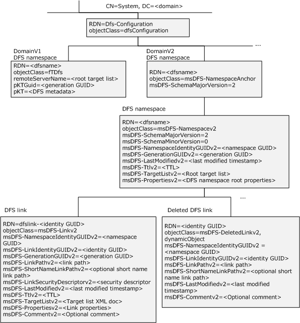
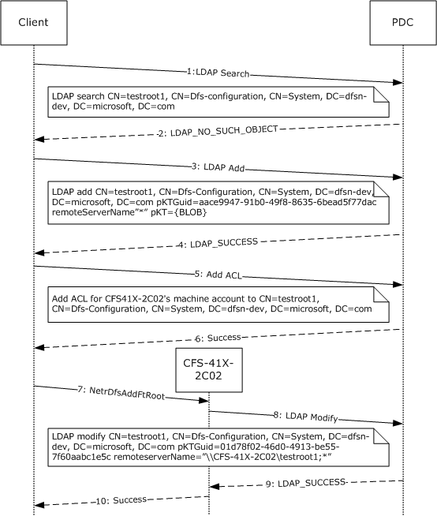
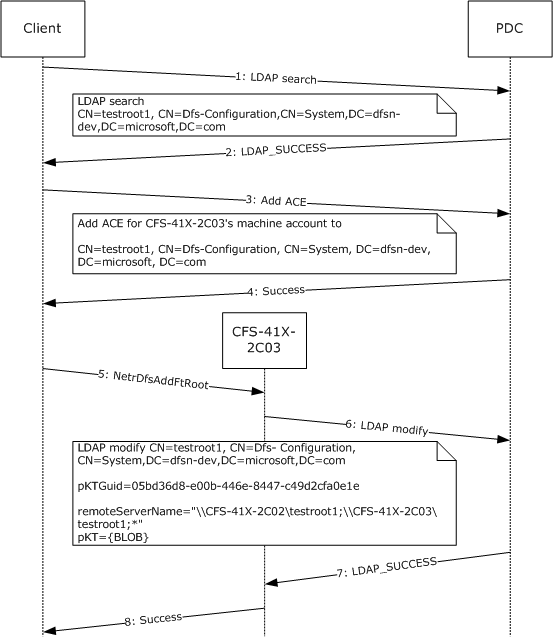
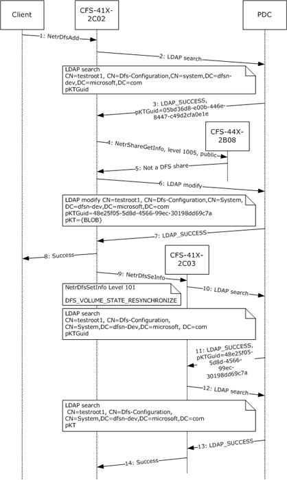
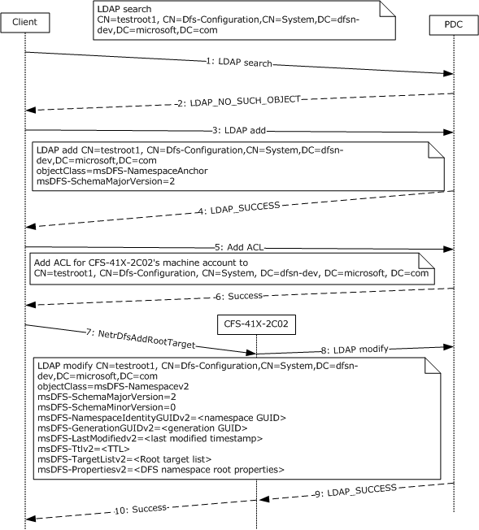
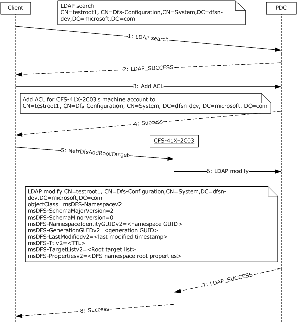
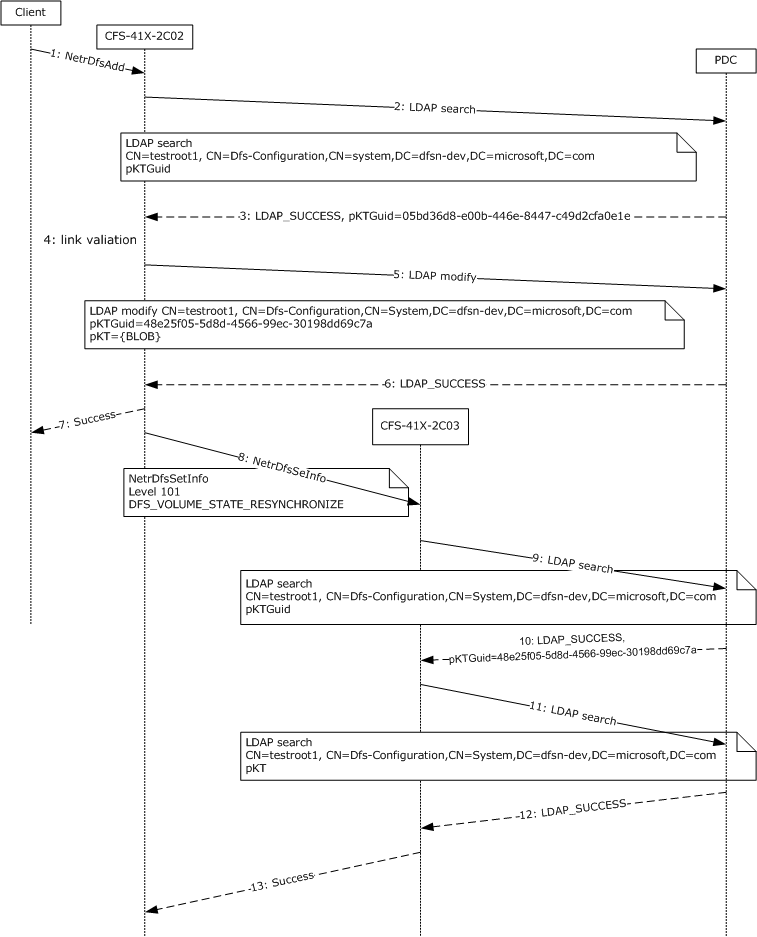
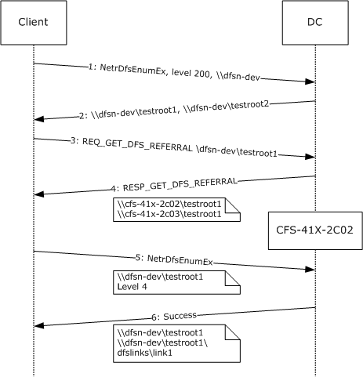
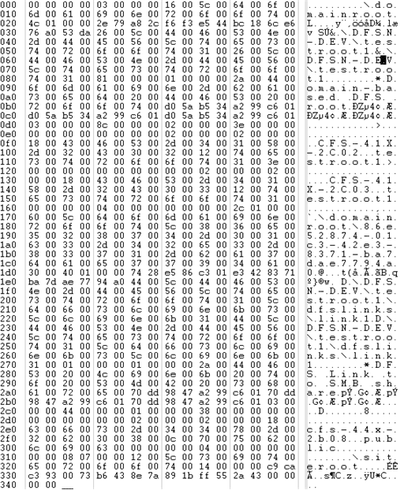

[MS-DFSNM]:

Distributed File System (DFS): Namespace Management
Protocol

Intellectual Property Rights Notice for Open Specifications Documentation

  Technical Documentation. Microsoft publishes Open Specifications documentation (“this

documentation”) for protocols, file formats, data portability, computer languages, and standards
support. Additionally, overview documents cover inter-protocol relationships and interactions.

  Copyrights. This documentation is covered by Microsoft copyrights. Regardless of any other

terms that are contained in the terms of use for the Microsoft website that hosts this
documentation, you can make copies of it in order to develop implementations of the technologies
that are described in this documentation and can distribute portions of it in your implementations
that use these technologies or in your documentation as necessary to properly document the
implementation. You can also distribute in your implementation, with or without modification, any
schemas, IDLs, or code samples that are included in the documentation. This permission also
applies to any documents that are referenced in the Open Specifications documentation.
  No Trade Secrets. Microsoft does not claim any trade secret rights in this documentation.
  Patents. Microsoft has patents that might cover your implementations of the technologies

described in the Open Specifications documentation. Neither this notice nor Microsoft's delivery of
this documentation grants any licenses under those patents or any other Microsoft patents.
However, a given Open Specifications document might be covered by the Microsoft Open
Specifications Promise or the Microsoft Community Promise. If you would prefer a written license,
or if the technologies described in this documentation are not covered by the Open Specifications
Promise or Community Promise, as applicable, patent licenses are available by contacting
iplg@microsoft.com.

  License Programs. To see all of the protocols in scope under a specific license program and the

associated patents, visit the Patent Map.

  Trademarks. The names of companies and products contained in this documentation might be
covered by trademarks or similar intellectual property rights. This notice does not grant any
licenses under those rights. For a list of Microsoft trademarks, visit
www.microsoft.com/trademarks.

  Fictitious Names. The example companies, organizations, products, domain names, email

addresses, logos, people, places, and events that are depicted in this documentation are fictitious.
No association with any real company, organization, product, domain name, email address, logo,
person, place, or event is intended or should be inferred.

Reservation of Rights. All other rights are reserved, and this notice does not grant any rights other
than as specifically described above, whether by implication, estoppel, or otherwise.

Tools. The Open Specifications documentation does not require the use of Microsoft programming
tools or programming environments in order for you to develop an implementation. If you have access
to Microsoft programming tools and environments, you are free to take advantage of them. Certain
Open Specifications documents are intended for use in conjunction with publicly available standards
specifications and network programming art and, as such, assume that the reader either is familiar
with the aforementioned material or has immediate access to it.

Support. For questions and support, please contact dochelp@microsoft.com.

[MS-DFSNM] - v20240423
Distributed File System (DFS): Namespace Management Protocol
Copyright © 2024 Microsoft Corporation
Release: April 23, 2024

1 / 162

Revision Summary

Date

Revision
History

Revision
Class

Comments

7/20/2007

0.1

9/28/2007

0.2

Major

Minor

MCPP Milestone 5 Initial Availability

Clarified the meaning of the technical content.

10/23/2007  0.2.1

Editorial

Changed language and formatting in the technical content.

11/30/2007  0.2.2

Editorial

Changed language and formatting in the technical content.

1/25/2008

1.0

3/14/2008

2.0

5/16/2008

3.0

6/20/2008

4.0

7/25/2008

5.0

8/29/2008

6.0

10/24/2008  7.0

12/5/2008

8.0

1/16/2009

9.0

2/27/2009

10.0

Major

Major

Major

Major

Major

Major

Major

Major

Major

Major

Updated and revised the technical content.

Updated and revised the technical content.

Updated and revised the technical content.

Updated and revised the technical content.

Updated and revised the technical content.

Updated and revised the technical content.

Updated and revised the technical content.

Updated and revised the technical content.

Updated and revised the technical content.

Updated and revised the technical content.

4/10/2009

10.0.1

Editorial

Changed language and formatting in the technical content.

5/22/2009

10.0.2

Editorial

Changed language and formatting in the technical content.

7/2/2009

11.0

8/14/2009

12.0

9/25/2009

13.0

11/6/2009

14.0

12/18/2009  15.0

1/29/2010

16.0

Major

Major

Major

Major

Major

Major

Updated and revised the technical content.

Updated and revised the technical content.

Updated and revised the technical content.

Updated and revised the technical content.

Updated and revised the technical content.

Updated and revised the technical content.

3/12/2010

16.0.1

Editorial

Changed language and formatting in the technical content.

4/23/2010

17.0

6/4/2010

18.0

7/16/2010

19.0

8/27/2010

20.0

10/8/2010

20.0

11/19/2010  21.0

1/7/2011

21.0

Major

Major

Major

Major

None

Major

None

Updated and revised the technical content.

Updated and revised the technical content.

Updated and revised the technical content.

Updated and revised the technical content.

No changes to the meaning, language, or formatting of the
technical content.

Updated and revised the technical content.

No changes to the meaning, language, or formatting of the

[MS-DFSNM] - v20240423
Distributed File System (DFS): Namespace Management Protocol
Copyright © 2024 Microsoft Corporation
Release: April 23, 2024

2 / 162

Date

Revision
History

Revision
Class

Comments

technical content.

2/11/2011

22.0

3/25/2011

22.1

5/6/2011

22.1

Major

Minor

None

Updated and revised the technical content.

Clarified the meaning of the technical content.

No changes to the meaning, language, or formatting of the
technical content.

6/17/2011

22.2

Minor

Clarified the meaning of the technical content.

9/23/2011

22.2

12/16/2011  23.0

3/30/2012

24.0

7/12/2012

25.0

10/25/2012  25.0

None

Major

Major

Major

None

No changes to the meaning, language, or formatting of the
technical content.

Updated and revised the technical content.

Updated and revised the technical content.

Updated and revised the technical content.

No changes to the meaning, language, or formatting of the
technical content.

1/31/2013

25.0

None

No changes to the meaning, language, or formatting of the
technical content.

8/8/2013

26.0

Major

Updated and revised the technical content.

11/14/2013  26.0

None

No changes to the meaning, language, or formatting of the
technical content.

2/13/2014

27.0

Major

Updated and revised the technical content.

5/15/2014

27.0

None

No changes to the meaning, language, or formatting of the
technical content.

6/30/2015

28.0

Major

Significantly changed the technical content.

10/16/2015  28.0

None

No changes to the meaning, language, or formatting of the
technical content.

7/14/2016

28.0

None

No changes to the meaning, language, or formatting of the
technical content.

6/1/2017

28.0

9/15/2017

29.0

9/12/2018

30.0

4/7/2021

31.0

6/25/2021

32.0

4/23/2024

33.0

None

Major

Major

Major

Major

Major

No changes to the meaning, language, or formatting of the
technical content.

Significantly changed the technical content.

Significantly changed the technical content.

Significantly changed the technical content.

Significantly changed the technical content.

Significantly changed the technical content.

[MS-DFSNM] - v20240423
Distributed File System (DFS): Namespace Management Protocol
Copyright © 2024 Microsoft Corporation
Release: April 23, 2024

3 / 162

Table of Contents

1.1
1.2

1.2.1
1.2.2

1  Introduction ............................................................................................................ 8
Glossary ........................................................................................................... 8
References ...................................................................................................... 14
Normative References ................................................................................. 14
Informative References ............................................................................... 15
Overview ........................................................................................................ 15
Relationship to Other Protocols .......................................................................... 18
Prerequisites/Preconditions ............................................................................... 18
Applicability Statement ..................................................................................... 19
Versioning and Capability Negotiation ................................................................. 19
Vendor-Extensible Fields ................................................................................... 19
Standards Assignments ..................................................................................... 19

1.3
1.4
1.5
1.6
1.7
1.8
1.9

2.2.2

2.2.1

2.1
2.2

2.2.1.1
2.2.1.2
2.2.1.3
2.2.1.4
2.2.1.5
2.2.1.6
2.2.1.7
2.2.1.8
2.2.1.9

2  Messages ............................................................................................................... 20
Transport ........................................................................................................ 20
Common Data Types ........................................................................................ 20
Common Conventions ................................................................................. 20
Host Name ........................................................................................... 20
Share Name ......................................................................................... 20
Domain Name ...................................................................................... 20
UNC Path ............................................................................................. 21
DFS Root ............................................................................................. 21
DFS Link .............................................................................................. 21
DFS Root Target ................................................................................... 21
DFS Link Target .................................................................................... 22
DFS Target ........................................................................................... 22
Common Data Types ................................................................................... 22
NET_API_STATUS ................................................................................. 22
2.2.2.1
NETDFS_SERVER_OR_DOMAIN_HANDLE ................................................. 22
2.2.2.2
DFS_INFO_STRUCT ............................................................................... 22
2.2.2.3
DFS_INFO_ENUM_STRUCT ..................................................................... 24
2.2.2.4
DFS_STORAGE_INFO ............................................................................. 25
2.2.2.5
DFS_STORAGE_INFO_1 ......................................................................... 26
2.2.2.6
DFS_TARGET_PRIORITY ........................................................................ 26
2.2.2.7
DFS_TARGET_PRIORITY_CLASS.............................................................. 27
2.2.2.8
DFSM_ROOT_LIST ................................................................................ 28
2.2.2.9
2.2.2.10  DFSM_ROOT_LIST_ENTRY ..................................................................... 28
2.2.2.11  DFS_NAMESPACE_VERSION_ORIGIN....................................................... 28
2.2.2.12  DFS_SUPPORTED_NAMESPACE_VERSION_INFO ....................................... 29
2.2.2.13  DFS Volume State ................................................................................. 29
Get Info Data Types .................................................................................... 30
2.2.3.1
DFS_INFO_1 ........................................................................................ 30
2.2.3.2
DFS_INFO_2 ........................................................................................ 30
2.2.3.3
DFS_INFO_3 ........................................................................................ 31
2.2.3.4
DFS_INFO_4 ........................................................................................ 32
2.2.3.5
DFS_INFO_5 ........................................................................................ 32
2.2.3.6
DFS_INFO_6 ........................................................................................ 33
2.2.3.7
DFS_INFO_7 ........................................................................................ 34
2.2.3.8
DFS_INFO_8 ........................................................................................ 34
DFS_INFO_9 ........................................................................................ 35
2.2.3.9
2.2.3.10  DFS_INFO_50 ....................................................................................... 36
Set Info Data Types .................................................................................... 37
DFS_INFO_101 ..................................................................................... 37
DFS_INFO_102 ..................................................................................... 38
DFS_INFO_103 ..................................................................................... 38

2.2.4.1
2.2.4.2
2.2.4.3

2.2.4

2.2.3

[MS-DFSNM] - v20240423
Distributed File System (DFS): Namespace Management Protocol
Copyright © 2024 Microsoft Corporation
Release: April 23, 2024

4 / 162

2.2.5

2.2.6

2.2.5.1
2.2.5.2
2.2.5.3
2.2.5.4

2.2.4.4
2.2.4.5
2.2.4.6
2.2.4.7

DFS_INFO_104 ..................................................................................... 39
DFS_INFO_105 ..................................................................................... 40
DFS_INFO_106 ..................................................................................... 40
DFS_INFO_107 ..................................................................................... 41
Special Info Data Types ............................................................................... 42
DFS_INFO_100 ..................................................................................... 42
DFS_INFO_150 ..................................................................................... 42
DFS_INFO_200 ..................................................................................... 42
DFS_INFO_300 ..................................................................................... 43
Enum Info Data Types ................................................................................. 43
DFS_INFO_1_CONTAINER ...................................................................... 43
2.2.6.1
DFS_INFO_2_CONTAINER ...................................................................... 43
2.2.6.2
DFS_INFO_3_CONTAINER ...................................................................... 44
2.2.6.3
DFS_INFO_4_CONTAINER ...................................................................... 44
2.2.6.4
DFS_INFO_5_CONTAINER ...................................................................... 44
2.2.6.5
DFS_INFO_6_CONTAINER ...................................................................... 45
2.2.6.6
DFS_INFO_8_CONTAINER ...................................................................... 45
2.2.6.7
DFS_INFO_9_CONTAINER ...................................................................... 45
2.2.6.8
2.2.6.9
DFS_INFO_200_CONTAINER .................................................................. 45
2.2.6.10  DFS_INFO_300_CONTAINER .................................................................. 46
Directory Service Schema Elements ................................................................... 46
DFS Configuration Container ........................................................................ 46
LDAP Entries for Domain-Based DFS Namespaces ........................................... 47
DFS Namespace Object for Domainv1-Based DFS Namespace .......................... 49
pKT Attribute Contents (Metadata for Domainv1-Based Namespace) ........... 49
DFSNamespaceElementBLOB ............................................................ 50
DFSNamespaceRootBLOB or DFSNamespaceLinkBLOB .................... 51
DFSRootOrLinkIDBLOB ............................................................... 52
DFSTargetListBLOB .................................................................... 54
TargetEntryBLOB .................................................................. 55
SiteInformationBLOB .................................................................. 56
SiteEntryBLOB ..................................................................... 57
2.3.3.1.1.4.1.1
SiteNameInfoBLOB ......................................................... 57
Schema for Domainv2-Based DFS Namespace ................................................ 58
LDAP Entry for Domainv2-Based DFS Namespace Anchor ........................... 58
LDAP Entry for Domainv2-Based DFS Namespace ..................................... 58
LDAP Entry for Domainv2-Based DFS Link ................................................ 60
LDAP Entry for Domainv2-Based Deleted Link ........................................... 61

2.3.3.1.1.1
2.3.3.1.1.2
2.3.3.1.1.3

2.3.4.1
2.3.4.2
2.3.4.3
2.3.4.4

2.3.3.1.1.3.1

2.3.3.1.1.4.1

2.3.3.1.1.4

2.3.3.1.1

2.3.3.1

2.3.4

2.3

2.3.1
2.3.2
2.3.3

3.1

3.1.1

3.1.1.1
3.1.1.2
3.1.1.3
3.1.1.4
3.1.1.5

3  Protocol Details ..................................................................................................... 63
Server Details .................................................................................................. 63
Abstract Data Model .................................................................................... 63
Global.................................................................................................. 63
Per Namespace ..................................................................................... 63
Per NamespaceElement ......................................................................... 63
Per TargetsList ..................................................................................... 64
Per Target ............................................................................................ 64
Timers ...................................................................................................... 64
Initialization ............................................................................................... 64
Message Processing Events and Sequencing Rules .......................................... 65
Basic Methods ...................................................................................... 67
NetrDfsManagerInitialize (Opnum 14) ................................................ 67
NetrDfsManagerGetVersion (Opnum 0) .............................................. 68
NetrDfsAdd (Opnum 1) .................................................................... 68
NetrDfsRemove (Opnum 2)............................................................... 71
NetrDfsSetInfo (Opnum 3) ................................................................ 73
NetrDfsGetInfo (Opnum 4) ............................................................... 77
NetrDfsEnum (Opnum 5) .................................................................. 81

3.1.4.1.1
3.1.4.1.2
3.1.4.1.3
3.1.4.1.4
3.1.4.1.5
3.1.4.1.6
3.1.4.1.7

3.1.2
3.1.3
3.1.4

3.1.4.1

[MS-DFSNM] - v20240423
Distributed File System (DFS): Namespace Management Protocol
Copyright © 2024 Microsoft Corporation
Release: April 23, 2024

5 / 162

3.1.4.2

3.1.4.3

3.1.4.4

3.1.4.5

3.1.4.5.1
3.1.4.5.2

3.1.4.4.1
3.1.4.4.2
3.1.4.4.3

3.1.4.3.1
3.1.4.3.2
3.1.4.3.3

3.1.4.2.1
3.1.4.2.2
3.1.4.2.3
3.1.4.2.4

NetrDfsMove (Opnum 6) .................................................................. 83
3.1.4.1.8
3.1.4.1.9
NetrDfsAddRootTarget (Opnum 23) ................................................... 86
3.1.4.1.10  NetrDfsRemoveRootTarget (Opnum 24) ............................................. 89
3.1.4.1.11  NetrDfsGetSupportedNamespaceVersion (Opnum 25) .......................... 90
Extended Methods ................................................................................. 91
NetrDfsAdd2 (Opnum 19) ................................................................. 91
NetrDfsRemove2 (Opnum 20) ........................................................... 94
NetrDfsEnumEx (Opnum 21) ............................................................. 95
NetrDfsSetInfo2 (Opnum 22) ............................................................ 98
Root Target Methods ............................................................................ 101
NetrDfsAddFtRoot (Opnum 10) ......................................................... 101
NetrDfsRemoveFtRoot (Opnum 11) ................................................... 103
NetrDfsFlushFtTable (Opnum 18) ..................................................... 105
Stand-Alone Namespace Methods .......................................................... 105
NetrDfsAddStdRoot (Opnum 12)....................................................... 105
NetrDfsRemoveStdRoot (Opnum 13) ................................................. 107
NetrDfsAddStdRootForced (Opnum 15) ............................................. 107
Domain-Based Namespace Methods ....................................................... 109
NetrDfsGetDcAddress (Opnum 16) ................................................... 109
NetrDfsSetDcAddress (Opnum 17) .................................................... 109
Timer Events ............................................................................................. 111
Other Local Events ..................................................................................... 111
Client Details .................................................................................................. 111
Abstract Data Model ................................................................................... 111
Timers ..................................................................................................... 111
Initialization .............................................................................................. 111
Message Processing Events and Sequencing Rules ......................................... 111
Basic Methods ..................................................................................... 112
NetrDfsAdd (Opnum 1) ................................................................... 112
NetrDfsRemove (Opnum 2).............................................................. 112
NetrDfsSetInfo (Opnum 3) ............................................................... 112
NetrDfsEnum (Opnum 5) and NetrDfsEnumEx (Opnum 21) .................. 112
Extended Methods ................................................................................ 112
NetrDfsAdd2 (Opnum 19) ................................................................ 112
NetrDfsRemove2 (Opnum 20) .......................................................... 112
NetrDfsSetInfo2 (Opnum 22) ........................................................... 112
Root Target Methods ............................................................................ 112
NetrDfsAddFtRoot (Opnum 10) ......................................................... 112
NetrDfsRemoveFtRoot (Opnum 11) ................................................... 113
Timer Events ............................................................................................. 113
Other Local Events ..................................................................................... 113
Domain Controller Details ................................................................................ 113
Abstract Data Model ................................................................................... 114
Timers ..................................................................................................... 114
Initialization .............................................................................................. 114
Message Processing Events and Sequencing Rules ......................................... 114
Basic Methods ..................................................................................... 114
NetrDfsRemoveRootTarget (Opnum 24) ............................................ 114
Extended Methods ................................................................................ 114
NetrDfsEnumEx (Opnum 21) ............................................................ 114
Root Target Methods ............................................................................ 115
NetrDfsRemoveFtRoot (Opnum 11) ................................................... 115
NetrDfsFlushFtTable (Opnum 18) ..................................................... 115
Timer Events ............................................................................................. 115
Other Local Events ..................................................................................... 115

3.2.4.1.1
3.2.4.1.2
3.2.4.1.3
3.2.4.1.4

3.2.4.2.1
3.2.4.2.2
3.2.4.2.3

3.3.4.3.1
3.3.4.3.2

3.2.4.3.1
3.2.4.3.2

3.3.4.1.1

3.3.4.2.1

3.3.4.1

3.3.4.2

3.3.4.3

3.2.4.2

3.2.4.3

3.2.4.1

3.2

3.1.5
3.1.6

3.2.1
3.2.2
3.2.3
3.2.4

3.3

3.2.5
3.2.6

3.3.1
3.3.2
3.3.3
3.3.4

3.3.5
3.3.6

4  Protocol Examples ............................................................................................... 116
Creating a New Domainv1-Based DFS Namespace ............................................... 116

4.1

6 / 162

[MS-DFSNM] - v20240423
Distributed File System (DFS): Namespace Management Protocol
Copyright © 2024 Microsoft Corporation
Release: April 23, 2024

4.2
4.3
4.4
4.5
4.6
4.7
4.8

Adding a Root Target to an Existing Domainv1-Based DFS Namespace .................. 117
Adding a New Link to a Domain-Based DFS Namespace ....................................... 119
Creating a New Domainv2-Based DFS Namespace ............................................... 120
Adding a Root Target to an Existing Domainv2-Based DFS Namespace .................. 122
Adding a New Link to a Domainv2-Based DFS Namespace .................................... 124
Enumerating DFS Links in a Domain-Based DFS Namespace ................................. 125
DFS Metadata of a Domainv1-Based DFS Namespace .......................................... 127

5  Security ............................................................................................................... 133
Security Considerations for Implementers .......................................................... 133
Index of Security Parameters ........................................................................... 133

5.1
5.2

6  Appendix A: Full IDL ............................................................................................ 134

7  Appendix B: Product Behavior ............................................................................. 142

8  Appendix C: XML Schema of XML Document Stored in msDFS-TargetListv2 Attribute
 ............................................................................................................................ 156

9  Change Tracking .................................................................................................. 159

10  Index ................................................................................................................... 160

[MS-DFSNM] - v20240423
Distributed File System (DFS): Namespace Management Protocol
Copyright © 2024 Microsoft Corporation
Release: April 23, 2024

7 / 162

1  Introduction

The Distributed File System (DFS): Namespace Management Protocol provides a remote procedure
call (RPC) interface for administering DFS configurations. The client is an application that issues
method calls on the RPC interface to administer DFS. The server is a DFS service that implements
support for this RPC interface for administering DFS.

Sections 1.5, 1.8, 1.9, 2, and 3 of this specification are normative. All other sections and examples in
this specification are informative.

1.1  Glossary

This document uses the following terms:

8.3 name: A file name string restricted in length to 12 characters that includes a base name of up

to eight characters, one character for a period, and up to three characters for a file name
extension. For more information on 8.3 file names, see [MS-CIFS] section 2.2.1.1.1.

Access Based Directory Enumeration (ABDE) mode: A mode where the server filters directory

entries according to the access permissions of the client. In a DFS scenario, ABDE mode is
enabled on the DFS root target share to prevent a user from seeing another user's home
directory. The DFS namespace administrator can create a DFS link for a user (or user group),
and a user is granted appropriate rights to the DFS link.

access control list (ACL): A list of access control entries (ACEs) that collectively describe the

security rules for authorizing access to some resource; for example, an object or set of objects.

Active Directory: The Windows implementation of a general-purpose directory service, which

uses LDAP as its primary access protocol. Active Directory stores information about a variety of
objects in the network such as user accounts, computer accounts, groups, and all related
credential information used by Kerberos [MS-KILE]. Active Directory is either deployed as
Active Directory Domain Services (AD DS) or Active Directory Lightweight Directory
Services (AD LDS), which are both described in [MS-ADOD]: Active Directory Protocols
Overview.

Active Directory Domain Services (AD DS): A directory service (DS) implemented by a

domain controller (DC). The DS provides a data store for objects that is distributed across
multiple DCs. The DCs interoperate as peers to ensure that a local change to an object
replicates correctly across DCs.  AD DS is a deployment of Active Directory [MS-ADTS].

authentication level: A numeric value indicating the level of authentication or message protection

that remote procedure call (RPC) will apply to a specific message exchange. For more
information, see [C706] section 13.1.2.1 and [MS-RPCE].

binary large object (BLOB): A discrete packet of data that is stored in a database and is treated

as a sequence of uninterpreted bytes.

clustered DFS namespace: A stand-alone DFS namespace that is hosted on a file server

cluster.

Coordinated Universal Time (UTC): A high-precision atomic time standard that approximately
tracks Universal Time (UT). It is the basis for legal, civil time all over the Earth. Time zones
around the world are expressed as positive and negative offsets from UTC. In this role, it is also
referred to as Zulu time (Z) and Greenwich Mean Time (GMT). In these specifications, all
references to UTC refer to the time at UTC-0 (or GMT).

DFS namespace name: The second path component of a DFS path. In the DFS path

\\MyDomain\MyDfs\MyDir, the DFS namespace name is MyDfs.

8 / 162

[MS-DFSNM] - v20240423
Distributed File System (DFS): Namespace Management Protocol
Copyright © 2024 Microsoft Corporation
Release: April 23, 2024

DFS server: A server computer that runs the DFS service required to respond to DFS referral

requests. Also interchangeably used to refer to the DFS service itself.

DFS target: Either a DFS root target server or a DFS link target server.

directory service (DS): A service that stores and organizes information about a computer

network's users and network shares, and that allows network administrators to manage users'
access to the shares. See also Active Directory.

distinguished name (DN): A name that uniquely identifies an object by using the relative

distinguished name (RDN) for the object, and the names of container objects and domains
that contain the object. The distinguished name (DN) identifies the object and its location in a
tree.

Distributed File System (DFS): A file system that logically groups physical shared folders located
on different servers by transparently connecting them to one or more hierarchical namespaces.
DFS also provides fault-tolerance and load-sharing capabilities.

Distributed File System (DFS) client: A computer that is used to access a DFS namespace. It

also can refer to the DFS software on a client that accesses the DFS namespace.

Distributed File System (DFS) client target failback: An optional feature that, when enabled,
permits a DFS client to revert to a more optimal DFS target at an appropriate time after a DFS
client target failover. The term "failback" refers to DFS client target failback. The DFS Referral
Protocol, as specified in [MS-DFSC], describes the mechanisms by which a DFS server provides
a list of DFS targets in decreasing order of optimality to the client.

Distributed File System (DFS) in-site referral mode: A mode in which DFS root or DFS link
referral requests to a DFS server result in DFS referral responses with only those DFS targets
in the same Active Directory Domain Services (AD DS) site as the DFS client requesting
the DFS referral. When this mode is disabled, there is no restriction on the AD DS site of the
targets returned in the referral response. This can be enabled per DFS namespace. If there are
no DFS targets in the same AD DS site as the client, the DFS referral response could be empty.

Distributed File System (DFS) interlink: A special form of DFS link whose link target is a DFS

domain-based namespace.

Distributed File System (DFS) link: A component in a DFS path that lies below the DFS root
and maps to one or more DFS link targets. Also interchangeably used to refer to a DFS path
that contains the DFS link.

Distributed File System (DFS) link target: The mapping destination of a link. A link target can
be any Universal Naming Convention (UNC) path. For example, a link target could be a
share or another Distributed File System (DFS) path.

Distributed File System (DFS) metadata: Information about a Distributed File System (DFS)
namespace such as namespace name, DFS links, DFS link targets, and so on, that is maintained
by a DFS server. For domain-based DFS, the metadata is stored in an Active Directory
Domain Services (AD DS) object corresponding to the DFS namespace. For a stand-alone
DFS namespace, the DFS root target stores the DFS metadata in an implementation-
defined manner; for example, in the registry.

Distributed File System (DFS) namespace: A virtual view of shares on different servers as

provided by DFS. Each file in the namespace has a logical name and a corresponding address
(path). A DFS namespace consists of a root and many links and targets. The namespace starts
with a root that maps to one or more root targets. Below the root are links that map to their
own targets.

Distributed File System (DFS) namespace, domain-based: A DFS namespace that has

configuration information stored in the Active Directory directory service. The DFS namespace

9 / 162

[MS-DFSNM] - v20240423
Distributed File System (DFS): Namespace Management Protocol
Copyright © 2024 Microsoft Corporation
Release: April 23, 2024

can span over a distributed system that is organized hierarchically into logical domains, each
with a domain controller (DC). The path to access the root or a link starts with the host
domain name. A domain-based DFS root can have multiple root targets, which offers fault
tolerance and load sharing at the root level.

Distributed File System (DFS) namespace, standalone: A DFS namespace that has

metadata stored locally on the host server. The path to access the root or a link starts with the
host server name. A stand-alone DFS root has only one root target. Stand-alone roots are not
fault-tolerant; when the root target is unavailable, the entire DFS namespace is inaccessible.
Stand-alone DFS roots can be made fault tolerant by creating them on clustered file servers.

Distributed File System (DFS) path: Any Universal Naming Convention (UNC) path that
starts with a DFS root and is used for accessing a file or directory in a DFS namespace.

Distributed File System (DFS) referral: A DFS client issues a DFS referral request to a DFS
root target or a DC, depending on the DFS path accessed, to resolve a DFS root to a set of
DFS root targets, or a DFS link to a set of DFS link targets. The DFS client uses the referral
request process as needed to finally identify the actual share on a server that has accessed the
leaf component of the DFS path. The request for a DFS referral is referred to as DFS referral
request, and the response for such a request is referred to as DFS referral response.

Distributed File System (DFS) referral site costing: When appropriately enabled for a DFS
namespace, an optional feature that results in a DFS referral response. In the referral
response, targets are grouped into sets based on increasing Active Directory Domain
Services (AD DS) site cost from the DFS client that is requesting the referral to the DFS
target server. When this feature is disabled, the referral response consists of at most two target
sets: one set consisting of all DFS targets in the same AD DS site as the DFS client, and the
other set consisting of DFS targets that are not in the same AD DS site as the DFS client.

Distributed File System (DFS) root: The starting point of the DFS namespace. The root is

often used to refer to the namespace as a whole. A DFS root maps to one or more root targets,
each of which corresponds to a share on a separate server. A DFS root has one of the following
formats "\\<ServerName>\<RootName>" or "\\<DomainName>\<RootName>". Where
<ServerName> is the name of the root target server hosting the DFS namespace;
<DomainName> is the name of the domain that hosts the DFS root; and <RootName> is the
name of the root of a domain-based DFS.  The DFS root has to reside on an NTFS volume.

Distributed File System (DFS) root scalability mode: Domain-based DFS root targets

normally poll the primary domain controller (PDC) to check for any change in the DFS
metadata of a DFS namespace. When the DFS server on a DFS root target supports this
mode, and it is enabled for a DFS namespace, the DFS server instead polls a domain
controller (DC) closer to it in terms of Active Directory Domain Services (AD DS) site cost.

Distributed File System (DFS) root target: A server that hosts a DFS root of a DFS

namespace. A domain-based DFS namespace can have multiple DFS root targets; a
standalone DFS namespace can have only one DFS root target.

Distributed File System (DFS) server: A server computer running the DFS service that
responds to DFS referral requests, as specified in [MS-DFSC], as well as to the DFS:
Namespace Management Protocol. Also used interchangeably to refer to the DFS service itself.

domain: A set of users and computers sharing a common namespace and management

infrastructure. At least one computer member of the set has to act as a domain controller
(DC) and host a member list that identifies all members of the domain, as well as optionally
hosting the Active Directory service. The domain controller provides authentication of
members, creating a unit of trust for its members. Each domain has an identifier that is shared
among its members. For more information, see [MS-AUTHSOD] section 1.1.1.5 and [MS-ADTS].

domain controller (DC): The service, running on a server, that implements Active Directory, or
the server hosting this service. The service hosts the data store for objects and interoperates

10 / 162

[MS-DFSNM] - v20240423
Distributed File System (DFS): Namespace Management Protocol
Copyright © 2024 Microsoft Corporation
Release: April 23, 2024

with other DCs to ensure that a local change to an object replicates correctly across all DCs.
When Active Directory is operating as Active Directory Domain Services (AD DS), the DC
contains full NC replicas of the configuration naming context (config NC), schema naming
context (schema NC), and one of the domain NCs in its forest. If the AD DS DC is a global
catalog server (GC server), it contains partial NC replicas of the remaining domain NCs in its
forest. For more information, see [MS-AUTHSOD] section 1.1.1.5.2 and [MS-ADTS]. When
Active Directory is operating as Active Directory Lightweight Directory Services (AD LDS),
several AD LDS DCs can run on one server. When Active Directory is operating as AD DS,
only one AD DS DC can run on one server. However, several AD LDS DCs can coexist with one
AD DS DC on one server. The AD LDS DC contains full NC replicas of the config NC and the
schema NC in its forest. The domain controller is the server side of Authentication Protocol
Domain Support [MS-APDS].

domain-based DFS namespace: A DFS namespace that has configuration information stored in

domain services. The DFS namespace can span a distributed system that is organized
hierarchically into logical domains. The path to access a domain-based DFS namespace starts
with the host domain name. A domain-based DFS namespace can have multiple DFS root
targets, which offers high availability and load sharing at the DFS root level.

domainv1-based DFS namespace: A type of domain-based DFS namespace that has its DFS

metadata stored in directory services as an ftDfs type object.

domainv2-based DFS namespace: A type of domain-based DFS namespace that has its DFS
metadata stored in the form of individual LDAP entries, with one LDAP entry per DFS link.
Each LDAP entry contains the DFS metadata (such as targets, properties, and other
information) that corresponds to that entity.

dynamic object: An object with a time-to-die (attribute msDS-Entry-Time-To-Die). The directory
service garbage-collects a dynamic object immediately after its time-to-die has passed. The
constructed attribute entryTTL gives a dynamic object's current time-to-live, that is, the
difference between the current time and msDS-Entry-Time-To-Die. For more information, see
[RFC2589].

endpoint: A network-specific address of a remote procedure call (RPC) server process for remote

procedure calls. The actual name and type of the endpoint depends on the RPC protocol
sequence that is being used. For example, for RPC over TCP (RPC Protocol Sequence
ncacn_ip_tcp), an endpoint might be TCP port 1025. For RPC over Server Message Block (RPC
Protocol Sequence ncacn_np), an endpoint might be the name of a named pipe. For more
information, see [C706].

file system: A system that enables applications to store and retrieve files on storage devices. Files
are placed in a hierarchical structure. The file system specifies naming conventions for files and
the format for specifying the path to a file in the tree structure. Each file system consists of one
or more drivers and DLLs that define the data formats and features of the file system. File
systems can exist on the following storage devices: diskettes, hard disks, jukeboxes, removable
optical disks, and tape backup units.

forest: One or more domains that share a common schema and trust each other transitively. An
organization can have multiple forests. A forest establishes the security and administrative
boundary for all the objects that reside within the domains that belong to the forest. In
contrast, a domain establishes the administrative boundary for managing objects, such as
users, groups, and computers. In addition, each domain has individual security policies and
trust relationships with other domains.

globally unique identifier (GUID): A term used interchangeably with universally unique

identifier (UUID) in Microsoft protocol technical documents (TDs). Interchanging the usage of
these terms does not imply or require a specific algorithm or mechanism to generate the value.
Specifically, the use of this term does not imply or require that the algorithms described in

[MS-DFSNM] - v20240423
Distributed File System (DFS): Namespace Management Protocol
Copyright © 2024 Microsoft Corporation
Release: April 23, 2024

11 / 162

[RFC4122] or [C706] have to be used for generating the GUID. See also universally unique
identifier (UUID).

host name: The name of a host on a network that is used for identification and access purposes

by humans and other computers on the network.

Interface Definition Language (IDL): The International Standards Organization (ISO) standard

language for specifying the interface for remote procedure calls. For more information, see
[C706] section 4.

Lightweight Directory Access Protocol (LDAP): The primary access protocol for Active

Directory. Lightweight Directory Access Protocol (LDAP) is an industry-standard protocol,
established by the Internet Engineering Task Force (IETF), which allows users to query and
update information in a directory service (DS), as described in [MS-ADTS]. The Lightweight
Directory Access Protocol can be either version 2 [RFC1777] or version 3 [RFC3377].

little-endian: Multiple-byte values that are byte-ordered with the least significant byte stored in

the memory location with the lowest address.

member server: A server that is joined to a domain and is not acting as an Active Directory

domain controller (DC).  Member servers typically function as file servers, application servers,
and so on and defer user authentication to the domain controller.

Microsoft Interface Definition Language (MIDL): The Microsoft implementation and extension
of the OSF-DCE Interface Definition Language (IDL). MIDL can also mean the Interface
Definition Language (IDL) compiler provided by Microsoft. For more information, see [MS-
RPCE].

NetBIOS host name: The NetBIOS name of a host (as described in [RFC1001] section 14 and

[RFC1002] section 4), with the extensions described in [MS-NBTE].

object: A set of attributes, each with its associated values. Two attributes of an object have special
significance: an identifying attribute and a parent-identifying attribute. An identifying attribute is
a designated single-valued attribute that appears on every object; the value of this attribute
identifies the object. For the set of objects in a replica, the values of the identifying attribute are
distinct. A parent-identifying attribute is a designated single-valued attribute that appears on
every object; the value of this attribute identifies the object's parent. That is, this attribute
contains the value of the parent's identifying attribute, or a reserved value identifying no object.
For the set of objects in a replica, the values of this parent-identifying attribute define a tree
with objects as vertices and child-parent references as directed edges with the child as an
edge's tail and the parent as an edge's head. Note that an object is a value, not a variable; a
replica is a variable. The process of adding, modifying, or deleting an object in a replica replaces
the entire value of the replica with a new value. As the word replica suggests, it is often the
case that two replicas contain "the same objects". In this usage, objects in two replicas are
considered the same if they have the same value of the identifying attribute and if there is a
process in place (replication) to converge the values of the remaining attributes. When the
members of a set of replicas are considered to be the same, it is common to say "an object" as
shorthand referring to the set of corresponding objects in the replicas.

object store: A system that provides the ability to create, query, modify, or apply policy to a local
resource on behalf of a remote client. The object store is backed by a file system, a named pipe,
or a print job that is accessed as a file.

opnum: An operation number or numeric identifier that is used to identify a specific remote

procedure call (RPC) method or a method in an interface. For more information, see [C706]
section 12.5.2.12 or [MS-RPCE].

primary domain controller (PDC): A domain controller (DC) designated to track changes

made to the accounts of all computers on a domain. It is the only computer to receive these

12 / 162

[MS-DFSNM] - v20240423
Distributed File System (DFS): Namespace Management Protocol
Copyright © 2024 Microsoft Corporation
Release: April 23, 2024

changes directly, and is specialized so as to ensure consistency and to eliminate the potential for
conflicting entries in the Active Directory database. A domain has only one PDC.

relative distinguished name (RDN): An attribute-value pair used in the distinguished name of

an object. For more information, see [RFC2251].

remote procedure call (RPC): A communication protocol used primarily between client and

server. The term has three definitions that are often used interchangeably: a runtime
environment providing for communication facilities between computers (the RPC runtime); a set
of request-and-response message exchanges between computers (the RPC exchange); and the
single message from an RPC exchange (the RPC message).  For more information, see [C706].

reparse point: An attribute that can be added to a file to store a collection of user-defined data
that is opaque to NTFS or ReFS. If a file that has a reparse point is opened, the open will
normally fail with STATUS_REPARSE, so that the relevant file system filter driver can detect the
open of a file associated with (owned by) this reparse point. At that point, each installed filter
driver can check to see if it is the owner of the reparse point, and, if so, perform any special
processing required for a file with that reparse point. The format of this data is understood by
the application that stores the data and the file system filter that interprets the data and
processes the file. For example, an encryption filter that is marked as the owner of a file's
reparse point could look up the encryption key for that file. A file can have (at most) 1 reparse
point associated with it. For more information, see [MS-FSCC].

RPC transport: The underlying network services used by the remote procedure call (RPC) runtime

for communications between network nodes. For more information, see [C706] section 2.

Server Message Block (SMB): A protocol that is used to request file and print services from
server systems over a network. The SMB protocol extends the CIFS protocol with additional
security, file, and disk management support. For more information, see [CIFS] and [MS-SMB].

share: A resource offered by a Common Internet File System (CIFS) server for access by CIFS
clients over the network. A share typically represents a directory tree and its included files
(referred to commonly as a "disk share" or "file share") or a printer (a "print share"). If the
information about the share is saved in persistent store (for example, Windows registry) and
reloaded when a file server is restarted, then the share is referred to as a "sticky share". Some
share names are reserved for specific functions and are referred to as special shares: IPC$,
reserved for interprocess communication, ADMIN$, reserved for remote administration, and A$,
B$, C$ (and other local disk names followed by a dollar sign), assigned to local disk devices.

share name: The name of a share.

site: A collection of one or more well-connected (reliable and fast) TCP/IP subnets. By defining

sites (represented by site objects) an administrator can optimize both Active Directory access
and Active Directory replication with respect to the physical network. When users log in, Active
Directory clients find domain controllers (DCs) that are in the same site as the user, or near
the same site if there is no DC in the site. See also Knowledge Consistency Checker (KCC). For
more information, see [MS-ADTS].

site cost: An administrator-defined numerical value meant to indicate the bandwidth or actual

monetary cost of transmitting data between two sites. Only a comparison between two site cost
values is meaningful, with a lower site preferred to a higher site cost.

stand-alone DFS namespace: A DFS namespace that has DFS metadata stored locally on the
host server. The path to access the DFS root or a DFS link starts with the DFS root target
host name. A stand-alone DFS namespace has only one DFS root target. Stand-alone DFS
roots are not fault-tolerant; when the DFS root target is unavailable, the entire DFS
namespace is inaccessible. Stand-alone DFS roots can be made fault-tolerant by being
created on clustered file servers.

[MS-DFSNM] - v20240423
Distributed File System (DFS): Namespace Management Protocol
Copyright © 2024 Microsoft Corporation
Release: April 23, 2024

13 / 162

system access control list (SACL): An access control list (ACL) that controls the generation

of audit messages for attempts to access a securable object. The ability to get or set an object's
SACL is controlled by a privilege typically held only by system administrators.

Unicode: A character encoding standard developed by the Unicode Consortium that represents

almost all of the written languages of the world. The Unicode standard [UNICODE5.0.0/2007]
provides three forms (UTF-8, UTF-16, and UTF-32) and seven schemes (UTF-8, UTF-16, UTF-16
BE, UTF-16 LE, UTF-32, UTF-32 LE, and UTF-32 BE).

Universal Naming Convention (UNC): A string format that specifies the location of a resource.

For more information, see [MS-DTYP] section 2.2.57.

universally unique identifier (UUID): A 128-bit value. UUIDs can be used for multiple

purposes, from tagging objects with an extremely short lifetime, to reliably identifying very
persistent objects in cross-process communication such as client and server interfaces, manager
entry-point vectors, and RPC objects. UUIDs are highly likely to be unique. UUIDs are also
known as globally unique identifiers (GUIDs) and these terms are used interchangeably in
the Microsoft protocol technical documents (TDs). Interchanging the usage of these terms does
not imply or require a specific algorithm or mechanism to generate the UUID. Specifically, the
use of this term does not imply or require that the algorithms described in [RFC4122] or [C706]
has to be used for generating the UUID.

well-known endpoint: A preassigned, network-specific, stable address for a particular

client/server instance. For more information, see [C706].

MAY, SHOULD, MUST, SHOULD NOT, MUST NOT: These terms (in all caps) are used as defined
in [RFC2119]. All statements of optional behavior use either MAY, SHOULD, or SHOULD NOT.

1.2  References

Links to a document in the Microsoft Open Specifications library point to the correct section in the
most recently published version of the referenced document. However, because individual documents
in the library are not updated at the same time, the section numbers in the documents may not
match. You can confirm the correct section numbering by checking the Errata.

1.2.1  Normative References

We conduct frequent surveys of the normative references to assure their continued availability. If you
have any issue with finding a normative reference, please contact dochelp@microsoft.com. We will
assist you in finding the relevant information.

[C706] The Open Group, "DCE 1.1: Remote Procedure Call", C706, August 1997,
https://publications.opengroup.org/c706

Note Registration is required to download the document.

[MS-ADA2] Microsoft Corporation, "Active Directory Schema Attributes M".

[MS-ADA3] Microsoft Corporation, "Active Directory Schema Attributes N-Z".

[MS-ADSC] Microsoft Corporation, "Active Directory Schema Classes".

[MS-ADTS] Microsoft Corporation, "Active Directory Technical Specification".

[MS-DFSC] Microsoft Corporation, "Distributed File System (DFS): Referral Protocol".

[MS-DTYP] Microsoft Corporation, "Windows Data Types".

[MS-ERREF] Microsoft Corporation, "Windows Error Codes".

[MS-DFSNM] - v20240423
Distributed File System (DFS): Namespace Management Protocol
Copyright © 2024 Microsoft Corporation
Release: April 23, 2024

14 / 162

[MS-RPCE] Microsoft Corporation, "Remote Procedure Call Protocol Extensions".

[MS-SMB2] Microsoft Corporation, "Server Message Block (SMB) Protocol Versions 2 and 3".

[MS-SMB] Microsoft Corporation, "Server Message Block (SMB) Protocol".

[MS-SRVS] Microsoft Corporation, "Server Service Remote Protocol".

[RFC2119] Bradner, S., "Key words for use in RFCs to Indicate Requirement Levels", BCP 14, RFC
2119, March 1997, https://www.rfc-editor.org/info/rfc2119

[RFC2251] Wahl, M., Howes, T., and Kille, S., "Lightweight Directory Access Protocol (v3)", RFC 2251,
December 1997, https://www.rfc-editor.org/info/rfc2251

[RFC4122] Leach, P., Mealling, M., and Salz, R., "A Universally Unique Identifier (UUID) URN
Namespace", RFC 4122, July 2005, https://www.rfc-editor.org/info/rfc4122

[UNICODE] The Unicode Consortium, "The Unicode Consortium Home Page", http://www.unicode.org/

[X680] ITU-T, "Abstract Syntax Notation One (ASN.1): Specification of Basic Notation",
Recommendation X.680, July 2002, http://www.itu.int/rec/T-REC-X.680/en

[XMLSCHEMA] World Wide Web Consortium, "XML Schema", September 2005,
http://www.w3.org/2001/XMLSchema

[XML] World Wide Web Consortium, "Extensible Markup Language (XML) 1.0 (Fourth Edition)", W3C
Recommendation 16 August 2006, edited in place 29 September 2006,
http://www.w3.org/TR/2006/REC-xml-20060816/

1.2.2  Informative References

[MSDFS] Microsoft Corporation, "How DFS Works", March 2003, http://technet.microsoft.com/en-
us/library/cc782417%28WS.10%29.aspx

[RFC1034] Mockapetris, P., "Domain Names - Concepts and Facilities", STD 13, RFC 1034, November
1987, https://www.rfc-edit.org/info/rfc1034

[RFC2165] Veizades, J., Guttman, E., Perkins, C., and Kaplan, S., "Service Location Protocol", RFC
2165, June 1997, http://www.ietf.org/rfc/rfc2165.txt

[RFC2518] Goland, Y., Whitehead, E., Faizi, A., et al., "HTTP Extensions for Distributed Authoring -
WebDAV", RFC 2518, February 1999, http://www.ietf.org/rfc/rfc2518.txt

[RFC3530] Shepler, S., et al., "Network File System (NFS) version 4 Protocol", RFC 3530, April 2003,
http://www.ietf.org/rfc/rfc3530.txt

1.3  Overview

The DFS: Namespace Management Protocol is one of a collection of protocols that group shares that
are located on different servers by combining various storage media into a single logical namespace.
The DFS namespace is a virtual view of the share. When a user views the namespace, the
directories and files in it appear to reside on a single share. Users can navigate the namespace without
needing to know the server names or shares hosting the data. DFS also provides redundancy of
namespace service.

Access to a DFS namespace requires the DFS client. The DFS client uses the DFS Referral Protocol,
as specified in [MS-DFSC], to ascertain the existence of the DFS namespace and to determine the
shares to access on servers that participate in the DFS namespace. The DFS Referral Protocol

15 / 162

[MS-DFSNM] - v20240423
Distributed File System (DFS): Namespace Management Protocol
Copyright © 2024 Microsoft Corporation
Release: April 23, 2024

navigates through the DFS namespace by appropriately issuing referral requests to a domain
controller (DC) or to a DFS root target server to resolve the original path to a share on a server
that contains the data being accessed. For more information on DFS and the DFS client, see [MSDFS].
For more information on how the DFS Referral Protocol operates within the context of the Server
Message Block (SMB) Protocol, as specified in [MS-SMB], which is the transport for DFS referrals,
see [MS-DFSC] section 2.

DFS namespace information, such as name, DFS link name, DFS link target, and so on, is stored in
the DFS metadata of the namespace. Depending on where the DFS metadata is stored, the DFS
namespace is "domain-based" or "stand-alone".

  Domain-Based DFS Namespace: A well-known container in the domain directory, known as the
DFS configuration container, holds the DFS metadata for a domain-based DFS namespace. An
object exists for each domain-based DFS namespace in the DFS configuration container. DFS
metadata of a domain-based DFS namespace is stored as a binary large object (BLOB) in an
attribute of the DFS namespace object. A domain-based DFS namespace can have multiple DFS
root targets, which offer high availability and load sharing at the DFS root level. The DFS root
name of a domain-based DFS namespace has the domain as its first component. A DFS client
issues a referral request to a DC in order to identify the DFS root targets of the DFS namespace.

  Stand-Alone DFS Namespace: DFS metadata is stored in an implementation-specific format on

the DFS root target server itself. A stand-alone DFS namespace supports only one DFS root target.
The DFS root name of a stand-alone DFS namespace has a host name as its first component. A
DFS client issues referral requests to the DFS root target server to access the DFS namespace. A
stand-alone DFS namespace can be clustered to provide high availability of the DFS
namespace.<1> The server hosting a stand-alone DFS namespace can be promoted to a Domain
Controller, but the namespace cannot be converted to a domain-based namespace, and it will
continue as a stand-alone namespace.

A server cannot host both domain-based and stand-alone namespace roots with the same name.

The DFS: Namespace Management Protocol is used to configure DFS services. This protocol is used
primarily by administrative applications that run on client computers to connect and configure
Distributed File System (DFS) servers. It consists of the RPC methods that can be issued from an
administrative client computer to the protocol server on a DC or a Distributed File System (DFS) root
target server. An administrator can use this protocol to perform various Distributed File System (DFS)
namespace administration operations, such as creating or deleting a DFS namespace, adding or
removing DFS root targets, adding or removing DFS links, and adding or removing targets to an
existing link. The DFS: Namespace Management Protocol includes the following:











Eleven basic methods for configuring stand-alone DFS namespaces and domain-based DFS
namespaces, as specified in section 3.1.4.1.

Four methods that support extended access to configurations of a DFS namespace, as specified in
section 3.1.4.2.

Three methods for configuring root targets in a domainv1-based DFS namespace, as specified
in section 3.1.4.3.

Three methods for configuring a stand-alone DFS namespace, as specified in section 3.1.4.4.

Two methods relating to the association between a DFS server and the DC used by a domain-
based DFS namespace, as specified in section 3.1.4.5.

Much of the configuration information that is communicated through this protocol is marshaled
through two unions: DFS_INFO_STRUCT and DFS_INFO_ENUM_STRUCT. The usage model of these
unions is for the client to specify a Level parameter to determine which union case to use. Each level
corresponds to a specific DFS_INFO_n structure, where n is the level number. Arrays of DFS_INFO_n
structures are marshaled using DFS_INFO_n_CONTAINER structures. Levels 1, 2, 3, 4, 5, 6, 8, and 9
are common, and are shared across both the DFS_INFO_STRUCT and DFS_INFO_ENUM_STRUCT

16 / 162

[MS-DFSNM] - v20240423
Distributed File System (DFS): Namespace Management Protocol
Copyright © 2024 Microsoft Corporation
Release: April 23, 2024

unions. Levels 7, 50, 100, 101, 102, 103, 104, 105, 106, 107, and 150 are unique to the
DFS_INFO_STRUCT union, and Levels 200 and 300 are unique to the DFS_INFO_ENUM_STRUCT
union.

While a number of methods use the common configuration information structures, not all methods
support all levels. The following table lists the levels used in the DFS_INFO_STRUCT and
DFS_INFO_ENUM_STRUCT unions, their singleton and array structures, and the methods with which
the level can be used.

Level   Structure

Array
structure

NetrDfs
GetInfo

NetrDfs
Enum

NetrDfs
SetInfo

NetrDfs
SetInfo2

NetrDfs
EnumEx

X

X

X

X

X

X

X

X

1

2

3

4

5

6

7

8

9

DFS_INFO_1

DFS_INFO_1_

X

CONTAINER

DFS_INFO_2

DFS_INFO_2_

X

CONTAINER

DFS_INFO_3

DFS_INFO_3_

X

CONTAINER

DFS_INFO_4

DFS_INFO_4_

X

CONTAINER

DFS_INFO_5

DFS_INFO_5_

X

CONTAINER

DFS_INFO_6

DFS_INFO_6_

X

CONTAINER

DFS_INFO_7

N/A

DFS_INFO_8

DFS_INFO_8_

CONTAINER

X

X

DFS_INFO_9

DFS_INFO_9_

X

CONTAINER

X

X

50

DFS_INFO_50

N/A

100

DFS_INFO_100  N/A

101

DFS_INFO_101  N/A

102

DFS_INFO_102  N/A

103

DFS_INFO_103  N/A

104

DFS_INFO_104  N/A

105

DFS_INFO_105  N/A

106

DFS_INFO_106  N/A

107

DFS_INFO_107  N/A

150

DFS_INFO_150  N/A

X

200

DFS_INFO_200  DFS_INFO_200_

CONTAINER

X

X

X

X

X

X

X

X

X

X

X

X

X

X

X

X

X

X

X

X

X

X

X

X

X

X

X

[MS-DFSNM] - v20240423
Distributed File System (DFS): Namespace Management Protocol
Copyright © 2024 Microsoft Corporation
Release: April 23, 2024

17 / 162

Level   Structure

Array
structure

NetrDfs
GetInfo

NetrDfs
Enum

NetrDfs
SetInfo

NetrDfs
SetInfo2

NetrDfs
EnumEx

300

DFS_INFO_300  DFS_INFO_300_

X

X

CONTAINER

1.4  Relationship to Other Protocols

The DFS: Namespace Management Protocol is used to configure and administer DFS namespaces. It
depends on RPC for its transport.

The DFS: Namespace Management Protocol is the recommended method of performing DFS
namespace operations. This protocol is used in many operations (for example, creating a new DFS
namespace or adding or removing DFS links or DFS link targets). All of these operations require
updating the DFS metadata of a DFS namespace.

The DFS Referral Protocol, as specified in [MS-DFSC], accesses the DFS metadata of a DFS
namespace for providing DFS referral responses. The DFS clients issue DFS referral requests to verify
the existence of a DFS namespace and to identify the targets of a DFS path, as specified in [MS-
DFSC]. The DFS Referral Protocol permits DFS clients to navigate the DFS namespace and to locate
the share on a server that contains the required data. The DFS Referral Protocol is implemented as a
set of SMB Protocol extensions to commands, such as TRANS2_GET_DFS_REFERRAL to request DFS
referrals from DCs, as specified in [MS-SMB].

After a DFS path is resolved to a DFS target by using the DFS Referral Protocol, a client accesses
resources on the server identified by the DFS target by using a resource access protocol, such as the
following:

  SMB, as specified in [MS-SMB].

  SMB2, as specified in [MS-SMB2].

  Network File System (NFS), as specified in [RFC3530].

  Network Control Protocol (NCP), as specified in [NOVELL].

  Web Distributed Authoring and Versioning (WebDAV), as specified in [RFC2518].

A resource access protocol implementation uses name resolution protocols, such as DNS (as specified
in [RFC1034]) or SLP (as specified in [RFC2165]), to resolve DFS target host names.

The DFS metadata of a domain-based DFS namespace is stored in Directory Services. A DFS
server uses the Lightweight Directory Access Protocol (LDAP), as specified in [RFC2251], to
access the DFS metadata from the DS for use with both the DFS: Namespace Management Protocol
and the DFS Referral Protocol.

1.5  Prerequisites/Preconditions

The DFS: Namespace Management Protocol is an RPC interface and, as a result, has prerequisites
common to RPC interfaces. These prerequisites are specified in [MS-RPCE].

Before a client invokes this protocol, it obtains the name of a server that supports DFS services and
RPC.

To avoid conflicts between updates to DFS metadata:

  At most, one client can modify the metadata for a given DFS namespace at a time.

18 / 162

[MS-DFSNM] - v20240423
Distributed File System (DFS): Namespace Management Protocol
Copyright © 2024 Microsoft Corporation
Release: April 23, 2024

  A domain-based DFS server performs all DFS metadata updates to the primary domain
controller (PDC) independently of the DFS root scalability mode setting of the DFS
namespace.<2>

1.6  Applicability Statement

The DFS: Namespace Management Protocol is appropriate for managing a domain-based DFS
namespace or a stand-alone DFS namespace.

1.7  Versioning and Capability Negotiation

This document covers versioning issues in the following areas:

  Supported transports: The DFS: Namespace Management Protocol uses RPC over SMB1.x or

SMB2 as its only supported transport. For more information on transport specifications, see
section 2.1.



Protocol versions: The RPC interface for this protocol has a single version number of 3.0. This
protocol can be extended without altering the version number by adding RPC methods to the
interface, with opnums positioned numerically beyond those defined in this specification. A client
determines whether such methods are supported by attempting to invoke the method; if the
method is not supported, the RPC server returns an "opnum out of range" error. RPC versioning
and capacity negotiation in this situation is specified in [C706] and [MS-RPCE].<3>

  Security and authentication methods: As specified in [MS-RPCE].

  Capability negotiation: None.

1.8  Vendor-Extensible Fields

None.

1.9  Standards Assignments

No standards assignments have been received for the RPC interface UUID or for the well-known pipe
name described in this document. All values used in these extensions are in private ranges, as
specified in [MS-RPCE] and [MS-SMB].

[MS-DFSNM] - v20240423
Distributed File System (DFS): Namespace Management Protocol
Copyright © 2024 Microsoft Corporation
Release: April 23, 2024

19 / 162

2  Messages

2.1  Transport

The DFS root target MUST reside on a server that is accessible through SMB (as specified in [MS-
SMB]) or SMB2 (as specified in [MS-SMB2]). A link target can reside on a server that is accessible
through any resource access protocol for which appropriate client-side software exists.

The DFS: Namespace Management Protocol uses RPC over SMB, as specified in [MS-RPCE].

This protocol uses a well-known endpoint, \\PIPE\NETDFS, for RPC over SMB. The RPC interface
uses transport-level authentication, as specified in [MS-RPCE]. DFS is not directly involved in
authentication; however, the DFS service MUST verify whether the user has administrator privileges to
the namespace. The authenticated RPC interface allows RPC to negotiate the use of authentication and
the authentication level on behalf of the client and server, as specified in [MS-RPCE] section
3.3.1.5.2. The server MUST find the security context indicated by the auth_context_id in the
sec_trailer of the request, and it MUST ask the security provider that created the security context to
retrieve the client identity.

This protocol MUST use the universally unique identifier (UUID) 4FC742E0-4A10-11CF-8273-
00AA004AE673. The RPC version number is 3.0.

This protocol allows any user to establish a connection to a DFS server. It uses the underlying RPC
protocol to retrieve the identity of the caller that made the request, as specified in [MS-RPCE] section
3.3.3.4.3. The RPC server SHOULD use this identity to verify method-specific access.

2.2  Common Data Types

2.2.1  Common Conventions

Unless otherwise specified, all strings in this protocol are null-terminated strings of UTF-16, as
specified in [UNICODE] characters. Backslashes (\) in string descriptions are literal characters.

Constructs of the form "<value>" in strings are placeholders to be replaced with client-specified or
server-specified values. For example, the string description "\\<servername>\<share>" would take
the form "\\myserver\myshare" when populated with the values "myserver" for the <servername>
placeholder and "myshare" for the <share> placeholder.

A number of string formats are common to many of the data types and methods in this protocol. To
avoid repetition, this section describes the specific formats.

2.2.1.1  Host Name

A host name represents the host name of a server or the domain name of a domain hosting resource
as specified in [MS-DTYP] section 2.2.57.

2.2.1.2  Share Name

Unless specified otherwise, a share name is a null-terminated Unicode character string whose
format depends on the actual file server protocol used to access the share as specified in [MS-DTYP]
section 2.2.57.

[MS-DFSNM] - v20240423
Distributed File System (DFS): Namespace Management Protocol
Copyright © 2024 Microsoft Corporation
Release: April 23, 2024

20 / 162

2.2.1.3  Domain Name

Unless specified otherwise, a domain name is a null-terminated Unicode character string consisting of
the name of a Directory Service domain. For more details, see [MS-DTYP] section 2.2.57.

2.2.1.4  UNC Path

A Universal Naming Convention (UNC) path, as specified in [MS-DTYP] section 2.2.57, can be used to
access network resources.

2.2.1.5  DFS Root

A DFS root has one of the following UNC path formats.

 \\<ServerName>\<DFSName>
 \\<DomainName>\<DFSName>

where:

  <ServerName> is the host name (as specified in section 2.2.1.1) of a DFS root target (as

specified in section 2.2.1.7) of the DFS namespace.

  <DomainName> is the domain name (as specified in section 2.2.1.3) of the domain hosting the

domain-based DFS namespace.

  <DFSName> is the DFS namespace name. A stand-alone DFS namespace can be referred to
only by the first format. A domain-based DFS namespace can be referred to in either format, with
the second format preferred.

2.2.1.6  DFS Link

A DFS link has one of the following UNC path formats.

 \\<ServerName>\<DFSName>\<LinkPath>
 \\<DomainName>\<DFSName>\<LinkPath>

where:

  <ServerName> is the host name of a DFS root target of the DFS namespace.

  <DomainName> is the domain name of the domain hosting the domain-based DFS namespace.

  <DFSName> is the DFS namespace name.

  <LinkPath> is the path of the DFS link relative to the DFS root target share. A stand-alone DFS

namespace can be referred to only by the first format. A domain-based DFS namespace can be
referred to in either format, with the second format preferred.

2.2.1.7  DFS Root Target

A DFS root target is a UNC path with the following format.

\\<servername>\<sharename>

[MS-DFSNM] - v20240423
Distributed File System (DFS): Namespace Management Protocol
Copyright © 2024 Microsoft Corporation
Release: April 23, 2024

21 / 162

where:

  <servername> is the host name of a DFS root target server.

  <sharename> is the share name corresponding to a DFS namespace on the DFS root target

server.

2.2.1.8  DFS Link Target

A DFS link target is any UNC path that resolves to a directory.

2.2.1.9  DFS Target

A DFS target is either a DFS root target or a DFS link target.

2.2.2  Common Data Types

In addition to RPC base types and definitions, as specified in [C706] and [MS-RPCE], the following
sections use the definitions of DWORD, GUID, and WCHAR, as specified in [MS-DTYP] DWORD section
2.2.9, GUID section 2.3.4.2, and WCHAR section 2.2.60. Any remaining data types in this section are
defined in the Interface Definition Language (IDL) specification for this RPC interface.

This protocol MUST enable the ms_union extension as specified in [MS-RPCE], section 2.2.4.

2.2.2.1  NET_API_STATUS

The NET_API_STATUS type is an unsigned, 32-bit integer value representing the return code from an
RPC method.

This type is declared as follows:

 typedef DWORD NET_API_STATUS;

This protocol uses Microsoft Win32 error codes. The values are taken from the Windows error number
space, as specified in [MS-ERREF]. Vendors SHOULD reuse those values with their indicated meanings.
Choosing any other value creates the risk of collisions in the future.

2.2.2.2  NETDFS_SERVER_OR_DOMAIN_HANDLE

The NETDFS_SERVER_OR_DOMAIN_HANDLE is a pointer to a Unicode string representing a host
name for an RPC method.

This type is declared as follows:

 typedef WCHAR* NETDFS_SERVER_OR_DOMAIN_HANDLE;

2.2.2.3  DFS_INFO_STRUCT

The DFS_INFO_STRUCT union relates to the NetrDfsGetInfo, NetrDfsSetInfo, and NetrDfsSetInfo2
methods when used to retrieve or set the configuration of the DFS server. The usage model of this
union is for the client to specify a Level parameter to determine which case of the DFS_INFO_STRUCT
to use.

The DFS_INFO_STRUCT union has the following format.

22 / 162

[MS-DFSNM] - v20240423
Distributed File System (DFS): Namespace Management Protocol
Copyright © 2024 Microsoft Corporation
Release: April 23, 2024

 typedef
 [switch_type(unsigned long)]
 union _DFS_INFO_STRUCT {
   [case(1)]
     DFS_INFO_1* DfsInfo1;
   [case(2)]
     DFS_INFO_2* DfsInfo2;
   [case(3)]
     DFS_INFO_3* DfsInfo3;
   [case(4)]
     DFS_INFO_4* DfsInfo4;
   [case(5)]
     DFS_INFO_5* DfsInfo5;
   [case(6)]
     DFS_INFO_6* DfsInfo6;
   [case(7)]
     DFS_INFO_7* DfsInfo7;
   [case(8)]
     DFS_INFO_8* DfsInfo8;
   [case(9)]
     DFS_INFO_9* DfsInfo9;
   [case(50)]
     DFS_INFO_50* DfsInfo50;
   [case(100)]
     DFS_INFO_100* DfsInfo100;
   [case(101)]
     DFS_INFO_101* DfsInfo101;
   [case(102)]
     DFS_INFO_102* DfsInfo102;
   [case(103)]
     DFS_INFO_103* DfsInfo103;
   [case(104)]
     DFS_INFO_104* DfsInfo104;
   [case(105)]
     DFS_INFO_105* DfsInfo105;
   [case(106)]
     DFS_INFO_106* DfsInfo106;
   [case(107)]
     DFS_INFO_107* DfsInfo107;
   [case(150)]
     DFS_INFO_150* DfsInfo150;
   [default]     ;
 } DFS_INFO_STRUCT;

DfsInfo1:  The DFS_INFO_1 structure contains the name of a DFS root or DFS link. For more

information on the specifications, see section 2.2.3.1.

DfsInfo2:  The DFS_INFO_2 structure contains information for a DFS root or DFS link. For more

information on specifications, see section 2.2.3.2.

DfsInfo3:  The DFS_INFO_3 structure contains information for a DFS root or DFS link. For more

information on specifications, see section 2.2.3.3.

DfsInfo4:  The DFS_INFO_4 structure contains information for a DFS root or DFS link. For more

information on specifications, see section 2.2.3.4.

DfsInfo5:  The DFS_INFO_5 structure contains information for a DFS root or DFS link. For more

information on specifications, see section 2.2.3.5.

DfsInfo6:  The DFS_INFO_6 structure contains information for a DFS root or DFS link. For more

information on specifications, see section 2.2.3.6.

DfsInfo7:  The DFS_INFO_7 structure contains information about a DFS root or DFS link. For more

information on specifications, see section 2.2.3.7.

[MS-DFSNM] - v20240423
Distributed File System (DFS): Namespace Management Protocol
Copyright © 2024 Microsoft Corporation
Release: April 23, 2024

23 / 162

DfsInfo8:  The DFS_INFO_8 structure contains information about a DFS root or DFS link. For more

information on specifications, see section 2.2.3.8.

DfsInfo9:  The DFS_INFO_9 structure contains information about a DFS root or DFS link. For more

information on specifications, see section 2.2.3.9.

DfsInfo50:  The DFS_INFO_50 structure contains information about a DFS root or DFS link. For more

information on specifications, see section 2.2.3.10.

DfsInfo100:  The DFS_INFO_100 structure contains a comment associated with a DFS root or DFS

link. For more information on specifications, see section 2.2.5.1.

DfsInfo101:  The DFS_INFO_101 structure describes the storage state on a DFS root, DFS link, DFS
root target, or DFS link target. For more information on specifications, see section 2.2.4.1.

DfsInfo102:  The DFS_INFO_102 structure contains a time-out value for a DFS root or DFS link. For

more information on specifications, see section 2.2.4.2.

DfsInfo103:  The DFS_INFO_103 structure contains properties that set specific behaviors for a DFS

root or DFS link. For more information on specifications, see section 2.2.4.3.

DfsInfo104:  The DFS_INFO_104 structure contains the priority of a DFS root target or DFS link

target. For more information on specifications, see section 2.2.4.4.

DfsInfo105:  The DFS_INFO_105 structure contains information about a DFS root or DFS link,

including comment, state, time-out, and DFS behaviors that property flags specify. For more
information on specifications, see section 2.2.4.5.

DfsInfo106:  The DFS_INFO_106 structure contains the storage state and priority for a DFS root

target or DFS link target. For more information on specifications, see section 2.2.4.6.

DfsInfo107:  The DFS_INFO_107 structure contains the storage state and priority for a DFS root

target or DFS link target. For more information on specifications, see section 2.2.4.7.

DfsInfo150:  The DFS_INFO_150 structure contains the self-relative security descriptor associated

with the DFS link. For more information on specifications, see section 2.2.5.2.

2.2.2.4  DFS_INFO_ENUM_STRUCT

The DFS_INFO_ENUM_STRUCT union relates to the NetrDfsEnum and NetrDfsEnumEx methods when
used to enumerate the configuration of the DFS server.

The DFS_INFO_ENUM_STRUCT union structure has the following format.

 typedef struct _DFS_INFO_ENUM_STRUCT {
   DWORD Level;
   [switch_is(Level)] union {
     [case(1)]
       DFS_INFO_1_CONTAINER* DfsInfo1Container;
     [case(2)]
       DFS_INFO_2_CONTAINER* DfsInfo2Container;
     [case(3)]
       DFS_INFO_3_CONTAINER* DfsInfo3Container;
     [case(4)]
       DFS_INFO_4_CONTAINER* DfsInfo4Container;
     [case(5)]
       DFS_INFO_5_CONTAINER* DfsInfo5Container;
     [case(6)]
       DFS_INFO_6_CONTAINER* DfsInfo6Container;
     [case(8)]
       DFS_INFO_8_CONTAINER* DfsInfo8Container;
     [case(9)]

[MS-DFSNM] - v20240423
Distributed File System (DFS): Namespace Management Protocol
Copyright © 2024 Microsoft Corporation
Release: April 23, 2024

24 / 162

       DFS_INFO_9_CONTAINER* DfsInfo9Container;
     [case(200)]
       DFS_INFO_200_CONTAINER* DfsInfo200Container;
     [case(300)]
       DFS_INFO_300_CONTAINER* DfsInfo300Container;
   } DfsInfoContainer;
 } DFS_INFO_ENUM_STRUCT;

Level:  Specifies the case of the DfsInfoContainer union.

DfsInfoContainer:  Union of the possible enumeration containers.

DfsInfo1Container:  The DFS_INFO_1_CONTAINER structure contains an array of the names of DFS

roots or DFS links. For more information, see section 2.2.6.1.

DfsInfo2Container:  The DFS_INFO_2_CONTAINER structure contains an array of information for

DFS roots or DFS links. For more information, see section 2.2.6.2.

DfsInfo3Container:  The DFS_INFO_3_CONTAINER structure contains an array of information for

DFS roots or DFS links. For more information, see section 2.2.6.3.

DfsInfo4Container:  The DFS_INFO_4_CONTAINER structure contains an array of information for

DFS roots or DFS links. For more information, see section 2.2.6.4.

DfsInfo5Container:  The DFS_INFO_5_CONTAINER structure contains an array of information for

DFS roots or DFS links. For more information, see section 2.2.6.5.

DfsInfo6Container:  The DFS_INFO_6_CONTAINER structure contains an array of information for

DFS roots or DFS links. For more information, see section 2.2.6.6.

DfsInfo8Container:  The DFS_INFO_8_CONTAINER structure contains an array of information for

DFS roots or DFS links. For more information, see section 2.2.6.7.

DfsInfo9Container:  The DFS_INFO_9_CONTAINER structure contains an array of information for

DFS roots or DFS links. For more information, see section 2.2.6.8.

DfsInfo200Container:  The DFS_INFO_200_CONTAINER structure contains an array of the names of
domain-based DFS namespaces in a domain-based DFS. For more information, see section
2.2.6.9.

DfsInfo300Container:  The DFS_INFO_300_CONTAINER structure contains an array of the DFS

roots hosted on a server. For more information, see section 2.2.6.10.

2.2.2.5  DFS_STORAGE_INFO

The DFS_STORAGE_INFO structure relates to the NetrDfsEnum, NetrDfsEnumEx, and NetrDfsGetInfo
methods when used to enumerate DFS links and DFS targets in a namespace or to get information
about a DFS link. The structure contains information about the target of a DFS root or DFS link.

The DFS_STORAGE_INFO structure has the following format.

 typedef struct _DFS_STORAGE_INFO {
   unsigned long State;
   [string] WCHAR* ServerName;
   [string] WCHAR* ShareName;
 } DFS_STORAGE_INFO;

State:  Refers to the State field of DFS_INFO_106. For more information, see section 2.2.4.6.

[MS-DFSNM] - v20240423
Distributed File System (DFS): Namespace Management Protocol
Copyright © 2024 Microsoft Corporation
Release: April 23, 2024

25 / 162

ServerName:  The pointer to a null-terminated Unicode string containing the DFS target host

name.

ShareName:  The pointer to a null-terminated Unicode string containing the DFS target share name.

DFS_INFO_3 and DFS_INFO_4 structures contain one or more DFS_STORAGE_INFO structures, one
for each DFS target.

2.2.2.6  DFS_STORAGE_INFO_1

The DFS_STORAGE_INFO_1 structure relates to the NetrDfsEnum, NetrDfsEnumEx, and
NetrDfsGetInfo methods when used to enumerate DFS links and targets in a namespace or to get
information about a DFS link. The structure contains data about a DFS target, including the host
name and share name, as well as the target state and priority. For more information on
prioritization, see section 2.2.2.7.

The DFS_STORAGE_INFO_1 structure has the following format.

 typedef struct _DFS_STORAGE_INFO_1 {
   unsigned long State;
   [string] WCHAR* ServerName;
   [string] WCHAR* ShareName;
   DFS_TARGET_PRIORITY TargetPriority;
 } DFS_STORAGE_INFO_1,
  *PDFS_STORAGE_INFO_1,
  *LPDFS_STORAGE_INFO_1;

State:  Refers to the State field of DFS_INFO_106. For more information, see section 2.2.4.6.

ServerName:  A pointer to a null-terminated Unicode string containing the DFS target host name.

ShareName:  A pointer to a null-terminated Unicode string containing the DFS target share name.

TargetPriority:  A DFS_TARGET_PRIORITY structure containing the priority class and priority rank.

2.2.2.7  DFS_TARGET_PRIORITY

The DFS_TARGET_PRIORITY structure relates to the NetrDfsSetInfo and NetrDfsSetInfo2 methods
when used to set the priority of a DFS target in referrals from a server. It also relates to the
DFS_STORAGE_INFO_1 structure that the NetrDfsEnum, NetrDfsEnumEx, and NetrDfsGetInfo
methods return. The structure defines the priority of a DFS target. The DFS targets can be prioritized
independently of site cost. The DFS target priority is manually assigned to link targets and root
targets and allows for load balancing of clients.

The DFS_TARGET_PRIORITY structure has the following format.

 typedef struct _DFS_TARGET_PRIORITY {
   DFS_TARGET_PRIORITY_CLASS TargetPriorityClass;
   unsigned short TargetPriorityRank;
   unsigned short Reserved;
 } DFS_TARGET_PRIORITY;

TargetPriorityClass:  The DFS_TARGET_PRIORITY_CLASS enumeration value that specifies the

priority class of the target. For more information, see section 2.2.2.8.

TargetPriorityRank:  The priority rank of the target, ranging in value from 0x0000 to 0x001F, where
0x0000 is the highest rank. Priority ranks apply only within a priority class, not across priority
classes.

26 / 162

[MS-DFSNM] - v20240423
Distributed File System (DFS): Namespace Management Protocol
Copyright © 2024 Microsoft Corporation
Release: April 23, 2024

Reserved:  MUST be set to 0 by the sender and ignored by the receiver.

2.2.2.8  DFS_TARGET_PRIORITY_CLASS

The DFS_TARGET_PRIORITY_CLASS enumeration relates to the NetrDfsSetInfo and NetrDfsSetInfo2
methods when used to set the priority of DFS targets in referrals from a server. For more information
on prioritization, see section 2.2.2.7. The enumeration defines five possible DFS target priority class
settings.

 typedef [v1_enum] enum _DFS_TARGET_PRIORITY_CLASS
 {
   DfsInvalidPriorityClass = -1,
   DfsSiteCostNormalPriorityClass = 0,
   DfsGlobalHighPriorityClass = 1,
   DfsSiteCostHighPriorityClass = 2,
   DfsSiteCostLowPriorityClass = 3,
   DfsGlobalLowPriorityClass = 4
 } DFS_TARGET_PRIORITY_CLASS;

DfsInvalidPriorityClass:  This is not a valid priority class.

DfsSiteCostNormalPriorityClass:  The default or "normal" site cost priority class for a DFS target.

DfsGlobalHighPriorityClass:  The highest priority class for a DFS target. Targets assigned to this

class receive global preference.

DfsSiteCostHighPriorityClass:  The highest site cost priority class for a DFS target. Targets

assigned to this class receive the highest preference among targets of the same site cost for a
given DFS client.

DfsSiteCostLowPriorityClass:  The lowest site cost priority class for a DFS target. Targets assigned
to this class receive the least preference among targets of the same site cost for a given DFS
client.

DfsGlobalLowPriorityClass:  The lowest priority class level for a DFS target. Targets assigned to this

class receive the least preference globally.

The underlying data type of this enumeration is long integer.

The order of priority classes, from highest to lowest, is as follows:

  DfsGlobalHighPriorityClass

  DfsSiteCostHighPriorityClass

  DfsSiteCostNormalPriorityClass

  DfsSiteCostLowPriorityClass

  DfsGlobalLowPriorityClass

Server targets are initially grouped into global high-priority, normal-priority, and global low-priority
classes. The normal-priority class is then subdivided, based on site cost, into site cost high-priority,
site cost normal-priority, and site-cost low-priority classes.

For example, all server targets with a site cost value of 0 are grouped into site cost high-priority,
normal-priority, and low-priority classes. Then, all server targets with higher site costs are likewise
separated into site cost high-priority, normal-priority, and low-priority classes. Thus, a server target
with a site cost value of 0 and a site cost low-priority class is still ranked higher than a server target
with a site cost value of 1 and a site cost high-priority class.

27 / 162

[MS-DFSNM] - v20240423
Distributed File System (DFS): Namespace Management Protocol
Copyright © 2024 Microsoft Corporation
Release: April 23, 2024

Be aware that the value for a "normal-priority class" is set to 0 even though it is lower in priority than
DfsGlobalHighPriorityClass and DfsSiteCostHighPriorityClass. This is the default priority class setting.
For added granularity, priority rank can be used to discriminate within a priority class.

2.2.2.9  DFSM_ROOT_LIST

The DFSM_ROOT_LIST structure relates to the NetrDfsAdd2, NetrDfsAddFtRoot, and NetrDfsSetInfo2
methods when used to add a DFS link or a DFS root target, or to modify the configuration of a
domain-based DFS namespace. The structure contains an array of DFSM_ROOT_LIST_ENTRY
structures, each of which contains information about a DFS root target.

The DFSM_ROOT_LIST structure has the following format.

 typedef struct _DFSM_ROOT_LIST {
   DWORD cEntries;
   [size_is(cEntries)] DFSM_ROOT_LIST_ENTRY Entry[];
 } DFSM_ROOT_LIST;

cEntries:  The number of DFS targets. The value of this member indicates the size of the array in

the Entry member.

Entry:  An array of DFSM_ROOT_LIST_ENTRY structures. Each structure provides information about

one DFS target. For more information, see section 2.2.2.10.

2.2.2.10

DFSM_ROOT_LIST_ENTRY

The DFSM_ROOT_LIST_ENTRY structure relates to the NetrDfsAdd2, NetrDfsAddFtRoot, and
NetrDfsSetInfo2 methods when used to add a DFS link or a DFS root target, or to modify the
configuration of a domain-based DFS namespace. The structure contains information about a DFS
root target.

The DFSM_ROOT_LIST_ENTRY structure has the following format.

 typedef struct _DFSM_ROOT_LIST_ENTRY {
   [string, unique] WCHAR* ServerShare;
 } DFSM_ROOT_LIST_ENTRY;

ServerShare:  Specifies a DFS root target.

2.2.2.11

DFS_NAMESPACE_VERSION_ORIGIN

The DFS_NAMESPACE_VERSION_ORIGIN is an enumeration that relates to the
NetrDfsGetSupportedNamespaceVersion method when used to determine the supported DFS
metadata version number.

The DFS_NAMESPACE_VERSION_ORIGIN enumeration has the following format.

 typedef  enum
 {
   DFS_NAMESPACE_VERSION_ORIGIN_COMBINED = 0,
   DFS_NAMESPACE_VERSION_ORIGIN_SERVER,
   DFS_NAMESPACE_VERSION_ORIGIN_DOMAIN
 } DFS_NAMESPACE_VERSION_ORIGIN;

DFS_NAMESPACE_VERSION_ORIGIN_COMBINED:  This value is not used in communication.

[MS-DFSNM] - v20240423
Distributed File System (DFS): Namespace Management Protocol
Copyright © 2024 Microsoft Corporation
Release: April 23, 2024

28 / 162

DFS_NAMESPACE_VERSION_ORIGIN_SERVER:  The maximum version that a server can support.

DFS_NAMESPACE_VERSION_ORIGIN_DOMAIN:  The maximum version that the domain can

support.

2.2.2.12

DFS_SUPPORTED_NAMESPACE_VERSION_INFO

The DFS_SUPPORTED_NAMESPACE_VERSION_INFO structure relates to the
NetrDfsGetSupportedNamespaceVersion method when used to determine the domain-based or
standalone-based DFS major and minor version information.

The DFS_SUPPORTED_NAMESPACE_VERSION_INFO structure has the following format.

 typedef struct _DFS_SUPPORTED_NAMESPACE_VERSION_INFO {
   unsigned long DomainDfsMajorVersion;
   unsigned long DomainDfsMinorVersion;
   ULONGLONG DomainDfsCapabilities;
   unsigned long StandaloneDfsMajorVersion;
   unsigned long StandaloneDfsMinorVersion;
   ULONGLONG StandaloneDfsCapabilities;
 } DFS_SUPPORTED_NAMESPACE_VERSION_INFO,
  *PDFS_SUPPORTED_NAMESPACE_VERSION_INFO;

DomainDfsMajorVersion:  A value containing the major version number of the DFS metadata

format supported by a domain-based DFS namespace.

DomainDfsMinorVersion:  A value containing the minor version number of the DFS metadata format

supported by a domain-based DFS namespace.

DomainDfsCapabilities:  A value containing the capability information of a domain-based DFS

namespace.

StandaloneDfsMajorVersion:  A value containing the major version number of a stand-alone DFS

namespace.

StandaloneDfsMinorVersion:  A value containing the minor version number of a stand-alone DFS

namespace.

StandaloneDfsCapabilities:  A value containing the capability information of a stand-alone DFS

namespace.

DomainDfsCapabilities and StandaloneDfsCapabilities are bit fields with the following defined

value.

Value

Meaning

DFS_NAMESPACE_CAPABILITY_ABDE

0x0000000000000001

This specifies support for Access Based Directory Enumeration
(ABDE) mode.<4>

When this structure is used for communication, all undefined bit fields MUST be set to zero. A client
SHOULD ignore all bit fields it does not understand.

2.2.2.13

DFS Volume State

The following table lists the valid states for a DFS root or a DFS link, and it relates to the State field of
the DFS_INFO_2, DFS_INFO_4, DFS_INFO_5, DFS_INFO_6, and DFS_INFO_8 structures. The
bitmask DFS_VOLUME_STATES (0x0000000F) MUST be used to extract the state of a DFS root or a
DFS link from the State field.

29 / 162

[MS-DFSNM] - v20240423
Distributed File System (DFS): Namespace Management Protocol
Copyright © 2024 Microsoft Corporation
Release: April 23, 2024

Value

Meaning

DFS_VOLUME_STATE_OK

0x00000001

The DFS root or DFS link is initialized to this state. In this state the DFS root
or link is available for referral request.

RESERVED

0x00000002

This state is persisted to the DFS metadata.

This value is reserved and MUST NOT be used.

DFS_VOLUME_STATE_OFFLINE

0x00000003

The DFS link is offline, and none of the DFS targets will be included in referral
response. This flag is valid only for a DFS link and cannot be set on a DFS
root.

This state is persisted to the DFS metadata.

DFS_VOLUME_STATE_ONLINE

0x00000004

The DFS link is online and available for referral request. This flag is valid only
for a DFS link and cannot be set on a DFS root.

This state is persisted to the DFS metadata.

2.2.3  Get Info Data Types

The structures in this section relate to the NetrDfsGetInfo, NetrDfsEnum, and NetrDfsEnumEx
methods when used to retrieve information about the DFS server configuration. The usage model of
these structures is for the client to specify a Level parameter to indicate which case of the
DFS_INFO_STRUCT to use.

2.2.3.1  DFS_INFO_1

The DFS_INFO_1 structure contains the name of a DFS root or DFS link.

The DFS_INFO_1 structure has the following format.

 typedef struct _DFS_INFO_1 {
   [string] WCHAR* EntryPath;
 } DFS_INFO_1;

EntryPath:  The pointer to a DFS root or a DFS link path.

2.2.3.2  DFS_INFO_2

The DFS_INFO_2 structure contains information for a DFS root or DFS link.

The DFS_INFO_2 structure has the following format.

 typedef struct _DFS_INFO_2 {
   [string] WCHAR* EntryPath;
   [string] WCHAR* Comment;
   DWORD State;
   DWORD NumberOfStorages;
 } DFS_INFO_2;

EntryPath:  A pointer to a DFS root or a DFS link path.

Comment:  A pointer to a null-terminated Unicode string containing a comment that is used for
informational purposes and is associated with the DFS root or DFS link. This string has no

30 / 162

[MS-DFSNM] - v20240423
Distributed File System (DFS): Namespace Management Protocol
Copyright © 2024 Microsoft Corporation
Release: April 23, 2024

protocol-specified restrictions on length or content. The comment is meant for human
consumption and does not affect server functionality.

State:   This field has the state of the DFS root or DFS link. For a DFS root, this field also specifies

whether the DFS namespace is stand-alone or domain-based.

The DFS_VOLUME_STATES bitmask (0x0000000F) MUST be used to extract the following DFS root
or DFS link state from this field. For more information about some of these states, see section
2.2.2.13.

Value

Meaning

DFS_VOLUME_STATE_OK

The specified DFS root or DFS link is in the normal state.

0x00000001

RESERVED

0x00000002

This value is reserved and MUST NOT be used.

DFS_VOLUME_STATE_OFFLINE

0x00000003

The DFS link is offline, and none of the DFS targets will be included in the
referral response. This flag is valid only for a DFS link and cannot be set on
a DFS root.

This state is persisted to the DFS metadata.

DFS_VOLUME_STATE_ONLINE

0x00000004

The DFS link is online and available for referral request. This flag is valid
only for a DFS link and cannot be set on a DFS root.

This state is persisted to the DFS metadata.

The DFS_VOLUME_FLAVORS bitmask (0x00000300) MUST be used to extract the following DFS
namespace flavor from this field.

Value

Meaning

DFS_VOLUME_FLAVOR_STANDALONE

Stand-alone DFS namespace.

0x00000100

DFS_VOLUME_FLAVOR_AD_BLOB

domainv1-based or domainv2-based DFS namespace.

0x00000200

NumberOfStorages:  Number of DFS targets for the root or link.

2.2.3.3  DFS_INFO_3

The DFS_INFO_3 structure contains information for a DFS root or a DFS link.

The DFS_INFO_3 structure has the following format.

 typedef struct _DFS_INFO_3 {
   [string] WCHAR* EntryPath;
   [string] WCHAR* Comment;
   DWORD State;
   DWORD NumberOfStorages;
   [size_is(NumberOfStorages)] DFS_STORAGE_INFO* Storage;
 } DFS_INFO_3;

EntryPath:  Pointer to a DFS root or DFS link path.

Comment:  A pointer to a null-terminated Unicode string containing a comment associated with the
DFS root or DFS link that is for informational purposes. This string has no protocol-specified

31 / 162

[MS-DFSNM] - v20240423
Distributed File System (DFS): Namespace Management Protocol
Copyright © 2024 Microsoft Corporation
Release: April 23, 2024

restrictions on length or content. The comment is meant for human consumption and does not
affect server functionality.

State:  Refers to the State field of DFS_INFO_2. For more information, see section 2.2.3.2.

NumberOfStorages:  The number of DFS targets for this root or link.

Storage:  A pointer to an array of DFS_STORAGE_INFO structures containing information about each
target. (For more information, see section 2.2.2.5). The NumberOfStorages member specifies the
number of structures within this storage array.

2.2.3.4  DFS_INFO_4

The DFS_INFO_4 structure contains information for a DFS root or a DFS link.

The DFS_INFO_4 structure has the following format.

 typedef struct _DFS_INFO_4 {
   [string] WCHAR* EntryPath;
   [string] WCHAR* Comment;
   DWORD State;
   unsigned long Timeout;
   GUID Guid;
   DWORD NumberOfStorages;
   [size_is(NumberOfStorages)] DFS_STORAGE_INFO* Storage;
 } DFS_INFO_4;

EntryPath:  A pointer to a DFS root or a DFS link path.

Comment:  A pointer to a null-terminated Unicode string containing a comment associated with the
DFS root or DFS link that is for informational purposes. This string has no protocol-specified
restrictions on length or content. The comment is meant for human consumption and does not
affect server functionality.

State:  Refers to the State field of DFS_INFO_2. For more information, see section 2.2.3.2.

Timeout:  The time-out, in seconds, associated with the root or link and used in a DFS referral

response to a DFS client.

Guid:  The GUID of this root or link.

NumberOfStorages:  The number of DFS targets for this root or link. There are no protocol-

specified restrictions on the number of targets for a root or link.

Storage:  A pointer to an array of DFS_STORAGE_INFO structures containing information about each
target. (For more information, see section 2.2.2.5). The NumberOfStorages member specifies the
number of structures within this storage array.

2.2.3.5  DFS_INFO_5

The DFS_INFO_5 structure contains information for a DFS root or a DFS link.

The DFS_INFO_5 structure has the following format.

 typedef struct _DFS_INFO_5 {
   [string] WCHAR* EntryPath;
   [string] WCHAR* Comment;
   DWORD State;
   unsigned long Timeout;
   GUID Guid;

[MS-DFSNM] - v20240423
Distributed File System (DFS): Namespace Management Protocol
Copyright © 2024 Microsoft Corporation
Release: April 23, 2024

32 / 162

   unsigned long PropertyFlags;
   unsigned long MetadataSize;
   DWORD NumberOfStorages;
 } DFS_INFO_5;

EntryPath:   A pointer to a DFS root or a DFS link path.

Comment:   A pointer to a null-terminated Unicode string containing a comment associated with the

DFS root or DFS link that is for informational purposes. This string has no protocol-specified
restrictions on length or content. The comment is meant for human consumption and does not
affect server functionality.

State:  Refers to the State field of DFS_INFO_2. For more information, see section 2.2.3.2.

Timeout:   The time-out, in seconds, associated with the root or link and used in a DFS referral

response to a DFS client.

Guid:  The GUID of this root or link.

PropertyFlags:   A bit field in which each bit is responsible for a specific property applicable to the

entire DFS namespace, the DFS root, or an individual DFS link, depending on the actual
property. Any combination of bits is allowed, unless indicated otherwise. The following are valid bit
definitions for this field.

Value

Meaning

DFS_PROPERTY_FLAG_INSITE_REFERRALS

0x00000001

When set, indicates that DFS in-site referral mode is
enabled.

DFS_PROPERTY_FLAG_ROOT_SCALABILITY

0x00000002

When set, indicates DFS root scalability mode is enabled.
This flag is valid only for the DFS root of a domain-based DFS
namespace.

DFS_PROPERTY_FLAG_SITE_COSTING

0x00000004

When set, indicates DFS referral site costing is enabled. This
flag is valid only for a DFS root.

DFS_PROPERTY_FLAG_TARGET_FAILBACK

When set, indicates DFS client target failback is enabled.

0x00000008

DFS_PROPERTY_FLAG_CLUSTER_ENABLED

When set, indicates clustered DFS namespace is enabled.

0x00000010

DFS_PROPERTY_FLAG_ABDE

0x00000020

When set, enables Access Based Directory Enumeration
(ABDE) mode on a domainv2-based DFS namespace or a
stand-alone DFS namespace.<5>This flag is not supported
on domainv1-based namespaces.

MetadataSize:  The size, in bytes, of the DFS metadata of the DFS namespace. For a DFS link, this

MUST be 0.

NumberOfStorages:  The number of DFS targets for this root or link.

2.2.3.6  DFS_INFO_6

The DFS_INFO_6 structure contains information for a DFS root or a DFS link.

The DFS_INFO_6 structure has the following format.

[MS-DFSNM] - v20240423
Distributed File System (DFS): Namespace Management Protocol
Copyright © 2024 Microsoft Corporation
Release: April 23, 2024

33 / 162

 typedef struct _DFS_INFO_6 {
   [string] WCHAR* EntryPath;
   [string] WCHAR* Comment;
   DWORD State;
   unsigned long Timeout;
   GUID Guid;
   unsigned long PropertyFlags;
   unsigned long MetadataSize;
   DWORD NumberOfStorages;
   [size_is(NumberOfStorages)] DFS_STORAGE_INFO_1* Storage;
 } DFS_INFO_6;

EntryPath:   A pointer to a DFS root or a DFS link path.

Comment:   A pointer to a null-terminated Unicode string containing a comment associated with the

DFS root or DFS link that is for informational purposes. This string has no protocol-specified
restrictions on length or content. The comment is meant for human consumption and does not
affect server functionality.

State:  Refers to the State field of DFS_INFO_2. For more information, see section 2.2.3.2.

Timeout:   The time-out, in seconds, associated with the root or link and used in a DFS referral

response to a DFS client.

Guid:   The GUID of this root or link.

PropertyFlags:   Refers to the PropertyFlags field of DFS_INFO_5. For more information, see section

2.2.3.5.

MetadataSize:  The size of the DFS metadata of the DFS namespace. This MUST be 0 for a DFS

link.

NumberOfStorages:   The number of DFS targets for this root or link. The protocol imposes no

restrictions on the number of roots or links.

Storage:  A pointer to an array of DFS_STORAGE_INFO_1 structures containing information about
each target. The NumberOfStorages member specifies the number of structures within this
storage array.

2.2.3.7  DFS_INFO_7

The DFS_INFO_7 structure contains information about a DFS root.

The DFS_INFO_7 structure has the following format.

 typedef struct _DFS_INFO_7 {
   GUID GenerationGuid;
 } DFS_INFO_7;

GenerationGuid:  This GUID is modified each time DFS metadata is updated.

This data type is used to detect when the metadata of a DFS namespace has changed. It MUST be
supported for domain-based DFS namespaces. It MAY be supported for stand-alone DFS
namespaces; a null GUID (all 128-bits are 0) MUST be returned if this is not supported.<6>

2.2.3.8  DFS_INFO_8

The DFS_INFO_8 structure contains information for a DFS root or a DFS link.

[MS-DFSNM] - v20240423
Distributed File System (DFS): Namespace Management Protocol
Copyright © 2024 Microsoft Corporation
Release: April 23, 2024

34 / 162

The DFS_INFO_8 structure has the following format.

 typedef struct _DFS_INFO_8 {
   [string] WCHAR* EntryPath;
   [string] WCHAR* Comment;
   DWORD State;
   unsigned long Timeout;
   GUID Guid;
   unsigned long PropertyFlags;
   unsigned long MetadataSize;
   ULONG SecurityDescriptorLength;
   [size_is(SecurityDescriptorLength)]
     PUCHAR pSecurityDescriptor;
   DWORD NumberOfStorages;
 } DFS_INFO_8,
  *LPDFS_INFO_8;

EntryPath:  A pointer to a DFS root or a DFS link path.

Comment:  A pointer to a null-terminated Unicode string containing a comment associated with the
DFS root or DFS link that is for informational purposes. This string has no protocol-specified
restrictions on length or content. The comment is meant for human consumption and does not
affect server functionality.

State:  Refers to the State field of DFS_INFO_2. For more information, see section 2.2.3.2.

Timeout:  The time-out, in seconds, associated with the root or link and used in a DFS referral

response to a DFS client.

Guid:  The GUID of this root or link.

PropertyFlags:  Refers to the PropertyFlags field of DFS_INFO_5. For more information, see section

2.2.3.5.

MetadataSize:  The size, in bytes, of the DFS metadata of the DFS namespace. For a DFS link,

this MUST be 0.

SecurityDescriptorLength:  The length, in bytes, of the buffer that the pSecurityDescriptor field

points to.

pSecurityDescriptor:  A self-relative security descriptor to be associated with a DFS link. For more

information on security descriptors, see [MS-DTYP] section 2.4.6.

NumberOfStorages:  The number of DFS targets for this root or link. The protocol imposes no

restrictions on the number of roots or links.

2.2.3.9  DFS_INFO_9

The DFS_INFO_9 structure contains information for a DFS root or a DFS link.

The DFS_INFO_9 structure has the following format.

 typedef struct _DFS_INFO_9 {
   [string] WCHAR* EntryPath;
   [string] WCHAR* Comment;
   DWORD State;
   unsigned long Timeout;
   GUID Guid;
   unsigned long PropertyFlags;
   unsigned long MetadataSize;
   ULONG SecurityDescriptorLength;

[MS-DFSNM] - v20240423
Distributed File System (DFS): Namespace Management Protocol
Copyright © 2024 Microsoft Corporation
Release: April 23, 2024

35 / 162

   [size_is(SecurityDescriptorLength)]
     PUCHAR pSecurityDescriptor;
   DWORD NumberOfStorages;
   [size_is(NumberOfStorages)] LPDFS_STORAGE_INFO_1 Storage;
 } DFS_INFO_9,
  *LPDFS_INFO_9;

EntryPath:  A pointer to a DFS root or a DFS link path.

Comment:  Pointer to a null-terminated Unicode string containing a comment associated with the

DFS root or DFS link that is for informational purposes. There are no protocol-specified restrictions
on the length or content of this string. The comment is meant for human readability and has no
effect on server functionality.

State:  Refers to the State field of DFS_INFO_2. For more information, see section 2.2.3.2.

Timeout:  The time-out, in seconds, associated with the root or link and used in a DFS referral

response to a DFS client.

Guid:  The GUID of this root or link.

PropertyFlags:  Refers to the PropertyFlags field of DFS_INFO_5. For more information, see section

2.2.3.5.

MetadataSize:  The size, in bytes, of the DFS metadata of the DFS namespace. For a DFS link,

this MUST be 0.

SecurityDescriptorLength:  The length, in bytes, of the buffer that the pSecurityDescriptor field

points to.

pSecurityDescriptor:  A self-relative security descriptor to be associated with a DFS link. For more

information on security descriptors, see [MS-DTYP] section 2.4.6.

NumberOfStorages:  The number of DFS targets for this root or link. The protocol imposes no

restrictions on the number of roots or links.

Storage:  A pointer to an array of DFS_STORAGE_INFO_1 structures containing information about
each target. The NumberOfStorages member specifies the number of structures within this
storage array.

For information on target priority rank and class information, see section 2.2.2.6.

2.2.3.10

DFS_INFO_50

The DFS_INFO_50 structure is used to get the DFS metadata version and the capability information
of an existing DFS namespace.

The DFS_INFO_50 structure has the following format.

 typedef struct _DFS_INFO_50 {
   unsigned long NamespaceMajorVersion;
   unsigned long NamespaceMinorVersion;
   unsigned __int64 NamespaceCapabilities;
 } DFS_INFO_50;

NamespaceMajorVersion:  A value containing the major version number used to determine the DFS

metadata format supported in a domain-based DFS namespace or a stand-alone DFS
namespace.<7>

[MS-DFSNM] - v20240423
Distributed File System (DFS): Namespace Management Protocol
Copyright © 2024 Microsoft Corporation
Release: April 23, 2024

36 / 162

NamespaceMinorVersion:  A value containing the minor version number used to determine the DFS

metadata format supported in a domain-based DFS namespace or stand-alone DFS
namespace.<8>

NamespaceCapabilities:  A value containing the capability information of a DFS namespace.

Value

Meaning

DFS__NAMESPACE_CAPABILITY_ABDE

0x0000000000000001

The specified DFS root supports using Access Based Directory
Enumeration (ABDE) mode.<9>

2.2.4  Set Info Data Types

The structures in this section relate to the NetrDfsSetInfo and NetrDfsSetInfo2 methods when used to
retrieve or set the configuration of the DFS server. The usage model of these structures is for the
client to specify a Level parameter to indicate which DFS_INFO_STRUCT case to use.

2.2.4.1  DFS_INFO_101

The DFS_INFO_101 structure describes the storage state on a root, link, root target, or link target.

The DFS_INFO_101 structure has the following format.

 typedef struct _DFS_INFO_101 {
   unsigned long State;
 } DFS_INFO_101;

State:   The state of the root, link, root target, or link target.

The following table lists the valid states that can be set for a root or a link. Some of these states
are used to perform a server operation and are not persisted to the DFS metadata, as specified
below. For more information about some of these states, see section 2.2.2.13.

Value

Meaning

DFS_VOLUME_STATE_OK

The specified DFS root or DFS link is in the normal state.

0x00000001

DFS_VOLUME_STATE_OFFLINE

0x00000003

The specified DFS link is offline or unavailable. This flag is valid
only for a DFS link.

This state is persisted to the DFS metadata.

DFS_VOLUME_STATE_ONLINE

0x00000004

The specified DFS link is available. This flag is valid only for a
DFS link.

This state is persisted to the DFS metadata.

DFS_VOLUME_STATE_RESYNCHRONIZE

0x00000010

Forces a resynchronization on the DFS root. This flag is valid
only for a DFS root. This operation is an incremental
synchronization that picks up only changed objects in the
metadata.

This state is used to perform a server operation. It is not
persisted to the DFS metadata.

DFS_VOLUME_STATE_STANDBY

0x00000020

Sets a root volume to standby mode. This flag is valid only for
a clustered DFS root.

[MS-DFSNM] - v20240423
Distributed File System (DFS): Namespace Management Protocol
Copyright © 2024 Microsoft Corporation
Release: April 23, 2024

37 / 162

Value

Meaning

DFS_VOLUME_STATE_FORCE_SYNC

0x00000040

This state is used to perform a server operation. It is not
persisted to the DFS metadata.

Forces a full resynchronization operation on the DFS root
target of a specified domainv2-based DFS namespace or
stand-alone DFS namespace to identify DFS links that have
been added or deleted. This is not supported on a domainv1-
based DFS namespace. DFS links MUST NOT be specified.

This state is used to perform a server operation. It is not
persisted to the DFS metadata.

DFS_VOLUME_STATES (0x0000000F) is not relevant here, because it is a mask used when
reading the volume state, not for setting it.

The following table lists the valid states that can be set for a root target or a link target.

Value

Meaning

DFS_STORAGE_STATE_OFFLINE

This target is offline and unavailable for use.

0x00000001

DFS_STORAGE_STATE_ONLINE

This target is online and available for use.

0x00000002

2.2.4.2  DFS_INFO_102

The DFS_INFO_102 structure contains a time-out value for a DFS root or a DFS link.

The DFS_INFO_102 structure has the following format.

 typedef struct _DFS_INFO_102 {
   unsigned long Timeout;
 } DFS_INFO_102;

Timeout:   The time-out, in seconds, associated with the root or link and used in a DFS referral

response to a DFS client.

2.2.4.3  DFS_INFO_103

The DFS_INFO_103 structure contains properties that set specific behaviors for a DFS root or a DFS
link.

The DFS_INFO_103 structure has the following format.

 typedef struct _DFS_INFO_103 {
   unsigned long PropertyFlagMask;
   unsigned long PropertyFlags;
 } DFS_INFO_103;

PropertyFlagMask:  Indicates which bits in the PropertyFlags field are considered for modification

of DFS namespace root or link properties.

[MS-DFSNM] - v20240423
Distributed File System (DFS): Namespace Management Protocol
Copyright © 2024 Microsoft Corporation
Release: April 23, 2024

38 / 162

Value

Meaning

DFS_PROPERTY_FLAG_INSITE_REFERRALS

Valid for domain and stand-alone DFS roots and links.

0x00000001

DFS_PROPERTY_FLAG_ROOT_SCALABILITY

0x00000002

This flag is valid only for the DFS root of a domain-based
DFS namespace.

DFS_PROPERTY_FLAG_SITE_COSTING

This flag is valid only for a DFS root.

0x00000004

DFS_PROPERTY_FLAG_TARGET_FAILBACK

Valid for domain and stand-alone DFS roots and links.

0x00000008

DFS_PROPERTY_FLAG_ABDE

0x00000020

Valid only for a domainv2-based DFS namespace or stand-
alone DFS namespace root.<10> This flag is not supported
on domainv1-based namespaces.

PropertyFlags:  A bit field in which each bit is responsible for a specific property applicable to the
whole DFS namespace, the DFS root, or an individual DFS link, depending on the actual
property. Any combination of bits is allowed, unless indicated otherwise. The server considers the
bits in this field only when the corresponding bit in the PropertyFlagMask field is set. The
following table lists the valid bits for this field and describes the actions taken when each bit is set
or not set in the request.

Value

Meaning

DFS_PROPERTY_FLAG_INSITE_REFERRALS

0x00000001

When set, enables DFS in-site referral mode. When not
set, disables DFS in-site referral mode.

DFS_PROPERTY_FLAG_ROOT_SCALABILITY

0x00000002

When set, enables DFS root scalability mode. When not
set, disables DFS root scalability mode.

DFS_PROPERTY_FLAG_SITE_COSTING

0x00000004

When set, enables DFS referral site costing. When not set,
disables DFS referral site costing.

DFS_PROPERTY_FLAG_TARGET_FAILBACK

0x00000008

When set, enables DFS client target failback. When not
set, disables DFS client target failback.

DFS_PROPERTY_FLAG_ABDE

0x00000020

When set, enables ABDE mode on a domainv2-based DFS
namespace or stand-alone DFS namespace. When not
set, disables ABDE mode on a domainv2-based DFS
namespace or stand-alone DFS namespace.

2.2.4.4  DFS_INFO_104

The DFS_INFO_104 structure contains the priority of a DFS root target or a DFS link target.

The DFS_INFO_104 structure has the following format.

 typedef struct _DFS_INFO_104 {
   DFS_TARGET_PRIORITY TargetPriority;
 } DFS_INFO_104;

[MS-DFSNM] - v20240423
Distributed File System (DFS): Namespace Management Protocol
Copyright © 2024 Microsoft Corporation
Release: April 23, 2024

39 / 162

TargetPriority:  A DFS_TARGET_PRIORITY structure that indicates the priority rank and priority class

of a target. For more information on prioritization, see section 2.2.2.7.

2.2.4.5  DFS_INFO_105

The DFS_INFO_105 structure contains information about a DFS root or DFS link, including comment,
state, time-out, and DFS behaviors specified by property flags.

The DFS_INFO_105 structure has the following format.

 typedef struct _DFS_INFO_105 {
   [string] WCHAR* Comment;
   DWORD State;
   unsigned long Timeout;
   unsigned long PropertyFlagMask;
   unsigned long PropertyFlags;
 } DFS_INFO_105;

Comment:   A pointer to a null-terminated Unicode string containing a comment associated with the

DFS root or DFS link that is for informational purposes. This string has no protocol-specified
restrictions on length or content. The comment is meant for human consumption and does not
affect server functionality.

State:  The following table lists the valid states that can be set for links. All other values are reserved

and MUST NOT be used. For more information about some of these states, see section 2.2.2.13.

Value

Meaning

0x00000000

Indicates that the existing state MUST NOT be changed.

DFS_VOLUME_STATE_OFFLINE

0x00000003

The specified DFS link is offline or unavailable. This flag is valid only for a
DFS link.

DFS_VOLUME_STATE_ONLINE

The specified DFS link is available. This flag is valid only for a DFS link.

0x00000004

Timeout:   The time-out, in seconds, associated with the root or link and used in a DFS referral

response to a DFS client.

PropertyFlagMask:   Indicates which bits in the PropertyFlags field are valid.

PropertyFlags:  Refers to the PropertyFlags field of DFS_INFO_103, as specified in section 2.2.4.3.

2.2.4.6  DFS_INFO_106

The DFS_INFO_106 structure contains the storage state and priority of a DFS root target or a DFS
link target. For more information on prioritization, see section 2.2.2.7.

The DFS_INFO_106 structure has the following format.

 typedef struct _DFS_INFO_106 {
   DWORD State;
   DFS_TARGET_PRIORITY TargetPriority;
 } DFS_INFO_106;

State:  The state of the target. Contains one of the following valid state values.

[MS-DFSNM] - v20240423
Distributed File System (DFS): Namespace Management Protocol
Copyright © 2024 Microsoft Corporation
Release: April 23, 2024

40 / 162

Value

Meaning

DFS_STORAGE_STATE_OFFLINE

This target is offline and unavailable for use.

0x00000001

DFS_STORAGE_STATE_ONLINE

This target is online and available for use.

0x00000002

TargetPriority:  A DFS_TARGET_PRIORITY structure that indicates the priority class and rank of the

DFS target.

2.2.4.7  DFS_INFO_107

The DFS_INFO_107 structure contains information about a DFS root or DFS link, including comment,
state, time-out, security descriptor, and DFS behaviors specified by property flags.

The DFS_INFO_107 structure has the following format.

 typedef struct _DFS_INFO_107 {
   [string] WCHAR* Comment;
   DWORD State;
   unsigned long Timeout;
   unsigned long PropertyFlagMask;
   unsigned long PropertyFlags;
   ULONG SecurityDescriptorLength;
   [size_is(SecurityDescriptorLength)]
     PUCHAR pSecurityDescriptor;
 } DFS_INFO_107;

Comment:  A pointer to a null-terminated Unicode string containing a comment associated with the
DFS root or DFS link that is for informational purposes. This string has no protocol-specified
restrictions on length or content. The comment is meant for human readability and does not affect
server functionality.

State:  The states that can be set for links. The following table lists such states. All other values are
reserved and MUST NOT be used. For more information about some of these states, see section
2.2.2.13.

Value

Meaning

0x00000000

Indicates that the existing state MUST NOT be changed.

DFS_VOLUME_STATE_OFFLINE

0x00000003

The specified DFS link is offline or unavailable. This flag is valid only for a
DFS link.

DFS_VOLUME_STATE_ONLINE

The specified DFS link is available. This flag is valid only for a DFS link.

0x00000004

Timeout:  The time-out, in seconds, associated with the root or link and used in a DFS referral

response to a DFS client.

PropertyFlagMask:  Indicates which bits in the PropertyFlags field are valid.

PropertyFlags:  Refers to the PropertyFlags field of DFS_INFO_103, as specified in section 2.2.4.3.

SecurityDescriptorLength:  The length, in bytes, of the buffer that the pSecurityDescriptor field

points to.

[MS-DFSNM] - v20240423
Distributed File System (DFS): Namespace Management Protocol
Copyright © 2024 Microsoft Corporation
Release: April 23, 2024

41 / 162

pSecurityDescriptor:  A self-relative security descriptor to be associated with a DFS link. For more

information on security descriptors, see [MS-DTYP] section 2.4.6.

2.2.5  Special Info Data Types

The structures in this section relate to the NetrDfsEnum, NetrDfsEnumEx, NetrDfsGetInfo,
NetrDfsSetInfo, and NetrDfsSetInfo2 methods when used to retrieve or set the DFS server
configuration. The usage model of these structures is for the client to specify a Level parameter to
indicate which case of the DFS_INFO_STRUCT to use.

2.2.5.1  DFS_INFO_100

The DFS_INFO_100 structure relates to the NetrDfsGetInfo, NetrDfsSetInfo, and NetrDfsSetInfo2
methods when used to retrieve or set comment text about a DFS root or a DFS link. The structure
contains a comment associated with a DFS root or a DFS link.

The DFS_INFO_100 structure has the following format.

 typedef struct _DFS_INFO_100 {
   [string] WCHAR* Comment;
 } DFS_INFO_100;

Comment:   A pointer to a null-terminated Unicode string containing a comment associated with the

DFS root or DFS link that is for informational purposes. This string has no protocol-specified
restrictions on length or content. The comment is meant for human readability and does not affect
server functionality.

2.2.5.2  DFS_INFO_150

The DFS_INFO_150 structure relates to the NetrDfsGetInfo, NetrDfsSetInfo, and NetrDfsSetInfo2
methods when used to retrieve or set security descriptors associated with a DFS link. The structure
contains the self-relative security descriptor associated with a DFS link.

The DFS_INFO_150 structure has the following format.

 typedef struct _DFS_INFO_150 {
   ULONG SecurityDescriptorLength;
   [size_is(SecurityDescriptorLength)]
     PUCHAR pSecurityDescriptor;
 } DFS_INFO_150;

SecurityDescriptorLength:  The length, in bytes, of the buffer that the pSecurityDescriptor field

points to.

pSecurityDescriptor:  A self-relative security descriptor associated with DFS. For more information

on security descriptors, see [MS-DTYP] section 2.4.6.

2.2.5.3  DFS_INFO_200

The DFS_INFO_200 structure relates to the NetrDfsEnumEx method when used to enumerate all of
the domain-based DFS namespace in a domain. The structure contains the name of a domain-
based DFS namespace. The DFS_INFO_200 structure has the following format.

 typedef struct _DFS_INFO_200 {
   [string] WCHAR* FtDfsName;

[MS-DFSNM] - v20240423
Distributed File System (DFS): Namespace Management Protocol
Copyright © 2024 Microsoft Corporation
Release: April 23, 2024

42 / 162

 } DFS_INFO_200;

FtDfsName:  A pointer to a DFS root path.

2.2.5.4  DFS_INFO_300

The DFS_INFO_300 structure relates to the NetrDfsEnum and NetrDfsEnumEx methods when used to
enumerate DFS roots hosted on a server. The structure contains the name and type (domain-based
or stand-alone) of a DFS namespace. The DFS_INFO_300 structure has the following format.

 typedef struct _DFS_INFO_300 {
   DWORD Flags;
   [string] WCHAR* DfsName;
 } DFS_INFO_300;

Flags:  This value specifies the type of the DFS namespace. This MUST have one of the following two

permitted values.

Value

Meaning

DFS_VOLUME_FLAVOR_STANDALONE

Stand-alone DFS namespace.

0x00000100

DFS_VOLUME_FLAVOR_AD_BLOB

Domain-based DFS namespace.

0x00000200

DfsName:  A pointer to a DFS root path.

2.2.6  Enum Info Data Types

The structures in this section relate to the NetrDfsEnum and NetrDfsEnumEx methods when used to
enumerate and retrieve the configuration of the DFS server. The usage model of these structures is
for the client to specify a Level parameter to indicate which case of the DFS_INFO_ENUM_STRUCT to
use.

2.2.6.1  DFS_INFO_1_CONTAINER

The DFS_INFO_1_CONTAINER structure contains an array of DFS_INFO_1 structures. The
DFS_INFO_1_CONTAINER structure has the following format.

 typedef struct _DFS_INFO_1_CONTAINER {
   DWORD EntriesRead;
   [size_is(EntriesRead)] DFS_INFO_1* Buffer;
 } DFS_INFO_1_CONTAINER;

EntriesRead:  The number of elements in the array.

Buffer:  The array of DFS_INFO_1 structures.

2.2.6.2  DFS_INFO_2_CONTAINER

The DFS_INFO_2_CONTAINER structure contains an array of DFS_INFO_2 structures. The
DFS_INFO_2_CONTAINER structure has the following format.

[MS-DFSNM] - v20240423
Distributed File System (DFS): Namespace Management Protocol
Copyright © 2024 Microsoft Corporation
Release: April 23, 2024

43 / 162

 typedef struct _DFS_INFO_2_CONTAINER {
   DWORD EntriesRead;
   [size_is(EntriesRead)] DFS_INFO_2* Buffer;
 } DFS_INFO_2_CONTAINER;

EntriesRead:  The number of elements in the array.

Buffer:  The array of DFS_INFO_2 structures.

2.2.6.3  DFS_INFO_3_CONTAINER

The DFS_INFO_3_CONTAINER structure contains an array of DFS_INFO_3 structures. The
DFS_INFO_3_CONTAINER structure has the following format.

 typedef struct _DFS_INFO_3_CONTAINER {
   DWORD EntriesRead;
   [size_is(EntriesRead)] DFS_INFO_3* Buffer;
 } DFS_INFO_3_CONTAINER;

EntriesRead:  The number of elements in the array.

Buffer:  The array of DFS_INFO_3 structures.

2.2.6.4  DFS_INFO_4_CONTAINER

The DFS_INFO_4_CONTAINER structure contains an array of DFS_INFO_4 structures. The
DFS_INFO_4_CONTAINER structure has the following format.

 typedef struct _DFS_INFO_4_CONTAINER {
   DWORD EntriesRead;
   [size_is(EntriesRead)] DFS_INFO_4* Buffer;
 } DFS_INFO_4_CONTAINER;

EntriesRead:  The number of elements in the array.

Buffer:  The array of DFS_INFO_4 structures.

2.2.6.5  DFS_INFO_5_CONTAINER

The DFS_INFO_5_CONTAINER structure contains an array of DFS_INFO_5 structures. The
DFS_INFO_5_CONTAINER structure has the following format.

 typedef struct _DFS_INFO_5_CONTAINER {
   DWORD EntriesRead;
   [size_is(EntriesRead)] DFS_INFO_5* Buffer;
 } DFS_INFO_5_CONTAINER;

EntriesRead:  The number of elements in the array.

Buffer:  The array of DFS_INFO_5 structures.

[MS-DFSNM] - v20240423
Distributed File System (DFS): Namespace Management Protocol
Copyright © 2024 Microsoft Corporation
Release: April 23, 2024

44 / 162

2.2.6.6  DFS_INFO_6_CONTAINER

The DFS_INFO_6_CONTAINER structure contains an array of DFS_INFO_6 structures. The
DFS_INFO_6_CONTAINER structure has the following format.

 typedef struct _DFS_INFO_6_CONTAINER {
   DWORD EntriesRead;
   [size_is(EntriesRead)] DFS_INFO_6* Buffer;
 } DFS_INFO_6_CONTAINER;

EntriesRead:  The number of elements in the array.

Buffer:  The array of DFS_INFO_6 structures.

2.2.6.7  DFS_INFO_8_CONTAINER

The DFS_INFO_8_CONTAINER structure contains an array of DFS_INFO_8 structures. The
DFS_INFO_8_CONTAINER structure has the following format.

 typedef struct _DFS_INFO_8_CONTAINER {
   DWORD EntriesRead;
   [size_is(EntriesRead)] LPDFS_INFO_8 Buffer;
 } DFS_INFO_8_CONTAINER,
  *LPDFS_INFO_8_CONTAINER;

EntriesRead:  The number of DFS_INFO_8 elements in the array.

Buffer:  The array of DFS_INFO_8 structures.

2.2.6.8  DFS_INFO_9_CONTAINER

The DFS_INFO_9_CONTAINER structure contains an array of DFS_INFO_9 structures. The
DFS_INFO_9_CONTAINER structure has the following format.

 typedef struct _DFS_INFO_9_CONTAINER {
   DWORD EntriesRead;
   [size_is(EntriesRead)] LPDFS_INFO_9 Buffer;
 } DFS_INFO_9_CONTAINER,
  *LPDFS_INFO_9_CONTAINER;

EntriesRead:  The number of DFS_INFO_9 elements in the array.

Buffer:  The array of DFS_INFO_9 structures.

2.2.6.9  DFS_INFO_200_CONTAINER

The DFS_INFO_200_CONTAINER structure contains an array of DFS_INFO_200 structures. The
DFS_INFO_200_CONTAINER structure has the following format.

 typedef struct _DFS_INFO_200_CONTAINER {
   DWORD EntriesRead;
   [size_is(EntriesRead)] DFS_INFO_200* Buffer;
 } DFS_INFO_200_CONTAINER;

EntriesRead:  The number of elements in the array.

[MS-DFSNM] - v20240423
Distributed File System (DFS): Namespace Management Protocol
Copyright © 2024 Microsoft Corporation
Release: April 23, 2024

45 / 162

Buffer:  The array of DFS_INFO_200 structures.

2.2.6.10

DFS_INFO_300_CONTAINER

The DFS_INFO_300_CONTAINER structure contains an array of DFS_INFO_300 structures. The
DFS_INFO_300_CONTAINER structure has the following format.

 typedef struct _DFS_INFO_300_CONTAINER {
   DWORD EntriesRead;
   [size_is(EntriesRead)] DFS_INFO_300* Buffer;
 } DFS_INFO_300_CONTAINER;

EntriesRead:  The number of elements in the array.

Buffer:  The array of DFS_INFO_300 structures.

2.3  Directory Service Schema Elements

The protocol accesses the following Directory Service (DS) schema classes and attributes listed in
the following table.

For the syntactic specifications of the following <Class> or <Class><Attribute> pairs, or rootDSE
attributes, refer either to Active Directory Domain Services (AD DS) ([MS-ADA2], [MS-ADA3], and
[MS-ADSC]) or to Active Directory Technical Specification ([MS-ADTS]).

Class

Attribute

attributeSchema

rangeUpper

dfsConfiguration

All

ftDFS

objectClass

pKT

pKTGuid

remoteServerName

msDFS-DeletedLinkv2

All

objectClass

msDFS-Linkv2

All

objectClass

msDFS-NamespaceAnchor  All

msDFS-Namespacev2

All

objectClass

rootDSE

domainFunctionality

This section contains specifications for the DFS configuration container, DFS namespace object, and
pKT attribute.

2.3.1  DFS Configuration Container

The DFS configuration container is a well-known container in the domain directory that is used to hold
the DFS metadata for a domain-based DFS namespace. The container has the following
distinguished name (DN).

46 / 162

[MS-DFSNM] - v20240423
Distributed File System (DFS): Namespace Management Protocol
Copyright © 2024 Microsoft Corporation
Release: April 23, 2024

 CN=Dfs-Configuration,CN=System,<domain>

where <domain> is the DN of the domain.

For example, the DFS configuration container for the contoso.com domain would be named as follows.

 CN=Dfs-Configuration,CN=System,DC=contoso,DC=com

The object class of this object is dfsConfiguration, and its schema is as specified in [MS-ADSC].

2.3.2  LDAP Entries for Domain-Based DFS Namespaces

LDAP entries exist in both domainv1-based DFS namespace and domainv2-based DFS
namespace. This relationship is shown in the following figure.

[MS-DFSNM] - v20240423
Distributed File System (DFS): Namespace Management Protocol
Copyright © 2024 Microsoft Corporation
Release: April 23, 2024

47 / 162

<!-- Extracted images from page 48 -->

<!-- /Extracted images from page 48 -->

Figure 1: Organization of DFS-related LDAP entries in DFS namespaces

Each domainv1-based DFS namespace has its DFS metadata stored in the directory service as a
BLOB in the pKT attribute of an LDAP entry.

Each domainv2-based DFS namespace has one DFS namespace anchor LDAP entry, one DFS
namespace LDAP entry below it, and one LDAP entry per DFS link in the namespace under the DFS
namespace LDAP entry.

Like the relative distinguished name (RDN) of a domainv1-based DFS namespace, the relative
distinguished name (RDN) of a domainv2-based DFS namespace entry is based on the DFS
namespace. Thus, there is no issue of a name collision with a domainv1-based DFS namespace and a
domainv2-based DFS namespace having the same name. The directory service will fail an attempt to
create such a scenario.

 The following sections specify both domain-based DFS namespace formats.

[MS-DFSNM] - v20240423
Distributed File System (DFS): Namespace Management Protocol
Copyright © 2024 Microsoft Corporation
Release: April 23, 2024

48 / 162

2.3.3  DFS Namespace Object for Domainv1-Based DFS Namespace

An object exists for each domainv1-based DFS namespace in the DFS configuration container.
The following is a DN of the object of a domain-based DFS namespace.

 CN=<DFSNamespaceName>,CN=Dfs-Configuration,CN=System,<domain>

where:

  <DFSNamespaceName> is the domain-based DFS namespace.

  <domain> is the DN of the domain.

The following attributes apply to this object.

Attribute

Description

name

The DFS namespace name.

remoteServerName  A multivalued attribute that contains the DFS root targets for the DFS namespace

with the value "*" as the last attribute.

pKTGuid

A GUID used as a generation number to detect changes to the DFS metadata. This
MUST be updated whenever the pKT attribute is changed.

pKT

The BLOB containing the DFS metadata.

The objectClass of this object is fTDfs, and its schema is specified in [MS-ADSC]. The schema of the
attributes name, remoteServerName, pKTGuid, and pKT are specified in [MS-ADA3].

2.3.3.1  pKT Attribute Contents (Metadata for Domainv1-Based Namespace)

The pKT attribute contains the DFS metadata of the domain-based DFS namespace that the
object represents.

The DFS metadata has the following format.

0  1  2  3  4  5  6  7  8  9

1
0  1  2  3  4  5  6  7  8  9

2
0  1  2  3  4  5  6  7  8  9

3
0  1

BLOBVersion

BLOBElementCount

BLOBElement (variable)

...

BLOBVersion (4 bytes): The DFS metadata format version stored as an unsigned, 32-bit, little-

endian integer. This MUST always be set to 0.

BLOBElementCount (4 bytes): The number of <BLOBElement> elements that immediately follow

this field in the DFS metadata stored as an unsigned, 32-bit, little-endian integer.

BLOBElement (variable): A variable number of DFSNamespaceElementBLOB structures, which

immediately follow the BLOBElementCount. Each DFSNamespaceElementBLOB contains descriptive

[MS-DFSNM] - v20240423
Distributed File System (DFS): Namespace Management Protocol
Copyright © 2024 Microsoft Corporation
Release: April 23, 2024

49 / 162

information about a DFS site, root, or link. The format and size of each
DFSNamespaceElementBLOB depend on the information contained in it.

2.3.3.1.1 DFSNamespaceElementBLOB

A DFSNamespaceElementBLOB contains information about a DFS root or a DFS link, or for mapping
a server to its site name.

The DFS metadata of a valid DFS namespace MUST consist of one DFSNamespaceRootBLOB for the
DFS root and one DFSNamespaceLinkBLOB for each DFS link in the DFS namespace. There MUST no
more than one SiteInformationBLOB. For more information on SiteInformationBLOB, see section
2.3.3.1.1.4.

No alignment padding requirements exist for any of a BLOB's fields, unless otherwise specified.

Each DFSNamespaceElementBLOB contains the following data elements. The first three fields are
standard for all DFSNamespaceElementBLOB structures. Following those fields are additional fields
that are specific to the type of DFSNamespaceElementBLOB, in the format of a
DFSNamespaceRootBLOB, a DFSNamespaceLinkBLOB, or a SiteInformationBLOB.

0  1  2  3  4  5  6  7  8  9

1
0  1  2  3  4  5  6  7  8  9

2
0  1  2  3  4  5  6  7  8  9

3
0  1

BLOBNameSize

BLOBName (variable)

...

BLOBDataSize

BLOBData (variable)

...

BLOBNameSize (2 bytes): The size of the BLOBName, in bytes, stored as an unsigned, 16-bit,

little-endian integer.

BLOBName (variable): The name of the DFSNamespaceElementBLOB, stored as a string of Unicode

characters.

Value

Meaning

SiteInformationBLOB

A string of Unicode characters that forms the literal "\siteroot".<11>

"\siteroot"

DFSNamespaceRootBLOB

A string of Unicode characters that forms the literal "\domainroot".

"\domainroot"

DFSNamespaceLinkBLOB

"\domainroot\<GUIDString>"

A string of Unicode characters that forms the literal
"\domainroot\<GUIDString>", where <GUIDString> represents the string form of
a GUID, as specified in [RFC4122], section 3. The GUID found in the link's ID
BLOB MUST be used to create this.

BLOBDataSize (4 bytes): The length of the BLOB in the BLOBData field, stored as an unsigned, 32-
bit, little-endian integer. The value of this field MUST be used to determine the start of the next
DFSNamespaceElementBLOB.

[MS-DFSNM] - v20240423
Distributed File System (DFS): Namespace Management Protocol
Copyright © 2024 Microsoft Corporation
Release: April 23, 2024

50 / 162

BLOBData (variable): Data specific to the type of BLOB described, in the form of a
DFSNamespaceRootBLOB, DFSNamespaceLinkBLOB, or SiteInformationBLOB.

The following sections specify the format of the DFSNamespaceRootBLOB, DFSNamespaceLinkBLOB,
and SiteInformationBLOB.

2.3.3.1.1.1  DFSNamespaceRootBLOB or DFSNamespaceLinkBLOB

At most, only one DFSNamespaceRootBLOB can contain information about the DFS namespace root.
One DFSNamespaceLinkBLOB exists for each DFS link in the namespace.

Each DFSNamespaceRootBLOB or DFSNamespaceLinkBLOB MUST have the following:

  One BLOB containing the name and other information about the DFS namespace root or DFS link.

This is the DFSRootOrLinkIDBLOB, as specified in section 2.3.3.1.1.2.

  One BLOB containing the DFS targets of the DFS root or DFS link. This is the

DFSTargetListBLOB, as specified in section 2.3.3.1.1.3.

  One reserved BLOB.

0  1  2  3  4  5  6  7  8  9

1
0  1  2  3  4  5  6  7  8  9

2
0  1  2  3  4  5  6  7  8  9

3
0  1

DFSRootOrLinkIDBLOB (variable)

...

DFSTargetListBLOBSize

DFSTargetListBLOB (variable)

...

ReservedBLOBSize

ReservedBLOB

ReferralTTL

DFSRootOrLinkIDBLOB (variable): A BLOB that contains identification and status information for

this DFS root or DFS link.

DFSTargetListBLOBSize (4 bytes): The size, in bytes, of the BLOB in the DFSTargetListBLOB field
that immediately follows this field. The DFSTargetListBLOBSize is stored as an unsigned, 32-bit,
little-endian integer.

DFSTargetListBLOB (variable): A BLOB that contains the list of targets for the DFS root or DFS link.

ReservedBLOBSize (4 bytes): The size, in bytes, of the BLOB in the ReservedBLOB field that
immediately follows this field. The ReservedBLOBSize is stored as an unsigned, 32-bit, little-
endian integer and MUST be 4.

ReservedBLOB (4 bytes):  When creating a new DFSNamespaceRootBLOB or

DFSNamespaceLinkBLOB, this ReservedBLOB MUST be zero-filled. When updating an existing
DFSNamespaceRootBLOB or DFSNamespaceLinkBLOB, the contents of this ReservedBLOB MUST
be preserved.

51 / 162

[MS-DFSNM] - v20240423
Distributed File System (DFS): Namespace Management Protocol
Copyright © 2024 Microsoft Corporation
Release: April 23, 2024

ReferralTTL (4 bytes): The referral time-out value, in seconds, for the DFS root or DFS link. The

ReferralTTL is stored as an unsigned, 32-bit, little-endian integer.

2.3.3.1.1.2  DFSRootOrLinkIDBLOB

This BLOB contains name and other information about the DFS namespace root or the DFS link.





If the PKT_ENTRY_TYPE_REFERRAL_SVC (0x00000080) bit is set in the Type field, then this BLOB
describes the DFS root and is, hence, part of the DFSNamespaceRootBLOB.

If the PKT_ENTRY_TYPE_REFERRAL_SVC (0x00000080) bit is not set in the Type field, then this
BLOB describes a link and is, hence, part of the DFSNamespaceLinkBLOB.

0  1  2  3  4  5  6  7  8  9

1
0  1  2  3  4  5  6  7  8  9

2
0  1  2  3  4  5  6  7  8  9

3
0  1

RootOrLinkGuid (16 bytes)

Prefix (variable)

ShortPrefix (variable)

Comment (variable)

PrefixSize

ShortPrefixSize

CommentSize

...

...

...

...

Type

State

...

PrefixTimeStamp

...

StateTimeStamp

...

CommentTimeStamp

...

Version

[MS-DFSNM] - v20240423
Distributed File System (DFS): Namespace Management Protocol
Copyright © 2024 Microsoft Corporation
Release: April 23, 2024

52 / 162

RootOrLinkGuid (16 bytes): A GUID that identifies the DFS root or the DFS link. It is used to

generate the name "\<domainroot>\<GUIDString>" in the BLOBName field of the
DFSNamespaceLinkBLOB, where <GUIDString> represents the string form of the GUID, as
specified in [RFC4122], section 3.

PrefixSize (2 bytes): The size, in bytes, of the Prefix field, stored as an unsigned, 16-bit, little-

endian integer.

Prefix (variable): The name of the DFS namespace root or the DFS link. The Prefix is stored as a

string of Unicode characters and MUST be a UNC path string with one leading backslash, instead
of the usual two, without a null termination.

ShortPrefixSize (2 bytes): The size, in bytes, of the ShortPrefix field, stored as an unsigned, 16-

bit, little-endian integer.

ShortPrefix (variable): The name of the DFS namespace root or the DFS link, stored as a string of

Unicode characters. This MUST be a UNC path string with one leading backslash, instead of the
usual two, without a null termination. The string MAY be the same as that in the Prefix field or its
8.3 name.<12>

Type (4 bytes): A bit field, stored as 32-bits in little-endian order, which describes this BLOB.

For domainv1 roots, the Type field parallels the functionality of the msDFS-Propertiesv2
attribute used for domainv2-based DFS namespaces (see section 2.3.4.2) and domainv2-
based DFS links (see section 2.3.4.3).

Value

Meaning

PKT_ENTRY_TYPE_DFS

0x00000001

PKT_ENTRY_TYPE_OUTSIDE_MY_DOM

0x00000010

PKT_ENTRY_TYPE_INSITE_ONLY

0x00000020

This value is reserved and the Type field MUST always
be set with this value.

The DFS interlink property. This MUST be set only
when at least one DFS link target points to another
DFS namespace. This MUST NOT be set for a DFS root.

The DFS in-site referral mode property. When set,
instructs the DFS server to enable the DFS in-site
referral mode.

PKT_ENTRY_TYPE_COST_BASED_SITE_SELECTION

0x00000040

The DFS referral site costing property. Enables DFS
referral site costing. This SHOULD be supported.<13>

PKT_ENTRY_TYPE_REFERRAL_SVC

This identifies the DFS namespace root.

0x00000080

PKT_ENTRY_TYPE_ROOT_SCALABILITY

0x00000200

The DFS root scalability mode property. This
enables DFS root scalability mode. This SHOULD be
supported.<14>

PKT_ENTRY_TYPE_TARGET_FAILBACK

0x00008000

The DFS client target failback property. This enables
DFS client target failback for targets of this root or link.
This SHOULD be supported.<15>

Undefined bit positions MUST be set to 0 on writes and ignored on reads.

State (4 bytes): The status of the DFS root or DFS link stored as an unsigned, 32-bit, little-endian

integer. The DFS_VOLUME_STATES bitmask (0x0000000F) MUST be used to access the following
DFS root or DFS link state from this field. For more information about some of these states, see
section 2.2.2.13.

[MS-DFSNM] - v20240423
Distributed File System (DFS): Namespace Management Protocol
Copyright © 2024 Microsoft Corporation
Release: April 23, 2024

53 / 162

Value

Meaning

DFS_VOLUME_STATE_OK

The DFS root or DFS link state is okay.

0x00000001

RESERVED

0x00000002

This value is reserved and MUST NOT be used.

DFS_VOLUME_STATE_OFFLINE

The DFS link is offline and not available for use.

0x00000003

DFS_VOLUME_STATE_ONLINE

The DFS link is online and available for use.

0x00000004

Undefined bit positions of this field MUST be set to 0 on writes and ignored on reads.

CommentSize (2 bytes): The size, in bytes, of the Comment field and stored as an unsigned, 16-

bit, little-endian integer.

Comment (variable): A string of Unicode characters whose size in bytes is specified by the

CommentSize field. The Comment field is associated with the namespace root or link and is for
informational purposes. The comment is meant for human consumption and does not affect server
functionality.

PrefixTimeStamp (8 bytes): The time of the last Prefix field modification, stored as FILETIME, as
specified in [MS-DTYP] section 2.3.3. This SHOULD be set to the last modification time of this
BLOB.

StateTimeStamp (8 bytes): The time of the last State field modification, stored as FILETIME, as

specified in [MS-DTYP] section 2.3.3. This SHOULD be set to the last modification time of this
BLOB.

CommentTimeStamp (8 bytes): The time of the last Comment field modification, stored as

FILETIME, as specified in [MS-DTYP] section 2.3.3. This SHOULD be set to the last modification
time of this BLOB.

Version (4 bytes): The version number of DFSRootOrLinkIDBLOB, stored as an unsigned, 32-bit,

little-endian integer. When creating a new DFSRootOrLinkIDBLOB, this MUST be set to
0x00000003. When updating an existing DFSRootOrLinkIDBLOB, the existing value MUST be
preserved.

2.3.3.1.1.3  DFSTargetListBLOB

The DFSTargetListBLOB contains information about all of the targets of the DFS root or DFS link.

0  1  2  3  4  5  6  7  8  9

1
0  1  2  3  4  5  6  7  8  9

2
0  1  2  3  4  5  6  7  8  9

3
0  1

TargetCount

TargetEntryBLOB (variable)

...

TargetCount (4 bytes): The number of TargetEntryBLOB fields contained in this BLOB, stored as an

unsigned, 32-bit, little-endian integer.

TargetEntryBLOB (variable): A BLOB that contains metadata for a DFS target.

54 / 162

[MS-DFSNM] - v20240423
Distributed File System (DFS): Namespace Management Protocol
Copyright © 2024 Microsoft Corporation
Release: April 23, 2024

2.3.3.1.1.3.1  TargetEntryBLOB

The TargetEntryBLOB holds metadata for the DFS target of a root or a link.

0  1  2  3  4  5  6  7  8  9

1
0  1  2  3  4  5  6  7  8  9

2
0  1  2  3  4  5  6  7  8  9

3
0  1

TargetEntrySize

TargetTimeStamp

...

TargetState

TargetType

ServerNameSize

ServerName (variable)

ShareNameSize

...

...

ShareName (variable)

TargetEntrySize (4 bytes): The size, in bytes, of this target entry, starting from the

TargetTimeStamp field, and stored as an unsigned, 32-bit, little-endian integer.

TargetTimeStamp (8 bytes): If bits 9 through 63 contain nonzero values, this field encodes the last
modification time of this target entry, stored as FILETIME, as specified in [MS-DTYP] section 2.3.3.
In this case the PriorityRank and PriorityClass members, discussed below, are considered to
logically contain zero if referenced by an implementation.

If bits 9 through 63 are zero, the 64 bits of the TargetTimeStamp has the following format:

0  1  2  3  4  5  6  7  8  9

1
0  1  2  3  4  5  6  7  8  9

2
0  1  2  3  4  5  6  7  8  9

3
0  1

PriorityRank  PriorityCl

ass

High56Bits

...

PriorityRank (5 bits): The priority rank of a target, ranging in value from 0x00 to 0x1F, where

0x00 is the highest rank.

PriorityClass (3 bits): The priority class of a target. One of the following values.

Value

Meaning

DFS_TARGET_PRIORITY_CLASS_SITE_COST_NORMAL

0x0

See DfsSiteCostNormalPriorityClass in
section 2.2.2.8.

DFS_TARGET_PRIORITY_CLASS_GLOBAL_HIGH

See DfsSGlobalHighPriorityClass in section
2.2.2.8.

55 / 162

[MS-DFSNM] - v20240423
Distributed File System (DFS): Namespace Management Protocol
Copyright © 2024 Microsoft Corporation
Release: April 23, 2024

Value

0x1

Meaning

DFS_TARGET_PRIORITY_CLASS_SITE_COST_HIGH

0x2

See DfsSiteCostHighPriorityClass in section
2.2.2.8

DFS_TARGET_PRIORITY_CLASS_SITE_COST_LOW

0x3

See DfsSiteCostLowPriorityClass in section
2.2.2.8

DFS_TARGET_PRIORITY_CLASS_GLOBAL_LOW

0x4

see DfsGlobalLowPriorityClass in section
2.2.2.8

High56Bits (7 bytes): Set to zero.

TargetState (4 bytes): The state of this target, stored as an unsigned, 32-bit, little-endian integer.

The mask 0x0000000F is used to extract a bit field that contains one of the following valid state
values.

Value

Meaning

DFS_STORAGE_STATE_OFFLINE

This target is offline and unavailable for use.

0x00000001

DFS_STORAGE_STATE_ONLINE

This target is online and available for use.

0x00000002

DFS_STORAGE_STATE_ACTIVE

This target is active.

0x00000004

TargetType (4 bytes): The type of target, stored as an unsigned, 32-bit, little-endian integer bit field.

This SHOULD be set to 0x00000002.<16>

ServerNameSize (2 bytes): The size, in bytes, of the ServerName field, stored as an unsigned 16-

bit, little-endian integer.

ServerName (variable): An array of Unicode characters that contains the DFS target server host

name. The size of the array is given in the ServerNameSize field.

ShareNameSize (2 bytes): The size, in bytes, of the ShareName, stored as an unsigned, 16-bit,

little-endian integer.

ShareName (variable): An array of Unicode characters that contains the DFS target share name.

2.3.3.1.1.4  SiteInformationBLOB

The SiteInformationBLOB contains the mapping from a DFS target host name to its site name. There
MUST be no more than one BLOB of this type. This BLOB contains zero or more SiteEntryBLOBs.

0  1  2  3  4  5  6  7  8  9

1
0  1  2  3  4  5  6  7  8  9

2
0  1  2  3  4  5  6  7  8  9

3
0  1

SiteTableGuid (16 bytes)

...

...

[MS-DFSNM] - v20240423
Distributed File System (DFS): Namespace Management Protocol
Copyright © 2024 Microsoft Corporation
Release: April 23, 2024

56 / 162

SiteEntryCount

SiteEntryBLOB (variable)

...

SiteTableGuid (16 bytes): The GUID that uniquely identifies the SiteInformationBLOB.

SiteEntryCount (4 bytes): The number of SiteEntryBLOBs in the SiteEntryBLOB field, stored as an

unsigned, 32-bit, little-endian integer. This MAY be zero.<17><18>

SiteEntryBLOB (variable): Zero or more BLOBs. Each BLOB contains the site of a root target or link

target server in the DFS namespace.

2.3.3.1.1.4.1  SiteEntryBLOB

This BLOB contains a host name whose site information is specified by the SiteNameInfoBLOB (for
more information, see section 2.3.3.1.1.4.1.1).

0  1  2  3  4  5  6  7  8  9

1
0  1  2  3  4  5  6  7  8  9

2
0  1  2  3  4  5  6  7  8  9

3
0  1

ServerNameSize

ServerName (variable)

...

SiteNameInfoCount

SiteNameInfoBLOB (variable)

...

ServerNameSize (2 bytes): The size, in bytes, of the ServerName field, stored as an unsigned, 16-

bit, little-endian integer.

ServerName (variable): A string of Unicode characters representing the DFS target host name.

SiteNameInfoCount (4 bytes): The number of SiteNameInfoBLOBs in the SiteNameInfoBLOB field,

stored as an unsigned, 32-bit, little-endian integer.

SiteNameInfoBLOB (variable): The BLOB containing the site name of the server in the

SiteEntryBLOB.

2.3.3.1.1.4.1.1

SiteNameInfoBLOB

The SiteNameInfoBLOB contains the name of a site to which a server belongs.

0  1  2  3  4  5  6  7  8  9

1
0  1  2  3  4  5  6  7  8  9

2
0  1  2  3  4  5  6  7  8  9

3
0  1

Flags

SiteNameSize

SiteName (variable)

[MS-DFSNM] - v20240423
Distributed File System (DFS): Namespace Management Protocol
Copyright © 2024 Microsoft Corporation
Release: April 23, 2024

57 / 162

...

Flags (4 bytes): This MUST be set to 0 on write. MUST be ignored on read.

SiteNameSize (2 bytes): The size, in bytes, of the SiteName field, stored as an unsigned, 16-bit,

little-endian integer.

SiteName (variable): A string of Unicode characters representing the directory services site name

of the server. The case of the site name, as provided by directory services, MUST be preserved
when storing in this field.

2.3.4  Schema for Domainv2-Based DFS Namespace

Each domainv2-based DFS namespace has one DFS namespace anchor LDAP entry, one DFS
namespace LDAP entry below it, and one LDAP entry per DFS link in the namespace under the DFS
namespace LDAP entry. The following sections specify the mandatory and optional attributes of the
object classes.

2.3.4.1  LDAP Entry for Domainv2-Based DFS Namespace Anchor

Each domainv2-based DFS namespace under the DFS configuration container has a DFS
namespace anchor LDAP entry.

This object has a single attribute: msDFS-SchemaMajorVersion. This attribute is an integer value
containing the major version number of the supported DFS metadata format.

The object class of the LDAP entry corresponding to the domainv2-based DFS namespace anchor is
ms-DFS-Namespace-Anchor, and its schema is specified in [MS-ADSC]. The schema of the msDFS-
SchemaMajorVersion attribute is specified in [MS-ADA2]. Future revisions of the DFS namespace will
retain this LDAP entry to provide the DFS metadata version information of the DFS namespace.

2.3.4.2  LDAP Entry for Domainv2-Based DFS Namespace

A DFS namespace LDAP entry exists for each domainv2-based DFS namespace under the DFS
namespace anchor LDAP entry.

This object has the following attributes. The schemas for these attributes are specified in [MS-ADA2].

Attribute

Description

msDFS-SchemaMajorVersion

An integer value that contains the major version number of the DFS
metadata format supported.

msDFS-SchemaMinorVersion

An integer value that contains the minor version number of the DFS
metadata format supported. The rangeLower attribute of the attribute
schema's LDAP entry contains 0, and the rangeUpper attribute of the
attribute schema's LDAP entry contains the highest minor version number
supported.

msDFS-
NamespaceIdentityGUIDv2

This is the time-stable identifier for a DFS namespace. It is a binary value set
at DFS namespace creation time whose size is specified by the rangeLower
and rangeUpper attributes.

msDFS-GenerationGUIDv2

A binary value whose size is specified by the rangeLower and rangeUpper
attributes. This time-stable identifier is overwritten anytime the LDAP entry
corresponding to the DFS namespace or the DFS link is modified.

This is reserved for future use and MUST NOT be currently used.

[MS-DFSNM] - v20240423
Distributed File System (DFS): Namespace Management Protocol
Copyright © 2024 Microsoft Corporation
Release: April 23, 2024

58 / 162

Attribute

Description

msDFS-LastModifiedv2

msDFS-Ttlv2

msDFS-TargetListv2

A time string format defined by ASN.1 standards, as specified in [X680]. The
Coordinated Universal Time (UTC) in the form
YYYYMMDDHHMMSS.0Z"0Z" indicates no time differential.

This attribute is updated each time the DFS root is updated.

A 32-bit signed integer that is interpreted as an unsigned referral Time to
Live (TTL), in seconds.

This attribute stores the DFS target information. The information is stored
as an XML document that contains a list of targets for the root as well as
attributes associated with each target. The maximum size is 2 MB. For the
XML schema of the XML document, see Appendix C.

msDFS-Propertiesv2

This is a multivalued attribute that contains attributes corresponding to the
DFS root. Each attribute is a case-insensitive String(Unicode) (see [MS-
ADTS] section 3.1.1.2.2.2).

msDFS-Commentv2

An optional attribute that contains a comment associated with the DFS
namespace root. A String(Unicode) (see [MS-ADTS] section 3.1.1.2.2.2).

Attribute values for msDFS-Propertiesv2 are described in the following table. A server MUST ignore
unrecognized attribute values when reading the metadata. A server SHOULD<19> preserve
unrecognized attribute values when writing the metadata. Note that they are fixed strings. They have
a more general appearance, but a string comparison is sufficient to analyze them. The absence of an
attribute value in the msDFS-Propertiesv2 attribute indicates that the corresponding property is not
set.

For domainv2-based DFS namespaces, the msDFS-Propertiesv2 attribute parallels the functionality
of the DFSRootOrLinkIDBLOB (section 2.3.3.1.1.2) Type field used for domainv1-based namespaces.

Attribute Value

Description

ABDE=on

The Access Based Directory Enumeration (ABDE) mode property. Enables ABDE
mode.

InsiteReferral=on

The DFS in-site referral mode property. When set, instructs the DFS server to
enable the DFS in-site referral mode.

ReferralSiteCosting=on  The DFS referral site costing property. Enables DFS referral site costing and SHOULD

be supported.<20>

RootScalability=on

The DFS root scalability mode property. This enables DFS root scalability mode and
SHOULD be supported.<21>

TargetFailback=on

The DFS client target failback property. This enables DFS client target failback for
targets of this root and SHOULD be supported.<22>

State=Okay

The DFS root is available for referral requests.

The following attributes are mandatory: msDFS-SchemaMajorVersion, msDFS-SchemaMinorVersion,
msDFS-NamespaceIdentityGUIDv2, msDFS-GenerationGUIDv2, msDFS-LastModifiedv2, msDFS-Ttlv2,
msDFS-TargetListv2, and msDFS-Propertiesv2.

The msDFS-Commentv2 attribute is optional.

The object class of the LDAP entry corresponding to the domainv2-based DFS namespace is msDFS-
Namespacev2, and its schema is specified in [MS-ADSC].

[MS-DFSNM] - v20240423
Distributed File System (DFS): Namespace Management Protocol
Copyright © 2024 Microsoft Corporation
Release: April 23, 2024

59 / 162

2.3.4.3  LDAP Entry for Domainv2-Based DFS Link

One LDAP entry exists for each DFS link in the namespace under the DFS namespace LDAP entry.

This object has the following attributes. The schemas for these attributes are specified in [MS-ADA2].

Attribute

Description

msDFS-
NamespaceIdentityGUIDv2

This is the time-stable identifier for the DFS namespace containing the link, and
matches the value specified in the namespace LDAP entry. It is a binary value
set at DFS namespace creation time whose size is specified by the rangeLower
and rangeUpper attributes.

msDFS-LinkIdentityGUIDv2

msDFS-GenerationGUIDv2

msDFS-LinkPathv2

msDFS-ShortNameLinkPathv2

This is the time-stable identifier for a DFS link. It is a binary value set at DFS
link creation time whose size is specified by the rangeLower and rangeUpper
attributes. This value is retained in the dynamic object created when the link
is deleted.

A binary value whose size is specified by the rangeLower and rangeUpper
attributes. This time-stable identifier is overwritten anytime the LDAP entry
corresponding to the DFS namespace or the DFS link is modified.

This is reserved for future use and MUST NOT be currently used.

A case-insensitive String(Unicode) (see [MS-ADTS] section 3.1.1.2.2.2) that is
the DFS root-relative path to the DFS link reparse point. To simplify LDAP
searches, path separators are forward slashes (/) instead of backward slashes
(\).

A case-insensitive String(Unicode) (see [MS-ADTS] section 3.1.1.2.2.2) that is
the DFS namespace root-relative path to the DFS link reparse point in short
name form. To simplify LDAP searches, path separators are forward slashes (/)
instead of backward slashes (\).

This is reserved for future use and MUST NOT be currently used.

msDFS-
LinkSecurityDescriptorv2

A self-relative security descriptor associated with a DFS link. This attribute is
used for Access Based Directory Enumeration (ABDE) support.

msDFS-LastModifiedv2

A time string format defined by ASN.1 standards. The UTC time in the form
YYYYMMDDHHMMSS.0Z"0Z" indicates no time differential.

msDFS-Ttlv2

msDFS-TargetListv2

This attribute is updated each time the DFS link is updated.

A 32-bit signed integer that is interpreted as an unsigned referral TTL, in
seconds.

This attribute stores the DFS target information. The information is stored as
an XML document that contains a list of targets for the link as well as attributes
associated with each target. The maximum size is 2 MB. For the XML schema of
the XML document, see Appendix C.

msDFS-Propertiesv2

This is a multivalued attribute that contains attributes corresponding to the DFS
link (not individual targets). Each attribute is a case-insensitive String(Unicode)
(see [MS-ADTS] section 3.1.1.2.2.2).

msDFS-Commentv2

An optional attribute that contains a comment associated with the DFS link. A
String(Unicode) (see [MS-ADTS] section 3.1.1.2.2.2).

Attribute values for msDFS-Propertiesv2 are described in the following table. A server MUST ignore
unrecognized attribute values when reading the metadata. A server SHOULD<23> preserve
unrecognized attribute values when writing the metadata. Note that they are fixed strings. While they
have a more general appearance, a string comparison is sufficient to analyze them. The absence of an
attribute value in the msDFS-Propertiesv2 attribute indicates that the corresponding property is not
set.

60 / 162

[MS-DFSNM] - v20240423
Distributed File System (DFS): Namespace Management Protocol
Copyright © 2024 Microsoft Corporation
Release: April 23, 2024

For domainv2-based DFS links, the msDFS-Propertiesv2 attribute parallels the functionality of the
DFSRootOrLinkIDBLOB (section 2.3.3.1.1.2) Type field used for domainv1-based DFS links.

Attribute Value

Description

InsiteReferral=on

The DFS in-site referral mode property. When set, instructs the DFS server to
enable the DFS in-site referral mode.

ReferralSiteCosting=on  The DFS referral site costing property. Enables DFS referral site costing. This

SHOULD be supported.<24>

TargetFailback=on

The DFS client target failback property. This enables DFS client target failback for
targets of this link. This SHOULD be supported.<25>

Interlink=on

The DFS interlink property. This MUST be set only when at least one DFS link target
points to another domain-based DFS namespace.

State=Okay

The state of the DFS link.

OR

State=Offline

OR

State=Online

"State=Okay" means that the DFS link is available for referral requests.

"State=Offline" means that the DFS link is offline and none of the DFS targets will be
included in the referral response.

"State=Online" means that the DFS link is online and available for referral requests.

The following attributes are mandatory: msDFS-NamespaceIdentityGUIDv2, msDFS-
LinkIdentityGUIDv2, msDFS-GenerationGUIDv2, msDFS-LinkPathv2, msDFS-
LastModifiedv2, msDFS-Ttlv2, msDFS-TargetListv2, and msDFS-Propertiesv2.

The following attributes are optional: msDFS-ShortNameLinkPathv2, msDFS-
LinkSecurityDescriptorv2, and msDFS-Commentv2.

The object class of the LDAP entry corresponding to a DFS link in a domainV2-based DFS
namespace is msDFS-Linkv2, and its schema is specified in [MS-ADSC].

2.3.4.4  LDAP Entry for Domainv2-Based Deleted Link

Only one LDAP entry corresponds to a deleted link in a domainv2-based DFS namespace. This is a
dynamic object.

This object has the following attributes. The schemas for these attributes are specified in [MS-ADA2].

Attribute

Description

msDFS-
NamespaceIdentityGUIDv2

This is the time-stable identifier for the DFS namespace containing the link,
and it matches the value specified in the namespace LDAP entry. It is a binary
value set at DFS namespace creation time whose size is specified by the
rangeLower and rangeUpper attributes.

msDFS-LinkIdentityGUIDv2

This is the time-stable identifier for a DFS link. It is a binary value set at DFS
link creation time whose size is specified by the rangeLower and rangeUpper
attributes. This value is retained in the dynamic object created when the link is
deleted.

msDFS-LastModifiedv2

A time string format defined by ASN.1 standards. The UTC time in the form
YYYYMMDDHHMMSS.0Z"0Z" indicates no time differential.

This attribute is updated each time the DFS link entry is updated.

msDFS-LinkPathv2

A case-insensitive String(Unicode) (see [MS-ADTS] section 3.1.1.2.2.2) that is
the DFS root-relative path to the DFS link reparse point. To simplify LDAP
searches, path separators are forward slashes (/) instead of backward slashes
(\).

61 / 162

[MS-DFSNM] - v20240423
Distributed File System (DFS): Namespace Management Protocol
Copyright © 2024 Microsoft Corporation
Release: April 23, 2024

Attribute

Description

msDFS-Commentv2

An optional attribute that contains a comment associated with the DFS
namespace link. A case-insensitive String(Unicode) (see [MS-ADTS] section
3.1.1.2.2.2).

msDFS-ShortNameLinkPathv2  A case-insensitive String(Unicode) (see [MS-ADTS] section 3.1.1.2.2.2) that is

the DFS namespace root-relative path to the DFS link reparse point in short
name form. To simplify LDAP searches, path separators are forward slashes (/)
instead of backward slashes (\).

This is reserved for future use and MUST NOT be currently used.

The following attributes are mandatory: msDFS-NamespaceIdentityGUIDv2, msDFS-
LinkIdentityGUIDv2, msDFS-LastModifiedv2, and msDFS-LinkPathv2.

The following attributes are optional: msDFS-Commentv2 and msDFS-ShortNameLinkPathv2.

The object class of the LDAP entry corresponding to a DFS link in a domainv2-based DFS namespace
is msDFS-DeletedLinkv2, and its schema is as specified in [MS-ADSC].

[MS-DFSNM] - v20240423
Distributed File System (DFS): Namespace Management Protocol
Copyright © 2024 Microsoft Corporation
Release: April 23, 2024

62 / 162

3  Protocol Details

3.1  Server Details

3.1.1  Abstract Data Model

This section describes a conceptual model of a possible data organization that an implementation
could maintain in order to participate in this protocol. This organization is provided to facilitate the
explanation of how the protocol behaves. This specification does not mandate that implementations
adhere to this model, as long as their external behavior is consistent with that described in this
document. The following data items are implemented on the server side and are specific to this
protocol:

  PDCRoleHolder: For servers of domain-based DFS namespaces, this is the PDC

corresponding to the server's domain.

  DFSMetadataCache: DFS metadata of DFS namespaces for which the server is a root target

MAY<26> be cached as an optimization.

Note  The preceding conceptual data can be implemented using a variety of techniques. There are no
limitations on data implementation.

3.1.1.1  Global

The following element is global.

NamespaceList: A list of namespaces hosted by the server. Each entry is a tuple of

<NamespaceName, Namespace>, indexed by the NamespaceName, as specified in section
3.1.1.2.

3.1.1.2  Per Namespace

The following are the elements of a Namespace element:

Namespace.NamespaceName: The DFS namespace name.

Namespace.NamespaceType: Type of the DFS namespace – stand-alone, domainv1-based or

domainv2-based.

Namespace.GenerationGUID: A GUID used as a generation number to detect changes to the DFS
metadata. This MUST be updated whenever the metadata of the DFS namespace is changed.

Namespace.NamespaceElementsList: List of the DFS namespace elements as described in section

3.1.1.3.

3.1.1.3  Per NamespaceElement

The NamespaceElement represents a DFS root or a DFS link and has the following parameters:

NamespaceElement.IdentityGUID: A GUID that identifies the DFS namespace element.

NamespaceElement.Prefix: Name of the DFS namespace element.

NamespaceElement.Properties: Set of properties that are applicable for the DFS namespace

element, as specified for PropertyFlags in section 2.2.3.5.

[MS-DFSNM] - v20240423
Distributed File System (DFS): Namespace Management Protocol
Copyright © 2024 Microsoft Corporation
Release: April 23, 2024

63 / 162

NamespaceElement.State: State of the DFS namespace element, as specified for State in section

2.2.3.2.

NamespaceElement.Comment: Comment associated with the DFS namespace element.

NamespaceElement.ReferralTTL: The referral time-out value, in seconds, for the DFS namespace

element.

NamespaceElement.SecurityDescriptor: SecurityDescriptor to be associated with the DFS

namespace element. This is needed only for the DFS link of a stand-alone or domainv2-based DFS
namespace.

NamespaceElement.TargetsList: List of targets for the DFS namespace element. Each element in

the list is as described in section 3.1.1.4.

3.1.1.4  Per TargetsList

The following are the elements of a TargetsList.

TargetsList.TargetCount: Number of targets for the DFS namespace element.

TargetsList.Target: Metadata of the target. This is as described in the section 3.1.1.5.

3.1.1.5  Per Target

The following are the elements of a Target element.

Target.TargetState: State of the target, as specified for State in section 2.2.4.6.

Target.PriorityRank: Priority rank of the target, as specified for TargetPriorityRank in section

2.2.2.7.

Target.PriorityClass: Priority class of the target, as specified in section 2.2.2.8.

Target.ServerName: The DFS target host name.

Target.ShareName: The DFS target share name.

3.1.2  Timers

No protocol timers are required beyond those used internally by RPC to implement resiliency to
network outages, as specified in [MS-RPCE].

3.1.3  Initialization

The server MUST listen on the well-known endpoint defined for this RPC interface, as specified in
section 2.1.

Information about DFS namespaces that the server hosts SHOULD be obtained from a local
information store such as the registry. An entry MUST be created for each namespace in the
NamespaceList. If the server is hosting any stand-alone namespaces, the metadata for that
namespace MUST be initialized into the corresponding Namespace in the NamespaceList. If the
server is joined to a domain and is hosting at least one DFS namespace, it MAY<27> determine the
PDC for the domain and initialize PDCRoleHolder. As a performance optimization, it MAY<28> preload
the DFSMetadataCache with the DFS metadata of the DFS namespaces for which it is acting as a root
target.

[MS-DFSNM] - v20240423
Distributed File System (DFS): Namespace Management Protocol
Copyright © 2024 Microsoft Corporation
Release: April 23, 2024

64 / 162

3.1.4  Message Processing Events and Sequencing Rules

When any RPC method is received for a domain-based DFS namespace that is hosted by the server,
the server MUST first check whether the DFS namespace is up-to-date with any changes that have
happened on it. This check MUST be done against the PDC. When any changes are detected, the
server MUST first bring the namespace it hosts up-to-date and then process the RPC method received.
The details of this operation are implementation-specific.

For a domainv1-based DFS namespace, if the pKTGuid value matches the cached value, the
server MAY work on a cached copy of the pKT attribute. The update operation MUST be committed by
issuing LDAP writes for both the updated pKT attribute and a newly generated pKTGuid attribute.
Using the same LDAP update operation for both attributes ensures atomicity of the update.

For non-update operations in domain-based DFS namespaces, DFS servers MAY retrieve DFS
metadata from any DC within the domain. For update operations in domain-based DFS namespaces,
DFS servers MUST retrieve and store DFS metadata on the PDC.

Unless noted otherwise, DFS servers MUST process host names as case-insensitive string literals. The
DFS server MUST NOT, for example, consider a DNS-conformant host name (as specified in
[RFC1034]) and an IP address as equivalent, even if the host name resolves via DNS to the IP
address.

This protocol uses Win32 error codes. These values are taken from the Windows error number space,
as specified in [MS-ERREF]. Vendors SHOULD reuse those values with their indicated meanings.
Choosing any other value runs the risk of future collisions.<29>

The remainder of this section describes the methods used in the DFS: Namespace Management
Protocol. The following table lists opnum values associated with the methods described in this
document, as well as the section where each is described.

Methods in RPC Opnum Order

Method

Description

NetrDfsManagerGetVersion

A basic method that returns the version number of the DFS server.

NetrDfsAdd

NetrDfsRemove

NetrDfsSetInfo

NetrDfsGetInfo

NetrDfsEnum

Opnum: 0

A basic method that creates a new DFS link or that adds a new target
to an existing link of a DFS namespace.

Opnum: 1

A basic method that removes a link or a link target from a DFS
namespace.

Opnum: 2

A basic method that sets or modifies information relevant to a specific
DFS root, DFS root target, DFS link, or DFS link target.

Opnum: 3

A basic method that returns information about a DFS root, a DFS link,
or a DFS namespace.

Opnum: 4

A basic method that enumerates the DFS roots hosted on a server or
the DFS links of a namespace on the server.

Opnum: 5

NetrDfsMove

A basic method that renames or moves one or more DFS links. <30>

Opnum: 6

[MS-DFSNM] - v20240423
Distributed File System (DFS): Namespace Management Protocol
Copyright © 2024 Microsoft Corporation
Release: April 23, 2024

65 / 162

Method

Description

Opnum7NotUsedOnWire

Reserved for local use.

Opnum: 7

Opnum8NotUsedOnWire

Reserved for local use.

Opnum: 8

Opnum9NotUsedOnWire

Reserved for local use.

Opnum: 9

NetrDfsAddFtRoot

A root target method that creates a new domainv1-based DFS
namespace or that adds a root target to an existing namespace.

NetrDfsRemoveFtRoot

Opnum: 10

A root target method that removes a root target from a domain-
based DFS namespace or that removes a domain-based DFS
namespace.

Opnum: 11

NetrDfsAddStdRoot

A stand-alone namespace method that creates a new stand-alone
DFS namespace.

Opnum: 12

NetrDfsRemoveStdRoot

A stand-alone namespace method that deletes a stand-alone DFS
namespace.

Opnum: 13

NetrDfsManagerInitialize

A basic method that instructs the DFS server to discard its current
state and to reinitialize itself from its stored configuration settings.

NetrDfsAddStdRootForced

NetrDfsGetDcAddress

NetrDfsSetDcAddress

Opnum: 14

A stand-alone namespace method that creates a new stand-alone DFS
namespace without verifying the existence of the DFS root target
share.

Opnum: 15

A domain-based namespace method that returns the host name of
the DC for the client to use during the following processes: creating a
domain-based DFS namespace, adding a root target to a domain-
based DFS namespace, removing a root target from a domain-based
DFS namespace, or removing a domain-based DFS namespace.

Opnum: 16

A domain-based namespace method that instructs a DFS server to use
a specific DC for DFS metadata access in a domain-based DFS
namespace.

Opnum: 17

NetrDfsFlushFtTable

A root target method that instructs the DFS server on a DC to purge a
domain-based DFS entry from its referral cache.

Opnum: 18

NetrDfsAdd2

An extended method that creates a new DFS link or that adds a new
target to an existing link of a DFS namespace.

Opnum: 19

NetrDfsRemove2

An extended method that removes a link or a link target.

Opnum: 20

[MS-DFSNM] - v20240423
Distributed File System (DFS): Namespace Management Protocol
Copyright © 2024 Microsoft Corporation
Release: April 23, 2024

66 / 162

Method

NetrDfsEnumEx

NetrDfsSetInfo2

NetrDfsAddRootTarget

NetrDfsRemoveRootTarget

Description

An extended method that enumerates DFS roots hosted on a machine
or DFS links of a namespace.

Opnum: 21

An extended method that sets or modifies the information that is
associated with a DFS root, a DFS root target, a DFS link, or a DFS link
target.

Opnum: 22

 A basic method that creates a stand-alone DFS namespace, a
domainv1-based DFS namespace, or a domainv2-based DFS
namespace.<31>

Opnum: 23

A basic method that deletes a stand-alone DFS namespace, a
domainv1-based DFS namespace, or a domainv2-based DFS
namespace.<32>

Opnum: 24

NetrDfsGetSupportedNamespaceVersion  A basic method that determines the supported DFS metadata version
number. This method is useful in determining an appropriate version
number to pass to the NetrDfsAddRootTarget() method.<33>

Opnum: 25

In the preceding table, the term "Reserved for local use" means that the client MUST NOT send the
opnum, and the server behavior is undefined<34> because it does not affect interoperability.

3.1.4.1  Basic Methods

3.1.4.1.1 NetrDfsManagerInitialize (Opnum 14)

The NetrDfsManagerInitialize method instructs the DFS server to discard its current state and
reinitialize itself from its stored configuration settings. The server SHOULD<35> choose to implement
this method.

The NetrDfsManagerInitialize method has the following Microsoft Interface Definition Language
(MIDL) syntax.

 NET_API_STATUS NetrDfsManagerInitialize(
   [in, string] WCHAR* ServerName,
   [in] DWORD Flags
 );

ServerName: The pointer to a null-terminated Unicode host name string of the DFS root target

server or DC where the DFS service is to be reinitialized.

Flags: This parameter MUST be zero.

Return Values: The method MUST return 0 on success and a nonzero error code on failure. The

method can return any specific error code value, as specified in [MS-ERREF] section 2.2. The most
common error codes are listed in the following table.

Return value/code

Description

0x00000000

Successful completion.

[MS-DFSNM] - v20240423
Distributed File System (DFS): Namespace Management Protocol
Copyright © 2024 Microsoft Corporation
Release: April 23, 2024

67 / 162

Return value/code

Description

ERROR_SUCCESS

0x00000005

Permission to perform the operation was denied.

ERROR_ACCESS_DENIED

0x00000032

Server does not support the requested operation.

ERROR_NOT_SUPPORTED

If this method is implemented, the DFS server SHOULD<36> discard its current state and reinitialize
itself from its stored configuration settings.

3.1.4.1.2 NetrDfsManagerGetVersion (Opnum 0)

The NetrDfsManagerGetVersion method returns the version number of the DFS server in use on the
server.

The NetrDfsManagerGetVersion method has the following MIDL syntax.

 DWORD NetrDfsManagerGetVersion();

This method has no parameters.

Return Values: This method MUST return one of the following values.

Return value  Description

0x00000001

The server MUST support stand-alone DFS namespaces and opnums from 0 through 5,
inclusive. The server MAY support domain-based DFS namespaces and other opnums.

0x00000002

In addition to the preceding, the server MUST support domainv1-based DFS
namespaces and opnums 10 through 22, inclusive. The server MAY support hosting more
than one DFS namespace on the same server.

0x00000004

In addition to the preceding, the server MUST support hosting more than one DFS
namespace on the same server and Level parameter value 200 of the NetrDfsEnumEx
method. It SHOULD support opnum 6.

0x00000006

In addition to the preceding, the server MUST support domainv2-based DFS
namespace and opnums 23 through 25, inclusive.

The clients MAY use the version information to determine the RPC methods that the DFS server
supports.<37><38><39><40><41>

3.1.4.1.3 NetrDfsAdd (Opnum 1)

The NetrDfsAdd method creates a new DFS link or adds a new target to an existing link of a DFS
namespace.

The NetrDfsAdd (Opnum 1) method has the following MIDL syntax.

 NET_API_STATUS NetrDfsAdd(
   [in, string] WCHAR* DfsEntryPath,
   [in, string] WCHAR* ServerName,
   [in, unique, string] WCHAR* ShareName,
   [in, unique, string] WCHAR* Comment,
   [in] DWORD Flags

[MS-DFSNM] - v20240423
Distributed File System (DFS): Namespace Management Protocol
Copyright © 2024 Microsoft Corporation
Release: April 23, 2024

68 / 162

 );

DfsEntryPath: The pointer to a DFS link path that contains the name of an existing link when

additional link targets are being added or the name of a new link is being created.

ServerName: The pointer to a null-terminated Unicode string that specifies the DFS link target

host name.

ShareName: The pointer to a null-terminated Unicode DFS link target share name string. This can

also be a share name with a path relative to the share, for example, "share1\mydir1\mydir2".
When specified this way, each pathname component MUST be a directory.

Comment: The pointer to a null-terminated Unicode string that contains a comment associated with

this root or link. This string has no protocol-specified restrictions on length or content. The
comment is meant for human consumption and does not affect server functionality. The comment
MUST be ignored when adding a target to an existing link.

Flags: A value indicating the operation to perform. The following table lists such flags.

Value

Meaning

0x00000000

Create a new link or adds a new target to an existing link.

DFS_ADD_VOLUME

0x00000001

Create a new link in the DFS namespace if one does not already exist or fails if a
link already exists.

DFS_RESTORE_VOLUME

Add a target without verifying its existence.

0x00000002

If a Flags value other than the bitwise-OR of the above values is provided, the server MUST return
ERROR_INVALID_PARAMETER (0x00000057).

Return Values: The method MUST return 0 on success and a nonzero error code on failure. The

method can return any specific error code value, as specified in [MS-ERREF] section 2.2. The most
common error codes are listed in the following table.

Return value/code

Description

0x00000000

ERROR_SUCCESS

Successful completion.

0x00000005

Permission to perform the operation was denied.

ERROR_ACCESS_DENIED

0x00000050

The specified DFS link target already exists.

ERROR_FILE_EXISTS

0x00000057

An incorrect parameter was specified.

ERROR_INVALID_PARAMETER

0x00000490

The specified DFS root namespace does not exist.

ERROR_NOT_FOUND

0x00000032

The method does not support a domain-based namespace.

ERROR_NOT_SUPPORTED

0x00000906

The DFS link target does not exist.

[MS-DFSNM] - v20240423
Distributed File System (DFS): Namespace Management Protocol
Copyright © 2024 Microsoft Corporation
Release: April 23, 2024

69 / 162

Return value/code

Description

NERR_NetNameNotFound

The NetrDfsAdd method SHOULD<42> support a domain-based DFS namespace. If it does not
support a domain-based DFS namespace it MUST return ERROR_NOT_SUPPORTED.

The server MUST verify the existence of the DFS namespace that the DfsEntryPath parameter
specifies. If the namespace does not exist, the server MUST return ERROR_NOT_FOUND.

The server MUST verify whether the link to be added overlaps an existing link. If there is a link for
which the specified DfsEntryPath parameter is a prefix, the server MUST return ERROR_FILE_EXISTS.

If the link to be added already exists, and DFS_ADD_VOLUME is set in the Flags field of the request,
the server MUST return ERROR_FILE_EXISTS.

If the link to be added already exists, and DFS_ADD_VOLUME is not set in the Flags field of the
request, the server MUST attempt to add a new link target to the link. If a target with the path
specified by ServerName and ShareName was already added to the link, the server MUST return
ERROR_FILE_EXISTS.

If DFS_RESTORE_VOLUME is not specified on the Flags parameter, the server MAY<43> choose to
verify whether the link target exists. If DFS_RESTORE_VOLUME is specified, the server MUST NOT
perform this test. If it performs the test and the link target does not exist, the server MUST fail the
call with NERR_NetNameNotFound.

The exact test the server performs to verify link target existence is implementation-defined. A server
MAY,<44> for example, assume all link targets are administered through [MS-SRVS] section 3.1.4.10
and use NetShareGetInfo level 1005 to perform the test. Three reasons not to implement this test are
that



It might not be practical to determine the correct administration interface to query to perform the
test.

  A link target server can export a share with a network protocol and administration interface that

this server does not understand.

  A secured link target server might not permit this server to contact it.

The Comment parameter MUST be ignored when a target is added to an existing link.

The server SHOULD<45> create a new link without requiring the DFS_ADD_VOLUME Flags parameter.

The server MUST determine whether the specified link target refers to a domain-based namespace. If
it does, this request is creating a DFS interlink. If it is creating an interlink and the link already
exists, the server MUST return an implementation-defined failure value. For domain-based
namespaces, the server MUST set the DFS interlink property as appropriate for the link for each type
of domain-based namespace. See sections 2.3.3.1.1.2 and 2.3.4.3.

The server MUST synchronously update the following fields in the DFS metadata for a stand-alone DFS
namespace.

Operation

DFS metadata changes required

Adding a new link

New NamespaceElement in NamespaceElementsList.

Adding a new target to an
existing link

New Target in the TargetsList of the NamespaceElement and an update to
the TargetCount.

[MS-DFSNM] - v20240423
Distributed File System (DFS): Namespace Management Protocol
Copyright © 2024 Microsoft Corporation
Release: April 23, 2024

70 / 162

The server MUST update the following fields in the DFS metadata for a domainv1-based DFS
namespace.

Operation

DFS metadata changes required

Adding a new link

New DFSNamespaceLinkBLOB and BLOBElementCount.

Adding a new target to
an existing link

New TargetEntryBLOB and updated TargetCount in existing DFSTargetListBLOB,
updated DFSTargetListBLOBSize and BLOBDataSize of DFSNamespaceLinkBLOB.

The server MUST update the following fields in the DFS metadata for a domainv2-based DFS
namespace.

Operation

DFS metadata changes required

Adding a new link

The following mandatory attributes MUST be updated: msDFS-NamespaceIdentityGUIDv2,
msDFS-LinkIdentityGUIDv2, msDFS-GenerationGUIDv2, msDFS-LinkPathv2, msDFS-
LastModifiedv2, msDFS-TargetListv2, msDFS-Propertiesv2, and msDFS-Ttlv2.

The following optional attribute MAY be updated: msDFS-Commentv2.<46>

Adding a new
target to an
existing link

Update targetCount, totalStringLengthInBytes, priority, and state attributes in
msDFS-TargetListv2. Update msDFS-LastModifiedv2.

The server MUST synchronously update the DFS metadata of a domain-based DFS namespace.

If DFS root scalability mode is not enabled for the domain-based DFS namespace, the server MUST
notify other DFS root targets of the change in DFS metadata by asynchronously issuing a
NetrDfsSetInfo (Opnum 3) method with the Level parameter 101, and with the State field of
DFS_INFO_101 set to DFS_VOLUME_STATE_RESYNCHRONIZE.<47><48>

3.1.4.1.4 NetrDfsRemove (Opnum 2)

The NetrDfsRemove method removes a link or a link target from a DFS namespace. A link can be
removed regardless of the number of targets associated with it.

The NetrDfsRemove method has the following MIDL syntax.

 NET_API_STATUS NetrDfsRemove(
   [in, string] WCHAR* DfsEntryPath,
   [in, unique, string] WCHAR* ServerName,
   [in, unique, string] WCHAR* ShareName
 );

DfsEntryPath: The pointer to the DFS link path that contains the name of an existing link.

ServerName: The pointer to a null-terminated Unicode DFS link target host name string. Clients

MUST set ServerName to a NULL pointer in requests to remove the link and all its link targets.

ShareName: The pointer to a null-terminated Unicode DFS link target share name string. This can

also be a share name with a path relative to the share, for example, "share1\mydir1\mydir2".
Clients MUST set ShareName to a NULL pointer in requests to remove the link and all its link
targets.

Return Values: This method MUST return 0 on success and a nonzero error code on failure. The

method can return any specific error code value, as specified in [MS-ERREF] section 2.2. The most
common error codes are listed in the following table.

[MS-DFSNM] - v20240423
Distributed File System (DFS): Namespace Management Protocol
Copyright © 2024 Microsoft Corporation
Release: April 23, 2024

71 / 162

Return value/code

Description

0x00000000

ERROR_SUCCESS

Successful completion.

0x00000002

ERROR_FILE_NOT_FOUND

The specified DFS link target was not found as a target of the specified
DFS link.

0x00000005

Permission to perform the operation was denied.

ERROR_ACCESS_DENIED

0x00000057

An incorrect parameter was specified.

ERROR_INVALID_PARAMETER

0x00000032

The method does not support a domain-based namespace.

ERROR_NOT_SUPPORTED

0x00000490

The specified DFS namespace or DFS link does not exist.

ERROR_NOT_FOUND

The NetrDfsRemove method SHOULD<49> support a domain-based DFS namespace. If it does not
support a domain-based DFS namespace it MUST return ERROR_NOT_SUPPORTED.

The server MUST verify the existence of the DFS namespace that the DfsEntryPath parameter
specifies. If the namespace does not exist, the server MUST return ERROR_NOT_FOUND.

The server MUST verify the existence of the DFS link DfsEntryPath parameter specifies. If that
existence check fails, the server MUST return ERROR_NOT_FOUND.

The server MUST verify the existence of the DFS link target of the DFS link that the ServerName and
RootShare parameters specify. If that existence check fails, the server MUST return
ERROR_FILE_NOT_FOUND.

If the ServerName and ShareName parameters are both NULL, the server MUST remove the link and
all its link targets. If the ServerName and ShareName are not NULL, the server MUST remove the
specified link target. If the specific target is the last target of the link, the server MUST remove the
link as well. If only one of ServerName or ShareName is NULL, the server MUST return
ERROR_INVALID_PARAMETER.

The server MUST synchronously update the following fields in the DFS metadata for a stand-alone DFS
namespace.

Operation

DFS metadata changes required

Remove link

Remove corresponding NamespaceElement from NamespaceElementsList.

Remove link
target

Remove Target from the TargetsList of the NamespaceElement, and update the
TargetCount.

The server MUST update the following fields in the DFS metadata for a domainv1-based DFS
namespace.

Operation

DFS metadata changes required

Remove link

Remove DFSNamespaceLinkBLOB; update BLOBElementCount.

Remove link
target

Update TargetCount in existing DFSTargetListBLOB, remove TargetEntryBLOB. Update
DFSTargetListBLOBSize, update BLOBDataSize of DFSNamespaceLinkBLOB.

[MS-DFSNM] - v20240423
Distributed File System (DFS): Namespace Management Protocol
Copyright © 2024 Microsoft Corporation
Release: April 23, 2024

72 / 162

The server MUST update the following fields in the DFS metadata for a domainv2-based DFS
namespace.

Operation

DFS metadata Changes Required

Remove link

Remove the DFS link object.

Remove link
target

Update TargetCount and totalStringLengthInBytes attributes in msDFS-TargetListv2;
update msDFS-LastModifiedv2.

A remove link operation in a domainv2-based DFS namespace first creates a dynamic object for the
entry to be deleted. To create a dynamic object, the server MUST do the following:

  Set the object class to msDFS-DeletedLinkv2; a normal DFS link LDAP entry's object class is

msDFS-Linkv2.

  Set the deleted DFS link's identity GUID.

  Set an updated msDFS-LastModifiedv2 time-stamp attribute.

If the dynamic object is created successfully, the original link LDAP entry is then deleted. If the delete
is successful, the dynamic object is left intact; otherwise, the dynamic object is itself deleted. The
advantage of using a dynamic object is that directory services perform garbage collection.

The server MUST synchronously update the DFS metadata of a domain-based DFS namespace.

If DFS root scalability mode is not enabled for the domain-based DFS namespace, the server MUST
notify other DFS root targets of the change in DFS metadata by asynchronously issuing a
NetrDfsSetInfo method with the Level parameter 101, and with the State field of DFS_INFO_101 set
to DFS_VOLUME_STATE_RESYNCHRONIZE.<50><51>

3.1.4.1.5 NetrDfsSetInfo (Opnum 3)

The NetrDfsSetInfo method sets or modifies information relevant to a specific DFS root, DFS root
target, DFS link, or DFS link target.

The NetrDfsSetInfo method uses the following MIDL syntax.

 NET_API_STATUS NetrDfsSetInfo(
   [in, string] WCHAR* DfsEntryPath,
   [in, unique, string] WCHAR* ServerName,
   [in, unique, string] WCHAR* ShareName,
   [in] DWORD Level,
   [in, switch_is(Level)] DFS_INFO_STRUCT* DfsInfo
 );

DfsEntryPath: The pointer to a DFS root or a DFS link path.

ServerName: The pointer to a null-terminated Unicode DFS root target or DFS link target host name

string. Clients MUST set this to a NULL pointer when the DFS root or DFS link is used and not the
DFS root target or DFS link target.

ShareName: The pointer to a null-terminated Unicode string DFS root target or DFS link target host
name. Clients MUST set this to a NULL pointer when the DFS root or DFS link is used and not the
DFS root target or DFS link target.

Level: Specifies the information level of the data and, in turn, determines the action the method

performs.

[MS-DFSNM] - v20240423
Distributed File System (DFS): Namespace Management Protocol
Copyright © 2024 Microsoft Corporation
Release: April 23, 2024

73 / 162

Value

Meaning

Level_100

0x00000064

Level_101

0x00000065

Level_102

0x00000066

Level_103

0x00000067

Sets the comment associated with the root or link specified in the DfsInfo parameter. The
ServerName and ShareName parameters MUST be NULL.

Sets the state associated with the root, link, root target, or link target specified in
DfsInfo.<52>

Sets the time-out value associated with the root or link specified in DfsInfo. The
ServerName and ShareName parameters MUST be ignored.

Sets the property flags for the root or link specified in DfsInfo. The ServerName and
ShareName parameters MUST be NULL.

Level_104

Sets the target priority rank and class for the root target or link target specified in DfsInfo.

0x00000068

Level_105

0x00000069

Level_106

0x0000006A

Level_107

0x0000006B

Sets the comment, state, time-out information, and property flags for the namespace root
or link specified in DfsInfo. Does not apply to a root target or link target. The ServerName
and ShareName parameters MUST be NULL.

Sets the target state and priority for the DFS root target or DFS link target specified in
DfsInfo.<53> This does not apply to the DFS namespace root or link.

Sets the comment, state, time-out, security descriptor information, and property flags for
the namespace root or link specified in DfsInfo. Does not apply to a root target or link
target. The ServerName and ShareName parameters MUST be NULL. The security
descriptor MUST NOT have owner, group, or SACLs in it.

The security descriptor MUST be a NULL, zero length value if used on a namespace root. In
this case, note that it is equivalent to using Level_105.

Level_150

0x00000096

Sets the security descriptor associated with a DFS link. Only stand-alone DFS
namespaces and domainv2-based DFS namespaces are supported. The ServerName
and ShareName parameters MUST both be NULL. The security descriptor MUST NOT have
owner, group, or SACLs in it.

The server MUST support Level values 100 and 101. The server SHOULD support Level values
102-107 and 150. If the server does not support the provided Level, it MUST fail the call.<54>
The server SHOULD return error code ERROR_INVALID_PARAMETER for unsupported level
values.<55>

DfsInfo: The pointer to a DFS_INFO_STRUCT union that contains the specified data. The value of the

Level parameter selects the case of the union.

Return Values: This method MUST return 0 on success and a nonzero error code on failure. The
method can return any specific error code value, as specified in [MS-ERREF], section 2.2. The
most common error codes are listed in the following table.

Return value/code

Description

0x00000000

ERROR_SUCCESS

Successful completion.

0x00000002

ERROR_FILE_NOT_FOUND

The specified DFS link target was not found as a target of the specified
DFS link.

0x00000005

Permission to perform the operation was denied.

ERROR_ACCESS_DENIED

0x00000032

The specified operation is not supported.

74 / 162

[MS-DFSNM] - v20240423
Distributed File System (DFS): Namespace Management Protocol
Copyright © 2024 Microsoft Corporation
Release: April 23, 2024

Return value/code

Description

ERROR_NOT_SUPPORTED

0x00000057

An incorrect parameter was specified.

ERROR_INVALID_PARAMETER

0x00000490

ERROR_NOT_FOUND

The specified DFS root namespace or DFS link, or DFS link or root target,
does not exist.

The NetrDfsSetInfo method SHOULD<56> support a domain-based DFS namespace. If it does not
support a domain-based DFS namespace it MUST return ERROR_NOT_SUPPORTED.

The server MUST verify the existence of the DFS namespace that the DfsEntryPath parameter
specifies. If the namespace does not exist, the server MUST return ERROR_NOT_FOUND.

The server MUST verify the existence of the DFS link that the DfsEntryPath parameter specifies. If that
existence check fails, the server MUST return ERROR_NOT_FOUND.

The server MUST verify the existence of the DFS link target of the DFS link that the ServerName and
RootShare parameters specify. If that existence check fails, the server MUST return
ERROR_FILE_NOT_FOUND.

The server MUST fail any attempt to set the state of a DFS root, a DFS link, a DFS root target or a
DFS link target to a value that is not specified for the Level parameter. The server MUST fail any
attempt to set the property flags on a DFS link that are defined only for a DFS root.

When the Level parameter is 101 and the State field in the DFS_INFO_101 structure is
DFS_VOLUME_STATE_RESYNCHRONIZE, the server MUST reload the contents of the
DFSMetadataCache for the DFS namespace that the ShareName parameter specifies. It MUST then
update its local DFS namespace information by comparing this information against the DFS
metadata. The details of this update operation are implementation-dependent.

When level 107 is used for a DFS namespace root or for a domainv1-based DFS link, the
pSecurityDescriptor parameter has no meaning because security descriptors cannot be associated with
those objects. In these cases, if pSecurityDescriptor is not NULL, the server MUST fail with
ERROR_NOT_SUPPORTED.

For domainv1-based DFS root, if the Level in the DfsInfo structure is 103, 105, or 107, and if the
PropertyFlagMask field has the DFS_PROPERTY_FLAG_ABDE flag set, the server MUST fail the call
with ERROR_NOT_SUPPORTED.

If the Level in the DfsInfo structure is 103, 105, or 107, and if PropertyFlagMask field has
DFS_PROPERTY_FLAG_CLUSTER_ENABLED flag set, the server MUST fail the call with
ERROR_NOT_SUPPORTED.

The server MUST synchronously update the following fields in the DFS metadata for a stand-alone DFS
namespace, depending on the value of the Level parameter.

Value

DFS metadata changes required

100

Update Comment in the NamespaceElement.

(0x00000064)

101

(0x00000065)

If a link, update the State field of NamespaceElement. If a root target or link target, update
the TargetState field of Target.

102

Update the ReferralTTL field of NamespaceElement.

(0x00000066)

75 / 162

[MS-DFSNM] - v20240423
Distributed File System (DFS): Namespace Management Protocol
Copyright © 2024 Microsoft Corporation
Release: April 23, 2024

Value

DFS metadata changes required

103

Update the Properties field of NamespaceElement.

(0x00000067)

104

Update the PriorityRank and PriorityClass fields of Target.

(0x00000068)

105

Update the Comment, State, ReferralTTL, and Properties fields of NamespaceElement.

(0x00000069)

106

Update the PriorityRank, PriorityClass, and TargetState fields of Target.

(0x0000006A)

107

(0x0000006B)

Update the Comment, State, ReferralTTL, SecurityDescriptor, and Properties fields of
NamespaceElement.

150

Update SecurityDescriptor of the NamespaceElement.

(0x00000096)

The server MUST update the following fields in the DFS metadata for a domainv1-based DFS
namespace, depending on the value of the Level parameter.

Value

DFS metadata changes required

100
(0x00000064)

Update CommentSize and Comment in DFSRootOrLinkIDBLOB and BLOBDataSize of
DFSNamespaceLinkBLOB.

101
(0x00000065)

102
(0x00000066)

103
(0x00000067)

104
(0x00000068)

105
(0x00000069)

106
(0x0000006A)

107
(0x0000006B)

If a link, update the State field of DFSRootOrLinkIDBLOB.

If a root target or link target, update the TargetState field of TargetEntryBLOB.

Update the ReferralTTL field of DFSNamespaceRootBLOB or DFSNamespaceLinkBLOB.

Update the Type field of DFSRootOrLinkIDBLOB.

Update the PriorityRank and PriorityClass fields of TargetEntryBLOB.

Update CommentSize and Comment in DFSRootOrLinkIDBLOB, the State field of
DFSRootOrLinkIDBLOB, the ReferralTTL field of DFSNamespaceRootBLOB or
DFSNamespaceLinkBLOB, and the Type field of DFSRootOrLinkIDBLOB.

Update the PriorityRank, PriorityClass, and TargetState fields of TargetEntryBLOB.

See 105 (0x00000069).

If the server does not support levels 104 or 106, it MUST use the FILETIME encoding for the
TargetTimestamp field of the TargetEntryBLOB and update the field for each modified
TargetEntryBLOB, as specified in section 2.3.3.1.1.3.1.

If the server supports levels 104 and 106, it MUST instead use the encoding which provides the
PriorityRank and PriorityClass in the TargetTimestamp field.

Note that for interoperability, all root targets of a namespace SHOULD use the same encoding for this
TargetTimestamp field.

[MS-DFSNM] - v20240423
Distributed File System (DFS): Namespace Management Protocol
Copyright © 2024 Microsoft Corporation
Release: April 23, 2024

76 / 162

The server MUST update the following fields in the DFS metadata for a domainv2-based DFS
namespace, depending on the value of the Level parameter. For information about these fields, see
section 2.3.4.

Value

DFS metadata changes required

100
(0x00000064)

101
(0x00000065)

102
(0x00000066)

103
(0x00000067)

104
(0x00000068)

Update msDFS-Commentv2.

State field of msDFS-TargetListv2.

Update msDFS-Ttlv2.

Update msDFS-Propertiesv2.

Update the priorityClass and priorityRank attributes in msDFS-TargetListv2.

105
(0x00000069)

Update msDFS-Commentv2, msDFS-Ttlv2, msDFS-Propertiesv2, and the State field of
msDFS-Targetlistv2.

106
(0x0000006A)

Update priorityClass, priorityRank, and the State field of msDFS-TargetListv2.

107
(0x0000006B)

Update msDFS-Commentv2, msDFS-Ttlv2, msDFS-Propertiesv2, msDFS-
LinkSecurityDescriptorv2, and the State field of msDFS-TargetListv2.

150
(0x00000096)

Update msDFS-LinkSecurityDescriptorv2.

The server MUST synchronously update the DFS metadata of a domain-based DFS namespace.

For domainv2-based or standalone DFS root, if the DFS_PROPERTY_FLAG_ABDE flag in
NamespaceElement.Properties is either set or cleared as a result of this method, the server MUST
communicate with the local SMB service to enable (DFS_PROPERTY_FLAG_ABDE set) or disable
(DFS_PROPERTY_FLAG_ABDE cleared) the Access-Based Directory Enumeration property on the DFS
root target by calling the NetrShareSetinfo method using Level 1005 (as specified in [MS-SRVS]
section 3.1.4.11).

If DFS root scalability mode is not enabled for the domain-based DFS namespace, the server MUST
notify other DFS root targets of the change in DFS metadata by asynchronously issuing a
NetrDfsSetInfo method with the Level parameter 101, and with the State field of DFS_INFO_101 set
to DFS_VOLUME_STATE_RESYNCHRONIZE.<57>

3.1.4.1.6 NetrDfsGetInfo (Opnum 4)

The NetrDfsGetInfo method returns information about a DFS root or a DFS link of the specified DFS
namespace.

The NetrDfsGetInfo method has the following MIDL syntax.

 NET_API_STATUS NetrDfsGetInfo(
   [in, string] WCHAR* DfsEntryPath,
   [in, unique, string] WCHAR* ServerName,
   [in, unique, string] WCHAR* ShareName,
   [in] DWORD Level,
   [out, switch_is(Level)] DFS_INFO_STRUCT* DfsInfo
 );

[MS-DFSNM] - v20240423
Distributed File System (DFS): Namespace Management Protocol
Copyright © 2024 Microsoft Corporation
Release: April 23, 2024

77 / 162

DfsEntryPath: The pointer to a DFS root or a DFS link path.

ServerName: This parameter MUST be a NULL pointer for Level_50 and MUST be ignored for other

levels.

ShareName: This parameter MUST be a NULL pointer for Level_50 and MUST be ignored for other

levels.

Level: This parameter specifies the information level of the data and, in turn, determines the action

the method performs.

Value

Meaning

Level_1

Returns the name of the DFS root or the DFS link.

0x00000001

Level_2

0x00000002

Level_3

0x00000003

Level_4

0x00000004

Level_5

0x00000005

Level_6

0x00000006

Level_7

0x00000007

Level_8

0x00000008

Returns the name, comment, state, and number of targets for the DFS root or the DFS
link.

Returns the name, comment, state, number of targets, and target information for the DFS
root or the DFS link.

Returns the name, comment, state, time-out, GUID, number of targets, and target
information for the DFS root or the DFS link.

Returns the name, comment, state, time-out, GUID, property flags, metadata size, and
number of targets for the DFS root or the DFS link.

Returns the name, comment, state, GUID, time-out, property flags, metadata size,
number of targets, and target information for the DFS root or the DFS link.

Returns the version number GUID of the DFS metadata. This value only applies to the
DFS root.

Returns the name, comment, state, time-out, GUID, property flags, metadata size,
number of targets, and security descriptor associated with the DFS root or the DFS link.

Only stand-alone DFS namespaces and domainv2-based DFS namespaces are
supported.

Level_9

0x00000009

Returns the name, comment, state, GUID, time-out, property flags, metadata size,
number of targets, list of targets, and security descriptor for the DFS root or the DFS link.

Only stand-alone DFS namespaces and domainv2-based DFS namespaces are supported.

Level_50

0x00000032

Returns the DFS metadata version and capability information of an existing DFS
namespace. This level is valid only for the DFS namespace root, not for DFS links. The
ServerName and ShareName parameters MUST both be NULL.<58>

Level_100

0x00000064

Returns the comment associated with the root or DFS link specified in the DfsEntryPath
parameter.

Level_150

Returns the security descriptor associated with a DFS link.

0x00000096

Only stand-alone DFS namespaces and domainv2-based DFS namespaces are supported.

The server MUST support Level values 1-3 and 100. The server SHOULD support Level values 4-9,
50 and 150. If the server does not support the provided Level, it MUST fail the call.<59> The
server SHOULD return error code ERROR_INVALID_PARAMETER for unsupported Level
values.<60>

DfsInfo: The pointer to a DFS_INFO_STRUCT union to receive the returned information. The case of

the union is selected by the value of the Level parameter.

78 / 162

[MS-DFSNM] - v20240423
Distributed File System (DFS): Namespace Management Protocol
Copyright © 2024 Microsoft Corporation
Release: April 23, 2024

Return Values: The method MUST return 0 on success and a nonzero error code on failure. The

method can return any specific error code value, as specified in [MS-ERREF] section 2.2. The most
common error codes are listed in the following table.

Return value/code

Description

0x00000000

ERROR_SUCCESS

Successful completion.

0x00000032

The specified operation is not supported.

ERROR_NOT_SUPPORTED

0x00000057

An incorrect parameter was specified.

ERROR_INVALID_PARAMETER

0x00000490

ERROR_NOT_FOUND

The specified DFS root or DFS link, or DFS link or root target does not
exist.

The server MUST verify the existence of the DFS namespace that the DfsEntryPath parameter
specifies. If the namespace does not exist, the server MUST return ERROR_NOT_FOUND.

The server MUST verify the existence of the DFS link that the DfsEntryPath parameter specifies. If that
existence check fails, the server MUST return ERROR_NOT_FOUND.

Value

DFS metadata field

1

The Prefix field of NamespaceElement.

(0x00000001)

2

(0x00000002)

In addition to those for Level 1: the Comment and State fields of NamespaceElement and
the TargetCount field of TargetsList.

3

In addition to those for Level 2: Target entries in the TargetsList.

(0x00000003)

4

(0x00000004)

5

(0x00000005)

In addition to those for Level 3: the ReferralTTL and IdentityGUID fields of
NamespaceElement.

In addition to those for Level 4: the Properties field of NamespaceElement, and the size of
the DFS namespace metadata,<61> but excluding Target entries.

6

In addition to those for Level 5: Target entries in the TargetsList.

(0x00000006)

7

The value of GenerationGUID attribute of the Namespace object.

(0x00000007)

8

In addition to those for Level 5: SecurityDescriptor of the NamespaceElement.

(0x00000008)

9

In addition to those for Level 6: SecurityDescriptor of the NamespaceElement.

(0x00000009)

50

(0x00000032)

No metadata attribute stores this data. The value returned MUST, however, be one of the
values defined in the table in section 2.2.3.10.

[MS-DFSNM] - v20240423
Distributed File System (DFS): Namespace Management Protocol
Copyright © 2024 Microsoft Corporation
Release: April 23, 2024

79 / 162

100

Comment in NamespaceElement.

(0x00000064)

150

SecurityDescriptor of the NamespaceElement.

(0x00000096)

 For a standalone DFS namespace, the server MUST identify a consistent GUID for the specified DFS
link or DFS root path. This value MUST conform to the expectations of UUID uniqueness provided by
[RFC4122] or [C706], though those specific algorithms are not required. This GUID value MUST be
used when responding to calls specifying a Level parameter whose corresponding return structure
provides the GUID: values of 4, 5, 6, 8, or 9.

The server MUST use the following fields in the DFS metadata for a stand-alone DFS namespace to
return the required information, depending on the value of the Level parameter.

The server MUST use the following fields in the DFS metadata for a domainv1-based DFS
namespace to return the required information, depending on the value of the Level parameter.

Value

DFS metadata field

1

The PrefixSize and Prefix fields of DFSRootOrLinkIDBLOB.

(0x00000001)

2

(0x00000002)

In addition to those for Level 1: the CommentSize, Comment, and State fields of
DFSRootOrLinkIDBLOB and the TargetCount field of DFSTargetListBLOB.

3

In addition to those for Level 2: TargetEntryBLOB.

(0x00000003)

4

(0x00000004)

In addition to those for Level 3: the ReferralTTL field of DFSNamespaceRootBLOB or
DFSNamespaceLinkBLOB; the RootOrLinkGuid field of DFSRootOrLinkIDBLOB.

5

(0x00000005)

In addition to those for Level 4: the RootOrLinkGuid field of DFSRootOrLinkIDBLOB, the
Type field of DFSRootOrLinkIDBLOB, and the Size field of the value stored in the pKT
attribute of the DFS namespace's object, but excluding TargetEntryBLOB.

6

In addition to those for Level 5: TargetEntryBLOB.

(0x00000006)

7

The Value of pKTGuid attribute of the DFS namespace's object.

(0x00000007)

50

(0x00000032)

100

(0x00000064)

No metadata attribute stores this data. The value returned MUST, however, be one of the
values defined in the table in section 2.2.3.10.

CommentSize and Comment in DFSRootOrLinkIDBLOB, and BLOBDataSize of
DFSNamespaceLinkBLOB.

Note that for interoperability, all root targets of a namespace SHOULD use the same encoding for this
TargetTimestamp field, as specified in section 2.3.3.1.1.3.1.

The server MUST use the following fields in the DFS metadata for a domainv2-based DFS namespace
to return the required information, depending on the value of the Level parameter.

Value

DFS metadata field

1

The msDFS-LinkPathv2 attribute.

(0x00000001)

[MS-DFSNM] - v20240423
Distributed File System (DFS): Namespace Management Protocol
Copyright © 2024 Microsoft Corporation
Release: April 23, 2024

80 / 162

Value

DFS metadata field

2

(0x00000002)

In addition to those for Level 1: msDFS-Commentv2, msDFS-Propertiesv2, and the
TargetCount field of msDFS-TargetListv2.

3

In addition to those for Level 2: msDFS-TargetListv2.

(0x00000003)

4

(0x00000004)

In addition to those for Level 3: msDFS-Ttlv2, msDFS-NamespaceIdentityGUIDv2 for DFS
root, and msDFS-LinkIdentityGUIDv2 for DFS link.

5

In addition to those for Level 4: msDFS-Propertiesv2. Excludes msDFS-TargetListv2.

(0x00000005)

6

In addition to those for Level 4: msDFS-Propertiesv2.

(0x00000006)

7

The value of the msDFS-GenerationGUIDv2 attribute of the DFS namespace's object.

(0x00000007)

8

In addition to those for Level 5: msDFS-LinkSecurityDescriptorv2.

(0x00000008)

9

In addition to those for Level 6: msDFS-LinkSecurityDescriptorv2.

(0x00000009)

50

The msDFS-SchemaMajorVersion and msDFS-SchemaMinorVersion attributes.

(0x00000032)

100

The msDFS-Commentv2 attribute.

(0x00000064)

150

The msDFS-LinkSecurityDescriptorv2 attribute.

(0x00000096)

3.1.4.1.7 NetrDfsEnum (Opnum 5)

The NetrDfsEnum method enumerates the DFS root hosted on a server or the DFS links of the
namespace hosted by a server. Depending on the information level, the targets of the root and links
are also displayed.

The NetrDfsEnum method uses the following MIDL syntax.

 NET_API_STATUS NetrDfsEnum(
   [in] DWORD Level,
   [in] DWORD PrefMaxLen,
   [in, out, unique] DFS_INFO_ENUM_STRUCT* DfsEnum,
   [in, out, unique] DWORD* ResumeHandle
 );

Level: This parameter specifies the information level of the data and, in turn, determines the action

that the method performs. On successful return, the server MUST return an array of the
corresponding structures in the buffer pointed to by DfsEnum.

[MS-DFSNM] - v20240423
Distributed File System (DFS): Namespace Management Protocol
Copyright © 2024 Microsoft Corporation
Release: April 23, 2024

81 / 162

Value

Meaning

Level_1

0x00000001

Level_2

0x00000002

Gets the name of the DFS root and all links beneath it. In this case, on successful return
DfsEnum MUST point to an array of DFS_INFO_1 structures.

Gets the name, comment, state, and number of targets for the DFS root and all links under
the root. In this case, on successful return DfsEnum MUST point to an array of DFS_INFO_2
structures.

Level_3

0x00000003

Gets the name, comment, state, number of targets, and target information for the DFS root
and all links under the root. In this case, on successful return DfsEnum MUST point to an
array of DFS_INFO_3 structures.

Level_4

0x00000004

Gets the name, comment, state, time-out, GUID, number of targets, and target
information for the DFS root and all links under the root. In this case, on successful return
DfsEnum MUST point to an array of DFS_INFO_4 structures.

Level_5

0x00000005

Gets the name, comment, state, time-out, GUID, property flags, metadata size, and
number of targets for a DFS root and all links under the root. In this case, on successful
return DfsEnum MUST point to an array of DFS_INFO_5 structures.

Level_6

0x00000006

Gets the name, comment, state, time-out, GUID, property flags, metadata size, number of
targets, and target information for a DFS root or DFS links. In this case, on successful
return DfsEnum MUST point to an array of DFS_INFO_6 structures.

Level_8

0x00000008

Gets the name, comment, state, time-out, GUID, property flags, metadata size, and
number of targets for a DFS root and all DFS links under the root. Also returns the security
descriptor associated with each of the DFS links. In this case, on successful return DfsEnum
MUST point to an array of DFS_INFO_8 structures.

Level_9

0x00000009

Gets the name, comment, state, time-out, GUID, property flags, metadata size, and
number of targets, and target information for a DFS root and all DFS links under the root.
Also returns the security descriptor associated with each of the DFS links. In this case, on
successful return DfsEnum MUST point to an array of DFS_INFO_9 structures.

The server MUST support Level values 1, 2 and 3. The server SHOULD support Level values 5, 6,
8, 9, and 300. The server on a DC SHOULD support Level value 200. If the server does not
support the provided Level, it MUST fail the call.<62> The server SHOULD return error code
ERROR_INVALID_PARAMETER for unsupported Level values.<63>

PrefMaxLen: This parameter specifies restrictions on the number of elements returned. A value of
0xFFFFFFFF means there are no restrictions, in which case all entries MUST be returned.<64>

DfsEnum: A pointer to a DFS_INFO_ENUM_STRUCT union to receive the returned information. The
client SHOULD set the Level member to the same value as the method's Level parameter, and
MUST set the DfsInfoContainer union member to a pointer to the corresponding container
structure as specified in section 2.2.6. The client MUST initialize the container structure's
EntriesRead member to zero and Buffer member to a NULL pointer. The value of the Level
member determines the case of the union.

ResumeHandle: This parameter is used to continue an enumeration when more data is available

than can be returned in a single invocation of this method.







If this parameter is not a NULL pointer, and the method returns ERROR_SUCCESS, this
parameter receives an implementation-specific nonzero value that can be passed in
subsequent calls to this method to continue the enumeration.

If this parameter is a NULL pointer or points to a 0 value, it indicates that this is an initial
enumeration request.

If this parameter is not a NULL pointer and points to a nonzero value returned in
ResumeHandle by an earlier invocation of this method, the server will attempt to continue a

82 / 162

[MS-DFSNM] - v20240423
Distributed File System (DFS): Namespace Management Protocol
Copyright © 2024 Microsoft Corporation
Release: April 23, 2024

previous enumeration, but MAY produce incomplete or inconsistent results due to the
possibility of concurrent updates to the DFS namespace.<65>

Return Values: The method MUST return 0 on success and a nonzero error code on failure. The

method can return any specific error code value, as specified in [MS-ERREF] section 2.2. The most
common error codes are listed in the following table.

Return value/code

Description

0x00000000

ERROR_SUCCESS

Successful completion.

0x00000057

An incorrect parameter was specified.

ERROR_INVALID_PARAMETER

0x00000103

There is no data to return.

ERROR_NO_MORE_ITEMS

0x00000490

ERROR_NOT_FOUND

The specified DFS root namespace does not exist.

0x000010DF

The server hosts more than one root.

ERROR_DEVICE_NOT_AVAILABLE

A server MAY<66> implement this method.

The server MUST verify that it hosts a DFS namespace. If that check fails, the server MUST return
ERROR_NOT_FOUND.

The server MUST return ERROR_NO_MORE_ITEMS (0x00000103) if there is no data to return.

The server MUST return ERROR_DEVICE_NOT_AVAILABLE if the server hosts more than one root.

Each member of the DFS_INFO_ENUM_STRUCT return buffer MUST be constructed according to the
rules of section 3.1.4.1.6 (NetrDfsGetInfo) for the specified value of the Level parameter.<67>

If the requested Level is 1 through 9 and ResumeHandle indicates initial enumeration, the server
MUST return the DFS root entry as the first member of the DFS_INFO_ENUM_STRUCT return buffer
followed by DFS links in implementation-specific order.

If the requested Level is 1 through 9 and ResumeHandle does not indicate initial enumeration, the
server MUST NOT return the DFS root entry and all the entries of the DFS_INFO_ENUM_STRUCT
return buffer MUST be DFS links in implementation-specific order.

3.1.4.1.8 NetrDfsMove (Opnum 6)

The NetrDfsMove (Opnum 6) method renames or moves a DFS link. This method has the following
MIDL syntax.

 NET_API_STATUS NetrDfsMove(
   [in, string] WCHAR* DfsEntryPath,
   [in, string] WCHAR* NewDfsEntryPath,
   [in] unsigned long Flags
 );

DfsEntryPath: The pointer to a DFS path, this parameter specifies the source path for the move
operation. This MUST be a DFS link or the path prefix of any DFS link in the DFS namespace.

[MS-DFSNM] - v20240423
Distributed File System (DFS): Namespace Management Protocol
Copyright © 2024 Microsoft Corporation
Release: April 23, 2024

83 / 162

NewDfsEntryPath: The pointer to a DFS path, this parameter specifies the destination DFS path for

the move operation. This MUST be a path or a DFS link in the same DFS namespace.

Flags: A bit field specifying additional actions to take.

Value

Meaning

DFS_MOVE_FLAG_REPLACE_IF_EXISTS

0x00000001

If the destination path is an existing link, replace it as part of the
move operation.

All other bits are reserved and MUST NOT be used. If reserved bits are specified, the server
SHOULD fail the call with ERROR_INVALID_PARAMETER (0x00000057) .

Return Values: The method MUST return 0 on success and a nonzero error code on failure. The

method can return any specific error code value, as specified in [MS-ERREF] section 2.2. The most
common error codes are listed in the following table.

Return value/code

Description

0x00000000

ERROR_SUCCESS

Successful completion.

0x00000005

Permission to perform the operation was denied.

ERROR_ACCESS_DENIED

0x00000032

The specified operation is not supported.

ERROR_NOT_SUPPORTED

0x00000050

The destination path specifies an existing link.

ERROR_FILE_EXISTS

0x00000057

An incorrect parameter was specified.

ERROR_INVALID_PARAMETER

0x00000490

A specified DFS root namespace does not exist, or no links were matched.

ERROR_NOT_FOUND

The server MUST verify the existence of the DFS namespaces that the DfsEntryPath and
NewDfsEntryPath parameters specify. If the existence check fails, the server MUST return
ERROR_NOT_FOUND.

The server MUST validate that the source and destination paths are

1.  In the same DFS namespace.

2.  Below the root of the namespace.

Otherwise, the server MUST return ERROR_NOT_SUPPORTED.

The server MUST return ERROR_NOT_FOUND if the DfsEntryPath parameter does not match any DFS
links in the namespace, as specified below.

The server MUST validate that the source and destination paths do not specify illegal characters or
path elements. If either path is illegal, the server MUST return ERROR_INVALID_NAME.<68>

The server SHOULD perform DFS link move operations atomically. That is, either all of the constituent
operations are performed as part of the move and the call succeeds, or no changes are made to the
DFS namespace and the call fails.<69>

[MS-DFSNM] - v20240423
Distributed File System (DFS): Namespace Management Protocol
Copyright © 2024 Microsoft Corporation
Release: April 23, 2024

84 / 162

When the source and destination are both paths in the DFS namespace and not links themselves, all
DFS links in the DFS namespace that have the source path as their prefix MUST be converted to DFS
links with the destination path as the prefix. In effect, each DFS link that has the prefix specified by
the source path is removed, and new DFS links that have exactly the same targets and target
properties are added, but with the prefix specified by the destination path. For example, with a source
path of "\\MyServer\MyDfs\dir1" and a destination path of "\\MyServer\MyDfs\dir2", the DFS link
"\\MyServer\MyDfs\dir1\link1" becomes "\\MyServer\MyDfs\dir2\link1", while the DFS link
"\\MyServer\MyDfs\link2" is unaffected by the move operation.

If a DFS link already exists at the destination path, unless the Flags parameter is
DFS_MOVE_FLAG_REPLACE_IF_EXISTS, the server MUST fail the call with ERROR_FILE_EXISTS. This
MUST be enforced only if the destination is an existing link, not if the destination is an existing file or
directory. In the preceding example, if a DFS link "\\MyServer\MyDfs\dir2\link1" already exists, the
move operation will fail unless the DFS_MOVE_FLAG_REPLACE_IF_EXISTS flags parameter is
specified. If the DFS_MOVE_FLAG_REPLACE_IF_EXISTS flags parameter is specified, the DFS link at
the destination path is removed and replaced by the moved DFS link. If "\\MySever\MyDfs\dir2\link1"
is an existing directory and not a link, the operation does not require the
DFS_MOVE_FLAG_REPLACE_IF_EXISTS flags parameter to be specified.

DFS servers SHOULD support the case in which intermediate or leaf pathname components in the
destination path are files; for example, the case of a source path being "\\MyServer\MyDfs\dir1\link1",
a destination path being "\\MyServer\MyDfs\comp1\link1", and "\\MyServer\MyDfs\comp1" being a
file.<70>

If intermediate directories in the pathname of a source DFS link are empty, they SHOULD be removed,
as required, after a move operation. For example, if "\\MyServer\MyDfs\dir1\dir2\link1" is moved to
"\\MyServer\MyDfs\link1", the dir1 and dir2 directories are removed if they are empty.<71>

If the move operation results in a source DFS link becoming the prefix of an existing destination DFS
link, the move operation MUST be failed. For example, if the source is a DFS link
"\\MyServer\MyDfs\dir1\link1", the destination DFS link specified is "\\MyServer\MyDfs\dir2", and if a
DFS link "\\MyServer\MyDfs\dir2\link2" already exists, the server MUST fail the call with
ERROR_FILE_EXISTS.

For a domainv1-based DFS namespace and stand-alone DFS namespaces, the link's identity is
changed. Thus, to another DFS root target of the same domainv1-based DFS namespace, one link is
deleted and then another link is created instead of an existing link being moved.

The server MUST synchronously update the following fields in the DFS metadata for a stand-alone DFS
namespace.

Operation   DFS metadata changes required

Remove link  Remove NamespaceElement from NamespaceElementsList.

Add link

Add NamespaceElement in NamespaceElementsList.

The server MUST update the following fields in the DFS metadata for a domainv1-based DFS
namespace.

Operation   DFS metadata changes required

Remove link  Remove DFSNamespaceLinkBLOB and update BLOBElementCount.

Add link

Add DFSNamespaceLinkBLOB and update BLOBElementCount.

In contrast, for a domainv2-based DFS namespace, the link's identity is not changed. Instead, the
msDFS-LinkPathv2, msDFS-LastModifiedv2, and msDFS-GenerationGUIDv2 attributes of a DFS
link's LDAP entry are updated during a move operation. When a destination link is deleted, the

85 / 162

[MS-DFSNM] - v20240423
Distributed File System (DFS): Namespace Management Protocol
Copyright © 2024 Microsoft Corporation
Release: April 23, 2024

required local state changes (on-disk, in-memory) are performed on the DFS root target server
performing the move operation as well.

The server MUST update the following fields in the DFS metadata for a domainv2-based DFS
namespace.

Operation   DFS metadata changes required

Remove link  Update msDFS-LinkPathv2, msDFS-LastModifiedv2, and msDFS-GenerationGUIDv2.

Add link

Update msDFS-LinkPathv2, msDFS-LastModifiedv2, and msDFS-GenerationGUIDv2.

The server MUST synchronously update the DFS metadata of a domain-based DFS namespace.

If DFS root scalability mode is not enabled for the domain-based DFS namespace, the server MUST
notify other DFS root targets of the change in DFS metadata by asynchronously issuing a
NetrDfsSetInfo (Opnum 3) method with the Level parameter 101 and with the State field of
DFS_INFO_101 set to DFS_VOLUME_STATE_RESYNCHRONIZE.<72>

The move operation on a stand-alone DFS namespace or a domainv2-based DFS namespace also
correctly applies to any security descriptor that is associated with the DFS link, to the new reparse
point created after the move operation.

3.1.4.1.9 NetrDfsAddRootTarget (Opnum 23)

The NetrDfsAddRootTarget method is used to create a stand-alone DFS namespace, a domainv1-
based DFS namespace, or a domainv2-based DFS namespace.<73>

The NetrDfsAddRootTarget method uses the following MIDL syntax.

 NET_API_STATUS NetrDfsAddRootTarget(
   [in, unique, string] LPWSTR pDfsPath,
   [in, unique, string] LPWSTR pTargetPath,
   [in] ULONG MajorVersion,
   [in, unique, string] LPWSTR pComment,
   [in] BOOLEAN NewNamespace,
   [in] ULONG Flags
 );

pDfsPath: The pointer to a null-terminated Unicode string. This MUST be \\<domain>\<dfsname> for

domain-based DFS or \\<server>\<share> for stand-alone DFS.

pTargetPath: The pointer to a null-terminated Unicode string. This MUST be

\\<server>\<share>[\<path>] for domain-based DFS or NULL for stand-alone DFS. The latter
restriction is required to ensure that a typographic error in the domain name, while attempting to
create a domain-based DFS, does not result in a stand-alone DFS namespace being created on the
DFS root target server, if the first pathname component of the pDfsPath parameter is used to
detect whether a domain-based DFS namespace or stand-alone DFS namespace is being
created. When pTargetPath is not NULL, the <server> MUST be used as the host name of the new
DFS root target in the metadata.

MajorVersion: The DFS metadata version to use to create the DFS namespace. When adding a
DFS root target to an existing DFS namespace, MajorVersion MUST be either 0 or the major
version number of the existing DFS namespace. Otherwise, the call MUST fail.

pComment: The pointer to a null-terminated Unicode string that contains a comment associated with

this root or link. This string has no protocol-specified restrictions on length or content. The
comment is meant for human consumption and does not affect server functionality. The comment
MUST be ignored when adding a target to an existing link.

86 / 162

[MS-DFSNM] - v20240423
Distributed File System (DFS): Namespace Management Protocol
Copyright © 2024 Microsoft Corporation
Release: April 23, 2024

NewNamespace: A Boolean value that, if TRUE, indicates a request to create a new root. If FALSE,

this value indicates a request to add a new root target to an existing root.

Flags: This parameter MUST be zero for a domain-based DFS namespace and MUST be ignored for a

stand-alone DFS namespace.

Return Values: The method MUST return 0 on success and a nonzero error code on failure. The

method can return any specific error code value, as specified in [MS-ERREF] section 2.2. The most
common error codes are listed in the following table.

Return value/code

Description

0x00000000

Successful completion.

ERROR_SUCCESS

0x00000005

Permission to perform the operation was denied.

ERROR_ACCESS_DENIED

0x000000B7

The specified namespace already exists on this server.

ERROR_ALREADY_EXISTS

0x00000906

The share that the TargetPath parameter specifies does not already exist.

NERR_NetNameNotFound

The following table summarizes the various actions that the NetrDfsAddRootTarget method takes
based on the parameter values.

pDfsPath parameter

pTargetPath
parameter

MajorVersion
parameter

Explanation

\\<domain>\<dfsname>

\\<server>\<share>  1

\\<domain>\<dfsname>

\\<server>\<share>  2

\\<domain>\<dfsname>

\\<server>\<share>  0

\\<server>\<share>

NULL

1

Creates a new domainv1-based
DFS namespace or adds a new
root target to an existing
domainv1-based DFS namespace.
If a DFS namespace already
exists, the version specified MUST
match the DFS namespace;
otherwise, the call fails.

Creates a new domainv2-based
DFS namespace or adds a new
root target to an existing
domainv2-based DFS namespace.
If a DFS namespace already
exists, the version specified MUST
match the DFS namespace;
otherwise, the call fails.

Adds a new root target to an
existing domain-based DFS
namespace or a domainv2-based
DFS namespace. If a DFS
namespace does not already exist,
the call fails.

Creates a new stand-alone DFS
namespace.

The following scheme is used to create a new domainv2-based DFS namespace:

[MS-DFSNM] - v20240423
Distributed File System (DFS): Namespace Management Protocol
Copyright © 2024 Microsoft Corporation
Release: April 23, 2024

87 / 162

  NetrDfsGetSupportedNamespaceVersion is called to determine an appropriate version number to

pass to the NetrDfsAddRootTarget() method.



The client-side method creates a DFS metadata, format-independent LDAP entry called the DFS
namespace anchor. It contains only the DFS metadata major version number.

  Updates the access control list (ACL) on the object of the DFS namespace to permit read/write

access by the DFS root target server.





The client-side method then issues an RPC call to the DFS root target server.

The DFS server creates a new DFS namespace LDAP entry with the DFS namespace anchor LDAP
entry as its parent.

  All DFS links are created with the DFS namespace LDAP entry as the parent. For more

information, see section 2.3.2.

This results in two LDAP entries in domainv2 corresponding to the single LDAP entry in domainv1.

If the domain-based DFS namespace already exists, and the ServerName and RootShare parameters
are a root target, the server MUST fail with ERROR_ALREADY_EXISTS.

If the share that the pTargetPath parameter specifies does not already exist, the RPC method MUST
fail with NERR_NetNameNotFound (0x00000906).

The server MUST synchronously update the following fields in the stand-alone DFS metadata.

Operation

DFS metadata changes required.

Adding a new
namespace

Creates a new Namespace object for the namespace, and inserts the object into
NamespaceList.

The server MUST update the following fields in the domainv1-based DFS metadata.

Operation

DFS metadata changes required

Adding a new
namespace

Adding a new
root target

Creates new DFS metadata.

Updates the TargetCount field of the DFSTargetListBLOB, creates a new TargetEntryBLOB,
updates the DFSTargetListBLOBSize, updates the BLOBDataSize of the
DFSNamespaceRootBLOB, and adds the DFSRootTarget to the remoteServerName
attribute in the object.

The server MUST update the following fields in the domainv2-based DFS metadata.

Operation

DFS metadata changes required

Adding a new
namespace

Creates new DFS namespace LDAP entry with the DFS namespace anchor LDAP as its
parent.

Adding a new root
target

Updates the msDFS-TargetListv2 attribute, which is stored as an XML document, by
adding *server* into the list of root targets.

The server MUST synchronously update the DFS metadata of a domain-based DFS namespace.

If DFS root scalability mode is not enabled for the domain-based DFS namespace, the server MUST
notify other DFS root targets of the change in DFS metadata by asynchronously issuing a
NetrDfsSetInfo (Opnum 3) method with the Level parameter 101 and with the State field of
DFS_INFO_101 set to DFS_VOLUME_STATE_RESYNCHRONIZE.

88 / 162

[MS-DFSNM] - v20240423
Distributed File System (DFS): Namespace Management Protocol
Copyright © 2024 Microsoft Corporation
Release: April 23, 2024

3.1.4.1.10  NetrDfsRemoveRootTarget (Opnum 24)

The NetrDfsRemoveRootTarget (Opnum 24) method is the unified DFS namespace deletion method.
It deletes stand-alone DFS namespaces, domainv1-based DFS namespaces, or domainv2-
based DFS namespaces based on parameters specified.<74>

The NetrDfsRemoveRootTarget (Opnum 24) method has the following MIDL syntax.

 NET_API_STATUS NetrDfsRemoveRootTarget(
   [in, unique, string] LPWSTR pDfsPath,
   [in, unique, string] LPWSTR pTargetPath,
   [in] ULONG Flags
 );

pDfsPath: The pointer to a null-terminated Unicode string. This MUST be \\<domain>\<dfsname> for

domain-based DFS or \\<server>\<share> for stand-alone DFS.

pTargetPath: The pointer to a null-terminated Unicode string. This MUST be

\\<server>\<share>[\<path>] for domain-based DFS or NULL for stand-alone DFS.

Flags: A bit field specifying the type of removal operation. For a standalone namespace, this bit-field
parameter MUST be zero. For a domain-based DFS namespace, it can be zero or the following
value. Zero indicates a normal removal operation.

Value

Meaning

DFS_FORCE_REMOVE

0x80000000

Specifying this flag for a domain-based DFS namespace removes the root target
even if it is not accessible.

All other bits are reserved and MUST NOT be used. If reserved bits are specified, the server
SHOULD fail the call with an implementation-dependent failure value.<75>

Return Values: The method MUST return 0 on success and a nonzero error code on failure. The

method can return any specific error code value, as specified in [MS-ERREF] section 2.2. The most
common error codes are listed in the following table.

Return value/code

Description

0x00000000

ERROR_SUCCESS

Successful completion.

0x00000002

ERROR_FILE_NOT_FOUND

The specified DFS root target was not found as a target of the specified DFS
namespace.

0x00000005

Permission to perform the operation was denied.

ERROR_ACCESS_DENIED

0x00000057

An incorrect parameter was specified.

ERROR_INVALID_PARAMETER

0x00000490

The specified DFS root namespace does not exist.

ERROR_NOT_FOUND

The server MUST verify the existence of the DFS namespace that the pDfsPath parameter specifies. If
that existence check fails, the server MUST return ERROR_NOT_FOUND.

[MS-DFSNM] - v20240423
Distributed File System (DFS): Namespace Management Protocol
Copyright © 2024 Microsoft Corporation
Release: April 23, 2024

89 / 162

The server MUST verify the existence of the DFS root target of the DFS namespace that the
pTargetPath parameter specifies. If that existence check fails, the server MUST return
ERROR_FILE_NOT_FOUND.

The server MUST support deleting a DFS namespace without first requiring removal of all the DFS
links in it.

The client-side method is responsible for deleting the DFS namespace anchor LDAP entry
corresponding to a domainv2-based DFS namespace.

The server MAY support DFS_FORCE_REMOVE on member servers.<76> If it is not supported and
DFS_FORCE_REMOVE is specified, the server MUST return a failure.

If DFS_FORCE_REMOVE is not specified and it is a domain-based DFS namespace, the server MUST
verify it is the host specified by the pTargetPath parameter. If it is not, the server MUST return
ERROR_FILE_NOT_FOUND.

If DFS_FORCE_REMOVE is not specified, the server SHOULD<77> also remove any local information
related to hosting the removed root target. If DFS_FORCE_REMOVE is specified, the server MUST NOT
do so.

The effect of DFS_FORCE_REMOVE is to clean up after the named root target has become
nonfunctional and is unable to remove itself from the namespace.

The server MUST synchronously update the DFS metadata of a domain-based DFS namespace.

The server SHOULD remove any intermediate directories and reparse points that were part of the
namespace.

If DFS root scalability mode is not enabled for the domain-based DFS namespace, the server MUST
notify other DFS root targets of the change in DFS metadata by asynchronously issuing a
NetrDfsSetInfo (Opnum 3) method with the Level parameter 101 and with the State field of
DFS_INFO_101 set to DFS_VOLUME_STATE_RESYNCHRONIZE.

The following table summarizes the various actions that the NetrDfsRemoveRootTarget method takes
based on the parameter values.

pDfsPath parameter

pTargetPath
parameter

Explanation

\\<domain>\<dfsname>

\\<server>\<share>  Deletes a domain-based DFS root target. If the DFS

root target that is removed is the last one for the DFS
namespace, then it removes the DFS namespace itself.
This parameter can be used for either a domainv1-
based DFS namespace or a domainv2-based DFS
namespace.

\\<server>\<dfsname>

NULL

Deletes a stand-alone DFS namespace.

3.1.4.1.11  NetrDfsGetSupportedNamespaceVersion (Opnum 25)

The NetrDfsGetSupportedNamespaceVersion (Opnum 25) method is used to determine the supported
DFS metadata version number.<78>

The NetrDfsGetSupportedNamespaceVersion (Opnum 25) method has the following MIDL syntax.

 NET_API_STATUS NetrDfsGetSupportedNamespaceVersion(
   [in] DFS_NAMESPACE_VERSION_ORIGIN Origin,

[MS-DFSNM] - v20240423
Distributed File System (DFS): Namespace Management Protocol
Copyright © 2024 Microsoft Corporation
Release: April 23, 2024

90 / 162

   [in, unique, string] NETDFS_SERVER_OR_DOMAIN_HANDLE pName,
   [out] PDFS_SUPPORTED_NAMESPACE_VERSION_INFO pVersionInfo
 );

Origin: This parameter specifies the version information requested.

Value

Meaning

DFS_NAMESPACE_VERSION_ORIGIN_SERVER

0x0001

DFS_NAMESPACE_VERSION_ORIGIN_DOMAIN

0x0002

This specifies that the returned information MUST reflect the
metadata versions supported by the server.

Versions supported by the server can be higher (or lower)
than those supported by the domain.

This specifies that the returned information MUST reflect the
metadata versions supported by the domain schema of the
domain to which the server is joined.

Versions supported by the domain schema can be higher (or
lower) than those supported by the server.

pName: The pointer to a null-terminated Unicode string. The server MUST ignore the pName

parameter.

pVersionInfo: The pointer to a DFS_SUPPORTED_NAMESPACE_VERSION_INFO structure to receive

the DFS metadata version number determined.

Return Values: The method MUST return 0 on success and a nonzero error code on failure. The

method can return any specific error code value, as specified in [MS-ERREF] section 2.2. The most
common error codes are listed in the following table.

Return value/code  Description

0x00000000

Successful completion.

ERROR_SUCCESS

The standalone namespace version supported by a server can be unaffected by the domain metadata
schema. If this is the case, the server MUST return a standalone DFS major and minor version of zero
for the DFS_NAMESPACE_VERSION_ORIGIN_DOMAIN query. In this case, the standalone DFS
capability field has no meaning and MUST also be zero.

The version number of the DFS metadata that can be used for a new DFS namespace depends on
the following:



For domain-based DFS namespaces, the version supported by the DFS metadata schema in
use in the server's domain.



The version supported by the server that is to host the DFS root target.

Thus, the version that can be used for creating a new DFS namespace is the minimum version that the
domain and the server support.

This method is useful in determining an appropriate version number to pass to the
NetrDfsAddRootTarget method.

3.1.4.2  Extended Methods

3.1.4.2.1 NetrDfsAdd2 (Opnum 19)

[MS-DFSNM] - v20240423
Distributed File System (DFS): Namespace Management Protocol
Copyright © 2024 Microsoft Corporation
Release: April 23, 2024

91 / 162

The NetrDfsAdd2 (Opnum 19) method creates a new DFS link or adds a new target to an existing link
of a DFS namespace.

The NetrDfsAdd2 method has the following MIDL syntax.

 NET_API_STATUS NetrDfsAdd2(
   [in, string] WCHAR* DfsEntryPath,
   [in, string] WCHAR* DcName,
   [in, string] WCHAR* ServerName,
   [in, unique, string] WCHAR* ShareName,
   [in, unique, string] WCHAR* Comment,
   [in] DWORD Flags,
   [in, out, unique] DFSM_ROOT_LIST** ppRootList
 );

DfsEntryPath: A pointer to a DFS link path that contains the name of an existing link when additional

link targets are added or the name of a new link is created.

DcName: A pointer to a null-terminated Unicode string. For a domain-based DFS namespace, this
is the host name of the DC that the DFS root target uses to get or update DFS metadata for
the DFS namespace. This parameter MAY be a NULL pointer; otherwise, it MUST be the host name
of the PDC for the domain of the DFS namespace.<79>

ServerName: A pointer to a null-terminated Unicode string that specifies the DFS link target host

name.

ShareName: A pointer to a null-terminated Unicode DFS link target share name string. This can also

be a share name with a path relative to the share (for example, share1\mydir1\mydir2). When
specified in this manner, each pathname component MUST be a directory.

Comment: A pointer to a null-terminated, human-readable Unicode string description associated with
this root or link. This string is not subject to protocol-specified restrictions on length or content
and does not affect server functionality. The description MUST be ignored when adding a target to
an existing link.

Flags: The flag that indicates the operation to perform. The following table lists the possible values.

Value

Meaning

0x00000000

Create a new link or add a new target to an existing link.

DFS_ADD_VOLUME

0x00000001

Create a new link in the DFS namespace if one does not already exist or fail if it
exists.

DFS_RESTORE_VOLUME

Add a target without verifying its existence.

0x00000002

If the Flags value is not a bitwise OR of the values above, the server MUST return
ERROR_INVALID_PARAMETER (0x00000057).

ppRootList: On success, returns a list of DFS root targets in the domain-based DFS namespace that
the client will be responsible for notifying of the change in the DFS namespace. See section
3.2.4.2.1. This list MAY be empty if the server performs the notification.<80>

Return Values: The method MUST return 0 on success and a nonzero error code on failure. The

method can return any specific error code value, as specified in [MS-ERREF] section 2.2. The most
common error codes are listed in the following table.

[MS-DFSNM] - v20240423
Distributed File System (DFS): Namespace Management Protocol
Copyright © 2024 Microsoft Corporation
Release: April 23, 2024

92 / 162

Return value/code

Description

0x00000000

ERROR_SUCCESS

The operation completed successfully.

0x00000005

Permission to perform the operation was denied.

ERROR_ACCESS_DENIED

0x00000050

The specified DFS link target already exists.

ERROR_FILE_EXISTS

0x00000057

An incorrect parameter was specified.

ERROR_INVALID_PARAMETER

0x00000490

The specified DFS namespace does not exist.

ERROR_NOT_FOUND

0x00000906

The DFS link target does not exist.

NERR_NetNameNotFound

A server MAY<81> implement this method.

If the NetrDfsAdd (Opnum 1) method on a server does not support a domain-based namespace, the
server SHOULD support a domain-based namespace in the NetrDfsAdd2 (Opnum 19) method.
<82><83>

The server MUST verify the existence of the DFS namespace that the DfsEntryPath parameter
specifies. If the namespace does not exist, the server MUST return ERROR_NOT_FOUND.

The server MUST verify whether the link to be added overlaps an existing link. If there is a link for
which the specified DfsEntryPath parameter is a prefix, the server MUST return ERROR_FILE_EXISTS.

If the link to be added already exists, and DFS_ADD_VOLUME is set in the Flags field of the request,
the server MUST return ERROR_FILE_EXISTS.

If the link to be added already exists, and DFS_ADD_VOLUME is not set in the Flags field of the
request, the server MUST attempt to add a new link target to the link. If a target with the path
specified by ServerName and ShareName was already added to the link, the server MUST return
ERROR_FILE_EXISTS.

If DFS_RESTORE_VOLUME is not specified on the Flags parameter, the server MAY<84> choose to
verify whether the link target exists. If DFS_RESTORE_VOLUME is specified, the server MUST NOT
perform this test. If it performs the test and the link target does not exist, the server MUST fail the
call with NERR_NetNameNotFound.

The exact test the server performs to verify link target existence is implementation-defined. A server
MAY,<85> for example, be implemented with the expectation that all link targets are administered
through [MS-SRVS] section 3.1.4.10 and use NetShareGetInfo level 1005 to perform the test. Reasons
not to implement this test include:



It might not be practical to determine the correct administration interface to query to perform the
test.

  A link target server can export a share with a network protocol and administration interface that

this server does not understand.

  A secured link target server might not permit this server to contact it.

The Comment parameter MUST be ignored when adding a target to an existing link.

[MS-DFSNM] - v20240423
Distributed File System (DFS): Namespace Management Protocol
Copyright © 2024 Microsoft Corporation
Release: April 23, 2024

93 / 162

The server SHOULD<86> create a new link without requiring the DFS_ADD_VOLUME Flags parameter.

The server MUST update the same fields in the DFS metadata for a domain-based DFS namespace as
in the NetrDfsAdd method, as specified in section 3.1.4.1.3.

The server MUST synchronously update the DFS metadata of a domain-based DFS namespace.

If DFS root scalability mode is not enabled for the domain-based DFS namespace, the server MUST
do one of the following:

  Notify other DFS root targets of the change in DFS metadata by asynchronously issuing a

NetrDfsSetInfo method with the Level parameter 101 and with the State field of DFS_INFO_101
set to DFS_VOLUME_STATE_RESYNCHRONIZE. The returned ppRootList parameter MUST be
empty.



Perform no notification of the other root targets, returning a list of DFS root targets to the client in
the ppRootList parameter.

3.1.4.2.2 NetrDfsRemove2 (Opnum 20)

The NetrDfsRemove2 (Opnum 20) method removes the specified link or link target.

The NetrDfsRemove2 method uses the following MIDL syntax.

 NET_API_STATUS NetrDfsRemove2(
   [in, string] WCHAR* DfsEntryPath,
   [in, string] WCHAR* DcName,
   [in, unique, string] WCHAR* ServerName,
   [in, unique, string] WCHAR* ShareName,
   [in, out, unique] DFSM_ROOT_LIST** ppRootList
 );

DfsEntryPath: The pointer to a DFS link path that contains the name of the DFS link to remove.

DcName: The pointer to a null-terminated Unicode string. For a domain-based DFS namespace,

this string contains the host name of the DC to be used by the DFS root target that is removing
the DFS link. This parameter MAY be a NULL pointer; otherwise, it MUST be the PDC for the
domain of the DFS namespace.<87>

ServerName: The pointer to a null-terminated Unicode DFS link target host name string. This MUST

be a NULL pointer when the link and all of the link targets are to be removed.

ShareName: The pointer to a null-terminated Unicode DFS link target share name string. This MUST

be a NULL pointer when the link and all of the link targets are to be removed.

ppRootList: On success, returns a list of DFS root targets in the domain-based DFS namespace that
the client will be responsible for notifying of the change in the DFS namespace. See section
3.2.4.2.2. This list MAY be empty if the server has performed the notification.<88>

Return Values: The method MUST return 0 on success and a nonzero error code on failure. The

method can return any specific error code value, as specified in [MS-ERREF] section 2.2. The most
common error codes are listed in the following table.

Return value/code

Description

0x00000000

ERROR_SUCCESS

Successful completion.

0x00000002

The specified DFS link target was not found as a target of the specified DFS

[MS-DFSNM] - v20240423
Distributed File System (DFS): Namespace Management Protocol
Copyright © 2024 Microsoft Corporation
Release: April 23, 2024

94 / 162

Return value/code

Description

ERROR_FILE_NOT_FOUND

link.

0x00000005

Permission to perform the operation was denied.

ERROR_ACCESS_DENIED

0x00000057

An incorrect parameter was specified.

ERROR_INVALID_PARAMETER

0x00000490

The specified DFS namespace or DFS link does not exist.

ERROR_NOT_FOUND

The server MAY<89> implement this method.

If the NetrDfsRemove (Opnum 2) method on a server does not support a domain-based namespace,
the server SHOULD support a domain-based namespace in the NetrDfsRemove2 (Opnum 20)
method.<90><91>

The server MUST verify the existence of the DFS namespace that the DfsEntryPath parameter
specifies. If the namespace does not exist, the server MUST return ERROR_NOT_FOUND.

The server MUST verify the existence of the DFS link DfsEntryPath parameter specifies. If that
existence check fails, the server MUST return ERROR_NOT_FOUND.

The server MUST verify the existence of the DFS link target of the DFS link that the ServerName and
RootShare parameters specify. If that existence check fails, the server MUST return
ERROR_FILE_NOT_FOUND.

If the ServerName and ShareName parameters are both NULL, the server MUST remove the link and
all its link targets. If the ServerName and ShareName are not NULL, the server MUST remove the
specified link target. If the specific target is the last target of the link, the server MUST remove the
link as well. If only one of ServerName or ShareName is NULL, the server MUST return
ERROR_INVALID_PARAMETER.

The server MUST update the same fields in the DFS metadata for a domain-based DFS namespace,
as specified in the NetrDfsRemove method.

The server MUST synchronously update the DFS metadata of a domain-based DFS namespace.

If DFS root scalability mode is not enabled for the domain-based DFS namespace, the server MUST
do one of the following:

  Notify other DFS root targets of the change in DFS metadata by asynchronously issuing a

NetrDfsSetInfo method with the Level parameter 101, and with the State field of DFS_INFO_101
set to DFS_VOLUME_STATE_RESYNCHRONIZE. The returned ppRootList parameter MUST be
empty.



Perform no notification of the other root targets, returning a list of DFS root targets to the client in
the ppRootList  parameter.

3.1.4.2.3 NetrDfsEnumEx (Opnum 21)

The NetrDfsEnumEx (Opnum 21) method enumerates the DFS roots hosted on a server, or DFS links
of a namespace hosted by the server.<92><93> Depending on the information level, the targets
associated with the roots and links are also displayed.

The NetrDfsEnumEx method uses the following MIDL syntax.

 NET_API_STATUS NetrDfsEnumEx(

[MS-DFSNM] - v20240423
Distributed File System (DFS): Namespace Management Protocol
Copyright © 2024 Microsoft Corporation
Release: April 23, 2024

95 / 162

   [in, string] WCHAR* DfsEntryPath,
   [in] DWORD Level,
   [in] DWORD PrefMaxLen,
   [in, out, unique] DFS_INFO_ENUM_STRUCT* DfsEnum,
   [in, out, unique] DWORD* ResumeHandle
 );

DfsEntryPath: The pointer to a domain name, a host name, or a DFS path, depending on the Level

parameter.

  A domain name MUST be a null-terminated Unicode string in the following forms:

 <DomainName> or \<DomainName> or \\<DomainName>

where <DomainName> is the domain name to use for the enumeration.

  A host name MUST be a null-terminated Unicode string in the following formats:

 <ServerName> or \<ServerName> or \\<ServerName>

where <ServerName> is a host name.

  A DFS root or a DFS link path.

When DfsEntryPath points to a DFS link path, the remaining path after the DFS namespace
name MUST be ignored.

Level: This parameter specifies the information level of the data and in turn determines the action the
method performs. On successful return, the server MUST return an array of the corresponding
structures in the buffer pointed to by DfsEnum.

Value

Meaning

Level_1

0x00000001

Level_2

0x00000002

Gets the name of the DFS root and all links beneath it. In this case, on successful return
DfsEnum MUST point to an array of DFS_INFO_1 structures.

Gets the name, comment, state, and number of targets for the DFS root and all links under
the root. In this case, on successful return DfsEnum MUST point to an array of DFS_INFO_2
structures.

Level_3

0x00000003

Gets the name, comment, state, number of targets, and information about each target for the
DFS root and all links under the root. In this case, on successful return DfsEnum MUST point
to an array of DFS_INFO_3 structures.

Level_4

0x00000004

Gets the name, comment, state, time-out, GUID, number of targets, and information about
each target for the DFS root and all links under the root. In this case, on successful return
DfsEnum MUST point to an array of DFS_INFO_4 structures.

Level_5

0x00000005

Gets the name, comment, state, time-out, GUID, property flags, metadata size, and number
of targets for a DFS root and all links under the root. In this case, on successful return
DfsEnum MUST point to an array of DFS_INFO_5 structures.

Level_6

0x00000006

Gets the name, comment, state, time-out, GUID, property flags, metadata size, number of
targets, and target information for a root or link. In this case, on successful return DfsEnum
MUST point to an array of DFS_INFO_6 structures.

[MS-DFSNM] - v20240423
Distributed File System (DFS): Namespace Management Protocol
Copyright © 2024 Microsoft Corporation
Release: April 23, 2024

96 / 162

Value

Meaning

Level_8

0x00000008

Gets the name, comment, state, time-out, GUID, property flags, metadata size, and number
of targets for a DFS root and all links under the root. Also returns the security descriptor
associated with each of the DFS links. In this case, on successful return DfsEnum MUST point
to an array of DFS_INFO_8 structures.

Level_9

0x00000009

Gets the name, comment, state, time-out, GUID, property flags, metadata size, and number
of targets and target information for a DFS root and all links under the root. Also returns the
security descriptor associated with each of the DFS links. In this case, on successful return
DfsEnum MUST point to an array of DFS_INFO_9 structures.

Level_200

0x000000C8

Level_300

0x0000012C

Enumerates all of the domain-based DFS namespace in the specified domain. In this case,
on successful return DfsEnum MUST point to an array of DFS_INFO_200 structures.

Enumerates the stand-alone and domain-based DFS roots that the server hosts. In this case,
on successful return DfsEnum MUST point to an array of DFS_INFO_300 structures.

The server MUST support Level values 1, 2 and 3. The server SHOULD support Level values 5, 6,
8, 9, and 300. The server on a DC SHOULD support Level value 200.<94> If the server does not
support the provided Level, it MUST fail the call. The server SHOULD return error code
ERROR_INVALID_PARAMETER for unsupported Level values.<95>

PrefMaxLen: This parameter specifies restrictions on the number of elements returned. A value of
0xFFFFFFFF means there are no restrictions, in which case all entries MUST be returned.<96>

DfsEnum: A pointer to a DFS_INFO_ENUM_STRUCT union to receive the returned information. The
client SHOULD set the Level member to the same value as the method's Level parameter, and
MUST set the DfsInfoContainer union member to a pointer to the corresponding container
structure as specified in section 2.2.6. The client MUST initialize the container structure's
EntriesRead member to zero and the Buffer member to a NULL pointer. The value of the Level
member determines the case of the union.

ResumeHandle: This parameter is used to continue an enumeration when more data is available

than can be returned in a single invocation of this method.







If this parameter is not a NULL pointer, and the method returns ERROR_SUCCESS, this
parameter receives an implementation-specific nonzero value that can be passed in
subsequent calls to this method to continue the enumeration.

If this parameter is a NULL pointer, or it points to a zero value, it indicates that this is an
initial enumeration.

If this parameter is not a NULL pointer, and it points to a nonzero value returned in
ResumeHandle by an earlier invocation of this method, the server will attempt to continue a
previous enumeration.<97>

Return Values: The method MUST return 0 on success and a nonzero error code on failure. The
method can return any specific error code value, as specified in [MS-ERREF], section 2.2. The
most common error codes are listed in the following table.

Return value/code

Description

0x00000000

ERROR_SUCCESS

Successful completion.

0x00000057

An incorrect parameter was specified.

ERROR_INVALID_PARAMETER

0x00000103

There is no data to return.

[MS-DFSNM] - v20240423
Distributed File System (DFS): Namespace Management Protocol
Copyright © 2024 Microsoft Corporation
Release: April 23, 2024

97 / 162

Return value/code

Description

ERROR_NO_MORE_ITEMS

0x00000490

The specified DFS root namespace does not exist.

ERROR_NOT_FOUND

The server MUST verify the existence of the DFS namespace that the DfsEntryPath parameter
specifies. If that existence check fails, the server MUST return ERROR_NOT_FOUND.

The server MUST return ERROR_NO_MORE_ITEMS (0x00000103) if there is no data to return.

Unlike the NetrDfsEnum method, this method can be used even when the server is hosting more than
one DFS root.

If the server hosts exactly one DFS namespace, the requested Level is 1 through 9, and the
DfsEntryPath does not specify a DFS namespace name, the server MAY enumerate the namespace it
hosts.<98>

Each member of the DFS_INFO_ENUM_STRUCT return buffer MUST be constructed according to the
rules of section 3.1.4.1.6 (NetrDfsGetInfo) for the specified value of the Level parameter.

If the requested Level is 1 through 9 and ResumeHandle indicates initial enumeration, the server
MUST return the DFS root entry as the first member of the DFS_INFO_ENUM_STRUCT return buffer
followed by DFS links in implementation-specific order.

If the requested Level is 1 through 9 and ResumeHandle does not indicate initial enumeration, the
server MUST NOT return the DFS root entry and all the entries of the DFS_INFO_ENUM_STRUCT
return buffer MUST be DFS links in implementation-specific order.

3.1.4.2.4 NetrDfsSetInfo2 (Opnum 22)

The NetrDfsSetInfo2 (Opnum 22) method sets or modifies the information associated with a DFS
root, a DFS root target, a DFS link, or a DFS link target.

The NetrDfsSetInfo2 method has the following MIDL syntax.

 NET_API_STATUS NetrDfsSetInfo2(
   [in, string] WCHAR* DfsEntryPath,
   [in, string] WCHAR* DcName,
   [in, unique, string] WCHAR* ServerName,
   [in, unique, string] WCHAR* ShareName,
   [in] DWORD Level,
   [in, switch_is(Level)] DFS_INFO_STRUCT* pDfsInfo,
   [in, out, unique] DFSM_ROOT_LIST** ppRootList
 );

DfsEntryPath: The pointer to a DFS root path or a DFS link path that contains the name of a DFS

root or DFS link name.

DcName: The pointer to a null-terminated Unicode string. It MUST be ignored for a stand-alone

DFS namespace. For a domain-based DFS namespace, this string contains the host name of
the DC that the DFS root target uses to get or update DFS metadata for the DFS namespace.
This parameter MAY be a NULL pointer; otherwise, it MUST be the PDC for the domain of the DFS
namespace.<99>

ServerName: The pointer to a null-terminated Unicode DFS root target or a DFS link target host

name string. This parameter MUST be a NULL pointer if the operation is intended for a DFS root or
a DFS link and not for targets.

98 / 162

[MS-DFSNM] - v20240423
Distributed File System (DFS): Namespace Management Protocol
Copyright © 2024 Microsoft Corporation
Release: April 23, 2024

ShareName: The pointer to a null-terminated Unicode DFS root target or a DFS link target share

name string. This parameter MUST be a NULL pointer if the operation is intended for a DFS root
or a DFS link and not for targets.

Level: This parameter specifies the information level of the data and, in turn, determines the action

the method performs.

Value

Meaning

Level_100

Sets the comment associated with the root or link that specified in DfsInfo.

0x00000064

Level_101

0x00000065

Sets the storage state associated with the root, link, root target, or link target specified in
DfsInfo.<100>

Level_102

Sets the time-out value associated with the root or link specified in DfsInfo.

0x00000066

Level_103

Sets the property flags for the root or link specified in DfsInfo.

0x00000067

Level_104

Sets the target priority rank and class for the root target or link target specified in DfsInfo.

0x00000068

Level_105

0x00000069

Level_106

0x0000006A

Level_107

0x0000006B

Sets the comment, state, time-out information, and property flags for the root or link
specified in DfsInfo. This does not apply to a root target or link target.

Sets the target state and priority for the root target or link target specified in DfsInfo. This
does not apply to the DFS namespace root or link.<101>

Sets the comment, state, time-out, security descriptor information, and property flags for the
root or link specified in DfsInfo. Does not apply to a root target or link target. The
ServerName and ShareName parameters MUST be NULL. The security descriptor MUST NOT
have an owner, group, or SACLs in it.

The security descriptor MUST be a NULL, zero length value if used on a namespace root. In
this case, note that it is equivalent to using Level_105.

Level_150

0x00000096

Sets the security descriptor associated with a link. Only stand-alone DFS namespaces and
domainv2-based DFS namespaces are supported. The ServerName and ShareName
parameters MUST both be NULL. The security descriptor MUST NOT have an owner, group, or
SACLs in it.

The server MUST support Level values 100 and 101. The server SHOULD support Level values
102-107 and 150. If the server does not support the provided Level, it MUST fail the call.<102>
The server SHOULD return error code ERROR_INVALID_PARAMETER for unsupported Level
values.<103>

pDfsInfo: The pointer to a DFS_INFO_STRUCT union that contains the specified data. The Level

parameter value determines the case of the union.

ppRootList: On success, returns a list of DFS root targets in the domain-based DFS namespace which
the client will be responsible for notifying about the change in the DFS namespace. See section
3.2.4.2.3. This list MAY be empty if the server has performed the notification.<104>

Return Values: The method MUST return 0 on success and a nonzero error code on failure. The

method can return any specific error code value, as specified in [MS-ERREF] section 2.2. The most
common error codes are listed in the following table.

[MS-DFSNM] - v20240423
Distributed File System (DFS): Namespace Management Protocol
Copyright © 2024 Microsoft Corporation
Release: April 23, 2024

99 / 162

Return value/code

Description

0x00000000

ERROR_SUCCESS

Successful completion.

0x00000002

ERROR_FILE_NOT_FOUND

The specified DFS link target was not found as a target of the specified DFS
link.

0x00000005

Permission to perform the operation was denied.

ERROR_ACCESS_DENIED

0x00000032

The specified operation is not supported.

ERROR_NOT_SUPPORTED

0x00000057

An incorrect parameter was specified.

ERROR_INVALID_PARAMETER

0x00000490

The specified DFS root, DFS link, or DFS link or root target does not exist.

ERROR_NOT_FOUND

The server MAY<105> implement this method.

If the NetrDfsSetInfo (Opnum 3) method on a server does not support a domain-based namespace,
the server SHOULD support a domain-based namespace in the NetrDfsSetInfo2 (Opnum 22)
method.<106><107>

The server MUST verify the existence of the DFS namespace that the DfsEntryPath parameter
specifies. If the namespace does not exist, the server MUST return ERROR_NOT_FOUND.

The server MUST verify the existence of the DFS link that the DfsEntryPath parameter specifies. If that
existence check fails, the server MUST return ERROR_NOT_FOUND.

The server MUST verify the existence of the DFS link target of the DFS link that the ServerName and
RootShare parameters specify. If that existence check fails, the server MUST return
ERROR_FILE_NOT_FOUND.

If the DcName parameter is not NULL, it MUST be the PDC for the domain of the domain-based DFS
namespace.

The server MUST fail any attempt to set the state of a DFS root, a DFS link, a DFS root target, or a
DFS link target to a value that is not specified. The server MUST fail any attempt to set the property
flags on a DFS link that are defined only for a DFS root.

With the Level parameter 101 and the State field in the DFS_INFO_101 structure as
DFS_VOLUME_STATE_RESYNCHRONIZE, the server MUST reload the contents of the
DFSMetadataCache, if maintained, for the domain-based DFS namespace that the ShareName
parameter specifies. In the case of both domain-based DFS namespaces and stand-alone DFS
namespaces, the server MUST check the DFS namespace it hosts locally with the DFS metadata and
perform any required modifications.

With the Level parameter 101 and the State field in the DFS_INFO_101 structure as
DFS_VOLUME_STATE_FORCE_SYNC, the server MUST perform a full synchronization instead of an
incremental synchronization to reload the contents of the DFSMetadataCache and to identify added or
deleted DFS links. This State field is supported on domainv2-based DFS namespaces and stand-alone
DFS namespaces.

When level parameter 107 is used for a DFS namespace root or for a domainv1-based DFS link, the
pSecurityDescriptor parameter has no meaning because security descriptors cannot be associated with

[MS-DFSNM] - v20240423
Distributed File System (DFS): Namespace Management Protocol
Copyright © 2024 Microsoft Corporation
Release: April 23, 2024

100 / 162

those objects. In these cases, if pSecurityDescriptor is not NULL, the server MUST fail with
ERROR_NOT_SUPPORTED.

The server MUST update the same fields in the DFS metadata for a domain-basedv1 DFS
namespace as for the NetrDfsSetInfo (Opnum 3) method, as specified in section 3.1.4.1.5.

The server MUST synchronously update the DFS metadata of a domain-based DFS namespace.

If DFS root scalability mode is not enabled for the domain-based DFS namespace, the server MUST
do one of the following:

  Notify other DFS root targets of the change in DFS metadata by asynchronously issuing a

NetrDfsSetInfo (Opnum 3) method with the Level parameter 101 and with the State field of
DFS_INFO_101 set to DFS_VOLUME_STATE_RESYNCHRONIZE. The returned ppRootList parameter
MUST be empty.



Perform no notification of the other root targets, returning a list of DFS root targets to the client in
the ppRootList parameter.

3.1.4.3  Root Target Methods

3.1.4.3.1 NetrDfsAddFtRoot (Opnum 10)

The NetrDfsAddFtRoot (Opnum 10) method creates a new domainv1-based DFS namespace or
adds a root target to an existing namespace.

The NetrDfsAddFtRoot method uses the following MIDL syntax.

 NET_API_STATUS NetrDfsAddFtRoot(
   [in, string] WCHAR* ServerName,
   [in, string] WCHAR* DcName,
   [in, string] WCHAR* RootShare,
   [in, string] WCHAR* FtDfsName,
   [in, string] WCHAR* Comment,
   [in, string] WCHAR* ConfigDN,
   [in] BOOLEAN NewFtDfs,
   [in] DWORD ApiFlags,
   [in, out, unique] DFSM_ROOT_LIST** ppRootList
 );

ServerName: The pointer to a null-terminated Unicode string. This MUST be used as the host name

of the new DFS root target in the metadata.<108>

DcName: The pointer to a null-terminated Unicode string. For a domainv1-based DFS namespace,
this string contains the host name of the DC that the new DFS root target is to use to get or
update DFS metadata for the DFS namespace. This parameter MAY be a NULL pointer,
otherwise, it MUST be the PDC for the domain of the DFS namespace.

RootShare: The pointer to a null-terminated Unicode string. This is the new DFS root target share
name. This can be different from the FtDfsName parameter. The share MUST already exist.

FtDfsName: The pointer to a null-terminated Unicode string. This is the name of the new or existing

domain-based DFS namespace.

Comment: The pointer to a null-terminated Unicode string that contains a comment associated with

the DFS namespace. Used for informational purposes, this string has no protocol-specified
restrictions on length or content. The comment is meant for human consumption and does not
affect server functionality. This parameter MAY be NULL.

[MS-DFSNM] - v20240423
Distributed File System (DFS): Namespace Management Protocol
Copyright © 2024 Microsoft Corporation
Release: April 23, 2024

101 / 162

ConfigDN: The pointer to a null-terminated Unicode string. This string MUST be the path of the DFS

namespace object entry in the DFS Configuration Container (see section 2.3.3).<109>

NewFtDfs: A Boolean value that, if TRUE, indicates a request to create a new root. If FALSE, then this

value indicates a request to add a new root target to an existing root.

ApiFlags: This parameter MUST be 0.

ppRootList: On success, returns a list of DFS root targets in the domain-based DFS namespace that
the client will be responsible for notifying of the change in the DFS namespace. See section
3.2.4.3.1. The list MAY be empty if the server has performed the notification.<110>

Return Values: The method MUST return 0 on success and a nonzero error code on failure. The

method can return any specific error code value, as specified in [MS-ERREF] section 2.2. The most
common error codes are listed in the following table.

Return value/code

Description

0x00000000

ERROR_SUCCESS

Successful completion.

0x00000005

Permission to perform the operation was denied.

ERROR_ACCESS_DENIED

0x00000057

An incorrect parameter was specified.

ERROR_INVALID_PARAMETER

0x000000B7

A namespace of the specified name already exists on the server.

ERROR_ALREADY_EXISTS

0x00000906

NERR_NetNameNotFound

The share that the RootShare parameter specifies does not already
exist.

The share that the RootShare parameter specifies MUST already exist on the server.

If the DcName parameter is not NULL, the server assumes that this is the PDC for the domain in which
the DFS namespace is to be created.

If the domain-based DFS namespace already exists, and the ServerName and RootShare parameters
are a root target, the server MUST fail with ERROR_ALREADY_EXISTS.

If the share that the RootShare parameter specifies does not already exist, the RPC method MUST fail
with NERR_NetNameNotFound (0x00000906).

The server MUST update the following fields in the domainv1-based DFS metadata.

Operation

DFS metadata changes required

Adding a new
namespace

Adding a new
root target

Creates new DFS metadata.

Updates the TargetCount field of the DFSTargetListBLOB, creates a new
TargetEntryBLOB, updates the DFSTargetListBLOBSize, updates the BLOBDataSize of the
DFSNamespaceRootBLOB, and adds the DFSRootTarget to the remoteServerName
attribute in the object.

The server MUST synchronously update the DFS metadata.

The server MUST return a list of DFS root targets to the client in the ppRootList parameter.<111>

[MS-DFSNM] - v20240423
Distributed File System (DFS): Namespace Management Protocol
Copyright © 2024 Microsoft Corporation
Release: April 23, 2024

102 / 162

3.1.4.3.2 NetrDfsRemoveFtRoot (Opnum 11)

The NetrDfsRemoveFtRoot (Opnum 11) method removes the specified root target from a domainv1-
based DFS namespace.<112> If the target is the last one associated with the DFS namespace,
then this method also deletes the DFS namespace. The DFS namespace can be removed without first
removing all of the links in it.

If a client tries to use this method on a domainv2-based DFS namespace target, then the server
MUST fail with the return value of ERROR_NOT_SUPPORTED.

The NetrDfsRemoveFtRoot method uses the following MIDL syntax.

 NET_API_STATUS NetrDfsRemoveFtRoot(
   [in, string] WCHAR* ServerName,
   [in, string] WCHAR* DcName,
   [in, string] WCHAR* RootShare,
   [in, string] WCHAR* FtDfsName,
   [in] DWORD ApiFlags,
   [in, out, unique] DFSM_ROOT_LIST** ppRootList
 );

ServerName: The pointer to a null-terminated Unicode string. This is the host name DFS root

target to be removed.

DcName: The pointer to a null-terminated Unicode string. For a domainv1-based DFS namespace,

this string contains the host name of the DC to be used by the DFS root targets being removed for
getting or updating DFS metadata for the DFS namespace. This parameter MAY be a NULL
pointer; otherwise, it MUST be the PDC for the domain of the DFS namespace.

RootShare: The pointer to a null-terminated Unicode DFS root target share name string. The share
is not removed automatically when the method is successful; it MUST be removed explicitly as
needed.

FtDfsName: The pointer to a null-terminated Unicode string that contains the DFS namespace in

which the operation is to be performed. It MAY be different from the RootShare.

ApiFlags: The only supported bit in the ApiFlags parameter is DFS_FORCE_REMOVE.

Value

Meaning

DFS_FORCE_REMOVE

0x80000000

Removes the named DFS root target from the namespace's directory service
metadata only.

All other bits are reserved and MUST NOT be used. If reserved bits are specified, the server
SHOULD<113> fail the call.

ppRootList: On success, returns a list of DFS root targets in the domain-based DFS namespace

which the client will be responsible for notifying about the change in the DFS namespace. See
section 3.2.4.3.2. The list MAY be empty if the server has performed the notification.<114>

Return Values: The method MUST return 0 on success and a nonzero error code on failure. The

method can return any specific error code value, as specified in [MS-ERREF] section 2.2.The most
common error codes are listed in the following table.

Return value/code

Description

0x00000000

ERROR_SUCCESS

Successful completion.

[MS-DFSNM] - v20240423
Distributed File System (DFS): Namespace Management Protocol
Copyright © 2024 Microsoft Corporation
Release: April 23, 2024

103 / 162

Return value/code

Description

0x00000002

ERROR_FILE_NOT_FOUND

The specified DFS root target was not found as a target of the specified
DFS namespace.

0x00000005

Permission to perform the operation was denied.

ERROR_ACCESS_DENIED

0x00000057

An incorrect parameter was specified.

ERROR_INVALID_PARAMETER

0x00000490

The specified DFS rootnamespace does not exist.

ERROR_NOT_FOUND

The server MUST verify the existence of the DFS namespace that the FtDfsName parameter specifies.
If that existence check fails, the server MUST return ERROR_NOT_FOUND.

The server MUST verify the existence of the DFS root target of the DFS namespace that the
ServerName and RootShare parameters specify. If that existence check fails, the server MUST return
ERROR_FILE_NOT_FOUND.

The server MUST support deleting a DFS namespace without first requiring removal of all the DFS
links in it.

If the DcName parameter is not NULL, then it MUST be the PDC for the domain of the DFS namespace.

The server MAY support DFS_FORCE_REMOVE on member servers.<115> If it is not supported and
DFS_FORCE_REMOVE is specified, the server MUST return a failure.

If DFS_FORCE_REMOVE is not specified, the server MUST verify it is the host specified by the
ServerName and RootShare parameters. If it is not, the server MUST return ERROR_NOT_FOUND.

If DFS_FORCE_REMOVE is not specified, the server SHOULD<116> also remove any local information
related to hosting the removed root target. If DFS_FORCE_REMOVE is specified, the server MUST NOT
do so.

The effect of DFS_FORCE_REMOVE is to clean up after the named root target has become
nonfunctional and is unable to remove itself from the namespace.

The server MUST remove the root target of the domain-based DFS namespace specified by the
ServerName and RootShare parameters by updating the remoteServerName attribute of the
namespace's object (as specified in section 2.3.3) in the root target. If the last DFS root target is
being removed, then the server SHOULD NOT remove the object of the namespace; the client
invoking the method MUST do this.<117>

The server SHOULD remove any intermediate directories and reparse points that were part of the
namespace.

The server MUST update the following fields in the domainv1-based DFS metadata.

Operation

DFS metadata changes required

Remove a
namespace.

Remove a root
target.

Removes the object of DFS namespace.

Updates the TargetCount in the existing DFSTargetListBLOB, removes the
TargetEntryBLOB, updates the DFSTargetListBLOBSize, updates the BLOBDataSize of the
DFSNamespaceRootBLOB, and removes the root target from the remoteServerName
attribute in the object.

[MS-DFSNM] - v20240423
Distributed File System (DFS): Namespace Management Protocol
Copyright © 2024 Microsoft Corporation
Release: April 23, 2024

104 / 162

The server MUST synchronously update the DFS metadata of the namespace.

If DFS root scalability mode is not enabled, then the server MUST do one of the following:

  Notify other DFS root targets of the change in DFS metadata by asynchronously issuing a

NetrDfsSetInfo (Opnum 3) method with the Level parameter 101 and with the State field of
DFS_INFO_101 set to DFS_VOLUME_STATE_RESYNCHRONIZE. The returned ppRootList parameter
MUST be empty.



Perform no notification of the other root targets, returning a list of DFS root targets to the client in
the ppRootList parameter.

3.1.4.3.3 NetrDfsFlushFtTable (Opnum 18)

For information about this method, see 3.3.4.3.2.

3.1.4.4  Stand-Alone Namespace Methods

3.1.4.4.1 NetrDfsAddStdRoot (Opnum 12)

The NetrDfsAddStdRoot (Opnum 12) method creates a new stand-alone DFS
namespace.<118><119>

The NetrDfsAddStdRoot method uses the following MIDL syntax.

 NET_API_STATUS NetrDfsAddStdRoot(
   [in, string] WCHAR* ServerName,
   [in, string] WCHAR* RootShare,
   [in, string] WCHAR* Comment,
   [in] DWORD ApiFlags
 );

ServerName: The pointer to a null-terminated Unicode string. This is the host name of the new DFS

root target.

RootShare: The pointer to a null-terminated Unicode string. This is the new DFS root target share

name as well as the DFS namespace name. The share MUST already exist.

Comment: The pointer to a null-terminated Unicode string that contains a comment associated with
the DFS namespace. Used for informational purposes, this string has no protocol-specified
restrictions on length or content. The comment is meant for human consumption and does not
affect server functionality. This parameter MAY be a NULL pointer.

ApiFlags: This parameter is reserved for future use and is ignored by the server.

Return Values: The method MUST return 0 on success and a nonzero error code on failure. The

method can return any specific error code value, as specified in [MS-ERREF] section 2.2. The most
common error codes are listed in the following table.

Return value/code

Description

0x00000000

Successful completion.

ERROR_SUCCESS

0x00000005

Permission to perform the operation was denied.

ERROR_ACCESS_DENIED

0x00000050

The DFS namespace that the ServerName and RootShare parameters specify

[MS-DFSNM] - v20240423
Distributed File System (DFS): Namespace Management Protocol
Copyright © 2024 Microsoft Corporation
Release: April 23, 2024

105 / 162

Return value/code

Description

ERROR_FILE_EXISTS

already exists.<120>

0x000000B7

ERROR_ALREADY_EXISTS

The DFS namespace that the ServerName and RootShare parameters specify
already exists.<121>

0x00000906

The share that the RootShare parameter specifies does not already exist.

NERR_NetNameNotFound

On receiving this method, the server MUST do the following:





If there is any entry in the NamespaceList with the NamespaceName matching RootShare,
then the RPC method MUST fail with either ERROR_FILE_EXISTS (0x00000050) or
ERROR_ALREADY_EXISTS (0x000000B7).

If the share that the RootShare parameter specifies does not already exist, the RPC method MUST
fail with NERR_NetNameNotFound (0x00000906).

  Create the Namespace object, and insert it into the NamespaceList. The Namespace object

MUST be initialized as follows.

  Namespace.NamespaceName is set to RootShare.

  Namespace.NamespaceType is set to stand-alone.

  Namespace.GenerationGUID is set with a GUID.

  Create a NamespaceElement object and insert it into

Namespace.NamespaceElementsList.

  NamespaceElementsList.NamespaceElement is initialized as follows.

  NamespaceElement.Properties is set to 0.

  NamespaceElement.State is set to DFS_VOLUME_STATE_OK.

  NamespaceElement.Comment is set to Comment.

  NamespaceElement.ReferralTTL is set to 300 seconds.

  NamespaceElement.SecurityDescriptor is set to none.

  Create a Target object, insert it into NamespaceElement.TargetsList and update

TargetsList.TargetCount to 1.

  TargetsList.Target object is initialized as follows.

  Target.PriorityRank is set to 0.

  Target.PriorityClass is set to DfsSiteCostNormalPriorityClass.

  Target.State is set to DFS_STORAGE_STATE_ONLINE.

  Target.ServerName is set to ServerName.

  Target.ShareName is set to RootShare.



The server MUST synchronously insert the Namespace object into the local information store.

3.1.4.4.2 NetrDfsRemoveStdRoot (Opnum 13)

[MS-DFSNM] - v20240423
Distributed File System (DFS): Namespace Management Protocol
Copyright © 2024 Microsoft Corporation
Release: April 23, 2024

106 / 162

The NetrDfsRemoveStdRoot (Opnum 13) method deletes the specified stand-alone DFS
namespace.<122> The DFS namespace can be removed without first removing all of the links in it.

The NetrDfsRemoveStdRoot method uses the following MIDL syntax.

 NET_API_STATUS NetrDfsRemoveStdRoot(
   [in, string] WCHAR* ServerName,
   [in, string] WCHAR* RootShare,
   [in] DWORD ApiFlags
 );

ServerName: The pointer to a null-terminated Unicode string. This is the host name of the DFS root

target to be removed.

RootShare: The pointer to a null-terminated Unicode DFS root target share name string. This is also

the DFS namespace name. The share is not removed automatically when the method is
successful; it MUST be removed explicitly, as needed.

ApiFlags: This parameter is reserved for future use and is ignored by the server.

Return Values: The method MUST return 0 on success and a nonzero error code on failure. The

method can return any specific error code value, as specified in [MS-ERREF] section 2.2. The most
common error codes are listed in the following table.

Return value/code

Description

0x00000000

Successful completion.

ERROR_SUCCESS

0x00000005

Permission to perform the operation was denied.

ERROR_ACCESS_DENIED

0x00000490

ERROR_NOT_FOUND

The DFS namespace that the ServerName and RootShare parameters specify
does not already exist.

The server MUST support the removal of a DFS namespace without requiring that all of the DFS links
be removed first.

On receiving this method, the server MUST do the following:



If there is no entry in the NamespaceList with the NamespaceName matching RootShare, then
the RPC method MUST fail with ERROR_NOT_FOUND (0x00000490).

  Remove the Namespace object corresponding to the RootShare from the NamespaceList.

  Remove the Namespace object from the local information store.

The server SHOULD remove any intermediate directories and reparse points that were part of the
namespace.

3.1.4.4.3 NetrDfsAddStdRootForced (Opnum 15)

The NetrDfsAddStdRootForced (Opnum 15) method creates a new stand-alone DFS namespace
without checking for the availability and accessibility of the specified share.<123><124><125>

The NetrDfsAddStdRootForced method uses the following MIDL syntax.

 NET_API_STATUS NetrDfsAddStdRootForced(
   [in, string] WCHAR* ServerName,

[MS-DFSNM] - v20240423
Distributed File System (DFS): Namespace Management Protocol
Copyright © 2024 Microsoft Corporation
Release: April 23, 2024

107 / 162

   [in, string] WCHAR* RootShare,
   [in, string] WCHAR* Comment,
   [in, string] WCHAR* Share
 );

ServerName: The pointer to a null-terminated Unicode string. This is the host name of the new DFS

root target.

RootShare: The pointer to a null-terminated Unicode DFS root target share name string. This is also

the DFS namespace name. This method does not create the share; it MUST be created
separately.

Comment: The pointer to a null-terminated Unicode string that contains a comment associated with
the DFS namespace. Used for informational purposes, this string has no protocol-specified
restrictions on length or content. The comment is meant for human consumption and does not
affect server functionality. This parameter MAY be a NULL pointer.

Share:  The pointer to a null-terminated Unicode string that contains the local file system path

corresponding to the share on the server receiving the RPC method, in the following form:

 <X>:\<path>

where <X> is a drive letter (a single character from A to Z) and <path> is a file system path
whose leaf component is a directory.

Return Values: The method MUST return 0 on success and a nonzero error code on failure. The

method can return any specific error code value, as specified in [MS-ERREF] section 2.2. The most
common error codes are listed in the following table.

Return value/code

Description

0x00000000

Successful completion.

ERROR_SUCCESS

0x00000005

Permission to perform the operation was denied.

ERROR_ACCESS_DENIED

0x000000B7

ERROR_ALREADY_EXISTS

The DFS namespace that the ServerName and RootShare parameters specify
already exists.

The support for this method is optional. If supported, then the server MUST support the ability to
create a DFS namespace even when the share that the RootShare parameter specifies is not available
or accessible.

On receiving this method, the server MUST do the following.



If there is any entry in the NamespaceList with the NamespaceName matching RootShare,
then the RPC method MUST fail with ERROR_ALREADY_EXISTS (0x000000B7).

  Create and initialize the Namespace object, as specified in section 3.1.4.4.1, and insert it into the

NamespaceList.



The server MUST synchronously insert the Namespace object into the local information store.

[MS-DFSNM] - v20240423
Distributed File System (DFS): Namespace Management Protocol
Copyright © 2024 Microsoft Corporation
Release: April 23, 2024

108 / 162

3.1.4.5  Domain-Based Namespace Methods

3.1.4.5.1 NetrDfsGetDcAddress (Opnum 16)

The NetrDfsGetDcAddress (Opnum 16) method returns the DC host name that is used by the DFS
server to which the RPC method is issued.<126> The client MUST use this DC to create a domain-
based DFS namespace, add a root target to a domain-based DFS namespace, remove a root target
from a domain-based DFS namespace, or remove a domain-based DFS namespace.

The NetrDfsGetDcAddress method uses the following MIDL syntax.

 NET_API_STATUS NetrDfsGetDcAddress(
   [in, string] WCHAR* ServerName,
   [in, out, string] WCHAR** DcName,
   [in, out] BOOLEAN* IsRoot,
   [in, out] unsigned long* Timeout
 );

ServerName: A pointer to a null-terminated Unicode string. This is the host name of the server to

which the RPC method is issued.<127>

DcName: A null-terminated Unicode string that contains the DC host name when the

NetrDfsGetDcAddress method is successful.<128>

IsRoot: A pointer to a Boolean value, set to TRUE on return if the server hosts any DFS root target,

and FALSE otherwise.<129>

Timeout: A pointer to an unsigned 32-bit integer value indicating the count of seconds for which the

server will use the DC that is returned to access DFS metadata.<130>

Return Values: The method MUST return 0 on success and a nonzero error code on failure. The

method can return any specific error code value, as specified in [MS-ERREF] section 2.2. The most
common error codes are listed in the following table.

Return value/code  Description

0x00000000

Successful completion.

ERROR_SUCCESS

A server MAY<131> implement this method if it supports domain-based DFS namespaces.

In the DcName parameter, the server SHOULD return the host name of the DC it is using to access
DFS metadata for any domain-based DFS namespace that the server is hosting. If the server is not
currently using a DC, it MUST determine a DC and return its name.

The server SHOULD also return a time-out value, in seconds, that is equal to the length of time that
the server will be using the DC in the Timeout parameter, assuming that another RPC method does
not change it.

The server uses the IsRoot parameter to specify whether it supports the ability to host more than one
DFS namespace, and to indicate whether it is currently hosting a DFS namespace. If the server
supports the ability to host more than one DFS namespace, it MUST return a value of FALSE in the
IsRoot parameter, regardless of whether it is actually hosting a DFS namespace. If the server does not
support the ability to host more than one DFS namespace, and if it currently hosts a DFS namespace,
it SHOULD return a value of TRUE in the IsRoot parameter; otherwise, it SHOULD return FALSE.

3.1.4.5.2 NetrDfsSetDcAddress (Opnum 17)

[MS-DFSNM] - v20240423
Distributed File System (DFS): Namespace Management Protocol
Copyright © 2024 Microsoft Corporation
Release: April 23, 2024

109 / 162

The NetrDfsSetDcAddress (Opnum 17) method instructs the server receiving the RPC method to use
the specified DC for DFS metadata accesses for domain-based DFS namespaces.<132>

The NetrDfsSetDcAddress method uses the following MIDL syntax.

 NET_API_STATUS NetrDfsSetDcAddress(
   [in, string] WCHAR* ServerName,
   [in, string] WCHAR* DcName,
   [in] DWORD Timeout,
   [in] DWORD Flags
 );

ServerName: The pointer to a null-terminated Unicode string. This is the host name of the server

to which the RPC method is issued.

DcName: The pointer to a null-terminated Unicode DC host name string.

Timeout: The time period, in seconds, that the server uses the specified DC when storing and

retrieving domain-based DFS metadata. This is valid only when the NET_DFS_SETDC_TIMEOUT bit
of the Flags parameter is set.

Flags: The bit field specifying additional operations to perform. Possible values are as follows.

Value

Meaning

NET_DFS_SETDC_FLAGS

Indicates that no additional operation is requested.

0x00000000

NET_DFS_SETDC_TIMEOUT

Sets the time-out value based on the Timeout parameter.

0x00000001

NET_DFS_SETDC_INIT_PKT

Instructs the called server to reload its DFS metadata from the specified DC.

0x00000002

All other bits are reserved and MUST NOT be used. If reserved bits are specified, the server MAY
fail the call with an implementation-defined failure value.<133>

Return Values: The method MUST return 0 on success and a nonzero error code on failure. The

method can return any specific error code value, as specified in [MS-ERREF] section 2.2. The most
common error codes are listed in the following table.

Return value/code

Description

0x00000000

Successful completion.

ERROR_SUCCESS

0x00000005

Permission to perform the operation was denied.

ERROR_ACCESS_DENIED

Servers MAY choose not to implement this method or implement it as a method with no effect that
returns ERROR_SUCCESS.<134>

Otherwise, the server MUST update the DC it uses for accessing DFS metadata for the domain-based
DFS namespace it is hosting with the specified DC. If no time-out is specified in the Timeout
parameter (NET_DFS_SETDC_TIMEOUT is not set in the Flags parameter), the server MUST use its
default time-out. The DC the server uses at the end of this time-out is implementation-defined.

[MS-DFSNM] - v20240423
Distributed File System (DFS): Namespace Management Protocol
Copyright © 2024 Microsoft Corporation
Release: April 23, 2024

110 / 162

When NET_DFS_SETDC_INIT_PKT is set in the Flags parameter, the server SHOULD initiate a
background synchronization of the domain-based DFS namespace it is hosting with either the DC
specified by this method or the default DC the server is using. This MUST be treated as functionally
equivalent to receiving a NetrDfsSetInfo (Opnum 3) method with the Level parameter value 101 and
the State field of DFS_INFO_101 set to DFS_VOLUME_STATE_RESYNCHRONIZE.<135>

3.1.5  Timer Events

No protocol timer events are required on the client beyond the timers required in the underlying RPC
transport.

3.1.6  Other Local Events

No additional local events are used on the client beyond the events maintained in the underlying RPC
transport.

3.2  Client Details

3.2.1  Abstract Data Model

None.

3.2.2  Timers

No protocol timers are required beyond those used internally by the RPC method to implement
resiliency to network outages, as specified in [MS-RPCE].

3.2.3  Initialization

The client creates an RPC binding handle to the server RPC method endpoint when an RPC method is
called. For more information on binding handles, see [C706]. The client MAY create a separate binding
handle for each method invocation, or it MAY reuse a binding handle for multiple invocations. The
client MUST create an authenticated RPC binding handle.<136>

3.2.4  Message Processing Events and Sequencing Rules

The client MUST pass any error received from the invocation of an RPC method to the application that
issued the RPC call.

On successful completion of methods returning lists of servers to notify (NetrDfsAdd2,
NetrDfsRemove2, and NetrDfsSetInfo2), the application SHOULD notify the servers that the
namespace metadata has been updated. This is done by issuing the NetrDfsSetDcAddress method to
each server, specifying NET_DFS_SETDC_INITPKT on the Flags parameter.

As specified in section 3.1.4.5.2 and its references, issuing the NetrDfsSetDcAddress method will
cause the targeted server to update the cached copy of the metadata it holds. If this notification is not
delivered, the specified servers could be unaware of the namespace metadata update for an
indeterminate period of time. Such a failure to deliver the notification is normal, however, and can be
due to client or application failure (for example a crash or a power or network outage).

The server recovers from notification failure because of the updating requirement in section 3.1.4. The
updating requirement states the preconditions that a server MUST satisfy before processing an RPC
method.

[MS-DFSNM] - v20240423
Distributed File System (DFS): Namespace Management Protocol
Copyright © 2024 Microsoft Corporation
Release: April 23, 2024

111 / 162

3.2.4.1  Basic Methods

3.2.4.1.1 NetrDfsAdd (Opnum 1)

If a NetrDfsAdd call to the DFS root target fails with ERROR_NOT_SUPPORTED (0x00000032), an
application can use this as an indication to issue the NetrDfsAdd2 method instead.<137>

3.2.4.1.2 NetrDfsRemove (Opnum 2)

If a NetrDfsRemove call fails with ERROR_NOT_SUPPORTED (0x00000032), an application can use this
as an indication to issue the NetrDfsRemove2 method.<138>

3.2.4.1.3 NetrDfsSetInfo (Opnum 3)

If a NetrDfsSetInfo call fails with ERROR_NOT_SUPPORTED (0x00000032), an application can use this
as an indication to issue the NetrDfsSetInfo2 method instead.<139>

3.2.4.1.4 NetrDfsEnum (Opnum 5) and NetrDfsEnumEx (Opnum 21)

An application can use either the NetrDfsEnum or the NetrDfsEnumEx method to enumerate roots and
links. The application can use the value that NetrDfsManagerGetVersion returns, to determine the
enumeration method to use.<140><141>

Due to the possibility of concurrent updates to the DFS namespace, an application SHOULD NOT
assume completeness or uniqueness of the results returned when resuming an enumeration (for more
information on NetrDfsEnum, see section 3.1.4.1.7).<142>

3.2.4.2  Extended Methods

3.2.4.2.1 NetrDfsAdd2 (Opnum 19)

An application MUST determine the PDC of a DFS root target server of the DFS namespace
specified by the DfsEntryPath parameter and invoke the NetrDfsAdd2 method specifying the PDC.

If successful, the application SHOULD issue notifications to each server returned in the ppRootList
parameter, as specified in section 3.2.4.

3.2.4.2.2 NetrDfsRemove2 (Opnum 20)

An application MUST determine the PDC of a DFS root target server of the DFS namespace
specified by the DfsEntryPath parameter and invoke the NetrDfsRemove2 method specifying the PDC.

If successful, the application SHOULD issue notifications to each server returned in the ppRootList
parameter, as specified in section 3.2.4.

3.2.4.2.3 NetrDfsSetInfo2 (Opnum 22)

An application MUST determine the PDC of a DFS root target server of the DFS namespace
specified by the DfsEntryPath parameter and invoke the NetrDfsSetInfo2 method specifying the PDC.

If successful, the application SHOULD issue notifications to each server returned in the ppRootList
parameter, as specified in section 3.2.4.

3.2.4.3  Root Target Methods

3.2.4.3.1 NetrDfsAddFtRoot (Opnum 10)

[MS-DFSNM] - v20240423
Distributed File System (DFS): Namespace Management Protocol
Copyright © 2024 Microsoft Corporation
Release: April 23, 2024

112 / 162

The NetrDfsAddFtRoot method is supported only for a domainv1-based DFS namespace scenario.

An application MUST perform the following steps before invoking the NetrDfsAddFtRoot method:

1.  Determine the PDC of the domain of the DFS root target server that the ServerName parameter

specifies.

2.  If an object of type fTDfs with the name of the domain-based DFS namespace does not

already exist in the DFS Configuration Container, create a new object for the domain-based
DFS namespace, as specified in section 2.3.3.

3.  Update the ACL on the object of the DFS namespace to permit read/write access by the DFS

root target server.

4.  Call the NetrDfsFlushFtTable method on the PDC, specifying the DFS namespace name.

5.  If all prior steps succeeded without error, then the client MUST issue the NetrDfsSetDcAddress
(Opnum 17) method to each server that the ppRootList parameter returns.<143><144>

3.2.4.3.2 NetrDfsRemoveFtRoot (Opnum 11)

An application MUST determine the PDC of the domain of the DFS root target server that the
ServerName parameter specifies.<145> If the ApiFlags parameter is not DFS_FORCE_REMOVE, the
application MUST issue the RPC method to the DFS root target server that the ServerName parameter
specifies; otherwise, the application MUST issue the RPC method to the PDC.

This method is supported only for a domainv1-based DFS namespace scenario. If a client
application attempts to use it on a domainv2-based DFS namespace or target, the server MUST fail
with a return value of ERROR_NOT_SUPPORTED.

If all prior steps succeeded without error, then the application MUST perform the following steps:

1.  Invoke the NetrDfsSetDcAddress method to each server returned in the ppRootList

parameter.<146>

2.  Update the ACL on the object (as specified in section 2.3.3) of the DFS namespace to remove

read/write access by the DFS root target server.

3.  Remove the object itself if the remoteServerName attribute of the DFS namespace object (as

specified in section 2.3.3) has exactly one value in it.

4.  Call the NetrDfsFlushFtTable method on the PDC, specifying the DFS namespace name.

3.2.5  Timer Events

No protocol timer events are required on the client beyond those required in the underlying RPC call
transport.

3.2.6  Other Local Events

No additional local events are used on the client beyond those maintained in the underlying RPC
transport.

3.3  Domain Controller Details

A DC hosting a DFS root target MUST conform to the specification in section 3.1.

In addition, the DFS server on a DC MUST do the following:

[MS-DFSNM] - v20240423
Distributed File System (DFS): Namespace Management Protocol
Copyright © 2024 Microsoft Corporation
Release: April 23, 2024

113 / 162

  Receive and respond to DFS root and DFS link referral requests for any domain-based DFS
namespace in the domain. The DC need not be a DFS root target for the domain-based DFS
namespace identified in the referral request.

  Receive and respond to the RPC methods, as specified in section 3.3.4.

3.3.1  Abstract Data Model

A DFS server on a DC MAY maintain the following data item:

  ReferralCache: A referral cache that is used when distributing referrals for domain-based DFS

namespaces. This is for use by the DFS Referral Protocol, as specified in [MS-DFSC].

3.3.2  Timers

No protocol timers are required beyond those used internally by RPC to implement resiliency to
network outages, as specified in [MS-RPCE].

3.3.3  Initialization

No initialization is required beyond that used internally by RPC, as specified in [MS-RPCE].

3.3.4  Message Processing Events and Sequencing Rules

A DC MAY<147> itself be a DFS root target. In such cases, it MUST process RPC methods, as
specified in section 3.1. In addition, some methods SHOULD be specially supported, as specified in the
following topics.

3.3.4.1  Basic Methods

3.3.4.1.1 NetrDfsRemoveRootTarget (Opnum 24)

A DFS server on a DC MUST support the DFS_FORCE_REMOVE value (0x80000000) for the ApiFlags
parameter. DFS_FORCE_REMOVE value is used to delete a domain-based DFS namespace when
the root target servers of the namespace are no longer available (for example, they have been
decommissioned).

3.3.4.2  Extended Methods

3.3.4.2.1 NetrDfsEnumEx (Opnum 21)

A DFS server on a DC SHOULD support the Level parameter 200. The DFS server MUST validate the
DfsEntryPath parameter against the name of the domain to which the DC is joined, and fail with
ERROR_INVALID_NAME (0x0000007B) if it does not match. The DFS server then returns the list of
domain-based DFS namespaces in the domain. This MUST be returned by performing an LDAP
search for objects on the domain controller under the container. The container has the following DN:

 CN=Dfs-Configuration,CN=System,<domain>

where <domain> is the DN of the domain. For details and more information, see section 2.3.1.<148>

[MS-DFSNM] - v20240423
Distributed File System (DFS): Namespace Management Protocol
Copyright © 2024 Microsoft Corporation
Release: April 23, 2024

114 / 162

3.3.4.3  Root Target Methods

3.3.4.3.1 NetrDfsRemoveFtRoot (Opnum 11)

A DFS server on a DC MUST support the DFS_FORCE_REMOVE value (0x80000000) for the ApiFlags
parameter. The DFS_FORCE_REMOVE value is used to delete a domain-based DFS namespace
when the root target servers of the namespace are no longer available (for example,
decommissioned).

3.3.4.3.2 NetrDfsFlushFtTable (Opnum 18)

The NetrDfsFlushFtTable method instructs the DFS server on a DC to purge the specified domainv1-
based DFS entry from any DFS root referral cache it might have.

Note  This method MUST fail on non-DC servers, as specified in this section.

The NetrDfsFlushFtTable method uses the following MIDL syntax.

 NET_API_STATUS NetrDfsFlushFtTable(
   [in, string] WCHAR* DcName,
   [in, string] WCHAR* wszFtDfsName
 );

DcName: The pointer to a null-terminated Unicode string that contains the host name of the DC to

which the RPC method is issued.

wszFtDfsName: The pointer to a null-terminated Unicode string that contains the name of the

domain-based DFS namespace.

Return Values: This method MUST return 0 on success and a nonzero error code on failure. The
values transmitted in this field are implementation-specific. For protocol purposes, all nonzero
values MUST be treated as equivalent failures.

Note  This method MUST return ERROR_NOT_SUPPORTED on non-DC servers.

Return value/code

Description

0x00000000

Successful completion.

ERROR_SUCCESS

0x00000032

ERROR_NOT_SUPPORTED

Operation not supported. This MUST be returned if the server does not
implement the method.

The server MAY choose not to implement this method.<149> If it does, ERROR_NOT_SUPPORTED
MUST be returned.

3.3.5  Timer Events

No protocol timer events are required on the client beyond the timers required in the underlying RPC
transport.

3.3.6  Other Local Events

No additional local events are used on the client beyond the events maintained in the underlying RPC
transport.

[MS-DFSNM] - v20240423
Distributed File System (DFS): Namespace Management Protocol
Copyright © 2024 Microsoft Corporation
Release: April 23, 2024

115 / 162

4  Protocol Examples

The following examples for domainv1 are in a Windows Server 2003 operating system domain; the
client used is Windows XP operating system Service Pack 2 (SP2). The member servers and domain
controllers used in the example are all Windows Server 2003 operating system with Service Pack 1
(SP1).

For domainv2, the client is Windows Vista operating system. The member servers and domain
controllers in this scenario are all Windows Server 2008 operating system.

4.1  Creating a New Domainv1-Based DFS Namespace

The following example describes the steps used to create a new domainv1-based DFS namespace.
The namespace name is testroot1, to be created on a server named CFS-41X-2C02 within the dfsn-
dev.microsoft.com domain.

1.  A client determines whether a new domainv1-based DFS namespace is being created, or a new
DFS root target is being added to an existing domain-based DFS namespace, by issuing an
LDAP search for the object corresponding to the domainv1-based DFS namespace. The following
illustration shows the LDAP search parameters that do this.

2.  Because the domainv1-based DFS namespace does not already exist, the DC fails the LDAP search

with LDAP_NO_SUCH_OBJECT.

3.  The client creates an object for the new domainv1-based DFS namespace.

4.  Object creation is successful.

5.  The client updates the ACL on the object to permit the new DFS root target to update the object.

6.  The ACL change on the object is successful.

7.  The client issues a NetrDfsAddFtRoot method to the DFS root target server.

8.  The DFS root target creates the DFS metadata required for the new domainv1-based DFS

namespace and updates the DFS metadata in the object corresponding to the DFS namespace.
This is shown as an LDAP modify operation to the PDC for the domain. The following illustration
shows the LDAP modify parameters that do this.

9.  The DFS metadata write is successful.

10. The DFS root target completes the NetrDfsAddFtRoot method to the client.

The following illustration shows the sequence of events.

[MS-DFSNM] - v20240423
Distributed File System (DFS): Namespace Management Protocol
Copyright © 2024 Microsoft Corporation
Release: April 23, 2024

116 / 162

<!-- Extracted images from page 117 -->

<!-- /Extracted images from page 117 -->

Figure 2: Creating a new domainv1-based DFS namespace

4.2  Adding a Root Target to an Existing Domainv1-Based DFS Namespace

The following example describes the steps used to create a new root target in an existing domainv1-
based DFS namespace.

1.  The client determines whether a new domainv1-based DFS namespace is being created or a new

DFS root target is being added to an existing domainv1-based DFS namespace, by issuing an
LDAP search for the object corresponding to the domainv1-based DFS namespace to the PDC.

2.  Because the domainv1-based DFS namespace already exists, the LDAP search is successful.

[MS-DFSNM] - v20240423
Distributed File System (DFS): Namespace Management Protocol
Copyright © 2024 Microsoft Corporation
Release: April 23, 2024

117 / 162

<!-- Extracted images from page 118 -->

<!-- /Extracted images from page 118 -->

3.  The client updates the ACL on the object to permit the new DFS root target CFS-41X-2C03 to

update the object.

4.  The ACL change on the object is successful.

5.  The client issues a NetrDfsAddFtRoot method to the new DFS root target server CFS-41X-2C03.

6.  The DFS root target server CFS-41X-2C03 creates the DFS metadata required for the new
domainv1-based DFS namespace and writes it to the PDC for the domain. The following
illustration shows the LDAP modify parameters that do this.

7.  The DFS metadata write is successful.

8.  The DFS root target CFS-41X-2C03 completes the NetrDfsAddFtRoot method to the client.

The following illustration shows the sequence of events.

[MS-DFSNM] - v20240423
Distributed File System (DFS): Namespace Management Protocol
Copyright © 2024 Microsoft Corporation
Release: April 23, 2024

118 / 162

Figure 3: Adding a root target to an existing domainv1-based DFS namespace

4.3  Adding a New Link to a Domain-Based DFS Namespace

The following example describes the steps for adding a new DFS link to an existing domainv1-based
DFS namespace that has two root targets. The illustration in this example also shows how the DFS
root target uses NetrDfsSetInfo, Level parameter 101, and DFS_VOLUME_STATE_RESYNCHRONIZE
to update the DFS metadata of the domain-based DFS namespace with the new DFS link
information, and then notifies the other root targets.

1.  A client issues a NetrDfsAdd RPC method to the DFS root target CFS-41X-2C02 for the domainv1-

based DFS namespace.

2.  The DFS root target CFS-41X-2C02 issues an LDAP search operation to retrieve the pKTGuid

attribute in the object for the domainv1-based DFS namespace to the PDC for the domain. The
following illustration shows the DN of the object and the attribute searched.

3.  The LDAP search is successful, and the value of the PktGuid attribute is returned.

4.  The DFS root target CFS-41X-2C02 determines that the DFS metadata in its cache is up-to-date
and determines whether the new link target is already in another DFS namespace. This is done
by issuing the NetrShareGetInfo method, as specified in [MS-SRVS], specifying a Level
parameter 1005 to the DFS link target CFS-44X-2B08 to check the link target share's properties.
For more information on the NetrShareGetInfo method, see [MS-SRVS].

5.  The NetrShareGetInfo RPC method returns an indication that the DFS link target share is not a

DFS namespace. This information is used to determine the value of the
PKT_ENTRY_TYPE_OUTSIDE_MY_DOM bit of the Type field of the DFSRootOrLinkIDBLOB (for
more information, see section 2.3.3.1.1.2) for the DFS link. For this example, the bit is set to 0.

6.  DFS link target CFS-41X-2C02 issues an LDAP modify operation to the PDC with a new pKTGuid

value and the updated DFS metadata containing the new DFS link information.

7.  The LDAP modify operation is successful.

8.  The NetrDfsAdd method invoked by the client completes successfully.

9.  The DFS root target, which updated the DFS metadata, issues the NetrDfsSetInfo method with the

Level parameter 101 and the State field of DFS_INFO_101 set to
DFS_VOLUME_STATE_RESYNCHRONIZE to all of the other root targets. CFS-41X-2C02, in this
example, is notifying CFS-41X-2C03.

10. On receiving the NetrDfsSetInfo method, Level parameter 101, and

DFS_VOLUME_STATE_RESYNCHRONIZE, CFS-41X-2C03 issues an LDAP search to the PDC to
verify whether the DFS metadata in its cache is up-to-date.

11. The LDAP search operation is successful and contains the pKTGuid attribute's value.

12. CFS-41X-2C03 determines that the cached DFS metadata it has needs to be refreshed. It then
issues an LDAP search operation to retrieve the value of the pKT attribute, which contains the
actual DFS metadata.

13. The LDAP search is successful and contains the DFS metadata in the reply.

14. In this example, CFS-41X-2C03 performs the required changes to its local state by adding the new

DFS link. The NetrDfsSetInfo method that CFS-41X-2C02 issued is then completed.

[MS-DFSNM] - v20240423
Distributed File System (DFS): Namespace Management Protocol
Copyright © 2024 Microsoft Corporation
Release: April 23, 2024

119 / 162

<!-- Extracted images from page 120 -->

<!-- /Extracted images from page 120 -->

Figure 4: Adding a new link to a domainv1-based DFS namespace

4.4  Creating a New Domainv2-Based DFS Namespace

The following example describes the steps used to create a new domainv2-based DFS namespace.

1.  A client determines whether a new domainv2-based DFS namespace is being created or a new
DFS root target is being added to an existing domainv2-based DFS namespace, by issuing an
LDAP search for the object corresponding to the domainv2-based DFS namespace. The following
illustration shows the LDAP search parameters that do this.

[MS-DFSNM] - v20240423
Distributed File System (DFS): Namespace Management Protocol
Copyright © 2024 Microsoft Corporation
Release: April 23, 2024

120 / 162

2.  Because the domainv2-based DFS namespace does not already exist, the DC fails the LDAP search

with LDAP_NO_SUCH_OBJECT.

3.  The client creates an object for the new domainv2-based DFS namespace.

4.  Object creation is successful.

5.  The client updates the ACL on the object to permit the new DFS root target CFS-41X-2C02 to

update the object.

6.  The ACL change on the object is successful.

7.  The client issues a NetrDfsAddRootTarget method to the DFS root target server.

8.  The DFS root target server creates a new DFS namespace LDAP entry with the DFS namespace
anchor LDAP entry as its parent. The server also creates the DFS metadata required for the new
domainv2-based DFS namespace and updates the DFS metadata in the object corresponding to
the DFS namespace. This appears as an LDAP modify operation to the PDC for the domain. The
following illustration shows the LDAP modify parameters that do this.

9.  The DFS metadata write is successful.

10. The DFS root target completes the NetrDfsAddRootTarget method to the client.

The following illustration shows this sequence of events.

[MS-DFSNM] - v20240423
Distributed File System (DFS): Namespace Management Protocol
Copyright © 2024 Microsoft Corporation
Release: April 23, 2024

121 / 162

<!-- Extracted images from page 122 -->

<!-- /Extracted images from page 122 -->

Figure 5: Creating a new domainv2-based DFS namespace

4.5  Adding a Root Target to an Existing Domainv2-Based DFS Namespace

The following example describes the steps used to create a new root target in an existing domainv2-
based DFS namespace.

1.  The client determines whether a new domainv2-based DFS namespace is being created, or a new
DFS root target is being added to an existing domainv2-based DFS namespace, by issuing an
LDAP search for the object corresponding to the domainv2-based DFS namespace to the PDC.

2.  Because the domainv2-based DFS namespace already exists, the LDAP search is successful.

3.  The client updates the ACL on the object to permit the new DFS root target CFS-41X-2C03 to

update the object.

4.  The ACL change on the object is successful.

122 / 162

[MS-DFSNM] - v20240423
Distributed File System (DFS): Namespace Management Protocol
Copyright © 2024 Microsoft Corporation
Release: April 23, 2024

<!-- Extracted images from page 123 -->

<!-- /Extracted images from page 123 -->

5.  The client issues a NetrDfsAddRootTarget method to the new DFS root target server CFS-41X-

2C03.

6.  The DFS root target server CFS-41X-2C03 creates the DFS metadata required for the new
domainv2-based DFS namespace and writes it to the PDC for the domain. The following
illustration shows the LDAP modify parameters that do this.

7.  The DFS metadata write is successful.

8.  The DFS root target CFS-41X-2C03 completes the NetrDfsAddRootTarget method to the client.

The following illustration shows the sequence of events.

Figure 6: Adding a root target to an existing domainv2-based DFS namespace

[MS-DFSNM] - v20240423
Distributed File System (DFS): Namespace Management Protocol
Copyright © 2024 Microsoft Corporation
Release: April 23, 2024

123 / 162

4.6  Adding a New Link to a Domainv2-Based DFS Namespace

The following example describes the steps used to add a new DFS link to an existing domainv2-
based DFS namespace with two root targets. The illustration in this example also shows how the
DFS root target uses NetrDfsSetInfo, Level parameter 101, and
DFS_VOLUME_STATE_RESYNCHRONIZE, to update the DFS metadata of the domain-based DFS
namespace with the new DFS link information, and then notifies the other root targets.

1.  A client issues a NetrDfsAdd RPC method to the DFS root target CFS-41X-2C02 for the domainv2-

based DFS namespace.

2.  The DFS root target CFS-41X-2C02 performs either a full synchronization or an incremental

synchronization. A full synchronization is performed if the DFS root target server is switching to a
new PDC or if the DC that the synchronization operation is currently using is different from that in
the <uSNChanged, DC invocation ID> tuple that was saved at the start of a previous full
synchronization for the DFS namespace. An incremental synchronization is performed if the DFS
root target server is already syncing with the PDC.

3.  An incremental synchronization is done by issuing an LDAP search operation for the DFS

namespace LDAP entry subtree to determine whether in any of the object classes of msDFS-
Namespacev2, msDFS-Linkv2, or msDFS-DeletedLinkv2 the uSNChanged is greater than the
saveduSNChanged value, where saveduSNChanged is the uSNChanged value from the tuple
<uSNChanged, DC invocation ID> that was saved previously.

4.  The DFS root target CFS-41X-2C02 determines that the DFS metadata in its cache is up-to-date

and whether the new link points to another DFS namespace.

5.  DFS link target CFS-41X-2C02 issues an LDAP modify operation to the PDC with a new identity

GUID (msDFS-LinkIdentityGUID) value and the updated DFS metadata that contains the new DFS
link information. The link identity GUID is set at DFS link creation time and does not change for
the lifetime of the LDAP entry. It is used to locate the in-memory data structure that corresponds
to the DFS link in the DFS metadata cache.

6.  The LDAP modify operation is successful.

7.  The NetrDfsAdd method invoked by the client completes successfully.

8.  To perform a full synchronization to ensure that this is propagated to all other root targets, the
DFS root target, which updated the DFS metadata, issues the NetrDfsSetInfo method, with the
Level parameter 101 and the State field of DFS_INFO_101 set to
DFS_VOLUME_STATE_RESYNCHRONIZE, to all of the other root targets. This is used to identify
added or deleted DFS links. In this example, CFS-41X-2C02 is notifying CFS-41X-2C03.

9.  On receiving the NetrDfsSetInfo method with Level parameter 101 and

DFS_VOLUME_STATE_RESYNCHRONIZE, CFS-41X-2C03 issues an LDAP search to the PDC to
verify whether the DFS metadata in its cache is up-to-date. A different uSNChanged value from
the <uSNChanged, DC invocation ID> tuple saved at the start of a previous full sync would
indicate what has changed, and it would subsequently perform an incremental sync to propagate
any DFS metadata change.

10. CFS-41X-2C03 determines that the cached DFS metadata it has needs to be refreshed. It then

issues an LDAP search operation to retrieve the attributes associated with the msDFS-Linkv2 class,
which contains the actual DFS metadata.

11. The LDAP search is successful and contains the DFS metadata in the reply.

12. In this example, CFS-41X-2C03 performs the required changes to its local state by adding the new

DFS link. The NetrDfsSetInfo method that CFS-41X-2C02 issued is then completed.

[MS-DFSNM] - v20240423
Distributed File System (DFS): Namespace Management Protocol
Copyright © 2024 Microsoft Corporation
Release: April 23, 2024

124 / 162

<!-- Extracted images from page 125 -->

<!-- /Extracted images from page 125 -->

Figure 7: Adding a new link to a domainv2-based DFS namespace

4.7  Enumerating DFS Links in a Domain-Based DFS Namespace

The following example describes the sequence of an interactive administration application that
enumerates all domain-based DFS namespaces in a domain and all DFS links of a domain-
based DFS namespace.

1.  To enumerate all of the domain-based DFS namespaces in the dfsn-dev domain, the

administration application issues the NetrDfsEnumEx RPC method with the DfsEntryPath
parameter \\dfsn-dev and Level parameter 200. This method is issued to the DC.

[MS-DFSNM] - v20240423
Distributed File System (DFS): Namespace Management Protocol
Copyright © 2024 Microsoft Corporation
Release: April 23, 2024

125 / 162

<!-- Extracted images from page 126 -->

<!-- /Extracted images from page 126 -->

2.  The DC returns two domain-based DFS namespaces in the domain: \\dfsn-dev\testroot1 and

\\dfsn-dev\testroot2.

3.  The user decides to view information about the domain-based DFS namespace \\dfsn-

dev\testroot1. Before the administering application can issue the RPC method to obtain
information about that DFS namespace, it determines which DFS root target it will issue the
RPC method to. This is done by issuing a DFS root referral request to the DC, as specified in
[MSDFS].

4.  The DC responds to the DFS root referral request with the two DFS root targets: \\cfs-41x-

2c02\testroot1 and \\cfs-41x-2c03\testroot1.

5.  The NetrDfsEnumEx RPC method to obtain information about the DFS namespace \\dfsn-

dev\testroot1 is then issued to the root target cfs-41x-2c02.

6.  The root target returns the DFS root and one DFS link in the domain-based DFS namespace.

Figure 8: Enumerating DFS links in a domainv1-based DFS namespace

[MS-DFSNM] - v20240423
Distributed File System (DFS): Namespace Management Protocol
Copyright © 2024 Microsoft Corporation
Release: April 23, 2024

126 / 162

4.8  DFS Metadata of a Domainv1-Based DFS Namespace

This example uses the following domainv1-based DFS namespaces:

  DFS root: \\dfsn-dev\testroot1

  DFS root targets: \\cfs-41x-2c02\testroot1 and \\cfs-41x-2c03\testroot1

  DFS link: \\dfsn-dev\testroot1\dfslinks\link1

  DFS link target \\cfs-44x-2b08\public

The following illustration shows the hexadecimal dump of the DFS metadata for this domainv1-based
DFS namespace. The offsets in the hexadecimal dump are used to explain the dump.

[MS-DFSNM] - v20240423
Distributed File System (DFS): Namespace Management Protocol
Copyright © 2024 Microsoft Corporation
Release: April 23, 2024

127 / 162

<!-- Extracted images from page 128 -->

<!-- /Extracted images from page 128 -->

Figure 9: Hexadecimal dump of the DFS metadata for a domainv1-based DFS namespace

The following table lists elements of the hexadecimal dump.

Offset   Raw hex values

DFS metadata field

0x000

00 00 00 00

BLOBVersion: 0

0x004

03 00 00 00

BLOBElementCount: 3

0x008

-

DFSNamespaceElementBLOB #1

0x008

16 00

BLOBNameSize: 0x0016 (22)

[MS-DFSNM] - v20240423
Distributed File System (DFS): Namespace Management Protocol
Copyright © 2024 Microsoft Corporation
Release: April 23, 2024

128 / 162

Offset   Raw hex values

DFS metadata field

0x00A

5C 00 64 00 6F 00 6D 00

BLOBName: \domainroot

61 00 69 00 6E 00 72 00

6F 00 6F 00 74 00

0x020

4C 01 00 00

BLOBDataSize: 0x0000014c (332)

0x024

0x024

-

-

DFSNamespaceRootBLOB

DFSRootOrLinkIDBLOB

0x024

2E 79 A8 2C F6 F3 E5 44

RootOrLinkGuid: 2ca8792e-f3f6-44e5-bc18-6ce676a053da

BC 18 6C E6 76 A0 53 DA

0x034

26 00

PrefixSize: 0x0026 (38)

0x036

5C 00 44 00 46 00 53 00

Prefix: \DFSN-DEV\testroot1

4E 00 2D 00 44 00 45 00

56 00 5C 00 74 00 65 00

73 00 74 00 72 00 6F 00

6F 00 74 00 31 00

0x05C

26 00

ShortPrefixSize: 0x0026 (38)

0x05E

5C 00 44 00 46 00 53 00

Short prefix: \DFSN-DEV\testroot1

4E 00 2D 00 44 00 45 00

56 00 5C 00 74 00 65 00

73 00 74 00 72 00 6F 00

6F 00 74 00 31 00

0x084

81 00 00 00

Type: 0x00000081

0x088

01 00 00 00

State: 0x00000001

0x08C

2A 00

CommentSize: 0x002A (42)

0x08E

44 00 6F 00 6D 00 61 00

Comment: Domain-based DFS root

69 00 6E 00 2D 00 62 00

61 00 73 00 65 00 64 00

20 00 44 00 46 00 53 00

20 00 72 00 6F 00 6F 00

74 00

0x0B8  D0 5A B5 34 A2 99 C6 01

PrefixTimeStamp: June 26, 2006 21:28:57

0x0C0  D0 5A B5 34 A2 99 C6 01  StateTimeStamp: June 26, 2006 21:28:57

0x0C8  D0 5A B5 34 A2 99 C6 01  CommentTimeStamp: June 26, 2006 21:28:57

0x0D0

03 00 00 00

Version: 0x0000003

0x0D4

8C 00 00 00

DFSTargetListBLOBSize: 0x0000008C (140)

0x0D8

-

DFSTargetListBLOB

0x0D8

02 00 00 00

TargetCount: 0x00000002

0x0DC

-

TargetEntryBLOB

[MS-DFSNM] - v20240423
Distributed File System (DFS): Namespace Management Protocol
Copyright © 2024 Microsoft Corporation
Release: April 23, 2024

129 / 162

Offset   Raw hex values

DFS metadata field

0x0DC  3E 00 00 00

TargetEntrySize: 0x0000003E (62)

0x0E0

00 00 00 00 00 00 00 00

TargetTimeStamp: 0

0x0E8

02 00 00 00

TargetState: 0x00000002

0x0EC

02 00 00 00

TargetType: 0x00000002

0x0F0

18 00

ServerNameSize: 0x0018 (24)

0x0F2

43 00 46 00 53 00 2D 00

ServerName: CFS-41X-2C02

34 00 31 00 58 00 2D 00

32 00 43 00 30 00 32 00

0x10A

12 00

ShareNameSize: 0x0012 (18)

0x10C

74 00 65 00 73 00 74 00

ShareName: testroot1

72 00 6F 00 6F 00 74 00

31 00

0x11E

-

TargetEntryBLOB

0x11E

3E 00 00 00

TargetEntrySize: 0x0000003E (62)

0x122

00 00 00 00 00 00 00 00

TargetTimeStamp: 0

0x12A

02 00 00 00

TargetState: 0x00000002

0x12E

02 00 00 00

TargetType: 0x00000002

0x132

18 00

ServerNameSize: 0x0018 (24)

0x134

43 00 46 00 53 00 2D 00

ServerName: CFS-41X-2C03

34 00 31 00 58 00 2D 00

32 00 43 00 30 00 33 00

0x14C

12 00

ShareNameSize: 0x0012 (18)

0x14E

74 00 65 00 73 00 74 00

ShareName: testroot1

72 00 6F 00 6F 00 74 00

31 00

0x160

00 00 00 00

Padding

0x164

04 00 00 00

ReservedBLOBSize: 0x00000004

0x168

00 00 00 00

ReservedBLOB: 0x00000000

0x16C

2C 01 00 00

TTL: 0x0000012C (300 Seconds)

0x170

60 00

BLOBNameSize: 0x0060 (96)

0x172

5C 00 64 00 6F 00 6D 00

BLOBName: \domainroot\86e52874-01c3-42e3-8371-ba7dae7794a0

61 00 69 00 6E 00 72 00

6F 00 6F 00 74 00 5C 00

38 00 36 00 65 00 35 00

32 00 38 00 37 00 34 00

2D 00 30 00 31 00 63 00

[MS-DFSNM] - v20240423
Distributed File System (DFS): Namespace Management Protocol
Copyright © 2024 Microsoft Corporation
Release: April 23, 2024

130 / 162

Offset   Raw hex values

DFS metadata field

33 00 2D 00 34 00 32 00

65 00 33 00 2D 00 38 00

33 00 37 00 31 00 2D 00

62 00 61 00 37 00 64 00

61 00 65 00 37 00 37 00

39 00 34 00 61 00 30 00

0x1D2

40 01 00 00

BLOBDataSize: 0x00000140 (320)

0x1D6

0x1D6

-

-

DFSNamespaceLinkBLOB

DFSRootOrLinkIDBLOB

0x1D6

74 28 E5 86 C3 01 E3 42

RootOrLinkGuid: 86e52874-1c3-42e3-8371-ba7dae7794a0

83 71 BA 7D AE 77 94 A0

0x1E6

44 00

PrefixSize: 0x0044 (68)

0x1E8

5C 00 44 00 46 00 53 00

Prefix: \DFSN-DEV\testroot1\dfslinks\link1

4E 00 2D 00 44 00 45 00

56 00 5C 00 74 00 65 00

73 00 74 00 72 00 6F 00

6F 00 74 00 31 00 5C 00

64 00 66 00 73 00 6C 00

69 00 6E 00 6B 00 73 00

5C 00 6C 00 69 00 6E 00

6B 00 31 00

0x22C

44 00

ShortPrefixSize: 0x0044 (68)

0x22E

5C 00 44 00 46 00 53 00

Short prefix: \DFSN-DEV\testroot1\dfslinks\link1

4E 00 2D 00 44 00 45 00

56 00 5C 00 74 00 65 00

73 00 74 00 72 00 6F 00

6F 00 74 00 31 00 5C 00

64 00 66 00 73 00 6C 00

69 00 6E 00 6B 00 73 00

5C 00 6C 00 69 00 6E 00

6B 00 31 00

0x272

01 00 00 00

Type: 0x00000001

0x276

01 00 00 00

State: 0x00000001

0x27A

2A 00

CommentSize: 0x002A (42)

0x27C

44 00 46 00 53 00 20 00

Comment: DFS link to SMB share

4C 00 69 00 6E 00 6B 00

20 00 74 00 6F 00 20 00

53 00 4D 00 42 00 20 00

73 00 68 00 61 00 72 00

65 00

0x2A6

70 DD 98 47 A2 99 C6 01

PrefixTimeStamp: June 26, 2006 21:29:29

[MS-DFSNM] - v20240423
Distributed File System (DFS): Namespace Management Protocol
Copyright © 2024 Microsoft Corporation
Release: April 23, 2024

131 / 162

Offset   Raw hex values

DFS metadata field

0x2AE

70 DD 98 47 A2 99 C6 01  StateTimeStamp: June 26, 2006 21:29:29

0x2B6

70 DD 98 47 A2 99 C6 01  CommentTimeStamp: June 26, 2006 21:29:29

0x2BE

03 00 00 00

Version: 3

0x2C2

44 00 00 00

DFSTargetListBLOBSize: 0x00000044 (68)

0x2C6

-

DFSTargetListBLOB

0x2C6

01 00 00 00

TargetCount: 0x00000001

0x2CA

-

TargetEntryBLOB

0x2CA

38 00 00 00

TargetEntrySize: 0x00000038 (56)

0x2CE

00 00 00 00 00 00 00 00

TargetTimeStamp: 0

0x2D6

02 00 00 00

TargetState: 0x00000002

0x2DA  02 00 00 00

TargetType: 0x00000002

0x2DE

18 00

ServerNameSize: 0x0018 (24)

0x2E0

63 00 66 00 73 00 2D 00

ServerName: cfs-44x-2b08

34 00 34 00 78 00 2D 00

32 00 62 00 30 00 38 00

0x2F8

0C 00

ShareNameSize: 0x000C (12)

0x2FA

70 00 75 00 62 00 6C 00

ShareName: public

69 00 63 00

0x306

00 00 00 00

Padding

0x30A

04 00 00 00

ReservedBLOBSize: 0x00000004

0x30E

00 00 00 00

ReservedBLOB

0x312

08 07 00 00

TTL: 0x00000708 (1800 Seconds)

0x316

12 00

BLOBNameSize: 0x0012 (18)

0x318

5C 00 73 00 69 00 74 00

BLOBName: \siteroot

65 00 72 00 6F 00 6F 00

74 00

0x32A

14 00 00 00

BLOBDataSize: 0x00000014 (20)

0x32E

-

SiteInformationBLOB

0x32E

C9 CA C3 93 00 73 B6 43

SiteTableGuid: 93c3cac9-7300-43b6-8e7a-891bff552a43

8E 7A 89 1B FF 55 2A 43

0x33E

00 00 00 00

SiteEntryCount: 0x00000000

[MS-DFSNM] - v20240423
Distributed File System (DFS): Namespace Management Protocol
Copyright © 2024 Microsoft Corporation
Release: April 23, 2024

132 / 162

5  Security

5.1  Security Considerations for Implementers

The DFS: Namespace Management Protocol allows any user to establish a connection to the RPC
server. The protocol uses the underlying RPC Protocol to retrieve the identity of the caller that made
the method call, as specified in [MS-RPCE] section 3.3.3.4.3. Clients SHOULD create an authenticated
RPC connection. Servers SHOULD use this identity to perform method-specific access checks.<150>

5.2  Index of Security Parameters

The only security parameter is Authentication Protocol, section 2.1.

[MS-DFSNM] - v20240423
Distributed File System (DFS): Namespace Management Protocol
Copyright © 2024 Microsoft Corporation
Release: April 23, 2024

133 / 162

6  Appendix A: Full IDL

The DFS: Namespace Management Protocol contains one interface, whose IDL definition is listed in
this section.

 import "ms-dtyp.idl";

 /* ----- structures and methods described [MS-DFSNM], section 2 and 3 ----- */

 [
     uuid(4fc742e0-4a10-11cf-8273-00aa004ae673),
     version(3.0),
     ms_union,
     pointer_default(unique)
 ]

 interface netdfs {

 typedef DWORD    NET_API_STATUS;
 typedef WCHAR *  NETDFS_SERVER_OR_DOMAIN_HANDLE;

 typedef [v1_enum] enum _DFS_TARGET_PRIORITY_CLASS {
     DfsInvalidPriorityClass        = -1,
     DfsSiteCostNormalPriorityClass = 0,
     DfsGlobalHighPriorityClass     = 1,
     DfsSiteCostHighPriorityClass   = 2,
     DfsSiteCostLowPriorityClass    = 3,
     DfsGlobalLowPriorityClass      = 4
 } DFS_TARGET_PRIORITY_CLASS;

 typedef struct _DFS_TARGET_PRIORITY {
     DFS_TARGET_PRIORITY_CLASS TargetPriorityClass;
     unsigned short            TargetPriorityRank;
     unsigned short            Reserved;
 } DFS_TARGET_PRIORITY;

 typedef struct _DFS_STORAGE_INFO {
              unsigned long State;
     [string] WCHAR       * ServerName;
     [string] WCHAR       * ShareName;
 } DFS_STORAGE_INFO;

 typedef struct _DFS_STORAGE_INFO_1 {
              unsigned long State;
     [string] WCHAR       * ServerName;
     [string] WCHAR       * ShareName;
     DFS_TARGET_PRIORITY TargetPriority;
 } DFS_STORAGE_INFO_1, *PDFS_STORAGE_INFO_1, *LPDFS_STORAGE_INFO_1;

 typedef struct _DFSM_ROOT_LIST_ENTRY {
     [string, unique] WCHAR * ServerShare;
 } DFSM_ROOT_LIST_ENTRY;

 typedef struct _DFSM_ROOT_LIST {
     DWORD   cEntries;
     [size_is(cEntries)] DFSM_ROOT_LIST_ENTRY Entry[];
 } DFSM_ROOT_LIST;

 typedef enum {
     DFS_NAMESPACE_VERSION_ORIGIN_COMBINED = 0,
     DFS_NAMESPACE_VERSION_ORIGIN_SERVER,
     DFS_NAMESPACE_VERSION_ORIGIN_DOMAIN
 } DFS_NAMESPACE_VERSION_ORIGIN;

 typedef struct _DFS_SUPPORTED_NAMESPACE_VERSION_INFO {
     unsigned long     DomainDfsMajorVersion;
     unsigned long     DomainDfsMinorVersion;

134 / 162

[MS-DFSNM] - v20240423
Distributed File System (DFS): Namespace Management Protocol
Copyright © 2024 Microsoft Corporation
Release: April 23, 2024

     ULONGLONG  DomainDfsCapabilities;
     unsigned long     StandaloneDfsMajorVersion;
     unsigned long     StandaloneDfsMinorVersion;
     ULONGLONG  StandaloneDfsCapabilities;
 } DFS_SUPPORTED_NAMESPACE_VERSION_INFO,
  *PDFS_SUPPORTED_NAMESPACE_VERSION_INFO;

 typedef struct _DFS_INFO_1 {
     [string] WCHAR *  EntryPath;
 } DFS_INFO_1;

 typedef struct _DFS_INFO_2 {
     [string] WCHAR *  EntryPath;
     [string] WCHAR *  Comment;
              DWORD    State;
              DWORD    NumberOfStorages;
 } DFS_INFO_2;

 typedef struct _DFS_INFO_3 {
     [string] WCHAR *  EntryPath;
     [string] WCHAR *  Comment;
              DWORD    State;
              DWORD    NumberOfStorages;
     [size_is(NumberOfStorages)] DFS_STORAGE_INFO * Storage;
 } DFS_INFO_3;

 typedef struct _DFS_INFO_4 {
     [string] WCHAR       * EntryPath;
     [string] WCHAR       * Comment;
              DWORD         State;
              unsigned long Timeout;
              GUID          Guid;
              DWORD         NumberOfStorages;
     [size_is(NumberOfStorages)] DFS_STORAGE_INFO * Storage;
 } DFS_INFO_4;

 typedef struct _DFS_INFO_5 {
     [string] WCHAR       * EntryPath;
     [string] WCHAR       * Comment;
              DWORD         State;
              unsigned long Timeout;
              GUID          Guid;
              unsigned long PropertyFlags;
              unsigned long MetadataSize;
              DWORD         NumberOfStorages;
 } DFS_INFO_5;

 typedef struct _DFS_INFO_6 {
     [string] WCHAR       * EntryPath;
     [string] WCHAR       * Comment;
              DWORD         State;
              unsigned long Timeout;
              GUID          Guid;
              unsigned long PropertyFlags;
              unsigned long MetadataSize;
              DWORD         NumberOfStorages;
     [size_is(NumberOfStorages)] DFS_STORAGE_INFO_1 * Storage;
 } DFS_INFO_6;

 typedef struct _DFS_INFO_7 {
              GUID          GenerationGuid;
 } DFS_INFO_7;

 typedef struct _DFS_INFO_8 {
     [string] WCHAR       * EntryPath;
     [string] WCHAR       * Comment;
              DWORD         State;
              unsigned long Timeout;
              GUID          Guid;

[MS-DFSNM] - v20240423
Distributed File System (DFS): Namespace Management Protocol
Copyright © 2024 Microsoft Corporation
Release: April 23, 2024

135 / 162

              unsigned long PropertyFlags;
              unsigned long MetadataSize;
              ULONG   SecurityDescriptorLength;
              [size_is(SecurityDescriptorLength)] PUCHAR  pSecurityDescriptor;
              DWORD         NumberOfStorages;
 } DFS_INFO_8,
  *LPDFS_INFO_8;

 typedef struct _DFS_INFO_9 {
     [string] WCHAR       * EntryPath;
     [string] WCHAR       * Comment;
              DWORD         State;
              unsigned long Timeout;
              GUID                 Guid;
              unsigned long        PropertyFlags;
              unsigned long        MetadataSize;
              ULONG   SecurityDescriptorLength;
              [size_is(SecurityDescriptorLength)] PUCHAR  pSecurityDescriptor;
              DWORD                NumberOfStorages;
              [size_is(NumberOfStorages)] LPDFS_STORAGE_INFO_1    Storage;
 } DFS_INFO_9,
  *LPDFS_INFO_9;

 typedef struct _DFS_INFO_50 {
              unsigned long    NamespaceMajorVersion;
              unsigned long    NamespaceMinorVersion;
              unsigned __int64 NamespaceCapabilities;
 } DFS_INFO_50;

 typedef struct _DFS_INFO_100 {
     [string]  WCHAR       * Comment;
 } DFS_INFO_100;

 typedef struct _DFS_INFO_101 {
     unsigned long         State;

 } DFS_INFO_101;

 typedef struct _DFS_INFO_102 {
     unsigned long Timeout;
 } DFS_INFO_102;

 typedef struct _DFS_INFO_103 {
     unsigned long PropertyFlagMask;
     unsigned long PropertyFlags;

 } DFS_INFO_103;

 typedef struct _DFS_INFO_104 {
     DFS_TARGET_PRIORITY TargetPriority;
 } DFS_INFO_104;

 typedef struct _DFS_INFO_105 {
     [string] WCHAR       * Comment;
              DWORD         State;
              unsigned long Timeout;
              unsigned long PropertyFlagMask;
              unsigned long PropertyFlags;
 } DFS_INFO_105;

 typedef struct _DFS_INFO_106 {
     DWORD               State;
     DFS_TARGET_PRIORITY TargetPriority;
 } DFS_INFO_106;

 typedef struct _DFS_INFO_107 {
    [string] WCHAR       * Comment;
             DWORD         State;
             unsigned long Timeout;

[MS-DFSNM] - v20240423
Distributed File System (DFS): Namespace Management Protocol
Copyright © 2024 Microsoft Corporation
Release: April 23, 2024

136 / 162

             unsigned long PropertyFlagMask;
             unsigned long PropertyFlags;
             ULONG   SecurityDescriptorLength;
             [size_is(SecurityDescriptorLength)] PUCHAR  pSecurityDescriptor;
 } DFS_INFO_107;

 typedef struct _DFS_INFO_150 {
              ULONG   SecurityDescriptorLength;
              [size_is(SecurityDescriptorLength)] PUCHAR  pSecurityDescriptor;
 } DFS_INFO_150;

 typedef struct _DFS_INFO_200 {
     [string] WCHAR       * FtDfsName;
 } DFS_INFO_200;

 typedef struct _DFS_INFO_300 {
              DWORD   Flags;
     [string] WCHAR * DfsName;
 } DFS_INFO_300;

 typedef [switch_type(unsigned long)] union _DFS_INFO_STRUCT {
     [case(1)]
         DFS_INFO_1   * DfsInfo1;
     [case(2)]
         DFS_INFO_2   * DfsInfo2;
     [case(3)]
         DFS_INFO_3   * DfsInfo3;
     [case(4)]
         DFS_INFO_4   * DfsInfo4;
     [case(5)]
         DFS_INFO_5   * DfsInfo5;
     [case(6)]
         DFS_INFO_6   * DfsInfo6;
     [case(7)]
         DFS_INFO_7   * DfsInfo7;
     [case(8)]
         DFS_INFO_8   * DfsInfo8;
     [case(9)]
         DFS_INFO_9   * DfsInfo9;
     [case(50)]
         DFS_INFO_50  * DfsInfo50;
     [case(100)]
         DFS_INFO_100 * DfsInfo100;
     [case(101)]
         DFS_INFO_101 * DfsInfo101;
     [case(102)]
         DFS_INFO_102 * DfsInfo102;
     [case(103)]
         DFS_INFO_103 * DfsInfo103;
     [case(104)]
         DFS_INFO_104 * DfsInfo104;
     [case(105)]
         DFS_INFO_105 * DfsInfo105;
     [case(106)]
         DFS_INFO_106 * DfsInfo106;
     [case(107)]
         DFS_INFO_107 * DfsInfo107;
     [case(150)]
         DFS_INFO_150 * DfsInfo150;
     [default]
         ;
 } DFS_INFO_STRUCT;

 typedef struct _DFS_INFO_1_CONTAINER {
     DWORD   EntriesRead;
     [size_is(EntriesRead)] DFS_INFO_1 * Buffer;
 } DFS_INFO_1_CONTAINER;

[MS-DFSNM] - v20240423
Distributed File System (DFS): Namespace Management Protocol
Copyright © 2024 Microsoft Corporation
Release: April 23, 2024

137 / 162

 typedef struct _DFS_INFO_2_CONTAINER {
     DWORD   EntriesRead;
     [size_is(EntriesRead)] DFS_INFO_2 * Buffer;
 } DFS_INFO_2_CONTAINER;

 typedef struct _DFS_INFO_3_CONTAINER {
     DWORD   EntriesRead;
     [size_is(EntriesRead)] DFS_INFO_3 * Buffer;
 } DFS_INFO_3_CONTAINER;

 typedef struct _DFS_INFO_4_CONTAINER {
     DWORD   EntriesRead;
     [size_is(EntriesRead)] DFS_INFO_4 * Buffer;
 } DFS_INFO_4_CONTAINER;

 typedef struct _DFS_INFO_5_CONTAINER {
     DWORD   EntriesRead;
     [size_is(EntriesRead)] DFS_INFO_5 * Buffer;
 } DFS_INFO_5_CONTAINER;

 typedef struct _DFS_INFO_6_CONTAINER {
     DWORD   EntriesRead;
     [size_is(EntriesRead)] DFS_INFO_6 * Buffer;
 } DFS_INFO_6_CONTAINER;

 typedef struct _DFS_INFO_8_CONTAINER {
     DWORD   EntriesRead;
     [size_is(EntriesRead)] LPDFS_INFO_8 Buffer;
 } DFS_INFO_8_CONTAINER,
  *LPDFS_INFO_8_CONTAINER;

 typedef struct _DFS_INFO_9_CONTAINER {
     DWORD   EntriesRead;
     [size_is(EntriesRead)] LPDFS_INFO_9 Buffer;
 } DFS_INFO_9_CONTAINER,
  *LPDFS_INFO_9_CONTAINER;

 typedef struct _DFS_INFO_200_CONTAINER {
     DWORD   EntriesRead;
     [size_is(EntriesRead)] DFS_INFO_200 * Buffer;
 } DFS_INFO_200_CONTAINER;

 typedef struct _DFS_INFO_300_CONTAINER {
     DWORD   EntriesRead;
     [size_is(EntriesRead)] DFS_INFO_300 * Buffer;
 } DFS_INFO_300_CONTAINER;

 typedef struct _DFS_INFO_ENUM_STRUCT {
     DWORD   Level;
     [switch_is(Level)] union {
         [case(1)]
             DFS_INFO_1_CONTAINER   * DfsInfo1Container;
         [case(2)]
             DFS_INFO_2_CONTAINER   * DfsInfo2Container;
         [case(3)]
             DFS_INFO_3_CONTAINER   * DfsInfo3Container;
         [case(4)]
             DFS_INFO_4_CONTAINER   * DfsInfo4Container;
         [case(5)]
             DFS_INFO_5_CONTAINER   * DfsInfo5Container;
         [case(6)]
             DFS_INFO_6_CONTAINER   * DfsInfo6Container;
         [case(8)]
             DFS_INFO_8_CONTAINER   * DfsInfo8Container;
         [case(9)]
             DFS_INFO_9_CONTAINER   * DfsInfo9Container;
         [case(200)]
             DFS_INFO_200_CONTAINER * DfsInfo200Container;
         [case(300)]

[MS-DFSNM] - v20240423
Distributed File System (DFS): Namespace Management Protocol
Copyright © 2024 Microsoft Corporation
Release: April 23, 2024

138 / 162

             DFS_INFO_300_CONTAINER * DfsInfo300Container;
     } DfsInfoContainer;
 } DFS_INFO_ENUM_STRUCT;

 DWORD NetrDfsManagerGetVersion();

 NET_API_STATUS NetrDfsAdd(
     [in,string]             WCHAR           * DfsEntryPath,
     [in,string]             WCHAR           * ServerName,
     [in,unique,string]      WCHAR           * ShareName,
     [in,unique,string]      WCHAR           * Comment,
     [in]                    DWORD            Flags);

 NET_API_STATUS NetrDfsRemove(
     [in,string]             WCHAR           * DfsEntryPath,
     [in,unique,string]      WCHAR           * ServerName,
     [in,unique,string]      WCHAR           * ShareName);

 NET_API_STATUS NetrDfsSetInfo(
     [in,string]             WCHAR           * DfsEntryPath,
     [in,unique,string]      WCHAR           * ServerName,
     [in,unique,string]      WCHAR           * ShareName,
     [in]                    DWORD             Level,
     [in,switch_is(Level)]   DFS_INFO_STRUCT * DfsInfo);

 NET_API_STATUS NetrDfsGetInfo(
     [in,string]             WCHAR           * DfsEntryPath,
     [in,unique,string]      WCHAR           * ServerName,
     [in,unique,string]      WCHAR           * ShareName,
     [in]                    DWORD             Level,
     [out,switch_is(Level)]  DFS_INFO_STRUCT * DfsInfo);

 NET_API_STATUS NetrDfsEnum(
     [in]                    DWORD                  Level,
     [in]                    DWORD                  PrefMaxLen,
     [in,out,unique]         DFS_INFO_ENUM_STRUCT * DfsEnum,
     [in,out,unique]         DWORD                * ResumeHandle);

 NET_API_STATUS NetrDfsMove(
     [in,string]             WCHAR           * DfsEntryPath,
     [in,string]             WCHAR           * NewDfsEntryPath,
     [in]                    unsigned long     Flags);

 void Opnum7NotUsedOnWire();

 void Opnum8NotUsedOnWire();

 void Opnum9NotUsedOnWire();

 NET_API_STATUS NetrDfsAddFtRoot(
     [in,string]             WCHAR           * ServerName,
     [in,string]             WCHAR           * DcName,
     [in,string]             WCHAR           * RootShare,
     [in,string]             WCHAR           * FtDfsName,
     [in,string]             WCHAR           * Comment,
     [in,string]             WCHAR           * ConfigDN,
     [in]                    BOOLEAN           NewFtDfs,
     [in]                    DWORD             ApiFlags,
     [in,out,unique]         DFSM_ROOT_LIST ** ppRootList);

 NET_API_STATUS NetrDfsRemoveFtRoot(
     [in,string]             WCHAR           * ServerName,
     [in,string]             WCHAR           * DcName,
     [in,string]             WCHAR           * RootShare,
     [in,string]             WCHAR           * FtDfsName,
     [in]                    DWORD             ApiFlags,
     [in,out,unique]         DFSM_ROOT_LIST ** ppRootList);

[MS-DFSNM] - v20240423
Distributed File System (DFS): Namespace Management Protocol
Copyright © 2024 Microsoft Corporation
Release: April 23, 2024

139 / 162

 NET_API_STATUS NetrDfsAddStdRoot(
     [in,string]             WCHAR           * ServerName,
     [in,string]             WCHAR           * RootShare,
     [in,string]             WCHAR           * Comment,
     [in]                    DWORD             ApiFlags);

 NET_API_STATUS NetrDfsRemoveStdRoot(
     [in,string]             WCHAR           * ServerName,
     [in,string]             WCHAR           * RootShare,
     [in]                    DWORD             ApiFlags);

 NET_API_STATUS NetrDfsManagerInitialize(
     [in,string]             WCHAR           * ServerName,
     [in]                    DWORD             Flags);

 NET_API_STATUS NetrDfsAddStdRootForced(
     [in,string]             WCHAR           * ServerName,
     [in,string]             WCHAR           * RootShare,
     [in,string]             WCHAR           * Comment,
     [in,string]             WCHAR           * Share);

 NET_API_STATUS NetrDfsGetDcAddress(
     [in,string]             WCHAR           * ServerName,
     [in,out,string]         WCHAR          ** DcName,
     [in,out]                BOOLEAN         * IsRoot,
     [in,out]                unsigned long   * Timeout);

 NET_API_STATUS NetrDfsSetDcAddress(
     [in,string]             WCHAR           * ServerName,
     [in,string]             WCHAR           * DcName,
     [in]                    DWORD             Timeout,
     [in]                    DWORD             Flags);

 NET_API_STATUS NetrDfsFlushFtTable(
     [in,string]             WCHAR           * DcName,
     [in,string]             WCHAR           * wszFtDfsName);

 NET_API_STATUS NetrDfsAdd2(
     [in,string]             WCHAR           * DfsEntryPath,
     [in,string]             WCHAR           * DcName,
     [in,string]             WCHAR           * ServerName,
     [in,unique,string]      WCHAR           * ShareName,
     [in,unique,string]      WCHAR           * Comment,
     [in]                    DWORD             Flags,
     [in,out,unique]         DFSM_ROOT_LIST ** ppRootList);

 NET_API_STATUS NetrDfsRemove2(
     [in,string]             WCHAR           * DfsEntryPath,
     [in,string]             WCHAR           * DcName,
     [in,unique,string]      WCHAR           * ServerName,
     [in,unique,string]      WCHAR           * ShareName,
     [in,out,unique]         DFSM_ROOT_LIST ** ppRootList);

 NET_API_STATUS NetrDfsEnumEx(
     [in,string]             WCHAR                * DfsEntryPath,
     [in]                    DWORD                  Level,
     [in]                    DWORD                  PrefMaxLen,
     [in,out,unique]         DFS_INFO_ENUM_STRUCT * DfsEnum,
     [in,out,unique]         DWORD                * ResumeHandle);

 NET_API_STATUS NetrDfsSetInfo2(
     [in,string]             WCHAR           * DfsEntryPath,
     [in,string]             WCHAR           * DcName,
     [in,unique,string]      WCHAR           * ServerName,
     [in,unique,string]      WCHAR           * ShareName,
     [in]                    DWORD             Level,
     [in,switch_is(Level)]   DFS_INFO_STRUCT * pDfsInfo,
     [in,out,unique]         DFSM_ROOT_LIST ** ppRootList);

[MS-DFSNM] - v20240423
Distributed File System (DFS): Namespace Management Protocol
Copyright © 2024 Microsoft Corporation
Release: April 23, 2024

140 / 162

 NET_API_STATUS NetrDfsAddRootTarget(
     [in,unique,string]  LPWSTR  pDfsPath,
     [in,unique,string]  LPWSTR  pTargetPath,
     [in]                ULONG   MajorVersion,
     [in,unique,string]  LPWSTR  pComment,
     [in]                BOOLEAN NewNamespace,
     [in]                ULONG   Flags);

 NET_API_STATUS NetrDfsRemoveRootTarget(
     [in,unique,string]  LPWSTR  pDfsPath,
     [in,unique,string]  LPWSTR  pTargetPath,
     [in]                ULONG   Flags);

 NET_API_STATUS NetrDfsGetSupportedNamespaceVersion(
     [in]               DFS_NAMESPACE_VERSION_ORIGIN   Origin,
     [in,unique,string] NETDFS_SERVER_OR_DOMAIN_HANDLE pName,
     [out]              PDFS_SUPPORTED_NAMESPACE_VERSION_INFO pVersionInfo);
 }

[MS-DFSNM] - v20240423
Distributed File System (DFS): Namespace Management Protocol
Copyright © 2024 Microsoft Corporation
Release: April 23, 2024

141 / 162

7  Appendix B: Product Behavior

The information in this specification is applicable to the following Microsoft products or supplemental
software. References to product versions include updates to those products.

  Windows NT 4.0 operating system

  Windows NT Server 4.0 operating system

  Windows 2000 Server operating system

  Windows XP operating system

  Windows Server 2003 operating system

  Windows Server 2003 R2 operating system

  Windows Vista operating system

  Windows Server 2008 operating system

  Windows 7 operating system

  Windows Server 2008 R2 operating system

  Windows 8 operating system

  Windows Server 2012 operating system

  Windows 8.1 operating system

  Windows Server 2012 R2 operating system

  Windows 10 operating system

  Windows Server 2016 operating system

  Windows Server operating system

  Windows Server 2019 operating system

  Windows Server 2022 operating system

  Windows 11 operating system

  Windows Server 2025 operating system

Exceptions, if any, are noted in this section. If an update version, service pack or Knowledge Base
(KB) number appears with a product name, the behavior changed in that update. The new behavior
also applies to subsequent updates unless otherwise specified. If a product edition appears with the
product version, behavior is different in that product edition.

Unless otherwise specified, any statement of optional behavior in this specification that is prescribed
using the terms "SHOULD" or "SHOULD NOT" implies product behavior in accordance with the
SHOULD or SHOULD NOT prescription. Unless otherwise specified, the term "MAY" implies that the
product does not follow the prescription.

<1> Section 1.3: Windows NT Server 4.0 supports only stand-alone DFS namespaces.

[MS-DFSNM] - v20240423
Distributed File System (DFS): Namespace Management Protocol
Copyright © 2024 Microsoft Corporation
Release: April 23, 2024

142 / 162

<2> Section 1.5: Windows relies on manual coordination between human operators to ensure that
only one DFS metadata modification is in progress at any time.

<3> Section 1.7: The Windows RPC Protocol returns RPC_S_PROCNUM_OUT_OF_RANGE to notify the
client that an RPC method is out of range, as specified in [MS-RPCE].

<4> Section 2.2.2.12: Only Windows Server 2008 operating system and later support ABDE mode.

<5> Section 2.2.3.5: Only Windows Server 2008 operating system and later support ABDE mode.

<6> Section 2.2.3.7: Windows-based servers return a null GUID for stand-alone DFS namespaces.

<7> Section 2.2.3.10: This level is supported only in Windows Server 2008 operating system and
later.

To identify the DFS metadata format in use, two mandatory attributes are defined in the schema to
hold the major version (ldapDisplayName = msDFS-SchemaMajorVersion) and minor version
(ldapDisplayName = msDFS-SchemaMinorVersion) numbers. The rangeUpper attribute in the
attribute schema for these version number attributes determines the format of the DFS metadata
supported in the forest. The value of these attributes determines the DFS metadata format in use for
an existing DFS namespace. The implementation of a domainv2-based DFS namespace has
rangeUpper=2, rangeLower=2 for the NamespaceMajorVersion; and rangeUpper=0, rangeLower=0 for
the NamespaceMinorVersion.

A change to an existing, or the addition of a new, mandatory attribute increments the major version
and sets the minor version to 0. A change to an existing, or the addition of a new, optional attribute
increments the minor version without changing the major version.

The NamespaceMajorVersion and NamespaceMinorVersion determine the format of the DFS metadata
supported in the forest. The following table applies only to Windows Server 2008 operating system
and later.

NamespaceMajorVersion  NamespaceMinorVersion

Domainv1-based DFS  1

Domainv2-based DFS  2

Stand-alone DFS

1

1

0

2

<8> Section 2.2.3.10: This level is supported only in Windows Server 2008 operating system and
later.

To identify the DFS metadata format in use, two mandatory attributes are defined in the schema to
hold the major version (ldapDisplayName = msDFS-SchemaMajorVersion) and minor version
(ldapDisplayName = msDFS-SchemaMinorVersion) numbers. The rangeUpper attribute in the
attribute schema for these version number attributes determines the format of the DFS metadata
supported in the forest. The value of these attributes determines the DFS metadata format in use for
an existing DFS namespace. The implementation of a domainv2-based DFS namespace has
rangeUpper=2, rangeLower=2 for the NamespaceMajorVersion and rangeUpper=0, rangeLower=0 for
the NamespaceMinorVersion.

A change to an existing, or the addition of a new, mandatory attribute increments the major version
and sets the minor version to 0. A change to an existing, or the addition of a new, optional attribute
increments the minor version without changing the major version.

[MS-DFSNM] - v20240423
Distributed File System (DFS): Namespace Management Protocol
Copyright © 2024 Microsoft Corporation
Release: April 23, 2024

143 / 162

The NamespaceMajorVersion and NamespaceMinorVersion determine the format of the DFS metadata
supported in the forest. The following table applies only to Windows Server 2008 operating system
and later.

NamespaceMajorVersion  NamespaceMinorVersion

Domainv1-based DFS   1

Domainv2-based DFS   2

Stand-alone DFS

1

1

0

2

<9> Section 2.2.3.10: Only Windows Server 2008 operating system and later support ABDE mode.

<10> Section 2.2.4.3: Only Windows Server 2008 operating system and later support ABDE mode.

<11> Section 2.3.3.1.1: Windows 2000 Server performs a case-sensitive comparison of the name.
Windows Server 2003 operating system and later perform a case-insensitive comparison of the name.

<12> Section 2.3.3.1.1.2: Windows Server 2003 operating system and later use the same name for
the ShortPrefix field and the Prefix field. Windows 2000 Server stores an 8.3 name in the
ShortPrefix field.

<13> Section 2.3.3.1.1.2: Only Windows Server 2003 operating system and later support DFS
referral site costing.

<14> Section 2.3.3.1.1.2: Only Windows Server 2003 operating system and later support DFS root
scalability mode.

<15> Section 2.3.3.1.1.2: Only Windows Server 2003 operating system with Service Pack 1 (SP1),
Windows Server 2008 operating system and later support DFS client target failback.

<16> Section 2.3.3.1.1.3.1: Windows Server 2003 operating system and later always set this field to
0x00000002. Windows 2000 Server sets this field to 0x00000001 for DFS root targets and to
0x00000002 for DFS link targets.

<17> Section 2.3.3.1.1.4: Only Windows 2000 Server uses the SiteInformationBLOB. Windows Server
2003 operating system and later preserve this BLOB if it already exists. When creating a new DFS
namespace, Windows Server 2003 operating system and later create this BLOB with a
SiteEntryCount of 0 and do not create any SiteEntryBLOBs.

<18> Section 2.3.3.1.1.4: Windows 2000 Server determines the site of a DFS root target or a DFS
link target when it is added to a domain-based DFS namespace, and stores the target in this BLOB.
The NetrDfsManagerReportSiteInfo method, as specified in [MS-SRVS], is issued to the DFS root
target server or the DFS link target server that were added to determine the site information.

<19> Section 2.3.4.2: Windows does not preserve unrecognized values.

<20> Section 2.3.4.2: Only Windows Server 2008 operating system and later support Domainv2.

<21> Section 2.3.4.2: Only Windows Server 2008 operating system and later support Domainv2.

<22> Section 2.3.4.2: Only Windows Server 2008 operating system and later support Domainv2.

<23> Section 2.3.4.3: Windows does not preserve unrecognized values.

<24> Section 2.3.4.3: Only Windows Server 2008 operating system and later support Domainv2.

<25> Section 2.3.4.3: Only Windows Server 2008 operating system and later support Domainv2.

144 / 162

[MS-DFSNM] - v20240423
Distributed File System (DFS): Namespace Management Protocol
Copyright © 2024 Microsoft Corporation
Release: April 23, 2024

<26> Section 3.1.1: Windows 2000 Server operating system and later cache the DFS metadata as an
optimization.

<27> Section 3.1.3: Windows 2000 Server operating system and later determine the PDC for the
domain and initialize the PDCRoleHolder.

<28> Section 3.1.3: Windows 2000 Server operating system and later cache the DFS metadata as an
optimization.

<29> Section 3.1.4: Windows uses only the error code values, as specified in [MS-ERREF].

<30> Section 3.1.4: This method is not supported in Windows NT Server 4.0 and Windows 2000
Server.

<31> Section 3.1.4: This method is supported only in Windows Server 2008 operating system and
later.

<32> Section 3.1.4: This method is supported only in Windows Server 2008 operating system and
later.

<33> Section 3.1.4: This method is supported only in Windows Server 2008 operating system and
later.

<34> Section 3.1.4: For historical reasons, Windows 2000 Server uses method opnums 7, 8, and 9
for local RPC calls to itself. These methods are never called over the network by Windows clients or
servers (to another server).

Opnums reserved for local use apply to Windows as follows: opnums 7-9 are only used locally, never
remotely, by Windows 2000 Server and not by any other Windows version.

<35> Section 3.1.4.1.1: This method is not implemented in Windows NT Server 4.0.

<36> Section 3.1.4.1.1: Windows Server 2003 operating system and later return
ERROR_NOT_SUPPORTED (0x00000032).

<37> Section 3.1.4.1.2: The following table gives the return value of NetrDfsManagerGetVersion for
different versions of Windows.

Windows Version

Return Value

Windows NT Server 4.0

0x00000001

Windows 2000 Server

0x00000002

Windows Server 2003

0x00000004

Windows Server 2008

0x00000006

Windows Server 2008 R2

0x00000006

Windows Server 2012

0x00000006

Windows Server 2012 R2

0x00000006

Windows Server 2016

0x00000006

Windows Server operating system  0x00000006

Windows Server 2019

0x00000006

Windows Server 2022

0x00000006

[MS-DFSNM] - v20240423
Distributed File System (DFS): Namespace Management Protocol
Copyright © 2024 Microsoft Corporation
Release: April 23, 2024

145 / 162

<38> Section 3.1.4.1.2: The RPC interface version has remained constant since Windows NT Server
4.0. Windows 2000 Server adds new methods to the same RPC interface. Also, Windows 2000 Server
supports hosting of at most one DFS namespace. Hence, applications could potentially handle version
differences by using the returned version information.

<39> Section 3.1.4.1.2: A Windows NT Server 4.0 can host at most one DFS namespace. Windows
Server 2003, except for Windows Server 2003 Standard Edition operating system, supports hosting of
more than one DFS namespace per server. In default configurations, Windows Server 2003 Standard
Edition supports hosting of at most one DFS namespace per server.

<40> Section 3.1.4.1.2: Windows clients use the returned value to determine when to call
NetrDfsEnum versus NetrDfsEnumEx. For more information, see section 3.2.4.1.4.

<41> Section 3.1.4.1.2: Windows Server 2003 with SP1, Windows Server 2003 operating system with
Service Pack 2 (SP2), Windows Server 2003 R2 operating system and later support NetrDfsMove
(Opnum 6).

<42> Section 3.1.4.1.3: Windows 2000 Server does not support a domain-based DFS namespace in
the NetrDfsAdd method.

<43> Section 3.1.4.1.3: Windows Server 2003 operating system and later do not verify whether link
targets exist. Windows 2000 operating system and Windows NT 4.0 do verify whether link targets
exist unless DFS_RESTORE_VOLUME is specified.

<44> Section 3.1.4.1.3: Windows 2000 and Windows NT 4.0 do use this test.

<45> Section 3.1.4.1.3: Windows 2000 Server requires that the DFS_ADD_VOLUME flags parameter
be specified when a new link is being created; Windows Server 2003 operating system and later do
not require this.

Windows-based servers check whether a folder or a file that has the same name as the link appears in
the object store under the root and take the following actions:







If no folder or file exists, create the link folder.

If an empty folder with the same name as the link exists, do not create a new link folder.

If a non-empty folder or a file with the same name as the link exists, rename the non-empty
folder or the file to DFS.GUIDLinkName, and create a new link folder. An example of a renamed
non-empty folder or file is DFS.cf13c05f-5c10-4879-9acb-04ced8f46c7aTemplates, where
cf13c05f-5c10-4879-9acb-04ced8f46c7a is the GUID and Templates is the LinkName.

  Set the reparse point to the leaf folder of the link path. For example, if the link path is

HR\Documents, set the reparse point to the Documents folder.

<46> Section 3.1.4.1.3: The msDFS-Commentv2 field in the Windows Server 2008 operating
system and later metadata is updated with the value that is passed on as input.

<47> Section 3.1.4.1.3: NetrDfsAdd in Windows 2000 Server supports only a stand-alone DFS
namespace. Windows 2000 Server returns ERROR_NOT_SUPPORTED (0x00000032) if NetrDfsAdd is
called on a domain-based DFS namespace.

<48> Section 3.1.4.1.3: In Windows Server 2003 operating system and later, NetrDfsAdd supports
both stand-alone and domain-based DFS namespaces.

<49> Section 3.1.4.1.4: Windows 2000 Server does not support a domain-based DFS namespace in
the NetrDfsRemove method.

[MS-DFSNM] - v20240423
Distributed File System (DFS): Namespace Management Protocol
Copyright © 2024 Microsoft Corporation
Release: April 23, 2024

146 / 162

<50> Section 3.1.4.1.4: This method does not support domain-based DFS namespaces in Windows
2000 Server; NetrDfsRemove2 is used instead. Windows 2000 Server will return
ERROR_NOT_SUPPORTED (0x00000032) if NetrDfsRemove is called on a domain-based DFS
namespace.

<51> Section 3.1.4.1.4: In Windows Server 2003, the NetrDfsRemove method is functionally
equivalent to NetrDfsRemove2.

<52> Section 3.1.4.1.5: Windows 2000, Windows Server 2008 operating system and later allow the
target state of a root target or a link target to be set to either DFS_STORAGE_STATE_ONLINE or
DFS_STORAGE_STATE_OFFLINE. Windows Server 2003 does not allow the target state of a root target
to be set to DFS_STORAGE_STATE_OFFLINE.

Windows 2000 Server does not support DFS_VOLUME_STATE_RESYNCHRONIZE for the State field of
DFS_INFO_101 for a Level parameter value of 101.

<53> Section 3.1.4.1.5: Windows Server 2008 operating system and later allow setting the target
state of a root target or a link target to either DFS_STORAGE_STATE_ONLINE or
DFS_STORAGE_STATE_OFFLINE. Windows Server 2003 does not allow setting the target state of a
root target to DFS_STORAGE_STATE_OFFLINE.

<54> Section 3.1.4.1.5: A Level value of 102 is not supported on Windows NT Server 4.0.

Level parameter values 103-106 are not supported on Windows NT Server 4.0, Windows 2000 Server,
or Windows Server 2003 RTM.

Level parameter values 107 and 150 are not supported in Windows NT Server 4.0, Windows 2000
Server, or Windows Server 2003.

<55> Section 3.1.4.1.5: On Windows NT Server 4.0 and Windows 2000 Server, the server returns
error code ERROR_INVALID_LEVEL.

<56> Section 3.1.4.1.5: Windows 2000 Server does not support a domain-based DFS namespace in
the NetrDfsSetInfo method.

<57> Section 3.1.4.1.5: The NetrDfsSetInfo method supports only the stand-alone DFS namespace
on Windows 2000 Server. NetrDfsSetInfo supports both stand-alone and domain-based DFS
namespaces on Windows Server 2003 operating system and later. Level parameter values 103, 104,
105, and 106 are valid only on Windows Server 2003 with SP1, Windows Server 2003 SP2, Windows
Server 2003 R2 operating system and later. Level parameter values 107 and 150 are supported only
on Windows Server 2008 operating system and later.

<58> Section 3.1.4.1.6: This level is supported only on Windows Server 2008 operating system and
later.

<59> Section 3.1.4.1.6: Level 4 is not supported in Windows NT Server 4.0.

Levels 5, 6, and 7 are not supported in Windows NT Server 4.0, Windows 2000 Server, or Windows
Server 2003 RTM. Level 7 is supported for domain-based DFS only. It is used to determine whether
the DFS metadata of the namespace has changed.

Level 50 and 150 are not supported in Windows NT Server 4.0, Windows 2000 Server, or Windows
Server 2003.

<60> Section 3.1.4.1.6: On Windows NT Server 4.0 and Windows 2000 Server, the server returns
error code ERROR_INVALID_LEVEL.

<61> Section 3.1.4.1.6: For a stand-alone namespace in Windows, metadata size is the sum of the
following:

  Size of the name of all the keys in the namespace (all keys under the DFS root key in registry)

147 / 162

[MS-DFSNM] - v20240423
Distributed File System (DFS): Namespace Management Protocol
Copyright © 2024 Microsoft Corporation
Release: April 23, 2024

  Size of the values under each key

  Size of the data of each value

<62> Section 3.1.4.1.7: Level 4 is not supported in Windows NT Server 4.0.

Levels 5 and 6 are not supported in Windows NT Server 4.0, Windows 2000 Server, or Windows
Server 2003 RTM.

Levels 8 and 9 are not supported in Windows NT Server 4.0, Windows 2000 Server, or Windows
Server 2003.

Level 200 is not supported in Windows NT Server 4.0 and is only valid on a domain controller (DC).

Level 300 is not supported in Windows NT Server 4.0, or Windows 2000 Server.

<63> Section 3.1.4.1.7: On Windows NT Server 4.0 and Windows 2000 Server, the server returns
error code ERROR_INVALID_LEVEL.

<64> Section 3.1.4.1.7: On return, the DfsEnum's DfsInfoContainer member contains an array of
information structures specific to the Level requested by the caller. In Windows 2000 Server, Windows
Server 2003, Windows Server 2008, and Windows Server 2008 R2 operating system, the number of
entries to return in the enumeration is calculated by dividing PrefMaxLen by the size of the Level-
specific information structure, using integer division. If the result is zero, one entry is returned.

This calculation is performed on the server by using the native size of the specified information
structure on the server's architecture. As all of the Level-specific information structures contain
pointers, such as the DFS_INFO_1 EntryPath member, this condition has an important effect.
Because the size of a pointer on a 32-bit architecture differs as compared to a 64-bit architecture, the
returned number of entries can be higher or lower than that implied by the native architecture of the
client, depending on the native architecture of the server.

<65> Section 3.1.4.1.7: Windows-based servers use the ResumeHandle parameter as an index into
the collection of enumerable items. Due to intervening or concurrent updates, a resumed enumeration
can return non-unique or incomplete results.

<66> Section 3.1.4.1.7: This method is supported only by Windows NT Server 4.0, Windows Server
2003, Windows Server 2008, and Windows Server 2008 R2.

<67> Section 3.1.4.1.7: The NetrDfsEnum method is used only with Windows 2000 Server because
there is no parameter to specify the name of a DFS namespace. In Windows Server 2003, Windows
Server 2008, and Windows Server 2008 R2, the DFS server can successfully process this method if it
is hosting only one DFS namespace root target.

<68> Section 3.1.4.1.8: Windows Server 2003 with SP1, Windows Server 2008 operating system and
later do not allow the following:



The Unicode code points 0x0000 through 0x001F, 0x0022 ("), 0x002A (*), 0x002F (/), 0x003A
(:), 0x003C, (<), 0x003E (>), 0x003F (?), or 0x007C (|).



The relative path elements "." or "..".

<69> Section 3.1.4.1.8: Windows-based servers perform DFS link move operations atomically for
domainv1-based DFS namespaces. Move operations in stand-alone DFS namespaces and
domainv2-based DFS namespaces are not atomic.

<70> Section 3.1.4.1.8: If there is a conflict between an existing file and a pathname component in
the destination path or DFS link of a move operation, Windows-based servers rename the existing file
by appending a ".{GUID}" to the file name, where "{GUID}" is a newly generated GUID.

[MS-DFSNM] - v20240423
Distributed File System (DFS): Namespace Management Protocol
Copyright © 2024 Microsoft Corporation
Release: April 23, 2024

148 / 162

<71> Section 3.1.4.1.8: Windows-based servers remove intermediate directories in the pathname of
a source DFS link if they are empty.

<72> Section 3.1.4.1.8: This method is supported only on Windows Server 2003 with SP1, Windows
Server 2003 SP2, Windows Server 2003 R2 operating system and later.

<73> Section 3.1.4.1.9: This method is supported only on Windows Server 2008 operating system
and later.

<74> Section 3.1.4.1.10: This method is supported only on Windows Server 2008 operating system
and later.

<75> Section 3.1.4.1.10: Windows does not fail calls that specify reserved bits.

<76> Section 3.1.4.1.10: Windows does not support DFS_FORCE_REMOVE on member servers.

<77> Section 3.1.4.1.10: Windows removes local information related to the root.

<78> Section 3.1.4.1.11: This method is supported only on Windows Server 2008 operating system
and later.

<79> Section 3.1.4.2.1: Windows Server 2003, Windows Server 2008, and Windows Server 2008 R2
ignore the DcName parameter.

<80> Section 3.1.4.2.1: The ppRootList parameter is not referenced in Windows Server 2003,
Windows Server 2008, and Windows Server 2008 R2. On success in Windows 2000, the RPC call
returns a list of the remaining root targets of the DFS namespace.

To support down-level compatibility with Windows 2000, Windows clients issue a NetrDfsSetDcAddress
to each root target listed in ppRootList by specifying the name of the PDC used for the DcName
parameter, the NET_DFS_SETDC_INIT_PKT and NET_DFS_SETDC_TIMEOUT flags for the Flags
parameter, and a value of 0x00001C20 (7,200 seconds or 2 hours) for the Timeout parameter.

<81> Section 3.1.4.2.1: This method is supported only by Windows Server 2003, Windows Server
2008, and Windows Server 2008 R2.

<82> Section 3.1.4.2.1: This method supports both stand-alone DFS namespaces and domain-based
DFS namespaces in Windows 2000 Server, Windows Server 2003, Windows Server 2008, and
Windows Server 2008 R2.

The DFS_RESTORE_VOLUME bit of the Flags parameter is used only with Windows 2000 Server.

Windows Server 2003, Windows Server 2008, and Windows Server 2008 R2 ignore the DcName and
ppRootList parameters.

To support down-level compatibility with Windows 2000 Server, Windows clients issue
NetrDfsSetDcAddress to each root target listed in ppRootList. NetrDfsSetDcAddress specifies the name
of the PDC that is used for the DcName parameter, and the NET_DFS_SETDC_INIT_PKT and
NET_DFS_SETDC_TIMEOUT flags for the Flags parameter. NetrDfsSetDcAddress also specifies a value
of 0x00001C20 (7,200 seconds or 2 hours) for the Timeout parameter.

<83> Section 3.1.4.2.1: Windows NT Server 4.0 does not support this method.

<84> Section 3.1.4.2.1: Windows Server 2003, Windows Server 2008, and Windows Server 2008 R2
do not verify whether link targets exist. Windows 2000 Server and Windows NT 4.0 do verify whether
link targets exist, unless DFS_RESTORE_VOLUME is specified.

<85> Section 3.1.4.2.1: Windows 2000 Server and Windows NT 4.0 do use this test.

[MS-DFSNM] - v20240423
Distributed File System (DFS): Namespace Management Protocol
Copyright © 2024 Microsoft Corporation
Release: April 23, 2024

149 / 162

<86> Section 3.1.4.2.1: Windows 2000 Server requires that the DFS_ADD_VOLUME Flags parameter
be specified when creating a new link; Windows Server 2003, Windows Server 2008, and Windows
Server 2008 R2 do not.

Windows servers check whether a folder or a file that has the same name as the link appears in the
object store under the root and take the following actions:







If no folder or file exists, create the link folder.

If an empty folder with the same name as the link exists, do not create a new link folder.

If a non-empty folder or a file with the same name as the link exists, rename the non-empty
folder or the file to DFS.GUIDLinkName, and create a new link folder. An example of a renamed
non-empty folder or file is DFS.cf13c05f-5c10-4879-9acb-04ced8f46c7aTemplates, where
cf13c05f-5c10-4879-9acb-04ced8f46c7a is the GUID and Templates is the LinkName.

  Set the reparse point to the leaf folder of the link path. For example, if the link path is

HR\Documents, set the reparse point to the Documents folder.

<87> Section 3.1.4.2.2: Windows Server 2003, Windows Server 2008, and Windows Server 2008 R2
ignore the DcName parameter.

<88> Section 3.1.4.2.2: The ppRootList parameter is not referenced in Windows Server 2003,
Windows Server 2008, and Windows Server 2008 R2. In Windows 2000, a list of remaining root
targets of the DFS namespace is returned when the RPC call succeeds.

To support down-level compatibility with Windows 2000, Windows clients issue a NetrDfsSetDcAddress
to each root target listed in ppRootList by specifying the name of the PDC used for the DcName
parameter, the NET_DFS_SETDC_INIT_PKT and NET_DFS_SETDC_TIMEOUT flags for the Flags
parameter, and a value of 0x00001C20 (7,200 seconds or 2 hours) for the Timeout parameter.

<89> Section 3.1.4.2.2: This method is supported only by Windows Server 2003, Windows Server
2008, and Windows Server 2008 R2.

<90> Section 3.1.4.2.2: This method supports both stand-alone DFS namespaces and domain-based
DFS namespaces in Windows 2000 Server, Windows Server 2003, Windows Server 2008, and
Windows Server 2008 R2.

The ppRootList parameter is not used in Windows Server 2003, Windows Server 2008, and Windows
Server 2008 R2.

To support down-level compatibility with Windows 2000 Server, Windows clients issue a
NetrDfsSetDcAddress to each root target listed in ppRootList by specifying the name of the PDC used
for the DcName parameter, the NET_DFS_SETDC_INIT_PKT and NET_DFS_SETDC_TIMEOUT flags for
the Flags parameter, and a value of 0x00001C20 (7,200 seconds or 2 hours) for the Timeout
parameter.

<91> Section 3.1.4.2.2: Windows NT Server 4.0 does not support this method.

<92> Section 3.1.4.2.3: While Windows 2000 Server can host at most one root target, Windows
Server 2003 operating system and later can host more than one root target on the same server. This
precludes meaningful use of the NetrDfsEnum method by Windows Server 2003 and Windows Server
2008 because NetrDfsEnum does not have a parameter to specify the DFS namespace of interest.
Hence, the NetrDfsEnumEx method is used on Windows Server 2003 and Windows Server 2008.

<93> Section 3.1.4.2.3: Windows NT Server 4.0 does not support the NetrDfsEnumEx method.

<94> Section 3.1.4.2.3: Level 4 is not supported in Windows NT Server 4.0.

Levels 5 and 6 are not supported in Windows NT Server 4.0, Windows 2000 Server, or Windows
Server 2003.

150 / 162

[MS-DFSNM] - v20240423
Distributed File System (DFS): Namespace Management Protocol
Copyright © 2024 Microsoft Corporation
Release: April 23, 2024

Levels 8 and 9 are not supported in Windows NT Server 4.0, Windows 2000 Server, or Windows
Server 2003.

Level 200 is not supported in Windows NT Server 4.0, and it is only valid on a domain controller (DC).

Level 300 is not supported in Windows NT Server 4.0 or Windows 2000 Server.

<95> Section 3.1.4.2.3: On Windows NT Server 4.0 and Windows 2000 Server, the server returns
error code ERROR_INVALID_LEVEL.

<96> Section 3.1.4.2.3: On return, the DfsEnum's DfsInfoContainer member contains an array of
information structures specific to the Level requested by the caller. In Windows 2000 Server operating
system and later, the number of entries to return in the enumeration is calculated by dividing
PrefMaxLen by the size of the Level-specific information structure, using integer division. If the result
is zero, one entry is returned.

This calculation is performed on the server by using the native size of the given information structure
on the server's architecture. As all of the Level specific information structures contain pointers, such
as the DFS_INFO_1 EntryPath member, this condition has an important effect. Because the size of
a pointer on a 32-bit architecture differs as compared to a 64-bit architecture, the returned number of
entries can be higher or lower than that implied by the native architecture of the client, depending on
the native architecture of the server.

<97> Section 3.1.4.2.3: Windows-based servers use the ResumeHandle parameter as an index into
the collection of enumerable items. Due to intervening or concurrent updates, a resumed enumeration
can return non-unique or incomplete results.

<98> Section 3.1.4.2.3: To be backward-compatible with the NetrDfsEnum method, in this case the
NetrDfsEnumEx method in Windows Server 2003 operating system and later ignores the
<ServerName> in DfsEntryPath and returns the required information for the specified Level based on
the namespace it hosts.

The NetrDfsEnum method is used only with Windows 2000 Server because there is no parameter to
specify the name of a DFS namespace. In Windows Server 2003 operating system and later, the DFS
server can successfully process this method if it is hosting only one DFS namespace root target.

<99> Section 3.1.4.2.4: Windows Server 2003, Windows Server 2008, and Windows Server 2008 R2
ignore the DcName parameter.

<100> Section 3.1.4.2.4: Windows 2000, Windows Server 2008, and Windows Server 2008 R2 allow
the target state of a root target or a link target to be set to either DFS_STORAGE_STATE_ONLINE or
to DFS_STORAGE_STATE_OFFLINE. Windows Server 2003 does not allow the target state of a root
target to be set to DFS_STORAGE_STATE_OFFLINE.

Windows 2000 Server does not support DFS_VOLUME_STATE_RESYNCHRONIZE for the State field of
DFS_INFO_101 for a Level parameter value of 101.

<101> Section 3.1.4.2.4: Windows Server 2003, Windows Server 2008, and Windows Server 2008 R2
allows the target state of a root target or a link target to be set to either
DFS_STORAGE_STATE_ONLINE or to DFS_STORAGE_STATE_OFFLINE. Windows Server 2003 does not
allow the target state of a root target to be set to DFS_STORAGE_STATE_OFFLINE.

<102> Section 3.1.4.2.4: Level 102 is not supported in Windows NT Server 4.0.

Levels 103-106 are not supported in Windows NT Server 4.0, Windows 2000 Server or Windows
Server 2003 RTM.

Levels 107 and 150 are not supported in Windows NT Server 4.0, Windows 2000 Server or Windows
Server 2003.

[MS-DFSNM] - v20240423
Distributed File System (DFS): Namespace Management Protocol
Copyright © 2024 Microsoft Corporation
Release: April 23, 2024

151 / 162

<103> Section 3.1.4.2.4: On Windows NT Server 4.0 and Windows 2000 Server, the server returns
error code ERROR_INVALID_LEVEL.

<104> Section 3.1.4.2.4: The ppRootList parameter is not referenced in Windows Server 2003,
Windows Server 2008, and Windows Server 2008 R2. In Windows 2000, a list of remaining root
targets of the DFS namespace is returned when the RPC call succeeds.

To support down-level compatibility with Windows 2000, Windows clients issue a NetrDfsSetDcAddress
to each root target listed in ppRootList by specifying the name of the PDC used for the DcName
parameter, the NET_DFS_SETDC_INIT_PKT and NET_DFS_SETDC_TIMEOUT flags for the Flags
parameter, and a value of 0x00001C20 (7,200 seconds or 2 hours) for the Timeout parameter.

<105> Section 3.1.4.2.4: This method is supported only on Windows Server 2003, Windows Server
2008, and Windows Server 2008 R2.

<106> Section 3.1.4.2.4: Windows 2000, Windows Server 2003, Windows Server 2008, and Windows
Server 2008 R2 support both stand-alone and domain-based DFS namespaces for NetrDfsSetInfo2
(Opnum 22).

<107> Section 3.1.4.2.4: Windows NT Server 4.0 does not support this method.

<108> Section 3.1.4.3.1: Windows 2000, Windows Server 2008 operating system and later ignore
this parameter and use the local NetBIOS host name instead.

<109> Section 3.1.4.3.1: Windows Server 2003 operating system and later ignore the ConfigDN
parameter.

<110> Section 3.1.4.3.1: No information is returned through the ppRootList parameter on Windows
Server 2003 operating system and later.

To support down-level compatibility with Windows 2000 Server, Windows clients issue a
NetrDfsSetDcAddress (Opnum 17) method to each root target listed in ppRootList by specifying the
name of the PDC used for the DcName parameter, the NET_DFS_SETDC_INIT_PKT and
NET_DFS_SETDC_TIMEOUT flags for the Flags parameter, and a value of 0x00001C20 (7,200 seconds
or 2 hours) for the Timeout parameter.

Windows NT Server 4.0 does not support this method.

<111> Section 3.1.4.3.1: No information is returned through the ppRootList parameter on Windows
Server 2003 operating system and later. To support down-level compatibility with Windows 2000,
Windows clients issue a NetrDfsSetDcAddress (Opnum 17) method to each root target listed in
ppRootList specifying the name of the PDC used for the DcName parameter, the
NET_DFS_SETDC_INIT_PKT and the NET_DFS_SETDC_TIMEOUT flags for the Flags parameter, and a
value of 0x00001C20 (7,200 seconds or 2 hours) for the Timeout parameter. Windows NT 4.0 does
not support this method.

<112> Section 3.1.4.3.2: Windows NT Server 4.0 does not support the NetrDfsRemoveFtRoot
method.

<113> Section 3.1.4.3.2: Windows does not fail calls that specify reserved bits.

<114> Section 3.1.4.3.2: The ppRootList parameter is not referenced on Windows Server 2003
operating system and later. On Windows 2000, a list of remaining root targets of the DFS namespace
is returned when the RPC call succeeds.

To support down-level compatibility with Windows 2000, Windows clients issue a NetrDfsSetDcAddress
(Opnum 17) to each root target listed in ppRootList by specifying the name of the PDC used for the
DcName parameter, the NET_DFS_SETDC_INIT_PKT and NET_DFS_SETDC_TIMEOUT flags for the
Flags parameter, and a value of 0x00001C20 (7,200 seconds or 2 hours) for the Timeout parameter.

<115> Section 3.1.4.3.2: Windows does not support DFS_FORCE_REMOVE on member servers.

152 / 162

[MS-DFSNM] - v20240423
Distributed File System (DFS): Namespace Management Protocol
Copyright © 2024 Microsoft Corporation
Release: April 23, 2024

<116> Section 3.1.4.3.2: Windows does remove local information related to the root.

<117> Section 3.1.4.3.2: Windows-based servers do not remove the object of a domain-based DFS
namespace if the last DFS root target is being removed. Windows clients remove the object of the DFS
namespace on successful return from this method.

<118> Section 3.1.4.4.1: The NetrDfsAddStdRoot (Opnum 12) method can also be used for clustered
DFS with Windows Server 2003 operating system and later.

<119> Section 3.1.4.4.1: Windows NT Server 4.0 does not support this method.

<120> Section 3.1.4.4.1: Windows Server 2003, Windows Server 2008, and Windows Server 2008 R2
return this error code for the described condition.

<121> Section 3.1.4.4.1: Windows 2000 returns this error code for the described condition.

<122> Section 3.1.4.4.2: Windows NT Server 4.0 does not support the NetrDfsRemoveStdRoot
method.

<123> Section 3.1.4.4.3: The NetrDfsAddStdRootForced method is used to create a clustered DFS
namespace in Windows 2000 Server. This call allows an offline share to host the DFS root.

<124> Section 3.1.4.4.3: Windows Server 2003 operating system and later do not support the
NetrDfsAddStdRootForced method. Use the NetrDfsAddStdRoot (Opnum 12) method instead.

<125> Section 3.1.4.4.3: Windows NT Server 4.0 does not support the NetrDfsAddStdRootForced
(Opnum 15) method.

<126> Section 3.1.4.5.1: Windows NT Server 4.0 does not support the NetrDfsGetDcAddress method.

<127> Section 3.1.4.5.1: Windows Server 2003, Windows Server 2008, and Windows Server 2008 R2
ignore the ServerName parameter.

<128> Section 3.1.4.5.1: Windows clients ignore the value returned in the DcName parameter;
Windows Server 2003, Windows Server 2008, and Windows Server 2008 R2 return a blank name.

<129> Section 3.1.4.5.1: Windows Server 2003, Windows Server 2008, and Windows Server 2008 R2
always return FALSE in the IsRoot parameter. While Windows Server 2003 Standard Edition supports
the ability to host only one DFS namespace, it returns FALSE in the IsRoot parameter even when it is
hosting a DFS namespace.

The client-side wrapper of the NetrDfsAddFtRoot (Opnum 10) RPC method in Windows 2000 Server,
Windows XP, Windows Server 2003, Windows Vista, Windows Server 2008, and Windows Server 2008
R2 uses the NetrDfsGetDcAddress method to determine whether the server to which the RPC is to be
issued is already hosting a DFS namespace. If the value returned in the IsRoot parameter is TRUE, the
NetrDfsAddFtRoot () method fails at the client. This is meant for Windows 2000 Server, which
supports the ability to host at most one DFS namespace. This is why Windows Server 2003, Windows
Server 2008, and Windows Server 2008 R2 always return FALSE for the IsRoot parameter.

<130> Section 3.1.4.5.1: In Windows 2000 Server, the default time-out value is 2 hours. This value
can be overridden by calling NetrDfsSetDcAddress (Opnum 17).

<131> Section 3.1.4.5.1: This method is supported only by Windows Server 2003, Windows Server
2008, and Windows Server 2008 R2.

<132> Section 3.1.4.5.2: Windows NT Server 4.0 does not support the NetrDfsSetDcAddress method.

<133> Section 3.1.4.5.2: Windows does not fail the call if reserved bits are specified.

[MS-DFSNM] - v20240423
Distributed File System (DFS): Namespace Management Protocol
Copyright © 2024 Microsoft Corporation
Release: April 23, 2024

153 / 162

<134> Section 3.1.4.5.2: Windows Server 2003, Windows Server 2008, and Windows Server 2008 R2
implement it as a method with no effect that returns ERROR_SUCCESS. Windows Server 2012
operating system and later do not implement this method.

<135> Section 3.1.4.5.2: To support down-level compatibility with Windows 2000 Server, Windows
clients issue a NetrDfsSetDcAddress (Opnum 17) to each DFS root target returned in the ppRootList
parameter from an invocation of NetrDfsAdd2 (Opnum 19), NetrDfsRemove2 (Opnum 20),
NetrDfsSetInfo2 (Opnum 22), NetrDfsAddFtRoot (Opnum 10), or NetrDfsRemoveFtRoot (Opnum 11)
methods. NetrDfsSetDcAddress (Opnum 17) specifies the name of the PDC used for the DcName
parameter, the NET_DFS_SETDC_INIT_PKT and the NET_DFS_SETDC_TIMEOUT flags for the Flags
parameter, and a value of 0x00001C20 (7,200 seconds or 2 hours) for the Timeout parameter.

<136> Section 3.2.3: Windows 2000, Windows XP, Windows Server 2003, Windows Vista, Windows
Server 2008 R2 operating system and later clients create a separate binding for every method
invocation.

<137> Section 3.2.4.1.1: Windows NT 4.0 and Windows 2000 Server never reissue the NetrDfsAdd2
method.

<138> Section 3.2.4.1.2: Windows NT 4.0 and Windows 2000 Server never reissue the
NetrDfsRemove2 method.

<139> Section 3.2.4.1.3: Windows NT 4.0 and Windows 2000 Server never reissue the
NetrDfsSetInfo2 method.

<140> Section 3.2.4.1.4: For level values other than 200, Windows XP operating system and later
and Windows Server 2003 operating system and later clients first call the NetrDfsManagerGetVersion
method. If the returned version value is 0x00000004 or greater, the client calls the NetrDfsEnumEx
method. If the returned version value is less than 0x00000004, the client calls the NetrDfsEnum
method. For level 200, Windows XP operating system and later and Windows Server 2003 operating
system and later clients always call the NetrDfsEnumEx method on the PDC.

<141> Section 3.2.4.1.4: The Windows 2000 Server client does not call either NetrDfsEnum or
NetrDfsEnumEx for level 200; rather, it determines the list of domain-based DFS namespaces through
an LDAP query directly on the DFS configuration container.

<142> Section 3.2.4.1.4: Windows clients rely on human operators to detect inconsistent results in
displayed output and to request a new enumeration.

<143> Section 3.2.4.3.1: Only Windows 2000 Server returns other existing DFS root targets of the
DFS namespace in the ppRootList parameter. Windows Server 2003 operating system and later do not
return any information in the ppRootList parameter.

<144> Section 3.2.4.3.1: Windows clients fail the NetrDfsAddFtRoot operation on the client if an IP
address is given as the ServerName parameter. This is because Windows clients attempt to use the
ServerName parameter as the security principal when updating the ACL of the object of a domain-
based DFS namespace. Because Active Directory does not permit an IP address to be used as a
security principal, a Windows client will fail on the ACL update before sending the NetrDfsAddFtRoot
request message.

<145> Section 3.2.4.3.2: Windows NT Server 4.0 does not support the NetrDfsRemoveFtRoot
method.

<146> Section 3.2.4.3.2: Only Windows 2000 Server returns other existing DFS root targets of the
DFS namespace in the ppRootList parameter. Windows Server 2003 operating system and later do not
return any information in the ppRootList parameter.

<147> Section 3.3.4: Windows allows DCs to be DFS root targets.

[MS-DFSNM] - v20240423
Distributed File System (DFS): Namespace Management Protocol
Copyright © 2024 Microsoft Corporation
Release: April 23, 2024

154 / 162

<148> Section 3.3.4.2.1: Level parameter value 200 is not supported in Windows NT 4.0 and only
valid on a domain controller (DC).

<149> Section 3.3.4.3.2: Windows Server 2003 operating system and later do not support this
method and will fail with ERROR_NOT_SUPPORTED (0x00000032).

On a successful call to the NetrDfsAddFtRoot or NetrDfsRemoveFtRoot methods, Windows clients call
the NetrDfsFlushFtTable method on the PDC of the domain of the DFS root target server. For more
information, see sections 3.2.4.3.1 and 3.2.4.3.2.

This method is not supported on Windows NT Server 4.0.

<150> Section 5.1: Windows-based servers use the RPC Protocol to retrieve the identity of the caller,
as specified in [MS-RPCE] section 3.3.3.4.3. The server uses the underlying Windows security
subsystem to determine the permissions for the caller. If the caller does not have the required
permissions to execute a specific method, the method call fails with ERROR_ACCESS_DENIED
(0x00000005).

[MS-DFSNM] - v20240423
Distributed File System (DFS): Namespace Management Protocol
Copyright © 2024 Microsoft Corporation
Release: April 23, 2024

155 / 162

8  Appendix C: XML Schema of XML Document Stored in msDFS-

TargetListv2 Attribute

For more information about XML and XML schemas, see [XML] and [XMLSCHEMA], respectively.

 <xsd:schema xmlns:xsd="http://www.w3.org/2001/XMLSchema"
             xmlns="http://schemas.microsoft.com/dfs/2007/03"
             targetNamespace="http://schemas.microsoft.com/dfs/2007/03"
             elementFormDefault="qualified">
   <xsd:annotation>
     <xsd:documentation xml:lang="en">
       Schema document for DFS targets (root or link) for use by the
       domainV2 code in the DFS service. An XML document conforming
       to this schema is stored as the value of an attribute of the
       LDAP entry corresponding to a DFS namespace root or DFS link
       and contains the information on the targets of that DFS
       namespace root or DFS link.

       Conventions:
       - There is a target namespace for this schema document.
           This means instances instances must also declare the same
           namespace for them to be validated using this schema.
       - The elementFormDefault attribute is set to qualified so
           that an instance conforming to this schema can set this
           schema document's namespace as its default namespace and
           have all all unqualified element-type names be considered
           part of the default namespace.
       - Data are in elements, metadata in attributes.

     </xsd:documentation>
   </xsd:annotation>

   <xsd:attributeGroup name="VersionGroup">
      <xsd:attribute name="majorVersion" use="required">
       <xsd:simpleType>
         <xsd:restriction base="xsd:unsignedByte">
           <xsd:minInclusive value="2"/>
         </xsd:restriction>
       </xsd:simpleType>
     </xsd:attribute>
     <xsd:attribute name="minorVersion" type="xsd:unsignedByte"
                    use="required"/>

   </xsd:attributeGroup>

   <xsd:simpleType name="TargetStateType">
     <xsd:annotation>
       <xsd:documentation xml:lang="en">
         Type used for specifying the state of a target.

         This is global to support extension or redefinition.
       </xsd:documentation>
     </xsd:annotation>
     <xsd:restriction base="xsd:token">
       <xsd:enumeration value="online"/>
       <xsd:enumeration value="offline"/>
     </xsd:restriction>
   </xsd:simpleType>

   <xsd:simpleType name="TargetPriorityClassType">
     <xsd:annotation>
       <xsd:documentation xml:lang="en">
         Type used for specifying the priority class of a target.

         This is global to support extension or redefinition.
       </xsd:documentation>
     </xsd:annotation>

[MS-DFSNM] - v20240423
Distributed File System (DFS): Namespace Management Protocol
Copyright © 2024 Microsoft Corporation
Release: April 23, 2024

156 / 162

     <xsd:restriction base="xsd:token">
       <xsd:enumeration value="siteCostNormal"/>
       <xsd:enumeration value="globalHigh"/>
       <xsd:enumeration value="siteCostHigh"/>
       <xsd:enumeration value="siteCostLow"/>
       <xsd:enumeration value="globalLow"/>
     </xsd:restriction>
   </xsd:simpleType>

   <xsd:simpleType name="TargetPriorityRankType">
     <xsd:annotation>
       <xsd:documentation xml:lang="en">
         Type used for specifying the priority rank of a target.

         This is global to support extension or redefinition.
       </xsd:documentation>
     </xsd:annotation>
     <xsd:restriction base="xsd:unsignedByte">
       <xsd:maxInclusive value="31"/>
     </xsd:restriction>
   </xsd:simpleType>

   <xsd:element name="targets">
     <xsd:complexType>

       <xsd:sequence>

         <xsd:element name="target" maxOccurs="unbounded">
           <xsd:complexType>
             <xsd:annotation>
               <xsd:documentation xml:lang="en">
                 This is an anonymous complex type with simple content:
                 i.e. it allows character data only with no children.
                 Of course, attributes are allowed.

                 A pattern restriction is used to ensure a UNC path.
                 Pathname components cannot have embedded forward
                 slashes (/).
               </xsd:documentation>
             </xsd:annotation>

             <xsd:simpleContent>
               <xsd:restriction base="xsd:anyType">
                 <xsd:simpleType>
                   <xsd:restriction base="xsd:string">
                     <xsd:pattern
                          value="\\\\([^/\\])+(\\([^/\\])+)+(\\)?"/>
                   </xsd:restriction>
                 </xsd:simpleType>

                 <xsd:attribute name="state" type="TargetStateType"
                                default="online"/>
                 <xsd:attribute name="priorityClass"
                                type="TargetPriorityClassType"
                                default="siteCostNormal"/>
                 <xsd:attribute name="priorityRank"
                                type="TargetPriorityRankType"
                                default="0"/>

               </xsd:restriction>

             </xsd:simpleContent>

           </xsd:complexType>
         </xsd:element>

       </xsd:sequence>

       <xsd:attributeGroup ref="VersionGroup"/>

[MS-DFSNM] - v20240423
Distributed File System (DFS): Namespace Management Protocol
Copyright © 2024 Microsoft Corporation
Release: April 23, 2024

157 / 162

       <xsd:attribute name="targetCount" use="required">
         <xsd:simpleType>
           <xsd:restriction base="xsd:unsignedInt">
             <xsd:minInclusive value="1"/>
           </xsd:restriction>
         </xsd:simpleType>
       </xsd:attribute>

       <xsd:attribute name="totalStringLengthInBytes"
                      type="xsd:unsignedInt" use="required">
         <xsd:annotation>
           <xsd:documentation>
             To permit a single-pass parsing, this attribute contains
             the length (in bytes) of all strings (including NULL
             termination) that will be retained in that form in an
             in-memory representation.
           </xsd:documentation>
         </xsd:annotation>
       </xsd:attribute>

     </xsd:complexType>
   </xsd:element>

 </xsd:schema>

 <!-- Editor settings. DO NOT delete -->
 <!-- vi: set ts=2 sw=2 filetype=xml: -->

[MS-DFSNM] - v20240423
Distributed File System (DFS): Namespace Management Protocol
Copyright © 2024 Microsoft Corporation
Release: April 23, 2024

158 / 162

9  Change Tracking

This section identifies changes that were made to this document since the last release. Changes are
classified as Major, Minor, or None.

The revision class Major means that the technical content in the document was significantly revised.
Major changes affect protocol interoperability or implementation. Examples of major changes are:

  A document revision that incorporates changes to interoperability requirements.
  A document revision that captures changes to protocol functionality.

The revision class Minor means that the meaning of the technical content was clarified. Minor changes
do not affect protocol interoperability or implementation. Examples of minor changes are updates to
clarify ambiguity at the sentence, paragraph, or table level.

The revision class None means that no new technical changes were introduced. Minor editorial and
formatting changes may have been made, but the relevant technical content is identical to the last
released version.

The changes made to this document are listed in the following table. For more information, please
contact dochelp@microsoft.com.

Section

Description

7 Appendix B: Product
Behavior

Added Windows Server 2025 to the list of applicable
products.

Revision
class

Major

[MS-DFSNM] - v20240423
Distributed File System (DFS): Namespace Management Protocol
Copyright © 2024 Microsoft Corporation
Release: April 23, 2024

159 / 162

10  Index
A

Abstract data model
   client 111
   domain controller 114
   server 63
Adding a new link to a domain-based dfs namespace

example 119

Adding a new link to a domainv2-based dfs

namespace example 124

Adding a root target to an existing domainv1-based

dfs namespace example 117

Adding a root target to an existing domainv2-based

DFS namespace 122

Adding a root target to an existing domainv2-based

dfs namespace example 122

Applicability 19

B

Basic methods
   client 112
   server 67

C

Capability negotiation 19
Change tracking 159
Client
   abstract data model 111
   initialization 111
   local events 113
   message processing 111
   sequencing rules 111
   timer events 113
   timers 111
Conventions 20
Creating a new domainv1-based dfs namespace

example 116

Creating a new domainv2-Based DFS namespace

120

Creating a new domainv2-based dfs namespace

example 120

D

Data model - abstract
   client 111
   domain controller 114
   server 63
Data types 22
DFS configuration container 46
DFS link 21
DFS link target 22
Dfs metadata of a domainv1-based dfs namespace

example 127

DFS namespace object 49
DFS root 21
DFS root target 21
DFS target 22
DFS_INFO_1 structure 30

DFS_INFO_1_CONTAINER structure 43
DFS_INFO_100 structure 42
DFS_INFO_101 structure 37
DFS_INFO_102 structure 38
DFS_INFO_103 structure 38
DFS_INFO_104 structure 39
DFS_INFO_105 structure 40
DFS_INFO_106 structure 40
DFS_INFO_107 structure 41
DFS_INFO_150 structure 42
DFS_INFO_2 structure 30
DFS_INFO_2_CONTAINER structure 43
DFS_INFO_200 structure 42
DFS_INFO_200_CONTAINER structure 45
DFS_INFO_3 structure 31
DFS_INFO_3_CONTAINER structure 44
DFS_INFO_300 structure 43
DFS_INFO_300_CONTAINER structure 46
DFS_INFO_4 structure 32
DFS_INFO_4_CONTAINER structure 44
DFS_INFO_5 structure 32
DFS_INFO_5_CONTAINER structure 44
DFS_INFO_50 structure 36
DFS_INFO_6 structure 33
DFS_INFO_6_CONTAINER structure 45
DFS_INFO_7 structure 34
DFS_INFO_8 structure 34
DFS_INFO_8_CONTAINER structure 45
DFS_INFO_9 structure 35
DFS_INFO_9_CONTAINER structure 45
DFS_INFO_ENUM_STRUCT structure 24
DFS_NAMESPACE_VERSION_ORIGIN enumeration 28
DFS_STORAGE_INFO structure 25
DFS_STORAGE_INFO_1 structure 26
DFS_SUPPORTED_NAMESPACE_VERSION_INFO

structure 29

DFS_TARGET_PRIORITY structure 26
DFS_TARGET_PRIORITY_CLASS enumeration 27
DFSM_ROOT_LIST structure 28
DFSM_ROOT_LIST_ENTRY structure 28
DFSNamespaceElementBLOB packet 50
DFSNamespaceRootBLOBorDFSNamespaceLinkBLOB

packet 51

DFSRootOrLinkIDBLOB packet 52
DFSTargetListBLOB packet 54
Directory service schema elements 46
Domain controller
   abstract data model 114
   initialization 114
   local events 115
   message processing 114
   overview 113
   sequencing rules 114
   timer events 115
   timers 114
domain name 20
Domain-based DFS namespace example 125
Domain-based namespace methods - server 109
Domainv1-Based DFS Namespace example
   adding a new link to 119
   adding a root target to existing 117
   creating 116

160 / 162

[MS-DFSNM] - v20240423
Distributed File System (DFS): Namespace Management Protocol
Copyright © 2024 Microsoft Corporation
Release: April 23, 2024

Domainv2-Based DFS namespace example - adding

a new link to 124

E

Elements - directory service schema 46
Enum Info data types 43
Enumerating dfs links in a domain-based dfs

namespace example 125

Events
   local - client 113
   local - server 111
   timer - client 113
   timer - server 111
Examples 116
   adding a new link to a domain-based dfs

namespace 119

   adding a new link to a Domain-Based DFS

Namespace example 119

   adding a new link to a domainv2-based dfs

namespace 124

   adding a new link to a Domainv2-Based DFS

namespace example 124

   adding a root target to an existing domainv1-

based dfs namespace 117

   adding a root target to an existing Domainv1-

Based DFS namespace example 117
   adding a root target to an existing domainv2-

based dfs namespace 122

IDL 134
Implementer - security considerations 133
Index of security parameters 133
Informative references 15
Initialization
   client 111
   domain controller 114
   server 64
Introduction 8

L

LDAP entries - domain-based DFS namespace 47
LDAP entry
   domainv2-based deleted link 61
   domainv2-based DFS link 60
   domainv2-based DFS namespace 58
   domainv2-based DFS namespace anchor 58
Local events
   client 113
   domain controller 115
   server 111
LPDFS_INFO_8 34
LPDFS_INFO_8_CONTAINER 45
LPDFS_INFO_9 35
LPDFS_INFO_9_CONTAINER 45
LPDFS_STORAGE_INFO_1 26

   creating a new domainv1-based dfs namespace

M

116

   creating a new Domainv1-Based DFS Namespace

example 116

   creating a new domainv2-based dfs namespace

120

   dfs metadata of a domainv1-based dfs namespace

127

   DFS Metadata of a domainv1-based DFS

namespace example 127

   enumerating dfs links in a domain-based dfs

namespace 125

   enumerating DFS Links in a domain-based DFS

namespace example 125

   overview 116
Extended methods
   client 112
   domain controller 114
   server 91

F

Fields - vendor-extensible 19
Full IDL 134

G

Get Info data types 30
Glossary 8

H

Host name 20

I

Message processing
   client 111
   domain controller 114
   server 65
Messages
   syntax 20
   transport 20
msDFS-TargetListv2 attribute 156

N

NetrDfsAdd 112
NetrDfsAdd method 68
NetrDfsAdd2 112
NetrDfsAdd2 method 91
NetrDfsAddFtRoot 112
NetrDfsAddFtRoot method 101
NetrDfsAddRootTarget method 86
NetrDfsAddStdRoot method 105
NetrDfsAddStdRootForced method 107
NetrDfsEnum 112
NetrDfsEnum method 81
NetrDfsEnumEx (section 3.2.4.1.4 112, section

3.3.4.2.1 114)

NetrDfsEnumEx method 95
NetrDfsFlushFtTable method 115
NetrDfsGetDcAddress method 109
NetrDfsGetInfo method 77
NetrDfsGetSupportedNamespaceVersion method 90
NetrDfsManagerGetVersion method 68
NetrDfsManagerInitialize method 67
NetrDfsMove method 83
NetrDfsRemove 112
NetrDfsRemove method 71

161 / 162

[MS-DFSNM] - v20240423
Distributed File System (DFS): Namespace Management Protocol
Copyright © 2024 Microsoft Corporation
Release: April 23, 2024

NetrDfsRemove2 112
NetrDfsRemove2 method 94
NetrDfsRemoveFtRoot (section 3.2.4.3.2 113, section

Standards assignments 19
Syntax
   message 20

T

TargetEntryBLOB packet 55
Timer events
   client 113
   domain controller 115
   server 111
Timers
   client 111
   domain controller 114
   server 64
Tracking changes 159
Transport 20
Transport - message 20

U

UNC path 21

V

Vendor-extensible fields 19
Versioning 19

X

XML Schema of XML document stored in msDFS-

TargetListv2 attribute 156

3.3.4.3.1 115)

NetrDfsRemoveFtRoot method 103
NetrDfsRemoveRootTarget method 89
NetrDfsRemoveStdRoot method 107
NetrDfsSetDcAddress method 109
NetrDfsSetInfo 112
NetrDfsSetInfo method 73
NetrDfsSetInfo2 112
NetrDfsSetInfo2 method 98
Normative references 14

O

Overview (synopsis) 15

P

Parameters - security index 133
PDFS_STORAGE_INFO_1 26
PDFS_SUPPORTED_NAMESPACE_VERSION_INFO 29
pKT packet 49
Preconditions 18
Prerequisites 18
Product behavior 142

R

References 14
   informative 15
   normative 14
Relationship to other protocols 18
Root target methods
   client 112
   domain controller 115
   server 101

S

schema 58
Schema elements - directory service 46
Security
   implementer considerations 133
   parameter index 133
Sequencing rules
   client 111
   domain controller 114
   server 65
Server
   abstract data model 63
   initialization 64
   local events 111
   message processing 65
   sequencing rules 65
   timer events 111
   timers 64
Set Info data types 37
Share name 20
SiteEntryBLOB packet 57
SiteInformationBLOB packet 56
SiteNameInfoBLOB packet 57
Special Info data types 42
Stand-alone namespace methods - server 105

[MS-DFSNM] - v20240423
Distributed File System (DFS): Namespace Management Protocol
Copyright © 2024 Microsoft Corporation
Release: April 23, 2024

162 / 162

