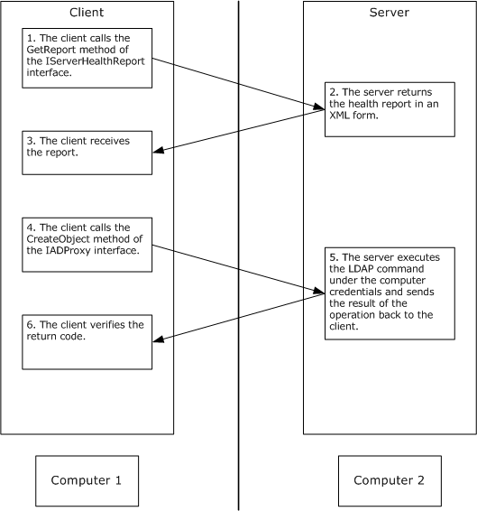

[MS-DFSRH]:

DFS Replication Helper Protocol

Intellectual Property Rights Notice for Open Specifications Documentation

  Technical Documentation. Microsoft publishes Open Specifications documentation (“this

documentation”) for protocols, file formats, data portability, computer languages, and standards
support. Additionally, overview documents cover inter-protocol relationships and interactions.

  Copyrights. This documentation is covered by Microsoft copyrights. Regardless of any other

terms that are contained in the terms of use for the Microsoft website that hosts this
documentation, you can make copies of it in order to develop implementations of the technologies
that are described in this documentation and can distribute portions of it in your implementations
that use these technologies or in your documentation as necessary to properly document the
implementation. You can also distribute in your implementation, with or without modification, any
schemas, IDLs, or code samples that are included in the documentation. This permission also
applies to any documents that are referenced in the Open Specifications documentation.
  No Trade Secrets. Microsoft does not claim any trade secret rights in this documentation.
  Patents. Microsoft has patents that might cover your implementations of the technologies

described in the Open Specifications documentation. Neither this notice nor Microsoft's delivery of
this documentation grants any licenses under those patents or any other Microsoft patents.
However, a given Open Specifications document might be covered by the Microsoft Open
Specifications Promise or the Microsoft Community Promise. If you would prefer a written license,
or if the technologies described in this documentation are not covered by the Open Specifications
Promise or Community Promise, as applicable, patent licenses are available by contacting
iplg@microsoft.com.

  License Programs. To see all of the protocols in scope under a specific license program and the

associated patents, visit the Patent Map.

  Trademarks. The names of companies and products contained in this documentation might be
covered by trademarks or similar intellectual property rights. This notice does not grant any
licenses under those rights. For a list of Microsoft trademarks, visit
www.microsoft.com/trademarks.

  Fictitious Names. The example companies, organizations, products, domain names, email

addresses, logos, people, places, and events that are depicted in this documentation are fictitious.
No association with any real company, organization, product, domain name, email address, logo,
person, place, or event is intended or should be inferred.

Reservation of Rights. All other rights are reserved, and this notice does not grant any rights other
than as specifically described above, whether by implication, estoppel, or otherwise.

Tools. The Open Specifications documentation does not require the use of Microsoft programming
tools or programming environments in order for you to develop an implementation. If you have access
to Microsoft programming tools and environments, you are free to take advantage of them. Certain
Open Specifications documents are intended for use in conjunction with publicly available standards
specifications and network programming art and, as such, assume that the reader either is familiar
with the aforementioned material or has immediate access to it.

Support. For questions and support, please contact dochelp@microsoft.com.

[MS-DFSRH] - v20240423
DFS Replication Helper Protocol
Copyright © 2024 Microsoft Corporation
Release: April 23, 2024

1 / 87

Revision Summary

Date

Revision
History

Revision
Class

Comments

3/2/2007

1.0

4/3/2007

1.1

5/11/2007

1.2

6/1/2007

1.3

Major

Minor

Minor

Minor

Updated and revised the technical content.

Clarified the meaning of the technical content.

Minor edits

Clarified the meaning of the technical content.

7/3/2007

1.3.1

Editorial

Changed language and formatting in the technical content.

8/10/2007

1.3.2

Editorial

Changed language and formatting in the technical content.

9/28/2007

1.4

10/23/2007  2.0

Minor

Major

Revised IDL to include MS-DTYP content.

Revised the technical content in response to Trustee feedback.

1/25/2008

2.0.1

Editorial

Changed language and formatting in the technical content.

3/14/2008

3.0

6/20/2008

4.0

Major

Major

Updated and revised the technical content.

Updated and revised the technical content.

7/25/2008

4.0.1

Editorial

Changed language and formatting in the technical content.

8/29/2008

4.0.2

Editorial

Changed language and formatting in the technical content.

10/24/2008  4.0.3

Editorial

Changed language and formatting in the technical content.

12/5/2008

5.0

1/16/2009

6.0

2/27/2009

7.0

4/10/2009

8.0

5/22/2009

9.0

Major

Major

Major

Major

Major

Updated and revised the technical content.

Updated and revised the technical content.

Updated and revised the technical content.

Updated and revised the technical content.

Updated and revised the technical content.

7/2/2009

9.0.1

Editorial

Changed language and formatting in the technical content.

8/14/2009

9.0.2

Editorial

Changed language and formatting in the technical content.

9/25/2009

9.1

Minor

Clarified the meaning of the technical content.

11/6/2009

9.1.1

Editorial

Changed language and formatting in the technical content.

12/18/2009  10.0

1/29/2010

11.0

Major

Major

Updated and revised the technical content.

Updated and revised the technical content.

3/12/2010

11.0.1

Editorial

Changed language and formatting in the technical content.

4/23/2010

11.0.2

Editorial

Changed language and formatting in the technical content.

6/4/2010

11.0.3

Editorial

Changed language and formatting in the technical content.

7/16/2010

11.0.3

8/27/2010

11.0.3

None

None

No changes to the meaning, language, or formatting of the
technical content.

No changes to the meaning, language, or formatting of the

2 / 87

[MS-DFSRH] - v20240423
DFS Replication Helper Protocol
Copyright © 2024 Microsoft Corporation
Release: April 23, 2024

Date

Revision
History

Revision
Class

Comments

technical content.

10/8/2010

11.0.3

None

No changes to the meaning, language, or formatting of the
technical content.

11/19/2010  11.0.3

None

No changes to the meaning, language, or formatting of the
technical content.

1/7/2011

11.0.3

None

No changes to the meaning, language, or formatting of the
technical content.

2/11/2011

11.0.3

None

No changes to the meaning, language, or formatting of the
technical content.

3/25/2011

11.0.3

None

No changes to the meaning, language, or formatting of the
technical content.

5/6/2011

11.0.3

None

No changes to the meaning, language, or formatting of the
technical content.

6/17/2011

11.1

Minor

Clarified the meaning of the technical content.

9/23/2011

11.1

None

No changes to the meaning, language, or formatting of the
technical content.

12/16/2011  11.1

None

No changes to the meaning, language, or formatting of the
technical content.

3/30/2012

11.1

None

No changes to the meaning, language, or formatting of the
technical content.

7/12/2012

11.1

None

No changes to the meaning, language, or formatting of the
technical content.

10/25/2012  11.1

None

No changes to the meaning, language, or formatting of the
technical content.

1/31/2013

11.1

None

No changes to the meaning, language, or formatting of the
technical content.

8/8/2013

12.0

Major

Updated and revised the technical content.

11/14/2013  12.0

None

No changes to the meaning, language, or formatting of the
technical content.

2/13/2014

12.0

None

No changes to the meaning, language, or formatting of the
technical content.

5/15/2014

12.0

None

No changes to the meaning, language, or formatting of the
technical content.

6/30/2015

13.0

Major

Significantly changed the technical content.

7/14/2016

13.0

None

No changes to the meaning, language, or formatting of the
technical content.

6/1/2017

13.0

9/15/2017

14.0

9/12/2018

15.0

None

Major

Major

No changes to the meaning, language, or formatting of the
technical content.

Significantly changed the technical content.

Significantly changed the technical content.

[MS-DFSRH] - v20240423
DFS Replication Helper Protocol
Copyright © 2024 Microsoft Corporation
Release: April 23, 2024

3 / 87

Date

Revision
History

Revision
Class

Comments

4/7/2021

16.0

4/23/2024

17.0

Major

Major

Significantly changed the technical content.

Significantly changed the technical content.

[MS-DFSRH] - v20240423
DFS Replication Helper Protocol
Copyright © 2024 Microsoft Corporation
Release: April 23, 2024

4 / 87

## Table of Contents

- [1 Introduction](#1-introduction)
  - [1.1 Glossary](#11-glossary)
  - [1.2 References](#12-references)
    - [1.2.1 Normative References](#121-normative-references)
    - [1.2.2 Informative References](#122-informative-references)
  - [1.3 Overview](#13-overview)
  - [1.4 Relationship to Other Protocols](#14-relationship-to-other-protocols)
  - [1.5 Prerequisites/Preconditions](#15-prerequisitespreconditions)
  - [1.6 Applicability Statement](#16-applicability-statement)
  - [1.7 Versioning and Capability Negotiation](#17-versioning-and-capability-negotiation)
  - [1.8 Vendor-Extensible Fields](#18-vendor-extensible-fields)
  - [1.9 Standards Assignments](#19-standards-assignments)
- [2 Messages](#2-messages)
  - [2.1 Transport](#21-transport)
  - [2.2 Message Syntax](#22-message-syntax)
    - [2.2.1 Common Data Types](#221-common-data-types)
      - [2.2.1.1 DfsrHelperErrorsEnum](#2211-dfsrhelpererrorsenum)
      - [2.2.1.2 DfsrReportingFlags](#2212-dfsrreportingflags)
      - [2.2.1.3 AdAttributeData](#2213-adattributedata)
      - [2.2.1.4 VersionVectorData](#2214-versionvectordata)
      - [2.2.1.5 Server Health Report XML](#2215-server-health-report-xml)
        - [2.2.1.5.1 xs Namespace](#22151-xs-namespace)
        - [2.2.1.5.2 timestamp Element](#22152-timestamp-element)
        - [2.2.1.5.3 folder Element](#22153-folder-element)
        - [2.2.1.5.4 dfsrStats Element](#22154-dfsrstats-element)
        - [2.2.1.5.5 transactions Element](#22155-transactions-element)
        - [2.2.1.5.6 file Element](#22156-file-element)
        - [2.2.1.5.7 affectedFileSet Element](#22157-affectedfileset-element)
        - [2.2.1.5.8 set Element](#22158-set-element)
        - [2.2.1.5.9 serviceInfo Element](#22159-serviceinfo-element)
        - [2.2.1.5.10 server Element](#221510-server-element)
        - [2.2.1.5.11 serverInfo Element](#221511-serverinfo-element)
        - [2.2.1.5.12 drive Element](#221512-drive-element)
        - [2.2.1.5.13 affectedContentSets Element](#221513-affectedcontentsets-element)
        - [2.2.1.5.14 ref Element](#221514-ref-element)
        - [2.2.1.5.15 errorReferences Element](#221515-errorreferences-element)
        - [2.2.1.5.16 error Element](#221516-error-element)
        - [2.2.1.5.17 Types of DFS Replication Errors](#221517-types-of-dfs-replication-errors)
          - [2.2.1.5.17.1 EVENT_DFSR_SERVICE_INTERNAL_ERROR Message](#2215171-eventdfsrserviceinternalerror-message)
          - [2.2.1.5.17.2 EVENT_DFSR_SERVICE_RESUME_FAILED_AFTER_BACKUP_RESTORE](#2215172-eventdfsrserviceresumefailedafterbackuprestore)
          - [2.2.1.5.17.3 EVENT_DFSR_SERVICE_FAILED_PROCESSING_RESTORE_VOLUME_LIST](#2215173-eventdfsrservicefailedprocessingrestorevolumelist)
          - [2.2.1.5.17.4 EVENT_DFSR_SERVICE_DS_UNREACHABLE_ERROR Message](#2215174-eventdfsrservicedsunreachableerror-message)
          - [2.2.1.5.17.5 EVENT_DFSR_SERVICE_RPC_LISTENER_ERROR Message](#2215175-eventdfsrservicerpclistenererror-message)
          - [2.2.1.5.17.6 EVENT_DFSR_SERVICE_DEBUG_LOG_STOP Message](#2215176-eventdfsrservicedebuglogstop-message)
          - [2.2.1.5.17.7 EVENT_DFSR_SERVICE_LOG_INITIALIZATION_FAILED Message](#2215177-eventdfsrserviceloginitializationfailed-message)
          - [2.2.1.5.17.8 EVENT_DFSR_VOLUME_ERROR Message](#2215178-eventdfsrvolumeerror-message)
          - [2.2.1.5.17.9 EVENT_DFSR_VOLUME_JOURNAL_WRAP Message](#2215179-eventdfsrvolumejournalwrap-message)
          - [2.2.1.5.17.10 EVENT_DFSR_VOLUME_DATABASE_ERROR Message](#22151710-eventdfsrvolumedatabaseerror-message)
          - [2.2.1.5.17.11 EVENT_DFSR_VOLUME_JOURNAL_LOSS Message](#22151711-eventdfsrvolumejournalloss-message)
          - [2.2.1.5.17.12 EVENT_DFSR_VOLUME_JOURNAL_RECOVERY_FAILED Message](#22151712-eventdfsrvolumejournalrecoveryfailed-message)
          - [2.2.1.5.17.13 EVENT_DFSR_CS_ERROR Message](#22151713-eventdfsrcserror-message)
          - [2.2.1.5.17.14 EVENT_DFSR_CS_DISABLED Message](#22151714-eventdfsrcsdisabled-message)
          - [2.2.1.5.17.15 EVENT_DFSR_CS_STAGE_CLEANUP_STARTED Message](#22151715-eventdfsrcsstagecleanupstarted-message)
          - [2.2.1.5.17.16 EVENT_DFSR_CS_STAGE_CLEANUP_FAILED Message](#22151716-eventdfsrcsstagecleanupfailed-message)
          - [2.2.1.5.17.17 EVENT_DFSR_CS_STAGE_EXCEEDED_SIZE Message](#22151717-eventdfsrcsstageexceededsize-message)
          - [2.2.1.5.17.18 EVENT_DFSR_CS_STAGE_INACCESSIBLE Message](#22151718-eventdfsrcsstageinaccessible-message)
          - [2.2.1.5.17.19 EVENT_DFSR_CS_SHARING_VIOLATION_LOCAL Message](#22151719-eventdfsrcssharingviolationlocal-message)
          - [2.2.1.5.17.20 EVENT_DFSR_CS_SHARING_VIOLATION_SERVING Message](#22151720-eventdfsrcssharingviolationserving-message)
          - [2.2.1.5.17.21 EVENT_DFSR_CS_SHARING_VIOLATION_WALKING Message](#22151721-eventdfsrcssharingviolationwalking-message)
          - [2.2.1.5.17.22 EVENT_DFSR_CS_UNSUPPORTED_ENCRYPTED_FILES Message](#22151722-eventdfsrcsunsupportedencryptedfiles-message)
          - [2.2.1.5.17.23 EVENT_DFSR_CS_UNSUPPORTED_REPARSE_TAG Message](#22151723-eventdfsrcsunsupportedreparsetag-message)
          - [2.2.1.5.17.24 EVENT_DFSR_CS_DISK_FULL Message](#22151724-eventdfsrcsdiskfull-message)
          - [2.2.1.5.17.25 EVENT_DFSR_CONNECTION_ERROR Message](#22151725-eventdfsrconnectionerror-message)
          - [2.2.1.5.17.26 EVENT_DFSR_CONNECTION_SERVICE_UNREACHABLE Message](#22151726-eventdfsrconnectionserviceunreachable-message)
          - [2.2.1.5.17.27 EVENT_DFSR_CONNECTION_UNRECOGNIZED Message](#22151727-eventdfsrconnectionunrecognized-message)
          - [2.2.1.5.17.28 EVENT_DFSR_INCOMPATIBLE_VERSION Message](#22151728-eventdfsrincompatibleversion-message)
          - [2.2.1.5.17.29 EVENT_DFSR_CONFIG_DS_INVALID_DATA Message](#22151729-eventdfsrconfigdsinvaliddata-message)
          - [2.2.1.5.17.30 EVENT_DFSR_CONFIG_DS_DUPLICATE_DATA Message](#22151730-eventdfsrconfigdsduplicatedata-message)
          - [2.2.1.5.17.31 EVENT_DFSR_CONFIG_DS_INCONSISTENT_DATA Message](#22151731-eventdfsrconfigdsinconsistentdata-message)
          - [2.2.1.5.17.32 EVENT_DFSR_CONFIG_INVALID_PARAMETER_ERROR Message](#22151732-eventdfsrconfiginvalidparametererror-message)
          - [2.2.1.5.17.33 EVENT_DFSR_CONFIG_INVALID_PARAMETER_WARNING Message](#22151733-eventdfsrconfiginvalidparameterwarning-message)
          - [2.2.1.5.17.34 EVENT_DFSR_CONFIG_DS_INVALID_SCHEMA_VERSION Message](#22151734-eventdfsrconfigdsinvalidschemaversion-message)
          - [2.2.1.5.17.35 EVENT_DFSR_CONFIG_DS_UPDATE_FAILED Message](#22151735-eventdfsrconfigdsupdatefailed-message)
          - [2.2.1.5.17.36 EVENT_DFSR_CONFIG_WMI_PROVIDER_REGISTRATION_FAILED](#22151736-eventdfsrconfigwmiproviderregistrationfailed)
          - [2.2.1.5.17.37 EVENT_DFSR_CONFIG_VOLUME_NOT_SUPPORTED Message](#22151737-eventdfsrconfigvolumenotsupported-message)
          - [2.2.1.5.17.38 EVENT_DFSR_CS_OVERLAPPING Message](#22151738-eventdfsrcsoverlapping-message)
          - [2.2.1.5.17.39 EVENT_DFSR_CONFIG_CS_ROOT_INVALID Message](#22151739-eventdfsrconfigcsrootinvalid-message)
          - [2.2.1.5.17.40 EVENT_DFSR_CONFIG_CS_ROOT_STALE Message](#22151740-eventdfsrconfigcsrootstale-message)
          - [2.2.1.5.17.41 EVENT_DFSR_CS_OVERLAPPING_WITH_FRS1 Message](#22151741-eventdfsrcsoverlappingwithfrs1-message)
          - [2.2.1.5.17.42 EVENT_DFSR_CS_OVERLAPPING_WITH_SYSTEM Message](#22151742-eventdfsrcsoverlappingwithsystem-message)
          - [2.2.1.5.17.43 EVENT_DFSR_CS_OVERLAPPING_WITH_LOG Message](#22151743-eventdfsrcsoverlappingwithlog-message)
          - [2.2.1.5.17.44 EVENT_DFSR_CONFIG_VOLUME_CONSISTENCY_CHECK_FAILED](#22151744-eventdfsrconfigvolumeconsistencycheckfailed)
          - [2.2.1.5.17.45 EVENT_DFSR_CONFIG_NO_CONNECTIONS_ENABLED Message](#22151745-eventdfsrconfignoconnectionsenabled-message)
          - [2.2.1.5.17.46 EVENT_DFSR_CONFIG_NO_CONNECTIONS_EXIST Message](#22151746-eventdfsrconfignoconnectionsexist-message)
          - [2.2.1.5.17.47 ERROR_WMI_ACCESS_DENIED Message](#22151747-errorwmiaccessdenied-message)
          - [2.2.1.5.17.48 ERROR_WMI_ERROR Message](#22151748-errorwmierror-message)
          - [2.2.1.5.17.49 ERROR_WMI_NO_NAMESPACE Message](#22151749-errorwminonamespace-message)
          - [2.2.1.5.17.50 ERROR_WMI_TIMEOUT Message](#22151750-errorwmitimeout-message)
  - [2.3 Directory Service Schema Elements](#23-directory-service-schema-elements)
- [3 Protocol Details](#3-protocol-details)
  - [3.1 Server Role Details](#31-server-role-details)
    - [3.1.1 Abstract Data Model](#311-abstract-data-model)
    - [3.1.2 Timers](#312-timers)
    - [3.1.3 Initialization](#313-initialization)
    - [3.1.4 Higher-Layer Triggered Events](#314-higher-layer-triggered-events)
    - [3.1.5 Message Processing Events and Sequencing Rules](#315-message-processing-events-and-sequencing-rules)
      - [3.1.5.1 Methods with Prerequisites](#3151-methods-with-prerequisites)
      - [3.1.5.2 IADProxy Interface](#3152-iadproxy-interface)
        - [3.1.5.2.1 CreateObject Method (Opnum 3)](#31521-createobject-method-opnum-3)
        - [3.1.5.2.2 DeleteObject Method (Opnum 4)](#31522-deleteobject-method-opnum-4)
        - [3.1.5.2.3 ModifyObject Method (Opnum 5)](#31523-modifyobject-method-opnum-5)
      - [3.1.5.3 IADProxy2 Interface](#3153-iadproxy2-interface)
        - [3.1.5.3.1 CreateObject Method (Opnum 6)](#31531-createobject-method-opnum-6)
        - [3.1.5.3.2 DeleteObject Method (Opnum 7)](#31532-deleteobject-method-opnum-7)
        - [3.1.5.3.3 ModifyObject Method (Opnum 8)](#31533-modifyobject-method-opnum-8)
      - [3.1.5.4 IServerHealthReport Interface](#3154-iserverhealthreport-interface)
        - [3.1.5.4.1 GetReport Method (Opnum 3)](#31541-getreport-method-opnum-3)
        - [3.1.5.4.2 GetCompressedReport Method (Opnum 4)](#31542-getcompressedreport-method-opnum-4)
        - [3.1.5.4.3 GetRawReportEx Method (Opnum 5)](#31543-getrawreportex-method-opnum-5)
        - [3.1.5.4.4 GetReferenceVersionVectors Method (Opnum 6)](#31544-getreferenceversionvectors-method-opnum-6)
        - [3.1.5.4.5 GetReferenceBacklogCounts Method (Opnum 8)](#31545-getreferencebacklogcounts-method-opnum-8)
      - [3.1.5.5 IServerHealthReport2 Interface](#3155-iserverhealthreport2-interface)
        - [3.1.5.5.1 GetReport Method (Opnum 9)](#31551-getreport-method-opnum-9)
        - [3.1.5.5.2 GetCompressedReport Method (Opnum 10)](#31552-getcompressedreport-method-opnum-10)
    - [3.1.6 Timer Events](#316-timer-events)
    - [3.1.7 Other Local Events](#317-other-local-events)
  - [3.2 Client Role Details](#32-client-role-details)
    - [3.2.1 Abstract Data Model](#321-abstract-data-model)
    - [3.2.2 Timers](#322-timers)
    - [3.2.3 Initialization](#323-initialization)
    - [3.2.4 Higher-Layer Triggered Events](#324-higher-layer-triggered-events)
    - [3.2.5 Message Processing Events and Sequencing Rules](#325-message-processing-events-and-sequencing-rules)
      - [3.2.5.1 Methods with Prerequisites](#3251-methods-with-prerequisites)
    - [3.2.6 Timer Events](#326-timer-events)
    - [3.2.7 Other Local Events](#327-other-local-events)
- [4 Protocol Examples](#4-protocol-examples)
  - [4.1 Example of Messages Between a Client and Server](#41-example-of-messages-between-a-client-and-server)
  - [4.2 Example of the Server Health Report in XML Format](#42-example-of-the-server-health-report-in-xml-format)
- [5 Security](#5-security)
- [6 Appendix A: Full IDL](#6-appendix-a-full-idl)
- [7 Appendix B: Product Behavior](#7-appendix-b-product-behavior)
- [8 Change Tracking](#8-change-tracking)
- [9 Index](#9-index)

## 1 Introduction

The Distributed File System: Replication Helper (DFS-R Helper) Protocol is a set of DCOM interfaces for
configuring and monitoring the Distributed File System.

Sections 1.5, 1.8, 1.9, 2, and 3 of this specification are normative. All other sections and examples in
this specification are informative.

### 1.1 Glossary

This document uses the following terms:

Active Directory: The Windows implementation of a general-purpose directory service, which uses

LDAP as its primary access protocol. Active Directory stores information about a variety of
objects in the network such as user accounts, computer accounts, groups, and all related
credential information used by Kerberos [MS-KILE]. Active Directory is either deployed as Active
Directory Domain Services (AD DS) or Active Directory Lightweight Directory Services (AD LDS),
which are both described in [MS-ADOD]: Active Directory Protocols Overview.

computer object: An object of class computer. A computer object is a security principal object;
the principal is the operating system running on the computer. The shared secret allows the
operating system running on the computer to authenticate itself independently of any user
running on the system. See security principal.

connection: In DFS-R, a pair of client and server replication partners.

DFS Replication Health Report, Replication Health Report, or Health Report: A report that

displays information about the operation of the DFS-Replication (DFS-R) service on computers in
a replication group. The following information is included in the health report: file transfer
statistics, the number of files in the replicated folders, disk space use, and replication errors
and warnings.

DFS-R: A service that keeps DFS and SYSVOL folders in sync automatically. DFS-R is a state-
based, multimaster replication system that supports replication scheduling and bandwidth
throttling. This is a rewrite and new version of FRS. For more information, see [MS-FRS2].

distinguished name (DN): A name that uniquely identifies an object by using the relative

distinguished name (RDN) for the object, and the names of container objects and domains that
contain the object. The distinguished name (DN) identifies the object and its location in a tree.

Distributed File System-Replication (DFS-R): A file replication technology that is used to

replicate files, folders, attributes, and file metadata.

endpoint: A network-specific address of a remote procedure call (RPC) server process for remote

procedure calls. The actual name and type of the endpoint depends on the RPC protocol
sequence that is being used. For example, for RPC over TCP (RPC Protocol Sequence
ncacn_ip_tcp), an endpoint might be TCP port 1025. For RPC over Server Message Block (RPC
Protocol Sequence ncacn_np), an endpoint might be the name of a named pipe. For more
information, see [C706].

fully qualified domain name (FQDN): An unambiguous domain name that gives an absolute

location in the Domain Name System's (DNS) hierarchy tree, as defined in [RFC1035] section
3.1 and [RFC2181] section 11.

globally unique identifier (GUID): A term used interchangeably with universally unique

identifier (UUID) in Microsoft protocol technical documents (TDs). Interchanging the usage of
these terms does not imply or require a specific algorithm or mechanism to generate the value.
Specifically, the use of this term does not imply or require that the algorithms described in

8 / 87

[MS-DFSRH] - v20240423
DFS Replication Helper Protocol
Copyright © 2024 Microsoft Corporation
Release: April 23, 2024

[RFC4122] or [C706] have to be used for generating the GUID. See also universally unique
identifier (UUID).

Interface Definition Language (IDL): The International Standards Organization (ISO) standard

language for specifying the interface for remote procedure calls. For more information, see
[C706] section 4.

Lightweight Directory Access Protocol (LDAP): The primary access protocol for Active

Directory. Lightweight Directory Access Protocol (LDAP) is an industry-standard protocol,
established by the Internet Engineering Task Force (IETF), which allows users to query and
update information in a directory service (DS), as described in [MS-ADTS]. The Lightweight
Directory Access Protocol can be either version 2 [RFC1777] or version 3 [RFC3377].

machine account: An account that is associated with individual client or server machines in an

Active Directory domain.

member (DFS-R): In the Distributed File System Replication Protocol, a computer participating in

replication.

NetBIOS name: A 16-byte address that is used to identify a NetBIOS resource on the network.

For more information, see [RFC1001] and [RFC1002].

opnum: An operation number or numeric identifier that is used to identify a specific remote

procedure call (RPC) method or a method in an interface. For more information, see [C706]
section 12.5.2.12 or [MS-RPCE].

partner: A computer that is participating in DFS-R file replication.

replicated folder: The root of a replicated tree. All files and subfolders (recursively) are

replicated.

replication group: A container for a set of replicated folders sharing the same connections to

replication partners.

replication issue: A possible error condition that is relevant to the health report. The possible
replication issues are either Sharing (A sharing violation occurred) or Filtered (The file was
filtered from replication on the basis of an implementation-specific filter that was set in the DFS-
R service.).

RPC protocol sequence: A character string that represents a valid combination of a remote
procedure call (RPC) protocol, a network layer protocol, and a transport layer protocol, as
described in [C706] and [MS-RPCE].

RPC transport: The underlying network services used by the remote procedure call (RPC) runtime

for communications between network nodes. For more information, see [C706] section 2.

sharing violation: The failure by a process to read, modify, or delete a file because another

process holds the file lock for this file.

Unicode: A character encoding standard developed by the Unicode Consortium that represents

almost all of the written languages of the world. The Unicode standard [UNICODE5.0.0/2007]
provides three forms (UTF-8, UTF-16, and UTF-32) and seven schemes (UTF-8, UTF-16, UTF-16
BE, UTF-16 LE, UTF-32, UTF-32 LE, and UTF-32 BE).

universally unique identifier (UUID): A 128-bit value. UUIDs can be used for multiple

purposes, from tagging objects with an extremely short lifetime, to reliably identifying very
persistent objects in cross-process communication such as client and server interfaces, manager
entry-point vectors, and RPC objects. UUIDs are highly likely to be unique. UUIDs are also
known as globally unique identifiers (GUIDs) and these terms are used interchangeably in
the Microsoft protocol technical documents (TDs). Interchanging the usage of these terms does

9 / 87

[MS-DFSRH] - v20240423
DFS Replication Helper Protocol
Copyright © 2024 Microsoft Corporation
Release: April 23, 2024

not imply or require a specific algorithm or mechanism to generate the UUID. Specifically, the
use of this term does not imply or require that the algorithms described in [RFC4122] or [C706]
has to be used for generating the UUID.

USN journal: A sequence of USN records. The USN journal can be read as a file on NTFS.

version vector: A mapping from machine identifiers to version sequence numbers. The Distributed
File System Replication (DFS-R) Protocol uses a generalization of version vectors called version
chain vectors.

volume: A group of one or more partitions that forms a logical region of storage and the basis for
a file system. A volume is an area on a storage device that is managed by the file system as a
discrete logical storage unit. A partition contains at least one volume, and a volume can exist
on one or more partitions.

MAY, SHOULD, MUST, SHOULD NOT, MUST NOT: These terms (in all caps) are used as defined
in [RFC2119]. All statements of optional behavior use either MAY, SHOULD, or SHOULD NOT.

### 1.2 References

Links to a document in the Microsoft Open Specifications library point to the correct section in the
most recently published version of the referenced document. However, because individual documents
in the library are not updated at the same time, the section numbers in the documents may not
match. You can confirm the correct section numbering by checking the Errata.

#### 1.2.1 Normative References

We conduct frequent surveys of the normative references to assure their continued availability. If you
have any issue with finding a normative reference, please contact dochelp@microsoft.com. We will
assist you in finding the relevant information.

[C706] The Open Group, "DCE 1.1: Remote Procedure Call", C706, August 1997,
https://publications.opengroup.org/c706

Note Registration is required to download the document.

[MS-ADA1] Microsoft Corporation, "Active Directory Schema Attributes A-L".

[MS-ADA2] Microsoft Corporation, "Active Directory Schema Attributes M".

[MS-ADA3] Microsoft Corporation, "Active Directory Schema Attributes N-Z".

[MS-ADLS] Microsoft Corporation, "Active Directory Lightweight Directory Services Schema".

[MS-ADSC] Microsoft Corporation, "Active Directory Schema Classes".

[MS-ADTS] Microsoft Corporation, "Active Directory Technical Specification".

[MS-DCOM] Microsoft Corporation, "Distributed Component Object Model (DCOM) Remote Protocol".

[MS-DTYP] Microsoft Corporation, "Windows Data Types".

[MS-ERREF] Microsoft Corporation, "Windows Error Codes".

[MS-FRS2] Microsoft Corporation, "Distributed File System Replication Protocol".

[MS-OAUT] Microsoft Corporation, "OLE Automation Protocol".

[MS-RPCE] Microsoft Corporation, "Remote Procedure Call Protocol Extensions".

10 / 87

[MS-DFSRH] - v20240423
DFS Replication Helper Protocol
Copyright © 2024 Microsoft Corporation
Release: April 23, 2024

[RFC2119] Bradner, S., "Key words for use in RFCs to Indicate Requirement Levels", BCP 14, RFC
2119, March 1997, https://www.rfc-editor.org/info/rfc2119

[RFC2251] Wahl, M., Howes, T., and Kille, S., "Lightweight Directory Access Protocol (v3)", RFC 2251,
December 1997, https://www.rfc-editor.org/info/rfc2251

[UNICODE4.0] The Unicode Consortium, "Unicode 4.0.0",
http://www.unicode.org/versions/Unicode4.0.0/

[XML10] World Wide Web Consortium, "Extensible Markup Language (XML) 1.0 (Third Edition)",
February 2004, http://www.w3.org/TR/2004/REC-xml-20040204/

[XMLSCHEMA0] Fallside, D., and Walmsley, P., Eds., "XML Schema Part 0: Primer, Second Edition",
W3C Recommendation, October 2004, http://www.w3.org/TR/2004/REC-xmlschema-0-20041028/

[XMLSCHEMA1] Thompson, H., Beech, D., Maloney, M., and Mendelsohn, N., Eds., "XML Schema Part
1: Structures", W3C Recommendation, May 2001, https://www.w3.org/TR/2001/REC-xmlschema-1-
20010502/

[XMLSCHEMA2] Biron, P.V., Ed. and Malhotra, A., Ed., "XML Schema Part 2: Datatypes", W3C
Recommendation, May 2001, https://www.w3.org/TR/2001/REC-xmlschema-2-20010502/

#### 1.2.2 Informative References

[LDAP-ERR] Microsoft Corporation, "Return Values", http://msdn.microsoft.com/en-
us/library/aa367014.aspx

[SAFEARRAY] Ames, A., "SAFEARRAYs Made Easier", May 2000,
https://edn.embarcadero.com/el/article/22016

[WMI] Microsoft Corporation, "Windows Management Instrumentation (WMI)",
http://msdn.microsoft.com/en-us/library/aa394582.aspx

### 1.3 Overview

The Distributed File System: Replication Helper (DFS-R Helper) Protocol provides a set of DCOM
interfaces for configuring and monitoring Distributed File System–Replication (DFS-R) on a
server, as specified in [MS-FRS2]. The server end of the protocol is a DCOM service that implements
the DCOM interface. The client end of the protocol is an application that invokes methods on the
interface to make DFS-R configuration changes and monitor the status of the DFS-R service on the
server.

The first part of the Distributed File System: Replication Helper (DFS-R Helper) Protocol consists of
interfaces for creating, modifying, and deleting configuration objects in Active Directory by using the
machine account of the server.

For all replication members, the configuration related to a member is stored in the computer
object for the local machine in Active Directory. It is common for system components that are
unrelated to DFS-R to set permissions on the computer object that will prevent modification of the
object by some users and still permit modification by using the credentials for the computer.
Therefore, a server implementation uses the credentials of the local machine account when it sends
commands to update Active Directory objects.

If a user has sufficient privileges to connect to the server that is running the DFS-R Helper Protocol
and to invoke methods implemented by the DFS-R Helper Protocol interfaces, the server works as a
proxy for making configuration changes on behalf of the client application that is running under the
user's account.

[MS-DFSRH] - v20240423
DFS Replication Helper Protocol
Copyright © 2024 Microsoft Corporation
Release: April 23, 2024

11 / 87

The client sends the server information about the Active Directory operation that the client is trying to
accomplish. The server then attempts to execute the command by using the machine account and
returns information about the status of the operation.

The second part of the Distributed File System: Replication Helper (DFS-R Helper) Protocol is an
interface for monitoring DFS-R on the computer and collecting various statistics about the DFS-R
operation.

The information that is collected by using the Distributed File System: Replication Helper (DFS-R
Helper) Protocol includes, among other types of information, the following statistics:





Information about replication errors that are encountered by DFS-R on the server.

The count and size of replicated files on the server.

  Disk use on the server.



Information about replicated folders on the server.

  Replication backlog—the number of files that are not yet fully replicated.

Sections 2 and 3 specify the Distributed File System: Replication Helper (DFS-R Helper) Protocol and
define protocol messages, their parameters, and the XML format of the health report.

### 1.4 Relationship to Other Protocols

The Distributed File System: Replication Helper (DFS-R Helper) Protocol relies on the Distributed
Component Object Model (DCOM) Remote Protocol (as specified in [MS-DCOM]), which uses RPC as its
transport. For more information, see [MS-RPCE].

### 1.5 Prerequisites/Preconditions

This protocol is implemented over DCOM and RPC. Therefore, it has the prerequisites that are
specified in [MS-DCOM] and [MS-RPCE] as common to the DCOM and RPC interfaces.

The Distributed File System: Replication Helper (DFS-R Helper) Protocol assumes that a client has
obtained the name of a server that supports this protocol suite before the protocol is invoked.

### 1.6 Applicability Statement

This protocol enables a client application to modify the DFS-R configuration using the credentials of
the server computer. The client also uses this protocol to get health information for the DFS-R service
on the remote server.

### 1.7 Versioning and Capability Negotiation

Supported Transports: This protocol uses the Distributed Component Object Model (DCOM) Remote
Protocol (as specified in [MS-DCOM]), which in turn uses RPC over TCP as its only transport, as
specified in section 2.1.

Protocol Version: This protocol includes three DCOM interfaces, all of which are version 0.0. A client
uses one or more of the following interfaces when it communicates with a Distributed File System:
Replication Helper (DFS-R Helper) Protocol server:





IADProxy

IADProxy2

[MS-DFSRH] - v20240423
DFS Replication Helper Protocol
Copyright © 2024 Microsoft Corporation
Release: April 23, 2024

12 / 87





IServerHealthReport

IServerHealthReport2

The IADProxy2 interface supersedes the IADProxy interface and contains new functionality that is
related to server clusters.

Security and Authentication Methods: For more information, see [MS-DCOM] and [MS-RPCE].

Administrator rights on the server computer are required to use the IADProxy and the IADProxy2
interfaces.

### 1.8 Vendor-Extensible Fields

This protocol does not define any vendor-extensible fields.

### 1.9 Standards Assignments

The Distributed File System: Replication Helper (DFS-R Helper) protocol has no standards
assignments. It uses the following UUIDs to identify its interfaces.

Parameter

Value

RPC interface UUID for the IADProxy interface.

4BB8AB1D-9EF9-4100-8EB6-DD4B4E418B72

RPC interface UUID for the IADProxy2 interface.

C4B0C7D9-ABE0-4733-A1E1-9FDEDF260C7A

RPC interface UUID for the IServerHealthReport interface.

E65E8028-83E8-491b-9AF7-AAF6BD51A0CE

RPC interface UUID for the IServerHealthReport2 interface.

20D15747-6C48-4254-A358-65039FD8C63C

[MS-DFSRH] - v20240423
DFS Replication Helper Protocol
Copyright © 2024 Microsoft Corporation
Release: April 23, 2024

13 / 87

## 2 Messages

### 2.1 Transport

This protocol uses RPC Dynamic Endpoints as defined in Part 4 of [C706].

This protocol MUST use the DCOM Remote Protocol, as specified in [MS-DCOM], as its transport. On
its behalf, the DCOM Remote Protocol uses the following RPC protocol sequence: RPC over TCP, as
specified in [MS-RPCE].

To access an interface, the client MUST request a DCOM connection to its well-known object UUID
endpoint on the server, as specified in section 1.9.

The RPC version number for all interfaces MUST be 0.0.

An implementation of DFS Replication Helper MAY configure its DCOM implementation or underlying
RPC transport with authentication parameters to allow clients to connect, or it MAY choose to not set
these parameters. The details of this are implementation-specific.<1>

The DFS Replication Helper interfaces make use of the underlying DCOM security framework, as
specified in [MS-DCOM], and rely upon it for access control.<2> DCOM differentiates between launch
and access operations and also decides whether to deny or grant access for these operations.

An implementation of DFS Replication Helper SHOULD choose to restrict access to the interfaces.<3>

### 2.2 Message Syntax

In addition to the RPC base types and the definitions that are specified in [C706] and [MS-DTYP], the
sections that follow use the definitions of BSTR, GUID, SAFEARRAY, VARIANT, VARIANT_BOOL, and
DWORD, as specified in [MS-DTYP] Appendix A and in [MS-OAUT]. The IServerHealthReport and
IServerHealthReport2 interfaces return reports as XML. For more information about XML, see
[XML10], [XMLSCHEMA0], [XMLSCHEMA1], and [XMLSCHEMA2].

#### 2.2.1 Common Data Types

##### 2.2.1.1 DfsrHelperErrorsEnum

The DfsrHelperErrorsEnum enumeration defines error codes that are specific to the IADProxy and
IADProxy2 interfaces.

The UUID for this enumeration is {9009D654-250B-4e0d-9AB0-ACB63134F69F}.

 typedef  enum DfsrHelperErrorsEnum
 {
   dfsrHelperErrorNotLocalAdmin = 0x80042001,
   dfsrHelperErrorCreateVerifyServerControl = 0x80042002,
   dfsrHelperLdapErrorBase = 0x80043000
 } DfsrHelperErrorsEnum;

dfsrHelperErrorNotLocalAdmin:  Reserved for future use.

dfsrHelperErrorCreateVerifyServerControl:  Cannot create LDAP_SERVER_VERIFY_NAME_OID

control for the LDAP command.

For more information about this LDAP control command, see [MS-ADTS] section 3.1.1.3.4.1.16.

dfsrHelperLdapErrorBase:  This is the base value for LDAP errors.

14 / 87

[MS-DFSRH] - v20240423
DFS Replication Helper Protocol
Copyright © 2024 Microsoft Corporation
Release: April 23, 2024

##### 2.2.1.2 DfsrReportingFlags

The DfsrReportingFlags enumeration represents the options for generating health reports, which are
used in IServerHealthReport and IServerHealthReport2 interfaces. The UUID for this enumeration is
{CEB5D7B4-3964-4f71-AC17-4BF57A379D87}.

Any bitmask that consists of one, or a combination, of the following enumerated values is supported:

 typedef  enum DfsrReportingFlags
 {
   REPORTING_FLAGS_NONE = 0,
   REPORTING_FLAGS_BACKLOG = 1,
   REPORTING_FLAGS_FILES = 2,
 } DfsrReportingFlags;

REPORTING_FLAGS_NONE:  Default report options.

REPORTING_FLAGS_BACKLOG:  Return the count of backlog transactions.

REPORTING_FLAGS_FILES:  Return the count and cumulative size of files in the replicated folders.

##### 2.2.1.3 AdAttributeData

The AdAttributeData structure provides information about an Active Directory operation. This
structure describes the Active Directory operation that is requested by the client. The UUID for this
structure is {D3766938-9FB7-4392-AF2F-2CE8749DBBD0}.

 typedef[uuid(D3766938-9FB7-4392-AF2F-2CE8749DBBD0)]
    struct AdAttributeData {
   long operation;
   BSTR attributeName;
   BSTR attributeValue;
   VARIANT_BOOL isString;
   long length;
 } _AdAttributeData;

operation:  Specifies the LDAP operation that MUST be executed for the attribute that is specified by
the attributeName parameter. This value MUST be specified by using rules for the operation field
of the LDAP ModifyRequest. For information about ModifyRequest, see [RFC2251] section 4.6.

attributeName:  MUST be the name of the attribute on which to execute the LDAP operation that is

specified by the operation parameter.

attributeValue:  The value of the attribute that is specified by the attributeName parameter. The

value of this parameter MUST be built by using the following rules:





If the value can be represented as a string, the attributeValue field MUST contain the string
representation of the value.

If the value contains raw binary data, the attributeValue field MUST contain the binary data
encoded in the BSTR according to the following rules:





The length, in bytes, of the BSTR buffer MUST be greater than or equal to the value of the size
of the binary data that is to be encoded.

The BSTR buffer MUST be filled by the bytes that compose the in-memory representation of
the binary data that is being encoded. The part of the buffer between offsets 0 and "length -
1" MUST be passed to the LDAP protocol by the server. The remainder of the BSTR buffer, if
any, MUST be ignored by the server.

15 / 87

[MS-DFSRH] - v20240423
DFS Replication Helper Protocol
Copyright © 2024 Microsoft Corporation
Release: April 23, 2024

isString:  Specifies whether the value that is passed in the attributeValue field is a string. The value

of this field MUST be VARIANT_FALSE (as specified in [MS-OAUT] section 2.2.27) if the
attributeValue field contains a binary value. Otherwise, the value MUST be VARIANT_TRUE.

length:  For a binary value, the length, in bytes, of the value MUST be provided in this field. For string
data, this field MUST be set to the length, in bytes, of the Unicode string (see [UNICODE4.0].

##### 2.2.1.4 VersionVectorData

The VersionVectorData structure provides information about the DFS-R version vector. The DFS-R
version vector is an array of identifiers and versions of modified files in a replicated folder. The
version vector is specified in [MS-FRS2] section 2.2.1.4.1. The UUID for this structure is {7A2323C7-
9EBE-494a-A33C-3CC329A18E1D}.

 typedef[uuid(7A2323C7-9EBE-494a-A33C-3CC329A18E1D)]
    struct VersionVectorData {
   long uncompressedSize;
   long backlogCount;
   BSTR contentSetGuid;
   VARIANT versionVector;
 } _VersionVectorData;

uncompressedSize:  MUST be the number of bytes in the uncompressed version vector. The version
vector is defined by FRS_ASYNC_VERSION_VECTOR_RESPONSE, as specified in [MS-FRS2] section
2.2.1.4.12.

backlogCount:  MUST be the number of backlogged transactions for the replicated folder on the

server.

contentSetGuid:  MUST be a string representation of the GUID of the replicated folder.

versionVector:  MUST be the version vector for the replicated folder whose GUID is specified by the

contentSetGuid field.

The version vector is either compressed (that is, an encoded field whose format is specified by the
DFS-R compression algorithm (as specified in [MS-FRS2] section 3.1.1.1) or uncompressed. The
version vector MUST be represented by a VARIANT field that has a VT_BSTR variant type.

The client MUST determine whether the version vector is compressed by applying the following
rules:



If the sum of the number of characters, including the terminating null character in the BSTR,
multiplied by the size, in bytes, of a Unicode character (2 bytes) is less than the value of the
uncompressedSize field, the version vector is sent in compressed form. See [UNICODE4.0].

  Otherwise, the version vector is uncompressed.

The compressed or uncompressed version vector MUST be encoded in a BSTR and passed by using
the versionVector.bstrVal field.

The compressed or uncompressed version vector buffer MUST be encoded in a BSTR by applying
the following rules:

The length, in bytes, of the BSTR buffer MUST be greater than or equal to the value of the size of
the binary data that is to be encoded.

The part of the BSTR buffer between offsets 0 and "length - 1" MUST be filled by the compressed
or uncompressed data, as specified previously. The remainder of the BSTR buffer (if any) MUST be
ignored by the server.





16 / 87

[MS-DFSRH] - v20240423
DFS Replication Helper Protocol
Copyright © 2024 Microsoft Corporation
Release: April 23, 2024

##### 2.2.1.5 Server Health Report XML

The server health report is an XML document that contains the data that is related to DFS-R service
health and SHOULD contain errors encountered during generation of the report.

###### 2.2.1.5.1 xs Namespace

The xs namespace that is used in subsections of section 2.2.1.5 refers to the XMLSchema namespace
that is specified in [XMLSCHEMA0], [XMLSCHEMA1], and [XMLSCHEMA2].

###### 2.2.1.5.2 timestamp Element

The timestamp XML element represents the time in a specific time zone.

 <xs:element name="timestamp">
   <xs:complexType>
     <xs:sequence>
       <xs:element name="fileTime"
         type="xs:long"
        />
       <xs:element name="systemTime"
         type="xs:string"
         minOccurs="0"
        />
     </xs:sequence>
     <xs:attribute name="timezone"
       type="xs:int"
      />
   </xs:complexType>
 </xs:element>

Child Elements

Element

Type

Description

fileTime

xs:long

MUST be the time, in FILETIME format, as specified in the [MS-DTYP] Appendix A.
Because the FILETIME is provided in Coordinated Universal Time (UTC), the daylight
time adjustment MUST NOT be included in this field. Instead, the adjustment MUST be
included in the timezone field.

systemTime  xs:string  An implementation-specific textual representation of the date and time.<4>

Attributes

Name

Type  Description

timezone  xs:int  MUST be the difference, in minutes, between the time in the server time zone and
Coordinated Universal Time (UTC). This field SHOULD account for the daylight time
adjustment.

###### 2.2.1.5.3 folder Element

The folder XML element represents a folder on the disk.

 <xs:element name="folder">
   <xs:complexType>
     <xs:sequence>
       <xs:element name="path"

[MS-DFSRH] - v20240423
DFS Replication Helper Protocol
Copyright © 2024 Microsoft Corporation
Release: April 23, 2024

17 / 87

         type="xs:string"
        />
       <xs:element name="fileCount"
         type="xs:long"
        />
       <xs:element name="folderCount"
         type="xs:long"
        />
       <xs:element name="size"
         type="xs:long"
        />
       <xs:element name="configSize"
         type="xs:long"
        />
     </xs:sequence>
     <xs:attribute name="type">
       <xs:simpleType>
         <xs:restriction
           base="xs:string"
         >
           <xs:enumeration
             value="root"
            />
           <xs:enumeration
             value="conflict"
            />
           <xs:enumeration
             value="staging"
            />
         </xs:restriction>
       </xs:simpleType>
     </xs:attribute>
   </xs:complexType>
 </xs:element>

Child Elements

Element

Type

Description

path

xs:string  MUST be the path of the folder on the disk. The path format is implementation specific.

<5>

fileCount

xs:long

MUST be the number of files in the folder and all subfolders, or –1 if the file number
information is not included in the report.

folderCount  xs:long

MUST be the number of all direct subfolders of the folder, or –1 if the folder number
information is not included in the report.

size

xs:long

MUST be the cumulative size, in bytes, of all files in the folder and all subfolders, or –1
if the file size information is not included in the report.

configSize

xs:long

MUST be the maximum size, in bytes, of the folder if the folder has a type of "conflict"
or "staging". The value of this element MUST be –1 for folders of type "root".

Attributes

Name  Type

Description

type

enumeration  The type of the folder. The value of this element MUST be one of the following strings:

Value  Description

root

The folder element represents the root of a DFS-R replicated folder.

[MS-DFSRH] - v20240423
DFS Replication Helper Protocol
Copyright © 2024 Microsoft Corporation
Release: April 23, 2024

18 / 87

Name  Type

Description

conflict  The folder element represents a conflict folder for a DFS-R replicated

folder.

staging  The folder element represents a staging folder for a DFS-R replicated

folder.

###### 2.2.1.5.4 dfsrStats Element

The dfsrStats XML element represents efficiency statistics for the DFS-R service.

 <xs:element name="dfsrStats">
   <xs:complexType>
     <xs:sequence>
       <xs:element name="sizeOfFilesReceived"
         type="xs:long"
        />
       <xs:element name="totalBytesReceived"
         type="xs:long"
        />
     </xs:sequence>
   </xs:complexType>
 </xs:element>

Child Elements

Element

Type

Description

sizeOfFilesReceived  xs:long  MUST be the total uncompressed size, in bytes, of all files or partial files that are

received by the server from other members since the DFS Replication service
started. <6>

totalBytesReceived

xs:long  MUST be the total compressed size, in bytes, of all data that is received by the

server from other members that participate in the same replication group over
a network in order to transfer files or partial files. <7>

###### 2.2.1.5.5 transactions Element

The transactions XML element represents file transfer statistics.

 <xs:element name="transactions">
   <xs:complexType>
     <xs:sequence>
       <xs:element name="recvdfiles"
         type="xs:long"
        />
       <xs:element name="backlogInbound"
         type="xs:long"
        />
       <xs:element name="backlogOutbound"
         type="xs:long"
        />
     </xs:sequence>
   </xs:complexType>
 </xs:element>

[MS-DFSRH] - v20240423
DFS Replication Helper Protocol
Copyright © 2024 Microsoft Corporation
Release: April 23, 2024

19 / 87

Child Elements

Element

Type

Description

recvdfiles

xs:long  MUST be the total number of new or updated files that are received by the server

from other members since the DFS Replication service started.

backlogInbound

xs:long  MUST be the number of inbound backlogged transactions relative to the version

vector that were provided as a parameter to the server. This number MUST be
calculated by comparing the version of each file in the version vector that is sent by
the client with the version of the file that exists on this computer. It MUST be
calculated by counting the number of files whose version numbers are lower on this
computer than on the caller's computer and counting the files that are present in
the version vector but not on this computer.

The client is responsible for getting the version vector from another server that is
participating in the replication group. The client MAY use the
IServerHealthReport::GetReferenceVersionVectors or
IServerHealthReport2::GetReferenceVersionVectors method to get this version
vector from another server or use a different implementation-specific way of
getting the version vectors.<8>

backlogOutbound  xs:long  MUST be the number of outbound backlogged transactions relative to the reference
member. This number MUST be calculated by comparing the version of each file in
the version vector that is sent by the caller's computer with the version of the file
that exists on this computer. It is calculated by counting the number of files whose
version numbers are higher on this computer than on the caller's computer and
counting the files that are present on this computer but not in the version vector.

The client is responsible for getting the version vector from another server that is
participating in the replication group. The client MAY use the
IServerHealthReport::GetReferenceVersionVectors or
IServerHealthReport2::GetReferenceVersionVectors method to get this version
vector from another server or use a different implementation-specific way of
getting the version vectors.<9>

###### 2.2.1.5.6 file Element

The file XML element represents information about a file.

 <xs:element name="file">
   <xs:complexType>
     <xs:sequence>
       <xs:element name="name"
         type="xs:string"
        />
       <xs:element name="path">
         <xs:simpleType>
           <xs:restriction
             base="xs:string"
           >
             <xs:enumeration
               value=""
              />
           </xs:restriction>
         </xs:simpleType>
       </xs:element>
       <xs:element name="size"
         type="xs:long"
         minOccurs="0"
        />
       <xs:element
         minOccurs="0"
         ref="timestamp"

[MS-DFSRH] - v20240423
DFS Replication Helper Protocol
Copyright © 2024 Microsoft Corporation
Release: April 23, 2024

20 / 87

        />
     </xs:sequence>
   </xs:complexType>
 </xs:element>

Child Elements

Element

Type

Description

name

xs:string

MUST be the path of the file that is relative to the replicated folder root. The path
MUST begin with a folder name, followed by a backslash (\) and then by the name of
each folder in the order in which they are opened; the folder names are separated by
using a backslash.

path

size

N/A

This element MUST be an empty string. The element SHOULD be ignored by the client.

xs:long

The server MAY choose to populate this element with the original size, in bytes, of the
file; or set this field to 0, which means that the size is not provided in the health
report; or exclude this field from the file element.<10>.

timestamp

timestamp  The timestamp is an optional element of the file element. If the timestamp element is

present in the file element, the server MAY provide a timestamp value<11> The
format of this element is specified in section 2.2.1.5.2.

###### 2.2.1.5.7 affectedFileSet Element

The affectedFileSet XML element represents information about the files that are involved in
replication issues.

 <xs:element name="affectedFileSet">
   <xs:complexType>
     <xs:sequence>
       <xs:element
         minOccurs="0"
         maxOccurs="unbounded"
         ref="file"
        />
     </xs:sequence>
     <xs:attribute name="folder">
       <xs:simpleType>
         <xs:restriction
           base="xs:string"
         >
           <xs:enumeration
             value="sharing"
            />
           <xs:enumeration
             value="filtered"
            />
         </xs:restriction>
       </xs:simpleType>
     </xs:attribute>
   </xs:complexType>
 </xs:element>

Child Elements

[MS-DFSRH] - v20240423
DFS Replication Helper Protocol
Copyright © 2024 Microsoft Corporation
Release: April 23, 2024

21 / 87

Element  Type  Description

file

file

MUST be the information about the files that are involved in a specific replication issue. The
format of this element is specified in 2.2.1.5.6.

Attributes

Name  Type

Description

folder

enumeration  The type of replication issue in which the file was involved. The value MUST be one of the

values listed in the following table.

Value  Description

sharing  A sharing violation occurred.

filtered

The file was filtered from replication on the basis of an implementation-
specific filter that was set in the DFS Replication service. <12>

###### 2.2.1.5.8 set Element

The set XML element represents information about a replicated folder.

 <xs:element name="set">
   <xs:complexType>
     <xs:sequence>
       <xs:element name="status">
         <xs:simpleType>
           <xs:restriction
             base="xs:int"
           >
             <xs:enumeration
               value="0"
              />
             <xs:enumeration
               value="1"
              />
             <xs:enumeration
               value="2"
              />
             <xs:enumeration
               value="3"
              />
             <xs:enumeration
               value="4"
              />
             <xs:enumeration
               value="5"
              />
             <xs:enumeration
               value="6"
              />
             <xs:enumeration
               value="7"
              />
           </xs:restriction>
         </xs:simpleType>
       </xs:element>
       <xs:element name="fileFilter"
         type="xs:string"
        />
       <xs:element name="directoryFilter"
         type="xs:string"

[MS-DFSRH] - v20240423
DFS Replication Helper Protocol
Copyright © 2024 Microsoft Corporation
Release: April 23, 2024

22 / 87

        />
       <xs:element
         minOccurs="0"
         maxOccurs="3"
         ref="folder"
        />
       <xs:element
         minOccurs="0"
         ref="dfsrStats"
        />
       <xs:element
         minOccurs="0"
         ref="transactions"
        />
       <xs:element
         minOccurs="0"
         maxOccurs="2"
         ref="affectedFileSet"
        />
     </xs:sequence>
     <xs:attribute name="name"
       type="xs:string"
      />
     <xs:attribute name="guid"
       type="xs:string"
      />
   </xs:complexType>
 </xs:element>

Child Elements

Element

Type

Description

status

N/A

The status of the replicated folder. This MUST be one of the values that are
listed in the following table.

Value  Replicated Folder State

0

1

2

3

4

5

6

7

Uninitialized

Initialized

Initial synchronization

Auto recovery

Normal

In error state

Disabled

Unknown

fileFilter

xs:string

A file filter mask that MUST specify the mask of files that are excluded from
replication. The format of the filter mask is specified as msDFSR-FileFilter
attribute in [MS-FRS2] section 2.3.7.

directoryFilter

xs:string

A directory filter mask that MUST specify the mask of directories that are
excluded from replication. The format of the filter mask is specified in [MS-
FRS2].

folder

folder

The set element MAY have zero to three sub-elements of type "folder", one for
each of the following folder types: "root", "staging", and "conflict". The format

23 / 87

[MS-DFSRH] - v20240423
DFS Replication Helper Protocol
Copyright © 2024 Microsoft Corporation
Release: April 23, 2024

Element

Type

Description

of this element is specified in section 2.2.1.5.3.<13>

dfsrStats

dfsrStats

MUST be the compression statistics for this replicated folder. The format of this
element is specified in section 2.2.1.5.4.

transactions

transactions

MUST be the file transactions statistics for this replicated folder. The format of
this element is specified in section 2.2.1.5.5.

affectedFileSet  affectedFileSet

Information about the files that experienced replication issues that are
sharing violations and filtered content, as described below. The server's file
system MAY support file-sharing semantics, which would allow denial of
shared-read access when opening a file or shared-delete access when deleting
a file. There can be 0, 1, or 2 occurrences of this element. If, and only if,
sharing violations were detected by the server, the set element MUST contain
one affectedFileSet element with the folder element set to "sharing". If, and
only if, filtered content was detected by the server, the set element MUST
contain one affectedFileSet element with the folder element set to "filtered".
The format of the affectedFileSet element is specified in section
2.2.1.5.7.<14>

Attributes

Name  Type

Description

name

xs:string  MUST be the name of the replicated folder.

guid

xs:string  MUST be the unique identifier of the replicated folder.

###### 2.2.1.5.9 serviceInfo Element

The serviceInfo XML element represents information about the DFS Replication service on the
server.

 <xs:element name="serviceInfo">
   <xs:complexType>
     <xs:sequence>
       <xs:element name="state"
         type="xs:int"
        />
       <xs:element name="version"
         type="xs:string"
        />
       <xs:element
         ref="timestamp"
        />
     </xs:sequence>
   </xs:complexType>
 </xs:element>

Child Elements

Element

Type

Description

state

xs:int

The state of the service. This MUST be one of the values listed in the following table.

Value   Meaning

[MS-DFSRH] - v20240423
DFS Replication Helper Protocol
Copyright © 2024 Microsoft Corporation
Release: April 23, 2024

24 / 87

Element

Type

Description

0

1

2

3

4

5

6

Stopped

Start pending

Stop pending

Running

Continue pending

Pause pending

Paused

version

xs:string

MUST be the version of the DFS Replication service. The version numbering is
implementation specific.<15>

timestamp

timestamp  MUST be the date and time when the DFS Replication service starts. The format of this

element is specified in section 2.2.1.5.2.

###### 2.2.1.5.10 server Element

The server XML element represents a list of replicated folders that are affected by a particular error.

   <xs:element name="server">
     <xs:complexType>
       <xs:sequence>
         <xs:element ref="serviceInfo" minOccurs="0"/>
         <xs:element ref="serverInfo" minOccurs="0"/>
         <xs:element name="contentSets" minOccurs="0">
           <xs:complexType>
             <xs:sequence>
               <xs:element ref="set" minOccurs="0" maxOccurs="unbounded" />
             </xs:sequence>
           </xs:complexType>
         </xs:element>
         <xs:element name="disks" minOccurs="0">
           <xs:complexType>
             <xs:sequence>
               <xs:element ref="drive" minOccurs="0" maxOccurs="unbounded" />
             </xs:sequence>
           </xs:complexType>
         </xs:element>
         <xs:element name="serverErrors" minOccurs="0">
           <xs:complexType>
             <xs:sequence>
               <xs:element ref="error" minOccurs="0" maxOccurs="unbounded"/>
             </xs:sequence>
           </xs:complexType>
         </xs:element>
       </xs:sequence>
       <xs:attribute name="name" type="xs:string" />
       <xs:attribute name="dns" type="xs:string" />
       <xs:attribute name="domain" type="xs:string" />
       <xs:attribute name="ipAddress" type="xs:string" />
       <xs:attribute name="site" type="xs:string" />
       <xs:attribute name="ServerReportVersion" type="xs:string" />
       <xs:attribute name="dfsrHelperVersion" type="xs:string" />
     </xs:complexType>
   </xs:element>

[MS-DFSRH] - v20240423
DFS Replication Helper Protocol
Copyright © 2024 Microsoft Corporation
Release: April 23, 2024

25 / 87

 <xs:element name="server">
   <xs:complexType>
     <xs:sequence>
       <xs:element
         minOccurs="0"
         ref="serviceInfo"
        />
       <xs:element
         minOccurs="0"
         ref="serverInfo"
        />
       <xs:element name="contentSets"
         minOccurs="0"
       >
         <xs:complexType>
           <xs:sequence>
             <xs:element
               minOccurs="0"
               maxOccurs="unbounded"
               ref="set"
              />
           </xs:sequence>
         </xs:complexType>
       </xs:element>
       <xs:element name="disks"
         minOccurs="0"
       >
         <xs:complexType>
           <xs:sequence>
             <xs:element
               minOccurs="0"
               maxOccurs="unbounded"
               ref="drive"
              />
           </xs:sequence>
         </xs:complexType>
       </xs:element>
       <xs:element name="serverErrors"
         minOccurs="0"
       >
         <xs:complexType>
           <xs:sequence>
             <xs:element
               minOccurs="0"
               maxOccurs="unbounded"
               ref="error"
              />
           </xs:sequence>
         </xs:complexType>
       </xs:element>
     </xs:sequence>
     <xs:attribute name="name"
       type="xs:string"
      />
     <xs:attribute name="dns"
       type="xs:string"
      />
     <xs:attribute name="domain"
       type="xs:string"
      />
     <xs:attribute name="ipAddress"
       type="xs:string"
      />
     <xs:attribute name="site"
       type="xs:string"
      />
     <xs:attribute name="ServerReportVersion"
       type="xs:string"

[MS-DFSRH] - v20240423
DFS Replication Helper Protocol
Copyright © 2024 Microsoft Corporation
Release: April 23, 2024

26 / 87

      />
     <xs:attribute name="dfsrHelperVersion"
       type="xs:string"
      />
   </xs:complexType>
 </xs:element>

Child Elements

Element

Type

Description

serviceInfo

serviceInfo  MUST contain information about the DFS Replication service on the server. The

format of this element is specified in section 2.2.1.5.9.

serverInfo

serverInfo  MUST contain information about the server. For information about the format of this

element, see section 2.2.1.5.11.

contentSets  N/A

MUST contain information about replicated folders on the server.

set

set

MUST contain information about a single replicated folder. The format of this element
is specified in section 2.2.1.5.8.

disks

drive

N/A

drive

MUST contain information about volumes on the server.

MUST contain information about a single volume. The format of this element is
specified in section 2.2.1.5.12.

serverErrors  N/A

MUST contain information about errors on the server.

error

error

MUST contain information about a single error. The format of this element is
specified in section 2.2.1.5.16.

Attributes

Name

name

dns

Type

Description

xs:string  MUST be the NetBIOS name of the server.

xs:string  MUST be the fully qualified domain name (FQDN) of the server.

domain

xs:string  MUST be the FQDN of the domain to which the server belongs.

ipAddress

xs:string  MUST be the IP addresses of the server. If the server has more than one IP
address, the addresses MUST be delimited by "; " (semicolon followed by a
space).

site

xs:string  MUST be the Active Directory site of the server, as returned from a domain

controller.

ServerReportVersion  xs:string  The version of the report schema. This attribute MUST be set to "1.0".

dfsrHelperVersion

xs:string  MUST be the version of the DFS-R Helper Protocol server. The version

numbering is implementation specific.<16>

###### 2.2.1.5.11 serverInfo Element

The serverInfo XML element represents information about the server.

 <xs:element name="serverInfo">

[MS-DFSRH] - v20240423
DFS Replication Helper Protocol
Copyright © 2024 Microsoft Corporation
Release: April 23, 2024

27 / 87

   <xs:complexType>
     <xs:sequence>
       <xs:element name="referenceDC"
         maxOccurs="unbounded"
       >
         <xs:complexType>
           <xs:attribute name="dnsName"
             type="xs:string"
            />
           <xs:attribute name="domain"
             type="xs:string"
            />
         </xs:complexType>
       </xs:element>
     </xs:sequence>
   </xs:complexType>
 </xs:element>

Child Elements

Element

Type  Description

referenceDC  N/A

MUST be the FQDN of the domain controller that provided the latest configuration
information to the server. If the server also is a DNS server, it is possible for the
referenceDC and dnsName fields to contain the same FQDN.

Attributes

Name

Type

Description

dnsName  xs:string  MUST be the FQDN of the server.

domain

xs:string  MUST be the name of the domain to which this server belongs. Either the FQDN or the

NetBIOS name of the domain MAY be used.<17>

###### 2.2.1.5.12 drive Element

The drive XML element represents information about a volume on the server.

 <xs:element name="drive">
   <xs:complexType>
     <xs:sequence>
       <xs:element name="totalSpace"
         type="xs:long"
        />
       <xs:element name="freeSpace"
         type="xs:long"
        />
       <xs:element name="journalSize"
         type="xs:long"
        />
     </xs:sequence>
     <xs:attribute name="letter"
       type="xs:string"
      />
     <xs:attribute name="volumeGuid"
       type="xs:string"
      />
     <xs:attribute name="name"
       type="xs:string"
      />

[MS-DFSRH] - v20240423
DFS Replication Helper Protocol
Copyright © 2024 Microsoft Corporation
Release: April 23, 2024

28 / 87

   </xs:complexType>
 </xs:element>

Child Elements

Element

Type

Description

totalSpace

xs:long  MUST be the total space, in bytes, on the volume.

freeSpace

xs:long  MUST be the free space, in bytes, on the volume.

journalSize  xs:long  MUST be the size, in bytes, of the changes journal on the volume. DFS-R implementations

that do not use a change journal MUST report 0.<18>

Attributes

Name

Type

Description

letter

xs:string  MUST be the drive letter of the volume.  <19>

volumeGuid  xs:string  MUST be the unique identifier of the volume. The identifier format is implementation

specific.<20>

name

xs:string  MUST be the human-readable name of the volume. The volume name format is

implementation specific.<21>

###### 2.2.1.5.13 affectedContentSets Element

The affectedContentSets XML element represents a list of replicated folders that are affected by a
specific error.

 <xs:element name="affectedContentSets">
   <xs:complexType>
     <xs:sequence>
       <xs:element name="set"
         minOccurs="0"
         maxOccurs="unbounded"
       >
         <xs:complexType>
           <xs:attribute name="name"
             type="xs:string"
            />
         </xs:complexType>
       </xs:element>
     </xs:sequence>
     <xs:attribute name="sets">
       <xs:simpleType>
         <xs:restriction
           base="xs:string"
         >
           <xs:enumeration
             value="all"
            />
         </xs:restriction>
       </xs:simpleType>
     </xs:attribute>
   </xs:complexType>
 </xs:element>

[MS-DFSRH] - v20240423
DFS Replication Helper Protocol
Copyright © 2024 Microsoft Corporation
Release: April 23, 2024

29 / 87

Child Elements

Element  Type  Description

set

N/A

MUST be the element that corresponds to a single replicated folder.

Attributes

Name  Type

Description

name

xs:string

MUST be the name of the replicated folder as defined in the "cn" attribute of the
"msDFSR-ContentSet" configuration object in Active Directory. The cn of msDFSR-
ContentSet object, specified in [MS-ADSC] section 2.108, defines the name for the
replicated folder.

sets

enumeration  MUST specify whether the affected content set consists of all replicated folders on the

server. If all replicated folders on the server are affected by the problem, the server
MUST set the value of this element to "all"; otherwise, this element MUST NOT be
present in the affectedContentSets element.

Value  Description

all

###### 2.2.1.5.14 ref Element

The ref XML element represents information about an error parameter. Depending on what the error
is, specific named parameters MUST be defined. For more information about errors and their
mandatory parameters, see section 2.2.1.5.17.

 <xs:element name="ref"
   nillable="true"
 >
   <xs:complexType>
     <xs:simpleContent>
       <xs:extension
         base="xs:string"
       >
         <xs:attribute name="refId"
           type="xs:string"
          />
       </xs:extension>
     </xs:simpleContent>
   </xs:complexType>
 </xs:element>

Attributes

Name  Type

Description

refId

xs:string  MUST be the name of the error parameter.

extension: MUST be the value of the error parameter that is associated with this refId.

###### 2.2.1.5.15 errorReferences Element

The errorReferences XML element represents information about all parameters of an error.

[MS-DFSRH] - v20240423
DFS Replication Helper Protocol
Copyright © 2024 Microsoft Corporation
Release: April 23, 2024

30 / 87

   <xs:element name="errorReferences">
     <xs:complexType>
       <xs:sequence>
         <xs:element ref="ref" maxOccurs="unbounded" />
       </xs:sequence>
     </xs:complexType>
   </xs:element>
 <xs:element name="errorReferences">
   <xs:complexType>
     <xs:sequence>
       <xs:element
         maxOccurs="unbounded"
         ref="ref"
        />
     </xs:sequence>
   </xs:complexType>
 </xs:element>

Child Elements

Element  Type  Description

ref

ref

MUST be one or more error references. The format of this element is specified in section
2.2.1.5.14.

###### 2.2.1.5.16 error Element

The error XML element represents information about an error on the server.

 <xs:element name="error">
   <xs:complexType>
     <xs:sequence>
       <xs:element
         ref="timestamp"
        />
       <xs:element
         minOccurs="0"
         ref="affectedContentSets"
        />
       <xs:element
         minOccurs="0"
         ref="errorReferences"
        />
     </xs:sequence>
     <xs:attribute name="id"
       type="xs:string"
      />
     <xs:attribute name="type"
       type="xs:string"
      />
   </xs:complexType>
 </xs:element>

Child Elements

Element

Type

Description

timestamp

timestamp

MUST be the time when the error occurred. The format of this
element is specified in section 2.2.1.5.2.

31 / 87

[MS-DFSRH] - v20240423
DFS Replication Helper Protocol
Copyright © 2024 Microsoft Corporation
Release: April 23, 2024

Element

Type

Description

affectedContentSets  affectedContentSets  MUST be information about content sets that are affected by this

problem. The type of information contained in this field MUST be as
specified in the section 2.2.1.5.13.

MUST be the error parameters. The format of this element is
specified in section 2.2.1.5.15. Depending on the error ID, specific
named parameters MUST be defined. For more information about
errors and their mandatory parameters, see section 2.2.1.5.17.

errorReferences

errorReferences

Attributes

Name  Type

Description

id

xs:string  MUST be the error identifier. For more information about errors and their identifiers, see

section 2.2.1.5.17.

type

xs:string  The error type. This element MUST be one of the values listed in the following table.

Value   Meaning

Error

This error message represents a replication error.

Warning  This error message represents a replication warning.

###### 2.2.1.5.17 Types of DFS Replication Errors

This section specifies errors that the server SHOULD choose to detect and return to the client as part
of the error XML element. The server MAY also choose to ignore any error condition that is described
in this section. The server MUST send a RefID that is defined in one of the following Error Parameters
tables.

Some of the error conditions that are specified in this section are specific to the underlying DFSR
implementation, and might therefore be inapplicable to other implementations of DFS Replication. If
an error is different in another implementation of the DFS Replication service, such an error condition
can be mapped to an implementation-specific error. The recommended way is to append the error
code to the method name without any processing. If the error condition is inapplicable, the server
SHOULD NOT include this error in the health report.<22>

Some of the errors described in this section include implementation-specific information about a
failure in the form of an implementation-specific error code and an implementation-specific error
string. The implementation MUST use these parameters to provide more information about the
error.<23>

When the server detects any of the errors that are described in this section, it MUST add a new error
element to the server element. The error element MUST have an id field that contains the value that
is specified in the Error ID section for that error. The format of the error element is specified in section
2.2.1.5.16.

For each error message, the server MUST supply the listed number of parameters. For each
parameter, the server MUST add the errorReferences element to the error element. The value of each
parameter MUST be an XML string and SHOULD<24> correspond to that provided in the subsections
of Types of DFS Replication Error, as specified in section 2.2.1.5.17. The client MUST NOT make any
assumptions about the format of the data within the strings.

###### 2.2.1.5.17.1 EVENT_DFSR_SERVICE_INTERNAL_ERROR Message

32 / 87

[MS-DFSRH] - v20240423
DFS Replication Helper Protocol
Copyright © 2024 Microsoft Corporation
Release: April 23, 2024

Error description: The DFS Replication service has stopped because of an internal error from which it
cannot recover. No content is replicating to or from this server.<25>

Error ID: 1010

Error parameters:

Ref ID   Meaning

1010.1  The name of the implementation-specific source file where the error occurred.

1010.2  The implementation-specific line number where the error occurred.

1010.3  The service restart time.

###### 2.2.1.5.17.2 EVENT_DFSR_SERVICE_RESUME_FAILED_AFTER_BACKUP_RESTORE

Message

Error description: The DFS Replication service failed to restart after a backup or restore operation.

Error ID: 1106

Error parameters: This error does not have any parameters.

###### 2.2.1.5.17.3 EVENT_DFSR_SERVICE_FAILED_PROCESSING_RESTORE_VOLUME_LIST

Message

Error description: The DFS Replication service failed to process the list of restored volumes. This
failure can occur if the service encounters errors while accessing the list.<26>

Error ID: 1108

Error parameters: This error does not have any parameters.

###### 2.2.1.5.17.4 EVENT_DFSR_SERVICE_DS_UNREACHABLE_ERROR Message

Error description: The DFS Replication service failed to contact the domain controller to access
configuration information. Replication is stopped. The service will try again during the next
configuration polling cycle. This event can be caused by TCP/IP connectivity, firewall, Active
Directory, or DNS issues.

Error ID: 1202

Error parameters:

Ref
ID

Meaning

1202.1  The domain controller network name, in FQDN format. This parameter MUST be empty if the domain

controller network name is not retrievable.

1202.2  The domain controller polling interval, in minutes.

###### 2.2.1.5.17.5 EVENT_DFSR_SERVICE_RPC_LISTENER_ERROR Message

[MS-DFSRH] - v20240423
DFS Replication Helper Protocol
Copyright © 2024 Microsoft Corporation
Release: April 23, 2024

33 / 87

Error description: The DFS-R service failed to start an RPC listener. Replication is disabled on this
computer.

Error ID: 1208

Error parameters:

Ref ID   Meaning

1208.1  The port.

1208.2  The implementation-specific error code.

1208.3  The implementation-specific error string.

###### 2.2.1.5.17.6 EVENT_DFSR_SERVICE_DEBUG_LOG_STOP Message

Error description: The DFS Replication service encountered an error while writing to the debug log
file. Failure to write to the debug log file can occur because the disk is full, the disk is failing, or a
quota limit has been reached for the folder where the logs are written. Logging will be disabled until
this error is resolved.

Error ID: 1302

Error parameters:

Ref ID   Meaning

1302.1  The implementation-specific error code.

1302.2  The implementation-specific error string.

1302.3  The path of the debug log file.

1302.4  The maximum number of debug log files.

1302.5  The implementation-specific value that specifies how verbose the information in the log is.

1302.6  The maximum count of debug log messages.

###### 2.2.1.5.17.7 EVENT_DFSR_SERVICE_LOG_INITIALIZATION_FAILED Message

Error description: The DFS Replication service encountered errors while configuring the debug log
files. Logging is disabled until this error is resolved.

Error ID: 1312

Error parameters:

Ref ID   Meaning

1312.1  The implementation-specific error code.

1312.2  The implementation-specific error string.

1312.3  The path of the debug log file.

[MS-DFSRH] - v20240423
DFS Replication Helper Protocol
Copyright © 2024 Microsoft Corporation
Release: April 23, 2024

34 / 87

###### 2.2.1.5.17.8 EVENT_DFSR_VOLUME_ERROR Message

Error description: The DFS Replication service stopped replication on the volume. This failure can
occur because the disk is full, the disk is failing, or a quota limit has been reached. This failure can
also occur if the DFS Replication service encounters errors while it is attempting to stage files for a
replicated folder on this volume. Replication is disabled until the error is resolved.

Error ID: 2004

Error parameters:

Ref ID   Meaning

2004.1  The volume GUID.

2004.2  The volume path.

2004.3  The implementation-specific error code.

2004.4  The implementation-specific error string.

###### 2.2.1.5.17.9 EVENT_DFSR_VOLUME_JOURNAL_WRAP Message

Error description: The DFS-R service has detected a file system change journal wrap error on the
volume.

A journal wrap error occurs only when change journal entries that have not been processed by DFS-R
are overwritten with newer entries. This can occur for the following reasons:







The file system change journal on the volume has been truncated.

The DFS-R service was not running on this computer for an extended period of time.

The DFS-R service could not keep up with the rate of file changes on the volume.<27>

Error ID: 2202

Error parameters:

Ref ID   Meaning

2202.1  The volume GUID.

2202.2  The volume path.

###### 2.2.1.5.17.10 EVENT_DFSR_VOLUME_DATABASE_ERROR Message

Error description: The DFS Replication service failed to recover from an internal database error on
the volume. Replication has been stopped for all replicated folders on this volume.

Error ID: 2104

Error parameters:

[MS-DFSRH] - v20240423
DFS Replication Helper Protocol
Copyright © 2024 Microsoft Corporation
Release: April 23, 2024

35 / 87

Ref ID   Meaning

2104.1  The volume GUID.

2104.2  The volume path.

2104.3  The implementation-specific error code.

2104.4  The implementation-specific DFS-R error string.

2104.5  The implementation-specific database error.<28>

###### 2.2.1.5.17.11 EVENT_DFSR_VOLUME_JOURNAL_LOSS Message

Error description: The DFS Replication service has detected a file system change journal loss on the
volume. The service has automatically initiated the journal loss recovery process.<29>

Error ID: 2204

Error parameters:

Ref ID   Meaning

2204.1  The volume GUID.

2204.2  The volume path.

2204.3  The number of event occurrences.

###### 2.2.1.5.17.12 EVENT_DFSR_VOLUME_JOURNAL_RECOVERY_FAILED Message

Error description: The DFS Replication service failed to recover from a file system change journal
wrap or loss on the volume. Recovery will be attempted periodically.<30>

Error ID: 2208

Error parameters:

Ref ID   Meaning

2208.1   The volume GUID.

2208.2  The volume path.

2208.3  The time between retry attempts.

2208.4  The implementation-specific error code.

2208.5  The implementation-specific error string.

###### 2.2.1.5.17.13 EVENT_DFSR_CS_ERROR Message

Error description: The DFS Replication service stopped replication on the replicated folder because
of an error.

36 / 87

[MS-DFSRH] - v20240423
DFS Replication Helper Protocol
Copyright © 2024 Microsoft Corporation
Release: April 23, 2024

Error ID: 4004

Error parameters:

Ref ID   Meaning

4004.1  The replicated folder GUID.

4004.2  The implementation-specific error context.

4004.3  The root path of the replicated folder.

4004.4  The implementation-specific error code.

4004.5  The implementation-specific error string.

4004.6  The name of the replicated folder.

4004.7  The name of the replicated group.

4004.8  The replicated group GUID.

4004.9  The member GUID.

###### 2.2.1.5.17.14 EVENT_DFSR_CS_DISABLED Message

Error description: The replicated folder at the local path was disabled by an administrator. The
replicated folder does not participate in replication until it is enabled.

Error ID: 4114

Error parameters:

Ref ID   Meaning

4114.1  The number of all disabled replicated folders in the replication group.

###### 2.2.1.5.17.15 EVENT_DFSR_CS_STAGE_CLEANUP_STARTED Message

Error description: The DFS Replication service has detected that the staging space that is in use for
the replicated folders is above the high-water mark. The service attempts to clean up the staging
folder. Performance could be affected.<31>

The server MAY choose to use the high-water mark and low-water mark to determine when to start
and stop cleanup of the staging space. The high-water mark and low-water mark are implementation-
specific values; each is a function of the configured size of the staging folder.<32>

Error ID: 4202

Error parameters:

Ref ID   Meaning

4202.1

The replicated folder GUID.

4202.2

The root path of the replicated folder.

[MS-DFSRH] - v20240423
DFS Replication Helper Protocol
Copyright © 2024 Microsoft Corporation
Release: April 23, 2024

37 / 87

Ref ID   Meaning

4202.3

The staging folder path.

4202.4

The staging folder configured size.

4202.5

The space in use in the staging folder.

4202.6

The staging folder high-water mark.

4202.7

The staging folder low-water mark.

4202.8

The replicated folder name.

4202.9

The replication group name.

4202.10  The replication group GUID.

4202.11  The member GUID.

4202.12  The number of event occurrences.

###### 2.2.1.5.17.16 EVENT_DFSR_CS_STAGE_CLEANUP_FAILED Message

Error description: The DFS Replication service failed to clean up old staging files for the replicated
folder. The service might fail to replicate some large files, and the replicated folder might get out of
synchronization. The service automatically retries to clean up the staging space. The service could
start cleanup earlier if it detects that some staging files have been unlocked.

Error ID: 4206

Error parameters:

Ref ID   Meaning

4206.1

The replicated folder GUID.

4206.2

The root path of the replicated folder.

4206.3

The staging folder path.

4206.4

The configured size of the staging folder.

4206.5

The space in use in the staging folder.

4206.6

The staging folder high-water mark.

4206.7

The staging folder low-water mark.

4206.8

The name of the replicated folder.

4206.9

The name of the replication group.

4206.10  The replication group GUID.

4206.11  The member GUID.

4206.12  The amount of time, in seconds, between retry attempts.

4206.13  The number of event occurrences.

[MS-DFSRH] - v20240423
DFS Replication Helper Protocol
Copyright © 2024 Microsoft Corporation
Release: April 23, 2024

38 / 87

###### 2.2.1.5.17.17 EVENT_DFSR_CS_STAGE_EXCEEDED_SIZE Message

Error description: The DFS Replication service detected that the staging-space usage is above the
staging quota for the replicated folder. The service might fail to replicate some large files, and the
replicated folder might get out of synchronization. The service automatically attempts to clean up the
staging space. <33>

Error ID: 4208

Error parameters:

Ref ID   Meaning

4208.1

The replicated folder GUID.

4208.2

The root path of the replicated folder.

4208.3

The staging folder path.

4208.4

The configured size of the staging folder.

4208.5

The space in use in the staging folder.

4208.6

The staging folder high-water mark.

4208.7

The staging folder low-water mark.

4208.8

The name of the replicated folder.

4208.9

The name of the replication group.

4208.10  The replication group GUID.

4208.11  The member GUID.

4208.12  The number of event occurrences.

###### 2.2.1.5.17.18 EVENT_DFSR_CS_STAGE_INACCESSIBLE Message

Error description: The DFS Replication service could not replicate the replicated folder because the
staging path is invalid or inaccessible.

Error ID: 4212

Error parameters:

Ref ID   Meaning

4212.1  The replicated folder GUID.

4212.2  The root path of the replicated folder.

4212.3  The staging folder path.

4212.4  The name of the replicated folder.

4212.5  The name of the replication group.

[MS-DFSRH] - v20240423
DFS Replication Helper Protocol
Copyright © 2024 Microsoft Corporation
Release: April 23, 2024

39 / 87

Ref ID   Meaning

4212.6  The replication group GUID.

4212.7  The member GUID.

###### 2.2.1.5.17.19 EVENT_DFSR_CS_SHARING_VIOLATION_LOCAL Message

Error description: The DFS Replication service was repeatedly prevented from replicating a file
because of consistent sharing violations that were encountered on the file. A local sharing violation
occurs when the service fails to receive an updated file because the local file is currently in use.

Error ID: 4302

Error parameters: There are no parameters supplied with this message.

###### 2.2.1.5.17.20 EVENT_DFSR_CS_SHARING_VIOLATION_SERVING Message

Error description: The DFS Replication service was repeatedly prevented from replicating a file
because of consistent sharing violations that were encountered on the file. The service failed to
stage a file for replication because of a sharing violation. <34>

Error ID: 4304

Error parameters:

Ref ID   Meaning

4304.1  The replicated folder GUID.

4304.2  The file path.

4304.3  The root path of the replicated folder.

4304.4  The implementation-specific file unique ID.

4304.5  The name of the replicated folder.

4304.6  The name of the replication group.

4304.7  The replication group GUID.

4304.8  The member GUID.

###### 2.2.1.5.17.21 EVENT_DFSR_CS_SHARING_VIOLATION_WALKING Message

Error description: The DFS Replication service failed to get folder information when walking the file
system on a journal wrap or loss recovery because of repeated sharing violations that were
encountered on a folder. The service cannot replicate the folder and files in that folder until the
sharing violation is resolved.

Error ID: 4312

Error parameters:

[MS-DFSRH] - v20240423
DFS Replication Helper Protocol
Copyright © 2024 Microsoft Corporation
Release: April 23, 2024

40 / 87

Ref ID   Meaning

4312.1  The replicated folder GUID.

4312.2  The folder path.

4312.3  The root path of the replicated folder.

4312.4  The implementation-specific folder unique ID.

4312.5  The name of the replicated folder.

4312.6  The name of the replication group.

4312.7  The replication group GUID.

4312.8  The member GUID.

###### 2.2.1.5.17.22 EVENT_DFSR_CS_UNSUPPORTED_ENCRYPTED_FILES Message

Error description: The DFS Replication service encountered an encrypted file.<35>

Error ID: 4402

Error parameters:

Ref ID   Meaning

4402.1  The replicated folder GUID.

4402.2  The file path.

4402.3  The root path of the replicated folder.

4402.4  The name of the replicated folder.

4402.5  The name of the replication group.

4402.6  The replication group GUID.

4402.7  The member GUID.

###### 2.2.1.5.17.23 EVENT_DFSR_CS_UNSUPPORTED_REPARSE_TAG Message

Error description: The DFS Replication service encountered an unsupported reparse point in a
replicated folder. This reparse point will not be replicated because the replication of this type of
reparse point is not supported by the DFS Replication service.

Error ID: 4406

Error parameters:

Ref ID   Meaning

4406.1  The replicated folder GUID.

4406.2  The file path.

[MS-DFSRH] - v20240423
DFS Replication Helper Protocol
Copyright © 2024 Microsoft Corporation
Release: April 23, 2024

41 / 87

Ref ID   Meaning

4406.3  The root path of the replicated folder.

4406.4  The name of the replicated folder.

4406.5  The name of the replication group.

4406.6  The replication group GUID.

4406.7  The member GUID.

###### 2.2.1.5.17.24 EVENT_DFSR_CS_DISK_FULL Message

Error description: The DFS Replication service encountered errors when it replicated one or more
files because adequate free space was not available on the volume. This volume contains the
replicated folder, the staging folder, or both. The service will periodically retry replication.

Error ID: 4502

Error parameters:

Ref ID   Meaning

4502.1  The replicated folder GUID.

4502.2  The root path of the replicated folder.

4502.3  The name of the replicated folder.

4502.4  The name of the replication group.

4502.5  The replication group GUID.

4502.6  The member GUID.

4502.7  The volume GUID.

4502.8  The volume path.

4502.9  The path of the staging folder.

###### 2.2.1.5.17.25 EVENT_DFSR_CONNECTION_ERROR Message

Error description: The DFS Replication service encountered an error communicating with the
partner member.

Error ID: 5002

Error parameters:

Ref ID   Meaning

5002.1  The replicated folder GUID.

5002.2  The name of the partner member.

[MS-DFSRH] - v20240423
DFS Replication Helper Protocol
Copyright © 2024 Microsoft Corporation
Release: April 23, 2024

42 / 87

Ref ID   Meaning

5002.3  The name of the replication group.

5002.4  The full name of the partner.

5002.5  The short name of the partner (the NetBIOS name).

5002.6  The IP address of the partner.

5002.7  The implementation-specific error code.

5002.8  The implementation-specific error string.

5002.9  The replication group GUID.

###### 2.2.1.5.17.26 EVENT_DFSR_CONNECTION_SERVICE_UNREACHABLE Message

Error description: The DFS Replication service failed to communicate with the partner for the
replication group. This error can occur if the host is unreachable or if the DFS Replication service is
not running on the server.

Error ID: 5008

Error parameters:

Ref
ID

Meaning

5008.1  The replicated folder GUID.

5008.2  The name of the partner member.

5008.3  The name of the replication group.

5008.4  The full name of the partner.

5008.5  The short name of the partner (the NetBIOS name).

5008.6  The IP address of the partner. This parameter MUST be empty if the IP address of the partner is not

retrievable.

5008.7  The implementation-specific error code.

5008.8  The implementation-specific error string.

5008.9  The replication group GUID.

###### 2.2.1.5.17.27 EVENT_DFSR_CONNECTION_UNRECOGNIZED Message

Error description: The DFS Replication service failed to communicate with the replication partner.
The partner did not recognize the connection or the replication group configuration.

Error ID: 5012

Error parameters:

[MS-DFSRH] - v20240423
DFS Replication Helper Protocol
Copyright © 2024 Microsoft Corporation
Release: April 23, 2024

43 / 87

Ref ID   Meaning

5012.1  The replicated folder GUID.

5012.2  The name of the partner member.

5012.3  The name of the replicated folder.

5012.4  The full name of the partner.

5012.5  The short name of the partner (the NetBIOS name).

5012.6  The IP address of the partner.

5012.7  The implementation-specific error code.

5012.8  The implementation-specific error string.

5012.9  The replication group GUID.

###### 2.2.1.5.17.28 EVENT_DFSR_INCOMPATIBLE_VERSION Message

Error description: The DFS Replication service failed to communicate with the partner. The partner
is running a different version of the communication protocol.

Error ID: 5102

Error parameters:

Ref ID   Meaning

5102.1  The replicated folder GUID.

5102.2  The partner member name.

5102.3  The replication group name.

5102.4  The local minor version.

5102.5  The local major version.

5102.6  The remote minor version.

5102.7  The remote major version.

5102.8  The replication group GUID.

###### 2.2.1.5.17.29 EVENT_DFSR_CONFIG_DS_INVALID_DATA Message

Error description: The DFS Replication service detected object data that is not valid while it was
polling for configuration information.

Error ID: 6002

Error parameters:

[MS-DFSRH] - v20240423
DFS Replication Helper Protocol
Copyright © 2024 Microsoft Corporation
Release: April 23, 2024

44 / 87

Ref ID   Meaning

6002.1  The configuration object type.

6002.2  The distinguished name of the configuration object.

6002.3  The attribute name.

6002.4  The domain controller.

6002.5  The polling cycle, in minutes.

###### 2.2.1.5.17.30 EVENT_DFSR_CONFIG_DS_DUPLICATE_DATA Message

Error description: The DFS Replication service detected a conflict between two or more objects while
it was polling for configuration information. The DFS Replication service resolved the conflict by
ignoring the duplicated object.

Error ID: 6004

Error parameters:

Ref ID   Meaning

6004.1  The configuration object type.

6004.2  The distinguished name of the ignored duplicated object.

6004.3  The distinguished name of the subscriber.

6004.4  The domain controller.

6004.5  The polling cycle, in minutes.

###### 2.2.1.5.17.31 EVENT_DFSR_CONFIG_DS_INCONSISTENT_DATA Message

Error description: The DFS Replication service detected an inconsistent object while it was polling for
configuration information: an object referenced another object that does not exist.

Error ID: 6006

Error parameters:

Ref ID   Meaning

6006.1  The configuration object type.

6006.2  The distinguished name of the first object.

6006.3  The incorrect reference to the second object that was found in the first object.

6006.4  The domain controller.

6006.5  The polling cycle, in minutes.

[MS-DFSRH] - v20240423
DFS Replication Helper Protocol
Copyright © 2024 Microsoft Corporation
Release: April 23, 2024

45 / 87

###### 2.2.1.5.17.32 EVENT_DFSR_CONFIG_INVALID_PARAMETER_ERROR Message

Error description: The DFS Replication service detected a bad parameter in the configuration, and
the service could recover from this error.

Error ID: 6008

Error parameters:

Ref ID   Meaning

6008.1  The configuration block name.

6008.2  The GUID of the object.

6008.3  The parameter name.

6008.4  The reason for the error.

6008.5  The default value of the parameter.

6008.6  The configuration source name. <36>

###### 2.2.1.5.17.33 EVENT_DFSR_CONFIG_INVALID_PARAMETER_WARNING Message

Error description: The DFS Replication service detected a bad parameter in the configuration. The
service has ignored the input value and used the default value instead.

Error ID: 6010

Error parameters:

Ref ID   Meaning

6010.1  The configuration block name.

6010.2  The GUID of the object.

6010.3  The parameter name.

6010.4  The reason for the warning.

6010.5  The default value of the parameter.

6010.6  The configuration source name. <37>

###### 2.2.1.5.17.34 EVENT_DFSR_CONFIG_DS_INVALID_SCHEMA_VERSION Message

Error description: The DFS Replication service detected an incompatible Active Directory schema
version while it was trying to read configuration objects from the server. The service disconnected
from this server and will try again in the next polling cycle.

Error ID: 6012

Error parameters:

[MS-DFSRH] - v20240423
DFS Replication Helper Protocol
Copyright © 2024 Microsoft Corporation
Release: April 23, 2024

46 / 87

Ref ID   Meaning

6012.1  The domain controller.

6012.2  The expected version.

6012.3  The actual version.

6012.4  The domain controller. Same as parameter 6012.1

6012.5  The polling cycle, in minutes.

###### 2.2.1.5.17.35 EVENT_DFSR_CONFIG_DS_UPDATE_FAILED Message

Error description: The DFS Replication service failed to update the configuration in Active
Directory. The service will retry this operation periodically.<38>

Error ID: 6016

Error parameters:

Ref ID   Meaning

6016.1  The object class.

6016.2  The distinguished name of the object.

6016.3  The implementation-specific error code.

6016.4  The implementation-specific error string.

6016.5  The domain controller.

6016.6  The polling cycle, in minutes.

###### 2.2.1.5.17.36 EVENT_DFSR_CONFIG_WMI_PROVIDER_REGISTRATION_FAILED

Message

Error description: The DFS Replication service failed to register the WMI provider [WMI].

Error ID: 6104

Error parameters:

Ref ID   Meaning

6104.1  The implementation-specific error code.

6104.2  The implementation-specific error string.

###### 2.2.1.5.17.37 EVENT_DFSR_CONFIG_VOLUME_NOT_SUPPORTED Message

Error description: The DFS Replication service is unable to start replication on the volume because
the volume is not supported.<39>

47 / 87

[MS-DFSRH] - v20240423
DFS Replication Helper Protocol
Copyright © 2024 Microsoft Corporation
Release: April 23, 2024

Error ID: 6302

Error parameters:

Ref ID   Meaning

6302.1  The volume GUID.

6302.2  The volume path.

###### 2.2.1.5.17.38 EVENT_DFSR_CS_OVERLAPPING Message

Error description: The DFS Replication service failed to initialize the replicated folder because the
service detected that one of its private folders overlaps with an existing File Replication Service (FRS)
replica set. This is an unsupported configuration. The condition under which this event is generated is
controlled by DFS Replication, as specified in [MS-FRS2].

Error ID: 6402

Error parameters:

Ref ID   Meaning

6402.1

The replicated folder GUID.

6402.2

The display path of the replicated folder root.

6402.3

The overlapped folder.

6402.4

The replicated folder root.

6402.5

The replicated folder name.

6402.6

The replication group name.

6402.7

The replication group GUID.

6402.8

The member GUID.

6402.9

The FRS folder name.

6402.10  The FRS subscriber object ID.

6402.11  The distinguished name of the subscriber.

###### 2.2.1.5.17.39 EVENT_DFSR_CONFIG_CS_ROOT_INVALID Message

Error description: The DFS Replication service failed to replicate the replicated folder because the
local path is not the fully qualified path name of an existing accessible local folder.

Error ID: 6404

Error parameters:

Ref ID   Meaning

6404.1  The replicated folder GUID.

[MS-DFSRH] - v20240423
DFS Replication Helper Protocol
Copyright © 2024 Microsoft Corporation
Release: April 23, 2024

48 / 87

Ref ID   Meaning

6404.2  The replicated folder root.

6404.3  The replicated folder name.

6404.4  The replication group name.

6404.5  The replication group GUID.

6404.6  The member GUID.

###### 2.2.1.5.17.40 EVENT_DFSR_CONFIG_CS_ROOT_STALE Message

Error description: The DFS Replication service detected that the local path of a replicated folder
does not match the newly configured local path of the replicated folder. The service will replicate the
new path, and the old replicated folder will no longer be tracked as a replicated folder.

This event is expected if the local path of the replicated folder has been changed.

Error ID: 6406

Error parameters:

Ref ID   Meaning

6406.1  The replicated folder GUID.

6406.2  The previous path of the folder root.

6406.3  The new folder root.

6406.4  The replicated folder name.

6406.5  The replication group name.

6406.6  The replication group GUID.

6406.7  The member GUID.

###### 2.2.1.5.17.41 EVENT_DFSR_CS_OVERLAPPING_WITH_FRS1 Message

Error description: The DFS Replication service failed to initialize the replicated folder because the
service detected that one of its folders overlaps with an existing folder that is replicated by using DFS
Replication. This is an unsupported configuration.

Error ID: 6408

Error parameters:

Ref ID   Meaning

6408.1

The replicated folder GUID.

6408.2

The display path of the replicated folder root.

6408.3

The overlapped folder.

[MS-DFSRH] - v20240423
DFS Replication Helper Protocol
Copyright © 2024 Microsoft Corporation
Release: April 23, 2024

49 / 87

Ref ID   Meaning

6408.4

The replicated folder root.

6408.5

The replicated folder name.

6408.6

The replication group name.

6408.7

The replication group GUID.

6408.8

The member GUID.

6408.9

The overlapped folder in another replicated folder.

6408.10  Another replicated folder root.

6408.11  Another replicated folder name.

6408.12  Another replicated folder GUID.

6408.13  Another replication group name.

6408.14  Another replication group GUID.

6408.15  The member GUID.

###### 2.2.1.5.17.42 EVENT_DFSR_CS_OVERLAPPING_WITH_SYSTEM Message

Error description: The DFS Replication service failed to initialize the replicated folder because the
service detected that one of its working folders overlaps with an operating system folder. This is an
unsupported configuration. The condition under which this event is generated is controlled by DFS
Replication, as specified in [MS-FRS2].

Error ID: 6410

Error parameters:

Ref ID   Meaning

6410.1  The replicated folder GUID.

6410.2  The display path of the replicated folder root.

6410.3  The overlapped folder.

6410.4  The replicated folder root.

6410.5  The replicated folder name.

6410.6  The replication group name.

6410.7  The replication group GUID.

6410.8  The member GUID.

6410.9  The system folder path.

###### 2.2.1.5.17.43 EVENT_DFSR_CS_OVERLAPPING_WITH_LOG Message

50 / 87

[MS-DFSRH] - v20240423
DFS Replication Helper Protocol
Copyright © 2024 Microsoft Corporation
Release: April 23, 2024

Error description: The DFS Replication service failed to initialize the replicated folder because the
service detected that one of its working folders overlaps with the debug log folder. This is an
unsupported configuration. The condition under which this event is generated is controlled by DFS
Replication, as specified in [MS-FRS2].

Error ID: 6412

Error parameters:

Ref ID   Meaning

6412.1  The replicated folder GUID.

6412.2  The display path of the replicated folder root.

6412.3  The overlapped folder.

6412.4  The replicated folder root.

6412.5  The replicated folder name

6412.6  The replication group name.

6412.7  The replication group GUID.

6412.8  The member GUID.

6412.9  The log folder path.

###### 2.2.1.5.17.44 EVENT_DFSR_CONFIG_VOLUME_CONSISTENCY_CHECK_FAILED

Message

Error description: The DFS Replication service detected and discarded an inconsistent volume
configuration.

Error ID: 6602

Error parameters:

Ref ID   Meaning

6602.1  The volume GUID.

6602.2  The implementation-specific error code.

6602.3  The implementation-specific error path.

6602.4  The volume path.

###### 2.2.1.5.17.45 EVENT_DFSR_CONFIG_NO_CONNECTIONS_ENABLED Message

Error description: No connections are enabled for the replication group.

Error ID: 6802

Error parameters:

[MS-DFSRH] - v20240423
DFS Replication Helper Protocol
Copyright © 2024 Microsoft Corporation
Release: April 23, 2024

51 / 87

Ref ID   Meaning

6802.1  The replication group GUID.

6802.2  The replication group name.

6802.3  The member GUID.

###### 2.2.1.5.17.46 EVENT_DFSR_CONFIG_NO_CONNECTIONS_EXIST Message

Error description: No connections are defined for the replication group.

Error ID: 6804

Error parameters:

Ref ID   Meaning

6804.1  The replication group GUID.

6804.2  The replication group name.

6804.3  The member GUID .

###### 2.2.1.5.17.47 ERROR_WMI_ACCESS_DENIED Message

Error description: Caller does not have permission to perform the WMI action [WMI].

Error ID: 10001

Error parameters:

Ref ID   Meaning

10001.1  The implementation-specific error code.

10001.2  The implementation-specific error code.

###### 2.2.1.5.17.48 ERROR_WMI_ERROR Message

Error description: A failure caused by a call to WMI [WMI] excluding failures reported by
ERROR_WMI_ACCESS_DENIED, ERROR_WMI_NO_NAMESPACE, and ERROR_WMI_TIMEOUT
messages.

Error ID: 10002

Error parameters:

Ref ID   Meaning

10002.1  The implementation-specific error code.

10002.2  The implementation-specific error code.

[MS-DFSRH] - v20240423
DFS Replication Helper Protocol
Copyright © 2024 Microsoft Corporation
Release: April 23, 2024

52 / 87

###### 2.2.1.5.17.49 ERROR_WMI_NO_NAMESPACE Message

Error description: The queried WMI namespace [WMI] cannot be found.

Error ID: 10007

Error parameters:

Ref ID   Meaning

10007.1  The implementation-specific error code.

10007.2  The implementation-specific error code.

###### 2.2.1.5.17.50 ERROR_WMI_TIMEOUT Message

Error description: A WMI provider cannot be loaded or a WMI operation [WMI] timed out.

Error ID: 10008

Error parameters:

Ref ID   Meaning

10008.1  The implementation-specific error code.

10008.2  The implementation-specific error code.

### 2.3 Directory Service Schema Elements

The protocol accesses the following Directory Service schema classes and attributes listed in the
following table(s).

For the syntactic specifications of the following <Class> or <Class><Attribute> pairs, refer either to:

Active Directory Domain Services (AD DS) ([MS-ADA1], [MS-ADA2], [MS-ADA3], and [MS-ADSC]).

Or to:

Active Directory Lightweight Directory Services (AD LDS) ([MS-ADLS]).

Class

Attribute

msDFSR-ContentSet

name

msDFSR-ReplicationGroup  objectGUID

[MS-DFSRH] - v20240423
DFS Replication Helper Protocol
Copyright © 2024 Microsoft Corporation
Release: April 23, 2024

53 / 87

## 3 Protocol Details

### 3.1 Server Role Details

#### 3.1.1 Abstract Data Model

None.

#### 3.1.2 Timers

None.

#### 3.1.3 Initialization

The server MUST be considered to be initialized after a successful activation of one of the three
interfaces that are registered with the Distributed Component Object Model (DCOM) Remote Protocol
infrastructure, as specified in [MS-DCOM] section 1.3.6. <40>

#### 3.1.4 Higher-Layer Triggered Events

All method invocations are triggered by higher-layer events, such as commands issued within
administrative and diagnostic applications. The details of method invocations are provided in the
following sections.

The DFSR Helper Protocol also provides interfaces that allow applications to work with failover cluster's
VCOs (virtual computer objects). IADProxy2 interface gets the token for the VCO account and
impersonates it to access Active Directory with VCO credentials. IServerHealthReport2 interface
allows applications to display the VCO's DNS and NetBIOS name in the generated health report.

#### 3.1.5 Message Processing Events and Sequencing Rules

##### 3.1.5.1 Methods with Prerequisites

The methods of the IServerHealthReport (section 3.1.5.4), IServerHealthReport2 (section 3.1.5.5),
IADProxy (section 3.1.5.2), and IADProxy2 (section 3.1.5.3) interfaces require no prerequisite calls
against the server.<41>

##### 3.1.5.2 IADProxy Interface

The IADProxy interface inherits the IUnknown interface, as specified in [MS-DCOM] section 3.1.1.5.8.
Method opnum field values start with 3; opnum values 0 through 2 represent the
IUnknown_QueryInterface, AddRef, and Release methods, respectively.

To receive incoming remote calls for this interface, the server MUST implement a DCOM object that
uses the UUID {4BB8AB1D-9EF9-4100-8EB6-DD4B4E418B72}.

In these methods, some error codes are implementation-specific and are referred to as nonzero
implementation-specific error codes.<42>

Methods in RPC Opnum Order

Method

Description

CreateObject  Create an Active Directory object that has the specified distinguished name and attributes.

54 / 87

[MS-DFSRH] - v20240423
DFS Replication Helper Protocol
Copyright © 2024 Microsoft Corporation
Release: April 23, 2024

Method

Description

Opnum: 3

DeleteObject  Delete an Active Directory object that has the specified distinguished name.

Opnum: 4

ModifyObject  Add, delete, or modify attributes of an Active Directory object that has the specified distinguished

name.

Opnum: 5

###### 3.1.5.2.1 CreateObject Method (Opnum 3)

The CreateObject method MUST execute an LDAP command under machine security credentials to
create an Active Directory object that has a specified distinguished name and attributes.<43>

 HRESULT CreateObject(
   [in] BSTR domainControllerName,
   [in] BSTR distinguishedName,
   [in] SAFEARRAY (_AdAttributeData)* attributes,
   [in] BSTR verifyNameDomainControllerName
 );

domainControllerName: MUST be the FQDN of the domain controller to which the method sends

the LDAP request.

distinguishedName: MUST be the distinguished name of the Active Directory object that is being

created. The distinguished name of any object in Active Directory can be used. The format of the
distinguished name is specified in [RFC2251] section 4.1.3.

attributes: The safe array of attributes that MUST be created for the new object. As an input

parameter, the SAFEARRAY is created by the client.

verifyNameDomainControllerName: If the attributes of the object refer to an object in another

domain, the client MUST specify the domain controller in that domain that will be used to verify
the reference. The LDAP_SERVER_VERIFY_NAME_OID control will be added to the LDAP
command. If this parameter does not specify a domain controller that can be contacted to validate
these references, the method MUST fail and return an LDAP protocol failure.

The LDAP control is specified in [MS-ADTS] section 3.1.1.3.4.1.16.

Return Values: The method MUST return:

  Zero on success.



For LDAP protocol failures:





If the LDAP error is LDAP_OPERATIONS_ERROR, dfsrHelperLdapErrorBase + the server-
side error code.

For all other LDAP errors, dfsrHelperLdapErrorBase + the LDAP return code. For more
information, see [LDAP-ERR].



For all other failures, an implementation-specific nonzero HRESULT error code, between
0x80000000 and 0xFFFFFFFF, as specified in [MS-ERREF] section 2.1. For protocol purposes,
all nonzero values MUST be treated as equivalent failures.

[MS-DFSRH] - v20240423
DFS Replication Helper Protocol
Copyright © 2024 Microsoft Corporation
Release: April 23, 2024

55 / 87

When the server receives this message, it MUST check whether the caller has sufficient rights to
perform the operation. The implementation MUST perform a check to verify that the rights are
appropriate for the creation of Active Directory objects.

If the user does not have sufficient rights, the server MUST fail the operation immediately and return
the E_ACCESS_DENIED (0x80070005) error code as its response to the client. <44>

If the server fails to perform this check because of an implementation-specific failure, the server MUST
fail the operation immediately and return an appropriate error as its response to the client.

If the check succeeds and the server can verify that the user has sufficient rights, the server MUST
proceed to the next steps of the method.

After it receives this message, the server MUST validate the parameters:

  Verify that domainControllerName and distinguishedName are not NULL and are not empty

strings.

  Verify that attributes are not NULL and present a valid one-dimensional safe array. SAFEARRAY is

as specified in [MS-OAUT]. For more information, see [SAFEARRAY].

If parameter validation fails, the server MUST immediately fail the operation and return an appropriate
error as its response to the client.

If both the security check and the parameter validation succeed, the server MUST create a new LDAP
command for creating a new Active Directory object that has the specified distinguished name and
attributes.

If the verifyNameDomainControllerName parameter is not NULL or is an empty string, the server
MUST append the LDAP_SERVER_VERIFY_NAME_OID control to the LDAP command. The value of the
verifyNameDomainControllerName parameter MUST be passed to this control as a value. If for any
reason this control cannot be created or appended to the command, the server MUST fail the
operation immediately and return the dfsrHelperErrorCreateVerifyServerControl error code as its
response to the client.<45>

Otherwise, the server MUST execute the LDAP command against the domain controller that is
specified in domainControllerName and check the return value of the LDAP protocol.

If the LDAP protocol returns LDAP_SUCCESS, the server MUST return zero to the caller to indicate the
success of the call; otherwise, if the LDAP protocol returned any return code other than
LDAP_SUCCESS, the server MUST return the following error code to the caller:





If the error is LDAP_OPERATIONS_ERROR, the server gets the server-side error code of the LDAP
operation and MUST return dfsrHelperLdapErrorBase + the server-side error code to the caller.

For all other LDAP errors, the server MUST return dfsrHelperLdapErrorBase + the LDAP return
code to the caller.

###### 3.1.5.2.2 DeleteObject Method (Opnum 4)

The DeleteObject method MUST execute an LDAP command under machine security credentials to
delete an Active Directory object with a specified distinguished name.<46>

 HRESULT DeleteObject(
   [in] BSTR domainControllerName,
   [in] BSTR distinguishedName
 );

[MS-DFSRH] - v20240423
DFS Replication Helper Protocol
Copyright © 2024 Microsoft Corporation
Release: April 23, 2024

56 / 87

domainControllerName: MUST be the FQDN of the domain controller to which the method sends

the LDAP command.

distinguishedName: MUST be the distinguished name of the Active Directory object that is being

deleted. The distinguished name of any object in Active Directory can be used. The format of the
distinguished name is specified in [RFC2251] section 4.1.3.

Return Values: The method MUST return:

  A value of 0 when:





The method call is successful.

The LDAP error is LDAP_NO_SUCH_OBJECT.



For other LDAP protocol failures:

  A value of dfsrHelperLdapErrorBase + the server-side error code  if the LDAP error is

LDAP_OPERATIONS_ERROR.

  A value of dfsrHelperLdapErrorBase + the LDAP return code for all other LDAP errors. For

more information, see [LDAP-ERR].



For all other failures, an implementation-specific nonzero HRESULT error code, as specified in
[MS-ERREF] section 2.1, between 0x80000000 and 0xFFFFFFFF. For protocol purposes, all
nonzero values MUST be treated as equivalent failures.

After receiving this message, the server MUST check whether the caller has sufficient rights to perform
the operation. The implementation MUST perform a platform-specific check to verify that the rights
are appropriate for the deletion of Active Directory objects.





If the user does not have sufficient rights, the server MUST fail the operation immediately and
return the E_ACCESS_DENIED (0x80070005) error code as its response to the client.

If the server fails to perform this check because of an implementation-specific failure, the server
MUST fail the operation immediately and return an appropriate error as its response to the
client.<47>

If the check succeeds and the server can verify that the user has sufficient rights, the server MUST
proceed to the next steps of the method.

After the server receives this message, it MUST validate the parameters:

  Verify that domainControllerName and distinguishedName are not NULL and are not empty

strings.



If parameter validation fails, the server MUST fail the operation immediately and return an
appropriate error as its response to the client.

If both the security check and the parameter validation succeed, the server MUST create a new LDAP
command to delete an existing Active Directory object that has the specified distinguished name.

The server MUST execute this LDAP command against the domain controller that is specified in
domainControllerName and check the return value of the LDAP protocol.

If the LDAP protocol returns LDAP_SUCCESS, the server MUST return zero to the caller to indicate the
success of the call; otherwise, if the LDAP protocol returned any return code other than
LDAP_SUCCESS, the server MUST return the following error code to the caller:



If the error is LDAP_OPERATIONS_ERROR, the server gets the server-side error code of the LDAP
operation and MUST return dfsrHelperLdapErrorBase + the server-side error code to the caller.

57 / 87

[MS-DFSRH] - v20240423
DFS Replication Helper Protocol
Copyright © 2024 Microsoft Corporation
Release: April 23, 2024



For all other LDAP errors, the server MUST return dfsrHelperLdapErrorBase and the LDAP return
code to the caller.

###### 3.1.5.2.3 ModifyObject Method (Opnum 5)

The ModifyObject method MUST execute an LDAP command under machine security credentials to
add, delete, or modify attributes of an Active Directory object that has a specified distinguished
name.<48>

 HRESULT ModifyObject(
   [in] BSTR domainControllerName,
   [in] BSTR distinguishedName,
   [in] SAFEARRAY (_AdAttributeData)* attributes
 );

domainControllerName: MUST be the FQDN of the domain controller to which the method sends
the LDAP request. The format of the distinguished name is specified in [RFC2251] section 4.1.3.

distinguishedName: MUST be the distinguished name of the Active Directory object being modified.

The distinguished name of any object in Active Directory MAY be used. <49>

attributes: MUST be the safe array of attributes that are to be added, modified, or deleted.

Return Values: The method MUST return:

  Zero on success.



For LDAP protocol failures:





If the LDAP error is LDAP_OPERATIONS_ERROR, dfsrHelperLdapErrorBase + the server-
side error code.

For all other LDAP errors, dfsrHelperLdapErrorBase + the LDAP return code. For more
information, see [LDAP-ERR].



For all other failures, an implementation-specific nonzero HRESULT error code, as specified in
[MS-ERREF] section 2.1, between 0x80000000 and 0xFFFFFFFF. For protocol purposes, all
nonzero values MUST be treated as equivalent failures.

After the server receives this message, it MUST check whether the caller has sufficient rights to
perform the operation. The implementation MUST perform a platform-specific check to verify that the
rights are appropriate for the modification of Active Directory objects.





If the user does not have sufficient rights, the server MUST fail the operation immediately and
return the E_ACCESS_DENIED (0x80070005) error code as its response to the client.

If the server fails to perform this security check because of an implementation-specific failure, the
server MUST fail the operation immediately and return an appropriate error as its response to the
client.<50>

If the security check succeeds and the server can verify that the user has sufficient rights, the server
MUST proceed to the next steps of the method.

When the server receives this message, it MUST validate the parameters:

  Verify that domainControllerName and distinguishedName are not NULL and are not empty

strings.

If parameter validation fails, the server MUST fail the operation immediately and return an appropriate
error as its response to the client.

58 / 87

[MS-DFSRH] - v20240423
DFS Replication Helper Protocol
Copyright © 2024 Microsoft Corporation
Release: April 23, 2024

If both the security check and the parameter validation succeed, the server MUST create a new LDAP
command for modifying an existing Active Directory object that has the specified distinguished name
and attributes.

The server MUST execute this LDAP command against the domain controller that is specified in
domainControllerName and check the return value of the LDAP protocol.

If the LDAP protocol returns LDAP_SUCCESS, the server MUST return zero to the caller to indicate the
success of the call; otherwise, if the LDAP protocol returns any return code other than
LDAP_SUCCESS, the server MUST return the following error code to the caller:





If the error is LDAP_OPERATIONS_ERROR, the server gets the server-side error code of the LDAP
operation and MUST return dfsrHelperLdapErrorBase + the server-side error code to the caller.

For all other LDAP errors, the server MUST return dfsrHelperLdapErrorBase + the LDAP return
code to the caller.

##### 3.1.5.3 IADProxy2 Interface

The IADProxy2 interface inherits the IADProxy interface, which in turn inherits the IUnknown
interface, as specified in [MS-DCOM] section 3.1.1.5.8. Method opnum field values start with 6.
Opnum values 0 through 2 represent the IUnknown::QueryInterface, AddRef, and Release methods,
respectively. Opnums 3 through 5 are inherited from IADProxy.

To receive incoming remote calls for this interface, the server MUST implement a DCOM object that
uses the UUID {C4B0C7D9-ABE0-4733-A1E1-9FDEDF260C7A}.

In these methods, some error codes are implementation-specific and are referred to as nonzero
implementation-specific error codes.<51>

Methods in RPC Opnum Order

Method

Description

CreateObject  Create an Active Directory object that has the specified distinguished name and attributes.

Opnum: 6

DeleteObject  Delete an Active Directory object that has the specified distinguished name and attributes.

Opnum: 7

ModifyObject  Add, delete, or modify attributes of the specified Active Directory object.

Opnum: 8

###### 3.1.5.3.1 CreateObject Method (Opnum 6)

The CreateObject method MUST execute an LDAP command under machine security credentials, or
for a cluster, under the specified network name credentials in order to create an Active Directory
object that has a specific distinguished name and attributes.<52>

 HRESULT CreateObject(
   [in] BSTR domainControllerName,
   [in] BSTR distinguishedName,
   [in] SAFEARRAY (_AdAttributeData)* attributes,
   [in] BSTR verifyNameDomainControllerName,
   [in] BSTR networkNameResourceName
 );

[MS-DFSRH] - v20240423
DFS Replication Helper Protocol
Copyright © 2024 Microsoft Corporation
Release: April 23, 2024

59 / 87

domainControllerName: MUST be the FQDN of the domain controller to which the method sends
the LDAP request. The format of the distinguished name MUST be as specified in [RFC2251]
section 4.1.3.

distinguishedName: MUST be the distinguished name of the Active Directory object that is being

created. The distinguished name of any object in Active Directory MAY be used. The format of the
distinguished name is specified in [RFC2251] section 4.1.3. <53>

attributes: MUST be the safe array of attributes that are to be created for the new object.

verifyNameDomainControllerName: If the attributes of the object refer to an object in another

domain, the client MUST specify the domain controller in that domain that will be used to verify
the reference. The LDAP_SERVER_VERIFY_NAME_OID control MUST be added to the LDAP
command. The LDAP_SERVER_VERIFY_NAME_OID control is specified in [MS-ADTS] section
3.1.1.3.4.1.16. If this parameter does not specify a domain controller that can be contacted to
validate these references, the method MUST fail and return an LDAP protocol failure.

networkNameResourceName: MUST be the name of the cluster resource (the resource type MUST
be "Network Name"). If this parameter is a non-empty string, the server MUST execute the LDAP
command under the account that corresponds to this network name. There are no constraints
regarding the format of the network name except the requirement that its length MUST NOT be
longer than 32,767 characters. Otherwise, if this parameter is NULL or an empty string, the server
MUST use the machine account to execute the LDAP command.

Return Values: The method MUST return:

  0 on success.



For LDAP protocol failures:





If the LDAP error is LDAP_OPERATIONS_ERROR, dfsrHelperLdapErrorBase + the server-
side error code.

For all other LDAP errors, dfsrHelperLdapErrorBase + the LDAP return code. For more
information, see [LDAP-ERR].



For all other failures, an implementation-specific nonzero HRESULT error code, as specified in
[MS-ERREF] section 2.1, between 0x80000000 and 0xFFFFFFFF. For protocol purposes, all
nonzero values MUST be treated as equivalent failures.

The server MUST handle this message by using the same sequence of steps as for
IADProxy::CreateObject (as specified in section 3.1.5.2.1), with the following additional step:



The server MUST execute the LDAP command under the credentials that correspond to the
network resource name that is supplied in the networkNameResourceName parameter.

###### 3.1.5.3.2 DeleteObject Method (Opnum 7)

The DeleteObject method executes an LDAP command to delete an Active Directory object that has
a specified distinguished name and attributes. The command MUST be executed under the machine
security credentials, or for a cluster, under the specified network name credentials.<54>

 HRESULT DeleteObject(
   [in] BSTR domainControllerName,
   [in] BSTR distinguishedName,
   [in] BSTR networkNameResourceName
 );

[MS-DFSRH] - v20240423
DFS Replication Helper Protocol
Copyright © 2024 Microsoft Corporation
Release: April 23, 2024

60 / 87

domainControllerName: MUST be the FQDN of the domain controller to which the method sends

the LDAP request.

distinguishedName: MUST be the distinguished name of the Active Directory object that is being

deleted. The distinguished name of any object in Active Directory MAY be used. The format of the
distinguished name is specified in [RFC2251] section 4.1.3. <55>

networkNameResourceName: MUST be the name of the cluster resource (the resource type MUST
be "Network Name"). If this parameter is a non-empty string, the server MUST execute the LDAP
command under the account that corresponds to this network name. There are no constraints
regarding the format of the network name except the requirement that its length be no more than
32,767 characters. Otherwise, if this parameter is NULL or an empty string, the server MUST use
the machine account to execute the LDAP command.

Return Values: The method MUST return:

  A value of 0 on success.



For LDAP protocol failures:

  A value of dfsrHelperLdapErrorBase + the server-side error code  if the LDAP error is

LDAP_OPERATIONS_ERROR.

  A value of 0 if the LDAP error is LDAP_NO_SUCH_OBJECT.

  A value of dfsrHelperLdapErrorBase plus the LDAP return code for all other LDAP errors.

For more information, see [LDAP-ERR].



For all other failures, an implementation-specific nonzero error code.

The server MUST handle this message by using the same sequence of steps as for
IADProxy::DeleteObject (as specified in section 3.1.5.2.2), with the following additional step:



The server MUST execute the LDAP command under the credentials that correspond to the
network resource name that is supplied in the networkNameResourceName parameter.

###### 3.1.5.3.3 ModifyObject Method (Opnum 8)

The ModifyObject method executes an LDAP command to add, delete, or modify attributes of a
specified Active Directory object. The command MUST be executed under machine security
credentials, or for a cluster, under the specified network name credentials in order to modify an Active
Directory object that has a specific distinguished name and attributes.<56>

 HRESULT ModifyObject(
   [in] BSTR domainControllerName,
   [in] BSTR distinguishedName,
   [in] SAFEARRAY (_AdAttributeData)* attributes,
   [in] BSTR networkNameResourceName
 );

domainControllerName: MUST be the FQDN of the domain controller to which the method sends

the LDAP request.

distinguishedName: MUST be the distinguished name of the Active Directory object that is being

modified. The distinguished name of any object in Active Directory MAY be used. The format of the
distinguished name is specified in [RFC2251] section 4.1.3.  <57>

attributes: MUST be the safe array of attributes that are to be added, modified, or deleted.

[MS-DFSRH] - v20240423
DFS Replication Helper Protocol
Copyright © 2024 Microsoft Corporation
Release: April 23, 2024

61 / 87

networkNameResourceName: MUST be the name of the cluster resource (the resource type MUST
be "Network Name"). If this parameter is a non-empty string, the server MUST execute the LDAP
command under the account that corresponds to this network name. There are no constraints
regarding the format of the network name except the requirement that its length be no more than
32,767 characters. Otherwise, if this parameter is NULL or an empty string, the server MUST use
the machine account to execute the LDAP command.

Return Values: The method MUST return:

  Zero on success.



For LDAP protocol failures:





If the LDAP error is LDAP_OPERATIONS_ERROR, dfsrHelperLdapErrorBase + the server-
side error code.

For all other LDAP errors, dfsrHelperLdapErrorBase + the LDAP return code. For more
information, see [LDAP-ERR].



For all other failures, an implementation-specific nonzero HRESULT error code, as specified in
[MS-ERREF] section 2.1, between 0x80000000 and 0xFFFFFFFF. For protocol purposes, all
nonzero values MUST be treated as equivalent failures.

The server MUST handle this message by using the same sequence of steps as for
IADProxy::ModifyObject (as specified in section 3.1.5.2.3), with the following additional step:



The server MUST execute the LDAP command under the credentials that correspond to the
network resource name that is supplied in the networkNameResourceName parameter.

##### 3.1.5.4 IServerHealthReport Interface

The IServerHealthReport interface, as specified in [MS-DCOM], inherits the IUnknown interface.
Method opnum field values start with 3; opnum values 0 through 2 represent the
IUnknown_QueryInterface, AddRef, and Release methods, respectively.

To receive incoming remote calls for this interface, the server MUST implement a DCOM object with
the UUID {E65E8028-83E8-491b-9AF7-AAF6BD51A0CE}.

Methods in RPC Opnum Order

Method

GetReport

Description

Retrieves health information for the specified replication group and global health
data of the DFS-R service on the server.

Opnum: 3

GetCompressedReport

Gets the health information for the specified replication group and the global
health data of the DFS-R service on the server. The server MUST encode the
report as a field in the format that is specified by the DFS-R compression algorithm
(as specified in [MS-FRS2] section 3.1.1.1).

Opnum: 4

GetRawReportEx

Not implemented.

Opnum: 5

GetReferenceVersionVectors  Gets the version vectors for all replicated folders in the specified replication

group.

Opnum: 6

 Opnum7NotUsedOnWire

Local use only. MUST not be called by the client.

62 / 87

[MS-DFSRH] - v20240423
DFS Replication Helper Protocol
Copyright © 2024 Microsoft Corporation
Release: April 23, 2024

Method

Description

Opnum: 7

GetReferenceBacklogCounts  Gets the outbound backlog for a replicated folder on the member, relative to

specified version vectors.

Opnum: 8

###### 3.1.5.4.1 GetReport Method (Opnum 3)

The GetReport method retrieves health information for the specified replication group that is hosted
on the server in addition to the global health data of the DFS-R service on the server.

 HRESULT GetReport(
   [in] GUID replicationGroupGuid,
   [in] BSTR referenceMember,
   [in] SAFEARRAY (_VersionVectorData)* referenceVersionVectors,
   [in] long flags,
   [out] SAFEARRAY (_VersionVectorData)* memberVersionVectors,
   [out] BSTR* reportXML
 );

replicationGroupGuid: MUST be the identifier of the replication group for which the server gets

health information. This field corresponds to the objectGUID field of the msDFSR-
ReplicationGroup configuration object in Active Directory. The msDFSR-ReplicationGroup is
specified in [MS-FRS2] section 2.3.5.

referenceMember: MUST be set to NULL.

referenceVersionVectors: If the flags parameter has REPORTING_FLAGS_BACKLOG set, the set of
version vectors for replicated folders on the reference member MUST be passed by using this
parameter. Otherwise, this parameter MUST be set to NULL. The VersionVectorData structure is
specified in section 2.2.1.4.

flags: Any values of the DfsrReportingFlags enumeration MUST be combined together by using a
bitwise OR operation. For more information about DfsrReportingFlags, see section 2.2.1.2.

Value

Meaning

REPORTING_FLAGS_NONE

When this value is set, the server MUST NOT return any optional
information.

REPORTING_FLAGS_BACKLOG

In addition to the default reporting information, when this value is set,
the server MUST return the count of backlogged transactions.

REPORTING_FLAGS_FILES

In addition to the default reporting information, when this value is set,
the server MUST return the information about the count and
cumulative size of files in the replicated folders.

memberVersionVectors: If the flags parameter has REPORTING_FLAGS_BACKLOG set, the set of

version vectors for the replicated folders on the server MUST be returned in this output parameter.
The VersionVectorData structure is specified in section 2.2.1.4.

reportXML: The report body in the XML format MUST be returned in this output parameter. The

report body MUST follow the XML format described in section 2.2.1.5.

Return Values: The method MUST return 0 on success; or return an implementation-specific nonzero

HRESULT error code, as specified in [MS-ERREF] section 2.1, between 0x80000000 and

63 / 87

[MS-DFSRH] - v20240423
DFS Replication Helper Protocol
Copyright © 2024 Microsoft Corporation
Release: April 23, 2024

0xFFFFFFFF on failure. For protocol purposes, all nonzero values MUST be treated as equivalent
failures.

After receiving this message, the server MUST validate only the following parameters:

  Verify that the reportXML pointer is not NULL.

If validation of the reportXML parameter fails, the server MUST fail the operation immediately and
return an appropriate error as its response to the client.<58>

If the REPORTING_FLAGS_BACKLOG flag was set in the flags parameter, the server MUST get the
member version vector for each enabled replicated folder in the replication group with the GUID that
is specified by the replicationGroupGuid parameter. The server MUST save information about the
version vectors in the memberVersionVectors output parameter.

The server MUST also generate report XML. The server MUST get the following information (for more
information, see section 2.2.1.5):











Information about the configuration of the replicated folder (replicated folder root path, staging
folder path, conflict folder path, and configured staging size).

Information about files that were received from other DFS-R members since the DFS-R service
started, which SHOULD occur when the system is booted. The required information is the count
and cumulative compressed size of the files received, as well as the cumulative compressed size of
the files received from other members.

Information about available errors that were encountered by the DFS-R service since the server
started, as well as errors encountered during report generation while retrieving information about
the replication group supplied by the replicationGroupGuid parameter. These errors are specified
in section 2.2.1.5.17.

If the REPORTING_FLAGS_BACKLOG flag was specified in message parameters, the server MUST
also get the count of pending incoming changes that are known to the reference member (as
specified by the version vectors passed in the method parameters) but that are not yet received
on the local member.

If the REPORTING_FLAGS_FILES flag was specified in message parameters, the server MUST also
count the number of files and cumulative file sizes for:







Files under the replicated folder root that are available for replication. The server MUST NOT
count any files that are excluded from replication.

Files in the conflict folder.

Files in the staging folder. For the staging folder, the server MUST count only the cumulative
size of the files and specify -1 instead of the count of files.

If an error is encountered while the server is getting this information, the server SHOULD choose to
proceed with getting other health information and to exclude from the report the information that it
was unable to collect.  Alternatively, the server MAY choose to abort further processing and return the
implementation-specific error to the client. <59>

###### 3.1.5.4.2 GetCompressedReport Method (Opnum 4)

The GetCompressedReport method gets the health information for the specified replication group
and the global health data of the DFS-R service on the server. The server MUST encode the report as
a field in the format that is specified by the DFS-R compression algorithm in [MS-FRS2] section
3.1.1.1.

 HRESULT GetCompressedReport(

[MS-DFSRH] - v20240423
DFS Replication Helper Protocol
Copyright © 2024 Microsoft Corporation
Release: April 23, 2024

64 / 87

   [in] GUID replicationGroupGuid,
   [in] BSTR referenceMember,
   [in] SAFEARRAY (_VersionVectorData)* referenceVersionVectors,
   [in] long flags,
   [out] SAFEARRAY (_VersionVectorData)* memberVersionVectors,
   [out] BSTR* reportCompressed,
   [out] long* uncompressedReportSize
 );

replicationGroupGuid: MUST be the identifier of the replication group for which the server gets

health information. This field corresponds to the objectGUID field of the msDFSR-
ReplicationGroup configuration object in Active Directory. The msDFSR-ReplicationGroup is
specified in [MS-FRS2] section 2.3.5.

referenceMember: MUST be set to NULL.

referenceVersionVectors: If the flags parameter has REPORTING_FLAGS_BACKLOG set, the set of
version vectors for replicated folders on the reference member MUST be passed by using this
parameter. Otherwise, this parameter MUST be set to NULL. The VersionVectorData structure is
specified in section 2.2.1.4.

flags: MUST be zero or more combinations of values of DfsrReportingFlags enumeration. The

DfsrReportingFlags enumeration is specified in section 2.2.1.2.

memberVersionVectors: If the flags parameter has REPORTING_FLAGS_BACKLOG set, the set of

version vectors for the replicated folders on the server MUST be returned in this output parameter.
The VersionVectorData structure is specified in section 2.2.1.4.

reportCompressed: The compressed report body in the XML format MUST be returned in this output

parameter. The format of the XML MUST be the same as for the reportXML member of the
GetReport method. This MUST be an encoded field whose format is specified by the DFS-R
compression algorithm (as specified in [MS-FRS2] section 3.1.1.1).

uncompressedReportSize: The size, in bytes, of the uncompressed data returned in the

reportCompressed parameter.

Return Values: The method MUST return zero on success, or an implementation-specific nonzero

HRESULT error code, as specified in [MS-ERREF] section 2.1, between 0x80000000 and
0xFFFFFFFF on failure. For protocol purposes, all nonzero values MUST be treated as equivalent
failures.

After receiving this message, the server MUST create the IServerHealthReport::GetReport message
with the same input parameters and then process this message.

If a nonzero return code was received as a result of processing the IServerHealthReport::GetReport
message, the server MUST immediately return this return code to the client.

For a zero error code, the server MUST return the size of the uncompressed report that is returned
from IServerHealthReport::GetReport through the uncompressedReportSize output parameter. The
server MUST also return the information about the version vectors that is returned by
IServerHealthReport::GetReport through the memberVersionVectors output parameter.

The server MUST encode the report as a field in the format that is specified by the DFS-R compression
algorithm (as specified in [MS-FRS2] section 3.1.1.1). After examining the compressed report size:





If the compressed report size is less than the uncompressed size, the server MUST return the
compressed report through the reportCompressed output parameter.

If the compressed report size is greater than or equal to the uncompressed size, the server MUST
return the uncompressed report through the reportCompressed output parameter.

65 / 87

[MS-DFSRH] - v20240423
DFS Replication Helper Protocol
Copyright © 2024 Microsoft Corporation
Release: April 23, 2024

The server MUST return the response to the client. The response MUST contain the output parameters
previously described for this method, and the status of the operation.

###### 3.1.5.4.3 GetRawReportEx Method (Opnum 5)

The GetRawReportEx method is not currently in use and has never been implemented in any version
of the DFS-R Helper Protocol. It is reserved for future use.

 HRESULT GetRawReportEx(
   [in] GUID replicationGroupGuid,
   [in] SAFEARRAY (VARIANT)* reportOptions,
   [out] SAFEARRAY (VARIANT)* report
 );

replicationGroupGuid: Not implemented.

reportOptions: Not implemented.

report: Not implemented.

Return Values: The server MUST return the E_NOTIMPL error code (numeric value 0x80004001) and

take no action.<60>

Return value/code  Description

0x80004001

E_NOTIMPL

Not implemented.

###### 3.1.5.4.4 GetReferenceVersionVectors Method (Opnum 6)

The GetReferenceVersionVectors method gets the version vectors for all replicated folders in the
specified replication group.

 HRESULT GetReferenceVersionVectors(
   [in] GUID replicationGroupGuid,
   [out] SAFEARRAY (_VersionVectorData)* referenceVersionVectors
 );

replicationGroupGuid: MUST be the identifier of the replication group for which the server gets

version vectors.

referenceVersionVectors: MUST be the array of version vectors for the replicated folders on the
server. MUST be returned in this output parameter. For more information, see section 2.2.1.4.

Return Values: The method MUST return zero on success or return an implementation-specific

nonzero HRESULT error code, as specified in [MS-ERREF] section 2.1, between 0x80000000 and
0xFFFFFFFF on failure. For protocol purposes, all nonzero values MUST be treated as equivalent
failures.

Upon receiving this message, the server MUST get all version vectors for replicated folders in the
replication group with the GUID that is specified by replicationGroupGuid. <61>

The server MUST save information about these version vectors in the referenceVersionVectors output
parameter and return zero to indicate success. If failure, the referenceVersionVectors output
parameter MUST be set to contain a NULL pointer value for the SAFEARRAY and return a failure
HRESULT error code in the range (0x80000000 – 0xFFFFFFFF).

66 / 87

[MS-DFSRH] - v20240423
DFS Replication Helper Protocol
Copyright © 2024 Microsoft Corporation
Release: April 23, 2024

The server MUST return the response to the client. The response MUST contain the output parameters
previously described for this method, and the status of the operation.

###### 3.1.5.4.5 GetReferenceBacklogCounts Method (Opnum 8)

The GetReferenceBacklogCounts method gets the outbound backlog for a replicated folder on the
member, relative to specific version vectors.

 HRESULT GetReferenceBacklogCounts(
   [in] SAFEARRAY  (_VersionVectorData)* flatMemberVersionVectors,
   [out] SAFEARRAY (long)* backlogCounts
 );

flatMemberVersionVectors: MUST be the version vector of the replication group on another

member that is participating in the same replication group. If multiple members are specified in
the flatMemberVersionVectors array, the backlogCounts array contains the backlog counts for each
reference vector specified.

backlogCounts: The relative backlog for each reference vector in flatMemberVersionVectors MUST be
returned in this output parameter. The length of the backlogCounts array MUST be the same as
the length of flatMemberVersionVectors. The value on each position in the returned array MUST
correspond to the version vector on the same position in the flatMemberVersionVectors array.

Return Values: The method MUST return 0 on success or return an implementation-specific nonzero

HRESULT error code, as specified in [MS-ERREF] section 2.1, between 0x80000000 and
0xFFFFFFFF on failure. For protocol purposes, all nonzero values MUST be treated as equivalent
failures.

After the server receives this message, it MUST get the backlog count for each version vector that is
supplied in the message parameters. If the server fails to retrieve a backlog count, it returns a special
value in the backlogCounts array at an index that corresponds to the index in the
flatMemberVersionVectors for the entry that was used as input. The overall method MAY still return
success (S_OK). <62> These special values are as follows:

  BACKLOG_CONTENT_SET_NOT_PRESENT (0xffffffff): The content set is not present in DFS-R.

  BACKLOG_ERROR_GET_BACKLOG_FAILED (0xfffffffe): Describes one or more of the following

conditions:

  Run-time errors or implementation-specific errors that prevent the calculation of the backlog

count.



The flat member version vector could not be decompressed by using DFS-R. The DFS-R
decompression algorithm is specified in [MS-FRS2] section 3.1.1.2.



The version vector is empty (has a length of zero).

The backlog counts MUST be saved in the backlogCounts output parameter.

The server MUST return the response to the client. The response MUST contain the output parameters
that were previously mentioned and also the status of the operation.

##### 3.1.5.5 IServerHealthReport2 Interface

The IServerHealthReport2 interface inherits the IServerHealthReport interface, which in turn inherits
the IUnknown interface, as specified in [MS-DCOM] section 3.1.1.5.8. Method opnum field values start
with 9. Opnum values 0 through 2 represent the IUnknown::QueryInterface, AddRef, and Release
methods, respectively. Opnums 3 through 8 are inherited from IServerHealthReport.

67 / 87

[MS-DFSRH] - v20240423
DFS Replication Helper Protocol
Copyright © 2024 Microsoft Corporation
Release: April 23, 2024

To receive incoming remote calls for this interface, the server MUST implement a DCOM object that
uses the UUID {20D15747-6C48-4254-A358-65039FD8C63C}.

Methods in RPC Opnum Order

Method

Description

GetReport

Retrieves health information for the specified replication group and global health
data of the DFS-R service on the server.

Opnum: 9

GetCompressedReport  Gets the health information for the specified replication group and the global
health data of the DFS-R service on the server. The server MUST encode the
report as a field in the format that is specified by the DFS-R compression algorithm
(as specified in [MS-FRS2] section 3.1.1.1).

Opnum: 10

Note  The defined methods have the same names as methods found under other opnums in the
IServerHealthReport interface.

###### 3.1.5.5.1 GetReport Method (Opnum 9)

The GetReport method retrieves health information for the specified replication group that is hosted on
the server in addition to the global health data of the DFS-R service on the server.

 HRESULT GetReport(
   [in] GUID replicationGroupGuid,
   [in] BSTR referenceMember,
   [in] BSTR serverName,
   [in] SAFEARRAY (_VersionVectorData)* referenceVersionVectors,
   [in] LONG flags,
   [out] SAFEARRAY (_VersionVectorData)* memberVersionVectors,
   [out] BSTR* reportXML
 );

replicationGroupGuid: MUST be the identifier of the replication group for which the server gets

health information. This field corresponds to the objectGUID field of the msDFSR-
ReplicationGroup configuration object in Active Directory. The msDFSR-ReplicationGroup is
specified in [MS-FRS2] section 2.3.5.

referenceMember: MUST be set to NULL.

serverName: This field is specified by the DFS-R Helper Protocol client as either a non-empty FQDN

or NULL.

referenceVersionVectors: If the flags parameter has REPORTING_FLAGS_BACKLOG set, the set of
version vectors for replicated folders on the reference member MUST be passed by using this
parameter. Otherwise, this parameter MUST be set to NULL. The VersionVectorData structure is
specified in section 2.2.1.4.

flags: Any values of the DfsrReportingFlags enumeration MUST be combined together by using a
bitwise OR operation. For more information about DfsrReportingFlags, see section 2.2.1.2.

Value

Meaning

REPORTING_FLAGS_NONE

When this value is set, the server MUST NOT return any optional
information.

REPORTING_FLAGS_BACKLOG

In addition to the default reporting information, when this value is set,

68 / 87

[MS-DFSRH] - v20240423
DFS Replication Helper Protocol
Copyright © 2024 Microsoft Corporation
Release: April 23, 2024

Value

Meaning

the server MUST return the count of backlogged transactions.

REPORTING_FLAGS_FILES

In addition to the default reporting information, when this value is set,
the server MUST return the information about the count and cumulative
size of files in the replicated folders.

memberVersionVectors: If the flags parameter has REPORTING_FLAGS_BACKLOG set, the set of

version vectors for the replicated folders on the server MUST be returned in this output parameter.
The VersionVectorData structure is specified in section 2.2.1.4.

reportXML: The report body in the XML format MUST be returned in this output parameter. The

report MUST follow the XML format defined in section 2.2.1.5.

Return Values: The method MUST return 0 on success; or return an implementation-specific nonzero

HRESULT error code, as specified in [MS-ERREF] section 2.1, between 0x80000000 and
0xFFFFFFFF on failure. For protocol purposes, all nonzero values MUST be treated as equivalent
failures.

The server MUST also generate report XML. Besides information defined in 3.1.5.4.1, the server MUST
get the following information:





If the serverName field is an FQDN, the DFS-R Helper Protocol server MUST verify that the FQDN
is a valid name on this server. If it is invalid or cannot be resolved, the generated report MUST
contain an error description.

If the serverName field is NULL, the generated report MUST contain the DFS-R Helper Protocol
server's local DNS and NetBIOS names.

###### 3.1.5.5.2 GetCompressedReport Method (Opnum 10)

The GetCompressedReport method gets the health information for the specified replication group and
the global health data of the DFS-R service on the server. The server MUST encode the report as a
field in the format that is specified by the DFS-R compression algorithm in [MS-FRS2] section 3.1.1.1.

 HRESULT GetCompressedReport(
   [in] GUID replicationGroupGuid,
   [in] BSTR referenceMember,
   [in] BSTR serverName,
   [in] SAFEARRAY (_VersionVectorData)* referenceVersionVectors,
   [in] LONG flags,
   [out] SAFEARRAY (_VersionVectorData)* memberVersionVectors,
   [out] BSTR* reportCompressed,
   [out] LONG* uncompressedReportSize
 );

replicationGroupGuid: MUST be the identifier of the replication group for which the server gets

health information. This field corresponds to the objectGUID field of the msDFSR-
ReplicationGroup configuration object in Active Directory. The msDFSR-ReplicationGroup is
specified in [MS-FRS2] section 2.3.5.

referenceMember: MUST be set to NULL.

serverName: This field is specified by the DFS-R Helper Protocol client as either a non-empty FQDN

or NULL.

referenceVersionVectors: If the flags parameter has REPORTING_FLAGS_BACKLOG set, the set of
version vectors for replicated folders on the reference member MUST be passed by using this

69 / 87

[MS-DFSRH] - v20240423
DFS Replication Helper Protocol
Copyright © 2024 Microsoft Corporation
Release: April 23, 2024

parameter. Otherwise, this parameter MUST be set to NULL. The VersionVectorData structure is
specified in section 2.2.1.4.

flags: MUST be zero or more combinations of values of DfsrReportingFlags enumeration. The

DfsrReportingFlags enumeration is specified in section 2.2.1.2.

memberVersionVectors: If the flags parameter has REPORTING_FLAGS_BACKLOG set, the set of

version vectors for the replicated folders on the server MUST be returned in this output parameter.
The VersionVectorData structure is specified in section 2.2.1.4.

reportCompressed: The compressed report body in the XML format MUST be returned in this output

parameter. The format of the XML MUST be the same as for the reportXML member of the
GetReport method. This MUST be an encoded field whose format is specified by the DFS-R
compression algorithm (as specified in [MS-FRS2] section 3.1.1.1.

uncompressedReportSize: The size, in bytes, of the uncompressed data returned in the

reportCompressed parameter.

Return Values: The method MUST return 0 on success; or return an implementation-specific nonzero

HRESULT error code, as specified in [MS-ERREF] section 2.1, between 0x80000000 and
0xFFFFFFFF on failure. For protocol purposes, all nonzero values MUST be treated as equivalent
failures.

After receiving this message, the server MUST create the GetReport message with the same input
parameters and then process this message. The method's behavior MUST be exactly the same as
defined in section 3.1.5.4.2, and the server MUST verify the following:





If the serverName field is an FQDN, the DFS-R Helper Protocol server MUST verify that the FQDN
is a valid name on this server. If it is invalid or cannot be resolved the generated report MUST
contain an error description.

If the serverName field is NULL, the generated report MUST contain the DFS-R Helper Protocol
server's local DNS and NetBIOS names.

#### 3.1.6 Timer Events

No timer events are used in the DFS-R Helper Protocol.

#### 3.1.7 Other Local Events

No other local events are used in the DFS-R Helper Protocol.

### 3.2 Client Role Details

#### 3.2.1 Abstract Data Model

No abstract data model is required.

#### 3.2.2 Timers

No timers are required.

#### 3.2.3 Initialization

A client MUST initialize by creating an RPC binding handle to one of the interfaces. For more
information and a description of how to get a client-side RPC binding handle for an interface, see [MS-
DCOM].

70 / 87

[MS-DFSRH] - v20240423
DFS Replication Helper Protocol
Copyright © 2024 Microsoft Corporation
Release: April 23, 2024

No additional initialization is required. The client can call the method of the interfaces immediately
after binding.

#### 3.2.4 Higher-Layer Triggered Events

All method invocations are triggered by higher-layer events, such as commands issued in
administrative and diagnostic applications.

#### 3.2.5 Message Processing Events and Sequencing Rules

The DFS-R Helper Protocol client does not maintain any state. It MUST send to the server the
command that is issued by administrative and diagnostic applications. All error codes are returned
directly to the application.

##### 3.2.5.1 Methods with Prerequisites

The methods of the IServerHealthReport, IServerHealthReport2, IADProxy, and IADProxy2 interfaces
require no prerequisite calls against the server.

#### 3.2.6 Timer Events

No timer events are used in the DFS-R Helper Protocol.

#### 3.2.7 Other Local Events

No other local events are used in the DFS-R Helper Protocol.

[MS-DFSRH] - v20240423
DFS Replication Helper Protocol
Copyright © 2024 Microsoft Corporation
Release: April 23, 2024

71 / 87

<!-- Extracted images from page 72 -->

<!-- /Extracted images from page 72 -->

## 4 Protocol Examples

### 4.1 Example of Messages Between a Client and Server

Figure 1: Example of messages between a client and server

### 4.2 Example of the Server Health Report in XML Format

The following is an example of the server health report in XML format.

   <server name="REPLICATION001"
             dns="replication001.microsoft.com"
             domain="microsoft.com"
             ipAddress="192.168.0.1"
             site="EUROPE"
             ServerReportVersion="1.0"
             dfsrHelperVersion="5.2.3790.2590">

[MS-DFSRH] - v20240423
DFS Replication Helper Protocol
Copyright © 2024 Microsoft Corporation
Release: April 23, 2024

72 / 87

       <serviceInfo>
         <state>4</state>
         <version>5.2.3790.2075</version>
         <timestamp timezone="60">
           <fileTime>127831243048498000</fileTime>
           <systemTime>Monday, January 30, 2006 20:51:44</systemTime>
         </timestamp>
       </serviceInfo>
       <serverInfo>
         <referenceDC dnsName="dc01.microsoft.com"
                      domain="microsoft.com"/>
       </serverInfo>
       <contentSets>
         <set name="PROGRAMS"
              guid="F1E9D5E7-8BB6-4DA5-8EA2-851D48AD3845">
           <status>4</status>
           <fileFilter>~*, *.bak, *.tmp</fileFilter>
           <directoryFilter></directoryFilter>
           <folder type="root">
             <path>D:\PROGRAMS</path>
             <fileCount>100</fileCount>
             <folderCount>10</folderCount>
             <size>100000000</size>
             <configSize>0</configSize>
           </folder>
           <folder type="conflict">
             <path>D:\PROGRAMS\ConflictAndDeleted</path>
             <fileCount>10</fileCount>
             <folderCount>1</folderCount>
             <size>9999</size>
             <configSize>50000</configSize>
           </folder>
           <folder type="staging">
             <path>D:\PROGRAMS\DfsrPrivate\Staging</path>
             <fileCount>-1</fileCount>
             <folderCount>-1</folderCount>
             <size>300000</size>
             <configSize>15728640000</configSize>
           </folder>
           <dfsrStats>
             <sizeOfFilesReceived>7777</sizeOfFilesReceived>
             <totalBytesReceived>1111</totalBytesReceived>
           </dfsrStats>
           <transactions>
             <recvdfiles>15</recvdfiles>
             <backlogInbound>1</backlogInbound>
             <backlogOutbound>2</backlogOutbound>
           </transactions>
         </set>
       </contentSets>
       <disks>
         <drive letter="D:"
                volumeGuid="7C4BEA43-058E-11D6-B46D-0002A5D5A948"
                name="Content">
           <totalSpace>109244235776</totalSpace>
           <freeSpace>61027024896</freeSpace>
           <journalSize>536870912</journalSize>
         </drive>
         <drive letter="C:"
                volumeGuid="9790DAD9-052B-11D6-9DA1-806D6172696F"
                name="SYSTEM">
           <totalSpace>9262448640</totalSpace>
           <freeSpace>1497842688</freeSpace>
           <journalSize>0</journalSize>
         </drive>
       </disks>
       <serverErrors>
         <error id="5012"
                type="warning">

[MS-DFSRH] - v20240423
DFS Replication Helper Protocol
Copyright © 2024 Microsoft Corporation
Release: April 23, 2024

73 / 87

           <timestamp timezone="240">
             <fileTime>127727764510000000</fileTime>
             <systemTime>Monday, October 03, 2005 05:27:31</systemTime>
           </timestamp>
           <affectedContentSets sets="all" />
           <errorReferences>
             <ref refId="5012.1">C9E160FE-F285-4DDF-BBD1-E73D7DD33634</ref>
             <ref refId="5012.2">SERVER01</ref>
             <ref refId="5012.3">PROGRAMS</ref>
             <ref refId="5012.4">SERVER01.microsoft.com</ref>
             <ref refId="5012.5">server01</ref>
             <ref refId="5012.6">192.168.0.100</ref>
             <ref refId="5012.7">9027</ref>
             <ref refId="5012.8">A failure was reported by the remote partner</ref>
             <ref refId="5012.9">D5D8B7F9-C70B-4BF6-B283-199141DEF967</ref>
             <ref refId="5012.10">2</ref>
           </errorReferences>
         </error>
       </serverErrors>
     </server>

[MS-DFSRH] - v20240423
DFS Replication Helper Protocol
Copyright © 2024 Microsoft Corporation
Release: April 23, 2024

74 / 87

## 5 Security

All security considerations that apply to DCOM interfaces, as specified in [MS-DCOM] section 5, are
also applicable to the DFS-R Helper Protocol.

In addition, the IADProxy and IADProxy2 interfaces expose methods for changing Active Directory
configuration objects. These configuration objects have restricted access, as specified in section 1.3.
Before processing the methods of IADProxy and IADProxy2, an implementation of the DFS-R Helper
Protocol verifies the identity of the caller and verifies that the caller has privileges to change these
objects. The details of this check are implementation-specific and depend on the security model of the
implementation.<63>

[MS-DFSRH] - v20240423
DFS Replication Helper Protocol
Copyright © 2024 Microsoft Corporation
Release: April 23, 2024

75 / 87

## 6 Appendix A: Full IDL

The DFS-R Helper Protocol contains one interface, whose IDL definition is listed in this section.

For ease of implementation, the full IDL is provided. The IDL definition for this interface imports "ms-
oaut.idl", which in turn imports "ms-dcom.idl" and "ms-dtyp.idl", where "ms-oaut.idl" is the IDL
specified in [MS-OAUT], Appendix A; "ms-dcom.idl" is the IDL specified in [MS-DCOM], Appendix A;
and "ms-dtyp.idl" is the IDL specified in [MS-DTYP], Appendix A.

 import "ms-oaut.idl";

 #define SAFEARRAY(datatype) SAFEARRAY*

 [
     uuid(9009D654-250B-4e0d-9AB0-ACB63134F69F)
 ]
 typedef enum DfsrHelperErrorsEnum
 {
     dfsrHelperErrorNotLocalAdmin = 0x80042001,
     dfsrHelperErrorCreateVerifyServerControl = 0x80042002,
     dfsrHelperLdapErrorBase = 0x80043000
 } DfsrHelperErrorsEnum;

 [
     uuid(CEB5D7B4-3964-4f71-AC17-4BF57A379D87)
 ]
 typedef enum DfsrReportingFlags
 {
     REPORTING_FLAGS_NONE= 0,
     REPORTING_FLAGS_BACKLOG = 1,
     REPORTING_FLAGS_FILES   = 2,
 } DfsrReportingFlags;

 typedef [uuid(D3766938-9FB7-4392-AF2F-2CE8749DBBD0)]
 struct AdAttributeData
 {
     long operation;
     BSTR attributeName;
     BSTR attributeValue;
     VARIANT_BOOL isString;
     long length;
 }
 _AdAttributeData;

 typedef
 [uuid(7A2323C7-9EBE-494a-A33C-3CC329A18E1D)]
 struct VersionVectorData
 {
     long uncompressedSize;
     long backlogCount;
     BSTR contentSetGuid;
     VARIANT versionVector;
 }
 _VersionVectorData;

 //----------------------------------------------------------------------------

 [
     object,
     uuid(4BB8AB1D-9EF9-4100-8EB6-DD4B4E418B72),
     oleautomation,
     helpstring("IADProxy Interface"),
     pointer_default(unique)
 ]
 interface IADProxy : IUnknown
 {
    HRESULT CreateObject(

[MS-DFSRH] - v20240423
DFS Replication Helper Protocol
Copyright © 2024 Microsoft Corporation
Release: April 23, 2024

76 / 87

       [in] BSTR domainControllerName,
       [in] BSTR distinguishedName,
       [in] SAFEARRAY(_AdAttributeData) *attributes,
       [in] BSTR verifyNameDomainControllerName);

    HRESULT DeleteObject(
       [in] BSTR domainControllerName,
       [in] BSTR distinguishedName);

    HRESULT ModifyObject(
       [in] BSTR domainControllerName,
       [in] BSTR distinguishedName,
       [in] SAFEARRAY(_AdAttributeData) *attributes);
 };

 //----------------------------------------------------------------------------

 [
     object,
     uuid(C4B0C7D9-ABE0-4733-A1E1-9FDEDF260C7A),
     oleautomation,
     helpstring("IADProxy2 Interface"),
     pointer_default(unique)
 ]
 interface IADProxy2 : IADProxy
 {
    HRESULT CreateObject(
       [in] BSTR domainControllerName,
       [in] BSTR distinguishedName,
       [in] SAFEARRAY(_AdAttributeData) *attributes,
       [in] BSTR verifyNameDomainControllerName,
       [in] BSTR networkNameResourceName);

    HRESULT DeleteObject(
       [in] BSTR domainControllerName,
       [in] BSTR distinguishedName,
       [in] BSTR networkNameResourceName);

    HRESULT ModifyObject(
       [in] BSTR domainControllerName,
       [in] BSTR distinguishedName,
       [in] SAFEARRAY(_AdAttributeData) *attributes,
       [in] BSTR networkNameResourceName);
 };

 //----------------------------------------------------------------------------

 [
     object,
     uuid(E65E8028-83E8-491b-9AF7-AAF6BD51A0CE),
     oleautomation,
     helpstring("IServerHealthReport Interface"),
     pointer_default(unique)
 ]
 interface IServerHealthReport : IUnknown
 {
     HRESULT GetReport(
       [in] GUID replicationGroupGuid,
       [in] BSTR referenceMember,
       [in] SAFEARRAY(_VersionVectorData) *referenceVersionVectors,
       [in] long flags,
       [out] SAFEARRAY(_VersionVectorData) *memberVersionVectors,
       [out] BSTR *reportXML);

     HRESULT GetCompressedReport(
       [in] GUID replicationGroupGuid,
       [in] BSTR referenceMember,
       [in] SAFEARRAY(_VersionVectorData) *referenceVersionVectors,
       [in] long flags,

[MS-DFSRH] - v20240423
DFS Replication Helper Protocol
Copyright © 2024 Microsoft Corporation
Release: April 23, 2024

77 / 87

       [out] SAFEARRAY(_VersionVectorData) *memberVersionVectors,
       [out] BSTR *reportCompressed,
       [out] long *uncompressedReportSize);

     HRESULT GetRawReportEx(
       [in] GUID replicationGroupGuid,
       [in] SAFEARRAY(VARIANT) *reportOptions,
       [out] SAFEARRAY(VARIANT) *report);

     HRESULT GetReferenceVersionVectors(
       [in] GUID replicationGroupGuid,
       [out] SAFEARRAY(_VersionVectorData) *referenceVersionVectors);

     HRESULT Opnum7NotUsedOnWire(void);

     HRESULT GetReferenceBacklogCounts(
       [in] SAFEARRAY(_VersionVectorData) *flatMemberVersionVectors,
       [out] SAFEARRAY(long) *backlogCounts);
 }

 [
     object,
     uuid(20D15747-6C48-4254-A358-65039FD8C63C),
     oleautomation,
     helpstring("IServerHealthReport2 Interface"),
     pointer_default(unique)
 ]
 interface IServerHealthReport2 : IServerHealthReport
 {
     //
     // Gets the version of XML report generated with default
     // parameters
     //

     HRESULT GetReport(
       [in] GUID replicationGroupGuid,
       [in] BSTR referenceMember,
       [in] BSTR serverName,
       [in] SAFEARRAY(_VersionVectorData) *referenceVersionVectors,
       [in] LONG flags,
       [out] SAFEARRAY(_VersionVectorData) *memberVersionVectors,
       [out] BSTR *reportXML);

     //
     // Gets the compressed version of XML report generated
     // with default parameters
     //

     HRESULT GetCompressedReport(
       [in] GUID replicationGroupGuid,
       [in] BSTR referenceMember,
       [in] BSTR serverName,
       [in] SAFEARRAY(_VersionVectorData) *referenceVersionVectors,
       [in] LONG flags,
       [out] SAFEARRAY(_VersionVectorData) *memberVersionVectors,
       [out] BSTR *reportCompressed,
       [out] LONG *uncompressedReportSize); // in bytes
 }

[MS-DFSRH] - v20240423
DFS Replication Helper Protocol
Copyright © 2024 Microsoft Corporation
Release: April 23, 2024

78 / 87

## 7 Appendix B: Product Behavior

The information in this specification is applicable to the following Microsoft products or supplemental
software. References to product versions include updates to those products.

  Windows Server 2003 R2 operating system

  Windows Server 2008 operating system

  Windows Server 2008 R2 operating system

  Windows Server 2012 operating system

  Windows Server 2012 R2 operating system

  Windows Server 2016 operating system

  Windows Server operating system

  Windows Server 2019 operating system

  Windows Server 2022 operating system

  Windows Server 2025 operating system

Exceptions, if any, are noted in this section. If an update version, service pack or Knowledge Base
(KB) number appears with a product name, the behavior changed in that update. The new behavior
also applies to subsequent updates unless otherwise specified. If a product edition appears with the
product version, behavior is different in that product edition.

Unless otherwise specified, any statement of optional behavior in this specification that is prescribed
using the terms "SHOULD" or "SHOULD NOT" implies product behavior in accordance with the
SHOULD or SHOULD NOT prescription. Unless otherwise specified, the term "MAY" implies that the
product does not follow the prescription.

<1> Section 2.1: Windows does not configure any transport-authentication settings. Instead,
Windows relies on activation and access security for limiting access to DFS Replication Helper.

<2> Section 2.1: Windows requires that the user account under which the client runs be a member of
the administrators group on the server computer on which the Distributed File System: Replication
Helper (DFS-R Helper) Protocol is running for it to be able to configure DFS-R and monitor the state of
the DFS-R service on the computer.

<3> Section 2.1: The IADProxy and IADProxy2 interfaces require the caller to be a member of the
administrators security group on the server for both launch and access. Access to the
IServerHealthReport and IServerHealthReport2 interfaces is not restricted. However, the
implementations of IServerHealthReport and IServerHealthReport2 use the client credentials to access
health data of the DFS-R service. Only members of the administrators security group on the server
have access to the health data of DFS-R. Therefore, the IServerHealthReport relies on the DFS-R
service to make the necessary security checks.

<4> Section 2.2.1.5.2: The format of the systemTime element is {the name, in text, of the day of the
week} + " ," + {the name, in text, of the month} + " " + {the day, in numerals, of the month} + ","
+ {the year, in numerals} + "," + {the hour, in numerals, using time as represented by a 24-hour
clock} + ":" + {the minutes, in numerals} + ":" + {the seconds, in numerals; for example: Monday,
January 30, 2006, 20:51:44}.

[MS-DFSRH] - v20240423
DFS Replication Helper Protocol
Copyright © 2024 Microsoft Corporation
Release: April 23, 2024

79 / 87

<5> Section 2.2.1.5.3: Windows-based server implementations format paths in the format {drive
letter} + ":" + "\" + {path on disk}.

<6> Section 2.2.1.5.4: The Windows Server DFS Replication Helper protocol implementation does not
calculate the actual sizes. The files sizes are read from WMI performance counters on the target
server. These performance counters are being updated by the Windows DFS Replication service
implementation.

<7> Section 2.2.1.5.4: The Windows Server DFS Replication Helper protocol implementation does not
calculate the actual sizes. The files sizes are read from WMI performance counters on the target
server. These performance counters are being updated by the Windows DFS Replication service
implementation.

<8> Section 2.2.1.5.5: A Windows-based client uses the
IServerHealthReport::GetReferenceVersionVectors method to get the version vector from another
server.

<9> Section 2.2.1.5.5: A Windows-based client uses the
IServerHealthReport::GetReferenceVersionVectors method to get the version vector from another
server.

<10> Section 2.2.1.5.6: The DFS Replication Helper server always sets this field to 0.

<11> Section 2.2.1.5.6: Windows-based server implementations populate the timestamp field with
the actual file timestamp.

<12> Section 2.2.1.5.7:

The DFS-R  service excludes the following files from replication:



Files that have a temporary flag.

  Specific types of reparse points that are not supported by DFS-R.  (Supported and unsupported

reparse points are specified in [MS-FRS2].)



Encrypted files.

<13> Section 2.2.1.5.8: For folders where the value of the status field is "6" (disabled replicated
folders), the server does not include any folder elements.

For folders that have any other status, the DFS Replication Helper server adds exactly three folder
elements: one "root", one "staging", and one "conflict".

<14> Section 2.2.1.5.8: In Windows Server 2003 R2 and Windows Server 2008 operating system,
DFS-R accesses files on the basis of NTFS semantics. This implies respecting NTFS-sharing semantics,
which then means that if other applications have files open—effectively denying shared-read access—
DFS-R cannot read these files from disk. Similarly, if applications have files open, thereby denying
shared delete access, DFS-R cannot update these files.

<15> Section 2.2.1.5.9: The version of the dfsr.exe binary (for example, 5.2.3790.1830). This is the
same as the version number of the Windows operating system.

<16> Section 2.2.1.5.10: This is the version number of the DFSRHelper.dll binary that is installed on
the server.

<17> Section 2.2.1.5.11: Windows puts the FQDN of the domain in the domain attribute.

<18> Section 2.2.1.5.12:  The value of journalSize is USN journal size. Windows tracks changes on
the volume in the USN journal.

[MS-DFSRH] - v20240423
DFS Replication Helper Protocol
Copyright © 2024 Microsoft Corporation
Release: April 23, 2024

80 / 87

<19> Section 2.2.1.5.12: In Windows-based server implementations, the drive letter is in the format
{the drive letter} + ":" or the path of the volume mount point, in the format {the drive letter} + ":" +
"\" + {the path on disk}.

<20> Section 2.2.1.5.12: The value of this field is the volume GUID.

<21> Section 2.2.1.5.12: The value of this field is the volume label.

<22> Section 2.2.1.5.17: In Windows-based server implementations, all error messages that are
specified in this section (except the EVENT_DFSR_CONFIG_VOLUME_NOT_SUPPORTED and
EVENT_DFSR_CONFIG_VOLUME_CONSISTENCY_CHECK_FAILED error messages) are detected and
reported by the DFS Replication Helper server. However, in DFSR Windows-based server
implementation, event 1004 acts as a global anti-event for all messages, and as such, only messages
logged after the last instance of this event are reported.

<23> Section 2.2.1.5.17: The return code of a failed operation is used as the error code, and the
verbose string that describes the operation failure is used as the error string. The error string is in the
language of the operating system that is installed on the server; regional language settings are not
taken into consideration.

<24> Section 2.2.1.5.17: The values of the error parameters correspond to the specification provided.
The error description that is specified for each error corresponds to the event text that is put in the
event log when that error is encountered.

<25> Section 2.2.1.5.17.1: By default, the service is restarted by the service control manager. An
administrator can configure the DFS Replication service to not restart automatically. The service will
restart automatically if configured to do so.

<26> Section 2.2.1.5.17.3: In Windows Server 2008 R2 operating system and later, the event
EVENT_DFSR_SERVICE_FAILED_PROCESSING_RESTORE_VOLUME_LIST is not generated or reported
by DFSR and DFSRH implementations.

<27> Section 2.2.1.5.17.9: In Windows-based DFS-R implementations, this error is returned if the
DFS-R service detects an NTFS change journal wrap on the volume.

<28> Section 2.2.1.5.17.10: In Windows-based DFS-R implementations, the error string that is
returned by the Windows-based DFS-R database implementation.

<29> Section 2.2.1.5.17.11: This error is returned if the DFS Replication service detects an NTFS
change journal (USN Journal) loss on the volume.

<30> Section 2.2.1.5.17.12: This error is returned if the DFS Replication service fails to recover from
an NTFS change journal (USN Journal) wrap or loss on the volume.

<31> Section 2.2.1.5.17.15: Windows-based server implementations report this error only if the
number of its occurrences is equal or greater than 20.

<32> Section 2.2.1.5.17.15: The value of the high-water mark equals 90 percent of the configured
size of the staging folder. The value of the low-water mark equals 60 percent of the configured size of
the staging folder. The cleanup process for the staging space is triggered when the high-water mark is
met for the staging folder. The cleanup process continues to delete staging files on the basis of their
last access time until the low-water mark is reached.

<33> Section 2.2.1.5.17.17: Windows-based server implementations report this error only if the
number of its occurrences is equal or greater than 10.

<34> Section 2.2.1.5.17.20: In Windows-based server implementations this message is reported as
EVENT_DFSR_CS_SHARING_VIOLATION_LOCAL Message. If both
EVENT_DFSR_CS_SHARING_VIOLATION_LOCAL and

[MS-DFSRH] - v20240423
DFS Replication Helper Protocol
Copyright © 2024 Microsoft Corporation
Release: April 23, 2024

81 / 87

EVENT_DFSR_CS_SHARING_VIOLATION_SERVING are detected for the same replicated folder, only
one instance is reported.

<35> Section 2.2.1.5.17.22: This error is raised when the file is encrypted by using the Encrypting
File System (EFS) in a replicated folder. This file will not be replicated because the replication of files
encrypted by EFS is not supported by the DFS Replication service.

<36> Section 2.2.1.5.17.32: In Windows-based server implementations, the configuration source
name is represented by the name of a computer running LDAP service that was used as the last
configuration source.

<37> Section 2.2.1.5.17.33: In Windows-based server implementations, the configuration source
name is represented by the name of a computer running LDAP service that was used as the last
configuration source.

<38> Section 2.2.1.5.17.35: The polling cycle is able to be set in the configuration for DFS-R and has
a default value of 60. Valid values are from 1 minute to 596.5 hours.

<39> Section 2.2.1.5.17.37: Windows requires that the volume be a non-removable volume that is
formatted by using NTFS.

<40> Section 3.1.3: A server that is running Windows Server 2003 R2 operating system and later and
the DFS-R Helper Protocol verifies that the calling user account is in the administrators group on that
server computer. Windows 2000 operating system, Windows Server 2003 operating system (other
than R2), and client operating systems such as Windows XP operating system and Windows Vista
operating system do not support the DFS-R Helper Protocol.

<41> Section 3.1.5.1: The IADProxy (section 3.1.5.2) and IServerHealthReport (section 3.1.5.4)
interfaces are available on Windows Server 2003 R2 operating system and later.

The IADProxy2 (section 3.1.5.3) interface is available on Windows Server 2008 operating system and
later.

The IServerHealthReport2 (section 3.1.5.5) interface is available on Windows Server 2008 R2
operating system and later.

Windows-based server clusters running Windows Server 2008 operating system and later require the
use of the IADProxy2 interface. Non-clustered Windows-based servers can optionally use either
IADProxy (section 3.1.5.2) or IADProxy2.

<42> Section 3.1.5.2: Windows-based server implementations call several Windows APIs and return
the error codes returned by these APIs.

<43> Section 3.1.5.2.1: A Windows-based client uses this method only to create the DFS Replication
configuration objects that are specified in [MS-FRS2] section 2.3.5.

<44> Section 3.1.5.2.1: In Windows-based server implementations the sufficient rights check is
performed by WindowsDCOM security.

<45> Section 3.1.5.2.1: Return standard Windows HRESULTs and Windows errors mapped for
HRESULT (the specific returned code is 0x80042002).

<46> Section 3.1.5.2.2: A Windows-based client uses this method only to delete the DFS Replication
configuration objects that are specified in [MS-FRS2] section 2.3.5.

<47> Section 3.1.5.2.2: In Windows-based server implementations the sufficient rights check is
performed by Windows DCOM security.

<48> Section 3.1.5.2.3: A Windows-based client uses this method only to modify the DFS Replication
configuration objects that are specified in [MS-FRS2] section 2.3.5.

82 / 87

[MS-DFSRH] - v20240423
DFS Replication Helper Protocol
Copyright © 2024 Microsoft Corporation
Release: April 23, 2024

<49> Section 3.1.5.2.3: A Windows-based client only specifies distinguished names of DFS Replication
configuration objects that are specified in [MS-FRS2] section 2.3.5.

<50> Section 3.1.5.2.3: In Windows-based server implementations the sufficient rights check is
performed by Windows DCOM security.

<51> Section 3.1.5.3: Windows-based server implementations call several Windows APIs and return
the error codes returned by these APIs.

<52> Section 3.1.5.3.1: A Windows-based client uses this method only to create the DFS Replication
configuration objects that are specified in [MS-FRS2] section 2.3.5.

<53> Section 3.1.5.3.1: A Windows-based client only specifies distinguished names of DFS Replication
configuration objects that are specified in [MS-FRS2] section 2.3.5.

<54> Section 3.1.5.3.2: A Windows-based client uses this method only to delete the DFS Replication
configuration objects that are specified in [MS-FRS2] section 2.3.5.

<55> Section 3.1.5.3.2: A Windows-based client only specifies distinguished names of DFS Replication
configuration objects that are specified in [MS-FRS2] section 2.3.5.

<56> Section 3.1.5.3.3: A Windows-based client uses this method only to modify the DFS Replication
configuration objects that are specified in [MS-FRS2] section 2.3.5.

<57> Section 3.1.5.3.3: A Windows-based client only specifies distinguished names of DFS Replication
configuration objects that are specified in [MS-FRS2] section 2.3.5.

<58> Section 3.1.5.4.1: Return the standard Windows HRESULT and Windows errors mapped for
HRESULT (the specific code returned is 0x80070057).

<59> Section 3.1.5.4.1: The server running the DFS-R Helper Protocol in Windows tries to recover
from errors and proceeds with collecting other pieces of diagnostic information. The server excludes
from the report all health parameters it was unable to collect.





The server saves the report XML in the reportXML output parameter.

The server returns a response to the client. The response contains the output parameters
previously mentioned and also the status of the operation.

<60> Section 3.1.5.4.3:  The GetRawReportEx method is not implemented in any version of the DFS-
R Helper Protocol.

<61> Section 3.1.5.4.4: If the replicationGroupGuid parameter is not a valid replication group,
Windows-based server implementations return S_OK as the method result.

<62> Section 3.1.5.4.5: Windows-based servers return S_OK as the overall method result even if the
server fails to retrieve a backlog count.

<63> Section 5: The server verifies that the caller is a member of the administrators group for that
server.

[MS-DFSRH] - v20240423
DFS Replication Helper Protocol
Copyright © 2024 Microsoft Corporation
Release: April 23, 2024

83 / 87

## 8 Change Tracking

This section identifies changes that were made to this document since the last release. Changes are
classified as Major, Minor, or None.

The revision class Major means that the technical content in the document was significantly revised.
Major changes affect protocol interoperability or implementation. Examples of major changes are:

  A document revision that incorporates changes to interoperability requirements.
  A document revision that captures changes to protocol functionality.

The revision class Minor means that the meaning of the technical content was clarified. Minor changes
do not affect protocol interoperability or implementation. Examples of minor changes are updates to
clarify ambiguity at the sentence, paragraph, or table level.

The revision class None means that no new technical changes were introduced. Minor editorial and
formatting changes may have been made, but the relevant technical content is identical to the last
released version.

The changes made to this document are listed in the following table. For more information, please
contact dochelp@microsoft.com.

Section

Description

7 Appendix B: Product
Behavior

Added Windows Server 2025 to the list of applicable
products.

Revision
class

Major

[MS-DFSRH] - v20240423
DFS Replication Helper Protocol
Copyright © 2024 Microsoft Corporation
Release: April 23, 2024

84 / 87

## 9 Index
_

_AdAttributeData structure 15
_VersionVectorData structure 16

A

Abstract data model
   client 70
   server 54
AdAttributeData 15
affectedContentSets 29
affectedFileSet 21
Applicability 12

C

Capability negotiation 12
Change tracking 84
Client
   abstract data model 70
   higher-layer triggered events 71
   initialization 70
   local events 71
   message processing 71
   sequencing rules 71
   timer events 71
   timers 70
CreateObject method (section 3.1.5.2.1 55, section

3.1.5.3.1 59)

D

Data model - abstract
   client 70
   server 54
Data types 14
DeleteObject method (section 3.1.5.2.2 56, section

3.1.5.3.2 60)

DfsrHelperErrorsEnum 14
DfsrHelperErrorsEnum enumeration 14
DfsrReportingFlags 15
DfsrReportingFlags enumeration 15
dfsrStats 19
Directory service schema elements 53
drive 28

E

Elements - directory service schema 53
error 31
Error types 32
errorReferences 30
EVENT_DFSR_CONFIG_CS_ROOT_INVALID 48
EVENT_DFSR_CONFIG_CS_ROOT_STALE 49
EVENT_DFSR_CONFIG_DS_DUPLICATE_DATA 45
EVENT_DFSR_CONFIG_DS_INCONSISTENT_DATA 45
EVENT_DFSR_CONFIG_DS_INVALID_DATA 44
EVENT_DFSR_CONFIG_DS_UPDATE_FAILED (section
2.2.1.5.17.34 46, section 2.2.1.5.17.35 47)

[MS-DFSRH] - v20240423
DFS Replication Helper Protocol
Copyright © 2024 Microsoft Corporation
Release: April 23, 2024

EVENT_DFSR_CONFIG_INVALID_PARAMETER_ERRO

R 46

EVENT_DFSR_CONFIG_INVALID_PARAMETER_WARN

ING 46

EVENT_DFSR_CONFIG_NO_CONNECTIONS_ENABLE

D 51

EVENT_DFSR_CONFIG_NO_CONNECTIONS_EXIST 52
EVENT_DFSR_CONFIG_VOLUME_CONSISTENCY_CHE

CK_FAILED 51

EVENT_DFSR_CONFIG_VOLUME_NOT_SUPPORTED

47

EVENT_DFSR_CONFIG_WMI_PROVIDER_REGISTRATI

ON_FAILED 47

EVENT_DFSR_CONNECTION_ERROR 42
EVENT_DFSR_CONNECTION_SERVICE_UNREACHABL

E 43

EVENT_DFSR_CONNECTION_UNRECOGNIZED 43
EVENT_DFSR_CS_DISABLED 37
EVENT_DFSR_CS_DISK_FULL 42
EVENT_DFSR_CS_ERROR 36
EVENT_DFSR_CS_OVERLAPPING_WITH_FRS1

(section 2.2.1.5.17.38 48, section 2.2.1.5.17.41
49)

EVENT_DFSR_CS_OVERLAPPING_WITH_LOG 50
EVENT_DFSR_CS_OVERLAPPING_WITH_SYSTEM 50
EVENT_DFSR_CS_SHARING_VIOLATION_LOCAL 40
EVENT_DFSR_CS_SHARING_VIOLATION_SERVING

40

EVENT_DFSR_CS_SHARING_VIOLATION_WALKING

40

EVENT_DFSR_CS_STAGE_CLEANUP_FAILED 38
EVENT_DFSR_CS_STAGE_CLEANUP_STARTED 37
EVENT_DFSR_CS_STAGE_EXCEEDED_SIZE 39
EVENT_DFSR_CS_STAGE_INACCESSIBLE 39
EVENT_DFSR_CS_UNSUPPORTED_ENCRYPTED_FILE

S 41

EVENT_DFSR_CS_UNSUPPORTED_REPARSE_TAG 41
EVENT_DFSR_INCOMPATIBLE_VERSION 44
EVENT_DFSR_SERVICE_DEBUG_LOG_STOP 34
EVENT_DFSR_SERVICE_DS_UNREACHABLE_ERROR

33

EVENT_DFSR_SERVICE_FAILED_PROCESSING_REST

ORE_VOLUME_LIST 33

EVENT_DFSR_SERVICE_INTERNAL_ERROR 32
EVENT_DFSR_SERVICE_LOG_INITIALIZATION_FAILE

D 34

EVENT_DFSR_SERVICE_RESUME_FAILED_AFTER_BA

CKUP_RESTORE 33

EVENT_DFSR_SERVICE_RPC_LISTENER_ERROR 33
EVENT_DFSR_VOLUME_DATABASE_ERROR 35
EVENT_DFSR_VOLUME_ERROR 35
EVENT_DFSR_VOLUME_JOURNAL_LOSS 36
EVENT_DFSR_VOLUME_JOURNAL_RECOVERY_FAILE

D 36

EVENT_DFSR_VOLUME_JOURNAL_WRAP 35
Example of messages between a client and server

example 72

Example of the server health report in xml format

example 72

Examples
   example of messages between a client and server

72

85 / 87

   example of the server health report in xml format

72

   health report XML 72
   messages between client and server 72

F

Fields - vendor-extensible 13
file 20
folder 17
Full IDL 76

G

Message processing
   client 71
   server 54
Messages
   data types 14
   syntax 14
   transport 14
Messages between client and server example 72
Methods (section 3.1.5.1 54, section 3.2.5.1 71)
ModifyObject method (section 3.1.5.2.3 58, section

3.1.5.3.3 61)

N

GetCompressedReport method (section 3.1.5.4.2 64,

Normative references 10

section 3.1.5.5.2 69)
GetRawReportEx method 66
GetReferenceBacklogCounts method 67
GetReferenceVersionVectors method 66
GetReport method (section 3.1.5.4.1 63, section

3.1.5.5.1 68)

Glossary 8

H

Health report XML example 72
Higher-layer triggered events
   client 71
   server 54

I

IADProxy interface methods 54
IADProxy::CreateObject methods 55
IADProxy::DeleteObject method 56
IADProxy::ModifyObject method 58
IADProxy2 interface methods 59
IADProxy2::CreateObject method 59
IADProxy2::DeleteObject method 60
IADProxy2::ModifyObject method 61
IDL 76
Informative references 11
Initialization
   client 70
   server 54
Introduction 8
IServerHealthReport interface methods 62
IServerHealthReport::GetCompressedReport method

64

IServerHealthReport::GetRawReportEx method 66
IServerHealthReport::GetReferenceBacklogCounts

method 67

IServerHealthReport::GetReferenceVersionVectors

method 66

IServerHealthReport::GetReport method 63

L

Local events
   client 71
   server 70

M

[MS-DFSRH] - v20240423
DFS Replication Helper Protocol
Copyright © 2024 Microsoft Corporation
Release: April 23, 2024

O

Overview 11
Overview (synopsis) 11

P

Preconditions 12
Prerequisites 12
Product behavior 79

R

ref 30
References 10
   informative 11
   normative 10
Relationship to other protocols 12

S

Schema elements - directory service 53
Security 75
Sequencing rules
   client 71
   server 54
Server
   abstract data model 54
   higher-layer triggered events 54
   initialization 54
   local events 70
   message processing 54
   sequencing rules 54
   timer events 70
   timers 54
server element 25
Server health report XML 17
serverInfo 27
serviceInfo 24
set 22
Standards assignments 13
Syntax 14

T

Timer events
   client 71
   server 70

86 / 87

Timers
   client 70
   server 54
timestamp 17
Tracking changes 84
transactions 19
Transport 14
Triggered events - higher-layer
   client 71
   server 54

V

Vendor-extensible fields 13
Versioning 12
VersionVectorData 16

X

xs namespace 17

[MS-DFSRH] - v20240423
DFS Replication Helper Protocol
Copyright © 2024 Microsoft Corporation
Release: April 23, 2024

87 / 87

