[MS-DOCO]:

Windows Protocols Documentation Roadmap

Intellectual Property Rights Notice for Open Specifications Documentation

  Technical Documentation. Microsoft publishes Open Specifications documentation (“this

documentation”) for protocols, file formats, data portability, computer languages, and standards
support. Additionally, overview documents cover inter-protocol relationships and interactions.

  Copyrights. This documentation is covered by Microsoft copyrights. Regardless of any other

terms that are contained in the terms of use for the Microsoft website that hosts this
documentation, you can make copies of it in order to develop implementations of the technologies
that are described in this documentation and can distribute portions of it in your implementations
that use these technologies or in your documentation as necessary to properly document the
implementation. You can also distribute in your implementation, with or without modification, any
schemas, IDLs, or code samples that are included in the documentation. This permission also
applies to any documents that are referenced in the Open Specifications documentation.
  No Trade Secrets. Microsoft does not claim any trade secret rights in this documentation.
  Patents. Microsoft has patents that might cover your implementations of the technologies

described in the Open Specifications documentation. Neither this notice nor Microsoft's delivery of
this documentation grants any licenses under those patents or any other Microsoft patents.
However, a given Open Specifications document might be covered by the Microsoft Open
Specifications Promise or the Microsoft Community Promise. If you would prefer a written license,
or if the technologies described in this documentation are not covered by the Open Specifications
Promise or Community Promise, as applicable, patent licenses are available by contacting
iplg@microsoft.com.

  License Programs. To see all of the protocols in scope under a specific license program and the

associated patents, visit the Patent Map.

  Trademarks. The names of companies and products contained in this documentation might be
covered by trademarks or similar intellectual property rights. This notice does not grant any
licenses under those rights. For a list of Microsoft trademarks, visit
www.microsoft.com/trademarks.

  Fictitious Names. The example companies, organizations, products, domain names, email

addresses, logos, people, places, and events that are depicted in this documentation are fictitious.
No association with any real company, organization, product, domain name, email address, logo,
person, place, or event is intended or should be inferred.

Reservation of Rights. All other rights are reserved, and this notice does not grant any rights other
than as specifically described above, whether by implication, estoppel, or otherwise.

Tools. The Open Specifications documentation does not require the use of Microsoft programming
tools or programming environments in order for you to develop an implementation. If you have access
to Microsoft programming tools and environments, you are free to take advantage of them. Certain
Open Specifications documents are intended for use in conjunction with publicly available standards
specifications and network programming art and, as such, assume that the reader either is familiar
with the aforementioned material or has immediate access to it.

Support. For questions and support, please contact dochelp@microsoft.com.

[MS-DOCO] - v20220614
Windows Protocols Documentation Roadmap
Copyright © 2022 Microsoft Corporation
Release: June 14, 2022

1 / 125

Revision Summary

Date

Revision History  Revision Class  Comments

12/16/2011  1.0

3/30/2012

2.0

7/12/2012

3.0

10/25/2012  4.0

1/31/2013

4.1

8/8/2013

5.0

11/14/2013  6.0

2/13/2014

7.0

5/15/2014

8.0

6/30/2015

9.0

10/16/2015  9.1

7/14/2016

10.0

9/26/2016

11.0

3/16/2017

12.0

6/1/2017

13.0

12/15/2017  14.0

11/5/2018

15.0

11/10/2020  16.0

6/3/2021

17.0

10/26/2021  18.0

6/14/2022

19.0

New

Major

Major

Major

Minor

Major

Major

Major

Major

Major

Minor

Major

Major

Major

Major

Major

Major

Major

Major

Major

Major

Released new document.

Updated and revised the technical content.

Updated and revised the technical content.

Updated and revised the technical content.

Clarified the meaning of the technical content.

Updated and revised the technical content.

Updated and revised the technical content.

Updated and revised the technical content.

Updated and revised the technical content.

Significantly changed the technical content.

Clarified the meaning of the technical content.

Significantly changed the technical content.

Significantly changed the technical content.

Significantly changed the technical content.

Significantly changed the technical content.

Significantly changed the technical content.

Significantly changed the technical content.

Significantly changed the technical content.

Significantly changed the technical content.

Significantly changed the technical content.

Significantly changed the technical content.

[MS-DOCO] - v20220614
Windows Protocols Documentation Roadmap
Copyright © 2022 Microsoft Corporation
Release: June 14, 2022

2 / 125

Table of Contents

1.1
1.2
1.3

1  Introduction ............................................................................................................ 5
Glossary ........................................................................................................... 5
References ........................................................................................................ 9
Overview ........................................................................................................ 10
Product Applicability .................................................................................... 11
Relationships Among Documents .................................................................. 12
Naming Conventions ................................................................................... 13
Document Versions ..................................................................................... 14
Audience ......................................................................................................... 15
Localization ..................................................................................................... 15
Licensing ......................................................................................................... 15
Support .......................................................................................................... 16

1.3.1
1.3.2
1.3.3
1.3.4

1.4
1.5
1.6
1.7

2.1

2.2

2.1.1
2.1.2
2.1.3

2.2.1
2.2.2
2.2.3

2.2.3.1
2.2.3.2
2.2.3.3

2  Documentation Contents ....................................................................................... 17
Overview Documents ........................................................................................ 18
Windows Protocols Documentation Roadmap .................................................. 18
Windows Protocols Overview ........................................................................ 18
Technology Overviews ................................................................................. 18
Technical Specifications .................................................................................... 21
Normative Content...................................................................................... 21
Informative Content .................................................................................... 23
Template Types .......................................................................................... 23
Algorithm ............................................................................................. 24
Block ................................................................................................... 24
Data Structure ...................................................................................... 25
Active Directory Objects ................................................................... 25
Windows Data Types ........................................................................ 26
Windows Error Codes ....................................................................... 26
Windows Language Code Identifier (LCID) Reference ........................... 27
File Structure ....................................................................................... 27
HTTP ................................................................................................... 28
RPC ..................................................................................................... 28
SOAP ................................................................................................... 29
Standards Support ................................................................................ 30
Reference Documents ....................................................................................... 30
Windows Protocols Unicode Reference ........................................................... 30
External References .......................................................................................... 31
Microsoft Corporation .................................................................................. 31
Standards Bodies ........................................................................................ 31
RFCs ......................................................................................................... 33

2.2.3.3.1
2.2.3.3.2
2.2.3.3.3
2.2.3.3.4

2.2.3.4
2.2.3.5
2.2.3.6
2.2.3.7
2.2.3.8

2.4.1
2.4.2
2.4.3

2.3.1

2.4

2.3

3.1

3.1.1

3.1.1.2

3.1.1.1

3.1.1.1.1

3  Navigating the Documentation Set ........................................................................ 34
Document Nodes .............................................................................................. 34
Windows Protocols ...................................................................................... 35
Overview Documents Landing Page ......................................................... 36
Overview Documents ....................................................................... 37
Technical Specifications Landing Page ...................................................... 39
Technical Specifications .................................................................... 40
Reference Documents Landing Page ........................................................ 41
Reference Documents ...................................................................... 43
Windows WordPad Standards Support ........................................................... 44
Document Types .............................................................................................. 45
Windows Protocols ...................................................................................... 45
Overview Documents ............................................................................. 45
Technical Specifications ......................................................................... 46

3.2.1.1
3.2.1.2

3.1.1.2.1

3.1.1.3.1

3.1.1.3

3.2.1

3.1.2

3.2

[MS-DOCO] - v20220614
Windows Protocols Documentation Roadmap
Copyright © 2022 Microsoft Corporation
Release: June 14, 2022

3 / 125

3.3

3.3.1

3.2.1.3

Reference Documents ............................................................................ 47
Document Citations .......................................................................................... 48
Normative Citations .................................................................................... 49
External Normative Citations .................................................................. 50
Internal Normative Citations ................................................................... 50
Informative Citations .................................................................................. 50
External Informative Citations ................................................................ 50
Internal Informative Citations ................................................................. 51

3.3.1.1
3.3.1.2

3.3.2.1
3.3.2.2

3.3.2

4  Appendix A: Cross-Reference Matrixes .................................................................. 52
Technical Specification Cross-Reference Matrix .................................................... 52
Technical Area Cross-Reference Matrix............................................................... 105
Technology Collection Cross-Reference Matrix..................................................... 115

4.1
4.2
4.3

5  Appendix B: Open Specifications Site Map ........................................................... 123

6  Change Tracking .................................................................................................. 124

7  Index ................................................................................................................... 125

[MS-DOCO] - v20220614
Windows Protocols Documentation Roadmap
Copyright © 2022 Microsoft Corporation
Release: June 14, 2022

4 / 125

1  Introduction

This document describes the Windows protocols documentation set and provides a roadmap for
navigating it. This document set includes detailed technical specifications for Windows protocols and
extensions to industry-standard or other published protocols. These protocols and extensions provide
a wide variety of services to Windows Workgroup networks.

The Windows protocols documentation set also includes companion overview and reference documents
that supplement the technical specifications with conceptual background, descriptions of inter-protocol
relationships, and technical reference information, such as common data types and error codes.

A cross-reference of the entire Windows protocols documentation set is provided in section 4.

1.1  Glossary

This document uses the following terms:

Active Directory: The Windows implementation of a general-purpose directory service, which

uses LDAP as its primary access protocol. Active Directory stores information about a variety of
objects in the network such as user accounts, computer accounts, groups, and all related
credential information used by Kerberos [MS-KILE]. Active Directory is either deployed as Active
Directory Domain Services (AD DS) or Active Directory Lightweight Directory Services (AD
LDS), which are both described in [MS-ADOD]: Active Directory Protocols Overview.

Active Directory Federation Services (AD FS): A Microsoft implementation of a federation

services provider, which provides a security token service (STS) that can issue security tokens
to a caller using various protocols such as WS-Trust, WS-Federation, and Security Assertion
Markup Language (SAML) version 2.0.

Active Directory Lightweight Directory Services (AD LDS): A directory service (DS)

implemented by a domain controller (DC). AD LDS is a deployment of Active Directory [MS-
ADTS]. The most significant difference between AD LDS and Active Directory Domain Services
(AD DS) is that AD LDS does not host domain naming contexts (domain NCs). A server can host
multiple AD LDS DCs. Each DC is an independent AD LDS instance, with its own independent
state. AD LDS can be run as an operating system DS or as a directory service provided by a
standalone application (Active Directory Application Mode (ADAM)).

American National Standards Institute (ANSI) character set: A character set defined by a

code page approved by the American National Standards Institute (ANSI). The term "ANSI" as
used to signify Windows code pages is a historical reference and a misnomer that persists in the
Windows community. The source of this misnomer stems from the fact that the Windows code
page 1252 was originally based on an ANSI draft, which became International Organization for
Standardization (ISO) Standard 8859-1 [ISO/IEC-8859-1]. In Windows, the ANSI character set
can be any of the following code pages: 1252, 1250, 1251, 1253, 1254, 1255, 1256, 1257,
1258, 874, 932, 936, 949, or 950. For example, "ANSI application" is usually a reference to a
non-Unicode or code-page-based application. Therefore, "ANSI character set" is often misused
to refer to one of the character sets defined by a Windows code page that can be used as an
active system code page; for example, character sets defined by code page 1252 or character
sets defined by code page 950. Windows is now based on Unicode, so the use of ANSI character
sets is strongly discouraged unless they are used to interoperate with legacy applications or
legacy data.

Augmented Backus-Naur Form (ABNF): A modified version of Backus-Naur Form (BNF),

commonly used by Internet specifications. ABNF notation balances compactness and simplicity
with reasonable representational power. ABNF differs from standard BNF in its definitions and
uses of naming rules, repetition, alternatives, order-independence, and value ranges. For more
information, see [RFC5234].

5 / 125

[MS-DOCO] - v20220614
Windows Protocols Documentation Roadmap
Copyright © 2022 Microsoft Corporation
Release: June 14, 2022

authentication: The ability of one entity to determine the identity of another entity.

authorization: The secure computation of roles and accesses granted to an identity.

certificate: A certificate is a collection of attributes and extensions that can be stored persistently.
The set of attributes in a certificate can vary depending on the intended usage of the certificate.
A certificate securely binds a public key to the entity that holds the corresponding private key. A
certificate is commonly used for authentication and secure exchange of information on open
networks, such as the Internet, extranets, and intranets. Certificates are digitally signed by the
issuing certification authority (CA) and can be issued for a user, a computer, or a service.
The most widely accepted format for certificates is defined by the ITU-T X.509 version 3
international standards. For more information about attributes and extensions, see [RFC3280]
and [X509] sections 7 and 8.

certificate services: The Microsoft implementation of a certification authority (CA) that is part

of the server operating system. Certificate services include tools to manage issued
certificates, publish CA certificates and CRLs, configure CAs, import and export certificates
and keys, and recover archived private keys.

certification authority (CA): A third party that issues public key certificates. Certificates serve
to bind public keys to a user identity. Each user and certification authority (CA) can decide
whether to trust another user or CA for a specific purpose, and whether this trust is to be
transitive. For more information, see [RFC3280].

code page: An ordered set of characters of a specific script in which a numerical index (code-point

value) is associated with each character. Code pages are a means of providing support for
character sets and keyboard layouts used in different countries/regions. Devices such as the
display and keyboard can be configured to use a specific code page and to switch from one code
page (such as the United States) to another (such as Portugal) at the user's request.

Common Information Model (CIM): The Distributed Management Task Force (DMTF) model that

describes how to represent real-world computer and network objects. CIM uses an object-
oriented paradigm, where managed objects are modeled using the concepts of classes and
instances. See [DMTF-DSP0004].

conceptual schema definition language (CSDL): A language that is based on XML and that can

be used to define conceptual models that are based on the Entity Data Model (EDM).

directory service (DS): A service that stores and organizes information about a computer

network's users and network shares, and that allows network administrators to manage users'
access to the shares. See also Active Directory.

Distributed Component Object Model (DCOM): The Microsoft Component Object Model (COM)
specification that defines how components communicate over networks, as specified in [MS-
DCOM].

domain: A set of users and computers sharing a common namespace and management

infrastructure. At least one computer member of the set has to act as a domain controller (DC)
and host a member list that identifies all members of the domain, as well as optionally hosting
the Active Directory service. The domain controller provides authentication of members,
creating a unit of trust for its members. Each domain has an identifier that is shared among its
members. For more information, see [MS-AUTHSOD] section 1.1.1.5 and [MS-ADTS].

encryption: In cryptography, the process of obscuring information to make it unreadable without

special knowledge.

Group Policy: A mechanism that allows the implementer to specify managed configurations for

users and computers in an Active Directory service environment.

[MS-DOCO] - v20220614
Windows Protocols Documentation Roadmap
Copyright © 2022 Microsoft Corporation
Release: June 14, 2022

6 / 125

Hypertext Transfer Protocol (HTTP): An application-level protocol for distributed, collaborative,
hypermedia information systems (text, graphic images, sound, video, and other multimedia
files) on the World Wide Web.

interface: A specification in a Component Object Model (COM) server that describes how to access

the methods of a class. For more information, see [MS-DCOM].

Interface Definition Language (IDL): The International Standards Organization (ISO) standard
language for specifying the interface for remote procedure calls. For more information, see
[C706] section 4.

JavaScript Object Notation (JSON): A text-based, data interchange format that is used to

transmit structured data, typically in Asynchronous JavaScript + XML (AJAX) web applications,
as described in [RFC7159]. The JSON format is based on the structure of ECMAScript (Jscript,
JavaScript) objects.

Lightweight Directory Access Protocol (LDAP): The primary access protocol for Active

Directory. Lightweight Directory Access Protocol (LDAP) is an industry-standard protocol,
established by the Internet Engineering Task Force (IETF), which allows users to query and
update information in a directory service (DS), as described in [MS-ADTS]. The Lightweight
Directory Access Protocol can be either version 2 [RFC1777] or version 3 [RFC3377].

Microsoft Interface Definition Language (MIDL): The Microsoft implementation and extension
of the OSF-DCE Interface Definition Language (IDL). MIDL can also mean the Interface
Definition Language (IDL) compiler provided by Microsoft. For more information, see [MS-
RPCE].

namespace: An abstract container that provides context for the items (names, technical terms, or
words) that it holds and allows disambiguation of items that have the same name (residing in
different namespaces).

NetBIOS: A particular network transport that is part of the LAN Manager protocol suite. NetBIOS

uses a broadcast communication style that was applicable to early segmented local area
networks. A protocol family including name resolution, datagram, and connection services. For
more information, see [RFC1001] and [RFC1002].

Office Open XML (OOXML): A family of XML schemas, specified in [ECMA-376], that is used for

office productivity applications.

remote procedure call (RPC): A communication protocol used primarily between client and

server. The term has three definitions that are often used interchangeably: a runtime
environment providing for communication facilities between computers (the RPC runtime); a set
of request-and-response message exchanges between computers (the RPC exchange); and the
single message from an RPC exchange (the RPC message).  For more information, see [C706].

Representational State Transfer (REST): A class of web services that is used to transfer

domain-specific data by using HTTP, without additional messaging layers or session tracking,
and returns textual data, such as XML.

schema: The set of attributes and object classes that govern the creation and update of objects.

security identifier (SID): An identifier for security principals that is used to identify an account
or a group. Conceptually, the SID is composed of an account authority portion (typically a
domain) and a smaller integer representing an identity relative to the account authority,
termed the relative identifier (RID). The SID format is specified in [MS-DTYP] section 2.4.2; a
string representation of SIDs is specified in [MS-DTYP] section 2.4.2 and [MS-AZOD] section
1.1.1.2.

SOAP: A lightweight protocol for exchanging structured information in a decentralized, distributed
environment. SOAP uses XML technologies to define an extensible messaging framework,

7 / 125

[MS-DOCO] - v20220614
Windows Protocols Documentation Roadmap
Copyright © 2022 Microsoft Corporation
Release: June 14, 2022

which provides a message construct that can be exchanged over a variety of underlying
protocols. The framework has been designed to be independent of any particular programming
model and other implementation-specific semantics. SOAP 1.2 supersedes SOAP 1.1. See
[SOAP1.2-1/2003].

Technical Account Manager (TAM): Technical Account Managers help Microsoft customers

create and maintain efficient and stable business systems. TAMs partner with customers to help
design customized services for hosted Microsoft environments, facilitate support services and
resources, and provide technical information to IT staff.

technical area: A broad categorization of the interoperability technologies that are addressed by

the documents of the Windows protocols documentation set (see section 2.0).

technology collection: A technology overview and the technical specifications it references (see

section 1.3.2).

terminal server: A computer on which terminal services is running.

terminal services (TS): A service on a server computer that allows delivery of applications, or

the desktop itself, to various computing devices. When a user runs an application on a terminal
server, the application execution takes place on the server computer and only keyboard,
mouse, and display information is transmitted over the network. Each user sees only his or her
individual session, which is managed transparently by the server operating system and is
independent of any other client session.

transaction: In OleTx, an atomic transaction.

Unicode: A character encoding standard developed by the Unicode Consortium that represents

almost all of the written languages of the world. The Unicode standard [UNICODE5.0.0/2007]
provides three forms (UTF-8, UTF-16, and UTF-32) and seven schemes (UTF-8, UTF-16, UTF-16
BE, UTF-16 LE, UTF-32, UTF-32 LE, and UTF-32 BE).

Unicode string: A Unicode 8-bit string is an ordered sequence of 8-bit units, a Unicode 16-bit
string is an ordered sequence of 16-bit code units, and a Unicode 32-bit string is an ordered
sequence of 32-bit code units. In some cases, it could be acceptable not to terminate with a
terminating null character. Unless otherwise specified, all Unicode strings follow the UTF-16LE
encoding scheme with no Byte Order Mark (BOM).

Uniform Resource Identifier (URI): A string that identifies a resource. The URI is an addressing
mechanism defined in Internet Engineering Task Force (IETF) Uniform Resource Identifier (URI):
Generic Syntax [RFC3986].

UTF-16: A standard for encoding Unicode characters, defined in the Unicode standard, in which the

most commonly used characters are defined as double-byte characters. Unless specified
otherwise, this term refers to the UTF-16 encoding form specified in [UNICODE5.0.0/2007]
section 3.9.

Web Services Description Language (WSDL): An XML format for describing network services

as a set of endpoints that operate on messages that contain either document-oriented or
procedure-oriented information. The operations and messages are described abstractly and are
bound to a concrete network protocol and message format in order to define an endpoint.
Related concrete endpoints are combined into abstract endpoints, which describe a network
service. WSDL is extensible, which allows the description of endpoints and their messages
regardless of the message formats or network protocols that are used.

Windows registry: The Windows implementation of the registry.

WSDL message: An abstract, typed definition of the data that is communicated during a WSDL
operation [WSDL]. Also, an element that describes the data being exchanged between web
service providers and clients.

8 / 125

[MS-DOCO] - v20220614
Windows Protocols Documentation Roadmap
Copyright © 2022 Microsoft Corporation
Release: June 14, 2022

XML: The Extensible Markup Language, as described in [XML1.0].

XML schema definition (XSD): The World Wide Web Consortium (W3C) standard language that
is used in defining XML schemas. Schemas are useful for enforcing structure and constraining
the types of data that can be used validly within other XML documents. XML schema definition
refers to the fully specified and currently recommended standard for use in authoring XML
schemas.

XSL Transformation (XSLT): A declarative, XML-based language that is used to present or

transform XML data. It is designed for use as part of the Extensible Stylesheet Language (XSL).

MAY, SHOULD, MUST, SHOULD NOT, MUST NOT: These terms (in all caps) are used as defined
in [RFC2119]. All statements of optional behavior use either MAY, SHOULD, or SHOULD NOT.

1.2  References

Links to a document in the Microsoft Open Specifications library point to the correct section in the
most recently published version of the referenced document. However, because individual documents
in the library are not updated at the same time, the section numbers in the documents may not
match. You can confirm the correct section numbering by checking the Errata.

[C706] The Open Group, "DCE 1.1: Remote Procedure Call", C706, August 1997,
https://publications.opengroup.org/c706

Note Registration is required to download the document.

[ECMA-404] Ecma International, "The JSON Data Interchange Format", Standard ECMA-404, 1st
edition / October 2013, https://ecma-international.org/wp-content/uploads/ECMA-
404_1st_edition_october_2013.pdf

[JSON-Schema] Internet Engineering Task Force (IETF), "JSON Schema and Hyper-Schema",
http://json-schema.org/

[MC-CSDL] Microsoft Corporation, "Conceptual Schema Definition File Format".

[MIDLINF] Microsoft Corporation, "MIDL Language Reference", https://learn.microsoft.com/en-
us/windows/desktop/Midl/midl-language-reference

[MS-ADA1] Microsoft Corporation, "Active Directory Schema Attributes A-L".

[MS-ADA2] Microsoft Corporation, "Active Directory Schema Attributes M".

[MS-ADA3] Microsoft Corporation, "Active Directory Schema Attributes N-Z".

[MS-ADLS] Microsoft Corporation, "Active Directory Lightweight Directory Services Schema".

[MS-ADSC] Microsoft Corporation, "Active Directory Schema Classes".

[RFC3986] Berners-Lee, T., Fielding, R., and Masinter, L., "Uniform Resource Identifier (URI): Generic
Syntax", STD 66, RFC 3986, January 2005, https://www.rfc-editor.org/info/rfc3986

[RFC5234] Crocker, D., Ed., and Overell, P., "Augmented BNF for Syntax Specifications: ABNF", STD
68, RFC 5234, January 2008, https://www.rfc-editor.org/info/rfc5234

[RFC7230] Fielding, R., and Reschke, J., Eds., "Hypertext Transfer Protocol (HTTP/1.1): Message
Syntax and Routing", RFC 7230, June 2014, https://www.rfc-editor.org/info/rfc7230

[RFC7231] Fielding, R., and Reschke, J., Eds., "Hypertext Transfer Protocol -- HTTP/1.1: Semantics
and Content", RFC7231, June 2014, https://www.rfc-editor.org/info/rfc7231

9 / 125

[MS-DOCO] - v20220614
Windows Protocols Documentation Roadmap
Copyright © 2022 Microsoft Corporation
Release: June 14, 2022

[RFC7232] Fielding, R., and Reschke, J., Eds., "Hypertext Transfer Protocol -- HTTP/1.1: Conditional
Requests", RFC7232, June 2014, https://www.rfc-editor.org/info/rfc7232

[RFC7233] Fielding, R., Lafon, Y., Reschke, J., Eds., "Hypertext Transfer Protocol -- HTTP/1.1: Range
Requests", RFC7233, June 2014, https://www.rfc-editor.org/info/rfc7233

[RFC7234] Fielding, R., Nottingham, M., Reschke, J., Eds., "Hypertext Transfer Protocol -- HTTP/1.1:
Caching", RFC 7234, June 2014, https://www.rfc-editor.org/info/rfc7234

[RFC7235] Fielding, R., and Reschke, J., Eds., "Hypertext Transfer Protocol -- HTTP/1.1:
Authentication", RFC 7235, June 2014, https://www.rfc-editor.org/info/rfc7235

[RFC7236] J. Reschke, "Initial Hypertext Transfer Protocol (HTTP) Authentication Scheme
Registrations", RFC 7236, June 2014, https://www.rfc-editor.org/info/rfc7236

[SOAP1.1] Box, D., Ehnebuske, D., Kakivaya, G., et al., "Simple Object Access Protocol (SOAP) 1.1",
W3C Note, May 2000, https://www.w3.org/TR/2000/NOTE-SOAP-20000508/

[SOAP1.2/1] Gudgin, M., Hadley, M., Mendelsohn, N., Moreau, J., and Nielsen, H.F., "SOAP Version
1.2 Part 1: Messaging Framework", W3C Recommendation, June 2003,
http://www.w3.org/TR/2003/REC-soap12-part1-20030624

[SOAP1.2/2] Gudgin, M., Hadley, M., Mendelsohn, N., Moreau, J., and Nielsen, H.F., "SOAP Version
1.2 Part 2: Adjuncts", W3C Recommendation, June 2003, http://www.w3.org/TR/2003/REC-soap12-
part2-20030624

[WSDL] Christensen, E., Curbera, F., Meredith, G., and Weerawarana, S., "Web Services Description
Language (WSDL) 1.1", W3C Note, March 2001, https://www.w3.org/TR/2001/NOTE-wsdl-20010315

[XML10] World Wide Web Consortium, "Extensible Markup Language (XML) 1.0 (Third Edition)",
February 2004, http://www.w3.org/TR/2004/REC-xml-20040204/

[XMLINFOSET] Cowan, J., and Tobin, R., Eds., "XML Information Set (Second Edition)", W3C
Recommendation, February 2004, http://www.w3.org/TR/2004/REC-xml-infoset-20040204/

[XMLNS] Bray, T., Hollander, D., Layman, A., et al., Eds., "Namespaces in XML 1.0 (Third Edition)",
W3C Recommendation, December 2009, https://www.w3.org/TR/2009/REC-xml-names-20091208/

[XMLSCHEMA1/2] Thompson, H., Beech, D., Maloney, M., and Mendelsohn, N., Eds., "XML Schema
Part 1: Structures Second Edition", W3C Recommendation, October 2004,
https://www.w3.org/TR/2004/REC-xmlschema-1-20041028/

[XMLSCHEMA2/2] Biron, P., and Malhotra, A., Eds., "XML Schema Part 2: Datatypes Second Edition",
W3C Recommendation, October 2004, https://www.w3.org/TR/2004/REC-xmlschema-2-20041028/

1.3  Overview

The purpose of the Windows Protocols Documentation Roadmap is to provide a useful starting point
for obtaining the information needed to create interoperable protocol software. By traversing the links
in this document, the reader can navigate the entire Windows protocols documentation set and
discover additional helpful technical information that complements the documentation set.

The information in the Windows Protocols Documentation Roadmap is grouped into the following
sections.



Introduction (section 1): General information about using the documentation set, including
licensing and support.

[MS-DOCO] - v20220614
Windows Protocols Documentation Roadmap
Copyright © 2022 Microsoft Corporation
Release: June 14, 2022

10 / 125

  Documentation Contents (section 2): A description of the different types of documents,

including technical areas.

  Navigating the Documentation Set (section 3): Where to find the various components of

documentation set.

  Appendix A: Cross-Reference Matrices (section 4): Links to all documents in the

documentation set, cross-referenced by technical area and technology collection.

  Appendix B: Open Specification Site Map (section 5): A diagram showing the entire node

structure of the documentation set.

It is suggested that the reader become familiar with the classification of the documents and their
contents before proceeding to the navigation section, because that knowledge will help clarify the
document relationships.

This section provides the following information:

  Windows product versions that apply to the documentation set.



The relationship of documents to each other in the documentation set.

  Naming conventions used for the documents.



The system for identifying versions of the documents.

1.3.1  Product Applicability

The Windows protocols documentation set supports interoperability with technologies used by various
versions of Windows Client operating system and applicable Windows Server releases.

The versions of Windows Client covered in the documentation set include:

  Windows NT 3.1 operating system

  Windows NT 3.5 operating system

  Windows NT 3.51 operating system

  Windows 95 operating system

  Windows NT Workstation 4.0 operating system

  Windows 98 operating system

  Windows 2000 Professional operating system

  Windows Millennium Edition operating system

  Windows XP operating system

  Windows Vista operating system

  Windows 7 operating system

  Windows 8 operating system

  Windows 8.1 operating system

  Windows 10 operating system

  Windows 11 operating system

[MS-DOCO] - v20220614
Windows Protocols Documentation Roadmap
Copyright © 2022 Microsoft Corporation
Release: June 14, 2022

11 / 125

The versions of applicable Windows Server releases covered in the documentation set include:

  Windows NT Server 3.1 operating system

  Windows NT Server 3.5 operating system

  Windows NT Server 3.51 operating system

  Windows NT Server 4.0 operating system

  Windows 2000 Server operating system

  Windows Server 2003 operating system

  Windows Server 2003 R2 operating system

  Windows Server 2008 operating system

  Windows Server 2008 R2 operating system

  Windows Server 2012 operating system

  Windows Server 2012 R2 operating system

  Windows Server 2016 operating system

  Windows Server operating system

  Windows Server 2019 operating system

  Windows Server 2022 operating system

1.3.2  Relationships Among Documents

The Windows protocols documentation set consists of the following types of documents:

  High-level overviews that contain information about the organization and content of the entire

documentation set.





Technology overviews that provide information about groups of related technical
specifications.

Technical specifications that specify the details of specific protocols, structures, algorithms,
and so on.

The relationships among these types of documents are shown in the following diagram.

[MS-DOCO] - v20220614
Windows Protocols Documentation Roadmap
Copyright © 2022 Microsoft Corporation
Release: June 14, 2022

12 / 125

<!-- Extracted images from page 13 -->
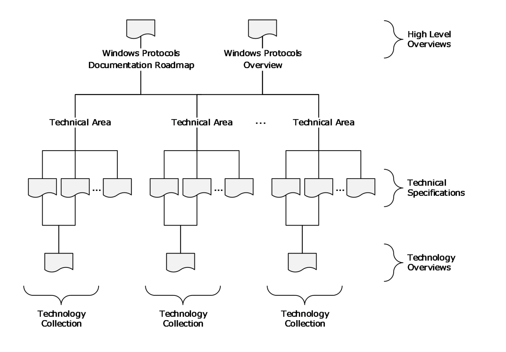
<!-- /Extracted images from page 13 -->

Figure 1: Relationships among documents

As shown in the diagram, the technical specifications of the Windows protocols documentation set are
categorized according to technical area. Within a technical area, a technology overview and related
technical specifications make up a technology collection. More than one technology collection can
be defined in a technical area. The technical areas and different document types are described in
Documentation Contents (section 2). The technical specifications are listed in the Technical
Specification Cross-Reference Matrix (section 4.1); the technical areas are listed in the Technical Area
Cross-Reference Matrix (section 4.2); and the technology collections are listed in the Technology
Collection Cross-Reference Matrix (section 4.3).

1.3.3  Naming Conventions

The Windows protocols documentation set uses the following naming conventions for all overview
documents, technical specifications, and reference documents.

  All documents are assigned a short name enclosed in square brackets. The short name is used
when citing the document or reference. Examples of short names are "[MS-DOCO]", "[MSFT-
WSTS]", and "[RFC2119]".

  All short names for documents in the documentation set have one of the following forms:



[MC-XXX] was originally used for documents that specify technology that has never
shipped with Windows. However, that restriction has been removed, and there is now no
distinction between documents with short names prefaced with "MC" and those with short
names prefaced with "MS". An example of this type of short name is "[MC-BUP]", where

13 / 125

[MS-DOCO] - v20220614
Windows Protocols Documentation Roadmap
Copyright © 2022 Microsoft Corporation
Release: June 14, 2022

the suffix "BUP" is an abbreviation for "Background Intelligent Transfer Service (BITS)
Upload Protocol".





[MS-XXXOD] is used for technology overviews (section 2.1.3). An example of this type of
short name is "[MS-AUTHSOD]", where the suffix "AUTHS" is an abbreviation for
"Authentication Services Protocols".

[MS-XXX] is used for all other overview, technical, and reference documents with short
names that do not follow one of the preceding conventions. The suffix "XXX" is an
abbreviation that refers to the subject covered by the document. An example of this type
of short name is "[MS-WPO]", where "WPO" is an abbreviation for "Windows Protocols
Overview". The short name of the current document, "[MS-DOCO]", also falls into this
category.

  Short names for reference documents that describe Microsoft technology conform to the

following naming conventions:





[MSFT-XXX] is used for information in Microsoft TechNet articles.

[KBNNNNN] and [MSFT-KBNNNNN] are used for Knowledge Base articles, where NNNNN is
the article number.



[PRA-XXX] is used for downloadable informative technical documents in PDF format.

  Short names for RFC documents are in the form [RFCNNNN], where NNNN is the RFC number.



Each document has a title that conforms to the following conventions:







The titles of technology overviews end with the word "Overview".

The titles of technical specifications that specify Microsoft extensions to non-Microsoft
protocols and structures end with either the word "Extension" or "Extensions".

The titles of technical specifications that specify algorithms, protocols, and structures end
with the word "Specification".

Note The titles of [MS-DOCO] and [MS-WPO] are exceptions to these document title
conventions.



Each document has a long name, which is composed of its short name, a colon, and its title.
Examples of long names are "[MS-DOCO]: Windows Protocols Documentation Roadmap" and
"[MS-RPRN]: Print System Remote Protocol Specification".

1.3.4  Document Versions

Documents in the Windows protocols documentation set are assigned a version number that changes
each time the document is updated. The title page of each document contains a revision summary
table that shows the top-level history of changes to the document. This revision summary table
contains the date of each release and the corresponding version number, revision class, and comment
that describes the change.

The version number and revision class are correlated as shown in the following table:

Version
number

Revision
class

1.0

2.0

New

Major

Version number change

Description

Not applicable

First release of the document.

Number to the left of the first
decimal point

Significantly changed the technical content.

14 / 125

[MS-DOCO] - v20220614
Windows Protocols Documentation Roadmap
Copyright © 2022 Microsoft Corporation
Release: June 14, 2022

Version
number

Revision
class

2.1

Minor

Version number change

Description

Number to the right of the first
decimal point

Clarified the meaning of the technical content.

2.1.1

Editorial

Number to the right of the
second decimal point

Changed language and/or formatting of the
technical content.

2.1.1

None

No change

No change to the meaning, language or
formatting of the technical content.

Note  Starting with Windows 8, the initial release version number was standardized at 1.0.
Documents created prior to Windows 8 can have a different initial release version number, such as 0.1
or 0.01.

Each overview document and technical specification also contains its own more detailed Change
Tracking Appendix, which lists the changes made to each section in the latest release.

1.4  Audience

The Windows documentation set is intended for use in conjunction with publicly available and
standards-based specifications, network programming background material, and Windows distributed
systems concepts. It assumes that the reader either is familiar with this material or has immediate
access to it.

The documentation set provides the following levels of audience support:





For implementers: Conceptual and reference information for an implementation of one or
more protocol specifications for a given task or scenario.

For architects: Structural and interoperability information for an implementation of a
technology consisting of a group of related protocols.

1.5  Localization

The Windows documentation set is not localized, but individual documents can contain locale-specific
information.

1.6  Licensing

The Windows protocols documentation set is available to view and download from the Microsoft
Developer web site at no charge. Some specifications include patented inventions, and others do not.
Implementers can benefit from a patent license if using any of the technical specifications covered by
Microsoft patents. In addition, patent licensees can receive additional benefits such as:

  Optional Technical Account Manager (TAM) to help resolve documentation questions

  Optional viewing rights to Windows source code to assist with implementing the protocols

Microsoft makes technical documents available through the following two document programs.

  Microsoft Interoperability Program (MIP): This program facilitates the use and implementation
of technical specifications for certain protocols, file formats, standards support, and languages
that are used or implemented in certain Microsoft products.

  Workgroup Server Protocol Program (WSPP): This program includes technical specifications for
communications protocols between Windows Client and applicable Windows Server releases,

15 / 125

[MS-DOCO] - v20220614
Windows Protocols Documentation Roadmap
Copyright © 2022 Microsoft Corporation
Release: June 14, 2022

as well as between applicable Windows Server releases systems, to provide file, print and user
and group administration services in a Windows Client network.

Note  Microsoft is no longer updating this content regularly. Check the Microsoft Lifecycle Policy for
information about how these document programs are supported.

For more information about patent license and patent covenant agreements available for Windows,
visit Patent Promises and Patents.

1.7  Support

Many types of support are available for the protocol implementer. Information on the following
resources can be found on the Open Specifications Developer Center:





Interop Dev Events, providing software developers with an in-person opportunity to learn
more about Windows protocols and to test their implementations.

Interoperability Test Tools, including a tool to view and monitor, in real time, specific protocol
communications between two products.

  Development Support, including forums, blogs, and Microsoft Knowledge Base.

Additional information concerning support is available on the following websites:

  Microsoft Developer, providing informative content and resources for Microsoft products and

technologies.

  Open Specification Developer Forums, providing a selection of forums across various product

protocols.



TechNet Wiki, providing community-generated content about Microsoft technologies.

[MS-DOCO] - v20220614
Windows Protocols Documentation Roadmap
Copyright © 2022 Microsoft Corporation
Release: June 14, 2022

16 / 125

2  Documentation Contents

This section describes the documents that are part of the Windows protocols documentation set and
the information they contain. The following types of documents are defined:

  Overview documents



Technical specifications

  Reference documents

The sections that follow contain details of each document type.

As described in Relationships Among Documents (section 1.3.2), the overview documents and
technical specifications are associated with various technical areas according to technology. Those
relationships are listed in the following sections:







Technical Specification Cross-Reference Matrix (section 4.1)

Technical Area Cross-Reference Matrix (section 4.2)

Technology Collection Cross-Reference Matrix (section 4.3)

The following technical areas are covered by the documentation set:

Application services: Application services enable the components of an application to interoperate

with components of other applications. These components can involve processes that are running
on one or more computers or different operating systems.

Collaboration and communications: Collaboration and communications refers to services that

facilitate interaction among people and enables client applications to locate each other on a
network. The software used for collaboration includes application sharing, email, whiteboarding,
sharing a calendar, instant messaging, and text chat. This technical area also includes protocols
that enable content to be streamed over the Internet or an intranet and the creation, distribution,
and playback of audio and video content.

Directory services: Directory services provide functionality for the centralized storage of identity and
account information, as well as other forms of data such as group policies and printer location
information. The protocols in this technical area make up the client and server behavior of Active
Directory, which provides a foundation for authentication services in a domain environment,
domain services, and directory replication services in Windows.

File, fax, and printing services: File, fax, and printing services refer to services for applications to
access, share, manage and replicate files, and for managing and accessing fax and print systems
in a distributed environment. This technical area also includes Windows SharePoint Services
(WSS), which provide features and technologies that allow users to create, manage, and build
their own collaborative websites.

Home server: Home server refers to services that enable two or more computers to connect directly
to each other in order to communicate and to organize, share, and back up documents over a
Home Server network. Home Server is a platform for private residences and small businesses that
supports the management of devices within the household or on the Internet.

Multiplayer games: Multiplayer games refers to services that provide DirectPlay functionality for

playing games over the Internet, including game configuration and connection, game state and
event handling, communication between players, and remote configuration.

Networking: Networking refers to services that enable the communication of computers with each

other over networks including wireless devices and links, IP transports, and client/server
transports such as remote procedure call (RPC) and DCOM. This technical area includes

17 / 125

[MS-DOCO] - v20220614
Windows Protocols Documentation Roadmap
Copyright © 2022 Microsoft Corporation
Release: June 14, 2022

protocols that support dynamic configuration of IP addresses, the enforcement of computer health
policies, the management of Web services, and wireless service discovery.

Remote connectivity: Remote connectivity refers to services that allow users to access applications
and data on a remote computer over a network. Remote connectivity includes remote desktop
services protocols, which provide secure connections and communication between remote clients
and servers and allow clients to use server applications and resources.

Security and identity management: Security and identity management refers to services for
authentication and authorization, certificate management, rights management, and
interoperability over the web. This technical area includes protocols that support identity
verification, credential validation, and the process of granting a person, computer process, or
device access to certain information, services or functionality, the protection and security of digital
information, and Web services based on XML, SOAP and WSDL.

Systems management: Systems management refers to services that support clustering,

configuration and administration of client and server computers, content indexing queries, remote
device management, Group Policy enforcement, remote management of computer and network
resources, performance monitoring and event logging, deployment and management of storage
technologies, system infrastructure functionality, management of Common Information Model
(CIM) objects, deployment of Microsoft product updates, and Windows name resolution for
network basic input/output system (NetBIOS) names.

Terminal services: Terminal services provide functionality for communicating remote graphical

desktop interaction and display data packets, and sound, file redirection, and print redirection data
packets from client applications to a Windows server configured as a terminal server.

2.1  Overview Documents

This section describes the overview documents in the Windows protocols documentation set. In
general, overview documents provide information that pertains to groups of documents in the
documentation set and about how protocols for specific technologies are related and used together.
The following types of overview documents are defined:

  Windows Protocols Documentation Roadmap (section 2.1.1)

  Windows Protocols Overview (section 2.1.2)



Technology Overviews (section 2.1.3)

2.1.1  Windows Protocols Documentation Roadmap

[MS-DOCO]: Windows Protocols Documentation Roadmap is the starting point for navigating within
and understanding all the other documents in the Windows protocols documentation set.

2.1.2  Windows Protocols Overview

[MS-WPO]: Windows Protocols Overview provides a conceptual overview of Windows protocols,
including their functionality, how they interact, and their relationships to Windows technologies. Each
technology is further broken down into subsystems with information about the technology overviews
(section 2.1.3) and technical specifications (section 2.2) that pertain to each subsystem. The Windows
technologies are grouped into the technical areas described in Documentation Contents (section 2).

2.1.3  Technology Overviews

Technology overviews provide informative content that describes protocols in a technical area that are
functionally related or are commonly used together to accomplish specific goals. Each technology

18 / 125

[MS-DOCO] - v20220614
Windows Protocols Documentation Roadmap
Copyright © 2022 Microsoft Corporation
Release: June 14, 2022

overview and the technical specifications it describes comprise a technology collection. The technology
collections in the Windows protocols documentation set are listed in the Technology Collection Cross-
Reference Matrix (section 4.3).

Each technology overview provides the following types of information:

  A conceptual description of the architecture, communication, and relationships among the

protocols and with other technology collections.



The intended users and uses of the technology collection, its environment, and its role within
the architecture of Windows.

  Scenarios that illustrate use cases for the technology collection, including common errors,

which describe the actors; the actors' intentions and goals; any necessary preconditions; an
overall flow of data and events with common alternatives; and typical results.



The Microsoft products that implement the technology collection, and its versions and
capabilities in each Microsoft product.

The technology overviews are listed, grouped according to technical area, in the remainder of this
section.

Application services:







[MS-MQOD]: Message Queuing Protocols Overview: This document describes the functionality
of Microsoft Message Queuing (MSMQ), a communications service that enables reliable and
secure asynchronous messaging between applications over a variety of deployment topologies.
MSMQ temporarily decouples the sending of a message from the receipt of that message,
allowing applications to communicate even if their execution lifetimes do not overlap.

[MS-NETOD]: Microsoft .NET Framework Protocols Overview: This document describes the
functionality, interrelationships, and protocol layering of the communication protocols
implemented in the .NET Remoting and Windows Communication Foundation (WCF)
components of the .NET Framework.

[MS-TPSOD]: Transaction Processing Services Protocols Overview: This document provides an
overview of the functionality and relationships of transaction processing protocols.
Transaction processing is designed to maintain a computation system in a known, consistent
state by allowing multiple individual operations to be linked together as a single, indivisible
operation, so that either all of the changes are processed or none of the changes are
processed.

Collaboration and communications:



[MS-MSSOD]: Media Streaming Server Protocols Overview: This document describes the
functionality of the media streaming server protocols, which are used to convert both live and
prerecorded audio format and to distribute the content over a network or the Internet. Media
streaming server technologies support publishing secure content to a media server, streaming
content from a media server, and requesting a license from a license server.

Directory services:





[MS-ADFSOD]: Active Directory Federation Services (AD FS) Protocols Overview: This
document describes the functionality and relationship of the Active Directory Federation
Services (AD FS) protocols, which offer a means for distributed identification, authentication,
and authorization across organizational and platform boundaries.

[MS-ADOD]: Active Directory Protocols Overview: This document describes the functionality
and relationships of the Active Directory protocols, which provide directory services for the
centralized storage of identity, account information, group policies, and printer location

19 / 125

[MS-DOCO] - v20220614
Windows Protocols Documentation Roadmap
Copyright © 2022 Microsoft Corporation
Release: June 14, 2022

information, a foundation for authentication services in a domain environment, domain
services, and directory replication services in Windows.

File, fax, and printing services:













[MS-CCROD]: Content Caching and Retrieval Protocols Overview: This document describes the
protocols, data structures, and security mechanisms that are required to enable a system of
content caching and retrieval to interoperate with Windows systems, and content retrieval
scenarios such as accessing content from a file or web server.

[MS-FASOD]: File Access Services Protocols Overview: This document describes the use of the
protocols for network file access services interoperation with Windows, which allows
applications to access and share files located on a file server on a network in a secure and
managed environment.

[MS-FSMOD]: File Services Management Protocols Overview: This document describes the use
of the protocols for remote administration and management of file servers that share data
within an organization.

[MS-PRSOD]: Print Services Protocols Overview: This document describes the distributed
system of print servers that manage printers and make them available to print clients.

[MS-STOROD]: Storage Services Protocols Overview: This document describes the interaction
of protocols that provide disk and volume management services, data backup and restore,
removable media management, file access control, and file encryption in Windows.

[MS-VSOD]: Virtual Storage Protocols Overview: This document Provides an overview of the
functionality of and relationship among the virtual storage protocols, which provide a means
for a client to access, read, and write to virtual storage on a remote server.

Networking:



[MS-NAPOD]: Network Access Protection Protocols Overview: This document describes the
functionality to allow client computers to gain access to network resources based on the
client's identity and compliance with a corporate governance policy, and how various
components work together to promote the health and protection of networked systems.

Remote connectivity:



[MS-RDSOD]: Remote Desktop Services Protocols Overview: This document describes the
Terminal Services system, which enables a remote client to display and interact with a
desktop or application running on a distant server. Using this technology, a remote client
connected to the server can use software and resources available to the server.

Security and identity management:







[MS-AUTHSOD]: Authentication Services Protocols Overview: This document describes the
functionality and relationships of protocols in the identity verification of users, computers, and
services through interactive logon and network logon authentication processes.

[MS-AZOD]: Authorization Protocols Overview: This document describes the functionality and
relationships of the protocols that control the granting of access to resources, once
authentication has been accomplished, by using one of several Windows authorization
models.

[MS-CERSOD]: Certificate Services Protocols Overview: This document provides an overview
of how the certificate enrollment, certificate policy and certificate remote administration
protocols are implemented in the certificate services system, the standalone and enterprise
models of the certificate authority (CA), the protocols involved, and how they communicate
with each other.

20 / 125

[MS-DOCO] - v20220614
Windows Protocols Documentation Roadmap
Copyright © 2022 Microsoft Corporation
Release: June 14, 2022



[MS-RMSOD]: Rights Management Services Protocols Overview: This document describes the
protocols of the Rights Management Services (RMS) system, which allows individuals and
administrators to encrypt and specify access and usage restrictions on various types of data,
including documents and email messages.

Systems management:







[MS-GPOD]: Group Policy Protocols Overview: This document describes the protocols used for
Group Policy, which enables administrators to define and manage required computer
configurations or policy settings for a large number of users and computers within an Active
Directory environment.

[MS-WMOD]: Windows Management Protocols Overview: Provides an overview of the
functionality and relationships of the Windows Management protocols, which provide the
ability to control settings and collect data for a set of client and server computers, to query
another system or computer, and to perform administrative operations to monitor,
troubleshoot, and conduct hardware and software inventories in remote computers.

[MS-WSUSOD]: Windows Server Update Services Protocols Overview: This document
describes the Windows Server Update Services system, which enables IT administrators to
distribute and manage software updates from a central location to a large number of
computers.

2.2  Technical Specifications

This section describes the details of protocols, structures and standards that are specified in technical
specifications. The goal of the technical specifications is to support interoperability, not to describe the
Windows implementations of the technology. For example, many protocols specify client and server
roles; for such protocols, the information contained in technical specifications fulfills the three general
interoperability cases:







Implement a client that interoperates with a server implemented in Windows.

Implement a server that interoperates with a client implemented in Windows.

Implement a client and a server that interoperate with each other on a non-Windows
operating system.

Other types of protocols, as well as structures, algorithms, and so on, are also documented to support
interoperability in both Windows and non-Windows operating environments.

Technical specifications consist of both normative and informative content.

2.2.1  Normative Content

Normative content refers to technical details that are essential for implementing software that
interoperates with Windows. This content is written using the prescriptive language of RFCs as defined
in [RFC2119], including the verb forms MAY, MUST, MUST NOT, SHOULD, and SHOULD NOT.

  MUST and MUST NOT emphasize behavior that is required or prohibited, respectively, by the

technology for interoperability, such as setting a field to zero, using a reply packet, or
performing a action when a certain type of packet is received.

In a normative section of a specification, any statement that does not use a prescriptive verb
means that the behavior is required, as if a MUST were used explicitly.

  MAY means that the behavior is optional. A product behavior note (PBN) is required if the
behavior is implemented in at least one applicable Windows version; the absence of a PBN

[MS-DOCO] - v20220614
Windows Protocols Documentation Roadmap
Copyright © 2022 Microsoft Corporation
Release: June 14, 2022

21 / 125

means that no Windows version implements the behavior. PBNs are informative content
(section 2.2.2).

  SHOULD means that the behavior is optional but recommended by the designers of the

technology. A PBN is required if the behavior is absent from at least one applicable Windows
version; the absence of a PBN means that all product versions implement the behavior.

  SHOULD NOT means that the behavior is optional and not recommended by the designers of
the technology. An implementer should understand and carefully consider the implications of
the behavior before it is implemented. A PBN is required if the behavior is implemented in at
least one applicable Windows version; the absence of a PBN means that no Windows version
implements the behavior.

For all optional behavior, an implementation that does not do the behavior must be interoperable with
one that does, and vice versa.

Normative content includes the following categories of information:

  Classes of functionality (roles)

  Data definitions (constants, enumerations, structures, and so on)



Encryption

  Message formats and processing

  Method signatures and return values

  Schemas and namespaces

  State transitions





Timers, events, and event processing

Transport

  Vendor-extensible fields

Technical specifications that reference directory service schema element class/attribute pairs
(section 2.2.3.3.1), cite one or more of the following normative references:











[MS-ADA1]: Active Directory Schema Attributes A-L

[MS-ADA2]: Active Directory Schema Attributes M

[MS-ADA3]: Active Directory Schema Attributes N-Z

[MS-ADSC]: Active Directory Schema Classes

[MS-ADLS]: Active Directory Lightweight Directory Services Schema

Technical specifications that use common data types (section 2.2.3.3.2) cite the following normative
reference:



[MS-DTYP]: Windows Data Types

Technical specifications that reference HRESULT, NTStatus, or Win32 error codes (section 2.2.3.3.3)
cite the following normative reference:



[MS-ERREF]: Windows Error Codes

[MS-DOCO] - v20220614
Windows Protocols Documentation Roadmap
Copyright © 2022 Microsoft Corporation
Release: June 14, 2022

22 / 125

Technical specifications that reference landing code identifiers (LCIDs) (section 2.2.3.3.4) cite the
following normative reference:



[MS-LCID]: Windows Language Code Identifier (LCID) Reference

2.2.2  Informative Content

Content that is not normative in technical specifications is informative, and it is provided only as a
helpful guide to the implementer. Informative content is not essential for implementation and includes
the following categories of information:

  Abstract data models

  Capability negotiations





Examples

Implementation-specific parameters

  Relationships to other protocols

  Security parameters

  Versioning

  Windows-version-specific behaviors

Windows-version-specific behavior is described in footnotes to the main body of a specification. That
information is not normative and is provided to support interoperability across multiple versions of
Windows Client operating system and applicable Windows Server releases. The following criteria are
used to determine whether information is not appropriate in the body of a technical specification and
gets placed in a product behavior footnote:













The information varies by Windows product.

The information concerns an implementation limit for a data structure; for example, maximum
entries or queue size.

The information concerns a retry interval.

The information concerns a retry count prior to returning a specified error code.

The information concerns a specific buffer size choice, when other buffer sizes will work.

The information concerns loading implementation-specific configuration information from the
Windows registry.

2.2.3  Template Types

In general, each technical specification conforms to one of a set of document templates, based on the
type of information that is conveyed by the associated protocol or structure:

  Algorithm: Algorithms used in network communication.

  Block: Generic message-based protocols.

  Data Structure: Structures used by one or more algorithms or protocols.



File Structure: The formats of files used to convey information between systems.

  HTTP: Protocols based on HTTP APIs, including RESTful and REST-like protocols.

23 / 125

[MS-DOCO] - v20220614
Windows Protocols Documentation Roadmap
Copyright © 2022 Microsoft Corporation
Release: June 14, 2022

  RPC: Remote procedure call (RPC) method-based client/server protocols.

  SOAP: Request/response protocols that are defined by using Web Services Description

Language (WSDL).

  Standards Support: Microsoft implementation conformance with an external standard.

The following sections provide general descriptions of these document templates. The template used
for each technical specification in the Windows protocols documentation set is listed in Technical
Specification Cross-Reference Matrix (section 4.1).

2.2.3.1  Algorithm

An Algorithm technical specification defines an algorithm or extension to an algorithm that is used in
network communication. An Algorithm document defines no data structure or data sent over the wire.
If the algorithm is associated with a data structure, they are either documented separately in
Algorithm and Structure technical specifications or together in a Block technical specification.

A technical specification that specifies a protocol can refer to an Algorithm document, but if the
algorithm is specific to the protocol, it can be documented within the protocol document.

If the algorithm inherently has different classes of functionality, or "roles", normative information is
provided for each. If enough logic is common between roles that it makes sense to not duplicate it, a
section titled "Common Algorithm Details" can be specified. For example, for compression and
decompression algorithms, a section for common details might be included with the role-specific
sections "Compression Algorithm Details" and "Decompression Algorithm Details".

Algorithm technical specifications can contain the following types of normative information, where
applicable:

  Classes of functionality (roles)



Processing rules

  State transitions

2.2.3.2  Block

A Block technical specification defines a packet-based protocol. The name "Block" is a reference to the
block diagrams that are frequently used to express interaction patterns. The Block type of technical
specification is also used if no other type of document is appropriate for the protocol or format being
specified.

Block technical specifications specify exactly how data is marshaled that is sent or received over a
network, which requires a definition of the byte order of packet data. Message syntax is specified by
using packet diagrams that are 32-bits wide, with bit 0 on the far left, as shown in the following
example.

0  1  2  3  4  5  6  7  8  9

1
0  1  2  3  4  5  6  7  8  9

2
0  1  2  3  4  5  6  7  8  9

3
0  1

Field Name 1

Field Name 2

Field Name 3 (optional)

The bit numbering convention that is followed is big-endian; namely, the most significant bit of the
first byte to traverse the network is bit 0, and the least significant bit of the last byte to traverse the

24 / 125

[MS-DOCO] - v20220614
Windows Protocols Documentation Roadmap
Copyright © 2022 Microsoft Corporation
Release: June 14, 2022

network is in bit 31. The byte order format can be different in the operating environment, so it is
specified in the document for multibyte data fields.

Block technical specifications can contain the following types of normative information, where
applicable:

  Augmented Backus-Naur Form (ABNF) syntax [RFC5234]

  Binary packets

  Directory service schema classes and attributes [MS-ADA1] [MS-ADA2] [MS-ADA3] [MS-

ADLS] [MS-ADSC]

  Data and type definitions (constants, enumerations, structures, and so on)

  Encryption algorithms

  Namespaces [XMLNS]

  Shared state variables

  XML schema definitions (XSDs) [XML10] [XMLINFOSET] [XMLSCHEMA1/2]

[XMLSCHEMA2/2]

2.2.3.3  Data Structure

A Data Structure technical specification specifies a common structure or an extension to a common
data structure that is used by multiple protocols. The description does not include related behavior.
Behavior is defined in the specifications for protocols that use the data structure.

Data Structure technical specifications specify how data is decoded and encoded as it is processed in
the specific operating environment. If the data is in XML, the schemas and namespaces are specified.

Data Structure technical specifications can contain the following types of normative information, where
applicable:

  Augmented Backus-Naur Form (ABNF) syntax [RFC5234]

  Binary packet structure

  Data and type definitions (constants, enumerations, structures, and so on)

  XML schema definitions (XSDs) [XML10] [XMLINFOSET] [XMLSCHEMA1/2]

[XMLSCHEMA2/2]

Specific data structure technical specifications that are cited normatively by other technical
specifications are described in the following subsections.

2.2.3.3.1 Active Directory Objects

Active Directory objects are normative definitions of the objects that exist in the Microsoft Active
Directory. The objects of type "attribute" that exist in the Active Directory schema are presented in
the following technical specifications:







[MS-ADA1]: Active Directory Schema Attributes A-L

[MS-ADA2]: Active Directory Schema Attributes M

[MS-ADA3]: Active Directory Schema Attributes N-Z

[MS-DOCO] - v20220614
Windows Protocols Documentation Roadmap
Copyright © 2022 Microsoft Corporation
Release: June 14, 2022

25 / 125

The objects of type "class" that exist in the Active Directory schema are presented in the following
technical specification:



[MS-ADSC]: Active Directory Schema Classes

The objects of types "attribute" and "class" that exist in the Active Directory Lightweight
Directory Services (AD LDS) schema are presented in the following technical specification:



[MS-ADLS]: Active Directory Lightweight Directory Services Schema

These specifications are not intended to stand on their own; they are intended to serve as appendixes
to the Active Directory Technical Specification. For details about the Active Directory schema, see [MS-
ADTS]: Active Directory Technical Specification.

2.2.3.3.2 Windows Data Types

Windows data types are common data types that are used in the Windows protocols documentation
set. They are presented in the following document:



[MS-DTYP]: Windows Data Types

The Windows data types are categorized as follows:

  Common base types: Primitive data types, including IDL base types, which are natively

supported by Microsoft compilers; for example, byte, handle_t, and wchar_t.

  Common data types: Simple data types, including aliases for C/C++ primitive data types,

which are frequently used by many protocols; for example, BYTE, DWORD, and WCHAR.

  Common data structures: User-defined data types, including those supporting RPC protocols,

which are defined in C/C++ or ABNF; for example, FILETIME, GUID, and
RPC_UNICODE_STRING.

  Constructed security types: Types used to define structures that are specific to the Windows
security model; for example, security identifier (SID), and SECURITY_DESCRIPTOR.



Impersonation abstract interface: Methods for managing the underlying security infrastructure
for server roles in Windows.

2.2.3.3.3 Windows Error Codes

Windows error codes are method return values and status codes that are used in the Windows
protocols documentation set. They are presented in the following document:



[MS-ERREF]: Windows Error Codes

The following information is provided in the Windows error codes specification:

  HRESULT: The HRESULT data type is commonly used as a return value from RPC methods.
The most significant bit is used to indicate success or failure. The following details about
HRESULT are provided:



The structure of the HRESULT data type.

  Requirements for vendor-specific values.

  Values in a 32-bit numbering space.

  Descriptions of the error conditions returned.



Parameter substitution in value descriptions.

[MS-DOCO] - v20220614
Windows Protocols Documentation Roadmap
Copyright © 2022 Microsoft Corporation
Release: June 14, 2022

26 / 125



The HRESULT from WIN32 error code macro, which converts a Win32 error code to an
HRESULT value.

  Win32 error codes: Win32 error codes are 16-bit values extended to 32-bits with zero fill, and
they can be returned by methods or in structures. In general, they are not vendor-extendable.
The following details about Win32 error codes are provided:

  Success and error values.

  Descriptions of the error conditions returned



Parameter substitution in value descriptions.

  NTSTATUS: The NTSTATUS data type is a standard, 32-bit structure that is used to

communicate system information. The following details about Win32 error codes are provided:





Identification of levels of severity: Success, Informational, Warning and Error.

The structure of the NTSTATUS data type.

  Requirements for vendor-specific values.

  Values in a 32-bit numbering space.

  Descriptions of the error conditions returned.



Parameter substitution in value descriptions.



LDAP result codes: Windows contains an implementation of the LDAP resultCode [RFC2251],
which is used by higher-layer protocols to interpret the results of an LDAP operation. Each
LDAP error value is mapped to the closest Win32 error value; this mapping is provided.

2.2.3.3.4 Windows Language Code Identifier (LCID) Reference

Windows language code identifiers (LCID) are presented in the following document:



[MS-LCID]: Windows Language Code Identifier (LCID) Reference

Also known as culture identifiers, LCID values are used to identify specific languages for the purpose
of customizing software for locales and cultures. For example, an LCID value can specify the way
dates, times, and numbers are formatted as strings, as well as paper sizes and preferred sort order
based on language elements.

The following information is provided in the Windows language code identifier reference:



The structure of the LCID data type.

  All LCID values that are available in all versions of Windows.



Locale-specific sort order values.

2.2.3.4  File Structure

A File Structure technical specification specifies the structure and contents of a file that can be sent
over the network. Rules for accessing and processing the contents of the file can be specified in this
type of technical specification.

File Structure technical specifications specify how data is encoded by the creator and decoded by the
consumer as it is passed within the operating environment. If the data is in XML, the schemas and
namespaces are specified.

27 / 125

[MS-DOCO] - v20220614
Windows Protocols Documentation Roadmap
Copyright © 2022 Microsoft Corporation
Release: June 14, 2022

File Structure technical specifications can contain the following types of normative information, where
applicable:

  Augmented Backus-Naur Form (ABNF) syntax [RFC5234]

  Binary record structure

  Data and type definitions (constants, enumerations, structures, and so on)

  XML schema definitions (XSDs) [XML10] [XMLINFOSET] [XMLSCHEMA1/2]

[XMLSCHEMA2/2]

2.2.3.5  HTTP

An HTTP technical specification defines a protocol that uses an HTTP-based API with a simplified set of
HTTP functions, such as GET and POST, to make API calls. It can also use a Representational State
Transfer (REST) client/server architecture in which requests and responses are built around the
transfers of resource representations, which are documents that capture the current or intended
states of resources. HTTP technical specifications specify the web resources that are accessed and
manipulated by the protocol, HTTP operations that can be applied to the resources, and the syntax of
request/response payloads.

An HTTP specification can specify either a REST-like or RESTful protocol. In general, "REST-like" refers
to a protocol that uses simple URI-based requests to a specific domain over HTTP. "RESTful" refers to
a protocol that conforms to certain constraints including a client/server architecture, statelessness,
and a uniform interface.

HTTP specifications can contain the following types of normative information, where applicable:

  Augmented Backus-Naur Form (ABNF) syntax [RFC5234]

  Conceptual Schema Definition Language (CSDL) [MC-CSDL]

  Data definitions (complex types, simple types, attributes, and so on)

  Directory service schema classes and attributes [MS-ADA1] [MS-ADA2] [MS-ADA3] [MS-

ADLS] [MS-ADSC]

  HTTP methods and structures [RFC7230] [RFC7231] [RFC7232] [RFC7233] [RFC7234]

[RFC7235] [RFC7236]



JavaScript Object Notation (JSON) definitions [ECMA-404] [JSON-Schema]

  Namespaces [XMLNS]

  URI syntax [RFC3986]

  XML schema definitions (XSDs) [XML10] [XMLINFOSET] [XMLSCHEMA1/2]

[XMLSCHEMA2/2]

2.2.3.6  RPC

An RPC technical specification defines a method-based protocol, which uses a formal syntax with calls
and return codes, and in which a protocol client initiates all communication and a protocol server
responds to the protocol client. RPC specifies request/response protocols, in which all arguments come
directly from the higher layer, and all return codes, output parameters, and exceptions are passed
unmodified.

[MS-DOCO] - v20220614
Windows Protocols Documentation Roadmap
Copyright © 2022 Microsoft Corporation
Release: June 14, 2022

28 / 125

Some RPC specifications specify protocols that use the Distributed Component Object Model
(DCOM) as their transport, which uses the TCP/IP RPC protocol sequence. Such protocols can use the
DCOM security and authentication framework and interface activation.

RPC specifications use Interface Definition Language (IDL) to specify the syntax of protocol
methods and marshaling of protocol data. Such interface definitions can be compiled by using the
Microsoft Interface Definition Language (MIDL) compiler with command-line parameters, as
follows: "midl /target NT60 /nologo". To avoid duplicating the definitions of common data types, RPC
protocol IDL sections can contain one or more import directives for IDL data from other technical
specifications, including the following:







[MS-DCOM]: Distributed Component Object Model (DCOM) Remote Protocol Appendix A: Full
IDL (section 6)

[MS-DTYP]: Windows Data Types Appendix A: Full MS-DTYP IDL (section 5)

[MS-OAUT]: OLE Automation Protocol Specification Appendix A: Full IDL (section 6)

RPC specifications can contain the following types of normative information, where applicable.

  Augmented Backus-Naur Form (ABNF) syntax [RFC5234]



IDL definitions [MIDLINF]

  Directory service schema classes and attributes [MS-ADA1] [MS-ADA2] [MS-ADA3] [MS-

ADLS] [MS-ADSC]

  RPC Interfaces and methods [C706]

  Namespaces [XMLNS]

  XML schema definitions (XSDs) [XML10] [XMLINFOSET] [XMLSCHEMA1/2]

[XMLSCHEMA2/2]

RPC specifications include the following normative reference:



[MS-RPCE]: Remote Procedure Call Protocol Extensions

For DCOM-based RPC protocols, the following normative reference is included:



[MS-DCOM]: Distributed Component Object Model (DCOM) Remote Protocol Specification

2.2.3.7  SOAP

A Simple Object Access Protocol (SOAP) [SOAP1.1] [SOAP1.2/1] [SOAP1.2/2] technical
specification defines a packet-based protocols. Unlike Block technical specifications, SOAP specifies
request/response, SOAP-based protocols that use Web Services Description Language (WSDL).
SOAP technical specifications typically apply to Web services.

A SOAP technical specification uses the features and mechanisms defined in XML and WSDL to define
the protocol as closely as those mechanisms allow. SOAP services support the feature of returning
XSD and WSDL documents that describe the protocol that the service implements. If the XSD includes
character data that follows a grammar that cannot be described in the XSD, the grammar can be
defined in the technical specification, or a normative reference to the grammar definition is provided.
If the character data has some internal syntax that is not defined in a normative reference, the syntax
is specified in the technical specification by using "augmented" BNF (ABNF).

If the XSD includes binary data that follows a grammar that cannot be described in the XSD, the
grammar is defined in the technical specification, or a normative reference to the grammar definition

[MS-DOCO] - v20220614
Windows Protocols Documentation Roadmap
Copyright © 2022 Microsoft Corporation
Release: June 14, 2022

29 / 125

is provided. If the grammar is defined in the technical specification, the packet definition format used
in Block technical specifications (section 2.2.3.2) is used.

SOAP technical specifications can contain the following types of normative information, where
applicable:

  Augmented Backus-Naur Form (ABNF) syntax [RFC5234]

  Directory service schema classes and attributes [MS-ADA1] [MS-ADA2] [MS-ADA3] [MS-

ADLS] [MS-ADSC]

  Namespaces [XMLNS]

  WSDL messages [WSDL]

  XML schema definitions (XSDs) [XML10] [XMLINFOSET] [XMLSCHEMA1/2]

[XMLSCHEMA2/2]

2.2.3.8  Standards Support

A Standards Support technical specification describes how a Microsoft implementation or set of
implementations conform to or vary from an existing specification such as a standard, a third-party
specification, or any published specification.

A Standards Support document is essentially an appendix of implementation choices made and
information about those choices. For example, a standard might specify that an implementation
provides any of seven date/time values. A Standards Support document would indicate which
date/time values are supported in the Microsoft implementation. If the implementation provides an
eighth value—that is, one not from the standard, that variance from the standard would be defined in
a normative section of the Standards Support document.

Standards Support documents can contain the following types of normative information, where
applicable:





Error handling variations from the standard

Extensions to the standard

  Normative variations from the standard

2.3  Reference Documents

This section describes the non-normative information that is found in reference documents in the
Windows documentation set. It is supplementary to the overview and technical documents and are
generally not specific to a single protocol or technical area. They consolidate related information and
are intended to be helpful for understanding and using the documentation set.

Reference documents contain the following categories of information:

  Windows protocols Unicode reference

2.3.1  Windows Protocols Unicode Reference

This reference provides related Unicode processing algorithms on the Windows platform, including
Unicode string comparison and conversion of Unicode to legacy code pages. They are presented in
the following document:



[MS-UCODEREF]: Windows Protocols Unicode Reference

[MS-DOCO] - v20220614
Windows Protocols Documentation Roadmap
Copyright © 2022 Microsoft Corporation
Release: June 14, 2022

30 / 125

The following information is provided in the Windows protocols Unicode reference:

  UTF-16 string comparison: Provides linguistic-specific comparisons between two Unicode

strings and provides the comparison result based on the language and region for a specific
user.

  Mapping of UTF-16 strings to earlier ANSI code pages: Converts Unicode strings to strings in

the earlier code pages that are used in older versions of Windows and the applications that are
written for these earlier code pages.



The mechanism for the transport of Windows protocols Unicode reference messages.

  Windows protocols Unicode reference message syntax.

2.4  External References

This section describes the external references used by the Windows protocols documentation set,
including the following:



Information made available by the Microsoft Corporation

  Documents published by standards bodies.

  RFCs

2.4.1  Microsoft Corporation

Microsoft makes available supplementary documentation that can be cited by Windows technical
documents to provide helpful information to the implementer, including the following:



Interoperability documents from other divisions of Microsoft, including Microsoft Office
Protocols, Exchange Server Protocols, SharePoint Products and Technologies Protocols, and
Microsoft SQL Server Protocols.

  Microsoft Developer, providing informative content and resources for Microsoft products and

technologies.



TechNet Wiki, providing community-generated content about Microsoft technologies.

2.4.2  Standards Bodies

Documents from the following non-Microsoft standards bodies are cited normatively and informatively
in the Windows protocols documentation set.

American National Standards Institute (ANSI): Represents the U.S. standards and conformity

assessment system and oversees the creation and use of norms and guidelines in nearly all
business sectors. ANSI also accredits programs that assess conformance to standards and
operates the National Standards System Network (NSSN).

International Committee on Information Technology Standards (INCITS): INCITS is part of ANSI. It is
the primary U.S. standards group in the field of Information and Communications Technologies
(ICT), encompassing storage, processing, transfer, display, management, organization, and
retrieval of information. INCITS also serves as ANSI's Technical Advisory Group for ISO/IEC Joint
Technical Committee 1. JTC 1 is responsible for international standardization in the field of
Information Technology.

Distributed Management Task Force (DMTF): An IT industry organization that facilitates the

development, validation, and promotion of systems management standards.

31 / 125

[MS-DOCO] - v20220614
Windows Protocols Documentation Roadmap
Copyright © 2022 Microsoft Corporation
Release: June 14, 2022

ECMA International: Standards organization for communications technology and consumer electronics.

Federal Information Processing Standards (FIPS): Standards and guidelines issued by the National
Institute of Standards and Technology (NIST). NIST develops FIPS when there are compelling
Federal government requirements such as for security and interoperability and there are no
acceptable industry standards or solutions.

Institute of Electrical and Electronics Engineers (IEEE) Standards Association: The IEEE-SA helps

develop and advance global technologies by creating standards that drive the functionality,
capabilities. and interoperability of a wide range of products and services.

International Organization for Standardization (ISO): ISO is a network of the national standards
institutes of 161 countries. Member institutions come from both government and the private
sector. ISO enables a consensus to be reached on solutions that meet both the requirements of
business and the broader needs of society.

International Telecommunications Union (ITU): The United Nations agency for information and

communication technology issues, and the global focal point for governments and the private
sector in developing networks and services.

Internet Assigned Numbers Authority (IANA): The organization responsible for coordinating some of

the key elements that keep the Internet running smoothly. IANA provides technical coordination of
key parts of the Internet.

Internet Engineering Task Force (IETF): The IETF helps to make the Internet work better by producing
high quality, relevant technical documents that influence the way people design, use, and manage
the Internet.

Internet Society (ISOC): The Internet Society (ISOC) is a nonprofit organization that provides

leadership in Internet -related standards, education, and policy.

National Institute of Standards and Technology (NIST): An agency of the U.S. Department of

Commerce, the mission of NIST is to promote U.S. innovation and industrial competitiveness by
advancing measurement science, standards, and technology in ways that enhance economic
security and improve our quality of life.

Organization for the Advancement of Structured Information Standards (OASIS): OASIS is a nonprofit
consortium that drives the development, convergence and adoption of open standards. OASIS
promotes industry consensus and produces worldwide standards for security, cloud computing,
SOAP, web services, the Smart Grid, electronic publishing, emergency management, and other
areas.

The Open Group: The Open Group is a vendor- and technology-neutral consortium that works towards

enabling access to integrated information within and between enterprises based on open
standards and global interoperability.

The Unicode Consortium: The Unicode Consortium is a nonprofit organization that develops standards

in the area of internationalization including defining the behavior and relationships between
Unicode characters.

Trusted Computing Group, Trusted Network Connect: The Trusted Computing Group (TCG) is a

nonprofit organization that is focused on developing, defining, and promoting open standards for
trusted computing. TCG's Trusted Network Connect (TNC) network security offers interoperable
standards for secure guest access, user authentication, endpoint integrity, clientless endpoint
management, and coordinated security.

World Wide Web Consortium (W3C): The W3C is an international community that develops standards

to ensure the long-term growth of the web. The W3C mission is to develop protocols and
guidelines that ensure the long-term growth of the web.

32 / 125

[MS-DOCO] - v20220614
Windows Protocols Documentation Roadmap
Copyright © 2022 Microsoft Corporation
Release: June 14, 2022

2.4.3  RFCs

RFCs constitute a large body of standards and proposed standards describing methods, behaviors,
research, and innovations applicable to the working of network-connected systems. Technical
specifications in the Windows documentation set make numerous references to RFCs via the RFC
Editor website.

[MS-DOCO] - v20220614
Windows Protocols Documentation Roadmap
Copyright © 2022 Microsoft Corporation
Release: June 14, 2022

33 / 125

<!-- Extracted images from page 34 -->
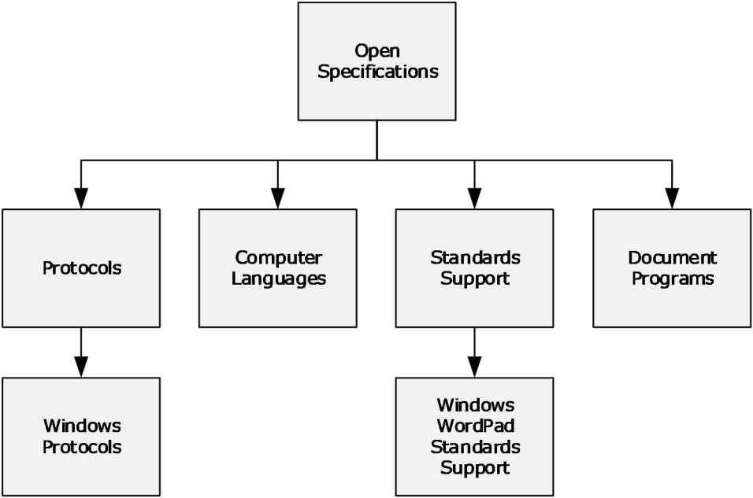
<!-- /Extracted images from page 34 -->

3  Navigating the Documentation Set

This section describes ways to navigate within the online Microsoft Docs library to find components of
the Windows protocols documentation set. The subsections that follow describe the following paths to
find documents:

  Document nodes (section 3.1): The structure of the Open Specifications node and the

documents within it.

  Document types (section 3.2): Where specific types of documents are located in the Open

Specifications nodes.

  Document citations (section 3.3): How documents are linked to each other.

A complete site map of the Open Specifications node tree for the Windows protocols documentation
set is presented in Appendix B: Open Specification Site Map (section 5).

3.1  Document Nodes

This section describes how to navigate to document nodes in the Windows protocols documentation
set from the Open Specifications node, which contains the nodes shown in the following diagram.

Figure 2: Open Specifications nodes

The nodes shown in the diagram illustrate how the Windows protocols documentation set is organized.
Specifically:

Windows Protocols: This node provides access to overview documents, Windows protocols, and
reference documents, as described in section 3.1.1.

Computer Languages: This node provides access to technical documents for Microsoft general purpose
languages and domain-specific languages that are used by Microsoft products.

Windows WordPad Standards Support: This node provides access to documents describing support for
the standards that are implemented in Windows WordPad, as described in section 3.1.2.

[MS-DOCO] - v20220614
Windows Protocols Documentation Roadmap
Copyright © 2022 Microsoft Corporation
Release: June 14, 2022

34 / 125

<!-- Extracted images from page 35 -->
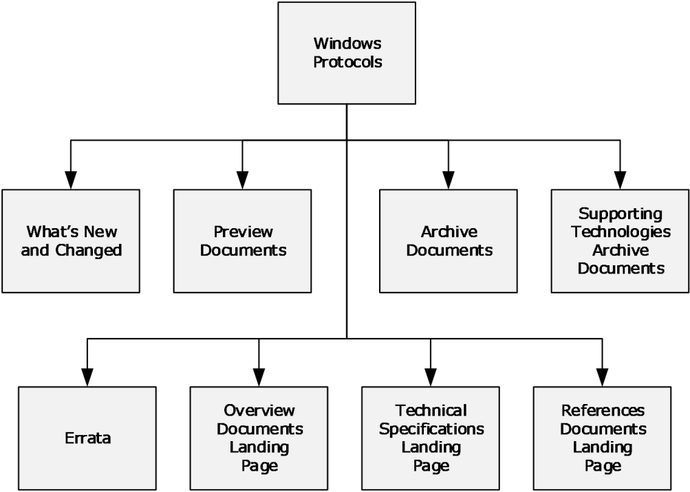
<!-- /Extracted images from page 35 -->

Document Programs: This node describes the technical documents made available in the following
document programs; however, Microsoft is no longer updating this content regularly. See section 1.6
for more information.

  Microsoft Interoperability Program (MIP)

  Workgroup Server Protocol Program (WSPP)

3.1.1  Windows Protocols

The Windows Protocols node is reached from the Open Specifications node as shown in section 3.1. It
is possible to navigate from this node to the nodes shown in the following diagram.

Figure 3: Windows protocols node

These nodes contain links to nodes in the Windows protocols documentation set, as follows:

What’s New and Changed: Technical specifications that are new or updated for the last release. It also
gives a description of what technical content has been changed in the technical specification.

Preview Documents: Prerelease versions of documents for community review and feedback. The
differences in the preview document since the last release are identified.

Archive Documents: Archived copies of documents that were previously published. They are provided
for convenience only and may not be normative.

Supporting Technologies Archive Documents: Archived copies of documents that were previously
published in the Open Specifications library. They are provided for convenience only and may not be
normative.

Errata: Content changes in technical specifications, overviews, and reference documents, which could
impact an implementation in published versions of documents prior to their next release.

Overview Documents Landing Page: The overview documents landing page is described in section
3.1.1.1.

35 / 125

[MS-DOCO] - v20220614
Windows Protocols Documentation Roadmap
Copyright © 2022 Microsoft Corporation
Release: June 14, 2022

<!-- Extracted images from page 36 -->
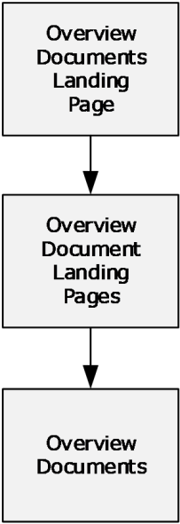
<!-- /Extracted images from page 36 -->

Technical Specifications Landing Page: The technical specifications landing page is described in section
3.1.1.2.

Reference Documents Landing Page: The reference documents landing page is described in section
3.1.1.3.

3.1.1.1  Overview Documents Landing Page

The Overview Documents Landing Page node can be reached from the Windows Protocols node as
shown in section 3.1.1. From this node it is possible to navigate to the nodes shown in the following
diagram.

Figure 4: Overview document landing page nodes

The overview documents landing page node links to the landing pages for all overview documents in
the Windows protocols documentation set. It is shown below.

[MS-DOCO] - v20220614
Windows Protocols Documentation Roadmap
Copyright © 2022 Microsoft Corporation
Release: June 14, 2022

36 / 125

<!-- Extracted images from page 37 -->
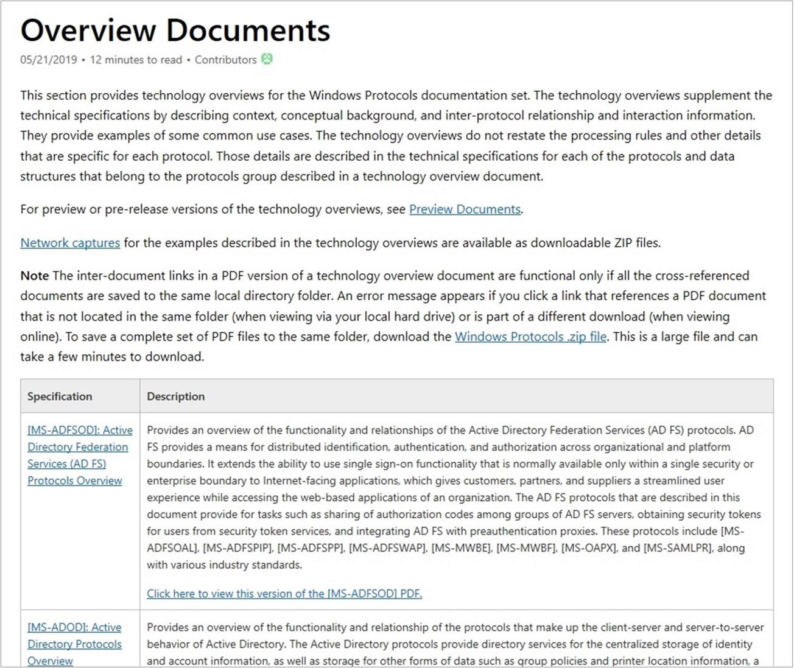
<!-- /Extracted images from page 37 -->

Figure 5: Overview documents landing page

3.1.1.1.1 Overview Documents

Overview Document Landing Page nodes can be reached from the Overview Documents Landing Page
node as shown in section 3.1.1.1. A landing page is defined for every overview document in the
Windows protocols documentation set. An example is shown below.

[MS-DOCO] - v20220614
Windows Protocols Documentation Roadmap
Copyright © 2022 Microsoft Corporation
Release: June 14, 2022

37 / 125

<!-- Extracted images from page 38 -->
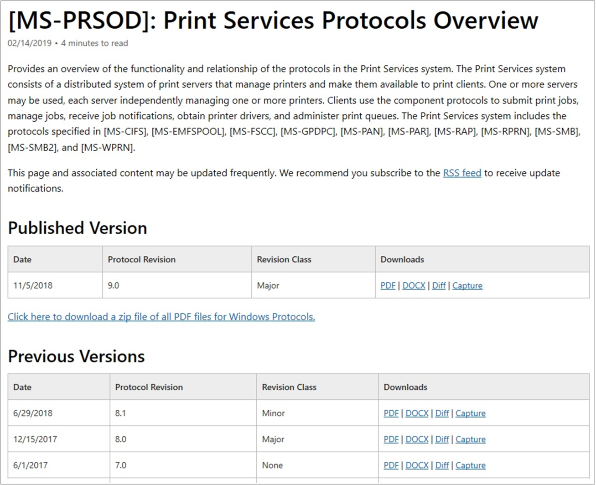
<!-- /Extracted images from page 38 -->

Figure 6: Overview document landing page

The following types of files are available for download from this page:



PDF: A .pdf file of the overview document.

  DOCX: A .docx file of the overview document.



Errata: A .pdf file that shows exactly what has changed from the last to the current release for
the overview document.

  Diff: A .pdf file of the overview document that uses revision marks to show what has changed

from the last to the current release for the overview document.

  Capture: A .zip file of the network captures for the examples described in the overview

document.

The structures of overview documents are described in section 2.1

[MS-DOCO] - v20220614
Windows Protocols Documentation Roadmap
Copyright © 2022 Microsoft Corporation
Release: June 14, 2022

38 / 125

<!-- Extracted images from page 39 -->
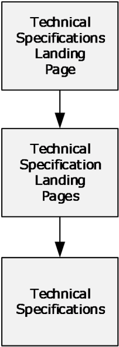
<!-- /Extracted images from page 39 -->

3.1.1.2  Technical Specifications Landing Page

The Technical Specifications Landing Page node can be reached from the Windows Protocols node as
shown in section 3.1.1. From this node it is possible to navigate to the nodes shown in the following
diagram.

Figure 7: Technical specifications landing page nodes

The technical specifications landing page node links to the landing page nodes for all technical
specifications in the Windows protocols documentation set. It is shown below.

[MS-DOCO] - v20220614
Windows Protocols Documentation Roadmap
Copyright © 2022 Microsoft Corporation
Release: June 14, 2022

39 / 125

<!-- Extracted images from page 40 -->
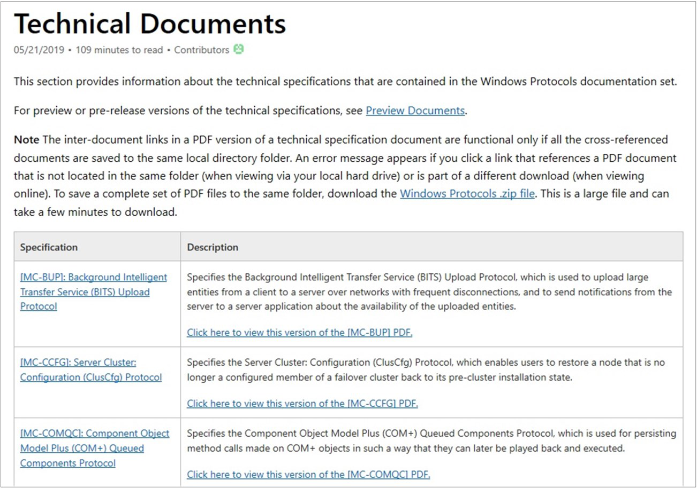
<!-- /Extracted images from page 40 -->

Figure 8: Technical specifications landing page

3.1.1.2.1 Technical Specifications

Technical Specification Landing Page nodes can be reached from the Technical Specifications Landing
Page node as shown in section 3.1.1.2. A landing page is defined for every technical specification in
the Windows protocols documentation set. An example is shown below.

[MS-DOCO] - v20220614
Windows Protocols Documentation Roadmap
Copyright © 2022 Microsoft Corporation
Release: June 14, 2022

40 / 125

<!-- Extracted images from page 41 -->
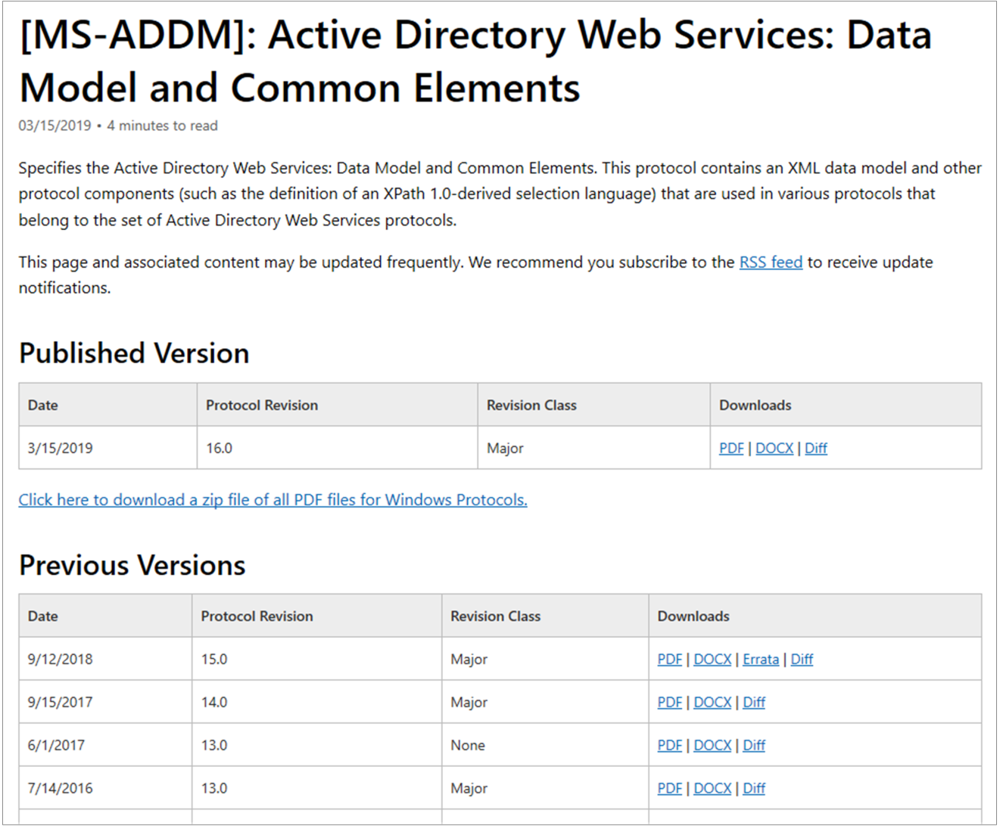
<!-- /Extracted images from page 41 -->

Figure 9: Technical specification landing page

The following types of files are available for download from this page:



PDF: A .pdf file of the technical specification.

  DOCX: A .docx file of the technical specification.



Errata: A .pdf file that shows exactly what has changed from the last to the current release for
the technical specification.

  Diff: A .pdf file of the technical specification that uses revision marks to show what has

changed from the last to the current release for the technical specification.

The structures of technical specifications are described in section 2.2.

3.1.1.3  Reference Documents Landing Page

The Reference Documents Landing Page node can be reached from the Windows Protocols node as
shown in section 3.1.1. From this node it is possible to navigate to the nodes shown in the following
diagram.

[MS-DOCO] - v20220614
Windows Protocols Documentation Roadmap
Copyright © 2022 Microsoft Corporation
Release: June 14, 2022

41 / 125

<!-- Extracted images from page 42 -->
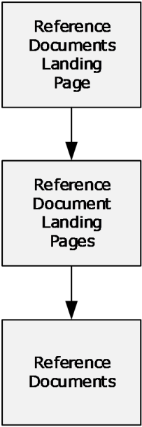
<!-- /Extracted images from page 42 -->

Figure 10: Reference documents landing page nodes

The reference documents landing page node links to the landing pages for all reference documents in
the Windows protocols documentation set. It is shown below.

[MS-DOCO] - v20220614
Windows Protocols Documentation Roadmap
Copyright © 2022 Microsoft Corporation
Release: June 14, 2022

42 / 125

<!-- Extracted images from page 43 -->
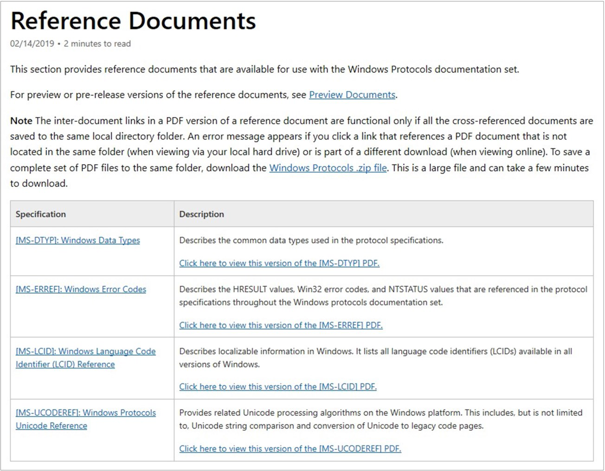
<!-- /Extracted images from page 43 -->

Figure 11: Reference documents landing page

3.1.1.3.1 Reference Documents

Reference Document Landing Page nodes can be reached from the Reference Documents Landing
Page node as shown in section 3.1.1.3. A landing page is defined for every reference document in the
Windows protocols documentation set. An example is shown below.

[MS-DOCO] - v20220614
Windows Protocols Documentation Roadmap
Copyright © 2022 Microsoft Corporation
Release: June 14, 2022

43 / 125

<!-- Extracted images from page 44 -->
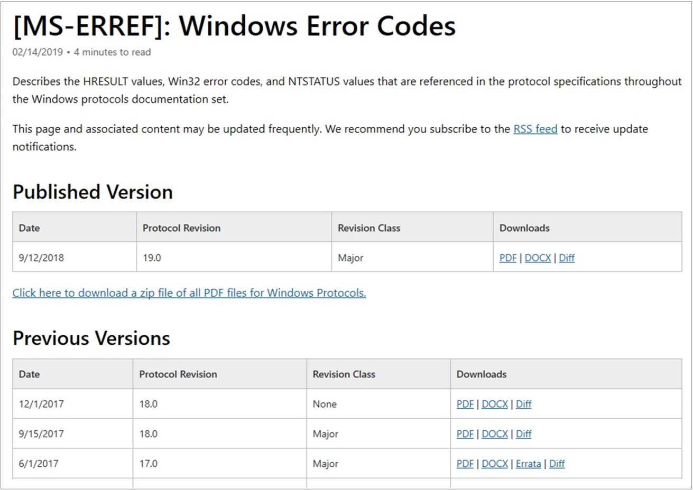
<!-- /Extracted images from page 44 -->

Figure 12: Reference document landing page

The following types of files are available for download from this page:



PDF: A .pdf file of the reference document.

  DOCX: A .docx file of the reference document.



Errata: A .pdf file that shows exactly what has changed from the last to the current release for
the reference document.

  Diff: A .pdf file of the reference document that uses revision marks to show what has changed

from the last to the current release for the reference document.

The structures of reference documents are described in sections 2.2 and 2.3.

3.1.2  Windows WordPad Standards Support

The Windows WordPad Standards Support node is reached from the Open Specifications node as
shown in section 3.1. It is possible to navigate from this node to the nodes shown in the following
diagram.

[MS-DOCO] - v20220614
Windows Protocols Documentation Roadmap
Copyright © 2022 Microsoft Corporation
Release: June 14, 2022

44 / 125

<!-- Extracted images from page 45 -->
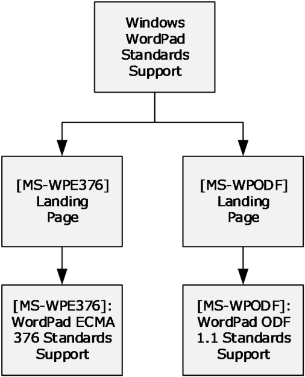
<!-- /Extracted images from page 45 -->

Figure 13: Windows WordPad standards support node

These documents describe support for the following standards, which are implemented in the Windows
WordPad application.





[ECMA-376] ECMA International, "Office Open XML File Formats": A family of XML schema
definitions (XSDs) for Office Open XML (OOXML), which are used for office productivity
applications.

[ODF1.1] OASIS Standard, "Open Document Format for Office Applications (OpenDocument)
v1.1": An XSD with semantics and structures for office documents, which supports
transformations using an XSL Transformation (XSLT) or similar XML-based tools.

The documents on this node are based on the Standards Support template (section 2.2.3.8).

3.2  Document Types

This section describes how to find documents in the Windows protocols documentation set according
to the following document types:

  Overview documents (section 2.1)



Technical specifications (section 2.2)

  Reference documents (section 2.3)

The navigation to these document types relative to the Open Specifications node are shown in
Document Nodes (section 3.1).

3.2.1  Windows Protocols

This section describes the documents by type relative to the Windows Protocols node.

3.2.1.1  Overview Documents

Overview documents of the Windows protocols documentation set can be reached from the Windows
Protocols node as shown in the following diagram.

45 / 125

[MS-DOCO] - v20220614
Windows Protocols Documentation Roadmap
Copyright © 2022 Microsoft Corporation
Release: June 14, 2022

<!-- Extracted images from page 46 -->
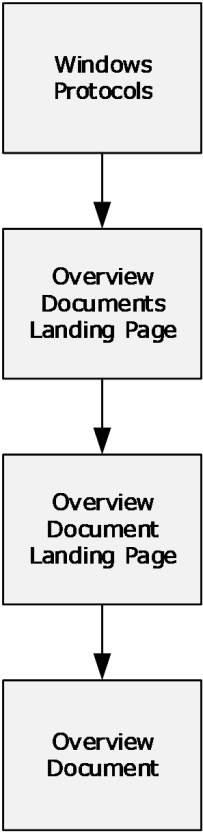
<!-- /Extracted images from page 46 -->

Figure 14: Overview documents

Overview Documents Landing Page: This node contains links to the landing pages of individual
overview documents, as described in section 3.1.1.1.

3.2.1.2  Technical Specifications

Technical specifications of the Windows protocols documentation set can be reached from the Windows
Protocols node as shown in the following diagram.

[MS-DOCO] - v20220614
Windows Protocols Documentation Roadmap
Copyright © 2022 Microsoft Corporation
Release: June 14, 2022

46 / 125

<!-- Extracted images from page 47 -->
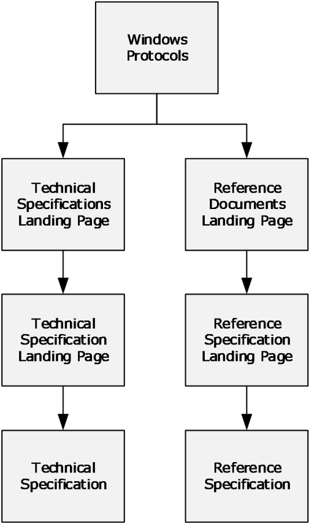
<!-- /Extracted images from page 47 -->

Figure 15: Technical specifications

The nodes shown in the diagram contain links to technical specifications, as follows:

Technical Specifications Landing Page: This node contains links to the landing pages of individual
technical specifications, as described in section 3.1.1.2, including extensions to industry-standards or
other published protocols, which are used by applicable Windows Server releases to interoperate with
Windows Client operating system.

Reference Documents Landing Page: This node contains links to the landing pages of the following
normative reference specifications:







[MS-DTYP]: Windows Data Types

[MS-ERREF]: Windows Error Codes

[MS-LCID]: Windows Language Code Identifier (LCID) Reference

3.2.1.3  Reference Documents

Reference documents of the Windows protocols documentation set can be reached from the Windows
Protocols node as shown in the following diagram.

[MS-DOCO] - v20220614
Windows Protocols Documentation Roadmap
Copyright © 2022 Microsoft Corporation
Release: June 14, 2022

47 / 125

<!-- Extracted images from page 48 -->
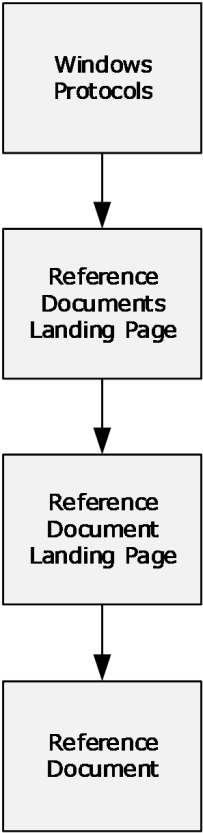
<!-- /Extracted images from page 48 -->

Figure 16: Reference documents

Reference Documents Landing Page: This node contains links to the landing page of the following
informative reference document:



[MS-UCODEREF]: Windows Protocols Unicode Reference

3.3  Document Citations

This section describes how to navigate from document to document in the Windows protocols
documentation set by using links. The following figure shows the hierarchy of citations in the
documentation set.

[MS-DOCO] - v20220614
Windows Protocols Documentation Roadmap
Copyright © 2022 Microsoft Corporation
Release: June 14, 2022

48 / 125

<!-- Extracted images from page 49 -->
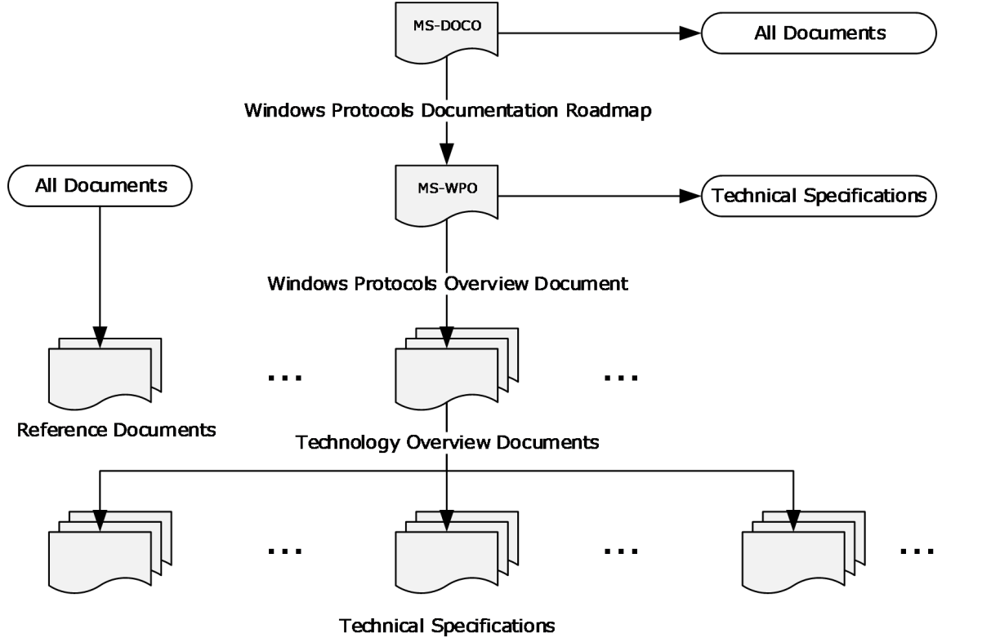
<!-- /Extracted images from page 49 -->

Figure 17: Citations in the Windows protocols documentation set

The connections represented in this figure can be summarized as follows:







The Windows Protocols Documentation Roadmap contains links to all other types of
documents.

The Windows Protocols Overview contains links to technology overviews, technical
specifications, and reference documents.

Technology overview documents contain links to technical specifications and reference
documents.



Technical specifications contain links to technology overviews and reference documents.

  All documents can contain links to reference documents.

The contents of each type of document shown in the figure are described in Documentation
Contents (section 2).

Each technical specification contains lists of the normative and informative references it cites, with
links. References to other Windows documents do not include dates of publication, because the
citations always link to the latest version. References to other documents include a publishing year
when one is available.

The subsections in this section describe the types of links in the Windows protocols documentation set.

3.3.1  Normative Citations

Normative citations refer to information that is required in order to understand or implement the
technology defined in a specification or for that technology to work.

49 / 125

[MS-DOCO] - v20220614
Windows Protocols Documentation Roadmap
Copyright © 2022 Microsoft Corporation
Release: June 14, 2022

Citations to normative content are distinguished by the use of the words "defined", "specified", and
"details".

3.3.1.1  External Normative Citations

External citations to normative content include references to any of the following:

  Documents published by standards organizations (section 2.4.2).

  RFCs (section 2.4.3).

  Normative sections in other Windows technical specifications (section 3.3.1.2).

All external normative documents are listed in the normative references section of the referencing
technical specification.

3.3.1.2  Internal Normative Citations

Internal citations to normative content are references to normative sections within a technical
specification. The sections—including their subsections—that contain normative content in a technical
specification vary according to the template type, as follows:

Algorithm template:

  1.6 Standards Assignments

  2.0 Algorithm Details

Block, HTTP, RPC, and SOAP protocol templates:

  1.5 Prerequisites and Preconditions

  1.8 Vendor Extensible Fields

  1.9 Standards Assignments

  2.0 Messages

  3.0 Protocol Details

Data and File Structure templates:

  1.7 Vendor -Extensible Fields

  2.0 Structures

For more information about the document templates, see section 2.2.

3.3.2  Informative Citations

Informative citations refer to information that is not required in order to understand or implement the
technology defined in a specification, such as background or implementation-specific information.

Citations to informative content are distinguished by the use of the words "described" and
"information".

3.3.2.1  External Informative Citations

Citations to external informative content include references to any of the following:

50 / 125

[MS-DOCO] - v20220614
Windows Protocols Documentation Roadmap
Copyright © 2022 Microsoft Corporation
Release: June 14, 2022

  Any content that could qualify as an external normative reference (section 3.3.1.1).

  Microsoft Developer articles.

  Windows overview documents (section 2.1).



Informative sections in other Windows technical specifications (section 2.2).

  Windows reference documents (section 2.3).

All external informative documents are listed in the informative references section of the referencing
technical specification.

3.3.2.2  Internal Informative Citations

Internal citations to informative content are references to informative sections within a technical
specification. Any content that is not normative is by definition informative, including Windows product
behavior. The sections—including their subsections—that contain informative content in a technical
specification vary according to the template type.

For more information about the document templates, see section 2.2.

[MS-DOCO] - v20220614
Windows Protocols Documentation Roadmap
Copyright © 2022 Microsoft Corporation
Release: June 14, 2022

51 / 125

4  Appendix A: Cross-Reference Matrixes

4.1  Technical Specification Cross-Reference Matrix

This section contains a table that provides, for each technical specification in the Windows protocols
documentation set, the following information:



Link to the document

  Document title







Template type (section 2.2)

Technical area (section 2)

Protocols specified

  Other technical specifications normatively cited

Document
short name  Document title

Template
type

Technical area

Protocols specified

[MC-BUP]

[MC-CCFG]

Background
Intelligent Transfer
Service (BITS)
Upload Protocol
Specification

Server Cluster:
Configuration
(ClusCfg) Protocol
Specification

Block

Systems
Management

Background Intelligent
Transfer Service
(BITS) Upload Protocol

RPC

Systems
Management

Server Cluster:
Configuration
(ClusCfg) Protocol

[MC-COMQC]  Component Object
Model Plus (COM+)
Queued
Components
Protocol
Specification

[MC-CSDL]

[MC-
DPL4CS]

Conceptual
Schema Definition
File Format

DirectPlay 4
Protocol: Core and
Service Providers
Specification

Block

Application
Services

Component Object
Model Plus (COM+)
Queued Components
Protocol

Structure

Application
Services

Conceptual Schema
Definition File Format

None

Block

Multiplayer
Games

DirectPlay 4 Protocol:
Core and Service
Providers

[MC-DPL4R]

[MC-DPLVP]

[MS-DPDX]

[MS-ERREF]

[MS-NLMP]

[MC-DPL4R]

DirectPlay 4
Protocol: Reliable
Specification

Block

Multiplayer
Games

DirectPlay 4 Protocol

[MC-DPL4CS]

[MS-DPDX]

52 / 125

[MS-DOCO] - v20220614
Windows Protocols Documentation Roadmap
Copyright © 2022 Microsoft Corporation
Release: June 14, 2022

Technical
specifications
cited

[MS-BPCR]

[MS-ERREF]

[MS-NTHT]

[MS-SMB]

[MS-CMRP]

[MS-DCOM]

[MS-ERREF]

[MS-OAUT]

[MS-RPCE]

[MS-RRP]

[MS-SCMR]

[MS-COM]

[MS-DCOM]

[MS-MQDMPR]

[MS-MQMP]

[MS-MQMQ]

[MS-OAUT]

Document
short name  Document title

Template
type

Technical area

Protocols specified

Technical
specifications
cited

[MC-
DPL8CS]

[MC-DPL8R]

[MC-DPLHP]

DirectPlay 8
Protocol: Core and
Service Providers
Specification

DirectPlay 8
Protocol: Reliable
Specification

DirectPlay 8
Protocol: Host and
Port Enumeration
Specification

Block

Multiplayer
Games

Block

Block

Multiplayer
Games

Multiplayer
Games

DirectPlay 8 Protocol:
Core and Service
Providers

[MC-DPL8R]

[MS-DPDX]

[MS-ERREF]

DirectPlay 8 Protocol

[MS-DPDX]

DirectPlay 8 Protocol:
Host and Port
Enumeration

[MC-
DPLNAT]

DirectPlay 8
Protocol: NAT
Locator
Specification

Block

Multiplayer
Games

DirectPlay 8 Protocol:
NAT Locator

[MC-DPLVP]

DirectPlay Voice
Protocol
Specification

Block

Multiplayer
Games

DirectPlay Voice
Protocol

[MC-DRT]

Distributed Routing
Table (DRT)
Version 1.0
Specification

[MC-DTCXA]  MSDTC Connection
Manager: OleTx XA
Protocol
Specification

Block

Home Server

Block

Application
Services

Structure

Application
Services

RPC

Application
Services

[MC-EDMX]

[MC-IISA]

[MC-MQAC]

Entity Data Model
for Data Services
Packaging Format

Internet
Information
Services (IIS)
Application Host
COM Protocol
Specification

Message Queuing
(MSMQ): ActiveX
Client Protocol
Specification

RPC

Application
Services

Message Queuing
(MSMQ): ActiveX
Client Protocol

Distributed Routing
Table (DRT) Version
1.0

MSDTC Connection
Manager: OleTx XA
Protocol

Entity Data Model for
Data Services
Packaging Format

Internet Information
Services (IIS)
Application Host COM
Protocol

[MS-DOCO] - v20220614
Windows Protocols Documentation Roadmap
Copyright © 2022 Microsoft Corporation
Release: June 14, 2022

[MS-DTYP]

[MC-DPL8CS]

[MC-DPL8R]

[MS-DPDX]

[MS-DTYP]

[MC-DPL8CS]

[MC-DPL8R]

[MS-DPDX]

[MS-DTYP]

[MC-DPL4CS]

[MC-DPL8CS]

[MC-DPL8R]

[MS-DPDX]

[MS-DTYP]

[MS-ERREF]

[MS-PNRP]

[MS-CMP]

[MS-CMPO]

[MS-DTCO]

[MS-DTYP]

[MS-ERREF]

[MC-CSDL]

[MS-DTYP]

[MS-ERREF]

[MS-OAUT]

[MS-RPCE]

[MS-ADTS]

[MS-COM]

[MS-DCOM]

[MS-DTCO]

[MS-DTYP]

[MS-ERREF]

53 / 125

Document
short name  Document title

Template
type

Technical area

Protocols specified

[MC-MQSRM]  Message Queuing

Block

(MSMQ): SOAP
Reliable Messaging
Protocol (SRMP)
Specification

Application
Services

Message Queuing
(MSMQ): SOAP
Reliable Messaging
Protocol (SRMP)

Technical
specifications
cited

[MS-MQDMPR]

[MS-MQDSSM]

[MS-MQMR]

[MS-MQMQ]

[MS-MQQB]

[MS-OAUT]

[MS-RPCE]

[MS-DTYP]

[MS-MQDMPR]

[MS-MQDSSM]

[MS-MQMQ]

[MS-MQQB]

[MC-NBFS]

.NET Binary
Format: SOAP
Data Structure

Structure

Application
Services

.NET Binary Format:
SOAP Data Structures

.NET Binary Format:
for XML

[MC-NBFSE]

[MC-NBFX]

[MC-NMF]

[MC-NBFSE]

.NET Binary
Format: SOAP
Extension

Structure

Application
Services

.NET Binary Format:
SOAP Extension

[MC-NBFS]

[MC-NBFX]

[MC-NMF]

[MS-OAUT]

.NET Binary Format for
XML

.NET Binary Format:
XML Data Structure

.NET Binary Format:
for XML

[MC-NBFX]

.NET Binary
Format: XML Data
Structure

Structure

Application
Services

[MC-
NETCEX]

[MC-NMF]

.NET Context
Exchange Protocol
Specification

.NET Message
Framing Protocol
Specification

[MC-NPR]

[MC-PRCH]

.NET Packet
Routing Protocol
Specification

Peer Channel
Protocol
Specification

Block

Block

Block

SOAP

Application
Services

.NET Context
Exchange Protocol

None

Application
Services

.NET Message Framing
Protocol

[MC-NBFS]

[MC-NBFSE]

[MS-DTYP]

[MS-MQMQ]

Application
Services

.NET Packet Routing
Protocol

None

Application
Services

Peer Channel Protocol

[MC-NBFS]

[MC-PRCR]

Peer Channel
Custom Resolver
Protocol
Specification

SOAP

Application
Services

Home Server

Peer Channel Custom
Resolver Protocol

[MS-DOCO] - v20220614
Windows Protocols Documentation Roadmap
Copyright © 2022 Microsoft Corporation
Release: June 14, 2022

[MC-NBFSE]

[MC-NMF]

[MS-DTYP]

[MS-ERREF]

[MS-WSPOL]

[MC-NBFS]

[MC-NBFSE]

[MC-NMF]

[MS-DTYP]

54 / 125

Document
short name  Document title

Template
type

Technical area

Protocols specified

Block

Block

[MC-SMP]

[MC-SQLR]

[MS-ABTP]

[MS-ADA1]

Session Multiplex
Protocol
Specification

SQL Server
Resolution Protocol
Specification

Automatic
Bluetooth Pairing
Protocol

Active Directory
Schema Attributes
A-L

Application
Services

Session Multiplex
Protocol

Application
Services

SQL Server Resolution
Protocol

None

Block

Device-Specific

Automatic Bluetooth
Pairing Protocol

None

None

Directory
Services

Active Directory
Schema Attributes A-L

[MS-ADA2]

Active Directory
Schema Attributes
M

None

Directory
Services

Active Directory
Schema Attributes M

[MS-ADA3]

Active Directory
Schema Attributes
N-Z

None

Directory
Services

Active Directory
Schema Attributes N-Z

[MS-ADCAP]

Active Directory
Web Services:
Custom Action
Protocol
Specification

SOAP

Directory
Services

Active Directory Web
Services: Custom
Action Protocol

Technical
specifications
cited

[MS-WSPOL]

[MS-DTYP]

[MS-ADA3]

[MS-ADTS]

[MS-DTYP]

[MS-LSAD]

[MS-SAMR]

[MS-ADTS]

[MS-DRSR]

[MS-DTYP]

[MS-LSAD]

[MS-RCMP]

[MS-SAMR]

[MS-ADSC]

[MS-ADTS]

[MS-DRSR]

[MS-DTYP]

[MS-LSAD]

[MS-SAMR]

[MS-ADA1]

[MS-ADA2]

[MS-ADA3]

[MS-ADDM]

[MS-ADLS]

[MS-ADSC]

[MS-ADTS]

[MS-DRSR]

[MS-DTYP]

[MS-ERREF]

[MS-NNS]

[MS-SAMR]

[MS-WSDS]

[MS-WSPELD]

[MS-WSTIM]

[MS-ADDM]

Active Directory
Web Services:

Structure

Directory
Services

Active Directory Web
Services: Custom

[MS-ADCAP]

[MS-ADTS]

55 / 125

[MS-DOCO] - v20220614
Windows Protocols Documentation Roadmap
Copyright © 2022 Microsoft Corporation
Release: June 14, 2022

Document
short name  Document title

Template
type

Technical area

Protocols specified

Data Model and
Common Elements

[MS-
ADFSOAL]

[MS-
ADFSPIP]

HTTP

HTTP

Active Directory
Federation
Services OAuth
Authorization Code
Lookup Protocol

Active Directory
Federation
Services and Proxy
Integration
Protocol

Technical
specifications
cited

[MS-DTYP]

[MS-ERREF]

[MS-WSDS]

[MS-WSPELD]

[MS-WSTIM]

Action Protocol

WS-Transfer: Identity
Management
Operations for
Directory Access
Protocol Extensions

WS-Transfer: Directory
Services Protocol
Extensions

WS-Enumeration:
Directory Services
Protocol Extensions

Security and
Identity
Management

Active Directory
Federation Services
OAuth Authcode
Lookup Protocol

None

Security and
Identity
Management

Security and
Identity
Management

Active Directory
Federation Services
Proxy and Web
Application Proxy
Integration Protocol

Active Directory
Federation Services
and Proxy
Configuration Protocol

Active Directory
Federation Services
and Proxy
Communication
Protocol

Federation Service
Proxy Protocol

Federation Service
Web Agent Protocol

[MS-OAPX]

[MS-MWBF]

Security and
Identity
Management

Federation Service
Web Agent and Proxy
Protocol

[MS-ADTS]

[MS-MWBF]

Block

SOAP

[MS-
ADFSPP]

[MS-
ADFSWAP]

[MS-ADLS]

Active Directory
Federation Service
(AD FS) Proxy
Protocol

Active Directory
Federation Service
(AD FS) Web Agent
Protocol

Active Directory
Lightweight
Directory Services
Schema

None

Directory
Services

Active Directory
Lightweight Directory
Services Schema

[MS-ADTS]

[MS-DTYP]

[MS-ADSC]

Active Directory
Schema Classes

None

Directory
Services

Active Directory
Schema Classes

[MS-ADTG]

Remote Data
Services (RDS)
Transport Protocol
Specification

Block

Networking

DCOM Interfaces for
Remote Data Services

Remote Data Services
Transport Protocol

[MS-ADTS]

[MS-DTYP]

[MS-ERREF]

[MS-LCID]

[MS-OAUT]

56 / 125

[MS-DOCO] - v20220614
Windows Protocols Documentation Roadmap
Copyright © 2022 Microsoft Corporation
Release: June 14, 2022

Document
short name  Document title

Template
type

Technical area

Protocols specified

Technical
specifications
cited

[MS-ADTS]

Active Directory
Technical
Specification

Block

Directory
Services

(RDST)

DCOM Interfaces for
Remote Data Services

Remote Data Services
Transport Protocol
(RDST)

Lightweight Directory
Access Protocol (LDAP)
V3: Microsoft Profile

Active Directory
Lightweight Directory
Access Protocol (LDAP)
Extensions

Active Directory Data
Structures

Active Directory
Algorithms

[MS-AIPS]

Authenticated
Internet Protocol
Specification

Block

Security and
Identity
Management

Authenticated Internet
Protocol

[MS-APDS]

Authentication
Protocol Domain
Support
Specification

Block

Security and
Identity
Management

Authentication Protocol
Domain Support
(APDS)

NetLogon Remote
Protocol: Challenge
Handshake
Authentication Protocol
(CHAP)/EAP-MD5
SubAuthentication
Extension

[MS-ADA1]

[MS-ADA2]

[MS-ADA3]

[MS-ADLS]

[MS-ADSC]

[MS-APDS]

[MS-DRSR]

[MS-DTYP]

[MS-ERREF]

[MS-FRS1]

[MS-KILE]

[MS-LSAD]

[MS-MAIL]

[MS-NLMP]

[MS-NRPC]

[MS-PAC]

[MS-SAMR]

[MS-SFU]

[MS-SPNG]

[MS-SRPL]

[MS-W32T]

[MS-ERREF]

[MS-IKEE]

[MS-KILE]

[MS-NLMP]

[MS-ADA3]

[MS-ADTS]

[MS-DPSP]

[MS-DTYP]

[MS-ERREF]

[MS-KILE]

[MS-LSAD]

[MS-NLMP]

[MS-NRPC]

[MS-PAC]

[MS-RCMP]

[MS-RPCE]

[MS-SAMR]

[MS-ASP]

ASP.NET State

Block

Application

ASP.NET State Server

None

57 / 125

[MS-DOCO] - v20220614
Windows Protocols Documentation Roadmap
Copyright © 2022 Microsoft Corporation
Release: June 14, 2022

Document
short name  Document title

Template
type

Technical area

Protocols specified

Services

Protocol

Technical
specifications
cited

[MS-AZMP]

[MS-BDSRR]

[MS-BGPP]

Server Protocol
Specification

Authorization
Manager (AzMan)
Policy File Format

Business
Document
Scanning: Scan
Repository
Capabilities and
Status Retrieval
Protocol
Specification

Border Gateway
Protocol (BGP)
Profile

Structure

Security and
Identity
Management

Application
Services

SOAP

File, Fax, and
Printing Services

Authorization Manager
(AzMan) Policy File
Format

None

None

Business Document
Scanning: Scan
Repository Capabilities
and Status Retrieval
Protocol

Block

Systems
Management

Border Gateway
Protocol 4 (BGP-4)

None

[MS-BKRP]

BackupKey Remote
Protocol
Specification

RPC

Security and
Identity
Management

BackupKey Remote
Protocol

[MS-BKUP]

Microsoft NT
Backup File
Structure

Structure

File, Fax, and
Printing Services

File Replication Service
(FRS) Protocol

[MS-DTYP]

[MS-ERREF]

[MS-KILE]

[MS-LSAD]

[MS-NLMP]

[MS-RPCE]

[MS-SMB]

[MS-SMB2]

[MS-SPNG]

[MS-FRS1]

[MS-FRS2]

[MS-FSCC]

[MS-BPAU]

[MS-BPCR]

[MS-BPDP]

Background
Intelligent Transfer
Service (BITS)
Peer-Caching: Peer
Authentication
Protocol
Specification

Background
Intelligent Transfer
Service (BITS)
Peer-Caching:
Content Retrieval
Protocol
Specification

Background
Intelligent Transfer
Service (BITS)
Peer-Caching: Peer
Discovery Protocol

RPC

Systems
Management

Background Intelligent
Transfer Service
(BITS) Peercaching:
Peer Authentication
Protocol

[MS-DTYP]

[MS-ERREF]

[MS-KILE]

[MS-RPCE]

RPC

Systems
Management

Background Intelligent
Transfer Service
(BITS) Peercaching:
Content Retrieval
Protocol

[MS-BPAU]

[MS-BPDP]

[MS-DTYP]

[MS-ERREF]

RPC

Systems
Management

[MS-DTYP]

Background Intelligent
Transfer Service
(BITS) Peercaching:
Peer Discovery
Protocol

58 / 125

[MS-DOCO] - v20220614
Windows Protocols Documentation Roadmap
Copyright © 2022 Microsoft Corporation
Release: June 14, 2022

[MS-BRWSA]

[MS-ERREF]

[MS-LSAD]

[MS-MAIL]

[MS-NBTE]

[MS-RAP]

[MS-SAMR]

[MS-SMB]

[MS-SRVS]

[MS-WKST]

[MS-DTYP]

[MS-RPCE]

[MS-SMB]

[MS-DTYP]

[MS-ERREF]

[MS-LSAT]

[MS-RPCE]

[MS-DTYP]

[MS-DTYP]

Document
short name  Document title

Template
type

Technical area

Protocols specified

Technical
specifications
cited

[MS-BRWS]

Specification

Common Internet
File System (CIFS)
Browser Protocol
Specification

RPC

File, Fax, and
Printing Services

Common Internet File
System (CIFS)
Browser Protocol

[MS-BRWSA]  Common Internet

RPC

File, Fax, and
Printing Services

Common Internet File
System (CIFS)
Browser Auxiliary
Protocol

[MS-CAPR]

[MS-CBCP]

[MS-CDP]

[MS-CER]

[MS-CER2]

File System (CIFS)
Browser Auxiliary
Protocol
Specification

Central Access
Policy Identifier
(ID) Retrieval
Protocol

Callback Control
Protocol
Specification

Connected Devices
Platform Protocol
Version 3

Corporate Error
Reporting Version
1.0 Protocol
Specification

Corporate Error
Reporting V.2
Protocol
Specification

RPC

File, Fax, and
Printing Services

Central Access Policy
ID Retrieval Protocol

Block

Networking

Callback Control
Protocol

Block

Networking

Connected Devices
Platform Service
Protocol

Block

Systems
Management

Corporate Error
Reporting Version 1.0
Protocol

[MS-SMB]

Block

Systems
Management

Corporate Error
Reporting V.2 Protocol
Specification

[MS-LCID]

[MS-NTHT]

[MS-CFB]

Compound File
Binary File Format

Structure

Networking

Compound File Binary
File Format

None

[MS-CHAP]

[MS-CIFS]

Extensible
Authentication
Protocol Method for
Microsoft Challenge
Handshake
Authentication
Protocol (CHAP)
Specification

Common Internet
File System (CIFS)
Protocol

RPC

Networking

None

Extensible
Authentication Protocol
Method for Microsoft
Challenge Handshake
Authentication Protocol
(CHAP)

Block

File, Fax, and
Printing Services

Common Internet File
System (CIFS)
Protocol

[MS-BRWS]

[MS-DFSC]

59 / 125

[MS-DOCO] - v20220614
Windows Protocols Documentation Roadmap
Copyright © 2022 Microsoft Corporation
Release: June 14, 2022

Document
short name  Document title

Template
type

Technical area

Protocols specified

Technical
specifications
cited

Specification

[MS-CMOM]

MSDTC Connection
Manager: OleTx
Management
Protocol
Specification

Block

Application
Services

MSDTC Connection
Manager: OleTx
Management Protocol

[MS-CMP]

[MS-CMPO]

[MS-CMRP]

MSDTC Connection
Manager: OleTx
Multiplexing
Protocol
Specification

MSDTC Connection
Manager: OleTx
Transports Protocol
Specification

Failover Cluster:
Management API
(ClusAPI) Protocol
Specification

Block

Application
Services

MSDTC Connection
Manager: OleTx
Multiplexing Protocol

RPC

RPC

Application
Services

MSDTC Connection
Manager: OleTx
Transports Protocol

Systems
Management

Failover Cluster:
Management API
(ClusAPI) Protocol

[MS-DFSNM]

[MS-DTYP]

[MS-ERREF]

[MS-FSCC]

[MS-LSAD]

[MS-MSRP]

[MS-NLMP]

[MS-RAP]

[MS-RPCE]

[MS-SRVS]

[MC-DTCXA]

[MS-CMP]

[MS-CMPO]

[MS-CMRP]

[MS-DTCLU]

[MS-DTCM]

[MS-DTCO]

[MS-DTYP]

[MS-RRP]

[MS-SCMR]

[MS-CMPO]

[MS-ERREF]

[MS-DTYP]

[MS-ERREF]

[MS-RPCE]

[MS-DMRP]

[MS-DTYP]

[MS-ERREF]

[MS-LSAD]

[MS-NLMP]

[MS-RPCE]

[MS-RRP]

[MS-SCMR]

[MS-SPNG]

[MS-DCOM]

[MS-DTCO]

[MS-DTYP]

[MS-ERREF]

[MS-COM]

[MS-COMA]

Component Object
Model Plus (COM+)
Protocol
Specification

Component Object
Model Plus (COM+)
Remote
Administration

[MS-DOCO] - v20220614
Windows Protocols Documentation Roadmap
Copyright © 2022 Microsoft Corporation
Release: June 14, 2022

RPC

Application
Services

Component Object
Model Plus (COM+)
Protocol

RPC

Application
Services

Component Object
Model Plus (COM+)
Remote Administration
Protocol

[MS-CIFS]

[MS-DCOM]

[MS-DTYP]

60 / 125

Document
short name  Document title

Template
type

Technical area

Protocols specified

Protocol
Specification

[MS-COMEV]  Component Object
Model Plus (COM+)
Event System
Protocol
Specification

[MS-COMT]

Component Object
Model Plus (COM+)
Tracker Service
Protocol
Specification

RPC

Application
Services

Object Model Plus
(COM+) Event System
Protocol

RPC

Application
Services

Component Object
Model Plus (COM+)
Tracker Service
Protocol

[MS-CPSP]

Connection Point
Services:
Phonebook Data
Structure

Structure

Networking

Connection Point
Services: Phonebook
Data Structure

Technical
specifications
cited

[MS-ERREF]

[MS-LCID]

[MS-OAUT]

[MS-RPCE]

[MS-DCOM]

[MS-DTYP]

[MS-ERREF]

[MS-OAUT]

[MS-DCOM]

[MS-DTYP]

[MS-ERREF]

[MS-OAUT]

[MS-RPCE]

None

[MS-CRTD]

Certificate
Templates
Structure

Structure

Security and
Identity
Management

Certificate Templates

[MS-ADA1]

[MS-ADA2]

[MS-ADA3]

[MS-ADTS]

[MS-DTYP]

[MS-WCCE]

[MS-ADA1]

[MS-ADTS]

[MS-CRTD]

[MS-DCOM]

[MS-DTYP]

[MS-ERREF]

[MS-ICPR]

[MS-KILE]

[MS-LSAD]

[MS-LSAT]

[MS-NLMP]

[MS-NRPC]

[MS-OAUT]

[MS-RPCE]

[MS-RRP]

[MS-WCCE]

[MS-KILE]

[MS-NLMP]

[MS-SPNG]

[MS-CSRA]

RPC

Certificate Services
Remote
Administration
Protocol
Specification

Security and
Identity
Management

Certificate Services
Remote Administration
Protocol

[MS-CSSP]

Credential Security
Support Provider
(CredSSP) Protocol
Specification

Block

Security and
Identity
Management

Certificate Services
Remote Administration
Protocol

[MS-CSVP]

Failover Cluster:
Setup and

RPC

Systems

Failover Cluster: Setup
and Validation Protocol

[MS-CMRP]

61 / 125

[MS-DOCO] - v20220614
Windows Protocols Documentation Roadmap
Copyright © 2022 Microsoft Corporation
Release: June 14, 2022

Document
short name  Document title

Template
type

Validation Protocol
(ClusPrep)
Specification

Technical area

Protocols specified

Management

(ClusPrep)

Technical
specifications
cited

[MS-DCOM]

[MS-DTYP]

[MS-ERREF]

[MS-FASP]

[MS-OAUT]

[MS-RPCE]

[MS-SMB2]

[MS-CTA]

[MS-DCHT]

[MS-DCLB]

[MS-DCOM]

[MS-DFSC]

Claims
Transformation
Algorithm

Desktop Chat
Protocol
Specification

Desktop Clipboard
Protocol
Specification

Distributed
Component Object
Model (DCOM)
Remote Protocol
Specification

Distributed File
System (DFS):
Referral Protocol
Specification

Algorithm

Security and
Identity
Management

Claims Transformation
Algorithm

None

Desktop Chat Protocol

[MS-DTYP]

Block

Block

Collaboration
and
Communications

Collaboration
and
Communications

RPC

Networking

Desktop Clipboard
Protocol

Distributed Component
Object Model (DCOM)
Remote Protocol

RPC

File, Fax, and
Printing Services

Distributed File System
(DFS): Namespace
Referral Protocol

[MS-DFSNM]  Distributed File
System (DFS):
Namespace
Management
Protocol
Specification

RPC

File, Fax, and
Printing Services

Distributed File System
(DFS): Namespace
Management Protocol

[MS-DFSRH]  DFS Replication
Helper Protocol
Specification

RPC

File, Fax, and
Printing Services

Distributed File
System: Replication
Helper Protocol (DFS-R
Helper)

[MS-DOCO] - v20220614
Windows Protocols Documentation Roadmap
Copyright © 2022 Microsoft Corporation
Release: June 14, 2022

[MS-DTYP]

[MS-EMF]

[MS-WMF]

[MS-DTYP]

[MS-ERREF]

[MS-RPCE]

[MS-ADTS]

[MS-CIFS]

[MS-DFSNM]

[MS-DRSR]

[MS-ERREF]

[MS-NRPC]

[MS-SMB]

[MS-SMB2]

[MS-ADA2]

[MS-ADA3]

[MS-ADSC]

[MS-ADTS]

[MS-DFSC]

[MS-DTYP]

[MS-ERREF]

[MS-RPCE]

[MS-SMB]

[MS-SMB2]

[MS-SRVS]

[MS-ADTS]

[MS-DCOM]

[MS-FRS2]

[MS-OAUT]

[MS-RPCE]

62 / 125

Technical
specifications
cited

[MS-MDM]

[MS-ADA1]

[MS-ADSC]

[MS-ADTS]

[MS-DHCPM]

Document
short name  Document title

Template
type

Technical area

Protocols specified

[MS-DHA]

Device Health
Attestation
Protocol

[MS-DHCPE]  Dynamic Host
Configuration
Protocol (DHCP)
Extensions

HTTP

Networking

Block

Networking

Device Health
Attestation (DHA)
Protocol

Dynamic Host
Configuration Protocol
(DHCP) Extensions

Dynamic Host
Configuration Protocol
(DHCP): User Class
Option Extensions

Dynamic Host
Configuration Protocol
(DHCP): Remote
Access Server (RAS)
Specific Client
Identifier Extensions

Dynamic Host
Configuration Protocol
(DHCP) Server
Management:
Secondary DHCP
Server Delay Response
Extensions

[MS-DHCPF]

DHCP Failover
Protocol Extension

Block

Networking

DHCP Failover Protocol
Extension

None

[MS-DHCPM]  Microsoft Dynamic
Host Configuration
Protocol (DHCP)
Server
Management
Protocol
Specification

[MS-DHCPN]  Dynamic Host
Configuration
Protocol (DHCP)
Extensions for
Network Access
Protection (NAP)

[MS-
DLNHND]

[MS-DLTCS]

Digital Living
Network Alliance
(DLNA) Networked
Device
Interoperability
Guidelines:
Microsoft
Extensions

Distributed Link
Tracking Central
Store Protocol
Specification

Block

Networking

Block

Networking

Microsoft Dynamic
Host Configuration
Protocol (DHCP)
Server Management
Protocol

Dynamic Host
Configuration Protocol
(DHCP) Extensions for
Network Access
Protection (NAP)

[MS-DHCPE]

[MS-DHCPN]

[MS-DTYP]

[MS-ERREF]

[MS-LSAT]

[MS-RPCE]

[MS-SAMR]

[MS-DHCPE]

[MS-RNAP]

Block

Collaboration
and
Communications

Digital Living Network
Alliance (DLNA)
Networked Device
Interoperability
Guidelines: Microsoft
Extensions

[MS-DTYP]

[MS-RTSP]

[MS-UPMC]

Block

File, Fax, and
Printing Services

Distributed Link
Tracking: Central
Store Protocol

[MS-ADTS]

[MS-DLTM]

[MS-SMB]

[MS-DLTM]

Distributed Link

Block

File, Fax, and

Distributed Link

[MS-ADTS]

63 / 125

[MS-DOCO] - v20220614
Windows Protocols Documentation Roadmap
Copyright © 2022 Microsoft Corporation
Release: June 14, 2022

Document
short name  Document title

Template
type

Tracking: Central
Manager Protocol
Specification

Technical area

Protocols specified

Printing Services

Tracking: Central
Manager Protocol

[MS-DLTW]

Distributed Link
Tracking:
Workstation
Protocol
Specification

RPC

File, Fax, and
Printing Services

Distributed Link
Tracking: Workstation
Protocol

[MS-DMCT]

Device Media
Control Protocol
Specification

Block

Systems
Management

Device Media Control
Protocol

[MS-DMRP]

Disk Management
Remote Protocol
Specification

RPC

Systems
Management

Disk Management
Remote Protocol

[MS-DNSP]

Domain Name
Service (DNS)
Server
Management
Protocol
Specification

RPC

Systems
Management

Domain Name Service
(DNS) Server
Management Protocol

[MS-DPDX]

DirectPlay DXDiag
Usage Protocol
Specification

Block

Multiplayer
Games

DirectPlay DXDiag
Usage Protocol

Technical
specifications
cited

[MS-DLTW]

[MS-DTYP]

[MS-ERREF]

[MS-RPCE]

[MS-SAMR]

[MS-SMB]

[MS-SPNG]

[MS-DTYP]

[MS-ERREF]

[MS-FSCC]

[MS-RPCE]

[MS-SMB]

[MS-SMB2]

[MS-DSLR]

[MS-DTYP]

[MS-RTSP]

[MS-DCOM]

[MS-DTYP]

[MS-ERREF]

[MS-RPCE]

[MS-ADA1]

[MS-ADA2]

[MS-ADA3]

[MS-ADSC]

[MS-ADTS]

[MS-DTYP]

[MS-ERREF]

[MS-NRPC]

[MS-RPCE]

[MS-DTYP]

[MS-DPSP]

Digest Protocol
Extensions

Block

Security and
Identity
Management

Digest Access
Authentication:
Microsoft Extensions

None

[MS-
DPWSRP]

[MS-
DPWSSN]

Devices Profile for
Web Services
(DPWS): Shared
Resource
Publishing Data
Structure

Devices Profile for
Web Services
(DPWS): Size
Negotiation

Structure

File, Fax, and
Printing Services

DPWS: Shared
Resource Publishing

[MS-DTYP]

[MS-HGRP]

[MS-SHLLINK]

SOAP

Systems
Management

Devices Profile for Web
Services (DPWS): Size
Negotiation Extension

None

64 / 125

[MS-DOCO] - v20220614
Windows Protocols Documentation Roadmap
Copyright © 2022 Microsoft Corporation
Release: June 14, 2022

Document
short name  Document title

Template
type

Technical area

Protocols specified

Technical
specifications
cited

[MS-DRM]

Extension

Digital Rights
Management
License Protocol
Specification

Block

Collaboration
and
Communications

Management License
Protocol

[MS-DTYP]

[MS-ERREF]

Collaboration
and
Communications

WMDRM MTP
Command Extension

[MS-DRM]

Collaboration
and
Communications

WMDRM Network
Devices Protocol

[MS-DTYP]

Collaboration
and
Communications

WMDRM-ND: Registrar
Initiation Protocol

[MS-DSLR]

[MS-DRMND]

[MS-DRMCD]  Windows Media

Block

Digital Rights
Management
(WMDRM): MTP
Command
Extension

[MS-DRMND]  Windows Media

Block

Digital Rights
Management
(WMDRM):
Network Devices
Protocol
Specification

[MS-DRMRI]  Windows Media

Block

Digital Rights
Management for
Network Devices
(WMDRM-ND):
Registrar Initiation
Protocol
Specification

Directory
Replication Service
(DRS) Remote
Protocol
Specification

[MS-DRSR]

RPC

Directory
Services

Directory Replication
Service Remote
Protocol (drsuapi) -
Replication

Directory Replication
Service Remote
Protocol (drsuapi) -
Management

[MS-ADA1]

[MS-ADA2]

[MS-ADA3]

[MS-ADLS]

[MS-ADSC]

[MS-ADTS]

[MS-DTYP]

[MS-ERREF]

[MS-KILE]

[MS-LSAD]

[MS-NRPC]

[MS-RPCE]

[MS-SRPL]

None

[MS-DSCPM]  Desired State

HTTP

[MS-DSLR]

[MS-DSML]

Configuration Pull
Model Protocol

Device Services
Lightweight
Remoting Protocol
Specification

Directory Services
Markup Language
(DSML) 2.0

[MS-DOCO] - v20220614
Windows Protocols Documentation Roadmap
Copyright © 2022 Microsoft Corporation
Release: June 14, 2022

Systems
Management

Desired State
Configuration Pull
Model Protocol

Block

Systems
Management

Device Services
Lightweight Remoting
Protocol

[MS-DTYP]

[MS-ERREF]

SOAP

Application
Services

Directory Services
Markup Language
(DSML) 2.0 Protocol

[MS-ADDM]

65 / 125

Document
short name  Document title

Template
type

Technical area

Protocols specified

Technical
specifications
cited

Protocol Extensions

Extensions

Directory Services
Markup Language
(DSML) 2.0 Protocol
Extensions

[MS-DSMN]

Device Session
Monitoring Protocol
Specification

Block

Systems
Management

Device Session
Monitoring Protocol

[MS-DSPA]

[MS-DSSP]

Device Session
Property Access
Protocol
Specification

Directory Services
Setup Remote
Protocol
Specification

Block

Systems
Management

Device Session
Property Access
Protocol

RPC

Systems
Management

Directory Services
Setup Remote Protocol

[MS-DSLR]

[MS-DTYP]

[MS-DSLR]

[MS-DTYP]

[MS-ADTS]

[MS-DSLR]

[MS-DTYP]

[MS-ERREF]

[MS-RPCE]

[MS-SAMR]

[MS-SMB]

[MS-DTAG]

Device Trust
Agreement
Protocol
Specification

SOAP

[MS-DTCLU]  MSDTC Connection

Block

[MS-DTCM]

[MS-DTCO]

Manager: OleTx
Transaction
Protocol Logical
Unit Mainframe
Extension

MSDTC Connection
Manager: OleTx
Transaction
Internet Protocol
Specification

MSDTC Connection
Manager: OleTx
Transaction
Protocol
Specification

[MS-DTYP]

Windows Data
Types

Security and
Identity
Management

Application
Services

Device Trust
Agreement Protocol

None

MSDTC Connection
Manager: OleTx
Transaction Protocol
Logical Unit Mainframe
Extension

[MS-CMP]

[MS-CMPO]

[MS-DTCO]

Block

Application
Services

Connection Manager:
OleTx Transaction
Internet Protocol

Block

Application
Services

MSDTC Connection
Manager: OleTx
Transaction Protocol

[MS-CMP]

[MS-CMPO]

[MS-DTCO]

[MS-DTYP]

[MS-RPCE]

[MS-CMOM]

[MS-CMP]

[MS-CMPO]

[MS-CMRP]

[MS-DTYP]

[MS-RRP]

[MS-TIPP]

[MS-WSRVCAT]

Structure

Reference

Windows Data Types

[MS-ADTS]

[MS-APDS]

[MS-ERREF]

[MS-KILE]

66 / 125

[MS-DOCO] - v20220614
Windows Protocols Documentation Roadmap
Copyright © 2022 Microsoft Corporation
Release: June 14, 2022

Document
short name  Document title

Template
type

Technical area

Protocols specified

[MS-DVRD]

Device Registration
Discovery Protocol

HTTP

Device-Specific

[MS-DVRE]

Device Registration
Enrollment Protocol

SOAP

Device-Specific

Device Registration
Discovery Protocol

Device Registration
Enrollment Protocol

[MS-DVRJ]

Device Registration
Join Protocol

HTTP

Directory
Services

Device Registration
Join Protocol

[MS-ECS]

[MS-EERR]

[MS-EFSR]

Enterprise Client
Synchronization
Protocol

Extended Error
Remote Data
Structure

Encrypting File
System Remote
(EFSRPC) Protocol
Specification

HTTP

Device-Specific

Enterprise Client
Synchronization
Protocol

Structure

Networking

Extended Error
Remote Data Structure

[MS-DTYP]

[MS-RPCE]

RPC

File, Fax, and
Printing Services

Encrypting File System
Remote Protocol

[MS-EMF]

Enhanced Metafile
Format

Structure

File, Fax, and
Printing Services

Enhanced Metafile
(EMF) Format

[MS-
EMFPLUS]

Enhanced Metafile
Format Plus
Extensions

Structure

File, Fax, and
Printing Services

Enhanced Metafile
(EMF) Format: Plus
Extensions (EMF+)

[MS-
EMFSPOOL]

Enhanced Metafile
Spool Format

Structure

File, Fax, and
Printing Services

Enhanced Metafile
(EMF) Spool Format

[MS-DOCO] - v20220614
Windows Protocols Documentation Roadmap
Copyright © 2022 Microsoft Corporation
Release: June 14, 2022

Technical
specifications
cited

[MS-LSAD]

[MS-NBTE]

[MS-NLMP]

[MS-RPCE]

[MS-SFU]

[MS-TLSP]

[MS-DVRE]

[MS-ADA1]

[MS-ADA2]

[MS-ADA3]

[MS-ADSC]

[MS-DVRD]

[MS-WSTEP]

[MS-ADA1]

[MS-ADA2]

[MS-ADA3]

[MS-ADSC]

[MS-ADTS]

[MS-DRSR]

[MS-DTYP]

[MS-ADTS]

[MS-CRTD]

[MS-DTYP]

[MS-ERREF]

[MS-RPCE]

[MS-SMB]

[MS-SMB2]

[MS-WCCE]

[MS-WMF]

[MS-EMF]

[MS-WMF]

[MS-DTYP]

[MS-EMF]

[MS-RPRN]

[MS-WMF]

67 / 125

Document
short name  Document title

Template
type

Technical area

Protocols specified

Technical
specifications
cited

[MS-ERREF]  Windows Error

Structure

Reference

Windows Error Codes

None

Codes

[MS-EVEN]

EventLog Remoting
Protocol
Specification

RPC

Systems
Management

EventLog Remoting
Protocol Version 1.0

[MS-EVEN6]

EventLog Remoting
Protocol Version
6.0 Specification

RPC

Systems
Management

EventLog Remoting
Protocol Version 6.0

[MS-FASP]

Firewall and
Advanced Security
Protocol
Specification

RPC

Networking

Firewall and Advanced
Security Protocol

[MS-ADTS]

[MS-DTYP]

[MS-EERR]

[MS-ERREF]

[MS-LCID]

[MS-LSAD]

[MS-LSAT]

[MS-RPCE]

[MS-RRP]

[MS-SMB]

[MS-DTYP]

[MS-ERREF]

[MS-EVEN]

[MS-GPSI]

[MS-KILE]

[MS-LSAD]

[MS-NLMP]

[MS-RPCE]

[MS-AIPS]

[MS-DTYP]

[MS-ERREF]

[MS-GPFAS]

[MS-IKEE]

[MS-IPHTTPS]

[MS-KILE]

[MS-NLMP]

[MS-RPCE]

[MS-DTYP]

[MS-ERREF]

[MS-RPCE]

[MS-SMB]

[MS-FAX]

[MS-FCIADS]

[MS-FRS1]

Fax Server and
Client Remote
Protocol
Specification

File Classification
Infrastructure
Alternate Data
Stream (ADS) File
Format

File Replication
Service Protocol
Specification

RPC

File, Fax, and
Printing Services

Fax Server and Client
Remote Protocol

Structure

File, Fax, and
Printing Services

File Classification
Infrastructure ADS File
Format

[MS-DTYP]

[MS-FSRM]

RPC

File, Fax, and
Printing Services

File Replication Service
(FRS) Protocol

[MS-ADA1]

[MS-ADA2]

[MS-ADA3]

[MS-ADLS]

[MS-ADSC]

[MS-ADTS]

68 / 125

[MS-DOCO] - v20220614
Windows Protocols Documentation Roadmap
Copyright © 2022 Microsoft Corporation
Release: June 14, 2022

Document
short name  Document title

Template
type

Technical area

Protocols specified

[MS-FRS2]

Distributed File
System Replication
Protocol
Specification

RPC

File, Fax, and
Printing Services

Distributed File
System: Replication
(DFS-R) Protocol

Technical
specifications
cited

[MS-BKUP]

[MS-DFSC]

[MS-DFSNM]

[MS-DFSRH]

[MS-DRSR]

[MS-DTYP]

[MS-ERREF]

[MS-FRS2]

[MS-FSCC]

[MS-RPCE]

[MS-RRP]

[MS-ADA1]

[MS-ADA2]

[MS-ADA3]

[MS-ADLS]

[MS-ADSC]

[MS-ADTS]

[MS-BKUP]

[MS-DTYP]

[MS-FSCC]

[MS-KILE]

[MS-LSAD]

[MS-NLMP]

[MS-RDC]

[MS-RPCE]

File System Algorithms

[MS-DTYP]

[MS-FSA]

File System
Algorithms

Algorithm

File, Fax, and
Printing Services

[MS-FSCC]

File System Control
Codes

Structure

File, Fax, and
Printing Services

Server Message Block
(SMB) Version 1.0
Protocol

Server Message Block
(SMB) Version 2
Protocol

Common Internet File
System (CIFS)
Protocol

File System Control
Codes

File Level Trim Data
Structure

[MS-ERREF]

[MS-FSCC]

[MS-LSAD]

[MS-DTYP]

[MS-ERREF]

[MS-LSAD]

[MS-SMB]

[MS-SMB2]

[MS-ADA1]

[MS-ADA2]

[MS-ADA3]

[MS-ADLS]

69 / 125

[MS-FSRM]

File Server
Resource Manager
Protocol
Specification

Block

File, Fax, and
Printing Services

File Server Resource
Manager Protocol

[MS-DOCO] - v20220614
Windows Protocols Documentation Roadmap
Copyright © 2022 Microsoft Corporation
Release: June 14, 2022

Document
short name  Document title

Template
type

Technical area

Protocols specified

[MS-FSRVP]

File Server Remote
VSS Protocol
Specification

RPC

File, Fax, and
Printing Services

File Server Remote
VSS Protocol

Technical
specifications
cited

[MS-ADSC]

[MS-ADTS]

[MS-DCOM]

[MS-DTYP]

[MS-ERREF]

[MS-OAUT]

[MS-RPCE]

[MS-CIFS]

[MS-DTYP]

[MS-ERREF]

[MS-RPCE]

[MS-SMB2]

[MS-SRVS]

[MS-FSVCA]

[MS-FTPS]

[MS-GKDI]

File Set Version
Comparison
Algorithms

File Transfer
Protocol over
Secure Sockets
Layer (FTPS)
Specification

Group Key
Distribution
Protocol
Specification

Algorithm

File, Fax, and
Printing Services

File Set Version
Comparison Algorithms

[MS-DTYP]

Block

File, Fax, and
Printing Services

File Transfer Protocol
over Secure Sockets
Layer (FTPS)

None

RPC

Systems
Management

Security and
Identity
Management

Group Key Distribution
Protocol

[MS-ADA2]

[MS-ADSC]

[MS-ADTS]

[MS-DTYP]

[MS-ERREF]

[MS-NRPC]

[MS-RPCE]

[MS-SPNG]

[MS-DTYP]

[MS-GPOL]

[MS-ADA2]

[MS-ADSC]

[MS-ADTS]

[MS-DTYP]

[MS-GPOL]

[MS-SMB]

[MS-SMB2]

[MS-ADA3]

[MS-ADSC]

[MS-DTYP]

[MS-GPOL]

[MS-RPRN]

[MS-SPNG]

70 / 125

[MS-GPAC]

[MS-GPCAP]

Group Policy: Audit
Configuration
Extension

Group Policy:
Central Access
Policies Protocol
Extension

Block

Block

Systems
Management

Systems
Management

Group Policy: Audit
Configuration
Extension

Group Policy: Central
Access Policies
Protocol Extension

[MS-GPDPC]  Group Policy:

Block

Deployed Printer
Connections
Extension

Systems
Management

Group Policy:
Deployed Printer
Connections Protocol
Extension

[MS-DOCO] - v20220614
Windows Protocols Documentation Roadmap
Copyright © 2022 Microsoft Corporation
Release: June 14, 2022

Document
short name  Document title

Template
type

Technical area

Protocols specified

[MS-GPEF]

Group Policy:
Encrypting File
System Extension

Block

Systems
Management

Group Policy:
Encrypting File System
Extension

[MS-GPFAS]

[MS-GPFR]

[MS-GPIE]

[MS-
GPIPSEC]

Group Policy:
Firewall and
Advanced Security
Data Structure

Group Policy:
Folder Redirection
Protocol Extension

Group Policy:
Internet Explorer
Maintenance
Extension

Group Policy: IP
Security (IPsec)
Protocol Extension

Block

Systems
Management

Group Policy: Firewall
and Advanced Security
Data Structure

Block

Systems
Management

Group Policy: Folder
Redirection Protocol
Extension

Block

Systems
Management

Group Policy: Internet
Explorer Maintenance
Extension

[MS-GPOL]

[MS-GPREG]

Block

Networking

Systems
Management

Group Policy: IP
Security (IPsec)
Protocol Extension

[MS-GPNAP]

Group Policy:
Network Access
Protection (NAP)
Extension

Structure

Systems
Management

Group Policy: Network
Access Protection
(NAP) Extension

[MS-
GPNRPT]

[MS-GPOL]

Group Policy:
Name Resolution
Policy Table
(NRPT) Data
Extension

Group Policy: Core
Protocol
Specification

Block

Systems
Management

Group Policy: NRPT
Data Extension

Block

Systems
Management

Group Policy: Core
Protocol

[MS-DOCO] - v20220614
Windows Protocols Documentation Roadmap
Copyright © 2022 Microsoft Corporation
Release: June 14, 2022

Technical
specifications
cited

[MS-DTYP]

[MS-EFSR]

[MS-GPOL]

[MS-GPREG]

[MS-FASP]

[MS-GPOL]

[MS-GPREG]

[MS-DTYP]

[MS-GPOL]

[MS-SMB]

[MS-ADA1]

[MS-ADA2]

[MS-ADA3]

[MS-ADSC]

[MS-DTYP]

[MS-GPOL]

[MS-NRPC]

[MS-DHCPN]

[MS-DTYP]

[MS-GPOL]

[MS-GPREG]

[MS-HCEP]

[MS-LCID]

[MS-PEAP]

[MS-TSGU]

[MS-WSH]

[MS-GPOL]

[MS-GPREG]

[MS-ADA1]

[MS-ADA2]

[MS-ADA3]

[MS-ADLS]

[MS-ADSC]

[MS-ADTS]

[MS-DFSC]

[MS-DRSR]

[MS-DTYP]

71 / 125

Document
short name  Document title

Template
type

Technical area

Protocols specified

[MS-GPPREF]  Group Policy:

Block

Preferences
Extension Data
Structure

Systems
Management

Group Policy:
Preferences Extension

[MS-GPREG]  Group Policy:

Block

Systems
Management

Group Policy: Registry
Extension Encoding

[MS-GPSB]

Registry Extension
Encoding

Group Policy:
Security Protocol
Extension

Block

Systems
Management

Group Policy: Host
Security Configuration

[MS-GPSCR]  Group Policy:

Block

Systems
Management

Group Policy: Scripts
Protocol Extension

[MS-GPSI]

Scripts Extension
Encoding

Group Policy:
Software
Installation
Protocol Extension

Block

Systems
Management

Group Policy: Software
Installation Protocol
Extension

[MS-GPWL]

Group Policy:
Wireless/Wired
Protocol Extension

Block

Systems
Management

Group Policy:
Wireless/Wired
Protocol Extension

[MS-DOCO] - v20220614
Windows Protocols Documentation Roadmap
Copyright © 2022 Microsoft Corporation
Release: June 14, 2022

Technical
specifications
cited

[MS-GPFR]

[MS-GPSI]

[MS-GPIPSEC]

[MS-GPREG]

[MS-GPSCR]

[MS-KILE]

[MS-NLMP]

[MS-NRPC]

[MS-SPNG]

[MS-WMI]

[MS-ADA1]

[MS-ADA2]

[MS-ADA3]

[MS-ADLS]

[MS-ADSC]

[MS-ADTS]

[MS-GPOL]

[MS-SMB]

[MS-SMB2]

[MS-GPOL]

[MS-DTYP]

[MS-GPOL]

[MS-KILE]

[MS-LSAD]

[MS-SAMR]

[MS-SCMR]

[MS-SMB]

[MS-SMB2]

[MS-RRP]

[MS-GPOL]

[MS-ADA1]

[MS-ADA2]

[MS-ADA3]

[MS-ADSC]

[MS-DTYP]

[MS-KILE]

[MS-LCID]

[MS-SPNG]

[MS-ADA2]

[MS-ADSC]

72 / 125

Document
short name  Document title

Template
type

Technical area

Protocols specified

[MS-GSSA]

Generic Security
Service Algorithm
for Secret Key
Transaction
Authentication for
DNS (GSS-TSIG)
Protocol Extension

Block

Networking

Security and
Identity
Management

Generic Security
Service Algorithm for
Secret Key Transaction
Authentication for DNS
(GSS-TSIG) Protocol
Extension

Technical
specifications
cited

[MS-ADTS]

[MS-CHAP]

[MS-GPOL]

[MS-PEAP]

None

[MS-H245]

H.245 Protocol:
Microsoft
Extensions

Block

Collaboration
and
Communications

Microsoft Extensions to
H.245 protocol

None

[MS-H26XPF]  Real-Time

Block

Collaboration
and
Communications

RTP/RTCP: H.261 and
H.263 Video Streams
Extensions

[MS-RTPME]

Transport Protocol
(RTP/RTCP): H.261
and H.263 Video
Streams
Extensions

Health Certificate
Enrollment Protocol
Specification

[MS-HCEP]

[MS-HGRP]

HomeGroup
Protocol
Specification

[MS-HGSA]

[MS-HNDS]

[MS-HRL]

Host Guardian
Service:
Attestation
Protocol

Host Name Data
Structure
Extension

Hyper-V Replica
Log (HRL) File
Format

Block

Networking

Health Certificate
Enrollment Protocol

[MS-WCCE]

Block

File, Fax, and
Printing Services

DPWS: Printer Sharing
Protocol

HomeGroup Credential
Distribution Protocol

Home Server

Networking

Systems
Management

Security and
Identity
Management

HTTP

Host Guardian Service:
Attestation Protocol

[MS-DTYP]

[MS-KPS]

[MS-DTYP]

[MS-FSCC]

[MS-PPGRH]

[MS-PPSEC]

[MS-RPRN]

[MS-WMF]

Structure

Networking

Host Name Data
Structure Extension

None

Structure

File, Fax, and
Printing Services

Hyper-V Replica Log
(HRL) File Format

None

[MS-HTTP2E]  Hypertext Transfer
Protocol Version 2
(HTTP/2) Extension

[MS-HTTPE]

Hypertext Transfer
Protocol (HTTP)
Extensions

Block

Networking

Block

Networking

Hypertext Transfer
Protocol Version 2
(HTTP/2) Extension

Hypertext Transfer
Protocol (HTTP)
Extensions

[MS-HVRS]

Hyper-V Remote
Storage Profile

Standards
Support

File, Fax, and
Printing Services

Hyper-V Storage over
SMB Protocol

None

[MS-
UCODEREF]

[MS-FSA]

[MS-FSCC]

73 / 125

[MS-DOCO] - v20220614
Windows Protocols Documentation Roadmap
Copyright © 2022 Microsoft Corporation
Release: June 14, 2022

Document
short name  Document title

Template
type

Technical area

Protocols specified

[MS-ICPR]

ICertPassage
Remote Protocol
Specification

RPC

Security and
Identity
Management

ICertPassage Remote
Protocol

[MS-IISS]

Internet
Information
Services (IIS)
ServiceControl
Protocol
Specification

RPC

Application
Services

IIS ServiceControl
Protocol

Technical
specifications
cited

[MS-FSRVP]

[MS-RSVD]

[MS-SMB2]

[MS-SQOS]

[MS-CRTD]

[MS-DCOM]

[MS-DTYP]

[MS-RPCE]

[MS-WCCE]

[MS-DCOM]

[MS-DTYP]

[MS-ERREF]

[MS-OAUT]

[MS-RPCE]

[MS-SCMR]

[MS-IKEE]

Internet Key
Exchange Protocol
Extensions

Block

Security and
Identity
Management

Internet Key Exchange
Protocol Extensions

[MS-AIPS]

[MS-ERREF]

IKE: Fragmentation
Extension

IKEv2: Negotiation
Correlation Extension

[MS-IMSA]

Internet
Information
Services (IIS)
IMSAdminBaseW
Remote Protocol
Specification

RPC

Application
Services

IIS IMSAdminBaseW
Remote Protocol

[MS-IOI]

IManagedObject
Interface Protocol
Specification

RPC

Application
Services

IManagedObject
Interface Protocol

[MS-IPAMM]

IP Address
Management
(IPAM)
Management
Protocol

[MS-
IPAMM2]

IP Address
Management
(IPAM)
Management
ProtocolVersion 2

SOAP

Systems
Management

IPAM Management
Protocol

SOAP

Networking

IP Address
Management (IPAM)
Protocol

[MS-DCOM]

[MS-DTYP]

[MS-ERREF]

[MS-OAUT]

[MS-RPCE]

[MS-DCOM]

[MS-DTYP]

[MS-ERREF]

[MS-NRBF]

[MS-NRTP]

[MS-DTYP]

[MS-EVEN6]

[MS-NMFTB]

[MS-NRTP]

[MS-WSPOL]

[MS-DTYP]

[MS-EVEN6]

[MS-NMFTB]

[MS-IPAMM]

[MS-NRTP]

[MS-TDS]

[MS-WSPOL]

74 / 125

[MS-DOCO] - v20220614
Windows Protocols Documentation Roadmap
Copyright © 2022 Microsoft Corporation
Release: June 14, 2022

Document
short name  Document title

Template
type

Technical area

Protocols specified

Technical
specifications
cited

[MS-
IPHTTPS]

[MS-IRDA]

[MS-IRP]

IP over HTTPS (IP-
HTTPS) Tunneling
Protocol
Specification

IrDA Object
Exchange (OBEX)
Protocol Profile

Internet
Information
Services (IIS)
Inetinfo Remote
Protocol
Specification

Block

Networking

IP over HTTPS (IP-
HTTPS) Protocol

None

Block

Networking

IrDA Object Exchange
(OBEX) Protocol

None

RPC

Application
Services

IIS Inetinfo Remote
Protocol

[MS-KILE]

Kerberos Protocol
Extensions

Block

Security and
Identity
Management

Kerberos Network
Authentication Service
(V5) Extensions

[MS-KKDCP]

Kerberos Key
Distribution Center
(KDC) Proxy
Protocol
Specification

Block

Security and
Identity
Management

Kerberos Key
Distribution Center
(KDC) Proxy Protocol

[MS-KPP]

Key Provisioning
Protocol

HTTP

Directory
Services

Key Provisioning
Protocol

[MS-KPS]

Key Protection
Service Protocol

HTTP

Security and
Identity
Management

Key Protection Service
Protocol

[MS-DTYP]

[MS-ERREF]

[MS-LCID]

[MS-RPCE]

[MS-ADA1]

[MS-ADA2]

[MS-ADA3]

[MS-ADSC]

[MS-ADTS]

[MS-DRSR]

[MS-DTYP]

[MS-GPSB]

[MS-LSAD]

[MS-PAC]

[MS-RPCE]

[MS-SAMR]

[MS-SNTP]

[MS-SPNG]

[MS-NRPC]

[MS-ADA2]

[MS-ADA3]

[MS-ADSC]

[MS-ADTS]

[MS-DRSR]

[MS-HGSA]

[MS-L2TPIE]

[MS-LCID]

Layer 2 Tunneling
Protocol (L2TP)
IPsec Extensions

Windows Language
Code Identifier
(LCID) Reference

Block

Networking

L2TP IPsec Extensions

[MS-DTYP]

Structure

Reference

Windows Language
Code Identifier (LCID)
Reference

[MS-DTYP]

[MS-DOCO] - v20220614
Windows Protocols Documentation Roadmap
Copyright © 2022 Microsoft Corporation
Release: June 14, 2022

75 / 125

Document
short name  Document title

Template
type

Technical area

Protocols specified

[MS-
LLMNRP]

[MS-LLTD]

[MS-LREC]

Link Local Multicast
Name Resolution
(LLMNR) Profile

Link Layer
Topology Discovery
(LLTD) Protocol
Specification

Live Remote Event
Capture (LREC)
Protocol

Block

Networking

Link Local Multicast
Name Resolution
(LLMNR) Profile

Block

Networking

LLTD Protocol

None

Block

Networking

Live Remote Event
Capture Control
Protocol

[MS-LSAD]

RPC

Local Security
Authority (Domain
Policy) Remote
Protocol
Specification

Directory
Services

Security and
Identity
Management

Local Security
Authority (Domain
Policy) Remote
Protocol

[MS-LSAT]

Local Security
Authority
(Translation
Methods) Remote
Protocol
Specification

RPC

Security and
Identity
Management

Local Security
Authority (Translation
Methods) Remote
Protocol

[MS-LWSSP]

Lightweight Web
Services Security
Profile

Block

Networking

Security and
Identity
Management

Lightweight Web
Services Profile

Technical
specifications
cited

None

[MS-DTYP]

[MS-ERREF]

[MS-EVEN]

[MS-EVEN6]

[MS-RPCE]

[MS-ADA1]

[MS-ADA2]

[MS-ADA3]

[MS-ADSC]

[MS-ADTS]

[MS-DTYP]

[MS-ERREF]

[MS-GPEF]

[MS-KILE]

[MS-LSAT]

[MS-RPCE]

[MS-SAMR]

[MS-SMB]

[MS-SMB2]

[MS-WKST]

[MS-ADA1]

[MS-ADA2]

[MS-ADA3]

[MS-ADSC]

[MS-ADTS]

[MS-DRSR]

[MS-DTYP]

[MS-ERREF]

[MS-LSAD]

[MS-NRPC]

[MS-RPCE]

[MS-SAMR]

[MS-SCMR]

None

[MS-MAIL]

Remote Mailslot

Block

Networking

Remote Mailslot

[MS-DTYP]

76 / 125

[MS-DOCO] - v20220614
Windows Protocols Documentation Roadmap
Copyright © 2022 Microsoft Corporation
Release: June 14, 2022

Document
short name  Document title

Template
type

Technical area

Protocols specified

Technical
specifications
cited

Protocol

[MS-SMB]

[MS-MCIS]

Protocol
Specification

Content Indexing
Services Protocol
Specification

Block

Systems
Management

Content Indexing
Services Protocol

[MS-MDE]

Mobile Device
Enrollment Protocol

SOAP

Networking

[MS-MDE2]

Mobile Device
Enrollment Protocol
Version 2

SOAP

Networking

Mobile Device
Management
Enrollment Protocol

Mobile Device
Enrollment Protocol
Version 2

[MS-MDM]

[MS-MICE]

[MS-MMSP]

[MS-MNPR]

Mobile Device
Management
Protocol

Miracast over
Infrastructure
Connection
Establishment
Protocol

Microsoft Media
Server (MMS)
Protocol
Specification

Microsoft
NetMeeting
Protocol
Specification

HTTP

Networking

Mobile Device
Management Protocol

[MS-MDE]

[MS-MDE2]

Block

Networking

Miracast over
Infrastructure
Connection
Establishment Protocol

None

Block

Block

Collaboration
and
Communications

MMS Protocol

Collaboration
and
Communications

Microsoft NetMeeting
Protocol

[MS-MQBR]

Message Queuing
(MSMQ): Binary
Reliable Message
Routing Algorithm

Block

Application
Services

MSMQ: Binary Reliable
Message Routing
Algorithm

[MS-MQCN]

Message Queuing
(MSMQ): Directory
Service Change
Notification
Protocol
Specification

Block

Application
Services

MSMQ: Directory
Service Change
Notification Protocol

[MS-DTYP]

[MS-ERREF]

[MS-LCID]

[MS-SMB]

[MS-MDM]

[MS-WSTEP]

[MS-XCEP]

[MS-MDE]

[MS-MDM]

[MS-WSTEP]

[MS-XCEP]

[MS-DTYP]

[MS-ERREF]

[MS-NLMP]

[MS-DTYP]

[MS-EMF]

[MS-H245]

[MS-RDPBCGR]

[MS-WMF]

[MS-DTYP]

[MS-MQDMPR]

[MS-MQDSSM]

[MS-MQMQ]

[MS-MQQB]

[MS-ADTS]

[MS-DTYP]

[MS-MQBR]

[MS-MQDMPR]

[MS-MQDS]

[MS-MQDSSM]

[MS-MQMQ]

[MS-MQQB]

[MS-

Message Queuing

Block

Application

MSMQ: Common Data

[MS-ADTS]

77 / 125

[MS-DOCO] - v20220614
Windows Protocols Documentation Roadmap
Copyright © 2022 Microsoft Corporation
Release: June 14, 2022

Document
short name  Document title

Template
type

MQDMPR]

(MSMQ): Common
Data Model and
Processing Rules

Technical area

Protocols specified

Services

Model and Processing
Rules

[MS-MQDS]

Message Queuing
(MSMQ): Directory
Service Protocol
Specification

RPC

Application
Services

MSMQ: Directory
Service Protocol

[MS-
MQDSSM]

Message Queuing
(MSMQ): Directory
Service Schema
Mapping

RPC

Application
Services

MSMQ: Directory
Service Schema
Mapping

[MS-MQMP]

Message Queuing
(MSMQ): Queue
Manager Client
Protocol
Specification

RPC

Application
Services

MSMQ:  Queue
Manager Client
Protocol

[MS-MQMQ]

Message Queuing
(MSMQ): Data
Structures

Structure

Application
Services

MSMQ: Data
Structures

[MS-MQMR]

Message Queuing
(MSMQ): Queue
Manager
Management
Protocol
Specification

RPC

Application
Services

MSMQ:  Queue
Manager Management
Protocol

[MS-DOCO] - v20220614
Windows Protocols Documentation Roadmap
Copyright © 2022 Microsoft Corporation
Release: June 14, 2022

Technical
specifications
cited

[MS-DTCO]

[MS-DTYP]

[MS-ERREF]

[MS-LSAD]

[MS-MQDSSM]

[MS-MQMQ]

[MS-MQRR]

[MS-ADTS]

[MS-DTYP]

[MS-MQCN]

[MS-MQDMPR]

[MS-MQDSSM]

[MS-MQMQ]

[MS-RPCE]

[MS-RDPBCGR]

[MS-ADA1]

[MS-ADA2]

[MS-ADA3]

[MS-ADSC]

[MS-ADTS]

[MS-DTYP]

[MS-MQDMPR]

[MS-MQMQ]

[MS-DTCO]

[MS-DTYP]

[MS-ERREF]

[MS-MQDMPR]

[MS-MQMQ]

[MS-MQQB]

[MS-MQQP]

[MS-MQRR]

[MS-RPCE]

[MS-ADTS]

[MS-DTYP]

[MS-ERREF]

[MS-MQMR]

[MS-MQRR]

[MS-RDPBCGR]

[MS-SAMR]

[MS-DTYP]

[MS-ERREF]

[MS-MQDMPR]

[MS-MQMQ]

[MS-MQQB]

78 / 125

Document
short name  Document title

Template
type

Technical area

Protocols specified

[MS-MQQB]

Message Queuing
(MSMQ): Message
Queuing Binary
Protocol
Specification

Block

Application
Services

MSMQ:  Message
Queuing Binary
Protocol

[MS-MQQP]

Message Queuing
(MSMQ): Queue
Manager to Queue
Manager Protocol
Specification

RPC

Application
Services

MSMQ: Queue
Manager to Queue
Manager Protocol

[MS-MQRR]

Message Queuing
(MSMQ): Queue
Manager Remote
Read Protocol
Specification

RPC

Application
Services

MSMQ: Queue
Manager Remote Read
Protocol

[MS-MQSD]

[MS-MSB]

[MS-MSBD]

Message Queuing
(MSMQ): Directory
Service Discovery
Protocol
Specification

Media Stream
Broadcast (MSB)
Protocol
Specification

Media Stream
Broadcast
Distribution
(MSBD) Protocol
Specification

Block

Block

Block

Application
Services

Message Queuing
(MSMQ): Directory
Service Discovery
Protocol

Collaboration
and
Communications

Media Stream
Broadcast (MSB)
Protocol

[MS-DTYP]

[MS-WMLOG]

Collaboration
and
Communications

Media Stream
Broadcast Distribution
(MSBD) Protocol

[MS-MSRP]

Messenger Service
Remote Protocol
Specification

Block

Collaboration
and
Communications

Messenger Service
Name Management
Protocol

File, Fax, and

Messenger Service

[MS-DOCO] - v20220614
Windows Protocols Documentation Roadmap
Copyright © 2022 Microsoft Corporation
Release: June 14, 2022

Technical
specifications
cited

[MS-RPCE]

[MS-ADTS]

[MS-DTYP]

[MS-LCID]

[MS-MQBR]

[MS-MQDMPR]

[MS-MQDSSM]

[MS-MQMQ]

[MS-PAC]

[MS-SFU]

[MS-DTYP]

[MS-ERREF]

[MS-MQDMPR]

[MS-MQDSSM]

[MS-MQMQ]

[MS-MQMP]

[MS-MQRR]

[MS-RPCE]

[MC-MQSRM]

[MS-DTCO]

[MS-DTYP]

[MS-ERREF]

[MS-MQBR]

[MS-MQDMPR]

[MS-MQMQ]

[MS-MQQB]

[MS-MQQP]

[MS-RPCE]

[MS-DTYP]

[MS-MQDMPR]

[MS-MQMP]

[MS-DTYP]

[MS-ERREF]

[MS-MSB]

[MS-DTYP]

[MS-ERREF]

[MS-MAIL]

79 / 125

Document
short name  Document title

Template
type

Technical area

Protocols specified

Technical
specifications
cited

Printing Services

Messaging Protocol

[MS-NBTE]

Networking

[MS-MWBE]

Microsoft Web
Browser Federated
Sign-On Protocol
Extensions

Block

Security and
Identity
Management

WS-Federation:
Marshaling and SAML
Advice Extensions

[MS-MWBF]

Microsoft Web
Browser Federated
Sign-On Protocol
Specification

Block

Security and
Identity
Management

WS-Federation:
Browser Extensions
Version 2

WS-Federation:
Browser Extensions

[MS-N2HT]

Negotiate and
Nego2 HTTP
Authentication
Protocol
Specification

Block

Security and
Identity
Management

Negotiate and Nego2
HTTP Authentication
Protocol

[MS-RPCE]

[MS-SMB]

[MS-ADA1]

[MS-ADA2]

[MS-DTYP]

[MS-MWBF]

[MS-ADA1]

[MS-ADA3]

[MS-ADTS]

[MS-DTYP]

[MS-MWBE]

[MS-SPNG]

[MS-NBTE]

NetBIOS over TCP
(NetBT) Extensions

Block

Networking

NetBIOS over TCP
(NetBT) Extensions

NetBT Name Data
Structure Extension

None

[MS-NCNBI]

Network Controller
Northbound
Interface

HTTP

Networking

Network Controller
Northbound Interface

None

[MS-NCT]

Network Cost
Transfer Protocol

Block

Networking

Network Cost Transfer
Protocol

None

[MS-
NEGOEX]

SPNEGO Extended
Negotiation
(NEGOEX) Security
Mechanism

Block

Security and
Identity
Management

Simple and Protected
GSS-API Negotiation
Mechanism (SPNEGO)
Extension

[MS-DTYP]

[MS-ERREF]

[MS-SPNG]

[MS-NETTR]

.NET Tracing
Protocol
Specification

Block

Application
Services

.NET Tracing Protocol

[MS-DTYP]

[MS-NFPB]

[MS-NFPS]

[MS-NKPU]

Near Field
Proximity:
Bidirectional
Services Protocol

Near Field
Proximity: Sharing
Protocol

Network Key
Protector Unlock
Protocol
Specification

Block

Networking

Near Field Proximity:
Bidirectional Services
Protocol

None

Block

Networking

Near Field Proximity:
Sharing Protocol

[MS-NFPB]

Block

Networking

Network Key Protector
Unlock (NKPU)
Protocol

None

[MS-NLMP]

NT LAN Manager
(NTLM)

Block

Security and
Identity

NT LAN Manager
(NTLM) Authentication

[MS-APDS]

80 / 125

[MS-DOCO] - v20220614
Windows Protocols Documentation Roadmap
Copyright © 2022 Microsoft Corporation
Release: June 14, 2022

Document
short name  Document title

Template
type

Authentication
Protocol
Specification

Technical area

Protocols specified

Management

Protocol

[MS-NMFMB]

.NET Message
Framing MSMQ
Binding Protocol
Specification

SOAP

Application
Services

.NET Message Framing
MSMQ Binding Protocol

Technical
specifications
cited

[MS-DTYP]

[MS-RPCE]

[MS-SMB]

[MS-SPNG]

[MC-NBFS]

[MC-NBFSE]

[MC-NMF]

[MS-MQDMPR]

[MS-MQMQ]

[MS-MQQB]

[MC-NBFS]

[MC-NBFSE]

[MC-NMF]

[MS-ERREF]

[MS-NLMP]

[MS-SPNG]

[MS-NLMP]

SOAP

Application
Services

.NET Message Framing
TCP Binding Protocol

Block

Application
Services

.NET NegotiateStream
Protocol

Block

Collaboration
and
Communications

NTLM Authentication:
Network News Transfer
Protocol

Structure

Application
Services

.NET Remoting: Binary
Format Data Structure

[MS-DTYP]

[MS-NRTP]

RPC

RPC

Application
Services

Security and
Identity
Management

.NET Remoting:
Lifetime Services
Extension

Netlogon Remote
Protocol

[MS-NRTP]

[MS-ADA1]

[MS-ADA3]

[MS-ADSC]

[MS-ADTS]

[MS-APDS]

[MS-CIFS]

[MS-DTYP]

[MS-ERREF]

[MS-GPSB]

[MS-LSAD]

[MS-LSAT]

[MS-MAIL]

[MS-NLMP]

[MS-PAC]

[MS-RCMP]

[MS-RPCE]

81 / 125

[MS-NMFTB]

[MS-NNS]

[MS-NNTP]

[MS-NRBF]

[MS-NRLS]

[MS-NRPC]

.NET Message
Framing TCP
Binding Protocol
Specification

.NET
NegotiateStream
Protocol
Specification

NT LAN Manager
(NTLM)
Authentication:
Network News
Transfer Protocol
(NNTP) Extension

.NET Remoting:
Binary Format
Data Structure

.NET Remoting:
Lifetime Services
Extension

Netlogon Remote
Protocol
Specification

[MS-DOCO] - v20220614
Windows Protocols Documentation Roadmap
Copyright © 2022 Microsoft Corporation
Release: June 14, 2022

Technical
specifications
cited

[MS-RPRN]

[MS-RRP]

[MS-SAMR]

[MS-SAMS]

[MS-SMB]

[MS-SNTP]

[MS-DTYP]

[MS-NLMP]

[MS-NNS]

[MS-NRBF]

[MS-NRLS]

[MS-OAUT]

[MS-KILE]

[MS-OAPX]

[MS-ADA1]

[MS-ADA2]

[MS-ADSC]

[MS-DCOM]

[MS-DTYP]

[MS-ERREF]

[MS-RPCE]

Document
short name  Document title

Template
type

Technical area

Protocols specified

[MS-NRTP]

.NET Remoting:
Core Protocol
Specification

Block

Application
Services

.NET Remoting: Core
Protocol

[MS-NSPI]

[MS-NTHT]

Name Service
Provider Interface
(NSPI) Protocol
Specification

NTLM Over HTTP
Protocol
Specification

Block

[MS-OAPX]

OAuth 2.0 Protocol
Extensions

HTTP

[MS-
OAPXBC]

OAuth 2.0 Protocol
Extensions for
Broker Clients

HTTP

Block

Directory
Services

Name Service Provider
Interface (NSPI)
Protocol

Application
Services

Security and
Identity
Management

Security and
Identity
Management

Security and
Identity
Management

HTTP Authentication:
NTLM over HTTP

[MS-NLMP]

[MS-RPCE]

OAuth 2.0 Protocol
Extensions

[MS-WCCE]

OAuth 2.0 Protocol
Extensions for Broker
Clients

[MS-OAUT]

OLE Automation
Protocol
Specification

RPC

Networking

OLE Automation
Protocol

[MS-OCSP]

Online Certificate
Status Protocol
(OCSP) Extensions

[MS-OCSPA]  Microsoft OCSP
Administration
Protocol
Specification

Block

RPC

Security and
Identity
Management

Security and
Identity
Management

Online Certificate
Status Protocol (OCSP)
Extensions

[MS-CSRA]

[MS-OCSPA]

Microsoft OCSP
Administration Protocol

[MS-CRTD]

[MS-DCOM]

[MS-DTYP]

[MS-ERREF]

[MS-KILE]

[MS-NLMP]

[MS-OAUT]

[MS-OCSP]

[MS-RPCE]

[MS-WCCE]

82 / 125

[MS-DOCO] - v20220614
Windows Protocols Documentation Roadmap
Copyright © 2022 Microsoft Corporation
Release: June 14, 2022

Document
short name  Document title

Template
type

Technical area

Protocols specified

Technical
specifications
cited

[MS-ODATA]  Open Data Protocol

Block

[MS-OIDCE]

(OData)
Specification

OpenID Connect
1.0 Protocol
Extensions

Application
Services

Open Data Protocol
(OData)

[MC-CSDL]

[MC-EDMX]

HTTP

Security and
Identity
Management

OpenID Connect 1.0
Protocol Extensions

[MS-OAPX]

[MS-OLEDS]  Object Linking and

Structure

Networking

OLE Data Structures

[MS-CFB]

Embedding (OLE)
Data Structures

[MS-OLEPS]

[MS-OTPCE]

[MS-PAC]

Object Linking and
Embedding (OLE)
Property Set Data
Structures

One-Time
Password
Certificate
Enrollment Protocol
Specification

Privilege Attribute
Certificate Data
Structure

[MS-DTYP]

[MS-EMF]

[MS-ERREF]

[MS-RPRN]

[MS-WMF]

[MS-CFB]

[MS-OAUT]

Structure

Networking

Object Linking and
Embedding (OLE):
Property Set Data
Structures

Block

Other

One-Time Password
Certificate Enrollment
Protocol

[MS-ADTS]

Structure

Security and
Identity
Management

Privilege Attribute
Certificate (PAC) Data
Structure

[MS-ADA1]

[MS-ADA2]

[MS-ADA3]

[MS-ADTS]

[MS-APDS]

[MS-DTYP]

[MS-KILE]

[MS-NLMP]

[MS-NRPC]

[MS-PKCA]

[MS-RCMP]

[MS-RPCE]

[MS-SAMR]

[MS-SFU]

[MS-DTYP]

[MS-ERREF]

[MS-RPCE]

[MS-SPNG]

[MS-DTYP]

[MS-ERREF]

[MS-RPCE]

[MS-RPRN]

[MS-SMB2]

[MS-SPNG]

83 / 125

[MS-PAN]

[MS-PAR]

Print System
Asynchronous
Notification
Protocol
Specification

Print System
Asynchronous
Remote Protocol
Specification

RPC

File, Fax, and
Printing Services

Print System
Asynchronous
Notification Protocol

RPC

File, Fax, and
Printing Services

Print System
Asynchronous Remote
Protocol

[MS-DOCO] - v20220614
Windows Protocols Documentation Roadmap
Copyright © 2022 Microsoft Corporation
Release: June 14, 2022

Document
short name  Document title

Template
type

Technical area

Protocols specified

Technical
specifications
cited

[MS-PASS]

[MS-PBSD]

[MS-PCCRC]

Passport Server
Side Include (SSI)
Version 1.4
Protocol
Specification

Publication
Services Data
Structure

Peer Content
Caching and
Retrieval: Content
Identification

Block

Security and
Identity
Management

Server Side Include
(SSI) 1.4 Protocol

None

Structure

Home Server

Publication Services
Data Structure

[MS-DPWSSN]

[MS-DTYP]

Structure

Networking

[MS-DTYP]

[MS-PCCRD]

[MS-PCCRR]

Peer Content Caching
& Retrieval: Discovery
Protocol

Peer Content Caching
and Retrieval: Hosted
Cache Protocol

Peer Content Caching
& Retrieval: Content
Identification

Peer Content Caching
& Retrieval: Retrieval
Protocol

[MS-PCCRD]

[MS-PCCRR]

[MS-
PCCRTP]

[MS-PCHC]

[MS-PCQ]

[MS-PEAP]

Peer Content
Caching and
Retrieval Discovery
Protocol
Specification

Peer Content
Caching and
Retrieval: Retrieval
Protocol
Specification

Peer Content
Caching and
Retrieval: HTTP
Extensions

Peer Content
Caching and
Retrieval: Hosted
Cache Protocol
Specification

Performance
Counter Query
Protocol
Specification

Protected
Extensible
Authentication
Protocol (PEAP)
Specification

SOAP

Networking

Peer Content Caching
and Retrieval:
Discovery Protocol

[MS-PCCRC]

[MS-PCCRR]

Block

Networking

Peer Content Caching
and Retrieval:
Retrieval Protocol

[MS-DTYP]

[MS-PCCRC]

[MS-PCCRD]

Block

Networking

Block

Networking

Peer Content Caching
and Retrieval:
Hypertext Transfer
Protocol

Peer Content Caching
and Retrieval: Hosted
Cache Protocol

RPC

Systems
Management

Performance Counter
Query Protocol

Block

Networking

Protected Extensible
Authentication Protocol
(PEAP)

[MS-PCCRC]

[MS-DTYP]

[MS-PCCRC]

[MS-PCCRR]

[MS-SPNG]

[MS-DTYP]

[MS-ERREF]

[MS-LCID]

[MS-RPCE]

[MS-DTYP]

[MS-PKAP]

Public Key
Authentication

HTTP

Directory
Services

Public Key
Authentication Protocol

None

84 / 125

[MS-DOCO] - v20220614
Windows Protocols Documentation Roadmap
Copyright © 2022 Microsoft Corporation
Release: June 14, 2022

Document
short name  Document title

Template
type

Technical area

Protocols specified

Technical
specifications
cited

[MS-PKCA]

Protocol

Public Key
Cryptography for
Initial
Authentication
(PKINIT) in
Kerberos Protocol
Specification

Block

Security and
Identity
Management

Public Key
Cryptography for
Initial Authentication in
Kerberos (PKINIT):
Microsoft Extensions

[MS-KILE]

[MS-NLMP]

[MS-PAC]

[MS-PLA]

Performance Logs
and Alerts Protocol
Specification

RPC

Systems
Management

Performance Logs and
Alerts Protocol

[MS-PNRP]

Peer Name
Resolution Protocol
(PNRP) Version 4.0
Specification

Block

Application
Services

Home Server

Peer Name Resolution
Protocol (PNRP)
Version 4.0

[MS-DCOM]

[MS-DTYP]

[MS-ERREF]

[MS-OAUT]

[MS-PCQ]

[MS-RPCE]

[MS-RRP]

[MS-TSCH]

[MS-WMI]

None

[MS-NLMP]

[MS-POP3]

[MS-PPGRH]

[MS-PPPI]

[MS-PPSEC]

NT LAN Manager
(NTLM)
Authentication:
Post Office Protocol
- Version 3 (POP3)
Extension

Peer-to-Peer
Graphing Protocol
Specification

PPP Over IrDA
Dialup Protocol
Specification

Peer-to-Peer
Grouping Security
Protocol
Specification

Block

Networking

Security and
Identity
Management

POP3 Authentication
Command Protocol
Extension

Post Office Protocol -
Version 3 Extension

Block

Home Server

Peer-to-Peer Graphing
Protocol

None

Block

Networking

PPP Over IrDA Dialup
Protocol

None

Block

Home Server

Peer-to-Peer Grouping
Security Protocol

[MS-PNRP]

[MS-PPGRH]

[MS-
PROPSTORE]

Property Store
Binary File Format

Structure

Other

Property Store Binary
File Format

[MS-SHLLINK]

[MS-OLEPS]

[MS-PSDP]

Proximity Service
Discovery Protocol
Specification

Block

Networking

Proximity Service
Discovery Protocol
Specification

None

[MS-PSRDP]

PowerShell Remote
Debugging Protocol

Block

Systems
Management

PowerShell Remote
Debugging Protocol

[MS-PSRP]

[MS-PSRP]

PowerShell
Remoting Protocol

Block

Systems
Management

PowerShell Remoting
Protocol

[MS-NRBF]

[MS-NRTP]

85 / 125

[MS-DOCO] - v20220614
Windows Protocols Documentation Roadmap
Copyright © 2022 Microsoft Corporation
Release: June 14, 2022

Document
short name  Document title

Template
type

Technical area

Protocols specified

[MS-PTPT]

[MS-QDP]

[MS-QLPB]

[MS-RA]

Specification

Point-to-Point
Tunneling Protocol
(PPTP) Profile

Quality Windows
Audio/Video
Experience
(qWave): Wireless
Diagnostics
Protocol
Specification

Quality Windows
Audio/Video
Experience
(qWave): Layer 3
Probing Protocol
Specification

Remote Assistance
Protocol
Specification

Block

Networking

Point-to-Point
Tunneling Protocol

Block

Networking

Block

Networking

Quality Windows
Audio/Video
Experience (qWave):
Wireless Diagnostics
Protocol

Quality Windows
Audio/Video
Experience (qWave):
Layer 3 Probing
Protocol

Block

Systems
Management

Remote Assistance
Protocol

[MS-RAA]

Remote
Authorization API
Protocol
Specification

RPC

File, Fax, and
Printing Services

Remote Authorization
API Protocol

[MS-RAI]

Remote Assistance
Initiation Protocol
Specification

RPC

Systems
Management

Remote Assistance
Initiation Protocol

Technical
specifications
cited

[MS-WSMV]

None

None

None

[MS-DTYP]

[MS-PNRP]

[MS-RAI]

[MS-RAIOP]

[MS-RDPBCGR]

[MS-RDPEGDI]

[MS-RDPEMC]

[MS-DTYP]

[MS-ERREF]

[MS-KILE]

[MS-LSAT]

[MS-RPCE]

[MS-SFU]

[MS-DCOM]

[MS-DTYP]

[MS-ERREF]

[MS-OAUT]

[MS-RA]

[MS-RDPBCGR]

[MS-RPCE]

[MS-RAIOP]

[MS-RAIW]

Remote Assistance
Initiation over
PNRP Protocol
Specification

Remote
Administrative
Interface: WINS
Specification

Block

Systems
Management

Remote Assistance
Initiation over PNRP
Protocol

[MS-PNRP]

[MS-RA]

[MS-RAI]

RPC

Systems
Management

Remote Administrative
Interface: WINS

[MS-DTYP]

[MS-ERREF]

[MS-RPCE]

[MS-WINSRA]

86 / 125

[MS-DOCO] - v20220614
Windows Protocols Documentation Roadmap
Copyright © 2022 Microsoft Corporation
Release: June 14, 2022

Document
short name  Document title

Template
type

Technical area

Protocols specified

[MS-RAP]

Remote
Administration
Protocol
Specification

Block

File, Fax, and
Printing Services

Remote Administration
Protocol (RAP)

[MS-RASA]

Remote Access
Server
Advertisement
(RASADV) Protocol
Specification

Block

Networking

Remote Access Server
Advertisement
(RASADV) Protocol

[MS-RCMP]

Remote Certificate
Mapping Protocol
Specification

Block

Security and
Identity
Management

Remote Certificate
Mapping Protocol

[MS-RDC]

[MS-
RDPADRV]

[MS-
RDPBCGR]

Remote Differential
Compression
Algorithm
Specification

Remote Desktop
Protocol: Audio
Level and Drive
Letter Persistence
Virtual Channel
Extension

Remote Desktop
Protocol: Basic
Connectivity and
Graphics Remoting
Specification

Block

File, Fax, and
Printing Services

Remote Differential
Compression (RDC)
Algorithm

Block

Remote
Connectivity

Block

Remote
Connectivity

Remote Desktop
Protocol: Audio Level
and Drive Letter
Persistence Virtual
Channel Extension

Remote Desktop
Protocol: Basic
Connectivity and
Graphics Remoting

[MS-
RDPCR2]

Remote Desktop
Protocol:
Composited
Remoting V2
Specification

Block

Remote
Connectivity

Remote Desktop
Protocol: Composited
Remoting V2

[MS-RDPEA]

Remote Desktop
Protocol: Audio
Output Virtual

Block

Remote
Connectivity

Remote Desktop
Protocol: Audio Output
Virtual Channel

[MS-DOCO] - v20220614
Windows Protocols Documentation Roadmap
Copyright © 2022 Microsoft Corporation
Release: June 14, 2022

Technical
specifications
cited

[MS-BRWS]

[MS-CIFS]

[MS-ERREF]

[MS-RPRN]

[MS-SAMR]

[MS-SMB]

[MS-SRVS]

None

[MS-ADA1]

[MS-ADA3]

[MS-ADTS]

[MS-ERREF]

[MS-KILE]

[MS-NRPC]

[MS-PAC]

None

[MS-RDPEDYC]

[MS-CSSP]

[MS-DTYP]

[MS-ERREF]

[MS-RDPEA]

[MS-RDPEGDI]

[MS-RDPELE]

[MS-RDPERP]

[MS-RDPNSC]

[MS-RDPRFX]

[MS-ERREF]

[MS-RDPBCGR]

[MS-RDPEDC]

[MS-RDPEDYC]

[MS-RDPEGDI]

[MS-RDPBCGR]

[MS-RDPEDYC]

87 / 125

Document
short name  Document title

Template
type

Technical area

Protocols specified

Channel Extension

Extension

[MS-RDPEAI]  Remote Desktop

Block

Remote
Connectivity

Remote Desktop
Protocol: Audio Input
Redirection Virtual
Channel Extension

Protocol: Audio
Input Redirection
Virtual Channel
Extension

Remote Desktop
Protocol:
Authentication
Redirection Virtual
Channel Protocol

Remote Desktop
Protocol: Video
Capture Virtual
Channel Extension

Remote Desktop
Protocol: Clipboard
Virtual Channel
Extension

Remote Desktop
Protocol: Desktop
Composition
Virtual Channel
Extension

Remote Desktop
Protocol: Display
Update Virtual
Channel Extension

Remote Desktop
Protocol: Dynamic
Virtual Channel
Extension

Remote Desktop
Protocol: Virtual
Channel Echo
Extension

Remote Desktop
Protocol: File
System Virtual
Channel Extension

[MS-
RDPEAR]

[MS-
RDPECAM]

[MS-
RDPECLIP]

[MS-
RDPEDC]

[MS-
RDPEDISP]

[MS-
RDPEDYC]

[MS-
RDPEECO]

[MS-
RDPEFS]

Block

Remote
Connectivity

Block

Remote
Connectivity

Block

Remote
Connectivity

Block

Remote
Connectivity

Block

Remote
Connectivity

Block

Remote
Connectivity

Block

Remote
Connectivity

Block

Remote
Connectivity

Remote Desktop
Protocol:
Authentication
Redirection Virtual
Channel Protocol

Remote Desktop
Protocol: Video
Capture Virtual
Channel Extension

Remote Desktop
Protocol: Clipboard
Virtual Channel
Extension

Remote Desktop
Protocol: Desktop
Composition Virtual
Channel Extension

Remote Desktop
Protocol: Display
Control Virtual Channel
Extension

Remote Desktop
Protocol: Dynamic
Virtual Channel
Extension

Remote Desktop
Protocol: Virtual
Channel Echo
Extension

Remote Desktop
Protocol: File System
Virtual Channel
Extension

[MS-
RDPEGDI]

Remote Desktop
Protocol: Graphics
Devices Interfaces

Block

Remote
Connectivity

Remote Desktop
Protocol: GDI
Acceleration

[MS-DOCO] - v20220614
Windows Protocols Documentation Roadmap
Copyright © 2022 Microsoft Corporation
Release: June 14, 2022

Technical
specifications
cited

[MS-ERREF]

[MS-RDPBCGR]

[MS-RDPEA]

[MS-RDPEDYC]

[MS-CSSP]

[MS-KILE]

[MS-NLMP]

[MS-PAC]

[MS-RDPEDYC]

[MS-RPCE]

[MS-RDPBCGR]

[MS-RDPEDYC]

[MS-RDPBCGR]

[MS-WMF]

[MS-RDPBCGR]

[MS-RDPEGDI]

[MS-DTYP]

[MS-RDPBCGR]

[MS-RDPEDYC]

[MS-RDPEGFX]

[MS-DTYP]

[MS-ERREF]

[MS-RDPBCGR]

[MS-DTYP]

[MS-RDPEDYC]

[MS-ERREF]

[MS-FSCC]

[MS-RDPBCGR]

[MS-RDPEDC]

[MS-RDPESC]

[MS-RDPESP]

[MS-SMB2]

[MS-EMFPLUS]

[MS-RDPBCGR]

88 / 125

Document
short name  Document title

Template
type

Technical area

Protocols specified

(GDI) Acceleration
Extension

Extensions

[MS-
RDPEGFX]

Remote Desktop
Protocol: Graphics
Pipeline Extension

Block

Remote
Connectivity

Remote Desktop
Protocol: Graphics
Pipeline Extension

[MS-
RDPEGT]

[MS-RDPEI]

Remote Desktop
Protocol: Geometry
Tracking Virtual
Channel Protocol
Extension

Remote Desktop
Protocol: Input
Virtual Channel
Extension

Block

Remote
Connectivity

Remote Desktop
Protocol: Geometry
Tracking Virtual
Channel Extension

Block

Remote
Connectivity

Remote Desktop
Protocol: Input Virtual
Channel Extension

[MS-RDPBCGR]

[MS-RDPEDYC]

[MS-RDPELE]  Remote Desktop

Block

Remote
Connectivity

Protocol: Licensing
Extension

Remote Desktop
Protocol:
Multiparty Virtual
Channel Extension

Remote Desktop
Protocol:
Multitransport
Extension

Remote Desktop
Protocol: Print
Virtual Channel
Extension

Remote Desktop
Protocol: Plug and
Play Devices
Virtual Channel
Extension

Block

Remote
Connectivity

Block

Remote
Connectivity

Remote Desktop
Protocol: Licensing
Extension

Remote Desktop
Protocol: Multiparty
Virtual Channel
Extension

Remote Desktop
Protocol:
Multitransport
Extension

[MS-RDPBCGR]

[MS-ERREF]

[MS-RDPBCGR]

[MS-RDPEPS]

[MS-ERREF]

[MS-RDPBCGR]

[MS-RDPEUDP]

Block

Remote
Connectivity

Remote Desktop
Protocol: Print Virtual
Channel Extension

[MS-ERREF]

[MS-RDPEFS]

[MS-RDPESP]

Block

Remote
Connectivity

Remote Desktop
Protocol: Plug and Play
Devices Virtual
Channel Extension

Remote Desktop
Protocol: Session
Selection Extension

Block

Remote
Connectivity

Remote Desktop
Protocol: Remote
Programs Virtual
Channel Extension

Block

Remote
Connectivity

Remote Desktop
Protocol: Session
Selection Extension

Remote Desktop
Protocol: Remote
Programs Virtual
Channel Extension

[MS-
RDPEMC]

[MS-
RDPEMT]

[MS-
RDPEPC]

[MS-
RDPEPNP]

[MS-
RDPEPS]

[MS-
RDPERP]

[MS-
RDPESC]

Remote Desktop
Protocol: Smart
Card Virtual

RPC

Remote
Connectivity

Remote Desktop
Protocol: Smart Card
Virtual Channel

[MS-DCOM]

[MS-RPCE]

89 / 125

[MS-DOCO] - v20220614
Windows Protocols Documentation Roadmap
Copyright © 2022 Microsoft Corporation
Release: June 14, 2022

Technical
specifications
cited

[MS-RDPEDC]

[MS-RDPEPC]

[MS-RDPERP]

[MS-RDPBCGR]

[MS-RDPEDYC]

[MS-RDPEGDI]

[MS-RDPNSC]

[MS-RDPRFX]

[MS-ERREF]

[MS-RDPBCGR]

[MS-RDPEDYC]

[MS-DTYP]

[MS-ERREF]

[MS-RDPBCGR]

[MS-RDPEDYC]

[MS-RDPBCGR]

[MS-RAI]

[MS-DTYP]

[MS-ERREF]

[MS-RDPBCGR]

[MS-RDPEGDI]

Document
short name  Document title

Template
type

Technical area

Protocols specified

Technical
specifications
cited

Channel Extension

Extension

[MS-RDPEFS]

[MS-
RDPESP]

[MS-RDPET]

[MS-
RDPEUDP]

[MS-
RDPEUDP2]

[MS-
RDPEUSB]

[MS-RDPEV]

[MS-
RDPEVOR]

[MS-
RDPEXPS]

Remote Desktop
Protocol: Serial
and Parallel Port
Virtual Channel
Extension

Remote Desktop
Protocol:
Telemetry Virtual
Channel Extension

Remote Desktop
Protocol: UDP
Transport
Extension

Remote Desktop
Protocol: UDP
Transport
Extension Version
2

Remote Desktop
Protocol: USB
Devices Virtual
Channel Extension

Remote Desktop
Protocol: Video
Redirection Virtual
Channel Extension

Remote Desktop
Protocol: Video
Optimized
Remoting Virtual
Channel Extension

Remote Desktop
Protocol: XML
Paper Specification
(XPS) Print Virtual
Channel Extension

Block

Remote
Connectivity

Block

Block

Remote
Connectivity

Block

Remote
Connectivity

Block

Remote
Connectivity

Block

Remote
Connectivity

Block

Remote
Connectivity

Block

Remote
Connectivity

Remote Desktop
Protocol: Serial and
Parallel Port Virtual
Channel Extension

Remote Desktop
Protocol: Telemetry
Virtual Channel
Extension

Remote Desktop
Protocol: UDP
Transport Extension

Remote Desktop
Protocol: UDP
Transport Extension
Version 2

Remote Desktop
Protocol: USB Devices
Virtual Channel
Extension

Remote Desktop
Protocol: Video
Redirection Virtual
Channel Extension

Remote Desktop
Protocol: Video
Optimized Remoting
Virtual Channel
Extension

Remote Desktop
Protocol: XML Paper
Specification (XPS)
Print Virtual Channel
Extension

[MS-
RDPNSC]

[MS-
RDPRFX]

Remote Desktop
Protocol: NSCodec
Extension

Remote Desktop
Protocol:
RemoteFX Codec
Extension

Block

Block

Remote
Connectivity

Remote
Connectivity

Remote Desktop
Protocol: NSCodec
Extension

Remote Desktop
Protocol: RemoteFX
Codec Extension

[MS-ERREF]

[MS-RDPBCGR]

[MS-RDPEFS]

[MS-SMB2]

[MS-RDPBCGR]

[MS-RDPEDYC]

[MS-DTYP]

[MS-RDPEUDP]

[MS-DTYP]

[MS-ERREF]

[MS-DPEDYC]

[MS-RDPEXPS]

[MS-DTYP]

[MS-ERREF]

[MS-RDPBCGR]

[MS-RDPEDYC]

[MS-RDPEXPS]

[MS-ERREF]

[MS-RDPBCGR]

[MS-RDPEDYC]

[MS-RDPEGT]

[MS-DTYP]

[MS-ERREF]

[MS-RDPBCGR]

[MS-RDPEDYC]

[MS-RDPEFS]

[MS-RDPEPC]

[MS-RDPERP]

[MS-RDPBCGR]

[MS-RDPEGDI]

[MS-RDPBCGR]

90 / 125

[MS-DOCO] - v20220614
Windows Protocols Documentation Roadmap
Copyright © 2022 Microsoft Corporation
Release: June 14, 2022

Document
short name  Document title

Template
type

Technical area

Protocols specified

[MS-RDWR]

[MS-RMPR]

Remote Desktop
Workspace
Runtime Protocol
Specification

Rights
Management
Services (RMS):
Client-to-Server
Protocol
Specification

SOAP

Remote
Connectivity

Remote Desktop
Workspace Runtime
Protocol

SOAP

Security and
Identity
Management

Rights Management
Services (RMS):
Client-Server Protocol

[MS-RMPRS]

[MS-RMSI]

[MS-RNAP]

[MS-RNAS]

Rights
Management
Services (RMS):
Server-to-Server
Protocol
Specification

Rights
Management
Services (RMS):
ISV Extension
Protocol
Specification

Vendor-Specific
RADIUS Attributes
for Network Access
Protection (NAP)
Data Structure

Vendor-Specific
RADIUS Attributes
for Network Policy
and Access Server
Data Structure

SOAP

Security and
Identity
Management

Rights Management
Services (RMS):
Server-Server Protocol

SOAP

Security and
Identity
Management

Rights Management
Services (RMS): ISV
Extension Protocol

Block

Networking

Block

Remote
Connectivity

Remote Access Dial In
User Service
(RADIUS): Network
Access Protection
(NAP) Attributes
Protocol Extensions

Remote Access Dial In
User Service (RADIUS)
Vendor-Specific
Network Access Server
(NAS) Attributes
Protocol Extensions
(NAP is Removed)

Remote Procedure Call
Protocol Extensions

[MS-RPCE]

Remote Procedure
Call Protocol
Extensions

Block

Networking

[MS-DOCO] - v20220614
Windows Protocols Documentation Roadmap
Copyright © 2022 Microsoft Corporation
Release: June 14, 2022

Technical
specifications
cited

None

[MS-ADA1]

[MS-ADA2]

[MS-ADA3]

[MS-ADSC]

[MS-DTYP]

[MS-KILE]

[MS-MWBE]

[MS-MWBF]

[MS-NLMP]

[MS-NTHT]

[MS-PAC]

[MS-NLMP]

[MS-RMPR]

[MS-DTYP]

[MS-MWBF]

[MS-RMPR]

[MS-DTYP]

[MS-HCEP]

[MS-MSRP]

[MS-ADA2]

[MS-DTYP]

[MS-SSTP]

[MS-APDS]

[MS-CIFS]

[MS-DTYP]

[MS-EERR]

[MS-ERREF]

[MS-KILE]

[MS-NLMP]

[MS-NRPC]

[MS-RPCH]

91 / 125

Document
short name  Document title

Template
type

Technical area

Protocols specified

Technical
specifications
cited

[MS-RPCH]

Remote Procedure
Call over HTTP
Protocol
Specification

Block

Networking

Remote Procedure Call
(RPC) over HTTP
Protocol

[MS-RPCL]

Remote Procedure
Call Location
Services Extension

RPC

Networking

Remote Procedure Call
Location Services
Protocol Extensions

[MS-RPRN]

Print System
Remote Protocol
Specification

RPC

File, Fax, and
Printing Services

Print System Remote
Protocol

Print System
Asynchronous Remote
Protocol

[MS-RRASM]  Routing and

RPC

Remote Access
Server (RRAS)
Management
Protocol
Specification

Systems
Management

Routing and Remote
Access Server (RRAS)
Management Protocol

[MS-RRP]

Windows Remote
Registry Protocol
Specification

RPC

Systems
Management

Windows Remote
Registry Protocol

[MS-RRSP2]

Remote Rendering
Server Protocol

Block

Collaboration
and

Remote Rendering
Server Protocol

[MS-DOCO] - v20220614
Windows Protocols Documentation Roadmap
Copyright © 2022 Microsoft Corporation
Release: June 14, 2022

[MS-RPCL]

[MS-SPNG]

[MS-TLSP]

[MS-DTYP]

[MS-EERR]

[MS-ERREF]

[MS-NTHT]

[MS-RPCE]

[MS-ADA1]

[MS-ADA3]

[MS-ADSC]

[MS-ADTS]

[MS-DTYP]

[MS-MAIL]

[MS-NRPC]

[MS-RPCE]

[MS-SPNG]

[MS-ADA3]

[MS-ADSC]

[MS-ADTS]

[MS-DRSR]

[MS-DTYP]

[MS-ERREF]

[MS-LCID]

[MS-PAR]

[MS-RPCE]

[MS-RRP]

[MS-SMB]

[MS-SMB2]

[MS-DTYP]

[MS-ERREF]

[MS-L2TPIE]

[MS-RNAP]

[MS-RPCE]

[MS-RRP]

[MS-SSTP]

[MS-TRP]

[MS-DTYP]

[MS-ERREF]

[MS-RPCE]

[MS-SMB]

[MS-SMB2]

[MS-DSPA]

92 / 125

Document
short name  Document title

Template
type

Technical area

Protocols specified

Communications

Version 2.0

[MS-RSMC]

[MS-RSMP]

Version 2.0
Specification

Remote Session
Monitoring and
Control Protocol

Removable Storage
Manager (RSM)
Remote Protocol
Specification

SOAP

Block

Remote
Connectivity

Systems
Management

Remote Session
Monitoring and Control
Protocol

Removable Storage
Manager (RSM)
Remote Protocol

[MS-RSP]

Remote Shutdown
Protocol
Specification

RPC

Remote
Connectivity

Remote Shutdown
Protocol

InitShutdown Protocol

Technical
specifications
cited

[MS-DTAG]

[MS-RXAD]

None

[MS-DCOM]

[MS-DTYP]

[MS-RPCE]

[MS-ERREF]

[MS-RPCE]

[MS-RRP]

[MS-SMB]

[MS-SMB2]

[MS-RSVD]

[MS-RTPDT]

[MS-RTPME]

[MS-
RTPRAD]

[MS-RTSP]

[MS-RXAD]

[MS-
SAMLPR]

Remote Shared
Virtual Disk
Protocol

Real-Time
Transport Protocol
(RTP/RTCP): DTMF
Digits, Telephony
Tones and
Telephony Signals
Data Extensions

Real-Time
Transport Protocol
(RTP/RTCP):
Microsoft
Extensions

Real-Time
Transport Protocol
(RTP/RTCP):
Redundant Audio
Data Extensions

Real-Time
Streaming Protocol
(RTSP) Windows
Media Extensions

Remote Experience
Advertisement
Protocol
Specification

Security Assertion
Markup Language
(SAML) Proxy
Request Signing
Protocol
Specification

Block

Networking

Remote Shared Virtual
Disk Protocol

Block

Collaboration
and
Communications

RTP/RTCP: DTMF
Digits, Telephony
Tones and Telephony
Signals Data
Extensions

[MS-RTPME]

[MS-RTPRAD]

[MS-SDP]

Block

Block

Block

Collaboration
and
Communications

Real-Time Transport
Protocol (RTP/RTCP):
Microsoft Extensions

None

Collaboration
and
Communications

RTP/RTCP: Redundant
Audio Data Extensions

[MS-RTPME]

[MS-SDP]

Collaboration
and
Communications

Real-Time Streaming
Protocol (RTSP)
Windows Media
Extensions

[MS-WMLOG]

[MS-WMSP]

SOAP

Systems
Management

Remote Experience
Advertisement Protocol

None

SOAP

Security and
Identity
Management

Security Assertion
Markup Language
(SAML) Proxy Request
Signing Protocol

None

[MS-SAMR]

Security Account
Manager (SAM)

RPC

Security and
Identity

Security Account
Manager (SAM)

[MS-ADTS]

93 / 125

[MS-DOCO] - v20220614
Windows Protocols Documentation Roadmap
Copyright © 2022 Microsoft Corporation
Release: June 14, 2022

Document
short name  Document title

Template
type

Remote Protocol
Specification
(Client-to-Server)

Technical area

Protocols specified

Management

Remote Protocol
(Client-to-Server)

[MS-SAMS]

Security Account
Manager (SAM)
Remote Protocol
Specification
(Server-to-Server)

Block

Security and
Identity
Management

Security Account
Manager Remote
Protocol (Server-to-
Server)

[MS-SCMP]

[MS-SCMR]

Shadow Copy
Management
Protocol
Specification

Service Control
Manager Remote
Protocol
Specification

RPC

File, Fax, and
Printing Services

Shadow Copy
Management Protocol

RPC

Systems
Management

Service Control
Manager Remote
Protocol

[MS-SDP]

Session Description
Protocol (SDP)
Extensions

Block

Collaboration
and
Communications

Session Description
Protocol (SDP)
Extensions

Technical
specifications
cited

[MS-DRSR]

[MS-KILE]

[MS-LSAD]

[MS-LSAT]

[MS-NLMP]

[MS-NRPC]

[MS-PAC]

[MS-RPCE]

[MS-SMB]

[MS-ADTS]

[MS-DRSR]

[MS-KILE]

[MS-NRPC]

[MS-RPCE]

[MS-SAMR]

[MS-DCOM]

[MS-OAUT]

[MS-RPCE]

[MS-CIFS]

[MS-DTYP]

[MS-LSAD]

[MS-RPCE]

[MS-SIP]

[MS-SFMWA]  Server and File

HTTP

[MS-SFU]

Management Web
APIs Protocol

Kerberos Protocol
Extensions:
Service for User
and Constrained
Delegation Protocol
Specification

Block

Systems
Management

Security and
Identity
Management

Server and File
Management Web APIs
Protocol

None

Kerberos Network
Authentication Service
(V5) Service for User
(S4U) Extension

[MS-ADA2]

[MS-KILE]

[MS-PAC]

[MS-
SHLLINK]

Shell Link (.LNK)
Binary File Format

Structure

File, Fax, and
Printing Services

Shell Link Binary File
Format

[MS-SIP]

Session Initiation
Protocol Extensions

Block

Collaboration
and
Communications

Session Initiation
Protocol

[MS-DFSNM]

[MS-DTYP]

[MS-LCID]

[MS-
PROPSTORE]

[MS-ADA1]

[MS-ADA2]

[MS-ADA3]

[MS-ADSC]

[MS-KILE]

94 / 125

[MS-DOCO] - v20220614
Windows Protocols Documentation Roadmap
Copyright © 2022 Microsoft Corporation
Release: June 14, 2022

Document
short name  Document title

Template
type

Technical area

Protocols specified

[MS-SMB]

Server Message
Block (SMB)
Protocol
Specification

Block

File, Fax, and
Printing Services

Server Message Block
(SMB) Version 1.0
Protocol

[MS-SMB2]

Server Message
Block (SMB)
Version 2 Protocol
Specification

Block

File, Fax, and
Printing Services

Server Message Block
(SMB) Version 2
Protocol

Technical
specifications
cited

[MS-NLMP]

[MS-CIFS]

[MS-DFSC]

[MS-DTYP]

[MS-EFSR]

[MS-FSA]

[MS-FSCC]

[MS-KILE]

[MS-NLMP]

[MS-RAP]

[MS-SPNG]

[MS-CIFS]

[MS-DFSC]

[MS-DTYP]

[MS-ERREF]

[MS-FSCC]

[MS-KILE]

[MS-NLMP]

[MS-PCCRC]

[MS-RPCE]

[MS-SMB]

[MS-SPNG]

[MS-SRVS]

[MS-SMBD]

[MS-
SMTPNTLM]

[MS-SNID]

[MS-SNTP]

SMB2 Remote
Direct Memory
Access (RDMA)
Transport Protocol
Specification

NT LAN Manager
(NTLM)
Authentication:
Simple Mail
Transfer Protocol
(SMTP) Extension

Server Network
Information
Discovery Protocol

Network Time
Protocol (NTP)
Authentication
Extensions

Block

File, Fax, and
Printing Services

SMB2 RDMA Transport
Protocol

None

Block

Collaboration
and
Communications

NTLM Authentication:
Simple Mail Transfer
Protocol

[MS-NLMP]

Security and
Identity
Management

Block

Networking

Server Network
Information Discovery
Protocol

None

Block

Systems
Management

Simple Network Time
Protocol (SNTP)

Network Time Protocol
(NTP) Authentication
Extensions

[MS-SPNG]

Simple and
Protected GSS-API
Negotiation
Mechanism

Block

Security and
Identity
Management

Simple and Protected
Generic Security
Service Application
Program Interface

[MS-DOCO] - v20220614
Windows Protocols Documentation Roadmap
Copyright © 2022 Microsoft Corporation
Release: June 14, 2022

[MS-ADTS]

[MS-NRPC]

[MS-RRP]

[MS-SCMR]

[MS-W32T]

None

95 / 125

Document
short name  Document title

Template
type

Technical area

Protocols specified

Technical
specifications
cited

(SPNEGO)
Extension

Negotiation Mechanism
(SPNEGO): Microsoft
Extension

[MS-SQMCS]  Software Quality

Block

Systems
Management

SQM Client-to-Service
Protocol Version 1

[MS-DTYP]

[MS-
SQMCS2]

Metrics (SQM)
Client-to-Service
Version 1 Protocol
Specification

Software Quality
Metrics (SQM)
Client-to-Service
Version 2 Protocol
Specification

Block

Other

SQM Client-to-Service
Protocol Version 2

[MS-SQMCS]

[MS-TPXS]

[MS-SQOS]

Storage Quality of
Service Protocol

Block

File, Fax, and
Printing Services

Storage Quality of
Service Protocol

[MS-SMB2]

[MS-SRPL]

[MS-SRVS]

Directory
Replication Service
(DRS) Protocol
Extensions for
SMTP

Server Service
Remote Protocol
Specification

Block

Directory
Services

SMTP Replication
Protocol Extensions

RPC

File, Fax, and
Printing Services

Server Service Remote
Protocol (SRVSVC)

Systems
Management

[MS-ADTS]

[MS-DRSR]

[MS-RPCE]

[MS-WCCE]

[MS-CIFS]

[MS-DFSC]

[MS-DFSNM]

[MS-DTYP]

[MS-EERR]

[MS-ERREF]

[MS-NRPC]

[MS-RPCE]

[MS-SMB]

[MS-SMB2]

None

[MS-SSDP]

[MS-SSEAN]

[MS-SSTP]

SSDP: Networked
Home
Entertainment
Devices (NHED)
Extensions

Simple Mail
Transfer Protocol
(SMTP) AUTH
Extension for
SPNEGO

Secure Socket
Tunneling Protocol
(SSTP)
Specification

Block

Systems
Management

SSDP: NHED
Extensions

Block

Collaboration
and
Communications

Simple Mail Transfer
Protocol (SMTP) AUTH
Extension for SPNEGO

[MS-SPNG]

Block

Networking

Secure Socket
Tunneling Protocol
(SSTP)

[MS-DTYP]

[MS-PEAP]

[MS-SSTR]

Smooth Streaming
Protocol
Specification

Block

Collaboration
and
Communications

Smooth Streaming
Protocol

None

[MS-SWN]

Server Message

RPC

File, Fax, and

SMB2 Witness Protocol

[MS-DTYP]

96 / 125

[MS-DOCO] - v20220614
Windows Protocols Documentation Roadmap
Copyright © 2022 Microsoft Corporation
Release: June 14, 2022

Technical
specifications
cited

[MS-ERREF]

[MS-RPCE]

[MS-ADA3]

[MS-ADSC]

[MS-ADTS]

[MS-NLMP]

None

None

Document
short name  Document title

Template
type

Technical area

Protocols specified

Printing Services

[MS-SWSB]

[MS-TAIL]

Block Version 2
(SMB2) Witness
Protocol
Specification

SOAP Over
WebSocket
Protocol Binding
Specification

Telephony API
Internet Locator
Service Protocol
Specification

SOAP

Application
Services

SOAP Over WebSocket
Protocol Binding

None

Block

Collaboration
and
Communications

Telephony API Internet
Locator Service
Protocol

[MS-TCC]

Tethering Control
Channel Protocol

Block

Device-Specific

Tethering Control
Channel Protocol

[MS-TDS]

[MS-THCH]

[MS-TIPP]

[MS-TLSP]

[MS-TNAP]

[MS-
TPMVSC]

Tabular Data
Stream Protocol
Specification

Tracing HTTP
Correlation Header
Protocol
Specification

Transaction
Internet Protocol
(TIP) Extensions

Transport Layer
Security (TLS)
Profile

Telnet: NT LAN
Manager (NTLM)
Authentication
Protocol
Specification

Trusted Platform
Module (TPM)
Virtual Smart Card
Management
Protocol
Specification

Block

Block

Block

Block

File, Fax, and
Printing Services

Tabular Data Stream
(TDS) Protocol

Application
Services

Tracing HTTP
Correlation Header

None

Application
Services

Security and
Identity
Management

TIP Profile Extensions

[MS-DTCO]

Transport Layer
Security (TLS) Profile

None

Block

Networking

Telnet: NT LAN
Manager (NTLM)
Authentication Protocol

[MS-DTYP]

[MS-NLMP]

RPC

Systems
Management

TPM Virtual Smart
Card Device
Management Protocol

[MS-DCOM]

[MS-DTYP]

[MS-ERREF]

[MS-RPCE]

[MS-SPNG]

[MS-TPXS]

Telemetry Protocol
XML Schema

Structure

Other

Telemetry Protocol
XML Schema

None

[MS-TRP]

Telephony Remote
Protocol
Specification

RPC

Collaboration
and
Communications

Telephony Remote
Protocol

[MS-TSCH]

Task Scheduler
Service Remoting
Protocol

RPC

Systems
Management

Task Scheduler Service
Remoting Protocol

[MS-ADA3]

[MS-DTYP]

[MS-ERREF]

[MS-RPCE]

[MS-CIFS]

[MS-DCOM]

97 / 125

[MS-DOCO] - v20220614
Windows Protocols Documentation Roadmap
Copyright © 2022 Microsoft Corporation
Release: June 14, 2022

Document
short name  Document title

Template
type

Technical area

Protocols specified

Specification

Technical
specifications
cited

[MS-DTYP]

[MS-ERREF]

[MS-EVEN]

[MS-EVEN6]

[MS-RPCE]

[MS-RRP]

[MS-SFU]

[MS-SMB]

[MS-TSGU]

Terminal Services
Gateway Server
Protocol
Specification

RPC

Remote
Connectivity

Terminal Services
Gateway Server
Protocol

[MS-DTYP]

[MS-ERREF]

[MS-RDPBCGR]

[MS-TSRAP]

[MS-TSTS]

Telnet Server
Remote
Administration
Protocol
Specification

Terminal Services
Terminal Server
Runtime Interface
Protocol
Specification

RPC

Networking

Telnet Server Remote
Administration Protocol

RPC

Remote
Connectivity

Terminal Services
Terminal Server
Runtime Interface
Protocol

[MS-RNAP]

[MS-RPCE]

[MS-RPCH]

[MS-DCOM]

[MS-DTYP]

[MS-OAUT]

[MS-RPCE]

[MS-ADA1]

[MS-ADA2]

[MS-ADA3]

[MS-ADSC]

[MS-DTYP]

[MS-ERREF]

[MS-RDPBCGR]

[MS-RDPERP]

[MS-RPCE]

[MS-RPCH]

[MS-TSWP]

[MS-TVTT]

[MS-UAMG]

Terminal Services
Workspace
Provisioning
Protocol
Specification

Telnet: VTNT
Terminal Type
Format Data
Structure

Update Agent
Management
Protocol
Specification

RPC

Remote
Connectivity

Terminal Services
Workspace
Provisioning Protocol

None

Structure

Remote
Connectivity

Telnet: VTNT Terminal
Type Format Data
Structure

None

RPC

Systems
Management

Update Agent
Management Protocol

[MS-DCOM]

[MS-DTYP]

[MS-ERREF]

[MS-OAUT]

[MS-RPCE]

[MS-
UCODEREF]

Windows Protocols
Unicode Reference

Block

Reference

Windows Protocols
Unicode Reference

None

[MS-DOCO] - v20220614
Windows Protocols Documentation Roadmap
Copyright © 2022 Microsoft Corporation
Release: June 14, 2022

98 / 125

Document
short name  Document title

Template
type

Technical area

Protocols specified

Technical
specifications
cited

[MS-UNMP]

[MS-UPIGD]

[MS-UPMC]

[MS-V4OF]

[MS-VAPR]

User Name
Mapping Protocol
Specification

UPnP Device and
Service Templates:
Internet Gateway
Device (IGD)
Extensions

UPnP Device and
Service Templates:
Media Property and
Compatibility
Extensions

IPv4 Over IEEE
1394 Protocol
Extensions

Virtual Application
Publishing and
Reporting (App-V)
Protocol

Block

File, Fax, and
Printing Services

User Name Mapping
(UNM) Protocol

[MS-DTYP]

Structure

Systems
Management

Structure

Collaboration
and
Communications

None

[MS-DTYP]

UPnP: Device &
Service Templates:
Internet Gateway
Device (IGD)
Extensions

UPnP Device and
Service Templates:
Media Property and
Compatibility
Extensions

Block

Networking

IPv4 over IEEE 1394
Protocol Extensions

None

HTTP

Application
Services

Virtual Application
Publishing and
Reporting Protocol

[MS-DTYP]

[MS-VDS]

Virtual Disk Service
(VDS) Protocol
Specification

Block

Systems
Management

Virtual Disk Service
(VDS) Remote Protocol

[MS-CHAP]

[MS-DCOM]

[MS-DMRP]

[MS-DTYP]

[MS-ERREF]

[MS-RPCE]

[MS-VHDX]

[MS-VUVP]

[MS-W32T]

Virtual Hard Disk
v2 (VHDX) File
Format

VT-UTF8 and
VT100+ Protocols
Specification

W32Time Remote
Protocol
Specification

Structure

File, Fax, and
Printing Services

Virtual Hard Disk v2
(VHDX) File Format

None

Block

Networking

VT-UTF8 and VT100+
Protocols

None

RPC

Systems
Management

W32Time Remote
Protocol

[MS-WCCE]  Windows Client

RPC

Certificate
Enrollment Protocol
Specification

Security and
Identity
Management

Windows Client
Certificate Enrollment
Protocol

[MS-DOCO] - v20220614
Windows Protocols Documentation Roadmap
Copyright © 2022 Microsoft Corporation
Release: June 14, 2022

[MS-ERREF]

[MS-RPCE]

[MS-SMB]

[MS-SPNG]

[MS-ADA1]

[MS-ADA2]

[MS-ADA3]

[MS-ADSC]

[MS-ADTS]

[MS-CRTD]

[MS-CSRA]

[MS-DCOM]

[MS-DTYP]

[MS-ERREF]

99 / 125

Document
short name  Document title

Template
type

Technical area

Protocols specified

[MS-
WCFESAN]

WCF-Based
Encrypted Server
Administration and
Notification
Protocol

SOAP

Windows -
General

[MS-WDHCE]  Wi-Fi Display

Block

Networking

Protocol: Hardware
Cursor Extension

WCF-Based Encrypted
Server Administration
and Notification
Protocol

Wi-Fi Display Protocol:
Hardware Cursor
Extension

Technical
specifications
cited

[MS-ICPR]

[MS-LSAT]

[MS-NRPC]

[MS-RPCE]

[MS-ADA1]

[MS-KILE]

[MS-NMFTB]

[MS-WSPOL]

[MS-ERREF]

[MS-WDSC]  Windows

RPC

Networking

Windows Deployment
Services Control
Protocol

[MS-DTYP]

[MS-ERREF]

[MS-RPCE]

[MS-
WDSMA]

[MS-
WDSMSI]

Deployment
Services Control
Protocol
Specification

Windows
Deployment
Services Multicast
Application
Protocol
Specification

Windows
Deployment
Services Multicast
Session Initiation
Protocol
Specification

[MS-
WDSOSD]

[MS-WDV]

Deployment
Services Multicast
Transport Protocol
Specification

Windows
Deployment
Services Operation
System
Deployment
Protocol
Specification

Web Distributed
Authoring and
Versioning
(WebDAV)
Protocol: Client
Extensions

Block

Networking

Windows Deployment
Services Multicast
Application Protocol

None

Block

Networking

Windows Deployment
Services Multicast
Session Initiation
Protocol

[MS-ERREF]

[MS-WDSC]

[MS-WDSMT]

Block

Networking

Windows Deployment
Services Operation
System Deployment
Protocol

Block

File, Fax, and
Printing Services

Web Distributed
Authoring and
Versioning (WebDAV)
Protocol: Client
Extensions

[MS-ADA1]

[MS-ADA2]

[MS-ADA3]

[MS-ADLS]

[MS-ADSC]

[MS-ERREF]

[MS-WDSC]

None

[MS-WDSMT]  Windows

Block

Networking

Windows Deployment
Services Multicast
Transport Protocol

[MS-WDSMSI]

[MS-WDSMA]

[MS-WDVSE]  Web Distributed

Block

Authoring and

File, Fax, and
Printing Services

Web Distributed
Authoring and

None

100 / 125

[MS-DOCO] - v20220614
Windows Protocols Documentation Roadmap
Copyright © 2022 Microsoft Corporation
Release: June 14, 2022

Document
short name  Document title

Template
type

Technical area

Protocols specified

Technical
specifications
cited

Versioning
(WebDAV)
Protocol: Server
Extensions

[MS-WFDAA]  Wi-Fi Direct (WFD)

Block

Device-Specific

Application to
Application
Protocol

Versioning (WebDAV)
Protocol: Server
Extensions

Wi-Fi Direct (WFD)
Protocol: Proximity
Extensions

[MS-WFDPE]  Wi-Fi Display

Structure

Protocol Extension

Collaboration
and
Communications

Wi-Fi Display Protocol
Extension

[MS-ERREF]

[MS-WFIM]

[MS-
WINSRA]

[MS-WKST]

Workflow Instance
Management
Protocol
Specification

Windows Internet
Naming Service
(WINS) Replication
and Autodiscovery
Protocol
Specification

Workstation
Service Remote
Protocol
Specification

SOAP

Application
Services

Workflow Instance
Management Protocol

Block

Networking

Windows Internet
Naming Service
(WINS) Replication
Protocol

RPC

File, Fax, and
Printing Services

Workstation Service
Remote Protocol
(WKSSVC)

[MS-WMF]

Windows Metafile
Format

Structure

File, Fax, and
Printing Services

Windows Metafile
(WMF) Format

[MS-
WMHTTP]

Windows Media
HTTP Push
Distribution
Protocol
Specification

Block

Collaboration
and
Communications

Windows Media HTTP
Push Distribution
Protocol

[MS-DTCO]

[MS-DTYP]

[MS-WSPOL]

[MS-DTYP]

[MS-ADA1]

[MS-ADA2]

[MS-ADA3]

[MS-ADSC]

[MS-ADTS]

[MS-BRWS]

[MS-BRWSA]

[MS-CIFS]

[MS-DTYP]

[MS-ERREF]

[MS-LSAT]

[MS-NLMP]

[MS-NRPC]

[MS-RPCE]

[MS-SMB]

[MS-SMB2]

[MS-SPNG]

[MS-DTYP]

[MS-DTYP]

[MS-ERREF]

[MS-NLMP]

[MS-NTHT]

[MS-WMSP]

[MS-WMI]

Windows

RPC

Systems

Windows Management

[MS-DCOM]

101 / 125

[MS-DOCO] - v20220614
Windows Protocols Documentation Roadmap
Copyright © 2022 Microsoft Corporation
Release: June 14, 2022

Document
short name  Document title

Template
type

Management
Instrumentation
Remote Protocol
Specification

Technical area

Protocols specified

Management

Instrumentation
Remote Protocol

[MS-WMIO]  Windows

Structure

Management
Instrumentation
Encoding Version
1.0 Protocol
Specification

Systems
Management

Windows Management
Instrumentation
Remote Protocol

Windows Management
Instrumentation
Encoding Version 1.0

Technical
specifications
cited

[MS-DTYP]

[MS-ERREF]

[MS-LCID]

[MS-OAUT]

[MS-RPCE]

[MS-WMIO]

[MS-DCOM]

[MS-WMI]

[MS-
WMLOG]

Windows Media
Log Data Structure

Structure

[MS-WMSP]  Windows Media
HTTP Streaming
Protocol
Specification

Block

Collaboration
and
Communications

Collaboration
and
Communications

Windows Media Log
Data Structure

None

Windows Media HTTP
Streaming Protocol

[MS-DTYP]

[MS-ERREF]

[MS-NLMP]

[MS-NTHT]

[MS-OAUT]

[MS-RTSP]

[MS-WMLOG]

[MS-
WPE376]

WordPad ECMA
376 Standards
Support

Standards
Support

Other

WordPad ECMA 376
Standards Support

None

[MS-WPODF]  WordPad ODF 1.1

Standards Support

Standards
Support

Other

WordPad ODF 1.1
Standards Support

None

[MS-WPRN]  Web Point-and-

Block

Print Protocol
Specification

File, Fax, and
Printing Services

Web Point-and-Print
Protocol

[MS-WSDS]  WS-Enumeration:
Directory Services
Protocol Extensions

SOAP

Directory
Services

WS-Enumeration:
Directory Services
Protocol Extensions

[MS-DTYP]

[MS-RPRN]

[MS-RRP]

[MS-ADDM]

[MS-ADTS]

[MS-DTYP]

Block

Networking

Windows Security
Health Agent (WSHA)
and Windows Security
Health Validator
(WSHV) Protocol

[MS-WSH]

[MS-
WSMAN]

Windows Security
Health Agent
(WSHA) and
Windows Security
Health Validator
(WSHV) Protocol
Specification

Web Services
Management
Protocol Extensions
for Windows
Server 2003

SOAP

Systems
Management

WS-Management
Protocol Extensions

[MS-DTYP]

[MS-WSMV]

[MS-WSMV]  Web Services
Management

SOAP

Systems

WS-Management
Protocol: Extensions

[MS-CSSP]

102 / 125

[MS-DOCO] - v20220614
Windows Protocols Documentation Roadmap
Copyright © 2022 Microsoft Corporation
Release: June 14, 2022

Document
short name  Document title

Template
type

Protocol Extensions
for Windows Vista

Technical area

Protocols specified

Management

Version 2.0

[MS-WSP]

Windows Search
Protocol
Specification

Block

File, Fax, and
Printing Services

Windows Search
Protocol

Technical
specifications
cited

[MS-DTYP]

[MS-WMI]

[MS-DTYP]

[MS-ERREF]

[MS-LCID]

[MS-SMB]

[MS-SMB2]

[MS-WSPE]

WebSocket
Protocol Extensions

Block

Networking

WebSocket Protocol

None

[MS-
WSPELD]

WS-Transfer and
WS-Enumeration
Protocol Extension
for Lightweight
Directory Access
Protocol v3
Controls
Specification

SOAP

Directory
Services

WS-Transfer:
Lightweight Directory
Access Protocol (LDAP)
v3 Control Extension

[MS-ADDM]

[MS-ADTS]

[MS-WSDS]

[MS-WSTIM]

[MS-WSPOL]  Web Services:

SOAP

Policy Assertions
and WSDL
Extensions

Application
Services

Web Services: Policy
Assertions and WSDL
Extensions

[MS-WSRM]  Windows System

RPC

Systems
Management

Windows System
Resource Manager
(WSRM) Protocol

Resource Manager
(WSRM) Protocol
Specification

WS-
AtomicTransaction
(WS-AT) Version
1.0 Protocol
Extensions

WS-
ReliableMessaging
Protocol: Advanced
Flow Control
Extension

WS-
ReliableMessaging
Protocol: Reliable
Request-Reply
Extension

WS-Discovery:
Termination
Criteria Protocol
Extensions

[MS-
WSRVCAT]

[MS-
WSRVCRM]

[MS-
WSRVCRR]

[MS-WSTC]

Block

Application
Services

WS-AtomicTransaction
(WS-AT) Version 1.0
Protocol

Block

Application
Services

WS-ReliableMessaging
Protocol: Advanced
Flow Control Extension

None

Block

Application
Services

WS-ReliableMessaging
Protocol: Reliable
Request-Reply
Extension

None

SOAP

Application
Services

WS-Discovery:
Termination Criteria
Protocol

None

[MS-DOCO] - v20220614
Windows Protocols Documentation Roadmap
Copyright © 2022 Microsoft Corporation
Release: June 14, 2022

103 / 125

[MC-NBFS]

[MC-NBFSE]

[MC-NMF]

[MC-NPR]

[MS-NNS]

[MS-NTHT]

[MS-DCOM]

[MS-DTYP]

[MS-ERREF]

[MS-OAUT]

[MS-RPCE]

[MS-CMP]

[MS-CMPO]

[MS-DTCO]

[MS-DTYP]

Document
short name  Document title

Template
type

Technical area

Protocols specified

[MS-WSTEP]  WS-Trust X.509v3
Token Enrollment
Extensions

SOAP

Security and
Identity
Management

WS-Trust X.509v3
Token Enrollment
Protocol Extensions

[MS-WSTIM]  WS-Transfer:

SOAP

Identity
Management
Operations for
Directory Access
Extensions

Windows Server
Update Services:
Administrative API
Remoting Protocol
(WSUSAR)

Windows Update
Services: Server-
Server Protocol
Specification

[MS-
WSUSAR]

[MS-
WSUSSS]

Security and
Identity
Management

WS-Transfer: Identity
Management
Operations for
Directory
AccessExtensions

SOAP

Systems
Management

Windows Server
Update Services:
Administrative API
Remoting Protocol

SOAP

Systems
Management

Windows Server
Update Services:
Server-Server Protocol

[MS-WUSP]  Windows Update
Services: Client-
Server Protocol
Specification

SOAP

Systems
Management

Windows Server
Update Services:
Client-Server Protocol

Technical
specifications
cited

[MS-ADA1]

[MS-ADSC]

[MS-WCCE]

[MS-ADA1]

[MS-ADDM]

[MS-ADTS]

[MS-DTYP]

[MS-TDS]

[MS-WSUSSS]

[MS-WUSP]

[MS-DRSR]

[MS-LCID]

[MS-WUSP]

[MS-ERREF]

[MS-GPOL]

[MS-LCID]

[MS-XCA]

[MS-XCEP]

[MS-XOPP]

Xpress
Compression
Algorithm

X.509 Certificate
Enrollment Policy
Protocol
Specification

XML-binary
Optimized
Packaging (XOP)
Profile

Algorithm

Application
Services

Xpress Compression
Algorithm

None

SOAP

Security and
Identity
Management

X.509 Certificate
Enrollment Policy
Protocol

SOAP

Networking

Security and
Identity
Management

Lightweight Web
Services Profile

[MS-ADLS]

[MS-CRTD]

[MS-WCCE]

[MS-WSTEP]

None

4.2  Technical Area Cross-Reference Matrix

This section contains a table that shows, for each technical area, the following information:





Technology overviews (section 2.1.3) in the technical area

Technical specifications in the technical area

Note  The categorization of a technical specification in a technical area does not guarantee that the
specification is cited by one of the technology overviews in that technical area. See the Technology
Collection Cross-Reference Matrix (section 4.3) for listings of such citations.

[MS-DOCO] - v20220614
Windows Protocols Documentation Roadmap
Copyright © 2022 Microsoft Corporation
Release: June 14, 2022

104 / 125

Technical area

Technology overviews  Technical specifications

Application Services

[MS-MQOD]

[MS-NETOD]

[MS-TPSOD]

[MC-COMQC]

[MC-CSDL]

[MC-DTCXA]

[MC-EDMX]

[MC-IISA]

[MC-MQAC]

[MC-MQSRM]

[MC-NBFS]

[MC-NBFSE]

[MC-NBFX]

[MC-NETCEX]

[MC-NMF]

[MC-NPR]

[MC-PRCH]

[MC-PRCR]

[MS-ASP]

[MS-CMOM]

[MS-CMP]

[MS-CMPO]

[MS-COM]

[MS-COMA]

[MS-COMEV]

[MS-COMT]

[MS-DSML]

[MS-DTCLU]

[MS-DTCM]

[MS-DTCO]

[MS-IISS]

[MS-IOI]

[MS-IMSA]

[MS-IRP]

[MS-MQBR]

[MS-MQCN]

[MS-MQDMPR]

[MS-MQDS]

[MS-MQDSSM]

[MS-MQMP]

[MS-MQMQ]

[MS-MQMR]

[MS-MQQB]

[MS-MQQP]

[MS-MQRR]

[MS-MQSD]

[MS-NETTR]

[MS-NMFMB]

[MS-NMFTB]

[MS-NNS]

[MS-NRBF]

[MS-DOCO] - v20220614
Windows Protocols Documentation Roadmap
Copyright © 2022 Microsoft Corporation
Release: June 14, 2022

105 / 125

Technical area

Technology overviews  Technical specifications

[MS-NRLS]

[MS-NRTP]

[MS-NTHT]

[MS-ODATA]

[MS-PNRP]

[MS-SWSB]

[MS-THCH]

[MS-TIPP]

[MS-VAPR]

[MS-WFIM]

[MS-WSPOL]

[MS-WSRVCAT]

[MS-WSRVCRM]

[MS-WSRVCRR]

[MS-WSTC]

[MS-XCA]

[MS-DCHT]

[MS-DCLB]

[MS-DLNHND]

[MS-DRM]

[MS-DRMCD]

[MS-DRMND]

[MS-DRMRI]

[MS-H245]

[MS-H26XPF]

[MS-MMSP]

[MS-MNPR]

[MS-MSB]

[MS-MSBD]

[MS-NNTP]

[MS-RRSP2]

[MS-RTPDT]

[MS-RTPME]

[MS-RTPRAD]

[MS-RTSP]

[MS-SDP]

[MS-SIP]

[MS-SMTPNTLM]

[MS-SSEAN]

[MS-SSTR]

[MS-TAIL]

[MS-TRP]

[MS-UPMC]

[MS-WFDPE]

[MS-ADA1]

[MS-ADA2]

[MS-ADA3]

Collaboration and Communication

[MS-MSSOD]

Directory Services

[MS-ADFSOD]

[MS-ADOD]

[MS-DOCO] - v20220614
Windows Protocols Documentation Roadmap
Copyright © 2022 Microsoft Corporation
Release: June 14, 2022

106 / 125

Technical area

Technology overviews  Technical specifications

[MS-ADCAP]

[MS-ADDM]

[MS-ADFSOAL]

[MS-ADFSPIP]

[MS-ADFSPP]

[MS-ADFSWAP]

[MS-ADLS]

[MS-ADSC]

[MS-ADTS]

[MS-DRSR]

[MS-DSSP]

[MS-DVRD]

[MS-DVRE]

[MS-DVRJ]

[MS-KPP]

[MS-LSAD]

[MS-LSAT]

[MS-MAIL]

[MS-MWBE]

[MS-MWBF]

[MS-NSPI]

[MS-OAPX]

[MS-OAPXBC]

[MS-PKAP]

[MS-SAMLPR]

[MS-SAMR]

[MS-SAMS]

[MS-SRPL]

[MS-WSDS]

[MS-WSPELD]

[MS-WSTIM]

[MC-BUP]

[MS-BDSRR]

[MS-BKUP]

[MS-BPCR]

[MS-BPDP]

[MS-BRWS]

[MS-BRWSA]

[MS-CAPR]

[MS-CIFS]

[MS-DFSC]

[MS-DFSNM]

[MS-DFSRH]

[MS-DLTCS]

[MS-DLTM]

[MS-DLTW]

[MS-DMRP]

File, Fax, and Printing Services

[MS-CCROD]

[MS-FASOD]

[MS-FSMOD]

[MS-PRSOD]

[MS-STOROD]

[MS-VSOD]

[MS-DOCO] - v20220614
Windows Protocols Documentation Roadmap
Copyright © 2022 Microsoft Corporation
Release: June 14, 2022

107 / 125

Technical area

Technology overviews  Technical specifications

[MS-DPWSRP]

[MS-EFSR]

[MS-EMF]

[MS-EMFPLUS]

[MS-EMFSPOOL]

[MS-FAX]

[MS-FCIADS]

[MS-FRS1]

[MS-FRS2]

[MS-FSA]

[MS-FSCC]

[MS-FSRM]

[MS-FSRVP]

[MS-FSVCA]

[MS-FTPS]

[MS-HGRP]

[MS-HRL]

[MS-HVRS]

[MS-PAN]

[MS-PAR]

[MS-PCCRC]

[MS-PCHC]

[MS-RAA]

[MS-RAP]

[MS-RDC]

[MS-RPRN]

[MS-RSMP]

[MS-SCMP]

[MS-SHLLINK]

[MS-SMB]

[MS-SMB2]

[MS-SMBD]

[MS-SQOS]

[MS-SRVS]

[MS-SWN]

[MS-TDS]

[MS-UNMP]

[MS-VDS]

[MS-VHDX]

[MS-WDV]

[MS-WDVSE]

[MS-WKST]

[MS-WMF]

[MS-WPE376]

[MS-WPODF]

[MS-WPRN]

[MS-WSP]

[MS-DOCO] - v20220614
Windows Protocols Documentation Roadmap
Copyright © 2022 Microsoft Corporation
Release: June 14, 2022

108 / 125

Technical area

Technology overviews  Technical specifications

Home Server

Multiplayer Games

Networking

[MS-NAPOD]

[MC-DRT]

[MC-PRCR]

[MS-HGRP]

[MS-PBSD]

[MS-PNRP]

[MS-PPGRH]

[MS-PPSEC]

[MC-DPL4CS]

[MC-DPL4R]

[MC-DPL8CS]

[MC-DPL8R]

[MC-DPLHP]

[MC-DPLNAT]

[MC-DPLVP]

[MS-DPDX]

[MS-ADTG]

[MS-CBCP]

[MS-CDP]

[MS-CFB]

[MS-CHAP]

[MS-CPSP]

[MS-DHA]

[MS-DHCPE]

[MS-DHCPF]

[MS-DHCPM]

[MS-DHCPN]

[MS-EERR]

[MS-FASP]

[MS-HCEP]

[MS-HNDS]

[MS-HTTP2E]

[MS-IPAMM2]

[MS-IPHTTPS]

[MS-IRDA]

[MS-L2TPIE]

[MS-LLMNRP]

[MS-LLTD]

[MS-LWSSP]

[MS-MDE]

[MS-MDE2]

[MS-MDM]

[MS-MICE]

[MS-MSRP]

[MS-NBTE]

[MS-NCNBI]

[MS-NCT]

[MS-NFPB]

[MS-DOCO] - v20220614
Windows Protocols Documentation Roadmap
Copyright © 2022 Microsoft Corporation
Release: June 14, 2022

109 / 125

Technical area

Technology overviews  Technical specifications

[MS-NFPS]

[MS-NKPU]

[MS-OAUT]

[MS-OLEDS]

[MS-OLEPS]

[MS-PEAP]

[MS-PPPI]

[MS-PSDP]

[MS-PTPT]

[MS-QDP]

[MS-QLPB]

[MS-RASA]

[MS-RNAP]

[MS-RPCE]

[MS-RPCH]

[MS-RPCL]

[MS-SNID]

[MS-SSTP]

[MS-TNAP]

[MS-TSRAP]

[MS-V4OF]

[MS-VUVP]

[MS-WDHCE]

[MS-WDSC]

[MS-WDSMA]

[MS-WDSMSI]

[MS-WDSMT]

[MS-WDSOSD]

[MS-WINSRA]

[MS-WSH]

[MS-WSPE]

[MS-XOPP]

[MS-RDPADRV]

[MS-RDPBCGR]

[MS-RDPCR2]

[MS-RDPEA]

[MS-RDPEAI]

[MS-RDPEAR]

[MS-RDPECAM]

[MS-RDPECLIP]

[MS-RDPEDC]

[MS-RDPEDISP]

[MS-RDPEDYC]

[MS-RDPEECO]

[MS-RDPEFS]

[MS-RDPEGDI]

[MS-RDPEGFX]

Remote Connectivity

[MS-RDSOD]

[MS-DOCO] - v20220614
Windows Protocols Documentation Roadmap
Copyright © 2022 Microsoft Corporation
Release: June 14, 2022

110 / 125

Technical area

Technology overviews  Technical specifications

[MS-RDPEGT]

[MS-RDPEI]

[MS-RDPELE]

[MS-RDPEMC]

[MS-RDPEMT]

[MS-RDPEPC]

[MS-RDPEPNP]

[MS-RDPEPS]

[MS-RDPERP]

[MS-RDPESC]

[MS-RDPESP]

[MS-RDPEUDP]

[MS-RDPEUDP2]

[MS-RDPEUSB]

[MS-RDPEV]

[MS-RDPEVOR]

[MS-RDPEXPS]

[MS-RDPNSC]

[MS-RDPRFX]

[MS-RDWR]

[MS-RNAS]

[MS-RSMC]

[MS-RSP]

[MS-TSGU]

[MS-TSTS]

[MS-TSWP]

[MS-TVTT]

Security and Identity Management

[MS-AUTHSOD]

[MS-ADA3]

[MS-AZOD]

[MS-CERSOD]

[MS-RMSOD]

[MS-ADFSOAL]

[MS-ADFSPIP]

[MS-ADFSPP]

[MS-ADFSWAP]

[MS-ADSC]

[MS-ADTS]

[MS-AIPS]

[MS-APDS]

[MS-AZMP]

[MS-BKRP]

[MS-CAPR]

[MS-CIFS]

[MS-COMA]

[MS-CRTD]

[MS-CSRA]

[MS-CSSP]

[MS-CTA]

[MS-DPSP]

[MS-DTAG]

[MS-DOCO] - v20220614
Windows Protocols Documentation Roadmap
Copyright © 2022 Microsoft Corporation
Release: June 14, 2022

111 / 125

Technical area

Technology overviews  Technical specifications

[MS-DTYP]

[MS-FCIADS]

[MS-FSA]

[MS-FSRM]

[MS-GKDI]

[MS-GPCAP]

[MS-GPREG]

[MS-GSSA]

[MS-HGSA]

[MS-ICPR]

[MS-IKEE]

[MS-KILE]

[MS-KKDCP]

[MS-KPS]

[MS-LSAD]

[MS-LWSSP]

[MS-MWBE]

[MS-MWBF]

[MS-N2HT]

[MS-NEGOEX]

[MS-NLMP]

[MS-NRPC]

[MS-NTHT]

[MS-OAPX]

[MS-OAPXBC]

[MS-OCSP]

[MS-OCSPA]

[MS-OIDCE]

[MS-PAC]

[MS-PAN]

[MS-PASS]

[MS-PKCA]

[MS-POP3]

[MS-RAA]

[MS-RCMP]

[MS-RMPR]

[MS-RMPRS]

[MS-RMSI]

[MS-RPRN]

[MS-RRP]

[MS-SAMLPR]

[MS-SFU]

[MS-SMB2]

[MS-SMB]

[MS-SMTPNTLM]

[MS-SPNG]

[MS-TDS]

[MS-TLSP]

[MS-DOCO] - v20220614
Windows Protocols Documentation Roadmap
Copyright © 2022 Microsoft Corporation
Release: June 14, 2022

112 / 125

Technical area

Technology overviews  Technical specifications

Systems Management

[MS-GPOD]

[MS-WMOD]

[MS-WSUSOD]

[MS-WCCE]

[MS-WSTEP]

[MS-XCEP]

[MC-CCFG]

[MS-BGPP]

[MS-BPAU]

[MS-CER]

[MS-CER2]

[MS-CMRP]

[MS-CSVP]

[MS-DCOM]

[MS-DMCT]

[MS-DNSP]

[MS-DPWSSN]

[MS-DSCPM]

[MS-DSLR]

[MS-DSMN]

[MS-DSPA]

[MS-EVEN]

[MS-EVEN6]

[MS-GPAC]

[MS-GPCAP]

[MS-GPDPC]

[MS-GPEF]

[MS-GPFAS]

[MS-GPFR]

[MS-GPIE]

[MS-GPIPSEC]

[MS-GPNAP]

[MS-GPNRPT]

[MS-GPOL]

[MS-GPPREF]

[MS-GPSB]

[MS-GPSCR]

[MS-GPSI]

[MS-GPWL]

[MS-HGRP]

[MS-IPAMM]

[MS-LREC]

[MS-MCIS]

[MS-PCQ]

[MS-PLA]

[MS-PSRDP]

[MS-PSRP]

[MS-RA]

[MS-RAI]

[MS-RAIOP]

[MS-DOCO] - v20220614
Windows Protocols Documentation Roadmap
Copyright © 2022 Microsoft Corporation
Release: June 14, 2022

113 / 125

Technical area

Technology overviews  Technical specifications

[MS-RAIW]

[MS-RRASM]

[MS-RRP]

[MS-RXAD]

[MS-SCMR]

[MS-SFMWA]

[MS-SNTP]

[MS-SQMCS]

[MS-SQMCS2]

[MS-SSDP]

[MS-TPMVSC]

[MS-TSCH]

[MS-UAMG]

[MS-UPIGD]

[MS-W32T]

[MS-WMI]

[MS-WMIO]

[MS-WSMAN]

[MS-WSMV]

[MS-WSRM]

[MS-WSUSAR]

[MS-WSUSSS]

[MS-WUSP]

4.3  Technology Collection Cross-Reference Matrix

This section contains a table that shows the technology collections in the Windows protocols
documentation set. Each technology collection consists of a technology overview (section 2.1.3) in a
technical area (section 2) and the technical specifications it references.

Technology overview

[MS-ADFSOD]: Active Directory Federation Services (AD
FS) Protocols Overview

Technical area

Directory Services

[MS-ADOD]: Active Directory Protocols Overview

Directory Services

[MS-DOCO] - v20220614
Windows Protocols Documentation Roadmap
Copyright © 2022 Microsoft Corporation
Release: June 14, 2022

Technical
specifications

[MS-ADFSOAL]

[MS-ADFSPIP]

[MS-ADFSPP]

[MS-ADFSWAP]

[MS-DVRJ]

[MS-KPP]

[MS-MWBE]

[MS-MWBF]

[MS-OAPX]

[MS-OAPXBC]

[MS-SAMLPR]

[MS-ADA1]

[MS-ADA2]

[MS-ADA3]

114 / 125

Technology overview

Technical area

[MS-AUTHSOD]: Authentication Services Protocols
Overview

Security and Identity
Management

Technical
specifications

[MS-ADCAP]

[MS-ADDM]

[MS-ADLS]

[MS-ADSC]

[MS-ADTS]

[MS-CIFS]

[MS-DRSR]

[MS-DSSP]

[MS-LSAD]

[MS-LSAT]

[MS-MAIL]

[MS-NRPC]

[MS-RPCE]

[MS-SAMR]

[MS-SAMS]

[MS-SMB]

[MS-SMB2]

[MS-SNTP]

[MS-SRPL]

[MS-WSDS]

[MS-WSPELD]

[MS-WSTIM]

[MS-ADTS]

[MS-APDS]

[MS-CIFS]

[MS-CSSP]

[MS-DPSP]

[MS-DRSR]

[MS-KILE]

[MS-KKDCP]

[MS-NLMP]

[MS-NNTP]

[MS-NRPC]

[MS-PAC]

[MS-PKCA]

[MS-POP3]

[MS-RCMP]

[MS-RDPBCGR]

[MS-RPCE]

[MS-SAMR]

[MS-SFU]

[MS-SMB]

[MS-SMB2]

[MS-SNTP]

[MS-SPNG]

[MS-TLSP]

[MS-WSMV]

[MS-DOCO] - v20220614
Windows Protocols Documentation Roadmap
Copyright © 2022 Microsoft Corporation
Release: June 14, 2022

115 / 125

Technology overview

[MS-AZOD]: Authorization Protocols Overview

Technical area

Security and Identity
Management

[MS-CCROD]: Content Caching and Retrieval Protocols
Overview

File, Fax, and Printing
Services

[MS-CERSOD]: Certificate Services Protocols Overview

Security and Identity
Management

Technical
specifications

[MS-ADA3]

[MS-ADSC]

[MS-ADTS]

[MS-APDS]

[MS-AZMP]

[MS-CAPR]

[MS-CIFS]

[MS-COMA]

[MS-CTA]

[MS-DPSP]

[MS-FCIADS]

[MS-FSA]

[MS-FSRM]

[MS-GPCAP]

[MS-KILE]

[MS-LSAD]

[MS-NLMP]

[MS-NRPC]

[MS-PAC]

[MS-PAN]

[MS-PKCA]

[MS-RAA]

[MS-RCMP]

[MS-RPRN]

[MS-RRP]

[MS-SFU]

[MS-SMB]

[MS-SMB2]

[MS-SPNG]

[MS-TDS]

[MS-TLSP]

[MC-BUP]

[MS-BPCR]

[MS-BPDP]

[MS-FSA]

[MS-FSCC]

[MS-KILE]

[MS-PCCRC]

[MS-PCCRD]

[MS-PCCRR]

[MS-PCCRTP]

[MS-PCHC]

[MS-SMB2]

[MS-TLSP]

[MS-ADTS]

[MS-CRTD]

[MS-DOCO] - v20220614
Windows Protocols Documentation Roadmap
Copyright © 2022 Microsoft Corporation
Release: June 14, 2022

116 / 125

Technology overview

Technical area

Technical
specifications

[MS-CSRA]

[MS-DRSR]

[MS-GPREG]

[MS-ICPR]

[MS-WCCE]

[MS-WSTEP]

[MS-XCEP]

[MS-BRWS]

[MS-BRWSA]

[MS-CIFS]

[MS-DFSC]

[MS-DFSNM]

[MS-FSA]

[MS-FSCC]

[MS-RAP]

[MS-RPCE]

[MS-SMB]

[MS-SMB2]

[MS-SMBD]

[MS-SRVS]

[MS-UNMP]

[MS-WDV]

[MS-WDVSE]

[MS-WKST]

[MS-BRWS]

[MS-DFSC]

[MS-DFSNM]

[MS-DFSRH]

[MS-FRS1]

[MS-FRS2]

[MS-FSRM]

[MS-RAP]

[MS-RDC]

[MS-RPCE]

[MS-SMB]

[MS-SRVS]

[MS-WKST]

[MS-ADTS]

[MS-GPAC]

[MS-GPCAP]

[MS-GPDPC]

[MS-GPEF]

[MS-GPFAS]

[MS-GPFR]

[MS-GPIE]

[MS-GPIPSEC]

117 / 125

[MS-FASOD]: File Access Services Protocols Overview

File, Fax, and Printing
Services

[MS-FSMOD]: File Services Management Protocols
Overview

File, Fax, and Printing
Services

[MS-GPOD]: Group Policy Protocols Overview

Systems Management

[MS-DOCO] - v20220614
Windows Protocols Documentation Roadmap
Copyright © 2022 Microsoft Corporation
Release: June 14, 2022

Technology overview

Technical area

[MS-MQOD]: Message Queuing Protocols Overview

Application Services

[MS-MSSOD]: Media Streaming Server Protocols
Overview

Collaboration and
Communications

[MS-NAPOD]: Network Access Protection Protocols
Overview

Networking

[MS-DOCO] - v20220614
Windows Protocols Documentation Roadmap
Copyright © 2022 Microsoft Corporation
Release: June 14, 2022

Technical
specifications

[MS-GPNAP]

[MS-GPNRPT]

[MS-GPOL]

[MS-GPPREF]

[MS-GPREG]

[MS-GPSB]

[MS-GPSCR]

[MS-GPSI]

[MS-GPWL]

[MS-KILE]

[MS-NLMP]

[MS-NRPC]

[MS-SMB]

[MS-SPNG]

[MS-WMI]

[MS-WUSP]

[MC-COMQC]

[MC-MQAC]

[MC-MQSRM]

[MS-ADA2]

[MS-ADTS]

[MS-DTCO]

[MS-MQBR]

[MS-MQCN]

[MS-MQDMPR]

[MS-MQDS]

[MS-MQDSSM]

[MS-MQMP]

[MS-MQMQ]

[MS-MQMR]

[MS-MQQB]

[MS-MQQP]

[MS-MQRR]

[MS-MQSD]

[MS-RDPBCGR]

[MS-DRM]

[MS-MMSP]

[MS-MSB]

[MS-MSBD]

[MS-NLMP]

[MS-RTSP]

[MS-WMHTTP]

[MS-WMLOG]

[MS-WMSP]

[MS-APDS]

[MS-DHCPM]

118 / 125

Technology overview

Technical area

[MS-NETOD]: Microsoft .NET Framework Protocols
Overview

Application Services

Technical
specifications

[MS-DHCPN]

[MS-GPNAP]

[MS-HCEP]

[MS-IKEE]

[MS-PEAP]

[MS-PTPT]

[MS-RNAP]

[MS-SNTP]

[MS-TLSP]

[MS-TSGU]

[MS-WCCE]

[MS-WSH]

[MC-CSDL]

[MC-EDMX]

[MC-NBFS]

[MC-NBFSE]

[MC-NBFX]

[MC-NETCEX]

[MC-NMF]

[MC-NPR]

[MC-PRCH]

[MC-PRCR]

[MS-ASP]

[MS-CIFS]

[MS-CMP]

[MS-CMPO]

[MS-DSML]

[MS-DTCO]

[MS-IOI]

[MS-NETTR]

[MS-NLMP]

[MS-NMFMB]

[MS-NMFTB]

[MS-NNS]

[MS-NRBF]

[MS-NRLS]

[MS-NRTP]

[MS-NTHT]

[MS-PNRP]

[MS-RPCE]

[MS-SMB2]

[MS-WFIM]

[MS-WSPOL]

[MS-WSRVCAT]

[MS-WSRVCRM]

[MS-WSRVCRR]

[MS-WSTC]

[MS-DOCO] - v20220614
Windows Protocols Documentation Roadmap
Copyright © 2022 Microsoft Corporation
Release: June 14, 2022

119 / 125

Technology overview

Technical area

[MS-PRSOD]: Print Services Protocols Overview

File, Fax, and Printing
Services

Technical
specifications

[MS-ADLS]

[MS-ADSC]

[MS-BRWS]

[MS-CIFS]

[MS-DRSR]

[MS-EMFSPOOL]

[MS-FSCC]

[MS-GPDPC]

[MS-GPOL]

[MS-NRPC]

[MS-PAN]

[MS-PAR]

[MS-RAP]

[MS-RPCE]

[MS-RPRN]

[MS-SMB]

[MS-SMB2]

[MS-SPNG]

[MS-WPRN]

[MS-WUSP]

[MS-RDSOD]: Remote Desktop Services Protocols
Overview

[MS-DOCO] - v20220614
Windows Protocols Documentation Roadmap
Copyright © 2022 Microsoft Corporation
Release: June 14, 2022

Remote Connectivity

[MS-RDPBCGR]

[MS-RDPCR2]

[MS-RDPEA]

[MS-RDPEAI]

[MS-RDPEAR]

[MS-RDPECLIP]

[MS-RDPEDC]

[MS-RDPEDISP]

[MS-RDPEDYC]

[MS-RDPEECO]

[MS-RDPEFS]

[MS-RDPEGDI]

[MS-RDPEGFX]

[MS-RDPEI]

[MS-RDPELE]

[MS-RDPEMC]

[MS-RDPEMT]

[MS-RDPEPC]

[MS-RDPEPNP]

[MS-RDPEPS]

[MS-RDPERP]

[MS-RDPESC]

[MS-RDPESP]

[MS-RDPEUDP]

[MS-RDPEUSB]

[MS-RDPEV]

120 / 125

Technology overview

Technical area

[MS-RMSOD]: Rights Management Services Protocols
Overview

Security and Identity
Management

[MS-STOROD]: Storage Services Protocols Overview

File, Fax, and Printing
Services

[MS-TPSOD]: Transaction Processing Services Protocols
Overview

Application Services

Technical
specifications

[MS-RDPEVOR]

[MS-RDPEXPS]

[MS-RDPNSC]

[MS-RDPRFX]

[MS-TSGU]

[MS-TSTS]

[MS-TSWP]

[MS-MWBE]

[MS-MWBF]

[MS-NTHT]

[MS-RMPR]

[MS-RMPRS]

[MS-RMSI]

[MS-ADTS]

[MS-DCOM]

[MS-DMRP]

[MS-EFSR]

[MS-FSRVP]

[MS-OAUT]

[MS-RPCE]

[MS-RSMP]

[MS-SCMP]

[MS-VDS]

[MS-WCCE]

[MC-DTCXA]

[MS-CMOM]

[MS-CMP]

[MS-CMPO]

[MS-COM]

[MS-DTCLU]

[MS-DTCM]

[MS-DTCO]

[MS-RPCE]

[MS-TIPP]

[MS-WSRVCAT]

[MS-VSOD]: Virtual Storage Protocols Overview

File, Fax, and Printing
Services

[MS-RSVD]

[MS-SMB2]

[MS-WMOD]: Windows Management Protocols Overview

Systems Management

[MS-DCOM]

[MS-KILE]

[MS-NLMP]

[MS-PSRDP]

[MS-PSRP]

[MS-WMI]

[MS-WMIO]

121 / 125

[MS-DOCO] - v20220614
Windows Protocols Documentation Roadmap
Copyright © 2022 Microsoft Corporation
Release: June 14, 2022

Technology overview

Technical area

Technical
specifications

[MS-WSMAN]

[MS-WSMV]

[MS-WSUSOD]: Windows Server Update Services
Protocols Overview

Systems Management

[MS-GPOL]

[MS-WSUSSS]

[MS-WUSP]

[MS-DOCO] - v20220614
Windows Protocols Documentation Roadmap
Copyright © 2022 Microsoft Corporation
Release: June 14, 2022

122 / 125

<!-- Extracted images from page 123 -->
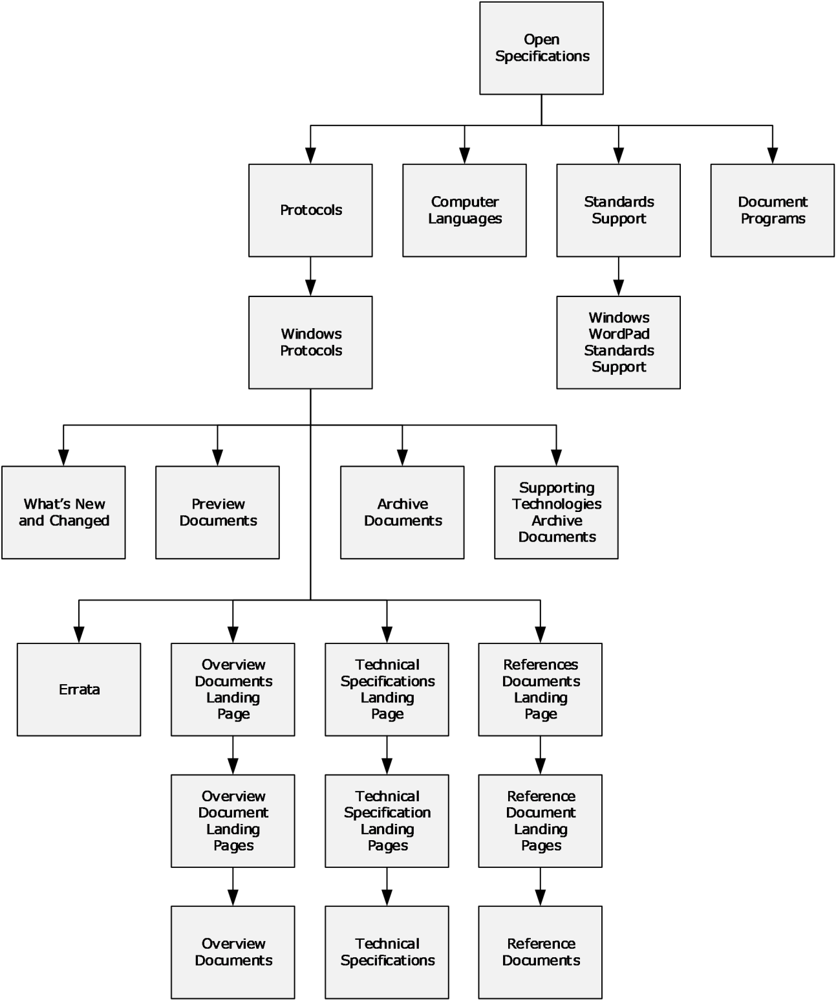
<!-- /Extracted images from page 123 -->

5  Appendix B: Open Specifications Site Map

Figure 18: Open Specifications site map

[MS-DOCO] - v20220614
Windows Protocols Documentation Roadmap
Copyright © 2022 Microsoft Corporation
Release: June 14, 2022

123 / 125

6  Change Tracking

This section identifies changes that were made to this document since the last release. Changes are
classified as Major, Minor, or None.

The revision class Major means that the technical content in the document was significantly revised.
Major changes affect protocol interoperability or implementation. Examples of major changes are:

  A document revision that incorporates changes to interoperability requirements.
  A document revision that captures changes to protocol functionality.

The revision class Minor means that the meaning of the technical content was clarified. Minor changes
do not affect protocol interoperability or implementation. Examples of minor changes are updates to
clarify ambiguity at the sentence, paragraph, or table level.

The revision class None means that no new technical changes were introduced. Minor editorial and
formatting changes may have been made, but the relevant technical content is identical to the last
released version.

The changes made to this document are listed in the following table. For more information, please
contact dochelp@microsoft.com.

Section

Description

4.1 Technical Specification Cross-
Reference Matrix

Added citations to [MS-DHA] and [MS-MDM].
Updated [MS-RNAS] protocol.

Revision
class

Major

4.2 Technical Area Cross-Reference
Matrix

Added [MS-MDE] and [MS-MDM] under Networking.

Major

[MS-DOCO] - v20220614
Windows Protocols Documentation Roadmap
Copyright © 2022 Microsoft Corporation
Release: June 14, 2022

124 / 125

7  Index
A

Audience 15

C

Change tracking 124
Cross-reference matrixes
   technical area 105
   technical specification 52

D

Documentation contents
   external references 31
   overview (section 2 17, section 2.1 18)
   reference documents 30
   technical specifications 21

G

Glossary 5

I

Implementer resources 16
Introduction 5

L

Licensing 15
Localization 15

N

Naming conventions 13
Navigating documentation set
   by document reference 48
   by document type 45
   by node 34
   overview 34

O

Open specification site map 123
Overview
   technology 18
Overview (synopsis) 10
   naming conventions 13
   overview (section 1.3 10, section 1.3.4 14)
   purpose and scope 11
   relationship between documents 12

P

Prerequisites 15

R

Relationship between documents 12

[MS-DOCO] - v20220614
Windows Protocols Documentation Roadmap
Copyright © 2022 Microsoft Corporation
Release: June 14, 2022

Requirements 10
Resources for implementers 16

S

Scope 11
Site map 123
Specifications (section 2.2 21, section 4.1 52)
Support 16

T

Tracking changes 124

125 / 125

