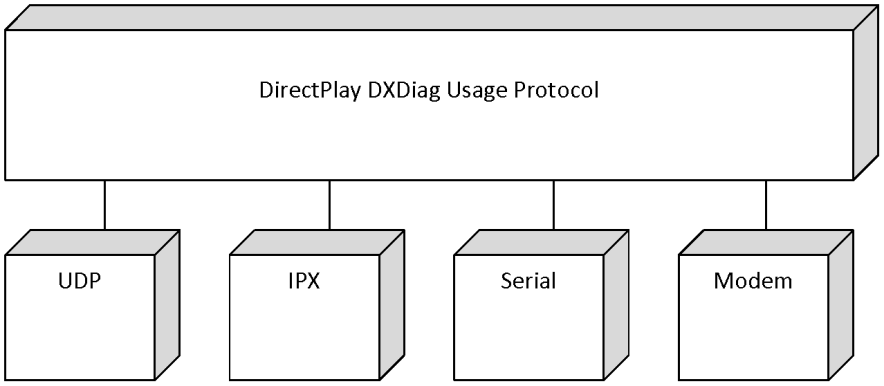
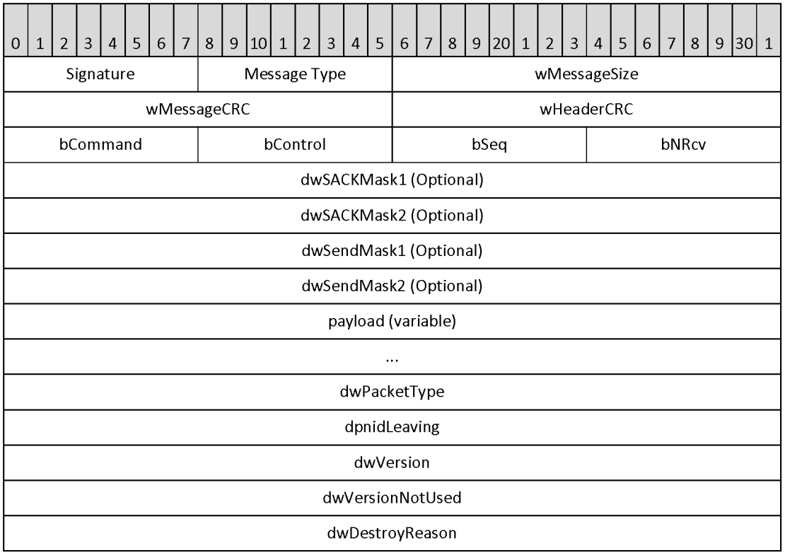
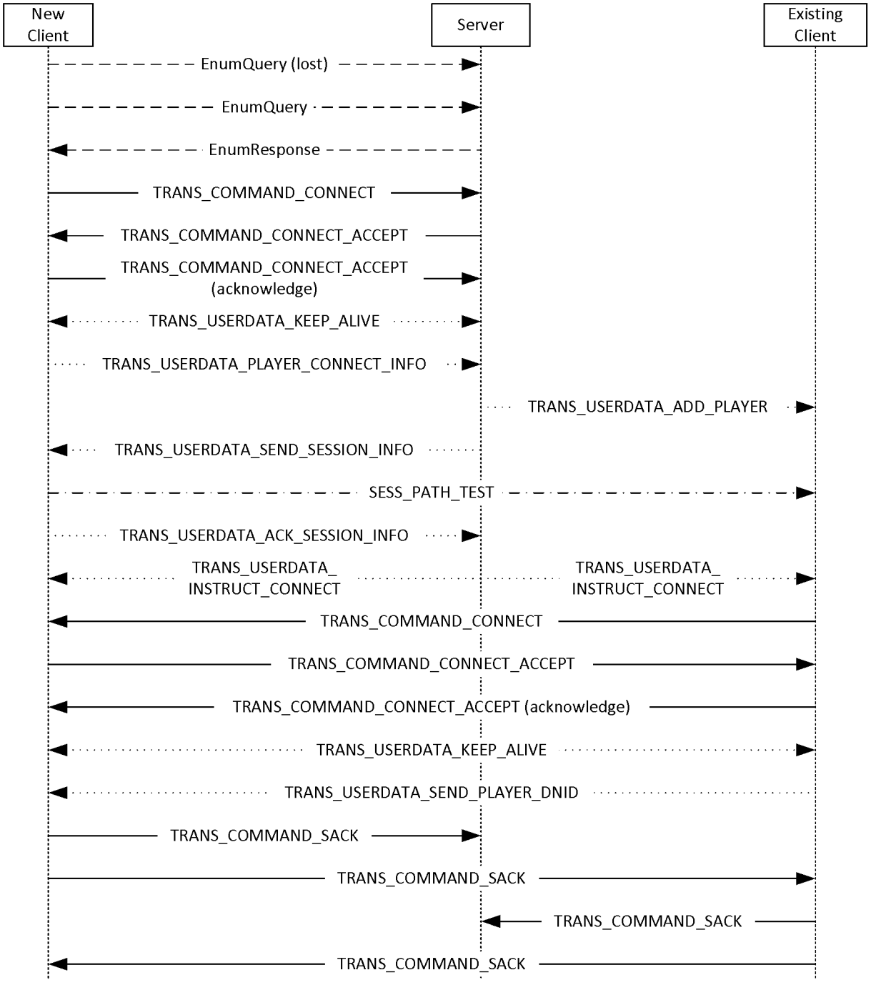

[MS-DPDX]:

DirectPlay DXDiag Usage Protocol

Intellectual Property Rights Notice for Open Specifications Documentation

  Technical Documentation. Microsoft publishes Open Specifications documentation (“this

documentation”) for protocols, file formats, data portability, computer languages, and standards
support. Additionally, overview documents cover inter-protocol relationships and interactions.

  Copyrights. This documentation is covered by Microsoft copyrights. Regardless of any other

terms that are contained in the terms of use for the Microsoft website that hosts this
documentation, you can make copies of it in order to develop implementations of the technologies
that are described in this documentation and can distribute portions of it in your implementations
that use these technologies or in your documentation as necessary to properly document the
implementation. You can also distribute in your implementation, with or without modification, any
schemas, IDLs, or code samples that are included in the documentation. This permission also
applies to any documents that are referenced in the Open Specifications documentation.
  No Trade Secrets. Microsoft does not claim any trade secret rights in this documentation.
  Patents. Microsoft has patents that might cover your implementations of the technologies

described in the Open Specifications documentation. Neither this notice nor Microsoft's delivery of
this documentation grants any licenses under those patents or any other Microsoft patents.
However, a given Open Specifications document might be covered by the Microsoft Open
Specifications Promise or the Microsoft Community Promise. If you would prefer a written license,
or if the technologies described in this documentation are not covered by the Open Specifications
Promise or Community Promise, as applicable, patent licenses are available by contacting
iplg@microsoft.com.

  License Programs. To see all of the protocols in scope under a specific license program and the

associated patents, visit the Patent Map.

  Trademarks. The names of companies and products contained in this documentation might be
covered by trademarks or similar intellectual property rights. This notice does not grant any
licenses under those rights. For a list of Microsoft trademarks, visit
www.microsoft.com/trademarks.

  Fictitious Names. The example companies, organizations, products, domain names, email

addresses, logos, people, places, and events that are depicted in this documentation are fictitious.
No association with any real company, organization, product, domain name, email address, logo,
person, place, or event is intended or should be inferred.

Reservation of Rights. All other rights are reserved, and this notice does not grant any rights other
than as specifically described above, whether by implication, estoppel, or otherwise.

Tools. The Open Specifications documentation does not require the use of Microsoft programming
tools or programming environments in order for you to develop an implementation. If you have access
to Microsoft programming tools and environments, you are free to take advantage of them. Certain
Open Specifications documents are intended for use in conjunction with publicly available standards
specifications and network programming art and, as such, assume that the reader either is familiar
with the aforementioned material or has immediate access to it.

Support. For questions and support, please contact dochelp@microsoft.com.

[MS-DPDX] - v20240423
DirectPlay DXDiag Usage Protocol
Copyright © 2024 Microsoft Corporation
Release: April 23, 2024

1 / 83

Revision Summary

Date

Revision
History

Revision
Class

Comments

7/20/2007

0.1

Major

MCPP Milestone 5 Initial Availability

9/28/2007

0.1.1

Editorial

Changed language and formatting in the technical content.

10/23/2007  0.2

11/30/2007  0.3

1/25/2008

1.0

3/14/2008

2.0

Minor

Minor

Major

Major

Clarified the meaning of the technical content.

Clarified the meaning of the technical content.

Updated and revised the technical content.

Updated and revised the technical content.

5/16/2008

2.0.1

Editorial

Changed language and formatting in the technical content.

6/20/2008

2.1

7/25/2008

2.2

8/29/2008

3.0

10/24/2008  4.0

12/5/2008

5.0

1/16/2009

6.0

2/27/2009

7.0

4/10/2009

8.0

5/22/2009

9.0

7/2/2009

10.0

8/14/2009

10.1

9/25/2009

11.0

Minor

Minor

Major

Major

Major

Major

Major

Major

Major

Major

Minor

Major

Clarified the meaning of the technical content.

Clarified the meaning of the technical content.

Updated and revised the technical content.

Updated and revised the technical content.

Updated and revised the technical content.

Updated and revised the technical content.

Updated and revised the technical content.

Updated and revised the technical content.

Updated and revised the technical content.

Updated and revised the technical content.

Clarified the meaning of the technical content.

Updated and revised the technical content.

11/6/2009

11.0.1

Editorial

Changed language and formatting in the technical content.

12/18/2009  11.0.2

Editorial

Changed language and formatting in the technical content.

1/29/2010

11.1

Minor

Clarified the meaning of the technical content.

3/12/2010

11.1.1

Editorial

Changed language and formatting in the technical content.

4/23/2010

11.1.2

Editorial

Changed language and formatting in the technical content.

6/4/2010

11.2

7/16/2010

11.3

8/27/2010

11.4

10/8/2010

11.4

Minor

Minor

Minor

None

Clarified the meaning of the technical content.

Clarified the meaning of the technical content.

Clarified the meaning of the technical content.

No changes to the meaning, language, or formatting of the
technical content.

11/19/2010  11.4

None

No changes to the meaning, language, or formatting of the
technical content.

[MS-DPDX] - v20240423
DirectPlay DXDiag Usage Protocol
Copyright © 2024 Microsoft Corporation
Release: April 23, 2024

2 / 83

Date

Revision
History

Revision
Class

Comments

1/7/2011

11.4

None

No changes to the meaning, language, or formatting of the
technical content.

2/11/2011

11.4

None

No changes to the meaning, language, or formatting of the
technical content.

3/25/2011

11.4

None

No changes to the meaning, language, or formatting of the
technical content.

5/6/2011

11.4

None

No changes to the meaning, language, or formatting of the
technical content.

6/17/2011

11.5

Minor

Clarified the meaning of the technical content.

9/23/2011

11.5

None

No changes to the meaning, language, or formatting of the
technical content.

12/16/2011  11.5

None

No changes to the meaning, language, or formatting of the
technical content.

3/30/2012

11.5

None

No changes to the meaning, language, or formatting of the
technical content.

7/12/2012

11.5

None

No changes to the meaning, language, or formatting of the
technical content.

10/25/2012  11.5

None

No changes to the meaning, language, or formatting of the
technical content.

1/31/2013

11.5

None

No changes to the meaning, language, or formatting of the
technical content.

8/8/2013

11.5

None

No changes to the meaning, language, or formatting of the
technical content.

11/14/2013  11.5

None

No changes to the meaning, language, or formatting of the
technical content.

2/13/2014

11.5

None

No changes to the meaning, language, or formatting of the
technical content.

5/15/2014

11.5

None

No changes to the meaning, language, or formatting of the
technical content.

6/30/2015

11.5

None

No changes to the meaning, language, or formatting of the
technical content.

10/16/2015  11.5

None

No changes to the meaning, language, or formatting of the
technical content.

7/14/2016

12.0

Major

Significantly changed the technical content.

6/1/2017

12.0

9/15/2017

13.0

9/12/2018

14.0

4/7/2021

15.0

6/25/2021

16.0

None

Major

Major

Major

Major

[MS-DPDX] - v20240423
DirectPlay DXDiag Usage Protocol
Copyright © 2024 Microsoft Corporation
Release: April 23, 2024

No changes to the meaning, language, or formatting of the
technical content.

Significantly changed the technical content.

Significantly changed the technical content.

Significantly changed the technical content.

Significantly changed the technical content.

3 / 83

Date

Revision
History

Revision
Class

Comments

4/23/2024

17.0

Major

Significantly changed the technical content.

[MS-DPDX] - v20240423
DirectPlay DXDiag Usage Protocol
Copyright © 2024 Microsoft Corporation
Release: April 23, 2024

4 / 83

## Table of Contents

- [1 Introduction](#1-introduction)
  - [1.1 Glossary](#11-glossary)
  - [1.2 References](#12-references)
    - [1.2.1 Normative References](#121-normative-references)
    - [1.2.2 Informative References](#122-informative-references)
  - [1.3 Overview](#13-overview)
    - [1.3.1 How DXDiag Uses DirectPlay](#131-how-dxdiag-uses-directplay)
  - [1.4 Relationship to Other Protocols](#14-relationship-to-other-protocols)
  - [1.5 Prerequisites/Preconditions](#15-prerequisitespreconditions)
  - [1.6 Applicability Statement](#16-applicability-statement)
  - [1.7 Versioning and Capability Negotiation](#17-versioning-and-capability-negotiation)
  - [1.8 Vendor-Extensible Fields](#18-vendor-extensible-fields)
  - [1.9 Standards Assignments](#19-standards-assignments)
- [2 Messages](#2-messages)
  - [2.1 Transport](#21-transport)
  - [2.2 Message Syntax](#22-message-syntax)
    - [2.2.1 DPNID](#221-dpnid)
    - [2.2.2 _MESSAGE_HEADER](#222-messageheader)
    - [2.2.3 DXDiag DirectPlay Packets](#223-dxdiag-directplay-packets)
    - [2.2.4 EnumQuery](#224-enumquery)
    - [2.2.5 EnumResponse](#225-enumresponse)
    - [2.2.6 SESS_PATH_TEST](#226-sesspathtest)
    - [2.2.7 TRANS_COMMAND_CONNECT](#227-transcommandconnect)
    - [2.2.8 TRANS_COMMAND_CONNECT_ACCEPT](#228-transcommandconnectaccept)
    - [2.2.9 TRANS_COMMAND_SACK](#229-transcommandsack)
    - [2.2.10 TRANS_USERDATA_ACK_SESSION_INFO](#2210-transuserdataacksessioninfo)
    - [2.2.11 TRANS_USERDATA_ADD_PLAYER](#2211-transuserdataaddplayer)
    - [2.2.12 TRANS_USERDATA_CONNECT_ATTEMPT_FAILED](#2212-transuserdataconnectattemptfailed)
    - [2.2.13 TRANS_USERDATA_CONNECT_FAILED](#2213-transuserdataconnectfailed)
    - [2.2.14 TRANS_USERDATA_TERMINATE_SESSION](#2214-transuserdataterminatesession)
    - [2.2.15 TRANS_USERDATA_DESTROY_PLAYER](#2215-transuserdatadestroyplayer)
    - [2.2.16 TRANS_USERDATA_END_OF_STREAM](#2216-transuserdataendofstream)
    - [2.2.17 TRANS_USERDATA_HEADER](#2217-transuserdataheader)
      - [2.2.17.1 Coalesced Payloads](#22171-coalesced-payloads)
    - [2.2.18 TRANS_USERDATA_HOST_MIGRATE](#2218-transuserdatahostmigrate)
    - [2.2.19 TRANS_USERDATA_HOST_MIGRATE_COMPLETE](#2219-transuserdatahostmigratecomplete)
    - [2.2.20 TRANS_USERDATA_INSTRUCT_CONNECT](#2220-transuserdatainstructconnect)
    - [2.2.21 TRANS_USERDATA_INSTRUCTED_CONNECT_FAILED](#2221-transuserdatainstructedconnectfailed)
    - [2.2.22 TRANS_USERDATA_KEEPALIVE](#2222-transuserdatakeepalive)
    - [2.2.23 TRANS_USERDATA_NAMETABLE_VERSION](#2223-transuserdatanametableversion)
    - [2.2.24 TRANS_USERDATA_REQ_NAMETABLE_OP](#2224-transuserdatareqnametableop)
    - [2.2.25 TRANS_USERDATA_ACK_NAMETABLE_OP](#2225-transuserdataacknametableop)
    - [2.2.26 TRANS_USERDATA_PLAYER_CONNECT_INFO](#2226-transuserdataplayerconnectinfo)
    - [2.2.27 TRANS_USERDATA_REQ_INTEGRITY_CHECK](#2227-transuserdatareqintegritycheck)
    - [2.2.28 TRANS_USERDATA_INTEGRITY_CHECK](#2228-transuserdataintegritycheck)
    - [2.2.29 TRANS_USERDATA_INTEGRITY_CHECK_RESPONSE](#2229-transuserdataintegritycheckresponse)
    - [2.2.30 TRANS_USERDATA_RESYNC_VERSION](#2230-transuserdataresyncversion)
    - [2.2.31 TRANS_USERDATA_SEND_MESSAGE](#2231-transuserdatasendmessage)
    - [2.2.32 TRANS_USERDATA_SEND_PLAYER_DNID](#2232-transuserdatasendplayerdnid)
    - [2.2.33 TRANS_USERDATA_SEND_SESSION_INFO](#2233-transuserdatasendsessioninfo)
      - [2.2.33.1 DN_NAMETABLE_ENTRY_INFO](#22331-dnnametableentryinfo)
      - [2.2.33.2 DN_NAMETABLE_MEMBERSHIP_INFO](#22332-dnnametablemembershipinfo)
    - [2.2.34 DN_ADDRESSING_URL](#2234-dnaddressingurl)
    - [2.2.35 DN_ALTERNATE_ADDRESS (IPv4)](#2235-dnalternateaddress-ipv4)
      - [2.2.35.1 IN_ADDR (IPv4)](#22351-inaddr-ipv4)
    - [2.2.36 DN_ALTERNATE_ADDRESS (IPv6)](#2236-dnalternateaddress-ipv6)
      - [2.2.36.1 IN6_ADDR (IPv6)](#22361-in6addr-ipv6)
    - [2.2.37 DN_NAMETABLE](#2237-dnnametable)
    - [2.2.38 PATHTESTKEYDATA](#2238-pathtestkeydata)
- [3 Protocol Details](#3-protocol-details)
  - [3.1 Common Details](#31-common-details)
    - [3.1.1 Abstract Data Model](#311-abstract-data-model)
    - [3.1.2 Timers](#312-timers)
      - [3.1.2.1 Connect Retry Timer](#3121-connect-retry-timer)
      - [3.1.2.2 EnumQuery Retry Timer](#3122-enumquery-retry-timer)
      - [3.1.2.3 Retry Timer](#3123-retry-timer)
      - [3.1.2.4 KeepAlive Retry Timer](#3124-keepalive-retry-timer)
      - [3.1.2.5 Path Test Retry Timer](#3125-path-test-retry-timer)
      - [3.1.2.6 Delayed Acknowledgment Timer](#3126-delayed-acknowledgment-timer)
    - [3.1.3 Initialization](#313-initialization)
    - [3.1.4 Higher-Layer Triggered Events](#314-higher-layer-triggered-events)
      - [3.1.4.1 Sending a Chat Message](#3141-sending-a-chat-message)
      - [3.1.4.2 Disconnecting](#3142-disconnecting)
    - [3.1.5 Processing Events and Sequencing Rules](#315-processing-events-and-sequencing-rules)
      - [3.1.5.1 Client Joins a DirectPlay Session with No Other Clients](#3151-client-joins-a-directplay-session-with-no-other-clients)
      - [3.1.5.2 Client Joins a DirectPlay Session with Multiple Other Clients](#3152-client-joins-a-directplay-session-with-multiple-other-clients)
      - [3.1.5.3 Client Disconnects from Chat Session](#3153-client-disconnects-from-chat-session)
      - [3.1.5.4 Server Disconnects from Chat Session](#3154-server-disconnects-from-chat-session)
      - [3.1.5.5 Client Is Forcefully Removed from Session](#3155-client-is-forcefully-removed-from-session)
      - [3.1.5.6 Client Detects Loss of Connection to Other Client](#3156-client-detects-loss-of-connection-to-other-client)
      - [3.1.5.7 Participant Receives Chat Message](#3157-participant-receives-chat-message)
      - [3.1.5.8 Command Byte (bCommand) Validation and Processing](#3158-command-byte-bcommand-validation-and-processing)
      - [3.1.5.9 Control Byte (bControl) Validation and Processing](#3159-control-byte-bcontrol-validation-and-processing)
      - [3.1.5.10 Send Sequence ID (bSeq) Validation and Processing](#31510-send-sequence-id-bseq-validation-and-processing)
      - [3.1.5.11 Acknowledged Sequence ID (bNRcv) Processing](#31511-acknowledged-sequence-id-bnrcv-processing)
      - [3.1.5.12 SACK Mask Processing](#31512-sack-mask-processing)
      - [3.1.5.13 Send Mask Processing](#31513-send-mask-processing)
    - [3.1.6 Timer Events](#316-timer-events)
      - [3.1.6.1 Connect Retry Timer](#3161-connect-retry-timer)
      - [3.1.6.2 EnumQuery Retry Timer](#3162-enumquery-retry-timer)
      - [3.1.6.3 Retry Timer](#3163-retry-timer)
      - [3.1.6.4 KeepAlive Retry Timer](#3164-keepalive-retry-timer)
      - [3.1.6.5 Path Test Retry Timer](#3165-path-test-retry-timer)
      - [3.1.6.6 Delayed Acknowledgment Timer](#3166-delayed-acknowledgment-timer)
    - [3.1.7 Other Local Events](#317-other-local-events)
  - [3.2 Server Details](#32-server-details)
    - [3.2.1 Abstract Data Model](#321-abstract-data-model)
    - [3.2.2 Timers](#322-timers)
    - [3.2.3 Initialization](#323-initialization)
    - [3.2.4 Higher-Layer Triggered Events](#324-higher-layer-triggered-events)
    - [3.2.5 Processing Events and Sequencing Rules](#325-processing-events-and-sequencing-rules)
    - [3.2.6 Timer Events](#326-timer-events)
    - [3.2.7 Other Local Events](#327-other-local-events)
  - [3.3 Client Details](#33-client-details)
    - [3.3.1 Abstract Data Model](#331-abstract-data-model)
    - [3.3.2 Timers](#332-timers)
    - [3.3.3 Initialization](#333-initialization)
    - [3.3.4 Higher-Layer Triggered Events](#334-higher-layer-triggered-events)
    - [3.3.5 Processing Events and Sequencing Rules](#335-processing-events-and-sequencing-rules)
    - [3.3.6 Timer Events](#336-timer-events)
    - [3.3.7 Other Local Events](#337-other-local-events)
- [4 Protocol Examples](#4-protocol-examples)
  - [4.1 User Joins a DXDiag Chat Session Example](#41-user-joins-a-dxdiag-chat-session-example)
  - [4.2 Client Disconnects from a DXDiag Chat Session Example](#42-client-disconnects-from-a-dxdiag-chat-session-example)
  - [4.3 New Client Joins a Game Session with an Existing Client Example](#43-new-client-joins-a-game-session-with-an-existing-client-example)
- [5 Security](#5-security)
  - [5.1 Security Considerations for Implementers](#51-security-considerations-for-implementers)
  - [5.2 Index of Security Parameters](#52-index-of-security-parameters)
- [6 Appendix A: Product Behavior](#6-appendix-a-product-behavior)
- [7 Change Tracking](#7-change-tracking)
- [8 Index](#8-index)

## 1 Introduction

This specification pertains to the DirectPlay Protocol and describes how DirectPlay messages are used
natively by the DXDiag application. This protocol is intended for peer-to-peer network video gaming.

Sections 1.5, 1.8, 1.9, 2, and 3 of this specification are normative. All other sections and examples in
this specification are informative.

### 1.1 Glossary

This document uses the following terms:

acknowledgment (ACK): A signal passed between communicating processes or computers to

signify successful receipt of a transmission as part of a communications protocol.

big-endian: Multiple-byte values that are byte-ordered with the most significant byte stored in the

memory location with the lowest address.

client: A computer on which the remote procedure call (RPC) client is executing.

coalesced payload: A special form of payload that consists of multiple traditional payloads

combined into a single packet.

command frame (CFRAME): A special DirectPlay 8 control frame that does not carry application
payload data. For more information, see the DirectPlay 8 Protocol: Reliable Specification ([MC-
DPL8R] section 2.2.1). See Also, data frame.

CRC-16-IBM algorithm: The CRC-16-IBM algorithm polynomial is x^16 + x^15 + x^2 + 1.

Normal and reversed representations are "0x8005" or "0xA001".

cyclic redundancy check (CRC): An algorithm used to produce a checksum (a small, fixed
number of bits) against a block of data, such as a packet of network traffic or a block of a
computer file. The CRC is a broad class of functions used to detect errors after transmission or
storage. A CRC is designed to catch random errors, as opposed to intentional errors. If errors
might be introduced by a motivated and intelligent adversary, a cryptographic hash function has
to be used instead.

data frame (DFRAME): A DirectPlay 8 frame that exists in the standard connection sequence

space and typically carries application payload data. The total size of the DFRAME header and
payload are to be less than the Maximum Transmission Unit (MTU) of the underlying protocols
and network. For more information, see the DirectPlay 8 Protocol: Reliable Specification ([MC-
DPL8R] section 2.2.2). See Also, command frame.

DirectPlay: A network communication library included with the Microsoft DirectX application

programming interfaces. DirectPlay is a high-level software interface between applications and
communication services that makes it easy to connect games over the Internet, a modem link,
or a network.

DirectPlay 4: A programming library that implements the IDirectPlay4 programming interface.
DirectPlay 4 provides peer-to-peer session-layer services to applications, including session
lifetime management, data management, and media abstraction. DirectPlay 4 first shipped
with the DirectX 6 multimedia toolkit. Later versions continued to ship up to, and including,
DirectX 9. DirectPlay 4 was subsequently deprecated. The DirectPlay 4 DLL continues to ship
in current versions of Windows operating systems, but the development library is no longer
shipping in Microsoft development tools and software development kits (SDKs).

DirectPlay 8 protocol: The DirectPlay 8 protocol is used by multiplayer games to perform low-

latency communication between two or more computers.

8 / 83

[MS-DPDX] - v20240423
DirectPlay DXDiag Usage Protocol
Copyright © 2024 Microsoft Corporation
Release: April 23, 2024

DirectPlay 8 server application: A DirectPlay 8 application that is hosting a DirectPlay 8 session.
When connected, the actual communication between nodes in a DirectPlay 8 session could be
client/server or peer to peer. The term "server" in this definition is meant to indicate the role
that the DirectPlay 8 server application is taking in the host enumeration process, which is the
DirectPlay 8 applicatio] that is currently hosting a DirectPlay 8 session.

DirectPlay host: The player in a DirectPlay peer-to-peer game session that is responsible for

performing game session management duties, such as responding to game session enumeration
requests and maintaining the master copy of all the player and group lists for the game. It has
connections to all DirectPlay peers in the game session.

DirectPlay Name Server (DPNSVR): A forwarding service for enumeration requests that
eliminates problems caused by conflicts between port usages for multiple DirectPlay
applications.

DirectPlay protocol: Refers to either the DirectPlay 4 or the DirectPlay 8 protocol.

DirectX: Microsoft DirectX is a collection of application programming interfaces for handling tasks

related to multimedia, especially game programming and video, on Microsoft platforms.

DirectX Diagnostic (DXDiag): DXDiag.exe is an application that uses the DirectPlay DXDiag

Usage Protocol [MS-DPDX] traffic.

DirectX runtime: A set of libraries created for the family of Windows operating systems that

provide interfaces to ease the development of video games.

DPNID: A 32-bit identification value assigned to a DirectPlay player as part of its participation in a

DirectPlay game session.

game: An application that uses a DirectPlay protocol to communicate between computers.

game session: The metadata associated with the collection of computers participating in a single

instance of a computer game.

globally unique identifier (GUID): A term used interchangeably with universally unique

identifier (UUID) in Microsoft protocol technical documents (TDs). Interchanging the usage of
these terms does not imply or require a specific algorithm or mechanism to generate the value.
Specifically, the use of this term does not imply or require that the algorithms described in
[RFC4122] or [C706] have to be used for generating the GUID. See also universally unique
identifier (UUID).

group: A named collection of users who share similar access permissions or roles.

host: In DirectPlay, the computer responsible for responding to DirectPlay game session

enumeration requests and maintaining the master copy of all the player and group lists for the
game. One computer is designated as the host of the DirectPlay game session. All other
participants in the DirectPlay game session are called peers. However, in peer-to-peer mode
the name table entry representing the host of the session is also marked as a peer.

host migration: The protocol-specific procedure that occurs when the DirectPlay peer that is
designated as the host or voice server leaves the DirectPlay game or voice session and
another peer assumes that role.

instance: A specific occurrence of a game running in a game session. A game application

process or module can be created more than one time on a single computer system, or on
separate computer systems. Each time a game application process or module is created, the
occurrence is considered to be a separate instance.

Internet Protocol security (IPsec): A framework of open standards for ensuring private, secure

communications over Internet Protocol (IP) networks through the use of cryptographic security

9 / 83

[MS-DPDX] - v20240423
DirectPlay DXDiag Usage Protocol
Copyright © 2024 Microsoft Corporation
Release: April 23, 2024

services. IPsec supports network-level peer authentication, data origin authentication, data
integrity, data confidentiality (encryption), and replay protection.

Internet Protocol version 4 (IPv4): An Internet protocol that has 32-bit source and destination

addresses. IPv4 is the predecessor of IPv6.

Internet Protocol version 6 (IPv6): A revised version of the Internet Protocol (IP) designed to
address growth on the Internet. Improvements include a 128-bit IP address size, expanded
routing capabilities, and support for authentication and privacy.

Internetwork Packet Exchange (IPX): A protocol that provides connectionless datagram

delivery of messages. See [IPX].

little-endian: Multiple-byte values that are byte-ordered with the least significant byte stored in

the memory location with the lowest address.

local area network (LAN): A group of computers and other devices dispersed over a relatively
limited area and connected by a communications link that enables any device to interact with
any other device on the network.

modem link (or modem transport): Running the DXDiag application over a modem-to-modem

link. See Also, serial link.

name table: The list of systems participating in a DXDiag, DirectPlay 4, or DirectPlay 8 session,

as well as any application-created groups.

name table entry: The DN_NAMETABLE_MEMBERSHIP_INFO structure ([MS-DPDX] section
2.2.33) along with associated strings and data buffers for an individual participant in the
DXDiag session. These could be considered players.

network address translation (NAT): The process of converting between IP addresses used

within an intranet, or other private network, and Internet IP addresses.

network byte order: The order in which the bytes of a multiple-byte number are transmitted on a
network, most significant byte first (in big-endian storage). This does not always match the
order in which numbers are normally stored in memory for a particular processor.

partner: A computer connected to a local computer through either inbound or outbound

connections.

payload: The data that is transported to and from the application that is using either the

DirectPlay 4 protocol or DirectPlay 8 protocol.

peer: In DirectPlay, a player within a DirectPlay game session that has an established connection

with every other peer in the game session, and which is not performing game session
management duties. The participant that is managing the game session is called the host.

peer-to-peer: A server-less networking technology that allows several participating network

devices to share resources and communicate directly with each other.

peer-to-peer mode: A game-playing mode that consists of multiple peers. Each peer has a

connection to all other peers in the DirectPlay game session. If there are N peers in the game
session, each peer has N–1 connections.

player: A person who is playing a computer game. There can be multiple players on a computer

participating in any given game session. See also name table.

poll packet (POLL): A packet in which the sender has set the PACKET_COMMAND_POLL bit in the
packet header ([MS-DPDX] section 2.2.16). POLL indicates that the receiver has to immediately
acknowledge receipt of the packet when it arrives.

10 / 83

[MS-DPDX] - v20240423
DirectPlay DXDiag Usage Protocol
Copyright © 2024 Microsoft Corporation
Release: April 23, 2024

round-trip time (RTT): The time that it takes a packet to be sent to a remote partner and for

that partner's acknowledgment to arrive at the original sender. This is a measurement of latency
between partners.

selective acknowledgment (SACK): A cumulative mechanism that indicates successful receipt of

packets beyond the next receive indicator. Next receive reports all packets prior to when its
sequence ID has been received, but subsequent packets can arrive out of order or with gaps in
the sequence. SACK masks enable the receiver to acknowledge these packets so that they do
not have to be retried, in addition to the packets that were truly lost. See also
acknowledgment (ACK), next receive, and next send.

send mask: A bitmask mechanism indicating that previously sent packets might have been

dropped, were not marked as reliable, and will never be retried.

sequence ID: A monotonically increasing 8-bit identifier for packets. This is typically represented

as a field named bSeq in packet structures.

serial link (or serial transport): Running the DXDiag application over a null modem cable

connecting two computers. See also modem link.

server: A DirectPlay system application that is hosting a DirectPlay game session. In the

context of DirectPlay 8, the term is reserved for hosts using client/server mode.

session packet: A session packet is associated with client/server session management. A

session packet begins with a zero byte and is used for locating sessions and testing network
paths. See transport packet.

tick count: In DirectPlay, the count from when the system was booted, in milliseconds.

transport layer: The fourth layer in the Open Systems Interconnection (OSI) architectural model
as defined by the International Organization for Standardization (ISO). The transport layer
provides for transfer correctness, data recovery, and flow control. The transport layer responds
to service requests from the session layer and issues service requests to the network layer.

transport packet: A transport packet has a nonzero first byte and is further divided into

command, user data, and acknowledgment packet types. See session packet.

Unicode: A character encoding standard developed by the Unicode Consortium that represents

almost all of the written languages of the world. The Unicode standard [UNICODE5.0.0/2007]
provides three forms (UTF-8, UTF-16, and UTF-32) and seven schemes (UTF-8, UTF-16, UTF-16
BE, UTF-16 LE, UTF-32, UTF-32 LE, and UTF-32 BE).

User Datagram Protocol (UDP): The connectionless protocol within TCP/IP that corresponds to

the transport layer in the ISO/OSI reference model.

wide characters: Characters represented by a 2-byte value that are encoded using Unicode UTF-

16. Unless otherwise stated, no range restrictions apply.

MAY, SHOULD, MUST, SHOULD NOT, MUST NOT: These terms (in all caps) are used as defined
in [RFC2119]. All statements of optional behavior use either MAY, SHOULD, or SHOULD NOT.

### 1.2 References

Links to a document in the Microsoft Open Specifications library point to the correct section in the
most recently published version of the referenced document. However, because individual documents
in the library are not updated at the same time, the section numbers in the documents may not
match. You can confirm the correct section numbering by checking the Errata.

[MS-DPDX] - v20240423
DirectPlay DXDiag Usage Protocol
Copyright © 2024 Microsoft Corporation
Release: April 23, 2024

11 / 83

#### 1.2.1 Normative References

We conduct frequent surveys of the normative references to assure their continued availability. If you
have any issue with finding a normative reference, please contact dochelp@microsoft.com. We will
assist you in finding the relevant information.

[FIPS180] FIPS PUBS, "Secure Hash Standard", FIPS PUB 180-1, April 1995,
https://www.niatec.iri.isu.edu/GetFile.aspx?pid=63

[IANAPORT] IANA, "Service Name and Transport Protocol Port Number Registry",
https://www.iana.org/assignments/service-names-port-numbers/service-names-port-numbers.xhtml

[MS-DTYP] Microsoft Corporation, "Windows Data Types".

[RFC2119] Bradner, S., "Key words for use in RFCs to Indicate Requirement Levels", BCP 14, RFC
2119, March 1997, https://www.rfc-editor.org/info/rfc2119

[RFC768] Postel, J., "User Datagram Protocol", STD 6, RFC 768, August 1980, https://www.rfc-
editor.org/info/rfc768

#### 1.2.2 Informative References

[IPX] Novell Corporation, "Internetwork Packet Exchange (IPX)",
http://www.novell.com/documentation/nw6p/pdfdoc/ipx_enu/ipx_enu.pdf

[MC-DPL4CS] Microsoft Corporation, "DirectPlay 4 Protocol: Core and Service Providers".

[MC-DPL8CS] Microsoft Corporation, "DirectPlay 8 Protocol: Core and Service Providers".

[MC-DPL8R] Microsoft Corporation, "DirectPlay 8 Protocol: Reliable".

[MC-DPLHP] Microsoft Corporation, "DirectPlay 8 Protocol: Host and Port Enumeration".

[MC-DPLNAT] Microsoft Corporation, "DirectPlay 8 Protocol: NAT Locator".

### 1.3 Overview

The DirectPlay DXDiag Usage Protocol is designed to handle the following two basic types of network
messaging for networked gaming:

  Reliable versus not reliable messaging: This determines whether or not messages are guaranteed

to be delivered to the target application in the event of packet loss.

  Sequential versus non-sequential messaging: This determines whether or not messages are

received by the target application in the same order in which they are sent in the event of packet
loss or incorrect ordering.

Games use messaging for a variety of purposes, each with different demands. To support the range
of messaging requirements, the DirectPlay DXDiag Usage Protocol designates a message as belonging
to one of four categories, depending on whether the message is reliable and/or sequential. The
categories are specified by setting the PACKET_COMMAND_RELIABLE and
PACKET_COMMAND_SEQUENTIAL flags in the bCommand field of the
TRANS_USERDATA_HEADER packet header as follows:

Message category

Flags set

Reliable and Sequential

PACKET_COMMAND_RELIABLE and PACKET_COMMAND_SEQUENTIAL

[MS-DPDX] - v20240423
DirectPlay DXDiag Usage Protocol
Copyright © 2024 Microsoft Corporation
Release: April 23, 2024

12 / 83

Message category

Flags set

Not reliable and Sequential

PACKET_COMMAND_SEQUENTIAL

Reliable and Non-sequential

PACKET_COMMAND_RELIABLE

Not reliable and Non-sequential  None

The DirectPlay DXDiag Usage Protocol enables optimizing of messaging strategy by assigning
categories on a message-by-message basis.

Reliable packets are those that the upper layer considers important to retry when they are lost on the
network. Packets not marked as reliable are for temporary messages that are not critical to operation
and are not retried because they are replaced with subsequent messages. Sequential packets are
those that have to be delivered according to the upper layer and have to wait until the gaps in the
sequence due to packet loss are resolved. However, non-sequential packets can be delivered to the
upper layer as they arrive.

#### 1.3.1 How DXDiag Uses DirectPlay

DirectPlay DXDiag Usage Protocol packets are transported by means of User Datagram Protocol
(UDP) (as specified in [RFC768]) and internetwork packet exchange [IPX]. To facilitate transport
over unreliable serial streams, such as those provided by direct connection serial and modem links, a
message format with signatures and checksums is defined in section 2.2.

Enumeration packets are used for lightweight discovery of available game sessions, typically on a
local area network (LAN). The computer hosting a DXDiag game session listens for incoming
enumeration queries from a remote computer and responds with enumeration replies. Upon receiving
the response, the remote computer initiates a stateful connection to the hosting computer in order to
participate in the game session.

In the DXDiag game session, an array of identifiers is contained in a name table. When a new client
joins a session, the client receives a name table that lists all of the clients currently in the game
session. When a client departs the game session, the identifier for that client is removed from the
name table. The name table itself is kept current through the use of a version number.

The DirectPlay DXDiag Usage Protocol is a sliding window protocol that requires the receiver to
acknowledge received UDP packets before more packets are transmitted. An acknowledgment
(ACK) can be conveyed in one of two ways: either bundled within back traffic sent from the receiver,
or, when no back traffic is flowing, sent from the receiver as a dataless selective acknowledgment
(SACK) packet.

When the ACK is bundled within back traffic, fields within the header are used to indicate the sequence
number of the next expected packet. This acknowledges that all packets with sequence numbers less
than the specified number have been received correctly. If an ACK is not received within a specified
amount of time, the original packet is resent with the same sequence number as was previously
assigned.

Note  The specified amount of time is derived from the current round-trip time (RTT) measured by
previously acknowledged messages. An initial RTT measurement is also taken from the
TRANS_COMMAND_CONNECT_ACCEPT response to the TRANS_COMMAND_CONNECT or
TRANS_COMMAND_CONNECT_ACCEPT packet sent during the initial handshake.

If the original sender specifies poll packet (POLL) (ACK now) in the packet header, the receiver
immediately acknowledges the packet when it arrives.

[MS-DPDX] - v20240423
DirectPlay DXDiag Usage Protocol
Copyright © 2024 Microsoft Corporation
Release: April 23, 2024

13 / 83

<!-- Extracted images from page 14 -->

<!-- /Extracted images from page 14 -->

### 1.4 Relationship to Other Protocols

The DirectPlay DXDiag Usage Protocol has a dependency on UDP, or other similar datagram-oriented,
connectionless protocol such as IPX, for the transport layer. As a native Windows protocol, no other
protocols depend on the DirectPlay DXDiag Usage Protocol.

Figure 1: DirectPlay DXDiag Usage Protocol relationship to other protocols

### 1.5 Prerequisites/Preconditions

All multiple-byte fields used by the DirectPlay DXDiag Usage Protocol are in little-endian byte order,
unless otherwise noted.

### 1.6 Applicability Statement

The DirectPlay DXDiag Usage Protocol was designed for multiplayer network gaming, but not for other
uses of peer-to-peer messaging. It is not recommended for file transfer or for applications with
robust security requirements that cannot provide them at other layers such as Internet Protocol
security IPsec.

### 1.7 Versioning and Capability Negotiation

This specification covers versioning issues in the following areas:



Protocol versions: The DirectPlay protocol has the following version levels for features:

  Any version level between 0x00010000 and 0x00010004 implements the base features. The

base features include all features described in this specification except for signing and
coalescence.

  A version level of 0x00010005 implements the base features and adds support for

coalescence.

  A version level of 0x00010006 implements the base features, supports coalescence, and adds

support for signing.

In the DirectPlay DXDiag Usage Protocol, the version level value is specified in the
dwCurrentProtocolVersion field of the TRANS_COMMAND_CONNECT or
TRANS_COMMAND_CONNECT_ACCEPT message.

Note  DirectPlay DXDiag Usage Protocol version numbers advertise the availability of coalescence
and signing, but they do not mandate the usage of these features. Even when the recipient
indicates support for coalescence or signing, the implementation can choose not to use these
features.<1>

14 / 83

[MS-DPDX] - v20240423
DirectPlay DXDiag Usage Protocol
Copyright © 2024 Microsoft Corporation
Release: April 23, 2024

  Capability negotiation: The DirectPlay DXDiag Usage Protocol inspects the value of the

dwCurrentProtocolVersion field of the TRANS_COMMAND_CONNECT and
TRANS_COMMAND_CONNECT_ACCEPT messages to identify the features that are supported by
the sender and receiver. In this respect, capability negotiation is provided in a manner similar to
that available in the DirectPlay 8 Protocol, as described in [MC-DPL8R] section 1.7.

Note  After the release of DirectPlay 4, earlier versions of DirectPlay were modified to resolve to
DirectPlay 4, as described in [MC-DPL4CS]. These versions include:<2>

  DirectPlay (1)

  DirectPlay 2

  DirectPlay 2A

  DirectPlay 3

  DirectPlay 3A

### 1.8 Vendor-Extensible Fields

None.

### 1.9 Standards Assignments

The DirectPlay DXDiag Usage Protocol uses one well-known UDP port assignment.

Parameter

Value

Reference

UDP port for DirectPlay  6073/udp

[IANAPORT]

For the purpose and use of this port assignment, see section 3.

[MS-DPDX] - v20240423
DirectPlay DXDiag Usage Protocol
Copyright © 2024 Microsoft Corporation
Release: April 23, 2024

15 / 83

## 2 Messages

This protocol references commonly used data types as defined in [MS-DTYP].

### 2.1 Transport

The DirectPlay DXDiag Usage Protocol uses UDP, internetwork packet exchange (IPX), serial, or
modem as the transport. The DirectPlay DXDiag Usage Protocol can utilize either IPv4 or IPv6. The
wire protocol format is the same for UDP and IPX. When a serial or modem link is used, there is an
extra header, as specified in section 2.2.2.

### 2.2 Message Syntax

#### 2.2.1 DPNID

The DPNID identifier describes the 32-bit DirectPlay network identifier for a player in a game
session.

This type is declared as follows:

 typedef DWORD DPNID, *PDPNID;

The DPNID for each player in the game session MUST be unique. The DPNID for a player is generated
in several steps while adding the player to the game session.

1.  The index of the entry in the name table that was used to create the player is stored in the

lowest 20 bits of the DPNID. For example, when the index of the entry within the name table is 5,
the index is stored as 0xNNN00005.

2.  Along with the index, the version of the name table that existed when the entry was created is
also stored. For example, when the name table version is 10 (0x0A), the index is stored as
0x00A00005.

3.  This value is then XOR'd with the first 32 bits of the game session instance GUID. For example, if
the instance GUID begins with 0xA1B2C3D4, the DPNID 0x00A00005 value would be XOR'd with
0xA1B2C3D4 to yield 0xA112C3D1.

Note  The DirectPlay host uses the DPNID of a player to determine the location for this DPNID entry
in the name table.

#### 2.2.2 _MESSAGE_HEADER

When a serial or modem link is used, any of the packets listed in the table in section 2.2.3 are
modified by prefixing them with the _MESSAGE_HEADER header. Exceptions to this are the packets
EnumQuery (section 2.2.4) and EnumResponse (section 2.2.5), which use _MESSAGE_HEADER in
place of the first 32 bits of their payloads.

For example, the following figure illustrates the contents of the TRANS_USERDATA_DESTROY_PLAYER
packet when prefixed with the _MESSAGE_HEADER header.

[MS-DPDX] - v20240423
DirectPlay DXDiag Usage Protocol
Copyright © 2024 Microsoft Corporation
Release: April 23, 2024

16 / 83

<!-- Extracted images from page 17 -->

<!-- /Extracted images from page 17 -->

Figure 2: TRANS_USERDATA_DESTROY_PLAYER packet prefixed with the
_MESSAGE_HEADER header

0  1  2  3  4  5  6  7  8  9

1
0  1  2  3  4  5  6  7  8  9

2
0  1  2  3  4  5  6  7  8  9

3
0  1

Signature

MessageType

wMessageSize

wMessageCRC

wHeaderCRC

Signature (1 byte): An 8-bit serial signature for the packet. This MUST be set to the value 0xCC.

MessageType (1 byte): An 8-bit token that indicates the message type. The high 4 bits MUST be set

to one of the following values.

Value  Meaning

0x20

This message contains an enumeration response. See section 2.2.5.

0x40

This message contains a transport packet message following the header, and the low two bits
MUST be ignored.

0x60

This message contains an enumeration query. See section 2.2.4.

The low two bits of the MessageType value in an enumeration query MUST be echoed in the low
two bits of the enumeration response (a message with MessageType value of "0x20"). The sender
MAY use any identifier value for the enumeration query. However, the sender SHOULD use this
value to correlate queries with responses to calculate the round-trip time (RTT).

wMessageSize (2 bytes): A 16-bit integer that specifies the size, in bytes, of the message.

[MS-DPDX] - v20240423
DirectPlay DXDiag Usage Protocol
Copyright © 2024 Microsoft Corporation
Release: April 23, 2024

17 / 83

wMessageCRC (2 bytes): A 16-bit integer that provides the CRC, in bytes, for the message data,

which is calculated using the standardized CRC-16-IBM algorithm.

wHeaderCRC (2 bytes): A 16-bit integer that provides the CRC, in bytes, for the message header,

which is calculated using the standardized CRC-16-IBM algorithm.

#### 2.2.3 DXDiag DirectPlay Packets

DirectPlay DXDiag Usage Protocol packets beginning with a zero byte are used to locate game
sessions and to test network paths for peer connection attempts. Packets that have a nonzero first
byte are part of an actively managed connection and are further divided into command, user data, and
ACK packet types.

A packet's purpose is determined by a combination of its command values, extended operation code
values, or flag values within the packet header. For user data transport packets, the first byte that
follows the 4-byte header declares the type of information included in the packet.

The DirectPlay DXDiag Usage Protocol uses the following packets.

Packet

EnumQuery

EnumResponse

SESS_PATH_TEST

TRANS_USERDATA_HEADER

Description

Enumerates hosting servers.

Responds to an enumeration request.

Circumvents issues with network address translation
(NAT) devices.

Transport packet header that contains command, control,
and acknowledgment information.

TRANS_USERDATA_PLAYER_CONNECT_INFO

Sends client connection information to the host.

TRANS_USERDATA_SEND_SESSION_INFO

Relays game session information from the server to the
client.

TRANS_USERDATA_ACK_SESSION_INFO

Sent from the client to the server to acknowledge the
receipt of connection information.

TRANS_USERDATA_INSTRUCT_CONNECT

Instructs a client to connect to a designated client.

TRANS_USERDATA_NAMETABLE_VERSION

Specifies the version number of the name table.

TRANS_USERDATA_REQ_NAMETABLE_OP

Instructs a client to send name table information to the
host.

TRANS_USERDATA_ACK_NAMETABLE_OP

Transmits name table information from a client to the
host.

TRANS_USERDATA_RESYNC_VERSION

Requests that the name table version number be
resynchronized to the current version number.

TRANS_USERDATA_SEND_PLAYER_DNID

Sends a user identification number to another client.

TRANS_USERDATA_KEEPALIVE

Used by DXDiag to calculate an RTT.

TRANS_USERDATA_CONNECT_ATTEMPT_FAILED

Indicates that a peer in the game session is unable to
connect to a new peer.

TRANS_USERDATA_CONNECT_FAILED

Indicates that a connection attempt failed.

TRANS_USERDATA_TERMINATE_SESSION

Instructs a client to disconnect from the game session.

18 / 83

[MS-DPDX] - v20240423
DirectPlay DXDiag Usage Protocol
Copyright © 2024 Microsoft Corporation
Release: April 23, 2024

Packet

Description

TRANS_USERDATA_INSTRUCTED_CONNECT_FAILED

Indicates that a client was unable to carry out a server's
instruction to connect to a new client.

TRANS_USERDATA_HOST_MIGRATE

TRANS_USERDATA_HOST_MIGRATE_COMPLETE

TRANS_USERDATA_ADD_PLAYER

TRANS_USERDATA_DESTROY_PLAYER

Indicates that host migration is enabled and that the
host server is terminating.

Informs clients that the game session-hosting
responsibilities have successfully migrated from the
departing host.

Instructs clients to add the specified client to the game
session.

Instructs clients to remove the specified user from the
name table.

TRANS_USERDATA_END_OF_STREAM

Signals the disconnection of a user.

TRANS_USERDATA_REQ_INTEGRITY_CHECK

Requests that a host determine if a target client is still in
the game session.

TRANS_USERDATA_INTEGRITY_CHECK

Requests that a client validate that it is still in the game
session.

TRANS_USERDATA_INTEGRITY_CHECK_RESPONSE

Response from a client validating that it is still in the
game session.

TRANS_USERDATA_SEND_MESSAGE

Transmits a chat message to all other users in the game
session.

TRANS_COMMAND_CONNECT

Requests a connection.

TRANS_COMMAND_CONNECT_ACCEPT

Accepts a connection request.

TRANS_COMMAND_SACK

Acknowledges outstanding packets.

To reduce network traffic, several DirectPlay TRANS_USERDATA packets can be fused into a single
packet using a special coalesced payload, as defined in section 2.2.17.1. TRANS_USERDATA
packets that have the PACKET_COMMAND_USER1 or PACKET_COMMAND_USER2 flag set in the
bCommand field of the TRANS_USERDATA_HEADER packet header can be coalesced.

#### 2.2.4 EnumQuery

The EnumQuery packet is used to enumerate hosting servers [MC-DPLHP]. The server replies with an
EnumResponse to the client, where one EnumResponse message is sent for each game session that
is running on the server. As a result, the client can receive multiple EnumResponse messages if more
than one game session is running. The manner in which multiple available game sessions are handled,
such as presenting a list to the user for selection, is left to the implementation.

Note  When a serial or modem link is used, the _MESSAGE_HEADER (section 2.2.2) header replaces
the first 32 bits of the EnumQuery payload (the LeadByte, CommandByte, and EnumPayload
fields).

0  1  2  3  4  5  6  7  8  9

1
0  1  2  3  4  5  6  7  8  9

2
0  1  2  3  4  5  6  7  8  9

3
0  1

LeadByte

CommandByte

EnumPayload

[MS-DPDX] - v20240423
DirectPlay DXDiag Usage Protocol
Copyright © 2024 Microsoft Corporation
Release: April 23, 2024

19 / 83

QueryType

ApplicationGUID (16 bytes, optional)

...

...

...

ApplicationPayload (variable)

...

LeadByte (1 byte): This field is 8 bits in length. It MUST be 0x00.

Note  The first byte MUST be 0 for the message to be a valid EnumQuery message. When a
message is received and the first byte is nonzero, the entire message MUST be passed through for
processing as described in [MC-DPL8R].

CommandByte (1 byte): This field is 8 bits in length. It MUST be 0x02.

EnumPayload (2 bytes): This field is 16 bits in length. The EnumPayload is a value selected by the

sender of the EnumQuery message that MUST be echoed in the EnumResponse message. It
SHOULD be used to match EnumResponse messages to their corresponding EnumQuery.

QueryType (1 byte): This field is 8 bits in length. The value MUST be set to one of the following.

Value  Meaning

0x01

Indicates that this query contains an ApplicationGUID field. Only DirectPlay 8 server
applications that are identified by the ApplicationGUID SHOULD respond to this EnumQuery.
For more information about the GUID type, see [MS-DTYP] section 2.3.4.

Applications SHOULD NOT respond to any EnumQuery messages where the QueryType field is
0x01 and the ApplicationGUID field does not match the server application GUID.

Note  For the DirectPlay DXDiag Usage Protocol, the value of QueryType SHOULD be set to
"0x01".

0x02

Indicates that this EnumQuery message contains no ApplicationGUID field. All DirectPlay 8
server applications that receive this EnumQuery SHOULD respond to it.

ApplicationGUID (16 bytes): The Application GUID. This field MUST be set to 61EF80DA-691B-

4247-9ADD-1C7BED2BC13E, which is the GUID for the DXDiag application.

ApplicationPayload (variable): The DirectPlay DXDiag Usage Protocol will never issue an

application payload.

#### 2.2.5 EnumResponse

The EnumResponse packet is sent from the game session server to the client in response to the
EnumQuery packet that was sent from the client.

Note  When a serial or modem link is used, the _MESSAGE_HEADER (section 2.2.2) header replaces
the first 32 bits of the EnumResponse payload (the LeadByte, CommandByte, and EnumPayload
fields).

0  1  2  3  4  5  6  7  8  9

1
0  1  2  3  4  5  6  7  8  9

2
0  1  2  3  4  5  6  7  8  9

3
0  1

LeadByte

CommandByte

EnumPayload

20 / 83

[MS-DPDX] - v20240423
DirectPlay DXDiag Usage Protocol
Copyright © 2024 Microsoft Corporation
Release: April 23, 2024

ReplyOffset

ResponseSize

ApplicationDescSize

ApplicationDescFlags

MaxPlayers

CurrentPlayers

SessionNameOffset

SessionNameSize

PasswordOffset

PasswordSize

ReservedDataOffset

ReservedDataSize

ApplicationReservedDataOffset

ApplicationReservedDataSize

ApplicationInstanceGUID (16 bytes)

...

...

ApplicationGUID (16 bytes)

...

...

SessionName (variable)

...

Password (variable)

...

ReservedData (variable)

[MS-DPDX] - v20240423
DirectPlay DXDiag Usage Protocol
Copyright © 2024 Microsoft Corporation
Release: April 23, 2024

21 / 83

...

ApplicationReservedData (variable)

...

ApplicationData (variable)

...

LeadByte (1 byte): The leading zero byte for the packet. This field MUST be set to 0 to denote that

this is a session packet.

CommandByte (1 byte): An 8-bit integer that indicates the command code for the message. This

field MUST be set to 0x03 to denote that this is an EnumResponse message.

EnumPayload (2 bytes): A 16-bit integer value selected by the sender of the EnumQuery message.

An EnumResponse message is generated for every EnumQuery message received. The
EnumPayload field in the EnumResponse message MUST match the EnumPayload field in the
corresponding EnumQuery message.

ReplyOffset (4 bytes): A 32-bit integer that provides the offset in bytes from the end of

EnumPayload to the start of the reply. If this field is 0, the packet does not contain a reply.

ResponseSize (4 bytes): A 32-bit integer that provides the size in bytes of the reply.

ApplicationDescSize (4 bytes): A 32-bit integer that provides the size of the application

description.

ApplicationDescFlags (4 bytes): A 32-bit integer that provides the characteristics of the session

specified as a combination of the following flags.<3>

Value

Meaning

DPNSESSION_MIGRATE_HOST

Host migration is allowed.

0x00000004

DPNSESSION_NODPNSVR

0x00000040

Not using DirectPlay Name Server (DPNSVR) (game session
is not enumerable via well-known port 6073).

DPNSESSION_REQUIREPASSWORD

Password required to join game session.

0x00000080

DPNSESSION_NOENUMS

0x00000100

Enumerations are not allowed. This flag will never be set in an
EnumResponse message.

MaxPlayers (4 bytes): A 32-bit integer that specifies the maximum number of clients allowed in the
game session. A value of 0x00000000 denotes that an unlimited number of clients is allowed.

CurrentPlayers (4 bytes): A 32-bit integer that specifies the current number of clients in the game

session.

SessionNameOffset (4 bytes): A 32-bit integer that specifies the offset in bytes from the end of

EnumPayload to the start of the game session name.

[MS-DPDX] - v20240423
DirectPlay DXDiag Usage Protocol
Copyright © 2024 Microsoft Corporation
Release: April 23, 2024

22 / 83

SessionNameSize (4 bytes): A 32-bit integer that specifies the size in bytes of the game session

name.

PasswordOffset (4 bytes): This field is 32 bits in length. A password is never used in the

EnumResponse message; therefore, the PasswordOffset field will always be 0.

PasswordSize (4 bytes): This field is 32 bits in length. Passwords are not used in EnumResponse

messages transmitted in the DirectPlay DxDiag Usage Protocol; therefore, the PasswordSize field
will always be 0.

ReservedDataOffset (4 bytes): A 32-bit field that specifies the offset, in bytes, from the end of the
EnumPayload field to the ReservedData field. Since the ReservedData field is never used,
ReservedDataOffset will always be 0.

ReservedDataSize (4 bytes): A 32-bit field that specifies the size, in bytes, of the ReservedData

field. Since the ReservedData field is never used, ReservedDataSize will always be 0.

ApplicationReservedDataOffset (4 bytes): The ApplicationReservedData field is not used by

the DirectPlay DxDiag Usage Protocol, and therefore, the ApplicationReservedDataOffset field
will always have a value of 0.

ApplicationReservedDataSize (4 bytes): The ApplicationReservedData field is not used by the

DirectPlay DxDiag Usage Protocol, and therefore, the ApplicationReservedDataSize field will
always have a value of 0.

ApplicationInstanceGUID (16 bytes): The instance GUID that identifies the game session.

ApplicationGUID (16 bytes): The application GUID. This field MUST be set to 61EF80DA-691B-

4247-9ADD-1C7BED2BC13E, which is the GUID for the DXDiag application.

SessionName (variable): An array of Unicode characters that describes the game session name

with the size specified by SessionSize and the offset from the beginning of the packet specified
by SessionOffset.

Password (variable): The EnumResponse message will never contain a password as passwords are

not utilized in the DirectPlay DxDiag Usage Protocol; therefore, this field is unused.

ReservedData (variable): This field was intended to be used for future extensions to the DirectPlay

8 Protocol, but was never used.

ApplicationReservedData (variable): This field is not used by the DirectPlay DxDiag Usage

Protocol.

ApplicationData (variable): This field MUST be filled with zeroes on sending and MUST be ignored

upon receipt.

#### 2.2.6 SESS_PATH_TEST

The SESS_PATH_TEST packet is used to circumvent issues with NAT devices. SESS_PATH_TEST
packets are sent only when IPv4 is the transport. Path test packets and NAT are described in [MC-
DPLNAT].

0  1  2  3  4  5  6  7  8  9

1
0  1  2  3  4  5  6  7  8  9

2
0  1  2  3  4  5  6  7  8  9

3
0  1

blZero

bCommand

wMsgID

Key

23 / 83

[MS-DPDX] - v20240423
DirectPlay DXDiag Usage Protocol
Copyright © 2024 Microsoft Corporation
Release: April 23, 2024

...

blZero (1 byte): The leading zero byte for the packet. This field MUST be set to 0 to denote that this

is a session packet.

bCommand (1 byte): An 8-bit integer that provides the command code for the message. This field

MUST be set to 0x05 to denote that this is a SESS_PATH_TEST message.

wMsgID (2 bytes): A 16-bit integer value used to uniquely identify an individual SESS_PATH_TEST

message. This MAY be any value selected by the sender and SHOULD be ignored by the
receiver.<4>

Key (8 bytes): A 64-bit integer that provides the unique key associated with the SESS_PATH_TEST

message. For information about how this value is generated, see section 3.1.1.

#### 2.2.7 TRANS_COMMAND_CONNECT

The TRANS_COMMAND_CONNECT packet is used to request a connection. The response is a
TRANS_COMMAND CONNECT_ACCEPT packet.

0  1  2  3  4  5  6  7  8  9

1
0  1  2  3  4  5  6  7  8  9

2
0  1  2  3  4  5  6  7  8  9

3
0  1

bCommand

bExtOpCode

bMsgID

bRspId

dwCurrentProtocolVersion

dwSessID

tTimestamp

bCommand (1 byte): An 8-bit integer that provides the command code for the message. This field

MUST be set to one of the following values.

Value  Meaning

0x80

Indicates that this message utilizes a command frame (CFRAME).

0x88

Indicates that this message utilizes a CFRAME (0x80) and POLL (0x08) values, which specify
that the sender requests immediate acknowledgment (ACK) from the receiver upon receipt
of the message.

If any other value is specified for the bCommand field, the packet MUST be ignored.

bExtOpCode (1 byte): An 8-bit integer that provides the extended operation code for the message.

This field MUST be set to 0x01 to denote that this message requests a connection.

bMsgID (1 byte): An 8-bit integer message identifier used to correlate the responses. The initial
value SHOULD be 0 and SHOULD be incremented each time the connect packet is retried. The
recipient MUST echo the value in the bRspId field when responding with a
TRANS_COMMAND_CONNECT_ACCEPT message.

bRspId (1 byte): An 8-bit integer that MUST be set to 0 when sending and MUST be ignored on

receipt.

[MS-DPDX] - v20240423
DirectPlay DXDiag Usage Protocol
Copyright © 2024 Microsoft Corporation
Release: April 23, 2024

24 / 83

dwCurrentProtocolVersion (4 bytes): The version number of the requestor's DirectPlay protocol,
in little-endian byte order, where the upper 16 bits are considered a major version number and
the lower 16 bits are considered a minor version number. The major version number MUST NOT
be set to any value other than 0x0001. The minor version number SHOULD<5> be set to 0x0000
to indicate support for the base features, but MAY be set to a value between 0x00010000 and
0x00010004, inclusive.

The recipient SHOULD be prepared to support older message formats used by earlier minor versions.
The recipient MUST ignore this packet if it does not support older message formats.

The recipient SHOULD be prepared to receive minor version numbers higher than what it implements
and supplies in its own TRANS_COMMAND_CONNECT or TRANS_COMMAND CONNECT_ACCEPT
message, but both sides MUST only use message formats compatible with the lower of their two
version numbers.

Note  While a receiver can indicate support for coalescence (version level of 0x00010005 or higher)
and a sender can choose to use this feature when it is available by the receiver, the DirectPlay DXDiag
Usage Protocol utilizes the coalescence feature on any TRANS_USERDATA messages except
TRANS_USERDATA_SEND_MESSAGE (section 2.2.31). In addition, the signing feature (version level
0x00010006) will not be utilized by the DirectPlay DXDiag Usage Protocol even when the receiver
indicates support for the signing feature.

Value

Meaning

0x00010000 —
0x00010004

0x00010005

0x00010006

Any protocol version number between 1.0 and 1.4 implements the base
features.

Protocol version number 1.5 implements the base features, and adds support
for coalescence.

Note  The coalescence feature is not used by the base implementation of the
DirectPlay DXDiag Usage Protocol.

Protocol version number 1.6 implements the base features, supports
coalescence, and adds support for signing.

Note  The signing feature is not used by the base implementation of the
DirectPlay DXDiag Usage Protocol.

dwSessID (4 bytes): A 32-bit integer session identifier that is used to correlate the responses. The

value is dependent upon the implementation and SHOULD be a random number that is not
predictable. The value of dwSessID MUST NOT be 0 unless dwCurrentProtocolVersion
indicates a minor version less than 0x0005; otherwise, the packet MUST be ignored. The value for
dwSessID MUST remain the same when retrying the TRANS_COMMAND_CONNECT packet. The
recipient MUST echo the value in dwSessID when responding; otherwise, the packet MUST be
ignored.

tTimestamp (4 bytes): A 32-bit integer that provides the sender's computer system tick count. The
value of the tTimestamp field SHOULD be ignored, but MAY be used to estimate the differences
in local tick counts between a sender and receiver.

#### 2.2.8 TRANS_COMMAND_CONNECT_ACCEPT

The TRANS_COMMAND_CONNECT_ACCEPT packet is used to accept a connection request.

0  1  2  3  4  5  6  7  8  9

1
0  1  2  3  4  5  6  7  8  9

2
0  1  2  3  4  5  6  7  8  9

3
0  1

bCommand

bExtOpCode

bMsgID

bRspId

[MS-DPDX] - v20240423
DirectPlay DXDiag Usage Protocol
Copyright © 2024 Microsoft Corporation
Release: April 23, 2024

25 / 83

dwCurrentProtocolVersion

dwSessID

tTimestamp

bCommand (1 byte): An 8-bit integer that provides the command code for the message. This field

MUST be set to one of the following values.

Value  Meaning

0x80

Indicates that this message utilizes a command frame (CFRAME).

0x88

Indicates that this message utilizes a CFRAME (0x80) and POLL (0x08) values, which specify
that the sender requests immediate acknowledgment (ACK) from the receiver upon receipt
of the message.

When the packet is used to accept a connection request, the CFRAME and POLL values MUST be
set. When the packet is used to complete the connection handshake, the POLL value MUST NOT be
set. If any other values are set the packet MUST be ignored.

bExtOpCode (1 byte): An 8-bit integer that provides the extended operation code for the message.

This field MUST be set to 0x02 to denote that this message accepts a connection.

bMsgID (1 byte): An 8-bit integer that provides the identifier for the

TRANS_COMMAND_CONNECT_ACCEPT message. The initial value SHOULD be 0 and SHOULD be
incremented if the packet is retried.

bRspId (1 byte): An 8-bit integer response identifier. This field MUST be set to the value of the

bMsgID field in the TRANS_COMMAND_CONNECT (section 2.2.7) or
TRANS_COMMAND_CONNECT_ACCEPT message to which this is a response.

dwCurrentProtocolVersion (4 bytes): The version number of the requestor's DirectPlay protocol,
in little-endian byte order, where the upper 16 bits are considered a major version number and
the lower 16 bits are considered a minor version number. The major version number MUST NOT
be set to any value other than 0x0001. The minor version number SHOULD<6> be set to 0x0000
to indicate support for the base features, but MAY be set to a value between 0x00010000 and
0x00010004, inclusive.

The recipient SHOULD be prepared to support older message formats used by earlier minor
versions. The recipient MUST ignore this packet if it does not support older message formats.

The recipient SHOULD be prepared to receive minor version numbers higher than what it
implements and supplies in its own TRANS_COMMAND_CONNECT or TRANS_COMMAND
CONNECT_ACCEPT message, but both sides MUST only use message formats compatible with the
lower of their two version numbers.

Note  While a receiver can indicate support for coalescence (version level of 0x00010005 or
higher) and a sender can choose to use this feature when it is available by the receiver, the
DirectPlay DXDiag Usage Protocol utilizes the coalescence feature on any TRANS_USERDATA
messages except TRANS_USERDATA_SEND_MESSAGE (section 2.2.31). In addition, the signing
feature (version level 0x00010006) will not be utilized by the DirectPlay DXDiag Usage Protocol,
even when the receiver indicates support for the signing feature.

Value

Meaning

0x00010000 — 0x00010004  Any protocol version number between 1.0 and 1.4 implements the base

26 / 83

[MS-DPDX] - v20240423
DirectPlay DXDiag Usage Protocol
Copyright © 2024 Microsoft Corporation
Release: April 23, 2024

Value

0x00010005

0x00010006

Meaning

features.

Protocol version number 1.5 implements the base features, and adds
support for coalescence.

Note  The coalescence feature is not used by the base implementation of
the DirectPlay DXDiag Usage Protocol.

Protocol version number 1.6 implements the base features, supports
coalescence, and adds support for signing.

Note  The signing feature is not used by the base implementation of the
DirectPlay DXDiag Usage Protocol.

dwSessID (4 bytes): A 32-bit integer session identifier. The value MUST be set to the value of

dwSessID specified in the TRANS_COMMAND_CONNECT packet; otherwise, the packet SHOULD
be ignored.

tTimestamp (4 bytes): A 32-bit integer that provides the sender's computer system tick count. The
value of the tTimestamp field SHOULD be ignored, but MAY be used to estimate the differences
in local tick counts between a sender and receiver.

#### 2.2.9 TRANS_COMMAND_SACK

The TRANS_COMMAND_SACK packet is used to acknowledge outstanding packets. Packet ACK is
typically bundled in all user data packets using the bSeq and bNRcv fields found in the
TRANS_USERDATA_HEADER. However, the TRANS_COMMAND_SACK packet is used in the following
scenarios:

  A dedicated ACK is requested (that is, when the PACKET_COMMAND_POLL bit in the bCommand

header field is set).

  No user data remains for further bundled acknowledgments.



The Delayed Acknowledgment Timer (section 3.1.2.6) elapses.

0  1  2  3  4  5  6  7  8  9

1
0  1  2  3  4  5  6  7  8  9

2
0  1  2  3  4  5  6  7  8  9

3
0  1

bCommand

bExtOpCode

bFlags

bRetry

bNSeq

bNRcv

wPadding

tTimestamp

dwSACKMask1 (optional)

dwSACKMask2 (optional)

dwSendMask1 (optional)

dwSendMask2 (optional)

bCommand (1 byte): An 8-bit integer that provides the command code for the message. This field

MUST be set to one of the following values.

27 / 83

[MS-DPDX] - v20240423
DirectPlay DXDiag Usage Protocol
Copyright © 2024 Microsoft Corporation
Release: April 23, 2024

Value  Meaning

0x80

Indicates that this message utilizes a command frame (CFRAME).

0x88

Indicates that this message utilizes a CFRAME (0x80) and POLL (0x08) values, which specify
that the sender requests immediate acknowledgment (ACK) from the receiver upon receipt of
the message.

The CFRAME value MUST be set. The POLL value SHOULD NOT be set and SHOULD be ignored. If
any other values are specified, the packet MUST be ignored.

bExtOpCode (1 byte): An 8-bit integer that provides the extended operation code for the message.
This field MUST be set to 0x06 to denote that this message selectively acknowledges (SACK)
outstanding packets.

bFlags (1 byte): An 8-bit integer that provides the status flags for the message. This field MUST be

set to one or more of the following values.

Value

Meaning

SACK_FLAGS_RESPONSE

The bRetry field is valid.

0x01

SACK_FLAGS_SACK_MASK1

The low 32 bits of the SACK mask are present in dwSACKMask1.

0x02

SACK_FLAGS_SACK_MASK2

The high 32 bits of the SACK mask are present in dwSACKMask2.

0x04

SACK_FLAGS_SEND_MASK1

The low 32 bits of the send mask are present in dwSendMask1.

0x08

SACK_FLAGS_SEND_MASK2

The high 32 bits of the send mask are present in dwSendMask2.

0x10

If any of the mask bits are set, and there is no corresponding Mask DWORD present in the
message, then this message SHOULD be ignored.

bRetry (1 byte): A Boolean that indicates if the last received packet was a retry. This value MUST be
ignored if SACK_FLAGS_RESPONSE is not set. Otherwise, the value SHOULD be 0 if the last
received data frame (DFRAME) for the connection was not marked as a retry; otherwise, it
SHOULD be nonzero. Recipients MUST NOT require any particular bit (or bits) to be set in the
nonzero case, only that at least one bit is set.

bNSeq (1 byte): SACK packets do not have sequence numbers of their own. This 8-bit integer

represents the sequence number of the next DFRAME to send.

bNRcv (1 byte): An 8-bit integer that provides the expected sequence number of the next packet

received. If the SACK_FLAGS_SACK_MASK1 flag is set, the bNRcv field is supplemented with an
additional DWORD bitmask field that selectively acknowledges frames with sequence numbers
higher than bNRcv.

wPadding (2 bytes): A 16-bit integer field MUST be set to 0 when sending and ignored on receipt.

tTimestamp (4 bytes): A 32-bit integer that provides the sender's computer system tick count. The
value of the tTimestamp field SHOULD be ignored, but MAY be used to estimate the differences
in local tick counts between a sender and receiver.

[MS-DPDX] - v20240423
DirectPlay DXDiag Usage Protocol
Copyright © 2024 Microsoft Corporation
Release: April 23, 2024

28 / 83

dwSACKMask1 (4 bytes): A 32-bit integer that provides the optional low 32 bits of the SACK mask
in little-endian byte order. The existence of this field in the packet is dependent on the bFlags
field having SACK_FLAGS_SACK_MASK1 set.

dwSACKMask2 (4 bytes): A 32-bit integer that provides the optional high 32 bits of the SACK mask
in little-endian byte order. The existence of this field in the packet is dependent on the bFlags
field having SACK_FLAGS_SACK_MASK2 set.

dwSendMask1 (4 bytes): A 32-bit integer that provides the optional low 32 bits of the send mask in

little-endian byte order. The existence of this field in the packet is dependent on the bFlags field
having SACK_FLAGS_SEND_MASK1 set.

dwSendMask2 (4 bytes): A 32-bit integer that provides the optional high 32 bits of the send mask
in little-endian byte order. The existence of this field in the packet is dependent on the bFlags
field having SACK_FLAGS_SEND_MASK2 set.

#### 2.2.10 TRANS_USERDATA_ACK_SESSION_INFO

The TRANS_USERDATA_ACK_SESSION_INFO packet is sent from the client to the server to
acknowledge the receipt of connection information. This packet contains no user data beyond the
packet type field, and begins with a TRANS_USERDATA_HEADER.

0  1  2  3  4  5  6  7  8  9

1
0  1  2  3  4  5  6  7  8  9

2
0  1  2  3  4  5  6  7  8  9

3
0  1

dwPacketType

dwPacketType (4 bytes): A 32-bit integer that indicates the packet type. This field MUST be set to
0x000000C3 to denote that this message acknowledges the receipt of game session connection
information.

#### 2.2.11 TRANS_USERDATA_ADD_PLAYER

The TRANS_USERDATA_ADD_PLAYER packet instructs clients to add a specified client to the game
session. This packet begins with a TRANS_USERDATA_HEADER.

0  1  2  3  4  5  6  7  8  9

1
0  1  2  3  4  5  6  7  8  9

2
0  1  2  3  4  5  6  7  8  9

3
0  1

dwPacketType

dpnid

dpnidOwner

dwFlags

dwVersion

dwVersionNotUsed

dwDNETClientVersion

dwNameOffset

[MS-DPDX] - v20240423
DirectPlay DXDiag Usage Protocol
Copyright © 2024 Microsoft Corporation
Release: April 23, 2024

29 / 83

dwNameSize

dwDataOffset

dwDataSize

dwURLOffset

dwURLSize

url (variable)

...

data (variable)

...

name (variable)

...

dwPacketType (4 bytes): A 32-bit integer that indicates the packet type. This field MUST be set to
0x000000D0 to denote that this message instructs clients to add the specified client to the game
session.

dpnid (4 bytes): A 32-bit integer that specifies the identifier of the client to add.

dpnidOwner (4 bytes): A 32-bit integer that specifies the identifier of the game session owner.

dwFlags (4 bytes): A 32-bit integer that contains the player flags. Entries are OR'd together.<7>

Value

Meaning

0x00000001  Player is the local player.

0x00000002  Player is the host.

0x00000100  Player is a client from a peer-to-peer game session.

0x00001000  Player is connecting.

0x00002000  Player is to make the member available for use.

0x00004000  Player to indicate disconnecting.

0x00010000  Player to indicate connection to an application.

0x00020000  Player to indicate that the application was given the created player.

0x00040000  Player to indicate that the game session owner needs to destroy a player.

0x00080000  Player to indicate that the player is in use.

dwVersion (4 bytes): A 32-bit integer that provides the current name table version number.

[MS-DPDX] - v20240423
DirectPlay DXDiag Usage Protocol
Copyright © 2024 Microsoft Corporation
Release: April 23, 2024

30 / 83

dwVersionNotUsed (4 bytes): This field MUST be set to 0 when sending and ignored on receipt.

dwDNETClientVersion (4 bytes): A 32-bit integer that provides the DirectPlay version of the client
being added to the chat session. This field MUST be set to the appropriate DirectPlay version for
the client.<8>

dwNameOffset (4 bytes): A 32-bit integer that provides the offset, in bytes, from the end of the
dwPacketType field to the client name. If this field is 0, the packet does not include the client
name.

dwNameSize (4 bytes): A 32-bit integer that provides the size, in bytes, of the name.

dwDataOffset (4 bytes): A 32-bit integer that provides the offset, in bytes, from the end of the

dwPacketType field to the client data. If this field is 0, the packet does not include client data.

dwDataSize (4 bytes): A 32-bit integer that provides the size, in bytes, of the client data.

dwURLOffset (4 bytes): A 32-bit integer that provides the offset, in bytes, from the end of the

dwPacketType field to the client URL. If this field is 0, the packet does not include the client URL.

dwURLSize (4 bytes): A 32-bit integer that provides the size, in bytes, of the connecting client's URL

address.

url (variable): A variable length array of characters that contains the client URL, including the

terminating null character. For more information about the structure of the URL, see
DN_ADDRESSING_URL (section 2.2.34).

data (variable): A variable length array of characters that contains user data, including the

terminating null character.

name (variable): A variable length array of Unicode characters that contains the client name,

including the terminating null character.

#### 2.2.12 TRANS_USERDATA_CONNECT_ATTEMPT_FAILED

The TRANS_USERDATA_CONNECT_ATTEMPT_FAILED packet is sent from the host to a connecting
peer to indicate that an existing peer in the game session was unable to carry out the instruction
from the host to connect to the new (connecting) peer. This packet begins with a
TRANS_USERDATA_HEADER.

0  1  2  3  4  5  6  7  8  9

1
0  1  2  3  4  5  6  7  8  9

2
0  1  2  3  4  5  6  7  8  9

3
0  1

dwPacketType

dpnID

dwPacketType (4 bytes):  A 32-bit field that contains the packet type. The dwPacketType field

MUST be set to 0x000000C8 (DN_MSG_INTERNAL_CONNECT_ATTEMPT_FAILED).

dpnID (4 bytes): A 32-bit field that contains the identifier for the existing peer in the game session

that was unable to connect to the new peer.

#### 2.2.13 TRANS_USERDATA_CONNECT_FAILED

The TRANS_USERDATA_CONNECT_FAILED packet indicates that a connection attempt failed. This
packet begins with a TRANS_USERDATA_HEADER.

31 / 83

[MS-DPDX] - v20240423
DirectPlay DXDiag Usage Protocol
Copyright © 2024 Microsoft Corporation
Release: April 23, 2024

0  1  2  3  4  5  6  7  8  9

1
0  1  2  3  4  5  6  7  8  9

2
0  1  2  3  4  5  6  7  8  9

3
0  1

dwPacketType

hResultCode

dwReplyOffset

dwReplySize

reply (variable)

...

dwPacketType (4 bytes): A 32-bit integer that indicates the packet type. This field MUST be set to

0x000000C5 to denote that this message indicates that a connection attempt failed.

hResultCode (4 bytes): A 32-bit integer that specifies the result code.

Value

Meaning

DPNERR_ALREADYCLOSING

Server/host is closing or host is migrating.

0x80158050

DPNERR_NOTHOST

0x80158530

Attempting to connect to an application that is not the
host/server.

DPNERR_INVALIDINTERFACE

0x80158390

Nonclient attempting to connect to a server. Nonpeer
attempting to connect to a host/peer.

DPNERR_INVALIDVERSION

Version passed in is not a valid DirectPlay version.

0x80158460

DPNERR_INVALIDINSTANCE

Instance GUID is not valid for this game session.

0x80158380

DPNERR_INVALIDAPPLICATION

Application GUID is not valid for this application.

0x80158300

DPNERR_INVALIDPASSWORD

Password passed in does not match what is expected.

0x80158410

DPNERR_HOSTREJECTEDCONNECTION

Application-specific failure for not allowing connection.

0x80158260

DPNERR_GENERIC

0x80004005

An undetermined error occurred inside a DirectX subsystem.
This includes uncommon errors that cannot be generalized.

dwReplyOffset (4 bytes): A 32-bit integer that specifies the offset of the reply field from the end of

the dwPacketType field to the reply field.

dwReplySize (4 bytes): A 32-bit integer that specifies the size in bytes of the data in the reply

field.

[MS-DPDX] - v20240423
DirectPlay DXDiag Usage Protocol
Copyright © 2024 Microsoft Corporation
Release: April 23, 2024

32 / 83

reply (variable): A variable length array of characters that contains a reply message identifying the

connection failure, including the terminating null character.

#### 2.2.14 TRANS_USERDATA_TERMINATE_SESSION

The TRANS_USERDATA_TERMINATE_SESSION packet instructs the client to disconnect from the
game session. This packet begins with a TRANS_USERDATA_HEADER (section 2.2.17).

0  1  2  3  4  5  6  7  8  9

1
0  1  2  3  4  5  6  7  8  9

2
0  1  2  3  4  5  6  7  8  9

3
0  1

dwPacketType

dwTerminateDataOffset

dwTerminateDataSize

TerminateData (variable)

...

dwPacketType (4 bytes): A 32-bit field that contains the packet type.

Value

Meaning

DN_MSG_INTERNAL_TERMINATE_SESSION

0x000000DF

Instructs the client to close and disconnect itself from the
game session.

dwTerminateDataOffset (4 bytes): A 32-bit field that contains the offset from the end of

dwPacketType for the data passed from the server/host application that describes why the
client is being terminated.

dwTerminateDataSize (4 bytes): A 32-bit field that contains the size, in bytes, of the terminate

data. If dwTerminateDataOffset is 0, dwTerminateDataSize SHOULD also be 0. If
dwTerminateDataOffset is not 0, dwTerminateDataSize SHOULD also not be 0.

TerminateData (variable): A variable-length field that contains a byte array from the application

that describes why the client is being terminated from the game session.

#### 2.2.15 TRANS_USERDATA_DESTROY_PLAYER

The TRANS_USERDATA_DESTROY_PLAYER packet instructs the client to remove a specified user from
the name table. This packet begins with a TRANS_USERDATA_HEADER.

0  1  2  3  4  5  6  7  8  9

1
0  1  2  3  4  5  6  7  8  9

2
0  1  2  3  4  5  6  7  8  9

3
0  1

dwPacketType

dpnidLeaving

dwVersion

dwVersionNotUsed

[MS-DPDX] - v20240423
DirectPlay DXDiag Usage Protocol
Copyright © 2024 Microsoft Corporation
Release: April 23, 2024

33 / 83

dwDestroyReason

dwPacketType (4 bytes): A 32-bit integer that indicates the packet type. This field MUST be set to
0x000000D1 to denote that this message instructs the client to remove a specified user from the
name table.

dpnidLeaving (4 bytes): A 32-bit integer that specifies the identifier of the client or server to

remove from the name table.

dwVersion (4 bytes): A 32-bit integer that specifies the current name table version number.

dwVersionNotUsed (4 bytes): This field MUST be set to 0 when sending and ignored on receipt.

dwDestroyReason (4 bytes): A 32-bit integer that specifies the reason for terminating the specified

client or server. This field MUST be set to one of the following values.

Value

Meaning

DPNDESTROYPLAYERREASON_NORMAL

The client or server is leaving.

0x00000001

DPNDESTROYPLAYERREASON_HOSTDESTROYEDPLAYER

The server removed the client.

0x00000004

#### 2.2.16 TRANS_USERDATA_END_OF_STREAM

The TRANS_USERDATA_END_OF_STREAM packet is used to signal the disconnection of a user. This
packet consists of only the TRANS_USERDATA_HEADER.

0  1  2  3  4  5  6  7  8  9

1
0  1  2  3  4  5  6  7  8  9

2
0  1  2  3  4  5  6  7  8  9

3
0  1

bCommand

bControl

bSeq

bNRcv

bCommand (1 byte): An 8-bit integer that specifies characteristics of the message. Two or more of

the following flags can be combined to form complex values.

Value

Meaning

PACKET_COMMAND_DATA

The frame contains user data.

0x01

PACKET_COMMAND_RELIABLE

0x02

The frame SHOULD be delivered reliably and requires a packet
acknowledgment.

PACKET_COMMAND_SEQUENTIAL

The frame SHOULD be indicated sequentially.

0x04

PACKET_COMMAND_POLL

The partner SHOULD acknowledge immediately.

0x08

PACKET_COMMAND_NEW_MSG

The DFRAME is first in the message.

0x10

[MS-DPDX] - v20240423
DirectPlay DXDiag Usage Protocol
Copyright © 2024 Microsoft Corporation
Release: April 23, 2024

34 / 83

Value

Meaning

PACKET_COMMAND_END_MSG

The DFRAME is last in the message.

0x20

PACKET_COMMAND_USER_1

0x40

PACKET_COMMAND_USER_2

0x80

The first user-controlled flag. (Indicates that the payload is an
internal session management message.)

The second user-controlled flag. (Indicates that the payload is an
internal session management message.)

bControl (1 byte): An 8-bit integer that identifies the packet. This field MUST be set to

PACKET_CONTROL_END_STREAM (0x08) to specify that the packet is the last in the stream, and
to indicate to disconnect.

bSeq (1 byte): An 8-bit integer that provides the sequence number of the packet.

bNRcv (1 byte): An 8-bit integer that provides the expected sequence number of the next packet

received.

#### 2.2.17 TRANS_USERDATA_HEADER

The TRANS_USERDATA_HEADER is a transport packet header that contains command, control, and
ACK information. It is included with all TRANS_USERDATA DirectPlay packets.

0  1  2  3  4  5  6  7  8  9

1
0  1  2  3  4  5  6  7  8  9

2
0  1  2  3  4  5  6  7  8  9

3
0  1

bCommand

bControl

bSeq

bNRcv

dwSACKMask1 (optional)

dwSACKMask2 (optional)

dwSendMask1 (optional)

dwSendMask2 (optional)

payload (variable)

...

bCommand (1 byte): An 8-bit integer that specifies characteristics of the message. Two or more of

the following flags can be combined to form complex values.

Note  The PACKET_COMMAND_USER1 flag SHOULD be set on all TRANS_USERDATA messages
except the TRANS_USERDATA_END_OF_STREAM, TRANS_USERDATA_KEEPALIVE, and
TRANS_USERDATA_SEND_MESSAGE messages.

Value

Meaning

PACKET_COMMAND_DATA

The frame contains user data.

0x01

PACKET_COMMAND_RELIABLE

The frame SHOULD be delivered reliably and requires a packet

35 / 83

[MS-DPDX] - v20240423
DirectPlay DXDiag Usage Protocol
Copyright © 2024 Microsoft Corporation
Release: April 23, 2024

Value

0x02

Meaning

acknowledgment.

PACKET_COMMAND_SEQUENTIAL

The frame SHOULD be indicated sequentially.

0x04

PACKET_COMMAND_POLL

The partner SHOULD acknowledge immediately.

0x08

PACKET_COMMAND_NEW_MSG

The DFRAME is first in the message.

0x10

PACKET_COMMAND_END_MSG

The DFRAME is last in the message.

0x20

PACKET_COMMAND_USER_1

0x40

PACKET_COMMAND_USER_2

0x80

The first user-controlled flag. (Indicates that the payload is an
internal session management message.)

The second user-controlled flag. (Indicates that the payload is an
internal session management message.) The
PACKET_COMMAND_USER_2 flag is not used in the DirectPlay
DXDiag Usage Protocol.

bControl (1 byte): An 8-bit integer that identifies the packet. Two or more of the following flags can

be combined to form complex values.

Value

Meaning

PACKET_CONTROL_RETRY

0x01

Indicates if the frame is a retry for this sequence
number.

PACKET_CONTROL_KEEPALIVE_OR_CORRELATE

0x02

PACKET_CONTROL_COALESCE

0x04

PACKET_CONTROL_END_STREAM

0x08

PACKET_CONTROL_SACK1

0x10

PACKET_CONTROL_SACK2

0x20

PACKET_CONTROL_SEND1

0x40

PACKET_CONTROL_SEND2

0x80

For versions 0x00010005 and higher, this flag indicates
that the frame is a keep-alive frame, and applies only
to DirectX version 9.0 and later. When the version is
lower than 0x00010005, this flag requests a dedicated
acknowledgment from the receiver, and applies only to
versions of DirectX prior to version 9.0. For information
about versions, see section 1.7.

The packet contains multiple fused packets. This flag is
not supported by DirectPlay version 8.0.

This is the last packet in the stream; also indicates to
disconnect.

The low 32 bits of the SACK mask are present in
dwSACKMask1.

The high 32 bits of the SACK mask are present in
dwSACKMask2.

The low 32 bits of the cancel-send mask are present in
dwSendMask1.

The high 32 bits of the cancel-send mask are present in
dwSendMask2.

PACKET_CONTROL_VARIABLE_MASKS

All four packet control mask bits are present.

0xF0

36 / 83

[MS-DPDX] - v20240423
DirectPlay DXDiag Usage Protocol
Copyright © 2024 Microsoft Corporation
Release: April 23, 2024

bSeq (1 byte): An 8-bit integer that provides the sequence number of the packet.

bNRcv (1 byte): An 8-bit integer that provides the expected sequence number of the next packet

received.

dwSACKMask1 (4 bytes): The optional low 32 bits of the SACK mask in little-endian byte order.

The existence of this field in the packet is dependent on the bFlags field having
SACK_FLAGS_SACK_MASK1 set in the TRANS_COMMAND_HEADER packet.

dwSACKMask2 (4 bytes): The optional high 32 bits of the SACK mask in little-endian byte order.

The existence of this field in the packet is dependent on bFlags field having
SACK_FLAGS_SACK_MASK2 set in the TRANS_COMMAND_HEADER packet.

dwSendMask1 (4 bytes): The optional low 32 bits of the send mask in little-endian byte order. The

existence of this field in the packet is dependent on bFlags field having
SACK_FLAGS_SEND_MASK1 set in the TRANS_COMMAND_HEADER packet.

dwSendMask2 (4 bytes): The optional high 32 bits of the send mask in little-endian byte order. The

existence of this field in the packet is dependent on bFlags field having
SACK_FLAGS_SEND_MASK2 set in the TRANS_COMMAND_HEADER packet.

payload (variable): A variable length integer that contains the consumer payload data for the

packet. The payload size is the total UDP frame size minus the amount of data consumed by
DFRAME headers up to this point. If the PACKET_CONTROL_COALESCE flag is set, the payload
is not a single message or portion of a message, but is instead organized according to the
coalesced payload format, as specified in section 2.2.17.1.

##### 2.2.17.1 Coalesced Payloads

Coalesced payloads are a special form of payload within standard DFRAMEs. When the
PACKET_CONTROL_COALESCE flag is set on the outer DFRAME header bControl field of the
TRANS_USERDATA_HEADER packet, the payload is interpreted using this format. Frames with
coalesced payloads MUST have the PACKET_COMMAND_NEW_MSG and
PACKET_COMMAND_END_MSG flags set on the outer DFRAME header bCommand field.

Between 1 and 32 two-byte headers are placed at the beginning of the buffer. The buffer MUST NOT
contain more than 32 coalesce headers. If there is an odd number of coalesce headers, two extra
bytes of zero padding MUST be added at the end to align the subsequent data on a 32-bit boundary.
The last non-padded coalesce header MUST have the PACKET_COMMAND_END_COALESCE flag set
in its bCommand field.

Following the headers are 1 to 32 payloads where the sizes of each are indicated in the corresponding
headers that were added in the same order. If the payload size is not a multiple of 32 bits, and it is
not the last payload in the message, one to three bytes of zero padding MUST be added to align the
beginning of the next payload on a 32-bit boundary. The sizes indicated in the coalesce headers MUST
NOT include any padding so as to preserve the message size as originally sent. The receiver MUST
infer alignment padding when processing the payloads, and SHOULD indicate the messages to the
consumer using the unpadded size.

The following is an example of a standard DFRAME for a coalesced payload.

0  1  2  3  4  5  6  7  8  9

1
0  1  2  3  4  5  6  7  8  9

2
0  1  2  3  4  5  6  7  8  9

3
0  1

bSize 1

bCommand 1

bSize 2 (optional)

bCommand 2(optional)

bSize n-1 (optional)

bCommand n-1 (optional)

bSize n (optional)

bCommand n (optional)

[MS-DPDX] - v20240423
DirectPlay DXDiag Usage Protocol
Copyright © 2024 Microsoft Corporation
Release: April 23, 2024

37 / 83

payload 1 (variable)

payload 2 (optional, variable)

payload n-1 (optional, variable)

payload n (optional, variable)

In the preceding example, the following field types are represented.

bSize 1 through bSize n: The least significant 8 bits of the size of the coalesced payload. The value is

combined with the optional PACKET_COMMAND_COALESCE_BIG_1,
PACKET_COMMAND_COALESCE_BIG_2, and PACKET_COMMAND_COALESCE_BIG_3 flags
to determine the actual size of the payload. This MUST NOT be larger than what can fit in a
standard DFRAME, including any size already used to store previous coalesce headers and
payloads.

bCommand 1 through bCommand n: The command field for the coalesced message. The

PACKET_COMMAND_USER_1 flag MUST be set. All other flags are optional.

Value   Meaning

0x01

PACKET_COMMAND_END_COALESCE (Indicates that this is the final coalesced payload in the
frame).

0x02

PACKET_COMMAND_RELIABLE (Specifies that the payload SHOULD be delivered reliably).

0x04

PACKET_COMMAND_SEQUENTIAL (Specifies that the payload SHOULD be indicated
sequentially).

0x08

PACKET_COMMAND_COALESCE_BIG_1 (Represents bit 9 of the coalesced payload size).

0x10

PACKET_COMMAND_COALESCE_BIG_2 (Represents bit 10 of the coalesced payload size).

0x20

PACKET_COMMAND_COALESCE_BIG_3 (Represents bit 11 of the coalesced payload size,
which is the most significant bit).

0x40

PACKET_COMMAND_USER_1 (Indicates that the payload is an internal session management
message).

payload 1 through payload n: Contains the consumer payload data.

#### 2.2.18 TRANS_USERDATA_HOST_MIGRATE

The TRANS_USERDATA_HOST_MIGRATE packet indicates that host migration is enabled, and the
host server is terminating. This packet begins with a TRANS_USERDATA_HEADER.

0  1  2  3  4  5  6  7  8  9

1
0  1  2  3  4  5  6  7  8  9

2
0  1  2  3  4  5  6  7  8  9

3
0  1

dwPacketType

dpnidOldHost

dpnidNewHost

[MS-DPDX] - v20240423
DirectPlay DXDiag Usage Protocol
Copyright © 2024 Microsoft Corporation
Release: April 23, 2024

38 / 83

dwPacketType (4 bytes): A 32-bit integer that indicates the packet type. This field MUST be set to

0x000000CD to denote that this message indicates that the host migration procedure has started.

dpnidOldHost (4 bytes): A 32-bit integer that provides the identifier for the old host.

dpnidNewHost (4 bytes): A 32-bit integer that provides the identifier for the new host.

#### 2.2.19 TRANS_USERDATA_HOST_MIGRATE_COMPLETE

The TRANS_USERDATA_HOST_MIGRATE_COMPLETE packet informs clients that the game session-
hosting responsibilities have successfully migrated from the departing old host. This packet begins
with a TRANS_USERDATA_HEADER and contains no user data.

0  1  2  3  4  5  6  7  8  9

1
0  1  2  3  4  5  6  7  8  9

2
0  1  2  3  4  5  6  7  8  9

3
0  1

dwPacketType

dwPacketType (4 bytes): A 32-bit integer that indicates the packet type. This field MUST be set to

0x000000CE to denote that this message informs clients that the game session-hosting
responsibilities have successfully migrated from the departing old host.

#### 2.2.20 TRANS_USERDATA_INSTRUCT_CONNECT

The TRANS_USERDATA_INSTRUCT_CONNECT packet instructs a client to connect to a designated
client. This packet begins with a TRANS_USERDATA_HEADER.

0  1  2  3  4  5  6  7  8  9

1
0  1  2  3  4  5  6  7  8  9

2
0  1  2  3  4  5  6  7  8  9

3
0  1

dwPacketType

dpnid

dwVersion

dwVersionNotUsed

dwPacketType (4 bytes): A 32-bit integer that indicates the packet type. This field MUST be set to
0x000000C6 to denote that this message instructs a client to connect to a designated client.

dpnid (4 bytes): A 32-bit integer that provides the identifier of the designated client to which the

connection is being made.

dwVersion (4 bytes): A 32-bit integer that specifies the current version of the name table.

dwVersionNotUsed (4 bytes): This field MUST be set to 0 when sending and ignored on receipt.

#### 2.2.21 TRANS_USERDATA_INSTRUCTED_CONNECT_FAILED

The TRANS_USERDATA_INSTRUCTED_CONNECT_FAILED packet indicates that a client was unable to
carry out a server instruction to connect to a new client. This packet begins with a
TRANS_USERDATA_HEADER.

[MS-DPDX] - v20240423
DirectPlay DXDiag Usage Protocol
Copyright © 2024 Microsoft Corporation
Release: April 23, 2024

39 / 83

0  1  2  3  4  5  6  7  8  9

1
0  1  2  3  4  5  6  7  8  9

2
0  1  2  3  4  5  6  7  8  9

3
0  1

dwPacketType

dpnID

dwPacketType (4 bytes): A 32-bit integer that indicates the packet type. This field MUST be set to
0x000000C7 to denote that this message indicates that a client was unable to carry out a server
instruction to connect to a new client.

dpnID (4 bytes): A 32-bit integer that provides the identifier for the client.

#### 2.2.22 TRANS_USERDATA_KEEPALIVE

The TRANS_USERDATA_KEEPALIVE packet is used by DXDiag to calculate an RTT. This packet begins
with a TRANS_USERDATA_HEADER packet header.

In the packet header, the PACKET_COMMAND_RELIABLE, PACKET_COMMAND_SEQUENTIAL, and
PACKET_COMMAND_END_MSG flags MUST be set in the bCommand field. All other bCommand flags
are optional. The bControl field MUST be set to PACKET_CONTROL_KEEPALIVE_OR_CORRELATE
(0x02) to indicate that the frame is a keep-alive frame (DirectX version 9.0 and later), or that the
sender requests a dedicated acknowledgment from the receiver (DirectX 8.0 and earlier). For
information about DirectX versions, see section 1.7.

0  1  2  3  4  5  6  7  8  9

1
0  1  2  3  4  5  6  7  8  9

2
0  1  2  3  4  5  6  7  8  9

3
0  1

dwSessID

dwSessID (4 bytes): A 32-bit integer present only in TRANS_USERDATA_KEEPALIVE messages sent
to version 0x00010006 recipients. This value MUST be set to the same dwSessID value specified
in the TRANS_COMMAND_CONNECT (section 2.2.7) message associated with the connection;
otherwise, the packet SHOULD be ignored.

#### 2.2.23 TRANS_USERDATA_NAMETABLE_VERSION

The TRANS_USERDATA_NAMETABLE_VERSION packet specifies the version number of the name
table. This packet begins with a TRANS_USERDATA_HEADER.

0  1  2  3  4  5  6  7  8  9

1
0  1  2  3  4  5  6  7  8  9

2
0  1  2  3  4  5  6  7  8  9

3
0  1

dwPacketType

dwVersion

dwVersionNotUsed

dwPacketType (4 bytes): A 32-bit integer that indicates the packet type. This field MUST be set to

0x000000C9 to denote that this message specifies the version number of the name table.

dwVersion (4 bytes): A 32-bit integer that provides the current name table version number. The

value of this field MUST NOT be 0.

40 / 83

[MS-DPDX] - v20240423
DirectPlay DXDiag Usage Protocol
Copyright © 2024 Microsoft Corporation
Release: April 23, 2024

dwVersionNotUsed (4 bytes): This field MUST be set to 0 when sending and ignored on receipt.

#### 2.2.24 TRANS_USERDATA_REQ_NAMETABLE_OP

The TRANS_USERDATE_REQ_NAMETABLE_OP packet is sent from the new host to an existing peer in
the game session that has a newer name table than that of the host. The host sends this message
to request that the peer send back name table operations that have not yet been performed on the
host. If no newer name table exists, this message is not sent. This message begins with a
TRANS_USERDATA_HEADER packet header.

0  1  2  3  4  5  6  7  8  9

1
0  1  2  3  4  5  6  7  8  9

2
0  1  2  3  4  5  6  7  8  9

3
0  1

dwPacketType

dwVersion

dwVersionNotUsed

dwPacketType (4 bytes): A 32-bit field that indicates the packet type. This field MUST be set to

0x000000CB to denote that this message requests a name table from an existing peer in the
game session that has a newer name table than that of the host, if any such name table exists.

dwVersion (4 bytes): A 32-bit field that contains the current name table version number of the host.

dwVersionNotUsed (4 bytes): This field MUST be set to 0 when sending and ignored on receipt.

#### 2.2.25 TRANS_USERDATA_ACK_NAMETABLE_OP

The TRANS_USERDATE_ACK_NAMETABLE_OP packet is sent from the peer that is being queried for
name table information back to the new host. The message will include all entries missing from the
name table of the new host. This message begins with a TRANS_USERDATA_HEADER packet header.

0  1  2  3  4  5  6  7  8  9

1
0  1  2  3  4  5  6  7  8  9

2
0  1  2  3  4  5  6  7  8  9

3
0  1

dwPacketType

dwNumEntries

dwMsgId

dwOpOffset

dwOpSize

op (variable)

...

dwPacketType (4 bytes): A 32-bit field that indicates the packet type. This field MUST be set to
0x000000CC to denote that this message is an acknowledgement of the new name table
information from the peer to the new host.

41 / 83

[MS-DPDX] - v20240423
DirectPlay DXDiag Usage Protocol
Copyright © 2024 Microsoft Corporation
Release: April 23, 2024

dwNumEntries (4 bytes): A 32-bit field that specifies the number of name table entries included in

the message. The dwMsgId, dwOpOffset, dwOpSize, and op fields are present in a
TRANS_USERDATE_ACK_NAMETABLE_OP message dwNumEntries times.

dwMsgId (4 bytes): A 32-bit field that contains the internal message for the given name table entry.

The internal message can be one of the following values.

Name

Value

TRANS_USERDATA_INSTRUCT_CONNECT  0x000000C6

TRANS_USERDATA_ADD_PLAYER

0x000000D0

TRANS_USERDATA_DESTROY_PLAYER

0x000000D1

dwOpOffset (4 bytes): A 32-bit field that contains the offset from the end of the dwPacketType

field for the given name table operation buffer.

dwOpSize (4 bytes): A 32-bit field that contains the size for the given name table operation buffer.

op (variable): A variable length field that contains the portion of the packet originally associated with
the name table operation, except for the dwPacketType field, as indicated by the dwMsgId
field. Each operation buffer is atomic to itself. For example, an op value corresponding to a
dwMsgId field value of 0x000000D1 would contain the dpnidLeaving, dwVersion,
dwVersionNotUsed, and dwDestroyReason field information from an original
TRANS_USERDATA_DESTROY_PLAYER packet.

#### 2.2.26 TRANS_USERDATA_PLAYER_CONNECT_INFO

The TRANS_USERDATA_PLAYER_CONNECT_INFO packet is used to send client connection information
to the host. This packet begins with a TRANS_USERDATA_HEADER.

0  1  2  3  4  5  6  7  8  9

1
0  1  2  3  4  5  6  7  8  9

2
0  1  2  3  4  5  6  7  8  9

3
0  1

dwPacketType

dwFlags

dwDNETVersion

dwNameOffset

dwNameSize

dwDataOffset

dwDataSize

dwPasswordOffset

dwPasswordSize

dwConnectDataOffset

[MS-DPDX] - v20240423
DirectPlay DXDiag Usage Protocol
Copyright © 2024 Microsoft Corporation
Release: April 23, 2024

42 / 83

dwConnectDataSize

dwURLOffset

dwURLSize

guidInstance (16 bytes)

...

...

guidApplication (16 bytes)

...

...

dwAlternateAddressDataOffset

dwAlternateAddressDataSize

alternateAddressData (variable)

...

url (variable)

...

connectData (variable)

...

Password (variable)

...

data (variable)

...

name (variable)

...

dwPacketType (4 bytes): A 32-bit integer that indicates the packet type. This field MUST be set to
0x000000C1 to denote that this message sends client connection information to the host server.

[MS-DPDX] - v20240423
DirectPlay DXDiag Usage Protocol
Copyright © 2024 Microsoft Corporation
Release: April 23, 2024

43 / 83

dwFlags (4 bytes): A 32-bit integer that specifies the connect flags. This field MUST be set to

0x00000004 to indicate that the connecting application is a peer.

dwDNETVersion (4 bytes): A 32-bit integer that provides the DirectPlay version. This field MUST

be set to the appropriate DirectPlay version.<9>

dwNameOffset (4 bytes): A 32-bit integer that provides the offset, in bytes, from the end of

dwPacketType to the connecting client's name field. This value MUST NOT be 0.

dwNameSize (4 bytes): A 32-bit integer that specifies the size, in bytes, of the data in the name

field. This value MUST NOT be 0.

dwDataOffset (4 bytes): A 32-bit integer that provides the offset, in bytes, from the end of

dwPacketType to the data field. If dwDataOffset is 0, the packet does not include client data.

dwDataSize (4 bytes): A 32-bit integer that provides the size, in bytes, of the data field.

dwPasswordOffset (4 bytes): A 32-bit integer that provides the offset, in bytes, from the end of
the dwPacketType field to the start of the password. When the packet does not include a
password, this MUST be set to 0.

dwPasswordSize (4 bytes): A 32-bit integer that provides the size, in bytes, of the password.

When the packet does not include a password, this MUST be set to 0.

dwConnectDataOffset (4 bytes): A 32-bit integer that provides the offset, in bytes, from the end of
the dwPacketType field to the connectData field. If dwConnectDataOffset is 0, the packet
does not include connection data.

dwConnectDataSize (4 bytes): A 32-bit integer that provides the size, in bytes, of the

connectData field.

dwURLOffset (4 bytes): A 32-bit integer that provides the offset, in bytes, from the end of the

dwPacketType field to the url field. If dwURLOffset is 0, the packet does not include the client
URL.

dwURLSize (4 bytes): A 32-bit integer that provides the size, in bytes, of the url field.

guidInstance (16 bytes): The instance GUID of the game session. This MUST be the same GUID

received in the EnumResponse (section 2.2.5) message; otherwise, the recipient MUST respond
with a TRANS_USERDATA_CONNECT_FAILED (section 2.2.13) message.

guidApplication (16 bytes): The application GUID. This field MUST be set to 61EF80DA-691B-4247-

9ADD-1C7BED2BC13E, which is the GUID for the DXDiag application. Otherwise, the recipient
MUST respond with a TRANS_USERDATA_CONNECT_FAILED message.

dwAlternateAddressDataOffset (4 bytes): A 32-bit integer that provides the offset, in bytes, from

the end of the dwPacketType field to the alternateAddressData field. If
dwAlternateAddressDataOffset is 0, the packet does not include the alternate address data.
This field is used in DirectPlay version 9.

dwAlternateAddressDataSize (4 bytes): A 32-bit integer that provides the size, in bytes, of the

alternateAddressData field. This field is used in DirectPlay version 9.

alternateAddressData (variable): A variable length array that provides alternative address data

that is used to connect the client. This field's position is determined by
dwAlternateAddressDataOffset and the size stated in dwAlternateAddressDataSize. This
field is used in DirectPlay version 9. The address that is passed in is formatted via the
DN_ALTERNATE_ADDRESS structure format.

url (variable): A variable length, zero-terminated character array that contains the client URL. This

field's position is determined by dwURLOffset and the size stated in dwURLSize.

44 / 83

[MS-DPDX] - v20240423
DirectPlay DXDiag Usage Protocol
Copyright © 2024 Microsoft Corporation
Release: April 23, 2024

connectData (variable): A variable length field that contains a byte array that provides the

connection data. This field's position is determined by dwConnectDataOffset and the size stated
in dwConnectDataOffsetSize.

Password (variable): A variable length, zero-terminated wide character array that contains the

application password data. This field's position is determined by dwPasswordOffset and the size
stated in dwPasswordSize. This data is passed in clear text to the protocol layer.

data (variable): A variable length, zero-terminated character array that contains the client data. This

field's position is determined by dwDataOffset and the size stated in dwDataSize.

name (variable): A variable length, zero-terminated wide character array that contains the client
name. This field's position is determined by the dwNameOffset field and the size stated in the
dwNameSize field; both are fields in the DN_NAMETABLE_ENTRY_INFO structure. The last
character indicated by dwNameSize SHOULD be treated as the terminating null character, even if
the sender did not transmit it that way.

#### 2.2.27 TRANS_USERDATA_REQ_INTEGRITY_CHECK

The TRANS_USERDATA_REQ_INTEGRITY_CHECK packet requests that a host determine if a target
client is still in the game session. This packet begins with a TRANS_USERDATA_HEADER.

0  1  2  3  4  5  6  7  8  9

1
0  1  2  3  4  5  6  7  8  9

2
0  1  2  3  4  5  6  7  8  9

3
0  1

dwPacketType

dwReqContext

dpnidTarget

dwPacketType (4 bytes): A 32-bit integer that indicates the packet type. This field MUST be set to
0x000000E2 to indicate that this is a request for the host to determine whether a target client is
still in the game session.

dwReqContext (4 bytes): A 32-bit field that contains the context for the request operation. Values
for the dwReqContext field are not used to convey information by the DirectPlay DXDiag Usage
Protocol, but other implementers MAY choose to include this field in order to convey the context to
the recipient.

dpnidTarget (4 bytes): A 32-bit integer that specifies the identifier of the selected target client,

which the host validates.

#### 2.2.28 TRANS_USERDATA_INTEGRITY_CHECK

The TRANS_USERDATA_INTEGRITY_CHECK packet is a request from a host to a client inquiring
whether the client is still in the game session. This packet begins with a
TRANS_USERDATA_HEADER (section 2.2.17).

0  1  2  3  4  5  6  7  8  9

1
0  1  2  3  4  5  6  7  8  9

2
0  1  2  3  4  5  6  7  8  9

3
0  1

dwPacketType

dpnidRequesting

45 / 83

[MS-DPDX] - v20240423
DirectPlay DXDiag Usage Protocol
Copyright © 2024 Microsoft Corporation
Release: April 23, 2024

dwPacketType (4 bytes): A 32-bit field that contains the packet type. This field MUST be set to
0x000000E3 to indicate that the host is requesting a client to verify that it is still in the game
session.

dpnidRequesting (4 bytes): A 32-bit field that contains the identifier of the client requesting this

validation. For more information, see section 2.2.1.

#### 2.2.29 TRANS_USERDATA_INTEGRITY_CHECK_RESPONSE

The TRANS_USERDATA_INTEGRITY_CHECK_RESPONSE packet is a response from a client to the
host confirming that it is still in the game session. This packet begins with a
TRANS_USERDATA_HEADER (section 2.2.17).

0  1  2  3  4  5  6  7  8  9

1
0  1  2  3  4  5  6  7  8  9

2
0  1  2  3  4  5  6  7  8  9

3
0  1

dwPacketType

dpnidRequesting

dwPacketType (4 bytes): A 32-bit field that contains the packet type. This MUST be set to

0x000000E4 to indicate that the client is responding to the host to confirm that it is still in the
game session.

dpnidRequesting (4 bytes): A 32-bit field that contains the identifier of the client that requested the

validation. For more information, see section 2.2.1.

#### 2.2.30 TRANS_USERDATA_RESYNC_VERSION

The TRANS_USERDATA_RESYNC_VERSION packet is used to request that the name table version
number be resynchronized to the current version number. This packet begins with a
TRANS_USERDATA_HEADER.

0  1  2  3  4  5  6  7  8  9

1
0  1  2  3  4  5  6  7  8  9

2
0  1  2  3  4  5  6  7  8  9

3
0  1

dwPacketType

dwVersion

dwVersionNotUsed

dwPacketType (4 bytes): A 32-bit integer that indicates the packet type. This field MUST be set to

0x000000CA to denote that this message requests that the protocol version number be
resynchronized to the current version number.

dwVersion (4 bytes): A 32-bit integer that provides the current name table version number.

dwVersionNotUsed (4 bytes): This field MUST be set to 0 when sending and ignored on receipt.

#### 2.2.31 TRANS_USERDATA_SEND_MESSAGE

The TRANS_USERDATA_SEND_MESSAGE packet transmits a chat message to all other users in a chat
session. This packet begins with a TRANS_USERDATA_HEADER and does not contain a
dwPacketType identification field.

46 / 83

[MS-DPDX] - v20240423
DirectPlay DXDiag Usage Protocol
Copyright © 2024 Microsoft Corporation
Release: April 23, 2024

0  1  2  3  4  5  6  7  8  9

1
0  1  2  3  4  5  6  7  8  9

2
0  1  2  3  4  5  6  7  8  9

3
0  1

nType

strChatString (400 bytes)

...

...

...

nType (2 bytes): A 16-bit integer that identifies the type of chat message being transmitted. This

field MUST be set to GAME_MSGID_CHAT (1).

strChatString (400 bytes): A Unicode-format chat message string. The application SHOULD send

200 Unicode characters. If the length of the actual chat string is less than 200 Unicode characters,
then the value specified in strChatString SHOULD be padded. If the length of the chat string in
the received packet is less than 200 Unicode characters, the receiver SHOULD send an
acknowledgment for the message, and the receiver SHOULD discard the message.

#### 2.2.32 TRANS_USERDATA_SEND_PLAYER_DNID

The TRANS_USERDATA_SEND_PLAYER_DNID packet is used to send a user identification number to
another client. This packet begins with a TRANS_USERDATA_HEADER.

0  1  2  3  4  5  6  7  8  9

1
0  1  2  3  4  5  6  7  8  9

2
0  1  2  3  4  5  6  7  8  9

3
0  1

dwPacketType

dpnID

dwPacketType (4 bytes): A 32-bit integer that indicates the packet type. This field MUST be set to
0x000000C4 to denote that this message sends a user identification number to another client.

dpnID (4 bytes): A 32-bit integer that provides the identifier of the client.

#### 2.2.33 TRANS_USERDATA_SEND_SESSION_INFO

The TRANS_USERDATA_SEND_SESSION_INFO packet is used by the game session server to relay
game session information to the client. This packet begins with a TRANS_USERDATA_HEADER.

0  1  2  3  4  5  6  7  8  9

1
0  1  2  3  4  5  6  7  8  9

2
0  1  2  3  4  5  6  7  8  9

3
0  1

dwPacketType

dwReplyOffset

dwReplySize

dwSize

[MS-DPDX] - v20240423
DirectPlay DXDiag Usage Protocol
Copyright © 2024 Microsoft Corporation
Release: April 23, 2024

47 / 83

dwFlags

dwMaxPlayers

dwCurrentPlayers

dwSessionNameOffset

dwSessionNameSize

dwPasswordOffset

dwPasswordSize

dwReservedDataOffset

dwReservedDataSize

dwApplicationReservedDataOffset

dwApplicationReservedDataSize

guidInstance (16 bytes)

...

...

applicationGUID (16 bytes)

...

...

dpnid

dwVersion

dwVersionNotUsed

dwEntryCount

dwMembershipCount

DN_NAMETABLE_ENTRY_INFO (variable)

...

DN_NAMETABLE_MEMBERSHIP_INFO (variable)

[MS-DPDX] - v20240423
DirectPlay DXDiag Usage Protocol
Copyright © 2024 Microsoft Corporation
Release: April 23, 2024

48 / 83

...

URL (variable)

...

Data (variable)

...

name (variable)

...

ApplicationReservedData (variable)

...

ReservedData (variable)

...

Password (variable)

...

SessionName (variable)

...

reply (variable)

...

dwPacketType (4 bytes): A 32-bit integer that indicates the packet type. This field MUST be set to
0x000000C2 to denote that this message is used by the game session server to relay game
session information to the client.

dwReplyOffset (4 bytes): A 32-bit integer that provides the offset, in bytes, from the end of the
dwPacketType field to the reply field. If dwReplyOffset is 0, the packet does not include a
reply.

dwReplySize (4 bytes): A 32-bit integer that provides the size, in bytes, of the reply field.

dwSize (4 bytes): A 32-bit integer that provides the size, in bytes, of the application description

information.

dwFlags (4 bytes): A 32-bit integer that specifies the application flags. Entries are OR'd

together.<10>

[MS-DPDX] - v20240423
DirectPlay DXDiag Usage Protocol
Copyright © 2024 Microsoft Corporation
Release: April 23, 2024

49 / 83

Value

Meaning

0x00000004  Host migration is allowed.

0x00000040  The DirectPlay enumeration server is not running.

0x00000080  Password is REQUIRED.

0x00000100  No enumerations are allowed from the game session.

dwMaxPlayers (4 bytes): A 32-bit integer that specifies the maximum number of clients allowed in

the game session.

dwCurrentPlayers (4 bytes): A 32-bit integer that specifies the current number of clients in the

game session.

dwSessionNameOffset (4 bytes): A 32-bit integer that provides the offset, in bytes, from the end
of the dwPacketType field to the sessionName field. If dwSessionNameOffset is 0, the
packet does not include a game session name.

dwSessionNameSize (4 bytes): A 32-bit integer that provides the size, in bytes, of the

sessionName field.

dwPasswordOffset (4 bytes): A 32-bit integer that provides the offset, in bytes, from the end of
the dwPacketType field to the start of the password. When the packet does not include a
password, this field MUST be set to 0.

dwPasswordSize (4 bytes): A 32-bit integer that provides the size, in bytes, of the password. When

the packet does not include a password, this field MUST be set to 0.

dwReservedDataOffset (4 bytes): A 32-bit integer that provides the offset, in bytes, from the end
of the dwPacketType field to the reservedData field. If dwReservedDataOffset is 0, the
packet does not include reserved data.

dwReservedDataSize (4 bytes): A 32-bit integer that provides the size, in bytes, of the

reservedData field.

dwApplicationReservedDataOffset (4 bytes): A 32-bit integer that provides the offset, in bytes,

from the end of the dwPacketType field to the applicationReservedData field. If
dwApplicationReservedDataOffset is 0, the packet does not include application reserved data.

dwApplicationReservedDataSize (4 bytes): A 32-bit integer that provides the size, in bytes, of the

applicationReservedData field.

guidInstance (16 bytes): The instance GUID that identifies the game session. This field MUST be

set to the value specified in the ApplicationInstanceGUID field of the EnumResponse message.

applicationGUID (16 bytes): The application GUID. This field MUST be set to 61EF80DA-691B-

4247-9ADD-1C7BED2BC13E, which is the GUID for the DXDiag application.

dpnid (4 bytes): A 32-bit integer that provides the identifier for the new client joining the game

session. This value MUST be calculated as described in section 2.2.1.

dwVersion (4 bytes): A 32-bit integer that specifies the current name table version.

dwVersionNotUsed (4 bytes): This field MUST be set to 0 when sending and ignored on receipt.

dwEntryCount (4 bytes): A 32-bit integer that provides the number of entries in the name table.

dwMembershipCount (4 bytes): A 32-bit integer that provides the number of memberships in the

name table.

50 / 83

[MS-DPDX] - v20240423
DirectPlay DXDiag Usage Protocol
Copyright © 2024 Microsoft Corporation
Release: April 23, 2024

DN_NAMETABLE_ENTRY_INFO (variable): A dwEntryCount size array of structures that provides

information on a name table entry, as specified in section 2.2.33.1.

DN_NAMETABLE_MEMBERSHIP_INFO (variable): A dwMembershipCount size array of

structures that provide information on a name table membership, as specified in section 2.2.33.2.

URL (variable): A variable-length zero-terminated character array that contains the URL of a user in

the chat session. This field's position is determined by dwURLOffset and the size stated in
dwURLSize; both are fields in the corresponding DN_NAMETABLE_ENTRY_INFO structure. There
can be multiple instances of the URL field, with an upper limit specified by the dwURLSize field.
For more information about the structure of the URL, see DN_ADDRESSING_URL (section 2.2.34).

Data (variable): A variable-length zero-terminated character array that contains the user data. This
field's position is determined by dwDataOffset and the size stated in dwDataSize; both are
fields in the corresponding DN_NAMETABLE_ENTRY_INFO structure. There can be multiple
instances of the Data field with an upper limit specified by the dwEntryCount field.

name (variable): A variable-length zero-terminated wide character array that contains the client
name. This field's position is determined by the dwNameOffset field and the size stated in the
dwNameSize field; both are fields in the DN_NAMETABLE_ENTRY_INFO structure. The last
character indicated by dwNameSize SHOULD be treated as the terminating null character, even if
the sender did not transmit it that way.

Note  There can be multiple instances of the name field with an upper limit specified by the
dwEntryCount field.

ApplicationReservedData (variable): A variable-length zero-terminated character array that

contains the application reserved data. This field's position is determined by
dwApplicationReservedDataOffset and the size stated in dwApplicationReservedDataSize.

ReservedData (variable): A variable-length zero-terminated character array that contains the

reserved data. This field's position is determined by dwReservedDataOffset and the size stated
in dwReservedDataSize.

Password (variable): A variable length, zero-terminated wide character array that contains the

application password data. This field's position is determined by dwPasswordOffset and the size
stated in dwPasswordSize. This data is passed in clear text to the protocol layer.

SessionName (variable): A variable-length zero-terminated wide character array that contains the
game session name. This field's position is determined by the dwSessionNameOffset field and
the size stated in the dwSessionNameSize field. The last character indicated by
dwSessionNameSize SHOULD be treated as the terminating null character, even if the sender
did not transmit it that way. If dwSessionNameSize is not an even multiple of two, the last odd
byte SHOULD be ignored.

reply (variable): A variable-length zero-terminated character array that contains the reply. This

field's position is determined by dwReplyOffset and the size stated in dwReplySize.

##### 2.2.33.1 DN_NAMETABLE_ENTRY_INFO

Information on a name table entry. The number of DN_NAMETABLE_ENTRY_INFO structures in this
packet is specified in the dwEntryCount field.

0  1  2  3  4  5  6  7  8  9

1
0  1  2  3  4  5  6  7  8  9

2
0  1  2  3  4  5  6  7  8  9

3
0  1

dpnid

[MS-DPDX] - v20240423
DirectPlay DXDiag Usage Protocol
Copyright © 2024 Microsoft Corporation
Release: April 23, 2024

51 / 83

dpnidOwner

dwFlags

dwVersion

dwVersionNotUsed

dwDNETVersion

dwNameOffset

dwNameSize

dwDataOffset

dwDataSize

dwURLOffset

dwURLSize

dpnid (4 bytes): A 32-bit integer that specifies the DirectPlay identifier. This value MUST be

calculated as described in section 2.2.1.

dpnidOwner (4 bytes): A 32-bit integer that provides the DirectPlay identifier for the owner.

dwFlags (4 bytes): A 32-bit integer that specifies the name table entry flags. Entries are OR'd

together.<11>

Value

Meaning

0x00000001  The name table entry is the local player.

0x00000002  The name table entry is the host.

0x00000100  The name table entry is a peer. In peer-to-peer mode, the name table entry

representing the host of the game session is also marked as a peer.

0x00001000  The name table entry is connecting.

0x00002000  The name table entry is to make the member available for use.

0x00004000  The name table entry to indicate disconnecting.

0x00010000  The name table entry to indicate connection to the application.

0x00020000  The name table entry to indicate that the application was given a created player.

0x00040000  The name table entry to indicate the need to destroy the player.

0x00080000  The name table entry to indicate that the player is in use.

dwVersion (4 bytes): A 32-bit integer that specifies the version number of the name table.

dwVersionNotUsed (4 bytes): This field MUST be set to 0 when sending and ignored on receipt.

52 / 83

[MS-DPDX] - v20240423
DirectPlay DXDiag Usage Protocol
Copyright © 2024 Microsoft Corporation
Release: April 23, 2024

dwDNETVersion (4 bytes): A 32-bit integer that provides the DirectPlay version. This field MUST be

set to the appropriate DirectPlay version.<12>

dwNameOffset (4 bytes): A 32-bit integer that provides the offset, in bytes, from the end of the

dwPacketType field to the name field. This value MUST NOT be 0.

dwNameSize (4 bytes): A 32-bit integer that provides the size, in bytes, of the name field. This

value MUST NOT be 0.

dwDataOffset (4 bytes): A 32-bit integer that provides the offset, in bytes, from the end of the

dwPacketType field to the data field.

dwDataSize (4 bytes): A 32-bit integer that provides the size, in bytes, of the data field.

dwURLOffset (4 bytes): A 32-bit integer that provides the offset, in bytes, from the end of the

dwPacketType field to the url field.

dwURLSize (4 bytes): A 32-bit integer that provides the size, in bytes, of the url field.

##### 2.2.33.2 DN_NAMETABLE_MEMBERSHIP_INFO

Information on a name table membership. The number of DN_NAMETABLE_MEMBERSHIP_INFO
structures in this packet is specified in the dwMembershipCount field.

0  1  2  3  4  5  6  7  8  9

1
0  1  2  3  4  5  6  7  8  9

2
0  1  2  3  4  5  6  7  8  9

3
0  1

dpnidPlayer

dpnidGroup

dwVersion

dwVersionNotUsed

dpnidPlayer (4 bytes): A 32-bit integer that specifies the DirectPlay identifier for the user.

dpnidGroup (4 bytes): A 32-bit integer that provides the DirectPlay identifier for the group The

dpnidGroup field is not used by the DirectPlay DXDiag Usage Protocol.

dwVersion (4 bytes): A 32-bit integer that specifies the name table version.

dwVersionNotUsed (4 bytes): This field MUST be set to 0 when sending and ignored on receipt.

#### 2.2.34 DN_ADDRESSING_URL

DirectPlay represents addresses for an application in the form of a URL. The structure of the URL is
as follows:

x-directplay:/key1=value1;key2=value2;key3=value3;...

All configuration information for a provider is specified using "key=value" pairs separated by
semicolons.

Note  This is the opaque representation of a URL, where a single slash mark "/" is used as a scheme
terminator, not double slash mark "//".The responsibility of data interpretation is placed on the
consumer of the URL and nothing else can be assumed.

53 / 83

[MS-DPDX] - v20240423
DirectPlay DXDiag Usage Protocol
Copyright © 2024 Microsoft Corporation
Release: April 23, 2024

A DirectPlay URL has three components: the scheme, the scheme separator, and the URL data:

Scheme: The scheme used for a DirectPlay URL is "x-directplay".

Scheme separator: The scheme separator is simply the string ":/" (a colon followed by a slash
mark), implying that the data that follows is "opaque" and does not conform to the Internet
standard. It MUST NOT be "://" (a colon followed by two slash marks) because the addition of the
second slash mark implies an Internet standard for the remaining data, and the DirectPlay data
does not conform to the Internet standard. If the second slash mark is detected, DirectPlay will
flag the URL as invalid.

URL data: The URL data is a combination of "key=value" strings, where each string is separated by a

semicolon.

There are no ordering requirements for the "key=value" pairs in the data, except for the
"provider" key that is expected to be first to speed up parsing. All "key" identifiers SHOULD be
lower-case and SHOULD NOT contain characters that are considered reserved, specifically: the
semicolon (;), the slash mark (/), the question mark (?), the colon (:), the at sign (@), the equals
sign (=), the ampersand (&), and the number sign (#). All "value" strings will be treated as case-
sensitive to cover future uses.

The following table identifies the current "keys" and their valid "values".

Key

Value

applicationinstance  Text representation of a GUID for an application instance.

baud

device

Any valid baud rate (subject to potential validation). Used by modem and serial links.

Text representation of a device GUID.

flowcontrol

"NONE", "XONXOFF", "RTS", "DTR", or "RTSDTR". Used by modem and serial links.

hostname

Any valid hostname, used only for IP and Internetwork Packet Exchange (IPX).

parity

"NONE", "EVEN", "ODD", "MARK", or "SPACE". Used by modem and serial links.

phonenumber

Any valid telephone number. Used by modem links.

port

Any valid port address, used for IP and IPX, up to the maximum port value of 65535.

program

Text representation of the program GUID.

provider

stopbits

Text representation of the service provider GUID.

"1", "1.5", or "2". Used by modem and serial links.

Note  Any unrecognized keys not identified in the previous table MUST be ignored. The number
sign (#) token is used to indicate "user data" appended to the end of a URL. All characters that
follow the number sign token in a URL MUST be ignored.

URL Examples

IP Address

 x-directplay:/
  provider=%7BEBFE7BA0-628D-11D2-AE0F-006097B01411%7D;
  device=%7BIP ADAPTER GUID%7D;port=0000230034#IPUserData

IPX Address

[MS-DPDX] - v20240423
DirectPlay DXDiag Usage Protocol
Copyright © 2024 Microsoft Corporation
Release: April 23, 2024

54 / 83

 x-directplay:/
  provider=%7B53934290-628D-11D2-AE0F-006097B01411%7D;
  device=%7BIPX ADAPTER GUID%7D;port=00230#IPXUserData

Serial Address

 x-directplay:/
  provider=%7B743B5D60-628D-11D2-AE0F-006097B01411%7D;
  device=%7BCOM PORT GUID%7D;baud=57600;stopbits=1;parity=NONE;
  flowcontrol=RTSDTR#SerialUserData

Modem Address

 x-directplay:/
  provider=%7B6D4A3650-628D-11D2-AE0F-006097B01411%7D;
  device=%7BMODEM DEVICE GUID%7D;
  phonenumber=555-1212#ModemUserData

#### 2.2.35 DN_ALTERNATE_ADDRESS (IPv4)

In DirectPlay 9, the DN_ALTERNATE_ADDRESS structure provides additional options for Internet
Protocol (IP) connectivity. The alternative addresses included in DN_ALTERNATE_ADDRESS are
supplemental to the primary address specified in the DN_ADDRESSING_URL structure.

In the DN_ALTERNATE_ADDRESS structure, the wPort field is derived from its conversion into a 2-
byte binary value, and the dwAddrIn field is derived from its conversion into a 4-byte binary value.
Both of these fields are treated as single binary buffers, and, therefore, are not handled in network
byte order. For example, a port value of 2302 would be converted into its 2-byte binary value of
00001000 11111110, and an IPv4 transport address of 192.168.239.061 would be converted into its
4-byte binary IN_ADDR (IPv4) (section 2.2.35.1) value of 11000000 10101000 11101111 00111101.

0  1  2  3  4  5  6  7  8  9

1
0  1  2  3  4  5  6  7  8  9

2
0  1  2  3  4  5  6  7  8  9

3
0  1

bSize

bFamily

wPort

dwAddrIn

bSize (1 byte): The size of this DN_ALTERNATE_ADDRESS (IPv4) structure excluding the size of

this bSize field.

bFamily (1 byte): The address family for this DN_ALTERNATE_ADDRESS (IPv4) structure, which

MUST be set to 0x02.

wPort (2 bytes): The port value for this DN_ALTERNATE_ADDRESS (IPv4) structure. This field is

treated as a single buffer and is not specified in network byte order.

dwAddrIn (4 bytes): The address of the corresponding IN_ADDR (IPv4) structure for this

DN_ALTERNATE_ADDRESS (IPv4) structure, which includes the IPv4 transport address.

##### 2.2.35.1 IN_ADDR (IPv4)

The IN_ADDR structure specifies a 4-byte IPv4 transport address. The IPv4 transport address
192.168.239.061, when converted into a 4-byte binary IN_ADDR structure, would have the value
11000000 10101000 11101111 00111101.

55 / 83

[MS-DPDX] - v20240423
DirectPlay DXDiag Usage Protocol
Copyright © 2024 Microsoft Corporation
Release: April 23, 2024

0  1  2  3  4  5  6  7  8  9

1
0  1  2  3  4  5  6  7  8  9

2
0  1  2  3  4  5  6  7  8  9

3
0  1

b1

b2

b3

b4

b1 (1 byte): First octet of the IPv4 network address.

b2 (1 byte): Second octet of the IPv4 network address.

b3 (1 byte): Third octet of the IPv4 network address.

b4 (1 byte): Fourth octet of the IPv4 network address.

#### 2.2.36 DN_ALTERNATE_ADDRESS (IPv6)

The DN_ALTERNATE_ADDRESS (IPv6) structure is described in detail under the
DN_ALTERNATE_ADDRESS (IPv4) (section 2.2.35) structure.

The following diagram represents the contents of the structure when it contains an IPv6 alternative
address. The DN_ALTERNATE_ADDRESS (IPv4) (section 2.2.35) structure demonstrates the contents
of the same structure when it contains an IPv4 alternative address.

0  1  2  3  4  5  6  7  8  9

1
0  1  2  3  4  5  6  7  8  9

2
0  1  2  3  4  5  6  7  8  9

3
0  1

bSize

bFamily

wPort

dwAddrIn (16 bytes)

...

...

bSize (1 byte): The size of this DN_ALTERNATE_ADDRESS (IPv6) structure excluding the size of

this bSize field.

bFamily (1 byte): The address family for this DN_ALTERNATE_ADDRESS (IPv6) structure, which

MUST be set to 0x17.

wPort (2 bytes): The port value for this DN_ALTERNATE_ADDRESS (IPv6) structure specified in

network byte order.

dwAddrIn (16 bytes): The address of the corresponding IN6_ADDR (IPv6) (section 2.2.36.1)

structure for this DN_ALTERNATE_ADDRESS (IPv6) structure, which includes the IPv6
transport address.

##### 2.2.36.1 IN6_ADDR (IPv6)

The IN6_ADDR structure specifies an IPv6 transport address whose bytes are in network byte
order (big-endian). The IPv6 transport address 2001:0db8:85a3:0000:0000:8a2e:0370:7334, when
converted into a 16-byte binary IN6_ADDR structure, would have the value 00100000 00000001
00001101 10111000 10000101 10100011 00000000 00000000 00000000 00000000 10001010
00101110 00000011 01110000 01110011 00110100.

[MS-DPDX] - v20240423
DirectPlay DXDiag Usage Protocol
Copyright © 2024 Microsoft Corporation
Release: April 23, 2024

56 / 83

0  1  2  3  4  5  6  7  8  9

1
0  1  2  3  4  5  6  7  8  9

2
0  1  2  3  4  5  6  7  8  9

3
0  1

b1

b5

b9

b13

b2

b6

b10

b14

b3

b7

b11

b15

b4

b8

b12

b16

b1 (1 byte): High byte of the first 4-digit hexadecimal portion of the IPv6 network address.

b2 (1 byte): Low byte of the first 4-digit hexadecimal portion of the IPv6 network address.

b3 (1 byte): High byte of the second 4-digit hexadecimal portion of the IPv6 network address.

b4 (1 byte): Low byte of the second 4-digit hexadecimal portion of the IPv6 network address.

b5 (1 byte): High byte of the third 4-digit hexadecimal portion of the IPv6 network address.

b6 (1 byte): Low byte of the third 4-digit hexadecimal portion of the IPv6 network address.

b7 (1 byte): High byte of the fourth 4-digit hexadecimal portion of the IPv6 network address.

b8 (1 byte): Low byte of the fourth 4-digit hexadecimal portion of the IPv6 network address.

b9 (1 byte): High byte of the fifth 4-digit hexadecimal portion of the IPv6 network address.

b10 (1 byte): Low byte of the fifth 4-digit hexadecimal portion of the IPv6 network address.

b11 (1 byte): High byte of the sixth 4-digit hexadecimal portion of the IPv6 network address.

b12 (1 byte): Low byte of the sixth 4-digit hexadecimal portion of the IPv6 network address.

b13 (1 byte): High byte of the seventh 4-digit hexadecimal portion of the IPv6 network address.

b14 (1 byte): Low byte of the seventh 4-digit hexadecimal portion of the IPv6 network address.

b15 (1 byte): High byte of the eighth 4-digit hexadecimal portion of the IPv6 network address.

b16 (1 byte): Low byte of the eighth 4-digit hexadecimal portion of the IPv6 network address.

#### 2.2.37 DN_NAMETABLE

The name table is a concept used by DirectPlay to keep all participants in a game session in sync
with the different actions that are being performed.

The name table is really a table of players and groups that are included in the game session. Each
change to the state of the table is a versioned name table operation. Any participant in the game
session who applies these operations will generate a view that is consistent with every other players'
name table.

Note  Groups are not supported by the DirectPlay DXDiag Usage Protocol.

The following table identifies the name table operations that can be performed.

[MS-DPDX] - v20240423
DirectPlay DXDiag Usage Protocol
Copyright © 2024 Microsoft Corporation
Release: April 23, 2024

57 / 83

Action

Meaning

0x000000C6  TRANS_USERDATA_INSTRUCT_CONNECT (section 2.2.20)

0x000000D0  TRANS_USERDATA_ADD_PLAYER (section 2.2.11)

0x000000D1  TRANS_USERDATA_DESTROY_PLAYER (section 2.2.15)

The host/server is responsible for all name table operations, and all peers in the game session MUST
maintain their own name table copy for use in host migration. All participants MUST also preserve a
record of all operations that they have performed on the name table that have incremented the
version number used during host migration. Host migration is described in [MC-DPL8CS] section 1.3.6.

The first operation in the name table is set to a version number of 1 and each subsequent operation
increments the version by one. Every time the modulo 4 result of the new version number of the
name table is equal to 0, each non-host peer SHOULD send a
TRANS_USERDATA_NAMETABLE_VERSION message to the host reporting the current name table
version of the peer. The host SHOULD track the versions reported by all peers and determine the
oldest version number from all reports. When the oldest version number advances, the host SHOULD
send a TRANS_USERDATA_RESYNC_VERSION message to all participants indicating the new oldest
value. All participants SHOULD then release their records of all name table operations with versions
older than this value, as they will no longer be needed during host migration.

#### 2.2.38 PATHTESTKEYDATA

PATHTESTKEYDATA is a pseudo-structure that is hashed to generate 64-bit key values.

0  1  2  3  4  5  6  7  8  9

1
0  1  2  3  4  5  6  7  8  9

2
0  1  2  3  4  5  6  7  8  9

3
0  1

dpnidSender

dpnidTarget

guidApplication (16 bytes)

...

...

guidInstance (16 bytes)

...

...

dpnidSender (4 bytes): A 32-bit DPNID value that identifies the sending player in little-endian

byte order.

dpnidTarget (4 bytes): A 32-bit DPNID value that identifies the intended recipient player in little-

endian byte order.

guidApplication (16 bytes): The 128-bit application GUID MUST be set to 61EF80DA-691B-4247-

9ADD-1C7BED2BC13E, which is the GUID for the DXDiag application.

[MS-DPDX] - v20240423
DirectPlay DXDiag Usage Protocol
Copyright © 2024 Microsoft Corporation
Release: April 23, 2024

58 / 83

guidInstance (16 bytes): A 128-bit instance GUID for identifying a specific instance of a game

session.

[MS-DPDX] - v20240423
DirectPlay DXDiag Usage Protocol
Copyright © 2024 Microsoft Corporation
Release: April 23, 2024

59 / 83

## 3 Protocol Details

### 3.1 Common Details

#### 3.1.1 Abstract Data Model

This section describes a conceptual model of possible data organization that an implementation
maintains to participate in the DirectPlay DXDiag Usage Protocol. The described organization is
provided to facilitate the explanation of how the protocol behaves. This specification does not mandate
that implementations adhere to this model as long as their external behavior is consistent with what is
described in this specification.

Name Table: The list of computer systems participating in a DXDiag game session used both for
local use and for transmission to enable peer-to-peer connectivity when additional participants
join. This could also be considered the player list. It has a version number that monotonically
increases with every operation that changes the name table content such as adding or removing
a player.

Name Table Entry: The DN_NAMETABLE_ENTRY_INFO structure along with associated strings and
data buffers for an individual participant in the DXDiag game session. These could be considered
players.

Path Test Key: A digest of the PATHTESTKEYDATA (section 2.2.38) pseudo structure is created using
the SHA-1 algorithm [FIPS180] and is used in the SESS_PATH_TEST (section 2.2.6) message sent
during the peer connection process.

#### 3.1.2 Timers

##### 3.1.2.1 Connect Retry Timer

The Connect Retry Timer is used to retry TRANS_COMMAND_CONNECT and
TRANS_COMMAND_CONNECT_ACCEPT messages if no response is received. Implementations
MAY<13> retry as many times as necessary at any frequency. Recommended values are for the first
retry to be 200 ms, doubling every subsequent retry with a cap at 5 seconds and 14 retries.

##### 3.1.2.2 EnumQuery Retry Timer

The EnumQuery Retry Timer is used to retry EnumQuery (section 2.2.4) messages until the
connection is fully established with all of the packets documented in section 3.1.5.1 for a single-client
scenario or in section 3.1.5.2 for a multiple-client scenario.

The recommended frequency for retrying EnumQuery messages is every 1500 milliseconds until the
connection is fully established with all of the packets documented in section 3.1.5.1 for a single-client
scenario or in section 3.1.5.2 for a multiple-client scenario. The frequency can be adjusted according
to application and network requirements.

##### 3.1.2.3 Retry Timer

A packet is considered to be lost if one of the following occurs:

  An acknowledgement (ACK) is not received within a specified time-out period that is derived

from the current round-trip time (RTT).



The receiver explicitly indicates, through the use of a SACK mask, that it encountered a gap in the
sequence where the packet would have been.

60 / 83

[MS-DPDX] - v20240423
DirectPlay DXDiag Usage Protocol
Copyright © 2024 Microsoft Corporation
Release: April 23, 2024

If a packet is lost, the implementation can resend the original packet with the same sequence number,
provided the packet was marked as reliable. Otherwise, the implementation updates future packets to
include a send mask to indicate that the data is never resent if a dropped packet is not marked as
reliable.

Retry Timer tracking starts when a message that is prefixed with a TRANS_USERDATA_HEADER
packet header is dropped and requires a message retry or when a send mask is sent.









For the first retry attempt, recommended values are 2.5 RTT + the delayed ACK time-out
(nominally 100 ms).

For the second and third retry attempts, it is recommended to have a linear backoff.

For the fourth through eighth retry attempts, it is recommended to have an exponential backoff.

In addition, it is also recommended to have an overall cap at 5 seconds and 10 retries.

##### 3.1.2.4 KeepAlive Retry Timer

The KeepAlive Retry Timer sends a minimal reliable packet to keep the connection alive when no
traffic has been received from a peer for a specified time interval. The recommended time for
inactivity is 25 seconds, and the granularity on the timer is four seconds. The interval time can be
modified according to application and network requirements.

This timer SHOULD start immediately after the successful completion of a Keep Alive exchange as
documented in section 3.1.5.1 for a single-client scenario or in section 3.1.5.2 for a multiple-client
scenario.

When a particular peer is marked as disconnected, the timer SHOULD be stopped for that peer.

##### 3.1.2.5 Path Test Retry Timer

The Path Test Retry Timer periodically resends SESS_PATH_TEST (section 2.2.6) messages to
compensate for potential packet loss. The recommended time interval to retry is 375 milliseconds with
a maximum of seven attempts. However, the attempts can be modified according to application and
network requirements.

##### 3.1.2.6 Delayed Acknowledgment Timer

The Delayed Acknowledgment Timer reduces the frequency of dedicated acknowledgments
(SACKs).This timer is used to reduce the frequency of dedicated acknowledgments (ACKs) so that
they can be piggybacked onto return traffic or multiple receives.

The recommended value for the Delayed Acknowledgment Timer is 20 milliseconds when
acknowledging out-of-order or duplicate packets. This value can be modified according to application
and network requirements.

#### 3.1.3 Initialization

To use the SESS_PATH_TEST (section 2.2.6) message, the new client and the existing client MUST fill
in a PATHTESTKEYDATA (section 2.2.38) pseudo-structure with the following:







The dpnidSender field MUST be set to the DPNID of the new peer in little-endian byte order.

The dpnidTarget field MUST be set to the DPNID of the existing peer in little-endian byte order.

The guidApplication field MUST be set to the application GUID.

61 / 83

[MS-DPDX] - v20240423
DirectPlay DXDiag Usage Protocol
Copyright © 2024 Microsoft Corporation
Release: April 23, 2024



The guidInstance field MUST be set to the game session instance GUID.

Both the new and existing clients MUST generate an SHA-1 digest of the PATHTESTKEYDATA binary
data, as specified in [FIPS180], and use the first 64 bits of the output value as the Path Test key value
key. For an existing client, this value MUST remain associated with the connection attempt that the
client is performing until one of the following conditions is met:



The attempt fails.

  A valid reply packet is received from the target address.



The client receives a valid SESS_PATH_TEST message.

At the same time, the existing client MUST prepare to accept SESS_PATH_TEST messages in response
to its instructed connection messages.

For a new client, this value MUST be used in the periodic transmission of SESS_PATH_TEST messages.
The Path Test Retry Timer (section 3.1.2.5) MUST be initialized.

#### 3.1.4 Higher-Layer Triggered Events

##### 3.1.4.1 Sending a Chat Message

To send a chat message, a participant SHOULD send a TRANS_USERDATA_SEND_MESSAGE to the
other participant. The TRANS_USERDATA_HEADER for the message SHOULD indicate that it is
sequential and not reliable, that is, it SHOULD have the PACKET_COMMAND_SEQUENTIAL flag set,
and SHOULD NOT have the PACKET_COMMAND_RELIABLE flag set in the bCommand field.

##### 3.1.4.2 Disconnecting

When a participant requests to disconnect, the upper layer SHOULD initiate the sequence defined in
section 3.1.5.3.

#### 3.1.5 Processing Events and Sequencing Rules

The DXDiag application allows a client and server to create a chat session. All TRANS_USERDATA
packets have their TRANS_USERDATA_HEADERs processed as specified in sections 3.1.5.8 and
3.1.5.9.

##### 3.1.5.1 Client Joins a DirectPlay Session with No Other Clients



The client sends an EnumQuery (section 2.2.4) session packet in search of a chat session.

  When processing an EnumQuery packet:







The server MUST validate the CommandByte field for a valid value as specified in section
2.2.4; otherwise, the packet SHOULD be ignored.

The server MUST validate the QueryType field for a valid value as specified in section 2.2.4;
otherwise the packet SHOULD be ignored.

The server SHOULD NOT respond to the EnumQuery messages when the QueryType field is
0x01 and the ApplicationGUID field does not match the server application GUID.



The server responds to the client with an EnumResponse session packet. These DirectPlay
session packets are identifiable by a leading zero-byte tag.

  When processing an EnumResponse packet:

62 / 83

[MS-DPDX] - v20240423
DirectPlay DXDiag Usage Protocol
Copyright © 2024 Microsoft Corporation
Release: April 23, 2024





The client MUST validate the CommandByte field for a valid value as specified in section
2.2.5; otherwise, the packet SHOULD be ignored.

The client MUST match the value of the EnumPayload field of the EnumResponse packet with
the EnumPayload field values of EnumQuery messages that were previously sent. Otherwise,
the EnumQuery message SHOULD be retried by the client.



The client requests a connection using a TRANS_COMMAND_CONNECT packet.

  When processing a TRANS_COMMAND_CONNECT packet:











If the source address corresponds to an existing, fully established connection it SHOULD be
ignored.

If the source address is from an earlier received inbound connection that has not completed
the connection handshake process and the value of the dwSessID field matches the
previously received TRANS_COMMAND_CONNECT, then a
TRANS_COMMAND_CONNECT_ACCEPT (section 2.2.8) message SHOULD be sent; otherwise,
the packet SHOULD be ignored.

If the source address is from a previously established outbound connection that has not
completed the connection handshake process, the packet SHOULD be ignored.

If the recipient is not allowing connections, the packet MUST be ignored.

If the source address does not correspond to any existing connection, it SHOULD be treated as
a new connection attempt and the bExtOpcode field MUST be validated as described in
section 2.2.7.



If the validation succeeds, a TRANS_COMMAND_CONNECT_ACCEPT packet SHOULD be
sent in response; otherwise, the packet MUST be ignored.

  When processing a TRANS_COMMAND_CONNECT_ACCEPT packet:





The source address SHOULD be verified. If the address does not correspond to one with a
partially or fully established connection, it SHOULD be ignored.

If the source address matches that of a previously initiated outbound connection that has not
completed the connection handshake process, then validation checks SHOULD be performed
as described.







If the bExtOpcode field does not have a valid value, the packet MUST be ignored.

If the bCommand field is set to 0x80, then the TRANS_COMMAND_CONNECT_ACCEPT
acknowledge packet SHOULD NOT be sent.

The dwSessID field MUST match the one previously sent in the
TRANS_COMMAND_CONNECT packet and the bCommand field MUST have the POLL
value set.



The client issues a TRANS_COMMAND_CONNECT_ACCEPT packet to acknowledge the
connection.

  When processing a TRANS_COMMAND_CONNECT_ACCEPT acknowledge packet:





The source address SHOULD be verified. If the address does not correspond to one with a
partially or fully established connection, it SHOULD be ignored.

If the source address matches that of a previously initiated outbound connection that has not
completed the connection handshake process, then validation checks SHOULD be performed
as described in the following steps.

63 / 83

[MS-DPDX] - v20240423
DirectPlay DXDiag Usage Protocol
Copyright © 2024 Microsoft Corporation
Release: April 23, 2024







If the bExtOpcode field does not have a valid value, the packet MUST be ignored.

If the bCommand field is set to 0x88, the Connect Retry Timer SHOULD be initiated as
described in section 3.1.2.1.

The dwSessID field MUST match that of the previously sent
TRANS_COMMAND_CONNECT_ACCEPT packet.



The bCommand field MUST NOT have the POLL value set.

The server and client exchange TRANS_USERDATA_KEEPALIVE request packets.

The client sends user information in a TRANS_USERDATA_PLAYER_CONNECT_INFO packet. The
client can send this packet either in between the keep-alive exchange or after the keep-alive
exchange has completed.

If the TRANS_USERDATA_PLAYER_CONNECT_INFO packet fails validation, the server sends a
TRANS_USERDATA_CONNECT_FAILED packet and the connection attempt is terminated with a
TRANS_USERDATA_END_OF_STREAM packet from the server.

The server sends session information in a TRANS_USERDATA_SEND_SESSION_INFO packet.

The client MUST send a TRANS_USERDATA_ACK_SESSION_INFO to the server.

The server sends a TRANS_USERDATA_INSTRUCT_CONNECT to the client to instruct it to form a
connection.

The client responds with a TRANS_USERDATA_NAMETABLE_VERSION packet.

The server sends a TRANS_USERDATA_RESYNC_VERSION packet.

The client acknowledges it by sending a TRANS_COMMAND_SACK packet.



















  When processing a TRANS_COMMAND_SACK packet:



The source address SHOULD be verified. If the address does not correspond to one with a fully
established connection, it MUST be ignored.

##### 3.1.5.2 Client Joins a DirectPlay Session with Multiple Other Clients















The client sends an EnumQuery session packet in search of a chat session. The processing rules
for the EnumQuery packet are specified in section 3.1.5.1.

The server responds to the client with an EnumResponse session packet. These DirectPlay
session packets are identifiable by a leading zero-byte tag. The processing rules for the
EnumResponse packet are specified in section 3.1.5.1.

The client requests a connection using a TRANS_COMMAND_CONNECT packet. The processing
rules for the TRANS_COMMAND_CONNECT packet are specified in section 3.1.5.1.

The server responds with a TRANS_COMMAND_CONNECT_ACCEPT packet. The processing rules
for the TRANS_COMMAND_CONNECT_ACCEPT packet are specified in section 3.1.5.1.

The client issues a TRANS_COMMAND_CONNECT_ACCEPT packet to acknowledge the
connection. The processing rules for the TRANS_COMMAND_CONNECT_ACCEPT acknowledge
packet are specified in section 3.1.5.1.

The server and client exchange TRANS_USERDATA_KEEPALIVE request packets.

The client sends user information in a TRANS_USERDATA_PLAYER_CONNECT_INFO packet.

64 / 83

[MS-DPDX] - v20240423
DirectPlay DXDiag Usage Protocol
Copyright © 2024 Microsoft Corporation
Release: April 23, 2024









If the TRANS_USERDATA_PLAYER_CONNECT_INFO packet fails validation, the server sends a
TRANS_USERDATA_CONNECT_FAILED packet and the connection attempt is terminated with a
TRANS_USERDATA_END_OF_STREAM packet from the server.

The server, after receiving the TRANS_USERDATA_PLAYER_CONNECT_INFO packet, alerts existing
clients to the existence of the new client by sending a TRANS_USERDATA_ADD_PLAYER packet.

The server sends a TRANS_USERDATA_SEND_SESSION_INFO packet to the new client.

The new client tests the network path to the existing clients with SESS_PATH_TEST packets.

  When processing a SESS_PATH_TEST packet:







The peer MUST search for outstanding TRANS_USERDATA_INSTRUCT_CONNECT and
TRANS_USERDATA_ADD_PLAYER messages that have a matching key value as specified in
section 3.1.3.

If a matching key is found and the connect attempt has not yet initiated to the intended target
source address and port, the connect target SHOULD be modified to use the source address
and port of the SESS_PATH_TEST packet.

If no connect attempt is associated with a matching key value, the existing peer MUST ignore
the SESS_PATH_TEST packet.



If the recipient is the new client or the host, and therefore not intending to make any
connection attempts, the SESS_PATH_TEST packet MUST be ignored.







The new client sends a TRANS_USERDATA_ACK_SESSION_INFO to acknowledge the game
session information previously received from the server.

The server sends a TRANS_USERDATA_INSTRUCT_CONNECT packet to all clients (both existing
and the new client) to instruct them to connect.

If an existing client cannot connect to the new client, the existing client responds with a
TRANS_USERDATA_INSTRUCTED_CONNECT_FAILED user data packet, and the connection
attempt to the new client is canceled.





The server sends a TRANS_USERDATA_CONNECT_ATTEMPT_FAILED packet to the new client.

The server then sends a TRANS_USERDATA_DESTROY_PLAYER packet to the existing client,
instructing the existing client to remove the new client from the name table.

  Otherwise, each client initiates the connection with the new client using a

TRANS_COMMAND_CONNECT packet.









The new client responds with a TRANS_COMMAND_CONNECT_ACCEPT packet.

Each existing client acknowledges the connection with a TRANS_COMMAND_CONNECT_ACCEPT
packet.

The new client and each existing client exchange TRANS_USERDATA_KEEPALIVE packets, and the
existing client transmits its user identifier in a TRANS_USERDATA_SEND_PLAYER_DNID packet to
the new client.

Finally, all clients acknowledge the game session server and each other using
TRANS_COMMAND_SACK packets. The processing rules for the TRANS_COMMAND_SACK packet
are specified in section 3.1.5.1.

[MS-DPDX] - v20240423
DirectPlay DXDiag Usage Protocol
Copyright © 2024 Microsoft Corporation
Release: April 23, 2024

65 / 83

##### 3.1.5.3 Client Disconnects from Chat Session

When a client disconnects, the server makes an announcement to remaining clients, and then the
departing client disconnects.











The departing client issues a TRANS_USERDATA_END_OF_STREAM packet to the server and the
other existing clients in the chat session. A TRANS_USERDATA_END_OF_STREAM message
SHOULD be a separate packet without a payload; however, it MAY be the final queued data
packet. After sending the TRANS_USERDATA_END_OF_STREAM message, the departing client
MUST NOT send additional DFRAMEs other than retries. The client MUST be prepared to continue
receiving TRANS_COMMAND_SACK packets until it receives the
TRANS_USERDATA_END_OF_STREAM from the server and other existing clients in the DXDiag
chat session.

The server and each existing client respond with four TRANS_COMMAND_SACK packets and a
TRANS_USERDATA_END_OF_STREAM packet (in any order).

The departing client returns four TRANS_COMMAND_SACK packets to the server and each existing
client before disconnecting.

If other clients are present in the game session, the server sends each one a
TRANS_USERDATA_DESTROY_PLAYER packet to remove the departing client from their name
table. This can happen before the server receives the final TRANS_COMMAND_SACK packet from
the departing client.

Each remaining client sends the server a TRANS_USERDATA_REQ_INTEGRITY_CHECK and
TRANS_COMMAND_SACK packet to acknowledge the removal of the departed client.

##### 3.1.5.4 Server Disconnects from Chat Session

A server can leave without destroying the chat session. The DirectPlay DXDiag Usage Protocol allows
hosting to migrate to another member currently in the game session.<14>













The hosting migration begins with the server sending a TRANS_USERDATA_END_OF_STREAM
packet to all clients in the game session.

Each client responds with four TRANS_COMMAND_SACK packets and a
TRANS_USERDATA_END_OF_STREAM packet (in any order).

The server sends four TRANS_COMMAND_SACK packets to each client, and disconnects.

If other clients are present in the game session, the client that has been in the game session the
longest becomes the new server and contacts each client with a
TRANS_USERDATA_HOST_MIGRATE user data packet.

Each client sends a TRANS_USERDATA_NAMETABLE_VERSION user data packet to the new server.

If the name table of any client is older than the name table of the new server, the new server
ends the migration sequence for that client with TRANS_USERDATA_HOST_MIGRATE_COMPLETE
and TRANS_USERDATA_DESTROY_PLAYER packets, in any order. The
TRANS_USERDATA_DESTROY_PLAYER packet identifies the previous host to remove from the
client game session list.

  Otherwise, if the new server determines that there is a client with a newer name table, the new

server will request entries from the client with the newer name table that are not contained within
the name table of the host, using the TRANS_USERDATA_REQ_NAMETABLE_OP packet.



The client responds to the host with a TRANS_USERDATA_ACK_NAMETABLE_OP packet
containing the missing entries.

66 / 83

[MS-DPDX] - v20240423
DirectPlay DXDiag Usage Protocol
Copyright © 2024 Microsoft Corporation
Release: April 23, 2024





The new server sends a TRANS_USERDATA_RESYNC_VERSION packet to all clients to get every
participant in sync.

The server sends a TRANS_USERDATA_HOST_MIGRATE_COMPLETE packet to all connected
peers.

##### 3.1.5.5 Client Is Forcefully Removed from Session

A server can purposefully remove a client from the game session.













The server issues a TRANS_USERDATA_TERMINATE_SESSION (section 2.2.14) packet to the client
being removed.

The client receiving the TRANS_USERDATA_TERMINATE_SESSION MUST disconnect all
connections and leave the game session.

The client responds with a TRANS_USERDATA_END_OF_STREAM (section 2.2.16) packet to the
server and any other clients that are present.

The server and other clients send four TRANS_COMMAND_SACK (section 2.2.9) packets and one
TRANS_USERDATA_END_OF_STREAM packet in any order to the client.

The departing client returns four TRANS_COMMAND_SACK packets to the server and any other
clients that are present.

The server issues a TRANS_USERDATA_DESTROY_PLAYER (section 2.2.15) packet to the
remaining connected clients indicating the removal of the disconnecting client.

##### 3.1.5.6 Client Detects Loss of Connection to Other Client

A client can detect the loss of connection to another client (departing client) in the game session.

















The client that detected the loss of connection sends a
TRANS_USERDATA_REQ_INTEGRITY_CHECK (section 2.2.27) packet to the server to request that
the server determine whether the departing client is still in the game session.

The server sends a TRANS_USERDATA_INTEGRITY_CHECK (section 2.2.28) packet to the
departing client containing the DPNID of the client that detected the loss of connection.

If the departing client does not respond in time to the TRANS_USERDATA_INTEGRITY_CHECK
packet, the server sends the TRANS_USERDATA_DESTROY_PLAYER (section 2.2.15) packet to the
client that detected the loss of connection, asking it to remove the departing client entry from its
name table.

If the departing client responds to the server with a
TRANS_USERDATA_INTEGRITY_CHECK_RESPONSE (section 2.2.29) packet, the server sends a
TRANS_USERDATA_TERMINATE_SESSION (section 2.2.14) packet to the client that detected the
loss of connection.

The client that detected the loss of connection removes itself from the session by sending a
TRANS_USERDATA_END_OF_STREAM (section 2.2.16) packet to the server.

The server sends four TRANS_COMMAND_SACK (section 2.2.9) packets and one
TRANS_USERDATA_END_OF_STREAM packet in any order to the client that detected the loss of
connection.

The client that detected the loss of connection replies with four TRANS_COMMAND_SACK packets.

The server notifies the departing client of the removal of the client that detected the loss of
connection by sending TRANS_USERDATA_DESTROY_PLAYER to the departing client.

67 / 83

[MS-DPDX] - v20240423
DirectPlay DXDiag Usage Protocol
Copyright © 2024 Microsoft Corporation
Release: April 23, 2024

##### 3.1.5.7 Participant Receives Chat Message

When a participant receives a chat message, it can display the chat message to the user. It SHOULD
send a TRANS_COMMAND_SACK message to acknowledge the packet sequence number in which the
chat message was delivered.

##### 3.1.5.8 Command Byte (bCommand) Validation and Processing

Validation and processing of the bCommand field of the TRANS_USERDATA_HEADER (section 2.2.17)
message is as follows:









If the User2 flag is set, the receiver SHOULD NOT process this message as a DirectPlay DXDiag
Usage Protocol session management message. The receiver MUST acknowledge this message.

If the User2 and DFRAME flags are not set, the receiver SHOULD NOT process the message as a
DirectPlay DXDiag Usage Protocol session management message. The message SHOULD be
ignored by the receiver.

If the User1 and User2 flags are not set and the DFRAME flag is set, the message will be
considered as valid and will not be processed as a DirectPlay DXDiag Usage Protocol session
management message. The recipient SHOULD acknowledge this message.

If the User1 and DFRAME flags are set and the User2 flag is not set, and if either or both the
NEW_MSG and END_MSG bits are not set, the packet will be considered as valid and message
processing SHOULD NOT be started for this packet. The recipient SHOULD acknowledge this
packet.



The POLL, SEQ, and REL bits SHOULD be set in session management messages.

##### 3.1.5.9 Control Byte (bControl) Validation and Processing

Validation and processing of the bControl field of the TRANS_USERDATA_HEADER (section 2.2.17)
message is as follows:







If the Keep Alive flag is set and if the same message contains a payload, the receiver SHOULD
ignore the payload and SHOULD process the packet as a Keep Alive message.

If the End Of Stream flag is set and if the same message contains a payload, the receiver SHOULD
ignore the End Of Stream flag and SHOULD process the payload.

If any of the SACK1, SACK2, SEND1, or SEND2 mask bits are set and if there is no corresponding
DWORD in the header, the receiver SHOULD ignore this message.

##### 3.1.5.10 Send Sequence ID (bSeq) Validation and Processing

The TRANS_USERDATA_HEADER bSeq field MUST be either the next sequence ID expected or within
63 packets beyond the ID expected by the receiver. If the sequence ID is not within this range, the
payload MUST be ignored. In addition, a SACK packet SHOULD be sent indicating the expected
sequence ID. If the PACKET_COMMAND_POLL flag is set in the bCommand field, this packet
SHOULD be sent immediately; otherwise, the Delayed Acknowledgment Timer SHOULD be set using a
short timeout, and a SACK packet SHOULD be sent when it expires. The recommended short timeout
is 20 milliseconds. This value can be modified according to application and network requirements.

If the sequence ID is the next expected, the receiver SHOULD process the payload and advance the
expected sequence ID. If the sequence ID is out of order, but still within 63 packets, the receiver
SHOULD queue the payload until it receives either:

[MS-DPDX] - v20240423
DirectPlay DXDiag Usage Protocol
Copyright © 2024 Microsoft Corporation
Release: April 23, 2024

68 / 83

  A delayed or retried transmission of the missing packet or packets, and can now process the

sequence in order.

  A subsequent packet with a send mask indicating that the missing packet or packets did not use
PACKET_COMMAND_RELIABLE and will never be retried. Therefore, the receiver advances its
sequence as if it had already received and processed the packets.

If an implementation has out-of-order packets beyond the current expected sequence ID queued, it
SHOULD indicate this to the sender using appropriate SACK masks on any outgoing
TRANS_COMMAND_SACK or TRANS_USERDATA_HEADER based messages. This feedback enables the
sender to avoid retrying packets that have already been successfully received.

##### 3.1.5.11 Acknowledged Sequence ID (bNRcv) Processing

If the TRANS_USERDATA_HEADER bSeq sequence ID is valid, the bNRcv field SHOULD be
inspected. All previously sent TRANS_USERDATA_HEADER packets that are covered by the bNRcv
sequence ID, that is, those packets that had been sent with bSeq values less than bNRcv (accounting
for 8-bit counter wrapping) are acknowledged. These packets do not have to be remembered any
longer, and their retry timers can be canceled.

##### 3.1.5.12 SACK Mask Processing

When one or both of the optional SACK mask 32-bit fields is present, and one or more bits are set in
the fields, the sender is indicating that it received a packet or packets out of order, presumably due to
packet loss. The two 32-bit, little-endian fields MUST be considered as one 64-bit field, where
dwSACKMask1 is the low 32 bits and dwSACKMask2 is the high 32 bits. If either 32-bit field is not
available, the entire contents of the 64-bit field MUST be considered as all 0.

The receiver of a SACK mask SHOULD loop through each bit of the combined 64-bit value in the
ascending order of significance. Each bit corresponds to a sequence ID after bNRcv. If the bit is set, it
indicates that the corresponding packet was received out of order

The receiver of a SACK mask SHOULD shorten the retry timer for the first frame of the window to
speed recovery from the packet loss. The recommended duration is 10 milliseconds. This value can be
modified according to application and network requirements. The receiver MAY also choose to remove
the selectively acknowledged packets from its list to retry.

##### 3.1.5.13 Send Mask Processing

When one or both of the optional send mask 32-bit fields is present, and one or more bits are set in
the fields, the sender is indicating that it sent a packet or packets that were not marked as reliable
and did not receive an acknowledgement yet. The two 32-bit, little-endian fields MUST be considered
as one 64-bit field, where dwSendMask1 is the low 32 bits and dwSendMask2 is the high 32 bits. If
either 32-bit field is not available, the entire contents of the 64-bit field MUST be considered as all 0.

The receiver of a send mask SHOULD loop through each bit of the combined 64-bit value from the
least significant bit to the most significant in little-endian byte order. Each bit corresponds to a
sequence ID prior to bSeq, and if that is the bit that is set, it indicates that the corresponding packet
was not sent reliably and will not be retried. If the recipient of the send mask had not received the
packet and had not already processed a send mask that identified the sequence ID, it SHOULD
consider the packet as dropped and release its placeholder in the sequence. That is, any sequential
messages that could not be indicated because of the gap in the sequence where the packet that was
not marked as reliable had been SHOULD now be reported to the upper layer.

[MS-DPDX] - v20240423
DirectPlay DXDiag Usage Protocol
Copyright © 2024 Microsoft Corporation
Release: April 23, 2024

69 / 83

#### 3.1.6 Timer Events

##### 3.1.6.1 Connect Retry Timer

When the connect retry timer expires, a new TRANS_COMMAND_CONNECT or
TRANS_COMMAND_CONNECT_ACCEPT message SHOULD be sent, depending on the current state. The
connect retry timer SHOULD then be rescheduled for the next period. It is recommended that the
retry period start at 200 ms, doubling every time with a maximum of 5 seconds and 14 retries.

If the maximum number of retries has already been attempted when the timer expires, the connection
attempt SHOULD be considered as failed. If the connection was initiated from an inbound
TRANS_COMMAND_CONNECT packet arriving on a listening computer system, the listener MAY choose
to go back to listening if it did not allow additional connection attempts while the failed attempt was in
progress.

##### 3.1.6.2 EnumQuery Retry Timer

When the EnumQuery Retry Timer expires, a new EnumQuery message SHOULD be sent. The
EnumQuery Retry Timer SHOULD be rescheduled for the next period.

##### 3.1.6.3 Retry Timer

When the retry timer elapses without having been canceled, and the associated packet was marked as
reliable, the TRANS_USERDATA_HEADER prefixed message SHOULD be resent, and the retry timer
SHOULD then be scheduled for the next period. It is recommended that the retry period start at 2.5
RTT + 100 ms and that there be linear backoff for the second and third retries, exponential backoff
for subsequent retries 4 through 8, and an overall cap at 5 seconds and 10 retries.

If the maximum number of retries has already been attempted when the timer expires, the connection
SHOULD be considered as lost. All other in-progress sends SHOULD be discarded, and the upper layer
SHOULD be informed of the disconnection.

When the retry timer elapses without having been canceled, and the associated packet was not
marked as reliable, the packet's sequence ID SHOULD be remembered as requiring a send mask to
be used in future transmissions.

##### 3.1.6.4 KeepAlive Retry Timer

A successfully validated SACK packet SHOULD count as a valid receive and therefore, restart the
KeepAlive Retry Timer as described in section 3.1.2.4.

All successfully validated DFRAME packets SHOULD count as valid receives and therefore, restart the
KeepAlive Retry Timer as described in section 3.1.2.4.

##### 3.1.6.5 Path Test Retry Timer

When the Path Test Retry Timer elapses, the new client MUST send a new SESS_PATH_TEST
message to the source address and port of the existing client for which it is expecting a connection.
This message MUST be sent from the same UDP port number on which it is expecting the connection.
If fewer than the maximum number of attempts have been made, the timer MUST then be
rescheduled so that it MAY elapse again. Otherwise, the retries have been exhausted and the Path
Test operation SHOULD be canceled.

[MS-DPDX] - v20240423
DirectPlay DXDiag Usage Protocol
Copyright © 2024 Microsoft Corporation
Release: April 23, 2024

70 / 83

##### 3.1.6.6 Delayed Acknowledgment Timer

When the Delayed Acknowledgment (SACK) Timer expires without having been canceled, the
computer SHOULD send a dedicated SACK message that contains the current connection state
information.

#### 3.1.7 Other Local Events

None.

### 3.2 Server Details

#### 3.2.1 Abstract Data Model

None.

#### 3.2.2 Timers

None.

#### 3.2.3 Initialization

When a DXDiag-compatible application initializes as a host, it begins listening for enumeration
requests on port 6073. It also begins accepting connections on the user-specified port.

#### 3.2.4 Higher-Layer Triggered Events

None.

#### 3.2.5 Processing Events and Sequencing Rules

When a server receives an EnumQuery request, the server SHOULD respond with an EnumResponse.

When a server receives a TRANS_COMMAND_CONNECT packet from a new client, the server SHOULD
respond with a TRANS_COMMAND_CONNECT_ACCEPT packet and begin the sequence specified in
section 3.1.5.1 or 3.1.5.2.

#### 3.2.6 Timer Events

None.

#### 3.2.7 Other Local Events

None.

### 3.3 Client Details

#### 3.3.1 Abstract Data Model

None.

[MS-DPDX] - v20240423
DirectPlay DXDiag Usage Protocol
Copyright © 2024 Microsoft Corporation
Release: April 23, 2024

71 / 83

#### 3.3.2 Timers

None.

#### 3.3.3 Initialization

When a DXDiag-compatible application initializes as a client, it begins enumerating for hosts on port
6073.

#### 3.3.4 Higher-Layer Triggered Events

When a higher layer initiates game session discovery, the client SHOULD begin sending EnumQuery
messages to the address specified by the higher layer. This MAY be the broadcast address to discover
local area network (LAN) DXDiag game sessions.

A higher layer presents a list of discovered game sessions to the user for selection, or it MAY
automatically select a discovered game session. The higher layer will then initiate a connection
attempt to the specified game session. The client SHOULD initiate the sequence identified in section
3.1.5.1 or 3.1.5.2.

#### 3.3.5 Processing Events and Sequencing Rules

When a client receives an EnumResponse to a previously sent query, the client SHOULD include the
responder in a list of available game sessions in the user interface.

When the server sends a TRANS_USERDATA_ADD_PLAYER message indicating that another client is
joining the game session, the client SHOULD install the new player's information in the name table.
Once the client receives the subsequent TRANS_USERDATA_INSTRUCT_CONNECT message, the client
SHOULD then begin connecting to the new participant using the previously specified addressing
information.

#### 3.3.6 Timer Events

None.

#### 3.3.7 Other Local Events

None.

[MS-DPDX] - v20240423
DirectPlay DXDiag Usage Protocol
Copyright © 2024 Microsoft Corporation
Release: April 23, 2024

72 / 83

## 4 Protocol Examples

### 4.1 User Joins a DXDiag Chat Session Example

The following example describes how clients connect to a DXDiag chat session.







In the DXDiag application, the user selects the DirectPlay test option on the Network tab.

The user selects the Network Provider, and then clicks Join Session.

The DXDiag application goes through the steps listed in section 3.1.5.1.

### 4.2 Client Disconnects from a DXDiag Chat Session Example

The following example describes how clients and servers disconnect from a DXDiag chat session.

  User selects CLOSE on the Chat window. This is the same action regardless of whether the user is
the server or the client in the game session. However, the sequence of events that results differs
according to the current role of the participant, as specified in sections 3.1.5.3 and 3.1.5.4.

### 4.3 New Client Joins a Game Session with an Existing Client Example

The following example demonstrates the message sequence when a new client joins a DirectPlay
game session that has an existing client.

[MS-DPDX] - v20240423
DirectPlay DXDiag Usage Protocol
Copyright © 2024 Microsoft Corporation
Release: April 23, 2024

73 / 83

<!-- Extracted images from page 74 -->

<!-- /Extracted images from page 74 -->

Figure 3: Sequence diagram for a new client joining a game session with an existing client

Note  In the diagram, different line styles are used to distinguish between message types, including
query/response, TRANS_COMMAND, TRANS_USERDATA, and SESS_PATH_TEST.

The steps in the message sequence are as follows:

1.  A new client sends an EnumQuery message to search for a DirectPlay game session.

Note  EnumQuery messages are unreliable, and therefore, are at risk of being lost. In addition,
it is possible to send multiple EnumQuery messages. In this example, it is assumed that the first

74 / 83

[MS-DPDX] - v20240423
DirectPlay DXDiag Usage Protocol
Copyright © 2024 Microsoft Corporation
Release: April 23, 2024

EnumQuery message is lost and the second EnumQuery message is successfully received by the
server.

2.  In response to the EnumQuery message, the server sends an EnumResponse message and echoes

the EnumPayload field as part of the response.

3.  The connection handshake is started by the new client sending a TRANS_COMMAND_CONNECT

packet to the server. The bMsgId field is reflected in the bRspId field of the
TRANS_COMMAND_CONNECT_ACCEPT packet to correlate the response.

4.  The server responds by sending a TRANS_COMMAND_CONNECT_ACCEPT packet to the new client
and echoes the bMsgID field of the TRANS_COMMAND_CONNECT packet in the bRspID field.

5.  The new client sends a TRANS_COMMAND_CONNECT_ACCEPT packet to acknowledge the

connection. It echoes the bMsgId field of the TRANS_COMMAND_CONNECT_ACCEPT packet from
the server in the bRspId field of the acknowledged packet.

6.  The new client and the server then exchange TRANS_USERDATA_KEEPALIVE packets to indicate

the successful connection handshake.

7.  The new client sends its information to the server using the

TRANS_USERDATA_PLAYER_CONNECT_INFO packet.

8.  The server sends the game session information to the new client using the

TRANS_USERDATA_SEND_SESSION_INFO packet, and informs the existing client about the newly
joining client using the TRANS_USERDATA_ADD_PLAYER packet.

9.  The new client tests the presence of a network path to the existing client by sending the

SESS_PATH_TEST packet.

10. The new client acknowledges the game session information sent by the server by sending the

TRANS_USERDATA_ACK_SESSION_INFO packet.

11. The server instructs the existing client to connect to the new client by sending the

TRANS_USERDATA_INSTRUCT_CONNECT packet.

12. The server also sends the TRANS_USERDATA_INSTRUCT_CONNECT packet to the new client to

cause the new client to resynchronize its name table.

13. The existing client validates the DPNID of the new client that was sent in the

TRANS_USERDATA_INSTRUCT_CONNECT packet using the dpnid field sent in the
TRANS_USERDATA_ADD_PLAYER packet. After successful validation of the DPNID, the existing
client starts connecting to the new client by sending the TRANS_COMMAND CONNECT packet.

14. The new client accepts the connection request from the existing client by sending the

TRANS_COMMAND_CONNECT_ACCEPT packet.

15. The existing client acknowledges the connection to the new client by sending the

TRANS_COMMAND_CONNECT_ACCEPT packet.

16. The new client and the existing client exchange the TRANS_USERDATA_KEEPALIVE packet to

indicate successful connection handshake.

17. The existing client sends its DPNID value in a TRANS_USERDATA_SEND_PLAYER_DNID packet to

the new client.

18. The new client and the existing client acknowledge the connection by exchanging
TRANS_COMMAND_SACK packets between themselves and with the server.

[MS-DPDX] - v20240423
DirectPlay DXDiag Usage Protocol
Copyright © 2024 Microsoft Corporation
Release: April 23, 2024

75 / 83

## 5 Security

### 5.1 Security Considerations for Implementers

The DirectPlay DXDiag Usage Protocol is not intended for applications that require robust security,
which cannot be implemented using other layers such as IPsec.

### 5.2 Index of Security Parameters

None.

[MS-DPDX] - v20240423
DirectPlay DXDiag Usage Protocol
Copyright © 2024 Microsoft Corporation
Release: April 23, 2024

76 / 83

## 6 Appendix A: Product Behavior

The information in this specification is applicable to the following Microsoft products or supplemental
software. References to product versions include updates to those products.

  Windows 2000 Professional operating system

  Windows 2000 Server operating system

  Windows XP operating system

  Windows Server 2003 operating system

  Windows Vista operating system

  Windows Server 2008 operating system

  Windows 7 operating system

  Windows Server 2008 R2 operating system

  Windows 8 operating system

  Windows Server 2012 operating system

  Windows 8.1 operating system

  Windows Server 2012 R2 operating system

  Windows 10 operating system

  Windows Server 2016 operating system

  Windows Server 2019 operating system

  Windows Server 2022 operating system

  Windows 11 operating system

  Windows Server 2025 operating system

Exceptions, if any, are noted in this section. If an update version, service pack or Knowledge Base
(KB) number appears with a product name, the behavior changed in that update. The new behavior
also applies to subsequent updates unless otherwise specified. If a product edition appears with the
product version, behavior is different in that product edition.

Unless otherwise specified, any statement of optional behavior in this specification that is prescribed
using the terms "SHOULD" or "SHOULD NOT" implies product behavior in accordance with the
SHOULD or SHOULD NOT prescription. Unless otherwise specified, the term "MAY" implies that the
product does not follow the prescription.

<1> Section 1.7: When a DirectPlay DXDiag Usage Protocol receiver indicates support for
coalescence (version level 0x00010005 or higher), a Windows sender can utilize the coalescence
feature to fuse any TRANS_USERDATA message except TRANS_USERDATA_END_OF_STREAM,
TRANS_USERDATA_KEEPALIVE, and TRANS_USERDATA_SEND_MESSAGE.  Windows implementations
never utilize the signing feature (version level 0x00010006), even when the receiver indicates support
for signing.

<2> Section 1.7: After the release of DirectX 6.0, DirectPlay versions (1) through 3A were modified
to resolve to DirectPlay 4. However, DirectPlay versions (1) through 3A were last released in
Windows 98 operating system Second Edition.

77 / 83

[MS-DPDX] - v20240423
DirectPlay DXDiag Usage Protocol
Copyright © 2024 Microsoft Corporation
Release: April 23, 2024

<3> Section 2.2.5: Only the DPNSESSION_MIGRATE_HOST (0x00000004) value is used in the
Windows implementation of the ApplicationDescFlags field.

<4> Section 2.2.6: The value of the dwMsgId field changes every time a SESS_PATH_TEST message
is retried.

<5> Section 2.2.7: In Windows operating systems without the DirectX 9 or later runtime installed,
report versions less than 0x00010005, and do not support signing or coalescence.

<6> Section 2.2.8: In Windows operating systems without the DirectX 9 or later runtime installed,
report versions less than 0x00010005, and do not support signing or coalescence.

<7> Section 2.2.11: Only the 0x00000100 value is used in the Windows implementation of the
dwFlags field.

<8> Section 2.2.11: The dwDNETClientVersion field is set to one of the following values. Windows
will send only 0x00000007 (DirectX 9.0) as the DirectX version number. Downgrading the DirectX
version is not supported.

Value

Meaning

0x00000001  DirectX 8.0

0x00000002  DirectX 8.1

0x00000003  Pocket PC

0x00000004  Not used

0x00000005  Not used

0x00000006  DirectX 8.2

0x00000007  DirectX 9.0

<9> Section 2.2.26: The dwDNETVersion field is set to one of the following values. Windows will
send only 0x00000007 (DirectX 9.0) as the DirectX version number. Downgrading the DirectX version
is not supported.

Value

Meaning

0x00000001  DirectX 8.0

0x00000002  DirectX 8.1

0x00000003  Pocket PC

0x00000004  Not used

0x00000005  Not used

0x00000006  DirectX 8.2

0x00000007  DirectX 9.0

<10> Section 2.2.33: Only the 0x00000004 value is used in the Windows implementation of the
dwFlags field.

78 / 83

[MS-DPDX] - v20240423
DirectPlay DXDiag Usage Protocol
Copyright © 2024 Microsoft Corporation
Release: April 23, 2024

<11> Section 2.2.33.1: Only the 0x00000002 and 0x00000100 values are used in the Windows
implementation of the dwFlags field.

<12> Section 2.2.33.1: The dwDNETVersion field is set to one of the following values. Windows will
send only 0x00000007 (DirectX 9.0) as the DirectX version number. Downgrading the DirectX version
is not supported.

Value

Meaning

0x00000001  DirectX 8.0

0x00000002  DirectX 8.1

0x00000003  Pocket PC

0x00000004  Not used

0x00000005  Not used

0x00000006  DirectX 8.2

0x00000007  DirectX 9.0

<13> Section 3.1.2.1: The Windows implementation will retry as specified despite the prescriptive
indication of "MAY".

<14> Section 3.1.5.4: By default, the DXDiag application transfers the hosting to the client that has
been in the chat the longest.

[MS-DPDX] - v20240423
DirectPlay DXDiag Usage Protocol
Copyright © 2024 Microsoft Corporation
Release: April 23, 2024

79 / 83

## 7 Change Tracking

This section identifies changes that were made to this document since the last release. Changes are
classified as Major, Minor, or None.

The revision class Major means that the technical content in the document was significantly revised.
Major changes affect protocol interoperability or implementation. Examples of major changes are:

  A document revision that incorporates changes to interoperability requirements.
  A document revision that captures changes to protocol functionality.

The revision class Minor means that the meaning of the technical content was clarified. Minor changes
do not affect protocol interoperability or implementation. Examples of minor changes are updates to
clarify ambiguity at the sentence, paragraph, or table level.

The revision class None means that no new technical changes were introduced. Minor editorial and
formatting changes may have been made, but the relevant technical content is identical to the last
released version.

The changes made to this document are listed in the following table. For more information, please
contact dochelp@microsoft.com.

Section

Description

6 Appendix A: Product
Behavior

Added Windows Server 2025 to the list of applicable
products.

Revision
class

Major

[MS-DPDX] - v20240423
DirectPlay DXDiag Usage Protocol
Copyright © 2024 Microsoft Corporation
Release: April 23, 2024

80 / 83

## 8 Index
_

_MESSAGE_HEADER message 16
_MESSAGE_HEADER packet 16

A

Abstract data model
   client (section 3.1.1 60, section 3.3.1 71)
   common details 60
   server (section 3.1.1 60, section 3.2.1 71)
Acknowledged Sequence ID (bNRcv) processing 69
Applicability 14

C

Capability negotiation 14
Change tracking 80
Chat messages
   receiving 68
   sending 62
Chat session
   client disconnections 66
   server disconnections 66
Client
   abstract data model (section 3.1.1 60, section

3.3.1 71)

DN_ALTERNATE_ADDRESS_IPv6 packet 56
DN_NAMETABLE message 57
DN_NAMETABLE_ENTRY_INFO packet 51
DN_NAMETABLE_MEMBERSHIP_INFO packet 53
DPNID message 16
DXDiag chat session example
   disconnecting 73
   joining 73
DXDiag DirectPlay Packets message 18

E

EnumQuery message 19
EnumQuery packet 19
EnumResponse message 20
EnumResponse packet 20
Examples
   Client Disconnects from a DXDiag chat session

example 73

   Client joins game session with existing client

example 73

   User Joins a DXDiag chat session example 73

F

Fields - vendor-extensible 15

   higher-layer triggered events (section 3.1.4 62,

G

section 3.3.4 72)

   initialization (section 3.1.3 61, section 3.3.3 72)
   local events (section 3.1.7 71, section 3.3.7 72)
   message processing (section 3.1.5 62, section

3.3.5 72)

   other local events 72
   sequencing rules (section 3.1.5 62, section 3.3.5

72)

Glossary 8

H

Higher-layer triggered events
   client (section 3.1.4 62, section 3.3.4 72)
   server (section 3.1.4 62, section 3.2.4 71)

   timer events (section 3.1.6 70, section 3.3.6 72)
   timers (section 3.1.2 60, section 3.3.2 72)
Client Disconnects from a DXDiag chat session

I

example 73

Client joins game session with existing client

example 73

Command Byte (bCommand) - validation and

processing 68

Control Byte (bControl) - validation and processing

68

D

Data model - abstract
   client (section 3.1.1 60, section 3.3.1 71)
   common details 60
   server (section 3.1.1 60, section 3.2.1 71)
DirectPlay session
   with multiple other clients 64
   with no other clients 62
Disconnecting 62
DN_ADDRESSING_URL message 53
DN_ALTERNATE_ADDRESS (IPv4) message 55
DN_ALTERNATE_ADDRESS (IPv6) message 56
DN_ALTERNATE_ADDRESS_IPv4 packet 55

[MS-DPDX] - v20240423
DirectPlay DXDiag Usage Protocol
Copyright © 2024 Microsoft Corporation
Release: April 23, 2024

Implementer - security considerations 76
IN_ADDR packet 56
IN6_ADDR packet 57
Index of security parameters 76
Informative references 12
Initialization
   client (section 3.1.3 61, section 3.3.3 72)
   server (section 3.1.3 61, section 3.2.3 71)
Introduction 8

L

Local events
   client (section 3.1.7 71, section 3.3.7 72)
   server (section 3.1.7 71, section 3.2.7 71)

M

Message processing
   client (section 3.1.5 62, section 3.3.5 72)
   server (section 3.1.5 62, section 3.2.5 71)
Messages

81 / 83

   _MESSAGE_HEADER 16
   chat 62
   DN_ADDRESSING_URL 53
   DN_ALTERNATE_ADDRESS (IPv4) 55
   DN_ALTERNATE_ADDRESS (IPv6) 56
   DN_NAMETABLE 57
   DPNID 16
   DXDiag DirectPlay Packets 18
   EnumQuery 19
   EnumResponse 20
   PATHTESTKEYDATA 58
   SESS_PATH_TEST 23
   syntax 16
   TRANS_COMMAND_CONNECT 24
   TRANS_COMMAND_CONNECT_ACCEPT 25
   TRANS_COMMAND_SACK 27
   TRANS_USERDATA_ACK_NAMETABLE_OP 41
   TRANS_USERDATA_ACK_SESSION_INFO 29
   TRANS_USERDATA_ADD_PLAYER 29
   TRANS_USERDATA_CONNECT_ATTEMPT_FAILED

31

   TRANS_USERDATA_CONNECT_FAILED 31
   TRANS_USERDATA_DESTROY_PLAYER 33
   TRANS_USERDATA_END_OF_STREAM 34
   TRANS_USERDATA_HEADER 35
   TRANS_USERDATA_HOST_MIGRATE 38
   TRANS_USERDATA_HOST_MIGRATE_COMPLETE

39

   TRANS_USERDATA_INSTRUCT_CONNECT 39

TRANS_USERDATA_INSTRUCTED_CONNECT_FAI
LED 40

   TRANS_USERDATA_INTEGRITY_CHECK 45

TRANS_USERDATA_INTEGRITY_CHECK_RESPON
SE 46

   TRANS_USERDATA_KEEPALIVE 40
   TRANS_USERDATA_NAMETABLE_VERSION 40
   TRANS_USERDATA_PLAYER_CONNECT_INFO 42
   TRANS_USERDATA_REQ_INTEGRITY_CHECK 45
   TRANS_USERDATA_REQ_NAMETABLE_OP 41
   TRANS_USERDATA_RESYNC_VERSION 46
   TRANS_USERDATA_SEND_MESSAGE 47
   TRANS_USERDATA_SEND_PLAYER_DNID 47
   TRANS_USERDATA_SEND_SESSION_INFO 47
   TRANS_USERDATA_TERMINATE_SESSION 33
   transport 16

N

New client joins game session with existing client

example 73

Normative references 12

O

Other local events
   client 72
   server 71
Overview (synopsis) 12

P

Parameters - security index 76
PATHTESTKEYDATA message 58

[MS-DPDX] - v20240423
DirectPlay DXDiag Usage Protocol
Copyright © 2024 Microsoft Corporation
Release: April 23, 2024

PATHTESTKEYDATA packet 58
Preconditions 14
Prerequisites 14
Product behavior 77

R

References 11
   informative 12
   normative 12
Relationship to other protocols 14

S

SACK mask processing 69
Security
   implementer considerations 76
   parameter index 76
Send mask processing 69
Send Sequence ID (bSeq) - validation and

processing 68

Sequencing rules
   client (section 3.1.5 62, section 3.3.5 72)
   server (section 3.1.5 62, section 3.2.5 71)
Server
   abstract data model (section 3.1.1 60, section

3.2.1 71)

   higher-layer triggered events (section 3.1.4 62,

section 3.2.4 71)

   initialization (section 3.1.3 61, section 3.2.3 71)
   local events (section 3.1.7 71, section 3.2.7 71)
   message processing (section 3.1.5 62, section

3.2.5 71)

   other local events 71
   sequencing rules (section 3.1.5 62, section 3.2.5

71)

   timer events (section 3.1.6 70, section 3.2.6 71)
   timers (section 3.1.2 60, section 3.2.2 71)
SESS_PATH_TEST message 23
SESS_PATH_TEST packet 23
Standards assignments 15
Syntax 16

T

Timer events
   client (section 3.1.6 70, section 3.3.6 72)
   server (section 3.1.6 70, section 3.2.6 71)
Timers
   client (section 3.1.2 60, section 3.3.2 72)
   connect retry (section 3.1.2.1 60, section 3.1.6.1

70)

   delayed acknowledgment retry 71
   delayed ment retry 61
   EnumQuery retry (section 3.1.2.2 60, section

3.1.6.2 70)

   KeepAlive retry (section 3.1.2.4 61, section 3.1.6.4

70)

   Path Test retry (section 3.1.2.5 61, section 3.1.6.5

70)

   retry (section 3.1.2.3 60, section 3.1.6.3 70)
   server (section 3.1.2 60, section 3.2.2 71)
Tracking changes 80
TRANS_COMMAND_CONNECT message 24
TRANS_COMMAND_CONNECT packet 24

82 / 83

TRANS_COMMAND_CONNECT_ACCEPT message 25
TRANS_COMMAND_CONNECT_ACCEPT packet 25
TRANS_COMMAND_SACK message 27
TRANS_COMMAND_SACK packet 27
TRANS_USERDATA_ACK_NAMETABLE_OP message

TRANS_USERDATA_SEND_PLAYER_DNID packet 47
TRANS_USERDATA_SEND_SESSION_INFO message

47

TRANS_USERDATA_SEND_SESSION_INFO packet 47
TRANS_USERDATA_TERMINATE_SESSION message

41

33

TRANS_USERDATA_ACK_NAMETABLE_OP packet 41
TRANS_USERDATA_ACK_SESSION_INFO message

29

TRANS_USERDATA_ACK_SESSION_INFO packet 29
TRANS_USERDATA_ADD_PLAYER message 29
TRANS_USERDATA_ADD_PLAYER packet 29
TRANS_USERDATA_CONNECT_ATTEMPT_FAILED

message 31

TRANS_USERDATA_TERMINATE_SESSION packet 33
Transport 16
Triggered events - higher-layer
   client (section 3.1.4 62, section 3.3.4 72)
   server (section 3.1.4 62, section 3.2.4 71)

U

TRANS_USERDATA_CONNECT_ATTEMPT_FAILED

User Joins a DXDiag chat session example 73

V

Vendor-extensible fields 15
Versioning 14

packet 31

TRANS_USERDATA_CONNECT_FAILED message 31
TRANS_USERDATA_CONNECT_FAILED packet 31
TRANS_USERDATA_DESTROY_PLAYER message 33
TRANS_USERDATA_DESTROY_PLAYER packet 33
TRANS_USERDATA_END_OF_STREAM message 34
TRANS_USERDATA_END_OF_STREAM packet 34
TRANS_USERDATA_HEADER message 35
TRANS_USERDATA_HEADER packet 35
TRANS_USERDATA_HOST_MIGRATE message 38
TRANS_USERDATA_HOST_MIGRATE packet 38
TRANS_USERDATA_HOST_MIGRATE_COMPLETE

message 39

TRANS_USERDATA_HOST_MIGRATE_COMPLETE

packet 39

TRANS_USERDATA_INSTRUCT_CONNECT message

39

TRANS_USERDATA_INSTRUCT_CONNECT packet 39
TRANS_USERDATA_INSTRUCTED_CONNECT_FAILED

message 40

TRANS_USERDATA_INSTRUCTED_CONNECT_FAILED

packet 40

TRANS_USERDATA_INTEGRITY_CHECK message 45
TRANS_USERDATA_INTEGRITY_CHECK packet 45
TRANS_USERDATA_INTEGRITY_CHECK_RESPONSE

message 46

TRANS_USERDATA_INTEGRITY_CHECK_RESPONSE

packet 46

TRANS_USERDATA_KEEPALIVE message 40
TRANS_USERDATA_KEEPALIVE packet 40
TRANS_USERDATA_NAMETABLE_VERSION message

40

TRANS_USERDATA_NAMETABLE_VERSION packet 40
TRANS_USERDATA_PLAYER_CONNECT_INFO

message 42

TRANS_USERDATA_PLAYER_CONNECT_INFO packet

42

TRANS_USERDATA_REQ_INTEGRITY_CHECK

message 45

TRANS_USERDATA_REQ_INTEGRITY_CHECK packet

45

TRANS_USERDATA_REQ_NAMETABLE_OP message

41

TRANS_USERDATA_REQ_NAMETABLE_OP packet 41
TRANS_USERDATA_RESYNC_VERSION message 46
TRANS_USERDATA_RESYNC_VERSION packet 46
TRANS_USERDATA_SEND_MESSAGE message 47
TRANS_USERDATA_SEND_MESSAGE packet 47
TRANS_USERDATA_SEND_PLAYER_DNID message

47

[MS-DPDX] - v20240423
DirectPlay DXDiag Usage Protocol
Copyright © 2024 Microsoft Corporation
Release: April 23, 2024

83 / 83

