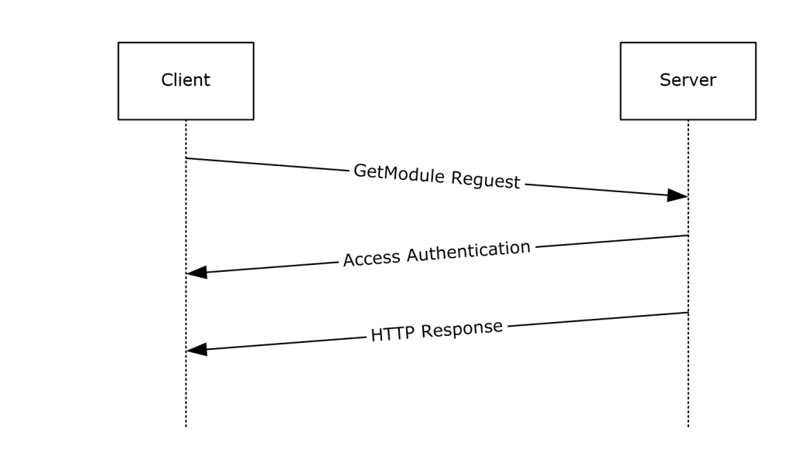
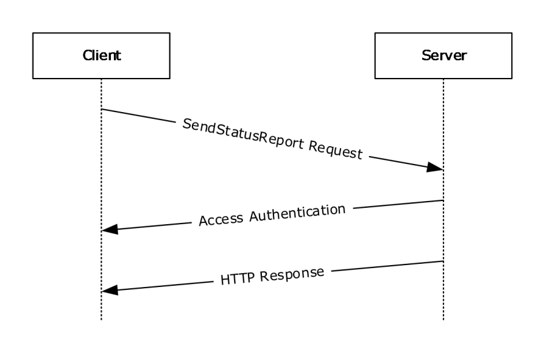
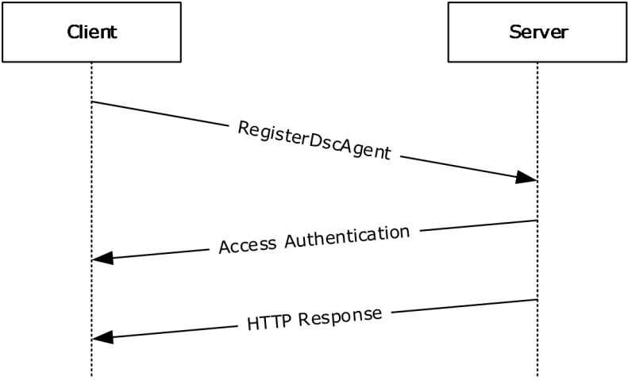
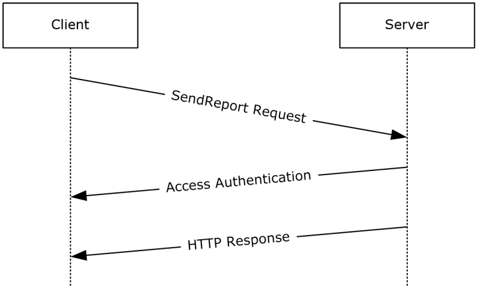
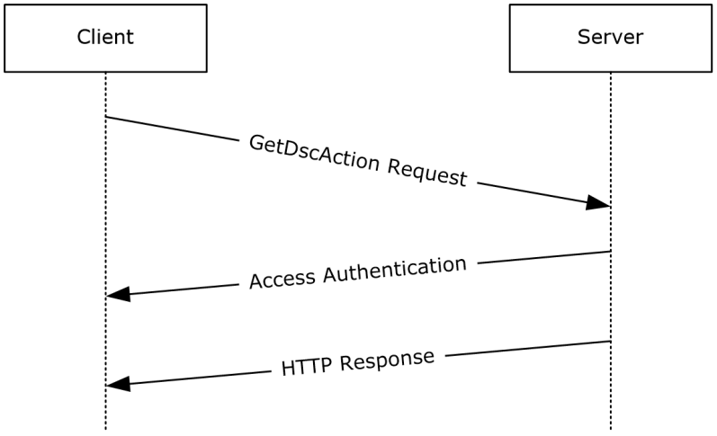

[MS-DSCPM]:

Desired State Configuration Pull Model Protocol

Intellectual Property Rights Notice for Open Specifications Documentation

  Technical Documentation. Microsoft publishes Open Specifications documentation (“this

documentation”) for protocols, file formats, data portability, computer languages, and standards
support. Additionally, overview documents cover inter-protocol relationships and interactions.

  Copyrights. This documentation is covered by Microsoft copyrights. Regardless of any other

terms that are contained in the terms of use for the Microsoft website that hosts this
documentation, you can make copies of it in order to develop implementations of the technologies
that are described in this documentation and can distribute portions of it in your implementations
that use these technologies or in your documentation as necessary to properly document the
implementation. You can also distribute in your implementation, with or without modification, any
schemas, IDLs, or code samples that are included in the documentation. This permission also
applies to any documents that are referenced in the Open Specifications documentation.
  No Trade Secrets. Microsoft does not claim any trade secret rights in this documentation.
  Patents. Microsoft has patents that might cover your implementations of the technologies

described in the Open Specifications documentation. Neither this notice nor Microsoft's delivery of
this documentation grants any licenses under those patents or any other Microsoft patents.
However, a given Open Specifications document might be covered by the Microsoft Open
Specifications Promise or the Microsoft Community Promise. If you would prefer a written license,
or if the technologies described in this documentation are not covered by the Open Specifications
Promise or Community Promise, as applicable, patent licenses are available by contacting
iplg@microsoft.com.

  License Programs. To see all of the protocols in scope under a specific license program and the

associated patents, visit the Patent Map.

  Trademarks. The names of companies and products contained in this documentation might be
covered by trademarks or similar intellectual property rights. This notice does not grant any
licenses under those rights. For a list of Microsoft trademarks, visit
www.microsoft.com/trademarks.

  Fictitious Names. The example companies, organizations, products, domain names, email

addresses, logos, people, places, and events that are depicted in this documentation are fictitious.
No association with any real company, organization, product, domain name, email address, logo,
person, place, or event is intended or should be inferred.

Reservation of Rights. All other rights are reserved, and this notice does not grant any rights other
than as specifically described above, whether by implication, estoppel, or otherwise.

Tools. The Open Specifications documentation does not require the use of Microsoft programming
tools or programming environments in order for you to develop an implementation. If you have access
to Microsoft programming tools and environments, you are free to take advantage of them. Certain
Open Specifications documents are intended for use in conjunction with publicly available standards
specifications and network programming art and, as such, assume that the reader either is familiar
with the aforementioned material or has immediate access to it.

Support. For questions and support, please contact dochelp@microsoft.com.

[MS-DSCPM] - v20240423
Desired State Configuration Pull Model Protocol
Copyright © 2024 Microsoft Corporation
Release: April 23, 2024

1 / 65

Revision Summary

Date

Revision
History

Revision
Class

Comments

8/8/2013

1.0

11/14/2013  2.0

2/13/2014

2.1

5/15/2014

2.1

6/30/2015

3.0

10/16/2015  4.0

7/14/2016

5.0

6/1/2017

5.0

9/15/2017

6.0

9/12/2018

7.0

4/7/2021

8.0

6/25/2021

9.0

4/23/2024

10.0

New

Major

Minor

None

Major

Major

Major

None

Major

Major

Major

Major

Major

Released new document.

Updated and revised the technical content.

Clarified the meaning of the technical content.

No changes to the meaning, language, or formatting of the
technical content.

Significantly changed the technical content.

Significantly changed the technical content.

Significantly changed the technical content.

No changes to the meaning, language, or formatting of the
technical content.

Significantly changed the technical content.

Significantly changed the technical content.

Significantly changed the technical content.

Significantly changed the technical content.

Significantly changed the technical content.

[MS-DSCPM] - v20240423
Desired State Configuration Pull Model Protocol
Copyright © 2024 Microsoft Corporation
Release: April 23, 2024

2 / 65

Table of Contents

1.1
1.2

1.2.1
1.2.2

1  Introduction ............................................................................................................ 7
Glossary ........................................................................................................... 7
References ........................................................................................................ 8
Normative References ................................................................................... 8
Informative References ................................................................................. 8
Overview .......................................................................................................... 8
Relationship to Other Protocols ............................................................................ 8
Prerequisites/Preconditions ................................................................................. 8
Applicability Statement ....................................................................................... 9
Versioning and Capability Negotiation ................................................................... 9
Vendor-Extensible Fields ..................................................................................... 9
Standards Assignments ....................................................................................... 9

1.3
1.4
1.5
1.6
1.7
1.8
1.9

2.1
2.2

2.2.2.1

2.2.1
2.2.2

2.2.2.1.1
2.2.2.1.2

2  Messages ............................................................................................................... 10
Transport ........................................................................................................ 10
Common Data Types ........................................................................................ 10
Namespaces .............................................................................................. 10
HTTP Headers ............................................................................................ 10
Content-Type ....................................................................................... 10
Application/octet-stream .................................................................. 11
Application/json .............................................................................. 11
Checksum ............................................................................................ 11
ChecksumAlgorithm .............................................................................. 11
ConfigurationName ............................................................................... 11
ProtocolVersion ..................................................................................... 11
AgentId ............................................................................................... 12
Authorization ........................................................................................ 12
DSC-certificateRotation .......................................................................... 12
Common URI Parameters ............................................................................ 12
ConfigurationId ..................................................................................... 13
ModuleName ........................................................................................ 13
ModuleVersion ...................................................................................... 13
AgentId ............................................................................................... 13

2.2.2.2
2.2.2.3
2.2.2.4
2.2.2.5
2.2.2.6
2.2.2.7
2.2.2.8

2.2.3.1
2.2.3.2
2.2.3.3
2.2.3.4

2.2.3

3.1

3.1.5.1

3.1.5.1.1

3.1.1
3.1.2
3.1.3
3.1.4
3.1.5

3  Protocol Details ..................................................................................................... 14
GetConfiguration Versions 1.0 and 1.1 Details ..................................................... 14
Abstract Data Model .................................................................................... 14
Timers ...................................................................................................... 14
Initialization ............................................................................................... 14
Higher-Layer Triggered Events ..................................................................... 14
Message Processing Events and Sequencing Rules .......................................... 14
Action(ConfigurationId={ConfigurationId})/ConfigurationContent ............... 15
GET ............................................................................................... 15
Request Body ............................................................................ 16
Response Body .......................................................................... 16
Processing Details ...................................................................... 16
Timer Events .............................................................................................. 17
Other Local Events ...................................................................................... 17
GetModule Versions 1.0 and 1.1 Details .............................................................. 17
Abstract Data Model .................................................................................... 17
Timers ...................................................................................................... 17
Initialization ............................................................................................... 17
Higher-Layer Triggered Events ..................................................................... 17
Message Processing Events and Sequencing Rules .......................................... 17

3.1.5.1.1.1
3.1.5.1.1.2
3.1.5.1.1.3

3.2.1
3.2.2
3.2.3
3.2.4
3.2.5

3.1.6
3.1.7

3.2

[MS-DSCPM] - v20240423
Desired State Configuration Pull Model Protocol
Copyright © 2024 Microsoft Corporation
Release: April 23, 2024

3 / 65

3.2.5.1

3.2.5.1.1

3.3.5.1

3.3.5.1.1

3.2.5.1.1.1
3.2.5.1.1.2
3.2.5.1.1.3

3.3.5.1.1.1
3.3.5.1.1.2
3.3.5.1.1.3

Module(ConfigurationId={ConfigurationId},ModuleName={moduleName},Modu
leVersion={moduleVersion})/ModuleContent ........................................... 18
GET ............................................................................................... 18
Request Body ............................................................................ 19
Response Body .......................................................................... 19
Processing Details ...................................................................... 20
Timer Events .............................................................................................. 20
Other Local Events ...................................................................................... 20
GetAction Versions 1.0 and 1.1 Details ............................................................... 20
Abstract Data Model .................................................................................... 20
Timers ...................................................................................................... 20
Initialization ............................................................................................... 20
Higher-Layer Triggered Events ..................................................................... 20
Message Processing Events and Sequencing Rules .......................................... 20
Action(ConfigurationId={ConfigurationId})/GetAction ............................... 21
POST ............................................................................................. 21
Request Body ............................................................................ 22
Response Body .......................................................................... 22
Processing Details ...................................................................... 22
Timer Events .............................................................................................. 22
Other Local Events ...................................................................................... 22
SendStatusReport Versions 1.0 and 1.1 Details .................................................... 23
Abstract Data Model .................................................................................... 23
Timers ...................................................................................................... 23
Initialization ............................................................................................... 23
Higher-Layer Triggered Events ..................................................................... 23
Message Processing Events and Sequencing Rules .......................................... 23
Node(ConfigurationID={ConfigurationId})/SendStatusReport..................... 23
POST ............................................................................................. 23
Request Body ............................................................................ 24
Response Body .......................................................................... 25
Processing Details ...................................................................... 25
Timer Events .............................................................................................. 25
Other Local Events ...................................................................................... 25
GetStatusReport Versions 1.0 and 1.1 Details ...................................................... 25
Abstract Data Model .................................................................................... 25
Timers ...................................................................................................... 25
Initialization ............................................................................................... 26
Higher-Layer Triggered Events ..................................................................... 26
Message Processing Events and Sequencing Rules .......................................... 26
Node(ConfigurationId={ConfigurationId})/StatusReports ........................... 26
GET ............................................................................................... 26
Request Body ............................................................................ 27
Response Body .......................................................................... 27
Processing Details ...................................................................... 27
Timer Events .............................................................................................. 27
Other Local Events ...................................................................................... 28
GetConfiguration Version 2.0 Details .................................................................. 28
Abstract Data Model .................................................................................... 28
Timers ...................................................................................................... 28
Initialization ............................................................................................... 28
Higher-Layer Triggered Events ..................................................................... 28
Message Processing Events and Sequencing Rules .......................................... 28

3.4.5.1.1.1
3.4.5.1.1.2
3.4.5.1.1.3

3.5.5.1.1.1
3.5.5.1.1.2
3.5.5.1.1.3

3.3

3.2.6
3.2.7

3.3.1
3.3.2
3.3.3
3.3.4
3.3.5

3.4

3.3.6
3.3.7

3.4.1
3.4.2
3.4.3
3.4.4
3.4.5

3.5

3.4.6
3.4.7

3.5.1
3.5.2
3.5.3
3.5.4
3.5.5

3.6

3.5.6
3.5.7

3.6.1
3.6.2
3.6.3
3.6.4
3.6.5

3.5.5.1

3.5.5.1.1

3.4.5.1

3.4.5.1.1

3.6.5.1

3.6.5.2

Nodes(AgentId={AgentId})/
Configurations(ConfigurationName={ConfigurationName})/ConfigurationConten
t ......................................................................................................... 29
GET ..................................................................................................... 29

4 / 65

[MS-DSCPM] - v20240423
Desired State Configuration Pull Model Protocol
Copyright © 2024 Microsoft Corporation
Release: April 23, 2024

3.7

3.6.5.2.1
3.6.5.2.2
3.6.5.2.3

Request Body.................................................................................. 30
Response Body ............................................................................... 31
Processing Details ........................................................................... 31
Timer Events .............................................................................................. 31
Other Local Events ...................................................................................... 31
GetModule Version 2.0 Details ........................................................................... 31
Abstract Data Model .................................................................................... 31
Timers ...................................................................................................... 31
Initialization ............................................................................................... 32
Higher-Layer Triggered Events ..................................................................... 32
Message Processing Events and Sequencing Rules .......................................... 32

3.6.6
3.6.7

3.7.1
3.7.2
3.7.3
3.7.4
3.7.5

3.7.5.1

3.8

3.9

3.8.5.1

3.8.5.1.1

3.7.5.1.1

3.8.6
3.8.7

3.7.6
3.7.7

3.8.1
3.8.2
3.8.3
3.8.4
3.8.5

3.8.5.1.1.1
3.8.5.1.1.2
3.8.5.1.1.3

3.7.5.1.1.1
3.7.5.1.1.2
3.7.5.1.1.3

 Modules(ModuleName={moduleName},ModuleVersion={moduleVersion})/Mod
uleContent ........................................................................................... 32
GET ............................................................................................... 33
Request Body ............................................................................ 34
Response Body .......................................................................... 34
Processing Details ...................................................................... 34
Timer Events .............................................................................................. 34
Other Local Events ...................................................................................... 34
GetDscAction Version 2.0 Details ....................................................................... 34
Abstract Data Model .................................................................................... 34
Timers ...................................................................................................... 35
Initialization ............................................................................................... 35
Higher-Layer Triggered Events ..................................................................... 35
Message Processing Events and Sequencing Rules .......................................... 35
Nodes(AgentId={AgentId})/GetDscAction ............................................... 35
POST ............................................................................................. 35
Request Body ............................................................................ 36
Response Body .......................................................................... 37
Processing Details ...................................................................... 37
Timer Events .............................................................................................. 37
Other Local Events ...................................................................................... 37
RegisterDscAgent Version 2 Details .................................................................... 37
Abstract Data Model .................................................................................... 37
Timers ...................................................................................................... 37
Initialization ............................................................................................... 37
Higher-Layer Triggered Events ..................................................................... 37
Message Processing Events and Sequencing Rules .......................................... 38
Nodes(AgentId={AgentId}) ................................................................... 38
PUT ............................................................................................... 38
Request Body ............................................................................ 39
Response Body .......................................................................... 39
Processing Details ...................................................................... 39
Timer Events .............................................................................................. 40
Other Local Events ...................................................................................... 40
SendReport Version 2.0 Details .......................................................................... 40
Abstract Data Model .................................................................................... 40
3.10.1
Timers ...................................................................................................... 40
3.10.2
3.10.3
Initialization ............................................................................................... 40
3.10.4  Higher-Layer Triggered Events ..................................................................... 40
3.10.5  Message Processing Events and Sequencing Rules .......................................... 40
3.10.5.1  Nodes(AgentID={AgentId})/SendReport ................................................. 41
POST ............................................................................................. 41
Request Body ............................................................................ 42
Response Body .......................................................................... 42
Processing Details ...................................................................... 42
Timer Events .............................................................................................. 43

3.10.5.1.1.1
3.10.5.1.1.2
3.10.5.1.1.3

3.9.5.1.1.1
3.9.5.1.1.2
3.9.5.1.1.3

3.9.1
3.9.2
3.9.3
3.9.4
3.9.5

3.9.6
3.9.7

3.10.5.1.1

3.9.5.1.1

3.9.5.1

3.10.6

3.10

[MS-DSCPM] - v20240423
Desired State Configuration Pull Model Protocol
Copyright © 2024 Microsoft Corporation
Release: April 23, 2024

5 / 65

3.11.5.1.1.1
3.11.5.1.1.2
3.11.5.1.1.3

3.10.7  Other Local Events ...................................................................................... 43
3.11  GetReports Version 2.0 Details .......................................................................... 43
Abstract Data Model .................................................................................... 43
3.11.1
Timers ...................................................................................................... 43
3.11.2
3.11.3
Initialization ............................................................................................... 43
3.11.4  Higher-Layer Triggered Events ..................................................................... 43
3.11.5  Message Processing Events and Sequencing Rules .......................................... 43
3.11.5.1  Nodes(AgentId={AgentId})/Reports ....................................................... 43
3.11.5.1.1  GET ............................................................................................... 44
Request Body ............................................................................ 45
Response Body .......................................................................... 45
Processing Details ...................................................................... 45
3.11.6
Timer Events .............................................................................................. 45
3.11.7  Other Local Events ...................................................................................... 45
CertificateRotation Details ................................................................................. 45
Abstract Data Model .................................................................................... 45
3.12.1
Timers ...................................................................................................... 45
3.12.2
3.12.3
Initialization ............................................................................................... 45
3.12.4  Higher-Layer Triggered Events ..................................................................... 45
3.12.5  Message Processing Events and Sequencing Rules .......................................... 46
3.12.5.1  Nodes(AgentId={AgentId})/CertificateRotation ........................................ 46
POST ............................................................................................. 46
Request Body ............................................................................ 47
Response Body .......................................................................... 47
Processing Details ...................................................................... 47
Timer Events .............................................................................................. 47
3.12.6
3.12.7  Other Local Events ...................................................................................... 47

3.12.5.1.1.1
3.12.5.1.1.2
3.12.5.1.1.3

3.12.5.1.1

3.12

4  Protocol Examples ................................................................................................. 48
GetConfiguration Sequence ............................................................................... 48
GetModule Sequence ........................................................................................ 48
GetAction Sequence ......................................................................................... 49
SendStatusReport Sequence .............................................................................. 50
GetStatusReport Sequence ................................................................................ 51
RegisterDscAgent Sequence .............................................................................. 52
SendReport Sequence ....................................................................................... 53
GetDscAction Sequence .................................................................................... 53

4.1
4.2
4.3
4.4
4.5
4.6
4.7
4.8

5  Security ................................................................................................................. 55
Security Considerations for Implementers ........................................................... 55
Index of Security Parameters ............................................................................ 55

5.1
5.2

6  Appendix A: Full JSON Schema .............................................................................. 56

7  Appendix B: Product Behavior ............................................................................... 60

8  Change Tracking .................................................................................................... 62

9  Index ..................................................................................................................... 63

[MS-DSCPM] - v20240423
Desired State Configuration Pull Model Protocol
Copyright © 2024 Microsoft Corporation
Release: April 23, 2024

6 / 65

1  Introduction

The Desired State Configuration Pull Model Protocol is based on the Hypertext Transfer Protocol
(HTTP) (as specified in [RFC2616]). It is used for getting a client's configuration and modules from
the server and for reporting back the client's status to the server.

Sections 1.5, 1.8, 1.9, 2, and 3 of this specification are normative. All other sections and examples in
this specification are informative.

1.1  Glossary

This document uses the following terms:

Augmented Backus-Naur Form (ABNF): A modified version of Backus-Naur Form (BNF),

commonly used by Internet specifications. ABNF notation balances compactness and simplicity
with reasonable representational power. ABNF differs from standard BNF in its definitions and
uses of naming rules, repetition, alternatives, order-independence, and value ranges. For more
information, see [RFC5234].

binary large object (BLOB): A collection of binary data stored as a single entity in a database.

checksum: A value that is the summation of a byte stream. By comparing the checksums

computed from a data item at two different times, one can quickly assess whether the data
items are identical.

configuration: Represents a binary large object (BLOB). The protocol does not process the

content of the BLOB and it is passed as-is to the higher layer.

Hypertext Transfer Protocol (HTTP): An application-level protocol for distributed, collaborative,
hypermedia information systems (text, graphic images, sound, video, and other multimedia
files) on the World Wide Web.

module: A BLOB in the Desired State Configuration Pull Model Protocol [MS-DSCPM]. The protocol

does not process the content of the BLOB, and it is passed as it is to the higher layer.

Transmission Control Protocol (TCP): A protocol used with the Internet Protocol (IP) to send
data in the form of message units between computers over the Internet. TCP handles keeping
track of the individual units of data (called packets) that a message is divided into for efficient
routing through the Internet.

Uniform Resource Identifier (URI): A string that identifies a resource. The URI is an addressing
mechanism defined in Internet Engineering Task Force (IETF) Uniform Resource Identifier (URI):
Generic Syntax [RFC3986].

Uniform Resource Locator (URL): A string of characters in a standardized format that identifies

a document or resource on the World Wide Web. The format is as specified in [RFC1738].

universally unique identifier (UUID): A 128-bit value. UUIDs can be used for multiple

purposes, from tagging objects with an extremely short lifetime, to reliably identifying very
persistent objects in cross-process communication such as client and server interfaces, manager
entry-point vectors, and RPC objects. UUIDs are highly likely to be unique. UUIDs are also
known as globally unique identifiers (GUIDs) and these terms are used interchangeably in the
Microsoft protocol technical documents (TDs). Interchanging the usage of these terms does not
imply or require a specific algorithm or mechanism to generate the UUID. Specifically, the use of
this term does not imply or require that the algorithms described in [RFC4122] or [C706] has to
be used for generating the UUID.

MAY, SHOULD, MUST, SHOULD NOT, MUST NOT: These terms (in all caps) are used as defined
in [RFC2119]. All statements of optional behavior use either MAY, SHOULD, or SHOULD NOT.

7 / 65

[MS-DSCPM] - v20240423
Desired State Configuration Pull Model Protocol
Copyright © 2024 Microsoft Corporation
Release: April 23, 2024

1.2  References

Links to a document in the Microsoft Open Specifications library point to the correct section in the
most recently published version of the referenced document. However, because individual documents
in the library are not updated at the same time, the section numbers in the documents may not
match. You can confirm the correct section numbering by checking the Errata.

1.2.1  Normative References

We conduct frequent surveys of the normative references to assure their continued availability. If you
have any issue with finding a normative reference, please contact dochelp@microsoft.com. We will
assist you in finding the relevant information.

[RFC2119] Bradner, S., "Key words for use in RFCs to Indicate Requirement Levels", BCP 14, RFC
2119, March 1997, https://www.rfc-editor.org/info/rfc2119

[RFC2616] Fielding, R., Gettys, J., Mogul, J., et al., "Hypertext Transfer Protocol -- HTTP/1.1", RFC
2616, June 1999, https://www.rfc-editor.org/info/rfc2616

[RFC4122] Leach, P., Mealling, M., and Salz, R., "A Universally Unique Identifier (UUID) URN
Namespace", RFC 4122, July 2005, https://www.rfc-editor.org/info/rfc4122

[RFC4234] Crocker, D., Ed., and Overell, P., "Augmented BNF for Syntax Specifications: ABNF", RFC
4234, October 2005, https://www.rfc-editor.org/info/rfc4234

[RFC4634] Eastlake III, D. and Hansen, T., "US Secure Hash Algorithms (SHA and HMAC-SHA)", RFC
4634, July 2006, https://www.rfc-editor.org/info/rfc4634

[RFC4648] Josefsson, S., "The Base16, Base32, and Base64 Data Encodings", RFC 4648, October
2006, https://www.rfc-editor.org/info/rfc4648

1.2.2  Informative References

None.

1.3  Overview

The Desired State Configuration Pull Model Protocol is used to register a client, to get the configuration
and the module from the server, and to report back some elements to the server.

The protocol depends on HTTP for the transfer of all protocol messages, including the transfer of the
binary data. In this specification, the entity that initiates the HTTP connection is referred to as the
client, and the entity that responds to the HTTP connection is referred to as the server. With the
Desired State Configuration Pull Model Protocol, binary data flows from the server to the client.

1.4  Relationship to Other Protocols

This protocol depends on HTTP as specified in [RFC2616]. HTTP version 1.1 is used with this protocol.

1.5  Prerequisites/Preconditions

This protocol does not provide a mechanism for a client to discover the Uniform Resource Locator
(URL) of the server. Thus, it is a prerequisite that the client obtain the URL of the server before this
protocol can be used.

8 / 65

[MS-DSCPM] - v20240423
Desired State Configuration Pull Model Protocol
Copyright © 2024 Microsoft Corporation
Release: April 23, 2024

1.6  Applicability Statement

The Desired State Configuration Pull Model Protocol is capable of downloading the configuration and
modules from the server.

This document covers versioning issues in the following areas:

Supported Transports: This protocol can be implemented on top of HTTP, as specified in section

2.1.

Security and Authentication Methods: This protocol supports HTTP access authentication, as

specified in [RFC2616] section 11.

Localization: This specification does not specify any localization-dependent protocol behavior.

1.7  Versioning and Capability Negotiation

None.

1.8  Vendor-Extensible Fields

None.

1.9  Standards Assignments

None.

[MS-DSCPM] - v20240423
Desired State Configuration Pull Model Protocol
Copyright © 2024 Microsoft Corporation
Release: April 23, 2024

9 / 65

2  Messages

2.1  Transport

The Desired State Configuration Pull Model Protocol uses HTTP 1.1, as specified in [RFC2616], as the
transport layer.

A Transmission Control Protocol (TCP) port has not been reserved for this protocol. TCP port 80 is
commonly used because many HTTP proxy servers forward only HTTP traffic that uses port 80.

The protocol uses the access authentication functionality of the HTTP layer as specified in [RFC2616]
section 11.

2.2  Common Data Types

None.

2.2.1  Namespaces

None.

2.2.2  HTTP Headers

The Desired State Configuration Pull Model Protocol uses existing headers as specified in [RFC2616].

Unless specified otherwise, the headers defined in this specification are used in both request and
response messages.

If a client or server receives an HTTP header that is not defined in this section, or if the header is not
defined in the current context (for example, receiving a request-only header in a response), the
header MUST be interpreted as specified in [RFC2616].

This section defines the syntax of the HTTP headers that use the Augmented Backus-Naur Form
(ABNF) syntax, as specified in [RFC4234].

The following table summarizes the HTTP headers defined by this specification.

Header

Description

Content-Type  Section 2.2.2.1

Checksum

Section 2.2.2.2

2.2.2.1  Content-Type

The Content-Type header specifies the type of data that is included in the body of the GET or POST
request.

The syntax of the Content-Type header is defined as follows.

 Content-Type  = "Content-Type: " "application/octet-stream" CRLF /
                   "Content-Type: " "application/json" [";charset=UTF-8"] CRLF

[MS-DSCPM] - v20240423
Desired State Configuration Pull Model Protocol
Copyright © 2024 Microsoft Corporation
Release: April 23, 2024

10 / 65

Example: Content-Type: application/octet-stream

 Content-Type: application/json;charset=UTF-8

2.2.2.1.1 Application/octet-stream

This Content-Type is defined only for use in a request sent to the server and used in a GET response
to get the module or configuration from a server.

2.2.2.1.2 Application/json

This Content-Type is defined only for use in a request sent to the server and used in a POST response.

2.2.2.2  Checksum

The Checksum header field is defined only for use in a response message sent to a client as part of a
GET request for the module and configuration.

Checksum = "Checksum:" Check-SumValue CRLF
Check-SumValue = DQUOTE Check-basevalue DQUOTE/ DQUOTE DQUOTE
Check-basevalue = BASE16 ; specified in [RFC4648]

Example: "Checksum":"ef52442708671f7af8dc5a1fc444a601fa25d8290d6b91cda945427b26e07a15"

"Checksum":""

2.2.2.3  ChecksumAlgorithm

The ChecksumAlgorithm header field specifies the checksum algorithm used to generate the
checksum.

 ChecksumAlgorithm = "ChecksumAlgorithm:" DQUOTE Check-sumAlgorithmvalue DQUOTE CRLF
 Check-sumAlgorithmvalue = "SHA-256" ; specified in [RFC4634]

Example: "ChecksumAlgorithm":"SHA-256"

2.2.2.4  ConfigurationName

The ConfigurationName header field SHOULD<1> be used in the request message sent to the server
as part of a GET request for the configuration.

 ConfigurationName = "ConfigurationName:" DQUOTE Configuration-Namevalue DQUOTE CRLF
 Configuration-Namevalue = Element *(Element)
 Element = DIGIT / ALPHA

Example: "ConfigurationName":"SubPart1"

2.2.2.5  ProtocolVersion

The ProtocolVersion header field SHOULD<2> be used in the request message sent to the server as
part of every request. The current version is hardcoded to 2.0.

 ProtocolVersion = "ProtocolVersion:" DQUOTE ProtocolVersion-Namevalue DQUOTE CRLF

11 / 65

[MS-DSCPM] - v20240423
Desired State Configuration Pull Model Protocol
Copyright © 2024 Microsoft Corporation
Release: April 23, 2024

 ProtocolVersion-Namevalue = Element *(Element)
 Element = DIGIT

Example: "ProtocolVersion":"2.0"

2.2.2.6  AgentId

The AgentId header field SHOULD<3> be used in the request message sent to the server as part of
every request. The AgentId is a unique GUID value generated once and stored in the Registry.

 AgentId = "AgentId:" DQUOTE AgentId-Namevalue DQUOTE CRLF AgentId-Namevalue ":" Element
*(Element)
 Element = DIGIT / ALPHA / "-"

Example: "AgentId":"34C8104D-F7BA-4672-8226-0809B0A3BEC3"

2.2.2.7  Authorization

The Authorization header field SHOULD<4> be used in the request message sent to the server as part
of every request. The Shared authorization key is generated during the registration and serves to
verify the payload sent to the server.

 Authorization = "Authorization:" Shared DQUOTE Authorization-Namevalue DQUOTE CRLF
 Authorization-Namevalue = A signature generated from an HMAC hash of the request body
 Element = DIGIT / ALPHA / "-" / "+"

Example: "Authorization": "Shared GKtPgocze1AM/pgc3LQzyGpDCRs15KoKx/2eXxlL8+w="

2.2.2.8  DSC-certificateRotation

The server MAY<5> send a DSC-certificateRotation response header field for every message sent to
the client except for CertificateRotation (section 3.12) and RegisterDscAgent (section 3.9)
responses. The only allowed value is “True”. All other values are reserved. The value “True” indicates
that the client SHOULD attempt the CertificateRotation message.

 DSC-certificateRotation = "DSC-certificateRotation:" DQUOTE DSC-certificateRotation-Namevalue
DQUOTE CRLF
 DSC-certificateRotation-Namevalue = "True"

2.2.3  Common URI Parameters

The following table summarizes the set of common URI parameters defined by this protocol.

URI parameter  Section

ConfigurationId

Section 2.2.3.1

ModuleName

Section 2.2.3.2

ModuleVersion

Section 2.2.3.3

[MS-DSCPM] - v20240423
Desired State Configuration Pull Model Protocol
Copyright © 2024 Microsoft Corporation
Release: April 23, 2024

12 / 65

2.2.3.1  ConfigurationId

The ConfigurationId parameter is a universally unique identifier (UUID) as specified in [RFC4122]
section 3.

2.2.3.2  ModuleName

The ModuleName parameter is a string that is used by the server to identify a specific module.

MODULENAME = Element *(Element)

Element = DIGIT / ALPHA / "_"

2.2.3.3  ModuleVersion

The ModuleVersion parameter identifies the version of a module. It can be either an empty string or a
string containing two to four groups of digits where the groups are separated by a period.

 MODULEVERSION = SQUOTE MULTIDIGIT "." MULTIDIGIT SQUOTE
   / SQUOTE MULTIDIGIT "." MULTIDIGIT "." MULTIDIGIT SQUOTE
   / SQUOTE MULTIDIGIT "." MULTIDIGIT "." MULTIDIGIT "." MULTIDIGIT SQUOTE
   / SQUOTE SQUOTE (NULL character)
 MULTIDIGIT = DIGIT *[DIGIT]

2.2.3.4  AgentId

The AgentId parameter SHOULD<6> be used in the request message sent to the server as part of
every request. The AgentId is a unique GUID value generated once and stored in the Registry.

AgentId: "AgentId" : DQUOTE AgentId-Namevalue DQUOTE CRLF

AgentId-Namevalue: Element . *(Element)

Element: DIGIT / ALPHA

Example: "AgentId":"{34C8104D-F7BA-4672-8226-0809B0A3BEC3}"

[MS-DSCPM] - v20240423
Desired State Configuration Pull Model Protocol
Copyright © 2024 Microsoft Corporation
Release: April 23, 2024

13 / 65

3  Protocol Details

3.1  GetConfiguration Versions 1.0 and 1.1 Details

The purpose of the GetConfiguration request is to get the configuration from the server. The
GetConfiguration request maps to an HTTP GET request in which the Content-Type header is an
application/octet-stream.

3.1.1  Abstract Data Model

This section describes a conceptual model of possible data organization that an implementation
maintains to participate in this protocol. The described organization is provided to facilitate the
explanation of how the protocol behaves. This document does not mandate that implementations
adhere to this model as long as their external behavior is consistent with that described in this
document.

The server MUST maintain a ConfigurationTable where each entry contains:

ServerConfigurationId: A unique combination of a ConfigurationId (section 2.2.3.1) and a

ConfigurationName (section 2.2.2.4). The ConfigurationId MUST NOT be empty.

ServerConfigurationData: A binary large object (BLOB). This data is not interpreted as part of

this protocol and is passed on to higher layers as is.

3.1.2  Timers

None.

3.1.3  Initialization

None.

3.1.4  Higher-Layer Triggered Events

None.

3.1.5  Message Processing Events and Sequencing Rules

The server MUST match the ConfigurationId from the URL and, if specified, the ConfigurationName
from the headers with the ServerConfigurationId in the ConfigurationTable. The server MUST use
case-insensitive ordinal comparison to match the ConfigurationId (section 2.2.3.1) and
ConfigurationName (section 2.2.2.4). If a match is found, the server MUST return ConfigurationData
to the client with status code 200. If a match is not found, the server MUST return status code 404.

Resource

Description

Action(ConfigurationId={ConfigurationId})/ConfigurationContent  Gets the configuration from the server.

Request header

Usage

Value

ConfigurationName  Optional  As specified in section 2.2.2.4.

The responses to all the methods can result in the following status codes.

[MS-DSCPM] - v20240423
Desired State Configuration Pull Model Protocol
Copyright © 2024 Microsoft Corporation
Release: April 23, 2024

14 / 65

Status code  Reason phrase  Description

200

400

404

OK

Returned when the request is completed.

BAD REQUEST

The request could not be understood by the server due to malformed syntax.

NOT FOUND

Returned when the resource is not found.

The response message for this operation contains the following HTTP headers.

Response header  Usage

Value

checksum

Required  As specified in section 2.2.2.2.

checksumalgorithm  Required  As specified in section 2.2.2.3.

3.1.5.1  Action(ConfigurationId={ConfigurationId})/ConfigurationContent

The following HTTP method is allowed to be performed on this resource.

HTTP method  Description

GET

Gets the configuration from the server.

3.1.5.1.1 GET

The URL specified by the client in the HTTP request line of the GET request identifies a "configuration
point" targeted for the client. The server can have multiple configuration points and different
configuration points can have different access permissions associated with them. For example, some
configuration points require HTTP access authentication (as specified in [RFC2616] section 11). As
another example, a configuration point could also allow only clients that connect from a specific IP
address.

The syntax of the GetConfiguration request is defined as follows.

 DSC-GetConfiguration-Request    =  DSC-GetConfiguration-Req-Line
                             DSC-GetConfigurationSetReq-Headers

 DSC-GetConfiguration-Req-Line   = "GET" SP Request-URI SP HTTP-Version CRLF

 Request-URI = Request-URI-Start DSC-GetConfigurationRequest-URI-End

 DSC-GetConfigurationSetReq-Headers = *( DSC-GetConfigurationSetReq-Header-REQ
      / DSC-GetConfigurationSetReq-Header-OPT )

 DSC-GetConfigurationSetReq-Header-REQ    = Host    ; section 14.23 of [RFC2616]

 DSC-GetConfigurationSetReq-Header-OPT    = Connection  ; section 14.10 of [RFC2616]
                        / ConfigurationName ; section 2.2.2.4
 DSC-GetConfigurationRequest-URI-End = "Action(ConfigurationId=" SQUOTE CONFIGURATIONID SQUOTE
RBRACKET FSLASH "ConfigurationContent"
 SQUOTE = %x27  ;  ' (Single Quote)
 RBRACKET = %x29 ; ) (Closing Bracket)
 FSLASH = %x2F ; / (Forward Slash)
 CONFIGURATIONID = UUID ; as specified in [RFC4122]

15 / 65

[MS-DSCPM] - v20240423
Desired State Configuration Pull Model Protocol
Copyright © 2024 Microsoft Corporation
Release: April 23, 2024

The syntax of the GetConfiguration response is defined as follows:

 DSC-GetConfiguration-Response  = Status-Line DSC-GetConfigurationResp-Headers DSC-
GetConfigurationResp-Body

 DSC-GetConfigurationResp-Headers = *( DSC-GetConfigurationResp-Header-REQ / DSC-
GetConfigurationResp-Header-OPT / DSC-GetConfigurationResp-Body)

 DSC-GetConfigurationResp-Header-REQ  =  Content-Length ; section 14.13 of [RFC2616]
         / Content-Type ; section 2.2.2.1.1
         / Checksum ; section 2.2.2.2
         / ChecksumAlgorithm ; section 2.2.2.3

 DSC-GetConfigurationResp-Header-OPT  =  Server     ; section 14.38 of [RFC2616]

 DSC-GetConfigurationResp-Body = Configuration ; section 3.1.5.1.1.2

The response message for this operation contains the following HTTP headers.

Response header  Usage

Value

checksum

Required  As specified in section 2.2.2.2.

checksumalgorithm  Required  As specified in section 2.2.2.3.

The response message for this method can result in the following status codes.

Status code  Description

200

400

404

Request completed.

Bad request.

The resource is not found.

3.1.5.1.1.1  Request Body

None.

3.1.5.1.1.2  Response Body

In the response body, configuration represents a BLOB.

3.1.5.1.1.3  Processing Details

The client gets the configuration from the server as content-type application/octet-stream in the
response body for the GetConfiguration request. The server MUST send the checksum in the
response headers as specified in section 2.2.2.2. The server MUST send the ChecksumAlgorithm in the
response headers as specified in section 2.2.2.3. The server MUST generate the checksum using the
following algorithm:

  Use the algorithm specified in section 2.2.2.3 to compute the hash of the response body as

specified in [RFC4634] section 4.1.



Perform base16 encoding of the computed hash as specified in [RFC4648] section 8.

16 / 65

[MS-DSCPM] - v20240423
Desired State Configuration Pull Model Protocol
Copyright © 2024 Microsoft Corporation
Release: April 23, 2024

3.1.6  Timer Events

None.

3.1.7  Other Local Events

None.

3.2  GetModule Versions 1.0 and 1.1 Details

The GetModule request gets the module from the server. The GetModule request maps to HTTP GET
request with content-type as application/octet-stream as part of the request.

3.2.1  Abstract Data Model

This section describes a conceptual model of possible data organization that an implementation
maintains to participate in this protocol. The described organization is provided to facilitate the
explanation of how the protocol behaves. This document does not mandate that implementations
adhere to this model as long as their external behavior is consistent with that described in this
document.

The server MUST maintain a ModuleTable in which each entry contains the following:

ServerConfigurationId: The ConfigurationId (section 2.2.3.1).

ServerModuleName: The ModuleName (section 2.2.3.2).

ServerModuleVersion: The ModuleVersion (section 2.2.3.3).

ServerModuleData: A BLOB of data. This data is not interpreted as part of this protocol and is

passed on to higher layers as is.

3.2.2  Timers

None.

3.2.3  Initialization

None.

3.2.4  Higher-Layer Triggered Events

None.

3.2.5  Message Processing Events and Sequencing Rules

The server MUST match ConfigurationId from the URL with ServerConfigurationId, ModuleName
with ServerModuleName, and ModuleVersion with ServerModuleVersion of the ModuleTable. The
server uses case-insensitive ordinal comparison to match ConfigurationId, ModuleName, and
ModuleVersion. For a ServerConfigurationId, the server MUST have a unique combination of
ServerModuleName and ServerModuleVersion. ServerModuleName in the ModuleTable MUST
NOT be empty. If a match is found, the server returns ModuleData to the client with status code 200.
If a match is not found, the server returns status code 404.

[MS-DSCPM] - v20240423
Desired State Configuration Pull Model Protocol
Copyright © 2024 Microsoft Corporation
Release: April 23, 2024

17 / 65

Resource

Module(ConfigurationId={ConfigurationId},ModuleName={moduleName},ModuleVersion={moduleV
ersion})/ModuleContent

Descripti
on

Get the
module
from the
server.

The responses to all the methods can result in the following status codes.

Status code  Reason phrase  Description

200

400

404

OK

Request completed.

BAD REQUEST

The request could not be understood by the server due to malformed syntax.

NOT FOUND

Used in cases where the resource is not found.

The response message for this operation contains the following HTTP headers.

Response header  Usage

Value

Checksum

Required  As specified in section 2.2.2.2.

ChecksumAlgorithm  Required  As specified in section 2.2.2.3.

3.2.5.1  Module(ConfigurationId={ConfigurationId},ModuleName={moduleName},Mo

duleVersion={moduleVersion})/ModuleContent

The following HTTP method is allowed to be performed on this resource.

HTTP method  Description

GET

Gets the module from the server.

3.2.5.1.1 GET

The URL specified by the client in the HTTP request line of the GET request identifies a "module point"
targeted for the client. The server might have multiple module points and different modules points can
have different access permissions associated with them. For example, some module points require
HTTP access authentication (as specified in [RFC2616] section 11). Other module points allow only
clients that connect from a specific IP address.

The syntax of the GetModule request is defined as follows.

 DSC-GetModule-Request    =  DSC-GetModule-Req-Line
                            DSC-GetModuleSetReq-Headers

 DSC-GetModule-Req-Line   = "GET" SP Request-URI SP HTTP-Version CRLF
 Request-URI = Request-URI-Start DSC-GetModuleRequest-URI-End
 DSC-GetModuleSetReq-Headers = *( DSC-GetModuleSetReq-Header-REQ
      / DSC-GetModuleSetReq-Header-OPT )

 DSC-GetModuleSetReq-Header-REQ    = Host    ; section 14.23 of [RFC2616]

[MS-DSCPM] - v20240423
Desired State Configuration Pull Model Protocol
Copyright © 2024 Microsoft Corporation
Release: April 23, 2024

18 / 65

 DSC-GetModuleSetReq-Header-OPT    = Connection  ; section 14.10 of [RFC2616]
 DSC-GetModuleRequest-URI-End = "Module(ConfigurationId=" SQUOTE CONFIGURATIONID SQUOTE
                                ",ModuleName=" SQUOTE MODULENAME SQUOTE
                                ",ModuleVersion=" MODULEVERSION
                                RBRACKET FSLASH "ModuleContent"

 SQUOTE = %x27  ;  ' (Single Quote)
 MODULENAME = MODULENAME; as specified in section 2.2.3.2
 MODULEVERSION = MODULEVERSION; as specified in section 2.2.3.3
 RBRACKET = %x29 ; ) (Closing Bracket)
 FSLASH = %x2F ; / (Forward Slash)
 CONFIGURATIONID = UUID ; as specified in [RFC4122]

The syntax of the GetModule response is defined as follows:

 DSC-GetModule-Response  = Status-Line
                                 DSC-GetModuleResp-Headers
                DSC-GetModuleResp-Body

 DSC-GetModuleResp-Headers = *( DSC-GetModuleResp-Header-REQ
                            / DSC-GetModuleResp-Header-OPT)

 DSC-GetModuleResp-Header-REQ  =  Content-Length ; section 14.13 of [RFC2616]
        / Content-Type ; section 2.2.2.1.1
        / Checksum ; section 2.2.2.2
        / ChecksumAlgorithm ; section 2.2.2.2

 DSC-GetModuleResp-Header-OPT  =  Server     ; section 14.38 of [RFC2616]
 DSC-GetModuleResp-Body = ModuleData ; section 3.2.5.1.1.2

The response message for this operation contains the following HTTP headers.

Response header  Usage

Value

checksum

Required  As specified in section 2.2.2.2.

checksumalgorithm  Required  As specified in section 2.2.2.3.

The response message for this method can result in the following status codes.

Status code  Description

200

400

404

Request completed.

Bad request.

The resource is not found.

3.2.5.1.1.1  Request Body

None.

3.2.5.1.1.2  Response Body

ModuleData represents a binary large object (BLOB) .

[MS-DSCPM] - v20240423
Desired State Configuration Pull Model Protocol
Copyright © 2024 Microsoft Corporation
Release: April 23, 2024

19 / 65

3.2.5.1.1.3  Processing Details

The client gets the module from the server as content-type application/octet-stream in the response
body for GetModule request. The server MUST send the checksum in response headers as specified in
section 2.2.2.2. The server MUST send the ChecksumAlgorithm in the response headers as specified in
section 2.2.2.3. The server generates the checksum using the following algorithm:

  Use the algorithm specified in ChecksumAlgorithm to compute the hash of the response body as

specified in [RFC4634] section 4.1.



Perform base16 encoding of the computed hash as specified in [RFC4648] in section 8.

3.2.6  Timer Events

None.

3.2.7  Other Local Events

None.

3.3  GetAction Versions 1.0 and 1.1 Details

The purpose of the GetAction request is to get the action, as specified in section 3.3.5.1.1.2, from the
server. GetAction request maps to HTTP POST request with content-type as application/json, as
specified in Appendix A: Full JSON Schema (section 6), as part of the request.

3.3.1  Abstract Data Model

None.

3.3.2  Timers

None.

3.3.3  Initialization

None.

3.3.4  Higher-Layer Triggered Events

None.

3.3.5  Message Processing Events and Sequencing Rules

Resource

Description

Action(ConfigurationId={ConfigurationId})/GetAction  Get the action from the server.

The responses to all the methods can result in the following status codes.

Status code  Reason phrase  Description

200

OK

The Request completed.

[MS-DSCPM] - v20240423
Desired State Configuration Pull Model Protocol
Copyright © 2024 Microsoft Corporation
Release: April 23, 2024

20 / 65

Status code  Reason phrase  Description

400

404

BAD REQUEST

The request could not be understood by the server due to malformed syntax.

NOT FOUND

The resource is not found.

3.3.5.1  Action(ConfigurationId={ConfigurationId})/GetAction

The following HTTP method can be performed on this resource.

HTTP method  Description

POST

POSTs the data to the server and gets action from the server.

3.3.5.1.1 POST

The URL specified by the client in the HTTP request line of the POST request identifies the action point
targeted for the client. The server can have multiple action points and different action points can have
different access permissions associated with them. For example, some action points require HTTP
access authentication (as specified in [RFC2616] section 11). Or, action points can also allow only
clients that connect from a specific IP address.

The syntax of the GetAction request is defined as follows.

 DSC-GetAction-Request  =  DSC-GetAction-Req-Line
                           DSC-GetActionSetReq-Headers
                           DSC-GetActionReq-Body

 DSC-GetAction-Req-Line   = "POST" SP Request-URI SP HTTP-Version CRLF
 Request-URI = Request-URI-Start DSC-GetActionRequest-URI-End

 DSC-GetActionRequest-URI-End = "Action(ConfigurationId=" SQUOTE CONFIGURATIONID SQUOTE
RBRACKET FSLASH "GetAction"
 SQUOTE = %x27  ;  ' (Single Quote)
 RBRACKET = %x29 ; ) (Closing Bracket)
 FSLASH = %x2F ; / (Forward Slash)
 CONFIGURATIONID = UUID ; as specified in [RFC4122]

 DSC-GetActionSetReq-Headers = *( DSC-GetActionSetReq-Header-REQ
      / DSC-GetActionSetReq-Header-OPT )

 DSC-GetActionSetReq-Header-REQ    = Host    ; section 14.23 of [RFC2616]
           / Accept ; section 14.1 of [RFC2616]
           / ContentType ; section 2.2.2.1.2
           / Content-Length ; section 14.13 of [RFC2616]

 DSC-GetActionSetReq-Header-OPT    = Connection  ; section 14.10 of [RFC2616]
            / Expect ; section 14.20 of [RFC2616]

 DSC-GetActionReq-Body = ActionRequest ; section 3.1.5.1.1.1

The syntax of the GetAction response is defined as follows:

[MS-DSCPM] - v20240423
Desired State Configuration Pull Model Protocol
Copyright © 2024 Microsoft Corporation
Release: April 23, 2024

21 / 65

 DSC-GetAction-Response  = Status-Line DSC-GetActionResp-Headers DSC-GetActionResp-Body

 DSC-GetActionResp-Headers = *( DSC-GetActionResp-Header-REQ
                            / DSC-GetActionResp-Header-OPT)

 DSC-GetActionResp-Header-REQ  =  Content-Length ; section 14.13 of [RFC2616]
        / Content-Type ; section 2.2.2.1.2

 DSC-GetActionResp-Header-OPT  =  Server     ; section 14.38 of [RFC2616]
 DSC-GetActionResp-Body = ActionContent ; section 3.3.5.1.1.2

The response message for this method can result in the following status codes.

Status code  Description

200

400

404

Request completed.

Bad request.

The resource is not found.

3.3.5.1.1.1  Request Body

The ActionRequest packet is used by the client to transfer the following data fields:

Checksum: A checksum as specified in section 2.2.2.2.

ChecksumAlgorithm: The algorithm for the Checksum as specified in section 2.2.2.3.

NodeCompliant: A value indicating TRUE or FALSE.

StatusCode: A value indicating a number between –2147483648 and 2147483647.

ConfigurationName: An opaque name as specified in section 2.2.2.4.

3.3.5.1.1.2  Response Body

The ActionContent packet is used by the server to transfer the following data field:

Value: MUST be either GetConfiguration, Retry<7>, or OK.

3.3.5.1.1.3  Processing Details

The client sends the GetAction request with content-type as application/json to the server with a
request body as specified in section 3.3.5.1.1.1. The client MUST include Checksum and
ChecksumAlgorithm in the request body. The client SHOULD include StatusCode in the request
body. The server responds back with content-type as application/json with response body as specified
in section 3.3.5.1.1.2.

3.3.6  Timer Events

None.

3.3.7  Other Local Events

None.

[MS-DSCPM] - v20240423
Desired State Configuration Pull Model Protocol
Copyright © 2024 Microsoft Corporation
Release: April 23, 2024

22 / 65

3.4  SendStatusReport Versions 1.0 and 1.1 Details

The SendStatusReport request SHOULD<8> send the status report, as specified in section 3.4.5.1.1.1,
to the server. The SendStatusReport request maps to the HTTP POST request with content-type as
application/json, as specified in Appendix A: Full JSON Schema (section 6), as part of the request.

3.4.1  Abstract Data Model

None.

3.4.2  Timers

None.

3.4.3  Initialization

None.

3.4.4  Higher-Layer Triggered Events

None.

3.4.5  Message Processing Events and Sequencing Rules

Resource

Description

Node(ConfigurationID={ConfigurationId})/SendStatusReport  Send the status report to the server.

The response to all the methods results in one of the following status codes.

Status code  Reason phrase  Description

200

400

404

OK

The request completed.

BAD REQUEST

The server could not read the request due to malformed syntax.

NOT FOUND

The resource is not found.

3.4.5.1  Node(ConfigurationID={ConfigurationId})/SendStatusReport

The following HTTP method can be performed on this resource.

HTTP method  Description

POST

Posts the data to the server and gets status from the server.

3.4.5.1.1 POST

The URL specified by the client in the HTTP request line of the POST request identifies the status point
targeted for the client. The server can have multiple status points that have different access

23 / 65

[MS-DSCPM] - v20240423
Desired State Configuration Pull Model Protocol
Copyright © 2024 Microsoft Corporation
Release: April 23, 2024

permissions associated with them. For example, some status points require HTTP access
authentication (as specified in [RFC2616] section 11). As another example, status points allow only
clients that connect from a specific IP address.

The syntax of the SendStatusReport request is defined as follows.

 DSC-SendStatusReport-Request  =  DSC-SendStatusReport-Req-Line DSC-SendStatusReportSetReq-
Headers DSC-SendStatusReportReq-Body

 DSC-SendStatusReport-Req-Line  = "POST" SP Request-URI SP HTTP-Version CRLF
 Request-URI = Request-URI-Start DSC-SendStatusReportRequest-URI-End

 DSC-SendStatusReportRequest-URI-End = "Nodes(ConfigurationId=" SQUOTE ConfigurationID SQUOTE
RBRACKET FSLASH "SendStatusReport"
 SQUOTE = %x27  ;  ' (Single Quote)
 RBRACKET = %x29 ; ) (Closing Bracket)
 FSLASH = %x2F ; / (Forward Slash)
 ConfigurationID = UUID ; as specified in [RFC4122]

 DSC-SendStatusReportSetReq-Headers = *( DSC-SendStatusReportSetReq-Header-REQ
      / DSC-SendStatusReportSetReq-Header-OPT )

 DSC-SendStatusReportSetReq-Header-REQ    = Host    ; section 14.23 of [RFC2616]
           / Accept ; section 14.1 of [RFC2616]
           / ContentType ; section 2.2.2.1.2
           / Content-Length ; section 14.13 of [RFC2616]

 DSC-SendStatusReportSetReq-Header-OPT    = Connection  ; section 14.10 of [RFC2616]
            / Expect ; section 14.20 of [RFC2616]

 DSC-SendStatusReportReq-Body = StatusReportRequest ; section 3.4.5.1.1.1

The syntax of the SendStatusReport response is defined as follows:

 DSC-SendStatusReport-Response  = Status-Line DSC-SendStatusReportResp-Headers DSC-
SendStatusReportResp-Body

 DSC-SendStatusReportResp-Headers = *( DSC-SendStatusReportResp-Header-REQ
                            / DSC-SendStatusReportResp-Header-OPT)

 DSC-SendStatusReportResp-Header-REQ  =  Content-Length ; section 14.13 of [RFC2616]
        / Content-Type ; section 2.2.2.1.2

 DSC-SendStatusReportResp-Header-OPT  =  Server     ; section 14.38 of [RFC2616]
 DSC-SendStatusReportResp-Body = StatusReportContent ; section 3.4.5.1.1.2

The response message for this method can result in the following status codes.

Status code  Description

200

400

404

Request completed.

Bad request.

The resource is not found.

3.4.5.1.1.1  Request Body

The StatusReportRequest packet is used by the client to transfer the following data fields:

24 / 65

[MS-DSCPM] - v20240423
Desired State Configuration Pull Model Protocol
Copyright © 2024 Microsoft Corporation
Release: April 23, 2024

JobId: The JobId parameter is a universally unique identifier (UUID) as specified in [RFC4122]

section 3.

NodeName: A value that is used to identify the name of the client.

OperationType: A string value that identifies the type for the operation.

LCMVersion: A value that contains a string of two to four groups of digits where the groups are

separated by a period that identifies the report generator on the client.

ReportFormatVersion: A value that contains a string of two to four groups of digits where the

groups are separated by a period that finds the identifier for the report.

ConfigurationVersion: A value that contains a string of two to four groups of digits where the

groups are separated by a period.

IpAddress: A value that identifies the IP addresses of the client separated by a semicolon (;).

StartTime: A value that identifies the start time of an operation on the client.

EndTime: A value that identifies the end time of an operation on the client.

Errors: A set of string values that represents the errors for an operation on the client.

StatusData: A set of string values that represents the status of an operation on the client.

3.4.5.1.1.2  Response Body

The StatusReportContent packet does not contain any data.

3.4.5.1.1.3  Processing Details

The client sends the SendStatusReport request with content-type as application/json to the server
with a request body as specified in section 3.4.5.1.1.1. The client MUST include JobId in the request
body. The server responds back with status codes as specified in section 3.4.5.1.1.

3.4.6  Timer Events

None.

3.4.7  Other Local Events

None.

3.5  GetStatusReport Versions 1.0 and 1.1 Details

The GetStatusReport request SHOULD<9> get the status report from the server, as specified in
section 3.5.5.1.1. The GetStatusReport request maps to the HTTP GET request with content-type as
application/json, as specified in Appendix A: Full JSON Schema (section 6), as part of the request.

3.5.1  Abstract Data Model

None.

3.5.2  Timers

None.

[MS-DSCPM] - v20240423
Desired State Configuration Pull Model Protocol
Copyright © 2024 Microsoft Corporation
Release: April 23, 2024

25 / 65

3.5.3  Initialization

None.

3.5.4  Higher-Layer Triggered Events

None.

3.5.5  Message Processing Events and Sequencing Rules

Resource

Description

Node(ConfigurationId={ConfigurationId})/Reports(JobId={JobId}))  Get the status report from the server.

The responses to all the methods can result in the following status codes.

Status Code

Reason Phrase

Description

200

400

404

OK

The request completed.

BAD REQUEST

The request could not be understood by the server due to
malformed syntax.

NOT FOUND

The resource is not found.

3.5.5.1  Node(ConfigurationId={ConfigurationId})/StatusReports

The following HTTP method can be performed on this resource.

HTTP Method

Description

GET

Gets the status report from the server.

3.5.5.1.1 GET

The URL specified by the client in the HTTP request line of the GET request identifies the "status point"
targeted for the client. The server might have multiple status points and different status points might
have different access permissions associated with them. For example, some status points require
HTTP access authentication (as specified in [RFC2616] section 11). Other status points allow only
clients that connect from a specific IP address.

The syntax of the GetStatusReport request is defined as follows.

 DSC-GetStatusReport-Request  =  DSC-GetStatusReport-Req-Line DSC-GetStatusReportSetReq-
Headers

 DSC-GetStatusReport-Req-Line   = "GET" SP Request-URI SP HTTP-Version CRLF
 Request-URI = Request-URI-Start DSC-GetStatusReportRequest-URI-End

 DSC-GetStatusReportRequest-URI-End = "Node (ConfigurationId=" SQUOTE ConfigurationID SQUOTE
RBRACKET FSLASH "Reports(JobId=" SQUOTE JOBID SQUOTE RBRACKET
 SQUOTE = %x27  ;  ' (Single Quote)
 RBRACKET = %x29 ; ) (Closing Bracket)
 FSLASH = %x2F ; / (Forward Slash)

26 / 65

[MS-DSCPM] - v20240423
Desired State Configuration Pull Model Protocol
Copyright © 2024 Microsoft Corporation
Release: April 23, 2024

 ConfigurationID = UUID ; as specified in [RFC4122]
 JOBID = UUID; as specified in [RFC4122]

 DSC-GetStatusReportSetReq-Headers = *( DSC-GetStatusReportSetReq-Header-REQ
      / DSC-GetStatusReportSetReq-Header-OPT )

 DSC-GetStatusReportSetReq-Header-REQ    = Host    ; section 14.23 of [RFC2616]
           / Accept ; section 14.1 of [RFC2616]
           / ContentType ; section 2.2.2.1.2
           / Content-Length ; section 14.13 of [RFC2616]

 DSC-GetStatusReportSetReq-Header-OPT    = Connection  ; section 14.10 of [RFC2616]
            / Expect ; section 14.20 of [RFC2616]

The syntax of the GetStatusReport response is defined as follows:

 DSC-GetStatusReport-Response  = Status-Line DSC-GetStatusReportResp-Headers DSC-
GetStatusReportResp-Body

 DSC-GetStatusReportResp-Headers = *( DSC-GetStatusReportResp-Header-REQ
                            / DSC-GetStatusReportResp-Header-OPT)

 DSC-GetStatusReportResp-Header-REQ  =  Content-Length ; section 14.13 of [RFC2616]
        / Content-Type ; section 2.2.2.1.2

 DSC-GetStatusReportResp-Header-OPT  =  Server     ; section 14.38 of [RFC2616]
 DSC-GetStatusReportResp-Body = StatusReportContent ; section 3.5.5.1.1.2

The response message for this method can result in the following status codes.

Status code  Description

200

400

404

Request completed.

Bad request.

The resource is not found.

3.5.5.1.1.1  Request Body

There is no information transferred in the request body.

3.5.5.1.1.2  Response Body

StatusReportContent represents a BLOB.

3.5.5.1.1.3  Processing Details

The client sends the GetStatusReport request with the content-type as application/json to the server
with a request body as specified in section 3.5.5.1.1.1. The server responds back with status codes as
specified in section 3.5.5.1.1.

3.5.6  Timer Events

None.

[MS-DSCPM] - v20240423
Desired State Configuration Pull Model Protocol
Copyright © 2024 Microsoft Corporation
Release: April 23, 2024

27 / 65

3.5.7  Other Local Events

None.

3.6  GetConfiguration Version 2.0 Details

The GetConfiguration request SHOULD<10> get the configuration from the server. The
GetConfiguration request maps to an HTTP GET request in which the Content-Type header is an
application/octet-stream.

3.6.1  Abstract Data Model

This section describes a conceptual model of possible data organization that an implementation
maintains to participate in this protocol. The described organization is provided to facilitate the
explanation of how the protocol behaves. This document does not mandate that implementations
adhere to this model as long as their external behavior is consistent with that described in this
document.

The server MUST maintain a ConfigurationTable where each entry contains:

ServerAgentId: A unique combination of an AgentId (section 2.2.3.4) and a ConfigurationName

(section 2.2.2.4). The AgentId MUST NOT be empty.

ServerConfigurationData: A BLOB that is not interpreted as part of this protocol and is passed on

to higher layers as is.

3.6.2  Timers

None.

3.6.3  Initialization

None.

3.6.4  Higher-Layer Triggered Events

None.

3.6.5  Message Processing Events and Sequencing Rules

The server MUST match the AgentId (section 2.2.3.4) from the URL and, if specified, the
ConfigurationName (section 2.2.2.4) from the headers with the ServerAgentId in the
ConfigurationTable. The server MUST use case-insensitive ordinal comparison to match the AgentId
and ConfigurationName. If a match is found, the server MUST return ServerConfigurationData to the
client with status code 200. If a match is not found, the server MUST return status code 404.

Resource

Nodes(AgentId={AgentId})/
Configurations(ConfigurationName={ConfigurationName})/ConfigurationContent

Description

Gets the
configuration from
the server.

[MS-DSCPM] - v20240423
Desired State Configuration Pull Model Protocol
Copyright © 2024 Microsoft Corporation
Release: April 23, 2024

28 / 65

Request header  Usage

Value

ProtocolVersion

Required  Specified in section 2.2.2.5.

The responses to all the methods can result in the following status codes.

Status code  Reason phrase  Description

200

400

401

404

OK

Returned when the request is completed.

BAD REQUEST

The request could not be understood by the server due to malformed syntax.

UNAUTHORIZED  The client is not authorized.

NOT FOUND

Returned when the resource is not found.

The response message for this operation contains the following HTTP headers.

Response header  Usage

Value

checksum

Required  Specified in section 2.2.2.2.

checksumalgorithm  Required  See section 2.2.2.3.

configurationname  Optional  See section 2.2.2.4.

protocolversion

Required  See section 2.2.2.5.

3.6.5.1  Nodes(AgentId={AgentId})/

Configurations(ConfigurationName={ConfigurationName})/ConfigurationCon
tent

The following HTTP method is allowed to be performed on this resource.

HTTP method  Description

GET

Gets the configuration from the server.

3.6.5.2  GET

The URL specified by the client in the HTTP request line of the GET request identifies a "configuration
point" targeted for the client. The server can have multiple configuration points and different
configuration points can have different access permissions associated with them. For example, some
configuration points require HTTP access authentication (as specified in [RFC2616] section 11). Or, a
configuration point could allow only clients that connect from a specific IP address.

The syntax of the GetConfiguration request is defined as follows.

 DSC-GetConfiguration-Request    =  DSC-GetConfiguration-Req-Line DSC-GetConfigurationSetReq-
Headers

 DSC-GetConfiguration-Req-Line   = "GET" SP Request-URI SP HTTP-Version CRLF

[MS-DSCPM] - v20240423
Desired State Configuration Pull Model Protocol
Copyright © 2024 Microsoft Corporation
Release: April 23, 2024

29 / 65

 Request-URI = Request-URI-Start DSC-GetConfigurationRequest-URI-End

 DSC-GetConfigurationSetReq-Headers = *( DSC-GetConfigurationSetReq-Header-REQ
      / DSC-GetConfigurationSetReq-Header-OPT )

 DSC-GetConfigurationSetReq-Header-REQ    = Host    ; section 14.23 of [RFC2616]

 DSC-GetConfigurationSetReq-Header-OPT    = Connection  ; section 14.10 of [RFC2616]
                        / ConfigurationName ; section 2.2.2.4 DSC-GetConfigurationRequest-URI-
End = "Nodes(AgentId=" SQUOTE AGENTID SQUOTE RBRACKET FSLASH (ConfigurationName=" SQUOTE
CONFIGURATIONNAME SQUOTE RBRACKET FSLASH "ConfigurationContent"
 SQUOTE = %x27  ;  ' (Single Quote)
 RBRACKET = %x29 ; ) (Closing Bracket)
 FSLASH = %x2F ; / (Forward Slash)
 AGENTID = UUID ; as specified in [RFC4122] CONFIGURATIONNAME as defined in section 2.2.2.4

The syntax of the GetConfiguration response is defined as follows:

 DSC-GetConfiguration-Response  = Status-Line DSC-GetConfigurationResp-Headers DSC-
GetConfigurationResp-Body

 DSC-GetConfigurationResp-Headers = *( DSC-GetConfigurationResp-Header-REQ
                            / DSC-GetConfigurationResp-Header-OPT
                            / DSC-GetConfigurationResp-Body)

 DSC-GetConfigurationResp-Header-REQ  =  Content-Length ; section 14.13 of [RFC2616]
         / Content-Type ; section 2.2.2.1.1
         / Checksum ; section 2.2.2.2
         / ChecksumAlgorithm ; section 2.2.2.3

 DSC-GetConfigurationResp-Header-OPT  =  Server     ; section 14.38 of [RFC2616]

 DSC-GetConfigurationResp-Body = Configuration ; section 3.6.5.2.2

The response message for this operation contains the following HTTP headers.

Response header  Usage

Value

Checksum

Required  See section 2.2.2.2.

ChecksumAlgorithm  Required  See section 2.2.2.3.

ProtocolVersion

Required  See section 2.2.2.5

The response message for this method can result in the following status codes.

Status code  Description

200

400

401

404

Request completed.

Bad request.

Not authorized.

The resource is not found.

3.6.5.2.1 Request Body

[MS-DSCPM] - v20240423
Desired State Configuration Pull Model Protocol
Copyright © 2024 Microsoft Corporation
Release: April 23, 2024

30 / 65

None.

3.6.5.2.2 Response Body

In the response body, the configuration represents a BLOB.

3.6.5.2.3 Processing Details

The client gets the configuration from the server as content-type application/octet-stream in the
response body for the GetConfiguration request. The server MUST send the checksum in the response
headers as specified in section 2.2.2.2. The server MUST send the ChecksumAlgorithm in the response
headers as specified in section 2.2.2.3. The server MUST send the ProtocolVersion in the response
headers as specified in section 2.2.2.5. The server generates the checksum using the following
algorithm:

  Use the algorithm specified in section 2.2.2.3 to compute the hash of the response body as

specified in [RFC4634] section 4.1.



Perform base16 encoding of the computed hash as specified in [RFC4648] section 8.

3.6.6  Timer Events

None.

3.6.7  Other Local Events

None.

3.7  GetModule Version 2.0 Details

The GetModule request SHOULD<11> get the module from the server. The GetModule request maps
to the HTTP GET request with the content-type as application/octet-stream as part of the request.

3.7.1  Abstract Data Model

This section describes a conceptual model of possible data organization that an implementation
maintains to participate in this protocol. The described organization is provided to facilitate the
explanation of how the protocol behaves. This document does not mandate that implementations
adhere to this model as long as their external behavior is consistent with that described in this
document.

The server MUST maintain a ModuleTable in which each entry contains the following:

ServerAgentId: The AgentId (section 2.2.2.6).

ServerModuleName: The ModuleName (section 2.2.3.2).

ServerModuleVersion: The ModuleVersion (section 2.2.3.3).

ServerModuleData: A BLOB of data. This data is not interpreted as part of this protocol and is

passed on to higher layers as is.

3.7.2  Timers

None.

[MS-DSCPM] - v20240423
Desired State Configuration Pull Model Protocol
Copyright © 2024 Microsoft Corporation
Release: April 23, 2024

31 / 65

3.7.3  Initialization

None.

3.7.4  Higher-Layer Triggered Events

None.

3.7.5  Message Processing Events and Sequencing Rules

The server MUST match ModuleName with ServerModuleName, and ModuleVersion with the
ServerModuleVersion of the ModuleTable. The server MUST use case-insensitive ordinal comparison to
match ModuleName and ModuleVersion. For a ServerAgentId, the server MUST have a unique
combination of ServerModuleName and ServerModuleVersion. ServerModuleName in the ModuleTable
MUST NOT be empty. If a match is found, the server returns ModuleData to the client with status code
200. If a match is not found, the server returns status code 404.

Resource

Modules(ModuleName={moduleName},ModuleVersion={moduleVersion})/ModuleContent

Descripti
on

Get the
module
from the
server.

Responses to the methods can result in one of the following status codes.

Status code  Reason phrase

Description

200

400

401

404

OK

Request completed.

BAD REQUEST

The request could not be understood by the server due to malformed syntax.

NOT AUTHORIZED  The client is not authorized.

NOT FOUND

Used in cases where the resource is not found.

The response message for this operation contains the following HTTP headers.

Response header  Usage

Value

AgentId

Required  See section 2.2.2.6.

checksum

Required  See section 2.2.2.2.

checksumalgorithm  Required  See section 2.2.2.3.

protocolversion

Required  See section 2.2.2.5.

3.7.5.1  Modules(ModuleName={moduleName},ModuleVersion={moduleVersion})/M

oduleContent

The following HTTP method can be performed on this resource.

[MS-DSCPM] - v20240423
Desired State Configuration Pull Model Protocol
Copyright © 2024 Microsoft Corporation
Release: April 23, 2024

32 / 65

HTTP method  Description

GET

Gets the module from the server.

3.7.5.1.1 GET

The URL specified by the client in the HTTP request line of the GET request identifies a "module point"
targeted for the client. The server might have multiple module points and different module points can
have different access permissions associated with them. For example, some module points require
HTTP access authentication (as specified in [RFC2616] section 11). Other module points allow only
clients that connect from a specific IP address.

The syntax of the GetModule request is as follows.

 DSC-GetModule-Request    =  DSC-GetModule-Req-Line
                            DSC-GetModuleSetReq-Headers

 DSC-GetModule-Req-Line   = "GET" SP Request-URI SP HTTP-Version CRLF
 Request-URI = Request-URI-Start DSC-GetModuleRequest-URI-End
 DSC-GetModuleSetReq-Headers = *( DSC-GetModuleSetReq-Header-REQ
      / DSC-GetModuleSetReq-Header-OPT )

 DSC-GetModuleSetReq-Header-REQ    = Host    ; section 14.23 of [RFC2616]

 DSC-GetModuleSetReq-Header-OPT    = Connection  ; section 14.10 of [RFC2616]
DSC-GetModuleRequest-URI-End = "Modules(ModuleName=" SQUOTE ModuleName SQUOTE
",ModuleVersion=" SQUOTE MODULEVERSION SQUOTE RBRACKET FSLASH "ModuleContent"

SQUOTE = %x27  ;  ' (Single Quote)
ModuleName = ModuleName; as specified in section 2.2.3.2
MODULEVERSION = *(DIGIT) [ "." *(DIGIT)]
RBRACKET = %x29 ; ) (Closing Bracket)
FSLASH = %x2F ; / (Forward Slash)

The syntax of the GetModule response is as follows:

 DSC-GetModule-Response  = Status-Line
                                 DSC-GetModuleResp-Headers
                DSC-GetModuleResp-Body

 DSC-GetModuleResp-Headers = *( DSC-GetModuleResp-Header-REQ
                            / DSC-GetModuleResp-Header-OPT)

 DSC-GetModuleResp-Header-REQ  =  Content-Length ; section 14.13 of [RFC2616]
        / Content-Type ; section 2.2.2.1.1
        / Checksum ; section 2.2.2.2
        / ChecksumAlgorithm ; section 2.2.2.3

 DSC-GetModuleResp-Header-OPT  =  Server     ; section 14.38 of [RFC2616]
 DSC-GetModuleResp-Body = ModuleData ; section 3.7.5.1.1.2

The response message for this operation contains the following HTTP headers.

Response header  Usage

Value

checksum

Required  See section 2.2.2.2.

ProtocolVersion

Required  See section 2.2.2.5.

[MS-DSCPM] - v20240423
Desired State Configuration Pull Model Protocol
Copyright © 2024 Microsoft Corporation
Release: April 23, 2024

33 / 65

Response header  Usage

Value

ChecksumAlgorithm  Required  See section 2.2.2.3.

The response message for this method can result in the following status codes.

Status code  Description

200

400

401

404

Request completed.

Bad request.

Not authorized.

The resource is not found.

3.7.5.1.1.1  Request Body

None.

3.7.5.1.1.2  Response Body

ModuleData represents a BLOB.

3.7.5.1.1.3  Processing Details

The client gets the module from the server as content-type application/octet-stream in the response
body for the GetModule request. The server MUST send the checksum in response headers as
specified in section 2.2.2.2. The server MUST send the ChecksumAlgorithm in the response headers as
specified in section 2.2.2.3. The server MUST send the ProtocolVersion in the response headers as
specified in section 2.2.2.5. The server generates the checksum using the following algorithm:

  Use the algorithm specified in ChecksumAlgorithm to compute the hash of the response body as

specified in [RFC4634] section 4.1.



Perform base16 encoding of the computed hash as specified in [RFC4648] in section 8.

3.7.6  Timer Events

None.

3.7.7  Other Local Events

None.

3.8  GetDscAction Version 2.0 Details

The GetDscAction request SHOULD<12> get the action, as specified in section 3.8.5.1.1.2, from the
server. The GetDscAction request maps to HTTP POST request with content-type as application/json,
as specified in Appendix A: Full JSON Schema (section 6), as part of the request.

3.8.1  Abstract Data Model

None.

[MS-DSCPM] - v20240423
Desired State Configuration Pull Model Protocol
Copyright © 2024 Microsoft Corporation
Release: April 23, 2024

34 / 65

3.8.2  Timers

None.

3.8.3  Initialization

None.

3.8.4  Higher-Layer Triggered Events

None.

3.8.5  Message Processing Events and Sequencing Rules

Resource

Description

Nodes(AgentId={AgentId})/GetDscAction  Get the action from the server.

The responses to all the methods can result in the following status codes.

Status code  Reason phrase  Description

200

400

401

404

OK

The request completed.

BAD REQUEST

The request could not be understood by the server due to malformed syntax.

UNAUTHORIZED  The client is not authorized to send the request.

NOT FOUND

The resource is not found.

3.8.5.1  Nodes(AgentId={AgentId})/GetDscAction

The following HTTP method is allowed to be performed on this resource.

HTTP method  Description

POST

POSTs the data to the server and gets action from the server.

3.8.5.1.1 POST

The URL specified by the client in the HTTP request line of the POST request identifies the action point
targeted for the client. The server can have multiple action points and different action points can have
different access permissions associated with them. For example, some action points require HTTP
access authentication (as specified in [RFC2616] section 11). Or, action points can also allow only
clients that connect from a specific IP address.

The syntax of the GetDscAction request is defined as follows.

DSC-GetDscAction-Request  =  DSC-GetDscAction-Req-Line DSC-GetDscActionSetReq-Headers DSC-
GetDscActionReq-Body

35 / 65

[MS-DSCPM] - v20240423
Desired State Configuration Pull Model Protocol
Copyright © 2024 Microsoft Corporation
Release: April 23, 2024

 DSC-GetDscAction-Req-Line   = "POST" SP Request-URI SP HTTP-Version CRLF
 Request-URI = Request-URI-Start DSC-GetDscActionRequest-URI-End

 DSC-GetDscActionRequest-URI-End = "Nodes(AgentId=" SQUOTE AGENTID SQUOTE RBRACKET FSLASH
"GetDscAction"
 SQUOTE = %x27  ;  ' (Single Quote)
 RBRACKET = %x29 ; ) (Closing Bracket)
 FSLASH = %x2F ; / (Forward Slash)
 AGENTID = UUID ; as specified in [RFC4122]

 DSC-GetDscActionSetReq-Headers = *( DSC-GetDscActionSetReq-Header-REQ
      / DSC-GetDscActionSetReq-Header-OPT )

 DSC-GetDscActionSetReq-Header-REQ    = Host    ; section 14.23 of [RFC2616]
           / Accept ; section 14.1 of [RFC2616]
           / ContentType ; section 2.2.2.1.2
           / Content-Length ; section 14.13 of [RFC2616]

 DSC-GetDscActionSetReq-Header-OPT    = Connection  ; section 14.10 of [RFC2616]
            / Expect ; section 14.20 of [RFC2616]
 DSC-GetDscActionReq-Body = ActionRequest ; section 3.8.5.1.1.1

The syntax of the GetDscAction response is defined as follows:

 DSC-GetDscAction-Response  = Status-Line DSC-GetDscActionResp-Headers DSC-GetDscActionResp-
Body

 DSC-GetDscActionResp-Headers = *( DSC-GetDscActionResp-Header-REQ
                            / DSC-GetDscActionResp-Header-OPT)

 DSC-GetDscActionResp-Header-REQ  =  Content-Length ; section 14.13 of [RFC2616]
        / Content-Type ; section 2.2.2.1.2

 DSC-GetDscActionResp-Header-OPT  =  Server     ; section 14.38 of [RFC2616]
 DSC-GetDscActionResp-Body = ActionContent ; section 3.8.5.1.1.2

The response message for this method can result in the following status codes.

Status code  Description

200

400

401

404

Request completed.

Bad request.

Unauthorized.

The resource is not found.

3.8.5.1.1.1  Request Body

The ActionRequest packet is used by the client to transfer the following data fields:

ClientStatus: An array of the following fields:

Checksum: A checksum as specified in section 2.2.2.2.

[MS-DSCPM] - v20240423
Desired State Configuration Pull Model Protocol
Copyright © 2024 Microsoft Corporation
Release: April 23, 2024

36 / 65

ChecksumAlgorithm: The algorithm for the Checksum as specified in section 2.2.2.3.

ConfigurationName: An opaque name as specified in section 2.2.2.4.

3.8.5.1.1.2  Response Body

The ActionContent packet is used by the server to transfer the following data fields:

NodeStatus: MUST be either GetConfiguration, UpdateMetaConfiguration, Retry, or OK.

Details: An array of the following fields:

ConfigurationName: An opaque name as specified in section 2.2.2.4.

Status: MUST be either GetConfiguration, UpdateMetaConfiguration, Retry, or OK.

3.8.5.1.1.3  Processing Details

The client sends the GetDscAction request with content-type as application/json to the server with a
request body as specified in section 3.8.5.1.1.1. The client MAY include ClientStatus in the request
body. The server responds back with content-type as application/json with response body as specified
in section 3.8.5.1.1.2.

3.8.6  Timer Events

None.

3.8.7  Other Local Events

None.

3.9  RegisterDscAgent Version 2 Details

The RegisterDscAgent request SHOULD<13> register a client with a server, as specified in section
3.9.5.1.1.1. The RegisterDscAgent request maps to the HTTP PUT request with content-type as
application/json, as specified in Appendix A: Full JSON Schema (section 6), as part of the request.

3.9.1  Abstract Data Model

None.

3.9.2  Timers

None.

3.9.3  Initialization

None.

3.9.4  Higher-Layer Triggered Events

None.

[MS-DSCPM] - v20240423
Desired State Configuration Pull Model Protocol
Copyright © 2024 Microsoft Corporation
Release: April 23, 2024

37 / 65

3.9.5  Message Processing Events and Sequencing Rules

Resource

Nodes(AgentId={AgentId})

Description

Register a client.

The responses to all the methods can result in the following status codes:

Status Code

Reason Phrase

Description

200

400

404

OK

The request completed.

BAD REQUEST

The request could not be understood by the server due to
malformed syntax.

NOT FOUND

The resource is not found.

3.9.5.1  Nodes(AgentId={AgentId})

The following HTTP method can be performed on this resource:

HTTP Method

Description

PUT

Sends the registration to the server.

3.9.5.1.1 PUT

The URL specified by the client in the HTTP request line of the PUT request identifies the "registration
point" targeted for the client. The server might have multiple registration points and different
registration points might have different access permissions associated with them. For example, some
registration points require HTTP access authentication (as specified in [RFC2616] section 11). Other
registration points allow only clients that connect from a specific IP address.

The syntax of the RegisterDscAgent request is defined as follows:

 DSC-RegisterDscAgent-Request  =  DSC-RegisterDscAgent-Req-Line DSC-RegisterDscAgentReq-
Headers

 DSC-RegisterDscAgent-Req-Line   = "PUT" SP Request-URI SP HTTP-Version CRLF
 Request-URI = Request-URI-Start DSC-RegisterDscAgent-URI-End

 DSC-RegisterDscAgent-URI-End = "Nodes(Agentid=" SQUOTE AgentID SQUOTE RBRACKET
 SQUOTE = %x27  ;  ' (Single Quote)
 RBRACKET = %x29 ; ) (Closing Bracket)
 FSLASH = %x2F ; / (Forward Slash)
 AgentID = UUID ; as specified in [RFC4122]

 DSC-RegisterDscAgentReq-Headers = *( DSC-RegisterDscAgentSetReq-Header-REQ
      / DSC-RegisterDscAgentSetReq-Header-OPT )

 DSC-RegisterDscAgentSetReq-Header-REQ    = Host    ; section 14.23 of [RFC2616]
           / Accept ; section 14.1 of [RFC2616]
           / ContentType ; section 2.2.2.1.2
           / Content-Length ; section 14.13 of [RFC2616]

 DSC-RegisterDscAgentSetReq-Header-OPT    = Connection  ; section 14.10 of [RFC2616]
            / Expect ; section 14.20 of [RFC2616]

38 / 65

[MS-DSCPM] - v20240423
Desired State Configuration Pull Model Protocol
Copyright © 2024 Microsoft Corporation
Release: April 23, 2024

 DSC-RegisterDscAgentReq-Body = RegisterDscAgentRequest ; section 3.9.5.1.1.1

The syntax of the RegisterDscAgent response is defined as follows:

 DSC-RegisterDscAgent-Response  = Status-Line DSC-RegisterDscAgentResp-Headers DSC-
RegisterDscAgentResp-Body

 DSC-RegisterDscAgentResp-Headers = *( DSC-RegisterDscAgentResp-Header-REQ
                            / DSC-RegisterDscAgentResp-Header-OPT)

 DSC-RegisterDscAgentResp-Header-REQ  =  Content-Length ; section 14.13 of [RFC2616]
        / Content-Type ; section 2.2.2.1.2

 DSC-RegisterDscAgentResp-Header-OPT  =  Server     ; section 14.38 of [RFC2616]
 DSC-RegisterDscAgentResp-Body = RegisterDscAgentContent; section 3.9.5.1.1.2

The response message for this method can result in the following status codes:

Status code  Description

200

400

404

Request completed.

Bad request.

The resource is not found.

3.9.5.1.1.1  Request Body

The RegisterDscAgentRequest packet is used by the client to transfer the following data fields:

NodeName: A value that identifies the name of the client.

LCMVersion: A value that identifies the report generator on the client.

ConfigurationNames: A set of values that define the configurations that MAY be targeted to this

client.

IpAddress: A value that identifies the IP addresses of the client separated by a semicolon (;).

AgentInformation: A set of values describing the agent including LCMVersion, NodeName, and

IpAddress.

CertificateInformation: A set of values describing the certificate generated on the client used for
client validation, including FriendlyName, Issuer, NotAfter, NotBefore, Subject, PublicKey,
Thumbprint, and Version.

PublicKey: This value describes the certificate generated on the client. The value is in format

base64 encoded raw bytes of the certificate’s public key followed by ‘;’ followed by the OID of
the public key’s hash algorithm.<14>

3.9.5.1.1.2  Response Body

RegisterDscAgentContent represents a BLOB.

3.9.5.1.1.3  Processing Details

[MS-DSCPM] - v20240423
Desired State Configuration Pull Model Protocol
Copyright © 2024 Microsoft Corporation
Release: April 23, 2024

39 / 65

The client sends the RegisterDscAgent request with the content-type as application/json to the server
with a request body as specified in section 3.9.5.1.1.1. The server responds back with status codes as
specified in section 3.9.5.1.1.

3.9.6  Timer Events

None.

3.9.7  Other Local Events

None.

3.10  SendReport Version 2.0 Details

The SendReport request SHOULD<15> send the status report, as specified in section 3.10.5.1.1.1, to
the server. The SendReport request maps to the HTTP POST request with content-type as
application/json, as specified in Appendix A: Full JSON Schema (section 6), as part of the request.

3.10.1 Abstract Data Model

None.

3.10.2 Timers

None.

3.10.3 Initialization

None.

3.10.4 Higher-Layer Triggered Events

None.

3.10.5 Message Processing Events and Sequencing Rules

Resource

Description

Nodes(AgentID={AgentId})/SendReport  Send the status report to the server.

The response to all the methods results in one of the following status codes.

Status code  Reason phrase  Description

200

400

401

404

OK

The request completed.

BAD REQUEST

The server could not read the request due to malformed syntax.

UNAUTHORIZED  The client is not authorized to send a report.

NOT FOUND

The resource is not found.

[MS-DSCPM] - v20240423
Desired State Configuration Pull Model Protocol
Copyright © 2024 Microsoft Corporation
Release: April 23, 2024

40 / 65

3.10.5.1

Nodes(AgentID={AgentId})/SendReport

The following HTTP method can be performed on this resource.

HTTP method  Description

POST

Posts the data to the server and gets status from the server.

3.10.5.1.1

POST

The URL specified by the client in the HTTP request line of the POST request identifies the status point
targeted for the client. The server can have multiple status points that have different access
permissions associated with them. For example, some status points require HTTP access
authentication (as specified in [RFC2616] section 11). Other status points allow only clients that
connect from a specific IP address.

The syntax of the SendReport request is defined as follows.

 DSC-SendReport-Request  =  DSC-SendReport-Req-Line DSC-SendReportSetReq-Headers DSC-
SendReportReq-Body

 DSC-SendReport-Req-Line   = "POST" SP Request-URI SP HTTP-Version CRLF
 Request-URI = Request-URI-Start DSC-SendReportRequest-URI-End

 DSC-SendReportRequest-URI-End = "Node(AgentId=" SQUOTE AgentID SQUOTE RBRACKET FSLASH
"SendReport"
 SQUOTE = %x27  ;  ' (Single Quote)
 RBRACKET = %x29 ; ) (Closing Bracket)
 FSLASH = %x2F ; / (Forward Slash)
 AgentID = UUID ; as specified in [RFC4122]

 DSC-SendReportSetReq-Headers = *( DSC-SendReportSetReq-Header-REQ
      / DSC-SendReportSetReq-Header-OPT )

 DSC-SendReportSetReq-Header-REQ    = Host    ; section 14.23 of [RFC2616]
           / Accept ; section 14.1 of [RFC2616]
           / ContentType ; section 2.2.2.1.2
           / Content-Length ; section 14.13 of [RFC2616]

 DSC-SendReportSetReq-Header-OPT    = Connection  ; section 14.10 of [RFC2616]
            / Expect ; section 14.20 of [RFC2616]

 DSC-SendReportReq-Body = ReportRequest ; section 3.10.5.1.1.1

The syntax of the SendReport response is defined as follows:

 DSC-SendReport-Response  = Status-Line DSC-SendReportResp-Headers DSC-SendReportResp-Body

 DSC-SendReportResp-Headers = *( DSC-SendReportResp-Header-REQ
                            / DSC-SendReportResp-Header-OPT)

 DSC-SendReportResp-Header-REQ  =  Content-Length ; section 14.13 of [RFC2616]
        / Content-Type ; section 2.2.2.1.2

 DSC-SendReportResp-Header-OPT  =  Server     ; section 14.38 of [RFC2616]
 DSC-SendReportResp-Body = ReportContent ; section 3.10.5.1.1.2

The response message for this method can result in the following status codes.

[MS-DSCPM] - v20240423
Desired State Configuration Pull Model Protocol
Copyright © 2024 Microsoft Corporation
Release: April 23, 2024

41 / 65

Status code  Description

200

400

401

404

Request completed.

Bad request.

Unauthorized.

The resource is not found.

3.10.5.1.1.1  Request Body

The ReportRequest packet is used by the client to transfer the following data fields:

JobId: The JobId parameter is a universally unique identifier (UUID) as specified in [RFC4122] section

3.

OperationType: A value that identifies the type for the operation.

RefreshMode: A value that identifies whether the client is in PUSH or PULL mode.

Status: A value that identifies the status of the current operation.

LCMVersion: A value that identifies the report generator on the client.

ReportFormatVersion: A value that finds the identifier for the report.

ConfigurationVersion: A value that contains a string of two to four groups of digits where the

groups are separated by a period.

NodeName: A value that is used to identify the name of the client.

IpAddress: A value that identifies the IP addresses of the client separated by a semicolon (;).

StartTime: A value that identifies the start time of an operation on the client.

EndTime: A value that identifies the end time of an operation on the client.

RebootRequested: A value that identifies whether the client requested a reboot.

Errors: A value that represents the errors for an operation on the client.

StatusData: A value that represents the status of an operation on the client.

AdditionalData: An array of key value pairs that represents additional data that the client is sending

to the report server.

3.10.5.1.1.2  Response Body

The ReportContent packet does not contain any data.

3.10.5.1.1.3  Processing Details

The client sends the SendReport request with content-type as application/json to the server with a
request body as specified in section 3.10.5.1.1.1. The client MUST include JobId in the request body.
The server responds back with status codes as specified in section 3.10.5.1.1.

[MS-DSCPM] - v20240423
Desired State Configuration Pull Model Protocol
Copyright © 2024 Microsoft Corporation
Release: April 23, 2024

42 / 65

3.10.6 Timer Events

None.

3.10.7 Other Local Events

None.

3.11  GetReports Version 2.0 Details

The GetReports request SHOULD<16> get the status report from the server, as specified in section
3.11.5.1.1.1. The GetReports request maps to the HTTP GET request with content-type as
application/json, as specified in Appendix A: Full JSON Schema (section 6), as part of the request.

3.11.1 Abstract Data Model

None.

3.11.2 Timers

None.

3.11.3 Initialization

None.

3.11.4 Higher-Layer Triggered Events

None.

3.11.5 Message Processing Events and Sequencing Rules

Resource

Description

Nodes(AgentId={AgentId})/Reports(JobId={JobId}))

Get the report from the server.

The responses to all the methods can result in the following status codes.

Status Code

Reason Phrase

Description

200

400

401

404

OK

The request completed.

BAD REQUEST

The request could not be understood by the server due to
malformed syntax.

NOT AUTHORIZED

The client is not authorized to send the request.

NOT FOUND

The resource is not found.

3.11.5.1

Nodes(AgentId={AgentId})/Reports

The following HTTP method can be performed on this resource.

[MS-DSCPM] - v20240423
Desired State Configuration Pull Model Protocol
Copyright © 2024 Microsoft Corporation
Release: April 23, 2024

43 / 65

HTTP Method

Description

GET

Gets the report from the server.

3.11.5.1.1  GET

The URL specified by the client in the HTTP request line of the GET request identifies the "reporting
point" targeted for the client. The server might have multiple reporting points and different reporting
points might have different access permissions associated with them. For example, some reporting
points require HTTP access authentication (as specified in [RFC2616] section 11). Other reporting
points allow only clients that connect from a specific IP address.

The syntax of the GetReports request is defined as follows.

 DSC-GetReports-Request  =  DSC-GetReports-Req-Line DSC-GetReportsSetReq-Headers
 DSC-GetReports-Req-Line   = "GET" SP Request-URI SP HTTP-Version CRLF
 Request-URI = Request-URI-Start DSC-GetReportsRequest-URI-End

 DSC-GetReportsRequest-URI-End = "Nodes(AgentId=" SQUOTE AgentID SQUOTE RBRACKET FSLASH
"Reports(JobId=" SQUOTE JOBID SQUOTE RBRACKET
 SQUOTE = %x27  ;  ' (Single Quote)
 RBRACKET = %x29 ; ) (Closing Bracket)
 FSLASH = %x2F ; / (Forward Slash)
 AgentID = UUID ; as specified in [RFC4122]
 JOBID = UUID; as specified in [RFC4122]

 DSC-GetReportsSetReq-Headers = *( DSC-GetReportsSetReq-Header-REQ
      / DSC-GetReportsSetReq-Header-OPT )

 DSC-GetReportsSetReq-Header-REQ    = Host    ; section 14.23 of [RFC2616]
           / Accept ; section 14.1 of [RFC2616]
           / ContentType ; section 2.2.2.1.2
           / Content-Length ; section 14.13 of [RFC2616]

 DSC-GetReportsSetReq-Header-OPT    = Connection  ; section 14.10 of [RFC2616]
            / Expect ; section 14.20 of [RFC2616]

The syntax of the GetReports response is defined as follows:

 DSC-GetReports-Response  = Status-Line DSC-GetReportsResp-Headers DSC-GetReportsResp-Body

 DSC-GetReportsResp-Headers = *( DSC-GetReportsResp-Header-REQ
                            / DSC-GetReportsResp-Header-OPT)

 DSC-GetReportsResp-Header-REQ  =  Content-Length ; section 14.13 of [RFC2616]
        / Content-Type ; section 2.2.2.1.2

 DSC-GetReportsResp-Header-OPT  =  Server     ; section 14.38 of [RFC2616]
 DSC-GetReportsResp-Body = ReportContent ; section 3.11.5.1.1.2

The response message for this method can result in the following status codes.

Status code  Description

200

400

401

Request completed.

Bad request.

Not authorized.

[MS-DSCPM] - v20240423
Desired State Configuration Pull Model Protocol
Copyright © 2024 Microsoft Corporation
Release: April 23, 2024

44 / 65

Status code  Description

404

The resource is not found.

3.11.5.1.1.1  Request Body

There is no information transferred in the request body.

3.11.5.1.1.2  Response Body

ReportContent represents a BLOB.

3.11.5.1.1.3  Processing Details

The client sends the GetReports request with the content-type as application/json to the server with a
request body as specified in section 3.11.5.1.1.1. The server responds back with status codes as
specified in section 3.11.5.1.1.2.

3.11.6 Timer Events

None.

3.11.7 Other Local Events

None.

3.12  CertificateRotation Details

With the CertificateRotation request, the server MUST rotate the client certificate with the new
certificate as specified in section 3.12.5.1.1.1.<17> The CertificateRotation request maps to the HTTP
POST request with content-type as application/json, as specified in Appendix A: Full JSON Schema
(section 6), as part of the request.

The server MAY reject the CertificateRotation request if server has not sent a DSC-CertificateRotation
response header in any of the previous responses (section 2.2.2.8).

3.12.1 Abstract Data Model

None.

3.12.2 Timers

None.

3.12.3 Initialization

None.

3.12.4 Higher-Layer Triggered Events

None.

[MS-DSCPM] - v20240423
Desired State Configuration Pull Model Protocol
Copyright © 2024 Microsoft Corporation
Release: April 23, 2024

45 / 65

3.12.5 Message Processing Events and Sequencing Rules

Resource

Description

Nodes(AgentId={AgentId})/CertificateRotation

Rotate the client certificate to a new certificate as
specified in the request.

The responses to all the methods can result in the following status codes:

Status Code

Reason Phrase

Description

201

409

404

Created

Conflict

The rotation request was created.

Certificate rotation is already in progress.

NOT FOUND

The resource is not found.

3.12.5.1

Nodes(AgentId={AgentId})/CertificateRotation

The following HTTP method can be performed on this resource:

HTTP Method

Description

POST

Rotate the client certificate to a new certificate as specified in the request.

3.12.5.1.1

POST

The URL specified by the client in the HTTP request line of the POST request identifies the "certificate
rotation point" targeted for the client.

The syntax of the CertificateRotation request is defined as follows.

 DSC-CertificateRotation-Request  =  DSC-CertificateRotation-Req-Line DSC-
CertificateRotationSetReq-Headers

 DSC-CertificateRotation-Req-Line   = "POST" SP Request-URI SP HTTP-Version CRLF
 Request-URI = Request-URI-Start DSC-CertificateRotation-URI-End

 DSC-CertificateRotation-URI-End = "Nodes(Agentid=" SQUOTE AgentID SQUOTE RBRACKET FSLASH
"CertificateRotation"
 SQUOTE = %x27  ;  ' (Single Quote)
 RBRACKET = %x29 ; ) (Closing Bracket)
 FSLASH = %x2F ; / (Forward Slash)
 AgentID = UUID ; as specified in [RFC4122]

 DSC-CertificateRotationSetReq-Headers = *( DSC-CertificateRotationSetReq-Header-REQ
      / DSC-CertificateRotationSetReq-Header-OPT )

 DSC-CertificateRotationSetReq-Header-REQ    = Host    ; section 14.23 of [RFC2616]
           / Accept ; section 14.1 of [RFC2616]
           / ContentType ; section 2.2.2.1.2
           / Content-Length ; section 14.13 of [RFC2616]

 DSC-CertificateRotationSetReq-Header-OPT    = Connection  ; section 14.10 of [RFC2616]
            / Expect ; section 14.20 of [RFC2616]

46 / 65

[MS-DSCPM] - v20240423
Desired State Configuration Pull Model Protocol
Copyright © 2024 Microsoft Corporation
Release: April 23, 2024

 DSC-CertificateRotation-Body = CertificateRotationRequest ; section 3.12.5.1.1.1

The response message for this method can result in the following status codes:

Status code  Description

201

400

404

409

Created

Bad request.

The resource is not found.

A conflict occurred.

3.12.5.1.1.1  Request Body

The client transfers the following data fields in the body of the CertificateRotation request:

CertificateInformation: A set of values describing the certificate generated on the client used for
client validation, including Certificate FriendlyName, Certificate Issuer, Certificate NotAfter,
Certificate NotBefore, Certificate Subject, Certificate PublicKey, Certificate Thumbprint, and
Certificate Version.

PublicKey: This value describes the certificate generated on the client. The value is in format

base64 encoded raw bytes of the certificate’s public key followed by ‘;’ followed by OID of the
public key’s hash algorithm.

3.12.5.1.1.2  Response Body

None.

3.12.5.1.1.3  Processing Details

The client sends the CertificateRotation request with the content-type as application/json to the server
with a request body as specified in section 3.12.5.1.1.1. The server responds back with status codes
as specified in section 3.12.5.1.1.1.

3.12.6 Timer Events

None.

3.12.7 Other Local Events

None.

[MS-DSCPM] - v20240423
Desired State Configuration Pull Model Protocol
Copyright © 2024 Microsoft Corporation
Release: April 23, 2024

47 / 65

<!-- Extracted images from page 48 -->

<!-- /Extracted images from page 48 -->

4  Protocol Examples

4.1  GetConfiguration Sequence

The following sequence occurs between a client and a server during a GetConfiguration request.

1.  The client sends a GetConfiguration request.

2.  If the server requires the client to be authenticated, the server and client exchange access

authentication HTTP headers as specified in [RFC2616] section 11.

3.  If authentication is not required, or if authentication has succeeded, the server responds with a

"200 OK" HTTP response.

4.  The client closes the TCP connection to the server.

The following figure shows a message sequence with a single GetConfiguration request.

Figure 1: Message sequence for a single GetConfiguration request

4.2  GetModule Sequence

The following sequence occurs between a client and a server during a GetModule request.

1.  The client sends a GetModule request.

2.  If the server requires the client to be authenticated, the server and client exchange access

authentication HTTP headers as specified in [RFC2616] section 11.

3.  If authentication is not required, or if authentication has succeeded, the server responds with a

"200 OK" HTTP response.

4.  The client closes the TCP connection to the server.

The following figure shows a message sequence with a single GetModule request.

[MS-DSCPM] - v20240423
Desired State Configuration Pull Model Protocol
Copyright © 2024 Microsoft Corporation
Release: April 23, 2024

48 / 65

<!-- Extracted images from page 49 -->

<!-- /Extracted images from page 49 -->

Figure 2: Message sequence for a single GetModule request

4.3  GetAction Sequence

The following sequence occurs between a client and a server during a GetAction request.

1.  The client sends a GetAction request.

2.  If the server requires the client to be authenticated, the server and client exchange access

authentication HTTP headers as specified in [RFC2616] section 11.

3.  If authentication is not required, or if authentication has succeeded, the server responds with a

"200 OK" HTTP response.

4.  The client closes the TCP connection to the server.

The following figure shows a message sequence with a single GetAction request.

[MS-DSCPM] - v20240423
Desired State Configuration Pull Model Protocol
Copyright © 2024 Microsoft Corporation
Release: April 23, 2024

49 / 65

<!-- Extracted images from page 50 -->

<!-- /Extracted images from page 50 -->

Figure 3: Message sequence with a single GetAction request

4.4  SendStatusReport Sequence

The following sequence occurs between a client and a server during a SendStatusReport request.

1.  The client sends a SendStatusReport request.

2.  If the server requires the client to be authenticated, the server and client exchange access

authentication HTTP headers as specified in [RFC2616] section 11.

3.  If authentication is not required, or if authentication has succeeded, the server responds with a

HTTP 200 (OK) response.

4.  The client closes the TCP connection to the server.

The following figure shows a message sequence with a single SendStatusReport request.

[MS-DSCPM] - v20240423
Desired State Configuration Pull Model Protocol
Copyright © 2024 Microsoft Corporation
Release: April 23, 2024

50 / 65

<!-- Extracted images from page 51 -->

<!-- /Extracted images from page 51 -->

Figure 4: Message sequence with a single SendStatusReport

4.5  GetStatusReport Sequence

The following sequence occurs between a client and a server during a GetStatusReport request.

1.  The client sends a GetStatusReport request.

2.  If the server requires the client to be authenticated, the server and client exchange access

authentication HTTP headers as specified in [RFC2616] section 11.

3.  If authentication is not required, or if authentication has succeeded, the server responds with a

HTTP 200 (OK) response.

4.  The client closes the TCP connection to the server.

The following figure shows a message sequence with a single GetStatusReport request.

[MS-DSCPM] - v20240423
Desired State Configuration Pull Model Protocol
Copyright © 2024 Microsoft Corporation
Release: April 23, 2024

51 / 65

<!-- Extracted images from page 52 -->

<!-- /Extracted images from page 52 -->

Figure 5: Message sequence with a single GetStatusReport

4.6  RegisterDscAgent Sequence

The following sequence occurs between a client and a server during a RegisterDscAgent request.

1.  The client sends a RegisterDscAgent request.

2.  If the server requires the client to be authenticated, the server and client exchange access

authentication HTTP headers as specified in [RFC2616] section 11.

3.  If authentication is not required, or if authentication has succeeded, the server responds with a

HTTP 200 (OK) response.

4.  The client closes the TCP connection to the server.

The following figure shows a message sequence with a single RegisterDscAgent request.

Figure 6: Message sequence with a single RegisterDscAgent

[MS-DSCPM] - v20240423
Desired State Configuration Pull Model Protocol
Copyright © 2024 Microsoft Corporation
Release: April 23, 2024

52 / 65

<!-- Extracted images from page 53 -->

<!-- /Extracted images from page 53 -->

4.7  SendReport Sequence

The following sequence occurs between a client and a server during a SendReport request.

1.  The client sends a SendReport request.

2.  If the server requires the client to be authenticated, the server and client exchange access

authentication HTTP headers as specified in [RFC2616] section 11.

3.  If authentication is not required, or if authentication has succeeded, the server responds with a

HTTP 200 (OK) response.

4.  The client closes the TCP connection to the server.

The following figure shows a message sequence with a single SendReport request.

Figure 7: Message sequence with a single SendReport request

4.8  GetDscAction Sequence

The following sequence occurs between a client and a server during a GetDscAction request.

1.  The client sends a GetDscAction request.

2.  If the server requires the client to be authenticated, the server and client exchange access

authentication HTTP headers as specified in [RFC2616] section 11.

3.  If authentication is not required, or if authentication has succeeded, the server responds with a

"200 OK" HTTP response.

4.  The client closes the TCP connection to the server.

The following figure shows a message sequence with a single GetDscAction request.

[MS-DSCPM] - v20240423
Desired State Configuration Pull Model Protocol
Copyright © 2024 Microsoft Corporation
Release: April 23, 2024

53 / 65

<!-- Extracted images from page 54 -->

<!-- /Extracted images from page 54 -->

Figure 8: Message sequence with a single GetDscAction request

[MS-DSCPM] - v20240423
Desired State Configuration Pull Model Protocol
Copyright © 2024 Microsoft Corporation
Release: April 23, 2024

54 / 65

5  Security

5.1  Security Considerations for Implementers

The protocol is vulnerable to a hijacking attack in which the attacker guesses the value of the
ConfigurationId (as specified in section 3.1.5.1), JobId, and/or ModuleName, ModuleVersion (as
specified in section 3.2.5.1), and the TCP port number used by the client. This approach works
because the attacker can establish its own TCP connection to the server and send a request by using
the victim's ConfigurationId, JobId, and/or ModuleName, ModuleVersion value. To mitigate the attack,
make ConfigurationId and JobId random values. Also, if HTTP access authentication is used, the server
ought to authenticate access at least once on each new URL or TCP connection.

5.2  Index of Security Parameters

Security parameter

Section

HTTP access authentication  As specified in section 2.1.

[MS-DSCPM] - v20240423
Desired State Configuration Pull Model Protocol
Copyright © 2024 Microsoft Corporation
Release: April 23, 2024

55 / 65

6  Appendix A: Full JSON Schema

 {
     "title": "GetAction request schema",
     "type" : "object",
     "properties": {
         "Checksum": {
             "type": ["string","null"]
             },
         "ConfigurationName": {
             "type": ["string","null"]
             },
         "NodeCompliant": {
             "type": "boolean"

             },
         "ChecksumAlgorithm": {
             "enum": ["SHA-256"],
             "description": "Checksum algorithm used to generate checksum"
             },
         "StatusCode": {
             "type": "integer"
             }

         },
     "required": ["Checksum", "NodeCompliant", "ChecksumAlgorithm"]
 }

 {
     "title": "GetAction response",
     "type": "object",
     "properties": {
         "value": {
         "enum": ["OK", "GetConfiguration", "Retry", "UpdateMetaConfiguration"],
         "required": "true"
         }
     }
 }

 {
     "title": "GetDscAction request schema (AgentID)",
     "type": "object",
     "properties": {
         "ClientStatus": {
             "type": "array",
             "minItems": 1,
             "items": [
                 {
                     "type": "object",
                     "properties": {
                         "Checksum": {
                             "type": [ "string", "null" ]
                         },
                         "ConfigurationName": {
                             "type": [ "string", "null" ]
                         },
                         "ChecksumAlgorithm": {
                             "enum": [ "SHA-256" ],
                             "description": "Checksum algorithm used to generate checksum"
                         }
                     }
                 }
             ],
             "uniqueItems": true
         }
     }
 }

[MS-DSCPM] - v20240423
Desired State Configuration Pull Model Protocol
Copyright © 2024 Microsoft Corporation
Release: April 23, 2024

56 / 65

 {
     "title": "GetDscAction response",
     "type": "object",
     "properties": {
         "NodeStatus": {
             "enum": [ "OK", "RETRY", "GetConfiguration", "UpdateMetaConfiguration" ],
             "required": "true"
         },
         "Details": {
             "type": "array",
             "required": false,
             "items": [
                 {
                     "type": "object",
                     "required": true,
                     "properties": {
                         "ConfigurationName": {
                             "type": "string",
                             "required": true
                         },
                         "Status": {
                            "enum": [ "OK", "RETRY", "GetConfiguration",
"UpdateMetaConfiguration" ],
                             "required": true
                         }
                     }
                 }
             ]
         }
     }
 }

 {
     "title": "SendReport request schema",
     "type": "object",
     "properties": {
         "JobId": {
             "type": [ "string", "null" ],
             "required": "true"
         },
         "OperationType": {
             "type": [ "string", "null" ]
         },
         "RefreshMode": {
             "enum": [ "Push", "Pull" ]
         },
         "Status": {
             "type": [ "string", "null" ]
         },
         "LCMVersion": {
             "type": [ "string", "null" ]
         },
         "ReportFormatVersion": {
             "type": [ "string", "null" ]
         },
         "ConfigurationVersion": {
             "type": [ "string", "null" ]
         },
         "NodeName": {
             "type": [ "string", "null" ]
         },
         "IpAddress": {
             "type": [ "string", "null" ]
         },
         "StartTime": {
             "type": [ "string", "null" ]
         },
         "EndTime": {
             "type": [ "string", "null" ]

[MS-DSCPM] - v20240423
Desired State Configuration Pull Model Protocol
Copyright © 2024 Microsoft Corporation
Release: April 23, 2024

57 / 65

         },
         "RebootRequested": {
             "enum": [ "True", "False" ]
         },
         "Errors": {
             "type": [ "string", "null" ]
         },
         "StatusData": {
             "type": [ "string", "null" ]
         },
         "AdditionalData": {
             "type": "array",
             "required": false,
             "items": [
                 {
                     "type": "object",
                     "required": true,
                     "properties": {
                         "Key": {
                             "type": "string",
                             "required": true
                         },
                         "Value": {
                             "type": "string",
                             "required": true
                         }
                     }
                 }
             ]
         }
     }
 }

 {
     "title": "RegisterDscAgent request",
     "type": "object",
     "properties": {
         "AgentInformation": {
             "type": "object",
             "properties": {
                 "LCMVersion": {
                     "type": [ "string", "null" ]
                 },
                 "NodeName": {
                     "type": [ "string", "null" ]
                 },
                 "IPAddress": {
                     "type": [ "string", "null" ]
                 }
             }
         },
         "RegistrationInformation": {
             "type": "object",
             "properties": {
                 "RegistrationMessageType" :  {
                     "type": [ "string", "null" ]
                 },
                 "CertificateInformation": {
                     "type": "object",
                     "properties": {
                         "FriendlyName": {
                             "type": [ "string", "null" ]
                         },
                         "Issuer": {
                             "type": [ "string", "null" ]
                         },
                         "NotAfter": {
                             "type": [ "string", "null" ]
                         },

[MS-DSCPM] - v20240423
Desired State Configuration Pull Model Protocol
Copyright © 2024 Microsoft Corporation
Release: April 23, 2024

58 / 65

                         "NotBefore": {
                             "type": [ "string", "null" ]
                         },
                         "Subject": {
                             "type": [ "string", "null" ]
                         },
                         "PublicKey": {
                             "type": [ "string", "null" ]
                         },
                         "Thumbprint": {
                             "type": [ "string", "null" ]
                         },
                         "Version": {
                             "type": [ "integer", "null" ]
                         }
                     }
                 }
             },
             "ConfigurationNames": {
                 "type": [ "string", "null" ]
             }
         }
     }
 }
 {
     "title": "RotateCertificate request",
     "type": "object",
     "properties": {
         "RotationInformation": {
             "type": "object",
             "properties": {
                 "CertificateInformation": {
                     "type": "object",
                     "properties": {
                         "FriendlyName": {
                             "type": [ "string", "null" ]
                         },
                         "Issuer": {
                             "type": [ "string", "null" ]
                         },
                         "NotAfter": {
                             "type": [ "string", "null" ]
                         },
                         "NotBefore": {
                             "type": [ "string", "null" ]
                         },
                         "Subject": {
                             "type": [ "string", "null" ]
                         },
                         "PublicKey": {
                             "type": [ "string", "null" ]
                         },
                         "Thumbprint": {
                             "type": [ "string", "null" ]
                         },
                         "Version": {
                             "type": [ "integer", "null" ]
                         }
                     }
                 }
            }
         }
     }
 }

[MS-DSCPM] - v20240423
Desired State Configuration Pull Model Protocol
Copyright © 2024 Microsoft Corporation
Release: April 23, 2024

59 / 65

7  Appendix B: Product Behavior

The information in this specification is applicable to the following Microsoft products or supplemental
software. References to product versions include updates to those products.

  Windows 7 operating system

  Windows Server 2008 R2 operating system

  Windows Server 2012 operating system

  Windows 8.1 operating system

  Windows Server 2012 R2 operating system

  Windows 10 operating system

  Windows Server 2016 operating system

  Windows Server operating system

  Windows Server 2019 operating system

  Windows Server 2022 operating system

  Windows 11 operating system

  Windows Server 2025 operating system

Exceptions, if any, are noted in this section. If an update version, service pack or Knowledge Base
(KB) number appears with a product name, the behavior changed in that update. The new behavior
also applies to subsequent updates unless otherwise specified. If a product edition appears with the
product version, behavior is different in that product edition.

Unless otherwise specified, any statement of optional behavior in this specification that is prescribed
using the terms "SHOULD" or "SHOULD NOT" implies product behavior in accordance with the
SHOULD or SHOULD NOT prescription. Unless otherwise specified, the term "MAY" implies that the
product does not follow the prescription.

<1> Section 2.2.2.4: The ConfigurationName header field is not available in Windows 7, Windows
Server 2008 R2, Windows Server 2012, Windows 8.1, and Windows Server 2012 R2.

<2> Section 2.2.2.5: The ProtocolVersion header field is not available in Windows 7, Windows Server
2008 R2, Windows Server 2012, Windows 8.1, Windows Server 2012 R2, and the Windows 10 v1507
operating system.

<3> Section 2.2.2.6: The AgentId header field is not available in Windows 7, Windows Server 2008
R2, Windows Server 2012, Windows 8.1, Windows Server 2012 R2, and Windows 10 v1507.

<4> Section 2.2.2.7: The Authorization header field is available in is not available in Windows 7,
Windows Server 2008 R2, Windows Server 2012, Windows 8.1, Windows Server 2012 R2, and
Windows 10 v1507.

<5> Section 2.2.2.8: The DSC-certificateRotation header field is not available in Windows 7, Windows
Server 2008 R2, Windows Server 2012, Windows 8.1, Windows Server 2012 R2, and Windows 10.

<6> Section 2.2.3.4:  AgentId is not implemented in Windows 7, Windows Server 2008 R2, Windows
Server 2012, Windows 8.1, and Windows Server 2012 R2.

<7> Section 3.3.5.1.1.2: Retry is not available in Windows 7, Windows Server 2008 R2, Windows
Server 2012, Windows 8.1, and Windows Server 2012 R2.

60 / 65

[MS-DSCPM] - v20240423
Desired State Configuration Pull Model Protocol
Copyright © 2024 Microsoft Corporation
Release: April 23, 2024

<8> Section 3.4: The SendStatusReport request is not available in Windows 7, Windows Server 2008
R2, Windows Server 2012, Windows 8.1, and Windows Server 2012 R2.

<9> Section 3.5:  The GetStatusReport request is not available in Windows 7, Windows Server 2008
R2, Windows Server 2012, Windows 8.1, and Windows Server 2012 R2.

<10> Section 3.6:  GetConfiguration Version 2.0 is not available in Windows Server 2008 R2,
Windows Server 2012, and Windows Server 2012 R2.

<11> Section 3.7:  GetModule Version 2.0 is not available in Windows Server 2008 R2, Windows
Server 2012, and Windows Server 2012 R2.

<12> Section 3.8:  GetDscAction is not available in Windows Server 2008 R2, Windows Server 2012,
and Windows Server 2012 R2.

<13> Section 3.9:  The RegisterDscAgent request is not available in Windows Server 2008 R2,
Windows Server 2012, and Windows Server 2012 R2.

<14> Section 3.9.5.1.1.1:  The PublicKey value is not available in Windows 7, Windows Server 2008
R2, Windows Server 2012, Windows 8.1, Windows Server 2012 R2, and Windows 10.

<15> Section 3.10:  The SendReport request is not available in Windows Server 2008 R2, Windows
Server 2012, and Windows Server 2012 R2.

<16> Section 3.11:  GetReports is not available in Windows Server 2008 R2, Windows Server 2012,
and Windows Server 2012 R2.

<17> Section 3.12:  The CertificateRotation request is not available in Windows 7, Windows Server
2008 R2, Windows Server 2012, Windows 8.1, Windows Server 2012 R2, and Windows 10.

[MS-DSCPM] - v20240423
Desired State Configuration Pull Model Protocol
Copyright © 2024 Microsoft Corporation
Release: April 23, 2024

61 / 65

8  Change Tracking

This section identifies changes that were made to this document since the last release. Changes are
classified as Major, Minor, or None.

The revision class Major means that the technical content in the document was significantly revised.
Major changes affect protocol interoperability or implementation. Examples of major changes are:

  A document revision that incorporates changes to interoperability requirements.
  A document revision that captures changes to protocol functionality.

The revision class Minor means that the meaning of the technical content was clarified. Minor changes
do not affect protocol interoperability or implementation. Examples of minor changes are updates to
clarify ambiguity at the sentence, paragraph, or table level.

The revision class None means that no new technical changes were introduced. Minor editorial and
formatting changes may have been made, but the relevant technical content is identical to the last
released version.

The changes made to this document are listed in the following table. For more information, please
contact dochelp@microsoft.com.

Section

Description

7 Appendix B: Product
Behavior

Added Windows Server 2025 to the list of applicable
products.

Revision
class

Major

[MS-DSCPM] - v20240423
Desired State Configuration Pull Model Protocol
Copyright © 2024 Microsoft Corporation
Release: April 23, 2024

62 / 65

9  Index
A

Applicability 9

C

Capability negotiation 9
Certificaterotation
   Abstract data model 45
   Higher-layer triggered events 45
   Initialization 45
   Message processing events and sequencing rules

46

   Other local events 47
   Timer events 47
   Timers 45
Change tracking 62
Common data types 10

E

Examples
   GatAction sequence 49
   GetAction Sequence example 49
   GetConfiguration sequence 48
   GetConfiguration Sequence example 48
   GetDscAction Sequence example 53
   GetModule sequence 48
   GetModule Sequence example 48
   GetStatusReport Sequence example 51
   RegisterDscAgent Sequence example 52
   SendReport Sequence example 53
   SendStatusReport sequence 50
   SendStatusReport Sequence example 50

F

Fields - vendor-extensible 9
Full JSON schema 56

G

GetAction
   abstract data model 20
   higher-layer triggered events 20
   initialization 20
   message processing events and sequencing rules

20

   other local events 22
   timer events 22
   timers 20
GetAction sequence example 49
Getaction versions 1.0 and 1.1
   Abstract data model 20
   Higher-layer triggered events 20
   Initialization 20
   Message processing events and sequencing rules

20

   Other local events 22
   Timer events 22
   Timers 20

[MS-DSCPM] - v20240423
Desired State Configuration Pull Model Protocol
Copyright © 2024 Microsoft Corporation
Release: April 23, 2024

GetConfiguration
   higher-layer triggered events 14
   initialization 14
   message processing events and sequencing rules

14

   other local events 17
   timer events 17
   timers 14
GetConfiguration sequence example 48
Getconfiguration version 2.0
   Abstract data model 28
   Higher-layer triggered events 28
   Initialization 28
   Message processing events and sequencing rules

28

   Other local events 31
   Timer events 31
   Timers 28
Getconfiguration versions 1.0 and 1.1
   Abstract data model 14
   Higher-layer triggered events 14
   Initialization 14
   Message processing events and sequencing rules

14

   Other local events 17
   Timer events 17
   Timers 14
Getdscaction version 2.0
   Abstract data model 34
   Higher-layer triggered events 35
   Initialization 35
   Message processing events and sequencing rules

35

   Other local events 37
   Timer events 37
   Timers 35
GetModule
   highedr-layer triggered events 17
   initialization 17
   message processing events and sequencing rules

17

   other local events 20
   timer events 20
   timers 17
GetModule sequence example 48
Getmodule version 2.0
   Abstract data model 31
   Higher-layer triggered events 32
   Initialization 32
   Message processing events and sequencing rules

32

   Other local events 34
   Timer events 34
   Timers 31
Getmodule versions 1.0 and 1.1
   Abstract data model 17
   Higher-layer triggered events 17
   Initialization 17
   Message processing events and sequencing rules

17

   Other local events 20
   Timer events 20

63 / 65

   Timers 17
Getreports version 2.0
   Abstract data model 43
   Higher-layer triggered events 43
   Initialization 43
   Message processing events and sequencing rules

43

   Other local events 45
   Timer events 45
   Timers 43
Getstatusreport versions 1.0 and 1.1
   Abstract data model 25
   Higher-layer triggered events 26
   Initialization 26
   Message processing events and sequencing rules

26

   Other local events 28
   Timer events 27
   Timers 25
Glossary 7

H

HTTP headers 10

I

Implementer - security considerations 55
Index of security parameters 55
Informative references 8
Introduction 7

J

JSON schema 56

M

Messages
   data types 10
   transport 10

N

Namespaces 10
Normative references 8

O

Overview (synopsis) 8

P

Parameters - security index 55
Preconditions 8
Prerequisites 8
Product behavior 60
Protocol Details
   CertificateRotation 45
   GetAction 20
   GetAction Versions 1.0 and 1.1 20
   GetConfiguration 14
   GetConfiguration Version 2.0 28
   GetConfiguration Versions 1.0 and 1.1 14

[MS-DSCPM] - v20240423
Desired State Configuration Pull Model Protocol
Copyright © 2024 Microsoft Corporation
Release: April 23, 2024

   GetDscAction Version 2.0 34
   GetModule 17
   GetModule Version 2.0 31
   GetModule Versions 1.0 and 1.1 17
   GetReports Version 2.0 43
   GetStatusReport Versions 1.0 and 1.1 25
   RegisterDscAgent Version 2 37
   SendReport Version 2.0 40
   SendStatusReport 23
   SendStatusReport Versions 1.0 and 1.1 23
Protocol examples
   GetAction Sequence 49
   GetConfiguration Sequence 48
   GetDscAction Sequence 53
   GetModule Sequence 48
   GetStatusReport Sequence 51
   RegisterDscAgent Sequence 52
   SendReport Sequence 53
   SendStatusReport Sequence 50

R

References
   informative 8
   normative 8
Registerdscagent version 2
   Abstract data model 37
   Higher-layer triggered events 37
   Initialization 37
   Message processing events and sequencing rules

38

   Other local events 40
   Timer events 40
   Timers 37
Relationship to other protocols 8

S

Schema - JSON 56
Security
   implementation 55
   implementer considerations 55
   parameter index 55
Sendreport version 2.0
   Abstract data model 40
   Higher-layer triggered events 40
   Initialization 40
   Message processing events and sequencing rules

40

   Other local events 43
   Timer events 43
   Timers 40
SendStatusReport
   abstract data model 23
   higher-layer triggered events 23
   initialization 23
   message processing events and sequencing rules

23
   timers 23
SendStatusReport sequence example 50
Sendstatusreport versions 1.0 and 1.1
   Abstract data model 23
   Higher-layer triggered events 23
   Initialization 23

64 / 65

   Message processing events and sequencing rules

23

   Other local events 25
   Timer events 25
   Timers 23
Standards assignments 9
System overview - introduction 7

T

Tracking changes 62
Transport 10
   common data types 10
   namespaces 10

U

URI parameters 12

V

Vendor-extensible fields 9
Versioning 9

[MS-DSCPM] - v20240423
Desired State Configuration Pull Model Protocol
Copyright © 2024 Microsoft Corporation
Release: April 23, 2024

65 / 65

