[MS-DTCLU]:

MSDTC Connection Manager: OleTx Transaction Protocol
Logical Unit Mainframe Extension

Intellectual Property Rights Notice for Open Specifications Documentation

  Technical Documentation. Microsoft publishes Open Specifications documentation (“this

documentation”) for protocols, file formats, data portability, computer languages, and standards
support. Additionally, overview documents cover inter-protocol relationships and interactions.

  Copyrights. This documentation is covered by Microsoft copyrights. Regardless of any other

terms that are contained in the terms of use for the Microsoft website that hosts this
documentation, you can make copies of it in order to develop implementations of the technologies
that are described in this documentation and can distribute portions of it in your implementations
that use these technologies or in your documentation as necessary to properly document the
implementation. You can also distribute in your implementation, with or without modification, any
schemas, IDLs, or code samples that are included in the documentation. This permission also
applies to any documents that are referenced in the Open Specifications documentation.
  No Trade Secrets. Microsoft does not claim any trade secret rights in this documentation.
  Patents. Microsoft has patents that might cover your implementations of the technologies

described in the Open Specifications documentation. Neither this notice nor Microsoft's delivery of
this documentation grants any licenses under those patents or any other Microsoft patents.
However, a given Open Specifications document might be covered by the Microsoft Open
Specifications Promise or the Microsoft Community Promise. If you would prefer a written license,
or if the technologies described in this documentation are not covered by the Open Specifications
Promise or Community Promise, as applicable, patent licenses are available by contacting
iplg@microsoft.com.

  License Programs. To see all of the protocols in scope under a specific license program and the

associated patents, visit the Patent Map.

  Trademarks. The names of companies and products contained in this documentation might be
covered by trademarks or similar intellectual property rights. This notice does not grant any
licenses under those rights. For a list of Microsoft trademarks, visit
www.microsoft.com/trademarks.

  Fictitious Names. The example companies, organizations, products, domain names, email

addresses, logos, people, places, and events that are depicted in this documentation are fictitious.
No association with any real company, organization, product, domain name, email address, logo,
person, place, or event is intended or should be inferred.

Reservation of Rights. All other rights are reserved, and this notice does not grant any rights other
than as specifically described above, whether by implication, estoppel, or otherwise.

Tools. The Open Specifications documentation does not require the use of Microsoft programming
tools or programming environments in order for you to develop an implementation. If you have access
to Microsoft programming tools and environments, you are free to take advantage of them. Certain
Open Specifications documents are intended for use in conjunction with publicly available standards
specifications and network programming art and, as such, assume that the reader either is familiar
with the aforementioned material or has immediate access to it.

Support. For questions and support, please contact dochelp@microsoft.com.

[MS-DTCLU] - v20240423
MSDTC Connection Manager: OleTx Transaction Protocol Logical Unit Mainframe Extension
Copyright © 2024 Microsoft Corporation
Release: April 23, 2024

1 / 199

Revision Summary

Date

Revision
History

Revision
Class

Comments

7/20/2007

0.1

Major

MCPP Milestone 5 Initial Availability

9/28/2007

0.1.1

Editorial

Changed language and formatting in the technical content.

10/23/2007  0.2

Minor

Revised some data types.

11/30/2007  0.2.1

Editorial

Changed language and formatting in the technical content.

1/25/2008

0.2.2

Editorial

Changed language and formatting in the technical content.

3/14/2008

0.2.3

Editorial

Changed language and formatting in the technical content.

5/16/2008

0.2.4

Editorial

Changed language and formatting in the technical content.

6/20/2008

0.2.5

Editorial

Changed language and formatting in the technical content.

7/25/2008

0.2.6

Editorial

Changed language and formatting in the technical content.

8/29/2008

0.3

10/24/2008  0.4

12/5/2008

1.0

Minor

Minor

Major

Clarified the meaning of the technical content.

Clarified the meaning of the technical content.

Updated and revised the technical content.

1/16/2009

1.0.1

Editorial

Changed language and formatting in the technical content.

2/27/2009

1.0.2

Editorial

Changed language and formatting in the technical content.

4/10/2009

1.1

5/22/2009

1.2

7/2/2009

2.0

8/14/2009

2.1

9/25/2009

3.0

11/6/2009

3.1

12/18/2009  4.0

1/29/2010

5.0

3/12/2010

5.1

4/23/2010

5.2

6/4/2010

6.0

7/16/2010

7.0

8/27/2010

8.0

10/8/2010

9.0

11/19/2010  10.0

1/7/2011

10.0

Minor

Minor

Major

Minor

Major

Minor

Major

Major

Minor

Minor

Major

Major

Major

Major

Major

None

Clarified the meaning of the technical content.

Clarified the meaning of the technical content.

Updated and revised the technical content.

Clarified the meaning of the technical content.

Updated and revised the technical content.

Clarified the meaning of the technical content.

Updated and revised the technical content.

Updated and revised the technical content.

Clarified the meaning of the technical content.

Clarified the meaning of the technical content.

Updated and revised the technical content.

Updated and revised the technical content.

Updated and revised the technical content.

Updated and revised the technical content.

Updated and revised the technical content.

No changes to the meaning, language, or formatting of the
technical content.

2 / 199

[MS-DTCLU] - v20240423
MSDTC Connection Manager: OleTx Transaction Protocol Logical Unit Mainframe Extension
Copyright © 2024 Microsoft Corporation
Release: April 23, 2024

Date

Revision
History

Revision
Class

Comments

2/11/2011

10.0

None

No changes to the meaning, language, or formatting of the
technical content.

3/25/2011

10.0

None

No changes to the meaning, language, or formatting of the
technical content.

5/6/2011

10.0

None

No changes to the meaning, language, or formatting of the
technical content.

6/17/2011

10.1

Minor

Clarified the meaning of the technical content.

9/23/2011

10.1

None

No changes to the meaning, language, or formatting of the
technical content.

12/16/2011  11.0

Major

Updated and revised the technical content.

3/30/2012

11.0

None

No changes to the meaning, language, or formatting of the
technical content.

7/12/2012

11.0

None

No changes to the meaning, language, or formatting of the
technical content.

10/25/2012  11.1

Minor

Clarified the meaning of the technical content.

1/31/2013

11.1

None

No changes to the meaning, language, or formatting of the
technical content.

8/8/2013

11.2

Minor

Clarified the meaning of the technical content.

11/14/2013  11.2

None

No changes to the meaning, language, or formatting of the
technical content.

2/13/2014

11.2

None

No changes to the meaning, language, or formatting of the
technical content.

5/15/2014

11.2

None

No changes to the meaning, language, or formatting of the
technical content.

6/30/2015

12.0

Major

Significantly changed the technical content.

10/16/2015  12.0

None

No changes to the meaning, language, or formatting of the
technical content.

7/14/2016

12.0

None

No changes to the meaning, language, or formatting of the
technical content.

6/1/2017

12.0

9/15/2017

13.0

9/12/2018

14.0

4/7/2021

15.0

6/25/2021

16.0

4/23/2024

17.0

None

Major

Major

Major

Major

Major

No changes to the meaning, language, or formatting of the
technical content.

Significantly changed the technical content.

Significantly changed the technical content.

Significantly changed the technical content.

Significantly changed the technical content.

Significantly changed the technical content.

[MS-DTCLU] - v20240423
MSDTC Connection Manager: OleTx Transaction Protocol Logical Unit Mainframe Extension
Copyright © 2024 Microsoft Corporation
Release: April 23, 2024

3 / 199

## Table of Contents

- [1 Introduction](#1-introduction)
  - [1.1 Glossary](#11-glossary)
  - [1.2 References](#12-references)
    - [1.2.1 Normative References](#121-normative-references)
    - [1.2.2 Informative References](#122-informative-references)
  - [1.3 Overview](#13-overview)
    - [1.3.1 Scenarios](#131-scenarios)
      - [1.3.1.1 Enlistment and Completion](#1311-enlistment-and-completion)
      - [1.3.1.2 Transaction Recovery](#1312-transaction-recovery)
    - [1.3.2 Transaction Roles](#132-transaction-roles)
      - [1.3.2.1 LU 6.2 Implementation Role](#1321-lu-62-implementation-role)
      - [1.3.2.2 Transaction Manager Role](#1322-transaction-manager-role)
        - [1.3.2.2.1 Transaction Manager Communicating with an LU 6.2 Implementation Facet](#13221-transaction-manager-communicating-with-an-lu-62-implementation-facet)
  - [1.4 Relationship to Other Protocols](#14-relationship-to-other-protocols)
  - [1.5 Prerequisites/Preconditions](#15-prerequisitespreconditions)
  - [1.6 Applicability Statement](#16-applicability-statement)
  - [1.7 Versioning and Capability Negotiation](#17-versioning-and-capability-negotiation)
  - [1.8 Vendor-Extensible Fields](#18-vendor-extensible-fields)
  - [1.9 Standards Assignments](#19-standards-assignments)
- [2 Messages](#2-messages)
  - [2.1 Transport](#21-transport)
  - [2.2 Message Syntax](#22-message-syntax)
    - [2.2.1 Common Structures](#221-common-structures)
      - [2.2.1.1 MESSAGE_PACKET](#2211-messagepacket)
      - [2.2.1.2 DTCLU_VARLEN_BYTEARRAY](#2212-dtcluvarlenbytearray)
    - [2.2.2 Transaction Enumerations](#222-transaction-enumerations)
      - [2.2.2.1 DTCLUCOMPARESTATE](#2221-dtclucomparestate)
      - [2.2.2.2 DTCLUCOMPARESTATESCONFIRMATION](#2222-dtclucomparestatesconfirmation)
      - [2.2.2.3 DTCLUCOMPARESTATESERROR](#2223-dtclucomparestateserror)
      - [2.2.2.4 DTCLUXLN](#2224-dtcluxln)
      - [2.2.2.5 DTCLUXLNCONFIRMATION](#2225-dtcluxlnconfirmation)
      - [2.2.2.6 DTCLUXLNERROR](#2226-dtcluxlnerror)
      - [2.2.2.7 DTCLUCOMPARESTATESRESPONSE](#2227-dtclucomparestatesresponse)
      - [2.2.2.8 DTCLUXLNRESPONSE](#2228-dtcluxlnresponse)
      - [2.2.2.9 CONNTYPE](#2229-conntype)
    - [2.2.3 Connection Types Relevant to LU 6.2](#223-connection-types-relevant-to-lu-62)
      - [2.2.3.1 CONNTYPE_TXUSER_DTCLUCONFIGURE](#2231-conntypetxuserdtcluconfigure)
        - [2.2.3.1.1 TXUSER_DTCLURMCONFIGURE_MTAG_ADD](#22311-txuserdtclurmconfiguremtagadd)
        - [2.2.3.1.2 TXUSER_DTCLURMCONFIGURE_MTAG_DELETE](#22312-txuserdtclurmconfiguremtagdelete)
        - [2.2.3.1.3 TXUSER_DTCLURMCONFIGURE_MTAG_REQUEST_COMPLETED](#22313-txuserdtclurmconfiguremtagrequestcompleted)
        - [2.2.3.1.4 TXUSER_DTCLURMCONFIGURE_MTAG_ADD_DUPLICATE](#22314-txuserdtclurmconfiguremtagaddduplicate)
        - [2.2.3.1.5 TXUSER_DTCLURMCONFIGURE_MTAG_DELETE_NOT_FOUND](#22315-txuserdtclurmconfiguremtagdeletenotfound)
        - [2.2.3.1.6 TXUSER_DTCLURMCONFIGURE_MTAG_DELETE_UNRECOVERED_TRANS](#22316-txuserdtclurmconfiguremtagdeleteunrecoveredtrans)
        - [2.2.3.1.7 TXUSER_DTCLURMCONFIGURE_MTAG_DELETE_INUSE](#22317-txuserdtclurmconfiguremtagdeleteinuse)
        - [2.2.3.1.8 TXUSER_DTCLURMCONFIGURE_MTAG_ADD_LOG_FULL](#22318-txuserdtclurmconfiguremtagaddlogfull)
      - [2.2.3.2 CONNTYPE_TXUSER_DTCLURECOVERY](#2232-conntypetxuserdtclurecovery)
        - [2.2.3.2.1 TXUSER_DTCLURMRECOVERY_MTAG_ATTACH](#22321-txuserdtclurmrecoverymtagattach)
        - [2.2.3.2.2 TXUSER_DTCLURMRECOVERY_MTAG_REQUEST_COMPLETED](#22322-txuserdtclurmrecoverymtagrequestcompleted)
        - [2.2.3.2.3 TXUSER_DTCLURMRECOVERY_MTAG_ATTACH_DUPLICATE](#22323-txuserdtclurmrecoverymtagattachduplicate)
        - [2.2.3.2.4 TXUSER_DTCLURMRECOVERY_MTAG_ATTACH_NOT_FOUND](#22324-txuserdtclurmrecoverymtagattachnotfound)
      - [2.2.3.3 CONNTYPE_TXUSER_DTCLURMENLISTMENT](#2233-conntypetxuserdtclurmenlistment)
        - [2.2.3.3.1 TXUSER_DTCLURMENLISTMENT_MTAG_CREATE](#22331-txuserdtclurmenlistmentmtagcreate)
        - [2.2.3.3.2 TXUSER_DTCLURMENLISTMENT_MTAG_REQUEST_COMPLETED](#22332-txuserdtclurmenlistmentmtagrequestcompleted)
        - [2.2.3.3.3 TXUSER_DTCLURMENLISTMENT_MTAG_TO_DTC_CONVERSATIONLOST](#22333-txuserdtclurmenlistmentmtagtodtcconversationlost)
        - [2.2.3.3.4 TXUSER_DTCLURMENLISTMENT_MTAG_TO_DTC_BACKEDOUT](#22334-txuserdtclurmenlistmentmtagtodtcbackedout)
        - [2.2.3.3.5 TXUSER_DTCLURMENLISTMENT_MTAG_TO_DTC_BACKOUT](#22335-txuserdtclurmenlistmentmtagtodtcbackout)
        - [2.2.3.3.6 TXUSER_DTCLURMENLISTMENT_MTAG_TO_DTC_COMMITTED](#22336-txuserdtclurmenlistmentmtagtodtccommitted)
        - [2.2.3.3.7 TXUSER_DTCLURMENLISTMENT_MTAG_TO_DTC_FORGET](#22337-txuserdtclurmenlistmentmtagtodtcforget)
        - [2.2.3.3.8 TXUSER_DTCLURMENLISTMENT_MTAG_TO_DTC_REQUESTCOMMIT](#22338-txuserdtclurmenlistmentmtagtodtcrequestcommit)
        - [2.2.3.3.9 TXUSER_DTCLURMENLISTMENT_MTAG_TO_LU_BACKEDOUT](#22339-txuserdtclurmenlistmentmtagtolubackedout)
        - [2.2.3.3.10 TXUSER_DTCLURMENLISTMENT_MTAG_TO_LU_BACKOUT](#223310-txuserdtclurmenlistmentmtagtolubackout)
        - [2.2.3.3.11 TXUSER_DTCLURMENLISTMENT_MTAG_TO_LU_COMMITTED](#223311-txuserdtclurmenlistmentmtagtolucommitted)
        - [2.2.3.3.12 TXUSER_DTCLURMENLISTMENT_MTAG_TO_LU_PREPARE](#223312-txuserdtclurmenlistmentmtagtoluprepare)
        - [2.2.3.3.13 TXUSER_DTCLURMENLISTMENT_MTAG_CREATE_TX_NOT_FOUND](#223313-txuserdtclurmenlistmentmtagcreatetxnotfound)
        - [2.2.3.3.14 TXUSER_DTCLURMENLISTMENT_MTAG_CREATE_TOO_LATE](#223314-txuserdtclurmenlistmentmtagcreatetoolate)
        - [2.2.3.3.15 TXUSER_DTCLURMENLISTMENT_MTAG_CREATE_LOG_FULL](#223315-txuserdtclurmenlistmentmtagcreatelogfull)
        - [2.2.3.3.16 TXUSER_DTCLURMENLISTMENT_MTAG_CREATE_TOO_MANY](#223316-txuserdtclurmenlistmentmtagcreatetoomany)
        - [2.2.3.3.17 TXUSER_DTCLURMENLISTMENT_MTAG_CREATE_LU_NOT_FOUND](#223317-txuserdtclurmenlistmentmtagcreatelunotfound)
        - [2.2.3.3.18 TXUSER_DTCLURMENLISTMENT_MTAG_UNPLUG](#223318-txuserdtclurmenlistmentmtagunplug)
        - [2.2.3.3.19 TXUSER_DTCLURMENLISTMENT_MTAG_CREATE_DUPLICATE_LU_TRANS](#223319-txuserdtclurmenlistmentmtagcreateduplicatelutrans)
        - [2.2.3.3.20 TXUSER_DTCLURMENLISTMENT_MTAG_CREATE_LU_NO_RECOVERY_PR](#223320-txuserdtclurmenlistmentmtagcreatelunorecoverypr)
        - [2.2.3.3.21 TXUSER_DTCLURMENLISTMENT_MTAG_CREATE_LU_DOWN](#223321-txuserdtclurmenlistmentmtagcreateludown)
        - [2.2.3.3.22 TXUSER_DTCLURMENLISTMENT_MTAG_CREATE_LU_RECOVERING](#223322-txuserdtclurmenlistmentmtagcreatelurecovering)
        - [2.2.3.3.23 TXUSER_DTCLURMENLISTMENT_MTAG_CREATE_LU_RECOVERY_MISMA](#223323-txuserdtclurmenlistmentmtagcreatelurecoverymisma)
      - [2.2.3.4 CONNTYPE_TXUSER_DTCLURECOVERYINITIATEDBYDTC](#2234-conntypetxuserdtclurecoveryinitiatedbydtc)
        - [2.2.3.4.1 TXUSER_DTCLURECOVERYINITIATEDBYDTC_MTAG_GETWORK](#22341-txuserdtclurecoveryinitiatedbydtcmtaggetwork)
        - [2.2.3.4.2 TXUSER_DTCLURECOVERYINITIATEDBYDTC_MTAG_GETWORK_NOT_FOUND](#22342-txuserdtclurecoveryinitiatedbydtcmtaggetworknotfound)
        - [2.2.3.4.3 TXUSER_DTCLURECOVERYINITIATEDBYDTC_MTAG_WORK_CHECKLUSTATUS](#22343-txuserdtclurecoveryinitiatedbydtcmtagworkchecklustatus)
        - [2.2.3.4.4 TXUSER_DTCLURECOVERYINITIATEDBYDTC_MTAG_WORK_TRANS](#22344-txuserdtclurecoveryinitiatedbydtcmtagworktrans)
        - [2.2.3.4.5 TXUSER_DTCLURECOVERYINITIATEDBYDTC_MTAG_LUSTATUS](#22345-txuserdtclurecoveryinitiatedbydtcmtaglustatus)
        - [2.2.3.4.6 TXUSER_DTCLURECOVERYINITIATEDBYDTC_MTAG_REQUESTCOMPLETE](#22346-txuserdtclurecoveryinitiatedbydtcmtagrequestcomplete)
        - [2.2.3.4.7 TXUSER_DTCLURECOVERYINITIATEDBYDTC_MTAG_CONFIRMATION_FROM_](#22347-txuserdtclurecoveryinitiatedbydtcmtagconfirmationfrom)
        - [2.2.3.4.8 TXUSER_DTCLURECOVERYINITIATEDBYDTC_MTAG_THEIR_XLN_RESPONSE](#22348-txuserdtclurecoveryinitiatedbydtcmtagtheirxlnresponse)
        - [2.2.3.4.9 TXUSER_DTCLURECOVERYINITIATEDBYDTC_MTAG_CONFIRMATION_FOR_T](#22349-txuserdtclurecoveryinitiatedbydtcmtagconfirmationfort)
        - [2.2.3.4.10 TXUSER_DTCLURECOVERYINITIATEDBYDTC_MTAG_ERROR_FROM_OUR](#223410-txuserdtclurecoveryinitiatedbydtcmtagerrorfromour)
        - [2.2.3.4.11 TXUSER_DTCLURECOVERYINITIATEDBYDTC_MTAG_CHECK_FOR_COMPA](#223411-txuserdtclurecoveryinitiatedbydtcmtagcheckforcompa)
        - [2.2.3.4.12 TXUSER_DTCLURECOVERYINITIATEDBYDTC_MTAG_COMPARESTATES_I](#223412-txuserdtclurecoveryinitiatedbydtcmtagcomparestatesi)
        - [2.2.3.4.14 TXUSER_DTCLURECOVERYINITIATEDBYDTC_MTAG_THEIR_COMPAREST](#223414-txuserdtclurecoveryinitiatedbydtcmtagtheircomparest)
        - [2.2.3.4.15 TXUSER_DTCLURECOVERYINITIATEDBYDTC_MTAG_CONFIRMATION_FO](#223415-txuserdtclurecoveryinitiatedbydtcmtagconfirmationfo)
        - [2.2.3.4.16 TXUSER_DTCLURECOVERYINITIATEDBYDTC_MTAG_ERROR_FROM_OUR](#223416-txuserdtclurecoveryinitiatedbydtcmtagerrorfromour)
        - [2.2.3.4.17 TXUSER_DTCLURECOVERYINITIATEDBYDTC_MTAG_CONVERSATION_LO](#223417-txuserdtclurecoveryinitiatedbydtcmtagconversationlo)
        - [2.2.3.4.18 TXUSER_DTCLURECOVERYINITIATEDBYDTC_MTAG_NEW_RECOVERY_SE](#223418-txuserdtclurecoveryinitiatedbydtcmtagnewrecoveryse)
      - [2.2.3.5 CONNTYPE_TXUSER_DTCLURECOVERYINITIATEDBYLU](#2235-conntypetxuserdtclurecoveryinitiatedbylu)
        - [2.2.3.5.1 TXUSER_DTCLURECOVERYINITIATEDBYLU_MTAG_THEIR_XLN](#22351-txuserdtclurecoveryinitiatedbylumtagtheirxln)
        - [2.2.3.5.2 TXUSER_DTCLURECOVERYINITIATEDBYLU_MTAG_RESPONSE_FOR_THEIR_](#22352-txuserdtclurecoveryinitiatedbylumtagresponsefortheir)
        - [2.2.3.5.3 TXUSER_DTCLURECOVERYINITIATEDBYLU_MTAG_CONFIRMATION_OF_OUR](#22353-txuserdtclurecoveryinitiatedbylumtagconfirmationofour)
        - [2.2.3.5.4 TXUSER_DTCLURECOVERYINITIATEDBYLU_MTAG_THEIR_COMPARESTATES](#22354-txuserdtclurecoveryinitiatedbylumtagtheircomparestates)
        - [2.2.3.5.5 TXUSER_DTCLURECOVERYINITIATEDBYLU_MTAG_RESPONSE_FOR_THEIR_C](#22355-txuserdtclurecoveryinitiatedbylumtagresponsefortheirc)
        - [2.2.3.5.6 TXUSER_DTCLURECOVERYINITIATEDBYLU_MTAG_CONFIRMATION_OF_OUR](#22356-txuserdtclurecoveryinitiatedbylumtagconfirmationofour)
        - [2.2.3.5.7 TXUSER_DTCLURECOVERYINITIATEDBYLU_MTAG_ERROR_OF_OUR_COMPA](#22357-txuserdtclurecoveryinitiatedbylumtagerrorofourcompa)
        - [2.2.3.5.8 TXUSER_DTCLURECOVERYINITIATEDBYLU_MTAG_CONVERSATION_LOST](#22358-txuserdtclurecoveryinitiatedbylumtagconversationlost)
        - [2.2.3.5.9 TXUSER_DTCLURECOVERYINITIATEDBYLU_MTAG_REQUESTCOMPLETE](#22359-txuserdtclurecoveryinitiatedbylumtagrequestcomplete)
        - [2.2.3.5.10 TXUSER_DTCLURECOVERYINITIATEDBYLU_MTAG_THEIR_XLN_NOT_FO](#223510-txuserdtclurecoveryinitiatedbylumtagtheirxlnnotfo)
- [3 Protocol Details](#3-protocol-details)
  - [3.1 Common Details](#31-common-details)
    - [3.1.1 Abstract Data Model](#311-abstract-data-model)
    - [3.1.2 Timers](#312-timers)
    - [3.1.3 Initialization](#313-initialization)
    - [3.1.4 Protocol Version Negotiation](#314-protocol-version-negotiation)
    - [3.1.5 Higher-Layer Triggered Events](#315-higher-layer-triggered-events)
    - [3.1.6 Message Processing Events and Sequencing Rules](#316-message-processing-events-and-sequencing-rules)
    - [3.1.7 Timer Events](#317-timer-events)
    - [3.1.8 Other Local Events](#318-other-local-events)
  - [3.2 LU 6.2 Implementation Details](#32-lu-62-implementation-details)
    - [3.2.1 Abstract Data Model](#321-abstract-data-model)
      - [3.2.1.1 CONNTYPE_TXUSER_DTCLUCONFIGURE Initiator States](#3211-conntypetxuserdtcluconfigure-initiator-states)
        - [3.2.1.1.1 Idle](#32111-idle)
        - [3.2.1.1.2 Awaiting Add Response](#32112-awaiting-add-response)
        - [3.2.1.1.3 Awaiting Delete Response](#32113-awaiting-delete-response)
        - [3.2.1.1.4 Ended](#32114-ended)
      - [3.2.1.2 CONNTYPE_TXUSER_DTCLURECOVERY Initiator States](#3212-conntypetxuserdtclurecovery-initiator-states)
        - [3.2.1.2.1 Idle](#32121-idle)
        - [3.2.1.2.2 Awaiting Register Response](#32122-awaiting-register-response)
        - [3.2.1.2.3 Registered](#32123-registered)
        - [3.2.1.2.4 Ended](#32124-ended)
      - [3.2.1.3 CONNTYPE_TXUSER_DTCLURMENLISTMENT Initiator States](#3213-conntypetxuserdtclurmenlistment-initiator-states)
        - [3.2.1.3.1 Idle](#32131-idle)
        - [3.2.1.3.2 Awaiting Enlistment Response](#32132-awaiting-enlistment-response)
        - [3.2.1.3.3 Active](#32133-active)
        - [3.2.1.3.4 Preparing for Transaction Commit](#32134-preparing-for-transaction-commit)
        - [3.2.1.3.5 Awaiting Backout Response](#32135-awaiting-backout-response)
        - [3.2.1.3.6 Awaiting Transaction Outcome](#32136-awaiting-transaction-outcome)
        - [3.2.1.3.7 Finalizing Abort Operations](#32137-finalizing-abort-operations)
        - [3.2.1.3.8 Finalizing Commit Operations](#32138-finalizing-commit-operations)
        - [3.2.1.3.9 Ended](#32139-ended)
      - [3.2.1.4 CONNTYPE_TXUSER_DTCLURECOVERYINITIATEDBYDTC Initiator States](#3214-conntypetxuserdtclurecoveryinitiatedbydtc-initiator-states)
        - [3.2.1.4.1 Idle](#32141-idle)
        - [3.2.1.4.2 Awaiting Response to Work Query](#32142-awaiting-response-to-work-query)
        - [3.2.1.4.3 Processing Cold XLN Request](#32143-processing-cold-xln-request)
        - [3.2.1.4.4 Processing Warm XLN Request](#32144-processing-warm-xln-request)
        - [3.2.1.4.5 Awaiting Response to XLN Confirmation](#32145-awaiting-response-to-xln-confirmation)
        - [3.2.1.4.6 Awaiting Response to XLN](#32146-awaiting-response-to-xln)
        - [3.2.1.4.7 Awaiting Response to Compare States Query During Warm XLN](#32147-awaiting-response-to-compare-states-query-during-warm-xln)
        - [3.2.1.4.8 XLN Exchange Complete](#32148-xln-exchange-complete)
        - [3.2.1.4.9 Awaiting Response to Compare States Query](#32149-awaiting-response-to-compare-states-query)
        - [3.2.1.4.10 Processing Compare States Request](#321410-processing-compare-states-request)
        - [3.2.1.4.11 Awaiting Response to Compare States](#321411-awaiting-response-to-compare-states)
        - [3.2.1.4.12 Processing LU Status Check](#321412-processing-lu-status-check)
        - [3.2.1.4.13 Awaiting Request Complete](#321413-awaiting-request-complete)
        - [3.2.1.4.14 Ended](#321414-ended)
      - [3.2.1.5 CONNTYPE_TXUSER_DTCLURECOVERYINITIATEDBYLU Initiator States](#3215-conntypetxuserdtclurecoveryinitiatedbylu-initiator-states)
        - [3.2.1.5.1 Idle](#32151-idle)
        - [3.2.1.5.2 Awaiting Response to XLN Request](#32152-awaiting-response-to-xln-request)
        - [3.2.1.5.3 Processing XLN Confirmation](#32153-processing-xln-confirmation)
        - [3.2.1.5.4 Awaiting Response to XLN Confirmation](#32154-awaiting-response-to-xln-confirmation)
        - [3.2.1.5.5 Awaiting Response to XLN Confirmation with Error](#32155-awaiting-response-to-xln-confirmation-with-error)
        - [3.2.1.5.6 XLN Exchange Complete](#32156-xln-exchange-complete)
        - [3.2.1.5.7 Awaiting Response to Compare States](#32157-awaiting-response-to-compare-states)
        - [3.2.1.5.8 Processing Compare States Response](#32158-processing-compare-states-response)
        - [3.2.1.5.9 Awaiting Request Complete](#32159-awaiting-request-complete)
        - [3.2.1.5.10 Ended](#321510-ended)
    - [3.2.2 Timers](#322-timers)
    - [3.2.3 Initialization](#323-initialization)
    - [3.2.4 Higher-Layer Triggered Events](#324-higher-layer-triggered-events)
      - [3.2.4.1 Adding an LU Name Pair](#3241-adding-an-lu-name-pair)
      - [3.2.4.2 Deleting an LU Name Pair](#3242-deleting-an-lu-name-pair)
      - [3.2.4.3 Registering Recovery Process For LU Pair](#3243-registering-recovery-process-for-lu-pair)
      - [3.2.4.4 All Sessions Lost](#3244-all-sessions-lost)
      - [3.2.4.5 Creating LU 6.2 Subordinate Enlistment](#3245-creating-lu-62-subordinate-enlistment)
      - [3.2.4.6 Aborting LU 6.2 Subordinate Enlistment](#3246-aborting-lu-62-subordinate-enlistment)
      - [3.2.4.7 LU 6.2 Subordinate Enlistment Prepare Request Completed](#3247-lu-62-subordinate-enlistment-prepare-request-completed)
      - [3.2.4.8 LU 6.2 Subordinate Enlistment Conversation Lost](#3248-lu-62-subordinate-enlistment-conversation-lost)
      - [3.2.4.9 Unplugging LU 6.2 Subordinate Enlistment](#3249-unplugging-lu-62-subordinate-enlistment)
      - [3.2.4.10 LU 6.2 Subordinate Enlistment Abort Request Completed](#32410-lu-62-subordinate-enlistment-abort-request-completed)
      - [3.2.4.11 LU 6.2 Subordinate Enlistment Commit Request Completed](#32411-lu-62-subordinate-enlistment-commit-request-completed)
      - [3.2.4.12 LU 6.2 Subordinate Enlistment Single-Phase Commit Request Completed](#32412-lu-62-subordinate-enlistment-single-phase-commit-request-completed)
      - [3.2.4.13 Local LU Initiated Recovery Sending Query For Work](#32413-local-lu-initiated-recovery-sending-query-for-work)
      - [3.2.4.14 Local LU Initiated Recovery Sending New Recovery Sequence Number](#32414-local-lu-initiated-recovery-sending-new-recovery-sequence-number)
      - [3.2.4.15 Local LU Initiated Recovery Sending XLN Error](#32415-local-lu-initiated-recovery-sending-xln-error)
      - [3.2.4.16 Local LU Initiated Recovery Sending XLN Response](#32416-local-lu-initiated-recovery-sending-xln-response)
      - [3.2.4.17 Local LU Initiated Recovery Sending XLN Confirmation](#32417-local-lu-initiated-recovery-sending-xln-confirmation)
      - [3.2.4.18 Local LU Initiated Recovery Sending Compare States Query](#32418-local-lu-initiated-recovery-sending-compare-states-query)
      - [3.2.4.19 Local LU Initiated Recovery Sending Compare States](#32419-local-lu-initiated-recovery-sending-compare-states)
      - [3.2.4.20 Local LU Initiated Recovery Sending Compare States Error](#32420-local-lu-initiated-recovery-sending-compare-states-error)
      - [3.2.4.21 Local LU Initiated Recovery Sending LU Status](#32421-local-lu-initiated-recovery-sending-lu-status)
      - [3.2.4.22 Local LU Initiated Recovery Conversation Lost](#32422-local-lu-initiated-recovery-conversation-lost)
      - [3.2.4.23 Remote LU Initiated Recovery Sending XLN](#32423-remote-lu-initiated-recovery-sending-xln)
      - [3.2.4.24 Remote LU Initiated Recovery Sending XLN Confirmation](#32424-remote-lu-initiated-recovery-sending-xln-confirmation)
      - [3.2.4.25 Remote LU Initiated Recovery Sending Compare States](#32425-remote-lu-initiated-recovery-sending-compare-states)
      - [3.2.4.26 Remote LU Initiated Recovery Sending Compare States Confirmation](#32426-remote-lu-initiated-recovery-sending-compare-states-confirmation)
      - [3.2.4.27 Remote LU Initiated Recovery Sending Compare States Error](#32427-remote-lu-initiated-recovery-sending-compare-states-error)
      - [3.2.4.28 Remote LU Initiated Recovery Conversation Lost](#32428-remote-lu-initiated-recovery-conversation-lost)
    - [3.2.5 Message Processing Events and Sequencing Rules](#325-message-processing-events-and-sequencing-rules)
      - [3.2.5.1 CONNTYPE_TXUSER_DTCLUCONFIGURE as Initiator](#3251-conntypetxuserdtcluconfigure-as-initiator)
        - [3.2.5.1.1 Receiving a TXUSER_DTCLURMCONFIGURE_MTAG_ADD_DUPLICATE](#32511-receiving-a-txuserdtclurmconfiguremtagaddduplicate)
        - [3.2.5.1.2 Receiving a TXUSER_DTCLURMCONFIGURE_MTAG_DELETE_NOT_FOUND](#32512-receiving-a-txuserdtclurmconfiguremtagdeletenotfound)
        - [3.2.5.1.3 Receiving a](#32513-receiving-a)
        - [3.2.5.1.4 Receiving a TXUSER_DTCLURMCONFIGURE_MTAG_DELETE_INUSE Message](#32514-receiving-a-txuserdtclurmconfiguremtagdeleteinuse-message)
        - [3.2.5.1.5 Receiving a TXUSER_DTCLURMCONFIGURE_MTAG_REQUEST_COMPLETED](#32515-receiving-a-txuserdtclurmconfiguremtagrequestcompleted)
        - [3.2.5.1.6 Receiving a TXUSER_DTCLURMCONFIGURE_MTAG_ADD_LOG_FULL Message](#32516-receiving-a-txuserdtclurmconfiguremtagaddlogfull-message)
        - [3.2.5.1.7 Connection Disconnected](#32517-connection-disconnected)
      - [3.2.5.2 CONNTYPE_TXUSER_DTCLURECOVERY as Initiator](#3252-conntypetxuserdtclurecovery-as-initiator)
        - [3.2.5.2.1 Receiving a TXUSER_DTCLURMRECOVERY_MTAG_ATTACH_NOT_FOUND](#32521-receiving-a-txuserdtclurmrecoverymtagattachnotfound)
        - [3.2.5.2.2 Receiving a TXUSER_DTCLURMRECOVERY_MTAG_ATTACH_DUPLICATE](#32522-receiving-a-txuserdtclurmrecoverymtagattachduplicate)
        - [3.2.5.2.3 Receiving a TXUSER_DTCLURMRECOVERY_MTAG_REQUEST_COMPLETED](#32523-receiving-a-txuserdtclurmrecoverymtagrequestcompleted)
        - [3.2.5.2.4 Connection Disconnected](#32524-connection-disconnected)
      - [3.2.5.3 CONNTYPE_TXUSER_DTCLURMENLISTMENT as Initiator](#3253-conntypetxuserdtclurmenlistment-as-initiator)
        - [3.2.5.3.1 Receiving a TXUSER_DTCLURMENLISTMENT_MTAG_REQUEST_COMPLETED](#32531-receiving-a-txuserdtclurmenlistmentmtagrequestcompleted)
        - [3.2.5.3.2 Receiving Other TXUSER_DTCLURMENLISTMENT_MTAG Messages](#32532-receiving-other-txuserdtclurmenlistmentmtag-messages)
        - [3.2.5.3.3 Receiving a TXUSER_DTCLURMENLISTMENT_MTAG_TO_LU_PREPARE](#32533-receiving-a-txuserdtclurmenlistmentmtagtoluprepare)
        - [3.2.5.3.4 Receiving a TXUSER_DTCLURMENLISTMENT_MTAG_TO_LU_BACKEDOUT](#32534-receiving-a-txuserdtclurmenlistmentmtagtolubackedout)
        - [3.2.5.3.5 Receiving a TXUSER_DTCLURMENLISTMENT_MTAG_TO_LU_BACKOUT](#32535-receiving-a-txuserdtclurmenlistmentmtagtolubackout)
        - [3.2.5.3.6 Receiving a TXUSER_DTCLURMENLISTMENT_MTAG_TO_LU_COMMITTED](#32536-receiving-a-txuserdtclurmenlistmentmtagtolucommitted)
        - [3.2.5.3.7 Connection Disconnected](#32537-connection-disconnected)
      - [3.2.5.4 CONNTYPE_TXUSER_DTCLURECOVERYINITIATEDBYDTC as Initiator](#3254-conntypetxuserdtclurecoveryinitiatedbydtc-as-initiator)
        - [3.2.5.4.1 Receiving a](#32541-receiving-a)
        - [3.2.5.4.2 Receiving a](#32542-receiving-a)
        - [3.2.5.4.3 Receiving a](#32543-receiving-a)
        - [3.2.5.4.4 Receiving a](#32544-receiving-a)
        - [3.2.5.4.5 Receiving a](#32545-receiving-a)
        - [3.2.5.4.6 Receiving a](#32546-receiving-a)
        - [3.2.5.4.7 Receiving a](#32547-receiving-a)
        - [3.2.5.4.8 Receiving a](#32548-receiving-a)
        - [3.2.5.4.9 Connection Disconnected](#32549-connection-disconnected)
      - [3.2.5.5 CONNTYPE_TXUSER_DTCLURECOVERYINITIATEDBYLU as Initiator](#3255-conntypetxuserdtclurecoveryinitiatedbylu-as-initiator)
        - [3.2.5.5.1 Receiving a](#32551-receiving-a)
        - [3.2.5.5.2 Receiving a](#32552-receiving-a)
        - [3.2.5.5.3 Receiving a](#32553-receiving-a)
        - [3.2.5.5.4 Receiving a](#32554-receiving-a)
        - [3.2.5.5.5 Connection Disconnected](#32555-connection-disconnected)
    - [3.2.6 Timer Events](#326-timer-events)
    - [3.2.7 Other Local Events](#327-other-local-events)
  - [3.3 Transaction Manager Communicating with an LU 6.2 Implementation Facet](#33-transaction-manager-communicating-with-an-lu-62-implementation-facet)
    - [3.3.1 Abstract Data Model](#331-abstract-data-model)
      - [3.3.1.1 Logging](#3311-logging)
      - [3.3.1.2 CONNTYPE_TXUSER_DTCLUCONFIGURE Acceptor States](#3312-conntypetxuserdtcluconfigure-acceptor-states)
        - [3.3.1.2.1 Idle](#33121-idle)
        - [3.3.1.2.2 Processing Add Request](#33122-processing-add-request)
        - [3.3.1.2.3 Processing Delete Request](#33123-processing-delete-request)
        - [3.3.1.2.4 Ended](#33124-ended)
        - [3.3.1.2.5 State Diagram](#33125-state-diagram)
      - [3.3.1.3 CONNTYPE_TXUSER_DTCLURECOVERY Acceptor States](#3313-conntypetxuserdtclurecovery-acceptor-states)
        - [3.3.1.3.1 Idle](#33131-idle)
        - [3.3.1.3.2 Processing Register Request](#33132-processing-register-request)
        - [3.3.1.3.3 Registered](#33133-registered)
        - [3.3.1.3.4 Ended](#33134-ended)
        - [3.3.1.3.5 State Diagram](#33135-state-diagram)
      - [3.3.1.4 CONNTYPE_TXUSER_DTCLURMENLISTMENT Acceptor States](#3314-conntypetxuserdtclurmenlistment-acceptor-states)
        - [3.3.1.4.1 Idle](#33141-idle)
        - [3.3.1.4.2 Processing Enlistment Request](#33142-processing-enlistment-request)
        - [3.3.1.4.3 Active](#33143-active)
        - [3.3.1.4.4 Awaiting Prepare Response](#33144-awaiting-prepare-response)
        - [3.3.1.4.5 Processing Backout Request](#33145-processing-backout-request)
        - [3.3.1.4.6 Prepared](#33146-prepared)
        - [3.3.1.4.7 Awaiting Commit Response](#33147-awaiting-commit-response)
        - [3.3.1.4.8 Awaiting Abort Response](#33148-awaiting-abort-response)
        - [3.3.1.4.9 Ended](#33149-ended)
        - [3.3.1.4.10 State Diagram](#331410-state-diagram)
      - [3.3.1.5 CONNTYPE_TXUSER_DTCLURECOVERYINITIATEDBYDTC Acceptor States](#3315-conntypetxuserdtclurecoveryinitiatedbydtc-acceptor-states)
        - [3.3.1.5.1 Idle](#33151-idle)
        - [3.3.1.5.2 Processing Work Query](#33152-processing-work-query)
        - [3.3.1.5.3 Awaiting Response To Cold XLN](#33153-awaiting-response-to-cold-xln)
        - [3.3.1.5.4 Processing Response To Cold XLN](#33154-processing-response-to-cold-xln)
        - [3.3.1.5.5 Awaiting Response To Warm XLN](#33155-awaiting-response-to-warm-xln)
        - [3.3.1.5.6 Processing Response to Warm XLN](#33156-processing-response-to-warm-xln)
        - [3.3.1.5.7 Processing Compare State Query During Warm XLN](#33157-processing-compare-state-query-during-warm-xln)
        - [3.3.1.5.8 Awaiting LU Status Response](#33158-awaiting-lu-status-response)
        - [3.3.1.5.9 Processing LU Status Response](#33159-processing-lu-status-response)
        - [3.3.1.5.10 Awaiting Compare States Query](#331510-awaiting-compare-states-query)
        - [3.3.1.5.11 Processing Compare States Query](#331511-processing-compare-states-query)
        - [3.3.1.5.12 Awaiting Compare States Response](#331512-awaiting-compare-states-response)
        - [3.3.1.5.13 Processing Compare States Response](#331513-processing-compare-states-response)
        - [3.3.1.5.14 Processing Compare States Error](#331514-processing-compare-states-error)
        - [3.3.1.5.15 Is Obsolete Awaiting Response To Cold XLN](#331515-is-obsolete-awaiting-response-to-cold-xln)
        - [3.3.1.5.16 Is Obsolete Awaiting Response To Warm XLN](#331516-is-obsolete-awaiting-response-to-warm-xln)
        - [3.3.1.5.17 Is Obsolete Awaiting LU Status Response](#331517-is-obsolete-awaiting-lu-status-response)
        - [3.3.1.5.18 Is Obsolete Processing Response](#331518-is-obsolete-processing-response)
        - [3.3.1.5.19 Is Obsolete Processing Compare State Query During Warm XLN](#331519-is-obsolete-processing-compare-state-query-during-warm-xln)
        - [3.3.1.5.20 Ended](#331520-ended)
        - [3.3.1.5.21 State Diagram](#331521-state-diagram)
      - [3.3.1.6 CONNTYPE_TXUSER_DTCLURECOVERYINITIATEDBYLU Acceptor States](#3316-conntypetxuserdtclurecoveryinitiatedbylu-acceptor-states)
        - [3.3.1.6.1 Idle](#33161-idle)
        - [3.3.1.6.2 Processing XLN Request](#33162-processing-xln-request)
        - [3.3.1.6.3 Awaiting XLN Confirmation](#33163-awaiting-xln-confirmation)
        - [3.3.1.6.4 Processing XLN Confirmation](#33164-processing-xln-confirmation)
        - [3.3.1.6.5 Awaiting Compare States Request](#33165-awaiting-compare-states-request)
        - [3.3.1.6.6 Processing Compare States Request](#33166-processing-compare-states-request)
        - [3.3.1.6.7 Awaiting Compare States Confirmation](#33167-awaiting-compare-states-confirmation)
        - [3.3.1.6.8 Processing Compare States Confirmation](#33168-processing-compare-states-confirmation)
        - [3.3.1.6.9 Is Obsolete Awaiting XLN Confirmation](#33169-is-obsolete-awaiting-xln-confirmation)
        - [3.3.1.6.10 Ended](#331610-ended)
        - [3.3.1.6.11 State Diagram](#331611-state-diagram)
    - [3.3.2 Timers](#332-timers)
      - [3.3.2.1 LU Status Timer](#3321-lu-status-timer)
    - [3.3.3 Initialization](#333-initialization)
    - [3.3.4 Higher-Layer Triggered Events](#334-higher-layer-triggered-events)
      - [3.3.4.1 Recover](#3341-recover)
    - [3.3.5 Message Processing Events and Sequencing Rules](#335-message-processing-events-and-sequencing-rules)
      - [3.3.5.1 CONNTYPE_TXUSER_DTCLUCONFIGURE as Acceptor](#3351-conntypetxuserdtcluconfigure-as-acceptor)
        - [3.3.5.1.1 Receiving a TXUSER_DTCLURMCONFIGURE_MTAG_ADD Message](#33511-receiving-a-txuserdtclurmconfiguremtagadd-message)
        - [3.3.5.1.2 Receiving a TXUSER_DTCLURMCONFIGURE_MTAG_DELETE Message](#33512-receiving-a-txuserdtclurmconfiguremtagdelete-message)
      - [3.3.5.2 CONNTYPE_TXUSER_DTCLURECOVERY as Acceptor](#3352-conntypetxuserdtclurecovery-as-acceptor)
        - [3.3.5.2.1 Receiving a TXUSER_DTCLURMRECOVERY_MTAG_ATTACH Message](#33521-receiving-a-txuserdtclurmrecoverymtagattach-message)
        - [3.3.5.2.2 Connection Disconnected](#33522-connection-disconnected)
      - [3.3.5.3 CONNTYPE_TXUSER_DTCLURMENLISTMENT as Acceptor](#3353-conntypetxuserdtclurmenlistment-as-acceptor)
        - [3.3.5.3.1 Receiving a TXUSER_DTCLURMENLISTMENT_MTAG_CREATE Message](#33531-receiving-a-txuserdtclurmenlistmentmtagcreate-message)
        - [3.3.5.3.2 Receiving a](#33532-receiving-a)
        - [3.3.5.3.3 Receiving a TXUSER_DTCLURMENLISTMENT_MTAG_TO_DTC_BACKOUT](#33533-receiving-a-txuserdtclurmenlistmentmtagtodtcbackout)
        - [3.3.5.3.4 Receiving a TXUSER_DTCLURMENLISTMENT_MTAG_TO_DTC_FORGET](#33534-receiving-a-txuserdtclurmenlistmentmtagtodtcforget)
        - [3.3.5.3.5 Receiving a TXUSER_DTCLURMENLISTMENT_MTAG_TO_DTC_BACKEDOUT](#33535-receiving-a-txuserdtclurmenlistmentmtagtodtcbackedout)
        - [3.3.5.3.6 Receiving a](#33536-receiving-a)
        - [3.3.5.3.7 Connection Disconnected](#33537-connection-disconnected)
      - [3.3.5.4 CONNTYPE_TXUSER_DTCLURECOVERYINITIATEDBYDTC as Acceptor](#3354-conntypetxuserdtclurecoveryinitiatedbydtc-as-acceptor)
        - [3.3.5.4.1 Receiving a TXUSER_DTCLURECOVERYINITIATEDBYDTC_MTAG_GETWORK](#33541-receiving-a-txuserdtclurecoveryinitiatedbydtcmtaggetwork)
        - [3.3.5.4.2 Receiving a](#33542-receiving-a)
        - [3.3.5.4.3 Receiving a](#33543-receiving-a)
        - [3.3.5.4.4 Receiving a](#33544-receiving-a)
        - [3.3.5.4.5 Receiving a](#33545-receiving-a)
        - [3.3.5.4.6 Receiving a](#33546-receiving-a)
        - [3.3.5.4.7 Receiving a](#33547-receiving-a)
        - [3.3.5.4.8 Receiving a](#33548-receiving-a)
        - [3.3.5.4.9 Receiving a TXUSER_DTCLURECOVERYINITIATEDBYDTC_MTAG_LUSTATUS](#33549-receiving-a-txuserdtclurecoveryinitiatedbydtcmtaglustatus)
        - [3.3.5.4.10 Connection Disconnected](#335410-connection-disconnected)
      - [3.3.5.5 CONNTYPE_TXUSER_DTCLURECOVERYINITIATEDBYLU as Acceptor](#3355-conntypetxuserdtclurecoveryinitiatedbylu-as-acceptor)
        - [3.3.5.5.1 Receiving a TXUSER_DTCLURECOVERYINITIATEDBYLU_MTAG_THEIR_XLN](#33551-receiving-a-txuserdtclurecoveryinitiatedbylumtagtheirxln)
        - [3.3.5.5.2 Receiving a](#33552-receiving-a)
        - [3.3.5.5.3 Receiving a](#33553-receiving-a)
        - [3.3.5.5.4 Receiving a](#33554-receiving-a)
        - [3.3.5.5.5 Receiving a](#33555-receiving-a)
        - [3.3.5.5.6 Connection Disconnected](#33556-connection-disconnected)
    - [3.3.6 Timer Events](#336-timer-events)
      - [3.3.6.1 LU Status Timer Tick](#3361-lu-status-timer-tick)
    - [3.3.7 Other Local Events](#337-other-local-events)
      - [3.3.7.1 Create Subordinate Enlistment Success](#3371-create-subordinate-enlistment-success)
      - [3.3.7.2 Create Subordinate Enlistment Failure](#3372-create-subordinate-enlistment-failure)
      - [3.3.7.3 Begin Phase One](#3373-begin-phase-one)
      - [3.3.7.4 Begin Rollback](#3374-begin-rollback)
      - [3.3.7.5 Begin Commit](#3375-begin-commit)
      - [3.3.7.6 Local LU Initiated Recovery Obsolete XLN Exchange](#3376-local-lu-initiated-recovery-obsolete-xln-exchange)
      - [3.3.7.7 Send Cold XLN](#3377-send-cold-xln)
      - [3.3.7.8 Send Warm XLN](#3378-send-warm-xln)
      - [3.3.7.9 Send Check LU Status](#3379-send-check-lu-status)
      - [3.3.7.10 Remote LU Initiated Recovery Obsolete XLN Exchange](#33710-remote-lu-initiated-recovery-obsolete-xln-exchange)
      - [3.3.7.11 Recovery Work Ready](#33711-recovery-work-ready)
      - [3.3.7.12 Received New Recovery Sequence Number](#33712-received-new-recovery-sequence-number)
      - [3.3.7.13 Obsolete All XLN Exchanges](#33713-obsolete-all-xln-exchanges)
      - [3.3.7.14 Received New Remote Log Name](#33714-received-new-remote-log-name)
      - [3.3.7.15 Begin Remote LU Initiated Synchronization](#33715-begin-remote-lu-initiated-synchronization)
      - [3.3.7.16 Begin Local LU Initiated Synchronization](#33716-begin-local-lu-initiated-synchronization)
      - [3.3.7.17 Synchronization Successful](#33717-synchronization-successful)
      - [3.3.7.18 Synchronization Inconsistent](#33718-synchronization-inconsistent)
      - [3.3.7.19 Received LU Status](#33719-received-lu-status)
      - [3.3.7.20 Local LU Initiated Recovery Worker Ended](#33720-local-lu-initiated-recovery-worker-ended)
      - [3.3.7.21 Synchronization Connection Down](#33721-synchronization-connection-down)
      - [3.3.7.22 Remote LU Initiated Recovery Ended](#33722-remote-lu-initiated-recovery-ended)
      - [3.3.7.23 Recovery Down](#33723-recovery-down)
      - [3.3.7.24 LUW Conversation Lost](#33724-luw-conversation-lost)
- [4 Protocol Examples](#4-protocol-examples)
  - [4.1 LU Name Pair Configuration Scenario](#41-lu-name-pair-configuration-scenario)
    - [4.1.1 Configuring an LU Name Pair](#411-configuring-an-lu-name-pair)
    - [4.1.2 Deleting an LU Name Pair](#412-deleting-an-lu-name-pair)
  - [4.2 Registering as the Recovery Process for an LU Name Pair Scenario](#42-registering-as-the-recovery-process-for-an-lu-name-pair-scenario)
    - [4.2.1 Registering the Recovery Process](#421-registering-the-recovery-process)
    - [4.2.2 Unregistering the Recovery Process](#422-unregistering-the-recovery-process)
  - [4.3 Performing Cold Recovery for an LU Name Pair Scenario](#43-performing-cold-recovery-for-an-lu-name-pair-scenario)
    - [4.3.1 Performing Cold Recovery](#431-performing-cold-recovery)
  - [4.4 Enlisting in an OleTx Transaction as an LU 6.2 Implementation Scenario](#44-enlisting-in-an-oletx-transaction-as-an-lu-62-implementation-scenario)
    - [4.4.1 Enlisting an LUW on an OleTx Transaction](#441-enlisting-an-luw-on-an-oletx-transaction)
    - [4.4.2 Participating in Two Phase Commit](#442-participating-in-two-phase-commit)
  - [4.5 Performing Warm Recovery for an LU Name Pair Scenario](#45-performing-warm-recovery-for-an-lu-name-pair-scenario)
    - [4.5.1 Performing Warm Recovery](#451-performing-warm-recovery)
- [5 Security](#5-security)
  - [5.1 Security Considerations for Implementers](#51-security-considerations-for-implementers)
- [6 Appendix A: Product Behavior](#6-appendix-a-product-behavior)
- [7 Change Tracking](#7-change-tracking)
- [8 Index](#8-index)

## 1 Introduction

The MSDTC Connection Manager: OleTx Transaction Protocol Logical Unit Mainframe Extension
(DTCLU) provides transaction processing support to implementations of Logical Unit type 6.2 (LU 6.2).
This extension is used between an implementation of LU 6.2 and a transaction manager. The DTCLU
extension enables integration of a LU 6.2-based transaction participant into an OleTx transaction, and
vice-versa. DTCLU extends the OleTx Transaction Protocol [MS-DTCO] with helper messages and
abstract state, such as additional mechanisms for identifying a transaction, or support for recovery
that does not use the presumed-abort two-phase-commit variant.

Sections 1.5, 1.8, 1.9, 2, and 3 of this specification are normative. All other sections and examples in
this specification are informative.

### 1.1 Glossary

This document uses the following terms:

active phase: The time during the lifetime of an atomic transaction before the commit request
when the participants in the transaction (applications and resource managers) perform
all their intended work operations inside the transaction.

application: A participant that is responsible for beginning, propagating, and completing an atomic

transaction. An application communicates with a transaction manager in order to begin and
complete transactions. An application communicates with a transaction manager in order to
marshal transactions to and from other applications. An application also communicates in
application-specific ways with a resource manager in order to submit requests for work on
resources.

atomic transaction: A shared activity that provides mechanisms for achieving the atomicity,
consistency, isolation, and durability (ACID) properties when state changes occur inside
participating resource managers.

cold recovery: Initial recovery work performed by a transaction manager for a LU 6.2

implementation with respect to a specific LU Name Pair.

cold XLN: The Exchange Log Name messages that are exchanged during cold recovery.

Compare States: In LU 6.2, Compare States messages are sent from one logical unit (LU) to

another to convey information about the state of a logical unit of work.

connection: In OleTx, an ordered set of logically related messages. The relationship between the
messages is defined by the higher-layer protocol, but they are guaranteed to be delivered
exactly one time and in order relative to other messages in the connection.

connection type: A specific set of interactions between participants in an OleTx protocol that
accomplishes a specific set of state changes. A connection type consists of a bidirectional
sequence of messages that are conveyed by using the MSDTC Connection Manager: OleTx
Transports Protocol and the MSDTC Connection Manager: OleTx Multiplexing Protocol transport
protocol, as described in [MS-CMPO] and [MS-CMP]. A specified transaction typically involves
many different connection types during its lifetime.

conversation: In LU 6.2, conversations connect transaction programs, and are used by the

transaction programs to transfer messages.

DTCLU: MSDTC Connection Manager: OleTx Transaction Protocol Logical Unit Mainframe Extension,

as specified in [MS-DTCLU].

enlistment: The relationship between a participant and a transaction manager in an atomic

transaction. The term typically refers to the relationship between a resource manager and its

13 / 199

[MS-DTCLU] - v20240423
MSDTC Connection Manager: OleTx Transaction Protocol Logical Unit Mainframe Extension
Copyright © 2024 Microsoft Corporation
Release: April 23, 2024

transaction manager, or between a subordinate transaction manager facet and its
superior transaction manager facet.

Exchange Log Name (XLN): In LU 6.2, Exchange Log Name messages are sent from one LU
to another to convey information about the state of a log, such as log names and log status.

globally unique identifier (GUID): A term used interchangeably with universally unique

identifier (UUID) in Microsoft protocol technical documents (TDs). Interchanging the usage of
these terms does not imply or require a specific algorithm or mechanism to generate the value.
Specifically, the use of this term does not imply or require that the algorithms described in
[RFC4122] or [C706] have to be used for generating the GUID. See also universally unique
identifier (UUID).

heuristic abort outcome: An outcome of an atomic transaction that indicates that a

transaction manager has autonomously made an Abort Outcome decision.

heuristic commit outcome: An outcome of an atomic transaction that indicates that a

transaction manager has autonomously made a Commit Outcome decision.

heuristic mixed outcome: An outcome of an atomic transaction that indicates that a

participant has autonomously decided the outcome, and the decision is not consistent with
the outcome decision made by other participants.

In Doubt outcome: One of the outcomes of an atomic transaction. The In Doubt outcome
indicates that a commit request was issued by the root application but that the transaction
manager cannot ascertain the actual commit or abort decision.

local log name: A log name that identifies a log held by a local LU.

local LU: An LU 6.2 implementation ([MS-DTCLU] section 3.2) that uses the MSDTC Connection

Manager: OleTx Transaction Protocol Logical Unit Mainframe Extension protocol [MS-DTCLU] to
communicate with a transaction manager.

log: A durable store used to maintain transaction state.

log status: In LU 6.2, the status of a log can be either Cold or Warm. A log whose status is Cold
contains no transaction state. A log whose status is Warm can contain transaction state.

Log Status Cold: A log status value of Cold.

Log Status Warm: A log status of Warm.

logical unit (LU): An addressable network element in the Systems Network Architecture (SNA)

defined by IBM that serves as an access point to the network for programs and users, allowing
them to access resources and communicate with other programs and users.

logical unit of work (LUW): In LU 6.2, the transaction programs divide the distributed

transaction into logical units of work, delimited by Sync Points, to which all participants
attempt to synchronize their state.

LU Name Pair: An identifier that uniquely specifies the pairing of a local LU and a remote LU.

LU Type 6.2 (LU 6.2): A type of logical unit designed to provide support for two or more

distributed application programs cooperating to carry out some work. All communication
provided by LU 6.2 is program-to-program. For more information see [IBM-LU62Guide].

LUW identifier: An identifier for a logical unit of work.

message tag (MTAG): A message that is sent between participants in the context of connections.

[MS-DTCLU] - v20240423
MSDTC Connection Manager: OleTx Transaction Protocol Logical Unit Mainframe Extension
Copyright © 2024 Microsoft Corporation
Release: April 23, 2024

14 / 199

outcome: One of the three possible results (Commit, Abort, In Doubt) reachable at the end of a

life cycle for an atomic transaction.

participant: Any of the parties that are involved in an atomic transaction and that have a stake

in the operations that are performed under the transaction or in the outcome of the
transaction ([WSAT10], [WSAT11]).

Phase One: The initial phase of a two-phase commit sequence. During this phase, the participants
in the transaction are requested to prepare to be committed. This phase is also known as the
"Prepare" phase. At the end of Phase One, the outcome of the transaction is known.

Phase Two: The second phase of a two-phase commit sequence. This phase occurs after the

decision to commit or abort is determined. During this phase, the participants in the transaction
are ordered to either commit or rollback.

recovery: The process of reestablishing connectivity and synchronizing views on the outcome of

transactions between two participants after a transient failure. Recovery occurs either between a
resource manager and a transaction manager, or between a Superior Transaction Manager Facet
and a Subordinate Transaction Manager Facet.

recovery sequence number: A sequence number used to demarcate sequences of recovery
protocol messages to make it possible to detect obsolete recovery protocol messages.

remote log name: A log name that identifies a log held by a remote LU.

remote LU: An LU 6.2 Implementation ([MS-DTCLU] section 3.2) that communicates with the

local LU, but without making use of the protocol specified in [MS-DTCLU].

resource manager (RM): The participant that is responsible for coordinating the state of a
resource with the outcome of atomic transactions. For a specified transaction, a resource
manager enlists with exactly one transaction manager to vote on that transaction outcome and
to obtain the final outcome. A resource manager is either durable or volatile, depending on its
resource.

session: In OleTx, a transport-level connection between a Transaction Manager and another
Distributed Transaction participant over which multiplexed logical connections and messages
flow. A session remains active so long as there are logical connections using it.

subordinate transaction manager: A role taken by a transaction manager that is responsible
for voting on the outcome of an atomic transaction. A subordinate transaction manager
coordinates the voting and notification of its subordinate participants on behalf of its superior
transaction manager. When communicating with those subordinate participants, the
subordinate transaction manager acts in the role of superior transaction manager. The
root transaction manager is never a subordinate transaction manager. A subordinate
transaction manager has exactly one superior transaction manager.

superior transaction manager: A role taken by a transaction manager that is responsible for

gathering outcome votes and providing the final transaction outcome. A root transaction
manager can act as a superior transaction manager to a number of subordinate
transaction managers. A transaction manager can act as both a subordinate transaction
manager and a superior transaction manager on the same transaction.

Sync Point Processing: In LU 6.2, a distributed error recovery function that allows transaction

programs to coordinate error recovery and maintain consistency between distributed
resources.

Sync Point Services (SPS): In LU 6.2, the component of the LU that provides support for sync

points.

transaction: In OleTx, an atomic transaction.

[MS-DTCLU] - v20240423
MSDTC Connection Manager: OleTx Transaction Protocol Logical Unit Mainframe Extension
Copyright © 2024 Microsoft Corporation
Release: April 23, 2024

15 / 199

transaction identifier: The GUID that uniquely identifies an atomic transaction.

transaction manager: The party that is responsible for managing and distributing the outcome of

atomic transactions. A transaction manager is either a root transaction manager or a
subordinate transaction manager for a specified transaction.

transaction program: In Systems Network Architecture, it is a program that is the direct user of

an LU 6.2, or it is executed within an LU 6.2.

transient failure: Any event that could result in a loss of transport connectivity between

participants, such as a software crash, a software restart, or a temporary problem with
network connections.

two-phase commit: An agreement protocol that is used to resolve the outcome of an atomic

transaction in response to a commit request from the root application. Phase One and Phase
Two are the distinct phases of the Two-Phase Commit Protocol.

warm recovery: Subsequent recovery work performed by a transaction manager for a LU 6.2

implementation with respect to a specific LU Name Pair. (See cold recovery).

Warm XLN: The Exchange Log Name messages that are exchanged during warm recovery.

work: The set of state changes that are applied to resources inside an atomic transaction.

MAY, SHOULD, MUST, SHOULD NOT, MUST NOT: These terms (in all caps) are used as defined
in [RFC2119]. All statements of optional behavior use either MAY, SHOULD, or SHOULD NOT.

### 1.2 References

Links to a document in the Microsoft Open Specifications library point to the correct section in the
most recently published version of the referenced document. However, because individual documents
in the library are not updated at the same time, the section numbers in the documents may not
match. You can confirm the correct section numbering by checking the Errata.

#### 1.2.1 Normative References

We conduct frequent surveys of the normative references to assure their continued availability. If you
have any issue with finding a normative reference, please contact dochelp@microsoft.com. We will
assist you in finding the relevant information.

[IBM-LU62Guide] IBM, "z/OS Communications Server Version 2 Release 4 SNA Programmer's LU 6.2
Guide", SC27-3669-40, June 2019, https://www-
01.ibm.com/servers/resourcelink/svc00100.nsf/pages/zOSV2R4sc273669/$file/istp620_v2r4.pdf

[MS-CMPO] Microsoft Corporation, "MSDTC Connection Manager: OleTx Transports Protocol".

[MS-CMP] Microsoft Corporation, "MSDTC Connection Manager: OleTx Multiplexing Protocol".

[MS-DTCO] Microsoft Corporation, "MSDTC Connection Manager: OleTx Transaction Protocol".

[RFC2119] Bradner, S., "Key words for use in RFCs to Indicate Requirement Levels", BCP 14, RFC
2119, March 1997, https://www.rfc-editor.org/info/rfc2119

#### 1.2.2 Informative References

None.

[MS-DTCLU] - v20240423
MSDTC Connection Manager: OleTx Transaction Protocol Logical Unit Mainframe Extension
Copyright © 2024 Microsoft Corporation
Release: April 23, 2024

16 / 199

<!-- Extracted images from page 17 -->
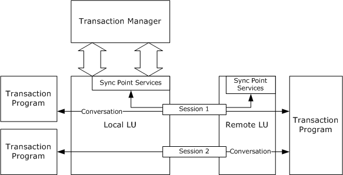
<!-- /Extracted images from page 17 -->

### 1.3 Overview

The MSDTC Connection Manager: OleTx Transaction Protocol Logical Unit Mainframe Extension
(DTCLU) is used between an implementation of Logical Unit type 6.2 (LU 6.2) and a transaction
manager to provide transaction support. It enables integration of a LU 6.2-based transaction
participant into an OleTx transaction, and vice-versa. DTCLU extends the transaction protocol
described in OleTx Transaction Protocol [MS-DTCO] with helper messages and abstract state, such as
additional mechanisms for identifying a transaction, or support for recovery that does not use the
presumed-abort two-phase-commit variant.

An LU 6.2 implementation can use the extension to delegate many of its responsibilities for the
transactional features of each logical unit of work (LUW) to a transaction manager. This reduces
the amount of work necessary to implement LU 6.2. A transaction manager that implements this
protocol extension provides two main areas of support. First, it supports the enlistment of an LUW in,
and its completion as part of, an atomic transaction. Second, it supports recovery after a
transient failure that affects connectivity between a local LU and a remote LU, or between the
local LU and a transaction manager.

The scenarios and roles are described in the following sections as follows:





The scenarios that this protocol is intended to support such as enlistment, completion, and
transaction recovery.

The distinct transaction roles that are played by participants in these scenarios in addition to
those described in [MS-DTCO].

#### 1.3.1 Scenarios

The following diagram shows some of the components involved in typical usage scenarios for the
MSDTC Connection Manager: OleTx Transaction Protocol Logical Unit Mainframe Extension.

Figure 1: Components typically used for this protocol

The following sections illustrate the interactions that take place between these components in a
common scenario drawn from each of the two main areas of support provided to LU 6.2
Implementations by this protocol.

[MS-DTCLU] - v20240423
MSDTC Connection Manager: OleTx Transaction Protocol Logical Unit Mainframe Extension
Copyright © 2024 Microsoft Corporation
Release: April 23, 2024

17 / 199

<!-- Extracted images from page 18 -->
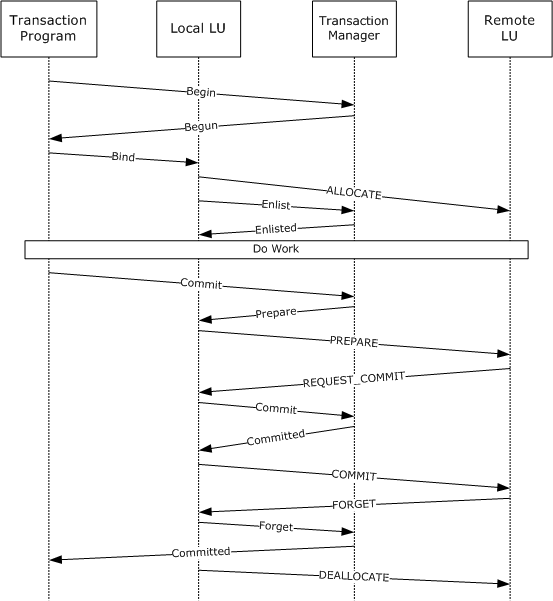
<!-- /Extracted images from page 18 -->

##### 1.3.1.1 Enlistment and Completion

The following sequence diagram is a schematic of the interactions that take place between a
transaction program, a local LU, a transaction manager, and a remote LU when a logical unit of
work is enlisted on a transaction and the transaction is completed.

Figure 2: MS-DTCLU enlistment

All the exchanges depicted are notional, and are not intended to provide an accurate representation of
any concrete protocol. The protocols involved are specified as follows:





The protocol between the local LU and the transaction manager is specified in sections 1.3.2.2.1
and 3.3.

The protocol between the transaction program and the transaction manager is specified in [MS-
DTCO]. The transaction program plays the role of application, as specified in that document.



The protocol between the local LU and the remote LU is specified in [IBM-LU62Guide].

18 / 199

[MS-DTCLU] - v20240423
MSDTC Connection Manager: OleTx Transaction Protocol Logical Unit Mainframe Extension
Copyright © 2024 Microsoft Corporation
Release: April 23, 2024



The protocol between the transaction program and the local LU is specified in [IBM-LU62Guide].

The general pattern is that of the Two-Phase Commit protocol described in [MS-DTCO]. A major
difference is that the transaction manager does not communicate directly with all the participants in
the transaction. Specifically, work performed by a transaction program that uses the remote LU is
coordinated only indirectly, via the protocol between the local LU and the remote LU.

Note that the protocol specified in this document is applicable only where the local LU initiates the
logical unit of work.

Note also that although the role played by the local LU is broadly similar to a resource manager, it
does not correspond exactly with any of the roles specified by [MS-DTCO]. Consequently, this
document specifies an additional role, LU 6.2 Implementation, in section 1.3.2.1.

##### 1.3.1.2 Transaction Recovery

The atomicity property of a transaction guarantees that all participants in the transaction receive
the same outcome. To honor this guarantee, transaction managers have to be capable of
recovering from transient failures.

After a transient failure, the transaction manager re-establishes connectivity with the local LU, if the
connection with the local LU is lost, and participates in the re-establishment of consistent state at the
local and remote LUs.

The following sequence diagram is a schematic of the interactions that take place between Sync Point
Services (SPS) in a remote LU, a local LU, SPS in a local LU, and a transaction program during
recovery initiated by a remote LU.

[MS-DTCLU] - v20240423
MSDTC Connection Manager: OleTx Transaction Protocol Logical Unit Mainframe Extension
Copyright © 2024 Microsoft Corporation
Release: April 23, 2024

19 / 199

<!-- Extracted images from page 20 -->
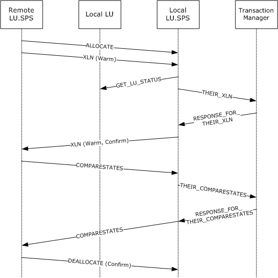
<!-- /Extracted images from page 20 -->

Figure 3: MS-DTCLU recovery

All the exchanges depicted are notional, and are not intended to provide an accurate representation of
any concrete protocol. The protocols involved are specified as follows:



The protocol between Local LU.SPS and the transaction manager is specified in sections 1.3.2.2.1
and 3.3.



The protocol between the Local LU.SPS and the Remote LU.SPS is specified in [IBM-LU62Guide].

The intent of these interactions is similar to that of the recovery protocol between a subordinate
transaction manager and a superior transaction manager as specified in [MS-DTCO]. However,
the role played by Local LU.SPS does not correspond exactly with any of the roles as specified in [MS-
DTCO]. Consequently, this document specifies an additional role, LU 6.2 Implementation, in section
1.3.2.1.

#### 1.3.2 Transaction Roles

This protocol specifies an additional role, the LU 6.2 Implementation, and extends the transaction
manager role as specified in [MS-DTCO]. These roles are described in the following sections.

[MS-DTCLU] - v20240423
MSDTC Connection Manager: OleTx Transaction Protocol Logical Unit Mainframe Extension
Copyright © 2024 Microsoft Corporation
Release: April 23, 2024

20 / 199

##### 1.3.2.1 LU 6.2 Implementation Role

The LU 6.2 Implementation role is performed by an implementation of LU 6.2, and is typically
responsible for performing the following tasks:

  Managing LU Name Pair.





Enlisting a logical unit of work on an existing transaction as a Phase One and Phase Two
participant.

Participating in a Two-Phase Commit coordinated by a transaction manager, and mapping to
and from the related LU 6.2 protocol.



Participating in recovery initiated by a transaction manager.

  Notifying a transaction manager of recovery initiated by a remote LU, and participating in that

process.

##### 1.3.2.2 Transaction Manager Role

This document specifies the following facet, in addition to those specified in [MS-DTCO].

###### 1.3.2.2.1 Transaction Manager Communicating with an LU 6.2 Implementation Facet

The Transaction Manager Communicating with an LU 6.2 Implementation Facet provides the following
services to an LU 6.2 Implementation:

  Enlistment of a logical unit of work on a transaction as a Phase One participant.



Phase One and Phase Two notifications inside the Two-Phase Commit Protocol.

  LU Name Pair management.

  Registration of a recovery process for an LU 6.2 Implementation.

  Recovery and outcome notification for logical units of work enlisted on a transaction.

### 1.4 Relationship to Other Protocols

This protocol extends the protocol specified in [MS-DTCO]. The following diagram illustrates the
protocol layering for this protocol.

[MS-DTCLU] - v20240423
MSDTC Connection Manager: OleTx Transaction Protocol Logical Unit Mainframe Extension
Copyright © 2024 Microsoft Corporation
Release: April 23, 2024

21 / 199

<!-- Extracted images from page 22 -->
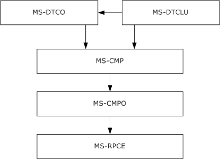
<!-- /Extracted images from page 22 -->

Figure 4: Protocol layering for MS-DTCLU

### 1.5 Prerequisites/Preconditions

This protocol requires that all participating roles possess implementations of the transports protocol
specified in [MS-CMPO] and the multiplexing protocol specified in [MS-CMP]. This protocol also
requires that an implementation of the transaction protocol specified in [MS-DTCO] is accessible using
the protocols specified in [MS-CMPO] and [MS-CMP].

### 1.6 Applicability Statement

This protocol applies to scenarios where an LU 6.2 implementation (section 3.2) provides support for
Sync Point Processing, and an implementation of the protocol described in [MS-DTCO] is available.
It supports the coordination of LU 6.2 logical units of work with atomic transactions, and
recovery from transient failure.

This protocol requires network topologies where the transports protocol described [MS-CMPO] and the
multiplexing protocol described in [MS-CMP] constitute a viable network transport for establishing
many short-lived connection exchanges that accomplish specific tasks.

### 1.7 Versioning and Capability Negotiation

This section specifies the versioning and capability aspects of this protocol.

The protocol specified in this document is not version-specific, and its capabilities are not negotiable.

This protocol supports Logical Unit type 6.2 (LU 6.2) and requires that the external entities comply
with LU 6.2 as specified in [IBM-LU62Guide].

### 1.8 Vendor-Extensible Fields

None.

[MS-DTCLU] - v20240423
MSDTC Connection Manager: OleTx Transaction Protocol Logical Unit Mainframe Extension
Copyright © 2024 Microsoft Corporation
Release: April 23, 2024

22 / 199

### 1.9 Standards Assignments

None.

[MS-DTCLU] - v20240423
MSDTC Connection Manager: OleTx Transaction Protocol Logical Unit Mainframe Extension
Copyright © 2024 Microsoft Corporation
Release: April 23, 2024

23 / 199

## 2 Messages

### 2.1 Transport

An implementation of this protocol uses the transport infrastructure provided by the underlying
implementation of the transaction protocol specified in [MS-DTCO]. Because this protocol uses the
transport infrastructure provided by the transaction protocol, the set of requirements specified in [MS-
DTCO] section 2.1 MUST also apply to this protocol.

### 2.2 Message Syntax

#### 2.2.1 Common Structures

##### 2.2.1.1 MESSAGE_PACKET

The MESSAGE_PACKET structure defines the initial message fields that are contained by all message
tags (MTAGs) in this protocol, as specified in [MS-CMP] section 2.2.2.

0  1  2  3  4  5  6  7  8  9

1
0  1  2  3  4  5  6  7  8  9

2
0  1  2  3  4  5  6  7  8  9

3
0  1

MsgTag

fIsMaster

dwConnectionId

dwUserMsgType

dwcbVarLenData

dwReserved1

MsgTag (4 bytes): A 4-byte integer value that describes the OLE transaction message type. For all
uses in this document, this value MUST be MTAG_USER_MESSAGE, as specified in [MS-CMP]
section 2.2.8.

fIsMaster (4 bytes): The value that indicates the direction of the message in the conversation.

This value MUST be one of the following values.

Value

Meaning

0x00000000  The message is sent by the party that accepted the connection.

0x00000001  The message is sent by the party that initiated the connection.

dwConnectionId (4 bytes): An integer value that MUST contain the unique identifier for the

associated connection.

dwUserMsgType (4 bytes): This field contains the message type identifier. Each MTAG that is

defined in this section MUST specify a distinct value for this field for a specified connection type.

[MS-DTCLU] - v20240423
MSDTC Connection Manager: OleTx Transaction Protocol Logical Unit Mainframe Extension
Copyright © 2024 Microsoft Corporation
Release: April 23, 2024

24 / 199

dwcbVarLenData (4 bytes): An unsigned integer value that MUST contain the size, in bytes, of the
message buffer that contains the MESSAGE_PACKET structure, minus the size, in bytes, of the
MESSAGE_PACKET structure itself.

dwReserved1 (4 bytes): Reserved. This value MUST be set to an implementation-specific value<1>

and MUST be ignored on receipt.

##### 2.2.1.2 DTCLU_VARLEN_BYTEARRAY

The DTCLU_VARLEN_BYTEARRAY structure is used to represent a variable-length byte array.

0  1  2  3  4  5  6  7  8  9

1
0  1  2  3  4  5  6  7  8  9

2
0  1  2  3  4  5  6  7  8  9

3
0  1

cbLength

rgbBlob (variable)

...

cbLength (4 bytes): A 32-bit unsigned integer that MUST contain the number of bytes in the

rgbBlob field.

rgbBlob (variable): This field contains the byte array. The number of bytes in this field MUST be

equal to the value of cbLength. If cbLength is 0, this field MUST NOT be present.

#### 2.2.2 Transaction Enumerations

##### 2.2.2.1 DTCLUCOMPARESTATE

The DTCLUCOMPARESTATE enumeration defines the status values for a logical unit of work.

 typedef  enum
 {
   DTCLUCOMPARESTATE_COMMITTED = 1,
   DTCLUCOMPARESTATE_HEURISTICCOMMITTED = 2,
   DTCLUCOMPARESTATE_HEURISTICMIXED = 3,
   DTCLUCOMPARESTATE_HEURISTICRESET = 4,
   DTCLUCOMPARESTATE_INDOUBT = 5,
   DTCLUCOMPARESTATE_RESET = 6
 } DTCLUCOMPARESTATE;

DTCLUCOMPARESTATE_COMMITTED:  The outcome of a transaction is a commit outcome.

DTCLUCOMPARESTATE_HEURISTICCOMMITTED:  The outcome of a transaction is a heuristic

commit outcome.

DTCLUCOMPARESTATE_HEURISTICMIXED:  The outcome of a transaction is a heuristic mixed

outcome.

DTCLUCOMPARESTATE_HEURISTICRESET:  The outcome of a transaction is a heuristic abort

outcome.

DTCLUCOMPARESTATE_INDOUBT:  The outcome of a transaction is an in doubt outcome.

DTCLUCOMPARESTATE_RESET:  The outcome of a transaction is an abort outcome.

[MS-DTCLU] - v20240423
MSDTC Connection Manager: OleTx Transaction Protocol Logical Unit Mainframe Extension
Copyright © 2024 Microsoft Corporation
Release: April 23, 2024

25 / 199

##### 2.2.2.2 DTCLUCOMPARESTATESCONFIRMATION

The DTCLUCOMPARESTATESCONFIRMATION enumeration defines the completion status values for
a comparison of the LUW state between a local LU and a remote LU during recovery.

 typedef  enum
 {
   DTCLUCOMPARESTATESCONFIRMATION_CONFIRM = 1,
   DTCLUCOMPARESTATESCONFIRMATION_PROTOCOL = 2
 } DTCLUCOMPARESTATESCONFIRMATION;

DTCLUCOMPARESTATESCONFIRMATION_CONFIRM:  The LUW state supplied by a remote LU

matches the local LU LUW state held by a transaction manager and recovery is complete.

DTCLUCOMPARESTATESCONFIRMATION_PROTOCOL:  The LUW state supplied by a remote LU

does not match the local LU LUW state held by a transaction manager.

##### 2.2.2.3 DTCLUCOMPARESTATESERROR

The DTCLUCOMPARESTATESERROR enumeration defines the error status values for a comparison
of the state of an LUW between a local LU and a remote LU during recovery.

 typedef  enum
 {
   DTCLUCOMPARESTATESERROR_PROTOCOL = 1
 } DTCLUCOMPARESTATESERROR;

DTCLUCOMPARESTATESERROR_PROTOCOL:  A protocol error occurred.

##### 2.2.2.4 DTCLUXLN

The DTCLUXLN enumeration defines the log status values used in an exchange of state information
between a remote LU and a local LU.

 typedef  enum
 {
   DTCLUXLN_COLD = 1,
   DTCLUXLN_WARM = 2
 } DTCLUXLN;

DTCLUXLN_COLD:  The log status of an LU is Log Status Cold.

DTCLUXLN_WARM:  The log status of an LU is Log Status Warm.

##### 2.2.2.5 DTCLUXLNCONFIRMATION

The DTCLUXLNCONFIRMATION enumeration defines the completion status values for an exchange
of Exchange Log Name (XLN) messages with a remote LU.

 typedef  enum
 {
   DTCLUXLNCONFIRMATION_CONFIRM = 1,
   DTCLUXLNCONFIRMATION_LOGNAMEMISMATCH = 2,
   DTCLUXLNCONFIRMATION_COLDWARMMISMATCH = 3,
   DTCLUXLNCONFIRMATION_OBSOLETE = 4
 } DTCLUXLNCONFIRMATION;

[MS-DTCLU] - v20240423
MSDTC Connection Manager: OleTx Transaction Protocol Logical Unit Mainframe Extension
Copyright © 2024 Microsoft Corporation
Release: April 23, 2024

26 / 199

DTCLUXLNCONFIRMATION_CONFIRM:  No inconsistencies were detected between the remote LU

state and the local LU state held by a transaction manager.

DTCLUXLNCONFIRMATION_LOGNAMEMISMATCH:  The remote log name supplied by the

remote LU does not match the remote log name at the local LU held by a transaction manager.

DTCLUXLNCONFIRMATION_COLDWARMMISMATCH:  The log status of the remote LU (as
supplied by the remote LU) is Log Status Cold, and the log status of the local LU held by a
transaction manager is Log Status Warm.

DTCLUXLNCONFIRMATION_OBSOLETE:  The exchange of XLNs has been invalidated, for example,
because the recovery sequence number has been incremented since the exchange began.

##### 2.2.2.6 DTCLUXLNERROR

The DTCLUXLNERROR enumeration defines the error status values for an exchange of XLN
messages with a remote LU.

 typedef  enum
 {
   DTCLUXLNERROR_PROTOCOL = 1,
   DTCLUXLNERROR_LOGNAMEMISMATCH = 2,
   DTCLUXLNERROR_COLDWARMMISMATCH = 3
 } DTCLUXLNERROR;

DTCLUXLNERROR_PROTOCOL:  A protocol error occurred.

DTCLUXLNERROR_LOGNAMEMISMATCH:  The local log name supplied by a remote LU does not

match the local log name at the local LU held by a transaction manager, or the remote log
name supplied by a remote LU does not match the remote log name at the local LU held by a
transaction manager.

DTCLUXLNERROR_COLDWARMMISMATCH:  The log status of the remote LU supplied by a

remote LU is Log Status Cold, and the log status of the local LU held by a transaction manager is
Log Status Warm; or the log status of the remote LU supplied by a remote LU is Log Status
Warm, and the log status of the local LU held by a transaction manager is Log Status Cold.

##### 2.2.2.7 DTCLUCOMPARESTATESRESPONSE

The DTCLUCOMPARESTATESRESPONSE enumeration defines the completion status of an exchange
of LUW state information between a local LU and a remote LU during recovery.

 typedef  enum
 {
   DTCLUCOMPARESTATESRESPONSE_OK = 1,
   DTCLUCOMPARESTATESRESPONSE_PROTOCOL = 2
 } DTCLUCOMPARESTATESRESPONSE;

DTCLUCOMPARESTATESRESPONSE_OK:  The LUW state supplied by a remote LU matches the

LUW state held for a local LU by a transaction manager.

DTCLUCOMPARESTATESRESPONSE_PROTOCOL:  The LUW state supplied by a remote LU does not

match the LUW state held for a local LU by a transaction manager.

[MS-DTCLU] - v20240423
MSDTC Connection Manager: OleTx Transaction Protocol Logical Unit Mainframe Extension
Copyright © 2024 Microsoft Corporation
Release: April 23, 2024

27 / 199

##### 2.2.2.8 DTCLUXLNRESPONSE

The DTCLUXLNRESPONSE enumeration defines the completion status of an exchange of XLN
messages with a remote LU.

 typedef  enum
 {
   DTCLUXLNRESPONSE_OK_SENDOURXLNBACK = 1,
   DTCLUXLNRESPONSE_OK_SENDCONFIRMATION = 2,
   DTCLUXLNRESPONSE_LOGNAMEMISMATCH = 3,
   DTCLUXLNRESPONSE_COLDWARMMISMATCH = 4
 } DTCLUXLNRESPONSE;

DTCLUXLNRESPONSE_OK_SENDOURXLNBACK:  No inconsistencies were detected between the
remote LU state and the local LU state held by the transaction manager, and the remote LU
has not supplied the local log name.

DTCLUXLNRESPONSE_OK_SENDCONFIRMATION:  No inconsistencies were detected between the

remote LU state and the local LU state held by the transaction manager.

DTCLUXLNRESPONSE_LOGNAMEMISMATCH:  The remote log name supplied by the remote LU

does not match the remote log name at the local LU held by the transaction manager; or the local
log name supplied by the remote LU does not match the local log name held by the transaction
manager.

DTCLUXLNRESPONSE_COLDWARMMISMATCH:  The remote LU's log status supplied by the

remote LU is Log Status Cold, and the local LU's log status held by the transaction manager is
Log Status Warm.

##### 2.2.2.9 CONNTYPE

The CONNTYPE enumeration defines the connection types that are used by this protocol.

 typedef  enum
 {
   CONNTYPE_TXUSER_DTCLURMENLISTMENT = 0x00000016,
   CONNTYPE_TXUSER_DTCLUCONFIGURE = 0x00000018,
   CONNTYPE_TXUSER_DTCLURECOVERY = 0x00000019,
   CONNTYPE_TXUSER_DTCLURECOVERYINITIATEDBYDTC = 0x00000020,
   CONNTYPE_TXUSER_DTCLURECOVERYINITIATEDBYLU = 0x00000021
 } CONNTYPE;

CONNTYPE_TXUSER_DTCLURMENLISTMENT:  This connection type is used by an LU 6.2
implementation to establish a subordinate enlistment with a transaction manager.

CONNTYPE_TXUSER_DTCLUCONFIGURE:  This connection type is used to manage a set of LU

Name Pairs held by a transaction manager.

CONNTYPE_TXUSER_DTCLURECOVERY:  This connection type is used by an LU 6.2 implementation

to register as a recovery process with a transaction manager.

CONNTYPE_TXUSER_DTCLURECOVERYINITIATEDBYDTC:  This connection type is used to

request LU 6.2 work from a transaction manager.

CONNTYPE_TXUSER_DTCLURECOVERYINITIATEDBYLU:  This connection type is used for LU 6.2

recovery initiated by an LU 6.2 implementation.

[MS-DTCLU] - v20240423
MSDTC Connection Manager: OleTx Transaction Protocol Logical Unit Mainframe Extension
Copyright © 2024 Microsoft Corporation
Release: April 23, 2024

28 / 199

#### 2.2.3 Connection Types Relevant to LU 6.2

##### 2.2.3.1 CONNTYPE_TXUSER_DTCLUCONFIGURE

The CONNTYPE_TXUSER_DTCLUCONFIGURE connection type is used to manage a set of LU
Name Pairs held by a transaction manager.

The use of CONNTYPE_TXUSER_DTCLUCONFIGURE as an initiator is specified in section 3.2.5.1,
and as an acceptor is specified in section 3.3.5.1.

###### 2.2.3.1.1 TXUSER_DTCLURMCONFIGURE_MTAG_ADD

The TXUSER_DTCLURMCONFIGURE_MTAG_ADD message is sent by an LU 6.2 implementation
(section 3.2) to request the addition of an LU Name Pair to the set of LU Name Pairs held by a
transaction manager.

0  1  2  3  4  5  6  7  8  9

1
0  1  2  3  4  5  6  7  8  9

2
0  1  2  3  4  5  6  7  8  9

3
0  1

MsgHeader (24 bytes)

...

...

LuNamePair (variable)

...

MsgHeader (24 bytes): This field MUST contain a MESSAGE_PACKET structure.





The value of the dwUserMsgType field MUST be 0x00004201.

The value of the dwcbVarLenData field MUST be at least 4.

LuNamePair (variable): This field MUST contain a DTCLU_VARLEN_BYTEARRAY structure that
identifies an LU Name Pair. If cbLength is not a multiple of 4, the end of the field MUST be
aligned on a 4-byte boundary by padding with arbitrary values that MUST be ignored on receipt.

###### 2.2.3.1.2 TXUSER_DTCLURMCONFIGURE_MTAG_DELETE

The TXUSER_DTCLURMCONFIGURE_MTAG_DELETE message is sent by an LU 6.2 implementation
(section 3.2) to request the deletion of an LU Name Pair from the set of LU Name Pairs held by a
transaction manager.

0  1  2  3  4  5  6  7  8  9

1
0  1  2  3  4  5  6  7  8  9

2
0  1  2  3  4  5  6  7  8  9

3
0  1

MsgHeader (24 bytes)

...

...

[MS-DTCLU] - v20240423
MSDTC Connection Manager: OleTx Transaction Protocol Logical Unit Mainframe Extension
Copyright © 2024 Microsoft Corporation
Release: April 23, 2024

29 / 199

LuNamePair (variable)

...

MsgHeader (24 bytes): This field MUST contain a MESSAGE_PACKET structure.





The value of the dwUserMsgType field MUST be 0x00004202.

The value of the dwcbVarLenData field MUST be at least 4.

LuNamePair (variable): This field MUST contain a DTCLU_VARLEN_BYTEARRAY structure that
identifies an LU Name Pair. If cbLength is not a multiple of 4, the end of the field MUST be
aligned on a 4-byte boundary by padding with arbitrary values that MUST be ignored on receipt.

###### 2.2.3.1.3 TXUSER_DTCLURMCONFIGURE_MTAG_REQUEST_COMPLETED

The TXUSER_DTCLURMCONFIGURE_MTAG_REQUEST_COMPLETED message is sent by a transaction
manager to indicate that an LU Name Pair has been successfully added to or removed from a set of
LU Name Pairs held by a transaction manager.

0  1  2  3  4  5  6  7  8  9

1
0  1  2  3  4  5  6  7  8  9

2
0  1  2  3  4  5  6  7  8  9

3
0  1

MsgHeader (24 bytes)

...

...

MsgHeader (24 bytes): This field MUST contain a MESSAGE_PACKET structure.





The value of the dwUserMsgType field MUST be 0x00004203.

The value of the dwcbVarLenData field MUST be 0.

###### 2.2.3.1.4 TXUSER_DTCLURMCONFIGURE_MTAG_ADD_DUPLICATE

The TXUSER_DTCLURMCONFIGURE_MTAG_ADD_DUPLICATE message is sent by a transaction
manager to indicate that an LU Name Pair is already a member of the set of LU Name Pairs held by
a transaction manager, and therefore cannot be added.

0  1  2  3  4  5  6  7  8  9

1
0  1  2  3  4  5  6  7  8  9

2
0  1  2  3  4  5  6  7  8  9

3
0  1

MsgHeader (24 bytes)

...

...

MsgHeader (24 bytes): This field MUST contain a MESSAGE_PACKET structure.





The value of the dwUserMsgType field MUST be 0x00004204.

The value of the dwcbVarLenData field MUST be 0.

[MS-DTCLU] - v20240423
MSDTC Connection Manager: OleTx Transaction Protocol Logical Unit Mainframe Extension
Copyright © 2024 Microsoft Corporation
Release: April 23, 2024

30 / 199

###### 2.2.3.1.5 TXUSER_DTCLURMCONFIGURE_MTAG_DELETE_NOT_FOUND

The TXUSER_DTCLURMCONFIGURE_MTAG_DELETE_NOT_FOUND message is sent by a transaction
manager to indicate that an LU Name Pair is not a member of the set of LU Name Pairs held by a
transaction manager, and therefore cannot be deleted.

0  1  2  3  4  5  6  7  8  9

1
0  1  2  3  4  5  6  7  8  9

2
0  1  2  3  4  5  6  7  8  9

3
0  1

MsgHeader (24 bytes)

...

...

MsgHeader (24 bytes): This field MUST contain a MESSAGE_PACKET structure.





The value of the dwUserMsgType field MUST be 0x00004205.

The value of the dwcbVarLenData field MUST be 0.

###### 2.2.3.1.6 TXUSER_DTCLURMCONFIGURE_MTAG_DELETE_UNRECOVERED_TRANS

The TXUSER_DTCLURMCONFIGURE_MTAG_DELETE_UNRECOVERED_TRANS message is sent by a
transaction manager to indicate that an LU Name Pair cannot be removed from the set of LU
Name Pairs because a recovery process is active for a logical unit of work associated with the LU
Name Pair.

0  1  2  3  4  5  6  7  8  9

1
0  1  2  3  4  5  6  7  8  9

2
0  1  2  3  4  5  6  7  8  9

3
0  1

MsgHeader (24 bytes)

...

...

MsgHeader (24 bytes): This field MUST contain a MESSAGE_PACKET structure.





The value of the dwUserMsgType field MUST be 0x00004206.

The value of the dwcbVarLenData field MUST be 0.

###### 2.2.3.1.7 TXUSER_DTCLURMCONFIGURE_MTAG_DELETE_INUSE

The TXUSER_DTCLURMCONFIGURE_MTAG_DELETE_INUSE message is sent by a transaction
manager to indicate that an LU Name Pair cannot be removed from the set of LU Name Pairs
because a logical unit of work associated with the LU Name Pair is active.

0  1  2  3  4  5  6  7  8  9

1
0  1  2  3  4  5  6  7  8  9

2
0  1  2  3  4  5  6  7  8  9

3
0  1

MsgHeader (24 bytes)

...

[MS-DTCLU] - v20240423
MSDTC Connection Manager: OleTx Transaction Protocol Logical Unit Mainframe Extension
Copyright © 2024 Microsoft Corporation
Release: April 23, 2024

31 / 199

...

MsgHeader (24 bytes): This field MUST contain a MESSAGE_PACKET structure.





The value of the dwUserMsgType field MUST be 0x00004207.

The value of the dwcbVarLenData field MUST be 0.

###### 2.2.3.1.8 TXUSER_DTCLURMCONFIGURE_MTAG_ADD_LOG_FULL

The TXUSER_DTCLURMCONFIGURE_MTAG_ADD_LOG_FULL message SHOULD<2> be sent by a
transaction manager to indicate that the LU Name Pair cannot be added to the set of LU Name
Pairs because insufficient space exists in the local LU recovery log that is held by a transaction
manager to durably log the LU Name Pair.

0  1  2  3  4  5  6  7  8  9

1
0  1  2  3  4  5  6  7  8  9

2
0  1  2  3  4  5  6  7  8  9

3
0  1

MsgHeader (24 bytes)

...

...

MsgHeader (24 bytes): This field MUST contain a MESSAGE_PACKET structure.





The value of the dwUserMsgType field MUST be 0x00004208.

The value of the dwcbVarLenData field MUST be 0.

##### 2.2.3.2 CONNTYPE_TXUSER_DTCLURECOVERY

The CONNTYPE_TXUSER_DTCLURECOVERY connection type is used by an LU 6.2
Implementation to register as a recovery process with a transaction manager.

The use of CONNTYPE_TXUSER_DTCLURECOVERY as an initiator is specified in section 3.2.5.2,
and as an acceptor in section 3.3.5.2.

###### 2.2.3.2.1 TXUSER_DTCLURMRECOVERY_MTAG_ATTACH

The TXUSER_DTCLURMRECOVERY_MTAG_ATTACH message is sent by an LU 6.2 implementation
(section 3.2) to register as a recovery process for logical units of work that involve the logical
units identified by the LU Name Pair specified by the request.

0  1  2  3  4  5  6  7  8  9

1
0  1  2  3  4  5  6  7  8  9

2
0  1  2  3  4  5  6  7  8  9

3
0  1

MsgHeader (24 bytes)

...

...

LuNamePair (variable)

[MS-DTCLU] - v20240423
MSDTC Connection Manager: OleTx Transaction Protocol Logical Unit Mainframe Extension
Copyright © 2024 Microsoft Corporation
Release: April 23, 2024

32 / 199

...

MsgHeader (24 bytes): This field MUST contain a MESSAGE_PACKET structure.





The value of the dwUserMsgType field MUST be 0x00004301.

The value of the dwcbVarLenData field MUST be at least 4.

LuNamePair (variable): This field MUST contain a DTCLU_VARLEN_BYTEARRAY structure that

identifies an LU Name Pair. If the value of cbLength is not a multiple of 4, the end of the field
MUST be aligned on a 4-byte boundary by padding with arbitrary values that MUST be ignored on
receipt.

###### 2.2.3.2.2 TXUSER_DTCLURMRECOVERY_MTAG_REQUEST_COMPLETED

The TXUSER_DTCLURMRECOVERY_MTAG_REQUEST_COMPLETED message is sent by a transaction
manager to indicate that a request by an LU 6.2 implementation (section 3.2) to register as a
recovery process for logical units of work that involves the logical units identified by the LU
Name Pair specified by the request has completed successfully.

0  1  2  3  4  5  6  7  8  9

1
0  1  2  3  4  5  6  7  8  9

2
0  1  2  3  4  5  6  7  8  9

3
0  1

MsgHeader (24 bytes)

...

...

MsgHeader (24 bytes): This field MUST contain a MESSAGE_PACKET structure.





The value of the dwUserMsgType field MUST be 0x00004303.

The value of the dwcbVarLenData field MUST be 0.

###### 2.2.3.2.3 TXUSER_DTCLURMRECOVERY_MTAG_ATTACH_DUPLICATE

The TXUSER_DTCLURMRECOVERY_MTAG_ATTACH_DUPLICATE message is sent by a transaction
manager to indicate that the requested recovery process is already registered for logical units of
work that involve the logical units identified by the LU Name Pair; therefore, the registration
request cannot be completed.

0  1  2  3  4  5  6  7  8  9

1
0  1  2  3  4  5  6  7  8  9

2
0  1  2  3  4  5  6  7  8  9

3
0  1

MsgHeader (24 bytes)

...

...

MsgHeader (24 bytes): This field MUST contain a MESSAGE_PACKET structure.



The value of the dwUserMsgType field MUST be 0x00004304.

[MS-DTCLU] - v20240423
MSDTC Connection Manager: OleTx Transaction Protocol Logical Unit Mainframe Extension
Copyright © 2024 Microsoft Corporation
Release: April 23, 2024

33 / 199



The value of the dwcbVarLenData field MUST be 0.

###### 2.2.3.2.4 TXUSER_DTCLURMRECOVERY_MTAG_ATTACH_NOT_FOUND

The TXUSER_DTCLURMRECOVERY_MTAG_ATTACH_NOT_FOUND message is sent by a transaction
manager to indicate that the LU Name Pair specified by the request is not a member of the set of
LU Name Pairs held by a transaction manager; therefore the registration request cannot be completed.

0  1  2  3  4  5  6  7  8  9

1
0  1  2  3  4  5  6  7  8  9

2
0  1  2  3  4  5  6  7  8  9

3
0  1

MsgHeader (24 bytes)

...

...

MsgHeader (24 bytes): This field MUST contain a MESSAGE_PACKET structure.





The value of the dwUserMsgType field MUST be 0x00004305.

The value of the dwcbVarLenData field MUST be 0.

##### 2.2.3.3 CONNTYPE_TXUSER_DTCLURMENLISTMENT

The CONNTYPE_TXUSER_DTCLURMENLISTMENT connection type is used by an LU 6.2
implementation (section 3.2) to establish a subordinate enlistment with a transaction manager.

The use of CONNTYPE_TXUSER_DTCLURMENLISTMENT as an initiator is specified in section
3.2.5.3, and as an acceptor in section 3.3.5.3.

###### 2.2.3.3.1 TXUSER_DTCLURMENLISTMENT_MTAG_CREATE

The TXUSER_DTCLURMENLISTMENT_MTAG_CREATE message is sent by an LU 6.2 implementation
(section 3.2) to request the creation of an LU 6.2 subordinate enlistment on a transaction managed
by a transaction manager.

0  1  2  3  4  5  6  7  8  9

1
0  1  2  3  4  5  6  7  8  9

2
0  1  2  3  4  5  6  7  8  9

3
0  1

MsgHeader (24 bytes)

...

...

guidTx (16 bytes)

...

...

LuNamePair (variable)

[MS-DTCLU] - v20240423
MSDTC Connection Manager: OleTx Transaction Protocol Logical Unit Mainframe Extension
Copyright © 2024 Microsoft Corporation
Release: April 23, 2024

34 / 199

...

LuTransId (variable)

...

MsgHeader (24 bytes): This field MUST contain a MESSAGE_PACKET structure.





The value of the dwUserMsgType field MUST be 0x00004101.

The value of the dwcbVarLenData field MUST be at least 24.

guidTx (16 bytes):  This field MUST contain a GUID that specifies the transaction identifier for a

transaction held by a transaction manager.

LuNamePair (variable): This field MUST contain a DTCLU_VARLEN_BYTEARRAY structure that

identifies an LU Name Pair. If the value of cbLength is not a multiple of 4, the end of the field
MUST be aligned on a 4-byte boundary by padding with arbitrary values that MUST be ignored on
receipt.

LuTransId (variable): This field MUST contain a DTCLU_VARLEN_BYTEARRAY structure that specifies

the LUW ID. If the value of cbLength is not a multiple of 4, the end of the field MUST be aligned
on a 4-byte boundary by padding with arbitrary values that MUST be ignored on receipt.

###### 2.2.3.3.2 TXUSER_DTCLURMENLISTMENT_MTAG_REQUEST_COMPLETED

The TXUSER_DTCLURMENLISTMENT_MTAG_REQUEST_COMPLETED message is sent by a transaction
manager to indicate that a request to create an LU 6.2 subordinate enlistment on a transaction
managed by a transaction manager was completed successfully.

0  1  2  3  4  5  6  7  8  9

1
0  1  2  3  4  5  6  7  8  9

2
0  1  2  3  4  5  6  7  8  9

3
0  1

MsgHeader (24 bytes)

...

...

MsgHeader (24 bytes): This field MUST contain a MESSAGE_PACKET structure.





The value of the dwUserMsgType field MUST be 0x00004102.

The value of the dwcbVarLenData field MUST be 0.

###### 2.2.3.3.3 TXUSER_DTCLURMENLISTMENT_MTAG_TO_DTC_CONVERSATIONLOST

The TXUSER_DTCLURMENLISTMENT_MTAG_TO_DTC_CONVERSATIONLOST message is sent by an LU
6.2 implementation (section 3.2) to indicate that the conversation with a remote LU was lost.

0  1  2  3  4  5  6  7  8  9

1
0  1  2  3  4  5  6  7  8  9

2
0  1  2  3  4  5  6  7  8  9

3
0  1

MsgHeader (24 bytes)

[MS-DTCLU] - v20240423
MSDTC Connection Manager: OleTx Transaction Protocol Logical Unit Mainframe Extension
Copyright © 2024 Microsoft Corporation
Release: April 23, 2024

35 / 199

...

...

MsgHeader (24 bytes): This field MUST contain a MESSAGE_PACKET structure.





The value of the dwUserMsgType field MUST be 0x00004103.

The value of the dwcbVarLenData field MUST be 0.

###### 2.2.3.3.4 TXUSER_DTCLURMENLISTMENT_MTAG_TO_DTC_BACKEDOUT

The TXUSER_DTCLURMENLISTMENT_MTAG_TO_DTC_BACKEDOUT message is sent by an LU 6.2
implementation (section 3.2) to acknowledge that the LU 6.2 implementation has successfully
processed a request to abort a logical unit of work and a transaction manager is no longer
obligated to retain the outcome of this logical unit of work.

0  1  2  3  4  5  6  7  8  9

1
0  1  2  3  4  5  6  7  8  9

2
0  1  2  3  4  5  6  7  8  9

3
0  1

MsgHeader (24 bytes)

...

...

MsgHeader (24 bytes): This field MUST contain a MESSAGE_PACKET structure.





The value of the dwUserMsgType field MUST be 0x00004104.

The value of the dwcbVarLenData field MUST be 0.

###### 2.2.3.3.5 TXUSER_DTCLURMENLISTMENT_MTAG_TO_DTC_BACKOUT

The TXUSER_DTCLURMENLISTMENT_MTAG_TO_DTC_BACKOUT message is sent by an LU 6.2
implementation to request a transaction manager to abort a logical unit of work.

0  1  2  3  4  5  6  7  8  9

1
0  1  2  3  4  5  6  7  8  9

2
0  1  2  3  4  5  6  7  8  9

3
0  1

MsgHeader (24 bytes)

...

...

MsgHeader (24 bytes): This field MUST contain a MESSAGE_PACKET structure.





The value of the dwUserMsgType field MUST be 0x00004105.

The value of the dwcbVarLenData field MUST be 0.

###### 2.2.3.3.6 TXUSER_DTCLURMENLISTMENT_MTAG_TO_DTC_COMMITTED

[MS-DTCLU] - v20240423
MSDTC Connection Manager: OleTx Transaction Protocol Logical Unit Mainframe Extension
Copyright © 2024 Microsoft Corporation
Release: April 23, 2024

36 / 199

The TXUSER_DTCLURMENLISTMENT_MTAG_TO_DTC_COMMITTED message is sent by an LU 6.2
implementation to a transaction manager to indicate that it has successfully committed a logical
unit of work.

0  1  2  3  4  5  6  7  8  9

1
0  1  2  3  4  5  6  7  8  9

2
0  1  2  3  4  5  6  7  8  9

3
0  1

MsgHeader (24 bytes)

...

...

MsgHeader (24 bytes): This field MUST contain a MESSAGE_PACKET structure.





The value of the dwUserMsgType field MUST be 0x00004106.

The value of the dwcbVarLenData field MUST be 0.

###### 2.2.3.3.7 TXUSER_DTCLURMENLISTMENT_MTAG_TO_DTC_FORGET

The TXUSER_DTCLURMENLISTMENT_MTAG_TO_DTC_FORGET message is sent by an LU 6.2
implementation (section 3.2) to a transaction manager to indicate that it has successfully
committed a logical unit of work.

0  1  2  3  4  5  6  7  8  9

1
0  1  2  3  4  5  6  7  8  9

2
0  1  2  3  4  5  6  7  8  9

3
0  1

MsgHeader (24 bytes)

...

...

MsgHeader (24 bytes): This field MUST contain a MESSAGE_PACKET structure.





The value of the dwUserMsgType field MUST be 0x00004107.

The value of the dwcbVarLenData field MUST be 0.

###### 2.2.3.3.8 TXUSER_DTCLURMENLISTMENT_MTAG_TO_DTC_REQUESTCOMMIT

The TXUSER_DTCLURMENLISTMENT_MTAG_TO_DTC_REQUESTCOMMIT message is sent by an LU 6.2
implementation (section 3.2) to indicate that it has successfully processed a request to carry out the
necessary operations to commit a logical unit of work.

0  1  2  3  4  5  6  7  8  9

1
0  1  2  3  4  5  6  7  8  9

2
0  1  2  3  4  5  6  7  8  9

3
0  1

MsgHeader (24 bytes)

...

...

[MS-DTCLU] - v20240423
MSDTC Connection Manager: OleTx Transaction Protocol Logical Unit Mainframe Extension
Copyright © 2024 Microsoft Corporation
Release: April 23, 2024

37 / 199

MsgHeader (24 bytes): This field MUST contain a MESSAGE_PACKET structure.





The value of the dwUserMsgType field MUST be 0x00004108.

The value of the dwcbVarLenData field MUST be 0.

###### 2.2.3.3.9 TXUSER_DTCLURMENLISTMENT_MTAG_TO_LU_BACKEDOUT

The TXUSER_DTCLURMENLISTMENT_MTAG_TO_LU_BACKEDOUT message is sent by a transaction
manager to acknowledge that it has successfully processed a request to abort a logical unit of
work.

0  1  2  3  4  5  6  7  8  9

1
0  1  2  3  4  5  6  7  8  9

2
0  1  2  3  4  5  6  7  8  9

3
0  1

MsgHeader (24 bytes)

...

...

MsgHeader (24 bytes): This field MUST contain a MESSAGE_PACKET structure.





The value of the dwUserMsgType field MUST be 0x00004109.

The value of the dwcbVarLenData field MUST be 0.

###### 2.2.3.3.10 TXUSER_DTCLURMENLISTMENT_MTAG_TO_LU_BACKOUT

The TXUSER_DTCLURMENLISTMENT_MTAG_TO_LU_BACKOUT message is sent by a transaction
manager to inform the LU 6.2 implementation (section 3.2) that a logical unit of work has
aborted.

0  1  2  3  4  5  6  7  8  9

1
0  1  2  3  4  5  6  7  8  9

2
0  1  2  3  4  5  6  7  8  9

3
0  1

MsgHeader (24 bytes)

...

...

MsgHeader (24 bytes): This field MUST contain a MESSAGE_PACKET structure.





The value of the dwUserMsgType field MUST be 0x00004110.

The value of the dwcbVarLenData field MUST be 0.

###### 2.2.3.3.11 TXUSER_DTCLURMENLISTMENT_MTAG_TO_LU_COMMITTED

The TXUSER_DTCLURMENLISTMENT_MTAG_TO_LU_COMMITTED message is sent by a transaction
manager to indicate that a logical unit of work was successfully committed.

[MS-DTCLU] - v20240423
MSDTC Connection Manager: OleTx Transaction Protocol Logical Unit Mainframe Extension
Copyright © 2024 Microsoft Corporation
Release: April 23, 2024

38 / 199

0  1  2  3  4  5  6  7  8  9

1
0  1  2  3  4  5  6  7  8  9

2
0  1  2  3  4  5  6  7  8  9

3
0  1

MsgHeader (24 bytes)

...

...

MsgHeader (24 bytes): This field MUST contain a MESSAGE_PACKET structure.





The value of the dwUserMsgType field MUST be 0x00004111.

The value of the dwcbVarLenData field MUST be 0.

###### 2.2.3.3.12 TXUSER_DTCLURMENLISTMENT_MTAG_TO_LU_PREPARE

The TXUSER_DTCLURMENLISTMENT_MTAG_TO_LU_PREPARE message is sent by a transaction
manager to request that the LU 6.2 implementation (section 3.2) perform the actions that are
needed to prepare a logical unit of work to be committed.

0  1  2  3  4  5  6  7  8  9

1
0  1  2  3  4  5  6  7  8  9

2
0  1  2  3  4  5  6  7  8  9

3
0  1

MsgHeader (24 bytes)

...

...

MsgHeader (24 bytes): This field MUST contain a MESSAGE_PACKET structure.





The value of the dwUserMsgType field MUST be 0x00004113.

The value of the dwcbVarLenData field MUST be 0.

###### 2.2.3.3.13 TXUSER_DTCLURMENLISTMENT_MTAG_CREATE_TX_NOT_FOUND

The TXUSER_DTCLURMENLISTMENT_MTAG_CREATE_TX_NOT_FOUND message is sent by a
transaction manager to indicate that a request to create an LU 6.2 subordinate enlistment failed
because the transaction identified by the request is not a member of the set of transactions held by
a transaction manager.

0  1  2  3  4  5  6  7  8  9

1
0  1  2  3  4  5  6  7  8  9

2
0  1  2  3  4  5  6  7  8  9

3
0  1

MsgHeader (24 bytes)

...

...

MsgHeader (24 bytes): This field MUST contain a MESSAGE_PACKET structure.



The value of the dwUserMsgType field MUST be 0x00004116.

[MS-DTCLU] - v20240423
MSDTC Connection Manager: OleTx Transaction Protocol Logical Unit Mainframe Extension
Copyright © 2024 Microsoft Corporation
Release: April 23, 2024

39 / 199



The value of the dwcbVarLenData field MUST be 0.

###### 2.2.3.3.14 TXUSER_DTCLURMENLISTMENT_MTAG_CREATE_TOO_LATE

The TXUSER_DTCLURMENLISTMENT_MTAG_CREATE_TOO_LATE message is sent by a transaction
manager to indicate that a request to create an LU 6.2 subordinate enlistment failed because it is
too late in the lifetime of the transaction identified by the request.

0  1  2  3  4  5  6  7  8  9

1
0  1  2  3  4  5  6  7  8  9

2
0  1  2  3  4  5  6  7  8  9

3
0  1

MsgHeader (24 bytes)

...

...

MsgHeader (24 bytes): This field MUST contain a MESSAGE_PACKET structure.





The value of the dwUserMsgType field MUST be 0x00004117.

The value of the dwcbVarLenData field MUST be 0.

###### 2.2.3.3.15 TXUSER_DTCLURMENLISTMENT_MTAG_CREATE_LOG_FULL

The TXUSER_DTCLURMENLISTMENT_MTAG_CREATE_LOG_FULL message is sent by a transaction
manager to indicate that a request to create an LU 6.2 subordinate enlistment failed because
insufficient space exists in the local LU recovery log held by a transaction manager to durably log
the enlistment.

0  1  2  3  4  5  6  7  8  9

1
0  1  2  3  4  5  6  7  8  9

2
0  1  2  3  4  5  6  7  8  9

3
0  1

MsgHeader (24 bytes)

...

...

MsgHeader (24 bytes): This field MUST contain a MESSAGE_PACKET structure.





The value of the dwUserMsgType field MUST be 0x00004118.

The value of the dwcbVarLenData field MUST be 0.

###### 2.2.3.3.16 TXUSER_DTCLURMENLISTMENT_MTAG_CREATE_TOO_MANY

The TXUSER_DTCLURMENLISTMENT_MTAG_CREATE_TOO_MANY message is sent by a transaction
manager to indicate that a request to create an LU 6.2 subordinate enlistment failed because the
implementation-specific<3> maximum number of enlistments for the transaction managed by a
transaction manager has been reached.

[MS-DTCLU] - v20240423
MSDTC Connection Manager: OleTx Transaction Protocol Logical Unit Mainframe Extension
Copyright © 2024 Microsoft Corporation
Release: April 23, 2024

40 / 199

0  1  2  3  4  5  6  7  8  9

1
0  1  2  3  4  5  6  7  8  9

2
0  1  2  3  4  5  6  7  8  9

3
0  1

MsgHeader (24 bytes)

...

...

MsgHeader (24 bytes): This field MUST contain a MESSAGE_PACKET structure.





The value of the dwUserMsgType field MUST be 0x00004119.

The value of the dwcbVarLenData field MUST be 0.

###### 2.2.3.3.17 TXUSER_DTCLURMENLISTMENT_MTAG_CREATE_LU_NOT_FOUND

The TXUSER_DTCLURMENLISTMENT_MTAG_CREATE_LU_NOT_FOUND message is sent by a
transaction manager to indicate that a request to create an LU 6.2 subordinate enlistment failed
because the LU Name Pair specified by the request is not a member of the set of LU Name Pairs held
by the transaction manager.

0  1  2  3  4  5  6  7  8  9

1
0  1  2  3  4  5  6  7  8  9

2
0  1  2  3  4  5  6  7  8  9

3
0  1

MsgHeader (24 bytes)

...

...

MsgHeader (24 bytes): This field MUST contain a MESSAGE_PACKET structure.





The value of the dwUserMsgType field MUST be 0x00004120.

The value of the dwcbVarLenData field MUST be 0.

###### 2.2.3.3.18 TXUSER_DTCLURMENLISTMENT_MTAG_UNPLUG

The TXUSER_DTCLURMENLISTMENT_MTAG_UNPLUG message is sent by an LU 6.2 implementation
(section 3.2) to a transaction manager to unplug itself from a subordinate enlistment.

0  1  2  3  4  5  6  7  8  9

1
0  1  2  3  4  5  6  7  8  9

2
0  1  2  3  4  5  6  7  8  9

3
0  1

MsgHeader (24 bytes)

...

...

MsgHeader (24 bytes): This field MUST contain a MESSAGE_PACKET structure.



The value of the dwUserMsgType field MUST be 0x00004122.

[MS-DTCLU] - v20240423
MSDTC Connection Manager: OleTx Transaction Protocol Logical Unit Mainframe Extension
Copyright © 2024 Microsoft Corporation
Release: April 23, 2024

41 / 199



The value of the dwcbVarLenData field MUST be 0.

###### 2.2.3.3.19 TXUSER_DTCLURMENLISTMENT_MTAG_CREATE_DUPLICATE_LU_TRANS

ID

The TXUSER_DTCLURMENLISTMENT_MTAG_CREATE_DUPLICATE_LU_TRANSID message is sent by a
transaction manager to indicate that a request to create an LU 6.2 subordinate enlistment failed
because a logical unit of work identified by the LUW ID specified by the request is already
associated with the LU Name Pair specified by the request.

0  1  2  3  4  5  6  7  8  9

1
0  1  2  3  4  5  6  7  8  9

2
0  1  2  3  4  5  6  7  8  9

3
0  1

MsgHeader (24 bytes)

...

...

MsgHeader (24 bytes): This field MUST contain a MESSAGE_PACKET structure.





The value of the dwUserMsgType field MUST be 0x00004123.

The value of the dwcbVarLenData field MUST be 0.

###### 2.2.3.3.20 TXUSER_DTCLURMENLISTMENT_MTAG_CREATE_LU_NO_RECOVERY_PR

OCESS

The TXUSER_DTCLURMENLISTMENT_MTAG_CREATE_LU_NO_RECOVERY_PROCESS message is sent
by a transaction manager to indicate that a request to create an LU 6.2 subordinate enlistment
failed because there is no recovery process registered for the LU Name Pair specified by the
request.

0  1  2  3  4  5  6  7  8  9

1
0  1  2  3  4  5  6  7  8  9

2
0  1  2  3  4  5  6  7  8  9

3
0  1

MsgHeader (24 bytes)

...

...

MsgHeader (24 bytes): This field MUST contain a MESSAGE_PACKET structure.





The value of the dwUserMsgType field MUST be 0x00004124.

The value of the dwcbVarLenData field MUST be 0.

###### 2.2.3.3.21 TXUSER_DTCLURMENLISTMENT_MTAG_CREATE_LU_DOWN

The TXUSER_DTCLURMENLISTMENT_MTAG_CREATE_LU_DOWN message is sent by a transaction
manager to indicate that a request to create an LU 6.2 subordinate enlistment failed because the
required recovery process was not previously performed for the local LUs and remote LUs identified
by the LU Name Pair specified by the request.

[MS-DTCLU] - v20240423
MSDTC Connection Manager: OleTx Transaction Protocol Logical Unit Mainframe Extension
Copyright © 2024 Microsoft Corporation
Release: April 23, 2024

42 / 199

0  1  2  3  4  5  6  7  8  9

1
0  1  2  3  4  5  6  7  8  9

2
0  1  2  3  4  5  6  7  8  9

3
0  1

MsgHeader (24 bytes)

...

...

MsgHeader (24 bytes): This field MUST contain a MESSAGE_PACKET structure.





The value of the dwUserMsgType field MUST be 0x00004125.

The value of the dwcbVarLenData field MUST be 0.

###### 2.2.3.3.22 TXUSER_DTCLURMENLISTMENT_MTAG_CREATE_LU_RECOVERING

The TXUSER_DTCLURMENLISTMENT_MTAG_CREATE_LU_RECOVERING message is sent by a
transaction manager to indicate that a request to create an LU 6.2 subordinate enlistment failed
because a recovery process is in progress for the local LUs and remote LUs identified by the LU
Name Pair specified by the request.

0  1  2  3  4  5  6  7  8  9

1
0  1  2  3  4  5  6  7  8  9

2
0  1  2  3  4  5  6  7  8  9

3
0  1

MsgHeader (24 bytes)

...

...

MsgHeader (24 bytes): This field MUST contain a MESSAGE_PACKET structure.





The value of the dwUserMsgType field MUST be 0x00004126.

The value of the dwcbVarLenData field MUST be 0.

###### 2.2.3.3.23 TXUSER_DTCLURMENLISTMENT_MTAG_CREATE_LU_RECOVERY_MISMA

TCH

The TXUSER_DTCLURMENLISTMENT_MTAG_CREATE_LU_RECOVERY_MISMATCH message is sent by a
transaction manager to indicate that a request to create an LU 6.2 subordinate enlistment failed,
because the recovery process for the local LUs and the remote LUs identified by the LU Name Pair
specified by the request detected inconsistencies between the states of the logical units.

0  1  2  3  4  5  6  7  8  9

1
0  1  2  3  4  5  6  7  8  9

2
0  1  2  3  4  5  6  7  8  9

3
0  1

MsgHeader (24 bytes)

...

...

MsgHeader (24 bytes): This field MUST contain a MESSAGE_PACKET structure.

43 / 199

[MS-DTCLU] - v20240423
MSDTC Connection Manager: OleTx Transaction Protocol Logical Unit Mainframe Extension
Copyright © 2024 Microsoft Corporation
Release: April 23, 2024





The value of the dwUserMsgType field MUST be 0x00004127.

The value of the dwcbVarLenData field MUST be 0.

##### 2.2.3.4 CONNTYPE_TXUSER_DTCLURECOVERYINITIATEDBYDTC

The CONNTYPE_TXUSER_DTCLURECOVERYINITIATEDBYDTC connection type is used to
request LU 6.2 recovery work from the transaction manager.

The use of CONNTYPE_TXUSER_DTCLURECOVERYINITIATEDBYDTC as an initiator is specified in
section 3.2.5.4, and as an acceptor in section 3.3.5.4.

###### 2.2.3.4.1 TXUSER_DTCLURECOVERYINITIATEDBYDTC_MTAG_GETWORK

The TXUSER_DTCLURECOVERYINITIATEDBYDTC_MTAG_GETWORK message is sent by an LU 6.2
implementation to query for LU 6.2 recovery work for a pair of logical units identified by an LU
Name Pair.

0  1  2  3  4  5  6  7  8  9

1
0  1  2  3  4  5  6  7  8  9

2
0  1  2  3  4  5  6  7  8  9

3
0  1

MsgHeader (24 bytes)

...

...

LuNamePair (variable)

...

MsgHeader (24 bytes): This field MUST contain a MESSAGE_PACKET structure.





The value of the dwUserMsgType field MUST be 0x00004401.

The value of the dwcbVarLenData field MUST be at least 4.

LuNamePair (variable): This field MUST contain a DTCLU_VARLEN_BYTEARRAY structure that

identifies an LU Name Pair. If the value of cbLength is not a multiple of 4, the end of the field
MUST be aligned on a 4-byte boundary by padding with arbitrary values that MUST be ignored on
receipt.

###### 2.2.3.4.2 TXUSER_DTCLURECOVERYINITIATEDBYDTC_MTAG_GETWORK_NOT_FOUND

The TXUSER_DTCLURECOVERYINITIATEDBYDTC_MTAG_GETWORK_NOT_FOUND message is sent by a
transaction manager to indicate that a query for LU 6.2 recovery work failed because the LU
Name Pair specified by the query is not a member of the set of LU Name Pairs held by the
transaction manager.

0  1  2  3  4  5  6  7  8  9

1
0  1  2  3  4  5  6  7  8  9

2
0  1  2  3  4  5  6  7  8  9

3
0  1

MsgHeader (24 bytes)

...

[MS-DTCLU] - v20240423
MSDTC Connection Manager: OleTx Transaction Protocol Logical Unit Mainframe Extension
Copyright © 2024 Microsoft Corporation
Release: April 23, 2024

44 / 199

...

MsgHeader (24 bytes): This field MUST contain a MESSAGE_PACKET structure.





The value of the dwUserMsgType field MUST be 0x00004402.

The value of the dwcbVarLenData field MUST be 0.

###### 2.2.3.4.3 TXUSER_DTCLURECOVERYINITIATEDBYDTC_MTAG_WORK_CHECKLUSTATUS

The TXUSER_DTCLURECOVERYINITIATEDBYDTC_MTAG_WORK_CHECKLUSTATUS message is sent by
a transaction manager to request a status check of the sessions between a pair of logical units
identified by the LU Name Pair specified by a previous
TXUSER_DTCLURECOVERYINITIATEDBYDTC_MTAG_GETWORK message.

0  1  2  3  4  5  6  7  8  9

1
0  1  2  3  4  5  6  7  8  9

2
0  1  2  3  4  5  6  7  8  9

3
0  1

MsgHeader (24 bytes)

...

...

MsgHeader (24 bytes): This field MUST contain a MESSAGE_PACKET structure.





The value of the dwUserMsgType field MUST be 0x00004403.

The value of the dwcbVarLenData field MUST be 0.

###### 2.2.3.4.4 TXUSER_DTCLURECOVERYINITIATEDBYDTC_MTAG_WORK_TRANS

The TXUSER_DTCLURECOVERYINITIATEDBYDTC_MTAG_WORK_TRANS message is sent by a
transaction manager to initiate recovery for a pair of logical units identified by the LU Name Pair
specified by a previous TXUSER_DTCLURECOVERYINITIATEDBYDTC_MTAG_GETWORK message.

0  1  2  3  4  5  6  7  8  9

1
0  1  2  3  4  5  6  7  8  9

2
0  1  2  3  4  5  6  7  8  9

3
0  1

MsgHeader (24 bytes)

...

...

RecoverySeqNum

Xln

dwProtocol

OurLogName (variable)

[MS-DTCLU] - v20240423
MSDTC Connection Manager: OleTx Transaction Protocol Logical Unit Mainframe Extension
Copyright © 2024 Microsoft Corporation
Release: April 23, 2024

45 / 199

...

RemoteLogName (variable)

...

MsgHeader (24 bytes): This field MUST contain a MESSAGE_PACKET structure.





The value of the dwUserMsgType field MUST be 0x00004404.

The value of the dwcbVarLenData field MUST be at least 20.

RecoverySeqNum (4 bytes): A 32-bit signed integer that MUST contain the value for the recovery

sequence number of a local LU held by a transaction manager.

Xln (4 bytes): This field MUST contain the log status of a local LU held by a transaction manager.

The value MUST be one defined by the DTCLUXLN enumeration.

dwProtocol (4 bytes): A 32-bit unsigned integer that MUST contain 0.

OurLogName (variable): This field MUST contain a DTCLU_VARLEN_BYTEARRAY structure which

contains the local log name held by a transaction manager. If cbLength is not a multiple of 4,
the end of the field MUST be aligned on a 4-byte boundary by padding with arbitrary values that
MUST be ignored on receipt.

RemoteLogName (variable): This field MUST contain a DTCLU_VARLEN_BYTEARRAY structure

which either has the cbLength field set to 0, or contains the remote log name supplied by a
remote LU. If cbLength is not a multiple of 4, the end of the field MUST be aligned on a 4-byte
boundary by padding with arbitrary values that MUST be ignored on receipt.

###### 2.2.3.4.5 TXUSER_DTCLURECOVERYINITIATEDBYDTC_MTAG_LUSTATUS

The TXUSER_DTCLURECOVERYINITIATEDBYDTC_MTAG_LUSTATUS message is sent by an LU 6.2
implementation (section 3.2) to provide the recovery sequence number held by an LU 6.2
implementation for a pair of logical units identified by an LU Name Pair specified by a previous
TXUSER_DTCLURECOVERYINITIATEDBYDTC_MTAG_GETWORK message.

0  1  2  3  4  5  6  7  8  9

1
0  1  2  3  4  5  6  7  8  9

2
0  1  2  3  4  5  6  7  8  9

3
0  1

MsgHeader (24 bytes)

...

...

RecoverySeqNum

MsgHeader (24 bytes): This field MUST contain a MESSAGE_PACKET structure.





The value of the dwUserMsgType field MUST be 0x00004407.

The value of the dwcbVarLenData field MUST be 4.

RecoverySeqNum (4 bytes): A 32-bit signed integer that MUST contain the value for the recovery

sequence number held by an LU 6.2 implementation for a pair of LUs identified by an LU Name

[MS-DTCLU] - v20240423
MSDTC Connection Manager: OleTx Transaction Protocol Logical Unit Mainframe Extension
Copyright © 2024 Microsoft Corporation
Release: April 23, 2024

46 / 199

Pair specified by a previous TXUSER_DTCLURECOVERYINITIATEDBYDTC_MTAG_GETWORK
message.

###### 2.2.3.4.6 TXUSER_DTCLURECOVERYINITIATEDBYDTC_MTAG_REQUESTCOMPLETE

The TXUSER_DTCLURECOVERYINITIATEDBYDTC_MTAG_REQUESTCOMPLETE message is sent by a
transaction manager to indicate that a request initiated by an LU 6.2 implementation (section 3.2)
has completed successfully.

0  1  2  3  4  5  6  7  8  9

1
0  1  2  3  4  5  6  7  8  9

2
0  1  2  3  4  5  6  7  8  9

3
0  1

MsgHeader (24 bytes)

...

...

MsgHeader (24 bytes): This field MUST contain a MESSAGE_PACKET structure.





The value of the dwUserMsgType field MUST be 0x00004408.

The value of the dwcbVarLenData field MUST be 0.

###### 2.2.3.4.7 TXUSER_DTCLURECOVERYINITIATEDBYDTC_MTAG_CONFIRMATION_FROM_

OUR_XLN

The TXUSER_DTCLURECOVERYINITIATEDBYDTC_MTAG_CONFIRMATION_FROM_OUR_XLN message is
sent by an LU 6.2 implementation (section 3.2) to report the completion status of an exchange of
XLN messages with a remote LU.

0  1  2  3  4  5  6  7  8  9

1
0  1  2  3  4  5  6  7  8  9

2
0  1  2  3  4  5  6  7  8  9

3
0  1

MsgHeader (24 bytes)

...

...

XlnConfirmation

MsgHeader (24 bytes): This field MUST contain a MESSAGE_PACKET structure.





The value of the dwUserMsgType field MUST be 0x00004409.

The value of the dwcbVarLenData field MUST be 4.

XlnConfirmation (4 bytes): This field MUST contain the completion status of an exchange of XLN

messages with a remote LU. The value MUST be one defined by the DTCLUXLNCONFIRMATION
enumeration.

###### 2.2.3.4.8 TXUSER_DTCLURECOVERYINITIATEDBYDTC_MTAG_THEIR_XLN_RESPONSE

[MS-DTCLU] - v20240423
MSDTC Connection Manager: OleTx Transaction Protocol Logical Unit Mainframe Extension
Copyright © 2024 Microsoft Corporation
Release: April 23, 2024

47 / 199

The TXUSER_DTCLURECOVERYINITIATEDBYDTC_MTAG_THEIR_XLN_RESPONSE message is sent by
an LU 6.2 implementation (section 3.2) to report the contents of an XLN response sent by a remote
LU.

0  1  2  3  4  5  6  7  8  9

1
0  1  2  3  4  5  6  7  8  9

2
0  1  2  3  4  5  6  7  8  9

3
0  1

MsgHeader (24 bytes)

...

...

Xln

dwProtocol

RemoteLogName (variable)

...

MsgHeader (24 bytes): This field MUST contain a MESSAGE_PACKET structure.





The value of the dwUserMsgType field MUST be 0x00004410.

The value of the dwcbVarLenData field MUST be at least 12.

Xln (4 bytes): This field MUST contain the log status supplied by a remote LU. The value MUST be

one defined by the DTCLUXLN enumeration.

dwProtocol (4 bytes): A 32-bit unsigned integer that MUST contain 0.

RemoteLogName (variable): This field MUST contain a DTCLU_VARLEN_BYTEARRAY structure that

contains the remote log name supplied by a remote LU. If the value of cbLength is not a
multiple of 4, the end of the field MUST be aligned on a 4-byte boundary by padding with arbitrary
values that MUST be ignored on receipt.

###### 2.2.3.4.9 TXUSER_DTCLURECOVERYINITIATEDBYDTC_MTAG_CONFIRMATION_FOR_T

HEIR_XLN

The TXUSER_DTCLURECOVERYINITIATEDBYDTC_MTAG_CONFIRMATION_FOR_THEIR_XLN message is
sent by the transaction manager to report the completion status of an exchange of XLN messages
with a remote LU.

0  1  2  3  4  5  6  7  8  9

1
0  1  2  3  4  5  6  7  8  9

2
0  1  2  3  4  5  6  7  8  9

3
0  1

MsgHeader (24 bytes)

...

...

XlnConfirmation

[MS-DTCLU] - v20240423
MSDTC Connection Manager: OleTx Transaction Protocol Logical Unit Mainframe Extension
Copyright © 2024 Microsoft Corporation
Release: April 23, 2024

48 / 199

MsgHeader (24 bytes): This field MUST contain a MESSAGE_PACKET structure.





The value of the dwUserMsgType field MUST be 0x00004411.

The value of the dwcbVarLenData field MUST be 4.

XlnConfirmation (4 bytes): This field MUST contain the completion status of an exchange of XLN

messages with a remote LU. The value MUST be one defined by the DTCLUXLNCONFIRMATION
enumeration.

###### 2.2.3.4.10 TXUSER_DTCLURECOVERYINITIATEDBYDTC_MTAG_ERROR_FROM_OUR

_XLN

The TXUSER_DTCLURECOVERYINITIATEDBYDTC_MTAG_ERROR_FROM_OUR_XLN message is sent by
an LU 6.2 implementation (section 3.2) to report that an exchange of XLN messages with a remote
LU did not complete normally.

0  1  2  3  4  5  6  7  8  9

1
0  1  2  3  4  5  6  7  8  9

2
0  1  2  3  4  5  6  7  8  9

3
0  1

MsgHeader (24 bytes)

...

...

XlnError

MsgHeader (24 bytes): This field MUST contain a MESSAGE_PACKET structure.





The value of the dwUserMsgType field MUST be 0x00004412.

The value of the dwcbVarLenData field MUST be 4.

XlnError (4 bytes): This field MUST contain the error status resulting from an exchange of XLN
messages with a remote LU. The value MUST be one defined by the DTCLUXLNERROR
enumeration.

###### 2.2.3.4.11 TXUSER_DTCLURECOVERYINITIATEDBYDTC_MTAG_CHECK_FOR_COMPA

RESTATES

The TXUSER_DTCLURECOVERYINITIATEDBYDTC_MTAG_CHECK_FOR_COMPARESTATES message is
sent by an LU 6.2 implementation (section 3.2) to query for a logical unit of work that requires
recovery work to be performed.

0  1  2  3  4  5  6  7  8  9

1
0  1  2  3  4  5  6  7  8  9

2
0  1  2  3  4  5  6  7  8  9

3
0  1

MsgHeader (24 bytes)

...

...

MsgHeader (24 bytes): This field MUST contain a MESSAGE_PACKET structure.

[MS-DTCLU] - v20240423
MSDTC Connection Manager: OleTx Transaction Protocol Logical Unit Mainframe Extension
Copyright © 2024 Microsoft Corporation
Release: April 23, 2024

49 / 199





The value of the dwUserMsgType field MUST be 0x00004413.

The value of the dwcbVarLenData field MUST be 0.

###### 2.2.3.4.12 TXUSER_DTCLURECOVERYINITIATEDBYDTC_MTAG_COMPARESTATES_I

NFO

The TXUSER_DTCLURECOVERYINITIATEDBYDTC_MTAG_COMPARESTATES_INFO message is sent by a
transaction manager to provide information about a logical unit of work (LUW) that requires
recovery work to be performed.

0  1  2  3  4  5  6  7  8  9

1
0  1  2  3  4  5  6  7  8  9

2
0  1  2  3  4  5  6  7  8  9

3
0  1

MsgHeader (24 bytes)

...

...

CompareStates

LuTransId (variable)

...

MsgHeader (24 bytes): This field MUST contain a MESSAGE_PACKET structure.





The value of the dwUserMsgType field MUST be 0x00004414.

The value of the dwcbVarLenData field MUST be at least 8.

CompareStates (4 bytes): This field MUST contain the status of an LUW held by a transaction
manager. The value MUST be one defined by the DTCLUCOMPARESTATE enumeration.

LuTransId (variable): This field MUST contain a DTCLU_VARLEN_BYTEARRAY structure that contains

the LUW ID. If the value of cbLength is not a multiple of 4, the end of the field MUST be aligned
on a 4-byte boundary by padding with arbitrary values that MUST be ignored on receipt.

2.2.3.4.13
S

TXUSER_DTCLURECOVERYINITIATEDBYDTC_MTAG_NO_COMPARESTATE

The TXUSER_DTCLURECOVERYINITIATEDBYDTC_MTAG_NO_COMPARESTATES message is sent by a
transaction manager to indicate that there is no logical unit that requires recovery work to be
performed.

0  1  2  3  4  5  6  7  8  9

1
0  1  2  3  4  5  6  7  8  9

2
0  1  2  3  4  5  6  7  8  9

3
0  1

MsgHeader (24 bytes)

...

...

[MS-DTCLU] - v20240423
MSDTC Connection Manager: OleTx Transaction Protocol Logical Unit Mainframe Extension
Copyright © 2024 Microsoft Corporation
Release: April 23, 2024

50 / 199

MsgHeader (24 bytes): This field MUST contain a MESSAGE_PACKET structure.





The value of the dwUserMsgType field MUST be 0x00004415.

The value of the dwcbVarLenData field MUST be 0.

###### 2.2.3.4.14 TXUSER_DTCLURECOVERYINITIATEDBYDTC_MTAG_THEIR_COMPAREST

ATES

The TXUSER_DTCLURECOVERYINITIATEDBYDTC_MTAG_THEIR_COMPARESTATES message is sent by
an LU 6.2 implementation (section 3.2) to report logical unit of work state information received
from a remote LU.

0  1  2  3  4  5  6  7  8  9

1
0  1  2  3  4  5  6  7  8  9

2
0  1  2  3  4  5  6  7  8  9

3
0  1

MsgHeader (24 bytes)

...

...

CompareStates

MsgHeader (24 bytes): This field MUST contain a MESSAGE_PACKET structure.





The value of the dwUserMsgType field MUST be 0x00004416.

The value of the dwcbVarLenData field MUST be 4.

CompareStates (4 bytes): This field MUST contain the status of a logical unit of work. The value

MUST be one defined by the DTCLUCOMPARESTATE enumeration.

###### 2.2.3.4.15 TXUSER_DTCLURECOVERYINITIATEDBYDTC_MTAG_CONFIRMATION_FO

R_THEIR_COMPARESTATES

The
TXUSER_DTCLURECOVERYINITIATEDBYDTC_MTAG_CONFIRMATION_FOR_THEIR_COMPARESTATES
message is sent by a transaction manager to report the completion status of an exchange of
logical unit of work (LUW) state information with a remote LU.

0  1  2  3  4  5  6  7  8  9

1
0  1  2  3  4  5  6  7  8  9

2
0  1  2  3  4  5  6  7  8  9

3
0  1

MsgHeader (24 bytes)

...

...

CompareStatesConfirmation

MsgHeader (24 bytes): This field MUST contain a MESSAGE_PACKET structure.



The value of the dwUserMsgType field MUST be 0x00004417.

[MS-DTCLU] - v20240423
MSDTC Connection Manager: OleTx Transaction Protocol Logical Unit Mainframe Extension
Copyright © 2024 Microsoft Corporation
Release: April 23, 2024

51 / 199



The value of the dwcbVarLenData field MUST be 4.

CompareStatesConfirmation (4 bytes): This field MUST contain the completion status for an

exchange of LUW state information between a local LU and a remote LU during recovery. The
value MUST be one defined by the DTCLUCOMPARESTATESCONFIRMATION enumeration.

###### 2.2.3.4.16 TXUSER_DTCLURECOVERYINITIATEDBYDTC_MTAG_ERROR_FROM_OUR

_COMPARESTATES

The TXUSER_DTCLURECOVERYINITIATEDBYDTC_MTAG_ERROR_FROM_OUR_COMPARESTATES
message is sent by an LU 6.2 implementation (section 3.2) to indicate that an error has occurred
when exchanging LUW state information with a remote LU.

0  1  2  3  4  5  6  7  8  9

1
0  1  2  3  4  5  6  7  8  9

2
0  1  2  3  4  5  6  7  8  9

3
0  1

MsgHeader (24 bytes)

...

...

CompareStatesError

MsgHeader (24 bytes): This field MUST contain a MESSAGE_PACKET structure.





The value of the dwUserMsgType field MUST be 0x00004418.

The value of the dwcbVarLenData field MUST be 4.

CompareStatesError (4 bytes): This field MUST contain the error status for an exchange of LUW

state information between a local LU and a remote LU during recovery. The value MUST be one
defined by the DTCLUCOMPARESTATESERROR enumeration.

###### 2.2.3.4.17 TXUSER_DTCLURECOVERYINITIATEDBYDTC_MTAG_CONVERSATION_LO

ST

The TXUSER_DTCLURECOVERYINITIATEDBYDTC_MTAG_CONVERSATION_LOST message is sent by an
LU 6.2 implementation (section 3.2) to report that the conversation with a remote LU was lost.

0  1  2  3  4  5  6  7  8  9

1
0  1  2  3  4  5  6  7  8  9

2
0  1  2  3  4  5  6  7  8  9

3
0  1

MsgHeader (24 bytes)

...

...

MsgHeader (24 bytes): This field MUST contain a MESSAGE_PACKET structure.





The value of the dwUserMsgType field MUST be 0x00004419.

The value of the dwcbVarLenData field MUST be 0.

[MS-DTCLU] - v20240423
MSDTC Connection Manager: OleTx Transaction Protocol Logical Unit Mainframe Extension
Copyright © 2024 Microsoft Corporation
Release: April 23, 2024

52 / 199

###### 2.2.3.4.18 TXUSER_DTCLURECOVERYINITIATEDBYDTC_MTAG_NEW_RECOVERY_SE

Q_NUM

The TXUSER_DTCLURECOVERYINITIATEDBYDTC_MTAG_NEW_RECOVERY_SEQ_NUM message is sent
by an LU 6.2 implementation (section 3.2) to indicate that the recovery sequence number specified
by a transaction manager is out of date.

0  1  2  3  4  5  6  7  8  9

1
0  1  2  3  4  5  6  7  8  9

2
0  1  2  3  4  5  6  7  8  9

3
0  1

MsgHeader (24 bytes)

...

...

RecoverySeqNum

MsgHeader (24 bytes): This field MUST contain a MESSAGE_PACKET structure.





The value of the dwUserMsgType field MUST be 0x00004420.

The value of the dwcbVarLenData field MUST be 4.

RecoverySeqNum (4 bytes): A 32-bit signed integer that MUST contain the value for the recovery
sequence number held by an LU 6.2 implementation for a pair of logical units identified by the
LU Name Pair specified in a previous
TXUSER_DTCLURECOVERYINITIATEDBYDTC_MTAG_GETWORK message.

##### 2.2.3.5 CONNTYPE_TXUSER_DTCLURECOVERYINITIATEDBYLU

The CONNTYPE_TXUSER_DTCLURECOVERYINITIATEDBYLU connection type is used for LU 6.2
recovery work initiated by an LU 6.2 implementation (section 3.2).

The use of CONNTYPE_TXUSER_DTCLURECOVERYINITIATEDBYLU as an initiator is specified in
section 3.2.5.5, and as an acceptor in section 3.3.5.5.

###### 2.2.3.5.1 TXUSER_DTCLURECOVERYINITIATEDBYLU_MTAG_THEIR_XLN

The TXUSER_DTCLURECOVERYINITIATEDBYLU_MTAG_THEIR_XLN message is sent by an LU 6.2
implementation (section 3.2) to initiate recovery work for a pair of LUs identified by the LU Name
Pair specified by the request when an XLN message is received from a remote LU.

0  1  2  3  4  5  6  7  8  9

1
0  1  2  3  4  5  6  7  8  9

2
0  1  2  3  4  5  6  7  8  9

3
0  1

MsgHeader (24 bytes)

...

...

RecoverySeqNum

Xln

[MS-DTCLU] - v20240423
MSDTC Connection Manager: OleTx Transaction Protocol Logical Unit Mainframe Extension
Copyright © 2024 Microsoft Corporation
Release: April 23, 2024

53 / 199

dwProtocol

RemoteLogName (variable)

...

OurLogName (variable)

...

LuNamePair (variable)

...

MsgHeader (24 bytes): This field MUST contain a MESSAGE_PACKET structure.





The value of the dwUserMsgType field MUST be 0x00004501.

The value of the dwcbVarLenData field MUST be at least 24.

RecoverySeqNum (4 bytes): A 32-bit signed integer that MUST contain the value for the recovery

sequence number held by the LU 6.2 implementation for the pair of LUs identified by the
LuNamePair field.

Xln (4 bytes): This field MUST contain the log status supplied by a remote LU. The value MUST be

one defined by the DTCLUXLN enumeration.

dwProtocol (4 bytes): A 32-bit unsigned integer that MUST contain 0.

RemoteLogName (variable): This field MUST contain a DTCLU_VARLEN_BYTEARRAY structure that

contains the remote log name supplied by a remote LU. If the value of cbLength is not a
multiple of 4, the end of the field MUST be aligned on a 4-byte boundary by padding with arbitrary
values that MUST be ignored on receipt.

OurLogName (variable): This field MUST contain a DTCLU_VARLEN_BYTEARRAY structure that

either has cbLength field set to 0, or contains the local log name supplied by a remote LU. If
the value of cbLength is not a multiple of 4, the end of the field MUST be aligned on a 4-byte
boundary by padding with arbitrary values that MUST be ignored on receipt.

LuNamePair (variable): This field MUST contain a DTCLU_VARLEN_BYTEARRAY structure that

identifies an LU Name Pair. If the value of cbLength is not a multiple of 4, the end of the field
MUST be aligned on a 4-byte boundary by padding with arbitrary values that MUST be ignored on
receipt.

###### 2.2.3.5.2 TXUSER_DTCLURECOVERYINITIATEDBYLU_MTAG_RESPONSE_FOR_THEIR_

XLN

The TXUSER_DTCLURECOVERYINITIATEDBYLU_MTAG_RESPONSE_FOR_THEIR_XLN message is sent
by a transaction manager to request that an XLN response is sent to a remote LU.

0  1  2  3  4  5  6  7  8  9

1
0  1  2  3  4  5  6  7  8  9

2
0  1  2  3  4  5  6  7  8  9

3
0  1

MsgHeader (24 bytes)

[MS-DTCLU] - v20240423
MSDTC Connection Manager: OleTx Transaction Protocol Logical Unit Mainframe Extension
Copyright © 2024 Microsoft Corporation
Release: April 23, 2024

54 / 199

...

...

XlnResponse

Xln

dwProtocol

OurLogName (variable)

...

MsgHeader (24 bytes): This field MUST contain a MESSAGE_PACKET structure.





The value of the dwUserMsgType field MUST be 0x00004502.

The value of the dwcbVarLenData field MUST be at least 16.

XlnResponse (4 bytes): This field MUST contain the type of XLN response to be sent to the remote

LU. The value MUST be one defined by the DTCLUXLNRESPONSE enumeration.

Xln (4 bytes): This field MUST contain the log status of a local LU held by a transaction manager.

The value MUST be one defined by the DTCLUXLN enumeration.

dwProtocol (4 bytes): A 32-bit unsigned integer that MUST contain 0.

OurLogName (variable): This field MUST contain a DTCLU_VARLEN_BYTEARRAY structure that

contains the local log name held by a transaction manager. If the value of cbLength is not a
multiple of 4, the end of the field MUST be aligned on a 4-byte boundary by padding with arbitrary
values that MUST be ignored on receipt.

###### 2.2.3.5.3 TXUSER_DTCLURECOVERYINITIATEDBYLU_MTAG_CONFIRMATION_OF_OUR

_XLN

The TXUSER_DTCLURECOVERYINITIATEDBYLU_MTAG_CONFIRMATION_OF_OUR_XLN message is sent
by an LU 6.2 implementation (section 3.2) to report the completion status for an exchange of XLN
messages with a remote LU.

0  1  2  3  4  5  6  7  8  9

1
0  1  2  3  4  5  6  7  8  9

2
0  1  2  3  4  5  6  7  8  9

3
0  1

MsgHeader (24 bytes)

...

...

XlnConfirmation

MsgHeader (24 bytes): This field MUST contain a MESSAGE_PACKET structure.



The value of the dwUserMsgType field MUST be 0x00004503.

[MS-DTCLU] - v20240423
MSDTC Connection Manager: OleTx Transaction Protocol Logical Unit Mainframe Extension
Copyright © 2024 Microsoft Corporation
Release: April 23, 2024

55 / 199



The value of the dwcbVarLenData field MUST be 4.

XlnConfirmation (4 bytes): This field MUST contain the completion status for an exchange of XLN

messages with a remote LU. The value MUST be one defined by the DTCLUXLNCONFIRMATION
enumeration.

###### 2.2.3.5.4 TXUSER_DTCLURECOVERYINITIATEDBYLU_MTAG_THEIR_COMPARESTATES

The TXUSER_DTCLURECOVERYINITIATEDBYLU_MTAG_THEIR_COMPARESTATES message is sent by an
LU 6.2 implementation (section 3.2) to report the state information received from a remote LU for
an LUW that requires recovery work to be performed.

0  1  2  3  4  5  6  7  8  9

1
0  1  2  3  4  5  6  7  8  9

2
0  1  2  3  4  5  6  7  8  9

3
0  1

MsgHeader (24 bytes)

...

...

CompareStates

LuTransId (variable)

...

MsgHeader (24 bytes): This field MUST contain a MESSAGE_PACKET structure.





The value of the dwUserMsgType field MUST be 0x00004504.

The value of the dwcbVarLenData field MUST be at least 8.

CompareStates (4 bytes): This field MUST contain the status of an LUW. The value MUST be one

defined by the DTCLUCOMPARESTATE enumeration.

LuTransId (variable): This field MUST contain a DTCLU_VARLEN_BYTEARRAY structure that contains

the LUW ID. If the value of cbLength is not a multiple of 4, the end of the field MUST be aligned
on a 4-byte boundary by padding with arbitrary values that MUST be ignored on receipt.

###### 2.2.3.5.5 TXUSER_DTCLURECOVERYINITIATEDBYLU_MTAG_RESPONSE_FOR_THEIR_C

OMPARESTATES

The TXUSER_DTCLURECOVERYINITIATEDBYLU_MTAG_RESPONSE_FOR_THEIR_COMPARESTATES
message is sent by a transaction manager to report the completion status of an exchange of LUW
state information with a remote LU.

0  1  2  3  4  5  6  7  8  9

1
0  1  2  3  4  5  6  7  8  9

2
0  1  2  3  4  5  6  7  8  9

3
0  1

MsgHeader (24 bytes)

...

...

[MS-DTCLU] - v20240423
MSDTC Connection Manager: OleTx Transaction Protocol Logical Unit Mainframe Extension
Copyright © 2024 Microsoft Corporation
Release: April 23, 2024

56 / 199

CompareStatesResponse

CompareStates

MsgHeader (24 bytes): This field MUST contain a MESSAGE_PACKET structure.





The value of the dwUserMsgType field MUST be 0x00004505.

The value of the dwcbVarLenData field MUST be 8.

CompareStatesResponse (4 bytes): This field MUST contain the completion status for an exchange

of LUW state information with a remote LU. The value MUST be one defined by the
DTCLUCOMPARESTATESRESPONSE enumeration.

CompareStates (4 bytes): This field MUST contain the status of an LUW held by a transaction
manager. The value MUST be one defined by the DTCLUCOMPARESTATE enumeration.

###### 2.2.3.5.6 TXUSER_DTCLURECOVERYINITIATEDBYLU_MTAG_CONFIRMATION_OF_OUR

_COMPARESTATES

The TXUSER_DTCLURECOVERYINITIATEDBYLU_MTAG_CONFIRMATION_OF_OUR_COMPARESTATES
message is sent by an LU 6.2 implementation (section 3.2) to report the completion status of an
exchange of LUW state information with a remote LU.

0  1  2  3  4  5  6  7  8  9

1
0  1  2  3  4  5  6  7  8  9

2
0  1  2  3  4  5  6  7  8  9

3
0  1

MsgHeader (24 bytes)

...

...

CompareStatesConfirmation

MsgHeader (24 bytes): This field MUST contain a MESSAGE_PACKET structure.





The value of the dwUserMsgType field MUST be 0x00004506.

The value of the dwcbVarLenData field MUST be 4.

CompareStatesConfirmation (4 bytes): This field MUST contain the completion status for an

exchange of LUW state information between a local LU and a remote LU during recovery. The
value MUST be one defined by the DTCLUCOMPARESTATESCONFIRMATION enumeration.

###### 2.2.3.5.7 TXUSER_DTCLURECOVERYINITIATEDBYLU_MTAG_ERROR_OF_OUR_COMPA

RESTATES

The TXUSER_DTCLURECOVERYINITIATEDBYLU_MTAG_ERROR_OF_OUR_COMPARESTATES message is
sent by an LU 6.2 implementation (section 3.2) to indicate that an exchange of LUW state
information with a remote LU did not complete normally.

[MS-DTCLU] - v20240423
MSDTC Connection Manager: OleTx Transaction Protocol Logical Unit Mainframe Extension
Copyright © 2024 Microsoft Corporation
Release: April 23, 2024

57 / 199

0  1  2  3  4  5  6  7  8  9

1
0  1  2  3  4  5  6  7  8  9

2
0  1  2  3  4  5  6  7  8  9

3
0  1

MsgHeader (24 bytes)

...

...

CompareStatesError

MsgHeader (24 bytes): This field MUST contain a MESSAGE_PACKET structure.





The value of the dwUserMsgType field MUST be 0x00004507.

The value of the dwcbVarLenData field MUST be 4.

CompareStatesError (4 bytes): This field MUST contain the error status for an exchange of LUW

state information between a local LU and a remote LU during recovery. The value MUST be one
defined by the DTCLUCOMPARESTATESERROR enumeration.

###### 2.2.3.5.8 TXUSER_DTCLURECOVERYINITIATEDBYLU_MTAG_CONVERSATION_LOST

The TXUSER_DTCLURECOVERYINITIATEDBYLU_MTAG_CONVERSATION_LOST message is sent by an
LU 6.2 implementation (section 3.2) to report that the conversation with a remote LU was lost.

0  1  2  3  4  5  6  7  8  9

1
0  1  2  3  4  5  6  7  8  9

2
0  1  2  3  4  5  6  7  8  9

3
0  1

MsgHeader (24 bytes)

...

...

MsgHeader (24 bytes): This field MUST contain a MESSAGE_PACKET structure.





The value of the dwUserMsgType field MUST be 0x00004508.

The value of the dwcbVarLenData field MUST be 0.

###### 2.2.3.5.9 TXUSER_DTCLURECOVERYINITIATEDBYLU_MTAG_REQUESTCOMPLETE

The TXUSER_DTCLURECOVERYINITIATEDBYLU_MTAG_REQUESTCOMPLETE message is sent by a
transaction manager to indicate that a request initiated by an LU 6.2 implementation (section 3.2)
has been completed.

0  1  2  3  4  5  6  7  8  9

1
0  1  2  3  4  5  6  7  8  9

2
0  1  2  3  4  5  6  7  8  9

3
0  1

MsgHeader (24 bytes)

...

[MS-DTCLU] - v20240423
MSDTC Connection Manager: OleTx Transaction Protocol Logical Unit Mainframe Extension
Copyright © 2024 Microsoft Corporation
Release: April 23, 2024

58 / 199

...

MsgHeader (24 bytes): This field MUST contain a MESSAGE_PACKET structure.





The value of the dwUserMsgType field MUST be 0x00004509.

The value of the dwcbVarLenData field MUST be 0.

###### 2.2.3.5.10 TXUSER_DTCLURECOVERYINITIATEDBYLU_MTAG_THEIR_XLN_NOT_FO

UND

The TXUSER_DTCLURECOVERYINITIATEDBYLU_MTAG_THEIR_XLN_NOT_FOUND message is sent by a
transaction manager to indicate that a request for initiating recovery work failed because the LU
Name Pair specified by the request is not a member of the set of LU Name Pairs held by a transaction
manager.

0  1  2  3  4  5  6  7  8  9

1
0  1  2  3  4  5  6  7  8  9

2
0  1  2  3  4  5  6  7  8  9

3
0  1

MsgHeader (24 bytes)

...

...

MsgHeader (24 bytes): This field MUST contain a MESSAGE_PACKET structure.





The value of the dwUserMsgType field MUST be 0x00004510.

The value of the dwcbVarLenData field MUST be 0.

[MS-DTCLU] - v20240423
MSDTC Connection Manager: OleTx Transaction Protocol Logical Unit Mainframe Extension
Copyright © 2024 Microsoft Corporation
Release: April 23, 2024

59 / 199

## 3 Protocol Details

### 3.1 Common Details

This section defines common details for the transaction participants, as specified in sections 3.2
and 3.3. Each participant MUST conform to the details as specified in this section.

#### 3.1.1 Abstract Data Model

This section describes a conceptual model of possible data organization that an implementation
maintains to participate in this protocol. The described organization is provided to facilitate the
explanation of how the protocol behaves. This document does not mandate that implementations
adhere to this model as long as their external behavior is consistent with the behavior that is
described in this document.

Note that the abstract data model can be implemented in a variety of ways. This protocol does not
prescribe or advocate any specific implementation technique.

Participants MUST use connections of the multiplexing protocol as a transport protocol for sending
messages. Section 2.1 defines the mechanisms by which this protocol initializes and makes use of the
multiplexing protocol.

A participant MUST extend the definition of a connection object (as specified in [MS-CMP] section
3.1.1.1) to include the following data element:

  State: A state enumeration that represents the current state of the connection.

A state enumeration MUST contain a set of values that represent specific states in a logical state
machine. For a connection type, these values represent the different states to which the
connection's logical state machine is set during the lifetime of the connection.

When a participant initiates or accepts a connection, the State field of the connection MUST be set
initially to the Idle state. When the connection is disconnected, the connection state MUST be set to
the Ended state.

When an instance of a state machine enters the Ended state, the connection that is associated with
the state machine MUST be disconnected (if it is not already disconnected), as specified in [MS-CMP]
section 3.1.5.1.

A participant MUST support both initiating and accepting multiple concurrent connection of any
connection type inside the same, or different, MSDTC Connection Manager: OleTx Transports Protocol
(as specified in [MS-CMPO]) sessions. Consequently, a participant MUST support the existence of
multiple instances of a single connection of the same type. A participant MUST also support initiating
multiple concurrent sessions to several different endpoints.

#### 3.1.2 Timers

None.

#### 3.1.3 Initialization

As specified in [MS-DTCO] section 3.1.3.

#### 3.1.4 Protocol Version Negotiation

As specified in [MS-DTCO] section 3.1.4.

[MS-DTCLU] - v20240423
MSDTC Connection Manager: OleTx Transaction Protocol Logical Unit Mainframe Extension
Copyright © 2024 Microsoft Corporation
Release: April 23, 2024

60 / 199

#### 3.1.5 Higher-Layer Triggered Events

None.

#### 3.1.6 Message Processing Events and Sequencing Rules

As specified in [MS-DTCO] section 3.1.6.

#### 3.1.7 Timer Events

None.

#### 3.1.8 Other Local Events

As specified in [MS-DTCO] section 3.1.8.

### 3.2 LU 6.2 Implementation Details

#### 3.2.1 Abstract Data Model

This section describes a conceptual model of possible data organization that an implementation
maintains to participate in this protocol. The described organization is provided to facilitate the
explanation of how the protocol behaves. This document does not mandate that implementations
adhere to this model as long as their external behavior is consistent with the behavior that is
described in this document.

An LU 6.2 Implementation MUST maintain all the data elements that are specified in section 3.1.1.

An LU 6.2 Implementation MUST also maintain the following data elements:

  Transaction Manager Name: A Name object that identifies the transaction manager that is

associated with the LU 6.2 Implementation.

  Recovery Sequence Number Table: A table of recovery sequence numbers, keyed by LU

Name Pair.

  Recovery Sequence Number: A sequence number that is used to demarcate sequences of
Recovery protocol messages and therefore, to make it possible to detect obsolete Recovery
protocol messages. The recovery sequence number is initialized to 0.



The connection object of type CONNTYPE_TXUSER_DTCLURECOVERY (section 2.2.3.2) MUST be
extended to include the following data field:

  LU Name Pair: Specifies a reference to the LU Pair object that is associated with the

connection.



The connection object of type CONNTYPE_TXUSER_DTCLURECOVERYINITIATEDBYDTC MUST be
extended to include the following data fields:

  Early Compare States Check Done: This flag is used to indicate whether the Compare

States check query was processed during Warm XLN.

  Transaction Found To Recover: This flag is used to indicate whether there are

transactions that require recovery work to be performed.



The connection object of type CONNTYPE_TXUSER_DTCLURECOVERYINITIATEDBYLU MUST be
extended to include the following data fields:

[MS-DTCLU] - v20240423
MSDTC Connection Manager: OleTx Transaction Protocol Logical Unit Mainframe Extension
Copyright © 2024 Microsoft Corporation
Release: April 23, 2024

61 / 199

  LU Pair: Specifies a reference to the LU Pair object that is associated with the connection.

  LUW To Recover: Specifies a reference to the LUW object that is associated with the

connection.

An LU 6.2 Implementation MUST provide the states that are defined in the following sections for its
supported connection types.

An LU 6.2 Implementation MAY<4> also maintain the following data element:

  LU Transactions Enabled: This flag specifies whether a transaction manager has enabled this

protocol. This flag is used to disable or enable all functionality of this protocol.

The LU Transactions Enabled flag is initialized based on the value of the Allow LUTransactions
flag in the transaction manager, as specified in section 3.2.3.

##### 3.2.1.1 CONNTYPE_TXUSER_DTCLUCONFIGURE Initiator States

The LU 6.2 implementation (section 3.2) MUST act as an initiator for the
CONNTYPE_TXUSER_DTCLUCONFIGURE connection type. In this role, an LU 6.2 implementation MUST
provide support for the following states:



Idle

  Awaiting Add Response

  Awaiting Delete Response



Ended

The following figure shows the relationship between the CONNTYPE_TXUSER_DTCLUCONFIGURE
initiator states.

[MS-DTCLU] - v20240423
MSDTC Connection Manager: OleTx Transaction Protocol Logical Unit Mainframe Extension
Copyright © 2024 Microsoft Corporation
Release: April 23, 2024

62 / 199

<!-- Extracted images from page 63 -->
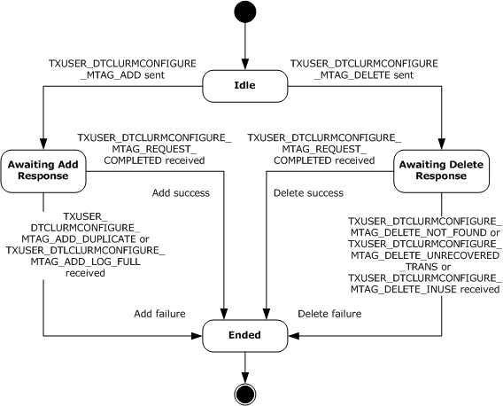
<!-- /Extracted images from page 63 -->

Figure 5: CONNTYPE_TXUSER_DTCLUCONFIGURE initiator states

###### 3.2.1.1.1 Idle

Idle is the initial state. The following events are processed in this state:

  Adding an LU Name Pair

  Deleting an LU Name Pair

###### 3.2.1.1.2 Awaiting Add Response

The following events are processed in the Awaiting Add Response state:

  Receiving a TXUSER_DTCLURMCONFIGURE_MTAG_ADD_DUPLICATE message

  Receiving a TXUSER_DTCLURMCONFIGURE_MTAG_REQUEST_COMPLETED message

  Receiving a TXUSER_DTCLURMCONFIGURE_MTAG_ADD_LOG_FULL Message

  Connection Disconnected (section 3.2.5.1.7)

###### 3.2.1.1.3 Awaiting Delete Response

The following events are processed in the Awaiting Delete Response state:

[MS-DTCLU] - v20240423
MSDTC Connection Manager: OleTx Transaction Protocol Logical Unit Mainframe Extension
Copyright © 2024 Microsoft Corporation
Release: April 23, 2024

63 / 199

  Receiving a TXUSER_DTCLURMCONFIGURE_MTAG_DELETE_NOT_FOUND message

  Receiving a TXUSER_DTCLURMCONFIGURE_MTAG_DELETE_UNRECOVERED_TRANS message

  Receiving a TXUSER_DTCLURMCONFIGURE_MTAG_DELETE_INUSE message

  Receiving a TXUSER_DTCLURMCONFIGURE_MTAG_REQUEST_COMPLETED message

  Connection Disconnected (section 3.2.5.1.7)

###### 3.2.1.1.4 Ended

Ended is the final state.

##### 3.2.1.2 CONNTYPE_TXUSER_DTCLURECOVERY Initiator States

The LU 6.2 implementation (section 3.2) MUST act as an initiator for the
CONNTYPE_TXUSER_DTCLURECOVERY connection type. In this role, an LU 6.2 implementation MUST
provide support for the following states:



Idle

  Awaiting Register Response

  Registered



Ended

The following figure shows the relationship between the CONNTYPE_TXUSER_DTCLURECOVERY
initiator states.

[MS-DTCLU] - v20240423
MSDTC Connection Manager: OleTx Transaction Protocol Logical Unit Mainframe Extension
Copyright © 2024 Microsoft Corporation
Release: April 23, 2024

64 / 199

<!-- Extracted images from page 65 -->
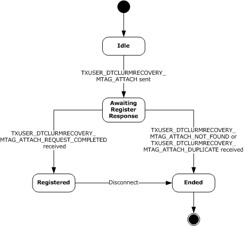
<!-- /Extracted images from page 65 -->

Figure 6: CONNTYPE_TXUSER_DTCLURECOVERY initiator states

###### 3.2.1.2.1 Idle

Idle is the initial state. The following event is processed in this state:

  Registering recovery process for LU pair

###### 3.2.1.2.2 Awaiting Register Response

The following events are processed in the Awaiting Register Response state:

  Receiving a TXUSER_DTCLURMRECOVERY_MTAG_ATTACH_NOT_FOUND message

  Receiving a TXUSER_DTCLURMRECOVERY_MTAG_ATTACH_DUPLICATE message

  Receiving a TXUSER_DTCLURMRECOVERY_MTAG_ REQUEST_COMPLETED message

  Connection Disconnected (section 3.2.5.2.4)

###### 3.2.1.2.3 Registered

The Disconnect event indicates that if the connection is disconnected, then the registration as a
recovery process by an LU 6.2 implementation is ended. So the LU 6.2 implementation (section 3.2)
MUST maintain the CONNTYPE_TXUSER_DTCLURECOVERY connection in the Registered state for the

[MS-DTCLU] - v20240423
MSDTC Connection Manager: OleTx Transaction Protocol Logical Unit Mainframe Extension
Copyright © 2024 Microsoft Corporation
Release: April 23, 2024

65 / 199

intended lifetime of any CONNTYPE_TXUSER_DTCLURECOVERYINITIATEDBYDTC and
CONNTYPE_TXUSER_DTCLURECOVERYINITIATEDBYLU connections that are associated with the same
LU Pair object.

###### 3.2.1.2.4 Ended

Ended is the final state.

##### 3.2.1.3 CONNTYPE_TXUSER_DTCLURMENLISTMENT Initiator States

The LU 6.2 implementation (section 3.2) MUST act as an initiator for the
CONNTYPE_TXUSER_DTCLURMENLISTMENT connection type. In this role, an LU 6.2 implementation
MUST provide support for the following states:



Idle

  Awaiting Enlistment Response

  Active



Preparing for Transaction Commit

  Awaiting Backout Response

  Awaiting Transaction Outcome







Finalizing Abort Operations

Finalizing Commit Operations

Ended

The following figure shows the relationship between the CONNTYPE_TXUSER_DTCLURMENLISTMENT
initiator states.

[MS-DTCLU] - v20240423
MSDTC Connection Manager: OleTx Transaction Protocol Logical Unit Mainframe Extension
Copyright © 2024 Microsoft Corporation
Release: April 23, 2024

66 / 199

<!-- Extracted images from page 67 -->
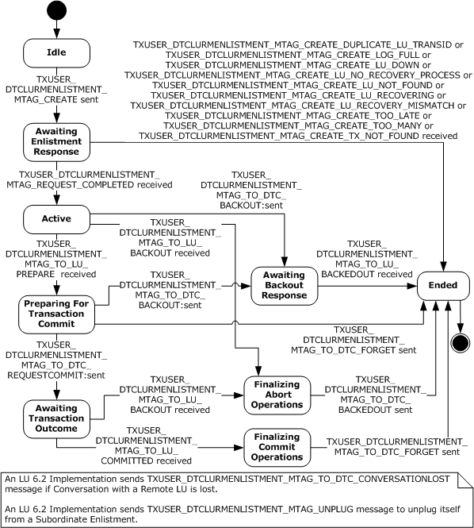
<!-- /Extracted images from page 67 -->

Figure 7: CONNTYPE_TXUSER_DTCLURMENLISTMENT initiator states

###### 3.2.1.3.1 Idle

Idle is the initial state. The following events are processed in this state:

  Creating LU 6.2 Subordinate Enlistment



LU 6.2 Subordinate Enlistment Conversation Lost

  Unplugging LU 6.2 Subordinate Enlistment

[MS-DTCLU] - v20240423
MSDTC Connection Manager: OleTx Transaction Protocol Logical Unit Mainframe Extension
Copyright © 2024 Microsoft Corporation
Release: April 23, 2024

67 / 199

###### 3.2.1.3.2 Awaiting Enlistment Response

The following events are processed in the Awaiting Enlistment Response state:

  Receiving a TXUSER_DTCLURMENLISTMENT_MTAG_REQUEST_COMPLETED message

  Receiving Other TXUSER_DTCLURMENLISTMENT_MTAG messages

  LU 6.2 Subordinate Enlistment Conversation Lost

  Unplugging LU 6.2 Subordinate Enlistment

  Connection Disconnected (section 3.2.5.3.7)

###### 3.2.1.3.3 Active

The following events are processed in the Active state:

  Receiving a TXUSER_DTCLURMENLISTMENT_MTAG_TO_LU_PREPARE message

  Receiving a TXUSER_DTCLURMENLISTMENT_MTAG_TO_LU_BACKOUT message

  Aborting LU 6.2 Subordinate Enlistment



LU 6.2 Subordinate Enlistment-Conversation Lost

  Unplugging LU 6.2 Subordinate Enlistment

  Connection Disconnected (section 3.2.5.3.7)

###### 3.2.1.3.4 Preparing for Transaction Commit

The following events are processed in the Preparing for Transaction Commit state:

  LU 6.2 Subordinate Enlistment Prepare Request Completed



LU 6.2 Subordinate Enlistment-Conversation Lost

  Unplugging LU 6.2 Subordinate Enlistment

###### 3.2.1.3.5 Awaiting Backout Response

The following events are processed in the Awaiting Backout Response state:

  Receiving a TXUSER_DTCLURMENLISTMENT_MTAG_TO_LU_BACKEDOUT message

  LU 6.2 Subordinate Enlistment-Conversation Lost

  Unplugging LU 6.2 Subordinate Enlistment

  Connection Disconnected (section 3.2.5.3.7)

###### 3.2.1.3.6 Awaiting Transaction Outcome

The following events are processed in the Awaiting Transaction Outcome state:

  Receiving a TXUSER_DTCLURMENLISTMENT_MTAG_TO_LU_BACKOUT message

  Receiving a TXUSER_DTCLURMENLISTMENT_MTAG_TO_LU_COMMITTED message

  LU 6.2 Subordinate Enlistment-Conversation Lost

[MS-DTCLU] - v20240423
MSDTC Connection Manager: OleTx Transaction Protocol Logical Unit Mainframe Extension
Copyright © 2024 Microsoft Corporation
Release: April 23, 2024

68 / 199

  Unplugging LU 6.2 Subordinate Enlistment

  Connection Disconnected (section 3.2.5.3.7)

###### 3.2.1.3.7 Finalizing Abort Operations

The following events are processed in the Finalizing Abort Operations state:

  LU 6.2 Subordinate Enlistment Abort Request Completed



LU 6.2 Subordinate Enlistment-Conversation Lost

  Unplugging LU 6.2 Subordinate Enlistment

###### 3.2.1.3.8 Finalizing Commit Operations

The following events are processed in the Finalizing Commit Operations state:

  LU 6.2 Subordinate Enlistment Commit Request Completed



LU 6.2 Subordinate Enlistment-Conversation Lost

  Unplugging LU 6.2 Subordinate Enlistment

###### 3.2.1.3.9 Ended

Ended is the final state.

##### 3.2.1.4 CONNTYPE_TXUSER_DTCLURECOVERYINITIATEDBYDTC Initiator States

The LU 6.2 implementation (section 3.2) MUST act as an initiator for the
CONNTYPE_TXUSER_DTCLURECOVERYINITIATEDBYDTC connection type. In this role, the LU 6.2
implementation MUST provide support for the following states:



Idle

  Awaiting Response to Work Query





Processing Cold XLN Request

Processing Warm XLN Request

  Awaiting Response to XLN Confirmation

  Awaiting Response to XLN

  Awaiting Response to Compare States Query During Warm XLN

  XLN Exchange Complete

  Awaiting Response to Compare States Query



Processing Compare States Request

  Awaiting Response to Compare States



Processing LU Status Check

  Awaiting Request Complete



Ended

[MS-DTCLU] - v20240423
MSDTC Connection Manager: OleTx Transaction Protocol Logical Unit Mainframe Extension
Copyright © 2024 Microsoft Corporation
Release: April 23, 2024

69 / 199

<!-- Extracted images from page 70 -->
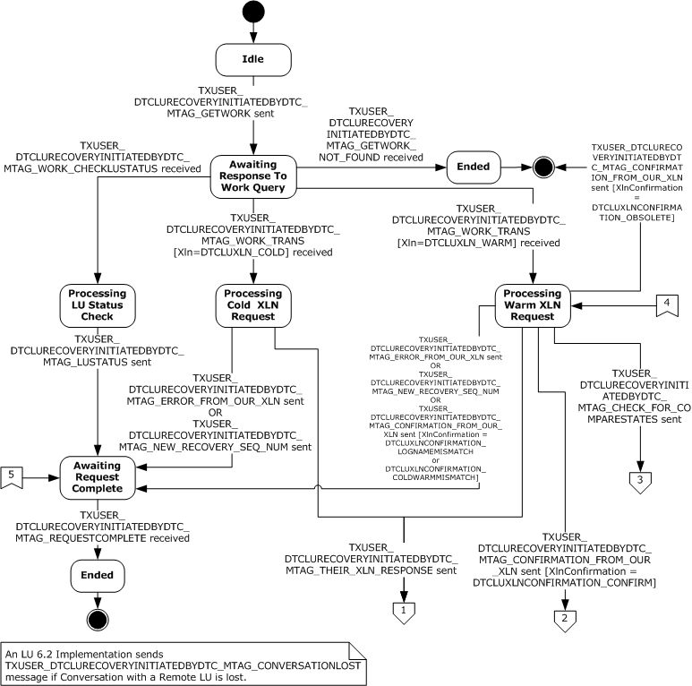
<!-- /Extracted images from page 70 -->

The following figure shows the relationship between the
CONNTYPE_TXUSER_DTCLURECOVERYINITIATEDBYDTC initiator states.

Figure 8: CONNTYPE_TXUSER_DTCLURECOVERYINITIATEDBYDTC initiator states, part 1

[MS-DTCLU] - v20240423
MSDTC Connection Manager: OleTx Transaction Protocol Logical Unit Mainframe Extension
Copyright © 2024 Microsoft Corporation
Release: April 23, 2024

70 / 199

<!-- Extracted images from page 71 -->
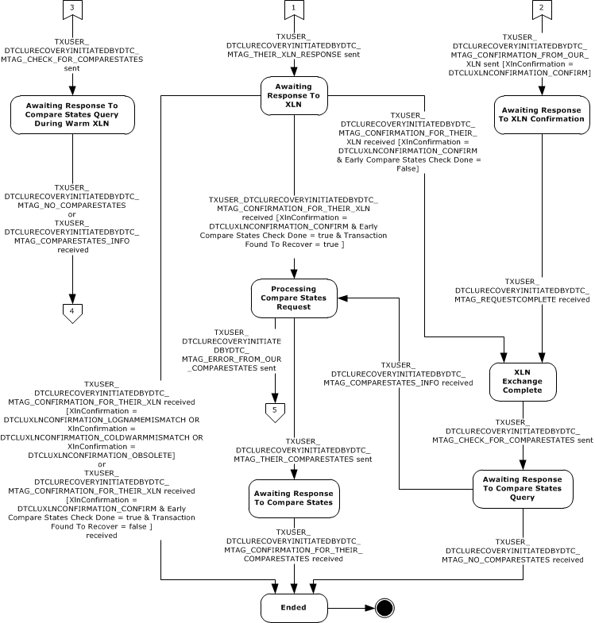
<!-- /Extracted images from page 71 -->

Figure 9: CONNTYPE_TXUSER_DTCLURECOVERYINITIATEDBYDTC initiator states, part 2

###### 3.2.1.4.1 Idle

Idle is the initial state. The following events are processed in this state:





Local LU Initiated Recovery Sending Query for Work

Local LU Initiated Recovery Conversation Lost

###### 3.2.1.4.2 Awaiting Response to Work Query

The following events are processed in the Awaiting Response to Work Query state:

  Receiving a TXUSER_DTCLURECOVERYINITIATEDBYDTC_MTAG_GETWORK_NOT_FOUND message

  Receiving a TXUSER_DTCLURECOVERYINITIATEDBYDTC_MTAG_WORK_CHECKLUSTATUS message

  Receiving a TXUSER_DTCLURECOVERYINITIATEDBYDTC_MTAG_WORK_TRANS message

[MS-DTCLU] - v20240423
MSDTC Connection Manager: OleTx Transaction Protocol Logical Unit Mainframe Extension
Copyright © 2024 Microsoft Corporation
Release: April 23, 2024

71 / 199



Local LU Initiated Recovery Conversation Lost

  Connection Disconnected

###### 3.2.1.4.3 Processing Cold XLN Request

The following events are processed in the Processing Cold XLN Request state:









Local LU Initiated Recovery Sending New Recovery Sequence Number

Local LU Initiated Recovery Sending XLN Error

Local LU Initiated Recovery Sending XLN Response

Local LU Initiated Recovery Conversation Lost

###### 3.2.1.4.4 Processing Warm XLN Request

The following events are processed in the Processing Warm XLN Request state:













Local LU Initiated Recovery Sending New Recovery Sequence Number

Local LU Initiated Recovery Sending XLN Error

Local LU Initiated Recovery Sending XLN Confirmation

Local LU Initiated Recovery Sending XLN Response

Local LU Initiated Recovery Sending Compare-States Query

Local LU Initiated Recovery Conversation Lost

###### 3.2.1.4.5 Awaiting Response to XLN Confirmation

The following events are processed in the Awaiting Response to XLN Confirmation state:

  Receiving a TXUSER_DTCLURECOVERYINITIATEDBYDTC_MTAG_REQUESTCOMPLETE message



Local LU Initiated Recovery Conversation Lost

  Connection Disconnected

###### 3.2.1.4.6 Awaiting Response to XLN

The following events are processed in the Awaiting Response to XLN state:

  Receiving a TXUSER_DTCLURECOVERYINITIATEDBYDTC_MTAG_CONFIRMATION_FOR_THEIR_XLN

message



Local LU Initiated Recovery Conversation Lost

  Connection Disconnected

###### 3.2.1.4.7 Awaiting Response to Compare States Query During Warm XLN

The following events are processed in the Awaiting Response to Compare States Query During Warm
XLN state:

  Receiving a TXUSER_DTCLURECOVERYINITIATEDBYDTC_MTAG_NO_COMPARESTATES message

  Receiving a TXUSER_DTCLURECOVERYINITIATEDBYDTC_MTAG_COMPARESTATES_INFO message

[MS-DTCLU] - v20240423
MSDTC Connection Manager: OleTx Transaction Protocol Logical Unit Mainframe Extension
Copyright © 2024 Microsoft Corporation
Release: April 23, 2024

72 / 199



Local LU Initiated Recovery Conversation Lost

  Connection Disconnected

###### 3.2.1.4.8 XLN Exchange Complete

The following events are processed in the XLN Exchange Complete state:





Local LU Initiated Recovery Sending Compare States Query

Local LU Initiated Recovery Conversation Lost

###### 3.2.1.4.9 Awaiting Response to Compare States Query

The following events are processed in the Awaiting Response to Compare States Query state:

  Receiving a TXUSER_DTCLURECOVERYINITIATEDBYDTC_MTAG_NO_COMPARESTATES message

  Receiving a TXUSER_DTCLURECOVERYINITIATEDBYDTC_MTAG_COMPARESTATES_INFO message



Local LU Initiated Recovery Conversation Lost

  Connection Disconnected

###### 3.2.1.4.10 Processing Compare States Request

The following events are processed in the Processing Compare States Request state:







Local LU Initiated Recovery Sending Compare States

Local LU Initiated Recovery Sending Compare States Error

Local LU Initiated Recovery Conversation Lost

###### 3.2.1.4.11 Awaiting Response to Compare States

The following events are processed in Awaiting Response to Compare States state:

  Receiving a

TXUSER_DTCLURECOVERYINITIATEDBYDTC_MTAG_CONFIRMATION_FOR_THEIR_COMPARESTATE
S message



Local LU Initiated Recovery Conversation Lost

  Connection Disconnected

###### 3.2.1.4.12 Processing LU Status Check

The following events are processed in the Processing LU Status Check state:





Local LU Initiated Recovery Sending LU Status

Local LU Initiated Recovery Conversation Lost

###### 3.2.1.4.13 Awaiting Request Complete

The following events are processed in the Awaiting Request Complete state:

  Receiving a TXUSER_DTCLURECOVERYINITIATEDBYDTC_MTAG_REQUESTCOMPLETE message



Local LU Initiated Recovery Conversation Lost

73 / 199

[MS-DTCLU] - v20240423
MSDTC Connection Manager: OleTx Transaction Protocol Logical Unit Mainframe Extension
Copyright © 2024 Microsoft Corporation
Release: April 23, 2024

  Connection Disconnected

###### 3.2.1.4.14 Ended

Ended is the final state.

##### 3.2.1.5 CONNTYPE_TXUSER_DTCLURECOVERYINITIATEDBYLU Initiator States

The LU 6.2 implementation (section 3.2) MUST act as an initiator for the
CONNTYPE_TXUSER_DTCLURECOVERYINITIATEDBYLU connection type. In this role, the LU 6.2
implementation MUST provide support for the following states:



Idle

  Awaiting Response to XLN Request



Processing XLN Confirmation

  Awaiting Response to XLN Confirmation

  Awaiting Response to XLN Confirmation With Error

  XLN Exchange Complete

  Awaiting Response To Compare States



Processing Compare States Response

  Awaiting Request Complete



Ended

The following figure shows the relationship between the
CONNTYPE_TXUSER_DTCLURECOVERYINITIATEDBYLU initiator states.

[MS-DTCLU] - v20240423
MSDTC Connection Manager: OleTx Transaction Protocol Logical Unit Mainframe Extension
Copyright © 2024 Microsoft Corporation
Release: April 23, 2024

74 / 199

<!-- Extracted images from page 75 -->
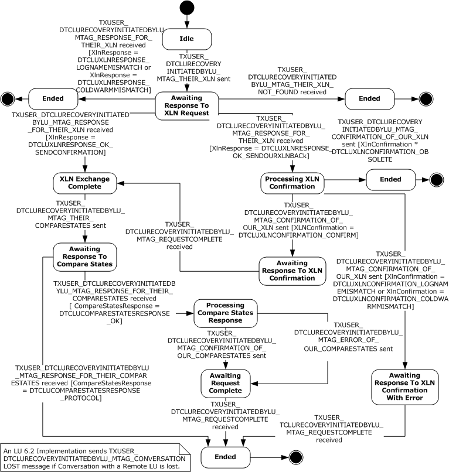
<!-- /Extracted images from page 75 -->

Figure 10: CONNTYPE_TXUSER_DTCLURECOVERYINITIATEDBYLU initiator states

###### 3.2.1.5.1 Idle

Idle is the initial state. The following events are processed in this state:

  Remote LU Initiated Recovery Sending XLN

  Remote LU Initiated Recovery Conversation Lost

###### 3.2.1.5.2 Awaiting Response to XLN Request

[MS-DTCLU] - v20240423
MSDTC Connection Manager: OleTx Transaction Protocol Logical Unit Mainframe Extension
Copyright © 2024 Microsoft Corporation
Release: April 23, 2024

75 / 199

The following events are processed in the Awaiting Response to XLN Request state:

  Receiving a TXUSER_DTCLURECOVERYINITIATEDBYLU_MTAG_THEIR_XLN_NOT_FOUND message

  Receiving a TXUSER_DTCLURECOVERYINITIATEDBYLU_MTAG_RESPONSE_FOR_THEIR_XLN

message

  Remote LU Initiated Recovery Conversation Lost

  Connection Disconnected (section 3.2.5.5.5)

###### 3.2.1.5.3 Processing XLN Confirmation

The following events are processed in the Processing XLN Confirmation state:

  Remote LU Initiated Recovery Sending XLN Confirmation

  Remote LU Initiated Recovery Conversation Lost

###### 3.2.1.5.4 Awaiting Response to XLN Confirmation

The following events are processed in the Awaiting Response to XLN Confirmation state:

  Receiving a TXUSER_DTCLURECOVERYINITIATEDBYLU_MTAG_REQUESTCOMPLETE message

  Remote LU Initiated Recovery Conversation Lost

  Connection Disconnected (section 3.2.5.5.5)

###### 3.2.1.5.5 Awaiting Response to XLN Confirmation with Error

The following events are processed in the Awaiting Response to XLN Confirmation with Error state:

  Receiving a TXUSER_DTCLURECOVERYINITIATEDBYLU_MTAG_REQUESTCOMPLETE message

  Remote LU Initiated Recovery Conversation Lost

  Connection Disconnected (section 3.2.5.5.5)

###### 3.2.1.5.6 XLN Exchange Complete

The following events are processed in the XLN Exchange Complete state:

  Remote LU Initiated Recovery Sending Compare States

  Remote LU Initiated Recovery Conversation Lost

###### 3.2.1.5.7 Awaiting Response to Compare States

The following events are processed in the Awaiting Response to Compare States state:

  Receiving a

TXUSER_DTCLURECOVERYINITIATEDBYLU_MTAG_RESPONSE_FOR_THEIR_COMPARESTATES
message

  Remote LU Initiated Recovery Conversation Lost

  Connection Disconnected (section 3.2.5.5.5)

###### 3.2.1.5.8 Processing Compare States Response

[MS-DTCLU] - v20240423
MSDTC Connection Manager: OleTx Transaction Protocol Logical Unit Mainframe Extension
Copyright © 2024 Microsoft Corporation
Release: April 23, 2024

76 / 199

The following events are processed in the Processing Compare States Response state:

  Remote LU Initiated Recovery Sending Compare States Confirmation

  Remote LU Initiated Recovery Sending Compare States Error

  Remote LU Initiated Recovery Conversation Lost

###### 3.2.1.5.9 Awaiting Request Complete

The following events are processed in the Awaiting Request Complete state:

  Receiving a TXUSER_DTCLURECOVERYINITIATEDBYLU_MTAG_REQUESTCOMPLETE message

  Remote LU Initiated Recovery Conversation Lost

  Connection Disconnected (section 3.2.5.5.5)

###### 3.2.1.5.10 Ended

Ended is the final state.

#### 3.2.2 Timers

None.

#### 3.2.3 Initialization

When an LU 6.2 Implementation is initialized, the Transaction Manager Name field MUST be set to
a value that is obtained from an implementation-specific source.

The LU Transactions Enabled flag is initialized by sending a
TXUSER_GETSECURITYFLAGS_MTAG_GETSECURITYFLAGS message using the
CONNTYPE_TXUSER_GETSECURITYFLAGS connection to the transaction manager as specified in
section 3.3.4.11 in [MS-DTCO]. On receiving the
TXUSER_GETSECURITYFLAGS_MTAG_GETSECURITYFLAGS message, the transaction manager
responds with a TXUSER_GETSECURITYFLAGS_MTAG_FETCHED message, which indicates whether the
transaction manager supports LU transactions by setting the
DTCADVCONFIG_OPTIONS_LUTRANSACTIONS_DISABLE bit in the grfOptions field, as specified
in section 3.4.5.4.1.1 in [MS-DTCO].

#### 3.2.4 Higher-Layer Triggered Events

The LU 6.2 Implementation MUST be prepared to process a set of higher-layer events. These events
are triggered by decisions that are made by the higher-layer business logic of the LU 6.2
Implementation. The motivations and details of the higher-layer business logic are specific to an LU
6.2 Implementation and the software environment in which it executes.

When an LU 6.2 Implementation processes one of these events, it MUST communicate a Success or
Failure result to the higher-layer business logic. The LU 6.2 Implementation MUST be prepared to
process the events in the following sections.

##### 3.2.4.1 Adding an LU Name Pair

This event MUST be signaled by the higher-layer business logic with the LU Name Pair argument.

If the Adding an LU Name Pair event is signaled, the LU 6.2 Implementation MUST perform the
following actions:

77 / 199

[MS-DTCLU] - v20240423
MSDTC Connection Manager: OleTx Transaction Protocol Logical Unit Mainframe Extension
Copyright © 2024 Microsoft Corporation
Release: April 23, 2024



Initiate a new CONNTYPE_TXUSER_DTCLUCONFIGURE connection using the Transaction
Manager Name field of the LU 6.2 Implementation.

  Send a TXUSER_DTCLURMCONFIGURE_MTAG_ADD message using the connection:





The cbLength field of the DTCLU_VARLEN_BYTEARRAY structure (contained in the
LuNamePair field) MUST be set to the number of bytes in the provided LU Name Pair.

The first cbLength bytes of the rgbBlob field of the DTCLU_VARLEN_BYTEARRAY structure
(contained in the LuNamePair field) MUST be set to the provided LU Name Pair.

  Set the connection state to Awaiting Add Response.

##### 3.2.4.2 Deleting an LU Name Pair

This event MUST be signaled by the higher-layer business logic with the LU Name Pair argument.

If the Deleting an LU Name Pair event is signaled, the LU 6.2 Implementation MUST perform the
following actions:



Initiate a new CONNTYPE_TXUSER_DTCLUCONFIGURE connection using the Transaction
Manager Name field of the implementation.

  Send a TXUSER_DTCLURMCONFIGURE_MTAG_DELETE message using the connection:





The cbLength field of the DTCLU_VARLEN_BYTEARRAY structure (contained in the
LuNamePair field) MUST be set to the number of bytes in the provided LU Name Pair.

The first cbLength bytes of the rgbBlob field of the DTCLU_VARLEN_BYTEARRAY structure
(contained in the LuNamePair field) MUST be set to the provided LU Name Pair.

  Set the connection state to Awaiting Delete Response.

##### 3.2.4.3 Registering Recovery Process For LU Pair

This event MUST be signaled by the higher-layer business logic with the LU Name Pair argument.

If the Registering Recovery Process For LU Pair event is signaled, the LU 6.2 Implementation MUST
perform the following actions:



Initiate a new CONNTYPE_TXUSER_DTCLURECOVERY connection using the Transaction Manager
Name field of the LU 6.2 Implementation. Set the LU Name Pair of the
CONNTYPE_TXUSER_DTCLURECOVERY connection to the LU Name Pair argument provided by the
higher-layer business logic.

  Send a TXUSER_DTCLURMRECOVERY_MTAG_ATTACH message using the connection:





The cbLength field of the DTCLU_VARLEN_BYTEARRAY structure (contained in the
LuNamePair field) MUST be set to the number of bytes in the provided LU Name Pair.

The first cbLength bytes of the rgbBlob field of the DTCLU_VARLEN_BYTEARRAY structure
(contained in the LuNamePair field) MUST be set to the provided LU Name Pair.

  Set the connection state to Awaiting Register Response.

##### 3.2.4.4 All Sessions Lost

This event MUST be signaled by the higher-layer business logic with the LU Name Pair argument.

[MS-DTCLU] - v20240423
MSDTC Connection Manager: OleTx Transaction Protocol Logical Unit Mainframe Extension
Copyright © 2024 Microsoft Corporation
Release: April 23, 2024

78 / 199

If the All Sessions Lost event is signaled, the LU 6.2 Implementation MUST perform the following
actions:

  Attempt to find the recovery sequence number keyed by the LU Name Pair in the Recovery

Sequence Number Table.



If the recovery sequence number is not found:

  Return a failure result to the higher-layer business logic.

  Otherwise:



Increment the found recovery sequence number.

##### 3.2.4.5 Creating LU 6.2 Subordinate Enlistment

This event MUST be signaled by the higher-layer business logic with the following arguments:

  Transaction Object.Identifier as defined in [MS-DTCO] section 3.1.1

  LU Name Pair

  LUW Identifier

If the Creating LU 6.2 Subordinate Enlistment event is signaled, the LU 6.2 Implementation MUST
perform the following actions:



Initiate a new CONNTYPE_TXUSER_DTCLURMENLISTMENT connection using the Transaction
Manager Name field of the LU 6.2 Implementation.

  Send a TXUSER_DTCLURMENLISTMENT_MTAG_CREATE message using the connection:











The guidTx field MUST be set to the provided Transaction Object.Identifier.

The cbLength field of the DTCLU_VARLEN_BYTEARRAY structure (contained in the
LuNamePair field) MUST be set to the number of bytes in the provided LU Name Pair.

The first cbLength bytes of the rgbBlob field of the DTCLU_VARLEN_BYTEARRAY structure
(contained in the LuNamePair field) MUST be set to the provided LU Name Pair.

The cbLength field of the DTCLU_VARLEN_BYTEARRAY structure (contained in the LuTransId
field) MUST be set to the number of bytes in the provided LUW identifier.

The first cbLength bytes of the rgbBlob field of the DTCLU_VARLEN_BYTEARRAY structure
(contained in the LuTransId field) MUST be set to the provided LUW identifier.

  Set the connection state to Awaiting Enlistment Response.

##### 3.2.4.6 Aborting LU 6.2 Subordinate Enlistment

This event MUST be signaled by the higher-layer business logic with the following arguments:

  A connection object of type CONNTYPE_TXUSER_DTCLURMENLISTMENT

If the Aborting LU 6.2 Subordinate Enlistment event is signaled, the LU 6.2 Implementation MUST
perform the following actions:



If the provided connection state is not set to Active:

  Return a failure result to the higher-layer business logic.

[MS-DTCLU] - v20240423
MSDTC Connection Manager: OleTx Transaction Protocol Logical Unit Mainframe Extension
Copyright © 2024 Microsoft Corporation
Release: April 23, 2024

79 / 199

  Otherwise:

  Send a TXUSER_DTCLURMENLISTMENT_MTAG_TO_DTC_BACKOUT message using the

provided connection.

  Set the connection state to Awaiting Backout Response.

##### 3.2.4.7 LU 6.2 Subordinate Enlistment Prepare Request Completed

This event MUST be signaled by the higher-layer business logic with the following arguments:

  A connection object of type CONNTYPE_TXUSER_DTCLURMENLISTMENT

  A request outcome value. This value MUST be one of the following:



Prepared

  Aborted



Forget

If the LU 6.2 Subordinate Enlistment Prepare Request Completed event is signaled, the LU 6.2
Implementation MUST perform the following actions:



If the provided connection state is not set to Preparing For Transaction Commit:

  Return a failure result to the higher-layer business logic.

  Otherwise:



If the request outcome is Prepared:

  Send a TXUSER_DTCLURMENLISTMENT_MTAG_TO_DTC_REQUESTCOMMIT message using

the provided connection.

  Set the connection state to Awaiting Transaction Outcome.

  Otherwise, if the request outcome is Aborted:

  Send a TXUSER_DTCLURMENLISTMENT_MTAG_TO_DTC_BACKOUT message using the

provided connection.

  Set the connection state to Awaiting Backout Response.

  Otherwise, if the request outcome is Forget:

  Send a TXUSER_DTCLURMENLISTMENT_MTAG_TO_DTC_FORGET message using the

provided connection.

  Set the connection state to Ended.

##### 3.2.4.8 LU 6.2 Subordinate Enlistment Conversation Lost

This event MUST be signaled by the higher-layer business logic with the following argument:

  A connection object of type CONNTYPE_TXUSER_DTCLURMENLISTMENT

If the LU 6.2 Subordinate Enlistment Conversation Lost event is signaled, the LU 6.2 Implementation
MUST perform the following actions:

[MS-DTCLU] - v20240423
MSDTC Connection Manager: OleTx Transaction Protocol Logical Unit Mainframe Extension
Copyright © 2024 Microsoft Corporation
Release: April 23, 2024

80 / 199

  Send a TXUSER_DTCLURMENLISTMENT_MTAG_TO_DTC_CONVERSATIONLOST message using the

provided connection.

  Set the connection state to Ended.

##### 3.2.4.9 Unplugging LU 6.2 Subordinate Enlistment

This event MUST be signaled by the higher-layer business logic with the following argument:

  A connection object of type CONNTYPE_TXUSER_DTCLURMENLISTMENT

If the Unplugging LU 6.2 Subordinate Enlistment event is signaled, the LU 6.2 implementation
(section 3.2) MUST perform the following actions:

  Send a TXUSER_DTCLURMENLISTMENT_MTAG_UNPLUG message using the provide connection.

  Set the connection state to Ended.

##### 3.2.4.10 LU 6.2 Subordinate Enlistment Abort Request Completed

This event MUST be signaled by the higher-layer business logic with the following argument:

  A connection object of type CONNTYPE_TXUSER_DTCLURMENLISTMENT.

If the LU 6.2 Subordinate Enlistment Abort Request Completed event is signaled, the LU 6.2
implementation (section 3.2) MUST perform the following actions:



If the provided connection state is not set to Finalizing Abort Operations:

  Return a failure result to the higher-layer business logic.

  Otherwise:

  Send a TXUSER_DTCLURMENLISTMENT_MTAG_TO_DTC_BACKEDOUT message using the

provided connection.

  Set the connection state to Ended.

##### 3.2.4.11 LU 6.2 Subordinate Enlistment Commit Request Completed

This event MUST be signaled by the higher-layer business logic with the following argument:

  A connection object of type CONNTYPE_TXUSER_DTCLURMENLISTMENT

If the LU 6.2 Subordinate Enlistment Commit Request Completed event is signaled, the LU 6.2
implementation (section 3.2) MUST perform the following actions:



If the provided connection state is not set to Finalizing Commit Operations:

  Return a failure result to the higher-layer business logic.

  Otherwise:

  Send a TXUSER_DTCLURMENLISTMENT_MTAG_TO_DTC_FORGET message using the provided

connection.

  Set the connection state to Ended.

[MS-DTCLU] - v20240423
MSDTC Connection Manager: OleTx Transaction Protocol Logical Unit Mainframe Extension
Copyright © 2024 Microsoft Corporation
Release: April 23, 2024

81 / 199

##### 3.2.4.12 LU 6.2 Subordinate Enlistment Single-Phase Commit Request Completed

This event MUST be signaled by the higher-layer business logic with the following argument:

  A connection object of type CONNTYPE_TXUSER_DTCLURMENLISTMENT

If the LU 6.2 Subordinate Enlistment Commit Request Completed event is signaled, the LU 6.2
implementation (section 3.2) MUST perform the following action:

  Send a TXUSER_DTCLURMENLISTMENT_MTAG_TO_DTC_COMMITTED message using the provided

connection.

##### 3.2.4.13 Local LU Initiated Recovery Sending Query For Work

This event MUST be signaled by the higher-layer business logic with the LU Name Pair argument.

If the Local LU Initiated Recovery Sending Query For Work event is signaled, the LU 6.2
implementation (section 3.2) MUST perform the following actions:



Initiate a new CONNTYPE_TXUSER_DTCLURECOVERYINITIATEDBYDTC connection using the
Transaction Manager Name field of the LU 6.2 implementation. Set the Early Compare States
Check Done and Transaction Found To Recover flags of the
CONNTYPE_TXUSER_DTCLURECOVERYINITIATEDBYDTC connection object to FALSE.

  Send a TXUSER_DTCLURECOVERYINITIATEDBYDTC_MTAG_GETWORK message using the provided

connection:





The cbLength field of the DTCLU_VARLEN_BYTEARRAY structure (contained in the
LuNamePair field) MUST be set to the number of bytes in the provided LU Name Pair.

The first cbLength bytes of the rgbBlob field of the DTCLU_VARLEN_BYTEARRAY structure
(contained in the LuNamePair field) MUST be set to the provided LU Name Pair.

  Set the connection state to Awaiting Response To Work Query.

##### 3.2.4.14 Local LU Initiated Recovery Sending New Recovery Sequence Number

This event MUST be signaled by the higher-layer business logic with the following arguments:

  A connection object of type CONNTYPE_TXUSER_DTCLURECOVERYINITIATEDBYDTC

  New Recovery Sequence Number

If the Local LU Initiated Recovery Sending New Recovery Sequence Number event is signaled, the LU
6.2 implementation (section 3.2) MUST perform the following actions:



If the provided connection state is not set to either Processing Cold XLN Request or Processing
Warm XLN Request:

  Return a failure result to the higher-layer business logic.

  Otherwise:

  Attempt to find the recovery sequence number keyed by the LU Name Pair in the

Recovery Sequence Number Table.



If the recovery sequence number is not found:

  Return a failure to the higher-layer business logic.

[MS-DTCLU] - v20240423
MSDTC Connection Manager: OleTx Transaction Protocol Logical Unit Mainframe Extension
Copyright © 2024 Microsoft Corporation
Release: April 23, 2024

82 / 199

  Otherwise:

  Update the recovery sequence number keyed by the LU Name Pair in the Recovery

Sequence Number Table with the provided new recovery sequence number.

  Send a TXUSER_DTCLURECOVERYINITIATEDBYDTC_MTAG_NEW_RECOVERY_SEQ_NUM

message using the provided connection:



The RecoverySeqNum field MUST be set to the provided new recovery sequence
number.

  Set the connection state to Awaiting Request Complete.

##### 3.2.4.15 Local LU Initiated Recovery Sending XLN Error

This event MUST be signaled by the higher-layer business logic with the following arguments:

  A connection object of type CONNTYPE_TXUSER_DTCLURECOVERYINITIATEDBYDTC

  An Error Reason value, which MUST be set to one of the following values:



Log Name Mismatch

  Cold Warm Mismatch



Protocol Error

If the Local LU Initiated Recovery Sending XLN Error event is signaled, the LU 6.2 implementation
(section 3.2) MUST perform the following actions:



If the provided connection state is not set to either Processing Cold XLN Request or Processing
Warm XLN Request:

  Return a failure result to the higher-layer business logic.

  Otherwise:

  Send a TXUSER_DTCLURECOVERYINITIATEDBYDTC_MTAG_ERROR_FROM_OUR_XLN message

using the provided connection:



The XlnError field MUST be set to one of the following elements of the
DTCLUXLNERROR enumeration:

  DTCLUXLNERROR_LOGNAMEMISMATCH if the provided Error Reason value is Log

Name Mismatch

  DTCLUXLNERROR_COLDWARMMISMATCH if the provided Error Reason value is Cold

Warm Mismatch

  DTCLUXLNERROR_PROTOCOL if the provided Error Reason value is Protocol Error

  Set the connection state to Awaiting Request Complete.

##### 3.2.4.16 Local LU Initiated Recovery Sending XLN Response

This event MUST be signaled by the higher-layer business logic with the following arguments:

  A connection object of type CONNTYPE_TXUSER_DTCLURECOVERYINITIATEDBYDTC

  Remote Log Status value, which MUST be set to one of the following values:

[MS-DTCLU] - v20240423
MSDTC Connection Manager: OleTx Transaction Protocol Logical Unit Mainframe Extension
Copyright © 2024 Microsoft Corporation
Release: April 23, 2024

83 / 199

  Warm

  Cold

  Remote Log Name

If the Local LU Initiated Recovery Sending XLN Response event is signaled, the LU 6.2
implementation MUST perform the following actions:



If the provided connection state is not set to either Processing Cold XLN Request or Processing
Warm XLN Request:

  Return a failure result to the higher-layer business logic.

  Otherwise:

  Send a TXUSER_DTCLURECOVERYINITIATEDBYDTC_MTAG_THEIR_XLN_RESPONSE message

using the provided connection:



The Xln field MUST be set to one of the following elements of the DTCLUXLN
enumeration:

  DTCLUXLN_WARM if the provided Remote Log Status value is Warm

  DTCLUXLN_COLD if the provided Remote Log Status value is Cold

The dwProtocol field MUST be set to 0.

The cbLength field of the DTCLU_VARLEN_BYTEARRAY structure (contained in the
RemoteLogName field) MUST be set to the number of bytes in the provided remote log
name.

The first cbLength bytes of the rgbBlob field of the DTCLU_VARLEN_BYTEARRAY
structure (contained in the RemoteLogName field) MUST be set to the provided remote
log name.







  Set the connection state to Awaiting Response To XLN.

##### 3.2.4.17 Local LU Initiated Recovery Sending XLN Confirmation

This event MUST be signaled by the higher-layer business logic with the following arguments:

  A connection object of type CONNTYPE_TXUSER_DTCLURECOVERYINITIATEDBYDTC

  An XLN Response value, which MUST be set to one of the following values:

  Confirm



Log Name Mismatch

  Cold Warm Mismatch

  Obsolete

If the Local LU Initiated Recovery Sending XLN Confirmation event is signaled, the LU 6.2
implementation (section 3.2) MUST perform the following actions:



If the provided connection state is not set to Processing Warm XLN Request:

  Return a failure result to the higher-layer business logic.

  Otherwise:

[MS-DTCLU] - v20240423
MSDTC Connection Manager: OleTx Transaction Protocol Logical Unit Mainframe Extension
Copyright © 2024 Microsoft Corporation
Release: April 23, 2024

84 / 199

  Send a TXUSER_DTCLURECOVERYINITIATEDBYDTC_MTAG_CONFIRMATION_FROM_OUR_XLN

message using the provided connection:



The XlnConfirmation field MUST be set to one of the following elements of the
DTCLUXLNCONFIRMATION enumeration:

  DTCLUXLNCONFIRMATION_CONFIRM if the provided XLN Response value is Confirm

  DTCLUXLNCONFIRMATION_LOGNAMEMISMATCH if the provided XLN Response value is

Log Name Mismatch

  DTCLUXLNCONFIRMATION_COLDWARMMISMATCH if the provided XLN Response value

is Cold Warm Mismatch

  DTCLUXLNCONFIRMATION_OBSOLETE if the provided XLN Response value is Obsolete



If the provided XLN Response value is Confirm:

  Set the connection state to Awaiting Response To XLN Confirmation.

  Otherwise, if the provided XLN Response value is either Log Name Mismatch or Cold Warm

Mismatch:

  Set the connection state to Awaiting Request Complete.

  Otherwise:

  Set the connection state to Ended.

##### 3.2.4.18 Local LU Initiated Recovery Sending Compare States Query

This event MUST be signaled by the higher-layer business logic with the following argument:

  A connection object of type CONNTYPE_TXUSER_DTCLURECOVERYINITIATEDBYDTC

If the Local LU Initiated Recovery Sending Compare States Query event is signaled, the LU 6.2
implementation (section 3.2) MUST perform the following actions:



If the provided connection state is not set to either Processing Warm XLN Request or XLN
Exchange Complete:

  Return a failure result to the higher-layer business logic.

  Otherwise:



If the connection state is Processing Warm XLN Request:

  Send a TXUSER_DTCLURECOVERYINITIATEDBYDTC_MTAG_CHECK_FOR_COMPARESTATES

message using the provided connection.

  Set the Early Compare States Check Done field of the connection object to TRUE.

  Set the connection state to Awaiting Response To Compare States Query During Warm

XLN.

  Otherwise, if the connection state is XLN Exchange Complete:

  Send a TXUSER_DTCLURECOVERYINITIATEDBYDTC_MTAG_CHECK_FOR_COMPARESTATES

message using the provided connection.

  Set the connection state to Awaiting Response To Compare States Query.

[MS-DTCLU] - v20240423
MSDTC Connection Manager: OleTx Transaction Protocol Logical Unit Mainframe Extension
Copyright © 2024 Microsoft Corporation
Release: April 23, 2024

85 / 199

##### 3.2.4.19 Local LU Initiated Recovery Sending Compare States

This event MUST be signaled by the higher-layer business logic with the following arguments:

  A connection object of type CONNTYPE_TXUSER_DTCLURECOVERYINITIATEDBYDTC

  A LUW Status value, which MUST be set to one of the following values:

  Committed

  Heuristic Committed

  Heuristic Mixed

  Heuristic Reset



In Doubt

  Reset

If the Local LU Initiated Recovery Sending Compare States event is signaled, the LU 6.2
implementation (section 3.2) MUST perform the following actions:



If the provided connection state is not set to Processing Compare States Request:

  Return a failure result to the higher-layer business logic.

  Otherwise:

  Send a TXUSER_DTCLURECOVERYINITIATEDBYDTC_MTAG_THEIR_COMPARESTATES message

using the provided connection:



The CompareStates field MUST be set to one of the following elements of the
DTCLUCOMPARESTATE enumeration:

  DTCLUCOMPARESTATE_COMMITTED if the provided LUW Status value is Committed

  DTCLUCOMPARESTATE_HEURISTICCOMMITTED if the provided LUW Status value is

Heuristic Committed

  DTCLUCOMPARESTATE_HEURISTICMIXED if the provided LUW Status value is Heuristic

Mixed

  DTCLUCOMPARESTATE_HEURISTICRESET if the provided LUW Status value is Heuristic

Reset

  DTCLUCOMPARESTATE_INDOUBT if the provided LUW Status value is In Doubt

  DTCLUCOMPARESTATE_RESET if the provided LUW Status value is Reset

  Set the connection state to Awaiting Response To Compare States.

##### 3.2.4.20 Local LU Initiated Recovery Sending Compare States Error

This event MUST be signaled by the higher-layer business logic with the following argument:

  A connection object of type CONNTYPE_TXUSER_DTCLURECOVERYINITIATEDBYDTC

If the Local LU Initiated Recovery Sending Compare States Error event is signaled, the LU 6.2
implementation (section 3.2) MUST perform the following actions:



If the provided connection state is not set to Processing Compare States Request:

[MS-DTCLU] - v20240423
MSDTC Connection Manager: OleTx Transaction Protocol Logical Unit Mainframe Extension
Copyright © 2024 Microsoft Corporation
Release: April 23, 2024

86 / 199

  Return a failure result to the higher-layer business logic.

  Otherwise:

  Send a

TXUSER_DTCLURECOVERYINITIATEDBYDTC_MTAG_ERROR_FROM_OUR_COMPARESTATES
message using the provided connection:



The CompareStatesError field MUST be set to
DTCLUCOMPARESTATESERROR_PROTOCOL.

  Set the connection state to Awaiting Request Complete.

##### 3.2.4.21 Local LU Initiated Recovery Sending LU Status

This event MUST be signaled by the higher-layer business logic with the following arguments:

  A connection object of type CONNTYPE_TXUSER_DTCLURECOVERYINITIATEDBYDTC

  LU Name Pair

If the Local LU Initiated Recovery Sending LU Status event is signaled, the LU 6.2 implementation
(section 3.2) MUST perform the following actions:



If the provided connection state is not set to Processing LU Status Check:

  Return a failure result to the higher-layer business logic.

  Otherwise:

  Attempt to find the recovery sequence number keyed by the LU Name Pair in the Recovery

Sequence Number Table.



If the recovery sequence number is not found:

  Return a failure result to the higher-layer business logic.

  Otherwise:

  Send a TXUSER_DTCLURECOVERYINITIATEDBYDTC_MTAG_LUSTATUS message using the

provided connection:



The RecoverySeqNum field MUST be set to the found recovery sequence number.

  Set the connection state to Awaiting Request Complete.

##### 3.2.4.22 Local LU Initiated Recovery Conversation Lost

This event MUST be signaled by the higher-layer business logic with the following argument:

  A connection object of type CONNTYPE_TXUSER_DTCLURECOVERYINITIATEDBYDTC

If the Local LU Initiated Recovery Conversation Lost event is signaled, the LU 6.2 implementation
(section 3.2) MUST perform the following actions:

  Send a TXUSER_DTCLURECOVERYINITIATEDBYDTC_MTAG_CONVERSATION_LOST message using

the provided connection.

  Set the connection state to Ended.

[MS-DTCLU] - v20240423
MSDTC Connection Manager: OleTx Transaction Protocol Logical Unit Mainframe Extension
Copyright © 2024 Microsoft Corporation
Release: April 23, 2024

87 / 199

##### 3.2.4.23 Remote LU Initiated Recovery Sending XLN

This event MUST be signaled by the higher-layer business logic with the following arguments:

  A Remote Log Status value. This value MUST be one of the following:

  Warm

  Cold

  Remote Log Name

  Local Log Name supplied by a remote LU

  LU Name Pair

If the Remote LU Initiated Recovery Sending XLN event is signaled, the LU 6.2 Implementation MUST
perform the following actions:

  Attempt to find the recovery sequence number keyed by the LU Name Pair in the Recovery

Sequence Number Table.



If the recovery sequence number is not found:

  Return a failure result to the higher-layer business logic.

  Otherwise:



Initiate a new CONNTYPE_TXUSER_DTCLURECOVERYINITIATEDBYLU connection using the
Transaction Manager Name field of the LU 6.2 Implementation. Set the LU Pair field of the
CONNTYPE_TXUSER_DTCLURECOVERYINITIATEDBYLU connection object to the provided LU
Name Pair. Set the LUW To Recover field of the
CONNTYPE_TXUSER_DTCLURECOVERYINITIATEDBYLU connection object to null.

  Send a TXUSER_DTCLURECOVERYINITIATEDBYLU_MTAG_THEIR_XLN message using the

connection:













The RecoverySeqNum field MUST be set to the found recovery sequence number.

The Xln field MUST be set to one of the following elements of the DTCLUXLN
enumeration:

  DTCLUXLN_WARM if the provided Remote Log Status value is Warm.

  DTCLUXLN_COLD if the provided Remote Log Status value is Cold.

The dwProtocol field MUST be set to 0.

The cbLength field of the DTCLU_VARLEN_BYTEARRAY structure (contained in the
RemoteLogName field) MUST be set to the number of bytes in the provided remote log
name.

The first cbLength bytes of the rgbBlob field of the DTCLU_VARLEN_BYTEARRAY
structure (contained in the RemoteLogName field) MUST be set to the provided remote
log name.

The cbLength field of the DTCLU_VARLEN_BYTEARRAY structure (contained in the
OurLogName field) MUST be set to the number of bytes in the provided local log name
supplied by the remote LU.

[MS-DTCLU] - v20240423
MSDTC Connection Manager: OleTx Transaction Protocol Logical Unit Mainframe Extension
Copyright © 2024 Microsoft Corporation
Release: April 23, 2024

88 / 199







The first cbLength bytes of the rgbBlob field of the DTCLU_VARLEN_BYTEARRAY
structure (contained in the OurLogName field) MUST be set to the provided local log
name supplied by the remote LU.

The cbLength field of the DTCLU_VARLEN_BYTEARRAY structure (contained in the
LuNamePair field) MUST be set to the number of bytes in the provided LU Name Pair.

The first cbLength bytes of the rgbBlob field of the DTCLU_VARLEN_BYTEARRAY
structure (contained in the LuNamePair field) MUST be set to the provided LU Name Pair.

  Set the connection state to Awaiting Response To XLN Request.

##### 3.2.4.24 Remote LU Initiated Recovery Sending XLN Confirmation

This event MUST be signaled by the higher-layer business logic with the following arguments:

  A connection object of type CONNTYPE_TXUSER_DTCLURECOVERYINITIATEDBYLU

  An XLN Response value. This value MUST be one of the following:

  Confirm



Log Name Mismatch

  Cold Warm Mismatch

  Obsolete

If the Remote LU Initiated Recovery Sending XLN Confirmation event is signaled, the LU 6.2
implementation (section 3.2) MUST perform the following actions:



If the provided connection state is not set to Processing XLN Confirmation:

  Return a failure result to the higher-layer business logic.

  Otherwise:

  Send a TXUSER_DTCLURECOVERYINITIATEDBYLU_MTAG_CONFIRMATION_OF_OUR_XLN

message using the provided connection:



The XlnConfirmation field MUST be set to one of the following elements of the
DTCLUXLNCONFIRMATION enumeration:

  DTCLUXLNCONFIRMATION_CONFIRM if the provided XLN Response value is Confirm.

  DTCLUXLNCONFIRMATION_LOGNAMEMISMATCH if the provided XLN Response value is

Log Name Mismatch.

  DTCLUXLNCONFIRMATION_COLDWARMMISMATCH if the provided XLN Response value

is Cold Warm Mismatch.

  DTCLUXLNCONFIRMATION_OBSOLETE if the provided XLN Response value is Obsolete.



If the provided XLN Response value is set to Confirm:

  Set the connection state to Awaiting Response To XLN Confirmation.

  Otherwise, if the provided XLN Response value is set to Log Name Mismatch or Cold Warm

Mismatch:

  Set the connection state to Awaiting Response To XLN Confirmation With Error.

[MS-DTCLU] - v20240423
MSDTC Connection Manager: OleTx Transaction Protocol Logical Unit Mainframe Extension
Copyright © 2024 Microsoft Corporation
Release: April 23, 2024

89 / 199

  Otherwise, if the provided XLN Response value is set to Obsolete:

  Set the connection state to Ended.

##### 3.2.4.25 Remote LU Initiated Recovery Sending Compare States

This event MUST be signaled by the higher-layer business logic with the following arguments:

  A connection object of type CONNTYPE_TXUSER_DTCLURECOVERYINITIATEDBYLU

  A Remote LUW Status value. This value MUST be one of the following:

  Committed

  Heuristic Committed

  Heuristic Mixed

  Heuristic Reset



In Doubt

  Reset



LUW Identifier

If the Remote LU Initiated Recovery Sending Compare States event is signaled, the LU 6.2
implementation (section 3.2) MUST perform the following actions:



If the provided connection state is not set to XLN Exchange Complete:

  Return a failure result to the higher-layer business logic.

  Otherwise:

  Send a TXUSER_DTCLURECOVERYINITIATEDBYLU_MTAG_THEIR_COMPARESTATES message

using the provided connection:



The CompareStates field MUST be set to one of the following DTCLUCOMPARESTATE
values:

  DTCLUCOMPARESTATE_COMMITTED if the provided Remote LUW Status value is

Committed

  DTCLUCOMPARESTATE_HEURISTICCOMMITTED if the provided Remote LUW Status

value is Heuristic Committed

  DTCLUCOMPARESTATE_HEURISTICMIXED if the provided Remote LUW Status value

is Heuristic Mixed

  DTCLUCOMPARESTATE_HEURISTICRESET if the provided Remote LUW Status value

is Heuristic Reset

  DTCLUCOMPARESTATE_INDOUBT if the provided Remote LUW Status value is In

Doubt

  DTCLUCOMPARESTATE_RESET if the provided Remote LUW Status value is Reset



The cbLength field of the DTCLU_VARLEN_BYTEARRAY structure (contained in the
LuTransId field) MUST be set to the number of bytes in the provided LUW identifier.

[MS-DTCLU] - v20240423
MSDTC Connection Manager: OleTx Transaction Protocol Logical Unit Mainframe Extension
Copyright © 2024 Microsoft Corporation
Release: April 23, 2024

90 / 199



The first cbLength bytes of the rgbBlob field of the DTCLU_VARLEN_BYTEARRAY
structure (contained in the LuTransId field) MUST be set to the provided LUW identifier.

  Set the connection state to Awaiting Response To Compare States.

##### 3.2.4.26 Remote LU Initiated Recovery Sending Compare States Confirmation

This event MUST be signaled by the higher-layer business logic with the following arguments:

  A connection object of type CONNTYPE_TXUSER_DTCLURECOVERYINITIATEDBYLU

  A Compare States Confirmation value. This value MUST be one of the following:

  Confirm



Protocol Error

If the Remote LU Initiated Recovery Sending Compare States Confirmation event is signaled, the LU
6.2 implementation (section 3.2) MUST perform the following actions:



If the provided connection state is not set to Processing Compare States Response:

  Return a failure result to the higher-layer business logic.

  Otherwise:

  Send a

TXUSER_DTCLURECOVERYINITIATEDBYLU_MTAG_CONFIRMATION_OF_OUR_COMPARESTATES
message using the provided connection:



The CompareStatesConfirmation field MUST be set to one of the following elements of
the DTCLUCOMPARESTATESCONFIRMATION enumeration:

  DTCLUCOMPARESTATESCONFIRMATION_CONFIRM if the provided Compare States

Confirmation value is Confirm

  DTCLUCOMPARESTATESCONFIRMATION_PROTOCOL if the provided Compare States

Confirmation value is Protocol Error



The connection state SHOULD be set to Awaiting Request Complete.

##### 3.2.4.27 Remote LU Initiated Recovery Sending Compare States Error

This event MUST be signaled by the higher-layer business logic with the following argument:

  A connection object of type CONNTYPE_TXUSER_DTCLURECOVERYINITIATEDBYLU

If the Remote LU Initiated Recovery Sending Compare States Error event is signaled, the LU 6.2
implementation (section 3.2) MUST perform the following actions:



If the provided connection state is not set to Processing Compare States Response:

  Return a failure result to the higher-layer business logic.

  Otherwise:

  Send a TXUSER_DTCLURECOVERYINITIATEDBYLU_MTAG_ERROR_OF_OUR_COMPARESTATES

message using the provided connection:



The CompareStatesError field MUST be set to
DTCLUCOMPARESTATESERROR_PROTOCOL.

[MS-DTCLU] - v20240423
MSDTC Connection Manager: OleTx Transaction Protocol Logical Unit Mainframe Extension
Copyright © 2024 Microsoft Corporation
Release: April 23, 2024

91 / 199

  Set the connection state to Awaiting Request Complete.

##### 3.2.4.28 Remote LU Initiated Recovery Conversation Lost

This event MUST be signaled by the higher-layer business logic with the following argument:

  A connection object of type CONNTYPE_TXUSER_DTCLURECOVERYINITIATEDBYLU

If the Remote LU Initiated Recovery Conversation Lost event is signaled, the LU 6.2 implementation
(section 3.2) MUST perform the following actions:

  Send a TXUSER_DTCLURECOVERYINITIATEDBYLU_MTAG_CONVERSATION_LOST message using

the provided connection.

  Set the connection state to Ended.

#### 3.2.5 Message Processing Events and Sequencing Rules

##### 3.2.5.1 CONNTYPE_TXUSER_DTCLUCONFIGURE as Initiator

For all messages that are received in this connection type, the LU 6.2 implementation (section 3.2)
MUST process the message as specified in section 3.1. The LU 6.2 implementation MUST additionally
follow the processing rules specified in the following sections.

###### 3.2.5.1.1 Receiving a TXUSER_DTCLURMCONFIGURE_MTAG_ADD_DUPLICATE

Message

When the LU 6.2 implementation (section 3.2) receives a
TXUSER_DTCLURMCONFIGURE_MTAG_ADD_DUPLICATE message, it MUST perform the following
actions:



If the connection state is Awaiting Add Response:

  Return a failure result to the higher-layer business logic.

  Set the connection state to Ended.

  Otherwise, the message MUST be processed as an invalid message, as specified in [MS-DTCO],

section 3.1.6.

###### 3.2.5.1.2 Receiving a TXUSER_DTCLURMCONFIGURE_MTAG_DELETE_NOT_FOUND

Message

When the LU 6.2 implementation (section 3.2) receives a
TXUSER_DTCLURMCONFIGURE_MTAG_DELETE_NOT_FOUND message, it MUST perform the following
actions:



If the connection state is Awaiting Delete Response:

  Return a failure result to the higher-layer business logic.

  Set the connection state to Ended.

  Otherwise, the message MUST be processed as an invalid message, as specified in [MS-DTCO],

section 3.1.6.

[MS-DTCLU] - v20240423
MSDTC Connection Manager: OleTx Transaction Protocol Logical Unit Mainframe Extension
Copyright © 2024 Microsoft Corporation
Release: April 23, 2024

92 / 199

###### 3.2.5.1.3 Receiving a

TXUSER_DTCLURMCONFIGURE_MTAG_DELETE_UNRECOVERED_TRANS
Message

When the LU 6.2 implementation (section 3.2) receives a
TXUSER_DTCLURMCONFIGURE_MTAG_DELETE_UNRECOVERED_TRANS message, it MUST perform the
following actions:



If the connection state is Awaiting Delete Response:

  Return a failure result to the higher-layer business logic.

  Set the connection state to Ended.

  Otherwise, the message MUST be processed as an invalid message, as specified in [MS-DTCO],

section 3.1.6.

###### 3.2.5.1.4 Receiving a TXUSER_DTCLURMCONFIGURE_MTAG_DELETE_INUSE Message

When the LU 6.2 implementation (section 3.2) receives a
TXUSER_DTCLURMCONFIGURE_MTAG_DELETE_INUSE message, it MUST perform the following
actions:



If the connection state is Awaiting Delete Response:

  Return a failure result to the higher-layer business logic.

  Set the connection state to Ended.

  Otherwise, the message MUST be processed as an invalid message, as specified in [MS-DTCO],

section 3.1.6.

###### 3.2.5.1.5 Receiving a TXUSER_DTCLURMCONFIGURE_MTAG_REQUEST_COMPLETED

Message

When the LU 6.2 implementation (section 3.2) receives a
TXUSER_DTCLURMCONFIGURE_MTAG_REQUEST_COMPLETED message, it MUST perform the following
actions:



If the connection state is either Awaiting Add Response or Awaiting Delete Response:

  Return a success result to the higher-layer business logic.

  Set the connection state to Ended.

  Otherwise, the message MUST be processed as an invalid message, as specified in [MS-DTCO],

section 3.1.6.

###### 3.2.5.1.6 Receiving a TXUSER_DTCLURMCONFIGURE_MTAG_ADD_LOG_FULL Message

When the LU 6.2 implementation (section 3.2) receives a
TXUSER_DTCLURMCONFIGURE_MTAG_ADD_LOG_FULL message, it MUST perform the following
actions:



If the connection state is Awaiting Add Response:

  Return a failure result to the higher-layer business logic.

  Set the connection state to Ended.

[MS-DTCLU] - v20240423
MSDTC Connection Manager: OleTx Transaction Protocol Logical Unit Mainframe Extension
Copyright © 2024 Microsoft Corporation
Release: April 23, 2024

93 / 199

  Otherwise, the message MUST be processed as an invalid message, as specified in [MS-DTCO],

section 3.1.6.

###### 3.2.5.1.7 Connection Disconnected

When a CONNTYPE_TXUSER_DTCLUCONFIGURE is disconnected, the LU 6.2 implementation (section
3.2) MUST perform the following actions:



If the connection state is either Awaiting Add Response or Awaiting Delete Response:

  Return a failure result to the higher-layer business logic.

  Otherwise, the event MUST be processed as specified in section 3.1.8.

##### 3.2.5.2 CONNTYPE_TXUSER_DTCLURECOVERY as Initiator

For all messages that are received in this connection type, the LU 6.2 implementation (section 3.2)
MUST process the message, as specified in section 3.1. The LU 6.2 Implementation MUST additionally
follow the processing rules as specified in the following sections.

###### 3.2.5.2.1 Receiving a TXUSER_DTCLURMRECOVERY_MTAG_ATTACH_NOT_FOUND

Message

When the LU 6.2 implementation (section 3.2) receives a
TXUSER_DTCLURMRECOVERY_MTAG_ATTACH_NOT_FOUND message, it MUST perform the following
actions:



If the connection state is Awaiting Register Response:

  Return a failure result to the higher-layer business logic.

  Set the connection state to Ended.

  Otherwise, the message MUST be processed as an invalid message, as specified in [MS-DTCO],

section 3.1.6.

###### 3.2.5.2.2 Receiving a TXUSER_DTCLURMRECOVERY_MTAG_ATTACH_DUPLICATE

Message

When the LU 6.2 implementation (section 3.2) receives a
TXUSER_DTCLURMRECOVERY_MTAG_ATTACH_DUPLICATE message, it MUST perform the following
actions:



If the connection state is Awaiting Register Response:

  Return a failure result to the higher-layer business logic.

  Set the connection state to Ended.

  Otherwise, the message MUST be processed as an invalid message, as specified in [MS-DTCO],

section 3.1.6.

###### 3.2.5.2.3 Receiving a TXUSER_DTCLURMRECOVERY_MTAG_REQUEST_COMPLETED

Message

When the LU 6.2 implementation (section 3.2) receives a
TXUSER_DTCLURMRECOVERY_MTAG_REQUEST_COMPLETED message, it MUST perform the following
actions:

[MS-DTCLU] - v20240423
MSDTC Connection Manager: OleTx Transaction Protocol Logical Unit Mainframe Extension
Copyright © 2024 Microsoft Corporation
Release: April 23, 2024

94 / 199



If the connection state is Awaiting Register Response:

  Add an entry for the LU Name Pair associated with the connection object in the Recovery

Sequence Number Table with the recovery sequence number initialized to 1.

  Return a success result to the higher-layer business logic.

  Set the connection state to Registered.

  Otherwise, the message MUST be processed as an invalid message, as specified in [MS-DTCO],

section 3.1.6.

###### 3.2.5.2.4 Connection Disconnected

When a CONNTYPE_TXUSER_DTCLURECOVERY is disconnected, the LU 6.2 implementation (section
3.2) MUST perform the following actions:



If the connection state is Awaiting Register Response:

  Delete the entry for the recovery sequence number in the Recovery Sequence Number

Table keyed by the LU Name Pair associated with the connection object.

  Return a failure result to the higher-layer business logic.

  Otherwise, the event MUST be processed as specified in section 3.1.8.

##### 3.2.5.3 CONNTYPE_TXUSER_DTCLURMENLISTMENT as Initiator

For all messages that are received in this connection type, the LU 6.2 implementation (section 3.2)
MUST process the message, as specified in section 3.1. The LU 6.2 implementation MUST additionally
follow the processing rules as specified in the following sections.

###### 3.2.5.3.1 Receiving a TXUSER_DTCLURMENLISTMENT_MTAG_REQUEST_COMPLETED

Message

When the LU 6.2 implementation (section 3.2) receives a
TXUSER_DTCLURMENLISTMENT_MTAG_REQUEST_COMPLETED message, it MUST perform the
following actions:



If the connection state is Awaiting Enlistment Response:

  Return a success result and the connection object to the higher-layer business logic.

  Set the connection state to Active.

  Otherwise, the message MUST be processed as an invalid message, as specified in [MS-DTCO],

section 3.1.6.

###### 3.2.5.3.2 Receiving Other TXUSER_DTCLURMENLISTMENT_MTAG Messages

When the LU 6.2 implementation (section 3.2) receives one of the following messages:









TXUSER_DTCLURMENLISTMENT_MTAG_CREATE_DUPLICATE_LU_TRANSID

TXUSER_DTCLURMENLISTMENT_MTAG_CREATE_LOG_FULL

TXUSER_DTCLURMENLISTMENT_MTAG_CREATE_LU_DOWN

TXUSER_DTCLURMENLISTMENT_MTAG_CREATE_LU_NO_RECOVERY_PROCESS

[MS-DTCLU] - v20240423
MSDTC Connection Manager: OleTx Transaction Protocol Logical Unit Mainframe Extension
Copyright © 2024 Microsoft Corporation
Release: April 23, 2024

95 / 199













TXUSER_DTCLURMENLISTMENT_MTAG_CREATE_LU_NOT_FOUND

TXUSER_DTCLURMENLISTMENT_MTAG_CREATE_LU_RECOVERING

TXUSER_DTCLURMENLISTMENT_MTAG_CREATE_LU_RECOVERY_MISMATCH

TXUSER_DTCLURMENLISTMENT_MTAG_CREATE_TOO_LATE

TXUSER_DTCLURMENLISTMENT_MTAG_CREATE_TOO_MANY

TXUSER_DTCLURMENLISTMENT_MTAG_CREATE_TX_NOT_FOUND

the LU 6.2 Implementation MUST perform the following actions:



If the connection state is Awaiting Enlistment Response:

  Return a failure result to the higher-layer business logic.

  Set the connection state to Ended.

  Otherwise, the message MUST be processed as an invalid message, as specified in [MS-DTCO],

section 3.1.6.

###### 3.2.5.3.3 Receiving a TXUSER_DTCLURMENLISTMENT_MTAG_TO_LU_PREPARE

Message

When the LU 6.2 implementation (section 3.2) receives a
TXUSER_DTCLURMENLISTMENT_MTAG_TO_LU_PREPARE message, it MUST perform the following
actions:



If the connection state is Active:

  Send a Prepare request to the higher-layer business logic.

  Set the connection state to Preparing For Transaction Commit.

  Otherwise, the message MUST be processed as an invalid message, as specified in [MS-DTCO],

section 3.1.6.

###### 3.2.5.3.4 Receiving a TXUSER_DTCLURMENLISTMENT_MTAG_TO_LU_BACKEDOUT

Message

When the LU 6.2 implementation (section 3.2) receives a
TXUSER_DTCLURMENLISTMENT_MTAG_TO_LU_BACKEDOUT message, it MUST perform the following
actions:



If the connection state is Awaiting Backout Response:

  Return a success result to the higher-layer business logic.

  Set the connection state to Ended.

  Otherwise, the message MUST be processed as an invalid message, as specified in [MS-DTCO],

section 3.1.6.

###### 3.2.5.3.5 Receiving a TXUSER_DTCLURMENLISTMENT_MTAG_TO_LU_BACKOUT

Message

When the LU 6.2 implementation (section 3.2) receives a
TXUSER_DTCLURMENLISTMENT_MTAG_TO_LU_BACKOUT message, it MUST perform the following
actions:

96 / 199

[MS-DTCLU] - v20240423
MSDTC Connection Manager: OleTx Transaction Protocol Logical Unit Mainframe Extension
Copyright © 2024 Microsoft Corporation
Release: April 23, 2024



If the connection state is Awaiting Transaction Outcome or Active:

  Send a Backout request to the higher-layer business logic.

  Set the connection state to Finalizing Abort Operations.

  Otherwise, the message MUST be processed as an invalid message, as specified in [MS-DTCO],

section 3.1.6.

###### 3.2.5.3.6 Receiving a TXUSER_DTCLURMENLISTMENT_MTAG_TO_LU_COMMITTED

Message

When the LU 6.2 implementation (section 3.2) receives a
TXUSER_DTCLURMENLISTMENT_MTAG_TO_LU_COMMITTED message, it MUST perform the following
actions:



If the connection state is Awaiting Transaction Outcome:

  Send a Commit request to the higher-layer business logic.

  Set the connection state to Finalizing Commit Operations.

  Otherwise, the message MUST be processed as an invalid message, as specified in [MS-DTCO],

section 3.1.6.

###### 3.2.5.3.7 Connection Disconnected

When a CONNTYPE_TXUSER_DTCLURMENLISTMENT is disconnected, the LU 6.2 implementation
(section 3.2) MUST perform the following actions.



If the connection state is either Awaiting Enlistment Response, Active, Awaiting Backout Response,
or Awaiting Transaction Outcome:

  Return a failure result to the higher-layer business logic.

  Otherwise, the event MUST be processed as specified in section 3.1.8.

##### 3.2.5.4 CONNTYPE_TXUSER_DTCLURECOVERYINITIATEDBYDTC as Initiator

For all messages that are received in this connection type, the LU 6.2 implementation (section 3.2)
MUST process the message, as specified in section 3.1. The LU 6.2 implementation MUST additionally
follow the processing rules as specified in the following sections.

###### 3.2.5.4.1 Receiving a

TXUSER_DTCLURECOVERYINITIATEDBYDTC_MTAG_GETWORK_NOT_FOUND
Message

When the LU 6.2 implementation (section 3.2) receives a
TXUSER_DTCLURECOVERYINITIATEDBYDTC_MTAG_GETWORK_NOT_FOUND message, it MUST
perform the following actions:



If the connection state is Awaiting Response To Work Query:

  Return a failure result to the higher-layer business logic.

  Set the connection state to Ended.

  Otherwise, the message MUST be processed as an invalid message, as specified in [MS-DTCO],

section 3.1.6.

[MS-DTCLU] - v20240423
MSDTC Connection Manager: OleTx Transaction Protocol Logical Unit Mainframe Extension
Copyright © 2024 Microsoft Corporation
Release: April 23, 2024

97 / 199

###### 3.2.5.4.2 Receiving a

TXUSER_DTCLURECOVERYINITIATEDBYDTC_MTAG_WORK_CHECKLUSTATUS
Message

When the LU 6.2 implementation (section 3.2) receives a
TXUSER_DTCLURECOVERYINITIATEDBYDTC_MTAG_WORK_CHECKLUSTATUS message, it MUST
perform the following actions:



If the connection state is Awaiting Response To Work Query:

  Return a success result and the connection object to the higher-layer business logic.

  Set the connection state to Processing LU Status Check.

  Otherwise, the message MUST be processed as an invalid message, as specified in [MS-DTCO],

section 3.1.6.

###### 3.2.5.4.3 Receiving a

TXUSER_DTCLURECOVERYINITIATEDBYDTC_MTAG_WORK_TRANS Message

When the LU 6.2 implementation (section 3.2) receives a
TXUSER_DTCLURECOVERYINITIATEDBYDTC_MTAG_WORK_TRANS message, it MUST perform the
following actions:



If the connection state is Awaiting Response To Work Query:

  Update the recovery sequence number in the Recovery Sequence Number Table keyed by

the LU Name Pair associated with the connection object with the RecoverySeqNum field
from the message.

  Return a success result, the connection object, and the following message information to the

higher-layer business logic:









The RecoverySeqNum field

The Xln field

The OurLogName field

The RemoteLogName field



If the Xln field of the message is set to DTCLUXLN_COLD:

  Set the connection state to Processing Cold XLN Request.

  Otherwise, if the Xln field of the message is set to DTCLUXLN_WARM:

  Set the connection state to Processing Warm XLN Request.

  Otherwise, the message MUST be processed as an invalid message, as specified in [MS-DTCO],

section 3.1.6.

###### 3.2.5.4.4 Receiving a

TXUSER_DTCLURECOVERYINITIATEDBYDTC_MTAG_CONFIRMATION_FOR_T
HEIR_XLN Message

When the LU 6.2 implementation (section 3.2) receives a
TXUSER_DTCLURECOVERYINITIATEDBYDTC_MTAG_CONFIRMATION_FOR_THEIR_XLN message, it
MUST perform the following actions:

[MS-DTCLU] - v20240423
MSDTC Connection Manager: OleTx Transaction Protocol Logical Unit Mainframe Extension
Copyright © 2024 Microsoft Corporation
Release: April 23, 2024

98 / 199



If the connection state is Awaiting Response To XLN:



If the XlnConfirmation field of the message is set to DTCLUXLNCONFIRMATION_CONFIRM:



If the Early Compare States Check Done field of the connection object is set to TRUE:



If the Transaction Found To Recover field of the connection object is set to TRUE:

  Return a success result to the higher-layer business logic.

  Set the connection state to Processing Compare States Request.

  Otherwise:

  Return a success result to the higher-layer business logic.

  Set the connection state to Ended.

  Otherwise:

  Return a success result to the higher-layer business logic.

  Set the connection state to XLN Exchange Complete.

  Otherwise:

  Return a failure result and the following message information to the higher-layer business

logic:



The XlnConfirmation field.

  Set the connection state to Ended.

  Otherwise, the message MUST be processed as an invalid message, as specified in [MS-DTCO],

section 3.1.6.

###### 3.2.5.4.5 Receiving a

TXUSER_DTCLURECOVERYINITIATEDBYDTC_MTAG_NO_COMPARESTATES
Message

When the LU 6.2 implementation (section 3.2) receives a
TXUSER_DTCLURECOVERYINITIATEDBYDTC_MTAG_NO_COMPARESTATES message, it MUST perform
the following actions:



If the connection state is Awaiting Response To Compare States Query During Warm XLN:

  Set the Transaction Found To Recover field of the connection object to FALSE.

  Return a success result to the higher-layer business logic.

  Set the connection state to Processing Warm XLN Request.

  Otherwise, if the connection state is Awaiting Response to Compare States Query:

  Return a success result to the higher-layer business logic.

  Set the connection state to Ended.

  Otherwise, the message MUST be processed as an invalid message, as specified in [MS-DTCO],

section 3.1.6.

[MS-DTCLU] - v20240423
MSDTC Connection Manager: OleTx Transaction Protocol Logical Unit Mainframe Extension
Copyright © 2024 Microsoft Corporation
Release: April 23, 2024

99 / 199

###### 3.2.5.4.6 Receiving a

TXUSER_DTCLURECOVERYINITIATEDBYDTC_MTAG_COMPARESTATES_INFO
Message

When the LU 6.2 implementation (section 3.2) receives a
TXUSER_DTCLURECOVERYINITIATEDBYDTC_MTAG_COMPARESTATES_INFO message, it MUST
perform the following actions:



If the connection state is Awaiting Response To Compare States Query During Warm XLN:

  Set the Transaction Found To Recover field of the connection object to TRUE.

  Return a success result and the following message information to the higher-layer business

logic:





The CompareStates field

The LuTransId field

  Set the connection state to Processing Warm XLN Request.

  Otherwise, if the connection state is Awaiting Response To Compare States Query:

  Return a success result and the following message information to the higher-layer business

logic:





The CompareStates field

The LuTransId field

  Set the connection state to Processing Compare States Request.

  Otherwise, the message MUST be processed as an invalid message, as specified in [MS-DTCO],

section 3.1.6.

###### 3.2.5.4.7 Receiving a

TXUSER_DTCLURECOVERYINITIATEDBYDTC_MTAG_CONFIRMATION_FOR_T
HEIR_COMPARESTATES Message

When the LU 6.2 implementation (section 3.2) receives a
TXUSER_DTCLURECOVERYINITIATEDBYDTC_MTAG_CONFIRMATION_FOR_THEIR_COMPARESTATES
message, it MUST perform the following actions:



If the connection state is Awaiting Response To Compare States:

  Return a success result and the following message information to the higher-layer business

logic:



The CompareStatesConfirmation field

  Set the connection state to Ended.

  Otherwise, the message MUST be processed as an invalid message, as specified in [MS-DTCO],

section 3.1.6.

###### 3.2.5.4.8 Receiving a

TXUSER_DTCLURECOVERYINITIATEDBYDTC_MTAG_REQUESTCOMPLETE
Message

[MS-DTCLU] - v20240423
MSDTC Connection Manager: OleTx Transaction Protocol Logical Unit Mainframe Extension
Copyright © 2024 Microsoft Corporation
Release: April 23, 2024

100 / 199

When the LU 6.2 implementation (section 3.2) receives a
TXUSER_DTCLURECOVERYINITIATEDBYDTC_MTAG_REQUESTCOMPLETE message, it MUST perform
the following actions:



If the connection state is Awaiting Request Complete:

  Return a success result to the higher-layer business logic.

  Set the connection state to Ended.

  Otherwise, if the connection state is Awaiting Response To XLN Confirmation:

  Return a success result to the higher-layer business logic.

  Set the connection state to XLN Exchange Complete.

  Otherwise, the message MUST be processed as an invalid message, as specified in [MS-DTCO],

section 3.1.6.

###### 3.2.5.4.9 Connection Disconnected

When a CONNTYPE_TXUSER_DTCLURECOVERYINITIATEDBYDTC is disconnected, the LU 6.2
implementation (section 3.2) MUST perform the following actions:



If the connection state is either Awaiting Response To Work Query, Awaiting Response To XLN
Confirmation, Awaiting Response To XLN, Awaiting Response To Compare States Query During
Warm XLN, Awaiting Response To Compare States Query, Awaiting Response To Compare States,
or Awaiting Request Complete:

  Return a failure result to the higher-layer business logic.

  Otherwise, the event MUST be processed as specified in section 3.1.8.

##### 3.2.5.5 CONNTYPE_TXUSER_DTCLURECOVERYINITIATEDBYLU as Initiator

For all messages that are received in this connection type, the LU 6.2 implementation (section 3.2)
MUST process the message, as specified in section 3.1. The LU 6.2 Implementation MUST additionally
follow the processing rules as specified in the following sections.

###### 3.2.5.5.1 Receiving a

TXUSER_DTCLURECOVERYINITIATEDBYLU_MTAG_THEIR_XLN_NOT_FOUND
Message

When an LU 6.2 implementation (section 3.2) receives a
TXUSER_DTCLURECOVERYINITIATEDBYLU_MTAG_THEIR_XLN_NOT_FOUND message, it MUST
perform the following actions:



If the connection state is Awaiting Response To XLN Request:

  Return a failure result to the higher-layer business logic.

  Set the connection state to Ended.

  Otherwise, the message MUST be processed as an invalid message, as specified in [MS-DTCO],

section 3.1.6.

###### 3.2.5.5.2 Receiving a

TXUSER_DTCLURECOVERYINITIATEDBYLU_MTAG_RESPONSE_FOR_THEIR_
XLN Message

[MS-DTCLU] - v20240423
MSDTC Connection Manager: OleTx Transaction Protocol Logical Unit Mainframe Extension
Copyright © 2024 Microsoft Corporation
Release: April 23, 2024

101 / 199

When an LU 6.2 implementation (section 3.2) receives a
TXUSER_DTCLURECOVERYINITIATEDBYLU_MTAG_RESPONSE_FOR_THEIR_XLN message, it MUST
perform the following actions:



If the connection state is Awaiting Response To XLN Request:



If the XlnResponse field of the message is set to either
DTCLUXLNRESPONSE_LOGNAMEMISMATCH or DTCLUXLNRESPONSE_COLDWARMMISMATCH:

  Return a failure result to the higher-layer business logic.

  Set the connection state to Ended.

  Otherwise:

  Return a success result, the connection object, and the following message information to

the higher-layer business logic:







The XlnResponse field

The Xln field

The OurLogName field



If the XlnResponse field of the message is set to
DTCLUXLNRESPONSE_OK_SENDCONFIRMATION:

  Set the connection state to XLN Exchange Complete.

  Otherwise, if the XlnResponse field of the message is set to

DTCLUXLNRESPONSE_OK_SENDOURXLNBACK:

  Set the connection state to Processing XLN Confirmation.

  Otherwise, the message MUST be processed as an invalid message, as specified in [MS-DTCO],

section 3.1.6.

###### 3.2.5.5.3 Receiving a

TXUSER_DTCLURECOVERYINITIATEDBYLU_MTAG_RESPONSE_FOR_THEIR_C
OMPARESTATES Message

When an LU 6.2 implementation (section 3.2) receives a
TXUSER_DTCLURECOVERYINITIATEDBYLU_MTAG_RESPONSE_FOR_THEIR_COMPARESTATES
message, it MUST perform the following actions:



If the connection state is Awaiting Response To Compare States:



If the CompareStatesResponse field of the message is set to
DTCLUCOMPARESTATESRESPONSE_PROTOCOL:

  Return a failure result to the higher-layer business logic.

  Set the connection state to Ended.

  Otherwise, if the CompareStatesResponse field of the message is set to

DTCLUCOMPARESTATESRESPONSE_OK:

  Return a success result and the following message information to the higher-layer

business logic:



The CompareStates field

[MS-DTCLU] - v20240423
MSDTC Connection Manager: OleTx Transaction Protocol Logical Unit Mainframe Extension
Copyright © 2024 Microsoft Corporation
Release: April 23, 2024

102 / 199

  Set the connection state to Processing Compare States Response.

  Otherwise, the message MUST be processed as an invalid message, as specified in [MS-DTCO],

section 3.1.6.

###### 3.2.5.5.4 Receiving a

TXUSER_DTCLURECOVERYINITIATEDBYLU_MTAG_REQUESTCOMPLETE
Message

When the LU 6.2 implementation (section 3.2) receives a
TXUSER_DTCLURECOVERYINITIATEDBYLU_MTAG_REQUESTCOMPLETE message, the LU 6.2
implementation MUST perform the following actions:



If the connection state is Awaiting Response To XLN Confirmation:

  Return a success result to the higher-layer business logic.

  Set the connection state to XLN Exchange Complete.

  Otherwise, if the connection state is Awaiting Request Complete:

  Return a success result to the higher-layer business logic.

  Set the connection state to Ended.

  Otherwise, if the connection state is Awaiting Response To XLN Confirmation With Error:

  Return a failure result to the higher-layer business logic

  Set the connection state to Ended.

  Otherwise, the message MUST be processed as an invalid message, as specified in [MS-DTCO],

section 3.1.6.

###### 3.2.5.5.5 Connection Disconnected

When a CONNTYPE_TXUSER_DTCLURECOVERYINITIATEDBYLU is disconnected, the LU 6.2
implementation (section 3.2) MUST perform the following actions:



If the connection state is either Awaiting Response To XLN Request, Awaiting Response To XLN
Confirmation, Awaiting Response To XLN Confirmation With Error, Awaiting Response To Compare
States, or Awaiting Request Complete:

  Return a failure result to the higher-layer business logic.

  Otherwise, the event MUST be processed as specified in section 3.1.8.

#### 3.2.6 Timer Events

None.

#### 3.2.7 Other Local Events

None.

[MS-DTCLU] - v20240423
MSDTC Connection Manager: OleTx Transaction Protocol Logical Unit Mainframe Extension
Copyright © 2024 Microsoft Corporation
Release: April 23, 2024

103 / 199

### 3.3 Transaction Manager Communicating with an LU 6.2 Implementation Facet

Details

#### 3.3.1 Abstract Data Model

This section describes a conceptual model of possible data organization that an implementation
maintains to participate in this protocol. The described organization is provided to facilitate the
explanation of how the protocol behaves. This document does not mandate that the implementations
adhere to this model as long as their external behavior is consistent with the behavior that is
described in this document.

Note that the abstract data model can be implemented in a variety of ways. This protocol does not
prescribe or advocate any specific implementation technique.

The Transaction Manager Communicating with an LU 6.2 Implementation Facet MUST maintain
the following data elements:

  LU Pair Table: A durable table of LU Pair objects, keyed by an LU Name Pair. An LU Pair

object represents an association between a local LU and a remote LU.

  LU Pair Object: An LU Pair Object MUST contain the following data elements:



LU Name Pair: A durable byte array that MUST uniquely identify the LU Pair object.

  Local Log Name: A durable byte array that MUST contain the log name of the local LU.

  Remote Log Name: A durable byte array that MUST contain the log name provided by the

remote LU.



Is Warm: A durable flag that indicates whether the log status of the local LU is Log Status
Warm or Log Status Cold.

  LUW List: A durable list of LUW objects that are associated with the LU Pair object. An LUW

object represents a logical unit of work.

  Resource Manager Identifier: A durable GUID that specifies the Resource Manager

Identifier used when interacting with the Core Transaction Manager Facet as specified in
section 3.3.5.3.1.

  Recovery Sequence Number: Specifies the recovery sequence number that is provided by
the LU 6.2 Implementation to demarcate sequences of recovery protocol messages flowing
between the local LU and remote LU associated by this LU Pair.

  Local LU Initiated Recovery List: A list of connection objects of type

CONNTYPE_TXUSER_DTCLURECOVERYINITIATEDBYDTC. Each object represents a recovery
process initiated by the transaction manager on behalf of the local LU.

  Remote LU Initiated Recovery List: A list of connection objects of type

CONNTYPE_TXUSER_DTCLURECOVERYINITIATEDBYLU. Each object represents a recovery
process initiated by the remote LU.

  LU Pair Recovery State: An enumeration that indicates the extent to which the LU Pair

object has been recovered. This MUST contain one of the values defined by LU Pair Recovery
State enumeration, later in this section.



Is LUW Triggered Recovery Pending: A flag that indicates whether a request to recover an
LUW associated with the LU Pair object is waiting to be processed.

  LUW Object: An LUW Object MUST contain the following data elements:

[MS-DTCLU] - v20240423
MSDTC Connection Manager: OleTx Transaction Protocol Logical Unit Mainframe Extension
Copyright © 2024 Microsoft Corporation
Release: April 23, 2024

104 / 199

  Transaction Identifier: A durable GUID that specifies the transaction identifier of the

transaction that is associated with the logical unit of work.

  LUW Identifier: A durable byte array specifying the LUW identifier.

  Local LU LUW State: A durable enumeration that specifies the state of the LUW as perceived

by its associated local LU. This MUST contain one of the values defined by LUW State
enumeration, later in this section.

  LUW Recovery State: An enumeration that specifies the state of recovery work for the LUW.

This MUST contain one of the values defined by LUW Recovery State enumeration, later in
this section.

  Enlistment: Specifies a durable reference to the Enlistment object (as specified in [MS-

DTCO] section 3.1.1) which represents the enlistment of the LUW on an atomic transaction.

  Recovery Sequence Number For LUW: Specifies a snapshot of the recovery sequence

number field of the LU Pair object that represents the pair of LUs involved in the LUW taken
when the message TXUSER_DTCLURMENLISTMENT_MTAG_CREATE is processed.



Is Conversation Lost: A flag that indicates whether the LU 6.2 Implementation has reported
the conversation with the remote LU being used for this LUW as lost.

The connection object of type CONNTYPE_TXUSER_DTCLURECOVERY MUST be extended to include
the following data field:

  LU Pair: Specifies a reference to the LU Pair object that is associated with the connection.

The connection object of type CONNTYPE_TXUSER_DTCLURMENLISTMENT MUST be extended to
include the following data fields:

  LU Pair: Specifies a reference to the LU Pair object that is associated with the connection.

  LUW: Specifies a reference to the LUW object that is associated with the connection.







The connection object of type CONNTYPE_TXUSER_DTCLURECOVERYINITIATEDBYDTC MUST be
extended to include the following data fields:

  LU Pair: Specifies a reference to the LU Pair object that is associated with the connection.

  LUW To Recover: Specifies a reference to the LUW object that is associated with the

connection.

  Recovery Sequence Number For Connection: Specifies a snapshot of the Recovery

Sequence Number field of the associated LU Pair object taken when a response is sent to
the TXUSER_DTCLURECOVERYINITIATEDBYDTC_MTAG_GETWORK message.

  Compare State Query Received: This flag is used to indicate whether a Compare States

Query was processed while awaiting an XLN Response.



The connection object of type CONNTYPE_TXUSER_DTCLURECOVERYINITIATEDBYLU MUST be
extended to include the following data fields:

  LU Pair: Specifies a reference to the LU Pair object that is associated with the connection.

  LUW To Recover: Specifies a reference to the LUW object that is associated with the

connection.

  LU Pair Recovery State: An enumeration that indicates the extent to which the LU Pair object

has been recovered. This element MUST be set to one of the following values:

[MS-DTCLU] - v20240423
MSDTC Connection Manager: OleTx Transaction Protocol Logical Unit Mainframe Extension
Copyright © 2024 Microsoft Corporation
Release: April 23, 2024

105 / 199

  Recovery Process Not Attached: This value is used to indicate that a recovery process has not

been registered for the LU Name Pair.

  Not Synchronized: This value is used to indicate that a recovery process has been registered
for the LU Name Pair but that the local LU and remote LU are not currently synchronized.

  Synchronizing No Remote Name: This value is used to indicate that an XLN exchange is in

progress between the local LU and the remote LU, and the remote LU has not yet supplied a
remote log name.

  Synchronizing Have Remote Name: This value is used to indicate that an XLN exchange is in
progress between the local LU and the remote LU, and the remote LU has supplied a remote
log name.



Inconsistent: This value is used to indicate that an exchange of XLN messages has shown that
the local LU and the remote LU are currently in inconsistent states.

  Synchronized: This value is used to indicate that an exchange of XLN messages has shown

that the local LU and the remote LU are in consistent states.

  Synchronized Awaiting LU Status: This value is used to indicate that an exchange of XLN
messages has shown that the local LU and the remote LU are in consistent states, and a
response from the LU 6.2 Implementation reporting the status of the local LU is awaited.

  LUW Recovery State: An enumeration that specifies the state, with respect to recovery, of the
LUW as perceived by the local LU. This element MUST be set to one of the following values:

  Recovery Not Needed: This value is used to indicate that recovery is not needed for the LUW.

  Need Recovery: This value is used to indicate that recovery needs to be performed for the

LUW.

  Recovering: This value is used to indicate that recovery is in progress for the LUW.

  LUW State: An enumeration that specifies the state of the logical unit of work as perceived by the

local LU. This element MUST be set to one of the following values:

  Active: The logical unit of work is in Active Phase.

  Committed: The logical unit of work is in Phase Two with the outcome as Committed.

  Reset: The logical unit of work is in Phase Two with the outcome as Aborted.





In Doubt: The logical unit of work is in Phase Two with the outcome as In Doubt.

Forget: The logical unit of work has been completed.

  Log: A durable list of LU Pair objects. The contents of this log MUST persist across software

restarts or transient failures.

##### 3.3.1.1 Logging

When an LU Pair object is stored in the log, the Transaction Manager Communicating with an LU 6.2
Implementation Facet MUST record only the object fields marked as durable.

When an LU Pair object is retrieved from the log, the Transaction Manager Communicating with an LU
6.2 Implementation Facet MUST set the data elements as follows:

  Recovery Sequence Number: To the value 1.

  LU Pair Recovery State: To the value Recovery Process Not Attached.

[MS-DTCLU] - v20240423
MSDTC Connection Manager: OleTx Transaction Protocol Logical Unit Mainframe Extension
Copyright © 2024 Microsoft Corporation
Release: April 23, 2024

106 / 199



Is LUW Triggered Recovery Pending: To the value FALSE.

When an LUW object is stored in the log, the Transaction Manager Communicating with an LU 6.2
Implementation Facet MUST record only the object fields marked as durable.

When an LUW object is retrieved from the log, the Transaction Manager Communicating with an LU
6.2 Implementation Facet MUST set the data elements as follows:

  Recovery Sequence Number For LUW: To the value 0.



Is Conversation Lost: To the value FALSE.

When an enlistment object is stored in the log, the Transaction Manager Communicating with an LU
6.2 Implementation Facet MUST record all of the object fields.

When a connection object is stored in the log, the Transaction Manager Communicating with an LU 6.2
Implementation Facet MUST record all of the object fields.

When a connection object is retrieved from the log, the Transaction Manager Communicating with an
LU 6.2 Implementation Facet MUST set its state to Ended.

##### 3.3.1.2 CONNTYPE_TXUSER_DTCLUCONFIGURE Acceptor States

The Transaction Manager Communicating with an LU 6.2 Implementation Facet MUST act as an
acceptor for the CONNTYPE_TXUSER_DTCLUCONFIGURE connection type. In this role, the Transaction
Manager Communicating with an LU 6.2 Implementation Facet MUST provide support for the following
states:









Idle

Processing Add Request

Processing Delete Request

Ended

###### 3.3.1.2.1 Idle

This is the initial state. The following events are processed in this state:

  Receiving a TXUSER_DTCLURMCONFIGURE_MTAG_ADD message

  Receiving a TXUSER_DTCLURMCONFIGURE_MTAG_DELETE message

###### 3.3.1.2.2 Processing Add Request

This is a transient state that is assumed during the synchronous processing of adding an LU Pair
request. No events are processed in this state.

###### 3.3.1.2.3 Processing Delete Request

This is a transient state that is assumed during the synchronous processing of deleting an LU Pair
request. No events are processed in this state.

###### 3.3.1.2.4 Ended

This is the final state.

###### 3.3.1.2.5 State Diagram

[MS-DTCLU] - v20240423
MSDTC Connection Manager: OleTx Transaction Protocol Logical Unit Mainframe Extension
Copyright © 2024 Microsoft Corporation
Release: April 23, 2024

107 / 199

<!-- Extracted images from page 108 -->
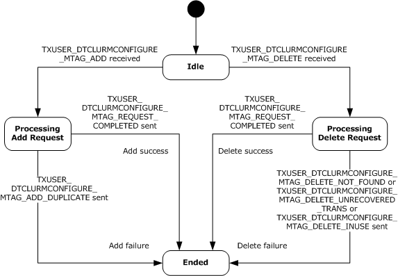
<!-- /Extracted images from page 108 -->

The following figure shows the relationship between the CONNTYPE_TXUSER_DTCLUCONFIGURE
acceptor states.

Figure 11: CONNTYPE_TXUSER_DTCLUCONFIGURE acceptor states

##### 3.3.1.3 CONNTYPE_TXUSER_DTCLURECOVERY Acceptor States

The Transaction Manager Communicating with an LU 6.2 Implementation Facet MUST act as an
acceptor for the CONNTYPE_TXUSER_DTCLURECOVERY connection type. In this role, the Transaction
Manager Communicating with an LU 6.2 Implementation Facet MUST provide support for the following
states:





Idle

Processing Register Request

  Registered



Ended

###### 3.3.1.3.1 Idle

This is the initial state. The following event is processed in this state:

  Receiving a TXUSER_DTCLURMRECOVERY_MTAG_ATTACH message

###### 3.3.1.3.2 Processing Register Request

This is a transient state that is assumed during the synchronous processing of a register request. No
events are processed in this state.

[MS-DTCLU] - v20240423
MSDTC Connection Manager: OleTx Transaction Protocol Logical Unit Mainframe Extension
Copyright © 2024 Microsoft Corporation
Release: April 23, 2024

108 / 199

<!-- Extracted images from page 109 -->
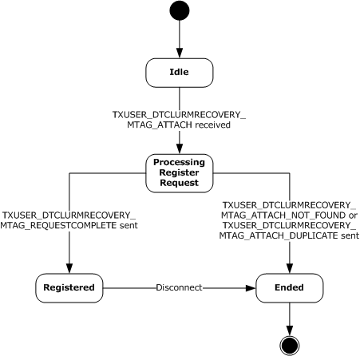
<!-- /Extracted images from page 109 -->

###### 3.3.1.3.3 Registered

The following event is processed in this state:

  Connection Disconnected (section 3.3.5.2.2)

###### 3.3.1.3.4 Ended

This is the final state.

###### 3.3.1.3.5 State Diagram

The following figure shows the relationship between the CONNTYPE_TXUSER_DTCLURECOVERY
acceptor states.

Figure 12: CONNTYPE_TXUSER_DTCLURECOVERY acceptor states

##### 3.3.1.4 CONNTYPE_TXUSER_DTCLURMENLISTMENT Acceptor States

The Transaction Manager Communicating with an LU 6.2 Implementation Facet MUST act as an
acceptor for the CONNTYPE_TXUSER_DTCLURMENLISTMENT connection type. In this role, the
Transaction Manager Communicating with an LU 6.2 Implementation Facet MUST provide support for
the following states:



Idle

[MS-DTCLU] - v20240423
MSDTC Connection Manager: OleTx Transaction Protocol Logical Unit Mainframe Extension
Copyright © 2024 Microsoft Corporation
Release: April 23, 2024

109 / 199



Processing Enlistment Request

  Active

  Awaiting Prepare Response





Processing Backout Request

Prepared

  Awaiting Commit Response

  Awaiting Abort Response



Ended

###### 3.3.1.4.1 Idle

This is the initial state. The following events are processed in this state:

  Receiving a TXUSER_DTCLURMENLISTMENT_MTAG_CREATE message

  Receiving a TXUSER_DTCLURMENLISTMENT_MTAG_TO_DTC_CONVERSATIONLOST message

###### 3.3.1.4.2 Processing Enlistment Request

The following events are processed in this state:

  Create Subordinate Enlistment Success

  Create Subordinate Enlistment Failure

  Receiving a TXUSER_DTCLURMENLISTMENT_MTAG_TO_DTC_CONVERSATIONLOST message

###### 3.3.1.4.3 Active

The following events are processed in this state:

  Begin Phase One

  Begin Rollback

  Receiving a TXUSER_DTCLURMENLISTMENT_MTAG_TO_DTC_BACKOUT message

  Receiving a TXUSER_DTCLURMENLISTMENT_MTAG_TO_DTC_CONVERSATIONLOST message

###### 3.3.1.4.4 Awaiting Prepare Response

The following events are processed in this state:

  Receiving a TXUSER_DTCLURMENLISTMENT_MTAG_TO_DTC_REQUESTCOMMIT message

  Receiving a TXUSER_DTCLURMENLISTMENT_MTAG_TO_DTC_BACKOUT message

  Receiving a TXUSER_DTCLURMENLISTMENT_MTAG_TO_DTC_FORGET message

  Receiving a TXUSER_DTCLURMENLISTMENT_MTAG_TO_DTC_CONVERSATIONLOST message

###### 3.3.1.4.5 Processing Backout Request

The following events are processed in this state:

[MS-DTCLU] - v20240423
MSDTC Connection Manager: OleTx Transaction Protocol Logical Unit Mainframe Extension
Copyright © 2024 Microsoft Corporation
Release: April 23, 2024

110 / 199

  Begin Rollback

  Receiving a TXUSER_DTCLURMENLISTMENT_MTAG_TO_DTC_CONVERSATIONLOST message

###### 3.3.1.4.6 Prepared

The following events are processed in this state:

  Begin Commit

  Begin Rollback

  Receiving a TXUSER_DTCLURMENLISTMENT_MTAG_TO_DTC_CONVERSATIONLOST message

###### 3.3.1.4.7 Awaiting Commit Response

The following events are processed in this state:

  Receiving a TXUSER_DTCLURMENLISTMENT_MTAG_TO_DTC_FORGET message

  Receiving a TXUSER_DTCLURMENLISTMENT_MTAG_TO_DTC_CONVERSATIONLOST message

###### 3.3.1.4.8 Awaiting Abort Response

The following events are processed in this state:

  Receiving a TXUSER_DTCLURMENLISTMENT_MTAG_TO_DTC_BACKEDOUT message

  Receiving a TXUSER_DTCLURMENLISTMENT_MTAG_TO_DTC_CONVERSATIONLOST message

###### 3.3.1.4.9 Ended

This is the final state.

###### 3.3.1.4.10 State Diagram

The following figure shows the relationship between the CONNTYPE_TXUSER_DTCLURMENLISTMENT
acceptor states.

[MS-DTCLU] - v20240423
MSDTC Connection Manager: OleTx Transaction Protocol Logical Unit Mainframe Extension
Copyright © 2024 Microsoft Corporation
Release: April 23, 2024

111 / 199

<!-- Extracted images from page 112 -->
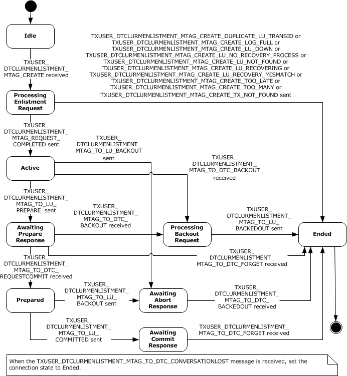
<!-- /Extracted images from page 112 -->

Figure 13: CONNTYPE_TXUSER_DTCLURMENLISTMENT acceptor states

##### 3.3.1.5 CONNTYPE_TXUSER_DTCLURECOVERYINITIATEDBYDTC Acceptor States

The Transaction Manager Communicating with an LU 6.2 Implementation Facet MUST act as an
acceptor for the CONNTYPE_TXUSER_DTCLURECOVERYINITIATEDBYDTC connection type. In this role,
the Transaction Manager Communicating with an LU 6.2 Implementation Facet MUST provide support
for the following states:



Idle

[MS-DTCLU] - v20240423
MSDTC Connection Manager: OleTx Transaction Protocol Logical Unit Mainframe Extension
Copyright © 2024 Microsoft Corporation
Release: April 23, 2024

112 / 199



Processing Work Query

  Awaiting Response To Cold XLN



Processing Response To Cold XLN

  Awaiting Response To Warm XLN





Processing Response To Warm XLN

Processing Compare State Query During Warm XLN

  Awaiting LU Status Response



Processing LU Status Response

  Awaiting Compare States Query



Processing Compare States Query

  Awaiting Compare States Response















Processing Compare States Response

Is Obsolete Awaiting Response To Cold XLN

Is Obsolete Awaiting Response To Warm XLN

Is Obsolete Awaiting LU Status Response

Is Obsolete Processing Response

Is Obsolete Processing Compare State Query During Warm XLN

Ended

###### 3.3.1.5.1 Idle

This is the initial state. The following events are processed in this state:

  Receiving a TXUSER_DTCLURECOVERYINITIATEDBYDTC_MTAG_GETWORK message

  Connection Disconnected (section 3.3.5.4.10)

###### 3.3.1.5.2 Processing Work Query

The following events are processed in this state:

  Send Cold XLN

  Send Warm XLN

  Send Check LU Status

  Recovery Work Ready

  Connection Disconnected (section 3.3.5.4.10)

###### 3.3.1.5.3 Awaiting Response To Cold XLN

The following events are processed in this state:

[MS-DTCLU] - v20240423
MSDTC Connection Manager: OleTx Transaction Protocol Logical Unit Mainframe Extension
Copyright © 2024 Microsoft Corporation
Release: April 23, 2024

113 / 199



Local LU Initiated Recovery Obsolete XLN Exchange

  Receiving a TXUSER_DTCLURECOVERYINITIATEDBYDTC_MTAG_NEW_RECOVERY_SEQ_NUM

message

  Receiving a TXUSER_DTCLURECOVERYINITIATEDBYDTC_MTAG_ERROR_FROM_OUR_XLN message

  Receiving a TXUSER_DTCLURECOVERYINITIATEDBYDTC_MTAG_THEIR_XLN_RESPONSE message

  Connection Disconnected (section 3.3.5.4.10)

###### 3.3.1.5.4 Processing Response To Cold XLN

This is a transient state that is assumed during the synchronous processing of a response to a Cold
XLN request. No events are processed in this state.

###### 3.3.1.5.5 Awaiting Response To Warm XLN

The following events are processed in this state:



Local LU Initiated Recovery Obsolete XLN Exchange

  Receiving a TXUSER_DTCLURECOVERYINITIATEDBYDTC_MTAG_NEW_RECOVERY_SEQ_NUM

message

  Receiving a TXUSER_DTCLURECOVERYINITIATEDBYDTC_MTAG_CONFIRMATION_FROM_OUR_XLN

message

  Receiving a TXUSER_DTCLURECOVERYINITIATEDBYDTC_MTAG_ERROR_FROM_OUR_XLN message

  Receiving a TXUSER_DTCLURECOVERYINITIATEDBYDTC_MTAG_THEIR_XLN_RESPONSE message

  Receiving a TXUSER_DTCLURECOVERYINITIATEDBYDTC_MTAG_CHECK_FOR_COMPARESTATES

message

  Connection Disconnected (section 3.3.5.4.10)

###### 3.3.1.5.6 Processing Response to Warm XLN

This is a transient state that is assumed during the synchronous processing of a response to a Warm
XLN request. No events are processed in this state.

###### 3.3.1.5.7 Processing Compare State Query During Warm XLN

This is a transient state that is assumed during the synchronous processing of a Compare States
query during a Warm XLN request. No events are processed in this state.

###### 3.3.1.5.8 Awaiting LU Status Response

The following events are processed in this state:



Local LU Initiated Recovery Obsolete XLN Exchange

  Receiving a TXUSER_DTCLURECOVERYINITIATEDBYDTC_MTAG_LUSTATUS message

  Connection Disconnected (section 3.3.5.4.10)

###### 3.3.1.5.9 Processing LU Status Response

[MS-DTCLU] - v20240423
MSDTC Connection Manager: OleTx Transaction Protocol Logical Unit Mainframe Extension
Copyright © 2024 Microsoft Corporation
Release: April 23, 2024

114 / 199

This is a transient state that is assumed during the synchronous processing of a response to an LU
status request. No events are processed in this state.

###### 3.3.1.5.10 Awaiting Compare States Query

The following events are processed in this state:

  Receiving a TXUSER_DTCLURECOVERYINITIATEDBYDTC_MTAG_CHECK_FOR_COMPARESTATES

message

  Connection Disconnected (section 3.3.5.4.10)

###### 3.3.1.5.11 Processing Compare States Query

This is a transient state that is assumed during the synchronous processing of a query for a Compare
States request. No events are processed in this state.

###### 3.3.1.5.12 Awaiting Compare States Response

The following events are processed in this state:

  Receiving a TXUSER_DTCLURECOVERYINITIATEDBYDTC_MTAG_THEIR_COMPARESTATES message

  Receiving a

TXUSER_DTCLURECOVERYINITIATEDBYDTC_MTAG_ERROR_FROM_OUR_COMPARESTATES
message

###### 3.3.1.5.13 Processing Compare States Response

This is a transient state that is assumed during the synchronous processing of a response for a
Compare States request. No events are processed in this state.

###### 3.3.1.5.14 Processing Compare States Error

This is a transient state that is assumed during the synchronous processing of a response for a
Compare States error request. No events are processed in this state.

###### 3.3.1.5.15 Is Obsolete Awaiting Response To Cold XLN

The following events are processed in this state:

  Receiving a TXUSER_DTCLURECOVERYINITIATEDBYDTC_MTAG_NEW_RECOVERY_SEQ_NUM

message

  Receiving a TXUSER_DTCLURECOVERYINITIATEDBYDTC_MTAG_ERROR_FROM_OUR_XLN message

  Receiving a TXUSER_DTCLURECOVERYINITIATEDBYDTC_MTAG_THEIR_XLN_RESPONSE message

  Connection Disconnected (section 3.3.5.4.10)

###### 3.3.1.5.16 Is Obsolete Awaiting Response To Warm XLN

The following events are processed in this state:

  Receiving a TXUSER_DTCLURECOVERYINITIATEDBYDTC_MTAG_NEW_RECOVERY_SEQ_NUM

message

  Receiving a TXUSER_DTCLURECOVERYINITIATEDBYDTC_MTAG_CONFIRMATION_FROM_OUR_XLN

message

[MS-DTCLU] - v20240423
MSDTC Connection Manager: OleTx Transaction Protocol Logical Unit Mainframe Extension
Copyright © 2024 Microsoft Corporation
Release: April 23, 2024

115 / 199

  Receiving a TXUSER_DTCLURECOVERYINITIATEDBYDTC_MTAG_ERROR_FROM_OUR_XLN message

  Receiving a TXUSER_DTCLURECOVERYINITIATEDBYDTC_MTAG_THEIR_XLN_RESPONSE message

  Receiving a TXUSER_DTCLURECOVERYINITIATEDBYDTC_MTAG_CHECK_FOR_COMPARESTATES

message

  Connection Disconnected (section 3.3.5.4.10)

###### 3.3.1.5.17 Is Obsolete Awaiting LU Status Response

The following events are processed in this state:

  Receiving a TXUSER_DTCLURECOVERYINITIATEDBYDTC_MTAG_LUSTATUS message

  Connection Disconnected (section 3.3.5.4.10)

###### 3.3.1.5.18 Is Obsolete Processing Response

This is a transient state that is assumed during the synchronous processing of a request. No events
are processed in this state.

###### 3.3.1.5.19 Is Obsolete Processing Compare State Query During Warm XLN

This is a transient state that is assumed during the synchronous processing of a request. No events
are processed in this state.

###### 3.3.1.5.20 Ended

This is the final state.

###### 3.3.1.5.21 State Diagram

The following figure shows the relationship between the
CONNTYPE_TXUSER_DTCLURECOVERYINITIATEDBYDTC acceptor states.

[MS-DTCLU] - v20240423
MSDTC Connection Manager: OleTx Transaction Protocol Logical Unit Mainframe Extension
Copyright © 2024 Microsoft Corporation
Release: April 23, 2024

116 / 199

<!-- Extracted images from page 117 -->
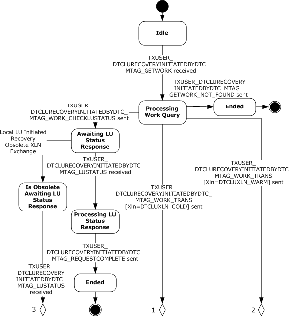
<!-- /Extracted images from page 117 -->

Figure 14: CONNTYPE_TXUSER_DTCLURECOVERYINITIATEDBYDTC, Part 1

[MS-DTCLU] - v20240423
MSDTC Connection Manager: OleTx Transaction Protocol Logical Unit Mainframe Extension
Copyright © 2024 Microsoft Corporation
Release: April 23, 2024

117 / 199

<!-- Extracted images from page 118 -->
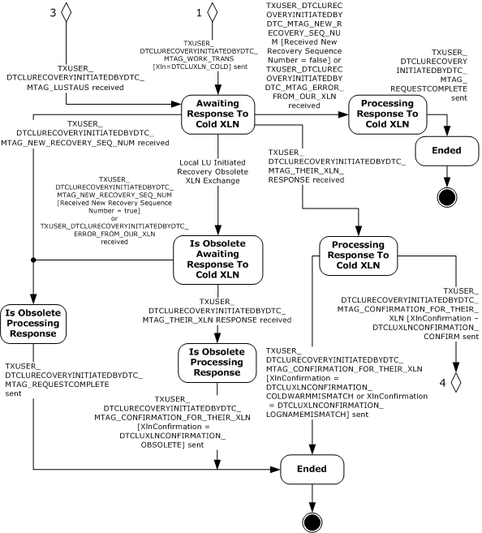
<!-- /Extracted images from page 118 -->

Figure 15: CONNTYPE_TXUSER_DTCLURECOVERYINITIATEDBYDTC, Part 2

[MS-DTCLU] - v20240423
MSDTC Connection Manager: OleTx Transaction Protocol Logical Unit Mainframe Extension
Copyright © 2024 Microsoft Corporation
Release: April 23, 2024

118 / 199

<!-- Extracted images from page 119 -->
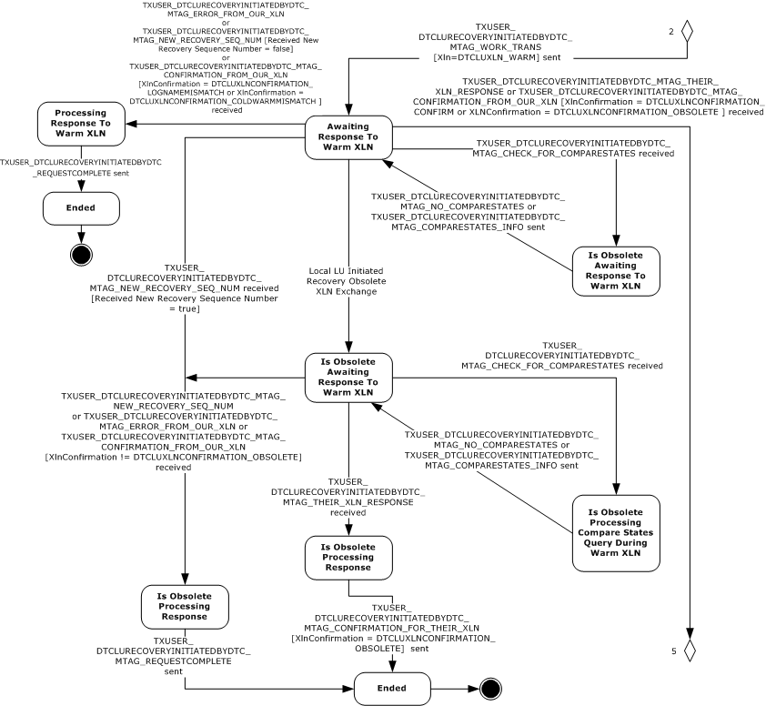
<!-- /Extracted images from page 119 -->

Figure 16: CONNTYPE_TXUSER_DTCLURECOVERYINITIATEDBYDTC, Part 3

[MS-DTCLU] - v20240423
MSDTC Connection Manager: OleTx Transaction Protocol Logical Unit Mainframe Extension
Copyright © 2024 Microsoft Corporation
Release: April 23, 2024

119 / 199

<!-- Extracted images from page 120 -->
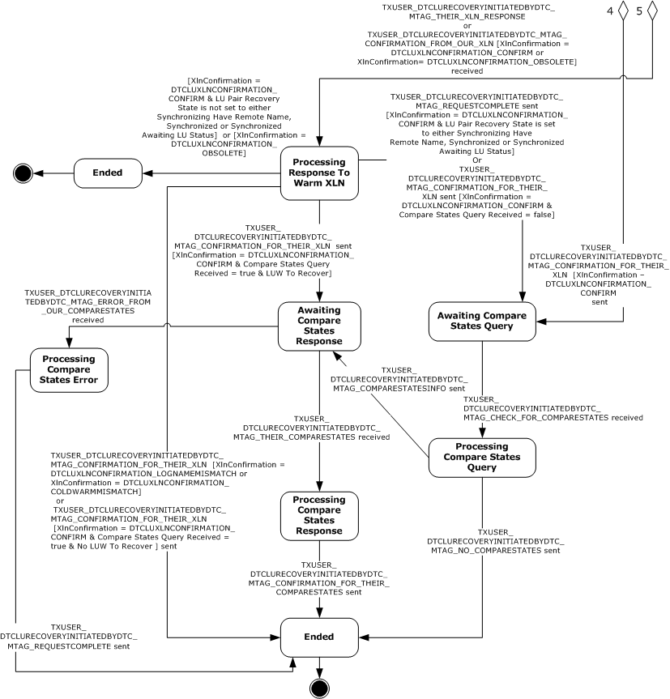
<!-- /Extracted images from page 120 -->

Figure 17: CONNTYPE_TXUSER_DTCLURECOVERYINITIATEDBYDTC, Part 4

##### 3.3.1.6 CONNTYPE_TXUSER_DTCLURECOVERYINITIATEDBYLU Acceptor States

The Transaction Manager Communicating with an LU 6.2 Implementation Facet MUST act as an
acceptor for the CONNTYPE_TXUSER_DTCLURECOVERYINITIATEDBYLU connection type. In this role,
the Transaction Manager Communicating with an LU 6.2 Implementation Facet MUST provide support
for the following states:





Idle

Processing XLN Request

[MS-DTCLU] - v20240423
MSDTC Connection Manager: OleTx Transaction Protocol Logical Unit Mainframe Extension
Copyright © 2024 Microsoft Corporation
Release: April 23, 2024

120 / 199

  Awaiting XLN Confirmation



Processing XLN Confirmation

  Awaiting Compare States Request



Processing Compare States Request

  Awaiting Compare States Confirmation







Processing Compare States Confirmation

Is Obsolete Awaiting XLN Confirmation

Ended

###### 3.3.1.6.1 Idle

This is the initial state. The following event is processed in this state:

  Receiving a TXUSER_DTCLURECOVERYINITIATEDBYLU_MTAG_THEIR_XLN

message (section 3.3.5.5.1)

###### 3.3.1.6.2 Processing XLN Request

This is a transient state that is assumed during the synchronous processing of a XLN request. No
events are processed in this state.

###### 3.3.1.6.3 Awaiting XLN Confirmation

The following events are processed in this state:

  Receiving a TXUSER_DTCLURECOVERYINITIATEDBYLU_MTAG_CONFIRMATION_OF_OUR_XLN

message (section 3.3.5.5.2)

  Remote LU Initiated Recovery Obsolete XLN Exchange

  Connection Disconnected (section 3.3.5.5.6)

###### 3.3.1.6.4 Processing XLN Confirmation

This is a transient state that is assumed during the synchronous processing of an XLN confirmation
request. No events are processed in this state.

###### 3.3.1.6.5 Awaiting Compare States Request

The following event is processed in this state:

  Receiving a TXUSER_DTCLURECOVERYINITIATEDBYLU_MTAG_THEIR_COMPARESTATES message

(section 3.3.5.5.3)

  Connection Disconnected (section 3.3.5.5.6)

###### 3.3.1.6.6 Processing Compare States Request

This is a transient state that is assumed during the synchronous processing of a Compare States
request. No events are processed in this state.

###### 3.3.1.6.7 Awaiting Compare States Confirmation

[MS-DTCLU] - v20240423
MSDTC Connection Manager: OleTx Transaction Protocol Logical Unit Mainframe Extension
Copyright © 2024 Microsoft Corporation
Release: April 23, 2024

121 / 199

The following events are processed in this state:

  Receiving a

TXUSER_DTCLURECOVERYINITIATEDBYLU_MTAG_CONFIRMATION_OF_OUR_COMPARESTATES
message (section 3.3.5.5.4)

  Receiving a TXUSER_DTCLURECOVERYINITIATEDBYLU_MTAG_ERROR_OF_OUR_COMPARESTATES

message (section 3.3.5.5.5)

  Connection Disconnected (section 3.3.5.5.6)

###### 3.3.1.6.8 Processing Compare States Confirmation

This is a transient state that is assumed during the synchronous processing of a Compare States
confirmation request. No events are processed in this state.

###### 3.3.1.6.9 Is Obsolete Awaiting XLN Confirmation

The following events are processed in this state:

  Receiving a TXUSER_DTCLURECOVERYINITIATEDBYLU_MTAG_CONFIRMATION_OF_OUR_XLN

message (section 3.3.5.5.2)

  Connection Disconnected (section 3.3.5.5.6)

###### 3.3.1.6.10 Ended

This is the final state.

###### 3.3.1.6.11 State Diagram

The following figure shows the relationship between the
CONNTYPE_TXUSER_DTCLURECOVERYINITIATEDBYLU acceptor states.

[MS-DTCLU] - v20240423
MSDTC Connection Manager: OleTx Transaction Protocol Logical Unit Mainframe Extension
Copyright © 2024 Microsoft Corporation
Release: April 23, 2024

122 / 199

<!-- Extracted images from page 123 -->
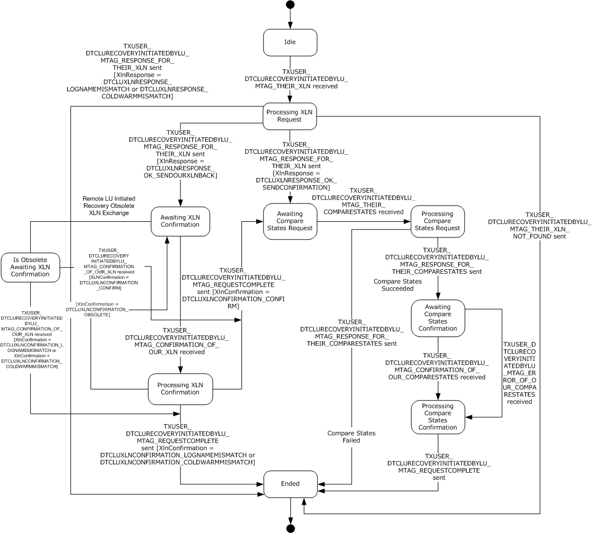
<!-- /Extracted images from page 123 -->

Figure 18: CONNTYPE_TXUSER_DTCLURECOVERYINITIATEDBYLU acceptor states

#### 3.3.2 Timers

The Transaction Manager Communicating with an LU 6.2 Implementation Facet MUST provide the
timer that is specified in the next section.

##### 3.3.2.1 LU Status Timer

The LU Status timer is a nonrecurring timer. The timer MUST be started whenever an LU Pair object
is synchronized and no recovery is in progress, as specified by the processing of the Synchronization
Successful and Received LU Status events.

The value of the timer is set to an implementation-specific value.<5>

When the timer is initialized, the Transaction Manager Communicating with an LU 6.2 Implementation
Facet MUST provide an LU Pair object to associate with the timer. When the timer expires, the LU
Status Timer Tick event MUST be signaled with the same LU Pair object as the only argument. The

[MS-DTCLU] - v20240423
MSDTC Connection Manager: OleTx Transaction Protocol Logical Unit Mainframe Extension
Copyright © 2024 Microsoft Corporation
Release: April 23, 2024

123 / 199

Transaction Manager Communicating with an LU 6.2 Implementation Facet MUST provide a distinct LU
Status timer instance for each LU Pair object.

#### 3.3.3 Initialization

The Transaction Manager Communicating with an LU 6.2 Implementation Facet MUST examine the
following security flags on the Core Transaction Manager Facet (as specified in [MS-DTCO] section 3.2)
and perform the following actions:



If either the Allow Network Access flag or the Allow Remote Clients flag is set to FALSE, it
MUST refuse to accept incoming connections from remote machines as specified in [MS-CMP]
section 3.1.5.5, with the rejection reason set to 0x80070005 for the following connection types:

  CONNTYPE_TXUSER_DTCLUCONFIGURE

  CONNTYPE_TXUSER_DTCLURECOVERY

  CONNTYPE_TXUSER_DTCLURMENLISTMENT

  CONNTYPE_TXUSER_DTCLURECOVERYINITIATEDBYDTC

  CONNTYPE_TXUSER_DTCLURECOVERYINITIATEDBYLU



If both the Allow Network Access flag and Allow Remote Clients flag are set to TRUE and
Allow LUTransactions flag as defined in [MS-DTCO] section 3.2.1 is set to FALSE, it MUST
refuse to accept the following connection types, as specified in [MS-CMP] section 3.1.5.5, with the
rejection reason set to 0x80070005:

  CONNTYPE_TXUSER_DTCLUCONFIGURE

  CONNTYPE_TXUSER_DTCLURECOVERY

  CONNTYPE_TXUSER_DTCLURMENLISTMENT

  CONNTYPE_TXUSER_DTCLURECOVERYINITIATEDBYDTC

  CONNTYPE_TXUSER_DTCLURECOVERYINITIATEDBYLU

#### 3.3.4 Higher-Layer Triggered Events

The operation of the Core Transaction Manager Facet MUST be prepared to process the higher-layer
events in this section.

##### 3.3.4.1 Recover

This event is triggered by the higher-layer software hosting infrastructure when it reinitializes the
system after a software failure or restart.

When the Transaction Manager Communicating with an LU 6.2 Implementation Facet is asked to
Recover after a software failure or restart, it MUST perform the following actions:



For each LU Pair object in the log of the Transaction Manager Communicating with an LU 6.2
Implementation Facet:

  Copy the LU Pair object to the LU Pair Table of the Transaction Manager Communicating with

an LU 6.2 Implementation Facet.



For each LU Pair object in the LU Pair Table of the Transaction Manager Communicating with an
LU 6.2 Implementation Facet:

[MS-DTCLU] - v20240423
MSDTC Connection Manager: OleTx Transaction Protocol Logical Unit Mainframe Extension
Copyright © 2024 Microsoft Corporation
Release: April 23, 2024

124 / 199



For each LUW object in the LUW List of the currently referenced LU Pair object:

  Attempt to find a transaction in the transaction table of the transaction manager (as

specified in [MS-DTCO] section 3.1.1) that meets the following condition:



The value of the Transaction Object.Identifier field of the Transaction object is set
to the value of the Transaction Identifier field of the currently referenced LUW
object.



If a transaction that meets the preceding condition is found:



If the local LU LUW State of the currently referenced LUW object is set to Forget:

  Continue processing for the next LUW object in the LUW List.

  Otherwise:

  Signal the Request Transaction Outcome event (as specified in [MS-DTCO] section
3.2.7.33) on the Core Transaction Manager Facet with the following argument:



The Enlistment object of the currently referenced LUW object.

  Otherwise:

  Set the local LU LUW State of the currently referenced LUW object to Reset.

  Set the LUW Recovery State of the currently referenced LUW object to Need

Recovery.

  Signal the Recovery Work Ready event with the following arguments:





The currently referenced LU Pair object.

The Recovery Work Ready Reason set to LUW Recovery.

  All incoming connections MUST be rejected until the Core Transaction Manager Facet signals the
Begin Commit event or Begin Rollback event for each transaction. Connection rejection is as
specified in [MS-CMP] section 3.1.5.5, with the rejection reason value set to 0x80070005.

#### 3.3.5 Message Processing Events and Sequencing Rules

##### 3.3.5.1 CONNTYPE_TXUSER_DTCLUCONFIGURE as Acceptor

For all messages received in this Connection Type, the Transaction Manager Communicating with an
LU 6.2 Implementation Facet MUST process the message, as specified in section 3.1. The Transaction
Manager Communicating with an LU 6.2 Implementation Facet MUST also follow the processing rules
specified in the following sections.

###### 3.3.5.1.1 Receiving a TXUSER_DTCLURMCONFIGURE_MTAG_ADD Message

When the Transaction Manager Communicating with an LU 6.2 Implementation Facet receives a
TXUSER_DTCLURMCONFIGURE_MTAG_ADD (section 2.2.3.1.1) message, it MUST perform the
following actions:



If the connection state is Idle:

  Set the connection state to Processing Add Request.

[MS-DTCLU] - v20240423
MSDTC Connection Manager: OleTx Transaction Protocol Logical Unit Mainframe Extension
Copyright © 2024 Microsoft Corporation
Release: April 23, 2024

125 / 199

  Attempt to find the LU Pair object keyed by the first cbLength bytes of the rgbBlob field of

the DTCLU_VARLEN_BYTEARRAY structure (contained in the LuNamePair field) of the
message in the LU Pair Table.



If the LU Pair object is found:

  Send the TXUSER_DTCLURMCONFIGURE_MTAG_ADD_DUPLICATE (section 2.2.3.1.4)

message using the connection.

  Otherwise:

  Create an LU Pair object that is initialized as follows:

  Set the LU Name Pair field to the first cbLength bytes of the rgbBlob field of the
DTCLU_VARLEN_BYTEARRAY structure (contained in the LuNamePair field) of the
message.

  Set the Local Log Name field to an implementation-specific value.

  Set the Resource Manager Identifier field to a new GUID value.

  Set the Recovery Sequence Number field to 1.

  Set the Is Warm flag to FALSE.

  Set the LU Pair Recovery State field to Recovery Process Not Attached.

  Set the Is LUW Triggered Recovery Pending flag to FALSE.

  Attempt to add the new LU Pair object to the log and the LU Pair Table keyed by the first

cbLength bytes of the rgbBlob field of the DTCLU_VARLEN_BYTEARRAY structure
(contained in the LuNamePair field) of the message.



If LU Pair is added successfully:

  Send the

TXUSER_DTCLURMCONFIGURE_MTAG_REQUEST_COMPLETED (section 2.2.3.1.3)
message using the connection.

  Otherwise:

  Send the TXUSER_DTCLURMCONFIGURE_MTAG_ADD_LOG_FULL message using the

connection.

  Set the connection state to Ended.

  Otherwise, if the connection state is Ended:



Ignore the message.

  Otherwise, the message MUST be processed as an invalid message, as specified in [MS-DTCO],

section 3.1.6.

###### 3.3.5.1.2 Receiving a TXUSER_DTCLURMCONFIGURE_MTAG_DELETE Message

The Transaction Manager Communicating with an LU 6.2 Implementation Facet MUST perform the
following actions when it receives a TXUSER_DTCLURMCONFIGURE_MTAG_DELETE message:



If the connection state is Idle:

  Set the connection state to Processing Delete Request.

[MS-DTCLU] - v20240423
MSDTC Connection Manager: OleTx Transaction Protocol Logical Unit Mainframe Extension
Copyright © 2024 Microsoft Corporation
Release: April 23, 2024

126 / 199

  Attempt to find the LU Pair object keyed by the first cbLength bytes of the rgbBlob field of

the DTCLU_VARLEN_BYTEARRAY structure (contained in the LuNamePair field) of the
message in the LU Pair Table.



If the LU Pair object is not found:

  Send the TXUSER_DTCLURMCONFIGURE_MTAG_DELETE_NOT_FOUND message using the

connection.

  Otherwise:



If the LU Pair Recovery State field of the LU Pair object is not set to Recovery Process
Not Attached:

  Send the TXUSER_DTCLURMCONFIGURE_MTAG_DELETE_INUSE message using the

connection.

  Otherwise:



If the LUW List of the found LU Pair object is not empty:

  Send the TXUSER_DTCLURMCONFIGURE_MTAG_DELETE_UNRECOVERED_TRANS

message using the connection.

  Otherwise:

  Remove the found LU Pair object from the LU Pair Table and the log.

  Send the TXUSER_DTCLURMCONFIGURE_MTAG_REQUEST_COMPLETED message

using the connection.

  Set the connection state to Ended.

  Otherwise, if the connection state is Ended:



Ignore the message.

  Otherwise, the message MUST be processed as an invalid message, as specified in [MS-DTCO],

section 3.1.6.

##### 3.3.5.2 CONNTYPE_TXUSER_DTCLURECOVERY as Acceptor

For all messages received in this connection type, the Transaction Manager Communicating with an LU
6.2 Implementation Facet MUST process the message, as specified in section 3.1. The Transaction
Manager Communicating with an LU 6.2 Implementation Facet MUST also follow the processing rules
specified in the following sections.

###### 3.3.5.2.1 Receiving a TXUSER_DTCLURMRECOVERY_MTAG_ATTACH Message

A Transaction Manager Communicating with an LU 6.2 Implementation Facet MUST perform the
following actions to attempt to register the connection's MSDTC Connection Manager: OleTx
Transports Protocol (as specified in [MS-CMPO]) session for all recovery processing associated with
the LU Name Pair when it receives a
TXUSER_DTCLURMRECOVERY_MTAG_ATTACH (section 2.2.3.2.1) message:



If the connection state is Idle:

  Set the connection state to Processing Register Request.

[MS-DTCLU] - v20240423
MSDTC Connection Manager: OleTx Transaction Protocol Logical Unit Mainframe Extension
Copyright © 2024 Microsoft Corporation
Release: April 23, 2024

127 / 199

  Attempt to find the LU Pair object keyed by the first cbLength bytes of the rgbBlob field of

the DTCLU_VARLEN_BYTEARRAY structure (contained in the LuNamePair field) of the
message in the LU Pair Table.



If the LU Pair object is not found:

  Send the TXUSER_DTCLURMRECOVERY_MTAG_ATTACH_NOT_FOUND (section 2.2.3.2.4)

message using the connection.

  Set the connection state to Ended (section 3.3.1.3.4).

  Otherwise:



If the LU Pair Recovery State field of the found LU Pair object is set to Recovery
Process Not Attached:

  Set the LU Pair Recovery State field of the found LU Pair object to Not

Synchronized.

  Send the

TXUSER_DTCLURMRECOVERY_MTAG_REQUEST_COMPLETED (section 2.2.3.2.2)
message using the connection.

  Set the connection state to Registered.

  Otherwise:

  Send the

TXUSER_DTCLURMRECOVERY_MTAG_ATTACH_DUPLICATE (section 2.2.3.2.3)
message using the connection.

  Set the connection state to Ended.

  Otherwise, if the connection state is Ended:



Ignore the message.

  Otherwise, the message MUST be processed as an invalid message, as specified in [MS-DTCO],

section 3.1.6.

###### 3.3.5.2.2 Connection Disconnected

When a CONNTYPE_TXUSER_DTCLURECOVERY connection is disconnected, a Transaction Manager
Communicating with an LU 6.2 Implementation Facet MUST perform the following actions:



If the connection state is Registered:

  Set the LU Pair Recovery State field of the LU Pair object referenced by this connection to

Recovery Process Not Attached.

  Set the connection state to Ended (section 3.3.1.3.4).

  Otherwise, the event MUST be processed as specified in [MS-DTCO] section 3.1.8.3

##### 3.3.5.3 CONNTYPE_TXUSER_DTCLURMENLISTMENT as Acceptor

For all messages received in this connection type, the Transaction Manager Communicating with an
LU 6.2 Implementation Facet MUST process the message as specified in section 3.1. The Transaction
Manager Communicating with an LU 6.2 Implementation Facet MUST also follow the processing rules
specified in the following sections.

[MS-DTCLU] - v20240423
MSDTC Connection Manager: OleTx Transaction Protocol Logical Unit Mainframe Extension
Copyright © 2024 Microsoft Corporation
Release: April 23, 2024

128 / 199

###### 3.3.5.3.1 Receiving a TXUSER_DTCLURMENLISTMENT_MTAG_CREATE Message

When the Transaction Manager Communicating with an LU 6.2 Implementation Facet receives a
TXUSER_DTCLURMENLISTMENT_MTAG_CREATE (section 2.2.3.3.1) message, it MUST perform the
following actions:



If the connection state is Idle:

  Set the connection state to Processing Enlistment Request.

  Attempt to find the LU Pair object keyed by the value of the first cbLength bytes of the

rgbBlob field of the DTCLU_VARLEN_BYTEARRAY structure (contained in the LuNamePair
field) of the message in the LU Pair Table.



If the LU Pair object is not found:

  Send a

TXUSER_DTCLURMENLISTMENT_MTAG_CREATE_LU_NOT_FOUND (section 2.2.3.3.17)
message using the connection.

  Set the connection state to Ended (section 3.3.1.4.9).

  Otherwise:

  Set the LU Pair field of the connection object to the found LU Pair object.



If the LU Pair Recovery State field of the found LU Pair object is set to Recovery
Process Not Attached:

  Send a

TXUSER_DTCLURMENLISTMENT_MTAG_CREATE_LU_NO_RECOVERY_PROCESS (sectio
n 2.2.3.3.20) message using the connection.

  Set the connection state to Ended.

  Otherwise, if the LU Pair Recovery State field of the found LU Pair object is set to Not

Synchronized:

  Send a

TXUSER_DTCLURMENLISTMENT_MTAG_CREATE_LU_DOWN (section 2.2.3.3.21)
message using the connection.

  Set the connection state to Ended.

  Otherwise, if the LU Pair Recovery State field of the found LU Pair object is set to either

Synchronizing No Remote Name or Synchronizing Have Remote Name:

  Send a

TXUSER_DTCLURMENLISTMENT_MTAG_CREATE_LU_RECOVERING (section 2.2.3.3.22)
message using the connection.

  Set the connection state to Ended.

  Otherwise, if the LU Pair Recovery State field of the found LU Pair object is set to

Inconsistent:

  Send a

TXUSER_DTCLURMENLISTMENT_MTAG_CREATE_LU_RECOVERY_MISMATCH (section 2
.2.3.3.23) message using the connection.

  Set the connection state to Ended.

[MS-DTCLU] - v20240423
MSDTC Connection Manager: OleTx Transaction Protocol Logical Unit Mainframe Extension
Copyright © 2024 Microsoft Corporation
Release: April 23, 2024

129 / 199

  Otherwise:

  Attempt to find the Transaction object keyed by the value of the guidTx field of the

message in the Transaction table of the Core Transaction Manager Facet.



If the Transaction object is not found:

  Send a

TXUSER_DTCLURMENLISTMENT_MTAG_CREATE_TX_NOT_FOUND (section 2.2.3.3.
13) message using the connection.

  Set the connection state to Ended.

  Otherwise:

  Attempt to find an LUW object with its LUW Identifier field set to the value of

the first cbLength bytes of the rgbBlob field of the DTCLU_VARLEN_BYTEARRAY
structure (contained in the LuTransId field) of the message in the LUW List of the
found LU Pair object.



If an LUW object is found:

  Send a

TXUSER_DTCLURMENLISTMENT_MTAG_CREATE_DUPLICATE_LU_TRANSID (se
ction 2.2.3.3.19) message using the connection.

  Set the connection state to Ended.

  Otherwise:

  Create a new Enlistment object that is initialized as follows:

  Set the Transaction Manager Facet field to the Transaction Manager

Communicating with an LU 6.2 Implementation Facet.

  Set the Transaction field to the found Transaction object.

  Set the Resource Manager Identifier field to the resource manager

identifier field of the found LU Pair object.

  Set the Connection field to the connection object.

  Create a new LUW object that is initialized as follows:

  Set the Transaction Identifier field to the guidTx field of the message.

  Set the LUW Identifier field to the first cbLength bytes of the rgbBlob
field of the DTCLU_VARLEN_BYTEARRAY structure (contained in the
LuTransId field) of the message.

  Set the Enlistment field to the new Enlistment object.

  Set the Recovery Sequence Number For LUW field to the Recovery

Sequence Number field of the found LU Pair object.

  Set the Local LU LUW State field to Active.

  Set the LUW Recovery State field to Recovery Not Needed.

  Set the Is Conversation Lost Flag to FALSE.

  Set the LUW field on the connection to refer to the new LUW object.

130 / 199

[MS-DTCLU] - v20240423
MSDTC Connection Manager: OleTx Transaction Protocol Logical Unit Mainframe Extension
Copyright © 2024 Microsoft Corporation
Release: April 23, 2024

  Add the new LUW object to the LUW List of the found LU Pair Object.

  Signal the Create Subordinate Enlistment event (as specified in [MS-DTCO]
section 3.2.7.11) on the Core Transaction Manager Facet with the following
argument:



The new Enlistment object.

  Otherwise, if the connection state is Ended:



Ignore the message.

  Otherwise, the message MUST be processed as an invalid message, as specified in [MS-DTCO],

section 3.1.6.

###### 3.3.5.3.2 Receiving a

TXUSER_DTCLURMENLISTMENT_MTAG_TO_DTC_REQUESTCOMMIT Message

When the Transaction Manager Communicating with an LU 6.2 Implementation Facet receives a
TXUSER_DTCLURMENLISTMENT_MTAG_TO_DTC_REQUESTCOMMIT (section 2.2.3.3.8) message, it
MUST perform the following actions:



If the connection state is Awaiting Prepare Response:

  Signal the Enlistment Phase One Complete event (as specified in [MS-DTCO] section 3.2.7.16)

on the Core Transaction Manager Facet with the following arguments:





The Enlistment object of the LUW object referenced by this connection

The Phase One outcome set to Prepared

  Set the connection state to Prepared.

  Otherwise, if the connection state is Ended:



Ignore the message.

  Otherwise, the message MUST be processed as an invalid message, as specified in [MS-DTCO],

section 3.1.6.

###### 3.3.5.3.3 Receiving a TXUSER_DTCLURMENLISTMENT_MTAG_TO_DTC_BACKOUT

Message

When the Transaction Manager Communicating with an LU 6.2 Implementation Facet receives a
TXUSER_DTCLURMENLISTMENT_MTAG_TO_DTC_BACKOUT (section 2.2.3.3.5) message, it MUST
perform the following actions:



If the connection state is Active:

  Set the Local LU LUW State field of the LUW object referenced by this connection to Reset.

  Signal the Enlistment Unilaterally Aborted event (as specified in [MS-DTCO] section 3.2.7.19)

on the Core Transaction Manager Facet with the following arguments:



The Enlistment object of the LUW object referenced by this connection

  Set the connection state to Processing Backout Request.

  Otherwise, if the connection state is Awaiting Prepare Response:

  Set the Local LU LUW State of the LUW object referenced by this connection to Forget.

[MS-DTCLU] - v20240423
MSDTC Connection Manager: OleTx Transaction Protocol Logical Unit Mainframe Extension
Copyright © 2024 Microsoft Corporation
Release: April 23, 2024

131 / 199

  Signal the Enlistment Phase One Complete event (as specified in [MS-DTCO] section 3.2.7.16)

on the Core Transaction Manager Facet with the following arguments:





The Enlistment object of the LUW object referenced by this connection

The Phase One outcome set to Aborted.

  Set the connection state to Processing Backout Request.

  Otherwise, if the connection state is Ended:



Ignore the message.

  Otherwise, the message MUST be processed as an invalid message, as specified in [MS-DTCO],

section 3.1.6.

###### 3.3.5.3.4 Receiving a TXUSER_DTCLURMENLISTMENT_MTAG_TO_DTC_FORGET

Message

When the Transaction Manager Communicating with an LU 6.2 Implementation Facet receives a
TXUSER_DTCLURMENLISTMENT_MTAG_TO_DTC_FORGET message, it MUST perform the following
actions:



If the connection state is Awaiting Prepare Response:

  Set the Local LU LUW State field of the LUW object referenced by this connection to Forget.

  Signal the Enlistment Phase One Complete event (as specified in [MS-DTCO] section 3.2.7.16)

on the Core Transaction Manager Facet with the following arguments:





The Enlistment object of the LUW object referenced by this connection

The Phase One outcome set to Read Only

  Set the connection state to Ended.

  Otherwise, if the connection state is Awaiting Commit Response:

  Set the Local LU LUW State of the LUW object referenced by this connection to Forget.

  Signal the Enlistment Commit Complete event (as specified in [MS-DTCO] section 3.2.7.15) on

the Core Transaction Manager Facet with the following argument:



The Enlistment object of the LUW object referenced by this connection

  Set the connection state to Ended.

  Otherwise, if the connection state is Ended:



Ignore the message.

  Otherwise, the message MUST be processed as an invalid message, as specified in [MS-DTCO],

section 3.1.6.

###### 3.3.5.3.5 Receiving a TXUSER_DTCLURMENLISTMENT_MTAG_TO_DTC_BACKEDOUT

Message

When the Transaction Manager Communicating with an LU 6.2 Implementation Facet receives a
TXUSER_DTCLURMENLISTMENT_MTAG_TO_DTC_BACKEDOUT message, it MUST perform the following
actions:

[MS-DTCLU] - v20240423
MSDTC Connection Manager: OleTx Transaction Protocol Logical Unit Mainframe Extension
Copyright © 2024 Microsoft Corporation
Release: April 23, 2024

132 / 199



If the connection state is Awaiting Abort Response:

  Set the Local LU LUW State of the LUW object referenced by this connection to Forget.

  Signal the Enlistment Rollback Complete event (as specified in  [MS-DTCO] section 3.2.7.18)

on the Core Transaction Manager Facet with the following argument:



The Enlistment object of the LUW object referenced by this connection

  Set the connection state to Ended.

  Otherwise, if the connection state is Ended:



Ignore the message.

  Otherwise, the message MUST be processed as an invalid message, as specified in [MS-DTCO],

section 3.1.6.

###### 3.3.5.3.6 Receiving a

TXUSER_DTCLURMENLISTMENT_MTAG_TO_DTC_CONVERSATIONLOST
Message

When the Transaction Manager Communicating with an LU 6.2 Implementation Facet receives a
TXUSER_DTCLURMENLISTMENT_MTAG_TO_DTC_CONVERSATIONLOST message, it MUST perform the
following actions:



If the connection state is either Idle or Processing Enlistment Request:

  Set the connection state to Ended.

  Otherwise, if the connection state is either Active or Processing Backout Request:



If the Local LU LUW State of the LUW object referenced by this connection is Active:

  Set the Local LU LUW State of the LUW object referenced by this connection to Reset.

  Signal the LUW Conversation Lost event using the following arguments:





The LU Pair object referenced by this connection

The LUW object referenced by this

  Set the connection state to Ended.

  Otherwise, if the connection state is either Awaiting Prepare Response, Prepared, Awaiting Commit

Response, or Awaiting Abort Response:



If the Local LU LUW State of the LUW object referenced by this connection is Active:

  Set the Local LU LUW State of the LUW object referenced by this connection to Reset.

  Set the LUW Recovery State of the LUW object referenced by this connection to Need

Recovery.

  Signal the LUW Conversation Lost event using the following arguments:





The LU Pair object referenced by this connection

The LUW object referenced by this connection

  Set the connection state to Ended.

[MS-DTCLU] - v20240423
MSDTC Connection Manager: OleTx Transaction Protocol Logical Unit Mainframe Extension
Copyright © 2024 Microsoft Corporation
Release: April 23, 2024

133 / 199

  Otherwise, if the connection state is Ended:



Ignore the message.

  Otherwise, the message MUST be processed as an invalid message, as specified in [MS-DTCO],

section 3.1.6.

###### 3.3.5.3.7 Connection Disconnected

When a CONNTYPE_TXUSER_DTCLURMENLISTMENT connection is disconnected, the Transaction
Manager Communicating with an LU 6.2 Implementation Facet MUST perform the following actions:



If the connection state is either Idle or Processing Enlistment Request:

  Set the connection state to Ended.

  Otherwise, if the connection state is either Active or Processing Backout Request:



If the Local LU LUW State of the LUW object referenced by this connection is Active:

  Set the Local LU LUW State of the LUW object referenced by this connection to Reset.

  Signal the LUW Conversation Lost event using the following arguments:





The LU Pair object referenced by this connection

The LUW object referenced by this connection

  Set the connection state to Ended.

  Otherwise, if the connection state is either Awaiting Prepare Response, Prepared, Awaiting Commit

Response, or Awaiting Abort Response:



If the Local LU LUW State of the LUW object referenced by this connection is Active:

  Set the Local LU LUW State of the LUW object referenced by this connection to Reset.

  Set the LUW Recovery State of the LUW object referenced by this connection to Need

Recovery.

  Signal the LUW Conversation Lost event using the following arguments:





The LU Pair object referenced by this connection

The LUW object referenced by this connection

  Set the connection state to Ended.

  Otherwise, if the connection state is Ended:



Ignore the event.

  Otherwise, the event MUST be processed as specified in [MS-DTCO] section 3.1.8.3.

##### 3.3.5.4 CONNTYPE_TXUSER_DTCLURECOVERYINITIATEDBYDTC as Acceptor

For all messages received in this connection type, the transaction manager MUST process the
message, as specified in 3.1. The transaction manager MUST additionally follow the processing rules
specified in the following sections.

[MS-DTCLU] - v20240423
MSDTC Connection Manager: OleTx Transaction Protocol Logical Unit Mainframe Extension
Copyright © 2024 Microsoft Corporation
Release: April 23, 2024

134 / 199

###### 3.3.5.4.1 Receiving a TXUSER_DTCLURECOVERYINITIATEDBYDTC_MTAG_GETWORK

Message

When the Transaction Manager Communicating with an LU 6.2 Implementation Facet receives a
TXUSER_DTCLURECOVERYINITIATEDBYDTC_MTAG_GETWORK message, it MUST perform the
following actions:



If the connection state is Idle:

  Set the connection state to Processing Work Query.

  Attempt to find the LU Pair object keyed by the value of the first cbLength bytes of the

rgbBlob field of the DTCLU_VARLEN_BYTEARRAY structure (contained in the LuNamePair
field) of the message in the LU Pair Table.



If the LU Pair object is not found:

  Send a TXUSER_DTCLURECOVERYINITIATEDBYDTC_MTAG_GETWORK_NOT_FOUND

message using the connection.

  Set the connection state to Ended (section 3.3.1.5.20).

  Otherwise, if the LU Pair object is found:

  Set the LU Pair field of the connection object to the LU Pair object found in the LU Pair

Table.

  Set the Recovery Sequence Number For Connection field of the connection object to

the Recovery Sequence Number field of the LU Pair object referenced by the
connection.

  Add the connection object to the Local LU Initiated Recovery List.

  Signal the Recovery Work Ready event with the following arguments:



The LU Pair object referenced by this connection

  A Recovery Work Ready Reason of Miscellaneous

  Otherwise, if the connection state is Ended (section 3.3.1.5.20):



Ignore the message.

  Otherwise, the message MUST be processed as an invalid message, as specified in [MS-DTCO],

section 3.1.6.

###### 3.3.5.4.2 Receiving a

TXUSER_DTCLURECOVERYINITIATEDBYDTC_MTAG_NEW_RECOVERY_SEQ_
NUM Message

When the Transaction Manager Communicating with an LU 6.2 Implementation Facet receives a
TXUSER_DTCLURECOVERYINITIATEDBYDTC_MTAG_NEW_RECOVERY_SEQ_NUM message, it MUST
perform the following actions:



If the connection state is Awaiting Response To Cold XLN:

  Signal the Received New Recovery Sequence Number event with the following arguments.





The LU Pair object referenced by this connection

The value of the RecoverySeqNum field of the message

[MS-DTCLU] - v20240423
MSDTC Connection Manager: OleTx Transaction Protocol Logical Unit Mainframe Extension
Copyright © 2024 Microsoft Corporation
Release: April 23, 2024

135 / 199



If the return value from the Received New Recovery Sequence Number event is TRUE:

  Set the connection state to Is Obsolete Processing Response.

  Otherwise:

  Set the connection state to Processing Response To Cold XLN.

  Send a TXUSER_DTCLURECOVERYINITIATEDBYDTC_MTAG_REQUESTCOMPLETE message

using the connection.

  Signal the Local LU Initiated Recovery Worker Ended event with the following arguments:





The LU Pair object referenced by this connection

The connection object

  Set the connection state to Ended (section 3.3.1.5.20).

  Otherwise, if the connection state is Awaiting Response To Warm XLN:

  Signal the Received New Recovery Sequence Number event with the following arguments:





The LU Pair object referenced by this connection

The value of the RecoverySeqNum field of the message



If the return value from the Received New Recovery Sequence Number event is TRUE:

  Set the connection state to Is Obsolete Processing Response.

  Otherwise:

  Set the connection state to Processing Response To Warm XLN.

  Send a TXUSER_DTCLURECOVERYINITIATEDBYDTC_MTAG_REQUESTCOMPLETE message

using the connection.

  Signal the Local LU Initiated Recovery Worker Ended event with the following arguments:





The LU Pair object referenced by this connection

The connection object

  Set the connection state to Ended (section 3.3.1.5.20).

  Otherwise, if the connection state is either Is Obsolete Awaiting Response To Cold XLN or Is

Obsolete Awaiting Response To Warm XLN:

  Set the connection state to Is Obsolete Processing Response.

  Send a TXUSER_DTCLURECOVERYINITIATEDBYDTC_MTAG_REQUESTCOMPLETE message

using the connection.

  Signal the Local LU Initiated Recovery Worker Ended event with the following arguments:





The LU Pair object referenced by this connection

The connection object

  Set the connection state to Ended (section 3.3.1.5.20).

  Otherwise, if the connection state is Ended (section 3.3.1.5.20):

[MS-DTCLU] - v20240423
MSDTC Connection Manager: OleTx Transaction Protocol Logical Unit Mainframe Extension
Copyright © 2024 Microsoft Corporation
Release: April 23, 2024

136 / 199



Ignore the message.

  Otherwise, the message MUST be processed as an invalid message, as specified in [MS-DTCO],

section 3.1.6.

###### 3.3.5.4.3 Receiving a

TXUSER_DTCLURECOVERYINITIATEDBYDTC_MTAG_CONFIRMATION_FROM_
OUR_XLN Message

When the Transaction Manager Communicating with an LU 6.2 Implementation Facet receives a
TXUSER_DTCLURECOVERYINITIATEDBYDTC_MTAG_CONFIRMATION_FROM_OUR_XLN message, it
MUST perform the following actions:



If the connection state is Awaiting Response To Warm XLN:

  Set the connection state to Processing Response To Warm XLN.



If the XlnConfirmation field of the message is set to DTCLUXLNCONFIRMATION_CONFIRM:



If the LU Pair Recovery State of the LU Pair object referenced by this connection is set to
either Synchronizing Have Remote Name, Synchronized, or Synchronized Awaiting LU
Status:

  Signal the Synchronization Successful event with the following argument:



The LU Pair object referenced by this connection

  Send a TXUSER_DTCLURECOVERYINITIATEDBYDTC_MTAG_REQUESTCOMPLETE

message using the connection.

  Set the connection state to Awaiting Compare States Query.

  Otherwise:



The transaction manager that communicates with an LU 6.2 implementation
(section 3.2) MUST drop the connection.

  Signal the Local LU Initiated Recovery Worker Ended event with the following

arguments:





The LU Pair object referenced by this connection

The connection object

  Set the connection state to Ended (section 3.3.1.5.20).

  Otherwise, if the XlnConfirmation field of the message is set to either

DTCLUXLNCONFIRMATION_LOGNAMEMISMATCH or
DTCLUXLNCONFIRMATION_COLDWARMMISMATCH:

  Signal the Synchronization Inconsistent event with the following argument:



The LU Pair object referenced by this connection

  Send a TXUSER_DTCLURECOVERYINITIATEDBYDTC_MTAG_REQUESTCOMPLETE message

using the connection.

  Signal the Local LU Initiated Recovery Worker Ended event with the following arguments:



The LU Pair object referenced by this connection

[MS-DTCLU] - v20240423
MSDTC Connection Manager: OleTx Transaction Protocol Logical Unit Mainframe Extension
Copyright © 2024 Microsoft Corporation
Release: April 23, 2024

137 / 199



The connection object

  Set the connection state to Ended (section 3.3.1.5.20).

  Otherwise:



The transaction manager that communicates with an LU 6.2 Implementation MUST drop
the connection.

  Signal the Local LU Initiated Recovery Worker Ended event with the following arguments:





The LU Pair object referenced by this connection

The connection object

  Set the connection state to Ended (section 3.3.1.5.20).

  Otherwise, if the connection state is Is Obsolete Awaiting Response to Warm XLN:

  Set the connection state to Is Obsolete Processing Response.



If the XlnConfirmation field of the message is not set to
DTCLUXLNCONFIRMATION_LOGNAMEMISMATCH,
DTCLUXLNCONFIRMATION_COLDWARMMISMATCH, or DTCLUXLNCONFIRMATION_CONFIRM:



The transaction manager that communicates with an LU 6.2 Implementation MUST drop
the connection.

  Signal the Local LU Initiated Recovery Worker Ended event with the following arguments:





The LU Pair object referenced by this connection

The connection object

  Set the connection state to Ended (section 3.3.1.5.20).

  Otherwise:

  Send a TXUSER_DTCLURECOVERYINITIATEDBYDTC_MTAG_REQUESTCOMPLETE message

using the connection.

  Signal the Local LU Initiated Recovery Worker Ended event with the following arguments:





The LU Pair object referenced by this connection

The connection object

  Set the connection state to Ended (section 3.3.1.5.20).

  Otherwise, if the connection state is Ended (section 3.3.1.5.20):



Ignore the message.

  Otherwise, the message MUST be processed as an invalid message, as specified in [MS-DTCO],

section 3.1.6.

###### 3.3.5.4.4 Receiving a

TXUSER_DTCLURECOVERYINITIATEDBYDTC_MTAG_ERROR_FROM_OUR_XL
N Message

[MS-DTCLU] - v20240423
MSDTC Connection Manager: OleTx Transaction Protocol Logical Unit Mainframe Extension
Copyright © 2024 Microsoft Corporation
Release: April 23, 2024

138 / 199

When the Transaction Manager Communicating with an LU 6.2 Implementation Facet receives a
TXUSER_DTCLURECOVERYINITIATEDBYDTC_MTAG_ERROR_FROM_OUR_XLN message, it MUST
perform the following actions:



If the connection state is Awaiting Response To Cold XLN:

  Set the connection state to Processing Response To Cold XLN.

  Signal the Synchronization Inconsistent event with the following arguments:



The LU Pair object referenced by this connection

  Send a TXUSER_DTCLURECOVERYINITIATEDBYDTC_MTAG_REQUESTCOMPLETE message

using the connection.

  Signal the Local LU Initiated Recovery Worker Ended event with the following arguments:





The LU Pair object referenced by this connection

The connection object

  Set the connection state to Ended (section 3.3.1.5.20).

  Otherwise, if the connection state is Awaiting Response To Warm XLN:

  Set the connection state to Processing Response To Warm XLN.

  Signal the Synchronization Inconsistent event with the following arguments:



The LU Pair object referenced by this connection

  Send a TXUSER_DTCLURECOVERYINITIATEDBYDTC_MTAG_REQUESTCOMPLETE message

using the connection.

  Signal the Local LU Initiated Recovery Worker Ended event with the following arguments:





The LU Pair object referenced by this connection

The connection object

  Set the connection state to Ended (section 3.3.1.5.20).

  Otherwise, if the connection state is either Is Obsolete Awaiting Response To Cold XLN or Is

Obsolete Awaiting Response To Warm XLN:

  Set the connection state to Is Obsolete Processing Response.

  Send a TXUSER_DTCLURECOVERYINITIATEDBYDTC_MTAG_REQUESTCOMPLETE message

using the connection.

  Signal the Local LU Initiated Recovery Worker Ended event with the following arguments:





The LU Pair object referenced by this connection

The connection object

  Set the connection state to Ended (section 3.3.1.5.20).

  Otherwise, if the connection state is Ended (section 3.3.1.5.20):



Ignore the message.

[MS-DTCLU] - v20240423
MSDTC Connection Manager: OleTx Transaction Protocol Logical Unit Mainframe Extension
Copyright © 2024 Microsoft Corporation
Release: April 23, 2024

139 / 199

  Otherwise, the message MUST be processed as an invalid message, as specified in [MS-DTCO],

section 3.1.6.

###### 3.3.5.4.5 Receiving a

TXUSER_DTCLURECOVERYINITIATEDBYDTC_MTAG_THEIR_XLN_RESPONSE
Message

When the Transaction Manager Communicating with an LU 6.2 Implementation Facet receives a
TXUSER_DTCLURECOVERYINITIATEDBYDTC_MTAG_THEIR_XLN_RESPONSE message, it MUST perform
the following actions:



If the connection state is Awaiting Response To Cold XLN:

  Set the connection state to Processing Response To Cold XLN.

  Signal the Received New Remote Log Name event with the following arguments:





The LU Pair object referenced by this connection

The value of the first cbLength bytes of the rgbBlob field of the
DTCLU_VARLEN_BYTEARRAY structure (contained in the RemoteLogName field) of the
message



If the following conditions are both TRUE:





The LU Pair Recovery State field of the LU Pair object referenced by this connection is
not set to Synchronizing No Remote Name.

The Remote Log Name field of the LU Pair object referenced by this connection is not set
to the value of the first cbLength bytes of the rgbBlob field of the
DTCLU_VARLEN_BYTEARRAY structure (contained in the RemoteLogName field) of the
message.

Then perform the following actions:

  Signal the Synchronization Inconsistent event with the following arguments:



The LU Pair object referenced by this connection

  Send a

TXUSER_DTCLURECOVERYINITIATEDBYDTC_MTAG_CONFIRMATION_FOR_THEIR_XLN
message using the connection.



The XlnConfirmation field MUST be set to
DTCLUXLNCOMFIRMATION_LOGNAMEMISMATCH.

  Set the connection state to Ended (section 3.3.1.5.20).

  Otherwise, if the following conditions are both TRUE:





The Is Warm field of the LU Pair object referenced by this connection is TRUE.

The LUW List of the LU Pair object is not empty.

Then perform the following actions:

  Signal the Synchronization Inconsistent event with the following arguments:



The LU Pair object referenced by this connection

[MS-DTCLU] - v20240423
MSDTC Connection Manager: OleTx Transaction Protocol Logical Unit Mainframe Extension
Copyright © 2024 Microsoft Corporation
Release: April 23, 2024

140 / 199

  Send a

TXUSER_DTCLURECOVERYINITIATEDBYDTC_MTAG_CONFIRMATION_FOR_THEIR_XLN
message using the connection.



The XlnConfirmation field MUST be set to
DTCLUXLNCOMFIRMATION_COLDWARMMISMATCH.

  Signal the Local LU Initiated Recovery Worker Ended event with the following arguments:





The LU Pair object referenced by this connection

The connection object

  Set the connection state to Ended.

  Otherwise:

  Signal the Received New Remote Log Name event with the following arguments:





The LU Pair object referenced by this connection

The value of the first cbLength bytes of the rgbBlob field of the
DTCLU_VARLEN_BYTEARRAY structure (contained in the RemoteLogName field) of
the message

  Signal the Synchronization Successful event with the following arguments:



The LU Pair object referenced by this connection

  Send a

TXUSER_DTCLURECOVERYINITIATEDBYDTC_MTAG_CONFIRMATION_FOR_THEIR_XLN
message using the connection.



The XlnConfirmation field MUST be set to DTCLUXLNCOMFIRMATION_CONFIRM.

  Set the connection state to Awaiting Compare States Query.

  Otherwise, if the connection state is Awaiting Response To Warm XLN:

  Set the connection state to Processing Response To Warm XLN.



If the following conditions are both TRUE:





The LU Pair Recovery State field of the LU Pair object referenced by this connection is
not set to Synchronizing No Remote Name.

The Remote Log Name field of the LU Pair object referenced by this connection is not set
to the first cbLength bytes of the rgbBlob field of the DTCLU_VARLEN_BYTEARRAY
structure (contained in the RemoteLogName field) of the message.

Then perform the following actions:

  Signal the Synchronization Inconsistent event with the following arguments:



The LU Pair object referenced by this connection

  Send a

TXUSER_DTCLURECOVERYINITIATEDBYDTC_MTAG_CONFIRMATION_FOR_THEIR_XLN
message using the connection.



The XlnConfirmation field MUST be set to
DTCLUXLNCOMFIRMATION_LOGNAMEMISMATCH.

[MS-DTCLU] - v20240423
MSDTC Connection Manager: OleTx Transaction Protocol Logical Unit Mainframe Extension
Copyright © 2024 Microsoft Corporation
Release: April 23, 2024

141 / 199

  Signal the Local LU Initiated Recovery Worker Ended event with the following arguments:





The LU Pair object referenced by this connection

The connection object

  Set the connection state to Ended.

  Otherwise, if the following conditions are all TRUE:







The Is Warm field of the LU Pair object referenced by this connection is TRUE.

The LUW List of the LU Pair object referenced by this connection is not empty.

The value of the Xln field of the message is set to DTCLUXLN_COLD.

Then perform the following actions:

  Signal the Synchronization Inconsistent event with the following arguments:



The LU Pair object referenced by this connection

  Send a

TXUSER_DTCLURECOVERYINITIATEDBYDTC_MTAG_CONFIRMATION_FOR_THEIR_XLN
message using the connection.



The XlnConfirmation field MUST be set to
DTCLUXLNCOMFIRMATION_COLDWARMMISMATCH.

  Signal the Local LU Initiated Recovery Worker Ended event with the following arguments:





The LU Pair object referenced by this connection

The connection object

  Set the connection state to Ended.

  Otherwise:

  Signal the Received New Remote Log Name event with the following arguments:





The LU Pair object referenced by this connection

The value of the first cbLength bytes of the rgbBlob field of the
DTCLU_VARLEN_BYTEARRAY structure (contained in the RemoteLogName field) of
the message

  Signal the Synchronization Successful event with the following arguments:



The LU Pair object referenced by this connection

  Send a

TXUSER_DTCLURECOVERYINITIATEDBYDTC_MTAG_CONFIRMATION_FOR_THEIR_XLN
message using the connection.



The XlnConfirmation field MUST be set to DTCLUXLNCOMFIRMATION_CONFIRM.



If the Compare State Query Received field of the connection object is TRUE:



If the LUW To Recover field of the connection object is set:

  Set the connection state to Awaiting Compare States Response.

[MS-DTCLU] - v20240423
MSDTC Connection Manager: OleTx Transaction Protocol Logical Unit Mainframe Extension
Copyright © 2024 Microsoft Corporation
Release: April 23, 2024

142 / 199

  Otherwise:

  Signal the Local LU Initiated Recovery Worker Ended event with the following

arguments:





The LU Pair object referenced by this connection

The connection object

  Set the connection state to Ended.

  Otherwise:

  Set the state to Awaiting Compare States Query.

  Otherwise, if the connection state is either Is Obsolete Awaiting Response To Cold XLN or Is

Obsolete Awaiting Response To Warm XLN:

  Set the connection state to Is Obsolete Processing Response.

  Send a TXUSER_DTCLURECOVERYINITIATEDBYDTC_MTAG_CONFIRMATION_FOR_THEIR_XLN

message using the connection.



The XlnConfirmation field MUST be set to DTCLUXLNCONFIRMATION_OBSOLETE.

  Signal the Local LU Initiated Recovery Worker Ended event with the following arguments:





The LU Pair object referenced by this connection

The connection object

  Set the connection state to Ended.

  Otherwise, if the connection state is Ended (section 3.3.1.5.20):



Ignore the message.

  Otherwise, the message MUST be processed as an invalid message, as specified in [MS-DTCO],

section 3.1.6.

###### 3.3.5.4.6 Receiving a

TXUSER_DTCLURECOVERYINITIATEDBYDTC_MTAG_CHECK_FOR_COMPARES
TATES Message

When the Transaction Manager Communicating with an LU 6.2 Implementation Facet receives a
TXUSER_DTCLURECOVERYINITIATEDBYDTC_MTAG_CHECK_FOR_COMPARESTATES message, it MUST
perform the following actions:



If the connection state is Awaiting Compare States Query:

  Set the connection state to Processing Compare States Query.

  Attempt to find the first LUW object in the LUW List of the LU Pair object referenced by this

connection for which the following condition is TRUE:



The LUW Recovery State field of the LUW object is set to Need Recovery.



If no LUW object is found:

  Send a TXUSER_DTCLURECOVERYINITIATEDBYDTC_MTAG_NO_COMPARESTATES

message using the connection.

[MS-DTCLU] - v20240423
MSDTC Connection Manager: OleTx Transaction Protocol Logical Unit Mainframe Extension
Copyright © 2024 Microsoft Corporation
Release: April 23, 2024

143 / 199

  Signal the Local LU Initiated Recovery Worker Ended event with the following arguments:





The LU Pair object referenced by this connection

The connection object

  Set the connection state to Ended (section 3.3.1.5.20).

  Otherwise:

  Set the LUW Recovery State field of the LUW object to Recovering.

  Set the LUW To Recover field of the current connection object to the previously found

LUW object.

  Send a TXUSER_DTCLURECOVERYINITIATEDBYDTC_MTAG_COMPARESTATES_INFO

message using the connection.



If the Local LU LUW State field of the LUW object found in the list is set to In Doubt:



The CompareStates field MUST be set to DTCLUCOMPARESTATE_INDOUBT.

  Otherwise, if the Local LU LUW State field of the LUW object found in the list is set

to either Active or Reset:



The CompareStates field MUST be set to DTCLUCOMPARESTATE_RESET.

  Otherwise, if the Local LU LUW State field of the LUW object found in the list is set

to Committed:



The CompareStates field MUST be set to DTCLUCOMPARESTATE_COMMITTED.

  Otherwise, if the Local LU LUW State field of the LUW object found in the list is set

to Forget:



The transaction manager that communicates with an LU 6.2 implementation
(section 3.2) MUST drop the connection.

The cbLength of the DTCLU_VARLEN_BYTEARRAY structure (contained in the
LuTransId field) MUST be set to the number of bytes in the LUW Identifier field of
the LUW object found in the list.

The first cbLength bytes of the rgbBlob field of the DTCLU_VARLEN_BYTEARRAY
structure (contained in the LuTransId field) MUST be set to the value of the LUW
object found in the list.





  Set the connection state to Awaiting Compare States Response.

  Otherwise, if the connection state is Awaiting Response To Warm XLN:

  Set the connection state to Processing Compare States Query During Warm XLN.

  Set the Compare State Query Received field of the connection object to TRUE.

  Attempt to find the first LUW object in the LUW List of the LU Pair object referenced by this

connection for which the following condition is TRUE:



The LUW Recovery State field of the LUW object is set to Need Recovery.



If no LUW object is found:

[MS-DTCLU] - v20240423
MSDTC Connection Manager: OleTx Transaction Protocol Logical Unit Mainframe Extension
Copyright © 2024 Microsoft Corporation
Release: April 23, 2024

144 / 199

  Send a TXUSER_DTCLURECOVERYINITIATEDBYDTC_MTAG_NO_COMPARESTATES

message using the connection.

  Set the connection state to Awaiting Response To Warm XLN.

  Otherwise:

  Set the LUW Recovery State field of the LUW object to Recovering.

  Set the LUW To Recover field of the current connection object to the previously found

LUW object.

  Send a TXUSER_DTCLURECOVERYINITIATEDBYDTC_MTAG_COMPARESTATES_INFO

message using the connection.



If the Local LU LUW State field of the LUW object found in the list is set to In Doubt:



The CompareStates field MUST be set to DTCLUCOMPARESTATE_INDOUBT.

  Otherwise, if the Local LU LUW State field of the LUW object found in the list is set

to either Active or Reset:



The CompareStates field MUST be set to DTCLUCOMPARESTATE_RESET.

  Otherwise, if the Local LU LUW State field of the LUW object found in the list is set

to Committed:



The CompareStates field MUST be set to DTCLUCOMPARESTATE_COMMITTED.

  Otherwise, if the Local LU LUW State field of the LUW object found in the list is set

to Forget:



The transaction manager that communicates with an LU 6.2 Implementation MUST
drop the connection.

The cbLength of the DTCLU_VARLEN_BYTEARRAY structure (contained in the
LuTransId field) MUST be set to the number of bytes in the LUW Identifier field of
the LUW object found in the list.

The first cbLength bytes of the rgbBlob field of the DTCLU_VARLEN_BYTEARRAY
structure (contained in the LuTransId field) MUST be set to the value of the LUW
Identifier field of the LUW object.





  Set the connection state to Awaiting Response to Warm XLN.

  Otherwise, if the connection state is Is Obsolete Awaiting Response To Warm XLN:

  Set the connection state to Is Obsolete Processing Compare States Query During Warm XLN.

  Set the Compare State Query Received field of the connection object to TRUE.

  Attempt to find the first LUW object in the LUW List of the LU Pair object referenced by this

connection for which the following condition is TRUE:



The LUW Recovery State field of the LUW object is set to Need Recovery.



If no LUW object is found:

  Send a TXUSER_DTCLURECOVERYINITIATEDBYDTC_MTAG_NO_COMPARESTATES]

message using the connection.

  Set the connection state to Is Obsolete Awaiting Response To Warm XLN.

[MS-DTCLU] - v20240423
MSDTC Connection Manager: OleTx Transaction Protocol Logical Unit Mainframe Extension
Copyright © 2024 Microsoft Corporation
Release: April 23, 2024

145 / 199

  Otherwise:

  Set the LUW Recovery State field of the LUW object to Recovering.

  Set the LUW To Recover field of the current connection object to the previously found

LUW object.

  Send a TXUSER_DTCLURECOVERYINITIATEDBYDTC_MTAG_COMPARESTATES_INFO

message using the connection.



If the Local LU LUW State field of the LUW object found in the list is set to In Doubt:



The CompareStates field MUST be set to DTCLUCOMPARESTATE_INDOUBT.

  Otherwise, if the Local LU LUW State field of the LUW object found in the list is set

to either Active or Reset:



The CompareStates field MUST be set to DTCLUCOMPARESTATE_RESET.

  Otherwise, if the Local LU LUW State field of the LUW object found in the list is set

to Committed:



The CompareStates field MUST be set to DTCLUCOMPARESTATE_COMMITTED.

  Otherwise, if the Local LU LUW State field of the LUW object found in the list is set

to Forget:



The transaction manager that communicates with an LU 6.2 Implementation MUST
drop the connection.





The cbLength field of the DTCLU_VARLEN_BYTEARRAY structure (contained in the
LuTransId field) MUST be set to the number of bytes in the LUW Identifier field of
the LUW object.

The first cbLength bytes of the rgbBlob field of the DTCLU_VARLEN_BYTEARRAY
structure (contained in the LuTransId field) MUST be set to the value of the LUW
Identifier field of the LUW object.

  Set the connection state to Is Obsolete Processing Compare State Query During Warm

XLN.

  Otherwise, if the connection state is Ended (section 3.3.1.5.20):



Ignore the message.

  Otherwise, the message MUST be processed as an invalid message, as specified in [MS-DTCO],

section 3.1.6.

###### 3.3.5.4.7 Receiving a

TXUSER_DTCLURECOVERYINITIATEDBYDTC_MTAG_THEIR_COMPARESTATE
S Message

When the Transaction Manager Communicating with an LU 6.2 Implementation Facet receives a
TXUSER_DTCLURECOVERYINITIATEDBYDTC_MTAG_THEIR_COMPARESTATES message, it MUST
perform the following actions:



If the connection state is Awaiting Compare States Response:

  Set the connection state to Processing Compare States Response.



If the Compare States Query Received flag is not set to TRUE:

[MS-DTCLU] - v20240423
MSDTC Connection Manager: OleTx Transaction Protocol Logical Unit Mainframe Extension
Copyright © 2024 Microsoft Corporation
Release: April 23, 2024

146 / 199

  Disconnect the connection on which the message was received.

  Set the connection state to Ended.



Tear down the session with which the connection was established.

  Otherwise, the transaction manager that communicates with an LU 6.2 Implementation

MUST perform the following actions:



If the Local LU LUW State field of the LUW object referenced by the LUW To Recover
field of the connection is set to either Reset or Active:



If the CompareStates field of the message is set to either
DTCLUCOMPARESTATE_COMMITTED or DTCLUCOMPARESTATE_INDOUBT:

  Send a

TXUSER_DTCLURECOVERYINITIATEDBYDTC_MTAG_CONFIRMATION_FOR_THEIR_
COMPARESTATES message using the connection.



The CompareStatesConfirmation field MUST be set to
DTCLUCOMPARESTATESCONFIRMATION_PROTOCOL.

  Otherwise:

  Set the Local LU LUW State of the LUW object referenced by the LUW To Recover

field of the connection to Forget.

  Set the LUW Recovery State field of the LUW object referenced by the LUW To

Recover field of the connection to Recovery Not Needed.

  Signal the Enlistment Rollback Complete event (as specified in [MS-DTCO] section
3.2.7.18) on the Core Transaction Manager Facet with the following argument:



The Enlistment object of the LUW object referenced by the LUW To Recover
field of the connection.

  Send a

TXUSER_DTCLURECOVERYINITIATEDBYDTC_MTAG_CONFIRMATION_FOR_THEIR_
COMPARESTATES message using the connection.



The CompareStatesConfirmation field MUST be set to
DTCLUCOMPARESTATESCONFIRMATION_CONFIRM.

  Otherwise, if the Local LU LUW State field of the LUW object referenced by the LUW To

Recover field of the connection is set to Committed:



If the CompareStates field of the message is set to
DTCLUCOMPARESTATE_INDOUBT:

  Send a

TXUSER_DTCLURECOVERYINITIATEDBYDTC_MTAG_CONFIRMATION_FOR_THEIR_
COMPARESTATES message using the connection.



The CompareStatesConfirmation field MUST be set to
DTCLUCOMPARESTATESCONFIRMATION_PROTOCOL.

  Otherwise:

  Set the Local LU LUW State of the LUW object referenced by the LUW To Recover

field of the connection to Forget.

[MS-DTCLU] - v20240423
MSDTC Connection Manager: OleTx Transaction Protocol Logical Unit Mainframe Extension
Copyright © 2024 Microsoft Corporation
Release: April 23, 2024

147 / 199

  Set the LUW Recovery State field of the LUW object referenced by the LUW To

Recover field of the connection to Recovery Not Needed.

  Signal the Enlistment Commit Complete event on the Core Transaction Manager

Facet with the following argument:



The Enlistment object of the LUW object referenced by the LUW To Recover
field of the connection.

  Send a

TXUSER_DTCLURECOVERYINITIATEDBYDTC_MTAG_CONFIRMATION_FOR_THEIR_
COMPARESTATES message using the connection.



The CompareStatesConfirmation field MUST be set to
DTCLUCOMPARESTATESCONFIRMATION_CONFIRM.

  Otherwise, the transaction manager that communicates with an LU 6.2 Implementation

MUST drop the connection as specified in the Connection
Disconnected (section 3.3.5.4.10) event.

  Otherwise, if the connection state is Ended (section 3.3.1.5.20):



Ignore the message.

  Otherwise, the message MUST be processed as an invalid message, as specified in [MS-DTCO],

section 3.1.6.

###### 3.3.5.4.8 Receiving a

TXUSER_DTCLURECOVERYINITIATEDBYDTC_MTAG_ERROR_FROM_OUR_CO
MPARESTATES Message

When the Transaction Manager Communicating with an LU 6.2 Implementation Facet receives a
TXUSER_DTCLURECOVERYINITIATEDBYDTC_MTAG_ERROR_FROM_OUR_COMPARESTATES message, it
MAY<6> perform the following actions:



If the connection state is Awaiting Compare States Response:

  Set the connection state to Processing Compare States Error.

  Send a TXUSER_DTCLURECOVERYINITIATEDBYDTC_MTAG_REQUESTCOMPLETE message

using the connection.

  Signal the Local LU Initiated Recovery Worker Ended event with the following arguments:





The LU Pair object referenced by this connection

The connection object

  Set the connection state to Ended (section 3.3.1.5.20).

  Otherwise, if the connection state is Ended (section 3.3.1.5.20):



Ignore the message.

  Otherwise, the message MUST be processed as an invalid message, as specified in [MS-DTCO],

section 3.1.6.

###### 3.3.5.4.9 Receiving a TXUSER_DTCLURECOVERYINITIATEDBYDTC_MTAG_LUSTATUS

Message

[MS-DTCLU] - v20240423
MSDTC Connection Manager: OleTx Transaction Protocol Logical Unit Mainframe Extension
Copyright © 2024 Microsoft Corporation
Release: April 23, 2024

148 / 199

When the Transaction Manager Communicating with an LU 6.2 Implementation Facet receives a
TXUSER_DTCLURECOVERYINITIATEDBYDTC_MTAG_LUSTATUS message, it MUST perform the
following actions:



If the connection state is Awaiting LU Status Response:

  Set the connection state to Processing LU Status Response.

  Signal the Received New Recovery Sequence Number event with the following arguments:





The LU Pair object referenced by this connection

The value of the RecoverySeqNum field of the message



If the return value from the Received New Recovery Sequence Number event is FALSE:

  Signal the Received LU Status event with the following arguments:



The LU Pair object referenced by this connection

  Send a TXUSER_DTCLURECOVERYINITIATEDBYDTC_MTAG_REQUESTCOMPLETE message

using the connection.

  Signal the Local LU Initiated Recovery Worker Ended event with the following arguments:





The LU Pair object referenced by this connection

The connection object

  Set the connection state to Ended (section 3.3.1.5.20).

  Otherwise, if the connection state is Is Obsolete Awaiting LU Status Response:

  Set the connection state to Is Obsolete Processing Response.

  Send a TXUSER_DTCLURECOVERYINITIATEDBYDTC_MTAG_REQUESTCOMPLETE message

using the connection.

  Signal the Local LU Initiated Recovery Worker Ended event with the following arguments:





The LU Pair object referenced by this connection

The connection object

  Set the connection state to Ended (section 3.3.1.5.20).

  Otherwise, if the connection state is Ended (section 3.3.1.5.20):



Ignore the message.

  Otherwise, the message MUST be processed as an invalid message, as specified in [MS-DTCO],

section 3.1.6.

###### 3.3.5.4.10 Connection Disconnected

When a CONNTYPE_TXUSER_DTCLURECOVERYINITIATEDBYDTC connection is disconnected, the
Transaction Manager Communicating with an LU 6.2 Implementation Facet MUST perform the
following actions:



If the connection state is either Processing Work Query, Awaiting Response To Cold XLN, Awaiting
Response To Warm XLN, or Awaiting LU Status Response:

[MS-DTCLU] - v20240423
MSDTC Connection Manager: OleTx Transaction Protocol Logical Unit Mainframe Extension
Copyright © 2024 Microsoft Corporation
Release: April 23, 2024

149 / 199

  Signal the Local LU Initiated Recovery Worker Ended event with the following arguments:





The LU Pair object referenced by this connection

The connection object

  Set the connection state to Ended (section 3.3.1.5.20).

  Signal the Synchronization Connection Down event with the following arguments:



The LU Pair object referenced by this connection

  Otherwise, if the connection state is either Idle, Awaiting Compare States Query, Awaiting

Compare States Response, Is Obsolete Awaiting Response To Cold XLN, Is Obsolete Awaiting
Response To Warm XLN, or Is Obsolete Awaiting LU Status Response:

  Signal the Local LU Initiated Recovery Worker Ended event with the following arguments:





The LU Pair object referenced by this connection

The connection object

  Set the connection state to Ended (section 3.3.1.5.20).

  Otherwise, if the connection state is Ended (section 3.3.1.5.20):



Ignore the event.

  Otherwise, the event MUST be processed as specified in [MS-DTCO] section 3.1.8.3.

##### 3.3.5.5 CONNTYPE_TXUSER_DTCLURECOVERYINITIATEDBYLU as Acceptor

For all messages received in this Connection Type, the Transaction Manager Communicating with an
LU 6.2 Implementation Facet MUST process the message, as specified in section 3.1. The Transaction
Manager Communicating with an LU 6.2 Implementation Facet MUST also follow the processing rules
specified in the following sections.

###### 3.3.5.5.1 Receiving a TXUSER_DTCLURECOVERYINITIATEDBYLU_MTAG_THEIR_XLN

Message

When the Transaction Manager Communicating with an LU 6.2 Implementation Facet receives a
TXUSER_DTCLURECOVERYINITIATEDBYLU_MTAG_THEIR_XLN message, it MUST perform the following
actions:



If the connection state is Idle:

  Set the connection state to Processing XLN Request.

  Attempt to find the LU Pair object keyed by the first cbLength bytes of the rgbBlob field of
the DTCLU_VARLEN_BYTEARRAY structure (contained in the LuNamePair field) of the
message in the LU Pair Table.



If the LU Pair object is not found:

  Send a TXUSER_DTCLURECOVERYINITIATEDBYLU_MTAG_THEIR_XLN_NOT_FOUND

message using the connection.

  Signal the Remote LU Initiated Recovery Ended event with the following arguments:



The LU Pair object referenced by this connection

[MS-DTCLU] - v20240423
MSDTC Connection Manager: OleTx Transaction Protocol Logical Unit Mainframe Extension
Copyright © 2024 Microsoft Corporation
Release: April 23, 2024

150 / 199



The connection object

  Set the connection state to Ended (section 3.3.1.6.10).

  Otherwise, if the LU Pair object is found:

  Set the LU Pair field of the connection object to the found LU Pair object.

  Signal the Received New Recovery Sequence Number event with the following arguments:





The LU Pair object referenced by this connection

The value of the RecoverySeqNum field of the message

  Add the connection object to the Remote LU Initiated Recovery List.

  Signal the Begin Remote LU Initiated Synchronization event with the following argument:



The LU Pair object referenced by this connection

  Signal the Received New Remote Log Name event with the following arguments:





The LU Pair object referenced by this connection

The first cbLength bytes of the rgbBlob field of the DTCLU_VARLEN_BYTEARRAY
structure (contained in the RemoteLogName field) of the message



If both the following conditions are TRUE:





The LU Pair Recovery State field of the found LU Pair object is not set to
Synchronizing No Remote Name.

The Remote Log Name field of the found LU Pair object is not set to the first
cbLength bytes of the rgbBlob field of the DTCLU_VARLEN_BYTEARRAY structure
(contained in the RemoteLogName field) of the message.

Or if both the following conditions are TRUE:





The cbLength field of the DTCLU_VARLEN_BYTEARRAY structure (contained in the
LocalLogName field) of the message is not set.

The Local Log Name field of the found LU Pair object is not set to the value of
cbLength field of the DTCLU_VARLEN_BYTEARRAY structure (contained in the
LocalLogName field) of the message.

Then perform the following actions:

  Send a TXUSER_DTCLURECOVERYINITATEDBYLU_MTAG_RESPONSE_FOR_THEIR_XLN

message using the connection.





The XlnResponse field MUST be set to
DTCLUXLNRESPONSE_LOGNAMEMISMATCH.

If the Is Warm flag of the found LU Pair object is set to FALSE, the Xln field MUST
be set to DTCLUXLN_COLD.

  Otherwise if the Is Warm flag is set to TRUE, the Xln field MUST be set to

DTCLUXLN_WARM.



The dwProtocol field MUST be set to 0.

[MS-DTCLU] - v20240423
MSDTC Connection Manager: OleTx Transaction Protocol Logical Unit Mainframe Extension
Copyright © 2024 Microsoft Corporation
Release: April 23, 2024

151 / 199



The first cbLength bytes of the rgbBlob field of the DTCLU_VARLEN_BYTEARRAY
structure (contained in the OurLogName field) MUST be set to the Local Log
Name field of the found LU Pair object. The cbLength field of the
DTCLU_VARLEN_BYTEARRAY structure (contained in the OurLogName field)
MUST be set to the number of bytes in the Local Log Name field of the found LU
Pair object.

  Signal the Remote LU Initiated Recovery (section 3.3.1.6.10) event with the following

arguments:





The LU Pair object referenced by this connection

The connection object

  Set the connection state to Ended (section 3.3.1.6.10).

  Signal the Synchronization Inconsistent event with the following argument:



LU Pair object referenced by this connection

  Otherwise:



If the following conditions are all TRUE:







The Is Warm flag of the found LU Pair object is set to TRUE.

The LUW List of the found LU Pair object is not empty.

The Xln field of the message is set to DTCLUXLN_COLD.

Then perform the following actions:

  Signal the Synchronization Inconsistent event with the following argument:



LU Pair object referenced by this connection

  Send a

TXUSER_DTCLURECOVERYINITATEDBYLU_MTAG_RESPONSE_FOR_THEIR_XLN
message using the connection.





The XlnResponse field MUST be set to
DTCLUXLNRESPONSE_COLDWARMMISMATCH.

If the Is Warm flag of the found LU Pair object is set to FALSE, the Xln field
MUST be set to DTCLUXLN_COLD.

  Otherwise, if the Is Warm flag is set to TRUE, the Xln field MUST be set to





DTCLUXLN_WARM.

The dwProtocol field MUST be set to 0.

The first cbLength bytes of the rgbBlob field of the
DTCLU_VARLEN_BYTEARRAY structure (contained in the OurLogName field)
MUST be set to the Local Log Name field of the found LU Pair object. The
cbLength field of the DTCLU_VARLEN_BYTEARRAY structure (contained in the
OurLogName field) MUST be set to the number of bytes in the Local Log
Name field of the found LU Pair object.

  Signal the Remote LU Initiated Recovery (section 3.3.7.22) event with the

following arguments:



The LU Pair object referenced by this connection

152 / 199

[MS-DTCLU] - v20240423
MSDTC Connection Manager: OleTx Transaction Protocol Logical Unit Mainframe Extension
Copyright © 2024 Microsoft Corporation
Release: April 23, 2024



The connection object

  Set the connection state to Ended (section 3.3.1.6.10).

  Otherwise, the transaction manager that communicates with an LU 6.2 implementation

(section 3.2) SHOULD perform the following actions:



If the following conditions are all TRUE:







The Xln field of the message is set to DTCLUXLN_WARM.

The Is Warm flag of the found LU Pair object is set to TRUE.

The cbLength field of the DTCLU_VARLEN_BYTEARRAY structure (contained in the
LocalLogName field) of the message is not set to 0.

Then perform the following actions.

  Signal the Received New Remote Log Name event with the following arguments:





LU Pair object referenced by this connection

The first cbLength bytes of the rgbBlob field of the
DTCLU_VARLEN_BYTEARRAY structure (contained in the RemoteLogName
field) of the message

  Signal the Synchronization Successful event with the following argument:



The LU Pair object referenced by this connection

  Send a

TXUSER_DTCLURECOVERYINITATEDBYLU_MTAG_RESPONSE_FOR_THEIR_XLN
message using the connection.





The XlnResponse field MUST be set to
DTCLUXLNRESPONSE_OK_SENDCONFIRMATION.

If the Is Warm flag of the found LU Pair object is set to FALSE, the Xln field
MUST be set to DTCLUXLN_COLD.

  Otherwise, if the Is Warm flag is set to TRUE, the Xln field MUST be set to





DTCLUXLN_WARM.

The dwProtocol field MUST be set to 0.

The first cbLength bytes of the rgbBlob field of the
DTCLU_VARLEN_BYTEARRAY structure (contained in the OurLogName field)
MUST be set to the Local Log Name field of the found LU Pair object. The
cbLength field of the DTCLU_VARLEN_BYTEARRAY structure (contained in the
OurLogName field) MUST be set to the number of bytes in the Local Log
Name field of the found LU Pair object.

  Set the connection state to Awaiting Compare States Request.

  Otherwise:

  Send a

TXUSER_DTCLURECOVERYINITATEDBYLU_MTAG_RESPONSE_FOR_THEIR_XLN
message using the connection.



The XlnResponse field MUST be set to
DTCLUXLNRESPONSE_OK_SENDOURXLNBACK.

153 / 199

[MS-DTCLU] - v20240423
MSDTC Connection Manager: OleTx Transaction Protocol Logical Unit Mainframe Extension
Copyright © 2024 Microsoft Corporation
Release: April 23, 2024







If the Is Warm flag of the found LU Pair object is set to FALSE, the Xln field
MUST be set to DTCLUXLN_COLD; otherwise, if the Is Warm flag is set to
TRUE, the Xln field MUST be set to DTCLUXLN_WARM.

The dwProtocol field is set to 0.

The first cbLength bytes of the rgbBlob field of the
DTCLU_VARLEN_BYTEARRAY structure (contained in the OurLogName field)
MUST be set to the Local Log Name field of the found LU Pair object. The
cbLength field of the DTCLU_VARLEN_BYTEARRAY structure (contained in the
OurLogName field) MUST be set to the number of bytes in the Local Log
Name field of the found LU Pair object.

  Set the connection state to Awaiting XLN Confirmation.

  Otherwise, if the connection state is 3.3.1.6.103.3.1.6.10:



Ignore the message.

  Otherwise, the message MUST be processed as an invalid message, as specified in [MS-DTCO],

section 3.1.6.

###### 3.3.5.5.2 Receiving a

TXUSER_DTCLURECOVERYINITIATEDBYLU_MTAG_CONFIRMATION_OF_OUR
_XLN Message

When the Transaction Manager Communicating with an LU 6.2 Implementation Facet receives a
TXUSER_DTCLURECOVERYINITIATEDBYLU_MTAG_CONFIRMATION_OF_OUR_XLN message, it MUST
perform the following actions:



If the connection state is Awaiting XLN Confirmation:

  Set the connection state to Processing XLN Confirmation.



If the XlnConfirmation field from the message is set to
DTCLUXLNCONFIRMATION_CONFIRM:

  Signal the Synchronization Successful event with the following argument:



LU Pair object referenced by this connection

  Send a TXUSER_DTCLURECOVERYINITIATEDBYLU_MTAG_REQUESTCOMPLETE message

using the connection.

  Set the connection state to Awaiting Compare States Request.

  Otherwise, if the XlnConfirmation field from the message is set to either

DTCLUXLNCONFIRMATION_COLDWARMMISMATCH or
DTCLUXLNCONFIRMATION_LOGNAMEMISMATCH:

  Signal the Synchronization Inconsistent event with the following argument:



LU Pair object referenced by this connection

  Send a TXUSER_DTCLURECOVERYINITIATEDBYLU_MTAG_REQUESTCOMPLETE message

using the connection.

  Signal the Remote LU Initiated Recovery Ended event with the following arguments:



The LU Pair object referenced by this connection

[MS-DTCLU] - v20240423
MSDTC Connection Manager: OleTx Transaction Protocol Logical Unit Mainframe Extension
Copyright © 2024 Microsoft Corporation
Release: April 23, 2024

154 / 199



The connection object

  Set the connection state to Ended (section 3.3.1.6.10).

  Otherwise:



The transaction manager that communicates with an LU 6.2 implementation (section
3.2) MUST drop the connection.

  Set the connection state to Awaiting XLN Confirmation.

  Otherwise, if the connection state is Is Obsolete Awaiting XLN Confirmation:



If the XlnConfirmation field from the message is set to
DTCLUXLNCONFIRMATION_CONFIRM:

  Send a TXUSER_DTCLURECOVERYINITIATEDBYLU_MTAG_REQUESTCOMPLETE message

using the connection.

  Set the connection state to Awaiting Compare States Request.

  Otherwise, if the XlnConfirmation field from the message is set to either

DTCLUXLNCONFIRMATION_COLDWARMMISMATCH or
DTCLUXLNCONFIRMATION_LOGNAMEMISMATCH:

  Send a TXUSER_DTCLURECOVERYINITIATEDBYLU_MTAG_REQUESTCOMPLETE message

using the connection.

  Signal the Remote LU Initiated Recovery Ended event with the following arguments:





The LU Pair object referenced by this connection

The connection object

  Set the connection state to Ended (section 3.3.1.6.10).

  Otherwise:



The transaction manager that communicates with an LU 6.2 Implementation MUST drop
the connection.

  Set the connection state to Is Obsolete Awaiting XLN Confirmation.

  Otherwise, if the connection state is Ended (section 3.3.1.6.10):



Ignore the message.

  Otherwise, the message MUST be processed as an invalid message, as specified in [MS-DTCO],

section 3.1.6.

###### 3.3.5.5.3 Receiving a

TXUSER_DTCLURECOVERYINITIATEDBYLU_MTAG_THEIR_COMPARESTATES
Message

When the Transaction Manager Communicating with an LU 6.2 Implementation Facet receives a
TXUSER_DTCLURECOVERYINITIATEDBYLU_MTAG_THEIR_COMPARESTATES message, it MUST perform
the following actions:



If the connection state is Awaiting Compare States Request:

  Set the connection state to Processing Compare States Request.

[MS-DTCLU] - v20240423
MSDTC Connection Manager: OleTx Transaction Protocol Logical Unit Mainframe Extension
Copyright © 2024 Microsoft Corporation
Release: April 23, 2024

155 / 199

  Attempt to find the first LUW object in the LUW List of the LU Pair object referenced by this

connection for which the following condition is TRUE:



The value of the LUW Identifier field of the LUW object is set to the first cbLength bytes
of the rgbBlob field of the DTCLU_VARLEN_BYTEARRAY structure (contained in the
LuTransId field) of the message.



If no LUW object that meets the above condition is found:

  Send a

TXUSER_DTCLURECOVERYINITIATEDBYLU_MTAG_RESPONSE_FOR_THEIR_COMPARESTAT
ES message using the connection.



The CompareStatesResponse field MUST be set to
DTCLUCOMPARESTATESRESPONSE_OK.



The CompareStates field MUST be set to DTCLUCOMPARESTATE_RESET.

  Signal the Remote LU Initiated Recovery Ended event with the following arguments:





The LU Pair object referenced by this connection

The connection object

  Set the connection state to Ended (section 3.3.1.6.10).

  Otherwise:



If the Local LU LUW State field of the LUW object referenced by the LUW To Recover
field of the connection is set to Active:



If the CompareStates field of the message is set to
DTCLUCOMPARESTATE_COMMITTED:

  Send a

TXUSER_DTCLURECOVERYINITIATEDBYLU_MTAG_RESPONSE_FOR_THEIR_COMPA
RESTATES message using the connection.



The CompareStatesResponse field MUST be set to
DTCLUCOMPARESTATESRESPONSE_PROTOCOL.



The CompareStates field MUST be set to DTCLUCOMPARESTATE_RESET.

  Signal the Remote LU Initiated Recovery Ended event with the following

arguments:





The LU Pair object referenced by this connection

The connection object

  Set the connection state to Ended (section 3.3.1.6.10).

  Otherwise:



The transaction manager that communicates with an LU 6.2 Implementation
MUST drop the connection.

  Otherwise, if the Local LU LUW State field of the LUW object referenced by the LUW To

Recover field of the connection is set to Reset:



If the CompareStates field of the message is set to DTCLUCOMPARESTATE_RESET:

[MS-DTCLU] - v20240423
MSDTC Connection Manager: OleTx Transaction Protocol Logical Unit Mainframe Extension
Copyright © 2024 Microsoft Corporation
Release: April 23, 2024

156 / 199



The transaction manager that communicates with an LU 6.2 Implementation MAY
perform the following actions:

  Set the Local LU LUW State of the LUW object referenced by this connection

to Forget.

  Set the LUW Recovery State of the LUW object referenced by this connection

to Recovery Not Needed.

  Signal the Enlistment Rollback Complete event (as specified in [MS-DTCO] section
3.2.7.18) on the Core Transaction Manager Facet with the following argument:



The Enlistment object of the LUW object referenced by this connection

  Send a

TXUSER_DTCLURECOVERYINITIATEDBYLU_MTAG_RESPONSE_FOR_THEIR_COMPA
RESTATES message using the connection.



The CompareStatesResponse field MUST be set to
DTCLUCOMPARESTATESRESPONSE_OK.



The CompareStates field MUST be set to DTCLUCOMPARESTATE_RESET.

  Set the connection state to Awaiting Compare States Confirmation.

  Otherwise:

  Send a

TXUSER_DTCLURECOVERYINITIATEDBYLU_MTAG_RESPONSE_FOR_THEIR_COMPA
RESTATES message using the connection.



The CompareStatesResponse field MUST be set to
DTCLUCOMPARESTATESRESPONSE_PROTOCOL.



The CompareStates field MUST be set to DTCLUCOMPARESTATE_RESET.

  Signal the Remote LU Initiated Recovery Ended event with the following

arguments:





The LU Pair object referenced by this connection

The connection object

  Set the connection state to Ended (section 3.3.1.6.10).

  Otherwise, if the Local LU LUW State field of the LUW object referenced by the LUW To

Recover field of the connection is set to Committed:



If the CompareStates field of the message is set to
DTCLUCOMPARESTATE_COMMITTED:



The transaction manager that communicates with an LU 6.2 Implementation MAY
perform the following actions:

  Set the Local LU LUW State of the LUW object referenced by this connection to

Forget.

  Set the LUW Recovery State of the LUW object referenced by this connection

to Recovery Not Needed.

  Signal the Enlistment Commit Complete event (as specified in [MS-DTCO] section
3.2.7.15) on the Core Transaction Manager Facet with the following argument:

157 / 199

[MS-DTCLU] - v20240423
MSDTC Connection Manager: OleTx Transaction Protocol Logical Unit Mainframe Extension
Copyright © 2024 Microsoft Corporation
Release: April 23, 2024



The Enlistment object of the LUW object referenced by this connection

  Send a

TXUSER_DTCLURECOVERYINITIATEDBYLU_MTAG_RESPONSE_FOR_THEIR_COMPA
RESTATES message using the connection.





The CompareStatesResponse field MUST be set to
DTCLUCOMPARESTATESRESPONSE_OK.

The CompareStates field MUST be set to
DTCLUCOMPARESTATE_COMMITTED.

  Set the connection state to Awaiting Compare States Confirmation.

  Otherwise:

  Send a

TXUSER_DTCLURECOVERYINITIATEDBYLU_MTAG_RESPONSE_FOR_THEIR_COMPA
RESTATES message using the connection.



The CompareStatesResponse field MUST be set to
DTCLUCOMPARESTATESRESPONSE_PROTOCOL.



The CompareStates field MUST be set to DTCLUCOMPARESTATE_RESET.

  Signal the Remote LU Initiated Recovery Ended event with the following

arguments:





The LU Pair object referenced by this connection

The connection object

  Set the connection state to Ended (section 3.3.1.6.10).

  Otherwise, the transaction manager that communicates with an LU 6.2 Implementation

MUST drop the connection.

  Otherwise, if the connection state is Ended (section 3.3.1.6.10):



Ignore the message.

  Otherwise, the message MUST be processed as an invalid message, as specified in [MS-DTCO],

section 3.1.6.

###### 3.3.5.5.4 Receiving a

TXUSER_DTCLURECOVERYINITIATEDBYLU_MTAG_CONFIRMATION_OF_OUR
_COMPARESTATES Message

When the Transaction Manager Communicating with an LU 6.2 Implementation Facet receives a
TXUSER_DTCLURECOVERYINITIATEDBYLU_MTAG_CONFIRMATION_OF_OUR_COMPARESTATES
message, it MUST perform the following actions:



If the connection state is Awaiting Compare States Confirmation:

  Set the connection state to Processing Compare States Confirmation.

  Send a TXUSER_DTCLURECOVERYINITIATEDBYLU_MTAG_REQUESTCOMPLETE message using

the connection.

  Signal the Remote LU Initiated Recovery Ended event with the following arguments:

[MS-DTCLU] - v20240423
MSDTC Connection Manager: OleTx Transaction Protocol Logical Unit Mainframe Extension
Copyright © 2024 Microsoft Corporation
Release: April 23, 2024

158 / 199





The LU Pair object referenced by this connection

The connection object

  Set the connection state to Ended (section 3.3.1.6.10).

  Otherwise, if the connection state is Ended (section 3.3.1.6.10):



Ignore the message.

  Otherwise, the message MUST be processed as an invalid message, as specified in [MS-DTCO],

section 3.1.6.

###### 3.3.5.5.5 Receiving a

TXUSER_DTCLURECOVERYINITIATEDBYLU_MTAG_ERROR_OF_OUR_COMPA
RESTATES Message

When the Transaction Manager Communicating with an LU 6.2 Implementation Facet receives a
TXUSER_DTCLURECOVERYINITIATEDBYLU_MTAG_ERROR_OF_OUR_COMPARESTATES message, it
MAY<7> perform the following actions:



If the connection state is Awaiting Compare States Confirmation:

  Set the connection state to Processing Compare States Confirmation.

  Send a TXUSER_DTCLURECOVERYINITIATEDBYLU_MTAG_REQUESTCOMPLETE message using

the connection.

  Signal the Remote LU Initiated Recovery Ended event with the following arguments:





The LU Pair object referenced by this connection

The connection object

  Set the connection state to Ended (section 3.3.1.6.10).

  Otherwise, if the connection state is Ended (section 3.3.1.6.10):



Ignore the message.

  Otherwise, the message MUST be processed as an invalid message, as specified in [MS-DTCO],

section 3.1.6.

###### 3.3.5.5.6 Connection Disconnected

When a CONNTYPE_TXUSER_DTCLURECOVERYINITIATEDBYLU connection is disconnected, the
Transaction Manager Communicating with an LU 6.2 Implementation Facet MUST perform the
following actions:



If the connection state is Awaiting XLN Confirmation:

  Signal the Remote LU Initiated Recovery Ended event with the following arguments:





The LU Pair object referenced by this connection

The connection object

  Set the connection state to Ended (section 3.3.1.6.10).

  Signal the Synchronization Connection Down event with the following argument:

[MS-DTCLU] - v20240423
MSDTC Connection Manager: OleTx Transaction Protocol Logical Unit Mainframe Extension
Copyright © 2024 Microsoft Corporation
Release: April 23, 2024

159 / 199



The LU Pair object referenced by this connection

  Otherwise, if the connection state is either Idle, Awaiting Compare States Request, Awaiting

Compare States Confirmation, or Is Obsolete Awaiting XLN Confirmation:

  Signal the Remote LU Initiated Recovery Ended event with the following arguments:





The LU Pair object referenced by this connection

The connection object

  Set the connection state to Ended (section 3.3.1.6.10).

  Otherwise, if the connection state is Ended (section 3.3.1.6.10):



Ignore the message.

  Otherwise, the event MUST be processed as specified in [MS-DTCO] section 3.1.8.3.

#### 3.3.6 Timer Events

##### 3.3.6.1 LU Status Timer Tick

The LU Status Timer Tick event MUST be signaled with the following argument:

  An LU Pair object

If the LU Status Timer Tick event is signaled, the Transaction Manager Communicating with an LU 6.2
Implementation Facet MUST perform the following action:

  Signal the Recovery Work Ready event with the following arguments:





The provided LU Pair object

The Recovery Work Ready Reason set to LU Status Timer

#### 3.3.7 Other Local Events

A Transaction Manager Communicating with an LU 6.2 Implementation Facet MUST be prepared to
process the local events defined in the following sections.

##### 3.3.7.1 Create Subordinate Enlistment Success

The Create Subordinate Enlistment Success event MUST be signaled with the following argument:

  An Enlistment object

If the Create Subordinate Enlistment Success event is signaled, the Transaction Manager
Communicating with an LU 6.2 Implementation Facet MUST perform the following actions:



If the connection state is Processing Enlistment Request:

  Send the TXUSER_DTCLURMENLISTMENT_MTAG_REQUEST_COMPLETED message using the

connection of the provided enlistment.

  Set the connection state to Active.

  Otherwise, ignore the event.

[MS-DTCLU] - v20240423
MSDTC Connection Manager: OleTx Transaction Protocol Logical Unit Mainframe Extension
Copyright © 2024 Microsoft Corporation
Release: April 23, 2024

160 / 199

##### 3.3.7.2 Create Subordinate Enlistment Failure

The Create Subordinate Enlistment Failure event MUST be signaled with the following arguments:

  An Enlistment object.

  A value that indicates the failure reason that MUST be one of the following values:







Log Full

Too Late

Too Many

If the Create Subordinate Enlistment Failure event is signaled, the Transaction Manager
Communicating with an LU 6.2 Implementation Facet MUST perform the following actions:



If the connection state is Processing Enlistment Request:



If the failure reason is Log Full:

  Send a TXUSER_DTCLURMENLISTMENT_MTAG_CREATE_LOG_FULL message using the

connection of the provided Enlistment object.

  Otherwise, if the failure reason is Too Late:

  Send a TXUSER_DTCLURMENLISTMENT_MTAG_CREATE_TOO_LATE message using the

connection of the provided Enlistment object.

  Otherwise, if the failure reason is Too Many:

  Send a TXUSER_DTCLURMENLISTMENT_MTAG_CREATE_TOO_MANY message using the

connection of the provided Enlistment object.

  Set the connection state to Ended (section 3.3.1.4.9).

  Otherwise, ignore the event.

##### 3.3.7.3 Begin Phase One

The Begin Phase One event MUST be signaled with the following arguments:

  An Enlistment object

  A Boolean value that indicates whether the Transaction Manager Communicating with an LU 6.2
Implementation Facet SHOULD or MUST NOT attempt to perform a Single Phase Commit (This
argument is not used by this protocol and is ignored.)

If the Begin Phase One event is signaled, the Transaction Manager Communicating with an LU 6.2
Implementation Facet MUST perform the following actions:



If the connection state is Active:

  Send a TXUSER_DTCLURMENLISTMENT_MTAG_TO_LU_PREPARE message using the

connection referenced by the provided Enlistment object.

  Set the connection state to Awaiting Prepare Response.

  Otherwise, ignore the event.

[MS-DTCLU] - v20240423
MSDTC Connection Manager: OleTx Transaction Protocol Logical Unit Mainframe Extension
Copyright © 2024 Microsoft Corporation
Release: April 23, 2024

161 / 199

##### 3.3.7.4 Begin Rollback

The Begin Rollback event MUST be signaled with the following argument:

  An Enlistment object

If the Begin Rollback event is signaled, the Transaction Manager Communicating with an LU 6.2
Implementation Facet MUST perform the following actions:



If the Connection field of the provided Enlistment object is not set:



For each LU Pair object in the LU Pair Table:

  Attempt to find the first LUW object in the LUW List of the LU Pair object that meets the

following condition:



The Transaction Identifier field of the LUW object is set to the value of the
Transaction Identifier field of the provided Enlistment object.



If an LUW object is found:

  Set the Local LU LUW State of the found LUW object to Reset.

  Set the LUW Recovery State of the found LUW object to Need Recovery.

  Signal the Recovery Work Ready event with the following arguments:





  Otherwise:

The LU Pair object

The Recovery Work Ready Reason set to LUW Recovery



If the connection state is either Active or Prepared:

  Send a TXUSER_DTCLURMENLISTMENT_MTAG_TO_LU_BACKOUT message using the

connection referenced by the provided Enlistment object.

  Set the connection state to Awaiting Abort Response.

  Otherwise, if the connection state is Processing Backout Request:

  Send a TXUSER_DTCLURMENLISTMENT_MTAG_TO_LU_BACKEDOUT message using the

connection referenced by the provided Enlistment object.

  Set the Local LU LUW State field of the LUW object of the provided Enlistment object to

Forget.

  Signal the Enlistment Rollback Complete event on the Core Transaction Manager Facet

with the following argument:



The provided Active Phase Enlistment object.

  Set the connection state to Ended (section 3.3.1.4.9).

  Otherwise, ignore the event.

##### 3.3.7.5 Begin Commit

The Begin Commit event MUST be signaled with the following argument:

  An Enlistment object

[MS-DTCLU] - v20240423
MSDTC Connection Manager: OleTx Transaction Protocol Logical Unit Mainframe Extension
Copyright © 2024 Microsoft Corporation
Release: April 23, 2024

162 / 199

If the Begin Commit event is signaled, the Transaction Manager Communicating with an LU 6.2
Implementation Facet MUST perform the following actions:



If the Connection field of the provided Enlistment object is not set:



For each LU Pair object in the LU Pair Table:

  Attempt to find the first LUW object in the LUW List of the LU Pair object that meets the

following condition:



The Transaction Identifier field of the LUW object is set to the value of the
Transaction Identifier field of the provided Enlistment object.



If an LUW object is found:

  Set the Local LU LUW State of the found LUW object to Committed.

  Set the LUW Recovery State of the found LUW object to Need Recovery.

  Signal the Recovery Work Ready event with the following arguments:





The LU Pair object

The Recovery Work Ready Reason set to LUW Recovery

  Otherwise:

  Continue processing.

  Otherwise:



If the connection state is Prepared:

  Send a TXUSER_DTCLURMENLISTMENT_MTAG_TO_LU_COMMITTED message using the

connection of the provided Enlistment object.

  Set the connection state to Awaiting Commit Response.

  Otherwise, ignore the event.

##### 3.3.7.6 Local LU Initiated Recovery Obsolete XLN Exchange

The Local LU Initiated Recovery Obsolete XLN Exchange event MUST be signaled with the following
argument:

  A connection object of type CONNTYPE_TXUSER_DTCLURECOVERYINITIATEDBYDTC

If the following arguments: event is signaled, the Transaction Manager Communicating with an LU 6.2
Implementation Facet MUST perform the following actions:



If the connection state is Awaiting Response To Cold XLN:

  Set the connection state to Is Obsolete Awaiting Response To Cold XLN.

  Otherwise, if the connection state is Awaiting Response To Warm XLN:

  Set the connection state to Is Obsolete Awaiting Response To Warm XLN.

  Otherwise, if the connection state is Awaiting LU Status Response:

  Set the connection state to Is Obsolete Awaiting LU Status Response.

[MS-DTCLU] - v20240423
MSDTC Connection Manager: OleTx Transaction Protocol Logical Unit Mainframe Extension
Copyright © 2024 Microsoft Corporation
Release: April 23, 2024

163 / 199

##### 3.3.7.7 Send Cold XLN

The Send Cold XLN event MUST be signaled with the following argument:

  A connection object of type CONNTYPE_TXUSER_DTCLURECOVERYINITIATEDBYDTC

If the Send Cold XLN event is signaled, the Transaction Manager Communicating with an LU 6.2
Implementation Facet MUST perform the following actions:

  Set the connection state to Awaiting Response To Cold XLN.

  Send a TXUSER_DTCLURECOVERYINITIATEDBYDTC_MTAG_WORK_TRANS message using the

connection.







The RecoverySeqNum field of the message MUST be set to the Recovery Sequence
Number For Connection field of the connection.

The Xln field of the message MUST be set to DTCLUXLN_COLD.

The cbLength field of the DTCLU_VARLEN_BYTEARRAY structure (contained in the
OurLogName field) MUST be set to the number of bytes in the Local Log Name field of the
LU Pair object referenced by the connection. The first cbLength bytes of the rgbBlob field of
the DTCLU_VARLEN_BYTEARRAY structure (contained in the OurLogName field) of the
message MUST be set to the Local Log Name field of the LU Pair object referenced by the
connection.



The cbLength field of the DTCLU_VARLEN_BYTEARRAY structure (contained in the
RemoteLogName field) of the message MUST be set to 0.

##### 3.3.7.8 Send Warm XLN

The Send Warm XLN event MUST be signaled with the following argument:

  A connection object of type CONNTYPE_TXUSER_DTCLURECOVERYINITIATEDBYDTC

If the Send Warm XLN event is signaled, the Transaction Manager Communicating with an LU 6.2
Implementation Facet MUST perform the following actions:

  Set the connection state to Awaiting Response To Warm XLN.

  Send a TXUSER_DTCLURECOVERYINITIATEDBYDTC_MTAG_WORK_TRANS message using the

connection.











The RecoverySeqNum field of the message MUST be set to the Recovery Sequence
Number For Connection field of the connection.

The Xln field of the message MUST be set to DTCLUXLN_WARM.

The cbLength field of the DTCLU_VARLEN_BYTEARRAY structure (contained in the
OurLogName field) MUST be set to the number of bytes in the Local Log Name field of the
LU Pair object referenced by the connection.

The first cbLength bytes of the rgbBlob field of the DTCLU_VARLEN_BYTEARRAY structure
(contained in the OurLogName field) of the message MUST be set to the Local Log Name
field of the LU Pair object referenced by the connection.

The cbLength field of the DTCLU_VARLEN_BYTEARRAY structure (contained in the
RemoteLogName field) MUST be set to the number of bytes in the Remote Log Name field
of the LU Pair object referenced by the connection.

[MS-DTCLU] - v20240423
MSDTC Connection Manager: OleTx Transaction Protocol Logical Unit Mainframe Extension
Copyright © 2024 Microsoft Corporation
Release: April 23, 2024

164 / 199



The first cbLength bytes of the rgbBlob field of the DTCLU_VARLEN_BYTEARRAY structure
(contained in the RemoteLogName field) of the message MUST be set to the Remote Log
Name field of the LU Pair object referenced by the connection.

##### 3.3.7.9 Send Check LU Status

The Send Check LU Status event MUST be signaled with the following argument:

  A connection object of type CONNTYPE_TXUSER_DTCLURECOVERYINITIATEDBYDTC

If the Send Check LU Status event is signaled, the Transaction Manager Communicating with an LU
6.2 Implementation Facet MUST perform the following actions:

  Set the connection state to Awaiting LU Status Response.

  Send a TXUSER_DTCLURECOVERYINITIATEDBYDTC_MTAG_WORK_CHECKLUSTATUS message

using the connection.

##### 3.3.7.10 Remote LU Initiated Recovery Obsolete XLN Exchange

The Remote LU Initiated Recovery Obsolete XLN Exchange event MUST be signaled with the following
argument:

  A connection object of type CONNTYPE_TXUSER_DTCLURECOVERYINITIATEDBYLU

If the Remote LU Initiated Recovery Obsolete XLN Exchange event is signaled, the Transaction
Manager Communicating with an LU 6.2 Implementation Facet MUST perform the following actions:



If the connection state is Awaiting XLN Confirmation:

  Set the connection state to Is Obsolete Awaiting XLN Confirmation.

##### 3.3.7.11 Recovery Work Ready

The Recovery Work Ready event MUST be signaled with the following arguments:

  An LU Pair object

  A Recovery Work Ready Reason that MUST be set to one of the following values:

  Miscellaneous



LU Status Timer

  LUW Recovery

If the Recovery Work Ready event is signaled, the Transaction Manager Communicating with an LU
6.2 Implementation Facet MUST perform the following actions:

  Attempt to find the first connection object in the Local LU Initiated Recovery List that meets the

following condition:



The state of the connection object is set to Processing Work Query.



If the connection object is found:



If the provided Recovery Work Ready Reason is either set to LUW Recovery, or if all the
following conditions are satisfied:

[MS-DTCLU] - v20240423
MSDTC Connection Manager: OleTx Transaction Protocol Logical Unit Mainframe Extension
Copyright © 2024 Microsoft Corporation
Release: April 23, 2024

165 / 199







The Is LUW Triggered Recovery Pending flag of the provided LU Pair object is set to
TRUE.

The provided Recovery Work Ready Reason is set to Miscellaneous.

The LU Pair Recovery State field of the provided LU Pair object is set to Synchronized.

Then perform the following actions:

  Set the Is LUW Triggered Recovery Pending flag of the provided LU Pair object to

TRUE.



If the LU Pair Recovery State field of the provided LU Pair object is set to Synchronized:

  Attempt to find the first LUW object in the LUW List field of the provided LU Pair

object that meets the following conditions:





The Is Conversation Lost flag of the LUW object is set to TRUE.

The value of the Recovery Sequence Number For LUW field of the LUW object
is set to the value of the Recovery Sequence Number field of the provided LU
Pair object.



If an LUW object is found that meets the previous conditions:

  Set the Is LUW Triggered Recovery Pending flag of the provided LU Pair object

to FALSE.

  Set the Is Conversation Lost flag of the found LUW object to FALSE.

  Set the LU Pair Recovery State field of the LU Pair object to Synchronized

Awaiting LU Status.

  Set the Recovery Sequence Number For Connection field of the previously

found connection object to the Recovery Sequence Number field of the provided
LU Pair object.

  Signal the Send Check LU Status event on the previously found connection object.

  Otherwise:

  Attempt to find the first LUW object in the LUW List field of the provided LU Pair

object that meets the following condition:



The LUW Recovery State field of the LUW object is set to Need Recovery.



If no LUW object is found that meets the previous conditions:

  Set the Is LUW Triggered Recovery Pending flag to FALSE.



If an LUW object is found:



The transaction manager that communicates with an LU 6.2 implementation
(section 3.2) MUST perform the following actions:

  Set the Is LUW Triggered Recovery Pending flag to FALSE.

  Set the value of the Recovery Sequence Number For Connection field
of the previously found connection object to the value of the Recovery
Sequence Number field of the provided LU Pair object.

[MS-DTCLU] - v20240423
MSDTC Connection Manager: OleTx Transaction Protocol Logical Unit Mainframe Extension
Copyright © 2024 Microsoft Corporation
Release: April 23, 2024

166 / 199

  Signal the Send Warm XLN event on the previously found connection

object.

  Otherwise, if the provided Recovery Work Ready Reason is set to Miscellaneous:



If the following condition is TRUE:



The LU Pair Recovery State field of the provided LU Pair object is set to Not
Synchronized.

Then perform the following actions:

  Signal the Begin Local LU Initiated Synchronization event with the following argument:



The provided LU Pair object

  Set the Recovery Sequence Number For Connection field of the previously found

connection object to the recovery sequence number of the provided LU Pair object.



If the Is Warm flag of the provided LU Pair object is set to TRUE:

  Signal the Send Warm XLN event on the previously found connection object.

  Otherwise:

  Signal the Send Cold XLN event on the previously found connection object.

  Otherwise, if the LU Pair Recovery State field of the provided LU Pair object is set to

Synchronized:



Find the first LUW object in the LUW List field of the provided LU Pair object that
meets the following condition:



The LUW Recovery State field of the LUW object is set to Need Recovery.



If an LUW object is found that meets the previous condition:

  Set the Recovery Sequence For Connection field of the connection object to

the recovery sequence number of the provided LU Pair object.

  Signal the Send Warm XLN event on the previously found connection object.

  Otherwise, if the following conditions are all TRUE:





The provided Recovery Work Ready Reason is set to LU Status Timer.

The LU Pair Recovery State field of the provided LU Pair object is set to
Synchronized.

Then perform the following actions:

  Set the LU Pair Recovery State field of the LU Pair object to Synchronized Awaiting

LU Status.

  Set the Recovery Sequence Number For Connection field of the previously found
connection object to the Recovery Sequence Number field of the provided LU Pair
object.

  Signal the Send Check LU Status event on the previously found connection object.

  Otherwise, ignore the event.

[MS-DTCLU] - v20240423
MSDTC Connection Manager: OleTx Transaction Protocol Logical Unit Mainframe Extension
Copyright © 2024 Microsoft Corporation
Release: April 23, 2024

167 / 199

  Otherwise:



Ignore the event.

##### 3.3.7.12 Received New Recovery Sequence Number

The Received New Recovery Sequence Number event MUST be signaled with the following arguments:

  An LU Pair object

  A New Recovery Sequence Number

The Received New Recovery Sequence Number event returns a flag that indicates if the New
Recovery Sequence Number received is greater than the recovery sequence number of the
provided LU Pair object.

If the Received New Recovery Sequence Number event is signaled, the Transaction Manager
Communicating with an LU 6.2 Implementation Facet MUST perform the following actions:



If the value of the provided the New Recovery Sequence Number is less than or equal to the value
of the Recovery Sequence Number field of the provided LU Pair object:

  Set the return value to FALSE.

  Otherwise:

  Set the Recovery Sequence Number field of the provided LU Pair object to the provided

New Recovery Sequence Number.



If the LU Pair Recovery State field of the provided LU Pair object is not set to Not
Synchronized:

  Set the LU Pair Recovery State field of the provided LU Pair object to Not Synchronized.

  Signal the Obsolete All XLN Exchanges event with the following argument:



The provided LU Pair object

  Signal the Recovery Work Ready event with the following arguments:





The provided LU Pair object

The Recovery Work Ready Reason set to Miscellaneous

  Set the return value to TRUE.

##### 3.3.7.13 Obsolete All XLN Exchanges

The Obsolete All XLN Exchanges event MUST be signaled with the following argument:

  An LU Pair object

If the Obsolete All XLN Exchanges event is signaled, the Transaction Manager Communicating with an
LU 6.2 Implementation Facet MUST perform the following actions:



For each connection object in the Local LU Initiated Recovery List of the provided LU Pair object:

  Signal the Local LU Initiated Recovery Obsolete XLN Exchange event on the connection object.



For each connection object in the Remote LU Initiated Recovery List of the provided LU Pair
object:

[MS-DTCLU] - v20240423
MSDTC Connection Manager: OleTx Transaction Protocol Logical Unit Mainframe Extension
Copyright © 2024 Microsoft Corporation
Release: April 23, 2024

168 / 199

  Signal the Remote LU Initiated Recovery Obsolete XLN Exchange event on the connection

object.

##### 3.3.7.14 Received New Remote Log Name

The Received New Remote Log Name event MUST be signaled with the following arguments:

  An LU Pair object

  A Remote Log Name

If the Received New Remote Log Name event is signaled, the Transaction Manager Communicating
with an LU 6.2 Implementation Facet MUST perform the following actions:



If the LU Pair Recovery State field of the provided LU Pair object is set to Synchronizing No
Remote Name:

  Set the Remote Log Name field of the provided LU Pair object to the provided remote log

name.

  Set the LU Pair Recovery State field of the provided LU Pair object to Synchronizing Have

Remote Name.

##### 3.3.7.15 Begin Remote LU Initiated Synchronization

The Begin Remote LU Initiated Synchronization event MUST be signaled with the following argument:

  An LU Pair object

If the Begin Remote LU Initiated Synchronization event is signaled, the Transaction Manager
Communicating with an LU 6.2 Implementation Facet MUST perform the following actions:



If the LU Pair Recovery State field of the provided LU Pair object is set to either Not
Synchronized or Inconsistent:



If the Is Warm flag of the provided LU Pair object is set to TRUE:

  Set the LU Pair Recovery State field of the provided LU Pair object to Synchronizing

Have Remote Name.

  Otherwise:

  Set the LU Pair Recovery State field of the provided LU Pair object to Synchronizing No

Remote Name.

##### 3.3.7.16 Begin Local LU Initiated Synchronization

The Begin Local LU Initiated Synchronization event MUST be signaled with the following argument:

  An LU Pair object

If the Begin Local LU Initiated Synchronization event is signaled, the Transaction Manager
Communicating with an LU 6.2 Implementation Facet MUST perform the following actions:



If the LU Pair Recovery State field of the provided LU Pair object is set to either Not
Synchronized or Inconsistent:



If the Is Warm flag of the provided LU Pair object is set to TRUE:

[MS-DTCLU] - v20240423
MSDTC Connection Manager: OleTx Transaction Protocol Logical Unit Mainframe Extension
Copyright © 2024 Microsoft Corporation
Release: April 23, 2024

169 / 199

  Set the LU Pair Recovery State field of the provided LU Pair object to Synchronizing

Have Remote Name.

  Otherwise:

  Set the LU Pair Recovery State field of the provided LU Pair object to Synchronizing No

Remote Name.

##### 3.3.7.17 Synchronization Successful

The Synchronization Successful event MUST be signaled with the following argument:

  An LU Pair object

If the Synchronization Successful event is signaled, the Transaction Manager Communicating with an
LU 6.2 Implementation Facet MUST perform the following actions:



If the LU Pair Recovery State field of the provided LU Pair object is set to either Synchronizing
No Remote Name or Synchronizing Have Remote Name:

  Set the LU Pair Recovery State field of the provided LU Pair object to Synchronized.



If the Is Warm flag of the provided LU Pair object is set to FALSE:

  Start an LU Status Timer associated with the provided LU Pair object.

  Set the Is Warm flag of the provided LU Pair object to TRUE.

  Otherwise:

  Start an LU Status Timer associated with the provided LU Pair object.



If the Is LUW Triggered Recovery Pending flag of the provided LU Pair object is set to
TRUE:

  Signal the Recovery Work Ready event with the following arguments:





The provided LU Pair object

The Recovery Work Ready Reason set to LUW Recovery

##### 3.3.7.18 Synchronization Inconsistent

The Synchronization Inconsistent event MUST be signaled with the following argument:

  An LU Pair object

If the Synchronization Inconsistent event is signaled, the Transaction Manager Communicating with an
LU 6.2 Implementation Facet MUST perform the following actions:



If the LU Pair Recovery State field of the provided LU Pair object is set to either Synchronized or
Synchronized Awaiting LU Status:

  Set the LU Pair Recovery State field of the provided LU Pair object to Not Synchronized.

  Otherwise, if the LU Pair Recovery State field of the provided LU Pair object is set to either

Synchronizing No Remote Name or Synchronizing Having Remote Name:

  Set the LU Pair Recovery State field of the provided LU Pair object to Inconsistent.

  Signal the Obsolete All XLN Exchanges event with the following argument:

[MS-DTCLU] - v20240423
MSDTC Connection Manager: OleTx Transaction Protocol Logical Unit Mainframe Extension
Copyright © 2024 Microsoft Corporation
Release: April 23, 2024

170 / 199



The provided LU Pair object

##### 3.3.7.19 Received LU Status

The Received LU Status event MUST be signaled with the following argument:

  An LU Pair object

If the Received LU Status event is signaled, the Transaction Manager Communicating with an LU 6.2
Implementation Facet MUST perform the following actions:



If the LU Pair Recovery State field of the provided LU Pair object is set to Synchronized Awaiting
LU Status:

  Set the LU Pair Recovery State field of the provided LU Pair object to Synchronized.

  Attempt to find the first LUW object in the LUW List in the provided LU Pair object that meets the

following condition:



The Recovery state of the LUW object is Need Recovery.



If an LUW object that meets the previous condition is found or the Is LUW Triggered Recovery
Pending flag of the provided LU Pair object is TRUE:

  Signal the Recovery Work Ready event with the following arguments:





The provided LU Pair object

The Recovery Work Ready Reason set to LUW Recovery

  Otherwise:

  Start the LU Status Timer that is associated with the provided LU Pair object.

##### 3.3.7.20 Local LU Initiated Recovery Worker Ended

The Local LU Initiated Recovery Worker Ended event MUST be signaled with the following arguments:

  An LU Pair object

  A connection object

If the Local LU Initiated Recovery Worker Ended event is signaled, the Transaction Manager
Communicating with an LU 6.2 Implementation Facet MUST perform the following actions:



If the LU Pair object is not set:



Ignore the event.

  Otherwise:

  Attempt to find the provided connection object in the Local LU Initiated Recovery List of the

provided LU Pair object.



If found:

  Remove the provided connection object from the Local LU Initiated Recovery List of the

provided LU Pair object.

  Otherwise:

[MS-DTCLU] - v20240423
MSDTC Connection Manager: OleTx Transaction Protocol Logical Unit Mainframe Extension
Copyright © 2024 Microsoft Corporation
Release: April 23, 2024

171 / 199



Ignore the event.

##### 3.3.7.21 Synchronization Connection Down

The Synchronization Connection Down event MUST be signaled with the following argument:

  An LU Pair object

If the Synchronization Connection Down event is signaled, the Transaction Manager Communicating
with an LU 6.2 Implementation Facet MUST perform the following actions:



If the LU Pair object is set:



If the LU Pair Recovery State field of the provided LU Pair object is set to either
Synchronizing No Remote Name, Synchronizing Have Remote Name, Synchronized, or
Synchronized Awaiting LU Status:

  Set the LU Pair Recovery State field of the provided LU Pair object to Not Synchronized.



If the Is Warm flag of the provided LU Pair object is set to FALSE:

  Unset the Remote Log Name field of the provided LU Pair object.

  Signal the Obsolete All XLN Exchanges event with the following argument:



The provided LU Pair object

  Signal the Recovery Work Ready event with the following arguments:





The provided LU Pair object

The Recovery Work Ready Reason set to Miscellaneous.

  Otherwise:



Ignore the event.

##### 3.3.7.22 Remote LU Initiated Recovery Ended

The Remote LU Initiated Recovery Ended event MUST be signaled with the following arguments:

  An LU Pair object

  A connection object

If the Remote LU Initiated Recovery Ended event is signaled, the Transaction Manager Communicating
with an LU 6.2 Implementation Facet MUST perform the following actions:



If the LU Pair object is not set:



Ignore the event.

  Otherwise:

  Attempt to find the provided connection object in the Remote LU Initiated Recovery List

field of the provided LU Pair object.



If found:

  Remove the provided connection object in the Remote LU Initiated Recovery List field

of the provided LU Pair object.

[MS-DTCLU] - v20240423
MSDTC Connection Manager: OleTx Transaction Protocol Logical Unit Mainframe Extension
Copyright © 2024 Microsoft Corporation
Release: April 23, 2024

172 / 199

  Otherwise:



Ignore the event.

##### 3.3.7.23 Recovery Down

The Recovery Down event MUST be signaled with the following argument:

  An LU Pair object

If the Recovery Down event is signaled, the Transaction Manager Communicating with an LU 6.2
Implementation Facet MUST perform the following actions:

  Set the LU Pair Recovery State field of the LU Pair object to Recovery Process Not Attached.



If the Is Warm flag of the provided LU Pair object is FALSE:

  Unset the Remote Log Name field of the provided LU Pair object.

  Signal the Obsolete All XLN Exchanges event with the following argument:



The provided LU Pair object

##### 3.3.7.24 LUW Conversation Lost

The LUW Conversation Lost event MUST be signaled with the following arguments:

  An LU Pair object

  An LUW object

If the LUW Conversation Lost event is signaled, the Transaction Manager Communicating with an LU
6.2 Implementation Facet MUST perform the following actions:

  Set the Is Conversation Lost flag of the provided LUW object to TRUE.

  Signal the Recovery Work Ready event with the following arguments:





The provided LU Pair object

The Recovery Work Ready Reason set to LUW Recovery

[MS-DTCLU] - v20240423
MSDTC Connection Manager: OleTx Transaction Protocol Logical Unit Mainframe Extension
Copyright © 2024 Microsoft Corporation
Release: April 23, 2024

173 / 199

## 4 Protocol Examples

The following sections describe several examples of common scenarios to illustrate the function of the
MSDTC Connection Manager: OleTx Transaction Protocol Logical Unit Mainframe Extension. These
protocol examples assume that an OleTx transports session (as specified in [MS-CMPO]) has already
been established between the two participants.

Participants communicate with each other using OleTx multiplexing connections (as specified in [MS-
CMP]) that are in turn layered on top of the OleTx transports infrastructure (as specified in [MS-
CMPO]). In these examples, messages are sent from one participant to another by submitting a
MESSAGE_PACKET to the underlying OleTx multiplexing layer, as specified in [MS-CMP] section 2.2.2.

### 4.1 LU Name Pair Configuration Scenario

This scenario shows how an LU 6.2 implementation (section 3.2) adds an LU Name Pair to the set of
LU Name Pairs LU Name Pairs held by a transaction manager and then deletes it. The scenario
begins by the LU 6.2 implementation establishing a transport session with a transaction manager and
negotiating its connection resources.

#### 4.1.1 Configuring an LU Name Pair

This packet sequence is initiated by starting a connection on a transport session between an LU 6.2
Implementation and a transaction manager.

The packet sequence starts when an LU 6.2 Implementation initiates a connection using
CONNTYPE_TXUSER_DTCLUCONFIGURE.

Field

Value

Value description

MsgTag

0x00000005  MTAG_CONNECTION_REQ

fIsMaster

0x00000001  1

dwConnectionId

0x00000001  1

dwUserMsgType

0x00000018  CONNTYPE_TXUSER_DTCLUCONFIGURE

dwcbVarLenData  0x00000000  0

dwReserved1

0x00000000  0

An LU 6.2 Implementation then sends a TXUSER_DTCLURMCONFIGURE_MTAG_ADD user message
that specifies the LU Name Pair. For this example, the LU 6.2 implementation requests to configure
an LU Name Pair of 58 bytes that contains the Unicode characters "L"MSFT.L3160200 |
MSFT.WNWCI22A"".

Field

MsgTag

Value

Value description

0x00000FFF  MTAG_USER_MESSAGE

fIsMaster

0x00000001

dwConnectionId

0x00000001

1

1

dwUserMsgType

0x00004201

TXUSER_DTCLURMCONFIGURE_MTAG_ADD

dwcbVarLenData

0x00000040

64

[MS-DTCLU] - v20240423
MSDTC Connection Manager: OleTx Transaction Protocol Logical Unit Mainframe Extension
Copyright © 2024 Microsoft Corporation
Release: April 23, 2024

174 / 199

Field

Value

Value description

dwReserved1

0xCD64CD64  dwReserved1:0xCD64CD64

LuNamePair: cbLength  0x0000003A

58

LuNamePair: rgbBlob

0x0053004D

L"MSFT.L3160200 | MSFT.WNWCI22A"

0x00540046

0x004C002E

0x00310033

0x00300036

0x00300032

0x00200030

0x0020007C

0x0053004D

0x00540046

0x0057002E

0x0057004E

0x00490043

0x00320032

0x00000041

When the transaction manager receives the TXUSER_DTCLURMCONFIGURE_MTAG_ADD message from
the LU 6.2 Implementation, the transaction manager attempts to configure the LU Name Pair. If the
LU Name Pair is successfully configured, the transaction manager sends a
TXUSER_DTCLURMCONFIGURE_MTAG_REQUEST_COMPLETED user message to the LU 6.2
implementation.

Field

Value

Value description

MsgTag

0x00000FFF  MTAG_USER_MESSAGE

fIsMaster

0x00000000

dwConnectionId

0x00000001

0

1

dwUserMsgType

0x00004203

TXUSER_DTCLURMCONFIGURE_MTAG_REQUEST_COMPLETED

dwcbVarLenData  0x00000000

0

dwReserved1

0xCD64CD64  dwReserved1:0xCD64CD64

When the LU 6.2 Implementation gets the
TXUSER_DTCLURMCONFIGURE_MTAG_REQUEST_COMPLETED response from the transaction
manager, no more user messages can be sent on this connection, and the LU 6.2 Implementation
initiates the disconnect sequence.

#### 4.1.2 Deleting an LU Name Pair

This packet sequence is initiated by starting a connection on a transport session between an LU 6.2
implementation (section 3.2) and a transaction manager.

The packet sequence starts when an LU 6.2 implementation initiates a connection by using
CONNTYPE_TXUSER_DTCLUCONFIGURE.

[MS-DTCLU] - v20240423
MSDTC Connection Manager: OleTx Transaction Protocol Logical Unit Mainframe Extension
Copyright © 2024 Microsoft Corporation
Release: April 23, 2024

175 / 199

Field

Value

Value description

MsgTag

0x00000005  MTAG_CONNECTION_REQ

fIsMaster

0x00000001  1

dwConnectionId

0x00000001  1

dwUserMsgType

0x00000018  CONNTYPE_TXUSER_DTCLUCONFIGURE

dwcbVarLenData  0x00000000  0

dwReserved1

0x00000000  0

The LU 6.2 implementation then sends a TXUSER_DTCLURMCONFIGURE_MTAG_DELETE user message
that specifies the LU Name Pair that it had added previously. For this example, the LU 6.2
implementation requests to delete the LU Name Pair of 58 bytes that contains the Unicode characters
"L"MSFT.L3160200 | MSFT.WNWCI22A"".

Field

MsgTag

Value

Value description

0x00000FFF  MTAG_USER_MESSAGE

fIsMaster

0x00000001

dwConnectionId

0x00000001

1

1

dwUserMsgType

0x00004202

TXUSER_DTCLURMCONFIGURE_MTAG_DELETE

dwcbVarLenData

0x00000040

64

dwReserved1

0xCD64CD64  dwReserved1:0xCD64CD64

LuNamePair: cbLength  0x0000003A

58

LuNamePair: rgbBlob

0x0053004D

L"MSFT.L3160200 | MSFT.WNWCI22A"

0x00540046

0x004C002E

0x00310033

0x00300036

0x00300032

0x00200030

0x0020007C

0x0053004D

0x00540046

0x0057002E

0x0057004E

0x00490043

0x00320032

0x00000041

When the transaction manager receives the TXUSER_DTCLURMCONFIGURE_MTAG_DELETE message
from the LU 6.2 implementation, the transaction manager attempts to delete the LU Name Pair. If the
LU Name Pair is successfully deleted, the transaction manager sends a
TXUSER_DTCLURMCONFIGURE_MTAG_REQUEST_COMPLETED user message to the LU 6.2
implementation.

[MS-DTCLU] - v20240423
MSDTC Connection Manager: OleTx Transaction Protocol Logical Unit Mainframe Extension
Copyright © 2024 Microsoft Corporation
Release: April 23, 2024

176 / 199

Field

Value

Value description

MsgTag

0x00000FFF  MTAG_USER_MESSAGE

fIsMaster

0x00000000

dwConnectionId

0x00000001

0

1

dwUserMsgType

0x00004203

TXUSER_DTCLURMCONFIGURE_MTAG_REQUEST_COMPLETED

dwcbVarLenData  0x00000000

0

dwReserved1

0xCD64CD64  dwReserved1:0xCD64CD64

When the LU 6.2 implementation gets the
TXUSER_DTCLURMCONFIGURE_MTAG_REQUEST_COMPLETED response from its transaction manager,
no more user messages can be sent on this connection, and the LU 6.2 implementation initiates the
disconnect sequence.

### 4.2 Registering as the Recovery Process for an LU Name Pair Scenario

This scenario shows how an LU 6.2 implementation registers as the recovery process for an LU
Name Pair with a transaction manager. The scenario begins by the LU 6.2 implementation
establishing a transport session with a transaction manager and negotiating its connection
resources. It assumes that the LU Name Pair for which the recovery process is being registered was
configured with the transaction manager (section 4.1.1).

#### 4.2.1 Registering the Recovery Process

This packet sequence is initiated by starting a connection on a transport session between an LU 6.2
implementation and a transaction manager.

The packet sequence starts when an LU 6.2 implementation initiates a connection by using
CONNTYPE_TXUSER_DTCLURECOVERY.

Field

Value

Value description

MsgTag

0x00000005  MTAG_CONNECTION_REQ

fIsMaster

0x00000001  1

dwConnectionId

0x00000001  1

dwUserMsgType

0x00000019  CONNTYPE_TXUSER_DTCLURECOVERY

dwcbVarLenData  0x00000000  0

dwReserved1

0x00000000  0

The LU 6.2 implementation then sends a TXUSER_DTCLURMRECOVERY_MTAG_ATTACH user message
that specifies an LU Name Pair that has been configured with the transaction manager. For this
example, the LU 6.2 implementation requests to register as the recovery process for the LU Name
Pair of 58 bytes that contains the Unicode characters "L"MSFT.L3160200 | MSFT.WNWCI22A"".

Field

MsgTag

Value

Value description

0x00000FFF  MTAG_USER_MESSAGE

fIsMaster

0x00000001

1

[MS-DTCLU] - v20240423
MSDTC Connection Manager: OleTx Transaction Protocol Logical Unit Mainframe Extension
Copyright © 2024 Microsoft Corporation
Release: April 23, 2024

177 / 199

Field

Value

Value description

dwConnectionId

0x00000001

1

dwUserMsgType

0x00004301

TXUSER_DTCLURMRECOVERY_MTAG_ATTACH

dwcbVarLenData

0x00000040

64

dwReserved1

0xCD64CD64  dwReserved1:0xCD64CD64

LuNamePair: cbLength  0x0000003A

58

LuNamePair: rgbBlob

0x0053004D

L"MSFT.L3160200 | MSFT.WNWCI22A"

0x00540046

0x004C002E

0x00310033

0x00300036

0x00300032

0x00200030

0x0020007C

0x0053004D

0x00540046

0x0057002E

0x0057004E

0x00490043

0x00320032

0x00000041

When the transaction manager receives the TXUSER_DTCLURMRECOVERY_MTAG_ATTACH message
from the LU 6.2 implementation, the transaction manager attempts to register the connection's
MSDTC Connection Manager: OleTx Transports Protocol (as specified in [MS-CMPO]) session for all
Recovery Processing associated with the LU Name Pair. If the transaction manager successfully
registers this connection, the transaction manager sends a
TXUSER_DTCLURMRECOVERY_MTAG_REQUEST_COMPLETED user message to the LU 6.2
implementation.

Field

Value

Value description

MsgTag

0x00000FFF  MTAG_USER_MESSAGE

fIsMaster

0x00000000

dwConnectionId

0x00000001

0

1

dwUserMsgType

0x00004303

TXUSER_DTCLURMRECOVERY_MTAG_REQUEST_COMPLETED

dwcbVarLenData  0x00000000

0

dwReserved1

0xCD64CD64  dwReserved1:0xCD64CD64

When the LU 6.2 implementation receives the
TXUSER_DTCLURMRECOVERY_MTAG_REQUEST_COMPLETED user message from the transaction
manager, the LU 6.2 implementation maintains the connection so that it can receive notifications of
the need to perform recovery work.

[MS-DTCLU] - v20240423
MSDTC Connection Manager: OleTx Transaction Protocol Logical Unit Mainframe Extension
Copyright © 2024 Microsoft Corporation
Release: April 23, 2024

178 / 199

#### 4.2.2 Unregistering the Recovery Process

To unregister from the recovery process, the LU 6.2 implementation initiates the disconnect
sequence on the connection that it used to register as the recovery process.

### 4.3 Performing Cold Recovery for an LU Name Pair Scenario

This scenario shows how an LU 6.2 implementation performs cold recovery for an LU Name Pair
with a transaction manager. The scenario begins by the LU 6.2 implementation establishing a
transport session with a transaction manager and negotiating its connection resources. It assumes
that the LU 6.2 implementation has already registered a connection as the recovery process for the
LU Name Pair(section 4.2.1) and is maintaining that connection.

#### 4.3.1 Performing Cold Recovery

This packet sequence is initiated by starting a connection on a transport session between an LU 6.2
implementation and a transaction manager.

The packet sequence starts when an LU 6.2 implementation initiates a connection by using
CONNTYPE_TXUSER_DTCLURECOVERYINITIATEDBYDTC.

Field

Value

Value description

MsgTag

0x00000005  MTAG_CONNECTION_REQ

fIsMaster

0x00000001  1

dwConnectionId

0x00000003  3

dwUserMsgType

0x00000020  CONNTYPE_TXUSER_DTCLURECOVERYINITIATEDBYDTC

dwcbVarLenData  0x00000000  0

dwReserved1

0x00000000  0

The LU 6.2 implementation then sends a
TXUSER_DTCLURECOVERYINITIATEDBYDTC_MTAG_GETWORK user message to the transaction
manager that specifies the LU Name Pair with which the LU 6.2 implementation registered as the
recovery process. For this example, the LU 6.2 implementation requests to obtain any recovery work
related to the LU Name Pair of 58 bytes that contains the Unicode characters "L"MSFT.L3160200 |
MSFT.WNWCI22A"".

Field

MsgTag

Value

Value description

0x00000FFF  MTAG_USER_MESSAGE

fIsMaster

0x00000001

dwConnectionId

0x00000003

1

3

dwUserMsgType

0x00004401

TXUSER_DTCLURECOVERYINITIATEDBYDTC_MTAG_GETWORK

dwcbVarLenData

0x00000040

64

dwReserved1

0xCD64CD64  dwReserved1:0xCD64CD64

LuNamePair: cbLength  0x0000003A

58

LuNamePair: rgbBlob

0x0053004D

L"MSFT.L3160200 | MSFT.WNWCI22A"

0x00540046

[MS-DTCLU] - v20240423
MSDTC Connection Manager: OleTx Transaction Protocol Logical Unit Mainframe Extension
Copyright © 2024 Microsoft Corporation
Release: April 23, 2024

179 / 199

Field

Value

Value description

0x004C002E

0x00310033

0x00300036

0x00300032

0x00200030

0x0020007C

0x0053004D

0x00540046

0x0057002E

0x0057004E

0x00490043

0x00320032

0x00000041

When the transaction manager receives the
TXUSER_DTCLURECOVERYINITIATEDBYDTC_MTAG_GETWORK user message from the LU 6.2
implementation, it attempts to determine whether there is any recovery work to do for the LU Name
Pair. In this example, the transaction manager has never performed recovery with respect to the LU
Name Pair, and sends a TXUSER_DTCLURECOVERYINITIATEDBYDTC_MTAG_WORK_TRANS user
message to request cold recovery (Xln = DTCLUXLN_COLD). In this example, the message specifies
a recovery sequence number set to 1, the dwProtocol set to 0, the transaction manager's log
name ("A4201087-FED1-4F15-B06B-9E91CA89B11C"), and an empty RemoteLog Name.

Field

MsgTag

fIsMaster

dwConnectionId

0x00000003

0x00000000

0

3

Value

Value description

0x00000FFF  MTAG_USER_MESSAGE

dwUserMsgType

0x00004404

TXUSER_DTCLURECOVERYINITIATEDBYDTC_MTAG_WORK_TRANS

dwcbVarLenData

0x00000038

56

dwReserved1

0xCD64CD64  dwReserved1:0xCD64CD64

lRecoverySeqNum

0x00000001

1

Xln

0x00000001  DTCLUXLN_COLD

dwProtocol

0x00000000

0

OurLogName: cbLength

0x00000024

36

OurLogName: rgbBlob

0x30323461

"A4201087-FED1-4F15-B06B-9E91CA89B11C"

0x37383031

0x6465662D

0x66342D31

0x622D3531

0x2D623630

0x31396539

0x39386163

0x63313162

[MS-DTCLU] - v20240423
MSDTC Connection Manager: OleTx Transaction Protocol Logical Unit Mainframe Extension
Copyright © 2024 Microsoft Corporation
Release: April 23, 2024

180 / 199

Field

Value

Value description

RemoteLogName: cbLength  0x00000000

0

When the LU 6.2 implementation receives the
TXUSER_DTCLURECOVERYINITIATEDBYDTC_MTAG_WORK_TRANS user message, the LU 6.2
implementation attempts to exchange log names with the remote LU. For this example, the exchange
is successful and the LU 6.2 implementation sends a
TXUSER_DTCLURECOVERYINITIATEDBYDTC_MTAG_THEIR_XLN_RESPONSE user message to the
transaction manager that specifies cold recovery ("Xln = DTCLUXLN_COLD"), and an 8-byte
RemoteLogName (EBCDIC("0705CE30")).

Field

Value

Value description

MsgTag

0x00000FFF

MTAG_USER_MESSAGE

fIsMaster

0x00000001

dwConnectionId

0x00000003

1

3

dwUserMsgType

0x00004410

TXUSER_DTCLURECOVERYINITIATEDBYDTC_MTAG_THEIR_XLN_RESPONSE

dwcbVarLenData

0x00000014

20

dwReserved1

0xCD64CD64

dwReserved1:0xCD64CD64

Xln

0x00000001

DTCLUXLN_COLD

dwProtocol

0x00000000

RemoteLogName:
cbLength

0x00000008

0

8

RemoteLogName:
rgbBlob

0xF5F0F7F0
0xF0F3C5C3

EBCDIC("0705CE30")

When the transaction manager receives the
TXUSER_DTCLURECOVERYINITIATEDBYDTC_MTAG_THEIR_XLN_RESPONSE user message, it verifies
that the reported state of the remote LU is consistent with the transaction manager's state. For this
example, the transaction manager sends a
TXUSER_DTCLURECOVERYINITIATEDBYDTC_MTAG_CONFIRMATION_FOR_THEIR_XLN user message
that specifies that it confirms the message (XlnConfirmation =
DTCLUXLNCONFIRMATION_CONFIRM).

Field

Value

Value description

MsgTag

0x00000FFF  MTAG_USER_MESSAGE

fIsMaster

0x0000000
0

dwConnectionI
d

0x0000000
3

0

3

dwUserMsgTyp
e

0x0000441
1

TXUSER_DTCLURECOVERYINITIATEDBYDTC_MTAG_CONFIRMATION_FOR_THEI
R_XLN

dwcbVarLenDat
a

0x0000000
4

4

dwReserved1

0xCD64CD6

dwReserved1: 0xCD64CD64

[MS-DTCLU] - v20240423
MSDTC Connection Manager: OleTx Transaction Protocol Logical Unit Mainframe Extension
Copyright © 2024 Microsoft Corporation
Release: April 23, 2024

181 / 199

Field

Value

Value description

4

XlnConfirmatio
n

0x0000000
1

DTCLUXLNCONFIRMATION_CONFIRM

When the LU 6.2 implementation receives the
TXUSER_DTCLURECOVERYINITIATEDBYDTC_MTAG_CONFIRMATION_FOR_THEIR_XLN user message,
it sends a TXUSER_DTCLURECOVERYINITIATEDBYDTC_MTAG_CHECK_FOR_COMPARESTATES user
message to the transaction manager to query whether recovery work is required for an LUW that
involves the LU Name Pair.

Field

Value

Value description

MsgTag

0x00000FFF  MTAG_USER_MESSAGE

fIsMaster

0x00000001  1

dwConnectionId  0x00000003  3

dwUserMsgTyp
e

dwcbVarLenDat
a

dwReserved1

0x00004413  TXUSER_DTCLURECOVERYINITIATEDBYDTC_MTAG_CHECK_FOR_COMPARESTA

TES

0x00000000  0

0xCD64CD6
4

dwReserved1: 0xCD64CD64

When the transaction manager receives the
TXUSER_DTCLURECOVERYINITIATEDBYDTC_MTAG_CHECK_FOR_COMPARESTATES user message, it
checks to see if a comparison of local and remote LUW state is required. For this example, the
transaction manager sends a
TXUSER_DTCLURECOVERYINITIATEDBYDTC_MTAG_NO_COMPARESTATES user message to the LU 6.2
implementation.

Field

Value

Value description

MsgTag

0x00000FFF  MTAG_USER_MESSAGE

fIsMaster

0x00000000

dwConnectionId

0x00000003

0

3

dwUserMsgType

0x00004415

TXUSER_DTCLURECOVERYINITIATEDBYDTC_MTAG_NO_COMPARESTATES

dwcbVarLenData  0x00000000

0

dwReserved1

0xCD64CD64  dwReserved1: 0xCD64CD64

When the LU 6.2 implementation receives the
TXUSER_DTCLURECOVERYINITIATEDBYDTC_MTAG_NO_COMPARESTATES user message, no further
messages are sent that use this connection and the LU 6.2 implementation initiates the disconnect
sequence.

### 4.4 Enlisting in an OleTx Transaction as an LU 6.2 Implementation Scenario

This scenario shows how an LU 6.2 implementation enlists in an OleTx transaction, and then
participates in the Two-Phase Commit protocol. The scenario begins by the LU 6.2 implementation

[MS-DTCLU] - v20240423
MSDTC Connection Manager: OleTx Transaction Protocol Logical Unit Mainframe Extension
Copyright © 2024 Microsoft Corporation
Release: April 23, 2024

182 / 199

establishing a transport session with a transaction manager and negotiating its connection
resources. It assumes that an LU 6.2 implementation has already registered a connection as the
recovery process for the LU Name Pair Registering the Recovery Process (section 4.2.1), is
maintaining that connection, and has performed recovery Performing Cold Recovery for an LU Name
Pair Scenario (section 4.3). For this example, it is also assumed that a transaction program has
begun an OleTx transaction and that it will commit the transaction (for more information, see [MS-
DTCO] section 4.1).

#### 4.4.1 Enlisting an LUW on an OleTx Transaction

This packet sequence is initiated by starting a connection on a transport session between an LU 6.2
implementation and a transaction manager.

Field

Value

Value description

MsgTag

0x00000005  MTAG_CONNECTION_REQ

fIsMaster

0x00000001

dwConnectionId

0x00000003

1

3

dwUserMsgType

0x00000016

CONNTYPE_TXUSER_DTCLURMENLISTMENT

dwcbVarLenData  0x00000000

0

dwReserved1

0xCD64CD64  dwReserved1: 0xCD64CD64

The LU 6.2 implementation then sends a TXUSER_DTCLURMENLISTMENT_MTAG_CREATE user
message that specifies the OleTx transaction (guidTx = "A9B05F39-2368-4C99-94BC-
7B5A4BB3F07D"), the LU Name Pair of 58 bytes that contains the Unicode characters
"L"MSFT.L3160200 | MSFT.WNWCI22A"", and the LUW LuTransId of 130 bytes that contains four
concatenated Unicode strings ("L"MSFT.L3160200"; L"07D73802F87D0001"; L"B2E7020300000001";
L"0000000000000003"").

Field

MsgTag

Value

0x00000FFF

fIsMaster

0x00000001

dwConnectionId

0x00000003

Value description

MTAG_USER_MESSAGE

1

3

dwUserMsgType

0x00004101

TXUSER_DTCLURMENLISTMENT_MTAG_CREATE

dwcbVarLenData

0x000000D8

216

dwReserved1

0xCD64CD64

dwReserved1:0xCD64CD64

guidTx

LuNamePair:
cbLength

LuNamePair:
rgbBlob

0xA9B05F39 0x4C992368 0x5A7BBC94
0x7DF0B34B

A9B05F39-2368-4C99-94BC-7B5A4BB3F07D

0x0000003A

58

0x0053004D

0x00540046

0x004C002E

0x00310033

0x00300036

L"MSFT.L3160200 | MSFT.WNWCI22A"

[MS-DTCLU] - v20240423
MSDTC Connection Manager: OleTx Transaction Protocol Logical Unit Mainframe Extension
Copyright © 2024 Microsoft Corporation
Release: April 23, 2024

183 / 199

Field

Value

Value description

0x00300032

0x00200030

0x0020007C

0x0053004D

0x00540046

0x0057002E

0x0057004E

0x00490043

0x00320032

0x00000041

LuTransId: cbLength  0x00000082

130

L"MSFT.L3160200"

L"07D73802F87D0001"

L"B2E7020300000001"

L"0000000000000003"

LuTransId: rgbBlob

0x0053004D

0x00540046

0x004C002E

0x00310033

0x00300036

0x00300032

0x00000030

0x00370030

0x00370044

0x00380033

0x00320030

0x00380046

0x00440037

0x00300030

0x00310030

0x00420000

0x00450032

0x00300037

0x00300032

0x00300033

0x00300030

0x00300030

0x00300030

0x00000031

0x00300030

0x00300030

0x00300030

0x00300030

0x00300030

0x00300030

0x00300030

0x00330030

0x00000000

When the transaction manager receives the TXUSER_DTCLURMENLISTMENT_MTAG_CREATE user
message, it attempts to create an LU enlistment on the OleTx transaction, associating it with the LU

[MS-DTCLU] - v20240423
MSDTC Connection Manager: OleTx Transaction Protocol Logical Unit Mainframe Extension
Copyright © 2024 Microsoft Corporation
Release: April 23, 2024

184 / 199

Name Pair and the LUW LuTransId. For this example, the enlistment is successful and the transaction
manager sends a TXUSER_DTCLURMENLISTMENT_MTAG_REQUEST_COMPLETED user message to the
LU 6.2 implementation.

Field

Value

Value description

MsgTag

0x00000FFF  MTAG_USER_MESSAGE

fIsMaster

0x00000000

dwConnectionId

0x00000003

0

3

dwUserMsgType

0x00004102

TXUSER_DTCLURMENLISTMENT_MTAG_REQUEST_COMPLETED

dwcbVarLenData  0x00000000

0

dwReserved1

0xCD64CD64  dwReserved1: 0xCD64CD64

When the LU 6.2 implementation (section 3.2) receives the
TXUSER_DTCLURMENLISTMENT_MTAG_REQUEST_COMPLETED user message, it maintains the
connection and waits for Two-Phase Commit message processing.

#### 4.4.2 Participating in Two Phase Commit

When the OleTx transaction is committed, the transaction manager sends a
TXUSER_DTCLURMENLISTMENT_MTAG_TO_LU_PREPARE user message to the LU 6.2 implementation.

Field

Value

Value description

MsgTag

0x00000FFF  MTAG_USER_MESSAGE

fIsMaster

0x00000000

dwConnectionId

0x00000004

0

4

dwUserMsgType

0x00004113

TXUSER_DTCLURMENLISTMENT_MTAG_TO_LU_PREPARE

dwcbVarLenData  0x00000000

0

dwReserved1

0xCD64CD64  dwReserved1: 0xCD64CD64

When the LU 6.2 implementation receives the
TXUSER_DTCLURMENLISTMENT_MTAG_TO_LU_PREPARE user message, it attempts to complete
Phase One preparation work. For this example, the LU 6.2 implementation successfully completes its
preparation work and sends a TXUSER_DTCLURMENLISTMENT_MTAG_TO_DTC_REQUESTCOMMIT user
message to the transaction manager.

Field

Value

Value description

MsgTag

0x00000FFF  MTAG_USER_MESSAGE

fIsMaster

0x00000001

dwConnectionId

0x00000004

1

4

dwUserMsgType

0x00004108

TXUSER_DTCLURMENLISTMENT_MTAG_TO_DTC_REQUESTCOMMIT

dwcbVarLenData  0x00000000

0

dwReserved1

0xCD64CD64  dwReserved1: 0xCD64CD64

[MS-DTCLU] - v20240423
MSDTC Connection Manager: OleTx Transaction Protocol Logical Unit Mainframe Extension
Copyright © 2024 Microsoft Corporation
Release: April 23, 2024

185 / 199

When the transaction manager receives the
TXUSER_DTCLURMENLISTMENT_MTAG_TO_DTC_REQUESTCOMMIT user message, it notes that the
logical unit of work is prepared and awaits entry to Phase Two. For this example, the transaction
manager decides that the transaction outcome is a commit outcome, and sends a
TXUSER_DTCLURMENLISTMENT_MTAG_TO_LU_COMMITTED user message to the LU 6.2
implementation.

Field

Value

Value description

MsgTag

0x00000FFF  MTAG_USER_MESSAGE

fIsMaster

0x00000000

dwConnectionId

0x00000004

0

4

dwUserMsgType

0x00004111

TXUSER_DTCLURMENLISTMENT_MTAG_TO_LU_COMMITTED

dwcbVarLenData  0x00000000

0

dwReserved1

0xCD64CD64  dwReserved1: 0xCD64CD64

When the LU 6.2 implementation receives the
TXUSER_DTCLURMENLISTMENT_MTAG_TO_LU_COMMITTED user message, it attempts to complete its
commit processing. In this example, the commit processing succeeds and it sends a
TXUSER_DTCLURMENLISTMENT_MTAG_TO_DTC_FORGET user message to the transaction manager.

Field

Value

Value description

MsgTag

0x00000FFF  MTAG_USER_MESSAGE

fIsMaster

0x00000001

dwConnectionId

0x00000004

1

4

dwUserMsgType

0x00004107

TXUSER_DTCLURMENLISTMENT_MTAG_TO_DTC_FORGET

dwcbVarLenData  0x00000000

0

dwReserved1

0xCD64CD64  dwReserved1: 0xCD64CD64

The LU 6.2 implementation then sends a TXUSER_DTCLURMENLISTMENT_MTAG_UNPLUG user
message to the transaction manager.

Field

Value

Value description

MsgTag

0x00000FFF  MTAG_USER_MESSAGE

fIsMaster

0x00000001

dwConnectionId

0x00000004

1

4

dwUserMsgType

0x00004122

TXUSER_DTCLURMENLISTMENT_MTAG_UNPLUG

dwcbVarLenData  0x00000000

0

dwReserved1

0xCD64CD64  dwReserved1: 0xCD64CD64

The connection is now complete and the LU 6.2 implementation initiates the disconnect sequence.

[MS-DTCLU] - v20240423
MSDTC Connection Manager: OleTx Transaction Protocol Logical Unit Mainframe Extension
Copyright © 2024 Microsoft Corporation
Release: April 23, 2024

186 / 199

### 4.5 Performing Warm Recovery for an LU Name Pair Scenario

This scenario shows how an LU 6.2 implementation performs warm recovery with a transaction
manager. In this scenario, the LU 6.2 implementation recovers a transaction in the failed-to-notify
state with the transaction manager. Such a scenario occurs when an LU 6.2 implementation fails to
send a TXUSER_DTCLURMENLISTMENT_MTAG_TO_DTC_FORGET user message in response to a
TXUSER_DTCLURMENLISTMENT_MTAG_TO_LU_COMMITTED user message from the transaction
manager.

The scenario begins by the LU 6.2 implementation establishing a transport session with a transaction
manager and negotiating its connection resources. It assumes that the LU 6.2 implementation has
already registered a connection as the recovery process for the LU Name Pair Registering the
Recovery Process (section 4.2.1) and is maintaining that connection.

#### 4.5.1 Performing Warm Recovery

This packet sequence is initiated by starting a new connection on a transport session between an
LU 6.2 implementation and a transaction manager.

The packet sequence starts when an LU 6.2 implementation initiates a connection by using
CONNTYPE_TXUSER_DTCLURECOVERYINITIATEDBYDTC.

Field

Value

Value description

MsgTag

0x00000005  MTAG_CONNECTION_REQ

fIsMaster

0x00000001  1

dwConnectionId

0x00000003  3

dwUserMsgType

0x00000020  CONNTYPE_TXUSER_DTCLURECOVERYINITIATEDBYDTC

dwcbVarLenData  0x00000000  0

dwReserved1

0x00000000  0

The LU 6.2 implementation then sends a
TXUSER_DTCLURECOVERYINITIATEDBYDTC_MTAG_GETWORK user message to the transaction
manager that specifies the LU Name Pair with which the LU 6.2 implementation has registered as the
recovery process. For this example, the LU 6.2 implementation requests to obtain any recovery work
related to the LU Name Pair of 58 bytes that contains the Unicode characters "L"MSFT.L3160200 |
MSFT.WNWCI22A"".

Field

MsgTag

Value

Value description

0x00000FFF  MTAG_USER_MESSAGE

fIsMaster

0x00000001

dwConnectionId

0x00000003

1

3

dwUserMsgType

0x00004401

TXUSER_DTCLURECOVERYINITIATEDBYDTC_MTAG_GETWORK

dwcbVarLenData

0x00000040

64

dwReserved1

0xCD64CD64  dwReserved1:0xCD64CD64

LuNamePair: cbLength  0x0000003A

58

LuNamePair: rgbBlob

0x0053004D

L"MSFT.L3160200 | MSFT.WNWCI22A"

[MS-DTCLU] - v20240423
MSDTC Connection Manager: OleTx Transaction Protocol Logical Unit Mainframe Extension
Copyright © 2024 Microsoft Corporation
Release: April 23, 2024

187 / 199

Field

Value

Value description

0x00540046

0x004C002E

0x00310033

0x00300036

0x00300032

0x00200030

0x0020007C

0x0053004D

0x00540046

0x0057002E

0x0057004E

0x00490043

0x00320032

0x00000041

When the transaction manager receives the
TXUSER_DTCLURECOVERYINITIATEDBYDTC_MTAG_GETWORK user message, it attempts to determine
if there are any transactions that require recovery work associated with the LU Name Pair. For this
example, the transaction manager determines that there are one or more transactions that require
recovery work, and sends a TXUSER_DTCLURECOVERYINITIATEDBYDTC_MTAG_WORK_TRANS user
message to the LU 6.2 implementation that specifies warm recovery (tmXln = DTCLUXLN_WARM),
a recovery sequence number set to 1, the dwProtocol set to 0, the transaction manager's log
name ("A4201087-FED1-4F15-B06B-9E91CA89B11C"), and an 8-byte Remote LU Log Name
(EBCDIC("0705CE30")).

Field

MsgTag

Value

Value description

0x00000FFF

MTAG_USER_MESSAGE

fIsMaster

0x00000000

dwConnectionId

0x00000003

0

3

dwUserMsgType

0x00004404

TXUSER_DTCLURECOVERYINITIATEDBYDTC_MTAG_WORK_TRANS

dwcbVarLenData

0x00000040

64

dwReserved1

0xCD64CD64

dwReserved1:0xCD64CD64

lRecoverySeqNum

0x00000001

1

Xln

0x00000002

DTCLUXLN_WARM

dwProtocol

0x00000000

OurLogName:
cbLength

0x00000024

0

36

OurLogName: rgbBlob

0x30323461

"A4201087-FED1-4F15-B06B-9E91CA89B11C"

0x37383031

0x6465662D

0x66342D31

0x622D3531

0x2D623630

0x31396539

[MS-DTCLU] - v20240423
MSDTC Connection Manager: OleTx Transaction Protocol Logical Unit Mainframe Extension
Copyright © 2024 Microsoft Corporation
Release: April 23, 2024

188 / 199

Field

Value

Value description

0x39386163

0x63313162

RemoteLogName:
cbLength

0x0000008

8

RemoteLogName:
rgbBlob

0xF5F0F7F0
0xF0F3C5C3

EBCDIC("0705CE30")

When the LU 6.2 implementation receives the
TXUSER_DTCLURECOVERYINITIATEDBYDTC_MTAG_WORK_TRANS user message, it attempts to
initiate an exchange of Exchange Log Name (XLN) messages with the remote LU. For this
example, the LU 6.2 implementation succeeds in this and sends a
TXUSER_DTCLURECOVERYINITIATEDBYDTC_MTAG_CHECK_FOR_COMPARESTATES user message to
the transaction manager.

Field

Value

Value description

MsgTag

0x00000FFF  MTAG_USER_MESSAGE

fIsMaster

0x00000001  1

dwConnectionId  0x00000003  3

dwUserMsgTyp
e

dwcbVarLenDat
a

dwReserved1

0x00004413  TXUSER_DTCLURECOVERYINITIATEDBYDTC_MTAG_CHECK_FOR_COMPARESTA

TES

0x00000000  0

0xCD64CD6
4

dwReserved1:0xCD64CD64

When the transaction manager receives the
TXUSER_DTCLURECOVERYINITIATEDBYDTC_MTAG_CHECK_FOR_COMPARESTATES user message, it
locates an unresolved transaction associated with the LU Name Pair. For this example, the transaction
manager locates a failed-to-notify transaction, and sends a
TXUSER_DTCLURECOVERYINITIATEDBYDTC_MTAG_COMPARESTATES_INFO user message to the LU
6.2 implementation that specifies a CompareStates set to 1 (DTCLUCOMPARESTATE_COMMITTED),
and an LUW LuTransId of 130 bytes that contains four concatenated Unicode strings
("L"MSFT.L3160200"; L"07D73802F87D0001"; L"B2E7020300000001"; L"0000000000000003"").

Field

MsgTag

Value

Value description

0x00000FFF  MTAG_USER_MESSAGE

fIsMaster

0x00000000

dwConnectionId

0x00000003

0

3

dwUserMsgType

0x00004414

TXUSER_DTCLURECOVERYINITIATEDBYDTC_MTAG_COMPARESTATES_INFO

dwcbVarLenData

0x0000008C

140

dwReserved1

0xCD64CD64  dwReserved1:0xCD64CD64

CompareStates

0x00000001  DTCLUCOMPARESTATE_COMMITTED

LuTransId:

0x00000082

130

[MS-DTCLU] - v20240423
MSDTC Connection Manager: OleTx Transaction Protocol Logical Unit Mainframe Extension
Copyright © 2024 Microsoft Corporation
Release: April 23, 2024

189 / 199

Field

cbLength

Value

Value description

LuTransId: rgbBlob  0x0053004D

L"MSFT.L3160200"

0x00540046

L"07D73802F87D0001"

0x004C002E

L"B2E7020300000001"

0x00310033

L"0000000000000003"

0x00300036

0x00300032

0x00000030

0x00370030

0x00370044

0x00380033

0x00320030

0x00380046

0x00440037

0x00300030

0x00310030

0x00420000

0x00450032

0x00300037

0x00300032

0x00300033

0x00300030

0x00300030

0x00300030

0x00000031

0x00300030

0x00300030

0x00300030

0x00300030

0x00300030

0x00300030

0x00300030

0x00330030

0x00000000

When the LU 6.2 implementation receives the
TXUSER_DTCLURECOVERYINITIATEDBYDTC_MTAG_COMPARESTATES_INFO user message, it attempts
to identify the LUW for which recovery is to be performed by using the LUW LuTransId. For this
example, the LU 6.2 implementation identifies the LUW and initiates an exchange of Compare States
messages with the remote LU. The LU 6.2 implementation then waits for an XLN message from the
remote LU. In this example, an XLN message is received, and the LU 6.2 implementation sends a
TXUSER_DTCLURECOVERYINITIATEDBYDTC_MTAG_THEIR_XLN_RESPONSE user message to the
transaction manager that specifies warm recovery (Xln = DTCLUXLN_WARM), dwProtocol set to 0,
and an 8-byte Remote LU Log Name (EBCDIC("0705CE30")).

Field

MsgTag

Value

Value description

0x00000FFF  MTAG_USER_MESSAGE

fIsMaster

0x00000001

1

[MS-DTCLU] - v20240423
MSDTC Connection Manager: OleTx Transaction Protocol Logical Unit Mainframe Extension
Copyright © 2024 Microsoft Corporation
Release: April 23, 2024

190 / 199

Field

Value

Value description

dwConnectionId

0x00000003

3

dwUserMsgType

0x00004410

TXUSER_DTCLURECOVERYINITIATEDBYDTC_MTAG_THEIR_XLN_RESPONSE

dwcbVarLenData

0x00000014

20

dwReserved1

0xCD64CD64  dwReserved1:0xCD64CD64

Xln

0x00000002  DTCLUXLN_WARM

dwProtocol

0x00000000

RemoteLogName:
cbLength

0x00000008

0

8

RemoteLogName:
rgbBlob

0xF5F0F7F0

EBCDIC("0705CE30")

0xF0F3C5C3

When the transaction manager receives the
TXUSER_DTCLURECOVERYINITIATEDBYDTC_MTAG_THEIR_XLN_RESPONSE user message, it attempts
to check the consistency of its state with the reported state of the remote LU. For this example, the
transaction manager finds no consistency problems, and sends a
TXUSER_DTCLURECOVERYINITIATEDBYDTC_MTAG_CONFIRMATION_FOR_THEIR_XLN user message
that specifies XlnConfirmation set to 1 (DTCLUXLNCONFIRMATION_CONFIRM).

Field

Value

Value description

MsgTag

0x00000FFF  MTAG_USER_MESSAGE

fIsMaster

0x0000000
0

dwConnectionI
d

0x0000000
3

0

3

dwUserMsgTyp
e

0x0000441
1

TXUSER_DTCLURECOVERYINITIATEDBYDTC_MTAG_CONFIRMATION_FOR_THEI
R_XLN

dwcbVarLenDat
a

0x0000000
4

4

dwReserved1

0xCD64CD6
4

dwReserved1:0xCD64CD64

XlnConfirmatio
n

0x0000000
1

DDTCLUXLNCONFIRMATION_CONFIRM

When the LU 6.2 implementation receives the
TXUSER_DTCLURECOVERYINITIATEDBYDTC_MTAG_CONFIRMATION_FOR_THEIR_XLN user message,
it waits for a Compare States message from the remote LU. In this example, a Compare States
message is received, and the information it carries is sent to the transaction manager by using a
TXUSER_DTCLURECOVERYINITIATEDBYDTC_MTAG_THEIR_COMPARESTATES user message that
specifies the CompareStates set to 1 (DTCLUCOMPARESTATE_COMMITTED).

Field

Value

Value description

MsgTag

0x00000FFF  MTAG_USER_MESSAGE

fIsMaster

0x00000001

1

[MS-DTCLU] - v20240423
MSDTC Connection Manager: OleTx Transaction Protocol Logical Unit Mainframe Extension
Copyright © 2024 Microsoft Corporation
Release: April 23, 2024

191 / 199

Field

Value

Value description

dwConnectionId

0x00000003

3

dwUserMsgType

0x00004416

TXUSER_DTCLURECOVERYINITIATEDBYDTC_MTAG_THEIR_COMPARESTATES

dwcbVarLenData  0x00000004

4

dwReserved1

0xCD64CD64  dwReserved1:0xCD64CD64

XlnConfirmation

0x00000001  DTCLUCOMPARESTATE_COMMITTED

When the transaction manager receives the
TXUSER_DTCLURECOVERYINITIATEDBYDTC_MTAG_THEIR_COMPARESTATES user message, it checks
the consistency of the LUW state that it holds and the reported LUW state held by the remote LU. In
this example, the transaction manager finds no inconsistency and sends a
TXUSER_DTCLURECOVERYINITIATEDBYDTC_MTAG_CONFIRMATION_FOR_THEIR_COMPARESTATES
user message to the LU 6.2 implementation that specifies CompareStatesConfirmation set to 1
(DTCLUCOMPARESTATESCONFIRMATION_CONFIRM).

Field

MsgTag

fIsMaster

dwConnectionId

Value

Value description

0x00000F
FF

0x000000
00

0x000000
03

MTAG_USER_MESSAGE

0

3

dwUserMsgType

0x000044
17

TXUSER_DTCLURECOVERYINITIATEDBYDTC_MTAG_CONFIRMATION_FOR_T
HEIR_COMPARESTATES

dwcbVarLenData

0x000000
04

4

dwReserved1

0xCD64C
D64

dwReserved1:0xCD64CD64

CompareStatesConfir
mation

0x000000
01

DTCLUCOMPARESTATESCONFIRMATION_CONFIRM

When the LU 6.2 implementation receives the
TXUSER_DTCLURECOVERYINITIATEDBYDTC_MTAG_CONFIRMATION_FOR_THEIR_COMPARESTATES
user message, no more messages are to be sent on the connection, and the LU 6.2 implementation
initiates the disconnect sequence.

[MS-DTCLU] - v20240423
MSDTC Connection Manager: OleTx Transaction Protocol Logical Unit Mainframe Extension
Copyright © 2024 Microsoft Corporation
Release: April 23, 2024

192 / 199

## 5 Security

### 5.1 Security Considerations for Implementers

The transaction processing protocol that is defined by this specification is intended for use in an
environment where all participants are trusted to collaborate in driving transactions toward a final
outcome.

Misuse of this transaction processing protocol can enable participants to perform simple denial of
service attacks on their transaction managers. Because transaction managers generally
communicate with multiple participants simultaneously, this condition represents a denial of service to
other participants.

Consequently, implementers need to take the following steps to ensure that transaction processing
occurs in a secure environment:



Each participant initializes MSDTC Connection Manager: OleTx Transports Protocol sessions by
using Mutual Authentication,<8> as described in [MS-CMPO].

  No transaction remains In Doubt for a longer period of time than the application's higher-layer

business logic accepts.

  An implementation has the option to further restrict its exposure to security vulnerabilities by

initializing the LU Transactions Enabled flag, defined in section 3.2.1, to FALSE.<9>

[MS-DTCLU] - v20240423
MSDTC Connection Manager: OleTx Transaction Protocol Logical Unit Mainframe Extension
Copyright © 2024 Microsoft Corporation
Release: April 23, 2024

193 / 199

## 6 Appendix A: Product Behavior

The information in this specification is applicable to the following Microsoft products or supplemental
software. References to product versions include updates to those products.

  Windows 2000 operating system

  Windows XP operating system

  Windows Server 2003 operating system

  Windows Vista operating system

  Windows Server 2008 operating system

  Windows 7 operating system

  Windows Server 2008 R2 operating system

  Windows 8 operating system

  Windows Server 2012 operating system

  Windows 8.1 operating system

  Windows Server 2012 R2 operating system

  Windows 10 operating system

  Windows Server 2016 operating system

  Windows Server operating system

  Windows Server 2019 operating system

  Windows Server 2022 operating system

  Windows 11 operating system

  Windows Server 2025 operating system

Exceptions, if any, are noted in this section. If an update version, service pack or Knowledge Base
(KB) number appears with a product name, the behavior changed in that update. The new behavior
also applies to subsequent updates unless otherwise specified. If a product edition appears with the
product version, behavior is different in that product edition.

Unless otherwise specified, any statement of optional behavior in this specification that is prescribed
using the terms "SHOULD" or "SHOULD NOT" implies product behavior in accordance with the
SHOULD or SHOULD NOT prescription. Unless otherwise specified, the term "MAY" implies that the
product does not follow the prescription.

<1> Section 2.2.1.1: Windows sets the dwReserved1 value to 0xCD64CD64.

<2> Section 2.2.3.1.8: The TXUSER_DTCLURMCONFIGURE_MTAG_ADD_LOG_FULL message is not
supported in Windows 2000, Windows XP, Windows Server 2003, Windows Vista, and Windows Server
2008.

<3> Section 2.2.3.3.16: Windows limits the maximum number of enlistments per transaction to 64.

[MS-DTCLU] - v20240423
MSDTC Connection Manager: OleTx Transaction Protocol Logical Unit Mainframe Extension
Copyright © 2024 Microsoft Corporation
Release: April 23, 2024

194 / 199

<4> Section 3.2.1: The LU Transactions Enabled flag is not supported in Windows 2000, Windows
XP, Windows Server 2003, Windows Vista, and Windows Server 2008. Otherwise, in Windows, the
DTCLU extension protocol is enabled by default.

<5> Section 3.3.2.1: Windows sets the value of the LU Status Timer to 30 seconds.

<6> Section 3.3.5.4.8: No applicable Windows releases perform any processing specified for the
receipt of the
TXUSER_DTCLURECOVERYINITIATEDBYDTC_MTAG_ERROR_FROM_OUR_COMPARESTATES message.
This message is processed as an invalid message, as specified in [MS-DTCO] section 3.1.6. Even
though the state diagram CONNTYPE_TXUSER_DTCLURECOVERYINITIATEDBYDTC, Part 4 in section
3.3.1.5.21 shows the processing for receipt of this message, no versions of Windows perform this
processing.

<7> Section 3.3.5.5.5: No applicable Windows releases perform any processing specified for the
receipt of the TXUSER_DTCLURECOVERYINITIATEDBYLU_MTAG_ERROR_OF_OUR_COMPARESTATES
message. This message is processed as an invalid message, as specified in [MS-DTCO] section 3.1.6.
Even though the state diagram CONNTYPE_TXUSER_DTCLURECOVERYINITIATEDBYLU acceptor states
in section 3.3.1.6.11 shows the processing for receipt of this message, no applicable Windows releases
perform this processing.

<8> Section 5.1: A security level of No Authentication is used in Windows 2000 and Windows XP
operating system Service Pack 1 (SP1). Otherwise, Mutual Authentication is used by default in
applicable Windows releases.

<9> Section 5.1: The LU Transactions Enabled flag is not supported in Windows 2000, Windows
XP, Windows Server 2003, Windows Vista, and Windows Server 2008. Otherwise, in Windows, the
DTCLU extension protocol is enabled by default.

[MS-DTCLU] - v20240423
MSDTC Connection Manager: OleTx Transaction Protocol Logical Unit Mainframe Extension
Copyright © 2024 Microsoft Corporation
Release: April 23, 2024

195 / 199

## 7 Change Tracking

This section identifies changes that were made to this document since the last release. Changes are
classified as Major, Minor, or None.

The revision class Major means that the technical content in the document was significantly revised.
Major changes affect protocol interoperability or implementation. Examples of major changes are:

  A document revision that incorporates changes to interoperability requirements.
  A document revision that captures changes to protocol functionality.

The revision class Minor means that the meaning of the technical content was clarified. Minor changes
do not affect protocol interoperability or implementation. Examples of minor changes are updates to
clarify ambiguity at the sentence, paragraph, or table level.

The revision class None means that no new technical changes were introduced. Minor editorial and
formatting changes may have been made, but the relevant technical content is identical to the last
released version.

The changes made to this document are listed in the following table. For more information, please
contact dochelp@microsoft.com.

Section

Description

6 Appendix A: Product
Behavior

Added Windows Server 2025 to the list of applicable
products.

Revision
class

Major

[MS-DTCLU] - v20240423
MSDTC Connection Manager: OleTx Transaction Protocol Logical Unit Mainframe Extension
Copyright © 2024 Microsoft Corporation
Release: April 23, 2024

196 / 199

## 8 Index
A

Abstract data model
   LU 6.2 (section 3.1.1 60, section 3.2.1 61)
   transaction manager (section 3.1.1 60, section

3.3.1 104)
Applicability 22
Application connection types 29

   performing cold recovery for an LU Name Pair

scenario 179

   performing warm recovery for an LU Name Pair

scenario 187

   registering as the recovery process for an LU Name

Pair scenario 177

F

C

Fields - vendor-extensible 22

Capability negotiation 22
Change tracking 196
Cold recovery for an LU Name Pair scenario 179
Completion 18
Connection types 29
CONNTYPE enumeration 28
CONNTYPE_TXUSER_DTCLUCONFIGURE 29
CONNTYPE_TXUSER_DTCLUCONFIGURE initiator

states 62

CONNTYPE_TXUSER_DTCLURECOVERY 32
CONNTYPE_TXUSER_DTCLURECOVERY initiator

states 64

CONNTYPE_TXUSER_DTCLURECOVERYINITIATEDBYD

TC 44

CONNTYPE_TXUSER_DTCLURECOVERYINITIATEDBYD

TC initiator states 69

CONNTYPE_TXUSER_DTCLURECOVERYINITIATEDBYL

U 53

CONNTYPE_TXUSER_DTCLURECOVERYINITIATEDBYL

U initiator states 74

CONNTYPE_TXUSER_DTCLURMENLISTMENT 34
CONNTYPE_TXUSER_DTCLURMENLISTMENT initiator

states 66

D

Data model - abstract
   LU 6.2 (section 3.1.1 60, section 3.2.1 61)
   transaction manager (section 3.1.1 60, section

3.3.1 104)

DTCLU_VARLEN_BYTEARRAY packet 25
DTCLUCOMPARESTATE enumeration 25
DTCLUCOMPARESTATESCONFIRMATION enumeration

26

DTCLUCOMPARESTATESERROR enumeration 26
DTCLUCOMPARESTATESRESPONSE enumeration 27
DTCLUXLN enumeration 26
DTCLUXLNCONFIRMATION enumeration 26
DTCLUXLNERROR enumeration 27
DTCLUXLNRESPONSE enumeration 28

E

Enlistment 18
Enumerations 25
Examples
   enlisting in an OleTx transaction as an LU 6.2

implementation scenario 183

   LU Name Pair Configuration scenario 174
   overview 174

G

Glossary 13

H

Higher-layer triggered events
   LU 6.2 (section 3.1.5 61, section 3.2.4 77)
   transaction manager (section 3.1.5 61, section

3.3.4 124)

I

Implementation role - LU 6.2 21
Implementer - security considerations 193
Informative references 16
Initialization
   LU 6.2 (section 3.1.3 60, section 3.2.3 77)
   transaction manager (section 3.1.3 60, section

3.3.3 124)
Introduction 13

L

Local events
   LU 6.2 (section 3.1.8 61, section 3.2.7 103)
   transaction manager (section 3.1.8 61, section

3.3.7 160)

LU 6.2
   abstract data model (section 3.1.1 60, section

3.2.1 61)

   connection types relevant to 29
   higher-layer triggered events (section 3.1.5 61,

section 3.2.4 77)
   implementation role 21
   initialization (section 3.1.3 60, section 3.2.3 77)
   local events (section 3.1.8 61, section 3.2.7 103)
   message processing (section 3.1.6 61, section

3.2.5 92)
   overview 60
   protocol version negotiation 60
   sequencing rules (section 3.1.6 61, section 3.2.5

92)

   timer events (section 3.1.7 61, section 3.2.6 103)
   timers (section 3.1.2 60, section 3.2.2 77)
LU Name Pair scenario
   configuration 174
   performing cold recovery for 179
   registering as the recovery process for 177
   warm recovery for 187

197 / 199

[MS-DTCLU] - v20240423
MSDTC Connection Manager: OleTx Transaction Protocol Logical Unit Mainframe Extension
Copyright © 2024 Microsoft Corporation
Release: April 23, 2024

M

Message processing
   LU 6.2 (section 3.1.6 61, section 3.2.5 92)
   transaction manager (section 3.1.6 61, section

3.3.5 125)

MESSAGE_PACKET packet 24
Messages
   syntax 24
   transport 24

N

Normative references 16

O

OleTx transaction as an LU 6.2 implementation

scenario - enlisting in an 183

Overview (synopsis) 17

P

Preconditions 22
Prerequisites 22
Product behavior 194
Protocol version negotiation
   LU 6.2 60
   transaction manager 60

R

Recovery process for an LU Name Pair scenario -

registering as the 177

References 16
   informative 16
   normative 16
Relationship to other protocols 21

S

Scenarios 17
Security
   implementer considerations 193
Security - implementer considerations 193
Sequencing rules
   LU 6.2 (section 3.1.6 61, section 3.2.5 92)
   transaction manager (section 3.1.6 61, section

3.3.5 125)

Standards assignments 23
Structures - common 24
Syntax 24

T

Timer events
   LU 6.2 (section 3.1.7 61, section 3.2.6 103)
   transaction manager (section 3.1.7 61, section

3.3.6 160)

Timers
   LU 6.2 (section 3.1.2 60, section 3.2.2 77)
   transaction manager (section 3.1.2 60, section

3.3.2 123)

Tracking changes 196
Transaction
   enumerations 25
   recovery 19
   roles 20
Transaction Manager
   abstract data model (section 3.1.1 60, section

3.3.1 104)

   higher-layer triggered events (section 3.1.5 61,

section 3.3.4 124)

   initialization (section 3.1.3 60, section 3.3.3 124)
   local events (section 3.1.8 61, section 3.3.7 160)
   message processing (section 3.1.6 61, section

3.3.5 125)
   overview 60
   protocol version negotiation 60
   role 21
   sequencing rules (section 3.1.6 61, section 3.3.5

125)

   timer events (section 3.1.7 61, section 3.3.6 160)
   timers (section 3.1.2 60, section 3.3.2 123)
Transport 24
Triggered events - higher-layer
   LU 6.2 (section 3.1.5 61, section 3.2.4 77)
   transaction manager (section 3.1.5 61, section

3.3.4 124)

TXUSER_DTCLURECOVERYINITIATEDBYDTC_MTAG_
CHECK_FOR_COMPARESTATES packet 49
TXUSER_DTCLURECOVERYINITIATEDBYDTC_MTAG_

COMPARESTATES_INFO packet 50

TXUSER_DTCLURECOVERYINITIATEDBYDTC_MTAG_
CONFIRMATION_FOR_THEIR_COMPARESTATES
packet 51

TXUSER_DTCLURECOVERYINITIATEDBYDTC_MTAG_
CONFIRMATION_FOR_THEIR_XLN packet 48
TXUSER_DTCLURECOVERYINITIATEDBYDTC_MTAG_
CONFIRMATION_FROM_OUR_XLN packet 47
TXUSER_DTCLURECOVERYINITIATEDBYDTC_MTAG_

CONVERSATION_LOST packet 52

TXUSER_DTCLURECOVERYINITIATEDBYDTC_MTAG_

ERROR_FROM_OUR_COMPARESTATES packet 52

TXUSER_DTCLURECOVERYINITIATEDBYDTC_MTAG_

ERROR_FROM_OUR_XLN packet 49

TXUSER_DTCLURECOVERYINITIATEDBYDTC_MTAG_

GETWORK packet 44

TXUSER_DTCLURECOVERYINITIATEDBYDTC_MTAG_

GETWORK_NOT_FOUND packet 44

TXUSER_DTCLURECOVERYINITIATEDBYDTC_MTAG_L

USTATUS packet 46

TXUSER_DTCLURECOVERYINITIATEDBYDTC_MTAG_

NEW_RECOVERY_SEQ_NUM packet 53

TXUSER_DTCLURECOVERYINITIATEDBYDTC_MTAG_

NO_COMPARESTATES packet 50

TXUSER_DTCLURECOVERYINITIATEDBYDTC_MTAG_

REQUESTCOMPLETE packet 47

TXUSER_DTCLURECOVERYINITIATEDBYDTC_MTAG_

THEIR_COMPARESTATES packet 51

TXUSER_DTCLURECOVERYINITIATEDBYDTC_MTAG_

THEIR_XLN_RESPONSE packet 47

TXUSER_DTCLURECOVERYINITIATEDBYDTC_MTAG_

WORK_CHECKLUSTATUS packet 45

TXUSER_DTCLURECOVERYINITIATEDBYDTC_MTAG_

WORK_TRANS packet 45

198 / 199

[MS-DTCLU] - v20240423
MSDTC Connection Manager: OleTx Transaction Protocol Logical Unit Mainframe Extension
Copyright © 2024 Microsoft Corporation
Release: April 23, 2024

TXUSER_DTCLURECOVERYINITIATEDBYLU_MTAG_C
ONFIRMATION_OF_OUR_COMPARESTATES
packet 57

TXUSER_DTCLURECOVERYINITIATEDBYLU_MTAG_C

TXUSER_DTCLURMENLISTMENT_MTAG_TO_DTC_BA

CKOUT packet 36

TXUSER_DTCLURMENLISTMENT_MTAG_TO_DTC_CO

MMITTED packet 36

ONFIRMATION_OF_OUR_XLN packet 55

TXUSER_DTCLURMENLISTMENT_MTAG_TO_DTC_CO

TXUSER_DTCLURECOVERYINITIATEDBYLU_MTAG_C

NVERSATIONLOST packet 35

ONVERSATION_LOST packet 58

TXUSER_DTCLURMENLISTMENT_MTAG_TO_DTC_FO

TXUSER_DTCLURECOVERYINITIATEDBYLU_MTAG_ER
ROR_OF_OUR_COMPARESTATES packet 57
TXUSER_DTCLURECOVERYINITIATEDBYLU_MTAG_RE

RGET packet 37

TXUSER_DTCLURMENLISTMENT_MTAG_TO_DTC_RE

QUESTCOMMIT packet 37

QUESTCOMPLETE packet 58

TXUSER_DTCLURMENLISTMENT_MTAG_TO_LU_BAC

TXUSER_DTCLURECOVERYINITIATEDBYLU_MTAG_RE

KEDOUT packet 38

SPONSE_FOR_THEIR_COMPARESTATES packet
56

TXUSER_DTCLURMENLISTMENT_MTAG_TO_LU_BAC

KOUT packet 38

TXUSER_DTCLURECOVERYINITIATEDBYLU_MTAG_RE

TXUSER_DTCLURMENLISTMENT_MTAG_TO_LU_COM

SPONSE_FOR_THEIR_XLN packet 54

MITTED packet 38

TXUSER_DTCLURECOVERYINITIATEDBYLU_MTAG_TH

TXUSER_DTCLURMENLISTMENT_MTAG_TO_LU_PREP

EIR_COMPARESTATES packet 56

ARE packet 39

TXUSER_DTCLURECOVERYINITIATEDBYLU_MTAG_TH

TXUSER_DTCLURMENLISTMENT_MTAG_UNPLUG

EIR_XLN packet 53

packet 41

TXUSER_DTCLURECOVERYINITIATEDBYLU_MTAG_TH

TXUSER_DTCLURMRECOVERY_MTAG_ATTACH packet

EIR_XLN_NOT_FOUND packet 59

32

TXUSER_DTCLURMCONFIGURE_MTAG_ADD packet

TXUSER_DTCLURMRECOVERY_MTAG_ATTACH_DUPLI

29

CATE packet 33

TXUSER_DTCLURMCONFIGURE_MTAG_ADD_DUPLIC

TXUSER_DTCLURMRECOVERY_MTAG_ATTACH_NOT_

ATE packet 30

FOUND packet 34

TXUSER_DTCLURMCONFIGURE_MTAG_ADD_LOG_FU

TXUSER_DTCLURMRECOVERY_MTAG_REQUEST_COM

LL packet 32

TXUSER_DTCLURMCONFIGURE_MTAG_DELETE

packet 29

TXUSER_DTCLURMCONFIGURE_MTAG_DELETE_INUS

V

PLETED packet 33

Vendor-extensible fields 22
Versioning 22

W

Warm recovery for an LU Name Pair scenario 187

E packet 31

TXUSER_DTCLURMCONFIGURE_MTAG_DELETE_NOT

_FOUND packet 31

TXUSER_DTCLURMCONFIGURE_MTAG_DELETE_UNR

ECOVERED_TRANS packet 31

TXUSER_DTCLURMCONFIGURE_MTAG_REQUEST_CO

MPLETED packet 30

TXUSER_DTCLURMENLISTMENT_MTAG_CREATE

packet 34

TXUSER_DTCLURMENLISTMENT_MTAG_CREATE_DUP

LICATE_LU_TRANSID packet 42

TXUSER_DTCLURMENLISTMENT_MTAG_CREATE_LOG

_FULL packet 40

TXUSER_DTCLURMENLISTMENT_MTAG_CREATE_LU_

DOWN packet 42

TXUSER_DTCLURMENLISTMENT_MTAG_CREATE_LU_

NO_RECOVERY_PROCESS packet 42

TXUSER_DTCLURMENLISTMENT_MTAG_CREATE_LU_

NOT_FOUND packet 41

TXUSER_DTCLURMENLISTMENT_MTAG_CREATE_LU_

RECOVERING packet 43

TXUSER_DTCLURMENLISTMENT_MTAG_CREATE_LU_

RECOVERY_MISMATCH packet 43

TXUSER_DTCLURMENLISTMENT_MTAG_CREATE_TO

O_LATE packet 40

TXUSER_DTCLURMENLISTMENT_MTAG_CREATE_TO

O_MANY packet 40

TXUSER_DTCLURMENLISTMENT_MTAG_CREATE_TX_

NOT_FOUND packet 39

TXUSER_DTCLURMENLISTMENT_MTAG_REQUEST_C

OMPLETED packet 35

TXUSER_DTCLURMENLISTMENT_MTAG_TO_DTC_BA

CKEDOUT packet 36

[MS-DTCLU] - v20240423
MSDTC Connection Manager: OleTx Transaction Protocol Logical Unit Mainframe Extension
Copyright © 2024 Microsoft Corporation
Release: April 23, 2024

199 / 199

