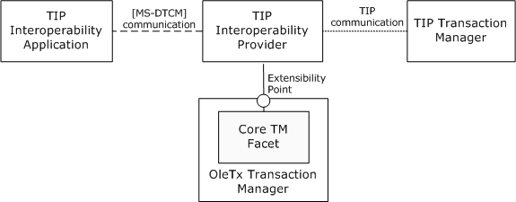
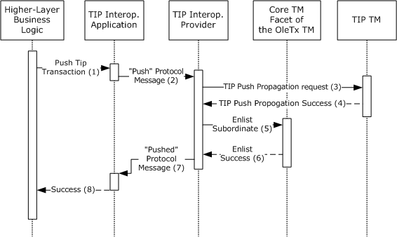
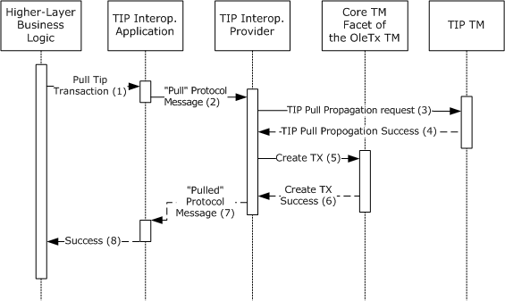
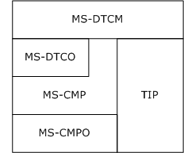
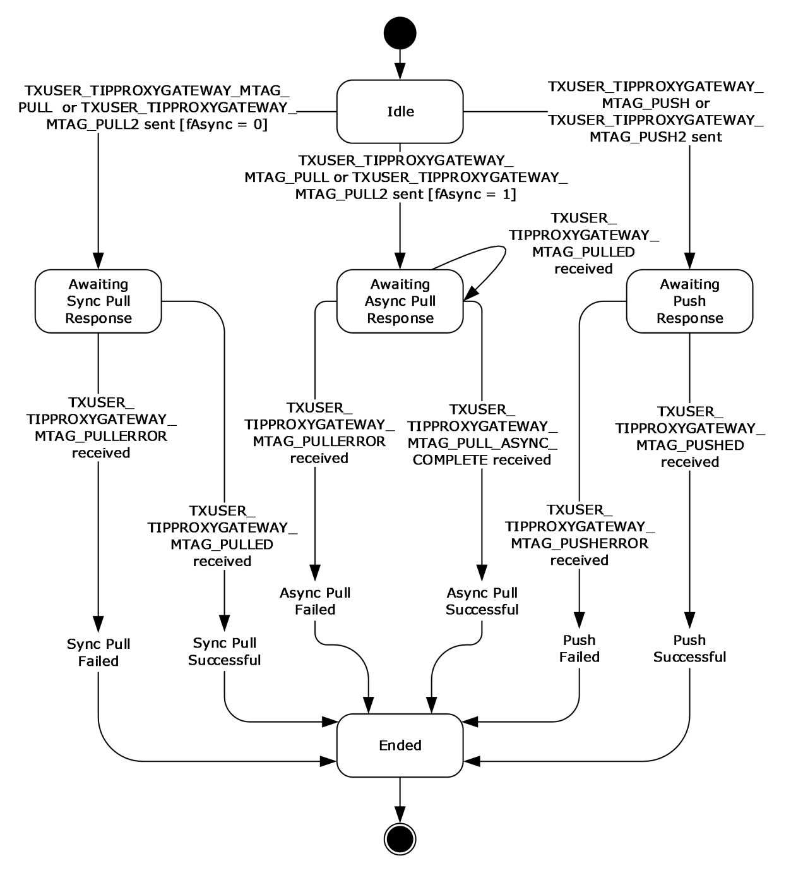
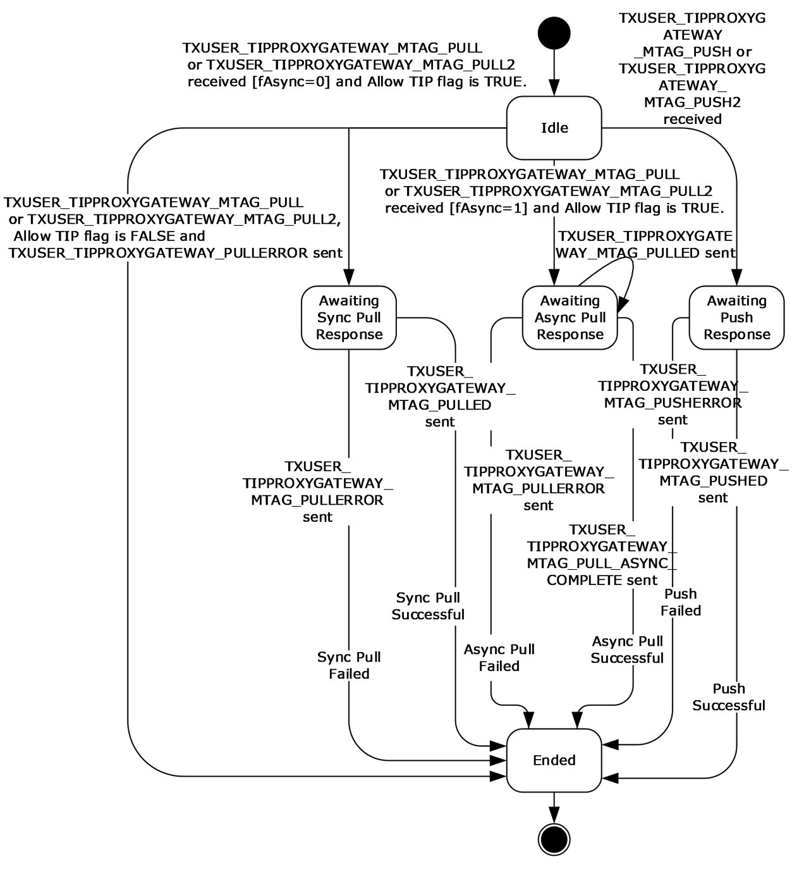

[MS-DTCM]:

MSDTC Connection Manager: OleTx Transaction Internet
Protocol

Intellectual Property Rights Notice for Open Specifications Documentation

  Technical Documentation. Microsoft publishes Open Specifications documentation (“this

documentation”) for protocols, file formats, data portability, computer languages, and standards
support. Additionally, overview documents cover inter-protocol relationships and interactions.

  Copyrights. This documentation is covered by Microsoft copyrights. Regardless of any other

terms that are contained in the terms of use for the Microsoft website that hosts this
documentation, you can make copies of it in order to develop implementations of the technologies
that are described in this documentation and can distribute portions of it in your implementations
that use these technologies or in your documentation as necessary to properly document the
implementation. You can also distribute in your implementation, with or without modification, any
schemas, IDLs, or code samples that are included in the documentation. This permission also
applies to any documents that are referenced in the Open Specifications documentation.
  No Trade Secrets. Microsoft does not claim any trade secret rights in this documentation.
  Patents. Microsoft has patents that might cover your implementations of the technologies

described in the Open Specifications documentation. Neither this notice nor Microsoft's delivery of
this documentation grants any licenses under those patents or any other Microsoft patents.
However, a given Open Specifications document might be covered by the Microsoft Open
Specifications Promise or the Microsoft Community Promise. If you would prefer a written license,
or if the technologies described in this documentation are not covered by the Open Specifications
Promise or Community Promise, as applicable, patent licenses are available by contacting
iplg@microsoft.com.

  License Programs. To see all of the protocols in scope under a specific license program and the

associated patents, visit the Patent Map.

  Trademarks. The names of companies and products contained in this documentation might be
covered by trademarks or similar intellectual property rights. This notice does not grant any
licenses under those rights. For a list of Microsoft trademarks, visit
www.microsoft.com/trademarks.

  Fictitious Names. The example companies, organizations, products, domain names, email

addresses, logos, people, places, and events that are depicted in this documentation are fictitious.
No association with any real company, organization, product, domain name, email address, logo,
person, place, or event is intended or should be inferred.

Reservation of Rights. All other rights are reserved, and this notice does not grant any rights other
than as specifically described above, whether by implication, estoppel, or otherwise.

Tools. The Open Specifications documentation does not require the use of Microsoft programming
tools or programming environments in order for you to develop an implementation. If you have access
to Microsoft programming tools and environments, you are free to take advantage of them. Certain
Open Specifications documents are intended for use in conjunction with publicly available standards
specifications and network programming art and, as such, assume that the reader either is familiar
with the aforementioned material or has immediate access to it.

Support. For questions and support, please contact dochelp@microsoft.com.

[MS-DTCM] - v20240423
MSDTC Connection Manager: OleTx Transaction Internet Protocol
Copyright © 2024 Microsoft Corporation
Release: April 23, 2024

1 / 64

Revision Summary

Date

Revision
History

Revision
Class

Comments

5/11/2007

0.1

8/10/2007

0.2

9/28/2007

0.3

10/23/2007  1.0

New

Minor

Minor

Major

Version 0.1 release

Clarified the meaning of the technical content.

Clarified the meaning of the technical content.

Updated and revised the technical content.

11/30/2007  1.0.1

Editorial

Changed language and formatting in the technical content.

1/25/2008

1.0.2

Editorial

Changed language and formatting in the technical content.

3/14/2008

1.0.3

Editorial

Changed language and formatting in the technical content.

5/16/2008

1.0.4

Editorial

Changed language and formatting in the technical content.

6/20/2008

1.0.5

Editorial

Changed language and formatting in the technical content.

7/25/2008

1.1

8/29/2008

2.0

Minor

Major

Clarified the meaning of the technical content.

Updated and revised the technical content.

10/24/2008  2.0.1

Editorial

Changed language and formatting in the technical content.

12/5/2008

2.0.2

Editorial

Changed language and formatting in the technical content.

1/16/2009

2.0.3

Editorial

Changed language and formatting in the technical content.

2/27/2009

2.0.4

Editorial

Changed language and formatting in the technical content.

4/10/2009

2.0.5

Editorial

Changed language and formatting in the technical content.

5/22/2009

2.0.6

Editorial

Changed language and formatting in the technical content.

7/2/2009

2.1

Minor

Clarified the meaning of the technical content.

8/14/2009

2.1.1

Editorial

Changed language and formatting in the technical content.

9/25/2009

2.2

11/6/2009

3.0

12/18/2009  4.0

1/29/2010

4.1

Minor

Major

Major

Minor

Clarified the meaning of the technical content.

Updated and revised the technical content.

Updated and revised the technical content.

Clarified the meaning of the technical content.

3/12/2010

4.1.1

Editorial

Changed language and formatting in the technical content.

4/23/2010

4.1.2

Editorial

Changed language and formatting in the technical content.

6/4/2010

5.0

7/16/2010

6.0

8/27/2010

7.0

10/8/2010

7.0

11/19/2010  7.0

Major

Major

Major

None

None

Updated and revised the technical content.

Updated and revised the technical content.

Updated and revised the technical content.

No changes to the meaning, language, or formatting of the
technical content.

No changes to the meaning, language, or formatting of the

[MS-DTCM] - v20240423
MSDTC Connection Manager: OleTx Transaction Internet Protocol
Copyright © 2024 Microsoft Corporation
Release: April 23, 2024

2 / 64

Date

Revision
History

Revision
Class

Comments

technical content.

1/7/2011

7.0

2/11/2011

7.0

3/25/2011

7.0

5/6/2011

7.0

None

None

None

None

No changes to the meaning, language, or formatting of the
technical content.

No changes to the meaning, language, or formatting of the
technical content.

No changes to the meaning, language, or formatting of the
technical content.

No changes to the meaning, language, or formatting of the
technical content.

6/17/2011

7.1

Minor

Clarified the meaning of the technical content.

9/23/2011

7.1

None

No changes to the meaning, language, or formatting of the
technical content.

12/16/2011  8.0

Major

Updated and revised the technical content.

3/30/2012

8.0

7/12/2012

8.0

10/25/2012  8.0

1/31/2013

8.0

None

None

None

None

No changes to the meaning, language, or formatting of the
technical content.

No changes to the meaning, language, or formatting of the
technical content.

No changes to the meaning, language, or formatting of the
technical content.

No changes to the meaning, language, or formatting of the
technical content.

8/8/2013

8.1

Minor

Clarified the meaning of the technical content.

11/14/2013  8.1

2/13/2014

8.1

5/15/2014

8.1

None

None

None

No changes to the meaning, language, or formatting of the
technical content.

No changes to the meaning, language, or formatting of the
technical content.

No changes to the meaning, language, or formatting of the
technical content.

6/30/2015

9.0

Major

Significantly changed the technical content.

10/16/2015  9.0

7/14/2016

9.0

6/1/2017

9.0

9/15/2017

10.0

9/12/2018

11.0

4/7/2021

12.0

6/25/2021

13.0

None

None

None

Major

Major

Major

Major

No changes to the meaning, language, or formatting of the
technical content.

No changes to the meaning, language, or formatting of the
technical content.

No changes to the meaning, language, or formatting of the
technical content.

Significantly changed the technical content.

Significantly changed the technical content.

Significantly changed the technical content.

Significantly changed the technical content.

[MS-DTCM] - v20240423
MSDTC Connection Manager: OleTx Transaction Internet Protocol
Copyright © 2024 Microsoft Corporation
Release: April 23, 2024

3 / 64

Date

Revision
History

Revision
Class

Comments

4/23/2024

14.0

Major

Significantly changed the technical content.

[MS-DTCM] - v20240423
MSDTC Connection Manager: OleTx Transaction Internet Protocol
Copyright © 2024 Microsoft Corporation
Release: April 23, 2024

4 / 64

Table of Contents

1.3

1.1
1.2

1.3.1
1.3.2

1.2.1
1.2.2

1.3.2.1
1.3.2.2
1.3.2.3
1.3.2.4

1  Introduction ............................................................................................................ 8
Glossary ........................................................................................................... 8
References ...................................................................................................... 11
Normative References ................................................................................. 11
Informative References ............................................................................... 11
Overview ........................................................................................................ 12
OleTx Transaction Protocol (MS-DTCO) and TIP .............................................. 12
OleTx Transaction Internet Protocol (MS-DTCM) ............................................. 12
TIP Interoperability Application Role ........................................................ 12
TIP Interoperability Provider Role ............................................................ 12
High-Level Block Diagram ...................................................................... 13
Protocol Interactions ............................................................................. 13
TIP Push Propagation Interactions ..................................................... 13
TIP Pull Propagation Interactions ....................................................... 15
Relationship to Other Protocols .......................................................................... 16
Prerequisites/Preconditions ............................................................................... 16
Applicability Statement ..................................................................................... 17
Versioning and Capability Negotiation ................................................................. 17
Versioning ................................................................................................. 17
Versioning Negotiation Mechanisms .............................................................. 17
Capability Negotiation Mechanisms ............................................................... 17
Vendor-Extensible Fields ................................................................................... 17
Standards Assignments ..................................................................................... 17

1.3.2.4.1
1.3.2.4.2

1.7.1
1.7.2
1.7.3

1.4
1.5
1.6
1.7

1.8
1.9

2.2

2.1

2.2.4

2.1.3

2.1.1
2.1.2

2.2.3.1
2.2.3.2

2.2.1
2.2.2
2.2.3

2.1.2.1
2.1.2.2
2.1.2.3

2  Messages ............................................................................................................... 18
Transport ........................................................................................................ 18
Messages, Connections, and Sessions ........................................................... 18
Parameters Passed to the Transport Layer ..................................................... 18
Establishing a Security Level .................................................................. 18
Obtaining a Name Object ....................................................................... 18
Obtaining the Minimum and Maximum Protocol Version Numbers ................ 18
Protocol Versioning ..................................................................................... 19
Message Syntax ............................................................................................... 19
Protocol Connection Types ........................................................................... 19
Connection Type Versioning ......................................................................... 19
Protocol Data Structures .............................................................................. 19
OLETX_TIP_TM_ID ................................................................................ 19
OLETX_TIP_TX_ID ................................................................................ 20
Protocol Enumerations................................................................................. 20
TRUN_TIPPROXYGATEWAY_PULLERROR ................................................... 20
TRUN_TIPPROXYGATEWAY_PUSHERROR .................................................. 21
Connection Type Details .............................................................................. 21
CONNTYPE_TXUSER_TIPPROXYGATEWAY ................................................. 21
Message Types ................................................................................ 21
Message Type Versioning ................................................................. 22
Message Type Details ....................................................................... 22
TXUSER_TIPPROXYGATEWAY_MTAG_PULL .................................... 22
TXUSER_TIPPROXYGATEWAY_MTAG_PULL2 .................................. 23
TXUSER_TIPPROXYGATEWAY_MTAG_PULL_ASYNC_COMPLETE ........ 24
TXUSER_TIPPROXYGATEWAY_MTAG_PULLED ................................ 24
TXUSER_TIPPROXYGATEWAY_MTAG_PULLERROR .......................... 25
TXUSER_TIPPROXYGATEWAY_MTAG_PUSH ................................... 25
TXUSER_TIPPROXYGATEWAY_MTAG_PUSH2 ................................. 26
TXUSER_TIPPROXYGATEWAY_MTAG_PUSHED ............................... 27
TXUSER_TIPPROXYGATEWAY_MTAG_PUSHERROR ......................... 27

2.2.5.1.3.1
2.2.5.1.3.2
2.2.5.1.3.3
2.2.5.1.3.4
2.2.5.1.3.5
2.2.5.1.3.6
2.2.5.1.3.7
2.2.5.1.3.8
2.2.5.1.3.9

2.2.5.1.1
2.2.5.1.2
2.2.5.1.3

2.2.4.1
2.2.4.2

2.2.5.1

2.2.5

[MS-DTCM] - v20240423
MSDTC Connection Manager: OleTx Transaction Internet Protocol
Copyright © 2024 Microsoft Corporation
Release: April 23, 2024

5 / 64

3.2

3.1

3.2.5

3.2.1

3.1.8

3.1.1

3.2.1.1

3.1.7.1

3.2.4.1
3.2.4.2

3.1.1.1
3.1.1.2

3.2.2
3.2.3
3.2.4

3.1.2
3.1.3
3.1.4
3.1.5
3.1.6
3.1.7

3.2.1.1.1
3.2.1.1.2
3.2.1.1.3
3.2.1.1.4
3.2.1.1.5

3  Protocol Details ..................................................................................................... 29
Common Details .............................................................................................. 29
Abstract Data Model .................................................................................... 29
Common Transport-Related Details ......................................................... 29
Protocol Connection Objects ................................................................... 29
Timers ...................................................................................................... 30
Initialization ............................................................................................... 30
Higher-Layer Triggered Events ..................................................................... 31
Message Processing Events and Sequencing Rules .......................................... 31
Timer Events .............................................................................................. 31
Other Local Events ...................................................................................... 31
Connection Disconnected ....................................................................... 31
Versioning Negotiation ................................................................................ 32
TIP Interoperability Application Role Details ......................................................... 32
Abstract Data Model .................................................................................... 32
CONNTYPE_TXUSER_TIPPROXYGATEWAY Initiator States ........................... 33
Idle ............................................................................................... 34
Awaiting Sync Pull Response ............................................................. 34
Awaiting Async Pull Response ........................................................... 35
Awaiting Push Response ................................................................... 35
Ended ............................................................................................ 35
Timers ...................................................................................................... 35
Initialization ............................................................................................... 35
Higher-Layer Triggered Events ..................................................................... 35
Sending a TIP Pull Request ..................................................................... 36
Sending a TIP Push Request ................................................................... 36
Message Processing Events and Sequencing Rules .......................................... 37
CONNTYPE_TXUSER_TIPPROXYGATEWAY as Initiator ................................ 37
Receiving a TXUSER_TIPPROXYGATEWAY_MTAG_PULLED Message ........ 37
Receiving a TXUSER_TIPPROXYGATEWAY_MTAG_PULL_ASYNC_COMPLETE
Message ......................................................................................... 37
Receiving a TXUSER_TIPPROXYGATEWAY_MTAG_PULLERROR Message .. 37
Receiving a TXUSER_TIPPROXYGATEWAY_MTAG_PUSHED Message ....... 38
Receiving a TXUSER_TIPPROXYGATEWAY_MTAG_PUSHERROR Message . 38
Connection Disconnected .................................................................. 38
Timer Events .............................................................................................. 39
Other Local Events ...................................................................................... 39
TIP Interoperability Provider Role Details ............................................................ 39
Abstract Data Model .................................................................................... 39
Interface with the Core Transaction Manager Facet of the Local Transaction
Manager .............................................................................................. 39
Connection States ................................................................................. 40
CONNTYPE_TXUSER_TIPPROXYGATEWAY Acceptor States .................... 40
Idle .......................................................................................... 41
Awaiting Sync Pull Response ....................................................... 42
Awaiting Async Pull Response ...................................................... 42
Awaiting Push Response ............................................................. 42
Ended ....................................................................................... 42
Timers ...................................................................................................... 42
Initialization ............................................................................................... 42
Role Initialization .................................................................................. 42
Transaction Object Initialization .............................................................. 43
Higher-Layer Triggered Events ..................................................................... 43
Message Processing Events and Sequencing Rules .......................................... 43
CONNTYPE_TXUSER_TIPPROXYGATEWAY as Acceptor ............................... 43

3.3.1.2.1.1
3.3.1.2.1.2
3.3.1.2.1.3
3.3.1.2.1.4
3.3.1.2.1.5

3.2.5.1.3
3.2.5.1.4
3.2.5.1.5
3.2.5.1.6

3.2.5.1.1
3.2.5.1.2

3.3.3.1
3.3.3.2

3.2.6
3.2.7

3.3.2
3.3.3

3.3.4
3.3.5

3.3.1.2.1

3.3.5.1

3.2.5.1

3.3.1.1

3.3.1.2

3.3.1

3.3

3.3.5.1.1

Receiving a TXUSER_TIPPROXYGATEWAY_MTAG_PULL or a
TXUSER_TIPPROXYGATEWAY_MTAG_PULL2 Message ........................... 43

6 / 64

[MS-DTCM] - v20240423
MSDTC Connection Manager: OleTx Transaction Internet Protocol
Copyright © 2024 Microsoft Corporation
Release: April 23, 2024

3.3.6
3.3.7

3.3.7.1

3.3.5.1.2

3.3.5.1.3

Receiving a TXUSER_TIPPROXYGATEWAY_MTAG_PUSH or a
TXUSER_TIPPROXYGATEWAY_MTAG_PUSH2 Message .......................... 45
Connection Disconnected .................................................................. 46
Timer Events .............................................................................................. 46
Other Local Events ...................................................................................... 46
TIP Transaction Propagation Events ......................................................... 46
Pull TIP Transaction ......................................................................... 46
Push TIP Transaction ....................................................................... 47
TIP Pull Failure ................................................................................ 48
TIP Pull Success .............................................................................. 49
TIP Push Failure .............................................................................. 49
TIP Push Success ............................................................................ 50
Enlisting Events Signaled by the Core Transaction Manager Facet ............... 50
Create Transaction Failure ................................................................ 50
Create Transaction Success .............................................................. 51
Create Subordinate Enlistment Failure................................................ 51
Create Subordinate Enlistment Success .............................................. 51
TIP Communication Events ..................................................................... 51

3.3.7.1.1
3.3.7.1.2
3.3.7.1.3
3.3.7.1.4
3.3.7.1.5
3.3.7.1.6

3.3.7.2.1
3.3.7.2.2
3.3.7.2.3
3.3.7.2.4

3.3.7.2

3.3.7.3

4.1

4.1.1
4.1.2
4.1.3

4  Protocol Examples ................................................................................................. 53
TIP Pull Propagation Scenario ............................................................................ 53
Establishing a CONNTYPE_TXUSER_TIPPROXYGATEWAY Connection ................. 53
Sending the TXUSER_TIPPROXYGATEWAY_MTAG_PULL2 Message .................... 53
Receiving the TXUSER_TIPPROXYGATEWAY_MTAG_PULLED Message ................ 54
TIP Push Propagation Scenario ........................................................................... 55
Establishing a CONNTYPE_TXUSER_TIPPROXYGATEWAY Connection ................. 55
Sending the TXUSER_TIPPROXYGATEWAY_MTAG_PUSH2 Message ................... 55
Receiving the TXUSER_TIPPROXYGATEWAY_MTAG_PUSHED Message ............... 56

4.2.1
4.2.2
4.2.3

4.2

5  Security ................................................................................................................. 58
Security Considerations for Implementers ........................................................... 58
Index of Security Parameters ............................................................................ 58

5.1
5.2

6  Appendix A: Product Behavior ............................................................................... 59

7  Change Tracking .................................................................................................... 61

8  Index ..................................................................................................................... 62

[MS-DTCM] - v20240423
MSDTC Connection Manager: OleTx Transaction Internet Protocol
Copyright © 2024 Microsoft Corporation
Release: April 23, 2024

7 / 64

1  Introduction

The MSDTC Connection Manager: OleTx Transaction Internet Protocol (TIP) is used between an
application and a transaction manager to supply information that can be used to request that the
transaction manager propagate a transaction to a remote TIP-compliant transaction manager. This
protocol enables the propagation of transactions between an OleTx Transaction Manager and a TIP
Transaction Manager by using TIP. This protocol operates together with the MSDTC Connection
Manager: OleTx Transaction Protocol [MS-DTCO] to enable its interoperation with the open-standard
Transaction Internet Protocol (TIP), as specified in [RFC2371].

Sections 1.5, 1.8, 1.9, 2, and 3 of this specification are normative. All other sections and examples in
this specification are informative.

1.1  Glossary

This document uses the following terms:

application: A participant that is responsible for beginning, propagating, and completing an atomic

transaction. An application communicates with a transaction manager in order to begin and
complete transactions. An application communicates with a transaction manager in order to
marshal transactions to and from other applications. An application also communicates in
application-specific ways with a resource manager in order to submit requests for work on
resources.

atomic transaction: A shared activity that provides mechanisms for achieving the atomicity,
consistency, isolation, and durability (ACID) properties when state changes occur inside
participating resource managers.

authentication level: A numeric value indicating the level of authentication or message protection

that remote procedure call (RPC) will apply to a specific message exchange. For more
information, see [C706] section 13.1.2.1 and [MS-RPCE].

connection: In OleTx, an ordered set of logically related messages. The relationship between the
messages is defined by the higher-layer protocol, but they are guaranteed to be delivered
exactly one time and in order relative to other messages in the connection.

connection type: A specific set of interactions between participants in an OleTx protocol that
accomplishes a specific set of state changes. A connection type consists of a bidirectional
sequence of messages that are conveyed by using the MSDTC Connection Manager: OleTx
Transports Protocol and the MSDTC Connection Manager: OleTx Multiplexing Protocol transport
protocol, as described in [MS-CMPO] and [MS-CMP]. A specified transaction typically involves
many different connection types during its lifetime.

contact identifier: A universally unique identifier (UUID) that identifies a partner in the MSDTC
Connection Manager: OleTx Transports Protocol. These UUIDs are frequently converted to and
from string representations. This string representation has to follow the format specified in
[C706] Appendix A. In addition, the UUIDs have to be compared, as specified in [C706]
Appendix A.

core transaction manager facet: The facet that acts as the internal coordinator of each
transaction that is inside the transaction manager. The core transaction manager facet
communicates with other facets in its transaction manager to ensure that each transaction is
processed correctly. To accomplish this, the core transaction manager facet maintains critical
transaction state, in both volatile memory and in a durable store, such as in a log file.

endpoint: A network-specific address of a remote procedure call (RPC) server process for remote

procedure calls. The actual name and type of the endpoint depends on the RPC protocol
sequence that is being used. For example, for RPC over TCP (RPC Protocol Sequence

8 / 64

[MS-DTCM] - v20240423
MSDTC Connection Manager: OleTx Transaction Internet Protocol
Copyright © 2024 Microsoft Corporation
Release: April 23, 2024

ncacn_ip_tcp), an endpoint might be TCP port 1025. For RPC over Server Message Block (RPC
Protocol Sequence ncacn_np), an endpoint might be the name of a named pipe. For more
information, see [C706].

globally unique identifier (GUID): A term used interchangeably with universally unique

identifier (UUID) in Microsoft protocol technical documents (TDs). Interchanging the usage of
these terms does not imply or require a specific algorithm or mechanism to generate the value.
Specifically, the use of this term does not imply or require that the algorithms described in
[RFC4122] or [C706] have to be used for generating the GUID. See also universally unique
identifier (UUID).

higher-layer business logic: The application functionality that invokes the functionality that is

specific to this protocol.

incoming authentication: A mode in which each party (the reference party) verifies the identity

of the other party, as specified in [RFC3748] section 7.2.1, but not vice-versa.

message: A data structure representing a unit of data transfer between distributed applications. A
message has message properties, which can include message header properties, a message
body property, and message trailer properties.

mutual authentication: A mode in which each party verifies the identity of the other party, as

described in [RFC3748] section 7.2.1.

Name Object: An object that contains endpoint contact information (as specified in [MS-CMPO]

section 3.2.1.4).

OleTx: A comprehensive distributed transaction manager processing protocol that uses the

protocols specified in the following document(s): [MS-CMPO], [MS-CMP], [MS-DTCLU], [MS-
DTCM], [MS-DTCO], [MC-DTCXA], [MS-TIPP], and [MS-CMOM].

OleTx transaction manager (OleTx TM): A transaction manager that implements the OleTx

Transaction Protocol [MS-DTCO].

OleTx Transaction Protocol: The protocol that is specified in the MSDTC Connection Manager:

OleTx Transaction Protocol, as specified in [MS-DTCO].

protocol extension: An addition of new integrated behavior to an existing protocol.

protocol message: A message that is specific to the MSDTC Connection Manager: OleTx

Transaction Internet Protocol, as specified in [MS-DTCM].

protocol participant: An implementation of one of the protocol roles defined in a specification.

protocol role: A class of protocol functionality that is identified as such for the purposes of a

specification.

protocol type: A special set of standardized rules that the endpoints in a communications

connection use when transferring data.

pull propagation: An operation that enables the untargeted marshaling of a transaction from

one application or resource manager to another. Pull propagation allows the source participant
to marshal the transaction without the prior knowledge of the contact information of the
transaction manager of the destination participant.

session: In OleTx, a transport-level connection between a Transaction Manager and another
Distributed Transaction participant over which multiplexed logical connections and messages
flow. A session remains active so long as there are logical connections using it.

state machine: A model of computing behavior composed of a specified number of states,

transitions between those states, and actions to be taken. A state stores information about past

9 / 64

[MS-DTCM] - v20240423
MSDTC Connection Manager: OleTx Transaction Internet Protocol
Copyright © 2024 Microsoft Corporation
Release: April 23, 2024

transactions as it reflects input changes from the startup of the system to the present moment.
A transition (such as connecting a network share) indicates a state change and is described by a
condition that would need to be fulfilled to enable the transition. An action is a description of an
activity that is to be performed at a given moment. There are several action types: Entry action:
Performed when entering the state. Exit action: Performed when exiting the state. Input action:
Performed based on the present state and input conditions. Transition action: Performed when
executing a certain state transition.

subordinate-to-superior relationship: The relationship between a subordinate transaction

manager and a superior transaction manager, for transaction coordination.

superior-to-subordinate relationship: The relationship between a superior transaction manager

and a subordinate transaction manager, for transaction coordination.

TIP: An acronym for the Transaction Internet Protocol, which is specified in [RFC2371] section 13.

tip communication: An exchange of TIP commands and responses that follows message
exchange patterns that conform to the TIP specification, as specified in [RFC2371].

tip connection: A TIP connection that is initiated and used, as specified in [RFC2371] section 4.

TIP Interoperability Application Name: A name object that is used to identify the TIP

interoperability application with the underlying transport infrastructure of MSDTC Connection
Manager: OleTx Transports Protocol, as specified in [MS-CMPO].

TIP Interoperability Provider Name: A name object that identifies the TIP interoperability

provider that the TIP interoperability application has to use.

TIP pull propagation: The pull propagation of a transaction that is performed by using TIP

communication.

TIP push propagation: The push propagation of a transaction that is performed by using TIP

communication.

TIP transaction coordination: Transaction coordination that is performed with TIP

communication.

tip transaction manager: A transaction manager for the transaction management functionality

specified in TIP.

TIP transaction propagation: Either TIP pull propagation or TIP push propagation.

TIP transaction recovery: Transaction recovery that is performed with TIP communication.

TIP transaction table: A table of entries to transaction objects, as specified in [MS-DTCO]

section 3.2.1, that are keyed by the TIP URL of the TIP transaction with which a transaction
object that is managed by the OleTx transaction manager is associated through TIP
propagation.

TIP URL: A URL that is formatted in accordance with [RFC2371] section 8.

transaction: In OleTx, an atomic transaction.

transaction coordination: The set of activities performed by one or more transaction

managers as part of the Two-Phase Commit Protocol.

transaction identifier: The GUID that uniquely identifies an atomic transaction.

transaction manager: The party that is responsible for managing and distributing the outcome of

atomic transactions. A transaction manager is either a root transaction manager or a
subordinate transaction manager for a specified transaction.

10 / 64

[MS-DTCM] - v20240423
MSDTC Connection Manager: OleTx Transaction Internet Protocol
Copyright © 2024 Microsoft Corporation
Release: April 23, 2024

transaction object: Object representing a transaction, as specified in [MS-DTCO] section 3.2.1.

transaction propagation: The act of coordinating two transaction managers to work together on
a single atomic transaction. When propagating a transaction to a transaction manager that is
not already a participant in the transaction, that transaction manager plays the role of
subordinate transaction manager to the originating transaction manager, which will play the role
of superior transaction manager. When propagating a transaction to a transaction manager that
is already a participant in the transaction, no new superior or subordinate relationship is
established.

trusted domain: A domain that is trusted to make authentication decisions for security principals

in that domain.

MAY, SHOULD, MUST, SHOULD NOT, MUST NOT: These terms (in all caps) are used as defined
in [RFC2119]. All statements of optional behavior use either MAY, SHOULD, or SHOULD NOT.

1.2  References

Links to a document in the Microsoft Open Specifications library point to the correct section in the
most recently published version of the referenced document. However, because individual documents
in the library are not updated at the same time, the section numbers in the documents may not
match. You can confirm the correct section numbering by checking the Errata.

1.2.1  Normative References

We conduct frequent surveys of the normative references to assure their continued availability. If you
have any issue with finding a normative reference, please contact dochelp@microsoft.com. We will
assist you in finding the relevant information.

[ISO/IEC-8859-1] International Organization for Standardization, "Information Technology -- 8-Bit
Single-Byte Coded Graphic Character Sets -- Part 1: Latin Alphabet No. 1", ISO/IEC 8859-1, 1998,
http://www.iso.org/iso/home/store/catalogue_tc/catalogue_detail.htm?csnumber=28245

Note There is a charge to download the specification.

[MS-CMPO] Microsoft Corporation, "MSDTC Connection Manager: OleTx Transports Protocol".

[MS-CMP] Microsoft Corporation, "MSDTC Connection Manager: OleTx Multiplexing Protocol".

[MS-DTCO] Microsoft Corporation, "MSDTC Connection Manager: OleTx Transaction Protocol".

[MS-DTYP] Microsoft Corporation, "Windows Data Types".

[MS-RPCE] Microsoft Corporation, "Remote Procedure Call Protocol Extensions".

[RFC2119] Bradner, S., "Key words for use in RFCs to Indicate Requirement Levels", BCP 14, RFC
2119, March 1997, https://www.rfc-editor.org/info/rfc2119

[RFC2371] Lyon, J., Evans, K., and Klein, J., "Transaction Internet Protocol Version 3.0", RFC 2371,
July 1998, https://www.rfc-editor.org/info/rfc2371

1.2.2  Informative References

None.

[MS-DTCM] - v20240423
MSDTC Connection Manager: OleTx Transaction Internet Protocol
Copyright © 2024 Microsoft Corporation
Release: April 23, 2024

11 / 64

1.3  Overview

The MSDTC Connection Manager: OleTx Transaction Internet Protocol serves as a bridge between the
MSDTC Connection Manager: OleTx Transaction Protocol, as specified in [MS-DTCO], and the open-
standard Transaction Internet Protocol (TIP), as specified in [RFC2371]. Functional details for TIP are
provided in section 1.3.2 and in Connection Type Details (section 2.2.5).

1.3.1  OleTx Transaction Protocol (MS-DTCO) and TIP

The MSDTC Connection Manager: OleTx Transaction Protocol, as specified in [MS-DTCO], is a protocol
for distributed transaction coordination. It is targeted for use in the enterprise and intranet
environments. OleTx supports pull and push transaction propagation between two OleTx
transaction managers (OleTx TMs) by using standard OleTx message exchanges. More
information about transaction propagation is specified in [MS-DTCO] section 1.3.5.

TIP, as specified in [RFC2371], is an open-standard transaction protocol that is used for transaction
coordination primarily in the Internet domain inside a trusted domain. TIP permits two or more
protocol participants to operate under the scope of an atomic transaction. Similar to the OleTx
Transaction Protocol, TIP supports two types of transaction propagation: TIP push propagation
and TIP pull propagation. More information about pull and push transaction propagation is specified
in [RFC2371] section 6.

1.3.2  OleTx Transaction Internet Protocol (MS-DTCM)

The MSDTC Connection Manager: OleTx Transaction Internet Protocol enables the propagation of
transactions between an OleTx TM and a TIP transaction manager by using TIP. This section
describes the protocol-specific interactions by defining two protocol roles:





The TIP interoperability application role (section 1.3.2.1)

The TIP interoperability provider role (section 1.3.2.2)

1.3.2.1  TIP Interoperability Application Role

The TIP interoperability application role performs the following tasks:

  Sends requests for pulling a transaction (synchronously or asynchronously) from a TIP

transaction manager to an OleTx TM by using TIP pull propagation.

  Sends requests for pushing a transaction from an OleTx TM to a TIP transaction manager by

using TIP push propagation.



Informs the higher-layer business logic about the transaction propagation results and
provides it with the data regarding the propagated transactions.

The TIP interoperability application role transforms requests for TIP transaction propagation from
the higher-layer business logic into protocol messages, which are then sent to the TIP
interoperability provider role (section 1.3.2.2). Conversely, when receiving protocol messages from
the TIP interoperability provider role, the TIP interoperability application role converts the message
data to an application-specific format and returns the result to the higher-layer business logic.

1.3.2.2  TIP Interoperability Provider Role

The TIP interoperability provider role performs the following tasks:

  Accepts and processes requests to pull (synchronously or asynchronously) a transaction from a

TIP transaction manager to an OleTx TM by using TIP pull propagation.

[MS-DTCM] - v20240423
MSDTC Connection Manager: OleTx Transaction Internet Protocol
Copyright © 2024 Microsoft Corporation
Release: April 23, 2024

12 / 64

<!-- Extracted images from page 13 -->

<!-- /Extracted images from page 13 -->

  Accepts and processes requests to push a transaction from an OleTx TM to a TIP transaction

manager by using TIP push propagation.

To perform the preceding tasks, the TIP interoperability provider establishes itself as a protocol
extension with the core transaction manager facet of an OleTx TM, by using the extension
mechanism specified in [MS-DTCO] section 3.2.1.5. (The core transaction manager facet is specified in
[MS-DTCO] section 1.3.3.3.1.)

The TIP interoperability provider uses implementation-specific functionality to perform TIP
communication with other TIP transaction managers for the following purposes:





To establish a TIP connection and to execute TIP transaction propagation operations.

To carry out TIP transaction coordination and TIP transaction recovery activities for the
transactions that it propagates.

Note  The processing that is performed by the TIP interoperability provider for TIP transaction
coordination and TIP transaction recovery does not affect the wire representation of this protocol.

1.3.2.3  High-Level Block Diagram

The following diagram provides a high-level view of the protocol roles and their interaction with
other entities.

Figure 1: Interaction of MSDTC Connection Manager: OleTx Transaction Internet Protocol
roles

1.3.2.4  Protocol Interactions

1.3.2.4.1 TIP Push Propagation Interactions

The following Unified Modeling Language (UML) diagram presents the sequence of actions that occur
during the TIP push propagation of a transaction. This diagram shows a successful push
propagation operation. For information about failure processing conditions, see Protocol
Details (section 3).

[MS-DTCM] - v20240423
MSDTC Connection Manager: OleTx Transaction Internet Protocol
Copyright © 2024 Microsoft Corporation
Release: April 23, 2024

13 / 64

<!-- Extracted images from page 14 -->

<!-- /Extracted images from page 14 -->

Figure 2: Actions performed during a TIP push propagation

1.  The higher-layer business logic requests that the TIP interoperability

application (section 1.3.2.1) perform the TIP push propagation of a transaction. The higher-layer
business logic provides the transaction identifier and the TIP URL of the TIP transaction
manager where the transaction is to be pushed.

2.  The TIP interoperability application sends a "Push" protocol message to the TIP interoperability

provider (section 1.3.2.2). The message contains the data that is provided by the higher-layer
business logic. For more information, see Message Type Details (section 2.2.5.1.3).

3.  After receiving the message, the TIP interoperability provider contacts the TIP transaction

manager that is referenced by the TIP URL. Using TIP communication, it requests the TIP push
propagation of the transaction.

4.  The TIP transaction manager replies that the push propagation was successful. The reply includes

the TIP URL of the transaction that results from the push propagation.

5.  The TIP interoperability provider enlists as a subordinate in the transaction that is managed by the
OleTx TM on behalf of the remote TIP transaction manager. To enlist, the TIP interoperability
provider sends a request to the core transaction manager facet of the OleTx TM. More
information is specified in [MS-DTCO] section 3.2.7.11.

6.  The core transaction manager facet of the OleTx TM signals that the subordinate enlistment is

successfully registered.

7.  The TIP interoperability provider replies with a "Pushed" protocol message to the TIP

interoperability application. (For more information, see Message Type Details.) The message
contains the TIP URL of the transaction that was created as a result of the push propagation.

8.  The TIP interoperability application returns a "Success" result and the TIP URL of the pushed

transaction to the higher-layer business logic.

[MS-DTCM] - v20240423
MSDTC Connection Manager: OleTx Transaction Internet Protocol
Copyright © 2024 Microsoft Corporation
Release: April 23, 2024

14 / 64

<!-- Extracted images from page 15 -->

<!-- /Extracted images from page 15 -->

When all the preceding operations are complete, there is a superior-to-subordinate relationship
between the OleTx TM and the TIP transaction manager.

1.3.2.4.2 TIP Pull Propagation Interactions

The following diagram presents the sequence of actions that occur during a synchronous TIP pull
propagation of a transaction. This diagram shows a successful synchronous pull propagation
operation. For information about failure processing conditions, see Protocol Details (section 3).

Figure 3: Actions performed during a TIP pull propagation

1.  Using the TIP URL for a transaction, the higher-layer business logic requests that the TIP

interoperability application (section 1.3.2.1) perform the TIP pull propagation.

2.  The TIP interoperability application sends a "Pull" protocol message to the TIP interoperability

provider (section 1.3.2.2). The message contains the TIP URL of the transaction to be pulled. For
more information, see Message Type Details (section 2.2.5.1.3).

3.  After receiving the message, the TIP interoperability provider contacts the TIP transaction
manager that is referenced by the TIP URL and requests the TIP pull propagation of the
transaction.

4.  The TIP transaction manager replies that the pull propagation was successful.

5.  The TIP interoperability provider creates a transaction on the OleTx TM, which it associates with
the pulled transaction. As part of that operation, the TIP interoperability provider enlists as a
superior in the transaction on behalf of the remote TIP transaction manager. More information is
specified in [MS-DTCO] section 3.2.7.12.

6.  The OleTx TM signals that the transaction was created successfully.

7.  The TIP interoperability provider replies with a "Pulled" protocol message to the TIP

interoperability application. The message contains the identifier of the transaction that was
created as a result of the pull propagation. For more information, see section 2.2.5.1.3.

15 / 64

[MS-DTCM] - v20240423
MSDTC Connection Manager: OleTx Transaction Internet Protocol
Copyright © 2024 Microsoft Corporation
Release: April 23, 2024

<!-- Extracted images from page 16 -->

<!-- /Extracted images from page 16 -->

8.  The TIP interoperability application returns a "Success" result and the identifier of the transaction

to the higher-layer business logic.

When all the preceding operations are complete, there is a subordinate-to-superior relationship
between the OleTx TM and the TIP transaction manager.

1.4  Relationship to Other Protocols

This protocol establishes the following relationships with other protocols:



This protocol uses the extensibility mechanism that is specified in [MS-DTCO] section 3.2.1.5 to
become a protocol extension to an OleTx TM implementation.

  An implementation of this protocol uses TIP communication to interact with one or more TIP

transaction managers.



This protocol relies on the session and connection transport infrastructure that is specified in
[MS-CMPO] and [MS-CMP].

The following diagram illustrates the relationships with these other protocols.

Figure 4: Protocol relationships

1.5  Prerequisites/Preconditions

The operation of this protocol assumes the following:

  Both the TIP interoperability application role (section 1.3.2.1) and the TIP interoperability provider

role (section 1.3.2.2) implement [MS-CMP] and [MS-CMPO].









The TIP interoperability provider role operates as a protocol extension with an OleTx TM. More
information is specified in [MS-DTCO] section 3.2.1.5.

The TIP interoperability provider role possesses an implementation of the TIP protocol.

The TIP interoperability application role possesses an implementation-specific mechanism to
determine the contact information for the TIP interoperability provider role.

The TIP interoperability provider role uses implementation-specific functionality to perform TIP
communication with other TIP transaction managers.

[MS-DTCM] - v20240423
MSDTC Connection Manager: OleTx Transaction Internet Protocol
Copyright © 2024 Microsoft Corporation
Release: April 23, 2024

16 / 64

1.6  Applicability Statement

This protocol is applicable to scenarios where an OleTx TM needs to interoperate with other TIP
transaction managers. The prerequisites that are provided in
Prerequisites/Preconditions (section 1.5), all the prerequisites that are required for the operation of an
OleTx TM (as specified in [MS-DTCO] section 1.5), and the TIP protocol (as specified in [RFC2371])
need to be satisfied for this protocol to be employed successfully.<1>

1.7  Versioning and Capability Negotiation

1.7.1  Versioning

This section specifies the versioning and capability negotiation dependencies for this protocol.

Protocol Versions: This protocol has two versions, which for the purposes of this specification are

referred to as MS-DTCM 1.0 and MS-DTCM 1.1. More details about the protocol elements that are
supported in each version are provided in Message Syntax (section 2.2). Protocol processing
details that are version-specific are specified in Protocol Details (section 3).

1.7.2  Versioning Negotiation Mechanisms

This protocol uses the explicit versioning negotiation mechanism that is specified in [MS-CMPO]
section 3.3.4.2, BuildContext. An implementation of this protocol uses that mechanism to specify
which versions of the protocol that it supports and to arrive at a mutually agreeable version with its
partners. For specific information about versioning negotiation, see Versioning
Negotiation (section 3.1.8).

By claiming support for a specific protocol version, an implementation is agreeing to provide support
for the protocol elements that define that version. Protocol elements that are specific to a version are
as follows:

  Connection types

  Message types

  Data fields that are required for a certain message type

1.7.3  Capability Negotiation Mechanisms

This protocol does not have optional capabilities for a specified version. Therefore, there are no
capability negotiation features.

1.8  Vendor-Extensible Fields

This protocol has no vendor-extensible fields.

1.9  Standards Assignments

This protocol has no standards assignments.

[MS-DTCM] - v20240423
MSDTC Connection Manager: OleTx Transaction Internet Protocol
Copyright © 2024 Microsoft Corporation
Release: April 23, 2024

17 / 64

2  Messages

This protocol references commonly used data types, such as GUID and UUID, as defined in [MS-DTYP]
section 2.3.4.

2.1  Transport

This protocol uses MSDTC Connection Manager: OleTx Transports Protocol [MS-CMPO] and MSDTC
Connection Manager: OleTx Multiplexing Protocol [MS-CMP] as the transport layer for sending and
receiving protocol messages.

2.1.1  Messages, Connections, and Sessions

The layout of each message that is defined by this protocol MUST extend the MESSAGE_PACKET
structure, as specified in [MS-CMP] section 2.2.2.

Each message MUST be sent by using an active connection, as specified in [MS-CMP], that has been
established between the two protocol participants. The mechanisms that are used to initiate and
accept connections are defined in [MS-CMP] section 3.

Each connection MUST be initiated inside an active session, as specified in [MS-CMPO], that has been
established between the two protocol participants. The mechanism that is used to establish sessions is
specified in [MS-CMPO] section 1.3.3.1.

2.1.2  Parameters Passed to the Transport Layer

To establish a session, as specified in [MS-CMPO], the following values MUST be provided to the
lower-layer protocol:

  A Security Level value that indicates the needed RPC authentication level. The possible values

for this element are specified in [MS-RPCE].

  A name object that indicates the host name, the contact identifier, and the supported RPC

network protocols of the remote endpoint against which the session is established. Name objects
are specified in [MS-CMPO] section 3.2.1.4.



The minimum and maximum values of the protocol version number, which specify the minimum
and maximum protocol versions that are supported by the implementation. For more information,
see section 3.1.3.

2.1.2.1  Establishing a Security Level

Every protocol participant SHOULD use mutual authentication when establishing a new session.
If the destination does not support mutual authentication, a protocol participant SHOULD use
incoming authentication. If the destination does not support incoming authentication, a protocol
participant MAY use No Security.<2>

2.1.2.2  Obtaining a Name Object

The process of obtaining a name object for a session partner is implementation-specific.<3>

2.1.2.3  Obtaining the Minimum and Maximum Protocol Version Numbers

The details of how to compute the minimum and maximum protocol version numbers are provided in
Common Initialization Details (section 3.1.3).

[MS-DTCM] - v20240423
MSDTC Connection Manager: OleTx Transaction Internet Protocol
Copyright © 2024 Microsoft Corporation
Release: April 23, 2024

18 / 64

2.1.3  Protocol Versioning

This protocol has two versions: MS-DTCM 1.0 and MS-DTCM 1.1. Versioning aspects that are related
to connection types, message types, and message fields are provided in the context of each
connection type. For more information, see Connection Type Details (section 2.2.5).

2.2  Message Syntax

All messages in this protocol MUST extend the MESSAGE_PACKET structure, as specified in [MS-CMP]
section 2.2.2.

2.2.1  Protocol Connection Types

This protocol MUST extend the set of connection types that are specified in [MS-DTCO] section 2.2
by providing one new connection type: CONNTYPE_TXUSER_TIPPROXYGATEWAY (section 2.2.5.1).
The protocol type field for connections that implement this connection type MUST be set to
0x00000026.

2.2.2  Connection Type Versioning

Both the MS-DTCM 1.0 and MS-DTCM 1.1 versions of MSDTC Connection Manager: OleTx Transaction
Internet Protocol MUST support the CONNTYPE_TXUSER_TIPPROXYGATEWAY (section 2.2.5.1)
connection type.

2.2.3  Protocol Data Structures

2.2.3.1  OLETX_TIP_TM_ID

The OLETX_TIP_TM_ID structure is used to represent the identification (contact) information for a
TIP transaction manager.

0  1  2  3  4  5  6  7  8  9

1
0  1  2  3  4  5  6  7  8  9

2
0  1  2  3  4  5  6  7  8  9

3
0  1

lVersion

lPort

cbHostName

cbPath

szHostName (variable)

...

szPath (variable)

...

lVersion (4 bytes): The version number of the structure. This 4-byte field MUST be set to

0x00000001.

[MS-DTCM] - v20240423
MSDTC Connection Manager: OleTx Transaction Internet Protocol
Copyright © 2024 Microsoft Corporation
Release: April 23, 2024

19 / 64

lPort (4 bytes): This field MUST be a 4-byte unsigned integer that specifies the TCP port on which

the remote TIP transaction manager is listening.

cbHostName (4 bytes): This field MUST be an unsigned integer value that specifies the length, in

bytes, of the szHostName field, including the terminating null character.

cbPath (4 bytes): This field MUST be an unsigned integer value that specifies the length, in bytes, of

the szPath field, including the terminating null character.

szHostName (variable): A null-terminated Latin-1 ANSI character string, as specified in [ISO/IEC-

8859-1], that MUST specify the host name of the remote TIP transaction manager. The size of this
field is limited only by the maximum length of variable data that can be transmitted in a message,
as specified in [MS-CMP] section 2.2.2.

szPath (variable): A null-terminated Latin-1 ANSI character string, as specified in [ISO/IEC-8859-1],

that MUST specify the path of the remote TIP transaction manager. The size of this field is limited
only by the maximum length of variable data that can be transmitted in a message, as specified in
[MS-CMP] section 2.2.2.

2.2.3.2  OLETX_TIP_TX_ID

The OLETX_TIP_TX_ID structure is used to represent a  transaction identifier as specified in
[RFC2371] section 5.

0  1  2  3  4  5  6  7  8  9

1
0  1  2  3  4  5  6  7  8  9

2
0  1  2  3  4  5  6  7  8  9

3
0  1

lVersion

cbTxId

szTxId (variable)

...

lVersion (4 bytes): The version number of the structure. This 4-byte field MUST be set to

0x00000001.

cbTxId (4 bytes): This field MUST be an unsigned integer value that specifies the length, in bytes, of

the szTxId field, including the terminating null character.

szTxId (variable): A null-terminated Latin-1 ANSI string, as specified in [ISO/IEC-8859-1], that

MUST specify the transaction identifier as specified in [RFC2371] section 5. The size of this field is
limited only by the maximum length of variable data that can be transmitted in a message, as
specified in [MS-CMP] section 2.2.2.

2.2.4  Protocol Enumerations

2.2.4.1  TRUN_TIPPROXYGATEWAY_PULLERROR

The TRUN_TIPPROXYGATEWAY_PULLERROR enumeration defines the error values for a pull
request that is initiated by a TIP interoperability application.

 typedef  enum
 {
   TRUN_TIPPROXYGATEWAY_PULLERROR_TIPCONNECTERROR = 0x00000003,

20 / 64

[MS-DTCM] - v20240423
MSDTC Connection Manager: OleTx Transaction Internet Protocol
Copyright © 2024 Microsoft Corporation
Release: April 23, 2024

   TRUN_TIPPROXYGATEWAY_PULLERROR_TIPNOTPULLED = 0x00000004,
   TRUN_TIPPROXYGATEWAY_PULLERROR_TIPERROR = 0x00000005,
   TRUN_TIPPROXYGATEWAY_PULLERROR_TIPDISABLED = 0x00000006
 } TRUN_TIPPROXYGATEWAY_PULLERROR;

TRUN_TIPPROXYGATEWAY_PULLERROR_TIPCONNECTERROR:  The pull propagation failed due

to a connectivity error.

TRUN_TIPPROXYGATEWAY_PULLERROR_TIPNOTPULLED:  The pull propagation failed because

the remote TIP transaction manager responded with a NOTPULLED TIP verb. For information
about NOTPULLED, see [RFC2371] section 13.

TRUN_TIPPROXYGATEWAY_PULLERROR_TIPERROR:  The pull propagation failed due to a

nonspecific error.

TRUN_TIPPROXYGATEWAY_PULLERROR_TIPDISABLED:  The pull propagation failed because

the TIP interoperability functionality is disabled.

2.2.4.2  TRUN_TIPPROXYGATEWAY_PUSHERROR

The TRUN_TIPPROXYGATEWAY_PUSHERROR enumeration defines the error values for a push
request that is initiated by a TIP interoperability application.

 typedef  enum
 {
   TRUN_TIPPROXYGATEWAY_PUSHERROR_TIPCONNECTERROR = 0x00000004,
   TRUN_TIPPROXYGATEWAY_PUSHERROR_TIPERROR = 0x00000005,
   TRUN_TIPPROXYGATEWAY_PUSHERROR_TIPDISABLED = 0x00000006
 } TRUN_TIPPROXYGATEWAY_PUSHERROR;

TRUN_TIPPROXYGATEWAY_PUSHERROR_TIPCONNECTERROR:  The push propagation failed

due to a connectivity error.

TRUN_TIPPROXYGATEWAY_PUSHERROR_TIPERROR:  The push propagation failed due to a

nonspecific error.

TRUN_TIPPROXYGATEWAY_PUSHERROR_TIPDISABLED:  The push propagation failed because

the TIP interoperability functionality is disabled.

2.2.5  Connection Type Details

2.2.5.1  CONNTYPE_TXUSER_TIPPROXYGATEWAY

The CONNTYPE_TXUSER_TIPPROXYGATEWAY connection type is used by a TIP interoperability
application to request that a TIP interoperability provider perform a TIP push or pull propagation, to
propagate a transaction to or from a TIP transaction manager.

2.2.5.1.1 Message Types

The CONNTYPE_TXUSER_TIPPROXYGATEWAY connection type defines the following message types:

  TXUSER_TIPPROXYGATEWAY_MTAG_PULL

  TXUSER_TIPPROXYGATEWAY_MTAG_PULL2

  TXUSER_TIPPROXYGATEWAY_MTAG_PULL_ASYNC_COMPLETE

[MS-DTCM] - v20240423
MSDTC Connection Manager: OleTx Transaction Internet Protocol
Copyright © 2024 Microsoft Corporation
Release: April 23, 2024

21 / 64

  TXUSER_TIPPROXYGATEWAY_MTAG_PULLED

  TXUSER_TIPPROXYGATEWAY_MTAG_PULLERROR

  TXUSER_TIPPROXYGATEWAY_MTAG_PUSH

  TXUSER_TIPPROXYGATEWAY_MTAG_PUSH2

  TXUSER_TIPPROXYGATEWAY_MTAG_PUSHED

  TXUSER_TIPPROXYGATEWAY_MTAG_PUSHERROR

2.2.5.1.2 Message Type Versioning

The following table shows the message types that are version-specific. Protocol messages that are
not shown in this table MUST be supported by both protocol versions.

 Message type / Protocol version

 MS-DTCM 1.0

 MS-DTCM 1.1

TXUSER_TIPPROXYGATEWAY_MTAG_PULL2  Not supported

Supported

TXUSER_TIPPROXYGATEWAY_MTAG_PUSH2  Not supported

Supported

2.2.5.1.3 Message Type Details

2.2.5.1.3.1  TXUSER_TIPPROXYGATEWAY_MTAG_PULL

The TXUSER_TIPPROXYGATEWAY_MTAG_PULL message is used by a TIP interoperability
application to initiate a TIP pull propagation.

0  1  2  3  4  5  6  7  8  9

1
0  1  2  3  4  5  6  7  8  9

2
0  1  2  3  4  5  6  7  8  9

3
0  1

MsgHeader (24 bytes)

...

...

fAsync

cbTipTmId

tipTmId (variable)

...

tipTxId (variable)

...

MsgHeader (24 bytes): This field MUST contain a MESSAGE_PACKET structure as defined in [MS-

CMP] section 2.2.2. Two MESSAGE_PACKET fields MUST be set as follows:

22 / 64

[MS-DTCM] - v20240423
MSDTC Connection Manager: OleTx Transaction Internet Protocol
Copyright © 2024 Microsoft Corporation
Release: April 23, 2024





The dwUserMsgType field MUST be 0x00005101.

The dwcbVarLenData field MUST be equal to the sum of the values of the cbHostName and
cbPath fields in the tipTmId structure, rounded to a multiple of 4; plus the value of the
cbTipTxId field in the tipTxId structure, rounded to a multiple of 4; plus 32.

fAsync (4 bytes): A 4-byte value that indicates whether a synchronous pull or an asynchronous pull

is required.

This value MUST be one of the following values:

Value

Meaning

0x00000000  A synchronous pull propagation is required.

0x00000001  An asynchronous pull propagation is required.

cbTipTmId (4 bytes): A reserved 4-byte field. Implementers MUST NOT use this field.

tipTmId (variable): This field identifies the TIP transaction manager against which the TIP pull

propagation was requested. This field MUST contain an OLETX_TIP_TM_ID structure.

tipTxId (variable): This field identifies the transaction for which the TIP pull propagation was

requested. This field MUST contain an OLETX_TIP_TX_ID structure.

2.2.5.1.3.2  TXUSER_TIPPROXYGATEWAY_MTAG_PULL2

  The TXUSER_TIPPROXYGATEWAY_MTAG_PULL2 message is used by a TIP application to
initiate a TIP pull propagation.

0  1  2  3  4  5  6  7  8  9

1
0  1  2  3  4  5  6  7  8  9

2
0  1  2  3  4  5  6  7  8  9

3
0  1

MsgHeader (24 bytes)

...

...

fAsync

cbTipTmId

tipTmId (variable)

...

tipTxId (variable)

...

MsgHeader (24 bytes): This field MUST contain a MESSAGE_PACKET structure.



The dwUserMsgType field MUST be 0x00005108.

[MS-DTCM] - v20240423
MSDTC Connection Manager: OleTx Transaction Internet Protocol
Copyright © 2024 Microsoft Corporation
Release: April 23, 2024

23 / 64



The dwcbVarLenData field MUST be equal to the sum of the values of the cbHostName and
cbPath fields in the tipTmId structure, rounded to a multiple of 4; plus the value of the
cbTipTxId field in the tipTxId structure, rounded to a multiple of 4; plus 32.

fAsync (4 bytes): A 4-byte value that indicates whether a synchronous or an asynchronous pull is

required.

This value MUST be one of the following values:  Meaning

0x00000000

0x00000001

A synchronous pull propagation is required.

An asynchronous pull propagation is required.

cbTipTmId (4 bytes): A reserved 4-byte field. Implementers MUST not use this field.

tipTmId (variable): This field identifies the TIP transaction manager against which the TIP pull

propagation was requested. This field MUST contain an OLETX_TIP_TM_ID structure and MUST be
aligned on a 4-byte boundary by padding with arbitrary values.

tipTxId (variable): This field identifies the transaction for which the TIP pull propagation was

requested. This field MUST contain an OLETX_TIP_TX_ID structure and MUST be aligned on a 4-
byte boundary by padding with arbitrary values.

2.2.5.1.3.3  TXUSER_TIPPROXYGATEWAY_MTAG_PULL_ASYNC_COMPLETE

The TXUSER_TIPPROXYGATEWAY_MTAG_PULL_ASYNC_COMPLETE message is sent from a TIP
interoperability provider to a TIP interoperability application to indicate that the TIP pull
propagation completed successfully.

0  1  2  3  4  5  6  7  8  9

1
0  1  2  3  4  5  6  7  8  9

2
0  1  2  3  4  5  6  7  8  9

3
0  1

MsgHeader (24 bytes)

...

...

MsgHeader (24 bytes): This field MUST contain a MESSAGE_PACKET structure.





The dwUserMsgType field MUST be 0x00005104.

The dwcbVarLenData field MUST be zero.

2.2.5.1.3.4  TXUSER_TIPPROXYGATEWAY_MTAG_PULLED

The TXUSER_TIPPROXYGATEWAY_MTAG_PULLED message is sent from a TIP interoperability
provider to a TIP interoperability application to indicate the following:



If the fAsync field in the pull message was set to 0x00000000 (synchronous pull), this message
indicates that the pull propagation completed successfully.

  Otherwise (for an asynchronous pull), the message indicates that the TIP interoperability
application can continue its execution, and it will be notified when the pull propagation is
completed.

[MS-DTCM] - v20240423
MSDTC Connection Manager: OleTx Transaction Internet Protocol
Copyright © 2024 Microsoft Corporation
Release: April 23, 2024

24 / 64

0  1  2  3  4  5  6  7  8  9

1
0  1  2  3  4  5  6  7  8  9

2
0  1  2  3  4  5  6  7  8  9

3
0  1

MsgHeader (24 bytes)

...

...

guidTx (16 bytes)

...

...

MsgHeader (24 bytes): This field MUST contain a MESSAGE_PACKET structure.





The dwUserMsgType field MUST be 0x00005102.

The dwcbVarLenData field MUST be 16.

guidTx (16 bytes): This field MUST contain a GUID that specifies the transaction identifier for the

pulled transaction.<4>

2.2.5.1.3.5  TXUSER_TIPPROXYGATEWAY_MTAG_PULLERROR

The TXUSER_TIPPROXYGATEWAY_MTAG_PULLERROR message is sent from a TIP
interoperability provider to a TIP interoperability application to indicate that an error occurred during
the pull propagation.

0  1  2  3  4  5  6  7  8  9

1
0  1  2  3  4  5  6  7  8  9

2
0  1  2  3  4  5  6  7  8  9

3
0  1

MsgHeader (24 bytes)

...

...

Error

MsgHeader (24 bytes): This field MUST contain a MESSAGE_PACKET structure.





The dwUserMsgType field MUST be 0x00005103.

The dwcbVarLenData field MUST be 4.

Error (4 bytes): This 4-byte field MUST contain the status value for the previous request. The value
MUST be one of those defined by the TRUN_TIPPROXYGATEWAY_PULLERROR Enumeration.

2.2.5.1.3.6  TXUSER_TIPPROXYGATEWAY_MTAG_PUSH

The TXUSER_TIPPROXYGATEWAY_MTAG_PUSH message is used by a TIP application to initiate
a TIP push propagation.

[MS-DTCM] - v20240423
MSDTC Connection Manager: OleTx Transaction Internet Protocol
Copyright © 2024 Microsoft Corporation
Release: April 23, 2024

25 / 64

0  1  2  3  4  5  6  7  8  9

1
0  1  2  3  4  5  6  7  8  9

2
0  1  2  3  4  5  6  7  8  9

3
0  1

MsgHeader (24 bytes)

...

...

guidTx (16 bytes)

...

...

cbTipTmId

tipTmId (variable)

...

MsgHeader (24 bytes): This field MUST contain a MESSAGE_PACKET structure. Within the

MESSAGE_PACKET, the following constraints apply:





The dwUserMsgType field MUST be 0x00005105.

The dwcbVarLenData field MUST be equal to the sum of the values of the cbHostName and
cbPath fields in the tipTmId field, rounded to a multiple of 4, plus 36.

guidTx (16 bytes): This field MUST contain a GUID that specifies the transaction identifier for the

transaction to be pushed.

cbTipTmId (4 bytes): A reserved 4-byte field. Implementers MUST NOT use this field.

tipTmId (variable): This field identifies the TIP transaction manager against which the TIP pull
propagation was requested. This field MUST contain an OLETX_TIP_TM_ID structure and MUST
be aligned on a 4-byte boundary by padding with arbitrary values.

2.2.5.1.3.7  TXUSER_TIPPROXYGATEWAY_MTAG_PUSH2

  The TXUSER_TIPPROXYGATEWAY_MTAG_PUSH2 message is used by a TIP interoperability
application to initiate a TIP push propagation.

0  1  2  3  4  5  6  7  8  9

1
0  1  2  3  4  5  6  7  8  9

2
0  1  2  3  4  5  6  7  8  9

3
0  1

MsgHeader (24 bytes)

...

...

guidTx (16 bytes)

[MS-DTCM] - v20240423
MSDTC Connection Manager: OleTx Transaction Internet Protocol
Copyright © 2024 Microsoft Corporation
Release: April 23, 2024

26 / 64

...

...

cbTipTmId

tipTmId (variable)

...

MsgHeader (24 bytes): This field MUST contain a MESSAGE_PACKET structure.





The dwUserMsgType field MUST be 0x00005109.

The dwcbVarLenData field MUST be equal to the sum of the values of the cbHostName and
cbPath fields in the tipTmId field, rounded to a multiple of 4, plus 36.

guidTx (16 bytes): This field MUST contain a GUID that specifies the transaction identifier for the

transaction to be pushed.

cbTipTmId (4 bytes): A reserved 4-byte field. Implementers MUST NOT use this field.

tipTmId (variable): This field identifies the TIP transaction manager against which the TIP pull

propagation was requested. This field MUST contain an OLETX_TIP_TM_ID structure.

2.2.5.1.3.8  TXUSER_TIPPROXYGATEWAY_MTAG_PUSHED

The TXUSER_TIPPROXYGATEWAY_MTAG_PUSHED message is sent by a TIP interoperability
provider to a TIP interoperability application to indicate that the transaction was successfully pushed
to the remote TIP transaction manager.

0  1  2  3  4  5  6  7  8  9

1
0  1  2  3  4  5  6  7  8  9

2
0  1  2  3  4  5  6  7  8  9

3
0  1

MsgHeader (24 bytes)

...

...

tipTxId (variable)

...

MsgHeader (24 bytes): This field MUST contain a MESSAGE_PACKET structure.





The dwUserMsgType field MUST be 0x00005106.

The dwcbVarLenData field MUST be equal to the length, in bytes, of the tipTxId field, rounded
to a multiple of 4, plus 8.

tipTxId (variable): This field identifies the transaction that was pushed. This field MUST contain an

OLETX_TIP_TX_ID structure.

2.2.5.1.3.9  TXUSER_TIPPROXYGATEWAY_MTAG_PUSHERROR

27 / 64

[MS-DTCM] - v20240423
MSDTC Connection Manager: OleTx Transaction Internet Protocol
Copyright © 2024 Microsoft Corporation
Release: April 23, 2024

The TXUSER_TIPPROXYGATEWAY_MTAG_PUSHERROR message is sent from a TIP
interoperability provider to a TIP interoperability application to indicate that an error occurred during
the push operation.

0  1  2  3  4  5  6  7  8  9

1
0  1  2  3  4  5  6  7  8  9

2
0  1  2  3  4  5  6  7  8  9

3
0  1

MsgHeader (24 bytes)

...

...

Error

MsgHeader (24 bytes): This field MUST contain a MESSAGE_PACKET structure.





The dwUserMsgType field MUST be 0x00005107.

The dwcbVarLenData field MUST be equal to 4.

Error (4 bytes): This 4-byte field MUST contain the status value for the previous request. The value
MUST be one of those defined by the TRUN_TIPPROXYGATEWAY_PUSHERROR enumeration.

[MS-DTCM] - v20240423
MSDTC Connection Manager: OleTx Transaction Internet Protocol
Copyright © 2024 Microsoft Corporation
Release: April 23, 2024

28 / 64

3  Protocol Details

These sections define the expected behavior of the protocol roles that are introduced in Protocol
Overview (section 1.3): the TIP interoperability application role (section 3.2) and the TIP
interoperability provider role (section 3.3). The following sections provide a specification for the
functionality that is required of each role.

3.1  Common Details

This section contains protocol details that are common to all protocol roles.

3.1.1  Abstract Data Model

This section describes a conceptual model of possible data organization that an implementation
maintains to participate in this protocol. The described organization is provided to facilitate the
explanation of how the protocol behaves. This document does not mandate that implementations
adhere to this model as long as their external behavior is consistent with the behavior that is
described in this document.

3.1.1.1  Common Transport-Related Details

A protocol role that uses the transport layer to send or receive protocol messages MUST satisfy
the following requirements:





It MUST use connections, as specified in [MS-CMP], as a transport protocol for sending
messages. Transport (section 2.1) and Common Initialization Details (section 3.1.3) define the
mechanisms by which this protocol initializes and makes use of an implementation, as specified in
[MS-CMP].

It MUST maintain all the following data elements that are required and specified by [MS-CMP]
section 3.1.1.

  Session Table: A table of Session objects, as maintained by MSDTC Connection Manager: OleTx

Multiplexing Protocol Specification and as specified in [MS-CMP] section 3.1.1. The MSDTC
Connection Manager: OleTx Transaction Internet Protocol reads the Session Table data elements
provided by [MS-CMPO] but does not extend or modify the table.



It MUST support initiating as well as accepting multiple concurrent connections that are associated
with one or more sessions, as specified in [MS-CMPO]. Consequently, a role MUST support the
existence of multiple connection instances that implement the same connection type. A role
MUST also support initiating multiple concurrent sessions to a number of different endpoints.

For more information about the transport layer, see Transport (section 2.1).

3.1.1.2  Protocol Connection Objects

The connection objects that are used in this specification extend the definition of a connection object,
as specified in [MS-CMP] section 3.1.1.1, to include the following data elements:

  State: A state enumeration value that represents the current state of the connection while

participating in the interactions that are associated with a certain connection type. A connection
state machine is defined as a set of possible connection states, together with a set of processing
rules for messages and events, that are received in each state.

  UsesVersion11: A Boolean flag that indicates whether the negotiated protocol version is MS-DTCM

1.0 or MS-DTCM 1.1. For more information about versioning, see Versioning
Negotiation (section 3.1.8).

29 / 64

[MS-DTCM] - v20240423
MSDTC Connection Manager: OleTx Transaction Internet Protocol
Copyright © 2024 Microsoft Corporation
Release: April 23, 2024

The following rules apply to a connection state machine:

  When a protocol participant initiates or accepts a connection, the state field of the connection
MUST be set to the Idle (section 3.2.1.1.1 or section 3.3.1.2.1.1) state. When the connection is
disconnected, the state of the connection MUST be set to the Ended (section 3.2.1.1.5 or section
3.3.1.2.1.5) state.



If a connection enters the Ended state and the connection is not disconnected, it MUST be
disconnected.

The preceding rules apply as specified in [MS-CMP] section 3.1.4, which provides more details about
connection disconnection.

3.1.2  Timers

None.

3.1.3  Initialization

Related to protocol versioning, when a protocol role is initialized, it MUST do the following:

  Set the value of the Minimum Level 3 Version Number data field of the underlying transports

protocol implementation to 1, as specified in [MS-CMPO] section 3.2.3.1.



If the protocol role implements version 1.0 of this protocol:





The TIP Interoperability Application Role (section 3.2) sets the Maximum Level 3 Version
Number data field of the underlying transports protocol implementation to either 1 or 2. Both
values have the same interpretation, as specified in Versioning Negotiation (section 3.1.8).

The TIP Interoperability Provider Role (section 3.3) sets the Maximum Level 3 Version Number
of the underlying transports protocol to 1.

  Otherwise, if the role implements version 1.1 of this protocol:

  Set the Maximum Level 3 Version Number data field of the underlying transports protocol
implementation to 4, 5, or 6. All three values have the same interpretation, as specified in
Versioning Negotiation (section 3.1.8).

All roles MUST satisfy the following set of rules regarding the initiation of a connection, as specified in
[MS-CMP]:

  Both the initiator and the acceptor of a connection MUST follow the steps that are specified in [MS-

CMP] section 3.1.4.2 to establish the connection.



To initiate a connection between the protocol participants, a session MUST already be
established between them, as specified in [MS-CMPO] section 3.4.6.1.

  When a new connection object is created (either for the initiator or for the acceptor):



If the negotiated protocol version, as specified in Versioning Negotiation (section 3.1.8),
version 1.0 of this protocol:



The UsesVersion11 field of the connection MUST be set to FALSE.

  Otherwise, if the negotiated version of this protocol 1.1:



The UsesVersionV11 field of the connection MUST be set to TRUE.

[MS-DTCM] - v20240423
MSDTC Connection Manager: OleTx Transaction Internet Protocol
Copyright © 2024 Microsoft Corporation
Release: April 23, 2024

30 / 64

3.1.4  Higher-Layer Triggered Events

There are no common higher-layer triggered events.

3.1.5  Message Processing Events and Sequencing Rules

When a protocol participant receives an incoming message on a connection, it MUST perform the
following actions to verify the validity of the message:

  OleTx Multiplexing Protocol Schema validation:

 All messages MUST be validated with the message schema and constraints as specified in [MS-
CMP] section 2.2.2. If a message cannot be validated, the message MUST be dealt.



Protocol validation:

The protocol participant MUST read the connection type, message type from the message, and
validate message type and message schemas specified in section 2.2.5. If the message is
invalid, the protocol participant MUST ignore the message.

  State validation:

The protocol participant MUST verify the current state of the connection by using the State field
of the connection as follows:





If the connection is in the Ended state (section 3.2.1.1.5 or section 3.3.1.2.1.5), the message
MUST be considered invalid.

If the connection type has not defined a specific processing rule for the processing of the
specific message in the current connection state, the message MUST be considered invalid.

If an incoming message is considered invalid, the protocol participant MUST follow the steps specified
in [MS-DTCO] section 3.1.6 to handle an invalid message, except for the TIP interoperability provider
implementation, the connection on which the message was received does not transition to the Ended
state.

If the connection type of the recipient connection defines specific actions that MUST be performed
when an invalid message is received, the protocol participant MUST perform those actions when an
invalid message is received.

3.1.6  Timer Events

None.

3.1.7  Other Local Events

A protocol participant that uses a connection object MUST be prepared to handle the Connection
Disconnected event at any time during the lifetime of that connection.

3.1.7.1  Connection Disconnected

When a connection is disconnected, a protocol participant MUST:



Perform all the actions that are required for a valid disconnection, as specified in the [MS-CMP]
section 3.1.

[MS-DTCM] - v20240423
MSDTC Connection Manager: OleTx Transaction Internet Protocol
Copyright © 2024 Microsoft Corporation
Release: April 23, 2024

31 / 64





If the connection type of the recipient connection defines specific additional actions that MUST
be performed when a connection is disconnected, the protocol participant MUST perform those
actions when a connection is disconnected.

If the connection state is not already Ended (section 3.2.1.1.5 or section 3.3.1.2.1.5), the state
MUST be set to Ended (section 3.2.1.1.5 or section 3.3.1.2.1.5).

3.1.8  Versioning Negotiation

This protocol has two versions: MS-DTCM 1.0 and MS-DTCM 1.1. Before exchanging any protocol
messages, the two protocol participants MUST agree on what protocol version to use in their
message exchange.

To negotiate a common protocol version, the two protocol participants MUST use the version
negotiation mechanism that is provided by [MS-CMPO] section 3.3.4.2 as follows:

  At initialization, each of the protocol participants set their Maximum Level 3 Version Number data

field as specified in Common Initialization Details.

  When a session is established between two protocol participants, the value of the

dwLevelThreeAccepted field of the Session object's version field (as specified in [MS-CMPO]
section 3.2.1.2) indicates the negotiated protocol version as follows:



If the value of the dwLevelThreeAccepted field is less than or equal to 3:



The negotiated protocol version is MS-DTCM 1.0.

  Otherwise:



The negotiated protocol version is MS-DTCM 1.1.

The negotiated protocol version MUST be used when creating new connection objects, as specified in
Common Initialization Details (section 3.1.3).

3.2  TIP Interoperability Application Role Details

3.2.1  Abstract Data Model

This section describes a conceptual model of possible data organization that an implementation
maintains to participate in this protocol. The described organization is provided to facilitate the
explanation of how the protocol behaves. This document does not mandate that implementations
adhere to this model as long as their external behavior is consistent with the behavior that is
described in this document.

The TIP interoperability application role MUST extend the common abstract data model that is
specified in section 3.1.1 to include the following data elements:

  TIP Interoperability Application Name: A name object that is used to identify the TIP

interoperability application with the underlying transport protocol, as specified in [MS-CMPO].

  TIP Interoperability Provider Name: A name object that identifies the TIP interoperability

provider that the TIP interoperability application MUST use.

A TIP interoperability application MUST implement the states for its supported connection types as
specified in the following subsections of section 3.2.1.

[MS-DTCM] - v20240423
MSDTC Connection Manager: OleTx Transaction Internet Protocol
Copyright © 2024 Microsoft Corporation
Release: April 23, 2024

32 / 64

3.2.1.1  CONNTYPE_TXUSER_TIPPROXYGATEWAY Initiator States

The TIP interoperability application MUST act as an initiator for the
CONNTYPE_TXUSER_TIPPROXYGATEWAY connection type. In this role, the TIP interoperability
application MUST provide support for the following states:



Idle

  Awaiting Sync Pull Response

  Awaiting Async Pull Response

  Awaiting Push Response



Ended

The following figure shows the relationship between the CONNTYPE_TXUSER_TIPPROXYGATEWAY
initiator states:

[MS-DTCM] - v20240423
MSDTC Connection Manager: OleTx Transaction Internet Protocol
Copyright © 2024 Microsoft Corporation
Release: April 23, 2024

33 / 64

<!-- Extracted images from page 34 -->

<!-- /Extracted images from page 34 -->

Figure 5: CONNTYPE_TXUSER_TIPPROXYGATEWAY initiator states

3.2.1.1.1 Idle

This is the initial state. The following events are processed in this state:



For synchronous or asynchronous requests, Sending a TIP Pull Request

  Sending a TIP Push Request

3.2.1.1.2 Awaiting Sync Pull Response

[MS-DTCM] - v20240423
MSDTC Connection Manager: OleTx Transaction Internet Protocol
Copyright © 2024 Microsoft Corporation
Release: April 23, 2024

34 / 64

The following events are processed in this state:

  Receiving a TXUSER_TIPPROXYGATEWAY_MTAG_PULLED Message

  Receiving a TXUSER_TIPPROXYGATEWAY_MTAG_PULLERROR Message

  Connection Disconnected

3.2.1.1.3 Awaiting Async Pull Response

The following events are processed in this state:

  Receiving a TXUSER_TIPPROXYGATEWAY_MTAG_PULLED Message

  Receiving a TXUSER_TIPPROXYGATEWAY_MTAG_PULL_ASYNC_COMPLETE Message

  Receiving a TXUSER_TIPPROXYGATEWAY_MTAG_PULLERROR Message

  Connection Disconnected

3.2.1.1.4 Awaiting Push Response

The following events are processed in this state:

  Receiving a TXUSER_TIPPROXYGATEWAY_MTAG_PUSHED Message

  Receiving a TXUSER_TIPPROXYGATEWAY_MTAG_PUSHERROR Message

  Connection Disconnected

3.2.1.1.5 Ended

This is the final state.

3.2.2  Timers

The TIP interoperability application role does not use any timers that are specific to this specification.

3.2.3  Initialization

When a TIP interoperability application is initialized:





The TIP Interoperability Application Name field MUST be set to a value that is obtained from an
implementation-specific source. This field MUST be used when clients initialize the implementation
of the underlying transports protocol as the Local Name object, as specified in [MS-CMPO]
section 3.2.3.1.

The TIP Interoperability Provider Name field MUST be set to a value that is obtained from an
implementation-specific source.

3.2.4  Higher-Layer Triggered Events

The TIP interoperability application MUST be prepared to process a set of events that are triggered by
the higher-layer business logic, the details of which are implementation-specific.

When the application processes one of the higher-layer events described in this section, it MUST
communicate one of the following results to the higher-layer business logic:

  Success

35 / 64

[MS-DTCM] - v20240423
MSDTC Connection Manager: OleTx Transaction Internet Protocol
Copyright © 2024 Microsoft Corporation
Release: April 23, 2024



Failure

If the processing of a higher-layer event includes a message processing event triggered by the receipt
of a message which is a response to a request initiated by the higher-layer triggered events, the
associated message processing event MUST communicate on the above results to the higher-layer
business logic. The TIP interoperability application MUST be prepared to process the events as
specified in the following sections.

3.2.4.1  Sending a TIP Pull Request

If the higher-layer business logic pulls a transaction by using the TIP protocol, the TIP interoperability
application MUST perform the following actions:





Initiate a new CONNTYPE_TXUSER_TIPPROXYGATEWAY connection by using the application's TIP
Interoperability Provider Name field as the Name object of the partner.

If the UsesVersion11 flag of the connection is TRUE (see Protocol Connection Objects), the
application MUST send a TXUSER_TIPPROXYGATEWAY_MTAG_PULL2 message using the
established connection. The following message fields MUST be set to values that are provided by
the higher-layer business logic:







The fAsync field MUST be set to the value that is provided by the higher-layer business logic.

The tipTmId field MUST be set to the value of the OLETX_TIP_TM_ID structure that is
provided by the higher-layer business logic.

The tipTxId field MUST be set to the value of the OLETX_TIP_TX_ID structure that is
provided by the higher-layer business logic.

  Otherwise, the application MUST send the TXUSER_TIPPROXYGATEWAY_MTAG_PULL message

which is using the connection. The message fields MUST be set as specified above for sending a
TXUSER_TIPPROXYGATEWAY_MTAG_PULL2 message.



If the TIP interoperability application requested an asynchronous pull propagation, as specified by
the fAsync message field:

  Set the connection state to Awaiting Async Pull Response.

  Otherwise:

  Set the connection state to Awaiting Sync Pull Response.

3.2.4.2  Sending a TIP Push Request

If the higher-layer business logic decides to push a transaction by using the TIP protocol, the TIP
interoperability application MUST perform the following actions:





Initiate a new CONNTYPE_TXUSER_TIPPROXYGATEWAY connection by using the application's TIP
Interoperability Provider Name field as the Name object of the partner.

If the UsesVersion11 connection flag is TRUE, the application MUST send a
TXUSER_TIPPROXYGATEWAY_MTAG_PUSH2 message by using the connection. The following
message fields MUST be set to values that are provided by the higher-layer business logic:





The guidTx field MUST be set to the GUID that specifies the transaction identifier that is
associated with the transaction to be pushed.

The tipTmId field MUST be set to the value of the OLETX_TIP_TM_ID structure that is
provided by the higher-layer business logic.

[MS-DTCM] - v20240423
MSDTC Connection Manager: OleTx Transaction Internet Protocol
Copyright © 2024 Microsoft Corporation
Release: April 23, 2024

36 / 64

  Otherwise, the TIP interoperability application MUST send a TIPPROXYGATEWAY_MTAG_PUSH

message by using the connection. The message fields MUST be set as specified above for sending
a TXUSER_TIPPROXYGATEWAY_MTAG_PUSH2 message.

  Set the connection state to Awaiting Push Response.

3.2.5  Message Processing Events and Sequencing Rules

3.2.5.1  CONNTYPE_TXUSER_TIPPROXYGATEWAY as Initiator

For all messages that are received in this connection type, the TIP interoperability application MUST
process the message, as specified in Common Message Processing Events and Sequencing Rules. The
application MUST also follow the processing rules that are specified in the following sections.

3.2.5.1.1 Receiving a TXUSER_TIPPROXYGATEWAY_MTAG_PULLED Message

When the TIP interoperability application receives a TXUSER_TIPPROXYGATEWAY_MTAG_PULLED
message, it MUST perform the following actions:



If the connection state is Awaiting Sync Pull Response:

  Return a success result and the value of the guidTx field from the message to the higher-layer
business logic as a response to the Sending a TIP Pull Request event from the higher-layer
business logic.

  Set the connection state to Ended.

  Otherwise, if the connection state is Awaiting Async Pull Response:

  Return a success result and the value of the guidTx field from the message to the higher-layer
business logic as a response to the Sending a TIP Pull Request event from the higher-layer
business logic.

  Otherwise, the message MUST be processed as an invalid message as specified in section 3.1.5.

3.2.5.1.2 Receiving a TXUSER_TIPPROXYGATEWAY_MTAG_PULL_ASYNC_COMPLETE

Message

When the TIP interoperability application receives a
TXUSER_TIPPROXYGATEWAY_MTAG_PULL_ASYNC_COMPLETE message, it MUST perform the following
actions:



If the connection state is Awaiting Async Pull Response:

  Return a success result to the higher-layer business logic as a response to the Sending a TIP

Pull Request event from the higher-layer business logic.

  Set the connection state to Ended.

  Otherwise, the message MUST be processed as an invalid message as specified in section 3.1.5.

3.2.5.1.3 Receiving a TXUSER_TIPPROXYGATEWAY_MTAG_PULLERROR Message

When the TIP interoperability application receives a TXUSER_TIPPROXYGATEWAY_MTAG_PULLERROR
message, it MUST perform the following actions:



If the connection state is Awaiting Sync Pull Response or Awaiting Async Pull Response:

[MS-DTCM] - v20240423
MSDTC Connection Manager: OleTx Transaction Internet Protocol
Copyright © 2024 Microsoft Corporation
Release: April 23, 2024

37 / 64



If the Error field from the message is set to one of the following values of the
TRUN_TIPPROXYGATEWAY_PULLERROR enumeration
(TRUN_TIPPROXYGATEWAY_PULLERROR_TIPCONNECTERROR,
TRUN_TIPPROXYGATEWAY_PULLERROR_TIPNOTPULLED,
TRUN_TIPPROXYGATEWAY_PULLERROR_TIPERROR), or if the Error field from the
message is set to TRUN_TIPPROXYGATEWAY_PULLERROR_TIPDISABLED and the
UsesVersion11 flag of the connection is set:

  Return a failure result to the higher-layer business logic as a response to the Sending a

TIP Pull Request event from the higher-layer business logic.

  Set the connection state to Ended.

  Otherwise, the message MUST be processed as an invalid message, as specified in section 3.1.5.

3.2.5.1.4 Receiving a TXUSER_TIPPROXYGATEWAY_MTAG_PUSHED Message

When the TIP interoperability application receives a TXUSER_TIPPROXYGATEWAY_MTAG_PUSHED
message, it MUST perform the following actions:



If the connection state is Awaiting Push Response:

  Return a success result and the value of the tipTxId field from the message to the higher-
layer business logic as a response to the Sending a TIP Pull Request event from the higher-
layer business logic.

  Set the connection state to Ended.

  Otherwise, the message MUST be processed as an invalid message, as specified in section 3.1.5.

3.2.5.1.5 Receiving a TXUSER_TIPPROXYGATEWAY_MTAG_PUSHERROR Message

When the TIP interoperability application receives a TXUSER_TIPPROXYGATEWAY_MTAG_PUSHERROR
message, it MUST perform the following actions:



If the connection state is Awaiting Push Response:



If the Error field from the message is set to one of the following values of the
TRUN_TIPPROXYGATEWAY_PUSHERROR enumeration
(TRUN_TIPPROXYGATEWAY_PUSHERROR_TIPCONNECTERROR or
TRUN_TIPPROXYGATEWAY_PUSHERROR_TIPERROR), or if the Error field from the
message is set to TRUN_TIPPROXYGATEWAY_PUSHERROR_TIPDISABLED and the
UsesVersion11 flag of the connection is set:

  Return a failure result to the higher-layer business logic.

  Set the connection state to Ended.

  Otherwise, the message MUST be processed as an invalid message, as specified in section 3.1.5.

3.2.5.1.6 Connection Disconnected

When a CONNTYPE_TXUSER_TIPPROXYGATEWAY connection is disconnected, the TIP interoperability
application MUST perform the following actions:



If the connection state is Awaiting Sync Pull Response, Awaiting Async Pull Response, or Awaiting
Push Response:

  Return a failure result to the higher-layer business logic.

[MS-DTCM] - v20240423
MSDTC Connection Manager: OleTx Transaction Internet Protocol
Copyright © 2024 Microsoft Corporation
Release: April 23, 2024

38 / 64

  Otherwise, the event MUST be processed as specified in section 3.1.7.1.

3.2.6  Timer Events

This role has no protocol-specific timer events.

3.2.7  Other Local Events

None.

3.3  TIP Interoperability Provider Role Details

3.3.1  Abstract Data Model

This section describes a conceptual model of possible data organization that an implementation
maintains to participate in this protocol. The described organization is provided to facilitate the
explanation of how the protocol behaves. This document does not mandate that implementations
adhere to this model as long as their external behavior is consistent with the behavior that is
described in this document.

The TIP interoperability provider MUST maintain all the data elements that are specified in the
Abstract Data Model (section 3.1.1). The TIP interoperability provider MUST also maintain the
following data elements:

  TIP Interoperability Provider Name: A Name object that identifies the TIP interoperability
provider with the underlying transport infrastructure of MSDTC Connection Manager: OleTx
Transports Protocol, as specified in [MS-CMPO].

  TIP Transaction Table: A table of entries to transaction objects, as specified in [MS-DTCO]
section 3.1.1, that are keyed by the TIP URL of the TIP transaction with which a transaction
object that is managed by the OleTx transaction manager is associated through TIP
propagation.

The TIP interoperability provider role MUST extend the definition of a transaction object, as specified
in [MS-DTCO] section 3.2.1, to include the following data element:

RemoteTipTransactionUrl: A string that represents the TIP URL of the TIP transaction with which

the transaction object is associated through TIP propagation.

OurTipTxId: An OLETX_TIP_TX_ID object contains the identifier of the TIP transaction for which the

TIP propagation is requested.

As specified in Prerequisites/Preconditions (section 1.5), the TIP interoperability provider role MUST
use implementation-specific functionality to perform TIP Communication with other TIP Transaction
Managers.

3.3.1.1  Interface with the Core Transaction Manager Facet of the Local Transaction

Manager

As specified in Prerequisites/Preconditions (section 1.5), an implementation of the TIP interoperability
provider role MUST establish itself as a protocol extension to the core transaction manager of an
OleTx transaction manager. (More information is specified in [MS-DTCO] section 3.2.1.5.) When it
becomes a protocol extension to the OleTx transaction manager, the TIP interoperability provider
acquires the following capabilities:



The capability to signal events on the Core Transaction Manager Facet of the OleTx transaction
manager and to access data elements that are maintained by it.

39 / 64

[MS-DTCM] - v20240423
MSDTC Connection Manager: OleTx Transaction Internet Protocol
Copyright © 2024 Microsoft Corporation
Release: April 23, 2024



The capability of receiving events from the Core Transaction Manager Facet of the OleTx
transaction manager.

Through the above capabilities, the TIP interoperability provider becomes a facet of the OleTx
transaction manager. (More information is specified in [MS-DTCO] section 1.3.3.3.)

3.3.1.2  Connection States

The TIP interoperability provider MUST provide the CONNTYPE_TXUSER_TIPPROXYGATEWAY Acceptor
States connection states in the following subsections of section 3.3.1.2.1.

3.3.1.2.1 CONNTYPE_TXUSER_TIPPROXYGATEWAY Acceptor States

The TIP interoperability provider MUST act as an acceptor for the
CONNTYPE_TXUSER_TIPPROXYGATEWAY connection type. In this role, the TIP interoperability
provider MUST provide support for the following states:



Idle

  Awaiting Sync Pull Response

  Awaiting Async Pull Response

  Awaiting Push Response



Ended

The following figure shows the relationship between the CONNTYPE_TXUSER_TIPPROXYGATEWAY
acceptor states.

[MS-DTCM] - v20240423
MSDTC Connection Manager: OleTx Transaction Internet Protocol
Copyright © 2024 Microsoft Corporation
Release: April 23, 2024

40 / 64

<!-- Extracted images from page 41 -->

<!-- /Extracted images from page 41 -->

Figure 6: CONNTYPE_TXUSER_ TIPPROXYGATEWAY acceptor states

3.3.1.2.1.1

Idle

This is the initial state. The following events are processed in this state:

  Receiving a TXUSER_TIPPROXYGATEWAY_MTAG_PULL or a

TXUSER_TIPPROXYGATEWAY_MTAG_PULL2 Message

  Receiving a TXUSER_TIPPROXYGATEWAY_MTAG_PUSH or a

TXUSER_TIPPROXYGATEWAY_MTAG_PUSH2 Message

[MS-DTCM] - v20240423
MSDTC Connection Manager: OleTx Transaction Internet Protocol
Copyright © 2024 Microsoft Corporation
Release: April 23, 2024

41 / 64

3.3.1.2.1.2  Awaiting Sync Pull Response

The following events are processed in this state:





TIP Pull Success

TIP Pull Failure

3.3.1.2.1.3  Awaiting Async Pull Response

The following events are processed in this state:





TIP Pull Success

TIP Pull Failure

3.3.1.2.1.4  Awaiting Push Response

The following events are processed in this state:





TIP Push Success

TIP Push Failure

3.3.1.2.1.5  Ended

This is the final state.

3.3.2  Timers

There are no timers specifically for this protocol role.

3.3.3  Initialization

3.3.3.1  Role Initialization

When the TIP interoperability provider role is initialized, it MUST perform the following actions:



The value of the TIP Interoperability Provider Name field MUST be set to a value that is obtained
from an implementation-specific source. This field MUST be used when initializing the underlying
implementation of the transports protocol, as specified in [MS-CMPO] section 3.2.3.1.

  Create an empty table to store TIP URL and associated transaction object entries, and assign

the newly created table to the TIP Transaction Table field.

  By using an implementation-specific approach, establish itself as a protocol extension, as specified

in [MS-DTCO] section 3.2.1.5, with an OleTx transaction manager. As a result, it MUST
initialize the following field:



Identifier MUST be set to GUID NULL.

  Whereabouts MUST be set to NULL.

  Whereabouts Size MUST be set to zero.



Examine the Allow Network Access flag on the Core Transaction Manager Facet, as specified in
[MS-DTCO] section 3.2.1, and perform the following actions:



If the Allow Network Access flag is set to FALSE:

42 / 64

[MS-DTCM] - v20240423
MSDTC Connection Manager: OleTx Transaction Internet Protocol
Copyright © 2024 Microsoft Corporation
Release: April 23, 2024



The TIP interoperability provider MUST reject the incoming request for a connection, as
specified in [MS-CMP] section 3.1.5.5 (MsgTag 0x00000005), with the rejection Reason
set to 0x80070005, from remote machines for all its supported connection types.

3.3.3.2  Transaction Object Initialization

A transaction object MUST be initialized by using all the initialization steps, as specified in [MS-
DTCO] section 3.2.3.1. Also, the TIP interoperability provider MUST initialize each new transaction
object that it creates by using the following default value:

The RemoteTipTransactionUrl field MUST default to an empty string.

The OurTipTxId field MUST default to NULL.

3.3.4  Higher-Layer Triggered Events

There are no higher-layer triggered events specifically for this role.

3.3.5  Message Processing Events and Sequencing Rules

3.3.5.1  CONNTYPE_TXUSER_TIPPROXYGATEWAY as Acceptor

For all messages that are received in this connection type, the TIP interoperability provider MUST
process the message as specified in Common Message Processing Events and Sequencing Rules. The
TIP interoperability provider MUST also follow the processing rules that are specified in the following
sections.

3.3.5.1.1 Receiving a TXUSER_TIPPROXYGATEWAY_MTAG_PULL or a

TXUSER_TIPPROXYGATEWAY_MTAG_PULL2 Message

When the TIP interoperability provider receives one of these messages, it MUST perform the following
actions:



If the connection state is Idle:



If the Allow TIP flag of the Core Transaction Manager Facet ([MS-DTCO] section 3.2.1) is
set to FALSE<5>:



If the UsesVersion11 flag of the connection is TRUE:

  Send a TXUSER_TIPPROXYGATEWAY_MTAG_PULLERROR message using the current

connection:



The Error field MUST be set to the
TRUN_TIPPROXYGATEWAY_PULLERROR_TIPDISABLED member of the
TRUN_TIPPROXYGATEWAY_PULLERROR enumeration.

  Otherwise, if the UsesVersion11 flag is FALSE:

  Send a TXUSER_TIPPROXYGATEWAY_MTAG_PULLERROR message by using the

current connection:



The Error field MUST be set to the
TRUN_TIPPROXYGATEWAY_PULLERROR_TIPERROR member of the
TRUN_TIPPROXYGATEWAY_PULLERROR enumeration.

  Set the connection state to Ended.

[MS-DTCM] - v20240423
MSDTC Connection Manager: OleTx Transaction Internet Protocol
Copyright © 2024 Microsoft Corporation
Release: April 23, 2024

43 / 64

  Otherwise, if the TIP interoperability provider does not have sufficient memory available to

process the message:

  Send a TXUSER_TIPPROXYGATEWAY_MTAG_PULLERROR message.



The Error field MUST be set to the
TRUN_TIPPROXYGATEWAY_PULLERROR_TIPERROR member of the
TRUN_TIPPROXYGATEWAY_PULLERROR enumeration.

  Set the connection state to Ended.

  Otherwise:



If the fAsync message field is 0x00000001:

  Send a TXUSER_TIPPROXYGATEWAY_MTAG_PULLED message to the application.



The guidTx field MUST be set to the value of the szTxId field of the
OLETX_TIP_TX_ID structure contained in the tipTxId field of the
XUSER_TIPPROXYGATEWAY_MTAG_PULL or the
XUSER_TIPPROXYGATEWAY_MTAG_PULL2 message.<6>

  Construct a TIP URL value by using the data in the tipTxId and tipTmId fields from the
message to obtain its transaction manager address and transaction string, respectively.
(More information is specified in [RFC2371] section 8.)

  Use the TIP URL value as a key in the TIP transaction table to find the associated

transaction object.



If the transaction object is found in the TIP transaction table:



If the fAsync message field is 0x00000001:

  Send a TXUSER_TIPPROXYGATEWAY_MTAG_PULL_ASYNC_COMPLETE

message using the current connection.



If the fAsync message field is 0x00000000:

  Send a TXUSER_TIPPROXYGATEWAY_MTAG_PULLED message using the

connection.



The guidTx field MUST be set to the identifier of the transaction object
that is found in the TIP transaction table.

  Set the connection state to Ended.

  Otherwise, if the transaction object is not found in the TIP transaction table, the TIP

interoperability provider MUST:

  Set the connection state as follows:



If the fAsync message field is 0x00000000:

  Set the connection state to Awaiting Sync Pull Response.

  Otherwise, if the fAsync message field is 0x00000001:

  Set the connection state to Awaiting Async Pull Response.

  Create a new transaction object with the default properties (more information is

specified in [MS-DTCO] section 3.2.3.1), and set the following fields:

[MS-DTCM] - v20240423
MSDTC Connection Manager: OleTx Transaction Internet Protocol
Copyright © 2024 Microsoft Corporation
Release: April 23, 2024

44 / 64

  Set the RemoteTipTransactionUrl field to the TIP URL value.

  Create a new GUID for the identifier field of the transaction object.

  Add this connection to the transaction connection list. (More information is

specified in [MS-DTCO] section 3.1.1.)

  Add the new transaction object to the TIP transaction table under the following

key:



The TIP URL value

  Signal the Pull TIP Transaction event on itself with the following argument:



The transaction object

  Otherwise, the message MUST be processed as an invalid message, as specified in Common

Message Processing Events and Sequencing Rules (section 3.1.5).

3.3.5.1.2 Receiving a TXUSER_TIPPROXYGATEWAY_MTAG_PUSH or a

TXUSER_TIPPROXYGATEWAY_MTAG_PUSH2 Message

When the TIP interoperability provider receives one of these messages, it MUST perform the following
actions:



If the connection state is Idle:

  Set the connection state to Awaiting Push Response.



If the Allow TIP flag of the Core Transaction Manager Facet ([MS-DTCO] section 3.2.1) is
set to FALSE<7>:



If the UsesVersion11 flag of the connection is TRUE:

  Send a TXUSER_TIPPROXYGATEWAY_MTAG_PUSHERROR message by using the

connection:



The Error field MUST be set to
TRUN_TIPPROXYGATEWAY_PUSHERROR_TIPDISABLED.

  Otherwise, if the UsesVersion11 flag of the connection is FALSE:

  Send a TXUSER_TIPPROXYGATEWAY_MTAG_PUSHERROR message by using the

connection:



The Error field MUST be set to
TRUN_TIPPROXYGATEWAY_PUSHERROR_TIPERROR.

  Set the connection state to Ended.

  Otherwise, if the TIP interoperability provider does not have sufficient memory available to

process the message:

  Send a TXUSER_TIPPROXYGATEWAY_MTAG_PUSHERROR message.



The Error field MUST be set to TRUN_TIPPROXYGATEWAY_PUSHERROR_TIPERROR.

  Set the connection state to Ended.

  Otherwise:

[MS-DTCM] - v20240423
MSDTC Connection Manager: OleTx Transaction Internet Protocol
Copyright © 2024 Microsoft Corporation
Release: April 23, 2024

45 / 64



Find the transaction object in the transaction table of the core transaction manager
by using the guidTx field from the message as a key.



If the transaction object is not found:

  Send a TXUSER_TIPPROXYGATEWAY_MTAG_PUSHERROR message.



The Error field MUST be set to
TRUN_TIPPROXYGATEWAY_PUSHERROR_TIPERROR.

  Set the connection state to Ended.

  Otherwise:

  Add this connection to the transaction connection list. (For more information, see [MS-

DTCO] section 3.2.1.)

  Signal the Push TIP Transaction event on itself with the following arguments:





The transaction object

The value of the tipTmId field from the message

  Otherwise, the message MUST be processed as an invalid message, as specified in Common

Message Processing Events and Sequencing Rules (section 3.1.5).

3.3.5.1.3 Connection Disconnected

When a CONNTYPE_TXUSER_TIPPROXYGATEWAY connection is disconnected, the TIP interoperability
provider MUST process the event as specified in Connection Disconnected (section 3.1.7.1).

3.3.6  Timer Events

There are no timer events specifically for this role.

3.3.7  Other Local Events

A TIP interoperability provider MUST be capable of processing the local events as specified in the
following sections.

3.3.7.1  TIP Transaction Propagation Events

3.3.7.1.1 Pull TIP Transaction

The Pull TIP Transaction event MUST be signaled by using the following arguments:

  A transaction object.

If the Pull TIP Transaction event is signaled, the TIP interoperability provider MUST perform the
following actions:



If the durable log of the Core Transaction Manager Facet is too full<8> to accept the provided
transaction object:

  Signal the TIP Pull Failure event on itself by using the following arguments:





The transaction object

The TIP error reason code

[MS-DTCM] - v20240423
MSDTC Connection Manager: OleTx Transaction Internet Protocol
Copyright © 2024 Microsoft Corporation
Release: April 23, 2024

46 / 64

  Using implementation-specific functionality, perform the TIP pull propagation of the transaction

that is identified by the TIP URL that is specified by the RemoteTipTransactionUrl field of the
transaction.



If the TIP pull propagation operation is successful:

  Create a new enlistment object (as specified in [MS-DTCO] section 3.1.3.1) by using the

following values:



TIP interoperability provider role as the Transaction Manager Facet, as specified in section
3.3.1.1.



The transaction object.

  A null connection object.

  Signal the Create Transaction event (as specified in [MS-DTCO] section 3.2.7.13) on the Core

Transaction Manager Facet using the following arguments:



The Enlistment object.

  Otherwise, if the TIP pull propagation operation fails:

  Signal the TIP pull failure event on itself using the following arguments:



The transaction object.

  A reason code that matches the cause of the failure, as follows:



TIP Connect Error: If the failure was caused by a connectivity issue.

  Not Pulled: If the TIP transaction manager against which the pull was performed,

replied with NOTPULLED. (For more information, see [RFC2371] section 13.)



TIP Error: If any other failure occurred.

3.3.7.1.2 Push TIP Transaction

The Push TIP Transaction event MUST be signaled by using the following arguments:

  A transaction object.

  An OLETX_TIP_TM_ID object that contains the contact information of the TIP transaction

manager against which to push the transaction.

If the Push TIP transaction event is signaled, the TIP interoperability provider MUST perform the
following actions:

  Construct an OLETX_TIP_TX_ID object from the Identifier field of the transaction for which the

TIP push propagation was requested, and set the OurTipTxId field of the transaction object to
be the OLETX_TIP_TX_ID object. The format of the szTxId field in the OLETX_TIP_TX_ID
structure SHOULD be the nonstandard form of TIP transaction identifier formats specified in
[RFC2371] section 8. Optionally, the TIP Interoperability Provider Role MAY instead format the
szTxId field in the OLETX_TIP_TX_ID structure using the standard form of TIP transaction
identifier formats specified in [RFC2371] section 8.



If the transaction state (as specified in [MS-DTCO] section 3.2.1.3) is not one of the following:
Active, Phase Zero, or Phase Zero Complete (as specified in [MS-DTCO]):

  Signal the TIP Push Failure event on itself by using the following arguments:

[MS-DTCM] - v20240423
MSDTC Connection Manager: OleTx Transaction Internet Protocol
Copyright © 2024 Microsoft Corporation
Release: April 23, 2024

47 / 64





The transaction object

The TIP error reason code



If the durable log of the Core Transaction Manager Facet is too full<9> to accept a new
enlistment:

  Signal the TIP Push Failure event on itself by using the following arguments:





The transaction object

The TIP error reason code

  Using implementation-specific functionality, perform a TIP push propagation of the transaction

against the TIP transaction manager that is specified in the provided OLETX_TIP_TM_ID object.



If the TIP push propagation operation is successful:

  Set the RemoteTipTransactionUrl field of the transaction object to the value of the TIP URL

that is returned by the push propagation.

  Create an Enlistment object (as specified in [MS-DTCO] section 3.1.3.1) with the following

values:



The TIP interoperability provider role as a facet (For more information, see Interface with
the Core Transaction Manager Facet of the Local Transaction Manager.)



The transaction object

  A null connection object

  Name: an Empty string



Identifier: an Empty string

  Signal the Create Subordinate Enlistment event (as specified in [MS-DTCO] section 3.2.7.11)

on the Core Transaction Manager Facet with the following arguments:



The enlistment object

  Otherwise, if the TIP push propagation operation failed:

  Signal the TIP Push Failure event on itself by using the following argument:



The transaction object

  A reason code that matches the cause of the failure, as follows:





TIP Connect Error: If the failure was caused by a connectivity issue.

TIP Error: If any other failure occurred.

3.3.7.1.3 TIP Pull Failure

The TIP Pull Failure event MUST be signaled by using the following arguments:

  A transaction object

  A failure reason value, which MUST be set to one of the following values (actual values are specific

to the implementation):



TIP Connect Error

48 / 64

[MS-DTCM] - v20240423
MSDTC Connection Manager: OleTx Transaction Internet Protocol
Copyright © 2024 Microsoft Corporation
Release: April 23, 2024



TIP Error

  Not Pulled

If the TIP Pull Failure event is signaled, the TIP interoperability provider MUST perform the following
actions:



Find the CONNTYPE_TXUSER_TIPPROXYGATEWAY connection in the connection list of the
transaction object.



If the connection state is Awaiting Sync Pull Response or Awaiting Async Pull Response:

  Send a TXUSER_TIPPROXYGATEWAY_MTAG_PULLERROR message by using the current

connection. The error field MUST be set to the value that matches one of the following values
of the TRUN_TIPPROXYGATEWAY_PULLERROR enumeration:





TIP Connect Error: TRUN_TIPPROXYGATEWAY_PULLERROR_TIPCONNECTERROR.

TIP Error: TRUN_TIPPROXYGATEWAY_PULLERROR_TIPERROR.

  Not Pulled: TRUN_TIPPROXYGATEWAY_PULLERROR_TIPNOTPULLED.

  Remove the entry that is associated with the transaction object from the TIP transaction table.

  Remove the connection from the list.

  Set the connection state to Ended.

3.3.7.1.4 TIP Pull Success

The TIP Pull Success event MUST be signaled by using the following arguments:

  A transaction object

If the TIP Pull Success event is signaled, the TIP interoperability provider MUST perform the following
actions:



Find the CONNTYPE_TXUSER_TIPPROXYGATEWAY connection in the connection list of the
transaction object.

  Remove the connection from the list.



If the connection state is Awaiting Sync Pull Response:

  Send a TXUSER_TIPPROXYGATEWAY_MTAG_PULLED message using the current connection.



The guidTx field on the message MUST be set to the identifier of the transaction object.

  Otherwise, if the connection state is Awaiting Async Pull Response:

  Send a TXUSER_TIPPROXYGATEWAY_MTAG_PULL_ASYNC_COMPLETE message using the

current connection.

  Set the connection state to Ended.

3.3.7.1.5 TIP Push Failure

The TIP Push Failure event MUST be signaled by using the following arguments:

  A transaction object

  A failure reason value, which MUST be one of the following values:

49 / 64

[MS-DTCM] - v20240423
MSDTC Connection Manager: OleTx Transaction Internet Protocol
Copyright © 2024 Microsoft Corporation
Release: April 23, 2024





TIP Connect Error

TIP Error

If the TIP Push Failure event is signaled, the TIP interoperability provider MUST perform the following
actions:



Find an instance of a CONNTYPE_TXUSER_TIPPROXYGATEWAY connection in the connection list of
the provided transaction.

  Send a TXUSER_TIPPROXYGATEWAY_MTAG_PUSHERROR message by using the connection. The

Error field MUST be set to a value that matches one of the following values of the
TRUN_TIPPROXYGATEWAY_PUSHERROR enumeration:





 TIP Connect Error: TRUN_TIPPROXYGATEWAY_PUSHERROR_TIPCONNECTERROR.

TIP Error: TRUN_TIPPROXYGATEWAY_PUSHERROR_TIPERROR.

  Set the connection state to Ended.

3.3.7.1.6 TIP Push Success

The TIP Push Success event MUST be signaled by using the following argument:

  A transaction object

If the TIP Push Success event is signaled, the TIP interoperability provider MUST perform the following
actions:



Find an instance of a CONNTYPE_TXUSER_TIPPROXYGATEWAY connection in the provided
transaction's connection list.

  Send a TXUSER_TIPPROXYGATEWAY_MTAG_PUSHED message by using the connection.



The tipTxId field in the message MUST be set to represent the TIP identifier of the
transaction that is created by the TIP transaction manager as a result of the push
propagation.

  Set the connection state to Ended.

3.3.7.2  Enlisting Events Signaled by the Core Transaction Manager Facet

3.3.7.2.1 Create Transaction Failure

The Create Transaction Failure event MUST be signaled by using the following arguments:

  A transaction object

  A failure reason value, which MUST be set to one of the following values (actual values are specific

to the implementation):



Log Full<10>

  No Mem

  Duplicate

If the Create Transaction Failure event is signaled, the TIP interoperability provider MUST perform the
following actions:

  Signal the TIP Pull Failure event on itself by using the following arguments:

50 / 64

[MS-DTCM] - v20240423
MSDTC Connection Manager: OleTx Transaction Internet Protocol
Copyright © 2024 Microsoft Corporation
Release: April 23, 2024





The transaction object

The TIP error reason value

3.3.7.2.2 Create Transaction Success

The Create Transaction Success event MUST be signaled by using the following arguments:

  A transaction object

If the Create Transaction Success event is signaled, the TIP interoperability provider MUST perform
the following actions:

  Signal the TIP Pull Success event on itself by using the following argument:



The transaction object

3.3.7.2.3 Create Subordinate Enlistment Failure

The Create Subordinate Enlistment Failure event MUST be signaled by using the following arguments:

  An enlistment object

  A failure reason, which MUST be set to one of the following values (actual values are specific to

the implementation):







Log Full<11>

Too Late

Too Many

If the Create Subordinate Enlistment Failure event is signaled, the TIP interoperability provider MUST
perform the following actions:

  Signal the TIP Push Failure event on itself by using the following arguments:





The transaction object that is referenced by the enlistment object

The TIP error code value

3.3.7.2.4 Create Subordinate Enlistment Success

The Create Subordinate Enlistment Success event MUST be signaled by using the following argument:

  An enlistment object

If the Create Subordinate Enlistment Success event is signaled, the TIP interoperability provider MUST
perform the following actions:

  Signal the TIP Push Success event on itself using the following argument:



The transaction object that is referenced by the enlistment object

3.3.7.3  TIP Communication Events

When performing a TIP transaction propagation operation, the TIP interoperability provider MUST
establish itself as either a subordinate or a superior transaction manager. It does so on behalf of
the OleTx transaction manager, with the TIP transaction manager against which the TIP
transaction propagation operation is performed. As a result, the TIP interoperability provider MUST be

51 / 64

[MS-DTCM] - v20240423
MSDTC Connection Manager: OleTx Transaction Internet Protocol
Copyright © 2024 Microsoft Corporation
Release: April 23, 2024

prepared to process events that are caused by the receiving of TIP communication verbs that are
related to TIP transaction coordination and TIP transaction recovery (more information is
specified in [RFC2371]). The details of how these events are processed by the TIP interoperability
provider do not affect the wire representation of this protocol.

[MS-DTCM] - v20240423
MSDTC Connection Manager: OleTx Transaction Internet Protocol
Copyright © 2024 Microsoft Corporation
Release: April 23, 2024

52 / 64

4  Protocol Examples

The following protocol examples assume that a session, as specified in [MS-CMPO], is already
established between two protocol participants and that the negotiated protocol version for that
session is MS-DTCM 1.1. For more information about protocol versions, see Versioning
Negotiation (section 3.1.8).

In these examples, protocol participants communicate with each other by using a multiplexing
protocol connection, described in [MS-CMP], that is in turn layered on top of the transports protocol
infrastructure. Example messages are based on a MESSAGE_PACKET structure, as described in [MS-
CMP] section 2.2.2, and are sent from one protocol participant to another by using the functionality
that is provided by the underlying multiplexing protocol layer.

4.1  TIP Pull Propagation Scenario

This scenario shows how a TIP interoperability application pulls a transaction from a TIP transaction
manager by using a TIP interoperability provider.

4.1.1  Establishing a CONNTYPE_TXUSER_TIPPROXYGATEWAY Connection

Before exchanging protocol-specific messages, the TIP interoperability application and the TIP
interoperability provider need to establish a connection, as specified in [MS-CMP], with the protocol
type value that corresponds to the CONNTYPE_TXUSER_TIPPROXYGATEWAY connection type
(0x00000026). For that purpose, the following connection request MESSAGE_PACKET is sent from the
TIP interoperability application to the TIP interoperability provider.

 Field

 Value

 Description

MsgTag

0x00000005  MTAG_CONNECTION_REQ

fIsMaster

0x00000001  1

dwConnectionId

0x00000001  1

dwUserMsgType

0x00000026  CONNTYPE_TXUSER_TIPPROXYGATEWAY

dwcbVarLenData  0x00000000  0

dwReserved1

0xcd64cd64

dwReserved1: 0xcd64cd64

4.1.2  Sending the TXUSER_TIPPROXYGATEWAY_MTAG_PULL2 Message

To request the TIP pull propagation of a transaction, the TIP interoperability application sends a
TXUSER_TIPPROXYGATEWAY_MTAG_PULL2 user message that contains the TIP URL of the
transaction to be pulled. Each field in the message aligns to a multiple of 4 bytes. The message also
specifies whether the pull propagation is synchronous or asynchronous. In the example message that
is shown below, the following values are also assumed:



TIP transaction identifier: "tip://computedesk1/?OleTx-757fda7b-aa73-4179-aa55-
131b22c43db5"

  Asynchronous operation: 0

[MS-DTCM] - v20240423
MSDTC Connection Manager: OleTx Transaction Internet Protocol
Copyright © 2024 Microsoft Corporation
Release: April 23, 2024

53 / 64

 Field

 Value

 Description

MsgTag

0x000000FF

MTAG_USER_MESSAGE

fIsMaster

0x00000001

dwConnectionId

0x00000001

1

1

dwUserMsgType

0x00005108

TXUSER_TIPPROXYGATEWAY_MTAG_PULL2

dwcbVarLenData  0x0000005c

92

dwReserved1

0xcd64cd64

dwReserved1: 0xcd64cd64

fAsync

0x00000000

0

cbTipTmId

0x0000000078  Not used

tipTmId

0x00000001

lVersion: 1

0x00000d2c

lPort: 3372

0x0000000d

cbHostName: 13

0x00000001

cbPath: 1

0x706d6f63

szHostName: "computedesk1"

0x64657475

szPath: ""

0x316b7365

Padding: 0000

0x00000000

tipTxId

0x00000001

lVersion: 1

0x0000002b

cbTxId: 43

0x54656c4f

szTxId: "OleTx-757fda7b-aa73-4179-aa55-131b22c43db5"

0x35372d78

Padding: 00

0x61646637

0x612d6237

0x2d333761

0x39373134

0x3561612d

0x33312d35

0x32326231

0x64333463

0x00003562

4.1.3  Receiving the TXUSER_TIPPROXYGATEWAY_MTAG_PULLED Message

When the TIP interoperability provider receives the TXUSER_TIPPROXYGATEWAY_MTAG_PULL2
message from the TIP interoperability application, it attempts to perform the TIP pull propagation of
the transaction that is referenced by the TIP URL that is provided in the message. If the pull
completes successfully, the TIP interoperability provider creates a transaction on the local OleTx
transaction manager and sends a TXUSER_TIPPROXYGATEWAY_MTAG_PULLED message to the TIP
interoperability application.

The value of the guidTx field in the message is set to the identifier of the transaction that is created
as a result of the pull propagation (for example, 757fda7b-aa73-4179-aa55-131b22c43db5).

The following table presents the layout of the TXUSER_TIPPROXYGATEWAY_MTAG_PULLED
message.

54 / 64

[MS-DTCM] - v20240423
MSDTC Connection Manager: OleTx Transaction Internet Protocol
Copyright © 2024 Microsoft Corporation
Release: April 23, 2024

 Field

 Value

 Description

MsgTag

0x00000FFF  MTAG_USER_MESSAGE

fIsMaster

0x00000000  0

dwConnectionId

0x00000001  1

dwUserMsgType

0x00005102  TXUSER_TIPPROXYGATEWAY_MTAG_PULLED

dwcbVarLenData  0x00000010  16

dwReserved1

0xcd64cd64

dwReserved1: 0xcd64cd64

guidTx

0x757fda7b

757fda7b-aa73-4179-aa55-131b22c43db5

0x4179aa73

0x1b13aa55

0xb53dc422

After the TIP interoperability application receives the TXUSER_TIPPROXYGATEWAY_MTAG_PULLED
message, no more user messages can be sent over this connection, and the application initiates the
disconnect sequence.

4.2  TIP Push Propagation Scenario

This scenario shows how a TIP interoperability application pushes a transaction from an OleTx
transaction manager to a TIP transaction manager by using a TIP interoperability provider.

4.2.1  Establishing a CONNTYPE_TXUSER_TIPPROXYGATEWAY Connection

Before protocol-specific messages are exchanged, a CONNTYPE_TXUSER_TIPPROXYGATEWAY
connection is established between the TIP interoperability application and the TIP interoperability
provider—just as in the example Establishing a CONNTYPE_TXUSER_TIPPROXYGATEWAY
Connection (section 4.1.1).

4.2.2  Sending the TXUSER_TIPPROXYGATEWAY_MTAG_PUSH2 Message

To request the TIP push propagation of a transaction, the TIP interoperability application sends a
TXUSER_TIPPROXYGATEWAY_MTAG_PUSH2 user message that contains the identifier of the
transaction and the TIP URL of the TIP transaction manager where the transaction is to be
pushed. Each field in the message aligns to a multiple of 4 bytes. In the example message that is
shown below, the following values are assumed:





Local transaction identifier: 757fda7b-aa73-4179-aa55-131b22c43db5

TIP transaction manager URL: "tip://computedesk1/"

 Field

 Value

 Description

MsgTag

0x000000FF  MTAG_USER_MESSAGE

fIsMaster

0x00000001  1

dwConnectionId

0x00000001  1

dwUserMsgType

0x00005109  TXUSER_TIPPROXYGATEWAY_MTAG_PUSH2

dwcbVarLenData  0x00000034  52

[MS-DTCM] - v20240423
MSDTC Connection Manager: OleTx Transaction Internet Protocol
Copyright © 2024 Microsoft Corporation
Release: April 23, 2024

55 / 64

 Field

 Value

 Description

dwReserved1

0xcd64cd64

dwReserved1: 0xcd64cd64

guidTx

0x757fda7b

757fda7b-aa73-4179-aa55-131b22c43db5

0x4179aa73

0x1b13aa55

0xb53dc422

cbTipTmId

0x00000000  Not used

tipTmID

0x00000001

lVersion: 1

0x00000d2c

lPort: 3372

0x0000000d

cbHostName: 13

0x00000001

cbPath: 1

0x706d6f63

szHostName: "computedesk1"

0x64657475

szPath: ""

0x316b7365

Padding: 0000

0x00000000

4.2.3  Receiving the TXUSER_TIPPROXYGATEWAY_MTAG_PUSHED Message

When the TIP interoperability provider receives the TXUSER_TIPPROXYGATEWAY_MTAG_PUSH2
message from the application, it attempts to perform the TIP push propagation of the transaction
to the TIP transaction manager URL that is specified in the message. If the push completes
successfully, the TIP interoperability provider enlists as a subordinate in the transaction and sends a
TXUSER_TIPPROXYGATEWAY_MTAG_PUSHED message to the TIP interoperability application.

The tipTxId field in the message is set to represent the TIP identifier of the transaction that is created
by the TIP transaction manager as a result of the push propagation ("OleTx-757fda7b-aa73-4179-
aa55-131b22c43db5" in this case). Each field in the message aligns to a multiple of 4 bytes. The
following table presents the layout of the TXUSER_TIPPROXYGATEWAY_MTAG_PUSHED
message:

 Field

 Value

 Description

MsgTag

0x00000FFF  MTAG_USER_MESSAGE

fIsMaster

0x00000000  0

dwConnectionId

0x00000001  1

dwUserMsgType

0x00005106  TXUSER_TIPPROXYGATEWAY_MTAG_PUSHED

dwcbVarLenData  0x00000034  52

dwReserved1

0xcd64cd64

dwReserved1: 0xcd64cd64

tipTxId

0x00000001

lVersion: 1

0x0000002b

cbTxId: 43

0x54656c4f

szTxId: "OleTx-757fda7b-aa73-4179-aa55-131b22c43db5"

0x35372d78

Padding: 00

0x61646637

0x612d6237

[MS-DTCM] - v20240423
MSDTC Connection Manager: OleTx Transaction Internet Protocol
Copyright © 2024 Microsoft Corporation
Release: April 23, 2024

56 / 64

 Field

 Value

 Description

0x2d333761

0x39373134

0x3561612d

0x33312d35

0x32326231

0x64333463

0x00003562

After the TIP interoperability application receives the
TXUSER_TIPPROXYGATEWAY_MTAG_PUSHED message, no more user messages can be sent
over this connection, and the application initiates the disconnect sequence.

[MS-DTCM] - v20240423
MSDTC Connection Manager: OleTx Transaction Internet Protocol
Copyright © 2024 Microsoft Corporation
Release: April 23, 2024

57 / 64

5  Security

This protocol uses the security mechanism of the underlying transport infrastructure, as specified in
[MS-CMP] and [MS-CMPO]. Because the information that is exchanged in messages by this protocol
can contain sensitive data—for example, the transaction identifiers and transaction manager
addresses—implementers need to use mutual authentication, as specified in [MS-CMPO] section
2.1.3.<12>

For situations in which mutual authentication is not supported, implementers can provide the
alternative transport security setting of incoming authentication.

5.1  Security Considerations for Implementers

None.

5.2  Index of Security Parameters

None.

[MS-DTCM] - v20240423
MSDTC Connection Manager: OleTx Transaction Internet Protocol
Copyright © 2024 Microsoft Corporation
Release: April 23, 2024

58 / 64

6  Appendix A: Product Behavior

The information in this specification is applicable to the following Microsoft products or supplemental
software. References to product versions include updates to those products.

  Windows NT 4.0 operating system Option Pack for Windows NT Server

  Windows 2000 operating system

  Windows XP operating system

  Windows Server 2003 operating system

  Windows Vista operating system

  Windows Server 2008 operating system

  Windows 7 operating system

  Windows Server 2008 R2 operating system

  Windows 8 operating system

  Windows Server 2012 operating system

  Windows 8.1 operating system

  Windows Server 2012 R2 operating system

  Windows 10 operating system

  Windows Server 2016 operating system

  Windows Server operating system

  Windows Server 2019 operating system

  Windows Server 2022 operating system

  Windows 11 operating system

  Windows Server 2025 operating system

Exceptions, if any, are noted in this section. If an update version, service pack or Knowledge Base
(KB) number appears with a product name, the behavior changed in that update. The new behavior
also applies to subsequent updates unless otherwise specified. If a product edition appears with the
product version, behavior is different in that product edition.

Unless otherwise specified, any statement of optional behavior in this specification that is prescribed
using the terms "SHOULD" or "SHOULD NOT" implies product behavior in accordance with the
SHOULD or SHOULD NOT prescription. Unless otherwise specified, the term "MAY" implies that the
product does not follow the prescription.

<1> Section 1.6: This protocol is not supported in Windows NT operating system.

<2> Section 2.1.2.1: Mutual authentication is used by default on Windows, except on Windows
2000 or Windows XP operating system Service Pack 1 (SP1), in which No Authentication is used.

<3> Section 2.1.2.2: In applicable Windows releases, the data that is necessary to construct the
name object for the Transaction Internet Protocol (TIP) interoperability provider implementation
is found in the Windows registry.

59 / 64

[MS-DTCM] - v20240423
MSDTC Connection Manager: OleTx Transaction Internet Protocol
Copyright © 2024 Microsoft Corporation
Release: April 23, 2024

<4> Section 2.2.5.1.3.4: In Windows, except Windows NT and Windows 2000, a GUID is used for the
szTxId field in the OLETX_TIP_TX_ID structure. If szTxId is set to 0x0000000000000000 (GUID
null) and the fAsync flag is set to 0x00000001 in the pull request, a new GUID will be generated and
returned in the guidTx field for the TXUSER_TIPPROXYGATEWAY_MTAG_PULLED message.

<5> Section 3.3.5.1.1: In Windows-based clients, except Windows NT, Windows 2000, Windows XP,
and Windows Vista, if the Allow TIP flag of the Core Transaction Manager Facet ([MS-DTCO]
section 3.2.1) is set to FALSE, the TIP interoperability provider will not be established as a protocol
extension, and no RPC endpoint will be established to receive the message. Therefore, any incoming
message will be rejected with an RPC error.

<6> Section 3.3.5.1.1: In Windows, except Windows NT and Windows 2000, a GUID is used for the
szTxId field in the OLETX_TIP_TX_ID structure. If szTxId is set to 0x0000000000000000 (GUID
NULL) and the fAsync flag is set to 0x00000001 in the pull request, a new GUID will be generated
and returned in the guidTx field for the TXUSER_TIPPROXYGATEWAY_MTAG_PULLED message.

<7> Section 3.3.5.1.2: In Windows-based clients, except Windows NT, Windows 2000, Windows XP,
and Windows Vista, if the Allow TIP flag of the Core Transaction Manager Facet ([MS-DTCO]
section 3.2.1) is set to FALSE, the TIP interoperability provider will not be established as a protocol
extension, and no RPC endpoint will be established to receive the message. Therefore, any incoming
message will be rejected with an RPC error.

<8> Section 3.3.7.1.1: In Windows, the log size is configurable and stored in the registry. The default
log size value is 4 MB and the default maximum size is 512 MB.

<9> Section 3.3.7.1.2: In Windows, the log size is configurable and stored in the registry. The default
log size value is 4 MB and the default maximum size is 512 MB.

<10> Section 3.3.7.2.1: In Windows, the log size is configurable and stored in the registry. The
default log size value is 4 MB and the default maximum size is 512 MB.

<11> Section 3.3.7.2.3: In Windows, the log size is configurable and stored in the registry. The
default log size value is 4 MB and the default maximum size is 512 MB.

<12> Section 5: In Windows, except Windows NT and Windows 2000, the implementation of this
protocol supports both the mutual authentication and incoming authentication transport security
settings.

[MS-DTCM] - v20240423
MSDTC Connection Manager: OleTx Transaction Internet Protocol
Copyright © 2024 Microsoft Corporation
Release: April 23, 2024

60 / 64

7  Change Tracking

This section identifies changes that were made to this document since the last release. Changes are
classified as Major, Minor, or None.

The revision class Major means that the technical content in the document was significantly revised.
Major changes affect protocol interoperability or implementation. Examples of major changes are:

  A document revision that incorporates changes to interoperability requirements.
  A document revision that captures changes to protocol functionality.

The revision class Minor means that the meaning of the technical content was clarified. Minor changes
do not affect protocol interoperability or implementation. Examples of minor changes are updates to
clarify ambiguity at the sentence, paragraph, or table level.

The revision class None means that no new technical changes were introduced. Minor editorial and
formatting changes may have been made, but the relevant technical content is identical to the last
released version.

The changes made to this document are listed in the following table. For more information, please
contact dochelp@microsoft.com.

Section

Description

6 Appendix A: Product
Behavior

Added Windows Server 2025 to the list of applicable
products.

Revision
class

Major

[MS-DTCM] - v20240423
MSDTC Connection Manager: OleTx Transaction Internet Protocol
Copyright © 2024 Microsoft Corporation
Release: April 23, 2024

61 / 64

8  Index
A

Abstract data model - TIP interoperability
   application role
      connection objects 29
      CONNTYPE_TXUSER_TIPPROXYGATEWAY

connection type 33

      overview (section 3.1.1 29, section 3.2.1 32)
      transport layer 29
   provider role
      connection
         objects 29
         states 40
      interface with local transaction manager 39
      overview (section 3.1.1 29, section 3.3.1 39)
      transport layer 29
Applicability 17

         receiving

TXUSER_TIPPROXYGATEWAY_MTAG_PULLED
message 54

         sending

TXUSER_TIPPROXYGATEWAY_MTAG_PULL2
message 53

      push - TIP
         establishing

CONNTYPE_TXUSER_TIPPROXYGATEWAY
connection 55
         overview 55
         receiving

TXUSER_TIPPROXYGATEWAY_MTAG_PUSHED
message 56

         sending

TXUSER_TIPPROXYGATEWAY_MTAG_PUSH2
message 55

B

F

Block diagram - high-level view 13

Fields - vendor-extensible 17

C

Capability negotiation 17
Change tracking 61
Connection Type Versioning message 19
Connection types
   CONNTYPE_TXUSER_TIPPROXYGATEWAY 21
   extending 19
   versioning 19

D

Data model - abstract - TIP interoperability
   application role
      connection objects 29
      CONNTYPE_TXUSER_TIPPROXYGATEWAY

connection type 33

      overview (section 3.1.1 29, section 3.2.1 32)
      transport layer 29
   provider role
      connection
         objects 29
         states 40
      interface with local transaction manager 39
      overview (section 3.1.1 29, section 3.3.1 39)
      transport layer 29

E

Examples
   overview 53
   propagation
      pull - TIP
         establishing

CONNTYPE_TXUSER_TIPPROXYGATEWAY
connection 53
         overview 53

G

Glossary 8

H

Higher-layer triggered events - TIP interoperability
   application role
      overview (section 3.1.4 31, section 3.2.4 35)
      sending request
         pull 36
         push 36
   provider role (section 3.1.4 31, section 3.3.4 43)
High-level block diagram 13

I

Implementer - security considerations 58
Index of security parameters 58
Informative references 11
Initialization - TIP interoperability
   application role (section 3.1.3 30, section 3.2.3

35)

   provider role
      overview 30
      role 42
      transaction object 43
Introduction 8

L

Local events - TIP interoperability
   application role
      connection disconnected 31
      overview (section 3.1.7 31, section 3.2.7 39)
   provider role
      connection disconnected 31
      overview (section 3.1.7 31, section 3.3.7 46)

62 / 64

[MS-DTCM] - v20240423
MSDTC Connection Manager: OleTx Transaction Internet Protocol
Copyright © 2024 Microsoft Corporation
Release: April 23, 2024

M

Message processing - TIP interoperability
   application role
      CONNTYPE_TXUSER_TIPPROXYGATEWAY

connection type 37

      overview 31
   provider role
      CONNTYPE_TXUSER_TIPPROXYGATEWAY

connection type 43

      overview 31
Messages
   Connection Type Versioning 19
   connection types
      CONNTYPE_TXUSER_TIPPROXYGATEWAY 21
      extending 19
      versioning 19
   Protocol Connection Types 19
   syntax 19
   transport 18
      connections and sessions 18
      name object - obtaining 18
      overview 18
      parameters passed to transport layer 18
      security level - establishing 18
      version numbers - obtaining 18
      versioning 19

N

Normative references 11

O

OLETX_TIP_TM_ID packet 19
OLETX_TIP_TX_ID packet 20
Overview (synopsis) 12

P

Parameters - security index 58
Preconditions 16
Prerequisites 16
Product behavior 59
Protocol Connection Types message 19
Protocol Details
   overview 29

R

References 11
   informative 11
   normative 11
Relationship to other protocols 16
Roles - overview 29

S

Security
   implementer considerations 58
   overview 58
   parameter index 58
Sequencing rules - TIP interoperability
   application role

      CONNTYPE_TXUSER_TIPPROXYGATEWAY

connection type 37

      overview 31
   provider role
      CONNTYPE_TXUSER_TIPPROXYGATEWAY

connection type 43

      overview 31
Standards assignments 17
Syntax 19

T

Timer events - TIP interoperability
   application role (section 3.1.6 31, section 3.2.6

39)

   provider role (section 3.1.6 31, section 3.3.6 46)
Timers - TIP interoperability
   application role (section 3.1.2 30, section 3.2.2

35)

   provider role (section 3.1.2 30, section 3.3.2 42)
TIP
   interoperability application role
      abstract data model
         connection objects 29
         CONNTYPE_TXUSER_TIPPROXYGATEWAY

connection type 33

         overview (section 3.1.1 29, section 3.2.1 32)
         transport layer 29
      higher-layer triggered events
         overview (section 3.1.4 31, section 3.2.4 35)
         sending request
            pull 36
            push 36
      initialization (section 3.1.3 30, section 3.2.3 35)
      local events
         connection disconnected 31
         overview (section 3.1.7 31, section 3.2.7 39)
      message processing
         CONNTYPE_TXUSER_TIPPROXYGATEWAY

connection type 37

         overview 31
      overview (section 1.3.2.1 12, section 3.1 29)
      sequencing rules
         CONNTYPE_TXUSER_TIPPROXYGATEWAY

connection type 37

         overview 31
      timer events (section 3.1.6 31, section 3.2.6 39)
      timers (section 3.1.2 30, section 3.2.2 35)
      versioning negotiation 32
   interoperability provider role
      abstract data model
         connection
            objects 29
            states 40
         interface with local transaction manager 39
         overview (section 3.1.1 29, section 3.3.1 39)
         transport layer 29
      higher-layer triggered events (section 3.1.4 31,

section 3.3.4 43)

      initialization
         overview 30
         role 42
         transaction object 43
      local events
         connection disconnected 31

63 / 64

[MS-DTCM] - v20240423
MSDTC Connection Manager: OleTx Transaction Internet Protocol
Copyright © 2024 Microsoft Corporation
Release: April 23, 2024

TXUSER_TIPPROXYGATEWAY_MTAG_PULLERROR

packet 25

TXUSER_TIPPROXYGATEWAY_MTAG_PUSH packet 25
TXUSER_TIPPROXYGATEWAY_MTAG_PUSH2 packet

26

TXUSER_TIPPROXYGATEWAY_MTAG_PUSHED packet

27

TXUSER_TIPPROXYGATEWAY_MTAG_PUSHERROR

packet 27

V

Vendor-extensible fields 17
Versioning
   negotiation
      application role - TIP interoperability 32
      overview 17
      provider role - TIP interoperability 32
   overview 17

         overview (section 3.1.7 31, section 3.3.7 46)
      message processing
         CONNTYPE_TXUSER_TIPPROXYGATEWAY

connection type 43

         overview 31
      overview (section 1.3.2.2 12, section 3.1 29)
      sequencing rules
         CONNTYPE_TXUSER_TIPPROXYGATEWAY

connection type 43

         overview 31
      timer events (section 3.1.6 31, section 3.3.6 46)
      timers (section 3.1.2 30, section 3.3.2 42)
      versioning negotiation 32
   OleTx Transaction Protocol and 12
   overview 12
   pull propagation
      establishing

CONNTYPE_TXUSER_TIPPROXYGATEWAY
connection example 53
      examples - overview 53
      receiving

TXUSER_TIPPROXYGATEWAY_MTAG_PULLED
message example 54

      sending

TXUSER_TIPPROXYGATEWAY_MTAG_PULL2
message example 53

   push propagation
      establishing

CONNTYPE_TXUSER_TIPPROXYGATEWAY
connection example 55
      examples - overview 55
      receiving

TXUSER_TIPPROXYGATEWAY_MTAG_PUSHED
message example 56

      sending

TXUSER_TIPPROXYGATEWAY_MTAG_PUSH2
message example 55

Tracking changes 61
Transport 18
   connections and sessions 18
   name object - obtaining 18
   overview 18
   parameters passed to transport layer 18
   security level - establishing 18
   version numbers - obtaining 18
   versioning 19
Triggered events - TIP interoperability
   application role
      overview (section 3.1.4 31, section 3.2.4 35)
      sending request
         pull 36
         push 36
   provider role (section 3.1.4 31, section 3.3.4 43)
TRUN_TIPPROXYGATEWAY_PULLERROR enumeration

20

TRUN_TIPPROXYGATEWAY_PUSHERROR

enumeration 21

TXUSER_TIPPROXYGATEWAY_MTAG_PULL packet 22
TXUSER_TIPPROXYGATEWAY_MTAG_PULL_ASYNC_C

OMPLETE packet 24

TXUSER_TIPPROXYGATEWAY_MTAG_PULL2 packet

23

TXUSER_TIPPROXYGATEWAY_MTAG_PULLED packet

24

[MS-DTCM] - v20240423
MSDTC Connection Manager: OleTx Transaction Internet Protocol
Copyright © 2024 Microsoft Corporation
Release: April 23, 2024

64 / 64

