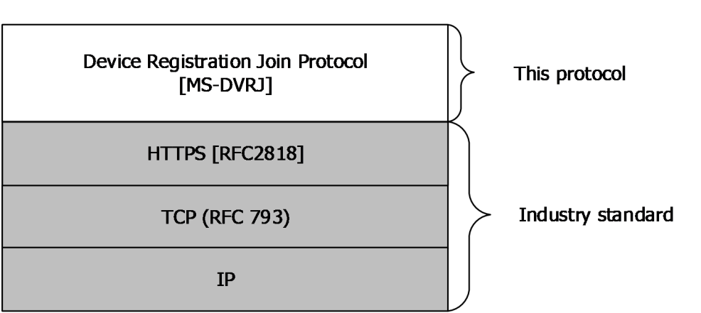

[MS-DVRJ]:

Device Registration Join Protocol

Intellectual Property Rights Notice for Open Specifications Documentation

  Technical Documentation. Microsoft publishes Open Specifications documentation (“this

documentation”) for protocols, file formats, data portability, computer languages, and standards
support. Additionally, overview documents cover inter-protocol relationships and interactions.

  Copyrights. This documentation is covered by Microsoft copyrights. Regardless of any other

terms that are contained in the terms of use for the Microsoft website that hosts this
documentation, you can make copies of it in order to develop implementations of the technologies
that are described in this documentation and can distribute portions of it in your implementations
that use these technologies or in your documentation as necessary to properly document the
implementation. You can also distribute in your implementation, with or without modification, any
schemas, IDLs, or code samples that are included in the documentation. This permission also
applies to any documents that are referenced in the Open Specifications documentation.
  No Trade Secrets. Microsoft does not claim any trade secret rights in this documentation.
  Patents. Microsoft has patents that might cover your implementations of the technologies

described in the Open Specifications documentation. Neither this notice nor Microsoft's delivery of
this documentation grants any licenses under those patents or any other Microsoft patents.
However, a given Open Specifications document might be covered by the Microsoft Open
Specifications Promise or the Microsoft Community Promise. If you would prefer a written license,
or if the technologies described in this documentation are not covered by the Open Specifications
Promise or Community Promise, as applicable, patent licenses are available by contacting
iplg@microsoft.com.

  License Programs. To see all of the protocols in scope under a specific license program and the

associated patents, visit the Patent Map.

  Trademarks. The names of companies and products contained in this documentation might be
covered by trademarks or similar intellectual property rights. This notice does not grant any
licenses under those rights. For a list of Microsoft trademarks, visit
www.microsoft.com/trademarks.

  Fictitious Names. The example companies, organizations, products, domain names, email

addresses, logos, people, places, and events that are depicted in this documentation are fictitious.
No association with any real company, organization, product, domain name, email address, logo,
person, place, or event is intended or should be inferred.

Reservation of Rights. All other rights are reserved, and this notice does not grant any rights other
than as specifically described above, whether by implication, estoppel, or otherwise.

Tools. The Open Specifications documentation does not require the use of Microsoft programming
tools or programming environments in order for you to develop an implementation. If you have access
to Microsoft programming tools and environments, you are free to take advantage of them. Certain
Open Specifications documents are intended for use in conjunction with publicly available standards
specifications and network programming art and, as such, assume that the reader either is familiar
with the aforementioned material or has immediate access to it.

Support. For questions and support, please contact dochelp@microsoft.com.

[MS-DVRJ] - v20240916
Device Registration Join Protocol
Copyright © 2024 Microsoft Corporation
Release: September 16, 2024

1 / 30

Revision Summary

Date

Revision
History

Revision
Class

Comments

7/14/2016  1.0

6/1/2017

2.0

9/15/2017  3.0

12/1/2017  3.0

9/12/2018  4.0

4/7/2021

5.0

6/25/2021  6.0

2/26/2024  7.0

4/23/2024  8.0

9/16/2024  8.0

New

Major

Major

None

Major

Major

Major

Major

Major

None

Released new document.

Significantly changed the technical content.

Significantly changed the technical content.

No changes to the meaning, language, or formatting of the
technical content.

Significantly changed the technical content.

Significantly changed the technical content.

Significantly changed the technical content.

Significantly changed the technical content.

Significantly changed the technical content.

No changes to the meaning, language, or formatting of the
technical content.

[MS-DVRJ] - v20240916
Device Registration Join Protocol
Copyright © 2024 Microsoft Corporation
Release: September 16, 2024

2 / 30

Table of Contents

1.1
1.2

1.2.1
1.2.2

1  Introduction ............................................................................................................ 5
Glossary ........................................................................................................... 5
References ........................................................................................................ 7
Normative References ................................................................................... 7
Informative References ................................................................................. 8
Overview .......................................................................................................... 8
Relationship to Other Protocols ............................................................................ 9
Prerequisites/Preconditions ................................................................................. 9
Applicability Statement ..................................................................................... 10
Versioning and Capability Negotiation ................................................................. 10
Vendor-Extensible Fields ................................................................................... 10
Standards Assignments ..................................................................................... 10

1.3
1.4
1.5
1.6
1.7
1.8
1.9

2.2.2

2.2.1

2.1
2.2

2.2.2.1

2.2.1.1

2  Messages ............................................................................................................... 11
Transport ........................................................................................................ 11
Common Data Types ........................................................................................ 11
HTTP Headers ............................................................................................ 11
Authorization ........................................................................................ 11
URI Parameters .......................................................................................... 11
api-version ........................................................................................... 12
Complex Types ........................................................................................... 12
ErrorDetails .......................................................................................... 12
Directory Service Schema Elements ................................................................... 12
ms-DS-Issuer-Certificates ............................................................................ 13
ms-DS-Issuer-Public-Certificates .................................................................. 13
Alt-Security-Identities ................................................................................. 13
ms-DS-Key-Credential-Link .......................................................................... 13

2.3.1
2.3.2
2.3.3
2.3.4

2.2.3.1

2.2.3

2.3

3.1

3.1.5.1

3.1.5.1.2

3.1.5.1.1

3.1.1
3.1.2
3.1.3
3.1.4
3.1.5

3.1.5.1.1.1
3.1.5.1.1.2
3.1.5.1.1.3

3  Protocol Details ..................................................................................................... 15
Join Service Details .......................................................................................... 15
Abstract Data Model .................................................................................... 15
Timers ...................................................................................................... 15
Initialization ............................................................................................... 15
Higher-Layer Triggered Events ..................................................................... 15
Message Processing Events and Sequencing Rules .......................................... 15
device ................................................................................................. 15
POST ............................................................................................. 15
Request Body ............................................................................ 16
Response Body .......................................................................... 16
Processing Details ...................................................................... 17
DELETE .......................................................................................... 20
Request Body ............................................................................ 20
Response Body .......................................................................... 20
Processing Details ...................................................................... 20
Timer Events .............................................................................................. 21
Other Local Events ...................................................................................... 21
Client Details ................................................................................................... 21
Abstract Data Model .................................................................................... 21
Timers ...................................................................................................... 21
Initialization ............................................................................................... 21
Higher-Layer Triggered Events ..................................................................... 21
Message Processing Events and Sequencing Rules .......................................... 21
device ................................................................................................. 21
POST ............................................................................................. 21
DELETE .......................................................................................... 22

3.1.5.1.2.1
3.1.5.1.2.2
3.1.5.1.2.3

3.2.1
3.2.2
3.2.3
3.2.4
3.2.5

3.2.5.1.1
3.2.5.1.2

3.1.6
3.1.7

3.2.5.1

3.2

[MS-DVRJ] - v20240916
Device Registration Join Protocol
Copyright © 2024 Microsoft Corporation
Release: September 16, 2024

3 / 30

3.2.6
3.2.7

Timer Events .............................................................................................. 22
Other Local Events ...................................................................................... 22

4  Protocol Examples ................................................................................................. 23
Create a device ................................................................................................ 23
Error Example.................................................................................................. 24

4.1
4.2

5  Security ................................................................................................................. 25
Security Considerations for Implementers ........................................................... 25
Index of Security Parameters ............................................................................ 25

5.1
5.2

6  Appendix A: Full JSON Schema .............................................................................. 26

7  Appendix B: Product Behavior ............................................................................... 27

8  Change Tracking .................................................................................................... 28

9  Index ..................................................................................................................... 29

[MS-DVRJ] - v20240916
Device Registration Join Protocol
Copyright © 2024 Microsoft Corporation
Release: September 16, 2024

4 / 30

1  Introduction

The Device Registration Join Protocol provides a lightweight mechanism for registering personal or
corporate-owned devices with a workplace.

Whereas the discovery of information needed to register devices is obtained by use of the Device
Registration Discovery Protocol [MS-DVRD], the Device Registration Join Protocol, defined in this
specification, makes use of that information to register a device in the device registration service.

Sections 1.5, 1.8, 1.9, 2, and 3 of this specification are normative. All other sections and examples in
this specification are informative.

1.1  Glossary

This document uses the following terms:

access control list (ACL): A list of access control entries (ACEs) that collectively describe the

security rules for authorizing access to some resource; for example, an object or set of objects.

Active Directory: The Windows implementation of a general-purpose directory service, which uses

LDAP as its primary access protocol. Active Directory stores information about a variety of
objects in the network such as user accounts, computer accounts, groups, and all related
credential information used by Kerberos [MS-KILE]. Active Directory is either deployed as Active
Directory Domain Services (AD DS) or Active Directory Lightweight Directory Services (AD LDS),
which are both described in [MS-ADOD]: Active Directory Protocols Overview.

Augmented Backus-Naur Form (ABNF): A modified version of Backus-Naur Form (BNF),

commonly used by Internet specifications. ABNF notation balances compactness and simplicity
with reasonable representational power. ABNF differs from standard BNF in its definitions and
uses of naming rules, repetition, alternatives, order-independence, and value ranges. For more
information, see [RFC5234].

base64 encoding: A binary-to-text encoding scheme whereby an arbitrary sequence of bytes is

converted to a sequence of printable ASCII characters, as described in [RFC4648].

certificate: When referring to X.509v3 certificates, that information consists of a public key, a

distinguished name (DN) of some entity assumed to have control over the private key
corresponding to the public key in the certificate, and some number of other attributes and
extensions assumed to relate to the entity thus referenced. Other forms of certificates can bind
other pieces of information.

certification authority (CA): A third party that issues public key certificates. Certificates serve to
bind public keys to a user identity. Each user and certification authority (CA) can decide whether
to trust another user or CA for a specific purpose, and whether this trust is to be transitive. For
more information, see [RFC3280].

claim: A statement that one subject makes about itself or another subject. For example, the

statement can be about a name, identity, key, group, privilege, or capability. Claims have a
provider that issues them, and they are given one or more values. They are also defined by a
claim value type and, possibly, associated metadata.

container: An object in the directory that can serve as the parent for other objects. In the
absence of schema constraints, all objects would be containers. The schema allows only
objects of specific classes to be containers.

Coordinated Universal Time (UTC): A high-precision atomic time standard that approximately
tracks Universal Time (UT). It is the basis for legal, civil time all over the Earth. Time zones
around the world are expressed as positive and negative offsets from UTC. In this role, it is also

5 / 30

[MS-DVRJ] - v20240916
Device Registration Join Protocol
Copyright © 2024 Microsoft Corporation
Release: September 16, 2024

referred to as Zulu time (Z) and Greenwich Mean Time (GMT). In these specifications, all
references to UTC refer to the time at UTC-0 (or GMT).

device registration service: A service that allows registration of computing devices on a

corporate network. These devices might not be controlled by the administrator of the network.

directory: The database that stores information about objects such as users, groups, computers,

printers, and the directory service that makes this information available to users and
applications.

distinguished name (DN): A name that uniquely identifies an object by using the relative

distinguished name (RDN) for the object, and the names of container objects and domains that
contain the object. The distinguished name (DN) identifies the object and its location in a tree.

globally unique identifier (GUID): A term used interchangeably with universally unique

identifier (UUID) in Microsoft protocol technical documents (TDs). Interchanging the usage of
these terms does not imply or require a specific algorithm or mechanism to generate the value.
Specifically, the use of this term does not imply or require that the algorithms described in
[RFC4122] or [C706] have to be used for generating the GUID. See also universally unique
identifier (UUID).

Hypertext Transfer Protocol Secure (HTTPS): An extension of HTTP that securely encrypts and

decrypts web page requests. In some older protocols, "Hypertext Transfer Protocol over Secure
Sockets Layer" is still used (Secure Sockets Layer has been deprecated). For more information,
see [SSL3] and [RFC5246].

JavaScript Object Notation (JSON): A text-based, data interchange format that is used to

transmit structured data, typically in Asynchronous JavaScript + XML (AJAX) web applications,
as described in [RFC7159]. The JSON format is based on the structure of ECMAScript (Jscript,
JavaScript) objects.

JSON Web Token (JWT): A string representing a set of claims as a JSON object that is encoded

in a JWS or JWE, enabling the claims to be digitally signed or integrity protected with a Message
Authentication Code (MAC) and/or encrypted. For more information, see [RFC7519].

object: A set of attributes, each with its associated values. For more information on objects, see

[MS-ADTS] section 1 or [MS-DRSR] section 1.

object identifier (OID): In the Lightweight Directory Access Protocol (LDAP), a sequence of

numbers in a format described by [RFC1778]. In many LDAP directory implementations, an OID
is the standard internal representation of an attribute. In the directory model used in this
specification, the more familiar ldapDisplayName represents an attribute.

private key: One of a pair of keys used in public-key cryptography. The private key is kept secret
and is used to decrypt data that has been encrypted with the corresponding public key. For an
introduction to this concept, see [CRYPTO] section 1.8 and [IEEE1363] section 3.1.

public key algorithm: An asymmetric cipher that uses two cryptographic keys: one for

encryption, the public key, and the other for decryption, the private key. In signature and
verification, the roles are reversed: public key is used for verification, and private key is used for
signature generation. Examples of public key algorithms are described in various standards,
including Digital Signature Algorithm (DSA) and Elliptic Curve Digital Signature Algorithm
(ECDSA) in FIPS 186-2 ([FIPS186]), RSA in PKCS#1 ([RFC8017]), the National Institute of
Standards and Technology (NIST) also published an introduction to public key technology in
SP800-32 ([SP800-32] section 5.6).

Public Key Cryptography Standards (PKCS): A group of Public Key Cryptography Standards

published by RSA Laboratories.

[MS-DVRJ] - v20240916
Device Registration Join Protocol
Copyright © 2024 Microsoft Corporation
Release: September 16, 2024

6 / 30

Representational State Transfer (REST): A class of web services that is used to transfer

domain-specific data by using HTTP, without additional messaging layers or session tracking,
and returns textual data, such as XML.

Rivest-Shamir-Adleman (RSA): A system for public key cryptography. RSA is specified in

[RFC8017].

Secure Sockets Layer (SSL): A security protocol that supports confidentiality and integrity of

messages in client and server applications that communicate over open networks. SSL supports
server and, optionally, client authentication using X.509 certificates [X509] and [RFC5280].
SSL is superseded by Transport Layer Security (TLS). TLS version 1.0 is based on SSL
version 3.0 [SSL3].

security identifier (SID): An identifier for security principals that is used to identify an account
or a group. Conceptually, the SID is composed of an account authority portion (typically a
domain) and a smaller integer representing an identity relative to the account authority, termed
the relative identifier (RID). The SID format is specified in [MS-DTYP] section 2.4.2; a string
representation of SIDs is specified in [MS-DTYP] section 2.4.2 and [MS-AZOD] section 1.1.1.2.

SHA1 hash: A hashing algorithm defined in [FIPS180] that was developed by the National
Institute of Standards and Technology (NIST) and the National Security Agency (NSA).

SHA-256: An algorithm that generates a 256-bit hash value from an arbitrary amount of input

data.

thumbprint: A hash value computed over a datum.

Transport Layer Security (TLS): A security protocol that supports confidentiality and integrity of
messages in client and server applications communicating over open networks. TLS supports
server and, optionally, client authentication by using X.509 certificates (as specified in [X509]).
TLS is standardized in the IETF TLS working group.

X.509: An ITU-T standard for public key infrastructure subsequently adapted by the IETF, as

specified in [RFC3280].

MAY, SHOULD, MUST, SHOULD NOT, MUST NOT: These terms (in all caps) are used as defined
in [RFC2119]. All statements of optional behavior use either MAY, SHOULD, or SHOULD NOT.

1.2  References

Links to a document in the Microsoft Open Specifications library point to the correct section in the
most recently published version of the referenced document. However, because individual documents
in the library are not updated at the same time, the section numbers in the documents may not
match. You can confirm the correct section numbering by checking the Errata.

1.2.1  Normative References

We conduct frequent surveys of the normative references to assure their continued availability. If you
have any issue with finding a normative reference, please contact dochelp@microsoft.com. We will
assist you in finding the relevant information.

[ISO8601] ISO, "Data elements and interchange formats - Information interchange - Representation
of dates and times", ISO 8601:2004, December 2004,
http://www.iso.org/iso/iso_catalogue/catalogue_tc/catalogue_detail.htm?csnumber=40874

Note There is a charge to download the specification.

[MS-ADA1] Microsoft Corporation, "Active Directory Schema Attributes A-L".

[MS-DVRJ] - v20240916
Device Registration Join Protocol
Copyright © 2024 Microsoft Corporation
Release: September 16, 2024

7 / 30

[MS-ADA2] Microsoft Corporation, "Active Directory Schema Attributes M".

[MS-ADA3] Microsoft Corporation, "Active Directory Schema Attributes N-Z".

[MS-ADSC] Microsoft Corporation, "Active Directory Schema Classes".

[MS-ADTS] Microsoft Corporation, "Active Directory Technical Specification".

[MS-DTYP] Microsoft Corporation, "Windows Data Types".

[NIST.FIPS.180-4] National Institute of Standards and Technology, "Secure Hash Standard (SHS)",
August 2015, https://nvlpubs.nist.gov/nistpubs/FIPS/NIST.FIPS.180-4.pdf

[RFC2119] Bradner, S., "Key words for use in RFCs to Indicate Requirement Levels", BCP 14, RFC
2119, March 1997, https://www.rfc-editor.org/info/rfc2119

[RFC2616] Fielding, R., Gettys, J., Mogul, J., et al., "Hypertext Transfer Protocol -- HTTP/1.1", RFC
2616, June 1999, https://www.rfc-editor.org/info/rfc2616

[RFC2818] Rescorla, E., "HTTP Over TLS", RFC 2818, May 2000, https://www.rfc-
editor.org/info/rfc2818

[RFC4211] Schaad, J., "Internet X.509 Public Key Infrastructure Certificate Request Message Format
(CRMF)", RFC 4211, September 2005, http://www.rfc-editor.org/rfc/rfc4211

[RFC4346] Dierks, T., and Rescorla, E., "The Transport Layer Security (TLS) Protocol Version 1.1",
RFC 4346, April 2006, https://www.rfc-editor.org/info/rfc4346

[RFC4514] Zeilenga, K., Ed., "Lightweight Directory Access Protocol (LDAP): String Representation of
Distinguished Names", RFC 4514, June 2006, https://www.rfc-editor.org/info/rfc4514

[RFC4648] Josefsson, S., "The Base16, Base32, and Base64 Data Encodings", RFC 4648, October
2006, https://www.rfc-editor.org/info/rfc4648

[RFC5280] Cooper, D., Santesson, S., Farrell, S., et al., "Internet X.509 Public Key Infrastructure
Certificate and Certificate Revocation List (CRL) Profile", RFC 5280, May 2008, https://www.rfc-
editor.org/info/rfc5280

[RFC8017] Moriarty, K., Ed., Kaliski, B., Jonsson, J., and Rusch, A., "PKCS #1: RSA Cryptography
Specifications Version 2.2", November 2016, https://www.rfc-editor.org/info/rfc8017

1.2.2  Informative References

[MS-DVRD] Microsoft Corporation, "Device Registration Discovery Protocol".

[MS-DVRE] Microsoft Corporation, "Device Registration Enrollment Protocol".

1.3  Overview

The Device Registration Join Protocol provides for issuance of X.509v3 digital certificates, and is
intended for use as a lightweight device-registration server. The protocol is based loosely on
[MS-DVRE].

The Device Registration Join Protocol provides a single REST-based endpoint that returns JavaScript
Object Notation (JSON)–formatted data in the response message.

This document defines and uses the following terms:

[MS-DVRJ] - v20240916
Device Registration Join Protocol
Copyright © 2024 Microsoft Corporation
Release: September 16, 2024

8 / 30

<!-- Extracted images from page 9 -->

<!-- /Extracted images from page 9 -->

device registration service (DRS) server: The server that implements the REST Web service that
accepts and responds to device registration requests using the Device Registration Join Protocol.

client: The entity that creates and sends a request to the server using the Device Registration Join
Protocol.

1.4  Relationship to Other Protocols

The following figure illustrates the relationship of this protocol to other protocols.

Figure 1: Protocols related to the Device Registration Join Protocol

1.5  Prerequisites/Preconditions

The Device Registration Join Protocol issues X.509v3 certificates that have a corresponding
relationship with a device object represented in a directory server.  A server implementation of the
protocol requires the functionality of a certificate authority and a directory server.

This protocol requires that the following state changes be made to Active Directory.

1.  Create an instance of the ms-DS-Device-Registration-Service-Container class ([MS-ADSC] section

2.139) in the directory.

2.  Create an instance of the ms-DS-Device-Registration-Service class ([MS-ADSC] section 2.138) as

a child of the container object created in the previous step with the following attributes:

1.  Set the ms-DS-Registration-Quota attribute ([MS-ADA2] section 2.443) of the ms-DS-Device-

Registration-Service object to 10.

2.  Set the ms-DS-Maximum-Registration-Inactivity-Period attribute ([MS-ADA2] section 2.385)

of the ms-DS-Device-Registration-Service object to 90.

3.  Set the ms-DS-Is-Enabled attribute ([MS-ADA2] section 2.343) of the ms-DS-Device-

Registration-Service object to true.

4.  Set the ms-DS-Device-Location attribute ([MS-ADA2] section 2.305) of the ms-DS-Device-
Registration-Service object to a distinguished name (DN) of a container location in the
directory. The container is of class ms-DS-Device-Container ([MS-ADSC] section 2.137).

3.  Generate a certificate signing certificate. The certificate and private key are stored in the ms-DS-
Issuer-Certificates attribute ([MS-ADA2] section 2.351) of the ms-DS-Device-Registration-Service
object. For details, see section 2.3.1.

[MS-DVRJ] - v20240916
Device Registration Join Protocol
Copyright © 2024 Microsoft Corporation
Release: September 16, 2024

9 / 30

The public portion of the certificate is stored in the ms-DS-Issuer-Public-Certificates attribute
([MS-ADA2] section 2.352) of the ms-DS-Device-Registration-Service object. For details, see
section 2.3.2.

4.  Set the following directory access control list (ACL) entries:

1.  Grant the server read access to the ms-DS-Device-Registration-Service object.

2.  Grant the server read/write access to ms-DS-Device objects ([MS-ADSC] section 2.136).

1.6  Applicability Statement

The Device Registration Join Protocol is applicable only for requests for device registration.

1.7  Versioning and Capability Negotiation

None.

1.8  Vendor-Extensible Fields

The Device Registration Join Protocol does not include any vendor-extensible fields.

1.9  Standards Assignments

None.

[MS-DVRJ] - v20240916
Device Registration Join Protocol
Copyright © 2024 Microsoft Corporation
Release: September 16, 2024

10 / 30

2  Messages

2.1  Transport

The Device Registration Join Protocol consists of a single RESTful Web service.

  HTTPS [RFC2818] over TCP/IP [RFC2616]

The protocol operates on the following URI endpoint.

Web service

Location

Device Join Service

https://<server>:<server port>/EnrollmentServer/device

All client messages to the server MUST use Hypertext Transfer Protocol over Secure Sockets
Layer (HTTPS) and provide server authentication, which MUST use Transport Layer Security
(TLS) 1.1 [RFC4346], or greater.

2.2  Common Data Types

2.2.1  HTTP Headers

This protocol accesses the HTTP headers listed in the following table.

Header

Authorization

Description

This header is used by the client to send authorization
claims. It contains a JSON Web Token (JWT).

2.2.1.1  Authorization

The Authorization header is required in the request and contains authorization claims that the client
passes to the server for access to the relevant device object on the directory server.

The format of the Authorization header, in Augmented Backus-Naur Form (ABNF), is as follows.

 String = *(%x20-7E)
 Authorization = String

2.2.2  URI Parameters

The following table summarizes the set of common URI parameters defined by this protocol.

URI parameter

api-version

Description

An integer that indicates the data version that is
expected by the client.

[MS-DVRJ] - v20240916
Device Registration Join Protocol
Copyright © 2024 Microsoft Corporation
Release: September 16, 2024

11 / 30

2.2.2.1  api-version

The api-version parameter is an integer that indicates the data version that is expected by the client.
This parameter MUST be included in all client requests.

 String = *(%x20-7E)
 api-version = String

2.2.3  Complex Types

The following table summarizes the set of complex type definitions included in this specification.

Complex type

ErrorDetails

2.2.3.1  ErrorDetails

Description

An object that stores information corresponding to an
error issued by the device registration service (DRS)
server.

This object contains a collection of human-readable details that describe an error encountered by the
DRS server. It can be used by the client role of the Device Registration Join Protocol for logging
purposes or for providing information to an administrator. This object contains the following fields.

 {
     "description": "object",
     "type": "object",
     "properties": {
         "ErrorType": { "type": "string", "optional": false },
         "Message": { "type": "string", "optional": false },
         "TraceId": { "type": "string", "optional": false },
         "Time": { "type": "string", "optional": false }
     }
 }

ErrorType: The type of error that was encountered.

Message: A text message explaining the error.

TraceId: An identifier assigned by the DRS server.

Time: The [ISO8601]-formatted time assigned by the DRS server.

2.3  Directory Service Schema Elements

This protocol makes use of the Directory Service schema classes and attributes that are listed in the
following table.

For the syntax of <Class> or <Class><Attribute> pairs, refer to [MS-ADA1], [MS-ADA2], [MS-ADA3],
and [MS-ADSC]).

Class

ms-DS-Device

[MS-DVRJ] - v20240916
Device Registration Join Protocol
Copyright © 2024 Microsoft Corporation
Release: September 16, 2024

Attribute

Alt-Security-Identities, ms-DS-Device-ID, ms-DS-
Device-Object-Version, ms-DS-Device-OS-Type, ms-

12 / 30

Class

Attribute

ms-DS-Device-Container

ms-DS-Device-Registration-Service

DS-Device-OS-Version, ms-DS-Registered-Users, ms-
DS-Is-Enabled, ms-DS-Approximate-Last-Logon-Time-
Stamp, ms-DS-Registered-Owner, Display-Name, ms-
DS-Cloud-IsManaged, ms-DS-Device-Trust-Type, ms-
DS-Key-Credential-Link

ms-DS-Issuer-Certificates, ms-DS-Issuer-Public-
Certificates, ms-DS-Registration-Quota, ms-DS-
Maximum-Registration-Inactivity-Period, ms-DS-
Device-Location, ms-DS-Is-Enabled

ms-DS-Device-Registration-Service-Container

User

Domain

NTDS-DSA

Object-Guid

Object-Guid

Invocation-Id

2.3.1  ms-DS-Issuer-Certificates

The ms-DS-Issuer-Certificates attribute is a multi-valued OCTET_STRING attribute (see [MS-ADTS]
section 3.1.1.2.2.2, the String(Octet) syntax). Each value of the attribute is stored as a binary blob
containing the following formatted data:

"[time]:[binary value of an X.509 certificate]"

where [time] is the timestamp formatted as an integer representing the number of 100-nanosecond
intervals that have elapsed since 12:00:00 midnight, January 1, 0001, UTC, and [binary value of an
X.509 certificate] is the contents of an X.509 certificate [RFC5280] stored as an encrypted binary
blob.

2.3.2  ms-DS-Issuer-Public-Certificates

The ms-DS-Issuer-Public-Certificates attribute is a multi-valued OCTET_STRING attribute. Each value
of the attribute is stored as a binary blob containing an X.509 certificate [RFC5280].

2.3.3  Alt-Security-Identities

The Alt-Security-Identities attribute ([MS-ADA1] section 2.61) is a multi-valued UNICODE_STRING
attribute (see [MS-ADTS] section 3.1.1.2.2.2, the String(Unicode) syntax). The value is formatted as
follows:

"X509:<SHA1-TP-PUBKEY>[thumbprint]+[publickeyhash]"

where [thumbprint] is the SHA1 hash of a certificate and [publickeyhash] is the base64-encoded
SHA-256 ([NIST.FIPS.180-4]) of the X.509 certificate public key [RFC5280].

2.3.4  ms-DS-Key-Credential-Link

The ms-DS-Key-Credential-Link attribute ([MS-ADA2] section 2.358) is a DN-Binary attribute (see
[MS-ADTS] section 3.1.1.2.2.2, the Object(DN-Binary) syntax). The value is formatted as follows:

[MS-DVRJ] - v20240916
Device Registration Join Protocol
Copyright © 2024 Microsoft Corporation
Release: September 16, 2024

13 / 30

"B:[keylen]:[key]:[objectDN]"

Where [keylen] is the length of [key]. [key] is a KEYCREDENTIALLINK_BLOB ([MS-ADTS] section
2.2.20.2). [objectDN] is an [RFC4514]-formatted distinguished name for the directory object that
contains the ms-DS-Key-Credential-Link attribute.

[MS-DVRJ] - v20240916
Device Registration Join Protocol
Copyright © 2024 Microsoft Corporation
Release: September 16, 2024

14 / 30

3  Protocol Details

3.1  Join Service Details

3.1.1  Abstract Data Model

None.

3.1.2  Timers

None.

3.1.3  Initialization

The server that implements the Device Registration Join Protocol must be initialized. Any databases or
tables that contain the information that is needed in the Device Registration Join Protocol response
must also be initialized.

3.1.4  Higher-Layer Triggered Events

None.

3.1.5  Message Processing Events and Sequencing Rules

The following resource is used by the Device Registration Join Protocol.

Resource

Description

device?api-version={apiversion}

An object that represents the device objects on the
DRS server.

3.1.5.1  device

 The following HTTP methods are allowed to be performed on this resource.

HTTP method

Section

Description

POST

DELETE

3.1.5.1.1

Create a new device object.

3.1.5.1.2

Remove a device object.

3.1.5.1.1 POST

This method is transported by an HTTP POST.

The method can be invoked through the following URI:

 https://server/EnrollmentServer/device?api-version={apiversion}

[MS-DVRJ] - v20240916
Device Registration Join Protocol
Copyright © 2024 Microsoft Corporation
Release: September 16, 2024

15 / 30

The URI parameters supported for the POST request are the common URI parameters defined in
section 2.2.2 (URI Parameters).

3.1.5.1.1.1  Request Body

The request body contains the following JSON-formatted object.

 {
     "description": "object",
     "type": "object",
     "properties": {
         "CertificateRequest": {
             "type": "object",
             "optional" : false,
             "properties": {
                 "Type": { "type": "string", "optional": false },
                 "Data": { "type": "string", "optional": false }
             }
         },
         "TransportKey": { "type": "string", "optional": false },
         "TargetDomain": { "type": "string", "optional": false },
         "DeviceType": { "type": "string", "optional": false },
         "OSVersion": { "type": "string", "optional": false },
         "DeviceDisplayName": { "type": "string", "optional": false },
         "JoinType": { "type": "number", "optional": false }
     }
 }

CertificateRequest: A property with the following fields:

Type: A property that MUST contain "pkcs10".

Data: A property that contains a base64-encoded PKCS#10 certificate request [RFC4211]. The
certificate request MUST use an RSA public key algorithm [RFC8017] with a 2048-bit key, a
SHA256WithRSAEncryption signature algorithm, and a SHA256 hash algorithm.

TransportKey: The base64-encoded public portion of an asymmetric key that is generated by the
client.

TargetDomain: The fully qualified host name of the device registration service.

DeviceType: The operating system type installed on the device.

OSVersion: The operating system version installed on the device.

DeviceDisplayName: The friendly name of the device.

JoinType: The type of join operation. The value MUST be set to 6.

3.1.5.1.1.2  Response Body

If the DRS server successfully creates a device object in the directory, an HTTP 200 status code is
returned. Additionally, the response body for the POST response contains a JSON-formatted object, as
defined below. See section 3.1.5.1.1.3 for processing details.

 {
     "description": "object",
     "type": "object",
     "properties": {
         "Certificate": {
             "type": "object",
             "optional": false,

[MS-DVRJ] - v20240916
Device Registration Join Protocol
Copyright © 2024 Microsoft Corporation
Release: September 16, 2024

16 / 30

             "properties": {
                 "Thumbprint": { "type": "string", "optional": false },
                 "RawBody": { "type": "string", "optional": false }
             }
         },
         "User": {
             "type": "object",
             "optional": false,
             "properties": {
                 "Upn": { "type": "string", "optional": false }
             }
         },
         "MembershipChanges": {
             "type": "object",
             "optional": false,
             "properties": {
                 "LocalSID": { "type": "string", "optional": false },
                 "AddSIDs": { "type": "array", "optional": false }
             }
         }
     }
 }

Certificate: A property with the following fields.

Thumbprint: The SHA1 hash of the certificate thumbprint.

RawBody: An X.509 certificate signed by the DRS server as a base64-encoded string [RFC4648].

User: A property with the following fields.

Upn: The identifier of the identity that authenticated to the Web service. This value MUST be
ignored by the client.

MembershipChanges: A property with the following fields.

LocalSID: The security identifier (SID) of the directory administrator account. This value MUST
be ignored by the client.

AddSIDs: An empty array. This value MUST be ignored by the client.

3.1.5.1.1.3  Processing Details

The HTTP POST request is processed as follows.

1.  The server checks for the following claims and values in the JWT sent by the client in the HTTP

Authorization Header:

Claim

Value

http://schemas.microsoft.com/authorization/claims/PermitDeviceRegistrationClaim  The value MUST be the

http://schemas.microsoft.com/ws/2012/01/accounttype

http://schemas.microsoft.com/identity/claims/onpremobjectguid

[MS-DVRJ] - v20240916
Device Registration Join Protocol
Copyright © 2024 Microsoft Corporation
Release: September 16, 2024

string "true".

The value MUST be the
string "DJ".

A unique id generated by
the client. The value

17 / 30

Claim

primarysid

Value

MUST be binary and
base64-encoded.

The SID of the identity
that authenticated to the
Web service.

If any of the claims from the table is not present, or if the value of the claim does NOT match the
corresponding value in the table, the server MUST respond to the HTTP POST in the following
manner:





The DRS server responds with an HTTP response with the HTTP status code set to 400 ("Bad
Request").

The body of the HTTP response contains an ErrorDetails object (section 2.2.3.1) that provides
the client with additional, implementation-specific information about the error.

2.  The server adds the following object identifiers (OIDs) and values to the X.509 certificate
request [RFC4211] contained in the CertificateRequest object of the client HTTP request.

OID

Value

1.2.840.113556.1.5.284.2

The DRS server MUST generate a globally unique identifier
(GUID) and include it as the value.

1.2.840.113556.1.5.284.3

The Object-Guid attribute ([MS-ADA3] section 2.44) of the User
object ([MS-ADSC] section 2.269) on the directory server that
corresponds to the authenticating user.

1.2.840.113556.1.5.284.4

The Object-Guid attribute of the Domain object ([MS-ADSC] section
2.43) on the directory server.

1.2.840.113556.1.5.284.1

The Invocation-Id attribute ([MS-ADA1] section 2.314) of the NTDS-
DSA object ([MS-ADSC] section 2.205) for the directory server.

3.  The server signs the request by using the issuer certificate stored in the ms-DS-Issuer-Certificates
attribute of the ms-DS-Device-Registration-Service object with the most recent timestamp (see
section 2.3.1). The server MUST use a SHA256WithRSAEncryption signature algorithm and a
SHA256 hash algorithm.

4.  The server sends a request to the directory server to locate a device object where the ms-DS-

Device-ID attribute ([MS-ADA2] section 2.304) equals the value of the
http://schemas.microsoft.com/identity/claims/onpremobjectguid JWT claim from step 1.

5.  If the device object from step 4 is NOT located, the server sends a request to the directory server
to create a device record as an instance of the ms-DS-Device class as a child of the container
specified in the ms-DS-Device-Location attribute of the ms-DS-Device-Registration-Service object.
The ms-DS-Device-ID attribute of the device object MUST be set to the base64-decoded value of
the http://schemas.microsoft.com/identity/claims/onpremobjectguid JWT claim from step 1.

6.  The server sends a request to the directory server to set the following attributes on the device

object:



The SHA1 hash of the certificate thumbprint plus certificate public key, added as an additional
value of the Alt-Security-Identities attribute (see section 2.3.3).

18 / 30

[MS-DVRJ] - v20240916
Device Registration Join Protocol
Copyright © 2024 Microsoft Corporation
Release: September 16, 2024





















The device type that corresponds to the DeviceType value sent in the request (section
3.1.5.1.1.1), stored as the ms-DS-Device-OS-Type attribute ([MS-ADA2] section 2.308).

The device operating system version that corresponds to the OSVersion value sent in the
request (section 3.1.5.1.1.1), stored as the ms-DS-Device-OS-Version attribute ([MS-ADA2]
section 2.309).

The SID of the identity that authenticated to the Web service, stored as the ms-DS-
Registered-Users attribute ([MS-ADA2] section 2.442).

The SID of the user account that authenticated to the Web service, stored as the ms-DS-
Registered-Owner attribute ([MS-ADA2] section 2.441).

The friendly name of the device that corresponds to the DeviceDisplayName value sent in the
request (section 3.1.5.1.1.1), stored as the Display-Name attribute ([MS-ADA1] section
2.175).

The ms-DS-Is-Enabled attribute to true.

The ms-DS-Device-Trust-Type attribute ([MS-ADA2] section 2.311) to 2.

The ms-DS-Device-Object-Version attribute ([MS-ADA2] section 2.307) to 2.

The ms-DS-Cloud-IsManaged attribute ([MS-ADA2] section 2.291) to false.

The ms-DS-Approximate-Last-Logon-Time-Stamp attribute ([MS-ADA2] section 2.223) to a
time that is generated by the server, represented in FILETIME format ([MS-DTYP] section
2.3.3).

  Remove existing ms-DS-Key-Credential-Link values from the device object. Add a new value

to the ms-DS-Key-Credential-Link attribute of the device object.

The KEYCREDENTIALLINK_BLOB MUST be created according to [MS-ADTS] section 2.2.20 and
section 2.3.4 in this specification. In addition, the following KEYCREDENTIALLINK_ENTRY
identifiers ([MS-ADTS] section 2.2.20.6) MUST be present.

KEYCREDENTIALLINK_ENTRY identifier

Value

KeyMaterial

The base64-decoded TransportKey property from the HTTP
POST.

KeyUsage

0x02

CustomKeyInformation

The Version field MUST be set to 1 and the Flags field
MUST be set to 0.

KeySource

KEY_SOURCE_AD

KeyApproximateLastLogonTimeStamp

MUST be set to a time that is generated by the server
represented in FILETIME format.

KeyCreationTime

MUST be set to a time that is generated by the server
represented in FILETIME format.

[MS-DVRJ] - v20240916
Device Registration Join Protocol
Copyright © 2024 Microsoft Corporation
Release: September 16, 2024

19 / 30

KEYCREDENTIALLINK_ENTRY identifier

Value

DeviceId

MUST be the value of the ms-DS-Device-ID attribute of the
device object, formatted as specified in [MS-ADTS] section
2.2.20.

7.  The DRS server responds to the HTTP POST request with an HTTP response with the HTTP status
code set to 200 ("OK"). The response body contains the signed X.509 certificate from step 3.

3.1.5.1.2 DELETE

This method is transported by an HTTP DELETE.

The method can be invoked through the following URI:

 https://server/EnrollmentServer/device/{deviceid}?api-version={apiversion}

The URI corresponds to the device identifier that the client needs to look up on the DRS server.

deviceid: A GUID that represents the device object to be looked up.

The URI parameters supported for the DELETE request are the common URI parameters documented
in section 2.2.2 (URI Parameters).

3.1.5.1.2.1  Request Body

The request body MUST be empty.

3.1.5.1.2.2  Response Body

If the DRS server successfully removes the device object from the directory, an HTTP 200 status code
("OK") is returned. If the DRS server does NOT respond to the HTTP DELETE request with the HTTP
status code set to 200, the body of the HTTP response MUST contain an ErrorDetails object (section
2.2.3.1) that provides the client with additional, implementation-specific information about the error.
Otherwise, the response body MUST be empty.

3.1.5.1.2.3  Processing Details

The HTTP DELETE request is processed as follows.

1.  Client authentication is established between the client and the DRS server using TLS. If

authentication is NOT established, the server MUST respond to the HTTP DELETE with an HTTP
response that has the HTTP status code set to 401 ("Unauthorized").

2.  The DRS server looks up the device object in the directory using the Alt-Security-Identities

attribute of the device, where the [thumbprint]+[publickeyhash] portions of the attribute are
derived from the X.509 certificate that was provided by the client in step 1. See section 2.3.3 for
details on the format of the Alt-Security-Identities attribute. If a device object is NOT found in the
directory, the DRS server responds with an HTTP response that has the HTTP status code set to
401 ("Unauthorized").

3.  The DRS server removes the device object from the directory. If the DRS server fails to remove

the device object from the directory, the DRS server responds with an HTTP response that has the
HTTP status code set to 400 ("Bad Request").

[MS-DVRJ] - v20240916
Device Registration Join Protocol
Copyright © 2024 Microsoft Corporation
Release: September 16, 2024

20 / 30

4.  The DRS server responds to the HTTP DELETE request with an HTTP response that has the HTTP

status code set to 200 ("OK").

3.1.6  Timer Events

None.

3.1.7  Other Local Events

None.

3.2  Client Details

3.2.1  Abstract Data Model

This section describes a conceptual model of possible data organization that an implementation
maintains to participate in this protocol. The described organization is provided to facilitate the
explanation of how the protocol behaves. This document does not mandate that implementations
adhere to this model as long as their external behavior is consistent with that described in this
document.

The following elements are defined by this protocol:

SignedDeviceCertificate: An element that contains the signed X.509 certificate that was returned by

the DRS server in response to the POST request sent to the device resource.

3.2.2  Timers

None.

3.2.3  Initialization

None.

3.2.4  Higher-Layer Triggered Events

None.

3.2.5  Message Processing Events and Sequencing Rules

The resource used by the Device Registration Join Protocol, device, is defined in section 3.1.5.

3.2.5.1  device

See section 3.1.5.1.

3.2.5.1.1 POST

See section 3.1.5.1.1 and subsections.

When the client receives the response from the server, the X.509 certificate contained in the RawBody
property (section 3.1.5.1.1.2) must be stored in the SignedDeviceCertificate ADM element (section
3.2.1).

[MS-DVRJ] - v20240916
Device Registration Join Protocol
Copyright © 2024 Microsoft Corporation
Release: September 16, 2024

21 / 30

3.2.5.1.2 DELETE

See section 3.1.5.1.2 and subsections.

The client must send the X.509 certificate that was stored in the SignedDeviceCertificate ADM element
(section 3.2.1) as part of client authentication for the DELETE request (section 3.1.5.1.2.3).

3.2.6  Timer Events

None.

3.2.7  Other Local Events

None.

[MS-DVRJ] - v20240916
Device Registration Join Protocol
Copyright © 2024 Microsoft Corporation
Release: September 16, 2024

22 / 30

4  Protocol Examples

4.1  Create a device

The following example shows a request to the DRS server to create a device object (section
3.1.5.1.1.1) and the response (section 3.1.5.1.1.2).

Request

 {
   "CertificateRequest": {
     "Type": "pkcs10",
     "Data":
"MIICdTCCAV0CAQAwMDEuMCwGA1UEAxMlN0U5ODBBRDktQjg2RC00MzA2LTk0MjUtOUFDMDY2RkIwMTRBADCCASIwDQYJ
KoZIhvcNAQEBBQADggEPADCCAQoCggEBAKS8jipCztLoXQEhlyWIQwlFUP74jkLvt4KSWYexYyW+Teays9Mo0oz94BYMM
o7qzkN3dIex9XID5oSrlTbUJ5KrjNffc3f8p6XDIHFNuNzlI4aWgJ3qut3RiPZU1mTra/MKQXRr8XiJFdYiSAmVXDnPUj
s1pVlJiLOzIE0TdRv4C2K6af3KksG/TMWqdn/4M0SZjLsXx3pnmvkB23IGTkEL0LbQG/mN74sAyChwAW8QqpdkOLgYglt
IJNk/AWz32kzUtiYz+/3jo8zxdAN45Mb+aQIChxiskv6EOCvHJ2e/3B4IlQEOJvbjOATzgaiwQkCZYHQ1zhE7mZWHfM5g
3s0CAwEAAaAAMA0GCSqGSIb3DQEBCwUAA4IBAQBGgifpEjPkSfbtjNKL5XXgRPFfQ5RVMuwfhMqsmrZ7BIsx0KTwgY4F/
62ChA9MyQWexOoSk/Ag/xcTKOBl23hgXD3e4A3tldsG9R+LdAQznvm9zQl41mEgw8oqaPDuBiS8SJFaRQ0SHHJ/7XkxP+
j/gKMSl2dKnLYqg2SXgpRjNh88dDnZ0BXvm2oIsG2BdiKfr3Ur8Emy69nLVkHaFoXwZOX3aEYq3lkzByIpuWyAPuKzdF7
k0WLRT7LOEuddkbS8JcK0gi029JSDOwGcXMIQfA56+2URwRNnWt5Us5odNzbhQFbNuw6D0llMuBU19AUuq1yddB87TN/2
HJDLWH31"
   },
   "TransportKey":
"UlNBMQAIAAADAAAAAAEAAAAAAAAAAAAAAQABmh7Ua2L3SWbOSHTMjFqEH9X07e0xPBSg8gDY+QY0f6rvAe10QPhzX+Jz
6azj3gAZZBLjnfS5p/nPODwsH5ONe9xpDc3os27Ov6XY7TSPlps17uWLsJR+egvHcsHMnVKmmt7ErelpkSol6wenhpLWl
AuildJa1Uf/BSVE6QkjMkbltr8oHpcblzPg56Z9/pmbwJJAUNT8Gzh27frfJakPXpYy01zX9bsf4ADCHpWkm+VF13f0Ra
tAc6D0neqjuKyXef6btHFzFHA9llSbTSE3V6MVn4oyNIH+6FFw2/35wTWEh67N5bBSa+74GurTFwky642IRsiGn965DX6
WLRGG5Q==",
   "TargetDomain": "sts.contoso.com",
   "DeviceType": "Windows",
   "OSVersion": "Windows 10",
   "DeviceDisplayName": "MyPC",
   "JoinType": 6
 }

Response

 {
   "Certificate": {
     "Thumbprint": "D09A73223D16855752C5E820A70540BA6450103E",
     "RawBody":
"MIID/TCCAuWgAwIBAgIQFtqdeZAaCo1HeUuQqHiLgTANBgkqhkiG9w0BAQsFADB1MXMwEQYKCZImiZPyLGQBGRYDbmV0
MBIGCgmSJomT8ixkARkWBG1pbTEwHQYDVQQDExZNUy1Pcmdhbml6YXRpb24tQWNjZXNzMCsGA1UECxMkNmY2YTJjNjEtY
TAzZC00ODQ4LWFmMWQtZjU3YjhhOTA2YWY3MB4XDTE2MDIyMjIyMDIxMVoXDTI2MDIxOTIyMTIxMVowLzEtMCsGA1UEAx
MkOWQ1M2M2ZmEtYjM4ZS00NTA5LThmYjEtNTFkZWRiNDIxYWFjMIIBIjANBgkqhkiG9w0BAQEFAAOCAQ8AMIIBCgKCAQE
ApLyOKkLO0uhdASGXJYhDCUVQ/viOQu+3gpJZh7FjJb5N5rKz0yjSjP3gFgwyjurOQ3d0h7H1cgPmhKuVNtQnkquM199z
d/ynpcMgcU243OUjhpaAneq63dGI9lTWZOtr8wpBdGvxeIkV1iJICZVcOc9SOzWlWUmIs7MgTRN1G/gLYrpp/cqSwb9Mx
ap2f/gzRJmMuxfHemea+QHbcgZOQQvQttAb+Y3viwDIKHABbxCql2Q4uBiCW0gk2T8BbPfaTNS2JjP7/eOjzPF0A3jkxv
5pAgKHGKyS/oQ4K8cnZ7/cHgiVAQ4m9uM4BPOBqLBCQJlgdDXOETuZlYd8zmDezQIDAQABo4HOMIHLMAwGA1UdEwEB/wQ
CMAAwFgYDVR0lAQH/BAwwCgYIKwYBBQUHAwIwIgYLKoZIhvcUAQWCHAEEEwSBEBlHndG2cH1Hk5TYKc0QJyYwIgYLKoZI
hvcUAQWCHAIEEwSBEPrGU52OswlFj7FR3ttCGqwwIgYLKoZIhvcUAQWCHAMEEwSBEPrGU52OswlFj7FR3ttCGqwwIgYLK
oZIhvcUAQWCHAQEEwSBEPmn2AgfWBtAlf+08rttlBUwEwYLKoZIhvcUAQWCHAcEBASBATEwDQYJKoZIhvcNAQELBQADgg
EBABMCUxcSfhgYvinGkRgbvCEiu8nqgWOrM2bANnlw+Dp3uM33ppx0vahJfrFAcYoUDh2ANZ/E2X7Z1j5ZcUu4xRxHFa/
wxyAd3KBz4CqNJDOt1sbELNdtcgipkbpeO2F5fn2jJD+fpd5tpLJ8TFEmG3NoteunFVyghnponPEGY5joDdd8g1JFLHEJ
hz77iM+w+s/kJFCQC8r9LMZ/LbK5Km1LNWDku1vbrz8p3hrE1S0pr3CuoxKmb+SgPDB+bG600inGvx4PLU1FmFPEJOObv
h3Z/f+Hb8uoTTGKwpHgyEHValtwMCIYGKPmipaiJW4S+Jgszi91ZDsjiNgqILlrQZE="
   },
   "User": { "Upn": "mypc$@contoso.com" },
   "MembershipChanges": [
     {
       "LocalSID": "S-1-5-32-544",
       "AddSIDs": [ ]

23 / 30

[MS-DVRJ] - v20240916
Device Registration Join Protocol
Copyright © 2024 Microsoft Corporation
Release: September 16, 2024

     }
   ]
 }

4.2  Error Example

The following example shows a request to the DRS server that resulted in an error response (section
2.2.3.1).

 {
   "ErrorType": "AuthenticationError",
   "Message": "The enrollment request type (DomainJoin) is not allowed.",
   "TraceId": "5a895a81-a4d6-41e9-8721-32a183c28d1a",
   "Time": "02-24-2016 17:37:01Z"
 }

[MS-DVRJ] - v20240916
Device Registration Join Protocol
Copyright © 2024 Microsoft Corporation
Release: September 16, 2024

24 / 30

5  Security

5.1  Security Considerations for Implementers

The Device Registration Join Protocol uses HTTPS as a transport. Using Secure Sockets Layer (SSL)
server certificate verification ensures that the client is communicating with the real server and closes
any possible man-in-the-middle attacks.

The input message uses an JSON Web Token for both authentication and authorization. The server
must validate that the security token is signed by a trusted identity provider, is within the token
validity period, and that the target audience of the token is the server.

5.2  Index of Security Parameters

Security Parameter

Authorization protocol

Section

section 3.1.5.1.1.3, section 3.1.5.1.2.3

[MS-DVRJ] - v20240916
Device Registration Join Protocol
Copyright © 2024 Microsoft Corporation
Release: September 16, 2024

25 / 30

6  Appendix A: Full JSON Schema

 {
     "description": "object",
     "type": "object",
     "properties": {
         "CertificateRequest": {
             "type": "object",
             "optional" : false,
             "properties": {
                 "Type": { "type": "string", "optional": false },
                 "Data": { "type": "string", "optional": false }
             }
         },
         "TransportKey": { "type": "string", "optional": false },
         "TargetDomain": { "type": "string", "optional": false },
         "DeviceType": { "type": "string", "optional": false },
         "OSVersion": { "type": "string", "optional": false },
         "DeviceDisplayName": { "type": "string", "optional": false },
         "JoinType": { "type": "number", "optional": false }
     }
 }
 {
     "description": "object",
     "type": "object",
     "properties": {
         "Certificate": {
             "type": "object",
             "optional": false,
             "properties": {
                 "Thumbprint": { "type": "string", "optional": false },
                 "RawBody": { "type": "string", "optional": false }
             }
         },
         "User": {
             "type": "object",
             "optional": false,
             "properties": {
                 "Upn": { "type": "string", "optional": false }
             }
         },
         "MembershipChanges": {
             "type": "object",
             "optional": false,
             "properties": {
                 "LocalSID": { "type": "string", "optional": false },
                 "AddSIDs": { "type": "array", "optional": false }
             }
         }
     }
 }
 {
     "description": "object",
     "type": "object",
     "properties": {
         "ErrorType": { "type": "string", "optional": false },
         "Message": { "type": "string", "optional": false },
         "TraceId": { "type": "string", "optional": false },
         "Time": { "type": "string", "optional": false }
     }
 }

[MS-DVRJ] - v20240916
Device Registration Join Protocol
Copyright © 2024 Microsoft Corporation
Release: September 16, 2024

26 / 30

7  Appendix B: Product Behavior

The information in this specification is applicable to the following Microsoft products or supplemental
software. References to product versions include updates to those products.

The following tables show the relationships between Microsoft product versions or supplemental
software and the roles they perform.

Windows Client releases

Client role

Server role

Windows 10 v1607 operating system

Windows 11 operating system

Yes

Yes

No

No

Windows Server releases

Client role

Server role

Windows Server 2016 operating system

Yes

Windows Server operating system

No

Windows Server 2019 operating system

Yes

Windows Server 2022 operating system

No

Windows Server 2025 operating system

No

Yes

Yes

Yes

Yes

Yes

Exceptions, if any, are noted in this section. If an update version, service pack or Knowledge Base
(KB) number appears with a product name, the behavior changed in that update. The new behavior
also applies to subsequent updates unless otherwise specified. If a product edition appears with the
product version, behavior is different in that product edition.

Unless otherwise specified, any statement of optional behavior in this specification that is prescribed
using the terms "SHOULD" or "SHOULD NOT" implies product behavior in accordance with the
SHOULD or SHOULD NOT prescription. Unless otherwise specified, the term "MAY" implies that the
product does not follow the prescription.

[MS-DVRJ] - v20240916
Device Registration Join Protocol
Copyright © 2024 Microsoft Corporation
Release: September 16, 2024

27 / 30

8  Change Tracking

No table of changes is available. The document is either new or has had no changes since its last
release.

[MS-DVRJ] - v20240916
Device Registration Join Protocol
Copyright © 2024 Microsoft Corporation
Release: September 16, 2024

28 / 30

9  Index
A

Abstract data model
   client 21
   join service 15
Alt-Security-Identities 13
api-version 12
Applicability 10
Authorization header 11

C

Capability negotiation 10
Change tracking 28
Client
   Abstract data model 21
   Higher-layer triggered events 21
   Initialization 21
   message processing
      device 21
      HTTP methods 21
   Message processing events and sequencing rules

21

   Other local events 22
   Timer events 22
   Timers 21
Complex types - ErrorDetails 12
Create a device example 23

D

Data model – abstract
   client 21
   join service 15
Directory service schema elements 12
   Alt-Security-Identities 13
   ms-DS-Issuer-Certificates 13
   ms-DS-Issuer-Public-Certificates 13
   ms-DS-Key-Credential-Link 13

E

Elements – directory service schema 12
Error example 24
ErrorDetails - fields 12
Examples
   Create a device example 23
   Error Example example 24

F

Fields - vendor-extensible 10
Full JSON schema 26

G

Glossary 5

H

Higher-layer triggered events
   client 21

[MS-DVRJ] - v20240916
Device Registration Join Protocol
Copyright © 2024 Microsoft Corporation
Release: September 16, 2024

   join service 15
HTTP header - Authorization 11

I

Implementer - security considerations 25
Index of security parameters 25
Informative references 8
Initialization
   client 21
   join service 15
Introduction 5

J

Join service
   Abstract data model 15
   Higher-layer triggered events 15
   Initialization 15
   message processing
      device 15
      HTTP methods 15
   Message processing events and sequencing rules

15

   Other local events 21
   Timer events 21
   Timers 15
JSON schema 26

M

Message processing events
   client 21
   join service 15
Messages
   complex types 12
   HTTP header 11
   transport 11
   URI parameters 11
ms-DS-Issuer-Certificates 13
ms-DS-Issuer-Public-Certificates 13
ms-DS-Key-Credential-Link 13

N

Normative references 7

O

Other local events
   clients 22
   join service 21
Overview (synopsis) 8

P

Parameters - security index 25
Preconditions 9
Prerequisites 9
Processing details - join service details
   device - DELETE 20
Product behavior 27

29 / 30

Protocol Details
   Join service 15
Protocol examples
   Create a device 23
   Error Example 24
Protocols - relationships 9

R

References
   informative 8
   normative 7
Relationship to other protocols 9

S

Schema elements – directory service 12
Security
   implementer considerations 25
   parameter index 25
Sequencing rules
   client 21
   join service 15
Standards assignments 10

T

Timer events
   clients 22
   join service 21
Timers
   client 21
   join service 15
Tracking changes 28
Transport 11
   Directory service schema elements 12
Triggered events
   client 21
   join service 15

U

URI parameters - api-version 12

V

Vendor-extensible fields 10
Versioning 10

[MS-DVRJ] - v20240916
Device Registration Join Protocol
Copyright © 2024 Microsoft Corporation
Release: September 16, 2024

30 / 30

