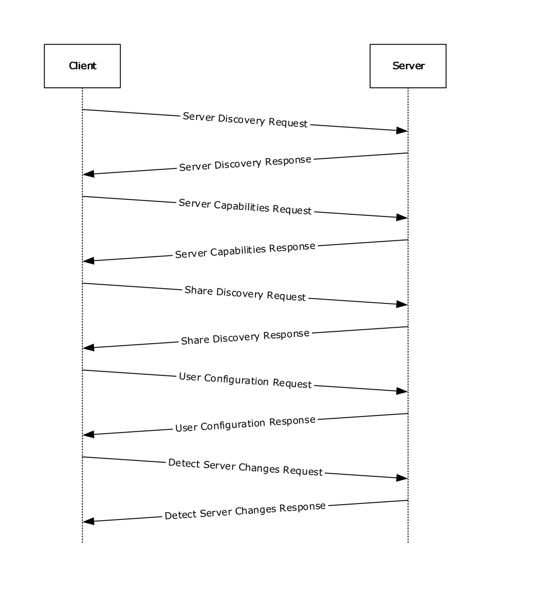
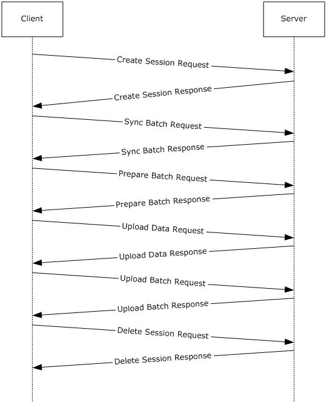
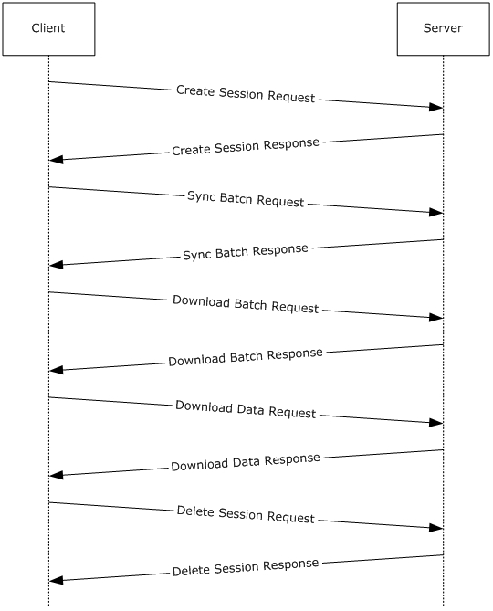

[MS-ECS]:

Enterprise Client Synchronization Protocol

Intellectual Property Rights Notice for Open Specifications Documentation

  Technical Documentation. Microsoft publishes Open Specifications documentation (“this

documentation”) for protocols, file formats, data portability, computer languages, and standards
support. Additionally, overview documents cover inter-protocol relationships and interactions.

  Copyrights. This documentation is covered by Microsoft copyrights. Regardless of any other

terms that are contained in the terms of use for the Microsoft website that hosts this
documentation, you can make copies of it in order to develop implementations of the technologies
that are described in this documentation and can distribute portions of it in your implementations
that use these technologies or in your documentation as necessary to properly document the
implementation. You can also distribute in your implementation, with or without modification, any
schemas, IDLs, or code samples that are included in the documentation. This permission also
applies to any documents that are referenced in the Open Specifications documentation.
  No Trade Secrets. Microsoft does not claim any trade secret rights in this documentation.
  Patents. Microsoft has patents that might cover your implementations of the technologies

described in the Open Specifications documentation. Neither this notice nor Microsoft's delivery of
this documentation grants any licenses under those patents or any other Microsoft patents.
However, a given Open Specifications document might be covered by the Microsoft Open
Specifications Promise or the Microsoft Community Promise. If you would prefer a written license,
or if the technologies described in this documentation are not covered by the Open Specifications
Promise or Community Promise, as applicable, patent licenses are available by contacting
iplg@microsoft.com.

  License Programs. To see all of the protocols in scope under a specific license program and the

associated patents, visit the Patent Map.

  Trademarks. The names of companies and products contained in this documentation might be
covered by trademarks or similar intellectual property rights. This notice does not grant any
licenses under those rights. For a list of Microsoft trademarks, visit
www.microsoft.com/trademarks.

  Fictitious Names. The example companies, organizations, products, domain names, email

addresses, logos, people, places, and events that are depicted in this documentation are fictitious.
No association with any real company, organization, product, domain name, email address, logo,
person, place, or event is intended or should be inferred.

Reservation of Rights. All other rights are reserved, and this notice does not grant any rights other
than as specifically described above, whether by implication, estoppel, or otherwise.

Tools. The Open Specifications documentation does not require the use of Microsoft programming
tools or programming environments in order for you to develop an implementation. If you have access
to Microsoft programming tools and environments, you are free to take advantage of them. Certain
Open Specifications documents are intended for use in conjunction with publicly available standards
specifications and network programming art and, as such, assume that the reader either is familiar
with the aforementioned material or has immediate access to it.

Support. For questions and support, please contact dochelp@microsoft.com.

[MS-ECS] - v20240423
Enterprise Client Synchronization Protocol
Copyright © 2024 Microsoft Corporation
Release: April 23, 2024

1 / 86

Revision Summary

Date

Revision
History

Revision
Class

Comments

8/8/2013

1.0

11/14/2013  2.0

2/13/2014

2.0

5/15/2014

3.0

6/30/2015

4.0

10/16/2015  5.0

7/14/2016

6.0

6/1/2017

7.0

9/15/2017

8.0

12/1/2017

8.0

9/12/2018

9.0

8/26/2020

10.0

4/7/2021

11.0

6/25/2021

12.0

4/23/2024

13.0

New

Major

None

Major

Major

Major

Major

Major

Major

None

Major

Major

Major

Major

Major

Released new document.

Significantly changed the technical content.

No change to the meaning, language, or formatting of the
technical content.

Significantly changed the technical content.

Significantly changed the technical content.

Significantly changed the technical content.

Significantly changed the technical content.

Significantly changed the technical content.

Significantly changed the technical content.

No changes to the meaning, language, or formatting of the
technical content.

Significantly changed the technical content.

Significantly changed the technical content.

Significantly changed the technical content.

Significantly changed the technical content.

Significantly changed the technical content.

[MS-ECS] - v20240423
Enterprise Client Synchronization Protocol
Copyright © 2024 Microsoft Corporation
Release: April 23, 2024

2 / 86

## Table of Contents

- [1 Introduction](#1-introduction)
  - [1.1 Glossary](#11-glossary)
  - [1.2 References](#12-references)
    - [1.2.1 Normative References](#121-normative-references)
    - [1.2.2 Informative References](#122-informative-references)
  - [1.3 Overview](#13-overview)
  - [1.4 Relationship to Other Protocols](#14-relationship-to-other-protocols)
  - [1.5 Prerequisites/Preconditions](#15-prerequisitespreconditions)
  - [1.6 Applicability Statement](#16-applicability-statement)
  - [1.7 Versioning and Capability Negotiation](#17-versioning-and-capability-negotiation)
  - [1.8 Vendor-Extensible Fields](#18-vendor-extensible-fields)
  - [1.9 Standards Assignments](#19-standards-assignments)
- [2 Messages](#2-messages)
  - [2.1 Transport](#21-transport)
  - [2.2 Common Data Types](#22-common-data-types)
    - [2.2.1 HTTP Headers](#221-http-headers)
      - [2.2.1.1 x-ecs-request-error](#2211-x-ecs-request-error)
      - [2.2.1.2 x-ecs-devicename](#2212-x-ecs-devicename)
      - [2.2.1.3 x-ecs-share-type](#2213-x-ecs-share-type)
      - [2.2.1.4 x-ecs-changes-URL](#2214-x-ecs-changes-url)
      - [2.2.1.5 x-ecs-partnershipID](#2215-x-ecs-partnershipid)
      - [2.2.1.6 x-ecs-admin-contact](#2216-x-ecs-admin-contact)
      - [2.2.1.7 x-ecs-session-id](#2217-x-ecs-session-id)
      - [2.2.1.8 x-ecs-continue](#2218-x-ecs-continue)
      - [2.2.1.9 x-ecs-metadata-version](#2219-x-ecs-metadata-version)
      - [2.2.1.10 x-ecs-domain](#22110-x-ecs-domain)
      - [2.2.1.11 x-ecs-server-os-version](#22111-x-ecs-server-os-version)
      - [2.2.1.12 x-ecs-server-rootdns-name](#22112-x-ecs-server-rootdns-name)
    - [2.2.2 Common Data Structures](#222-common-data-structures)
      - [2.2.2.2 The structure used to specify the current data usage](#2222-the-structure-used-to-specify-the-current-data-usage)
      - [2.2.2.3 The structure used to specify the policies on how the](#2223-the-structure-used-to-specify-the-policies-on-how-the)
      - [2.2.2.9 The structure used to specify the status of a file](#2229-the-structure-used-to-specify-the-status-of-a-file)
      - [2.2.2.10 The structure used to specify the server response data](#22210-the-structure-used-to-specify-the-server-response-data)
      - [2.2.2.11 DOWNLOAD_RESPONSE_ENTRY](#22211-downloadresponseentry)
      - [2.2.2.12 FILE_DOWNLOAD_INFO_ENTRY](#22212-filedownloadinfoentry)
      - [2.2.2.13 SYNC_CHANGE_BATCH](#22213-syncchangebatch)
      - [2.2.2.14 The structure used to specify the information of the](#22214-the-structure-used-to-specify-the-information-of-the)
      - [2.2.2.15 The structure that defines the serialization format](#22215-the-structure-that-defines-the-serialization-format)
      - [2.2.2.16 VECTOR_FILE_METADATA_ENTRY](#22216-vectorfilemetadataentry)
      - [2.2.2.17 VECTOR_FILE_INFO_INPUT_ENTRY](#22217-vectorfileinfoinputentry)
      - [2.2.2.18 VECTOR_FILE_INFO_ENTRY](#22218-vectorfileinfoentry)
      - [2.2.2.19 VECTOR_FILE_STATUS_ENTRY](#22219-vectorfilestatusentry)
      - [2.2.2.20 VECTOR_UPLOAD_ENTRY](#22220-vectoruploadentry)
      - [2.2.2.21 VECTOR_UPLOAD_RESPONSE_ENTRY](#22221-vectoruploadresponseentry)
      - [2.2.2.22 VECTOR_DOWNLOAD_ENTRY](#22222-vectordownloadentry)
      - [2.2.2.23 The structure representing a collection of](#22223-the-structure-representing-a-collection-of)
      - [2.2.2.24 VECTOR_DOWNLOAD_RESPONSE_ENTRY](#22224-vectordownloadresponseentry)
      - [2.2.2.25 VECTOR_FILE_DOWNLOAD_INFO_ENTRY](#22225-vectorfiledownloadinfoentry)
      - [2.2.2.26 VECTOR_STRING](#22226-vectorstring)
      - [2.2.2.27 ECS_STRING](#22227-ecsstring)
      - [2.2.2.28 Error Codes](#22228-error-codes)
- [3 Protocol Details](#3-protocol-details)
  - [3.1 ServiceDiscovery Server Details](#31-servicediscovery-server-details)
    - [3.1.1 Abstract Data Model](#311-abstract-data-model)
      - [3.1.1.1 Per ClientRequestsCount](#3111-per-clientrequestscount)
    - [3.1.2 Timers](#312-timers)
    - [3.1.3 Initialization](#313-initialization)
    - [3.1.4 Higher-Layer Triggered Events](#314-higher-layer-triggered-events)
    - [3.1.5 Message Processing Events and Sequencing Rules](#315-message-processing-events-and-sequencing-rules)
      - [3.1.5.1 Server Discovery](#3151-server-discovery)
        - [3.1.5.1.1 GET](#31511-get)
          - [3.1.5.1.1.1 Request Body](#315111-request-body)
          - [3.1.5.1.1.2 Response Body](#315112-response-body)
          - [3.1.5.1.1.3 Processing Details](#315113-processing-details)
      - [3.1.5.2 Share Discovery](#3152-share-discovery)
        - [3.1.5.2.1 GET](#31521-get)
          - [3.1.5.2.1.1 Request Body](#315211-request-body)
          - [3.1.5.2.1.2 Response Body](#315212-response-body)
          - [3.1.5.2.1.3 Processing Details](#315213-processing-details)
      - [3.1.5.3 Server Capabilities](#3153-server-capabilities)
        - [3.1.5.3.1 GET](#31531-get)
          - [3.1.5.3.1.1 Request Body](#315311-request-body)
          - [3.1.5.3.1.2 Response Body](#315312-response-body)
          - [3.1.5.3.1.3 Processing Details](#315313-processing-details)
    - [3.1.6 Timer Events](#316-timer-events)
    - [3.1.7 Other Local Events](#317-other-local-events)
  - [3.2 DetectServerChanges Server Details](#32-detectserverchanges-server-details)
    - [3.2.1 Abstract Data Model](#321-abstract-data-model)
    - [3.2.2 Timers](#322-timers)
    - [3.2.3 Initialization](#323-initialization)
    - [3.2.4 Higher-Layer Triggered Events](#324-higher-layer-triggered-events)
    - [3.2.5 Message Processing Events and Sequencing Rules](#325-message-processing-events-and-sequencing-rules)
      - [3.2.5.1 Detect Server Changes](#3251-detect-server-changes)
        - [3.2.5.1.1 HEAD](#32511-head)
          - [3.2.5.1.1.1 Request Body](#325111-request-body)
          - [3.2.5.1.1.2 Response Body](#325112-response-body)
          - [3.2.5.1.1.3 Processing Details](#325113-processing-details)
    - [3.2.6 Timer Events](#326-timer-events)
    - [3.2.7 Other Local Events](#327-other-local-events)
  - [3.3 UserConfiguration Server Details](#33-userconfiguration-server-details)
    - [3.3.1 Abstract Data Model](#331-abstract-data-model)
    - [3.3.2 Timers](#332-timers)
    - [3.3.3 Initialization](#333-initialization)
    - [3.3.4 Higher-Layer Triggered Events](#334-higher-layer-triggered-events)
    - [3.3.5 Message Processing Events and Sequencing Rules](#335-message-processing-events-and-sequencing-rules)
      - [3.3.5.1 User Configuration](#3351-user-configuration)
        - [3.3.5.1.1 GET](#33511-get)
          - [3.3.5.1.1.1 Request Body](#335111-request-body)
          - [3.3.5.1.1.2 Response Body](#335112-response-body)
          - [3.3.5.1.1.3 Processing Details](#335113-processing-details)
    - [3.3.6 Timer Events](#336-timer-events)
    - [3.3.7 Other Local Events](#337-other-local-events)
  - [3.4 PeerSynchronizationSession Server Details](#34-peersynchronizationsession-server-details)
    - [3.4.1 Abstract Data Model](#341-abstract-data-model)
      - [3.4.1.1 Global](#3411-global)
      - [3.4.1.2 Per Session](#3412-per-session)
        - [3.4.1.2.1 Per ChangeBatch](#34121-per-changebatch)
        - [3.4.1.2.2 Per FileMetadata](#34122-per-filemetadata)
    - [3.4.2 Timers](#342-timers)
    - [3.4.3 Initialization](#343-initialization)
    - [3.4.4 Higher-Layer Triggered Events](#344-higher-layer-triggered-events)
    - [3.4.5 Message Processing Events and Sequencing Rules](#345-message-processing-events-and-sequencing-rules)
      - [3.4.5.1 Create Session](#3451-create-session)
        - [3.4.5.1.1 PUT](#34511-put)
          - [3.4.5.1.1.1 Request Body](#345111-request-body)
          - [3.4.5.1.1.2 Response Body](#345112-response-body)
          - [3.4.5.1.1.3 Processing Details](#345113-processing-details)
      - [3.4.5.2 Sync Batch Parameters](#3452-sync-batch-parameters)
        - [3.4.5.2.1 GET](#34521-get)
          - [3.4.5.2.1.1 Request Body](#345211-request-body)
          - [3.4.5.2.1.2 Response Body](#345212-response-body)
          - [3.4.5.2.1.3 Processing Details](#345213-processing-details)
        - [3.4.5.2.2 PUT](#34522-put)
          - [3.4.5.2.2.1 Request Body](#345221-request-body)
          - [3.4.5.2.2.2 Response Body](#345222-response-body)
          - [3.4.5.2.2.3 Processing Details](#345223-processing-details)
      - [3.4.5.3 Prepare Batch](#3453-prepare-batch)
        - [3.4.5.3.1 PUT](#34531-put)
          - [3.4.5.3.1.1 Request Body](#345311-request-body)
          - [3.4.5.3.1.2 Response Body](#345312-response-body)
          - [3.4.5.3.1.3 Processing Details](#345313-processing-details)
      - [3.4.5.4 Upload Batch](#3454-upload-batch)
        - [3.4.5.4.1 PUT](#34541-put)
          - [3.4.5.4.1.1 Request Body](#345411-request-body)
          - [3.4.5.4.1.2 Response Body](#345412-response-body)
          - [3.4.5.4.1.3 Processing Details](#345413-processing-details)
      - [3.4.5.5 Delete Session](#3455-delete-session)
        - [3.4.5.5.1 DELETE](#34551-delete)
          - [3.4.5.5.1.1 Request Body](#345511-request-body)
          - [3.4.5.5.1.2 Response Body](#345512-response-body)
          - [3.4.5.5.1.3 Processing Details](#345513-processing-details)
      - [3.4.5.6 Download Batch](#3456-download-batch)
        - [3.4.5.6.1 GET](#34561-get)
          - [3.4.5.6.1.1 Request Body](#345611-request-body)
          - [3.4.5.6.1.2 Response Body](#345612-response-body)
          - [3.4.5.6.1.3 Processing Details](#345613-processing-details)
    - [3.4.6 Timer Events](#346-timer-events)
    - [3.4.7 Other Local Events](#347-other-local-events)
  - [3.5 ServerAPI Server Details](#35-serverapi-server-details)
    - [3.5.1 Abstract Data Model](#351-abstract-data-model)
    - [3.5.2 Timers](#352-timers)
    - [3.5.3 Initialization](#353-initialization)
    - [3.5.4 Higher-Layer Triggered Events](#354-higher-layer-triggered-events)
    - [3.5.5 Message Processing Events and Sequencing Rules](#355-message-processing-events-and-sequencing-rules)
      - [3.5.5.1 Upload Data](#3551-upload-data)
        - [3.5.5.1.1 PUT](#35511-put)
          - [3.5.5.1.1.1 Request Body](#355111-request-body)
          - [3.5.5.1.1.2 Response Body](#355112-response-body)
          - [3.5.5.1.1.3 Processing Details](#355113-processing-details)
      - [3.5.5.2 Download Data](#3552-download-data)
        - [3.5.5.2.1 PUT](#35521-put)
          - [3.5.5.2.1.1 Request Body](#355211-request-body)
          - [3.5.5.2.1.2 Response Body](#355212-response-body)
          - [3.5.5.2.1.3 Processing Details](#355213-processing-details)
    - [3.5.6 Timer Events](#356-timer-events)
    - [3.5.7 Other Local Events](#357-other-local-events)
  - [3.6 ECS Client Details](#36-ecs-client-details)
    - [3.6.1 Abstract Data Model](#361-abstract-data-model)
      - [3.6.1.1 Global](#3611-global)
      - [3.6.1.2 Per UploadFile](#3612-per-uploadfile)
      - [3.6.1.3 Per Share](#3613-per-share)
      - [3.6.1.4 Per DownloadFile](#3614-per-downloadfile)
      - [3.6.1.5 Per FileMetadata](#3615-per-filemetadata)
    - [3.6.2 Timers](#362-timers)
    - [3.6.3 Initialization](#363-initialization)
    - [3.6.4 Higher-Layer Triggering Events](#364-higher-layer-triggering-events)
      - [3.6.4.1 Application Requests Uploading Data To Sync Target](#3641-application-requests-uploading-data-to-sync-target)
    - [3.6.5 Message Processing Events and Sequencing Rules](#365-message-processing-events-and-sequencing-rules)
      - [3.6.5.1 Upload Scenario](#3651-upload-scenario)
      - [3.6.5.2 Download Scenario](#3652-download-scenario)
    - [3.6.6 Timer Events](#366-timer-events)
    - [3.6.7 Other Local Events](#367-other-local-events)
- [4 Protocol Examples](#4-protocol-examples)
  - [4.1 Query User Configuration Information and Detect Server Changes](#41-query-user-configuration-information-and-detect-server-changes)
  - [4.2 Upload Scenario](#42-upload-scenario)
  - [4.3 Download Scenario](#43-download-scenario)
- [5 Security](#5-security)
  - [5.1 Security Considerations for Implementers](#51-security-considerations-for-implementers)
  - [5.2 Index of Security Parameters](#52-index-of-security-parameters)
- [6 Appendix A: Product Behavior](#6-appendix-a-product-behavior)
- [7 Change Tracking](#7-change-tracking)
- [8 Index](#8-index)

## 1 Introduction

This document specifies the Enterprise Client Synchronization (ECS) Protocol.

The Enterprise Client Synchronization Protocol is designed for synchronizing files across multiple
devices in an enterprise network.

Sections 1.5, 1.8, 1.9, 2, and 3 of this specification are normative. All other sections and examples in
this specification are informative.

### 1.1 Glossary

This document uses the following terms:

Active Directory: The Windows implementation of a general-purpose directory service, which uses

LDAP as its primary access protocol. Active Directory stores information about a variety of
objects in the network such as user accounts, computer accounts, groups, and all related
credential information used by Kerberos [MS-KILE]. Active Directory is either deployed as Active
Directory Domain Services (AD DS) or Active Directory Lightweight Directory Services (AD LDS),
which are both described in [MS-ADOD]: Active Directory Protocols Overview.

fully qualified domain name (FQDN): An unambiguous domain name that gives an absolute

location in the Domain Name System's (DNS) hierarchy tree, as defined in [RFC1035] section
3.1 and [RFC2181] section 11.

MD5 hash: A hashing algorithm, as described in [RFC1321], that was developed by RSA Data

Security, Inc. An MD5 hash is used by the File Replication Service (FRS) to verify that a file on
each replica member is identical.

Sync Framework: A data synchronization platform that can be used to synchronize data across

multiple data stores.

Uniform Resource Identifier (URI): A string that identifies a resource. The URI is an addressing
mechanism defined in Internet Engineering Task Force (IETF) Uniform Resource Identifier (URI):
Generic Syntax [RFC3986].

Uniform Resource Locator (URL): A string of characters in a standardized format that identifies

a document or resource on the World Wide Web. The format is as specified in [RFC1738].

MAY, SHOULD, MUST, SHOULD NOT, MUST NOT: These terms (in all caps) are used as defined
in [RFC2119]. All statements of optional behavior use either MAY, SHOULD, or SHOULD NOT.

### 1.2 References

Links to a document in the Microsoft Open Specifications library point to the correct section in the
most recently published version of the referenced document. However, because individual documents
in the library are not updated at the same time, the section numbers in the documents may not
match. You can confirm the correct section numbering by checking the Errata.

#### 1.2.1 Normative References

We conduct frequent surveys of the normative references to assure their continued availability. If you
have any issue with finding a normative reference, please contact dochelp@microsoft.com. We will
assist you in finding the relevant information.

[MS-DTYP] Microsoft Corporation, "Windows Data Types".

[MS-ERREF] Microsoft Corporation, "Windows Error Codes".

7 / 86

[MS-ECS] - v20240423
Enterprise Client Synchronization Protocol
Copyright © 2024 Microsoft Corporation
Release: April 23, 2024

[MS-FSVCA] Microsoft Corporation, "File Set Version Comparison Algorithms".

[RFC1321] Rivest, R., "The MD5 Message-Digest Algorithm", RFC 1321, April 1992, https://www.rfc-
editor.org/info/rfc1321

[RFC2119] Bradner, S., "Key words for use in RFCs to Indicate Requirement Levels", BCP 14, RFC
2119, March 1997, https://www.rfc-editor.org/info/rfc2119

[RFC2616] Fielding, R., Gettys, J., Mogul, J., et al., "Hypertext Transfer Protocol -- HTTP/1.1", RFC
2616, June 1999, https://www.rfc-editor.org/info/rfc2616

[RFC2818] Rescorla, E., "HTTP Over TLS", RFC 2818, May 2000, https://www.rfc-
editor.org/info/rfc2818

#### 1.2.2 Informative References

[MSDN-FSA] Microsoft Corporation, "File Attribute Constants", http://msdn.microsoft.com/en-
us/library/windows/desktop/gg258117(v=vs.85).aspx

[MSKB-2891638] Microsoft Corporation, "Work Folders is available on Windows 7 client", April 2014,
http://support.microsoft.com/kb/2891638

### 1.3 Overview

The Enterprise Client Synchronization Protocol is used to access REST-based file sync services over
web-based transport.

The protocol is used for uploading and downloading file data between a client and server participating
in the synchronization of a namespace. Both the upload and download scenarios are driven by the
client role of this protocol.

Before creating any sessions for the data transfer, the client initially queries the server for information
on the sync target share and the server's capabilities.

In the upload scenario, the client is notified of local changes to the file data from an underlying Sync
Framework and takes the following steps:

1.  Create the server session.

2.  Get the server's sync knowledge.

3.  Prepare the server for upload.

4.  Perform data transfer (upload).

5.  Commit change.

6.  Delete session.

In the download scenario, the protocol provides a mechanism for the client to receive notifications
about changes on the server that will need to be synchronized. When the client receives a notification
for server-side changes, the client takes the following steps:

1.  Create the server session.

2.  Update the server on the client’s sync knowledge.

3.  Get the change batch from the server.

4.  Perform data transfer (download).

[MS-ECS] - v20240423
Enterprise Client Synchronization Protocol
Copyright © 2024 Microsoft Corporation
Release: April 23, 2024

8 / 86

5.  Delete session.

### 1.4 Relationship to Other Protocols

None.

### 1.5 Prerequisites/Preconditions

The Enterprise Client Synchronization Protocol does not provide a mechanism for a client to discover
the existence and location of a global sync URI for syncing a namespace. It is a prerequisite that the
client's local configuration include a global sync URI that can be used to enumerate all servers
exposing that namespace for synchronization.

The Enterprise Client Synchronization Protocol does not define an authentication or authorization
scheme. Implementers of this protocol need to review the recommended security prerequisites in
Security Considerations for Implementers (section 5.1) of this document.

### 1.6 Applicability Statement

This protocol is applicable where file data is required to be synchronized across multiple devices in an
enterprise network.

### 1.7 Versioning and Capability Negotiation

This protocol currently supports one version (1.0). The server returns the supported versions in the
response for Server Capabilities as specified in section 3.1.5.3. The protocol does not provide any
mechanism for capability negotiation based on versions. <1>

Version

Value

ECS Protocol version 1

"1.0"

### 1.8 Vendor-Extensible Fields

None.

### 1.9 Standards Assignments

None.

[MS-ECS] - v20240423
Enterprise Client Synchronization Protocol
Copyright © 2024 Microsoft Corporation
Release: April 23, 2024

9 / 86

## 2 Messages

### 2.1 Transport

The Enterprise Client Synchronization Protocol uses HTTP or secure HTTP 1.1 as transport, as specified
in [RFC2616] and [RFC2818].

### 2.2 Common Data Types

The following table summarizes the server-side resources used by the Enterprise Client
Synchronization Protocol.

Resource type

Description

Server Discovery

The resource used to enumerate all servers exposing the namespace for sync.

Share Discovery

The resource used to discover the sync share on the server.

Server Capabilities

The resource used to query the capabilities of the sync service.

Detect Server Changes  The resource used to do polling for the server-side changes.

User Configuration

The resource used to query the user configuration information for a sync target share.

Create Session

The resource used to create a new session on the server.

Sync Batch Parameters  The resource used to retrieve or update synchronization batch parameters.

Prepare Batch

The resource used to send information to the server to prepare for the change batch.

Upload Batch

The resource used to commit a change batch on the server.

Delete Session

The resource used to delete a sync session on the server.

Download Batch

The resource used to receive a change batch from the server to the client.

Upload Data

The resource used to send file data to the server.

Download Data

The resource used to receive file data from the server.

#### 2.2.1 HTTP Headers

The following table summarizes the set of HTTP headers defined by this specification.

Header

Description

x-ecs-admin-contact

A string representing the email contact of the server administrator.

x-ecs-changes-URL

The URL to be used by the client to poll for changes on the server.

x-ecs-continue

The opaque continuation token received from the server in a download batch
operation.

x-ecs-devicename

A string representing the name and operating system of the device issuing the
request.

x-ecs-domain

The fully qualified domain name (FQDN) of the domain to which the client is

[MS-ECS] - v20240423
Enterprise Client Synchronization Protocol
Copyright © 2024 Microsoft Corporation
Release: April 23, 2024

10 / 86

Header

Description

joined.

x-ecs-metadata-version

A string containing the version of the server metadata for the current sync replica.

x-ecs-partnershipID

The PartnershipId string returned by the server in Share Discovery, as specified in
section 3.1.5.2.1.2

x-ecs-request-error

A string describing request failure information.

x-ecs-session-id

The identifier of sync session.

x-ecs-share-type

A string representing the type of the share to discover. Allowed values for this string
are "User Data".

x-ecs-server-os-version

A string representing the operating-system build number of the server.

x-ecs-server-rootdns-
name

An anonymous opaque string ID for the organization or organizational unit to which
the server belongs.

##### 2.2.1.1 x-ecs-request-error

This header describes request failure information. The value for this header MUST be a string
representation of the HRESULT in hexadecimal format.

Example:

x-ecs-request-error: "0x8007005"

 hexdigit = "0" / "1" / "2" / "3" / "4" / "5" / "6" / "7" / "8" / "9" / "a" / "b" / "c" / "d"
/ "e" / "f" / "A" / "B" / "C" / "D" / "E" / "F" / "x"
 x-ecs-request-error = 8 hexdigit

##### 2.2.1.2 x-ecs-devicename

A string representing the name and operating system of the device issuing the request in the following
format:

{Device Name, OS Family, OS Major Version, OS Minor Version, UserAgent Name}

Example:

x-ecs-devicename: {HOMEPC,Windows,6,3,MS_WorkFoldersClient}

 String = *(%x20-7E)
 DeviceName = String
 OSFamily = String
 MajorVersion = String
 MinorVersion = String
 UserAgentName = String
 x-ecs-devicename = "{" DeviceName "," OSFamily "," MajorVersion "," MinorVersion ","
UserAgentName "}"

[MS-ECS] - v20240423
Enterprise Client Synchronization Protocol
Copyright © 2024 Microsoft Corporation
Release: April 23, 2024

11 / 86

##### 2.2.1.3 x-ecs-share-type

A string representing the type of the share to discover.

 String = *(%x20-7E)
 x-ecs-share-type = String

##### 2.2.1.4 x-ecs-changes-URL

This header provides the URL to be used by the client to poll for changes on the server.

 String = *(%x20-7E)
 x-ecs-changes-URL = String

##### 2.2.1.5 x-ecs-partnershipID

A string representing the PartnershipId for a sync target. This value MUST be Base64-encoded.

 String = *(%x20-7E)
 x-ecs-partnershipID = String

##### 2.2.1.6 x-ecs-admin-contact

A string representing the email contact of the server admin.

 String = *(%x20-7E)
 x-ecs-admin-contact = String

##### 2.2.1.7 x-ecs-session-id

An implementation-specific string that identifies the session.

 String = *(%x20-7E)
 x-ecs-session-id = String

##### 2.2.1.8 x-ecs-continue

The opaque continuation token received from the server in a download batch operation.

 String = *(%x20-7E)
 x-ecs-continue = String

##### 2.2.1.9 x-ecs-metadata-version

A string containing the version of the server metadata for the current sync replica.

[MS-ECS] - v20240423
Enterprise Client Synchronization Protocol
Copyright © 2024 Microsoft Corporation
Release: April 23, 2024

12 / 86

 String = *(%x20-7E)
 x-ecs-metadata-version = String

##### 2.2.1.10 x-ecs-domain

When present, this header indicates that the client is part of an Active Directory domain and the
header value contains the FQDN of the domain. If omitted, or if the value is an empty string, the
client is considered to not be in a domain.

 String = *(%x20-7E)
 x-ecs-domain = String

##### 2.2.1.11 x-ecs-server-os-version

When present, this header indicates the operating-system build number of the server.

 String = *(%x20-7E)
 x-ecs-server-os-version = String

##### 2.2.1.12 x-ecs-server-rootdns-name

When present, this header indicates an anonymous opaque string ID for the organization or
organizational unit to which the server belongs.

 String = *(%x20-7E)
 x-ecs-server-rootdns-name = String

#### 2.2.2 Common Data Structures

The following table summarizes the set of common data structures defined by this specification.
Common data types are specified in [MS-DTYP].

Unless otherwise specified, multiple-byte fields (16-bit, 32-bit, and 64-bit fields) MUST be transmitted
in little-endian order (with the least-significant byte first). Unless otherwise indicated, numeric fields
are integers of the specified byte length.

Structure Name

Section

Description

SYNC_GID

[MS-FSVCA]
section 2.1

The structure used to represent an identifier for a file
that is part of a sync batch.

CLOCK_VECTOR_ELEMENT

[MS-FSVCA]
section 2.9

The structure used to represent a version for the file in
the sync batch.

SYNC_BLOB

2.2.2.1

The structure used to specify a binary stream of data.

QUOTA_USAGE_ENTRY

##### 2.2.2.2 The structure used to specify the current data usage

of a user on the sync target share.

POLICY_ENTRY

##### 2.2.2.3 The structure used to specify the policies on how the

client is expected to set up its target directory.

[MS-ECS] - v20240423
Enterprise Client Synchronization Protocol
Copyright © 2024 Microsoft Corporation
Release: April 23, 2024

13 / 86

Structure Name

Section

Description

BATCH_LIMITS_ENTRY

2.2.2.4

The structure used to specify the parameters that
describe sync batch characteristics.

FILE_METADATA_ENTRY

2.2.2.5

The structure used to specify the metadata
information for a file in a sync batch.

FILE_INFO_INPUT_ENTRY

2.2.2.6

FILE_INFO_ENTRY

2.2.2.7

The structure used to specify the sync preparation
information of a file that the client sends to a server
before an upload.

The structure used to specify the sync preparation
information of a file that the server sends to the client
before an upload.

FILE_STATUS_ENTRY

UPLOAD_ENTRY

2.2.2.8

##### 2.2.2.9 The structure used to specify the status of a file

commit in a sync process.

The structure used to specify information of the data
for a file that is being uploaded to the server.

UPLOAD_RESPONSE_ENTRY

##### 2.2.2.10 The structure used to specify the server response data

for a file being uploaded.

DOWNLOAD_ENTRY

##### 2.2.2.11 DOWNLOAD_RESPONSE_ENTRY

##### 2.2.2.12 FILE_DOWNLOAD_INFO_ENTRY

##### 2.2.2.13 SYNC_CHANGE_BATCH

##### 2.2.2.14 The structure used to specify the information of the

data for a file that is being downloaded from the
server.

The structure used to specify the server response data
for a file being downloaded.

The structure that specifies the information on how
the file content needs to be downloaded by the client.

The structure that defines the metadata describing the
changes to be synchronized.

SYNC_MD5HASH

##### 2.2.2.15 The structure that defines the serialization format

used by this protocol for MD5 hash data.

VECTOR_POLICY_ENTRY

##### 2.2.2.16 VECTOR_FILE_METADATA_ENTRY

##### 2.2.2.17 VECTOR_FILE_INFO_INPUT_ENTRY

##### 2.2.2.18 VECTOR_FILE_INFO_ENTRY

##### 2.2.2.19 VECTOR_FILE_STATUS_ENTRY

##### 2.2.2.20 VECTOR_UPLOAD_ENTRY

##### 2.2.2.21 VECTOR_UPLOAD_RESPONSE_ENTRY

##### 2.2.2.22 VECTOR_DOWNLOAD_ENTRY

##### 2.2.2.23 The structure representing a collection of

POLICY_ENTRY structures.

The structure representing a collection of
FILE_METADATA_ENTRY structures.

The structure representing a collection of
FILE_INFO_INPUT_ENTRY structures.

The structure representing a collection of
FILE_INFO_ENTRY structures.

The structure representing a collection of
FILE_STATUS_ENTRY structures.

The structure representing a collection of
UPLOAD_ENTRY structures.

The structure representing a collection of
UPLOAD_RESPONSE_ENTRY structures.

The structure representing a collection of
DOWNLOAD_ENTRY structures.

14 / 86

[MS-ECS] - v20240423
Enterprise Client Synchronization Protocol
Copyright © 2024 Microsoft Corporation
Release: April 23, 2024

Structure Name

Section

Description

VECTOR_DOWNLOAD_RESPONSE_ENTRY  2.2.2.24

VECTOR_FILE_DOWNLOAD_INFO_ENTRY  2.2.2.25

The structure representing a collection of
DOWNLOAD_RESPONSE_ENTRY structures.

The structure representing a collection of
FILE_DOWNLOAD_INFO_ENTRY structures.

VECTOR_STRING

ECS_STRING

2.2.2.26

2.2.2.27

The structure representing a collection of ECS_STRING
structures.

The structure representing a UTF-8 string of a
prescribed length.

2.2.2.1  SYNC_BLOB

The SYNC_BLOB structure represents a binary stream of data.

0  1  2  3  4  5  6  7  8  9

1
0  1  2  3  4  5  6  7  8  9

2
0  1  2  3  4  5  6  7  8  9

3
0  1

BlobSize

BlobData (variable)

...

...

BlobSize (4 bytes): A 32-bit unsigned integer that contains the size of the blob data in bytes.

BlobData (variable): A variable stream of bytes containing the blob data.

2.2.2.2  QUOTA_USAGE_ENTRY

The QUOTA_USAGE_ENTRY structure specifies the current data usage of user on the sync target
share.

0  1  2  3  4  5  6  7  8  9  1

1  2  3  4  5  6  7  8  9  2

1  2  3  4  5  6  7  8  9  3

1

0

0

UserDataFreeSpace

0

...

UserUsage

...

UserDataFreeSpace (8 bytes): A 64-bit unsigned integer that contains the amount of available free

space, in bytes, in the user's share.

[MS-ECS] - v20240423
Enterprise Client Synchronization Protocol
Copyright © 2024 Microsoft Corporation
Release: April 23, 2024

15 / 86

UserUsage (8 bytes): A 64-bit unsigned integer that contains the amount of data, in bytes, in the

user's share.

2.2.2.3  POLICY_ENTRY

The POLICY_ENTRY structure specifies the policies on how the client is expected to set up its target
directory.

0  1  2  3  4  5  6  7  8  9

1
0  1  2  3  4  5  6  7  8  9

2
0  1  2  3  4  5  6  7  8  9

3
0  1

PolicyName

PolicyType

PolicyName (1 byte): An unsigned 8-bit value that identifies the policy. This MUST be one of the

following values.

Value  Description

0x01

Encryption

0x02

Password

0x03

AutoLock

PolicyType (1 byte): A nonzero value indicates that this policy is enforced.

2.2.2.4  BATCH_LIMITS_ENTRY

The BATCH_LIMITS_ENTRY structure specifies the parameters that describe sync batch characteristics.

0  1  2  3  4  5  6  7  8  9

1
0  1  2  3  4  5  6  7  8  9

2
0  1  2  3  4  5  6  7  8  9

3
0  1

MaxFileDataSize

MaxFileCount

MaxFileDataSize (4 bytes): A 32-bit unsigned integer that contains the maximum size, as a

multiple of 1048576 bytes, of file data in one batch.

MaxFileCount (4 bytes): A 32-bit unsigned integer that contains the maximum count of files in one

batch.

2.2.2.5  FILE_METADATA_ENTRY

The FILE_METADATA_ENTRY structure specifies the metadata information for a file in a sync batch.

0  1  2  3  4  5  6  7  8  9

1
0  1  2  3  4  5  6  7  8  9

2
0  1  2  3  4  5  6  7  8  9

3
0  1

FileId (24 bytes)

...

16 / 86

[MS-ECS] - v20240423
Enterprise Client Synchronization Protocol
Copyright © 2024 Microsoft Corporation
Release: April 23, 2024

...

SyncVersion

...

...

FileStreamVersion (16 bytes)

...

...

ParentId (24 bytes)

...

...

FileAttributes

NamespaceChangeTime

...

AttributeChangeTime

...

CreatedTime

...

ModifiedTime

...

ContentSize

...

Name (variable)

...

...

OriginatingDeviceNameIndex

[MS-ECS] - v20240423
Enterprise Client Synchronization Protocol
Copyright © 2024 Microsoft Corporation
Release: April 23, 2024

17 / 86

FileId (24 bytes): An identifier that uniquely identifies the file or directory. This MUST be in the

format specified in [MS-FSVCA] section 2.1.

SyncVersion (12 bytes): SyncVersion is the version of the file entry. This MUST be in the format

specified in [MS-FSVCA] section 2.9.

FileStreamVersion (16 bytes): A GUID representing the version of the file content. This MUST not

be used for directories.

ParentId (24 bytes): ParentId is an identifier for the metadata of the parent item. The parent item

MUST be a directory. Files without a parent MUST set ParentId.GidPrefix to
0x0000000000000000 and ParentId.UniqueId to 0x00700012000000000000000000000000.
This MUST be in the format specified in [MS-FSVCA] section 2.1.

FileAttributes (4 bytes): A 32-bit unsigned integer representing the attributes of the file allowed by

the underlying object store.<2>

NamespaceChangeTime (8 bytes): The time at which the name of the file or its ParentId was

changed. This field is used for resolving conflicts during synchronization. This MUST be in the
format specified in [MS-DTYP] section 2.3.3.

AttributeChangeTime (8 bytes): The time at which the attributes of the file were changed. This

field is used for resolving conflicts during synchronization. This MUST be in the format specified in
[MS-DTYP] section 2.3.3.

CreatedTime (8 bytes): The time at which the file was created. This MUST be in the format specified

in [MS-DTYP] section 2.3.1.

ModifiedTime (8 bytes): The time at which the file was last modified. This MUST be in the format

specified in [MS-DTYP] section 2.3.1.

ContentSize (8 bytes): A 64-bit unsigned integer representing the size of the file in bytes. This

MUST be zero for a directory entry.

Name (variable): An ECS_STRING structure, as specified in section 2.2.2.27, representing the name

of the file or directory. The string in this structure MUST not be empty.

OriginatingDeviceNameIndex (2 bytes): A 16-bit unsigned integer representing the index of the

string representing the device in the DeviceNames field of the SYNC_CHANGE_BATCH structure,
as specified in section 2.2.2.14.

2.2.2.6  FILE_INFO_INPUT_ENTRY

The FILE_INFO_INPUT_ENTRY structure specifies the sync preparation information of a file that the
client sends to the server before an upload.

0  1  2  3  4  5  6  7  8  9

1
0  1  2  3  4  5  6  7  8  9

2
0  1  2  3  4  5  6  7  8  9

3
0  1

FileExtension (variable)

...

...

SyncItemId (24 bytes)

[MS-ECS] - v20240423
Enterprise Client Synchronization Protocol
Copyright © 2024 Microsoft Corporation
Release: April 23, 2024

18 / 86

...

...

StreamId (16 bytes)

...

...

FileSize

...

FileExtension (variable): An ECS_STRING structure containing the extension of the file.

SyncItemId (24 bytes): An identifier that is used to correlate the file metadata with the Sync

Framework change item. This MUST be in the format specified in [MS-FSVCA] section 2.1.

StreamId (16 bytes): A GUID containing the stream identifier of the file.

FileSize (8 bytes): A 64-bit unsigned integer representing the size of the file in bytes.

2.2.2.7  FILE_INFO_ENTRY

The FILE_INFO_ENTRY structure specifies the sync preparation information of a file that the server
sends to the client before an upload.

0  1  2  3  4  5  6  7  8  9

1
0  1  2  3  4  5  6  7  8  9

2
0  1  2  3  4  5  6  7  8  9

3
0  1

SyncItemId (24 bytes)

...

...

Uri (variable)

...

PrepareResult

ProtocolType

...

SyncItemId (24 bytes): A SYNC_GID structure as described in [MS-FSVCA] section 2.1. An

identifier that is used to correlate the file metadata with the Sync Framework change item.

[MS-ECS] - v20240423
Enterprise Client Synchronization Protocol
Copyright © 2024 Microsoft Corporation
Release: April 23, 2024

19 / 86

Uri (variable): An ECS_STRING structure containing the URI used to perform data transfer for this

file. The string in this structure MUST be empty.

ProtocolType (1 byte): Indicates the type of data transfer that the server supports for this file. This

value MUST be one of the following.

Value  Meaning

0x00

No upload is required for this file.

0x01

File batching data transfer is required to transfer this file.

PrepareResult (4 bytes): This value contains the result of the preparation process of type HRESULT

as specified in [MS-DTYP] section 2.2.18.

2.2.2.8  FILE_STATUS_ENTRY

The FILE_STATUS_ENTRY structure specifies the information of a file commit in a sync process.

0  1  2  3  4  5  6  7  8  9

1
0  1  2  3  4  5  6  7  8  9

2
0  1  2  3  4  5  6  7  8  9

3
0  1

SyncItemId (24 bytes)

...

...

Status

SyncItemId (24 bytes): A SYNC_GID structure as specified in [MS-FSVCA] section 2.1.

SyncItemId is an identifier that is used to correlate the file metadata with the Sync Framework
change item.

Status (4 bytes): Indicates the result of applying changes to the file. This MUST be in the format

specified in [MS-DTYP] section 2.2.18.

2.2.2.9  UPLOAD_ENTRY

The UPLOAD_ENTRY structure specifies the information of the data for a file that is being uploaded to
the server.

0  1  2  3  4  5  6  7  8  9

1
0  1  2  3  4  5  6  7  8  9

2
0  1  2  3  4  5  6  7  8  9

3
0  1

SyncItemId (24 bytes)

...

...

FileSize

[MS-ECS] - v20240423
Enterprise Client Synchronization Protocol
Copyright © 2024 Microsoft Corporation
Release: April 23, 2024

20 / 86

…

Offset

…

Length

Reserved

…

UploadData (variable)

…

SyncItemId (24 bytes): A SYNC_GID structure as specified in [MS-FSVCA] section 2.1. This value

uniquely identifies the file replica within the change batch.

FileSize (8 bytes): A 64-bit unsigned integer containing the size of the file, in bytes.

Offset (8 bytes): A 64-bit unsigned integer containing the offset, in bytes, in the file for the data to

be uploaded.

Length (4 bytes): A 32-bit unsigned integer containing the length, in bytes, of the UploadData

field.

Reserved (8 bytes): A 64-bit unsigned integer. This field MUST NOT be used and MUST be reserved.

The client SHOULD<3> set this field to 0, and the server MUST ignore it on receipt.

UploadData (variable): A SYNC_BLOB structure as specified in section 2.2.2.1. The payload data to

be uploaded.

2.2.2.10

UPLOAD_RESPONSE_ENTRY

The UPLOAD_RESPONSE_ENTRY structure specifies the server response data for a file being uploaded.

0  1  2  3  4  5  6  7  8  9

1
0  1  2  3  4  5  6  7  8  9

2
0  1  2  3  4  5  6  7  8  9

3
0  1

SyncItemId (24 bytes)

...

...

HttpStatus

Result

Hash

[MS-ECS] - v20240423
Enterprise Client Synchronization Protocol
Copyright © 2024 Microsoft Corporation
Release: April 23, 2024

21 / 86

…

…

…

SyncItemId (24 bytes): A SYNC_GID structure as specified in [MS-FSVCA] section 2.1. A value that

uniquely identifies the file replica within the change batch.

HttpStatus (4 bytes): A 32-bit unsigned integer containing the HTTP status code.

Result (4 bytes): The result of the upload process for the file. If the upload is successful, this value
MUST be set to S_OK. This MUST be in the format as specified in [MS-DTYP] section 2.2.18.

Hash (16 bytes): The MD5 hash of the file contents, as specified in [RFC1321]. The hash is serialized

in SYNC_MD5HASH format as specified in section 2.2.2.15.

2.2.2.11

DOWNLOAD_ENTRY

The DOWNLOAD_ENTRY structure specifies the information of the data for a file that is being
downloaded from the server.

0  1  2  3  4  5  6  7  8  9

1
0  1  2  3  4  5  6  7  8  9

2
0  1  2  3  4  5  6  7  8  9

3
0  1

SyncItemId (24 bytes)

...

...

FileVersion (variable)

...

...

SyncItemId (24 bytes): A SYNC_GID structure as specified in [MS-FSVCA] section 2.1. An identifier

that is used to correlate the file metadata with the Sync Framework change item.

FileVersion (variable): A SYNC_BLOB structure as specified in section 2.2.2.1. An opaque stream of

bytes that identifies the file version.

2.2.2.12

DOWNLOAD_RESPONSE_ENTRY

The DOWNLOAD_RESPONSE_ENTRY structure specifies the server response data for a file being
downloaded.

[MS-ECS] - v20240423
Enterprise Client Synchronization Protocol
Copyright © 2024 Microsoft Corporation
Release: April 23, 2024

22 / 86

0  1  2  3  4  5  6  7  8  9

1
0  1  2  3  4  5  6  7  8  9

2
0  1  2  3  4  5  6  7  8  9

3
0  1

SyncItemId (24 bytes)

...

...

DataLength

...

Data (variable)

...

...

Result

FileHash

...

...

...

SyncItemId (24 bytes): A SYNC_GID structure as specified in [MS-FSVCA] section 2.1. An identifier

that is used to correlate the file metadata with the Sync Framework change item.

DataLength (8 bytes): A 64-bit unsigned integer containing the length, in bytes, of the Data field.

Data (variable): The contents of the file being downloaded from the server.

Result (4 bytes): The result of the file download operation. When the result indicates an error, the
DataLength field MUST be zero and the Data field MUST be empty. This MUST be in the format
specified in [MS-DTYP] section 2.2.18.

FileHash (16 bytes): The MD5 hash, as specified in [RFC1321], of the file contents. The hash is

serialized in SYNC_MD5HASH format as specified in section 2.2.2.15.

2.2.2.13

FILE_DOWNLOAD_INFO_ENTRY

The FILE_DOWNLOAD_INFO_ENTRY structure specifies information that is required for the client to
download the file content.

0  1  2  3  4  5  6  7  8  9

1
0  1  2  3  4  5  6  7  8  9

2
0  1  2  3  4  5  6  7  8  9

3
0  1

SyncItemId (24 bytes)

[MS-ECS] - v20240423
Enterprise Client Synchronization Protocol
Copyright © 2024 Microsoft Corporation
Release: April 23, 2024

23 / 86

...

...

Uri (variable)

...

ProtocolType

SyncId (24 bytes): A SYNC_GID structure as specified in [MS-FSVCA] section 2.1. A value that

uniquely identifies the file item within the sync batch.

Uri (variable): An ECS_STRING structure containing the URI used to perform data transfer of the file

stream. The string in this structure MUST be empty.

ProtocolType (1 byte): Indicates the type of data transfer that the server supports for this file. This

value MUST be one of the following.

Value  Meaning

0x01

File batching data transfer is required to transfer this file.

2.2.2.14

SYNC_CHANGE_BATCH

The SYNC_CHANGE_BATCH structure defines the metadata that describes the changes to be
synchronized.

0  1  2  3  4  5  6  7  8  9

1
0  1  2  3  4  5  6  7  8  9

2
0  1  2  3  4  5  6  7  8  9

3
0  1

Files (variable)

...

...

DeviceNames (variable)

...

...

SyncMetadata (variable)

...

...

[MS-ECS] - v20240423
Enterprise Client Synchronization Protocol
Copyright © 2024 Microsoft Corporation
Release: April 23, 2024

24 / 86

Files (variable): A VECTOR_FILE_METADATA_ENTRY structure containing metadata information for

all files in the sync batch.

DeviceNames (variable): An array of VECTOR_STRING structures that contains a list of the names

of the devices that generated the changes to the files in this batch.

SyncMetadata (variable): A stream of bytes in SYNC_BLOB format that represents the serialized

SYNC_CHANGE_INFORMATION structure (specified in [MS-FSVCA] section 2.14).

2.2.2.15

SYNC_MD5HASH

The SYNC_MD5HASH structure defines the serialization format used by this protocol for MD5 hash
data. The calculation of the MD5 hash is specified in [RFC1321].

0  1  2  3  4  5  6  7  8  9

1
0  1  2  3  4  5  6  7  8  9

2
0  1  2  3  4  5  6  7  8  9

3
0  1

High

...

Low

...

High (8 bytes): A 64-bit unsigned integer containing the first 64 bits of the MD5 hash data.

Low (8 bytes): A 64-bit unsigned integer containing the last 64 bits of the MD5 hash data.

2.2.2.16

VECTOR_POLICY_ENTRY

The VECTOR_POLICY_ENTRY structure represents a collection of POLICY_ENTRY structures, as
specified in section 2.2.2.3, in the following format:

0  1  2  3  4  5  6  7  8  9

1
0  1  2  3  4  5  6  7  8  9

2
0  1  2  3  4  5  6  7  8  9

3
0  1

NumEntries

EntryStream (variable)

...

...

NumEntries (4 bytes): A 32-bit unsigned integer containing the number of entries in the vector.

EntryStream (variable): An array of zero or more POLICY_ENTRY structures representing client

policy entry elements.

[MS-ECS] - v20240423
Enterprise Client Synchronization Protocol
Copyright © 2024 Microsoft Corporation
Release: April 23, 2024

25 / 86

2.2.2.17

VECTOR_FILE_METADATA_ENTRY

The VECTOR_FILE_METADATA_ENTRY structure represents a collection of FILE_METADATA_ENTRY
structures, as specified in section 2.2.2.5, in the following format:

0  1  2  3  4  5  6  7  8  9

1
0  1  2  3  4  5  6  7  8  9

2
0  1  2  3  4  5  6  7  8  9

3
0  1

NumEntries

EntryStreamBytes (variable)

...

...

NumEntries (4 bytes): A 32-bit unsigned integer containing the number of entries in the vector.

EntryStreamBytes (variable): An array of zero or more FILE_METADATA_ENTRY structures

representing metadata information for a file.

2.2.2.18

VECTOR_FILE_INFO_INPUT_ENTRY

The VECTOR_FILE_INFO_INPUT_ENTRY structure represents a collection of FILE_INFO_INPUT_ENTRY
structures, as specified in section 2.2.2.6, in the following format:

0  1  2  3  4  5  6  7  8  9

1
0  1  2  3  4  5  6  7  8  9

2
0  1  2  3  4  5  6  7  8  9

3
0  1

NumEntries

EntryStreamBytes (variable)

...

...

NumEntries (4 bytes): A 32-bit unsigned integer containing the number of entries in the vector.

EntryStreamBytes (variable): An array of zero or more FILE_INFO_INPUT_ENTRY structures

representing the sync preparation information of a file.

2.2.2.19

VECTOR_FILE_INFO_ENTRY

The VECTOR_FILE_INFO_ENTRY structure represents a collection of FILE_INFO_ENTRY structures, as
specified in section 2.2.2.7, in the following format:

[MS-ECS] - v20240423
Enterprise Client Synchronization Protocol
Copyright © 2024 Microsoft Corporation
Release: April 23, 2024

26 / 86

0  1  2  3  4  5  6  7  8  9

1
0  1  2  3  4  5  6  7  8  9

2
0  1  2  3  4  5  6  7  8  9

3
0  1

NumEntries

EntryStreamBytes (variable)

...

...

NumEntries (4 bytes): A 32-bit unsigned integer containing the number of entries in the vector.

EntryStreamBytes (Vector): An array of zero or more FILE_INFO_ENTRY structures representing

the server sync preparation information of a file.

2.2.2.20

VECTOR_FILE_STATUS_ENTRY

The VECTOR_FILE_STATUS_ENTRY structure represents a collection of FILE_STATUS_ENTRY
structures, as specified in section 2.2.2.8, in the following format:

0  1  2  3  4  5  6  7  8  9

1
0  1  2  3  4  5  6  7  8  9

2
0  1  2  3  4  5  6  7  8  9

3
0  1

NumEntries

EntryStream (variable)

...

...

NumEntries (4 bytes): A 32-bit unsigned integer containing the number of entries in the vector.

EntryStream (variable): An array of zero or more FILE_STATUS_ENTRY structures representing

information on a file commit in a sync process.

2.2.2.21

VECTOR_UPLOAD_ENTRY

The VECTOR_UPLOAD_ENTRY structure represents a collection of UPLOAD_ENTRY structures, as
specified in section 2.2.2.9, in the following format:

0  1  2  3  4  5  6  7  8  9

1
0  1  2  3  4  5  6  7  8  9

2
0  1  2  3  4  5  6  7  8  9

3
0  1

NumEntries

EntryStreamBytes (variable)

[MS-ECS] - v20240423
Enterprise Client Synchronization Protocol
Copyright © 2024 Microsoft Corporation
Release: April 23, 2024

27 / 86

...

...

NumEntries (4 bytes): A 32-bit unsigned integer containing the number of entries in the vector.

EntryStreamBytes (variable): An array of zero or more UPLOAD_ENTRY structures representing

information of the data for a file.

2.2.2.22

VECTOR_UPLOAD_RESPONSE_ENTRY

The VECTOR_UPLOAD_RESPONSE_ENTRY structure represents a collection of
UPLOAD_RESPONSE_ENTRY structures, as specified in section 2.2.2.10, in the following format:

0  1  2  3  4  5  6  7  8  9

1
0  1  2  3  4  5  6  7  8  9

2
0  1  2  3  4  5  6  7  8  9

3
0  1

NumEntries

EntryStream (variable)

...

...

NumEntries (4 bytes): A 32-bit unsigned integer containing the number of entries in the vector.

EntryStream (variable): An array of zero or more UPLOAD_RESPONSE_ENTRY structures

representing server response data for a file being uploaded.

2.2.2.23

VECTOR_DOWNLOAD_ENTRY

The VECTOR_DOWNLOAD_ENTRY structure represents a collection of DOWNLOAD_ENTRY structures,
as specified in section 2.2.2.11, in the following format:

0  1  2  3  4  5  6  7  8  9

1
0  1  2  3  4  5  6  7  8  9

2
0  1  2  3  4  5  6  7  8  9

3
0  1

NumEntries

EntryStreamBytes (variable)

...

...

NumEntries (4 bytes): A 32-bit unsigned integer containing the number of entries in the vector.

EntryStreamBytes (variable): An array of zero or more DOWNLOAD_ENTRY structures representing

information on the data for a file being downloaded.

28 / 86

[MS-ECS] - v20240423
Enterprise Client Synchronization Protocol
Copyright © 2024 Microsoft Corporation
Release: April 23, 2024

##### 2.2.2.24 VECTOR_DOWNLOAD_RESPONSE_ENTRY

The VECTOR_DOWNLOAD_RESPONSE_ENTRY structure represents a collection of
DOWNLOAD_RESPONSE_ENTRY structures, as specified in section 2.2.2.12, in the following format:

0  1  2  3  4  5  6  7  8  9

1
0  1  2  3  4  5  6  7  8  9

2
0  1  2  3  4  5  6  7  8  9

3
0  1

EntryStreamBytes (variable)

...

...

EntryStreamBytes (variable): An array of zero or more DOWNLOAD_RESPONSE_ENTRY structures

representing server response data for a file being downloaded.

##### 2.2.2.25 VECTOR_FILE_DOWNLOAD_INFO_ENTRY

The VECTOR_FILE_DOWNLOAD_INFO_ENTRY structure represents a collection of
FILE_DOWNLOAD_INFO_ENTRY structures, as specified in section 2.2.2.13, in the following format:

0  1  2  3  4  5  6  7  8  9

1
0  1  2  3  4  5  6  7  8  9

2
0  1  2  3  4  5  6  7  8  9

3
0  1

NumEntries

EntryStreamBytes (variable)

...

...

NumEntries (4 bytes): A 32-bit unsigned integer containing the number of entries in the vector.

EntryStreamBytes (Vector): An array of zero or more FILE_DOWNLOAD_INFO_ENTRY structures

representing information that is required to download file content.

##### 2.2.2.26 VECTOR_STRING

The VECTOR_STRING structure represents a collection of strings in the following format:

0  1  2  3  4  5  6  7  8  9

1
0  1  2  3  4  5  6  7  8  9

2
0  1  2  3  4  5  6  7  8  9

3
0  1

NumEntries

EntryStreamBytes (variable)

...

[MS-ECS] - v20240423
Enterprise Client Synchronization Protocol
Copyright © 2024 Microsoft Corporation
Release: April 23, 2024

29 / 86

...

NumEntries (4 bytes): A 32-bit unsigned integer containing the number of ECS_STRING structures

in EntryStreamBytes.

EntryStreamBytes (variable): An array of ECS_STRING structures, as specified in section 2.2.2.27.

##### 2.2.2.27 ECS_STRING

The ECS_STRING structure represents a string in the following format:

0  1  2  3  4  5  6  7  8  9

1
0  1  2  3  4  5  6  7  8  9

2
0  1  2  3  4  5  6  7  8  9

3
0  1

Length

EntryStreamBytes (variable)

...

...

Length (2 bytes): A 16-bit unsigned integer containing the size, in bytes, of the EntryStreamBytes

field.

EntryStreamBytes (variable): A UTF-8 string.

##### 2.2.2.28 Error Codes

The following HRESULT codes are defined in this document.

Error Code

Value

ECS_E_SYNC_INVALID_PROTOCOL_FORMAT

0x80C80001

ECS_E_SYNC_SESSION_BUSY

ECS_E_USER_SUSPENDED

ECS_E_SYNC_INVALID_SESSION_TYPE

0x80C80003

0x80C80005

0x80C80012

ECS_E_SYNC_REQUIRED_HTTP_HEADER_MISSING

0x80C8001A

ECS_E_SYNC_TOO_MANY_SESSIONS

ECS_E_STREAM_NOT_NEEDED

0x80C8001B

0x80C80030

ECS_E_FILE_TOO_LARGE_FOR_UPLOAD

0x80C80039

ECS_E_DISCOVERY_NEEDED

ECS_E_SYNC_SERVER_BUSY

0x80C8003B

0x80C8003E

ECS_E_ERROR_SYNC_SHARE_BLOCKED

0x80C80303

[MS-ECS] - v20240423
Enterprise Client Synchronization Protocol
Copyright © 2024 Microsoft Corporation
Release: April 23, 2024

30 / 86

## 3 Protocol Details

  The resources defined by this protocol are categorized as follows:

  Service Discovery Resources

  Server Changes Resources

  User Configuration Resources

  Session Resources

  Data Transfer Server Resources

The "Request body" and "Response body" entries are transmitted in the same order they are listed in
this document.

The following sections describe the processing of each resource in the above mentioned categories.

### 3.1 ServiceDiscovery Server Details

#### 3.1.1 Abstract Data Model

 This section describes a conceptual model of possible data organization that an implementation
maintains to participate in the Enterprise Client Synchronization Protocol. The described organization
is provided to facilitate the explanation of how the protocol behaves. This document does not mandate
that implementations adhere to this model as long as their external behavior is consistent with that
described in this document.

The server implements the following:

HostURLPrefixList: A list of URLs for the servers that expose the synchronization namespace.

PartnershipIdList: A list of identifiers in the string format that relate a client with a specific sync

share.

ClientRequestsCountTable: A table of number of pending requests indexed by PartnershipId, as

specified in section 3.1.1.1.

##### 3.1.1.1 Per ClientRequestsCount

UserId: An identifier that uniquely identifies a user.

Count: A numeric value specifying the number of pending requests on the server.

#### 3.1.2 Timers

None.

#### 3.1.3 Initialization

The server MUST initialize the following:

ClientRequestsCountTable MUST be set to empty.

HostURLPrefixList MUST be set to a list of server URLs in an implementation-specific manner.

[MS-ECS] - v20240423
Enterprise Client Synchronization Protocol
Copyright © 2024 Microsoft Corporation
Release: April 23, 2024

31 / 86

PartnershipIdList MUST be set to empty.

#### 3.1.4 Higher-Layer Triggered Events

None.

#### 3.1.5 Message Processing Events and Sequencing Rules

Resource

Description

Server Discovery

The resource used to enumerate all servers exposing the namespace for sync.

Share Discovery

The resource uses to discover the sync share on the server.

Server Capabilities  The resource used to query the capabilities of the sync service.

The responses to all the operations can result in the following status codes.

Status
code

Reason
phrase

Description

200

404

500

OK

Server is discovered and URL is sent back in response body.

Not Found

Cannot find the sync server URL for the given user. Either the user doesn't have a
value for the attribute or the AD schema does not support the attribute.

Internal
Server Error

Unexpected server error. Specific error code in the request error header.

##### 3.1.5.1 Server Discovery

The Server Discovery resource represents a list of servers that expose the synchronization
namespace.

The following operations are allowed to be performed on this resource.

HTTP method  Description

GET

Enumerate a list of servers that expose the synchronization namespace.

###### 3.1.5.1.1 GET

This operation is transported by an HTTP GET request.

The operation can be invoked through the following URI suffix:

 Sync/{version}/Discover/ServerUrl

The following is an example of a complete URI for this operation:

https://contoso.com/Sync/1.0/Discover/ServerUrl

The request message for this operation contains the following HTTP headers.

[MS-ECS] - v20240423
Enterprise Client Synchronization Protocol
Copyright © 2024 Microsoft Corporation
Release: April 23, 2024

32 / 86

Request
header

x-ecs-
devicename

Usage

Value

Optional  A string representing the name and operating system of the device issuing the

request in the following format:

{Device Name, OS Family, OS Major Version, OS Minor Version, Sync App Version}

Example:

x-ecs-devicename: { homelp, Windows, 6.2, 9200, 1.0}

The response message for this operation contains the following HTTP headers.

Response
header

x-ecs-request-
error

Usage

Value

Optional  A string describing request failure information. This MUST be a string

representation of the HRESULT in hexadecimal format.

Example:

x-ecs-request-error: "0x8007005"

The response message for this operation can result in the following status codes.

Status
code

200

404

Description

Server is discovered and URL is sent back in response body.

Cannot find sync server URL for the given user. Either the user doesn't have a value for the
attribute or the AD schema does not support the attribute.

500

Unexpected server error. Specific error code in the request error header.

###### 3.1.5.1.1.1 Request Body

None.

###### 3.1.5.1.1.2 Response Body

The response for this method contains the following:

Entry

Type

ServerUrls  VECTOR_STRING

ServerUrls: A list of host server URL prefixes that the client can connect to for all subsequent sync

operations.

###### 3.1.5.1.1.3 Processing Details

The server MUST fill the response body with the URLs from HostURLPrefixList.

##### 3.1.5.2 Share Discovery

This resource represents the sync share on the server for a user.

The following operations are allowed to be performed on this resource.

33 / 86

[MS-ECS] - v20240423
Enterprise Client Synchronization Protocol
Copyright © 2024 Microsoft Corporation
Release: April 23, 2024

HTTP method  Description

GET

Query the properties of the sync share

###### 3.1.5.2.1 GET

This operation is transported by an HTTP GET request.

The operation can be invoked through the following URI suffix:

 Sync/{version}/Discover/Share

The following is an example of a complete URI for this operation:

https://contoso.com/Sync/1.0/Discover/Share

The request message for this operation contains the following HTTP headers.

Request
header

x-ecs-share-
type

Usage

Value

Optional  A string representing the type of the share to discover. If this header is present in the

request, its value MUST be set to "User Data".

The response message for this operation contains the following HTTP headers.

Response
header

x-ecs-request-
error

Usage

Value

Optional  A string describing request failure information. This MUST be a string

representation of the HRESULT in hexadecimal format.

Example:

x-ecs-request-error: "0x8007005"

The response message for this operation can result in the following status codes.

Status
code

200

404

Description

Success

There is no sync share for the user (possible reasons include the type not existing or the user not
having access).

500

Unexpected server error.

###### 3.1.5.2.1.1 Request Body

None.

###### 3.1.5.2.1.2 Response Body

The response for this method contains the following:

[MS-ECS] - v20240423
Enterprise Client Synchronization Protocol
Copyright © 2024 Microsoft Corporation
Release: April 23, 2024

34 / 86

Entry

Type

PartnershipId  ECS_STRING

EnterpriseId

ECS_STRING

DataSize

ULONG64

PartnershipId: A VECTOR_STRING structure containing the unique ID on the server that represents
a combination of the client and the sync share. This ID will be used by the client as an x-ecs-
partnershipID header in subsequent requests.

EnterpriseId: An identifier that signifies the owning entity for all content synchronized with the

share.

DataSize: Total size of the user data on the sync share for this user in bytes.

###### 3.1.5.2.1.3 Processing Details

If the request contains x-ecs-share-type header and its value is not "User Data", the server MUST fail
the request with a status code of 404.

The server MUST generate a unique ID in the form of a string and set it to PartnershipId in the
response body. The server MUST add the generated ID to PartnershipIdList.

If the server cannot evaluate the size of the user data, it MUST set DataSize in the response body to
the decimal value of 18446744073709551615, that is, the maximum value allowed by ULONG64.

The server MUST set EnterpriseId to an administratively configured value.

The server MUST allocate a ClientRequestsCount object and MUST be inserted into
ClientRequestsCountTable. ClientRequestsCount.UserId MUST be set in an implementation-
specific manner and ClientRequestsCount.Count MUST be set to zero.

##### 3.1.5.3 Server Capabilities

The Server Capabilities resource represents information about the protocol support on the server.

The following operations are allowed to be performed on this resource.

HTTP method  Description

GET

Query protocol support information from the server.

###### 3.1.5.3.1 GET

This operation is transported by an HTTP GET request.

The operation can be invoked through the following URI suffix:

 Sync/{version}/Capabilities

The following is an example of a complete URI for this operation:

https://contoso.com/Sync/1.0/Capabilities

[MS-ECS] - v20240423
Enterprise Client Synchronization Protocol
Copyright © 2024 Microsoft Corporation
Release: April 23, 2024

35 / 86

The request message for this operation contains the following HTTP headers.

Request
header

x-ecs-
devicename

Usage

Value

Optional  A string representing the name and operating system of the device issuing the

request in the following format:

{Device Name, OS Family, OS Major Version, OS Minor Version, Sync App Version}

Example:

x-ecs-devicename: {homelp, Windows, 6.2, 9200, 1.0}

The response message for this operation contains the following HTTP header.

Response header

Usage

Value

x-ecs-request-error

Optional  A string describing request failure information. This MUST be a

string representation of the HRESULT in hexadecimal format.

Example:

x-ecs-request-error: "0x8007005"

x-ecs-server-os-version

Optional  A string representing the operating-system build number of the

server.

Example:

x-ecs-server-os-version:  "10.0.10550"

x-ecs-server-rootdns-name

Optional  An anonymous opaque string ID for the organization or

organizational unit to which the server belongs.

The response message for this operation can result in the following status codes.

Status code  Description

200

500

Success

Unexpected server error.

###### 3.1.5.3.1.1 Request Body

None.

###### 3.1.5.3.1.2 Response Body

The response for this method contains the following:

Entry

Type

ProtocolType  UCHAR

ProtocolType: The data transfer type that the server supports. This MUST be set to the following

value:

Value  Description

0x01

File batching data transfer protocol.

[MS-ECS] - v20240423
Enterprise Client Synchronization Protocol
Copyright © 2024 Microsoft Corporation
Release: April 23, 2024

36 / 86

###### 3.1.5.3.1.3 Processing Details

If the server supports file batching for data transfer, the server MUST set the bit to 0x01 in
ProtocolType in the response body.

The server SHOULD<4> add x-ecs-server-os-version and x-ecs-server-rootdns-name in the response
header.

#### 3.1.6 Timer Events

None.

#### 3.1.7 Other Local Events

None.

### 3.2 DetectServerChanges Server Details

#### 3.2.1 Abstract Data Model

None.

#### 3.2.2 Timers

None.

#### 3.2.3 Initialization

None.

#### 3.2.4 Higher-Layer Triggered Events

None.

#### 3.2.5 Message Processing Events and Sequencing Rules

Resource

Description

Detect Server Changes  The resource used to poll for the server-side changes.

The responses to all the operations can result in the following status codes.

Status code  Reason phrase  Description

200

304

OK

Server knowledge has changed.

Not Modified

Server knowledge did not change.

[MS-ECS] - v20240423
Enterprise Client Synchronization Protocol
Copyright © 2024 Microsoft Corporation
Release: April 23, 2024

37 / 86

##### 3.2.5.1 Detect Server Changes

The Detect Server Changes resource allows the client to poll for the changes on the server.

HTTP method  Description

HEAD

Query the changes on the server.

###### 3.2.5.1.1 HEAD

This operation is transported by an HTTP HEAD request.

The operation can be invoked through the following URI suffix:

 Sync/{version}/Changes

The following is an example of a complete URI for this operation:

https://contoso.com/Sync/1.0/Changes

The request message for this operation contains the following HTTP headers.

Request header

Usage

Value

If-None-Match

Optional

The ETag from a previous response

x-ecs-partnershipID  Required  The PartnershipId for the sync target share.

x-ecs-devicename

Optional  A string, as specified in section 2.2.1.2.

x-ecs-hold-request

Optional

The server is requested to hold the request until the sync replica has changed

The response message for this operation contains the following HTTP headers.

Response header  Usage

Value

ETag

Optional  A value identifying the version of the data for this PartnershipId.

x-ecs-changes-URL  Optional  A URL to be used by the client to poll for changes on the server.

The response message for this operation can result in the following status codes.

Status code  Description

200

304

408

Server knowledge has changed; at least one of the two ETags is different.

Server knowledge did not change.

Request timeout.

###### 3.2.5.1.1.1 Request Body

None.

[MS-ECS] - v20240423
Enterprise Client Synchronization Protocol
Copyright © 2024 Microsoft Corporation
Release: April 23, 2024

38 / 86

###### 3.2.5.1.1.2 Response Body

None.

###### 3.2.5.1.1.3 Processing Details

If there is any change in the URL where the client polls, the server SHOULD<5> set the new URI in
the x-ecs-changes-URL response header and send a response with status code 200.

If the x-ecs-hold-request header value is "true", the server SHOULD<6> hold the request and
continue processing when the sync replica changes are done.

If the If-None-Match header is not provided in the request, the server MUST set a version of the data
for the provided PartnershipId in the ETag response header and MUST set the status code to 200.

If the If-None-Match header is provided in the request and its value is different from the version of the
data for the provided PartnershipId, the server MUST set a version of the data for the provided
PartnershipId in the ETag response header and MUST set the status code to 200.

If the If-None-Match header is provided in the request and its value is same as the version of the data
for the provided PartnershipId, the server MUST set the status code to 304.

#### 3.2.6 Timer Events

None

#### 3.2.7 Other Local Events

None.

### 3.3 UserConfiguration Server Details

#### 3.3.1 Abstract Data Model

None.

#### 3.3.2 Timers

None.

#### 3.3.3 Initialization

None.

#### 3.3.4 Higher-Layer Triggered Events

None.

#### 3.3.5 Message Processing Events and Sequencing Rules

Resource

Description

User Configuration  The resource that represents user configuration information for a sync target share.

[MS-ECS] - v20240423
Enterprise Client Synchronization Protocol
Copyright © 2024 Microsoft Corporation
Release: April 23, 2024

39 / 86

##### 3.3.5.1 User Configuration

HTTP method  Description

GET

Query user configuration information for a sync target share.

###### 3.3.5.1.1 GET

This operation is transported by an HTTP GET request.

The operation can be invoked through the following URI suffix:

 Sync/{version}/Configuration

The following is an example of a complete URI for this operation:

https://contoso.com/Sync/1.0/Configuration

The request message for this operation contains the following HTTP headers.

Request header  Usage

Value

x-ecs-
partnershipID

x-ecs-domain

x-ecs-
devicename

Required  The PartnershipId for the sync target that was received in the GET response for

the Share Discovery resource.

The FQDN of the domain to which the client is part of. Omit or use empty string
if the client is not part of a domain.

Optional  A string, as specified in section 2.2.1.2.

###### 3.3.5.1.1.1 Request Body

None.

###### 3.3.5.1.1.2 Response Body

The response for this method contains the following:

Entry

Type

QuotaUsage  QUOTA_USAGE_ENTRY structure

PolicyList

VECTOR_POLICY_ENTRY

Length

Word

AdminInfo

UTF-8 String

QuotaUsage: Describes the current data usage for the user.

PolicyList: A list of policy entries that describe how the client needs to set up its target directory. The

policies processed first take precedence.

Length: This indicates the size of the AdminInfo field.

40 / 86

[MS-ECS] - v20240423
Enterprise Client Synchronization Protocol
Copyright © 2024 Microsoft Corporation
Release: April 23, 2024

AdminInfo: A server-configured String value containing the server admin contact information. If the

Length field is 0, this field is empty.

###### 3.3.5.1.1.3 Processing Details

The server MUST query the QuotaUsage on the sync share in an implementation-specific manner,
construct the QUOTA_USAGE_ENTRY structure as specified in section 2.2.2.2, and set the QuotaUsage
field in the response body to this structure. If the server cannot determine the current QuotaUsage for
the user, it MUST set the UserUsage field of the QUOTA_USAGE_ENTRY structure to the decimal
value of 18446744073709551615, that is, the maximum value allowed by ULONG64.

The server MUST query all the policies that apply to the sync share and MUST construct a
VECTOR_POLICY_ENTRY structure using each policy being applied. The server MUST set the PolicyList
in the response body to the VECTOR_POLICY_ENTRY structure. The server MUST set AdminInfo in an
implementation-specific manner.

#### 3.3.6 Timer Events

None.

#### 3.3.7 Other Local Events

None.

### 3.4 PeerSynchronizationSession Server Details

#### 3.4.1 Abstract Data Model

This section describes a conceptual model of possible data organization that an implementation
maintains to participate in the Enterprise Client Synchronization Protocol. The described organization
is provided to facilitate the explanation of how the protocol behaves. This document does not mandate
that implementations adhere to this model as long as their external behavior is consistent with that
described in this document.

##### 3.4.1.1 Global

The server implements the following:

SessionList: A list of Sessions defined in section 3.4.1.2.

FileMetadataTable: A table of file metadata indexed by ObjectStoreID, as specified in section

3.4.1.2.2.

##### 3.4.1.2 Per Session

SessionLocationURL: The URL prefix used to access this session.

SessionId: A string that identifies the session.

ChangeBatchList: This contains the change batches as specified in section 3.4.1.2.1.

LastSentToken: This contains the last x-ecs-continue token sent to the client.

LastReceivedToken: This contains the last x-ecs-continue token sent by the client.

Client_ID: An identifier for the client.

41 / 86

[MS-ECS] - v20240423
Enterprise Client Synchronization Protocol
Copyright © 2024 Microsoft Corporation
Release: April 23, 2024

SessionType: The type of session. This contains one of the values specified in section 3.4.5.1.1.1.

###### 3.4.1.2.1 Per ChangeBatch

MetaData: Contains the metadata describing the changes to be synchronized, as specified in section

2.2.2.14.

FileInfoList: Contains the collection of FILE_DOWNLOAD_INFO_ENTRY structures, as specified in

section 2.2.2.13.

###### 3.4.1.2.2 Per FileMetadata

ObjectStoreID: A file identifier used by the object store to uniquely identify the file in the share.

FileId: An identifier that uniquely identifies the file or directory. This is represented in the format

specified in [MS-FSVCA] section 2.1.

FileStreamId: A GUID containing the stream identifier of the file. This is set to zero for directories.

ParentId: ParentId is an identifier for the metadata of the parent item. The parent item MUST be a

directory. Files without a parent set ParentId.GidPrefix to 0x0000000000000000 and
ParentId.UniqueId to 0x00700012000000000000000000000000. This is represented in the
format specified in [MS-FSVCA] section 2.1.

Attributes: The attributes of the file. The following is the list of the supported attributes.

Attribute

Description

FILE_ATTRIBUTE_DIRECTORY

Used for a directory.

(0x10)

FILE_ATTRIBUTE_READONLY

File is read-only.

(0x01)

FILE_ATTRIBUTE_HIDDEN

(0x02)

The file or directory is hidden. It is not included in an ordinary directory
listing.

FILE_ATTRIBUTE_SYSTEM

The operating system uses the file or directory partially or exclusively.

(0x04)

NamespaceChangeTime: The time at which the name of the file or its ParentId was changed.

AttributeChangeTime: The time at which the attributes of the file were changed.

CreatedTime: The time at which the file was created.

ModifiedTime: The time at which the file was last modified.

ContentSize: The size of the file in bytes. This is zero for a directory entry.

FileName: Name of the file or directory.

OriginatingDeviceName: Name of the device where the last change to this file occurred.

#### 3.4.2 Timers

None.

[MS-ECS] - v20240423
Enterprise Client Synchronization Protocol
Copyright © 2024 Microsoft Corporation
Release: April 23, 2024

42 / 86

#### 3.4.3 Initialization

The server MUST set SessionList to empty.

The server MUST set LastSentToken and LastReceivedToken to empty.

The server MUST set FileMetadataTable to empty.

#### 3.4.4 Higher-Layer Triggered Events

None.

#### 3.4.5 Message Processing Events and Sequencing Rules

If x-ecs-partnershipID is not present in the request header, the server MUST set x-ecs-request-error
to ECS_E_SYNC_REQUIRED_HTTP_HEADER_MISSING, as specified in section 2.2.2.28, and the HTTP
status code to 400. The server MUST send the response to the client.

The server MUST obtain the share name, user folder, and user identifier from x-ecs-partnershipID in
the request in an implementation-specific manner. If none of them are available on the server, the
server MUST set x-ecs-request-error to ECS_E_SYNC_INVALID_PROTOCOL_FORMAT, as specified in
section 2.2.2.28, and the HTTP status code to 400. The server MUST send the response to the client.

The server MUST look up ClientRequestsCount in ClientRequestsCountTable where
ClientRequestsCount.UserId matches with the user identifier of the requesting user, obtained from
x-ecs-partnershipID in the request.

If ClientRequestsCount.Count is greater than or equal to an implementation-specific value<7>, the
server MUST set x-ecs-request-error to ECS_E_SYNC_SERVER_BUSY, as specified in section 2.2.2.28,
and the HTTP status code to 503. The server MUST send the response to the client.

If the client is required to re-establish sync partnership with the server, the server MUST set x-ecs-
request-error to ECS_E_DISCOVERY_NEEDED, as specified in section 2.2.2.28, and the HTTP status
code to 403. The server MUST send the response to the client.

If access to the server is paused, the server MUST set x-ecs-request-error to
ECS_E_ERROR_SYNC_SHARE_BLOCKED, as specified in section 2.2.2.28, and the HTTP status code to
503. The server MUST send the response to the client.

The server MUST increment ClientRequestsCount.Count by 1.

The server MUST continue to process the request. After sending the response to the client, the server
MUST decrement ClientRequestsCount.Count by 1.

Resource

Description

Create Session

The resource used to create a new session on the server.

Sync Batch Parameters  The resource used to retrieve or update synchronization batch parameters.

Prepare Batch

The resource used to send information to the server to prepare for the change batch.

Upload Batch

The resource used to commit a change batch on the server.

Delete Session

The resource used to delete a sync session on the server.

Download Batch

The resource used to receive a change batch from the server to the client.

The responses to all the operations can result in the following status codes.

43 / 86

[MS-ECS] - v20240423
Enterprise Client Synchronization Protocol
Copyright © 2024 Microsoft Corporation
Release: April 23, 2024

Status
code

Reason
phrase

Description

200

OK

Success. See individual methods on each resource in the subsequent sections for
more details.

201

400

404

500

202

409

Created

Session created.

Bad Request

Batch is out of sequence, or the last batch has already been received.

Not Found

No session exists with the specified ID.

Unexpected server error

Accepted

An asynchronous operation for retrieving the sync batch parameters has started.

Conflict

Batch already received.

##### 3.4.5.1 Create Session

The Create Session resource facilitates a client to start a sync session on the server.

HTTP method  Description

PUT

Create a new sync session.

###### 3.4.5.1.1 PUT

This operation is transported by an HTTP PUT request.

The operation can be invoked through the following URI suffix:

 Sync/{version}/Session

The following is an example of a complete URI for this operation:

https://contoso.com/Sync/1.0/Session

The request message for this operation contains the following HTTP headers.

Request header

Usage

Value

x-ecs-partnershipID  Required  The PartnershipId for the sync target.

x-ecs-devicename

Optional  A string as specified in section 2.2.1.2.

The response message for this operation contains the following HTTP headers.

Response
header

x-ecs-request-
error

Usage

Value

Optional  A string describing request failure information. This MUST be a string representation

of the HRESULT in hexadecimal format.

Example:

44 / 86

[MS-ECS] - v20240423
Enterprise Client Synchronization Protocol
Copyright © 2024 Microsoft Corporation
Release: April 23, 2024

Response
header

Usage

Value

x-ecs-admin-
contact

x-ecs-
metadata-
version

x-ecs-session-
id

x-ecs-request-error: "0x8007005"

Optional  A string representing the email contact of the server administrator.

A string containing the version of the server metadata for the current sync replica.

Optional  A GUID in string format or an implementation-specific string that identifies the

session. The client MUST use this value to build the complete URL in the subsequent
requests on a session.

The response message for this operation can result in the following status codes.

Status code  Description

200

201

400

The response contains the URI prefix for a session that already exists.

The response contains the URI prefix for a newly created session.

Invalid session type.

###### 3.4.5.1.1.1 Request Body

The request body for this method MUST contain the following.

Entry

Type

Type

UCHAR

ClientID  GUID

Type: The type of data transfer from the client's perspective. This MUST be one of the following

values.

Value  Meaning

0x01

Upload

0x02

Download

0x03

Upload with full enumeration

0x04

Download with full enumeration

ClientID: An identifier for the client.

###### 3.4.5.1.1.2 Response Body

None.

###### 3.4.5.1.1.3 Processing Details

[MS-ECS] - v20240423
Enterprise Client Synchronization Protocol
Copyright © 2024 Microsoft Corporation
Release: April 23, 2024

45 / 86

If the Type field of the request body does not contain one of the listed values, the server MUST fail
the request with status code 400 and set x-ecs-request-error to
ECS_E_SYNC_INVALID_SESSION_TYPE, as specified in section 2.2.2.28.

The server MUST look up all Sessions in SessionList where Session.Client_ID matches ClientID in
the request. If the number of Sessions found is greater than or equal to an implementation-specific
value<8>, the server MUST set x-ecs-request-error to ECS_E_SYNC_TOO_MANY_SESSIONS, as
specified in section 2.2.2.28.

The Server MUST search for the Session object in SessionList where Session.Client_ID matches
with the ClientID in the request.

If Session is not found, the server MUST create a new Session and initialize the following values:

  SessionLocationURL MUST be set to an implementation-specific URL that provides access to this

session.

  SessionId MUST be set to an implementation-specific string that identifies the session.

  Client_ID MUST be set to ClientID in the request.

  SessionType MUST be set to Type in the request.

The server MUST insert the Session in SessionList and the server MUST set the HTTP status code to
201.

If Session is found and Session.SessionType matches with Type in the request, the server MUST
set the HTTP status code to 200.

If Session is found and SessionType does not match with Type in the request, the server MUST
create a new session and set the values as specified above.

If a session is found and Session.SessionType is 0x03 (Upload with full enumeration) or 0x04
(Download with full enumeration), the server MUST set x-ecs-request-error to
ECS_E_SYNC_SESSION_BUSY, as specified in section 2.2.2.28, and the HTTP status code to 503. The
server MUST send the response to the client.

If a session is found and in the following conditions, the server MUST create a new Session object:

  Session.SessionType is 0x01 (Upload) and Type in the request is 0x03 (Upload with full

enumeration).

  Session.SessionType is 0x02 (Download) and Type in the request is 0x04 (Download with full

enumeration).

  Session.SessionType is 0x01 (Upload) or 0x03 (Upload with full enumeration) and Type in the

request is 0x02 (Download) or 0x04 (Download with full enumeration).

  Session.SessionType is 0x02 (Download) or 0x04 (Download with full enumeration) and Type in

the request is 0x01 (Upload) or 0x03 (Upload with full enumeration).

The server MUST initialize the Session object with the following values:

  SessionLocationURL MUST be set to an implementation-specific URL that provides access to this

session.

  SessionId MUST be set to Session.SessionId.

  Client_ID MUST be set to ClientID in the request.

  SessionType MUST be set to Type in the request.

[MS-ECS] - v20240423
Enterprise Client Synchronization Protocol
Copyright © 2024 Microsoft Corporation
Release: April 23, 2024

46 / 86

The server MUST set the HTTP status code to 200 and MUST send the response to the client.

##### 3.4.5.2 Sync Batch Parameters

The Sync Batch Parameters resource represents synchronization batch parameters that are used to
calculate the changes that need to be transmitted in an upload or download scenario.

HTTP method  Description

GET

PUT

Retrieve the synchronization batch parameters (that is, server knowledge) from the server.

Update the client's synchronization batch parameters (that is, client knowledge) to the server.

###### 3.4.5.2.1 GET

The GET method on the Sync Batch Parameters resource is issued by the client to obtain the server's
sync knowledge in an upload scenario.

This operation is transported by an HTTP GET request.

The operation can be invoked through the following URI suffix using Session.SessionId:

 /SyncBatchParameters

The following is an example of a complete URI for this operation:

https://contoso.com/Sync/1.0/Session/{60b8ca1d-59f3-4495-b299-
f6cad89ada3b}/SyncBatchParameters

The request message for this operation contains the following HTTP headers.

Request header  Usage

Value

x-ecs-
partnershipID

Required  The PartnershipId for the sync target share returned by the server in the GET

response on Share Discovery resource.

The response message for this operation contains the following HTTP headers.

Response
header

x-ecs-request-
error

Usage

Value

Optional  A string describing request failure information. This MUST be a string

representation of the HRESULT in hexadecimal format.

Example:

x-ecs-request-error: "0x8007005"

The response message for this operation can result in the following status codes.

Status code  Description

200

404

Batch parameters are returned in the response body.

No session exists with the specified ID.

[MS-ECS] - v20240423
Enterprise Client Synchronization Protocol
Copyright © 2024 Microsoft Corporation
Release: April 23, 2024

47 / 86

###### 3.4.5.2.1.1 Request Body

None.

###### 3.4.5.2.1.2 Response Body

The response body for this method contains the following:

Entry

Type

SyncKnowledge  SYNC_BLOB structure

BatchLimits

BATCH_LIMITS_ENTRY structure

SyncKnowledge: The SYNC_BLOB structure's BlobData element contains a SYNC_KNOWLEDGE
structure, as defined in [MS-FSVCA] section 2.3, that represents the serialized server sync
knowledge.

BatchLimits: Parameters describing batch characteristics.

###### 3.4.5.2.1.3 Processing Details

The server MUST query the sync knowledge, as specified in [MS-FSVCA] section 3.1.4.1. The server
MUST set the received sync knowledge as SyncKnowledge, set BatchLimits.MaxFileDataSize and
BatchLimits.MaxFileCount with implementation-specific<9> values in the response, and set the
status code to 200.

###### 3.4.5.2.2 PUT

The PUT method on the Sync Batch Parameters resource is issued by the client to update the client's
sync knowledge to the server in a download scenario.

This operation is transported by an HTTP PUT request.

The operation can be invoked through the following URI suffix:

 /SyncBatchParameters

The following is an example of a complete URI for this operation:

https://contoso.com/Sync/1.0/Session/{60b8ca1d-59f3-4495-b299-
f6cad89ada3b}/SyncBatchParameters

The request message for this operation contains the following HTTP headers.

Request header  Usage

Value

x-ecs-
partnershipID

Required  The PartnershipId for the sync target share returned by the server in the GET

response on Share Discovery resource.

The response message for this operation can result in the following status codes.

Status code  Description

200

202

Success

Background processing initiated.

[MS-ECS] - v20240423
Enterprise Client Synchronization Protocol
Copyright © 2024 Microsoft Corporation
Release: April 23, 2024

48 / 86

Status code  Description

404

409

No session exists with the specified ID.

Client knowledge already received.

###### 3.4.5.2.2.1 Request Body

The request body for this method contains the following.

Entry

Type

SyncKnowledge

SYNC_BLOB structure

BatchLimits

BATCH_LIMITS_ENTRY structure

FullEnumerationLowerBound  SYNC_GID structure

SyncKnowledge: The SYNC_BLOB structure’s BlobData element contains a SYNC_KNOWLEDGE
structure as defined in [MS-FSVCA] section 2.3, that represents the serialized server sync
knowledge.

BatchLimits: Parameters describing batch characteristics.

FullEnumerationLowerBound: The sync item ID that represents the lower bound of the changes to
be included in the change batch generated by the server. This value is ignored if the session is not
a full enumeration one.

###### 3.4.5.2.2.2 Response Body

The response body for this method contains the following.

Entry

Type

TotalFileCount  ULONG

TotalFileSize

ULONGLONG

TotalFileCount: Total number of files that have changed on the server.

TotalFileSize: Sum of the sizes of all the files that have changed on the server.

###### 3.4.5.2.2.3 Processing Details

The server MUST check for the changes in the underlying object store and update FileMetadataTable
as follows:





If an entry in the FileMetadataTable with ObjectStoreID already exists and the file is deleted from
the object store, delete this entry from FileMetadataTable.

If an entry in the FileMetadataTable with ObjectStoreID already exists and the file is not deleted
from the object store, update the metadata entry.



If there is a change in file content, generate a GUID and assign it to FileStreamId.

  Otherwise, create an entry, initialize it as follows, and add the entry to FileMetadataTable.

[MS-ECS] - v20240423
Enterprise Client Synchronization Protocol
Copyright © 2024 Microsoft Corporation
Release: April 23, 2024

49 / 86



Find an entry with the ObjectStoreID of the parent and set ParentId to FileId of this entry.

  Set ObjectStoreID as the unique identifier of the object store.

  Generate a SYNC_GID structure and assign it to FileId.

  Generate a GUID and assign it to FileStreamId.

  Set FileAttributes to the object store attributes.

  Set NamespaceChangeTime, AttributeChangeTime, CreatedTime, and ModifiedTime to

the current time.

  Set ContentSize as the file size.

  Set FileName to the name of the file.

  Set OriginatingDeviceName to the name of this device.

The server MUST generate a change batch, as specified in [MS-FSVCA] section 3.1.4.2, by passing
‘TRUE’ to IsRecoverySynchronization as input if Session.SessionType is 0x04, or ‘FALSE’ if
Session.SessionType is 0x02, corresponding to the files to be downloaded to the client, and set
TotalFileCount and TotalFileSize with implementation-specific<10> values.

The server MUST create an entry in Session.ChangeBatchList and set ChangeBatch.MetaData
and ChangeBatch.FileInfoList to the generated change batch.

The server MUST create an entry in Session.ChangeBatchList and initialize it as follows:

  Set ChangeBatch.MetaData.SyncMetadata to the generated change batch.

  Construct a VECTOR_FILE_METADATA_ENTRY structure and add a FILE_METADATA_ENTRY entry

for each file in the generated changed batch using FileMetadataTable. Set
ChangeBatch.MetaData.Files to the generated VECTOR_FILE_METADATA_ENTRY.



For each file in the generated change batch, if CHANGE_SET_ENTRY.SyncChange (as specified in
[MS-FSVCA] section 2.16) is 0x00000000, add an entry in FileInfoList.

##### 3.4.5.3 Prepare Batch

The Prepare Batch resource is used by the client to request server-side preparation for a file upload in
a sync process.

HTTP method  Description

PUT

Update server with the file information necessary to prepare for the upload.

###### 3.4.5.3.1 PUT

This operation is transported by an HTTP PUT request.

The operation can be invoked through the following URI suffix:

 /PrepareBatch/{BatchIndex}

The BatchIndex in the URI suffix is an unsigned integer representing a specific batch that the client
wants to upload.

50 / 86

[MS-ECS] - v20240423
Enterprise Client Synchronization Protocol
Copyright © 2024 Microsoft Corporation
Release: April 23, 2024

The following is an example of a complete URI for this operation:

https://contoso.com/Sync/1.0/Session/{60b8ca1d-59f3-4495-b299-f6cad89ada3b}/PrepareBatch/3

The request message for this operation contains the following HTTP headers.

Request header  Usage

Value

x-ecs-
partnershipID

Required  The PartnershipId for the sync target share returned by the server in the GET

response on Share Discovery resource.

The response message for this operation contains the following HTTP headers.

Response
header

x-ecs-request-
error

Usage

Value

Optional  A string describing request failure information. This MUST be a string

representation of the HRESULT in hexadecimal format.

Example:

x-ecs-request-error: "0x8007005"

The response message for this operation can result in the following status codes.

Status code  Description

200

404

500

Batch parameters are returned in the response body.

No session exists with the specified ID.

Unexpected server error.

###### 3.4.5.3.1.1 Request Body

The request body for this method contains the following.

Entry

Type

FileVector  VECTOR_FILE_INFO_INPUT_ENTRY

FileVector: A list of file info input entries that need to be prepared for the synchronization process.

###### 3.4.5.3.1.2 Response Body

The response body for this method contains the following:

Entry

Type

FileList  VECTOR_FILE_INFO_ENTRY

FileList: A list of file status entries indicating the status of the change batch preparation.

###### 3.4.5.3.1.3 Processing Details

If the FileExtension field of any FILE_INFO_INPUT_ENTRY entry in FileVector is greater than an
implementation-specific maximum size<11>, the server MUST fail the request with status code 500.

51 / 86

[MS-ECS] - v20240423
Enterprise Client Synchronization Protocol
Copyright © 2024 Microsoft Corporation
Release: April 23, 2024

Otherwise, for each FILE_INFO_INPUT_ENTRY structure in FileVector, the server constructs a
FILE_INFO_ENTRY structure as follows:







The server MUST set SyncItemId to the SyncItemId of FILE_INFO_INPUT_ENTRY.

The server MUST set Length field to zero.

The server MUST search for a FileMetadata entry in FileMetadataTable where
FILE_INFO_INPUT_ENTRY.SyncItemId matches with FileMetadata.FileId. If no entry is found,
the server MUST set ProtocolType to 0x01 and MUST set PrepareResult to zero.

  Otherwise, if a FileMetadata entry is found and FileMetadata.Attributes contains

FILE_ATTRIBUTE_DIRECTORY, the server MUST set ProtocolType to 0x00 and MUST set
PrepareResult to ECS_E_STREAM_NOT_NEEDED, as specified in section 2.2.2.28.

  Otherwise, if FileMetadata.FileStreamId is equal to FILE_INFO_INPUT_ENTRY.StreamId, the server

MUST set ProtocolType to 0x00 and MUST set PrepareResult to
ECS_E_STREAM_NOT_NEEDED, as specified in section 2.2.2.28.

  Otherwise, if FileMetadata.FileStreamId is not equal to FILE_INFO_INPUT_ENTRY.StreamId, and

FILE_INFO_INPUT_ENTRY.FileSize is greater than the implementation-specific<12> maximum size
allowed, the server MUST set ProtocolType to 0x00 and MUST set PrepareResult to
ECS_E_FILE_TOO_LARGE_FOR_UPLOAD, as specified in section 2.2.2.28.

  Otherwise, if FileMetadata.FileStreamId is not equal to FILE_INFO_INPUT_ENTRY.StreamId, and

FILE_INFO_INPUT_ENTRY.FileSize is greater than the space available for a user, the server MUST
set ProtocolType to 0x00 and MUST set PrepareResult to ERROR_DISK_FULL, as specified in
[MS-ERREF] section 2.1.1.

  Otherwise the server MUST set ProtocolType to 0x01 and MUST set PrepareResult to zero.

The server MUST construct a VECTOR_FILE_INFO_ENTRY structure using the FILE_INFO_ENTRY
structures constructed above.

The server MUST set a FileList response header with the VECTOR_FILE_INFO_ENTRY structure
constructed above and send a response with status code 200.

##### 3.4.5.4 Upload Batch

The Upload Batch resource is used by the client to commit a change batch on the server.

HTTP method  Description

PUT

Commit change batch.

###### 3.4.5.4.1 PUT

This operation is transported by an HTTP PUT request.

The operation can be invoked through the following URI suffix:

 /UploadBatch/{BatchIndex}

The BatchIndex in the URI suffix is an unsigned integer representing a specific batch that the client
wants to upload.

52 / 86

[MS-ECS] - v20240423
Enterprise Client Synchronization Protocol
Copyright © 2024 Microsoft Corporation
Release: April 23, 2024

The following is an example of a complete URI for this operation:

https://contoso.com/Sync/1.0/Session/{60b8ca1d-59f3-4495-b299-f6cad89ada3b}/ UploadBatch/3

The request message for this operation contains the following HTTP headers.

Request header  Usage

Value

x-ecs-
partnershipID

Required  The PartnershipId for the sync target share returned by the server in the GET

response on Share Discovery resource.

The response message for this operation contains the following HTTP headers.

Response
header

x-ecs-request-
error

Usage

Value

Optional  A string describing request failure information. This MUST be a string

representation of the HRESULT in hexadecimal format.

Example:

x-ecs-request-error: "0x8007005"

The response message for this operation can result in the following status codes.

Status code  Description

200

202

400

404

409

Batch has been processed synchronously.

Batch has been accepted and will be processed in the background.

Batch is out of sequence, or the last batch has already been received.

Session not found.

Batch already received.

###### 3.4.5.4.1.1 Request Body

The request body for this method contains the following.

Entry

Type

SerializedSyncBatch  SYNC_CHANGE_BATCH

SerializedSyncBatch: The metadata describing the changes to be synchronized.

###### 3.4.5.4.1.2 Response Body

The response body for this method contains the following.

Entry

Type

FileStatusList  VECTOR_FILE_STATUS_ENTRY

FileStatusList: A list of file status entries indicating the status of change batch commit operation.

###### 3.4.5.4.1.3 Processing Details

[MS-ECS] - v20240423
Enterprise Client Synchronization Protocol
Copyright © 2024 Microsoft Corporation
Release: April 23, 2024

53 / 86

If the client is suspended from committing a change batch on the server, the server MUST set x-ecs-
request-error to ECS_E_USER_SUSPENDED, as specified in section 2.2.2.28, and set the HTTP status
code to 503. The server MUST send the response to the client.

For each file metadata entry specified in SerializedSyncBatch, the server MUST perform the following:

  Commit the file metadata entry in an implementation-specific manner



For each FILE_METADATA_ENTRY in SerializedSyncBatch.Files:



If an entry for FILE_METADATA_ENTRY.FileId exists in FileMetadataTable, update the entry
with the values of FILE_METADATA_ENTRY

  Otherwise, add an entry in FileMetadataTable where ObjectStoreID is the ID returned by the

object store

  Construct FILE_STATUS_ENTRY structure

  Set SyncItemId to FileId in the request

  Set Status to zero if the entry is committed successfully. Otherwise Status is set to an

implementation-specific error code

The server MUST insert all structures constructed above into FileStatusList as specified in section
2.2.2.20.

The server MUST set the HTTP status code to 200.

The server MUST send FileStatusList as the response to the client.

##### 3.4.5.5 Delete Session

The Delete Session resource facilitates a client to remove a server session after a synchronization
process is completed or aborted.

HTTP method  Description

DELETE

Delete server session.

###### 3.4.5.5.1 DELETE

This operation is transported by an HTTP DELETE request.

The client MUST use Session.SessionId as the URI for this operation.

The following is an example of a complete URI for this operation:

https://contoso.com/Sync/1.0/Session/{60b8ca1d-59f3-4495-b299-f6cad89ada3b}

The request message for this operation contains the following HTTP headers.

Request header  Usage

Value

x-ecs-
partnershipID

Required  The PartnershipId for the sync target share returned by the server in the GET

response on Share Discovery resource.

The response message for this operation can result in the following status codes.

[MS-ECS] - v20240423
Enterprise Client Synchronization Protocol
Copyright © 2024 Microsoft Corporation
Release: April 23, 2024

54 / 86

Status code  Description

200

404

The server will delete the session.

Session not found.

###### 3.4.5.5.1.1 Request Body

None.

###### 3.4.5.5.1.2 Response Body

None.

###### 3.4.5.5.1.3 Processing Details

The server MUST extract the session ID from the URI in an implementation-specific manner and verify
whether there is a Session that exists in the global SessionList with a matching session ID. If no
session is found, the server MUST return a status code of 404. Otherwise, the server MUST delete the
Session entry from SessionList and return a status code of 200.

##### 3.4.5.6 Download Batch

The Download Batch resource is used by the client to obtain change batch information from the server
in a download scenario.

HTTP method  Description

GET

Query server knowledge on a change batch.

###### 3.4.5.6.1 GET

The GET method on the Download Batch resource is issued by the client to obtain metadata
information for all files in a change batch.

This operation is transported by an HTTP GET request.

The operation can be invoked through the following URI suffix using Session.SessionId:

 /DownloadBatch

The following is an example of a complete URI for this operation:

https://contoso.com/Sync/1.0/Session/{60b8ca1d-59f3-4495-b299-f6cad89ada3b}/ DownloadBatch

The request message for this operation contains the following HTTP headers.

Request
header

x-ecs-
partnershipID

Usage

Value

Required  The PartnershipId for the sync target share returned by the server in the GET

response on Share Discovery resource.

55 / 86

[MS-ECS] - v20240423
Enterprise Client Synchronization Protocol
Copyright © 2024 Microsoft Corporation
Release: April 23, 2024

Request
header

Usage

Value

x-ecs-continue

Optional

The continuation token received from the server in the prior download batch
operation response header. This MUST be present in the request headers of all
batches subsequent to the first batch of a sync process.

The response message for this operation contains the following HTTP headers.

Response
header

Usage

Value

x-ecs-continue

Required  The continuation token that the client needs to use in the subsequent download

batch request on this batch.

The response message for this operation can result in the following status codes.

Status code  Description

200

400

404

Success

Invalid continuation token.

No session exists with the specified ID.

###### 3.4.5.6.1.1 Request Body

None.

###### 3.4.5.6.1.2 Response Body

The response body for this method contains the following.

Entry

Type

BatchMetadata  SYNC_CHANGE_BATCH

DownloadInfo

VECTOR_FILE_DOWNLOAD_INFO_ENTRY

BatchMetadata: The metadata describing the changes to be synchronized.

DownloadInfo: A collection of FILE_DOWNLOAD_INFO_ENTRY structures as specified in section

2.2.2.13.

###### 3.4.5.6.1.3 Processing Details

The server MUST fail the request with a status code of 400 for the following conditions.









If there are no entries in ChangeBatchList.

If the x-ecs-continue token is not present and LastSentToken is not empty.

If the x-ecs-continue token is present and LastSentToken is empty.

If the x-ecs-continue token is present and not equal to LastSentToken or LastReceivedToken.

[MS-ECS] - v20240423
Enterprise Client Synchronization Protocol
Copyright © 2024 Microsoft Corporation
Release: April 23, 2024

56 / 86

If the x-ecs-continue token is not present, the server MUST return the first batch from
Session.ChangeBatchList. The server MUST generate a token that points to the second batch. The
server MUST additionally set x-ecs-continue in the response and LastSentToken to the newly
generated token.

If Session.SessionType is 0x04, ChangeBatch.Metadata in the response body contains the entire
list of SyncIds available on the server.

If the x-ecs-continue token is present and x-ecs-continue is equal to LastSentToken or
LastReceivedToken, the server MUST search for the corresponding batch in
Session.ChangeBatchList.

If no entry is found, the server MUST fail the request with the status code of 400. Otherwise, the
server MUST return the corresponding batch, indicated by x-ecs-continue, from the
Session.ChangeBatchList.

If the corresponding batch that is indicated by x-ecs-continue is not the last batch in
Session.ChangeBatchList, the server MUST generate a new token that points to the next batch in
Session.ChangeBatchList. Otherwise, the server MUST generate a token that does not point to any
batch in Session.ChangeBatchList.

The server MUST set LastReceivedToken to x-ecs-continue. The server MUST also set x-ecs-
continue in the response and LastSentToken to the newly generated token.

#### 3.4.6 Timer Events

None.

#### 3.4.7 Other Local Events

None.

### 3.5 ServerAPI Server Details

#### 3.5.1 Abstract Data Model

None.

#### 3.5.2 Timers

None.

#### 3.5.3 Initialization

None.

#### 3.5.4 Higher-Layer Triggered Events

None.

#### 3.5.5 Message Processing Events and Sequencing Rules

Resource

Description

Upload Data

The resource used to send file data to the server.

[MS-ECS] - v20240423
Enterprise Client Synchronization Protocol
Copyright © 2024 Microsoft Corporation
Release: April 23, 2024

57 / 86

Resource

Description

Download Data  The resource used to receive file data from the server.

The responses to all the operations can result in the following status codes.

Status
code

200

409

416

Reason phrase

Description

OK

Conflict

Request completed.

This is returned when a request is received to upload data that is out of
order or is the wrong version of the batch.

Requested Range Not
Satisfiable

This is returned when a request is received to upload data that is out of
order or is the wrong version of the batch.

##### 3.5.5.1 Upload Data

The Upload Data resource facilitates the uploading of file data from client to server.

HTTP method  Description

PUT

Upload file data to server.

###### 3.5.5.1.1 PUT

This operation is transported by an HTTP PUT request.

The operation can be invoked through the following URI suffix on the session location URL constructed
by the client as specified in section 3.6.5.1.

/UploadData/

The following is an example of a complete URI for this operation:

https://contoso.com/Sync/1.0/Session/{60b8ca1d-59f3-4495-b299-f6cad89ada3b}/UploadData

The request message for this operation contains the following HTTP headers.

Request header  Usage

Value

x-ecs-
partnershipID

Required  The PartnershipId for the sync target share returned by the server in the GET

response on the Share Discovery resource.

The response message for this operation can result in the following status codes.

Status
code

200

409

Description

Request completed.

This is returned when a request is received to upload data that is out of order or is the wrong
version of the batch.

58 / 86

[MS-ECS] - v20240423
Enterprise Client Synchronization Protocol
Copyright © 2024 Microsoft Corporation
Release: April 23, 2024

###### 3.5.5.1.1.1 Request Body

The request body for this method contains the following:

Entry

Type

UploadEntryVector  VECTOR_UPLOAD_ENTRY

UploadEntryVector: A list of UPLOAD_ENTRY structures, as specified in section 2.2.2.9, for each file

being uploaded.

###### 3.5.5.1.1.2 Response Body

The response body for this method contains the following:

Entry

Type

UploadResponseEntryVector  VECTOR_UPLOAD_RESPONSE_ENTRY

UploadResponseEntryVector: A list of UPLOAD_RESPONSE_ENTRY structures, as specified in
section 2.2.2.10, indicating the server's response for each file being uploaded by the client.

###### 3.5.5.1.1.3 Processing Details

The server MUST extract the session ID from the URI in an implementation-specific manner and verify
whether a Session exists in a global SessionList with a matching session ID. If no session is found,
the server MUST return a status code of 404.

##### 3.5.5.2 Download Data

The Download Data resource facilitates downloading file data from server to client.

HTTP method  Description

PUT

Download file data from server.

###### 3.5.5.2.1 PUT

This operation is transported by an HTTP PUT request.

The operation MUST be invoked through the following URI suffix on the session location URL
constructed by the client as specified in section 3.6.5.2:

 /DownloadData/

The following is an example of a complete URI for this operation:

https://contoso.com/Sync/1.0/Session/{60b8ca1d-59f3-4495-b299-f6cad89ada3b}/DownloadData

The request message for this operation contains the following HTTP headers.

[MS-ECS] - v20240423
Enterprise Client Synchronization Protocol
Copyright © 2024 Microsoft Corporation
Release: April 23, 2024

59 / 86

Request header  Usage

Value

x-ecs-
partnershipID

Required  The PartnershipId for the sync target share returned by the server in the GET

response on Share Discovery resource.

The response message for this operation can result in the following status codes.

Status
code

200

416

Description

Request completed.

This is returned when a request is received to download data that is out of order or is the wrong
version of the batch.

###### 3.5.5.2.1.1 Request Body

The request body for this method contains the following.

Entry

Type

DownloadEntryVector  VECTOR_DOWNLOAD_ENTRY

DownloadEntryVector:

A list of DOWNLOAD_ENTRY structures, as specified in section 2.2.2.11, for each file to be downloaded
from the server.

###### 3.5.5.2.1.2 Response Body

The response body for this method contains the following.

Entry

Type

DownloadResponseEntryVector  VECTOR_DOWNLOAD_RESPONSE_ENTRY

DownloadResponseEntryVector: A list of DOWNLOAD_RESPONSE_ENTRY structures, as specified in
section 2.2.2.12, indicating the server's response for each file being downloaded by the client.

###### 3.5.5.2.1.3 Processing Details

For each entry in DownloadEntryVector, the server MUST perform the following:

  Attempt to retrieve the file data in an implementation-specific manner.

  Construct the DOWNLOAD_RESPONSE_ENTRY structure.

  Set SyncItemId to the value received in the request.

  Set Data to empty if the server is unable to retrieve the file data. Otherwise, set Data to the

retrieved data.

  Set DataLength to the size of Data.

  Set Result to an implementation-specific error code if the server is unable to retrieve the file data.

Otherwise, set Result to zero.

60 / 86

[MS-ECS] - v20240423
Enterprise Client Synchronization Protocol
Copyright © 2024 Microsoft Corporation
Release: April 23, 2024

  Set Hash to zero if the server is unable to retrieve the file data. Otherwise, the server MUST

generate an identifier by computing MD5 hash of the retrieved data as specified in [RFC1321].
Server MUST serialize the identifier in SYNC_MD5HASH format as specified in section 2.2.2.15 and
set Hash to this identifier.

The server MUST insert all the entries into DownloadResponseEntryVector in the response body. The
server MUST set the HTTP status code to 200. The server MUST send the response to the client.

#### 3.5.6 Timer Events

None.

#### 3.5.7 Other Local Events

None.

### 3.6 ECS Client Details

#### 3.6.1 Abstract Data Model

This section describes a conceptual model of possible data organization that an implementation
maintains to participate in the Enterprise Client Synchronization Protocol. The described organization
is provided to facilitate the explanation of how the protocol behaves. This document does not mandate
that implementations adhere to this model as long as their external behavior is consistent with that
described in this document.

##### 3.6.1.1 Global

Client_ID: An identifier for the client.

FileMetadataTable: A table of file metadata indexed by FileId, as specified in section 3.6.1.5.

SyncClientVersion: The highest version of the Enterprise Client Synchronization Protocol that the

client supports. This MUST be one of the version values specified in section 1.7.

GlobalSyncURI: The URI to be used to enumerate all servers exposing a namespace for file

synchronization.

SyncTargetHostList: A list of server URIs that expose the sync namespace.

HostURLPrefix: The URL prefix that the client currently uses to connect to for all sync operations.

SyncTargetPartnershipId: An identifier for the sync target share for a specific user.

SyncServerDataTransferType: The type of data transfer that the server supports for file uploading

or downloading.

SyncChangesURL: The URL to be used by the client to poll for changes on the server.

SessionLocationURL: The URL to access the session on the server.

UserDataUsed: The amount of data, in bytes, used by the user in the sync target share.

UserDataFree: The amount of data, in bytes, available for the user in the sync target share.

SyncBatchServerKnowledge: An opaque serialized binary stream representing the version of the

file data on the server.

61 / 86

[MS-ECS] - v20240423
Enterprise Client Synchronization Protocol
Copyright © 2024 Microsoft Corporation
Release: April 23, 2024

SyncBatchClientKnowledge: An opaque serialized binary stream representing the version of the file

data on the client.

UploadFileList: A list of UploadFile objects, as specified in section 3.6.1.2.

DownloadFileList: A list of DownloadFile objects, as specified in section 3.6.1.4.

UploadBatchLimits: The parameters that describe batch characteristics in an upload scenario. This
MUST be in the format of the BATCH_LIMITS_ENTRY structure as specified in section 2.2.2.4.

DownloadBatchLimits: The parameters that describe batch characteristics in a download scenario.

This MUST be in the format of the BATCH_LIMITS_ENTRY structure as specified in section 2.2.2.4.

ContinueToken: This contains the last x-ecs-continue token that was sent by the server.

##### 3.6.1.2 Per UploadFile

SyncId: An identifier of the file that is used to correlate the change batch information from the

underlying Sync Framework.

DataUploadURL: The URI to be used for performing data transfer for this file.

CommitStatus: The status, as an HRESULT value, of the commit operation after file data has been

uploaded.

##### 3.6.1.3 Per Share

EnterpriseId: An identifier that signifies the owning entity for all content synchronized with the

share.

##### 3.6.1.4 Per DownloadFile

SyncId: An identifier of the file, in the format specified in [MS-FSVCA] section 2.1, that is used to

correlate the change batch information from the underlying Sync Framework.

ConcurrencyInfo: An opaque stream of bytes that identifies the file version. ConcurrencyInfo MUST

be in the format specified in [MS-FSVCA] section 2.9.

##### 3.6.1.5 Per FileMetadata

ObjectStoreID: A file identifier used by the object store to uniquely identify the file in the share.

FileId: An identifier that uniquely identifies the file or directory. This is represented in the format

specified in [MS-FSVCA] section 2.1.

FileStreamId: A GUID containing the stream identifier of the file. This is set to zero for directories.

ParentId: An identifier for the metadata of the parent item. The parent item MUST be a directory.

Files without a parent set ParentId.GidPrefix to 0x0000000000000000 and ParentId.UniqueId
to 0x00700012000000000000000000000000. This is represented in the format specified in [MS-
FSVCA] section 2.1.

Attributes: The attributes of the file. The following is the list of the supported attributes.

Attribute

Description

FILE_ATTRIBUTE_DIRECTORY

Used for a directory.

(0x10)

[MS-ECS] - v20240423
Enterprise Client Synchronization Protocol
Copyright © 2024 Microsoft Corporation
Release: April 23, 2024

62 / 86

Attribute

Description

FILE_ATTRIBUTE_READONLY

File is read-only.

(0x01)

FILE_ATTRIBUTE_HIDDEN

(0x02)

The file or directory is hidden. It is not included in an ordinary directory
listing.

FILE_ATTRIBUTE_SYSTEM

The operating system uses the file or directory partially or exclusively.

(0x04)

NamespaceChangeTime: Time at which the name of the file or its ParentId was changed.

AttributeChangeTime: Time at which the attributes of the file were changed.

CreatedTime: Time at which the file was created.

ModifiedTime: Time at which the file was last modified.

ContentSize: Size of the file in bytes. This is zero for a directory entry.

FileName: Name of the file or directory.

OriginatingDeviceName: Name of the device where the last change to this file occurred.

#### 3.6.2 Timers

None.

#### 3.6.3 Initialization

When the ECS client is started, it MUST do the following:

The client MUST set FileMetadataTable to empty.

The client MUST initialize Client_ID with an administratively configured GUID.

The client MUST initialize SyncClientVersion in an implementation-specific<13> manner.

The client MUST initialize GlobalSyncURI based on local configuration.

The client MUST initialize SyncTargetHostList to empty.

The client MUST initialize HostURLPrefix to GlobalSyncURI.

The client MUST use secure HTTP as the transport.

The client MUST set ContinueToken to empty.

The client MUST then synchronize with the data on the server by performing the following steps:

Server Discovery:

The client MUST send a GET request on Server Discovery resource, as specified in section 3.1.5.1,
using GlobalSyncURI as the URI.

If the server responds with a status of 200, the client MUST set SyncTargetHostList to the
ServerUrls entry that the server returned in the response body.

Share Discovery:

[MS-ECS] - v20240423
Enterprise Client Synchronization Protocol
Copyright © 2024 Microsoft Corporation
Release: April 23, 2024

63 / 86

For each host URL Prefix in the SyncTargetHostList:

The client MUST attempt to send a GET request on Share Discovery resource, as specified in section
3.1.5.2.1, using the format "<host-url-prefix>/ Sync/ClientSyncVersion/Discover/Share".

If the server responds with a status of 200, the client MUST store the PartnershipId entry from the
response body as SyncTargetPartnershipId. The client MUST set HostURLPrefix to the URL prefix
of the server that returned a status code of 200 and skip the remaining entries in the
SyncTargetHostList for share discovery. The EnterpriseId identifier from the response signifies the
owning entity for all content synchronized with the share. The client SHOULD choose a local storage
method that satisfies the requirements of the owning entity as dictated by its policies. These can
include encryption, integrity, storage location, and the storage retention policy. The client MUST set
Share.EnterpriseId to the EnterpriseId value that is received in the response.

If the server responds with a status code other than 200, the client MUST move to the next entry in
the SyncTargetHostList and attempt the share discovery. The server MUST repeat this process until
it gets a success response (200) or all the entries in the SyncTargetHostList are exhausted. If all the
entries in SyncTargetHostList get exhausted before the client gets a success response, the client
MUST wait for an implementation-specific period of time and retry the Server Discovery and Share
Discovery steps mentioned earlier.

The client MUST set SyncChangesURL to "HostURLPrefix/Sync/SyncClientVersion/Changes".

Server Capabilities:

The client MUST send a GET request on the Server Capabilities resource, as specified in section
3.1.5.3.1, using the URI format "HostURLPrefix/Sync/ClientSyncVersion/Capabilities".

The client SHOULD<14> check for x-ecs-server-os-version and x-ecs-server-rootdns-name headers in
the response.





If the x-ecs-server-os-version header is present, the value MUST be returned to the application,
otherwise an empty value is returned to the application.

If the x-ecs-server-rootdns-name header is present, the value MUST be returned to the
application, otherwise an empty value is returned to the application.

If the server responds with a status of 200, the client MUST store the entries in the response body as
follows:

  SyncServerDataTransferType is set to ProtocolType in the response body

Obtain User Configuration:

The client MUST send a GET request on the User Configuration resource, as specified in section
3.3.5.1.1, by using the URI format "HostURLPrefix/Sync/SyncClientVersion/UserConfiguration"

If the server responds with a status code of 200, the client MUST store the entries in the response
body as follows:

  UserUsage member of QuotaUsage entry is set to UserDataUsed.

  UserDataFreeSpace member of QuotaUsage entry is set to UserDataFree.

Poll for Server Changes:

The client MUST poll for the server changes by sending a HEAD request on the Detect Server Changes
resource, as specified in section 3.2.5.1.1, using the URI format SyncChangesURL.

[MS-ECS] - v20240423
Enterprise Client Synchronization Protocol
Copyright © 2024 Microsoft Corporation
Release: April 23, 2024

64 / 86

If the server responds with a status code of 200 and the x-ecs-changes-URL header is present, the
client MUST set SyncChangesURL to the value in x-ecs-changes-URL header. The client MUST poll
for the server changes by sending a HEAD request using the new SyncChangesURL.

If the server responds with a status code of 200 and the x-ecs-changes-URL header is not present, the
client MUST initiate the file download process as outlined in section 3.6.5.2. Once the download
process is completed, the client MUST continue to poll for the server changes by issuing a new request
using the ETag returned by the server in the previous response as the If-None-Match header in the
new request.

If the server responds with a status code of 304, the client SHOULD<15> wait for an implementation-
specific period of time and reissue the same request.

If the server responds with a status code of 408 or the client HTTP request times out within
implementation-specific timeout, the client SHOULD<16> then wait for an implementation-specific
period of time to reissue the same request.

If the server does not respond within an implementation-specific timeout<17>, the client MUST
reissue the same request.

#### 3.6.4 Higher-Layer Triggering Events

The following sections describe the operations performed by the ECS client in response to events
triggered by higher-layer applications.

##### 3.6.4.1 Application Requests Uploading Data To Sync Target

The application provides the following:

  An opaque binary stream representing the version of the files changed

  Size of the file data, in bytes, to be uploaded to the server

If the size of the file data to be uploaded is greater than the value of UserDataFree, the client MUST
return an implementation-specific error to the calling application.

The client MUST perform the steps as specified in section 3.6.5.1 to upload the file data to the sync
server.

#### 3.6.5 Message Processing Events and Sequencing Rules

The following sections describe the sequence of operations performed by the client in upload and
download scenarios.

##### 3.6.5.1 Upload Scenario

The client MUST do the following:

Create Session:

The client MUST send a PUT request on Create Session resource, as specified in section 3.4.5.1.1, by
using the URI format "HostURLPrefix/Sync/SyncClientVersion/Session". The x-ecs-partnershipID
header MUST be set to SyncTargetPartnershipId. The x-ecs-devicename header MUST be set to an
implementation-specific string. The client MUST set ClientID in the request body to Client_ID.

The calling application intends to:

  Commit SyncIds on the server since last sync, if Type is set to 0x01.

65 / 86

[MS-ECS] - v20240423
Enterprise Client Synchronization Protocol
Copyright © 2024 Microsoft Corporation
Release: April 23, 2024

  Commit entire list of SyncIds available on the client, if Type is set to 0x03.

If the server responds with a status code of 200, the client MUST construct the SessionLocationURL
using the x-ecs-session-id header as follows:

"HostUrlPreifx/Sync/SyncClientVersion/Session/<x-ecs-session-id>/"

Get Sync Batch Parameters from Server:

The client MUST send a GET request on the Sync Batch Parameters resource, as specified in section
3.4.5.2.1, by using the URI format "SessionLocationURL/SyncBatchParameters". The x-ecs-
partnershipID header MUST be set to SyncTargetPartnershipId.

If the server responds with a status code of 200, the client MUST store the entries in the response
body as follows:

  SyncBatchServerKnowledge is set to SyncKnowledge.

  UploadBatchLimits is set to BatchLimits.

Inform Server to Prepare Batch:

The client MUST check for the changes in the underlying object store and update FileMetadataTable as
follows:





If an entry in the FileMetadataTable with ObjectStoreID already exists and the file is deleted from
the object store, delete this entry from FileMetadataTable.

If an entry in the FileMetadataTable with ObjectStoreID already exists and the file is not deleted
from the object store, update the metadata entry.



If there is a change in file content, generate a GUID and assign it to FileStreamId.

  Otherwise, create an entry, initialize it as follows, and add the entry to FileMetadataTable.



Find an entry with the ObjectStoreID of the parent and set ParentId to FileId of this entry.

  Set ObjectStoreID as the unique identifier of the object store.

  Generate a SYNC_GID structure and assign it to FileId.

  Generate a GUID and assign it to FileStreamId.

  Set FileAttributes to the object store attributes.

  Set NamespaceChangeTime, AttributeChangeTime, CreatedTime, and ModifiedTime to

the current time.

  Set ContentSize as the file size.

  Set FileName to the name of the file.

  Set OriginatingDeviceName to the name of this device.

The client MUST send a PUT request on the Prepare Batch resource, as specified in section 3.4.5.3.1,
by using the URI format "SessionLocationURL/PrepareBatch/<BatchIndex>". The BatchIndex in the
URI MUST be set to a value that uniquely identifies the batch within the session. Using the
SyncBatchServerKnowledge, FileMetadataTable, and the application-supplied version
information, the client MUST construct a VECTOR_FILE_INFO_INPUT_ENTRY structure and insert the
same as the FileVector entry in the request body.

[MS-ECS] - v20240423
Enterprise Client Synchronization Protocol
Copyright © 2024 Microsoft Corporation
Release: April 23, 2024

66 / 86

If the server responds with a status code of 200, the client MUST store the information in
FILE_INFO_ENTRY structures in FileList in the response body as follows:



If the ProtocolType is 1, create a new UploadFile object and initialize it as follows:

  UploadFile.SyncId MUST be set to SyncItemId.



Insert the UploadFile object into the global UploadFileList.

Data Transfer:

From each entry in UploadFileList, the client MUST construct a VECTOR_UPLOAD_ENTRY structure and
MUST send a PUT request on Upload Data resource, as specified in section 3.5.5.1.1, by using the URI
format "SessionLocationURL/UploadData".

Commit Change Batch:

The client MUST send a PUT request on the Upload Batch resource, as specified in section 3.4.5.4.1,
by using the URI format "SessionLocationURL/UploadBatch/<BatchIndex>". The BatchIndex in the
URI MUST be set to an implementation-specific value that identifies the batch to be uploaded. The
SerializedSyncBatch in the request body MUST be set to an opaque binary stream representing the
change batch. If Session.SessionType in the request is 0x03, SyncMetadata of SerializedSyncBatch
in the request body contains the entire list of SyncIds on the client.

For each UploadFile in UploadFileList, the client MUST update UploadFile.CommitStatus to the
Status entry returned in the FILE_STATUS_ENTRY structure.

Delete Session:

The client MUST send a DELETE request on Delete Session resource, as specified in section 3.4.5.5.1,
by using the URI format "SessionLocationURL".

The client MUST clear all entries in the UploadFileList.

##### 3.6.5.2 Download Scenario

The client MUST do the following:

Create Session:

The client MUST send a PUT request on the Create Session resource, as specified in section 3.4.5.1.1,
by using the URI format "HostURLPrefix/Sync/SyncClientVersion/Session". The x-ecs-
partnershipID header must be set to SyncTargetPartnershipId. The x-ecs-devicename header
MUST be set to an implementation-specific string. The client MUST set ClientID in the request body to
Client_ID.

The calling application intends to:

  Get SyncIds from the server since last sync, if Type is set to 0x02.

  Get entire list of SyncIds available on the server, if Type is set to 0x04.

If the server responds with a status code of 200, the client MUST construct the SessionLocationURL
using the x-ecs-session-id header as follows:

"HostUrlPreifx/Sync/SyncClientVersion/Session/<x-ecs-session-id>/"

Update Server with Sync Batch Parameters:

[MS-ECS] - v20240423
Enterprise Client Synchronization Protocol
Copyright © 2024 Microsoft Corporation
Release: April 23, 2024

67 / 86

The client MUST obtain the information on the version of files in an implementation-specific manner
and set it to SyncBatchClientKnowledge. The client MUST set DownloadBatchLimits to
implementation-specific values.

The client MUST send a PUT request on the Sync Batch Parameters resource, as specified in section
3.4.5.2.2, by using the URI format "SessionLocationURL/SyncBatchParameters". The
SyncKnowledge and BatchLimits in the request body MUST be set to SyncBatchClientKnowledge
and DownloadBatchLimits, respectively.

Obtain Change Batch details:

The client performs the following steps to obtain server knowledge on the change batch:

1.  Send a GET request on the Download Batch resource, as specified in section 3.4.5.6.1, by using

the URI format "SessionLocationURL/DownloadBatch". If ContinueToken is not empty, the client
MUST set x-ecs-continue in the request header to ContinueToken. Otherwise, if this is the first
DownloadBatch request, the client MUST NOT include x-ecs-continue in the request header.

2.  If the server does not respond with a status code of 200, or if the server does not provide a
nonempty 'x-ecs-continue' token with the response, the change batch download fails and an
implementation-defined local error is returned.

3.  Otherwise, for each BatchMetadata entry in the Download Batch response, the Client MUST

construct DownloadFile objects as follows:

  DownloadFile.SyncId is set to SYNC_CHANGE_BATCH.File.FileId.

  DownloadFile.ConcurrencyInfo is set to SYNC_CHANGE_BATCH.File.SyncVersion.



The client inserts the DownloadFile objects into the DownloadFileList. The client MUST set
ContinueToken to the x-ecs-continue token that is received in the response header.

4.  For each FILE_METADATA_ENTRY in BatchMetadata.Files:



If an entry for FILE_METADATA_ENTRY.FileId exists in FileMetadataTable, update the entry
with the values of FILE_METADATA_ENTRY.

  Otherwise, add an entry in FileMetadataTable where ObjectStoreID is the ID returned by the

object store.

5.  If the IsLastChangeBatch field in the SYNC_CHANGE_INFORMATION structure (specified in [MS-
FSVCA] section 2.14) received in the SyncMetadata field of BatchMetadata in the Download
Batch response is not set to 1, send a subsequent Get request by setting 'x-ecs-continue' entry in
the request header, which is received in the response header of Download Batch response.

6.  To obtain complete change batch details, the client can repeat steps 1 through 4 until the

IsLastChangeBatch field is set to 1.

7.  Change batch details are obtained.

If Session.SessionType in the request is 0x04, SyncMetadata of BatchMetadata in the response
body contains the entire list of SyncIds on the server.

Data Transfer:

The client MUST send a PUT request on the Download Data resource, as specified in section 3.5.5.2.1.
The DownloadEntryVector in the request body MUST be set to a VECTOR_DOWNLOAD_ENTRY
structure constructed as a collection of DOWNLOAD_ENTRY structures using each DownloadFile
object in DownloadFileList:

  DOWNLOAD_ENTRY.SyncItemId is set to DownloadFile.SyncId.

68 / 86

[MS-ECS] - v20240423
Enterprise Client Synchronization Protocol
Copyright © 2024 Microsoft Corporation
Release: April 23, 2024

  DOWNLOAD_ENTRY.FileVersion is set to DownloadFile.ConcurrencyInfo.

If the server responds with a status code of 200, the client MUST verify the Result field of each
DOWNLOAD_RESPONSE_ENTRY structure in the response body. If the Result is zero, the client MUST
update the local file data corresponding to SyncItemId member of each
DOWNLOAD_RESPONSE_ENTRY structure in the response body, and MUST remove each
corresponding DownloadFile entry from DownloadFileList. The client MUST retry the data transfer
request as specified above if the DownloadFileList is not empty.

The client MUST associate the Share.EnterpriseId value with the local file data in an
implementation-defined manner.

Delete Session:

The client MUST send a DELETE request on the Delete Session resource, as specified in section
3.4.5.5.1, by using the URI format "SessionLocationURL".

#### 3.6.6 Timer Events

None.

#### 3.6.7 Other Local Events

None.

[MS-ECS] - v20240423
Enterprise Client Synchronization Protocol
Copyright © 2024 Microsoft Corporation
Release: April 23, 2024

69 / 86

## 4 Protocol Examples

The following section describes common scenarios that indicate normal traffic flow in order to illustrate
the function of the Enterprise Client Synchronization (ECS) Protocol.

### 4.1 Query User Configuration Information and Detect Server Changes

The following diagram demonstrates the steps taken by the client to query user configuration
information for a sync target share and to poll for URL changes on the server.

[MS-ECS] - v20240423
Enterprise Client Synchronization Protocol
Copyright © 2024 Microsoft Corporation
Release: April 23, 2024

70 / 86

<!-- Extracted images from page 71 -->

<!-- /Extracted images from page 71 -->

Figure 1: Query user configuration information and detect server changes

1.  The client sends an HTTP GET request on the Server Discovery resource to enumerate a list of

server URLs that expose the synchronization namespace.

 Http: Request, GET /sync/1.0/discover/serverurl , Using GSS-API Authorization
   Command: GET
 + URI: /sync/1.0/discover/serverurl
   ProtocolVersion: HTTP/1.1
   Cache-Control:  no-cache
   Connection:  Keep-Alive
   Pragma:  no-cache

71 / 86

[MS-ECS] - v20240423
Enterprise Client Synchronization Protocol
Copyright © 2024 Microsoft Corporation
Release: April 23, 2024

     UserAgent:  MS_WorkFoldersClient
   x-ecs-devicename:  HOMEPC,Windows,6,3,MS_WorkFoldersClient
   ContentLength:  0
     Host:  syncsvr.contoso.com
 + Authorization: Negotiate
   HeaderEnd: CRLF

2.  The server sends a list of host server URL prefixes that the client can connect to for all subsequent

sync operations.

 - Http: Response, HTTP/1.1, Status: Not found, URL: /sync/1.0/discover/serverurl , Using GSS-
API Authentication
   ProtocolVersion: HTTP/1.1
   StatusCode: 404, Not found
     Reason: Not Found
   Server:  Microsoft-IIS/8.5
   x-ecs-request-error:  0x80c80036
 + N2HTPersistentAuth:
 + WWWAuthenticate: Negotiate
oYG1MIGyoAMKAQChCwYJKoZIgvcSAQICooGdBIGaYIGXBgkqhkiG9xIBAgICAG+BhzCBhKADAgEFoQMCAQ+ieDB2oAMCA
RKibwRt15fx9aLWbR8jTfGevFeDCNYl3lpAgquJkxc7wRUXqkFo+DP0qPTP97qWyT1bbo7OpLTa879/lFa9JrH3CMUp30
WsD7aCh4UgxGjNH09MA9CnCn94mruVkgRiWHC44ALH7/L3
     Date:  Tue, 24 Dec 2013 08:35:57 GMT
     ContentLength:  0
     HeaderEnd: CRLF

3.  The client sends an HTTP GET request on the Server Capabilities resource to query protocol

support information from the server.

 - Http: Request, GET /sync/1.0/capabilities , Using GSS-API Authorization
   Command: GET
 + URI: /sync/1.0/capabilities
   ProtocolVersion: HTTP/1.1
   Cache-Control:  no-cache
   Connection:  Keep-Alive
   Pragma:  no-cache
   UserAgent:  MS_WorkFoldersClient
   x-ecs-devicename:  HOMEPC,Windows,6,3,MS_WorkFoldersClient
   ContentLength:  0
   Host:  syncsvr.contoso.com
 + Authorization: Negotiate
   HeaderEnd: CRLF

4.  The server responds with status 200 to indicate that the version requested by the client is

supported and to indicate the current server capabilities that it supports.

 - Http: Response, HTTP/1.1, Status: Ok, URL: /sync/1.0/capabilities , Using GSS-API
Authentication
   ProtocolVersion: HTTP/1.1
   StatusCode: 200, Ok
   Reason: OK
   Server:  Microsoft-IIS/8.5
 + N2HTPersistentAuth:
 + WWWAuthenticate: Negotiate …
   Date:  Tue, 24 Dec 2013 08:36:08 GMT
   ContentLength:  1
   HeaderEnd: CRLF
   ProtocolType  FileBatching(1)

[MS-ECS] - v20240423
Enterprise Client Synchronization Protocol
Copyright © 2024 Microsoft Corporation
Release: April 23, 2024

72 / 86

5.  The client sends a HTTP GET request on Share Discovery resource to establish a sync partnership

with the server and receive an ID that allows it to sync with the sync share selected by the server.

 - Http: Request, GET /sync/1.0/discover/share , Using GSS-API Authorization
     Command: GET
   + URI: /sync/1.0/discover/share
     ProtocolVersion: HTTP/1.1
     Cache-Control:  no-cache
     Connection:  Keep-Alive
     Pragma:  no-cache
     UserAgent:  MS_WorkFoldersClient
     x-ecs-devicename:  HOMEPC,Windows,6,3,MS_WorkFoldersClient
     x-ecs-share-type:  User Data
     ContentLength:  0
     Host:  syncsvr.contoso.com
   + Authorization: Negotiate
     HeaderEnd: CRLF

6.  The server responds with PartnershipId, EnterpriseId, and DataSize.

 - Http: Response, HTTP/1.1, Status: Ok, URL: /sync/1.0/discover/share , Using GSS-API
Authentication
     ProtocolVersion: HTTP/1.1
     StatusCode: 200, Ok
     Reason: OK
     Server:  Microsoft-IIS/8.5
   + N2HTPersistentAuth:
   + WWWAuthenticate: Negotiate …
     Date:  Tue, 24 Dec 2013 08:35:57 GMT
     ContentLength:  103
     HeaderEnd: CRLF
     PartnershipId  SalesShare|Administrator\Documents|S-1-5-21-2507039251-2369267751-
3911940733-   500
     Length              80
     Content  SalesShare|Administrator\Documents|S-1-5-21-2507039251-2369267751-3911940733-
500
     EnterpriseId  contoso.com
     Length              11
     Content  contoso.com
      DataSize   0

7.  The client sends an HTTP GET request on the User Configuration resource to query configuration

information for a sync target share.

 - Http: Request, GET /sync/1.0/configuration
     Command: GET
   + URI: /sync/1.0/configuration
     ProtocolVersion: HTTP/1.1
     Cache-Control:  no-cache
     Connection:  Keep-Alive
     Pragma:  no-cache
     UserAgent:  MS_WorkFoldersClient
     x-ecs-devicename:  HOMEPC,Windows,6,3,MS_WorkFoldersClient
     x-ecs-domain:  Y29udG9zby5jb20=
     x-ecs-partnershipId:
U2FsZXNTaGFyZXxBZG1pbmlzdHJhdG9yXERvY3VtZW50c3xTLTEtNS0yMS0yNTA3MDM5MjUxLTIzNjkyNjc3NTEtMzkxM
Tk0MDczMy01MDA=
     ContentLength:  0
     Host:  syncsvr.contoso.com
     HeaderEnd: CRLF

8.  The server responds with QuotaUsage, PolicyList, Length, and AdminInfo.

73 / 86

[MS-ECS] - v20240423
Enterprise Client Synchronization Protocol
Copyright © 2024 Microsoft Corporation
Release: April 23, 2024

   - Http: Response, HTTP/1.1, Status: Ok, URL: /sync/1.0/configuration
     ProtocolVersion: HTTP/1.1
     StatusCode: 200, Ok
     Reason: OK
     Server:  Microsoft-IIS/8.5
   + N2HTPersistentAuth:
     Date:  Tue, 24 Dec 2013 08:35:57 GMT
     ContentLength:  28
     HeaderEnd: CRLF
   - payload: HttpContentType = NetmonNull
      HTTPPayloadLine:
     QuotaUsage
     UserUsage  18053250867527680
     UserDataFreeSpace  18446744073709551615
     PolicyList
     NumEntries  3
     EntryStream
     [0]
     PolicyName  Password(2)
     PolicyType  0
     [1]
     PolicyName  AutoLock(3)
     PolicyType  0
     [2]
     PolicyName  Encryption(1)
     PolicyType  0
     AdminInfo   …

9.  The client sends an HTTP GET request on the Detect Server Changes resource to poll for the

changes on the server.

 - Http: Request, HEAD /sync/1.0/changes
     Command: HEAD
   + URI: /sync/1.0/changes
     ProtocolVersion: HTTP/1.1
     Cache-Control:  no-cache
     Connection:  Keep-Alive
     Pragma:  no-cache
     UserAgent:  MS_WorkFoldersClient
     x-ecs-devicename:  HOMEPC,Windows,6,3,MS_WorkFoldersClient
     x-ecs-partnershipId:
U2FsZXNTaGFyZXxBZG1pbmlzdHJhdG9yXERvY3VtZW50c3xTLTEtNS0yMS0yNTA3MDM5MjUxLTIzNjkyNjc3NTEtMzkxM
Tk0MDczMy01MDA=
     ContentLength:  0
     Host:  syncsvr.contoso.com
     HeaderEnd: CRLF

10. The server responds with a new URI in the x-ecs-changes-URL response header.

 - Http: Response, HTTP/1.1, Status: Ok, URL: /sync/1.0/changes
     ProtocolVersion: HTTP/1.1
     StatusCode: 200, Ok
     Reason: OK
     ContentLength:  0
     ETag:  0
     Server:  Microsoft-IIS/8.5
   + N2HTPersistentAuth:
     Date:  Tue, 24 Dec 2013 08:36:08 GMT
     HeaderEnd: CRLF

[MS-ECS] - v20240423
Enterprise Client Synchronization Protocol
Copyright © 2024 Microsoft Corporation
Release: April 23, 2024

74 / 86

<!-- Extracted images from page 75 -->

<!-- /Extracted images from page 75 -->

### 4.2 Upload Scenario

The following diagram demonstrates the steps taken to upload the data between client and server.

Figure 2: Upload scenario

1.  The client sends an HTTP PUT request on Create Session resource to start a sync session on the

server.

 - Http: Request, PUT /sync/1.0/session
   Command: PUT
 + URI: /sync/1.0/session

[MS-ECS] - v20240423
Enterprise Client Synchronization Protocol
Copyright © 2024 Microsoft Corporation
Release: April 23, 2024

75 / 86

   ProtocolVersion: HTTP/1.1
   Cache-Control:  no-cache
   Connection:  Keep-Alive
   Pragma:  no-cache
   UserAgent:  MS_WorkFoldersClient
   x-ecs-devicename:  HOMEPC,Windows,6,3,MS_WorkFoldersClient
   x-ecs-partnershipId:
U2FsZXNTaGFyZXxBZG1pbmlzdHJhdG9yXERvY3VtZW50c3xTLTEtNS0yMS0yNTA3MDM5MjUxLTIzNjkyNjc3NTEtMzkxM
Tk0MDczMy01MDA=
   ContentLength:  17
   Host:  syncsvr.contoso.com
   Type  Upload(1)
   ClientID  60f4c9fd-9c9d-421c-97a0-bdcb740424c3

2.  The server creates a new session and responds with session information.

 - Http: Response, HTTP/1.1, Status: Created, URL: /sync/1.0/session
   ProtocolVersion: HTTP/1.1
   StatusCode: 201, Created
   Reason: Created
   Server:  Microsoft-IIS/8.5
   x-ecs-session-id:  {01FF313D-1BE3-49C9-B7BA-1D668531E1EF}
   x-ecs-metadata-version:  {95B11081-8EBA-411D-AA5B-467AB44AEFF0}
 + N2HTPersistentAuth:
   Date:  Tue, 24 Dec 2013 08:36:08 GMT
   ContentLength:  0
   HeaderEnd: CRLF

3.  The client sends an HTTP GET request on the Sync Batch Parameters resource, to obtain the

server's sync knowledge in an upload scenario.

 - Http: Request, GET /sync/1.0/session/%7B01ff313d-1be3-49c9-b7ba-
1d668531e1ef%7D/syncbatchparameters
   Command: GET
 + URI: /sync/1.0/session/%7B01ff313d-1be3-49c9-b7ba-1d668531e1ef%7D/syncbatchparameters
   ProtocolVersion: HTTP/1.1
   Cache-Control:  no-cache
   Connection:  Keep-Alive
   Pragma:  no-cache
   UserAgent:  MS_WorkFoldersClient
   x-ecs-devicename:  HOMEPC,Windows,6,3,MS_WorkFoldersClient
   x-ecs-partnershipId:
U2FsZXNTaGFyZXxBZG1pbmlzdHJhdG9yXERvY3VtZW50c3xTLTEtNS0yMS0yNTA3MDM5MjUxLTIzNjkyNjc3NTEtMzkxM
Tk0MDczMy01MDA=
   ContentLength:  0
   Host:  syncsvr.contoso.com
   HeaderEnd: CRLF

4.  The server responds with SyncKnowledge and BatchLimits.

   Frame: Number = 122, Captured Frame Length = 398, MediaType = ETHERNET
 + Ethernet: Etype = Internet IP (IPv4),DestinationAddress:[00-15-5D-8E-71-
8B],SourceAddress:[00-15-5D-8E-71-89]
 + Ipv4: Src = 10.10.1.12, Dest = 10.10.1.16, Next Protocol = TCP, Packet ID = 32727, Total IP
Length = 384
 + Tcp: Flags=...AP..., SrcPort=HTTP(80), DstPort=63384, PayloadLen=344, Seq=1544306057 -
1544306401, Ack=2864974975, Win=513 (scale factor 0x8) = 131328
 - Http: Response, HTTP/1.1, Status: Ok, URL: /sync/1.0/session/%7B01ff313d-1be3-49c9-b7ba-
1d668531e1ef%7D/syncbatchparameters
     ProtocolVersion: HTTP/1.1
     StatusCode: 200, Ok
     Reason: OK

76 / 86

[MS-ECS] - v20240423
Enterprise Client Synchronization Protocol
Copyright © 2024 Microsoft Corporation
Release: April 23, 2024

     Server:  Microsoft-IIS/8.5
   + N2HTPersistentAuth:
     Date:  Tue, 24 Dec 2013 08:36:08 GMT
     ContentLength:  217
     HeaderEnd: CRLF
     SyncKnowledge  …
     BlobSize  205
     BlobData  …
     BatchLimits  …
     MaxFileDataSize  200
     MaxFileCount  1000

5.  The client sends an HTTP PUT request on the Prepare Batch resource, to request server-side

preparation for a file upload in a sync process.

 - Http: Request, PUT /sync/1.0/session/%7B01ff313d-1be3-49c9-b7ba-
1d668531e1ef%7D/preparebatch/0
   Command: PUT
 + URI: /sync/1.0/session/%7B01ff313d-1be3-49c9-b7ba-1d668531e1ef%7D/preparebatch/0
   ProtocolVersion: HTTP/1.1
   Cache-Control:  no-cache
   Connection:  Keep-Alive
   Pragma:  no-cache
   UserAgent:  MS_WorkFoldersClient
   x-ecs-devicename:  HOMEPC,Windows,6,3,MS_WorkFoldersClient
   x-ecs-partnershipId:
U2FsZXNTaGFyZXxBZG1pbmlzdHJhdG9yXERvY3VtZW50c3xTLTEtNS0yMS0yNTA3MDM5MjUxLTIzNjkyNjc3NTEtMzkxM
Tk0MDczMy01MDA=
   ContentLength:  4
   Host:  syncsvr.contoso.com
   PrepareBatchRequestBody
   FileVector  …
   NumEntries  0
   EntryStreamBytes  []

6.  The server responds with list of file status entries indicating the status of the change batch

preparation.

 - Http: Response, HTTP/1.1, Status: Ok, URL: /sync/1.0/session/%7B01ff313d-1be3-49c9-b7ba-
1d668531e1ef%7D/preparebatch/0
     ProtocolVersion: HTTP/1.1
     StatusCode: 200, Ok
     Reason: OK
     Server:  Microsoft-IIS/8.5
   + N2HTPersistentAuth:
     Date:  Tue, 24 Dec 2013 08:36:08 GMT
     ContentLength:  4
     HeaderEnd: CRLF
     FileList  VECTOR_FILE_INFO_ENTRY{NumEntries=0,EntryStream=[]}

7.  For each entry, the client constructs a VECTOR_UPLOAD_ENTRY structure and sends a PUT
request on the Upload Data resource for uploading the file data from client to server.

8.  The server responds with a list of UPLOAD_RESPONSE_ENTRY structures, indicating the server's

response for each file being uploaded by the client.

9.  The client sends an HTTP PUT request on the Upload Batch resource, to commit a change batch on

the server.

 - Http: Request, PUT /sync/1.0/session/%7B01ff313d-1be3-49c9-b7ba-
1d668531e1ef%7D/uploadbatch/0

77 / 86

[MS-ECS] - v20240423
Enterprise Client Synchronization Protocol
Copyright © 2024 Microsoft Corporation
Release: April 23, 2024

   Command: PUT
 + URI: /sync/1.0/session/%7B01ff313d-1be3-49c9-b7ba-1d668531e1ef%7D/uploadbatch/0
   ProtocolVersion: HTTP/1.1
   Cache-Control:  no-cache
   Connection:  Keep-Alive
   Pragma:  no-cache
   UserAgent:  MS_WorkFoldersClient
   x-ecs-devicename:  HOMEPC,Windows,6,3,MS_WorkFoldersClient
   x-ecs-partnershipId:
U2FsZXNTaGFyZXxBZG1pbmlzdHJhdG9yXERvY3VtZW50c3xTLTEtNS0yMS0yNTA3MDM5MjUxLTIzNjkyNjc3NTEtMzkxM
Tk0MDczMy01MDA=
   ContentLength:  735
   Host:  syncsvr.contoso.com
   SerializedSyncBatch  …
   Files  VECTOR_FILE_METADATA_ENTRY{NumEntries=0,EntryStreamBytes=[]}
   DeviceNames  VECTOR_ECSSTRING{NumEntries=0,EntryStreamBytes=[]}
   SyncMetadata  …

10. The server responds with a list of file status entries indicating the status of the change batch

commit operation.

 - Http: Response, HTTP/1.1, Status: Ok, URL: /sync/1.0/session/%7B01ff313d-1be3-49c9-b7ba-
1d668531e1ef%7D/uploadbatch/0
     ProtocolVersion: HTTP/1.1
     StatusCode: 200, Ok
     Reason: OK
     Server:  Microsoft-IIS/8.5
   + N2HTPersistentAuth:
     Date:  Tue, 24 Dec 2013 08:36:08 GMT
     ContentLength:  4
     HeaderEnd: CRLF
     FileStatusList  VECTOR_FILE_STATUS_ENTRY{NumEntries=0,EntryStream=[]}

11. The client sends an HTTP DELETE request on the Delete Session resource, to remove a server

session after a synchronization process is completed or aborted.

 - Http: Request, DELETE /sync/1.0/session/%7B01ff313d-1be3-49c9-b7ba-1d668531e1ef%7D
     Command: DELETE
   + URI: /sync/1.0/session/%7B01ff313d-1be3-49c9-b7ba-1d668531e1ef%7D
     ProtocolVersion: HTTP/1.1
     Cache-Control:  no-cache
     Connection:  Keep-Alive
     Pragma:  no-cache
     UserAgent:  MS_WorkFoldersClient
     x-ecs-devicename:  HOMEPC,Windows,6,3,MS_WorkFoldersClient
     x-ecs-partnershipId:
U2FsZXNTaGFyZXxBZG1pbmlzdHJhdG9yXERvY3VtZW50c3xTLTEtNS0yMS0yNTA3MDM5MjUxLTIzNjkyNjc3NTEtMzkxM
Tk0MDczMy01MDA=
     ContentLength:  0
     Host:  syncsvr.contoso.com
     HeaderEnd: CRLF

12. The server deletes the session.

 - Http: Response, HTTP/1.1, Status: Accepted, URL: /sync/1.0/session/%7B01ff313d-1be3-49c9-
b7ba-1d668531e1ef%7D
   ProtocolVersion: HTTP/1.1
   StatusCode: 200, Accepted
   Reason: Accepted
   Server:  Microsoft-IIS/8.5
 + N2HTPersistentAuth:
   Date:  Tue, 24 Dec 2013 08:36:08 GMT

78 / 86

[MS-ECS] - v20240423
Enterprise Client Synchronization Protocol
Copyright © 2024 Microsoft Corporation
Release: April 23, 2024

<!-- Extracted images from page 79 -->

<!-- /Extracted images from page 79 -->

   ContentLength:  0
   HeaderEnd: CRLF

### 4.3 Download Scenario

 The following diagram demonstrates the steps taken to download the data between client and server.

Figure 3: Download scenario

1.  The client sends a HTTP PUT request on Create Session resource to start a sync session on the

server.

79 / 86

[MS-ECS] - v20240423
Enterprise Client Synchronization Protocol
Copyright © 2024 Microsoft Corporation
Release: April 23, 2024

2.  The server creates a new session and responds with session information.

3.  The client sends a HTTP PUT request on the Sync Batch Parameters resource, to upload its sync

knowledge which will be used by the server to generate the list of changes to be downloaded".

4.  The server responds with TotalFileCount and TotalFileSize.

5.  The client sends a HTTP GET request on the Download Batch resource, to obtain metadata

information for all files in a change batch.

6.  The server responds with BatchMetadata and DownloadInfo.

7.  The client sends a HTTP PUT request on the Download Data resource the DownloadEntryVector in

the request body is set to a VECTOR_DOWNLOAD_ENTRY.

8.  For each file represented by a DOWNLOAD_ENTRY structure in DownloadEntryVector, the server

constructs the DOWNLOAD_RESPONSE_ENTRY and adds it to
VECTOR_DOWNLOAD_RESPONSE_ENTRY.

9.  The client sends a HTTP DELETE request on Delete Session resource, to remove a server session

after a synchronization process is completed or aborted.

10. The server deletes the session.

[MS-ECS] - v20240423
Enterprise Client Synchronization Protocol
Copyright © 2024 Microsoft Corporation
Release: April 23, 2024

80 / 86

## 5 Security

### 5.1 Security Considerations for Implementers

The Enterprise Client Synchronization Protocol requires that all the requests from the client be
authenticated. The client is expected to use an implementation-dependent authentication mechanism
to obtain a security token and include that token in the standard HTTP Authorization header. The
server will validate the token and use it to authorize the request.

### 5.2 Index of Security Parameters

None.

[MS-ECS] - v20240423
Enterprise Client Synchronization Protocol
Copyright © 2024 Microsoft Corporation
Release: April 23, 2024

81 / 86

## 6 Appendix A: Product Behavior

The information in this specification is applicable to the following Microsoft products or supplemental
software. References to product versions include updates to those products.

  Windows 7 operating system with Service Pack 1 (SP1) and KB2891638

  Windows 8.1 operating system

  Windows Server 2012 R2 operating system

  Windows 10 operating system

  Windows Server 2016 operating system

  Windows Server operating system

  Windows Server 2019 operating system

  Windows Server 2022 operating system

  Windows 11 operating system

  Windows Server 2025 operating system

Exceptions, if any, are noted in this section. If an update version, service pack or Knowledge Base
(KB) number appears with a product name, the behavior changed in that update. The new behavior
also applies to subsequent updates unless otherwise specified. If a product edition appears with the
product version, behavior is different in that product edition.

Unless otherwise specified, any statement of optional behavior in this specification that is prescribed
using the terms "SHOULD" or "SHOULD NOT" implies product behavior in accordance with the
SHOULD or SHOULD NOT prescription. Unless otherwise specified, the term "MAY" implies that the
product does not follow the prescription.

<1> Section 1.7:  The following table illustrates the Windows operating system versions that support
the ECS client and server.

ECS client

Windows 7 operating system with Service Pack 1 (SP1) with [MSKB-
2891638]

Windows 8.1

Windows 10

Windows 11

ECS Server

Windows Server 2012 R2

Windows Server 2016

Windows Server operating
system

Windows Server 2019

Windows Server 2022

Windows Server 2025

<2> Section 2.2.2.5:  Windows uses the File Attribute Constants as defined in [MSDN-FSA].

<3> Section 2.2.2.9:  Windows clients will set the Reserved field to an arbitrary value

<4> Section 3.1.5.3.1.3:  Windows Server 2012 R2 doesn't add these headers.

<5> Section 3.2.5.1.1.3:  Windows-based servers do not send this header.

82 / 86

[MS-ECS] - v20240423
Enterprise Client Synchronization Protocol
Copyright © 2024 Microsoft Corporation
Release: April 23, 2024

<6> Section 3.2.5.1.1.3:  Windows Server 2012 R2 does not hold the request.

<7> Section 3.4.5:  Windows Server 2012 R2 operating system and later limit the number of
outstanding requests by a user to 25.

<8> Section 3.4.5.1.1.3:  Windows Server 2012 R2 operating system and later limit the number of
download sessions established by a user to 20 and the number of upload sessions to 1 per user.

<9> Section 3.4.5.2.1.3:  Windows-based servers will set MaxFileDataSize to a maximum of 200
MiB and MaxFileCount to a maximum of 1000.

<10> Section 3.4.5.2.2.3:  Windows-based servers will set TotalFileCount to a maximum of 1000
and TotalFileSize to a maximum of 200 MiB in one batch.

<11> Section 3.4.5.3.1.3:  The maximum file name size allowed in Windows-based servers is 255.

<12> Section 3.4.5.3.1.3: Windows-based servers allow a maximum file size of 10GB.

<13> Section 3.6.3:  Windows clients set this to "1.0".

<14> Section 3.6.3:  Windows 7 SP1 without KB2891638, Windows 8.1, and Windows 10 v1507
operating system do not check these headers.

<15> Section 3.6.3: Windows-based clients use a default wait time of 10 minutes.

<16> Section 3.6.3: Windows-based clients use a default wait time of 10 minutes.

<17> Section 3.6.3: Windows-based clients use a default timeout of 10 minutes.

[MS-ECS] - v20240423
Enterprise Client Synchronization Protocol
Copyright © 2024 Microsoft Corporation
Release: April 23, 2024

83 / 86

## 7 Change Tracking

This section identifies changes that were made to this document since the last release. Changes are
classified as Major, Minor, or None.

The revision class Major means that the technical content in the document was significantly revised.
Major changes affect protocol interoperability or implementation. Examples of major changes are:

  A document revision that incorporates changes to interoperability requirements.
  A document revision that captures changes to protocol functionality.

The revision class Minor means that the meaning of the technical content was clarified. Minor changes
do not affect protocol interoperability or implementation. Examples of minor changes are updates to
clarify ambiguity at the sentence, paragraph, or table level.

The revision class None means that no new technical changes were introduced. Minor editorial and
formatting changes may have been made, but the relevant technical content is identical to the last
released version.

The changes made to this document are listed in the following table. For more information, please
contact dochelp@microsoft.com.

Section

Description

6 Appendix A: Product
Behavior

Added Windows Server 2025 to the list of applicable
products.

Revision
class

Major

[MS-ECS] - v20240423
Enterprise Client Synchronization Protocol
Copyright © 2024 Microsoft Corporation
Release: April 23, 2024

84 / 86

## 8 Index
A

Applicability 9

C

Capability negotiation 9
Change tracking 84
Client
   ECS client details abstract data model 61
   overview 31
Common data types 10

D

Detectserverchanges server
   Abstract data model 37
   Higher-layer triggered events 37
   Initialization 37
   Message processing events and sequencing rules

37

   Other local events 39
   Timer events 39
   Timers 37
Download scenario example 79

E

Ecs client
   Abstract data model 61
   Initialization 63
   Message processing events and sequencing rules

65

   Other local events 69
   Timer events 69
   Timers 63
Examples
   download scenario 79
   Download Scenario example 79
   overview 70
   query user configuration information 70
   Query User Configuration Information and Detect

Server Changes example 70

   upload scenario 75
   Upload Scenario example 75

F

Fields - vendor-extensible 9

G

Glossary 7

I

Implementer - security considerations 81
Index of security parameters 81
Informative references 8
Introduction 7

[MS-ECS] - v20240423
Enterprise Client Synchronization Protocol
Copyright © 2024 Microsoft Corporation
Release: April 23, 2024

M

Messages
   common data structures 13
   common data types 10
   HTML headers 10
   transport 10

N

Normative references 7

O

Overview (synopsis) 8

P

Parameters - security index 81
Peersynchronizationsession server
   Abstract data model 41
   Higher-layer triggered events 43
   Initialization 43
   Message processing events and sequencing rules

43

   Other local events 57
   Timer events 57
   Timers 42
Preconditions 9
Prerequisites 9
Product behavior 82
Protocol Details
   overview 31
Protocol examples
   Download Scenario 79
   Query User Configuration Information and Detect

Server Changes 70

   Upload Scenario 75

Q

Query user configuration information example 70

R

References
   informative 8
   normative 7
Relationship to other protocols 9

S

Security
   implementer considerations 81
   parameter index 81
Server
   DetectServerChanges 37
   overview 31
   PeerSynchronizationSession 41
   ServerAPI 57
   ServiceDiscovery 31

85 / 86

   UserConfiguration 39
Serverapi server
   Abstract data model 57
   Higher-layer triggered events 57
   Initialization 57
   Message processing events and sequencing rules

57

   Other local events 61
   Timer events 61
   Timers 57
Servicediscovery server
   Abstract data model 31
   Higher-layer triggered events 32
   Initialization 31
   Message processing events and sequencing rules

32

   Other local events 37
   Timer events 37
   Timers 31
Standards assignments 9

T

Tracking changes 84
Transport 10
   common data types 10

U

Upload scenario example 75
Userconfiguration server
   Abstract data model 39
   Higher-layer triggered events 39
   Initialization 39
   Message processing events and sequencing rules

39

   Other local events 41
   Timer events 41
   Timers 39

V

Vendor-extensible fields 9
Versioning 9

[MS-ECS] - v20240423
Enterprise Client Synchronization Protocol
Copyright © 2024 Microsoft Corporation
Release: April 23, 2024

86 / 86

