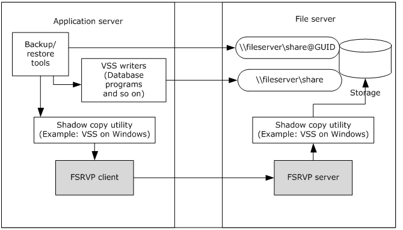
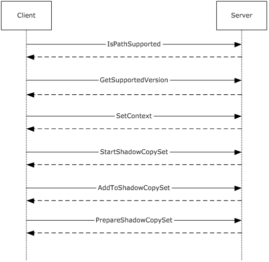
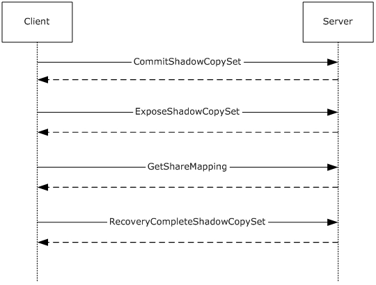
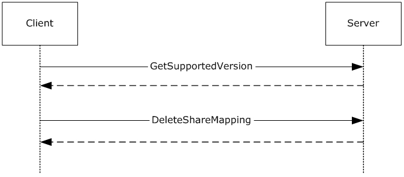

[MS-FSRVP]:

File Server Remote VSS Protocol

Intellectual Property Rights Notice for Open Specifications Documentation

  Technical Documentation. Microsoft publishes Open Specifications documentation (“this

documentation”) for protocols, file formats, data portability, computer languages, and standards
support. Additionally, overview documents cover inter-protocol relationships and interactions.

  Copyrights. This documentation is covered by Microsoft copyrights. Regardless of any other

terms that are contained in the terms of use for the Microsoft website that hosts this
documentation, you can make copies of it in order to develop implementations of the technologies
that are described in this documentation and can distribute portions of it in your implementations
that use these technologies or in your documentation as necessary to properly document the
implementation. You can also distribute in your implementation, with or without modification, any
schemas, IDLs, or code samples that are included in the documentation. This permission also
applies to any documents that are referenced in the Open Specifications documentation.
  No Trade Secrets. Microsoft does not claim any trade secret rights in this documentation.
  Patents. Microsoft has patents that might cover your implementations of the technologies

described in the Open Specifications documentation. Neither this notice nor Microsoft's delivery of
this documentation grants any licenses under those patents or any other Microsoft patents.
However, a given Open Specifications document might be covered by the Microsoft Open
Specifications Promise or the Microsoft Community Promise. If you would prefer a written license,
or if the technologies described in this documentation are not covered by the Open Specifications
Promise or Community Promise, as applicable, patent licenses are available by contacting
iplg@microsoft.com.

  License Programs. To see all of the protocols in scope under a specific license program and the

associated patents, visit the Patent Map.

  Trademarks. The names of companies and products contained in this documentation might be
covered by trademarks or similar intellectual property rights. This notice does not grant any
licenses under those rights. For a list of Microsoft trademarks, visit
www.microsoft.com/trademarks.

  Fictitious Names. The example companies, organizations, products, domain names, email

addresses, logos, people, places, and events that are depicted in this documentation are fictitious.
No association with any real company, organization, product, domain name, email address, logo,
person, place, or event is intended or should be inferred.

Reservation of Rights. All other rights are reserved, and this notice does not grant any rights other
than as specifically described above, whether by implication, estoppel, or otherwise.

Tools. The Open Specifications documentation does not require the use of Microsoft programming
tools or programming environments in order for you to develop an implementation. If you have access
to Microsoft programming tools and environments, you are free to take advantage of them. Certain
Open Specifications documents are intended for use in conjunction with publicly available standards
specifications and network programming art and, as such, assume that the reader either is familiar
with the aforementioned material or has immediate access to it.

Support. For questions and support, please contact dochelp@microsoft.com.

[MS-FSRVP] - v20241119
File Server Remote VSS Protocol
Copyright © 2024 Microsoft Corporation
Release: November 19, 2024

1 / 48

Revision Summary

Date

Revision
History

Revision
Class

Comments

12/16/2011  1.0

3/30/2012

1.1

7/12/2012

2.0

10/25/2012  3.0

1/31/2013

4.0

8/8/2013

5.0

11/14/2013  6.0

2/13/2014

6.0

5/15/2014

7.0

6/30/2015

8.0

10/16/2015  9.0

7/14/2016

10.0

6/1/2017

11.0

9/15/2017

12.0

12/1/2017

12.0

9/12/2018

13.0

4/7/2021

14.0

6/25/2021

15.0

4/23/2024

16.0

11/19/2024  16.0

New

Minor

Major

Major

Major

Major

Major

None

Major

Major

Major

Major

Major

Major

None

Major

Major

Major

Major

None

Released new document.

Clarified the meaning of the technical content.

Significantly changed the technical content.

Significantly changed the technical content.

Significantly changed the technical content.

Significantly changed the technical content.

Significantly changed the technical content.

No change to the meaning, language, or formatting of the
technical content.

Significantly changed the technical content.

Significantly changed the technical content.

Significantly changed the technical content.

Significantly changed the technical content.

Significantly changed the technical content.

Significantly changed the technical content.

No changes to the meaning, language, or formatting of the
technical content.

Significantly changed the technical content.

Significantly changed the technical content.

Significantly changed the technical content.

Significantly changed the technical content.

No changes to the meaning, language, or formatting of the
technical content.

[MS-FSRVP] - v20241119
File Server Remote VSS Protocol
Copyright © 2024 Microsoft Corporation
Release: November 19, 2024

2 / 48

## Table of Contents

- [1 Introduction](#1-introduction)
  - [1.1 Glossary](#11-glossary)
  - [1.2 References](#12-references)
    - [1.2.1 Normative References](#121-normative-references)
    - [1.2.2 Informative References](#122-informative-references)
  - [1.3 Overview](#13-overview)
  - [1.4 Relationship to Other Protocols](#14-relationship-to-other-protocols)
  - [1.5 Prerequisites/Preconditions](#15-prerequisitespreconditions)
  - [1.6 Applicability Statement](#16-applicability-statement)
  - [1.7 Versioning and Capability Negotiation](#17-versioning-and-capability-negotiation)
  - [1.8 Vendor Extensible Fields](#18-vendor-extensible-fields)
  - [1.9 Standards Assignments](#19-standards-assignments)
- [2 Messages](#2-messages)
  - [2.1 Transport](#21-transport)
  - [2.2 Common Data Types](#22-common-data-types)
    - [2.2.1 Structures](#221-structures)
      - [2.2.1.1 FSSAGENT_SHARE_MAPPING_1](#2211-fssagentsharemapping1)
    - [2.2.2 Constants](#222-constants)
      - [2.2.2.1 SHADOW_COPY_ATTRIBUTES](#2221-shadowcopyattributes)
      - [2.2.2.2 CONTEXT_VALUES](#2222-contextvalues)
      - [2.2.2.3 SHADOW_COPY_COMPATIBILITY_VALUES](#2223-shadowcopycompatibilityvalues)
      - [2.2.2.4 FSRVP_VERSION_VALUES](#2224-fsrvpversionvalues)
    - [2.2.3 Unions](#223-unions)
      - [2.2.3.1 FSSAGENT_SHARE_MAPPING](#2231-fssagentsharemapping)
    - [2.2.4 Error Codes](#224-error-codes)
- [3 Protocol Details](#3-protocol-details)
  - [3.1 FileServerVssAgent Server Details](#31-fileservervssagent-server-details)
    - [3.1.1 Abstract Data Model](#311-abstract-data-model)
      - [3.1.1.1 Global](#3111-global)
      - [3.1.1.2 Per ShadowCopySet](#3112-per-shadowcopyset)
      - [3.1.1.3 Per ShadowCopy](#3113-per-shadowcopy)
      - [3.1.1.4 Per MappedShare](#3114-per-mappedshare)
    - [3.1.2 Timers](#312-timers)
    - [3.1.3 Initialization](#313-initialization)
    - [3.1.4 Message Processing Events and Sequencing Rules](#314-message-processing-events-and-sequencing-rules)
      - [3.1.4.1 GetSupportedVersion (Opnum 0)](#3141-getsupportedversion-opnum-0)
      - [3.1.4.2 SetContext (Opnum 1)](#3142-setcontext-opnum-1)
      - [3.1.4.3 StartShadowCopySet (Opnum 2)](#3143-startshadowcopyset-opnum-2)
      - [3.1.4.4 AddToShadowCopySet (Opnum 3)](#3144-addtoshadowcopyset-opnum-3)
      - [3.1.4.5 CommitShadowCopySet (Opnum 4)](#3145-commitshadowcopyset-opnum-4)
      - [3.1.4.6 ExposeShadowCopySet (Opnum 5)](#3146-exposeshadowcopyset-opnum-5)
      - [3.1.4.7 RecoveryCompleteShadowCopySet (Opnum 6)](#3147-recoverycompleteshadowcopyset-opnum-6)
      - [3.1.4.8 AbortShadowCopySet (Opnum 7)](#3148-abortshadowcopyset-opnum-7)
      - [3.1.4.9 IsPathSupported (Opnum 8)](#3149-ispathsupported-opnum-8)
      - [3.1.4.10 IsPathShadowCopied (Opnum 9)](#31410-ispathshadowcopied-opnum-9)
      - [3.1.4.11 GetShareMapping (Opnum 10)](#31411-getsharemapping-opnum-10)
      - [3.1.4.12 DeleteShareMapping (Opnum 11)](#31412-deletesharemapping-opnum-11)
      - [3.1.4.13 PrepareShadowCopySet (Opnum 12)](#31413-prepareshadowcopyset-opnum-12)
    - [3.1.5 Timer Events](#315-timer-events)
    - [3.1.6 Other Local Events](#316-other-local-events)
  - [3.2 FileServerVssAgent Client Details](#32-fileservervssagent-client-details)
    - [3.2.1 Abstract Data Model](#321-abstract-data-model)
      - [3.2.1.1 Global](#3211-global)
      - [3.2.1.2 Per ShadowCopySet](#3212-per-shadowcopyset)
      - [3.2.1.3 Per ShadowCopy](#3213-per-shadowcopy)
    - [3.2.2 Timers](#322-timers)
    - [3.2.3 Initialization](#323-initialization)
    - [3.2.4 Message Processing Events and Sequencing Rules](#324-message-processing-events-and-sequencing-rules)
      - [3.2.4.1 Application Queries Shadow Copy Support for a Share](#3241-application-queries-shadow-copy-support-for-a-share)
      - [3.2.4.2 Application Requests Shadow Copy Preparation For a Share](#3242-application-requests-shadow-copy-preparation-for-a-share)
        - [3.2.4.2.1 Starting a Shadow Copy Set](#32421-starting-a-shadow-copy-set)
        - [3.2.4.2.2 Adding Shadow Copies to the Shadow Copy Set](#32422-adding-shadow-copies-to-the-shadow-copy-set)
      - [3.2.4.3 Application Requests Committing a Shadow Copy Set](#3243-application-requests-committing-a-shadow-copy-set)
      - [3.2.4.4 Application Requests Exposing a Shadow Copy Set](#3244-application-requests-exposing-a-shadow-copy-set)
      - [3.2.4.5 Application Updates Recovery Status of a Shadow Copy Set](#3245-application-updates-recovery-status-of-a-shadow-copy-set)
      - [3.2.4.6 Application Aborts a Shadow Copy Set](#3246-application-aborts-a-shadow-copy-set)
      - [3.2.4.7 Application Queries Shadow Copy Information of a Share](#3247-application-queries-shadow-copy-information-of-a-share)
      - [3.2.4.8 Application Requests Deleting Shadow Copy Of a Share](#3248-application-requests-deleting-shadow-copy-of-a-share)
      - [3.2.4.9 Application Requests Shutdown of Client](#3249-application-requests-shutdown-of-client)
    - [3.2.5 Timer Events](#325-timer-events)
    - [3.2.6 Other Local Events](#326-other-local-events)
- [4 Protocol Examples](#4-protocol-examples)
  - [4.1 Shadow Copy Preparation](#41-shadow-copy-preparation)
  - [4.2 Shadow Copy Creation](#42-shadow-copy-creation)
  - [4.3 Shadow Copy Deletion](#43-shadow-copy-deletion)
- [5 Security](#5-security)
  - [5.1 Security Considerations for Implementers](#51-security-considerations-for-implementers)
  - [5.2 Index of Security Parameters](#52-index-of-security-parameters)
- [6 Appendix A: Full IDL](#6-appendix-a-full-idl)
- [7 Appendix B: Product Behavior](#7-appendix-b-product-behavior)
- [8 Change Tracking](#8-change-tracking)
- [9 Index](#9-index)

## 1 Introduction

The File Server Remote VSS Protocol (FSRVP) is a remote procedure call (RPC)-based protocol that is
used for creating shadow copies of file shares on a remote computer. This protocol facilitates the
backup applications' tasks in performing application-consistent backup and restore of VSS-aware
applications storing data on network file shares.

Sections 1.5, 1.8, 1.9, 2, and 3 of this specification are normative. All other sections and examples in
this specification are informative.

### 1.1 Glossary

This document uses the following terms:

endpoint: A network-specific address of a remote procedure call (RPC) server process for remote

procedure calls. The actual name and type of the endpoint depends on the RPC protocol
sequence that is being used. For example, for RPC over TCP (RPC Protocol Sequence
ncacn_ip_tcp), an endpoint might be TCP port 1025. For RPC over Server Message Block (RPC
Protocol Sequence ncacn_np), an endpoint might be the name of a named pipe. For more
information, see [C706].

file store: An area on a storage device that is managed as a discrete logical storage unit on which
a shadow copy can be taken. The file store is backed by a system (typically a file system) that
provides the ability to create, query and modify resources accessed as files.

file system: A system that enables applications to store and retrieve files on storage devices. Files
are placed in a hierarchical structure. The file system specifies naming conventions for files and
the format for specifying the path to a file in the tree structure. Each file system consists of one
or more drivers and DLLs that define the data formats and features of the file system. File
systems can exist on the following storage devices: diskettes, hard disks, jukeboxes, removable
optical disks, and tape backup units.

fully qualified domain name (FQDN): An unambiguous domain name that gives an absolute

location in the Domain Name System's (DNS) hierarchy tree, as defined in [RFC1035] section
3.1 and [RFC2181] section 11.

HRESULT: An integer value that indicates the result or status of an operation. A particular

HRESULT can have different meanings depending on the protocol using it. See [MS-ERREF]
section 2.1 and specific protocol documents for further details.

indexing: The process of extracting text or properties from files and storing the extracted values

in an index or property cache.

Interface Definition Language (IDL): The International Standards Organization (ISO) standard

language for specifying the interface for remote procedure calls. For more information, see
[C706] section 4.

Microsoft Interface Definition Language (MIDL): The Microsoft implementation and extension
of the OSF-DCE Interface Definition Language (IDL). MIDL can also mean the Interface
Definition Language (IDL) compiler provided by Microsoft. For more information, see [MS-
RPCE].

shadow copy: A duplicate of data held on a volume at a well-defined instant in time.

shadow copy utility: A utility on the client and server which creates and manages the shadow

copies of shares.

[MS-FSRVP] - v20241119
File Server Remote VSS Protocol
Copyright © 2024 Microsoft Corporation
Release: November 19, 2024

5 / 48

volume shadow copy service (VSS): A service that coordinates the actions required to create a
consistent snapshot of backup data without affecting the running of the application that is using
the data.

VSS writer: A component of an application that guarantees a consistent data to back up.

MAY, SHOULD, MUST, SHOULD NOT, MUST NOT: These terms (in all caps) are used as defined
in [RFC2119]. All statements of optional behavior use either MAY, SHOULD, or SHOULD NOT.

### 1.2 References

Links to a document in the Microsoft Open Specifications library point to the correct section in the
most recently published version of the referenced document. However, because individual documents
in the library are not updated at the same time, the section numbers in the documents may not
match. You can confirm the correct section numbering by checking the Errata.

#### 1.2.1 Normative References

We conduct frequent surveys of the normative references to assure their continued availability. If you
have any issue with finding a normative reference, please contact dochelp@microsoft.com. We will
assist you in finding the relevant information.

[C706] The Open Group, "DCE 1.1: Remote Procedure Call", C706, August 1997,
https://publications.opengroup.org/c706

Note Registration is required to download the document.

[MS-CIFS] Microsoft Corporation, "Common Internet File System (CIFS) Protocol".

[MS-DTYP] Microsoft Corporation, "Windows Data Types".

[MS-ERREF] Microsoft Corporation, "Windows Error Codes".

[MS-RPCE] Microsoft Corporation, "Remote Procedure Call Protocol Extensions".

[MS-SMB2] Microsoft Corporation, "Server Message Block (SMB) Protocol Versions 2 and 3".

[MS-SMB] Microsoft Corporation, "Server Message Block (SMB) Protocol".

[MS-SRVS] Microsoft Corporation, "Server Service Remote Protocol".

[RFC2119] Bradner, S., "Key words for use in RFCs to Indicate Requirement Levels", BCP 14, RFC
2119, March 1997, https://www.rfc-editor.org/info/rfc2119

#### 1.2.2 Informative References

[MSDN-SHADOW] Microsoft Corporation, "Volume Shadow Copy Service",
http://msdn.microsoft.com/en-us/library/bb968832(VS.85).aspx

### 1.3 Overview

The File Server Remote VSS Protocol is designed to remotely create shadow copies of file shares
hosted on a file server. This facilitates applications hosting their data on a file server to back up and
restore their application state. The client-side implementation of this protocol typically runs on an
application server and the server-side implementation runs on a file server. This protocol is modeled in
such way that the client-side and server-side implementation can be integrated with existing volume
shadow copy creation utilities.

6 / 48

[MS-FSRVP] - v20241119
File Server Remote VSS Protocol
Copyright © 2024 Microsoft Corporation
Release: November 19, 2024

### 1.4 Relationship to Other Protocols

This protocol depends on RPC and SMB for its transport. This protocol uses RPC over named pipes, as
specified in section 2.1. Named pipes use the SMB protocols, as specified in [MS-CIFS], [MS-SMB],
and [MS-SMB2].

### 1.5 Prerequisites/Preconditions

The File Server Remote VSS Protocol is an RPC interface and, as a result, has the prerequisites that
are described in [MS-RPCE] section 1.5 as being common to RPC interfaces.

### 1.6 Applicability Statement

The File Server Remote VSS Protocol is applicable in environments in which shadow-copy-aware
applications store or manage data on remote file shares.

### 1.7 Versioning and Capability Negotiation

This document covers versioning in the following areas:



Protocol Versions: This protocol currently supports one version. The operations listed in section
3.1.4 are applicable for version 1 of the protocol as defined in section 2.2.2.4. The client queries
the minimum and maximum versions supported by server through the RPC method
GetSupportedVersion (Opnum 0).

### 1.8 Vendor Extensible Fields

None.

### 1.9 Standards Assignments

Parameter

Value

Reference

UUID for FileServerVssAgent  a8e0653c-2744-4389-a61d-7373df8b2292

[C706]

Named Pipe

\\pipe\FssagentRpc

Section 2.1

[MS-FSRVP] - v20241119
File Server Remote VSS Protocol
Copyright © 2024 Microsoft Corporation
Release: November 19, 2024

7 / 48

## 2 Messages

### 2.1 Transport

The RPC methods that the File Server Remote VSS Protocol exposes are available on one endpoint:

  FssagentRpc named pipe (RPC protseqs ncacn_np), as specified in [MS-RPCE] section 2.1.1.2.

The File Server Remote VSS Protocol endpoint is available only on RPC over named pipes.

This protocol MUST use the UUID as specified in section 1.9. The RPC version number is 3.0.

This protocol allows any user to establish a connection to the RPC server. The protocol requires the
underlying RPC protocol to retrieve the identity of the caller that made the method call, as specified in
[MS-RPCE] section 3.3.3.4.3. The server SHOULD use this identity to perform method-specific access
checks as specified in section 3.1.4.

### 2.2 Common Data Types

In addition to RPC base types defined in [C706] and [MS-RPCE], the data types that follow are defined
in the Microsoft Interface Definition Language (MIDL) specification for this RPC interface.

The following data types are specified in [MS-DTYP]:

Data type name  Section

BOOL

[MS-DTYP] section 2.2.3

DWORD

[MS-DTYP] section 2.2.9

GUID

[MS-DTYP] section 2.3.4.3

LONGLONG

[MS-DTYP] section 2.2.28

LPWSTR

[MS-DTYP] section 2.2.36

#### 2.2.1 Structures

Structure name

Section  Description

FSSAGENT_SHARE_MAPPING_1  2.2.1.1

The structure used to represent the mapping of a file share to its
shadow copy in protocol version 1.

##### 2.2.1.1 FSSAGENT_SHARE_MAPPING_1

This structure contains the mapping information for a file share to its shadow copy.

 typedef struct _FSSAGENT_SHARE_MAPPING_1 {
     GUID ShadowCopySetId;
     GUID ShadowCopyId;
     [string] LPWSTR ShareNameUNC;
     [string] LPWSTR ShadowCopyShareName;
     LONGLONG CreationTimestamp;
 } FSSAGENT_SHARE_MAPPING_1, *PFSSAGENT_SHARE_MAPPING_1;

[MS-FSRVP] - v20241119
File Server Remote VSS Protocol
Copyright © 2024 Microsoft Corporation
Release: November 19, 2024

8 / 48

ShadowCopySetId:  The GUID of the shadow copy set.

ShadowCopyId:  The GUID of the shadow copy.

ShareNameUNC:  The name of the share in UNC format.

ShadowCopyShareName:  The name of the share exposing the shadow copy of the base share
identified by ShareNameUNC, in UNC format.

CreationTimestamp:  The time at which the shadow copy of the share is created. This MUST be a
64-bit integer value containing the number of 100-nanosecond intervals since January 1, 1601 (UTC).

#### 2.2.2 Constants

##### 2.2.2.1 SHADOW_COPY_ATTRIBUTES

The following table lists the valid values for the attributes of a shadow copy.

Value

Meaning

ATTR_PERSISTENT

The shadow copy is persistent across reboots of the server.

(0x00000001)

ATTR_NO_AUTO_RECOVERY

(0x00000002)

The shadow copy is created as read-only. The client is not allowed to modify its
contents.

ATTR_NO_AUTO_RELEASE

(0x00000008)

The shadow copy is not automatically deleted when all references to the shadow
copy are released.

ATTR_NO_WRITERS

The shadow copy is created without application-specific participation.

(0x00000010)

ATTR_AUTO_RECOVERY

(0x00400000)

The shadow copy is created as read-write. The client is allowed to modify its
contents between the ExposeShadowCopySet and
RecoveryCompleteShadowCopySet operations, after which the shadow copy
becomes and remains read-only.

##### 2.2.2.2 CONTEXT_VALUES

The context of a shadow copy is a combination of zero or more attribute values, as defined in section
2.2.2.1. The following table lists the valid context values for the shadow copy operations. The client
can additionally include either the ATTR_AUTO_RECOVERY or ATTR_NO_AUTO_RECOVERY attribute in
any of the following contexts.

Value

Meaning

CTX_BACKUP

(0x00000000)

Specifies an auto-release, non-persistent shadow copy.

CTX_FILE_SHARE_BACKUP

(0x00000010)

Specifies an auto-release, non-persistent shadow copy created without writer
involvement. It is a combination of the following shadow copy attributes:

9 / 48

[MS-FSRVP] - v20241119
File Server Remote VSS Protocol
Copyright © 2024 Microsoft Corporation
Release: November 19, 2024

Value

Meaning

ATTR_NO_WRITERS

CTX_NAS_ROLLBACK

(0x00000019)

Specifies a persistent, non-auto-release shadow copy without writer involvement. It
is a combination of the following shadow copy attributes:

ATTR_PERSISTENT

ATTR_NO_AUTO_RELEASE

ATTR_NO_WRITERS

CTX_APP_ROLLBACK

(0x00000009)

Specifies a persistent, non-auto-release shadow copy. It is a combination of the
following shadow copy attributes:

ATTR_PERSISTENT

ATTR_NO_AUTO_RELEASE

##### 2.2.2.3 SHADOW_COPY_COMPATIBILITY_VALUES

The following table lists the valid values for shadow copy compatibility.

Value

Meaning

DISABLE_DEFRAG

(0x00000001)

The provider managing the shadow copies for the specified path does not support
defragmentation operations on the file store containing the path.

DISABLE_CONTENTINDEX

(0x00000002)

The provider managing the shadow copies for the specified path does not support
indexing on the file store containing the path.

##### 2.2.2.4 FSRVP_VERSION_VALUES

The following table lists the valid values for the protocol versions supported by a server.

Value

Meaning

FSRVP_RPC_VERSION_1

Version 1 of the FSRVP protocol.

(0x00000001)

#### 2.2.3 Unions

Union name

Section  Description

FSSAGENT_SHARE_MAPPING  2.2.3.1

This union contains information mapping a share to its shadow copy
based on the level value.

##### 2.2.3.1 FSSAGENT_SHARE_MAPPING

The FSSAGENT_SHARE_MAPPING union contains mapping information for a share to its shadow
copy based on the level value.

10 / 48

[MS-FSRVP] - v20241119
File Server Remote VSS Protocol
Copyright © 2024 Microsoft Corporation
Release: November 19, 2024

 typedef [switch_type(unsigned long)] union _FSSAGENT_SHARE_MAPPING {
     [case(1)]
         PFSSAGENT_SHARE_MAPPING_1 ShareMapping1;
     [default]
         ;
 } FSSAGENT_SHARE_MAPPING, *PFSSAGENT_SHARE_MAPPING;

ShareMapping1:  A pointer to an FSSAGENT_SHARE_MAPPING_1 structure, as specified in
section 2.2.1.1.

#### 2.2.4 Error Codes

The following error codes are specific to File Server Remote VSS Protocol (FSRVP) in addition to the
HRESULT values as defined in [MS-ERREF] section 2.1.

Return value/code

Description

FSRVP_E_BAD_STATE

(0x80042301)

A method call was invalid because of the state of the server.
(For example, calling AddToShadowCopySet (Opnum 3)
before StartShadowCopySet (Opnum 2).)

FSRVP_E_SHADOW_COPY_SET_IN_PROGRESS

(0x80042316)

A call was made to either SetContext (Opnum 1) or
StartShadowCopySet (Opnum 2) while the creation of
another shadow copy set is in progress.

FSRVP_E_NOT_SUPPORTED

(0x8004230C)

FSRVP_E_WAIT_TIMEOUT

(0x00000102)

The file store which contains the share to be shadow copied is
not supported by the server.

The wait for a shadow copy commit or expose operation has
timed out.

FSRVP_E_WAIT_FAILED

The wait for a shadow copy commit expose operation has failed.

(0xFFFFFFFF)

FSRVP_E_OBJECT_ALREADY_EXISTS

The specified object already exists.

(0x8004230DL)

FSRVP_E_OBJECT_NOT_FOUND

The specified object does not exist.

(0x80042308)

FSRVP_E_UNSUPPORTED_CONTEXT

The specified context value is invalid.

(0x8004231B)

FSRVP_E_SHADOWCOPYSET_ID_MISMATCH

The provided ShadowCopySetId does not exist.

(0x80042501)

[MS-FSRVP] - v20241119
File Server Remote VSS Protocol
Copyright © 2024 Microsoft Corporation
Release: November 19, 2024

11 / 48

<!-- Extracted images from page 12 -->

<!-- /Extracted images from page 12 -->

## 3 Protocol Details

The methods in this RPC interface MUST return ZERO (0x00000000) or a nonerror HRESULT (as
specified in [MS-ERREF] section 2.1) to indicate success or a nonzero error code as specified in section
2.2.4, to indicate failure. Unless otherwise specified in section 3.2.4, the client-side of the File Server
Remote VSS Protocol MUST NOT interpret returned error codes and MUST simply return error codes to
the invoking application.

The following diagram describes the typical client and server environments and the interactions
between various components.

Figure 1: FSRVP client and server environments and components

The application server hosts VSS writers that are components of the applications accessing their data
from a remote file share. The backup/restore tools interact with the shadow copy utility on the
application server to perform backup of the application's data on the remote file server. When the
storage location supplied by the backup tool is a UNC path, the shadow copy utility directs the backup
requests to the FSRVP client. The FSRVP client exchanges messages with the FSRVP server on the file
server to query, create, or delete the shadow copies. The FSRVP server acts as a backup tool on the
file server and interacts with the local shadow copy utility to respond to client's requests. The server's
processing behavior is outlined in section 3.1 and the client's processing behavior is outlined in section
3.2.<1>

### 3.1 FileServerVssAgent Server Details

The server implementing this interface responds to the client's requests as specified in section 3.1.4.
Upon the client's request, the server initiates a shadow copy set (see section 3.1.1.2) and performs
shadow copy operations on that set.

#### 3.1.1 Abstract Data Model

This section describes a conceptual model of possible data organization that an implementation
maintains to participate in this protocol. The organization is provided to facilitate the explanation of
how the protocol behaves. This specification does not mandate that implementations adhere to this
model as long as their external behaviors are consistent with that described in this specification.

12 / 48

[MS-FSRVP] - v20241119
File Server Remote VSS Protocol
Copyright © 2024 Microsoft Corporation
Release: November 19, 2024

##### 3.1.1.1 Global

The server implements the following properties:

ContextSet: A Boolean value that, when set to TRUE, indicates that the shadow copy operation is in
progress and the client has set a valid context for the shadow copy operations by calling the
SetContext method, as specified in section 3.1.4.2.

CurrentContext: Indicates the context to be used for the subsequent shadow copy operations. This
MUST be set to one of the values specified in section 2.2.2.2.

GlobalShadowCopySetTable: A table of shadow copy sets, as specified in section 3.1.1.2. The table
is indexed by ShadowCopySetId.

MinServerVersion: The minimum version of the protocol supported by the server. This MUST be set
to one of the values specified in section 2.2.2.4.

MaxServerVersion: The maximum version of the protocol supported by the server. This MUST be set
to one of the values specified in section 2.2.2.4.

ShadowCopyClientAddress: The IP address of the client, in a string format, that has set the context
for shadow copy operation.

ShadowCopyClientRetryCount: A numeric value that indicates the count of SetContext retry
attempts.

##### 3.1.1.2 Per ShadowCopySet

The ShadowCopySet element consists of the following properties:

ShadowCopySetId: The GUID of the shadow copy set.

Status: The status of the shadow copy set. This MUST be one of "Started", "Added",
"CreationInProgress", "Committed", "Exposed", or "Recovered".

Context: The attributes used for creation of this shadow copy set. This MUST be set to one of the
values defined in section 2.2.2.2.

ShadowCopyList: A list of ShadowCopy objects, as specified in section 3.1.1.3.

##### 3.1.1.3 Per ShadowCopy

The ShadowCopy element consists of the following properties:

ShadowCopyId: The GUID of the shadow copy.

VolumeName: The unique name that identifies the server object store on which this shadow copy is
created.

CreationTimeStamp: The timestamp containing the time that the client initiated the creation of this
shadow copy.

ShareMappingList: A list of ShareMapping objects, as specified in section 3.1.1.4. Each entry in
the list is for a share mapped to this shadow copy.

##### 3.1.1.4 Per MappedShare

The MappedShare element consists of the following properties:

[MS-FSRVP] - v20241119
File Server Remote VSS Protocol
Copyright © 2024 Microsoft Corporation
Release: November 19, 2024

13 / 48

ShareName: The UNC name of the file share.

ShadowCopyShareName: The name of the share exposing the shadow copy of the base share
(identified by ShareName).

IsExposed: A Boolean value indicating whether the shadow copy is exposed.

#### 3.1.2 Timers

Message Sequence Timer: This timer controls the amount of time the server waits between
successive messages received from the client. The values taken by this timer for individual messages
are specified in section 3.1.4.

#### 3.1.3 Initialization

The server MUST initialize ContextSet to FALSE.

The server MUST initialize CurrentContext to zero.

The server MUST initialize the GlobalShadowCopySetTable to an empty table.

The server MUST populate the GlobalShadowCopySetTable with the ShadowCopySet entries read
from the implementation-specific configuration store.

The server MUST initialize MinServerVersion to one of the values specified in section 2.2.2.4, based
on a local configuration policy.<2>

The server MUST initialize MaxServerVersion to one of the values specified in section 2.2.2.4, based
on a local configuration policy.<3>

#### 3.1.4 Message Processing Events and Sequencing Rules

This interface defines the following methods:

Method

Description

GetSupportedVersion

Gets the minimum and maximum versions of the protocol that the server
supports.

Opnum: 0

SetContext

Sets the context for the current shadow copy creation process.

Opnum: 1

StartShadowCopySet

Initiates a new shadow copy set for shadow copy creation.

Opnum: 2

AddToShadowCopySet

Adds a share to an existing shadow copy set.

Opnum: 3

CommitShadowCopySet

Commits a given shadow copy set.

Opnum: 4

ExposeShadowCopySet

Exposes all the shadow copies in a shadow copy set as file shares on the file
server.

Opnum: 5

RecoveryCompleteShadowCopySet

Indicates to the server that the VSS writers have recovered the data
associated with the file shares in a shadow copy set.

14 / 48

[MS-FSRVP] - v20241119
File Server Remote VSS Protocol
Copyright © 2024 Microsoft Corporation
Release: November 19, 2024

Method

Description

Opnum: 6

AbortShadowCopySet

Deletes a given shadow copy set on the server.

Opnum: 7

IsPathSupported

Queries whether a given share is supported by the server for shadow copy
operations.

Opnum: 8

IsPathShadowCopied

Queries whether a shadow copy already exists for a share.

Opnum: 9

GetShareMapping

Gets the shadow copy information for a given file share on the server after
the shadow copy of the share is exposed.

Opnum: 10

DeleteShareMapping

Deletes the mapping of a shadow copy for a share from a shadow copy set.

Opnum: 11

PrepareShadowCopySet

Ensures that the server is finished with preparations to create the shadow
copy set.

All methods MUST NOT throw exceptions.

Opnum: 12

The server MUST enforce the following security measures to verify that the caller has the required
permissions to execute any method:





The security provider as RPC_C_AUTHN_GSS_NEGOTIATE or RPC_C_AUTHN_GSS_KERBEROS
or RPC_C_AUTHN_WINNT, as specified in [MS-RPCE] section 2.2.1.1.7.

The authentication level as RPC_C_AUTHN_LEVEL_PKT_INTEGRITY or
RPC_C_AUTHN_LEVEL_PKT_PRIVACY, as specified in [MS-RPCE] section 2.2.1.1.8.

The server can perform additional implementation-specific<4> checks to verify that the caller has
permission.

If the caller does not have the required permissions, then the server MUST fail the call and return
E_ACCESSDENIED. The details on how to determine the identity of the caller for the purpose of
performing an access check are specified in [MS-RPCE] section 3.3.3.4.3.

For all methods, unless otherwise specified, if any of the parameters is NULL, the server MUST fail the
call with E_INVALIDARG.

For all methods, when the server returns ZERO to the client, the server MUST persist all state
information into an implementation-specific configuration store.

##### 3.1.4.1 GetSupportedVersion (Opnum 0)

The GetSupportedVersion method is invoked by the client to get the minimum and maximum
versions of the protocol that the server supports.

 DWORD GetSupportedVersion(
         [out] DWORD* MinVersion,
         [out] DWORD* MaxVersion);

[MS-FSRVP] - v20241119
File Server Remote VSS Protocol
Copyright © 2024 Microsoft Corporation
Release: November 19, 2024

15 / 48

MinVersion:  The minimum version of the protocol that the server supports.

MaxVersion:  The maximum version of the protocol that the server supports.

Return Values: The method returns one of the values specified in section 2.2.4. The most common

error codes are listed below.

Return
value/code

Description

0x80070005

The caller does not have the permissions to perform the operation.

E_ACCESSDENIED

The server MUST set MinVersion to the global MinServerVersion, MaxVersion to the global
MaxServerVersion, and MUST return ZERO to the caller.

##### 3.1.4.2 SetContext (Opnum 1)

The SetContext method sets the context for the current shadow copy creation process.

 DWORD SetContext(
         [in] handle_t hBinding,
         [in] unsigned long Context);

hBinding: An RPC binding handle (as defined in [C706]).

Context: The context to be used for the shadow copy operations. It MUST be set to one of the

CONTEXT_VALUES specified in section 2.2.2.2.

Return Values: The method returns one of the values as specified in section 2.2.4. The most

common error codes are listed below.

Return value/code

Description

0x80070005

E_ACCESSDENIED

0x8004231B

FSRVP_E_UNSUPPORTED_CONTEXT

The caller does not have the permissions to perform the
operation.

The context value specified is invalid.

0x80042316

Creation of another shadow copy set is in progress.

FSRVP_E_SHADOW_COPY_SET_IN_PROGRESS

If the Context parameter contains an invalid value, the server MUST fail the call with
FSRVP_E_UNSUPPORTED_CONTEXT.

The server MUST get the requestor client address corresponding to the hBinding parameter as
specified in [C706] section 2.12.1.

If ContextSet is TRUE, the server MUST process as follows:



If the requestor client address is not the same as ShadowCopyClientAddress, the server MUST
fail the call with FSRVP_E_SHADOW_COPY_SET_IN_PROGRESS.

  Otherwise, if the requestor client address is the same as ShadowCopyClientAddress, the server

MUST process as follows:

16 / 48

[MS-FSRVP] - v20241119
File Server Remote VSS Protocol
Copyright © 2024 Microsoft Corporation
Release: November 19, 2024

  Remove the ShadowCopySet if a ShadowCopySet exists in the

GlobalShadowCopySetTable where ShadowCopySet.Status is not equal to "Recovered".

  Set ContextSet to FALSE.

  Set ShadowCopyClientAddress to NULL.





Increment the ShadowCopyClientRetryCount.

If ShadowCopyClientRetryCount exceeds the implementation-specific count<5>, the server
MUST fail the call with FSRVP_E_SHADOW_COPY_SET_IN_PROGRESS.

Otherwise, if ContextSet is FALSE, set ShadowCopyClientRetryCount to 0.

The server MUST set ShadowCopyClientAddress to the retrieved requestor client address.

The server MUST update CurrentContext to Context, set ContextSet to TRUE, start the Message
Sequence Timer (as specified in section 3.1.2) with a timeout value of 180 seconds, and return ZERO
to the caller.

##### 3.1.4.3 StartShadowCopySet (Opnum 2)

The StartShadowCopySet method is called by the client to initiate a new shadow copy set for
shadow copy creation.<6>

 DWORD StartShadowCopySet(
         [in] handle_t hBinding,
         [in] GUID ClientShadowCopySetId,
         [out] GUID* pShadowCopySetId);

hBinding:  An RPC binding handle (as defined in [C706]).

ClientShadowCopySetId: The GUID assigned by the client for the shadow copy set.<7>

pShadowCopySetId: The GUID of the shadow copy set, assigned by the server.

Return Values: The method returns one of the values specified in section 2.2.4. The most common

error codes are listed in the following table:

Return value/code

Description

0x80070005

E_ACCESSDENIED

0x80070057

E_INVALIDARG

0x80042316

FSRVP_E_SHADOW_COPY_SET_IN_PROGRESS

The caller does not have the permissions to perform the
operation.

One or more arguments are invalid.

StartShadowCopySet (Opnum 2) was called while the
creation of another shadow copy set was in progress.

If ContextSet is FALSE, the server MUST fail the call with FSRVP_E_BAD_STATE.

If there is a ShadowCopySet in the GlobalShadowCopySetTable where ShadowCopySet.Status
is not equal to "Recovered", the server MUST fail the call with
FSRVP_E_SHADOW_COPY_SET_IN_PROGRESS.

The server MUST stop the Message Sequence Timer specified in section 3.1.2.

17 / 48

[MS-FSRVP] - v20241119
File Server Remote VSS Protocol
Copyright © 2024 Microsoft Corporation
Release: November 19, 2024

The server MUST create a new ShadowCopySet, as specified in section 3.1.1.2, with the following
values, and insert it into GlobalShadowCopySetTable:

  ShadowCopySetId is set to a unique GUID generated by the server.

  Status is set to "Started".

  Context is set to CurrentContext.

  ShadowCopyList is set to an empty list.

The server MUST set pShadowCopySetId to ShadowCopySetId, start the Message Sequence Timer
specified in section 3.1.2 with a timeout value of 180 seconds, and return ZERO to the caller.

##### 3.1.4.4 AddToShadowCopySet (Opnum 3)

The AddToShadowCopySet method adds a share to an existing shadow copy set.

 DWORD AddToShadowCopySet(
         [in] handle_t hBinding,
         [in] GUID ClientShadowCopyId,
         [in] GUID ShadowCopySetId,
         [in] [string] LPWSTR ShareName,
         [out] GUID* pShadowCopyId);

hBinding:  An RPC binding handle (as defined in [C706]).

ClientShadowCopyId: The GUID for the shadow copy, assigned by the client.<8>

ShadowCopySetId: The GUID of the shadow copy set to which ShareName is to be added. This

GUID is assigned by the server.

ShareName: The name of the share, in UNC format, for which a shadow copy is required.

pShadowCopyId: The GUID of the shadow copy associated with the share.

Return Values: The method returns one of the values specified in section 2.2.4. The most common

error codes are listed in the following table:

Return value/code

Description

0x80070005

E_ACCESSDENIED

0x80070057

E_INVALIDARG

0x8004230C

FSRVP_E_NOT_SUPPORTED

0x80042301

FSRVP_E_BAD_STATE

The caller does not have permission to perform the operation.

One or more arguments are invalid.

The file store that contains the share to be shadow copied is
not supported by the server.

The method call is invalid because of the state of the server.

0x8004230D

The object already exists.

FSRVP_E_OBJECT_ALREADY_EXISTS

0x80042501

The provided ShadowCopySetId does not exist.

FSRVP_E_SHADOWCOPYSET_ID_MISMATCH

18 / 48

[MS-FSRVP] - v20241119
File Server Remote VSS Protocol
Copyright © 2024 Microsoft Corporation
Release: November 19, 2024

The server MUST verify that the share identified by ShareName exists on the server, in an
implementation-specific manner. If the share does not exist, the server MUST fail the call with
FSRVP_E_OBJECT_NOT_FOUND.

The server MUST identify the object store on which the ShareName is hosted, in an implementation-
defined manner. If the object store contains mount points below the share root directory, or if the
object store is not supported by the underlying shadow copy utility, the server MUST fail the call
with FSRVP_E_NOT_SUPPORTED.

The server MUST look up the ShadowCopySet from GlobalShadowCopysetTable using the index
ShadowCopySetId. If no shadow copy set is found, the server MUST fail the call with
FSRVP_E_SHADOWCOPYSET_ID_MISMATCH.

If ShadowCopySet.Status is not "Started" or "Added", the server MUST fail the call with
FSRVP_E_BAD_STATE.

The server MUST stop the Message Sequence Timer as specified in section 3.1.2.

The server MUST look up the ShadowCopy in ShadowCopySet.ShadowCopyList where
ShadowCopy.VolumeName matches the file store (typically a file system) on which the share
identified by ShareName is hosted. If an entry is found, the server MUST fail the call with
FSRVP_E_OBJECT_ALREADY_EXISTS and start the Message Sequence Timer as specified in section
3.1.2 with a time-out value of 180 seconds. If no entry is found, the server MUST create a new
ShadowCopy object, as specified in section 3.1.1.3, with the following values, and insert it into the
ShadowCopySet:

  ShadowCopyId is set to a unique GUID generated by the server.

  VolumeName is set to an implementation-specific value identifying the file store on the server

that is exposed through the share.

  CreationTimeStamp is set to the current time.

  ShareMappingList is set to an empty list.

The server MUST create a new MappedShare object (as specified in section 3.1.1.4) with the
following values, and insert it into ShadowCopy.ShareMappingList.

  ShareName is set to ShareName.

  ShadowCopyShareName is set to an empty string.



IsExposed is set to FALSE.

The server MUST set ShadowCopySet.Status to "Added".

The server MUST set pShadowCopyId to ShadowCopy.ShadowCopyId, start the Message Sequence
Timer (as specified in section 3.1.2) with a time-out value of 1800 seconds, and return ZERO to the
caller.

##### 3.1.4.5 CommitShadowCopySet (Opnum 4)

The CommitShadowCopySet method is invoked by the client to commit a given shadow copy set.

 DWORD CommitShadowCopySet(
         [in] handle_t hBinding,
         [in] GUID ShadowCopySetId,
         [in] unsigned long TimeOutInMilliseconds);

[MS-FSRVP] - v20241119
File Server Remote VSS Protocol
Copyright © 2024 Microsoft Corporation
Release: November 19, 2024

19 / 48

hBinding: An RPC binding handle (as defined in [C706]).

ShadowCopySetId: The GUID of the shadow copy set, assigned by the server.

TimeOutInMilliseconds: The time in milliseconds that the server MUST wait for the shadow copy

commit process.

Return Values: The method returns one of the values specified in section 2.2.4. The most common

error codes are listed below.

Return value/code

Description

0x80070005

E_ACCESSDENIED

0x80070057

E_INVALIDARG

0x80042301

FSRVP_E_BAD_STATE

0x80042500

FSSAGENT_E_TIMEOUT

0xFFFFFFFF

FSRVP_E_WAIT_FAILED

The caller does not have the permissions to perform the
operation.

One or more arguments are invalid.

The method call is invalid because of the state of the server.

The wait for the shadow copy commit operation has timed
out.

The wait for shadow copy commit operation has failed.

0x80042501

The provided ShadowCopySetId does not exist.

FSRVP_E_SHADOWCOPYSET_ID_MISMATCH

The server MUST look up the ShadowCopySet from GlobalShadowCopysetTable using the index
ShadowCopySetId. If no entry is found, the server MUST fail the call with
FSRVP_E_SHADOWCOPYSET_ID_MISMATCH.

If ShadowCopySet.Status is not "Added" or "CreationinProgress", the server MUST fail the call with
FSRVP_E_BAD_STATE.

The server MUST stop the Message Sequence Timer as specified in section 3.1.2.

The server MUST set ShadowCopySet.Status to "CreationInProgress", MUST start the shadow copy
commit in the underlying shadow copy utility, and MUST wait for the completion of the shadow copy
commit process.

If the wait for the commit process fails, the server MUST set ShadowCopySet.Status to "Added",
start the Message Sequence Timer as specified in section 3.1.2 with a timeout value of 180 seconds,
and fail the call with FSRVP_E_WAIT_FAILED.

If the commit operation for all shadow copies in this set does not complete within
TimeOutInMilliseconds, the server MUST start the Message Sequence Timer as specified in section
3.1.2 with a timeout value of 180 seconds, and return FSSAGENT_E_TIMEOUT.

If the commit operation for any shadow copy returns an error, the server MUST start the Message
Sequence Timer as specified in section 3.1.2 with a timeout value of 180 seconds, and return the
same error code to the caller.

If the shadow copy commit operation for all shadow copies in this set completes within
TimeOutInMilliseconds, the server MUST update ShadowCopySet.Status to "Committed", start
the Message Sequence Timer as specified in section 3.1.2 with a timeout value of 180 seconds, and
return ZERO to the caller.

20 / 48

[MS-FSRVP] - v20241119
File Server Remote VSS Protocol
Copyright © 2024 Microsoft Corporation
Release: November 19, 2024

##### 3.1.4.6 ExposeShadowCopySet (Opnum 5)

The ExposeShadowCopySet method exposes all the shadow copies in a shadow copy set as file
shares on the file server.

 DWORD ExposeShadowCopySet(
         [in] handle_t hBinding,
         [in] GUID ShadowCopySetId,
         [in] unsigned long TimeOutInMilliseconds);

hBinding:  An RPC binding handle (as defined in [C706]).

ShadowCopySetId: The GUID of the shadow copy set.

TimeOutInMilliseconds:  The maximum time, in milliseconds, for which the server MUST wait for

completion of the expose operation.

Return Values: The method returns one of the values specified in section 2.2.4. The most common

error codes are listed in the following table.

Return value/code

Description

0x80070005

E_ACCESSDENIED

0x80070057

E_INVALIDARG

0x80042301

FSRVP_E_BAD_STATE

The caller does not have the permissions to perform the
operation.

One or more arguments are invalid.

The method call is invalid because of the server's state.

0x80042501

The provided ShadowCopySetId does not exist.

FSRVP_E_SHADOWCOPYSET_ID_MISMATCH

The server MUST look up the ShadowCopySet from GlobalShadowCopysetTable using the index
ShadowCopySetId. If no shadow copy set is found, the server MUST fail the call with
FSRVP_E_SHADOWCOPYSET_ID_MISMATCH.

If ShadowCopySet.Status is not "Committed", the server MUST fail the call with
FSRVP_E_BAD_STATE.

The server MUST stop the Message Sequence Timer specified in section 3.1.2.

The server MUST initiate the shadow copy expose process for the ShadowCopySet, which includes
the following steps:







For each ShadowCopy in ShadowCopySet.ShadowCopyList:

For each MappedShare in ShadowCopy.ShareMappingList:

Expose the shadow copy of the share as a new share with a UNC name of the form
\\hostname\sharename@{ShadowCopy.ShadowCopyId}. The hostname portion of the path can be
different from the hostname portion of MappedShare.ShareName. The sharename portion (prior
to the @ suffix) of the exposed share name MUST match the sharename portion of
MappedShare.ShareName.<9>

  Set the access permissions for the exposed shadow copy share to be same as that of

MappedShare.ShareName

21 / 48

[MS-FSRVP] - v20241119
File Server Remote VSS Protocol
Copyright © 2024 Microsoft Corporation
Release: November 19, 2024



If the ATTR_AUTO_RECOVERY bit is set in ShadowCopySet.Context, enable read-write mode for
the exposed shadow copy share until a RecoveryCompleteShadowCopySet message is
received.

  Set MappedShare.ShadowCopyShareName to the share name of the shadow copy exposed as

above, and set ShareMapping.IsExposed to TRUE.

The server MUST wait for the completion of the expose process for the entire ShadowCopySet.

If the wait for the expose process fails, the server MUST start the Message Sequence Timer as
specified in section 3.1.2 with a timeout value of 180 seconds, and fail the call with
FSRVP_E_WAIT_FAILED.

If the expose operation does not complete within TimeOutInMilliseconds, the server MUST start the
Message Sequence Timer as specified in section 3.1.2 with a timeout value of 180 seconds, and fail
the call with FSRVP_E_WAIT_TIMEOUT.

If the expose operation returns success within TimeOutInMilliseconds, the server MUST update
ShadowCopySet.Status to "Exposed", start the Message Sequence Timer as specified in section
3.1.2 with a timeout value of 180 seconds, and return ZERO to the caller.

If the expose operation returns an error within TimeOutInMilliseconds, the server MUST start the
Message Sequence Timer as specified in section 3.1.2 with a timeout value of 180 seconds, and fail
the call with the same error code.

##### 3.1.4.7 RecoveryCompleteShadowCopySet (Opnum 6)

The RecoveryCompleteShadowCopySet method is invoked by the client to indicate to the server
that the data associated with the file shares in a shadow copy set have been recovered by the VSS
writers.

 DWORD RecoveryCompleteShadowCopySet(
         [in] handle_t hBinding,
         [in] GUID ShadowCopySetId);

hBinding:  An RPC binding handle (as defined in [C706]).

ShadowCopySetId: The GUID of the shadow copy set.

Return Values: The method returns one of the values as specified in section 2.2.4. The most

common error codes are listed in the following table:

Return value/code

Description

0x00000000

ZERO

0x80070005

E_ACCESSDENIED

0x80070057

E_INVALIDARG

0x80042301

FSRVP_E_BAD_STATE

The operation completed successfully.

The caller does not have the permissions to perform the
operation.

One or more arguments are invalid.

The method call is invalid because of the server's state.

0x80042501

The provided ShadowCopySetId does not exist.

[MS-FSRVP] - v20241119
File Server Remote VSS Protocol
Copyright © 2024 Microsoft Corporation
Release: November 19, 2024

22 / 48

Return value/code

Description

FSRVP_E_SHADOWCOPYSET_ID_MISMATCH

The server MUST look up the ShadowCopySet from GlobalShadowCopysetTable using the index
ShadowCopySetId. If no shadow copy set is found, the server MUST fail the call with
FSRVP_E_SHADOWCOPYSET_ID_MISMATCH.

If ShadowCopySet.Status is not "Exposed", the server MUST fail the call with FSRVP_E_BAD_STATE.

The server MUST stop the Message Sequence Timer specified in section 3.1.2.

If ATTR_NO_AUTO_RECOVERY bit in ShadowCopySet.Context is not set, for each ShadowCopy in
ShadowCopySet.ShadowCopyList, the server MUST set the shadow copy identified by
ShadowCopy.ShadowCopyId to read-only.

The server MUST update ShadowCopySet.Status to "Recovered", set ContextSet to FALSE, set
ShadowCopyClientAddress to NULL, and return ZERO to the caller.

##### 3.1.4.8 AbortShadowCopySet (Opnum 7)

The AbortShadowCopySet method is invoked by the client to delete a given shadow copy set on
the server.

 DWORD AbortShadowCopySet(
         [in] handle_t hBinding,
         [in] GUID ShadowCopySetId);

hBinding:  An RPC binding handle (as defined in [C706]).

ShadowCopySetId: The GUID of the shadow copy set.

Return Values: The method returns one of the values as specified in section 2.2.4. The most

common error codes are listed in the following table.

Return value/code

Description

0x80070005

E_ACCESSDENIED

0x80070057

E_INVALIDARG

0x80042301

FSRVP_E_BAD_STATE

The caller does not have the permissions to perform the
operation.

One or more arguments are invalid.

The method call is invalid because of the server's state.

0x80042501

The provided ShadowCopySetId does not exist.

FSRVP_E_SHADOWCOPYSET_ID_MISMATCH

The server MUST fail the call with E_INVALIDARG if ShadowCopySetId is set to NULL.

The server MUST look up the ShadowCopySet from GlobalShadowCopysetTable using the index
ShadowCopySetId. If no shadow copy set is found, the server MUST fail the call with
FSRVP_E_SHADOWCOPYSET_ID_MISMATCH.

The server MUST attempt to abort the shadow copy set. If the process returns an error, the server
MUST fail the call with the same error code.

23 / 48

[MS-FSRVP] - v20241119
File Server Remote VSS Protocol
Copyright © 2024 Microsoft Corporation
Release: November 19, 2024

The server MUST delete ShadowCopySet from GlobalShadowCopySetTable and free the
ShadowCopySet object. The server MUST set ContextSet to FALSE, set
ShadowCopyClientAddress to NULL, and return ZERO to the caller.

##### 3.1.4.9 IsPathSupported (Opnum 8)

The IsPathSupported method is invoked by the client to query if a given share is supported by the
server for shadow copy operations.

 DWORD IsPathSupported(
         [in] handle_t hBinding,
         [in] [string] LPWSTR ShareName,
         [out] BOOL* SupportedByThisProvider,
         [out] [string] LPWSTR* OwnerMachineName);

hBinding:  An RPC binding handle (as defined in [C706]).

ShareName: The full path of the share in UNC format.

SupportedByThisProvider:  A Boolean, when set to TRUE, that indicates that shadow copies of this

share are supported by the server.

OwnerMachineName:  The name of the server machine to which the client MUST connect to create

shadow copies of the specified ShareName.

Return Values: The method returns one of the values as specified in section 2.2.4. The most

common error codes are listed in the following table:

Return value/code

Description

0x80070005

E_ACCESSDENIED

0x80070057

E_INVALIDARG

0x8004230CL

FSRVP_E_NOT_SUPPORTED

The caller does not have the permissions to perform the operation.

One or more arguments are invalid.

The file store that contains the share to be shadow copied is not supported by
the server.

The server MUST verify that the share identified by ShareName exists on the server, by invoking the
event as specified in [MS-SMB2] section 3.3.4.16 or [MS-CIFS] section 3.3.4.12. If the share does not
exist, the server MUST fail the call with FSRVP_E_OBJECT_NOT_FOUND.

The server MUST identify the file store on which the ShareName is hosted, in an implementation-
defined manner. If the object store has mount points underneath or if the file store is not supported
by the underlying shadow copy utility, the server MUST fail the call with
FSRVP_E_NOT_SUPPORTED.

The server MUST set OwnerMachineName to the name of the server which it requires the client to
connect to create shadow copies for the specified ShareName. The server MUST set
SupportedByThisProvider to TRUE and return ZERO to the caller.

##### 3.1.4.10 IsPathShadowCopied (Opnum 9)

The IsPathShadowCopied method is invoked by the client to query if any shadow copy for a share
already exists.

24 / 48

[MS-FSRVP] - v20241119
File Server Remote VSS Protocol
Copyright © 2024 Microsoft Corporation
Release: November 19, 2024

 DWORD IsPathShadowCopied(
         [in] handle_t hBinding,
         [in] [string] LPWSTR ShareName,
         [out] BOOL* ShadowCopyPresent,
         [out] long* ShadowCopyCompatibility);

hBinding:  An RPC binding handle (as defined in [C706]).

ShareName: The full path of the share in UNC format.

ShadowCopyPresent: This value is set to TRUE if the ShareName specified has a shadow copy;

otherwise set to FALSE.

ShadowCopyCompatibility: This value indicates whether certain I/O operations on the file store
containing the shadow copy are disabled. This MUST be zero or a combination of the values as
specified in section 2.2.2.3.

Return Values:  The method returns one of the values as specified in section 2.2.4. The most

common error codes are listed in the following table.

Return
value/code

Description

0x00000000

The operation completed successfully.

ZERO

0x80070005

The caller does not have the permissions to perform the operation.

E_ACCESSDENIED

0x80070057

One or more arguments are invalid.

E_INVALIDARG

The server MUST verify that the share identified by ShareName exists on the server by invoking the
event as specified in [MS-SMB2] section 3.3.4.16 or [MS-CIFS] section 3.3.4.12. If the share does not
exist, the server MUST fail the call with FSRVP_E_OBJECT_NOT_FOUND.

The server MUST identify the file store on which the ShareName share is hosted, in an
implementation-defined manner.

For each ShadowCopySet in the GlobalShadowCopySetTable, where ShadowCopySet.Status is
"Committed", "Exposed", or "Recovered", the server MUST iterate over all the ShadowCopy objects
in ShadowCopySet.ShadowCopyList and verify if any ShadowCopy exists where
ShadowCopy.VolumeName matches the file store on which ShareName is hosted. If no entry is
found, the server MUST set ShadowCopyPresent to FALSE. If an entry is found, the server MUST do
the following:

  Set ShadowCopyPresent to TRUE.

  Query the properties of the file store in an implementation-defined manner.





If the shadow copy provider does not support defragmentation operations on the file store, set the
DISABLE_DEFRAG bit of ShadowCopyCompatibility.

If the shadow copy provider does not support indexing (see the definition in section 1.1) on the
file store, the server MUST set the DISABLE_CONTENTINDEX bit of ShadowCopyCompatibility.

The server MUST return ZERO to the caller.

[MS-FSRVP] - v20241119
File Server Remote VSS Protocol
Copyright © 2024 Microsoft Corporation
Release: November 19, 2024

25 / 48

##### 3.1.4.11 GetShareMapping (Opnum 10)

The GetShareMapping method is invoked by the client to get the shadow copy information on a
given file share on the server after the shadow copy of the share has been exposed.

 DWORD GetShareMapping(
         [in] handle_t hBinding,
         [in] GUID ShadowCopyId,
         [in] GUID ShadowCopySetId,
         [in] [string] LPWSTR ShareName,
         [in] DWORD Level,
         [out] [switch_is(Level)] PFSSAGENT_SHARE_MAPPING ShareMapping);

hBinding:  An RPC binding handle (as defined in [C706]).

ShadowCopyId: The GUID of the shadow copy associated with the share.

ShadowCopySetId: The GUID of the shadow copy set.

ShareName: The name of the share in UNC format.

Level: The information level of the share mapping data. This parameter MUST be one of the following

values.

Value  Meaning

1

FSSAGENT_SHARE_MAPPING_1

ShareMapping: A pointer to an FSSAGENT_SHARE_MAPPING structure, as specified in section

2.2.3.1.

Return Values: The method returns one of the values as specified in section 2.2.4. The most

common error codes are listed in the following table:

Return value/code

Description

0x80070005

E_ACCESSDENIED

0x80070057

E_INVALIDARG

0x80042501

The caller does not have the permissions to perform the
operation.

One or more arguments are invalid.

The provided ShadowCopySetId does not exist.

FSRVP_E_SHADOWCOPYSET_ID_MISMATCH

If the value of Level is invalid, the server MUST fail the call with E_INVALIDARG.

The server MUST look up the ShadowCopySet from GlobalShadowCopysetTable using the index
ShadowCopySetId. If no shadow copy set is found, the server MUST fail the call with
FSRVP_E_SHADOWCOPYSET_ID_MISMATCH.

If ShadowCopySet.Status is not "Exposed", the server SHOULD<10> fail the call with
FSRVP_E_BAD_STATE.

The server MUST stop the Message Sequence Timer specified in section 3.1.2.

[MS-FSRVP] - v20241119
File Server Remote VSS Protocol
Copyright © 2024 Microsoft Corporation
Release: November 19, 2024

26 / 48

The server MUST look up the ShadowCopy in ShadowCopySet.ShadowCopyList where
ShadowCopy.ShadowCopyId matches ShadowCopyId. If no entry is found, the server MUST fail the
call with E_INVALIDARG.

The server MUST look up the MappedShare in ShadowCopy.ShareMappingList where
MappedShare.ShareName matches ShareName. If no entry is found, the server MUST fail the call
with E_INVALIDARG.

If the value of Level is 1, the server MUST update the ShareMapping1 structure of the
ShareMapping parameter as follows:

  ShareMapping1.ShadowCopySetId is set to ShadowCopySet.ShadowCopySetId.

  ShareMapping1.ShadowCopyId is set to ShadowCopy.ShadowCopyId.

  ShareMapping1.ShareNameUNC is set to MappedShare.ShareName.



If MappedShare.IsExposed is TRUE, ShareMapping1.ShadowCopyShareName is set to
MappedShare.ShadowCopyShareName. Otherwise,
ShareMapping1.ShadowCopyShareName is set to NULL.

  ShareMapping1.CreationTimeStamp is set to ShadowCopy.CreationTimeStamp.

The server MUST start the Message Sequence Timer as specified in section 3.1.2 with a timeout value
of 1800 seconds, and return ZERO to the caller.

##### 3.1.4.12 DeleteShareMapping (Opnum 11)

The DeleteShareMapping method deletes the mapping of a share's shadow copy from a shadow
copy set.

 DWORD DeleteShareMapping(
         [in] handle_t hBinding,
         [in] GUID ShadowCopySetId,
         [in] GUID ShadowCopyId,
         [in] [string] LPWSTR ShareName);

hBinding:  An RPC binding handle (as defined in [C706]).

ShadowCopySetId: The GUID of the shadow copy set.

ShadowCopyId: The GUID of the shadow copy.

ShareName: The name of the share for which the share mapping is to be deleted.

Return Values: The method returns one of the values as specified in section 2.2.4. The most

common error codes are listed in the following table:

Return value/code

Description

0x80070005

E_ACCESSDENIED

0x80070057

E_INVALIDARG

0x80042308

FSRVP_E_OBJECT_NOT_FOUND

The caller does not have the permissions to perform the
operation.

One or more arguments are invalid.

The specified object does not exist.

27 / 48

[MS-FSRVP] - v20241119
File Server Remote VSS Protocol
Copyright © 2024 Microsoft Corporation
Release: November 19, 2024

Return value/code

Description

0x80042501

The provided ShadowCopySetId does not exist.

FSRVP_E_SHADOWCOPYSET_ID_MISMATCH

The server MUST fail the call with E_INVALIDARG if ShadowCopySetId, ShadowCopyId, or
ShareName is set to NULL.

The server MUST look up the ShadowCopySet from GlobalShadowCopysetTable using the index
ShadowCopySetId. If no shadow copy set is found, the server MUST fail the call with
FSRVP_E_OBJECT_NOT_FOUND.

If ShadowCopySet.Status is not "Exposed" or "Recovered", the server MUST fail the call with
FSRVP_E_BAD_STATE.

The server MUST look up the ShadowCopy in ShadowCopySet.ShadowCopyList where
ShadowCopy.ShadowCopyId matches "ShadowCopyId". If no entry is found, the server MUST fail
the call with FSRVP_E_OBJECT_NOT_FOUND.

The server MUST look up the ShareMapping in ShadowCopy.ShareMappingList where
ShareMapping.ShareName matches "ShareName". If no entry is found, the server MUST fail the call
with FSRVP_E_OBJECT_NOT_FOUND.

The server MUST delete the file share identified by MappedShare. ShadowCopyShareName.

The server MUST delete the MappedShare from ShadowCopy.ShareMappingList and free the
MappedShare object.

If ShadowCopy.ShareMappingList is now empty, the server SHOULD remove the shadow copy for
the file store identified by ShadowCopy.VolumeName and MUST delete ShadowCopy from
ShadowCopySet.ShadowCopyList and free the ShadowCopy object.

If the ShadowCopySet.ShadowCopyList is now empty, the server MUST remove the
ShadowCopySet from GlobalShadowCopySetTable and free the ShadowCopySet object.

The server MUST return ZERO to the caller.

##### 3.1.4.13 PrepareShadowCopySet (Opnum 12)

The PrepareShadowCopySet method is invoked by the client to ensure that the server has
completed preparation for creating the shadow copy set.

 DWORD PrepareShadowCopySet(
         [in] handle_t hBinding,
         [in] GUID ShadowCopySetId,
         [in] unsigned long TimeOutInMilliseconds);

hBinding: An RPC binding handle (as defined in [C706]).

ShadowCopySetId: The GUID of the shadow copy set, assigned by the server.

TimeOutInMilliseconds: The time in milliseconds for which the server MUST wait for the shadow

copy preparation process to complete.

Return Values: The method returns one of the values as specified in section 2.2.4. The most

common error codes are listed below.

[MS-FSRVP] - v20241119
File Server Remote VSS Protocol
Copyright © 2024 Microsoft Corporation
Release: November 19, 2024

28 / 48

Return value/code

Description

0x80070005

E_ACCESSDENIED

0x80070057

E_INVALIDARG

0x80042301

FSRVP_E_BAD_STATE

0x00000102

FSRVP_E_WAIT_TIMEOUT

0xFFFFFFFF

FSRVP_E_WAIT_FAILED

The caller does not have permission to perform the operation.

One or more arguments are invalid.

The method call is invalid because of the state of the server.

The wait for shadow copy preparation operation has timed
out.

The wait for shadow copy preparation operation has failed.

0x80042501

The provided ShadowCopySetId does not exist.

FSRVP_E_SHADOWCOPYSET_ID_MISMATCH

The server MUST look up the ShadowCopySet from GlobalShadowCopysetTable using the index
ShadowCopySetId. If no entry is found, the server MUST fail the call with
FSRVP_E_SHADOWCOPYSET_ID_MISMATCH.

If ShadowCopySet.Status is not "Added", the server MUST fail the call with FSRVP_E_BAD_STATE.

The server MUST stop the Message Sequence Timer specified in section 3.1.2.

The server MUST start the shadow copy preparation process in the underlying shadow copy utility
and MUST wait for the completion of the operation.

If the wait for the preparation operation fails, the server MUST start the Message Sequence Timer as
specified in section 3.1.2 with a timeout value of 180 seconds, and fail the call with
FSRVP_E_WAIT_FAILED.

If the preparation operation for does not complete within TimeOutInMilliseconds, the server MUST
start the Message Sequence Timer as specified in section 3.1.2 with a timeout value of 180 seconds,
and return FSRVP_E_WAIT_TIMEOUT.

If the preparation operation returns an error, the server MUST start the Message Sequence Timer as
specified in section 3.1.2 with a timeout value of 180 seconds, and fail the call with the same error
code.

If the shadow copy preparation operation completes within TimeOutInMilliseconds, the server MUST
start the Message Sequence Timer as specified in section 3.1.2 with a timeout value of 1800 seconds,
and return ZERO to the caller.

#### 3.1.5 Timer Events

Message Sequence Timer elapses: When the Message Sequence Timer elapses, the server MUST
delete the ShadowCopySet in the GlobalShadowCopySetTable where ShadowCopySet.Status is
not equal to "Recovered", ContextSet MUST be set to FALSE, ShadowCopyClientAddress MUST be
set to NULL, and the ShadowCopySet object MUST be freed.

#### 3.1.6 Other Local Events

None.

[MS-FSRVP] - v20241119
File Server Remote VSS Protocol
Copyright © 2024 Microsoft Corporation
Release: November 19, 2024

29 / 48

### 3.2 FileServerVssAgent Client Details

#### 3.2.1 Abstract Data Model

This section describes a conceptual model of possible data organization that an implementation
maintains to participate in this protocol. The organization is provided to facilitate the explanation of
how the protocol behaves. This specification does not mandate that implementations adhere to this
model as long as their external behaviors are consistent with that described in this specification.

##### 3.2.1.1 Global

The client implements the following properties:

CurrentContext: Indicates the context to be used for the subsequent shadow copy operations. This
MUST be set to one of the values as specified in section 2.2.2.2.

GlobalShadowCopySetTable: A table of shadow copy sets, as specified in section 3.2.1.2. The table
is indexed by ShadowCopySetId and ServerName.

PrepareTimeout: The time in milliseconds that the client waits for the completion of the shadow
copy preparation operation on the server.

CommitTimeout: The time in milliseconds that the client waits for the completion of the shadow copy
commit operation on the server.

ExposeTimeout: The time in milliseconds that the client waits for the completion of the shadow copy
expose operation on the server.

ClientVersion: The maximum protocol version supported by the client.

##### 3.2.1.2 Per ShadowCopySet

The ShadowCopySet element consists of the following properties:

ShadowCopySetId: The GUID of the shadow copy set, as supplied by the shadow copy utility.

ServerShadowCopySetId: The GUID of the shadow copy set, as returned by the server.

ServerName: The server on which this ShadowCopySet exists.

Status: The status of the shadow copy set. This MUST be one of the following: "Started", "Added",
"Committed", "Exposed", or "Recovered".

Context: The attributes used for creation of this shadow copy set. The valid values for this field are
defined in section 2.2.2.2.

ShadowCopyList: A list of ShadowCopy objects, as specified in section 3.2.1.3.

##### 3.2.1.3 Per ShadowCopy

The ShadowCopy element consists of the following properties:

ShadowCopyId: The GUID of the shadow copy, as supplied by the shadow copy utility.

ServerShadowCopySetId: The GUID of the shadow copy created on the server for this share.

ServerName: A name of the server that this shadow copy is created on.

30 / 48

[MS-FSRVP] - v20241119
File Server Remote VSS Protocol
Copyright © 2024 Microsoft Corporation
Release: November 19, 2024

ShareName: The name of the share in UNC format.

ExposedName: The exposed name of the shadow copy associated with this share.

CreationTimeStamp: The timestamp containing the time that the client initiated the creation of this
shadow copy.

#### 3.2.2 Timers

The FSRVP client uses non-default behavior for the RPC Call Timeout timer defined in [MS-RPCE]
section 3.3.2.2.2. The timer value that the client uses is 180,000 milliseconds; this value applies to all
the method calls.

#### 3.2.3 Initialization

The client MUST set CurrentContext to zero.

The client MUST initialize GlobalShadowCopySetTable to an empty table.

The client MUST read the configuration store and populate the entries in
GlobalShadowCopySetTable.

The client MUST set PrepareTimeout to an implementation-specific value.<11>

The client MUST set CommitTimeout to an implementation-specific value.<12>

The client MUST set ExposeTimeout to an implementation-specific value.<13>

The client MUST set ClientVersion to one of the values specified in section 2.2.2.4, based on a local
configuration policy.<14>

#### 3.2.4 Message Processing Events and Sequencing Rules

After the FSRVP client is initialized, it is subsequently driven by the higher-layer events described in
the following sections.

##### 3.2.4.1 Application Queries Shadow Copy Support for a Share

The caller provides the following:

  ShareName in UNC format

The client MUST derive the server name from the hostname part of the UNC ShareName provided by
the caller.

The client MUST establish an RPC connection to the FSRVP service running on the server, as specified
in section 2.1.

The client MUST call the IsPathSupported method, with ShareName set to the ShareName supplied
by the caller.

The client MUST return the value of the parameters SupportedByThisProvider and
OwnerMachineName, which are returned by the server, to the calling application.

##### 3.2.4.2 Application Requests Shadow Copy Preparation For a Share

The caller provides the following:

31 / 48

[MS-FSRVP] - v20241119
File Server Remote VSS Protocol
Copyright © 2024 Microsoft Corporation
Release: November 19, 2024

  ShareName in UNC format.

  Context: The set of context values as specified in section 2.2.2.2.

  ShadowCopySetId: The GUID of the shadow copy set.

  ShadowCopyId: The GUID of the shadow copy.



IsLastShareToAdd: A Boolean; when set to TRUE, it indicates that this is the last share to be
added to the shadow copy set.

The client MUST derive the server name from the hostname part of the UNC ShareName provided by
the caller.

The client MUST establish an RPC connection to the FSRVP service running on the server, as specified
in section 2.1.

The client MUST look up ShadowCopySet in GlobalShadowCopySetTable where
ShadowCopySet.ServerName matches the server name identified from the caller-supplied
ShareName and ShadowCopySet.ShadowCopySetId matches the caller-supplied
ShadowCopySetId. If an entry is found, the client processing MUST be continued from section
3.2.4.2.2. If no entry is found, the client processing MUST be continued from section 3.2.4.2.1.

###### 3.2.4.2.1 Starting a Shadow Copy Set

The client MUST call the RPC IsPathSupported method, with ShareName set to the ShareName
supplied by the caller. If the server returns FALSE in the SupportedByThisProvider parameter, the
client MUST return an implementation-defined error to the caller.

The client MUST close the existing RPC connection to the server and MUST establish a new RPC
connection to the server using the OwnerMachineName returned by the server in the previous step.

The client MUST call the RPC GetSupportedVersion method. If the MinVersion returned by the
server is greater than ClientVersion, the client MUST return an implementation-defined error to the
caller. The client MUST choose the highest value between MinVersion and MaxVersion that is equal to
or less than ClientVersion as the protocol version to be used.

The client MUST call the RPC SetContext method, with Context set by the caller-supplied Context
value. If the server returns an error, the client MUST return the same error code to the caller. If the
server returns ZERO, the client MUST set CurrentContext to the context value supplied by the caller.

The client MUST call an RPC StartShadowCopySet message, with ClientShadowCopySetId set to the
caller-supplied ShadowCopySetId. If the server returns an error, the client MUST return the same
error code to the caller. If the server returns ZERO, the client MUST create a new ShadowCopySet,
as specified in section 3.2.1.2, with the following values, and insert it into
GlobalShadowCopySetTable.

  ShadowCopySetId is set to the caller-supplied ShadowCopySetId.

  ServerShadowCopySetId is set to the ShadowCopySetId returned by the server.

  ServerName is set to the server name identified from the caller-supplied ShareName.

  Status is set to "Started".

  Context is set to CurrentContext.

  ShadowCopyList is set to an empty list.

  PathFormat is set to either "Hostname" or "FQDN" based on a local configuration policy.<15>

32 / 48

[MS-FSRVP] - v20241119
File Server Remote VSS Protocol
Copyright © 2024 Microsoft Corporation
Release: November 19, 2024

###### 3.2.4.2.2 Adding Shadow Copies to the Shadow Copy Set

If ShadowCopySet.Status is not "Started" or "Added", the client MUST return an implementation-
defined error code to the caller.

The client MUST normalize the UNC ShareName supplied by the caller into the format specified by
ShadowCopySet.PathFormat in an implementation-specific manner. The client MUST verify whether
a duplicate entry exists in ShadowCopySet.ShadowCopyList, where ShadowCopy.ShareName
matches the normalized path. If such an entry exists, the client MUST return
FSRVP_E_OBJECT_ALREADY_EXISTS to the caller.

The client MUST call the RPC AddToShadowCopySet method, with ClientShadowCopyId set to the
caller-supplied ShadowCopyId, ShadowCopySetId set to
ShadowCopySet.ServerShadowCopySetId, and ShareName set to the caller-supplied
ShareName. If the server returns an error, the client MUST return the same error code to the caller.
If the server returns ZERO, the client MUST create a new ShadowCopy, as specified in section
3.2.1.3, with the following values:

  ShadowCopyId is set to the caller-supplied ShadowCopyId.

  ServerShadowCopyId is set to the ShadowCopyId returned by the server.

  ServerName is set to the server name identified from the caller-supplied ShareName.

  ShareName is set to the caller-supplied ShareName.

  ExposedName is set to an empty string.

  CreationTimeStamp is set to zero.

If IsLastShareToAdd is TRUE, the client MUST perform the following:



The client MUST call an RPC PrepareShadowCopySet message, with ShadowCopySetId set to
ShadowCopySet.ServerShadowCopySetId and TimeOutInMilliSeconds set to
PrepareTimeout.



If the server returns an error, the client MUST return the same error code to the caller.

The client MUST return ZERO to the caller.

##### 3.2.4.3 Application Requests Committing a Shadow Copy Set

The caller provides the following:

  ShadowCopySetId in GUID format

The client MUST look up ShadowCopySet in GlobalShadowCopySetTable where
ShadowCopySet.ShadowCopySetId matches the caller-supplied ShadowCopySetId. If no entry is
found, the client MUST return an implementation-defined error to the caller.

The client MUST call the RPC CommitShadowCopySet method, with ShadowCopySetId set to
ShadowCopySet.ServerShadowCopySetId and TimeOutInMilliSeconds set to CommitTimeout.

If the server returns an error, the client MUST return the same error code to the caller.

If the server returns ZERO, the client MUST set ShadowCopySet.Status to "Committed" and return
ZERO to the caller.

[MS-FSRVP] - v20241119
File Server Remote VSS Protocol
Copyright © 2024 Microsoft Corporation
Release: November 19, 2024

33 / 48

##### 3.2.4.4 Application Requests Exposing a Shadow Copy Set

The caller provides the following:

  ShadowCopySetId in GUID format

The client MUST look up ShadowCopySet in GlobalShadowCopySetTable where
ShadowCopySet.ShadowCopySetId matches the caller-supplied ShadowCopySetId. If no entry is
found, the client MUST return an implementation-defined error to the caller.

If ShadowCopySet.Status is not "Committed", the client MUST return an implementation-defined
error to the caller.

The client MUST call the RPC ExposeShadowCopySet method, with ShadowCopySetId set to
ShadowCopySet.ServerShadowCopySetId and TimeOutInMilliSeconds set to ExposeTimeout. If
the server returns an error, the client MUST return the same error code to the caller. If the server
returns ZERO, the client MUST set ShadowCopySet.Status to "Exposed".

Then, for each ShadowCopy in ShadowCopySet.ShadowCopyList, the client MUST call the
GetShareMapping method with ShadowCopyId set to ShadowCopy.ServerShadowCopyId,
ShadowCopySetId set to ShadowCopySet.ServerShadowCopySetId, and ShareName set to
ShadowCopy.ShareName. If the server returns an error, the client MUST return the same error
code to the caller. If the server returns ZERO, the client MUST do the following:

  Set ShadowCopy.ExposedName to ShareMapping.ShadowCopyShareName.

  Set ShadowCopy.CreationTimeStamp to ShareMapping.CreationTimestamp.

##### 3.2.4.5 Application Updates Recovery Status of a Shadow Copy Set

The caller provides the following:

  ShadowCopySetId in GUID format

The client MUST look up ShadowCopySet in GlobalShadowCopySetTable where
ShadowCopySet.ShadowCopySetId matches the caller-supplied ShadowCopySetId. If no entry is
found, the client MUST return an implementation-defined error to the caller.

If ShadowCopySet.Status is not "Exposed", the client MUST return an implementation-defined error
to the caller.

The client MUST call the RPC RecoveryCompleteShadowCopySet method, with ShadowCopySetId
set to ShadowCopySet.ServerShadowCopySetId. If the server returns an error, the client MUST
return the same error code to the caller. If the server returns ZERO, the client MUST set
ShadowCopySet.Status to "Recovered" and return ZERO to the caller.

##### 3.2.4.6 Application Aborts a Shadow Copy Set

The caller provides the following:

  ShadowCopySetId in GUID format

The client MUST look up ShadowCopySet in GlobalShadowCopySetTable where
ShadowCopySet.ShadowCopySetId matches the caller-supplied ShadowCopySetId. If no entry is
found, the client MUST return an implementation-defined error to the caller.

The client MUST call the RPC AbortShadowCopySet method, with ShadowCopySetId set to
ShadowCopySet.ServerShadowCopySetId. If the server returns an error, the client MUST return
the same error code to the caller. If the server returns ZERO, the client MUST remove

34 / 48

[MS-FSRVP] - v20241119
File Server Remote VSS Protocol
Copyright © 2024 Microsoft Corporation
Release: November 19, 2024

ShadowCopySet from GlobalShadowCopySetTable, free the ShadowCopySet object, and return
ZERO to the caller.

##### 3.2.4.7 Application Queries Shadow Copy Information of a Share

The caller provides the following:

  ShareName in UNC format.

  ShadowCopySetId: The GUID of the shadow copy set.

  ShadowCopyId: The GUID of the shadow copy.

The client MUST look up ShadowCopySet in GlobalShadowCopySetTable where
ShadowCopySet.ShadowCopyId matches the caller-supplied ShadowCopySetId. If no entry is
found, the client MUST return an implementation-defined error to the caller.

The client MUST look up ShadowCopy ShadowCopySet.ShadowCopyList, where
ShadowCopy.ShareName matched the caller-supplied share name. If no entry exists, the client
MUST return an implementation-defined error to the caller.

The client MUST generate a handle to the ShadowCopy object in an implementation-specific manner
and then return the handle to the caller.

##### 3.2.4.8 Application Requests Deleting Shadow Copy Of a Share

The caller provides the following:





Identifier: The GUID of either a shadow copy set or a shadow copy, based on the
IsShadowCopySet parameter.

IsShadowCopySet: A Boolean that when set to TRUE indicates that the Identifier parameter
refers to a shadow copy set.

If IsShadowCopySet is TRUE, the client MUST perform the following:

The client MUST look up ShadowCopySet in GlobalShadowCopySetTable where
ShadowCopySet.ShadowCopySetId matches the caller-supplied Identifier. If no entry is found, the
client MUST return an implementation-defined error to the caller.

The client MUST call the RPC GetSupportedVersion method. If the MinVersion returned by the
server is greater than ClientVersion, the client MUST return an implementation-specific error the
caller. The client MUST choose the highest value between MinVersion and MaxVersion that is equal to
or less than ClientVersion as the protocol version to be used.

For each ShadowCopy in ShadowCopySet.ShadowCopyList, the client MUST call the RPC
DeleteShareMapping method, with ShadowCopySetId set to
ShadowCopySet.ServerShadowCopySetId, ShadowCopyId set to
ShadowCopy.ServerShadowCopyId, and ShareName set to ShadowCopy.ShareName. If the
server returns an error, the client MUST return the same error code to the caller. If the server returns
ZERO, the client MUST remove ShadowCopy from ShadowCopySet.ShadowCopyList and free
ShadowCopy object. If deletion of all the shadow copies in the ShadowCopySet succeeds, the client
returns ZERO to the caller.

If IsShadowCopySet is FALSE, the client MUST do the following:



The client MUST iterate through the ShadowCopySet objects in GlobalShadowCopySetTable
and look up ShadowCopy in ShadowCopySet.ShadowCopyList where

[MS-FSRVP] - v20241119
File Server Remote VSS Protocol
Copyright © 2024 Microsoft Corporation
Release: November 19, 2024

35 / 48

ShadowCopy.ShadowCopyId matches the caller-supplied Identifier. If no entry is found, the
client MUST return an implementation-defined error to the caller.



The client MUST call the RPC DeleteShareMapping method, with ShadowCopySetId set to
ShadowCopySet.ServerShadowCopySetId, ShadowCopyId set to
ShadowCopy.ServerShadowCopyId, and ShareName set to ShadowCopy.ShareName. If the
server returns an error, the client MUST return the same error code to the caller. If the server
returns ZERO, the client MUST remove ShadowCopy from ShadowCopySet.ShadowCopyList,
free ShadowCopy object and return ZERO to the caller.

##### 3.2.4.9 Application Requests Shutdown of Client

For each ShadowCopySet in GlobalShadowCopySetTable where the ShadowCopySet.Status is
not "Recovered", the client MUST call the RPC AbortShadowCopySet method, with
ShadowCopySetId set to ShadowCopySet.ServerShadowCopySetId.

The client MUST close the RPC connection to the server and release the binding handle.

#### 3.2.5 Timer Events

Upon the expiration of RPC Call Timeout Timer, as specified in section 3.2.2, the client MUST close the
RPC connection to the server and release the binding handle.

#### 3.2.6 Other Local Events

None.

[MS-FSRVP] - v20241119
File Server Remote VSS Protocol
Copyright © 2024 Microsoft Corporation
Release: November 19, 2024

36 / 48

<!-- Extracted images from page 37 -->

<!-- /Extracted images from page 37 -->

## 4 Protocol Examples

### 4.1 Shadow Copy Preparation

The following diagram illustrates the protocol message sequence for preparing a shadow copy set on
the server.

Figure 2: Message sequence for preparing a shadow copy set

1.  The client calls IsPathSupported (Opnum 8) to query if the share is supported by the server for

shadow copy operations.

2.  The server processes the method and returns ZERO.

3.  The client calls GetSupportedVersion (Opnum 0) to query the minimum and maximum protocol

versions supported by the server.

4.  The server processes the method and returns ZERO.

5.  The client calls SetContext (Opnum 1) to set the context of subsequent shadow copy

operations.

37 / 48

[MS-FSRVP] - v20241119
File Server Remote VSS Protocol
Copyright © 2024 Microsoft Corporation
Release: November 19, 2024

<!-- Extracted images from page 38 -->

<!-- /Extracted images from page 38 -->

6.  The server processes the method and returns ZERO.

7.  The client calls StartShadowCopySet (Opnum 2) to initiate a new shadow copy set on the

server.

8.  The server processes the method and returns ZERO.

9.  The client calls AddToShadowCopySet (Opnum 3) to add a share to the shadow copy set.

10. The server processes the method and returns ZERO.

11. The client calls PrepareShadowCopySet (Opnum 12) to prepare the shadow copy set.

12. The server processes the method and returns ZERO.

### 4.2 Shadow Copy Creation

The following diagram illustrates the protocol message sequence for committing a shadow copy set
on the server.

Figure 3: Message sequence for committing a shadow copy set

1.  The client calls CommitShadowCopySet (Opnum 4) to commit a shadow copy set.

2.  The server processes the method and returns ZERO.

3.  The client calls ExposeShadowCopySet (Opnum 5) to wait synchronously to expose all the

shadow copies in a shadow copy set as file shares.

4.  The server processes the method and returns ZERO.

38 / 48

[MS-FSRVP] - v20241119
File Server Remote VSS Protocol
Copyright © 2024 Microsoft Corporation
Release: November 19, 2024

<!-- Extracted images from page 39 -->

<!-- /Extracted images from page 39 -->

5.  The client calls GetShareMapping (Opnum 10) for each share in the shadow copy set to get the

shadow copy information.

6.  The server processes the method and returns ZERO.

7.  The client finishes recovery work on the writeable shadow copy and calls

RecoveryCompleteShadowCopySet (Opnum 6) to indicate to the server that the data
associated with the file shares in a shadow copy set has been recovered by the VSS writers.

8.  The server processes the method and returns ZERO. At this time, shadow copy creation is

complete and the shadow copy is sealed as read-only.

### 4.3 Shadow Copy Deletion

The following diagram illustrates the protocol message sequence for deleting a shadow copy on the
server.

Figure 4: Message sequence for committing a shadow copy set

1.  The client calls GetSupportedVersion (Opnum 0) to query the minimum and maximum protocol

versions supported by the server.

2.  The server processes the method and returns ZERO.

3.  The client calls DeleteShareMapping (Opnum 11) to delete the shadow copy associated with a

share.

4.  The server processes the method and returns ZERO.

[MS-FSRVP] - v20241119
File Server Remote VSS Protocol
Copyright © 2024 Microsoft Corporation
Release: November 19, 2024

39 / 48

## 5 Security

### 5.1 Security Considerations for Implementers

This protocol allows any user to connect to the server; therefore, any security weakness in the server
implementation could be exploitable. It is recommended that the server implementation enforce
security on each method.

### 5.2 Index of Security Parameters

This protocol allows any user to establish a connection to the RPC server as specified in section 2.1.

[MS-FSRVP] - v20241119
File Server Remote VSS Protocol
Copyright © 2024 Microsoft Corporation
Release: November 19, 2024

40 / 48

## 6 Appendix A: Full IDL

For ease of implementation, the full IDL is provided below, where "ms-dtyp.idl" refers to the IDL
found in [MS-DTYP] section 5. The syntax uses the IDL syntax extensions defined in [MS-RPCE]
section 2.2.4 and [MS-RPCE] section 3.1.1.5.1. For example, as noted in [MS-RPCE] section 2.2.4.9, a
pointer_default declaration is not required and pointer_default(unique) is assumed.

 import "ms-dtyp.idl";

 [
     uuid(A8E0653C-2744-4389-A61D-7373DF8B2292),
     version(1.0),
     ms_union,
     pointer_default(unique)
 ]

 interface FileServerVssAgent
 {
     typedef struct _FSSAGENT_SHARE_MAPPING_1 {
         GUID ShadowCopySetId;
         GUID ShadowCopyId;
         [string] LPWSTR ShareNameUNC;
         [string] LPWSTR ShadowCopyShareName;
         LONGLONG CreationTimestamp;
     } FSSAGENT_SHARE_MAPPING_1, *PFSSAGENT_SHARE_MAPPING_1;

     typedef [switch_type(unsigned long)] union _FSSAGENT_SHARE_MAPPING {
         [case(1)]
             PFSSAGENT_SHARE_MAPPING_1 ShareMapping1;
         [default]
             ;
     } FSSAGENT_SHARE_MAPPING, *PFSSAGENT_SHARE_MAPPING;

     DWORD GetSupportedVersion (
     [out] DWORD *MinVersion,
     [out] DWORD *MaxVersion);

     DWORD SetContext (
     [in] handle_t hBinding,
     [in] unsigned long Context);

     DWORD StartShadowCopySet (
     [in] handle_t  hBinding,
     [in] GUID ClientShadowCopySetId,
     [out] GUID *pShadowCopySetId);

     DWORD AddToShadowCopySet (
     [in] handle_t hBinding,
     [in] GUID ClientShadowCopyId,
     [in] GUID ShadowCopySetId,
     [in] [string] LPWSTR ShareName,
     [out] GUID *pShadowCopyId);

     DWORD CommitShadowCopySet (
     [in] handle_t hBinding,
     [in] GUID ShadowCopySetId,
     [in] unsigned long TimeOutInMilliseconds);

     DWORD ExposeShadowCopySet (
     [in] handle_t hBinding,
     [in] GUID ShadowCopySetId,
     [in] unsigned long TimeOutInMilliseconds);

     DWORD RecoveryCompleteShadowCopySet (
     [in] handle_t hBinding,
     [in] GUID ShadowCopySetId);

[MS-FSRVP] - v20241119
File Server Remote VSS Protocol
Copyright © 2024 Microsoft Corporation
Release: November 19, 2024

41 / 48

     DWORD AbortShadowCopySet (
     [in] handle_t hBinding,
     [in] GUID ShadowCopySetId);

     DWORD IsPathSupported (
     [in] handle_t hBinding,
     [in] [string] LPWSTR ShareName,
     [out] BOOL* SupportedByThisProvider,
     [out] [string] LPWSTR* OwnerMachineName);

     DWORD IsPathShadowCopied (
     [in] handle_t hBinding,
     [in] [string] LPWSTR ShareName,
     [out] BOOL* ShadowCopyPresent,
     [out] long* ShadowCopyCompatibility);

     DWORD GetShareMapping (
     [in] handle_t hBinding,
     [in] GUID ShadowCopyId,
     [in] GUID ShadowCopySetId,
     [in] [string] LPWSTR ShareName,
     [in] DWORD Level,
     [out] [switch_is(Level)] PFSSAGENT_SHARE_MAPPING ShareMapping);

     DWORD DeleteShareMapping (
     [in] handle_t hBinding,
     [in] GUID ShadowCopySetId,
     [in] GUID ShadowCopyId,
     [in] [string] LPWSTR ShareName);

     DWORD PrepareShadowCopySet (
     [in] handle_t hBinding,
     [in] GUID ShadowCopySetId,
     [in] unsigned long TimeOutInMilliseconds);
 }

[MS-FSRVP] - v20241119
File Server Remote VSS Protocol
Copyright © 2024 Microsoft Corporation
Release: November 19, 2024

42 / 48

## 7 Appendix B: Product Behavior

The information in this specification is applicable to the following Microsoft products or supplemental
software. References to product versions include updates to those products.

  Windows 8 operating system

  Windows Server 2012 operating system

  Windows 8.1 operating system

  Windows Server 2012 R2 operating system

  Windows 10 operating system

  Windows Server 2016 operating system

  Windows Server operating system

  Windows Server 2019 operating system

  Windows Server 2022 operating system

  Windows 11 operating system

  Windows Server 2025 operating system

Exceptions, if any, are noted in this section. If an update version, service pack or Knowledge Base
(KB) number appears with a product name, the behavior changed in that update. The new behavior
also applies to subsequent updates unless otherwise specified. If a product edition appears with the
product version, behavior is different in that product edition.

Unless otherwise specified, any statement of optional behavior in this specification that is prescribed
using the terms "SHOULD" or "SHOULD NOT" implies product behavior in accordance with the
SHOULD or SHOULD NOT prescription. Unless otherwise specified, the term "MAY" implies that the
product does not follow the prescription.

<1> Section 3:  Windows implementations use the Volume Shadow Copy service [MSDN-SHADOW]
available on the application server and file server. The client implementation provides an extension to
the VSS provider model by acting as File Share Shadow Copy Provider. The server implementation
acts as the VSS requestor and makes use of the underlying VSS service to create shadow copies of the
local volumes on which the file shares are hosted.

<2> Section 3.1.3:  Windows Server 2012 operating system and later FSRVP servers set
MinServerVersion to FSRVP_RPC_VERSION_1 (0x000000001).

<3> Section 3.1.3:  Windows Server 2012 operating system and later FSRVP servers set
MaxServerVersion to FSRVP_RPC_VERSION_1 (0x000000001).

<4> Section 3.1.4:  Windows-based servers additionally check whether the caller is a member of the
local administrators or backup operators group.

<5> Section 3.1.4.2:  Windows Server 2012 R2 operating system and later FSRVP servers set this
retry attempt limit to 5. Windows Server 2012 doesn't perform this verification.

<6> Section 3.1.4.3:  At any given time, Windows-based servers allow only one shadow copy set to
be going through the creation process. If a client attempts to start a new shadow copy set while
another set creation is in progress, Windows-based servers fail the client request with
FSRVP_E_SHADOW_COPY_SET_IN_PROGRESS (0x80042316). If the following events occur in the
order given, Windows-based servers fail a StartShadowCopySet request with
FSRVP_E_SHADOW_COPY_SET_IN_PROGRESS (0x80042316):

43 / 48

[MS-FSRVP] - v20241119
File Server Remote VSS Protocol
Copyright © 2024 Microsoft Corporation
Release: November 19, 2024





The client aborts a shadow copy set that is in an "Added" or "Exposed" state.

The client attempts to start a new shadow copy set within 30 minutes of the last call to
AbortShadowCopySet.

<7> Section 3.1.4.3:  Windows clients set this field to the GUID that is exposed by the shadow copy
utility (VSS) to the backup applications. When this parameter is set to NULL, Windows-based servers
fail the request with E_INVALIDARG (0x80070057).

<8> Section 3.1.4.4:  Windows clients set this field to the GUID exposed by the shadow copy utility
(VSS) to the backup applications. Windows-based servers ignore this parameter.

<9> Section 3.1.4.6: Windows-based servers expose the shadow copy of the share by invoking the
NetrShareAdd() method, as specified in [MS-SRVS] section 3.1.4.7.

If MappedShare.ShareName ends with "$\", then the FSRVP server creates the share as hidden by
appending "$" to the exposed share name.

For example:





If MappedShare.ShareName is set to \\server\thisshare$\, the exposed name would be
\\<any>\thisshare$@{ShadowCopy.ShadowCopyId}$.

If MappedShare.ShareName is set to \\server\thisshare\, the exposed name would be
\\<any>\thisshare@{ShadowCopy.ShadowCopyId}.

<10> Section 3.1.4.11:  If ShadowCopySet.Status is "Started", "Added", "CreationInProgress", or
"Committed", Windows Server 2012 FSRVP servers return an error value of 0x80042311.

<11> Section 3.2.3:  Windows clients set this timeout to 1,800,000 milliseconds.

<12> Section 3.2.3:  Windows clients set this timeout to 60,000 milliseconds.

<13> Section 3.2.3:  Windows clients set this timeout to 1,800,000 milliseconds.

<14> Section 3.2.3:  Windows 8 operating system and later and Windows Server 2012 operating
system and later FSRVP clients set ClientVersion to FSRVP_RPC_VERSION_1 (0x000000001).

<15> Section 3.2.4.2.1: Windows 8 operating system and later and Windows Server 2012 operating
system and later FSRVP clients set the PathFormat to "Hostname".

[MS-FSRVP] - v20241119
File Server Remote VSS Protocol
Copyright © 2024 Microsoft Corporation
Release: November 19, 2024

44 / 48

## 8 Change Tracking

No table of changes is available. The document is either new or has had no changes since its last
release.

[MS-FSRVP] - v20241119
File Server Remote VSS Protocol
Copyright © 2024 Microsoft Corporation
Release: November 19, 2024

45 / 48

## 9 Index
A

AbortShadowCopySet (Opnum 7) method 23
Abstract data model
   client 30
      FileServerVssAgent 30
   server 12
      FileServerVssAgent 12
AddToShadowCopySet (Opnum 3) method 18
Applicability 7
Application Aborts a Shadow Copy Set method 34
Application Queries Shadow Copy Information of a

Share method 35

Application Queries Shadow Copy Support for a

Share method 31

Application Requests Committing a Shadow Copy Set

method 33

Application Requests Deleting Shadow Copy Of a

Share method 35

Application Requests Exposing a Shadow Copy Set

method 34

Application Requests Shadow Copy Preparation For a

Share method 31

Application Requests Shutdown of Client method 36
Application Updates Recovery Status of a Shadow

Copy Set method 34

C

Capability negotiation 7
Change tracking 45
Client
   abstract data model 30
   Application Aborts a Shadow Copy Set method 34
   Application Queries Shadow Copy Information of a

Share method 35

   Application Queries Shadow Copy Support for a

Share method 31

   Application Requests Committing a Shadow Copy

Set method 33

   Application Requests Deleting Shadow Copy Of a

Share method 35

      Application Requests Exposing a Shadow Copy

Set method 34

      Application Requests Shadow Copy Preparation

For a Share method 31

      Application Requests Shutdown of Client method

36

      Application Updates Recovery Status of a

Shadow Copy Set method 34

      initialization 31
      local events 36
      message processing 31
      sequencing rules 31
      timer events 36
      timers 31
   initialization 31
   local events 36
   message processing 31
   sequencing rules 31
   timer events 36
   timers 31
CommitShadowCopySet (Opnum 4) method 19
Common data types 8
   error codes 11
   structures 8
Constants
   CONTEXT_VALUES 9
   FSRVP_VERSION_VALUES 10
   SHADOW_COPY_ATTRIBUTES 9
   SHADOW_COPY_COMPATIBILITY_VALUES 10
CONTEXT_VALUESconstant 9

D

Data model - abstract
   client 30
      FileServerVssAgent 30
   server 12
      FileServerVssAgent 12
Data types
   common - overview 8
DeleteShareMapping (Opnum 11) method 27

   Application Requests Exposing a Shadow Copy Set

E

method 34

   Application Requests Shadow Copy Preparation For

a Share method 31

   Application Requests Shutdown of Client method

36

   Application Updates Recovery Status of a Shadow

Copy Set method 34

   FileServerVssAgent
      abstract data model 30
      Application Aborts a Shadow Copy Set method

34

      Application Queries Shadow Copy Information of

a Share method 35

      Application Queries Shadow Copy Support for a

Share method 31

      Application Requests Committing a Shadow Copy

Set method 33

      Application Requests Deleting Shadow Copy Of a

Share method 35

Error Codes
   overview 11
Events
   local
      client
         FileServerVssAgent 36
      server
         FileServerVssAgent 29
   local - client 36
   local - server 29
   timer
      client
         FileServerVssAgent 36
      server
         FileServerVssAgent 29
   timer - client 36
   timer - server 29
Examples

[MS-FSRVP] - v20241119
File Server Remote VSS Protocol
Copyright © 2024 Microsoft Corporation
Release: November 19, 2024

46 / 48

   shadow copy creation 38
   shadow copy deletion 39
   shadow copy preparation 37
ExposeShadowCopySet (Opnum 5) method 21

F

Fields - vendor extensible 7
FileServerVssAgent
   interface
      server 12
   server - overview 12
fileservervssagent interface 12
FSRVP_VERSION_VALUESconstant 10
FSSAGENT_SHARE_MAPPING_1structure 8
Full IDL 41

G

GetShareMapping (Opnum 10) method 26
GetSupportedVersion (Opnum 0) method 15
Glossary 5

I

IDL 41
Implementer - security considerations 40
Index of security parameters 40
Informative references 6
Initialization
   client 31
      FileServerVssAgent 31
   server 14
      FileServerVssAgent 14
Interfaces
   server
      FileServerVssAgent 12
Interfaces - server
   fileservervssagent 12
Introduction 5
IsPathShadowCopied (Opnum 9) method 24
IsPathSupported (Opnum 8) method 24

L

Local events
   client 36
      FileServerVssAgent 36
   server (section 3.1.6 29, section 3.2.6 36)
      FileServerVssAgent 29

M

Message processing
   client 31
      FileServerVssAgent 31
   server 14
      FileServerVssAgent 14
Messages
   common data types 8
   transport 8
Methods
   AbortShadowCopySet (Opnum 7) 23
   AddToShadowCopySet (Opnum 3) 18

[MS-FSRVP] - v20241119
File Server Remote VSS Protocol
Copyright © 2024 Microsoft Corporation
Release: November 19, 2024

   Application Aborts a Shadow Copy Set 34
   Application Queries Shadow Copy Information of a

Share 35

   Application Queries Shadow Copy Support for a

Share 31

   Application Requests Committing a Shadow Copy

Set 33

   Application Requests Deleting Shadow Copy Of a

Share 35

   Application Requests Exposing a Shadow Copy Set

34

   Application Requests Shadow Copy Preparation For

a Share 31

   Application Requests Shutdown of Client 36
   Application Updates Recovery Status of a Shadow

Copy Set 34

   CommitShadowCopySet (Opnum 4) 19
   DeleteShareMapping (Opnum 11) 27
   ExposeShadowCopySet (Opnum 5) 21
   GetShareMapping (Opnum 10) 26
   GetSupportedVersion (Opnum 0) 15
   IsPathShadowCopied (Opnum 9) 24
   IsPathSupported (Opnum 8) 24
   PrepareShadowCopySet (Opnum 12) 28
   RecoveryCompleteShadowCopySet (Opnum 6) 22
   SetContext (Opnum 1) 16
   StartShadowCopySet (Opnum 2) 17

N

Normative references 6

O

Overview (details) 12
Overview (synopsis) 6

P

Parameters - security index 40
Preconditions 7
PrepareShadowCopySet (Opnum 12) method 28
Prerequisites 7
Product behavior 43
Protocol Details
   overview 12

R

RecoveryCompleteShadowCopySet (Opnum 6)

method 22

References 6
   informative 6
   normative 6
Relationship to other protocols 7

S

Security
   implementer considerations 40
   parameter index 40
Sequencing rules
   client 31
      FileServerVssAgent 31

47 / 48

   client 36
      FileServerVssAgent 36
   server 29
      FileServerVssAgent 29
Timers
   client 31
      FileServerVssAgent 31
   server 14
      FileServerVssAgent 14
Tracking changes 45
Transport 8

V

Vendor extensible fields 7
Versioning 7

   FileServerVssAgent 14
   server 14
Server
   AbortShadowCopySet (Opnum 7) method 23
   abstract data model 12
   AddToShadowCopySet (Opnum 3) method 18
   CommitShadowCopySet (Opnum 4) method 19
   DeleteShareMapping (Opnum 11) method 27
   ExposeShadowCopySet (Opnum 5) method 21
   FileServerVssAgent
      AbortShadowCopySet (Opnum 7) method 23
      abstract data model 12
      AddToShadowCopySet (Opnum 3) method 18
      CommitShadowCopySet (Opnum 4) method 19
      DeleteShareMapping (Opnum 11) method 27
      ExposeShadowCopySet (Opnum 5) method 21
      GetShareMapping (Opnum 10) method 26
      GetSupportedVersion (Opnum 0) method 15
      initialization 14
      interface 12
      IsPathShadowCopied (Opnum 9) method 24
      IsPathSupported (Opnum 8) method 24
      local events 29
      message processing 14
      PrepareShadowCopySet (Opnum 12) method 28
      RecoveryCompleteShadowCopySet (Opnum 6)

method 22

      sequencing rules 14
      SetContext (Opnum 1) method 16
      StartShadowCopySet (Opnum 2) method 17
      timer events 29
      timers 14
   fileservervssagent interface 12
   GetShareMapping (Opnum 10) method 26
   GetSupportedVersion (Opnum 0) method 15
   initialization 14
   IsPathShadowCopied (Opnum 9) method 24
   IsPathSupported (Opnum 8) method 24
   local events (section 3.1.6 29, section 3.2.6 36)
   message processing 14
   overview 12
   PrepareShadowCopySet (Opnum 12) method 28
   RecoveryCompleteShadowCopySet (Opnum 6)

method 22

   sequencing rules 14
   SetContext (Opnum 1) method 16
   StartShadowCopySet (Opnum 2) method 17
   timer events 29
   timers 14
SetContext (Opnum 1) method 16
Shadow copy creation example 38
Shadow copy deletion example 39
Shadow copy preparation example 37
SHADOW_COPY_ATTRIBUTESconstant 9
SHADOW_COPY_COMPATIBILITY_VALUESconstant

10

Standards assignments 7
StartShadowCopySet (Opnum 2) method 17
Structures
   FSSAGENT_SHARE_MAPPING_1 8
   overview 8

T

Timer events

[MS-FSRVP] - v20241119
File Server Remote VSS Protocol
Copyright © 2024 Microsoft Corporation
Release: November 19, 2024

48 / 48

