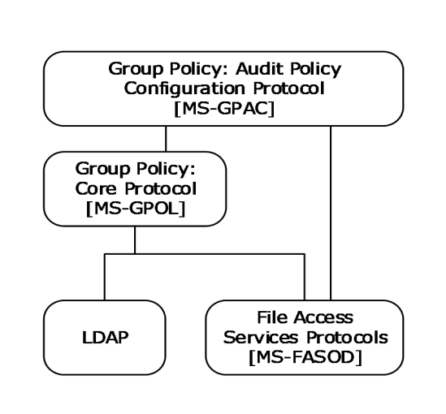

[MS-GPAC]:

Group Policy: Audit Configuration Extension

Intellectual Property Rights Notice for Open Specifications Documentation

  Technical Documentation. Microsoft publishes Open Specifications documentation (“this

documentation”) for protocols, file formats, data portability, computer languages, and standards
support. Additionally, overview documents cover inter-protocol relationships and interactions.

  Copyrights. This documentation is covered by Microsoft copyrights. Regardless of any other

terms that are contained in the terms of use for the Microsoft website that hosts this
documentation, you can make copies of it in order to develop implementations of the technologies
that are described in this documentation and can distribute portions of it in your implementations
that use these technologies or in your documentation as necessary to properly document the
implementation. You can also distribute in your implementation, with or without modification, any
schemas, IDLs, or code samples that are included in the documentation. This permission also
applies to any documents that are referenced in the Open Specifications documentation.
  No Trade Secrets. Microsoft does not claim any trade secret rights in this documentation.
  Patents. Microsoft has patents that might cover your implementations of the technologies

described in the Open Specifications documentation. Neither this notice nor Microsoft's delivery of
this documentation grants any licenses under those patents or any other Microsoft patents.
However, a given Open Specifications document might be covered by the Microsoft Open
Specifications Promise or the Microsoft Community Promise. If you would prefer a written license,
or if the technologies described in this documentation are not covered by the Open Specifications
Promise or Community Promise, as applicable, patent licenses are available by contacting
iplg@microsoft.com.

  License Programs. To see all of the protocols in scope under a specific license program and the

associated patents, visit the Patent Map.

  Trademarks. The names of companies and products contained in this documentation might be
covered by trademarks or similar intellectual property rights. This notice does not grant any
licenses under those rights. For a list of Microsoft trademarks, visit
www.microsoft.com/trademarks.

  Fictitious Names. The example companies, organizations, products, domain names, email

addresses, logos, people, places, and events that are depicted in this documentation are fictitious.
No association with any real company, organization, product, domain name, email address, logo,
person, place, or event is intended or should be inferred.

Reservation of Rights. All other rights are reserved, and this notice does not grant any rights other
than as specifically described above, whether by implication, estoppel, or otherwise.

Tools. The Open Specifications documentation does not require the use of Microsoft programming
tools or programming environments in order for you to develop an implementation. If you have access
to Microsoft programming tools and environments, you are free to take advantage of them. Certain
Open Specifications documents are intended for use in conjunction with publicly available standards
specifications and network programming art and, as such, assume that the reader either is familiar
with the aforementioned material or has immediate access to it.

Support. For questions and support, please contact dochelp@microsoft.com.

[MS-GPAC] - v20240423
Group Policy: Audit Configuration Extension
Copyright © 2024 Microsoft Corporation
Release: April 23, 2024

1 / 36

Revision Summary

Date

Revision
History

Revision
Class

Comments

7/2/2009

1.0

Major

First Release.

8/14/2009

1.0.1

Editorial

Changed language and formatting in the technical content.

9/25/2009

1.1

11/6/2009

1.2

Minor

Minor

Clarified the meaning of the technical content.

Clarified the meaning of the technical content.

12/18/2009  1.2.1

Editorial

Changed language and formatting in the technical content.

1/29/2010

1.3

Minor

Clarified the meaning of the technical content.

3/12/2010

1.3.1

Editorial

Changed language and formatting in the technical content.

4/23/2010

1.3.2

Editorial

Changed language and formatting in the technical content.

6/4/2010

2.0

Major

Updated and revised the technical content.

7/16/2010

2.0

None

No changes to the meaning, language, or formatting of the
technical content.

8/27/2010

3.0

Major

Updated and revised the technical content.

10/8/2010

3.0

11/19/2010  3.0

1/7/2011

3.0

2/11/2011

4.0

3/25/2011

5.0

5/6/2011

5.1

6/17/2011

5.2

9/23/2011

5.3

12/16/2011  5.4

3/30/2012

5.4

None

None

None

Major

Major

Minor

Minor

Minor

Minor

None

No changes to the meaning, language, or formatting of the
technical content.

No changes to the meaning, language, or formatting of the
technical content.

No changes to the meaning, language, or formatting of the
technical content.

Updated and revised the technical content.

Updated and revised the technical content.

Clarified the meaning of the technical content.

Clarified the meaning of the technical content.

Clarified the meaning of the technical content.

Clarified the meaning of the technical content.

No changes to the meaning, language, or formatting of the
technical content.

7/12/2012

5.4

None

No changes to the meaning, language, or formatting of the
technical content.

10/25/2012  5.4

1/31/2013

6.0

8/8/2013

7.0

11/14/2013  7.0

None

Major

Major

None

No changes to the meaning, language, or formatting of the
technical content.

Updated and revised the technical content.

Updated and revised the technical content.

No changes to the meaning, language, or formatting of the
technical content.

[MS-GPAC] - v20240423
Group Policy: Audit Configuration Extension
Copyright © 2024 Microsoft Corporation
Release: April 23, 2024

2 / 36

Date

Revision
History

Revision
Class

Comments

2/13/2014

7.0

5/15/2014

7.0

None

None

No changes to the meaning, language, or formatting of the
technical content.

No changes to the meaning, language, or formatting of the
technical content.

6/30/2015

8.0

Major

Significantly changed the technical content.

10/16/2015  8.0

7/14/2016

8.0

6/1/2017

8.0

9/15/2017

9.0

9/12/2018

10.0

4/7/2021

11.0

6/25/2021

12.0

4/23/2024

13.0

None

None

None

Major

Major

Major

Major

Major

No changes to the meaning, language, or formatting of the
technical content.

No changes to the meaning, language, or formatting of the
technical content.

No changes to the meaning, language, or formatting of the
technical content.

Significantly changed the technical content.

Significantly changed the technical content.

Significantly changed the technical content.

Significantly changed the technical content.

Significantly changed the technical content.

[MS-GPAC] - v20240423
Group Policy: Audit Configuration Extension
Copyright © 2024 Microsoft Corporation
Release: April 23, 2024

3 / 36

## Table of Contents

- [1 Introduction](#1-introduction)
  - [1.1 Glossary](#11-glossary)
  - [1.2 References](#12-references)
    - [1.2.1 Normative References](#121-normative-references)
    - [1.2.2 Informative References](#122-informative-references)
  - [1.3 Overview](#13-overview)
    - [1.3.1 Background](#131-background)
    - [1.3.2 Audit Configuration Extension Overview](#132-audit-configuration-extension-overview)
      - [1.3.2.1 Audit Subcategory Settings](#1321-audit-subcategory-settings)
      - [1.3.2.2 Audit Options](#1322-audit-options)
      - [1.3.2.3 Global Object Access Policy](#1323-global-object-access-policy)
  - [1.4 Relationship to Other Protocols](#14-relationship-to-other-protocols)
  - [1.5 Prerequisites/Preconditions](#15-prerequisitespreconditions)
  - [1.6 Applicability Statement](#16-applicability-statement)
  - [1.7 Versioning and Capability Negotiation](#17-versioning-and-capability-negotiation)
  - [1.8 Vendor-Extensible Fields](#18-vendor-extensible-fields)
  - [1.9 Standards Assignments](#19-standards-assignments)
- [2 Messages](#2-messages)
  - [2.1 Transport](#21-transport)
  - [2.2 Message Syntax](#22-message-syntax)
    - [2.2.1 Subcategory Settings](#221-subcategory-settings)
      - [2.2.1.1 Policy Target](#2211-policy-target)
      - [2.2.1.2 Subcategory and SubcategoryGUID](#2212-subcategory-and-subcategoryguid)
      - [2.2.1.3 Inclusion Setting, Exclusion Setting, and Setting Value](#2213-inclusion-setting-exclusion-setting-and-setting-value)
        - [2.2.1.3.1 Inclusion Setting, Exclusion Setting, and SettingValue for System Audit](#22131-inclusion-setting-exclusion-setting-and-settingvalue-for-system-audit)
        - [2.2.1.3.2 Inclusion Setting, Exclusion Setting, and SettingValue for Per-User Audit](#22132-inclusion-setting-exclusion-setting-and-settingvalue-for-per-user-audit)
    - [2.2.2 Audit Options](#222-audit-options)
      - [2.2.2.1 Audit Option Type](#2221-audit-option-type)
      - [2.2.2.2 Audit Option Value](#2222-audit-option-value)
    - [2.2.3 Global Object Access Audit Settings](#223-global-object-access-audit-settings)
      - [2.2.3.1 Resource Global SACL Type](#2231-resource-global-sacl-type)
      - [2.2.3.2 Global System Access Control List (SACL)](#2232-global-system-access-control-list-sacl)
    - [2.2.4 Machine Name](#224-machine-name)
- [3 Protocol Details](#3-protocol-details)
  - [3.1 Audit Configuration Protocol Administrative-Side Plug-in Details](#31-audit-configuration-protocol-administrative-side-plug-in-details)
    - [3.1.1 Abstract Data Model](#311-abstract-data-model)
    - [3.1.2 Timers](#312-timers)
    - [3.1.3 Initialization](#313-initialization)
    - [3.1.4 Higher-Layer Triggered Events](#314-higher-layer-triggered-events)
    - [3.1.5 Message Processing Events and Sequencing Rules](#315-message-processing-events-and-sequencing-rules)
    - [3.1.6 Timer Events](#316-timer-events)
    - [3.1.7 Other Local Events](#317-other-local-events)
  - [3.2 Advanced Audit Policy Configuration Client-Side Plug-in Details](#32-advanced-audit-policy-configuration-client-side-plug-in-details)
    - [3.2.1 Abstract Data Model](#321-abstract-data-model)
      - [3.2.1.1 Policy Setting State](#3211-policy-setting-state)
    - [3.2.2 Timers](#322-timers)
    - [3.2.3 Initialization](#323-initialization)
    - [3.2.4 Higher-Layer Triggered Events](#324-higher-layer-triggered-events)
      - [3.2.4.1 Process Group Policy](#3241-process-group-policy)
    - [3.2.5 Message Processing Events and Sequencing Rules](#325-message-processing-events-and-sequencing-rules)
    - [3.2.6 Timer Events](#326-timer-events)
    - [3.2.7 Other Local Events](#327-other-local-events)
- [4 Protocol Examples](#4-protocol-examples)
  - [4.1 Example Involving System Audit Subcategory Settings](#41-example-involving-system-audit-subcategory-settings)
  - [4.2 Example Involving Per-User Audit Subcategory Settings](#42-example-involving-per-user-audit-subcategory-settings)
  - [4.3 Example Involving Audit Options](#43-example-involving-audit-options)
  - [4.4 Example Involving Global Object Access Auditing](#44-example-involving-global-object-access-auditing)
  - [4.5 Example of Configuring Multiple Types of Settings](#45-example-of-configuring-multiple-types-of-settings)
- [5 Security](#5-security)
  - [5.1 Security Considerations for Implementers](#51-security-considerations-for-implementers)
  - [5.2 Index of Security Parameters](#52-index-of-security-parameters)
    - [5.2.1 Security Parameters Affecting Behavior of the Protocol](#521-security-parameters-affecting-behavior-of-the-protocol)
    - [5.2.2 System Security Parameters Carried by the Protocol](#522-system-security-parameters-carried-by-the-protocol)
- [6 Appendix A: Product Behavior](#6-appendix-a-product-behavior)
- [7 Change Tracking](#7-change-tracking)
- [8 Index](#8-index)

## 1 Introduction

This document specifies the Group Policy: Audit Policy Configuration Protocol, which provides a
mechanism for an administrator to control advanced audit policies on clients.

Sections 1.5, 1.8, 1.9, 2, and 3 of this specification are normative. All other sections and examples in
this specification are informative.

### 1.1 Glossary

This document uses the following terms:

Active Directory: The Windows implementation of a general-purpose directory service, which uses

LDAP as its primary access protocol. Active Directory stores information about a variety of
objects in the network such as user accounts, computer accounts, groups, and all related
credential information used by Kerberos [MS-KILE]. Active Directory is either deployed as
Active Directory Domain Services (AD DS) or Active Directory Lightweight Directory
Services (AD LDS), which are both described in [MS-ADOD]: Active Directory Protocols
Overview.

Active Directory Domain Services (AD DS): A directory service (DS) implemented by a domain
controller (DC). The DS provides a data store for objects that is distributed across multiple
DCs. The DCs interoperate as peers to ensure that a local change to an object replicates
correctly across DCs.  AD DS is a deployment of Active Directory [MS-ADTS].

Active Directory object: A set of directory objects that are used within Active Directory as

defined in [MS-ADTS] section 3.1.1. An Active Directory object can be identified by a dsname.
See also directory object.

Administrative tool: An implementation-specific tool, such as the Group Policy Management
Console, that allows administrators to read and write policy settings from and to a Group
Policy Object (GPO) and policy files. The Group Policy Administrative tool uses the Extension
list of a GPO to determine which Administrative tool extensions are required to read settings
from and write settings to the logical and physical components of a GPO.

advanced audit policy: The global audit policy settings pertaining to auditing as described in this

specification.

attribute: A characteristic of some object or entity, typically encoded as a name/value pair.

audit policy: The global audit policy settings pertaining to auditing as described in [MS-GPSB]

section 2.2.4.

Augmented Backus-Naur Form (ABNF): A modified version of Backus-Naur Form (BNF),

commonly used by Internet specifications. ABNF notation balances compactness and simplicity
with reasonable representational power. ABNF differs from standard BNF in its definitions and
uses of naming rules, repetition, alternatives, order-independence, and value ranges. For more
information, see [RFC5234].

client-side extension GUID (CSE GUID): A GUID  that enables a specific client-side extension
on the Group Policy client to be associated with policy data that is stored in the logical and
physical components of a Group Policy Object (GPO) on the Group Policy server, for that
particular extension.

computer-scoped Group Policy Object path: A scoped Group Policy Object (GPO) path that

ends in "\Machine".

domain: A set of users and computers sharing a common namespace and management

infrastructure. At least one computer member of the set has to act as a domain controller

6 / 36

[MS-GPAC] - v20240423
Group Policy: Audit Configuration Extension
Copyright © 2024 Microsoft Corporation
Release: April 23, 2024

(DC) and host a member list that identifies all members of the domain, as well as optionally
hosting the Active Directory service. The domain controller provides authentication of
members, creating a unit of trust for its members. Each domain has an identifier that is shared
among its members. For more information, see [MS-AUTHSOD] section 1.1.1.5 and [MS-ADTS].

domain controller (DC): The service, running on a server, that implements Active Directory, or
the server hosting this service. The service hosts the data store for objects and interoperates
with other DCs to ensure that a local change to an object replicates correctly across all DCs.
When Active Directory is operating as Active Directory Domain Services (AD DS), the DC
contains full NC replicas of the configuration naming context (config NC), schema naming
context (schema NC), and one of the domain NCs in its forest. If the AD DS DC is a global
catalog server (GC server), it contains partial NC replicas of the remaining domain NCs in its
forest. For more information, see [MS-AUTHSOD] section 1.1.1.5.2 and [MS-ADTS]. When
Active Directory is operating as Active Directory Lightweight Directory Services (AD LDS),
several AD LDS DCs can run on one server. When Active Directory is operating as AD DS,
only one AD DS DC can run on one server. However, several AD LDS DCs can coexist with one
AD DS DC on one server. The AD LDS DC contains full NC replicas of the config NC and the
schema NC in its forest. The domain controller is the server side of Authentication Protocol
Domain Support [MS-APDS].

globally unique identifier (GUID): A term used interchangeably with universally unique

identifier (UUID) in Microsoft protocol technical documents (TDs). Interchanging the usage of
these terms does not imply or require a specific algorithm or mechanism to generate the value.
Specifically, the use of this term does not imply or require that the algorithms described in
[RFC4122] or [C706] have to be used for generating the GUID. See also universally unique
identifier (UUID).

Group Policy: A mechanism that allows the implementer to specify managed configurations for

users and computers in an Active Directory service environment.

Group Policy Object (GPO): A collection of administrator-defined specifications of the policy
settings that can be applied to groups of computers in a domain. Each GPO includes two
elements: an object that resides in the Active Directory for the domain, and a corresponding
file system subdirectory that resides on the sysvol DFS share of the Group Policy server for the
domain.

Group Policy server: A server holding a database of Group Policy Objects (GPOs) that can be
retrieved by other machines. The Group Policy server has to be a domain controller (DC).

Lightweight Directory Access Protocol (LDAP): The primary access protocol for Active

Directory. Lightweight Directory Access Protocol (LDAP) is an industry-standard protocol,
established by the Internet Engineering Task Force (IETF), which allows users to query and
update information in a directory service (DS), as described in [MS-ADTS]. The Lightweight
Directory Access Protocol can be either version 2 [RFC1777] or version 3 [RFC3377].

policy setting: A statement of the possible behaviors of an element of a domain member

computer's behavior that can be configured by an administrator.

security identifier (SID): An identifier for security principals that is used to identify an account
or a group. Conceptually, the SID is composed of an account authority portion (typically a
domain) and a smaller integer representing an identity relative to the account authority,
termed the relative identifier (RID). The SID format is specified in [MS-DTYP] section 2.4.2; a
string representation of SIDs is specified in [MS-DTYP] section 2.4.2 and [MS-AZOD] section
1.1.1.2.

share: A resource offered by a Common Internet File System (CIFS) server for access by CIFS
clients over the network. A share typically represents a directory tree and its included files
(referred to commonly as a "disk share" or "file share") or a printer (a "print share"). If the
information about the share is saved in persistent store (for example, Windows registry) and

7 / 36

[MS-GPAC] - v20240423
Group Policy: Audit Configuration Extension
Copyright © 2024 Microsoft Corporation
Release: April 23, 2024

reloaded when a file server is restarted, then the share is referred to as a "sticky share". Some
share names are reserved for specific functions and are referred to as special shares: IPC$,
reserved for interprocess communication, ADMIN$, reserved for remote administration, and A$,
B$, C$ (and other local disk names followed by a dollar sign), assigned to local disk devices.

system access control list (SACL): An access control list (ACL) that controls the generation of
audit messages for attempts to access a securable object. The ability to get or set an object's
SACL is controlled by a privilege typically held only by system administrators.

ticket-granting ticket (TGT): A special type of ticket that can be used to obtain other tickets.

The TGT is obtained after the initial authentication in the Authentication Service (AS) exchange;
thereafter, users do not need to present their credentials, but can use the TGT to obtain
subsequent tickets.

token: A set of rights and privileges for a given user.

tool extension GUID or administrative plug-in GUID: A GUID defined separately for each of
the user policy settings and computer policy settings that associates a specific administrative
tool plug-in with a set of policy settings that can be stored in a Group Policy Object (GPO).

Universal Naming Convention (UNC): A string format that specifies the location of a resource.

For more information, see [MS-DTYP] section 2.2.57.

UTF-8: A byte-oriented standard for encoding Unicode characters, defined in the Unicode standard.

Unless specified otherwise, this term refers to the UTF-8 encoding form specified in
[UNICODE5.0.0/2007] section 3.9.

MAY, SHOULD, MUST, SHOULD NOT, MUST NOT: These terms (in all caps) are used as defined
in [RFC2119]. All statements of optional behavior use either MAY, SHOULD, or SHOULD NOT.

### 1.2 References

Links to a document in the Microsoft Open Specifications library point to the correct section in the
most recently published version of the referenced document. However, because individual documents
in the library are not updated at the same time, the section numbers in the documents may not
match. You can confirm the correct section numbering by checking the Errata.

#### 1.2.1 Normative References

We conduct frequent surveys of the normative references to assure their continued availability. If you
have any issue with finding a normative reference, please contact dochelp@microsoft.com. We will
assist you in finding the relevant information.

[MS-DTYP] Microsoft Corporation, "Windows Data Types".

[MS-GPOL] Microsoft Corporation, "Group Policy: Core Protocol".

[RFC2119] Bradner, S., "Key words for use in RFCs to Indicate Requirement Levels", BCP 14, RFC
2119, March 1997, https://www.rfc-editor.org/info/rfc2119

[RFC2251] Wahl, M., Howes, T., and Kille, S., "Lightweight Directory Access Protocol (v3)", RFC 2251,
December 1997, https://www.rfc-editor.org/info/rfc2251

[RFC4234] Crocker, D., Ed., and Overell, P., "Augmented BNF for Syntax Specifications: ABNF", RFC
4234, October 2005, https://www.rfc-editor.org/info/rfc4234

[MS-GPAC] - v20240423
Group Policy: Audit Configuration Extension
Copyright © 2024 Microsoft Corporation
Release: April 23, 2024

8 / 36

#### 1.2.2 Informative References

[MS-FASOD] Microsoft Corporation, "File Access Services Protocols Overview".

[MS-GPSB] Microsoft Corporation, "Group Policy: Security Protocol Extension".

[MSDN-SDDL] Microsoft Corporation, "Security Descriptor String Format",
http://msdn.microsoft.com/en-us/library/aa379570.aspx

### 1.3 Overview

The Group Policy: Audit Configuration Extension to the Group Policy: Core Protocol [MS-GPOL] enables
advanced audit policies to be distributed to multiple clients so that these clients can enforce the
policies in accordance with the intentions of the administrator.

#### 1.3.1 Background

The Group Policy: Core Protocol, as specified in [MS-GPOL], allows clients to discover and retrieve
policy settings created by administrators of a domain. These settings are persisted within Group
Policy Objects (GPOs) that are assigned to Policy Target accounts in Active Directory. Policy
Target accounts are either computer accounts or user accounts in Active Directory. Each client uses
Lightweight Directory Access Protocol (LDAP) to determine what GPOs are applicable to it by
consulting the Active Directory objects corresponding to both its computer account and the user
accounts of any users logging on to the client computer.

On each client, each GPO is interpreted and acted upon by client plug-ins. The client plug-ins that are
responsible for a given GPO are specified using an attribute on the GPO. This attribute specifies a list
of globally unique identifier (GUID) pairs. The first GUID of each pair is referred to as a client-
side extension GUID (CSE GUID). The second GUID of each pair is referred to as a tool extension
GUID.

For each GPO that is applicable to a client, the client consults the CSE GUID listed in the GPO to
determine what client plug-in on the client will handle the GPO. The client then invokes the client plug-
in to handle the GPO.

A client plug-in uses the contents of the GPO to retrieve settings specific to the client plug-in in a
manner specific to the client plug-in. After the client plug-in-specific settings are retrieved, the client
plug-in uses those settings to perform the client plug-in-specific processing.

#### 1.3.2 Audit Configuration Extension Overview

Advanced audit policies contain settings that enable the underlying audit subsystem to determine
which activities to monitor and log in the security event log. Advanced audit policies contain three
main types of settings:

  Audit subcategory settings

  Audit options

  Global object access policy

The following major steps are involved in advanced audit policy configuration:

1.  Advanced audit policy authoring

2.  Advanced audit policy assignment

3.  Advanced audit policy distribution

[MS-GPAC] - v20240423
Group Policy: Audit Configuration Extension
Copyright © 2024 Microsoft Corporation
Release: April 23, 2024

9 / 36

Advanced audit policy authoring is enabled through an administrative tool for the Group Policy: Core
Protocol specified in [MS-GPOL] with an administrative-side plug-in for behavior specific to this
protocol. The plug-in allows an administrator to author advanced audit policies within an
implementation-specific tool providing a graphical user interface. The plug-in then saves the advanced
audit policies into files with a format specified in this document, and stores them on a file share that
is accessible by file access protocol sequences as described in [MS-FASOD].

Advanced audit policy assignment is performed by the Group Policy: Core Protocol administrative tool,
which constructs GPOs, as specified in [MS-GPOL] section 2.2.8.1. Each GPO contains a reference to
the network path using the Universal Naming Convention (UNC) where the advanced audit policy
files generated by the protocol administrative plug-in need to be fetched from using file access
protocol sequences.

Advanced audit policy distribution involves a corresponding protocol-specific Group Policy plug-in on
the client machine, which is invoked to process any GPO that refers to advanced audit policy settings.
The advanced audit policy protocol client-side plug-in locates the advanced audit policy as specified in
section 3.1.4, transfers the advanced audit policy files by using file access protocol sequences, and
then uses the advanced audit policy files to configure the client's advanced audit policy, audit options,
and global object access auditing settings.

##### 1.3.2.1 Audit Subcategory Settings

The advanced audit policy allows administrators to select only the behaviors to monitor and to exclude
audit results for behaviors that are of no concern to them or behaviors that create an excessive
number of log entries. These settings are grouped into the following nine main audit categories
containing the audit subcategories listed here:

System audit:

Security State Change

Security System Extension

System Integrity

IPsec Driver

Other System Events

Logon/Logoff audit:

Logon

Logoff

Account Lockout

IPsec Main Mode

Ipsec Quick Mode

Ipsec Extended Mode

Special Logon

Other Logon/Logoff Events

Network Policy Server

User/Device Claims

[MS-GPAC] - v20240423
Group Policy: Audit Configuration Extension
Copyright © 2024 Microsoft Corporation
Release: April 23, 2024

10 / 36

Group Membership

Object access audit:

File system

Registry

Kernel Object

SAM

Certification Services

Application Generated

Handle Manipulation

File Share

Filtering Platform Packet Drop

Filtering Platform Connection

Other Object Access Events

Detailed File Share

Removable Storage

Central Access Policy Staging

Privilege use audit:

Sensitive Privilege Use

Non Sensitive Privilege Use

Other Privilege Use Events

Detailed tracking audit:

Process Creation

Process Termination

DPAPI Activity

RPC Events

PNP Activity

Policy change audit:

Audit Policy Change

Authentication Policy Change

Authorization Policy Change

MPSSVC Rule-Level Policy Change

Filtering Platform Policy Change

[MS-GPAC] - v20240423
Group Policy: Audit Configuration Extension
Copyright © 2024 Microsoft Corporation
Release: April 23, 2024

11 / 36

Other Policy Change Events

Account management audit:

User Account Management

Computer Account Management

Security Group Management

Distribution Group Management

Application Group Management

Other Account Management Events

Directory Service access audit:

Directory Service Access

Directory Service Changes

Directory Service Replication

Detailed Directory Service Replication

Account Logon audit:

Credential Validation

Kerberos Service Ticket Operations

Other Account Logon Events

Kerberos Authentication Service

For more information about audit subcategories, see section 2.2.1.

##### 1.3.2.2 Audit Options

Audit options are settings that enable or disable functionality of the audit subsystem. These settings
include crashing the system on audit failures, full privilege auditing, auditing of base objects, and
auditing of base directories.

For more information about audit options, see section 2.2.2.

##### 1.3.2.3 Global Object Access Policy

The global object access policy contains a set of system access control lists that are applied to whole
resource managers like the File System and Registry.

For more information about global object access policy, see section 2.2.3.

### 1.4 Relationship to Other Protocols

This protocol depends on Group Policy: Core Protocol specified in [MS-GPOL] to provide a list of
applicable GPOs. It also transmits Group Policy settings and instructions between the client and the
Group Policy server by reading and writing files. See [MS-FASOD] for an overview of file access
services concepts. The following diagram illustrates these relationships.

[MS-GPAC] - v20240423
Group Policy: Audit Configuration Extension
Copyright © 2024 Microsoft Corporation
Release: April 23, 2024

12 / 36

<!-- Extracted images from page 13 -->

<!-- /Extracted images from page 13 -->

Figure 1: Group Policy: Audit Configuration Extension protocol relationship diagram

### 1.5 Prerequisites/Preconditions

The prerequisites for Group Policy: Audit Configuration Extension are the same as those for the Group
Policy: Core Protocol [MS-GPOL].

### 1.6 Applicability Statement

Group Policy: Audit Configuration Extension is only applicable within the Group Policy framework.

### 1.7 Versioning and Capability Negotiation

None.

### 1.8 Vendor-Extensible Fields

None.

### 1.9 Standards Assignments

Group Policy: Audit Configuration Extension defines CSE GUID and tool extension GUID, as specified in
[MS-GPOL] (section 1.8). The following table shows the assignments.

Parameter

CSE GUID

Value

{f3ccc681-b74c-4060-9f26-cd84525dca2a}

Tool extension GUID (computer policy settings)  {0F3F3735-573D-9804-99E4-AB2A69BA5FD4}

[MS-GPAC] - v20240423
Group Policy: Audit Configuration Extension
Copyright © 2024 Microsoft Corporation
Release: April 23, 2024

13 / 36

## 2 Messages

### 2.1 Transport

The Group Policy: Audit Configuration Extension requires file access as specified for use in the Group
Policy: Core Protocol [MS-GPOL]. All messages MUST be exchanged over file access protocols between
the client and server, as specified in section 2.2.

The Group Policy: Core Protocol uses this protocol's CSE GUID and tool extension GUID values to
invoke this protocol only to access GPOs that require processing by this protocol.

### 2.2 Message Syntax

Messages exchanged in the Group Policy: Audit Configuration Extension correspond to advanced audit
policy files transferred by using file access protocol sequences as described in [MS-FASOD]. The
protocol is driven through the exchange of these messages, as specified in section 3.

All advanced audit policy files processed by the Group Policy: Audit Configuration Extension are UTF-8
encoded and based on the following file syntax.

 CSVFile = Header SubcategorySettings AuditOptions GlobalObjectAccessAuditSettings
 Header = "Machine Name,Policy Target,Subcategory,Subcategory GUID,Inclusion Setting,Exclusion
Setting,Setting Value" LineBreak

The preceding syntax is given in the Augmented Backus-Naur Form (ABNF) grammar, as specified
in [RFC4234] and as augmented by the following rules.

 LineBreak = CRLF
 String = *(ALPHANUM / %d47 / %d45 / %d58 / %d59)
 StringWithSpaces = String / String Wsp StringWithSpaces
 QuotedString = DQUOTE *(%x20-21 / %x23-7E) DQUOTE
 Wsp = *WSP
 ALPHANUM = ALPHA / DIGIT
 GUID                   = %x7B time-low hyphen time-mid hyphen
                          time-high-and-version hyphen
                          clock-seq-and_reserved
                          clock-seq-low hyphen node %x7D
 time-low               = hexOctet hexOctet hexOctet hexOctet
 time-mid               = hexOctet hexOctet
 time-high-and-version  = hexOctet hexOctet
 clock-seq-and-reserved = hexOctet
 clock-seq-low          = hexOctet
 node                   = hexOctet hexOctet hexOctet
                          hexOctet hexOctet hexOctet
 hexOctet               = hexDigit hexDigit
 hexDigit               = digit / a / b / c / d / e / f
 digit                  = "0" / "1" | "2" / "3" / "4" / "5" / "6" / "7" /
                          "8" / "9"
 hyphen                 = "-"
 a                      = "a" / "A"
 b                      = "b" / "B"
 c                      = "c" / "C"
 d                      = "d" / "D"
 e                      = "e" / "E"
 f                      = "f" / "F"

[MS-GPAC] - v20240423
Group Policy: Audit Configuration Extension
Copyright © 2024 Microsoft Corporation
Release: April 23, 2024

14 / 36

#### 2.2.1 Subcategory Settings

This section defines settings that enable an administrator to set the subcategory settings for an
advanced audit policy. The syntax for the entries in this category MUST be as follows.

 SubcategorySettings = SubcategorySetting / SubcategorySetting / SubcategorySetting
 SubcategorySetting = MachineName "," PolicyTarget "," Subcategory "," SubcategoryGUID ","
InclusionSetting "," ExclusionSetting "," SettingValue LineBreak

##### 2.2.1.1 Policy Target

This section defines the possible values for the PolicyTarget attribute, which enables an administrator
to specify whether to set the audit subcategory for a system advanced audit policy or a specific user.
The syntax for the entries in this category MUST be as follows.

 PolicyTarget = "System" / UserSID

The value of PolicyTarget MUST be one of the following:

1.  A value of "System": Indicates that this is a system audit subcategory setting.

2.  A UserSID: Indicates that this is a per-user audit subcategory setting.

UserSID is the string representation of the security identifier (SID) of a user account. The syntax
for the entries in this category MUST be as follows.

 UserSID = String

The UserSID string MUST use the standard S-R-I-S-S... format for SID strings, as specified in [MS-
DTYP] (section 2.4.2).<1>

##### 2.2.1.2 Subcategory and SubcategoryGUID

This section defines how the Subcategory and SubcategoryGUID values are used by the audit
configuration client-side plug-in.

The Subcategory field is for user reference only and is ignored when the advanced audit policy is
applied by the audit configuration client-side plug-in.

The syntax for the entries in this category MUST be as follows.

 Subcategory = StringWithSpaces / QuotedString
 SubcategoryGUID = GUID

The SubcategoryGUID allows administrators to identify audit subcategories to enable or disable in the
client's system or per-user advanced audit policy. For more information about enabling or disabling
audit subcategories, see section 2.2.1.3.

The following table provides an explanation for the valid SubcategoryGUID values.

SubcategoryGUID

Purpose

{0CCE9213-69AE-11D9-

Identifies the IPsec Driver audit subcategory.

15 / 36

[MS-GPAC] - v20240423
Group Policy: Audit Configuration Extension
Copyright © 2024 Microsoft Corporation
Release: April 23, 2024

SubcategoryGUID

Purpose

BED3-505054503030}

This subcategory audits events that are generated by the IPsec filter driver.

{0CCE9212-69AE-11D9-
BED3-505054503030}

{0CCE9211-69AE-11D9-
BED3-505054503030}

{0CCE9210-69AE-11D9-
BED3-505054503030}

Identifies the System Integrity audit subcategory.

This subcategory audits events that violate the integrity of the security subsystem.

Identifies the Security System Extension audit subcategory.

This subcategory audits events related to security system extensions or services.

Identifies the Security State Change audit subcategory.

This subcategory audits events generated by changes in the security state of the
computer.

{0CCE9214-69AE-11D9-
BED3-505054503030}

Identifies the Other System Events audit subcategory.

This subcategory SHOULD<2> audit the following event:

Cryptography key file and migration operations.

{0CCE9243-69AE-11D9-
BED3-505054503030}

Identifies the Network Policy Server audit subcategory.

This subcategory audits events generated by RADIUS (IAS) and Network Access
Protection (NAP) user access requests. These requests can be Grant, Deny, Discard,
Quarantine, Lock, and Unlock.

{0CCE921C-69AE-11D9-
BED3-505054503030}

Identifies the Other Logon/Logoff Events audit subcategory.

This subcategory audits other events related to logon and logoff that are not included
in the Logon/Logoff category.

{0CCE921B-69AE-11D9-
BED3-505054503030}

{0CCE921A-69AE-11D9-
BED3-505054503030}

{0CCE9219-69AE-11D9-
BED3-505054503030}

{0CCE9218-69AE-11D9-
BED3-505054503030}

{0CCE9217-69AE-11D9-
BED3-505054503030}

{0CCE9216-69AE-11D9-
BED3-505054503030}

Identifies the Special Logon audit subcategory.

This subcategory audits events generated by special logons.

Identifies the IPsec Extended Mode audit subcategory.

This subcategory audits events generated by Internet Key Exchange protocol (IKE)
and Authenticated Internet Protocol (AuthIP) during Extended Mode negotiations.

Identifies the IPsec Quick Mode audit subcategory.

This subcategory audits events generated by Internet Key Exchange protocol (IKE)
and Authenticated Internet Protocol (AuthIP) during Quick Mode negotiations.

Identifies the IPsec Main Mode audit subcategory.

This subcategory audits events generated by Internet Key Exchange protocol (IKE)
and Authenticated Internet Protocol (AuthIP) during Main Mode negotiations.

Identifies the Account Lockout audit subcategory.

This subcategory audits events generated by a failed attempt to log on to an account
that is locked out.

Identifies the Logoff audit subcategory. This subcategory audits events generated by
closing a logon session. These events occur on the computer that was accessed. For
an interactive logon, the security audit event is generated on the computer that the
user account logged on to.

{0CCE9215-69AE-11D9-
BED3-505054503030}

Identifies the Logon audit subcategory. This subcategory audits events generated by
user account logon attempts on a computer.

{0CCE9223-69AE-11D9-
BED3-505054503030}

Identifies the Handle Manipulation audit subcategory.

This subcategory audits events generated when a handle to an object is opened or
closed. Only objects with a matching SACL generate security audit events. Open and
close handle events will be audited when both the Handle Manipulation subcategory is
enabled along with the corresponding resource manager identified by other Object
Access audit subcategory, like File System or Registry. Enabling Handle Manipulation
causes implementation-specific security event data to be logged identifying the

16 / 36

[MS-GPAC] - v20240423
Group Policy: Audit Configuration Extension
Copyright © 2024 Microsoft Corporation
Release: April 23, 2024

SubcategoryGUID

Purpose

{0CCE9244-69AE-11D9-
BED3-505054503030}

{0CCE9227-69AE-11D9-
BED3-505054503030}

{0CCE9226-69AE-11D9-
BED3-505054503030}

{0CCE9225-69AE-11D9-
BED3-505054503030}

{0CCE9224-69AE-11D9-
BED3-505054503030}

{0CCE9222-69AE-11D9-
BED3-505054503030}

{0CCE9221-69AE-11D9-
BED3-505054503030}

{0CCE9220-69AE-11D9-
BED3-505054503030}

{0CCE921F-69AE-11D9-
BED3-505054503030}

permissions that were used to grant or deny the access requested by the user; this is
also known as "Reason for access".

Identifies the Detailed File Share audit subcategory.

This subcategory audits every attempt to access objects in a shared folder.

Identifies the Other Object Access Events audit subcategory.

This subcategory audits events generated by the management of Task Scheduler jobs
or COM+ objects.

Identifies the Filtering Platform Connection audit subcategory.

This subcategory audits connections that are allowed or blocked by WFP.

Identifies the Filtering Platform Packet Drop audit subcategory.

This subcategory audits packets that are dropped by Windows Filtering Platform
(WFP).

Identifies the File Share audit subcategory.

This subcategory audits attempts to access a shared folder.

Identifies the Application Generated audit subcategory.

This subcategory audits applications that generate events by using the Windows
Auditing application programming interfaces (APIs). Applications designed to use the
Windows Auditing API use this subcategory to log auditing events related to their
function.

Identifies the Certification Services audit subcategory.

This subcategory audits Active Directory Certificate Services (AD CS) operations.

Identifies the SAM audit subcategory.

This subcategory audits events generated by attempts to access Security Accounts
Manager (SAM) objects.

Identifies the Kernel Object audit subcategory.

This subcategory audits attempts to access the system kernel, which include mutexes
and semaphores. Only kernel objects with a matching SACL generate security audit
events.

Note:

The Audit: Audit the access of global system objects policy setting controls the
default SACL of kernel objects.

{0CCE921E-69AE-11D9-
BED3-505054503030}

Identifies the Registry audit subcategory.

This subcategory audits attempts to access registry objects. A security audit event is
generated only for objects that have SACLs and only if the type of access requested,
such as Read, Write, or Modify, and the account making the request match the
settings in the SACL.

{0CCE921D-69AE-11D9-
BED3-505054503030}

Identifies the File System audit subcategory.

This subcategory audits user attempts to access file system objects. A security audit
event is generated only for objects that have SACLs and only if the type of access
requested, such as Write, Read, or Modify, and the account making the request match
the settings in the SACL.

{0CCE9229-69AE-11D9-
BED3-505054503030}

Identifies the Non Sensitive Privilege Use audit subcategory.

This subcategory audits events generated by the use of nonsensitive privileges (user
rights), such as logging on locally or with a Remote Desktop connection, changing the
system time, or removing a computer from a docking station.

[MS-GPAC] - v20240423
Group Policy: Audit Configuration Extension
Copyright © 2024 Microsoft Corporation
Release: April 23, 2024

17 / 36

SubcategoryGUID

Purpose

{0CCE922A-69AE-11D9-
BED3-505054503030}

{0CCE9228-69AE-11D9-
BED3-505054503030}

Identifies the Other Privilege Use Events audit subcategory.

Identifies the Sensitive Privilege Use audit subcategory.

This subcategory audits events generated by the use of sensitive privileges (user
rights), such as acting as part of the operating system, backing up files and
directories, impersonating a client computer, or generating security audits.

{0CCE922D-69AE-11D9-
BED3-505054503030}

Identifies the DPAPI Activity audit subcategory.

This subcategory audits events generated when encryption or decryption requests are
made to the Data Protection application interface (DPAPI). DPAPI is used to protect
secret information such as stored password and key information.

{0CCE922C-69AE-11D9-
BED3-505054503030}

{0CCE922B-69AE-11D9-
BED3-505054503030}

{0CCE922E-69AE-11D9-
BED3-505054503030}

{0CCE9232-69AE-11D9-
BED3-505054503030}

Identifies the Process Termination audit subcategory.

This subcategory audits events generated when a process ends.

Identifies the Process Creation audit subcategory.

This subcategory audits events generated when a process is created or starts. The
name of the application or user that created the process is also audited.

Identifies the RPC Events audit subcategory.

This subcategory audits inbound remote procedure call (RPC) connections.

Identifies the MPSSVC Rule-Level Policy Change audit subcategory.

This subcategory audits events generated by changes in policy rules used by Windows
Firewall.

{0CCE9234-69AE-11D9-
BED3-505054503030}

Identifies the Other Policy Change Events audit subcategory.

This subcategory audits events generated by other security policy changes that are
not audited in the Policy Change category.

{0CCE9233-69AE-11D9-
BED3-505054503030}

Identifies the Filtering Platform Policy Change audit subcategory.

This subcategory audits events generated by changes to Windows Filtering Platform
(WFP).

{0CCE922F-69AE-11D9-
BED3-505054503030}

{0CCE9231-69AE-11D9-
BED3-505054503030}

{0CCE9230-69AE-11D9-
BED3-505054503030}

{0CCE923A-69AE-11D9-
BED3-505054503030}

{0CCE9239-69AE-11D9-
BED3-505054503030}

{0CCE9238-69AE-11D9-
BED3-505054503030}

{0CCE9237-69AE-11D9-
BED3-505054503030}

Identifies the Audit Policy Change audit subcategory.

This subcategory audits changes in security audit policy settings.

Identifies the Authorization Policy Change audit subcategory.

This subcategory audits events generated by changes to the authorization policy.

Identifies the Authentication Policy Change audit subcategory.

This subcategory audits events generated by changes to the authentication policy.

Identifies the Other Account Management Events audit subcategory.

This subcategory audits events generated by other user account changes that are not
covered in this category.

Identifies the Application Group Management audit subcategory.

This subcategory audits events generated by changes to application groups.

Identifies the Distribution Group Management audit subcategory.

This subcategory audits events generated by changes to distribution groups.

Identifies the Security Group Management audit subcategory.

This subcategory audits events generated by changes to security groups.

{0CCE9236-69AE-11D9-

Identifies the Computer Account Management audit subcategory.

18 / 36

[MS-GPAC] - v20240423
Group Policy: Audit Configuration Extension
Copyright © 2024 Microsoft Corporation
Release: April 23, 2024

SubcategoryGUID

Purpose

BED3-505054503030}

This subcategory audits events generated by changes to computer accounts, such as
when a computer account is created, changed, or deleted.

{0CCE9235-69AE-11D9-
BED3-505054503030}

{0CCE923E-69AE-11D9-
BED3-505054503030}

Identifies the User Account Management audit subcategory.

This subcategory audits changes to user accounts.

Identifies the Detailed Directory Service Replication audit subcategory.

This subcategory audits events generated by detailed AD DS replication between
domain controllers (DCs).

{0CCE923B-69AE-11D9-
BED3-505054503030}

Identifies the Directory Service Access audit subcategory.

This subcategory audits events generated when an AD DS object is accessed.

Only AD DS objects with a matching SACL are logged.

{0CCE923D-69AE-11D9-
BED3-505054503030}

Identifies the Directory Service Replication audit subcategory.

This subcategory audits replication between two AD DS DCs.

{0CCE923C-69AE-11D9-
BED3-505054503030}

Identifies the Directory Service Changes audit subcategory.

This subcategory audits events generated by changes to AD DS objects. Events are
logged when an object is created, deleted, modified, moved, or undeleted.

{0CCE9241-69AE-11D9-
BED3-505054503030}

Identifies the Other Account Logon Events audit subcategory.

This subcategory audits events generated by responses to credential requests
submitted for a user account logon that are not credential validation or Kerberos
tickets.

{0CCE9240-69AE-11D9-
BED3-505054503030}

{0CCE923F-69AE-11D9-
BED3-505054503030}

Identifies the Kerberos Service Ticket Operations audit subcategory.

This subcategory audits events generated by Kerberos service ticket requests.

Identifies the Credential Validation audit subcategory.

This subcategory audits events generated by validation tests on user account logon
credentials.

{0CCE9242-69AE-11D9-
BED3-505054503030}

Identifies the Kerberos Authentication Service audit subcategory.

This subcategory audits events generated by Kerberos authentication ticket-
granting ticket (TGT) requests.

{0CCE9245-69AE-11D9-
BED3-505054503030}

Identifies the Removable Storage audit subcategory.

This subcategory audits user attempts to access file system objects on any
Removable Storage device. A security audit event is generated for every read or write
access to a file object on any Removable Storage device attached to the user's
machine.

{0CCE9246-69AE-11D9-
BED3-505054503030}

Identifies the Central Access Policy Staging audit subcategory.

This subcategory audits access requests where the permission granted or denied by a
proposed policy differs from that granted or denied by the current central access
policy on an object.

{0cce9247-69ae-11d9-
bed3-505054503030}

{0cce9248-69ae-11d9-
bed3-505054503030}

{0cce9249-69ae-11d9-
bed3-505054503030}

Identifies the User/Device Claims audit subcategory.

This subcategory SHOULD<3> audit the user and device claims that are present in
the token of an associated logon.

Identifies the PNP Activity audit subcategory.

This subcategory SHOULD<4> audit events generated by plug and play (PNP).

Identifies the Group Membership audit subcategory.

This subcategory SHOULD<5> audit the group membership of a token for an
associated logon.

19 / 36

[MS-GPAC] - v20240423
Group Policy: Audit Configuration Extension
Copyright © 2024 Microsoft Corporation
Release: April 23, 2024

##### 2.2.1.3 Inclusion Setting, Exclusion Setting, and Setting Value

This section defines settings that enable an administrator to define whether to add or remove a
subcategory from the client advanced audit policy.

The possible value of these attributes depends whether the subcategory audit setting policy target is
"System" or a specific user or group.

###### 2.2.1.3.1 Inclusion Setting, Exclusion Setting, and SettingValue for System Audit

Subcategories

This section defines the syntax for the InclusionSetting, ExclusionSetting, and SettingValue attributes
when the PolicyTarget attribute is set to "System".

The syntax for the entries in this category MUST be as follows.

 InclusionSetting-SA = "Success" / "Failure" / "Success and Failure" / "No Auditing" / "Not
Specified"
 ExclusionSetting-SA = ""
 SettingValue-SA = 1*DIGIT

Please note that the element names above have a postfix of "-SA" to differentiate them from per-user
audit settings which have a postfix of "-UA".

The value of SettingValue MUST be one of the following:

3.  A value of "0": Indicates that this audit subcategory setting is unchanged.

4.  A value of "1": Indicates that this audit subcategory setting is set to Success Audits Only.

5.  A value of "2": Indicates that this audit subcategory setting is set to Failure Audits Only.

6.  A value of "3": Indicates that this audit subcategory setting is set to Success and Failure Audits.

7.  A value of "4": Indicates that this audit subcategory setting is set to None.

Note  The value of InclusionSetting is for user readability only and is ignored when the advanced
audit policy is applied by the audit configuration client-side plug-in.

###### 2.2.1.3.2 Inclusion Setting, Exclusion Setting, and SettingValue for Per-User Audit

Subcategories

This section defines the syntax for the InclusionSetting, ExclusionSetting, and SettingValue attributes
when the PolicyTarget attribute is set to a specific user or group SID.

The syntax for the entries in this category MUST be as follows.

 InclusionSetting-UA = "SettingValueText"
 ExclusionSetting-UA = SettingValueText
 SettingValueText-UA = "Success" / "Failure" / "Success and Failure" / "No Auditing" / "Not
Specified"

 SettingValue-UA = 1*DIGIT

[MS-GPAC] - v20240423
Group Policy: Audit Configuration Extension
Copyright © 2024 Microsoft Corporation
Release: April 23, 2024

20 / 36

Note that the element names above have a postfix of "-UA" to differentiate them from System
advanced audit policy settings, which have a postfix of "-SA".

The attribute SettingValueText is for user readability only and is ignored when the advanced audit
policy is applied by the audit configuration client-side plug-in.

The value of SettingValue MUST be one of the following:

  A value of "0": Indicates that this audit subcategory setting is unchanged.

  A value of "16": Indicates that this audit subcategory setting is set to None.

  A decimal numerical value created by combining the following bits.

Bit
order

Hexadecimal
value

Purpose

1

2

3

4

0x01

0x02

0x04

0x08

Include Success: This bit will cause a Success Audit to be generated even if not
specified by the system advanced audit policy.

Exclude Success: This bit will cause a Success Audit to be suppressed
regardless of the system advanced audit policy. This setting is not honored for
users who are members of the Administrators local group.

Include Failure: This bit will cause a Failure Audit to be generated even if not
specified by the system advanced audit policy.

Exclude Failure: This bit will cause a Failure Audit to be suppressed regardless
of the system advanced audit policy. This setting is not honored for users who are
members of the Administrators local group.

Note Include has a higher precedence than exclude:





If Include Success and Exclude Success bits are set, Include Success is used and Exclude
Success is ignored.

If Include Failure and Exclude Failure bits are set, Include Failure is used and Exclude Failure
is ignored.<6>

#### 2.2.2 Audit Options

This section defines settings that enable an administrator to set the audit options for an advanced
audit policy. The syntax for the entries in this category MUST be as follows.

 AuditOptions = MachineName ",,Option:" AuditOptionType ",," AuditOptionValueText ",,"
AuditOptionValue

##### 2.2.2.1 Audit Option Type

This section defines the advanced audit options that are part of the audit policy. The syntax for the
entries in this category MUST be as follows.

 AuditOptionType = String

The value of AuditOptionType MUST be one of the following:

[MS-GPAC] - v20240423
Group Policy: Audit Configuration Extension
Copyright © 2024 Microsoft Corporation
Release: April 23, 2024

21 / 36

AuditOptionType

Purpose

CrashOnAuditFail

This audit option specifies whether the client shuts down if it is unable to log security
events. If this security setting is enabled, it causes the client to stop if a security audit
cannot be logged for any reason.

FullPrivilegeAuditing

This audit option specifies whether the client generates an event when one or more of
these privileges are assigned to a user security token:

1.  AssignPrimaryTokenPrivilege

2.  AuditPrivilege

3.  BackupPrivilege

4.  CreateTokenPrivilege

5.  DebugPrivilege

6.  EnableDelegationPrivilege

7.

ImpersonatePrivilege

8.  LoadDriverPrivilege

9.  RestorePrivilege

10.  SecurityPrivilege

11.  SystemEnvironmentPrivilege

12.  TakeOwnershipPrivilege

13.  TcbPrivilege

AuditBaseObjects

This security setting specifies whether to audit the access of global system objects. If this
audit option is enabled, it causes system objects, such as mutexes, events, semaphores,
and DOS devices, to be created with a default system access control list (SACL). Only
named objects are given a SACLs; SACL are not given to objects without names. If the
Kernel Object audit subcategory is also enabled, access to these system objects is
audited.

AuditBaseDirectories  The AuditBaseDirectories option specifies that named kernel objects (such as mutexes and

semaphores) are to be given SACLs when they are created. AuditBaseDirectories affects
container objects while AuditBaseObjects affects objects that cannot contain other objects.

##### 2.2.2.2 Audit Option Value

This section defines the possible values corresponding to the audit options. The syntax for the entries
in this category MUST be as follows.

 AuditOptionValueText = "Enabled" / "Disabled"
 AuditOptionValue = 1*DIGIT

Note  The AuditOptionValueText field is for user reference only and is ignored when the advanced
audit policy is applied by the audit configuration client-side plug-in.

22 / 36

[MS-GPAC] - v20240423
Group Policy: Audit Configuration Extension
Copyright © 2024 Microsoft Corporation
Release: April 23, 2024

The value of AuditOptionValue MUST be one of the following:

AuditOptionValue  Purpose

"0"

"1"

The audit option is disabled.

The audit option is enabled.

#### 2.2.3 Global Object Access Audit Settings

This section defines settings that enable an administrator to set the global object access auditing
settings for an advanced audit policy.

Global object access audit settings are used by administrators to define system access control lists
(SACLs) that apply dynamically to every object in a specific resource manager. When a global object
access audit setting is defined, the auditing system combines the SACL defined in the security
descriptor that is being accessed with the global object access SACL for the corresponding resource
manager. An event is logged if either of the two SACLs (object SACL or global SACL) determines that
the activity is to be audited.

The syntax for the entries in this category MUST be as follows.

 GlobalObjectAccessAuditSettings = MachineName ",," ResourceGlobalSaclType ",,,," GlobalSACL

##### 2.2.3.1 Resource Global SACL Type

This section defines the use of the ResourceGlobalSaclType attribute. The syntax for the entries in this
category MUST be as follows.

 ResourceGlobalSaclType = "FileGlobalSacl" / "RegistryGlobalSacl"

The value of ResourceGlobalSaclType MUST be one of the following:

ResourceGlobalSaclType  Purpose

"FileGlobalSacl"

Defines a global SACL for the File System resource manager.

"RegistryGlobalSacl"

Defines a global SACL for the Registry resource manager.

##### 2.2.3.2 Global System Access Control List (SACL)

This section defines the use of the GlobalSACL attribute. The syntax for the entries in this category
MUST be as follows.

 GlobalSACL = SDDLString
 SDDLString = String

[MS-GPAC] - v20240423
Group Policy: Audit Configuration Extension
Copyright © 2024 Microsoft Corporation
Release: April 23, 2024

23 / 36

The GlobalSACL attribute MUST be in the form of an SDDL encoding of a SACL of a security descriptor.
For more information, see [MSDN-SDDL].

#### 2.2.4 Machine Name

This section defines the use of the machine name, used on different sections of the advanced audit
policy. The syntax for the entries in this category MUST be as follows.

 MachineName = String / QuotedString

The machine name is given for user reference and is ignored when the audit configuration client-side
plug-in applies an advanced audit policy.

[MS-GPAC] - v20240423
Group Policy: Audit Configuration Extension
Copyright © 2024 Microsoft Corporation
Release: April 23, 2024

24 / 36

## 3 Protocol Details

### 3.1 Audit Configuration Protocol Administrative-Side Plug-in Details

The audit configuration protocol administrative-side plug-in participates in the advanced audit policy
authoring and assignment steps, as specified in section 2. The advanced audit policy MUST be stored
as a text file by using a .csv format, as specified in section 2.2. The advanced audit policies MUST be
stored in a location accessible by using file access protocol sequences.

#### 3.1.1 Abstract Data Model

The audit configuration protocol administrative-side plug-in maintains no state. It loads all the
settings, as specified in section 2.2, in memory.

The administrative-side plug-in is used, through the implementation-specific tool providing a graphical
user interface, to interact with the advanced audit policy file, as specified in [MS-GPOL]. The plug-in
determines the physical location of a desired policy, creates a new policy, or opens an existing policy
as appropriate, and displays it to the administrator. After the administrator modifies the policy, the
changes MUST be propagated back into the policy at the specified location.

#### 3.1.2 Timers

None.

#### 3.1.3 Initialization

The process for reading the settings from the GPO for administrative purposes MUST be the same as
those as specified in section 3.2.5, steps 1-3.

#### 3.1.4 Higher-Layer Triggered Events

The administrative-side plug-in is triggered when an administrator starts an administrative tool. The
plug-in displays the current settings to the administrator, and when the administrator requests a
change in settings, the plug-in updates the stored configuration appropriately as specified in section
2.2.

For both viewing and editing settings, the administrative-side plug-in MUST first open the specified
GPO to fetch its network path. The plug-in MUST attempt to read an audit.csv file with the settings
from the following location (for viewing) or write to the following location (for editing): <gpo
path>\Microsoft\Windows NT\Audit\audit.csv (where <gpo path> is the computer-scoped Group
Policy Object path, if the computer settings are being viewed or updated).

File reads and writes MUST be performed, as specified in [MS-GPOL] section 3.3. File names and paths
SHOULD be regarded as case-insensitive. If the copy fails, the administrative-side plug-in MUST
display to the user that the operation failed.

#### 3.1.5 Message Processing Events and Sequencing Rules

The administrative-side plug-in reads extension-specific data from the remote storage location and
passes that information to an implementation-specific tool that provides a graphical user interface to
display the current settings to an administrator.

The administrative-side plug-in creates the advanced audit policy file in the remote location specified
in section 3.1.4 if the file does not exist. The administrative-side plug-in writes the extension-specific

25 / 36

[MS-GPAC] - v20240423
Group Policy: Audit Configuration Extension
Copyright © 2024 Microsoft Corporation
Release: April 23, 2024

configuration data to the remote storage location if the administrator makes any changes to the
existing configuration.

After every creation, modification, or deletion that affects an audit policy file on SYSVOL, the
administrative-side plug-in MUST invoke the Group Policy Extension Update task, as specified in [MS-
GPOL] section 3.3.4.4.

#### 3.1.6 Timer Events

None.

#### 3.1.7 Other Local Events

None.

### 3.2 Advanced Audit Policy Configuration Client-Side Plug-in Details

The advanced audit policy configuration client-side plug-in interacts with the Group Policy framework,
as specified in [MS-GPOL] section 3.2. This plug-in MUST receive the advanced audit policy and modify
the appropriate part of the Abstract Data Model (ADM) for each element in the policy as specified in
this section.

#### 3.2.1 Abstract Data Model

This section defines a conceptual model of possible data organization that an implementation
maintains to participate in this protocol. The described organization is provided to explain how the
protocol behaves. This document does not mandate that implementations adhere to this model as long
as their external behavior is consistent with what is described in this document.

##### 3.2.1.1 Policy Setting State

The client-side plug-in persistent state consists of the 4 sections below. The location where this state
is stored is specific to each implementation.

  System Advanced Audit Policy:

A list of records, each with a record identifier (subcategory GUID). In addition to the key, each
record has an audit setting value that defines the audit behavior for the subcategory.
Subcategory settings are specified in section 2.2.1.



Per-User Advanced Audit Policy:

A list of records, each with a user or group SID, a subcategory GUID, and an audit setting value
that overrides the system audit behavior for the subcategory for the user or group.

  Audit Options:

A list of records, each with an audit option type and a setting value. Audit options are specified
in section 2.2.2.

  Global Object Access Auditing:

Consists of two persistent SACL-valued data elements: FileGlobalSacl and RegistryGlobalSacl.
This is used to store the global object access audit settings used by administrators to define
system access control lists (SACLs) that apply dynamically to every object in a specific resource
manager. For more details, see section 2.2.3.

[MS-GPAC] - v20240423
Group Policy: Audit Configuration Extension
Copyright © 2024 Microsoft Corporation
Release: April 23, 2024

26 / 36

#### 3.2.2 Timers

None.

#### 3.2.3 Initialization

When invoked by the Group Policy framework with a list of one or more applicable GPOs, the audit
configuration protocol client-side plug-in MUST do the following: locate all the advanced audit policy
files within those GPOs, copy the policies to the local machine, read the policies, and apply them as
specified in section 3.2.5.

Locating advanced audit policy files MUST be done by using the Group Policy: Core Protocol, as
specified in [MS-GPOL] section 3.2.5.1, and the LDAP search protocol, as specified in [RFC2251]
section 4.5. The policy files MUST be copied and read by using file access protocol sequences.

#### 3.2.4 Higher-Layer Triggered Events

This plug-in implements one higher-layer triggered event: Process Group Policy.

##### 3.2.4.1 Process Group Policy

The plug-in implements the Process Group Policy abstract event interface, as specified in [MS-GPOL]
section 3.2.4.1. The plug-in does not make use of the Deleted GPOs, the flags, or the security tokens
arguments. When the event is triggered, the audit configuration protocol client-side plug-in MUST take
the actions described in the section 3.2.5.

#### 3.2.5 Message Processing Events and Sequencing Rules

The audit configuration protocol client-side extension MUST be invoked by the Group Policy framework
whenever applicable GPOs need to be processed, as specified in [MS-GPOL] section 3.2.5.1. On such
an event, the audit configuration protocol client-side plug-in MUST take the actions described in this
section.

When invoked, the audit configuration protocol client-side plug-in expects a list of applicable GPOs in
the "New or changed GPOs" parameter. It MUST then go through this list and, for each GPO, locate
and retrieve the contained advanced audit policy. For each of those GPOs, one file with the format (as
specified in section 2.2) MUST be copied from the Group Policy: Core Protocol server. If any file cannot
be read, the plug-in MUST log information about the failure and continue to copy files for other GPOs.

For each GPO, the advanced audit policy configuration client-side plug-in MUST generate the following
file access sequences to copy the file locally:

Sequence

Description

File Open from Client to
Server

The plug-in MUST attempt to open the file specified by <scoped gpo
path>\Microsoft\Windows NT\Audit\audit.csv.

File Read Sequences

One or more file reads MUST be done to read the entire content of the opened file or
until an error occurs.

File Close

A file close operation MUST be performed.

The file MUST be parsed according to the format specified in section 2.2. If the file does not conform
to that format, the entire configuration operation MUST be ignored. If the file does conform to that
format, the settings MUST be applied to the corresponding audit parameters on the system.

[MS-GPAC] - v20240423
Group Policy: Audit Configuration Extension
Copyright © 2024 Microsoft Corporation
Release: April 23, 2024

27 / 36

After all the advanced audit policies are retrieved, each policy MUST be opened and the contained
advanced audit policy settings MUST be extracted and applied for each ADM element corresponding to
section 2.2.

When reading the advanced audit policy configuration file, the client-side extension follows the logical
flow mentioned below.

If the "Policy Target" column value is empty AND if the "Subcategory" column value indicates
FileGlobalSacl, process the "Setting Value" column value in the following way:

  Convert the "Setting Value" column value into a security descriptor based on the format defined in

[MSDN-SDDL].



For each Audit Access Control Entry (ACE) in the SACL of the security descriptor extracted in the
previous step, add it to the FileGlobalSacl ADM variable if it doesn't already exist.

If the "Policy Target" column value is empty AND if the "Subcategory" column value indicates
RegistryGlobalSacl, process the "Setting Value" column value in the following way:

  Convert the "Setting Value" column value into a security descriptor based on the format defined in

[MSDN-SDDL].



For each Audit Access Control Entry (ACE) in the SACL of the security descriptor extracted in the
previous step, add it to the RegistryGlobalSacl ADM variable if it doesn't already exist.<7>

If the "Policy Target" column value is empty, then verify that the "Subcategory" column value is one of
those specified in section 2.2.2.1, Audit Option Type. Once verified, store the "Setting Value" column
value in the AuditOptionValue field of the corresponding AuditOptionType in the Audit Options ADM
variable as specified in section 3.2.1.1.

If the "Exclusion Setting" column value is empty, then verify that the "Subcategory GUID" column
value is one of those specified in Subcategory and SubcategoryGUID (section 2.2.1.2). Once verified,
store the "Setting Value" column value in the audit setting value field of the corresponding
subcategory GUID in the System Advanced Audit Policy ADM variable as specified in section
3.2.1.1.

If both the "Policy Target" and the "Exclusion Setting" column values are not empty, then verify that
the "Subcategory GUID" column value is one of those specified in section Subcategory and
SubcategoryGUID (section 2.2.1.2). Once verified, for the user identified by the "Policy Target"
column value, store the "Setting Value" column value in the audit setting value field of the
corresponding subcategory GUID in the Per-User Advanced Audit Policy ADM variable as specified
in section 3.2.1.1.

#### 3.2.6 Timer Events

None.

#### 3.2.7 Other Local Events

None.

[MS-GPAC] - v20240423
Group Policy: Audit Configuration Extension
Copyright © 2024 Microsoft Corporation
Release: April 23, 2024

28 / 36

## 4 Protocol Examples

### 4.1 Example Involving System Audit Subcategory Settings

In the following example, an administrator specifies that the designated audit settings be applied for
computers to which a certain GPO applies:



Exclude audit attempts for IPsec Driver.

  Audit successful attempts for System Integrity.

  Audit successful and failed attempts for IPsec Extended Mode.



Leave the File System policy unchanged.

 Machine Name,Policy Target,Subcategory,Subcategory GUID,Inclusion Setting,Exclusion
Setting,Setting Value
 TEST-MACHINE,System,IPsec Driver,{0CCE9213-69AE-11D9-BED3-505054503030},No Auditing,,0
 TEST-MACHINE,System,System Integrity,{0CCE9212-69AE-11D9-BED3-505054503030},Success,,1
 TEST-MACHINE,System,IPsec Extended Mode,{0CCE921A-69AE-11D9-BED3-505054503030},Success and
Failure,,3
 TEST-MACHINE,System,File System,{0CCE921D-69AE-11D9-BED3-505054503030},Not specified,,0

### 4.2 Example Involving Per-User Audit Subcategory Settings

In the following example, an administrator specifies that the designated audit settings be applied for
computers to which a certain GPO applies:





Include made successful attempts for File System for user S-1-5-21-2127521184-1604012920-
1887927527-123456.

Exclude made failed attempts for File System for user S-1-5-21-2127521184-1604012920-
1887927527-123456.

 Machine Name,Policy Target,Subcategory,Subcategory GUID,Inclusion Setting,Exclusion
Setting,Setting Value
 TEST-MACHINE,S-1-5-21-2127521184-1604012920-1887927527-123456,File System,{0CCE921D-69AE-
11D9-BED3-505054503030},Success,Failure,9

### 4.3 Example Involving Audit Options

In the following example, an administrator specifies that the designated audit settings be applied for
computers to which a certain GPO applies:



Enable audit option CrashOnAuditFail.

  Disable audit option FullPrivilegeAuditing.

  Disable audit option AuditBaseObjects.

  Disable audit option AuditBaseDirectories.

 Machine Name,Policy Target,Subcategory,Subcategory GUID,Inclusion Setting,Exclusion
Setting,Setting Value

29 / 36

[MS-GPAC] - v20240423
Group Policy: Audit Configuration Extension
Copyright © 2024 Microsoft Corporation
Release: April 23, 2024

 TEST-MACHINE,,Option:CrashOnAuditFail,,Enabled,,1
 TEST-MACHINE,,Option:FullPrivilegeAuditing,,Disabled,,0
 TEST-MACHINE,,Option:AuditBaseObjects,,Disabled,,0
 TEST-MACHINE,,Option:AuditBaseDirectories,,Disabled,,0

### 4.4 Example Involving Global Object Access Auditing

In the following example, an administrator specifies that the designated audit settings be applied for
computers to which a certain GPO applies:

1.  Set a registry Global SACL to log all the activity for everyone.

 Machine Name,Policy Target,Subcategory,Subcategory GUID,Inclusion Setting,Exclusion
Setting,Setting Value
 TEST-MACHINE,,RegistryGlobalSacl,,,,S:(AU;SA;FA;;;WD)

### 4.5 Example of Configuring Multiple Types of Settings

In the following example, an administrator specifies that for computers to which a certain GPO applies,
all the settings specified in the previous sections are configured as designated.

 Machine Name,Policy Target,Subcategory,Subcategory GUID,Inclusion Setting,Exclusion
Setting,Setting Value
 TEST-MACHINE,System,IPsec Driver,{0CCE9213-69AE-11D9-BED3-505054503030},No Auditing,,0
 TEST-MACHINE,System,System Integrity,{0CCE9212-69AE-11D9-BED3-505054503030},Success,,1
 TEST-MACHINE,System,IPsec Extended Mode,{0CCE921A-69AE-11D9-BED3-505054503030},Success and
Failure,,3
 TEST-MACHINE,System,File System,{0CCE921D-69AE-11D9-BED3-505054503030},Not specified,,0
 TEST-MACHINE,S-1-5-21-2127521184-1604012920-1887927527-123456,File System,{0CCE921D-69AE-
11D9-BED3-505054503030},Success,Failure,9
 TEST-MACHINE,,Option:CrashOnAuditFail,,Enabled,,1
 TEST-MACHINE,,Option:FullPrivilegeAuditing,,Disabled,,0
 TEST-MACHINE,,Option:AuditBaseObjects,,Disabled,,0
 TEST-MACHINE,,Option:AuditBaseDirectories,,Disabled,,0
 TEST-MACHINE,,RegistryGlobalSacl,,,,S:(AU;SA;FA;;;WD)

[MS-GPAC] - v20240423
Group Policy: Audit Configuration Extension
Copyright © 2024 Microsoft Corporation
Release: April 23, 2024

30 / 36

## 5 Security

### 5.1 Security Considerations for Implementers

Setting both the advanced audit policies (as described in this document) and the event audit policies
(as described in [MS-GPSB] section 2.2.4) on the same client can lead to inconsistent behavior.
Therefore, if the advanced audit policies are used on a client, it is recommended that the registry
value MACHINE\System\CurrentControlSet\Control\LSA\SCENoApplyLegacyAuditPolicy be set to 1,
using the mechanism described in [MS-GPSB] section 2.2.5. This avoids the conflict by preventing the
event audit policies from being applied on the client.

### 5.2 Index of Security Parameters

#### 5.2.1 Security Parameters Affecting Behavior of the Protocol

Security Parameter

Explanation of setting

MaxNoGPOListChangesInterval

[MS-GPOL] section 3.2.1.24

When the value of the MaxNoGPOListChangesInterval for a particular client-side
extension is set (by local implementation-specific means) to a nonzero integer
value, the Group Policy client will invoke the extension after
MaxNoGPOListChangesInterval minutes, even if the policy has not changed
since the last invocation of the extension.

This setting ensures that the advanced audit policy settings created by the
administrator of a domain are reapplied on the client after
MaxNoGPOListChangesInterval minutes. This limits the amount of time that the
local and central advanced audit policy settings could be out of sync because of
local modifications to the policy.<8>

#### 5.2.2 System Security Parameters Carried by the Protocol

Settings category

Comments

Subcategory settings

For more information, see section 2.2.1.

Audit options

For more information, see section 2.2.2.

Global object access audit settings  For more information, see section 2.2.3.

[MS-GPAC] - v20240423
Group Policy: Audit Configuration Extension
Copyright © 2024 Microsoft Corporation
Release: April 23, 2024

31 / 36

## 6 Appendix A: Product Behavior

The information in this specification is applicable to the following Microsoft products or supplemental
software. References to product versions include updates to those products.

  Windows 7 operating system

  Windows Server 2008 R2 operating system

  Windows 8 operating system

  Windows Server 2012 operating system

  Windows 8.1 operating system

  Windows Server 2012 R2 operating system

  Windows 10 operating system

  Windows Server 2016 operating system

  Windows Server operating system

  Windows Server 2019 operating system

  Windows Server 2022 operating system

  Windows 11 operating system

  Windows Server 2025 operating system

Exceptions, if any, are noted in this section. If an update version, service pack or Knowledge Base
(KB) number appears with a product name, the behavior changed in that update. The new behavior
also applies to subsequent updates unless otherwise specified. If a product edition appears with the
product version, behavior is different in that product edition.

Unless otherwise specified, any statement of optional behavior in this specification that is prescribed
using the terms "SHOULD" or "SHOULD NOT" implies product behavior in accordance with the
SHOULD or SHOULD NOT prescription. Unless otherwise specified, the term "MAY" implies that the
product does not follow the prescription.

<1> Section 2.2.1.1: In Windows, audit settings associated with group SID strings are ignored by the
client.

<2> Section 2.2.1.2: In Windows, this subcategory also audits the following events:

  Startup and shutdown of the Windows Firewall.

  Security policy processing by the Windows Firewall.

<3> Section 2.2.1.2:  User/Device Claims audit subcategory is not implemented in Windows 7,
Windows Server 2008 R2, Windows 8, Windows Server 2012, Windows 8.1, and Windows Server 2012
R2.

<4> Section 2.2.1.2:  PNP Activity is not implemented in Windows 7, Windows Server 2008 R2,
Windows 8, Windows Server 2012, Windows 8.1, and Windows Server 2012 R2.

<5> Section 2.2.1.2:  Group Membership is not implemented in Windows 7, Windows Server 2008 R2,
Windows 8, Windows Server 2012, Windows 8.1, and Windows Server 2012 R2.

[MS-GPAC] - v20240423
Group Policy: Audit Configuration Extension
Copyright © 2024 Microsoft Corporation
Release: April 23, 2024

32 / 36

<6> Section 2.2.1.3.2: If any subcategory in the Per-User Advanced Audit Policy section is defined for
a given user or group in Windows, the value Include Failure (0x4) is used as default for all the rest
of the audit subcategories that are not defined for that user after all the applicable policies are
processed. The Include Failure setting will cause a Failure Audit to be generated even if not
specified by the system advanced audit policy.

<7> Section 3.2.5: In Windows 7 and Windows Server 2008 R2, individual Audit ACEs from different
GPOs are not merged into a single SACL; instead the final value of the FileGlobalSacl, as well as the
RegistryGlobalSacl ADM variables, come from the GPO with the highest precedence (as described in
[MS-GPOL]) where the setting is defined.

<8> Section 5.2.1: In Windows, the value of MaxNoGPOListChangesInterval is 0x3c0 (960 minutes)
for the advanced audit policy client-side extension.

[MS-GPAC] - v20240423
Group Policy: Audit Configuration Extension
Copyright © 2024 Microsoft Corporation
Release: April 23, 2024

33 / 36

## 7 Change Tracking

This section identifies changes that were made to this document since the last release. Changes are
classified as Major, Minor, or None.

The revision class Major means that the technical content in the document was significantly revised.
Major changes affect protocol interoperability or implementation. Examples of major changes are:

  A document revision that incorporates changes to interoperability requirements.
  A document revision that captures changes to protocol functionality.

The revision class Minor means that the meaning of the technical content was clarified. Minor changes
do not affect protocol interoperability or implementation. Examples of minor changes are updates to
clarify ambiguity at the sentence, paragraph, or table level.

The revision class None means that no new technical changes were introduced. Minor editorial and
formatting changes may have been made, but the relevant technical content is identical to the last
released version.

The changes made to this document are listed in the following table. For more information, please
contact dochelp@microsoft.com.

Section

Description

6 Appendix A: Product
Behavior

Added Windows Server 2025 to the list of applicable
products.

Revision
class

Major

[MS-GPAC] - v20240423
Group Policy: Audit Configuration Extension
Copyright © 2024 Microsoft Corporation
Release: April 23, 2024

34 / 36

## 8 Index
A

Abstract data model
   administrative-side plug-in 25
   client-side plug-in 26
Administrative-side plug-in
   abstract data model 25
   higher-layer triggered events 25
   initialization 25
   local events 26
   message processing 25
   overview 25
   sequencing rules 25
   timer events 26
   timers 25
Applicability 13
Audit options
   example 29
   overview 21
Audit Options message 21

C

Capability negotiation 13
Change tracking 34
Client-side plug-in
   abstract data model 26
   higher-layer triggered events 27
   initialization 27
   local events 28
   message processing 27
   overview 26
   sequencing rules 27
   timer events 28
   timers 26
Configuring multiple settings example 30

D

Data model – abstract
   administrative-side plug-in 25
   client-side plug-in 26

E

Examples
   audit options 29
   configuring multiple types of settings 30
   global object access auditing 30
   per-user audit subcategory settings 29
   system audit subcategory settings 29

F

Fields - vendor-extensible 13

G

Global object access audit settings
   example 30
   overview 23

[MS-GPAC] - v20240423
Group Policy: Audit Configuration Extension
Copyright © 2024 Microsoft Corporation
Release: April 23, 2024

Global Object Access Audit Settings message 23
Glossary 6

H

Higher-layer triggered events
   administrative-side plug-in 25
   client-side plug-in 27

I

Implementer - security considerations 31
Informative references 9
Initialization
   administrative-side plug-in 25
   client-side plug-in 27
Introduction 6

L

Local events
   administrative-side plug-in 26
   client-side plug-in 28

M

Machine Name message 24
Machine names 24
Message processing
   administrative-side plug-in 25
   client-side plug-in 27
Messages
   Audit Options 21
   Global Object Access Audit Settings 23
   Machine Name 24
   Subcategory Settings 15
   syntax
      audit options 21
      global object access audit settings 23
      machine names 24
   transport 14

N

Normative references 8

O

Overview (synopsis) 9
   background 9
   overview 9

P

Parameters - security
   affecting protocol behavior 31
   carried by protocol 31
Per-user audit subcategory settings example 29
Preconditions 13
Prerequisites 13
Product behavior 32

35 / 36

R

References 8
   informative 9
   normative 8
Relationship to other protocols 12

S

Security
   implementer considerations 31
   parameters affecting behavior 31
   parameters carried 31
Sequencing rules
   administrative-side plug-in 25
   client-side plug-in 27
Standards assignments 13
Subcategory Settings message 15
Syntax
   audit options 21
   global object access audit settings 23
   machine names 24
System audit subcategory settings example 29

T

Timer events
   administrative-side plug-in 26
   client-side plug-in 28
Timers
   administrative-side plug-in 25
   client-side plug-in 26
Tracking changes 34
Transport 14
Triggered events – higher layer
   administrative-side plug-in 25
   client-side plug-in 27

V

Vendor-extensible fields 13
Versioning 13

[MS-GPAC] - v20240423
Group Policy: Audit Configuration Extension
Copyright © 2024 Microsoft Corporation
Release: April 23, 2024

36 / 36

