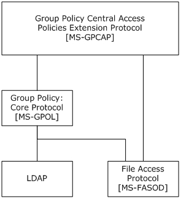

[MS-GPCAP]:

Group Policy: Central Access Policies Protocol Extension

Intellectual Property Rights Notice for Open Specifications Documentation

  Technical Documentation. Microsoft publishes Open Specifications documentation (“this

documentation”) for protocols, file formats, data portability, computer languages, and standards
support. Additionally, overview documents cover inter-protocol relationships and interactions.

  Copyrights. This documentation is covered by Microsoft copyrights. Regardless of any other

terms that are contained in the terms of use for the Microsoft website that hosts this
documentation, you can make copies of it in order to develop implementations of the technologies
that are described in this documentation and can distribute portions of it in your implementations
that use these technologies or in your documentation as necessary to properly document the
implementation. You can also distribute in your implementation, with or without modification, any
schemas, IDLs, or code samples that are included in the documentation. This permission also
applies to any documents that are referenced in the Open Specifications documentation.
  No Trade Secrets. Microsoft does not claim any trade secret rights in this documentation.
  Patents. Microsoft has patents that might cover your implementations of the technologies

described in the Open Specifications documentation. Neither this notice nor Microsoft's delivery of
this documentation grants any licenses under those patents or any other Microsoft patents.
However, a given Open Specifications document might be covered by the Microsoft Open
Specifications Promise or the Microsoft Community Promise. If you would prefer a written license,
or if the technologies described in this documentation are not covered by the Open Specifications
Promise or Community Promise, as applicable, patent licenses are available by contacting
iplg@microsoft.com.

  License Programs. To see all of the protocols in scope under a specific license program and the

associated patents, visit the Patent Map.

  Trademarks. The names of companies and products contained in this documentation might be
covered by trademarks or similar intellectual property rights. This notice does not grant any
licenses under those rights. For a list of Microsoft trademarks, visit
www.microsoft.com/trademarks.

  Fictitious Names. The example companies, organizations, products, domain names, email

addresses, logos, people, places, and events that are depicted in this documentation are fictitious.
No association with any real company, organization, product, domain name, email address, logo,
person, place, or event is intended or should be inferred.

Reservation of Rights. All other rights are reserved, and this notice does not grant any rights other
than as specifically described above, whether by implication, estoppel, or otherwise.

Tools. The Open Specifications documentation does not require the use of Microsoft programming
tools or programming environments in order for you to develop an implementation. If you have access
to Microsoft programming tools and environments, you are free to take advantage of them. Certain
Open Specifications documents are intended for use in conjunction with publicly available standards
specifications and network programming art and, as such, assume that the reader either is familiar
with the aforementioned material or has immediate access to it.

Support. For questions and support, please contact dochelp@microsoft.com.

[MS-GPCAP] - v20240423
Group Policy: Central Access Policies Protocol Extension
Copyright © 2024 Microsoft Corporation
Release: April 23, 2024

1 / 26

Revision Summary

Date

Revision
History

Revision
Class

Comments

3/30/2012

1.0

7/12/2012

1.0

10/25/2012  1.0

1/31/2013

1.0

8/8/2013

2.0

11/14/2013  3.0

2/13/2014

3.0

New

None

None

None

Major

Major

None

Released new document.

No changes to the meaning, language, or formatting of the
technical content.

No changes to the meaning, language, or formatting of the
technical content.

No changes to the meaning, language, or formatting of the
technical content.

Significantly changed the technical content.

Significantly changed the technical content.

No changes to the meaning, language, or formatting of the
technical content.

5/15/2014

3.0

None

No changes to the meaning, language, or formatting of the
technical content.

6/30/2015

4.0

Major

Significantly changed the technical content.

10/16/2015  4.0

None

No changes to the meaning, language, or formatting of the
technical content.

7/14/2016

5.0

Major

Significantly changed the technical content.

6/1/2017

5.0

None

No changes to the meaning, language, or formatting of the
technical content.

9/15/2017

6.0

Major

Significantly changed the technical content.

12/1/2017

6.0

9/12/2018

7.0

4/7/2021

8.0

4/23/2024

9.0

None

Major

Major

Major

No changes to the meaning, language, or formatting of the
technical content.

Significantly changed the technical content.

Significantly changed the technical content.

Significantly changed the technical content.

[MS-GPCAP] - v20240423
Group Policy: Central Access Policies Protocol Extension
Copyright © 2024 Microsoft Corporation
Release: April 23, 2024

2 / 26

## Table of Contents

- [1 Introduction](#1-introduction)
  - [1.1 Glossary](#11-glossary)
  - [1.2 References](#12-references)
    - [1.2.1 Normative References](#121-normative-references)
    - [1.2.2 Informative References](#122-informative-references)
  - [1.3 Overview](#13-overview)
    - [1.3.1 Background](#131-background)
    - [1.3.2 Central Access Policies Protocol Extension Overview](#132-central-access-policies-protocol-extension-overview)
      - [1.3.2.1 Central Access Policy Administration](#1321-central-access-policy-administration)
      - [1.3.2.2 Central Access Policy Configuration Process](#1322-central-access-policy-configuration-process)
  - [1.4 Relationship to Other Protocols](#14-relationship-to-other-protocols)
  - [1.5 Prerequisites/Preconditions](#15-prerequisitespreconditions)
  - [1.6 Applicability Statement](#16-applicability-statement)
  - [1.7 Versioning and Capability Negotiation](#17-versioning-and-capability-negotiation)
  - [1.8 Vendor-Extensible Fields](#18-vendor-extensible-fields)
  - [1.9 Standards Assignments](#19-standards-assignments)
- [2 Messages](#2-messages)
  - [2.1 Transport](#21-transport)
  - [2.2 Message Syntax](#22-message-syntax)
    - [2.2.1 Namespaces](#221-namespaces)
    - [2.2.2 Central Access Policy File Message Format](#222-central-access-policy-file-message-format)
    - [2.2.3 Central Access Policy ID Setting](#223-central-access-policy-id-setting)
  - [2.3 Directory Service Schema Elements](#23-directory-service-schema-elements)
- [3 Protocol Details](#3-protocol-details)
  - [3.1 Central Access Policies Protocol Administrative-Side Extension Details](#31-central-access-policies-protocol-administrative-side-extension-details)
    - [3.1.1 Abstract Data Model](#311-abstract-data-model)
    - [3.1.2 Timers](#312-timers)
    - [3.1.3 Initialization](#313-initialization)
    - [3.1.4 Higher-Layer Triggered Events](#314-higher-layer-triggered-events)
    - [3.1.5 Message Processing Events and Sequencing Rules](#315-message-processing-events-and-sequencing-rules)
      - [3.1.5.1 Load Policy](#3151-load-policy)
      - [3.1.5.2 Update Policy](#3152-update-policy)
      - [3.1.5.3 Delete Setting Value](#3153-delete-setting-value)
    - [3.1.6 Timer Events](#316-timer-events)
    - [3.1.7 Other Local Events](#317-other-local-events)
  - [3.2 Central Access Policy Configuration Client-Side Extension Details](#32-central-access-policy-configuration-client-side-extension-details)
    - [3.2.1 Abstract Data Model](#321-abstract-data-model)
      - [3.2.1.1 Policy Setting State](#3211-policy-setting-state)
    - [3.2.2 Timers](#322-timers)
    - [3.2.3 Initialization](#323-initialization)
    - [3.2.4 Higher Layer Triggered Events](#324-higher-layer-triggered-events)
      - [3.2.4.1 Process Group Policy](#3241-process-group-policy)
    - [3.2.5 Message Processing Events and Sequencing Rules](#325-message-processing-events-and-sequencing-rules)
      - [3.2.5.1 Client-Side Extension Invocation](#3251-client-side-extension-invocation)
      - [3.2.5.2 Client-Side Extension Sequences](#3252-client-side-extension-sequences)
      - [3.2.5.3 Policy State Configuration](#3253-policy-state-configuration)
    - [3.2.6 Timer Events](#326-timer-events)
    - [3.2.7 Other Local Events](#327-other-local-events)
- [4 Protocol Examples](#4-protocol-examples)
  - [4.1 Example of a CAP.inf File](#41-example-of-a-capinf-file)
- [5 Security](#5-security)
  - [5.1 Security Considerations for Implementers](#51-security-considerations-for-implementers)
  - [5.2 Index of Security Parameters](#52-index-of-security-parameters)
- [6 Appendix A: Product Behavior](#6-appendix-a-product-behavior)
- [7 Change Tracking](#7-change-tracking)
- [8 Index](#8-index)

## 1 Introduction

The Group Policy: Central Access Policies Extension allows the configuring of central access policies
(CAPs) on Group Policy client computers.

This protocol extension also contains the mechanisms that enable Group Policy administrators to
retrieve policy files and configure central access policy (CAP) information that is stored in the
Group Policy data store.

Sections 1.5, 1.8, 1.9, 2, and 3 of this specification are normative. All other sections and examples in
this specification are informative.

### 1.1 Glossary

This document uses the following terms:

Active Directory: The Windows implementation of a general-purpose directory service, which uses

LDAP as its primary access protocol. Active Directory stores information about a variety of
objects in the network such as user accounts, computer accounts, groups, and all related
credential information used by Kerberos [MS-KILE]. Active Directory is either deployed as
Active Directory Domain Services (AD DS) or Active Directory Lightweight Directory
Services (AD LDS), which are both described in [MS-ADOD]: Active Directory Protocols
Overview.

Active Directory Domain Services (AD DS): A directory service (DS) implemented by a domain
controller (DC). The DS provides a data store for objects that is distributed across multiple
DCs. The DCs interoperate as peers to ensure that a local change to an object replicates
correctly across DCs.  AD DS is a deployment of Active Directory [MS-ADTS].

Administrative tool: An implementation-specific tool, such as the Group Policy Management
Console, that allows administrators to read and write policy settings from and to a Group
Policy Object (GPO) and policy files. The Group Policy Administrative tool uses the Extension list
of a GPO to determine which Administrative tool extensions are required to read settings from
and write settings to the logical and physical components of a GPO.

Administrative tool extension: A Group Policy extension protocol that is identified by an

Administrative tool extension GUID and invoked by a management entity such as the Group
Policy Management Console. The Administrative tool extension enables the Group Policy
administrator to administer policy settings associated with the specific context provided by the
extension.

Administrative tool extension GUID: A GUID that enables a specific Administrative tool

extension to be associated with settings that are stored in a GPO on the Group Policy server for
that particular extension. The GUID enables the Administrative tool to identify the extension
protocol for which settings are to be administered.

attribute: A characteristic of some object or entity, typically encoded as a name/value pair.

Augmented Backus-Naur Form (ABNF): A modified version of Backus-Naur Form (BNF),

commonly used by Internet specifications. ABNF notation balances compactness and simplicity
with reasonable representational power. ABNF differs from standard BNF in its definitions and
uses of naming rules, repetition, alternatives, order-independence, and value ranges. For more
information, see [RFC5234].

central access policy (CAP): An authorization policy that is specified by a GPO component and

applied to policy targets to facilitate centralized access control of resources.

[MS-GPCAP] - v20240423
Group Policy: Central Access Policies Protocol Extension
Copyright © 2024 Microsoft Corporation
Release: April 23, 2024

5 / 26

central access policy (CAP) object: An object stored in an LDAP directory service, such as

Active Directory, that contains one or more central access rules (CARs), which specify the details
of an authorization policy.

central access rule (CAR): An object that is stored in the Central Access Policy Rules List of a

central access policy (CAP) object. Each CAR contains an authorization policy that specifies the
resources, users, and access conditions to which the rule applies.

client-side extension (CSE): A Group Policy extension that resides locally on the Group Policy

client and is identified by a client-side extension GUID (CSE GUID).

client-side extension GUID (CSE GUID): A GUID  that enables a specific client-side extension
on the Group Policy client to be associated with policy data that is stored in the logical and
physical components of a Group Policy Object (GPO) on the Group Policy server, for that
particular extension.

computer-scoped Group Policy Object path: A scoped Group Policy Object (GPO) path that

ends in "\Machine".

core Group Policy engine: The software entity that implements the Group Policy: Core Protocol
[MS-GPOL]. The core Group Policy engine issues the message sequences that result in core
protocol network traffic during policy application on Group Policy clients. The engine handles
functions on behalf of the core protocol such as the Group Policy refresh interval, GPO and policy
file access, GPO filtering and ordering, and invoking transport protocols for retrieving and
storing policy settings.

domain: A set of users and computers sharing a common namespace and management

infrastructure. At least one computer member of the set has to act as a domain controller
(DC) and host a member list that identifies all members of the domain, as well as optionally
hosting the Active Directory service. The domain controller provides authentication of
members, creating a unit of trust for its members. Each domain has an identifier that is shared
among its members. For more information, see [MS-AUTHSOD] section 1.1.1.5 and [MS-ADTS].

domain controller (DC): The service, running on a server, that implements Active Directory, or
the server hosting this service. The service hosts the data store for objects and interoperates
with other DCs to ensure that a local change to an object replicates correctly across all DCs.
When Active Directory is operating as Active Directory Domain Services (AD DS), the DC
contains full NC replicas of the configuration naming context (config NC), schema naming
context (schema NC), and one of the domain NCs in its forest. If the AD DS DC is a global
catalog server (GC server), it contains partial NC replicas of the remaining domain NCs in its
forest. For more information, see [MS-AUTHSOD] section 1.1.1.5.2 and [MS-ADTS]. When
Active Directory is operating as Active Directory Lightweight Directory Services (AD LDS),
several AD LDS DCs can run on one server. When Active Directory is operating as AD DS,
only one AD DS DC can run on one server. However, several AD LDS DCs can coexist with one
AD DS DC on one server. The AD LDS DC contains full NC replicas of the config NC and the
schema NC in its forest. The domain controller is the server side of Authentication Protocol
Domain Support [MS-APDS].

domain name: The name given by an administrator to a collection of networked computers that

share a common directory. Part of the domain naming service naming structure, domain names
consist of a sequence of name labels separated by periods.

Domain Name System (DNS): A hierarchical, distributed database that contains mappings of
domain names to various types of data, such as IP addresses. DNS enables the location of
computers and services by user-friendly names, and it also enables the discovery of other
information stored in the database.

globally unique identifier (GUID): A term used interchangeably with universally unique

identifier (UUID) in Microsoft protocol technical documents (TDs). Interchanging the usage of
these terms does not imply or require a specific algorithm or mechanism to generate the value.

6 / 26

[MS-GPCAP] - v20240423
Group Policy: Central Access Policies Protocol Extension
Copyright © 2024 Microsoft Corporation
Release: April 23, 2024

Specifically, the use of this term does not imply or require that the algorithms described in
[RFC4122] or [C706] have to be used for generating the GUID. See also universally unique
identifier (UUID).

Group Policy: A mechanism that allows the implementer to specify managed configurations for

users and computers in an Active Directory service environment.

Group Policy administrator: A domain administrator who is responsible for defining policy

settings and managing the Group Policy infrastructure of a domain.

Group Policy client: A client computer that receives and applies settings of a GPO. The Group
Policy client can use client-side extensions to extend the functionality of the Group Policy
protocols.

Group Policy data store: A data store that consists of two types of stores. One is a physical (file
system) data store on the Group Policy file share that contains policy settings (extension and
administrative template data), which can be locally or remotely accessed depending on location.
The other is a logical data store that is part of Active Directory and serves as a repository for
GPOs that are accessible via Lightweight Directory Access Protocol (LDAP).

Group Policy extension: A protocol that extends the functionality of Group Policy. Group Policy

extensions consist of client-side extensions and Administrative tool extensions. They provide
settings and other Group Policy information that can be read from and written to Group Policy
data store components. Group Policy Extensions depend on the Group Policy: Core Protocol, via
the core Group Policy engine, to identify GPOs containing a list of extensions that apply to a
particular Group Policy client.

Group Policy extension GUID: A GUID that identifies a Group Policy Extension, such as a CSE or
Administrative tool extension.  Group Policy extension GUIDs are contained in an extension list
that is an attribute of a GPO that applies to a particular Group Policy client.

Group Policy file share: A file system storage location that contains policy settings that include
extension settings and Group Policy template settings for GPOs. The latter settings consist of
security and registry settings, script files, and application installation information.

Group Policy Object (GPO) path: A domain-based Distributed File System (DFS) path for a

directory on the server that is accessible through the DFS/SMB protocols. This path will always
be a Universal Naming Convention (UNC) path of the form: "\\<dns domain name>\sysvol\<dns
domain name>\policies\<gpo guid>", where <dns domain name> is the DNS domain name of
the domain and <gpo guid> is a Group Policy Object (GPO) GUID.

Group Policy server: A server holding a database of Group Policy Objects (GPOs) that can be
retrieved by other machines. The Group Policy server has to be a domain controller (DC).

Lightweight Directory Access Protocol (LDAP): The primary access protocol for Active

Directory. Lightweight Directory Access Protocol (LDAP) is an industry-standard protocol,
established by the Internet Engineering Task Force (IETF), which allows users to query and
update information in a directory service (DS), as described in [MS-ADTS]. The Lightweight
Directory Access Protocol can be either version 2 [RFC1777] or version 3 [RFC3377].

policy application: The protocol exchange by which a client obtains all of the Group Policy Object
(GPO) and thus all applicable Group Policy settings for a particular policy target from the server,
as specified in [MS-GPOL]. Policy application can operate in two modes, user policy and
computer policy.

policy setting: A statement of the possible behaviors of an element of a domain member

computer's behavior that can be configured by an administrator.

[MS-GPCAP] - v20240423
Group Policy: Central Access Policies Protocol Extension
Copyright © 2024 Microsoft Corporation
Release: April 23, 2024

7 / 26

policy target: A user or computer account for which policy settings can be obtained from a server
in the same domain, as specified in [MS-GPOL]. For user policy mode, the policy target is a user
account. For computer policy mode, the policy target is a computer account.

schema: The set of attributes and object classes that govern the creation and update of objects.

scope of management (SOM): An Active Directory site, domain, or organizational unit

container. These containers contain user and computer accounts that can be managed through
Group Policy. These SOMs are themselves associated with Group Policy Objects (GPOs), and
the accounts within them are considered by the Group Policy Protocol [MS-GPOL] to inherit that
association.

security identifier (SID): An identifier for security principals that is used to identify an account
or a group. Conceptually, the SID is composed of an account authority portion (typically a
domain) and a smaller integer representing an identity relative to the account authority,
termed the relative identifier (RID). The SID format is specified in [MS-DTYP] section 2.4.2; a
string representation of SIDs is specified in [MS-DTYP] section 2.4.2 and [MS-AZOD] section
1.1.1.2.

system volume (SYSVOL): A shared directory that stores the server copy of the domain's public

files that has to be shared for common access and replication throughout a domain.

UTF-8: A byte-oriented standard for encoding Unicode characters, defined in the Unicode standard.

Unless specified otherwise, this term refers to the UTF-8 encoding form specified in
[UNICODE5.0.0/2007] section 3.9.

MAY, SHOULD, MUST, SHOULD NOT, MUST NOT: These terms (in all caps) are used as defined
in [RFC2119]. All statements of optional behavior use either MAY, SHOULD, or SHOULD NOT.

### 1.2 References

Links to a document in the Microsoft Open Specifications library point to the correct section in the
most recently published version of the referenced document. However, because individual documents
in the library are not updated at the same time, the section numbers in the documents may not
match. You can confirm the correct section numbering by checking the Errata.

#### 1.2.1 Normative References

We conduct frequent surveys of the normative references to assure their continued availability. If you
have any issue with finding a normative reference, please contact dochelp@microsoft.com. We will
assist you in finding the relevant information.

[MS-ADA2] Microsoft Corporation, "Active Directory Schema Attributes M".

[MS-ADSC] Microsoft Corporation, "Active Directory Schema Classes".

[MS-ADTS] Microsoft Corporation, "Active Directory Technical Specification".

[MS-DTYP] Microsoft Corporation, "Windows Data Types".

[MS-GPOL] Microsoft Corporation, "Group Policy: Core Protocol".

[RFC2119] Bradner, S., "Key words for use in RFCs to Indicate Requirement Levels", BCP 14, RFC
2119, March 1997, https://www.rfc-editor.org/info/rfc2119

[RFC2251] Wahl, M., Howes, T., and Kille, S., "Lightweight Directory Access Protocol (v3)", RFC 2251,
December 1997, https://www.rfc-editor.org/info/rfc2251

[MS-GPCAP] - v20240423
Group Policy: Central Access Policies Protocol Extension
Copyright © 2024 Microsoft Corporation
Release: April 23, 2024

8 / 26

[RFC4234] Crocker, D., Ed., and Overell, P., "Augmented BNF for Syntax Specifications: ABNF", RFC
4234, October 2005, https://www.rfc-editor.org/info/rfc4234

#### 1.2.2 Informative References

[MS-FASOD] Microsoft Corporation, "File Access Services Protocols Overview".

[MS-GPOD] Microsoft Corporation, "Group Policy Protocols Overview".

### 1.3 Overview

The Group Policy: Central Access Policies Extension is a Group Policy extension that enhances the
functionality of Group Policy. It enables Group Policy administrators to specify CAPs on Group Policy
servers that are to be configured on a Group Policy client computer, such as a file server, for control
of access to resources on those computers. CAPs are only live after they are applied to resources on
Group Policy client computers by a local resource administrator.

Policy settings for the Group Policy: Central Access Policies Extension are specified by one or more
Group Policy Objects (GPOs) that reside in the Group Policy data store. Each GPO contains a logical
component in Active Directory and a physical (file system) component that is stored on a file share,
such as the Group Policy file share, which is either remote or local to the Group Policy server. The
logical component defines policy metadata that is held by GPO attributes and is used to define such
things as the extensions that apply to a client and the file system location where policy settings and
other information is stored. The physical component holds a specially formatted file containing
identifiers that enable an implementation to locate CAP objects in Active Directory, to facilitate the
subsequent configuration of authorization policies on Group Policy client computers. The Group Policy
administrator uses these components to define the central access policy (CAP) configuration that
is applied to a policy target, such as a Group Policy client.

The Group Policy: Central Access Policies Extension protocol implements both a client-side and an
administrative-side extension, the globally unique identifiers (GUIDs) for which are specified in section
1.9. The administrative side, sometimes referred to as an administrative plug-in, is invoked by the
Administrative tool when the Group Policy administrator creates, modifies, or deletes central access
policies. The client side, sometimes referred to as a client plug-in, is invoked to initiate the application
of client access policies on a target computer, such as a Group Policy client.

#### 1.3.1 Background

The Group Policy: Core Protocol specified in [MS-GPOL] allows Group Policy clients to discover and
retrieve the policy settings of Group Policy extensions that are configured by Group Policy
administrators. These settings are persisted within GPOs that are assigned to policy target accounts
in Active Directory, which can include computer accounts and user accounts. Each Group Policy
client uses Lightweight Directory Access Protocol (LDAP), via the core Group Policy engine,
to access the GPOs in Active Directory and to determine which GPOs apply to it by consulting the
scope of management (SOM) configuration. SOM is the collection of GPOs that apply to a set of
policy targets, such as the computer and user accounts contained in sites, domains, or OUs that are
associated with one or more GPOs.

On each Group Policy client, applicable GPOs are interpreted and acted upon by a client-side
extension (CSE). The CSE responsible for a given GPO is specified in a GPO Extension list. Extension
lists are maintained by the gPCMachineExtensionNames and gPCUserExtensionNames attributes
of a GPO, the former of which contains Group Policy extension GUID pairs that apply to computer
policy settings, and the latter of which contain Group Policy extension GUID pairs that apply to user
policy settings. For Group Policy extensions that implement both a client and administrative side,
these attributes contain a list of GUID pairs. The first GUID of each pair is referred to as the client-
side extension GUID (CSE GUID), while the second GUID of each pair is referred to as the
Administrative tool extension GUID. The CSE GUID is typically used by a Group Policy client, via

9 / 26

[MS-GPCAP] - v20240423
Group Policy: Central Access Policies Protocol Extension
Copyright © 2024 Microsoft Corporation
Release: April 23, 2024

the core Group Policy engine, to invoke a CSE (such as the Group Policy: Central Access Policies
Extension defined in this specification) to facilitate the configuration of policy settings for that
extension. The Administrative tool extension GUID is used by the Administrative tool to invoke the
administrative side of an extension protocol during the policy administration process.

Whenever GPOs are created or updated, Group Policy fires the Process Group Policy event, as
specified in section 3.2.4.1, which notifies Group Policy clients of a change in Group Policy by
delivering a list of applicable GPOs. For each GPO, the Group Policy client consults the Extension lists
of the GPO to discover the CSE GUIDs that indicates which CSE on the Group Policy client will handle
the GPO. The Group Policy client then invokes the CSE to handle the policy configuration that is
specified by the GPO.

A CSE uses GPO metadata to locate and retrieve settings that are specific to the CSE, and does so in a
manner that is specific to that CSE. After the CSE-specific settings are retrieved, the CSE uses those
settings to configure policy settings on Group Policy client computers.

For additional background information about Group Policy, refer to the Group Policy Protocols
Overview document [MS-GPOD].

#### 1.3.2 Central Access Policies Protocol Extension Overview

CAP settings identify authorization polices that are defined in Active Directory. More specifically, CAP
settings contain the identifiers of authorization policies that are to be configured on Group Policy
client computers for centralized control of user access to resources. An authorization policy is
specified by a central access rule (CAR) that exists within a CAP object.The Group Policy: Central
Access Policies Extension enables these authorization policies, specified within CAP settings, to be
applied by authorization routines [MS-DTYP] section 2.5.3.2 on Group Policy client computers.

The general sequence in which CAPs are implemented is as follows:

  Author CAPs in Active Directory with an appropriate tool. CAP objects contain one or more central
access rules (CARs), which in turn specify an authorization policy that defines how access to
resources is controlled.



Target specific Group Policy client computers for CAP application through GPO configuration and
assignment.



Invoke the CSE to populate the client-side ADM with CAP configuration data.

  Apply CAPs to individual Group Policy client resources (by a local resource administrator).



Enforce CAP authorization rules on Group Policy client computers.

When a user attempts to access resources that have a CAP that was applied via access to client-side
ADM values, the CAP authorization rules are enforced.

##### 1.3.2.1 Central Access Policy Administration

Policy administration is driven by an Active Directory administrator and a Group Policy
administrator. The administration of central access policies involves creating a CAP object and
associating it with one or more GPOs.

Creating CAPs — An Active Directory administrator authors CAPs in Active Directory by using an
administrative interface that can define authorization policies, such as an Active Directory
Administrative Console. The schema for a CAP object is specified in [MS-ADSC] section 2.97 and the
schema for the object’s attributes is specified in [MS-ADA2] sections 2.123 through 2.129.

Configuring GPOs — Group Policy administrators configure CAP settings in Group Policy by:

[MS-GPCAP] - v20240423
Group Policy: Central Access Policies Protocol Extension
Copyright © 2024 Microsoft Corporation
Release: April 23, 2024

10 / 26

  Using an Administrative tool to create or edit GPOs in Active Directory.

  Associating computer accounts with one or more GPOs.

  Specifying the CAPs for the computer accounts with which one or more GPOs is associated.

The administrative side of the Group Policy: Central Access Policies Extension interacts with the CAP
policy file through an implementation-specific Administrative tool, such as the Group Policy
Management Console. When the administrative-side extension is invoked by the Administrative tool,
the Group Policy administrator can either create a new policy or retrieve and edit an existing one. If
the Group Policy administrator is working with a new CAP policy, then he or she will create and
configure a new GPO in Active Directory, which includes associating the GPO with one or more CAP
objects and setting the GPO's gPCFileSysPath attribute to specify the Group Policy file share
location where CAP policy settings are to be stored. If the Group Policy administrator is retrieving an
existing policy, the GPO data is read and displayed by the Administrative tool and policy settings can
then be modified as required.  After the Group Policy administrator creates or modifies policy settings,
the changes are propagated back into the logical component of the GPO and to the policy file on the
Group Policy file share, via LDAP and a file access protocol, respectively.<1>

##### 1.3.2.2 Central Access Policy Configuration Process

Group Policy clients are notified of changes in Group Policy when Group Policy fires the Process
Group Policy event (section 3.2.4.1).

The CSE of the Group Policy: Central Access Policies Extension protocol does not directly apply CAPs to
Group Policy client computers; rather, it provides the configuration process that populates the
client-side ADM. In turn, the ADM provides accessibility to the state required for the initial application
and update of CAPs on Group Policy client computers via client-side administrative tools. These tools
are run by a local resource administrator when he/she is ready to apply or update CAPs on Group
Policy client computers.

Note  In Group Policy, the periodic application of policy is triggered by the core Group Policy engine
at regular refresh intervals, which is known as background policy application. This is different from
the manual application of CAPs that is initiated by a local resource administrator.

To facilitate the CAP configuration process, CAP settings are retrieved by the CSE of the Group Policy:
Central Access Policies Extension protocol following the trigger of the Process Group Policy event.
The CSE uses LDAP to access the GPOs in Active Directory that contain the identifier-attributes that
specify the location of CAP data, along with the file access protocol location where the policy settings
are stored. The CAP configuration process on Group Policy client computers is then completed when
the CSE performs the following:

  Retrieves the policy file containing the policy settings from the Group Policy file share via file

access protocol sequences.







Parses the file contents to obtain the LDAP distinguished names (DNs) of applicable CAP objects.

Invokes LDAP to retrieve the authorization rules contained in the CAP objects in Active Directory.

Populates the client-side ADM to maintain the state that enables the subsequent manual
application of CAPs on Group Policy client computers.

Authorization policies are manually applied on a Group Policy client computer, such as a file server, by
a local resource administrator with the use of an administrative tool. Following the application of CAPs,
a Group Policy client is authorized to provide access to specific resources that are identified by the
CAPs. For details on how CAPs are evaluated during the authorization process, refer to [MS-DTYP]
section [MS-DTYP] section 2.5.3.2.

[MS-GPCAP] - v20240423
Group Policy: Central Access Policies Protocol Extension
Copyright © 2024 Microsoft Corporation
Release: April 23, 2024

11 / 26

<!-- Extracted images from page 12 -->

<!-- /Extracted images from page 12 -->

### 1.4 Relationship to Other Protocols

The Group Policy: Central Access Policies Extension depends on the Group Policy: Core Protocol
specified in [MS-GPOL], to provide a list, via LDAP, of GPOs that apply to policy target accounts. This
protocol also depends on LDAP for retrieving CAPs. The Group Policy: Central Access Policies Extension
also transmits Group Policy settings and instructions between the Group Policy client and the
Group Policy file share by reading and writing files via a file access protocol.

Note  For an overview of file access concepts, see [MS-FASOD].

The following diagram illustrates the protocol relationships.

Figure 1: Group Policy: Central Access Policies Extension protocol relationships

### 1.5 Prerequisites/Preconditions

The prerequisites for the Group Policy: Central Access Policies Extension are identical to those
specified in [MS-GPOL] section 1.5, in addition to the following:

  A valid CAP object exists in Active Directory.

Note  The schema requirements for CAP objects are specified in section 2.3.

The Group Policy server is a read/write domain controller (DC).

The Group Policy client is capable of discovering and communicating with the Group Policy
server and can connect with Active Directory, as defined in [MS-GPOL] section 3.2.5.1.1.

The Administrative tool is capable of discovering and communicating with the Group Policy
server and can connect with Active Directory, as defined in [MS-GPOL] section 3.2.5.1.1.







### 1.6 Applicability Statement

The Group Policy: Central Access Policies Extension is only applicable within Group Policy.

[MS-GPCAP] - v20240423
Group Policy: Central Access Policies Protocol Extension
Copyright © 2024 Microsoft Corporation
Release: April 23, 2024

12 / 26

### 1.7 Versioning and Capability Negotiation

None.

### 1.8 Vendor-Extensible Fields

None.

### 1.9 Standards Assignments

Standard assignments for the Group Policy: Central Access Policies Extension consist of a CSE GUID
and an Administrative tool extension GUID, as specified in [MS-GPOL] section 1.8. The following
table contains the assignments.

Parameter

CSE GUID

Value

{16be69fa-4209-4250-88cb-716cf41954e0}

Administrative tool extension GUID  {22b007da-4935-4079-9ec5-9c81507cc714}

[MS-GPCAP] - v20240423
Group Policy: Central Access Policies Protocol Extension
Copyright © 2024 Microsoft Corporation
Release: April 23, 2024

13 / 26

## 2 Messages

### 2.1 Transport

The Group Policy: Central Access Policies Extension requires remote access to policy files, as specified
in [MS-GPOL] section 2. All messages specified in section 2.2 of this specification MUST be exchanged
via a file access protocol between the Group Policy client and Group Policy server and between
the Administrative tool and the Group Policy server, assuming that the Group Policy file share is
located on the Group Policy server ( section 1.3). <2>

The core Group Policy engine MUST use this protocol's CSE GUID and Administrative tool
extension GUID values to invoke the client or administrative side of this protocol, respectively, which
in turn invoke LDAP to access GPOs that require processing by this protocol.

### 2.2 Message Syntax

Messages exchanged in Group Policy: Central Access Policies Extension processes carry CAP policy file
data that is transferred via file access sequences. This protocol is driven through the exchange of
these messages, as specified in section 3.

#### 2.2.1 Namespaces

None.

#### 2.2.2 Central Access Policy File Message Format

All CAP policy files processed by the Group Policy: Central Access Policies Extension are UTF-8
encoded and are based on the following file syntax.

 InfFile = UnicodePreamble VersionPreamble Sections
 UnicodePreamble = *("[Unicode]" LineBreak "Unicode=yes"
        LineBreak)
 VersionPreamble = "[Version]" LineBreak "Signature="
        DQUOTE "$Windows NT$" DQUOTE LineBreak "Revision=1" LineBreak
 Sections = Section /  Section Sections
 Section = Header Settings
 Header = "[" HeaderValue "]" LineBreak
 HeaderValue = StringWithSpaces
 Settings = Setting / Setting Settings
 Setting = DQUOTE Value DQUOTE  LineBreak
 Value = String

The preceding syntax is in the Augmented Backus-Naur Form (ABNF) grammar, as specified in
[RFC4234], and is augmented by the following rules.

 LineBreak = CRLF
 StringWithSpaces = String / String Wsp StringWithSpaces
 QuotedString = DQUOTE *(%x20-21 / %x23-7E) DQUOTE
 Wsp = *WSP
 ALPHANUM = ALPHA / DIGIT

Each Value string MUST be a valid LDAP distinguished name, as defined in [MS-ADTS] section
3.1.1.3.1.2.

Note  CAP policy files are stored as .inf files in a subfolder (section 3.1.5.1) of the Machine
subdirectory in the Group Policy Object (GPO) path.

14 / 26

[MS-GPCAP] - v20240423
Group Policy: Central Access Policies Protocol Extension
Copyright © 2024 Microsoft Corporation
Release: April 23, 2024

#### 2.2.3 Central Access Policy ID Setting

This section defines settings that Group Policy administrators use to configure CAP identifiers. These
settings identify the central access policies that are used by the Group Policy client extension for the
configuration of access control policies for Group Policy client computer resources.

HeaderValue  Purpose

CAPS

This value MUST contain one or more settings that describe the LDAP DNs of CAP objects.

 Header = "[" HeaderValue "]" LineBreak
 HeaderValue = "CAPS"
 Settings = Setting / Setting Settings
 Setting = DQUOTE Value DQUOTE LineBreak
 Value = String

Each Value string MUST be a valid LDAP distinguished name, as defined in [MS-ADTS] section
3.1.1.3.1.2. This distinguished name identifies a CAP object, as defined in [MS-ADSC] section 2.97.
The Group Policy: Central Access Policies Extension uses the distinguished name to look up the CAP
object in Active Directory and configure its settings in the Group Policy client computer ADM.

### 2.3 Directory Service Schema Elements

The Group Policy: Central Access Policies Extension accesses the directory service schema  class and
attributes listed in the following table.

For the syntactic specifications of the following schema classes and attributes, refer to Active
Directory Domain Services (AD DS) ([MS-ADSC] sections 2.96 through 2.99; and [MS-ADA2]
sections 2.123 through 2.129).

Class

Attributes

msAuthz-CentralAccessPolicy  msAuthz-CentralAccessPolicyID

msAuthz-MemberRulesInCentralAccessPolicy

msAuthz-MemberRulesInCentralAccessPolicyBL

msAuthz-CentralAccessRule  msAuthz-EffectiveSecurityPolicy

msAuthz-LastEffectiveSecurityPolicy

msAuthz-ProposedSecurityPolicy

msAuthz-ResourceCondition

[MS-GPCAP] - v20240423
Group Policy: Central Access Policies Protocol Extension
Copyright © 2024 Microsoft Corporation
Release: April 23, 2024

15 / 26

## 3 Protocol Details

### 3.1 Central Access Policies Protocol Administrative-Side Extension Details

The administrative side of the Group Policy: Central Access Policies Extension participates in authoring
CAP settings via GPO configuration, as specified in section 1.3.2.1. A central access policy (CAP)
MUST be stored as a text file in ".inf" file format, as specified in section 2.2. The CAP file MUST be
stored in a location that is accessible via RFA sequences.

#### 3.1.1 Abstract Data Model

None.

#### 3.1.2 Timers

None.

#### 3.1.3 Initialization

When the administrative-side extension of this protocol is invoked, it MUST obtain a computer-
scoped Group Policy Object path from the gPCFileSysPath attribute of a GPO via the core Group
Policy engine, as specified in [MS-GPOL] section 2.2.4. It MUST then perform the processing
instructions specified in section 3.1.5.1.

Note  The administrative-side extension of this protocol does not maintain any local state and
therefore does not require local state variables nor any subsequent variable initialization. The
administrative-side extension loads all the settings specified in section 2.2 into memory.

#### 3.1.4 Higher-Layer Triggered Events

The following higher-layer triggered events occur in response to the indicated trigger conditions:

Event

Trigger condition

Load Policy

The Administrative tool is initialized or the Group Policy administrator loads a CAP.inf file
(section 3.1.5.1) for the Group Policy: Central Access Policies Extension.

Update Policy

The Group Policy administrator updates any policy setting value (section 3.1.5.2) for the
Group Policy: Central Access Policies Extension.

Delete
Setting Value

The Group Policy administrator deletes any policy setting value (section 3.1.5.3) for the Group
Policy: Central Access Policies Extension.

#### 3.1.5 Message Processing Events and Sequencing Rules

The administrative-side extension of this protocol invokes a file access protocol to read extension-
specific data from the CAP.inf policy file that is stored in the Group Policy file share and then passes
that information to the Administrative tool. The tool provides an interface that displays the current
extension settings to the Group Policy administrator. If the Group Policy administrator modifies the
existing extension settings, the administrative-side extension invokes the Update Policy event
(section 3.1.5.2).

If a CAP.inf policy file does not yet exist, the administrative-side extension MUST create it in the
remote location specified in section 3.1.5.1 when the Group Policy administrator saves the initial CAP
policy configuration data.

16 / 26

[MS-GPCAP] - v20240423
Group Policy: Central Access Policies Protocol Extension
Copyright © 2024 Microsoft Corporation
Release: April 23, 2024

Note  File names and paths are regarded as case-insensitive. If the File Open or File Write operations
fail, the Administrative tool extension MUST provide an error indication to the Group Policy
administrator that the operation failed.

Note  Each time a policy file is created, modified, or deleted, the administrative-side extension MUST
invoke the Group Policy Extension Update event, as specified in [MS-GPOL] section 3.3.4.4.

##### 3.1.5.1 Load Policy

The Load Policy event occurs when the Group Policy administrator invokes the administrative-side
extension of this protocol and its dynamic linked library (DLL) is loaded into the Administrative tool.
After the administrative-side extension is loaded, it MUST obtain the computer-scoped Group
Policy Object path from the gPCFileSysPath attribute of a GPO via the core Group Policy engine,
as specified in [MS-GPOL] section 2.2.4. The extension MUST then attempt to retrieve data from any
existing CAP.inf file stored in the following location:

<gpo path>\Machine\Microsoft\Windows NT\CAP\

where <gpo path> is the Universal Naming Convention (UNC) path to the physical file share location
where the CAP policy file is stored. For example: "\\<dns domain name>\<GP FS-name>\<dns
domain name>\policies\<gpo guid>", where <dns domain name> is the DNS domain name, and
<gpo guid> is a GPO GUID.

Note  The core Group Policy engine invokes a file access protocol on behalf of the administrative-side
extension when retrieval of CAP data is required.

At this point, the file access protocol MUST perform the file read and parse operations specified in
section 3.2.5.2. If the attempt to read the CAP.inf file fails, an error MUST be logged and processing
MUST be stopped.

##### 3.1.5.2 Update Policy

The Update Policy event occurs when the Group Policy administrator updates the policy settings
in the file system component of a GPO by using the Administrative tool. When policy settings are
modified, the state of the GPO MUST be updated via the following Update Policy message  sequence:

1.

 File access File Open sequence:

The Administrative tool extension MUST first invoke the core Group Policy engine to obtain
the <gpo path>, as specified in [MS-GPOL] section 2.2.4, to locate the CAP.inf file.

The file access File Open operation MUST request write permissions and MUST create the file if it
does not exist. If it does not exist, the operation MUST attempt to write a CAP.inf file to the
following location:

<gpo path>\Machine\Microsoft\Windows NT\CAP\

If the File Open request returns an implementation-specific failure status, the entire Group Policy:
Central Access Policies Extension sequence MUST be terminated.

2.  File access File Write sequences:

The Administrative tool extension MUST perform a series of file writes to overwrite the contents
of the opened file with new policy settings. These file writes MUST continue until the entire file is
written or an error is encountered.

If the File Write request returns an implementation-specific failure status, the entire Group
Policy: Central Access Policies Extension sequence MUST be terminated.

[MS-GPCAP] - v20240423
Group Policy: Central Access Policies Protocol Extension
Copyright © 2024 Microsoft Corporation
Release: April 23, 2024

17 / 26

3.  File access File Close:

The Administrative tool extension MUST then issue a File Close operation.

4.  Providing that no failures occurred, the Administrative tool extension MUST invoke the Group

Policy Extension Update event ([MS-GPOL] section 3.3.4.4).

##### 3.1.5.3 Delete Setting Value

The Delete Setting Value event occurs when the Group Policy administrator deletes a policy
setting value. When a policy setting value is deleted, the setting is removed from memory and the
processing described in section 3.1.5.2 MUST be performed.

#### 3.1.6 Timer Events

None.

#### 3.1.7 Other Local Events

None.

### 3.2 Central Access Policy Configuration Client-Side Extension Details

The CSE of the Group Policy: Central Access Policies Extension interacts with Group Policy as specified
in [MS-GPOL] section 3.2. The CSE MUST retrieve the central access policy (CAP) (section 3.2.5)
and modify the appropriate part of the ADM for each element in the policy, as specified in this section.

#### 3.2.1 Abstract Data Model

This section defines a conceptual model of possible data organization that an implementation
maintains to participate in this protocol. The described organization is provided to explain how the
protocol behaves. This document does not mandate that implementations adhere to this model as long
as their external behavior is consistent with what is described in this document.

##### 3.2.1.1 Policy Setting State

The persistent state configured by the CSE of this protocol is specified herein. The location for storing
this state is implementation-specific.

Note  The abstract interface notation (Public) for an ADM element indicates that the data element can
be directly accessed from outside this protocol.

CentralAccessPolicyDNList: A persistent list of string-valued data elements. The string value of

each element is the LDAP distinguished name of an existing CAP object.

CentralAccessPoliciesList (Public): A persistent list of CentralAccessPolicy objects.

CentralAccessPolicy: A structure data type that contains the following fields.

Field name

Description

CAPID

A security identifier (SID), as specified in [MS-DTYP] section 2.4.2, that
identifies the CentralAccessPolicy object.

CentralAccessPolicyDN

The LDAP distinguished name of the CentralAccessPolicy object.

CentralAccessPolicyRulesList  A list of CentralAccessPolicyRule objects.

18 / 26

[MS-GPCAP] - v20240423
Group Policy: Central Access Policies Protocol Extension
Copyright © 2024 Microsoft Corporation
Release: April 23, 2024

CentralAccessPolicyRule: A structure data type that contains the following fields.

Field name

Description

EffectiveCentralAccessPolicy  A data element of type CentralAccessPolicyCondition containing the

effective access policy for the CentralAccessPolicyRule. The schema class for
a CentralAccessPolicyRule is defined in [MS-ADSC] section 2.98.

StagedCentralAccessPolicy

A data element of type CentralAccessPolicyCondition containing the staged
access policy for the CentralAccessPolicyRule. The schema class for a
CentralAccessPolicyRule is defined in [MS-ADSC] section 2.98.

CentralAccessPolicyCondition: A structure data type that contains the following fields.

Field name

Description

AppliesToPredicate  An ACCESS_ALLOWED_CALLBACK_ACE value ([MS-DTYP] section 2.4.4.6) that contains
the condition that defines the scope of the resources to which the
CentralAccessPolicyEntry data element applies.

AccessCondition

A security descriptor value ([MS-DTYP] section 2.4.6) that contains the access condition
for the CentralAccessPolicyEntry data element.

#### 3.2.2 Timers

None.

#### 3.2.3 Initialization

When the CSE of the Group Policy: Central Access Policies Extension protocol is invoked by Group
Policy, and a list of one or more applicable GPOs is provided for updates, the CSE MUST do the
following:

1.  Locate all the CAP.inf policy files specified by the metadata of each GPO.

Central access policy files MUST be located by performing the tasks outlined in [MS-GPOL]
section 3.2.5.1, which includes sending the appropriate LDAP SearchRequests ([RFC2251]
section 4.5) to query GPOs in Active Directory.

2.  Copy the policy files to the Group Policy client computer.

3.  Read the policy files to determine the location of CAP objects in Active Directory.

4.  Configure the client-side ADM, as specified in section 3.2.5.

Note  The policy files MUST be copied and read by using file access sequences.

#### 3.2.4 Higher Layer Triggered Events

The CSE of this protocol receives the following higher-layer triggered event:

  Process Group Policy (section 3.2.4.1).

[MS-GPCAP] - v20240423
Group Policy: Central Access Policies Protocol Extension
Copyright © 2024 Microsoft Corporation
Release: April 23, 2024

19 / 26

##### 3.2.4.1 Process Group Policy

The CSE of Group Policy: Central Access Policies Extension protocol implements the Process Group
Policy abstract event interface, as specified in [MS-GPOL] section 3.2.4.1. The CSE does not make
use of the Deleted GPO list, SessionFlags, or the SecurityToken logical parameters of the event;
rather, it only requires the New or Changed GPO list parameter. When the event is triggered, the CSE
MUST perform the actions specified in section 3.2.5.

#### 3.2.5 Message Processing Events and Sequencing Rules

##### 3.2.5.1 Client-Side Extension Invocation

The CSE of the Group Policy: Central Access Policies Extension protocol MUST be invoked by the
Process Group Policy event specified in [MS-GPOL] section 3.2.5.1.10 whenever applicable GPOs
require processing on the Group Policy client, as determined by the policy application process
specified in [MS-GPOL] section 3.2.5.1. When this occurs, the CSE of this protocol MUST perform the
actions specified in sections 3.2.5.2 and 3.2.5.3.

##### 3.2.5.2 Client-Side Extension Sequences

When invoked by the Process Group Policy event, the CSE attempts to retrieve the list of applicable
GPOs from the New or changed GPOs logical parameter of the event. The CSE MUST then iterate
through this list and locate and retrieve the central access policy file (CAP.inf) in the path specified by
the gPCFileSysPath attribute of each GPO. For each GPO, one file with the format specified in section
2.2 MUST be copied from the Group Policy file share to the local computer.

For each GPO, the CSE of this protocol MUST generate the following file access sequences when
processing each CAP.inf file:

Sequence  Description

File Open

The CSE MUST attempt to open the file specified in the following location: <scoped gpo
path>\Microsoft\Windows NT\CAP\cap.inf.

File Read

Until an error occurs, one or more file reads MUST be performed to read the entire contents of the
opened file.

File Close

A file close operation MUST be performed.

Note  If any file cannot be read, the CSE MUST log information about the failure and continue to
process CAP.inf files specified by other GPOs.

Each file MUST be parsed according to the format specified in section 2.2. If the file does not conform
to the specified format, the entire operation for that file MUST be ignored. If the file does conform to
the specified format, each distinguished name Value specified in Settings in the CAP.inf file (section
2.2.2) MUST be added to the CentralAccessPolicyDNList ADM element described in section 3.2.1.1.

##### 3.2.5.3 Policy State Configuration

After all the distinguished name values are retrieved, the CSE MUST perform the following steps for
each entry in the CentralAccessPolicyDNList ADM element. If any LDAP operations fail, the
corresponding distinguished name entry MUST be ignored.

1.  Perform an LDAP bind to the CAP object in Active Directory by using the LDAP distinguished
name specified by the CentralAccessPolicyDNList ADM element entry value, as created in
section 3.2.5.2.

[MS-GPCAP] - v20240423
Group Policy: Central Access Policies Protocol Extension
Copyright © 2024 Microsoft Corporation
Release: April 23, 2024

20 / 26

2.  Create a new CentralAccessPolicy ADM element and add it to the CentralAccessPoliciesList

ADM element. Populate the fields of this element as follows:

  Set the value of the CAPID field of this new CentralAccessPoliciesList ADM element entry
to the value obtained by performing an LDAP read of the msAuthz-CentralAccessPolicyID
attribute on the object that was bound to in step 1.

  Set the CentralAccessPolicyDN ADM field value of this new entry to the LDAP distinguished

name of the CAP object that was bound to in step 1.

  Create a new CentralAccessPolicyRulesList ADM structure.





Perform an LDAP read of the msAuthz-MemberRulesInCentralAccessPolicy attribute of
the CAP object bound to in step 1 to obtain the list of DNs of CAR object rule entries. If this
list is empty, ignore this entry.

For each CAR object distinguished name in the list obtained in step 2 bullet 4, create a new
CentralAccessPolicyRule ADM structure, perform an LDAP bind on the CAR object by using
the distinguished name, and then do the following:

  Set the value of the AppliesToPredicate data element field of the

EffectiveCentralAccessPolicy data element field of the CentralAccessPolicyRule
structure to the binary equivalent of the security descriptor definition language (SDDL)
([MS-DTYP] section 2.5.1) string value obtained by performing an LDAP read of the
msAuthz-ResourceCondition attribute of the CAR object bound to in step 2 bullet 5.

  Set the value of the AccessCondition ADM element field of the

EffectiveCentralAccessPolicy ADM element field of the CentralAccessPolicyRule
structure to the binary equivalent of the SDDL string value obtained by performing an
LDAP read of the msAuthz-EffectiveSecurityPolicy attribute of the CAR object bound to
in step 2 bullet 5.

  Set the value of the AppliesToPredicate data element field of the

StagedCentralAccessPolicy data element field of the CentralAccessPolicyRule
structure to the binary equivalent of the SDDL string value obtained by performing an
LDAP read of the msAuthz-ResourceCondition attribute of the CAR object bound to in
step 2 bullet 5.

  Set the value of the AccessCondition data element field of the

StagedCentralAccessPolicy data element field of the CentralAccessPolicyRule
structure to the binary equivalent of the SDDL string value obtained by performing an
LDAP read of the msAuthz-ProposedSecurityPolicy attribute of the CAR object bound
to in step 2 bullet 5.

  Add the populated CentralAccessPolicyRule ADM structure created in step 2 bullet 5 to the

CentralAccessPolicyRulesList ADM structure created in step 2 bullet 3.

3.  Add the CentralAccessPolicyRulesList ADM structure created in step 2 bullet 3 to the

CentralAccessPolicy ADM structure created in step 2.

#### 3.2.6 Timer Events

None.

#### 3.2.7 Other Local Events

None.

[MS-GPCAP] - v20240423
Group Policy: Central Access Policies Protocol Extension
Copyright © 2024 Microsoft Corporation
Release: April 23, 2024

21 / 26

## 4 Protocol Examples

### 4.1 Example of a CAP.inf File

[Version]

Signature="$Windows NT$"

[CAPS]

"CN=LCA Document Access,CN=Central Access Policies,CN=Claims
Configuration,CN=Services,CN=Configuration,DC=DMM-
CBACDOM,DC=nttest,DC=microsoft,DC=com"

"CN=MSIT Corporate Standard Access Policy,CN=Central Access Policies,CN=Claims
Configuration,CN=Services,CN=Configuration,DC=DMM-
CBACDOM,DC=nttest,DC=microsoft,DC=com"

[MS-GPCAP] - v20240423
Group Policy: Central Access Policies Protocol Extension
Copyright © 2024 Microsoft Corporation
Release: April 23, 2024

22 / 26

## 5 Security

### 5.1 Security Considerations for Implementers

A central access policy defines an authorization policy that controls access to resources. Write
permissions on central access policies enable a user to modify the authorization policy. Central access
control policies are designed to be managed centrally and not be edited on client computers.
Therefore, it is important to store central access control policies on client computers in secure
locations to which only system processes have access.

### 5.2 Index of Security Parameters

None.

[MS-GPCAP] - v20240423
Group Policy: Central Access Policies Protocol Extension
Copyright © 2024 Microsoft Corporation
Release: April 23, 2024

23 / 26

## 6 Appendix A: Product Behavior

The information in this specification is applicable to the following Microsoft products or supplemental
software. References to product versions include updates to those products.

  Windows Server 2012 operating system

  Windows Server 2012 R2 operating system

  Windows Server 2016 operating system

  Windows Server operating system

  Windows Server 2019 operating system

  Windows Server 2022 operating system

  Windows Server 2025 operating system

Exceptions, if any, are noted in this section. If an update version, service pack or Knowledge Base
(KB) number appears with a product name, the behavior changed in that update. The new behavior
also applies to subsequent updates unless otherwise specified. If a product edition appears with the
product version, behavior is different in that product edition.

Unless otherwise specified, any statement of optional behavior in this specification that is prescribed
using the terms "SHOULD" or "SHOULD NOT" implies product behavior in accordance with the
SHOULD or SHOULD NOT prescription. Unless otherwise specified, the term "MAY" implies that the
product does not follow the prescription.

<1> Section 1.3.2.1:  In Windows, Group Policy and this protocol extension use file access services
protocols (see [MS-FASOD] for file access operations.

<2> Section 2.1: In Windows, the Group Policy file share repository is a system volume
(SYSVOL) share on the Group Policy server.

[MS-GPCAP] - v20240423
Group Policy: Central Access Policies Protocol Extension
Copyright © 2024 Microsoft Corporation
Release: April 23, 2024

24 / 26

## 7 Change Tracking

This section identifies changes that were made to this document since the last release. Changes are
classified as Major, Minor, or None.

The revision class Major means that the technical content in the document was significantly revised.
Major changes affect protocol interoperability or implementation. Examples of major changes are:

  A document revision that incorporates changes to interoperability requirements.
  A document revision that captures changes to protocol functionality.

The revision class Minor means that the meaning of the technical content was clarified. Minor changes
do not affect protocol interoperability or implementation. Examples of minor changes are updates to
clarify ambiguity at the sentence, paragraph, or table level.

The revision class None means that no new technical changes were introduced. Minor editorial and
formatting changes may have been made, but the relevant technical content is identical to the last
released version.

The changes made to this document are listed in the following table. For more information, please
contact dochelp@microsoft.com.

Section

Description

6 Appendix A: Product
Behavior

Added Windows Server 2025 to the list of applicable
products.

Revision
class

Major

[MS-GPCAP] - v20240423
Group Policy: Central Access Policies Protocol Extension
Copyright © 2024 Microsoft Corporation
Release: April 23, 2024

25 / 26

R

References 8
   informative 9
   normative 8
Relationship to other protocols 12

S

Schema elements - directory service 15
Security
   implementer considerations 23
   parameter index 23
Standards assignments 13

T

Tracking changes 25
Transport 14

V

Vendor-extensible fields 13
Versioning 13

## 8 Index
A

Applicability 12

C

Capability negotiation 13
Central Access Policy File Message Format message

14

Central Access Policy ID Setting message 15
Change tracking 25

D

Directory service schema elements 15

E

Elements - directory service schema 15

F

Fields - vendor-extensible 13

G

Glossary 5

I

Implementer - security considerations 23
Index of security parameters 23
Informative references 9
Introduction 5

M

Messages
   Central Access Policy File Message Format 14
   Central Access Policy ID Setting 15
   Central Access Policy ID Setting message 15
   Namespaces 14
   Namespaces message 14
   transport 14

N

Namespaces message 14
Normative references 8

O

Overview (synopsis) 9

P

Parameters - security index 23
Preconditions 12
Prerequisites 12
Product behavior 24

[MS-GPCAP] - v20240423
Group Policy: Central Access Policies Protocol Extension
Copyright © 2024 Microsoft Corporation
Release: April 23, 2024

26 / 26

