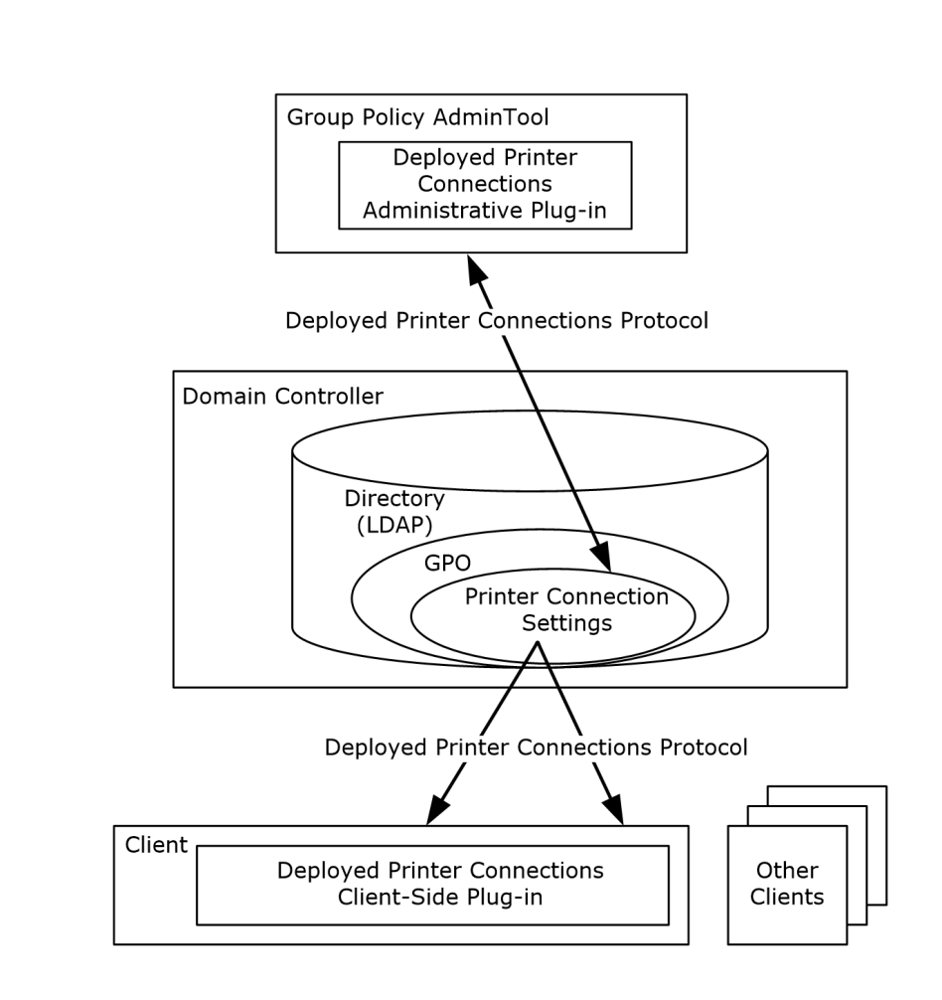
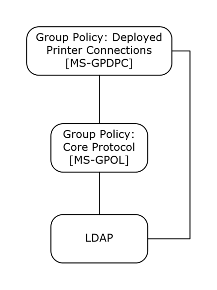

[MS-GPDPC]:

Group Policy: Deployed Printer Connections Extension

Intellectual Property Rights Notice for Open Specifications Documentation

  Technical Documentation. Microsoft publishes Open Specifications documentation (“this

documentation”) for protocols, file formats, data portability, computer languages, and standards
support. Additionally, overview documents cover inter-protocol relationships and interactions.

  Copyrights. This documentation is covered by Microsoft copyrights. Regardless of any other

terms that are contained in the terms of use for the Microsoft website that hosts this
documentation, you can make copies of it in order to develop implementations of the technologies
that are described in this documentation and can distribute portions of it in your implementations
that use these technologies or in your documentation as necessary to properly document the
implementation. You can also distribute in your implementation, with or without modification, any
schemas, IDLs, or code samples that are included in the documentation. This permission also
applies to any documents that are referenced in the Open Specifications documentation.
  No Trade Secrets. Microsoft does not claim any trade secret rights in this documentation.
  Patents. Microsoft has patents that might cover your implementations of the technologies

described in the Open Specifications documentation. Neither this notice nor Microsoft's delivery of
this documentation grants any licenses under those patents or any other Microsoft patents.
However, a given Open Specifications document might be covered by the Microsoft Open
Specifications Promise or the Microsoft Community Promise. If you would prefer a written license,
or if the technologies described in this documentation are not covered by the Open Specifications
Promise or Community Promise, as applicable, patent licenses are available by contacting
iplg@microsoft.com.

  License Programs. To see all of the protocols in scope under a specific license program and the

associated patents, visit the Patent Map.

  Trademarks. The names of companies and products contained in this documentation might be
covered by trademarks or similar intellectual property rights. This notice does not grant any
licenses under those rights. For a list of Microsoft trademarks, visit
www.microsoft.com/trademarks.

  Fictitious Names. The example companies, organizations, products, domain names, email

addresses, logos, people, places, and events that are depicted in this documentation are fictitious.
No association with any real company, organization, product, domain name, email address, logo,
person, place, or event is intended or should be inferred.

Reservation of Rights. All other rights are reserved, and this notice does not grant any rights other
than as specifically described above, whether by implication, estoppel, or otherwise.

Tools. The Open Specifications documentation does not require the use of Microsoft programming
tools or programming environments in order for you to develop an implementation. If you have access
to Microsoft programming tools and environments, you are free to take advantage of them. Certain
Open Specifications documents are intended for use in conjunction with publicly available standards
specifications and network programming art and, as such, assume that the reader either is familiar
with the aforementioned material or has immediate access to it.

Support. For questions and support, please contact dochelp@microsoft.com.

[MS-GPDPC] - v20240423
Group Policy: Deployed Printer Connections Extension
Copyright © 2024 Microsoft Corporation
Release: April 23, 2024

1 / 32

Revision Summary

Date

Revision
History

Revision
Class

Comments

3/2/2007

1.0

4/3/2007

1.1

5/11/2007

1.2

New

Minor

Minor

Version 1.0 release

Version 1.1 release

Version 1.2 release

6/1/2007

1.2.1

Editorial

Changed language and formatting in the technical content.

7/3/2007

1.2.2

Editorial

Changed language and formatting in the technical content.

8/10/2007

1.2.3

Editorial

Changed language and formatting in the technical content.

9/28/2007

1.2.4

Editorial

Changed language and formatting in the technical content.

10/23/2007  2.0

Major

Converted document to unified format.

1/25/2008

2.0.1

Editorial

Changed language and formatting in the technical content.

3/14/2008

3.0

6/20/2008

4.0

Major

Major

Updated and revised the technical content.

Updated and revised the technical content.

7/25/2008

4.0.1

Editorial

Changed language and formatting in the technical content.

8/29/2008

5.0

Major

Updated and revised the technical content.

10/24/2008  5.0.1

Editorial

Changed language and formatting in the technical content.

12/5/2008

5.1

Minor

Clarified the meaning of the technical content.

1/16/2009

5.1.1

Editorial

Changed language and formatting in the technical content.

2/27/2009

5.1.2

Editorial

Changed language and formatting in the technical content.

4/10/2009

5.1.3

Editorial

Changed language and formatting in the technical content.

5/22/2009

5.1.4

Editorial

Changed language and formatting in the technical content.

7/2/2009

5.2

8/14/2009

5.3

9/25/2009

5.4

Minor

Minor

Minor

Clarified the meaning of the technical content.

Clarified the meaning of the technical content.

Clarified the meaning of the technical content.

11/6/2009

5.4.1

Editorial

Changed language and formatting in the technical content.

12/18/2009  5.4.2

Editorial

Changed language and formatting in the technical content.

1/29/2010

5.5

Minor

Clarified the meaning of the technical content.

3/12/2010

5.5.1

Editorial

Changed language and formatting in the technical content.

4/23/2010

5.5.2

Editorial

Changed language and formatting in the technical content.

6/4/2010

5.6

7/16/2010

5.7

8/27/2010

5.7

Minor

Minor

None

Clarified the meaning of the technical content.

Clarified the meaning of the technical content.

No changes to the meaning, language, or formatting of the
technical content.

[MS-GPDPC] - v20240423
Group Policy: Deployed Printer Connections Extension
Copyright © 2024 Microsoft Corporation
Release: April 23, 2024

2 / 32

Date

Revision
History

Revision
Class

Comments

10/8/2010

5.7

11/19/2010  5.7

1/7/2011

5.7

2/11/2011

6.0

3/25/2011

7.0

5/6/2011

8.0

6/17/2011

8.1

9/23/2011

8.2

12/16/2011  9.0

3/30/2012

9.0

7/12/2012

9.0

10/25/2012  9.0

1/31/2013

9.0

None

None

None

Major

Major

Major

Minor

Minor

Major

None

None

None

None

No changes to the meaning, language, or formatting of the
technical content.

No changes to the meaning, language, or formatting of the
technical content.

No changes to the meaning, language, or formatting of the
technical content.

Updated and revised the technical content.

Updated and revised the technical content.

Updated and revised the technical content.

Clarified the meaning of the technical content.

Clarified the meaning of the technical content.

Updated and revised the technical content.

No changes to the meaning, language, or formatting of the
technical content.

No changes to the meaning, language, or formatting of the
technical content.

No changes to the meaning, language, or formatting of the
technical content.

No changes to the meaning, language, or formatting of the
technical content.

8/8/2013

10.0

Major

Updated and revised the technical content.

11/14/2013  10.0

None

No changes to the meaning, language, or formatting of the
technical content.

2/13/2014

10.0

None

No changes to the meaning, language, or formatting of the
technical content.

5/15/2014

10.0

None

No changes to the meaning, language, or formatting of the
technical content.

6/30/2015

11.0

Major

Significantly changed the technical content.

10/16/2015  11.0

None

No changes to the meaning, language, or formatting of the
technical content.

7/14/2016

11.0

None

No changes to the meaning, language, or formatting of the
technical content.

6/1/2017

11.0

9/15/2017

12.0

9/12/2018

13.0

4/7/2021

14.0

6/25/2021

15.0

None

Major

Major

Major

Major

No changes to the meaning, language, or formatting of the
technical content.

Significantly changed the technical content.

Significantly changed the technical content.

Significantly changed the technical content.

Significantly changed the technical content.

[MS-GPDPC] - v20240423
Group Policy: Deployed Printer Connections Extension
Copyright © 2024 Microsoft Corporation
Release: April 23, 2024

3 / 32

Date

Revision
History

Revision
Class

Comments

4/23/2024

16.0

Major

Significantly changed the technical content.

[MS-GPDPC] - v20240423
Group Policy: Deployed Printer Connections Extension
Copyright © 2024 Microsoft Corporation
Release: April 23, 2024

4 / 32

## Table of Contents

- [1 Introduction](#1-introduction)
  - [1.1 Glossary](#11-glossary)
  - [1.2 References](#12-references)
    - [1.2.1 Normative References](#121-normative-references)
    - [1.2.2 Informative References](#122-informative-references)
  - [1.3 Overview](#13-overview)
    - [1.3.1 Background](#131-background)
    - [1.3.2 Deployed Printer Connections](#132-deployed-printer-connections)
      - [1.3.2.1 Administrative Scenario](#1321-administrative-scenario)
      - [1.3.2.2 Client Scenario](#1322-client-scenario)
  - [1.4 Relationship to Other Protocols](#14-relationship-to-other-protocols)
  - [1.5 Prerequisites/Preconditions](#15-prerequisitespreconditions)
  - [1.6 Applicability Statement](#16-applicability-statement)
  - [1.7 Versioning and Capability Negotiation](#17-versioning-and-capability-negotiation)
  - [1.8 Vendor-Extensible Fields](#18-vendor-extensible-fields)
  - [1.9 Standards Assignments](#19-standards-assignments)
- [2 Messages](#2-messages)
  - [2.1 Transport](#21-transport)
  - [2.2 Message Syntax](#22-message-syntax)
    - [2.2.1 Deployed Printer Connection Setting Creation Messages](#221-deployed-printer-connection-setting-creation-messages)
      - [2.2.1.1 PushedPrinterConnections Container Creation](#2211-pushedprinterconnections-container-creation)
      - [2.2.1.2 Printer Connections Creation](#2212-printer-connections-creation)
    - [2.2.2 Deployed Printer Connection Setting Deletion Message](#222-deployed-printer-connection-setting-deletion-message)
    - [2.2.3 Common LDAP Messages](#223-common-ldap-messages)
      - [2.2.3.1 LDAP SearchRequest Message](#2231-ldap-searchrequest-message)
      - [2.2.3.2 LDAP SearchResultEntry Message](#2232-ldap-searchresultentry-message)
  - [2.3 Directory Service Schema Elements](#23-directory-service-schema-elements)
- [3 Protocol Details](#3-protocol-details)
  - [3.1 Administrative Tool Plug-in Details](#31-administrative-tool-plug-in-details)
    - [3.1.1 Abstract Data Model](#311-abstract-data-model)
    - [3.1.2 Timers](#312-timers)
    - [3.1.3 Initialization](#313-initialization)
    - [3.1.4 Higher-Layer Triggered Events](#314-higher-layer-triggered-events)
    - [3.1.5 Message Processing Events and Sequencing Rules](#315-message-processing-events-and-sequencing-rules)
      - [3.1.5.1 Adding a Printer Connection](#3151-adding-a-printer-connection)
      - [3.1.5.2 Deleting a Printer Connection](#3152-deleting-a-printer-connection)
      - [3.1.5.3 Retrieving Connection Policy Objects](#3153-retrieving-connection-policy-objects)
    - [3.1.6 Timer Events](#316-timer-events)
    - [3.1.7 Other Local Events](#317-other-local-events)
  - [3.2 Client-Side Plug-in Details](#32-client-side-plug-in-details)
    - [3.2.1 Abstract Data Model](#321-abstract-data-model)
    - [3.2.2 Timers](#322-timers)
    - [3.2.3 Initialization](#323-initialization)
    - [3.2.4 Higher-Layer Triggered Events](#324-higher-layer-triggered-events)
      - [3.2.4.1 Process Group Policy](#3241-process-group-policy)
    - [3.2.5 Message Processing Events and Sequencing Rules](#325-message-processing-events-and-sequencing-rules)
      - [3.2.5.1 Retrieving Connection Policy Objects](#3251-retrieving-connection-policy-objects)
    - [3.2.6 Timer Events](#326-timer-events)
    - [3.2.7 Other Local Events](#327-other-local-events)
- [4 Protocol Examples](#4-protocol-examples)
- [5 Security](#5-security)
  - [5.1 Security Considerations for Implementers](#51-security-considerations-for-implementers)
  - [5.2 Index of Security Parameters](#52-index-of-security-parameters)
- [6 Appendix A: Product Behavior](#6-appendix-a-product-behavior)
- [7 Change Tracking](#7-change-tracking)
- [8 Index](#8-index)

## 1 Introduction

The Group Policy: Deployed Printer Connections Extension supports managing connections to printers
that are hosted by print servers and shared by multiple users.

A Deployed Printer Connections protocol implementation consists of server and client components. The
server component allows a network administrator to configure the printer connections. The client
component allows a user to discover the printer connections that have been configured.

Sections 1.5, 1.8, 1.9, 2, and 3 of this specification are normative. All other sections and examples in
this specification are informative.

### 1.1 Glossary

This document uses the following terms:

Active Directory: The Windows implementation of a general-purpose directory service, which

uses LDAP as its primary access protocol. Active Directory stores information about a variety of
objects in the network such as user accounts, computer accounts, groups, and all related
credential information used by Kerberos [MS-KILE]. Active Directory is either deployed as
Active Directory Domain Services (AD DS) or Active Directory Lightweight Directory Services
(AD LDS), which are both described in [MS-ADOD]: Active Directory Protocols Overview.

Active Directory object: A set of directory objects that are used within Active Directory as

defined in [MS-ADTS] section 3.1.1. An Active Directory object can be identified by a dsname.
See also directory object.

Administrative tool: An implementation-specific tool, such as the Group Policy Management
Console, that allows administrators to read and write policy settings from and to a Group
Policy Object (GPO) and policy files. The Group Policy Administrative tool uses the Extension
list of a GPO to determine which Administrative tool extensions are required to read settings
from and write settings to the logical and physical components of a GPO.

client-side extension GUID (CSE GUID): A GUID  that enables a specific client-side extension
on the Group Policy client to be associated with policy data that is stored in the logical and
physical components of a Group Policy Object (GPO) on the Group Policy server, for that
particular extension.

computer policy mode: A mode of policy application intended to retrieve settings for the

computer account of the client.

curly braced GUID string: The string representation of a 128-bit globally unique identifier

(GUID) using the form {XXXXXXXX-XXXX-XXXX-XXXX-XXXXXXXXXXXX}, where X denotes a
hexadecimal digit. The string representation between the enclosing braces is the standard
representation of a GUID as described in [RFC4122] section 3. Unlike a GUIDString, a curly
braced GUID string includes enclosing braces.

directory service (DS): A service that stores and organizes information about a computer

network's users and network shares, and that allows network administrators to manage users'
access to the shares. See also Active Directory.

directory string: A string encoded in UTF-8 as defined in [RFC2252] section 6.10.

distinguished name (DN): In Lightweight Directory Access Protocol (LDAP), an LDAP

Distinguished Name, as described in [RFC2251] section 4.1.3. The DN of an object is the DN of
its parent, preceded by the RDN of the object. For example: CN=David Thompson, OU=Users,
DC=Microsoft, DC=COM. For definitions of CN and OU, see [RFC2256] sections 5.4 and 5.12,
respectively.

7 / 32

[MS-GPDPC] - v20240423
Group Policy: Deployed Printer Connections Extension
Copyright © 2024 Microsoft Corporation
Release: April 23, 2024

domain: A set of users and computers sharing a common namespace and management

infrastructure. At least one computer member of the set has to act as a domain controller
(DC) and host a member list that identifies all members of the domain, as well as optionally
hosting the Active Directory service. The domain controller provides authentication of
members, creating a unit of trust for its members. Each domain has an identifier that is shared
among its members. For more information, see [MS-AUTHSOD] section 1.1.1.5 and [MS-ADTS].

domain controller (DC): The service, running on a server, that implements Active Directory, or
the server hosting this service. The service hosts the data store for objects and interoperates
with other DCs to ensure that a local change to an object replicates correctly across all DCs.
When Active Directory is operating as Active Directory Domain Services (AD DS), the DC
contains full NC replicas of the configuration naming context (config NC), schema naming
context (schema NC), and one of the domain NCs in its forest. If the AD DS DC is a global
catalog server (GC server), it contains partial NC replicas of the remaining domain NCs in its
forest. For more information, see [MS-AUTHSOD] section 1.1.1.5.2 and [MS-ADTS]. When
Active Directory is operating as Active Directory Lightweight Directory Services (AD LDS),
several AD LDS DCs can run on one server. When Active Directory is operating as AD DS, only
one AD DS DC can run on one server. However, several AD LDS DCs can coexist with one AD
DS DC on one server. The AD LDS DC contains full NC replicas of the config NC and the schema
NC in its forest. The domain controller is the server side of Authentication Protocol Domain
Support [MS-APDS].

fully qualified domain name (FQDN): An unambiguous domain name that gives an absolute

location in the Domain Name System's (DNS) hierarchy tree, as defined in [RFC1035] section
3.1 and [RFC2181] section 11.

globally unique identifier (GUID): A term used interchangeably with universally unique

identifier (UUID) in Microsoft protocol technical documents (TDs). Interchanging the usage of
these terms does not imply or require a specific algorithm or mechanism to generate the value.
Specifically, the use of this term does not imply or require that the algorithms described in
[RFC4122] or [C706] have to be used for generating the GUID. See also universally unique
identifier (UUID).

Group Policy: A mechanism that allows the implementer to specify managed configurations for

users and computers in an Active Directory service environment.

Group Policy Object (GPO): A collection of administrator-defined specifications of the policy
settings that can be applied to groups of computers in a domain. Each GPO includes two
elements: an object that resides in the Active Directory for the domain, and a corresponding
file system subdirectory that resides on the sysvol DFS share of the Group Policy server for the
domain.

Group Policy Object (GPO) GUID: A curly braced GUID string that uniquely identifies a

Group Policy Object (GPO).

Kerberos: An authentication system that enables two parties to exchange private information

across an otherwise open network by assigning a unique key (called a ticket) to each user that
logs on to the network and then embedding these tickets into messages sent by the users. For
more information, see [MS-KILE].

Lightweight Directory Access Protocol (LDAP): The primary access protocol for Active

Directory. Lightweight Directory Access Protocol (LDAP) is an industry-standard protocol,
established by the Internet Engineering Task Force (IETF), which allows users to query and
update information in a directory service (DS), as described in [MS-ADTS]. The Lightweight
Directory Access Protocol can be either version 2 [RFC1777] or version 3 [RFC3377].

machine connection: A connection to a printer that is shared from a print server from a client

machine. The connection can be displayed in the user interface as a printer. Machine
connections are displayed to all users in all user environments of a particular client machine.

8 / 32

[MS-GPDPC] - v20240423
Group Policy: Deployed Printer Connections Extension
Copyright © 2024 Microsoft Corporation
Release: April 23, 2024

policy application: The protocol exchange by which a client obtains all of the Group Policy

Object (GPO) and thus all applicable Group Policy settings for a particular policy target from
the server, as specified in [MS-GPOL]. Policy application can operate in two modes, user policy
and computer policy.

policy setting: A statement of the possible behaviors of an element of a domain member

computer's behavior that can be configured by an administrator.

policy target: A user or computer account for which policy settings can be obtained from a server
in the same domain, as specified in [MS-GPOL]. For user policy mode, the policy target is a user
account. For computer policy mode, the policy target is a computer account.

print server: A machine that hosts the print system and all its different components.

scoped Group Policy Object (GPO) distinguished name (DN): A Group Policy Object (GPO)
distinguished name (DN) where the set of "CN=<cn>" elements is prepended with "CN=User"
for the user policy mode of policy application and with "CN=Machine" for computer policy
mode.

scoped Group Policy Object (GPO) path: A Group Policy Object (GPO) path appended with
"\User" for the user policy mode of policy application, and "\Machine" for the computer
policy mode.

Simple and Protected GSS-API Negotiation Mechanism (SPNEGO): An authentication
mechanism that allows Generic Security Services (GSS) peers to determine whether their
credentials support a common set of GSS-API security mechanisms, to negotiate different
options within a given security mechanism or different options from several security
mechanisms, to select a service, and to establish a security context among themselves using
that service. SPNEGO is specified in [RFC4178].

tool extension GUID or administrative plug-in GUID: A GUID defined separately for each of
the user policy settings and computer policy settings that associates a specific administrative
tool plug-in with a set of policy settings that can be stored in a Group Policy Object (GPO).

UncPath: The location of a file in a network of computers, as specified in Universal Naming

Convention (UNC) syntax.

Unicode: A character encoding standard developed by the Unicode Consortium that represents

almost all of the written languages of the world. The Unicode standard [UNICODE5.0.0/2007]
provides three forms (UTF-8, UTF-16, and UTF-32) and seven schemes (UTF-8, UTF-16, UTF-16
BE, UTF-16 LE, UTF-32, UTF-32 LE, and UTF-32 BE).

Universal Naming Convention (UNC): A string format that specifies the location of a resource.

For more information, see [MS-DTYP] section 2.2.57.

user connection: A connection to a printer that is shared from a print server from a client

machine. The connection can be displayed in the user interface as a printer. User connections
are seen only by a specified user account on the client machine.

user policy mode: A mode of policy application that is used to retrieve settings for an

authenticated domain user account, interactively logged on to a client.

MAY, SHOULD, MUST, SHOULD NOT, MUST NOT: These terms (in all caps) are used as defined
in [RFC2119]. All statements of optional behavior use either MAY, SHOULD, or SHOULD NOT.

### 1.2 References

Links to a document in the Microsoft Open Specifications library point to the correct section in the
most recently published version of the referenced document. However, because individual documents

9 / 32

[MS-GPDPC] - v20240423
Group Policy: Deployed Printer Connections Extension
Copyright © 2024 Microsoft Corporation
Release: April 23, 2024

in the library are not updated at the same time, the section numbers in the documents may not
match. You can confirm the correct section numbering by checking the Errata.

#### 1.2.1 Normative References

We conduct frequent surveys of the normative references to assure their continued availability. If you
have any issue with finding a normative reference, please contact dochelp@microsoft.com. We will
assist you in finding the relevant information.

[MS-ADA3] Microsoft Corporation, "Active Directory Schema Attributes N-Z".

[MS-ADSC] Microsoft Corporation, "Active Directory Schema Classes".

[MS-ADTS] Microsoft Corporation, "Active Directory Technical Specification".

[MS-DTYP] Microsoft Corporation, "Windows Data Types".

[MS-GPOL] Microsoft Corporation, "Group Policy: Core Protocol".

[MS-RPRN] Microsoft Corporation, "Print System Remote Protocol".

[MS-SPNG] Microsoft Corporation, "Simple and Protected GSS-API Negotiation Mechanism (SPNEGO)
Extension".

[RFC2119] Bradner, S., "Key words for use in RFCs to Indicate Requirement Levels", BCP 14, RFC
2119, March 1997, https://www.rfc-editor.org/info/rfc2119

[RFC2251] Wahl, M., Howes, T., and Kille, S., "Lightweight Directory Access Protocol (v3)", RFC 2251,
December 1997, https://www.rfc-editor.org/info/rfc2251

#### 1.2.2 Informative References

[MSDN-ImpersLogdOnUser] Microsoft Corporation, "ImpersonateLoggedOnUser function",
http://msdn.microsoft.com/en-us/library/aa378612.aspx

[SYSPRINT] Microsoft Corporation, "Deploy printers by using Group Policy", August 2005,
https://technet.microsoft.com/en-us/library/cc722179(v=ws.10).aspx

### 1.3 Overview

The Group Policy: Deployed Printer Connections Extension uses the Group Policy: Core Protocol
specified in [MS-GPOL] to support the use of preconfigured collections of shared printer connections.
The Deployed Printer Connections administrative tool plug-in to the group policy administrative
tool allows network administrators to configure connections to printers that are hosted by print
servers and shared to other users, so that those printer connections will appear on a set of client
computers or to a set of users, no matter which computers those users log on to.

The Deployed Printer Connections client-side plug-in uses the Deployed Printer Connections protocol to
query the Active Directory domain controller (DC) in order to obtain the list of printer connections
that have been configured by the network administrator for the computer or the user.

#### 1.3.1 Background

The Group Policy: Core Protocol allows clients to discover and retrieve policy settings that were
created by the administrators of a domain. These settings are stored in Group Policy Objects
(GPOs), which are assigned to policy target accounts in Active Directory. By assigning a GPO to
policy target accounts, network administrators can ensure that a GPO is associated with certain

10 / 32

[MS-GPDPC] - v20240423
Group Policy: Deployed Printer Connections Extension
Copyright © 2024 Microsoft Corporation
Release: April 23, 2024

<!-- Extracted images from page 11 -->

<!-- /Extracted images from page 11 -->

computer or user accounts in the Active Directory. Each client uses the Lightweight Directory
Access Protocol (LDAP) [RFC2251], to determine which GPOs apply to it, by querying the Active
Directory objects that correspond to the computer's account and the user accounts of the users who
log on to the client computer.

Each GPO is interpreted on each client computer and acted upon by software components known as
client-side plug-ins. The client-side plug-ins that are responsible for a given GPO are specified in an
attribute of the GPO. This attribute contains a list of globally unique identifier (GUID) pairs. The
first GUID of each pair is the client-side extension GUID (CSE GUID) that identifies the client-side
plug-in and the second GUID is the tool extension GUID that identifies the administrative tool
plug-in (section 3.1).

For each GPO that is applicable to a client, the client consults the CSE GUID listed in the GPO to
determine which client-side plug-ins on the client will handle the GPOs. The client then invokes the
client-side plug-ins to handle the GPOs. A client-side plug-in uses the contents of the GPOs to retrieve
settings that are specific to its class in a manner that is specific to its class. Once its class-specific
settings are retrieved, the client-side plug-in uses those settings to perform class-specific processing.

#### 1.3.2 Deployed Printer Connections

The following diagram shows the consumers of the Deployed Printer Connections protocol.

Figure 1: Consumers of the Deployed Printer Connections Protocol

[MS-GPDPC] - v20240423
Group Policy: Deployed Printer Connections Extension
Copyright © 2024 Microsoft Corporation
Release: April 23, 2024

11 / 32

The situations in which this protocol is used are described in two scenarios: the administrative
scenario and the client scenario, which are defined in sections 1.3.2.1 and 1.3.2.2, respectively.

##### 1.3.2.1 Administrative Scenario

An administrator invokes a Group Policy administrative tool to manage a GPO, using the Policy
Administration Protocol specified in [MS-GPOL] sections 2.2.7 and 2.2.8.<1> This administration is
performed on the administrator's machine.

Using the Group Policy: Core Protocol specified in [MS-GPOL], the presence of the tool extension
GUID for the Deployed Printer Connections administrative tool plug-in is queried. If present, the GPO
contains policy settings that can be administered by using the Deployed Printer Connections
administrative tool plug-in.

The administrative tool plug-in stores and retrieves the data from a GPO on a domain controller
(DC). This data describes the printer connections that the administrator wants to add to a client that
is affected by the GPO. The administrator can view the existing printer connection data and also
update it to add new printer connections.

##### 1.3.2.2 Client Scenario

When a client computer that is affected by a GPO starts, or if it is connected to the network after it
has been started, it performs policy application by retrieving the policy settings for the computer
account from the DC using the Group Policy: Core Protocol specified in [MS-GPOL].<2>

When a user logs on or when policy application occurs, the computer connects to the network after the
user has logged on. When policy application is performed, the client computer retrieves the policy
settings for the user from the DC, by using the Group Policy: Core Protocol.

In both cases, if the Deployed Printer Connections client-side plug-in GUID is read from one or more
of the GPOs as part of the GPO processing, the client computer invokes the Deployed Printer
Connections client-side plug-in component to perform policy application.

When the Deployed Printer Connections client-side plug-in performs policy application, the client
computer identifies the directive to add the printer connection, which is specified by the administrator,
either to all users of the machine or to only the current user.





In computer policy mode, the printer connection was deployed by the administrator as a
machine connection, and the printer connection is applied to all users of the computer.

In user policy mode, the printer connection was deployed by the administrator as a user
connection, and the printer connection is applied only to the current user of the computer.

### 1.4 Relationship to Other Protocols

The Group Policy: Deployed Printer Connections Extension depends on the Group Policy: Core Protocol
specified in [MS-GPOL] to update version information in applicable GPOs. The administrative tool
plug-in for this protocol uses LDAP version 3 [RFC2251] to read and write protocol-specific data. These
relationships are illustrated in the following diagram:

[MS-GPDPC] - v20240423
Group Policy: Deployed Printer Connections Extension
Copyright © 2024 Microsoft Corporation
Release: April 23, 2024

12 / 32

<!-- Extracted images from page 13 -->

<!-- /Extracted images from page 13 -->

Figure 2: Group Policy: Deployed Printer Connections dependencies

### 1.5 Prerequisites/Preconditions

The Group Policy: Deployed Printer Connections Extension has no additional prerequisites or
preconditions beyond those specified in the Group Policy: Core Protocol.

### 1.6 Applicability Statement

The Group Policy: Deployed Printer Connections Extension is applicable only within the Group Policy
framework, as specified in [MS-GPOL].

### 1.7 Versioning and Capability Negotiation

The Group Policy: Deployed Printer Connections Extension does not provide versioning or capability
negotiations, and it defines no locale-specific data.<3>

### 1.8 Vendor-Extensible Fields

The Group Policy: Deployed Printer Connections Extension does not define any vendor-extensible
fields.

### 1.9 Standards Assignments

The Group Policy: Deployed Printer Connections Extension defines the CSE GUID and tool extension
GUID values, as specified in [MS-GPOL] section 1.8. The assignments are as follows.

 Parameter

 Value

Tool extension GUID (both user policy settings and computer
policy settings)

{180F39F3-CF17-4C68-8410-
94B71452A22D}

CSE GUID

{8A28E2C5-8D06-49A4-A08C-
632DAA493E17}

[MS-GPDPC] - v20240423
Group Policy: Deployed Printer Connections Extension
Copyright © 2024 Microsoft Corporation
Release: April 23, 2024

13 / 32

## 2 Messages

### 2.1 Transport

The Group Policy: Deployed Printer Connections Extension uses LDAP version 3, as defined in
[RFC2251], to read and write deployed printer connection settings to GPOs on the domain
controller (DC).

After writing a new deployed printer connection setting to a GPO, the Deployed Printer Connections
protocol uses the messages specified in [MS-GPOL] section 2.2.4 to update the version information in
the GPO.

### 2.2 Message Syntax

Messages exchanged in the Group Policy: Deployed Printer Connections Extension allow:







The client-side plug-in to discover settings in the GPOs that indicate that the clients SHOULD<4>
add printer connections to the user's computer.

The administrative tool plug-in to query a GPO for a list of printer connection settings.

The administrative tool plug-in to create and delete printer connection settings on the domain
controller (DC).

The Deployed Printer Connections administrative tool plug-in MUST store data in an msPrint-
ConnectionPolicy Active Directory object as specified in [MS-ADSC] section 2.172. The Active
Directory object MUST be contained in the GPO.

msPrint-ConnectionPolicy objects MUST have the following attributes, as specified in [MS-ADA3]
sections 2.331, 2.130, 2.241, and 2.124, respectively.

 Attribute

 Value

uNCName

The value of this attribute MUST be a directory string that specifies the full connection name,
and it MUST consist of the server and printer names, as specified in the Universal Naming
Convention (UNC), in the form \\server name\printer name.

printerName

The value of this attribute MUST be a directory string that specifies the printer name part of the
uNCName attribute in the format specified in [MS-RPRN], section 2.2.4.14.

serverName

The value of this attribute MUST be a directory string that specifies the server name part of the
uNCName attribute in the format specified in [MS-RPRN], section 2.2.4.16.

printAttributes  The value of this attribute SHOULD be zero, and any value of this attribute MUST be ignored

during policy application.

msPrint-ConnectionPolicy objects MUST be created in one of the following locations in the Active
Directory where <x>, <y>, <z> is the fully qualified domain name (FQDN)  of the domain/LDAP
server and <GPO_GUID> is the GUID of the GPO that is being queried or updated.



Printer connection settings in the User section of the GPO MUST use this location:

CN=PushedPrinterConnections, CN=User, CN=<GPO_GUID>, CN=Policies, CN=System,
DC=<x>, DC=<y>, DC=<z>



Printer connection settings in the Machine section of the GPO MUST use this location:

CN=PushedPrinterConnections, CN=Machine, CN=<GPO_GUID>, CN=Policies, CN=System,
DC=<x>, DC=<y>, DC=<z>

14 / 32

[MS-GPDPC] - v20240423
Group Policy: Deployed Printer Connections Extension
Copyright © 2024 Microsoft Corporation
Release: April 23, 2024

The messages that are used by this protocol perform the following functions:







Printer connection setting creation

Printer connection setting deletion

Printer connection setting retrieval

Unless specified otherwise, the format used for GUID values in this protocol is the curly-braced string
representation ([MS-DTYP] section 2.3.4.3).

#### 2.2.1 Deployed Printer Connection Setting Creation Messages

##### 2.2.1.1 PushedPrinterConnections Container Creation

The PushedPrinterConnections container, under the User or Computer that is contained in the GPO in
Active Directory, is the container for all msPrint-ConnectionPolicy objects that represent deployed
printer connections. This message is an LDAP AddRequest message as specified in [RFC2251] section
4.7. The message MUST have the following fields.

Parameter
name

Value

entry

The value of this parameter MUST be a Computer or User section of the scoped Group Policy
Object (GPO) distinguished name (DN), as specified in [MS-GPOL].

attributes

The value of this parameter MUST specify the values of the objectClass and name attributes
in an AttributeList as specified in [RFC2251], section 4.7.

The attributes parameter of this message MUST contain the attribute name and value pairs that are
specified in the following table.

 Attribute name

 Value

objectClass

The value of this attribute MUST be the directory string "container".

name

The value of this attribute MUST be the directory string "PushedPrinterConnections".

##### 2.2.1.2 Printer Connections Creation

This message instructs the domain controller (DC) to create an msPrint-ConnectionPolicy object in
the Active Directory. The LDAP portion of the message is an LDAP AddRequest as specified in
[RFC2251], section 4.7, and MUST have the following parameters:

 Parameter
name

 Value

entry

attributes

The value of this parameter MUST be the distinguished name (DN) that corresponds to the
PushedPrinterConnections container in a User or Computer container in a scoped Group Policy
Object (GPO) distinguished name (DN).

The value of this parameter MUST specify the values of the uNCName, printerName,
serverName, and printAttributes attributes in an AttributeList, as specified in [RFC2251],
section 4.7.

[MS-GPDPC] - v20240423
Group Policy: Deployed Printer Connections Extension
Copyright © 2024 Microsoft Corporation
Release: April 23, 2024

15 / 32

The attributes parameter of this message MUST contain a list of attribute name/value pairs, as
specified in the following table:

 Attribute
name

 Value

objectClass

The value of this attribute MUST be the directory string value "msPrint-ConnectionPolicy".

uNCName

The value of this attribute MUST specify a value of uNCName, as specified in section 2.2.

printerName

The value of this attribute MUST specify a value of printerName, as specified in section 2.2.

serverName

The value of this attribute MUST specify a value of serverName, as specified in section 2.2.

printAttributes

The value of this attribute MUST specify a value of printAttributes, as specified in section
2.2.

#### 2.2.2 Deployed Printer Connection Setting Deletion Message

This message instructs the DC to delete an msPrint-ConnectionPolicy object in Active Directory.
The LDAP portion of the message is an LDAP DelRequest, as specified in [RFC2251], section 4.8.

The LDAPDN parameter specifies the Printer Connection Setting distinguished name (DN) of the
msPrint-ConnectionPolicy object.

#### 2.2.3 Common LDAP Messages

##### 2.2.3.1 LDAP SearchRequest Message

Each LDAP SearchRequest message (sections 3.1.5.3 and 3.2.5.1) MUST have the following
parameters:

Parameter
name

Value

baseObject

The value of this parameter MUST be the LDAP distinguished name (DN) for the
PushedPrinterConnections container (section 2.2.1.1) inside the User or Machine section of the
GPO; and it MUST be in the following form, where <GPO_GUID> is the curly braced GUID
string of the GPO that is being queried, and <x>, <y>, <z> is the FQDN of the domain/LDAP
server:





CN=PushedPrinterConnections, CN=Machine, CN=<GPO_GUID>, CN=Policies, CN=System,
DC=<x>, DC=<y>, DC=<z>

CN=PushedPrinterConnections, CN=User, CN=<GPO_GUID>, CN=Policies, CN=System,
DC=<x>, DC=<y>, DC=<z>

scope

The value of this parameter MUST be 2 to search the whole subtree.

derefAliases

The value of this parameter MUST be zero (never dereference aliases).

sizeLimit

The value of this parameter MUST be zero (no size limit).

timeLimit

The value of this parameter can be zero if there is no time limit, or it can be the number of
seconds; however, it has no direct influence on the protocol defined in this specification.

[MS-GPDPC] - v20240423
Group Policy: Deployed Printer Connections Extension
Copyright © 2024 Microsoft Corporation
Release: April 23, 2024

16 / 32

Parameter
name

Value

typesOnly

The value of this parameter MUST be zero (FALSE).

filter

The value of this parameter MUST be an LDAP filter of "(objectClass=msPrint-ConnectionPolicy)".

This query is filtered so that only msPrint-ConnectionPolicy objects are returned.

attributes

The value of this parameter MUST be an AttributeDescriptionList ([RFC2251] section 4.1.5).
The AttributeDescriptionList MUST contain uNCName and printAttributes attribute names.

##### 2.2.3.2 LDAP SearchResultEntry Message

Each LDAP SearchResultEntry message (sections 3.1.5.3 and 3.2.5.1) MUST have the following
parameters:

Parameter
name

objectName

Value

The value of this parameter MUST be the LDAP distinguished name (DN) for the msPrint-
ConnectionPolicy object found in the PushedPrinterConnections container (section 2.2.1.1).

attributes

The value of this parameter MUST be a PartialAttributeList ([RFC2251] section 4.5.2) that
contains name/value pairs for the uNCName and printAttributes attributes.

### 2.3 Directory Service Schema Elements

The Group Policy: Deployed Printer Connections Extension to the Group Policy: Core Protocol specified
in [MS-GPOL] accesses the directory service schema classes and attributes that are listed in the
following table. For the syntactic specifications of the <Class> or <Class> <Attribute> pairs, refer to
[MS-ADSC] and [MS-ADA3].

Class

Attribute

msPrint-ConnectionPolicy  All

container

name

[MS-GPDPC] - v20240423
Group Policy: Deployed Printer Connections Extension
Copyright © 2024 Microsoft Corporation
Release: April 23, 2024

17 / 32

## 3 Protocol Details

The Group Policy: Deployed Printer Connections Extension administrative tool plug-in SHOULD<5>
read and write printer connection settings on the Active Directory server.

The Deployed Printer Connections client-side plug-in reads printer connection settings from the Active
Directory server.

### 3.1 Administrative Tool Plug-in Details

The administrative tool abstract data model, as specified in [MS-GPOL] section 3.3.1, allows the
Deployed Printer Connections administrative tool plug-in to write extension-specific data that it
receives from a user interface to Active Directory.

#### 3.1.1 Abstract Data Model

The administrative tool plug-in has a user interface that allows an administrator to deploy a printer
connection to a GPO in the format that is specified in section 2.2.

The administrative tool plug-in maintains an ADConnection handle abstract data model element,
which is a handle to an ADConnection ([MS-ADTS] ADConnection Abstract Data Model section 7.3).
It is used to manage communication between the administrative tool plug-in and the Active
Directory.

#### 3.1.2 Timers

None.

#### 3.1.3 Initialization

When the administrative tool plug-in starts up, it gets a scoped GPO path from the Group Policy:
Core Protocol in the following form:

CN=<GPO_GUID>, CN=Policies, CN=System, DC=<x>, DC=<y>, DC=<z>

where <x>, <y>, <z> is the FQDN of the domain/LDAP server, and <GPO_GUID> is the curly
braced GUID string containing the GUID of the GPO that is being queried or updated.

To use LDAP, the administrative tool plug-in invokes the Initializing an ADConnection task ([MS-ADTS]
section 7.6.1.1) with the following parameters, and stores the new TaskReturnADConnection returned
from the task as the ADConnection handle ADM element (section 3.1.1):





TaskInputTargetName: MAY be specified by the administrator, or if not specified, NULL

TaskInputPortNumber: 389

The administrative tool plug-in MUST attempt to use LDAP to retrieve any existing printer connection
settings from the scoped GPO path, as specified in section 3.1.5.3.

#### 3.1.4 Higher-Layer Triggered Events

When a network administrator adds a printer connection to a GPO by using the administrative tool
plug-in, the administrative tool plug-in MUST add the connection to Active Directory, as specified in
section 2.2.1. If this fails, the administrator MUST be informed.

[MS-GPDPC] - v20240423
Group Policy: Deployed Printer Connections Extension
Copyright © 2024 Microsoft Corporation
Release: April 23, 2024

18 / 32

When a network administrator deletes a printer connection from a GPO by using the administrative
tool plug-in, the administrative tool plug-in MUST delete the connection from Active Directory, as
specified in section 2.2.2. If this fails, the administrator MUST be informed.

#### 3.1.5 Message Processing Events and Sequencing Rules

This section specifies message processing and sequencing for the following events:

  An administrator adding a printer connection to a GPO (section 3.1.5.1).

  An administrator deleting a printer connection from a GPO (section 3.1.5.2).

  An administrator retrieving a GPO (section 3.1.5.3).

##### 3.1.5.1 Adding a Printer Connection

This section specifies the processing events and sequencing for an administrator adding a printer
connection to a GPO.

The Deployed Printer Connections administrative tool plug-in receives extension-specific information
from a user interface and writes the data in conformance with [RFC2251].

One msPrint-ConnectionPolicy object is created for each Deployed Printer Connection setting that is
received from the user interface.

The Deployed Printer Connections administrative tool plug-in sends a message to the DC indicating
that a new printer connection setting SHOULD be added to a GPO. This message is sent using the
LDAP as a transport. Authentication MUST be either Kerberos with credentials in Unicode for
computer policy mode, or Simple and Protected GSS-API Negotiation Mechanism (SPNEGO)
[MS-SPNG] for user policy mode.

The following protocol sequences MUST be generated to add a printer connection to a GPO:

1.  The administrative tool plug-in MUST send an LDAP BindRequest to Active Directory, and Active
Directory MUST generate an LDAP BindResponse in reply. The parameters for the BindRequest
MUST include a zero-length string for the distinguished name (DN) parameter; and the
authentication choice MUST be either Kerberos for computer policy mode, or SPNEGO for user
policy mode. The value of the version field MUST be 3.

2.  The administrative tool plug-in MUST wait for a successful BindResponse from Active Directory.

3.  The user interface administrative tool SHOULD allow the network administrator to specify:



The LDAP address of the GPO that is to be modified.

  A choice of modifying either the Machine section or the User section of the GPO, so that the

connections can be added for either all users of the computer or only one user.



The UncPath of the printer connection that is to be added.

4.  Using the LDAP address that was obtained from a successful BindResponse, the client MUST send
an LDAP AddRequest message to create a container, as specified in PushedPrinterConnections
Container Creation (section 2.2.1.1), in one of the following locations, where <x>, <y>, <z> is
the FQDN of the domain/LDAP server, and <GPO_GUID> is the curly braced GUID string
containing the GUID of the GPO that the administrator selected in the user interface.



Printer connection settings in the User section of the GPO MUST use this location:

CN=PushedPrinterConnections, CN=User, CN=<GPO_GUID>, CN=Policies, CN=System,
DC=<x>, DC=<y>, DC=<z>

19 / 32

[MS-GPDPC] - v20240423
Group Policy: Deployed Printer Connections Extension
Copyright © 2024 Microsoft Corporation
Release: April 23, 2024



Printer connection settings in the Machine section of the GPO MUST use this location:

CN=PushedPrinterConnections, CN=Machine, CN=<GPO_GUID>, CN=Policies, CN=System,
DC=<x>, DC=<y>, DC=<z>

If the resultCode field of the corresponding LDAP AddResponse message is nonzero, this
protocol sequence MUST skip the intervening steps and the administrative tool plug-in MUST
make an LDAP UnbindRequest to close the connection.

5.  The administrative tool plug-in MUST send an LDAP AddRequest message, as specified in Printer

Connections Creation (section 2.2.1.2), to add an msPrint-ConnectionPolicy object in the
PushedPrinterConnections container (section 2.2.1.1) that was created in the previous step.

If the resultCode field of the corresponding LDAP AddResponse message is nonzero, this protocol
sequence MUST skip the intervening steps and the administrative tool plug-in MUST make an
LDAP UnbindRequest to close the connection.

6.  The administrative tool plug-in MUST invoke the task Group Policy Extension Update ([MS-GPOL]

section 3.3.4.4).

7.  An LDAP UnbindRequest MUST be made by the administrative tool plug-in to close the connection.

##### 3.1.5.2 Deleting a Printer Connection

This section specifies the processing events and sequencing for an administrator to delete a printer
connection from a GPO.

The Deployed Printer Connections administrative tool plug-in sends a message to the DC indicating
that a new printer connection setting SHOULD be removed from a GPO. This message uses LDAP as a
transport. Authentication MUST be either Kerberos with credentials in Unicode for computer policy
mode, or the SPNEGO Extension specified in [MS-SPNG] for user policy mode.

The following protocol sequences MUST be generated to delete a printer connection from a GPO:

1.  The administrative tool plug-in MUST send an LDAP BindRequest to Active Directory, and Active

Directory MUST generate an LDAP BindResponse message in reply. The parameters for the
BindRequest MUST include a zero-length string for the DN parameter; and the authentication
choice MUST be either Kerberos for computer policy mode, or SPNEGO for user policy mode. The
value of the version field MUST be 3.

2.  The administrative tool plug-in MUST wait for a successful BindResponse from Active Directory.

3.  The administrative tool plug-in SHOULD present a list of the printer connection settings in the GPO
to the user in an interface using the search specified in section 3.1.5.3, and it SHOULD allow the
user to select a printer connection setting for deletion. The LDAP addresses of the printer
connection objects in the GPO MUST be maintained by the administrative tool plug-in.

4.  Using the LDAP address that was obtained from a successful BindResponse, an LDAP DelRequest

message MUST be sent by using the message that is specified in section 2.2.2 to delete the printer
connection setting.

If the resultCode field of the corresponding LDAP DelResponse message is nonzero, the
administrative tool plug-in SHOULD indicate to the user that an error has occurred.

5.  The administrative tool plug-in MUST invoke the task Group Policy Extension Update ([MS-GPOL]

section 3.3.4.4).

6.  An LDAP UnbindRequest MUST be made by the administrative tool plug-in to close the connection.

[MS-GPDPC] - v20240423
Group Policy: Deployed Printer Connections Extension
Copyright © 2024 Microsoft Corporation
Release: April 23, 2024

20 / 32

##### 3.1.5.3 Retrieving Connection Policy Objects

This section specifies the processing events and sequencing for an administrator to retrieve existing
connection policy objects.

The Deployed Printer Connections administrative tool plug-in sends a single policy retrieval message
by using an LDAP SearchRequest message ([RFC2251] section 4.5) to read the extension-specific
data from the LDAP directory store.

The policy retrieval message uses LDAP as a transport. Authentication MUST be either Kerberos with
credentials in Unicode for computer policy mode, or the SPNEGO Extension specified in [MS-SPNG]
for user policy mode. This message allows the client to query Active Directory for printer
connections settings that are associated with the GPO.

The following protocol sequences MUST be generated for this message:

1.  An LDAP BindRequest message MUST be sent from the client to Active Directory, and an LDAP

BindResponse message MUST be sent to the client in reply. The parameters of the BindRequest
MUST include a zero-length string for the DN parameter, and the authentication choice MUST be
either Kerberos for computer policy mode, or SPNEGO for user policy mode. The value of the
version field MUST be 3.

2.  After the client receives a successful BindResponse message, the client MUST send an LDAP
SearchRequest message to Active Directory with the parameters specified in section 2.2.3.1.

3.  A successful search response ([RFC2251] section 4.5.2) MUST consist of zero or more LDAP

SearchResultEntry messages, followed by one LDAP SearchResponseDone message. One
LDAP SearchResultEntry message MUST be returned for each msPrint-ConnectionPolicy object
found in the PushedPrinterConnections container that is identified by the baseObject parameter of
the LDAP SearchRequest.

Each LDAP SearchResultEntry message MUST have the parameters specified in section 2.2.3.2.

4.  An LDAP UnbindRequest MUST be made by the client to close the connection.

#### 3.1.6 Timer Events

None.

#### 3.1.7 Other Local Events

None.

### 3.2 Client-Side Plug-in Details

The Group Policy: Deployed Printer Connections Extension client-side plug-in has a logical client role
because it is responsible for reading the settings that were written by the administrative tool plug-in,
and it implements client-specific logic based on those settings. The client-side plug-in is a logical client
because either a physical client or a physical server that is used in a client role can host it.

#### 3.2.1 Abstract Data Model

This section describes a conceptual model of a possible data organization that an implementation
SHOULD maintain to participate in this protocol. The described organization is provided to facilitate the
explanation of how the protocol behaves. This specification does not require that implementations
adhere to this model as long as their external behavior is consistent with that described in this
specification.

21 / 32

[MS-GPDPC] - v20240423
Group Policy: Deployed Printer Connections Extension
Copyright © 2024 Microsoft Corporation
Release: April 23, 2024

The client-side plug-in uses the following data stores:

DesiredConnections list: A list of printer connections that a network administrator has assigned to a
user or to a machine. Each entry in this list includes the GUID of the GPO through which the
administrator assigned the printer connection to the user or machine.

PreviouslyAppliedConnections list: A list of printer connections that were assigned to a user or
machine, at the previous policy application. When the operating system is installed, the
PreviouslyAppliedConnections list MUST be empty. Each entry in this list includes the GUID of the
GPO through which the administrator assigned the printer connection to the user or machine.

Printer connections list: A list of printer connections that are maintained by the spooler component.
Printer connections are maintained in this list as per-user connections or per-machine
connections. Per-machine connections are added for, and usable by, all users of a client computer.

ADConnection handle: A handle to an ADConnection ([MS-ADTS] ADConnection Abstract Data
Model section 7.3). It is used to manage communication between the client-side plug-in and the
Active Directory.

#### 3.2.2 Timers

None.

#### 3.2.3 Initialization

In order to use LDAP, the client-side plug-in invokes the Initializing an ADConnection task specified in
[MS-ADTS] section 7.6.1.1 with the following parameters, and it stores the new
TaskReturnADConnection returned from the task as the ADConnection handle abstract data model
element (section 3.2.1):





TaskInputTargetName: MAY be specified by the administrator, or if not specified, NULL.

TaskInputPortNumber: 389

#### 3.2.4 Higher-Layer Triggered Events

##### 3.2.4.1 Process Group Policy

The Deployed Printer Connections extension is launched by the Group Policy: Core Protocol, which
invokes the Process Group Policy event to apply policies handled by this extension. The abstract
interface for Process Group Policy is defined in [MS-GPOL] section 3.2.4.1.

#### 3.2.5 Message Processing Events and Sequencing Rules

The Deployed Printer Connections client-side plug-in reads a list of printer connections, shared from a
central server, that a network administrator would like to deploy to client computers, and it configures
the client computer based on this information. The client computer then uses the applicable printer
connection settings to create connections to printers that a user on the client computer can use.

When the client-side plug-in receives a Process Group Policy event (section 3.2.4.1), it MUST perform
the following processing steps:

1.  The client-side plug-in MUST initialize the DesiredConnections list abstract data model element
(section 3.2.1) to the list of printer connections in the PreviouslyAppliedConnections list
abstract data model element (section 3.2.1).

[MS-GPDPC] - v20240423
Group Policy: Deployed Printer Connections Extension
Copyright © 2024 Microsoft Corporation
Release: April 23, 2024

22 / 32

2.  For each GPO in the Deleted GPO list parameter (specified in [MS-GPOL] section 3.2.4.1), the

client-side plug-in MUST remove any printer connections from the DesiredConnections list that
were assigned to the user or machine by this GPO, as determined by the GUID of the GPO.

3.  The client-side plug-in MUST issue one LDAP search for each GPO in the New or Changed GPO list
parameter ([MS-GPOL] section 3.2.4.1) to obtain a list of all new or changed printer connection
settings. The message format for this LDAP search is specified in section 3.2.5.1.

4.  The list of printer connection settings that was obtained from Active Directory in the previous

step SHOULD be removed from the DesiredConnections list cache, as determined by the Group
Policy Object (GPO) GUIDs. The list of printer connection settings MUST then be added to the
DesiredConnections list.

5.  The client-side plug-in MUST compare the DesiredConnections list with the

PreviouslyAppliedConnections list, and then:





If a connection is in the DesiredConnections list and the PreviouslyAppliedConnections
list, the client-side plug-in MUST do nothing.

If a connection is not in the DesiredConnections list but is in the
PreviouslyAppliedConnections list, the client-side plug-in MUST delete the printer
connection from the client system. The connection is removed from the Printer connections
list abstract data model element (section 3.2.1) maintained by the spooler. This can be
performed by calling a local operation equivalent to DeletePrinterConnection(UncPath).



If a connection is in the DesiredConnections list and not in the
PreviouslyAppliedConnections list, then:





The client-side plug-in MUST add the printer connection by creating a new connection to
the printer. The connection is added to the Printer connections list abstract data model
element maintained by the spooler. This can be performed by calling a local operation
equivalent to AddPrinterConnection(UncPath).

If the printer connection could not be added, a failure case MUST NOT be logged. The
client-side plug-in MUST try adding the connection again during the next policy
application.

  A printer connection MUST be added or deleted for the current user only or for all users of the
machine, depending on whether the connection settings are in the User section or Machine
section of the GPO.

To determine this, the client-side plug-in MUST examine the SessionFlags parameter ([MS-
GPOL] section 3.2.4.1) that is associated with the Process Group Policy event. If the Computer
Policy Application Mode flag in SessionFlags is not set to 1, the client-side plug-in MUST
temporarily impersonate the user by using the SecurityToken parameter ([MS-GPOL] section
3.2.4.1) that is associated with the Process Group Policy event, before adding or deleting the
printer connection.<6>

6.  The client-side plug-in MUST save the list of all the printer connections that it maintains as a new

version of the PreviouslyAppliedConnections list.

##### 3.2.5.1 Retrieving Connection Policy Objects

This section specifies the processing events and sequencing for a client to retrieve existing connection
policy objects.

The Deployed Printer Connections client-side plug-in sends a single policy retrieval message by using
an LDAP SearchRequest message ([RFC2251] section 4.5) to read the extension-specific data from
the LDAP directory store.

23 / 32

[MS-GPDPC] - v20240423
Group Policy: Deployed Printer Connections Extension
Copyright © 2024 Microsoft Corporation
Release: April 23, 2024

The policy retrieval message uses LDAP as a transport. Authentication MUST be either Kerberos with
credentials in Unicode for computer policy mode, or the SPNEGO Extension specified in [MS-SPNG]
for user policy mode. This message allows the client to query Active Directory for printer
connections settings that are associated with the GPO.

The following protocol sequences MUST be generated for this message:

1.  Impersonate the logged-on user as specified in Impersonation Abstract Interfaces ([MS-DTYP]

section 2.7).

2.  An LDAP BindRequest message MUST be sent from the client to Active Directory, and an LDAP

BindResponse message MUST be sent to the client in reply. The parameters of the BindRequest
MUST include a zero-length string for the DN parameter, and the authentication choice MUST be
either Kerberos for computer policy mode, or SPNEGO for user policy mode. The value of the
version field MUST be 3.

3.  End impersonation of the logged-on user.

4.  After the client receives a successful BindResponse message, the client MUST send an LDAP
SearchRequest message to Active Directory with the parameters specified in section 2.2.3.1.

5.  A successful search response ([RFC2251] section 4.5.2) MUST consist of zero or more LDAP

SearchResultEntry messages, followed by one LDAP SearchResponseDone message. One
LDAP SearchResultEntry message MUST be returned for each msPrint-ConnectionPolicy object
found in the PushedPrinterConnections container that is identified by the baseObject parameter of
the LDAP SearchRequest.

Each LDAP SearchResultEntry message MUST have the parameters specified in section 2.2.3.2.

6.  An LDAP UnbindRequest MUST be made by the client to close the connection.

#### 3.2.6 Timer Events

None.

#### 3.2.7 Other Local Events

None.

[MS-GPDPC] - v20240423
Group Policy: Deployed Printer Connections Extension
Copyright © 2024 Microsoft Corporation
Release: April 23, 2024

24 / 32

## 4 Protocol Examples

The Group Policy: Deployed Printer Connections Extension allows network administrators to deploy
printer connections to a printer that is shared by a central server to multiple client computers.

For example, suppose that in the fabrikam.com domain, a network administrator wants to deploy the
printer connection, "\\fabprint44\b2-2003-clr", to all users on the second floor of the building.

The network administrator uses the administrative tool plug-in to add the \\fabprint44\b2-2003-clr
printer connection setting to a previously existing GPO named "Deploy b2-2003-clr printer".

The "Floor2" GPO is linked to the Floor 2 Organizational Unit.

User "JohnQ" is a user with a user account in the Floor 2 Organizational Unit. JohnQ regularly logs on
to a computer called "JohnQ-Laptop".

When the network administrator configures the printer connections, the administrative tool plug-in
performs the following tasks:





The network administrator selects the "Deploy b2-2003-clr printer" GPO for editing, and opens a
tool that hosts the Deployed Printer Connections administrative tool plug-in.

The administrator directs the Deployed Printer Connections administrative tool to deploy printer
\\fabprint44\b2-2003-clr to the GPO.

  Using the Group Policy: Core Protocol [MS-GPOL], the plug-in creates a new msPrint-

ConnectionPolicy object in

CN=PushedPrinterConnections, CN=User, CN=<GPO_GUID>, CN=Policies, CN=System,
DC=fabrikam, DC=com

where <GPO_GUID> is the curly braced GUID string of the Deploy b2-2003-clr printer GPO.



The msPrint-ConnectionPolicy object has the following attributes and values:

Attributes

Values

uNCName

\\fabprint44\b2-2003-clr

printerName

b2-2003-clr

serverName

\\fabprint44

printAttributes  0x00000000

When JohnQ logs on to JohnQ-Laptop, the client-side plug-in performs the following tasks:

  During policy application, the client-side plug-in gets a list of GPOs that apply to the user JohnQ

or computer JohnQ-Laptop from Group Policy.

  Using [MS-GPOL], the client-side plug-in issues one LDAP search for each GPO to obtain a list of
all printer connection settings that apply to "JohnQ" or "JohnQ-Laptop". In this example, the
client-side plug-in discovers a user connection that applies to JohnQ, but does not discover a
machine connection that applies to JohnQ-Laptop.



The client-side plug-in adds the discovered printer connection \\fabprint44\b2-2003-clr to its
DesiredConnections list, as specified in section 3.2.1. It then compares the DesiredConnections list
with its PreviouslyAppliedConnections list. It discovers that it needs to add that printer connection
to the client machine, because it does not appear in the PreviouslyAppliedConnections list.

[MS-GPDPC] - v20240423
Group Policy: Deployed Printer Connections Extension
Copyright © 2024 Microsoft Corporation
Release: April 23, 2024

25 / 32



The printer connections that are specified in the GPOs are added to the client machine. The client-
side plug-in now removes the printer connection \\fabprint44\b2-2003-clr from its
DesiredConnections list and adds the printer connection to its PreviouslyAppliedConnections list.
JohnQ will subsequently observe a representation of that printer connection in the user interface.

Later, the network administrator wants to remove the printer connection \\fabprint44\b2-2003-clr.
The network administrator uses the administrative tool plug-in to remove that printer connection
setting from the GPO named "Deploy b2-2003-clr printer". The administrative tool plug-in performs
the following tasks:





The network administrator selects the "Deploy b2-2003-clr printer" GPO for editing, and opens a
tool that hosts the Deployed Printer Connections administrative tool plug-in.

The administrator directs the Deployed Printer Connections administrative tool to remove printer
\\fabprint44\b2-2003-clr from the GPO.

  Using [MS-GPOL], the plug-in removes the msPrint-ConnectionPolicy object that corresponds to

the \\fabprint44\b2-2003-clr from the GPO Deploy b2-2003-clr printer.

When JohnQ logs onto JohnQ-Laptop, the client-side plug-in performs the following tasks:

  During policy application, the client-side plug-in gets a list of GPOs that apply to the user JohnQ or

computer JohnQ-Laptop from Group Policy.

  Using [MS-GPOL], the client-side plug-in issues one LDAP search for each GPO to obtain a list of
all printer connection settings that apply to "JohnQ" or "JohnQ-Laptop". In this example, the
client-side plug-in discovers that there is no user connection that applies to JohnQ, and there is no
machine connection that applies to JohnQ-Laptop.





The client-side plug-in compares its DesiredConnections list with its PreviouslyAppliedConnections
list; and discovers that it needs to remove printer connection \\fabprint44\b2-2003-clr from the
client machine because it appears in the PreviouslyAppliedConnections list but does not appear in
the DesiredConnections list.

The client-side plug-in removes the printer connection \\fabprint44\b2-2003-clr from the client
machine. It also removes the printer connection from its PreviouslyAppliedConnections list. JohnQ
will subsequently observe that the representation of the \\fabprint44\b2-2003-clr printer
connection is removed from the user interface.

[MS-GPDPC] - v20240423
Group Policy: Deployed Printer Connections Extension
Copyright © 2024 Microsoft Corporation
Release: April 23, 2024

26 / 32

## 5 Security

### 5.1 Security Considerations for Implementers

Because the Group Policy: Deployed Printer Connections Extension allows printer connections to be
added automatically without any user intervention, spoofing of print servers is a concern.
Implementers need to ensure that a printer connection is added only if the client computer is on a
secure network environment; that is, on a network where Active Directory can be contacted.

### 5.2 Index of Security Parameters

The Group Policy: Deployed Printer Connections Extension does not define any security parameters.

[MS-GPDPC] - v20240423
Group Policy: Deployed Printer Connections Extension
Copyright © 2024 Microsoft Corporation
Release: April 23, 2024

27 / 32

## 6 Appendix A: Product Behavior

The information in this specification is applicable to the following Microsoft products or supplemental
software. References to product versions include updates to those products.

  Windows 2000 operating system

  Windows XP operating system

  Windows Server 2003 operating system

  Windows Vista operating system

  Windows Server 2008 operating system

  Windows 7 operating system

  Windows Server 2008 R2 operating system

  Windows 8 operating system

  Windows Server 2012 operating system

  Windows 8.1 operating system

  Windows Server 2012 R2 operating system

  Windows 10 operating system

  Windows Server 2016 operating system

  Windows Server 2019 operating system

  Windows Server 2022 operating system

  Windows 11 operating system

  Windows Server 2025 operating system

Exceptions, if any, are noted in this section. If an update version, service pack or Knowledge Base
(KB) number appears with a product name, the behavior changed in that update. The new behavior
also applies to subsequent updates unless otherwise specified. If a product edition appears with the
product version, behavior is different in that product edition.

Unless otherwise specified, any statement of optional behavior in this specification that is prescribed
using the terms "SHOULD" or "SHOULD NOT" implies product behavior in accordance with the
SHOULD or SHOULD NOT prescription. Unless otherwise specified, the term "MAY" implies that the
product does not follow the prescription.

<1> Section 1.3.2.1: Windows 2000, Windows XP, and Windows Server 2003 (prior to Windows
Server 2003 R2 operating system) do not support the Group Policy: Deployed Printer Connections
Extension in the administrative scenario.

However, the administrative scenario is supported when the Windows Server 2003 Administration
Tools Pack for Windows Server 2003 R2 or Windows Server 2012 is installed on one of the following
releases:

  Windows XP operating system Service Pack 2 (SP2)

  Windows XP Professional x64 Edition operating system

[MS-GPDPC] - v20240423
Group Policy: Deployed Printer Connections Extension
Copyright © 2024 Microsoft Corporation
Release: April 23, 2024

28 / 32

  Windows Server 2003

<2> Section 1.3.2.2: Windows 2000, Windows XP, and Windows Server 2003 do not support the
Group Policy: Deployed Printer Connections Extension in the client scenario. In these releases, the
client scenario is supported when the application pushprinterconnections.exe, described in
[SYSPRINT], is set up to run as part of a logon script to deploy printers.

<3> Section 1.7: Windows 2000, Windows XP, and Windows Server 2003 do not support the
Deployed Printer Connections client-side plug-in.

<4> Section 2.2: Windows 2000 Server operating system does not store the settings that this
protocol generates.

<5> Section 3:  Windows 2000, Windows XP, and Windows Server 2003 do not contain the Deployed
Printer Connections administrative tool plug-in.

<6> Section 3.2.5: Windows uses the ImpersonateLoggedOnUser() function described in [MSDN-
ImpersLogdOnUser] to achieve this impersonation.

[MS-GPDPC] - v20240423
Group Policy: Deployed Printer Connections Extension
Copyright © 2024 Microsoft Corporation
Release: April 23, 2024

29 / 32

## 7 Change Tracking

This section identifies changes that were made to this document since the last release. Changes are
classified as Major, Minor, or None.

The revision class Major means that the technical content in the document was significantly revised.
Major changes affect protocol interoperability or implementation. Examples of major changes are:

  A document revision that incorporates changes to interoperability requirements.
  A document revision that captures changes to protocol functionality.

The revision class Minor means that the meaning of the technical content was clarified. Minor changes
do not affect protocol interoperability or implementation. Examples of minor changes are updates to
clarify ambiguity at the sentence, paragraph, or table level.

The revision class None means that no new technical changes were introduced. Minor editorial and
formatting changes may have been made, but the relevant technical content is identical to the last
released version.

The changes made to this document are listed in the following table. For more information, please
contact dochelp@microsoft.com.

Section

Description

6 Appendix A: Product
Behavior

Added Windows Server 2025 to the list of applicable
products.

Revision
class

Major

[MS-GPDPC] - v20240423
Group Policy: Deployed Printer Connections Extension
Copyright © 2024 Microsoft Corporation
Release: April 23, 2024

30 / 32

## 8 Index
A

Abstract data model
   administrative 18
   client 21
Administrative
   abstract data model 18
   adding connection 19
   deleting connection 20
   higher-layer triggered events 18
   initialization 18
   local events 21
   message processing 19
   overview 18
   scenario 12
   sequencing rules 19
   timer events 21
   timers 18
Applicability 13

B

Background 10

C

Capability negotiation 13
Change tracking 30
Client
   abstract data model 21
   higher-layer triggered events - process group

policy 22
   initialization 22
   local events 24
   message processing 22
   overview 21
   scenario 12
   sequencing rules 22
   timer events 24
   timers 22
Connections
   adding printers 19
   deleting printers 20

D

Data model - abstract
   administrative 18
   client 21
Deletion message 16
Deployed printer connection setting creation

messages 15

Deployed Printer Connection Setting Deletion

Message message 16

Deployed printer connections 11
Details 18
Directory service schema elements 17

E

Elements - directory service schema 17

[MS-GPDPC] - v20240423
Group Policy: Deployed Printer Connections Extension
Copyright © 2024 Microsoft Corporation
Release: April 23, 2024

Examples 25

F

Fields - vendor-extensible 13

G

Glossary 7

H

Higher-layer triggered events
   administrative 18
   client - process group policy 22

I

Implementer - security considerations 27
Implementers - security considerations 27
Index of security parameters 27
Informative references 10
Initialization
   administrative 18
   client 22
Introduction 7

L

Local events
   administrative 21
   client 24

M

Message processing
   administrative 19
   client 22
Messages
   Deployed Printer Connection Setting Deletion

Message 16
   setting creation 15
   syntax 14
   transport 14

N

Normative references 10

O

Other local events 21
Overview 10
Overview (synopsis) 10

P

Parameters - security 27
Parameters - security index 27
Preconditions 13

31 / 32

Prerequisites 13
Printers
   adding connections 19
   connections creation message 15
   deleting connections 20
   deployed printer connection setting creation

messages 15

   deployed printer connections 11
Product behavior 28
Protocol Details
   overview 18
PushedPrinterConnections 15

R

References 9
   informative 10
   normative 10
Relationship to other protocols 12
Retrieval message 21

S

Schema elements - directory service 17
Security 27
   implementer considerations 27
   parameter index 27
Sequencing rules
   administrative 19
   client 22
Standards assignments 13
Syntax - message 14

T

Timer events
   administrative 21
   client 24
Timers
   administrative 18
   client 22
Tracking changes 30
Transport 14
Transport - message 14
Triggered events - higher-layer
   administrative 18
   client - process group policy 22

V

Vendor-extensible fields 13
Versioning 13

[MS-GPDPC] - v20240423
Group Policy: Deployed Printer Connections Extension
Copyright © 2024 Microsoft Corporation
Release: April 23, 2024

32 / 32

