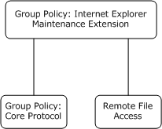
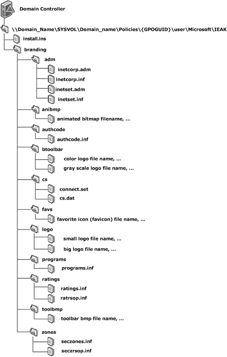

[MS-GPIE]:

Group Policy: Internet Explorer Maintenance Extension

Intellectual Property Rights Notice for Open Specifications Documentation

  Technical Documentation. Microsoft publishes Open Specifications documentation (“this

documentation”) for protocols, file formats, data portability, computer languages, and standards
support. Additionally, overview documents cover inter-protocol relationships and interactions.

  Copyrights. This documentation is covered by Microsoft copyrights. Regardless of any other

terms that are contained in the terms of use for the Microsoft website that hosts this
documentation, you can make copies of it in order to develop implementations of the technologies
that are described in this documentation and can distribute portions of it in your implementations
that use these technologies or in your documentation as necessary to properly document the
implementation. You can also distribute in your implementation, with or without modification, any
schemas, IDLs, or code samples that are included in the documentation. This permission also
applies to any documents that are referenced in the Open Specifications documentation.
  No Trade Secrets. Microsoft does not claim any trade secret rights in this documentation.
  Patents. Microsoft has patents that might cover your implementations of the technologies

described in the Open Specifications documentation. Neither this notice nor Microsoft's delivery of
this documentation grants any licenses under those patents or any other Microsoft patents.
However, a given Open Specifications document might be covered by the Microsoft Open
Specifications Promise or the Microsoft Community Promise. If you would prefer a written license,
or if the technologies described in this documentation are not covered by the Open Specifications
Promise or Community Promise, as applicable, patent licenses are available by contacting
iplg@microsoft.com.

  License Programs. To see all of the protocols in scope under a specific license program and the

associated patents, visit the Patent Map.

  Trademarks. The names of companies and products contained in this documentation might be
covered by trademarks or similar intellectual property rights. This notice does not grant any
licenses under those rights. For a list of Microsoft trademarks, visit
www.microsoft.com/trademarks.

  Fictitious Names. The example companies, organizations, products, domain names, email

addresses, logos, people, places, and events that are depicted in this documentation are fictitious.
No association with any real company, organization, product, domain name, email address, logo,
person, place, or event is intended or should be inferred.

Reservation of Rights. All other rights are reserved, and this notice does not grant any rights other
than as specifically described above, whether by implication, estoppel, or otherwise.

Tools. The Open Specifications documentation does not require the use of Microsoft programming
tools or programming environments in order for you to develop an implementation. If you have access
to Microsoft programming tools and environments, you are free to take advantage of them. Certain
Open Specifications documents are intended for use in conjunction with publicly available standards
specifications and network programming art and, as such, assume that the reader either is familiar
with the aforementioned material or has immediate access to it.

Support. For questions and support, please contact dochelp@microsoft.com.

[MS-GPIE] - v20170601
Group Policy: Internet Explorer Maintenance Extension
Copyright © 2017 Microsoft Corporation
Release: June 1, 2017

1 / 55

Revision Summary

Date

Revision
History

Revision
Class

Comments

3/2/2007

1.0

4/3/2007

1.1

5/11/2007

2.0

Major

Minor

Major

Updated and revised the technical content.

Clarified the meaning of the technical content.

New format

6/1/2007

2.0.1

Editorial

Changed language and formatting in the technical content.

7/3/2007

2.0.2

Editorial

Changed language and formatting in the technical content.

8/10/2007

3.0

Major

Updated and revised the technical content.

9/28/2007

3.0.1

Editorial

Changed language and formatting in the technical content.

10/23/2007  4.0

Major

Updated and revised the technical content.

1/25/2008

4.0.1

Editorial

Changed language and formatting in the technical content.

3/14/2008

4.0.2

Editorial

Changed language and formatting in the technical content.

6/20/2008

4.0.3

Editorial

Changed language and formatting in the technical content.

7/25/2008

4.0.4

Editorial

Changed language and formatting in the technical content.

8/29/2008

4.0.5

Editorial

Changed language and formatting in the technical content.

10/24/2008  5.0

12/5/2008

5.1

Major

Minor

Updated and revised the technical content.

Clarified the meaning of the technical content.

1/16/2009

5.1.1

Editorial

Changed language and formatting in the technical content.

2/27/2009

5.1.2

Editorial

Changed language and formatting in the technical content.

4/10/2009

5.1.3

Editorial

Changed language and formatting in the technical content.

5/22/2009

5.1.4

Editorial

Changed language and formatting in the technical content.

7/2/2009

6.0

8/14/2009

6.1

9/25/2009

6.2

11/6/2009

6.3

Major

Minor

Minor

Minor

Updated and revised the technical content.

Clarified the meaning of the technical content.

Clarified the meaning of the technical content.

Clarified the meaning of the technical content.

12/18/2009  6.3.1

Editorial

Changed language and formatting in the technical content.

1/29/2010

6.4

3/12/2010

6.5

Minor

Minor

Clarified the meaning of the technical content.

Clarified the meaning of the technical content.

4/23/2010

6.5.1

Editorial

Changed language and formatting in the technical content.

6/4/2010

6.6

7/16/2010

6.7

8/27/2010

7.0

Minor

Minor

Major

Clarified the meaning of the technical content.

Clarified the meaning of the technical content.

Updated and revised the technical content.

[MS-GPIE] - v20170601
Group Policy: Internet Explorer Maintenance Extension
Copyright © 2017 Microsoft Corporation
Release: June 1, 2017

2 / 55

Date

Revision
History

Revision
Class

Comments

10/8/2010

8.0

11/19/2010  9.0

1/7/2011

10.0

2/11/2011

11.0

3/25/2011

12.0

5/6/2011

13.0

6/17/2011

13.1

9/23/2011

14.0

12/16/2011  15.0

3/30/2012

15.0

7/12/2012

15.0

10/25/2012  16.0

1/31/2013

16.1

8/8/2013

16.1

Major

Major

Major

Major

Major

Major

Minor

Major

Major

None

None

Major

Minor

None

Updated and revised the technical content.

Updated and revised the technical content.

Updated and revised the technical content.

Updated and revised the technical content.

Updated and revised the technical content.

Updated and revised the technical content.

Clarified the meaning of the technical content.

Updated and revised the technical content.

Updated and revised the technical content.

No changes to the meaning, language, or formatting of the
technical content.

No changes to the meaning, language, or formatting of the
technical content.

Updated and revised the technical content.

Clarified the meaning of the technical content.

No changes to the meaning, language, or formatting of the
technical content.

11/14/2013  16.1

None

No changes to the meaning, language, or formatting of the
technical content.

2/13/2014

16.1

None

No changes to the meaning, language, or formatting of the
technical content.

5/15/2014

16.1

None

No changes to the meaning, language, or formatting of the
technical content.

6/30/2015

16.1

None

No changes to the meaning, language, or formatting of the
technical content.

10/16/2015  16.1

None

No changes to the meaning, language, or formatting of the
technical content.

7/14/2016

16.1

None

No changes to the meaning, language, or formatting of the
technical content.

6/1/2017

16.1

None

No changes to the meaning, language, or formatting of the
technical content.

[MS-GPIE] - v20170601
Group Policy: Internet Explorer Maintenance Extension
Copyright © 2017 Microsoft Corporation
Release: June 1, 2017

3 / 55

Table of Contents

1.3

1.1
1.2

1.2.1
1.2.2

1  Introduction ............................................................................................................ 6
Glossary ........................................................................................................... 6
References ........................................................................................................ 8
Normative References ................................................................................... 8
Informative References ................................................................................. 8
Overview .......................................................................................................... 9
Background ................................................................................................. 9
Internet Explorer Maintenance Extension Protocol Overview ............................... 9
Relationship to Other Protocols .......................................................................... 10
Prerequisites/Preconditions ............................................................................... 10
Applicability Statement ..................................................................................... 10
Versioning and Capability Negotiation ................................................................. 11
Vendor-Extensible Fields ................................................................................... 11
Standards Assignments ..................................................................................... 11

1.4
1.5
1.6
1.7
1.8
1.9

1.3.1
1.3.2

2  Messages ............................................................................................................... 12
Transport ........................................................................................................ 12
Message Syntax ............................................................................................... 12
SYSVOL Structure ....................................................................................... 12

2.1
2.2

2.2.1

3.1

3.1.1

3.1.1.1

3.1.2
3.1.3
3.1.4
3.1.5
3.1.6
3.1.7

3  Protocol Details ..................................................................................................... 14
Administrative Tool Plug-in Details ..................................................................... 14
Abstract Data Model .................................................................................... 14
Administered GPO (Public) ..................................................................... 14
Timers ...................................................................................................... 14
Initialization ............................................................................................... 14
Higher-Layer Triggered Events ..................................................................... 14
Message Processing Events and Sequencing Rules .......................................... 14
Timer Events .............................................................................................. 15
Other Local Events ...................................................................................... 15
Client-Side Plug-in Details ................................................................................. 15
Abstract Data Model .................................................................................... 15
Client-Side State ................................................................................... 15
Timers ...................................................................................................... 15
Initialization ............................................................................................... 15
Higher-Layer Triggered Events ..................................................................... 15
Process Group Policy ............................................................................. 15
Message Processing Events and Sequencing Rules .......................................... 15
Timer Events .............................................................................................. 16
Other Local Events ...................................................................................... 16

3.2.2
3.2.3
3.2.4

3.2.5
3.2.6
3.2.7

3.2.1.1

3.2.4.1

3.2.1

3.2

4.1

4  Protocol Examples ................................................................................................. 17
File Formats .................................................................................................... 17
INS File Format .......................................................................................... 17
ADM File Format ......................................................................................... 36
INF File Format .......................................................................................... 36

4.1.1
4.1.2
4.1.3

4.1.3.1

4.1.3.1.1
4.1.3.1.2

4.1.3.2
4.1.3.3

File Format used by Seczones.INF, Authcode.INF, Ratings.INF, and
Programs.INF ....................................................................................... 37
Part A ............................................................................................ 37
Part B ............................................................................................ 38
Seczrsop.INF File Format ....................................................................... 39
Ratrsop.INF File Format ......................................................................... 42
BMP File Format ......................................................................................... 42
ICO File Format .......................................................................................... 42
CONNECT.RAS File Format ........................................................................... 42

4.1.4
4.1.5
4.1.6

[MS-GPIE] - v20170601
Group Policy: Internet Explorer Maintenance Extension
Copyright © 2017 Microsoft Corporation
Release: June 1, 2017

4 / 55

4.1.7

4.2
4.3

4.3.1
4.3.2
4.3.3
4.3.4

4.4
4.5

CS.DAT File Format ..................................................................................... 42
INSTALL.INS Example....................................................................................... 43
Examples of Seczones.INF, Authcode.INF, Ratings.INF, and Programs.INF .............. 44
SECZONES.INF Example .............................................................................. 44
AUTHCODE.INF Example ............................................................................. 45
RATINGS.INF Example ................................................................................ 46
PROGRAMS.INF Example ............................................................................. 47
SECZRSOP.INF Example ................................................................................... 48
RATRSOP.INF Example ..................................................................................... 49

5  Security ................................................................................................................. 50
Security Considerations for Implementers ........................................................... 50
Index of Security Parameters ............................................................................ 50

5.1
5.2

6  Appendix A: Product Behavior ............................................................................... 51

7  Change Tracking .................................................................................................... 53

8  Index ..................................................................................................................... 54

[MS-GPIE] - v20170601
Group Policy: Internet Explorer Maintenance Extension
Copyright © 2017 Microsoft Corporation
Release: June 1, 2017

5 / 55

1  Introduction

This document specifies the Group Policy: Internet Explorer Maintenance Extension protocol.

Sections 1.5, 1.8, 1.9, 2, and 3 of this specification are normative. All other sections and examples in
this specification are informative.

1.1  Glossary

This document uses the following terms:

Active Directory: The Windows implementation of a general-purpose directory service, which uses

LDAP as its primary access protocol. Active Directory stores information about a variety of
objects in the network such as user accounts, computer accounts, groups, and all related
credential information used by Kerberos [MS-KILE]. Active Directory is either deployed as Active
Directory Domain Services (AD DS) or Active Directory Lightweight Directory Services (AD LDS),
which are both described in [MS-ADOD]: Active Directory Protocols Overview.

Administrative tool: An implementation-specific tool, such as the Group Policy Management
Console, that allows administrators to read and write policy settings from and to a Group
Policy Object (GPO) and policy files. The Group Policy Administrative tool uses the Extension
list of a GPO to determine which Administrative tool extensions are required to read settings
from and write settings to the logical and physical components of a GPO.

American National Standards Institute (ANSI) character set: A character set defined by a
code page approved by the American National Standards Institute (ANSI). The term "ANSI" as
used to signify Windows code pages is a historical reference and a misnomer that persists in the
Windows community. The source of this misnomer stems from the fact that the Windows code
page 1252 was originally based on an ANSI draft, which became International Organization for
Standardization (ISO) Standard 8859-1 [ISO/IEC-8859-1]. In Windows, the ANSI character set
can be any of the following code pages: 1252, 1250, 1251, 1253, 1254, 1255, 1256, 1257,
1258, 874, 932, 936, 949, or 950. For example, "ANSI application" is usually a reference to a
non-Unicode or code-page-based application. Therefore, "ANSI character set" is often misused
to refer to one of the character sets defined by a Windows code page that can be used as an
active system code page; for example, character sets defined by code page 1252 or character
sets defined by code page 950. Windows is now based on Unicode, so the use of ANSI character
sets is strongly discouraged unless they are used to interoperate with legacy applications or
legacy data.

Augmented Backus-Naur Form (ABNF): A modified version of Backus-Naur Form (BNF),

commonly used by Internet specifications. ABNF notation balances compactness and simplicity
with reasonable representational power. ABNF differs from standard BNF in its definitions and
uses of naming rules, repetition, alternatives, order-independence, and value ranges. For more
information, see [RFC5234].

client: A client, also called a client computer, is a computer that receives and applies settings of a

Group Policy Object (GPO), as specified in [MS-GPOL].

client-side extension GUID (CSE GUID): A GUID  that enables a specific client-side extension
on the Group Policy client to be associated with policy data that is stored in the logical and
physical components of a Group Policy Object (GPO) on the Group Policy server, for that
particular extension.

directory: The database that stores information about objects such as users, groups, computers,

printers, and the directory service that makes this information available to users and
applications.

[MS-GPIE] - v20170601
Group Policy: Internet Explorer Maintenance Extension
Copyright © 2017 Microsoft Corporation
Release: June 1, 2017

6 / 55

fully qualified domain name (FQDN): An unambiguous domain name that gives an absolute

location in the Domain Name System's (DNS) hierarchy tree, as defined in [RFC1035] section
3.1 and [RFC2181] section 11.

globally unique identifier (GUID): A term used interchangeably with universally unique

identifier (UUID) in Microsoft protocol technical documents (TDs). Interchanging the usage of
these terms does not imply or require a specific algorithm or mechanism to generate the value.
Specifically, the use of this term does not imply or require that the algorithms described in
[RFC4122] or [C706] have to be used for generating the GUID. See also universally unique
identifier (UUID).

Group Policy Object (GPO): A collection of administrator-defined specifications of the policy
settings that can be applied to groups of computers in a domain. Each GPO includes two
elements: an object that resides in the Active Directory for the domain, and a corresponding
file system subdirectory that resides on the sysvol DFS share of the Group Policy server for the
domain.

Group Policy Object (GPO) GUID: A curly braced GUID string that uniquely identifies a Group

Policy Object (GPO).

Group Policy Object (GPO) path: A domain-based Distributed File System (DFS) path for a

directory on the server that is accessible through the DFS/SMB protocols. This path will always
be a Universal Naming Convention (UNC) path of the form: "\\<dns domain
name>\sysvol\<dns domain name>\policies\<gpo guid>", where <dns domain name> is the
DNS domain name of the domain and <gpo guid> is a Group Policy Object (GPO) GUID.

Group Policy server: A server holding a database of Group Policy Objects (GPOs) that can be

retrieved by other machines. The Group Policy server has to be a domain controller (DC).

Lightweight Directory Access Protocol (LDAP): The primary access protocol for Active

Directory. Lightweight Directory Access Protocol (LDAP) is an industry-standard protocol,
established by the Internet Engineering Task Force (IETF), which allows users to query and
update information in a directory service (DS), as described in [MS-ADTS]. The Lightweight
Directory Access Protocol can be either version 2 [RFC1777] or version 3 [RFC3377].

policy target: A user or computer account for which policy settings can be obtained from a server
in the same domain, as specified in [MS-GPOL]. For user policy mode, the policy target is a user
account. For computer policy mode, the policy target is a computer account.

share: A resource offered by a Common Internet File System (CIFS) server for access by CIFS
clients over the network. A share typically represents a directory tree and its included files
(referred to commonly as a "disk share" or "file share") or a printer (a "print share"). If the
information about the share is saved in persistent store (for example, Windows registry) and
reloaded when a file server is restarted, then the share is referred to as a "sticky share". Some
share names are reserved for specific functions and are referred to as special shares: IPC$,
reserved for interprocess communication, ADMIN$, reserved for remote administration, and A$,
B$, C$ (and other local disk names followed by a dollar sign), assigned to local disk devices.

system volume (SYSVOL): A shared directory that stores the server copy of the domain's public

files that has to be shared for common access and replication throughout a domain.

tool extension GUID or administrative plug-in GUID: A GUID defined separately for each of
the user policy settings and computer policy settings that associates a specific administrative
tool plug-in with a set of policy settings that can be stored in a Group Policy Object (GPO).

Unicode: A character encoding standard developed by the Unicode Consortium that represents

almost all of the written languages of the world. The Unicode standard [UNICODE5.0.0/2007]
provides three forms (UTF-8, UTF-16, and UTF-32) and seven schemes (UTF-8, UTF-16, UTF-16
BE, UTF-16 LE, UTF-32, UTF-32 LE, and UTF-32 BE).

[MS-GPIE] - v20170601
Group Policy: Internet Explorer Maintenance Extension
Copyright © 2017 Microsoft Corporation
Release: June 1, 2017

7 / 55

Universal Naming Convention (UNC): A string format that specifies the location of a resource.

For more information, see [MS-DTYP] section 2.2.57.

MAY, SHOULD, MUST, SHOULD NOT, MUST NOT: These terms (in all caps) are used as defined
in [RFC2119]. All statements of optional behavior use either MAY, SHOULD, or SHOULD NOT.

1.2  References

Links to a document in the Microsoft Open Specifications library point to the correct section in the
most recently published version of the referenced document. However, because individual documents
in the library are not updated at the same time, the section numbers in the documents may not
match. You can confirm the correct section numbering by checking the Errata.

1.2.1  Normative References

We conduct frequent surveys of the normative references to assure their continued availability. If you
have any issue with finding a normative reference, please contact dochelp@microsoft.com. We will
assist you in finding the relevant information.

[MS-DTYP] Microsoft Corporation, "Windows Data Types".

[MS-GPOL] Microsoft Corporation, "Group Policy: Core Protocol".

[MS-GPREG] Microsoft Corporation, "Group Policy: Registry Extension Encoding".

[RFC2119] Bradner, S., "Key words for use in RFCs to Indicate Requirement Levels", BCP 14, RFC
2119, March 1997, https://www.rfc-editor.org/info/rfc2119

[RFC4234] Crocker, D., Ed., and Overell, P., "Augmented BNF for Syntax Specifications: ABNF", RFC
4234, October 2005, https://www.rfc-editor.org/info/rfc4234

1.2.2  Informative References

[MS-FASOD] Microsoft Corporation, "File Access Services Protocols Overview".

[MS-WPO] Microsoft Corporation, "Windows Protocols Overview".

[MSDN-BMPST] Microsoft Corporation, "Bitmap Storage", http://msdn.microsoft.com/en-
us/library/dd183391(VS.85).aspx

[MSDN-ICO] Microsoft Corporation, "Icons in Win32", http://msdn.microsoft.com/en-
us/library/ms997538.aspx

[MSDN-INF] Microsoft Corporation, "About INF Files", http://msdn.microsoft.com/en-
us/library/aa376858.aspx

[MSDN-RAS2] Microsoft Corporation, "RASDIALPARAMS structure", http://msdn.microsoft.com/en-
us/library/aa377238.aspx

[MSDN-RAS] Microsoft Corporation, "RASENTRY structure", http://msdn.microsoft.com/en-
us/library/aa377274.aspx

[MSDN-SECZONES] Microsoft Corporation, "About URL Security Zones",
http://msdn.microsoft.com/en-us/library/ms537183.aspx

[MSDN-WININET1] Microsoft Corporation, "INTERNET_PER_CONN_OPTION_LIST structure",
http://msdn.microsoft.com/en-us/library/aa385146.aspx

[MS-GPIE] - v20170601
Group Policy: Internet Explorer Maintenance Extension
Copyright © 2017 Microsoft Corporation
Release: June 1, 2017

8 / 55

[MSDN-WININET2] Microsoft Corporation, "INTERNET_PER_CONN_OPTION structure",
http://msdn.microsoft.com/en-us/library/aa385145.aspx

[MSFT-IEM] Microsoft Corporation, "Internet Explorer Maintenance Extension Technical Reference",
March 2003, http://technet2.microsoft.com/WindowsServer/en/Library/7393c49d-238e-433d-9193-
ffe4f64b1e0f1033.mspx

[RFC1001] Network Working Group, "Protocol Standard for a NetBIOS Service on a TCP/UDP
Transport: Concepts and Methods", RFC 1001, March 1987, https://www.rfc-editor.org/info/rfc1001

[RFC1035] Mockapetris, P., "Domain Names - Implementation and Specification", STD 13, RFC 1035,
November 1987, https://www.rfc-editor.org/info/rfc1035

[RFC1123] Braden, R., "Requirements for Internet Hosts - Application and Support", RFC 1123,
October 1989, https://www.rfc-editor.org/info/rfc1123

[RFC2181] Elz, R., and Bush, R., "Clarifications to the DNS Specification", RFC 2181, July 1997,
https://www.rfc-editor.org/info/rfc2181

[RFC3986] Berners-Lee, T., Fielding, R., and Masinter, L., "Uniform Resource Identifier (URI): Generic
Syntax", STD 66, RFC 3986, January 2005, https://www.rfc-editor.org/info/rfc3986

1.3  Overview

The Group Policy: Internet Explorer Maintenance Extension protocol enables administrators to assign
custom Favorites, links, security, interface, and other settings to Internet Explorer as part of a Group
Policy Object (GPO). This enables administrators to enforce Internet-related security standards and
provide a common browser interface within an organization.

1.3.1  Background

The Group Policy: Core Protocol Specification (as specified in [MS-GPOL]) enables clients to discover
and retrieve policy settings created by administrators of a domain. These settings are located in
Group Policy Objects (GPOs), which are assigned to policy target accounts in Active Directory.

On each client, each GPO is interpreted and acted on by software components known as client-side
plug-ins. The client-side plug-ins responsible for a given GPO are specified using an attribute on the
GPO. This attribute specifies a list of globally unique identifier (GUID) pairs. The first GUID of each
pair is referred to as a client-side extension GUID (CSE GUID). The second GUID of each pair is
referred to as a tool extension GUID.

For each GPO that is applicable to a client, the client consults the CSE GUIDs listed in the GPO to
determine which client-side plug-ins on the client handle the GPO. The client then invokes the client-
side plug-ins to handle the GPO.

A client-side plug-in uses the contents of the GPO to retrieve settings specific to its class in a manner
specific to its class. Once its class-specific settings are retrieved, the client-side plug-in uses those
settings to perform class-specific processing.

1.3.2  Internet Explorer Maintenance Extension Protocol Overview

The participants in this protocol are the following:

  An administrative tool plug-in that is used to author and upload configuration settings (both

policies and associated data files).

  A server acting as a generic binary large object (BLOB) store with no protocol-specific knowledge.

[MS-GPIE] - v20170601
Group Policy: Internet Explorer Maintenance Extension
Copyright © 2017 Microsoft Corporation
Release: June 1, 2017

9 / 55

<!-- Extracted images from page 10 -->

<!-- /Extracted images from page 10 -->

  A client with a client-side plug-in and a version of Internet Explorer.

The administrator can specify configuration information through a user interface provided by the
administrative tool plug-in. The administrative tool plug-in then encodes the configuration information
into one or more data files, and then copies the files into the generic BLOB store. The location of these
files is stored in a GPO. The administrative tool uses the Group Policy: Core Protocol to store this
GPO in Active Directory.

The Group Policy: Core Protocol specifies how a client can learn of an updated policy (as specified in
[MS-GPOL] section 1.3.3) and, based on identifiers associated with each GPO, invoke an appropriate
client-side plug-in. In the case of the Group Policy: Internet Explorer Maintenance Extension protocol,
this client-side plug-in then retrieves the files contained in the GPO, copying them from a well-known
location in the generic BLOB store ("<gpo path>\user\Microsoft\IEAK") to the client, where they will
be processed later by Internet Explorer components.<1>

1.4  Relationship to Other Protocols

The Group Policy: Internet Explorer Maintenance Extension protocol is initiated only as part of the
Group Policy: Core Protocol, as specified in [MS-GPOL] section 1.3.3. The Group Policy: Internet
Explorer Maintenance Extension protocol is dependent on the Group Policy: Core Protocol to provide it
with the remote storage location for the configuration data, as specified in [MS-GPOL] and for
transmitting Group Policy settings and instructions between the client and the Group Policy server.
The Group Policy: Internet Explorer Maintenance Extension protocol is also indirectly dependent on the
Lightweight Directory Access Protocol (LDAP) via the Group Policy: Core Protocol.

The Group Policy: Internet Explorer Maintenance Extension protocol uses remote file access to read
and write files on the remote storage location. See [MS-WPO] section 6.4 for an overview of remote
file access.

Figure 1: Group Policy: Internet Explorer Maintenance Extension protocol relationship
diagram

1.5  Prerequisites/Preconditions

There are no prerequisites or preconditions for the Group Policy: Internet Explorer Maintenance
Extension protocol beyond what is specified in Group Policy: Core Protocol.

1.6  Applicability Statement

The Group Policy: Internet Explorer Maintenance Extension protocol is applicable only within the Group
Policy framework, as described in [MS-GPOL].

10 / 55

[MS-GPIE] - v20170601
Group Policy: Internet Explorer Maintenance Extension
Copyright © 2017 Microsoft Corporation
Release: June 1, 2017

1.7  Versioning and Capability Negotiation

The Group Policy: Internet Explorer Maintenance Extension protocol is not versioned and does not
require any capability negotiation. It supports heterogeneous clients running different versions of the
operating system or Internet Explorer browser.<2> However, some settings are not applicable for
every version, and these are specifically mentioned in this document.

1.8  Vendor-Extensible Fields

The Group Policy: Internet Explorer Maintenance Extension protocol does not define any vendor-
extensible fields.

1.9  Standards Assignments

The Group Policy: Internet Explorer Maintenance Extension protocol defines client-side extension
GUID (CSE GUID) and tool extension GUID standards assignments, as specified in [MS-GPOL]
section 1.8. The assignments are as shown in the following table.

 Parameter

 Value

CSE GUID for client-side plug-in

{A2E30F80-D7DE-11d2-BBDE-00C04F86AE3B}

Tool extension GUID (user policy settings)  {FC715823-C5FB-11D1-9EEF-00A0C90347FF}

[MS-GPIE] - v20170601
Group Policy: Internet Explorer Maintenance Extension
Copyright © 2017 Microsoft Corporation
Release: June 1, 2017

11 / 55

2  Messages

2.1  Transport

All messages are exchanged by copying files, using remote file access as described in [MS-FASOD].

2.2  Message Syntax

2.2.1  SYSVOL Structure

The file store for Group Policy: Internet Explorer Maintenance Extension protocol files MUST be located
in SYSVOL in the directory structure shown in the figure below. Each subdirectory of the "branding"
directory is optional, as is each file contained therein; but if the subdirectory is present, it MUST be
named and located as depicted in the figure. Additional files may be placed in some of the
subdirectories of the "branding" directory. Specifically, a file name followed by ",..." indicates that
other files may exist in the directory.

[MS-GPIE] - v20170601
Group Policy: Internet Explorer Maintenance Extension
Copyright © 2017 Microsoft Corporation
Release: June 1, 2017

12 / 55

<!-- Extracted images from page 13 -->

<!-- /Extracted images from page 13 -->

Figure 2: SYSVOL structure for Group Policy: Internet Explorer Maintenance Extension
protocol

[MS-GPIE] - v20170601
Group Policy: Internet Explorer Maintenance Extension
Copyright © 2017 Microsoft Corporation
Release: June 1, 2017

13 / 55

3  Protocol Details

3.1  Administrative Tool Plug-in Details

The administrative plug-in mediates between a user interface (UI) and a generic BLOB store that
contains data files. Its purpose is to receive configuration information from a UI and to write data files
to a generic BLOB store.

3.1.1  Abstract Data Model

This section describes a conceptual model of possible data organization that an implementation
maintains to participate in this protocol. The described organization is provided to facilitate the
explanation of how the protocol behaves. This document does not mandate that implementations
adhere to this model as long as their external behavior is consistent with that described in this
document.

The administrative plug-in relies on a collection of data files described in section 2.2 and stored in the
generic BLOB store. The administrative plug-in reads in these data files from the BLOB store and
displays them to an administrator through a UI.

An administrator can then use the UI to make further configuration changes and the administrative
plug-in will copy the resultant data files to the BLOB store.

This conceptual data can be implemented using a variety of techniques. An implementation can
implement such data using any method.

3.1.1.1  Administered GPO (Public)

The Administered GPO is generated by [MS-GPOL] (as specified in section 3.3.1.3) and is read by
Group Policy: Internet Explorer Maintenance Extension. The Group Policy Object (GPO) path is
used to determine the destination of the data files being copied to a BLOB store.

3.1.2  Timers

None.

3.1.3  Initialization

When the administrative tool plug-in is initialized, it retrieves the extension's GPO settings as
described in [MS-GPOL] section 2.2.7, and uses remote file access to read the contents of the various
configuration files which are located under SYSVOL as described in section 2.2.

3.1.4  Higher-Layer Triggered Events

Whenever an administrator changes a setting, the administrative tool plug-in MUST write the
configuration files to the file share using remote file access. The install.ins file MUST reside under
"<gpo path>\user\Microsoft\IEAK\". The remaining configuration files MUST reside under the "<gpo
path>\user\Microsoft\IEAK\branding" directory, as specified in section 2.2.

3.1.5  Message Processing Events and Sequencing Rules

The administrative tool plug-in MUST write all the files to SYSVOL, as specified in [MS-GPOL], using
remote file access. If a copy fails, the administrative tool plug-in MUST display to the user that the
policy update has failed. After every creation, modification, or deletion that affects a GPIE file on

14 / 55

[MS-GPIE] - v20170601
Group Policy: Internet Explorer Maintenance Extension
Copyright © 2017 Microsoft Corporation
Release: June 1, 2017

SYSVOL, the administrative tool MUST invoke the Group Policy Extension Update task ([MS-GPOL]
section 3.3.4.4, Group Policy Extension Update).

3.1.6  Timer Events

None.

3.1.7  Other Local Events

None.

3.2  Client-Side Plug-in Details

The client-side plug-in for the Group Policy: Internet Explorer Maintenance Extension protocol
retrieves settings, and controls how Internet Explorer behaves on client computers that receive
settings. All relevant files MUST first be copied from the file store to the client.

3.2.1  Abstract Data Model

This section describes a conceptual model of possible data organization that an implementation
maintains to participate in this protocol. The described organization is provided to facilitate the
explanation of how the protocol behaves. This document does not mandate that implementations
adhere to this model as long as their external behavior is consistent with that described in this
document.

3.2.1.1  Client-Side State

The client-side plug-in maintains no persistent state. During processing, the New or Changed GPO list
passed as a parameter is enumerated and then discarded (see section 3.2.5).

3.2.2  Timers

None.

3.2.3  Initialization

None.

3.2.4  Higher-Layer Triggered Events

3.2.4.1  Process Group Policy

This extension is launched by the Group Policy: Core Protocol, which invokes the Process Group Policy
event, whose abstract interface is specified in [MS-GPOL] section 3.2.4.1, to apply policies that are
handled by this extension.

3.2.5  Message Processing Events and Sequencing Rules

For each GPO in the New or Changed GPO list, the client-side plug-in MUST copy, using remote file
access, the install.ins file from "<gpo path>\user\Microsoft\IEAK\". If the file is not found, the
processing of the current GPO path MUST be skipped.

[MS-GPIE] - v20170601
Group Policy: Internet Explorer Maintenance Extension
Copyright © 2017 Microsoft Corporation
Release: June 1, 2017

15 / 55

The client-side plug-in MUST then copy, using remote file access, the "<gpo
path>\user\Microsoft\IEAK\branding" directory, including all subdirectories and any files contained in
those subdirectories.

The SecurityToken passed by the Group Policy: Core Protocol SHOULD be used to impersonate the
logged-on user while copying these files as specified in [MS-DTYP] section 2.7, Impersonation Abstract
Interfaces.<3>

The destination of these file copies is implementation-specific.<4>

3.2.6  Timer Events

None.

3.2.7  Other Local Events

None.

[MS-GPIE] - v20170601
Group Policy: Internet Explorer Maintenance Extension
Copyright © 2017 Microsoft Corporation
Release: June 1, 2017

16 / 55

4  Protocol Examples

The following sections give examples of the types of files stored on the BLOB server by the authoring
components in Windows and ultimately consumed by Internet Explorer. Examples of informative
descriptions of the individual file formats for each of the files under the "<gpo
path>\user\Microsoft\IEAK" folder in SYSVOL are first, followed by examples of the INSTALL.INS,
SECZONES.INF, SECZRSOP.INF, and RATRSOP.INF files.

4.1  File Formats

This section specifies the individual file formats for each of the files under the "<gpo
path>\user\Microsoft\IEAK" folder in SYSVOL.

4.1.1  INS File Format

The install.ins file is a file divided into various formatted sections and written using the ANSI
character set (ANSI). Each section is designed for a particular purpose, and the entries in a section
are name-value pairs separated by a newline character. The name and value are separated by an
equal (=) sign. The Augmented Backus-Naur Form (ABNF) definition (as specified in [RFC4234])
for the install.ins file format is as follows:

 InsFile = *Section
 Section = SectionLine *ValueLine
 SectionLine = "[" SectionName "]" LineBreak
 SectionName = (ALPHA / %d95) *(ALPHA / DIGIT / %d95)
 ValueLine = ValueName "=" Value LineBreak
 ValueName = (ALPHA / %d95) *(ALPHA / DIGIT / %d95)
 Value = String/DquotedString
 String = 1*%d33-126
 DQuotedString = %d34 1*(%d32-33/%d35-126) %d34
 LineBreak = %d13.10

The remainder of this section specifies additional restrictions for the SectionName, ValueName, and
Value strings, and their interrelationships (for example, a certain ValueName will be legal only after a
certain SectionName has appeared). In specifying legal data for Values, the following types are used
in this section:

Filename: Indicates that the value is a file name, represented as an ANSI string.

File path: Indicates that the value is the full path name of a file, represented as an ANSI string. It is
allowed to be either a local path to a file on the same machine or a UNC path to a file on another
machine.

Boolean: Indicates that the value is either 0 or 1 as an ANSI string.

String: Indicates that the value is an ANSI string that does not contain a newline.

URL: Indicates that the value is a URL (for more information, see [RFC3986]).

Numeric: Indicates that the value is an integer between 0 and 2^32-1 expressed in decimal as an

ANSI string.

Hexadecimal: Indicates that the value is an integer between 0 and 2^32-1 expressed in hexadecimal

as an ANSI string.

Hostname: Indicates that the value is the name of another computer. It is allowed to be either a
fully qualified domain name (FQDN) (for more information, see [RFC1035] section 3.1 or
[RFC2181] section 11) or a NetBIOS (for more information, see [RFC1001]) name.

17 / 55

[MS-GPIE] - v20170601
Group Policy: Internet Explorer Maintenance Extension
Copyright © 2017 Microsoft Corporation
Release: June 1, 2017

IP Address: Indicates that the value is an IPv4 address as an ANSI string (for more information, see

[RFC1123] section 2.1).

The following table specifies sections, corresponding names, and data types for the assigned values
for the install.ins file. The description and sample value columns are for informative purposes only
(not normative purposes). That is, the values of these settings are not to be interpreted by the Group
Policy: Internet Explorer Maintenance Extension protocol. These values are merely applied as-is to
Internet Explorer, which can interpret them in a way that is independent of what protocol or
mechanism was used to configure them.<5>

 SectionName

 ValueName

[Animation]

Big_Name

Value
type

Filena
me

 Sample value

38ani.bmp

Big_Path

File
path

C:\My Documents\Branding\38ani.bmp

DoAnimation

Boole
an

1

Small_Name

Filena
me

22ani.bmp

Small_Path

File
path

C:\My Documents\Branding\22ani.bmp

[ActiveSetup]  WizardBitmap

File

C:\My Documents\Branding\wizard.bmp

[MS-GPIE] - v20170601
Group Policy: Internet Explorer Maintenance Extension
Copyright © 2017 Microsoft Corporation
Release: June 1, 2017

 Description

The name of a
file containing
a large
animation to
be used by
Internet
Explorer. This
is equal to the
last
component of
the Big_Path
entry.

The full path
(local or
remote) of a
file containing
an animation
to be used by
Internet
Explorer. The
file name
component is
equal to the
value of the
Big_Name
entry.

Indicates
whether or
not Internet
Explorer is to
customize the
animation.

File name of
bitmap file
that contains
the frames for
the 22x22
animation.

Full path to
the 22x22
icon
animation
bitmap file.

Full path of a
bitmap file

18 / 55

 SectionName

 ValueName

Value
type

path

 Sample value

WizardBitmapTop

File
path

C:\My Documents\Branding\wizardtop.bmp

WizardTitle

String  Custom Browser Setup

[ActiveSetupSit
es]

SiteName0

String  Microsoft Download Page

SiteRegion0

String  Northwest Region

 Description

that can be
displayed by
the Internet
Explorer
Setup Wizard.

Full path of a
bitmap file
that can be
displayed by
the Internet
Explorer
Setup Wizard.

Text to appear
in the Internet
Explorer
Setup Wizard
title bar.

Friendly name
of the
download site
to be used by
Internet
Explorer.

Friendly name
of the
geographical
region in
which the
download site
is located.

SiteURL0

URL

http://www.microsoft.com/ie5/download/north
west

URL of the
download site.

[Big_Logo]

Name

Filena
me

static38x38.bmp

Path

File
Path

C:\My Documents\Branding\static38x38.bmp

[Branding]

CabsURLPath

File
path

http://example

CMBitmapName

Filena

[MS-GPIE] - v20170601
Group Policy: Internet Explorer Maintenance Extension
Copyright © 2017 Microsoft Corporation
Release: June 1, 2017

Name of the
bitmap file
containing an
icon that can
be displayed
by Internet
Explorer.

Full path to
the bitmap file
containing the
icon. The file
name
component is
equal to the
value of the
Name entry
above.

URL path of
cabinet files

Connection

19 / 55

 Sample value

 Description

 SectionName

 ValueName

CMBitmapPath

CMProfileName

Value
type

me

File
path

Filena
me

CMProfilePath

File
path

CMUseCustom

Boole
an

0

CompanyName

String  Custom Company Name

CompatibilityMode
On

Boole
an

1

Custom_Key

String  MICROSO

[MS-GPIE] - v20170601
Group Policy: Internet Explorer Maintenance Extension
Copyright © 2017 Microsoft Corporation
Release: June 1, 2017

manager
custom
bitmap file
name to be
used by
Internet
Explorer.

Full path to
connection
manager
custom
bitmap file.

Name of
connection
manager
profile to be
used by
Internet
Explorer.

Full path to
connection
manager
profile. The
file name
component is
equal to the
value of the
CMProfileNam
e entry above.

Indicates
whether or
not a custom
connection
manager
profile is to be
used by
Internet
Explorer.

Name of
company to
be used by
Internet
Explorer.

A value of 1
indicates that
Internet
Explorer is to
enable
Compatibility
Mode for all
sites.

A value of
"MICROSO"
will cause any

20 / 55

 SectionName

 ValueName

Value
type

 Sample value

DisableSuggested
Sites

Boole
an

1

EncodeFavs

Boole
an

0

FavoritesDelete

Nume
ric

0x89

FavoritesOnTop

Boole
an

1

IE4 Welcome Msg

Boole
an

1

InsVersion

String

2010.03.28.02

Language ID

Nume
ric

1033

[MS-GPIE] - v20170601
Group Policy: Internet Explorer Maintenance Extension
Copyright © 2017 Microsoft Corporation
Release: June 1, 2017

 Description

custom
branding to be
removed from
Internet
Explorer.

A value of 1
indicates that
Internet
Explorer is to
disable the
Suggested
Sites feature.

A value of 1
indicates that
Internet
Explorer is to
interpret
Favorites
settings as
Internet
Explorer 5
did.

Set this value
to 0x89 to tell
Internet
Explorer to
remove all
pre-existing
Favorites.

A value of 1
indicates that
new Favorites
are to be
added at the
top of the
Favorites
menu. A value
of 0 indicates
that new
Favorites are
to be added at
the bottom.

Indicates to
go to a
welcome page
the first time
that the
browser is
opened.

Version of the
INS file.

Code page of
the language
used by

21 / 55

 SectionName

 ValueName

Value
type

 Sample value

Language Locale

String

EN

NoDial

Boole
an

0

NoFavoriteBar

Boole
an

1

NoIELite

Boole
an

0

NoRSSFeeds

Boole
an

1

NoSearchGuide

Boole
an

1

[MS-GPIE] - v20170601
Group Policy: Internet Explorer Maintenance Extension
Copyright © 2017 Microsoft Corporation
Release: June 1, 2017

 Description

Internet
Explorer.

Friendly name
for locale of
the version of
Internet
Explorer being
customized.

A value of 1
indicates that
Internet
Explorer is not
to use any
kind of an
IEAK-based
sign-up
process. A
value of 0
indicates that
it is to use an
IEAK-based
sign-up
process..

A value of 1
indicates that
Internet
Explorer is not
to populate
the Favorites
Bar with
default
content.

A value of 1 if
the user
wants the
Internet
Explorer
Active Setup
Wizard to
optimize for
download,
using existing
files if
possible.

A value of 1
indicates that
Internet
Explorer is not
to install
default RSS
feeds.

A value of 1
indicates that
Internet
Explorer is not

22 / 55

 SectionName

 ValueName

Value
type

 Sample value

Platform

Nume
ric

6

RestartOption

Nume
ric

1

SilentInstall

Boole
an

1

StealthInstall

Boole
an

1

[MS-GPIE] - v20170601
Group Policy: Internet Explorer Maintenance Extension
Copyright © 2017 Microsoft Corporation
Release: June 1, 2017

 Description

to offer a link
to more
search
providers.

Indicates the
platform and
architecture
being targeted
by this
package: 32-
bit Windows
XP = 1, 32-bit
Windows
Server 2003
= 2, 64-bit
Windows
Server 2003
= 4, 32-bit
Windows Vista
= 3, 64-bit
Windows Vista
= 5, 32-bit
Windows 7 =
6, 64-bit
Windows 7 =
7.

A value of 1
indicates that
the custom
package is to
invoke
Internet
Explorer setup
with the
"/norestart"
argument; a
value of 2,
with the
"/forcerestart"
argument.

A value of 1
indicates that
the custom
package is to
invoke
Internet
Explorer setup
with the
"/passive"
argument

A value of 1
indicates that
the custom
package is to
invoke
Internet
Explorer setup

23 / 55

 SectionName

 ValueName

Value
type

 Sample value

Toolbar Bitmap

File
path

Type

Nume
ric

2

User Agent

String  Acme v1.1

Version

String

5,0,0,1

Win32DownloadSit
e

URL

0

Window_Title

String  Microsoft Internet Explorer provided by Custom

Company

Window_Title_CN

String  Custom Company Name

Wizard_Version

String

8.0.0.1234

[MS-GPIE] - v20170601
Group Policy: Internet Explorer Maintenance Extension
Copyright © 2017 Microsoft Corporation
Release: June 1, 2017

 Description

with the
"/quiet"
argument.

The full path
of the bitmap
that is to
appear on the
Internet
Explorer
toolbar.

The type of
customization
being used by
Internet
Explorer: 2 =
Corporate
Administrator,
1 = Internet
Service
Provider, 0 =
Internet
Content
Provider.

String to be
appended to
default User
Agent string
used by
Internet
Explorer.

Target version
of Internet
Explorer.

URL from
which the
Internet
Explorer
Setup file will
be
downloaded.

Customized
window title
for Internet
Explorer.

The name to
be appended
to the
Internet
Explorer
window title.

Indicates the
version of the
IEAK wizard

24 / 55

 SectionName

 ValueName

Value
type

 Sample value

GPVersion

String

6.0.6001.16474

[BrowserToolb
ars]

Action0

File
path

c:\windows\notepad.exe

Caption0

String  Sample

DeleteButtons

Boole
an

1

HotIcon0

File
path

C:\My Documents\Branding\Icons\hoticon.ico

Icon0

File
path

C:\My Documents\Branding\Icons\icon.ico

Show0

Boole
an

1

[MS-GPIE] - v20170601
Group Policy: Internet Explorer Maintenance Extension
Copyright © 2017 Microsoft Corporation
Release: June 1, 2017

 Description

that produced
the INS file.

Version of the
software (IEM
Tool
Extension)
that created
the INS file.

The full path
of a command
to be
executed for a
custom
toolbar button
in Internet
Explorer.

A caption for
the custom
toolbar button
in Internet
Explorer.

Indicates
whether or
not to delete
existing
custom
Internet
Explorer
toolbar
buttons on
install.

The
highlighted
icon to appear
in the button
when the
pointer is over
the button in
Internet
Explorer.

The gray icon
to appear in
the button
when the
pointer is not
over the
button in
Internet
Explorer.

Displays the
new toolbar
button on the
toolbar by
default.

25 / 55

 SectionName

 ValueName

Value
type

 Sample value

ToolTipText0

String  Click the sample button.

[CabSigning]

InfoURL

URL

http://www.contoso.com/moreinfo.htm

Name

String  Microsoft

pvkFile

File
path

c:\key.pvk

spcFile

File
path

c:\cert.spc

[CDCustomFile
s]

InstallIEVersion

String

7,0,0,0

[Channel Add]

Category

Boole
an

0

CDFUrl0

URL

http://server/sample.cdf

ChBmpPath0

File
Path

sample.bmp

[MS-GPIE] - v20170601
Group Policy: Internet Explorer Maintenance Extension
Copyright © 2017 Microsoft Corporation
Release: June 1, 2017

 Description

ToolTip text
for the custom
button.

The URL to
appear on the
certificate
dialog in
Internet
Explorer.

The company
name that is
associated
with the
certificate.

The full path
of a private
key file to be
used by
Internet
Explorer.

The full path
of the actual
certificate file.

Specifies the
latest version
of Internet
Explorer to
which this CD-
based install
will apply.

A value of 1
indicates that
there will be
only one
Internet
Explorer
channel
category; for
multiple
channel
categories,
set this value
to 0.

URL of the
channel's .cdf
file to be used
by Internet
Explorer.

The full path
of a bitmap
for the
channel, to
appear in the

26 / 55

 SectionName

 ValueName

Value
type

 Sample value

ChIconPath0

File
Path

sample.ico

ChPreloadUrlName
0

Filena
me

sample.cdf

ChPreloadUrlPath0

File
Path

C:\WINDOWS\WEB\sample.cdf

ChTitle0

String  Sample Custom Channel

No Channels

Boole
an

1

[ConnectionSet
tings]

ConnectName0

String  Microsoft

DeleteConnection
Settings

Boole
an

0

EnableAutodial

Boole
an

0

NoNetAutodial

Boole
an

0

Option

Boole
an

0

[MS-GPIE] - v20170601
Group Policy: Internet Explorer Maintenance Extension
Copyright © 2017 Microsoft Corporation
Release: June 1, 2017

 Description

Channel bar.

The full path
of an icon for
the channel.

The name of
.cdf file.

Full path to
.cdf file. The
file name
component is
equal to the
value of the
ChPreloadUrlN
ame0 entry
above.

Title for the
channel.

No channels
indicates that
no channels
will be added.

Name for
connection to
be used by
Internet
Explorer.

Set this to 1
to remove the
existing
Internet
Explorer
connection
settings.

A value of 1
indicates that
Internet
Explorer is to
always dial
the default
connection.

A value of 1
indicates that
Internet
Explorer is to
dial whenever
a network
connection is
not present.

A value of 1
indicates that
the IEAK is to

27 / 55

 SectionName

 ValueName

Value
type

 Sample value

[Custom
Branding]

Branding

URL

http://www.cohowinery.com/cabs/branding.ca
b,1998.09.26.03,-1,0

[Custom
Wallpaper]

File0

Filena
me

wallpaper.htm

File1

NumFiles

[DesktopObjec
ts]

Channel Bar

Filena
me

Nume
ric

Boole
an

wallpaper.gif

2

1

Delete Old
Channels

Boole
an

1

Desktop
Component URL

URL

http://

Desktop Wallpaper
Path

File
path

C:\My Documents\Branding\wallpapr.bmp

Option

Boole
an

1

[Device]

Type

String  modem

[MS-GPIE] - v20170601
Group Policy: Internet Explorer Maintenance Extension
Copyright © 2017 Microsoft Corporation
Release: June 1, 2017

 Description

import the
current
connection
settings and
install them
on target
machines.

URL to
branding cab
to be used by
Internet
Explorer.

The name of
an HTML file
for custom
wallpaper to
be used by
Internet
Explorer.

The name of a
file referenced
in the HTML
above.

Total number
of files for
custom
wallpaper.

Displays the
Channel bar
on Internet
Explorer
startup.

Indicates to
delete existing
channels.

URL to the
desktop
component
being added.

Path to the
desktop
wallpaper to
be used by
Internet
Explorer.

Set this to 1 if
using any
desktop
customization
s.

The type of

28 / 55

 SectionName

 ValueName

Value
type

 Sample value

[ExtRegInf]

chat

String

*,chat.inf,DefaultInstall

[FavoritesEx]

IconFile1

File
Path

c:\windows\temp\iedktemp\branding\favs\new
s.ico

Offline1

Boole
an

1

Title1

String

fav name.url

Url1

URL

http://fav url

[Favorites]

fav name.url

URL

http://fav url

[HideCustom]

GUID

Boole
an

0

[ICW_IEAK]

Header_Bitmap

File
path

C:\My Documents\Branding\ICW_Header

[MS-GPIE] - v20170601
Group Policy: Internet Explorer Maintenance Extension
Copyright © 2017 Microsoft Corporation
Release: June 1, 2017

 Description

connection
being used for
setup.

INF file and
install mode
for Internet
Explorer
components.

Icon for
Favorite to be
used by
Internet
Explorer.

Indicates if
Internet
Explorer is to
make the
Favorite
available for
offline
browsing.

Title of the
Favorite.

URL of the
Favorite.

The
ValueName in
this setting is
the Internet
Explorer
Favorite
name, and the
value is the
Internet
Explorer
Favorite URL.

The
ValueName in
this setting is
the GUID for
the
component. A
value of 1
indicates that
it is to be
hidden on the
Internet
Explorer
custom
screen, and 0
if not.

The file path
of a custom

29 / 55

 SectionName

 ValueName

Value
type

 Sample value

Watermark_Bitma
p

File
path

C:\My Documents\Branding\ICW_Watermark

[IEAKLite]

Certificate
Customization

Boole
an

1

Sign-up Settings

Boole
an

1

[Media]

Build_BrandingOnl
y

Boole
an

1

Build_CD

Boole
an

0

Build_LAN

Boole
an

0

[Proxy]

FTP_Proxy_Server  String

proxy

[MS-GPIE] - v20170601
Group Policy: Internet Explorer Maintenance Extension
Copyright © 2017 Microsoft Corporation
Release: June 1, 2017

 Description

header bitmap
for the
Internet
Explorer
Internet
Connection
Wizard.

The file path
of a custom
watermark
bitmap for the
Internet
Explorer
Internet
Connection
Wizard.

A value of 1
indicates that
the IEAK
wizard is to
show the
"Certificate
Customization
" page.

A value of 1
indicates that
the IEAK
wizard is to
show the
"Sign-up
Settings"
page.

A value of 1
indicates that
the IEAK will
build a
branding-only
package.

A value of 1
indicates that
the IEAK will
build a CD
package.

A value of 1
indicates that
the IEAK will
build a LAN
package.

Host name for
proxy server
to be used by
Internet
Explorer.

30 / 55

 SectionName

 ValueName

Value
type

 Sample value

Gopher_Proxy_Ser
ver

String

proxy

HTTP_Proxy_Serv
er

String

proxy

Proxy_Enable

Boole
an

0

Proxy_Override

String  <local>

Secure_Proxy_Ser
ver

Socks_Proxy_Serv
er

Use_Same_Proxy

String

proxy

String

proxy

Boole
an

1

[Scripting]

Name

Filena
me

dialup.scp

Name16

Filena
me

dialup.scp

Name32

Filena
me

dialup.scp

Path16

Path32

File
path

File
path

c:\scripts\dialup.scp

c:\scripts\dialup.scp

[Script_File]

1

String

First line of script file

[Security
Imports]

ImportAuthCode

Boole
an

0

[MS-GPIE] - v20170601
Group Policy: Internet Explorer Maintenance Extension
Copyright © 2017 Microsoft Corporation
Release: June 1, 2017

 Description

Host name for
proxy server.

Host name for
proxy server.

If set,
indicates to
use a proxy
server.

Host name for
proxy server.

Host name for
proxy server.

Host name for
proxy server.

Use one proxy
server for all
services.

File name of
dial-up
networking
script used by
Internet
Explorer.

File name of
dial-up
networking
script (16 bit).

File name of
dial-up
networking
script (32 bit).

Full path to
16-bit script.

Full path to
32-bit script.

Actual text of
the script file
to be used by
Internet
Explorer.

If set,
Internet
Explorer is to
import the
existing
Authenticode
settings.

31 / 55

 SectionName

 ValueName

Value
type

 Sample value

ImportRatings

Boole
an

0

ImportSecZones

Boole
an

0

ImportSiteCert

Boole
an

0

TrustedPublisherL
ock

Boole
an

1

Win16SiteCerts

Boole
an

0

[Server]

Disable_LCP

String

yes / no

Negotiate_IPX/SP
X

String

yes / no

[MS-GPIE] - v20170601
Group Policy: Internet Explorer Maintenance Extension
Copyright © 2017 Microsoft Corporation
Release: June 1, 2017

 Description

If set,
Internet
Explorer is to
import the
existing
Content
Ratings
settings.

If set,
Internet
Explorer is to
import the
existing
Security
Zones
settings.

If set,
Internet
Explorer is to
import
existing site
certificate
authorities.

A value of 1
indicates that
Internet
Explorer is to
enable
Trusted
Publisher
Lockdown,
which
prevents
users from
adding new
trusted
publishers.

Use site
certificates for
16-bit
Windows
systems.

Default
settings for
Internet
connection to
be used by
Internet
Explorer.

Internet
Explorer is to
use IPX
protocol.

32 / 55

 SectionName

 ValueName

Value
type

 Sample value

Negotiate_NetBEU
I

String

yes / no

Negotiate_TCP/IP

String

yes / no

Network_Logon

String

yes / no

PW_Encrypt

String

yes / no

SW_Compress

String

yes / no

SW_Encrypt

String

yes / no

Type

String

ppp

[Signature]

Signature_Text

String

This is fun\n

Use_Signature

Boole
an

1

[SignupFiles]

file0

Filena
me

cancel.ins

[Small_Logo]

Name

Filena
me

static22x22.bmp

Path

File
path

C:\My Documents\Branding\static22x22.bmp

[MS-GPIE] - v20170601
Group Policy: Internet Explorer Maintenance Extension
Copyright © 2017 Microsoft Corporation
Release: June 1, 2017

 Description

Use NetBEUI
protocol.

Use TCP/IP
protocol.

Internet
Explorer is to
log on to the
network.

Internet
Explorer is to
use encrypted
passwords.

Internet
Explorer is to
use software
compression.

Require data
encryption.

Server type,
such as ppp.

Text of
signature.

If set,
indicates to
use the
signature in
the
Signature_Tex
t entry above.

File name of
signup INS to
be used by
Internet
Explorer.

Name of
22x22 pixel
bitmap file for
icon to appear
in upper right
corner of
Internet
Explorer.

Full path to
the small logo
bitmap file.
The file name
component is
equal to the
value of the
Name entry

33 / 55

 SectionName

 ValueName

Value
type

 Sample value

[TCP/IP]

DNS_Address

DNS_Alt_Address

127.0.0.1

127.0.0.1

IP
Addre
ss

IP
Addre
ss

Gateway_On_Rem
ote

IP_Header_Compr
ess

Specify_IP_Addres
s

String

yes / no

String

yes / no

String

yes / no

Specify_Server_A
ddress

String

yes / no

[URL]

AutoConfig

Boole
an

1

AutoConfigJSURL

URL

http://auto proxy url

AutoConfigTime

Nume
ric

99

AutoConfigURL

URL

http://auto config url

AutoDetect

Boole
an

1

[MS-GPIE] - v20170601
Group Policy: Internet Explorer Maintenance Extension
Copyright © 2017 Microsoft Corporation
Release: June 1, 2017

 Description

above.

IP number of
DNS server
that Internet
Explorer is to
use.

IP number of
alternate that
DNS server to
use.

Use remote
gateway.

Use IP header
compression.

Specify an IP
address to
use.

Specify a
server
address to
use.

Set this to 1
to tell Internet
Explorer to
use an auto-
configured
proxy.

URL of JS
format auto-
proxy file
used by
Internet
Explorer.

AutoConfig
after this
many
minutes.

The URL of
auto-proxy
file used by
Internet
Explorer.

A value of 1
indicates that
Internet
Explorer is to
automatically
detect
configuration
settings.

34 / 55

 SectionName

 ValueName

Value
type

 Sample value

FirstHomePage

URL

http://custom welcome page

Help_Page

URL

http://online support

Home_Page

URL

http://homepage

NoWelcome

Boole
an

1

Quick_Link_1

URL

http://www.microsoft.com/isapi/redir.dll?prd

Quick_Link_1_Na
me

String  Best of the Web.url

Quick_Link_2

URL

http://www.microsoft.com/isapi/redir.dll?prd

Quick_Link_2_Na
me

String  Channel Guide.url

Quick_Link_X

URL

http://link url

 Description

Page to
browse to on
first run of
customized
browser.

URL of the
Help page to
be used by
Internet
Explorer.

URL for the
default home
page to be
used by
Internet
Explorer.

Do not display
a welcome
page the first
time that
Internet
Explorer is
used.

Quick link
URL.

Quick link
name.

Quick link
URL.

Quick Link
name.

Quick link
URL.

Quick_Link_X_Ico
n

File
path

c:\windows\temp\iedktemp\branding\favs\new
s.ico

Quick link
icon.

Quick_Link_X_Na
me

String  News

Quick_Link_X_Offli
ne

Boole
an

1

Search_Page

URL

http://searchpane

[MS-GPIE] - v20170601
Group Policy: Internet Explorer Maintenance Extension
Copyright © 2017 Microsoft Corporation
Release: June 1, 2017

Quick link
name.

If set,
Internet
Explorer is to
make the
quick link
available for
offline
browsing.

Default search
page to be
used by
Internet

35 / 55

 SectionName

 ValueName

Value
type

 Sample value

Signup

File
path

signup.htm

UseLocalIns

Boole
an

0

 Description

Explorer.

Path to page
with link to
INS file for
signup server.

If set,
Internet
Explorer is to
use a local
INS file.

4.1.2  ADM File Format

This file format applies to Inetcorp.adm and Inetset.adm under SYSVOL. This file format is specified
in [MS-GPREG] section 2.2.2.1.

4.1.3  INF File Format

This file format applies to all INF files under SYSVOL. This file format is specified by the following
ABNF format. For examples of uses of INF files, see [MSDN-INF].

For informative references for the description of Internet security-related fields used in the tables in
the following sections, see [MSDN-SECZONES].

 InfFile = *Section
 Section = SectionLine *ValueLine
 SectionLine = "[" SectionName "]" LineBreak
 SectionName = (ALPHA/%d95) *(ALPHA/DIGIT/%d95)
 ValueLine = *(ValueName "=") Values LineBreak
 Values = [Value] *("," [Value])
 ValueName = (ALPHA/DIGIT/%d95) *(ALPHA/DIGIT/%d95/%d44)
 Value = String/DquotedString
 String = 1*%d33-126
 DQuotedString = %d34 1*(%d32-33/%d35-126) %d34
 LineBreak = %d13.10

For more information about INF files, see [MSDN-INF].

4.1.3.1  File Format used by Seczones.INF, Authcode.INF, Ratings.INF, and

Programs.INF

 An informative description of the specific relevant setting names and legal values for these file
formats follows, using the definitions of Value type from section 4.1.1. An example of this file format
is given in section 4.3.

 This description has been broken up into two logical parts: Part A and Part B. This division was made
for the clarity of this documentation. In the protocol implementation, there is no separation marker or
symbol placed between these parts. Part B seamlessly follows Part A of the file.

4.1.3.1.1 Part A

[MS-GPIE] - v20170601
Group Policy: Internet Explorer Maintenance Extension
Copyright © 2017 Microsoft Corporation
Release: June 1, 2017

36 / 55

Part A of seczones.inf is formed by sections and name-value pairs, similar in syntax to the
INSTALL.INS file described above in section 4.1.1. The remainder of this section specifies additional
restrictions for the SectionName, ValueName, and Value strings, and their interrelationships (for
example, a certain ValueName will be legal only after a certain SectionName has appeared). In
specifying legal data for Values, the same types are used as in section 4.1.1.

 SectionName

 ValueName

 Value type

 Sample value

Version

DefaultInstall

Signature

String

$Chicago$

AdvancedINF

Numeric.Numeri
c

2.5

RequiredEngine

String ',' String

SetupAPI,"Fatal error"

CustomDestination

String

CustInstDestSection

AddReg

Comma
separated list of
Strings.

AddReg.HKLM,AddReg.HKC
U

CustInstDestSectio
n

49000,49001,49002,4900
3

String,Numeric

ProgramFilesDir,21

[MS-GPIE] - v20170601
Group Policy: Internet Explorer Maintenance Extension
Copyright © 2017 Microsoft Corporation
Release: June 1, 2017

Descriptio
n

Signature of
an INF file

Version of
the INF file
format

First string
is the name
of the
library
(DLL) which
is loaded for
setup
functions,
while the
second
string is the
error string
which is
logged, in
case the
specified
library
could not be
loaded.

This is
exactly as
shown.

Each of the
Strings in
this list
refer to a
section
name in
Part B
(section
4.1.3.1.2).

A reference
to a section
name in the
part B of
this file
followed by

37 / 55

 SectionName

 ValueName

 Value type

 Sample value

49100,49101,49102,4910
3

String,Numeric

IEDir,21

Descriptio
n

an integer.

A reference
to a section
name in the
Part B of
this file
followed by
an integer.

4.1.3.1.2 Part B

This part (Part B) details the sections that are already named in the previous part (Part A). For each
section, the section heading is followed by a set of entries describing a registry key or value. Each
entry is a comma-separated list of values terminated by a newline. Each such entry is of the following
form:

 RegistryRoot, [subkey], [value-entry-name], [flags], [value]

RegistryRoot

The RegistryRoot is non-null, while subsequent entries are optional. The comma separators are not
optional, so the absence of one of these is indicated by two commas ",,". The RegistryRoot is one of
the following entries:

 Short name

 Long name

HKCR

HKEY_CLASSES_ROOT

HKCU

HKEY_CURRENT_USER

HKLM

HKEY_LOCAL_MACHINE

subkey

Optional. Identifies the subkey to set. Has the following form: key1\key2\key3....

value-entry-name

 Optional. This value either names an existing value entry in the given (existing) subkey or creates the
name of a new value entry to be added in the specified subkey, whether the value-entry-name already
exists or is a new key to be added to the registry. (If this is omitted for a string-type value, the value-
entry-name is the default "unnamed" value entry for this key.)

flags

This optional hexadecimal value, expressed as an OR'd bitmask of system-defined low-word and high-
word flag values, defines the data type for a value entry and/or controls the add-registry operation.
Bitmask values for each of these flags are as follows:

 0x00000001 (FLG_ADDREG_BINVALUETYPE)
      The given value is "raw" data. (This value is identical to the

38 / 55

[MS-GPIE] - v20170601
Group Policy: Internet Explorer Maintenance Extension
Copyright © 2017 Microsoft Corporation
Release: June 1, 2017

           FLG_ADDREG_TYPE_BINARY.)

 0x00000002 (FLG_ADDREG_NOCLOBBER)
      Prevent a given value from replacing the value of an existing
           value entry.

 0x00000004 (FLG_ADDREG_DELVAL)
      Delete the given subkey from the registry, or delete the
           specified value-entry-name from the specified registry
           subkey.

 0x00000000 (FLG_ADDREG_TYPE_SZ)
      The given value entry and/or value is of type REG_SZ. Note that
           this is the default type for a specified value entry, so
           the flags value can be omitted from any reg-root= line in
           an add-registry section that operates on a value entry of
           this type.

 0x00010000 (FLG_ADDREG_TYPE_MULTI_SZ)
      The given value entry and/or value is of the registry type
           REG_MULTI_SZ. This specification does not require any NULL
           terminator for a given string value.

 0x00020000 (FLG_ADDREG_TYPE_EXPAND_SZ)
      The given value entry and/or value is of the registry type
           REG_EXPAND_SZ.

 0x00010001 (FLG_ADDREG_TYPE_DWORD)
      The given value entry and/or value is of the registry type
           REG_DWORD.

value

Optional. Value to set. Can be a 32-bit number in little-endian format, an ANSI string, or an octet
stream. An octet stream can extend beyond the 128-byte line maximum by using a backslash (\)
character.

4.1.3.2  Seczrsop.INF File Format

An informative description of the specific relevant setting names and legal values for Seczrsop.inf
follows, which uses the definitions of value type from section 4.1.1. An example of this file format is
provided in section 4.4. Note that the values of these settings are not to be interpreted by the Group
Policy: Internet Explorer Maintenance Extension protocol; they are merely applied as-is to Internet
Explorer, which can interpret them in a way that is independent of the protocol or mechanism that is
used to configure them.

The following table sections repeat per zone for the total count of zones. For example, for a count of 2
zones, the following sections would be Zone0_ HKCU, Zone0_ HKLM, Zone1_ HKCU, and Zone1_
HKLM.

SectionName

 ValueName

Value
type

Sample
value

Description

Security
Imports

IEESCEnabled  Boolean

1

Indicates the state of the enhanced security level
of the following zone security settings.

Zones

Numeric

2

The count of Internet security zones listed in the
file.

[MS-GPIE] - v20170601
Group Policy: Internet Explorer Maintenance Extension
Copyright © 2017 Microsoft Corporation
Release: June 1, 2017

39 / 55

SectionName

 ValueName

 Value type

 Sample value

 Description

Zone%d _
HKCU

DisplayName

String

Local intranet

Description

String

This zone is for all
websites that are
found on the user's
intranet.

Icon

String

explorer.exe#100

CurrentLevel

Numeric

 66816

Flags

Numeric

 323

Action%d

Hexadecimal:
Numeric

1201:1

MinLevel

Numeric

RecommendedLevel

Numeric

3

3

Mapping%d

URL

Zone%d _
HKLM

DisplayName

String

Trusted sites

Description

String

This zone contains
websites that the user
trusts not to damage
the user's computer
and files.

Icon

String

explorer.exe#100

CurrentLevel

Numeric

 69632

The friendly name of the
zone.

A longer, friendly
description of the zone.

The string is composed of
<binary>#<resource id>
pointing to the icon for the
zone.

An integer denoting the
default security level for
URL actions in this zone.
For more information, see
[MSDN-SECZONES].

An integer conveying
additional behavioral
parameters for this zone.
For more information, see
[MSDN-SECZONES].

The string
<UrlAction>:<level>.

Conveys a new security
level for this URL action in
this zone.

An integer denoting the
minimum security level for
all URL actions in this zone.

An integer denoting the
recommended security level
for this zone.

A URL that maps to this
zone.

The friendly name of the
zone.

A longer, friendly
description of the zone.

The string is composed of
<binary>#<resource id>
pointing to the icon for the
zone.

An integer denoting the
default security level for
URL actions in this zone.

Flags

Numeric

 71

An integer conveying

40 / 55

[MS-GPIE] - v20170601
Group Policy: Internet Explorer Maintenance Extension
Copyright © 2017 Microsoft Corporation
Release: June 1, 2017

SectionName

 ValueName

 Value type

 Sample value

 Description

PRIVACY

Action%d

Hexadecimal:
Numeric

1201:1

MinLevel

Numeric

RecommendedLevel

Numeric

Mapping%d

URL

AdvancedSettings

Numeric

FirstPartyType

Numeric

3

3

2

3

FirstPartyTypeText%d  URL

ThirdPartyType

Numeric

4

ThirdPartyTypeText%d  URL

additional behavioral
parameters for this zone.

The string
<UrlAction>:<level>
conveys a new security
level for this URL action in
this zone.

An integer denoting the
minimum security level for
all URL actions in this zone.

An integer denoting the
recommended security level
for this zone.

A URL that maps to this
zone.

An integer conveying an
Internet Explorer privacy
level.

An integer conveying an
Internet Explorer privacy
level for first-party cookies.

A URL that maps to the
first-party privacy setting.

An integer conveying an
Internet Explorer privacy
level for third-party cookies.

A URL that maps to the
third-party privacy setting.

4.1.3.3  Ratrsop.INF File Format

An informative description of the setting names and legal values in Ratrsop.inf follows, which uses the
definitions of value type from section 4.1.1. An example of this file format is provided in section 4.5.

SectionName

 ValueName

 Value
type

 Sample
value

 Description

GENERAL

Filename%d

Filename

The file name to be used by Internet Explorer
for a website rating system.

Allow_Unknowns  Boolean

PleaseMom

Boolean

1

0

View unknown rated sites.

Password override enabled.

Approved%d

URL

Viewable sites.

41 / 55

[MS-GPIE] - v20170601
Group Policy: Internet Explorer Maintenance Extension
Copyright © 2017 Microsoft Corporation
Release: June 1, 2017

SectionName

 ValueName

 Value
type

 Sample
value

 Description

Disapproved%d

URL

Unviewable sites.

Bureau

String

Ratings bureau.

4.1.4  BMP File Format

The BMP files under SYSVOL are not interpreted by the Group Policy: Internet Explorer Maintenance
Extension protocol client or administrative tool plug-ins. For more information about BMP files, see
[MSDN-BMPST].

4.1.5  ICO File Format

The ICO files under SYSVOL are not interpreted by the Group Policy: Internet Explorer Maintenance
Extension protocol client or administrative tool plug-ins. For more information on ICO files, see
[MSDN-ICO].

4.1.6  CONNECT.RAS File Format

The format of this file is specified in the ABNF that follows. For more information on the RAS file
format, see [MSDN-RAS]. The content of this file is not interpreted by the Group Policy: Internet
Explorer Maintenance Extension protocol; it is simply given directly to Internet Explorer.

 RasFile = Version *RasEntry
 Version = %x01.00.00.00
 RasEntry = 1*Dword
 DWord = 4Byte
 Byte = %x00-FF

4.1.7  CS.DAT File Format

The format of this file is specified in the following ABNF. For more information, see [MSDN-RAS2],
[MSDN-WININET1], and [MSDN-WININET2]. The content of this file is not interpreted by the Group
Policy: Internet Explorer Maintenance Extension protocol; it is simply given directly to Internet
Explorer.

 csfile = csversion csheader sszname *setting
 csversion = %x02.00.00.00
 csheader = %xDE.AD.BE.AF
 setting = rassetting / credsetting / wininetsetting

 rassetting = csras dwsize csrasentry
 credsetting = cscred dwsize sszcredname sszcredpwd sszcreddomain
 wininetsetting = cswininet dwsize sszconnection dwoption *csipco
 sszname = sizedstring
 csras = %xDE.AF.BE.AF
 dwsize = dword
 csrasentry = dwsize csdata
 csdata = *byte
 cscred = %xFE.ED.BA.CC
 sszcredname = sizedstring
 sszcredpwd = sizedstring
 sszcreddomain = sizedstring
 cswininet = %xDE.CA.FB.AD
 sszconnection = sizedstring
 dwoption = dword
 csipco = dword

[MS-GPIE] - v20170601
Group Policy: Internet Explorer Maintenance Extension
Copyright © 2017 Microsoft Corporation
Release: June 1, 2017

42 / 55

 sizedstring = strsize 1*wchar
 strsize = dword
 dword = wchar wchar
 wchar = byte byte
 byte = %x00-FF

dwsize: A 32-bit unsigned integer in little-endian order that specifies the number of octets in the

csdata field.

csdata: A binary large object (BLOB) of data to be passed uninterpreted to Internet Explorer settings.

The number of octets is equal to the value in the dwsize field.

strsize: A 32-bit unsigned integer in little-endian order that specifies the number of Unicode

characters in the sizedstring field.

sizedstring: A BLOB of data to be passed uninterpreted to Internet Explorer settings. The number of

octets is equal to two times the value in the strsize field.

4.2  INSTALL.INS Example

In this example, a system administrator chooses to not allow users in her group to configure proxy
settings on their local machines. She, therefore, chooses to use the Internet Explorer Maintenance
(IEM) Group Policy Extension to configure key proxy settings, such as "Address of Proxy Servers" and
"Exceptions" list. The IEM Group Policy Extension not only helps those users by automatically
providing them the correct proxy address, but it also helps the administrator manage users in her
organizational unit by guaranteeing that they use the same settings, which she can modify, as
necessary.

For example, suppose the administrator wants her users to use myproxy.mycorp.com as the proxy
address for all URLs except those matching "http://*.mycorp.com".

For this example, the IEM install.ins would be as follows (adhering to the layout specified in section
2.2.1) on the remote storage location in a GPO path, such as
"\\Redmond\SYSVOL\Redmond\Policies\{GPO-GUID}\user\Microsoft\IEAK". The text "GPO-GUID" is
replaced with the appropriate GPO GUID from the running Group Policy server for example
"\\Redmond\SYSVOL\Redmond\Policies\{E11F4FD7-25E3-4069-876B-
B8C90C4A61AF}\user\Microsoft\IEAK". This GPO path is written by the administrative tool extension
(as defined in section 1.3.2):

 [Proxy]
 Proxy_Enable=1
 HTTP_Proxy_Server=myproxy.mycorp.com:80
 Use_Same_Proxy=1
 Proxy_Override="http://*.mycorp.com;<local>"
 [Branding]

 GPVersion=6.0.5356.0

The IEM primary client-side plug-in when invoked then reads this configuration data from the path
described above and changes the proxy settings to the address specified above. During this process, it
also adds "http://*.mycorp.com" in the exception list as specified above by the configuration data.
The client-side plug-in does not parse or interpret the settings or understand their semantics; it
merely configures Internet Explorer with the values.

4.3  Examples of Seczones.INF, Authcode.INF, Ratings.INF, and Programs.INF

The INF file format is specified in section 4.1.3. These files are placed according to the layout specified
in section 2.2.1 on the remote storage location in a GPO path, such as

43 / 55

[MS-GPIE] - v20170601
Group Policy: Internet Explorer Maintenance Extension
Copyright © 2017 Microsoft Corporation
Release: June 1, 2017

"\\Redmond\SYSVOL\Redmond\Policies\{GPO-GUID}\user\Microsoft\IEAK". The text "GPO-GUID" is
replaced with the appropriate GPO GUID from the running Group Policy server; for example,
"\\Redmond\SYSVOL\Redmond\Policies\{E11F4FD7-25E3-4069-876B-
B8C90C4A61AF}\user\Microsoft\IEAK". This GPO path is written by the administrative tool extension.
The following sections give examples of these INF file formats.

4.3.1  SECZONES.INF Example

The following is an example of the Seczones.INF file format.

 [Version]
 Signature=$Chicago$
 AdvancedINF=2.5

 [DefaultInstall]
 RequiredEngine=SetupAPI,"Fatal Error - missing setupapi.dll"
 CustomDestination=CustInstDestSection
 AddReg=AddReg.Hkcu,AddReg.Hklm

 [CustInstDestSection]
 49000,49001,49002,49003=ProgramFilesDir,21
 49100,49101,49102,49103=IEDir,21

 [ProgramFilesDir]
 HKLM,"SOFTWARE\Microsoft\Windows\CurrentVersion","ProgramFilesDir"
     ,,"%24%\Program Files"

 [IEDir]
 HKLM,"SOFTWARE\Microsoft\Windows\CurrentVersion\App Paths\
     iexplore.exe","Path",,"%49001%\Internet Explorer"

 [AddReg.Hklm]
 HKLM,"Software\Microsoft\Windows\CurrentVersion\Internet Settings\
     Zones",,,""
 HKLM,"Software\Microsoft\Windows\CurrentVersion\Internet Settings\
     Zones\2",,,""
 HKLM,"Software\Microsoft\Windows\CurrentVersion\Internet Settings\
     Zones\2",DisplayName,,"Trusted sites"
 HKLM,"Software\Microsoft\Windows\CurrentVersion\Internet Settings\
     Zones\2",CurrentLevel,0x10001,00,10,01,00
 HKLM,"Software\Microsoft\Windows\CurrentVersion\Internet Settings\
     Zones\2",Flags,0x10001,47,00,00,00
 HKLM,"Software\Microsoft\Windows\CurrentVersion\Internet Settings\
     Zones\2",120A,0x10001,03,00,00,00
 HKLM,"Software\Microsoft\Windows\CurrentVersion\Internet Settings\
     Zones\2",1400,0x10001,00,00,00,00
 HKLM,"Software\Microsoft\Windows\CurrentVersion\Internet Settings\
     ZoneMap",,,""
 HKLM,"Software\Microsoft\Windows\CurrentVersion\Internet Settings\
     ZoneMap",UNCAsIntranet,0x10001,00,00,00,00

 HKLM,"Software\Microsoft\Windows\CurrentVersion\Internet Settings\
     ZoneMap",AutoDetect,0x10001,01,00,00,00
 HKLM,"Software\Microsoft\Windows\CurrentVersion\Internet Settings\
     ZoneMap\Domains",,,""
 HKLM,"Software\Microsoft\Windows\CurrentVersion\Internet Settings\
     ZoneMap\Domains\contoso.com\www",http,0x10001,02,00,00,00

 [AddReg.Hkcu]
 HKCU,"Software\Microsoft\Windows\CurrentVersion\Internet Settings\
     Zones",,,""
 HKCU,"Software\Microsoft\Windows\CurrentVersion\Internet Settings\
     Zones\2",,,""
 HKCU,"Software\Microsoft\Internet Explorer\New Windows",PlaySound,
     0x10001,01,00,00,00
 HKCU,"Software\Microsoft\Internet Explorer\New Windows",UseSecBand,
     0x10001,01,00,00,00

[MS-GPIE] - v20170601
Group Policy: Internet Explorer Maintenance Extension
Copyright © 2017 Microsoft Corporation
Release: June 1, 2017

44 / 55

 HKCU,"Software\Microsoft\Internet Explorer\New Windows",BlockUserInit,
     0x10001,00,00,00,00
 HKCU,"Software\Microsoft\Internet Explorer\New Windows",UseHooks,
     0x10001,01,00,00,00
 HKCU,"Software\Microsoft\Internet Explorer\New Windows",AllowHTTPS,
     0x10001,00,00,00,00
 HKCU,"Software\Microsoft\Internet Explorer\New Windows",BlockControls,
     0x10001,00,00,00,00
 HKCU,"Software\Microsoft\Internet Explorer\New Windows",PopupMgr,
     0x10001,01,00,00,00

4.3.2  AUTHCODE.INF Example

The following is an example of the Authcode.INF file format.

 [Version]
 Signature=$Chicago$
 AdvancedINF=2.5

 [DefaultInstall]
 RequiredEngine=SetupAPI,"Fatal Error - missing setupapi.dll"
 CustomDestination=CustInstDestSection
 AddReg=AddReg.Hkcu

 [IeakInstall.Hkcu]
 RequiredEngine=SetupAPI,"Fatal Error - missing setupapi.dll"
 CustomDestination=CustInstDestSection
 AddReg=AddReg.Hkcu

 [CustInstDestSection]
 49000,49001,49002,49003=ProgramFilesDir,21
 49100,49101,49102,49103=IEDir,21

 [ProgramFilesDir]
 HKLM,"SOFTWARE\Microsoft\Windows\CurrentVersion","ProgramFilesDir",,"%24%\Program Files"

 [IEDir]
 HKLM,"SOFTWARE\Microsoft\Windows\CurrentVersion\App
Paths\iexplore.exe","Path",,"%49001%\Internet Explorer"

 [AddReg.Hkcu]
 HKCU,"Software\Microsoft\Windows\CurrentVersion\WinTrust\Trust Providers\Software
Publishing\Trust Database\0",mjjngfjeninhealdcflmbmjjeddcpgha
bicgjfnidofeoilgbaedbnpcncepokfp,,"Contoso Test Root Authority"
 HKCU,"Software\Microsoft\Windows\CurrentVersion\WinTrust\Trust Providers\Software
Publishing\Trust Database\0",mhakmeenekpdljcgjcikfejnnbciilai
mngnindodflkogelilcgapilhnpjjoef,,"Test CodeSign CA"

4.3.3  RATINGS.INF Example

The following is an example of the Ratings.INF file format.

 [Version]
 Signature=$Chicago$
 AdvancedINF=2.5

 [DefaultInstall]
 RequiredEngine=SetupAPI,"Fatal Error - missing setupapi.dll"
 CustomDestination=CustInstDestSection
 AddReg=AddReg.Hklm

 [IeakInstall.Hklm]

[MS-GPIE] - v20170601
Group Policy: Internet Explorer Maintenance Extension
Copyright © 2017 Microsoft Corporation
Release: June 1, 2017

45 / 55

 RequiredEngine=SetupAPI,"Fatal Error - missing setupapi.dll"
 CustomDestination=CustInstDestSection
 AddReg=AddReg.Hklm

 [CustInstDestSection]
 49000,49001,49002,49003=ProgramFilesDir,21
 49100,49101,49102,49103=IEDir,21

 [ProgramFilesDir]
 HKLM,"SOFTWARE\Microsoft\Windows\CurrentVersion","ProgramFilesDir",,"%24%\Program Files"

 [IEDir]
 HKLM,"SOFTWARE\Microsoft\Windows\CurrentVersion\App
Paths\iexplore.exe","Path",,"%49001%\Internet Explorer"

 [AddReg.Hklm]
 HKLM,"Software\Microsoft\Windows\CurrentVersion\Policies\Ratings",Key,1,C3,C7,8A,54,57,D1,20,
6E,5B,22,4C,DA,09,E0,BE,4F
 HKLM,"Software\Microsoft\Windows\CurrentVersion\Policies\Ratings",Hint,,"Jack"
 HKLM,"Software\Microsoft\Windows\CurrentVersion\Policies\Ratings",FileName0,,"%11%\icrav03.ra
t"

 HKLM,"Software\Microsoft\Windows\CurrentVersion\Policies\Ratings\.Default",Allow_Unknowns,0x1
0001,00,00,00,00
 HKLM,"Software\Microsoft\Windows\CurrentVersion\Policies\Ratings\.Default",PleaseMom,0x10001,
01,00,00,00
 HKLM,"Software\Microsoft\Windows\CurrentVersion\Policies\Ratings\.Default",Enabled,0x10001,01
,00,00,00
 HKLM,"Software\Microsoft\Windows\CurrentVersion\Policies\Ratings\.Default\http://www.icra.org
/pics/vocabularyv03/",n,0x10001,00,00,00,00
 HKLM,"Software\Microsoft\Windows\CurrentVersion\Policies\Ratings\.Default\http://www.icra.org
/pics/vocabularyv03/",s,0x10001,00,00,00,00
 HKLM,"Software\Microsoft\Windows\CurrentVersion\Policies\Ratings\.Default\http://www.icra.org
/pics/vocabularyv03/",v,0x10001,00,00,00,00
 HKLM,"Software\Microsoft\Windows\CurrentVersion\Policies\Ratings\.Default\http://www.icra.org
/pics/vocabularyv03/",l,0x10001,00,00,00,00
 HKLM,"Software\Microsoft\Windows\CurrentVersion\Policies\Ratings\.Default\http://www.icra.org
/pics/vocabularyv03/",oa,0x10001,00,00,00,00
 HKLM,"Software\Microsoft\Windows\CurrentVersion\Policies\Ratings\.Default\http://www.icra.org
/pics/vocabularyv03/",ob,0x10001,00,00,00,00
 HKLM,"Software\Microsoft\Windows\CurrentVersion\Policies\Ratings\.Default\http://www.icra.org
/pics/vocabularyv03/",oc,0x10001,00,00,00,00
 HKLM,"Software\Microsoft\Windows\CurrentVersion\Policies\Ratings\.Default\http://www.icra.org
/pics/vocabularyv03/",od,0x10001,00,00,00,00
 HKLM,"Software\Microsoft\Windows\CurrentVersion\Policies\Ratings\.Default\http://www.icra.org
/pics/vocabularyv03/",oe,0x10001,02,00,00,00
 HKLM,"Software\Microsoft\Windows\CurrentVersion\Policies\Ratings\.Default\http://www.icra.org
/pics/vocabularyv03/",of,0x10001,00,00,00,00
 HKLM,"Software\Microsoft\Windows\CurrentVersion\Policies\Ratings\.Default\http://www.icra.org
/pics/vocabularyv03/",og,0x10001,00,00,00,00
 HKLM,"Software\Microsoft\Windows\CurrentVersion\Policies\Ratings\.Default\http://www.icra.org
/pics/vocabularyv03/",oh,0x10001,00,00,00,00
 HKLM,"Software\Microsoft\Windows\CurrentVersion\Policies\Ratings\.Default\http://www.icra.org
/pics/vocabularyv03/",c,0x10001,00,00,00,00

 HKLM,"Software\Microsoft\Windows\CurrentVersion\Policies\Ratings\PICSRules\.Default",NumSys,0
x10001,00,00,00,00

 HKLM,"Software\Microsoft\Windows\CurrentVersion\Policies\Ratings\PICSRules\.Default\0",dwFlag
s,0x10001,00,00,00,00
 HKLM,"Software\Microsoft\Windows\CurrentVersion\Policies\Ratings\PICSRules\.Default\0",errLin
e,0x10001,00,00,00,00
 HKLM,"Software\Microsoft\Windows\CurrentVersion\Policies\Ratings\PICSRules\.Default\0\PRPolic
y",PRNumPolicy,0x10001,01,00,00,00
 HKLM,"Software\Microsoft\Windows\CurrentVersion\Policies\Ratings\PICSRules\.Default\0\PRPolic
y\0",PRPPolicyAttribute,0x10001,02,00,00,00
 HKLM,"Software\Microsoft\Windows\CurrentVersion\Policies\Ratings\PICSRules\.Default\0\PRPolic
y\0\PRPPolicySub",PRNumURLExpressions,0x10001,01,00,00,00

[MS-GPIE] - v20170601
Group Policy: Internet Explorer Maintenance Extension
Copyright © 2017 Microsoft Corporation
Release: June 1, 2017

46 / 55

 HKLM,"Software\Microsoft\Windows\CurrentVersion\Policies\Ratings\PICSRules\.Default\0\PRPolic
y\0\PRPPolicySub\0",PRBUInternetPattern,0x10001,01,00,00,00
 HKLM,"Software\Microsoft\Windows\CurrentVersion\Policies\Ratings\PICSRules\.Default\0\PRPolic
y\0\PRPPolicySub\0",PRBUNonWild,0x10001,0D,00,00,00
 HKLM,"Software\Microsoft\Windows\CurrentVersion\Policies\Ratings\PICSRules\.Default\0\PRPolic
y\0\PRPPolicySub\0",PRBUSpecified,0x10001,1F,00,00,00
 HKLM,"Software\Microsoft\Windows\CurrentVersion\Policies\Ratings\PICSRules\.Default\0\PRPolic
y\0\PRPPolicySub\0",PRBUScheme,,"http"
 HKLM,"Software\Microsoft\Windows\CurrentVersion\Policies\Ratings\PICSRules\.Default\0\PRPolic
y\0\PRPPolicySub\0",PRBUHost,,"www.contoso.com"
 HKLM,"Software\Microsoft\Windows\CurrentVersion\Policies\Ratings\PICSRules\.Default\0\PRPolic
y\0\PRPPolicySub\0",PRBUPort,,"80"
 HKLM,"Software\Microsoft\Windows\CurrentVersion\Policies\Ratings\PICSRules\.Default\0\PRPolic
y\0\PRPPolicySub\0",PRBUUrl,,"http://www.contoso.com"

4.3.4  PROGRAMS.INF Example

The following is an example of the Programs.INF file format.

 [Version]
 Signature=$Chicago$
 AdvancedINF=2.5

 [DefaultInstall]
 RequiredEngine=SetupAPI,"Fatal Error - missing setupapi.dll"
 CustomDestination=CustInstDestSection
 AddReg=AddReg.Hkcu,AddReg.Hklm

 [IeakInstall.Hkcu]
 RequiredEngine=SetupAPI,"Fatal Error - missing setupapi.dll"
 CustomDestination=CustInstDestSection
 AddReg=AddReg.Hkcu

 [IeakInstall.Hklm]
 RequiredEngine=SetupAPI,"Fatal Error - missing setupapi.dll"
 CustomDestination=CustInstDestSection
 AddReg=AddReg.Hklm

 [CustInstDestSection]
 49000,49001,49002,49003=ProgramFilesDir,21
 49100,49101,49102,49103=IEDir,21

 [ProgramFilesDir]
 HKLM,"SOFTWARE\Microsoft\Windows\CurrentVersion","ProgramFilesDir",,"%24%\Program Files"

 [IEDir]
 HKLM,"SOFTWARE\Microsoft\Windows\CurrentVersion\App
Paths\iexplore.exe","Path",,"%49001%\Internet Explorer"

 [AddReg.Hklm]
 HKLM,"Software\Clients\Calendar",,,"Microsoft Outlook"
 HKLM,"Software\Clients\Contacts",,,"Microsoft Outlook"
 HKLM,"Software\Clients\Mail",,,"Microsoft Outlook"
 HKCR,"mailto",,,"URL:MailTo Protocol"

 HKCR,"mailto",URL Protocol,,""
 HKCR,"mailto",EditFlags,1,02,00,00,00
 HKCR,"mailto\DefaultIcon",,,"C:\PROGRA~2\MICROS~2\Office14\OUTLOOK.EXE,-9403"
 HKCR,"mailto\shell",,,"open"
 HKCR,"mailto\shell\open\command",,,""C:\PROGRA~2\MICROS~2\Office14\OUTLOOK.EXE" -c IPM.Note
/m "%1""

 [AddReg.Hkcu]
 HKCU,"Software\Microsoft\Internet Explorer\Main",Check_Associations,,"yes"
 HKCU,"Software\Microsoft\Internet Explorer\Default HTML Editor",Description,,"Notepad"

47 / 55

[MS-GPIE] - v20170601
Group Policy: Internet Explorer Maintenance Extension
Copyright © 2017 Microsoft Corporation
Release: June 1, 2017

 HKCU,"Software\Microsoft\Internet Explorer\Default HTML
Editor\shell\edit\command",,,"%11%\NOTEPAD.EXE %1"

4.4  SECZRSOP.INF Example

 The INF file format is specified earlier in section 4.1.3. The following example demonstrates its use in
describing the security zone settings for Internet Explorer through use of SECZRSOP.INF file. This file
is placed according to the layout specified in section 2.2.1 on the remote storage location in a GPO
path, such as "\\Redmond\Sysvol\Redmond\Policies\{GPO-GUID}\user\Microsoft\IEAK" as written by
the administrative tool extension.

 [Security Imports]
 Zones=5
 IEESCEnabled=0

 [Privacy]
 AdvancedSettings=0
 FirstPartyType=3
 ThirdPartyType=3

 [Zone0_HKCU]
 DisplayName=Computer
 Description=Your computer
 Icon=explorer.exe#0100
 CurrentLevel=0
 Flags=33
 Action0=1201:1
 Action1=1200:0
 Action2=1E05:196608
 Action15=1C00:131072
 Action18=1400:0
 Action19=1405:0

 [Zone1_HKCU]
 DisplayName=Local intranet
 Description=This zone is for all websites that are found on your
  intranet.
 Icon=shell32.dll#0018
 MinLevel=65536
 RecommendedLevel=66816
 CurrentLevel=66816
 Flags=323
 Action0=1201:3
 Action1=1200:0
 Action2=1E05:131072
 Action15=1C00:131072
 Action18=1400:0
 Action19=1405:0
 Mapping0=ftp://144.16.2.1

 [Zone2_HKLM]
 DisplayName=Trusted sites
 Description=This zone contains websites that you trust not to
  damage your computer or data.

 Icon=inetcpl.cpl#00004480
 CurrentLevel=69632
 Flags=71
 Action0=1201:3
 Action1=1200:0
 Action2=1E05:131072
 Action5=1A00:131072
 Action15=1C00:65536
 Action16=1402:0

[MS-GPIE] - v20170601
Group Policy: Internet Explorer Maintenance Extension
Copyright © 2017 Microsoft Corporation
Release: June 1, 2017

48 / 55

 Action18=1400:0
 Action23=1804:1
 Mapping0=www.contoso.com

4.5  RATRSOP.INF Example

The INF file format is specified earlier in section 4.1.3. The following example demonstrates its use in
describing the Content Advisor (site ratings) settings for Internet Explorer through use of
RATRSOP.INF file. This file is placed according to the layout specified in section 2.2.1 on the remote
storage location in a GPO path, such as "\\Redmond\SYSVOL\Redmond\Policies\{GPO-
GUID}\user\Microsoft\IEAK" as written by the administrative tool extension.

 [General]
 FileName0=C:\Windows\system32\icrav03.rat
 Allow_Unknowns=0
 PleaseMom=1
 Disapproved0=http://www.contoso.com
 Approved0=http://www.microsoft.com

[MS-GPIE] - v20170601
Group Policy: Internet Explorer Maintenance Extension
Copyright © 2017 Microsoft Corporation
Release: June 1, 2017

49 / 55

5  Security

5.1  Security Considerations for Implementers

None.

5.2  Index of Security Parameters

None.

[MS-GPIE] - v20170601
Group Policy: Internet Explorer Maintenance Extension
Copyright © 2017 Microsoft Corporation
Release: June 1, 2017

50 / 55

6  Appendix A: Product Behavior

The information in this specification is applicable to the following Microsoft products or supplemental
software. References to product versions include updates to those products.

  Windows 2000 operating system

  Windows XP operating system

  Windows Server 2003 operating system

  Windows Vista operating system

  Windows Server 2008 operating system

  Windows 7 operating system

  Windows Server 2008 R2 operating system

Exceptions, if any, are noted in this section. If an update version, service pack or Knowledge Base
(KB) number appears with a product name, the behavior changed in that update. The new behavior
also applies to subsequent updates unless otherwise specified. If a product edition appears with the
product version, behavior is different in that product edition.

Unless otherwise specified, any statement of optional behavior in this specification that is prescribed
using the terms "SHOULD" or "SHOULD NOT" implies product behavior in accordance with the
SHOULD or SHOULD NOT prescription. Unless otherwise specified, the term "MAY" implies that the
product does not follow the prescription.

<1> Section 1.3.2: This client-side plug-in uses a command exposed by Internet Explorer to configure
Internet Explorer settings. The exposed command is:

rundll32.exe iedkcs32.dll,BrandInternetExplorer /mode:gp /ins:<INS-FILEPATH>

Where, <INS-FILEPATH> is the complete path of the INSTALL.INS file, which has been copied to a
client computer by the client side plug-in.

<2> Section 1.7: The following versions of the Internet Explorer browser are supported on the listed
operating systems.

Windows version

Internet Explorer version

Windows 2000

Windows Internet Explorer 5, Internet Explorer 5.5, or Internet
Explorer 6.

Windows XP

Internet Explorer 6, Internet Explorer 7, or Internet Explorer 8.

Windows Server 2003

Internet Explorer 6, Internet Explorer 7, or Internet Explorer 8.

Windows Vista and Windows Server
2008

Windows 7 and Windows Server 2008
R2

Internet Explorer 7, Internet Explorer 8, or Internet Explorer 9.

Internet Explorer 8 or Internet Explorer 9.

<3> Section 3.2.5: Windows uses the function ImpersonateLoggedOnUser() to achieve this
impersonation.

<4> Section 3.2.5: Windows copies these files to a temporary folder.

[MS-GPIE] - v20170601
Group Policy: Internet Explorer Maintenance Extension
Copyright © 2017 Microsoft Corporation
Release: June 1, 2017

51 / 55

<5> Section 4.1.1: For more information on the Windows interpretation of these settings, see [MSFT-
IEM].

[MS-GPIE] - v20170601
Group Policy: Internet Explorer Maintenance Extension
Copyright © 2017 Microsoft Corporation
Release: June 1, 2017

52 / 55

7  Change Tracking

No table of changes is available. The document is either new or has had no changes since its last
release.

[MS-GPIE] - v20170601
Group Policy: Internet Explorer Maintenance Extension
Copyright © 2017 Microsoft Corporation
Release: June 1, 2017

53 / 55

8  Index
A

Abstract data model
   administrative tool plug-in 14
   client-side plug-in 15
ADM file format example 36
Administrative tool plug-in
   abstract data model 14
   higher-layer triggered events 14
   initialization 14
   local events 15
   message processing 14
   overview 14
   sequencing rules 14
   timer events 15
   timers 14
Applicability 10
Authcode.INF file format example 37

B

Background 9
BMP file format example 42

C

Capability negotiation 11
Change tracking 53
Client-side plug-in
   abstract data model 15
   higher-layer triggered events 15
   initialization 15
   local events 16
   message processing 15
   overview 15
   sequencing rules 15
   timer events 16
   timers 15
CONNECT.RAS file format example 42
CS.DAT file format example 42

D

Data model - abstract
   administrative tool plug-in 14
   client-side plug-in 15

E

Examples
   ADM file format 36
   Authcode.INF file format 37
   BMP file format 42
   CONNECT.RAS file format 42
   CS.DAT file format 42
   file formats - overview 17
   ICO file format 42
   INS file format 17
   INSTALL.INS 43
   overview 17
   Programs.INF file format 37
   Ratings.INF file format 37

   RATRSOP.INF 49
   Ratrsop.INF file format 42
   SECZONES.INF 44
   Seczones.INF file format 37
   SECZRSOP.INF 48
   Seczrsop.INF file format 39

F

Fields - vendor-extensible 11

G

Glossary 6

H

Higher-layer triggered events
   administrative tool plug-in 14
   client-side plug-in 15

I

ICO file format example 42
Implementer - security considerations 50
Index of security parameters 50
Informative references 8
Initialization
   administrative tool plug-in 14
   client-side plug-in 15
INS file format example 17
INSTALL.INS example 43
Internet Explorer maintenance extension 9
Introduction 6

L

Local events
   administrative tool plug-in 15
   client-side plug-in 16

M

Message processing
   administrative tool plug-in 14
   client-side plug-in 15
Messages
   SYSVOL Structure 12
   transport 12
Messages - transport 12

N

Normative references 8

O

Overview (synopsis) 9

P

[MS-GPIE] - v20170601
Group Policy: Internet Explorer Maintenance Extension
Copyright © 2017 Microsoft Corporation
Release: June 1, 2017

54 / 55

Parameters - security index 50
Preconditions 10
Prerequisites 10
Product behavior 51
Programs.INF file format example 37

R

Ratings.INF file format example 37
RATRSOP.INF example 49
Ratrsop.INF file format example 42
References 8
   informative 8
   normative 8
Relationship to other protocols 10

S

Security
   implementer considerations 50
   parameter index 50
SECZONES.INF example 44
Seczones.INF file format example 37
SECZRSOP.INF example 48
Seczrsop.INF file format example 39
Sequencing rules
   administrative tool plug-in 14
   client-side plug-in 15
Standards assignments 11
Structure - SYSVOL 12
SYSVOL structure 12
SYSVOL Structure message 12

T

Timer events
   administrative tool plug-in 15
   client-side plug-in 16
Timers
   administrative tool plug-in 14
   client-side plug-in 15
Tracking changes 53
Transport 12
Triggered events
   administrative tool plug-in 14
   client-side plug-in 15

V

Vendor-extensible fields 11
Versioning 11

[MS-GPIE] - v20170601
Group Policy: Internet Explorer Maintenance Extension
Copyright © 2017 Microsoft Corporation
Release: June 1, 2017

55 / 55

