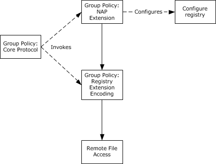
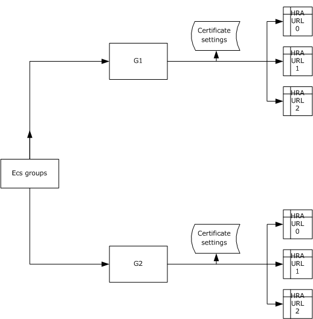
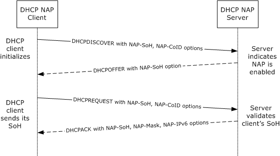

[MS-GPNAP]:

Group Policy: Network Access Protection (NAP) Extension

Intellectual Property Rights Notice for Open Specifications Documentation

  Technical Documentation. Microsoft publishes Open Specifications documentation (“this

documentation”) for protocols, file formats, data portability, computer languages, and standards
support. Additionally, overview documents cover inter-protocol relationships and interactions.

  Copyrights. This documentation is covered by Microsoft copyrights. Regardless of any other

terms that are contained in the terms of use for the Microsoft website that hosts this
documentation, you can make copies of it in order to develop implementations of the technologies
that are described in this documentation and can distribute portions of it in your implementations
that use these technologies or in your documentation as necessary to properly document the
implementation. You can also distribute in your implementation, with or without modification, any
schemas, IDLs, or code samples that are included in the documentation. This permission also
applies to any documents that are referenced in the Open Specifications documentation.
  No Trade Secrets. Microsoft does not claim any trade secret rights in this documentation.
  Patents. Microsoft has patents that might cover your implementations of the technologies

described in the Open Specifications documentation. Neither this notice nor Microsoft's delivery of
this documentation grants any licenses under those patents or any other Microsoft patents.
However, a given Open Specifications document might be covered by the Microsoft Open
Specifications Promise or the Microsoft Community Promise. If you would prefer a written license,
or if the technologies described in this documentation are not covered by the Open Specifications
Promise or Community Promise, as applicable, patent licenses are available by contacting
iplg@microsoft.com.

  License Programs. To see all of the protocols in scope under a specific license program and the

associated patents, visit the Patent Map.

  Trademarks. The names of companies and products contained in this documentation might be
covered by trademarks or similar intellectual property rights. This notice does not grant any
licenses under those rights. For a list of Microsoft trademarks, visit
www.microsoft.com/trademarks.

  Fictitious Names. The example companies, organizations, products, domain names, email

addresses, logos, people, places, and events that are depicted in this documentation are fictitious.
No association with any real company, organization, product, domain name, email address, logo,
person, place, or event is intended or should be inferred.

Reservation of Rights. All other rights are reserved, and this notice does not grant any rights other
than as specifically described above, whether by implication, estoppel, or otherwise.

Tools. The Open Specifications documentation does not require the use of Microsoft programming
tools or programming environments in order for you to develop an implementation. If you have access
to Microsoft programming tools and environments, you are free to take advantage of them. Certain
Open Specifications documents are intended for use in conjunction with publicly available standards
specifications and network programming art and, as such, assume that the reader either is familiar
with the aforementioned material or has immediate access to it.

Support. For questions and support, please contact dochelp@microsoft.com.

[MS-GPNAP] - v20170601
Group Policy: Network Access Protection (NAP) Extension
Copyright © 2017 Microsoft Corporation
Release: June 1, 2017

1 / 35

Revision Summary

Date

Revision
History

Revision
Class

4/23/2010

0.1

6/4/2010

1.0

7/16/2010

1.1

8/27/2010

1.1

10/8/2010

1.1

11/19/2010  1.1

1/7/2011

1.1

2/11/2011

1.1

3/25/2011

2.0

5/6/2011

3.0

6/17/2011

3.1

9/23/2011

3.1

12/16/2011  4.0

3/30/2012

5.0

7/12/2012

5.0

10/25/2012  5.0

1/31/2013

6.0

8/8/2013

7.0

11/14/2013  7.0

2/13/2014

7.0

5/15/2014

7.0

6/30/2015

7.0

10/16/2015  7.0

7/14/2016

7.0

Major

Major

Minor

None

None

None

None

None

Major

Major

Minor

None

Major

Major

None

None

Major

Major

None

None

None

None

None

None

Comments

First Release.

Updated and revised the technical content.

Clarified the meaning of the technical content.

No changes to the meaning, language, or formatting of the
technical content.

No changes to the meaning, language, or formatting of the
technical content.

No changes to the meaning, language, or formatting of the
technical content.

No changes to the meaning, language, or formatting of the
technical content.

No changes to the meaning, language, or formatting of the
technical content.

Updated and revised the technical content.

Updated and revised the technical content.

Clarified the meaning of the technical content.

No changes to the meaning, language, or formatting of the
technical content.

Updated and revised the technical content.

Updated and revised the technical content.

No changes to the meaning, language, or formatting of the
technical content.

No changes to the meaning, language, or formatting of the
technical content.

Updated and revised the technical content.

Updated and revised the technical content.

No changes to the meaning, language, or formatting of the
technical content.

No changes to the meaning, language, or formatting of the
technical content.

No changes to the meaning, language, or formatting of the
technical content.

No changes to the meaning, language, or formatting of the
technical content.

No changes to the meaning, language, or formatting of the
technical content.

No changes to the meaning, language, or formatting of the

2 / 35

[MS-GPNAP] - v20170601
Group Policy: Network Access Protection (NAP) Extension
Copyright © 2017 Microsoft Corporation
Release: June 1, 2017

Date

Revision
History

Revision
Class

Comments

technical content.

6/1/2017

7.0

None

No changes to the meaning, language, or formatting of the
technical content.

[MS-GPNAP] - v20170601
Group Policy: Network Access Protection (NAP) Extension
Copyright © 2017 Microsoft Corporation
Release: June 1, 2017

3 / 35

## Table of Contents

- [1 Introduction](#1-introduction)
  - [1.1 Glossary](#11-glossary)
  - [1.2 References](#12-references)
    - [1.2.1 Normative References](#121-normative-references)
    - [1.2.2 Informative References](#122-informative-references)
  - [1.3 Overview](#13-overview)
    - [1.3.1 Background](#131-background)
    - [1.3.2 Group Policy Extension Overview](#132-group-policy-extension-overview)
  - [1.4 Relationship to Protocols and Other Structures](#14-relationship-to-protocols-and-other-structures)
  - [1.5 Applicability Statement](#15-applicability-statement)
  - [1.6 Versioning and Localization](#16-versioning-and-localization)
  - [1.7 Vendor-Extensible Fields](#17-vendor-extensible-fields)
- [2 Structures](#2-structures)
  - [2.1 Trace Settings](#21-trace-settings)
    - [2.1.1 Enable Tracing](#211-enable-tracing)
    - [2.1.2 Tracing Level](#212-tracing-level)
  - [2.2 User Interface Settings](#22-user-interface-settings)
    - [2.2.1 SmallText](#221-smalltext)
    - [2.2.2 LargeText](#222-largetext)
    - [2.2.3 ImageFile](#223-imagefile)
    - [2.2.4 ImageFileName](#224-imagefilename)
  - [2.3 Enforcement Client Settings](#23-enforcement-client-settings)
    - [2.3.1 DHCP Enforcement](#231-dhcp-enforcement)
    - [2.3.2 Remote Access Enforcement](#232-remote-access-enforcement)
    - [2.3.3 IPsec Enforcement](#233-ipsec-enforcement)
    - [2.3.4 RDG Enforcement](#234-rdg-enforcement)
    - [2.3.5 EAP Enforcement](#235-eap-enforcement)
  - [2.4 Health Registration Authority (HRA) Settings](#24-health-registration-authority-hra-settings)
    - [2.4.1 PKCS#10 Certificate Settings](#241-pkcs10-certificate-settings)
      - [2.4.1.1 Cryptographic Service Provider (CSP)](#2411-cryptographic-service-provider-csp)
      - [2.4.1.2 Cryptographic Provider Type](#2412-cryptographic-provider-type)
      - [2.4.1.3 Public Key OID](#2413-public-key-oid)
      - [2.4.1.4 Public Key Length](#2414-public-key-length)
      - [2.4.1.5 Public Key Spec](#2415-public-key-spec)
      - [2.4.1.6 Hash Algorithm OID](#2416-hash-algorithm-oid)
    - [2.4.2 HRA Auto-Discovery](#242-hra-auto-discovery)
    - [2.4.3 Use SSL](#243-use-ssl)
    - [2.4.4 HRA URLs](#244-hra-urls)
      - [2.4.4.1 Server](#2441-server)
      - [2.4.4.2 Order](#2442-order)
    - [2.4.5 Reconnect Attempts](#245-reconnect-attempts)
  - [2.5 SoH Settings](#25-soh-settings)
    - [2.5.1 Task Timer](#251-task-timer)
    - [2.5.2 Backward Compatible](#252-backward-compatible)
- [3 Structure Examples](#3-structure-examples)
- [4 Security](#4-security)
  - [4.1 Security Considerations for Implementers](#41-security-considerations-for-implementers)
  - [4.2 Index of Security Fields](#42-index-of-security-fields)
- [5 Appendix A: Product Behavior](#5-appendix-a-product-behavior)
- [6 Change Tracking](#6-change-tracking)
- [7 Index](#7-index)

## 1 Introduction

The Group Policy: Network Access Protection (NAP) Extension protocol specifies functionality to control
client computer access to network resources. Access can be granted or restricted per client computer
based on its identity and its degree of compliance with corporate governance policy. For non-
compliant client computers, NAP specifies automatic methods to reinstate compliance and to
dynamically upgrade access to network resources.

Sections 1.7 and 2 of this specification are normative. All other sections and examples in this
specification are informative.

### 1.1 Glossary

This document uses the following terms:

Active Directory domain: A domain hosted on Active Directory. For more information, see [MS-

ADTS].

certification authority (CA): A third party that issues public key certificates. Certificates serve
to bind public keys to a user identity. Each user and certification authority (CA) can decide
whether to trust another user or CA for a specific purpose, and whether this trust is to be
transitive. For more information, see [RFC3280].

client-side extension GUID (CSE GUID): A GUID  that enables a specific client-side extension
on the Group Policy client to be associated with policy data that is stored in the logical and
physical components of a Group Policy Object (GPO) on the Group Policy server, for that
particular extension.

cryptographic service provider (CSP): A software module that implements cryptographic

functions for calling applications that generates digital signatures. Multiple CSPs can be installed.
A CSP is identified by a name represented by a NULL-terminated Unicode string.

domain: A set of users and computers sharing a common namespace and management

infrastructure. At least one computer member of the set has to act as a domain controller
(DC) and host a member list that identifies all members of the domain, as well as optionally
hosting the Active Directory service. The domain controller provides authentication of members,
creating a unit of trust for its members. Each domain has an identifier that is shared among its
members. For more information, see [MS-AUTHSOD] section 1.1.1.5 and [MS-ADTS].

domain controller (DC): The service, running on a server, that implements Active Directory, or
the server hosting this service. The service hosts the data store for objects and interoperates
with other DCs to ensure that a local change to an object replicates correctly across all DCs.
When Active Directory is operating as Active Directory Domain Services (AD DS), the DC
contains full NC replicas of the configuration naming context (config NC), schema naming
context (schema NC), and one of the domain NCs in its forest. If the AD DS DC is a global
catalog server (GC server), it contains partial NC replicas of the remaining domain NCs in its
forest. For more information, see [MS-AUTHSOD] section 1.1.1.5.2 and [MS-ADTS]. When
Active Directory is operating as Active Directory Lightweight Directory Services (AD LDS),
several AD LDS DCs can run on one server. When Active Directory is operating as AD DS, only
one AD DS DC can run on one server. However, several AD LDS DCs can coexist with one AD
DS DC on one server. The AD LDS DC contains full NC replicas of the config NC and the schema
NC in its forest. The domain controller is the server side of Authentication Protocol Domain
Support [MS-APDS].

Dynamic Host Configuration Protocol (DHCP): A protocol that provides a framework for

passing configuration information to hosts on a TCP/IP network, as described in [RFC2131].

[MS-GPNAP] - v20170601
Group Policy: Network Access Protection (NAP) Extension
Copyright © 2017 Microsoft Corporation
Release: June 1, 2017

6 / 35

enforcement client: An enforcement client uses the health state of a computer to request a

certain level of access to a network. For more information about enforcement clients, see
[MSDN-NAP].

globally unique identifier (GUID): A term used interchangeably with universally unique

identifier (UUID) in Microsoft protocol technical documents (TDs). Interchanging the usage of
these terms does not imply or require a specific algorithm or mechanism to generate the value.
Specifically, the use of this term does not imply or require that the algorithms described in
[RFC4122] or [C706] have to be used for generating the GUID. See also universally unique
identifier (UUID).

Group Policy: A mechanism that allows the implementer to specify managed configurations for

users and computers in an Active Directory service environment.

Group Policy Object (GPO): A collection of administrator-defined specifications of the policy
settings that can be applied to groups of computers in a domain. Each GPO includes two
elements: an object that resides in the Active Directory for the domain, and a corresponding file
system subdirectory that resides on the sysvol DFS share of the Group Policy server for the
domain.

Group Policy server: A server holding a database of Group Policy Objects (GPOs) that can be
retrieved by other machines. The Group Policy server has to be a domain controller (DC).

health certificate enrollment agent (HCEA): The client-side component in the Health Certificate
Enrollment Protocol. The HCEA is responsible for receiving health certificates from a health
registration authority (HRA). This term can also be used to refer to the client machine in the
Health Certificate Enrollment Protocol.

health registration authority (HRA): The server-side component in the Health Certificate

Enrollment Protocol. The HRA is a registration authority (RA) that requests a health certificate
from a certification authority (CA) upon validation of health.

language code identifier (LCID): A 32-bit number that identifies the user interface human

language dialect or variation that is supported by an application or a client computer.

Lightweight Directory Access Protocol (LDAP): The primary access protocol for Active

Directory. Lightweight Directory Access Protocol (LDAP) is an industry-standard protocol,
established by the Internet Engineering Task Force (IETF), which allows users to query and
update information in a directory service (DS), as described in [MS-ADTS]. The Lightweight
Directory Access Protocol can be either version 2 [RFC1777] or version 3 [RFC3377].

Network Access Protection (NAP): A feature of an operating system that provides a platform
for system health-validated access to private networks. NAP provides a way of detecting the
health state of a network client that is attempting to connect to or communicate on a network,
and limiting the access of the network client until the health policy requirements have been met.
NAP is implemented through quarantines and health checks, as specified in [TNC-IF-
TNCCSPBSoH].

object identifier (OID): In the context of a directory service, a number identifying an object
class or attribute. Object identifiers are issued by the ITU and form a hierarchy. An OID is
represented as a dotted decimal string (for example, "1.2.3.4"). For more information on OIDs,
see [X660] and [RFC3280] Appendix A. OIDs are used to uniquely identify certificate templates
available to the certification authority (CA). Within a certificate, OIDs are used to identify
standard extensions, as described in [RFC3280] section 4.2.1.x, as well as non-standard
extensions.

public key: One of a pair of keys used in public-key cryptography. The public key is distributed
freely and published as part of a digital certificate. For an introduction to this concept, see
[CRYPTO] section 1.8 and [IEEE1363] section 3.1.

7 / 35

[MS-GPNAP] - v20170601
Group Policy: Network Access Protection (NAP) Extension
Copyright © 2017 Microsoft Corporation
Release: June 1, 2017

Public Key Cryptography Standards (PKCS): A group of Public Key Cryptography Standards

published by RSA Laboratories.

registry: A local system-defined database in which applications and system components store and
retrieve configuration data. It is a hierarchical data store with lightly typed elements that are
logically stored in tree format. Applications use the registry API to retrieve, modify, or delete
registry data. The data stored in the registry varies according to the version of the operating
system.

statement of health (SoH): A collection of data generated by a system health entity, as specified
in [TNC-IF-TNCCSPBSoH], which defines the health state of a machine. The data is interpreted
by a Health Policy Server, which determines whether the machine is healthy or unhealthy
according to the policies defined by an administrator.

statement of health response (SoHR): A collection of data that represents the evaluation of the

statement of health (SoH) according to network policies, as specified in [TNC-IF-
TNCCSPBSoH].

system health agent (SHA): The client components that make declarations on a specific aspect
of the client health state and generate a statement of health ReportEntry (SoH ReportEntry).

tool extension GUID or administrative plug-in GUID: A GUID defined separately for each of
the user policy settings and computer policy settings that associates a specific administrative
tool plug-in with a set of policy settings that can be stored in a Group Policy Object (GPO).

Unicode: A character encoding standard developed by the Unicode Consortium that represents

almost all of the written languages of the world. The Unicode standard [UNICODE5.0.0/2007]
provides three forms (UTF-8, UTF-16, and UTF-32) and seven schemes (UTF-8, UTF-16, UTF-16
BE, UTF-16 LE, UTF-32, UTF-32 LE, and UTF-32 BE).

MAY, SHOULD, MUST, SHOULD NOT, MUST NOT: These terms (in all caps) are used as defined
in [RFC2119]. All statements of optional behavior use either MAY, SHOULD, or SHOULD NOT.

### 1.2 References

Links to a document in the Microsoft Open Specifications library point to the correct section in the
most recently published version of the referenced document. However, because individual documents
in the library are not updated at the same time, the section numbers in the documents may not
match. You can confirm the correct section numbering by checking the Errata.

#### 1.2.1 Normative References

We conduct frequent surveys of the normative references to assure their continued availability. If you
have any issue with finding a normative reference, please contact dochelp@microsoft.com. We will
assist you in finding the relevant information.

[MS-DHCPN] Microsoft Corporation, "Dynamic Host Configuration Protocol (DHCP) Extensions for
Network Access Protection (NAP)".

[MS-DTYP] Microsoft Corporation, "Windows Data Types".

[MS-GPOL] Microsoft Corporation, "Group Policy: Core Protocol".

[MS-GPREG] Microsoft Corporation, "Group Policy: Registry Extension Encoding".

[MS-HCEP] Microsoft Corporation, "Health Certificate Enrollment Protocol".

[MS-LCID] Microsoft Corporation, "Windows Language Code Identifier (LCID) Reference".

[MS-GPNAP] - v20170601
Group Policy: Network Access Protection (NAP) Extension
Copyright © 2017 Microsoft Corporation
Release: June 1, 2017

8 / 35

[MS-PEAP] Microsoft Corporation, "Protected Extensible Authentication Protocol (PEAP)".

[MS-TSGU] Microsoft Corporation, "Terminal Services Gateway Server Protocol".

[RFC2119] Bradner, S., "Key words for use in RFCs to Indicate Requirement Levels", BCP 14, RFC
2119, March 1997, https://www.rfc-editor.org/info/rfc2119

[RFC2616] Fielding, R., Gettys, J., Mogul, J., et al., "Hypertext Transfer Protocol -- HTTP/1.1", RFC
2616, June 1999, https://www.rfc-editor.org/info/rfc2616

[RFC2782] Gulbrandsen, A., Vixie, P., and Esibov, L., "A DNS RR for specifying the location of services
(DNS SRV)", RFC 2782, February 2000, https://www.rfc-editor.org/info/rfc2782

[RFC2818] Rescorla, E., "HTTP Over TLS", RFC 2818, May 2000, https://www.rfc-
editor.org/info/rfc2818

[RFC2986] Nystrom, M. and Kaliski, B., "PKCS#10: Certificate Request Syntax Specification", RFC
2986, November 2000, http://www.rfc-editor.org/info/rfc2986

[RFC3174] Eastlake III, D., and Jones, P., "US Secure Hash Algorithm 1 (SHA1)", RFC 3174,
September 2001, https://www.rfc-editor.org/info/rfc3174

[RFC3447] Jonsson, J. and Kaliski, B., "Public-Key Cryptography Standards (PKCS) #1: RSA
Cryptography Specifications Version 2.1", RFC 3447, February 2003, https://www.rfc-
editor.org/info/rfc3447

[TNC-IF-TNCCSPBSoH] TCG, "TNC IF-TNCCS: Protocol Bindings for SoH", version 1.0, May 2007,
https://trustedcomputinggroup.org/tnc-if-tnccs-protocol-bindings-soh/

#### 1.2.2 Informative References

[MS-NAPOD] Microsoft Corporation, "Network Access Protection Protocols Overview".

[MSDN-ALG] Microsoft Corporation, "CNG Algorithm Identifiers", http://msdn.microsoft.com/en-
us/library/aa375534(VS.85).aspx

[MSDN-CSP] Microsoft Corporation, "Cryptographic Provider Names", http://msdn.microsoft.com/en-
us/library/aa380243.aspx

[MSDN-DHCP] Microsoft Corporation, "Dynamic Host Configuration Protocol",
http://technet.microsoft.com/en-us/network/bb643151.aspx

[MSDN-NAP] Microsoft Corporation, "Network Access Protection", http://msdn.microsoft.com/en-
us/library/aa369712(VS.85).aspx

[MSDN-RAS] Microsoft Corporation, "RASENTRY structure", http://msdn.microsoft.com/en-
us/library/aa377274.aspx

[MSDN-SC] Microsoft Corporation, "Smart Card Minidrivers", https://learn.microsoft.com/en-
us/windows-hardware/drivers/smartcard/smart-card-minidrivers

[MSFT-IPSEC] Microsoft Corporation, "IPsec", http://technet.microsoft.com/en-
us/network/bb531150.aspx

[MSFT-NAPIPSEC] Microsoft Corporation, "IPsec Enforcement Configuration",
http://technet.microsoft.com/en-us/library/dd125312(WS.10).aspx

[MSFT-RDG] Microsoft Corporation, "Configuring the TS Gateway NAP Scenario",
http://technet.microsoft.com/en-us/library/cc732172(WS.10).aspx

9 / 35

[MS-GPNAP] - v20170601
Group Policy: Network Access Protection (NAP) Extension
Copyright © 2017 Microsoft Corporation
Release: June 1, 2017

### 1.3 Overview

Network Access Protection (NAP) is a platform that controls access to network resources, based
on a client computer's identity and compliance with corporate governance policy. NAP allows network
administrators to define granular levels of network access, based on who a client is, the groups to
which the client belongs, and the degree to which that client is compliant with corporate governance
policy. Based on the degree of compliance, NAP can implement different enforcement methods that
can restrict or limit client access to the network. If a client is not compliant, NAP provides a
mechanism to automatically bring the client back into compliance and then to dynamically increase its
level of network access. The NAP architecture is specified in [MS-NAPOD].

The behavior of NAP can be controlled through Group Policy by updating the client registry, as
specified in [MS-GPOL] and in [MS-GPREG]. This mechanism can be used by an administrator to
enable or disable NAP enforcement, to set Health Registration Authorities (HRAs) to be used by
the client, and to control client user interface and tracing. All NAP group policies are machine-specific,
meaning that the same policy is applied to all users on a given machine.

#### 1.3.1 Background

The Group Policy: Core Protocol, as specified in [MS-GPOL], allows clients to discover and retrieve
policy settings created by administrators of a domain. These settings are persisted within Group
Policy Objects (GPOs) assigned to policy target accounts, which are either computer accounts or user
accounts in Active Directory. Each client uses the Lightweight Directory Access Protocol (LDAP)
to determine which GPOs are applicable to it by consulting the Active Directory objects corresponding
to its computer account and the user accounts of any users that log on to the client computer.

On each client, each GPO is interpreted and acted upon by software components known as client-side
plug-ins. Each client-side plug-in is associated with a specific class of settings. The client-side plug-ins
that are responsible for a given GPO are specified by using an attribute on the GPO. This attribute
specifies a list of GUID pairs. The first GUID of each pair is referred to as a client-side extension
GUID (CSE GUID). The second GUID of each pair is referred to as a tool extension GUID.

For each GPO that is applicable to a client, the client consults the CSE GUIDs listed in the GPO to
determine which client-side plug-ins on the client will handle the GPO. The client then invokes the
client-side plug-ins to handle the GPO. Next, the client-side plug-in uses the contents of the GPO to
retrieve and process settings specific to its class, in a manner specific to the plug-in.

#### 1.3.2 Group Policy Extension Overview

NAP client configuration Group Policy settings are accessible from a GPO through the Group Policy:
NAP Extension to the Group Policy: Core Protocol. The extension provides a mechanism for
administrative tools to obtain metadata about registry-based settings.

The process of configuring and applying the NAP Group Policy settings consists of the following steps:

1.  An administrator invokes a Group Policy administrative tool to administer the NAP client

configuration settings through the Group Policy: NAP Extension. The NAP Extension reads and
updates a generic settings database using the Group Policy: Registry Extension Encoding, as
specified in [MS-GPREG] section 3.1.5.8, which results in the storage and retrieval of settings on a
Group Policy server. These settings describe configuration parameters to be applied to a generic
settings database on a client that is affected by the GPO.

The administrator views the data and updates it as desired.

2.  A client computer affected by that GPO is started (or is connected to the network, if this happens
after the client starts), and the Group Policy: Core Protocol is invoked by the client to retrieve
Policy Settings from the Group Policy server. As part of this processing, the registry extension's
CSE GUID (as specified in [MS-GPREG] section 1.9) is read from the GPO.

10 / 35

[MS-GPNAP] - v20170601
Group Policy: Network Access Protection (NAP) Extension
Copyright © 2017 Microsoft Corporation
Release: June 1, 2017

<!-- Extracted images from page 11 -->

<!-- /Extracted images from page 11 -->

3.  The presence of the registry extension's CSE GUID (as specified in [MS-GPREG] section 1.9) in the
GPO instructs the client to invoke a registry extension plug-in component for policy application.
This component parses the file of settings and saves them in the generic settings database
(registry) on the local machine.

4.  The NAP subsystem on the client recognizes that its configuration has been updated and takes the

appropriate actions.

This document specifies the behavior of the administrative plug-in mentioned in step 1. The operation
of the Group Policy: Core Protocol in step 2 is specified in [MS-GPOL] section 3.2. The process of
retrieving the settings in step 3 is specified in [MS-GPREG] section 3.2. Step 4 is specific to a NAP
client implementation.

### 1.4 Relationship to Protocols and Other Structures

Configuration changes updated on the Group Policy server are dependent on the Group Policy:
Registry Extension Encoding, as specified in [MS-GPREG] section 3.1.5.8 (and all protocols specified in
[MS-GPREG] section 1.4), which reads the Group Policy: NAP Extension data structure and updates
the registry.pol file on the Group Policy server.

The distribution of the Group Policy: NAP Extension data structure to the client is dependent on the
Group Policy: Registry Extension Encoding, as specified in [MS-GPREG] (and all protocols specified in
[MS-GPREG] section 1.4), which retrieves settings from a GPO and populates those settings in the
client registry.

The Group Policy: Registry Extension Encoding as specified in [MS-GPREG] is invoked as an extension
of the Group Policy: Core Protocol, as specified in [MS-GPOL].

The generic settings database<1> on the local machine maintains the local configuration, which is
used by the NAP in case the local machine does not participate in Group Policy.<2>

[MS-GPNAP] - v20170601
Group Policy: Network Access Protection (NAP) Extension
Copyright © 2017 Microsoft Corporation
Release: June 1, 2017

11 / 35

Figure 1: Protocol relationship diagram

### 1.5 Applicability Statement

The Group Policy: NAP Extension is applicable only within the Group Policy framework and is used to
configure certain aspects of NAP behavior on such clients.

The Group Policy: NAP Extension has only an administrative-side extension and no client-side
extension. This extension updates the generic settings database<3> and is documented here for
informative purposes only.

### 1.6 Versioning and Localization

This document covers versioning issues in the following areas:

  Structure Versions: There is no versioning mechanism in the Group Policy: NAP Extension. If new
functionality is required that would be incompatible with the existing registry settings, a new
Group Policy extension is implemented.



Localization: Localization-dependent registry content is specified in section 2.2.

The Group Policy: NAP client configuration contains registry keys with data that is used for display
purposes; these keys can contain localization-dependent content.

### 1.7 Vendor-Extensible Fields

The Group Policy: NAP Extension does not define any vendor-extensible fields.

This structure defines tool extension GUID values, as specified in [MS-GPOL] section 1.8. The
following assignment represents the GUID in string format.

Parameter

Value

Tool extension GUID (computer policy settings)  {A2A54893-AAF2-49A3-B3F5-CC43CEBCC27C}

[MS-GPNAP] - v20170601
Group Policy: Network Access Protection (NAP) Extension
Copyright © 2017 Microsoft Corporation
Release: June 1, 2017

12 / 35

## 2 Structures

This protocol references commonly used data types as defined in [MS-DTYP]. The NAP Group Policy
administrative plug-in uses the transport specified in [MS-GPOL] to read and modify settings in the
central policy store. Information is retrieved from the policy store by the Group Policy: Registry
Extension Encoding ([MS-GPREG] section 3.2), which writes the information to the client's registry.

The NAP Group Policy client configuration is implemented as a set of entries in the machine-specific
Registry Policy file used by the Group Policy: Registry Extension Encoding. To support the NAP Group
Policy option, the NAP administrative plug-in MUST be able to write and query the corresponding entry
in the machine-specific Registry Policy file of the relevant GPO.

The following NAP Group Policy client configurations are defined:



Trace settings

  User interface settings



Enforcement client settings

  Health registration authority (HRA) settings

  Statement of health (SoH) settings

The following sections specify the format of the corresponding entries in the machine-specific Registry
Policy file. The intent of various settings is also described in the following sections; however, these
settings are processed by the NAP system in the client, and their descriptions here are only for
informative purposes, not for normative purposes.

### 2.1 Trace Settings

The NAP client tracing functionality settings are compounded from two registry entries that are
represented in the machine-specific Registry Policy file as follows:

Key: Software\Policies\Microsoft\NetworkAccessProtection\ClientConfig\

#### 2.1.1 Enable Tracing

Value: "Enable Tracing" or one of the value names specified in the table in [MS-GPREG] section
3.2.5.1 specifying how the value is deleted.

Type: REG_DWORD.

Size: Equal to the size of the Data field.

Data: A 32-bit unsigned integer.

Value

Meaning

0x00000000  Disables NAP tracing on the client.

0x00000001  Enables NAP tracing on the client.

[MS-GPNAP] - v20170601
Group Policy: Network Access Protection (NAP) Extension
Copyright © 2017 Microsoft Corporation
Release: June 1, 2017

13 / 35

#### 2.1.2 Tracing Level

Value: "Tracing Level" or one of the value names listed in the table in [MS-GPREG] section 3.2.5.1
specifying how the value is deleted.

Type: REG_DWORD.

Size: Equal to size of the Data field.

Data: A 32-bit unsigned integer.

Value

Meaning

0x00000000  Disables NAP tracing on the client.

0x00000001  Sets NAP tracing on the client to basic level.

0x00000002  Sets NAP tracing on the client to advanced level.

0x00000003  Sets NAP tracing on the client to debug level.

### 2.2 User Interface Settings

The NAP client uses user interface registry content as display information when user interface
registry keys are available; otherwise, the user interface will not display a title and description. The
user interface registry keys can contain localization-dependent content. User interface registry entries
can be represented in the machine-specific Registry Policy file as follows:

Key: Software\Policies\Microsoft\NetworkAccessProtection\ClientConfig\UI\<LCID>

The <LCID> language code identifier (LCID) values are specified in [MS-LCID] section 2.2.

#### 2.2.1 SmallText

Value: "SmallText" or one of the value names listed in the table in [MS-GPREG] section 3.2.5.1
specifying how the value is deleted.

Type: REG_SZ.

Size: Equal to size of the Data field.

Data: A variable-length null-terminated Unicode string. This setting specifies the user notification title
displayed to the user.

#### 2.2.2 LargeText

Value: "LargeText" or one of the value names listed in the table in [MS-GPREG] section 3.2.5.1
specifying how the value is deleted.

Type: REG_SZ.

Size: Equal to the size of the Data field.

Data: A variable-length null-terminated Unicode string. This setting specifies the user notification
sub-title displayed to the user.

[MS-GPNAP] - v20170601
Group Policy: Network Access Protection (NAP) Extension
Copyright © 2017 Microsoft Corporation
Release: June 1, 2017

14 / 35

#### 2.2.3 ImageFile

The ImageFile entry can be represented in the machine-specific Registry Policy file as follows:

Value: "ImageFile" or one of the value names listed in the table in [MS-GPREG] section 3.2.5.1
specifying how the value is deleted.

Type: REG_BINARY.

Size: Equal to the size of the Data field.

Data: An octet stream representing an image that is displayed in the NAP client user interface. The
data interpretation is determined by the image file name extension specified in
ImageFileName (section 2.2.4).

NAP client implementations interpret this setting as the company logo to display. If this key is missing,
no image is displayed. Implementations MAY choose to support this option. If this option is supported,
the image file name key (see ImageFileName (section 2.2.4) MUST be available.

#### 2.2.4 ImageFileName

Value: "ImageFileName" or one of the value names listed in the table in [MS-GPREG] section 3.2.5.1
specifying how the value is deleted.

Type: REG_SZ.

Size: Equal to size of the Data field.

Data: A variable-length null-terminated Unicode string. This setting is used to determine the format
of the image data specified in section 2.2.3. File formats, as indicated in the file type extension,
include but are not restricted to bmp, icon, gif, jpeg, exif, png, tiff, wmf, or emf.

### 2.3 Enforcement Client Settings

A NAP enforcement client uses the health state of a computer to request a certain level of access to
a network. This is done using NAP protocol SoH ([TNC-IF-TNCCSPBSoH] section 3.5) and statement
of health response (SoHR) ([TNC-IF-TNCCSPBSoH] section 3.6) messages exchanged between a
client and a server to validate client conformance with corporate security policies.

Different types of mechanisms transport SoHs intended to manage the health of connected resources.
These mechanisms, called enforcement clients, are configured from the NAP Group Policy and are
listed in the following table.

<qec-
id>
value

79617

Enforcement client

Dynamic Host
Configuration Protocol
(DHCP)

Description

Enforces health policies when a client computer attempts to obtain an IP
address from a DHCP server. The implementation is specified in section
2.3.1.

Remote access

79618

Enforces health policies when a client computer attempts to gain access to
the network through a virtual private network (VPN) connection. The
implementation is specified in section 2.3.2.

Internet Protocol
security (IPsec)

79619

Enforces health policies when a client computer attempts to communicate
with another computer using IPsec. The implementation is specified in
section 2.3.3.

Wireless EAPOL

79620

Enforces health policies when a client computer attempts to access a

15 / 35

[MS-GPNAP] - v20170601
Group Policy: Network Access Protection (NAP) Extension
Copyright © 2017 Microsoft Corporation
Release: June 1, 2017

<qec-
id>
value

79621

79623

Enforcement client

Remote desktop
gateway (RDG)

Extensible
Authentication Protocol
(EAP)

Description

network through an 802.1X wireless connection or an authenticating
switch connection.<4> The implementation is specified in section 2.3.5.

Enforces health policies when a client computer attempts to gain access to
an RDG. The implementation is specified in section 2.3.4.

Enforces health policies when a client computer attempts to access a
network through an 802.1X wireless connection or an authenticating
switch connection. The implementation is specified in section 2.3.5.

For more information on NAP enforcement clients, see [MSDN-NAP].

The NAP enforcement client settings are compounded from one registry entry per enforcement client
that MUST be represented in the machine-specific Registry Policy file as follows:

Key: Software\Policies\Microsoft\NetworkAccessProtection\ClientConfig\Qecs\<qec-id>

All the <qec-id> keys MUST have the following value:

Value: "Enabled" or one of the value names listed in the table in [MS-GPREG] section 3.2.5.1
specifying how the value is deleted.

Type: REG_DWORD.

Size: Equal to size of the Data field.

Data: A 32-bit unsigned integer.

Value

Meaning

0x00000000  Disables NAP enforcement.

0x00000001  Enables NAP enforcement.

#### 2.3.1 DHCP Enforcement

The Dynamic Host Configuration Protocol (DHCP) NAP enforcement client provides functionality
in the DHCP client service that uses industry standard DHCP messages to exchange system health
messages specified in section 2.3.

The client sends system health information to the DHCP enforcement server, using DHCP Extensions,
as specified in [MS-DHCPN]. The DHCP server can send the SoH to a policy server (for example NPS)
for evaluation. Based on the policy server response, the DHCP enforcement server can provide IP
addressing information that allows the client to connect to other computers, or it can provide IP
addressing information that limits the computers to which the client can connect. Alternatively, the
DHCP enforcement server might not provide IP addressing information.

For more information on DHCP, see [MSDN-DHCP].

#### 2.3.2 Remote Access Enforcement

The remote access NAP enforcement client provides functionality in the Remote Access Service
(RAS) that makes it possible to connect a remote client computer to a network server over a virtual
private network (VPN) and to send health information provided by NAP.

16 / 35

[MS-GPNAP] - v20170601
Group Policy: Network Access Protection (NAP) Extension
Copyright © 2017 Microsoft Corporation
Release: June 1, 2017

When a client attempts to access a network over VPN, the VPN server can request an SoHR response
message ([TNC-IF-TNCCSPBSoH] section 3.6) from the client by sending some PEAP TLV ([MS-PEAP])
messages. If the RAS enforcement client is enabled on the client, it responds with an SoH message, as
specified in [MS-PEAP] section 2.2.8. The RAS server might send the SoH message to a policy server
(for example NPS) for evaluation. Based on the policy server response, the RAS server can create a
VPN connection that enables the client to connect to other computers on the network, or the RAS
server can quarantine the client by limiting the computers to which it can connect using the VPN
connection. Alternatively, the RAS server can reject the client access request.

For more information on RAS clients, see [MSDN-RAS].

#### 2.3.3 IPsec Enforcement

The IPsec NAP enforcement client is a component that obtains an SoH, as specified in section 2.3,
and sends it to a HRA. The protocol used by the client to communicate with the HRA is called the
Health Certificate Enrollment Protocol (HCEP), as specified in [MS-HCEP].

The HCEP request message payload sent by the Health Certificate Enrollment Agent (HCEA) contains a
PKCS #10 certificate request, as specified in [RFC2986], which contains an SoH message ([TNC-IF-
TNCCSPBSoH] section 3.5).

The HRA sends the SoH to a policy server (for example NPS) for evaluation. Based on the policy server
response, the HRA performs the following steps:





If the policy server response is that the client is compliant with corporate health policy, the HRA
requests a certificate authority (CA) to issue a certificate and sends the issued certificate back
to the client.

If the client's health state is not compliant, the HRA can request a certificate from the certificate
authority (CA), with the certificate containing an indication that the client is unhealthy.

In the IPsec scenario, the client is able to connect to a network, but the client does not have a valid
health certificate for communicating on that network until the HCEP message exchange is completed.
If the client is non-compliant, the HRA might not provide a health certificate.

The IPsec NAP enforcement client also interacts with the IPsec components to ensure that the health
certificate is used for IPsec-protected communication.

For more information, see [MSFT-IPSEC] and [MSFT-NAPIPSEC].

The IPsec NAP enforcement client can be configured to use the local predefined IPsec policy rather
than the default IPsec policy. The use local IPsec policy registry entry can be represented in the
machine-specific Registry Policy file as follows:

Key: Software\Policies\Microsoft\NetworkAccessProtection\ClientConfig

Value: "PlumbIpsecPolicy" or one of the value names specified in the table in [MS-GPREG] section
3.2.5.1 specifying how the value is deleted.

Type: REG_DWORD.

Size: Equal to size of the Data field.

Data: A 32-bit unsigned integer.

Value

Meaning

0x00000000  Allows the use of domain-based IPsec Group Policy on the client.

0x00000001  Uses the local IPsec policy on the client.

[MS-GPNAP] - v20170601
Group Policy: Network Access Protection (NAP) Extension
Copyright © 2017 Microsoft Corporation
Release: June 1, 2017

17 / 35

#### 2.3.4 RDG Enforcement

The NAP remote desktop gateway (RDG) enforcement client is a component that obtains the SoH
from NAP as specified in section 2.3 and uses it while the client connects to a remote desktop server.

While attempting to access an RDG server, the remote desktop client (RDC) obtains an SoH, as
specified in section 2.3, and sends it in the TSGU, as specified in [MS-TSGU].

The RDG server MAY send the SoH to a policy server (for example MPS) for evaluation. Based on the
policy server response, the RDG server MAY grant access to the RDC, or the remote desktop server
MAY grant access but deny access to certain machine resources such as hard drives, disks, PnP
devices, and clipboards.<5>

For more information on RDG and NAP, see [MSFT-RDG].

#### 2.3.5 EAP Enforcement

The NAP EAP enforcement client extends the 802.1x supplicant, allows responding to an SoH
Request TLV message with an SoH TLV message, as specified in section 2.3, and sends the response
using an 802.1x supplicant for 802.1x-authenticated connections, as described in [MS-NAPOD].<6>

While attempting to access a LAN or WLAN using an 802.1x connection, the 802.1x supplicant obtains
an SoH as specified in section 2.3 and sends it in PEAP-Type-Length-Value (TLV) extension, as
specified in [MS-PEAP] section 2.2.8. The 802.1x server can send the SoH to a policy server (for
example NPS) for evaluation. Based on the policy server response, the 802.1x server can enable the
client to connect to other computers on the network or can restrict the traffic of the NAP client by
specifying a restricted network that limits access to specific resources on the network, as described in
[MS-NAPOD]. Alternatively, the 802.1x server can reject supplicant access.

### 2.4 Health Registration Authority (HRA) Settings

NAP HRAs are divided into groups that use the same certificate security settings specified in section
2.3.3. The HRA groups are represented in the registry as depicted in the following figure.

[MS-GPNAP] - v20170601
Group Policy: Network Access Protection (NAP) Extension
Copyright © 2017 Microsoft Corporation
Release: June 1, 2017

18 / 35

<!-- Extracted images from page 19 -->

<!-- /Extracted images from page 19 -->

Figure 2: Health certificate server (hcs) groups registry representation

The NAP HRA settings are compounded from multiple registry entries that MUST be represented in the
machine-specific Registry Policy file as follows:

Key: Software\Policies\Microsoft\NetworkAccessProtection\ClientConfig\Enroll\HcsGroups\<Server-

Group>

<Server-Group> is the name of the HRAs group.

#### 2.4.1 PKCS#10 Certificate Settings

The health certificate enrollment agent (HCEA) MUST be configured with the required security
parameters to construct the Public Key Cryptography Standards (PKCS) #10 certificate request,
as specified in [MS-HCEP] section 2.2.1.4.

These security parameters are configured in the NAP Group Policy. If the IPsec enforcement client is
enabled, as specified in section 2.3, the security parameters entries MUST be represented in the
machine-specific Registry Policy file as follows:

[MS-GPNAP] - v20170601
Group Policy: Network Access Protection (NAP) Extension
Copyright © 2017 Microsoft Corporation
Release: June 1, 2017

19 / 35

Key:  Software\Policies\Microsoft\NetworkAccessProtection\ClientConfig\ Enroll\HcsGroups\<Server-

Group>

Security parameter values follow in sections 2.4.1.1 through 2.4.1.6.

##### 2.4.1.1 Cryptographic Service Provider (CSP)

The name of the cryptographic service provider (CSP) used to generate the key pair on the HCEA.

Value: "CSP" or one of the value names specified in the table in [MS-GPREG] section 3.2.5.1

specifying how the value is deleted.

Type: REG_SZ.

Size: Equal to size of the Data field.

Data: A variable-length null-terminated Unicode string. This setting specifies the name of the CSP

used.

The following CSPs are available by default. <7>

CSP

Description

Microsoft Base
Cryptographic Provider
v1.0

Microsoft Strong
Cryptographic Provider

Microsoft Enhanced
Cryptographic Provider
v1.0

A broad set of basic cryptographic functionality that can be exported to other
countries or regions.

An extension of the Microsoft Base Cryptographic Provider.

Microsoft Base Cryptographic Provider with support for longer keys and additional
algorithms.

Microsoft AES
Cryptographic Provider

Microsoft Enhanced Cryptographic Provider with support for AES encryption
algorithms.

Microsoft Base DSS
Cryptographic Provider

Provides hashing, data signing, and signature verification capability, using the Secure
Hash Algorithm 1 (SHA1) and Digital Signature Standard (DSS) algorithms.

Microsoft Base DSS and
Diffie-Hellman
Cryptographic Provider

A superset of the DSS Cryptographic Provider that also supports Diffie-Hellman key
exchange, hashing, data signing, and signature verification, using the Secure Hash
Algorithm 1 (SHA1) and Digital Signature Standard (DSS) algorithms.

Microsoft Enhanced DSS
and Diffie-Hellman
Cryptographic Provider

Microsoft DH SChannel
Cryptographic Provider

Supports Diffie-Hellman key exchange (a 40-bit DES derivative), SHA hashing, DSS
data signing, and DSS signature verification.

Supports hashing, data signing with DSS, generating Diffie-Hellman (D-H) keys,
exchanging D-H keys, and exporting a D-H key. This CSP supports key derivation for
the SSL3 and TLS1 protocols.

Microsoft RSA/Schannel
Cryptographic Provider

Supports hashing, data signing, and signature verification. The algorithm identifier
CALG_SSL3_SHAMD5 is used for SSL 3.0 and TLS 1.0 client authentication. This CSP
supports key derivation for the SSL2, PCT1, SSL3, and TLS1 protocols.

Microsoft Base Smart
Card Crypto Provider

Provides all of the functionality of the Microsoft Strong Cryptographic Provider.
The Microsoft Base Smart Card Cryptographic Service Provider communicates with
individual smart cards that translate the characteristics of particular smart cards into
a uniform interface. For more information on smart cards, see [MSDN-SC].

Microsoft Exchange
Cryptographic Provider

A 64-bit block encryption CSP tied to the Mail API.

20 / 35

[MS-GPNAP] - v20170601
Group Policy: Network Access Protection (NAP) Extension
Copyright © 2017 Microsoft Corporation
Release: June 1, 2017

CSP

v1.0

Description

##### 2.4.1.2 Cryptographic Provider Type

The type of the CSP used to generate the key pair on the HCEA. There are many different standard
data formats and protocols that CSP can use. These are generally organized into types, each of which
has its own set of data formats and processing rules. For more information about CSP types, see
[MSDN-CSP].

Value: "CSPType" or one of the value names specified in the table in [MS-GPREG] section 3.2.5.1

specifying how the value is deleted.

Type: REG_DWORD.

Size: Equal to size of the Data field.

Data: A 32-bit value consisting of the following type values.

Name

Value

Meaning

PROV_RSA_FULL

0x00000001  Supports both digital signatures and data encryption. It is considered a
general purpose CSP. The RSA public key algorithm is used for all public
key operations.

PROV_DSS

0x00000003  Supports hashes and digital signatures. The signature algorithm

specified by the PROV_DSS provider type is the Digital Signature
Algorithm (DSA).

PROV_RSA_AES

0x00000018  Supports the same as PROV_RSA_FULL with additional AES encryption

capability.

PROV_DSS_DH

0x0000000D  A superset of the PROV_DSS provider type with Diffie-Hellman key

exchange.

PROV_DH_SCHANNEL

0x00000012  Supports both Diffie-Hellman and Schannel protocols.

PROV_RSA_SCHANNEL  0x0000000C  Supports both RSA and Schannel protocols.

PROV_MS_EXCHANGE

0x00000005  Designed for the cryptographic needs of the Exchange mail application
and other applications compatible with Microsoft Mail.

##### 2.4.1.3 Public Key OID

A public key OID is an object identifier (OID) identifying the algorithm of the public-private key
pair associated with the certificate. For more information, see [RFC3447].

Value: "PublicKeyAlgOid" or one of the value names specified in the table in [MS-GPREG] section

3.2.5.1 specifying how the value is deleted.

Type: REG_SZ.

Size: Equal to size of the Data field.

[MS-GPNAP] - v20170601
Group Policy: Network Access Protection (NAP) Extension
Copyright © 2017 Microsoft Corporation
Release: June 1, 2017

21 / 35

Data: A variable-length null-terminated Unicode string. This setting specifies the public key OID

used.

The following table maps public key algorithm names and OIDs. For more information on the key
algorithms, see [MSDN-ALG].

Name

OID

RSA

DSA

DH

1.2.840.113549.1.1.1

1.2.840.10040.4.1

1.2.840.10046.2.1

RSASSA-PSS

1.2.840.113549.1.1.10

DSA

DH

1.3.14.3.2.12

1.2.840.113549.1.3.1

RSA_KEYX

1.3.14.3.2.22

mosaicKMandUpdSig

2.16.840.1.101.2.1.1.20

ESDH

1.2.840.113549.1.9.16.3.5

NO_SIGN

1.3.6.1.5.5.7.6.2

ECC

1.2.840.10045.2.1

ECDSA_P256

1.2.840.10045.3.1.7

ECDSA_P384

1.3.132.0.34

ECDSA_P521

1.3.132.0.35

RSAES_OAEP

1.2.840.113549.1.1.7

ECDH_STD_SHA1_KDF  1.3.133.16.840.63.0.2

##### 2.4.1.4 Public Key Length

The key length of the public-private key pair associated with the certificate. For more information, see
[RFC3447].

Value: "KeyLength" or one of the value names specified in the table in [MS-GPREG] section 3.2.5.1

specifying how the value is deleted.

Type: REG_DWORD.

Size: Equal to size of the Data field.

Data: A 32-bit value consisting of the public key length. The minimum "Public Key Length" expected is
0x00000800. If the "Public Key Length" is less than 0x00000800, the Data received from group
policy is ignored, and the "Public Key Length" field is set to 0x00000800.

[MS-GPNAP] - v20170601
Group Policy: Network Access Protection (NAP) Extension
Copyright © 2017 Microsoft Corporation
Release: June 1, 2017

22 / 35

##### 2.4.1.5 Public Key Spec

When a public-private key pair is generated, several types of keys can be created. Keys can be
created to allow their use with encryption, digital signatures, or both. The Value represents the public
key associated with the certificate.

Value: "PublicKeySpec" or one of the value names specified in the table in [MS-GPREG] section

3.2.5.1 specifying how the value is deleted.<8>

Type: REG_DWORD.

Size: Equal to the size of the Data field.

Data: A 32-bit value that is set to 0x00000001 (AT_KEYEXCHANGE).

##### 2.4.1.6 Hash Algorithm OID

The Hash Algorithm OID is an OID identifying the hash algorithm used to sign the certificate request.
For more information on hash algorithms, see [RFC3174].

Value: "HashAlgOid" or one of the value names listed in the table in [MS-GPREG] section 3.2.5.1

specifying how the value is deleted.

Type: REG_SZ.

Size: Equal to size of the Data field.

Data: A variable-length null-terminated Unicode string. This setting specifies the public key OID

used.

The list of supported hash algorithm OIDs follows.

Name

OID

sha1RSA

1.2.840.113549.1.1.5

md5RSA

1.2.840.113549.1.1.4

sha1DSA

1.2.840.10040.4.3

sha1RSA

1.3.14.3.2.29

shaRSA

1.3.14.3.2.15

md5RSA

1.3.14.3.2.3

md2RSA

1.2.840.113549.1.1.2

md4RSA

1.2.840.113549.1.1.3

md4RSA

1.3.14.3.2.2

md4RSA

1.3.14.3.2.4

md2RSA

1.3.14.7.2.3.1

sha1DSA

1.3.14.3.2.13

dsaSHA1

1.3.14.3.2.27

mosaicUpdatedSig  2.16.840.1.101.2.1.1.19

[MS-GPNAP] - v20170601
Group Policy: Network Access Protection (NAP) Extension
Copyright © 2017 Microsoft Corporation
Release: June 1, 2017

23 / 35

Name

OID

sha1NoSign

1.3.14.3.2.26

md5NoSign

1.2.840.113549.2.5

sha256NoSign

2.16.840.1.101.3.4.2.1

sha384NoSign

2.16.840.1.101.3.4.2.2

sha512NoSign

2.16.840.1.101.3.4.2.3

sha256RSA

1.2.840.113549.1.1.11

sha384RSA

1.2.840.113549.1.1.12

sha512RSA

1.2.840.113549.1.1.13

RSASSA-PSS

1.2.840.113549.1.1.10

sha1ECDSA

1.2.840.10045.4.1

sha256ECDSA

1.2.840.10045.4.3.2

sha384ECDSA

1.2.840.10045.4.3.3

sha512ECDSA

1.2.840.10045.4.3.4

specifiedECDSA

1.2.840.10045.4.3

#### 2.4.2 HRA Auto-Discovery

HRA groups can be set by group policy or can be discovered automatically by the NAP client using
DNS SRV lookup, as specified in [RFC2782]. A NAP client discovers a suitable HRA at start-up using
the following sequence:

1.  Query SRV records for HRAs in the Active Directory site of the client (for example,

_hra._tcp.<sitename>._sites.<domainname>)

2.  Query SRV records for HRAs in the Active Directory domain of the client (for example,

_hra._tcp.<domainname>)

3.  Query SRV records for HRAs in the DNS domain of the client (for example,

_hra._tcp.<DNSname>)

To enable HRA auto discovery, a registry setting entry MUST be represented in the machine-specific
Registry Policy file as follows:

Key: Software\Policies\Microsoft\NetworkAccessProtection\ClientConfig\Enroll\HcsGroups

Value: "EnableDiscovery" or one of the value names specified in the table in [MS-GPREG] section

3.2.5.1 specifying how the value is deleted.

Type: REG_DWORD.

Size: Equal to the size of the Data field.

Data: A 32-bit unsigned integer.

[MS-GPNAP] - v20170601
Group Policy: Network Access Protection (NAP) Extension
Copyright © 2017 Microsoft Corporation
Release: June 1, 2017

24 / 35

Value

Meaning

0x00000000  Disables HRA auto discovery.

0x00000001  Enables HRA auto discovery.

#### 2.4.3 Use SSL

The HCEP uses HTTP (as specified in [RFC2616]) or HTTP over TLS (as specified in [RFC2818]) as the
transport for its messages. To configure how HCEP connects to the HRA, a registry setting entry MUST
be represented in the machine-specific Registry Policy file as follows:

Key: Software\Policies\Microsoft\NetworkAccessProtection\ClientConfig\Enroll\HcsGroups\<Server-

Group>

Value: "AllowNonSSL" or one of the value names specified in the table in [MS-GPREG] section 3.2.5.1

specifying how the value is deleted.

Type: REG_DWORD.

Size: Equal to the size of the Data field.

Data: A 32-bit unsigned integer.

Value

Meaning

0x00000000  Disables SSL.

0x00000001  Enables SSL.

Communication with the HRA is always performed using SSL when HRA auto-discovery is used; see
section 2.4.1.

#### 2.4.4 HRA URLs

Group Policy enables the administrator to configure specific HRA groups by setting the URL. To
configure an HRA URL, a registry entry MUST be represented in the machine-specific Registry Policy
file as follows:

Key: Software\Policies\Microsoft\NetworkAccessProtection\ClientConfig\Enroll\HcsGroups\<Server-

Group>\<String>

<String> is the key name of a specific HRA. The Group Policy: NAP Extension uses Url#.

Url# is the string "Url" with the HRA order in the group concatenated to it. The Policy Group can
define 0 to 254 HRAs in a group. If there are no URLs defined and HRA auto-discovery specified in
section 2.4.2 is set to 0 the NAP client won't be able to request a health certificate as specified in
section 2.3.3.

Example: A URL of the first HRA is defined under the registry key
"Software\Policies\Microsoft\NetworkAccessProtection\ClientConfig\Enroll\HcsGroups\MyGroup\Url0".

##### 2.4.4.1 Server

Value: "Server" or one of the value names specified in the table in [MS-GPREG] section 3.2.5.1

specifying how the value is deleted.

25 / 35

[MS-GPNAP] - v20170601
Group Policy: Network Access Protection (NAP) Extension
Copyright © 2017 Microsoft Corporation
Release: June 1, 2017

Type: REG_SZ.

Size: Equal to size of the Data field.

Data: A variable-length null-terminated Unicode string. This setting specifies the HRA URL to

connect to.

##### 2.4.4.2 Order

Value: "Order" or one of the value names specified in the table in [MS-GPREG] section 3.2.5.1

specifying how the value is deleted.

Type: REG_DWORD.

Size: Equal to size of the Data field.

Data: A 32-bit value in the range from 0x00000000 to 0x000000FE, inclusive.

#### 2.4.5 Reconnect Attempts

Group Policy enables the administrator to configure how long the client waits before attempting to
reconnect to an HRA in the event of a connection failure. To configure a blackout interval, a registry
entry MUST be represented in the machine-specific Registry Policy file as follows:

Key: Software\Policies\Microsoft\NetworkAccessProtection\ClientConfig\Enroll\HcsGroups\<Server-

Group>

Value: "BlackOutIntervalInMinutes" or one of the value names listed in the table in [MS-GPREG]

section 3.2.5.1 specifying how the value is deleted.

Type: REG_DWORD.

Size: Equal to size of the Data field.

Data: A 32-bit value representing time in minutes. For example, 0x0000000A represents 10 minutes

of blackout.

### 2.5 SoH Settings

SoH specified in [TNC-IF-TNCCSPBSoH] has two settings that an administrator can configure using
Group Policy. These settings are represented in the machine-specific registry as values
ShatimeoutInMsec (section 2.5.1) and BackwardCompatible (section 2.5.2). In case these registry
values are not set by the administrator, the settings are assigned default data by the NAP client. To
configure SoH, registry values ShatimeoutInMsec and BackwardCompatible can be present in the
machine-specific Registry Policy file under the following key:

Key: Software\Policies\Microsoft\NetworkAccessProtection\ClientConfig\

#### 2.5.1 Task Timer

A Task Timer is a system health agent (SHA) timeout. A task timer is associated with all function
calls that a SoH client makes to the SHA. The SHA is expected to complete the call within the timeout.
Otherwise, the call is canceled and an error is reported by the SoH client.

Value: "ShatimeoutInMsec" or one of the value names specified in the table in [MS-GPREG] section

3.2.5.1 specifying how the value is deleted.

Type: REG_DWORD.

26 / 35

[MS-GPNAP] - v20170601
Group Policy: Network Access Protection (NAP) Extension
Copyright © 2017 Microsoft Corporation
Release: June 1, 2017

Size: Equal to size of the Data field.

Data: A 32-bit value representing time in milliseconds. For example, 0x0000000A represents 10

milliseconds of blackout.

#### 2.5.2 Backward Compatible

This setting determines the version of the message content, as specified in [TNC-IF-TNCCSPBSoH]
section 3.5.1.1.

Value: "BackwardCompatible" or one of the value names specified in the table in [MS-GPREG] section

3.2.5.1 specifying how the value is deleted.

Type: REG_DWORD.

Size: Equal to size of the Data field.

Data: A 32-bit value consisting of the following values.

Value

Meaning

0x00000001  SSoH ([TNC-IF-TNCCSPBSoH] section 3.5.1.3)

SoHReportEntry (0 plus)

0x00000002  SoH Mode Subheader

SSoH ([TNC-IF-TNCCSPBSoH] section 3.5.1.3)

SoHReportEntry (0 plus)

[MS-GPNAP] - v20170601
Group Policy: Network Access Protection (NAP) Extension
Copyright © 2017 Microsoft Corporation
Release: June 1, 2017

27 / 35

## 3 Structure Examples

In the following example, an administrator sets up a new domain and attempts to enable NAP DHCP
enforcement on the computers in the domain. The client computers run operating systems that
contain NAP client processes initialized at startup and terminated at shutdown.

First, the administrator installs and configures an operating system on a computer that is intended to
function as the domain controller (DC). After taking the necessary steps to designate the computer
as a DC and creating a user account over the new domain, the administrator restarts the machine and
logs on as the newly created user.

Next, the administrator launches the user interface for the administrative plug-in and sets the DHCP
enforcement to Enabled. This causes the following entry to be written to the machine-specific Registry
Policy file of the relevant GPO.

Key: Software\Policies\Microsoft\NetworkAccessProtection\ClientConfig\Qecs\79617

Value: "Enabled".

Type: REG_DWORD.

Size: Equal to the size of the Data field.

Data: 0x00000001.

The administrator then adds client computers to this domain. When a client computer is restarted for
the first time after being added to the domain, it contacts the domain controller (DC) and reads Group
Policy information, as specified in [MS-GPOL]. As part of this process, a machine-specific registry
policy file containing the following items is also downloaded:

  A set of values under the registry key

Software\Policies\Microsoft\NetworkAccessProtection\ClientConfig\Qecs\79617 that indicates that
the NAP client will instruct the DHCP client on the system to send an SoH when requesting the IP
address for the machine, as specified in section 2.3.1.

The Group Policy: Registry Extension Encoding on the client parses this file and adds the configuration
information to the machine's registry.

The NAP client process polls the registry and determines that its Group Policy settings have changed.
The NAP process then reads the enforcement values and sets the system DHCP client to send an SoH.

When a user logs on to the computer, the DHCP client requests the NAP agent for an SoH. NAP
invokes the SHA to collect health information and to generate an SoH. The SoH is then sent by the
DHCP client to the policy server.

The following figure represents such a transaction.

[MS-GPNAP] - v20170601
Group Policy: Network Access Protection (NAP) Extension
Copyright © 2017 Microsoft Corporation
Release: June 1, 2017

28 / 35

<!-- Extracted images from page 29 -->

<!-- /Extracted images from page 29 -->

Figure 3: DHCP new lease acquisition process

When the SoH is sent, the client requests access to a service and, as a precondition for that access, is
required to prove that it is in good health. When the SoH is received, it is forwarded to an
infrastructure server that evaluates the SoH and returns the response (the SoHR) to the client by
means of the original receiver of the SoH.

Generally, the receipt of an SoHR by the client allows access to the service being requested. When the
health of the client is not good, the SoHR is likely to contain sufficient instructions to allow the client
to seek and receive remedy. After the client is restored to good health, the client can initiate the
protocol again.

[MS-GPNAP] - v20170601
Group Policy: Network Access Protection (NAP) Extension
Copyright © 2017 Microsoft Corporation
Release: June 1, 2017

29 / 35

## 4 Security

### 4.1 Security Considerations for Implementers

The Group Policy: NAP Extension sets the NAP enforcement policy on the client computer. This policy
consists of HRA URLs and HRA connection transport and certificate security settings, as well as
enforcement enabling. These configurations can also be set by the user through the NAP configuration
UI. Therefore, it is extremely important that an implementation provide a means of protecting the
integrity of the NAP policy against tampering, especially during its transfer from server to client.
Ideally, this implementation-specific security method is provided as part of the transport for the Group
Policy: Core Protocol.

### 4.2 Index of Security Fields

None.

[MS-GPNAP] - v20170601
Group Policy: Network Access Protection (NAP) Extension
Copyright © 2017 Microsoft Corporation
Release: June 1, 2017

30 / 35

## 5 Appendix A: Product Behavior

The information in this specification is applicable to the following Microsoft products or supplemental
software. References to product versions include updates to those products.

  Windows 2000 operating system

  Windows XP operating system

  Windows Server 2003 operating system

  Windows Server 2003 R2 operating system

  Windows Vista operating system

  Windows Server 2008 operating system

  Windows 7 operating system

  Windows Server 2008 R2 operating system

  Windows 8 operating system

  Windows Server 2012 operating system

  Windows 8.1 operating system

  Windows Server 2012 R2 operating system

Exceptions, if any, are noted in this section. If an update version, service pack or Knowledge Base
(KB) number appears with a product name, the behavior changed in that update. The new behavior
also applies to subsequent updates unless otherwise specified. If a product edition appears with the
product version, behavior is different in that product edition.

Unless otherwise specified, any statement of optional behavior in this specification that is prescribed
using the terms "SHOULD" or "SHOULD NOT" implies product behavior in accordance with the
SHOULD or SHOULD NOT prescription. Unless otherwise specified, the term "MAY" implies that the
product does not follow the prescription.

<1> Section 1.4: Windows implements the generic settings database using the registry.

<2> Section 1.4: Windows maintains the local configuration under the
[HKEY_LOCAL_MACHINE\System\CurrentControlSet\Services\NapAgent] registry key.

<3> Section 1.5: Windows implements the generic settings database using the registry.

<4> Section 2.3: The wireless EAPOL enforcement client is available only on NAP client computers
running Windows XP operating system Service Pack 3 (SP3).

<5> Section 2.3.4: The Remote Desktop Gateway Enforcement Client is available with the following
Windows versions:

  Windows XP SP3 with Remote Desktop Connection (Terminal Services Client 6.0) installed

  Windows Vista

  Windows 7

  Windows 8

  Windows 8.1

[MS-GPNAP] - v20170601
Group Policy: Network Access Protection (NAP) Extension
Copyright © 2017 Microsoft Corporation
Release: June 1, 2017

31 / 35

<6> Section 2.3.5: EAP enforcement is available in the following Windows versions:

  Windows Vista

  Windows 7

  Windows 8

  Windows 8.1

<7> Section 2.4.1.1: For more information about the CSPs that are available on Windows, see
[MSDN-CSP].

<8> Section 2.4.1.5: The value "PublicKeySpec" is supported in Windows 7, Windows 8, and Windows
8.1. In Windows Vista and Windows XP SP3, the value is named "KeyType".

[MS-GPNAP] - v20170601
Group Policy: Network Access Protection (NAP) Extension
Copyright © 2017 Microsoft Corporation
Release: June 1, 2017

32 / 35

## 6 Change Tracking

No table of changes is available. The document is either new or has had no changes since its last
release.

[MS-GPNAP] - v20170601
Group Policy: Network Access Protection (NAP) Extension
Copyright © 2017 Microsoft Corporation
Release: June 1, 2017

33 / 35

## 7 Index
A

Applicability 11

B

Backward compatible settings 26

C

Change tracking 32
Common data types and fields 12
Cryptographic
   provider type 20
   service provider 19

D

Data types and fields - common 12
Details
   backward compatible settings 26
   common data types and fields 12
   cryptographic
      provider type 20
      service provider 19
   DHCP enforcement 15
   EAP enforcement 17
   enable tracing value 12
   enforcement client settings 14
   hash algorithm OID 22
   HRA
      auto-discovery 23
      settings 17
      URLs 24
   ImageFile value 13
   ImageFileName value 14
   IPsec enforcement 16
   LargeText value 13
   order value 25
   PKCS#10 certificate settings 18
   public key
      length 21
      OID 20
      spec 22
   RDG enforcement 17
   reconnect attempts 25
   remote access enforcement 15
   server value 24
   SmallText value 13
   SoH settings 25
   task timer 25
   trace settings 12
   tracing level value 12
   use SSL 24
   user interface settings 13
DHCP enforcement 15

E

EAP enforcement 17
Enable tracing value 12
Enforcement

   client settings 14
   DHCP 15
   EAP 17
   IPsec 16
   RDG 17
   remote access 15
Example 27
Examples 27

F

Fields
   security index 29
   vendor-extensible 11
Fields - security index 29
Fields - vendor-extensible 11

G

Glossary 5

H

Hash algorithm OID 22
HRA
   auto-discovery 23
   settings 17
   URLs 24

I

ImageFile value 13
ImageFileName value 14
Implementer - security considerations 29
Index of security fields 29
Informative references 8
Introduction 5
IPsec enforcement 16

L

LargeText value 13
Localization 11

N

Normative references 7

O

Order value 25
Overview
   background 9
   Group Policy extension overview 9
   synopsis 9
Overview (synopsis) 9

P

PKCS#10 certificate settings 18
Product behavior 30
Public key

[MS-GPNAP] - v20170601
Group Policy: Network Access Protection (NAP) Extension
Copyright © 2017 Microsoft Corporation
Release: June 1, 2017

34 / 35

   length 21
   OID 20
   spec 22

R

RDG enforcement 17
Reconnect attempts 25
References 7
   informative 8
   normative 7
Relationship to protocols and other structures 10
Remote access enforcement 15

S

Security
   field index 29
   implementer considerations 29
Server value 24
Settings
   backward compatible 26
   enforcement client 14
   HRA 17
   PKCS#10 certificate 18
   SoH 25
   trace 12
   user interface 13
SmallText value 13
SoH settings 25
Structures
   enforcement client 14
   HRA 17
   overview 12
   SoH 25
   trace 12
   user interface 13

T

Task timer 25
Trace settings 12
Tracing level value 12
Tracking changes 32

U

Use SSL 24
User interface settings 13

V

Values
   enable tracing 12
   ImageFile 13
   ImageFileName 14
   LargeText 13
   order 25
   server 24
   SmallText 13
   tracing level 12
Vendor-extensible fields 11
Versioning 11

[MS-GPNAP] - v20170601
Group Policy: Network Access Protection (NAP) Extension
Copyright © 2017 Microsoft Corporation
Release: June 1, 2017

35 / 35

