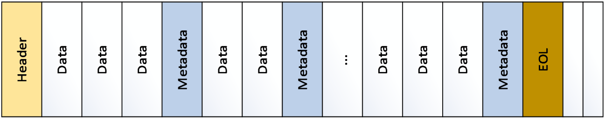
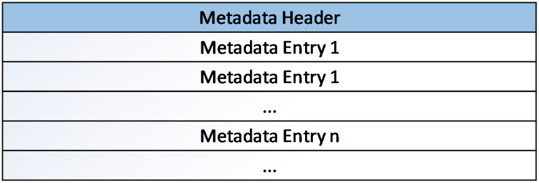
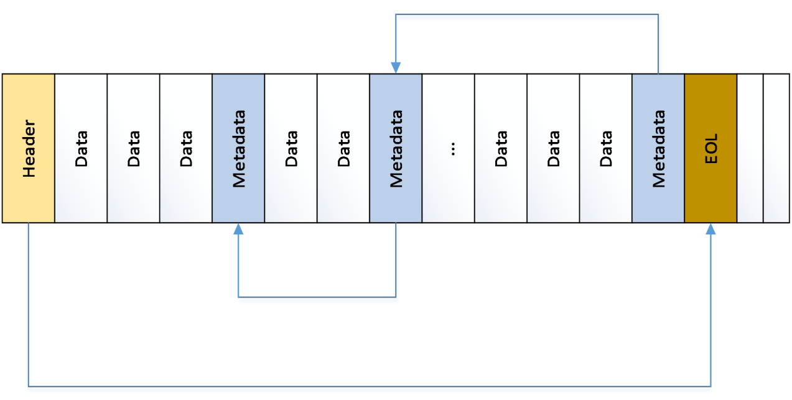

[MS-HRL]:

Hyper-V Replica Log (HRL) File Format

Intellectual Property Rights Notice for Open Specifications Documentation

  Technical Documentation. Microsoft publishes Open Specifications documentation (“this

documentation”) for protocols, file formats, data portability, computer languages, and standards
support. Additionally, overview documents cover inter-protocol relationships and interactions.

  Copyrights. This documentation is covered by Microsoft copyrights. Regardless of any other

terms that are contained in the terms of use for the Microsoft website that hosts this
documentation, you can make copies of it in order to develop implementations of the technologies
that are described in this documentation and can distribute portions of it in your implementations
that use these technologies or in your documentation as necessary to properly document the
implementation. You can also distribute in your implementation, with or without modification, any
schemas, IDLs, or code samples that are included in the documentation. This permission also
applies to any documents that are referenced in the Open Specifications documentation.
  No Trade Secrets. Microsoft does not claim any trade secret rights in this documentation.
  Patents. Microsoft has patents that might cover your implementations of the technologies

described in the Open Specifications documentation. Neither this notice nor Microsoft's delivery of
this documentation grants any licenses under those patents or any other Microsoft patents.
However, a given Open Specifications document might be covered by the Microsoft Open
Specifications Promise or the Microsoft Community Promise. If you would prefer a written license,
or if the technologies described in this documentation are not covered by the Open Specifications
Promise or Community Promise, as applicable, patent licenses are available by contacting
iplg@microsoft.com.

  License Programs. To see all of the protocols in scope under a specific license program and the

associated patents, visit the Patent Map.

  Trademarks. The names of companies and products contained in this documentation might be
covered by trademarks or similar intellectual property rights. This notice does not grant any
licenses under those rights. For a list of Microsoft trademarks, visit
www.microsoft.com/trademarks.

  Fictitious Names. The example companies, organizations, products, domain names, email

addresses, logos, people, places, and events that are depicted in this documentation are fictitious.
No association with any real company, organization, product, domain name, email address, logo,
person, place, or event is intended or should be inferred.

Reservation of Rights. All other rights are reserved, and this notice does not grant any rights other
than as specifically described above, whether by implication, estoppel, or otherwise.

Tools. The Open Specifications documentation does not require the use of Microsoft programming
tools or programming environments in order for you to develop an implementation. If you have access
to Microsoft programming tools and environments, you are free to take advantage of them. Certain
Open Specifications documents are intended for use in conjunction with publicly available standards
specifications and network programming art and, as such, assume that the reader either is familiar
with the aforementioned material or has immediate access to it.

Support. For questions and support, please contact dochelp@microsoft.com.

[MS-HRL] - v20240423
Hyper-V Replica Log (HRL) File Format
Copyright © 2024 Microsoft Corporation
Release: April 23, 2024

1 / 20

Revision Summary

Date

Revision History  Revision Class  Comments

7/14/2016  1.0

6/1/2017

2.0

9/15/2017  3.0

9/12/2018  4.0

4/7/2021

5.0

4/23/2024  6.0

New

Major

Major

Major

Major

Major

Released new document.

Significantly changed the technical content.

Significantly changed the technical content.

Significantly changed the technical content.

Significantly changed the technical content.

Significantly changed the technical content.

[MS-HRL] - v20240423
Hyper-V Replica Log (HRL) File Format
Copyright © 2024 Microsoft Corporation
Release: April 23, 2024

2 / 20

Table of Contents

1.1
1.2

1.2.1
1.2.2

1  Introduction ............................................................................................................ 4
Glossary ........................................................................................................... 4
References ........................................................................................................ 4
Normative References ................................................................................... 4
Informative References ................................................................................. 4
Overview .......................................................................................................... 4
Relationship to Protocols and Other Structures ...................................................... 4
Applicability Statement ....................................................................................... 4
Versioning and Localization ................................................................................. 4
Vendor-Extensible Fields ..................................................................................... 5

1.3
1.4
1.5
1.6
1.7

2  Structures ............................................................................................................... 6
Log File Format .................................................................................................. 6
Log File Header Format ....................................................................................... 6
Metadata Header Format ..................................................................................... 8
Log Metadata Entry Format ................................................................................. 8
Log Traversing Algorithm .................................................................................... 9
Checksum Algorithm ........................................................................................ 10

2.1
2.2
2.3
2.4
2.5
2.6

3  Structure Examples ............................................................................................... 12

4  Security ................................................................................................................. 17
Security Considerations for Implementers ........................................................... 17
Index of Security Fields .................................................................................... 17

4.1
4.2

5  Appendix A: Product Behavior ............................................................................... 18

6  Change Tracking .................................................................................................... 19

7  Index ..................................................................................................................... 20

[MS-HRL] - v20240423
Hyper-V Replica Log (HRL) File Format
Copyright © 2024 Microsoft Corporation
Release: April 23, 2024

3 / 20

1  Introduction

This specification defines the Hyper-V Replica Log (HRL) File Format, which provides a persistent
backing store for files that track changes that have been made to the primary server. These files,
called log files, record each write request; each entry provides information about the address range
that is modified and new data in that range. Log files are written sequentially with the newest record
appended to the end of the log file.

Sections 1.7 and 2 of this specification are normative. All other sections and examples in this
specification are informative.

1.1  Glossary

MAY, SHOULD, MUST, SHOULD NOT, MUST NOT: These terms (in all caps) are used as defined
in [RFC2119]. All statements of optional behavior use either MAY, SHOULD, or SHOULD NOT.

1.2  References

Links to a document in the Microsoft Open Specifications library point to the correct section in the
most recently published version of the referenced document. However, because individual documents
in the library are not updated at the same time, the section numbers in the documents may not
match. You can confirm the correct section numbering by checking the Errata.

1.2.1  Normative References

We conduct frequent surveys of the normative references to assure their continued availability. If you
have any issue with finding a normative reference, please contact dochelp@microsoft.com. We will
assist you in finding the relevant information.

[RFC2119] Bradner, S., "Key words for use in RFCs to Indicate Requirement Levels", BCP 14, RFC
2119, March 1997, https://www.rfc-editor.org/info/rfc2119

1.2.2  Informative References

None.

1.3  Overview

This document covers the format of HRL files that a creator application needs to adhere to so that the
file can be parsed by Hyper-V. The HRL traversing algorithm is also covered (see section 2.5).

1.4  Relationship to Protocols and Other Structures

None.

1.5  Applicability Statement

This file format provides a persistent backing store for file changes that need to be tracked and have
been made to the primary server.

1.6  Versioning and Localization

The version of the HRL File Format is determined by the value of the LogFormatVersion field in the
header, as defined in section 2.2.

4 / 20

[MS-HRL] - v20240423
Hyper-V Replica Log (HRL) File Format
Copyright © 2024 Microsoft Corporation
Release: April 23, 2024

HRL Version

Log Format Version 1<1>

Log Format Version 2

Value

0x00010000

0x00020000

1.7  Vendor-Extensible Fields

None.

[MS-HRL] - v20240423
Hyper-V Replica Log (HRL) File Format
Copyright © 2024 Microsoft Corporation
Release: April 23, 2024

5 / 20

<!-- Extracted images from page 6 -->

<!-- /Extracted images from page 6 -->

2  Structures

2.1  Log File Format

The following figure is a simplified representation of the log file. The log file header contains
identification information, stores the size of the metadata field, and stores the location of the last valid
metadata to indicate the end of the log.

Figure 1: Log file Structure

Each metadata item consists of a metadata header and metadata entries. The first entry of the
metadata header stores the previous metadata location in the log file. This is used in traversing the
metadata structures from the bottom of the log.

Figure 2: Metadata structure

The log file is optimized for writing sequentially. Therefore, the metadata describing each log entry is
written after each set of data entries.

2.2  Log File Header Format

The log file header stores information about the log.

 struct _CTLOG_HEADER_PACKED{
    UCHAR Cookie [8];
     ULONG LogFormatVersion;
     ULONG TimeStamp;
     UCHAR CreatorApplication[4];
     ULONG CreatorVersion;
     ULONG64 OriginalSize;
     ULONG64 CurrentSize;
     ULONG Checksum;
     ULONG64 EOLLocation;
     LONG  ErrorCode;
     ULONG MetadataSize;
     UCHAR UniqueId[16];
     UCHAR PreviousUniqueId[16];
     ULONG LastModifiedTimeStamp;

[MS-HRL] - v20240423
Hyper-V Replica Log (HRL) File Format
Copyright © 2024 Microsoft Corporation
Release: April 23, 2024

6 / 20

     ULONG64 TotalMetadataEntries;
     ULONG FileType;
     UCHAR Flags[2];
     UCHAR Vhd2DataWriteGuid[16]
     UCHAR Reserved[3970];
}

Cookie: This field is used to uniquely identify the original creator of the log file. The values are case-

sensitive.

This field MUST be set to “msctlog” to identify this file as a log file. The cookie is stored as an
eight-character ASCII string with the “m” in the first byte, the “s” in the second byte, and so on.

LogFormatVersion: This field MUST be initialized to 0x00020000. It is divided into a major/minor

version and matches the version of the specification used in creating the file. The most-significant
two bytes are for the major version. The least-significant two bytes are the minor version.

TimeStamp: This field stores the creation time of the log file. Its value is the number of seconds

since January 1, 2000, 12:00:00 AM in UTC/GMT.

CreatorApplication: This field is a left-justified text field used to identify which application created

the log file. It uses a single-byte character set. If the log file is created by Failover Replication, "ct"
is written in this field. This is not verified as part of the file verification.

CreatorVersion: This field holds the major/minor version of the application that created the hard disk
image. For Failover Replication, this value is set to winver. This is not verified as part of the file
verification exercise.

OriginalSize: This field stores the size of the log file, in bytes, at the time it was created.

CurrentSize: This field stores the current size of the log file, in bytes.

This value is the same as the original size when the log file is created. This value can change
depending on whether the log file is expanded.

Checksum: This field holds a checksum of the log file header. Its value is a one’s complement of the

sum of all the bytes in the header not including the checksum field.

If the checksum verification fails, then the log file is assumed to be corrupt.

EOLLocation: This field indicates the offset of the end of the log file. This field is reset to zero upon

opening the file and set to the correct value on closing the file. This field can be used to ascertain
whether the file was closed properly. For example, an EOL value of zero in the header indicates
that the file did not close properly.

MetadataSize: This field indicates the size of the metadata used in the log file. Typical metadata

sizes are multiples of 512 bytes. The default is 4,096 bytes.

UniqueId: This field is a unique ID that identifies the log file. It is a 128-bit universally unique

identifier (UUID).

PreviousUniqueId: This field indicates the unique ID of the previous log file. It can be used to build

a log file chain. This field is a 128-bit universally unique identifier (UUID).

FileType: This field identifies the type of the log file. For an HRL file, this field’s value is set to 0.

Flags: This field is not used and MUST be set to 0.

[MS-HRL] - v20240423
Hyper-V Replica Log (HRL) File Format
Copyright © 2024 Microsoft Corporation
Release: April 23, 2024

7 / 20

Vhd2DataWriteGuid: This field stores the Data Write GUID of VHD2. This helps in detecting offline
Patch detection, that is, modifying the content of VHD when change tracking is not enabled. This
field is not present in Log Format Version 1.

Reserved: This field is reserved and MUST be set to 0. It is 3,970 bytes in size to make the total

header size equal to 4096.

2.3  Metadata Header Format

Each metadata block has a small header to indicate the valid number of log entries in that metadata.

 struct _CTLOG_METADATA_HEADER_PACKED{
    ULONG64 PreviousMetadataLocation;
     ULONG ValidMetadataEntries;
     ULONG Checksum
     UCHAR Reserved[16];
}

PreviousMetadataLocation: This field contains the relative location of the previous metadata in the

log file. It is used when reading the metadata blocks quickly while replaying the log on the
recovery. It has to be set to 0 for the first metadata.

ValidMetadataEntries: This field contains the count of valid metadata entries in the metadata. It is

used to indicate the last metadata entry.

Checksum: Contains the checksum of the header. The checksum calculation algorithm is specified in

section 2.6 with the Checksum field set to 0 during calculation.

Reserved: This field MUST be set to 0. It is 16 bytes in size.

2.4  Log Metadata Entry Format

The following is the format of the metadata entry.

 struct _CTLOG_METADATA_ENTRY_PACKED{
    ULONG64 ByteOffset;
     ULONG Checksum
     ULONG DataLength;
     ULONG TimeStamp;
     BYTE  MetaOperation
     ULONG DataChecksum
     UCHAR Location
     UCHAR Reserved[6];
}

ByteOffset: This field contains the byte offset on the logical disk where the data has to be written.

Checksum: This field contains the checksum of the metadata entry. The checksum calculation
algorithm is specified in section 2.6 with the Checksum field set to 0 during calculation.

DataLength: This field indicates the length of the data to be written on the disk.

TimeStamp: This field stores the time of the writing of this particular log entry. This is the number of

seconds since January 1, 2000, 12:00:00 AM in UTC/GMT.

MetaOperation: This field contains the meta-operation identifier. Only write operation (value:1) is

supported.

[MS-HRL] - v20240423
Hyper-V Replica Log (HRL) File Format
Copyright © 2024 Microsoft Corporation
Release: April 23, 2024

8 / 20

DataChecksum: This field contains the checksum of the data associated with this metadata entry.

The checksum calculation algorithm is specified in section 2.6.

Location: This field contains the internal tracing-related information. It needs to be set to 0.

Reserved: This field MUST be set to 0. It is 6 bytes in size.

2.5  Log Traversing Algorithm

The log file is optimized for writing sequentially. Therefore, the metadata describing each log entry is
written after the data entries. For the log file’s data to be read, a two-pass traversal of the log needs
to be performed. The first pass retrieves metadata locations. In the second pass, which is more
comprehensive, each log entry pointed to by the metadata is read for applying to the recovery. See
the figure at the end of this section.

The following steps are used to traverse a log file:

1.  Initialize a stack for storing metadata location offsets.

2.  Read and validate the log file header and retrieve the EOL location from the log file header. Also

read the metadata size.

3.  Using the value of the EOL location and the metadata size, calculate the location of the last

metadata. This is equal to (EOL location – Metadata size).

4.  Call it the current metadata and push its value on to the stack.

5.  Traverse to the location of the current metadata and read the first field of the metadata header

from this location. This field points to the relative location of the previous metadata in the log file
from the current offset.

Previous Metadata Absolute Offset = Current metadata Location – Previous Metadata Location
offset

6.  If this location is nonzero, then go to step 4.

7.  At the end of the first pass, the stack contains the offsets of all the metadata structures in the log

in the correct order.

8.  Pop the value at the top of the stack. This is the location of the first metadata.

9.  Traverse to this location and read the metadata structure.

10. Each entry of the metadata provides the details of a data field in the log that can be read from the

log and applied to the recovery.

11. Each metadata entry provides the length of the data written in the log. Since data is written

sequentially, the start of the data field will immediately follow the end of the last data field, the
end of the log header, or the previous metadata header.

12. Read all the data entries pointed to by the metadata structure, and then go to step 8. Repeat

steps 8-11 until the stack is empty.

[MS-HRL] - v20240423
Hyper-V Replica Log (HRL) File Format
Copyright © 2024 Microsoft Corporation
Release: April 23, 2024

9 / 20

<!-- Extracted images from page 10 -->

<!-- /Extracted images from page 10 -->

Figure 3: Log traversing algorithm

2.6  Checksum Algorithm

Calculates the checksum value of a buffer. Checksum is based on 1's compliment of the buffer content

buffer: A pointer to the buffer whose checksum has to be calculated

length: The Length of the above buffer

addressToIgnore: Range of addresses to be ignored in the buffer

return: Checksum value of the buffer

 ULONG
  CalculateChecksum (
     PVOID buffer,
     ULONG length,
     ULONG* addressToIgnore
     )

 {
     PUCHAR address;
     ULONG checksum;

     checksum = 0;
     address = (PUCHAR)buffer;
     while (length != 0) {
         if ((address >= (PUCHAR)addressToIgnore) &&
             (address < (PUCHAR)(addressToIgnore + 1))) {
         } else {
             checksum += *address;
         }

         length -= 1;
         address += 1;
     }

[MS-HRL] - v20240423
Hyper-V Replica Log (HRL) File Format
Copyright © 2024 Microsoft Corporation
Release: April 23, 2024

10 / 20

     return ~checksum;
 }

[MS-HRL] - v20240423
Hyper-V Replica Log (HRL) File Format
Copyright © 2024 Microsoft Corporation
Release: April 23, 2024

11 / 20

3  Structure Examples

The following are examples of the log file header and two metadata headers of the HRL file.

  (**** Log File Header **** )
 Cookie = "msctlog "
 LogFormatVersion = 0x20000 (Major:2,Minor:0)
 TimeStamp = 539842380, ( 8/ 2/2017  4:13: 0)
 CreatorApplication = "ct  "
 CreatorVersion = 0xA0000
 OriginalSize = 0
 CurrentSize = 332288
 Checksum = 4294959739
 EOLLocation = 332288
 Errorcode = 0
 MetadataSize = 4096
 UniqueId = {572fc7ff-1f03-49ab-b3c5-30a665b8e20c}
 PreviousUniqueId = {a8ae4b46-f7ad-4402-87aa-5b33e9f89c77}
 LastModifiedTimeStamp = 539842384, (08/02/2017 04:13:04)
 TotalMetadataEntries = 58
 File Type = 0
 Flags = 0
Vhd2DataWriteGuid = {b9be5c57-f8be-5503-98bb-6c44faf9ac87}

 (**** Metadata Header (#1)(Offset:4096) ****)
 PreviousMetadataLocation = 0
 ValidMetadataEntries = 0
 Checksum = 4294967295

 MetaDataId  MetaOp   Length   ByteOffset Timestamp                          Checksum
 0           0        0        0          0        , ( 1/ 1/2000  0: 0: 0)   0
 0           0        0        0          0        , ( 1/ 1/2000  0: 0: 0)   0
 0           0        0        0          0        , ( 1/ 1/2000  0: 0: 0)   0
 0           0        0        0          0        , ( 1/ 1/2000  0: 0: 0)   0
 0           0        0        0          0        , ( 1/ 1/2000  0: 0: 0)   0
 0           0        0        0          0        , ( 1/ 1/2000  0: 0: 0)   0
 0           0        0        0          0        , ( 1/ 1/2000  0: 0: 0)   0
 0           0        0        0          0        , ( 1/ 1/2000  0: 0: 0)   0
 0           0        0        0          0        , ( 1/ 1/2000  0: 0: 0)   0
 0           0        0        0          0        , ( 1/ 1/2000  0: 0: 0)   0
 0           0        0        0          0        , ( 1/ 1/2000  0: 0: 0)   0
 0           0        0        0          0        , ( 1/ 1/2000  0: 0: 0)   0
 0           0        0        0          0        , ( 1/ 1/2000  0: 0: 0)   0
 0           0        0        0          0        , ( 1/ 1/2000  0: 0: 0)   0
 0           0        0        0          0        , ( 1/ 1/2000  0: 0: 0)   0
 0           0        0        0          0        , ( 1/ 1/2000  0: 0: 0)   0
 0           0        0        0          0        , ( 1/ 1/2000  0: 0: 0)   0
 0           0        0        0          0        , ( 1/ 1/2000  0: 0: 0)   0
 0           0        0        0          0        , ( 1/ 1/2000  0: 0: 0)   0
 0           0        0        0          0        , ( 1/ 1/2000  0: 0: 0)   0
 0           0        0        0          0        , ( 1/ 1/2000  0: 0: 0)   0
 0           0        0        0          0        , ( 1/ 1/2000  0: 0: 0)   0
 0           0        0        0          0        , ( 1/ 1/2000  0: 0: 0)   0
 0           0        0        0          0        , ( 1/ 1/2000  0: 0: 0)   0
 0           0        0        0          0        , ( 1/ 1/2000  0: 0: 0)   0
 0           0        0        0          0        , ( 1/ 1/2000  0: 0: 0)   0
 0           0        0        0          0        , ( 1/ 1/2000  0: 0: 0)   0
 0           0        0        0          0        , ( 1/ 1/2000  0: 0: 0)   0
 0           0        0        0          0        , ( 1/ 1/2000  0: 0: 0)   0
 0           0        0        0          0        , ( 1/ 1/2000  0: 0: 0)   0
 0           0        0        0          0        , ( 1/ 1/2000  0: 0: 0)   0
 0           0        0        0          0        , ( 1/ 1/2000  0: 0: 0)   0
 0           0        0        0          0        , ( 1/ 1/2000  0: 0: 0)   0
 0           0        0        0          0        , ( 1/ 1/2000  0: 0: 0)   0
 0           0        0        0          0        , ( 1/ 1/2000  0: 0: 0)   0
 0           0        0        0          0        , ( 1/ 1/2000  0: 0: 0)   0
 0           0        0        0          0        , ( 1/ 1/2000  0: 0: 0)   0

[MS-HRL] - v20240423
Hyper-V Replica Log (HRL) File Format
Copyright © 2024 Microsoft Corporation
Release: April 23, 2024

12 / 20

 0           0        0        0          0        , ( 1/ 1/2000  0: 0: 0)   0
 0           0        0        0          0        , ( 1/ 1/2000  0: 0: 0)   0
 0           0        0        0          0        , ( 1/ 1/2000  0: 0: 0)   0
 0           0        0        0          0        , ( 1/ 1/2000  0: 0: 0)   0
 0           0        0        0          0        , ( 1/ 1/2000  0: 0: 0)   0
 0           0        0        0          0        , ( 1/ 1/2000  0: 0: 0)   0
 0           0        0        0          0        , ( 1/ 1/2000  0: 0: 0)   0
 0           0        0        0          0        , ( 1/ 1/2000  0: 0: 0)   0
 0           0        0        0          0        , ( 1/ 1/2000  0: 0: 0)   0
 0           0        0        0          0        , ( 1/ 1/2000  0: 0: 0)   0
 0           0        0        0          0        , ( 1/ 1/2000  0: 0: 0)   0
 0           0        0        0          0        , ( 1/ 1/2000  0: 0: 0)   0
 0           0        0        0          0        , ( 1/ 1/2000  0: 0: 0)   0
 0           0        0        0          0        , ( 1/ 1/2000  0: 0: 0)   0
 0           0        0        0          0        , ( 1/ 1/2000  0: 0: 0)   0
 0           0        0        0          0        , ( 1/ 1/2000  0: 0: 0)   0
 0           0        0        0          0        , ( 1/ 1/2000  0: 0: 0)   0
 0           0        0        0          0        , ( 1/ 1/2000  0: 0: 0)   0
 0           0        0        0          0        , ( 1/ 1/2000  0: 0: 0)   0
 0           0        0        0          0        , ( 1/ 1/2000  0: 0: 0)   0
 0           0        0        0          0        , ( 1/ 1/2000  0: 0: 0)   0
 0           0        0        0          0        , ( 1/ 1/2000  0: 0: 0)   0
 0           0        0        0          0        , ( 1/ 1/2000  0: 0: 0)   0
 0           0        0        0          0        , ( 1/ 1/2000  0: 0: 0)   0
 0           0        0        0          0        , ( 1/ 1/2000  0: 0: 0)   0
 0           0        0        0          0        , ( 1/ 1/2000  0: 0: 0)   0
 0           0        0        0          0        , ( 1/ 1/2000  0: 0: 0)   0
 0           0        0        0          0        , ( 1/ 1/2000  0: 0: 0)   0
 0           0        0        0          0        , ( 1/ 1/2000  0: 0: 0)   0
 0           0        0        0          0        , ( 1/ 1/2000  0: 0: 0)   0
 0           0        0        0          0        , ( 1/ 1/2000  0: 0: 0)   0
 0           0        0        0          0        , ( 1/ 1/2000  0: 0: 0)   0
 0           0        0        0          0        , ( 1/ 1/2000  0: 0: 0)   0
 0           0        0        0          0        , ( 1/ 1/2000  0: 0: 0)   0
 0           0        0        0          0        , ( 1/ 1/2000  0: 0: 0)   0
 0           0        0        0          0        , ( 1/ 1/2000  0: 0: 0)   0
 0           0        0        0          0        , ( 1/ 1/2000  0: 0: 0)   0
 0           0        0        0          0        , ( 1/ 1/2000  0: 0: 0)   0
 0           0        0        0          0        , ( 1/ 1/2000  0: 0: 0)   0
 0           0        0        0          0        , ( 1/ 1/2000  0: 0: 0)   0
 0           0        0        0          0        , ( 1/ 1/2000  0: 0: 0)   0
 0           0        0        0          0        , ( 1/ 1/2000  0: 0: 0)   0
 0           0        0        0          0        , ( 1/ 1/2000  0: 0: 0)   0
 0           0        0        0          0        , ( 1/ 1/2000  0: 0: 0)   0
 0           0        0        0          0        , ( 1/ 1/2000  0: 0: 0)   0
 0           0        0        0          0        , ( 1/ 1/2000  0: 0: 0)   0
 0           0        0        0          0        , ( 1/ 1/2000  0: 0: 0)   0
 0           0        0        0          0        , ( 1/ 1/2000  0: 0: 0)   0
 0           0        0        0          0        , ( 1/ 1/2000  0: 0: 0)   0
 0           0        0        0          0        , ( 1/ 1/2000  0: 0: 0)   0
 0           0        0        0          0        , ( 1/ 1/2000  0: 0: 0)   0
 0           0        0        0          0        , ( 1/ 1/2000  0: 0: 0)   0
 0           0        0        0          0        , ( 1/ 1/2000  0: 0: 0)   0
 0           0        0        0          0        , ( 1/ 1/2000  0: 0: 0)   0
 0           0        0        0          0        , ( 1/ 1/2000  0: 0: 0)   0
 0           0        0        0          0        , ( 1/ 1/2000  0: 0: 0)   0
 0           0        0        0          0        , ( 1/ 1/2000  0: 0: 0)   0
 0           0        0        0          0        , ( 1/ 1/2000  0: 0: 0)   0
 0           0        0        0          0        , ( 1/ 1/2000  0: 0: 0)   0
 0           0        0        0          0        , ( 1/ 1/2000  0: 0: 0)   0
 0           0        0        0          0        , ( 1/ 1/2000  0: 0: 0)   0
 0           0        0        0          0        , ( 1/ 1/2000  0: 0: 0)   0
 0           0        0        0          0        , ( 1/ 1/2000  0: 0: 0)   0
 0           0        0        0          0        , ( 1/ 1/2000  0: 0: 0)   0
 0           0        0        0          0        , ( 1/ 1/2000  0: 0: 0)   0
 0           0        0        0          0        , ( 1/ 1/2000  0: 0: 0)   0
 0           0        0        0          0        , ( 1/ 1/2000  0: 0: 0)   0
 0           0        0        0          0        , ( 1/ 1/2000  0: 0: 0)   0
 0           0        0        0          0        , ( 1/ 1/2000  0: 0: 0)   0

[MS-HRL] - v20240423
Hyper-V Replica Log (HRL) File Format
Copyright © 2024 Microsoft Corporation
Release: April 23, 2024

13 / 20

 0           0        0        0          0        , ( 1/ 1/2000  0: 0: 0)   0
 0           0        0        0          0        , ( 1/ 1/2000  0: 0: 0)   0
 0           0        0        0          0        , ( 1/ 1/2000  0: 0: 0)   0
 0           0        0        0          0        , ( 1/ 1/2000  0: 0: 0)   0
 0           0        0        0          0        , ( 1/ 1/2000  0: 0: 0)   0
 0           0        0        0          0        , ( 1/ 1/2000  0: 0: 0)   0
 0           0        0        0          0        , ( 1/ 1/2000  0: 0: 0)   0
 0           0        0        0          0        , ( 1/ 1/2000  0: 0: 0)   0
 0           0        0        0          0        , ( 1/ 1/2000  0: 0: 0)   0
 0           0        0        0          0        , ( 1/ 1/2000  0: 0: 0)   0
 0           0        0        0          0        , ( 1/ 1/2000  0: 0: 0)   0
 0           0        0        0          0        , ( 1/ 1/2000  0: 0: 0)   0
 0           0        0        0          0        , ( 1/ 1/2000  0: 0: 0)   0
 0           0        0        0          0        , ( 1/ 1/2000  0: 0: 0)   0
 0           0        0        0          0        , ( 1/ 1/2000  0: 0: 0)   0
 0           0        0        0          0        , ( 1/ 1/2000  0: 0: 0)   0
 0           0        0        0          0        , ( 1/ 1/2000  0: 0: 0)   0
 0           0        0        0          0        , ( 1/ 1/2000  0: 0: 0)   0
 0           0        0        0          0        , ( 1/ 1/2000  0: 0: 0)   0
 0           0        0        0          0        , ( 1/ 1/2000  0: 0: 0)   0
 0           0        0        0          0        , ( 1/ 1/2000  0: 0: 0)   0

 (Data Entry for Metadata #2 should come here)

 (**** Metadata Header (#2)(Offset:328192) ****)
 PreviousMetadataLocation = 324096
 ValidMetadataEntries = 58
 Checksum = 4294966991

 MetaDataId MetaOp Length      ByteOffset     Timestamp                          Checksum
 0           0      0          0               0        , ( 1/ 1/2000  0: 0: 0)   0
 0           0      0          0               0        , ( 1/ 1/2000  0: 0: 0)   0
 0           0      0          0               0        , ( 1/ 1/2000  0: 0: 0)   0
 0           0      0          0               0        , ( 1/ 1/2000  0: 0: 0)   0
 0           0      0          0               0        , ( 1/ 1/2000  0: 0: 0)   0
 0           0      0          0               0        , ( 1/ 1/2000  0: 0: 0)   0
 0           0      0          0               0        , ( 1/ 1/2000  0: 0: 0)   0
 0           0      0          0               0        , ( 1/ 1/2000  0: 0: 0)   0
 0           0      0          0               0        , ( 1/ 1/2000  0: 0: 0)   0
 0           0      0          0               0        , ( 1/ 1/2000  0: 0: 0)   0
 0           0      0          0               0        , ( 1/ 1/2000  0: 0: 0)   0
 0           0      0          0               0        , ( 1/ 1/2000  0: 0: 0)   0
 0           0      0          0               0        , ( 1/ 1/2000  0: 0: 0)   0
 0           0      0          0               0        , ( 1/ 1/2000  0: 0: 0)   0
 0           0      0          0               0        , ( 1/ 1/2000  0: 0: 0)   0
 0           0      0          0               0        , ( 1/ 1/2000  0: 0: 0)   0
 0           0      0          0               0        , ( 1/ 1/2000  0: 0: 0)   0
 0           0      0          0               0        , ( 1/ 1/2000  0: 0: 0)   0
 0           0      0          0               0        , ( 1/ 1/2000  0: 0: 0)   0
 0           0      0          0               0        , ( 1/ 1/2000  0: 0: 0)   0
 0           0      0          0               0        , ( 1/ 1/2000  0: 0: 0)   0
 0           0      0          0               0        , ( 1/ 1/2000  0: 0: 0)   0
 0           0      0          0               0        , ( 1/ 1/2000  0: 0: 0)   0
 0           0      0          0               0        , ( 1/ 1/2000  0: 0: 0)   0
 0           0      0          0               0        , ( 1/ 1/2000  0: 0: 0)   0
 0           0      0          0               0        , ( 1/ 1/2000  0: 0: 0)   0
 0           0      0          0               0        , ( 1/ 1/2000  0: 0: 0)   0
 0           0      0          0               0        , ( 1/ 1/2000  0: 0: 0)   0
 0           0      0          0               0        , ( 1/ 1/2000  0: 0: 0)   0
 0           0      0          0               0        , ( 1/ 1/2000  0: 0: 0)   0
 0           0      0          0               0        , ( 1/ 1/2000  0: 0: 0)   0
 0           0      0          0               0        , ( 1/ 1/2000  0: 0: 0)   0
 0           0      0          0               0        , ( 1/ 1/2000  0: 0: 0)   0
 0           0      0          0               0        , ( 1/ 1/2000  0: 0: 0)   0
 0           0      0          0               0        , ( 1/ 1/2000  0: 0: 0)   0
 0           0      0          0               0        , ( 1/ 1/2000  0: 0: 0)   0
 0           0      0          0               0        , ( 1/ 1/2000  0: 0: 0)   0
 0           0      0          0               0        , ( 1/ 1/2000  0: 0: 0)   0

[MS-HRL] - v20240423
Hyper-V Replica Log (HRL) File Format
Copyright © 2024 Microsoft Corporation
Release: April 23, 2024

14 / 20

 0           0      0          0               0        , ( 1/ 1/2000  0: 0: 0)   0
 0           0      0          0               0        , ( 1/ 1/2000  0: 0: 0)   0
 0           0      0          0               0        , ( 1/ 1/2000  0: 0: 0)   0
 0           0      0          0               0        , ( 1/ 1/2000  0: 0: 0)   0
 0           0      0          0               0        , ( 1/ 1/2000  0: 0: 0)   0
 0           0      0          0               0        , ( 1/ 1/2000  0: 0: 0)   0
 0           0      0          0               0        , ( 1/ 1/2000  0: 0: 0)   0
 0           0      0          0               0        , ( 1/ 1/2000  0: 0: 0)   0
 0           0      0          0               0        , ( 1/ 1/2000  0: 0: 0)   0
 0           0      0          0               0        , ( 1/ 1/2000  0: 0: 0)   0
 0           0      0          0               0        , ( 1/ 1/2000  0: 0: 0)   0
 0           0      0          0               0        , ( 1/ 1/2000  0: 0: 0)   0
 0           0      0          0               0        , ( 1/ 1/2000  0: 0: 0)   0
 0           0      0          0               0        , ( 1/ 1/2000  0: 0: 0)   0
 0           0      0          0               0        , ( 1/ 1/2000  0: 0: 0)   0
 0           0      0          0               0        , ( 1/ 1/2000  0: 0: 0)   0
 0           0      0          0               0        , ( 1/ 1/2000  0: 0: 0)   0
 0           0      0          0               0        , ( 1/ 1/2000  0: 0: 0)   0
 0           0      0          0               0        , ( 1/ 1/2000  0: 0: 0)   0
 0           0      0          0               0        , ( 1/ 1/2000  0: 0: 0)   0
 0           0      0          0               0        , ( 1/ 1/2000  0: 0: 0)   0
 0           0      0          0               0        , ( 1/ 1/2000  0: 0: 0)   0
 0           0      0          0               0        , ( 1/ 1/2000  0: 0: 0)   0
 0           0      0          0               0        , ( 1/ 1/2000  0: 0: 0)   0
 0           0      0          0               0        , ( 1/ 1/2000  0: 0: 0)   0
 0           0      0          0               0        , ( 1/ 1/2000  0: 0: 0)   0
 0           0      0          0               0        , ( 1/ 1/2000  0: 0: 0)   0
 0           0      0          0               0        , ( 1/ 1/2000  0: 0: 0)   0
 0           0      0          0               0        , ( 1/ 1/2000  0: 0: 0)   0
 0           0      0          0               0        , ( 1/ 1/2000  0: 0: 0)   0
 0           0      0          0               0        , ( 1/ 1/2000  0: 0: 0)   0
 58          1      4096       3626340352      539842382, ( 8/ 2/2017  4:13: 2)   4294966639
 57          1      4096       3626344448      539842382, ( 8/ 2/2017  4:13: 2)   4294966623
8192       3626348544      539842382, ( 8/ 2/2017  4:13: 2)   4294966591
 56          1
4096       3628871680      539842382, ( 8/ 2/2017  4:13: 2)   4294966696
 55          1
4096       3626340352      539842382, ( 8/ 2/2017  4:13: 2)   4294966639
 54          1
4096       3626414080      539842382, ( 8/ 2/2017  4:13: 2)   4294966606
 53          1
4096       3628867584      539842382, ( 8/ 2/2017  4:13: 2)   4294966712
 52          1
4096       10188185600     539842382, ( 8/ 2/2017  4:13: 2)   4294966776
 51          1
4096       3793489920      539842382, ( 8/ 2/2017  4:13: 2)   4294966766
 50          1
8192       3737305088      539842382, ( 8/ 2/2017  4:13: 2)   4294966412
 49          1
4096       3704586240      539842382, ( 8/ 2/2017  4:13: 2)   4294966481
 48          1
4096       3626352640      539842382, ( 8/ 2/2017  4:13: 2)   4294966591
 47          1
8192       3700453376      539842382, ( 8/ 2/2017  4:13: 2)   4294966544
 46          1
4096       3694907392      539842382, ( 8/ 2/2017  4:13: 2)   4294966549
 45          1
4096       3626418176      539842382, ( 8/ 2/2017  4:13: 2)   4294966590
 44          1
4096       3626352640      539842382, ( 8/ 2/2017  4:13: 2)   4294966591
 43          1
31232      3673764352      539842382, ( 8/ 2/2017  4:13: 2)   4294966413
 42          1
4096       3626418176      539842382, ( 8/ 2/2017  4:13: 2)   4294966590
 41          1
31232      3673733120      539842382, ( 8/ 2/2017  4:13: 2)   4294966280
 40          1
4096       3794485248      539842382, ( 8/ 2/2017  4:13: 2)   4294966703
 39          1
4096       3793252352      539842382, ( 8/ 2/2017  4:13: 2)   4294966674
 38          1
512        3676929536      539842382, ( 8/ 2/2017  4:13: 2)   4294966664
 37          1
4096       3793178624      539842382, ( 8/ 2/2017  4:13: 2)   4294966707
 36          1
8192       3793145856      539842382, ( 8/ 2/2017  4:13: 2)   4294966564
 35          1
4096       3626352640      539842382, ( 8/ 2/2017  4:13: 2)   4294966591
 34          1
8192       3792945152      539842382, ( 8/ 2/2017  4:13: 2)   4294966583
 33          1
4096       3777036288      539842382, ( 8/ 2/2017  4:13: 2)   4294966778
 32          1
8192       3626414080      539842382, ( 8/ 2/2017  4:13: 2)   4294966590
 31          1
4096       3774361600      539842382, ( 8/ 2/2017  4:13: 2)   4294966516
 30          1
4096       3774308352      539842382, ( 8/ 2/2017  4:13: 2)   4294966469
 29          1
16384      3774267392      539842382, ( 8/ 2/2017  4:13: 2)   4294966326
 28          1
512        139058688       539842382, ( 8/ 2/2017  4:13: 2)   4294966747
 27          1
512        138656768       539842382, ( 8/ 2/2017  4:13: 2)   4294966787
 26          1
4096       3771564032      539842382, ( 8/ 2/2017  4:13: 2)   4294966479
 25          1
8192       3771551744      539842382, ( 8/ 2/2017  4:13: 2)   4294966511
 24          1
1024       135266304       539842382, ( 8/ 2/2017  4:13: 2)   4294967024
 23          1
4096       3760070656      539842381, ( 8/ 2/2017  4:13: 1)   4294966751
 22          1
8192       3757490176      539842381, ( 8/ 2/2017  4:13: 1)   4294966360
 21          1

[MS-HRL] - v20240423
Hyper-V Replica Log (HRL) File Format
Copyright © 2024 Microsoft Corporation
Release: April 23, 2024

15 / 20

 20          1
 19          1
 18          1
 17          1
 16          1
 15          1
 14          1
 13          1
 12          1
 11          1
 10          1
 9           1
 8           1
 7           1
 6           1
 5           1
 4           1
 3           1
 2           1
 1           1

512        139058688       539842381, ( 8/ 2/2017  4:13: 1)   4294966748
512        138656768       539842381, ( 8/ 2/2017  4:13: 1)   4294966788
4096       3743948800      539842381, ( 8/ 2/2017  4:13: 1)   4294966742
4096       3737313280      539842381, ( 8/ 2/2017  4:13: 1)   4294966397
12288      3699957760      539842381, ( 8/ 2/2017  4:13: 1)   4294966425
4096       3734429696      539842381, ( 8/ 2/2017  4:13: 1)   4294966441
4096       3699900416      539842381, ( 8/ 2/2017  4:13: 1)   4294966681
4096       7792652288      539842381, ( 8/ 2/2017  4:13: 1)   4294966594
4096       3626344448      539842381, ( 8/ 2/2017  4:13: 1)   4294966624
4096       3722543104      539842381, ( 8/ 2/2017  4:13: 1)   4294966463
4096       3709980672      539842381, ( 8/ 2/2017  4:13: 1)   4294966575
4096       3699830784      539842381, ( 8/ 2/2017  4:13: 1)   4294966443
4096       7792644096      539842381, ( 8/ 2/2017  4:13: 1)   4294966626
2048       147937280       539842381, ( 8/ 2/2017  4:13: 1)   4294966740
2048       139466752       539842381, ( 8/ 2/2017  4:13: 1)   4294966933
4096       4111884288      539842381, ( 8/ 2/2017  4:13: 1)   4294966674
4096       3700805632      539842381, ( 8/ 2/2017  4:13: 1)   4294966460
4096       3699798016      539842381, ( 8/ 2/2017  4:13: 1)   4294966571
4096       8026886144      539842381, ( 8/ 2/2017  4:13: 1)   4294966558
4096       3626348544      539842381, ( 8/ 2/2017  4:13: 1)   4294966608

[MS-HRL] - v20240423
Hyper-V Replica Log (HRL) File Format
Copyright © 2024 Microsoft Corporation
Release: April 23, 2024

16 / 20

4  Security

4.1  Security Considerations for Implementers

None.

4.2  Index of Security Fields

None.

[MS-HRL] - v20240423
Hyper-V Replica Log (HRL) File Format
Copyright © 2024 Microsoft Corporation
Release: April 23, 2024

17 / 20

5  Appendix A: Product Behavior

The information in this specification is applicable to the following Microsoft products or supplemental
software. References to product versions include updates to those products.

  Windows Server 2012 operating system

  Windows Server 2012 R2 operating system

  Windows Server 2016 operating system

  Windows Server operating system

  Windows Server 2019 operating system

  Windows Server 2022 operating system

  Windows Server 2025 operating system

Exceptions, if any, are noted in this section. If an update version, service pack or Knowledge Base
(KB) number appears with a product name, the behavior changed in that update. The new behavior
also applies to subsequent updates unless otherwise specified. If a product edition appears with the
product version, behavior is different in that product edition.

Unless otherwise specified, any statement of optional behavior in this specification that is prescribed
using the terms "SHOULD" or "SHOULD NOT" implies product behavior in accordance with the
SHOULD or SHOULD NOT prescription. Unless otherwise specified, the term "MAY" implies that the
product does not follow the prescription.

<1> Section 1.6:  Log Format Version 1 is supported on Windows Server 2012 and Windows Server
2012 R2. Log Format Version 1 is only used locally.

[MS-HRL] - v20240423
Hyper-V Replica Log (HRL) File Format
Copyright © 2024 Microsoft Corporation
Release: April 23, 2024

18 / 20

6  Change Tracking

This section identifies changes that were made to this document since the last release. Changes are
classified as Major, Minor, or None.

The revision class Major means that the technical content in the document was significantly revised.
Major changes affect protocol interoperability or implementation. Examples of major changes are:

  A document revision that incorporates changes to interoperability requirements.
  A document revision that captures changes to protocol functionality.

The revision class Minor means that the meaning of the technical content was clarified. Minor changes
do not affect protocol interoperability or implementation. Examples of minor changes are updates to
clarify ambiguity at the sentence, paragraph, or table level.

The revision class None means that no new technical changes were introduced. Minor editorial and
formatting changes may have been made, but the relevant technical content is identical to the last
released version.

The changes made to this document are listed in the following table. For more information, please
contact dochelp@microsoft.com.

Section

Description

5 Appendix A: Product
Behavior

Added Windows Server 2025 to the list of applicable
products.

Revision
class

Major

[MS-HRL] - v20240423
Hyper-V Replica Log (HRL) File Format
Copyright © 2024 Microsoft Corporation
Release: April 23, 2024

19 / 20

V

Vendor-extensible fields 5
Versioning 4

7  Index
A

Applicability 4

C

Change tracking 19

E

Examples 12

F

Fields - security index 17
Fields - vendor-extensible 5

G

Glossary 4

I

Implementer - security considerations 17
Index of security fields 17
Informative references 4
Introduction 4

L

Localization 4

N

Normative references 4

O

Overview (synopsis) 4

P

Product behavior 18

R

References 4
   informative 4
   normative 4
Relationship to protocols and other structures 4

S

Security
   field index 17
   implementer considerations 17

T

Tracking changes 19

[MS-HRL] - v20240423
Hyper-V Replica Log (HRL) File Format
Copyright © 2024 Microsoft Corporation
Release: April 23, 2024

20 / 20

