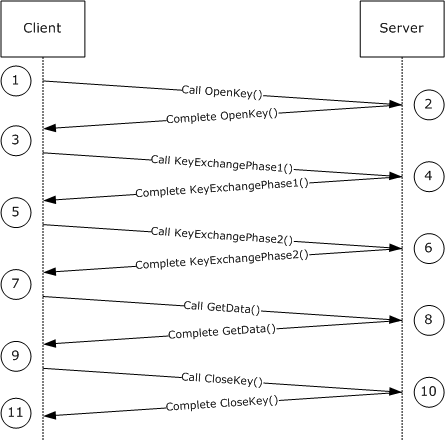

[MS-IMSA]:

Internet Information Services (IIS) IMSAdminBaseW
Remote Protocol

Intellectual Property Rights Notice for Open Specifications Documentation

  Technical Documentation. Microsoft publishes Open Specifications documentation (“this

documentation”) for protocols, file formats, data portability, computer languages, and standards
support. Additionally, overview documents cover inter-protocol relationships and interactions.

  Copyrights. This documentation is covered by Microsoft copyrights. Regardless of any other

terms that are contained in the terms of use for the Microsoft website that hosts this
documentation, you can make copies of it in order to develop implementations of the technologies
that are described in this documentation and can distribute portions of it in your implementations
that use these technologies or in your documentation as necessary to properly document the
implementation. You can also distribute in your implementation, with or without modification, any
schemas, IDLs, or code samples that are included in the documentation. This permission also
applies to any documents that are referenced in the Open Specifications documentation.
  No Trade Secrets. Microsoft does not claim any trade secret rights in this documentation.
  Patents. Microsoft has patents that might cover your implementations of the technologies

described in the Open Specifications documentation. Neither this notice nor Microsoft's delivery of
this documentation grants any licenses under those patents or any other Microsoft patents.
However, a given Open Specifications document might be covered by the Microsoft Open
Specifications Promise or the Microsoft Community Promise. If you would prefer a written license,
or if the technologies described in this documentation are not covered by the Open Specifications
Promise or Community Promise, as applicable, patent licenses are available by contacting
iplg@microsoft.com.

  License Programs. To see all of the protocols in scope under a specific license program and the

associated patents, visit the Patent Map.

  Trademarks. The names of companies and products contained in this documentation might be
covered by trademarks or similar intellectual property rights. This notice does not grant any
licenses under those rights. For a list of Microsoft trademarks, visit
www.microsoft.com/trademarks.

  Fictitious Names. The example companies, organizations, products, domain names, email

addresses, logos, people, places, and events that are depicted in this documentation are fictitious.
No association with any real company, organization, product, domain name, email address, logo,
person, place, or event is intended or should be inferred.

Reservation of Rights. All other rights are reserved, and this notice does not grant any rights other
than as specifically described above, whether by implication, estoppel, or otherwise.

Tools. The Open Specifications documentation does not require the use of Microsoft programming
tools or programming environments in order for you to develop an implementation. If you have access
to Microsoft programming tools and environments, you are free to take advantage of them. Certain
Open Specifications documents are intended for use in conjunction with publicly available standards
specifications and network programming art and, as such, assume that the reader either is familiar
with the aforementioned material or has immediate access to it.

Support. For questions and support, please contact dochelp@microsoft.com.

[MS-IMSA] - v20240423
Internet Information Services (IIS) IMSAdminBaseW Remote Protocol
Copyright © 2024 Microsoft Corporation
Release: April 23, 2024

1 / 139

Revision Summary

Date

Revision
History

Revision
Class

Comments

7/20/2007

0.1

Major

MCPP Milestone 5 Initial Availability

9/28/2007

0.1.1

Editorial

Changed language and formatting in the technical content.

10/23/2007  0.1.2

Editorial

Changed language and formatting in the technical content.

11/30/2007  0.2

Minor

Clarified the meaning of the technical content.

1/25/2008

0.2.1

Editorial

Changed language and formatting in the technical content.

3/14/2008

0.2.2

Editorial

Changed language and formatting in the technical content.

5/16/2008

0.2.3

Editorial

Changed language and formatting in the technical content.

6/20/2008

1.0

Major

Updated and revised the technical content.

7/25/2008

1.0.1

Editorial

Changed language and formatting in the technical content.

8/29/2008

1.0.2

Editorial

Changed language and formatting in the technical content.

10/24/2008  1.0.3

Editorial

Changed language and formatting in the technical content.

12/5/2008

1.1

1/16/2009

1.2

2/27/2009

2.0

4/10/2009

3.0

5/22/2009

4.0

7/2/2009

5.0

8/14/2009

5.1

9/25/2009

5.2

11/6/2009

6.0

12/18/2009  6.1

1/29/2010

6.2

Minor

Minor

Major

Major

Major

Major

Minor

Minor

Major

Minor

Minor

Clarified the meaning of the technical content.

Clarified the meaning of the technical content.

Updated and revised the technical content.

Updated and revised the technical content.

Updated and revised the technical content.

Updated and revised the technical content.

Clarified the meaning of the technical content.

Clarified the meaning of the technical content.

Updated and revised the technical content.

Clarified the meaning of the technical content.

Clarified the meaning of the technical content.

3/12/2010

6.2.1

Editorial

Changed language and formatting in the technical content.

4/23/2010

6.2.2

Editorial

Changed language and formatting in the technical content.

6/4/2010

6.2.3

Editorial

Changed language and formatting in the technical content.

7/16/2010

6.2.3

None

No changes to the meaning, language, or formatting of the
technical content.

8/27/2010

7.0

Major

Updated and revised the technical content.

10/8/2010

7.0

11/19/2010  7.0

None

None

No changes to the meaning, language, or formatting of the
technical content.

No changes to the meaning, language, or formatting of the
technical content.

[MS-IMSA] - v20240423
Internet Information Services (IIS) IMSAdminBaseW Remote Protocol
Copyright © 2024 Microsoft Corporation
Release: April 23, 2024

2 / 139

Date

Revision
History

Revision
Class

Comments

1/7/2011

8.0

Major

Updated and revised the technical content.

2/11/2011

8.0

3/25/2011

8.0

5/6/2011

8.0

None

None

None

No changes to the meaning, language, or formatting of the
technical content.

No changes to the meaning, language, or formatting of the
technical content.

No changes to the meaning, language, or formatting of the
technical content.

6/17/2011

8.1

Minor

Clarified the meaning of the technical content.

9/23/2011

8.1

None

No changes to the meaning, language, or formatting of the
technical content.

12/16/2011  9.0

Major

Updated and revised the technical content.

3/30/2012

9.0

7/12/2012

9.0

10/25/2012  9.0

1/31/2013

9.0

None

None

None

None

No changes to the meaning, language, or formatting of the
technical content.

No changes to the meaning, language, or formatting of the
technical content.

No changes to the meaning, language, or formatting of the
technical content.

No changes to the meaning, language, or formatting of the
technical content.

8/8/2013

10.0

Major

Updated and revised the technical content.

11/14/2013  10.0

None

No changes to the meaning, language, or formatting of the
technical content.

2/13/2014

10.0

None

No changes to the meaning, language, or formatting of the
technical content.

5/15/2014

10.0

None

No changes to the meaning, language, or formatting of the
technical content.

6/30/2015

11.0

Major

Significantly changed the technical content.

10/16/2015  11.0

None

No changes to the meaning, language, or formatting of the
technical content.

7/14/2016

11.0

None

No changes to the meaning, language, or formatting of the
technical content.

6/1/2017

11.0

9/15/2017

12.0

9/12/2018

13.0

4/7/2021

14.0

6/25/2021

15.0

4/23/2024

16.0

None

Major

Major

Major

Major

Major

No changes to the meaning, language, or formatting of the
technical content.

Significantly changed the technical content.

Significantly changed the technical content.

Significantly changed the technical content.

Significantly changed the technical content.

Significantly changed the technical content.

[MS-IMSA] - v20240423
Internet Information Services (IIS) IMSAdminBaseW Remote Protocol
Copyright © 2024 Microsoft Corporation
Release: April 23, 2024

3 / 139

## Table of Contents

- [1 Introduction](#1-introduction)
  - [1.1 Glossary](#11-glossary)
  - [1.2 References](#12-references)
    - [1.2.1 Normative References](#121-normative-references)
    - [1.2.2 Informative References](#122-informative-references)
  - [1.3 Overview](#13-overview)
  - [1.4 Relationship to Other Protocols](#14-relationship-to-other-protocols)
  - [1.5 Prerequisites/Preconditions](#15-prerequisitespreconditions)
  - [1.6 Applicability Statement](#16-applicability-statement)
  - [1.7 Versioning and Capability Negotiation](#17-versioning-and-capability-negotiation)
  - [1.8 Vendor-Extensible Fields](#18-vendor-extensible-fields)
  - [1.9 Standards Assignments](#19-standards-assignments)
- [2 Messages](#2-messages)
  - [2.1 Transport](#21-transport)
  - [2.2 Common Data Types](#22-common-data-types)
    - [2.2.1 ADMINDATA_MAX_NAME_LEN](#221-admindatamaxnamelen)
    - [2.2.2 IIS_CRYPTO_BLOB](#222-iiscryptoblob)
      - [2.2.2.1 PUBLIC_KEY_BLOB](#2221-publickeyblob)
      - [2.2.2.2 SESSION_KEY_BLOB](#2222-sessionkeyblob)
        - [2.2.2.2.1 ENCRYPTED_SESSION_KEY_ BLOB](#22221-encryptedsessionkey-blob)
      - [2.2.2.3 HASH_BLOB](#2223-hashblob)
      - [2.2.2.4 CLEARTEXT_DATA_BLOB](#2224-cleartextdatablob)
      - [2.2.2.5 ENCRYPTED_DATA_BLOB](#2225-encrypteddatablob)
        - [2.2.2.5.1 CLEARTEXT_WITH_PREFIX_BLOB](#22251-cleartextwithprefixblob)
    - [2.2.3 Secure Session Negotiation Constants](#223-secure-session-negotiation-constants)
    - [2.2.4 METADATA_GETALL_RECORD](#224-metadatagetallrecord)
    - [2.2.5 METADATA_HANDLE](#225-metadatahandle)
    - [2.2.6 METADATA_HANDLE_INFO](#226-metadatahandleinfo)
    - [2.2.7 METADATA_RECORD](#227-metadatarecord)
    - [2.2.8 METADATA_MASTER_ROOT_HANDLE](#228-metadatamasterroothandle)
    - [2.2.9 MD_APP_ROOT](#229-mdapproot)
    - [2.2.10 MD_APP_ISOLATED](#2210-mdappisolated)
    - [2.2.11 MD_APP_APPPOOL_ID](#2211-mdappapppoolid)
    - [2.2.12 MD_BACKUP_MAX_LEN](#2212-mdbackupmaxlen)
- [3 Protocol Details](#3-protocol-details)
  - [3.1 IMSAdminBaseW Server Details](#31-imsadminbasew-server-details)
    - [3.1.1 Abstract Data Model](#311-abstract-data-model)
      - [3.1.1.1 Secure Session Context](#3111-secure-session-context)
    - [3.1.2 Timers](#312-timers)
    - [3.1.3 Initialization](#313-initialization)
    - [3.1.4 Message Processing Events and Sequencing Rules](#314-message-processing-events-and-sequencing-rules)
      - [3.1.4.1 Transferring Sensitive Data](#3141-transferring-sensitive-data)
        - [3.1.4.1.1 Secure Session Negotiation Server Role](#31411-secure-session-negotiation-server-role)
        - [3.1.4.1.2 Encrypting Data](#31412-encrypting-data)
        - [3.1.4.1.3 Decrypting Data](#31413-decrypting-data)
        - [3.1.4.1.4 Signed Hash Calculation](#31414-signed-hash-calculation)
        - [3.1.4.1.5 Signed Hash Validation](#31415-signed-hash-validation)
      - [3.1.4.2 OpenKey (Opnum 17)](#3142-openkey-opnum-17)
      - [3.1.4.3 CloseKey (Opnum 18)](#3143-closekey-opnum-18)
      - [3.1.4.4 AddKey (Opnum 3)](#3144-addkey-opnum-3)
      - [3.1.4.5 CopyKey (Opnum 7)](#3145-copykey-opnum-7)
      - [3.1.4.6 DeleteKey (Opnum 4)](#3146-deletekey-opnum-4)
      - [3.1.4.7 DeleteChildKeys (Opnum 5)](#3147-deletechildkeys-opnum-5)
      - [3.1.4.8 DeleteData (Opnum 11)](#3148-deletedata-opnum-11)
      - [3.1.4.9 DeleteAllData (Opnum 14)](#3149-deletealldata-opnum-14)
      - [3.1.4.10 CopyData (Opnum 15)](#31410-copydata-opnum-15)
      - [3.1.4.11 EnumKeys (Opnum 6)](#31411-enumkeys-opnum-6)
      - [3.1.4.12 R_EnumData (Opnum 12)](#31412-renumdata-opnum-12)
      - [3.1.4.13 Backup (Opnum 28)](#31413-backup-opnum-28)
      - [3.1.4.14 EnumBackups (Opnum 30)](#31414-enumbackups-opnum-30)
      - [3.1.4.15 DeleteBackup (Opnum 31)](#31415-deletebackup-opnum-31)
      - [3.1.4.16 ChangePermissions (Opnum 19)](#31416-changepermissions-opnum-19)
      - [3.1.4.17 GetDataPaths (Opnum 16)](#31417-getdatapaths-opnum-16)
      - [3.1.4.18 GetDataSetNumber (Opnum 23)](#31418-getdatasetnumber-opnum-23)
      - [3.1.4.19 GetHandleInfo (Opnum 21)](#31419-gethandleinfo-opnum-21)
      - [3.1.4.20 GetLastChangeTime (Opnum 25)](#31420-getlastchangetime-opnum-25)
      - [3.1.4.21 GetSystemChangeNumber (Opnum 22)](#31421-getsystemchangenumber-opnum-22)
      - [3.1.4.22 R_GetAllData (Opnum 13)](#31422-rgetalldata-opnum-13)
      - [3.1.4.23 R_GetData (Opnum 10)](#31423-rgetdata-opnum-10)
      - [3.1.4.24 R_GetServerGuid (Opnum 33)](#31424-rgetserverguid-opnum-33)
      - [3.1.4.25 R_KeyExchangePhase1 (Opnum 26)](#31425-rkeyexchangephase1-opnum-26)
      - [3.1.4.26 R_KeyExchangePhase2 (Opnum 27)](#31426-rkeyexchangephase2-opnum-27)
      - [3.1.4.27 R_SetData (Opnum 9)](#31427-rsetdata-opnum-9)
      - [3.1.4.28 RenameKey (Opnum 8)](#31428-renamekey-opnum-8)
      - [3.1.4.29 Restore (Opnum 29)](#31429-restore-opnum-29)
      - [3.1.4.30 SaveData (Opnum 20)](#31430-savedata-opnum-20)
      - [3.1.4.31 SetLastChangeTime (Opnum 24)](#31431-setlastchangetime-opnum-24)
      - [3.1.4.32 UnmarshalInterface (Opnum 32)](#31432-unmarshalinterface-opnum-32)
    - [3.1.5 Timer Events](#315-timer-events)
    - [3.1.6 Other Local Events](#316-other-local-events)
  - [3.2 IMSAdminBaseW Client Details](#32-imsadminbasew-client-details)
    - [3.2.1 Abstract Data Model](#321-abstract-data-model)
      - [3.2.1.1 Secure Session Context](#3211-secure-session-context)
    - [3.2.2 Timers](#322-timers)
    - [3.2.3 Initialization](#323-initialization)
    - [3.2.4 Message Processing Events and Sequencing Rules](#324-message-processing-events-and-sequencing-rules)
      - [3.2.4.1 Secure Session Negotiation Client Role](#3241-secure-session-negotiation-client-role)
      - [3.2.4.2 R_KeyExchangePhase1 (Opnum 26)](#3242-rkeyexchangephase1-opnum-26)
      - [3.2.4.3 R_KeyExchangePhase2 (Opnum 27)](#3243-rkeyexchangephase2-opnum-27)
      - [3.2.4.4 R_SetData (Opnum 9)](#3244-rsetdata-opnum-9)
      - [3.2.4.5 R_GetData (Opnum 10)](#3245-rgetdata-opnum-10)
      - [3.2.4.6 R_EnumData (Opnum 12)](#3246-renumdata-opnum-12)
      - [3.2.4.7 R_GetAllData (Opnum 13)](#3247-rgetalldata-opnum-13)
    - [3.2.5 Timer Events](#325-timer-events)
    - [3.2.6 Other Local Events](#326-other-local-events)
  - [3.3 IMSAdminBase2W Server Details](#33-imsadminbase2w-server-details)
    - [3.3.1 Abstract Data Model](#331-abstract-data-model)
    - [3.3.2 Timers](#332-timers)
    - [3.3.3 Initialization](#333-initialization)
    - [3.3.4 Message Processing Events and Sequencing Rules](#334-message-processing-events-and-sequencing-rules)
      - [3.3.4.1 BackupWithPasswd (Opnum 34)](#3341-backupwithpasswd-opnum-34)
      - [3.3.4.2 EnumHistory (Opnum 39)](#3342-enumhistory-opnum-39)
      - [3.3.4.3 Export (Opnum 36)](#3343-export-opnum-36)
      - [3.3.4.4 Import (Opnum 37)](#3344-import-opnum-37)
      - [3.3.4.5 RestoreHistory (Opnum 38)](#3345-restorehistory-opnum-38)
      - [3.3.4.6 RestoreWithPasswd (Opnum 35)](#3346-restorewithpasswd-opnum-35)
    - [3.3.5 Timer Events](#335-timer-events)
    - [3.3.6 Other Local Events](#336-other-local-events)
  - [3.4 IMSAdminBase2W Client Details](#34-imsadminbase2w-client-details)
    - [3.4.1 Abstract Data Model](#341-abstract-data-model)
    - [3.4.2 Timers](#342-timers)
    - [3.4.3 Initialization](#343-initialization)
    - [3.4.4 Message Processing Events and Sequencing Rules](#344-message-processing-events-and-sequencing-rules)
    - [3.4.5 Timer Events](#345-timer-events)
    - [3.4.6 Other Local Events](#346-other-local-events)
  - [3.5 IMSAdminBase3W Server Details](#35-imsadminbase3w-server-details)
    - [3.5.1 Abstract Data Model](#351-abstract-data-model)
    - [3.5.2 Timers](#352-timers)
    - [3.5.3 Initialization](#353-initialization)
    - [3.5.4 Message Processing Events and Sequencing Rules](#354-message-processing-events-and-sequencing-rules)
      - [3.5.4.1 GetChildPaths (Opnum 40)](#3541-getchildpaths-opnum-40)
    - [3.5.5 Timer Events](#355-timer-events)
    - [3.5.6 Other Local Events](#356-other-local-events)
  - [3.6 IMSAdminBase3W Client Details](#36-imsadminbase3w-client-details)
    - [3.6.1 Abstract Data Model](#361-abstract-data-model)
    - [3.6.2 Timers](#362-timers)
    - [3.6.3 Initialization](#363-initialization)
    - [3.6.4 Message Processing Events and Sequencing Rules](#364-message-processing-events-and-sequencing-rules)
    - [3.6.5 Timer Events](#365-timer-events)
    - [3.6.6 Other Local Events](#366-other-local-events)
  - [3.7 IWamAdmin Server Details](#37-iwamadmin-server-details)
    - [3.7.1 Abstract Data Model](#371-abstract-data-model)
    - [3.7.2 Timers](#372-timers)
    - [3.7.3 Initialization](#373-initialization)
    - [3.7.4 Message Processing Events and Sequencing Rules](#374-message-processing-events-and-sequencing-rules)
      - [3.7.4.1 AppCreate (Opnum 3)](#3741-appcreate-opnum-3)
      - [3.7.4.2 AppDelete (Opnum 4)](#3742-appdelete-opnum-4)
      - [3.7.4.3 AppUnLoad (Opnum 5)](#3743-appunload-opnum-5)
      - [3.7.4.4 AppGetStatus (Opnum 6)](#3744-appgetstatus-opnum-6)
      - [3.7.4.5 AppDeleteRecoverable (Opnum 7)](#3745-appdeleterecoverable-opnum-7)
      - [3.7.4.6 AppRecover (Opnum 8)](#3746-apprecover-opnum-8)
    - [3.7.5 Timer Events](#375-timer-events)
    - [3.7.6 Other Local Events](#376-other-local-events)
  - [3.8 IWamAdmin2 Server Details](#38-iwamadmin2-server-details)
    - [3.8.1 Abstract Data Model](#381-abstract-data-model)
    - [3.8.2 Timers](#382-timers)
    - [3.8.3 Initialization](#383-initialization)
    - [3.8.4 Message Processing Events and Sequencing Rules](#384-message-processing-events-and-sequencing-rules)
      - [3.8.4.1 AppCreate2 (Opnum 9)](#3841-appcreate2-opnum-9)
    - [3.8.5 Timer Events](#385-timer-events)
    - [3.8.6 Other Local Events](#386-other-local-events)
  - [3.9 IIISApplicationAdmin Server Details](#39-iiisapplicationadmin-server-details)
    - [3.9.1 Abstract Data Model](#391-abstract-data-model)
    - [3.9.2 Timers](#392-timers)
    - [3.9.3 Initialization](#393-initialization)
    - [3.9.4 Message Processing Events and Sequencing Rules](#394-message-processing-events-and-sequencing-rules)
      - [3.9.4.1 CreateApplication (Opnum 3)](#3941-createapplication-opnum-3)
      - [3.9.4.2 DeleteApplication (Opnum 4)](#3942-deleteapplication-opnum-4)
      - [3.9.4.3 CreateApplicationPool (Opnum 5)](#3943-createapplicationpool-opnum-5)
      - [3.9.4.4 DeleteApplicationPool (Opnum 6)](#3944-deleteapplicationpool-opnum-6)
      - [3.9.4.5 EnumerateApplicationsInPool (Opnum 7)](#3945-enumerateapplicationsinpool-opnum-7)
      - [3.9.4.6 RecycleApplicationPool (Opnum 8)](#3946-recycleapplicationpool-opnum-8)
      - [3.9.4.7 GetProcessMode (Opnum 9)](#3947-getprocessmode-opnum-9)
    - [3.9.5 Timer Events](#395-timer-events)
    - [3.9.6 Other Local Events](#396-other-local-events)
  - [3.10 IIISCertObj Server Details](#310-iiiscertobj-server-details)
    - [3.10.1 Abstract Data Model](#3101-abstract-data-model)
    - [3.10.2 Timers](#3102-timers)
    - [3.10.3 Initialization](#3103-initialization)
    - [3.10.4 Message Processing Events and Sequencing Rules](#3104-message-processing-events-and-sequencing-rules)
      - [3.10.4.1 InstanceName (Set) (Opnum 10)](#31041-instancename-set-opnum-10)
      - [3.10.4.2 IsInstalledRemote (Opnum 12)](#31042-isinstalledremote-opnum-12)
      - [3.10.4.3 IsExportableRemote (Opnum 14)](#31043-isexportableremote-opnum-14)
      - [3.10.4.4 GetCertInfoRemote (Opnum 16)](#31044-getcertinforemote-opnum-16)
      - [3.10.4.5 ImportFromBlob (Opnum 22)](#31045-importfromblob-opnum-22)
      - [3.10.4.6 ImportFromBlobGetHash (Opnum 23)](#31046-importfromblobgethash-opnum-23)
      - [3.10.4.7 ExportToBlob (Opnum 25)](#31047-exporttoblob-opnum-25)
    - [3.10.5 Timer Events](#3105-timer-events)
    - [3.10.6 Other Local Events](#3106-other-local-events)
  - [3.11 IIISCertObj Client Details](#311-iiiscertobj-client-details)
    - [3.11.1 Abstract Data Model](#3111-abstract-data-model)
    - [3.11.2 Timers](#3112-timers)
    - [3.11.3 Initialization](#3113-initialization)
    - [3.11.4 Message Processing Events and Sequencing Rules](#3114-message-processing-events-and-sequencing-rules)
      - [3.11.4.1 InstanceName (Set) (Opnum 10)](#31141-instancename-set-opnum-10)
    - [3.11.5 Timer Events](#3115-timer-events)
    - [3.11.6 Other Local Events](#3116-other-local-events)
- [4 Protocol Examples](#4-protocol-examples)
  - [4.1 General Hookup Example](#41-general-hookup-example)
  - [4.2 BackupWithPasswd Call Example](#42-backupwithpasswd-call-example)
  - [4.3 EnumHistory Call Example](#43-enumhistory-call-example)
  - [4.4 Export Call Example](#44-export-call-example)
  - [4.5 Import Call Example](#45-import-call-example)
  - [4.6 RestoreHistory Call Example](#46-restorehistory-call-example)
  - [4.7 RestoreWithPasswd Call Example](#47-restorewithpasswd-call-example)
  - [4.8 GetChildPaths Call Example](#48-getchildpaths-call-example)
  - [4.9 Reading Sensitive Data from the Server](#49-reading-sensitive-data-from-the-server)
- [5 Security](#5-security)
  - [5.1 Security Considerations for Implementers](#51-security-considerations-for-implementers)
  - [5.2 Index of Security Parameters](#52-index-of-security-parameters)
- [6 Appendix A: Full IDL](#6-appendix-a-full-idl)
- [7 Appendix B: Product Behavior](#7-appendix-b-product-behavior)
- [8 Change Tracking](#8-change-tracking)
- [9 Index](#9-index)

## 1 Introduction

The Internet Information Services (IIS) IMSAdminBaseW Remote Protocol defines interfaces that
provide Unicode-compliant methods for remotely accessing and administering the IIS metabase
associated with an application that manages IIS configuration, such as the IIS snap-in for Microsoft
Management Console (MMC).

Sections 1.5, 1.8, 1.9, 2, and 3 of this specification are normative. All other sections and examples in
this specification are informative.

### 1.1 Glossary

This document uses the following terms:

application pool: A collection of one or more processes hosting zero or more web applications.

base64 encoding: A binary-to-text encoding scheme whereby an arbitrary sequence of bytes is

converted to a sequence of printable ASCII characters, as described in [RFC4648].

certificate: A certificate is a collection of attributes and extensions that can be stored persistently.
The set of attributes in a certificate can vary depending on the intended usage of the certificate.
A certificate securely binds a public key to the entity that holds the corresponding private key. A
certificate is commonly used for authentication and secure exchange of information on open
networks, such as the Internet, extranets, and intranets. Certificates are digitally signed by the
issuing certification authority (CA) and can be issued for a user, a computer, or a service. The
most widely accepted format for certificates is defined by the ITU-T X.509 version 3
international standards. For more information about attributes and extensions, see [RFC3280]
and [X509] sections 7 and 8.

certificate chain: A sequence of certificates, where each certificate in the sequence is signed by
the subsequent certificate. The last certificate in the chain is normally a self-signed certificate.

certificate store: A database of certificates, or certificates and the accompanying private key.

Used to store a variety of certificates with different attributes or constraints.

class identifier (CLSID): A GUID that identifies a software component; for instance, a DCOM

object class or a COM class.

cleartext: In cryptography, cleartext is the form of a message (or data) that is transferred or

stored without cryptographic protection.

decryption: In cryptography, the process of transforming encrypted information to its original

clear text form.

Distributed Component Object Model (DCOM): The Microsoft Component Object Model (COM)
specification that defines how components communicate over networks, as specified in [MS-
DCOM].

dynamic endpoint: A network-specific server address that is requested and assigned at run time.

For more information, see [C706].

encryption: In cryptography, the process of obscuring information to make it unreadable without

special knowledge.

endpoint: A network-specific address of a remote procedure call (RPC) server process for remote

procedure calls. The actual name and type of the endpoint depends on the RPC protocol
sequence that is being used. For example, for RPC over TCP (RPC Protocol Sequence
ncacn_ip_tcp), an endpoint might be TCP port 1025. For RPC over Server Message Block (RPC

[MS-IMSA] - v20240423
Internet Information Services (IIS) IMSAdminBaseW Remote Protocol
Copyright © 2024 Microsoft Corporation
Release: April 23, 2024

8 / 139

Protocol Sequence ncacn_np), an endpoint might be the name of a named pipe. For more
information, see [C706].

globally unique identifier (GUID): A term used interchangeably with universally unique

identifier (UUID) in Microsoft protocol technical documents (TDs). Interchanging the usage of
these terms does not imply or require a specific algorithm or mechanism to generate the value.
Specifically, the use of this term does not imply or require that the algorithms described in
[RFC4122] or [C706] have to be used for generating the GUID. See also universally unique
identifier (UUID).

Interface Definition Language (IDL): The International Standards Organization (ISO) standard

language for specifying the interface for remote procedure calls. For more information, see
[C706] section 4.

Internet Information Services (IIS): The services provided in Windows implementation that
support web server functionality. IIS consists of a collection of standard Internet protocol
servers such as HTTP and FTP in addition to common infrastructures that are used by other
Microsoft Internet protocol servers such as SMTP, NNTP, and so on. IIS has been part of the
Windows operating system in some versions and a separate install package in others. IIS
version 5.0 shipped as part of Windows 2000 operating system, IIS version 5.1 as part of
Windows XP operating system, IIS version 6.0 as part of Windows Server 2003 operating
system, and IIS version 7.0 as part of Windows Vista operating system and Windows Server
2008 operating system.

Internet protocol server instance (server instance): A configuration collection for an Internet
protocol server that will establish its own network protocol endpoint. A single Internet protocol
server can configure multiple server instances that would each appear to clients as an
independent host site.

key exchange key pair: A public/private key pair used to encrypt session keys so that they can

be safely stored and exchanged with other users.

key exchange private key: The private key of the key exchange key pair.

key exchange public key: The public key of a key exchange key pair.

man in the middle (MITM): An attack that deceives a server or client into accepting an

unauthorized upstream host as the actual legitimate host. Instead, the upstream host is an
attacker's host that is manipulating the network so that the attacker's host appears to be the
desired destination. This enables the attacker to decrypt and access all network traffic that
would go to the legitimate host. The attacker is able to read, insert, and modify at-will messages
between two hosts without either party knowing that the link between them is compromised.

MD5 hash: A hashing algorithm, as described in [RFC1321], that was developed by RSA Data

Security, Inc. An MD5 hash is used by the File Replication Service (FRS) to verify that a file on
each replica member is identical.

metabase: The name of the configuration storage implemented by Microsoft Internet

Information Services (IIS).

Microsoft Management Console (MMC): Provides a framework that consists of a graphical user
interface (GUI) and a programming platform in which snap-ins (collections of administrative
tools) can be created, opened, and saved. MMC is a multiple-document interface (MDI)
application.

Network Data Representation (NDR): A specification that defines a mapping from Interface
Definition Language (IDL) data types onto octet streams. NDR also refers to the runtime
environment that implements the mapping facilities (for example, data provided to NDR). For
more information, see [MS-RPCE] and [C706] section 14.

[MS-IMSA] - v20240423
Internet Information Services (IIS) IMSAdminBaseW Remote Protocol
Copyright © 2024 Microsoft Corporation
Release: April 23, 2024

9 / 139

object: In the DCOM protocol, a software entity that implements one or more object remote
protocol (ORPC) interfaces and which is uniquely identified, within the scope of an object
exporter, by an object identifier (OID). For more information, see [MS-DCOM].

object identifier (OID): In the context of a directory service, a number identifying an object
class or attribute. Object identifiers are issued by the ITU and form a hierarchy. An OID is
represented as a dotted decimal string (for example, "1.2.3.4"). For more information on OIDs,
see [X660] and [RFC3280] Appendix A. OIDs are used to uniquely identify certificate templates
available to the certification authority (CA). Within a certificate, OIDs are used to identify
standard extensions, as described in [RFC3280] section 4.2.1.x, as well as non-standard
extensions.

opnum: An operation number or numeric identifier that is used to identify a specific remote

procedure call (RPC) method or a method in an interface. For more information, see [C706]
section 12.5.2.12 or [MS-RPCE].

private key: One of a pair of keys used in public-key cryptography. The private key is kept secret
and is used to decrypt data that has been encrypted with the corresponding public key. For an
introduction to this concept, see [CRYPTO] section 1.8 and [IEEE1363] section 3.1.

public key: One of a pair of keys used in public-key cryptography. The public key is distributed
freely and published as part of a digital certificate. For an introduction to this concept, see
[CRYPTO] section 1.8 and [IEEE1363] section 3.1.

RC4: Means Rivest Cipher 4 invented by Ron Rivest in 1987 for RSA Security. It is a variable key-

length symmetric encryption algorithm stream cipher that operates on a stream of data byte by
byte. It's simple to apply, does not consume more memory, and works quickly on very large
pieces of data such as WEP/WPA for wireless network encryption and SSL/ TLS for internet
security. RC4 stream ciphers cannot be implemented on small streams of data. RC4 weaknesses
make it vulnerable to various cryptographic attacks. For more information, see [SCHNEIER]
section 17.1.

relative distinguished name (RDN): As specified in [X500], the portion of a distinguished name

that is unique to an organization unit but might not be unique inside a domain.

remote procedure call (RPC): A communication protocol used primarily between client and

server. The term has three definitions that are often used interchangeably: a runtime
environment providing for communication facilities between computers (the RPC runtime); a set
of request-and-response message exchanges between computers (the RPC exchange); and the
single message from an RPC exchange (the RPC message).  For more information, see [C706].

Rivest-Shamir-Adleman (RSA): A system for public key cryptography. RSA is specified in

[RFC8017].

RPC protocol sequence: A character string that represents a valid combination of a remote

procedure call (RPC) protocol, a network layer protocol, and a transport layer protocol, as
described in [C706] and [MS-RPCE].

RSA public key algorithm: A key exchange and signature algorithm based on the popular RSA

Public Key cipher.

secure session: An active communication channel that has associated cryptographic keys and

possibly other state.

Secure Sockets Layer (SSL): A security protocol that supports confidentiality and integrity of

messages in client and server applications that communicate over open networks. SSL supports
server and, optionally, client authentication using X.509 certificates [X509] and [RFC5280]. SSL
is superseded by Transport Layer Security (TLS). TLS version 1.0 is based on SSL version 3.0
[SSL3].

[MS-IMSA] - v20240423
Internet Information Services (IIS) IMSAdminBaseW Remote Protocol
Copyright © 2024 Microsoft Corporation
Release: April 23, 2024

10 / 139

server: A computer on which the remote procedure call (RPC) server is executing.

session key: A relatively short-lived symmetric key (a cryptographic key negotiated by the client
and the server based on a shared secret). A session key's lifespan is bounded by the session
to which it is associated. A session key has to be strong enough to withstand cryptanalysis for
the lifespan of the session.

signature private key: The private key of a signature key pair.

signature public key: The public key of a signature key pair.

signed hash: A hash signed with a signature private key.

Unicode: A character encoding standard developed by the Unicode Consortium that represents

almost all of the written languages of the world. The Unicode standard [UNICODE5.0.0/2007]
provides three forms (UTF-8, UTF-16, and UTF-32) and seven schemes (UTF-8, UTF-16, UTF-16
BE, UTF-16 LE, UTF-32, UTF-32 LE, and UTF-32 BE).

universally unique identifier (UUID): A 128-bit value. UUIDs can be used for multiple

purposes, from tagging objects with an extremely short lifetime, to reliably identifying very
persistent objects in cross-process communication such as client and server interfaces, manager
entry-point vectors, and RPC objects. UUIDs are highly likely to be unique. UUIDs are also
known as globally unique identifiers (GUIDs) and these terms are used interchangeably in
the Microsoft protocol technical documents (TDs). Interchanging the usage of these terms does
not imply or require a specific algorithm or mechanism to generate the UUID. Specifically, the
use of this term does not imply or require that the algorithms described in [RFC4122] or [C706]
has to be used for generating the UUID.

web application: A collection of URLs that share a server execution environment. This collection is
defined relative to a root URL. A web application runs in response to HTTP requests for the
URLs in the collection. The process or processes that run in response to such an HTTP request
are termed the application host.

well-known endpoint: A preassigned, network-specific, stable address for a particular

client/server instance. For more information, see [C706].

MAY, SHOULD, MUST, SHOULD NOT, MUST NOT: These terms (in all caps) are used as defined
in [RFC2119]. All statements of optional behavior use either MAY, SHOULD, or SHOULD NOT.

### 1.2 References

Links to a document in the Microsoft Open Specifications library point to the correct section in the
most recently published version of the referenced document. However, because individual documents
in the library are not updated at the same time, the section numbers in the documents may not
match. You can confirm the correct section numbering by checking the Errata.

#### 1.2.1 Normative References

We conduct frequent surveys of the normative references to assure their continued availability. If you
have any issue with finding a normative reference, please contact dochelp@microsoft.com. We will
assist you in finding the relevant information.

[C706] The Open Group, "DCE 1.1: Remote Procedure Call", C706, August 1997,
https://publications.opengroup.org/c706

Note Registration is required to download the document.

[MS-DCOM] Microsoft Corporation, "Distributed Component Object Model (DCOM) Remote Protocol".

[MS-IMSA] - v20240423
Internet Information Services (IIS) IMSAdminBaseW Remote Protocol
Copyright © 2024 Microsoft Corporation
Release: April 23, 2024

11 / 139

[MS-DTYP] Microsoft Corporation, "Windows Data Types".

[MS-ERREF] Microsoft Corporation, "Windows Error Codes".

[MS-OAUT] Microsoft Corporation, "OLE Automation Protocol".

[MS-RPCE] Microsoft Corporation, "Remote Procedure Call Protocol Extensions".

[RFC2119] Bradner, S., "Key words for use in RFCs to Indicate Requirement Levels", BCP 14, RFC
2119, March 1997, https://www.rfc-editor.org/info/rfc2119

[RFC3280] Housley, R., Polk, W., Ford, W., and Solo, D., "Internet X.509 Public Key Infrastructure
Certificate and Certificate Revocation List (CRL) Profile", RFC 3280, April 2002, http://www.rfc-
editor.org/info/rfc3280

[RFC8017] Moriarty, K., Ed., Kaliski, B., Jonsson, J., and Rusch, A., "PKCS #1: RSA Cryptography
Specifications Version 2.2", November 2016, https://www.rfc-editor.org/info/rfc8017

#### 1.2.2 Informative References

[MSDN-CoInitialize] Microsoft Corporation, "CoInitialize function", http://msdn.microsoft.com/en-
us/library/ms678543.aspx

[SCHNEIER] Schneier, B., "Applied Cryptography, Second Edition", John Wiley and Sons, 1996, ISBN:
0471117099.

### 1.3 Overview

The Internet Information Services (IIS) IMSAdminBaseW Remote Protocol is a client/server
protocol that is used for remotely managing a hierarchical configuration data store (metabase). The
layout and specifics of such a store are specified in section 3.1.1.

The Internet Information Services (IIS) IMSAdminBaseW Remote Protocol also provides DCOM
interfaces to manage server entities, such as web applications and public key certificates, which
can be defined or referenced in the metabase data store.

A remote metabase management session begins with the client initiating the connection request to the
server. If the server grants the request, the connection is established. The client can then make
multiple requests to read or modify the metabase on the server by using the same session until the
session is terminated.

A typical remote metabase management session involves the client connecting to the server and
requesting to open a metabase node on the server. If the server accepts the request, it responds with
an RPC context handle that refers to the node. The client uses this RPC context handle to operate on
that node. This involves sending another request to the server specifying the type of operation to
perform and any specific parameters that are associated with that operation. If the server accepts this
request, it attempts to change the state of the node based on the request and responds to the client
with the result of the operation. When the client is finished operating on the server nodes, it
terminates the protocol by sending a request to close the RPC context handle.

### 1.4 Relationship to Other Protocols

 The IIS IMSAdminBaseW Remote Protocol relies on the remote protocol described in [MS-DCOM],
which uses RPC as a transport.

 No other IIS protocols rely on this protocol.

[MS-IMSA] - v20240423
Internet Information Services (IIS) IMSAdminBaseW Remote Protocol
Copyright © 2024 Microsoft Corporation
Release: April 23, 2024

12 / 139

### 1.5 Prerequisites/Preconditions

This protocol is implemented over DCOM and RPC and, as a result, has the prerequisites identified in
[MS-DCOM] and [MS-RPCE] as being common to DCOM and RPC interfaces.

The IIS IMSAdminBaseW Remote Protocol assumes that a client has obtained the name of a server
that supports this protocol suite before the protocol is invoked.

### 1.6 Applicability Statement

 This protocol is applicable when an application needs to remotely configure an IIS server.

### 1.7 Versioning and Capability Negotiation

This document covers versioning issues in the following areas:

Supported Transports: The IIS IMSAdminBaseW Remote Protocol uses the remote protocol
described in [MS-DCOM] and multiple RPC protocol sequences, as specified in section 2.1.

Protocol Versions: This protocol has multiple interfaces, as specified in section 3.

Security and Authentication Methods: Authentication and security are provided as specified in
[MS-DCOM] and [MS-RPCE].

Capability Negotiation: The IIS IMSAdminBaseW Remote Protocol does not support negotiation of
the interface version to use. Instead, this protocol uses only the interface version number specified in
the IDL for versioning and capability negotiation.

### 1.8 Vendor-Extensible Fields

The IIS IMSAdminBaseW Remote Protocol does not have any vendor-extensible fields.

### 1.9 Standards Assignments

 The following parameters are private Microsoft assignments.

 Parameter

 Value

Reference

DCOM CLSID for the IIS IMSAdminBaseW Remote Protocol
(CLSID_MSAdminBase_W)

A9E69610-B80D-11D0-B9B9-
00A0C922E750

DCOM CLSID for the IIS IMSAdminBaseW Remote Protocol
(CLSID_WamAdmin)

61738644-F196-11D0-9953-
00C04FD919C1

DCOM CLSID for the IIS IMSAdminBaseW Remote Protocol
(CLSID_IISCertObj)

62B8CCBE-5A45-4372-8C4A-
6A87DD3EDD60

RPC Interface UUID for IMSAdminBaseW

RPC Interface UUID for IMSAdminBase2W

RPC Interface UUID for IMSAdminBase3W

RPC Interface UUID for IWamAdmin

70B51430-B6CA-11d0-B9B9-
00A0C922E750

8298d101-f992-43b7-8eca-
5052d885b995

f612954d-3b0b-4c56-9563-
227b7be624b4

29822AB7-F302-11D0-9953-
00C04FD919C1

None

None

None

None

None

None

None

13 / 139

[MS-IMSA] - v20240423
Internet Information Services (IIS) IMSAdminBaseW Remote Protocol
Copyright © 2024 Microsoft Corporation
Release: April 23, 2024

 Parameter

 Value

Reference

RPC Interface UUID for IWamAdmin2

RPC Interface UUID for IIISApplicationAdmin

RPC Interface UUID for IIISCertObj

29822AB8-F302-11D0-9953-
00C04FD919C1

7C4E1804-E342-483D-A43E-
A850CFCC8D18

BD0C73BC-805B-4043-9C30-
9A28D64DD7D2

None

None

None

[MS-IMSA] - v20240423
Internet Information Services (IIS) IMSAdminBaseW Remote Protocol
Copyright © 2024 Microsoft Corporation
Release: April 23, 2024

14 / 139

## 2 Messages

### 2.1 Transport

This protocol MUST use the remote protocol specified in [MS-DCOM] as its transport. On its behalf, the
remote protocol uses the following RPC protocol sequence: RPC over TCP, as specified in [MS-
RPCE]. This protocol uses RPC dynamic endpoints, as specified in [C706] section 4.

This protocol MUST use the following UUIDs:

IMSAdminBaseW: 70B51430-B6CA-11D0-B9B9-00A0C922E750

IMSAdminBase2W: 8298D101-F992-43B7-8ECA-5052D885B995

IMSAdminBase3W: F612954D-3B0B-4C56-9563-227B7BE624B4

IWamAdmin:29822AB7-F302-11D0-9953-00C04FD919C1

IWamAdmin2: 29822AB8-F302-11D0-9953-00C04FD919C1

IIISApplicationAdmin: 7C4E1804-E342-483D-A43E-A850CFCC8D18

IIISCertObj: BD0C73BC-805B-4043-9C30-9A28D64DD7D2

To receive incoming remote calls for these interfaces, the server MUST implement a DCOM Object
Class with the CLSIDs (specified in section 1.9) CLSID_MSAdminBase_W using the UUID {A9E69610-
B80D-11D0-B9B9-00A0C922E750}, CLSID_WamAdmin using the UUID {61738644-F196-11D0-9953-
00C04FD919C1}, and CLSID_IISCertObj using the UUID {62B8CCBE-5A45-4372-8C4A-
6A87DD3EDD60}.

### 2.2 Common Data Types

In addition to RPC base types and definitions specified in [C706], [MS-DTYP], and [MS-OAUT],
additional data types are defined as follows.

All multiple-byte integer values in the messages declared in this section are stored using little-endian
byte order.

#### 2.2.1 ADMINDATA_MAX_NAME_LEN

The ADMINDATA_MAX_NAME_LEN constant is used to define maximum buffer size, such as the buffer
that holds metabase subnodes or the buffer that contains the path to history files. The definition of
ADMINDATA_MAX_NAME_LEN follows.

 #define ADMINDATA_MAX_NAME_LEN     256

#### 2.2.2 IIS_CRYPTO_BLOB

The IIS_CRYPTO_BLOB message defines a block of data, possibly encrypted, that is transferred
between client and server. It is used to transfer public keys, hash information, and encrypted and
cleartext data.

 typedef struct _IIS_CRYPTO_BLOB{
     DWORD BlobSignature;
     DWORD BlobDataLength;
     [size_is(BlobDataLength)] unsigned char BlobData[*];

[MS-IMSA] - v20240423
Internet Information Services (IIS) IMSAdminBaseW Remote Protocol
Copyright © 2024 Microsoft Corporation
Release: April 23, 2024

15 / 139

 } IIS_CRYPTO_BLOB;

BlobSignature:  The structure signature for this binary large object (BLOB).

Value

Meaning

SESSION_KEY_BLOB_SIGNATURE

0x624b6349

The BlobData member contains the session key used to encrypt
sensitive data exchanged between client and server. See
SESSION_KEY_BLOB (section 2.2.2.2) for more information about the
BlobData layout.

PUBLIC_KEY_BLOB_SIGNATURE

0x62506349

The BlobData member contains the public key for a particular IIS
encryption behavior. See PUBLIC_KEY_BLOB (section 2.2.2.1) for more
information about the BlobData layout.

ENCRYPTED_DATA_BLOB_SIGNATURE

0x62446349

The BlobData member contains encrypted data. See
ENCRYPTED_DATA_BLOB (section 2.2.2.5) for more information about
the BlobData layout.

HASH_BLOB_SIGNATURE

0x62486349

The BlobData member contains a hash. See
HASH_BLOB (section 2.2.2.3) for more information about the BlobData
layout.

CLEARTEXT_DATA_BLOB_SIGNATURE

0x62436349

The BlobData member contains cleartext data. See CLEARTEXT
DATA_BLOB (section 2.2.2.4) for more information about the BlobData
layout.

BlobDataLength:  The size, in bytes, of BlobData.

BlobData:  A block of bytes that can be interpreted based on BlobSignature.

##### 2.2.2.1 PUBLIC_KEY_BLOB

The PUBLIC_KEY_BLOB message is used to store information about RSA key exchange public keys
and RSA signature public keys. It is used during secure session negotiation.

The syntax of the PUBLIC_KEY_BLOB message is represented by the following diagram.

0  1  2  3  4  5  6  7  8  9

1
0  1  2  3  4  5  6  7  8  9

2
0  1  2  3  4  5  6  7  8  9

3
0  1

PublicKeyBlobDataLength

Reserved0

Type

Version

Reserved

AlgID

Magic

BitLen

PubExp

Modulus (variable)

[MS-IMSA] - v20240423
Internet Information Services (IIS) IMSAdminBaseW Remote Protocol
Copyright © 2024 Microsoft Corporation
Release: April 23, 2024

16 / 139

...

PublicKeyBlobDataLength (4 bytes): A 32-bit unsigned integer. This field contains the total length

of the PUBLIC_KEY_BLOB instance excluding the PublicKeyBlobDataLength and Reserved0 fields.

Reserved0 (4 bytes): A 32-bit unsigned integer. This field MUST be set to 0x0.

Type (1 byte): An 8-bit unsigned integer. This field MUST be set to 0x6. This indicates that the

public key is transferred.

Version (1 byte): An 8-bit unsigned integer. This field MUST be set to 0x2.

Reserved (2 bytes): A 16-bit unsigned integer. This field MUST be set to 0x0.

AlgID (4 bytes): A 32-bit unsigned integer. This field is set to the CALG_RSA_KEYX value if the key
exchange public key is stored in the BLOB or the CALG_RSA_SIGN value if the signature public
key is stored.

Value

Meaning

CALG_RSA_KEYX

RSA public key exchange algorithm

0x0000A400

CALG_RSA_SIGN

RSA public key signature algorithm

0x00002400

Magic (4 bytes): A 32-bit unsigned integer. This field MUST be set to 0x31415352. The value can be

interpreted as the ASCII-encoded string "RSA1".

BitLen (4 bytes): A 32-bit unsigned integer that specifies the size of the public key in bits. This field

MUST be set to 0x200 (512) because the 512 (=0x200) bit RSA key is used.

PubExp (4 bytes): A 32-bit unsigned integer that is a public exponent, as specified in [RFC8017].

Modulus (variable): A variable-length array of bytes that stores the RSA public key. The size, in

bytes, of the Modulus field is BitLen/8.

##### 2.2.2.2 SESSION_KEY_BLOB

The SESSION_KEY_BLOB is used to store session keys that are transferred during the secure
session negotiation.

0  1  2  3  4  5  6  7  8  9

1
0  1  2  3  4  5  6  7  8  9

2
0  1  2  3  4  5  6  7  8  9

3
0  1

EncryptedSessionKeyLength

SignedHashLength

EncryptedSessionKey (variable)

...

Padding (variable)

[MS-IMSA] - v20240423
Internet Information Services (IIS) IMSAdminBaseW Remote Protocol
Copyright © 2024 Microsoft Corporation
Release: April 23, 2024

17 / 139

...

SignedHash (variable)

...

EncryptedSessionKeyLength (4 bytes):  A 32-bit unsigned integer that contains the size, in bytes,

of the EncryptedSessionKey field.

SignedHashLength (4 bytes): A 32-bit unsigned integer that contains the size, in bytes, of the

SignedHash field.

EncryptedSessionKey (variable): A variable-length array of bytes that contains session key

information. For more information about the internal organization of data inside this field, see
ENCRYPTED_SESSION_KEY_BLOB (section 2.2.2.2.1).

Padding (variable): A variable-length array of bytes that contains zero to seven bytes of padding
based on the SessionKeyDataLength field. The number of padding bytes is calculated as the
difference between an 8-byte aligned EncryptedSessionKeyLength field and the actual
EncryptedSessionKeyLength field.

SignedHash (variable): A variable-length array of bytes that contain the signed hash of the

session key.

###### 2.2.2.2.1 ENCRYPTED_SESSION_KEY_ BLOB

The ENCRYPTED_SESSION_KEY_BLOB message layout is described in the following diagram.

0  1  2  3  4  5  6  7  8  9

1
0  1  2  3  4  5  6  7  8  9

2
0  1  2  3  4  5  6  7  8  9

3
0  1

Type

Version

Reserved

AlgID

EncryptAlgID

SessionKey (variable)

...

Type (1 byte): An 8-bit unsigned integer that specifies that the session key is transferred. This field

MUST be set to 0x1.

Version (1 byte): An 8-bit unsigned integer value. This field MUST be set to 0x2.

Reserved (2 bytes): A 16-bit unsigned integer that MUST be set to 0x0000 and MUST be ignored on

receipt.

AlgID (4 bytes): A 32-bit unsigned integer. This field MUST be set to the CALG_RC4 value, which
MUST be used to indicate that the RC4 stream encryption algorithm will be used for the data
encryption, as described in [SCHNEIER], section 17.1.

[MS-IMSA] - v20240423
Internet Information Services (IIS) IMSAdminBaseW Remote Protocol
Copyright © 2024 Microsoft Corporation
Release: April 23, 2024

18 / 139

Value

Meaning

CALG_RC4

The RC4 stream encryption algorithm.

0x00006801

EncryptAlgID (4 bytes): An unsigned 32-bit integer that MUST be set to the CALG_RSA_KEYX

value, which indicates that the session key was encrypted using the RSA public key algorithm.

Value

Meaning

CALG_RSA_KEYX

The RSA public key algorithm.

0x0000a400

SessionKey (variable): A variable-length array of bytes that contains the actual session key of
AlgID type, which is encrypted by the algorithm specified by EncryptAlgID. The size of the
SessionKey field is always the same as the size of the modulus of the public key used for
encryption.

##### 2.2.2.3 HASH_BLOB

The HASH_BLOB message stores the hash that is exchanged during the secure session negotiation.

0  1  2  3  4  5  6  7  8  9

1
0  1  2  3  4  5  6  7  8  9

2
0  1  2  3  4  5  6  7  8  9

3
0  1

HashDataLength

Reserved

HashData (variable)

...

HashDataLength (4 bytes): A 32-bit unsigned integer that stores the size, in bytes, of the

HashData field.

Reserved (4 bytes): This field MUST be set to 0x00000000 and MUST be ignored on receipt.

HashData (variable): A variable-length array that contains the hash.

##### 2.2.2.4 CLEARTEXT_DATA_BLOB

The CLEARTEXT_DATA_BLOB message stores cleartext data that does not need encryption, but
uses the IIS_CRYPTO_BLOB message to store the data.

0  1  2  3  4  5  6  7  8  9

1
0  1  2  3  4  5  6  7  8  9

2
0  1  2  3  4  5  6  7  8  9

3
0  1

ClearTextData (variable)

...

ClearTextData (variable): A variable-length array of bytes that contains cleartext data.

[MS-IMSA] - v20240423
Internet Information Services (IIS) IMSAdminBaseW Remote Protocol
Copyright © 2024 Microsoft Corporation
Release: April 23, 2024

19 / 139

##### 2.2.2.5 ENCRYPTED_DATA_BLOB

The ENCRYPTED_DATA_BLOB message stores the encrypted, sensitive data that is transferred
between client and server.

0  1  2  3  4  5  6  7  8  9

1
0  1  2  3  4  5  6  7  8  9

2
0  1  2  3  4  5  6  7  8  9

3
0  1

EncryptedDataLength

SignedHashLength

EncryptedData (variable)

...

Padding (variable)

...

SignedHash (variable)

...

EncryptedDataLength (4 bytes): A 32-bit unsigned integer that stores the size, in bytes, of the

EncryptedData field.

SignedHashLength (4 bytes):  A 32-bit unsigned integer that stores the size, in bytes, of the

SignedHash field.

EncryptedData (variable): A variable-length array of bytes containing encrypted data. The

cleartext data before the encryption is stored in CLEARTEXT_WITH_PREFIX_BLOB format.

Padding (variable): A variable-length array of bytes where the length of the padding is based on the

EncryptedDataLength field. The number of padding bytes is calculated as the difference
between the 8-byte aligned EncryptedDataLength field and the actual EncryptedDataLength
field.

SignedHash (variable): A variable-length array of bytes that contains the signed hash of the

EncryptedData field.

###### 2.2.2.5.1 CLEARTEXT_WITH_PREFIX_BLOB

The CLEARTEXT_WITH_PREFIX_BLOB message is used to store cleartext data before it is encrypted
and serialized into the BlobData field of the IIS_CRYPTO_BLOB message with the BlobSignature
field set to ENCRYPTED_DATA_BLOB_SIGNATURE.

0  1  2  3  4  5  6  7  8  9

1
0  1  2  3  4  5  6  7  8  9

2
0  1  2  3  4  5  6  7  8  9

3
0  1

Reserved

ClearTextData (variable)

[MS-IMSA] - v20240423
Internet Information Services (IIS) IMSAdminBaseW Remote Protocol
Copyright © 2024 Microsoft Corporation
Release: April 23, 2024

20 / 139

Reserved (4 bytes): This field MUST be set to zero and MUST be ignored on receipt.

ClearTextData (variable): A variable-length array of bytes that contains cleartext data.

...

#### 2.2.3 Secure Session Negotiation Constants

Constant/value

Description

HASH_TEXT_STRING_1

"IIS Key Exchange Phase
3"

HASH_TEXT_STRING_2

"IIS Key Exchange Phase
4"

The constant string used to calculate the hash sent by the client with the
R_KeyExchangePhase2 call.

The constant string used to calculate the hash sent by the server in response to the
R_KeyExchangePhase2 call.

#### 2.2.4 METADATA_GETALL_RECORD

The METADATA_GETALL_RECORD structure defines an analogous structure to METADATA_RECORD
but is used only to return data from a call to the R_GetAllData method. Data retrieval specifications
are provided in R_GetAllData method parameters, not in this structure (as is the case with
METADATA_RECORD). The R_GetAllData method returns the data from multiple entries as an array of
METADATA_GETALL_RECORD structures.

 typedef struct _METADATA_GETALL_RECORD{
     DWORD dwMDIdentifier;
     DWORD dwMDAttributes;
     DWORD dwMDUserType;
     DWORD dwMDDataType;
     DWORD dwMDDataLen;
     DWORD dwMDDataOffset;
     DWORD dwMDDataTag;
 } METADATA_GETALL_RECORD, *PMETADATA_GETALL_RECORD;

dwMDIdentifier:  An unsigned integer value that uniquely identifies the metabase entry.

dwMDAttributes:  An unsigned integer value containing bit flags that specify how to set or get data
from the metabase. This member MUST be set to a valid combination of the following values.

Value

Meaning

METADATA_INHERIT

In Get methods: Return the inheritable data.

0x00000001

In Set methods: The data can be inherited.

METADATA_INSERT_PATH

For a string data item.

0x00000040

In Get methods: Replace all occurrences of "<%INSERT_PATH%>" with the
path of the data item relative to the handle.

In Set methods: Indicate that the string contains the Unicode character
substring "<%INSERT_PATH%>".

METADATA_ISINHERITED

In Get methods: Mark the data items that were inherited.

0x00000020

In Set methods: Not valid.

[MS-IMSA] - v20240423
Internet Information Services (IIS) IMSAdminBaseW Remote Protocol
Copyright © 2024 Microsoft Corporation
Release: April 23, 2024

21 / 139

Value

Meaning

METADATA_NO_ATTRIBUTES

0x00000000

In Get methods: Not applicable. Data is returned regardless of this flag
setting.

In Set methods: The data does not have any attributes.

METADATA_PARTIAL_PATH

0x00000002

In Get methods: Return any inherited data even if the entire path is not
present. This flag is valid only if METADATA_INHERIT is also set.

In Set methods: Not valid.

METADATA_SECURE

In Get methods: Not valid.

0x00000004

In Set methods: The server and client transport and store the data in a
secure fashion, as specified in 3.1.4.1.1.

METADATA_VOLATILE

In Get methods: Not valid.

0x00000010

In Set methods: Do not save the data in long-term storage.

dwMDUserType:  An unsigned integer value that specifies the user type of the data. The

dwMDUserType member MUST be set to one of the following values.

Value

Meaning

ASP_MD_UT_APP

The entry contains information specific to ASP application configuration.

0x00000065

IIS_MD_UT_FILE

0x00000002

The entry contains information about a file, such as access permissions or logon
methods.

IIS_MD_UT_SERVER

0x00000001

The entry contains information specific to the server, such as ports in use and IP
addresses.

IIS_MD_UT_WAM

The entry contains information specific to web application management.

0x00000064

dwMDDataType:  An integer value that identifies the type of data in the metabase entry. The

dwMDDataType member MUST be set to one of the following values.

Value

Meaning

ALL_METADATA

Specifies all data, regardless of type.

0x00000000

BINARY_METADATA

Specifies binary data in any form.

0x00000003

DWORD_METADATA

Specifies all DWORD (unsigned 32-bit integer) data.

0x00000001

EXPANDSZ_METADATA

0x00000004

Specifies all data that consists of a string that includes the terminating null
character, and which contains environment variables that are not expanded.

MULTISZ_METADATA

0x00000005

Specifies all data represented as an array of strings, where each string includes the
terminating null character, and the array itself is terminated by two terminating
null characters.

STRING_METADATA

0x00000002

Specifies all data consisting of an ASCII string that includes the terminating null
character.

[MS-IMSA] - v20240423
Internet Information Services (IIS) IMSAdminBaseW Remote Protocol
Copyright © 2024 Microsoft Corporation
Release: April 23, 2024

22 / 139

dwMDDataLen:   An unsigned integer value that specifies the length, in bytes, of the data. If the

data is a string, this value includes the ending null character. For lists of strings, this includes an
additional terminating null character after the final string (double terminating null characters).

For example, the length of a string list containing two strings would be as follows.

 (wcslen(stringA) + 1) * sizeof(WCHAR) + (wcslen(stringB) + 1)
  * sizeof(WCHAR) + 1 * sizeof(WCHAR)

In-process clients need to specify dwMDDataLen only when setting binary data in the metabase.
Remote clients MUST specify dwMDDataLen for all data types.

dwMDDataOffset:  If the data was returned by value, this member contains the byte offset of the

data in the buffer specified by the pbMDBuffer parameter of the R_GetAllData method. All out-of-
process executions will return data by value. The array of records, excluding the data, is returned
in the first part of the buffer. The data associated with the records is returned in the buffer after
the array of records, and dwMDDataOffset is the offset to the beginning of the data associated
with each record in the array.

dwMDDataTag:  A reserved member that is currently unused.

#### 2.2.5 METADATA_HANDLE

The METADATA_HANDLE represents a node of the configuration storage tree.

This type is declared as follows:

 typedef unsigned long METADATA_HANDLE, *PMETADATA_HANDLE;

#### 2.2.6 METADATA_HANDLE_INFO

The METADATA_HANDLE_INFO structure defines information about a handle to a metabase entry.

 typedef struct {
   DWORD dwMDPermissions;
   DWORD dwMDSystemChangeNumber;
 } METADATA_HANDLE_INFO;

dwMDPermissions:   An unsigned integer value containing the permissions with which the handle

was opened. This member MUST have a valid combination of the following flags set.

Value

Meaning

METADATA_PERMISSION_READ

The handle can read nodes and data.

0x00000001

METADATA_PERMISSION_WRITE

The handle can write nodes and data.

0x00000002

dwMDSystemChangeNumber:  An unsigned integer value containing the system change number

when the handle was opened. The system change number is a 32-bit unsigned integer value that
is incremented when a change is made to the metabase. See
GetSystemChangeNumber (section 3.1.4.21) for a specification of the system change number.

[MS-IMSA] - v20240423
Internet Information Services (IIS) IMSAdminBaseW Remote Protocol
Copyright © 2024 Microsoft Corporation
Release: April 23, 2024

23 / 139

#### 2.2.7 METADATA_RECORD

The METADATA_RECORD structure defines information about a metabase entry.

 typedef struct _METADATA_RECORD {
   DWORD dwMDIdentifier;
   DWORD dwMDAttributes;
   DWORD dwMDUserType;
   DWORD dwMDDataType;
   DWORD dwMDDataLen;
   [unique, size_is(dwMDDataLen)] unsigned char *pbMDData;
   DWORD dwMDDataTag;
 } METADATA_RECORD;

dwMDIdentifier:  An unsigned integer value that uniquely identifies the metabase entry.

dwMDAttributes:  An unsigned integer value containing bit flags that specify how to get or set data
from the metabase. This member MUST have a valid combination of the following flags set.

Value

Meaning

METADATA_INHERIT

In Get methods: Returns inheritable data.

0x00000001

In Set methods: The data can be inherited.

METADATA_INSERT_PATH

For a string data item.

0x00000040

In Get methods: Replaces all occurrences of "<%INSERT_PATH%>" with the
path of the data item relative to the handle.

In Set methods: Indicate that the string contains the Unicode character
substring "<%INSERT_PATH%>".

METADATA_ISINHERITED

In Get methods: Marks data items that were inherited.

0x00000020

In Set methods: Not valid.

METADATA_NO_ATTRIBUTES

0x00000000

In Get methods: Not applicable. Data is returned regardless of this flag
setting.

In Set methods: The data does not have any attributes.

METADATA_PARTIAL_PATH

0x00000002

In Get methods: Returns any inherited data even if the entire path is not
present. This flag is valid only if METADATA_INHERIT is also set.

In Set methods: Not valid.

 METADATA_SECURE

In Get methods: Not valid.

0x00000004

In Set methods: Stores and transports the data in a secure fashion, as
specified in 3.1.4.1.

METADATA_VOLATILE

In Get methods: Not valid.

0x00000010

In Set methods: Does not save the data in long-term storage.

dwMDUserType:  An integer value that specifies the user type of the data. The dwMDUserType

member MUST be set to one of the following values.

Value

Meaning

ASP_MD_UT_APP

The entry contains information specific to ASP application configuration.

0x00000065

IIS_MD_UT_FILE

0x00000002

The entry contains information about a file, such as access permissions or logon
methods.

[MS-IMSA] - v20240423
Internet Information Services (IIS) IMSAdminBaseW Remote Protocol
Copyright © 2024 Microsoft Corporation
Release: April 23, 2024

24 / 139

Value

Meaning

IIS_MD_UT_SERVER

0x00000001

The entry contains information specific to the server, such as ports in use and IP
addresses.

IIS_MD_UT_WAM

The entry contains information specific to WAM.

0x00000064

dwMDDataType:  An unsigned integer value that identifies the type of data in the metabase entry.

The dwMDDataType member MUST be set to one of the following values.

Value

Meaning

ALL_METADATA

Specifies all data, regardless of type.

0x00000000

BINARY_METADATA

Specifies binary data.

0x00000003

DWORD_METADATA

Specifies all DWORD (unsigned 32-bit integer) data.

0x00000001

EXPANDSZ_METADATA

0x00000004

Specifies all data that consists of a string that includes the terminating null
character and which contains environment variables that are not expanded.

MULTISZ_METADATA

0x00000005

Specifies all data represented as an array of strings, where each string includes the
terminating null character, and the array itself is terminated by two terminating null
characters.

STRING_METADATA

0x00000002

Specifies all data consisting of an ASCII string that includes the terminating null
character.

dwMDDataLen:  An unsigned integer value that specifies the length of the data in bytes. If the data
is a string, this value includes the terminating null character. For lists of strings, this includes an
additional terminating null character after the final string (double terminating null characters).

For example, the length of a string list containing two strings would be as follows.

 (wcslen(stringA) + 1) * sizeof(WCHAR) + (wcslen(stringB) + 1)
  * sizeof(WCHAR) + 1 * sizeof(WCHAR)

In-process clients need to specify dwMDDataLen only when setting binary data in the metabase.
Remote clients MUST specify dwMDDataLen for all data types.

pbMDData:  When setting data in the metabase, this member contains a pointer to a buffer that

holds the data. When getting data from the metabase, this member contains a pointer to a buffer
that will receive the data.

dwMDDataTag:  A reserved member that is currently unused.

#### 2.2.8 METADATA_MASTER_ROOT_HANDLE

This predefined handle points to the root of the configuration storage tree. It is treated as a valid
handle for operations that require a METADATA_HANDLE opened with the
METADATA_PERMISSION_READ bit flag specified in section 3.1.4.2. It is represented by a null handle
and declared in the following way.

[MS-IMSA] - v20240423
Internet Information Services (IIS) IMSAdminBaseW Remote Protocol
Copyright © 2024 Microsoft Corporation
Release: April 23, 2024

25 / 139

 #define METADATA_MASTER_ROOT_HANDLE     0

#### 2.2.9 MD_APP_ROOT

MD_APP_ROOT is a metabase data object defined by a METADATA_RECORD structure. The following
METADATA_RECORD fields define MD_APP_ROOT.

Field

Value

dwMDIdentifier  MD_APP_ROOT

0x00000838

dwMDAttributes  METADATA_INHERIT

0x00000001

dwUserType

IIS_MD_UT_WAM

0x00000064

dwMDDataType

STRING_METADATA

0x00000002

#### 2.2.10 MD_APP_ISOLATED

MD_APP_ISOLATED is a metabase data object defined by a METADATA_RECORD structure. The
following METADATA_RECORD fields define MD_APP_ISOLATED.

Field

Value

dwMDIdentifier  MD_APP_ISOLATED

0x00000838

dwMDAttributes  METADATA_INHERIT

0x00000001

dwUserType

IIS_MD_UT_WAM

0x00000064

dwMDDataType  DWORD_METADATA

0x00000001

#### 2.2.11 MD_APP_APPPOOL_ID

MD_APP_APPPOOL_ID is a metabase data object defined by a METADATA_RECORD structure. The
following METADATA_RECORD fields define MD_APP_APPPOOL_ID.

Field

Value

dwMDIdentifier  MD_APP_APPPOOL_ID

0x0000238D

dwMDAttributes  METADATA_INHERIT

[MS-IMSA] - v20240423
Internet Information Services (IIS) IMSAdminBaseW Remote Protocol
Copyright © 2024 Microsoft Corporation
Release: April 23, 2024

26 / 139

Field

Value

0x00000001

dwUserType

IIS_MD_UT_SERVER

0x00000001

dwMDDataType

STRING_METADATA

0x00000002

#### 2.2.12 MD_BACKUP_MAX_LEN

The MD_BACKUP_MAX_LEN constant is used to define the maximum size of a string that specifies a
backup location. This constant is defined as follows.

 #define MD_BACKUP_MAX_LEN     100

[MS-IMSA] - v20240423
Internet Information Services (IIS) IMSAdminBaseW Remote Protocol
Copyright © 2024 Microsoft Corporation
Release: April 23, 2024

27 / 139

## 3 Protocol Details

The client side of the IWamAdmin, IWamAdmin2, and IIISApplicationAdmin interfaces are simply a
pass-through. That is, no additional timers or other state is required on the client side of this protocol.
Calls made by the higher-layer protocol or application are passed directly to the transport, and the
results returned by the transport are passed directly back to the higher-layer protocol or application.

### 3.1 IMSAdminBaseW Server Details

#### 3.1.1 Abstract Data Model

The following information must be maintained by the server for use in responding to client queries and
commands.

Configuration storage, interfaced by IMSAdminBaseW, is to be implemented as a hierarchical tree-like
store of data. Configuration data is accessed through the metabase path, where each node of the
path represents branch of the tree, similar to the registry key. The node is identified by a name that is
unique between siblings and the metabase path is combined from node names separated by
predefined separation characters. Each node could contain any number of data value items (data)
identified by numerical IDs, and any number of child nodes.

In addition to the registry-like features, the metabase provides data value items inheritance along the
metabase path in such a manner, that data value item defined on the node located closer to the root
of the tree could be inherited by lower level nodes. Each data value item carries an attribute that
could be used to find, if the data on any particular node is defined on that node, or inherited from the
parent node.

Each data on the metabase node has attributes describing the type of data that it contains and type of
use for this data. For a complete description of the data structure with all the attributes, see section
2.2.7.

The metabase root is defined by the predefined handle METADATA_MASTER_ROOT_HANDLE. When
the metabase is initialized, this handle is opened with read access and stays opened during the entire
session. When a caller is getting access to the nodes, which are located lower than root, the access
type is passed as a parameter. This access type could be read or write; see section 3.1.4.2. When a
caller requests write access, the server locks the metabase subtree starting from the node where
access is requested, including the parental nodes and all the child nodes. If at the moment of call the
requested part of metabase is already locked by another caller, the requesting call returns Win32 error
code ERROR_PATH_BUSY (see [MS-ERREF] section 2.2). The server keeps the state of the locked
subtree until the opened node is explicitly closed. When the caller requests read-only access, the
server locks the same portion of the tree from being opened for write access. Multiple calls could open
locked nodes for read-only access at the same time. If any caller requests write access to the portion
of the tree, which is currently locked for read-only access, then this call will return the Win32 error
code ERROR_PATH_BUSY (see [MS-ERREF] section 2.2).

The server must keep the counter of changes that were done to the configuration storage.

The server must keep record of last change time for each node.

##### 3.1.1.1 Secure Session Context

When the client expects to exchange sensitive data marked with the METADATA_SECURE secure flag,
it will negotiate secure session. As part of the secure session negotiation, both client and server will
build the secure session context.

For each client, the server MUST maintain the following information related to the secure session:

[MS-IMSA] - v20240423
Internet Information Services (IIS) IMSAdminBaseW Remote Protocol
Copyright © 2024 Microsoft Corporation
Release: April 23, 2024

28 / 139













The server's key exchange private and public key.

The server's signature private and public key.

The client's key exchange public key.

The client's signature public key.

The server's session key.

The client's session key.

#### 3.1.2 Timers

No protocol timers are required beyond those used internally by RPC to implement resiliency to
network outages, as specified in [MS-RPCE] section 3.2.3.2.1.

#### 3.1.3 Initialization

The IIS IMSAdminBaseW Remote Protocol server MUST be initialized by registering the RPC interface
and listening on the RPC well-known endpoint, as specified in section 2.1. The server MUST then
wait for IIS IMSAdminBaseW Remote Protocol clients to establish a connection.

#### 3.1.4 Message Processing Events and Sequencing Rules

This DCOM interface inherits the IUnknown interface. Method opnum field values start with 3; opnum
values 0 through 2 represent the IUnknown_QueryInterface, IUnknown_AddRef, and
IUnknown_Release methods, respectively, as specified in [MS-DCOM].

Methods with opnum field values 34 through 39 are defined in section 3.3.4, and field value 40 is
defined in section 3.5.4.

This protocol MUST indicate to the RPC runtime that it is to perform a strict Network Data
Representation (NDR) data consistency check at target level 5.0, as specified in [MS-RPCE] section
3.

Methods in RPC Opnum Order

Method

AddKey

DeleteKey

Description

Creates a node and adds it to the metabase as a subnode of an existing node at the
specified path.

Opnum: 3

Deletes a node and all its data from the metabase. All of the node's subnodes are
recursively deleted.

Opnum: 4

DeleteChildKeys

Deletes all subnodes of the specified node and any data they contain. It also
recursively deletes all nodes below the subnodes.

Opnum: 5

EnumKeys

Enumerates the subnodes of the specified node.

Opnum: 6

CopyKey

Copies or moves a node, including its subnodes and data, to a specified destination.
The copied or moved node becomes a subnode of the destination node.

Opnum: 7

[MS-IMSA] - v20240423
Internet Information Services (IIS) IMSAdminBaseW Remote Protocol
Copyright © 2024 Microsoft Corporation
Release: April 23, 2024

29 / 139

Method

Description

RenameKey

Renames a node in the metabase.

Opnum: 8

R_SetData

Sets a data item for a particular node in the metabase.

Opnum: 9

R_GetData

Returns a data entry from a particular node in the metabase.

Opnum: 10

DeleteData

Deletes specific data entries from a node in the metabase.

Opnum: 11

R_EnumData

Enumerates the data entries of a node in the metabase.

Opnum: 12

R_GetAllData

Returns all data associated with a node in the metabase, including all values that the
node inherits.

Opnum: 13

DeleteAllData

Deletes all or a subset of local data associated with a particular node.

Opnum: 14

CopyData

Copies or moves data between nodes.

Opnum: 15

GetDataPaths

Returns the paths of all nodes in the subtree relative to a specified starting node
that contains the supplied identifier.

Opnum: 16

OpenKey

Opens a node for read access, write access, or both. The returned handle can be
used by several of the other methods in IMSAdminBaseW.

Opnum: 17

CloseKey

Closes a handle to a node.

Opnum: 18

ChangePermissions

Changes permissions on an open handle.

Opnum: 19

SaveData

Explicitly saves the metabase data to disk.

Opnum: 20

GetHandleInfo

Returns information associated with the specified metabase handle.

Opnum: 21

GetSystemChangeNumber  Returns the number of changes made to data since the metabase was created.

Opnum: 22

GetDataSetNumber

Returns all the data set numbers associated with a node in the metabase.

Opnum: 23

SetLastChangeTime

Sets the last change time associated with a node in the metabase.

Opnum: 24

GetLastChangeTime

Returns the last change time associated with a node in the metabase.

Opnum: 25

[MS-IMSA] - v20240423
Internet Information Services (IIS) IMSAdminBaseW Remote Protocol
Copyright © 2024 Microsoft Corporation
Release: April 23, 2024

30 / 139

Method

Description

R_KeyExchangePhase1

Receives a pair of encrypted client nodes and returns server encryption and
session keys.

Opnum: 26

R_KeyExchangePhase2

Receives the encrypted client session and hash keys in response to
R_KeyExchangePhase1 and returns the encrypted server hash keys.

Opnum: 27

Backup

Backs up the metabase to a specified location.

Opnum: 28

Restore

Restores the metabase from a backup.

Opnum: 29

EnumBackups

Enumerates the metabase backups in a specified backup location, or in all backup
locations.

Opnum: 30

DeleteBackup

Deletes a metabase backup from a backup location.

Opnum: 31

UnmarshalInterface

Unmarshals a reference to the IMSAdminBaseW interface.

Opnum: 32

R_GetServerGuid

Returns the GUID for the IIS instance that is running.

Opnum: 33

Structures

The Message Processing Events and Sequencing Rules interface defines the following structures.

Structure

Description

METADATA_HANDLE_INFO

Defines information about a handle to a metabase entry.

METADATA_RECORD

Defines information about a metabase entry.

METADATA_GETALL_RECORD  Defines an analogous structure to METADATA_RECORD but is used only to return

data from a call to the R_GetAllData method.

IIS_CRYPTO_BLOB

Defines a block of opaque data, possibly encrypted, for RPC marshaling between
IIS and a client.

##### 3.1.4.1 Transferring Sensitive Data

Some of the data that is transferred between client and server is of sensitive nature and needs to be
protected. An example of sensitive data is a password. The IIS IMSAdminBaseW Remote Protocol
defines a way to protect sensitive data transferred in the METADATA_RECORD or
METADATA_GETALL_RECORD structures.

When the client expects transfer of sensitive data, it will initiate negotiation of a secure session. The
secure session is negotiated by processing R_KeyExchangePhase1 and R_KeyExchangePhase2 calls.
The 512-bit RSA key exchange keys are used to exchange 40-bit RC4 session keys. RC4 session
keys (one for the client and one for the server) are used to encrypt data over the wire. An MD5 hash
signed with 512-bit RSA signature keys is used for message integrity checks.<1>

31 / 139

[MS-IMSA] - v20240423
Internet Information Services (IIS) IMSAdminBaseW Remote Protocol
Copyright © 2024 Microsoft Corporation
Release: April 23, 2024

There are four methods that take advantage of this protection:

  R_GetData

  R_EnumData

  R_GetAllData

  R_SetData

Sensitive data is marked with the METADATA_SECURE secure flag in the METADATA_RECORD or
METADATA_GETALL_RECORD structure.<2>

###### 3.1.4.1.1 Secure Session Negotiation Server Role

The purpose of the secure session negotiation is to exchange session keys and signature public
keys between the server and client. The session keys are used for encryption and decryption of
sensitive data, and signature public keys are used to ensure message integrity.

Secure session negotiation is initiated by the client using the R_KeyExchangePhase1 and
R_KeyExchangePhase2 call sequence; for more information, see 3.2.4.1. The server participates in the
secure session negotiation by responding to R_KeyExchangePhase1 and R_KeyExchangePhase2 calls,
in that order.

The server MUST participate in the secure session negotiation initiated by the client. As a result of the
secure session negotiation, the server will receive the client's session key and signature public key.

###### 3.1.4.1.2 Encrypting Data

Some data transferred between the client and server must be encrypted before it is sent. Encrypted
data will be transferred in an IIS_CRYPTO_BLOB message with the BlobSignature field set to
ENCRYPTED_DATA_BLOB_SIGNATURE.

Secure session MUST be negotiated before the data encryption takes place (see section 3.1.4.1.1).

Sender MUST perform the following steps to encrypt data and build IIS_CRYPTO_BLOB:

1.  Create an instance of a CLEARTEXT_WITH_PREFIX_BLOB message:

  Set the Reserved field to zero.



Place the data to be encrypted into the ClearTextData field.

2.  Calculate the signed hash and hash length of the CLEARTEXT_WITH_PREFIX_BLOB message

from the previous step, as specified in section 3.1.4.1.4.

3.  Encrypt the CLEARTEXT_WITH_PREFIX_BLOB message data using the session key of the sender.
The client will use the session key of the client, and the server will use the session key of the
server.

4.  Create an instance of ENCRYPTED_DATA_BLOB:

  Set the EncryptedDataLength field to the number of encrypted bytes from the previous

step.

  Store encrypted data from the earlier step in the EncryptedData field.

  Calculate the padding size between zero and seven, so that EncryptedDataLength +

padding length is a multiple of eight. Set padding bytes to 0x00.

  Set the SignedHashLength and SignedHash fields calculated in the earlier step.

32 / 139

[MS-IMSA] - v20240423
Internet Information Services (IIS) IMSAdminBaseW Remote Protocol
Copyright © 2024 Microsoft Corporation
Release: April 23, 2024

5.  Create an instance of an IIS_CRYPTO_BLOB message:

  Set the BlobSignature field to ENCRYPTED_DATA_BLOB_SIGNATURE.

  Calculate the BlobDataLength field value in the IIS_CRYPTO_BLOB message by adding the

EncryptedDataLength + padding length + SignedHashLength.

  Store the ENCRYPTED_DATA_BLOB instance from the earlier step in the BlobData field.

###### 3.1.4.1.3 Decrypting Data

Some data is encrypted before it is transferred between the client and server. The receiver MUST
decrypt the data before it can be used. Encrypted data is stored in an IIS_CRYPTO_BLOB message
with the BlobSignature field set to ENCRYPTED_DATA_BLOB_SIGNATURE.

The data decryption process assumes that secure session was already negotiated (see section
3.1.4.1.1).

The receiver MUST perform the following steps to decrypt the data:

1.  Retrieve the BlobData field from an IIS_CRYPTO_BLOB message.

2.  Interpret BlobData as an ENCRYPTED_DATA_BLOB message.

3.  Retrieve the EncryptedData field or EncryptedDataLength bytes from the

ENCRYPTED_DATA_BLOB message.

4.  Decrypt the EncryptedData data using the session key of the sender. The server will use the

session key of the client and the client will use the session key of the server.

5.  Follow the instructions in section 3.1.4.1.5 to validate the hash. Use the decrypted data from step

4.

If a hash validation fails, the receiver MUST reject the data and the method that is processing the
encrypted data MUST fail. Error messages from a failure are implementation-dependent.

6.  Interpret the decrypted data from step 4 as a CLEARTEXT_WITH_PREFIX_BLOB message.

7.  Retrieve the ClearTextData field from the CLEARTEXT_WITH_PREFIX_BLOB message. It will

contain the final decrypted data.

###### 3.1.4.1.4 Signed Hash Calculation

The signed hash is used to provide integrity checking by the receiver.

The sender MUST perform the following steps to calculate the hash:

1.  Compute an MD5 hash of cleartext data.

2.  Use the sender's signature private key (the server will use the server's signature private key,
and the client will use the client's signature private key) to sign the MD5 hash, as specified in
[RFC8017].

3.  The size of the signed hash will match the number of bits in the signature key. The 512-bit RSA
signature keys will be used for signing, so the signed hash will always be 0x40 bytes long.

###### 3.1.4.1.5 Signed Hash Validation

Validation is to be performed by the receiver to verify the integrity of the received data.

The following steps MUST be performed by the receiver:

33 / 139

[MS-IMSA] - v20240423
Internet Information Services (IIS) IMSAdminBaseW Remote Protocol
Copyright © 2024 Microsoft Corporation
Release: April 23, 2024

1.  Compute an MD5 hash of decrypted data.

2.  Use the MD5 hash from previous step and the sender's signature public key to verify against the

SignedHash field stored in the IIS_CRYPTO_BLOB message. The server will use the client's
signature public key, and the client will use the server's signature public key for verification. If the
signature does not match, the validation fails, as specified in [RFC8017].

##### 3.1.4.2 OpenKey (Opnum 17)

The OpenKey method opens a node for read access, write access, or both. The returned handle can be
used by several of the other methods in the IMSAdminBaseW interface.

 HRESULT OpenKey(
   [in] METADATA_HANDLE hMDHandle,
   [unique, in, string] LPCWSTR pszMDPath,
   [in] DWORD dwMDAccessRequested,
   [in] DWORD dwMDTimeOut,
   [out] METADATA_HANDLE* phMDNewHandle
 );

hMDHandle: An unsigned 32-bit integer value containing a handle to a node in the metabase with
read permissions as returned by the OpenKey method or the metabase master root handle
(0x00000000).

pszMDPath: A pointer to a Unicode string that contains the path of the node to be opened, relative to

the hMDHandle parameter.

dwMDAccessRequested: A set of bit flags specifying the requested permissions for the handle. This

parameter MUST be set to at least one of the following values.

Value

Meaning

METADATA_PERMISSION_READ

Open the node for reading.

0x00000001

METADATA_PERMISSION_WRITE

Open the node for writing.

0x00000002

dwMDTimeOut: An unsigned 32-bit integer value specifying the time, in milliseconds, for the method

to wait on a successful open operation.

phMDNewHandle: A pointer to the newly opened metadata handle (see DWORD).

Return Values: A signed 32-bit value that indicates return status. If the method returns a negative

value, it failed. If the 12-bit facility code (bits 16–27) is set to 0x007, the value contains a Win32
error code in the lower 16 bits. Zero or positive values indicate success, with the lower 16 bits in
positive nonzero values containing warnings or flags defined in the method implementation. For
more information about Win32 error codes and HRESULT values, see [MS-ERREF].

Return value/code

Description

0x00000000

S_OK

The call was successful.

0x80070003

The system cannot find the path specified.

ERROR_PATH_NOT_FOUND

0x80070006

The handle is invalid.

[MS-IMSA] - v20240423
Internet Information Services (IIS) IMSAdminBaseW Remote Protocol
Copyright © 2024 Microsoft Corporation
Release: April 23, 2024

34 / 139

Return value/code

Description

ERROR_INVALID_HANDLE

0x80070094

The path specified cannot be used at this time.

ERROR_PATH_BUSY

0x80070057

E_INVALIDARG

One or more arguments are invalid.

The opnum field value for this method is 17.

When processing this call, the server MUST do the following:

  Check the handle parameter. This handle is valid if it is either the master root handle or a handle
returned from a previous OpenKey call. If the handle is invalid, return ERROR_INVALID_HANDLE
error.

  Check that the relative path points to a valid node; otherwise, return ERROR_PATH_NOT_FOUND.

  Determine if it is possible to provide the required access type for the destination node with the

path combined from the parent handle path and the relative path.







If the destination node represents the root of the metabase and the requested access is for write,
the server returns an error.

If the destination node falls into part of the metabase that is locked as described in 3.1.1, the
server SHOULD attempt to provide access during the time-out, which is passed as a parameter. If,
after this time-out, the node is still locked, the server SHOULD return ERROR_PATH_BUSY.<3>

If access could be provided, the server calculates the handle of the destination node, increases its
lock count, and saves its state.

Return the following information to the client:



The handle of the opened node.

##### 3.1.4.3 CloseKey (Opnum 18)

The CloseKey method closes a handle to a node.

 HRESULT CloseKey(
   [in] METADATA_HANDLE hMDHandle
 );

hMDHandle: An unsigned 32-bit integer value containing the handle to close, as returned by the

OpenKey method.

Return Values: A signed 32-bit value that indicates return status. If the method returns a negative

value, it failed. If the 12-bit facility code (bits 16–27) is set to 0x007, the value contains a Win32
error code in the lower 16 bits. Zero or positive values indicate success, with the lower 16 bits in
positive nonzero values containing warnings or flags defined in the method implementation. For
more information about Win32 error codes and HRESULT values, see [MS-ERREF].

Return value/code

Description

0x00000000

S_OK

The call was successful.

[MS-IMSA] - v20240423
Internet Information Services (IIS) IMSAdminBaseW Remote Protocol
Copyright © 2024 Microsoft Corporation
Release: April 23, 2024

35 / 139

Return value/code

Description

0x80070006

The handle is invalid.

ERROR_INVALID_HANDLE

The opnum field value for this method is 18.

When processing this call, the server MUST do the following:

  Check the handle parameter. This handle is valid if it is either the master root handle or a handle

returned from a previous OpenKey (section 3.1.4.2) call. If the handle is invalid, return the
ERROR_INVALID_HANDLE error.

  Decrease the internal lock count in the state of the handle and release the lock, if it is possible.

##### 3.1.4.4 AddKey (Opnum 3)

The AddKey method creates a node and adds it to the metabase as a subnode of an existing node at
the specified path.

 HRESULT AddKey(
   [in] METADATA_HANDLE hMDHandle,
   [unique, in, string] LPCWSTR pszMDPath
 );

hMDHandle: An unsigned 32-bit integer value containing an open metabase handle specifying the

node in the metabase where the new key is to be added.

pszMDPath: A pointer to a Unicode string that contains the new node's path, relative to the path of

the hMDHandle parameter.

Return Values: A signed 32-bit value that indicates return status. If the method returns a negative

value, it failed. If the 12-bit facility code (bits 16–27) is set to 0x007, the value contains a Win32
error code in the lower 16 bits. Zero or positive values indicate success, with the lower 16 bits in
positive nonzero values containing warnings or flags defined in the method implementation. For
more information about Win32 error codes and HRESULT values, see [MS-ERREF].

Return value/code

Description

0x00000000

S_OK

The call was successful.

0x80070005

General access denied error.

E_ACCESSDENIED

0x80070006

The handle is invalid.

ERROR_INVALID_HANDLE

0x80070057

E_INVALIDARG

One or more arguments are invalid.

0x800700B7

Cannot create a file because that file already exists.

ERROR_ALREADY_EXISTS

The opnum field value for this method is 3.

When processing this call, the server MUST do the following:

[MS-IMSA] - v20240423
Internet Information Services (IIS) IMSAdminBaseW Remote Protocol
Copyright © 2024 Microsoft Corporation
Release: April 23, 2024

36 / 139

  Check the handle parameter. This handle is valid if it is either the master root handle or a handle
returned from a previous OpenKey call. If the handle is invalid, return ERROR_INVALID_HANDLE
error.



The server SHOULD check whether the parent handle, hMDHandle, was opened for write access. If
not, return E_ACCESSDENIED<4>.

  Check whether the relative path has the right syntax and length. If not, return an error.

  Check whether the relative path refers to an existing node. If so, return

ERROR_ALREADY_EXISTS.

  Add a new node to the tree that has the resultant path as a combined path of the parent node
specified by the hMDHandle parameter and the relative path specified by the pszMDPath
parameter. If any intermediate nodes are required, the server creates these nodes.

##### 3.1.4.5 CopyKey (Opnum 7)

The CopyKey method copies or moves a node, including its subnodes and data, to a specified
destination. The copied or moved node becomes a subnode of the destination node.

 HRESULT CopyKey(
   [in] METADATA_HANDLE hMDSourceHandle,
   [unique, in, string] LPCWSTR pszMDSourcePath,
   [in] METADATA_HANDLE hMDDestHandle,
   [unique, in, string] LPCWSTR pszMDDestPath,
   [in] BOOL bMDOverwriteFlag,
   [in] BOOL bMDCopyFlag
 );

hMDSourceHandle: An unsigned 32-bit integer value containing an open metabase handle

specifying the source node to be copied or moved.

pszMDSourcePath: A pointer to a Unicode string that contains the path of the node to be copied or

moved relative to the path of the hMDSourceHandle parameter.

hMDDestHandle: An unsigned 32-bit integer value containing an open metabase handle specifying

the destination node of the moved or copied metabase key.

pszMDDestPath: A pointer to a string that contains the path of the new or moved node, relative to

the hMDDestHandle parameter.

bMDOverwriteFlag: A Boolean value that determine the behavior if a node with the same name as
source is already a child of destination node. If TRUE, the existing node and all its data and
children are deleted prior to copying or moving the source. If FALSE, the existing node, data, and
children remain, and the source is merged with that data. In cases of data conflicts, the source
data overwrites the destination data.

bMDCopyFlag: A Boolean value that specifies whether to copy or move the specified node. If TRUE,
the node is copied. If FALSE, the node is moved, and the source node is deleted from its original
location.

Return Values: A signed 32-bit value that indicates return status. If the method returns a negative
value, it failed. If the 12-bit facility code (bits 16–27) is set to 0x007, the value contains a Win32
error code in the lower 16 bits. Zero or positive values indicate success, with the lower 16 bits in
positive nonzero values containing warnings or flags defined in the method implementation. For
more information about Win32 error codes and HRESULT values, see [MS-ERREF].

[MS-IMSA] - v20240423
Internet Information Services (IIS) IMSAdminBaseW Remote Protocol
Copyright © 2024 Microsoft Corporation
Release: April 23, 2024

37 / 139

Return value/code

Description

0x00000000

S_OK

The call was successful.

0x80070003

The system cannot find the path specified.

ERROR_PATH_NOT_FOUND

0x80070005

General access denied error.

E_ACCESSDENIED

0x80070006

The handle is invalid.

ERROR_INVALID_HANDLE

0x80070057

E_INVALIDARG

One or more arguments are invalid.

The opnum field value for this method is 7.

When processing this call, the server MUST do the following:

  Check the source handle parameter. This handle is valid if it is either the master root handle or a

handle returned from a previous OpenKey call. If the handle is invalid, return
ERROR_INVALID_HANDLE.

  Check the destination handle parameter. This handle is valid if it is either the master root handle

or a handle returned from a previous OpenKey call. If the handle is invalid, return
ERROR_INVALID_HANDLE.



The server SHOULD check whether the source and destination handles are opened with the correct
access mask. The destination handle, hMDDestHandle, SHOULD be opened with write access. If
bMDCopyFlag is TRUE the source handle, hMDSourceHandle, SHOULD be opened with write
access, otherwise it SHOULD be opened with read access. If the handles were not opened with the
correct access, return E_ACCESSDENIED.<5>

  Check whether the source relative path points to the existing node. If not, return

ERROR_PATH_NOT_FOUND.

  Check whether the destination relative path has the right syntax and length. If not, return an

error.

  Check if the destination node exists. If it is true, check whether the overwrite parameter is set to

TRUE. If it is FALSE, then merge destination data with source data. When there is a conflict in this
merge, take the source data.



If the destination node does not exist, add a new node to the tree that has the resultant path as a
combined path of destination parent node and destination relative path. If any intermediate nodes
are required, the server creates these nodes. Copy all data from the source path to the destination
path.



If the copy flag is set to FALSE, delete the source node.

##### 3.1.4.6 DeleteKey (Opnum 4)

The DeleteKey method deletes a node and all its data from the metabase. All of the subnodes are
recursively deleted.

 HRESULT DeleteKey(
   [in] METADATA_HANDLE hMDHandle,

[MS-IMSA] - v20240423
Internet Information Services (IIS) IMSAdminBaseW Remote Protocol
Copyright © 2024 Microsoft Corporation
Release: April 23, 2024

38 / 139

   [unique, in, string] LPCWSTR pszMDPath
 );

hMDHandle: An unsigned 32-bit integer value containing an open metabase handle specifying a node

in the metabase where the key is to be deleted.

pszMDPath: A pointer to a Unicode string that contains the path of the node to be deleted, relative to

the path of the hMDHandle parameter. This parameter MUST NOT be NULL.

Return Values: A signed 32-bit value that indicates return status. If the method returns a negative

value, it failed. If the 12-bit facility code (bits 16–27) is set to 0x007, the value contains a Win32
error code in the lower 16 bits. Zero or positive values indicate success, with the lower 16 bits in
positive nonzero values containing warnings or flags defined in the method implementation. For
more information about Win32 error codes and HRESULT values, see [MS-ERREF].

Return value/code

Description

0x00000000

S_OK

The call was successful.

0x80070003

The system cannot find the path specified.

ERROR_PATH_NOT_FOUND

0x80070005

General access denied error.

E_ACCESSDENIED

0x80070006

The handle is invalid.

ERROR_INVALID_HANDLE

0x80070057

E_INVALIDARG

One or more arguments are invalid.

The opnum field value for this method is 4.

When processing this call, the server MUST do the following:

  Check the handle parameter. This handle is valid if it is a handle returned from a previous

OpenKey call. If the handle is invalid, return ERROR_INVALID_HANDLE error.



The server SHOULD check whether the handle was opened for write access. If not, return
E_ACCESSDENIED.<6>

  Check whether the relative path points to the existing subnode of parent handle. If not, return

ERROR_PATH_NOT_FOUND.

  Delete the node that contains the path which was calculated to be the path of the parent handle

combined with the relative path.

  Delete all child nodes of this node.

##### 3.1.4.7 DeleteChildKeys (Opnum 5)

The DeleteChildKeys method deletes all subnodes of the specified node and any data they contain. It
also recursively deletes all nodes below the subnodes.

 HRESULT DeleteChildKeys(
   [in] METADATA_HANDLE hMDHandle,
   [unique, in, string] LPCWSTR pszMDPath

[MS-IMSA] - v20240423
Internet Information Services (IIS) IMSAdminBaseW Remote Protocol
Copyright © 2024 Microsoft Corporation
Release: April 23, 2024

39 / 139

 );

hMDHandle: An unsigned 32-bit integer value containing an open metabase handle specifying the

node in the metabase where the child key is to be deleted.

pszMDPath: A pointer to a Unicode string that contains the path of the node whose subnodes are to

be deleted, relative to the path of the hMDHandle parameter.

Return Values: A signed 32-bit value that indicates return status. If the method returns a negative

value, it failed. If the 12-bit facility code (bits 16–27) is set to 0x007, the value contains a Win32
error code in the lower 16 bits. Zero or positive values indicate success, with the lower 16 bits in
positive nonzero values containing warnings or flags defined in the method implementation. For
more information about Win32 error codes and HRESULT values, see [MS-ERREF].

Return value/code

Description

0x00000000

S_OK

The call was successful.

0x80070003

The system cannot find the path specified.

ERROR_PATH_NOT_FOUND

0x80070005

General access denied error.

E_ACCESSDENIED

0x80070006

The handle is invalid.

ERROR_INVALID_HANDLE

The opnum field value for this method is 5.

When processing this call, the server MUST do the following:

  Check the handle parameter. This handle is valid if it is either the master root handle or a handle

returned from a previous OpenKey call. If the handle is invalid, the server SHOULD return
ERROR_INVALID_HANDLE.<7>

  Check whether the handle was opened for write access. If not, return E_ACCESSDENIED.

  Check whether the relative path points to the existing subnode of the parent handle. If not, return

ERROR_PATH_NOT_FOUND.

  Delete all child nodes of this subnode.

##### 3.1.4.8 DeleteData (Opnum 11)

The DeleteData method deletes specific data entries from a node in the metabase.

 HRESULT DeleteData(
   [in] METADATA_HANDLE hMDHandle,
   [unique, in, string] LPCWSTR pszMDPath,
   [in] DWORD dwMDIdentifier,
   [in] DWORD dwMDDataType
 );

hMDHandle: An unsigned 32-bit integer value containing an open metabase handle specifying the

node in the metabase where the key data is to be deleted.

[MS-IMSA] - v20240423
Internet Information Services (IIS) IMSAdminBaseW Remote Protocol
Copyright © 2024 Microsoft Corporation
Release: April 23, 2024

40 / 139

pszMDPath: A pointer to a Unicode string that contains the path of the node whose data is to be

deleted, relative to the path of the hMDHandle parameter.

dwMDIdentifier: An integer value specifying the data identifier.

dwMDDataType: An integer value specifying a data type. If this parameter is not set to

ALL_METADATA, the data item will be removed only if its data type matches the specified type.

Value

Meaning

ALL_METADATA

Specifies all data, regardless of type.

0x00000000

BINARY_METADATA

Specifies binary data in any form.

0x00000003

DWORD_METADATA

Specifies all DWORD (unsigned 32-bit integer) data.

0x00000001

EXPANDSZ_METADATA

0x00000004

Specifies all data consisting of a string that includes the terminating null
character, which contains unexpanded environment variables.

MULTISZ_METADATA

0x00000005

STRING_METADATA

0x00000002

Specifies all data represented as an array of strings, where each string contains
two occurrences of the terminating null character.

Specifies all data consisting of an ASCII string that includes the terminating null
character.

Return Values: A signed 32-bit value that indicates return status. If the method returns a negative

value, it failed. If the 12-bit facility code (bits 16–27) is set to 0x007, the value contains a Win32
error code in the lower 16 bits. Zero or positive values indicate success, with the lower 16 bits in
positive nonzero values containing warnings or flags defined in the method implementation. For
more information about Win32 error codes and HRESULT values, see [MS-ERREF].

Return value/code

Description

0x00000000

S_OK

0x80070003

ERROR_PATH_NOT_FOUND

0x80070005

E_ACCESSDENIED

The call was successful.

The system cannot find the path specified.

General access denied error.

0x80070006

The handle is invalid.

ERROR_INVALID_HANDLE

0x800CC801

The specified metadata was not found.

MD_ERROR_DATA_NOT_FOUND

The opnum field value for this method is 11.

When processing this call, the server MUST do the following:

  Check the handle parameter. This handle is valid if it is either the master root handle or a handle
returned from a previous OpenKey call. If the handle is invalid, return ERROR_INVALID_HANDLE.

[MS-IMSA] - v20240423
Internet Information Services (IIS) IMSAdminBaseW Remote Protocol
Copyright © 2024 Microsoft Corporation
Release: April 23, 2024

41 / 139



The server SHOULD check whether the handle was opened for write access. If not, return
E_ACCESSDENIED.<8>

  Check whether the relative path points to the existing subnode of the parent handle. If not, return

an error.

  Check whether the node has data with an ID equal to the ID parameter passed from the client. If

not, return MD_ERROR_DATA_NOT_FOUND.

  Check the data type parameter. If it is ALL_METADATA or if the data type matches the data

specified by the dwMDIdentifier, delete this data from the node. Otherwise return
MD_ERROR_DATA_NOT_FOUND.

##### 3.1.4.9 DeleteAllData (Opnum 14)

The DeleteAllData method deletes all or a subset of local data associated with a particular node.

 HRESULT DeleteAllData(
   [in] METADATA_HANDLE hMDHandle,
   [unique, in, string] LPCWSTR pszMDPath,
   [in] DWORD dwMDUserType,
   [in] DWORD dwMDDataType
 );

hMDHandle: An unsigned 32-bit integer value containing an open metabase handle specifying the

node in the metabase where the key data is to be deleted.

pszMDPath: A pointer to a Unicode string that contains the path of the node with which the data to

be deleted is associated, relative to the path of the hMDHandle parameter.

dwMDUserType: An integer value specifying the data to delete based on user type.

Value

Meaning

ALL_METADATA

Specifies all data, regardless of type.

0x00000000

ASP_MD_UT_APP

Specifies data specific to ASP application configuration.

0x00000065

IIS_MD_UT_FILE

Specifies data specific to a file, such as access permissions or logon methods.

0x00000002

IIS_MD_UT_SERVER

Specifies data specific to the server, such as ports in use and IP addresses.

0x00000001

IIS_MD_UT_WAM

Specifies data specific to WAM.

0x00000064

dwMDDataType: An integer value specifying a data type. If this parameter is not set to

ALL_METADATA, the data item will be removed only if its data type matches the specified type.

Value

Meaning

ALL_METADATA

Specifies all data, regardless of type.

0x00000000

BINARY_METADATA

Specifies binary data in any form.

[MS-IMSA] - v20240423
Internet Information Services (IIS) IMSAdminBaseW Remote Protocol
Copyright © 2024 Microsoft Corporation
Release: April 23, 2024

42 / 139

Value

Meaning

0x00000003

DWORD_METADATA

Specifies all DWORD (unsigned 32-bit integer) data.

0x00000001

EXPANDSZ_METADATA

0x00000004

Specifies all data consisting of a string that includes the terminating null character,
which contains unexpanded environment variables.

MULTISZ_METADATA

0x00000005

STRING_METADATA

0x00000002

Specifies all data represented as an array of strings, where each string contains two
occurrences of the terminating null character.

Specifies all data consisting of an ASCII string that includes the terminating null
character.

Return Values: A signed 32-bit value that indicates return status. If the method returns a negative

value, it failed. If the 12-bit facility code (bits 16–27) is set to 0x007, the value contains a Win32
error code in the lower 16 bits. Zero or positive values indicate success, with the lower 16 bits in
positive nonzero values containing warnings or flags defined in the method implementation. For
more information about Win32 error codes and HRESULT values, see [MS-ERREF].

Return value/code

Description

0x00000000

S_OK

The call was successful.

0x80070005

General access denied error.

E_ACCESSDENIED

0x80070006

The handle is invalid.

ERROR_INVALID_HANDLE

The opnum field value for this method is 14.

When processing this call, the server MUST do the following:

  Check the handle. This handle is valid if it is either the master root handle or a handle returned

from a previous OpenKey call. If the handle is invalid, return ERROR_INVALID_HANDLE.



The server SHOULD check whether the handle was opened for write access. If not, return
E_ACCESSDENIED.<9>

  Check whether the relative path points to the existing subnode of the parent handle. If not, return

an error.









For each data value that is defined on the destination node and not inherited from the parent
node, repeat the following:

If the dwMDUserType and dwMDDataType parameters are equal to "ALL_METADATA", delete the
data.

If the user type parameter equals the user type of the data and the data type parameter is equal
to the data type of the data or ALL_METADATA, delete this data value.

If the data type parameter equals the data type of the data and the user type parameter is equal
to the user type of the data or ALL_METADATA, the server SHOULD delete this data value.<10>

[MS-IMSA] - v20240423
Internet Information Services (IIS) IMSAdminBaseW Remote Protocol
Copyright © 2024 Microsoft Corporation
Release: April 23, 2024

43 / 139

##### 3.1.4.10 CopyData (Opnum 15)

The CopyData method copies or moves data between nodes.

 HRESULT CopyData(
   [in] METADATA_HANDLE hMDSourceHandle,
   [unique, in, string] LPCWSTR pszMDSourcePath,
   [in] METADATA_HANDLE hMDDestHandle,
   [unique, in, string] LPCWSTR pszMDDestPath,
   [in] DWORD dwMDAttributes,
   [in] DWORD dwMDUserType,
   [in] DWORD dwMDDataType,
   [in] BOOL bMDCopyFlag
 );

hMDSourceHandle: An unsigned 32-bit integer value containing an open metabase handle

specifying the source node from which the data is to be copied or moved.

pszMDSourcePath: A pointer to a Unicode string that contains the path of the node with which the

source data is associated, relative to the path of the hMDSourceHandle parameter.

hMDDestHandle: An unsigned 32-bit integer value containing an open metabase handle specifying

the destination node to which the data is to be copied or moved.

pszMDDestPath: A pointer to a Unicode string that contains the path of the node for data to be

copied to or moved to, relative to the path of the hMDDestHandle parameter.

dwMDAttributes: Flags used to filter the data, as specified in the METADATA_RECORD structure.

dwMDUserType: An integer value specifying the data to copy based on the user type.

Value

Meaning

ALL_METADATA

Specifies all data, regardless of user type.

0x00000000

ASP_MD_UT_APP

Specifies data specific to ASP application configuration.

0x00000065

IIS_MD_UT_FILE

Specifies data specific to a file, such as access permissions or logon methods.

0x00000002

IIS_MD_UT_SERVER

Specifies data specific to the server, such as ports in use and IP addresses.

0x00000001

IIS_MD_UT_WAM

Specifies data specific to WAM.

0x00000064

dwMDDataType: An integer value specifying a data type. If this parameter is not set to

ALL_METADATA, the data item will be copied only if its data type matches the specified type.

Value

Meaning

ALL_METADATA

Specifies all data, regardless of type.

0x00000000

BINARY_METADATA

Specifies binary data in any form.

0x00000003

[MS-IMSA] - v20240423
Internet Information Services (IIS) IMSAdminBaseW Remote Protocol
Copyright © 2024 Microsoft Corporation
Release: April 23, 2024

44 / 139

Value

Meaning

DWORD_METADATA

Specifies all DWORD (unsigned 32-bit integer) data.

0x00000001

EXPANDSZ_METADATA

0x00000004

Specifies all data consisting of a string that includes the terminating null
character, which contains unexpanded environment variables.

MULTISZ_METADATA

0x00000005

STRING_METADATA

0x00000002

Specifies all data represented as an array of strings, where each string contains
two occurrences of the terminating null character.

Specifies all data consisting of an ASCII string that includes the terminating null
character.

bMDCopyFlag: A Boolean value that specifies whether to copy or move the data. If this parameter is

set to TRUE, the data is copied. If it is FALSE, the data is moved.

Return Values: A signed 32-bit value that indicates return status. If the method returns a negative

value, it failed. If the 12-bit facility code (bits 16–27) is set to 0x007, the value contains a Win32
error code in the lower 16 bits. Zero or positive values indicate success, with the lower 16 bits in
positive nonzero values containing warnings or flags defined in the method implementation. For
more information about Win32 error codes and HRESULT values, see [MS-ERREF].

Return value/code

Description

0x00000000

S_OK

0x80070003

ERROR_PATH_NOT_FOUND

0x80070005

E_ACCESSDENIED

The call was successful.

The system cannot find the path specified.

General access denied error.

0x80070006

The handle is invalid.

ERROR_INVALID_HANDLE

0x80070057

E_INVALIDARG

One or more arguments are invalid.

0x80070008

There is not enough memory to complete the operation.

ERROR_NOT_ENOUGH_MEMORY

The opnum field value for this method is 15.

When processing this call, the server:

  MUST check the hMDSourceHandle parameter. This handle is valid if it is either the master root

handle or a handle returned from a previous OpenKey call. If the handle is invalid, return
ERROR_INVALID_HANDLE error.

  MUST check the hMDDestHandle parameter. This handle is valid if it is either the master root
handle or a handle returned from a previous OpenKey call. If the handle is invalid, return
ERROR_INVALID_HANDLE error.

  MUST check whether the destination handle was opened for write access. If not, return

E_ACCESSDENIED.

[MS-IMSA] - v20240423
Internet Information Services (IIS) IMSAdminBaseW Remote Protocol
Copyright © 2024 Microsoft Corporation
Release: April 23, 2024

45 / 139

  MUST check whether the source relative path points to the existing node. If not, return

ERROR_PATH_NOT_FOUND.

  SHOULD check whether the destination relative path points to an existing node. If not, return an

error.<11>

  MUST, if the dwMDUserType and the dwMDDataType parameters are not equal to

"ALL_METADATA", use these parameters as the data selection filter.

  MUST, if the dwMDAttributes parameter is defined, use this parameter to get the data.

  MUST copy the selected data from the source node to the destination node.

  MUST, if the bMDCopyFlag parameter is set to false, remove the selected data from the source.

##### 3.1.4.11 EnumKeys (Opnum 6)

The EnumKeys method enumerates the subnodes of the specified node.

 HRESULT EnumKeys(
   [in] METADATA_HANDLE hMDHandle,
   [unique, in, string] LPCWSTR pszMDPath,
   [out, size_is(ADMINDATA_MAX_NAME_LEN)]
     LPWSTR pszMDName,
   [in] DWORD dwMDEnumObjectIndex
 );

hMDHandle: An unsigned 32-bit integer value containing an open metabase handle specifying the

key to be enumerated.

pszMDPath: A pointer to a Unicode string that contains the path of the node whose subnodes are to

be enumerated, relative to the path of the hMDHandle parameter.

pszMDName: A pointer to a string buffer that receives the names of the enumerated metabase

subnodes.

dwMDEnumObjectIndex: An integer value specifying the index of the subnode to be retrieved.

Return Values: A signed 32-bit value that indicates return status. If the method returns a negative

value, it failed. If the 12-bit facility code (bits 16–27) is set to 0x007, the value contains a Win32
error code in the lower 16 bits. Zero or positive values indicate success, with the lower 16 bits in
positive nonzero values containing warnings or flags defined in the method implementation. For
more information about Win32 error codes and HRESULT values, see [MS-ERREF].

Return value/code

Description

0x00000000

S_OK

The call was successful.

0x80070003

The system cannot find the path specified.

ERROR_PATH_NOT_FOUND

0x80070005

General access denied error.

E_ACCESSDENIED

0x80070006

The handle is invalid.

ERROR_INVALID_HANDLE

0x80070057

One or more arguments are invalid.

[MS-IMSA] - v20240423
Internet Information Services (IIS) IMSAdminBaseW Remote Protocol
Copyright © 2024 Microsoft Corporation
Release: April 23, 2024

46 / 139

Return value/code

Description

E_INVALIDARG

0x80070103

No more data is available.

ERROR_NO_MORE_ITEMS

The opnum field value for this method is 6.

A subnode can be enumerated once per call. Subnodes are numbered from zero to (NumKeys - 1),
with NumKeys equal to the number of subnodes below the node.

When processing this call, the server MUST do the following:

  Check the handle. This handle is valid if it is either the master root handle or a handle returned

from a previous OpenKey call. If the handle is invalid, return ERROR_INVALID_HANDLE.



The server SHOULD check whether the handle was opened for read access. If not, return an
error.<12>

  Check whether the relative path points to the existing subnode of the parent handle. If not, return

ERROR_PATH_NOT_FOUND.



Find the child node of the destination node that has an index equal to the dwMDEnumKeyIndex
parameter. If there is no child with that index, return ERROR_NO_MORE_ITEMS.

  Copy the name of this child node to the pszMDName buffer.

##### 3.1.4.12 R_EnumData (Opnum 12)

The R_EnumData method enumerates the data entries of a node in the metabase.

 HRESULT R_EnumData(
   [in] METADATA_HANDLE hMDHandle,
   [unique, in, string] LPCWSTR pszMDPath,
   [in, out] METADATA_RECORD* pmdrMDData,
   [in] DWORD dwMDEnumDataIndex,
   [out] DWORD* pdwMDRequiredDataLen,
   [out] IIS_CRYPTO_BLOB** ppDataBlob
 );

hMDHandle: An unsigned 32-bit integer value containing an open metabase handle specifying the

key to be enumerated.

pszMDPath: A pointer to a Unicode string that contains the path of the node to be enumerated,

relative to the path of the hMDHandle parameter.

pmdrMDData: A pointer to a METADATA_RECORD structure that specifies the retrieved data.

dwMDEnumDataIndex: An integer value specifying the index of the entry retrieved.

pdwMDRequiredDataLen: Pointer to a DWORD that receives the required buffer size if the method

returns ERROR_INSUFFICIENT_BUFFER as specified in [MS-ERREF].

ppDataBlob: An IIS_CRYPTO_BLOB structure containing the data value as encrypted opaque data.

Return Values: A signed 32-bit value that indicates return status. If the method returns a negative

value, it failed. If the 12-bit facility code (bits 16–27) is set to 0x007, the value contains a Win32
error code in the lower 16 bits. Zero or positive values indicate success, with the lower 16 bits in

[MS-IMSA] - v20240423
Internet Information Services (IIS) IMSAdminBaseW Remote Protocol
Copyright © 2024 Microsoft Corporation
Release: April 23, 2024

47 / 139

positive nonzero values containing warnings or flags defined in the method implementation. For
more information about Win32 error codes and HRESULT values, see [MS-ERREF].

Return value/code

Description

0x00000000

S_OK

0x80070003

ERROR_PATH_NOT_FOUND

0x80070005

E_ACCESSDENIED

The call was successful.

The system cannot find the path specified.

General access denied error.

0x80070006

The handle is invalid.

ERROR_INVALID_HANDLE

0x80070057

E_INVALIDARG

One or more arguments are invalid.

0x8007007A

The data area passed to a system call is too small.

ERROR_INSUFFICIENT_BUFFER

0x80070103

No more data is available.

ERROR_NO_MORE_ITEMS

The opnum field value for this method is 12.

The client indicates how much decrypted data it is ready to receive by passing the number of bytes in
the dwMDDataLen field of the pmdrMDData parameter. If this value is too small to contain the
decrypted data value, the server MUST return ERROR_INSUFFICIENT_BUFFER and return the number
of bytes required to hold the data in the pdwMDRequiredDataLen parameter.

When processing this call, the server MUST do the following:

  Check the handle. This handle is valid if it is either the master root handle or a handle returned

from a previous OpenKey call. If the handle is invalid, return ERROR_INVALID_HANDLE.





The server SHOULD check whether the handle was opened for read access. If not, return
E_ACCESSDENIED.<13>

The server SHOULD check whether the relative path points to the existing subnode of the parent
handle. If not, return ERROR_PATH_NOT_FOUND.

  Obtain the requested data using an index parameter. If the index is equal or greater than the

number of data items associated with the node, return ERROR_NO_MORE_ITEMS.



To return the data value to the client, build the IIS_CRYPTO_BLOB structure as specified in the
rules of the R_GetData method.

##### 3.1.4.13 Backup (Opnum 28)

The Backup method backs up the metabase.

 HRESULT Backup(
   [unique, in, string] LPCWSTR pszMDBackupName,
   [in] DWORD dwMDVersion,
   [in] DWORD dwMDFlags

[MS-IMSA] - v20240423
Internet Information Services (IIS) IMSAdminBaseW Remote Protocol
Copyright © 2024 Microsoft Corporation
Release: April 23, 2024

48 / 139

 );

pszMDBackupName: A string of up to 100 Unicode characters that names the backup.

dwMDVersion: An integer value specifying the version number to be used for the backup.

Value

Meaning

MD_BACKUP_HIGHEST_VERSION

0xFFFFFFFE

Overwrite the highest existing backup version with the specified backup
name.

MD_BACKUP_NEXT_VERSION

0xFFFFFFFF

Use the next backup version number available with the specified backup
name.

dwMDFlags: An integer value containing the bit flags describing the type of backup operation to be

performed. The flags can be one or more of the following values.

Value

Meaning

MD_BACKUP_FORCE_BACKUP

0x00000004

Force the backup even if the SaveData operation specified by
MD_BACKUP_SAVE_FIRST fails.

MD_BACKUP_OVERWRITE

0x00000001

Back up even if a backup of the same name and version exists, overwriting
it if necessary.

MD_BACKUP_SAVE_FIRST

Perform a SaveData operation before the backup.

0x00000002

Return Values: A signed 32-bit value that indicates return status. If the method returns a negative

value, it failed. If the 12-bit facility code (bits 16–27) is set to 0x007, the value contains a Win32
error code in the lower 16 bits. Zero or positive values indicate success, with the lower 16 bits in
positive nonzero values containing warnings or flags defined in the method implementation. For
more information about Win32 error codes and HRESULT values, see [MS-ERREF].

Return value/code

Description

0x00000000

S_OK

0x80070057

E_INVALIDARG

0x000CC809

MD_WARNING_SAVE FAILED

The call was successful.

One or more arguments are invalid.

The metadata save prior to backup failed. The previous version of the
data was backed up.

0x80070008

There is not enough memory to complete the operation.

ERROR_NOT_ENOUGH_MEMORY

The opnum field value for this method is 28.

The location string can be up to 100 Unicode characters in length. Multiple metabase backups can be
stored with the same name.

When processing this call, the server MUST do the following:

[MS-IMSA] - v20240423
Internet Information Services (IIS) IMSAdminBaseW Remote Protocol
Copyright © 2024 Microsoft Corporation
Release: April 23, 2024

49 / 139

  Check the pszMDBackupName parameter. If the length of the string is 100 characters or more, or
if it contains any characters in the following set ('/', '\', '*', '.', '?', '"', '&', '!', '@', '#', '$', '%', '^',
'(', ')', '=', '+', '|', '`', '~') return E_INVALIDARG.

  Check the version parameter. If it is greater than the maximum allowed version number and is not

either MD_BACKUP_HIGHEST_VERSION or MD_BACKUP_NEXT_VERSION, return E_INVALIDARG.



If the parameter flags have the bit MD_BACKUP_SAVE_FIRST set, flush the in-memory
configuration data first. If this operation fails, check the MD_BACKUP_FORCE_BACKUP bit. If this
bit is not set, return an error. Otherwise, continue the operation. If no subsequent error occurs,
return MD_WARNING_SAVE_FAILED.

  Check the MD_BACKUP_OVERWRITE bit. If it is not set, check if a backup with the target version

exists. If it is TRUE, return an error, otherwise overwrite the existing backup.





If the value of the pszMDBackupName parameter is an empty string, the server uses a default
name for the backup.

The server saves the persisted data using the backup name and the version number as a key so
that the data can be restored later.

##### 3.1.4.14 EnumBackups (Opnum 30)

The EnumBackups method enumerates metabase backups with a specified backup name or all
backups.

 HRESULT EnumBackups(
     [in, out, size_is(MD_BACKUP_MAX_LEN)] LPWSTR pszMDBackupName,
     [out] DWORD *pdwMDVersion,
     [out] PFILETIME  pftMDBackupTime,
     [in]  DWORD dwMDEnumIndex
 );

pszMDBackupName: A buffer of size MD_BACKUP_MAX_LEN. On input, the buffer can contain either
a string of Unicode characters that names the backup set to be enumerated or an empty string.

pdwMDVersion: An integer value containing the version number of the backup.

pftMDBackupTime: A FILETIME structure containing the Coordinated Universal Time (UTC) date and

time when this backup was created.

dwMDEnumIndex: An integer value specifying the index number of the backup to be enumerated.

Return Values: A signed 32-bit value that indicates return status. If the method returns a negative

value, it failed. If the 12-bit facility code (bits 16–27) is set to 0x007, the value contains a Win32
error code in the lower 16 bits. Zero or positive values indicate success, with the lower 16 bits in
positive nonzero values containing warnings or flags defined in the method implementation. For
more information about Win32 error codes and HRESULT values, see [MS-ERREF].

Return value/code

Description

0x00000000

S_OK

The call was successful.

0x80070103

No more data is available.

ERROR_NO_MORE_ITEMS

0x80070057

The pszMDBackupName parameter is NULL.

[MS-IMSA] - v20240423
Internet Information Services (IIS) IMSAdminBaseW Remote Protocol
Copyright © 2024 Microsoft Corporation
Release: April 23, 2024

50 / 139

Return value/code

Description

E_INVALIDARG

The opnum field value for this method is 30.

When processing this call, the server MUST do the following:









If the pszMDBackupName parameter is NULL, the server MUST return the error E_INVALIDARG.

If the pszMDBackupName parameter is an empty string, the server MUST enumerate all backups;
otherwise, it enumerates only backups that match the requested name.

For the backups matching the name provided, find the backup with an index equal to the
dwMDEnumIndex parameter. If such a backup does not exist, return the error
ERROR_NO_MORE_ITEMS.

If the pszMDBackupName parameter is an empty string, copy the name of the backup to the
pszMDBackupName buffer.

  Copy the version of the backup into the pdwMDVersion parameter.

  Copy the backup time into the pftMDBackupTime parameter.

##### 3.1.4.15 DeleteBackup (Opnum 31)

The DeleteBackup method deletes a metabase backup.

 HRESULT DeleteBackup(
   [unique, in, string] LPCWSTR pszMDBackupName,
   [in] DWORD dwMDVersion
 );

pszMDBackupName: A string of up to 100 Unicode characters that names the backup.

dwMDVersion: Either an integer value specifying the version number of the backup to be deleted or

the following constant.

Value

Meaning

MD_BACKUP_HIGHEST_VERSION

Delete the existing backup with the highest version number.

0xFFFFFFFE

Return Values: A signed 32-bit value that indicates return status. If the method returns a negative

value, it failed. If the 12-bit facility code (bits 16–27) is set to 0x007, the value contains a Win32
error code in the lower 16 bits. Zero or positive values indicate success, with the lower 16 bits in
positive nonzero values containing warnings or flags defined in the method implementation. For
more information about Win32 error codes and HRESULT values, see [MS-ERREF].

Return value/code

Description

0x00000000

S_OK

0x80070057

E_INVALIDARG

The call was successful.

One or more arguments are invalid.

0x80070002

The system cannot find the file specified.

[MS-IMSA] - v20240423
Internet Information Services (IIS) IMSAdminBaseW Remote Protocol
Copyright © 2024 Microsoft Corporation
Release: April 23, 2024

51 / 139

Return value/code

Description

ERROR_FILE_NOT_FOUND

0x80070008

There is not enough memory to complete the operation.

ERROR_NOT_ENOUGH_MEMORY

The opnum field value for this method is 31.

When processing this call, the server MUST do the following:





If the pszMDBackupName parameter is not an empty string and it contains any characters in the
following set ('/', '\', '*', '.', '?', '"', '&', '!', '@', '#', '$', '%', '^', '(', ')', '=', '+', '|', '`', '~'), return
E_INVALIDARG.

If the pszMDBackupName parameter is empty or is not the name of a backup, return
ERROR_FILE_NOT_FOUND.

  Check the dwMDVersion parameter. If this parameter is equal to

MD_BACKUP_HIGHEST_VERSION, find and delete the very last backup. Otherwise, find and delete
the backup with the requested version number. If a backup does not exist, return
ERROR_FILE_NOT_FOUND.

##### 3.1.4.16 ChangePermissions (Opnum 19)

The ChangePermissions method changes permissions on an open handle.

 HRESULT ChangePermissions(
   [in] METADATA_HANDLE hMDHandle,
   [in] DWORD dwMDTimeOut,
   [in] DWORD dwMDAccessRequested
 );

hMDHandle: An unsigned 32-bit integer value containing the handle to change the permissions for,

as returned by the OpenKey method.

dwMDTimeOut: An integer value specifying the time, in milliseconds, for the method to wait on a

successful permission change operation.

dwMDAccessRequested: A set of bit flags specifying the requested permissions for the handle. This

parameter MUST be set to at least one of the following values.

Value

Meaning

METADATA_PERMISSION_READ

Open the node for reading.

0x00000001

METADATA_PERMISSION_WRITE

Open the node for writing.

0x00000002

Return Values: A signed 32-bit value that indicates return status. If the method returns a negative

value, it failed. If the 12-bit facility code (bits 16–27) is set to 0x007, the value contains a Win32
error code in the lower 16 bits. Zero or positive values indicate success, with the lower 16 bits in
positive nonzero values containing warnings or flags defined in the method implementation. For
more information about Win32 error codes and HRESULT values, see [MS-ERREF].

[MS-IMSA] - v20240423
Internet Information Services (IIS) IMSAdminBaseW Remote Protocol
Copyright © 2024 Microsoft Corporation
Release: April 23, 2024

52 / 139

Return value/code

Description

0x00000000

S_OK

The call was successful.

0x80070006

The handle is invalid.

ERROR_INVALID_HANDLE

0x80070057

E_INVALIDARG

One or more arguments are invalid.

0x80070094

The path specified cannot be used at this time.

ERROR_PATH_BUSY

The opnum field value for this method is 19.

When processing this call, the server MUST do the following:

  Check the handle parameter. This handle is valid if it is a handle returned from a previous

OpenKey call. If the handle is invalid, return ERROR_INVALID_HANDLE.

  Determine if it is possible to provide the requested access type for the specified node.



If the caller requests write access to the handle and the node falls into part of the metabase for
which there are other open read handles, the server will wait for the time period specified by
dwMDTimeOut for the other read handles to close. If, after this time period expires, there are still
open read handles, return ERROR_PATH_BUSY.



If access could be provided, the server updates the state of the handle.<14>

##### 3.1.4.17 GetDataPaths (Opnum 16)

The GetDataPaths method returns the paths of all nodes in the subtree relative to a specified starting
node that contains the supplied identifier.

 HRESULT GetDataPaths(
   [in] METADATA_HANDLE hMDHandle,
   [unique, in, string] LPCWSTR pszMDPath,
   [in] DWORD dwMDIdentifier,
   [in] DWORD dwMDDataType,
   [in] DWORD dwMDBufferSize,
   [out, size_is(dwMDBufferSize)] WCHAR* pszBuffer,
   [out] DWORD* pdwMDRequiredBufferSize
 );

hMDHandle: An unsigned 32-bit integer value containing an open metabase handle specifying the

key to be queried.

pszMDPath: A pointer to a Unicode string that contains the path of the node to be queried, relative to

the hMDHandle parameter.

dwMDIdentifier: An integer value identifying the data to be queried.

dwMDDataType: An integer value specifying a data type. If this parameter is not set to

ALL_METADATA, the data item will be returned only if its data type matches the specified type.

[MS-IMSA] - v20240423
Internet Information Services (IIS) IMSAdminBaseW Remote Protocol
Copyright © 2024 Microsoft Corporation
Release: April 23, 2024

53 / 139

Value

Meaning

ALL_METADATA

Specifies all data, regardless of type.

0x00000000

BINARY_METADATA

Specifies binary data in any form.

0x00000003

DWORD_METADATA

Specifies all DWORD (unsigned 32-bit integer) data.

0x00000001

EXPANDSZ_METADATA

0x00000004

Specifies all data consisting of a string that includes the terminating null character,
which contains unexpanded environment variables.

MULTISZ_METADATA

0x00000005

STRING_METADATA

0x00000002

Specifies all data represented as an array of strings, where each string contains two
occurrences of the terminating null character.

Specifies all data consisting of an ASCII string that includes the terminating null
character.

dwMDBufferSize: An integer value specifying the size, in WCHARs, of the pszBuffer parameter.

pszBuffer: A pointer to a buffer that contains the retrieved data. If the method call is successful, the
buffer will contain a contiguous sequence of null-terminated strings in "multi-string" format. Each
string in the sequence is a metabase path at which data matching the dwMDIdentifier and
dwMDDataType fields were found.

pdwMDRequiredBufferSize: A pointer to an integer value that contains the buffer length required,

in WCHARs.

Return Values: A signed 32-bit value that indicates return status. If the method returns a negative

value, it failed. If the 12-bit facility code (bits 16–27) is set to 0x007, the value contains a Win32
error code in the lower 16 bits. Zero or positive values indicate success, with the lower 16 bits in
positive nonzero values containing warnings or flags defined in the method implementation. For
more information about Win32 error codes and HRESULT values, see [MS-ERREF].

Return value/code

Description

0x00000000

S_OK

0x80070003

ERROR_PATH_NOT_FOUND

The call was successful.

The system cannot find the path specified.

0x80070006

The handle is invalid.

ERROR_INVALID_HANDLE

0x80070057

E_INVALIDARG

One or more arguments are invalid.

0x8007007A

The data area passed to a system call is too small.

ERROR_INSUFFICIENT_BUFFER

The opnum field value for this method is 16.

When processing this call, the server MUST do the following:

  Check the handle. This handle is valid if it is either the master root handle or a handle returned

from a previous OpenKey call. If the handle is invalid, return ERROR_INVALID_HANDLE.

54 / 139

[MS-IMSA] - v20240423
Internet Information Services (IIS) IMSAdminBaseW Remote Protocol
Copyright © 2024 Microsoft Corporation
Release: April 23, 2024

  Check that the relative path points to a valid node. Otherwise, return ERROR_PATH_NOT_FOUND.

  On the destination node, find data based on the data ID and the data type. If the data type is set
to anything but ALL_METADATA, check that the found data type is the same as the requested
parameter, dwMDDataType. If the data type matches or the requested data type is
ALL_METADATA, copy the path of the node relative to hMDHandle to the buffer pszBuffer.





For all nodes below the destination node, repeat the same procedure. Find the data by data ID
and data type. If the data is available, check its inheritance flag. If the data is inherited, skip to
the next node. If the data is not inherited, append the node path to the buffer. Each new path is
appended to the buffer in "multi-string" format: Each string is separated by the null character, and
an extra null character is added at the end of buffer after the last string.

If the size of the buffer as specified by the dwMDBufferSize parameter is insufficient to hold all the
path data, set the pdwMDRequiredBufferSize parameter to the required buffer size and return
ERROR_INSUFFICIENT_BUFFER.

##### 3.1.4.18 GetDataSetNumber (Opnum 23)

The GetDataSetNumber method returns the dataset number associated with a node in the metabase.
A dataset number is a unique number identifying the data items at that node, including inherited data
items. Nodes with the same dataset number have identical data.

 HRESULT GetDataSetNumber(
   [in] METADATA_HANDLE hMDHandle,
   [unique, in, string] LPCWSTR pszMDPath,
   [out] DWORD* pdwMDDataSetNumber
 );

hMDHandle: An unsigned 32-bit integer value containing an open metabase handle specifying the

key to be queried.

pszMDPath: A pointer to a Unicode string that contains the path of the node to have its dataset

number retrieved, relative to the path of the hMDHandle parameter.

pdwMDDataSetNumber: A pointer to an integer value that returns the number associated with this

dataset. This value can be used to identify datasets common to multiple nodes.

Return Values: A signed 32-bit value that indicates return status. If the method returns a negative

value, it failed. If the 12-bit facility code (bits 16–27) is set to 0x007, the value contains a Win32
error code in the lower 16 bits. Zero or positive values indicate success, with the lower 16 bits in
positive nonzero values containing warnings or flags defined in the method implementation. For
more information about Win32 error codes and HRESULT values, see [MS-ERREF].

Return
value/code

Description

0x00000000

The call was successful.

S_OK

0x80070057

One or more arguments are invalid.

E_INVALIDARG

The opnum field value for this method is 23.

When processing this call, the server MUST do the following:

[MS-IMSA] - v20240423
Internet Information Services (IIS) IMSAdminBaseW Remote Protocol
Copyright © 2024 Microsoft Corporation
Release: April 23, 2024

55 / 139

  Determine the metabase node that most closely matches the path specified by pszMDPath. If no

part of the path specified matches a node in the metabase, the server returns the data set number
of the metabase key referenced by the hMDHandle parameter. Otherwise, the server returns the
data set number of the most closely matching node. The dataset number for the
METADATA_MASTER_ROOT_HANDLE is 1.

##### 3.1.4.19 GetHandleInfo (Opnum 21)

The GetHandleInfo method returns information associated with the specified metabase handle.

 HRESULT GetHandleInfo(
   [in] METADATA_HANDLE hMDHandle,
   [out] METADATA_HANDLE_INFO* pmdhiInfo
 );

hMDHandle: An unsigned 32-bit integer value containing a handle to a node in the metabase as

returned by the OpenKey method.

pmdhiInfo: A pointer to a METADATA_HANDLE_INFO structure containing information about the

specified handle.

Return Values: A signed 32-bit value that indicates return status. If the method returns a negative

value, it failed. If the 12-bit facility code (bits 16–27) is set to 0x007, the value contains a Win32
error code in the lower 16 bits. Zero or positive values indicate success, with the lower 16 bits in
positive nonzero values containing warnings or flags defined in the method implementation. For
more information about Win32 error codes and HRESULT values, see [MS-ERREF].

Return value/code

Description

0x00000000

S_OK

The call was successful.

0x80070006

 The handle is invalid.

ERROR_INVALID_HANDLE

The opnum field value for this method is 21.

When processing this call, the server MUST do the following:

  Check the handle parameter. This handle is valid if it is a handle returned from a previous

OpenKey call. If the handle is invalid, return ERROR_INVALID_HANDLE.



Populate the supplied METADATA_HANDLE_INFO structure with the permission level for the handle
and the value of the system change number at the time the handle was opened. See
GetSystemChangeNumber (section 3.1.4.21) for a specification of the system change number.

##### 3.1.4.20 GetLastChangeTime (Opnum 25)

The GetLastChangeTime method returns the last change time associated with a node in the
metabase.

 HRESULT GetLastChangeTime(
   [in] METADATA_HANDLE hMDHandle,
   [unique, in, string] LPCWSTR pszMDPath,
   [out] PFILETIME pftMDLastChangeTime,
   [in] BOOL bLocalTime
 );

[MS-IMSA] - v20240423
Internet Information Services (IIS) IMSAdminBaseW Remote Protocol
Copyright © 2024 Microsoft Corporation
Release: April 23, 2024

56 / 139

hMDHandle: An unsigned 32-bit integer value containing an open metabase handle specifying the

key to be queried.

pszMDPath: A pointer to a Unicode string containing the path of the node to be queried, relative to

the path of the hMDHandle parameter.

pftMDLastChangeTime: A pointer to a FILETIME structure that returns the last change time for the

node.

bLocalTime: A Boolean value indicating whether the time value returned in the

pftMDLastChangeTime parameter is specified as local time (TRUE) or UTC time (FALSE).

Return Values: A signed 32-bit value that indicates return status. If the method returns a negative

value, it failed. If the 12-bit facility code (bits 16–27) is set to 0x007, the value contains a Win32
error code in the lower 16 bits. Zero or positive values indicate success, with the lower 16 bits in
positive nonzero values containing warnings or flags defined in the method implementation. For
more information about Win32 error codes and HRESULT values, see [MS-ERREF].

Return value/code

Description

0x00000000

S_OK

The call was successful.

0x80070003

The system cannot find the path specified.

ERROR_PATH_NOT_FOUND

0x80070057

E_INVALIDARG

One or more arguments are invalid.

The opnum field value for this method is 25.

When processing this call, the server MUST do the following:

  Check the path of the node indicated by hMDHandle and pszMDPath. If the path does not exist,

return ERROR_PATH_NOT_FOUND.



If the path exists and is valid, the server SHOULD return the time that the node was modified in
the pftMDLastChangeTime structure. If bLocalTime is 0, the time is returned as UTC time.
Otherwise the time is the local server time.<15>

##### 3.1.4.21 GetSystemChangeNumber (Opnum 22)

The GetSystemChangeNumber method returns the number of changes made to data since the
metabase was created.

 HRESULT GetSystemChangeNumber(
   [out] DWORD* pdwSystemChangeNumber
 );

pdwSystemChangeNumber: A pointer to an unsigned 32-bit integer value containing the system

change number. This number is increased each time the metabase is updated.

Return Values: A signed 32-bit value that indicates return status. If the method returns a negative
value, it failed. If the 12-bit facility code (bits 16–27) is set to 0x007, the value contains a Win32
error code in the lower 16 bits. Zero or positive values indicate success, with the lower 16 bits in
positive nonzero values containing warnings or flags defined in the method implementation. For
more information about Win32 error codes and HRESULT values, see [MS-ERREF].

[MS-IMSA] - v20240423
Internet Information Services (IIS) IMSAdminBaseW Remote Protocol
Copyright © 2024 Microsoft Corporation
Release: April 23, 2024

57 / 139

Return
value/code

Description

0x00000000

The call was successful.

S_OK

The opnum field value for this method is 22.

When processing this call, the server MUST do the following:

  Return the current system change number in the pdwSystemChangeNumber parameter. The

system change number is a 32-bit unsigned integer value that is incremented when a change is
made to the metabase. This value SHOULD be persisted between metabase sessions.<16>

##### 3.1.4.22 R_GetAllData (Opnum 13)

The R_GetAllData method returns all data associated with a node in the metabase, including all
values that the node inherits.

 HRESULT R_GetAllData(
   [in] METADATA_HANDLE hMDHandle,
   [unique, in, string] LPCWSTR pszMDPath,
   [in] DWORD dwMDAttributes,
   [in] DWORD dwMDUserType,
   [in] DWORD dwMDDataType,
   [out] DWORD* pdwMDNumDataEntries,
   [out] DWORD* pdwMDDataSetNumber,
   [in] DWORD dwMDBufferSize,
   [out] DWORD* pdwMDRequiredBufferSize,
   [out] IIS_CRYPTO_BLOB** ppDataBlob
 );

hMDHandle: An unsigned 32-bit integer value containing an open metabase handle specifying the

key to be queried.

pszMDPath: A pointer to a Unicode string that contains the path of the node with which the data to

be returned is associated, relative to the path of the hMDHandle parameter.

dwMDAttributes: Flags used to specify the data, as listed in the METADATA_RECORD structure.

dwMDUserType: An integer value specifying the data to return based on user type.

Value

Meaning

ALL_METADATA

Returns all data, regardless of user type.

0x00000000

ASP_MD_UT_APP

Returns data specific to ASP application configuration.

0x00000065

IIS_MD_UT_FILE

Returns data specific to a file, such as access permissions or logon methods.

0x00000002

IIS_MD_UT_SERVER

Returns data specific to the server, such as ports in use and IP addresses.

0x00000001

IIS_MD_UT_WAM

Returns data specific to WAM.

0x00000064

[MS-IMSA] - v20240423
Internet Information Services (IIS) IMSAdminBaseW Remote Protocol
Copyright © 2024 Microsoft Corporation
Release: April 23, 2024

58 / 139

dwMDDataType: An integer value specifying a data type. If this parameter is not set to

ALL_METADATA, the data item will be returned only if its data type matches the specified type.

Value

Meaning

ALL_METADATA

Specifies all data, regardless of type.

0x00000000

BINARY_METADATA

Specifies binary data in any form.

0x00000003

DWORD_METADATA

Specifies all DWORD (unsigned 32-bit integer) data.

0x00000001

EXPANDSZ_METADATA

0x00000004

MULTISZ_METADATA

0x00000005

Specifies all data that consists of a null-terminated string containing environment
variables that are not expanded.

 Specifies all data represented as an array of null-terminated strings, terminated by
two null characters.

STRING_METADATA

Specifies all data consisting of a null-terminated ASCII string.

0x00000002

pdwMDNumDataEntries: A pointer to an integer value that contains the number of entries in the

array of METADATA_GETALL_RECORD structures returned in the ppDataBlob parameter.

pdwMDDataSetNumber: A pointer to an integer value used to identify the dataset number for the

metabase node whose data is being retrieved. The dataset number is obtained by the
GetDataSetNumber (section 3.1.4.18) method.

dwMDBufferSize: An integer value specifying the size, in bytes, required to hold the decrypted data

returned by the ppDataBlob parameter.

pdwMDRequiredBufferSize: A pointer to an integer value that contains the buffer length required,

in bytes, to contain the decrypted data referenced by the ppDataBlob parameter.

ppDataBlob: An IIS_CRYPTO_BLOB structure containing the requested values as encrypted opaque

data. The encrypted data returned in IIS_CRYPTO_BLOB is a contiguous buffer containing an array
of METADATA_GETALL_RECORD structures followed by the data referenced by the
METADATA_GETALL_RECORD structures.

Return Values: A signed 32-bit value that indicates return status. If the method returns a negative

value, it failed. If the 12-bit facility code (bits 16–27) is set to 0x007, the value contains a Win32
error code in the lower 16 bits. Zero or positive values indicate success, with the lower 16 bits in
positive nonzero values containing warnings or flags defined in the method implementation. For
more information about Win32 error codes and HRESULT values, see [MS-ERREF].

Note  Invalid dwMDUserType or dwMDDataType parameters result in a E_INVALIDARG return
status.

Return value/code

Description

0x00000000

 S_OK

0x80070003

ERROR_PATH_NOT_FOUND

 The call was successful.

The system cannot find the path specified.

[MS-IMSA] - v20240423
Internet Information Services (IIS) IMSAdminBaseW Remote Protocol
Copyright © 2024 Microsoft Corporation
Release: April 23, 2024

59 / 139

Return value/code

Description

0x80070005

E_ACCESSDENIED

0x80070057

E_INVALIDARG

General access denied error.

An invalid parameter value was specified.

0x8007007A

The data area passed to a system call is too small.

ERROR_INSUFFICIENT_BUFFER

The opnum field value for this method is 13.

The client indicates how much decrypted data it is ready to receive by passing the number of bytes in
the dwMDBufferSize parameter.

When processing this call, the server MUST do the following:

  Check the path of the node indicated by hMDHandle and pszMDPath. If the path does not exist,

return ERROR_PATH_NOT_FOUND.



If the value passed by the client in the dwMDBufferSize parameter is too small to contain an array
of METADATA_GETALL_RECORD structures for each property value stored at the metabase node
and their associated data, return ERROR_INSUFFICIENT_BUFFER and return the number of bytes
required to hold the data in the pdwMDRequiredBufferSize parameter.

  Check whether at least one of the METADATA_RECORD entries contains sensitive data. The
METADATA_SECURE secure flag in the dwMDAttributes member of the METADATA_RECORD
structure for all entries will be set.

If at least one matching entry with the METADATA_SECURE flag set is found:



Encrypt the data value based on the procedure described in section 3.1.4.1.2. The encrypted data
BLOB will be stored in the IIS_CRYPTO_BLOB message format with the BlobSignature field set to
the ENCRYPTED_DATA_BLOB_SIGNATURE signature.

If no METADATA_RECORD entry with the METADATA_SECURE flag is found:

  Build the IIS_CRYPTO_BLOB message with the BlobSignature field set to

CLEARTEXT_DATA_BLOB_SIGNATURE. Store the cleartext data in the BlobData field. Set the
BlobDataLength field to match the length of the BlobData field.

##### 3.1.4.23 R_GetData (Opnum 10)

The R_GetData method returns a data entry from a particular node in the metabase.

 HRESULT R_GetData(
   [in] METADATA_HANDLE hMDHandle,
   [unique, in, string] LPCWSTR pszMDPath,
   [in, out] METADATA_RECORD* pmdrMDData,
   [out] DWORD* pdwMDRequiredDataLen,
   [out] IIS_CRYPTO_BLOB** ppDataBlob
 );

hMDHandle: An unsigned 32-bit integer value containing an open metabase handle specifying the

key to be queried.

pszMDPath: A pointer to a Unicode string that contains the path of the node containing the data,

relative to the path of the hMDHandle parameter.

60 / 139

[MS-IMSA] - v20240423
Internet Information Services (IIS) IMSAdminBaseW Remote Protocol
Copyright © 2024 Microsoft Corporation
Release: April 23, 2024

pmdrMDData: A pointer to a METADATA_RECORD structure that describes the requested data.

pdwMDRequiredDataLen: A pointer to an integer value that contains the buffer length required, in

bytes, to contain the decrypted data referenced by the ppDataBlob parameter.

ppDataBlob: An IIS_CRYPTO_BLOB structure containing the requested data value as encrypted

opaque data.

Return Values: A signed 32-bit value that indicates return status. If the method returns a negative

value, it failed. If the 12-bit facility code (bits 16–27) is set to 0x007, the value contains a Win32
error code in the lower 16 bits. Zero or positive values indicate success, with the lower 16 bits in
positive nonzero values containing warnings or flags defined in the method implementation. For
more information about Win32 error codes and HRESULT values, see [MS-ERREF].

Return value/code

Description

0x00000000

S_OK

0x80070003

ERROR_PATH_NOT_FOUND

0x80070005

E_ACCESSDENIED

0x80070057

E_INVALIDARG

The call was successful.

The system cannot find the path specified.

General access denied error.

An invalid parameter value was specified.

0x8007007A

The data area passed to a system call is too small.

ERROR_INSUFFICIENT_BUFFER

0x800CC801

The specified metadata was not found.

MD_ERROR_DATA_NOT_FOUND

The opnum field value for this method is 10.

The client describes the data it is requesting by initializing the METADATA_RECORD passed in the
pmdrMDData parameter.

The client indicates how much decrypted data it is ready to receive by passing the number of bytes in
the dwMDDataLen field of the pmdrMDData parameter.

The pbMDData field of the pmdrMDData parameter is not used to transfer the actual data value. The
client MUST set the pbMDData field of pmdrMDData to NULL. The IIS_CRYPTO_BLOB structure is used
to transfer the actual data value returned by the server and can be encrypted when the server sends
data marked as secure.

When processing this call, the server MUST do the following:

  Check the path of the node indicated by hMDHandle and pszMDPath. If the path does not exist,

return ERROR_PATH_NOT_FOUND.





If a data value matching the one described by the pmdrMDData parameter is not found at the
node indicated by hMDHandle and pszMDPath, return MD_ERROR_DATA_NOT_FOUND.

If value passed by the client in the dwMDDataLen field of the pmdrMDData parameter is less
than the size of the unencrypted data value, set the value of pdwMDRequiredDataLen to the size
of the unencrypted data value and return ERROR_INSUFFICIENT_BUFFER.

[MS-IMSA] - v20240423
Internet Information Services (IIS) IMSAdminBaseW Remote Protocol
Copyright © 2024 Microsoft Corporation
Release: April 23, 2024

61 / 139

The following set of steps MUST be performed by the server to encrypt or encode a data value and
build an IIS_CRYPTO_BLOB structure to be sent by the server.

1.  Check whether the dwMDAttributes member of the METADATA_RECORD structure has the

METADATA_SECURE secure flag set.

2.  If the METADATA_SECURE secure flag is set:



Encrypt the data value based on the procedure described in section 3.1.4.1.2. The encrypted
data BLOB will be stored in the IIS_CRYPTO_BLOB message format with the BlobSignature
field set to the ENCRYPTED_DATA_BLOB_SIGNATURE signature.

3.  If the METADATA_SECURE secure flag is not set:

  Build the IIS_CRYPTO_BLOB message with the BlobSignature field set to

CLEARTEXT_DATA_BLOB_SIGNATURE. Store the cleartext data in the BlobData field. Set the
BlobDataLength field to match the length of the BlobData field.

##### 3.1.4.24 R_GetServerGuid (Opnum 33)

The R_GetServerGuid method returns a GUID for this DCOM object.

 HRESULT R_GetServerGuid(
   [out] GUID* pServerGuid
 );

pServerGuid: A GUID uniquely identifying this DCOM object.

Return Values: A signed 32-bit value that indicates return status. If the method returns a negative

value, it failed. If the 12-bit facility code (bits 16–27) is set to 0x007, the value contains a Win32
error code in the lower 16 bits. Zero or positive values indicate success, with the lower 16 bits in
positive nonzero values containing warnings or flags defined in the method implementation. For
more information about Win32 error codes and HRESULT values, see [MS-ERREF].

Return
value/code

Description

0x00000000

The call was successful.

S_OK

The opnum field value for this method is 33.

When processing this call, the server MUST do the following:



If this is the first time the method has been called on this DCOM object, generate a GUID and
return it to the client in the pServerGuid parameter. Subsequent calls to the same DCOM object
MUST return the same GUID.

##### 3.1.4.25 R_KeyExchangePhase1 (Opnum 26)

The R_KeyExchangePhase1 method receives a pair of encrypted client keys and returns server
encryption and session keys.

 HRESULT R_KeyExchangePhase1(
   [unique, in] IIS_CRYPTO_BLOB* pClientKeyExchangeKeyBlob,
   [unique, in] IIS_CRYPTO_BLOB* pClientSignatureKeyBlob,
   [out] IIS_CRYPTO_BLOB** ppServerKeyExchangeKeyBlob,
   [out] IIS_CRYPTO_BLOB** ppServerSignatureKeyBlob,

[MS-IMSA] - v20240423
Internet Information Services (IIS) IMSAdminBaseW Remote Protocol
Copyright © 2024 Microsoft Corporation
Release: April 23, 2024

62 / 139

   [out] IIS_CRYPTO_BLOB** ppServerSessionKeyBlob
 );

pClientKeyExchangeKeyBlob: A pointer to an IIS_CRYPTO_BLOB structure containing the encrypted

client key used to decrypt client data.

pClientSignatureKeyBlob: A pointer to an IIS_CRYPTO_BLOB structure containing the encrypted

client signature key used for data verification.

ppServerKeyExchangeKeyBlob: A pointer to a set of IIS_CRYPTO_BLOB structures containing

encrypted server keys used by the client to decrypt server data.

ppServerSignatureKeyBlob: A pointer to a set of IIS_CRYPTO_BLOB structures containing

encrypted server signature keys used for data verification.

ppServerSessionKeyBlob: A pointer to a set of IIS_CRYPTO_BLOB structures containing encrypted

server session keys.

Return Values: A signed 32-bit value that indicates return status. If the method returns a negative

value, it failed. If the 12-bit facility code (bits 16–27) is set to 0x007, the value contains a Win32
error code in the lower 16 bits. Zero or positive values indicate success, with the lower 16 bits in
positive nonzero values containing warnings or flags defined in the method implementation. For
more information about Win32 error codes and HRESULT values, see [MS-ERREF].

Return
value/code

Description

0x00000000

The call was successful.

S_OK

The opnum field value for this method is 26.

When the server receives the R_KeyExchangePhase1 method, it SHOULD check the state of the
secure session. If the session was already negotiated, the server SHOULD return the E_INVALIDARG
error code.

If the session was not negotiated yet, the server MUST perform the following steps:

1.  Store the client's key exchange public key that was received in the message.

2.  Store the client's signature public key that was received in the message.

3.  Generate or locate the server's key exchange private key.

4.  Generate or locate the server's signature private key.

5.  Generate the server's session key.

6.  Encrypt the server's session key using the client's key exchange public key that was just received.

7.  Calculate the signed hash of the encrypted server's session key, as described in section

3.1.4.1.4. Use the server's signature private key for signing.

8.  Build an IIS_CRYPTO_BLOB structure with the BlobSignature field set to

SESSION_KEY_BLOB_SIGNATURE to store the server's encrypted session key and signed hash as
calculated in the previous steps.

9.  Build an IIS_CRYPTO_BLOB structure with the BlobSignature field set to

PUBLIC_KEY_BLOB_SIGNATURE to store the server's key exchange public key.

63 / 139

[MS-IMSA] - v20240423
Internet Information Services (IIS) IMSAdminBaseW Remote Protocol
Copyright © 2024 Microsoft Corporation
Release: April 23, 2024

10. Build an IIS_CRYPTO_BLOB structure with the BlobSignature field set to
PUBLIC_KEY_BLOB_SIGNATURE to store the server's signature public key.

11. Send an IIS_CRYPTO_BLOB structure that was built in the previous three steps to the client in

response to the R_KeyExchangePhase1 method.

##### 3.1.4.26 R_KeyExchangePhase2 (Opnum 27)

The R_KeyExchangePhase2 method receives the encrypted client session and hash keys in response to
the R_KeyExchangePhase1 method and returns the encrypted server hash keys.

 HRESULT R_KeyExchangePhase2(
   [unique, in] IIS_CRYPTO_BLOB* pClientSessionKeyBlob,
   [unique, in] IIS_CRYPTO_BLOB* pClientHashBlob,
   [out] IIS_CRYPTO_BLOB** ppServerHashBlob
 );

pClientSessionKeyBlob: A pointer to an IIS_CRYPTO_BLOB structure containing the encrypted client

session key.

pClientHashBlob: A pointer to an IIS_CRYPTO_BLOB structure containing the encrypted client hash

key.

ppServerHashBlob: A pointer to a set of IIS_CRYPTO_BLOB structures containing the encrypted

session hash keys.

Return Values: A signed 32-bit value that indicates return status. If the method returns a negative

value, it failed. If the 12-bit facility code (bits 16–27) is set to 0x007, the value contains a Win32
error code in the lower 16 bits. Zero or positive values indicate success, with the lower 16 bits in
positive nonzero values containing warnings or flags defined in the method implementation. For
more information about Win32 error codes and HRESULT values, see [MS-ERREF].

Return
value/code

Description

0x00000000

The call was successful.

S_OK

The opnum field value for this method is 27.

When the server receives the R_KeyExchangePhase2 method, it SHOULD check the state of the
secure session. If the session negotiation has not started yet by processing the
R_KeyExchangePhase1 method, the MD_ERROR_SECURE_CHANNEL_FAILURE error code MUST be
returned back to client.

If any of the parameters sent by the client are empty, the server SHOULD return an E_INVALIDARG
error code.

Upon successful validation, the server SHOULD perform the following steps:

1.  Decrypt the encrypted client's session key using the server's key exchange private key.

2.  Store the client's session key.

3.  Compute the hash of the following 3 values (in this order):

1.  Client's session key.

2.  Server's session key.

[MS-IMSA] - v20240423
Internet Information Services (IIS) IMSAdminBaseW Remote Protocol
Copyright © 2024 Microsoft Corporation
Release: April 23, 2024

64 / 139

3.  Value of HASH_TEXT_STRING_1, as specified in section 2.2.3.

4.  Compare the hash computed in the previous step with the hash received from the client. If they
match, the client has proved that it owns the client's key exchange private key that matches the
client's key exchange public key. It proved it by being able to decrypt the server's session key
that was needed for the hash calculation.

5.  Compute hash of the following 2 values (in this order):

1.  Client's session key.

2.  Value of HASH_TEXT_STRING_2, as specified in 2.2.3.

6.  Build an IIS_CRYPTO_BLOB structure with the BlobSignature field set to

HASH_BLOB_SIGNATURE and store the hash calculated in the previous step.

7.  Send the IIS_CRYPTO_BLOB structure calculated in the previous step to the client.

##### 3.1.4.27 R_SetData (Opnum 9)

The R_SetData method sets a data item for a particular node in the metabase.

 HRESULT R_SetData(
   [in] METADATA_HANDLE hMDHandle,
   [unique, in, string] LPCWSTR pszMDPath,
   [in] METADATA_RECORD* pmdrMDData
 );

hMDHandle: An unsigned 32-bit integer value specifying a handle to a node in the metabase with

write permissions as returned by the OpenKey method.

pszMDPath: A pointer to a Unicode string that contains the path of the node that stores the entry,

relative to the path of the hMDHandle parameter.

pmdrMDData: A pointer to a METADATA_RECORD structure that contains the data to set.

Return Values: A signed 32-bit value that indicates return status. If the method returns a negative
value, it failed. If the 12-bit facility code (bits 16 27) is set to 0x007, the value contains a Win32
error code in the lower 16 bits. Zero or positive values indicate success, with the lower 16 bits in
positive nonzero values containing warnings or flags defined in the method implementation. For
more information about Win32 error codes and HRESULT values, see [MS-ERREF].

Return value/code

Description

0x00000000

S_OK

0x80070003

ERROR_PATH_NOT_FOUND

0x80070005

E_ACCESSDENIED

0x80070057

E_INVALIDARG

0x800CC808

MD_ERROR_CANNOT_REMOVE_SECURE_ATTRIBUTE

The call was successful.

The system cannot find the path specified.

General access denied error.

An invalid parameter value was specified.

The METADATA_SECURE attribute cannot be
removed from a data item via the R_GetData
method. Use the DeleteData method to remove the

65 / 139

[MS-IMSA] - v20240423
Internet Information Services (IIS) IMSAdminBaseW Remote Protocol
Copyright © 2024 Microsoft Corporation
Release: April 23, 2024

Return value/code

Description

secure data.

0x80070008

ERROR_NOT_ENOUGH_MEMORY

There is not enough memory to complete the
operation.

The opnum field value for this method is 9.

When processing this call, the server MUST do the following:

  Check whether the handle, hMDHandle, was opened for write access. If not, return

E_ACCESSDENIED.

  Check the path of the node indicated by hMDHandle and pszMDPath. If the path does not exist,

return ERROR_PATH_NOT_FOUND.





If data with the specified identifier does not exist at the specified node, create a new data item as
specified by the pmdrMDData parameter.

If data with the specified identifier does exist at the specified node, update the data item with the
properties and data value specified by the pmdrMDData parameter. Before updating the existing
data item, the server SHOULD check whether it has the METADATA_SECURE flag set. If this flag is
set on the existing data item but is not set in the dwMDAttributes member of the pmdrMDData
parameter, the server SHOULD NOT update the existing data item and SHOULD return
MD_ERROR_CANNOT_REMOVE_SECURE_ATTRIBUTE.<17>

The pbMDData and dwMDDataLen fields of METADATA_RECORD (referenced by the pmdrMDData
parameter) MUST be interpreted using the following steps:

1.  Check whether the dwMDAttributes member of the METADATA_RECORD structure has the

METADATA_SECURE secure flag set.

2.  If the METADATA_SECURE secure flag is set, the pbMDData member of METADATA_RECORD

structure points to the encrypted data BLOB, and the dwMDDataLen field is set to the size of the
encrypted data. The encrypted data BLOB is stored in the IIS_CRYPTO_BLOB message format with
the BlobSignature field set to ENCRYPTED_DATA_BLOB_SIGNATURE.

  Decrypt the data pointed to by the pbMDData field based on the procedure described in

section 3.1.4.1.3.

3.  If the METADATA_SECURE secure flag is not set, the data referenced by the pbMDData member of

METADATA_RECORD is the cleartext data, and the dwMDDataLen field is its length.

##### 3.1.4.28 RenameKey (Opnum 8)

The RenameKey method renames a node in the metabase.

 HRESULT RenameKey(
   [in] METADATA_HANDLE hMDHandle,
   [unique, in, string] LPCWSTR pszMDPath,
   [unique, in, string] LPCWSTR pszMDNewName
 );

hMDHandle: An unsigned 32-bit integer value containing an open metabase handle specifying the

key to be renamed.

pszMDPath: A pointer to a Unicode string that contains the path of the node to be renamed, relative

to the path of the hMDHandle parameter.

66 / 139

[MS-IMSA] - v20240423
Internet Information Services (IIS) IMSAdminBaseW Remote Protocol
Copyright © 2024 Microsoft Corporation
Release: April 23, 2024

pszMDNewName: A pointer to a string that contains the new name for the node.

Return Values: A signed 32-bit value that indicates return status. If the method returns a negative

value, it failed. If the 12-bit facility code (bits 16–27) is set to 0x007, the value contains a Win32
error code in the lower 16 bits. Zero or positive values indicate success, with the lower 16 bits in
positive nonzero values containing warnings or flags defined in the method implementation. For
more information about Win32 error codes and HRESULT values, see [MS-ERREF].

Return value/code

Description

0x00000000

S_OK

The call was successful.

0x80070003

The system cannot find the path specified.

ERROR_PATH_NOT_FOUND

0x80070005

General access denied error.

E_ACCESSDENIED

0x80070006

The handle is invalid.

ERROR_INVALID_HANDLE

0x80070057

E_INVALIDARG

An invalid parameter value was specified.

0x800700B7

A key of that name already exists in the database.

ERROR_ALREADY_EXISTS

The opnum field value for this method is 8.

When processing this call, the server MUST do the following:

  Check the handle. This handle is valid if it is either the master root handle or a handle returned

from a previous OpenKey call. If the handle is invalid, return ERROR_INVALID_HANDLE.



The server SHOULD check whether the handle was opened for write access. If not, return
E_ACCESSDENIED.<18>

  Check the path of the node indicated by hMDHandle and pszMDPath. If the path does not exist,

return ERROR_PATH_NOT_FOUND.



If the new node name would be the same as an existing node name, return
ERROR_ALREADY_EXISTS.

  Rename the  node without modifying the data.

##### 3.1.4.29 Restore (Opnum 29)

The Restore method restores the metabase from a backup.

 HRESULT Restore(
   [unique, in, string] LPCWSTR pszMDBackupName,
   [in] DWORD dwMDVersion,
   [in] DWORD dwMDFlags
 );

pszMDBackupName: A string of up to 100 Unicode characters that identifies the backup to be

restored.

67 / 139

[MS-IMSA] - v20240423
Internet Information Services (IIS) IMSAdminBaseW Remote Protocol
Copyright © 2024 Microsoft Corporation
Release: April 23, 2024

dwMDVersion: An integer value specifying either the version number of the backup to be restored or

the following constant.

Value

Meaning

MD_BACKUP_HIGHEST_VERSION

0xFFFFFFFE

Restore from the highest existing backup version in the specified backup
location.

dwMDFlags: This parameter is reserved and SHOULD always be set to zero.

Return Values: A signed 32-bit value that indicates return status. If the method returns a negative

value, it failed. If the 12-bit facility code (bits 16–27) is set to 0x007, the value contains a Win32
error code in the lower 16 bits. Zero or positive values indicate success, with the lower 16 bits in
positive nonzero values containing warnings or flags defined in the method implementation. For
more information about Win32 error codes and HRESULT values, see [MS-ERREF].

Return value/code

Description

0x00000000

S_OK

0x80070057

E_INVALIDARG

The call was successful.

One or more arguments are invalid.

0x80070013

The data is invalid.

ERROR_INVALID_DATA

0x800CC802

The version specified by dwMDVersion is invalid.

MD_ERROR_INVALID_VERSION

0x000CC805L

Invalid metabase data.

MD_WARNING_INVALID_DATA

0x80070008

There is not enough memory to complete the operation.

ERROR_NOT_ENOUGH_MEMORY

The opnum field value for this method is 29.

When processing this call, the server MUST do the following:









The server restores from a backup that is identified by the pszMDBackupName parameter and the
version number.

If the pszMDBackupName parameter is an empty string, the server MUST use a default backup
name as defined by the server implementation.

If the backup named by pszMDBackupName and dwMDVersion does not exist, the server MUST
return an error.

If the value of the dwMDVersion parameter is greater than MD_BACKUP_MAX_VERSION (9999)
and not equal to MD_BACKUP_HIGHEST_VERSION, the server MUST return the E_INVALIDARG
error code.

##### 3.1.4.30 SaveData (Opnum 20)

The SaveData method explicitly flushes the metabase data resident in memory to configuration
storage.

[MS-IMSA] - v20240423
Internet Information Services (IIS) IMSAdminBaseW Remote Protocol
Copyright © 2024 Microsoft Corporation
Release: April 23, 2024

68 / 139

 HRESULT SaveData();

This method has no parameters.

Return Values: A signed 32-bit value that indicates return status. If the method returns a negative

value, it failed. If the 12-bit facility code (bits 16–27) is set to 0x007, the value contains a Win32
error code in the lower 16 bits. Zero or positive values indicate success, with the lower 16 bits in
positive nonzero values containing warnings or flags defined in the method implementation. For
more information about Win32 error codes and HRESULT values, see [MS-ERREF].

Return
value/code

Description

0x00000000

The call was successful.

S_OK

0x80070094

The path specified cannot be used at this time.

ERROR_PATH_BUSY

The opnum field value for this method is 20.

When processing this call, the server MUST do the following:



If a handle is open with write permissions, the server SHOULD return ERROR_PATH_BUSY.<19>

Save all data in the metabase that has changed since the last time the metabase was saved.

##### 3.1.4.31 SetLastChangeTime (Opnum 24)

The SetLastChangeTime method sets the last change time associated with a node in the metabase.

 HRESULT SetLastChangeTime(
   [in] METADATA_HANDLE hMDHandle,
   [unique, in, string] LPCWSTR pszMDPath,
   [in] PFILETIME pftMDLastChangeTime,
   [in] BOOL bLocalTime
 );

hMDHandle: An unsigned 32-bit integer value containing a handle to a node in the metabase as

returned by the OpenKey method.

pszMDPath: A pointer to a Unicode string containing the path of the node to be set, relative to the

path of the hMDHandle parameter.

pftMDLastChangeTime: A pointer to a FILETIME structure that contains the last change time to set

for the node.

bLocalTime: A Boolean value indicating whether the time value specified in the
pftMDLastChangeTime parameter is local time (TRUE) or UTC time (FALSE).

Return Values: A signed 32-bit value that indicates return status. If the method returns a negative

value, it failed. If the 12-bit facility code (bits 16–27) is set to 0x007, the value contains a Win32
error code in the lower 16 bits. Zero or positive values indicate success, with the lower 16 bits in
positive nonzero values containing warnings or flags defined in the method implementation. For
more information about Win32 error codes and HRESULT values, see [MS-ERREF].

[MS-IMSA] - v20240423
Internet Information Services (IIS) IMSAdminBaseW Remote Protocol
Copyright © 2024 Microsoft Corporation
Release: April 23, 2024

69 / 139

Return value/code

Description

0x00000000

S_OK

The call was successful.

0x80070003

The system cannot find the path specified.

ERROR_PATH_NOT_FOUND

0x80070005

General access denied error.

E_ACCESSDENIED

0x80070057

E_INVALIDARG

One or more arguments are invalid.

The opnum field value for this method is 24.

When processing this call, the server MUST do the following:



The server SHOULD check whether the handle was opened for write access. If not, return
E_ACCESSDENIED.<20>

  Check the path of the node indicated by hMDHandle and pszMDPath. If the path does not exist,

return ERROR_PATH_NOT_FOUND.



If the path exists and is valid, the server SHOULD update the last modified time for the node
based on the value of the pftMDLastChangeTime structure. If bLocalTime is 0, the time is treated
as UTC time. Otherwise the time is treated as the local server time.<21>

##### 3.1.4.32 UnmarshalInterface (Opnum 32)

The UnmarshalInterface method returns a pointer to the IMSAdminBaseW interface.

 HRESULT UnmarshalInterface(
   [out] IMSAdminBaseW** piadmbwInterface
 );

piadmbwInterface: The address of the pointer that contains the pointer to IMSAdminBaseW.

Return Values: A signed 32-bit value that indicates return status. If the method returns a negative

value, it failed. If the 12-bit facility code (bits 16–27) is set to 0x007, the value contains a Win32
error code in the lower 16 bits. Zero or positive values indicate success, with the lower 16 bits in
positive nonzero values containing warnings or flags defined in the method implementation. For
more information about Win32 error codes and HRESULT values, see [MS-ERREF].

Return
value/code

Description

0x00000000

The call was successful.

S_OK

The opnum field value for this method is 32.

When processing this call, the server MUST do the following:

  Return a new reference to this DCOM object to the client in the piadmbwInterface parameter.

[MS-IMSA] - v20240423
Internet Information Services (IIS) IMSAdminBaseW Remote Protocol
Copyright © 2024 Microsoft Corporation
Release: April 23, 2024

70 / 139

#### 3.1.5 Timer Events

No protocol timer events are required on the server other than the timers that are required in the
underlying RPC protocol.

#### 3.1.6 Other Local Events

No local events are maintained on the server other than the events that are maintained in the
underlying RPC protocol.

### 3.2 IMSAdminBaseW Client Details

#### 3.2.1 Abstract Data Model

The client uses the abstract data model defined by the server; see section 3.1.1.

##### 3.2.1.1 Secure Session Context

When the client expects to exchange sensitive data marked with the METADATA_SECURE secure flag,
it will negotiate a secure session. As part of the secure session negotiation, both client and server
will build the secure session context.

Each client MUST maintain the following information related to the secure session:













The client's key exchange private key and key exchange public key.

The client's signature private key and signature public key.

The server's key exchange public key.

The server's signature public key.

The server's session key.

The client's session key.

#### 3.2.2 Timers

No protocol timers are required beyond those used internally by RPC to implement resiliency to
network outages, as specified in [MS-RPCE] section 3.2.3.2.1.

#### 3.2.3 Initialization

The client MUST perform initialization according to the following rules when calling an RPC method:



Either create an RPC binding handle to the server or use an RPC context handle. Details
concerning binding handles are as specified in [C706] section 2.3.

  Use context handles across multiple calls to server for methods taking METADATA_HANDLE as a

parameter.

  A context handle SHOULD be reused in multiple invocations when getting or setting information to

remote server configuration.

  When creating the RPC binding handle, the client MUST specify an ImpersonationLevel value of

2 (Impersonation), as specified in [MS-DCOM].

[MS-IMSA] - v20240423
Internet Information Services (IIS) IMSAdminBaseW Remote Protocol
Copyright © 2024 Microsoft Corporation
Release: April 23, 2024

71 / 139

#### 3.2.4 Message Processing Events and Sequencing Rules

##### 3.2.4.1 Secure Session Negotiation Client Role

The client MUST negotiate a secure session when sensitive data is to be transferred; for more
information, see 3.1.4.1.1.

The client performs the secure session negotiation by processing the R_KeyExchangePhase1 and
R_KeyExchangePhase2 calls, as described in sections 3.2.4.2 and 3.2.4.3.

As a result of secure session negotiation, the client will receive the server's session key and
signature public key.

##### 3.2.4.2 R_KeyExchangePhase1 (Opnum 26)

The client MUST perform the following steps to process R_KeyExchangePhase1:

  Generate or look up the client's key exchange key.

  Generate or look up the client's signature key.

  Build an IIS_CRYPTO_BLOB structure with the BlobSignature field set to

PUBLIC_KEY_BLOB_SIGNATURE to store the client's key exchange public key.

  Build an IIS_CRYPTO_BLOB structure with the BlobSignature field set to

PUBLIC_KEY_BLOB_SIGNATURE to store the client's signature public key.

  Send IIS_CRYPTO_BLOBs built in the previous two steps to the server by using the

R_KeyExchangePhase1 method.

  Wait for the response from the server.

  Retrieve the server's key exchange public key from the IIS_CRYPTO_BLOB structure with the

BlobSignature field set to PUBLIC_KEY_BLOB_SIGNATURE.

  Retrieve the server's signature public key from the IIS_CRYPTO_BLOB structure with the

BlobSignature field set to PUBLIC_KEY_BLOB_SIGNATURE.

  Retrieve the server's session key from the IIS_CRYPTO_BLOB structure with the BlobSignature

field set to SESSION_KEY_BLOB_SIGNATURE.

  Decrypt the server's session key by using the client's key exchange private key.



In the case of success, the client MUST proceed with the R_KeyExchangePhase2 method.

##### 3.2.4.3 R_KeyExchangePhase2 (Opnum 27)

The client MUST call R_KeyExchangePhase2 after successful processing of R_KeyExchangePhase1 to
complete the security session negotiation.

The client MUST perform the following steps:

  Generate and store the client's session key.



Encrypt the client's session key with the server's key exchange public key.

  Build an IIS_CRYPTO_BLOB structure with the BlobSignature field set to

SESSION_KEY_BLOB_SIGNATURE to store the encrypted client's session key.

  Compute the hash of the following three entities in this order:

[MS-IMSA] - v20240423
Internet Information Services (IIS) IMSAdminBaseW Remote Protocol
Copyright © 2024 Microsoft Corporation
Release: April 23, 2024

72 / 139







The client's session key.

The server's session key.

The text value of HASH_TEXT_STRING_1, as specified in section 2.2.3.

  Build an IIS_CRYPTO_BLOB structure with the BlobSignature field set to

SESSION_BLOB_SIGNATURE to store the hash computed in the previous step.

  Send IIS_CRYPTO_BLOBs built in the previous steps to the server.

  Wait for the response from the server.

  Retrieve the server's Hash IIS_CRYPTO_BLOB with the BlobSignature field set to

HASH_BLOB_SIGNATURE sent by the server.

  Build the hash for validation purposes.

  Compute the hash of the client's session key.

  Compute the hash of the text HASH_TEXT_STRING_2, as specified in section 2.2.3.

  Compare hashes from the previous two steps. If they match, the server owns the server's key

exchange private key and was able to decrypt the client's session key.

If a hash validation fails, the receiver MUST reject the data and the method that is processing
the encrypted data MUST fail. Error messages resulting from a hash validation failure are
implementation-dependent.

  Secure session negotiation is now complete. The client and server can now use secure session to
encrypt/decrypt data of a sensitive nature marked by the METADATA_SECURE secure flag with
calls to the R_GetData, R_EnumData, R_GetAllData, and R_SetData methods.

##### 3.2.4.4 R_SetData (Opnum 9)

The data value referenced by the pbMDData field of the METADATA_RECORD MUST be encrypted if
the METADATA_SECURE attribute is set.

  Check whether the dwMDAttributes member of the METADATA_RECORD structure has a

METADATA_SECURE flag set.



If the METADATA_SECURE secure flag is set:

  Negotiate the secure session (see section 3.1.4.1.1) if it was not negotiated yet.



Encrypt the data value based on the procedure described in section 3.1.4.1.2. The encrypted
data blob will be stored in the IIS_CRYPTO_BLOB message format with the BlobSignature
field set to ENCRYPTED_DATA_BLOB_SIGNATURE.

  Set the pbMDData and dwMDDataLen fields in the METADATA_RECORD message

(referenced by pmdrMDData). The pbMDData field MUST be updated to point to the
IIS_CRYPTO_BLOB message built in the previous step. The dwMDDataLen field MUST be set
to the total length in bytes of the IIS_CRYPTO_BLOB message built in the previous step.



If the METADATA_SECURE flag is not set, the cleartext data value will be referenced by the
pbMDData field of the METADATA_RECORD message, and the dwMDDataLen field will be set to
the length of that cleartext data.

[MS-IMSA] - v20240423
Internet Information Services (IIS) IMSAdminBaseW Remote Protocol
Copyright © 2024 Microsoft Corporation
Release: April 23, 2024

73 / 139

##### 3.2.4.5 R_GetData (Opnum 10)

The secure session MUST be negotiated by the client prior to calling the R_GetData method.

The pbMDData field of the METADATA_RECORD structure is not used for the R_GetData call.

The IIS_CRYPTO_BLOB message that is received by the client upon successful completion of the call to
the R_GetData method contains encrypted or encoded data.

The following set of steps MUST be performed by the client to decrypt or decode IIS_CRYPTO_BLOB
data received from the server:





If the BlobSignature member in the IIS_CRYPTO_BLOB message is set to
ENCRYPTED_DATA_BLOB_SIGNATURE, the data inside the message will be decrypted based on
the description in section 3.1.4.1.3.

If the BlobSignature member in the IIS_CRYPTO_BLOB message is set to
CLEARTEXT_DATA_BLOB_SIGNATURE, the BlobData member inside the IIS_CRYPTO_BLOB will
be interpreted as a CLEARTEXT_DATA_BLOB message. The ClearTextData field represents the
actual cleartext data.

##### 3.2.4.6 R_EnumData (Opnum 12)

The session negotiation requirement, IIS_CRYPTO_BLOB handling, and METADATA_RECORD handling
is identical to that used by the R_GetData method.

##### 3.2.4.7 R_GetAllData (Opnum 13)

The secure session MUST be negotiated by the client prior to calling the R_GetAllData method; see
section 3.1.4.1.1.

The IIS_CRYPTO_BLOB structure received by the client upon successful completion of the
R_GetAllData call contains encrypted or encoded data.

The following set of steps MUST be performed by the client to decrypt or decode IIS_CRYPTO_BLOB
data received from the server.





If the BlobSignature member in the IIS_CRYPTO_BLOB message is set to
ENCRYPTED_DATA_BLOB_SIGNATURE, the data inside the message MUST be decrypted based on
the description in section 3.1.4.1.3.

If the BlobSignature member in the IIS_CRYPTO_BLOB message is set to
CLEARTEXT_DATA_BLOB_SIGNATURE, the BlobData inside the IIS_CRYPTO_BLOB structure will
be interpreted as a CLEARTEXT_DATA_BLOB message. The ClearTextData field represents the
actual cleartext data.

The cleartext data retrieved in previous steps follows the METADATA_GETALL_RECORD format.

#### 3.2.5 Timer Events

No protocol timer events are required on the client beyond the timers required in the underlying RPC
protocol.

#### 3.2.6 Other Local Events

A client's call of each method is the result of local application activity. The local application on the
client computer specifies values for all input parameters. No other higher-layer triggered events are
processed. The values specified for input parameters are described in section 2.

74 / 139

[MS-IMSA] - v20240423
Internet Information Services (IIS) IMSAdminBaseW Remote Protocol
Copyright © 2024 Microsoft Corporation
Release: April 23, 2024

No additional local events are used on the client beyond the events maintained in the underlying RPC
protocol.

### 3.3 IMSAdminBase2W Server Details

#### 3.3.1 Abstract Data Model

This interface uses the same data model as the IMSAdminBaseW interface.

#### 3.3.2 Timers

No protocol timers are required beyond those used internally by RPC to implement resiliency to
network outages, as specified in [MS-RPCE] section 3.2.3.2.1.

#### 3.3.3 Initialization

Initialization is specified in section 3.1.3.

#### 3.3.4 Message Processing Events and Sequencing Rules

This DCOM interface inherits the IUnknown interface. The method opnum field values start with 3;
opnum values 0 through 2 represent the IUnknown_QueryInterface, IUnknown_AddRef, and
IUnknown_Release methods, respectively, as specified in [MS-DCOM].

Methods with opnum field values 3 through 33 are defined in section 3.1.4, and field value 40 is
defined in section 3.5.4.

The IMSAdminBase2W RPC interface extends the IMSAdminBaseW interface, adding functionality for
metabase importing and exporting, history management, and secure data encryption on backup.
The IMSAdminBase2W protocol does not maintain client state information.

An RPC sequence is a client/server session that includes a security context phase and requests to call
remote procedures. For connection-oriented RPC, the session also includes a binding phase. The RPC
client supplies the necessary security information and for a connection-oriented RPC, it also supplies
binding information such as interface name and server endpoint. The sequence of subsequent RPC
calls in the session is implementation-specific.

Methods in RPC Opnum Order

Method

Description

BackupWithPasswd  Backs up the metabase to a specified location, using a supplied password to encrypt all

secure data.

Opnum: 34

RestoreWithPasswd  Restores the metabase from a backup, using a supplied password to decrypt the secure

data.

Opnum: 35

Export

Exports the metabase from a supplied location to a specific file name.

Opnum: 36

Import

Imports a previously exported metabase into an existing one.

Opnum: 37

RestoreHistory

Restores a metabase history entry for a specific history version.

[MS-IMSA] - v20240423
Internet Information Services (IIS) IMSAdminBaseW Remote Protocol
Copyright © 2024 Microsoft Corporation
Release: April 23, 2024

75 / 139

Method

Description

Opnum: 38

EnumHistory

Returns an enumerated history entry with a supplied index.

Opnum: 39

When a remote call is made, the UUID and version number of the interface are specified in the
abstract_syntax and abstract_syntax_vers fields of the incoming RPC_BIND packet, as specified
in [MS-RPCE].

##### 3.3.4.1 BackupWithPasswd (Opnum 34)

The BackupWithPasswd method backs up the metabase using a supplied password to encrypt all
secure data.

 HRESULT BackupWithPasswd(
   [unique, in, string] LPCWSTR pszMDBackupName,
   [in] DWORD dwMDVersion,
   [in] DWORD dwMDFlags,
   [unique, in, string] LPCWSTR pszPasswd
 );

pszMDBackupName: The name of the backup that is being created.

dwMDVersion: An integer value specifying either the specific version number to be used for the

backup or one of the following flag values. If the version number is an explicit version number, it
SHOULD be less than MD_BACKUP_MAX_VERSION (9999).

Value

Meaning

MD_BACKUP_HIGHEST_VERSION

Use the highest existing backup version for the backup name specified.

0xFFFFFFFE

MD_BACKUP_NEXT_VERSION

0xFFFFFFFF

Use the highest existing backup version number plus one for the
backup name specified.

dwMDFlags: An integer value containing the bit flags to alter backup functionality. The flags can be

zero or one or more of the following values.

Value

Meaning

MD_BACKUP_FORCE_BACKUP

0x00000004

Force the backup even if the SaveData operation specified by
MD_BACKUP_SAVE_FIRST fails.

This flag is only specified if MD_BACKUP_SAVE_FIRST is specified.

MD_BACKUP_OVERWRITE

0x00000001

Back up even if a backup of the same name and version exists in the
specified backup location, overwriting it if necessary.

MD_BACKUP_SAVE_FIRST

Perform a SaveData operation before the backup.

0x00000002

pszPasswd: A password string used to encrypt the secure properties in the metabase backup. If a

password is not supplied, this method functions exactly the same as the Backup method.

Return Values: A signed 32-bit value that indicates return status. If the method returns a negative

value, it failed. If the 12-bit facility code (bits 16–27) is set to 0x007, the value contains a Win32

76 / 139

[MS-IMSA] - v20240423
Internet Information Services (IIS) IMSAdminBaseW Remote Protocol
Copyright © 2024 Microsoft Corporation
Release: April 23, 2024

error code in the lower 16 bits. Zero or positive values indicate success, with the lower 16 bits in
positive nonzero values containing warnings or flags defined in the method implementation. For
more information about Win32 error codes and HRESULT values, see [MS-ERREF].

Return
value/code

Description

0x00000000

The call was successful.

S_OK

0x80070057

One or more arguments are invalid.

E_INVALIDARG

Exceptions Thrown: No exceptions are thrown beyond those thrown by the underlying RPC protocol

[MS-RPCE].

The opnum field value for this method is 34.

When processing this call, the server MUST do the following:

  Check the pszMDBackupName parameter. If the length of the string is 100 characters or more, or
if it contains any characters in the following set ('/', '\', '*', '.', '?', '"', '&', '!', '@', '#', '$', '%', '^',
'(', ')', '=', '+', '|', '`', '~'), return E_INVALIDARG.

  Check the version parameter. If it is greater than the maximum allowed version number and is not

MD_BACKUP_HIGHEST_VERSION or MD_BACKUP_NEXT_VERSION, return E_INVALIDARG.



If the parameter flags have the MD_BACKUP_SAVE_FIRST bit set, flush the in-memory
configuration data first. If this operation fails, check the MD_BACKUP_FORCE_BACKUP bit. If this
bit is reset, return an error, otherwise continue the operation.

  Check the MD_BACKUP_OVERWRITE bit. If it is reset, check whether a backup with the target

version exists. If it is true, return an error; otherwise, overwrite the existing backup.





If the pszMDBackupName parameter is an empty string, the server uses a default name for the
backup.

The server saves the persisted data using the backup location and version number as a key so
that the data can be restored later.

  Any encrypted data MUST be stored encrypted with the password the client has provided. If no

password is provided, the function behaves exactly as the Backup method.

##### 3.3.4.2 EnumHistory (Opnum 39)

The EnumHistory method returns an enumerated history entry with a supplied index.

 HRESULT EnumHistory(
     [in, out, size_is(MD_BACKUP_MAX_LEN)] LPWSTR  pszMDHistoryLocation,
     [out] DWORD *pdwMDMajorVersion,
     [out] DWORD *pdwMDMinorVersion,
     [out] PFILETIME  pftMDHistoryTime,
     [in]  DWORD dwMDEnumIndex);
 };

pszMDHistoryLocation: A pointer to a Unicode string that on input contains the path to the history
files being enumerated. If this is an empty string, the server SHOULD use a default path. If an
empty string is passed in, the default history path will be written to the buffer.<22>

[MS-IMSA] - v20240423
Internet Information Services (IIS) IMSAdminBaseW Remote Protocol
Copyright © 2024 Microsoft Corporation
Release: April 23, 2024

77 / 139

pwdMDMajorVersion: A pointer to an integer value containing the predecimal version number for

the current enumerated history entry.

pwdMDMinorVersion: A pointer to an integer value containing the postdecimal version number for

the current enumerated history entry.

pftdMDHistoryTime: A pointer to a FILETIME structure containing the time stamp for the current

enumerated history entry.

dwMDEnumIndex: An integer value containing the current index of the history entry to be

enumerated. This value SHOULD start at zero on the first call and SHOULD be increased by one on
subsequent calls until the last entry in the history is reached. This indexing is controlled by the
client, so the client is responsible for selecting the next history file to be enumerated.

Return Values: A signed 32-bit value that indicates return status. If the method returns a negative

value, it failed. If the 12-bit facility code (bits 16–27) is set to 0x007, the value contains a Win32
error code in the lower 16 bits. Zero or positive values indicate success, with the lower 16 bits in
positive nonzero values containing warnings or flags defined in the method implementation. For
more information about Win32 error codes and HRESULT values, see [MS-ERREF].

Return value/code

Description

0x00000000

S_OK

0x00000002

ERROR_PATH_NOT_FOUND

The call was successful.

The system cannot find the file specified.

0x00000008

Not enough storage is available to process this command.

ERROR_NOT_ENOUGH_MEMORY

0x00000012

There are no more history versions.

ERROR_NO_MORE_ITEMS

0x0000007A

ERROR_INSUFFICIENT_BUFFER

The data area passed to a system call is too small. In this case the
location string does not have enough space to return the path to the
history location.

0x80070005

Access is denied.

ERROR_ACCESS_DENIED

0x80070057

E_INVALIDARG

One or more arguments are invalid.

Exceptions Thrown: No exceptions are thrown beyond those thrown by the underlying RPC protocol

[MS-RPCE].

The opnum field value for this method is 39.

When processing this call, the server MUST do the following:





If the string passed by the client in the pszMDHistoryLocation parameter is not null-terminated
and less than 100 WCHARs, an E_INVALIDARG error code will be returned.

If the pszMDHistoryLocation parameter is an empty string, the default history directory will be
used, and this value will be written to the pszMDHistoryLocation buffer. Therefore, the history
location buffer needs to be large enough to hold this string. Thus, it is expected that the client
pass a buffer of 100 WCHARs, even in the case where an empty string is passed.

[MS-IMSA] - v20240423
Internet Information Services (IIS) IMSAdminBaseW Remote Protocol
Copyright © 2024 Microsoft Corporation
Release: April 23, 2024

78 / 139



The server will find the history entry that corresponds to the location passed in and the index
number. For instance:

If the index is zero based, then:



If the index passed is 3, then the server looks for the fourth file (file number 4) in the
directory.



If the index passed is 4, then the server looks for the fifth file (file number 5) in the directory.

  Once the history entry is found, the server will return the version number of the history entry in
the two version parameters. The server also will return the file time stamp information in the
pftdMDHistoryTime parameter.



If the index is past the last file in the history location, the server MUST return an
ERROR_NO_MORE_ITEMS error code to indicate that there are no more items to the client.

##### 3.3.4.3 Export (Opnum 36)

The Export method exports a section of the metabase to a file.

 HRESULT Export(
   [unique, in, string] LPCWSTR pszPasswd,
   [unique, in, string] LPCWSTR pszFileName,
   [unique, in, string] LPCWSTR pszSourcePath,
   [in] DWORD dwMDFlags
 );

pszPasswd: A pointer to a Unicode string containing the password that will be used to encrypt any

secure properties being exported.

pszFileName: A pointer to a Unicode string containing the name of the file, including the directory

path, to which the data will be exported. The path MUST exist and be local to the server.

pszSourcePath: A pointer to a Unicode string containing the path to the metabase node to be

exported.

dwMDFlags: A set of bit flags specifying the export operation to be performed. It can be zero or one

or more of the following values.

Value

Meaning

MD_EXPORT_INHERITED

Settings inherited from the parent nodes will be included in the export.

0x00000001

MD_EXPORT_NODE_ONLY

Child nodes will not be exported.

0x00000002

Return Values: A signed 32-bit value that indicates return status. If the method returns a negative

value, it failed. If the 12-bit facility code (bits 16–27) is set to 0x007, the value contains a Win32
error code in the lower 16 bits. Zero or positive values indicate success, with the lower 16 bits in
positive nonzero values containing warnings or flags defined in the method implementation. For
more information about Win32 error codes and HRESULT values, see [MS-ERREF].

Return value/code

Description

0x00000000

S_OK

The call was successful.

[MS-IMSA] - v20240423
Internet Information Services (IIS) IMSAdminBaseW Remote Protocol
Copyright © 2024 Microsoft Corporation
Release: April 23, 2024

79 / 139

Return value/code

Description

0x80070003

The system cannot find the path specified.

ERROR_PATH_NOT_FOUND

0x80070032

The request is not supported.

ERROR_NOT_SUPPORTED

Exceptions Thrown: No exceptions are thrown beyond those thrown by the underlying RPC protocol

[MS-RPCE].

The opnum field value for this method is 36.

When processing this call, the server MUST do the following:









If the path passed in the pszFileName parameter does not exist or is not a path local to the server,
return ERROR_PATH_NOT_FOUND.

The server SHOULD validate that the source path provided maps to a node in the data hierarchy.
If it does not, return ERROR_PATH_NOT_FOUND.<23>

If the MD_EXPORT_INHERITED flag is passed, the server MUST include inherited property values
in the exported data.

If the MD_EXPORT_NODE_ONLY flag is passed, the server MUST include only the specified node
and its settings. Child nodes MUST NOT be included.

  Any encrypted data MUST be stored as encrypted with the password that was provided by the

client.

##### 3.3.4.4 Import (Opnum 37)

The Import method imports metabase data from an exported file into the metabase.

 HRESULT Import(
   [unique, in, string] LPCWSTR pszPasswd,
   [unique, in, string] LPCWSTR pszFileName,
   [unique, in, string] LPCWSTR pszSourcePath,
   [unique, in, string] LPCWSTR pszDestPath,
   [in] DWORD dwMDFlags
 );

pszPasswd: A pointer to a Unicode string containing the password that will be used to decrypt the

secure properties of the metabase data being imported.

pszFileName: A pointer to a Unicode string containing the name of the file, including directory path,

to import settings from. This file will have been created using the Export function.

pszSourcePath: A pointer to a Unicode string containing the path to the metabase node being

imported from the file specified in pszFileName.

pszDestPath: A pointer to a Unicode string containing the path to the metabase node into which the

file data will be imported.

dwMDFlags: A set of bit flags specifying the import operation to be performed. It can be zero or one

or more of the following values.

[MS-IMSA] - v20240423
Internet Information Services (IIS) IMSAdminBaseW Remote Protocol
Copyright © 2024 Microsoft Corporation
Release: April 23, 2024

80 / 139

Value

Meaning

MD_IMPORT_INHERITED

0x00000001

Inherited settings that were exported using the MD_EXPORT_INHERITED flag
will be imported.

MD_IMPORT_NODE_ONLY

Child nodes will not be imported.

0x00000002

MD_IMPORT_MERGE

Imported settings will be merged with any matching existing node settings.

0x00000004

When a value for a setting is present in the data file and also in the current
metabase, the data file setting will overwrite the existing metabase setting.

If this flag is not set and there is a current node in the metabase that conflicts
with the node being imported, the imported node will replace the existing node.
All settings from the existing node will be lost regardless of whether the
imported node contains the setting or not.

Return Values: A signed 32-bit value that indicates return status. If the method returns a negative
value, it failed. If the 12-bit facility code (bits 16–27) is set to 0x007, the value contains a Win32
error code in the lower 16 bits. Zero or positive values indicate success, with the lower 16 bits in
positive nonzero values containing warnings or flags defined in the method implementation. For
more information about Win32 error codes and HRESULT values, see [MS-ERREF].

Return value/code

Description

0x00000000

S_OK

The call was successful.

0x80070003

The system cannot find the file specified.

ERROR_PATH_NOT_FOUND

Exceptions Thrown: No exceptions are thrown beyond those thrown by the underlying RPC protocol

[MS-RPCE].

The opnum field value for this method is 37.

When processing this call, the server MUST do the following:















The file specified by the pszFileName parameter MUST exist and be local to the server; otherwise
the server MUST return ERROR_FILE_NOT_FOUND.

The server MUST decrypt data with the password the client has provided.

The source path MUST exist in the exported data; otherwise the server MUST return
ERROR_PATH_NOT_FOUND.

If the destination path exists on the server, the server SHOULD replace it and all settings on it
with the data from the data file unless the client has passed the MD_IMPORT_MERGE flag.<24>

If the client has passed the MD_IMPORT_MERGE flag and the destination path exists on the
server, the server will overwrite any existing settings with data from the data file, but will keep
any settings that are not present in the data file.

If the MD_IMPORT_INHERITED flag is passed, the server MUST include inherited properties from
the data file when importing the data to the server.

If the MD_IMPORT_NODE_ONLY flag is passed, the server MUST import only the specified node
and its settings. Child nodes MUST NOT be included.

[MS-IMSA] - v20240423
Internet Information Services (IIS) IMSAdminBaseW Remote Protocol
Copyright © 2024 Microsoft Corporation
Release: April 23, 2024

81 / 139

##### 3.3.4.5 RestoreHistory (Opnum 38)

The RestoreHistory method restores a metabase history entry for a specific history version.

 HRESULT RestoreHistory(
   [unique, in, string] LPCWSTR pszMDHistoryLocation,
   [in] DWORD dwMDMajorVersion,
   [in] DWORD dwMDMinorVersion,
   [in] DWORD dwMDFlags
 );

pszMDHistoryLocation: A pointer to a Unicode string containing the absolute path to the location of

the history files for the metabase. If an empty string is passed to this function, the server SHOULD
use the default history path.<25>

dwMDMajorVersion: An integer value containing the predecimal version value of the history entry to
restore from. If the dwMDFlags parameter contains the MD_HISTORY_LATEST flag, this value
MUST be set to zero.

dwMDMinorVersion: An integer value containing the postdecimal version value of the history entry

to restore from. If the dwMDFlags parameter contains the MD_HISTORY_LATEST flag, this value
MUST be set to zero.

dwMDFlags: A set of bit flags specifying the options to be executed during the RestoreHistory call.

Value

Meaning

MD_HISTORY_LATEST

0x00000001

Restore to the most recent history file. If this is set, the dwMDMajorVersion and
dwMDMinorVersion parameters must be set to zero.

Return Values: A signed 32-bit value that indicates return status. If the method returns a negative

value, it failed. If the 12-bit facility code (bits 16–27) is set to 0x007, the value contains a Win32
error code in the lower 16 bits. Zero or positive values indicate success, with the lower 16 bits in
positive nonzero values containing warnings or flags defined in the method implementation. For
more information about Win32 error codes and HRESULT values, see [MS-ERREF].

Return value/code

Description

0x00000000

S_OK

0x80070002

ERROR_FILE_NOT_FOUND

The call was successful.

The system cannot find the file specified.

0x80070003

The system cannot find the path specified.

ERROR_PATH_NOT_FOUND

0x8007000E

E_OUTOFMEMORY

Ran out of memory.

0x80070008

Not enough storage is available to process this command.

ERROR_NOT_ENOUGH_MEMORY

0x80070057

E_INVALIDARG

One or more arguments are invalid.

0x80070013

One or more arguments are invalid.

ERROR_INVALID_DATA

[MS-IMSA] - v20240423
Internet Information Services (IIS) IMSAdminBaseW Remote Protocol
Copyright © 2024 Microsoft Corporation
Release: April 23, 2024

82 / 139

Return value/code

Description

0x800703EC

Invalid flags were passed.

ERROR_INVALID_FLAGS

0x80070005

Access is denied.

ERROR_ACCESS_DENIED

0x800CC802

The version specified in metadata storage was not recognized.

MD_ERROR_INVALID_VERSION

Exceptions Thrown: No exceptions are thrown beyond those thrown by the underlying RPC protocol

[MS-RPCE].

The opnum field value for this method is 38.

 When processing this call, the server MUST do the following:











The server MUST restore the history from the location passed in the pszMDHistoryLocation value.
If this location does not exist the server returns the HRESULT derived from the Win32 error code
ERROR_PATH_NOT_FOUND.

If the pszMDHistoryLocation value passed in is an empty string, the server uses the default history
location as defined by the server specific implementation.

If the MD_HISTORY_LATEST flag is passed, the server MUST check that dwMDMajorVersion and
dwMDMinorVersion are 0 and return the HRESULT derived from the Win32 error code
E_INVALIDARG.

If the version requested does not exist, the server MUST return the
MD_ERROR_INVALID_VERSION error code.

If the dwMDFlags value contains anything beyond the expected flag values, the server MUST
return the ERROR_INVALID_FLAGS error code.



The server replaces the current metabase data with the data from the history entry specified.

##### 3.3.4.6 RestoreWithPasswd (Opnum 35)

The RestoreWithPasswd method restores the metabase from a backup, using a supplied password to
decrypt the secure data.

 HRESULT RestoreWithPasswd(
   [unique, in, string] LPCWSTR pszMDBackupName,
   [in] DWORD dwMDVersion,
   [in] DWORD dwMDFlags,
   [unique, in, string] LPCWSTR pszPasswd
 );

pszMDBackupName: A pointer to a Unicode string containing the name of the backup to be restored.

dwMDVersion: An integer value specifying the version number of the backup to be restored, which
MUST be less than or equal to MD_BACKUP_MAX_VERSION (9999) or the following constant.

Value

Meaning

MD_BACKUP_HIGHEST_VERSION

0xFFFFFFFE

Restore from the highest existing backup version in the specified backup
name.

83 / 139

[MS-IMSA] - v20240423
Internet Information Services (IIS) IMSAdminBaseW Remote Protocol
Copyright © 2024 Microsoft Corporation
Release: April 23, 2024

dwMDFlags: This parameter is reserved and MUST be set to zero.

pszPasswd: A password string used to decrypt the secure properties in the metabase backup. If the
password is not correct, an error is returned. If a password is not supplied, this method functions
exactly the same as the Restore method.

Return Values: A signed 32-bit value that indicates return status. If the method returns a negative

value, it failed. If the 12-bit facility code (bits 16–27) is set to 0x007, the value contains a Win32
error code in the lower 16 bits. Zero or positive values indicate success, with the lower 16 bits in
positive nonzero values containing warnings or flags defined in the method implementation. For
more information about Win32 error codes and HRESULT values, see [MS-ERREF].

Return value/code

Description

0x00000000

S_OK

0x80070057

E_INVALIDARG

0x8007052B

ERROR_WRONG_PASSWORD

The call was successful.

One or more arguments are invalid.

Unable to update the password. The value provided as the current password
is incorrect.

Exceptions Thrown: No exceptions are thrown beyond those thrown by the underlying RPC protocol

[MS-RPCE].

The opnum field value for this method is 35.

When processing this call, the server MUST do the following:









The server restores from a backup that is identified by the pszMDBackupName parameter and the
version number.

If the pszMDBackupName parameter is an empty string, the server MUST use a default backup
name as defined by the server implementation.

If the backup named by pszMDBackupName does not exist, the server MUST return the
E_INVALIDARG error code.

If the dwMDVersion parameter is greater than MD_BACKUP_MAX_VERSION (9999) and not equal
to MD_BACKUP_HIGHEST_VERSION, the server MUST return the error code E_INVALIDARG.

  Any encrypted data MUST be decrypted with the password the client has provided. If no password

is provided, the function behaves exactly as the Restore method.



If the backup cannot be decrypted with the supplied password, the server MUST return the error
code ERROR_WRONG_PASSWORD.

#### 3.3.5 Timer Events

No protocol timer events are required on the client beyond the timers required in the underlying RPC
protocol.

#### 3.3.6 Other Local Events

No local events are maintained on the server other than the events that are maintained in the
underlying RPC protocol.

[MS-IMSA] - v20240423
Internet Information Services (IIS) IMSAdminBaseW Remote Protocol
Copyright © 2024 Microsoft Corporation
Release: April 23, 2024

84 / 139

### 3.4 IMSAdminBase2W Client Details

#### 3.4.1 Abstract Data Model

None.

#### 3.4.2 Timers

No protocol timers are required beyond those used internally by RPC to implement resiliency to
network outages, as specified in [MS-RPCE] section 3.2.3.2.1.

#### 3.4.3 Initialization

The client MUST perform initialization according to the rules defined in section 3.2.3.

#### 3.4.4 Message Processing Events and Sequencing Rules

The client SHOULD follow the rules defined in section 3.2.4.

#### 3.4.5 Timer Events

No protocol timer events are required on the client beyond the timers required in the underlying RPC
protocol.

#### 3.4.6 Other Local Events

A client's call of each method is the result of local application activity. The local application on the
client computer specifies values for all input parameters. No other higher-layer triggered events are
processed. The values specified for input parameters are defined in section 2.

No additional local events are used on the client beyond the events maintained in the underlying RPC
protocol.

### 3.5 IMSAdminBase3W Server Details

#### 3.5.1 Abstract Data Model

No specific abstract data model is required. This interface uses the same data model as the
IMSAdminBaseW interface.

#### 3.5.2 Timers

No protocol timers are required beyond those used internally by RPC to implement resiliency to
network outages, as specified in [MS-RPCE] section 3.2.3.2.1.

#### 3.5.3 Initialization

This protocol uses DCOM initialization, as specified in [MS-DCOM].

[MS-IMSA] - v20240423
Internet Information Services (IIS) IMSAdminBaseW Remote Protocol
Copyright © 2024 Microsoft Corporation
Release: April 23, 2024

85 / 139

#### 3.5.4 Message Processing Events and Sequencing Rules

This DCOM interface inherits the IUnknown interface. Method opnum field values start with 3; opnum
values 0 through 2 represent the IUnknown_QueryInterface, IUnknown_AddRef, and
IUnknown_Release methods, respectively, as specified in [MS-DCOM].

Methods with opnum field values 3 through 33 are defined in section 3.1.4, and those with field values
34 through 39 are defined in section 3.3.4.

The IMSAdminBase3W RPC interface extends the IMSAdminBase2W interface by providing a method
to return the nodes of children from a specified metabase path. The IMSAdminBase3W protocol does
not maintain client state information; the protocol is stateless.

A RPC sequence is a client/server session that includes a security context phase and requests to call
remote procedures. For a connection-oriented RPC, the session also includes a binding phase. The RPC
client supplies the necessary security information, and for connection-oriented RPCs it also supplies
binding information, such as interface name and server endpoint. The sequence of subsequent RPC
calls in the session is implementation-specific.

Methods in RPC Opnum Order

Method

Description

GetChildPaths  Returns all child nodes of a specified path from a supplied metadata handle.

Opnum: 40

When a remote call is made, the UUID and version number of the interface are specified in the
abstract_syntax and abstract_syntax_vers fields of the incoming RPC_BIND packet, as specified
in [MS-RPCE].

##### 3.5.4.1 GetChildPaths (Opnum 40)

The GetChildPaths method returns all child nodes of a specified path from a supplied metadata handle.

 HRESULT GetChildPaths(
     [in] METADATA_HANDLE hMDHandle,
     [unique, in, string] LPCWSTR pszMDPath,
     [in] DWORD cchMDBufferSize,
     [in, out, unique, size_is(cchMDBufferSize)] WCHAR *pszBuffer,
     [in, out, unique] DWORD *pcchMDRequiredBufferSize
 );

hMDhandle: An unsigned 32-bit integer value specifying a handle to a node in the metabase with

read permissions as returned by the OpenKey method, or the
METADATA_MASTER_ROOT_HANDLE.

pszMDPath: A pointer to a Unicode string that contains the path of the node to be opened, relative to

the hMDHandle parameter.

cchMDBufferSize: The size, in WCHAR, of the pszBuffer buffer to hold the paths for all child nodes

under the path specified.

pszBuffer: A pointer to a Unicode character buffer passed in by the caller to store the retrieved child

paths. The return data will be a set of WCHAR strings, where each includes two terminating null
characters.

[MS-IMSA] - v20240423
Internet Information Services (IIS) IMSAdminBaseW Remote Protocol
Copyright © 2024 Microsoft Corporation
Release: April 23, 2024

86 / 139

pcchMDRequiredBufferSize: An integer value indicating the required size of the buffer if the

supplied buffer proves to be insufficient. If the supplied buffer is sufficient, this value will not be
adjusted.

Return Values: A signed 32-bit value that indicates return status. If the method returns a negative

value, it failed. If the 12-bit facility code (bits 16–27) is set to 0x007, the value contains a Win32
error code in the lower 16 bits. Zero or positive values indicate success, with the lower 16 bits in
positive nonzero values containing warnings or flags defined in the method implementation. For
more information about Win32 error codes and HRESULT values, see [MS-ERREF].

Return value/code

Description

0x80070000

S_OK

0x80070003

ERROR_PATH_NOT_FOUND

0x80070057

E_INVALIDARG

The call was successful.

The system cannot find the path specified.

One or more arguments are invalid.

0x80070005

Access is denied.

ERROR_ACCESS_DENIED

0x80070008

Not enough storage is available to process this command.

ERROR_NOT_ENOUGH_MEMORY

0x8007000E

E_OUTOFMEMORY

There was not enough memory to complete the method call.

0x8007007A

The data area passed to a system call is too small.

ERROR_INSUFFICIENT_BUFFER

0x800700A0

One or more arguments are not correct.

ERROR_BAD_ARGUMENTS

0x80004005

E_FAIL

0x80070006

E_HANDLE

0x800CC800

MD_ERROR_NOT_INITIALIZED

An unspecified error occurred.

An invalid handle was passed.

Metadata has not been initialized.

Exceptions Thrown: No exceptions are thrown beyond those thrown by the underlying RPC protocol

[MS-RPCE].

The opnum field value for this method is 40.

 When processing this call, the server MUST do the following:





The server returns all child paths that are relative to the path provided under the node that is
represented by the hMDHandle parameter. The server MUST return these as a list of WCHAR
strings, where each string includes the terminating null character, and the entire list is also
followed by a terminating null character.

The strings returned by the server MUST be compatible with the format used by the OpenKey
method to open those nodes for retrieving data.

87 / 139

[MS-IMSA] - v20240423
Internet Information Services (IIS) IMSAdminBaseW Remote Protocol
Copyright © 2024 Microsoft Corporation
Release: April 23, 2024







If the hMDHandle parameter is not a valid open handle to the metadata (retrieved by calling
OpenKey), the server MUST return an E_HANDLE error code.

If the path requested does not exist in the metadata, the server MUST return the HRESULT
derived from the ERROR_PATH_NOT_FOUND error code.

If the cchMDBufferSize parameter is not large enough to contain the child path strings that include
the terminating null character, the server MUST return the HRESULT derived from the
ERROR_INSUFFICIENT_BUFFER error code, and the server MUST set the
pcchMDRequiredBufferSize value to the size needed.

#### 3.5.5 Timer Events

No protocol timer events are required on the client beyond the timers required in the underlying RPC
protocol.

#### 3.5.6 Other Local Events

No local events are maintained on the server other than the events that are maintained in the
underlying RPC protocol.

### 3.6 IMSAdminBase3W Client Details

#### 3.6.1 Abstract Data Model

None.

#### 3.6.2 Timers

No protocol timers are required beyond those used internally by RPC to implement resiliency to
network outages, as specified in [MS-RPCE] section 3.2.3.2.1.

#### 3.6.3 Initialization

The client MUST perform initialization according to the rules defined in section 3.5.3.

#### 3.6.4 Message Processing Events and Sequencing Rules

Client SHOULD follow the rules defined in 3.5.4.

#### 3.6.5 Timer Events

No protocol timer events are required on the client beyond the timers required in the underlying RPC
protocol.

#### 3.6.6 Other Local Events

A client's call of each method is the result of local application activity. The local application on the
client computer specifies values for all input parameters. No other higher-layer triggered events are
processed. The values specified for input parameters are defined in section 2.

No additional local events are used on the client beyond the events maintained in the underlying RPC
protocol.

[MS-IMSA] - v20240423
Internet Information Services (IIS) IMSAdminBaseW Remote Protocol
Copyright © 2024 Microsoft Corporation
Release: April 23, 2024

88 / 139

### 3.7 IWamAdmin Server Details

#### 3.7.1 Abstract Data Model

The IWamAdmin interface makes use of the configuration storage (metabase) described in section
3.1.1. Although the data elements stored in the metabase are not strictly part of the protocol, correct
client interoperation requires that they be set as specified in the message processing descriptions that
follow. The data elements MD_APP_ISOLATED and MD_APP_ROOT are specified in sections 2.2.10 and
2.2.9, respectively.

#### 3.7.2 Timers

None.

#### 3.7.3 Initialization

The IWamAdmin server MUST be initialized by registering the RPC interface and listening on the RPC
well-known endpoint, as specified in section 2.1. The server MUST then wait for IWamAdmin clients
to establish a connection.

#### 3.7.4 Message Processing Events and Sequencing Rules

This DCOM interface inherits the IUnknown interface. Method opnum field values start with 3; opnum
values 0 through 2 represent the IUnknown_QueryInterface, IUnknown_AddRef, and
IUnknown_Release methods, respectively, as specified in [MS-DCOM].

The IWamAdmin interface includes the following methods.

Methods in RPC Opnum Order

Method

Description

AppCreate

Create an application.

Opnum: 3

AppDelete

Delete an application.

Opnum: 4

AppUnLoad

Stop an application.

Opnum: 5

AppGetStatus

Get the status of an application.

Opnum: 6

AppDeleteRecoverable  Delete the application, saving external state.

Opnum: 7

AppRecover

Recover an application, restoring saved external state.

Opnum: 8

##### 3.7.4.1 AppCreate (Opnum 3)

The AppCreate method creates a new application at the specified metabase path.

[MS-IMSA] - v20240423
Internet Information Services (IIS) IMSAdminBaseW Remote Protocol
Copyright © 2024 Microsoft Corporation
Release: April 23, 2024

89 / 139

 HRESULT AppCreate(
   [in, unique, string] LPCWSTR szMDPath,
   [in] BOOL fInProc
 );

szMDPath: A pointer to a Unicode string that contains the metabase path of the application.

fInProc:  A flag indicating whether the application runs in the parent IIS server process or in its own

process.

Return Values:  A signed 32-bit value that indicates return status. If the method returns a negative
value, it failed. If the 12-bit facility code (bits 16–27) is set to 0x007, the value contains a Win32
error code in the lower 16 bits. Zero or positive values indicate success, with the lower 16 bits in
positive nonzero values containing warnings or flags defined in the method implementation. For
more information about Win32 error codes and HRESULT values, see [MS-ERREF].

Return
value/code

Description

0x00000000

The call was successful.

S_OK

The opnum field value for this method is 3.

When processing this call, the server MUST do the following:



The server SHOULD validate that the metabase path specified in the szMDPath parameter is a
valid application path.<26>

  Check that the path specified in szMDPath exists in the metabase. If it does not, create it (see

section 3.1.4.4).



If the path exists, check to see whether an application is defined on the path. If an application is
already defined at this metabase path and the value of MD_APP_ISOLATED matches that specified
by the user in the fInProc flag, do nothing. If the value does not match, delete the current
application (see section 3.7.4.2).

  Create the new application.

  Set the MD_APP_ISOLATED property on the specified metabase path to 0 if the fInProc parameter
is TRUE (nonzero). Set the MD_APP_ISOLATED property on the specified metabase path to 1 if the
fInProc parameter is FALSE.

  Set the MD_APP_ROOT property on the specified metabase path to the value of szMDPath without

any trailing '/' if one was specified.

##### 3.7.4.2 AppDelete (Opnum 4)

The AppDelete method deletes the application from the specified metabase path.

 HRESULT AppDelete(
   [in, unique, string] LPCWSTR szMDPath,
   [in] BOOL fRecursive
 );

szMDPath: A pointer to a Unicode string that contains the metabase path of the application.

[MS-IMSA] - v20240423
Internet Information Services (IIS) IMSAdminBaseW Remote Protocol
Copyright © 2024 Microsoft Corporation
Release: April 23, 2024

90 / 139

fRecursive: A flag indicating whether application definitions are also to be deleted from all subkeys

(TRUE) or just from the application at this key (FALSE).

Return Values:  A signed 32-bit value that indicates return status. If the method returns a negative
value, it failed. If the 12-bit facility code (bits 16–27) is set to 0x007, the value contains a Win32
error code in the lower 16 bits. Zero or positive values indicate success, with the lower 16 bits in
positive nonzero values containing warnings or flags defined in the method implementation. For
more information about Win32 error codes and HRESULT values, see [MS-ERREF].

Return value/code

Description

0x00000000

S_OK

0x80070057

E_INVALIDARG

The call was successful.

One or more arguments are invalid.

0x80070003

The system cannot find the path specified.

ERROR_PATH_NOT_FOUND

The opnum field value for this method is 4.

When processing this call, the server MUST do the following:







If the string length of the szMDPath parameter is <= 10, return E_INVALIDARG.

If the metabase path specified by szMDPath does not exist, return ERROR_PATH_NOT_FOUND.

If there is no application defined at the metabase path specified by szMDPath, return S_OK.

  Delete the application. If fRecursive parameter is TRUE, delete applications at all child paths of

szMDPath.

  Remove the MD_APP_ISOLATED and MD_APP_ROOT properties from szMDPath. If fRecursive is

TRUE, remove these properties from all child paths of szMDPath.

##### 3.7.4.3 AppUnLoad (Opnum 5)

The AppUnLoad method shuts down the specified application.

 HRESULT AppUnLoad(
   [in, unique, string] LPCWSTR szMDPath,
   [in] BOOL fRecursive
 );

szMDPath:  A pointer to a Unicode string that contains the metabase path of the application.

fRecursive: A flag indicating whether applications are also unloaded from all subkeys (TRUE) or just

from the application at this key (FALSE).

Return Values:  A signed 32-bit value that indicates return status. If the method returns a negative
value, it failed. If the 12-bit facility code (bits 16–27) is set to 0x007, the value contains a Win32
error code in the lower 16 bits. Zero or positive values indicate success, with the lower 16 bits in
positive nonzero values containing warnings or flags defined in the method implementation. For
more information about Win32 error codes and HRESULT values, see [MS-ERREF].

[MS-IMSA] - v20240423
Internet Information Services (IIS) IMSAdminBaseW Remote Protocol
Copyright © 2024 Microsoft Corporation
Release: April 23, 2024

91 / 139

Return
value/code

Description

0x00000000

The call was successful.

S_OK

The opnum field value for this method is 5.

When processing this call, the server MUST do the following:

  Attempt to shutdown the application specified in the szMDPath parameter. If the value of the
fRecursive parameter is TRUE, attempt to shutdown applications defined on all child paths of
szMDPath.

##### 3.7.4.4 AppGetStatus (Opnum 6)

The AppGetStatus method retrieves the status of the application defined at the specified metabase
path.

 HRESULT AppGetStatus(
   [in, unique, string] LPCWSTR szMDPath,
   [out] DWORD* pdwAppStatus
 );

szMDPath:  A pointer to a Unicode string that contains the metabase path of the application.

pdwAppStatus: A pointer to a 32-bit unsigned integer that receives the value indicating the status of

the application. This field MUST be set to one of the following values.

Value

Meaning

APPSTATUS_STOPPED

The application is defined but is not currently running.

0x00000000

APPSTATUS_RUNNING

The application is defined and is currently running.

0x00000001

APPSTATUS_NOTDEFINED

No application is defined at the specified metabase path.

0x00000002

Return Values:  A signed 32-bit value that indicates return status. If the method returns a negative
value, it failed. If the 12-bit facility code (bits 16–27) is set to 0x007, the value contains a Win32
error code in the lower 16 bits. Zero or positive values indicate success, with the lower 16 bits in
positive nonzero values containing warnings or flags defined in the method implementation. For
more information about Win32 error codes and HRESULT values, see [MS-ERREF].

Return value/code

Description

0x00000000

S_OK

The call was successful.

0x80070003

The system cannot find the path specified.

ERROR_PATH_NOT_FOUND

The opnum field value for this method is 6.

When processing this call, the server MUST do the following:

[MS-IMSA] - v20240423
Internet Information Services (IIS) IMSAdminBaseW Remote Protocol
Copyright © 2024 Microsoft Corporation
Release: April 23, 2024

92 / 139

  Check that the path specified in the szMDPath parameter exists in the metabase. If it does not,

return ERROR_PATH_NOT_FOUND.

  Check if an application is defined at the path. If it is not, set the pdwAppStatus parameter to

APPSTATUS_NOTDEFINED. Return S_OK.

  Attempt to determine if the application is running. If unable to determine the status of the

application, APPSTATUS_STOPPED MUST be returned. If application is running,
APPSTATUS_RUNNING MUST be returned, otherwise APPSTATUS_STOPPED MUST be
returned.<27>

##### 3.7.4.5 AppDeleteRecoverable (Opnum 7)

The AppDeleteRecoverable method deletes the application from the specified metabase path and
saves external state needed to recreate the application if it is recovered.

 HRESULT AppDeleteRecoverable(
   [in, unique, string] LPCWSTR szMDPath,
   [in] BOOL fRecursive
 );

szMDPath:  A pointer to a Unicode string that contains the metabase path of the application.

fRecursive:  A flag indicating whether application definitions are also to be deleted from all subkeys

(TRUE) or just from the application at this key (FALSE).

Return Values:  A signed 32-bit value that indicates return status. If the method returns a negative
value, it failed. If the 12-bit facility code (bits 16–27) is set to 0x007, the value contains a Win32
error code in the lower 16 bits. Zero or positive values indicate success, with the lower 16 bits in
positive nonzero values containing warnings or flags defined in the method implementation. For
more information about Win32 error codes and HRESULT values, see [MS-ERREF].

Return value/code

Description

0x00000000

S_OK

0x80070057

E_INVALIDARG

The call was successful.

One or more arguments are invalid.

0x80070003

The system cannot find the path specified.

ERROR_PATH_NOT_FOUND

The opnum field value for this method is 7.

When processing this call, the server MUST do the following:







If the string length of the szMDPath parameter is <= 10, return E_INVALIDARG.

If the metabase path specified by szMDPath does not exist, return ERROR_PATH_NOT_FOUND.

If there is no application defined at the metabase path specified by szMDPath, return S_OK.

If the preceding conditions do not apply, the server MAY mark the application in such a way as to
prevent it from being run. The server MUST NOT change the value of MD_APP_ISOLATED and
MD_APP_ROOT at the metabase key specified by szMDPath.

[MS-IMSA] - v20240423
Internet Information Services (IIS) IMSAdminBaseW Remote Protocol
Copyright © 2024 Microsoft Corporation
Release: April 23, 2024

93 / 139

##### 3.7.4.6 AppRecover (Opnum 8)

The AppRecover method recreates an application that was deleted by the AppDeleteRecoverable
method.

 HRESULT AppRecover(
   [in, unique, string] LPCWSTR szMDPath,
   [in] BOOL fRecursive
 );

szMDPath: A pointer to a Unicode string that contains the metabase path of the application.

fRecursive:  A flag indicating whether application definitions are also to be recovered from all

subkeys (TRUE) or just from the application at this key (FALSE).

Return Values:  A signed 32-bit value that indicates return status. If the method returns a negative
value, it failed. If the 12-bit facility code (bits 16–27) is set to 0x007, the value contains a Win32
error code in the lower 16 bits. Zero or positive values indicate success, with the lower 16 bits in
positive nonzero values containing warnings or flags defined in the method implementation. For
more information about Win32 error codes and HRESULT values, see [MS-ERREF].

Return value/code

Description

0x00000000

S_OK

The call was successful.

0x80070003

The system cannot find the path specified.

ERROR_PATH_NOT_FOUND

The opnum field value for this method is 8.

When processing this call, the server MUST do the following:



If the metabase path specified by the szMDPath parameter does not exist, return
ERROR_PATH_NOT_FOUND.



If there is no application defined at the metabase path specified by szMDPath, return S_OK.

When processing this call, the server MAY mark the application in such a way as to allow it to be run.

#### 3.7.5 Timer Events

No protocol timer events are required on the server other than the timers that are required in the
underlying RPC protocol.

#### 3.7.6 Other Local Events

No local events are maintained on the server other than the events that are maintained in the
underlying RPC protocol.

### 3.8 IWamAdmin2 Server Details

#### 3.8.1 Abstract Data Model

This interface uses the same data model as the IWamAdmin interface, section 3.7.1.

[MS-IMSA] - v20240423
Internet Information Services (IIS) IMSAdminBaseW Remote Protocol
Copyright © 2024 Microsoft Corporation
Release: April 23, 2024

94 / 139

#### 3.8.2 Timers

None.

#### 3.8.3 Initialization

The IWamAdmin2 server MUST be initialized by registering the RPC interface and listening on the RPC
well-known endpoint, as specified in section 2.1. The server MUST then wait for IWamAdmin2
clients to establish a connection.

#### 3.8.4 Message Processing Events and Sequencing Rules

This DCOM interface inherits the IUnknown interface. Method opnum field values start with 3; opnum
values 0 through 2 represent the IUnknown_QueryInterface, IUnknown_AddRef, and
IUnknown_Release methods, respectively, as specified in [MS-DCOM].

The IWamAdmin2 interface extends the IWamAdmin interface. Method opnum field values 3 through 8
are defined in section 3.7.4.

This interface includes the following method.

Methods in RPC Opnum Order

Method

Description

AppCreate2  Create an application.

Opnum: 9

##### 3.8.4.1 AppCreate2 (Opnum 9)

The AppCreate2 method creates a new application at the specified metabase path.

 HRESULT AppCreate2(
   [in, unique, string] LPCWSTR szMDPath,
   [in] DWORD dwAppMode
 );

szMDPath:  A pointer to a Unicode string that contains the metabase path of the application.

dwAppMode:  An unsigned 32-bit integer value indicating the process where the application will run.

This parameter MUST be set to one of the following values.

Value

Meaning

eAppRunInProc

0x00000000

The application runs in the IIS parent process.

eAppRunOutProcIsolated

The application runs in its own process.

0x00000001

eAppRunOutProcInDefaultPool

0x00000002

The application runs in a shared process with other applications outside of
the IIS parent process.

[MS-IMSA] - v20240423
Internet Information Services (IIS) IMSAdminBaseW Remote Protocol
Copyright © 2024 Microsoft Corporation
Release: April 23, 2024

95 / 139

Return Values:  A signed 32-bit value that indicates return status. If the method returns a negative
value, it failed. If the 12-bit facility code (bits 16–27) is set to 0x007, the value contains a Win32
error code in the lower 16 bits. Zero or positive values indicate success, with the lower 16 bits in
positive nonzero values containing warnings or flags defined in the method implementation. For
more information about Win32 error codes and HRESULT values, see [MS-ERREF].

Return
value/code

Description

0x00000000

The call was successful.

S_OK

The opnum field value for this method is 9.

When processing this call, the server MUST do the following:



The server SHOULD validate that the metabase path specified in the szMDPath parameter is a
valid application path. <28>

  Check that the path specified in szMDPath exists in the metabase. If it does not, create it.



If the path exists, check to see whether an application is defined on the path. If an application is
already defined at this metabase path and the value of MD_APP_ISOLATED matches that specified
by the client in the dwAppMode parameter, return S_OK. If the value does not match, delete the
current application (see section 3.7.4.2).

  Create the new application.

  Set the MD_APP_ISOLATED property on the specified metabase path to the value specified in the

dwAppMode parameter.

  Set the MD_APP_ROOT property on the specified metabase path to the value of szMDPath without

any trailing '/' if one was specified.

#### 3.8.5 Timer Events

No protocol timer events are required on the server other than the timers that are required in the
underlying RPC protocol.

#### 3.8.6 Other Local Events

No local events are maintained on the server other than the events that are maintained in the
underlying RPC protocol.

### 3.9 IIISApplicationAdmin Server Details

#### 3.9.1 Abstract Data Model

This interface uses the same data model as the IWamAdmin interface, section 3.7.1.

#### 3.9.2 Timers

None.

[MS-IMSA] - v20240423
Internet Information Services (IIS) IMSAdminBaseW Remote Protocol
Copyright © 2024 Microsoft Corporation
Release: April 23, 2024

96 / 139

#### 3.9.3 Initialization

The IIISApplicationAdmin server MUST be initialized by registering the RPC interface and listening on
the RPC well-known endpoint, as specified in section 2.1. The server MUST then wait for
IIISApplicationAdmin clients to establish a connection.

#### 3.9.4 Message Processing Events and Sequencing Rules

This DCOM interface inherits the IUnknown interface. Method opnum field values start with 3; opnum
values 0 through 2 represent the IUnknown_QueryInterface, IUnknown_AddRef, and
IUnknown_Release methods, respectively, as specified in [MS-DCOM].

The IIISApplicationAdmin interface includes the following methods.

Methods in RPC Opnum Order

Method

Description

CreateApplication

Create an application.

Opnum: 3

DeleteApplication

Delete an application.

Opnum: 4

CreateApplicationPool

Create an application pool.

Opnum: 5

DeleteApplicationPool

Delete an application pool.

Opnum: 6

EnumerateApplicationsInPool  Retrieve the names of all the applications associated with an application pool.

Opnum: 7

RecycleApplicationPool

Restart the application pool.

Opnum: 8

GetProcessMode

Retrieve the application execution mode for the IIS server.

Opnum: 9

##### 3.9.4.1 CreateApplication (Opnum 3)

The CreateApplication method creates a new application at the specified metabase path.

 HRESULT CreateApplication(
   [in, unique, string] LPCWSTR szMDPath,
   [in] DWORD dwAppMode,
   [in, unique, string] LPCWSTR szAppPoolId,
   [in] BOOL fCreatePool
 );

szMDPath: A pointer to a Unicode string that contains the metabase path of the application.

dwAppMode:  An unsigned 32-bit integer value indicating the process where the application will run.

This parameter MUST be set to one of the following values.

[MS-IMSA] - v20240423
Internet Information Services (IIS) IMSAdminBaseW Remote Protocol
Copyright © 2024 Microsoft Corporation
Release: April 23, 2024

97 / 139

Value

Meaning

eAppRunInProc

0x00000000

The application runs in the IIS parent process.

eAppRunOutProcIsolated

The application runs in its own process.

0x00000001

eAppRunOutProcInDefaultPool

0x00000002

The application runs in a shared process with other applications outside of
the IIS parent process.

szAppPoolId: A pointer to a Unicode string that specifies the application pool name with which to

associate the new application.

fCreatePool: A flag indicating whether to create a new application pool if the pool specified by the
szAppPoolId parameter does not exist (TRUE) or to use an existing application pool (FALSE).

Return Values:  A signed 32-bit value that indicates return status. If the method returns a negative
value, it failed. If the 12-bit facility code (bits 16–27) is set to 0x007, the value contains a Win32
error code in the lower 16 bits. Zero or positive values indicate success, with the lower 16 bits in
positive nonzero values containing warnings or flags defined in the method implementation. For
more information about Win32 error codes and HRESULT values, see [MS-ERREF].

Return value/code  Description

0x00000000

The call was successful.

S_OK

0x80070057

One or more arguments are invalid.

E_INVALIDARG

0x80070490

Element not found.

ERROR_NOT_FOUND

The opnum field value for this method is 3.

When processing this call, the server MUST do the following:



The server SHOULD validate that the metabase path specified in the szMDPath parameter is a
valid application path.<29>



If the string length of the szMDPath parameter is <= 10, return E_INVALIDARG.

  Check that the path specified in szMDPath exists in the metabase. If it does not, create it.



If the path exists, check to see whether an application is defined on the path. If an application is
already defined at this metabase path and the value of MD_APP_ISOLATED does not match the
value specified by the dwAppMode parameter, delete the current application (see section 3.7.4.2).

  Create the new application.

  Set the MD_APP_ISOLATED property on the specified metabase path to the value specified in the

dwAppMode parameter.

  Set the MD_APP_ROOT property on the specified metabase path to the value of szMDPath without

any trailing '/' if one was specified.



If szAppPoolId is NULL and fCreatePool is FALSE, return S_OK.

[MS-IMSA] - v20240423
Internet Information Services (IIS) IMSAdminBaseW Remote Protocol
Copyright © 2024 Microsoft Corporation
Release: April 23, 2024

98 / 139





If fCreatePool is TRUE, create an application pool with name szAppPoolId (see section 3.9.4.3).

If fCreatePool is FALSE and no application pool exists with the name szAppPoolId, return
ERROR_NOT_FOUND.

  Set the MD_APP_APPPOOL_ID property on the specified metabase path to the value of

szAppPoolId.

##### 3.9.4.2 DeleteApplication (Opnum 4)

The DeleteApplication method deletes the application from the specified metabase path.

 HRESULT DeleteApplication(
   [in, unique, string] LPCWSTR szMDPath,
   [in] BOOL fRecursive
 );

szMDPath:  A pointer to a Unicode string that contains the metabase path of the application.

fRecursive: A flag indicating whether application definitions are also to be deleted from all subkeys

(TRUE) or just from the application at this key (FALSE).

Return Values:  A signed 32-bit value that indicates return status. If the method returns a negative
value, it failed. If the 12-bit facility code (bits 16–27) is set to 0x007, the value contains a Win32
error code in the lower 16 bits. Zero or positive values indicate success, with the lower 16 bits in
positive nonzero values containing warnings or flags defined in the method implementation. For
more information about Win32 error codes and HRESULT values, see [MS-ERREF].

Return value/code

Description

0x00000000

S_OK

0x80070057

E_INVALIDARG

The call was successful.

One or more arguments are invalid.

0x80070003

The system cannot find the path specified.

ERROR_PATH_NOT_FOUND

The opnum field value for this method is 4.

When processing this call, the server MUST do the following:







If the string length of the szMDPath parameter is <= 10, return E_INVALIDARG.

If the metabase path specified by szMDPath does not exist, return ERROR_PATH_NOT_FOUND.

If there is no application defined at the metabase path specified by szMDPath, return S_OK.

  Delete the application. If the fRecursive parameter is TRUE, delete applications at all child paths of

szMDPath.

  Remove the MD_APP_ISOLATED, MD_APP_ROOT, and MD_APP_APPPOOL_ID properties from

szMDPath. If fRecursive is TRUE, remove these properties from all child paths of szMDPath.

##### 3.9.4.3 CreateApplicationPool (Opnum 5)

The CreateApplicationPool method creates a new application pool.

[MS-IMSA] - v20240423
Internet Information Services (IIS) IMSAdminBaseW Remote Protocol
Copyright © 2024 Microsoft Corporation
Release: April 23, 2024

99 / 139

 HRESULT CreateApplicationPool(
   [in, unique, string] LPCWSTR szPool
 );

szPool: A pointer to a Unicode string that contains the name of the new application pool.

Return Values:  A signed 32-bit value that indicates return status. If the method returns a negative
value, it failed. If the 12-bit facility code (bits 16–27) is set to 0x007, the value contains a Win32
error code in the lower 16 bits. Zero or positive values indicate success, with the lower 16 bits in
positive nonzero values containing warnings or flags defined in the method implementation. For
more information about Win32 error codes and HRESULT values, see [MS-ERREF].

Return
value/code

Description

0x00000000

The call was successful.

S_OK

The opnum field value for this method is 5.

When processing this call, the server MUST do the following:

  Create an application pool identified by the szPool parameter.

##### 3.9.4.4 DeleteApplicationPool (Opnum 6)

The DeleteApplicationPool method deletes an application pool.

 HRESULT DeleteApplicationPool(
   [in, unique, string] LPCWSTR szPool
 );

szPool: A pointer to a Unicode string that contains the name of the application pool to delete.

Return Values:  A signed 32-bit value that indicates return status. If the method returns a negative
value, it failed. If the 12-bit facility code (bits 16–27) is set to 0x007, the value contains a Win32
error code in the lower 16 bits. Zero or positive values indicate success, with the lower 16 bits in
positive nonzero values containing warnings or flags defined in the method implementation. For
more information about Win32 error codes and HRESULT values, see [MS-ERREF].

Return value/code  Description

0x00000000

The call was successful.

S_OK

0x80070490

Element not found.

ERROR_NOT_FOUND

0x800710D3

The library, drive, or media pool must be empty to perform this operation.

ERROR_NOT_EMPTY

The opnum field value for this method is 6.

When processing this call, the server MUST do the following:

[MS-IMSA] - v20240423
Internet Information Services (IIS) IMSAdminBaseW Remote Protocol
Copyright © 2024 Microsoft Corporation
Release: April 23, 2024

100 / 139

  Determine whether the application pool specified by the szPool parameter exists. If it does not,

return ERROR_NOT_FOUND.



Enumerate the applications in the application pool specified by szPool (see section 3.9.4.5). If any
applications are associated with the pool, return ERROR_NOT_EMPTY.

  Delete the application pool.

##### 3.9.4.5 EnumerateApplicationsInPool (Opnum 7)

The EnumerateApplicationsInPool method returns the metabase paths for the applications associated
with the application pool.

 HRESULT EnumerateApplicationsInPool(
   [in, unique, string] LPCWSTR szPool,
   [out] BSTR* bstrBuffer
 );

szPool: A pointer to a Unicode string that contains the name of the application pool to enumerate.

bstrBuffer: A pointer to a BSTR that receives the application metabase paths. The BSTR contains a

sequence of contiguous null-terminated strings. The buffer is terminated by another null
character. The server allocates storage, and the client is responsible for freeing the storage with
SysFreeString; see [MS-OAUT].

Return Values:  A signed 32-bit value that indicates return status. If the method returns a negative
value, it failed. If the 12-bit facility code (bits 16–27) is set to 0x007, the value contains a Win32
error code in the lower 16 bits. Zero or positive values indicate success, with the lower 16 bits in
positive nonzero values containing warnings or flags defined in the method implementation. For
more information about Win32 error codes and HRESULT values, see [MS-ERREF].

Return
value/code

Description

0x00000000

The call was successful.

S_OK

The opnum field value for this method is 7.

When processing this call, the server MUST do the following:

  Determine the metabase paths of all applications associated with the application pool specified by

the szPool parameter. The paths are returned as contiguous, null-terminated strings in the
bstrBuffer parameter.

##### 3.9.4.6 RecycleApplicationPool (Opnum 8)

The RecycleApplicationPool method restarts an application pool.

 HRESULT RecycleApplicationPool(
   [in, unique, string] LPCWSTR szPool
 );

szPool: A pointer to a Unicode string that contains the name of the application pool to restart.

Return Values:  A signed 32-bit value that indicates return status. If the method returns a negative
value, it failed. If the 12-bit facility code (bits 16–27) is set to 0x007, the value contains a Win32

101 / 139

[MS-IMSA] - v20240423
Internet Information Services (IIS) IMSAdminBaseW Remote Protocol
Copyright © 2024 Microsoft Corporation
Release: April 23, 2024

error code in the lower 16 bits. Zero or positive values indicate success, with the lower 16 bits in
positive nonzero values containing warnings or flags defined in the method implementation. For
more information about Win32 error codes and HRESULT values, see [MS-ERREF].

Return value/code

Description

0x00000000

S_OK

The call was successful.

0x80070003

The system cannot find the path specified.

ERROR_PATH_NOT_FOUND

The opnum field value for this method is 8.

When processing this call, the server MUST do the following:



If the application pool specified does not exist, return ERROR_PATH_NOT_FOUND.

  Attempt to recycle (shut down and restart) the application pool if it is running.

##### 3.9.4.7 GetProcessMode (Opnum 9)

The GetProcessMode method retrieves the application execution mode for the IIS server.

 HRESULT GetProcessMode(
   [out] DWORD* pdwMode
 );

pdwMode: A pointer to an unsigned 32-bit integer that receives the server's application execution

mode. This parameter MUST be set to one of the following values.

Value

Meaning

0x00000001  The server is hosting applications in application pools.

0x00000000  The server is hosting applications in the IIS server process and child processes.

Return Values:  A signed 32-bit value that indicates return status. If the method returns a negative
value, it failed. If the 12-bit facility code (bits 16–27) is set to 0x007, the value contains a Win32
error code in the lower 16 bits. Zero or positive values indicate success, with the lower 16 bits in
positive nonzero values containing warnings or flags defined in the method implementation. For
more information about Win32 error codes and HRESULT values, see [MS-ERREF].

Return
value/code

Description

0x00000000

The call was successful.

S_OK

The opnum field value for this method is 9.

When processing this call, the server MUST do the following:



If the call succeeds, return the current hosting mode defined by the server in the pdwMode
parameter.

[MS-IMSA] - v20240423
Internet Information Services (IIS) IMSAdminBaseW Remote Protocol
Copyright © 2024 Microsoft Corporation
Release: April 23, 2024

102 / 139

#### 3.9.5 Timer Events

No protocol timer events are required on the server other than the timers that are required in the
underlying RPC protocol.

#### 3.9.6 Other Local Events

No local events are maintained on the server other than the events that are maintained in the
underlying RPC protocol.

### 3.10 IIISCertObj Server Details

#### 3.10.1 Abstract Data Model

The IIISCertObj interface manages IIS web server certificates. Web server certificates are stored in
a server certificate store. They are referenced in the IIS metabase and used by the web server for
Secure Sockets Layer (SSL) communication with HTTP clients.

The IIISCertObj interface makes use of the configuration storage (metabase) described in section
3.1.1. Although data elements stored in the metabase are not strictly part of the protocol, correct
client interoperation requires that they be set as specified in the message processing descriptions that
follow.

#### 3.10.2 Timers

None.

#### 3.10.3 Initialization

The IIISCertObj server MUST be initialized by registering the RPC interface and listening on the RPC
well-known endpoint, as specified in section 2.1. The server MUST then wait for IIISCertObj clients to
establish a connection.

#### 3.10.4 Message Processing Events and Sequencing Rules

This DCOM interface inherits the IDispatch interface. Method Opnum field values start with 7.

Opnum values 0 through 2 represent the IUnknown_QueryInterface, IUnknown_AddRef, and
IUnknown_Release methods, respectively, as specified in [MS-DCOM].

Opnum values 3 through 6 represent the IDispatch_GetTypeInfoCount, IDispatch_GetTypeInfo,
IDispatch_GetIDsOfNames, and IDispatch_Invoke methods, respectively, as specified in [MS-OAUT].

This interface includes the following methods.

Methods in RPC Opnum Order

Method

Description

Opnum7NotUsedOnWire

Reserved for local use.<30>

Opnum: 7

Opnum8NotUsedOnWire

Reserved for local use.<31>

Opnum: 8

Opnum9NotUsedOnWire

Reserved for local use.<32>

[MS-IMSA] - v20240423
Internet Information Services (IIS) IMSAdminBaseW Remote Protocol
Copyright © 2024 Microsoft Corporation
Release: April 23, 2024

103 / 139

Method

Description

Opnum: 9

InstanceName (Set)

Set the web server instance used by subsequent method calls.

Opnum: 10

Opnum11NotUsedOnWire  Reserved for local use.

Opnum: 11

IsInstalledRemote

Determine whether a certificate is associated with the specified InstanceName.

Opnum: 12

Opnum13NotUsedOnWire  Reserved for local use.

Opnum: 13

IsExportableRemote

Determine whether the server certificate associated with InstanceName can be
exported.

Opnum: 14

Opnum15NotUsedOnWire  Reserved for local use.

Opnum: 15

GetCertInfoRemote

The GetCertInfoRemote method retrieves properties from a certificate associate with
the specified InstanceName.

Opnum: 16

Opnum17NotUsedOnWire  Reserved for local use.

Opnum: 17

Opnum18NotUsedOnWire  Reserved for local use.

Opnum: 18

Opnum19NotUsedOnWire  Reserved for local use.

Opnum: 19

Opnum20NotUsedOnWire  Reserved for local use.

Opnum: 20

Opnum21NotUsedOnWire  Reserved for local use.

Opnum: 21

ImportFromBlob

The ImportFromBlob method imports a previously exported certificate blob on the
target machine.

Opnum: 22

ImportFromBlobGetHash

The ImportFromBlobGetHash method imports a previously exported certificate blob
on the target machine. In addition to data returned by method ImportFromBlob, this
method returns certificate hash and certificate hash buffer size in the client-provided
parameters pcbCertHashSize and pCertHash. Server must allocate memory for the
hash buffer and assign this memory block to pCertHash. Size of required buffer is
assigned to pcbCertHashSize. If client will pass pCertHash equal to NULL, hash data
will not be returned.

Opnum: 23

Opnum24NotUsedOnWire  Reserved for local use.

Opnum: 24

ExportToBlob

The ExportToBlob method exports the certificate referenced at InstanceName to a
memory buffer.

[MS-IMSA] - v20240423
Internet Information Services (IIS) IMSAdminBaseW Remote Protocol
Copyright © 2024 Microsoft Corporation
Release: April 23, 2024

104 / 139

Method

Description

Opnum: 25

In the preceding table, "Reserved for local use" means that the client MUST NOT send the opnum, and
the server behavior is undefined because it does not affect interoperability.

##### 3.10.4.1 InstanceName (Set) (Opnum 10)

The InstanceName method sets the web server instance to be used by subsequent method calls.

 [propput, id(4)] HRESULT InstanceName(
   [in] BSTR newVal
 );

newVal: A string that specifies the web server instance.<33>

Return Values: A signed 32-bit value that indicates return status. If the method returns a negative
value, it failed. If the 12-bit facility code (bits 16–27) is set to 0x007, the value contains a Win32
error code in the lower 16 bits. Zero or positive values indicate success, with the lower 16 bits in
positive nonzero values containing warnings or flags defined in the method implementation. For
more information about Win32 error codes and HRESULT values, see [[MS-ERREF].

Return value/code

Description

0x00000000

S_OK

0x80070057

E_INVALIDARG

The call was successful.

One or more arguments are invalid.

0x000006cf

The string is too long.

RPC_S_STRING_TOO_LONG

The opnum field value for this method is 10.

When processing this call, the server MUST do the following:





If the newVal string is empty, return E_INVALIDARG.

If the number of characters in newVal is more than 260, return RPC_S_STRING_TOO_LONG.

  Save the value of the newVal parameter for use in subsequent calls on the interface.

##### 3.10.4.2 IsInstalledRemote (Opnum 12)

The IsInstalledRemote method determines if a certificate is associated with the specified
InstanceName.

 [id(6)] HRESULT IsInstalledRemote(
   [out, retval] VARIANT_BOOL* retval
 );

retval: A pointer to a VARIANT_BOOL.

[MS-IMSA] - v20240423
Internet Information Services (IIS) IMSAdminBaseW Remote Protocol
Copyright © 2024 Microsoft Corporation
Release: April 23, 2024

105 / 139

Return Values: A signed 32-bit value that indicates return status. If the method returns a negative

value, it failed. If the 12-bit facility code (bits 16–27) is set to 0x007, the value contains a Win32
error code in the lower 16 bits. Zero or positive values indicate success, with the lower 16 bits in
positive nonzero values containing warnings or flags defined in the method implementation. For
more information about Win32 error codes and HRESULT values, see [MS-ERREF].

Return
value/code

Description

0x00000000

The call was successful.

S_OK

0x80070057

One or more arguments are invalid.

E_INVALIDARG

The opnum field value for this method is 12.

When processing this call, the server MUST do the following:



If the InstanceName (Set) method has not been called to set the web server instance, return
E_INVALIDARG.

  Attempt to retrieve the certificate referenced at the specified InstanceName. If the certificate can

be retrieved on the target system, set retval to VARIANT_TRUE. If the certificate cannot be
retrieved on the target system or if no certificate is referenced at the specified InstanceName, set
retval to VARIANT_FALSE. Return S_OK.

##### 3.10.4.3 IsExportableRemote (Opnum 14)

The IsExportableRemote method determines whether the server certificate associated with
InstanceName can be exported.

 [id(8)] HRESULT IsExportableRemote(
   [out, retval] VARIANT_BOOL* retval
 );

retval: A pointer to a VARIANT_BOOL.

Return Values:  A signed 32-bit value that indicates return status. If the method returns a negative
value, it failed. If the 12-bit facility code (bits 16–27) is set to 0x007, the value contains a Win32
error code in the lower 16 bits. Zero or positive values indicate success, with the lower 16 bits in
positive nonzero values containing warnings or flags defined in the method implementation. For
more information about Win32 error codes and HRESULT values, see [MS-ERREF].

Return
value/code

Description

0x00000000

The call was successful.

S_OK

0x80070057

One or more arguments are invalid.

E_INVALIDARG

The opnum field value for this method is 14.

When processing this call, the server MUST do the following:

[MS-IMSA] - v20240423
Internet Information Services (IIS) IMSAdminBaseW Remote Protocol
Copyright © 2024 Microsoft Corporation
Release: April 23, 2024

106 / 139



If the InstanceName (Set) method has not been called to set the web server instance, return
E_INVALIDARG.

  Attempt to retrieve the certificate referenced at the specified InstanceName. If the certificate
cannot be retrieved on the target system or if no certificate is referenced at the specified
InstanceName, set retval to VARIANT_FALSE and return S_OK.

  Attempt to retrieve the private key for the certificate and to determine whether the key can be
exported. If the key can be retrieved and is exportable, set retval to VARIANT_TRUE, otherwise
set retval to VARIANT_FALSE. Return S_OK.

##### 3.10.4.4 GetCertInfoRemote (Opnum 16)

The GetCertInfoRemote method retrieves properties from a certificate associated with the specified
InstanceName.

 [id(10)] HRESULT GetCertInfoRemote(
   [out, retval] VARIANT* BinaryVariant
 );

BinaryVariant:  A pointer to a VARIANT that will contain the certificate data. If the method returns
S_OK, BinaryVariant contains a single dimension SAFEARRAY of VT_UI1 elements as defined in
[MS-OAUT]. The data contained in the array is a null-terminated Unicode string containing
attribute data from the certificate. The format and contents are described further in the method
details.

Return Values:  A signed 32-bit value that indicates return status. If the method returns a negative
value, it failed. If the 12-bit facility code (bits 16–27) is set to 0x007, the value contains a Win32
error code in the lower 16 bits. Zero or positive values indicate success, with the lower 16 bits in
positive nonzero values containing warnings or flags defined in the method implementation. For
more information about Win32 error codes and HRESULT values, see [MS-ERREF].

Return
value/code

Description

0x00000000

The call was successful.

S_OK

0x80070057

One or more arguments are invalid.

E_INVALIDARG

0x00000001

The call was successful. No data was returned.

S_FALSE

The opnum field value for this method is 16.

When processing this call, the server MUST do the following:



If the InstanceName (Set) method has not been called to set the web server instance, return
E_INVALIDARG.

  Attempt to retrieve the certificate referenced at the specified InstanceName. If the certificate
cannot be retrieved on the target system or if no certificate is referenced at the specified
InstanceName, return S_FALSE.

  Attempt to retrieve the Subject field from the certificate ([RFC3280] section 4.1.2.6). For each
relative distinguished name (RDN) contained in the Subject field, append the object
identifier (OID) for the attribute type and the attribute value to a Unicode string separated by

107 / 139

[MS-IMSA] - v20240423
Internet Information Services (IIS) IMSAdminBaseW Remote Protocol
Copyright © 2024 Microsoft Corporation
Release: April 23, 2024

the equals character, '=' (0x003D). If there is more than one RDN contained in the Subject field,
separate the type/value pairs with a newline character, '\n' (0x000A). Append a newline to the
string.

  Attempt to retrieve the Issuer field from the certificate ([RFC3280] section 4.1.2.4). Retrieve the
attribute value for one of the RDNs in the Issuer field and append the characters '4' (0x0034), '='
(0x003D), the retrieved attribute value, and '\n' (0x000A) to the Unicode data string.<34>

  Attempt to retrieve the notAfter value from the Validity field of the certificate ([RFC3280]  section

4.1.2.5). The time portion of this value is discarded and the date is converted to a Unicode string
using the server's system locale. The characters '6' (0x0036), '=' (0x003D), the converted date
string, and '\n' (0x000A) are then appended to the Unicode data string.<35>

  Attempt to retrieve the Extended Key Usage values for the certificate ([RFC3280] section

4.2.1.13). The Unicode string "2.5.29.37=" is appended to the data string followed by descriptive
names for the specific key usage object identifiers. For example the id-kp-serverAuth OID
("1.3.6.1.5.5.7.3.1") SHOULD be represented as the string "Server Authentication".<36> Multiple
usages are separated by the comma ',' space ' ' (0x0027, 0x0020) character sequence.



If there are no errors encountered in accessing the certificate data, the Unicode string is converted
into a SAFEARRAY of VT_UI1 and returned to the client in the BinaryVariant parameter. Otherwise,
S_FALSE is returned.

##### 3.10.4.5 ImportFromBlob (Opnum 22)

The ImportFromBlob method imports a previously exported certificate blob on the target machine.

 [id(16)] HRESULT ImportFromBlob(
   [in] BSTR InstanceName,
   [in] BSTR Password,
   [in] VARIANT_BOOL bInstallToMetabase,
   [in] VARIANT_BOOL bAllowExport,
   [in] VARIANT_BOOL bOverWriteExisting,
   [in] DWORD cbSize,
   [in, string, size_is(cbSize)] CHAR* pBlobBinary
 );

InstanceName: A string that specifies a web server instance.

Password:  A password used to decrypt the imported certificate data.

bInstallToMetabase: If set to 1 or VARIANT_TRUE, indicates that the imported certificate is

associated with the web server instance specified by InstanceName.

bAllowExport: If set to 1 or VARIANT_TRUE, indicates that the newly imported certificate is made

exportable.

bOverWriteExisting: If set to 1 or VARIANT_TRUE, indicates that importing a duplicate certificate

will not generate an error.

cbSize: Contains the number of bytes in the pBlobBinary buffer including the terminating null

character.

pBlobBinary: A buffer containing an exported, base64-encoded certificate to be imported on the

target machine. This buffer is a null-terminated array of bytes.

Return Values: A signed 32-bit value that indicates return status. If the method returns a negative

value, it failed. If the 12-bit facility code (bits 16–27) is set to 0x007, the value contains a Win32
error code in the lower 16 bits. Zero or positive values indicate success, with the lower 16 bits in

[MS-IMSA] - v20240423
Internet Information Services (IIS) IMSAdminBaseW Remote Protocol
Copyright © 2024 Microsoft Corporation
Release: April 23, 2024

108 / 139

positive nonzero values containing warnings or flags defined in the method implementation. For
more information about Win32 error codes and HRESULT values, see [MS-ERREF].

Return value/code

Description

0x00000000

S_OK

0x80070057

E_INVALIDARG

The call was successful.

One or more arguments are invalid.

0x000006cf

The string is too long.

RPC_S_STRING_TOO_LONG

0x80092005

CRYPT_E_EXISTS

The object or property already exists.

The opnum field value for this method is 22.

When processing this call, the server MUST do the following:





If InstanceName or Password are empty strings, return E_INVALIDARG.

If InstanceName or Password contains more than 260 characters, return
RPC_STRING_TOO_LONG.

  Attempt to use base64 to decode the pBlobBinary blob.

  Attempt to decrypt and import the decoded data with the password specified by Password. If

bAllowExport is set to 1 or VARIANT_TRUE, attempt to flag the imported certificate as
exportable.<37>







If the import fails because the password does not match the one used to export and encrypt the
certificate data, return E_INVALIDARG.<38>

If bOverWriteExisting is not set to 1 or VARIANT_TRUE and the imported certificate already exists
in the certificate store, return CRYPT_E_EXISTS; otherwise, continue processing the import.

If bInstallToMetabase is set to 1 or VARIANT_TRUE, the imported certificate is associated with the
web server instance specified by InstanceName.

##### 3.10.4.6 ImportFromBlobGetHash (Opnum 23)

The ImportFromBlobGetHash method imports a previously exported certificate blob on the target
machine. In addition to data returned by method ImportFromBlob, this method returns certificate
hash and certificate hash buffer size in client-provided parameters pcbCertHashSize and pCertHash.
The server MUST allocate memory for the hash buffer and assign this memory block to pCertHash.
Size of required buffer is assigned to pcbCertHashSize. If client will pass pCertHash equal to NULL,
hash data will not be returned.

  [id(17)] HRESULT ImportFromBlobGetHash(
     [in] BSTR InstanceName,
     [in] BSTR Password,
     [in] VARIANT_BOOL bInstallToMetabase,
     [in] VARIANT_BOOL bAllowExport,
     [in] VARIANT_BOOL bOverWriteExisting,
     [in] DWORD cbSize,
     [in,string,size_is(cbSize)] CHAR *pBlobBinary,
     [out] DWORD *pcbCertHashSize,
     [out] CHAR **pCertHash

[MS-IMSA] - v20240423
Internet Information Services (IIS) IMSAdminBaseW Remote Protocol
Copyright © 2024 Microsoft Corporation
Release: April 23, 2024

109 / 139

 );

InstanceName: A string that specifies a web server instance.

Password: A password used to decrypt the imported certificate data.

bInstallToMetabase: If set to VARIANT_TRUE, indicates that the imported certificate is associated

with the web server instance specified by InstanceName.

bAllowExport: If set to VARIANT_TRUE, indicates that the newly imported certificate is to be made

exportable.

bOverWriteExisting: If set to VARIANT_TRUE, indicates that importing a duplicate certificate will not

generate an error.

cbSize: Contains the number of bytes in the pBlobBinary buffer including the terminating null

character.

pBlobBinary: A buffer containing an exported, base64-encoded certificate to be imported on the

target machine. This buffer is a null-terminated array of bytes.

pcbCertHashSize: If the method succeeds, returns the number of bytes returned in the pCertHash

buffer.

pCertHash: If the method succeeds, returns a pointer to a memory buffer containing the certificate
signature hash. The client MUST free the pointer returned in pCertHash using the appropriate
memory allocator as specified by the DCOM implementation.<39>

Return Values: A signed 32-bit value that indicates return status. If the method returns a negative

value, it failed. If the 12-bit facility code (bits 16–27) is set to 0x007, the value contains a Win32
error code in the lower 16 bits. Zero or positive values indicate success, with the lower 16 bits in
positive nonzero values containing warnings or flags defined in the method implementation. For
more information about Win32 error codes and HRESULT values, see [MS-ERREF].

Return value/code

Description

0x00000000

S_OK

0x80070057

E_INVALIDARG

The call was successful.

One or more arguments are invalid.

0x000006cf

The string is too long.

RPC_S_STRING_TOO_LONG

0x80092005

CRYPT_E_EXISTS

The object or property already exists.

The opnum field value for this method is 23.

When processing this call, the server MUST do the following:





If InstanceName or Password are empty strings, return E_INVALIDARG.

If InstanceName or Password contains more than 260 characters, return
RPC_STRING_TOO_LONG.

  Attempt to use base64 to decode the pBlobBinary blob.

[MS-IMSA] - v20240423
Internet Information Services (IIS) IMSAdminBaseW Remote Protocol
Copyright © 2024 Microsoft Corporation
Release: April 23, 2024

110 / 139

  Attempt to decrypt and import the decoded data with the password specified by Password. If

bAllowExport is set to 1 or VARIANT_TRUE, attempt to flag the imported certificate as
exportable.<40>









If the import fails because the password does not match the one used to export and encrypt the
certificate data, return E_INVALIDARG.<41>

If bOverWriteExisting is not set to 1 or VARIANT_TRUE and the imported certificate already exists
in the certificate store, return CRYPT_E_EXISTS; otherwise, continue processing the import.

If bInstallToMetabase is set to 1 or VARIANT_TRUE, the imported certificate is associated with the
web server instance specified by InstanceName.

If the certificate data was imported successfully, retrieve the certificate signature hash as defined
in [RFC3280] section 4.1.2.3 from the imported certificate. Allocate a buffer to contain the hash
bytes; copy the hash to the allocated buffer; return the number of bytes in the hash in
pcbCertHashSize; and set pCertHash to the address of the allocated buffer.<42>

##### 3.10.4.7 ExportToBlob (Opnum 25)

The ExportToBlob method exports the certificate referenced at InstanceName to a memory buffer.

 [id(19)] HRESULT ExportToBlob(
     [in] BSTR InstanceName,
     [in] BSTR Password,
     [in] VARIANT_BOOL bPrivateKey,
     [in] VARIANT_BOOL bCertChain,
     [in,out] DWORD *pcbSize,
     [in,out,string] CHAR **pBlobBinary
 );

InstanceName: A string that specifies a web server instance.

Password: A password used to encrypt the exported certificate data.

bPrivateKey: If set to VARIANT_TRUE, indicates that the private key of the certificate is to be

exported.

bCertChain:  If set to VARIANT_TRUE, indicates that the certificate chain of the certificate

referenced by InstanceName is to be exported.

pcbSize: If the method succeeds, returns the number of valid bytes returned in pBlobBinary.

pBlobBinary: If the method succeeds, returns a pointer to a memory buffer containing the exported
certificate data. The buffer contains a null-terminated, base64-encoded array of bytes. The client
MUST free the pointer returned in pBlobBinary using the appropriate memory allocator as specified
for the DCOM implementation.<43>

Return Values: A signed 32-bit value that indicates return status. If the method returns a negative

value, it failed. If the 12-bit facility code (bits 16–27) is set to 0x007, the value contains a Win32
error code in the lower 16 bits. Zero or positive values indicate success, with the lower 16 bits in
positive nonzero values containing warnings or flags defined in the method implementation. For
more information about Win32 error codes and HRESULT values, see [MS-ERREF].

Return value/code

Description

0x00000000

S_OK

The call was successful.

[MS-IMSA] - v20240423
Internet Information Services (IIS) IMSAdminBaseW Remote Protocol
Copyright © 2024 Microsoft Corporation
Release: April 23, 2024

111 / 139

Return value/code

Description

0x80070057

E_INVALIDARG

One or more arguments are invalid.

0x000006cf

The string is too long.

RPC_S_STRING_TOO_LONG

0x800CC801

The specified metadata was not found.

MD_ERROR_DATA_NOT_FOUND

0x80092004

Cannot find object or property.

CRYPT_E_NOT_FOUND

0x80090349

The certificate is not valid for the requested usage.

SEC_E_CERT_WRONG_USAGE

The opnum field value for this method is 25.

When processing this call, the server MUST do the following:





If InstanceName or Password are empty strings, return E_INVALIDARG.

If InstanceName or Password contains more than 260 characters, return
RPC_STRING_TOO_LONG.

  Attempt to retrieve the certificate referenced at the specified InstanceName. If the certificate

cannot be retrieved on the target system, if no certificate is referenced at the specified
InstanceName, or if the certificate is not suitable for use by the server for SSL, return an error.

  Attempt to export the certificate using the specified password, Password. If bPrivateKey is 1 or

VARIANT_TRUE, include the private key in the exported data. If bCertChain is 1 or
VARIANT_TRUE, include the certificate's associated certificate chain in the exported data.<44>



If the requested data was exported successfully, base64 encode the exported data; allocate a
buffer to return to the client in pBlobBinary; copy the data to the buffer pointed to by
pBlobBinary; and return the number of bytes in the exported and encoded blob in pcbSize;
otherwise, return an error.<45>

#### 3.10.5 Timer Events

No protocol timer events are required on the server other than the timers that are required in the
underlying RPC protocol.

#### 3.10.6 Other Local Events

No local events are maintained on the server other than the events that are maintained in the
underlying RPC protocol.

### 3.11 IIISCertObj Client Details

#### 3.11.1 Abstract Data Model

The client must use the data model defined by the server in section 3.10.1.

[MS-IMSA] - v20240423
Internet Information Services (IIS) IMSAdminBaseW Remote Protocol
Copyright © 2024 Microsoft Corporation
Release: April 23, 2024

112 / 139

#### 3.11.2 Timers

No protocol timers are required beyond those used internally by RPC to implement resiliency to
network outages, as specified in [MS-RPCE] section 3.2.3.2.1.

#### 3.11.3 Initialization

The client creates an RPC association (or binding) to the server RPC before an RPC method is called.
The client MAY create a separate association for each method invocation, or it MAY reuse an
association for multiple invocations.

#### 3.11.4 Message Processing Events and Sequencing Rules

##### 3.11.4.1 InstanceName (Set) (Opnum 10)

The client MUST call this method to set a web server instance before calling the following interface
methods: IsInstalledRemote, IsExportableRemote, and GetCertInfoRemote. For other interface
methods, the ServerInstance is specified as a parameter, and a preceding call to InstanceName has
no effect.

#### 3.11.5 Timer Events

No protocol timer events are required on the client beyond the timers required in the underlying RPC
protocol.

#### 3.11.6 Other Local Events

No additional local events are used on the client beyond the events maintained in the underlying RPC
protocol.

[MS-IMSA] - v20240423
Internet Information Services (IIS) IMSAdminBaseW Remote Protocol
Copyright © 2024 Microsoft Corporation
Release: April 23, 2024

113 / 139

## 4 Protocol Examples

### 4.1 General Hookup Example

The following example demonstrates how to get a handle that the DCOM Class Object can use to make
the rest of the calls.











The client initializes COM by calling the CoInitializeEx function. For more information, see [MSDN-
CoInitialize].

The client initializes COM security by calling the CoInitializeSecurity function. In this call, the client
sets the impersonation level and authentication level that will be used by COM for subsequent
calls. The IMSAdminBaseW interface does not provide any additional security by itself; it relies on
COM for this.<46>

The client creates an instance of the IMSAdminBaseW interface using a CoCreateInstance COM call
and passing the remote computer name.

The client queries the IMSAdminBaseW interface from the pointer returned by CoCreateInstance.

From this point, the client has a valid pointer to the IMSAdminBaseW interface that can be used to
perform additional processing via the other methods defined on the interface.

  After the client has finished processing, it releases the interface pointer and call the CoUninitialize

function to clear up the COM context.

### 4.2 BackupWithPasswd Call Example

The client initiates a connection to the server through standard DCOM calls, as specified in [MS-
DCOM].

The client calls the BackupWithPasswd method and provides the following parameters:

  A Unicode string that includes the terminating null character, which indicates the backup name.

For example, an empty string signifies that the default backup name will be used.

  An integer that indicates the backup version. For example, a parameter value equal to the

MD_BACKUP_HIGHEST_VERSION flag signifies that the backup version is a replacement to the
highest existing backup version.

  An integer for backup flags. For example, combining the MD_BACKUP_SAVE_FIRST |

MD_BACKUP_OVERWRITE | MD_BACKUP_FORCE_BACKUP flag bits signifies to the server to save
nonpersisted data before the backup is performed, to continue with the backup even if the attempt
to save the nonpersisted data fails, and to overwrite existing backups using the same version and
name.

  A Unicode string that includes the terminating null character, which is used as a password by the

server for encrypting any protected data in the backup.

The client then checks the return code from the function to determine whether the backup succeeded.

### 4.3 EnumHistory Call Example

The client initiates a connection to the server through standard DCOM calls, as specified in [MS-
DCOM].

The client sets an index value to zero, which will be used to move through the history entries starting
at the first one.

114 / 139

[MS-IMSA] - v20240423
Internet Information Services (IIS) IMSAdminBaseW Remote Protocol
Copyright © 2024 Microsoft Corporation
Release: April 23, 2024

The client calls the EnumHistory method and provides the following parameters:

  An empty buffer with room for 100 WCHARs.

  A pointer to a DWORD, which the server can fill in with the Major Version Number of the history

file being enumerated.

  A pointer to a DWORD, which the server can fill in with the Minor Version Number of the history

file being enumerated.

  A pointer to a FILETIME structure that the server can fill in with the file time of the current history

file being enumerated.

  An index value that represents which history file to enumerate.

If the call is successful, the client reads the default location of the history files from the buffer passed
in and processes the rest of the information returned in the two DWORDs and the FILETIME
parameters.

If the call was successful, the client then increments the Index value and makes another call to the
EnumHistory function to get the next entry.

If the call returned the ERROR_NO_MORE_ITEMS error code, then the client concludes that it has
processed all the history entries and has successfully finished.

### 4.4 Export Call Example

The client initiates a connection to the server through standard DCOM calls, as specified in [MS-
DCOM].

The client calls the Export method and provides the following parameters:

  A Unicode string that includes the terminating null character, which is used as a password by the

server to encrypt any protected data.

  A Unicode string that includes the terminating null character and is used by the server as the file

into which the data will be exported. The string represents an existing path on the server.

  A Unicode string that includes the terminating null character, which is used by the server as the

configuration store path of the data that the client wants to export from within the store.

  Zero, which is used to inform the server that it can export all child nodes and that it does not have

to include inherited properties because those flags are not passed.

The client then checks the return code from the function to determine whether the export succeeded.

### 4.5 Import Call Example

The client initiates a connection to the server through standard DCOM calls, as specified in [MS-
DCOM].

The client calls the Import method and provides the following parameters:

  A Unicode string that includes the terminating null character, which is used by the server as a

password to decrypt any protected data (for example, "MyPassword").

  A Unicode string that includes the terminating null character, which is used by the server as a path

to an existing file containing the data to be imported (for example,
"d:\\export\\exportedfile.xml").

[MS-IMSA] - v20240423
Internet Information Services (IIS) IMSAdminBaseW Remote Protocol
Copyright © 2024 Microsoft Corporation
Release: April 23, 2024

115 / 139

  A Unicode string that includes the terminating null character, which is used by the server as a

configuration path within the file specified in the previous parameter (for example,
"/LM/W3SVC/1/"). The server uses this configuration path to select the subtree from the
configuration data stored in the file.

  A Unicode string that includes the terminating null character, which is used by the server as a

configuration path within the configuration store specified in the file (for example,
"/LM/W3SVC/901/"). The server uses this path to locate the point to where the data will be
imported.

  A flag parameter used by the server to determine how to import the data (for example,

MD_IMPORT_MERGE).

The client then checks the return code from the function to determine whether the import succeeded.

### 4.6 RestoreHistory Call Example

The client initiates a connection to the server through standard DCOM calls, as specified in [MS-
DCOM].

The client calls the RestoreHistory method and provides the following parameters:

  A Unicode string that includes the terminating null character, which is used by the server to locate
history data (for example, an empty string that will signal to the server to restore from the default
history location).

  An integer indicating the predecimal part of the history version. For example, if the history version

is "1234.5678", this parameter is 1234. It is zero if the flags parameter is set to
MD_HISTORY_LATEST.

  An integer indicating the postdecimal part of the history version. For example, if the history
version is "1234.5678", this parameter is 5678. It is zero if the flags parameter is set to
MD_HISTORY_LATEST.

  An integer indicating to the server how to perform the restore operation. If this parameter is

MD_HISTORY_LATEST, the server will restore the latest available version of history and ignore
data passed as version parameters.

### 4.7 RestoreWithPasswd Call Example

The client initiates a connection to the server through standard DCOM calls, as specified in [MS-
DCOM].

The client calls the RestoreWithPasswd method and provides the following parameters:

  A Unicode string that includes the terminating null character, which contains the backup name. For

example, an empty string signifies that the default backup name will be used.

  An integer with the backup version. For example, MD_BACKUP_HIGHEST_VERSION signifies that

the highest version of backup will be restored.

  A reserved parameter that is equal to zero.

  A Unicode string that includes the terminating null character, which is used by the server as a
password for decrypting any protected data in the backup (for example, "MyPassword").

The client then checks the return code from the function to determine whether the restore succeeded.

[MS-IMSA] - v20240423
Internet Information Services (IIS) IMSAdminBaseW Remote Protocol
Copyright © 2024 Microsoft Corporation
Release: April 23, 2024

116 / 139

### 4.8 GetChildPaths Call Example

The client initiates a connection to the server through standard DCOM calls, as specified in [MS-
DCOM].

 The client uses the OpenKey method and provides the following parameters to get a handle to the
metabase data:

  METADATA_MASTER_ROOT_HANDLE, which causes the server to open a key relative to the root.



"/LM/W3SVC", which tells the server to open the lm/w3svc key under the root.

  METADATA_PERMISSION_READ, which asks the server to open the key with read privileges.

  10, which tells the server to time out after 10 milliseconds if it cannot open the key.

  A pointer to a handle that the server will fill in with the handle to the node that has been opened.

If the OpenKey call is successful, the client calls the GetChildPaths method, providing the following
parameters to determine from the server how much space is required for a successful call to the
GetChildPaths method:



The handle to the key opened by the OpenKey method.

  An empty string, which is used by the server to locate the child paths relative to the handle

passed in the first parameter.

  Zero, which indicates the size of the buffer passed in the next parameter. In this first call to the

GetChildPaths method, the buffer size is set to zero, because the client is attempting to determine
the correct size for the buffer.

  NULL. While this parameter is normally used as the buffer to hold the child paths, on this first call
to the GetChildPaths method, the client is only attempting to determine how large the buffer has
to be, and therefore this parameter is set to NULL.

  A pointer to a DWORD. The server will fill in the DWORD with the correct number of bytes to be

used as the buffer size in the subsequent call to the GetChildPaths method.

The call to the GetChildPaths method is expected to return an ERROR_INSUFFICIENT_BUFFER error
code and, in the last parameter, the number of bytes needed by the buffer in order to hold all of the
child paths. If the call to the GetChildPaths method fails for any other reason, the client will exit.

Once the client has been informed of the number of bytes needed to hold all of the child paths, it will
allocate a buffer of that size.

The client then calls the GetChildPaths method again to provide the following parameters:



The handle to the key opened by the OpenKey method.

  An empty string, which is used by the server to locate the child paths relative to the handle

passed in the first parameter.





The number of bytes to allocate for the buffer that will hold the child paths. The number of bytes
to allocate was returned by the first call to the GetChildPaths method.

The allocated buffer that will hold the child paths. The size of the buffer is specified in the previous
parameter.

  A pointer to a DWORD. If the server determines that the number of bytes specified in the third

parameter is not sufficient to allocate a buffer large enough to hold all the child paths, the server
will fill in the DWORD with the correct number of bytes to allocate for the buffer.

[MS-IMSA] - v20240423
Internet Information Services (IIS) IMSAdminBaseW Remote Protocol
Copyright © 2024 Microsoft Corporation
Release: April 23, 2024

117 / 139

<!-- Extracted images from page 118 -->

<!-- /Extracted images from page 118 -->

 If the child paths were successfully retrieved, the client parses the buffer to locate each child path
string. The client searches for an occurrence of double terminating null characters and, when found,
processes the child path. The client continues parsing the buffer until the end of the data is reached.

### 4.9 Reading Sensitive Data from the Server

Figure 1: Message sequence for reading sensitive data from the server

The sequence of messages for reading sensitive data from the server is as follows:

1.  The client requests that the server open a node. The path location is "/mydata" and

METADATA_PERMISSION_READ read access is requested.

2.  The server checks whether the "/mydata" node exists and whether the connecting user is granted

read access, and then returns the handle to the client.

Before the client sends a request to retrieve specific data from the "/mydata" location, the client
will have to negotiate a secure session (that is, one that was not yet negotiated).

[MS-IMSA] - v20240423
Internet Information Services (IIS) IMSAdminBaseW Remote Protocol
Copyright © 2024 Microsoft Corporation
Release: April 23, 2024

118 / 139

3.  The client performs phase 1 of the handshake. The client's key exchange key and signature key

are generated, and public keys for both are sent to the server. private keys for both are stored
by the client.

4.  The server receives the public keys from the client and retrieves, or generates or locates, its own

server's key exchange key and signature key.

The server also generates the server's session key. It encrypts the session key with the client's
key exchange public key. The server's key exchange public key, the server's signature public
key, and the encrypted server's session key are sent back to the client.

5.  The client receives the server's key exchange public key, the server's signature public key, and

the encrypted server's session key. It decrypts the server's session key using the client's key
exchange private key.

The client's session key gets generated and is encrypted with the server's key exchange public
key. In addition, the server's session key hash is generated based on the client's session key, the
server's session key, and the HASH_TEXT_STRING_1 (see section 2.2.3) string constant. The
encrypted client's session key and the server's session key hash are sent to the server.

6.  The server receives the encrypted client's session key as well as the server's session key hash

from the client. It verifies the hash generated by the client to ensure that the client was able to
decrypt the server's session key. The server generates the client's session key hash using the
client's session key and the HASH_TEXT_STRING_2 (see section 2.2.3) string constant. The server
then sends the client's session key hash to the client.

7.  The client receives the client's session key hash from the server. It verifies that the server owns

the private key for the key exchange key pair and that it was able to decrypt the client's session
keys.

By this point in the sequence, the server and the client have exchanged the session keys that will
be used to encrypt the sensitive data. Also, the signature keys have been exchanged that will be
used for message integrity checks.

The client calls the R_GetData method to retrieve the sensitive data.

8.  The server retrieves the requested data and determines whether the METADATA_SECURE secure
flag is set. The server encrypts the data value requested, builds the IIS_CRYPTO_BLOB message,
and sends the data to the client.

9.  The client checks the received data and determines whether the METADATA_SECURE secure flag is

set. The client decrypts the data and verifies the signature.

The client calls the CloseKey method to close the handle that was opened in step 2.

10. The server closes the handle and responds with a success code to the client.

[MS-IMSA] - v20240423
Internet Information Services (IIS) IMSAdminBaseW Remote Protocol
Copyright © 2024 Microsoft Corporation
Release: April 23, 2024

119 / 139

## 5 Security

### 5.1 Security Considerations for Implementers

Authenticated RPC has to be used by this protocol, as specified in [C706] section 13.

The IIS IMSAdminBaseW Remote Protocol uses weak keys and cryptographic algorithms. The 512-bit
RSA keys, 40-bit RC4, and MD5 hash are used to protect sensitive data. For more information, see
section 3.1.4.1.1.

The IIS IMSAdminBaseW Remote Protocol includes secure session negotiation but does not provide
support for server side authentication or for handling man in the middle (MITM) attacks. For more
information, see section 3.1.4.1.1.

The RPC/DCOM packet privacy feature has to be used for more robust protection of the data
transferred over the IIS IMSAdminBaseW Remote Protocol.<47>

### 5.2 Index of Security Parameters

 Security parameter

 Section

Secure session settings (512-bit RSA keys, 40-bit RC4 keys, MD5 hash)  3.1.4.1.1

[MS-IMSA] - v20240423
Internet Information Services (IIS) IMSAdminBaseW Remote Protocol
Copyright © 2024 Microsoft Corporation
Release: April 23, 2024

120 / 139

## 6 Appendix A: Full IDL

For ease of implementation the full IDL is provided below, where "ms-dtyp.idl" refers to the IDL found
in [MS-DTYP] 5 and where "ms-dcom.idl" refers to the IDL found in [MS-DCOM] 6.

The syntax uses the IDL syntax extensions defined in [MS-RPCE] sections 2.2.4 and 3.1.1.5.1. For
example, as noted in [MS-RPCE] section 2.2.4.9, a pointer_default declaration is not required and
pointer_default(unique) is assumed.

 import "ms-dtyp.idl";
 import "ms-dcom.idl";
 import "ms-oaut.idl";

 typedef unsigned long METADATA_HANDLE, *PMETADATA_HANDLE;

 typedef struct _IIS_CRYPTO_BLOB{
     DWORD BlobSignature;
     DWORD BlobDataLength;
     [size_is(BlobDataLength)] unsigned char BlobData[*];
 } IIS_CRYPTO_BLOB;

 typedef struct _METADATA_RECORD{
     DWORD dwMDIdentifier;
     DWORD dwMDAttributes;
     DWORD dwMDUserType;
     DWORD dwMDDataType;
     DWORD dwMDDataLen;
     [unique, size_is(dwMDDataLen)] unsigned char *pbMDData;
     DWORD dwMDDataTag;
 } METADATA_RECORD;

 typedef struct _METADATA_GETALL_RECORD{
     DWORD dwMDIdentifier;
     DWORD dwMDAttributes;
     DWORD dwMDUserType;
     DWORD dwMDDataType;
     DWORD dwMDDataLen;
     DWORD dwMDDataOffset;
     DWORD dwMDDataTag;
 } METADATA_GETALL_RECORD, *PMETADATA_GETALL_RECORD;

 typedef struct {
     DWORD dwMDPermissions;
     DWORD dwMDSystemChangeNumber;
 } METADATA_HANDLE_INFO;

 #define METADATA_MASTER_ROOT_HANDLE  0
 #define ADMINDATA_MAX_NAME_LEN 256
 #define MD_BACKUP_MAX_LEN 100

 [
     object,
     uuid(70B51430-B6CA-11d0-B9B9-00A0C922E750),
     pointer_default(unique)
 ]
 interface IMSAdminBaseW : IUnknown
 {
     HRESULT AddKey(
         [in] METADATA_HANDLE hMDHandle,
         [unique, in, string] LPCWSTR pszMDPath);

     HRESULT DeleteKey(
         [in] METADATA_HANDLE hMDHandle,
         [unique, in, string] LPCWSTR pszMDPath);

     HRESULT DeleteChildKeys(

[MS-IMSA] - v20240423
Internet Information Services (IIS) IMSAdminBaseW Remote Protocol
Copyright © 2024 Microsoft Corporation
Release: April 23, 2024

121 / 139

         [in] METADATA_HANDLE hMDHandle,
         [unique, in, string] LPCWSTR pszMDPath);

     HRESULT EnumKeys(
         [in] METADATA_HANDLE hMDHandle,
         [unique, in, string] LPCWSTR pszMDPath,
         [out, size_is(ADMINDATA_MAX_NAME_LEN)] LPWSTR pszMDName,
         [in] DWORD dwMDEnumObjectIndex);

     HRESULT CopyKey(
         [in] METADATA_HANDLE hMDSourceHandle,
         [unique, in, string] LPCWSTR pszMDSourcePath,
         [in] METADATA_HANDLE hMDDestHandle,
         [unique, in, string] LPCWSTR pszMDDestPath,
         [in] BOOL bMDOverwriteFlag,
         [in] BOOL bMDCopyFlag);

     HRESULT RenameKey(
         [in] METADATA_HANDLE hMDHandle,
         [unique, in, string] LPCWSTR pszMDPath,
         [unique, in, string] LPCWSTR pszMDNewName);

     HRESULT R_SetData(
         [in] METADATA_HANDLE hMDHandle,
         [unique, in, string] LPCWSTR pszMDPath,
         [in] METADATA_RECORD * pmdrMDData);

     HRESULT R_GetData(
         [in] METADATA_HANDLE hMDHandle,
         [unique, in, string] LPCWSTR pszMDPath,
         [in, out] METADATA_RECORD * pmdrMDData,
         [out] DWORD *pdwMDRequiredDataLen,
         [out] IIS_CRYPTO_BLOB **ppDataBlob);

     HRESULT DeleteData(
         [in] METADATA_HANDLE hMDHandle,
         [unique, in, string] LPCWSTR pszMDPath,
         [in] DWORD  dwMDIdentifier,
         [in] DWORD  dwMDDataType);

     HRESULT R_EnumData(
         [in] METADATA_HANDLE hMDHandle,
         [unique, in, string] LPCWSTR pszMDPath,
         [in, out] METADATA_RECORD * pmdrMDData,
         [in] DWORD dwMDEnumDataIndex,
         [out] DWORD *pdwMDRequiredDataLen,
         [out] IIS_CRYPTO_BLOB **ppDataBlob);

     HRESULT R_GetAllData(
         [in] METADATA_HANDLE hMDHandle,
         [unique, in, string] LPCWSTR pszMDPath,
         [in] DWORD dwMDAttributes,
         [in] DWORD dwMDUserType,
         [in] DWORD dwMDDataType,
         [out] DWORD *pdwMDNumDataEntries,
         [out] DWORD *pdwMDDataSetNumber,
         [in] DWORD dwMDBufferSize,
         [out] DWORD *pdwMDRequiredBufferSize,
         [out] IIS_CRYPTO_BLOB **ppDataBlob);

     HRESULT DeleteAllData(
         [in] METADATA_HANDLE hMDHandle,
         [unique, in, string] LPCWSTR pszMDPath,
         [in] DWORD dwMDUserType,
         [in] DWORD dwMDDataType);

     HRESULT CopyData(
         [in] METADATA_HANDLE hMDSourceHandle,
         [unique, in, string] LPCWSTR pszMDSourcePath,

[MS-IMSA] - v20240423
Internet Information Services (IIS) IMSAdminBaseW Remote Protocol
Copyright © 2024 Microsoft Corporation
Release: April 23, 2024

122 / 139

         [in] METADATA_HANDLE hMDDestHandle,
         [unique, in, string] LPCWSTR pszMDDestPath,
         [in] DWORD dwMDAttributes,
         [in] DWORD dwMDUserType,
         [in] DWORD dwMDDataType,
         [in] BOOL bMDCopyFlag);

     HRESULT GetDataPaths(
         [in] METADATA_HANDLE hMDHandle,
         [unique, in, string] LPCWSTR pszMDPath,
         [in] DWORD dwMDIdentifier,
         [in] DWORD dwMDDataType,
         [in] DWORD dwMDBufferSize,
         [out, size_is(dwMDBufferSize)] WCHAR *pszBuffer,
         [out] DWORD *pdwMDRequiredBufferSize);

     HRESULT OpenKey([in] METADATA_HANDLE hMDHandle,
         [unique, in, string] LPCWSTR pszMDPath,
         [in] DWORD  dwMDAccessRequested,
         [in] DWORD  dwMDTimeOut,
         [out] METADATA_HANDLE * phMDNewHandle);

     HRESULT CloseKey(
         [in] METADATA_HANDLE hMDHandle);

     HRESULT ChangePermissions([in] METADATA_HANDLE hMDHandle,
         [in] DWORD  dwMDTimeOut,
         [in] DWORD  dwMDAccessRequested);

     HRESULT SaveData();

     HRESULT GetHandleInfo([in] METADATA_HANDLE hMDHandle,
         [out] METADATA_HANDLE_INFO * pmdhiInfo);

     HRESULT GetSystemChangeNumber(
         [out] DWORD *pdwSystemChangeNumber);

     HRESULT GetDataSetNumber([in] METADATA_HANDLE hMDHandle,
         [unique, in, string] LPCWSTR pszMDPath,
         [out] DWORD *pdwMDDataSetNumber);

     HRESULT SetLastChangeTime([in] METADATA_HANDLE hMDHandle,
         [unique, in, string] LPCWSTR pszMDPath,
         [in] PFILETIME  pftMDLastChangeTime,
         [in] BOOL bLocalTime);

     HRESULT GetLastChangeTime([in] METADATA_HANDLE hMDHandle,
         [unique, in, string] LPCWSTR pszMDPath,
         [out] PFILETIME  pftMDLastChangeTime,
         [in] BOOL bLocalTime);

     HRESULT R_KeyExchangePhase1(
         [unique, in] IIS_CRYPTO_BLOB *pClientKeyExchangeKeyBlob,
         [unique, in] IIS_CRYPTO_BLOB *pClientSignatureKeyBlob,
         [out] IIS_CRYPTO_BLOB **ppServerKeyExchangeKeyBlob,
         [out] IIS_CRYPTO_BLOB **ppServerSignatureKeyBlob,
         [out] IIS_CRYPTO_BLOB **ppServerSessionKeyBlob);

     HRESULT R_KeyExchangePhase2(
         [unique, in] IIS_CRYPTO_BLOB *pClientSessionKeyBlob,
         [unique, in] IIS_CRYPTO_BLOB *pClientHashBlob,
         [out] IIS_CRYPTO_BLOB **ppServerHashBlob);

     HRESULT Backup(
         [unique, in, string] LPCWSTR pszMDBackupName,
         [in] DWORD dwMDVersion,
         [in] DWORD dwMDFlags);

     HRESULT Restore(

[MS-IMSA] - v20240423
Internet Information Services (IIS) IMSAdminBaseW Remote Protocol
Copyright © 2024 Microsoft Corporation
Release: April 23, 2024

123 / 139

         [unique, in, string] LPCWSTR pszMDBackupName,
         [in] DWORD dwMDVersion,
         [in] DWORD dwMDFlags);

     HRESULT EnumBackups(
         [in, out, size_is(MD_BACKUP_MAX_LEN)] LPWSTR pszMDBackupName,
         [out] DWORD *pdwMDVersion,
         [out] PFILETIME  pftMDBackupTime,
         [in]  DWORD dwMDEnumIndex);

     HRESULT DeleteBackup(
         [unique, in, string] LPCWSTR pszMDBackupName,
         [in] DWORD dwMDVersion);

     HRESULT UnmarshalInterface(
         [out] IMSAdminBaseW **piadmbwInterface);

     HRESULT R_GetServerGuid(
         [out] GUID *pServerGuid);
 };

 [
     object,
     uuid(8298d101-f992-43b7-8eca-5052d885b995),
     pointer_default(unique)
 ]
 interface IMSAdminBase2W : IMSAdminBaseW
 {

   HRESULT BackupWithPasswd(
       [unique, in, string] LPCWSTR pszMDBackupName,
       [in] DWORD dwMDVersion,
       [in] DWORD dwMDFlags,
       [unique, in, string] LPCWSTR pszPasswd);

   HRESULT RestoreWithPasswd(
       [unique, in, string] LPCWSTR pszMDBackupName,
       [in] DWORD dwMDVersion,
       [in] DWORD dwMDFlags,
       [unique, in, string] LPCWSTR pszPasswd);

   HRESULT Export(
       [unique, in, string] LPCWSTR pszPasswd,
       [unique, in, string] LPCWSTR pszFileName,
       [unique, in, string] LPCWSTR pszSourcePath,
       [in] DWORD dwMDFlags);

   HRESULT Import(
       [unique, in, string] LPCWSTR pszPasswd,
       [unique, in, string] LPCWSTR pszFileName,
       [unique, in, string] LPCWSTR pszSourcePath,
       [unique, in, string] LPCWSTR pszDestPath,
       [in] DWORD dwMDFlags);

   HRESULT RestoreHistory(
       [unique, in, string] LPCWSTR pszMDHistoryLocation,
       [in] DWORD dwMDMajorVersion,
       [in] DWORD dwMDMinorVersion,
       [in] DWORD dwMDFlags);

   HRESULT EnumHistory(
       [in, out, size_is(MD_BACKUP_MAX_LEN)]
            LPWSTR  pszMDHistoryLocation,
       [out] DWORD *pdwMDMajorVersion,
       [out] DWORD *pdwMDMinorVersion,
       [out] PFILETIME  pftMDHistoryTime,
       [in]  DWORD dwMDEnumIndex);
 };

[MS-IMSA] - v20240423
Internet Information Services (IIS) IMSAdminBaseW Remote Protocol
Copyright © 2024 Microsoft Corporation
Release: April 23, 2024

124 / 139

 [
     object,
     uuid(f612954d-3b0b-4c56-9563-227b7be624b4),
     pointer_default(unique)
 ]
 interface IMSAdminBase3W : IMSAdminBase2W
 {
   HRESULT GetChildPaths(
       [in] METADATA_HANDLE hMDHandle,
       [unique, in, string] LPCWSTR pszMDPath,
       [in] DWORD cchMDBufferSize,
       [in, out, unique, size_is(cchMDBufferSize)] WCHAR * pszBuffer,
       [in, out, unique] DWORD * pcchMDRequiredBufferSize);
 };

 [
     uuid(29822AB7-F302-11D0-9953-00C04FD919C1),
     pointer_default(unique)
 ]
 interface IWamAdmin : IUnknown
 {
      HRESULT AppCreate(
         [in, unique, string] LPCWSTR szMDPath,
         [in] BOOL fInProc
         );

      HRESULT AppDelete(
         [in, unique, string] LPCWSTR szMDPath,
         [in] BOOL fRecursive
         );

      HRESULT AppUnLoad(
         [in, unique, string] LPCWSTR szMDPath,
         [in] BOOL fRecursive
         );

      HRESULT AppGetStatus(
         [in, unique, string] LPCWSTR szMDPath,
         [out] DWORD *pdwAppStatus
         );

      HRESULT AppDeleteRecoverable(
         [in, unique, string] LPCWSTR szMDPath,
         [in] BOOL fRecursive
         );

      HRESULT AppRecover(
         [in, unique, string] LPCWSTR szMDPath,
         [in] BOOL fRecursive
         );
 };

 [

     uuid(29822AB8-F302-11D0-9953-00C04FD919C1),
     pointer_default(unique)
 ]
 interface IWamAdmin2 : IWamAdmin
 {
      HRESULT AppCreate2(
         [in, unique, string] LPCWSTR szMDPath,
         [in] DWORD dwAppMode
         );
 };

 [
     uuid(7C4E1804-E342-483D-A43E-A850CFCC8D18),
     pointer_default(unique)
 ]

[MS-IMSA] - v20240423
Internet Information Services (IIS) IMSAdminBaseW Remote Protocol
Copyright © 2024 Microsoft Corporation
Release: April 23, 2024

125 / 139

 interface IIISApplicationAdmin : IUnknown
 {
      HRESULT CreateApplication(
         [in, unique, string] LPCWSTR szMDPath,
         [in] DWORD dwAppMode,
         [in, unique, string] LPCWSTR szAppPoolId,
         [in] BOOL fCreatePool
         );

      HRESULT DeleteApplication(
         [in, unique, string] LPCWSTR szMDPath,
         [in] BOOL fRecursive
         );

      HRESULT CreateApplicationPool(
         [in, unique, string] LPCWSTR szPool
         );

      HRESULT DeleteApplicationPool(
         [in, unique, string] LPCWSTR szPool
         );

      HRESULT EnumerateApplicationsInPool(
         [in, unique, string] LPCWSTR szPool,
         [out] BSTR* bstrBuffer
         );

      HRESULT RecycleApplicationPool(
         [in, unique, string] LPCWSTR szPool
         );

      HRESULT GetProcessMode(
         [out] DWORD * pdwMode
         );
 };

 [
     object,
     uuid(BD0C73BC-805B-4043-9C30-9A28D64DD7D2),
     dual,
     pointer_default(unique)
 ]
 interface IIISCertObj : IDispatch
 {
     [propput, id(1)]
     HRESULT Opnum7NotUsedOnWire(BSTR newVal);

     [propput, id(2)]
     HRESULT Opnum8NotUsedOnWire(BSTR newVal);

     [propput, id(3)]
     HRESULT Opnum9NotUsedOnWire(BSTR newVal);

     [propput, id(4)]
     HRESULT InstanceName(
         [in] BSTR newVal
         );

     [id(5), local]
     void Opnum11NotUsedOnWire(void);

     [id(6)]
     HRESULT IsInstalledRemote(
         [out, retval] VARIANT_BOOL * retval
         );

     [id(7), local]
     void Opnum13NotUsedOnWire(void);

[MS-IMSA] - v20240423
Internet Information Services (IIS) IMSAdminBaseW Remote Protocol
Copyright © 2024 Microsoft Corporation
Release: April 23, 2024

126 / 139

     [id(8)]
     HRESULT IsExportableRemote(
         [out, retval] VARIANT_BOOL * retval
         );

     [id(9), local]
     void Opnum15NotUsedOnWire(void);

     [id(10)]
     HRESULT GetCertInfoRemote(
         [out,retval] VARIANT * BinaryVariant
         );

     [id(11), local]
     void Opnum17NotUsedOnWire(void);

     [id(12), local]
     void Opnum18NotUsedOnWire(void);

     [id(13), local]
     void Opnum19NotUsedOnWire(void);

     [id(14), local]
     void Opnum20NotUsedOnWire(void);

     [id(15), local]
     void Opnum21NotUsedOnWire(void);

     [id(16)]
     HRESULT ImportFromBlob(
         [in] BSTR InstanceName,
         [in] BSTR Password,
         [in] VARIANT_BOOL bInstallToMetabase,
         [in] VARIANT_BOOL bAllowExport,
         [in] VARIANT_BOOL bOverWriteExisting,
         [in] DWORD cbSize,
         [in,string,size_is(cbSize)] CHAR* pBlobBinary
         );

     [id(17)]
     HRESULT ImportFromBlobGetHash(
         [in] BSTR InstanceName,
         [in] BSTR Password,
         [in] VARIANT_BOOL bInstallToMetabase,
         [in] VARIANT_BOOL bAllowExport,
         [in] VARIANT_BOOL bOverWriteExisting,
         [in] DWORD cbSize,
         [in,string,size_is(cbSize)] CHAR *pBlobBinary,
         [out] DWORD *pcbCertHashSize,
         [out] CHAR **pCertHash
         );

     [id(18), local]
     void Opnum24NotUsedOnWire(void);

     [id(19)]
     HRESULT ExportToBlob(
         [in] BSTR InstanceName,
         [in] BSTR Password,
         [in] VARIANT_BOOL bPrivateKey,
         [in] VARIANT_BOOL bCertChain,
         [in,out] DWORD *pcbSize,
         [in,out,string] CHAR **pBlobBinary
         );
 };

[MS-IMSA] - v20240423
Internet Information Services (IIS) IMSAdminBaseW Remote Protocol
Copyright © 2024 Microsoft Corporation
Release: April 23, 2024

127 / 139

## 7 Appendix B: Product Behavior

The information in this specification is applicable to the following Microsoft products or supplemental
software. References to product versions include updates to those products.

The terms "earlier" and "later", when used with a product version, refer to either all preceding
versions or all subsequent versions, respectively. The term "through" refers to the inclusive range of
versions. Applicable Microsoft products are listed chronologically in this section.

Windows Client

  Windows NT 4.0 operating system

  Windows 2000 Professional operating system

  Windows XP operating system

  Windows Vista operating system

  Windows 7 operating system

  Windows 8 operating system

  Windows 8.1 operating system

  Windows 10 operating system

  Windows 11 operating system

Windows Server

  Windows NT 4.0

  Windows 2000 Server operating system

  Windows Server 2003 operating system

  Windows Server 2008 operating system

  Windows Server 2008 R2 operating system

  Windows Server 2012 operating system

  Windows Server 2012 R2 operating system

  Windows Server 2016 operating system

  Windows Server operating system

  Windows Server 2019 operating system

  Windows Server 2022 operating system

  Windows Server 2025 operating system

Exceptions, if any, are noted in this section. If an update version, service pack or Knowledge Base
(KB) number appears with a product name, the behavior changed in that update. The new behavior
also applies to subsequent updates unless otherwise specified. If a product edition appears with the
product version, behavior is different in that product edition.

Unless otherwise specified, any statement of optional behavior in this specification that is prescribed
using the terms "SHOULD" or "SHOULD NOT" implies product behavior in accordance with the

128 / 139

[MS-IMSA] - v20240423
Internet Information Services (IIS) IMSAdminBaseW Remote Protocol
Copyright © 2024 Microsoft Corporation
Release: April 23, 2024

SHOULD or SHOULD NOT prescription. Unless otherwise specified, the term "MAY" implies that the
product does not follow the prescription.

<1> Section 3.1.4.1: Transferring sensitive data without IIS IMSAdminBaseW Remote Protocol-level
encryption.

Windows NT operating system supports a mode where client and server can exchange sensitive data
(see section 3.1.4.1) over the IIS IMSAdminBaseW Remote Protocol without having a valid secure
session negotiated. That mode applies to only machines with the French locale.

To negotiate cleartext mode of operation, client and server still go through the secure session
negotiation. They have to handle R_KeyExchangePhase1 and R_KeyExchangePhase2 but with the
following changes:

  Any key exchange public key BLOB is replaced with a IIS_CRYPTO_BLOB structure with the
BlobSignature field set to the CLEARTEXT_BLOB_SIGNATURE signature, and where the
BlobData field contains the "KeYk" string without the terminating null character.

  Any signature public key BLOB is replaced with a IIS_CRYPTO_BLOB structure with the
BlobSignature field set to the CLEARTEXT_BLOB_SIGNATURE signature, and where the
BlobData field contains the "SiGk" string without the terminating null character.

  Any session key BLOB is replaced with a IIS_CRYPTO_BLOB structure with the BlobSignature
field set to the CLEARTEXT_BLOB_SIGNATURE signature, and where the BlobData field contains
the "SeSk" string without the terminating null character.

  Any hash exchanged is replaced with a IIS_CRYPTO_BLOB structure with the BlobSignature field

set to the CLEARTEXT_BLOB_SIGNATURE signature, and where the BlobData field contains one
byte set to 0x00.

Sensitive data will not be encrypted in this mode of operation. Instead of using a IIS_CRYPTO_BLOB
structure with the BlobSignature field set to ENCRYPTED_DATA_SIGNATURE, the sensitive data will
be placed into a IIS_CRYPTO_BLOB structure with the BlobSignature field set to
CLEARTEXT_DATA_SIGNATURE in a call to R_SetData, R_GetData, R_EnumData, and R_GetAllData.

Decryption does not apply in this mode of operation. Instead of decrypting data store in a
IIS_CRYPTO_BLOB structure, the data is simply retrieved from the IIS_CRYPTO_BLOB instance with a
CLEARTEXT_DATA_SIGNATURE signature.

<2> Section 3.1.4.1: Windows Server 2003, Windows Vista, and Windows Server 2008 take
advantage of the RPC/COM packet privacy feature. It provides a protective layer over the weak
encryption used to protect data that is part of the IMSAdminBaseW Remote Protocol. Note that
RPC/COM packet privacy is not a replacement of the IIS IMSAdminBaseW Remote Protocol security
features.

<3> Section 3.1.4.2: On Windows Vista and later, and on Windows Server 2008 and later, the
/LM/W3SVC path and all its child paths do not implement the locking behavior described in 3.1.1.
OpenKey calls on these paths will succeed and will not return ERROR_PATH_BUSY even if other keys
are open to parent or child paths.

<4> Section 3.1.4.4: On Windows Vista and later, and on Windows Server 2008 and later, there is no
check of the permission level of the metabase handle used in the AddKey method for metabase paths
under and including /LM/W3SVC.

<5> Section 3.1.4.5: On Windows Vista and later, and on Windows Server 2008 and later, the
implementation of CopyKey does not check that the destination handle is opened with write
permissions for metabase paths under and including /LM/W3SVC. Instead, the implementation checks
the source handle for write access. This will cause valid calls to CopyKey to fail with
E_ACCESSDENIED.

[MS-IMSA] - v20240423
Internet Information Services (IIS) IMSAdminBaseW Remote Protocol
Copyright © 2024 Microsoft Corporation
Release: April 23, 2024

129 / 139

<6> Section 3.1.4.6: On Windows Vista and later, and on Windows Server 2008 and later, there is no
check of the permission level of the metabase handle used in the DeleteKey method for metabase
paths under and including /LM/W3SVC.

<7> Section 3.1.4.7: On Windows Vista and later, and on Windows Server 2008 and later, all calls to
the DeleteChildKeys method return ERROR_INVALID_HANDLE for the "/LM/W3SVC" path and all its
child paths.

<8> Section 3.1.4.8: On Windows Vista and later, and on Windows Server 2008 and later, there is no
check of the permission level of the metabase handle used in the DeleteData method for metabase
paths under and including /LM/W3SVC.

<9> Section 3.1.4.9: On Windows Vista and later, and on Windows Server 2008 and later, there is no
check of the permission level of the metabase handle used in the DeleteAllData method for metabase
paths under and including /LM/W3SVC.

<10> Section 3.1.4.9: On Windows Vista and later, and on Windows Server 2008 and later, the server
does not treat ALL_METADATA as matching the user type of data in the DeleteAllData method for
metabase paths under and including /LM/W3SVC. The dwMDUserType parameter has to exactly match
the data to be deleted.

<11> Section 3.1.4.10: The CopyData method returns ERROR_PATH_NOT_FOUND on Windows NT 4.0
operating system Service Pack 2 (SP2), Windows 2000 Professional, Windows 2000 Server, Windows
XP, and Windows Server 2003 when the destination path specified by pszMDDestPath does not exist.

For destination paths under and including /LM/W3SVC, the CopyData method does not return an error
on Windows Vista and later, and on Windows Server 2008 and later when the destination path
specified by pszMDDestPath path does not exist.

<12> Section 3.1.4.11: On Windows Vista and later, and on Windows Server 2008 and later, there is
no check of the permission level of metabase handle used in the EnumKeys method for paths under
and including /LM/W3SVC. There is also no permission check performed for EnumKeys when
enumerating the path /LM if dwMDEnumObjectIndex is 0 or 1.

<13> Section 3.1.4.12: On Windows Vista and later, and on Windows Server 2008 and later, there is
no check of the permission level of the metabase handle used in the R_EnumData method for paths
under and including /LM/W3SVC.

<14> Section 3.1.4.16: On Windows Vista and later, and on Windows Server 2008 and later, the
ChangePermissions method returns E_INVALIDARG for the "/LM/W3SVC" path and all its child paths.

<15> Section 3.1.4.20: Windows Vista and later, and Windows Server 2008 and later do not store a
separate change time for the metabase path /LM/W3SVC or any child paths. GetLastChangeTime
returns the same modification time for all paths at or below /LM/W3SVC.

<16> Section 3.1.4.21: On Windows Vista and later, and on Windows Server 2008 and later, two
separate system change numbers are kept, one for paths under and including /LM/W3SVC and
another for all other paths. The system change number for /LM/W3SVC and child paths is not
persisted. Changes made to these paths will increment the system change number as long as the
metabase service process, iisadmin, is running. When the service is restarted this record of changes is
lost.

When the GetSystemChangeNumber method is called, the sum of these two numbers is returned.
When the system change number is returned from a GetHandleInfo call, only the change number
corresponding to the path of the open handle is returned.

<17> Section 3.1.4.27: Windows Vista and later, and Windows Server 2008 and later do not check
the state of the METADATA_SECURE flag on existing data items in the R_SetData method for paths
under and including /LM/W3SVC.

[MS-IMSA] - v20240423
Internet Information Services (IIS) IMSAdminBaseW Remote Protocol
Copyright © 2024 Microsoft Corporation
Release: April 23, 2024

130 / 139

<18> Section 3.1.4.28: On Windows Vista and later, and on Windows Server 2008 and later, there is
no check of the permission level of the metabase handle used in the RenameKey method for paths
under and including /LM/W3SVC.

<19> Section 3.1.4.30: On Windows Vista and later, and on Windows Server 2008 and later, open
write handles to paths under and including /LM/W3SVC do not interfere with the SaveData operation.

<20> Section 3.1.4.31: On Windows Vista and later, and on Windows Server 2008 and later, there is
no check of the permission level of the metabase handle used in the SetLastChangeTime method for
paths under and including /LM/W3SVC.

<21> Section 3.1.4.31: Windows Vista and later, and Windows Server 2008 and later do not update
the change time on demand for the metabase path /LM/W3SVC or any child paths.
SetLastChangeTime succeeds but has no effect for all paths at or below /LM/W3SVC.

<22> Section 3.3.4.2: Default path is %windir%\system32\inetsrv\history.

<23> Section 3.3.4.3: On Windows Vista and later, and on Windows Server 2008 and later, the server
returns ERROR_NOT_SUPPORTED for the metabase path /LM/W3SVC or any child paths which map to
nodes in the data hierarchy.

<24> Section 3.3.4.4: On Windows Vista and later, and on Windows Server 2008 and later, the
IMSAdminBase2::Import method is not supported for the destination metabase path /LM/W3SVC or
any child paths. The server will return an error when an Import is attempted with one of these paths.

<25> Section 3.3.4.5: The default history path on Windows Server 2003 is
"%windir%\system32\inetsrv\history".

<26> Section 3.7.4.1: The metabase path for a web application is valid if it is below the root node of
a website. A website metabase path is a numeric key underneath the Web service key, "/LM/W3SVC".
For example, "/LM/W3SVC/1" defines a website with site id 1. The root of the website is a key with the
name "ROOT". For example, "/LM/W3SVC/2/ROOT" is the root node of the website with site id 2. The
<AppCreate> method will allow applications to be created on valid web application paths as well as
on paths underneath the Web service key that are not under a website. On Windows NT 4.0 SP2,
Windows 2000 Professional, Windows 2000 Server, Windows XP, and Windows Server 2003 the
<AppCreate> method will allow applications to be created on any child path of the Web service key,
"/LM/W3SVC". Attempts to create an application on an invalid path will return an error.

<27> Section 3.7.4.4: For Windows Vista and later, and for Windows Server 2008 and later,
IWamAdmin methods are not able to query or modify the running state of an application.

<28> Section 3.8.4.1: The metabase path for a website application is valid if it is below the root node
of a website. A website metabase path is a numeric key underneath the Web service key,
"/LM/W3SVC". For example, "/LM/W3SVC/1" defines a website with site id 1. The root of the website
is a key with the name "ROOT". For example, "/LM/W3SVC/2/ROOT" is the root node of the website
with site id 2. The <AppCreate> method will allow applications to be created on valid website
application paths as well as on paths underneath the Web service key that are not under a website.
On Windows NT 4.0 SP2, Windows 2000 Professional, Windows 2000 Server, Windows XP, and
Windows Server 2003, the <AppCreate> method will allow applications to be created on any child
path of the Web service key, "/LM/W3SVC". Attempts to create an application on an invalid path will
return an error.

<29> Section 3.9.4.1: The metabase path for a web application is valid if it is below the root node of
a website. A website metabase path is a numeric key underneath the Web service key, "/LM/W3SVC".
For example, "/LM/W3SVC/1" defines a website with site id 1. The root of the website is a key with the
name "ROOT". For example, "/LM/W3SVC/2/ROOT" is the root node of the website with site id 2. The
<AppCreate> method will allow applications to be created on valid web application paths as well as
on paths underneath the Web service key that are not under a website. On Windows NT 4.0 SP2,
Windows 2000 Professional, Windows 2000 Server, Windows XP, and Windows Server 2003, the

[MS-IMSA] - v20240423
Internet Information Services (IIS) IMSAdminBaseW Remote Protocol
Copyright © 2024 Microsoft Corporation
Release: April 23, 2024

131 / 139

<AppCreate> method will allow applications to be created on any child path of the Web service key,
"/LM/W3SVC". Attempts to create an application on an invalid path will return an error.

<30> Section 3.10.4: Returns ERROR_NOT_IMPLEMENTED. Opnum 7 is never used.

<31> Section 3.10.4: Returns ERROR_NOT_IMPLEMENTED. Opnum 8 is never used.

<32> Section 3.10.4: Returns ERROR_NOT_IMPLEMENTED. Opnum 9 is never used.

<33> Section 3.10.4.1: The format of the InstanceName string in the Windows implementation is
"/LM/W3SVC/N" where N is a number which identifies the particular web server instance and W3SVC
represents the web server. For example, "/LM/W3SVC/1" indicates the default web server instance.

<34> Section 3.10.4.4: The Issuer field is searched using the Windows API function
CertGetNameString using CERT_NAME_SIMPLE_DISPLAY_TYPE and CERT_NAME_ISSUER_FLAG to
specify the Issuer field. This API will return an attribute value from the Issuer field by looking for the
first occurrence of the Common Name, Organizational Unit Name, Organization Name, or RSA
Email Address. If one of these attributes is not found, it uses the Issuer Alternative Name extension.
If there is still no match, it uses the first attribute.

<35> Section 3.10.4.4: The Windows implementation performs the date to string conversion using
the Windows API function GetDateFormat and passing the flag DATE_AUTOLAYOUT. On Windows 7
and later, and on Windows Server 2008 R2 operating system and later, Unicode bidirectional ordering
control characters are inserted into the resulting date string. One of the Unicode characters 0x200E
(left-to-right mark) or 0x200F (right-to-left mark), depending on the server’s system locale setting,
will appear in the date string immediately before each numeric component of the date.

<36> Section 3.10.4.4: The Windows implementation retrieves a descriptive name for the extended
key usage OID using the CryptFindOIDInfo Windows API function. A complete example of the string
built by the GetCertInfoRemote method might be the following:

 1.2.840.113549.1.9.1=somebody@microsoft.com
 2.5.4.3=testcert
 2.5.4.11=IIS
 2.5.4.10=Microsoft
 2.5.4.7=Redmond
 2.5.4.8=WA
 2.5.4.6=US
 4=RSACERTSRV
 6=7/7/2009
 2.5.29.37=Server Authentication

<37> Section 3.10.4.5:  The Windows implementation uses the PFXImportCertStore API when
importing a certificate via ImportFromBlob or ImportFromBlobGetHash. If the bAllowExport
parameter is set to 1 or VARIANT_TRUE, the CRYPT_EXPORTABLE flag is set in dwFlags parameter in
the call to PFXImportCertStore.

<38> Section 3.10.4.5: The Windows implementation exports certificates using the
PFXExportCertStoreEx API. The encryption method of the exported data is dependent on the
implementation of this API. On import via ImportFromBlob or ImportFromBlobGetHash, the password
is validated using PFXVerifyPassword, and the import is performed by PFXImportCertStore.

<39> Section 3.10.4.6: Memory is allocated in the Windows implementation using CoTaskMemAlloc
and is released by the client using CoTaskMemFree.

<40> Section 3.10.4.6: The Windows implementation uses the PFXImportCertStore API when
importing a certificate via ImportFromBlob or ImportFromBlobGetHash. If the bAllowExport parameter
is set to 1 or VARIANT_TRUE, the CRYPT_EXPORTABLE flag is set in dwFlags parameter in the call to
PFXImportCertStore.

132 / 139

[MS-IMSA] - v20240423
Internet Information Services (IIS) IMSAdminBaseW Remote Protocol
Copyright © 2024 Microsoft Corporation
Release: April 23, 2024

<41> Section 3.10.4.6: The Windows implementation exports certificates using the
PFXExportCertStoreEx API. The encryption method of the exported data is dependent on the
implementation of this API. On import via ImportFromBlob or ImportFromBlobGetHash the password is
validated using PFXVerifyPassword and the import is performed by PFXImportCertStore.

<42> Section 3.10.4.6: The IDL attributes of pCertHash will not allow the entire certificate hash
buffer to be returned to remote clients. Because no size is indicated in the parameter attributes for
pCertHash, the RPC/DCOM implementation will return a single byte of data to the client when the
method is called remotely. A correct IDL specification for this parameter might have been [out,
size_is(*pcbCertHashSize)].

<43> Section 3.10.4.7: Memory is allocated in the Windows implementation using CoTaskMemAlloc
and has to be released by the client using CoTaskMemFree.

<44> Section 3.10.4.7: The Windows implementation uses the PFXExportCertStoreEx API to export
the certificate and optional chain and private key data. The specific format of the exported data blob
does not affect client interoperability as long as a server implementation is capable of passing data
blobs between import and export methods.

<45> Section 3.10.4.7:  The pBlobBinary parameter is specified as a [string] in the IDL. The
RPC/DCOM layer will marshal the data buffer created on the server up to the first null (0x00) byte
encountered. The Windows implementation does not null-terminate the encoded data buffer, so
remote clients might receive a null-terminated buffer with some arbitrary number of additional bytes.
The pcbSize parameter correctly indicates the number of valid bytes in the returned buffer.

<46> Section 4.1: A Windows implementation of this protocol requires the
RPC_C_IMP_LEVEL_IMPERSONATE impersonation level to be set.

<47> Section 5.1: Windows Server 2003, Windows Vista, and Windows Server 2008 take advantage
of the RPC/COM packet privacy feature RPC_C_AUTHN_LEVEL_PKT_PRIVACY. This feature provides a
protective layer over the weak encryption, as described in section 3.1.4.1.1.

[MS-IMSA] - v20240423
Internet Information Services (IIS) IMSAdminBaseW Remote Protocol
Copyright © 2024 Microsoft Corporation
Release: April 23, 2024

133 / 139

## 8 Change Tracking

This section identifies changes that were made to this document since the last release. Changes are
classified as Major, Minor, or None.

The revision class Major means that the technical content in the document was significantly revised.
Major changes affect protocol interoperability or implementation. Examples of major changes are:

  A document revision that incorporates changes to interoperability requirements.
  A document revision that captures changes to protocol functionality.

The revision class Minor means that the meaning of the technical content was clarified. Minor changes
do not affect protocol interoperability or implementation. Examples of minor changes are updates to
clarify ambiguity at the sentence, paragraph, or table level.

The revision class None means that no new technical changes were introduced. Minor editorial and
formatting changes may have been made, but the relevant technical content is identical to the last
released version.

The changes made to this document are listed in the following table. For more information, please
contact dochelp@microsoft.com.

Section

Description

7 Appendix B: Product
Behavior

Added Windows Server 2025 to the list of applicable
products.

Revision
class

Major

[MS-IMSA] - v20240423
Internet Information Services (IIS) IMSAdminBaseW Remote Protocol
Copyright © 2024 Microsoft Corporation
Release: April 23, 2024

134 / 139

## 9 Index
A

Abstract data model
   client (section 3.2.1 71, section 3.4.1 85, section

3.6.1 88, section 3.11.1 112)

   IMSAdminBase2W client 85
   IMSAdminBase2W server 75
   IMSAdminBase3W client 88
   IMSAdminBase3W server 85
   IMSAdminBaseW client 71
   IMSAdminBaseW server 28
   server (section 3.1.1 28, section 3.3.1 75, section
3.5.1 85, section 3.7.1 89, section 3.8.1 94,
section 3.9.1 96, section 3.10.1 103)

AddKey (Opnum 3) method 36
AddKey method 36
AppCreate (Opnum 3) method 89
AppCreate method 89
AppCreate2 (Opnum 9) method 95
AppCreate2 method 95
AppDelete (Opnum 4) method 90
AppDelete method 90
AppDeleteRecoverable (Opnum 7) method 93
AppDeleteRecoverable method 93
AppGetStatus (Opnum 6) method 92
AppGetStatus method 92
Applicability 13
AppRecover (Opnum 8) method 94
AppRecover method 94
AppUnLoad (Opnum 5) method 91
AppUnload method 91

B

Backup (Opnum 28) method 48
Backup method 48
BackupWithPasswd (Opnum 34) method 76
BackupWithPasswd Call example 114
Backupwithpasswd call example example 114
BackupWithPasswd method 76

C

Capability negotiation 13
Change tracking 134
ChangePermissions (Opnum 19) method 52
ChangePermissions method 52
CLEARTEXT_DATA_BLOB packet 19
CLEARTEXT_WITH_PREFIX_BLOB packet 20
Client
   abstract data model (section 3.2.1 71, section

3.4.1 85, section 3.6.1 88, section 3.11.1 112)

   initialization (section 3.2.3 71, section 3.4.3 85,

section 3.6.3 88, section 3.11.3 113)
   InstanceName (Set) (Opnum 10) method 113
   local events (section 3.2.6 75, section 3.4.6 85,

section 3.6.6 88, section 3.11.6 113)

   message processing (section 3.4.4 85, section

3.6.4 88)

   R_EnumData (Opnum 12) method 74
   R_GetAllData (Opnum 13) method 74

   R_GetData (Opnum 10) method 74
   R_KeyExchangePhase1 (Opnum 26) method 72
   R_KeyExchangePhase2 (Opnum 27) method 72
   R_SetData (Opnum 9) method 73
   Secure Session Negotiation Client Role method 72
   sequencing rules (section 3.4.4 85, section 3.6.4

88)

   timer events (section 3.2.5 74, section 3.4.5 85,

section 3.6.5 88, section 3.11.5 113)

   timers (section 3.2.2 71, section 3.4.2 85, section

3.6.2 88, section 3.11.2 113)
CloseKey (Opnum 18) method 35
CloseKey method 35
Common data types 15
Constants page 21
CopyData (Opnum 15) method 44
CopyData method 44
CopyKey (Opnum 7) method 37
CopyKey method 37
CreateApplication (Opnum 3) method 97
CreateApplication method 97
CreateApplicationPool (Opnum 5) method 99
CreateApplicationPool method 99

D

Data model - abstract
   client (section 3.2.1 71, section 3.4.1 85, section

3.6.1 88, section 3.11.1 112)

   IMSAdminBase2W client 85
   IMSAdminBase2W server 75
   IMSAdminBase3W client 88
   IMSAdminBase3W server 85
   IMSAdminBaseW client 71
   IMSAdminBaseW server 28
   server (section 3.1.1 28, section 3.3.1 75, section
3.5.1 85, section 3.7.1 89, section 3.8.1 94,
section 3.9.1 96, section 3.10.1 103)

Data types 15
   common - overview 15
DeleteAllData (Opnum 14) method 42
DeleteAllData method 42
DeleteApplication (Opnum 4) method 99
DeleteApplication method 99
DeleteApplicationPool (Opnum 6) method 100
DeleteApplicationPool method 100
DeleteBackup (Opnum 31) method 51
DeleteBackup method 51
DeleteChildKeys (Opnum 5) method 39
DeleteChildKeys method 39
DeleteData (Opnum 11) method 40
DeleteData method 40
DeleteKey (Opnum 4) method 38
DeleteKey method 38

E

ENCRYPTED_DATA_BLOB packet 20
ENCRYPTED_SESSION_KEY_BLOB packet 18
EnumBackups (Opnum 30) method 50
EnumBackups method 50

135 / 139

[MS-IMSA] - v20240423
Internet Information Services (IIS) IMSAdminBaseW Remote Protocol
Copyright © 2024 Microsoft Corporation
Release: April 23, 2024

EnumerateApplicationsInPool (Opnum 7) method 101
EnumerateApplicationsInPool method 101
EnumHistory (Opnum 39) method 77
EnumHistory Call example 114
Enumhistory call example example 114
EnumHistory method 77
EnumKeys (Opnum 6) method 46
EnumKeys method 46
Events
   local - client (section 3.2.6 75, section 3.4.6 85,

section 3.6.6 88, section 3.11.6 113)

   local - server (section 3.1.6 71, section 3.3.6 84,

section 3.5.6 88, section 3.7.6 94, section 3.8.6
96, section 3.9.6 103, section 3.10.6 112)
   timer - client (section 3.2.5 74, section 3.4.5 85,

section 3.6.5 88, section 3.11.5 113)

   timer - server (section 3.1.5 71, section 3.3.5 84,
section 3.5.5 88, section 3.7.5 94, section 3.8.5
96, section 3.9.5 103, section 3.10.5 112)

Examples
   BackupWithPasswd Call 114
   backupwithpasswd call example 114
   EnumHistory Call 114
   enumhistory call example 114
   Export Call 115
   export call example 115
   General Hookup 114
   general hookup example 114
   GetChildPaths Call 117
   getchildpaths call example 117
   Import Call 115
   import call example 115
   reading sensitive data from the server 118
   RestoreHistory Call 116
   restorehistory call example 116
   RestoreWithPasswd Call 116
   restorewithpasswd call example 116
Export (Opnum 36) method 79
Export Call example 115
Export call example example 115
Export method 79
ExportToBlob (Opnum 25) method 111
ExportToBlob method 111

F

Fields - vendor-extensible 13
Full IDL 121

G

General Hookup example 114
General hookup example example 114
GetCertInfoRemote (Opnum 16) method 107
GetCertInfoRemote method 107
GetChildPaths (Opnum 40) method 86
GetChildPaths Call example 117
Getchildpaths call example example 117
GetChildPaths method 86
GetDataPaths (Opnum 16) method 53
GetDataPaths method 53
GetDataSetNumber (Opnum 23) method 55
GetDataSetNumber method 55
GetHandleInfo (Opnum 21) method 56
GetHandleInfo method 56

GetLastChangeTime (Opnum 25) method 56
GetLastChangeTime method 56
GetProcessMode (Opnum 9) method 102
GetProcessMode method 102
GetSystemChangeNumber (Opnum 22) method 57
GetSystemChangeNumber method 57
Glossary 8

H

HASH_BLOB packet 19
HASH_TEXT_STRING_1 21
HASH_TEXT_STRING_2 21

I

IDL 121
IIS_CRYPTO_BLOB structure 15
Implementer - security considerations 120
Import (Opnum 37) method 80
Import Call example 115
Import call example example 115
Import method 80
ImportFromBlob (Opnum 22) method 108
ImportFromBlob method 108
ImportFromBlobGetHash (Opnum 23) method 109
ImportFromBlobGetHash method 109
IMSAdminBase2W client
   abstract data model 85
   initialization 85
   local events 85
   message processing 85
   sequencing rules 85
   timer events 85
   timers 85
IMSAdminBase2W server
   abstract data model 75
   initialization 75
   local events 84
   message processing 75
   sequencing rules 75
   timer events 84
   timers 75
IMSAdminBase3W client
   abstract data model 88
   initialization 88
   local events 88
   message processing 88
   sequencing rules 88
   timer events 88
   timers 88
IMSAdminBase3W server
   abstract data model 85
   initialization 85
   local events 88
   message processing 86
   sequencing rules 86
   timer events 88
   timers 85
IMSAdminBaseW client
   abstract data model 71
   initialization 71
   local events 75
   message processing 72
   sequencing rules 72

136 / 139

[MS-IMSA] - v20240423
Internet Information Services (IIS) IMSAdminBaseW Remote Protocol
Copyright © 2024 Microsoft Corporation
Release: April 23, 2024

   timer events 74
   timers 71
IMSAdminBaseW server
   abstract data model 28
   initialization 29
   local events 71
   message processing 29
   sequencing rules 29
   timer events 71
   timers 29
Index of security parameters 120
Informative references 12
Initialization
   client (section 3.2.3 71, section 3.4.3 85, section

3.6.3 88, section 3.11.3 113)

   IMSAdminBase2W client 85
   IMSAdminBase2W server 75
   IMSAdminBase3W client 88
   IMSAdminBase3W server 85
   IMSAdminBaseW client 71
   IMSAdminBaseW server 29
   server (section 3.1.3 29, section 3.3.3 75, section
3.5.3 85, section 3.7.3 89, section 3.8.3 95,
section 3.9.3 97, section 3.10.3 103)

InstanceName (Set) (Opnum 10) method (section

3.10.4.1 105, section 3.11.4.1 113)

InstanceName method 105
Introduction 8
IsExportableRemote (Opnum 14) method 106
IsExportableRemote method 106
IsInstalledRemote (Opnum 12) method 105
IsInstalledRemote method 105

L

Local events
   client (section 3.2.6 75, section 3.4.6 85, section

3.6.6 88, section 3.11.6 113)

   IMSAdminBase2W client 85
   IMSAdminBase2W server 84
   IMSAdminBase3W client 88
   IMSAdminBase3W server 88
   IMSAdminBaseW client 75
   IMSAdminBaseW server 71
   server (section 3.1.6 71, section 3.3.6 84, section
3.5.6 88, section 3.7.6 94, section 3.8.6 96,
section 3.9.6 103, section 3.10.6 112)

M

Message processing
   client (section 3.4.4 85, section 3.6.4 88)
   IMSAdminBase2W client 85
   IMSAdminBase2W server 75
   IMSAdminBase3W client 88
   IMSAdminBase3W server 86
   IMSAdminBaseW client 72
   IMSAdminBaseW server 29
   server (section 3.1.4 29, section 3.3.4 75, section
3.5.4 86, section 3.7.4 89, section 3.8.4 95,
section 3.9.4 97, section 3.10.4 103)

Messages
   common data types 15
   data types 15
   transport 15

METADATA_GETALL_RECORD structure 21
METADATA_HANDLE_INFO structure 23
METADATA_RECORD structure 24
Methods
   AddKey (Opnum 3) 36
   AppCreate (Opnum 3) 89
   AppCreate2 (Opnum 9) 95
   AppDelete (Opnum 4) 90
   AppDeleteRecoverable (Opnum 7) 93
   AppGetStatus (Opnum 6) 92
   AppRecover (Opnum 8) 94
   AppUnLoad (Opnum 5) 91
   Backup (Opnum 28) 48
   BackupWithPasswd (Opnum 34) 76
   ChangePermissions (Opnum 19) 52
   CloseKey (Opnum 18) 35
   CopyData (Opnum 15) 44
   CopyKey (Opnum 7) 37
   CreateApplication (Opnum 3) 97
   CreateApplicationPool (Opnum 5) 99
   DeleteAllData (Opnum 14) 42
   DeleteApplication (Opnum 4) 99
   DeleteApplicationPool (Opnum 6) 100
   DeleteBackup (Opnum 31) 51
   DeleteChildKeys (Opnum 5) 39
   DeleteData (Opnum 11) 40
   DeleteKey (Opnum 4) 38
   EnumBackups (Opnum 30) 50
   EnumerateApplicationsInPool (Opnum 7) 101
   EnumHistory (Opnum 39) 77
   EnumKeys (Opnum 6) 46
   Export (Opnum 36) 79
   ExportToBlob (Opnum 25) 111
   GetCertInfoRemote (Opnum 16) 107
   GetChildPaths (Opnum 40) 86
   GetDataPaths (Opnum 16) 53
   GetDataSetNumber (Opnum 23) 55
   GetHandleInfo (Opnum 21) 56
   GetLastChangeTime (Opnum 25) 56
   GetProcessMode (Opnum 9) 102
   GetSystemChangeNumber (Opnum 22) 57
   Import (Opnum 37) 80
   ImportFromBlob (Opnum 22) 108
   ImportFromBlobGetHash (Opnum 23) 109
   InstanceName (Set) (Opnum 10) (section 3.10.4.1

105, section 3.11.4.1 113)

   IsExportableRemote (Opnum 14) 106
   IsInstalledRemote (Opnum 12) 105
   OpenKey (Opnum 17) 34
   R_EnumData (Opnum 12) (section 3.1.4.12 47,

section 3.2.4.6 74)

   R_GetAllData (Opnum 13) (section 3.1.4.22 58,

section 3.2.4.7 74)

   R_GetData (Opnum 10) (section 3.1.4.23 60,

section 3.2.4.5 74)

   R_GetServerGuid (Opnum 33) 62
   R_KeyExchangePhase1 (Opnum 26) (section

3.1.4.25 62, section 3.2.4.2 72)

   R_KeyExchangePhase2 (Opnum 27) (section

3.1.4.26 64, section 3.2.4.3 72)

   R_SetData (Opnum 9) (section 3.1.4.27 65,

section 3.2.4.4 73)

   RecycleApplicationPool (Opnum 8) 101
   RenameKey (Opnum 8) 66
   Restore (Opnum 29) 67

137 / 139

[MS-IMSA] - v20240423
Internet Information Services (IIS) IMSAdminBaseW Remote Protocol
Copyright © 2024 Microsoft Corporation
Release: April 23, 2024

   RestoreHistory (Opnum 38) 82
   RestoreWithPasswd (Opnum 35) 83
   SaveData (Opnum 20) 69
   Secure Session Negotiation Client Role 72
   SetLastChangeTime (Opnum 24) 69
   Transferring Sensitive Data 31
   UnmarshalInterface (Opnum 32) 70

N

Normative references 11

O

OpenKey (Opnum 17) method 34
OpenKey method 34
Overview (synopsis) 12

P

Parameters - security index 120
PMETADATA_GETALL_RECORD 21
Preconditions 12
Prerequisites 12
Product behavior 128
Protocol Details
   overview 28
PUBLIC_KEY_BLOB packet 16

R

R_EnumData (Opnum 12) method (section 3.1.4.12

47, section 3.2.4.6 74)

R_EnumData method 47
R_GetAllData (Opnum 13) method (section 3.1.4.22

58, section 3.2.4.7 74)

R_GetAllData method 58
R_GetData (Opnum 10) method (section 3.1.4.23

60, section 3.2.4.5 74)

R_GetData method 60
R_GetServerGuid (Opnum 33) method 62
R_GetServerGuid method 62
R_KeyExchangePhase1 (Opnum 26) method (section

3.1.4.25 62, section 3.2.4.2 72)

R_KeyExchangePhase1 method 62
R_KeyExchangePhase2 (Opnum 27) method (section

3.1.4.26 64, section 3.2.4.3 72)

R_KeyExchangePhase2 method 64
R_SetData (Opnum 9) method (section 3.1.4.27 65,

section 3.2.4.4 73)

R_SetData method 65
Reading sensitive data from the server example 118
RecycleApplicationPool (Opnum 8) method 101
RecycleApplicationPool method 101
References 11
   informative 12
   normative 11
Relationship to other protocols 12
RenameKey (Opnum 8) method 66
RenameKey method 66
Restore (Opnum 29) method 67
Restore method 67
RestoreHistory (Opnum 38) method 82
RestoreHistory Call example 116
Restorehistory call example example 116

RestoreHistory method 82
RestoreWithPasswd (Opnum 35) method 83
RestoreWithPasswd Call example 116
Restorewithpasswd call example example 116
RestoreWithPasswd method 83

S

SaveData (Opnum 20) method 69
SaveData method 69
Secure Session Negotiation Client Role method 72
Security
   implementer considerations 120
   parameter index 120
   transferring sensitive data 31
Sensitive data 31
Sequencing rules
   client (section 3.4.4 85, section 3.6.4 88)
   IMSAdminBase2W client 85
   IMSAdminBase2W server 75
   IMSAdminBase3W client 88
   IMSAdminBase3W server 86
   IMSAdminBaseW client 72
   IMSAdminBaseW server 29
   server (section 3.1.4 29, section 3.3.4 75, section
3.5.4 86, section 3.7.4 89, section 3.8.4 95,
section 3.9.4 97, section 3.10.4 103)

Server
   abstract data model (section 3.1.1 28, section
3.3.1 75, section 3.5.1 85, section 3.7.1 89,
section 3.8.1 94, section 3.9.1 96, section
3.10.1 103)

   AddKey (Opnum 3) method 36
   AppCreate (Opnum 3) method 89
   AppCreate2 (Opnum 9) method 95
   AppDelete (Opnum 4) method 90
   AppDeleteRecoverable (Opnum 7) method 93
   AppGetStatus (Opnum 6) method 92
   AppRecover (Opnum 8) method 94
   AppUnLoad (Opnum 5) method 91
   Backup (Opnum 28) method 48
   BackupWithPasswd (Opnum 34) method 76
   ChangePermissions (Opnum 19) method 52
   CloseKey (Opnum 18) method 35
   CopyData (Opnum 15) method 44
   CopyKey (Opnum 7) method 37
   CreateApplication (Opnum 3) method 97
   CreateApplicationPool (Opnum 5) method 99
   DeleteAllData (Opnum 14) method 42
   DeleteApplication (Opnum 4) method 99
   DeleteApplicationPool (Opnum 6) method 100
   DeleteBackup (Opnum 31) method 51
   DeleteChildKeys (Opnum 5) method 39
   DeleteData (Opnum 11) method 40
   DeleteKey (Opnum 4) method 38
   EnumBackups (Opnum 30) method 50
   EnumerateApplicationsInPool (Opnum 7) method

101

   EnumHistory (Opnum 39) method 77
   EnumKeys (Opnum 6) method 46
   Export (Opnum 36) method 79
   ExportToBlob (Opnum 25) method 111
   GetCertInfoRemote (Opnum 16) method 107
   GetChildPaths (Opnum 40) method 86
   GetDataPaths (Opnum 16) method 53

138 / 139

[MS-IMSA] - v20240423
Internet Information Services (IIS) IMSAdminBaseW Remote Protocol
Copyright © 2024 Microsoft Corporation
Release: April 23, 2024

   server (section 3.1.5 71, section 3.3.5 84, section
3.5.5 88, section 3.7.5 94, section 3.8.5 96,
section 3.9.5 103, section 3.10.5 112)

Timers
   client (section 3.2.2 71, section 3.4.2 85, section

3.6.2 88, section 3.11.2 113)

   IMSAdminBase2W client 85
   IMSAdminBase2W server 75
   IMSAdminBase3W client 88
   IMSAdminBase3W server 85
   IMSAdminBaseW client 71
   IMSAdminBaseW server 29
   server (section 3.1.2 29, section 3.3.2 75, section
3.5.2 85, section 3.7.2 89, section 3.8.2 95,
section 3.9.2 96, section 3.10.2 103)

Tracking changes 134
Transferring Sensitive Data method 31
Transport 15

U

UnmarshalInterface (Opnum 32) method 70
UnmarshalInterface method 70

V

Vendor-extensible fields 13
Versioning 13

   GetDataSetNumber (Opnum 23) method 55
   GetHandleInfo (Opnum 21) method 56
   GetLastChangeTime (Opnum 25) method 56
   GetProcessMode (Opnum 9) method 102
   GetSystemChangeNumber (Opnum 22) method 57
   Import (Opnum 37) method 80
   ImportFromBlob (Opnum 22) method 108
   ImportFromBlobGetHash (Opnum 23) method 109
   initialization (section 3.1.3 29, section 3.3.3 75,

section 3.5.3 85, section 3.7.3 89, section 3.8.3
95, section 3.9.3 97, section 3.10.3 103)

   InstanceName (Set) (Opnum 10) method 105
   IsExportableRemote (Opnum 14) method 106
   IsInstalledRemote (Opnum 12) method 105
   local events (section 3.1.6 71, section 3.3.6 84,

section 3.5.6 88, section 3.7.6 94, section 3.8.6
96, section 3.9.6 103, section 3.10.6 112)

   message processing (section 3.1.4 29, section
3.3.4 75, section 3.5.4 86, section 3.7.4 89,
section 3.8.4 95, section 3.9.4 97, section
3.10.4 103)

   OpenKey (Opnum 17) method 34
   R_EnumData (Opnum 12) method 47
   R_GetAllData (Opnum 13) method 58
   R_GetData (Opnum 10) method 60
   R_GetServerGuid (Opnum 33) method 62
   R_KeyExchangePhase1 (Opnum 26) method 62
   R_KeyExchangePhase2 (Opnum 27) method 64
   R_SetData (Opnum 9) method 65
   RecycleApplicationPool (Opnum 8) method 101
   RenameKey (Opnum 8) method 66
   Restore (Opnum 29) method 67
   RestoreHistory (Opnum 38) method 82
   RestoreWithPasswd (Opnum 35) method 83
   SaveData (Opnum 20) method 69
   sequencing rules (section 3.1.4 29, section 3.3.4
75, section 3.5.4 86, section 3.7.4 89, section
3.8.4 95, section 3.9.4 97, section 3.10.4 103)

   SetLastChangeTime (Opnum 24) method 69
   timer events (section 3.1.5 71, section 3.3.5 84,

section 3.5.5 88, section 3.7.5 94, section 3.8.5
96, section 3.9.5 103, section 3.10.5 112)
   timers (section 3.1.2 29, section 3.3.2 75, section
3.5.2 85, section 3.7.2 89, section 3.8.2 95,
section 3.9.2 96, section 3.10.2 103)
   Transferring Sensitive Data method 31
   UnmarshalInterface (Opnum 32) method 70
SESSION_KEY_BLOB packet 17
SetLastChangeTime (Opnum 24) method 69
SetLastChangeTime method 69
Standards assignments 13

T

Timer events
   client (section 3.2.5 74, section 3.4.5 85, section

3.6.5 88, section 3.11.5 113)

   IMSAdminBase2W client 85
   IMSAdminBase2W server 84
   IMSAdminBase3W client 88
   IMSAdminBase3W server 88
   IMSAdminBaseW client 74
   IMSAdminBaseW server 71

[MS-IMSA] - v20240423
Internet Information Services (IIS) IMSAdminBaseW Remote Protocol
Copyright © 2024 Microsoft Corporation
Release: April 23, 2024

139 / 139

