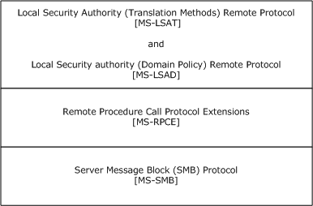

[MS-LSAT]:

Local Security Authority (Translation Methods) Remote
Protocol

Intellectual Property Rights Notice for Open Specifications Documentation

  Technical Documentation. Microsoft publishes Open Specifications documentation (“this

documentation”) for protocols, file formats, data portability, computer languages, and standards
support. Additionally, overview documents cover inter-protocol relationships and interactions.

  Copyrights. This documentation is covered by Microsoft copyrights. Regardless of any other

terms that are contained in the terms of use for the Microsoft website that hosts this
documentation, you can make copies of it in order to develop implementations of the technologies
that are described in this documentation and can distribute portions of it in your implementations
that use these technologies or in your documentation as necessary to properly document the
implementation. You can also distribute in your implementation, with or without modification, any
schemas, IDLs, or code samples that are included in the documentation. This permission also
applies to any documents that are referenced in the Open Specifications documentation.
  No Trade Secrets. Microsoft does not claim any trade secret rights in this documentation.
  Patents. Microsoft has patents that might cover your implementations of the technologies

described in the Open Specifications documentation. Neither this notice nor Microsoft's delivery of
this documentation grants any licenses under those patents or any other Microsoft patents.
However, a given Open Specifications document might be covered by the Microsoft Open
Specifications Promise or the Microsoft Community Promise. If you would prefer a written license,
or if the technologies described in this documentation are not covered by the Open Specifications
Promise or Community Promise, as applicable, patent licenses are available by contacting
iplg@microsoft.com.

  License Programs. To see all of the protocols in scope under a specific license program and the

associated patents, visit the Patent Map.

  Trademarks. The names of companies and products contained in this documentation might be
covered by trademarks or similar intellectual property rights. This notice does not grant any
licenses under those rights. For a list of Microsoft trademarks, visit
www.microsoft.com/trademarks.

  Fictitious Names. The example companies, organizations, products, domain names, email

addresses, logos, people, places, and events that are depicted in this documentation are fictitious.
No association with any real company, organization, product, domain name, email address, logo,
person, place, or event is intended or should be inferred.

Reservation of Rights. All other rights are reserved, and this notice does not grant any rights other
than as specifically described above, whether by implication, estoppel, or otherwise.

Tools. The Open Specifications documentation does not require the use of Microsoft programming
tools or programming environments in order for you to develop an implementation. If you have access
to Microsoft programming tools and environments, you are free to take advantage of them. Certain
Open Specifications documents are intended for use in conjunction with publicly available standards
specifications and network programming art and, as such, assume that the reader either is familiar
with the aforementioned material or has immediate access to it.

Support. For questions and support, please contact dochelp@microsoft.com.

[MS-LSAT] - v20240501
Local Security Authority (Translation Methods) Remote Protocol
Copyright © 2024 Microsoft Corporation
Release: May 1, 2024

1 / 83

Revision Summary

Date

Revision
History

Revision
Class

Comments

2/22/2007

0.01

New

Version 0.01 release

6/1/2007

1.0

Major

Updated and revised the technical content.

7/3/2007

2.0

Major

Deleted type definition for SID_IDENTIFIER_AUTHORITY in favor of
MS-DTYP. Major restructuring of Abstract Data Models section.

7/20/2007

2.0.1

Editorial

Changed language and formatting in the technical content.

8/10/2007

2.0.2

Editorial

Changed language and formatting in the technical content.

9/28/2007

2.0.3

Editorial

Changed language and formatting in the technical content.

10/23/2007  2.1

Minor

Clarified the meaning of the technical content.

11/30/2007  3.0

Major

Removed three types.

1/25/2008

3.1

Minor

Clarified the meaning of the technical content.

3/14/2008

4.0

Major

Updated and revised the technical content.

5/16/2008

4.0.1

Editorial

Changed language and formatting in the technical content.

6/20/2008

4.1

Minor

Clarified the meaning of the technical content.

7/25/2008

5.0

Major

Updated and revised the technical content.

8/29/2008

6.0

Major

Updated and revised the technical content.

10/24/2008  7.0

Major

Updated and revised the technical content.

12/5/2008

8.0

Major

Updated and revised the technical content.

1/16/2009

9.0

Major

Updated and revised the technical content.

2/27/2009

10.0

Major

Updated and revised the technical content.

4/10/2009

10.0.1

Editorial

Changed language and formatting in the technical content.

5/22/2009

11.0

Major

Updated and revised the technical content.

7/2/2009

11.1

Minor

Clarified the meaning of the technical content.

8/14/2009

12.0

Major

Updated and revised the technical content.

9/25/2009

12.0.1

Editorial

Changed language and formatting in the technical content.

11/6/2009

13.0

Major

Updated and revised the technical content.

12/18/2009  14.0

Major

Updated and revised the technical content.

1/29/2010

14.1

Minor

Clarified the meaning of the technical content.

3/12/2010

14.1.1

Editorial

Changed language and formatting in the technical content.

4/23/2010

15.0

Major

Updated and revised the technical content.

6/4/2010

16.0

Major

Updated and revised the technical content.

7/16/2010

16.0

None

No changes to the meaning, language, or formatting of the technical

2 / 83

[MS-LSAT] - v20240501
Local Security Authority (Translation Methods) Remote Protocol
Copyright © 2024 Microsoft Corporation
Release: May 1, 2024

Date

Revision
History

Revision
Class

Comments

content.

8/27/2010

16.0

None

No changes to the meaning, language, or formatting of the technical
content.

10/8/2010

17.0

Major

Updated and revised the technical content.

11/19/2010  18.0

Major

Updated and revised the technical content.

1/7/2011

19.0

Major

Updated and revised the technical content.

2/11/2011

20.0

Major

Updated and revised the technical content.

3/25/2011

20.0

None

No changes to the meaning, language, or formatting of the technical
content.

5/6/2011

21.0

Major

Updated and revised the technical content.

6/17/2011

22.0

Major

Updated and revised the technical content.

9/23/2011

22.0

None

No changes to the meaning, language, or formatting of the technical
content.

12/16/2011  23.0

Major

Updated and revised the technical content.

3/30/2012

23.0

None

No changes to the meaning, language, or formatting of the technical
content.

7/12/2012

23.0

None

No changes to the meaning, language, or formatting of the technical
content.

10/25/2012  24.0

Major

Updated and revised the technical content.

1/31/2013

24.0

None

No changes to the meaning, language, or formatting of the technical
content.

8/8/2013

25.0

Major

Updated and revised the technical content.

11/14/2013  25.0

None

No changes to the meaning, language, or formatting of the technical
content.

2/13/2014

25.0

None

No changes to the meaning, language, or formatting of the technical
content.

5/15/2014

25.0

None

No changes to the meaning, language, or formatting of the technical
content.

6/30/2015

26.0

Major

Significantly changed the technical content.

10/16/2015  26.0

None

No changes to the meaning, language, or formatting of the technical
content.

7/14/2016

27.0

Major

Significantly changed the technical content.

6/1/2017

28.0

Major

Significantly changed the technical content.

9/15/2017

29.0

Major

Significantly changed the technical content.

12/1/2017

29.0

None

No changes to the meaning, language, or formatting of the technical
content.

9/12/2018

30.0

Major

Significantly changed the technical content.

[MS-LSAT] - v20240501
Local Security Authority (Translation Methods) Remote Protocol
Copyright © 2024 Microsoft Corporation
Release: May 1, 2024

3 / 83

Date

Revision
History

Revision
Class

Comments

4/7/2021

31.0

Major

Significantly changed the technical content.

6/25/2021

32.0

Major

Significantly changed the technical content.

5/1/2024

33.0

Major

Significantly changed the technical content.

[MS-LSAT] - v20240501
Local Security Authority (Translation Methods) Remote Protocol
Copyright © 2024 Microsoft Corporation
Release: May 1, 2024

4 / 83

Table of Contents

1.1
1.2

1.2.1
1.2.2

1  Introduction ............................................................................................................ 7
Glossary ........................................................................................................... 7
References ...................................................................................................... 10
Normative References ................................................................................. 10
Informative References ............................................................................... 11
Overview ........................................................................................................ 11
Relationship to Other Protocols .......................................................................... 12
Prerequisites/Preconditions ............................................................................... 12
Applicability Statement ..................................................................................... 13
Versioning and Capability Negotiation ................................................................. 13
Vendor-Extensible Fields ................................................................................... 13
Standards Assignments ..................................................................................... 13

1.3
1.4
1.5
1.6
1.7
1.8
1.9

2.1
2.2

2  Messages ............................................................................................................... 14
Transport ........................................................................................................ 14
Common Data Types ........................................................................................ 14
LSAPR_HANDLE .......................................................................................... 16
STRING ..................................................................................................... 16
LSAPR_ACL ................................................................................................ 16
SECURITY_DESCRIPTOR_CONTROL .............................................................. 16
LSAPR_SECURITY_DESCRIPTOR ................................................................... 16
SECURITY_IMPERSONATION_LEVEL .............................................................. 17
SECURITY_CONTEXT_TRACKING_MODE ........................................................ 17
SECURITY_QUALITY_OF_SERVICE ................................................................ 17
LSAPR_OBJECT_ATTRIBUTES ....................................................................... 18
ACCESS_MASK ........................................................................................... 18
LSAPR_TRUST_INFORMATION ...................................................................... 18
LSAPR_REFERENCED_DOMAIN_LIST ............................................................. 19
SID_NAME_USE ......................................................................................... 19
LSA_TRANSLATED_SID ............................................................................... 19
LSAPR_TRANSLATED_SIDS .......................................................................... 20
LSAP_LOOKUP_LEVEL ................................................................................. 20
LSAPR_SID_INFORMATION .......................................................................... 21
LSAPR_SID_ENUM_BUFFER ......................................................................... 22
LSAPR_TRANSLATED_NAME ......................................................................... 22
LSAPR_TRANSLATED_NAMES ....................................................................... 22
LSAPR_TRANSLATED_NAME_EX ................................................................... 23
LSAPR_TRANSLATED_NAMES_EX.................................................................. 23
LSAPR_TRANSLATED_SID_EX ...................................................................... 24
LSAPR_TRANSLATED_SIDS_EX .................................................................... 24
LSAPR_TRANSLATED_SID_EX2..................................................................... 25
LSAPR_TRANSLATED_SIDS_EX2 ................................................................... 25
Directory Service Schema Elements ................................................................... 26

2.2.1
2.2.2
2.2.3
2.2.4
2.2.5
2.2.6
2.2.7
2.2.8
2.2.9
2.2.10
2.2.11
2.2.12
2.2.13
2.2.14
2.2.15
2.2.16
2.2.17
2.2.18
2.2.19
2.2.20
2.2.21
2.2.22
2.2.23
2.2.24
2.2.25
2.2.26

2.3

3.1

3.1.1

3.1.1.1

3  Protocol Details ..................................................................................................... 27
Server Details .................................................................................................. 27
Abstract Data Model .................................................................................... 27
Database Views .................................................................................... 27
Predefined Translation Database and Corresponding View .................... 28
Configurable Translation Database and Corresponding View .................. 31
Builtin Domain Principal View ............................................................ 32
Account Domain Principal View .......................................................... 33
Account Domain Information View ..................................................... 35
Account Domain View ...................................................................... 36
Forest Principal View ........................................................................ 37

3.1.1.1.1
3.1.1.1.2
3.1.1.1.3
3.1.1.1.4
3.1.1.1.5
3.1.1.1.6
3.1.1.1.7

[MS-LSAT] - v20240501
Local Security Authority (Translation Methods) Remote Protocol
Copyright © 2024 Microsoft Corporation
Release: May 1, 2024

5 / 83

3.1.2
3.1.3
3.1.4

3.1.1.2
3.1.1.3

3.1.1.1.8
3.1.1.1.9

Forest Information View ................................................................... 38
Forest View..................................................................................... 38
Domain Database Information ................................................................ 38
Trusted Domains and Forests Information ................................................ 39
Timers ...................................................................................................... 40
Initialization ............................................................................................... 40
Message Processing Events and Sequencing Rules .......................................... 40
LsarOpenPolicy2 (Opnum 44) ................................................................. 43
LsarOpenPolicy (Opnum 6) ..................................................................... 43
LsarClose (Opnum 0) ............................................................................. 44
LsarGetUserName (Opnum 45) ............................................................... 44
LsarLookupNames4 (Opnum 77) ............................................................. 45
LsarLookupNames3 (Opnum 68) ............................................................. 49
LsarLookupNames2 (Opnum 58) ............................................................. 50
LsarLookupNames (Opnum 14) ............................................................... 52
LsarLookupSids3 (Opnum 76) ................................................................. 53
LsarLookupSids2 (Opnum 57) ................................................................. 56
LsarLookupSids (Opnum 15) .................................................................. 57
Timer Events .............................................................................................. 58
Other Local Events ...................................................................................... 58
Client Details ................................................................................................... 58

3.1.4.1
3.1.4.2
3.1.4.3
3.1.4.4
3.1.4.5
3.1.4.6
3.1.4.7
3.1.4.8
3.1.4.9
3.1.4.10
3.1.4.11

3.1.5
3.1.6

3.2

4  Protocol Example................................................................................................... 60

5  Security ................................................................................................................. 63
Security Considerations for Implementers ........................................................... 63
Index of Security Parameters ............................................................................ 63

5.1
5.2

6  Appendix A: Full IDL .............................................................................................. 64

7  Appendix B: Product Behavior ............................................................................... 73

8  Change Tracking .................................................................................................... 81

9  Index ..................................................................................................................... 82

[MS-LSAT] - v20240501
Local Security Authority (Translation Methods) Remote Protocol
Copyright © 2024 Microsoft Corporation
Release: May 1, 2024

6 / 83

1  Introduction

The Local Security Authority (Translation Methods) Remote Protocol is implemented in Windows
products to translate identifiers for security principals between human-readable and machine-
readable forms. This translation can be used in scenarios such as human management of resource
access.

Sections 1.5, 1.8, 1.9, 2, and 3 of this specification are normative. All other sections and examples in
this specification are informative.

1.1  Glossary

This document uses the following terms:

access control list (ACL): A list of access control entries (ACEs) that collectively describe the

security rules for authorizing access to some resource; for example, an object or set of objects.

ACID: A term that refers to the four properties that any database system has to achieve in order

to be considered transactional: Atomicity, Consistency, Isolation, and Durability.

Active Directory: The Windows implementation of a general-purpose directory service, which uses

LDAP as its primary access protocol. Active Directory stores information about a variety of
objects in the network such as user accounts, computer accounts, groups, and all related
credential information used by Kerberos [MS-KILE]. Active Directory is either deployed as Active
Directory Domain Services (AD DS) or Active Directory Lightweight Directory Services (AD LDS),
which are both described in [MS-ADOD]: Active Directory Protocols Overview.

discretionary access control list (DACL): An access control list (ACL) that is controlled by

the owner of an object and that specifies the access particular users or groups can have to the
object.

DNS name: A fully qualified domain name (FQDN).

domain: A set of users and computers sharing a common namespace and management

infrastructure. At least one computer member of the set has to act as a domain controller
(DC) and host a member list that identifies all members of the domain, as well as optionally
hosting the Active Directory service. The domain controller provides authentication of
members, creating a unit of trust for its members. Each domain has an identifier that is shared
among its members. For more information, see [MS-AUTHSOD] section 1.1.1.5 and [MS-ADTS].

domain controller (DC): The service, running on a server, that implements Active Directory, or
the server hosting this service. The service hosts the data store for objects and interoperates
with other DCs to ensure that a local change to an object replicates correctly across all DCs.
When Active Directory is operating as Active Directory Domain Services (AD DS), the DC
contains full NC replicas of the configuration naming context (config NC), schema naming
context (schema NC), and one of the domain NCs in its forest. If the AD DS DC is a global
catalog server (GC server), it contains partial NC replicas of the remaining domain NCs in its
forest. For more information, see [MS-AUTHSOD] section 1.1.1.5.2 and [MS-ADTS]. When
Active Directory is operating as Active Directory Lightweight Directory Services (AD LDS),
several AD LDS DCs can run on one server. When Active Directory is operating as AD DS, only
one AD DS DC can run on one server. However, several AD LDS DCs can coexist with one AD
DS DC on one server. The AD LDS DC contains full NC replicas of the config NC and the schema
NC in its forest. The domain controller is the server side of Authentication Protocol Domain
Support [MS-APDS].

domain database: A database where security principal information is stored. This database is the
directory service Active Directory in the case of a domain controller (DC). On a machine

[MS-LSAT] - v20240501
Local Security Authority (Translation Methods) Remote Protocol
Copyright © 2024 Microsoft Corporation
Release: May 1, 2024

7 / 83

that is not a DC, this database is a local database, manageable through the Security Accounts
Manager Remote Protocol, as specified in [MS-SAMR].

domain member (member machine): A machine that is joined to a domain by sharing a secret

between the machine and the domain.

domain name: A domain name or a NetBIOS name that identifies a domain.

domain naming context (domain NC): A naming context (NC) whose replicas are able to

contain security principal objects. No other NC replica can contain security principal objects.
The distinguished name (DN) of a domain NC takes the form "dc=n1,dc=n2, ... dc=nk" where
each "ni" satisfies the syntactic requirements of a DNS name component. For more information,
see [RFC1034]. Such a DN corresponds to the domain naming service name:  "n1.n2. ... .nk".
This is the domain naming service name of the domain NC. Domain NCs appear in the global
catalog (GC). A forest has one or more domain NCs. The root of a domain NC is an object of
class domainDns.

forest: In the Active Directory directory service, a forest is a set of naming contexts (NCs)

consisting of one schema NC, one config NC, and one or more domain NCs. Because a set of
NCs can be arranged into a tree structure, a forest is also a set of one or several trees of NCs.

forest trust: A type of trust where the trusted party is a forest, which means that all domains in

that forest are trusted.

Local Security Authority (LSA): A protected subsystem that authenticates and logs users onto

the local system. LSA also maintains information about all aspects of local security on a system,
collectively known as the local security policy of the system.

Network Data Representation (NDR): A specification that defines a mapping from Interface
Definition Language (IDL) data types onto octet streams. NDR also refers to the runtime
environment that implements the mapping facilities (for example, data provided to NDR). For
more information, see [MS-RPCE] and [C706] section 14.

opnum: An operation number or numeric identifier that is used to identify a specific remote

procedure call (RPC) method or a method in an interface. For more information, see [C706]
section 12.5.2.12 or [MS-RPCE].

relative identifier (RID): The last item in the series of SubAuthority values in a security

identifier (SID) [SIDD]. It distinguishes one account or group from all other accounts and
groups in the domain. No two accounts or groups in any domain share the same RID.

remote procedure call (RPC): A communication protocol used primarily between client and

server. The term has three definitions that are often used interchangeably: a runtime
environment providing for communication facilities between computers (the RPC runtime); a set
of request-and-response message exchanges between computers (the RPC exchange); and the
single message from an RPC exchange (the RPC message).  For more information, see [C706].

root domain: The unique domain naming contexts (domain NCs) of an Active Directory

forest that is the parent of the forest's config NC. The config NC's relative distinguished name
(RDN) is "cn=Configuration" relative to the root object of the root domain. The root domain is
the domain that is created first in a forest.

RPC client: A computer on the network that sends messages using remote procedure call (RPC) as

its transport, waits for responses, and is the initiator in an RPC exchange.

RPC dynamic endpoint: A network-specific server address that is requested and assigned at run

time, as described in [C706].

RPC endpoint: A network-specific address of a server process for remote procedure calls (RPCs).
The actual name of the RPC endpoint depends on the RPC protocol sequence being used. For

8 / 83

[MS-LSAT] - v20240501
Local Security Authority (Translation Methods) Remote Protocol
Copyright © 2024 Microsoft Corporation
Release: May 1, 2024

example, for the NCACN_IP_TCP RPC protocol sequence an RPC endpoint might be TCP port
1025. For more information, see [C706].

RPC protocol sequence: A character string that represents a valid combination of a remote

procedure call (RPC) protocol, a network layer protocol, and a transport layer protocol, as
described in [C706] and [MS-RPCE].

RPC server: A computer on the network that waits for messages, processes them when they

arrive, and sends responses using RPC as its transport acts as the responder during a remote
procedure call (RPC) exchange.

RPC transport: The underlying network services used by the remote procedure call (RPC) runtime

for communications between network nodes. For more information, see [C706] section 2.

security identifier (SID): An identifier for security principals that is used to identify an account

or a group. Conceptually, the SID is composed of an account authority portion (typically a
domain) and a smaller integer representing an identity relative to the account authority,
termed the relative identifier (RID). The SID format is specified in [MS-DTYP] section 2.4.2;
a string representation of SIDs is specified in [MS-DTYP] section 2.4.2 and [MS-AZOD] section
1.1.1.2.

security principal: A unique entity, also referred to as a principal, that can be authenticated by
Active Directory. It frequently corresponds to a human user, but also can be a service that
offers a resource to other security principals. Other security principals might be a group, which
is a set of principals. Groups are supported by Active Directory.

Server Message Block (SMB): A protocol that is used to request file and print services from
server systems over a network. The SMB protocol extends the CIFS protocol with additional
security, file, and disk management support. For more information, see [CIFS] and [MS-SMB].

trust: To accept another authority's statements for the purposes of authentication and

authorization, especially in the case of a relationship between two domains. If domain A trusts
domain B, domain A accepts domain B's authentication and authorization statements for
principals represented by security principal objects in domain B; for example, the list of groups
to which a particular user belongs. As a noun, a trust is the relationship between two domains
described in the previous sentence.

trust attributes: A collection of attributes that define different characteristics of a trust within a

domain or a forest.

trusted domain: A domain that is trusted to make authentication decisions for security principals

in that domain.

trusted forest: A forest that is trusted to make authentication statements for security principals in

that forest. Assuming forest A trusts forest B, all domains belonging to forest A will trust all
domains in forest B, subject to policy configuration.

universally unique identifier (UUID): A 128-bit value. UUIDs can be used for multiple

purposes, from tagging objects with an extremely short lifetime, to reliably identifying very
persistent objects in cross-process communication such as client and server interfaces, manager
entry-point vectors, and RPC objects. UUIDs are highly likely to be unique. UUIDs are also
known as globally unique identifiers (GUIDs) and these terms are used interchangeably in the
Microsoft protocol technical documents (TDs). Interchanging the usage of these terms does not
imply or require a specific algorithm or mechanism to generate the UUID. Specifically, the use of
this term does not imply or require that the algorithms described in [RFC4122] or [C706] has to
be used for generating the UUID.

user principal name (UPN): A user account name (sometimes referred to as the user logon

name) and a domain name that identifies the domain in which the user account is located. This
is the standard usage for logging on to a Windows domain. The format is:

9 / 83

[MS-LSAT] - v20240501
Local Security Authority (Translation Methods) Remote Protocol
Copyright © 2024 Microsoft Corporation
Release: May 1, 2024

someone@example.com (in the form of an email address). In Active Directory, the
userPrincipalName attribute of the account object, as described in [MS-ADTS].

MAY, SHOULD, MUST, SHOULD NOT, MUST NOT: These terms (in all caps) are used as defined
in [RFC2119]. All statements of optional behavior use either MAY, SHOULD, or SHOULD NOT.

1.2  References

Links to a document in the Microsoft Open Specifications library point to the correct section in the
most recently published version of the referenced document. However, because individual documents
in the library are not updated at the same time, the section numbers in the documents may not
match. You can confirm the correct section numbering by checking the Errata.

1.2.1  Normative References

We conduct frequent surveys of the normative references to assure their continued availability. If you
have any issue with finding a normative reference, please contact dochelp@microsoft.com. We will
assist you in finding the relevant information.

[C706] The Open Group, "DCE 1.1: Remote Procedure Call", C706, August 1997,
https://publications.opengroup.org/c706

Note Registration is required to download the document.

[GRAY] Gray, J., and Reuter, A., "Transaction Processing: Concepts and Techniques", The Morgan
Kaufmann Series in Data Management Systems, San Francisco: Morgan Kaufmann Publishers, 1992,
Hardcover ISBN: 9781558601901.

[MS-ADA1] Microsoft Corporation, "Active Directory Schema Attributes A-L".

[MS-ADA2] Microsoft Corporation, "Active Directory Schema Attributes M".

[MS-ADA3] Microsoft Corporation, "Active Directory Schema Attributes N-Z".

[MS-ADSC] Microsoft Corporation, "Active Directory Schema Classes".

[MS-ADTS] Microsoft Corporation, "Active Directory Technical Specification".

[MS-DRSR] Microsoft Corporation, "Directory Replication Service (DRS) Remote Protocol".

[MS-DTYP] Microsoft Corporation, "Windows Data Types".

[MS-ERREF] Microsoft Corporation, "Windows Error Codes".

[MS-LSAD] Microsoft Corporation, "Local Security Authority (Domain Policy) Remote Protocol".

[MS-NRPC] Microsoft Corporation, "Netlogon Remote Protocol".

[MS-RPCE] Microsoft Corporation, "Remote Procedure Call Protocol Extensions".

[MS-SAMR] Microsoft Corporation, "Security Account Manager (SAM) Remote Protocol (Client-to-
Server)".

[MS-SCMR] Microsoft Corporation, "Service Control Manager Remote Protocol".

[MSKB-3149090] Microsoft Corporation, "MS16-047: Description of the security update for SAM and
LSAD remote protocols", April 2016, https://support.microsoft.com/en-us/kb/3149090

[MS-LSAT] - v20240501
Local Security Authority (Translation Methods) Remote Protocol
Copyright © 2024 Microsoft Corporation
Release: May 1, 2024

10 / 83

[RFC2119] Bradner, S., "Key words for use in RFCs to Indicate Requirement Levels", BCP 14, RFC
2119, March 1997, https://www.rfc-editor.org/info/rfc2119

1.2.2  Informative References

[MS-ADOD] Microsoft Corporation, "Active Directory Protocols Overview".

[MS-SMB] Microsoft Corporation, "Server Message Block (SMB) Protocol".

[MSDN-RPCDB] Microsoft Corporation, "The RPC Name Service Database",
http://msdn.microsoft.com/en-us/library/aa378865.aspx

[MSFT-LSA-IDL] Microsoft Corporation, "Local Security Authority Merged IDL File", March 2018,
https://www.microsoft.com/en-us/download/details.aspx?id=3367

1.3  Overview

The purpose of this protocol is to translate human-readable names to security identifiers (SIDs), as
specified in [MS-DTYP] section 2.4.2, and vice versa. The syntax of human-readable names is
specified in section 3.1.4.5. For example, this protocol can be used to translate "corp\John" to "S-1-5-
21-397955417-626881126-188441444-1555", and vice versa.

This translation is needed for different scenarios, such as managing access to resources. In Windows,
access to resources is controlled by a security descriptor attached to the resource. This security
descriptor contains a list of SIDs indicating the security principals and the kind of access allowed or
denied for those principals. In order for humans to manage access to resources, translation occurs
between SIDs (persisted within security descriptors) and human-readable identifiers (in the user
interface).

This protocol is intended for use between any two machines, most frequently between a domain
member and a domain controller (DC) for that domain. This protocol can also be used between
domain controllers for trusting domains or forests.

This protocol is a simple request/response-based remote procedure call (RPC) protocol. There are
no long-lived sessions, although clients are free to cache the RPC connection and reuse it over time. A
sample sequence of requests and responses is shown in section 4.

[MS-LSAT] - v20240501
Local Security Authority (Translation Methods) Remote Protocol
Copyright © 2024 Microsoft Corporation
Release: May 1, 2024

11 / 83

<!-- Extracted images from page 12 -->

<!-- /Extracted images from page 12 -->

1.4  Relationship to Other Protocols

Figure 1: The relationships among the LSAT, LSAD, RPC, and SMB protocols

The Local Security Authority (Translation Methods) Remote Protocol is composed of a subset of
opnums in an interface that also includes the Local Security Authority (Domain Policy) Remote
Protocol, as specified in [MS-LSAD].

The Local Security Authority (Translation Methods) Remote Protocol is dependent upon RPC, which is
used to communicate between domain members and domain controllers.

This protocol depends on the Server Message Block (SMB) Protocol [MS-SMB] and the TCP/IP
protocol for sending messages on the wire.

Some messages in this protocol depend on the Netlogon Remote Protocol, as specified in [MS-NRPC],
having successfully negotiated security parameters to be used. For more information on the messages
that have this requirement, see section 3.1.4.

The Directory Replication Service (DRS) Remote Protocol, as specified in [MS-DRSR], exposes
functionality similar to what this protocol achieves, but serves a different purpose. The DRS Remote
Protocol can translate names in different syntaxes, but lacks the functionality to translate names from
different forests. An application uses one or both protocols, depending on the syntax of names for
which the application requires translation.

The Security Account Manager (SAM) Remote Protocol (Client-to-Server), as specified in [MS-SAMR],
exposes similar functionality for security principals that are local to a server.

The Active Directory Technical Specification [MS-ADTS] discusses Active Directory, which is used by
this protocol.

1.5  Prerequisites/Preconditions

This protocol has prerequisites, specified in [MS-RPCE], that are common to protocols that depend on
RPC.

12 / 83

[MS-LSAT] - v20240501
Local Security Authority (Translation Methods) Remote Protocol
Copyright © 2024 Microsoft Corporation
Release: May 1, 2024

As previously noted, some messages in this protocol depend on the Netlogon Remote Protocol, as
specified in [MS-NRPC], having successfully negotiated security parameters to be used. For more
information on the messages that have this requirement, see section 3.1.4.

It is assumed that the RPC server has access to the distributed abstract databases specified in
section 3.1.1 that are required to perform the translations requested using this protocol. It is also
assumed that the RPC server has created the required views, as specified in section 3.1.1.

1.6  Applicability Statement

This protocol is applicable whenever there is a need to translate the human-readable names of
security principals, with syntaxes described in section 3.1.4.5, to security principal SIDs, or vice
versa. This applicability includes, but is not limited to, an end-user administration program that
displays and controls who can access such resources as files.

To understand the conditions under which this protocol is preferred over other protocols, see section
1.4.

1.7  Versioning and Capability Negotiation

This document covers versioning issues in the following areas:

  Supported Transports: The protocol uses RPC over SMB and TCP/IP, as specified in section 2.1.



Protocol Version: This protocol's RPC interface has a single version number, but that interface has
been extended by adding methods at the end. The use of these methods is specified in section
3.1.

  Structure Version: The LSAPR_ACL (section 2.2.3) and

LSAPR_SECURITY_DESCRIPTOR (section 2.2.5) structures are versioned using the first field in the
structure. The structure version is not used in this protocol.

  Capabilities: The RPC client passes its capabilities in the appropriate parameter when possible, as

specified in sections 3.1.4.5, 3.1.4.6, 3.1.4.7, 3.1.4.9, and 3.1.4.10.

The RPC server takes actions according to the capabilities parameter of an RPC message, if
present, as specified in the previous paragraph.

1.8  Vendor-Extensible Fields

This protocol uses NTSTATUS values as specified in [MS-ERREF] section 2.3. Vendors are free to
choose their own values for this field, provided that the C bit (0x20000000) is set, which indicates that
it is a customer code.

1.9  Standards Assignments

This protocol has no standards assignments. It uses private allocations for the RPC interface
universally unique identifier (UUID) (12345778-1234-ABCD-EF00-0123456789AB) and the RPC
endpoint (\PIPE\lsarpc).

[MS-LSAT] - v20240501
Local Security Authority (Translation Methods) Remote Protocol
Copyright © 2024 Microsoft Corporation
Release: May 1, 2024

13 / 83

2  Messages

2.1  Transport

This protocol uses the following RPC protocol sequences:

  SMB



TCP/IP<1>

This protocol MUST use RPC dynamic endpoints, as specified in [C706] section 4, when using RPC
over TCP/IP.

This protocol MUST use "\PIPE\lsarpc" as the RPC endpoint when using RPC over SMB.<2>

RPC clients for this protocol MUST use RPC over SMB for the LsarOpenPolicy2, LsarOpenPolicy,
LsarClose, LsarGetUserName, LsarLookupNames, LsarLookupNames2, LsarLookupNames3,
LsarLookupSids, and LsarLookupSids2 methods. RPC clients MUST use RPC over TCP/IP for the
LsarLookupNames4 and LsarLookupSids3 methods.<3>

The server SHOULD<4> reject calls that do not use an authentication level of
RPC_C_AUTHN_LEVEL_NONE, RPC_C_AUTHN_LEVEL_PKT_INTEGRITY, or
RPC_C_AUTHN_LEVEL_PKT_PRIVACY ([MS-RPCE] section 2.2.1.1.8).

This protocol MUST use the UUID and version number as follows:

  UUID: See section 1.9.

  Version number: 0.0.

Security settings used in this protocol vary depending on the role of the RPC client and RPC server,
the method being used, and the specific parameters being used. Therefore, security settings are
discussed in the message processing sections for each message.

2.2  Common Data Types

In addition to RPC base types and definitions specified in [C706] and [MS-DTYP], additional data
types are defined in this specification.

Some fields of some data types were introduced into the protocol but not used. These data types and
fields are not to be confused with those that were introduced for extensibility. These fields MUST NOT
be used for extensibility. Such fields are described as follows:

"This field MUST be ignored. The content is unspecified, and no requirements are placed on its value
since it is never used."

The server SHOULD place no constraints on the value present in such fields unless otherwise stated.

This protocol MUST indicate to the RPC runtime that it is to support both the NDR and NDR64 transfer
syntaxes and provide a negotiation mechanism for determining which transfer syntax will be used, as
specified in [C706] section 12 and in [MS-RPCE] section 3.3.1.5.6.

The following table summarizes the types that are defined in this specification.

Note  NTSTATUS, RPC_SID, and RPC_UNICODE_STRING are defined in [MS-DTYP] sections 2.2.38,
2.4.2.3, and 2.3.10, respectively.

[MS-LSAT] - v20240501
Local Security Authority (Translation Methods) Remote Protocol
Copyright © 2024 Microsoft Corporation
Release: May 1, 2024

14 / 83

Type (section)

Summary

ACCESS_MASK (section 2.2.10)

Defines the access rights to grant an object.

LSA_TRANSLATED_SID (section 2.2.14)

Contains machine-readable information about a
security principal.

LSAP_LOOKUP_LEVEL (section 2.2.16)

Defines different scopes for searches during translation.

LSAPR_ACL (section 2.2.3)

Defines the header of an access control list.

LSAPR_HANDLE (section 2.2.1)

Defines a context handle.

LSAPR_OBJECT_ATTRIBUTES (section 2.2.9)

Specifies an object and its handle's properties.

LSAPR_REFERENCED_DOMAIN_LIST (section 2.2.12)

Contains information about the domains referenced in
a lookup operation.

LSAPR_SECURITY_DESCRIPTOR (section 2.2.5)

Defines an object's security descriptor.

LSAPR_SID_ENUM_BUFFER (section 2.2.18)

Defines a set of SIDs.

LSAPR_SID_INFORMATION (section 2.2.17)

Contains a SID value.

LSAPR_TRANSLATED_NAME (section 2.2.19)

LSAPR_TRANSLATED_NAME_EX (section 2.2.21)

Contains human-readable name information about a
security principal.

Contains human-readable name information about a
security principal.

LSAPR_TRANSLATED_NAMES (section 2.2.20)

Defines a set of translated names.

LSAPR_TRANSLATED_NAMES_EX (section 2.2.22)

Contains a set of translated names.

LSAPR_TRANSLATED_SID_EX (section 2.2.23)

LSAPR_TRANSLATED_SID_EX2 (section 2.2.25)

Contains machine-readable identifier information about
a security principal.

Contains machine-readable identifier information about
a security principal.

LSAPR_TRANSLATED_SIDS (section 2.2.15)

Defines a set of translated SIDs.

LSAPR_TRANSLATED_SIDS_EX (section 2.2.24)

Contains a set of translated SIDs.

LSAPR_TRANSLATED_SIDS_EX2 (section 2.2.26)

Contains a set of translated SIDs.

LSAPR_TRUST_INFORMATION (section 2.2.11)

Contains information about a domain.

SECURITY_CONTEXT_TRACKING_MODE (section 2.2.7)  Specifies whether user security attributes are updated

on a server when they change on the client.

SECURITY_DESCRIPTOR_CONTROL (section 2.2.4)

Qualifies the meaning of a security descriptor or its
components.

SECURITY_IMPERSONATION_LEVEL (section 2.2.6)

Specifies security impersonation levels.

SECURITY_QUALITY_OF_SERVICE (section 2.2.8)

Defines information that is used to support client
impersonation.

SID_NAME_USE (section 2.2.13)

Contains values that specify the type of an account.

STRING (section 2.2.2)

Defines an ANSI string along with the number of
characters in the string.

The following citation contains a timeline of when each data type was introduced.<5>

15 / 83

[MS-LSAT] - v20240501
Local Security Authority (Translation Methods) Remote Protocol
Copyright © 2024 Microsoft Corporation
Release: May 1, 2024

2.2.1  LSAPR_HANDLE

The LSAPR_HANDLE type defines a context handle, as specified in [MS-LSAD] section 2.2.2.1.

This type is declared as follows:

 typedef [context_handle] void* LSAPR_HANDLE;

2.2.2  STRING

The STRING structure defines a string along with the number of characters in the string, as specified
in [MS-LSAD] section 2.2.3.1.

 typedef struct _STRING {
   unsigned short Length;
   unsigned short MaximumLength;
   [size_is(MaximumLength), length_is(Length)]
     char* Buffer;
 } STRING,
  *PSTRING;

Individual member semantics are specified in [MS-LSAD] section 2.2.3.1.

2.2.3  LSAPR_ACL

The LSAPR_ACL structure defines the header of an access control list (ACL) as specified in [MS-
LSAD] section 2.2.3.2.

 typedef struct _LSAPR_ACL {
   unsigned char AclRevision;
   unsigned char Sbz1;
   unsigned short AclSize;
   [size_is(AclSize - 4)] unsigned char Dummy1[*];
 } LSAPR_ACL,
  *PLSAPR_ACL;

Individual member semantics are specified in [MS-LSAD] section 2.2.3.2.

2.2.4  SECURITY_DESCRIPTOR_CONTROL

The SECURITY_DESCRIPTOR_CONTROL type contains a set of bit flags as specified in [MS-LSAD]
section 2.2.3.3.

This type is declared as follows:

 typedef unsigned short SECURITY_DESCRIPTOR_CONTROL, *PSECURITY_DESCRIPTOR_CONTROL;

2.2.5  LSAPR_SECURITY_DESCRIPTOR

The LSAPR_SECURITY_DESCRIPTOR structure defines an object's security descriptor as specified in
[MS-LSAD] section 2.2.3.4.

 typedef struct _LSAPR_SECURITY_DESCRIPTOR {
   unsigned char Revision;

[MS-LSAT] - v20240501
Local Security Authority (Translation Methods) Remote Protocol
Copyright © 2024 Microsoft Corporation
Release: May 1, 2024

16 / 83

   unsigned char Sbz1;
   SECURITY_DESCRIPTOR_CONTROL Control;
   PRPC_SID Owner;
   PRPC_SID Group;
   PLSAPR_ACL Sacl;
   PLSAPR_ACL Dacl;
 } LSAPR_SECURITY_DESCRIPTOR,
  *PLSAPR_SECURITY_DESCRIPTOR;

Individual member semantics are specified in [MS-LSAD] section 2.2.3.4.

2.2.6  SECURITY_IMPERSONATION_LEVEL

The SECURITY_IMPERSONATION_LEVEL enumeration defines a set of values that specify security
impersonation levels as specified in [MS-LSAD] section 2.2.3.5.

 typedef  enum _SECURITY_IMPERSONATION_LEVEL
 {
   SecurityAnonymous = 0,
   SecurityIdentification = 1,
   SecurityImpersonation = 2,
   SecurityDelegation = 3
 } SECURITY_IMPERSONATION_LEVEL,
  *PSECURITY_IMPERSONATION_LEVEL;

Individual value semantics are specified in [MS-LSAD] section 2.2.3.5.

2.2.7  SECURITY_CONTEXT_TRACKING_MODE

The SECURITY_CONTEXT_TRACKING_MODE type specifies how the server tracks the client's security
context as specified in [MS-LSAD] section 2.2.3.6.

This type is declared as follows:

 typedef unsigned char SECURITY_CONTEXT_TRACKING_MODE, *PSECURITY_CONTEXT_TRACKING_MODE;

Possible values are specified in [MS-LSAD] section 2.2.3.6.

2.2.8  SECURITY_QUALITY_OF_SERVICE

The SECURITY_QUALITY_OF_SERVICE structure defines information used to support client
impersonation as specified in [MS-LSAD] section 2.2.3.7.

 typedef struct _SECURITY_QUALITY_OF_SERVICE {
   unsigned long Length;
   SECURITY_IMPERSONATION_LEVEL ImpersonationLevel;
   SECURITY_CONTEXT_TRACKING_MODE ContextTrackingMode;
   unsigned char EffectiveOnly;
 } SECURITY_QUALITY_OF_SERVICE,
  *PSECURITY_QUALITY_OF_SERVICE;

Individual member semantics are specified in [MS-LSAD] section 2.2.3.7.

[MS-LSAT] - v20240501
Local Security Authority (Translation Methods) Remote Protocol
Copyright © 2024 Microsoft Corporation
Release: May 1, 2024

17 / 83

2.2.9  LSAPR_OBJECT_ATTRIBUTES

The LSAPR_OBJECT_ATTRIBUTES structure specifies an object and its properties as specified in [MS-
LSAD] section 2.2.2.4.

 typedef struct _LSAPR_OBJECT_ATTRIBUTES {
   unsigned long Length;
   unsigned char* RootDirectory;
   PSTRING ObjectName;
   unsigned long Attributes;
   PLSAPR_SECURITY_DESCRIPTOR SecurityDescriptor;
   PSECURITY_QUALITY_OF_SERVICE SecurityQualityOfService;
 } LSAPR_OBJECT_ATTRIBUTES,
  *PLSAPR_OBJECT_ATTRIBUTES;

Individual member semantics are specified in [MS-LSAD] section 2.2.2.4.

2.2.10 ACCESS_MASK

The ACCESS_MASK data type is a bitmask that defines the access rights to grant an object. Access
types are reconciled with the discretionary access control list (DACL) of the object to determine
whether the requested access is granted or denied.

This type is declared as follows:

 typedef unsigned long ACCESS_MASK;

The possible values are defined in [MS-LSAD] sections 2.2.1.1.1 and 2.2.1.1.2. The ACCESS_MASK
data type is further defined in [MS-DTYP] section 2.4.3.

For this protocol, only a subset of the possible values is required. This subset consists of
POLICY_LOOKUP_NAMES, which is defined in the following table.

Value

Meaning

POLICY_LOOKUP_NAMES

Access to translate names and SIDs.

0x00000800

2.2.11 LSAPR_TRUST_INFORMATION

The LSAPR_TRUST_INFORMATION structure contains information about a domain.

 typedef struct _LSAPR_TRUST_INFORMATION {
   RPC_UNICODE_STRING Name;
   PRPC_SID Sid;
 } LSAPR_TRUST_INFORMATION,
  *PLSAPR_TRUST_INFORMATION;

Individual member semantics are specified in [MS-LSAD] section 2.2.7.1.

[MS-LSAT] - v20240501
Local Security Authority (Translation Methods) Remote Protocol
Copyright © 2024 Microsoft Corporation
Release: May 1, 2024

18 / 83

2.2.12 LSAPR_REFERENCED_DOMAIN_LIST

The LSAPR_REFERENCED_DOMAIN_LIST structure contains information about the domains
referenced in a lookup operation.

 typedef struct _LSAPR_REFERENCED_DOMAIN_LIST {
   unsigned long Entries;
   [size_is(Entries)] PLSAPR_TRUST_INFORMATION Domains;
   unsigned long MaxEntries;
 } LSAPR_REFERENCED_DOMAIN_LIST,
  *PLSAPR_REFERENCED_DOMAIN_LIST;

Entries:  Contains the number of domains referenced in the lookup operation.

Domains:  Contains a set of structures that identify domains. If the Entries field in this structure is

not 0, this field MUST be non-NULL. If Entries is 0, this field MUST be ignored.

MaxEntries:  This field MUST be ignored. The content is unspecified, and no requirements are placed

on its value since it is never used.

2.2.13 SID_NAME_USE

The SID_NAME_USE enumeration contains values that specify the type of an account.<6>

 typedef  enum _SID_NAME_USE
 {
   SidTypeUser = 1,
   SidTypeGroup,
   SidTypeDomain,
   SidTypeAlias,
   SidTypeWellKnownGroup,
   SidTypeDeletedAccount,
   SidTypeInvalid,
   SidTypeUnknown,
   SidTypeComputer,
   SidTypeLabel
 } SID_NAME_USE,
  *PSID_NAME_USE;

The SidTypeInvalid and SidTypeComputer enumeration values are not used in this protocol. Usage
information on the remaining enumeration values is specified in section 3.1.1.

2.2.14 LSA_TRANSLATED_SID

The LSA_TRANSLATED_SID structure contains information about a security principal after
translation from a name to a SID. This structure MUST always be accompanied by an
LSAPR_REFERENCED_DOMAIN_LIST structure when DomainIndex is not -1.

 typedef struct _LSA_TRANSLATED_SID {
   SID_NAME_USE Use;
   unsigned long RelativeId;
   long DomainIndex;
 } LSA_TRANSLATED_SID,
  *PLSA_TRANSLATED_SID;

Use:  Defines the type of the security principal, as specified in section 2.2.13.

[MS-LSAT] - v20240501
Local Security Authority (Translation Methods) Remote Protocol
Copyright © 2024 Microsoft Corporation
Release: May 1, 2024

19 / 83

RelativeId:  Contains the relative identifier (RID) of the security principal with respect to its

domain.

DomainIndex:  Contains the index into an LSAPR_REFERENCED_DOMAIN_LIST structure that

specifies the domain that the security principal is in. A DomainIndex value of -1 MUST be used to
specify that there are no corresponding domains. Other negative values MUST NOT be returned.

2.2.15 LSAPR_TRANSLATED_SIDS

The LSAPR_TRANSLATED_SIDS structure defines a set of translated SIDs.

 typedef struct _LSAPR_TRANSLATED_SIDS {
   [range(0,1000)] unsigned long Entries;
   [size_is(Entries)] PLSA_TRANSLATED_SID Sids;
 } LSAPR_TRANSLATED_SIDS,
  *PLSAPR_TRANSLATED_SIDS;

Entries:  Contains the number of translated SIDs.<7>

Sids:  Contains a set of structures that contain translated SIDs. If the Entries field in this structure is

not 0, this field MUST be non-NULL. If Entries is 0, this field MUST be NULL.

2.2.16 LSAP_LOOKUP_LEVEL

The LSAP_LOOKUP_LEVEL enumeration defines different scopes for searches during translation.<8>

 typedef  enum _LSAP_LOOKUP_LEVEL
 {
   LsapLookupWksta = 1,
   LsapLookupPDC,
   LsapLookupTDL,
   LsapLookupGC,
   LsapLookupXForestReferral,
   LsapLookupXForestResolve,
   LsapLookupRODCReferralToFullDC
 } LSAP_LOOKUP_LEVEL,
  *PLSAP_LOOKUP_LEVEL;

LsapLookupWksta: SIDs MUST be searched in the views under the Security Principal SID and

Security Principal SID History columns in the following order:



Predefined Translation View, as specified in section 3.1.1.1.1.

  Configurable Translation View, as specified in section 3.1.1.1.2.

  Builtin Domain Principal View of the account database on the RPC server, as specified in

section 3.1.1.1.3.

  Account Domain View of account database on that machine, as specified in section 3.1.1.1.6.



If the machine is not joined to a domain, the search ends here.





If the machine is not a domain controller: the Account Domain View of the domain to which
this machine is joined.

Forest View (section 3.1.1.1.9) of the forest of the domain to which this machine is joined,
unless ClientRevision is 0x00000001 and the machine is joined to a mixed mode domain, as
specified in [MS-ADTS] section 6.1.4.1.

[MS-LSAT] - v20240501
Local Security Authority (Translation Methods) Remote Protocol
Copyright © 2024 Microsoft Corporation
Release: May 1, 2024

20 / 83



Forest Views of trusted forests for the forest of the domain to which this machine is joined,
unless ClientRevision is 0x00000001 and the machine is joined to a mixed mode domain, as
specified in [MS-ADTS] section 6.1.4.1.

  Account Domain Views of externally trusted domains for the domain to which this machine is

joined.

LsapLookupPDC: SIDs MUST be searched in the views under the Security Principal SID and Security

Principal SID History columns in the following order:

  Account Domain View of the domain to which this machine is joined.





Forest View of the forest of the domain to which this machine is joined, unless ClientRevision
is 0x00000001 and the machine is joined to a mixed mode domain, as specified in [MS-ADTS]
section 6.1.4.1.

Forest Views of trusted forests for the forest of the domain to which this machine is joined,
unless ClientRevision is 0x00000001 and the machine is joined to a mixed mode domain, as
specified in [MS-ADTS] section 6.1.4.1.

  Account Domain Views of externally trusted domains for the domain to which this machine is

joined.

LsapLookupRODCReferralToFullDC: SIDs MUST be searched in the databases under the Security

Principal SID and Security Principal SID History columns in the following order:



Forest Views of trusted forests for the forest of the domain to which this machine is joined,
unless ClientRevision is 0x00000001 and the machine is joined to a mixed mode domain, as
specified in [MS-ADTS] section 6.1.4.1.

  Account Domain Views of externally trusted domains for the domain to which this machine is

joined.

LsapLookupTDL: SIDs MUST be searched in the databases under the Security Principal SID column

in the following view:

  Account Domain View of the domain NC for the domain to which this machine is joined.

LsapLookupGC: SIDs MUST be searched in the databases under the Security Principal SID and

Security Principal SID History columns in the following view:



Forest View of the forest of the domain to which this machine is joined.

LsapLookupXForestReferral: SIDs MUST be searched in the databases under the Security Principal

SID and Security Principal SID History columns in the following views:



Forest Views of trusted forests for the forest of the domain to which this machine is joined.

LsapLookupXForestResolve: SIDs MUST be searched in the databases under the Security Principal

SID and Security Principal SID History columns in the following view:



Forest View of the forest of the domain to which this machine is joined.

2.2.17 LSAPR_SID_INFORMATION

The LSAPR_SID_INFORMATION structure contains a PRPC_SID value.

 typedef struct _LSAPR_SID_INFORMATION {
   PRPC_SID Sid;
 } LSAPR_SID_INFORMATION,

[MS-LSAT] - v20240501
Local Security Authority (Translation Methods) Remote Protocol
Copyright © 2024 Microsoft Corporation
Release: May 1, 2024

21 / 83

  *PLSAPR_SID_INFORMATION;

Sid:  Contains the PRPC_SID value, as specified in [MS-DTYP] section 2.4.2.3. This field MUST be non-

NULL.

2.2.18 LSAPR_SID_ENUM_BUFFER

The LSAPR_SID_ENUM_BUFFER structure defines a set of SIDs. This structure is used during a
translation request for a batch of SIDs to names.

 typedef struct _LSAPR_SID_ENUM_BUFFER {
   [range(0,20480)] unsigned long Entries;
   [size_is(Entries)] PLSAPR_SID_INFORMATION SidInfo;
 } LSAPR_SID_ENUM_BUFFER,
  *PLSAPR_SID_ENUM_BUFFER;

Entries:  Contains the number of translated SIDs.<9>

SidInfo:  Contains a set of structures that contain SIDs, as specified in section 2.2.17. If the Entries
field in this structure is not 0, this field MUST be non-NULL. If Entries is 0, this field MUST be
ignored.

2.2.19 LSAPR_TRANSLATED_NAME

The LSAPR_TRANSLATED_NAME structure contains information about a security principal, along
with the human-readable identifier for that security principal. This structure MUST always be
accompanied by an LSAPR_REFERENCED_DOMAIN_LIST structure when DomainIndex is not -1,
which contains the domain information for the security principals.

 typedef struct _LSAPR_TRANSLATED_NAME {
   SID_NAME_USE Use;
   RPC_UNICODE_STRING Name;
   long DomainIndex;
 } LSAPR_TRANSLATED_NAME,
  *PLSAPR_TRANSLATED_NAME;

Use:  Defines the type of the security principal, as specified in section 2.2.13.

Name:  Contains the name of the security principal, with syntaxes described in section 3.1.4.5. The

RPC_UNICODE_STRING structure is defined in [MS-DTYP] section 2.3.10.

DomainIndex:  Contains the index into the corresponding LSAPR_REFERENCED_DOMAIN_LIST

structure that specifies the domain that the security principal is in. A DomainIndex value of -1
MUST be used to specify that there are no corresponding domains. Other negative values MUST
NOT be used.

2.2.20 LSAPR_TRANSLATED_NAMES

The LSAPR_TRANSLATED_NAMES structure defines a set of translated names. This is used in the
response to a translation request from SIDs to names.

 typedef struct _LSAPR_TRANSLATED_NAMES {
   [range(0,20480)] unsigned long Entries;
   [size_is(Entries)] PLSAPR_TRANSLATED_NAME Names;
 } LSAPR_TRANSLATED_NAMES,

[MS-LSAT] - v20240501
Local Security Authority (Translation Methods) Remote Protocol
Copyright © 2024 Microsoft Corporation
Release: May 1, 2024

22 / 83

  *PLSAPR_TRANSLATED_NAMES;

Entries:  Contains the number of translated names.<10>

Names:  Contains a set of translated names, as specified in section 2.2.19. If the Entries field in this

structure is not 0, this field MUST be non-NULL. If Entries is 0, this field MUST be ignored.

2.2.21 LSAPR_TRANSLATED_NAME_EX

The LSAPR_TRANSLATED_NAME_EX structure contains information about a security principal along
with the human-readable identifier for that security principal. This structure MUST always be
accompanied by an LSAPR_REFERENCED_DOMAIN_LIST structure when DomainIndex is not -1,
which contains the domain information for the security principals.

 typedef struct _LSAPR_TRANSLATED_NAME_EX {
   SID_NAME_USE Use;
   RPC_UNICODE_STRING Name;
   long DomainIndex;
   unsigned long Flags;
 } LSAPR_TRANSLATED_NAME_EX,
  *PLSAPR_TRANSLATED_NAME_EX;

Use:  Defines the type of the security principal, as specified in section 2.2.13.

Name:  Contains the name of the security principal. The RPC_UNICODE_STRING structure is defined

in [MS-DTYP] section 2.3.10.

DomainIndex:  Contains the index into the corresponding LSAPR_REFERENCED_DOMAIN_LIST

structure that specifies the domain that the security principal is in. A DomainIndex value of -1
MUST be used to specify that there are no corresponding domains. Other negative values MUST
NOT be used.

Flags:  Contains bitmapped values that define the properties of this translation. The value MUST be
the logical OR of zero or more of the following flags. These flags communicate the following
additional information about how the SID was resolved.

Value

Meaning

0x00000001  The SID was not found by matching against the security principal SID property.

0x00000002  The SID might be found by traversing a forest trust.

0x00000004  The SID was found by matching against the last database view, defined in section 3.1.1.1.1.

All other bits MUST be 0 and ignored on receipt.<11>

2.2.22 LSAPR_TRANSLATED_NAMES_EX

The LSAPR_TRANSLATED_NAMES_EX structure contains a set of translated names.

 typedef struct _LSAPR_TRANSLATED_NAMES_EX {
   [range(0,20480)] unsigned long Entries;
   [size_is(Entries)] PLSAPR_TRANSLATED_NAME_EX Names;
 } LSAPR_TRANSLATED_NAMES_EX,
  *PLSAPR_TRANSLATED_NAMES_EX;

[MS-LSAT] - v20240501
Local Security Authority (Translation Methods) Remote Protocol
Copyright © 2024 Microsoft Corporation
Release: May 1, 2024

23 / 83

Entries:  Contains the number of translated names.<12>

Names:  Contains a set of structures that contain translated names, as specified in section 2.2.21. If
the Entries field in this structure is not 0, this field MUST be non-NULL. If Entries is 0, this field
MUST be ignored.

2.2.23 LSAPR_TRANSLATED_SID_EX

The LSAPR_TRANSLATED_SID_EX structure contains information about a security principal after it
has been translated into a SID. This structure MUST always be accompanied by an
LSAPR_REFERENCED_DOMAIN_LIST structure when DomainIndex is not -1, which contains the
domain information for the security principal.

This structure differs from LSA_TRANSLATED_SID only in that a new Flags field is added.

 typedef struct _LSAPR_TRANSLATED_SID_EX {
   SID_NAME_USE Use;
   unsigned long RelativeId;
   long DomainIndex;
   unsigned long Flags;
 } LSAPR_TRANSLATED_SID_EX,
  *PLSAPR_TRANSLATED_SID_EX;

Use:  Defines the type of the security principal, as specified in section 2.2.13.

RelativeId:  Contains the relative identifier (RID) of the security principal with respect to its

domain.

DomainIndex:  Contains the index into the corresponding LSAPR_REFERENCED_DOMAIN_LIST

structure that specifies the domain that the security principal is in. A DomainIndex value of -1
MUST be used to specify that there are no corresponding domains. Other negative values MUST
NOT be used.

Flags:  Contains bitmapped values that define the properties of this translation. The value MUST be

the logical OR of zero or more of the following flags. These flags communicate additional
information on how the name was resolved.

Value

Meaning

0x00000001  The name was not found by matching against the Security Principal Name property.

0x00000002  The name might be found by traversing a forest trust.

0x00000004  The name was found by matching against the last database view, as defined in section

3.1.1.1.1.

All other bits MUST be 0 and ignored on receipt.<13>

2.2.24 LSAPR_TRANSLATED_SIDS_EX

The LSAPR_TRANSLATED_SIDS_EX structure contains a set of translated SIDs.

 typedef struct _LSAPR_TRANSLATED_SIDS_EX {
   [range(0,1000)] unsigned long Entries;
   [size_is(Entries)] PLSAPR_TRANSLATED_SID_EX Sids;
 } LSAPR_TRANSLATED_SIDS_EX,
  *PLSAPR_TRANSLATED_SIDS_EX;

[MS-LSAT] - v20240501
Local Security Authority (Translation Methods) Remote Protocol
Copyright © 2024 Microsoft Corporation
Release: May 1, 2024

24 / 83

Entries:  Contains the number of translated SIDs.<14>

Sids:  Contains a set of structures that contain translated SIDs, as specified in section 2.2.23. If the
Entries field in this structure is not 0, this field MUST be non-NULL. If Entries is 0, this field
MUST be NULL.

2.2.25 LSAPR_TRANSLATED_SID_EX2

The LSAPR_TRANSLATED_SID_EX2 structure contains information about a security principal after it
has been translated into a SID. This structure MUST always be accompanied by an
LSAPR_REFERENCED_DOMAIN_LIST structure when DomainIndex is not -1.

This structure differs from LSAPR_TRANSLATED_SID_EX only in that a SID is returned instead of a
RID.

 typedef struct _LSAPR_TRANSLATED_SID_EX2 {
   SID_NAME_USE Use;
   PRPC_SID Sid;
   long DomainIndex;
   unsigned long Flags;
 } LSAPR_TRANSLATED_SID_EX2,
  *PLSAPR_TRANSLATED_SID_EX2;

Use:  Defines the type of the security principal, as specified in section 2.2.13.

Sid:  Contains the SID ([MS-DTYP] section 2.4.2.3) of the security principal. This field MUST be

treated as a [ref] pointer and hence MUST be non-NULL.

DomainIndex:  Contains the index into an LSAPR_REFERENCED_DOMAIN_LIST structure that

specifies the domain that the security principal is in. A DomainIndex value of -1 MUST be used
to specify that there are no corresponding domains. Other negative values MUST NOT be used.

Flags:  Contains bitmapped values that define the properties of this translation. The value MUST be

the logical OR of zero or more of the following flags. These flags communicate additional
information on how the name was resolved.

Value

Meaning

0x00000001  The name was not found by matching against the Security Principal Name property.

0x00000002  The name might be found by traversing a forest trust.

0x00000004  The name was found by matching against the last database view (see section 3.1.1.1.1).

All other bits MUST be 0 and ignored on receipt.<15>

2.2.26 LSAPR_TRANSLATED_SIDS_EX2

The LSAPR_TRANSLATED_SIDS_EX2 structure contains a set of translated SIDs.

 typedef struct _LSAPR_TRANSLATED_SIDS_EX2 {
   [range(0,1000)] unsigned long Entries;
   [size_is(Entries)] PLSAPR_TRANSLATED_SID_EX2 Sids;
 } LSAPR_TRANSLATED_SIDS_EX2,
  *PLSAPR_TRANSLATED_SIDS_EX2;

Entries:  Contains the number of translated SIDs.<16>

[MS-LSAT] - v20240501
Local Security Authority (Translation Methods) Remote Protocol
Copyright © 2024 Microsoft Corporation
Release: May 1, 2024

25 / 83

Sids:  Contains a set of structures that define translated SIDs, as specified in section 2.2.25. If the
Entries field in this structure is not 0, this field MUST be non-NULL. If Entries is 0, this field
MUST be NULL.

2.3  Directory Service Schema Elements

This protocol is part of the Active Directory core family of protocols. In order to be fully compliant
with Active Directory, an implementation of this protocol must be used in conjunction with the full
Active Directory schema, containing all the schema attributes and classes specified in [MS-ADA1],
[MS-ADA2], [MS-ADA3], and [MS-ADSC].

[MS-LSAT] - v20240501
Local Security Authority (Translation Methods) Remote Protocol
Copyright © 2024 Microsoft Corporation
Release: May 1, 2024

26 / 83

3  Protocol Details

This protocol determines whether it is running on a domain controller by querying the current server
configuration. This is accomplished by calling the abstract interface ServerGetInfo, specified in [MS-
DTYP] section 2.6, and indicating a level of 101. The resulting bufptr contains a SERVER_INFO_101
structure, as specified in [MS-DTYP] section 2.3.12. The determination is TRUE if
sv101_version_type contains SV_TYPE_DOMAIN_CTRL or SV_TYPE_DOMAIN_BAKCTRL. If
sv101_version_type does not contain either of these values, the determination is FALSE.

3.1  Server Details

3.1.1  Abstract Data Model

This section describes a possible data organization that an implementation might maintain to
participate in this protocol. The described organization is provided to help explain how the protocol
behaves. This document does not mandate that implementations adhere to this model as long as their
external behavior is consistent with what is described in this document.

The server implementing this protocol MUST create views, as specified in section 3.1.1.1, over
domain databases that the server trusts to be able to translate SIDs to names, and vice versa.
These views contain SIDs and different types of names, as well as the domain to which each security
principal belongs. These views MUST be kept in sync with the original databases whose data is used
to create the view. The sync mechanism is implementation-specific, and there is no upper bound on
the time from when a change occurs in a domain database to when that change appears in the view. A
scoping parameter defined as LSAP_LOOKUP_LEVEL can be considered during message processing by
applying these views to different databases.

The following domain databases are used in this protocol.

  Active Directory, specified in [MS-ADTS].







The Local Security Authority (LSA) Domain Policy database, specified in [MS-LSAD].

The Service Control Manager database, specified in [MS-SCMR].

The Predefined Translation database, specified in section 3.1.1.1.1.

The domain databases MUST satisfy ACID properties [GRAY] during creation or updates of views.

The abstract data models presented in sections 3.1.1.2 and 3.1.1.3 are used along with domain
database information to construct the logical views specified in section 3.1.1.1. The views, in turn, are
used to process mapping requests. This process is specified in sections 3.1.4.4, 3.1.4.5, and 3.1.4.9,
which describe the server processing of RPC messages.

In this section, Active Directory schema names are referenced when describing attributes stored in the
domain database. For more information, see [MS-ADSC], [MS-ADA1], [MS-ADA2], and [MS-ADA3].

3.1.1.1  Database Views

The following names represent the columns of the views that are specified in this section:

  Domain DNS Name

  Domain NetBIOS Name

  Domain SID

  Security Principal Name

[MS-LSAT] - v20240501
Local Security Authority (Translation Methods) Remote Protocol
Copyright © 2024 Microsoft Corporation
Release: May 1, 2024

27 / 83

  Additional Security Principal Name

  Default User Principal Names

  User Principal Name

  Security Principal SID

  Security Principal SID History

  Security Principal Type

Domain SID, Security Principal Name, Security Principal SID, and Security Principal Type are
mandatory columns that MUST have values, while the rest MAY have values.

Some views are populated with constants, while others are populated by extracting current
information from various domain databases. The specific views and how they are populated are
described in the following paragraphs and subsections.

When a view is populated by extracting current information from the domain database of a selected
domain, and the database or a replica of the database is local to the server, the server MUST use the
local values. If the security database or a replica is not local, the server MUST use values from a
remote replica. For remote values, there are no consistency guarantees from call to call; that is, the
view might contain values from a different remote replica on each call.

The following assumptions are made for all views:

  Security Principal SID forms a unique key for each row.









The Security Principal Name and Domain NetBIOS Name pair forms a unique key for each
row.

If Domain DNS Name is not empty, the Security Principal Name and Domain DNS Name pair
forms a unique key for each row.

If Additional Security Principal Name is not empty, the Additional Security Principal Name
and Domain NetBIOS Name pair forms a unique key for each row.

If Additional Security Principal Name and Domain DNS Name are not empty, the Additional
Security Principal Name and Domain DNS Name pair forms a unique key for each row.

These assumptions MUST be held true by the database implementations from which these views are
created.<17>

3.1.1.1.1 Predefined Translation Database and Corresponding View

The Predefined Translation View MUST be constructed using the following non-customizable Predefined
Translation Tables. There is a one-to-one mapping between the rows in the view and the rows in the
tables. The columns that are not mentioned in these tables are empty. The tables are grouped by the
Domain NetBIOS Name and Domain SID columns for easier understanding.

Values of the Domain NetBIOS Name and Security Principal Name columns are shown in U.S. English.
In an actual system, these values MUST be localized to the language defined as system locale at the
time of message processing.

Domain NetBIOS Name: "" (empty domain name)

Domain SID: S-1-0

[MS-LSAT] - v20240501
Local Security Authority (Translation Methods) Remote Protocol
Copyright © 2024 Microsoft Corporation
Release: May 1, 2024

28 / 83

Security Principal Name

Security Principal SID

Security Principal Type

Null Sid

S-1-0-0

SidTypeWellKnownGroup

Domain NetBIOS Name: "" (empty domain name)

Domain SID: S-1-1

Security Principal Name

Security Principal SID

Security Principal Type

Everyone

S-1-1-0

SidTypeWellKnownGroup

Domain NetBIOS Name: "" (empty domain name)

Domain SID: S-1-2

Security Principal Name

Security Principal SID

Security Principal Type

Local

S-1-2-0

SidTypeWellKnownGroup

Domain NetBIOS Name: "" (empty domain name)

Domain SID: S-1-3

Security Principal Name

Security Principal SID

Security Principal Type

Creator Owner

Creator Group

Creator Owner Server

Creator Group Server

Owner Rights

S-1-3-0

S-1-3-1

S-1-3-2

S-1-3-3

S-1-3-4

SidTypeWellKnownGroup

SidTypeWellKnownGroup

SidTypeWellKnownGroup

SidTypeWellKnownGroup

SidTypeWellKnownGroup

Domain NetBIOS Name: NT Pseudo Domain

Domain SID: S-1-5

Security Principal Name

Security Principal SID

Security Principal Type

NT Pseudo Domain

S-1-5

SidTypeDomain

Domain NetBIOS Name: NT Authority

Domain SID: S-1-5

[MS-LSAT] - v20240501
Local Security Authority (Translation Methods) Remote Protocol
Copyright © 2024 Microsoft Corporation
Release: May 1, 2024

29 / 83

Security Principal Name

Security Principal SID

Security Principal Type

Dialup

Network

Batch

Interactive

Service

Anonymous Logon

Proxy

S-1-5-1

S-1-5-2

S-1-5-3

S-1-5-4

S-1-5-6

S-1-5-7

S-1-5-8

SidTypeWellKnownGroup

SidTypeWellKnownGroup

SidTypeWellKnownGroup

SidTypeWellKnownGroup

SidTypeWellKnownGroup

SidTypeWellKnownGroup

SidTypeWellKnownGroup

Enterprise Domain Controllers

S-1-5-9

SidTypeWellKnownGroup

Self

Authenticated Users

Restricted

Terminal Server User

S-1-5-10

S-1-5-11

S-1-5-12

S-1-5-13

SidTypeWellKnownGroup

SidTypeWellKnownGroup

SidTypeWellKnownGroup

SidTypeWellKnownGroup

Remote Interactive Logon

S-1-5-14

SidTypeWellKnownGroup

This Organization

System

Local Service

Network Service

Write Restricted

S-1-5-15

S-1-5-18

S-1-5-19

S-1-5-20

S-1-5-33

SidTypeWellKnownGroup

SidTypeWellKnownGroup

SidTypeWellKnownGroup

SidTypeWellKnownGroup

SidTypeWellKnownGroup

Other Organization

S-1-5-1000

SidTypeWellKnownGroup

For Windows behavior on the preceding entries, see the following citation.<18>

Domain NetBIOS Name: Builtin

Domain SID: S-1-5-32

Security Principal Name

Security Principal SID

Security Principal Type

Builtin

S-1-5-32

SidTypeDomain

Domain NetBIOS Name: Internet$

Domain SID: S-1-7

Security Principal Name

Security Principal SID

Security Principal Type

Internet$

S-1-7

SidTypeDomain

[MS-LSAT] - v20240501
Local Security Authority (Translation Methods) Remote Protocol
Copyright © 2024 Microsoft Corporation
Release: May 1, 2024

30 / 83

Domain NetBIOS Name: NT Authority

Domain SID: S-1-5-64

Security Principal Name

Security Principal SID

Security Principal Type

NTLM Authentication

S-1-5-64-10

SidTypeWellKnownGroup

Digest Authentication

S-1-5-64-21

SidTypeWellKnownGroup

Channel Authentication

S-1-5-64-14

SidTypeWellKnownGroup

For Windows behavior on the preceding entries, see the following citation.<19>

Domain NetBIOS Name: Mandatory Label

Domain SID: S-1-16

Security Principal Name

Security Principal SID

Security Principal Type

Mandatory Label

S-1-16

SidTypeDomain

Untrusted Mandatory Level

S-1-16-0

Low Mandatory Level

S-1-16-4096

Medium Mandatory Level

S-1-16-8192

High Mandatory Level

S-1-16-12288

System Mandatory Level

S-1-16-16384

Protected Process Mandatory
Level

S-1-16-20480

SidTypeLabel

SidTypeLabel

SidTypeLabel

SidTypeLabel

SidTypeLabel

SidTypeLabel

For Windows behavior on the preceding entries, see the following citation.<20>

3.1.1.1.2 Configurable Translation Database and Corresponding View

The Configurable Translation Database is a general purpose database for translation between security
principal names and their corresponding SIDs. The Configurable Translation Database columns are
the same as the Predefined Translation Database columns, and the view construction is the same. This
database SHOULD be constructed using the abstract data model specified in [MS-SCMR] section 3.1.1.
There MUST be one row for the "NT SERVICE" domain, as defined in the following table. There MUST
be one row per service definition. The mapping rules are defined as follows:



For all these entries: Domain DNS Name, Additional Security Principal Name, User Principal Name,
Default User Principal Names, and Security Principal SID, the History columns are left empty.



For the "NT SERVICE" domain entry, the mapping rules are defined as follows:

  Security Principal Name is “NT SERVICE”

  Service Principal SID is S-1-5-80

[MS-LSAT] - v20240501
Local Security Authority (Translation Methods) Remote Protocol
Copyright © 2024 Microsoft Corporation
Release: May 1, 2024

31 / 83

  Security Principal Type is SidTypeDomain



For each service definition entry, the mapping rules are defined as follows:

  Security Principal Name is mapped from the ServiceName in [MS-SCMR] section 3.1.1.

  Security Principal SID is mapped from the ServiceName in [MS-SCMR] section 3.1.1 using

the following method:

1.  Convert the ServiceName field to the uppercase, UTF-16 representation.

2.  Take the SHA1 hash of the name:

1.  Hash[0] denoting the first 4 bytes of the resulting hash as an unsigned integer.

2.  Hash[1] denoting the second 4 bytes of the resulting hash as an unsigned integer.

3.  And so on.

3.  Create the SID using the following mapping:

  S-1-5-80-hash[0]-hash[1]-hash[2]-hash[3]-hash[4]

  Security Principal Type is mapped to SidTypeWellKnownGroup.

The following table shows two columns in the Configurable Translation Database and Corresponding
View as an example with the NT Service Domain and Service Name 'ALG'.

Domain NetBIOS Name: NT SERVICE

Domain SID: S-1-5-80

Security Principal Name  Security Principal SID

Security Principal Type

NT SERVICE

S-1-5-80

SidTypeDomain

ALG

S-1-5-80-2387347252-3645287876-
2469496166-3824418187-3586569773

SidTypeWellKnownGroup

3.1.1.1.3 Builtin Domain Principal View

To construct the Builtin Domain Principal View, the following columns from the associated domain
database MUST be used:







sAMAccountName

sAMAccountType

objectSID

All objects that satisfy the following criteria MUST be part of this view:

  All three columns in the preceding list MUST have values.



The value of the objectSID attribute MUST contain S-1-5-32 as its prefix.

The columns of such objects MUST be used to construct the Builtin Domain Principal View in the
following manner:

[MS-LSAT] - v20240501
Local Security Authority (Translation Methods) Remote Protocol
Copyright © 2024 Microsoft Corporation
Release: May 1, 2024

32 / 83

  Domain DNS Name, Additional Security Principal Name, User Principal Name, Default User

Principal Names, and Security Principal SID History columns are left empty.

  Security Principal SID is mapped from objectSID.

  Security Principal Name is mapped from sAMAccountName.

  Security Principal Type is mapped from sAMAccountType by using the following table.

sAMAccountType most significant 4 bits

Security Principal Type

0x3

0x1

SidTypeUser

SidTypeGroup

0x4 or 0x2: These values are treated identically by the protocol.  SidTypeAlias

Otherwise

SidTypeUnknown

  Domain NetBIOS Name and Domain SID are mapped from the row of the Predefined Translation

Database View whose security principal SID is S-1-5-32.

The following is an example of how this view is created:

  An object that represents the administrators group.

Column

Value

sAMAccountName  Administrators

sAMAccountType

0x20000000

objectSID

S-1-5-32-544



The view created for that object.

Column

Value

Domain DNS Name

Domain NetBIOS Name

Builtin

Domain SID

S-1-5-32

Security Principal Name

Administrators

Additional Security Principal Name

Default User Principal Names

User Principal Name

Security Principal SID

S-1-5-32-544

Security Principal SID History

Security Principal Type

SidTypeAlias

3.1.1.1.4 Account Domain Principal View

[MS-LSAT] - v20240501
Local Security Authority (Translation Methods) Remote Protocol
Copyright © 2024 Microsoft Corporation
Release: May 1, 2024

33 / 83

To construct the Account Domain Principal View, the following columns from the associated domain
database MUST be used:







sAMAccountName

sAMAccountType

objectSID

All objects that satisfy the following criteria MUST be part of this view:

  All three columns above have values.



 The value of the objectSID attribute does not contain S-1-5-32 as the prefix.

The following columns of such objects MUST be used to construct the Account Domain Principal View
in the following manner:







The Additional Security Principal Name, User Principal Name, and Security Principal SID History
columns are left empty.

 Security Principal SID is mapped from objectSID.

 Security Principal Name is mapped from sAMAccountName.

  Security Principal Type is mapped from sAMAccountType by using the mapping rule explained in

the Builtin Domain Principal View (section 3.1.1.1.3).

  Domain NetBIOS Name, Domain DNS Name, and Domain SID are mapped from Domain Database

Information, as specified in section 3.1.1.2.



 Default User Principal Names is constructed using the following rules:



If Domain DNS Name is not empty, concatenate sAMAccountName with Domain DNS Name,
separated by an @ sign.

  And if the domain database used is an Active Directory domain, concatenate

sAMAccountName with Domain NetBIOS Name, separated by an @ sign.

The following is an example of how this view is created:

  An object that represents the administrator user on an Active Directory domain database.

Column

Value

sAMAccountName  Administrator

sAMAccountType

0x30000000

objectSID

S-1-5-21-397955417-626881126-188441444-500



The Domain Database Information for that Active Directory domain database.

Column

Value

Domain DNS Name

Corp.example.com

Domain NetBIOS Name  Corp

Domain SID

S-1-5-21-397955417-626881126-188441444

[MS-LSAT] - v20240501
Local Security Authority (Translation Methods) Remote Protocol
Copyright © 2024 Microsoft Corporation
Release: May 1, 2024

34 / 83



The view created for the administrator object.

Column

Value

Domain DNS Name

Corp.example.com

Domain NetBIOS Name

Corp

Domain SID

S-1-5-21-397955417-626881126-188441444

Security Principal Name

Administrator

Additional Security Principal Name

Default User Principal Names

administrator@corp

administrator@corp.example.com

User Principal Name

Security Principal SID

S-1-5-21-397955417-626881126-188441444-500

Security Principal SID History

Security Principal Type

SidTypeUser

3.1.1.1.5 Account Domain Information View

The Account Domain Information View of a domain database contains one row. This view MUST be
constructed using the Domain Database Information (section 3.1.1.2) of that domain database, and
the following mapping:

  User Principal Name, Default User Principal Names, and Security Principal SID History columns are

left empty.

  Domain NetBIOS Name, Domain DNS Name, and Domain SID are mapped from Domain Database

Information.





 Security Principal SID is the same as Domain SID.

 Security Principal Name is the same as Domain NetBIOS Name.

  Additional Security Principal Name is the same as Domain DNS Name.



 Security Principal Type is SidTypeDomain.

The following example shows how this row might appear on a non–domain controller:

  Domain Database Information for a machine.

Column

Value

Domain DNS Name

Domain NetBIOS Name  My-machine

Domain SID

S-1-5-21-841930733-165634207-2980115662



The row created for the local Account Domain object.

[MS-LSAT] - v20240501
Local Security Authority (Translation Methods) Remote Protocol
Copyright © 2024 Microsoft Corporation
Release: May 1, 2024

35 / 83

Column

Value

Domain DNS Name

Domain NetBIOS Name

My-Machine

Domain SID

S-1-5-21-841930733-165634207-2980115662

Security Principal Name

My-Machine

Additional Security Principal Name

Default User Principal Names

User Principal Name

Security Principal SID

S-1-5-21-841930733-165634207-2980115662

Security Principal SID History

Security Principal Type

SidTypeDomain

The following example shows how this row is created for an Active Directory domain:

  Domain Database Information for an Active Directory domain.

Column

Value

Domain DNS Name

Corp.example.com

Domain NetBIOS Name  Corp

Domain SID

S-1-5-21-397955417-626881126-188441444



The row created.

Column

Value

Domain DNS Name

Corp.example.com

Domain NetBIOS Name

Corp

Domain SID

S-1-5-21-397955417-626881126-188441444

Security Principal Name

Corp

Additional Security Principal Name  Corp.example.com

Default User Principal Names

User Principal Name

Security Principal SID

S-1-5-21-397955417-626881126-188441444

Security Principal SID History

Security Principal Type

SidTypeDomain

3.1.1.1.6 Account Domain View

[MS-LSAT] - v20240501
Local Security Authority (Translation Methods) Remote Protocol
Copyright © 2024 Microsoft Corporation
Release: May 1, 2024

36 / 83

This view for a given domain database is a union of Account Domain Information View and Account
Domain Principal View of that account database.

3.1.1.1.7 Forest Principal View

To construct the Forest Principal View for a given forest, the following columns from a union of all
domain naming contexts (NCs) in the forest MUST be used.











sAMAccountName

userPrincipalName

objectSID

sidHistory

sAMAccountType

All objects that satisfy the following criteria MUST be part of this view:





The sAMAccountName, objectSID, and sAMAccountType attributes have values.

 The value of the objectSID attribute does not contain S-1-5-32 as the prefix.

The following columns MUST be used to construct the Forest Principal View in the following manner:

  User Principal Name is obtained from userPrincipalName.







 Security Principal SID History is obtained from sidHistory.

 Security Principal SID is obtained from objectSID.

 Security Principal Name is obtained from sAMAccountName.

  Additional Security Principal Name is empty.

  Security Principal Type is mapped from sAMAccountType by using the rule explained in the Builtin

Domain Principal View section (3.1.1.1.3).

  Domain NetBIOS Name, Domain DNS Name, and Domain SID are mapped from Domain Database

Information for the domain that the object is in.

  Default User Principal Names is constructed using the following rules:

  Concatenate sAMAccountName with Domain DNS Name, separated by an @ sign.



 Concatenate sAMAccountName with Domain NetBIOS Name, separated by an @ sign.

The following example shows how this view is created:

  An object that represents the "someone" user on a domain controller.

Column

Value

sAMAccountName

someone

userPrincipalName

someone@example.com

objectSID

S-1-5-21-397955417-626881126-188441444-1555

sidHistory

S-1-5-21-1234567890-123456789-456789012-2045

S-1-5-21-7890123456-345678-459012-34524

[MS-LSAT] - v20240501
Local Security Authority (Translation Methods) Remote Protocol
Copyright © 2024 Microsoft Corporation
Release: May 1, 2024

37 / 83

Column

Value

sAMAccountType

0x30000000

  Domain Database Information for that domain.

Column

Value

Domain DNS Name

Corp.example.com

Domain NetBIOS Name  Corp

Domain SID

S-1-5-21-397955417-626881126-188441444



The view created for the security principal.

Column

Value

Domain DNS Name

Corp.example.com

Domain NetBIOS Name

Corp

Domain SID

S-1-5-21-397955417-626881126-188441444

Security Principal Name

someone

Additional Security Principal Name

Default User Principal Names

someone@corp

someone@corp.example.com

User Principal Name

someone@example.com

Security Principal SID

S-1-5-21-397955417-626881126-188441444-1555

Security Principal SID History

S-1-5-21-1234567890-123456789-456789012-2045

S-1-5-21-7890123456-345678-459012-34524

Security Principal Type

SidTypeUser

3.1.1.1.8 Forest Information View

The Forest Information View of a forest is a union of Account Domain Information Views of all
domains in that forest.

3.1.1.1.9 Forest View

This view for a given forest is a union of Forest Information View and Forest Principal View for that
forest.

3.1.1.2  Domain Database Information

Domain database information MUST consist of the following conceptual fields:

  Domain DNS Name: A Unicode string that contains the DNS name of the domain database.

[MS-LSAT] - v20240501
Local Security Authority (Translation Methods) Remote Protocol
Copyright © 2024 Microsoft Corporation
Release: May 1, 2024

38 / 83

  Domain NetBIOS Name: A Unicode string that contains the NetBIOS name of the domain

database.

  Domain SID: The SID of the domain database.

When the domain database is an Active Directory domain database, this information MUST be
populated from DNS Domain Information, as specified in [MS-LSAD] section 3.1.1.1.

Otherwise, this information MUST be populated from the Account Domain Information, as specified in
[MS-LSAD] section 3.1.1.1. In this case, Domain DNS Name MUST be set to empty.

3.1.1.3  Trusted Domains and Forests Information

The Local Security Authority (LSA) Domain Policy database, as specified in [MS-LSAD], contains trust
information for a given domain and forest. Of all the information that it manages for trusts, only the
following conceptual columns are of interest to this protocol:

  Trusted Domain DNS Name: The DNS name of the trusted domain.

  Trusted Domain NetBIOS Name: The NetBIOS name of the same domain.

  Domain SID: The SID of the same domain.

  Trust Direction: Indicates whether the trust is inbound, outbound, or both.

  Trust Type: Type of the trust.

  Trust Attributes: Additional characteristics of the trust.

  Forest Trust Information: Attributes of this trust as it pertains to the forest.

In the Active Directory, Trusted Domain DNS Name is stored in the trustPartner attribute,
Trusted Domain NetBIOS Name in flatName, Trust Direction in trustDirection, Trust Type in
trustType, Trust Attributes in trustAttributes as a bitmask, and Forest Trust Information in msDs-
trustForestTrustInfo.

Trust information that satisfies the following criteria MUST be used by this protocol:



Trust Type is a Windows trust, which means that the trusted party is a Windows domain, as
specified in [MS-LSAD]. A Windows trust is represented by a value of 0x0000002 in the trustType
attribute. Trust Attributes can declare a trust to be a forest trust by having the 0x00000008 bit
set in the trustAttributes attribute, as specified in [MS-LSAD]. For more information, see [MS-
ADSC], [MS-ADA1], [MS-ADA2], and [MS-ADA3].



Trust Direction is outbound or bidirectional, as specified in [MS-LSAD].

The NetBIOS and DNS names of the trusted domain can be used to locate a domain NC "replica" for
that domain by using a domain controller locator algorithm, an example of which is described in
[MS-ADOD] sections 2.7.7.3.1 and 3.1.1.

The trust attributes declare the trust to be a forest trust, as specified in [MS-LSAD] section 3.1.1.5,
if and only if the following conditions are met:





The trusted domain information satisfies the preceding criteria.

The trusted domain information is in the root domain of the forest.

If the trust attributes declare the trust to be a forest trust, the Forest Trust Information column
contains information about the trusted forest. Specifically, this information consists of a domain
name, a domain DNS name, and the domain SID of all domains in the forest, as well as top-level

[MS-LSAT] - v20240501
Local Security Authority (Translation Methods) Remote Protocol
Copyright © 2024 Microsoft Corporation
Release: May 1, 2024

39 / 83

names, including UPN suffixes for user principal names, as specified in [MS-ADTS] section 6.1.6 and
[MS-LSAD] section 3.1.1.5.

3.1.2  Timers

No protocol timers are required other than the internal ones used in RPC to implement resiliency to
network outages, as specified in [MS-RPCE].

3.1.3  Initialization

The server MUST start listening on the well-known named pipe for the RPC interface, as specified in
section 2.1. The server SHOULD register the RPC interface to listen over TCP/IP.

3.1.4  Message Processing Events and Sequencing Rules

This section specifies the methods for this protocol, in addition to their processing rules.<21><22>

This protocol contains some methods with parameters that have no effect on message processing in
any environment. These are called out as "ignored".

Note  This protocol shares an interface with the Local Security Authority (Domain Policy) Remote
Protocol, as specified in [MS-LSAD].

Methods in RPC Opnum Order

Method

LsarClose

Description

Frees the resources held by a context handle.

Opnum: 0

Opnum1NotUsedOnWire

Opnum: 1

Lsar_LSA_DP_2

Opnum: 2

Lsar_LSA_DP_3

Opnum: 3

Lsar_LSA_DP_4

Opnum: 4

Opnum5NotUsedOnWire

Opnum: 5

LsarOpenPolicy

Opens a context handle to the RPC server.

Opnum: 6

Lsar_LSA_DP_7

Opnum: 7

Lsar_LSA_DP_8

Opnum: 8

Opnum9NotUsedOnWire

Opnum: 9

Lsar_LSA_DP_10

Opnum: 10

Lsar_LSA_DP_11

Opnum: 11

Lsar_LSA_DP_12

Opnum: 12

Lsar_LSA_DP_13

Opnum: 13

LsarLookupNames

Translates a batch of security principal names. For information on selecting which
version to use, see section 3.

Opnum: 14

40 / 83

[MS-LSAT] - v20240501
Local Security Authority (Translation Methods) Remote Protocol
Copyright © 2024 Microsoft Corporation
Release: May 1, 2024

Method

Description

LsarLookupSids

Translates a batch of security principal SIDs. For information on selecting which
version to use, see section 3.

Opnum: 15

Lsar_LSA_DP_16

Opnum: 16

Lsar_LSA_DP_17

Opnum: 17

Lsar_LSA_DP_18

Opnum: 18

Lsar_LSA_DP_19

Opnum: 19

Lsar_LSA_DP_20

Opnum: 20

Opnum21NotUsedOnWire  Opnum: 21

Opnum22NotUsedOnWire  Opnum: 22

Lsar_LSA_DP_23

Opnum: 23

Lsar_LSA_DP_24

Opnum: 24

Lsar_LSA_DP_25

Opnum: 25

Lsar_LSA_DP_26

Opnum: 26

Lsar_LSA_DP_27

Opnum: 27

Lsar_LSA_DP_28

Opnum: 28

Lsar_LSA_DP_29

Opnum: 29

Lsar_LSA_DP_30

Opnum: 30

Lsar_LSA_DP_31

Opnum: 31

Lsar_LSA_DP_32

Opnum: 32

Lsar_LSA_DP_33

Opnum: 33

Lsar_LSA_DP_34

Opnum: 34

Lsar_LSA_DP_35

Opnum: 35

Lsar_LSA_DP_36

Opnum: 36

Lsar_LSA_DP_37

Opnum: 37

Lsar_LSA_DP_38

Opnum: 38

Lsar_LSA_DP_39

Opnum: 39

Lsar_LSA_DP_40

Opnum: 40

Lsar_LSA_DP_41

Opnum: 41

Lsar_LSA_DP_42

Opnum: 42

Lsar_LSA_DP_43

Opnum: 43

LsarOpenPolicy2

Opens a context handle to the RPC server.

Opnum: 44

[MS-LSAT] - v20240501
Local Security Authority (Translation Methods) Remote Protocol
Copyright © 2024 Microsoft Corporation
Release: May 1, 2024

41 / 83

Method

Description

LsarGetUserName

Returns the name and the domain name of a security principal.

Opnum: 45

Lsar_LSA_DP_46

Opnum: 46

Lsar_LSA_DP_47

Opnum: 47

Lsar_LSA_DP_48

Opnum: 48

Lsar_LSA_DP_49

Opnum: 49

Lsar_LSA_DP_50

Opnum: 50

Lsar_LSA_DP_51

Opnum: 51

Opnum52NotUsedOnWire  Opnum: 52

Lsar_LSA_DP_53

Opnum: 53

Lsar_LSA_DP_54

Opnum: 54

Lsar_LSA_DP_55

Opnum: 55

Opnum56NotUsedOnWire  Opnum: 56

LsarLookupSids2

Translates a batch of security principal SIDs. For information on selecting which
version to use, see section 3.

Opnum: 57

LsarLookupNames2

Translates a batch of security principal names. For information on selecting which
version to use, see section 3.

Opnum: 58

Lsar_LSA_DP_59

Opnum: 59

Opnum60NotUsedOnWire  Opnum: 60

Opnum61NotUsedOnWire  Opnum: 61

Opnum62NotUsedOnWire  Opnum: 62

Opnum63NotUsedOnWire  Opnum: 63

Opnum64NotUsedOnWire  Opnum: 64

Opnum65NotUsedOnWire  Opnum: 65

Opnum66NotUsedOnWire  Opnum: 66

Opnum67NotUsedOnWire  Opnum: 67

LsarLookupNames3

Translates a batch of security principal names. For information on selecting which
version to use, see section 3.

Opnum: 68

Opnum69NotUsedOnWire  Opnum: 69

Opnum70NotUsedOnWire  Opnum: 70

Opnum71NotUsedOnWire  Opnum: 71

Opnum72NotUsedOnWire  Opnum: 72

[MS-LSAT] - v20240501
Local Security Authority (Translation Methods) Remote Protocol
Copyright © 2024 Microsoft Corporation
Release: May 1, 2024

42 / 83

Method

Description

Lsar_LSA_DP_73

Opnum: 73

Lsar_LSA_DP_74

Opnum: 74

Opnum75NotUsedOnWire  Opnum: 75

LsarLookupSids3

Translates a batch of security principal SIDs. For information on selecting which
version to use, see section 3.

Opnum: 76

LsarLookupNames4

Translates a batch of security principal names. For information on selecting which
version to use, see section 3.

Opnum: 77

Note  Gaps in the opnum numbering sequence represent opnums of methods that are documented in
[MS-LSAD], or opnums that MUST NOT<23> be used over the wire.

No exceptions SHOULD be thrown beyond those thrown by the underlying RPC protocol [MS-RPCE].

The return values of all methods MUST conform to the specification of NTSTATUS, as specified in [MS-
ERREF] section 2.3. Specific return values for normative processing conditions are specified in this
document in the subsections of this section.

Unless otherwise specified, all negative values returned by an implementation are treated equivalently
by the client as a message processing error. Unless otherwise specified, all non-negative values
returned by an implementation are treated equivalently by the client as a success (of message
processing).

Return values for implementation-specific conditions are left to the implementer's discretion, subject
to the constraints specified in [MS-ERREF]. For example, an implementation can re-use an existing
value in [MS-ERREF], such as 0xC0000017 (no memory).

The RPC methods shown in the following sections are organized in the following order:

  Methods that allow a client to open and close a connection.

  Methods that translate given names to SIDs.

  Methods that translate SIDs to names.

3.1.4.1  LsarOpenPolicy2 (Opnum 44)

The LsarOpenPolicy2 method opens a context handle to the RPC server.

 NTSTATUS LsarOpenPolicy2(
   [in, unique, string] wchar_t* SystemName,
   [in] PLSAPR_OBJECT_ATTRIBUTES ObjectAttributes,
   [in] ACCESS_MASK DesiredAccess,
   [out] LSAPR_HANDLE* PolicyHandle
 );

Processing rules for this message are defined in [MS-LSAD] section 3.1.4.4.1.

3.1.4.2  LsarOpenPolicy (Opnum 6)

The LsarOpenPolicy method is exactly the same as LsarOpenPolicy2, except that the SystemName
parameter in this method contains only one character instead of a full string. This is because its

43 / 83

[MS-LSAT] - v20240501
Local Security Authority (Translation Methods) Remote Protocol
Copyright © 2024 Microsoft Corporation
Release: May 1, 2024

syntactical definition lacks the [string] RPC annotation present in LsarOpenPolicy2, as specified in
[C706]. RPC data types are specified in [MS-RPCE] section 2.2.4.1.

The SystemName parameter has no effect on message processing in any environment. It MUST be
ignored.

 NTSTATUS LsarOpenPolicy(
   [in, unique] wchar_t* SystemName,
   [in] PLSAPR_OBJECT_ATTRIBUTES ObjectAttributes,
   [in] ACCESS_MASK DesiredAccess,
   [out] LSAPR_HANDLE* PolicyHandle
 );

Processing rules for this message are defined in [MS-LSAD] section 3.1.4.4.2.

3.1.4.3  LsarClose (Opnum 0)

The LsarClose method frees the resources held by a context handle that was opened earlier. After
response, the context handle is no longer usable, and any subsequent uses of this handle MUST fail.

 NTSTATUS LsarClose(
   [in, out] LSAPR_HANDLE* ObjectHandle
 );

Processing rules for this message are defined in [MS-LSAD] section 3.1.4.9.4.

3.1.4.4  LsarGetUserName (Opnum 45)

The LsarGetUserName method returns the name and the domain name of the security principal
that is invoking the method.

 NTSTATUS LsarGetUserName(
   [in, unique, string] wchar_t* SystemName,
   [in, out] PRPC_UNICODE_STRING* UserName,
   [in, out, unique] PRPC_UNICODE_STRING* DomainName
 );

SystemName: This parameter has no effect on message processing in any environment. It MUST be

ignored.

UserName: On return, contains the name of the security principal that is making the call. The string

MUST be of the form sAMAccountName. On input, this parameter MUST be ignored. The
RPC_UNICODE_STRING structure is defined in [MS-DTYP] section 2.3.10.

DomainName: On return, contains the domain name of the security principal that is invoking the
method. This string MUST be a NetBIOS name. On input, this parameter MUST be ignored.

Return Values: The following table contains a summary of the return values that an implementation

MUST return, as specified by the message processing shown after the table.

Return value/code

Description

0x00000000

The request was successfully completed.

STATUS_SUCCESS

0xC0000022

The caller does not have the permissions to perform this operation.

44 / 83

[MS-LSAT] - v20240501
Local Security Authority (Translation Methods) Remote Protocol
Copyright © 2024 Microsoft Corporation
Release: May 1, 2024

Return value/code

Description

STATUS_ACCESS_DENIED

The server MUST determine the SID of the caller; to do so, the server MUST invoke the
GetRpcImpersonationAccessToken abstract interface ([MS-RPCE] section 3.3.3.4.3.1).

If GetRpcImpersonationAccessToken succeeds, the server MUST use the SID in the
Token.Sids[OwnerIndex] element ([MS-DTYP] section 2.5.2) for further processing.

If GetRpcImpersonationAccessToken fails, the server MUST use the ANONYMOUS SID ([MS-DTYP]
section 2.4.2.4) for further processing.

The server MUST locate the security principal that is making the request using the SID that was
determined previously. To do so, a search MUST be performed in the following views and MUST end as
soon as the security principal is located in some view:



Predefined Translation View.

  Configurable Translation View.

  Account Domain View of the account database served on that machine.



If the machine is not joined to a domain, the search ends here.







If this machine is not a domain controller: Account Domain View of the domain to which this
machine is joined.

Forest View of the forest of the domain to which this machine is joined.

Forest Views of trusted forests for the forest of the domain to which this machine is joined.

  Account Domain Views of externally trusted domains for the domain to which this machine is

joined.

After the security principal is located, the RPC server MUST return the security principal name in the
UserName parameter and MUST return the domain NetBIOS name in the DomainName parameter if
DomainName is not NULL. The return value MUST be set to STATUS_SUCCESS in this case. In other
cases, an implementation-specific negative value MUST be returned.

3.1.4.5  LsarLookupNames4 (Opnum 77)

The LsarLookupNames4 method translates a batch of security principal names to their SID form. It
also returns the domains of which these security principals are a part.

 NTSTATUS LsarLookupNames4(
   [in] handle_t RpcHandle,
   [in, range(0,1000)] unsigned long Count,
   [in, size_is(Count)] PRPC_UNICODE_STRING Names,
   [out] PLSAPR_REFERENCED_DOMAIN_LIST* ReferencedDomains,
   [in, out] PLSAPR_TRANSLATED_SIDS_EX2 TranslatedSids,
   [in] LSAP_LOOKUP_LEVEL LookupLevel,
   [in, out] unsigned long* MappedCount,
   [in] unsigned long LookupOptions,
   [in] unsigned long ClientRevision
 );

RpcHandle: This value is used by RPC internally and is not transmitted over the network, as specified

in [C706]. This handle can be obtained by calling RPC runtime binding routines. For more
information, see [MSDN-RPCDB].

45 / 83

[MS-LSAT] - v20240501
Local Security Authority (Translation Methods) Remote Protocol
Copyright © 2024 Microsoft Corporation
Release: May 1, 2024

Count: Number of security principal names to look up.<24>

Names: Contains the security principal names to translate. The RPC_UNICODE_STRING structure is

defined in [MS-DTYP] section 2.3.10.

The following name forms MUST be supported:

  User principal names (UPNs), such as user_name@example.example.com.



Fully qualified account names based on either DNS or NetBIOS names. For example:
example.example.com\user_name or example\user_name, where the generalized form is
domain\user account name, and domain is either the fully qualified DNS name or the
NetBIOS name of the trusted domain.

  Unqualified or isolated names, such as user_name.

The comparisons used by the RPC server MUST NOT be case-sensitive, so case for inputs is not
important.

ReferencedDomains: On successful return, contains the domain information for the domain to which
each security principal belongs. The domain information includes a NetBIOS domain name and a
domain SID for each entry in the list.

TranslatedSids: On successful return, contains the corresponding SID form for security principal

names in the Names parameter. It MUST be ignored on input.

LookupLevel: Specifies what scopes are to be used during translation, as specified in section 2.2.16.

MappedCount: On successful return, contains the number of names that are translated completely to

the SID form. This parameter is left as an input parameter for backward compatibility and has no
effect on message processing in any environment. It MUST be ignored on input.

LookupOptions: Flags specified by the caller that control the lookup operation. The value MUST be

one of the following.

Value

Meaning

0x00000000

Isolated names are searched for even when they are not on the local computer.

0x80000000

Isolated names (except for user principal names (UPNs)) are searched for only on the local
account database. UPNs are not searched for in any of the views.

ClientRevision: Version of the client, which implies the client's capabilities. The value MUST be one of

the following.<25>

Value

Meaning

0x00000001  The client does not understand DNS domain names and is not aware that it might be part of a

forest.

0x00000002  The client understands DNS domain names and is aware that it might be part of a forest.

Error codes returned can include STATUS_TRUSTED_DOMAIN_FAILURE and
STATUS_TRUSTED_RELATIONSHIP_FAILURE, which are not returned for ClientRevision of
0x00000001. For more information on error codes, see [MS-ERREF].

Values smaller than 0x00000002 SHOULD be assumed to be 0x00000001, and other values
SHOULD be assumed to be 0x00000002.

Return Values: The following table contains a summary of the return values that an implementation

MUST return, as specified by the message processing shown after the table.

46 / 83

[MS-LSAT] - v20240501
Local Security Authority (Translation Methods) Remote Protocol
Copyright © 2024 Microsoft Corporation
Release: May 1, 2024

Return value/code

Description

0x00000000

STATUS_SUCCESS

The request was successfully completed.

0x00000107

Some of the information to be translated has not been translated.

STATUS_SOME_NOT_MAPPED

0xC00000DC

The RPC server is not a domain controller.

STATUS_INVALID_SERVER_STATE

0xC0000022

The caller does not have the permissions to perform this operation.

STATUS_ACCESS_DENIED

0xC000000D

One of the supplied parameters was invalid.

STATUS_INVALID_PARAMETER

0xC0000073

None of the information to be translated has been translated.

STATUS_NONE_MAPPED

This message is valid only if the RPC server is a domain controller. The RPC server MUST return
STATUS_INVALID_SERVER_STATE in the return value if it is not a domain controller.

The RPC server MUST ensure that one of the following conditions is true:

1.  The RPC_C_AUTHN_NETLOGON security provider (as specified in [MS-RPCE] section 2.2.1.1.7)
and at least RPC_C_AUTHN_LEVEL_PKT_INTEGRITY authentication level (as specified in [MS-
RPCE] section 2.2.1.1.8) are used in this RPC message.

2.  The RPC client token contains one of the following well-known SID types -

DOMAIN_GROUP_RID_COMPUTERS, DOMAIN_GROUP_RID_CONTROLLERS,
DOMAIN_GROUP_RID_READONLY_CONTROLLERS (as specified in [MS-SAMR] section
2.2.1.14).<26>

Otherwise, the RPC server MUST return STATUS_ACCESS_DENIED.

The RPC server MUST check each element in the Names parameter for validity, as described for the
RPC_UNICODE_STRING structure in [MS-DTYP] section 2.3.10. If validation fails, the RPC server
MUST return STATUS_INVALID_PARAMETER.

The TranslatedSids and MappedCount parameters are left as input parameters for backward
compatibility and have no effect on message processing in any environment. They MUST be ignored
on input.

LookupOptions MUST NOT contain 0x80000000 unless LookupLevel is LsapLookupWksta. If this fails,
the RPC server MUST return STATUS_INVALID_PARAMETER.

A name is interchangeably called a "qualified" or "composite" name if the name has a backslash ('\')
character in it. The string before the backslash is assumed to be the domain name, and the string
after the backslash is the name to be resolved within that domain. If the name does not contain a
backslash character, it is called an "isolated" name. An isolated name can be in single-label form, as in
"John", or can be in user-principal-name form, as in "John@example.com".

The RPC server MUST match a name with a row in the view by using the following rules:



If the name is a qualified name, the domain name MUST match the Domain NetBIOS Name
column or Domain DNS Name column, and the name MUST match the Security Principal Name
column. Note that there cannot be multiple matches in this case (see section 3.1.1.1). A domain
name match against the Domain DNS Name column MUST NOT be performed if ClientRevision is

47 / 83

[MS-LSAT] - v20240501
Local Security Authority (Translation Methods) Remote Protocol
Copyright © 2024 Microsoft Corporation
Release: May 1, 2024

0x00000001 and the machine is joined to a mixed mode domain, as specified in [MS-ADTS]
section 6.1.4.1.



If the name is an isolated name:



If in single-label form, the name MUST match the Security Principal Name column or the
Additional Security Principal Name column.



If there are multiple matches due to a search in multiple domains, which can happen in
Forest Views, any one of the matches MAY be used to satisfy the request, as long as a
consistent search order is followed.



If in user principal name form, the name SHOULD<27> match the User Principal Name column
or the Default User Principal Names column.





If there are multiple matches on the User Principal Name attribute, the match MUST fail.

If there is one match with User Principal Name and one match with Default User Principal
Names, the match with the User Principal Name attribute MUST take precedence.



There cannot be multiple Default User Principal Names matches; see section 3.1.1.1.

The search scope is defined by the LookupLevel parameter. The RPC server MUST search only the
scopes that are defined by the LookupLevel parameter and MUST NOT return matches defined outside
that scope. The scopes to search when processing this message are specified in section 2.2.16.

When a name is matched in the database, or when the domain name of a composite name is matched
in the database, the ReferencedDomains parameter MUST be searched for an entry that is identical to
the following: The Name field contains the value from the Domain NetBIOS Name column, and the
Sid field contains the value from the Domain SID column. If there is no such entry, a new entry with
the Name field containing the value of the Domain NetBIOS Name and the Sid field containing the
value of the Domain SID MUST be created and added to the ReferencedDomains list.

Output parameters MUST be updated using the following information:

1.  For a successful search, the corresponding TranslatedSids entry MUST be updated as follows:

  Use: Security Principal Type column

  Sid: Security Principal SID column



Flags:

  0x00000001: If the search is not satisfied by matching against the Security Principal

Name column. Also see the paragraph after step 3.

  0x00000004: If the search is satisfied by a comparison that uses the view specified in

section 3.1.1.1.2, Configurable Translation Database and Corresponding View. Also see the
paragraph after step 3.

  DomainIndex: Index of the domain in the ReferencedDomains parameter.

2.  If a match cannot be found for a name, the corresponding TranslatedSids entry MUST be updated

with:

  Use: SidTypeUnknown

  Sid: NULL



Flags: 0x00000000 (also see the paragraph after step 3)

  DomainIndex: -1

[MS-LSAT] - v20240501
Local Security Authority (Translation Methods) Remote Protocol
Copyright © 2024 Microsoft Corporation
Release: May 1, 2024

48 / 83

3.  If a match cannot be found for a composite name, but the domain name within the composite

name is found, the corresponding TranslatedSids entry MUST be updated with:

  Use: SidTypeUnknown

  Sid: NULL



Flags: 0x00000000 (also see the following paragraph)

  DomainIndex: Index of the domain in the ReferencedDomains parameter.

In all preceding cases, the Flags field MUST contain 0x00000002 when:





LookupLevel is LsapLookupWksta, LsapLookupPDC, LsapLookupGC, LsapLookupXForestReferral, or
LsapLookupXForestResolve, and

The IsDomainNameInTrustedForest algorithm defined in [MS-DRSR] section 5.64.2 (Determining
If a Name Is in a Trusted Forest), given the domain name, returns true, or the
IsUPNInTrustedForest algorithm defined in [MS-DRSR] section 5.109, given the full name to be
translated, returns true.

The return value MUST be set to STATUS_SUCCESS if all names are translated correctly.

If some names are translated correctly but some are not, the return value MUST be set to
STATUS_SOME_NOT_MAPPED.

If none of the names are translated correctly, the return value SHOULD<28> be set to
STATUS_NONE_MAPPED.

If LookupLevel is LsapLookupWksta, and the return code can be identified as an error value (that is,
less than 0) other than STATUS_NONE_MAPPED, ReferencedDomains and the Sids field in the
TranslatedSids structure MUST NOT be returned.

3.1.4.6  LsarLookupNames3 (Opnum 68)

The LsarLookupNames3 method translates a batch of security principal names to their SID form. It
also returns the domains that these names are a part of.<29>

 NTSTATUS LsarLookupNames3(
   [in] LSAPR_HANDLE PolicyHandle,
   [in, range(0,1000)] unsigned long Count,
   [in, size_is(Count)] PRPC_UNICODE_STRING Names,
   [out] PLSAPR_REFERENCED_DOMAIN_LIST* ReferencedDomains,
   [in, out] PLSAPR_TRANSLATED_SIDS_EX2 TranslatedSids,
   [in] LSAP_LOOKUP_LEVEL LookupLevel,
   [in, out] unsigned long* MappedCount,
   [in] unsigned long LookupOptions,
   [in] unsigned long ClientRevision
 );

PolicyHandle: Context handle obtained by an LsarOpenPolicy or LsarOpenPolicy2 call.

Count: Number of security principal names to look up.<30>

Names: Contains the security principal names to translate, as specified in section 3.1.4.5.

ReferencedDomains: On successful return, contains the domain information for the domain to which
each security principal belongs. The domain information includes a NetBIOS domain name and a
domain SID for each entry in the list.

[MS-LSAT] - v20240501
Local Security Authority (Translation Methods) Remote Protocol
Copyright © 2024 Microsoft Corporation
Release: May 1, 2024

49 / 83

TranslatedSids: On successful return, contains the corresponding SID forms for security principal

names in the Names parameter. It MUST be ignored on input.

LookupLevel: Specifies what scopes are to be used during translation, as specified in section 2.2.16.

MappedCount: On successful return, contains the number of names that are translated completely to
the SID form. This parameter has no effect on message processing in any environment. It MUST
be ignored on input.

LookupOptions: Flags that control the lookup operation. For possible values and their meanings, see

section 3.1.4.5.

ClientRevision: Version of the client, which implies the client's capabilities. For possible values and

their meanings, see section 3.1.4.5.

Return Values: The following table contains a summary of the return values that an implementation

MUST return, as specified by the message processing shown after the table.

Return value/code

Description

0x00000000

STATUS_SUCCESS

The request was successfully completed.

0x00000107

Some of the information to be translated has not been translated.

STATUS_SOME_NOT_MAPPED

0xC0000022

The caller does not have the permissions to perform this operation.

STATUS_ACCESS_DENIED

0xC000000D

One of the supplied parameters was invalid.

STATUS_INVALID_PARAMETER

0xC0000073

None of the information to be translated has been translated.

STATUS_NONE_MAPPED

The behavior required when receiving an LsarLookupNames3 message MUST be identical to that when
receiving an LsarLookupNames4 message, with the following exceptions:





This message is valid on non–domain controller machines as well as domain controllers.

The server MUST return STATUS_ACCESS_DENIED if neither of the following conditions are true:

1.  The RPC_C_AUTHN_NETLOGON security provider (as specified in [MS-RPCE] section 2.2.1.1.7)
and at least RPC_C_AUTHN_LEVEL_PKT_INTEGRITY authentication level (as specified in [MS-
RPCE] section 2.2.1.1.8) were used in this RPC message.

2.  The PolicyHandle was granted POLICY_LOOKUP_NAMES access.

3.1.4.7  LsarLookupNames2 (Opnum 58)

The LsarLookupNames2 method translates a batch of security principal names to their SID form. It
also returns the domains that these names are a part of.<31>

 NTSTATUS LsarLookupNames2(
   [in] LSAPR_HANDLE PolicyHandle,
   [in, range(0,1000)] unsigned long Count,
   [in, size_is(Count)] PRPC_UNICODE_STRING Names,
   [out] PLSAPR_REFERENCED_DOMAIN_LIST* ReferencedDomains,
   [in, out] PLSAPR_TRANSLATED_SIDS_EX TranslatedSids,
   [in] LSAP_LOOKUP_LEVEL LookupLevel,

[MS-LSAT] - v20240501
Local Security Authority (Translation Methods) Remote Protocol
Copyright © 2024 Microsoft Corporation
Release: May 1, 2024

50 / 83

   [in, out] unsigned long* MappedCount,
   [in] unsigned long LookupOptions,
   [in] unsigned long ClientRevision
 );

PolicyHandle: Context handle obtained by an LsarOpenPolicy or LsarOpenPolicy2 call.

Count: Number of security principal names to look up.<32>

Names: Contains the security principal names to translate, as specified in section 3.1.4.5.

ReferencedDomains: On successful return, contains the domain information for the domain to which
each security principal belongs. The domain information includes a NetBIOS domain name and a
domain SID for each entry in the list.

TranslatedSids: On successful return, contains the corresponding SID forms for security principal

names in the Names parameter. It MUST be ignored on input.

LookupLevel: Specifies what scopes are to be used during translation, as specified in section 2.2.16.

MappedCount: On successful return, contains the number of names that are translated completely to
the SID form. This parameter has no effect on message processing in any environment. It MUST
be ignored on input.

LookupOptions: Flags that control the lookup operation. For possible values and their meanings, see

section 3.1.4.5.

ClientRevision: Version of the client, which implies the client's capabilities. For possible values and

their meanings, see section 3.1.4.5.

Return Values: The following table contains a summary of the return values that an implementation

MUST return, as specified by the message processing shown after the table.

Return value/code

Description

0x00000000

STATUS_SUCCESS

The request was successfully completed.

0x00000107

Some of the information to be translated has not been translated.

STATUS_SOME_NOT_MAPPED

0xC0000022

The caller does not have the permissions to perform this operation.

STATUS_ACCESS_DENIED

0xC000000D

One of the supplied parameters was invalid.

STATUS_INVALID_PARAMETER

0xC0000073

None of the information to be translated has been translated.

STATUS_NONE_MAPPED

The behavior required when receiving an LsarLookupNames2 message MUST be identical to that when
receiving an LsarLookupNames3 message, with the following exceptions:



Elements in the TranslatedSids output structure do not contain a Sid field; instead, they contain a
RelativeId field. RelativeId MUST be set to the last element in the SubAuthority array of the
RPC_SID structure ([MS-DTYP] section 2.4.2.3) if the translated SID is not of type
SidTypeDomain, and if the Flags field does not contain 0x00000004. If the translated SID is of
type SidTypeDomain or the Flags field contains 0x00000004, RelativeId MUST be set to
0xFFFFFFFF.

51 / 83

[MS-LSAT] - v20240501
Local Security Authority (Translation Methods) Remote Protocol
Copyright © 2024 Microsoft Corporation
Release: May 1, 2024



The LookupOptions and ClientRevision parameters MUST be ignored. Message processing MUST
happen as if LookupOptions is set to 0x00000000 and ClientRevision is set to 0x00000002.



The server MUST return STATUS_ACCESS_DENIED if neither of the following conditions is true:

1.  The RPC_C_AUTHN_NETLOGON security provider (as specified in [MS-RPCE] section 2.2.1.1.7)
and at least RPC_C_AUTHN_LEVEL_PKT_INTEGRITY authentication level (as specified in [MS-
RPCE] section 2.2.1.1.8) were used in this RPC message.

2.  The PolicyHandle was granted POLICY_LOOKUP_NAMES access.

3.1.4.8  LsarLookupNames (Opnum 14)

The LsarLookupNames method translates a batch of security principal names to their SID form. It
also returns the domains that these names are a part of.

 NTSTATUS LsarLookupNames(
   [in] LSAPR_HANDLE PolicyHandle,
   [in, range(0,1000)] unsigned long Count,
   [in, size_is(Count)] PRPC_UNICODE_STRING Names,
   [out] PLSAPR_REFERENCED_DOMAIN_LIST* ReferencedDomains,
   [in, out] PLSAPR_TRANSLATED_SIDS TranslatedSids,
   [in] LSAP_LOOKUP_LEVEL LookupLevel,
   [in, out] unsigned long* MappedCount
 );

PolicyHandle: Context handle obtained by an LsarOpenPolicy or LsarOpenPolicy2 call.

Count: Number of names in the Names array.<33>

Names: Contains the security principal names to translate, as specified in section 3.1.4.5.

ReferencedDomains: On successful return, contains the domain information for the domain to which
each security principal belongs. The domain information includes a NetBIOS domain name and a
domain SID for each entry in the list.

TranslatedSids: On successful return, contains the corresponding SID forms for security principal

names in the Names parameter. It MUST be ignored on input.

LookupLevel: Specifies what scopes are to be used during translation, as specified in section 2.2.16.

MappedCount: On successful return, contains the number of names that are translated completely to
their SID forms. This parameter has no effect on message processing in any environment. It MUST
be ignored on input.

Return Values: The following table contains a summary of the return values that an implementation

MUST return, as specified by the message processing shown after the table.

Return value/code

Description

0x00000000

STATUS_SUCCESS

The request was successfully completed.

0x00000107

Some of the information to be translated has not been translated.

STATUS_SOME_NOT_MAPPED

0xC0000022

The caller does not have the permissions to perform this operation.

STATUS_ACCESS_DENIED

[MS-LSAT] - v20240501
Local Security Authority (Translation Methods) Remote Protocol
Copyright © 2024 Microsoft Corporation
Release: May 1, 2024

52 / 83

Return value/code

Description

0xC000000D

One of the supplied parameters was invalid.

STATUS_INVALID_PARAMETER

0xC0000073

None of the information to be translated has been translated.

STATUS_NONE_MAPPED

The behavior required when receiving an LsarLookupNames message MUST be identical to that when
receiving an LsarLookupNames2 message, with the following exceptions:



Elements in the TranslatedSids output structure do not contain a Flags field.

  Due to the absence of the LookupOptions and ClientRevision parameters, the RPC server MUST

assume that LookupOptions is 0 and ClientRevision is 1.



The server MUST return STATUS_ACCESS_DENIED if neither of the following conditions is true:

1.  The RPC_C_AUTHN_NETLOGON security provider (as specified in [MS-RPCE] section 2.2.1.1.7)
and at least RPC_C_AUTHN_LEVEL_PKT_INTEGRITY authentication level (as specified in [MS-
RPCE] section 2.2.1.1.8) were used in this RPC message.

2.  The PolicyHandle was granted POLICY_LOOKUP_NAMES access.

3.1.4.9  LsarLookupSids3 (Opnum 76)

The LsarLookupSids3 method translates a batch of security principal SIDs to their name forms. It
also returns the domains that these names are a part of.

 NTSTATUS LsarLookupSids3(
   [in] handle_t RpcHandle,
   [in] PLSAPR_SID_ENUM_BUFFER SidEnumBuffer,
   [out] PLSAPR_REFERENCED_DOMAIN_LIST* ReferencedDomains,
   [in, out] PLSAPR_TRANSLATED_NAMES_EX TranslatedNames,
   [in] LSAP_LOOKUP_LEVEL LookupLevel,
   [in, out] unsigned long* MappedCount,
   [in] unsigned long LookupOptions,
   [in] unsigned long ClientRevision
 );

RpcHandle: An RPC binding handle, as described in [C706]. RPC binding handles are used by RPC

internally and are not transmitted over the network.

This handle can be obtained by calling RPC runtime binding routines. For more information, see
[MSDN-RPCDB].

SidEnumBuffer: Contains the SIDs to be translated. The SIDs in this structure can be that of users,

groups, computers, Windows-defined well-known security principals, or domains.

ReferencedDomains: On successful return, contains the domain information for the domain to which
each security principal belongs. The domain information includes a NetBIOS domain name and a
domain SID for each entry in the list.

TranslatedNames: On successful return, contains the corresponding name forms for security

principal SIDs in the SidEnumBuffer parameter. It MUST be ignored on input.

LookupLevel: Specifies what scopes are to be used during translation, as specified in section 2.2.16.

[MS-LSAT] - v20240501
Local Security Authority (Translation Methods) Remote Protocol
Copyright © 2024 Microsoft Corporation
Release: May 1, 2024

53 / 83

MappedCount: On successful return, contains the number of names that are translated completely to

their name forms. It MUST be ignored on input.

LookupOptions: Flags that control the lookup operation. This parameter is reserved for future use; it

MUST be set to 0 and ignored on receipt.

ClientRevision: Version of the client, which implies the client's capabilities. For possible values and

their meanings, see section 3.1.4.5.

Return Values: The following table contains a summary of the return values that an implementation

MUST return, as specified by the message processing shown after the table.

Return value/code

Description

0x00000000

STATUS_SUCCESS

The request was successfully completed.

0x00000107

Some of the information to be translated has not been translated.

STATUS_SOME_NOT_MAPPED

0xC00000DC

The RPC server is not a domain controller.

STATUS_INVALID_SERVER_STATE

0xC0000022

The caller does not have the permissions to perform this operation.

STATUS_ACCESS_DENIED

0xC000000D

One of the supplied parameters was invalid.

STATUS_INVALID_PARAMETER

0xC0000073

None of the information to be translated has been translated.

STATUS_NONE_MAPPED

This message is valid only if the RPC server is a domain controller. The RPC server MUST return
STATUS_INVALID_SERVER_STATE in the return value if it is not a domain controller.

The RPC server MUST ensure that one of the following conditions is true:

1.  The RPC_C_AUTHN_NETLOGON security provider (as specified in [MS-RPCE] section 2.2.1.1.7)
and at least RPC_C_AUTHN_LEVEL_PKT_INTEGRITY authentication level (as specified in [MS-
RPCE] section 2.2.1.1.8) are used in this RPC message.

2.  The RPC client token contains one of the following well-known SID types -

DOMAIN_GROUP_RID_COMPUTERS, DOMAIN_GROUP_RID_CONTROLLERS,
DOMAIN_GROUP_RID_READONLY_CONTROLLERS (as specified in [MS-SAMR] section
2.2.1.14).<34>

Otherwise, the RPC server MUST return STATUS_ACCESS_DENIED.

The RPC server MUST check each element in the SidEnumBuffer parameter for validity, as specified in
section 2.2.18, and individual elements in this structure MUST be checked for validity, as described for
the SID structure in [MS-DTYP] section 2.4.2. If validation fails, the RPC server SHOULD return
STATUS_INVALID_PARAMETER.

The TranslatedNames and MappedCount parameters have no effect on message processing in any
environment. They MUST be ignored on input.

The RPC server search scope can change depending on the LookupLevel parameter, as specified in
section 2.2.16. In the views corresponding to each LookupLevel, SIDs MUST be searched under the
Security Principal SID and Security Principal SID History columns.

[MS-LSAT] - v20240501
Local Security Authority (Translation Methods) Remote Protocol
Copyright © 2024 Microsoft Corporation
Release: May 1, 2024

54 / 83

Output parameters MUST be updated using the following information:

1.  When a SID is found in the database, the ReferencedDomains parameter MUST be searched for an

identical entry with the Name field containing the value from the Domain NetBIOS Name column
and the Sid field containing the value from the Domain SID column. If there is no such entry, a
new entry with the Name field containing the value of the Domain NetBIOS Name and the Sid
field containing the value of the Domain SID MUST be created and added to the
ReferencedDomains list.

For the successful search, the corresponding TranslatedNames entry MUST be updated as
follows:

  Use: Security Principal Type column





 Name: Security Principal Name column

 Flags:

  0x00000001: If the search is not satisfied by matching against the Security Principal SID

column. Also see the paragraph after step 3.

  0x00000004: If the search is satisfied by matching in Configurable Translation

View (section 3.1.1.1.2). Also see the paragraph after step 3.

  DomainIndex: Index of the domain in the ReferencedDomains parameter.

2.  If a match cannot be found for a SID, but the domain portion of the SID can be matched with a

domain SID, the ReferencedDomains parameter MUST be searched for an identical entry with the
Name field containing the value from the Domain NetBIOS Name column and the Sid field
containing the value from the Domain SID column. If there is no such entry, a new entry with the
Name field containing the value of the Domain NetBIOS Name and the Sid field containing the
value of the Domain SID MUST be created and added to the ReferencedDomains list.

The corresponding TranslatedNames entry MUST be updated by using the following view:

  Use: SidTypeUnknown.

  Name: Empty unless LookupLevel is LsapLookupWksta, in which case this field must contain a
textual representation of the last 32 bits of the corresponding SID in hexadecimal format.



Flags: 0x00000000 (also see the paragraph after step 3).

  DomainIndex: Index of the domain in the ReferencedDomains parameter.

3.  Otherwise, the corresponding TranslatedNames entry MUST be updated with:

  Use: SidTypeUnknown.

  Name: Empty, unless LookupLevel is LsapLookupWksta. In that case, Name MUST contain the

textual representation of the corresponding SID, as in step 2.



Flags: 0x00000000 (also see the following paragraph).

  DomainIndex: -1.

In all preceding cases, the Flags field MUST contain 0x00000002 when:



LookupLevel is LsapLookupWksta, LsapLookupPDC, LsapLookupGC, LsapLookupXForestReferral, or
LsapLookupXForestResolve, and



The IsDomainSidInTrustedForest algorithm defined in [MS-DRSR] section 5.97 returns true.

[MS-LSAT] - v20240501
Local Security Authority (Translation Methods) Remote Protocol
Copyright © 2024 Microsoft Corporation
Release: May 1, 2024

55 / 83

The return value MUST be set to STATUS_SUCCESS if all SIDs are translated correctly.

If some SIDs are translated correctly but some are not, the return value MUST be set to
STATUS_SOME_NOT_MAPPED.

If none of the SIDs are translated correctly, the return value MUST be set to STATUS_NONE_MAPPED.

If LookupLevel is LsapLookupWksta, and the return code can be identified as an error value other than
STATUS_NONE_MAPPED, ReferencedDomains and the Names fields in the TranslatedNames structure
MUST NOT be returned.

3.1.4.10

LsarLookupSids2 (Opnum 57)

The LsarLookupSids2 method translates a batch of security principal SIDs to their name forms. It
also returns the domains that these names are a part of.

 NTSTATUS LsarLookupSids2(
   [in] LSAPR_HANDLE PolicyHandle,
   [in] PLSAPR_SID_ENUM_BUFFER SidEnumBuffer,
   [out] PLSAPR_REFERENCED_DOMAIN_LIST* ReferencedDomains,
   [in, out] PLSAPR_TRANSLATED_NAMES_EX TranslatedNames,
   [in] LSAP_LOOKUP_LEVEL LookupLevel,
   [in, out] unsigned long* MappedCount,
   [in] unsigned long LookupOptions,
   [in] unsigned long ClientRevision
 );

PolicyHandle: Context handle obtained by an LsarOpenPolicy or LsarOpenPolicy2 call.

SidEnumBuffer: Contains the SIDs to be translated. The SIDs in this structure can be that of users,

groups, computers, Windows-defined well-known security principals, or domains.

ReferencedDomains: On successful return, contains the domain information for the domain to which
each security principal belongs. The domain information includes a NetBIOS domain name and a
domain SID for each entry in the list.

TranslatedNames: On successful return, contains the corresponding name forms for security

principal SIDs in the SidEnumBuffer parameter. It MUST be ignored on input.

LookupLevel: Specifies what scopes are to be used during translation, as specified in section 2.2.16.

MappedCount: On return, contains the number of names that are translated completely to their

name forms. It MUST be ignored on input.

LookupOptions: Flags that control the lookup operation. This parameter is reserved for future use

and SHOULD<35> be set to 0.

ClientRevision: Version of the client, which implies the client's capabilities. For possible values and

their meanings, see section 3.1.4.5.

Return Values: The following table contains a summary of the return values that an implementation

MUST return, as specified by the message processing shown after the table.

Return value/code

Description

0x00000000

STATUS_SUCCESS

The request was successfully completed.

0x00000107

Some of the information to be translated has not been translated.

[MS-LSAT] - v20240501
Local Security Authority (Translation Methods) Remote Protocol
Copyright © 2024 Microsoft Corporation
Release: May 1, 2024

56 / 83

Return value/code

Description

STATUS_SOME_NOT_MAPPED

0xC0000022

The caller does not have the permissions to perform this operation.

STATUS_ACCESS_DENIED

0xC000000D

One of the supplied parameters was invalid.

STATUS_INVALID_PARAMETER

0xC0000073

None of the information to be translated has been translated.

STATUS_NONE_MAPPED

The behavior required when receiving an LsarLookupSids2 message MUST be identical to that when
receiving an LsarLookupSids3 message, with the following exceptions:





This message is valid on non–domain controller machines as well as domain controllers.

LookupLevel values other than LsapLookupWksta are not valid if the RPC server is not a domain
controller. For this condition, the RPC server MUST return an error in the return value.



The server MUST return STATUS_ACCESS_DENIED if neither of the following conditions are true:

1.  The RPC_C_AUTHN_NETLOGON security provider (as specified in [MS-RPCE] section 2.2.1.1.7)
and at least RPC_C_AUTHN_LEVEL_PKT_INTEGRITY authentication level (as specified in [MS-
RPCE] section 2.2.1.1.8) were used in this RPC message.

2.  The PolicyHandle was granted POLICY_LOOKUP_NAMES access.

3.1.4.11

LsarLookupSids (Opnum 15)

The LsarLookupSids method translates a batch of security principal SIDs to their name forms. It
also returns the domains that these names are a part of.

 NTSTATUS LsarLookupSids(
   [in] LSAPR_HANDLE PolicyHandle,
   [in] PLSAPR_SID_ENUM_BUFFER SidEnumBuffer,
   [out] PLSAPR_REFERENCED_DOMAIN_LIST* ReferencedDomains,
   [in, out] PLSAPR_TRANSLATED_NAMES TranslatedNames,
   [in] LSAP_LOOKUP_LEVEL LookupLevel,
   [in, out] unsigned long* MappedCount
 );

PolicyHandle: Context handle obtained by an LsarOpenPolicy or LsarOpenPolicy2 call.

SidEnumBuffer: Contains the SIDs to be translated. The SIDs in this structure can be that of users,

groups, computers, Windows-defined well-known security principals, or domains.

ReferencedDomains: On successful return, contains the domain information for the domain to which
each security principal belongs. The domain information includes a NetBIOS domain name and a
domain SID for each entry in the list.

TranslatedNames: On successful return, contains the corresponding name form for security principal

SIDs in the SidEnumBuffer parameter. It MUST be ignored on input.

LookupLevel: Specifies what scopes are to be used during translation, as specified in section 2.2.16.

MappedCount: On successful return, contains the number of names that are translated completely to

their Name forms. It MUST be ignored on input.

57 / 83

[MS-LSAT] - v20240501
Local Security Authority (Translation Methods) Remote Protocol
Copyright © 2024 Microsoft Corporation
Release: May 1, 2024

Return Values: The following table contains a summary of the return values that an implementation

MUST return, as specified by the message processing shown after the table.

Return value/code

Description

0x00000000

STATUS_SUCCESS

The request was successfully completed.

0x00000107

Some of the information to be translated has not been translated.

STATUS_SOME_NOT_MAPPED

0xC0000022

The caller does not have the permissions to perform this operation.

STATUS_ACCESS_DENIED

0xC000000D

One of the supplied parameters was invalid.

STATUS_INVALID_PARAMETER

0xC0000073

None of the information to be translated has been translated.

STATUS_NONE_MAPPED

The behavior required when receiving an LsarLookupSids message MUST be identical to that when
receiving an LsarLookupSids2 message, with the following exceptions:



Elements in the TranslatedNames output structure do not contain a Flags field.

  Due to the absence of LookupOptions and ClientRevision parameters, the RPC server MUST

assume that LookupOptions is 0 and ClientRevision is 1.



The server MUST return STATUS_ACCESS_DENIED if neither of the following conditions is true:

1.  The RPC_C_AUTHN_NETLOGON security provider (as specified in [MS-RPCE] section 2.2.1.1.7)
and at least RPC_C_AUTHN_LEVEL_PKT_INTEGRITY authentication level (as specified in [MS-
RPCE] section 2.2.1.1.8) were used in this RPC message.

2.  The PolicyHandle was granted POLICY_LOOKUP_NAMES access.

3.1.5  Timer Events

No protocol timer events are required on the RPC server other than the timers required in the
underlying RPC transport.

3.1.6  Other Local Events

No additional local events are used on the RPC server other than the events maintained in the
underlying RPC transport.

3.2  Client Details

The client side of this protocol is simply a pass-through between the transport and the higher-layer
protocol or application. There are no additional timers or other state required on the client side. Calls
made by a higher-layer protocol or application are passed directly to the transport, and the results
returned by the transport are passed directly back to the higher-layer protocol or application.

There are several versions of messages that provide similar functionality. Higher-level protocols or
applications can use the following guidelines when deciding what message to send.<36>

For selecting between LsarLookupNames4, LsarLookupNames3, LsarLookupNames2, and
LsarLookupNames:

58 / 83

[MS-LSAT] - v20240501
Local Security Authority (Translation Methods) Remote Protocol
Copyright © 2024 Microsoft Corporation
Release: May 1, 2024

  Only a domain controller can process an LsarLookupNames4 message.





LsarLookupNames4 requires an RPC handle (specified in its RpcHandle parameter) and that the
connection is authenticated using the RPC_C_AUTHN_NETLOGON security provider, as specified in
[MS-RPCE] section 2.2.1.1.7.

If these requirements are available to the caller, LsarLookupNames4 can be used; otherwise,
LsarLookupNames3 is preferred.

  Domain controllers and non–domain controllers can process LsarLookupNames3,

LsarLookupNames2, and LsarLookupNames messages.

For specifics on each message, see sections 3.1.4.5, 3.1.4.6, 3.1.4.7, and 3.1.4.8.

For selecting between LsarLookupSids3, LsarLookupSids2, and LsarLookupSids:

  Only a domain controller can process an LsarLookupSids3 message.





LsarLookupSids3 requires an RPC handle (specified in its RpcHandle parameter) and that the
connection is authenticated using the RPC_C_AUTHN_NETLOGON security provider, as specified in
[MS-RPCE] section 2.2.1.1.7.

If these requirements are available to the caller, LsarLookupSids3 can be used; otherwise,
LsarLookupSids2 is preferred.

  Domain controllers and non–domain controllers can process LsarLookupSids2 and LsarLookupSids

messages.

For specifics on each message, see sections 3.1.4.9, 3.1.4.10, and 3.1.4.11.

[MS-LSAT] - v20240501
Local Security Authority (Translation Methods) Remote Protocol
Copyright © 2024 Microsoft Corporation
Release: May 1, 2024

59 / 83

4  Protocol Example

In this scenario, the client wants to translate a group of SIDs to their corresponding names. The client
starts the communication by sending an LsarOpenPolicy2 request with the following parameters:

 NTSTATUS
 LsarOpenPolicy2(
     [in,unique,string] wchar_t* SystemName = "arbitrary string",
     [in] PLSAPR_OBJECT_ATTRIBUTES ObjectAttributes,
     [in] ACCESS_MASK DesiredAccess = 0x00000800,
     [out] LSAPR_HANDLE *PolicyHandle
     );

where ObjectAttributes is:

 typedef struct _LSAPR_OBJECT_ATTRIBUTES {
     unsigned long Length = 0;
     unsigned char *RootDirectory = NULL;
     PSTRING ObjectName = NULL;
     unsigned long Attributes = 0;
     PLSAPR_SECURITY_DESCRIPTOR SecurityDescriptor = NULL;
     PSECURITY_QUALITY_OF_SERVICE SecurityQualityOfService = NULL;
 } LSAPR_OBJECT_ATTRIBUTES, *PLSAPR_OBJECT_ATTRIBUTES;

The server receives this request and performs an access check for the desired access. When
successful, the server returns a context handle for the client's use and STATUS_SUCCESS as the
return value. That is:

 NTSTATUS = 0x00000000
 LsarOpenPolicy2(
     [in,unique,string] wchar_t* SystemName = {unchanged}
     [in] PLSAPR_OBJECT_ATTRIBUTES ObjectAttributes = {unchanged},
     [in] ACCESS_MASK DesiredAccess = {unchanged},
     [out] LSAPR_HANDLE *PolicyHandle = {context handle}
     );

The client receives this response and sends an LsarLookupSids2 request to translate the batch of SIDs
to names with the following parameters:

 NTSTATUS
 LsarLookupSids2(
     [in] LSAPR_HANDLE PolicyHandle =
             {handle returned by LsarOpenPolicy2},
     [in] PLSAPR_SID_ENUM_BUFFER SidEnumBuffer,
     [out] PLSAPR_REFERENCED_DOMAIN_LIST *ReferencedDomains,
     [in, out] PLSAPR_TRANSLATED_NAMES_EX TranslatedNames =
             {address of a local variable initialized
              with zeroes},
     [in] LSAP_LOOKUP_LEVEL LookupLevel = LsapLookupWksta,
     [in, out] unsigned long *MappedCount =
             {address of a local variable initialized to 0},
     [in] unsigned long LookupOptions = 0,
     [in] unsigned long ClientRevision = 2
     );

where SidEnumBuffer is:

[MS-LSAT] - v20240501
Local Security Authority (Translation Methods) Remote Protocol
Copyright © 2024 Microsoft Corporation
Release: May 1, 2024

60 / 83

 typedef struct _LSAPR_SID_ENUM_BUFFER {
     unsigned long Entries = {3};
     [size_is(Entries)] PLSAPR_SID_INFORMATION SidInfo;
 } LSAPR_SID_ENUM_BUFFER, *PLSAPR_SID_ENUM_BUFFER;

and SidInfo array is:

 SidInfo[0] =
 typedef struct _LSAPR_SID_INFORMATION {
     PRPC_SID Sid = { SID0 };
 } LSAPR_SID_INFORMATION, *PLSAPR_SID_INFORMATION;

 SidInfo[1] =
 typedef struct _LSAPR_SID_INFORMATION {
     PRPC_SID Sid = { SID1 };
 } LSAPR_SID_INFORMATION, *PLSAPR_SID_INFORMATION;

 SidInfo[2] =
 typedef struct _LSAPR_SID_INFORMATION {
     PRPC_SID Sid = { SID2 };
 } LSAPR_SID_INFORMATION, *PLSAPR_SID_INFORMATION;

The server receives this call and performs the translation explained in message processing in section
3.1.4.10. The server prepares the results, and returns them to the caller with a return value of
STATUS_SUCCESS. The results might resemble the following:

 NTSTATUS = 0x00000000
 LsarLookupSids2(
     [in] LSAPR_HANDLE PolicyHandle = {unchanged},
     [in] PLSAPR_SID_ENUM_BUFFER SidEnumBuffer = {unchanged},
     [out] PLSAPR_REFERENCED_DOMAIN_LIST *ReferencedDomains,
     [in, out] PLSAPR_TRANSLATED_NAMES_EX TranslatedNames,
     [in] LSAP_LOOKUP_LEVEL LookupLevel = {unchanged},
     [in, out] unsigned long *MappedCount = { 3 },
     [in] unsigned long LookupOptions = {unchanged},
     [in] unsigned long ClientRevision = {unchanged}
     );

where ReferencedDomains is:

 typedef struct _LSAPR_REFERENCED_DOMAIN_LIST {
     unsigned long Entries = { 2 };
     [size_is(Entries)] PLSAPR_TRUST_INFORMATION Domains;
     unsigned long MaxEntries = { 0 };
 } LSAPR_REFERENCED_DOMAIN_LIST, *PLSAPR_REFERENCED_DOMAIN_LIST;

and Domains array is:

 Domains[0] =
 typedef struct _LSAPR_TRUST_INFORMATION {
     RPC_UNICODE_STRING Name = { "Domain0" };
     PRPC_SID Sid = { DomainSID0 };
 } LSAPR_TRUST_INFORMATION, *PLSAPR_TRUST_INFORMATION;

 Domains[1] =
 typedef struct _LSAPR_TRUST_INFORMATION {
     RPC_UNICODE_STRING Name = { "Domain1" };
     PRPC_SID Sid = { DomainSID1 };

[MS-LSAT] - v20240501
Local Security Authority (Translation Methods) Remote Protocol
Copyright © 2024 Microsoft Corporation
Release: May 1, 2024

61 / 83

 } LSAPR_TRUST_INFORMATION, *PLSAPR_TRUST_INFORMATION;

TranslatedNames might appear as follows:

 typedef struct _LSAPR_TRANSLATED_NAMES_EX {
     unsigned long Entries = { 3 };
     [size_is(Entries)] PLSAPR_TRANSLATED_NAME_EX Names;
 } LSAPR_TRANSLATED_NAMES_EX, *PLSAPR_TRANSLATED_NAMES_EX;

where Names array is:

 Names[0] =
 typedef struct _LSAPR_TRANSLATED_NAME_EX {
     SID_NAME_USE Use = { SidTypeUser };
     RPC_UNICODE_STRING Name = { "Name0" };
     long DomainIndex = { 0 };
     unsigned long Flags = { 0 };
 } LSAPR_TRANSLATED_NAME_EX, *PLSAPR_TRANSLATED_NAME_EX;

 Names[1] =
 typedef struct _LSAPR_TRANSLATED_NAME_EX {
     SID_NAME_USE Use = { SidTypeDomain };
     RPC_UNICODE_STRING Name = { "DomainName0" };
     long DomainIndex = { 0 };
     unsigned long Flags = { 0 };
 } LSAPR_TRANSLATED_NAME_EX, *PLSAPR_TRANSLATED_NAME_EX;

 Names[2] =
 typedef struct _LSAPR_TRANSLATED_NAME_EX {
     SID_NAME_USE Use = { SidTypeUser };
     RPC_UNICODE_STRING Name = { "Name3" };
     long DomainIndex = { 1 };
     unsigned long Flags = { 0 };
 } LSAPR_TRANSLATED_NAME_EX, *PLSAPR_TRANSLATED_NAME_EX;

The client receives this response, and extracts the names from the returned information. It then sends
an LsarClose request to release the context handle that was opened in the first call:

 NTSTATUS
 LsarClose(
     [in,out] LSAPR_HANDLE *ObjectHandle
             = {handle returned by LsarOpenPolicy2}
     );

The server receives this call, and releases the handle. It responds to the caller with a return value of
STATUS_SUCCESS:

 NTSTATUS = 0x00000000
 LsarClose(
     [in,out] LSAPR_HANDLE *ObjectHandle = {0}
     );

[MS-LSAT] - v20240501
Local Security Authority (Translation Methods) Remote Protocol
Copyright © 2024 Microsoft Corporation
Release: May 1, 2024

62 / 83

5  Security

5.1  Security Considerations for Implementers

This protocol provides query functionality into databases that might have other access control
mechanisms. This protocol should obey those mechanisms; otherwise, it might become a source of
information disclosure.

Access control on an RPC server of this protocol should be configurable to allow customizations.<37>

The RPC server has to successfully authenticate the client if user names are considered confidential
information.

The RPC client has to authenticate the server if the results are used to make policy decisions.

5.2  Index of Security Parameters

Security parameter

Authentication service (AS) settings

Security descriptor

Section

3.1.4.9

3.1.4.10

3.1.4.5

3.1.4.6

3.1.4.1

[MS-LSAT] - v20240501
Local Security Authority (Translation Methods) Remote Protocol
Copyright © 2024 Microsoft Corporation
Release: May 1, 2024

63 / 83

6  Appendix A: Full IDL

For ease of implementation, the full IDL is provided below, where "ms-dtyp.idl" is the IDL specified in
[MS-DTYP] Appendix A.

Note  The lsarpc interface is shared between this protocol and the Local Security Authority (Domain
Policy) Remote Protocol [MS-LSAD]. For convenience, the IDL definitions that appear below and the
IDL definitions in [MS-LSAD] section 6 have been merged and are available for download. For more
information, see [MSFT-LSA-IDL].

 import "ms-dtyp.idl";

 [
     uuid(12345778-1234-ABCD-EF00-0123456789AB),
     version(0.0),
     ms_union,
     pointer_default(unique)
 ]

 interface lsarpc
 {

 //
 // Type definitions.
 //

 //
 // Start of common types.
 //

 typedef [context_handle] void * LSAPR_HANDLE;

 typedef unsigned char SECURITY_CONTEXT_TRACKING_MODE,
                       *PSECURITY_CONTEXT_TRACKING_MODE;

 typedef unsigned short SECURITY_DESCRIPTOR_CONTROL,
                        *PSECURITY_DESCRIPTOR_CONTROL;

 typedef struct _STRING {
     unsigned short Length;
     unsigned short MaximumLength;
     [size_is(MaximumLength), length_is(Length)]
      char * Buffer;
 } STRING, *PSTRING;

 typedef struct _LSAPR_ACL {
     unsigned char AclRevision;
     unsigned char Sbz1;
     unsigned short AclSize;
     [size_is(AclSize - 4)] unsigned char Dummy1[*];
 } LSAPR_ACL, *PLSAPR_ACL;

 typedef struct _LSAPR_SECURITY_DESCRIPTOR {
     unsigned char Revision;
     unsigned char Sbz1;
     SECURITY_DESCRIPTOR_CONTROL Control;
     PRPC_SID Owner;
     PRPC_SID Group;
     PLSAPR_ACL Sacl;
     PLSAPR_ACL Dacl;
 } LSAPR_SECURITY_DESCRIPTOR, *PLSAPR_SECURITY_DESCRIPTOR;

 typedef enum _SECURITY_IMPERSONATION_LEVEL {
     SecurityAnonymous = 0,
     SecurityIdentification = 1,

[MS-LSAT] - v20240501
Local Security Authority (Translation Methods) Remote Protocol
Copyright © 2024 Microsoft Corporation
Release: May 1, 2024

64 / 83

     SecurityImpersonation = 2,
     SecurityDelegation = 3
 } SECURITY_IMPERSONATION_LEVEL, * PSECURITY_IMPERSONATION_LEVEL;

 typedef struct _SECURITY_QUALITY_OF_SERVICE {
     unsigned long Length;
     SECURITY_IMPERSONATION_LEVEL ImpersonationLevel;
     SECURITY_CONTEXT_TRACKING_MODE ContextTrackingMode;
     unsigned char EffectiveOnly;
 } SECURITY_QUALITY_OF_SERVICE, * PSECURITY_QUALITY_OF_SERVICE;

 typedef struct _LSAPR_OBJECT_ATTRIBUTES {
     unsigned long Length;
     unsigned char * RootDirectory;
     PSTRING ObjectName;
     unsigned long Attributes;
     PLSAPR_SECURITY_DESCRIPTOR SecurityDescriptor;
     PSECURITY_QUALITY_OF_SERVICE SecurityQualityOfService;
 } LSAPR_OBJECT_ATTRIBUTES, *PLSAPR_OBJECT_ATTRIBUTES;

 typedef struct _LSAPR_TRUST_INFORMATION {
     RPC_UNICODE_STRING Name;
     PRPC_SID Sid;
 } LSAPR_TRUST_INFORMATION, *PLSAPR_TRUST_INFORMATION;

 //
 // End of common types.
 //

 typedef struct _LSAPR_REFERENCED_DOMAIN_LIST {
     unsigned long Entries;
     [size_is(Entries)] PLSAPR_TRUST_INFORMATION Domains;
     unsigned long MaxEntries;
 } LSAPR_REFERENCED_DOMAIN_LIST, *PLSAPR_REFERENCED_DOMAIN_LIST;

 typedef enum _SID_NAME_USE {
     SidTypeUser = 1,
     SidTypeGroup,
     SidTypeDomain,
     SidTypeAlias,
     SidTypeWellKnownGroup,
     SidTypeDeletedAccount,
     SidTypeInvalid,
     SidTypeUnknown,
     SidTypeComputer,
     SidTypeLabel
 } SID_NAME_USE, *PSID_NAME_USE;

 typedef struct _LSA_TRANSLATED_SID {
     SID_NAME_USE Use;
     unsigned long RelativeId;
     long DomainIndex;
 } LSA_TRANSLATED_SID, *PLSA_TRANSLATED_SID;

 typedef struct _LSAPR_TRANSLATED_SIDS {
     [range(0,1000)] unsigned long Entries;
     [size_is(Entries)] PLSA_TRANSLATED_SID Sids;
 } LSAPR_TRANSLATED_SIDS, *PLSAPR_TRANSLATED_SIDS;

 typedef enum _LSAP_LOOKUP_LEVEL {
     LsapLookupWksta = 1,
     LsapLookupPDC,
     LsapLookupTDL,
     LsapLookupGC,
     LsapLookupXForestReferral,
     LsapLookupXForestResolve,
     LsapLookupRODCReferralToFullDC
 } LSAP_LOOKUP_LEVEL, *PLSAP_LOOKUP_LEVEL;

[MS-LSAT] - v20240501
Local Security Authority (Translation Methods) Remote Protocol
Copyright © 2024 Microsoft Corporation
Release: May 1, 2024

65 / 83

 typedef struct _LSAPR_SID_INFORMATION {
     PRPC_SID Sid;
 } LSAPR_SID_INFORMATION, *PLSAPR_SID_INFORMATION;

 typedef struct _LSAPR_SID_ENUM_BUFFER {
     [range(0, 20480)] unsigned long Entries;
     [size_is(Entries)] PLSAPR_SID_INFORMATION SidInfo;
 } LSAPR_SID_ENUM_BUFFER, *PLSAPR_SID_ENUM_BUFFER;

 typedef struct _LSAPR_TRANSLATED_NAME {
     SID_NAME_USE Use;
     RPC_UNICODE_STRING Name;
     long DomainIndex;
 } LSAPR_TRANSLATED_NAME, *PLSAPR_TRANSLATED_NAME;

 typedef struct _LSAPR_TRANSLATED_NAMES {
     [range(0, 20480)] unsigned long Entries;
     [size_is(Entries)] PLSAPR_TRANSLATED_NAME Names;
 } LSAPR_TRANSLATED_NAMES, *PLSAPR_TRANSLATED_NAMES;

 typedef struct _LSAPR_TRANSLATED_NAME_EX {
     SID_NAME_USE Use;
     RPC_UNICODE_STRING Name;
     long DomainIndex;
     unsigned long Flags;
 } LSAPR_TRANSLATED_NAME_EX, *PLSAPR_TRANSLATED_NAME_EX;

 typedef struct _LSAPR_TRANSLATED_NAMES_EX {
     [range(0, 20480)] unsigned long Entries;
     [size_is(Entries)] PLSAPR_TRANSLATED_NAME_EX Names;
 } LSAPR_TRANSLATED_NAMES_EX, *PLSAPR_TRANSLATED_NAMES_EX;

 typedef struct _LSAPR_TRANSLATED_SID_EX {
     SID_NAME_USE Use;
     unsigned long RelativeId;
     long DomainIndex;
     unsigned long Flags;
 } LSAPR_TRANSLATED_SID_EX, *PLSAPR_TRANSLATED_SID_EX;

 typedef struct _LSAPR_TRANSLATED_SIDS_EX {
     [range (0,1000)] unsigned long Entries;
     [size_is(Entries)] PLSAPR_TRANSLATED_SID_EX Sids;
 } LSAPR_TRANSLATED_SIDS_EX, *PLSAPR_TRANSLATED_SIDS_EX;

 typedef struct _LSAPR_TRANSLATED_SID_EX2 {
     SID_NAME_USE Use;
     PRPC_SID Sid;
     long DomainIndex;
     unsigned long Flags;
 } LSAPR_TRANSLATED_SID_EX2, *PLSAPR_TRANSLATED_SID_EX2;

 typedef struct _LSAPR_TRANSLATED_SIDS_EX2 {
     [range (0,1000)] unsigned long Entries;
     [size_is(Entries)] PLSAPR_TRANSLATED_SID_EX2 Sids;
 } LSAPR_TRANSLATED_SIDS_EX2, *PLSAPR_TRANSLATED_SIDS_EX2;

 //
 // Methods
 //
 //
 // The following notation conventions are used for some IDL methods:
 //
 // void
 // Lsar_LSA_DP_XX( void );
 //
 //   (where XX represents the opnum.)
 //

[MS-LSAT] - v20240501
Local Security Authority (Translation Methods) Remote Protocol
Copyright © 2024 Microsoft Corporation
Release: May 1, 2024

66 / 83

 //   This notation indicates that the method is defined in this
 //   interface but is described in the
 //   Local Security Authority (Domain Policy) protocol
 //   specification.
 //
 // void OpnumXXNotUsedOnWire(void);
 //
 //   (where XX represents the opnum.)
 //
 //   This notation indicates that the method is defined in this
 //   interface but is not seen on the wire.
 //

 // Opnum 0
 NTSTATUS
 LsarClose(
     [in,out] LSAPR_HANDLE *ObjectHandle
     );

 // Opnum 1
 void Opnum1NotUsedOnWire(void);

 // Opnum 2
 void
 Lsar_LSA_DP_2( void );

 // Opnum 3
 void
 Lsar_LSA_DP_3( void );

 // Opnum 4
 void
 Lsar_LSA_DP_4( void );

 // Opnum 5
 void Opnum5NotUsedOnWire(void);

 // Opnum 6
 NTSTATUS
 LsarOpenPolicy(
     [in,unique] wchar_t *SystemName,
     [in] PLSAPR_OBJECT_ATTRIBUTES ObjectAttributes,
     [in] ACCESS_MASK DesiredAccess,
     [out] LSAPR_HANDLE *PolicyHandle
     );

 // Opnum 7
 void
 Lsar_LSA_DP_7( void );

 // Opnum 8
 void
 Lsar_LSA_DP_8( void );

 // Opnum 9
 void Opnum9NotUsedOnWire(void);

 // Opnum 10
 void
 Lsar_LSA_DP_10( void );

 // Opnum 11
 void
 Lsar_LSA_DP_11( void );

 // Opnum 12
 void
 Lsar_LSA_DP_12( void );

[MS-LSAT] - v20240501
Local Security Authority (Translation Methods) Remote Protocol
Copyright © 2024 Microsoft Corporation
Release: May 1, 2024

67 / 83

 // Opnum 13
 void
 Lsar_LSA_DP_13( void );

 // Opnum 14
 NTSTATUS
 LsarLookupNames(
     [in] LSAPR_HANDLE PolicyHandle,
     [in, range(0,1000)] unsigned long Count,
     [in, size_is(Count)] PRPC_UNICODE_STRING Names,
     [out] PLSAPR_REFERENCED_DOMAIN_LIST *ReferencedDomains,
     [in, out] PLSAPR_TRANSLATED_SIDS TranslatedSids,
     [in] LSAP_LOOKUP_LEVEL LookupLevel,
     [in, out] unsigned long *MappedCount
     );

 // Opnum 15
 NTSTATUS
 LsarLookupSids(
     [in] LSAPR_HANDLE PolicyHandle,
     [in] PLSAPR_SID_ENUM_BUFFER SidEnumBuffer,
     [out] PLSAPR_REFERENCED_DOMAIN_LIST *ReferencedDomains,
     [in, out] PLSAPR_TRANSLATED_NAMES TranslatedNames,
     [in] LSAP_LOOKUP_LEVEL LookupLevel,
     [in, out] unsigned long *MappedCount
     );

 // Opnum 16
 void
 Lsar_LSA_DP_16( void );

 // Opnum 17
 void
 Lsar_LSA_DP_17( void );

 // Opnum 18
 void
 Lsar_LSA_DP_18( void );

 // Opnum 19
 void
 Lsar_LSA_DP_19( void );

 // Opnum 20
 void
 Lsar_LSA_DP_20( void );

 // Opnum 21
 void Opnum21NotUsedOnWire(void);

 // Opnum 22
 void Opnum22NotUsedOnWire(void);

 // Opnum 23
 void
 Lsar_LSA_DP_23( void );

 // Opnum 24
 void
 Lsar_LSA_DP_24( void );

 // Opnum 25
 void
 Lsar_LSA_DP_25( void );

 // Opnum 26
 void
 Lsar_LSA_DP_26( void );

[MS-LSAT] - v20240501
Local Security Authority (Translation Methods) Remote Protocol
Copyright © 2024 Microsoft Corporation
Release: May 1, 2024

68 / 83

 // Opnum 27
 void
 Lsar_LSA_DP_27( void );

 // Opnum 28
 void
 Lsar_LSA_DP_28( void );

 // Opnum 29
 void
 Lsar_LSA_DP_29( void );

 // Opnum 30
 void
 Lsar_LSA_DP_30( void );

 // Opnum 31
 void
 Lsar_LSA_DP_31( void );

 // Opnum 32
 void
 Lsar_LSA_DP_32( void );

 // Opnum 33
 void
 Lsar_LSA_DP_33( void );

 // Opnum 34
 void
 Lsar_LSA_DP_34( void );

 // Opnum 35
 void
 Lsar_LSA_DP_35( void );

 // Opnum 36
 void
 Lsar_LSA_DP_36( void );

 // Opnum 37
 void
 Lsar_LSA_DP_37( void );

 // Opnum 38
 void
 Lsar_LSA_DP_38( void );

 // Opnum 39
 void
 Lsar_LSA_DP_39( void );

 // Opnum 40
 void
 Lsar_LSA_DP_40( void );

 // Opnum 41
 void
 Lsar_LSA_DP_41( void );

 // Opnum 42
 void
 Lsar_LSA_DP_42( void );

 // Opnum 43
 void
 Lsar_LSA_DP_43( void );

 // Opnum 44

[MS-LSAT] - v20240501
Local Security Authority (Translation Methods) Remote Protocol
Copyright © 2024 Microsoft Corporation
Release: May 1, 2024

69 / 83

 NTSTATUS
 LsarOpenPolicy2(
     [in,unique,string] wchar_t *SystemName,
     [in] PLSAPR_OBJECT_ATTRIBUTES ObjectAttributes,
     [in] ACCESS_MASK DesiredAccess,
     [out] LSAPR_HANDLE *PolicyHandle
     );

 // Opnum 45
 NTSTATUS
 LsarGetUserName(
     [in,unique,string] wchar_t *SystemName,
     [in,out] PRPC_UNICODE_STRING *UserName,
     [in,out,unique] PRPC_UNICODE_STRING *DomainName
     );

 // Opnum 46
 void
 Lsar_LSA_DP_46( void );

 // Opnum 47
 void
 Lsar_LSA_DP_47( void );

 // Opnum 48
 void
 Lsar_LSA_DP_48( void );

 // Opnum 49
 void
 Lsar_LSA_DP_49( void );

 // Opnum 50
 void
 Lsar_LSA_DP_50( void );

 // Opnum 51
 void
 Lsar_LSA_DP_51( void );

 // Opnum 52
 void Opnum52NotUsedOnWire(void);

 // Opnum 53
 void
 Lsar_LSA_DP_53( void );

 // Opnum 54
 void
 Lsar_LSA_DP_54( void );

 // Opnum 55
 void
 Lsar_LSA_DP_55( void );

 // Opnum 56
 void Opnum56NotUsedOnWire(void);

 // Opnum 57
 NTSTATUS
 LsarLookupSids2(
     [in] LSAPR_HANDLE PolicyHandle,
     [in] PLSAPR_SID_ENUM_BUFFER SidEnumBuffer,
     [out] PLSAPR_REFERENCED_DOMAIN_LIST *ReferencedDomains,
     [in, out] PLSAPR_TRANSLATED_NAMES_EX TranslatedNames,
     [in] LSAP_LOOKUP_LEVEL LookupLevel,
     [in, out] unsigned long *MappedCount,
     [in] unsigned long LookupOptions,
     [in] unsigned long ClientRevision

[MS-LSAT] - v20240501
Local Security Authority (Translation Methods) Remote Protocol
Copyright © 2024 Microsoft Corporation
Release: May 1, 2024

70 / 83

     );

 // Opnum 58
 NTSTATUS
 LsarLookupNames2(
     [in] LSAPR_HANDLE PolicyHandle,
     [in, range(0,1000)] unsigned long Count,
     [in, size_is(Count)] PRPC_UNICODE_STRING Names,
     [out] PLSAPR_REFERENCED_DOMAIN_LIST *ReferencedDomains,
     [in, out] PLSAPR_TRANSLATED_SIDS_EX TranslatedSids,
     [in] LSAP_LOOKUP_LEVEL LookupLevel,
     [in, out] unsigned long *MappedCount,
     [in] unsigned long LookupOptions,
     [in] unsigned long ClientRevision
     );

 // Opnum 59
 void
 Lsar_LSA_DP_59( void );

 // Opnum 60
 void Opnum60NotUsedOnWire(void);

 // Opnum 61
 void Opnum61NotUsedOnWire(void);

 // Opnum 62
 void Opnum62NotUsedOnWire(void);

 // Opnum 63
 void Opnum63NotUsedOnWire(void);

 // Opnum 64
 void Opnum64NotUsedOnWire(void);

 // Opnum 65
 void Opnum65NotUsedOnWire(void);

 // Opnum 66
 void Opnum66NotUsedOnWire(void);

 // Opnum 67
 void Opnum67NotUsedOnWire(void);

 // Opnum 68
 NTSTATUS
 LsarLookupNames3(
     [in] LSAPR_HANDLE PolicyHandle,
     [in, range(0,1000)] unsigned long Count,
     [in, size_is(Count)] PRPC_UNICODE_STRING Names,
     [out] PLSAPR_REFERENCED_DOMAIN_LIST *ReferencedDomains,
     [in, out] PLSAPR_TRANSLATED_SIDS_EX2 TranslatedSids,
     [in] LSAP_LOOKUP_LEVEL LookupLevel,
     [in, out] unsigned long *MappedCount,
     [in] unsigned long LookupOptions,
     [in] unsigned long ClientRevision
     );

 // Opnum 69
 void Opnum69NotUsedOnWire(void);

 // Opnum 70
 void Opnum70NotUsedOnWire(void);

 // Opnum 71
 void Opnum71NotUsedOnWire(void);

 // Opnum 72
 void Opnum72NotUsedOnWire(void);

[MS-LSAT] - v20240501
Local Security Authority (Translation Methods) Remote Protocol
Copyright © 2024 Microsoft Corporation
Release: May 1, 2024

71 / 83

 // Opnum 73
 void
 Lsar_LSA_DP_73( void );

 // Opnum 74
 void
 Lsar_LSA_DP_74( void );

 // Opnum 75
 void Opnum75NotUsedOnWire(void);

 // Opnum 76
 NTSTATUS
 LsarLookupSids3(
     [in] handle_t RpcHandle,
     [in] PLSAPR_SID_ENUM_BUFFER SidEnumBuffer,
     [out] PLSAPR_REFERENCED_DOMAIN_LIST *ReferencedDomains,
     [in, out] PLSAPR_TRANSLATED_NAMES_EX TranslatedNames,
     [in] LSAP_LOOKUP_LEVEL LookupLevel,
     [in, out] unsigned long *MappedCount,
     [in] unsigned long LookupOptions,
     [in] unsigned long ClientRevision
     );

 // Opnum 77
 NTSTATUS
 LsarLookupNames4(
     [in] handle_t RpcHandle,
     [in, range(0,1000)] unsigned long Count,
     [in, size_is(Count)] PRPC_UNICODE_STRING Names,
     [out] PLSAPR_REFERENCED_DOMAIN_LIST *ReferencedDomains,
     [in, out] PLSAPR_TRANSLATED_SIDS_EX2 TranslatedSids,
     [in] LSAP_LOOKUP_LEVEL LookupLevel,
     [in, out] unsigned long *MappedCount,
     [in] unsigned long LookupOptions,
     [in] unsigned long ClientRevision
     );

 }

[MS-LSAT] - v20240501
Local Security Authority (Translation Methods) Remote Protocol
Copyright © 2024 Microsoft Corporation
Release: May 1, 2024

72 / 83

7  Appendix B: Product Behavior

The information in this specification is applicable to the following Microsoft products or supplemental
software. References to product versions include updates to those products.

The terms "earlier" and "later", when used with a product version, refer to either all preceding
versions or all subsequent versions, respectively. The term "through" refers to the inclusive range of
versions. Applicable Microsoft products are listed chronologically in this section.

The following tables show the relationships between Microsoft product versions or supplemental
software and the roles they perform.

Windows Client releases

Client role

Server role

Windows NT operating system

Windows 2000 Professional operating system

Windows XP operating system

Windows Vista operating system

Windows 7 operating system

Windows 8 operating system

Windows 8.1 operating system

Windows 10 operating system

Windows 11 operating system

Yes

Yes

Yes

Yes

Yes

Yes

Yes

Yes

Yes

Yes

Yes

Yes

Yes

Yes

Yes

Yes

Yes

Yes

Windows Server releases

Client role

Server role

Windows NT

Windows 2000 Server operating system

Windows Server 2003 operating system

Windows Server 2003 R2 operating system

Windows Server 2008 operating system

Windows Server 2008 R2 operating system

Windows Server 2012 operating system

Windows Server 2012 R2 operating system

Windows Server 2016 operating system

Windows Server operating system

Windows Server 2019 operating system

Windows Server 2022 operating system

Windows Server 2025 operating system

Yes

Yes

Yes

Yes

Yes

Yes

Yes

Yes

Yes

Yes

Yes

Yes

Yes

Yes

Yes

Yes

Yes

Yes

Yes

Yes

Yes

Yes

Yes

Yes

Yes

Yes

[MS-LSAT] - v20240501
Local Security Authority (Translation Methods) Remote Protocol
Copyright © 2024 Microsoft Corporation
Release: May 1, 2024

73 / 83

Exceptions, if any, are noted in this section. If an update version, service pack or Knowledge Base
(KB) number appears with a product name, the behavior changed in that update. The new behavior
also applies to subsequent updates unless otherwise specified. If a product edition appears with the
product version, behavior is different in that product edition.

Unless otherwise specified, any statement of optional behavior in this specification that is prescribed
using the terms "SHOULD" or "SHOULD NOT" implies product behavior in accordance with the
SHOULD or SHOULD NOT prescription. Unless otherwise specified, the term "MAY" implies that the
product does not follow the prescription.

<1> Section 2.1: The Windows RPC server and RPC client do not support TCP/IP on Windows NT
and Windows 2000 operating system.

<2> Section 2.1: The endpoint "\PIPE\lsarpc" by default allows anonymous access on Windows NT 3.1
operating system, Windows NT 3.5 operating system, Windows NT 3.51 operating system, Windows
2000, Windows XP, Windows Server 2003, Windows Server 2003 R2, and Windows Vista. Anonymous
access to this pipe is removed by default on Windows Vista operating system with Service Pack 1
(SP1) and later and Windows Server 2008 and later. Pipe access check happens before any other
access check, and hence overrides any other access.

<3> Section 2.1: If the client uses an unsupported RPC protocol sequence, the RPC server
implementations in Windows 2000, Windows XP, Windows Server 2003, and Windows Server 2003 R2
return RPC_S_PROTSEQ_NOT_SUPPORTED (as specified in [MS-ERREF]). Windows Vista and later and
Windows Server 2008 and later throw an RPC exception with status code ERROR_ACCESS_DENIED.

<4> Section 2.1: Servers running Windows 2000, Windows XP, and Windows Server 2003 accept calls
at any authentication level. Without [MSKB-3149090] installed, servers running Windows Vista,
Windows Server 2008, Windows 7, Windows Server 2008 R2, Windows 8, Windows Server 2012,
Windows 8.1, Windows Server 2012 R2, Windows 10 v1507 operating system, or Windows 10 v1511
operating system also accept calls at any authentication level.

<5> Section 2.2: The following table contains a timeline of when a particular data type was
introduced.

Data type name

Windows version

LSAPR_HANDLE

STRING

LSAPR_ACL

Windows NT 3.1

Windows NT 3.1

Windows NT 3.1

SECURITY_DESCRIPTOR_CONTROL

Windows NT 3.1

LSAPR_SECURITY_DESCRIPTOR

Windows NT 3.1

SECURITY_IMPERSONATION_LEVEL

Windows NT 3.1

SECURITY_CONTEXT_TRACKING_MODE  Windows NT 3.1

SECURITY_QUALITY_OF_SERVICE

Windows NT 3.1

LSAPR_OBJECT_ATTRIBUTES

Windows NT 3.1

ACCESS_MASK

Windows NT 3.1

LSAPR_TRUST_INFORMATION

Windows NT 3.1

LSAPR_REFERENCED_DOMAIN_LIST

Windows NT 3.1

[MS-LSAT] - v20240501
Local Security Authority (Translation Methods) Remote Protocol
Copyright © 2024 Microsoft Corporation
Release: May 1, 2024

74 / 83

Data type name

Windows version

SID_NAME_USE

Windows NT 3.1

LSA_TRANSLATED_SID

Windows NT 3.1

LSAPR_TRANSLATED_SIDS

Windows NT 3.1

LSAP_LOOKUP_LEVEL

Windows NT 3.1

LSAPR_SID_INFORMATION

Windows NT 3.1

LSAPR_SID_ENUM_BUFFER

Windows NT 3.1

LSAPR_TRANSLATED_NAME

Windows NT 3.1

LSAPR_TRANSLATED_NAMES

Windows NT 3.1

LSAPR_TRANSLATED_NAME_EX

Windows 2000

LSAPR_TRANSLATED_NAMES_EX

Windows 2000

LSAPR_TRANSLATED_SID_EX

Windows 2000

LSAPR_TRANSLATED_SIDS_EX

Windows 2000

LSAPR_TRANSLATED_SID_EX2

Windows XP, Windows Server 2003

LSAPR_TRANSLATED_SIDS_EX2

Windows XP, Windows Server 2003

<6> Section 2.2.13: The following table contains a timeline of when a particular enumeration value
was introduced.

Enumeration value  Enumeration name

Windows version

1

2

3

4

5

6

7

8

9

SidTypeUser

Windows NT 3.1

SidTypeGroup

Windows NT 3.1

SidTypeDomain

Windows NT 3.1

SidTypeAlias

Windows NT 3.1

SidTypeWellKnownGroup  Windows NT 3.1

SidTypeDeletedAccount  Windows NT 3.1

SidTypeInvalid

Windows NT 3.1

SidTypeUnknown

Windows NT 3.1

SidTypeComputer

Windows 2000

10

SidTypeLabel

Windows Vista, Windows Server 2008

<7> Section 2.2.15: The Windows RPC server and RPC client limit the Entries field of this structure to
1,000 (using the range primitive defined in [MS-RPCE]) in Windows XP operating system Service Pack
2 (SP2) and later and Windows Server 2003 and later. Windows NT 3.1, Windows NT 3.5, Windows NT
3.51, Windows NT 4.0 operating system, Windows 2000, and Windows XP do not have this restriction.

75 / 83

[MS-LSAT] - v20240501
Local Security Authority (Translation Methods) Remote Protocol
Copyright © 2024 Microsoft Corporation
Release: May 1, 2024

<8> Section 2.2.16: The following table contains a timeline of when particular enumeration values
were introduced.

Enumeration value  Enumeration name

Windows version

1

2

3

4

5

6

7

LsapLookupWksta

Windows NT 3.1

LsapLookupPDC

Windows NT 3.1

LsapLookupTDL

Windows NT 3.1

LsapLookupGC

Windows 2000

LsapLookupXForestReferral

Windows XP, Windows Server 2003

LsapLookupXForestResolve

Windows XP, Windows Server 2003

LsapLookupRODCReferralToFullDC  Windows Vista, Windows Server 2008

<9> Section 2.2.18: The Windows implementation of the RPC server and RPC client limits the Entries
field of this structure to 0x5000 (using the range primitive defined in [MS-RPCE]) in Windows XP SP2
and later and Windows Server 2003 and later. Windows NT 3.1, Windows NT 3.5, Windows NT 3.51,
Windows NT 4.0, Windows 2000, and Windows XP do not enforce this restriction.

<10> Section 2.2.20: The Windows RPC server and RPC client limit the Entries field of this structure
to 0x5000 (using the range primitive defined in [MS-RPCE]) in Windows XP SP2 and later and
Windows Server 2003 and later. Windows NT 3.1, Windows NT 3.5, Windows NT 3.51, Windows NT
4.0, Windows 2000, and Windows XP do not enforce this restriction.

<11> Section 2.2.21: The following table contains a timeline of when each flag value was introduced.

Flag value  Windows version

0x00000001  Windows 2000

0x00000002  Windows XP, Windows Server 2003

0x00000004  Windows Vista, Windows Server 2008

<12> Section 2.2.22: The Windows RPC server and RPC client limit the Entries field of this structure
to 0x5000 (using the range primitive defined in [MS-RPCE]) in Windows XP SP2 and later and
Windows Server 2003 and later. Windows NT 3.1, Windows NT 3.5, Windows NT 3.51, Windows NT
4.0, Windows 2000, and Windows XP do not enforce this restriction.

<13> Section 2.2.23: The following table contains a timeline of when each flag value was introduced.

Flag value  Windows version

0x00000001  Windows 2000

0x00000002  Windows XP, Windows Server 2003

0x00000004  Windows Vista, Windows Server 2008

[MS-LSAT] - v20240501
Local Security Authority (Translation Methods) Remote Protocol
Copyright © 2024 Microsoft Corporation
Release: May 1, 2024

76 / 83

<14> Section 2.2.24: The Windows RPC server and RPC client limit the Entries field of this structure
to 1,000 (using the range primitive defined in [MS-RPCE]) in Windows XP SP2 and later and Windows
Server 2003 and later. Windows NT 3.1, Windows NT 3.5, Windows NT 3.51, Windows NT 4.0,
Windows 2000, and Windows XP do not enforce this restriction.

<15> Section 2.2.25: The following table contains a timeline of when each flag value was introduced.

Flag value  Windows version

0x00000001  Windows 2000

0x00000002  Windows XP, Windows Server 2003

0x00000004  Windows Vista, Windows Server 2008

<16> Section 2.2.26: The Windows RPC server and RPC client limit the Entries field of this structure
to 1,000 (using the range primitive defined in [MS-RPCE]) in Windows XP SP2 and later and Windows
Server 2003 and later. Windows NT 3.1, Windows NT 3.5, Windows NT 3.51, Windows NT 4.0,
Windows 2000, and Windows XP do not enforce this restriction.

<17> Section 3.1.1.1: Windows NT 3.1, Windows NT 3.5, Windows NT 3.51, and Windows NT 4.0,
when creating these views, leave the Domain DNS Name, Default User Principal Names, User
Principal Name, and Security Principal SID History columns empty; therefore, they cannot be
used for matching.

<18> Section 3.1.1.1.1: The Enterprise Domain Controllers, Self, Authenticated Users, Restricted, and
Terminal Server User entries were added in Windows 2000.

The Local Service, Network Service, and Remote Interactive Logon entries were added in Windows XP.

The This Organization and Other Organization entries were added in Windows Server 2003.

<19> Section 3.1.1.1.1: The entries in the table that precedes this citation in section 3.1.1.1.1 were
added in Windows Server 2003.

<20> Section 3.1.1.1.1: The entries in the table that precedes this citation in section 3.1.1.1.1 were
added in Windows Vista.

<21> Section 3.1.4: The Windows implementation of this protocol asks the RPC engine to do the
following:





Perform a strict Network Data Representation (NDR) data consistency check at target level
5.0 (as specified in [MS-RPCE] section 3) in all version of Windows except Windows NT.

Include support for both NDR and NDR64 transfer syntaxes, as well as the negotiation mechanism
for determining what transfer syntax will be used (as specified in [MS-RPCE] section 3) in
Windows XP and later and Windows Server 2003 and later.

  Via the strict_context_handle attribute, reject the use of context handles created by a method of a

different RPC interface than this one (as specified in [MS-RPCE] section 3).

<22> Section 3.1.4: The following table contains a timeline of when each method was introduced.

Opnum  Friendly name

Product

0

6

LsarClose

Windows NT 3.1

LsarOpenPolicy

Windows NT 3.1

[MS-LSAT] - v20240501
Local Security Authority (Translation Methods) Remote Protocol
Copyright © 2024 Microsoft Corporation
Release: May 1, 2024

77 / 83

Opnum  Friendly name

Product

14

15

44

45

57

58

68

76

77

LsarLookupNames  Windows NT 3.1

LsarLookupSids

Windows NT 3.1

LsarOpenPolicy2

Windows NT 3.51

LsarGetUserName  Windows NT 4.0

LsarLookupSids2

Windows 2000

LsarLookupNames2  Windows 2000

LsarLookupNames3  Windows XP, Windows Server 2003

LsarLookupSids3

Windows XP, Windows Server 2003

LsarLookupNames4  Windows XP, Windows Server 2003

<23> Section 3.1.4: Some gaps in the opnum numbering sequence correspond to opnums that are
documented in [MS-LSAD]. All other gaps in the opnum numbering sequence apply to Windows as
follows.

Opnum  Description

1

5

9

21

22

52

56

60

61

62

63

64

65

66

67

69

70

71

Used only locally by Windows, never remotely.

Not used by Windows.

Not used by Windows.

Not used by Windows.

Not used by Windows.

Not used by Windows.

Used only locally by Windows, never remotely.

Used only locally by Windows, never remotely.

Used only locally by Windows, never remotely.

Used only locally by Windows, never remotely.

Used only locally by Windows, never remotely.

Used only locally by Windows, never remotely.

Used only locally by Windows, never remotely.

Used only locally by Windows, never remotely.

Used only locally by Windows, never remotely.

Used only locally by Windows, never remotely.

Used only locally by Windows, never remotely.

Used only locally by Windows, never remotely.

[MS-LSAT] - v20240501
Local Security Authority (Translation Methods) Remote Protocol
Copyright © 2024 Microsoft Corporation
Release: May 1, 2024

78 / 83

Opnum  Description

72

75

Used only locally by Windows, never remotely.

Used only locally by Windows, never remotely.

<24> Section 3.1.4.5: The Windows RPC server and RPC client limit the Count field of this structure
to 1,000 (using the range primitive defined in [MS-RPCE]) in Windows XP SP2 and later and Windows
Server 2003 and later. Windows NT 3.1, Windows NT 3.5, Windows NT 3.51, Windows NT 4.0,
Windows 2000, and Windows XP do not enforce this restriction.

<25> Section 3.1.4.5: For Windows, usage of 0x00000001 for ClientRevision implies a client that is
running an operating system released before Windows 2000 (Windows NT 3.1, Windows NT 3.5,
Windows NT 3.51, and Windows NT 4.0). Usage of 0x00000002 implies that the client is running an
operating system version of Windows 2000 and later.

<26> Section 3.1.4.5:  Applies to Windows 11, version 24H2 operating system and later, and to
Windows Server 2025 and later.

<27> Section 3.1.4.5: Windows 2000 Server, Windows Server 2003, and Windows Server 2003 R2 do
not match names in user principal name form if ALL of the following are true:





LookupLevel is either LsapLookupWksta or LsapLookupPDC.

The server is a domain controller.

  ClientRevision is 0x00000001.



The server is in a mixed domain environment.

<28> Section 3.1.4.5: On a domain-joined, non-DC machine, when 0x80000000 is passed for the
LookupOptions argument with a mix of isolated and composite names that cannot be matched in the
views that are to be searched, Windows XP and later and Windows Server 2003 and later return
STATUS_SOME_NOT_MAPPED.

<29> Section 3.1.4.6: All versions of Windows that implement this method (LsarLookupNames3) also
implement LsarLookupNames4 (both in terms of client and server); hence, this method does not need
to be implemented to interoperate with Windows clients or servers. The choice of which method to call
depends on whether the client has a local security authority (LSA) policy handle or an RPC binding
handle. Complete compatibility with Windows supports both calls.

<30> Section 3.1.4.6: The Windows implementation of the RPC server and RPC client limits the
Count field of this structure to 1,000 (using the range primitive defined in [MS-RPCE]) in Windows XP
SP2 and later and Windows Server 2003 and later. Windows NT 3.1, Windows NT 3.5, Windows NT
3.51, Windows NT 4.0, Windows 2000, and Windows XP do not enforce this restriction.

<31> Section 3.1.4.7: A Windows RPC server can optionally be configured to deny this call, and the
error returned in this case is STATUS_NOT_SUPPORTED.

<32> Section 3.1.4.7: The Windows RPC server and RPC client limit the Count field of this structure
to 1,000 (using the range primitive defined in [MS-RPCE]) in Windows XP SP2 and later and Windows
Server 2003 and later. Windows NT 3.1, Windows NT 3.5, Windows NT 3.51, Windows NT 4.0,
Windows 2000, and Windows XP do not enforce this restriction.

<33> Section 3.1.4.8: The Windows RPC server and RPC client limit the Count field of this structure
to 1,000 (using the range primitive defined in [MS-RPCE]) in Windows XP SP2 and later and Windows
Server 2003 and later. Windows NT 3.1, Windows NT 3.5, Windows NT 3.51, Windows NT 4.0,
Windows 2000, and Windows XP do not enforce this restriction.

79 / 83

[MS-LSAT] - v20240501
Local Security Authority (Translation Methods) Remote Protocol
Copyright © 2024 Microsoft Corporation
Release: May 1, 2024

<34> Section 3.1.4.9:  Applies to Windows 11, version 24H2 and later, and to Windows Server 2025
and later.

<35> Section 3.1.4.10: The Windows RPC client sets LookupOptions to 0.

<36> Section 3.2: Windows clients negotiate the highest revision supported by the server by first
calling the highest revision supported for that client. If the RPC exception that indicates that the
function is out of range is returned from the server (exception number 0x6d1), the client proceeds to
call the next lower revision. This process is repeated until the oldest possible revision supported by the
client is invoked or until the server responds to the request.

<37> Section 5.1: The Windows RPC server for this protocol is customizable to allow anonymous
callers to make requests for compatibility with Windows NT 3.1, Windows NT 3.5, Windows NT 3.51,
and Windows NT 4.0 machines.

[MS-LSAT] - v20240501
Local Security Authority (Translation Methods) Remote Protocol
Copyright © 2024 Microsoft Corporation
Release: May 1, 2024

80 / 83

8  Change Tracking

This section identifies changes that were made to this document since the last release. Changes are
classified as Major, Minor, or None.

The revision class Major means that the technical content in the document was significantly revised.
Major changes affect protocol interoperability or implementation. Examples of major changes are:

  A document revision that incorporates changes to interoperability requirements.
  A document revision that captures changes to protocol functionality.

The revision class Minor means that the meaning of the technical content was clarified. Minor changes
do not affect protocol interoperability or implementation. Examples of minor changes are updates to
clarify ambiguity at the sentence, paragraph, or table level.

The revision class None means that no new technical changes were introduced. Minor editorial and
formatting changes may have been made, but the relevant technical content is identical to the last
released version.

The changes made to this document are listed in the following table. For more information, please
contact dochelp@microsoft.com.

Section

Description

3.1.4.5 LsarLookupNames4
(Opnum 77)

Updated for Windows 11 v24H2 and Windows Server 2025.
Added a new, alternative condition for the RPC server relying on
well-known SIDs.

3.1.4.9 LsarLookupSids3
(Opnum 76)

Updated for Windows 11 v24H2 and Windows Server 2025.
Added a new, alternative condition for the RPC server relying on
well-known SIDs.

7 Appendix B: Product
Behavior

Added Windows Server 2025 to the Windows Server releases
role table list of applicable products.

Revision
class

Major

Major

Major

[MS-LSAT] - v20240501
Local Security Authority (Translation Methods) Remote Protocol
Copyright © 2024 Microsoft Corporation
Release: May 1, 2024

81 / 83

9  Index
A

Abstract data model
   server 27
Abstract data model - server 27
Account domain principal view 33
Applicability 13

B

Builtin domain principal view 32

C

Capability negotiation 13
Change tracking 81
Client 27
Common data types 14

D

Data model - abstract
   server 27
Data model - abstract - server 27
Data types 14
   common - overview 14
Database views and scope - overview 27
Directory service schema elements 26
Domain database information 38

E

Elements - directory service schema 26
Events
   local - server 58
   timer - server 58
Example 60

F

Fields - vendor-extensible 13
Forest principal view 37
Full IDL 64

G

Glossary 7

I

IDL 64
Implementer - security considerations 63
Index of security parameters 63
Informative references 11
Initialization
   server 40
Initialization - server 40
Introduction 7

L

Local events
   server 58
Local events - server 58
LSA_TRANSLATED_SID structure 19
LSAP_LOOKUP_LEVEL enumeration 20
LSAPR_ACL structure 16
LSAPR_OBJECT_ATTRIBUTES structure 18
LSAPR_REFERENCED_DOMAIN_LIST structure 19
LSAPR_SECURITY_DESCRIPTOR structure 16
LSAPR_SID_ENUM_BUFFER structure 22
LSAPR_SID_INFORMATION structure 21
LSAPR_TRANSLATED_NAME structure 22
LSAPR_TRANSLATED_NAME_EX structure 23
LSAPR_TRANSLATED_NAMES structure 22
LSAPR_TRANSLATED_NAMES_EX structure 23
LSAPR_TRANSLATED_SID_EX structure 24
LSAPR_TRANSLATED_SID_EX2 structure 25
LSAPR_TRANSLATED_SIDS structure 20
LSAPR_TRANSLATED_SIDS_EX structure 24
LSAPR_TRANSLATED_SIDS_EX2 structure 25
LSAPR_TRUST_INFORMATION structure 18
LsarClose (Opnum 0) method 44
LsarClose method 44
LsarGetUserName (Opnum 45) method 44
LsarGetUserName method 44
LsarLookupNames (Opnum 14) method 52
LsarLookupNames method 52
LsarLookupNames2 (Opnum 58) method 50
LsarLookupNames2 method 50
LsarLookupNames3 (Opnum 68) method 49
LsarLookupNames3 method 49
LsarLookupNames4 (Opnum 77) method 45
LsarLookupNames4 method 45
LsarLookupSids (Opnum 15) method 57
LsarLookupSids method 57
LsarLookupSids2 (Opnum 57) method 56
LsarLookupSids2 method 56
LsarLookupSids3 (Opnum 76) method 53
LsarLookupSids3 method 53
LsarOpenPolicy (Opnum 6) method 43
LsarOpenPolicy method 43
LsarOpenPolicy2 (Opnum 44) method 43
LsarOpenPolicy2 method 43

M

Message processing
   server 40
Message processing - server 40
Messages
   common data types 14
   transport 14
Messages - transport 14
Methods
   LsarClose (Opnum 0) 44
   LsarGetUserName (Opnum 45) 44
   LsarLookupNames (Opnum 14) 52
   LsarLookupNames2 (Opnum 58) 50
   LsarLookupNames3 (Opnum 68) 49
   LsarLookupNames4 (Opnum 77) 45

[MS-LSAT] - v20240501
Local Security Authority (Translation Methods) Remote Protocol
Copyright © 2024 Microsoft Corporation
Release: May 1, 2024

82 / 83

   local events 58
   LsarClose (Opnum 0) method 44
   LsarGetUserName (Opnum 45) method 44
   LsarLookupNames (Opnum 14) method 52
   LsarLookupNames2 (Opnum 58) method 50
   LsarLookupNames3 (Opnum 68) method 49
   LsarLookupNames4 (Opnum 77) method 45
   LsarLookupSids (Opnum 15) method 57
   LsarLookupSids2 (Opnum 57) method 56
   LsarLookupSids3 (Opnum 76) method 53
   LsarOpenPolicy (Opnum 6) method 43
   LsarOpenPolicy2 (Opnum 44) method 43
   message processing 40
   sequencing rules 40
   timer events 58
   timers 40
SID_NAME_USE enumeration 19
Standards assignments 13
STRING structure 16

T

Timer events
   server 58
Timer events - server 58
Timers
   server 40
Timers - server 40
Tracking changes 81
Translation database views - predefined 28
Transport 14
Trusted domain and forest information 39

V

Vendor-extensible fields 13
Versioning 13

   LsarLookupSids (Opnum 15) 57
   LsarLookupSids2 (Opnum 57) 56
   LsarLookupSids3 (Opnum 76) 53
   LsarOpenPolicy (Opnum 6) 43
   LsarOpenPolicy2 (Opnum 44) 43

N

Normative references 10

O

Overview (synopsis) 11

P

Parameters - security index 63
PLSA_TRANSLATED_SID 19
PLSAPR_ACL 16
PLSAPR_OBJECT_ATTRIBUTES 18
PLSAPR_REFERENCED_DOMAIN_LIST 19
PLSAPR_SECURITY_DESCRIPTOR 16
PLSAPR_SID_ENUM_BUFFER 22
PLSAPR_SID_INFORMATION 21
PLSAPR_TRANSLATED_NAME 22
PLSAPR_TRANSLATED_NAME_EX 23
PLSAPR_TRANSLATED_NAMES 22
PLSAPR_TRANSLATED_NAMES_EX 23
PLSAPR_TRANSLATED_SID_EX 24
PLSAPR_TRANSLATED_SID_EX2 25
PLSAPR_TRANSLATED_SIDS 20
PLSAPR_TRANSLATED_SIDS_EX 24
PLSAPR_TRANSLATED_SIDS_EX2 25
PLSAPR_TRUST_INFORMATION 18
Preconditions 12
Predefined translation database views 28
Prerequisites 12
Product behavior 73
Protocol Details
   overview 27
PSECURITY_QUALITY_OF_SERVICE 17
PSTRING 16

R

References 10
   informative 11
   normative 10
Relationship to other protocols 12

S

Schema elements - directory service 26
Security
   implementer considerations 63
   parameter index 63
SECURITY_IMPERSONATION_LEVEL enumeration 17
SECURITY_QUALITY_OF_SERVICE structure 17
Sequencing rules
   server 40
Sequencing rules - server 40
Server
   abstract data model 27
   initialization 40

[MS-LSAT] - v20240501
Local Security Authority (Translation Methods) Remote Protocol
Copyright © 2024 Microsoft Corporation
Release: May 1, 2024

83 / 83

