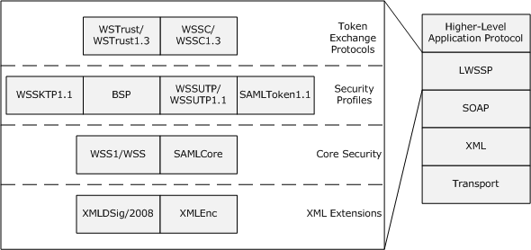

[MS-LWSSP]:

Lightweight Web Services Security Profile

Intellectual Property Rights Notice for Open Specifications Documentation

  Technical Documentation. Microsoft publishes Open Specifications documentation (“this

documentation”) for protocols, file formats, data portability, computer languages, and standards
support. Additionally, overview documents cover inter-protocol relationships and interactions.

  Copyrights. This documentation is covered by Microsoft copyrights. Regardless of any other

terms that are contained in the terms of use for the Microsoft website that hosts this
documentation, you can make copies of it in order to develop implementations of the technologies
that are described in this documentation and can distribute portions of it in your implementations
that use these technologies or in your documentation as necessary to properly document the
implementation. You can also distribute in your implementation, with or without modification, any
schemas, IDLs, or code samples that are included in the documentation. This permission also
applies to any documents that are referenced in the Open Specifications documentation.
  No Trade Secrets. Microsoft does not claim any trade secret rights in this documentation.
  Patents. Microsoft has patents that might cover your implementations of the technologies

described in the Open Specifications documentation. Neither this notice nor Microsoft's delivery of
this documentation grants any licenses under those patents or any other Microsoft patents.
However, a given Open Specifications document might be covered by the Microsoft Open
Specifications Promise or the Microsoft Community Promise. If you would prefer a written license,
or if the technologies described in this documentation are not covered by the Open Specifications
Promise or Community Promise, as applicable, patent licenses are available by contacting
iplg@microsoft.com.

  License Programs. To see all of the protocols in scope under a specific license program and the

associated patents, visit the Patent Map.

  Trademarks. The names of companies and products contained in this documentation might be
covered by trademarks or similar intellectual property rights. This notice does not grant any
licenses under those rights. For a list of Microsoft trademarks, visit
www.microsoft.com/trademarks.

  Fictitious Names. The example companies, organizations, products, domain names, email

addresses, logos, people, places, and events that are depicted in this documentation are fictitious.
No association with any real company, organization, product, domain name, email address, logo,
person, place, or event is intended or should be inferred.

Reservation of Rights. All other rights are reserved, and this notice does not grant any rights other
than as specifically described above, whether by implication, estoppel, or otherwise.

Tools. The Open Specifications documentation does not require the use of Microsoft programming
tools or programming environments in order for you to develop an implementation. If you have access
to Microsoft programming tools and environments, you are free to take advantage of them. Certain
Open Specifications documents are intended for use in conjunction with publicly available standards
specifications and network programming art and, as such, assume that the reader either is familiar
with the aforementioned material or has immediate access to it.

Support. For questions and support, please contact dochelp@microsoft.com.

[MS-LWSSP] - v20240423
Lightweight Web Services Security Profile
Copyright © 2024 Microsoft Corporation
Release: April 23, 2024

1 / 37

Revision Summary

Date

Revision
History

Revision
Class

Comments

12/5/2008

0.1

Major

Initial Availibility

1/16/2009

0.1.1

Editorial

Changed language and formatting in the technical content.

2/27/2009

0.1.2

Editorial

Changed language and formatting in the technical content.

4/10/2009

0.1.3

Editorial

Changed language and formatting in the technical content.

5/22/2009

0.1.4

Editorial

Changed language and formatting in the technical content.

7/2/2009

1.0

8/14/2009

2.0

9/25/2009

3.0

Major

Major

Major

Updated and revised the technical content.

Updated and revised the technical content.

Updated and revised the technical content.

11/6/2009

3.0.1

Editorial

Changed language and formatting in the technical content.

12/18/2009  3.0.2

Editorial

Changed language and formatting in the technical content.

1/29/2010

3.1

Minor

Clarified the meaning of the technical content.

3/12/2010

3.1.1

Editorial

Changed language and formatting in the technical content.

4/23/2010

3.1.2

Editorial

Changed language and formatting in the technical content.

6/4/2010

4.0

Major

Updated and revised the technical content.

7/16/2010

4.0

8/27/2010

4.0

10/8/2010

4.0

11/19/2010  4.0

None

None

None

None

No changes to the meaning, language, or formatting of the
technical content.

No changes to the meaning, language, or formatting of the
technical content.

No changes to the meaning, language, or formatting of the
technical content.

No changes to the meaning, language, or formatting of the
technical content.

1/7/2011

5.0

Major

Updated and revised the technical content.

2/11/2011

5.0

3/25/2011

5.0

5/6/2011

5.0

None

None

None

No changes to the meaning, language, or formatting of the
technical content.

No changes to the meaning, language, or formatting of the
technical content.

No changes to the meaning, language, or formatting of the
technical content.

6/17/2011

5.1

Minor

Clarified the meaning of the technical content.

9/23/2011

5.1

None

No changes to the meaning, language, or formatting of the
technical content.

12/16/2011  6.0

Major

Updated and revised the technical content.

3/30/2012

6.0

None

No changes to the meaning, language, or formatting of the
technical content.

[MS-LWSSP] - v20240423
Lightweight Web Services Security Profile
Copyright © 2024 Microsoft Corporation
Release: April 23, 2024

2 / 37

Date

Revision
History

Revision
Class

Comments

7/12/2012

6.0

10/25/2012  6.0

1/31/2013

6.0

None

None

None

No changes to the meaning, language, or formatting of the
technical content.

No changes to the meaning, language, or formatting of the
technical content.

No changes to the meaning, language, or formatting of the
technical content.

8/8/2013

6.1

Minor

Clarified the meaning of the technical content.

11/14/2013  6.1

2/13/2014

6.1

5/15/2014

6.1

None

None

None

No changes to the meaning, language, or formatting of the
technical content.

No changes to the meaning, language, or formatting of the
technical content.

No changes to the meaning, language, or formatting of the
technical content.

6/30/2015

7.0

Major

Significantly changed the technical content.

10/16/2015  7.0

7/14/2016

7.0

6/1/2017

7.0

9/15/2017

8.0

9/12/2018

9.0

4/7/2021

10.0

6/25/2021

11.0

4/23/2024

12.0

None

None

None

Major

Major

Major

Major

Major

No changes to the meaning, language, or formatting of the
technical content.

No changes to the meaning, language, or formatting of the
technical content.

No changes to the meaning, language, or formatting of the
technical content.

Significantly changed the technical content.

Significantly changed the technical content.

Significantly changed the technical content.

Significantly changed the technical content.

Significantly changed the technical content.

[MS-LWSSP] - v20240423
Lightweight Web Services Security Profile
Copyright © 2024 Microsoft Corporation
Release: April 23, 2024

3 / 37

Table of Contents

1.1
1.2

1.2.1
1.2.2

1  Introduction ............................................................................................................ 6
Glossary ........................................................................................................... 6
References ........................................................................................................ 7
Normative References ................................................................................... 7
Informative References ................................................................................. 8
Overview .......................................................................................................... 9
Relationship to Other Protocols .......................................................................... 10
Prerequisites/Preconditions ............................................................................... 10
Applicability Statement ..................................................................................... 10
Versioning and Capability Negotiation ................................................................. 10
Vendor-Extensible Fields ................................................................................... 11
Standards Assignments ..................................................................................... 11

1.3
1.4
1.5
1.6
1.7
1.8
1.9

2.2.1

2.1
2.2

2.2.1.3.1

2.2.1.1
2.2.1.2
2.2.1.3

2.2.1.4
2.2.1.5
2.2.1.6

2  Messages ............................................................................................................... 12
Transport ........................................................................................................ 12
Message Syntax ............................................................................................... 12
Security Element ........................................................................................ 12
SecurityTokenReference Element ............................................................ 13
Timestamp Element .............................................................................. 13
BinarySecurityToken Element ................................................................. 13
Kerberos BinarySecurityToken Element .............................................. 13
UsernameToken Element ....................................................................... 13
SecurityContextToken Element ............................................................... 13
Assertion Element ................................................................................. 14
SubjectConfirmation Element ............................................................ 14
Signature Element ................................................................................ 15
SignedInfo Element ......................................................................... 15
Supported Algorithms ................................................................. 15
KeyInfo Element .............................................................................. 16
RST and RSTR Messages ............................................................................. 17
Binding Extensions ................................................................................ 18
Issuance Binding ............................................................................. 18
Context Establishment Binding .......................................................... 18
Context Renewal Binding .................................................................. 18
Context Cancellation Binding ............................................................. 19

2.2.2.1.1
2.2.2.1.2
2.2.2.1.3
2.2.2.1.4

2.2.1.7.1.1

2.2.1.6.1

2.2.1.7.1

2.2.1.7.2

2.2.1.7

2.2.2.1

2.2.2

3.1

3.1.5

3.1.4.1

3.1.5.1
3.1.5.2

3.1.1
3.1.2
3.1.3
3.1.4

3  Protocol Details ..................................................................................................... 20
Client Details ................................................................................................... 20
Abstract Data Model .................................................................................... 20
Timers ...................................................................................................... 20
Initialization ............................................................................................... 20
Higher-Layer Triggered Events ..................................................................... 20
Error Handling ...................................................................................... 20
Processing Events and Sequencing Rules ....................................................... 20
RST Message ........................................................................................ 20
RSTR Message ...................................................................................... 21
Issuance Binding ............................................................................. 21
Context Establishment Binding .......................................................... 21
Context Renewal Binding .................................................................. 21
Context Cancellation Binding ............................................................. 21
Timer Events .............................................................................................. 21
Other Local Events ...................................................................................... 21
Server Details .................................................................................................. 22
Abstract Data Model .................................................................................... 22
Timers ...................................................................................................... 22

3.1.5.2.1
3.1.5.2.2
3.1.5.2.3
3.1.5.2.4

3.2.1
3.2.2

3.1.6
3.1.7

3.2

[MS-LWSSP] - v20240423
Lightweight Web Services Security Profile
Copyright © 2024 Microsoft Corporation
Release: April 23, 2024

4 / 37

3.2.3
3.2.4

3.2.5

3.2.4.1

3.2.5.1

3.2.5.1.1
3.2.5.1.2
3.2.5.1.3
3.2.5.1.4

3.2.5.2

3.2.6
3.2.7

Initialization ............................................................................................... 22
Higher-Layer Triggered Events ..................................................................... 22
Error Handling ...................................................................................... 22
Processing Events and Sequencing Rules ....................................................... 22
RST Message ........................................................................................ 22
Issuance Binding ............................................................................. 22
Context Establishment Binding .......................................................... 23
Context Renewal Binding .................................................................. 23
Context Cancellation Binding ............................................................. 23
RSTR Message ...................................................................................... 23
Timer Events .............................................................................................. 23
Other Local Events ...................................................................................... 23

4  Protocol Examples ................................................................................................. 24
UsernameToken Element in a SOAP Request Message........................................... 24
BinarySecurityToken Element in a SOAP Request Message .................................... 24
SecurityContextToken Element in a SOAP Request Message .................................. 25
Assertion Element in a SOAP Request Message .................................................... 25
Timestamp Element in a SOAP Response Message ................................................ 27
Issuance Binding Request Message .................................................................... 27
Issuance Binding Response Message .................................................................. 27
Context Establishment Request Message ............................................................. 29
Context Establishment Response Message ........................................................... 29
Context Renewal Request Message ..................................................................... 30
Context Renewal Response Message ................................................................... 30
Context Cancellation Request Message ............................................................... 31
Context Cancellation Response Message ............................................................. 31

4.1
4.2
4.3
4.4
4.5
4.6
4.7
4.8
4.9
4.10
4.11
4.12
4.13

5  Security ................................................................................................................. 32
Security Considerations for Implementers ........................................................... 32
Index of Security Parameters ............................................................................ 32

5.1
5.2

6  Appendix A: Product Behavior ............................................................................... 33

7  Change Tracking .................................................................................................... 35

8  Index ..................................................................................................................... 36

[MS-LWSSP] - v20240423
Lightweight Web Services Security Profile
Copyright © 2024 Microsoft Corporation
Release: April 23, 2024

5 / 37

1  Introduction

The Lightweight Web Services Security Profile [MS-LWSSP] specifies restrictions on a set of Web
services specifications and provides clarifications that promote interoperability when building secure
Web services. [MS-LWSSP] and the profiled Web services specifications are used by both clients and
servers to implement client authentication.

Sections 1.5, 1.8, 1.9, 2, and 3 of this specification are normative. All other sections and examples in
this specification are informative.

1.1  Glossary

This document uses the following terms:

authentication: The act of proving an identity to a server while providing key material that binds

the identity to subsequent communications.

Kerberos: An authentication system that enables two parties to exchange private information

across an otherwise open network by assigning a unique key (called a ticket) to each user that
logs on to the network and then embedding these tickets into messages sent by the users. For
more information, see [MS-KILE].

key: In cryptography, a generic term used to refer to cryptographic data that is used to initialize a

cryptographic algorithm. Keys are also sometimes referred to as keying material.

request security token (RST): A message sent to a security token service to request a

security token.

request security token response (RSTR): A response to a request for a security token. In
many cases this is a direct response from a security token service to a requestor after
receiving an RST message. However, in multi-exchange scenarios, the requestor and security
token service can exchange multiple RSTR messages before the security token service issues a
final RSTR message.

RequestSecurityTokenResponse (RSTR): An XML element used to return an issued security

token and associated metadata. An RSTR element is the result of the wsignin1.0 action in the
Web Browser Federated Sign-On Protocol. For more information, see [MS-MWBF] section
2.2.4.1.

Security Assertion Markup Language (SAML): The set of specifications that describe security
assertions encoded in XML, profiles for attaching assertions to protocols and frameworks,
request/response protocols used to obtain assertions, and the protocol bindings to transfer
protocols, such as SOAP and HTTP.

security context: An abstract data structure that contains authorization information for a

particular security principal in the form of a Token/Authorization Context (see [MS-DTYP] section
2.5.2). A server uses the authorization information in a security context to check access to
requested resources. A security context also contains a key identifier that associates mutually
established cryptographic keys, along with other information needed to perform secure
communication with another security principal.

security context token (SCT): A wire representation of the abstract security context concept
described in [WSSC], which allows a security context to be named by a URI and used as
described in [WSS1].

security token: A collection of one or more claims. Specifically in the case of mobile devices, a
security token represents a previously authenticated user as defined in the Mobile Device
Enrollment Protocol [MS-MDE].

6 / 37

[MS-LWSSP] - v20240423
Lightweight Web Services Security Profile
Copyright © 2024 Microsoft Corporation
Release: April 23, 2024

security token service (STS): A web service that issues security tokens as described in

[WSTrust]. That is, it makes assertions based on evidence that it trusts to whoever trusts it (or
to specific recipients). To communicate trust, a service requires proof, such as a signature to
prove knowledge of a security token or set of security tokens. A service itself can generate
tokens or it can rely on a separate STS to issue a security token with its own trust statement.
(Note that for some security token formats, this can be just a re-issuance or co-signature.)
This forms the basis of trust brokering.

signature: A value computed with a cryptographic algorithm and bound to data in such a way that

intended recipients of the data can use the signature to verify that the data has not been
altered and/or has originated from the signer of the message, providing message integrity and
authentication. The signature can be computed and verified either with symmetric key
algorithms, where the same key is used for signing and verifying, or with asymmetric key
algorithms, where different keys are used for signing and verifying (a private and public key
pair are used). For more information, see [WSFederation1.2].

SOAP: A lightweight protocol for exchanging structured information in a decentralized, distributed
environment. SOAP uses XML technologies to define an extensible messaging framework,
which provides a message construct that can be exchanged over a variety of underlying
protocols. The framework has been designed to be independent of any particular programming
model and other implementation-specific semantics. SOAP 1.2 supersedes SOAP 1.1. See
[SOAP1.2-1/2003].

SOAP message: An XML document consisting of a mandatory SOAP envelope, an optional SOAP
header, and a mandatory SOAP body. See [SOAP1.2-1/2007] section 5 for more information.

symmetric key: A secret key used with a cryptographic symmetric algorithm. The key needs to be
known to all communicating parties. For an introduction to this concept, see [CRYPTO] section
1.5.

web service: A software system designed to support interoperable machine-to-machine

interaction over a network. A web service has an interface described in a machine-processable
format (WSDL). Other systems interact with the web service in a manner prescribed by its
description using SOAP-messages, typically conveyed using HTTP with an XML serialization in
conjunction with other web-related standards.

XML: The Extensible Markup Language, as described in [XML1.0].

MAY, SHOULD, MUST, SHOULD NOT, MUST NOT: These terms (in all caps) are used as defined
in [RFC2119]. All statements of optional behavior use either MAY, SHOULD, or SHOULD NOT.

1.2  References

Links to a document in the Microsoft Open Specifications library point to the correct section in the
most recently published version of the referenced document. However, because individual documents
in the library are not updated at the same time, the section numbers in the documents may not
match. You can confirm the correct section numbering by checking the Errata.

1.2.1  Normative References

We conduct frequent surveys of the normative references to assure their continued availability. If you
have any issue with finding a normative reference, please contact dochelp@microsoft.com. We will
assist you in finding the relevant information.

[BSP] McIntosh, M., Gudgin, M., Morrison, K.S., et al., "Basic Security Profile Version 1.0", March
2007, http://www.ws-i.org/Profiles/BasicSecurityProfile-1.0.html

[MS-LWSSP] - v20240423
Lightweight Web Services Security Profile
Copyright © 2024 Microsoft Corporation
Release: April 23, 2024

7 / 37

[RFC2119] Bradner, S., "Key words for use in RFCs to Indicate Requirement Levels", BCP 14, RFC
2119, March 1997, https://www.rfc-editor.org/info/rfc2119

[SAMLCore] Maler, E., Mishra, P., Philpott, R., et al., "Assertions and Protocol for the OASIS Security
Assertion Markup Language (SAML) V1.1", September 2003, http://www.oasis-
open.org/committees/download.php/3406/oasis-sstc-saml-core-1.1.pdf

[SAMLToken1.1] Lawrence, K., Kaler, C., Monzillo, R., et al., "Web Services Security: SAML Token
Profile 1.1", February 2006, http://www.oasis-open.org/committees/download.php/16768/wss-v1.1-
spec-os-SAMLTokenProfile.pdf

[WSS1] Nadalin, A., Kaler, C., Hallam-Baker, P., et al., "Web Services Security: SOAP Message
Security 1.0 (WS-Security 2004)", March 2004, http://docs.oasis-open.org/wss/2004/01/oasis-
200401-wss-soap-message-security-1.0.pdf

[WSSC1.3] Lawrence, K., Kaler, C., Nadalin, A., et al., "WS-SecureConversation 1.3", March 2007,
http://docs.oasis-open.org/ws-sx/ws-secureconversation/200512/ws-secureconversation-1.3-os.html

[WSSC] OpenNetwork, Layer7, Netegrity, Microsoft, Reactivity, IBM, VeriSign, BEA Systems, Oblix,
RSA Security, Ping Identity, Westbridge, Computer Associates, "Web Services Secure Conversation
Language (WS-SecureConversation)", February 2005, http://schemas.xmlsoap.org/ws/2005/02/sc

[WSSKTP1.1] Lawrence, K., Kaler, C., Nadalin, A., et al., "Web Services Security Kerberos Token
Profile 1.1", November 2005, http://www.oasis-open.org/committees/download.php/16788/wss-v1.1-
spec-os-KerberosTokenProfile.pdf

[WSSUTP1.1] OASIS Standard, "Web Services Security UsernameToken Profile 1.1", February 2006,
http://www.oasis-open.org/committees/download.php/16782/wss-v1.1-spec-os-
UsernameTokenProfile.pdf

[WSSUTP] OASIS, "Web Services Security UsernameToken Profile 1.0", OASIS Standard, March 2004,
http://docs.oasis-open.org/wss/2004/01/oasis-200401-wss-username-token-profile-1.0.pdf

[WSS] OASIS, "Web Services Security: SOAP Message Security 1.1 (WS-Security 2004)", February
2006, https://www.oasis-open.org/committees/download.php/16790/wss-v1.1-spec-os-
SOAPMessageSecurity.pdf

[WSTrust1.3] Lawrence, K., Kaler, C., Nadalin, A., et al., "WS-Trust 1.3", OASIS Standard March
2007, https://docs.oasis-open.org/ws-sx/ws-trust/200512/ws-trust-1.3-os.html

[WSTrust] IBM, Microsoft, Nortel, VeriSign, "WS-Trust V1.0", February 2005,
http://specs.xmlsoap.org/ws/2005/02/trust/WS-Trust.pdf

[XMLDSig/2008] Bartel, M., Boyer, J., Fox, B., et al.,, "XML Signature Syntax and Processing (Second
Edition)", June 2008, http://www.w3.org/TR/2008/REC-xmldsig-core-20080610/

[XMLENC] Imamura, T., Dillaway, B., and Simon, E., "XML Encryption Syntax and Processing", W3C
Recommendation, December 2002, http://www.w3.org/TR/2002/REC-xmlenc-core-20021210/

1.2.2  Informative References

[SOAP1.1] Box, D., Ehnebuske, D., Kakivaya, G., et al., "Simple Object Access Protocol (SOAP) 1.1",
W3C Note, May 2000, https://www.w3.org/TR/2000/NOTE-SOAP-20000508/

[SOAP1.2-1/2007] Gudgin, M., Hadley, M., Mendelsohn, N., et al., "SOAP Version 1.2 Part 1:
Messaging Framework (Second Edition)", W3C Recommendation, April 2007,
http://www.w3.org/TR/2007/REC-soap12-part1-20070427/

[MS-LWSSP] - v20240423
Lightweight Web Services Security Profile
Copyright © 2024 Microsoft Corporation
Release: April 23, 2024

8 / 37

[WS-Addr-Core] World Wide Web Consortium, "Web Services Addressing 1.0 - Core", W3C
Recommendation, May 2006, http://www.w3.org/TR/ws-addr-core/

[XML] World Wide Web Consortium, "Extensible Markup Language (XML) 1.0 (Fourth Edition)", W3C
Recommendation 16 August 2006, edited in place 29 September 2006,
http://www.w3.org/TR/2006/REC-xml-20060816/

1.3  Overview

The following documents specify a standard set of SOAP extensions that provide client/server
authentication and content integrity and confidentiality for SOAP messages when building secure
Web services clients and servers. The Lightweight Web Services Security Profile specifies a profile for
performing lightweight client authentication and security token exchange based on the protocols
described in these documents:

  Assertions and Protocol for the OASIS Security Assertion Markup Language (SAML) V1.1

[SAMLCore]

  Basic Security Profile Version 1.0 [BSP]

  Web Services Secure Conversation Language (WS-SecureConversation) [WSSC]

  WS-SecureConversation 1.3 [WSSC1.3]

  Web Services Security Kerberos Token Profile 1.1 [WSSKTP1.1]

  Web Services Security: SAML Token Profile 1.1 [SAMLToken1.1]

  Web Services Security: SOAP Message Security 1.0 (WS-Security 2004) [WSS1]

  Web Services Security: SOAP Message Security 1.1 (WS-Security 2004) [WSS]

  Web Services Security UsernameToken Profile 1.0 [WSSUTP]

  Web Services Security UsernameToken Profile 1.1 [WSSUTP1.1]

  WS-Trust V1.0 [WSTrust]

  WS-Trust 1.3 [WSTrust1.3]

  XML-Signature Syntax and Processing (Second Edition) [XMLDSig/2008]

  XML Encryption Syntax and Processing [XMLENC]

Section 2 specifies clarifications and restrictions on these specifications to increase interoperability
when implementing client authentication and security context establishment using
username/password, Kerberos ticket, and SAML token, and acquiring a security token from a
security token service (STS).

The protocols used by this specification can be categorized as follows.

[XMLDSig/2008] and [XMLENC] specify basic XML signature and encryption functionality. These
protocols are referred to as XML Extension protocols.

[WSS1], [WSS], and [SAMLCore] specify the building blocks needed to provide client authentication in
SOAP messages. Those building blocks include security tokens, security token references, signatures,
and timestamps. These protocols are referred to as Core Security protocols.

The [BSP], [WSSUTP], [WSSUTP1.1], [WSSKTP1.1], and [SAMLToken1.1] profiles specify restrictions
on and clarifications to [WSS1], [WSS], and [SAMLCore] to promote interoperability among different
implementations of those protocols. These protocols are referred to as Security Profiles.

9 / 37

[MS-LWSSP] - v20240423
Lightweight Web Services Security Profile
Copyright © 2024 Microsoft Corporation
Release: April 23, 2024

<!-- Extracted images from page 10 -->

<!-- /Extracted images from page 10 -->

[WSTrust], [WSTrust1.3], [WSSC], and [WSSC1.3] specify additional security elements as well as
message exchange patterns used to create and exchange security tokens in SOAP messages. These
documents are referred to as Token Exchange protocols.

The parts of the above documents that specify server authentication, message integrity, and message
protection are not specified by this document and are assumed to be provided by underlying transport
protocol.

1.4  Relationship to Other Protocols

This specification is a profile of the protocols listed in section 1.3. In addition, it relies on a number of
underlying protocols. The exchanged messages are based on SOAP [SOAP1.1] [SOAP1.2-1/2007]
over XML [XML]. It further requires a transport. This document does not specify the transport to use
but relies on the transport to provide message integrity and protection since it does not specify
support for it itself.

Figure 1: Protocol relationships

1.5  Prerequisites/Preconditions

There are no prerequisites/preconditions beyond those specified in the XML Extension, Core Security,
Security Profile, and Token Exchange protocols.

1.6  Applicability Statement

The Lightweight Web Services Security Profile is applicable when interoperability with Web services
implementations using the XML Extension, Core Security, Security Profile, and Token Exchange
protocols to provide client authentication is desired. When those same protocols are used to provide
server authentication, message integrity or confidentiality features, or if they are not used at all, the
Lightweight Web Services Security Profile might not be applicable.

1.7  Versioning and Capability Negotiation

There are no versioning or capability negotiations beyond those specified in the XML Extension, Core
Security, Security Profile, and Token Exchange protocols.

[MS-LWSSP] - v20240423
Lightweight Web Services Security Profile
Copyright © 2024 Microsoft Corporation
Release: April 23, 2024

10 / 37

1.8  Vendor-Extensible Fields

There are no vendor extensible fields beyond those specified in the XML Extension, Core Security,
Security Profile, and Token Exchange protocols.

1.9  Standards Assignments

There are no standards assignments beyond those specified in the XML Extension, Core Security,
Security Profile, and Token Exchange protocols.

[MS-LWSSP] - v20240423
Lightweight Web Services Security Profile
Copyright © 2024 Microsoft Corporation
Release: April 23, 2024

11 / 37

2  Messages

2.1  Transport

This specification defines only serialization rules for SOAP extensions specified in the XML Extension,
Core Security, Security Profile, and Token Exchange protocols. This specification does not define how
SOAP messages are transmitted on the network. As such, it does not have a transport.

2.2  Message Syntax

This section specifies restrictions to SOAP extensions specified in the XML Extension, Core Security,
Security Profile, and Token Exchange protocols.

This document considers the normative sections in [WSS1], [WSS], [BSP], [WSSUTP], [WSSUTP1.1],
[WSSKTP1.1], [XMLDSig/2008], [XMLENC], [WSTrust], [WSTrust1.3], [WSSC], [WSSC1.3],
[SAMLCore], and [SAMLToken1.1] as non-normative unless they are explicitly specified in this section
or a subsection of this section.

This section is split into two subsections. Section 2.2.1 specifies restrictions on and clarifications to the
<Security> element specified in [WSS1] and [WSS] and its sub-elements, which are specified in
[WSS1], [WSS], [BSP], [WSSUTP], [WSSUTP1.1], [WSSKTP1.1], [XMLDSig/2008], [XMLENC],
[SAMLCore] and [SAMLToken1.1]. Section 2.2.2 specifies restrictions on the request security token
(RST) and request security token response (RSTR) messages specified in [WSTrust],
[WSTrust1.3], [WSSC], and [WSSC1.3].

2.2.1  Security Element

The <Security> element is specified in [WSS1] section 5, [WSS] section 5, and [BSP] section 5. It is a
container element for binding a user's credentials (in the form of tokens and signatures) to a SOAP
message when adding/verifying client authentication data to a SOAP message.

When used to add authentication data to a SOAP request message, the <Security> element is
composed of a combination of child elements from the following list. The <Security> element MUST
only contain child elements from the following:

  Zero or one <Timestamp> element as defined in section 2.2.1.2.

  Zero or one <BinarySecurityToken> element as defined in section 2.2.1.3.

  Zero or one <UsernameToken> element as defined in section 2.2.1.4.

  Zero or one <SecurityContextToken> element as defined in section 2.2.1.5.

  Zero or one <Assertion> element as defined in section 2.2.1.6.

  Zero, one, or multiple <Signature> elements as defined in section 2.2.1.7.

If at least one <Signature> element is present in the <Security> element, the <Timestamp> element
MUST be present as well. Otherwise, the <Timestamp> element is optional.

When used to add authentication data to a SOAP response message, the <Security> element is
composed of a combination of child elements from the following list. The <Security> element MUST
only contain child elements from the following:

  Zero or one <Timestamp> element as defined in section 2.2.1.2.

[MS-LWSSP] - v20240423
Lightweight Web Services Security Profile
Copyright © 2024 Microsoft Corporation
Release: April 23, 2024

12 / 37

2.2.1.1  SecurityTokenReference Element

The <SecurityTokenReference> element is specified in [WSS1] section 7.1, [WSS] section 7.1, and
[BSP] section 7.1. The <SecurityTokenReference> element MUST contain exactly one of the following
elements as a child element:

  A <Reference> element as specified in [WSS1] section 7.2, [WSS] section 7.2, and [BSP] section

7.2. This document refers to this element as a direct reference.

  A <KeyIdentifier> element as specified in [WSS1] section 7.3, [WSS] section 7.3, and [BSP]

section 7.4. This document refers to this element as a key identifier reference.

2.2.1.2  Timestamp Element

The <Timestamp> element is specified in [WSS1] section 10, [WSS] section 10, and [BSP] section 6.

2.2.1.3  BinarySecurityToken Element

The <BinarySecurityToken> element is specified in [WSS1] section 6.3, [WSS] section 6.3, and [BSP]
section 10. A <BinarySecurityToken> element MUST implement the Kerberos Token that MUST
conform to the definition specified in section 2.2.1.3.1.

2.2.1.3.1 Kerberos BinarySecurityToken Element

The Kerberos <BinarySecurityToken> element is specified in [BSP] section 14 and [WSSKTP1.1]
section 3 (excluding subsections 3.5 and 3.6). This document overrides the following specifications:





[WSSKTP1.1] section 3.2 specifies multiple @ValueType attribute values. "http://docs.oasis-
open.org/wss/oasis-wss-kerberos-token-profile-1.1#GSS_Kerberosv5_AP_REQ" MUST be used.

If a Kerberos token is referenced as specified in [WSSKTP1.1] section 3.3 and [BSP] 14.2, a direct
reference conforming to section 2.2.1.1 MUST be used.

If a Kerberos token is present in a <Security> element, a <Signature> element conforming to section
2.2.1.7 MUST be present in the same <Security> element. The <KeyInfo> element of that signature
MUST reference the Kerberos token.

2.2.1.4  UsernameToken Element

The <UsernameToken> element is specified in [WSS1] section 6.2, [WSS] section 6.2, [BSP] section
11, [WSSUTP] section 3, and [WSSUTP1.1] section 3. This document overrides the following
specifications:





[WSSUTP] section 3.1, [WSSUTP1.1] section 3.1: For the Password/@Type attribute, the
"#PasswordText" value MUST be used.

[WSSUTP] section 3.1, [WSSUTP1.1] section 3.1: The Nonce and Created child elements MUST
NOT be used.

A <UsernameToken> element MUST NOT be referenced by a <SecurityTokenReference> element.

2.2.1.5  SecurityContextToken Element

The <SecurityContextToken> element is specified in [WSSC] section 3 and [WSSC1.3] section 2.

If a security context token (SCT) is referenced as specified in [WSSC] section 9 and [WSSC1.3]
section 8, a direct reference conforming to section 2.2.1.1 MUST be used.

13 / 37

[MS-LWSSP] - v20240423
Lightweight Web Services Security Profile
Copyright © 2024 Microsoft Corporation
Release: April 23, 2024

If a security context token is present in a <Security> element, a <Signature> element conforming to
section 2.2.1.7 MUST be present in the same <Security> element. The <KeyInfo> child element of
that <Signature> element MUST reference the security context token.

This document overrides the following specification:



[WSSC1.3] section 8: "If the SCT is referenced from within the <wsse:Security> element or from
an RST or RSTR, it is RECOMMENDED that these references be message independent, but these
references MAY be message-specific."

When the SCT is referenced from within the <Security> element, the reference MUST be message-
specific.

2.2.1.6  Assertion Element

The <Assertion> element is specified in [SAMLCore] section 2.3.2. An <Assertion> element defines a
SAML token.

[SAMLCore] and [SAMLToken1.1] specify how to parse and validate <Assertion> elements.

If a SAML token is referenced as specified in [SAMLToken1.1] sections 3.4 (ignoring subsections) and
3.4.1, a key identifier reference conforming to section 2.2.1.1 MUST be used.

If a SAML token is present in a <Security> element, a <Signature> element conforming to section
2.2.1.7 MUST be present in the same <Security> element. The <KeyInfo> element of that signature
MUST reference the SAML token.

This document overrides the following specifications:

  Direct and embedded references as specified in [SAMLToken1.1] section 3.4 are not used.







The ValueType "http://docs.oasis-open.org/wss/oasis-wss-saml-token-profile-1.1#SAMLID" and
the TokenType "http://docs.oasis-open.org/wss/oasis-wss-saml-token-profile-1.1#SAMLV2.0"
specified in [SAMLToken1.1] section 3.4 MUST NOT be used.

The NotBefore and NotOnOrAfter attributes as specified in [SAMLCore] section 2.3.2.1.1 MAY be
omitted.

The MajorVersion and MinorVersion attributes as specified in [SAMLCore] section 2.3.2 MUST be
present and MUST both have a value of "1".

  A <Signature> element as specified in [SAMLCore] section 5.4 and conforming to section 2.2.1.7

MUST be present.

A <SubjectConfirmation> element conforming to section 2.2.1.6.1 MUST be present.

2.2.1.6.1 SubjectConfirmation Element

The <SubjectConfirmation> element is specified in [SAMLCore] section 2.4.2.3 and [SAMLToken1.1]
sections 3.5 (excluding subsections), 3.5.1 (excluding subsections), 3.5.1.1, and 3.5.1.2.

At least one SubjectConfirmation sub-element MUST be present in an <Assertion> element.

A <SubjectConfirmation> element MUST contain exactly one <KeyInfo> element, as specified in
[XMLENC] section 5.4, which corresponds to the key used for the signature specified in section
2.2.1.7 corresponding to the SAML token.

The <SecurityTokenReference> child element of the <KeyInfo> element MUST be a key identifier
reference with a ValueType attribute value of "http://docs.oasis-open.org/wss/oasis-wss-soap-
message-security-1.1#ThumbprintSHA1". This document overrides the following specifications:

14 / 37

[MS-LWSSP] - v20240423
Lightweight Web Services Security Profile
Copyright © 2024 Microsoft Corporation
Release: April 23, 2024

[SAMLToken1.1] section 3.5: Only the "urn:oasis:names:tc:SAML:1.0:cm:holder-of-key" subject
confirmation method MUST be used.

The "<element name='OAEPparams' minOccurs='0' type='base64Binary'/>" element specified in
[XMLENC] section 5.4.2 MUST NOT be used.

2.2.1.7  Signature Element

The <Signature> element is specified in [XMLDSig/2008] section 4.1, [WSS1] sections 7.1 and 8
(excluding subsection 8.3), [WSS] sections 7.1 and 8 (excluding subsections 8.3 and 8.5), and [BSP]
section 8.

Signatures are tied to security tokens as specified in sections 2.2.1.3.1, 2.2.1.5, and 2.2.1.6. All
references to security tokens MUST be internal as specified in [BSP] section 7.6.

Each <Signature> element MUST contain exactly one of each of the following elements as child
elements:

  A <SignedInfo> element that MUST conform to section 2.2.1.7.1.

  A <SignatureValue> element as specified in [XMLDSig/2008] section 4.2.

  A <KeyInfo> element that MUST conform to section 2.2.1.7.2.

This document overrides the following specifications:





The "<element ref="ds:Object" minOccurs="0" maxOccurs="unbounded"/>" element specified in
[XMLDSig/2008] section 4.1 MUST NOT be used.

[WSS1] section 8.2, [WSS] section 8.2: "Producers SHOULD sign all important elements of the
message."

The following elements are signed if the <Signature> element is a child element of the <Security>
element specified in section 2.2.1:





The <To> element as specified in [WS-Addr-Core] section 3.2 MUST be present and signed if the
signing key is asymmetric. If the signing key is symmetric, this element MUST NOT be signed.

The <Timestamp> element specified in section 2.2.1.2 MUST be signed. If a <Signature> element
is present, the <Timestamp> element MUST be present as well.

If the <Signature> element is a child element of the <Assertion> element, as specified in section
2.2.1.6, then the <Assertion> element MUST be signed.

Other elements MUST NOT be signed.

2.2.1.7.1 SignedInfo Element

The <SignedInfo> element is specified in [XMLDSig/2008] section 4.3. This document overrides the
following text:

[XMLDSig/2008] section 4.3.2: "element name="HMACOutputLength" minOccurs="0"
type="ds:HMACOutputlengthType"/>."

This element MUST NOT be present as specified in [BSP] section 8.7.2.

2.2.1.7.1.1  Supported Algorithms

This document supports the algorithms specified in [BSP] sections 8.3, 8.4, 8.6, and 8.7. The following
passages are overridden:

15 / 37

[MS-LWSSP] - v20240423
Lightweight Web Services Security Profile
Copyright © 2024 Microsoft Corporation
Release: April 23, 2024

[BSP] section 8.2.5: "R3002 Any SIG_REFERENCE to an element that does not have an ID attribute
MUST contain a TRANSFORM with an Algorithm attribute value of
"http://www.w3.org/2002/06/xmldsig-filter2."

The ID attribute MUST be present in elements to which there are SIG_REFERENCE elements, and the
"http://www.w3.org/2002/06/xmldsig-filter2" algorithm MUST NOT be used.

[BSP] section 8.4.1: "R5404 Any CANONICALIZATION_METHOD Algorithm attribute MUST have a
value of "http://www.w3.org/2001/10/xml-exc-c14n#" indicating that it uses Exclusive C14N without
comments for canonicalization."

The following values SHOULD be supported:





http://www.w3.org/2001/10/xml-exc-c14n#

http://www.w3.org/2001/10/xml-exc-c14n#WithComments

[BSP] section 8.6.1: "R5420 Any DIGEST_METHOD Algorithm attribute SHOULD have a value of
"http://www.w3.org/2000/09/xmldsig#sha1"."

The following values SHOULD be supported:









http://www.w3.org/2000/09/xmldsig#sha1

http://www.w3.org/2001/04/xmlenc#sha256

http://www.w3.org/2001/04/xmlenc#sha384

http://www.w3.org/2001/04/xmlenc#sha512

[BSP] section 8.7.1: "R5421 Any SIGNATURE_METHOD Algorithm attribute SHOULD have a value of
"http://www.w3.org/2000/09/xmldsig#hmac-sha1" or "http://www.w3.org/2000/09/xmldsig#rsa-
sha1"."

The following values SHOULD be supported:









http://www.w3.org/2000/09/xmldsig#hmac-sha1

http://www.w3.org/2001/04/xmldsig-more#hmac-sha256

http://www.w3.org/2001/04/xmldsig-more#hmac-sha384

http://www.w3.org/2001/04/xmldsig-more#hmac-sha512

The following values MAY<1> be supported:











http://www.w3.org/2000/09/xmldsig#rsa-sha1

http://www.w3.org/2000/09/xmldsig#dsa-sha1

http://www.w3.org/2001/04/xmldsig-more#rsa-sha256

http://www.w3.org/2001/04/xmldsig-more#rsa-sha384

http://www.w3.org/2001/04/xmldsig-more#rsa-sha512

2.2.1.7.2 KeyInfo Element

The <KeyInfo> element is specified in [XMLDSig/2008] section 4.4 (excluding subsections). A
<KeyInfo> element MUST contain exactly one <SecurityTokenReference> element as a child element,
as specified in [BSP] section 8.8. The <SecurityTokenReference> element MUST conform to the
definition specified in section 2.2.1.1.

16 / 37

[MS-LWSSP] - v20240423
Lightweight Web Services Security Profile
Copyright © 2024 Microsoft Corporation
Release: April 23, 2024

2.2.2  RST and RSTR Messages

[WSTrust] and [WSTrust1.3] specify a framework for requesting and returning security tokens using
RST and RSTR messages. RST messages provide the means for requesting a security token from an
STS or directly from the server. They have an extensible format that allows the client to specify a
range of parameters that the token must satisfy. RSTR messages return the requested token and
supporting state. Both messages use the <Security> element specified in section 2.2.1 to secure the
exchange.

Only single-leg trust exchanges are used. That is, the client requests a token and the server returns it
without any intermediate trust message exchanges.

RST message body MUST contain exactly one <RequestSecurityToken> element as specified in
[WSTrust] sections 5.1 "Requesting a Security Token" and 5.3 "Binary Secrets", and [WSTrust1.3]
sections 3.1 and 3.3.

RSTR message body MUST contain exactly one <RequestSecurityTokenResponse> element as
specified in [WSTrust] sections 5.2 "Returning a Security Token" and 5.3 "Binary Secrets", and
[WSTrust1.3] sections 3.2 and 3.3.

When using [WSTrust1.3], the <RequestSecurityTokenResponse> element MUST be contained in a
<RequestSecurityTokenResponseCollection> element as specified in [WSTrust1.3] section 4.3. The
<RequestSecurityTokenResponseCollection> element MUST NOT contain more than one
<RequestSecurityTokenResponse> element.

This document overrides the following specifications:



The value of the BinarySecret/@type attribute specified in [WSTrust] section 5.3 MUST be set to
one of the following values:





http://schemas.xmlsoap.org/ws/2005/02/trust/Nonce

http://schemas.xmlsoap.org/ws/2005/02/trust/SymmetricKey



The value of the BinarySecret/@type attribute specified in [WSTrust1.3] section 3.3 MUST be set
to one of the following values:





http://docs.oasis-open.org/ws-sx/ws-trust/200512/Nonce

http://docs.oasis-open.org/ws-sx/ws-trust/200512/SymmetricKey





[WSTrust1.3] section 3.1: "The <wst:RequestSecurityToken> element (RST) is used to request a
security token  (for any purpose).  This element SHOULD be signed by the requestor, using tokens
contained/referenced in the request that are relevant to the request."

The <RequestSecurityToken> element MUST NOT be signed.

[WSTrust] section 11.2 and [WSTrust1.3] section 9.2: The optional <KeyType> element of an
issuance binding RST message, and the corresponding <KeyType> element of an issuance binding
RSTR message, MUST be either unspecified or specified as one of the following:











http://schemas.xmlsoap.org/ws/2005/02/trust/SymmetricKey

http://docs.oasis-open.org/ws-sx/ws-trust/200512/SymmetricKey

http://docs.oasis-open.org/wssx/wstrust/200512/Bearer

http://docs.oasis-open.org/ws-sx/wstrust/200512/Bearer

http://docs.oasis-open.org/ws-sx/ws-trust/200512/Bearer

[MS-LWSSP] - v20240423
Lightweight Web Services Security Profile
Copyright © 2024 Microsoft Corporation
Release: April 23, 2024

17 / 37

2.2.2.1  Binding Extensions

The <RequestSecurityToken> and <RequestSecurityTokenResponse> elements form the basis of trust
message exchange bindings, which extend these elements for specific usages. The following bindings
are supported:



Issuance Binding

  Context Establishment Binding

  Context Renewal Binding

  Context Cancellation Binding

2.2.2.1.1 Issuance Binding

The issuance binding is specified in [WSTrust] section 6 "Issuance Binding" (excluding subsections
6.2.5, 6.3, and 6.4) and [WSTrust1.3] section 4 (excluding subsections 4.2.1, 4.4.5, 4.4.10, and 4.5).

2.2.2.1.2 Context Establishment Binding

The context establishment binding is specified in [WSSC] section 4 (excluding subsections 4.3) and
[WSSC1.3] section 3 (excluding subsections 3.3 and 3.4). This document overrides the following
specifications:













[WSSC] section 4: The message format specified by "Security context token created by a security
token service" MUST NOT be used.

[WSSC] section 4: The message format specified by "Security context token created by one of the
communicating parties and propagated with a message" MUST NOT be used.

[WSSC] section 4: "If appropriate, the basic challenge-response definition in [WSTrust] is
RECOMMENDED."  For more information about the basic challenge-response definition, see
[WSTrust].

  Challenge-response MUST NOT be used.

[WSSC1.3] section 3: The message format specified by "Security context token created by a
security token service" MUST NOT be used.

[WSSC1.3] section 3: The message format specified by "Security context token created by one of
the communicating parties and propagated with a message" MUST NOT be used.

[WSSC1.3] section 3: "If appropriate, the basic challenge-response definition in [WSTrust] is
RECOMMENDED." For more information about the basic challenge-response definition, see
[WSTrust].

  Challenge-response MUST NOT be used.

2.2.2.1.3 Context Renewal Binding

The context renewal binding is specified in [WSSC] section 6 and [WSSC1.3] section 5. This document
overrides the following specification:



[WSSC1.3] section 5: "Proof of possession of the key associated with the security context MUST
be proven in order for security context to be renewed. It is RECOMMENDED that this is done by
creating the original claims signature over the signature that signs message body and key
headers."

[MS-LWSSP] - v20240423
Lightweight Web Services Security Profile
Copyright © 2024 Microsoft Corporation
Release: April 23, 2024

18 / 37

Proof of possession MUST be established by including a security context token conforming to
section 2.2.1.5 and a corresponding signature conforming to section 2.2.1.7 in the security element
conforming to section 2.2.1. The elements that MUST be signed are specified in section 2.2.1.7.
Signatures MUST NOT be signed to prove possession.

2.2.2.1.4 Context Cancellation Binding

The context cancellation binding is specified in [WSSC] section 7 and [WSSC1.3] section 6. This
document overrides the following specification:



[WSSC1.3] section 6: "Proof of possession of the key associated with the security context MUST
be proven in order for security context to be canceled. It is RECOMMENDED that this is done by
creating the original claims signature over the signature that signs message body and key
headers."

Proof of possession MUST be established by including a security context token conforming to
section 2.2.1.5 and a corresponding signature conforming to section 2.2.1.7 in the security element
conforming to section 2.2.1. The elements that MUST be signed are specified in section 2.2.1.7.
Signatures MUST NOT be signed to prove possession.

[MS-LWSSP] - v20240423
Lightweight Web Services Security Profile
Copyright © 2024 Microsoft Corporation
Release: April 23, 2024

19 / 37

3  Protocol Details

3.1  Client Details

The client protocol details for the messages defined in section 2.2.1 are specified in [WSS1], [WSS],
[WSSKTP1.1], [SAMLCore], [SAMLToken1.1], [BSP], [WSSUTP], [WSSUTP1.1], [WSSC], and
[WSSC1.3].

The client protocol details for the messages defined in section 2.2.2 are specified in [WSTrust],
[WSTrust1.3], [WSSC], and [WSSC1.3].

Beyond what is specified in the listed specifications, no protocol details are defined. Higher-layer
application protocols might<2> specify additional protocols.

3.1.1  Abstract Data Model

None.

3.1.2  Timers

None.

3.1.3  Initialization

None.

3.1.4  Higher-Layer Triggered Events

None.

3.1.4.1  Error Handling

When a higher-layer application protocol submits a message to be sent, the implementation MAY<3>
check whether the message conforms to the syntax specified in section 2.2, and if it does not, return
an error and abort further processing. Otherwise, the implementation MUST send the message to the
server.

3.1.5  Processing Events and Sequencing Rules

When a message is received, the implementation MUST verify that the message conforms to the
syntax specified in section 2.2.

If the message does not conform to the syntax specified in section 2.2, the following processing steps
are performed:





The implementation MUST abort further processing.

The implementation MAY<4> return an error to the higher-layer application protocol. Otherwise, it
MUST fail silently.

3.1.5.1  RST Message

When an RST message conforming to the syntax specified in section 2.2.2 is received, it MUST be
rejected.

20 / 37

[MS-LWSSP] - v20240423
Lightweight Web Services Security Profile
Copyright © 2024 Microsoft Corporation
Release: April 23, 2024

3.1.5.2  RSTR Message

In addition to the steps specified in section 3.1.5, when an RSTR message conforming to the syntax
specified in section 2.2.2 is received, processing is performed as described in sections 3.1.5.2.1,
3.1.5.2.2, 3.1.5.2.3, and 3.1.5.2.4.

3.1.5.2.1 Issuance Binding

The client MAY<5> reject a received message that specifies the action:



http://docs.oasis-open.org/ws-sx/ws-trust/200512/RSTRC/IssueFinal

The client MAY<6> reject a received message that specifies either of the following <KeyType>
element values:





http://docs.oasis-open.org/wssx/wstrust/200512/Bearer

http://docs.oasis-open.org/ws-sx/ws-trust/200512/Bearer

Otherwise, the client MUST process a received message that conforms to the syntax specified in
section 2.2.2.1.1.

Exactly one message MUST be processed as part of the issuance binding. Additional messages MUST
be rejected.

3.1.5.2.2 Context Establishment Binding

The client MUST process a received message that conforms to the syntax specified in section
2.2.2.1.2.

Exactly one message MUST be processed as part of the context establishment binding. Additional
messages MUST be rejected.

3.1.5.2.3 Context Renewal Binding

The client MUST process a received message that conforms to the syntax specified in section
2.2.2.1.3.

Exactly one message MUST be processed as part of the context renewal binding. Additional messages
MUST be rejected.

3.1.5.2.4 Context Cancellation Binding

The contents of a received message that conforms to the syntax specified in section 2.2.2.1.4
MAY<7> be ignored by the client. Otherwise, the client MUST process a received message conforming
to the syntax specified in section 2.2.2.1.4.

Exactly one message MUST be processed as part of the context cancellation binding. Additional
messages MUST be rejected.

3.1.6  Timer Events

None.

3.1.7  Other Local Events

None.

[MS-LWSSP] - v20240423
Lightweight Web Services Security Profile
Copyright © 2024 Microsoft Corporation
Release: April 23, 2024

21 / 37

3.2  Server Details

The server protocol details for the messages defined in section 2.2.1 are specified in [WSS1], [WSS],
[WSSKTP1.1], [SAMLCore], [SAMLToken1.1], [BSP], [WSSUTP], [WSSUTP1.1], [WSSC], and
[WSSC1.3].

The server protocol details for the messages defined in section 2.2.2 are specified in [WSTrust],
[WSTrust1.3], [WSSC], and [WSSC1.3].

Beyond what is specified in the listed specifications, no protocol details are defined. Higher-layer
application protocols might specify additional protocols.<8>

3.2.1  Abstract Data Model

None.

3.2.2  Timers

None.

3.2.3  Initialization

None.

3.2.4  Higher-Layer Triggered Events

None.

3.2.4.1  Error Handling

When a higher-layer application protocol submits a message to be sent, the implementation MAY<9>
check whether the message conforms to the syntax specified in section 2.2, and if it does not, return
an error and abort further processing. Otherwise, the implementation MUST send the message to the
server.

3.2.5  Processing Events and Sequencing Rules

When a message is received, the implementation MUST verify that the message conforms to the
syntax specified in section 2.2.

If the message does not conform to the syntax specified in section 2.2, the following processing steps
are performed:





The implementation MUST abort further processing.

The implementation MAY<10> return an error to the higher-layer application protocol. Otherwise,
it MUST fail silently.

3.2.5.1  RST Message

In addition to the steps specified in section 3.2.5, when an RST message conforming to the syntax
specified in section 2.2.2 is received, processing is performed as described in sections 3.2.5.1.1,
3.2.5.1.2, 3.2.5.1.3, and 3.2.5.1.4.

3.2.5.1.1 Issuance Binding

[MS-LWSSP] - v20240423
Lightweight Web Services Security Profile
Copyright © 2024 Microsoft Corporation
Release: April 23, 2024

22 / 37

This binding represents an exchange between a client and a Security Token Server, not a general
"server" as the term is used throughout the rest of this document. Security Token Server-side support
for this binding is not included in this profile document.

3.2.5.1.2 Context Establishment Binding

The server MUST process a received message that conforms to the syntax specified in section
2.2.2.1.2.

Exactly one message MUST be processed as part of the context establishment binding. Additional
messages MUST be rejected.

3.2.5.1.3 Context Renewal Binding

The server MUST process a received message that conforms to the syntax specified in section
2.2.2.1.3.

Exactly one message MUST be processed as part of the context renewal binding. Additional messages
MUST be rejected.

3.2.5.1.4 Context Cancellation Binding

The server MUST process a received message that conforms to the syntax specified in section
2.2.2.1.4.

Exactly one message MUST be processed as part of the context cancellation binding. Additional
messages MUST be rejected.

3.2.5.2  RSTR Message

When an RSTR message conforming to the syntax specified in section 2.2.2 is received, it MUST be
rejected.

3.2.6  Timer Events

None.

3.2.7  Other Local Events

None.

[MS-LWSSP] - v20240423
Lightweight Web Services Security Profile
Copyright © 2024 Microsoft Corporation
Release: April 23, 2024

23 / 37

4  Protocol Examples

This section includes samples of messages for each supported message type. "..." in the following
examples is used to denote arbitrary XML values to improve readability.

4.1  UsernameToken Element in a SOAP Request Message

The following is an example of a <Security> element with a username token and a timestamp.

 <o:Security s:mustUnderstand="1" xmlns:o="http://docs.oasis-open.org/wss/2004/01/oasis-
200401-wss-wssecurity-secext-1.0.xsd">
   <Timestamp xmlns="http://docs.oasis-open.org/wss/2004/01/oasis-200401-wss-wssecurity-
utility-1.0.xsd">
     <Created>2008-08-15T01:33:04.916Z</Created>
     <Expires>2008-08-15T01:38:04.916Z</Expires>
   </Timestamp>
   <o:UsernameToken>
     <o:Username>...</o:Username>
     <o:Password Type="http://docs.oasis-open.org/wss/2004/01/oasis-200401-wss-username-token-
profile-1.0#PasswordText">...</o:Password>
   </o:UsernameToken>
 </o:Security>

4.2  BinarySecurityToken Element in a SOAP Request Message

The following is an example of a <Security> element with a Kerberos token, its associated
signature, and a timestamp.

 <o:Security s:mustUnderstand="1" xmlns:o="http://docs.oasis-open.org/wss/2004/01/oasis-
200401-wss-wssecurity-secext-1.0.xsd">
   <a:Timestamp a:Id="_0" xmlns:a="http://docs.oasis-open.org/wss/2004/01/oasis-200401-wss-
wssecurity-utility-1.0.xsd">
     <a:Created>2008-08-15T01:39:46.121Z</a:Created>
     <a:Expires>2008-08-15T01:44:46.121Z</a:Expires>
   </a:Timestamp>
   <o:BinarySecurityToken a:Id="_kt" EncodingType="http://docs.oasis-
open.org/wss/2004/01/oasis-200401-wss-soap-message-security-1.0#Base64Binary"
 ValueType="http://docs.oasis-open.org/wss/oasis-wss-kerberos-token-profile-
1.1#GSS_Kerberosv5_AP_REQ" xmlns:a="http://docs.oasis-open.org/wss/2004/01/oasis-200401-wss-
wssecurity-utility-1.0.xsd">...</o:BinarySecurityToken>
   <Signature xmlns="http://www.w3.org/2000/09/xmldsig#">
     <SignedInfo>
       <CanonicalizationMethod Algorithm="http://www.w3.org/2001/10/xml-exc-c14n#"/>
       <SignatureMethod Algorithm="http://www.w3.org/2000/09/xmldsig#hmac-sha1"/>
       <Reference URI="#_0">
         <Transforms>
           <Transform Algorithm="http://www.w3.org/2001/10/xml-exc-c14n#"/>
         </Transforms>
         <DigestMethod Algorithm="http://www.w3.org/2000/09/xmldsig#sha1"/>
         <DigestValue>...</DigestValue>
       </Reference>
     </SignedInfo>
     <SignatureValue>...</SignatureValue>
     <KeyInfo>
       <o:SecurityTokenReference a:TokenType="http://docs.oasis-open.org/wss/oasis-wss-
kerberos-token-profile-1.1#GSS_Kerberosv5_AP_REQ"
 xmlns:a="http://docs.oasis-open.org/wss/oasis-wss-wssecurity-secext-1.1.xsd">
         <o:Reference URI="#_kt" ValueType="http://docs.oasis-open.org/wss/oasis-wss-kerberos-
token-profile-1.1#GSS_Kerberosv5_AP_REQ"/>
       </o:SecurityTokenReference>
     </KeyInfo>
   </Signature>

24 / 37

[MS-LWSSP] - v20240423
Lightweight Web Services Security Profile
Copyright © 2024 Microsoft Corporation
Release: April 23, 2024

 </o:Security>

4.3  SecurityContextToken Element in a SOAP Request Message

The following is an example of a <Security> element with a security context token, its associated
signature, and a timestamp.

 <o:Security s:mustUnderstand="1" xmlns:o="http://docs.oasis-open.org/wss/2004/01/oasis-
200401-wss-wssecurity-secext-1.0.xsd">
   <a:Timestamp a:Id="_0" xmlns:a="http://docs.oasis-open.org/wss/2004/01/oasis-200401-wss-
wssecurity-utility-1.0.xsd">
     <a:Created>2008-08-15T01:48:08.469Z</a:Created>
     <a:Expires>2008-08-15T01:53:08.469Z</a:Expires>
   </a:Timestamp>
   <SecurityContextToken a:Id="_sct" xmlns:a="http://docs.oasis-open.org/wss/2004/01/oasis-
200401-wss-wssecurity-utility-1.0.xsd" xmlns="http://schemas.xmlsoap.org/ws/2005/02/sc">
     <Identifier>urn:uuid:8a63487c-662b-40bf-b2df-f3b536062f5e</Identifier>
   </SecurityContextToken>
   <Signature xmlns="http://www.w3.org/2000/09/xmldsig#">
     <SignedInfo>
       <CanonicalizationMethod Algorithm="http://www.w3.org/2001/10/xml-exc-c14n#"/>
       <SignatureMethod Algorithm="http://www.w3.org/2000/09/xmldsig#hmac-sha1"/>
       <Reference URI="#_0">
         <Transforms>
           <Transform Algorithm="http://www.w3.org/2001/10/xml-exc-c14n#"/>
         </Transforms>
         <DigestMethod Algorithm="http://www.w3.org/2000/09/xmldsig#sha1"/>
         <DigestValue>...</DigestValue>
       </Reference>
     </SignedInfo>
     <SignatureValue>...</SignatureValue>
     <KeyInfo>
       <SecurityTokenReference xmlns="http://docs.oasis-open.org/wss/2004/01/oasis-200401-wss-
wssecurity-secext-1.0.xsd">
         <Reference URI="#_sct" ValueType="http://schemas.xmlsoap.org/ws/2005/02/sc/sct"/>
       </SecurityTokenReference>
     </KeyInfo>
   </Signature>
 </o:Security>

4.4  Assertion Element in a SOAP Request Message

The following is an example of a <Security> element with a SAML token, its associated signature,
and a timestamp.

 <o:Security s:mustUnderstand="1" xmlns:o="http://docs.oasis-open.org/wss/2004/01/oasis-
200401-wss-wssecurity-secext-1.0.xsd">
   <a:Timestamp a:Id="_0" xmlns:a="http://docs.oasis-open.org/wss/2004/01/oasis-200401-wss-
wssecurity-utility-1.0.xsd">
     <a:Created>2008-08-15T02:12:44.524Z</a:Created>
     <a:Expires>2008-08-15T02:17:44.524Z</a:Expires>
   </a:Timestamp>
   <saml:Assertion MajorVersion="1" MinorVersion="1" AssertionID="saml-1" Issuer="urn:test-
sts" IssueInstant="2008-08-15T02:12:44.179Z" xmlns:saml=
 "urn:oasis:names:tc:SAML:1.0:assertion">
     <saml:Conditions NotBefore="2008-01-03T05:00:00.000Z" NotOnOrAfter="2108-12-
01T03:08:59.000Z"/>
     <saml:Advice/>
     <saml:AttributeStatement>
       <saml:Subject>
         <saml:NameIdentifier Format="urn:oasis:names:tc:SAML:1.1:nameid-
format:emailAddress">a@b.com</saml:NameIdentifier>
         <saml:SubjectConfirmation>

25 / 37

[MS-LWSSP] - v20240423
Lightweight Web Services Security Profile
Copyright © 2024 Microsoft Corporation
Release: April 23, 2024

           <saml:ConfirmationMethod>urn:oasis:names:tc:SAML:1.0:cm:holder-of-
key</saml:ConfirmationMethod>
           <KeyInfo xmlns="http://www.w3.org/2000/09/xmldsig#">
             <e:EncryptedKey xmlns:e="http://www.w3.org/2001/04/xmlenc#">
               <e:EncryptionMethod Algorithm="http://www.w3.org/2001/04/xmlenc#rsa-oaep-
mgf1p">
                 <DigestMethod Algorithm="http://www.w3.org/2000/09/xmldsig#sha1"/>
               </e:EncryptionMethod>
               <KeyInfo>
                 <o:SecurityTokenReference>
                   <o:KeyIdentifier ValueType="http://docs.oasis-open.org/wss/oasis-wss-soap-
message-security-1.1#ThumbprintSHA1">...</o:KeyIdentifier>
                 </o:SecurityTokenReference>
               </KeyInfo>
               <e:CipherData>
                 <e:CipherValue>...</e:CipherValue>
               </e:CipherData>
             </e:EncryptedKey>
           </KeyInfo>
         </saml:SubjectConfirmation>
       </saml:Subject>
       <saml:Attribute AttributeName="UserName"
AttributeNamespace="urn:oasis:names:tc:SAML:1.1:nameid-format:WindowsDomainQualifiedName">
         <saml:AttributeValue>Test1</saml:AttributeValue>
       </saml:Attribute>
       <saml:Attribute AttributeName="EmailName"
AttributeNamespace="urn:oasis:names:tc:SAML:1.1:nameid-format:emailAddress">
         <saml:AttributeValue>a@b.com</saml:AttributeValue>
       </saml:Attribute>
     </saml:AttributeStatement>
     <Signature xmlns="http://www.w3.org/2000/09/xmldsig#">
       <SignedInfo>
         <CanonicalizationMethod Algorithm="http://www.w3.org/2001/10/xml-exc-c14n#"/>
         <SignatureMethod Algorithm="http://www.w3.org/2000/09/xmldsig#rsa-sha1"/>
         <Reference URI="#saml-1">
           <Transforms>
             <Transform Algorithm="http://www.w3.org/2000/09/xmldsig#enveloped-signature"/>
             <Transform Algorithm="http://www.w3.org/2001/10/xml-exc-c14n#"/>
           </Transforms>
           <DigestMethod Algorithm="http://www.w3.org/2000/09/xmldsig#sha1"/>
           <DigestValue>...</DigestValue>
         </Reference>
       </SignedInfo>
       <SignatureValue>...</SignatureValue>
       <KeyInfo>
         <o:SecurityTokenReference>
           <o:KeyIdentifier ValueType="http://docs.oasis-open.org/wss/oasis-wss-soap-message-
security-1.1#ThumbprintSHA1">...</o:KeyIdentifier>
         </o:SecurityTokenReference>
       </KeyInfo>
     </Signature>
   </saml:Assertion>
   <Signature xmlns="http://www.w3.org/2000/09/xmldsig#">
     <SignedInfo>
       <CanonicalizationMethod Algorithm="http://www.w3.org/2001/10/xml-exc-c14n#"/>
       <SignatureMethod Algorithm="http://www.w3.org/2000/09/xmldsig#hmac-sha1"/>
       <Reference URI="#_0">
         <Transforms>
           <Transform Algorithm="http://www.w3.org/2001/10/xml-exc-c14n#"/>
         </Transforms>
         <DigestMethod Algorithm="http://www.w3.org/2000/09/xmldsig#sha1"/>
         <DigestValue>...</DigestValue>
       </Reference>
     </SignedInfo>
     <SignatureValue>...</SignatureValue>
     <KeyInfo>
       <o:SecurityTokenReference>
         <o:KeyIdentifier ValueType="http://docs.oasis-open.org/wss/oasis-wss-saml-token-
profile-1.0#SAMLAssertionID">saml-1</o:KeyIdentifier>

26 / 37

[MS-LWSSP] - v20240423
Lightweight Web Services Security Profile
Copyright © 2024 Microsoft Corporation
Release: April 23, 2024

       </o:SecurityTokenReference>
     </KeyInfo>
   </Signature>
 </o:Security>

4.5  Timestamp Element in a SOAP Response Message

The following is an example of a <Security> element with a timestamp.

 <o:Security s:mustUnderstand="1" xmlns:o="http://docs.oasis-open.org/wss/2004/01/oasis-
200401-wss-wssecurity-secext-1.0.xsd">
   <Timestamp xmlns="http://docs.oasis-open.org/wss/2004/01/oasis-200401-wss-wssecurity-
utility-1.0.xsd">
     <Created>2008-08-15T01:48:08.474Z</Created>
     <Expires>2008-08-15T01:53:08.474Z</Expires>
   </Timestamp>
 </o:Security>

4.6  Issuance Binding Request Message

The following is an example of a <RequestSecurityToken> element used with the issuance binding
based on [WSTrust1.3] requesting a SAML token.

 <RequestSecurityToken Context="urn:uuid:5ec07384-0bb0-4d80-a439-517ad3ea4ca2"
xmlns="http://docs.oasis-open.org/ws-sx/ws-trust/200512">
   <TokenType>http://docs.oasis-open.org/wss/oasis-wss-saml-token-profile-1.1#SAMLV
1.1</TokenType>
   <RequestType>http://docs.oasis-open.org/ws-sx/ws-trust/200512/Issue</RequestType>
 </RequestSecurityToken>

4.7  Issuance Binding Response Message

The following is an example of a <RequestSecurityTokenResponseCollection> element used with the
issuance binding based on [WSTrust1.3] returning a SAML token.

 <wst:RequestSecurityTokenResponseCollection xmlns:wst="http://docs.oasis-open.org/ws-sx/ws-
trust/200512">
   <wst:RequestSecurityTokenResponse Context="urn:uuid:5ec07384-0bb0-4d80-a439-517ad3ea4ca2">
     <wst:TokenType>http://docs.oasis-open.org/wss/oasis-wss-saml-token-profile-1.1#SAMLV
1.1</wst:TokenType>
     <wst:RequestedSecurityToken>
       <saml:Assertion MajorVersion="1" MinorVersion="1" AssertionID="saml-1"
Issuer="urn:test-sts" IssueInstant="2008-08-15T02:18:57.472Z"
xmlns:saml="urn:oasis:names:tc:SAML:1.0:assertion">
         <saml:Conditions NotBefore="2008-01-03T05:00:00.000Z" NotOnOrAfter="2108-12-
01T03:08:59.000Z"/>
         <saml:Advice/>
         <saml:AttributeStatement>
           <saml:Subject>
             <saml:NameIdentifier Format="urn:oasis:names:tc:SAML:1.1:nameid-
format:emailAddress">a@b.com</saml:NameIdentifier>
             <saml:SubjectConfirmation>
               <saml:ConfirmationMethod>urn:oasis:names:tc:SAML:1.0:cm:holder-of-
key</saml:ConfirmationMethod>
               <KeyInfo xmlns="http://www.w3.org/2000/09/xmldsig#">
                 <e:EncryptedKey xmlns:e="http://www.w3.org/2001/04/xmlenc#">
                   <e:EncryptionMethod Algorithm="http://www.w3.org/2001/04/xmlenc#rsa-oaep-
mgf1p">
                     <DigestMethod Algorithm="http://www.w3.org/2000/09/xmldsig#sha1"/>
                   </e:EncryptionMethod>

27 / 37

[MS-LWSSP] - v20240423
Lightweight Web Services Security Profile
Copyright © 2024 Microsoft Corporation
Release: April 23, 2024

                   <KeyInfo>
                     <o:SecurityTokenReference xmlns:o="http://docs.oasis-
open.org/wss/2004/01/oasis-200401-wss-wssecurity-secext-1.0.xsd">
                       <o:KeyIdentifier ValueType="http://docs.oasis-open.org/wss/oasis-wss-
soap-message-security-1.1#ThumbprintSHA1">...</o:KeyIdentifier>
                     </o:SecurityTokenReference>
                   </KeyInfo>
                   <e:CipherData>
                     <e:CipherValue>...</e:CipherValue>
                   </e:CipherData>
                 </e:EncryptedKey>
               </KeyInfo>
             </saml:SubjectConfirmation>
           </saml:Subject>
           <saml:Attribute AttributeName="UserName"
AttributeNamespace="urn:oasis:names:tc:SAML:1.1:nameid-format:WindowsDomainQualifiedName">
             <saml:AttributeValue>Test1</saml:AttributeValue>
           </saml:Attribute>
           <saml:Attribute AttributeName="EmailName"
AttributeNamespace="urn:oasis:names:tc:SAML:1.1:nameid-format:emailAddress">
             <saml:AttributeValue>a@b.com</saml:AttributeValue>
           </saml:Attribute>
         </saml:AttributeStatement>
         <Signature xmlns="http://www.w3.org/2000/09/xmldsig#">
           <SignedInfo>
             <CanonicalizationMethod Algorithm="http://www.w3.org/2001/10/xml-exc-c14n#"/>
             <SignatureMethod Algorithm="http://www.w3.org/2000/09/xmldsig#rsa-sha1"/>
             <Reference URI="#saml-1">
               <Transforms>
                 <Transform Algorithm="http://www.w3.org/2000/09/xmldsig#enveloped-
signature"/>
                 <Transform Algorithm="http://www.w3.org/2001/10/xml-exc-c14n#"/>
               </Transforms>
               <DigestMethod Algorithm="http://www.w3.org/2000/09/xmldsig#sha1"/>
               <DigestValue>...</DigestValue>
             </Reference>
           </SignedInfo>
           <SignatureValue>...</SignatureValue>
           <KeyInfo>
             <o:SecurityTokenReference xmlns:o="http://docs.oasis-open.org/wss/2004/01/oasis-
200401-wss-wssecurity-secext-1.0.xsd">
               <o:KeyIdentifier ValueType="http://docs.oasis-open.org/wss/oasis-wss-soap-
message-security-1.1#ThumbprintSHA1">...</o:KeyIdentifier>
             </o:SecurityTokenReference>
           </KeyInfo>
         </Signature>
       </saml:Assertion>
     </wst:RequestedSecurityToken>
     <wst:RequestedAttachedReference>
       <o:SecurityTokenReference xmlns:o="http://docs.oasis-open.org/wss/2004/01/oasis-200401-
wss-wssecurity-secext-1.0.xsd">
         <o:KeyIdentifier ValueType="http://docs.oasis-open.org/wss/oasis-wss-saml-token-
profile-1.0#SAMLAssertionID">saml-1</o:KeyIdentifier>
       </o:SecurityTokenReference>
     </wst:RequestedAttachedReference>
     <wst:RequestedUnattachedReference>
       <o:SecurityTokenReference xmlns:o="http://docs.oasis-open.org/wss/2004/01/oasis-200401-
wss-wssecurity-secext-1.0.xsd">
         <o:KeyIdentifier ValueType="http://docs.oasis-open.org/wss/oasis-wss-saml-token-
profile-1.0#SAMLAssertionID">saml-1</o:KeyIdentifier>
       </o:SecurityTokenReference>
     </wst:RequestedUnattachedReference>
     <wst:RequestedProofToken>
       <wst:BinarySecret>...</wst:BinarySecret>
     </wst:RequestedProofToken>
     <wst:Lifetime>
       <wsu:Created xmlns:wsu="http://docs.oasis-open.org/wss/2004/01/oasis-200401-wss-
wssecurity-utility-1.0.xsd">2008-01-03T05:00:00.000Z</wsu:Created>

[MS-LWSSP] - v20240423
Lightweight Web Services Security Profile
Copyright © 2024 Microsoft Corporation
Release: April 23, 2024

28 / 37

       <wsu:Expires xmlns:wsu="http://docs.oasis-open.org/wss/2004/01/oasis-200401-wss-
wssecurity-utility-1.0.xsd">2108-12-01T03:08:59.000Z</wsu:Expires>
     </wst:Lifetime>
     <wst:KeySize>256</wst:KeySize>
   </wst:RequestSecurityTokenResponse>
 </wst:RequestSecurityTokenResponseCollection>

4.8  Context Establishment Request Message

The following is an example of a <RequestSecurityToken> element used with the context
establishment binding based on [WSSC].

 <RequestSecurityToken Context="urn:uuid:c416bc08-0664-49f3-850b-7d6cca60a59e"
xmlns="http://schemas.xmlsoap.org/ws/2005/02/trust">
   <TokenType>http://schemas.xmlsoap.org/ws/2005/02/sc/sct</TokenType>
   <RequestType>http://schemas.xmlsoap.org/ws/2005/02/trust/Issue</RequestType>
   <Entropy>
     <BinarySecret Type="http://schemas.xmlsoap.org/ws/2005/02/trust/Nonce">...</BinarySecret>
   </Entropy>
   <KeySize>256</KeySize>
 </RequestSecurityToken>

4.9  Context Establishment Response Message

The following is an example of a <RequestSecurityTokenResponse> element used with the context
establishment binding based on [WSSC].

 <RequestSecurityTokenResponse Context="urn:uuid:c416bc08-0664-49f3-850b-7d6cca60a59e"
xmlns="http://schemas.xmlsoap.org/ws/2005/02/trust">
   <TokenType>http://schemas.xmlsoap.org/ws/2005/02/sc/sct</TokenType>
   <RequestedSecurityToken>
     <SecurityContextToken a:Id="_sct" xmlns:a="http://docs.oasis-open.org/wss/2004/01/oasis-
200401-wss-wssecurity-utility-1.0.xsd" xmlns="http://schemas.xmlsoap.org/ws/2005/02/sc">
       <Identifier>urn:uuid:8a63487c-662b-40bf-b2df-f3b536062f5e</Identifier>
     </SecurityContextToken>
   </RequestedSecurityToken>
   <RequestedAttachedReference>
     <SecurityTokenReference xmlns="http://docs.oasis-open.org/wss/2004/01/oasis-200401-wss-
wssecurity-secext-1.0.xsd">
       <Reference URI="#_sct" ValueType="http://schemas.xmlsoap.org/ws/2005/02/sc/sct"/>
     </SecurityTokenReference>
   </RequestedAttachedReference>
   <RequestedUnattachedReference>
     <SecurityTokenReference xmlns="http://docs.oasis-open.org/wss/2004/01/oasis-200401-wss-
wssecurity-secext-1.0.xsd">
       <Reference URI="urn:uuid:8a63487c-662b-40bf-b2df-f3b536062f5e"
ValueType="http://schemas.xmlsoap.org/ws/2005/02/sc/sct"/>
     </SecurityTokenReference>
   </RequestedUnattachedReference>
   <RequestedProofToken>
     <ComputedKey>http://schemas.xmlsoap.org/ws/2005/02/trust/CK/PSHA1</ComputedKey>
   </RequestedProofToken>
   <Entropy>
     <BinarySecret Type="http://schemas.xmlsoap.org/ws/2005/02/trust/Nonce">...</BinarySecret>
   </Entropy>
   <Lifetime>
     <Created xmlns="http://docs.oasis-open.org/wss/2004/01/oasis-200401-wss-wssecurity-
utility-1.0.xsd">2008-08-15T01:48:08.3184132Z</Created>
     <Expires xmlns="http://docs.oasis-open.org/wss/2004/01/oasis-200401-wss-wssecurity-
utility-1.0.xsd">2008-08-15T16:48:08.3184132Z</Expires>
   </Lifetime>
   <KeySize>256</KeySize>

29 / 37

[MS-LWSSP] - v20240423
Lightweight Web Services Security Profile
Copyright © 2024 Microsoft Corporation
Release: April 23, 2024

 </RequestSecurityTokenResponse>

4.10  Context Renewal Request Message

The following is an example of a <RequestSecurityToken> element used with the context renewal
binding based on [WSSC].

 <RequestSecurityToken Context="urn:uuid:8c5128dc-2511-4da7-860c-54cce3a7812b"
xmlns="http://schemas.xmlsoap.org/ws/2005/02/trust">
   <TokenType>http://schemas.xmlsoap.org/ws/2005/02/sc/sct</TokenType>
   <RequestType>http://schemas.xmlsoap.org/ws/2005/02/trust/Renew</RequestType>
   <Entropy>
     <BinarySecret Type="http://schemas.xmlsoap.org/ws/2005/02/trust/Nonce">...</BinarySecret>
   </Entropy>
   <KeySize>256</KeySize>
   <RenewTarget>
     <SecurityTokenReference xmlns="http://docs.oasis-open.org/wss/2004/01/oasis-200401-wss-
wssecurity-secext-1.0.xsd">
       <Reference URI="urn:uuid:97b56502-ecf1-44f9-8172-56159c213039"
a:Instance="urn:uuid:30f06efd-3475-47cc-932b-2f2d81192b0f"
 ValueType="http://schemas.xmlsoap.org/ws/2005/02/sc/sct"
xmlns:a="http://schemas.xmlsoap.org/ws/2005/02/sc"/>
     </SecurityTokenReference>
   </RenewTarget>
 </RequestSecurityToken>

4.11  Context Renewal Response Message

The following is an example of a <RequestSecurityTokenResponse> element used with the context
renewal binding based on [WSSC].

 <RequestSecurityTokenResponse Context="urn:uuid:8c5128dc-2511-4da7-860c-54cce3a7812b"
xmlns="http://schemas.xmlsoap.org/ws/2005/02/trust">
   <TokenType>http://schemas.xmlsoap.org/ws/2005/02/sc/sct</TokenType>
   <RequestedSecurityToken>
     <SecurityContextToken a:Id="_sct" xmlns:a="http://docs.oasis-open.org/wss/2004/01/oasis-
200401-wss-wssecurity-utility-1.0.xsd" xmlns="http://schemas.xmlsoap.org/ws/2005/02/sc">

       <Identifier>urn:uuid:b0046ac2-c5c1-47d5-98b2-6de700d656be</Identifier>
       <Instance>urn:uuid:ec2de28e-e4b8-4964-9228-8fb0aabbe3dd</Instance>
     </SecurityContextToken>
   </RequestedSecurityToken>
   <RequestedAttachedReference>
     <SecurityTokenReference xmlns="http://docs.oasis-open.org/wss/2004/01/oasis-200401-wss-
wssecurity-secext-1.0.xsd">
       <Reference URI="#_sct" ValueType="http://schemas.xmlsoap.org/ws/2005/02/sc/sct"/>
     </SecurityTokenReference>
   </RequestedAttachedReference>
   <RequestedUnattachedReference>
     <SecurityTokenReference xmlns="http://docs.oasis-open.org/wss/2004/01/oasis-200401-wss-
wssecurity-secext-1.0.xsd">
       <Reference URI="urn:uuid:b0046ac2-c5c1-47d5-98b2-6de700d656be"
a:Instance="urn:uuid:ec2de28e-e4b8-4964-9228-8fb0aabbe3dd"
 ValueType="http://schemas.xmlsoap.org/ws/2005/02/sc/sct"
xmlns:a="http://schemas.xmlsoap.org/ws/2005/02/sc"/>
     </SecurityTokenReference>
   </RequestedUnattachedReference>
   <RequestedProofToken>
     <ComputedKey>http://schemas.xmlsoap.org/ws/2005/02/trust/CK/PSHA1</ComputedKey>
   </RequestedProofToken>
   <Entropy>
     <BinarySecret Type="http://schemas.xmlsoap.org/ws/2005/02/trust/Nonce">...</BinarySecret>
   </Entropy>

30 / 37

[MS-LWSSP] - v20240423
Lightweight Web Services Security Profile
Copyright © 2024 Microsoft Corporation
Release: April 23, 2024

   <Lifetime>
     <Created xmlns="http://docs.oasis-open.org/wss/2004/01/oasis-200401-wss-wssecurity-
utility-1.0.xsd">2008-08-15T02:08:22.9136637Z</Created>
     <Expires xmlns="http://docs.oasis-open.org/wss/2004/01/oasis-200401-wss-wssecurity-
utility-1.0.xsd">2008-08-15T17:08:22.9136637Z</Expires>
   </Lifetime>
   <KeySize>256</KeySize>
 </RequestSecurityTokenResponse>

4.12  Context Cancellation Request Message

The following is an example of a <RequestSecurityToken> element used with the context cancellation
binding based on [WSSC].

 <RequestSecurityToken Context="urn:uuid:4efa366d-fcb2-43f3-9e55-228ab5a21942"
xmlns="http://schemas.xmlsoap.org/ws/2005/02/trust">
   <RequestType>http://schemas.xmlsoap.org/ws/2005/02/trust/Cancel</RequestType>
   <CancelTarget>
     <SecurityTokenReference xmlns="http://docs.oasis-open.org/wss/2004/01/oasis-200401-wss-
wssecurity-secext-1.0.xsd">
       <Reference URI="urn:uuid:8a63487c-662b-40bf-b2df-f3b536062f5e"
ValueType="http://schemas.xmlsoap.org/ws/2005/02/sc/sct"/>
     </SecurityTokenReference>
   </CancelTarget>
 </RequestSecurityToken>

4.13  Context Cancellation Response Message

The following is an example of a <RequestSecurityTokenResponse> element used with the context
cancellation binding based on [WSSC].

 <RequestSecurityTokenResponse Context="urn:uuid:4efa366d-fcb2-43f3-9e55-228ab5a21942"
xmlns="http://schemas.xmlsoap.org/ws/2005/02/trust">
   <RequestedTokenCancelled/>
 </RequestSecurityTokenResponse>

[MS-LWSSP] - v20240423
Lightweight Web Services Security Profile
Copyright © 2024 Microsoft Corporation
Release: April 23, 2024

31 / 37

5  Security

5.1  Security Considerations for Implementers

The following security consideration specifications apply to this profile document:























[WSS1] section 13

[WSS] section 13

[BSP] section 17

[WSSUTP] section 4

[WSSUTP1.1] section 5

[WSSKTP1.1] section 4

[SAMLToken1.1] section 4

[WSTrust] section 12

[WSTrust1.3] section 12

[WSSC] section 11

[WSSC1.3] section 10

This profile document does not describe how to provide message integrity and message confidentiality
services in SOAP messages. Message integrity and confidentiality services are assumed to be
provided by the underlying transport protocol, and, as a result, implementers of the Lightweight Web
Services Security Profile need to implement appropriate message confidentiality measures.

This profile document uses a range of cryptographic algorithms. Some of these algorithms might be
considered weak depending on the security threats involved in specific scenarios. This profile
document does not classify various cryptographic algorithms or prescribe them per usage scenarios.

This profile document specifies partial validation of SAML claims as specified in section 2.2.1.6 of the
document. Before accepting a claim, full validation according to [SAMLCore] section 2 and
[SAMLToken1.1] section 3 should be performed by higher-layer application protocols.

This profile document does not specify support for signing parts of a SOAP message body. The <To>
header is also not signed when security tokens  with symmetric keys are used. This lack of
correlation can lead to attacks that involve splitting and reuse of parts of a SOAP message.

Security contexts that are established according to section 2.2.2.1.2 require the server to allocate
state on behalf of the client to cache the established context. If the state is unbound, a malicious
client can potentially exhaust server resources.

5.2  Index of Security Parameters

None.

[MS-LWSSP] - v20240423
Lightweight Web Services Security Profile
Copyright © 2024 Microsoft Corporation
Release: April 23, 2024

32 / 37

6  Appendix A: Product Behavior

The information in this specification is applicable to the following Microsoft products or supplemental
software. References to product versions include updates to those products.

The terms "earlier" and "later", when used with a product version, refer to either all preceding
versions or all subsequent versions, respectively. The term "through" refers to the inclusive range of
versions. Applicable Microsoft products are listed chronologically in this section.

Windows Client

  Windows XP operating system Service Pack 2 (SP2)

  Windows Vista operating system

  Windows 7 operating system

  Windows 8 operating system

  Windows 8.1 operating system

  Windows 10 operating system

  Windows 11 operating system

Windows Server

  Windows Server 2003 operating system with Service Pack 1 (SP1)

  Windows Server 2008 operating system

  Windows Server 2008 R2 operating system

  Windows Server 2012 operating system

  Windows Server 2012 R2 operating system

  Windows Server 2016 operating system

  Windows Server operating system

  Windows Server 2019 operating system

  Windows Server 2022 operating system

  Windows Server 2025 operating system

Exceptions, if any, are noted in this section. If an update version, service pack or Knowledge Base
(KB) number appears with a product name, the behavior changed in that update. The new behavior
also applies to subsequent updates unless otherwise specified. If a product edition appears with the
product version, behavior is different in that product edition.

Unless otherwise specified, any statement of optional behavior in this specification that is prescribed
using the terms "SHOULD" or "SHOULD NOT" implies product behavior in accordance with the
SHOULD or SHOULD NOT prescription. Unless otherwise specified, the term "MAY" implies that the
product does not follow the prescription.

<1> Section 2.2.1.7.1.1: On Windows, an implementation of the Lightweight Web Services Security
Profile does not support the following values:



http://www.w3.org/2000/09/xmldsig#rsa-sha1

33 / 37

[MS-LWSSP] - v20240423
Lightweight Web Services Security Profile
Copyright © 2024 Microsoft Corporation
Release: April 23, 2024









http://www.w3.org/2000/09/xmldsig#dsa-sha1

http://www.w3.org/2001/04/xmldsig-more#rsa-sha256

http://www.w3.org/2001/04/xmldsig-more#rsa-sha384

http://www.w3.org/2001/04/xmldsig-more#rsa-sha512

<2> Section 3.1: On Windows, an implementation of the Lightweight Web Services Security Profile
does not specify additional protocols.

<3> Section 3.1.4.1: On Windows, an implementation of the Lightweight Web Services Security
Profile returns an error code to the application.

<4> Section 3.1.5: On Windows, an implementation of the Lightweight Web Services Security Profile
returns an error code to the application.

<5> Section 3.1.5.2.1: In Windows XP SP2, Windows Server 2003 with SP1, Windows Vista and later,
and Windows Server 2008 and later, an implementation of the Lightweight Web Services Security
Profile returns an error code to the application if the message specifies the "http://docs.oasis-
open.org/ws-sx/ws-trust/200512/RSTRC/IssueFinal" action.

<6> Section 3.1.5.2.1: In Windows XP SP2, Windows Server 2003 with SP1, Windows Vista and later,
and Windows Server 2008  and later, an implementation of the Lightweight Web Services Security
Profile returns an error code to the application if the message specifies the "http://docs.oasis-
open.org/wssx/wstrust/200512/Bearer" or "http://docs.oasis-open.org/ws-sx/ws-
trust/200512/Bearer" element values.

<7> Section 3.1.5.2.4: On Windows, an implementation of the Lightweight Web Services Security
Profile ignores the contents of the message.

<8> Section 3.2: On Windows, an implementation of the Lightweight Web Services Security Profile
does not specify additional protocols.

<9> Section 3.2.4.1: On Windows, an implementation of the Lightweight Web Services Security
Profile returns an error code to the application.

<10> Section 3.2.5: On Windows, an implementation of the Lightweight Web Services Security Profile
returns an error code to the application.

[MS-LWSSP] - v20240423
Lightweight Web Services Security Profile
Copyright © 2024 Microsoft Corporation
Release: April 23, 2024

34 / 37

7  Change Tracking

This section identifies changes that were made to this document since the last release. Changes are
classified as Major, Minor, or None.

The revision class Major means that the technical content in the document was significantly revised.
Major changes affect protocol interoperability or implementation. Examples of major changes are:

  A document revision that incorporates changes to interoperability requirements.
  A document revision that captures changes to protocol functionality.

The revision class Minor means that the meaning of the technical content was clarified. Minor changes
do not affect protocol interoperability or implementation. Examples of minor changes are updates to
clarify ambiguity at the sentence, paragraph, or table level.

The revision class None means that no new technical changes were introduced. Minor editorial and
formatting changes may have been made, but the relevant technical content is identical to the last
released version.

The changes made to this document are listed in the following table. For more information, please
contact dochelp@microsoft.com.

Section

Description

6 Appendix A: Product
Behavior

Added Windows Server 2025 to the list of applicable
products.

Revision
class

Major

[MS-LWSSP] - v20240423
Lightweight Web Services Security Profile
Copyright © 2024 Microsoft Corporation
Release: April 23, 2024

35 / 37

8  Index
A

Abstract data model
   client 20
   server 22
Applicability 10
Assertion element
   overview 14
   SubjectConfirmation element 14
Assertion element in a SOAP request message

example 25

B

BinarySecurityToken element
   Kerberos BinarySecurityToken element 13
   overview 13
BinarySecurityToken element in a SOAP request

message example 24

Binding extensions
   context cancellation binding 19
   context establishment binding 18
   context renewal binding 18
   issuance binding 18
   overview 18

C

Capability negotiation 10
Change tracking 35
Client
   abstract data model 20
   higher-layer triggered events 20
   initialization 20
   other local events 21
   overview 20
   timer events 21
   timers 20
Context cancellation request message example 31
Context cancellation response message example 31
Context establishment request message example 29
Context establishment response message example

29

Context renewal request message example 30
Context renewal response message example 30

D

Data model - abstract
   client 20
   server 22

E

Examples
   Assertion element in a SOAP request message 25
   BinarySecurityToken element in a SOAP request

message 24

   context cancellation request message 31
   context cancellation response message 31
   context establishment request message 29

[MS-LWSSP] - v20240423
Lightweight Web Services Security Profile
Copyright © 2024 Microsoft Corporation
Release: April 23, 2024

   context establishment response message 29
   context renewal request message 30
   context renewal response message 30
   issuance binding request message 27
   issuance binding response message 27
   overview 24
   SecurityContextToken element in a SOAP request

message 25

   Timestamp element in a SOAP response message

27

   UsernameToken element in a SOAP request

message 24

F

Fields - vendor-extensible 11

G

Glossary 6

H

Higher-layer triggered events
   client 20
   server 22

I

Implementer - security considerations 32
Index of security parameters 32
Informative references 8
Initialization
   client 20
   server 22
Introduction 6
Issuance binding request message example 27
Issuance binding response message example 27

M

Messages
   RST and RSTR Messages 17
   Security Element 12
   syntax 12
   transport 12

N

Normative references 7

O

Other local events
   client 21
   server 23
Overview (synopsis) 9

P

Parameters - security index 32

36 / 37

Preconditions 10
Prerequisites 10
Product behavior 33

R

References 7
   informative 8
   normative 7
Relationship to other protocols 10
RST and RSTR Messages message 17
RST Message (section 3.1.5.1 20, section 3.2.5.1 22)
   message processing
      context cancellation binding 23
      context establishment binding 23
      context renewal binding 23
      issuance binding 22
   message processing events and sequencing rules
      client 20
      server 22
RSTR Message (section 3.1.5.2 21, section 3.2.5.2

23)

   message processing
      context cancellation binding 21
      context establishment binding 21
      context renewal binding 21
      issuance binding 21
   message processing events and sequencing rules
      client 21
      server 23

S

Security
   implementer considerations 32
   parameter index 32
Security Element message 12
SecurityContextToken element 13
SecurityContextToken element in a SOAP request

message example 25

SecurityTokenReference element 13
Server
   abstract data model 22
   higher-layer triggered events 22
   initialization 22
   other local events 23
   overview 22
   timer events 23
   timers 22
Signature element
   KeyInfo element 16
   overview 15
   SignedInfo element 15
Standards assignments 11
Syntax
   overview 12
   RST and RSTR messages
      binding extensions 18
      overview 17
   Security element
      Assertion element 14
      BinarySecurityToken element 13
      overview 12
      SecurityContextToken element 13
      SecurityTokenReference element 13

[MS-LWSSP] - v20240423
Lightweight Web Services Security Profile
Copyright © 2024 Microsoft Corporation
Release: April 23, 2024

      Signature element 15
      Timestamp element 13
      UsernameToken element 13

T

Timer events
   client 21
   server 23
Timers
   client 20
   server 22
Timestamp element 13
Timestamp element in a SOAP response message

example 27
Tracking changes 35
Transport 12
Triggered events - higher-layer
   client 20
   server 22

U

UsernameToken element 13
UsernameToken element in a SOAP request message

example 24

V

Vendor-extensible fields 11
Versioning 10

37 / 37

