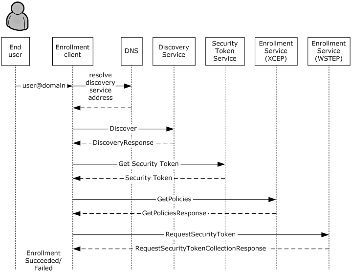
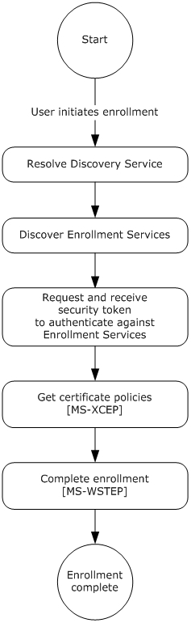
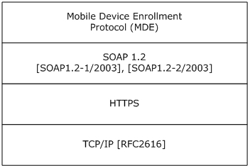
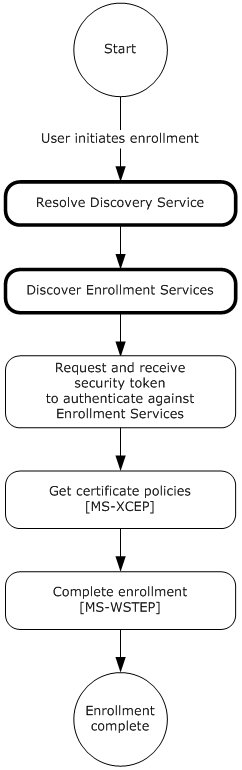
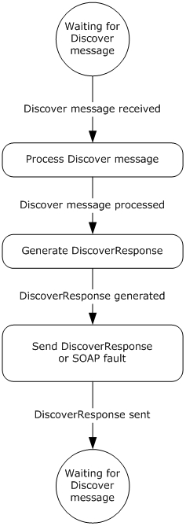
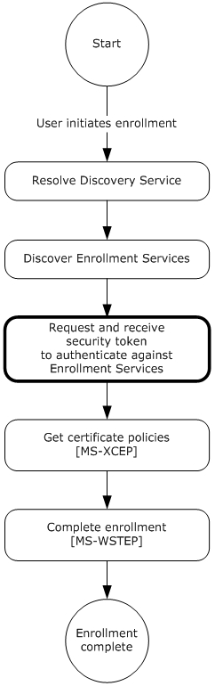
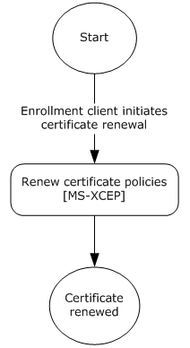

[MS-MDE]:

Mobile Device Enrollment Protocol

Intellectual Property Rights Notice for Open Specifications Documentation

  Technical Documentation. Microsoft publishes Open Specifications documentation (“this

documentation”) for protocols, file formats, data portability, computer languages, and standards
support. Additionally, overview documents cover inter-protocol relationships and interactions.

  Copyrights. This documentation is covered by Microsoft copyrights. Regardless of any other

terms that are contained in the terms of use for the Microsoft website that hosts this
documentation, you can make copies of it in order to develop implementations of the technologies
that are described in this documentation and can distribute portions of it in your implementations
that use these technologies or in your documentation as necessary to properly document the
implementation. You can also distribute in your implementation, with or without modification, any
schemas, IDLs, or code samples that are included in the documentation. This permission also
applies to any documents that are referenced in the Open Specifications documentation.
  No Trade Secrets. Microsoft does not claim any trade secret rights in this documentation.
  Patents. Microsoft has patents that might cover your implementations of the technologies

described in the Open Specifications documentation. Neither this notice nor Microsoft's delivery of
this documentation grants any licenses under those patents or any other Microsoft patents.
However, a given Open Specifications document might be covered by the Microsoft Open
Specifications Promise or the Microsoft Community Promise. If you would prefer a written license,
or if the technologies described in this documentation are not covered by the Open Specifications
Promise or Community Promise, as applicable, patent licenses are available by contacting
iplg@microsoft.com.

  License Programs. To see all of the protocols in scope under a specific license program and the

associated patents, visit the Patent Map.

  Trademarks. The names of companies and products contained in this documentation might be
covered by trademarks or similar intellectual property rights. This notice does not grant any
licenses under those rights. For a list of Microsoft trademarks, visit
www.microsoft.com/trademarks.

  Fictitious Names. The example companies, organizations, products, domain names, email

addresses, logos, people, places, and events that are depicted in this documentation are fictitious.
No association with any real company, organization, product, domain name, email address, logo,
person, place, or event is intended or should be inferred.

Reservation of Rights. All other rights are reserved, and this notice does not grant any rights other
than as specifically described above, whether by implication, estoppel, or otherwise.

Tools. The Open Specifications documentation does not require the use of Microsoft programming
tools or programming environments in order for you to develop an implementation. If you have access
to Microsoft programming tools and environments, you are free to take advantage of them. Certain
Open Specifications documents are intended for use in conjunction with publicly available standards
specifications and network programming art and, as such, assume that the reader either is familiar
with the aforementioned material or has immediate access to it.

Support. For questions and support, please contact dochelp@microsoft.com.

[MS-MDE] - v20240423
Mobile Device Enrollment Protocol
Copyright © 2024 Microsoft Corporation
Release: April 23, 2024

1 / 52

Revision Summary

Date

Revision
History

Revision
Class

Comments

8/8/2013

1.0

11/14/2013  1.0

2/13/2014

2.0

5/15/2014

3.0

6/30/2015

3.0

10/16/2015  4.0

7/14/2016

5.0

6/1/2017

5.0

New

None

Major

Major

None

Major

Major

None

Released new document.

No changes to the meaning, language, or formatting of the
technical content.

Significantly changed the technical content.

Significantly changed the technical content.

No changes to the meaning, language, or formatting of the
technical content.

Significantly changed the technical content.

Significantly changed the technical content.

No changes to the meaning, language, or formatting of the
technical content.

9/15/2017

6.0

Major

Significantly changed the technical content.

12/1/2017

6.0

6/25/2021

7.0

4/23/2024

8.0

None

Major

Major

No changes to the meaning, language, or formatting of the
technical content.

Significantly changed the technical content.

Significantly changed the technical content.

[MS-MDE] - v20240423
Mobile Device Enrollment Protocol
Copyright © 2024 Microsoft Corporation
Release: April 23, 2024

2 / 52

Table of Contents

1.1
1.2

1.2.1
1.2.2

1  Introduction ............................................................................................................ 5
Glossary ........................................................................................................... 5
References ........................................................................................................ 8
Normative References ................................................................................... 8
Informative References ................................................................................. 8
Overview .......................................................................................................... 9
Relationship to Other Protocols .......................................................................... 11
Prerequisites/Preconditions ............................................................................... 12
Applicability Statement ..................................................................................... 12
Versioning and Capability Negotiation ................................................................. 12
Vendor-Extensible Fields ................................................................................... 12
Standards Assignments ..................................................................................... 12

1.3
1.4
1.5
1.6
1.7
1.8
1.9

2.1
2.2

2  Messages ............................................................................................................... 13
Transport ........................................................................................................ 13
Common Message Syntax ................................................................................. 13
Namespaces .............................................................................................. 13
Messages ................................................................................................... 13
Elements ................................................................................................... 13
Complex Types ........................................................................................... 13
Simple Types ............................................................................................. 14
Attributes .................................................................................................. 14
Groups ...................................................................................................... 14
Attribute Groups ......................................................................................... 14

2.2.1
2.2.2
2.2.3
2.2.4
2.2.5
2.2.6
2.2.7
2.2.8

3.1

3.1.4.1

3.1.4.1.3

3.1.4.1.2

3.1.4.1.1

3.1.1
3.1.2
3.1.3
3.1.4

3.1.4.1.2.1
3.1.4.1.2.2

3.1.4.1.1.1
3.1.4.1.1.2

3  Protocol Details ..................................................................................................... 15
IDiscoveryService Server Details ........................................................................ 15
Abstract Data Model .................................................................................... 17
Timers ...................................................................................................... 17
Initialization ............................................................................................... 17
Message Processing Events and Sequencing Rules .......................................... 17
Discover .............................................................................................. 17
Messages ....................................................................................... 18
IDiscoveryService_Discover_InputMessage Message ...................... 18
IDiscoveryService_Discover_OutputMessage Message .................... 18
Elements ........................................................................................ 19
Discover ................................................................................... 19
DiscoverResponse ...................................................................... 19
Complex Types ............................................................................... 19
DiscoveryRequest ...................................................................... 20
DiscoveryResponse .................................................................... 20
Timer Events .............................................................................................. 21
Other Local Events ...................................................................................... 21
Interaction with Security Token Service (STS) ..................................................... 21
Interaction with X.509 Certificate Enrollment Policy .............................................. 23
Abstract Data Model .................................................................................... 25
Timers ...................................................................................................... 25
Initialization ............................................................................................... 25
Message Processing Events and Sequencing Rules .......................................... 25
GetPolicies Operation ............................................................................ 26
Messages ....................................................................................... 26
GetPolicies ................................................................................ 26
GetPoliciesResponse ................................................................... 27
Timer Events .............................................................................................. 28
Other Local Events ...................................................................................... 28

3.3.4.1.1.1
3.3.4.1.1.2

3.1.4.1.3.1
3.1.4.1.3.2

3.3.1
3.3.2
3.3.3
3.3.4

3.3.5
3.3.6

3.1.5
3.1.6

3.3.4.1.1

3.3.4.1

3.2
3.3

[MS-MDE] - v20240423
Mobile Device Enrollment Protocol
Copyright © 2024 Microsoft Corporation
Release: April 23, 2024

3 / 52

3.4.4.1

3.4.4.1.1

3.4

3.4.1
3.4.2
3.4.3
3.4.4

3.5

3.4.5
3.4.6

3.5.1
3.5.2
3.5.3
3.5.4

3.5.5
3.5.6

3.6

3.4.4.1.1.1
3.4.4.1.1.2
3.4.4.1.1.3

Interaction with WS-Trust X.509v3 Token Enrollment ........................................... 28
Abstract Data Model .................................................................................... 30
Timers ...................................................................................................... 30
Initialization ............................................................................................... 30
Message Processing Events and Sequencing Rules .......................................... 30
RequestSecurityToken Operation ............................................................ 30
Messages ....................................................................................... 31
RequestSecurityToken ................................................................ 31
RequestSecurityTokenOnBehalfOf ................................................ 32
RequestSecurityTokenResponseCollection ..................................... 34
Timer Events .............................................................................................. 35
Other Local Events ...................................................................................... 35
Certificate Renewal .......................................................................................... 35
Abstract Data Model .................................................................................... 36
Timers ...................................................................................................... 36
Initialization ............................................................................................... 36
Message Processing Events and Sequencing Rules .......................................... 36
RequestSecurityToken Operation ............................................................ 36
Messages ....................................................................................... 36
RequestSecurityToken ................................................................ 36
RequestSecurityTokenCollectionResponse ..................................... 36
Timer Events .............................................................................................. 37
Other Local Events ...................................................................................... 37
XML Provisioning Document Schema .................................................................. 37

3.5.4.1.1.1
3.5.4.1.1.2

3.5.4.1

3.5.4.1.1

4.2

4.1

4.1.1
4.1.2

4  Protocol Examples ................................................................................................. 41
Discovery Example ........................................................................................... 41
Discovery Example: Request ........................................................................ 41
Discovery Example: Response ...................................................................... 41
GetPolicies Example ......................................................................................... 42
GetPolicies Example: Request ...................................................................... 42
GetPolicies Example: Response .................................................................... 43
RequestSecurityToken Example ......................................................................... 43
RequestSecurityToken Example: Request ...................................................... 43
RequestSecurityToken Example: Response .................................................... 44

4.2.1
4.2.2

4.3.1
4.3.2

4.3

5  Security ................................................................................................................. 46
Security Considerations for Implementers ........................................................... 46
Index of Security Parameters ............................................................................ 46

5.1
5.2

6  Appendix A: Full WSDL .......................................................................................... 47

7  Appendix B: Product Behavior ............................................................................... 49

8  Change Tracking .................................................................................................... 50

9  Index ..................................................................................................................... 51

[MS-MDE] - v20240423
Mobile Device Enrollment Protocol
Copyright © 2024 Microsoft Corporation
Release: April 23, 2024

4 / 52

1  Introduction

An industry trend has been developing in which employees connect their personal mobile computing
devices to the corporate network and resources (either on premise or through the cloud) to perform
workplace tasks. This trend requires support for easy configuration of the network and resources, such
that employees can register personal devices with the company for work-related purposes.
Applications and technology to support easy configuration also enable IT professionals to manage the
risk associated with having uncontrolled devices connected to the corporate network.

The Mobile Device Management Protocol (MDM) [MS-MDM] specifies a protocol for managing devices
through a Device Management Service (DMS). This document describes the Mobile Device
Enrollment Protocol (MDE), which enables enrolling a device with the DMS through an Enrollment
Service (ES). The protocol includes the discovery of the Management Enrollment Service (MES)
and enrollment with the ES.

Sections 1.5, 1.8, 1.9, 2, and 3 of this specification are normative. All other sections and examples in
this specification are informative.

1.1  Glossary

This document uses the following terms:

base64 encoding: A binary-to-text encoding scheme whereby an arbitrary sequence of bytes is

converted to a sequence of printable ASCII characters, as described in [RFC4648].

certificate: A certificate is a collection of attributes and extensions that can be stored persistently.
The set of attributes in a certificate can vary depending on the intended usage of the certificate.
A certificate securely binds a public key to the entity that holds the corresponding private key. A
certificate is commonly used for authentication and secure exchange of information on open
networks, such as the Internet, extranets, and intranets. Certificates are digitally signed by the
issuing certification authority (CA) and can be issued for a user, a computer, or a service.
The most widely accepted format for certificates is defined by the ITU-T X.509 version 3
international standards. For more information about attributes and extensions, see [RFC3280]
and [X509] sections 7 and 8.

certificate enrollment policy: The collection of certificate templates and certificate issuers

available to the requestor for X.509 certificate enrollment.

certificate policy: A document that identifies the actors of a public key infrastructure (PKI), along

with their roles and tasks.

certificate signing request: In a public key infrastructure (PKI) configuration, a request message
sent from a requestor to a certification authority (CA)  to apply for a digital identity certificate.

certification authority (CA): A third party that issues public key certificates. Certificates serve
to bind public keys to a user identity. Each user and certification authority (CA) can decide
whether to trust another user or CA for a specific purpose, and whether this trust is to be
transitive. For more information, see [RFC3280].

device management client: An application or agent running on a device that implements the

Mobile Device Management Protocol [MS-MDM].

Device Management Service (DMS): Server software that secures, monitors, manages, and

supports devices deployed across mobile operators, service providers, and enterprises.

Digital Media Server (DMS): A device class defined in the DLNA Guidelines. A DMS is an UPnP

device that implements the UPnP MediaServer device type.

[MS-MDE] - v20240423
Mobile Device Enrollment Protocol
Copyright © 2024 Microsoft Corporation
Release: April 23, 2024

5 / 52

Discovery Service (DS): A simple protocol based on an endpoint with a known portion of an
address that is used to discover services which have no upfront name or location hints.

Domain Name System (DNS): A hierarchical, distributed database that contains mappings of
domain names to various types of data, such as IP addresses. DNS enables the location of
computers and services by user-friendly names, and it also enables the discovery of other
information stored in the database.

enrollment client: An application or agent that implements the initiator or client portion of MDE.

Enrollment Service (ES): A server or collection of servers implementing the WS-Trust X.509v3

Token Enrollment Extensions [MS-WSTEP].

ES endpoint: A service endpoint for handling enrollment requests from clients.

HTML form: A component of a web page that allows a user to enter data that is sent to a server

for processing.

Hypertext Transfer Protocol (HTTP): An application-level protocol for distributed, collaborative,
hypermedia information systems (text, graphic images, sound, video, and other multimedia
files) on the World Wide Web.

Management Enrollment Service (MES): A server or collection of servers implementing the

server side of MDE.

object identifier (OID): In the context of an object server, a 64-bit number that uniquely

identifies an object.

provisioning information: In MDE, the service endpoint to the DMS which is a prerequisite for

the device management client to initiate a session.

query string: The part of a Uniform Resource Locator (URL) that contains the data to be passed to

a web application.

root certificate: A self-signed certificate that identifies the public key of a root certification

authority (CA) and has been trusted to terminate a certificate chain.

Secure Sockets Layer (SSL): A security protocol that supports confidentiality and integrity of

messages in client and server applications that communicate over open networks. SSL supports
server and, optionally, client authentication using X.509 certificates [X509] and [RFC5280]. SSL
is superseded by Transport Layer Security (TLS). TLS version 1.0 is based on SSL version
3.0 [SSL3].

security token: A collection of one or more claims. Specifically in the case of mobile devices, a
security token represents a previously authenticated user as defined in the Mobile Device
Enrollment Protocol [MS-MDE].

security token service (STS): A web service that issues claims and packages them in encrypted

security tokens.

service endpoint: A server or collection of servers that expose one or more service endpoints to

which messages can be sent.

SOAP action: The HTTP request header field used to indicate the intent of the SOAP request, using

a URI value. See [SOAP1.1] section 6.1.1 for more information.

SOAP body: A container for the payload data being delivered by a SOAP message to its recipient.

See [SOAP1.2-1/2007] section 5.3 for more information.

[MS-MDE] - v20240423
Mobile Device Enrollment Protocol
Copyright © 2024 Microsoft Corporation
Release: April 23, 2024

6 / 52

SOAP header: A mechanism for implementing extensions to a SOAP message in a decentralized
manner without prior agreement between the communicating parties. See [SOAP1.2-1/2007]
section 5.2 for more information.

Transmission Control Protocol (TCP): A protocol used with the Internet Protocol (IP) to send
data in the form of message units between computers over the Internet. TCP handles keeping
track of the individual units of data (called packets) that a message is divided into for efficient
routing through the Internet.

Transport Layer Security (TLS): A security protocol that supports confidentiality and integrity of
messages in client and server applications communicating over open networks. TLS supports
server and, optionally, client authentication by using X.509 certificates (as specified in [X509]).
TLS is standardized in the IETF TLS working group.

Uniform Resource Locator (URL): A string of characters in a standardized format that identifies

a document or resource on the World Wide Web. The format is as specified in [RFC1738].

URL scheme: The top level of an URL naming structure. All URL references are formed with a

scheme name, followed by a colon character ":". For example, in the URL http://contoso.com,
the URL scheme name is http.

user principal name (UPN): A user account name (sometimes referred to as the user logon

name) and a domain name that identifies the domain in which the user account is located. This
is the standard usage for logging on to a Windows domain. The format is:
someone@example.com (in the form of an email address). In Active Directory, the
userPrincipalName attribute of the account object, as described in [MS-ADTS].

web service: A unit of application logic that provides data and services to other applications and

can be called by using standard Internet transport protocols such as HTTP, Simple Mail Transfer
Protocol (SMTP), or File Transfer Protocol (FTP). Web services can perform functions that range
from simple requests to complicated business processes.

Web Services Description Language (WSDL): An XML format for describing network services

as a set of endpoints that operate on messages that contain either document-oriented or
procedure-oriented information. The operations and messages are described abstractly and are
bound to a concrete network protocol and message format in order to define an endpoint.
Related concrete endpoints are combined into abstract endpoints, which describe a network
service. WSDL is extensible, which allows the description of endpoints and their messages
regardless of the message formats or network protocols that are used.

X.509: An ITU-T standard for public key infrastructure subsequently adapted by the IETF, as

specified in [RFC3280].

XML: The Extensible Markup Language, as described in [XML1.0].

XML namespace: A collection of names that is used to identify elements, types, and attributes in
XML documents identified in a URI reference [RFC3986]. A combination of XML namespace and
local name allows XML documents to use elements, types, and attributes that have the same
names but come from different sources. For more information, see [XMLNS-2ED].

XML Path Language (XPath): A language used to create expressions that can address parts of

an XML document, manipulate strings, numbers, and Booleans, and can match a set of nodes in
the document, as specified in [XPATH]. XPath models an XML document as a tree of nodes of
different types, including element, attribute, and text. XPath expressions can identify the nodes
in an XML document based on their type, name, and values, as well as the relationship of a node
to other nodes in the document.

MAY, SHOULD, MUST, SHOULD NOT, MUST NOT: These terms (in all caps) are used as defined
in [RFC2119]. All statements of optional behavior use either MAY, SHOULD, or SHOULD NOT.

7 / 52

[MS-MDE] - v20240423
Mobile Device Enrollment Protocol
Copyright © 2024 Microsoft Corporation
Release: April 23, 2024

1.2  References

Links to a document in the Microsoft Open Specifications library point to the correct section in the
most recently published version of the referenced document. However, because individual documents
in the library are not updated at the same time, the section numbers in the documents may not
match. You can confirm the correct section numbering by checking the Errata.

1.2.1  Normative References

We conduct frequent surveys of the normative references to assure their continued availability. If you
have any issue with finding a normative reference, please contact dochelp@microsoft.com. We will
assist you in finding the relevant information.

[MS-MDM] Microsoft Corporation, "Mobile Device Management Protocol".

[MS-WSTEP] Microsoft Corporation, "WS-Trust X.509v3 Token Enrollment Extensions".

[MS-XCEP] Microsoft Corporation, "X.509 Certificate Enrollment Policy Protocol".

[RFC2119] Bradner, S., "Key words for use in RFCs to Indicate Requirement Levels", BCP 14, RFC
2119, March 1997, https://www.rfc-editor.org/info/rfc2119

[RFC2616] Fielding, R., Gettys, J., Mogul, J., et al., "Hypertext Transfer Protocol -- HTTP/1.1", RFC
2616, June 1999, https://www.rfc-editor.org/info/rfc2616

[SOAP1.1-Envelope] Box, D., Ehnebuske, D., Kakivaya, G., et al., "Simple Object Access Protocol
(SOAP) 1.1 Envelope", May 2001, https://schemas.xmlsoap.org/soap/envelope/

[SOAP1.1] Box, D., Ehnebuske, D., Kakivaya, G., et al., "Simple Object Access Protocol (SOAP) 1.1",
W3C Note, May 2000, https://www.w3.org/TR/2000/NOTE-SOAP-20000508/

[WSDL] Christensen, E., Curbera, F., Meredith, G., and Weerawarana, S., "Web Services Description
Language (WSDL) 1.1", W3C Note, March 2001, https://www.w3.org/TR/2001/NOTE-wsdl-20010315

[WSS] OASIS, "Web Services Security: SOAP Message Security 1.1 (WS-Security 2004)", February
2006, https://www.oasis-open.org/committees/download.php/16790/wss-v1.1-spec-os-
SOAPMessageSecurity.pdf

[WSTrust1.3] Lawrence, K., Kaler, C., Nadalin, A., et al., "WS-Trust 1.3", OASIS Standard March
2007, https://docs.oasis-open.org/ws-sx/ws-trust/200512/ws-trust-1.3-os.html

[XMLNS] Bray, T., Hollander, D., Layman, A., et al., Eds., "Namespaces in XML 1.0 (Third Edition)",
W3C Recommendation, December 2009, https://www.w3.org/TR/2009/REC-xml-names-20091208/

[XMLSCHEMA1] Thompson, H., Beech, D., Maloney, M., and Mendelsohn, N., Eds., "XML Schema Part
1: Structures", W3C Recommendation, May 2001, https://www.w3.org/TR/2001/REC-xmlschema-1-
20010502/

[XMLSCHEMA2] Biron, P.V., Ed. and Malhotra, A., Ed., "XML Schema Part 2: Datatypes", W3C
Recommendation, May 2001, https://www.w3.org/TR/2001/REC-xmlschema-2-20010502/

1.2.2  Informative References

[MSKB-2909569] Microsoft Corporation, "Update that fixes issues and adds support to MDM client in
Windows RT 8.1 and Windows 8.1", December 2013, http://support.microsoft.com/kb/2909569

[MS-MDE] - v20240423
Mobile Device Enrollment Protocol
Copyright © 2024 Microsoft Corporation
Release: April 23, 2024

8 / 52

<!-- Extracted images from page 9 -->

<!-- /Extracted images from page 9 -->

1.3  Overview

MDE enables a device to be enrolled with the Device Management Service (DMS) through an
Enrollment Service (ES), including the discovery of the Management Enrollment Service (MES)
and enrollment with the ES. After a device is enrolled, the device can be managed with the DMS using
MDM.

The process for enrolling a device using MDE is shown in the following diagram.

Figure 1: Typical sequence for enrolling a message using MDE

The enrollment process consists of the following steps.

1.  The user’s email name is entered via the enrollment client.

2.  The enrollment client extracts the domain suffix from the email address, prepends the domain
name with a well-known label, and resolves the address to the Discovery Service (DS). The
administrator configures the network name resolution service (that is, the Domain Name
System (DNS)) appropriately.

3.  The enrollment client sends an HTTP GET request to the Discovery Service (DS) to validate the

existence of the service endpoint.

4.  The enrollment client sends a Discover message (section 3.1.4.1.1.1) to the Discovery Service

(DS). The Discovery Service (DS) responds with a DiscoverResponse message (section
3.1.4.1.1.2) containing the Uniform Resource Locators (URLs) of service endpoints required for the
following steps.

5.  The enrollment client communicates with the security token service (STS) (section 3.2) to

obtain a security token to authenticate with the ES.

9 / 52

[MS-MDE] - v20240423
Mobile Device Enrollment Protocol
Copyright © 2024 Microsoft Corporation
Release: April 23, 2024

6.  The enrollment client sends a GetPolicies message (section 3.3.4.1.1.1) the ES endpoint [MS-

XCEP] using the security token received in the previous step. The ES endpoint [MS-XCEP]
responds with a GetPoliciesResponse message (section 3.3.4.1.1.2) containing the certificate
policies required for the next step. For more information about these messages, see [MS-XCEP]
sections 3.1.4.1.1.1 and 3.1.4.1.1.2.

7.  Part a. The enrollment client can send a RequestSecurityToken message (section 3.4.4.1.1.1)
to the ES endpoint [MS-WSTEP] using the security token received in step 4. The ES endpoint [MS-
WSTEP] responds with a RequestSecurityTokenResponseCollection message (section
3.4.4.1.1.3) containing the identity and provisioning information for the device management
client [MS-MDM]. For more information about these messages, see [MS-WSTEP] sections
3.1.4.1.1.1 and 3.1.4.1.1.2.

Part b. The enrollment client can send a RequestSecurityTokenOnBehalfOf message (section
3.4.4.1.1.3) to the ES endpoint [MS-WSTEP] using the security token received in step 4. The ES
endpoint [MS-WSTEP] responds with a RequestSecurityTokenResponseCollection message
(section 3.4.4.1.1.3) containing the identity and provisioning information for the device
management client [MS-MDM]. For more information about these messages, see [MS-WSTEP]
sections 3.1.4.1.1.1 and 3.1.4.1.1.2.

The steps for MDE device enrollment correspond to five phases as shown in the following diagram.

[MS-MDE] - v20240423
Mobile Device Enrollment Protocol
Copyright © 2024 Microsoft Corporation
Release: April 23, 2024

10 / 52

<!-- Extracted images from page 11 -->

<!-- /Extracted images from page 11 -->

Figure 2: MDE device enrollment phases

1.4  Relationship to Other Protocols

MDE depends on the WS-Trust X.509v3 Token Enrollment Extensions [MS-WSTEP].

MDE depends on the X.509 Certificate Enrollment Policy Protocol [MS-XCEP].

The Mobile Device Management Protocol (MDM) depends on MDE. A device has to be enrolled in an
MES through the use of MDE before the device can be managed using MDM [MS-MDM].

[MS-MDE] - v20240423
Mobile Device Enrollment Protocol
Copyright © 2024 Microsoft Corporation
Release: April 23, 2024

11 / 52

<!-- Extracted images from page 12 -->

<!-- /Extracted images from page 12 -->

Figure 3: Relationship to other protocols

1.5  Prerequisites/Preconditions

MDE issues X.509v3 [MS-WSTEP] certificates and provisioning information for device
management clients [MS-MDM] to enable a relationship between the user and a device in the DMS.

The MES issues a security token (after appropriate authentication) that is used to authenticate to
the ES.

The ES communicates with a certification authority (CA) to issue an X.509 certificate.

The ES issues provisioning information for a device management client [MS-MDM]. The ES has to be
configured with this information or be able to retrieve it from the DMS.

1.6  Applicability Statement

A device has to be enrolled in an MES through the use of MDE before the device can be managed
using MDM [MS-MDM].

1.7  Versioning and Capability Negotiation

None.

1.8  Vendor-Extensible Fields

None.

1.9  Standards Assignments

None.

[MS-MDE] - v20240423
Mobile Device Enrollment Protocol
Copyright © 2024 Microsoft Corporation
Release: April 23, 2024

12 / 52

2  Messages

2.1  Transport

MDE is a client-to-server protocol that consists of a SOAP-based Web service.

MDE operates over the following Web services transport:

  SOAP 1.1 ([SOAP1.1], [SOAP1.1-Envelope]) over HTTPS over TCP/IP [RFC2616]

2.2  Common Message Syntax

This section contains common definitions used by this protocol. The syntax of the definitions uses the
XML Schema as defined in [XMLSCHEMA1] and [XMLSCHEMA2], and the Web Services Description
Language (WSDL) as defined in [WSDL].

2.2.1  Namespaces

This specification defines and references various XML namespaces using the mechanisms specified in
[XMLNS]. Although this specification associates a specific XML namespace prefix for each XML
namespace that is used, the choice of any particular XML namespace prefix is implementation-specific
and not significant for interoperability.

Prefixes and XML namespaces used in this specification are as follows.

Prefix  Namespace URI

Reference

ac

http://schemas.microsoft.com/windows/pki/2009/01/enrollment

[MS-WSTEP]

tns

http://schemas.microsoft.com/windows/pki/2012/01/enrollment

This specification

wsaw

http://www.w3.org/2006/05/addressing/wsdl

wsdl

http://schemas.xmlsoap.org/wsdl/

[WSDL]

wst

http://docs.oasis-open.org/ws-sx/ws-trust/200512

[WSTrust1.3]

xcep

http://schemas.microsoft.com/windows/pki/2009/01/enrollmentpolicy

[MS-XCEP]

xsd

http://www.w3.org/2001/XMLSchema

[XMLSCHEMA1]

2.2.2  Messages

This specification does not define any common XML Schema message definitions.

2.2.3  Elements

This specification does not define any common XML Schema element definitions.

2.2.4  Complex Types

This specification does not define any common XML Schema complex type definitions.

[MS-MDE] - v20240423
Mobile Device Enrollment Protocol
Copyright © 2024 Microsoft Corporation
Release: April 23, 2024

13 / 52

2.2.5  Simple Types

This specification does not define any common XML Schema simple type definitions.

2.2.6  Attributes

This specification does not define any common XML Schema attribute definitions.

2.2.7  Groups

This specification does not define any common XML Schema group definitions.

2.2.8  Attribute Groups

This specification does not define any common XML Schema attribute group definitions.

[MS-MDE] - v20240423
Mobile Device Enrollment Protocol
Copyright © 2024 Microsoft Corporation
Release: April 23, 2024

14 / 52

<!-- Extracted images from page 15 -->

<!-- /Extracted images from page 15 -->

3  Protocol Details

3.1  IDiscoveryService Server Details

This section describes the first and second phases in MDE device enrollment: resolving the Discovery
Service (DS) and discovering the ES. The following diagram highlights these two phases.

Figure 4: MDE device enrollment: resolving the DS and discovering the ES

[MS-MDE] - v20240423
Mobile Device Enrollment Protocol
Copyright © 2024 Microsoft Corporation
Release: April 23, 2024

15 / 52

<!-- Extracted images from page 16 -->

<!-- /Extracted images from page 16 -->

The IDiscoveryService DS in MDE hosts an endpoint to receive messages from the enrollment
client. When a Discover request message (section 3.1.4.1.1.1) is received from the client, the server
processes the request and returns a DiscoverResponse message (section 3.1.4.1.1.2) to the client.
The response identifies the endpoints to be used by the client to obtain the security tokens and enroll
via the ES. After the response message is sent to the client, the server returns to the waiting state.

The following diagram shows the role of the server in resolving the Discovery Service (DS) for the
enrollment client:

Figure 5: Role of server in resolving the DS

[MS-MDE] - v20240423
Mobile Device Enrollment Protocol
Copyright © 2024 Microsoft Corporation
Release: April 23, 2024

16 / 52

As a prerequisite for enabling the enrollment client to discover the Discovery Service (DS), the
administrator MUST configure the DNS, such that the name "EnterpriseEnrollment.[User's Domain]"
resolves to the Discovery Service (DS). The enrollment client extracts the domain suffix from the
email address of the enrolling user and prepends it with the DNS to construct the address for the DS.
For example, if the email address for the user is "user1@contoso.com", the enrollment client extracts
the domain suffix "contoso.com" and prepends it with the DNS to construct the DS address
"EnterpriseEnrollment.contoso.com".

In the example, the full URL sent by the client to the DS is
"https://EnterpriseEnrollment.contoso.com/EnrollmentServer/Discovery.svc".

The path portion of the URL "/EnrollmentServer/Discovery.svc" is always constant.

The enrollment client validates the Secure Sockets Layer (SSL) certificate that is protecting the
DS endpoint, along with any intermediary certificates that are signed by a trusted CA.

3.1.1  Abstract Data Model

This section describes a conceptual model of possible data organization that an implementation
maintains to participate in this protocol. The described organization is provided to facilitate the
explanation of how the protocol behaves. This document does not mandate that implementations
adhere to this model as long as their external behavior is consistent with that described in this
document.

EnrollmentServiceDirectory: A repository which stores the URLs for the services used during
enrollment.

3.1.2  Timers

None.

3.1.3  Initialization

The EnrollmentServiceDirectory element MUST be initialized with the list of ES's.

3.1.4  Message Processing Events and Sequencing Rules

The following table summarizes the list of WSDL operations as defined by this specification for
discovering the ES:

WSDL
Operation

Discover

Description

Describes the messages for discovering service endpoints to complete enrollment. Service
endpoints include the security token issuance endpoints and the ES endpoints.

3.1.4.1  Discover

The Discover operation defines the client request and server response messages that are used to
complete the process of discovering URLs for the ES's.

This operation is specified by the following WSDL.

 <wsdl:operation name="Discover">

[MS-MDE] - v20240423
Mobile Device Enrollment Protocol
Copyright © 2024 Microsoft Corporation
Release: April 23, 2024

17 / 52

   <wsdl:input
wsaw:Action="http://schemas.microsoft.com/windows/management/2012/01/enrollment/IDiscoverySer
vice/Discover" name="IDiscoveryService_Discover_InputMessage"
message="tns:IDiscoveryService_Discover_InputMessage"/>
   <wsdl:output
wsaw:Action="http://schemas.microsoft.com/windows/management/2012/01/enrollment/IDiscoverySer
vice/DiscoverResponse" name="IDiscoveryService_Discover_OutputMessage"
message="tns:IDiscoveryService_Discover_OutputMessage"/>
 </wsdl:operation>

The following sections specify the request commands used in conjunction with the SyncML message
specified in [MS-MDM] section 2.2.4.1.

3.1.4.1.1 Messages

The following table summarizes the set of WSDL message definitions that are specific to this
operation.

Message

Description

IDiscoveryService_Discover_InputMessage

Sent from the client to the server to discover service endpoints.

IDiscoveryService_Discover_OutputMessage  Sent from the server to the client and contains the information

about the service endpoints.

3.1.4.1.1.1

IDiscoveryService_Discover_InputMessage Message

The IDiscoveryService_Discover_InputMessage message contains the Discover request
message for the Discover operation.

The SOAP action value is:

 http://schemas.microsoft.com/windows/management/2012/01/enrollment/IDiscoveryService/Discover

The Discover request message is sent from the client to the server to discover ES endpoints.

 <wsdl:message name="IDiscoveryService_Discover_InputMessage">
   <wsdl:part name="Discover" element="tns:Discover"/>
 </wsdl:message>

tns:Discover: An instance of a <Discover> element (section 3.1.4.1.2.1).

3.1.4.1.1.2

IDiscoveryService_Discover_OutputMessage Message

The IDiscoveryService_Discover_OutputMessage message contains the DiscoverResponse
response message for the Discover operation.

The SOAP action value is:

 http://schemas.microsoft.com/windows/management/2012/01/enrollment/IDiscoveryService/Discover
Response

[MS-MDE] - v20240423
Mobile Device Enrollment Protocol
Copyright © 2024 Microsoft Corporation
Release: April 23, 2024

18 / 52

The DiscoverResponse response message is sent from the server to the client and contains
information about the ES endpoints.

 <wsdl:message name="IDiscoveryService_Discover_OutputMessage">
   <wsdl:part name="DiscoverResponse" element="tns:DiscoverResponse"/>
 </wsdl:message>

tns:DiscoverResponse: An instance of a <DiscoverResponse> element (section 3.1.4.1.2.2).

3.1.4.1.2 Elements

The following table summarizes the set of XML Schema element definitions that are specific to this
operation.

Element

Description

Discover

Contains the body of the Discover request message sent by the client.

DiscoverResponse  Contains the body of the Discover response message sent by the server in response to the

request message received from the client.

3.1.4.1.2.1  Discover

The <Discover> element contains the client request to the server.

 <xsd:element name="Discover" nillable="true">
   <xsd:complexType>
     <xsd:sequence>
       <xsd:element minOccurs="1" maxOccurs="1" name="request" nillable="true"
type="tns:DiscoveryRequest"/>
     </xsd:sequence>
   </xsd:complexType>
 </xsd:element>

request: This element is of type <DiscoveryRequest> (section 3.1.4.1.3.1) and contains information
about the request.

3.1.4.1.2.2  DiscoverResponse

The <DiscoverResponse> element contains the information to send in the response from the server to
the client.

 <xsd:element name="DiscoverResponse" nillable="true">
   <xsd:complexType>
     <xsd:sequence>
       <xsd:element minOccurs="1" maxOccurs="1" name="DiscoverResult" nillable="true"
type="tns:DiscoveryResponse"/>
     </xsd:sequence>
   </xsd:complexType>
 </xsd:element>

DiscoverResult: This element is of type <DiscoveryResponse> (section 3.1.4.1.3.2) and contains
response information from the server.

3.1.4.1.3 Complex Types

[MS-MDE] - v20240423
Mobile Device Enrollment Protocol
Copyright © 2024 Microsoft Corporation
Release: April 23, 2024

19 / 52

The following table summarizes the set of XML Schema complex type definitions that are specific to
this operation.

ComplexType

Description

DiscoveryRequest

Specifies the type of the <Discover> element for the Discover (section 3.1.4.1.1.1)
message.

DiscoveryResponse  Specifies the type of the <DiscoverResponse> element for the DiscoverResponse (section

3.1.4.1.1.2) message.

3.1.4.1.3.1  DiscoveryRequest

The <DiscoveryRequest> complex type describes the information to send to the server in the
<Discover> request element (section 3.1.4.1.2.1).

Namespace: http://schemas.microsoft.com/windows/management/2012/01/enrollment

 <xsd:complexType name="DiscoveryRequest">
   <xsd:sequence>
     <xsd:element minOccurs="0" maxOccurs="1" name="EmailAddress" nillable="true"
type="xsd:string"/>
     <xsd:element minOccurs="0" maxOccurs="1" name="RequestVersion" nillable="true"
type="xsd:string"/>
   </xsd:sequence>
 </xsd:complexType>

EmailAddress: This element supplies the name of the user making the enrollment request. The
<EmailAddress> value is used by the DS to identify the ESs to return to the client.

RequestVersion: The value MUST be set to nil.

3.1.4.1.3.2  DiscoveryResponse

The <DiscoveryResponse> complex type describes the information to send to the client in the
<DiscoverResponse> request element (section 3.1.4.1.2.2).

Namespace: http://schemas.microsoft.com/windows/management/2012/01/enrollment

 <xsd:complexType name="DiscoveryResponse">
   <xsd:sequence>
     <xsd:element minOccurs="0" maxOccurs="1" name="AuthPolicy" nillable="true"
type="xsd:string"/>
     <xsd:element minOccurs="0" maxOccurs="1" name="AuthenticationServiceUrl" nillable="true"
type="xsd:string"/>
     <xsd:element minOccurs="0" maxOccurs="1" name="EnrollmentPolicyServiceUrl"
nillable="true" type="xsd:string"/>
     <xsd:element minOccurs="0" maxOccurs="1" name="EnrollmentServiceUrl" nillable="true"
type="xsd:string"/>
   </xsd:sequence>
 </xsd:complexType>

AuthPolicy: The value of <AuthPolicy> MUST be the string "Federated".

AuthenticationServiceUrl: The value of <AuthenticationServiceUrl> MUST be the name of the STS
from which the client will retrieve a security token.

[MS-MDE] - v20240423
Mobile Device Enrollment Protocol
Copyright © 2024 Microsoft Corporation
Release: April 23, 2024

20 / 52

EnrollmentPolicyServiceUrl: The value of <EnrollmentPolicyServiceUrl> MUST be the address of the
DS against which the X.509 Certificate Enrollment Policy Protocol [MS-XCEP] operations are
performed.

EnrollmentServiceUrl: The value of <EnrollmentServiceUrl> MUST be the address of the DS against
which the WS-Trust X.509v3 Token Enrollment Extensions [MS-WSTEP] operations are performed.

3.1.5  Timer Events

None.

3.1.6  Other Local Events

None.

3.2  Interaction with Security Token Service (STS)

This section describes the third phase in MDE device enrollment: requesting and receiving the
security token. The following diagram highlights this phase.

[MS-MDE] - v20240423
Mobile Device Enrollment Protocol
Copyright © 2024 Microsoft Corporation
Release: April 23, 2024

21 / 52

<!-- Extracted images from page 22 -->

<!-- /Extracted images from page 22 -->

Figure 6: MDE device enrollment: requesting and receiving the security token

After the enrollment client receives the DiscoverResponse message (section 3.1.4.1.1.2), the
client obtains a security token from the STS specified in the value for the
<DiscoveryResponse><AuthenticationServiceUrl> element (section 3.1.4.1.3.2).

Note The enrollment client is agnostic with regards to the protocol flows for authenticating and
returning the security token. While the STS might prompt for user credentials directly or enter into a
federation protocol with an STS and directory service, MDE is agnostic to all of this. To remain
agnostic, all protocol flows pertaining to authentication that involve the enrollment client are passive,
that is, browser-implemented.

22 / 52

[MS-MDE] - v20240423
Mobile Device Enrollment Protocol
Copyright © 2024 Microsoft Corporation
Release: April 23, 2024

The following are the explicit requirements for the STS:

The <DiscoveryResponse><AuthenticationServiceUrl> element (section 3.1.4.1.3.2) MUST support
HTTPS.

The enrollment client issues an HTTPS request as follows:

 AuthenticationServiceUrl?appru=<appid>&login_hint=<User Principal Name>

<appid> is of the form ms-app://string

<User Principal Name> is the name of the enrolling user, for example, user@constoso.com. The
value of this attribute serves as a hint that can be used by the STS as part of the authentication.

After authentication is complete, the STS SHOULD return an HTML form document with a POST
method action of appid identified in the query string parameter. For example:

 HTTP/1.1 200 OK
 Content-Type: text/html; charset=UTF-8
 Vary: Accept-Encoding
 Content-Length: 556

 <!DOCTYPE>
 <html>
    <head>
       <title>Working...</title>
       
    </head>
    <body>
       <form method="post" action="ms-app://windows.immersivecontrolpanel">
          
<input type="hidden" name="wresult" value="token value"/>

          <input type="submit"/>
       </form>
    </body>
 </html>

The STS has to send a POST to a redirect URL of the form ms-app://string (the URL scheme is ms-
app) as indicated in the POST method action. The security token value is the base64-encoded string
"http://docs.oasis-open.org/wss/2004/01/oasis-200401-wss-wssecurity-secext-
1.0.xsd#base64binary" contained in the <wsse:BinarySecurityToken> EncodingType attribute
(section 3.3).

Sequentially, the string is HTML encoded before it is base64 encoded, so that when it is unencoded
from base64 it can be returned embedded in HTML.

This string is opaque to the enrollment client; the client does not interpret the string.

3.3  Interaction with X.509 Certificate Enrollment Policy

This section describes the fourth phase in MDE device enrollment: interacting with the X.509
Certificate Enrollment Policy Protocol [MS-XCEP] to obtain the certificate policies. The following
diagram highlights this phase.

[MS-MDE] - v20240423
Mobile Device Enrollment Protocol
Copyright © 2024 Microsoft Corporation
Release: April 23, 2024

23 / 52

<!-- Extracted images from page 24 -->

<!-- /Extracted images from page 24 -->

Figure 7: MDE device enrollment: getting the certificate policies

The X.509 Certificate Enrollment Policy Protocol [MS-XCEP] enables a client to request certificate
enrollment policies from a server. The communication is initiated by the enrollment client request
to the server for the certificate enrollment policies. The server authenticates the client, validates the
request, and returns a response with a collection of certificate enrollment policy objects. As described
in section 3.2, the enrollment client uses the certificate enrollment policies to complete the enrollment
process [MS-WSTEP]. MDE uses the policies to allow the ES to specify the hash algorithm and key
length as described in the following section.

Authentication

[MS-MDE] - v20240423
Mobile Device Enrollment Protocol
Copyright © 2024 Microsoft Corporation
Release: April 23, 2024

24 / 52

MDE implements the authentication provisions in WS-Security 2004 [WSS] to enable the ES [MS-
XCEP] to authenticate the GetPolicies requestor [MS-XCEP]. This section defines the schema used to
express the credential descriptor for the credential type. The security token credential is provided in
a request message using the <wsse:BinarySecurityToken> element [WSS]. The security token is
retrieved as described in section 3.2. The authentication information is as follows:

wsse:Security: MDE implements the <wsse:Security> element defined in [WSS] section 5. The
<wsse:Security> element MUST be a child of the <s:Header> element (see [MS-XCEP] section 4).

wsse:BinarySecurityToken: MDE implements the <wsse:BinarySecurityToken> element defined in
[WSS] section 6.3. The <wsse:BinarySecurityToken> element MUST be included as a child of the
<wsse:Security> element in the SOAP header.

  As was described in section 3.2, inclusion of the <wsse:BinarySecurityToken> element is opaque
to the enrollment client and the client does not interpret the string and inclusion of the element is
agreed upon by the STS (as identified in the DS <AuthenticationServiceUrl> element of
<DiscoveryResponse> (section 3.1.4.1.3.2)) and the ES.



The <wsse:BinarySecurityToken> element contains a base64-encoded string. The enrollment
client uses the security token received from the STS and base64-encodes the token to populate
the <wsse:BinarySecurityToken> element.

wsse:BinarySecurityToken/attributes/ValueType: The <wsse:BinarySecurityToken> ValueType
attribute MUST be
"http://schemas.microsoft.com/5.0.0.0/ConfigurationManager/Enrollment/DeviceEnrollment
UserToken".

wsse:BinarySecurityToken/attributes/EncodingType: The <wsse:BinarySecurityToken>
EncodingType attribute MUST be "http://docs.oasis-open.org/wss/2004/01/oasis-200401-wss-
wssecurity-secext-1.0.xsd#base64binary".

3.3.1  Abstract Data Model

None.

3.3.2  Timers

None.

3.3.3  Initialization

None.

3.3.4  Message Processing Events and Sequencing Rules

The following table summarizes the list of WSDL operations as defined by this specification for
obtaining the certificate policies:

Operation  Description

GetPolicies  Defines the client request and server response messages for completing the process of retrieving a

certificate policy for enrollment.

This section specifies the details for how MDE uses messages defined by the X.509 Certificate
Enrollment Policy Protocol [MS-XCEP].

[MS-MDE] - v20240423
Mobile Device Enrollment Protocol
Copyright © 2024 Microsoft Corporation
Release: April 23, 2024

25 / 52

3.3.4.1  GetPolicies Operation

The GetPolicies operation defines the client request and server response messages that are used to
complete the process of retrieving a certificate policy for enrollment.

 <wsdl:operation name="GetPolicies">
   <wsdl:input
wsaw:Action=http://schemas.microsoft.com/windows/pki/2009/01/enrollmentpolicy/IPolicy/GetPoli
cies message="xcep:IPolicy_GetPolicies_InputMessage"/>
   <wsdl:output
 wsaw:Action=http://schemas.microsoft.com/windows/pki/2009/01/enrollmentpolicy/IPolicy/GetPoli
ciesResponse message="xcep:IPolicy_GetPolicies_OutputMessage"/>
 </wsdl:operation>

3.3.4.1.1 Messages

The following table summarizes the set of WSDL message definitions that are specific to this
operation.

Message

Description

GetPolicies

Sent from the client to the server to retrieve the certificate policies for enrollment.

GetPoliciesResponse  Sent from the server to the client and contains the requested certificate policy objects for

enrollment.

3.3.4.1.1.1  GetPolicies

The GetPolicies message contains the request for the GetPolicies operation.

The SOAP action value is:

http://schemas.microsoft.com/windows/pki/2009/01/enrollmentpolicy/IPolicy/GetPolicies

The GetPolicies request message is sent from the client to the server to retrieve the certificate
policies for enrollment.

   <wsdl:message name="IPolicy_GetPolicies_InputMessage">
     <wsdl:part name="request" element="xcep:GetPolicies"/>
   </wsdl:message>

xcep:GetPolicies: An instance of a <GetPolicies> element as specified in [MS-XCEP] section
3.1.4.1.2.1. MDE modifies the GetPolicies message defined in [MS-XCEP] section 3.1.4.1.1.1.

Authentication MUST be implemented for this message as defined in section 3.3. In summary, the
following elements and attributes MUST be specified in the SOAP header:

wsse:Security: The <wsse:Security> element MUST be a child of <s:Header>.

wsse:BinarySecurityToken: The <wsse:BinarySecurityToken> element MUST be a child of
<wsse:Security> in <s:Header>.

wsse:BinarySecurityToken/attributes/ValueType: The <wsse:BinarySecurityToken> ValueType
attribute MUST be

[MS-MDE] - v20240423
Mobile Device Enrollment Protocol
Copyright © 2024 Microsoft Corporation
Release: April 23, 2024

26 / 52

"http://schemas.microsoft.com/5.0.0.0/ConfigurationManager/Enrollment/DeviceEnrollment
UserToken".

wsse:BinarySecurityToken/attributes/EncodingType: The <wsse:BinarySecurityToken>
EncodingType attribute MUST be "http://docs.oasis-open.org/wss/2004/01/oasis-200401-wss-
wssecurity-secext-1.0.xsd#base64binary".

The following elements with their specified values MUST be included in the SOAP body of the request
message.

xcep:requestfilter: MDE modifies the <GetPolicies> element by setting the <requestFilter> element
xsi:nil attribute to "true" (see [MS-XCEP] section 3.1.4.1.2.1).

xcep:lastUpdate: MDE modifies the <GetPolicies> xcep:client attribute by setting the <Client>
<lastUpdate> element xsi:nil attribute to "true" (see [MS-XCEP] section 3.1.4.1.3.9).

xcep:preferredLanguage: MDE modifies the <GetPolicies> xcep:client attribute by setting the
<Client> <preferredLanguage> element xsi:nil attribute to "true" (see [MS-XCEP] section
3.1.4.1.3.9).

3.3.4.1.1.2  GetPoliciesResponse

The GetPoliciesResponse message contains the response for the GetPolicies operation.

The SOAP action value is:

 http://schemas.microsoft.com/windows/pki/2009/01/enrollmentpolicy/IPolicy/GetPoliciesResponse

The GetPoliciesResponse message is sent from the server to the client and contains the requested
certificate enrollment policies.

   <wsdl:message name="IPolicy_GetPolicies_OutputMessage">
     <wsdl:part name="response" element="xcep:GetPoliciesResponse"/>
   </wsdl:message>

xcep:GetPoliciesResponse: An instance of a <GetPoliciesResponse> element as specified in [MS-
XCEP] section 3.1.4.1.2.2.

The enrollment client evaluates the following child elements of the <GetPoliciesResponse> element
to determine whether to include the child element in the SOAP body of the response message. When
a child element is included, the element and value are specified using syntax similar to XML Path
Language (XPath).

xcep:GetPoliciesResponse/response/policies/policy/attributes/policyschema: The value
MUST be 3 (see [MS-XCEP] section 3.1.4.1.3.1).

xcep:GetPoliciesResponse/response/policies/policy/attributes/privatekeyattributes/mini
malkeylength: see [MS-XCEP] section 3.1.4.1.3.20.

xcep:GetPoliciesResponse/response/policies/policy/attributes/privatekeyattributes/algori
thmOIDReference: see [MS-XCEP] section 3.1.4.1.3.20.

xcep:GetPoliciesResponse/response/policies/policy/attributes/hashAlgorithmOIDReferenc
e:  The referenced object identifier (OID) MUST be in the <GetPoliciesResponse> element (see [MS-
XCEP] section 3.1.4.1.3.1).

xcep:GetPoliciesResponse/oIDs/oID: The OID referred to by the value of the
hashAlgorithmOIDReference element specified in the previous point (see [MS-XCEP] section

27 / 52

[MS-MDE] - v20240423
Mobile Device Enrollment Protocol
Copyright © 2024 Microsoft Corporation
Release: April 23, 2024

3.1.4.1.2.2). The value MUST conform to the constraints specified in [MS-XCEP] section 3.1.4.1.3.16.
For example, the <group> element value is 1.

3.3.5  Timer Events

None.

3.3.6  Other Local Events

None.

3.4  Interaction with WS-Trust X.509v3 Token Enrollment

This section describes the fifth phase in MDE device enrollment: interacting with the WS-Trust
X.509v3 Token Enrollment Extensions [MS-WSTEP] to complete enrollment. The following diagram
highlights this final phase.

[MS-MDE] - v20240423
Mobile Device Enrollment Protocol
Copyright © 2024 Microsoft Corporation
Release: April 23, 2024

28 / 52

<!-- Extracted images from page 29 -->

<!-- /Extracted images from page 29 -->

Figure 8: MDE device enrollment: completing enrollment

The WS-Trust X509v3 Enrollment Extensions [MS-WSTEP] are extensions of WS-Trust Security 2004
[WSS] that are used by a system to request that a certificate be issued. MDE implements an
extension profile of the extensions defined in [MS-WSTEP], to enable a device to be enrolled and
receive an identity. The following sections specify the details of the MDE profile of and extensions
defined in [MS-WSTEP].

Authentication

The WS-Trust X509v3 Enrollment Extensions [MS-WSTEP] use the authentication provisions in WS-
Security 2004 [WSS] to enable the X509v3 security token issuer to authenticate the X509v3 security

29 / 52

[MS-MDE] - v20240423
Mobile Device Enrollment Protocol
Copyright © 2024 Microsoft Corporation
Release: April 23, 2024

token requestor. This section defines the schema used to express the credential descriptor for each
supported credential type. The security token credential is provided in a request message using the
<wsse:BinarySecurityToken> element [WSS]. The security token is retrieved as described in section
3.2. The authentication information is as follows:

wsse:Security: MDE implements the <wsse:Security> element defined in [WSS] section 5. The
<wsse:Security> element MUST be a child of the <s:Header> element (see [MS-XCEP] section 4).

wsse:BinarySecurityToken: MDE implements the <wsse:BinarySecurityToken> element defined in
[WSS] section 6.3. The <wsse:BinarySecurityToken> element MUST be included as a child of the
<wsse:Security> element in the SOAP header.

  As was described in section 3.2, inclusion of the <wsse:BinarySecurityToken> element is opaque

to the enrollment client and is agreed upon by the STS (as identified in the DS
<AuthenticationServiceUrl> element of <DiscoveryResponse> (section 3.1.4.1.3.2)) and the ES.



The <wsse:BinarySecurityToken> element contains a base64-encoded security token. The
enrollment client uses the security token received from the STS to populate the
<wsse:BinarySecurityToken> element.

wsse:BinarySecurityToken/attributes/ValueType: The <wsse:BinarySecurityToken> ValueType
attribute MUST be
"http://schemas.microsoft.com/5.0.0.0/ConfigurationManager/Enrollment/DeviceEnrollment
UserToken".

wsse:BinarySecurityToken/attributes/EncodingType: The <wsse:BinarySecurityToken>
EncodingType attribute MUST be "http://docs.oasis-open.org/wss/2004/01/oasis-200401-wss-
wssecurity-secext-1.0.xsd#base64binary".

3.4.1  Abstract Data Model

None.

3.4.2  Timers

None.

3.4.3  Initialization

None.

3.4.4  Message Processing Events and Sequencing Rules

The following table summarizes the list of WSDL operations as defined by this specification for
completing enrollment:

Operation

Description

RequestSecurityToken  Provides the mechanism for completing the enrollment process. MDE uses the messages

defined by this operation as specified in the WS-Trust X.509v3 Token Enrollment
Extensions (see [MS-WSTEP] section 3.1.4).

3.4.4.1  RequestSecurityToken Operation

The RequestSecurityToken operation is called by the client to register a device.

30 / 52

[MS-MDE] - v20240423
Mobile Device Enrollment Protocol
Copyright © 2024 Microsoft Corporation
Release: April 23, 2024

 <wsdl:operation name="RequestSecurityToken">
   <wsdl:input
wsaw:Action="http://schemas.microsoft.com/windows/pki/2009/01/enrollment/RST/wstep"
message="tns:IWindowsDeviceEnrollmentService_RequestSecurityToken_InputMessage"/>
   <wsdl:output
wsaw:Action="http://schemas.microsoft.com/windows/pki/2009/01/enrollment/RSTRC/wstep"
message="tns:IWindowsDeviceEnrollmentService_RequestSecurityToken_OutputMessage"/>
   <wsdl:fault
wsaw:Action="http://schemas.microsoft.com/windows/pki/2009/01/enrollment/IWindowsDeviceEnroll
mentService/RequestSecurityTokenWindowsDeviceEnrollmentServiceErrorFault"
name="WindowsDeviceEnrollmentServiceErrorFault"
message="tns:IWindowsDeviceEnrollmentService_RequestSecurityToken_WindowsDeviceEnrollmentServ
iceErrorFault_FaultMessage"/>
 </wsdl:operation>

3.4.4.1.1 Messages

The following table summarizes the set of WSDL message definitions that are specific to this
operation<1>.

Message

Description

RequestSecurityToken

Sent from the client to the server to enroll a user.

RequestSecurityTokenOnBehalfOf

Sent from the client to the server to enroll a user on behalf of another
user.

RequestSecurityTokenResponseCollection  Sent from the server to the client and contains the requested

certificate and provisioning information.

3.4.4.1.1.1  RequestSecurityToken

The RequestSecurityToken message contains the request for the RequestSecurityToken
operation.

The SOAP action value is:

 http://schemas.microsoft.com/windows/pki/2009/01/enrollment/RST/wstep

The RequestSecurityToken request message ([WSTrust1.3] section 3.1) is sent from the client to
the server to enroll a certificate and to retrieve provisioning information.

 <wsdl:message name="RequestSecurityTokenMsg">
   <wsdl:part name="request" element="wst:RequestSecurityToken" />
 </wsdl:message>

wst:RequestSecurityToken: MDE modifies the implementation of the RequestSecurityToken
message as defined in [MS-WSTEP] section 3.1.4.1.1.1 and its associated protocols.

Authentication MUST be implemented for this message as defined in section 3.4. In summary, the
following elements and attributes MUST be specified in the SOAP header:

wsse:Security: The <wsse:Security> element MUST be a child of <s:Header>.

wsse:BinarySecurityToken: The <wsse:BinarySecurityToken> element MUST be a child of
<wsse:Security> in <s:Header>.

31 / 52

[MS-MDE] - v20240423
Mobile Device Enrollment Protocol
Copyright © 2024 Microsoft Corporation
Release: April 23, 2024

wsse:BinarySecurityToken/attributes/ValueType: The <wsse:BinarySecurityToken> ValueType
attribute MUST be
"http://schemas.microsoft.com/5.0.0.0/ConfigurationManager/Enrollment/DeviceEnrollmentUserToken
".

wsse:BinarySecurityToken/attributes/EncodingType: The <wsse:BinarySecurityToken> EncodingType
attribute MUST be "http://docs.oasis-open.org/wss/2004/01/oasis-200401-wss-wssecurity-secext-
1.0.xsd#base64binary".

The following elements and attributes MUST be specified in the SOAP body of the request message.

wst:RequestSecurityToken: The <wst:RequestSecurityToken> element MUST be a child of <s:Body>.

wst:RequestType: The <wst:RequestType> element MUST be a child of <wst:RequestSecurityToken>
and the value MUST be "http://docs.oasis-open.org/ws-sx/ws-trust/200512/Issue" (see [WSTrust1.3]
section 3.1).

wst:TokenType: The <wst:tokentype> element MUST be a child of <wst:RequestSecurityToken> and
the value MUST be "http://schemas.microsoft.com/5.0.0.0/ConfigurationManager/
Enrollment/DeviceEnrollmentToken" (see [WSTrust1.3] section 3.1).

wsse:BinarySecurityToken: The <wsse:BinarySecurityToken> element MUST be a child of
<wst:RequestSecurityToken> and MUST contain a base64-encoded certificate signing request.

wsse:BinarySecurityToken/attributes/ValueType: The <wsse:BinarySecurityToken> ValueType
attribute MUST be "http://schemas.microsoft.com/windows/pki/2009/01/ enrollment#PKCS10".

wsse:BinarySecurityToken/attributes/EncodingType: The <wsse:BinarySecurityToken> EncodingType
attribute MUST be "http://docs.oasis-open.org/wss/2004/01/oasis-200401-wss-wssecurity-secext-
1.0.xsd#base64binary".

ac:AdditionalContext: The <ac:AdditionalContext> element MUST be a child of
<wst:RequestSecurityToken> (see [MS-WSTEP] section 3.1.4.1.3.3).

ac:ContextItem: One or more <ac:ContextItem> elements MUST be specified as child elements of
<ac:AdditionalContext> to represent the device type.

ac:ContextItem/attributes/Name: The <ac:ContextItem> Name attribute MUST be the literal string
"DeviceType".

ac:Value: The <ac:Value> element MUST be a child of <ac:AdditionalContext> and the value MUST
be CIMClient_Windows.

3.4.4.1.1.2  RequestSecurityTokenOnBehalfOf

The RequestSecurityTokenOnBehalfOf message contains the request for the
RequestSecurityTokenOnBehalfOf operation<2>.

This message is used when the administrator is enrolling on behalf of another user<3>.

The SOAP action value is:

   http://schemas.microsoft.com/windows/pki/2009/01/enrollment/RST/wstep

The RequestSecurityTokenOnBehalfOf message ([WSTrust1.3] section 3.1) is sent from the client to
the server to enroll a certificate and to retrieve provisioning information.

 <wsdl:message name="RequestSecurityTokenOnBehalfOfMsg">
   <wsdl:part name="request" element="wst:RequestSecurityTokenOnBehalfOf"/>

32 / 52

[MS-MDE] - v20240423
Mobile Device Enrollment Protocol
Copyright © 2024 Microsoft Corporation
Release: April 23, 2024

 </wsdl:message>

wst:RequestSecurityTokenOnBehalfOf: MDE modifies the implementation of the
RequestSecurityTokenOnBehalfOf message as defined in [MS-WSTEP] section 3.1.4.1.1.1 and its
associated protocols.

Authentication MUST be implemented for this message as defined in section 3.4. In summary, the
following elements and attributes MUST be specified in the SOAP header:

wsse:Security: The <wsse:Security> element MUST be a child of <s:Header>.

wsse:BinarySecurityToken: The <wsse:BinarySecurityToken> element MUST be a child of
<wsse:Security> in <s:Header>.

wsse:BinarySecurityToken/attributes/ValueType: The <wsse:BinarySecurityToken> ValueType
attribute MUST be
"http://schemas.microsoft.com/5.0.0.0/ConfigurationManager/Enrollment/DeviceEnrollmentUserToken
".

wsse:BinarySecurityToken/attributes/EncodingType: The <wsse:BinarySecurityToken> EncodingType
attribute MUST be "http://docs.oasis-open.org/wss/2004/01/oasis-200401-wss-wssecurity-secext-
1.0.xsd#base64binary".

The following elements and attributes MUST be specified in the SOAP body of the request message.

wst:RequestSecurityTokenOnBehalfOf: The <wst:RequestSecurityTokenOnBehalfOf> element MUST
be a child of <s:Body>.

wst:RequestType: The <wst:RequestType> element MUST be a child of
<wst:RequestSecurityTokenOnBehalfOf> and the value MUST be "http://docs.oasis-open.org/ws-
sx/ws-trust/200512/Issue" (see [WSTrust1.3] section 3.1).

wst:TokenType: The <wst:TokenType> element MUST be a child of
<wst:RequestSecurityTokenOnBehalfOf> and the value MUST be
"http://schemas.microsoft.com/5.0.0.0/ConfigurationManager/
Enrollment/DeviceEnrollmentOnBehalfOfToken" (see [WSTrust1.3] section 3.1).

wsse:BinarySecurityToken: The <wsse:BinarySecurityToken> element MUST be a child of
<wst:RequestSecurityTokenOnBehalfOf> and MUST contain a base64-encoded certificate signing
request.

wsse:BinarySecurityToken/attributes/ValueType: The <wsse:BinarySecurityToken> ValueType
attribute MUST be "http://schemas.microsoft.com/windows/pki/2009/01/enrollment#PKCS10".

wsse:BinarySecurityToken/attributes/EncodingType: The <wsse:BinarySecurityToken> EncodingType
attribute MUST be "http://docs.oasis-open.org/wss/2004/01/oasis-200401-wss-wssecurity-secext-
1.0.xsd#base64binary".

ac:AdditionalContext: The <ac:AdditionalContext> element MUST be a child of
<wst:RequestSecurityTokenOnBehalfOf> (see [MS-WSTEP] section 3.1.4.1.3.3).

ac:ContextItem: One or more <ac:ContextItem> elements MUST be specified as child elements of
<ac:AdditionalContext> to represent the device type.

ac:ContextItem/attributes/Name: The <ac:ContextItem> Name attribute MUST be the literal string
"DeviceType".

ac:Value: The <ac:Value> element MUST be a child of <ac:AdditionalContext> and the value MUST
be CIMClient_Windows.

33 / 52

[MS-MDE] - v20240423
Mobile Device Enrollment Protocol
Copyright © 2024 Microsoft Corporation
Release: April 23, 2024

ac:ContextItem/attributes/Name: The <ac:ContextItem> Name attribute MUST be the literal string
"EnrollmentOnBehalfOfUser".

ac:Value: The <ac:Value> element MUST be a child of <ac:AdditionalContext> and the value MUST
be the user principal name (UPN) of the user on whose behalf the administrator is enrolling.

ac:ContextItem/attributes/Name: The <ac:ContextItem> Name attribute MUST be the literal string
"ApplicationVersion".

ac:Value: The <ac:Value> element MUST be a child of <ac:AdditionalContext> and the value MUST
be "8.0.0.0".

3.4.4.1.1.3  RequestSecurityTokenResponseCollection

The RequestSecurityTokenResponseCollection message contains the response for the
RequestSecurityToken and RequestSecurityTokenOnBehalfOf operations.

The SOAP action value is:

   http://schemas.microsoft.com/windows/pki/2009/01/enrollment/RSTRC/wstep

The RequestSecurityTokenResponseCollection message ([WSTrust1.3] section 3.2) is sent from
the server to the client and contains the requested certificate and provisioning information.

 <wsdl:message name="RequestSecurityTokenResponseCollectionMsg">
   <wsdl:part name="responseCollection" element="wst:RequestSecurityTokenResponseCollection"/>
 </wsdl:message>

wst:RequestSecurityTokenResponseCollection: MDE modifies the implementation of the
RequestSecurityTokenResponseCollection message as defined in [MS-WSTEP] section 3.1.4.1.1.2
and its associated protocols.

The following elements and attributes MUST be specified in the SOAP body of the response message.

wst:RequestSecurityTokenResponseCollection: The
<wst:RequestSecurityTokenResponseCollection> element MUST be a child of <s:Body>.

wst:RequestSecurityTokenResponse: The <wst:RequestSecurityTokenResponse> element MUST
be a child of <wst:RequestSecurityTokenResponseCollection> (see [WSTrust1.3] section 3.2).

wst:RequestedSecurityToken: The <wst:RequestedSecurityToken> element MUST be a child of
<wst:RequestSecurityTokenResponse> (see [WSTrust1.3] section 3.2).

wst:TokenType: The <wst:TokenType> element MUST be a child of <wst:RequestedSecurityToken>
and the value MUST be
"http://schemas.microsoft.com/5.0.0.0/ConfigurationManager/Enrollment/DeviceEnrollment
Token" (see [WSTrust1.3] section 3.1).

wsse:BinarySecurityToken: The <wsse:BinarySecurityToken> element MUST be a child of
<wst:RequestedSecurityToken> and MUST contain a base64-encoded XML provisioning document
that consists of an X509 certificate and provisioning information for the device management client.
The provisioning document schema is described in section 3.6.

wsse:BinarySecurityToken/attributes/ValueType: The <wsse:BinarySecurityToken> ValueType
attribute MUST be
"http://schemas.microsoft.com/5.0.0.0/ConfigurationManager/Enrollment/DeviceEnrollment
ProvisionDoc".

34 / 52

[MS-MDE] - v20240423
Mobile Device Enrollment Protocol
Copyright © 2024 Microsoft Corporation
Release: April 23, 2024

<!-- Extracted images from page 35 -->

<!-- /Extracted images from page 35 -->

wsse:BinarySecurityToken/attributes/EncodingType: The <wsse:BinarySecurityToken>
EncodingType attribute MUST be "http://docs.oasis-open.org/wss/2004/01/oasis-200401-wss-
wssecurity-secext-1.0.xsd#base64binary".

3.4.5  Timer Events

None.

3.4.6  Other Local Events

None.

3.5  Certificate Renewal

The enrollment client can request to renew an existing certificate. This section defines how the
RequestSecurityToken message (section 3.5.4.1.1.1) and
RequestSecurityTokenResponseCollection message (section 3.5.4.1.1.2) are called using the
existing certificate for authentication.

Figure 9: Enrollment client certificate renewal

[MS-MDE] - v20240423
Mobile Device Enrollment Protocol
Copyright © 2024 Microsoft Corporation
Release: April 23, 2024

35 / 52

3.5.1  Abstract Data Model

None.

3.5.2  Timers

None.

3.5.3  Initialization

None.

3.5.4  Message Processing Events and Sequencing Rules

The WSDL operations for certificate renewal are as specified in section 3.4.4.

3.5.4.1  RequestSecurityToken Operation

MDE does not modify the RequestSecurityToken operation for the certificate renewal process. The
operation is as specified in section 3.4.4.1.

3.5.4.1.1 Messages

MDE does not modify the set of messages for the RequestSecurityToken operation for the certificate
renewal process. The set of messages are as specified in section 3.4.4.1.1.

3.5.4.1.1.1  RequestSecurityToken

For the certificate renewal process, MDE modifies the RequestSecurityToken message as follows.
The remainder of the definition for the RequestSecurityToken message is as specified in section
3.4.4.1.1.1.

Because the enrollment client uses the existing certificate to perform client Transport Layer
Security (TLS), the security token is not populated in the SOAP header. As a result, the ES is
required to support client TLS.

The following elements and attributes MUST be included as specified in the SOAP body of the request
message.

wst:RequestType: The <wst:RequestType> element MUST be the value "http://docs.oasis-
open.org/ws-sx/ws-trust/200512/Renew" (see [WSTrust1.3] section 3.1).

wsse:BinarySecurityToken/attributes/ValueType: The <wsse:BinarySecurityToken> ValueType
attribute MUST be "http://schemas.microsoft.com/windows/pki/2009/01/ enrollment#PKCS7".

3.5.4.1.1.2  RequestSecurityTokenCollectionResponse

For the certificate renewal process, MDE modifies the RequestSecurityTokenCollectionResponse
message as follows. The remainder of the definition for the RequestSecurityTokenCollectionResponse
message is as specified in section 3.4.4.1.1.3.

For the certificate renewal process, the same provisioning document is used as specified in section
3.6. However, only the CertificateStore/My/User/EncodedCertificate is returned.

 <wap-provisioningdoc version="1.1">
 <!-- This contains information about issued certificate. -->
   <characteristic type="CertificateStore">

36 / 52

[MS-MDE] - v20240423
Mobile Device Enrollment Protocol
Copyright © 2024 Microsoft Corporation
Release: April 23, 2024

     <characteristic type="My" >
       <characteristic type="User">
 <!-- Certificate thumbprint. -->
         <characteristic type="B692158116B7B82EDA4600FF4145414933B0D5AB">
 <!-- Base64 encoding of issued certificate. -->
           <parm name="EncodedCertificate"
value="MIIDFDCCAoGgAwIBAgIQ4DQRvmm9g7NKpQ7Tnb0HyjAJBgUrDgMCHQUAMBwxGjAYBgNVBAMTEVNDX09ubGluZV
9Jc3N1aW5nMB4XDTEzMDQwMzIzMDYwM1oXDTE0MDQwMzIzMTEwM1owLzEtMCsGA1UEAxMkZTRjNmI4OTMtMDdhNy00YjI
0LTg3OGUtOWQ4NjAyYzNkMjg5MIIBIjANBgkqhkiG9w0BAQEAAAOCAQ8AMIIBCgKCAQEAvwSr/T+vRwucCDor5XBN+bEF
dsdCGzU3DWMhnfQKAv1j70THsEgm90yo8x6XwNBI/DO/3qU0J4Ns8eXK6aRN64IyisfciKZn1gXnboFsZVbxf4Y8ADqpr
filCU2k/0oFEHuNDCpmYDZWwyuNOirtK/Yu/SbVyZMPmCpdZwu5iXZnwAj5GvSpgyzqVfOanhHFNCHZ4M9qHRFy3sDUoQ
TF1UPHLkiIbT9TwQt8+MFUlI7EwqjFQJTa1WI7hfPb9J8jKY8gfYjEbAlT4z6iqdFHaXM9bCeKOHI/cgFloE/TRuAkEsp
sk0m1ph7mgsHFhUKLtQ5J7SITMIDqy3KnDThq/QIDAQABgREAWsMuaEI/OEep7JiBYhBzaYIRAJO4xuSnByRLh46dhgLD
0omjgaEwgZ4wDAYDVR0TAQH/BAIwADAcBggqhkiG9xQFBgQQNcMmZjkH+kSlhNkaw23C2TAcBggqhkiG9xQFAwQQBikH6
Jq4/0+cSMjvuzoazjAcBggqhkiG9xQFBAQQk7jG5KcHJEuHjp2GAsPSiTAWBgNVHSUBAf8EDDAKBggrBgEFBQcDAjAcBg
gqhkiG9xQFCgQQSnqw5rqYgkOz+p8pEAnLFzAJBgUrDgMCHQUAA4GBAMWTO5MPoRRn+/LMo+hgF06h8EMiyLG2t81BOI7
2440vyJzE9Xsb1uej0miHOFqBRi/jedYvbJ0G3K3R7HYtH49lhVSZ2v6vA9WduKh1CaGnXdkvseZiHe7AAr+EXyafcQwj
TWGDEB53/87qIlnkslw35DS+LaRGrpCvRvG3Y9Cn" />
         </characteristic>
       </characteristic>
     </characteristic>
   </characteristic>
 </wap-provisioningdoc>

3.5.5  Timer Events

None.

3.5.6  Other Local Events

None.

3.6  XML Provisioning Document Schema

As described in section 3.4.4.1.1.3, the
<RequestSecurityTokenResponseCollection><wsse:BinarySecurityToken> element contains an XML
provisioning document. The entire XML provisioning document is base64-encoded in the
RequestSecurityTokenResponseCollection message (section 3.4.4.1.1.3). The document contains:

  The requested client certificate, the trusted root certificate, and intermediate certificates.

  The provisioning information for the device management client.

The enrollment client installs the client certificate, as well as the trusted root certificate and
intermediate certificates. The provisioning information includes content such as the location of the
DMS and various properties that the device management client uses to communicate with the DMS.

The following schema is an example of the XML required for the provisioning document<4>. The
explanation for each field in the document appears inline in the example as XML comments.

 <wap-provisioningdoc version="1.1">
   <!-- This contains information about issued and trusted certificates. -->
   <characteristic type="CertificateStore">
     <!-- This contains trust certificates. -->
     <characteristic type="Root">
       <characteristic type="System">
         <!--The thumbprint of the certificate to be added to the trusted root store -->
         <characteristic type="5BE128213D05DC6CB87A059469130FC6686992EF">
           <!-- Base64 encoding of the trust root certificate -->
           <parm name="EncodedCertificate"
value="MIIB2TCCAUagAwIBAgIQyRjUagpgKYJP1AZXnPL4SDAJBgUrDgMCHQUAMBwxGjAYBgNVBAMTEVNDX09ubGluZV

37 / 52

[MS-MDE] - v20240423
Mobile Device Enrollment Protocol
Copyright © 2024 Microsoft Corporation
Release: April 23, 2024

<!-- Extracted images from page 38 -->

<!-- /Extracted images from page 38 -->

9Jc3N1aW5nMB4XDTA4MTEyNjAyMDAzMloXDTE0MDMyNjAyMDAzMlowHDEaMBgGA1UEAxMRU0NfT25saW5lX0lzc3Vpbmc
wgZ8wDQYJKoZIhvcNAQEBBQADgY0AMIGJAoGBAM6CkO62YpeXEl8cwkN7ycAfl/L2Z9bdbyfqxGLx89zwSiUBrvoEDtnt
9fWGkTQ5LVz+lJy/k/TRLiM/3h94FT00QzBkE6yICLq7UCX5z8LRFEHSsGGaBgkotrkPsX3pG6agczNqF2h4Bngq+4BVb
sA2PMpsXiVtWUtVHt45PD/JAgMBAAGBEQBawy5oQj84R6nsmIFiEHNpghEAWsMuaEI/OEep7JiBYhBzaTAJBgUrDgMCHQ
UAA4GBAC331598+rVBg+ipGb0Q4rreQFBlkFWa2Xv4EaOOxInq0PMtRxCxMCuLJIkSeg8IMSaAU0xGZYPaHSNHF1vUqrU
kLEjjyXNa5URbo322KCR2iTu5URddxD1FCE5SXwzZ/YHD3U9GvKfSQXZNDiF+VI8mtNll5jUhjzaIFtWL4dMe" />
         </characteristic>
       </characteristic>
     </characteristic>
       <!-- This contains intermediate certificates. -->
       <characteristic type="CA">
         <characteristic type="System">
         <!—
         <characteristic type="5DF7DE78255449CFEBD82CD626011982378F40F1">
           <parm name="EncodedCertificate"
value="MIIEwzCCA6ugAwIBAgIQAnwmjIOWnIlJSqpCJpUIrzANBgkqhkiG9w0BAQUFADBIMRMwEQYKCZImiZPyLGQBGR
YDY29tMRkwFwYKCZImiZPyLGQBGRYJbWljcm9zb2Z0MRYwFAYDVQQDEw1TQ09ubGluZS1GQUtFMB4XDTEzMDkyNDE5NTc
yOVoXDTE0MDkyNTE5NTcyOVowHzEdMBsGA1UEAwwUbWFuYWdlLm1pY3Jvc29mdC5jb20wggEiMA0GCSqGSIb3DQEBAQUA
A4IBDwAwggEKAoIBAQC6EU35UODG4AncmJ4k8HAUzzRDNgcbntgznnBmurOzmRa2TrFZzabsMCT6TYjjejQsu0jDXfa8i
Kx7798T9RLo7/h79+DJHOCR7VRtA5PxYXu/s3ps9desic6RrKDibC0o/r7Mdo5CMcytSyk74DrNR6JzYGqY7Ge77OUx1z
sev/9qRRx36nU6ZVgIIFnJtFm7y7rozPPWj9mKdXD3pBGqq3x6MiwBfvBwH3oCukRDAHBz/wmNoSQb+HjWwyuEhUNmn6K
wrMmaArfCQTT2I8FyjMMpUaE+iVosk1uHI5L8dUHFS5aseNV3+yBwMTY2RVah/3/Sp8l913qmTfqDHLENAgMBAAGjggHQ
MIIBzDCCAYcGA1UdEQSCAX4wggF6gh1sb2dpbi5taWNyb3NvZnRvbmxpbmUtaW50LmNvbYIZbG9naW4ubWljcm9zb2Z0b
25saW5lLmNvbYIkRW50ZXJwcmlzZUVucm9sbG1lbnQuV0lOLThCQkc5RzBTUUIygiZFbnRlcnByaXNlRW5yb2xsbWVudC
1zLldJTi04QkJHOUcwU1FCMoIdbG9naW4ubWljcm9zb2Z0b25saW5lLWludC5jb22CGWxvZ2luLm1pY3Jvc29mdG9ubGl
uZS5jb22CIkVudGVycHJpc2VFbnJvbGxtZW50Lm1pY3Jvc29mdC5jb22CJEVudGVycHJpc2VFbnJvbGxtZW50LXMubWlj
cm9zb2Z0LmNvbYIpRW50ZXJwcmlzZUVucm9sbG1lbnQubWFuYWdlLm1pY3Jvc29mdC5jb22CK0VudGVycHJpc2VFbnJvb
GxtZW50LXMubWFuYWdlLm1pY3Jvc29mdC5jb22CFG1hbmFnZS5taWNyb3NvZnQuY29tMB0GA1UdDgQWBBTUvgeWP3R8Tp
dNrqZ++ixKnJspLjATBgNVHSUEDDAKBggrBgEFBQcDATALBgNVHQ8EBAMCBLAwDQYJKoZIhvcNAQEFBQADggEBAJaVYeq
sejoM3INNi11nvPnS+ttodnQweeCiv+U6EoTGIEsTztwqsdSRhc0PnfssfuegjqgdkKN/lAkysSqretYvEj/wIgKmrX0J
qFFIkLjFRp3PrD5MFLLdlnxCZ65bVBLo607UlLe+tBlHhdebJEvwZF72RalYvPG33SU3pssSMczN3Mte6BbjtCpFUDSIw
DEX+aUBs8kx35tiLNg8GpGtrVGem3MW3d5dOVvuYuWrgB86Yug09WHwsDGnck0cEyoJlsmoavkeYR5OYJnCylPDjZ5LX+
ewlWFlWiUf8pD9Ph6fx292bE6/B5eVWxHXjxdvswYklJWNfbBis47mXRI=" />
           </characteristic>
         </characteristic>
       </characteristic>
     <characteristic type="My" >
       <characteristic type="User">
         <!-- Client certificate thumbprint. -->
         <characteristic type="B692158116B7B82EDA4600FF4145414933B0D5AB">
           <!-- Base64 encoding of the client certificate -->
           <parm name="EncodedCertificate"
value="MIIDFDCCAoGgAwIBAgIQ4DQRvmm9g7NKpQ7Tnb0HyjAJBgUrDgMCHQUAMBwxGjAYBgNVBAMTEVNDX09ubGluZV
9Jc3N1aW5nMB4XDTEzMDQwMzIzMDYwM1oXDTE0MDQwMzIzMTEwM1owLzEtMCsGA1UEAxMkZTRjNmI4OTMtMDdhNy00YjI
0LTg3OGUtOWQ4NjAyYzNkMjg5MIIBIjANBgkqhkiG9w0BAQEAAAOCAQ8AMIIBCgKCAQEAvwSr/T+vRwucCDor5XBN+bEF
dsdCGzU3DWMhnfQKAv1j70THsEgm90yo8x6XwNBI/DO/3qU0J4Ns8eXK6aRN64IyisfciKZn1gXnboFsZVbxf4Y8ADqpr
filCU2k/0oFEHuNDCpmYDZWwyuNOirtK/Yu/SbVyZMPmCpdZwu5iXZnwAj5GvSpgyzqVfOanhHFNCHZ4M9qHRFy3sDUoQ
TF1UPHLkiIbT9TwQt8+MFUlI7EwqjFQJTa1WI7hfPb9J8jKY8gfYjEbAlT4z6iqdFHaXM9bCeKOHI/cgFloE/TRuAkEsp
sk0m1ph7mgsHFhUKLtQ5J7SITMIDqy3KnDThq/QIDAQABgREAWsMuaEI/OEep7JiBYhBzaYIRAJO4xuSnByRLh46dhgLD
0omjgaEwgZ4wDAYDVR0TAQH/BAIwADAcBggqhkiG9xQFBgQQNcMmZjkH+kSlhNkaw23C2TAcBggqhkiG9xQFAwQQBikH6
Jq4/0+cSMjvuzoazjAcBggqhkiG9xQFBAQQk7jG5KcHJEuHjp2GAsPSiTAWBgNVHSUBAf8EDDAKBggrBgEFBQcDAjAcBg
gqhkiG9xQFCgQQSnqw5rqYgkOz+p8pEAnLFzAJBgUrDgMCHQUAA4GBAMWTO5MPoRRn+/LMo+hgF06h8EMiyLG2t81BOI7
2440vyJzE9Xsb1uej0miHOFqBRi/jedYvbJ0G3K3R7HYtH49lhVSZ2v6vA9WduKh1CaGnXdkvseZiHe7AAr+EXyafcQwj
TWGDEB53/87qIlnkslw35DS+LaRGrpCvRvG3Y9Cn" />
           <characteristic type="PrivateKeyContainer">
             <parm name="KeySpec" value="2"/>
             <parm name="ContainerName" value="ConfigMgrEnrollment"/>
             <parm name="ProviderType" value="1"/>
           </characteristic>
         </characteristic>
       </characteristic>
     </characteristic>
   </characteristic>

   <!-- Contains information about the management service and configuration for the management
agent -->
   <characteristic type="APPLICATION">
     <parm name="APPID" value="w7"/>
     <!-- Management Service Name. -->
     <parm name="PROVIDER-ID" value="Contoso Management Service"/>

38 / 52

[MS-MDE] - v20240423
Mobile Device Enrollment Protocol
Copyright © 2024 Microsoft Corporation
Release: April 23, 2024

     <parm name="NAME" value="BecMobile"/>
     <!-- Link to an application that the management service may provide eg a Windows Store
application link. The Enrollment Client may show this link in its UX.-->
     <parm name="SSPHyperlink" value="http://go.microsoft.com/fwlink/?LinkId=255310" />
     <!-- Management Service URL. -->
     <parm name="ADDR" value="https://ContosoManagementService.com/MDMHandler"/>
     <parm name="ServerList" value="https://ContosoManagementService.com/MDMHandler" />
     <parm name="ROLE" value="4294967295"/>
     <!-- Discriminator to set whether the client should do Certificate Revocation List
checking. -->
     <parm name="CRLCheck" value="0"/>
     <parm name="CONNRETRYFREQ" value="6" />
     <parm name="INITIALBACKOFFTIME" value="30000" />
     <parm name="MAXBACKOFFTIME" value="120000" />
     <parm name="BACKCOMPATRETRYDISABLED" />
     <parm name="DEFAULTENCODING" value="application/vnd.syncml.dm+wbxml" />
     <!-- Search criteria for client to find the client certificate using subject name of the
certificate -->
     <parm name="SSLCLIENTCERTSEARCHCRITERIA" value="Subject=CN%3de4c6b893-07a7-4b24-878e-
9d8602c3d289&amp;Stores=MY%5CUser"/>
     <characteristic type="APPAUTH">
       <parm name="AAUTHLEVEL" value="CLIENT"/>
       <parm name="AAUTHTYPE" value="DIGEST"/>
       <parm name="AAUTHSECRET" value="dummy"/>
       <parm name="AAUTHDATA" value="nonce"/>
     </characteristic>
     <characteristic type="APPAUTH">
       <parm name="AAUTHLEVEL" value="APPSRV"/>
       <parm name="AAUTHTYPE" value="DIGEST"/>
       <parm name="AAUTHNAME" value="dummy"/>
       <parm name="AAUTHSECRET" value="dummy"/>
       <parm name="AAUTHDATA" value="nonce"/>
     </characteristic>
   </characteristic>
   <!-- Extra Information to seed the management agent’s behavior . -->
   <characteristic type="Registry">
     <characteristic type="HKLM\Security\MachineEnrollment">
       <parm name="RenewalPeriod" value="363" datatype="integer" />
     </characteristic>
     <characteristic type="HKLM\Security\MachineEnrollment\OmaDmRetry">
       <!-- Number of retries if client fails to connect to the management service. -->
       <parm name="NumRetries" value="8" datatype="integer" />
       <!--Interval in minutes between retries. -->
       <parm name="RetryInterval" value="15" datatype="integer" />
       <parm name="AuxNumRetries" value="5" datatype="integer" />
       <parm name="AuxRetryInterval" value="3" datatype="integer" />
       <parm name="Aux2NumRetries" value="0" datatype="integer" />
       <parm name="Aux2RetryInterval" value="480" datatype="integer" />
     </characteristic>
   </characteristic>
   <!-- Extra Information about where to find device identity information.  This is redundant
in that it is duplicative to what is above, but it is required in the current version of the
protocol. -->
   <characteristic type="Registry">
     <characteristic type="HKLM\Software\Windows\CurrentVersion\MDM\MachineEnrollment">
       <parm name="DeviceName" value="" datatype="string" />
     </characteristic>
   </characteristic>
   <characteristic type="Registry">
     <characteristic type="HKLM\SOFTWARE\Windows\CurrentVersion\MDM\MachineEnrollment">
       <!--Thumbprint of root certificate. -->
       <parm name="SslServerRootCertHash" value="5BE128213D05DC6CB87A059469130FC6686992EF"
datatype="string" />
       <!-- Store for device certificate. -->
       <parm name="SslClientCertStore" value="MY%5CSystem" datatype="string" />
       <!--  Common name of issued certificate. -->
       <parm name="SslClientCertSubjectName" value="CN%3de4c6b893-07a7-4b24-878e-9d8602c3d289"
datatype="string" />
       <!--Thumbprint of issued certificate. -->

39 / 52

[MS-MDE] - v20240423
Mobile Device Enrollment Protocol
Copyright © 2024 Microsoft Corporation
Release: April 23, 2024

       <parm name="SslClientCertHash" value="B692158116B7B82EDA4600FF4145414933B0D5AB"
datatype="string" />
     </characteristic>
     <characteristic
type="HKLM\Security\Provisioning\OMADM\Accounts\037B1F0D3842015588E753CDE76EC724">
       <parm name="SslClientCertReference"
value="My;System;B692158116B7B82EDA4600FF4145414933B0D5AB" datatype="string" />
     </characteristic>
   </characteristic>
 </wap-provisioningdoc>

[MS-MDE] - v20240423
Mobile Device Enrollment Protocol
Copyright © 2024 Microsoft Corporation
Release: April 23, 2024

40 / 52

4  Protocol Examples

4.1  Discovery Example

The following example is a full request/response sequence using the Discovery protocol to auto-
discover a management enrollment server based on the user’s email address.

4.1.1  Discovery Example: Request

The following snippet demonstrates the call to the Discovery (section 3.1.4.1.1.1) input message.

 <s:Envelope xmlns:a="http://www.w3.org/2005/08/addressing"
xmlns:s="http://www.w3.org/2003/05/soap-envelope">
    <s:Header>
       <a:Action
s:mustUnderstand="1">http://schemas.microsoft.com/windows/management/2012/01/enrollment/IDisc
overyService/Discover
       </a:Action>
       <a:MessageID>urn:uuid:748132ec-a575-4329-b01b-6171a9cf8478</a:MessageID>
       <a:ReplyTo>
          <a:Address>http://www.w3.org/2005/08/addressing/anonymous</a:Address>
       </a:ReplyTo>
       <a:To s:mustUnderstand="1">
          https://manage.contoso.com:443/EnrollmentServer/Discovery.svc
       </a:To>
    </s:Header>
    <s:Body>
       <Discover xmlns="http://schemas.microsoft.com/windows/management/2012/01/enrollment">
          <request xmlns:i="http://www.w3.org/2001/XMLSchema-instance">
             <EmailAddress>johndoe@contoso.com</EmailAddress>
             <RequestVersion></RequestVersion>
          </request>
       </Discover>
    </s:Body>
 </s:Envelope>

4.1.2  Discovery Example: Response

The following snippet demonstrates the call to the Discovery (section 3.1.4.1.1.2) output message.

 <s:Envelope xmlns:s="http://www.w3.org/2003/05/soap-envelope"
xmlns:a="http://www.w3.org/2005/08/addressing">
    <s:Header>
       <a:Action
s:mustUnderstand="1">http://schemas.microsoft.com/windows/management/2012/01/enrollment/IDisc
overyService/DiscoverResponse
       </a:Action>
       <ActivityId CorrelationId="48915517-66c6-4ab7-8f77-c8277e45b3cf"
xmlns="http://schemas.microsoft.com/2004/09/ServiceModel/Diagnostics">a4067bc9-ce15-446b-
a3f7-5ea1006256f5
       </ActivityId>
       <a:RelatesTo>
          urn:uuid:748132ec-a575-4329-b01b-6171a9cf8478
       </a:RelatesTo>
    </s:Header>
    <s:Body>
       <DiscoverResponse
xmlns="http://schemas.microsoft.com/windows/management/2012/01/enrollment">
          <DiscoverResult xmlns:i="http://www.w3.org/2001/XMLSchema-instance">
             <AuthPolicy>Federated</AuthPolicy>
             <AuthenticationServiceUrl>
                https://portal.manage.contoso.com/LoginRedirect.aspx

41 / 52

[MS-MDE] - v20240423
Mobile Device Enrollment Protocol
Copyright © 2024 Microsoft Corporation
Release: April 23, 2024

             </AuthenticationServiceUrl>
             <EnrollmentPolicyServiceUrl>
                https://manage.contoso.com/DeviceEnrollment/WinDeviceEnrollmentService.svc
             </EnrollmentPolicyServiceUrl>
             <EnrollmentServiceUrl>
                https://manage.contoso.com/DeviceEnrollment/WinDeviceEnrollmentService.svc
             </EnrollmentServiceUrl>
          </DiscoverResult>
       </DiscoverResponse>
    </s:Body>
 </s:Envelope>

4.2  GetPolicies Example

The following example is a full request/response sequence where the caller requests certificate
policies that are used to determine if the enrollment service is compliant with the caller’s
requirements.

4.2.1  GetPolicies Example: Request

The following snippet demonstrates the call to the GetPolicies (section 3.3.4.1.1.1) message.

 <s:Envelope
   xmlns:s="http://www.w3.org/2003/05/soap-envelope"
   xmlns:a="http://www.w3.org/2005/08/addressing"
   xmlns:u="http://docs.oasis-open.org/wss/2004/01/oasis-200401-wss-wssecurity-utility-
1.0.xsd">
   <s:Header>
     <a:Action s:mustUnderstand="1">
 http://schemas.microsoft.com/windows/pki/2009/01/enrollmentpolicy/IPolicy/GetPolicies
     </a:Action>
     <a:MessageID>
        urn:uuid:5fb5f6fd-4709-414b-8afa-0c05f6686d1c
     </a:MessageID>
     <a:ReplyTo>
        <a:Address>
           http://www.w3.org/2005/08/addressing/anonymous
        </a:Address>
     </a:ReplyTo>
     <a:To s:mustUnderstand="1">
        https://sts.contoso.com/service.svc/cep
     </a:To>
     <wsse:Security
       s:mustUnderstand="1"
       xmlns:o="http://docs.oasis-open.org/wss/2004/01/oasis-200401-wss-wssecurity-secext-
1.0.xsd">
        <wsse:BinarySecurityToken
           ValueType="http://schemas.microsoft.com/5.0.0.0/
 ConfigurationManager/Enrollment/DeviceEnrollmentUserToken"
          EncodingType="http://docs.oasis-open.org/wss/2004/01/oasis-200401-wss-wssecurity-
secext-1.0.xsd#base64binary">
           <!-- Security token removed -->
        </wsse:BinarySecurityToken>
     </wsse:Security>
   </s:Header>
   <s:Body
     xmlns:xsi="http://www.w3.org/2001/XMLSchema-instance"
     xmlns:xsd="http://www.w3.org/2001/XMLSchema">
     <GetPolicies xmlns="http://schemas.microsoft.com/windows/pki/2009/01/enrollmentpolicy">
        <Client>
           <lastUpdate>0001-01-01T00:00:00</lastUpdate>
           <preferredLanguage xsi:nil="true"></preferredLanguage>
        </Client>
        <requestFilter xsi:nil="true"></requestFilter>

42 / 52

[MS-MDE] - v20240423
Mobile Device Enrollment Protocol
Copyright © 2024 Microsoft Corporation
Release: April 23, 2024

     </GetPolicies>
   </s:Body>
  </s:Envelope>

4.2.2  GetPolicies Example: Response

The following snippet demonstrates the call to the GetPoliciesResponse (section 3.3.4.1.1.2)
message.

 <s:Envelope
   xmlns:a="http://www.w3.org/2005/08/addressing"
   xmlns:s="http://www.w3.org/2003/05/soap-envelope">
   <s:Header>
     <a:Action s:mustUnderstand="1">
 http://schemas.microsoft.com/windows/pki/2009/01/enrollmentpolicy/IPolicy/GetPoliciesResponse
     </a:Action>
   </s:Header>
   <s:Body
     xmlns:xsi="http://www.w3.org/2001/XMLSchema-instance"
     xmlns:xsd="http://www.w3.org/2001/XMLSchema">
     <GetPoliciesResponse
xmlns="http://schemas.microsoft.com/windows/pki/2009/01/enrollmentpolicy">
       <response>
         <policies>
           <policy>
             <attributes>
               <policySchema>3</policySchema>
               <privateKeyAttributes>
                 <minimalKeyLength>2048</minimalKeyLength>
                 <algorithmOIDReferencexsi:nil="true"/>
               </privateKeyAttributes>
               <hashAlgorithmOIDReference xsi:nil="true"></hashAlgorithmOIDReference>
             </attributes>
           </policy>
         </policies>
       </response>
       <oIDs>
         <oID>
           <value>1.3.6.1.4.1.311.20.2</value>
           <group>1</group>
           <oIDReferenceID>5</oIDReferenceID>
           <defaultName>Certificate Template Name</defaultName>
         </oID>
       </oIDs>
     </GetPoliciesResponse>
   </s:Body>
 </s:Envelope>

4.3  RequestSecurityToken Example

The following example is a full request/response sequence where the caller requests a security token
(provisioning document) for the device type "CIMClient_Windows".

4.3.1  RequestSecurityToken Example: Request

The following snippet demonstrates the call to the RequestSecurityToken (section 3.4.4.1.1.1)
message.

 <s:Envelope xmlns:a="http://www.w3.org/2005/08/addressing"
 xmlns:s="http://www.w3.org/2003/05/soap-envelope">
   <s:Header>

43 / 52

[MS-MDE] - v20240423
Mobile Device Enrollment Protocol
Copyright © 2024 Microsoft Corporation
Release: April 23, 2024

      <a:Action s:mustUnderstand="1">
         http://schemas.microsoft.com/windows/pki/2009/01/enrollment/RST/wstep
      </a:Action>
      <a:MessageID>urn:uuid:b5d1a601-5091-4a7d-b34b-5204c18b5919</a:MessageID>
      <a:ReplyTo>
         <a:Address>http://www.w3.org/2005/08/addressing/anonymous</a:Address>
      </a:ReplyTo>
      <wsse:Security>
         <wsse:BinarySecurityToken
            ValueType=http://schemas.microsoft.com/5.0.0.0/
 ConfigurationManager/Enrollment/DeviceEnrollmentUserToken
           EncodingType=""http://docs.oasis-open.org/wss/2004/01/oasis-200401-wss-wssecurity-
secext-1.0.xsd#base64binary"">
            <!-- Token Removed -->
         </wsse:BinarySecurityToken>
      </wsse:Security>
   </s:Header>
   <s:Body xmlns:xsi="http://www.w3.org/2001/XMLSchema-instance"
 xmlns:xsd="http://www.w3.org/2001/XMLSchema">
      <wst:RequestSecurityToken xmlns="http://docs.oasis-open.org/ws-sx/ws-trust/200512">
         <wst:TokenType>
 "http://schemas.microsoft.com/5.0.0.0/ConfigurationManager/Enrollment/DeviceEnrollmentToken"
         </wst:TokenType>
         <wst:RequestType>
            http://docs.oasis-open.org/ws-sx/ws-trust/200512/Issue
         </wst:RequestType>
         <wsse:BinarySecurityToken
            EncodingType="http://docs.oasis-open.org/wss/2004/01/oasis-200401-wss-wssecurity-
secext-1.0.xsd#base64binary"
            ValueType="http://schemas.microsoft.com/windows/pki/2009/01/enrollment#PKCS10"
            xmlns="http://docs.oasis-open.org/wss/2004/01/oasis-200401-wss-wssecurity-secext-
1.0.xsd">
 <!-- Token removed -->
         </wsse:BinarySecurityToken>
         <ac:AdditionalContext>
            <ac:ContextItem Name="DeviceType">
               <ac:Value>CIMClient_Windows</ac:Value>
            </ac:ContextItem>
         </ac:AdditionalContext>
       </wst:RequestSecurityToken>
    </s:Body>
 </s:Envelope>

4.3.2  RequestSecurityToken Example: Response

The following snippet demonstrates the call to the RequestSecurityTokenResponseCollection (section
3.4.4.1.1.3) message.

 <s:Envelope
    xmlns:s="http://www.w3.org/2003/05/soap-envelope"
    xmlns:a="http://www.w3.org/2005/08/addressing">
    <s:Header>
      <a:Action s:mustUnderstand="1">
         http://schemas.microsoft.com/windows/pki/2009/01/enrollment/RSTRC/wstep
      </a:Action>
    </s:Header>
    <s:Body>
       <wst:RequestSecurityTokenResponseCollection
          xmlns="http://docs.oasis-open.org/ws-sx/ws-trust/200512">
          <wst:RequestSecurityTokenResponse>
             <wst:RequestedSecurityToken>
                <wst:TokenType>
 "http://schemas.microsoft.com/5.0.0.0/ConfigurationManager/Enrollment/DeviceEnrollmentToken"
                </wst:TokenType>
                <wsse:BinarySecurityToken

44 / 52

[MS-MDE] - v20240423
Mobile Device Enrollment Protocol
Copyright © 2024 Microsoft Corporation
Release: April 23, 2024

                   ValueType="http://schemas.microsoft.com/5.0.0.0/Configuration
Manager/Enrollment/DeviceEnrollmentProvisionDoc"
                   EncodingType="http://docs.oasis-open.org/wss/2004/01/oasis-200401-wss-
wssecurity-secext-1.0.xsd#base64binary">

                   <!-- base64 encoded provisioning document removed -->
                </wsse:BinarySecurityToken>
             </wst:RequestedSecurityToken>
          </wst:RequestSecurityTokenResponse>
       </wst:RequestSecurityTokenResponseCollection>
    </s:Body>
 </s:Envelope>

[MS-MDE] - v20240423
Mobile Device Enrollment Protocol
Copyright © 2024 Microsoft Corporation
Release: April 23, 2024

45 / 52

5  Security

5.1  Security Considerations for Implementers

MDE does not provide message-level signing or message-level encryption for any messages.
Implementers can make use of transport protection as available in HTTPS to provide security to the
client/server interaction.

MDE does not define a mechanism to limit a client's use of server resources, such as CPU, network
bandwidth, and memory.

5.2  Index of Security Parameters

None.

[MS-MDE] - v20240423
Mobile Device Enrollment Protocol
Copyright © 2024 Microsoft Corporation
Release: April 23, 2024

46 / 52

6  Appendix A: Full WSDL

For ease of implementation, the full WSDL and schema are provided in this appendix.

 <?xml version="1.0" encoding="utf-8"?>
 <wsdl:definitions xmlns:xsd="http://www.w3.org/2001/XMLSchema"
xmlns:soap12="http://schemas.xmlsoap.org/wsdl/soap12/"
xmlns:tns="http://schemas.microsoft.com/windows/management/2012/01/enrollment"
xmlns:wsaw="http://www.w3.org/2006/05/addressing/wsdl"
targetNamespace="http://schemas.microsoft.com/windows/management/2012/01/enrollment"
xmlns:wsdl="http://schemas.xmlsoap.org/wsdl/">
   <wsdl:types>
     <xsd:schema elementFormDefault="qualified"
targetNamespace="http://schemas.microsoft.com/windows/management/2012/01/enrollment">
       <xsd:element name="Discover" nillable="true">
         <xsd:complexType>
           <xsd:sequence>
             <xsd:element minOccurs="1" maxOccurs="1" name="request" nillable="true"
type="tns:DiscoveryRequest"/>
           </xsd:sequence>
         </xsd:complexType>
       </xsd:element>
       <xsd:complexType name="DiscoveryRequest">
         <xsd:sequence>
           <xsd:element minOccurs="0" maxOccurs="1" name="EmailAddress" nillable="true"
type="xsd:string"/>
           <xsd:element minOccurs="0" maxOccurs="1" name="RequestVersion" nillable="true"
type="xsd:string"/>
         </xsd:sequence>
       </xsd:complexType>
       <xsd:element name="DiscoverResponse" nillable="true">
         <xsd:complexType>
           <xsd:sequence>
             <xsd:element minOccurs="1" maxOccurs="1" name="DiscoverResult" nillable="true"
type="tns:DiscoveryResponse"/>
           </xsd:sequence>
         </xsd:complexType>
       </xsd:element>
       <xsd:complexType name="DiscoveryResponse">
         <xsd:sequence>
           <xsd:element minOccurs="0" maxOccurs="1" name="AuthPolicy" nillable="true"
type="xsd:string"/>
           <xsd:element minOccurs="0" maxOccurs="1" name="AuthenticationServiceUrl"
nillable="true" type="xsd:string"/>
           <xsd:element minOccurs="0" maxOccurs="1" name="EnrollmentPolicyServiceUrl"
nillable="true" type="xsd:string"/>
           <xsd:element minOccurs="0" maxOccurs="1" name="EnrollmentServiceUrl"
nillable="true" type="xsd:string"/>
         </xsd:sequence>
       </xsd:complexType>
     </xsd:schema>
   </wsdl:types>
   <wsdl:portType name="IDiscoveryService">
     <wsdl:operation name="Discover">
       <wsdl:input
wsaw:Action="http://schemas.microsoft.com/windows/management/2012/01/enrollment/IDiscoverySer
vice/Discover" name="IDiscoveryService_Discover_InputMessage"
message="tns:IDiscoveryService_Discover_InputMessage"/>
       <wsdl:output
wsaw:Action="http://schemas.microsoft.com/windows/management/2012/01/enrollment/IDiscoverySer
vice/DiscoverResponse" name="IDiscoveryService_Discover_OutputMessage"
message="tns:IDiscoveryService_Discover_OutputMessage"/>
     </wsdl:operation>
   </wsdl:portType>
   <wsdl:binding name="IDiscoveryServiceSoap12" type="tns:IDiscoveryService">
     <soap12:binding transport="http://schemas.xmlsoap.org/soap/http"/>
     <wsdl:operation name="Discover">

47 / 52

[MS-MDE] - v20240423
Mobile Device Enrollment Protocol
Copyright © 2024 Microsoft Corporation
Release: April 23, 2024

       <soap12:operation
soapAction="http://schemas.microsoft.com/windows/management/2012/01/enrollment/IDiscoveryServ
ice/Discover" style="document"/>
       <wsdl:input name="IDiscoveryService_Discover_InputMessage">
         <soap12:body use="literal"/>
       </wsdl:input>
       <wsdl:output name="IDiscoveryService_Discover_OutputMessage">
         <soap12:body use="literal"/>
       </wsdl:output>
     </wsdl:operation>
   </wsdl:binding>
   <wsdl:message name="IDiscoveryService_Discover_InputMessage">
     <wsdl:part name="Discover" element="tns:Discover"/>
   </wsdl:message>
   <wsdl:message name="IDiscoveryService_Discover_OutputMessage">
     <wsdl:part name="DiscoverResponse" element="tns:DiscoverResponse"/>
   </wsdl:message>
 </wsdl:definitions>

[MS-MDE] - v20240423
Mobile Device Enrollment Protocol
Copyright © 2024 Microsoft Corporation
Release: April 23, 2024

48 / 52

7  Appendix B: Product Behavior

The information in this specification is applicable to the following Microsoft products or supplemental
software. References to product versions include updates to those products.

  Windows 8.1 operating system

Exceptions, if any, are noted in this section. If an update version, service pack or Knowledge Base
(KB) number appears with a product name, the behavior changed in that update. The new behavior
also applies to subsequent updates unless otherwise specified. If a product edition appears with the
product version, behavior is different in that product edition.

Unless otherwise specified, any statement of optional behavior in this specification that is prescribed
using the terms "SHOULD" or "SHOULD NOT" implies product behavior in accordance with the
SHOULD or SHOULD NOT prescription. Unless otherwise specified, the term "MAY" implies that the
product does not follow the prescription.

<1> Section 3.4.4.1.1: The RequestSecurityTokenOnBehalfOf message is added as described in
Knowledge Base Article 2909569, December 2013 GDR [MSKB-2909569]. This General Distribution
Release (GDR) applies to Windows 8.1.

<2> Section 3.4.4.1.1.2:  The RequestSecurityTokenOnBehalfOf message is added as described in
Knowledge Base Article 2909569, December 2013 GDR [MSKB-2909569]. This General Distribution
Release (GDR) applies to Windows 8.1.

<3> Section 3.4.4.1.1.2:  In Windows 8.1, use of the RequestSecurityTokenOnBehalfOf message
requires configuration of the following three registry keys as a prerequisite to performing enrollment:

  MachineMDMEnrollment is set to 1.

  MachineMDMEnrollmentUserUPN is set to a value that the server can identify and associate with the

locally managed user.

  MachineMDMEnrollmentUserSID is set to the SID of the local user on whose behalf the

administrator is enrolling.

For example, the registry keys are defined as follows:

 [HKEY_LOCAL_MACHINE\SOFTWARE\Policies\Microsoft\Windows\CurrentVersion\MDM]
 "MachineMDMEnrollment"=dword:00000001
 "MachineMDMEnrollmentUserUPN"="joe@contoso.com"
 "MachineMDMEnrollmentUserSID"="S-1-5-21-425223123-4157917690-3751521321-1002"]

<4> Section 3.6:  For the most current version of the example provisioning document schema, see
Knowledge Base Article 2909569, December 2013 GDR [MSKB-2909569]. This General Distribution
Release (GDR) applies to Windows 8.1.

[MS-MDE] - v20240423
Mobile Device Enrollment Protocol
Copyright © 2024 Microsoft Corporation
Release: April 23, 2024

49 / 52

8  Change Tracking

This section identifies changes that were made to this document since the last release. Changes are
classified as Major, Minor, or None.

The revision class Major means that the technical content in the document was significantly revised.
Major changes affect protocol interoperability or implementation. Examples of major changes are:

  A document revision that incorporates changes to interoperability requirements.
  A document revision that captures changes to protocol functionality.

The revision class Minor means that the meaning of the technical content was clarified. Minor changes
do not affect protocol interoperability or implementation. Examples of minor changes are updates to
clarify ambiguity at the sentence, paragraph, or table level.

The revision class None means that no new technical changes were introduced. Minor editorial and
formatting changes may have been made, but the relevant technical content is identical to the last
released version.

The changes made to this document are listed in the following table. For more information, please
contact dochelp@microsoft.com.

Section

Description

Revision
class

7 Appendix B: Product
Behavior

Removed Windows 11. Doc is legacy for Windows 8.1
only.

Major

[MS-MDE] - v20240423
Mobile Device Enrollment Protocol
Copyright © 2024 Microsoft Corporation
Release: April 23, 2024

50 / 52

9  Index
A

Abstract data model
   server 17
Applicability 12
Attribute groups 14
Attributes 14

C

Capability negotiation 12
Change tracking 50
Complex types 13

D

Data model - abstract
   server 17

E

Events
   local - server 21
   timer - server 21

F

Fields - vendor-extensible 12
Full WSDL 47

G

Glossary 5
Groups 14

I

Implementer - security considerations 46
Index of security parameters 46
Informative references 8
Initialization
   server 17
Introduction 5

L

Local events
   server 21

M

Message processing
   server 17
Messages
   attribute groups 14
   attributes 14
   complex types 13
   elements 13
   enumerated 13
   groups 14

[MS-MDE] - v20240423
Mobile Device Enrollment Protocol
Copyright © 2024 Microsoft Corporation
Release: April 23, 2024

   namespaces 13
   simple types 14
   syntax 13
   transport 13

N

Namespaces 13
Normative references 8

O

Operations
   Discover 17
Overview (synopsis) 9

P

Parameters - security index 46
Preconditions 12
Prerequisites 12
Product behavior 49

R

References 8
   informative 8
   normative 8
Relationship to other protocols 11

S

Security
   implementer considerations 46
   parameter index 46
Sequencing rules
   server 17
Server
   abstract data model 17
   Discover operation 17
   initialization 17
   local events 21
   message processing 17
   sequencing rules 17
   timer events 21
   timers 17
Simple types 14
Standards assignments 12
Syntax
   messages - overview 13

T

Timer events
   server 21
Timers
   server 17
Tracking changes 50
Transport 13
Types
   complex 13

51 / 52

   simple 14

V

Vendor-extensible fields 12
Versioning 12

W

WSDL 47

[MS-MDE] - v20240423
Mobile Device Enrollment Protocol
Copyright © 2024 Microsoft Corporation
Release: April 23, 2024

52 / 52

