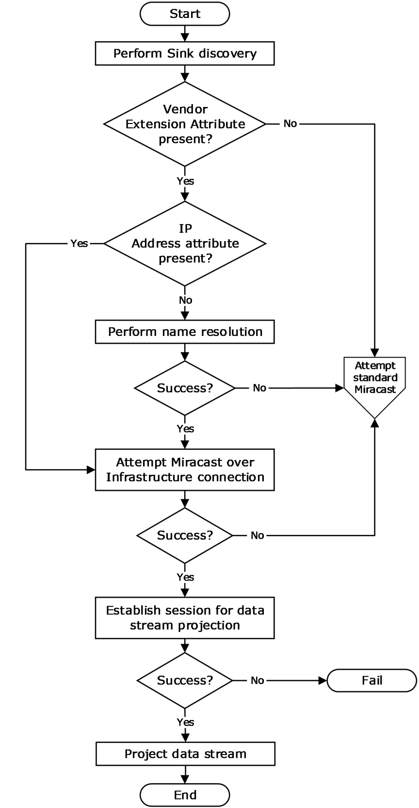
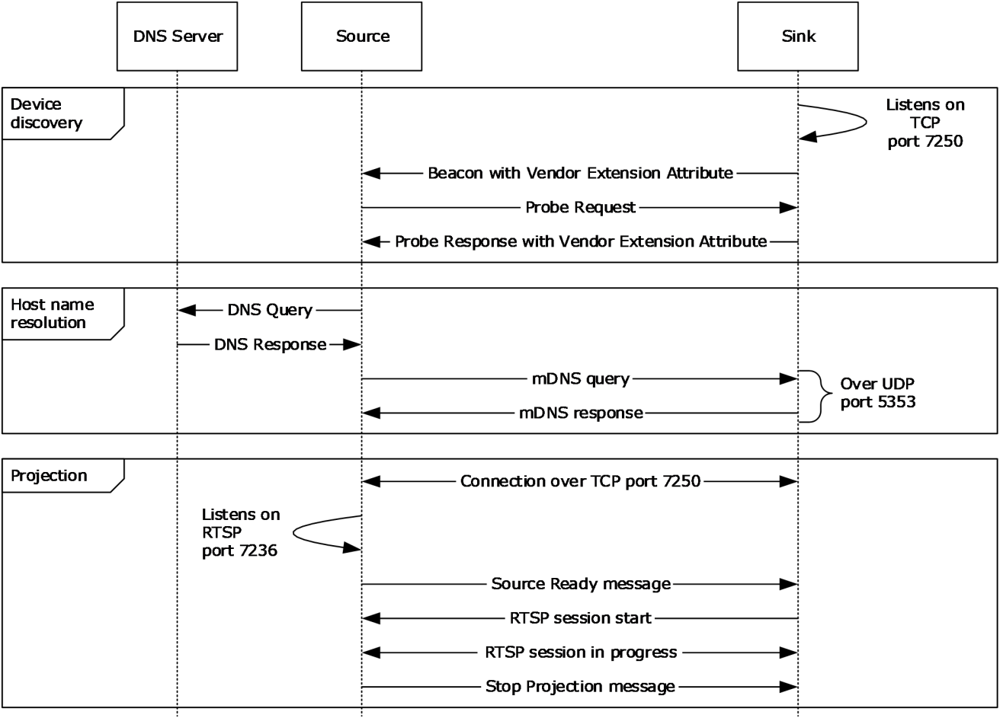
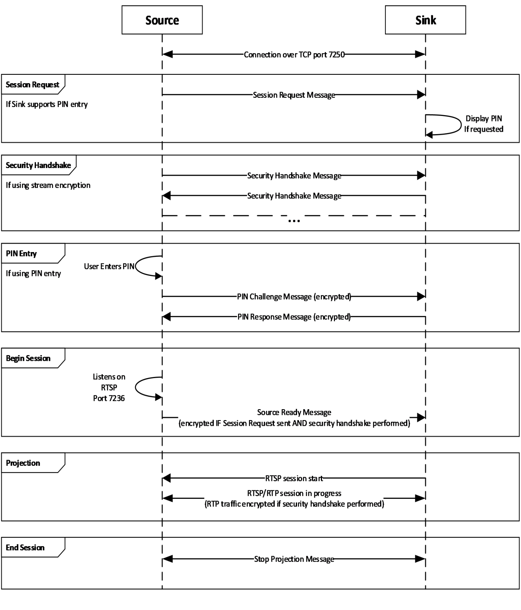
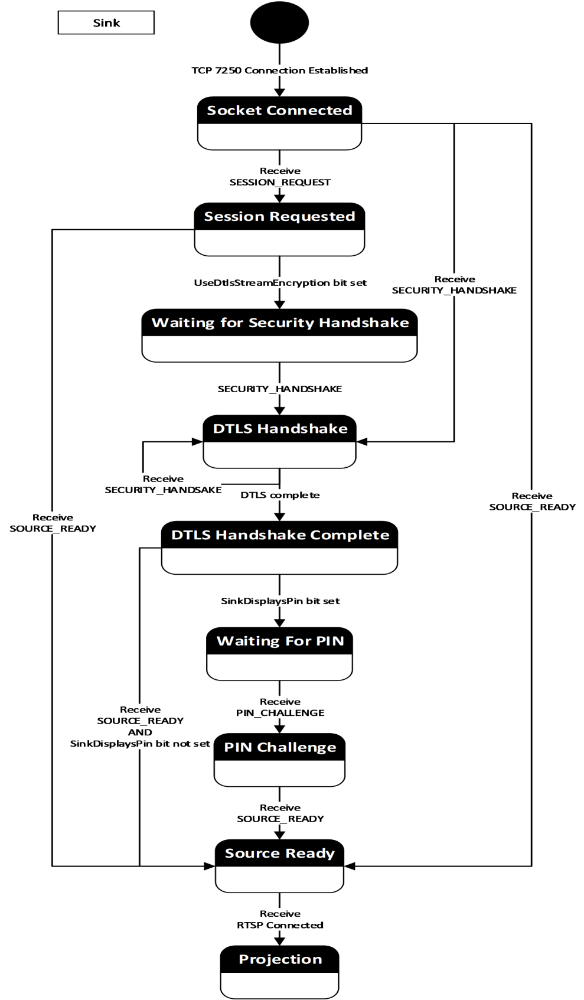
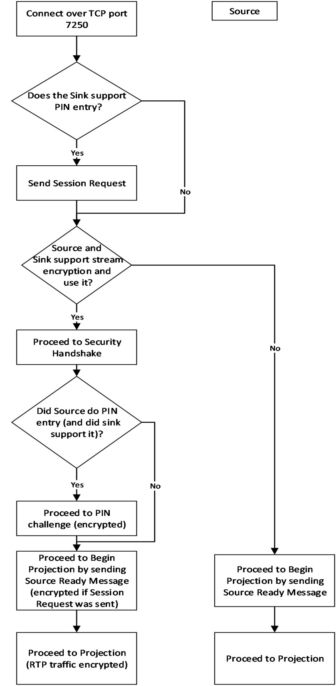

[MS-MICE]:

Miracast over Infrastructure Connection Establishment
Protocol

Intellectual Property Rights Notice for Open Specifications Documentation

  Technical Documentation. Microsoft publishes Open Specifications documentation (“this

documentation”) for protocols, file formats, data portability, computer languages, and standards
support. Additionally, overview documents cover inter-protocol relationships and interactions.

  Copyrights. This documentation is covered by Microsoft copyrights. Regardless of any other

terms that are contained in the terms of use for the Microsoft website that hosts this
documentation, you can make copies of it in order to develop implementations of the technologies
that are described in this documentation and can distribute portions of it in your implementations
that use these technologies or in your documentation as necessary to properly document the
implementation. You can also distribute in your implementation, with or without modification, any
schemas, IDLs, or code samples that are included in the documentation. This permission also
applies to any documents that are referenced in the Open Specifications documentation.
  No Trade Secrets. Microsoft does not claim any trade secret rights in this documentation.
  Patents. Microsoft has patents that might cover your implementations of the technologies

described in the Open Specifications documentation. Neither this notice nor Microsoft's delivery of
this documentation grants any licenses under those patents or any other Microsoft patents.
However, a given Open Specifications document might be covered by the Microsoft Open
Specifications Promise or the Microsoft Community Promise. If you would prefer a written license,
or if the technologies described in this documentation are not covered by the Open Specifications
Promise or Community Promise, as applicable, patent licenses are available by contacting
iplg@microsoft.com.

  License Programs. To see all of the protocols in scope under a specific license program and the

associated patents, visit the Patent Map.

  Trademarks. The names of companies and products contained in this documentation might be
covered by trademarks or similar intellectual property rights. This notice does not grant any
licenses under those rights. For a list of Microsoft trademarks, visit
www.microsoft.com/trademarks.

  Fictitious Names. The example companies, organizations, products, domain names, email

addresses, logos, people, places, and events that are depicted in this documentation are fictitious.
No association with any real company, organization, product, domain name, email address, logo,
person, place, or event is intended or should be inferred.

Reservation of Rights. All other rights are reserved, and this notice does not grant any rights other
than as specifically described above, whether by implication, estoppel, or otherwise.

Tools. The Open Specifications documentation does not require the use of Microsoft programming
tools or programming environments in order for you to develop an implementation. If you have access
to Microsoft programming tools and environments, you are free to take advantage of them. Certain
Open Specifications documents are intended for use in conjunction with publicly available standards
specifications and network programming art and, as such, assume that the reader either is familiar
with the aforementioned material or has immediate access to it.

Support. For questions and support, please contact dochelp@microsoft.com.

[MS-MICE] - v20240423
Miracast over Infrastructure Connection Establishment Protocol
Copyright © 2024 Microsoft Corporation
Release: April 23, 2024

1 / 48

Revision Summary

Date

Revision
History

Revision
Class

Comments

3/16/2017  1.0

6/1/2017

1.1

3/16/2018  2.0

9/12/2018  3.0

5/30/2019  3.0

4/7/2021

4.0

6/25/2021  5.0

4/23/2024  6.0

New

Minor

Major

Major

None

Major

Major

Major

Released new document.

Clarified the meaning of the technical content.

Significantly changed the technical content.

Significantly changed the technical content.

No changes to the meaning, language, or formatting of the
technical content.

Significantly changed the technical content.

Significantly changed the technical content.

Significantly changed the technical content.

[MS-MICE] - v20240423
Miracast over Infrastructure Connection Establishment Protocol
Copyright © 2024 Microsoft Corporation
Release: April 23, 2024

2 / 48

Table of Contents

1.1
1.2

1.2.1
1.2.2

1  Introduction ............................................................................................................ 5
Glossary ........................................................................................................... 5
References ........................................................................................................ 7
Normative References ................................................................................... 7
Informative References ................................................................................. 8
Overview .......................................................................................................... 8
Relationship to Other Protocols .......................................................................... 10
Prerequisites/Preconditions ............................................................................... 10
Applicability Statement ..................................................................................... 10
Versioning and Capability Negotiation ................................................................. 11
Vendor-Extensible Fields ................................................................................... 11
Standards Assignments ..................................................................................... 11

1.3
1.4
1.5
1.6
1.7
1.8
1.9

2.1
2.2

2.2.1
2.2.2
2.2.3
2.2.4
2.2.5
2.2.6
2.2.7

2  Messages ............................................................................................................... 12
Transport ........................................................................................................ 12
Message Syntax ............................................................................................... 12
Source Ready Message ................................................................................ 13
Stop Projection Message .............................................................................. 13
Security Handshake Message ....................................................................... 14
Session Request Message ............................................................................ 14
PIN Challenge Message ............................................................................... 15
PIN Response Message ................................................................................ 15
Miracast TLVs ............................................................................................. 16
Friendly Name TLV ................................................................................ 17
RTSP Port TLV ...................................................................................... 17
Source ID TLV ...................................................................................... 17
Security Token TLV ............................................................................... 18
Security Options TLV ............................................................................. 18
PIN Challenge TLV ................................................................................. 19
PIN Response Reason TLV ...................................................................... 19
Vendor Extension Attribute .......................................................................... 20
Capability Attribute ............................................................................... 20
Host Name Attribute .............................................................................. 21
BSSID Attribute .................................................................................... 21
Connection Preference Attribute .............................................................. 22
IP Address Attribute .............................................................................. 22

2.2.7.1
2.2.7.2
2.2.7.3
2.2.7.4
2.2.7.5
2.2.7.6
2.2.7.7

2.2.8.1
2.2.8.2
2.2.8.3
2.2.8.4
2.2.8.5

2.2.8

3.1

3.1.1
3.1.2
3.1.3
3.1.4
3.1.5

3  Protocol Details ..................................................................................................... 24
Miracast Sink Details ........................................................................................ 27
Abstract Data Model .................................................................................... 27
Timers ...................................................................................................... 30
Initialization ............................................................................................... 30
Higher-Layer Triggered Events ..................................................................... 30
Message Processing Events and Sequencing Rules .......................................... 30
Receive Probe Request .......................................................................... 30
Receive Connection Request ................................................................... 31
Receive Source Ready Message .............................................................. 31
Receive Session Request Message ........................................................... 31
Receive Security Handshake Message ...................................................... 31
Receive PIN Challenge Message .............................................................. 32
Computing the PIN .......................................................................... 32
Receive Stop Projection Message ............................................................ 33
Receive Unexpected Message on TCP Port 7250 ........................................ 33
Timer Events .............................................................................................. 33
Other Local Events ...................................................................................... 33

3.1.5.1
3.1.5.2
3.1.5.3
3.1.5.4
3.1.5.5
3.1.5.6

3.1.5.7
3.1.5.8

3.1.6
3.1.7

3.1.5.6.1

[MS-MICE] - v20240423
Miracast over Infrastructure Connection Establishment Protocol
Copyright © 2024 Microsoft Corporation
Release: April 23, 2024

3 / 48

3.2

3.2.1
3.2.2
3.2.3
3.2.4

3.2.5

3.1.7.1
3.1.7.2

RTSP Connection is successfully established ............................................. 33
RTSP Connection fails ............................................................................ 33
Miracast Source Details ..................................................................................... 33
Abstract Data Model .................................................................................... 33
Timers ...................................................................................................... 36
Initialization ............................................................................................... 36
Higher-Layer Triggered Events ..................................................................... 36
Discovery ............................................................................................. 36
PIN Entry ............................................................................................. 36
Disconnect Request ............................................................................... 36
Message Processing Events and Sequencing Rules .......................................... 36
Receive Beacon with Vendor Extension Attribute ....................................... 36
Receive Probe Response with Vendor Extension Attribute ........................... 37
Host Name Resolution Complete ............................................................. 37
Miracast Connection Complete ................................................................ 37
Receive Security Handshake Message ...................................................... 38
Receive PIN Response Message .............................................................. 38
RTSP Connection Accepted ..................................................................... 39
Receive Unexpected Message on TCP Port 7250 ........................................ 39
Timer Events .............................................................................................. 39
Other Local Events ...................................................................................... 39
Connection Establishment Failure ............................................................ 39

3.2.4.1
3.2.4.2
3.2.4.3

3.2.5.1
3.2.5.2
3.2.5.3
3.2.5.4
3.2.5.5
3.2.5.6
3.2.5.7
3.2.5.8

3.2.7.1

3.2.6
3.2.7

4  Protocol Examples ................................................................................................. 40
Vendor Extension Attribute Example ................................................................... 40
Source Ready Message Example ........................................................................ 40
Stop Projection Message Example ...................................................................... 40
Security Handshake Message Example ................................................................ 41
Session Request Message Example ..................................................................... 41
PIN Challenge Message Example ........................................................................ 41
PIN Response Message Example ........................................................................ 41

4.1
4.2
4.3
4.4
4.5
4.6
4.7

5  Security Considerations ......................................................................................... 43

6  Appendix A: Product Behavior ............................................................................... 44

7  Change Tracking .................................................................................................... 46

8  Index ..................................................................................................................... 47

[MS-MICE] - v20240423
Miracast over Infrastructure Connection Establishment Protocol
Copyright © 2024 Microsoft Corporation
Release: April 23, 2024

4 / 48

1  Introduction

The Miracast over Infrastructure Connection Establishment Protocol specifies a connection negotiation
sequence that is used to connect and disconnect from a Miracast over Infrastructure device.

This protocol uses a Wi-Fi Simple Configuration (WSC) information element (IE) Vendor Extension
attribute to advertise a receiver (Sink) that can support Miracast over infrastructure sessions.

Sections 1.5, 1.8, 1.9, 2, and 3 of this specification are normative. All other sections and examples in
this specification are informative.

1.1  Glossary

This document uses the following terms:

802.11 Access Point (AP): Any entity that has IEEE 802.11 functionality and provides access to

the distribution services, via the wireless medium for associated stations (STAs).

ASCII: The American Standard Code for Information Interchange (ASCII) is an 8-bit character-
encoding scheme based on the English alphabet. ASCII codes represent text in computers,
communications equipment, and other devices that work with text. ASCII refers to a single 8-bit
ASCII character or an array of 8-bit ASCII characters with the high bit of each character set to
zero.

basic service set identifier (BSSID): A 48-bit structure that is used to identify an entity such as

the access point in a wireless network. This is typically a MAC address.

Beacon: A management frame that contains all of the information required to connect to a

network. In a WLAN, Beacon frames are periodically transmitted to announce the presence of
the network.

big-endian: Multiple-byte values that are byte-ordered with the most significant byte stored in the

memory location with the lowest address.

Domain Name System (DNS): A hierarchical, distributed database that contains mappings of
domain names to various types of data, such as IP addresses. DNS enables the location of
computers and services by user-friendly names, and it also enables the discovery of other
information stored in the database.

friendly name: A name for a user or object that can be read and understood easily by a human.

globally unique identifier (GUID): A term used interchangeably with universally unique

identifier (UUID) in Microsoft protocol technical documents (TDs). Interchanging the usage of
these terms does not imply or require a specific algorithm or mechanism to generate the value.
Specifically, the use of this term does not imply or require that the algorithms described in
[RFC4122] or [C706] have to be used for generating the GUID. See also universally unique
identifier (UUID).

information element (IE): In a Wi-Fi Protected Setup (WPS) scenario, descriptive information
consisting of informative type-length-values that specify the possible and currently deployed
configuration methods for a device. The IE is transferred and added to the Beacon and Probe
Response frames, and optionally to the Probe Request frame and associated request and
response messages.

Internet Protocol version 4 (IPv4): An Internet protocol that has 32-bit source and destination

addresses. IPv4 is the predecessor of IPv6.

[MS-MICE] - v20240423
Miracast over Infrastructure Connection Establishment Protocol
Copyright © 2024 Microsoft Corporation
Release: April 23, 2024

5 / 48

Internet Protocol version 6 (IPv6): A revised version of the Internet Protocol (IP) designed to
address growth on the Internet. Improvements include a 128-bit IP address size, expanded
routing capabilities, and support for authentication and privacy.

organizationally unique identifier (OUI): A unique 24-bit string that uniquely identifies a

vendor, manufacturer, or organization on a worldwide l basis, as specified in [IEEE-OUI]. The
OUI is used to help distinguish both physical devices and software, such as a network protocol,
that belong to one entity from those that belong to another.

peer to peer (P2P): An Internet-based networking option in which two or more computers

connect directly to each other to communicate and share files without use of a central server.

Probe Request: A frame that contains the advertisement IE for a device that is seeking to

establish a connection with a proximate device. The Probe Request frame is defined in the Wi-Fi
Peer-to-Peer (P2P) Specification v1.2 [WF-P2P1.2] section 4.2.2.

Probe Response: A frame that contains the advertisement IE for a device. The Probe Response is

sent in response to a Probe Request. The Probe Response frame is defined in the Wi-Fi Peer-to-
Peer (P2P) Specification v1.2 [WF-P2P1.2] section 4.2.3.

Real-Time Streaming Protocol (RTSP): A protocol used for transferring real-time multimedia

data (for example, audio and video) between a server and a client, as specified in [RFC2326]. It
is a streaming protocol; this means that RTSP attempts to facilitate scenarios in which the
multimedia data is being simultaneously transferred and rendered (that is, video is displayed
and audio is played).

Stock Keeping Unit (SKU): A unique identifier for a distinct product or service that is used as a
source of revenue. For example, a SKU can represent a retail product such as software that is
sold through a channel, a subscription program, or an online service such as MSDN.

subnet: A logical division of a network. Subnets provide a multilevel hierarchical routing structure
for the Internet. On TCP/IP networks, subnets are defined as all devices whose IP addresses
have the same prefix. Subnets are useful for both security and performance reasons. In general,
broadcast messages are scoped to within a single subnet. For more information about subnets,
see [RFC1812].

Transmission Control Protocol (TCP): A protocol used with the Internet Protocol (IP) to send
data in the form of message units between computers over the Internet. TCP handles keeping
track of the individual units of data (called packets) that a message is divided into for efficient
routing through the Internet.

type-length-value (TLV): A property of a network interface, so named because each property is

composed of a Type field, a Length field, and a value.

UTF-16: A standard for encoding Unicode characters, defined in the Unicode standard, in which the

most commonly used characters are defined as double-byte characters. Unless specified
otherwise, this term refers to the UTF-16 encoding form specified in [UNICODE5.0.0/2007]
section 3.9.

virtual private network (VPN): A network that provides secure access to a private network over

public infrastructure.

Wi-Fi Direct (WFD): A standard that allows Wi-Fi devices to connect to each other without

requiring a wireless access point (WAP). This standard enables WFD devices to transfer data
directly among each other resulting in significant reductions in setup.

Wi-Fi Protected Setup (WPS): A computing standard that attempts to allow easy establishment
of a secure wireless home network. This standard was formerly known as Wi-Fi Simple Config.

wireless access point (WAP): A wireless network access server (NAS) that implements 802.11.

6 / 48

[MS-MICE] - v20240423
Miracast over Infrastructure Connection Establishment Protocol
Copyright © 2024 Microsoft Corporation
Release: April 23, 2024

MAY, SHOULD, MUST, SHOULD NOT, MUST NOT: These terms (in all caps) are used as defined
in [RFC2119]. All statements of optional behavior use either MAY, SHOULD, or SHOULD NOT.

1.2  References

Links to a document in the Microsoft Open Specifications library point to the correct section in the
most recently published version of the referenced document. However, because individual documents
in the library are not updated at the same time, the section numbers in the documents may not
match. You can confirm the correct section numbering by checking the Errata.

1.2.1  Normative References

We conduct frequent surveys of the normative references to assure their continued availability. If you
have any issue with finding a normative reference, please contact dochelp@microsoft.com. We will
assist you in finding the relevant information.

[IANA-DNS] IANA, "Domain Name System (DNS) Parameters", April 2009,
http://www.iana.org/assignments/dns-parameters

[IANAPORT] IANA, "Service Name and Transport Protocol Port Number Registry",
https://www.iana.org/assignments/service-names-port-numbers/service-names-port-numbers.xhtml

[IEEE802.11-2012] IEEE, "Telecommunications and information exchange between systems Local and
metropolitan area networks--Specific requirements Part 11: Wireless LAN Medium Access Control
(MAC) and Physical Layer (PHY) Specifications", IEEE 802.11-2012,
https://standards.ieee.org/ieee/802.11/4523/

Note There is a charge to download this document.

[NIST.FIPS.180-4] National Institute of Standards and Technology, "Secure Hash Standard (SHS)",
August 2015, https://nvlpubs.nist.gov/nistpubs/FIPS/NIST.FIPS.180-4.pdf

[RFC1034] Mockapetris, P., "Domain Names - Concepts and Facilities", STD 13, RFC 1034, November
1987, https://www.rfc-edit.org/info/rfc1034

[RFC1123] Braden, R., "Requirements for Internet Hosts - Application and Support", RFC 1123,
October 1989, https://www.rfc-editor.org/info/rfc1123

[RFC2119] Bradner, S., "Key words for use in RFCs to Indicate Requirement Levels", BCP 14, RFC
2119, March 1997, https://www.rfc-editor.org/info/rfc2119

[RFC2181] Elz, R., and Bush, R., "Clarifications to the DNS Specification", RFC 2181, July 1997,
https://www.rfc-editor.org/info/rfc2181

[RFC2326] Schulzrinne, H., Rao, A., and Lanphier, R., "Real Time Streaming Protocol (RTSP)", RFC
2326, April 1998, https://www.rfc-editor.org/info/rfc2326

[RFC4291] Hinden, R. and Deering, S., "IP Version 6 Addressing Architecture", RFC 4291, February
2006, https://www.rfc-editor.org/info/rfc4291

[RFC6347] Rescorla, E., and Modadugu, N., "Datagram Transport Layer Security Version 1.2", RFC
6347, January 2012, https://www.rfc-editor.org/info/rfc6347

[RFC6762] Krochmal, M. and Cheshire, S., "Multicast DNS", https://www.rfc-editor.org/info/rfc6762

[RFC6763] Cheshire, S. and Krochmal, M., "DNS-Based Service Discovery", RFC 6763, February 2013,
https://www.rfc-editor.org/info/rfc6763

[MS-MICE] - v20240423
Miracast over Infrastructure Connection Establishment Protocol
Copyright © 2024 Microsoft Corporation
Release: April 23, 2024

7 / 48

[RFC793] Postel, J., Ed., "Transmission Control Protocol: DARPA Internet Program Protocol
Specification", RFC 793, September 1981, https://www.rfc-editor.org/info/rfc793

[WF-DTS1.1] Wi-Fi Alliance, "Wi-Fi Display Technical Specification v1.1", April 2014, https://www.wi-
fi.org/downloads-registered-guest/Wi-Fi_Display_Specification_v1.1.zip/29558

Note There is a charge to download the specification.

[WF-P2P1.2] Wi-Fi Alliance, "Wi-Fi Peer-to-Peer (P2P) Technical Specification v1.2", https://www.wi-
fi.org/wi-fi-peer-to-peer-p2p-technical-specification-v12

Note There is a charge to download the specification.

[WF-WSC2.0.2] Wi-Fi Alliance, "Wi-Fi Simple Configuration Technical Specification v2.0.2", August
2011, https://www.wi-fi.org/wi-fi-simple-configuration-technical-specification-v202

Note There is a charge to download the specification.

1.2.2  Informative References

[IEEE-OUI] IEEE Standards Association, "IEEE MAC Address Block Large (MA-L) Field Registration
Authority Public Listing", http://standards-oui.ieee.org/oui/oui.txt

[WF-DTS2.1] Wi-Fi Alliance, "Wi-Fi Display Technical Specification Version 2.1", July 2017,
https://www.wi-fi.org/file/wi-fi-display-technical-specification-v21

Note Registration is required to download the document.

1.3  Overview

The Miracast over Infrastructure protocol provides the ability to transmit a multimedia data stream
over a local wireless network instead of Wi-Fi Direct (WFD). The process of such transmission is
called "projection".

A Miracast over Infrastructure session involves the following principals.

Miracast Source: A device that sends audio and video streams to the Miracast Sink. This device is
sometimes called a "sender". Optionally, this device can also receive input signals from the Miracast
Sink.

Miracast Sink: A device that receives audio and video streams from the Miracast Source. This device
is sometimes called a "receiver". Optionally, this device can also send input signals back to the
Miracast Source.

The following diagram illustrates the logical flow of establishing a Miracast over Infrastructure session,
including successful and unsuccessful outcomes. For further details, see Protocol Details (section 3).

[MS-MICE] - v20240423
Miracast over Infrastructure Connection Establishment Protocol
Copyright © 2024 Microsoft Corporation
Release: April 23, 2024

8 / 48

<!-- Extracted images from page 9 -->

<!-- /Extracted images from page 9 -->

Figure 1: A Miracast over Infrastructure session

[MS-MICE] - v20240423
Miracast over Infrastructure Connection Establishment Protocol
Copyright © 2024 Microsoft Corporation
Release: April 23, 2024

9 / 48

A Miracast over Infrastructure session consists of three phases: device discovery, host name
resolution, and projection.

The device discovery phase starts with a Miracast Source trying to find devices capable of performing
the role of Miracast Sink. Each Sink advertises its capabilities by transmitting Beacon and Probe
Response frames that might include WSC IE Vendor Extension attributes (section 2.2.8).

A Sink is selected from those discovered; for example, by asking a user to pick one. If the Vendor
Extension attribute from the selected Sink does not indicate support for Miracast over Infrastructure,
the Source falls back to using standard Miracast [WF-WSC2.0.2].

If the Vendor Extension attribute contains one or more IP Address attributes (section 2.2.8.5), the
Source optionally skips the host name resolution phase and proceeds to the projection phase.

In the host name resolution phase, name resolution is performed on the name in a Host Name
attribute (section 2.2.8.2) in the Vendor Extension attribute. If name resolution is unsuccessful, the
Source again falls back to using standard Miracast.

In the projection phase, the Source attempts a connection to the Sink for sending Miracast over
Infrastructure messages (section 2.2). Finally, the Sink establishes a connection with the Source for
streaming multimedia data. If that connection cannot be established, the entire process fails.

1.4  Relationship to Other Protocols

The Miracast over Infrastructure protocol builds upon the following standard technologies.

  Datagram Transport Layer Security (DTLS) [RFC6347]

  Domain Name System (DNS) [IANA-DNS] [RFC1034] [RFC2181]

  Multicast DNS (mDNS) [RFC6762]

  Real-Time Streaming Protocol (RTSP) [RFC2326]

  Transmission Control Protocol (TCP) [RFC793]

  Wi-Fi Display Protocol [WF-DTS1.1]

  Wi-Fi Peer-to-Peer (P2P) Protocol [WF-P2P1.2]

  Wi-Fi Simple Configuration (WSC) Protocol [WF-WSC2.0.2]

1.5  Prerequisites/Preconditions

Miracast over Infrastructure has the following prerequisites and preconditions.





The Miracast Source and Miracast Sink endpoints are on the same logical IP network, so they
can establish a local network connection.

Either the Sink is on the same logical IP subnet as the Source, or the Sink's name is
registered in a DNS server that the Source can resolve to.

1.6  Applicability Statement

Miracast over Infrastructure is applicable to streaming audio and video content from one device to
another, such as PC to large-screen TV, PC to PC, phone to PC, and so on.

The protocol functions in a configuration in which Miracast Source and Miracast Sink devices share a
common logical IP network and determine they can project content across that network.

[MS-MICE] - v20240423
Miracast over Infrastructure Connection Establishment Protocol
Copyright © 2024 Microsoft Corporation
Release: April 23, 2024

10 / 48

1.7  Versioning and Capability Negotiation

Versioning and capability negotiation are performed by using Vendor Extension attributes (section
2.2.8). The Sink advertises its capabilities and the highest version it supports, and the Source can
choose any version and capabilities that are supported by both the Source and the Sink.

1.8  Vendor-Extensible Fields

None.

1.9  Standards Assignments

The Miracast over Infrastructure protocol uses the following standard port assignments.

 Parameter

 Value

 Reference

TCP port

7250

[IANAPORT]

[MS-MICE] - v20240423
Miracast over Infrastructure Connection Establishment Protocol
Copyright © 2024 Microsoft Corporation
Release: April 23, 2024

11 / 48

2  Messages

2.1  Transport

Miracast over Infrastructure messages (section 2.2) are sent over TCP port 7250 to manage the
multimedia stream.

2.2  Message Syntax

In the structures defined in this section, multi-byte field values are ordered in big-endian format,
unless specified otherwise, and string values do not include NUL terminators.

This section defines the messages used for starting and stopping Miracast over Infrastructure
sessions. This is the general format for Miracast messages.

0  1  2  3  4  5  6  7  8  9

1
0  1  2  3  4  5  6  7  8  9

2
0  1  2  3  4  5  6  7  8  9

3
0  1

Size

Version

Command

TLVArray (variable)

...

...

Size (2 bytes): The size of the message, in bytes.

Version (1 byte): The version of this protocol, which is 0x01.

Command (1 byte): The type of message, which determines the TLVs passed in the TLVArray field.

The following messages are defined in the sections listed.

Message type

Section

Description

SOURCE_READY

2.2.1

0x01

Indicates the Miracast Source is ready to accept a connection
on the RTSP port.

STOP_PROJECTION

2.2.2

Indicates the end of the projection.

0x02

SECURITY_HANDSHAKE

2.2.3

0x03

Used to exchange DTLS handshake messages to initiate a
connection with encryption of the multimedia stream.

SESSION_REQUEST

2.2.4

0x04

Indicates the Miracast Source intends to connect to the Sink
using the specified options.

PIN_CHALLENGE

2.2.5

0x05

Sent by the Miracast Source to initiate the session using the
PIN displayed by the Miracast Sink.

PIN_RESPONSE

2.2.6

0x06

Sent by the Miracast Sink in response to a PIN_CHALLENGE
received from the Miracast Source.

TLVArray (variable): An array of one or more Miracast TLVs (section 2.2.7), which specify

information for the message.

12 / 48

[MS-MICE] - v20240423
Miracast over Infrastructure Connection Establishment Protocol
Copyright © 2024 Microsoft Corporation
Release: April 23, 2024

2.2.1  Source Ready Message

The Source Ready message is sent by the Miracast Source to the Miracast Sink when the Source has
started listening on the RTSP port and is ready to accept an incoming connection on it.

0  1  2  3  4  5  6  7  8  9

1
0  1  2  3  4  5  6  7  8  9

2
0  1  2  3  4  5  6  7  8  9

3
0  1

Size

Version

Command

TLVArray (variable)

...

...

Size (2 bytes): The size of the entire message, in bytes.

Version (1 byte): The version of this protocol, which is 0x01.

Command (1 byte): The type of message, which is 0x01 for SOURCE_READY.

TLVArray (variable): The following TLVs, included in any order:



Friendly Name TLV (section 2.2.7.1) (Not present if the Session Request message (section 2.2.4)
was sent)

  RTSP Port TLV (section 2.2.7.2)

  Source ID TLV (section 2.2.7.3)

2.2.2  Stop Projection Message

The Stop Projection message is sent by the Miracast Source to notify the Miracast Sink that the
projection is being stopped.

0  1  2  3  4  5  6  7  8  9

1
0  1  2  3  4  5  6  7  8  9

2
0  1  2  3  4  5  6  7  8  9

3
0  1

Size

Version

Command

TLVArray (variable)

...

...

Size (2 bytes): The size of the entire message, in bytes.

Version (1 byte): The version of this protocol, which is 0x01.

Command (1 byte): The type of message, which is 0x02 for STOP_PROJECTION.

TLVArray (variable): The following TLVs, included in any order:



Friendly Name TLV (section 2.2.7.1)

[MS-MICE] - v20240423
Miracast over Infrastructure Connection Establishment Protocol
Copyright © 2024 Microsoft Corporation
Release: April 23, 2024

13 / 48

  Source ID TLV (section 2.2.7.3)

2.2.3  Security Handshake Message

The Security Handshake message is sent by Miracast Sources and Miracast Sinks to carry a DTLS
handshake message payload.

0  1  2  3  4  5  6  7  8  9

1
0  1  2  3  4  5  6  7  8  9

2
0  1  2  3  4  5  6  7  8  9

3
0  1

Size

Version

Command

TLVArray (variable)

...

...

Size (2 bytes): The size of the entire message, in bytes.

Version (1 byte): The version of this protocol, which is 0x01.

Command (1 byte): The type of message, which is 0x03 for SECURITY_HANDSHAKE.

TLVArray (variable): The following TLVs, included in any order:

  Security Token TLV (section 2.2.7.4)

  Source ID TLV (section 2.2.7.3) (optional)

2.2.4  Session Request Message

The Session Request message is sent by a Miracast Source to a Miracast Sink when the Source
determines that the Sink supports PIN entry and the Source chooses to initiate the connection using
this protocol. This message tells the Sink whether the Source intends to use stream encryption and/or
PIN display/entry. It MUST be the first message sent by the Source.

0  1  2  3  4  5  6  7  8  9

1
0  1  2  3  4  5  6  7  8  9

2
0  1  2  3  4  5  6  7  8  9

3
0  1

Size

Version

Command

TLVArray (variable)

...

...

Size (2 bytes): The size of the entire message, in bytes.

Version (1 byte): The version of this protocol, which is 0x01.

Command (1 byte): The type of message, which is 0x04 for SESSION_REQUEST.

TLVArray (variable): The following TLVs, included in any order:

[MS-MICE] - v20240423
Miracast over Infrastructure Connection Establishment Protocol
Copyright © 2024 Microsoft Corporation
Release: April 23, 2024

14 / 48



Friendly Name TLV (section 2.2.7.1)

  Source ID TLV (section 2.2.7.3)

  Security Options TLV (section 2.2.7.5)

2.2.5  PIN Challenge Message

The PIN Challenge message is sent by a Miracast Source to a Miracast Sink when using PIN entry to
initiate the connection. This message is sent after the DTLS handshake has completed and the user
has supplied the PIN.

0  1  2  3  4  5  6  7  8  9

1
0  1  2  3  4  5  6  7  8  9

2
0  1  2  3  4  5  6  7  8  9

3
0  1

Size

Version

Command

TLVArray (variable)

...

...

Size (2 bytes): The size of the entire message, in bytes.

Version (1 byte): The version of this protocol, which is 0x01.

Command (1 byte): The type of message, which is 0x05 for PIN_CHALLENGE.

TLVArray (variable): The following TLVs, included in any order:

  Source ID TLV (section 2.2.7.3)



PIN Challenge TLV (section 2.2.7.6)

2.2.6  PIN Response Message

The PIN Response message is sent by a Miracast Sink to a Miracast Source in response to a PIN
Challenge message. This message indicates to the Source whether the PIN in the challenge message
matched the displayed PIN.

0  1  2  3  4  5  6  7  8  9

1
0  1  2  3  4  5  6  7  8  9

2
0  1  2  3  4  5  6  7  8  9

3
0  1

Size

Version

Command

TLVArray (variable)

...

...

Size (2 bytes): The size of the entire message, in bytes.

Version (1 byte): The version of this protocol, which is 0x01.

[MS-MICE] - v20240423
Miracast over Infrastructure Connection Establishment Protocol
Copyright © 2024 Microsoft Corporation
Release: April 23, 2024

15 / 48

Command (1 byte): The type of message, which is 0x06 for PIN_RESPONSE.

TLVArray (variable): The following TLVs, included in any order:

  Source ID TLV (section 2.2.7.3)





PIN Challenge TLV (section 2.2.7.6)

PIN Response Reason TLV (section 2.2.7.7)

2.2.7  Miracast TLVs

This section defines common type-length-value (TLV) structures that are used to pass information
in messages during a Miracast session. This is the general format for the TLVs:

0  1  2  3  4  5  6  7  8  9

1
0  1  2  3  4  5  6  7  8  9

2
0  1  2  3  4  5  6  7  8  9

3
0  1

Type

Length

Value (variable)

...

...

Type (1 byte): The type of TLV, which determines the information passed in the Value field. The

following TLVs are defined in the sections listed.

TLV type

Section  Description

FRIENDLY_NAME

2.2.7.1

Specifies the friendly name of the Miracast Source.

0x00

RTSP_PORT

0x02

SOURCE_ID

0x03

2.2.7.2

Specifies the port on which the Source is listening for
RTSP connections.

2.2.7.3

Specifies an identifier for the Source, which is used for all
messages sent during a Miracast session.

SECURITY_TOKEN

2.2.7.4

Contains a DTLS handshake message.

0x04

SECURITY_OPTIONS

2.2.7.5

0x05

Specifies whether stream encryption and/or PIN entry will
be used for the session.

PIN_CHALLENGE

2.2.7.6

0x06

Contains a salted hash of the PIN when PIN entry is used
to establish the connection.

PIN_RESPONSE_REASON

2.2.7.7

0x07

Specifies whether the PIN Response indicates a successful
connection.

Length (2 bytes): The length of the Value field, in bytes. This value MUST be greater than or equal

to 0x0001.

Value (variable): One or more bytes, which specify information for the TLV.

[MS-MICE] - v20240423
Miracast over Infrastructure Connection Establishment Protocol
Copyright © 2024 Microsoft Corporation
Release: April 23, 2024

16 / 48

2.2.7.1  Friendly Name TLV

The Friendly Name TLV specifies the friendly name of the Miracast Source in messages to the
Miracast Sink.

0  1  2  3  4  5  6  7  8  9

1
0  1  2  3  4  5  6  7  8  9

2
0  1  2  3  4  5  6  7  8  9

3
0  1

Type

Length

Value (variable)

...

...

Type (1 byte): The type of TLV, which is 0x00 for the Friendly Name TLV.

Length (2 bytes): The length of the Value field, in bytes. The maximum length is 520 bytes.

Value (variable): The friendly name string of the Source, encoded in UTF-16.

2.2.7.2  RTSP Port TLV

The RTSP Port TLV specifies the port on which the Miracast Source is listening. The port is used in
messages for connecting sessions over RTSP.

0  1  2  3  4  5  6  7  8  9

1
0  1  2  3  4  5  6  7  8  9

2
0  1  2  3  4  5  6  7  8  9

3
0  1

Type

…

Length

Value

Type (1 byte): The type of TLV, which is 0x02 for the RTSP Port TLV.

Length (2 bytes): The length of the Value field, in bytes, which is 0x0002.

Value (2 bytes): The RTSP port on which the Source is listening (7236 by default).

2.2.7.3  Source ID TLV

The Source ID TLV specifies a unique identifier for the Miracast Source. That identifier is used in all
messages sent during a session.

0  1  2  3  4  5  6  7  8  9

1
0  1  2  3  4  5  6  7  8  9

2
0  1  2  3  4  5  6  7  8  9

3
0  1

Type

Length

Value

...

...

...

[MS-MICE] - v20240423
Miracast over Infrastructure Connection Establishment Protocol
Copyright © 2024 Microsoft Corporation
Release: April 23, 2024

17 / 48

...

Type (1 byte): The type of TLV, which is 0x03 for the Source ID TLV.

Length (2 bytes): The length of the Value field, in bytes, which is 0x0010.

Value (16 bytes): An implementation-defined value that identifies the Source.

2.2.7.4  Security Token TLV

The Security Token TLV contains DTLS handshake messages as specified in [RFC6347].

0  1  2  3  4  5  6  7  8  9

1
0  1  2  3  4  5  6  7  8  9

2
0  1  2  3  4  5  6  7  8  9

3
0  1

Type

Length

Value (variable)

...

...

Type (1 byte): The type of TLV, which is 0x04 for the Security Token TLV.

Length (2 bytes): The length of the Value field, in bytes.

Value (variable): DTLS Handshake message payload.

2.2.7.5  Security Options TLV

The Security Options TLV contains flags indicating how the connection will proceed.

0  1  2  3  4  5  6  7  8  9

1
0  1  2  3  4  5  6  7  8  9

2
0  1  2  3  4  5  6  7  8  9

3
0  1

Type

Length

Value

Type (1 byte): The type of TLV, which is 0x05 for the Security Options TLV.

Length (2 bytes): The length of the Value field, in bytes. This MUST be a minimum of 1 byte but
implementations MUST ignore additional bytes not defined in this version of the protocol.

Value (1 byte): A bit field table with security options, which has the following structure:

0  1  2  3  4  5  6  7  8  9

1
0  1  2  3  4  5  6  7  8  9

2
0  1  2  3  4  5  6  7  8  9

3
0  1

  B  A

A - UseDtlsStreamEncryption (1 bit): 0 = do not use, 1 = use.

B - SinkDisplaysPin (1 bit): 0 = PIN is not displayed by Sink, 1 = Sink displays random PIN and

Source provides this PIN after DTLS handshake. Bit A MUST be set if bit B is set.

[MS-MICE] - v20240423
Miracast over Infrastructure Connection Establishment Protocol
Copyright © 2024 Microsoft Corporation
Release: April 23, 2024

18 / 48

The remaining bits are reserved and MUST be set to 0 by the sender and ignored by the receiver.

2.2.7.6  PIN Challenge TLV

The PIN Challenge TLV contains a salted and hashed value for the session PIN. The hashing is
specified in section 3.1.5.6.1.

0  1  2  3  4  5  6  7  8  9

1
0  1  2  3  4  5  6  7  8  9

2
0  1  2  3  4  5  6  7  8  9

3
0  1

Type

Length

Value (variable)

...

...

Type (1 byte): The type of TLV, which is 0x06 for the PIN Challenge TLV.

Length (2 bytes): The length of the Value field, in bytes.

Value (variable): The hash of the salted PIN.

2.2.7.7  PIN Response Reason TLV

The PIN Response Reason TLV indicates the result of the PIN exchange.

0  1  2  3  4  5  6  7  8  9

1
0  1  2  3  4  5  6  7  8  9

2
0  1  2  3  4  5  6  7  8  9

3
0  1

Type

Length

Value

Type (1 byte): The type of TLV, which is 0x07 for the PIN Response Reason TLV.

Length (2 bytes): The length of the Value field, in bytes, which is 0x0001.

Value (1 byte): A reason code from the following options:

Value

PIN Accepted

0x00

Wrong PIN

0x01

Invalid Message

0x02

Description

The PIN in the PIN Challenge message matched the
one displayed by the Sink.

The PIN in the PIN Challenge message did not match
the one displayed by the Sink.

A PIN Challenge message was not expected.

[MS-MICE] - v20240423
Miracast over Infrastructure Connection Establishment Protocol
Copyright © 2024 Microsoft Corporation
Release: April 23, 2024

19 / 48

2.2.8  Vendor Extension Attribute

The Vendor Extension attribute is a WSC information element (IE) structure that is used by a
Miracast Sink to publish peer to peer (P2P) attribute structures defined by the Miracast over
Infrastructure protocol.

As specified in [WF-WSC2.0.2], the Vendor Extension attribute has the following general format.

0  1  2  3  4  5  6  7  8  9

1
0  1  2  3  4  5  6  7  8  9

2
0  1  2  3  4  5  6  7  8  9

3
0  1

WSCVEA

Length

OUI

P2PATTB (variable)

...

...

WSCVEA (2 bytes): The value is 0x1049 to indicate that this attribute is a WSC vendor extension.

Length (2 bytes): The length of the following fields in bytes.

OUI (3 bytes): A Wi-Fi Protected Setup (WPS) organizationally unique identifier (OUI)

[IEEE-OUI]. The value is 0x000137 for messages defined by this specification.

P2PATTB (variable): One or more of the P2P attribute structures defined in the sections that follow.

Attributes can be included in any order.

2.2.8.1  Capability Attribute

The Capability attribute indicates whether a connection over Miracast over Infrastructure is possible.
This attribute MUST be present in the Vendor Extension attribute.

0  1  2  3  4  5  6  7  8  9

1
0  1  2  3  4  5  6  7  8  9

2
0  1  2  3  4  5  6  7  8  9

3
0  1

AttributeID

Length

CapabilityInfo

AttributeID (2 bytes): The Capability attribute ID, which is 0x2001.

Length (2 bytes): The length of the CapabilityInfo field, in bytes, which is 0x0001.

CapabilityInfo (1 byte): A bit field table with capability information, which has the following

structure:

0  1  2  3  4  5  6  7  8  9

1
0  1  2  3  4  5  6  7  8  9

2
0  1  2  3  4  5  6  7  8  9

3
0  1

X  D

C

B  A

A - MiracastOverInfrastructureSupport (1 bit): 0 = not supported, 1 = supported.

B - StreamEncryptionSupported (1 bit): 0 = not supported, 1 = supported.

20 / 48

[MS-MICE] - v20240423
Miracast over Infrastructure Connection Establishment Protocol
Copyright © 2024 Microsoft Corporation
Release: April 23, 2024

C - Version (3 bits): The version of this protocol, which is 0x1.

D - PinSupported (1 bit): 0 = not supported, 1 = supported. Bit B MUST be set to 1 in order to
set this to 1, otherwise it is implicitly set to 0.

X - Reserved (2 bits): These bits MUST be set to zero and MUST be ignored on receipt.

2.2.8.2  Host Name Attribute

The Host Name attribute specifies the Miracast Sink host name. This attribute MUST be present
exactly once in the Vendor Extension attribute.

0  1  2  3  4  5  6  7  8  9

1
0  1  2  3  4  5  6  7  8  9

2
0  1  2  3  4  5  6  7  8  9

3
0  1

AttributeID

Length

HostName (variable)

...

...

AttributeID (2 bytes): The Host Name attribute ID, which is 0x2002.

Length (2 bytes): The length of the HostName field, in bytes.

HostName (variable): The Miracast Sink host name string, encoded in ASCII. The host name is not
fully qualified. A Sink having a host name that contains the period ('.') character MUST NOT be
used for Miracast over Infrastructure connections.

2.2.8.3  BSSID Attribute

The BSSID attribute specifies the basic service set identifier (BSSID) for the 802.11 Access
Point (AP) [IEEE802.11-2012] associated with the wireless network. This attribute is optional in the
Vendor Extension attribute, but it MUST NOT appear more than once.

0  1  2  3  4  5  6  7  8  9

1
0  1  2  3  4  5  6  7  8  9

2
0  1  2  3  4  5  6  7  8  9

3
0  1

AttributeID

Length

BSSID

...

AttributeID (2 bytes): The BSSID attribute ID, which is 0x2003.

Length (2 bytes): The length of the BSSID field, in bytes, which is 0x0006.

BSSID (6 bytes): The BSSID for the associated WAP.

[MS-MICE] - v20240423
Miracast over Infrastructure Connection Establishment Protocol
Copyright © 2024 Microsoft Corporation
Release: April 23, 2024

21 / 48

2.2.8.4  Connection Preference Attribute

The Connection Preference attribute indicates the preference of transports for the connection of the
Miracast Sink to the Miracast Source. The Sink MAY include a Connection Preference attribute in the
Vendor Extension attribute, but it MUST NOT appear more than once.

0  1  2  3  4  5  6  7  8  9

1
0  1  2  3  4  5  6  7  8  9

2
0  1  2  3  4  5  6  7  8  9

3
0  1

AttributeID

Length

ConnectionPreferenceList

AttributeID (2 bytes): The Connection Preference attribute ID, which is 0x2004.

Length (2 bytes): The length of the ConnectionPreferenceList field, in bytes, which is 0x0004.

ConnectionPreferenceList (4 bytes): A packed array with room for 8 connection transport IDs, in

descending order of preference. The following IDs are defined.

Transport ID

Transport

0x1

0x2

Miracast over Infrastructure

Wi-Fi Direct (WFD)

The following is an example of a preference list buffer with Miracast over Infrastructure preferred
over WFD.

0  1  2  3  4  5  6  7  8  9

1
0  1  2  3  4  5  6  7  8  9

2
0  1  2  3  4  5  6  7  8  9

3
0  1

0x1

0x2

0

0

0

0

0

0

2.2.8.5  IP Address Attribute

The IP Address attribute specifies an IP address of the Miracast Sink. This attribute can occur zero or
more times in the Vendor Extension attribute. The set of IP addresses included in the Vendor
Extension attribute SHOULD<1> be the same set as the Sink’s mDNS responder would provide to an
mDNS requester.

0  1  2  3  4  5  6  7  8  9

1
0  1  2  3  4  5  6  7  8  9

2
0  1  2  3  4  5  6  7  8  9

3
0  1

AttributeID

Length

IPAddress (variable)

...

...

AttributeID (2 bytes): The IP Address attribute ID, which is 0x2005.

22 / 48

[MS-MICE] - v20240423
Miracast over Infrastructure Connection Establishment Protocol
Copyright © 2024 Microsoft Corporation
Release: April 23, 2024

Length (2 bytes): The length of the IPAddress field, in bytes.

IPAddress (variable): An IP address string, encoded in ASCII. The supported address formats

are IPv4 in dotted decimal notation ([RFC1123] section 2.1) and IPv6 ([RFC4291] section 2.2).

[MS-MICE] - v20240423
Miracast over Infrastructure Connection Establishment Protocol
Copyright © 2024 Microsoft Corporation
Release: April 23, 2024

23 / 48

<!-- Extracted images from page 24 -->

<!-- /Extracted images from page 24 -->

3  Protocol Details

A Miracast over Infrastructure session consists of three phases: device discovery, host name
resolution, and projection, as shown in the following diagram.

Figure 2: A Miracast over Infrastructure session

Device discovery

The Miracast over Infrastructure session starts with peer to peer (P2P) device discovery ([WF-
P2P1.2] section 3.1.2), which a Miracast Source uses to find a device capable of performing the
functions of a Miracast Sink. This includes the Source sending Probe Request frames ([WF-P2P1.2]
section 4.2.2) and listening for Probe Response frames ([WF-P2P1.2] section 4.2.3) and Beacon
frames ([WF-P2P1.2] section 4.2.1).

Beacon frames are unsolicited broadcasts that advertise P2P devices. Probe Response frames are sent
by a Sink in response to Probe Request frames sent by the Source. If the Source receives a Beacon or
Probe Response that contains a WSC IE [WF-WSC2.0.2] Vendor Extension attribute (section 2.2.8),
the Source checks the Capability attribute (section 2.2.8.1) for Miracast over Infrastructure support.

If the Capability attribute specifies that Miracast over Infrastructure is not supported, the Source falls
back to standard Miracast [WF-WSC2.0.2].

If one or more IP Address attributes (section 2.2.8.5) are included, the Source can skip host name
resolution.

Host name resolution

24 / 48

[MS-MICE] - v20240423
Miracast over Infrastructure Connection Establishment Protocol
Copyright © 2024 Microsoft Corporation
Release: April 23, 2024

The host name received by the Source during device discovery specifies the unqualified host name of
the target Sink. The Source tries to resolve this host name by using DNS [IANA-DNS] [RFC1034]
[RFC2181] and/or mDNS [RFC6762].

When host name resolution is complete, the session proceeds to the Projection phase.

The Source uses a Discovery timer (section 3.2.2) to limit the time it spends on host name
resolution. If this timer reaches its timeout, the host name resolution fails, and the Source falls back
to standard Miracast.

Projection

When the Source finds a device that can perform as the Sink, the Source attempts a connection to it
over TCP port 7250, which it will use for sending Miracast over Infrastructure messages (section 2.2)
to the Sink. These messages include starting and stopping the projection, as well as negotiating
options for the stream, such as encryption and PIN entry at connection time.

This phase is further subdivided into optional sections depending on the protocol version and options
chosen by the Source and Sink device. The following diagram shows all the required and optional
steps of the projection setup phase.

[MS-MICE] - v20240423
Miracast over Infrastructure Connection Establishment Protocol
Copyright © 2024 Microsoft Corporation
Release: April 23, 2024

25 / 48

<!-- Extracted images from page 26 -->

<!-- /Extracted images from page 26 -->

Figure 3: Projection setup phase

The Sink is expected to be listening for messages on TCP port 7250. The Sink listens for Source Ready
messages (section 2.2.1). If the Sink supports stream encryption, it also listens for Security
Handshake messages (section 2.2.3). If the sink supports PIN entry, it also listens for Session Request
messages (section 2.2.4).

[MS-MICE] - v20240423
Miracast over Infrastructure Connection Establishment Protocol
Copyright © 2024 Microsoft Corporation
Release: April 23, 2024

26 / 48

The Source will either begin at the Session Request step, Security Handshake step, or Begin Session
step, depending on what it supports and what support was indicated by the sink in the Vendor Specific
attribute.

In the case of beginning at the Begin Session step, when the Source is ready to project, it listens on
Real-Time Streaming Protocol (RTSP) control port 7236 for a connection request, then it sends the
Source Ready message. In turn, the Sink connects to the specified RTSP Source port to establish the
link.

In the case of beginning at the Security Handshake step, the Source sends a Security Handshake
message (section 2.2.3) and waits for a response, listening for Security Handshake messages from the
Sink. The Source and Sink continue to exchange messages until the DTLS handshake is complete.
After this, the Source proceeds to Begin Session as defined above by listening on Real-Time Streaming
Protocol (RTSP) control port 7236 for a connection request, and sending the Source Ready message.
In turn, the Sink connects to the specified RTSP Source port to establish the link. In this case, the RTP
(video and audio) and UIBC traffic shall be encrypted using the DTLS key exchanged.

In the case beginning at the Session Request step, the Source sends a Session Request message
(section 2.2.4) and then proceeds to the Security Handshake phase. When the Sink which supports
PIN entry receives the Session Request message with the PIN entry bit in the Security Options set
(section 2.2.7.5), it displays a random PIN for the user of the Source to provide. After the Security
Handshake, if PIN entry was selected, the Source waits for user input of the displayed PIN then
proceeds to the PIN entry phase to validate the PIN with the sink. The TLVArray of the PIN Challenge
(section 2.2.5) and PIN Response (section 2.2.6) messages are encrypted using the key exchanged
during the DTLS handshake. Following the PIN exchange, if performed, the Source listens on Real-
Time Streaming Protocol (RTSP) control port 7236 for a connection request, then it sends the Source
Ready message with the TLVArray encrypted using the key exchanged during the DTLS handshake. In
turn, the Sink connects to the specified RTSP Source port to establish the link. In this case, the RTP
(video and audio) and UIBC traffic shall be encrypted using the DTLS key exchanged.

To stop the projection, the Source sends a Stop Projection message (section 2.2.2) to notify the Sink.
Upon receipt of that message, the Sink stops displaying the stream, and a disconnection follows from
the Source on the socket that is connected on port 7250. The Sink may send a Stop Projection
message to notify the Source of a graceful teardown of the session. Upon receipt of that message, the
Source stops sending RTP/RTSP frames, and a disconnection follows on the socket that is connected
on port 7250.

3.1  Miracast Sink Details

3.1.1  Abstract Data Model

 This section describes a conceptual model of possible data organization that an implementation
maintains to participate in this protocol. The described organization is provided to facilitate the
explanation of how the protocol behaves. This document does not mandate that implementations
adhere to this model, provided their external behavior is consistent with that described in this
document.

The Sink should be configured with the following global state:

  Friendly Name: A friendly name for the Sink so that it can be easily identified by the user of a

Source device.

  PIN Verification Enabled: Whether the Sink has enabled PIN verification for the incoming

connections.

  Container ID: A container ID GUID to identify the Sink.

For a given Source device, the Sink should track the following state:

[MS-MICE] - v20240423
Miracast over Infrastructure Connection Establishment Protocol
Copyright © 2024 Microsoft Corporation
Release: April 23, 2024

27 / 48

  State: The current state of the connection establishment protocol, as defined in the diagram

below. Defaults to not connected.

  Security Options: The security options TLV (section 2.2.7.5), if any, received from the Session

Request message (section 2.2.4). Defaults to none.

  DTLS Encryption Key: The key, if any, that is derived from the DTLS handshake. Defaults to

none.

  RTSP Connection: The RTSP connection, if any, to the Source. Defaults to none.

[MS-MICE] - v20240423
Miracast over Infrastructure Connection Establishment Protocol
Copyright © 2024 Microsoft Corporation
Release: April 23, 2024

28 / 48

<!-- Extracted images from page 29 -->

<!-- /Extracted images from page 29 -->

Figure 4: State diagram

[MS-MICE] - v20240423
Miracast over Infrastructure Connection Establishment Protocol
Copyright © 2024 Microsoft Corporation
Release: April 23, 2024

29 / 48

3.1.2  Timers

The Miracast Sink uses the following timers:

Session Establishment Timer: This timer is used to limit the time a Source can establish a
connection on port 7250 without making progress toward a Miracast connection. It is started upon
receiving a connection on port 7250 and is canceled upon establishing the RTSP connection. Note that
this timer MUST be set long enough to account for user interaction time if the source decides to
perform PIN entry. The value is 2 minutes when PIN entry is used and 30 seconds when PIN entry is
not used.

Security Handshake Message Timer: This timer is used to limit the time to wait for a response to a
DTLS handshake message. The timeout is 1 second.

3.1.3  Initialization

Upon initialization, the Miracast Sink MUST register the following service instance name ([RFC6763]
section 4.1) with the Sink's local mDNS implementation.

 <instance name>._display._tcp.local

The <instance name> is the friendly name of the Sink, which will be associated with both port 7250
and the following TXT key-value pair ([RFC6763] section 6).

Key: container_id

Value: A GUID that identifies the Sink.

This service instance name is also used in [WF-DTS2.1] section 4.4.1.

After registering the service instance name, the Sink MUST start listening on TCP port 7250 for an
inbound connection.

Finally, the Sink MUST begin being discoverable by Beacons and/or Probe Requests as in standard
Miracast [WF-WSC2.0.2], except that every Beacon and Probe Response the Sink sends MUST
include a Vendor Extension attribute (section 2.2.8). The values in the Capability attribute MUST be
set according to the functionality that the Sink supports. The Sink SHOULD<2> support the
StreamSecuritySupported functionality.  Sinks that support the StreamSecuritySupported
functionality SHOULD<3> also support the PinSupported functionality.

3.1.4  Higher-Layer Triggered Events

When the higher-layer application or protocol requests to disconnect the Miracast connection, the Sink
MUST send the Stop Projection message (section 2.2.2) to the Source to stop the projection of the
multimedia data stream. After sending this message, the Sink MUST close the RTSP and TCP port
7250 session.

3.1.5  Message Processing Events and Sequencing Rules

3.1.5.1  Receive Probe Request

When a Miracast Sink receives a Probe Request message, the Sink MUST send a Probe Response
message [WF-P2P1.2] and include a WSC IE [WF-WSC2.0.2] Vendor Extension attribute (section
2.2.8) with a Capability Attribute (section 2.2.8.1) that indicates support for Miracast over
Infrastructure.

[MS-MICE] - v20240423
Miracast over Infrastructure Connection Establishment Protocol
Copyright © 2024 Microsoft Corporation
Release: April 23, 2024

30 / 48

3.1.5.2  Receive Connection Request

When a Miracast Sink receives a new TCP connection attempt on port 7250, but it already has a TCP
connection established, the Sink SHOULD reject the new connection request, but it MAY close the
existing TCP connection instead and accept the new one.<4> The Sink MUST enter the Socket
Connected state (section 3.1.1) and wait for the next message. The Sink MUST begin the Session
Establishment Timer.

3.1.5.3  Receive Source Ready Message

When a Miracast Sink receives a Source Ready message (section 2.2.1) while it is in the Socket
Connected, Session Requested, DTLS Handshake Complete, or PIN Challenge state (section 3.1.1), it
MUST connect back to the Source over TCP on the RTSP port specified in the message.

3.1.5.4  Receive Session Request Message

When a Miracast Sink receives a Session Request message (section 2.2.4), it MUST parse the Security
Options TLV (section 2.2.7.5), store the Security Options (section 3.1.1), and determine the next
expected state. If the Security Options indicate UseDtlsStreamEncryption (section 2.2.7.5) and the
Sink included this bit in its capabilities, then the Sink MUST go to the Waiting for Security Handshake
state (section 3.1.1). If the Security Options also indicate SinkDisplaysPin (section 2.2.7.5) and the
Sink included this bit in its capabilities, then the Sink MUST randomly generate and display an 8 digit
numeric PIN.

3.1.5.5  Receive Security Handshake Message

When a Miracast Sink receives a Security Handshake message (section 2.2.3) and one of the following
is true, it MUST proceed to complete the DTLS handshake procedure:







The Sink is in the Socket Connected state (section 3.1.1).

The Sink is in the Waiting for Security Handshake state (section 3.1.1).

The Sink is currently in the DTLS Handshake state (section 3.1.1) and this is an additional
message.

In all other cases, the Sink MUST ignore the message and MUST tear down the connection on TCP port
7250.

The DTLS handshake procedure is performed by parsing the Security Token TLV (section 2.2.7.4) as a
message in the DTLS exchange [RFC6347]. The sink should respond with a Security Handshake
message containing the DTLS payload in the Security Token TLV as specified in [RFC6347]. Note that
each message in the DTLS exchange requires zero or more responses. Upon sending a Security
Handshake message which requires a response from the Source, the Sink MUST begin the Security
Handshake Message Timer and reset the timer upon receipt of the next message.

Upon completion of the DTLS handshake, the DTLS Encryption Key is stored for the remainder of the
session (section 3.1.1). If the Security Options have been set (section 3.1.1), indicating the Source
sent a Session Request message (section 2.2.4), then the TLVArray of all further messages MUST be
encrypted by the sender and decrypted by the receiver using the DTLS Encryption Key. If the Security
Options have the SinkDisplaysPin bit set, then the sink goes to the Waiting for PIN state (section
3.1.1).

[MS-MICE] - v20240423
Miracast over Infrastructure Connection Establishment Protocol
Copyright © 2024 Microsoft Corporation
Release: April 23, 2024

31 / 48

3.1.5.6  Receive PIN Challenge Message

When the Miracast Sink receives a PIN Challenge message (section 2.2.7.6) and it is in the Waiting for
PIN state (section 3.1.1), it MUST validate that the PIN Challenge TLV (section 2.2.7.6) contains the
correct salted hash of the PIN.

The salted hash of the PIN is derived as defined in section 3.1.5.6.1, using IP address of the Sink for
the TCP connection over 7250.

If the PIN Challenge TLV contains the correct hash value, then the Sink MUST respond with a PIN
Response message (section 2.2.6) containing its own salted hash (derived in the same way but using
the Sink IP address) in the PIN Challenge TLV and the PIN Response Reason TLV (section 2.2.7.7)
with the value 0x00.

If the PIN Challenge TLV contains a different hash value, then the Sink MUST respond with a PIN
Response message containing the PIN Response Reason 0x01 and no PIN Challenge TLV.

In all other cases, the Sink MUST respond with a PIN Response message containing the PIN Response
Reason 0x02 and MUST tear down the connection on TCP port 7250.

3.1.5.6.1 Computing the PIN

When a PIN is exchanged in the PIN Challenge (section 2.2.5) or PIN Response (section 2.2.6)
messages, it MUST be encoded and hashed using the following format.

The ASCII representation (with no NUL terminator) of the PIN is immediately concatenated with the
binary representation of the IP address of the sender. These bytes are then hashed using SHA-256
[NIST.FIPS.180-4].

For example, if the sender has IP address 192.0.2.100 and the PIN is “12345678”, then the hash is
derived as follows:

The data to hash is:

31 32 33 34 35 36 37 38

c0 00 02 64

The resulting SHA-256 hash is:

60 54 09 f8 32 30 8a d0
4c 73 72 b3 6e 90 77 50

b8 93 a7 f9 1b e4 2b 26
6e 1b 4c c1 83 de 79 da

As another example, if the sender has IP address 2001:db8:1f::4242 and the PIN is “98765432”, then
the hash is derived as follows:

The data to hash is:

39 38 37 36 35 34 33 32
00 00 00 00 00 00 42 42

20 01 0d b8 00 1f 00 00

The resulting SHA-256 hash is:

b3 45 2b 2c 46 c8 3d 28
af 3f 35 61 07 e1 d0 73

d8 d4 64 b6 69 7a 81 d1
1e a9 bb 18 38 03 f9 c7

[MS-MICE] - v20240423
Miracast over Infrastructure Connection Establishment Protocol
Copyright © 2024 Microsoft Corporation
Release: April 23, 2024

32 / 48

3.1.5.7  Receive Stop Projection Message

When a Miracast Sink receives a Stop Projection message (section 2.2.2), it MUST stop displaying the
stream.

3.1.5.8  Receive Unexpected Message on TCP Port 7250

When the Miracast Sink receives an unknown message type or a message type that is not expected
based on its current state (as defined in section 3.1.1 or in a subsection under 3.1.5), it MUST tear
down the connection on TCP port 7250.

3.1.6  Timer Events

If either of the Miracast Sink timers (section 3.1.2) reaches its timeout, the Sink MUST tear down the
connection on TCP port 7250.

3.1.7  Other Local Events

If the RTSP connection receives a teardown message as it does in standard Miracast, or if the
connection to the Source is lost, or if the TCP port 7250 connection is lost, the Sink MUST close its
session.

If any global configuration from section 3.1.1 is changed, then the new configuration MUST apply to all
future connections and the initialization step MUST be repeated. Any existing connections SHOULD be
terminated but an implementation MAY leave the sessions connected.

3.1.7.1  RTSP Connection is successfully established

When the Miracast Sink connects back to the Source over TCP on the RTSP port, the Sink MUST stop
the Session Establishment Timer.

The Sink MUST perform standard RTSP behavior. If the DTLS Encryption Key is stored (section 3.1.1)
from performing the security handshake, then the Miracast protocol is modified as follows:

  All RTP packets MUST be encrypted by the Source and decrypted by the Sink using the DTLS

Encryption Key.



The UIBC Input Body of the UIBC payload MUST be encrypted by the Sink and decrypted by the
Source using the DTLS Encryption Key.

3.1.7.2  RTSP Connection fails

When the Miracast Sink fails to connect to the Source over TCP on the RTSP port, it MUST tear down
the connection on TCP port 7250.

3.2  Miracast Source Details

3.2.1  Abstract Data Model

This section describes a conceptual model of possible data organization that an implementation
maintains to participate in this protocol. The described organization is provided to facilitate the
explanation of how the protocol behaves. This document does not mandate that implementations
adhere to this model, provided their external behavior is consistent with that described in this
document.

[MS-MICE] - v20240423
Miracast over Infrastructure Connection Establishment Protocol
Copyright © 2024 Microsoft Corporation
Release: April 23, 2024

33 / 48

Source ID: A Source ID TLV (section 2.2.7.3) is maintained throughout the lifetime of the Miracast
session. It is included in all Miracast messages (section 2.2) to identify the Miracast Source.

Sink Capabilities: The data within a Capability attribute (section 2.2.8.1) received from a Sink is
maintained from the discovery phase until the connection setup is complete. It is used to determine
what connection features the Sink supports.

Selected Sink Capabilities: For each Sink Capability, the Source stores whether it is using that
capability for this connection.

PIN: In case the connection is using a PIN display on the Sink, the Source may request the user to
enter the PIN asynchronously while performing the connection setup steps. The Source stores this PIN
until after the DTLS handshake is complete and it needs to send the PIN Challenge message (section
2.2.5). Defaults to null.

DTLS Encryption Key: The key that is derived from the DTLS handshake. Defaults to none.

[MS-MICE] - v20240423
Miracast over Infrastructure Connection Establishment Protocol
Copyright © 2024 Microsoft Corporation
Release: April 23, 2024

34 / 48

<!-- Extracted images from page 35 -->

<!-- /Extracted images from page 35 -->

Figure 5: Connection Sequence

[MS-MICE] - v20240423
Miracast over Infrastructure Connection Establishment Protocol
Copyright © 2024 Microsoft Corporation
Release: April 23, 2024

35 / 48

3.2.2  Timers

This Miracast Source uses the following timers.

Discovery timer: This timer is used to limit the time the Source spends on host name resolution
before giving up and falling back to standard Miracast.

Control channel connection timer: This timer is used to limit the time the Source spends waiting
for the Sink to connect to it before giving up and falling back to standard Miracast.

Security Handshake Message Timer: This timer is used to limit the time to wait for a response to a
DTLS handshake message. The timeout is 1 second.

3.2.3  Initialization

The Source ID TLV (section 2.2.7.3) of the abstract data model (section 3.2.1) is initialized to an
implementation-dependent value.

3.2.4  Higher-Layer Triggered Events

3.2.4.1  Discovery

When a higher-layer application requests discovery of Miracast Sinks, the Miracast Source MUST send
a standard Probe Request to Miracast Sinks within range, as specified in [WF-P2P1.2].

3.2.4.2  PIN Entry

When a higher-layer application provides a PIN value, the Miracast Source MUST set its PIN (section
3.2.1) to that value. The Source must wait for the DTLS Handshake to complete if it has not already.

3.2.4.3  Disconnect Request

When the higher-layer application or protocol requests to disconnect the Miracast connection, the
Source MUST send the Stop Projection message (section 2.2.2) to the Sink to stop the projection of
the multimedia data stream. After sending this message, the Source MUST close the TCP session

3.2.5  Message Processing Events and Sequencing Rules

3.2.5.1  Receive Beacon with Vendor Extension Attribute

When a Miracast Source receives a Beacon message that includes a Vendor Extension Attribute
(section 2.2.8), it MUST read the Capability attribute (section 2.2.8.1), and store this information in
the Sink Capabilities (section 3.2.1). If the MiracastOverInfrastructureSupport bit is not set, the
Source MUST fall back to using standard Miracast [WF-WSC2.0.2].

If Miracast over Infrastructure is supported by the Sink, the Source MUST do the following.

1.  If one or more IP Address attributes (section 2.2.8.5) are present in the message, the Source

SHOULD<5> skip name resolution and treat the addresses as the result of host name
resolution, by proceeding as specified in section 3.2.5.3; however, the Source MAY instead
ignore them and continue as if they were not present.

2.  If host name resolution was not skipped, the Source MUST do the following.

1.  Start its Discovery timer (section 3.2.2) to expire after an implementation-specific<6>

period of time if host name resolution does not complete.

36 / 48

[MS-MICE] - v20240423
Miracast over Infrastructure Connection Establishment Protocol
Copyright © 2024 Microsoft Corporation
Release: April 23, 2024

2.  Begin host name resolution on the name in the Host Name Attribute (section 2.2.8.2),

using DNS and/or mDNS, the choice of which is implementation-specific.<7>

3.2.5.2  Receive Probe Response with Vendor Extension Attribute

When a Miracast Source receives a Probe Response message that includes a Vendor Extension
Attribute (section 2.2.8), the Source MUST store the Capability attribute (section 2.2.8.1), which
includes the MiracastOverInfrastructureSupport bit, Version field,
StreamEncryptionSupported bit, and PinSupported bit.

If Miracast over Infrastructure is supported by the Sink, the Source MUST perform the actions
specified in section 3.2.5.1, as if it had received a Beacon message indicating that the Sink supports
Miracast over Infrastructure.

3.2.5.3  Host Name Resolution Complete

When a Miracast Source obtains a set of one or more IP addresses of the Miracast Sink, the Source
MUST do the following.

1.  Cancel its Discovery timer (section 3.2.2).

2.  Start its Control Channel Connection timer, which will expire after an implementation-

specific<8> time unless it receives a connection over the RTSP control channel.

3.  Attempt a connection to one of the IP addresses over TCP port 7250. The method of choosing

a Sink IP address is implementation-specific.<9>

3.2.5.4  Miracast Connection Complete

When the connection to the Sink over TCP port 7250 fails, the Source MUST do the following:

1.  Abandon its attempt to start a Miracast over Infrastructure session by closing any connections to

the Sink and deleting its state.

2.  Fall back to using standard Miracast [WF-WSC2.0.2].

If the connection attempt succeeds, the Source MUST do the following.

1.  Determine the optional features of the protocol to use and store them for the session (section

3.2.1). If the Sink had the StreamEncryptionSupported bit set in the Capability Attribute (section
2.2.8.1) the Source SHOULD<10> use stream encryption in the connection setup. If the Sink had
the PinSupported bit set in the Capability Attribute, the Source SHOULD<11> use PIN display for
the connection. The decision to use these capabilities is implementation specific and the result is
stored in Selected Sink Capabilities (section 3.2.1).

2.  If PIN entry is set in Selected Sink Capabilities (section 3.2.1):

1.  The Source MUST send a Session Request message (section 2.2.4) over the TCP session. The

Security Option TLV (section 2.2.7.5) in this message MUST contain the appropriate bits based
on the Selected Sink Capabilities (section 3.2.1).

3.  If Stream Encryption is set in Selected Sink Capabilities (section 3.2.1):

1.  Send a Security Handshake message (section 2.2.3) containing the first DTLS handshake

message [RFC6347] over the TCP session.

4.  If Stream Encryption is not set in Selected Sink Capabilities (section 3.2.1):

1.  Begin listening on RTSP control port 7236 for a connection request.

37 / 48

[MS-MICE] - v20240423
Miracast over Infrastructure Connection Establishment Protocol
Copyright © 2024 Microsoft Corporation
Release: April 23, 2024

2.  Send a Source Ready message (section 2.2.1) over the TCP session.

3.2.5.5  Receive Security Handshake Message

When the Miracast Source receives a Security Handshake message (section 2.2.3) and it is in the
Security Handshake state of the connection flow but not yet complete (section 3.2.1), it MUST proceed
to complete the DTLS handshake procedure.

The DTLS handshake procedure MUST be performed by parsing the Security Token TLV (section
2.2.7.4) and responding. The procedure might involve multiple messages being sent and received, as
specified in [RFC6347]. Upon receiving a Security Handshake message, the Source MUST reset the
Security Handshake Message Timer. Upon sending a Security Handshake message that requires a
response, the Source MUST begin the Security Handshake Message Timer.

Upon completion of the DTLS handshake, the DTLS Encryption Key is stored for the remainder of
the session (section 3.2.1). If the Sink Capabilities (section 3.2.1) has PinSupported set, indicating
the Source sent a Session Request message (section 2.2.4), then the TLVArray of all further messages
MUST be encrypted by the sender and decrypted by the receiver using the DTLS Encryption Key.

The Source MUST do the following after the DTLS handshake:

If PIN entry is set in Selected Sink Capabilities (section 3.2.1):

1.  The Source MUST signal the higher layer protocol to request the PIN value from the user.

2.  Wait for user input of the PIN (section 3.2.1).

3.  Send a PIN Challenge message (section 2.2.5) over the TCP session. The salted hash of the PIN is
derived as defined in section 3.1.5.6.1, using IP address of the Source for the TCP connection over
7250.

4.  Begin the Security Handshake Message Timer.

If PIN entry is not set in Selected Sink Capabilities (section 3.2.1):

1.  Begin listening on RTSP control port 7236 for a connection request.

2.  Send a Source Ready message (section 2.2.1) over the TCP session.

3.2.5.6  Receive PIN Response Message

When a Miracast Source receives a PIN Response Message (section 2.2.6) after sending a PIN
Challenge Message, it MUST validate the message first. If the PIN Response Reason TLV (section
2.2.7.7) is set to 0x00 then it MUST validate that the PIN Challenge TLV (section 2.2.7.6) contains the
correct salted hash of the PIN. The Source MUST also reset the Security Handshake Message
Timer.

The salted hash of the PIN is derived as defined in section 3.1.5.6.1, using the IP address of the
Source for the TCP connection over 7250.

If the PIN Challenge TLV contains the correct hash value, then the Source MUST do the following:

1.  Begin listening on RTSP control port 7236 for a connection request.

2.  Send a Source Ready message (section 2.2.1) over the TCP session.

In all other cases, the Source MUST:

1.  Abandon its attempt to start a Miracast over Infrastructure session by closing any connections to

the Sink and deleting its state.

38 / 48

[MS-MICE] - v20240423
Miracast over Infrastructure Connection Establishment Protocol
Copyright © 2024 Microsoft Corporation
Release: April 23, 2024

2.  Fall back to using standard Miracast [WF-WSC2.0.2].

3.2.5.7  RTSP Connection Accepted

When a Miracast Sink accepts an RTSP connection, the Miracast Source MUST do the following.

  Cancel the Control Channel Connection timer (section 3.2.2).



Perform standard RTSP behavior.

If Stream Encryption is set in Selected Sink Capabilities (section 3.2.1), then the Miracast protocol
is modified as follows:

  All RTP packets MUST be encrypted by the Source and decrypted by the Sink using the DTLS

Encryption Key.



The UIBC Input Body of the UIBC payload MUST be encrypted by the Sink and decrypted by the
Source using the DTLS Encryption Key.

3.2.5.8  Receive Unexpected Message on TCP Port 7250

When the Miracast Source receives an unknown message type or a message type that is not expected,
it MUST do the following.

1.  Abandon its attempt to start a Miracast over Infrastructure session by closing any connections to

the Sink and deleting its state.

2.  Fall back to using standard Miracast [WF-WSC2.0.2].

3.2.6  Timer Events

If any of the Miracast Source timers (section 3.2.2) reaches its timeout, the Source MUST do the
following.

1.  Abandon its attempt to start a Miracast over Infrastructure session by closing any connections to

the Sink and deleting its state.

2.  Fall back to using standard Miracast [WF-WSC2.0.2].

3.2.7  Other Local Events

None.

3.2.7.1  Connection Establishment Failure

If the connection fails at any point in the previous sections, the Source SHOULD fall back to standard
Miracast or MAY fail the entire connection attempt<12>.

[MS-MICE] - v20240423
Miracast over Infrastructure Connection Establishment Protocol
Copyright © 2024 Microsoft Corporation
Release: April 23, 2024

39 / 48

4  Protocol Examples
The following sections describe examples of Miracast over Infrastructure structures, which were taken
from network captures of the protocol.

4.1  Vendor Extension Attribute Example

This is an example of the Vendor Extension attribute (section 2.2.8).

10 49       // WSC Vendor Extension attribute
00 1B       // Length (27 bytes)
00 01 37    // OUI (WPS ID)

20 01       // Capability attribute
00 01       // Length (1 byte)
05          // Capability info

20 02       // Host Name attribute
00 0F       // Length (15 bytes)
44 75 6D 6D 79 31 2D 4B 61 62 79 6C 61 6B 65 // "Dummy1-Kabylake"

4.2  Source Ready Message Example

This is an example of the Source Ready message (section 2.2.1).

00 3D       // Length (61 bytes)
01          // Version
01          // SOURCE_READY

00          // Friendly Name TLV
00 1E       // Length (30 bytes)
44 00 75 00 6D 00 6D 00 79 00 31 00 2D 00 4B 00 // "Dummy1-Kabylake"
61 00 62 00 79 00 6C 00 61 00 6B 00 65 00

02          // RTSP Port TLV
00 02       // Length (2 bytes)
1C 44       // Port (7236)

03          // Source ID TLV
00 10       // Length (16 bytes)
91 F4 AB E9 EF F5 46 4A AE E2 69 72 2A ED 11 B5 // Source ID

4.3  Stop Projection Message Example

This is an example of the Stop Projection message (section 2.2.2).

00 38       // Size (56 bytes)
01          // Version
02          // STOP_PROJECTION

00          // Friendly Name TLV
00 1E       // Length (30 bytes)
44 00 75 00 6D 00 6D 00 79 00 31 00 2D 00 4B 00 // "Dummy1-Kabylake"
61 00 62 00 79 00 6C 00 61 00 6B 00 65 00

03          // Source ID TLV
00 10       // Length (16 bytes)
91 F4 AB E9 EF F5 46 4A AE E2 69 72 2A ED 11 B5 // Source ID

[MS-MICE] - v20240423
Miracast over Infrastructure Connection Establishment Protocol
Copyright © 2024 Microsoft Corporation
Release: April 23, 2024

40 / 48

4.4  Security Handshake Message Example

This is an example of the Security Handshake message (section 2.2.3).

 xx xx  // Size = ?? bytes
 01     // Version = 0x1
 03     // Security Handshake

 04     // Security Token TLV
 xx xx  // Size = ?? bytes

…      // DTLS Handshake Payload

4.5  Session Request Message Example

This is an example of the Session Request message (section 2.2.4).

00 3A       // Length (58 bytes)
01          // Version = 0x1
04          // SESSION_REQUEST

05          // Security Options TLV
00 01       // Length (1 byte)
03          // Both bits set

00          // Friendly Name TLV
00 1E       // Length (30 bytes)
44 00 75 00 6D 00 6D 00 79 00 31 00 2D 00 4B 00 // "Dummy1-Kabylake"
61 00 62 00 79 00 6C 00 61 00 6B 00 65 00

03          // Source ID TLV
00 10       // Length (16 bytes)
91 F4 AB E9 EF F5 46 4A AE E2 69 72 2A ED 11 B5 // Source ID

4.6  PIN Challenge Message Example

This is an example of the PIN Challenge message (section 2.2.5).

00 3A       // Length (58 bytes)
01          // Version = 0x1
05          // PIN_CHALLENGE

06          // Hashed PIN TLV
00 20       // Length (32 bytes)
60 54 09 F8 32 30 8A D0 B8 93 A7 F9 1B E4 2B 26 // Hash of “12345678” IP: 192.0.2.100
4C 73 72 B3 6E 90 77 50 6E 1B 4C C1 83 DE 79 DA
03          // Source ID TLV
00 10       // Length (16 bytes)
91 F4 AB E9 EF F5 46 4A AE E2 69 72 2A ED 11 B5 // Source ID

4.7  PIN Response Message Example

This is an example of the PIN Response message (section 2.2.6).

00 2B       // Length (43 bytes)
01          // Version = 0x1
06          // PIN_RESPONSE

06          // Hashed PIN TLV
00 20       // Length (32 bytes)
18 D8 D8 AF DB D0 D0 2B 0C 0D 5D 27 ED 05 8F 8D // Hash of “1234578” IP: 192.0.2.200

41 / 48

[MS-MICE] - v20240423
Miracast over Infrastructure Connection Establishment Protocol
Copyright © 2024 Microsoft Corporation
Release: April 23, 2024

F3 AF D8 60 A4 5E F1 37 ED 25 79 15 A8 BB 2D F7
07          // PIN Response Reason TLV
00 01       // Length (1 byte)
00          // Success

[MS-MICE] - v20240423
Miracast over Infrastructure Connection Establishment Protocol
Copyright © 2024 Microsoft Corporation
Release: April 23, 2024

42 / 48

5  Security Considerations

A Miracast over Infrastructure session can be encrypted using DTLS encryption of the projection if it is
supported by both the Source and Sink. Alternatively, it should be used only when security is provided
at another layer, such as link layer security (WPA2) on a wireless network, or physical security on a
wired network.<13>

[MS-MICE] - v20240423
Miracast over Infrastructure Connection Establishment Protocol
Copyright © 2024 Microsoft Corporation
Release: April 23, 2024

43 / 48

6  Appendix A: Product Behavior

The information in this specification is applicable to the following Microsoft products or supplemental
software. References to product versions include updates to those products.

  Windows 10 v1703 operating system



 Windows Server 2019 operating system

  Windows Server 2022 operating system

  Windows 11 operating system

  Windows Server 2025 operating system

The terms "earlier" and "later", when used with a product version, refer to either all preceding
versions or all subsequent versions, respectively. The term "through" refers to the inclusive range of
versions. Applicable Microsoft products are listed chronologically in this section.

Exceptions, if any, are noted in this section. If an update version, service pack or Knowledge Base
(KB) number appears with a product name, the behavior changed in that update. The new behavior
also applies to subsequent updates unless otherwise specified. If a product edition appears with the
product version, behavior is different in that product edition.

Unless otherwise specified, any statement of optional behavior in this specification that is prescribed
using the terms "SHOULD" or "SHOULD NOT" implies product behavior in accordance with the
SHOULD or SHOULD NOT prescription. Unless otherwise specified, the term "MAY" implies that the
product does not follow the prescription.

<1> Section 2.2.8.5:  The Windows Sink implementation adds a single IP Address attribute with an
IPv4 address.

<2> Section 3.1.3:  The Windows 10 v1703 through Windows 10 v1803 operating system Sink
implementation does not support stream encryption, therefore it will not set the
StreamSecuritySupported bit in the Capability attribute (section 2.2.8.1).

<3> Section 3.1.3:  The Windows 10 v1703 through Windows 10 v1803 does not support PIN entry,
therefore it will not set the PinSupported bit in the Capability attribute (section 2.2.8.1). The
Windows 10 v1809 operating system and later and Windows Server 2019 and later Sink
implementation allows the PinSupported bit to be configurable.

<4> Section 3.1.5.2:  The Windows Sink implementation rejects new connections except on the
Surface Hub SKU, where the new connection replaces the existing one.

<5> Section 3.2.5.1:  The IP Address attribute (section 2.2.8.5) is not supported in Windows 10
v1709 operating system and earlier implementations.

<6> Section 3.2.5.1:  The Windows implementation uses a period of 1.5 second for the Discovery
timer.

<7> Section 3.2.5.1:  The Windows implementation attempts both DNS and mDNS in parallel and
uses the first one to respond; however, when connected to a virtual private network (VPN), mDNS
is preferred, so if the Windows implementation gets DNS results, it still waits for mDNS to complete or
time out.

<8> Section 3.2.5.3:  The Windows implementation uses a period of 5 seconds for the Control
Channel Connection timer.

<9> Section 3.2.5.3:  The Windows implementation of the Source chooses the first IP address in the
set.

44 / 48

[MS-MICE] - v20240423
Miracast over Infrastructure Connection Establishment Protocol
Copyright © 2024 Microsoft Corporation
Release: April 23, 2024

<10> Section 3.2.5.4: On Windows 10 v1703 through Windows 10 v1803 the Source implementation
does not support stream encryption.

<11> Section 3.2.5.4: On Windows 10 v1703 through Windows 10 v1803 the Source implementation
does not support PIN entry.

<12> Section 3.2.7.1:  The Windows Source implementation will normally fall back to standard
Miracast if the connection establishment fails. However, a Group Policy setting may be configured to
disallow standard Miracast over Wi-Fi Direct. In that case, if the connection establishment fails, the
entire connection attempt fails.

<13> Section 5:  The Windows implementation does not attempt a Miracast over Infrastructure
connection over a wireless network, if the wireless network it is connected to does not employ link
layer security (WPA2).

[MS-MICE] - v20240423
Miracast over Infrastructure Connection Establishment Protocol
Copyright © 2024 Microsoft Corporation
Release: April 23, 2024

45 / 48

7  Change Tracking

This section identifies changes that were made to this document since the last release. Changes are
classified as Major, Minor, or None.

The revision class Major means that the technical content in the document was significantly revised.
Major changes affect protocol interoperability or implementation. Examples of major changes are:

  A document revision that incorporates changes to interoperability requirements.
  A document revision that captures changes to protocol functionality.

The revision class Minor means that the meaning of the technical content was clarified. Minor changes
do not affect protocol interoperability or implementation. Examples of minor changes are updates to
clarify ambiguity at the sentence, paragraph, or table level.

The revision class None means that no new technical changes were introduced. Minor editorial and
formatting changes may have been made, but the relevant technical content is identical to the last
released version.

The changes made to this document are listed in the following table. For more information, please
contact dochelp@microsoft.com.

Section

Description

6 Appendix A: Product
Behavior

Added Windows Server 2025 to the list of applicable
products.

Revision
class

Major

[MS-MICE] - v20240423
Miracast over Infrastructure Connection Establishment Protocol
Copyright © 2024 Microsoft Corporation
Release: April 23, 2024

46 / 48

8  Index
A

Abstract data model
   Miracast Sink 27
   Miracast Source 33
Applicability 10
Attributes
   basic service set identifier (BSSID) 21
   Capability 20
   Connection Preference 22
   Host Name 21

B

Basic service set identifier (BSSID) attribute 21

C

Capability attribute 20
Capability negotiation 11
Change tracking 46
Connection Preference attribute 22

E

Examples
   Source Ready message 40
   Stop Projection message 40
   Vendor Extension attribute 40

F

Fields - vendor-extensible 11
Friendly Name TLV 17

G

Glossary 5

H

Higher-layer triggered events
   Miracast Sink 30
   Miracast Source 36
Host Name attribute 21

I

Implementer - security considerations 43
Informative references 8
Initialization
   Miracast Sink 30
   Miracast Source 36
Introduction 5

M

   Miracast TLVs 16
   PIN Challenge Message 15
   PIN Response Message 15
   Security Handshake Message 14
   Session Request Message 14
   Source Ready 13
   Source Ready Message 13
   Stop Projection 13
   Stop Projection Message 13
   transport 12
   Vendor Extension Attribute 20
Miracast Sink 30
   Abstract data model 27
   Initialization 30
   Message processing events and sequencing rules

(section 3.1.5 30, section 3.2.5 36)

   Timer events 33
   Timers 30
Miracast Sink details 27
Miracast Source
   Abstract data model 33
   Higher-layer triggered events 36
   Initialization 36
   Other local events 39
   Timer events 39
   Timers 36
Miracast Source details 33
Miracast TLVs
   Friendly Name TLV 17
   RTSP Port TLV 17
   Source ID TLV 17
Miracast TLVs message 16

N

Normative references 7

O

Other local events
   Miracast Source 39
Overview (synopsis) 8

P

PIN Challenge Message message 15
PIN Response Message message 15
Preconditions 10
Prerequisites 10
Product behavior 44
Protocol Details
   overview 24
Protocol examples
   Source Ready message 40
   Stop Projection message 40
   Vendor Extension attribute 40

Message processing events
   Miracast Sink (section 3.1.5 30, section 3.2.5 36)
Messages

R

References 7
   informative 8

[MS-MICE] - v20240423
Miracast over Infrastructure Connection Establishment Protocol
Copyright © 2024 Microsoft Corporation
Release: April 23, 2024

47 / 48

   normative 7
Relationship to other protocols 10
RTSP Port TLV 17

S

Security - implementer considerations 43
Security Handshake Message message 14
Sequencing Rules
   Miracast Sink (section 3.1.5 30, section 3.2.5 36)
Session Request Message message 14
Source ID TLV message 17
Source Ready message 13
Source Ready message example 40
Source Ready Message message 13
Standards assignments 11
Stop Projection message 13
Stop Projection message example 40
Stop Projection Message message 13
Structures – type-length value (TLV) 16

T

Timer events
   Miracast Sink 33
   Miracast Source 39
Timers
   Miracast Sink 30
   Miracast Source 36
TLV structures 16
Tracking changes 46
Transport 12
Type-length value (TLV) structures 16
   Friendly Name TLV 17
   RTSP Port TLV 17
   Source ID TLV 17

V

Vendor Extension attribute example 40
Vendor Extension Attribute message 20
Vendor-extensible fields 11
Versioning 11

[MS-MICE] - v20240423
Miracast over Infrastructure Connection Establishment Protocol
Copyright © 2024 Microsoft Corporation
Release: April 23, 2024

48 / 48

