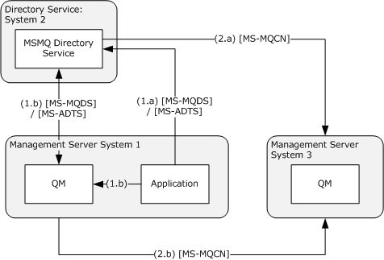

[MS-MQCN]:

Message Queuing (MSMQ): Directory Service Change
Notification Protocol

Intellectual Property Rights Notice for Open Specifications Documentation

  Technical Documentation. Microsoft publishes Open Specifications documentation (“this

documentation”) for protocols, file formats, data portability, computer languages, and standards
support. Additionally, overview documents cover inter-protocol relationships and interactions.

  Copyrights. This documentation is covered by Microsoft copyrights. Regardless of any other

terms that are contained in the terms of use for the Microsoft website that hosts this
documentation, you can make copies of it in order to develop implementations of the technologies
that are described in this documentation and can distribute portions of it in your implementations
that use these technologies or in your documentation as necessary to properly document the
implementation. You can also distribute in your implementation, with or without modification, any
schemas, IDLs, or code samples that are included in the documentation. This permission also
applies to any documents that are referenced in the Open Specifications documentation.
  No Trade Secrets. Microsoft does not claim any trade secret rights in this documentation.
  Patents. Microsoft has patents that might cover your implementations of the technologies

described in the Open Specifications documentation. Neither this notice nor Microsoft's delivery of
this documentation grants any licenses under those patents or any other Microsoft patents.
However, a given Open Specifications document might be covered by the Microsoft Open
Specifications Promise or the Microsoft Community Promise. If you would prefer a written license,
or if the technologies described in this documentation are not covered by the Open Specifications
Promise or Community Promise, as applicable, patent licenses are available by contacting
iplg@microsoft.com.

  License Programs. To see all of the protocols in scope under a specific license program and the

associated patents, visit the Patent Map.

  Trademarks. The names of companies and products contained in this documentation might be
covered by trademarks or similar intellectual property rights. This notice does not grant any
licenses under those rights. For a list of Microsoft trademarks, visit
www.microsoft.com/trademarks.

  Fictitious Names. The example companies, organizations, products, domain names, email

addresses, logos, people, places, and events that are depicted in this documentation are fictitious.
No association with any real company, organization, product, domain name, email address, logo,
person, place, or event is intended or should be inferred.

Reservation of Rights. All other rights are reserved, and this notice does not grant any rights other
than as specifically described above, whether by implication, estoppel, or otherwise.

Tools. The Open Specifications documentation does not require the use of Microsoft programming
tools or programming environments in order for you to develop an implementation. If you have access
to Microsoft programming tools and environments, you are free to take advantage of them. Certain
Open Specifications documents are intended for use in conjunction with publicly available standards
specifications and network programming art and, as such, assume that the reader either is familiar
with the aforementioned material or has immediate access to it.

Support. For questions and support, please contact dochelp@microsoft.com.

[MS-MQCN] - v20240423
Message Queuing (MSMQ): Directory Service Change Notification Protocol
Copyright © 2024 Microsoft Corporation
Release: April 23, 2024

1 / 42

Revision Summary

Date

Revision
History

Revision
Class

Comments

7/20/2007

0.1

9/28/2007

0.2

Major

Minor

MCPP Milestone 5 Initial Availability

Clarified the meaning of the technical content.

10/23/2007  0.2.1

Editorial

Changed language and formatting in the technical content.

11/30/2007  0.2.2

Editorial

Changed language and formatting in the technical content.

1/25/2008

0.2.3

Editorial

Changed language and formatting in the technical content.

3/14/2008

0.2.4

Editorial

Changed language and formatting in the technical content.

5/16/2008

1.0

6/20/2008

1.1

Major

Minor

Updated and revised the technical content.

Clarified the meaning of the technical content.

7/25/2008

1.1.1

Editorial

Changed language and formatting in the technical content.

8/29/2008

2.0

10/24/2008  3.0

12/5/2008

4.0

1/16/2009

4.1

2/27/2009

5.0

4/10/2009

5.1

5/22/2009

5.2

7/2/2009

5.3

Major

Major

Major

Minor

Major

Minor

Minor

Minor

Updated and revised the technical content.

Updated and revised the technical content.

Updated and revised the technical content.

Clarified the meaning of the technical content.

Updated and revised the technical content.

Clarified the meaning of the technical content.

Clarified the meaning of the technical content.

Clarified the meaning of the technical content.

8/14/2009

5.3.1

Editorial

Changed language and formatting in the technical content.

9/25/2009

5.4

Minor

Clarified the meaning of the technical content.

11/6/2009

5.4.1

Editorial

Changed language and formatting in the technical content.

12/18/2009  5.4.2

Editorial

Changed language and formatting in the technical content.

1/29/2010

5.5

Minor

Clarified the meaning of the technical content.

3/12/2010

5.5.1

Editorial

Changed language and formatting in the technical content.

4/23/2010

5.5.2

Editorial

Changed language and formatting in the technical content.

6/4/2010

5.5.3

Editorial

Changed language and formatting in the technical content.

7/16/2010

5.5.3

8/27/2010

6.0

10/8/2010

7.0

11/19/2010  7.1

1/7/2011

7.2

None

Major

Major

Minor

Minor

No changes to the meaning, language, or formatting of the
technical content.

Updated and revised the technical content.

Updated and revised the technical content.

Clarified the meaning of the technical content.

Clarified the meaning of the technical content.

[MS-MQCN] - v20240423
Message Queuing (MSMQ): Directory Service Change Notification Protocol
Copyright © 2024 Microsoft Corporation
Release: April 23, 2024

2 / 42

Date

Revision
History

Revision
Class

Comments

2/11/2011

8.0

3/25/2011

9.0

5/6/2011

10.0

6/17/2011

10.1

9/23/2011

10.1

Major

Major

Major

Minor

None

Updated and revised the technical content.

Updated and revised the technical content.

Updated and revised the technical content.

Clarified the meaning of the technical content.

No changes to the meaning, language, or formatting of the
technical content.

12/16/2011  10.1

None

No changes to the meaning, language, or formatting of the
technical content.

3/30/2012

10.2

Minor

Clarified the meaning of the technical content.

7/12/2012

10.2

None

No changes to the meaning, language, or formatting of the
technical content.

10/25/2012  11.0

Major

Updated and revised the technical content.

1/31/2013

11.0

None

No changes to the meaning, language, or formatting of the
technical content.

8/8/2013

12.0

Major

Updated and revised the technical content.

11/14/2013  12.0

None

No changes to the meaning, language, or formatting of the
technical content.

2/13/2014

12.0

None

No changes to the meaning, language, or formatting of the
technical content.

5/15/2014

12.0

None

No changes to the meaning, language, or formatting of the
technical content.

6/30/2015

13.0

Major

Significantly changed the technical content.

10/16/2015  13.0

None

No changes to the meaning, language, or formatting of the
technical content.

7/14/2016

13.0

None

No changes to the meaning, language, or formatting of the
technical content.

6/1/2017

13.0

9/15/2017

14.0

9/12/2018

15.0

4/7/2021

16.0

6/25/2021

17.0

4/23/2024

18.0

None

Major

Major

Major

Major

Major

No changes to the meaning, language, or formatting of the
technical content.

Significantly changed the technical content.

Significantly changed the technical content.

Significantly changed the technical content.

Significantly changed the technical content.

Significantly changed the technical content.

[MS-MQCN] - v20240423
Message Queuing (MSMQ): Directory Service Change Notification Protocol
Copyright © 2024 Microsoft Corporation
Release: April 23, 2024

3 / 42

## Table of Contents

- [1 Introduction](#1-introduction)
  - [1.1 Glossary](#11-glossary)
  - [1.2 References](#12-references)
    - [1.2.1 Normative References](#121-normative-references)
    - [1.2.2 Informative References](#122-informative-references)
  - [1.3 Overview](#13-overview)
  - [1.4 Relationship to Other Protocols](#14-relationship-to-other-protocols)
  - [1.5 Prerequisites/Preconditions](#15-prerequisitespreconditions)
  - [1.6 Applicability Statement](#16-applicability-statement)
  - [1.7 Versioning and Capability Negotiation](#17-versioning-and-capability-negotiation)
  - [1.8 Vendor-Extensible Fields](#18-vendor-extensible-fields)
  - [1.9 Standards Assignments](#19-standards-assignments)
- [2 Messages](#2-messages)
  - [2.1 Transport](#21-transport)
  - [2.2 Message Syntax](#22-message-syntax)
    - [2.2.1 GUID](#221-guid)
    - [2.2.2 PROPID](#222-propid)
      - [2.2.2.1 PROPID Constants](#2221-propid-constants)
    - [2.2.3 PROPVALUE](#223-propvalue)
      - [2.2.3.1 VT_I2](#2231-vti2)
      - [2.2.3.2 VT_I4](#2232-vti4)
      - [2.2.3.3 VT_BOOL](#2233-vtbool)
      - [2.2.3.4 VT_I1](#2234-vti1)
      - [2.2.3.5 VT_UI1](#2235-vtui1)
      - [2.2.3.6 VT_UI2](#2236-vtui2)
      - [2.2.3.7 VT_UI4](#2237-vtui4)
      - [2.2.3.8 VT_I8](#2238-vti8)
      - [2.2.3.9 VT_UI8](#2239-vtui8)
      - [2.2.3.10 VT_LPWSTR](#22310-vtlpwstr)
      - [2.2.3.11 VT_BLOB](#22311-vtblob)
      - [2.2.3.12 VT_CLSID](#22312-vtclsid)
      - [2.2.3.13 VT_UI4 | VT_VECTOR](#22313-vtui4-vtvector)
      - [2.2.3.14 VT_CLSID | VT_VECTOR](#22314-vtclsid-vtvector)
      - [2.2.3.15 VT_LPWSTR | VT_VECTOR](#22315-vtlpwstr-vtvector)
    - [2.2.4 Change Notification Message](#224-change-notification-message)
    - [2.2.5 Notification Body](#225-notification-body)
    - [2.2.6 Notification Update](#226-notification-update)
  - [2.3 Directory Service Schema Elements](#23-directory-service-schema-elements)
- [3 Protocol Details](#3-protocol-details)
  - [3.1 Common Details](#31-common-details)
    - [3.1.1 Abstract Data Model](#311-abstract-data-model)
      - [3.1.1.1 Shared Data Elements](#3111-shared-data-elements)
      - [3.1.1.2 Data Elements Mapping](#3112-data-elements-mapping)
        - [3.1.1.2.1 Queue Manager Attributes Mapping](#31121-queue-manager-attributes-mapping)
      - [3.1.1.3 Queue Attributes Mapping](#3113-queue-attributes-mapping)
    - [3.1.2 Timers](#312-timers)
    - [3.1.3 Initialization](#313-initialization)
    - [3.1.4 Higher-Layer Triggered Events](#314-higher-layer-triggered-events)
    - [3.1.5 Processing Events and Sequencing Rules](#315-processing-events-and-sequencing-rules)
    - [3.1.6 Timer Events](#316-timer-events)
    - [3.1.7 Other Local Events](#317-other-local-events)
  - [3.2 MQCN Server Details](#32-mqcn-server-details)
    - [3.2.1 Abstract Data Model](#321-abstract-data-model)
      - [3.2.1.1 Shared Data Elements](#3211-shared-data-elements)
      - [3.2.1.2 Local Data Elements](#3212-local-data-elements)
        - [3.2.1.2.1 Change Notification Queue](#32121-change-notification-queue)
    - [3.2.2 Timers](#322-timers)
    - [3.2.3 Initialization](#323-initialization)
    - [3.2.4 Higher-Layer Triggered Events](#324-higher-layer-triggered-events)
    - [3.2.5 Processing Events and Sequencing Rules](#325-processing-events-and-sequencing-rules)
      - [3.2.5.1 Processing a Change Notification Message Version 0x01](#3251-processing-a-change-notification-message-version-0x01)
      - [3.2.5.2 Processing a Change Notification Message Version 0x02](#3252-processing-a-change-notification-message-version-0x02)
    - [3.2.6 Timer Events](#326-timer-events)
    - [3.2.7 Other Local Events](#327-other-local-events)
  - [3.3 MQCN Client Details](#33-mqcn-client-details)
    - [3.3.1 Abstract Data Model](#331-abstract-data-model)
      - [3.3.1.1 Shared Data Elements](#3311-shared-data-elements)
    - [3.3.2 Timers](#332-timers)
    - [3.3.3 Initialization](#333-initialization)
    - [3.3.4 Higher-Layer Triggered Events](#334-higher-layer-triggered-events)
      - [3.3.4.1 Send Change Notification](#3341-send-change-notification)
    - [3.3.5 Processing Events and Sequencing Rules](#335-processing-events-and-sequencing-rules)
      - [3.3.5.1 Preparing a Change Notification Message Version 0x02](#3351-preparing-a-change-notification-message-version-0x02)
      - [3.3.5.2 Preparing a Change Notification Message Version 0x01](#3352-preparing-a-change-notification-message-version-0x01)
      - [3.3.5.3 Sending a Change Notification Message](#3353-sending-a-change-notification-message)
    - [3.3.6 Timer Events](#336-timer-events)
    - [3.3.7 Other Local Events](#337-other-local-events)
- [4 Protocol Examples](#4-protocol-examples)
  - [4.1 Management Client Update Profile](#41-management-client-update-profile)
- [5 Security](#5-security)
  - [5.1 Security Considerations for Implementers](#51-security-considerations-for-implementers)
  - [5.2 Index of Security Parameters](#52-index-of-security-parameters)
- [6 Appendix A: Product Behavior](#6-appendix-a-product-behavior)
- [7 Change Tracking](#7-change-tracking)
- [8 Index](#8-index)

## 1 Introduction

This document specifies the Message Queuing (MSMQ): Directory Service Change Notification Protocol.
Queue managers own and store objects that are also stored in the directory service. When an
application makes changes to an object in the directory service, the MSMQ: Directory Service Change
Notification Protocol is used by the MSMQ Directory Service or by the queue manager to notify the
queue manager that owns the object that those changes have occurred. The types of notifications that
can be performed by using this protocol include notifying a queue manager that a queue object has
been created, changed, or deleted; and notifying a queue manager that its machine object has been
changed. The MSMQ: Directory Service Change Notification Protocol is a queued protocol that uses
Microsoft Message Queuing (MSMQ) as its transport infrastructure to send notifications wrapped
within MSMQ messages.

Sections 1.5, 1.8, 1.9, 2, and 3 of this specification are normative. All other sections and examples in
this specification are informative.

### 1.1 Glossary

This document uses the following terms:

Active Directory: The Windows implementation of a general-purpose directory service, which

uses LDAP as its primary access protocol. Active Directory stores information about a variety of
objects in the network such as user accounts, computer accounts, groups, and all related
credential information used by Kerberos [MS-KILE]. Active Directory is either deployed as Active
Directory Domain Services (AD DS) or Active Directory Lightweight Directory Services (AD LDS),
which are both described in [MS-ADOD]: Active Directory Protocols Overview.

Augmented Backus-Naur Form (ABNF): A modified version of Backus-Naur Form (BNF),

commonly used by Internet specifications. ABNF notation balances compactness and simplicity
with reasonable representational power. ABNF differs from standard BNF in its definitions and
uses of naming rules, repetition, alternatives, order-independence, and value ranges. For more
information, see [RFC5234].

connected network: A network of computers in which any two computers can communicate

directly through a common transport protocol (for example, TCP/IP or SPX/IPX). A computer can
belong to multiple connected networks.

directory service (DS): An entity that maintains a collection of objects. These objects can be

remotely manipulated either by the Message Queuing (MSMQ): Directory Service Protocol, as
specified in [MS-MQDS], or by the Lightweight Directory Access Protocol (v3), as specified in
[RFC2251].

domain controller (DC): The service, running on a server, that implements Active Directory, or
the server hosting this service. The service hosts the data store for objects and interoperates
with other DCs to ensure that a local change to an object replicates correctly across all DCs.
When Active Directory is operating as Active Directory Domain Services (AD DS), the DC
contains full NC replicas of the configuration naming context (config NC), schema naming
context (schema NC), and one of the domain NCs in its forest. If the AD DS DC is a global
catalog server (GC server), it contains partial NC replicas of the remaining domain NCs in its
forest. For more information, see [MS-AUTHSOD] section 1.1.1.5.2 and [MS-ADTS]. When
Active Directory is operating as Active Directory Lightweight Directory Services (AD LDS),
several AD LDS DCs can run on one server. When Active Directory is operating as AD DS, only
one AD DS DC can run on one server. However, several AD LDS DCs can coexist with one AD
DS DC on one server. The AD LDS DC contains full NC replicas of the config NC and the schema
NC in its forest. The domain controller is the server side of Authentication Protocol Domain
Support [MS-APDS].

[MS-MQCN] - v20240423
Message Queuing (MSMQ): Directory Service Change Notification Protocol
Copyright © 2024 Microsoft Corporation
Release: April 23, 2024

6 / 42

enterprise: A unit of administration of a network of MSMQ queue managers. An enterprise

consists of an MSMQ Directory Service, one or more connected networks, and one or more
MSMQ sites.

globally unique identifier (GUID): A term used interchangeably with universally unique

identifier (UUID) in Microsoft protocol technical documents (TDs). Interchanging the usage of
these terms does not imply or require a specific algorithm or mechanism to generate the value.
Specifically, the use of this term does not imply or require that the algorithms described in
[RFC4122] or [C706] have to be used for generating the GUID. See also universally unique
identifier (UUID).

little-endian: Multiple-byte values that are byte-ordered with the least significant byte stored in

the memory location with the lowest address.

message: A data structure representing a unit of data transfer between distributed applications. A
message has message properties, which can include message header properties, a message
body property, and message trailer properties.

Microsoft Message Queuing (MSMQ): A communications service that provides asynchronous

and reliable message passing between distributed applications. In Message Queuing,
applications send messages to queues and consume messages from queues. The queues
provide persistence of the messages, enabling the sending and receiving applications to
operate asynchronously from one another.

MSMQ Directory Service: A network directory service that provides directory information,

including key distribution, to MSMQ. It initially shipped in the Windows NT 4.0 operating system
Option Pack for Windows NT Server as part of MSMQ. This directory service predates and is
superseded by Active Directory (AD).

MSMQ management server: A role played by an MSMQ queue manager. An MSMQ

management server enables management applications to perform management and
administrative operations on the Message Queuing System. The Management Server operations
are specified in [MS-MQMR] and [MS-MQCN].

MSMQ queue manager: An MSMQ service hosted on a machine that provides queued messaging

services. Queue managers manage queues deployed on the local computer and provide
asynchronous transfer of messages to queues located on other computers. A queue manager
is identified by a globally unique identifier (GUID).

MSMQ routing link: A communication link between two sites. A routing link is represented by a

routing link object in the directory service. Routing links can have associated link costs. Routing
links with their associated costs can be used to compute lowest-cost routing paths for store-and-
forward messaging.

MSMQ routing server: A role played by an MSMQ queue manager. An MSMQ routing server
implements store and forward messaging. A routing server can provide connectivity between
different connected networks within a site or can provide session concentration between sites.

MSMQ site: A network of computers, typically physically collocated, that have high connectivity as
measured in terms of latency (low) and throughput (high). A site is represented by a site object
in the directory service. An MSMQ site maps one-to-one with an Active Directory site when
Active Directory provides directory services to MSMQ.

notification queue: A private Microsoft Message Queuing (MSMQ) queue to which

notifications are sent and from which notifications are received.

public queue: An application-defined message queue that is registered in the MSMQ Directory

Service. A public queue can be deployed at any queue manager.

[MS-MQCN] - v20240423
Message Queuing (MSMQ): Directory Service Change Notification Protocol
Copyright © 2024 Microsoft Corporation
Release: April 23, 2024

7 / 42

queue: An object that holds messages passed between applications or messages passed

between Message Queuing and applications. In general, applications can send messages to
queues and read messages from queues.

queue manager (QM): A message queuing service that manages queues deployed on a

computer. A queue manager can also provide asynchronous transfer of messages to queues
deployed on other queue managers.

Unicode character: Unless otherwise specified, a 16-bit UTF-16 code unit.

Unicode string: A Unicode 8-bit string is an ordered sequence of 8-bit units, a Unicode 16-bit
string is an ordered sequence of 16-bit code units, and a Unicode 32-bit string is an ordered
sequence of 32-bit code units. In some cases, it could be acceptable not to terminate with a
terminating null character. Unless otherwise specified, all Unicode strings follow the UTF-16LE
encoding scheme with no Byte Order Mark (BOM).

workgroup mode: A Message Queuing deployment mode in which the clients and servers operate
without using a Directory Service. In this mode, features pertaining to message security,
efficient routing, queue discovery, distribution lists, and aliases are not available. See also
Directory-Integrated mode.

MAY, SHOULD, MUST, SHOULD NOT, MUST NOT: These terms (in all caps) are used as defined
in [RFC2119]. All statements of optional behavior use either MAY, SHOULD, or SHOULD NOT.

### 1.2 References

Links to a document in the Microsoft Open Specifications library point to the correct section in the
most recently published version of the referenced document. However, because individual documents
in the library are not updated at the same time, the section numbers in the documents may not
match. You can confirm the correct section numbering by checking the Errata.

#### 1.2.1 Normative References

We conduct frequent surveys of the normative references to assure their continued availability. If you
have any issue with finding a normative reference, please contact dochelp@microsoft.com. We will
assist you in finding the relevant information.

[MS-ADTS] Microsoft Corporation, "Active Directory Technical Specification".

[MS-DTYP] Microsoft Corporation, "Windows Data Types".

[MS-MQBR] Microsoft Corporation, "Message Queuing (MSMQ): Binary Reliable Message Routing
Algorithm".

[MS-MQDMPR] Microsoft Corporation, "Message Queuing (MSMQ): Common Data Model and
Processing Rules".

[MS-MQDSSM] Microsoft Corporation, "Message Queuing (MSMQ): Directory Service Schema
Mapping".

[MS-MQDS] Microsoft Corporation, "Message Queuing (MSMQ): Directory Service Protocol".

[MS-MQMQ] Microsoft Corporation, "Message Queuing (MSMQ): Data Structures".

[MS-MQQB] Microsoft Corporation, "Message Queuing (MSMQ): Message Queuing Binary Protocol".

[RFC1321] Rivest, R., "The MD5 Message-Digest Algorithm", RFC 1321, April 1992, https://www.rfc-
editor.org/info/rfc1321

[MS-MQCN] - v20240423
Message Queuing (MSMQ): Directory Service Change Notification Protocol
Copyright © 2024 Microsoft Corporation
Release: April 23, 2024

8 / 42

[RFC2119] Bradner, S., "Key words for use in RFCs to Indicate Requirement Levels", BCP 14, RFC
2119, March 1997, https://www.rfc-editor.org/info/rfc2119

[RFC3110] Eastlake III, D., "RSA/SHA-1 SIGs and RSA KEYs in the Domain Name System (DNS)", RFC
3110, May 2001, https://www.rfc-editor.org/info/rfc3110

#### 1.2.2 Informative References

[MS-MQOD] Microsoft Corporation, "Message Queuing Protocols Overview".

### 1.3 Overview

Microsoft Message Queuing (MSMQ) is a communications service that provides asynchronous and
reliable message passing between client applications running on different hosts. In MSMQ, clients
send application messages to queues and consume application messages from queues. The queue
provides persistence of the messages, enabling them to survive across application restarts, and
allowing the sending and receiving client applications to send and receive messages asynchronously
from each other.

Queues are typically hosted by a communications service called a queue manager. By hosting the
queue manager in a separate service from the client applications, applications can communicate (even
if they never execute at the same time) by exchanging messages via a queue hosted by the queue
manager.

Because MSMQ involves message passing between nodes, a directory service can be useful to MSMQ
services in several ways. First, a directory service can provide network topology information that the
MSMQ services can use to route messages between nodes. Second, a directory service can be used as
a key distribution mechanism for security services used by MSMQ to secure messages and to
authenticate clients. Third, a directory service can provide clients with discovery capabilities, allowing
clients to discover the queues available within the network. Finally, a directory service can contain
collections of directory objects representing enterprises, MSMQ sites, routing links, machines,
users, queues, connected networks, and deleted objects.

In MSMQ, queue and machine objects can be created, changed, and deleted in a directory service. As
a result, the internal state of the queue manager that is the owner of these objects is left out of sync.
In MSMQ, a queue manager is notified when one of its owned objects is changed in a directory
service.

The MSMQ: Directory Service Change Notification Protocol defines a mechanism used by the MSMQ
Directory Service or a queue manager to notify a queue manager of changes to its owned objects.
The types of notifications that can be performed by using this protocol include notifying a queue
manager that a queue object has been created, changed, or deleted; and notifying a queue manager
that its machine object has been changed.

### 1.4 Relationship to Other Protocols

The MSMQ: Directory Service Change Notification Protocol is a queued protocol that uses the
Microsoft Message Queuing (MSMQ): Message Queuing Binary Protocol [MS-MQQB] as its
transport protocol.

 The MSMQ: Directory Service Change Notification Protocol uses shared state and processing rules
defined in [MS-MQDMPR].

### 1.5 Prerequisites/Preconditions

It is assumed that the protocol client has obtained the name of a server computer that supports this
protocol and the name of the notification queue hosted on the server before this protocol is invoked.

9 / 42

[MS-MQCN] - v20240423
Message Queuing (MSMQ): Directory Service Change Notification Protocol
Copyright © 2024 Microsoft Corporation
Release: April 23, 2024

How a client acquires this information is not addressed in this specification and is typically part of the
interaction between the client application and the queue manager API.

It is assumed that the protocol client has access to a private encryption key used to decrypt
messages. A private key is typically stored in a secure location on the local client machine.

### 1.6 Applicability Statement

The server side of this protocol is applicable for implementation by a queue manager providing
Microsoft Message Queuing (MSMQ) communication services to clients. The client side of this
protocol is applicable for implementation by client libraries providing message queue managers to
applications by directory service or by a queue manager delegating requests on behalf of a
client.<1> This protocol is applicable to scenarios where a queue manager that is the owner of public
queue objects or a machine object needs to be notified when these objects are changed in a directory
service or on another queue manager on behalf of a client.<2> This protocol is not applicable to
objects that are not stored in a directory service, such as private queues. This protocol is not
applicable for distributed applications that require notification messages within a predefined amount of
time. Notification messages are sent and, once received, the destination queue manager schedules act
on them at specific time intervals.<3>

### 1.7 Versioning and Capability Negotiation

This document covers versioning issues in the following areas:

  Supported Transports: This protocol is implemented on top of MSMQ, as specified in section 2.1.
It relies on MSMQ message sending and receiving mechanisms to send and receive notifications
as messages.

  Capability Negotiation: This protocol has explicit capability negotiation that depends on the version

of the notification message. There are two notification message versions. Version 1 is for
messages sent by an MSMQ Directory Service, and version 2 is for messages sent by a queue
manager.<4>

### 1.8 Vendor-Extensible Fields

This protocol does not define any vendor-extensible fields.

### 1.9 Standards Assignments

This section specifies standard parameters within the context of MSMQ.

 Parameter

 Value

 Reference

NOTIFY_QUEUE_PRIVATE  PRIVATE=<Queue Manager GUID>\3  None.

[MS-MQCN] - v20240423
Message Queuing (MSMQ): Directory Service Change Notification Protocol
Copyright © 2024 Microsoft Corporation
Release: April 23, 2024

10 / 42

## 2 Messages

### 2.1 Transport

Notifications are sent within messages that are transported as MSMQ messages over the Message
Queuing (MSMQ): Message Queuing Binary Protocol [MS-MQQB].

### 2.2 Message Syntax

The following table summarizes the types and messages defined in this specification.

 Message or type

 Description

GUID

PROPID

globally unique identifier (GUID).

Property identifier.

PROPVALUE

Property value.

Change Notification Message  Payload of a notification message.

Notification Body

Body of a notification. Used by a queue manager.

Notification Update

Alternative body notification. Used by a directory service.

#### 2.2.1 GUID

This specification uses a globally unique identifier (GUID). This information is as specified in [MS-
DTYP] section 2.3.4.

#### 2.2.2 PROPID

Notification messages carry an array of property identifiers (a unique PROPID value). The associated
property values are specified in a related array of property values.

0  1  2  3  4  5  6  7  8  9

1
0  1  2  3  4  5  6  7  8  9

2
0  1  2  3  4  5  6  7  8  9

3
0  1

Value

Value (4 bytes):  A ULONG that specifies the identification of a property. This field MUST be filled

with a valid property identifier, as specified in [MS-MQMQ] section 2.3.

##### 2.2.2.1 PROPID Constants

This section contains a list of PROPID constants.

PROPID Constant

PROPID_Q_ADS_PATH ([MS-MQMQ] section 2.3.1.24)

PROPID_Q_AUTHENTICATE ([MS-MQMQ] section 2.3.1.11)

 Value

126

111

[MS-MQCN] - v20240423
Message Queuing (MSMQ): Directory Service Change Notification Protocol
Copyright © 2024 Microsoft Corporation
Release: April 23, 2024

11 / 42

PROPID Constant

 Value

PROPID_Q_BASEPRIORITY ([MS-MQMQ] section 2.3.1.6)

PROPID_Q_CREATE_TIME ([MS-MQMQ] section 2.3.1.9)

PROPID_Q_INSTANCE ([MS-MQMQ] section 2.3.1.1)

PROPID_Q_JOURNAL ([MS-MQMQ] section 2.3.1.4)

PROPID_Q_JOURNAL_QUOTA ([MS-MQMQ] section 2.3.1.7)

PROPID_Q_LABEL ([MS-MQMQ] section 2.3.1.8)

PROPID_Q_MODIFY_TIME ([MS-MQMQ] section 2.3.1.10)

106

109

101

104

107

108

110

PROPID_Q_MULTICAST_ADDRESS ([MS-MQMQ] section 2.3.1.23)  125

PROPID_Q_PATHNAME ([MS-MQMQ] section 2.3.1.22)

PROPID_Q_PRIV_LEVEL ([MS-MQMQ] section 2.3.1.12)

PROPID_Q_SCOPE ([MS-MQMQ] section 2.3.1.14)

PROPID_Q_QMID ([MS-MQMQ] section 2.3.1.15)

PROPID_Q_QUOTA ([MS-MQMQ] section 2.3.1.5)

103

112

114

115

105

PROPID_Q_SECURITY ([MS-MQMQ] section 2.3.1.25)

1101

PROPID_Q_TRANSACTION ([MS-MQMQ] section 2.3.1.13)

PROPID_Q_TYPE ([MS-MQMQ] section 2.3.1.2)

PROPID_QM_CNS ([MS-MQMQ] section 2.3.2.6)

PROPID_QM_FOREIGN ([MS-MQMQ] section 2.3.2.18)

113

102

207

219

PROPID_QM_JOURNAL_QUOTA ([MS-MQMQ] section 2.3.2.14)

215

PROPID_QM_SITE_ID ([MS-MQMQ] section 2.3.2.1)

PROPID_QM_MACHINE_ID ([MS-MQMQ] section 2.3.2.2)

PROPID_QM_ADDRESS ([MS-MQMQ] section 2.3.2.5)

PROPID_QM_QUOTA ([MS-MQMQ] section 2.3.2.10)

PROPID_QM_MACHINE_TYPE ([MS-MQMQ] section 2.3.2.15)

PROPID_QM_MODIFY_TIME ([MS-MQMQ] section 2.3.2.17)

PROPID_QM_OS ([MS-MQMQ] section 2.3.2.19)

PROPID_QM_SECURITY ([MS-MQMQ] section 2.3.2.31)

PROPID_D_SCOPE ([MS-MQMQ] section 2.3.13.3)

PROPID_D_OBJTYPE ([MS-MQMQ] section 2.3.13.4)

201

202

206

214

216

218

220

1201

1403

1404

[MS-MQCN] - v20240423
Message Queuing (MSMQ): Directory Service Change Notification Protocol
Copyright © 2024 Microsoft Corporation
Release: April 23, 2024

12 / 42

#### 2.2.3 PROPVALUE

This section contains block diagrams for property values related to PROPVARIANT ([MS-MQMQ]
section 2.2.12) types. A PROPVARIANT type is determined by the PROPID. [MS-MQMQ] section 2.3
specifies the PROPVARIANT type for each PROPID. All numeric values within the block diagrams MUST
be formatted in little-endian byte order. Values in an array are simply concatenated with no padding.

##### 2.2.3.1 VT_I2

The value of a VT_I2 type property MUST be a 2-byte signed integer. It MUST be formatted in little-
endian byte order.

0  1  2  3  4  5  6  7  8  9

1
0  1  2  3  4  5  6  7  8  9

2
0  1  2  3  4  5  6  7  8  9

3
0  1

Value

##### 2.2.3.2 VT_I4

The value of a VT_I4 type property MUST be a 4-byte signed integer. It MUST be formatted in little-
endian byte order.

0  1  2  3  4  5  6  7  8  9

1
0  1  2  3  4  5  6  7  8  9

2
0  1  2  3  4  5  6  7  8  9

3
0  1

Value

##### 2.2.3.3 VT_BOOL

The value of a VT_BOOL type property MUST be a 16-bit value. It MUST be formatted in little-endian
byte order.

0  1  2  3  4  5  6  7  8  9

1
0  1  2  3  4  5  6  7  8  9

2
0  1  2  3  4  5  6  7  8  9

3
0  1

Value

Value (2 bytes): The values MUST be defined as follows.

Value

Meaning

VARIANT_TRUE

MUST indicate a Boolean value of true.

0xFFFF

VARIANT_FALSE

MUST indicate a Boolean value of false.

0x0000

[MS-MQCN] - v20240423
Message Queuing (MSMQ): Directory Service Change Notification Protocol
Copyright © 2024 Microsoft Corporation
Release: April 23, 2024

13 / 42

##### 2.2.3.4 VT_I1

The value of a VT_I1 type property MUST be a 1-byte signed integer.

0  1  2  3  4  5  6  7  8  9

1
0  1  2  3  4  5  6  7  8  9

2
0  1  2  3  4  5  6  7  8  9

3
0  1

Value

##### 2.2.3.5 VT_UI1

The value of a VT_UI1 type property MUST be a 1-byte unsigned integer.

0  1  2  3  4  5  6  7  8  9

1
0  1  2  3  4  5  6  7  8  9

2
0  1  2  3  4  5  6  7  8  9

3
0  1

Value

##### 2.2.3.6 VT_UI2

The value of a VT_UI2 type property MUST be a 2-byte unsigned integer. It MUST be formatted in
little-endian byte order.

0  1  2  3  4  5  6  7  8  9

1
0  1  2  3  4  5  6  7  8  9

2
0  1  2  3  4  5  6  7  8  9

3
0  1

Value

##### 2.2.3.7 VT_UI4

The value of a VT_UI4 type property MUST be a 4-byte unsigned integer. It MUST be formatted in
little-endian byte order.

0  1  2  3  4  5  6  7  8  9

1
0  1  2  3  4  5  6  7  8  9

2
0  1  2  3  4  5  6  7  8  9

3
0  1

Value

##### 2.2.3.8 VT_I8

The value of a VT_I8 type property MUST be an 8-byte signed integer. It MUST be formatted in little-
endian byte order.

[MS-MQCN] - v20240423
Message Queuing (MSMQ): Directory Service Change Notification Protocol
Copyright © 2024 Microsoft Corporation
Release: April 23, 2024

14 / 42

0  1  2  3  4  5  6  7  8  9

1
0  1  2  3  4  5  6  7  8  9

2
0  1  2  3  4  5  6  7  8  9

3
0  1

Value

...

##### 2.2.3.9 VT_UI8

The value of a VT_UI8 type property MUST be an 8-byte unsigned integer. It MUST be formatted in
little-endian byte order.

0  1  2  3  4  5  6  7  8  9

1
0  1  2  3  4  5  6  7  8  9

2
0  1  2  3  4  5  6  7  8  9

3
0  1

Value

...

##### 2.2.3.10 VT_LPWSTR

The value of a VT_LPWSTR type property MUST be a null-terminated string of 16-bit Unicode
characters.

0  1  2  3  4  5  6  7  8  9

1
0  1  2  3  4  5  6  7  8  9

2
0  1  2  3  4  5  6  7  8  9

3
0  1

Unicode Characters (variable)

...

NullTerminator

Unicode Characters (variable): Contains a variable-length array of Unicode characters. Each array

element MUST be set to a 16-bit Unicode character.

NullTerminator (2 bytes): Contains a Unicode character. This field MUST be set to a value of

0x0000.

##### 2.2.3.11 VT_BLOB

The value of a VT_BLOB property MUST be a counted array of unsigned bytes.

0  1  2  3  4  5  6  7  8  9

1
0  1  2  3  4  5  6  7  8  9

2
0  1  2  3  4  5  6  7  8  9

3
0  1

Size

Value (variable)

[MS-MQCN] - v20240423
Message Queuing (MSMQ): Directory Service Change Notification Protocol
Copyright © 2024 Microsoft Corporation
Release: April 23, 2024

15 / 42

...

Size (4 bytes): A ULONG that specifies the size of the array or vector of values. This field MUST be

formatted in little-endian byte order.

Value (variable): Contains an array of unsigned bytes. This field MUST be set to an array of length

Size, and each element MUST be an unsigned byte.

##### 2.2.3.12 VT_CLSID

The value of a VT_CLSID type property MUST be a GUID ([MS-DTYP] section 2.3.4.2) value.

##### 2.2.3.13 VT_UI4 | VT_VECTOR

The value of a VT_UI4 | VT_VECTOR type property MUST be an array of VT_UI4 type property values.

0  1  2  3  4  5  6  7  8  9

1
0  1  2  3  4  5  6  7  8  9

2
0  1  2  3  4  5  6  7  8  9

3
0  1

Size

Value (variable)

...

Size (4 bytes): A ULONG that specifies the size of the array or vector of values. This field MUST be

formatted in little-endian byte order.

Value (variable): MUST be filled with an array of property values of VT_UI4 type. The number of

values MUST be equal to the Size field value.

##### 2.2.3.14 VT_CLSID | VT_VECTOR

The value of a VT_CLSID | VT_VECTOR type property MUST be an array of VT_CLSID type property
values.

0  1  2  3  4  5  6  7  8  9

1
0  1  2  3  4  5  6  7  8  9

2
0  1  2  3  4  5  6  7  8  9

3
0  1

Size

Value (variable)

...

Size (4 bytes): A ULONG that specifies the size of the array or vector of values; MUST be formatted

in little-endian byte order.

Value (variable): MUST be filled with an array of property values of VT_CLSID type. The number of

values MUST be equal to the Size field value.

[MS-MQCN] - v20240423
Message Queuing (MSMQ): Directory Service Change Notification Protocol
Copyright © 2024 Microsoft Corporation
Release: April 23, 2024

16 / 42

##### 2.2.3.15 VT_LPWSTR | VT_VECTOR

The value of a VT_LPWSTR | VT_VECTOR type property MUST be an array of VT_LPWSTR type
property values.

0  1  2  3  4  5  6  7  8  9

1
0  1  2  3  4  5  6  7  8  9

2
0  1  2  3  4  5  6  7  8  9

3
0  1

Size

Value (variable)

...

Size (4 bytes): A ULONG that specifies the size of the array or vector of values; MUST be formatted

in little-endian byte order.

Value (variable): MUST be filled with an array of property values of VT_LPWSTR type. The number

of values MUST be equal to the Size field value.

#### 2.2.4 Change Notification Message

A Change Notification Message is used to encapsulate a single change Notification Body (section 2.2.5)
sent by a queue manager or several change Notification Updates (section 2.2.6) sent by a directory
service. A change notification represents a change on either a queue or a machine object within a
directory service.

0  1  2  3  4  5  6  7  8  9

1
0  1  2  3  4  5  6  7  8  9

2
0  1  2  3  4  5  6  7  8  9

3
0  1

Version

NumberOfUpdateNotificati
ons

Data (variable)

...

Version (1 byte): A UCHAR containing the version of the notification message. This field MUST be
set to the value 0x01 for messages sent by an MSMQ Directory Service and to the value 0x02
for messages sent by an MSMQ queue manager.<5>

Value  Meaning

0x01

Message sent by an MSMQ Directory Service.

0x02

Message sent by an MSMQ queue manager.

NumberOfUpdateNotifications (1 byte): A UCHAR that contains the number of update

notifications. This field MUST be set to the number of update notifications contained in the Data
field. If the Version field is set to 0x02, this field MUST be set to 0x01.

Data (variable): A variable-length UCHAR array. The content of this field varies depending on the

Version field. If the Version field is set to 0x01, this field contains a sequence of Notification
Updates (section 2.2.6). If the Version field is set to 0x02, this field contains a single Notification
Body (section 2.2.5). There is no padding between Notification Updates.

[MS-MQCN] - v20240423
Message Queuing (MSMQ): Directory Service Change Notification Protocol
Copyright © 2024 Microsoft Corporation
Release: April 23, 2024

17 / 42

#### 2.2.5 Notification Body

A Notification Body is used to encapsulate a change notification that indicates a change either on a
queue or a machine object within a directory service. The change is expressed as a notification
event that indicates one of the following events: creation of a queue object, change on a queue
object, deletion of a queue object, or change on a machine object. A Notification Body is used by a
queue manager to send a change notification message to the queue manager that is the owner of
the modified object. This format does not include the changed data. The recipient queue manager
MUST read the data from the directory service, as specified in section 3.2.5.2; therefore, queue
managers do not have to be trusted.

<Notification>

<Event>Event</Event>

<ObjectGuid>ObjectGuid</ObjectGuid>

<DomainController>DirectoryServiceServer</DomainController>

</Notification>

Event

Specifies the notification event for a queue or a machine object on which changes were made within a
domain controller (DC). This MUST be set to 1, 2, 3, or 4. A value of 1 indicates creation of a queue
object. A value of 2 indicates change on a queue object; a value of 3 indicates deletion of a queue
object. A value of 4 indicates change on a machine object.

ObjectGuid

Specifies the object that was modified within the DC. This MUST be set to the GUID of the modified
object that MUST be either a queue or a machine object.

DirectoryServiceServer

Specifies the name of the Directory Service server through which the queue or the machine object was
modified in the directory.

Notification body MUST be set to a Unicode string in the format specified by the following
Augmented Backus-Naur Form (ABNF) rule.

 NotificationBody =     "<Notification>"
                        "<Event>"event"</Event>"
                        "<ObjectGuid>"object-guid"</ObjectGuid >"
                        "<DomainController>"
                          DirectoryServiceServer
                        "</DomainController>"
                        "</Notification>"

 event            = "1" / "2" / "3" / "4"
                    ;where "1": create queue, "2": change queue,
                    ;"3": delete queue, "4": change machine

 object-guid      = 8HEXDIG"-"4HEXDIG"-"4HEXDIG"-"4HEXDIG"-"12HEXDIG
                    ; A GUID of the form XXXXXXXX-XXXX-XXXX-XXXX-XXXXXXXXXXXX
 DirectoryServiceServer = 1*256(VCHAR)
                     ; A directory service name.

 HEXDIG            =  DIGIT / "A" / "B" / "C" / "D" / "E" / "F"
 DIGIT             =  %x30-39
                      ; 0-9
 VCHAR             =  %x21-7E

[MS-MQCN] - v20240423
Message Queuing (MSMQ): Directory Service Change Notification Protocol
Copyright © 2024 Microsoft Corporation
Release: April 23, 2024

18 / 42

#### 2.2.6 Notification Update

A Notification Update is used to encapsulate a change notification that indicates a change either on
a queue or a machine object within a directory service. The change is expressed as a notification
event that indicates one of the following events: creation of a queue object, change on a queue
object, deletion of a queue object, or change on a machine object. A Notification Update is used by
a directory service to send change notification messages to the queue manager that is the owner of
the modified objects.

0  1  2  3  4  5  6  7  8  9

1
0  1  2  3  4  5  6  7  8  9

2
0  1  2  3  4  5  6  7  8  9

3
0  1

Command

UseGuid

PathName (variable)

...

GuidIdentifier (16 bytes, optional)

...

...

GuidMasterId (16 bytes)

...

...

Reserved (24 bytes)

...

...

...

PropertyId (variable)

PropertyValue (variable)

...

NumberOfProperties

Command (1 byte): A UCHAR that indicates the change notification operation, which can be create,

change, or delete. This field MUST be set to 0x00, 0x01, or 0x02, where:

Value  Meaning

0x00

Indicates creation.

0x01

Indicates change.

0x02

Indicates deletion.

[MS-MQCN] - v20240423
Message Queuing (MSMQ): Directory Service Change Notification Protocol
Copyright © 2024 Microsoft Corporation
Release: April 23, 2024

19 / 42

UseGuid (1 byte): A UCHAR that indicates whether a Notification Update uses the PathName or
the GuidIdentifier field. This field MUST be set to 0x01 to indicate that the GuidIdentifier field
is being used. Otherwise, this field MUST be set to 0x00 to indicate that the PathName field is
being used.

Value  Meaning

0x00

The PathName field is being used.

0x01

The GuidIdentifier field is being used.

PathName (variable): Indicates the path of the object that was modified in the directory service.

MUST be a null-terminated Unicode string, and MUST follow the rules specified in
PROPID_Q_PATHNAME ([MS-MQMQ] section 2.3.1.3). This field MUST NOT be present if the
UseGuid field is set to 0x01. Instead, the GuidIdentifier field MUST be set with a value.

GuidIdentifier (16 bytes): Indicates the GUID of the object that was modified in the directory

service. This field MUST be present if the UseGuid field is set to 0x01.

GuidMasterId (16 bytes): Indicates the GUID of the directory server that originated the change

Notification Update.

Reserved (24 bytes): A 24-byte array of UCHAR reserved for future use. MAY be set to all 0x00

bytes by the client, and MUST be ignored by the server.

NumberOfProperties (1 byte): A UCHAR that indicates the number of properties that are included

as part of this Notification Update.

PropertyId (variable): An array of PROPID that contains a collection of property IDs that are part of
this Notification Update. These properties refer either to informative data or to changed data
related to the changed object. The number of elements MUST be equal to the value of the
NumberOfProperties field.

PropertyValue (variable): Contains a collection of property values that are part of this Notification

Update. These instances contain either informative data or modified data related to the changed
object. The number of property values MUST be equal to the value of the NumberOfProperties
field. The format of each property value depends on the variant type, which is determined by the
corresponding property ID. Section 2.2.3 lists the formats for the variant types. Sections 2.2.3.1
through 2.2.3.15 define the types for each property ID.

### 2.3 Directory Service Schema Elements

This protocol uses ADM elements specified in section 3.1.1. A subset of these elements can be
published in a directory. This protocol SHOULD<6> access the directory using the algorithm specified
in [MS-MQDSSM] and using LDAP [MS-ADTS]. The Directory Service schema elements for ADM
elements published in the directory are defined in [MS-MQDSSM] section 2.4.<7>

[MS-MQCN] - v20240423
Message Queuing (MSMQ): Directory Service Change Notification Protocol
Copyright © 2024 Microsoft Corporation
Release: April 23, 2024

20 / 42

## 3 Protocol Details

### 3.1 Common Details

#### 3.1.1 Abstract Data Model

This conceptual model is common to both servers and clients of this protocol. The abstract data
model, which is specific to either the server or client side of this protocol, is described in MQCN Server
Details (section 3.2) and MQCN Client Details (section 3.3), respectively.

This section describes a conceptual model of possible data organization that an implementation
maintains to participate in this protocol. The described organization is provided to facilitate the
explanation of how the protocol behaves. This document does not mandate that implementations
adhere to this model as long as their external behavior is consistent with that described in this
document.

The abstract data model for this protocol comprises abstract data model (ADM) elements that are
private to this protocol and others that are shared between multiple MSMQ protocols that are
collocated at a common queue manager. The shared abstract data model is defined in [MS-
MQDMPR] section 3.1.1, and the relationship between this protocol, a queue manager, and other
protocols that share a common queue manager is described in [MS-MQOD].

Section 3.1.1.1 references the ADM elements from the shared data model that are manipulated by this
protocol.

Section 3.1.1.2 describes the mapping between property identifiers and attributes of ADM elements.

##### 3.1.1.1 Shared Data Elements

The server and client side of this protocol manipulate the following ADM elements from the shared
abstract data model defined in [MS-MQDMPR] section 3.1.1.

QueueManager: [MS-MQDMPR] section 3.1.1.1.

Queue: [MS-MQDMPR] section 3.1.1.2.

Message: [MS-MQDMPR] section 3.1.1.12.

##### 3.1.1.2 Data Elements Mapping

This section describes the mapping between property identifiers and attributes of abstract data models
elements.

###### 3.1.1.2.1 Queue Manager Attributes Mapping

The following section specifies the mapping between property identifiers and the ADM attributes of a
QueueManager ([MS-MQDMPR] section 3.1.1.1) ADM element.

QueueManager.Identifier: Defined in PROPID_QM_MACHINE_ID ([MS-MQMQ] section 2.3.2.2).

QueueManager.ForeignSystem: Defined in PROPID_QM_FOREIGN ([MS-MQMQ] section

2.3.2.18).

QueueManager.QueueManagerQuota: Defined in PROPID_QM_QUOTA ([MS-MQMQ] section

2.3.2.10).

[MS-MQCN] - v20240423
Message Queuing (MSMQ): Directory Service Change Notification Protocol
Copyright © 2024 Microsoft Corporation
Release: April 23, 2024

21 / 42

QueueManager.JournalQuota: Defined in PROPID_QM_JOURNAL_QUOTA ([MS-MQMQ] section

2.3.2.14).

QueueManager.Security: Defined in PROPID_QM_SECURITY ([MS-MQMQ] section 2.3.2.31).

QueueManager.ConnectedNetworkIdentifierList: Defined in PROPID_QM_CNS ([MS-MQMQ]

section 2.3.2.6).

QueueManager.QueueManagerVersion: Defined in PROPID_QM_MACHINE_TYPE ([MS-MQMQ]

section 2.3.2.15).

QueueManager.OperatingSystemType: Defined in PROPID_QM_OS ([MS-MQMQ] section

2.3.2.19).

##### 3.1.1.3 Queue Attributes Mapping

The ADM attributes of a Queue ([MS-MQDMPR] section 3.1.1.2) ADM element map to their respective
property identifiers as follows.

Queue.Identifier: PROPID_Q_INSTANCE ([MS-MQMQ] section 2.3.1.1).

Queue.Type: PROPID_Q_TYPE ([MS-MQMQ] section 2.3.1.2).

Queue.BasePriority: PROPID_Q_BASEPRIORITY ([MS-MQMQ] section 2.3.1.6).

Queue.Journaling: PROPID_Q_JOURNAL ([MS-MQMQ] section 2.3.1.4).

Queue.Quota: PROPID_Q_QUOTA ([MS-MQMQ] section 2.3.1.5).

Queue.JournalQuota: PROPID_Q_JOURNAL_QUOTA ([MS-MQMQ] section 2.3.1.7).

Queue.CreateTime: PROPID_Q_CREATE_TIME ([MS-MQMQ] section 2.3.1.9).

Queue.ModifyTime: PROPID_Q_MODIFY_TIME ([MS-MQMQ] section 2.3.1.10).

Queue.Security: PROPID_Q_SECURITY ([MS-MQMQ] section 2.3.1.25).

Queue.Pathname: PROPID_Q_PATHNAME ([MS-MQMQ] section 2.3.1.22).

Queue.Label: PROPID_Q_LABEL ([MS-MQMQ] section 2.3.1.8).

Queue.Authentication: PROPID_Q_AUTHENTICATE ([MS-MQMQ] section 2.3.1.11).

Queue.PrivacyLevel: PROPID_Q_PRIV_LEVEL ([MS-MQMQ] section 2.3.1.12).

Queue.Transactional: PROPID_Q_TRANSACTION ([MS-MQMQ] section 2.3.1.13).

Queue.MulticastAddress: PROPID_Q_MULTICAST_ADDRESS ([MS-MQMQ] section 2.3.1.23).

Queue.DirectoryPath: PROPID_Q_ADS_PATH ([MS-MQMQ] section 2.3.1.24).

Queue.Scope: PROPID_Q_SCOPE ([MS-MQMQ] section 2.3.1.14).

#### 3.1.2 Timers

There are no common timers.

#### 3.1.3 Initialization

There is no common initialization.

[MS-MQCN] - v20240423
Message Queuing (MSMQ): Directory Service Change Notification Protocol
Copyright © 2024 Microsoft Corporation
Release: April 23, 2024

22 / 42

#### 3.1.4 Higher-Layer Triggered Events

There are no common higher-layer triggered events.

#### 3.1.5 Processing Events and Sequencing Rules

There are no common message processing events and sequencing rules.

#### 3.1.6 Timer Events

There are no common timer events.

#### 3.1.7 Other Local Events

There are no other local events.

### 3.2 MQCN Server Details

#### 3.2.1 Abstract Data Model

This section describes a conceptual model of possible data organization that an implementation
maintains to participate in this protocol. The described organization is provided to facilitate the
explanation of how the protocol behaves. This document does not mandate that implementations
adhere to this model as long as their external behavior is consistent with that described in this
document.

The abstract data model for this protocol comprises ADM elements that are private to this protocol and
others that are shared between multiple MSMQ protocols that are collocated at a common queue
manager. The shared abstract data model is defined in [MS-MQDMPR] section 3.1.1, and the
relationship between this protocol, a queue manager, and other protocols that share a queue manager
is described in [MS-MQOD].

Section 3.2.1.1 references the ADM elements from the shared data model that are manipulated by this
protocol.

Section 3.2.1.2 describes the ADM elements that are specific to the server side of this protocol.

##### 3.2.1.1 Shared Data Elements

The server side of this protocol manipulates the shared ADM elements listed in section 3.1.1.1.

##### 3.2.1.2 Local Data Elements

In addition to the shared ADM elements, the server side of this protocol manipulates the Change
Notification Queue (section 3.2.1.2.1) ADM element.

###### 3.2.1.2.1 Change Notification Queue

The Change Notification Queue ADM element represents a local private notification queue. The
following ABNF rule specifies the queue name format.

 QueuePathName = (Computer "\private$\notify_queue$")
 Computer      = 1*256(VCHAR) ; computer where the queue manager resides
 VCHAR         = %x21-7E

[MS-MQCN] - v20240423
Message Queuing (MSMQ): Directory Service Change Notification Protocol
Copyright © 2024 Microsoft Corporation
Release: April 23, 2024

23 / 42

#### 3.2.2 Timers

None.

#### 3.2.3 Initialization

The implementation of this protocol SHOULD<8> open the local private change notification queue.
This queue MUST be opened by raising an Open Queue ([MS-MQDMPR] section 3.1.7.1.5) event with
the following arguments:







iFormatName := NOTIFY_QUEUE_PRIVATE as defined in section 1.9.

iRequiredAccess := ReceiveAccess.

iSharedMode := DenyNone.

This event returns rStatus and rOpenQueueDescriptor. If rStatus is MQ_OK, the value of
rOpenQueueDescriptor is stored for reuse when dequeuing messages from this queue. Otherwise, if
rStatus is different than MQ_OK, this protocol cannot work correctly.

After the change notification queue is open, the implementation MUST start a loop for the lifetime of
the server side of this protocol for dequeuing and processing change notification messages:

  Raise the Dequeue Message ([MS-MQDMPR] section 3.1.7.1.10) event with the following

arguments:



iQueueDesc := The OpenQueueDescriptor ([MS-MQDMPR] section 3.1.1.16) ADM element
instance referenced by rOpenQueueDescriptor returned by the Open Queue event that opened
the change notification queue.

This event returns rMessage, a reference to the Message ([MS-MQDMPR] section 3.1.1.12) ADM
element instance that was dequeued.

#### 3.2.4 Higher-Layer Triggered Events

None.

#### 3.2.5 Processing Events and Sequencing Rules

The server MUST initialize the local private change notification queue as specified in section 3.2.3.
When a Dequeue Message ([MS-MQDMPR] section 3.1.7.1.10) event is raised, the server MUST
process the returned rMessage as follows:



Let NotificationMessage be initialized to rMessage.Body parsed as a Change Notification
Message (section 2.2.4).

  Verify the value of the NotificationMessage.Version field, and:



If the value of the NotificationMessage.Version field is 0x01, the NotificationMessage.Data
field MUST be interpreted as an array of instances of Notification Update (section 2.2.6). The
number of instances is determined by the value of the
NotificationMessage.NumberOfUpdateNotifications field. For receiving a change notification
message version 0x01, see section 3.2.5.1.

  Otherwise, if the value of the NotificationMessage.Version field is 0x02, the

NotificationMessage.Data field MUST be interpreted as an instance of Notification
Body (section 2.2.5). For receiving a change notification message version 0x02, see section
3.2.5.2.

[MS-MQCN] - v20240423
Message Queuing (MSMQ): Directory Service Change Notification Protocol
Copyright © 2024 Microsoft Corporation
Release: April 23, 2024

24 / 42

After a notification message is processed, another Dequeue Message event MUST be generated as
specified in section 3.2.3. This process is repeated for the lifetime of the queue manager.

##### 3.2.5.1 Processing a Change Notification Message Version 0x01

For a Change Notification Message (section 2.2.4) with a Version field set to 0x01,
NotificationMessage.Data is an array of Notification Updates (section 2.2.6). For each Notification
Update in the array, the server MUST update the state of the queue or queue manager object
referenced by the PathName field or the GuidIdentifier field.

To process the update, the server MUST perform the following steps for each Notification Update in
the array:



The queue manager MUST verify that the change notification Message ([MS-MQDMPR] section
3.1.1.12) ADM element instance rMessage was authenticated, according to the following rules:





If rMessage.SenderIdentifierType does not equal QueueManagerIdentifier, the server
MUST disregard the Change Notification Message and perform no further processing.

If rMessage.AuthenticationLevel has a value of 0x0 (None), the server MUST disregard the
Change Notification Message and perform no further processing.



The object type (either a queue object or a queue manager object) in a Notification Update
MUST be determined according to the following rules:



If the Command field is set to 0x00 (created) or 0x01 (updated), the server MUST perform
the following actions:







If the value of PropertyId[0] is greater than 1,000, the object type MUST be set to
(PropertyId[0] - 1,000) / 100.

If the value of PropertyId[0] is less than or equal to 1,000, the object type MUST be set
to PropertyId[0] / 100.

If the object type does not equal 1 (a queue object) or 2 (a queue manager object), the
server MUST disregard the Change Notification Message and perform no further
processing.

  Once the object type is identified, the following actions MUST be performed:



If the Command field equals 0x00 (created) and object type is 1 (a queue object), the
following processing rules MUST be performed:



Let newQueue be a new Queue ([MS-MQDMPR] section 3.1.1.2) ADM element instance.

  Raise a Set Queue Defaults ([MS-MQDMPR] section 3.1.7.1.33) event with the following

arguments:



iQueue := newQueue

  Set the following ADM attributes on the Queue ADM element instance newQueue:

  Type := PropertyValue[ IndexOf(PROPID_Q_TYPE) ]



Identifier := PropertyValue[ IndexOf(PROPID_Q_INSTANCE) ]

  BasePriority := PropertyValue[ IndexOf(PROPID_Q_BASEPRIORITY) ]



Journaling := PropertyValue[ IndexOf(PROPID_Q_JOURNAL) ]

  Quota := PropertyValue[ IndexOf(PROPID_Q_QUOTA) ]

[MS-MQCN] - v20240423
Message Queuing (MSMQ): Directory Service Change Notification Protocol
Copyright © 2024 Microsoft Corporation
Release: April 23, 2024

25 / 42



JournalQuota := PropertyValue[ IndexOf(PROPID_Q_JOURNAL_QUOTA) ]

  CreateTime := PropertyValue[ IndexOf(PROPID_Q_CREATE_TIME) ]

  ModifyTime := PropertyValue[ IndexOf(PROPID_Q_MODIFY_TIME) ]

  Security := PropertyValue[ IndexOf(PROPID_Q_SECURITY) ]

  PathName := PropertyValue[ IndexOf(PROPID_Q_PATHNAME) ]

  Label := PropertyValue[ IndexOf(PROPID_Q_LABEL) ]

  Authentication := PropertyValue [ IndexOf(PROPID_Q_AUTHENTICATE) ]

  PrivacyLevel := PropertyValue [ IndexOf(PROPID_Q_PRIV_LEVEL) ]

  Transactional := PropertyValue [ IndexOf(PROPID_Q_TRANSACTION) ]

  Scope := PropertyValue [ IndexOf(PROPID_Q_SCOPE) ]

  Raise a Create Queue ([MS-MQDMPR] section 3.1.7.1.3) event with the following

arguments:





iQueue := newQueue.

iSkipDirectory := True.



If the Command field equals 0x01 (updated) and object type is 1 (a queue object), the
following processing rules MUST be performed:

  Update the corresponding ADM attributes in the Queue ADM element instance in the
QueueCollection ADM attribute of the local QueueManager ([MS-MQDMPR] section
3.1.1.1) ADM element instance with the following values:

  BasePriority := PropertyValue[ IndexOf(PROPID_Q_BASEPRIORITY) ]



Journal := PropertyValue[ IndexOf(PROPID_Q_JOURNAL) ]

  Quota := PropertyValue[ IndexOf(PROPID_Q_QUOTA) ]



JournalQuota := PropertyValue[ IndexOf(PROPID_Q_JOURNAL_QUOTA) ]

  Security := PropertyValue[ IndexOf(PROPID_Q_SECURITY) ]

  Authentication := PropertyValue[ IndexOf(PROPID_Q_AUTHENTICATE) ]

  PrivacyLevel := PropertyValue[ IndexOf(PROPID_Q_PRIV_LEVEL) ]

All other PROPIDs are not used, and they MUST be ignored.



If the Command field equals 0x01 (updated) and object type is 2 (a queue manager object),
the following processing rules MUST be performed:

  Update the following ADM attributes of the local QueueManager ADM element instance

with the following values:

  QueueManagerQuota := PropertyValue[ IndexOf(PROPID_QM_QUOTA) ]



JournalQuota := PropertyValue[ IndexOf(PROPID_QM_JOURNAL_QUOTA) ]

  Security := PropertyValue[ IndexOf(PROPID_QM_SECURITY) ]

All other PROPIDs are not used, and they MUST be ignored.

26 / 42

[MS-MQCN] - v20240423
Message Queuing (MSMQ): Directory Service Change Notification Protocol
Copyright © 2024 Microsoft Corporation
Release: April 23, 2024



If the Command field equals 0x02 (deleted), the object type MUST be set to the value of
PropertyValue[ 1 ]. If the object type does not equal MQDS_QUEUE, the server MUST
disregard the Change Notification Message and perform no further processing; otherwise,
the following processing rules MUST be performed:

  Raise a Delete Queue ([MS-MQDMPR] section 3.1.7.1.4) event with the following

arguments:



iQueue := A reference to the Queue ADM element instance from the
QueueCollection ADM attribute of the local QueueManager ADM element instance
whose identifier is equal to the GuidIdentifier field.



iSkipDirectory := True.

Section 3.2.1 specifies the abstract data model that can be used as a reference to maintain data
specific to Queue and QueueManager ADM element instances in a queue manager that implements
this protocol.

##### 3.2.5.2 Processing a Change Notification Message Version 0x02

For a Change Notification Message (section 2.2.4) with a Version field set to 0x02,
NotificationMessage.Data is a Notification Body (section 2.2.5). The server MUST update the state of
the queue or machine object referenced by the GUID contained in ObjectGuid. If the value contained
in Event indicates creation or update, the queue manager MUST request information from the
directory service specified within DomainController for the updating process, as specified in [MS-
MQDMPR].

The following actions MUST be performed upon the reception of a notification message:



 If Event is set to 1 (create queue), the following processing rules MUST be performed:

  Raise a Read Directory ([MS-MQDMPR] section 3.1.7.1.20) event with the following

arguments:







iDirectoryObjectType := "Queue".

iFilter := "Identifier" EQUALS ObjectGuid

iAttributeList := {"Type", "Identifier", "BasePriority", "Journal", "Quota", "JournalQuota",
"CreateTime", "ModifyTime", "Security", "Pathname", "Label", "Authentication",
"PrivacyLevel", "Transactional", "MulticastAddress", "DirectoryPath"}

  Raise a Create Queue ([MS-MQDMPR] section 3.1.7.1.3) event with the following arguments:



iQueue := A copy of the Queue ([MS-MQDMPR] section 3.1.1.2) ADM element instance
returned by the Read Directory event.



iSkipDirectory := True.



If Event is set to 2 (change queue), the following processing rules MUST be performed:

  Raise a Read Directory event with the following arguments:







iDirectoryObjectType := "Queue".

iFilter := "Identifier" EQUALS ObjectGuid

iAttributeList := {"Type", "Identifier", "BasePriority", "Journal", "Quota", "JournalQuota",
"CreateTime", "ModifyTime", "Security", "Pathname", "Label", "Authentication",
"PrivacyLevel", "Transactional", "MulticastAddress", "DirectoryPath"}

[MS-MQCN] - v20240423
Message Queuing (MSMQ): Directory Service Change Notification Protocol
Copyright © 2024 Microsoft Corporation
Release: April 23, 2024

27 / 42

  Update the corresponding Queue ADM element instance in the QueueCollection ADM

attribute of the local QueueManager ([MS-MQDMPR] section 3.1.1.1) ADM element instance
with the Queue ADM element instance returned by the Read Directory event.



If Event is set to 3 (delete queue), the following processing rules MUST be performed:

  Raise a Delete Queue ([MS-MQDMPR] section 3.1.7.1.4) event with the following arguments:



iQueue := A reference to the Queue ADM element instance rQueue in the
QueueCollection ADM attribute of the local QueueManager ADM element instance,
where rQueue.Identifier is equal to ObjectGuid.



iSkipDirectory := True.



If Event is set to 4 (change queue manager), the following processing rules MUST be performed:

  Raise a Read Directory event with the following arguments:







iDirectoryObjectType := "QueueManager".

iFilter := "Identifier" EQUALS ObjectGuid

iAttributeList := {"QueueManagerQuota", "JournalQuota", "Security"}

  Update the local QueueManager ADM element instance with the QueueManager ADM

element instance returned by the Read Directory event.

Section 3.2.1 describes the abstract model that can be used as a reference to maintain data specific to
the Queue and QueueManager ADM elements in a queue manager that implements this protocol.

#### 3.2.6 Timer Events

There are no timer events.

#### 3.2.7 Other Local Events

There are no other local events.

### 3.3 MQCN Client Details

#### 3.3.1 Abstract Data Model

This section describes a conceptual model of possible data organization that an implementation
maintains to participate in this protocol. The described organization is provided to facilitate the
explanation of how the protocol behaves. This document does not mandate that implementations
adhere to this model as long as their external behavior is consistent with that described in this
document.

The abstract data model for this protocol comprises abstract data model (ADM) elements that are
private to this protocol and others that are shared between multiple MSMQ protocols that are
collocated at a common queue manager. The shared abstract data model is defined in [MS-MQDMPR]
section 3.1.1, and the relationship between this protocol, a queue manager, and other protocols that
share a common queue manager is described in [MS-MQOD].

Section 3.3.1.1 references the ADM elements from the shared abstract data model that are
manipulated by this protocol.

[MS-MQCN] - v20240423
Message Queuing (MSMQ): Directory Service Change Notification Protocol
Copyright © 2024 Microsoft Corporation
Release: April 23, 2024

28 / 42

##### 3.3.1.1 Shared Data Elements

The server side of this protocol manipulates the shared ADM elements listed in section 3.1.1.1. In
addition, this protocol manipulates the following ADM elements from the shared abstract data model
defined in [MS-MQDMPR] section 3.1.1.

OutgoingQueue: ([MS-MQDMPR] section 3.1.1.3).

#### 3.3.2 Timers

None.

#### 3.3.3 Initialization

The implementation of the client side of MQCN SHOULD open the OutgoingQueue ADM element to
send change notification messages. This queue MUST be opened by raising an Open Queue ([MS-
MQDMPR] section 3.1.7.1.5) event with the following arguments:



iFormatName := OutgoingQueue with the following ADM attribute values:

  DestinationFormatName := NOTIFY_QUEUE_PRIVATE as defined in section 1.9.

  NextHops := Empty string.

iRequiredAccess := SendAccess.

iSharedMode := DenyNone.





This event returns rStatus and rOpenQueueDescriptor. If rStatus is MQ_OK, the value of
rOpenQueueDescriptor is assigned to openNotifyQueueDescriptor to be used when enqueuing
messages to this queue; otherwise, this protocol cannot work correctly.

#### 3.3.4 Higher-Layer Triggered Events

The operation of this protocol is initiated and subsequently driven by the following higher-layer
triggered event:

  Send Change Notification (section 3.3.4.1).

##### 3.3.4.1 Send Change Notification

This event MUST be generated with the following arguments:





iOperation: An enumeration identifying the subject of the notification. Valid values are
QueueCreation, QueueUpdate, QueueDeletion, and QueueManagerUpdate.

iDirectoryObject: A reference to a Queue ([MS-MQDMPR] section 3.1.1.2) ADM element instance
or a QueueManager ([MS-MQDMPR] section 3.1.1.1) ADM element instance.

Return Values:

None.

The following actions MUST be performed to process this event:



Prepare a Change Notification Message (section 2.2.4) with a Version field value of 0x01 or
0x02.<9>



For a Version field value of 0x02, use the rules specified in section 3.3.5.1.

29 / 42

[MS-MQCN] - v20240423
Message Queuing (MSMQ): Directory Service Change Notification Protocol
Copyright © 2024 Microsoft Corporation
Release: April 23, 2024



 For a Version field value of 0x01, use the rules specified in section 3.3.5.2.

  Send the prepared Change Notification Message following the rules specified in section 3.3.5.3.

#### 3.3.5 Processing Events and Sequencing Rules

##### 3.3.5.1 Preparing a Change Notification Message Version 0x02

The queue manager MUST create a Change Notification Message (section 2.2.4) containing a
Notification Body (section 2.2.5).

The Notification Body MUST be set to a Unicode string in the format specified by the ABNF rule in
section 2.2.5. The Event token MUST contain 1 to indicate that a queue object was created; or 2 to
indicate that a queue object was changed; or 3 to indicate that a queue object was deleted; or 4 to
indicate that a machine object was changed.<10> The ObjectGuid token MUST contain the GUID of
the queue or the machine object that was changed. The DomainController token MUST contain the
directory service name where the queue or a machine object was changed.

The Change Notification Message MUST be created as follows: The Version field MUST be set to
0x02. The NumberOfUpdateNotifications field MUST be set to 0x01 to indicate that there is only
one update notification in the notification message. A queue manager MUST send only one
notification message at a time. The Data field MUST be filled with the Notification Body instance
created as specified in this section.

Finally, the Change Notification Message MUST be included within a Message ([MS-MQDMPR]
section 3.1.1.12) ADM element instance and MUST be sent through MSMQ to the destination queue
manager, as specified in section 3.3.5.3.

##### 3.3.5.2 Preparing a Change Notification Message Version 0x01

The directory service MUST create a Change Notification Message (section 2.2.4) that includes
Notification Updates (section 2.2.6) as follows:















The Command field MUST be set to 0x00 to indicate that a queue object was created in the
directory service; or it MUST be set to 0x01 to indicate that a queue or machine object was
updated; or it MUST be set to 0x02 to indicate that a queue object was deleted.

The UseGuid field MUST be set to 0x00 if the Command field is set to 0x00 to indicate that the
PathName field is being used. For other values of the Command field, the UseGuid field MUST
be set to 0x01 to indicate that the GuidIdentifier field is being used.

The PathName field MUST be set to a null-terminated value if the UseGuid field is set to 0x00
and MUST be omitted if the UseGuid field is set to 0x01.

If the UseGuid field is set to 0x01, the GuidIdentifier field MUST be set to the GUID of either
the queue object or the machine object that was changed.

The GuidMasterId field MUST be set to the GUID of the directory service that originated the
change notification message.

The NumberOfProperties field MUST be set to the number of properties contained within each
Notification Update.

The PropertyId array field MUST be filled with property identifiers, and its number of elements
MUST be equal to the NumberOfProperties field. The set of property identifiers varies as
follows:



If the Command field is set to 0x00 (created) and the created object is a queue object, the
following property identifiers MUST be included within the PropertyId array field in any order:

30 / 42

[MS-MQCN] - v20240423
Message Queuing (MSMQ): Directory Service Change Notification Protocol
Copyright © 2024 Microsoft Corporation
Release: April 23, 2024

































PROPID_Q_TYPE ([MS-MQMQ] section 2.3.1.2)

PROPID_Q_INSTANCE ([MS-MQMQ] section 2.3.1.1)

PROPID_Q_BASEPRIORITY ([MS-MQMQ] section 2.3.1.6)

PROPID_Q_JOURNAL ([MS-MQMQ] section 2.3.1.4)

PROPID_Q_QUOTA ([MS-MQMQ] section 2.3.1.5)

PROPID_Q_JOURNAL_QUOTA ([MS-MQMQ] section 2.3.1.7)

PROPID_Q_CREATE_TIME ([MS-MQMQ] section 2.3.1.9)

PROPID_Q_MODIFY_TIME ([MS-MQMQ] section 2.3.1.10

PROPID_Q_SCOPE ([MS-MQMQ] section 2.3.1.14)

PROPID_Q_SECURITY ([MS-MQMQ] section 2.3.1.25)

PROPID_Q_PATHNAME ([MS-MQMQ] section 2.3.1.3)

PROPID_Q_LABEL ([MS-MQMQ] section 2.3.1.8)

PROPID_Q_AUTHENTICATE ([MS-MQMQ] section 2.3.1.11)

PROPID_Q_PRIV_LEVEL ([MS-MQMQ] section 2.3.1.12)

PROPID_Q_TRANSACTION ([MS-MQMQ] section 2.3.1.13)

This property MUST NOT be included. The receiving queue manager MUST ignore this
property if received:



PROPID_Q_ADS_PATH ([MS-MQMQ] section 2.3.1.24)



If the Command field is set to 0x01 (updated) and the modified object is a queue object, the
following property MUST be included within the PropertyId array field:





















PROPID_Q_QMID ([MS-MQMQ] section 2.3.1.15)

The rest of the PropertyId array field MUST be filled with the identifiers of the properties
that were modified for the queue object specified in the GuidIdentifier field.

These properties can be modified:

PROPID_Q_JOURNAL ([MS-MQMQ] section 2.3.1.4)

PROPID_Q_QUOTA

PROPID_Q_BASEPRIORITY

PROPID_Q_JOURNAL_QUOTA

PROPID_Q_SECURITY

PROPID_Q_AUTHENTICATE

PROPID_Q_PRIV_LEVEL



If the Command field is set to 0x01 (updated) and the modified object is a machine object,
the following properties MUST be included within the PropertyId array field in any order:



PROPID_QM_MACHINE_ID ([MS-MQMQ] section 2.3.2.2)

31 / 42

[MS-MQCN] - v20240423
Message Queuing (MSMQ): Directory Service Change Notification Protocol
Copyright © 2024 Microsoft Corporation
Release: April 23, 2024













PROPID_QM_FOREIGN ([MS-MQMQ] section 2.3.2.18)

The rest of the PropertyId array field MUST be filled with the identifiers of the properties
that were modified for the machine object specified in the GuidIdentifier field.

These properties can be modified:

PROPID_QM_QUOTA ([MS-MQMQ] section 2.3.2.10)

PROPID_QM_JOURNAL_QUOTA ([MS-MQMQ] section 2.3.2.14)

PROPID_QM_SECURITY ([MS-MQMQ] section 2.3.2.36)



The following properties can be included but are ignored on the Server side of this
protocol.<11>









PROPID_QM_ADDRESS ([MS-MQMQ] section 2.3.2.5)

PROPID_QM_CNS ([MS-MQMQ] section 2.3.2.6

PROPID_QM_MACHINE_TYPE ([MS-MQMQ] section 2.3.2.15)

PROPID_QM_OS ([MS-MQMQ] section 2.3.2.19)



If the Command field is set to 0x02 (deleted) and the modified object is a queue object, the
PropertyId array field MUST be filled as follows:

  PropertyId[0] = PROPID_D_SCOPE ([MS-MQMQ] section 2.3.13.3)

  PropertyId[1] = PROPID_D_OBJTYPE ([MS-MQMQ] section 2.3.13.4)



Each PropertyValue array field element MUST be filled according to the rules specified in this
document and in [MS-MQMQ] for the value of the corresponding PropertyId array field element.
In addition, the following PropertyValue array field elements MUST be set according to the
following rules:



If the Command field is set to 0x02 (deleted) and the modified object is a queue object, the
PropertyValue array field elements MUST be filled as follows:

  PropertyValue[0] = MQDS_ENTERPRISESCOPE ([MS-MQMQ] section 2.3.13.3)

  PropertyValue[1] = MQDS_QUEUE ([MS-MQMQ] section 2.3.13.4)

The Change Notification Message MUST be created as follows. The Version field MUST be set to
0x01. The NumberOfUpdateNotifications field MUST be set to the number of Notification Update
instances to be included in the Data field. A directory service can send more than one notification
message at a time. The Data field MUST be filled with the Notification Update instances that MUST
be created as specified in this section.

Finally, the Change Notification Message MUST be included within a Message ([MS-MQDMPR]
section 3.1.1.12) ADM element instance and MUST be sent through MSMQ to the destination queue
manager, as specified in section 3.3.5.3.

##### 3.3.5.3 Sending a Change Notification Message

The Change Notification Message (section 2.2.4) MUST be sent within a Message ([MS-MQDMPR]
section 3.1.1.12) ADM element instance through MSMQ to the destination queue manager. This
section specifies the values that MUST be set that are specific to notification messages.

The sender MUST perform the following actions to process this event:

[MS-MQCN] - v20240423
Message Queuing (MSMQ): Directory Service Change Notification Protocol
Copyright © 2024 Microsoft Corporation
Release: April 23, 2024

32 / 42

  Create a Message ADM element instance rMessage with the following ADM attributes:

  TimeToReachQueue := 300 seconds

  DeliveryGuarantee := Express

  Class := Normal

  HashAlgorithm := the default value required by the MSMQ version.<12>

  AuthenticationLevel := Sig20<13>





The sender MUST create a buffer of bytes of the size of the Change Notification Message
plus 1. This additional byte is unused and MUST NOT affect the behavior of this protocol. The
Change Notification Message MUST be included at the beginning of the created buffer,
which MUST be assigned to rMessage.Body.

If the Version field of the Change Notification Message is 0x01, the sender MUST perform
the following actions:

  Set rMessage.SenderIdentifier to the Identifier ADM attribute of the QueueManager
ADM element instance referenced by the iDirectoryObject input argument to the Send
Change Notification (section 3.3.4.1) event.

  Set rMessage.SenderIdentifierType to QueueManagerIdentifier.

  Once rMessage is prepared, the implementation of this protocol MUST generate an Enqueue

Message ([MS-MQDMPR] section 3.1.7.1.9) event with the following arguments:



iQueue := openNotifyQueueDescriptor.QueueReference, where openNotifyQueueDescriptor
references the OpenQueueDescriptor ([MS-MQDMPR] section 3.1.1.16) ADM element
instance created during the initialization phase in section 3.3.3.



iMessage := rMessage

#### 3.3.6 Timer Events

None.

#### 3.3.7 Other Local Events

None.

[MS-MQCN] - v20240423
Message Queuing (MSMQ): Directory Service Change Notification Protocol
Copyright © 2024 Microsoft Corporation
Release: April 23, 2024

33 / 42

<!-- Extracted images from page 34 -->

<!-- /Extracted images from page 34 -->

## 4 Protocol Examples

### 4.1 Management Client Update Profile

This example describes how an application can create a public queue on a remote queue manager.
The application profile consists of the MSMQ Directory Service and two MSMQ management
servers. Both MSMQ management servers can access the MSMQ Directory Service. The following
steps show how an application can create a public queue on a remote machine.

Figure 1: Creation of a public queue on a remote queue manager

1.  An application on System 1 requests that a public queue be created on System 3. Microsoft

Message Queuing (MSMQ) first notifies the MSMQ Directory Service and updates it by creating
a queue object. This update can happen in two ways:





This request can be made directly through the MSMQ runtime. This communication is
facilitated over the Message Queuing (MSMQ): Directory Service Protocol [MS-MQDS] for
MSMQ Version 1 and over Active Directory, as specified in [MS-ADTS], for MSMQ Version 2,
onward.

If the runtime is unable to create the object, the request is handed to the local queue
manager. In this case, the queue manager on System 1 updates the MSMQ Directory Service
using the Message Queuing (MSMQ): Directory Service Protocol or Active Directory.

2.  The actual creation of the public queue is handled via the queue manager on System 3. The queue

manager is notified via the Message Queuing (MSMQ): Directory Service Change Notification
Protocol; however, the initiation of this protocol depends on the version of MSMQ and the
directory service.



If MSMQ Version 1.0 directory service is running, the MSMQ Directory Service informs the
queue manager via the MSMQ: Directory Service Change Notification Protocol, as shown in
arrow 2.a.

34 / 42

[MS-MQCN] - v20240423
Message Queuing (MSMQ): Directory Service Change Notification Protocol
Copyright © 2024 Microsoft Corporation
Release: April 23, 2024



If Active Directory is used, the queue manager on System 1 informs the queue manager on
System 3 via the MSMQ: Directory Service Change Notification Protocol, as shown in arrow
2.b.

[MS-MQCN] - v20240423
Message Queuing (MSMQ): Directory Service Change Notification Protocol
Copyright © 2024 Microsoft Corporation
Release: April 23, 2024

35 / 42

## 5 Security

### 5.1 Security Considerations for Implementers

This protocol might allow denial-of-service (DoS) attacks to the server. An implementation of this
protocol has to develop mechanisms to prevent such attacks. One of these mechanisms is to process
notifications only every few minutes.<14>

### 5.2 Index of Security Parameters

None.

[MS-MQCN] - v20240423
Message Queuing (MSMQ): Directory Service Change Notification Protocol
Copyright © 2024 Microsoft Corporation
Release: April 23, 2024

36 / 42

## 6 Appendix A: Product Behavior

The information in this specification is applicable to the following Microsoft products or supplemental
software. References to product versions include updates to those products.

  Windows NT operating system

  Windows 2000 operating system

  Windows XP operating system

  Windows Server 2003 operating system

  Windows Vista operating system

  Windows Server 2008 operating system

  Windows 7 operating system

  Windows Server 2008 R2 operating system

  Windows 8 operating system

  Windows Server 2012 operating system

  Windows 8.1 operating system

  Windows Server 2012 R2 operating system

  Windows 10 operating system

  Windows Server 2016 operating system

  Windows Server operating system

  Windows Server 2019 operating system

  Windows Server 2022 operating system

  Windows 11 operating system

  Windows Server 2025 operating system

Exceptions, if any, are noted in this section. If an update version, service pack or Knowledge Base
(KB) number appears with a product name, the behavior changed in that update. The new behavior
also applies to subsequent updates unless otherwise specified. If a product edition appears with the
product version, behavior is different in that product edition.

Unless otherwise specified, any statement of optional behavior in this specification that is prescribed
using the terms "SHOULD" or "SHOULD NOT" implies product behavior in accordance with the
SHOULD or SHOULD NOT prescription. Unless otherwise specified, the term "MAY" implies that the
product does not follow the prescription.

<1> Section 1.6: On Windows NT and Windows 2000, the MSMQ Directory Service notifies the
destination queue manager via the MSMQ: Directory Service Change Notification Protocol. On all
other Windows implementations of this protocol, the local queue manager notifies the destination
queue manager via the MSMQ: Directory Service Change Notification Protocol. If an MSMQ routing
server is enabled, the path that the message takes between the local queue manager and the
destination queue manager can be altered, as indicated in [MS-MQBR].

[MS-MQCN] - v20240423
Message Queuing (MSMQ): Directory Service Change Notification Protocol
Copyright © 2024 Microsoft Corporation
Release: April 23, 2024

37 / 42

<2> Section 1.6: On Windows NT and Windows 2000, the MSMQ Directory Service notifies the
destination queue manager via the MSMQ: Directory Service Change Notification Protocol. On all other
Windows implementations of this protocol, the local queue manager notifies the destination queue
manager via the MSMQ: Directory Service Change Notification Protocol. If an MSMQ routing server is
enabled, the path that the message takes between the local queue manager and the destination
queue manager can be altered, as indicated in [MS-MQBR].

<3> Section 1.6: On Windows NT and Windows 2000, queue managers process notification
messages as soon as they arrive. On all other Windows implementations of this protocol, notification
messages are delayed by up to 15 minutes to prevent denial-of-service attacks. If the last change
notification message was processed more than 14 minutes ago, the queue manager sets a timer for
one minute and waits for additional change notification messages to arrive. If the last change
notification message was processed 14 or less minutes ago, the timer is set for the remainder of the
15 minutes instead of one minute. When the timer expires, the queue manager processes all received
change notification messages. If 100 or more change notification messages arrive while the queue
manager is waiting for the timer to expire, it ignores the messages and instead updates the state of all
the public queue objects that it owns with the state of those objects that is stored in the directory
service (as described in section 3.2.5.2 for a change queue event) when the timer expires.

<4> Section 1.7: On Windows NT and Windows 2000, queue managers process messages only from
the directory service. Other messages are ignored. On all other Windows implementations of this
protocol, queue managers process messages either from the directory service or from queue
managers. Other messages are ignored.

<5> Section 2.2.4: On Windows NT and Windows 2000, the MSMQ Directory Service notifies the
destination queue manager via the MSMQ: Directory Service Change Notification Protocol. On all other
Windows implementations of this protocol, the local queue manager notifies the destination queue
manager via the MSMQ: Directory Service Change Notification Protocol. If an MSMQ routing server is
enabled, the path that the message takes between the local queue manager and the destination
queue manager can be altered, as indicated in [MS-MQBR].

<6> Section 2.3: For Windows NT and Windows 2000, this protocol uses the Message Queuing
(MSMQ): Directory Service Protocol [MS-MQDS].

<7> Section 2.3: For the Message Queuing (MSMQ): Directory Service Protocol [MS-MQDS], the
Directory Service schema elements are described in [MS-MQDS] sections 2.2.10 and 3.1.4.21.1
through 3.1.4.21.4.

<8> Section 3.2.3: On Windows implementations of this protocol, except for Windows NT, Windows
2000, Windows XP, and Windows Server 2003, when a queue manager is running in workgroup
mode, the notification queue is not created, and the protocol is not initialized.

<9> Section 3.3.4.1: On Windows NT and Windows 2000, the MSMQ Directory Service notifies the
destination queue manager via the MSMQ: Directory Service Change Notification Protocol. On all other
Windows implementations of this protocol, the local queue manager notifies the destination queue
manager via the MSMQ: Directory Service Change Notification Protocol. If an MSMQ routing server is
enabled, the path that the message takes between the local queue manager and the destination
queue manager can be altered, as described in the Binary Reliable Message Routing Algorithm [MS-
MQBR].

<10> Section 3.3.5.1: On all Windows versions, if a message is received and the value of the Event
token is not 1, 2, 3, or 4, the message is ignored.

<11> Section 3.3.5.2: For a Change Notification Message (section 2.2.4) with a Version field set to
0x01, the Windows implementation of the Client side of MQCN sends additional properties that are
ignored by the Server side of MQCN. This action is performed because the Windows implementation
takes the data structure used in the directory service and passes it as is, without removing the
additional or unnecessary properties.

[MS-MQCN] - v20240423
Message Queuing (MSMQ): Directory Service Change Notification Protocol
Copyright © 2024 Microsoft Corporation
Release: April 23, 2024

38 / 42

<12> Section 3.3.5.3: MSMQ versions 1 and 2 use MD5, as specified in [RFC1321]; versions 2 and 4
use SHA1, as specified in [RFC3110].

<13> Section 3.3.5.3: MSMQ version 1 sets this value to Sig10.

<14> Section 5.1: On Windows NT and Windows 2000, queue managers process notification
messages as soon as they arrive. On all other Windows implementations of this protocol, notification
messages are delayed by up to 15 minutes to prevent denial-of-service attacks. If the last change
notification message was processed more than 14 minutes ago, the queue manager sets a timer for 1
minute and waits for additional change notification messages to arrive. When the timer expires, the
queue manager processes all received change notification messages and clears the timer. If 100 or
more change notification messages arrive while the queue manager is waiting for the timer to expire,
it ignores the messages and instead refreshes all public queues when the timer expires. If the last
change notification message was processed 14 or fewer minutes ago, the timer is set for the
remainder of the 15 minutes instead of 1 minute.

[MS-MQCN] - v20240423
Message Queuing (MSMQ): Directory Service Change Notification Protocol
Copyright © 2024 Microsoft Corporation
Release: April 23, 2024

39 / 42

## 7 Change Tracking

This section identifies changes that were made to this document since the last release. Changes are
classified as Major, Minor, or None.

The revision class Major means that the technical content in the document was significantly revised.
Major changes affect protocol interoperability or implementation. Examples of major changes are:

  A document revision that incorporates changes to interoperability requirements.
  A document revision that captures changes to protocol functionality.

The revision class Minor means that the meaning of the technical content was clarified. Minor changes
do not affect protocol interoperability or implementation. Examples of minor changes are updates to
clarify ambiguity at the sentence, paragraph, or table level.

The revision class None means that no new technical changes were introduced. Minor editorial and
formatting changes may have been made, but the relevant technical content is identical to the last
released version.

The changes made to this document are listed in the following table. For more information, please
contact dochelp@microsoft.com.

Section

Description

6 Appendix A: Product
Behavior

Added Windows Server 2025 to the list of applicable
products.

Revision
class

Major

[MS-MQCN] - v20240423
Message Queuing (MSMQ): Directory Service Change Notification Protocol
Copyright © 2024 Microsoft Corporation
Release: April 23, 2024

40 / 42

## 8 Index
A

I

Abstract data model
   client (section 3.1.1 21, section 3.3.1 28)
   server 23
      local data elements 23
      overview (section 3.1.1 21, section 3.2.1 23)
      shared data elements 23
Applicability 10

Implementer - security considerations 36
Index of security parameters 36
Informative references 9
Initialization
   client 29
   server 24
Introduction 6

C

L

Capability negotiation 10
Change Notification Message message 17
Change tracking 40
Client
   abstract data model (section 3.1.1 21, section

3.3.1 28)

   higher-layer triggered events 29
   initialization 29
   local events 33
   message processing (section 3.1.5 23, section

3.3.5 30)

   other local events 33
   sequencing rules (section 3.1.5 23, section 3.3.5

30)

   timer events 33
   timers 29

D

Data elements mapping 21
Data model - abstract
   client (section 3.1.1 21, section 3.3.1 28)
   server 23
      local data elements 23
      overview (section 3.1.1 21, section 3.2.1 23)
      shared data elements 23
Directory service schema elements 20

E

Elements - directory service schema 20
Example - management client update profile 34

F

Fields - vendor-extensible 10

G

Glossary 6
GUID 11
GUID message 11

H

Higher-layer triggered events
   client 29
   server 24

Local data elements - server 23
Local events
   client 33
   server 28

M

Management client update profile example 34
Mapping
   data elements 21
   queue attributes 22
   queue manager attributes 21
Message processing
   client (section 3.1.5 23, section 3.3.5 30)
   server (section 3.1.5 23, section 3.2.5 24)
Messages
   Change Notification Message 17
   GUID 11
   Notification Body 17
   Notification Update 18
   PROPID 11
   PROPVALUE 12
   syntax
      GUID 11
      notification body 17
      overview 11
      PROPVALUE 12
   transport 11

N

Normative references 8
Notification body 17
Notification Body message 17
Notification Update message 18
Notification_Header packet 17
Notification_Update packet 18

O

Other local events
   client 33
   server 28
Overview (synopsis) 9

P

Parameters - security index 36
Preconditions 9

[MS-MQCN] - v20240423
Message Queuing (MSMQ): Directory Service Change Notification Protocol
Copyright © 2024 Microsoft Corporation
Release: April 23, 2024

41 / 42

   client 29
   server 24

V

Vendor-extensible fields 10
Versioning 10
VT_BLOB packet 15
VT_BOOL packet 13
VT_CLSID packet 16
VT_CLSID_VT_VECTOR packet 16
VT_I1 packet 13
VT_I2 packet 13
VT_I4 packet 13
VT_I8 packet 14
VT_LPWSTR packet 15
VT_LPWSTR_VT_VECTOR packet 16
VT_UI1 packet 14
VT_UI2 packet 14
VT_UI4 packet 14
VT_UI4_VT_VECTOR packet 16
VT_UI8 packet 15

Prerequisites 9
Product behavior 37
PROPID constants 11
PROPID message 11
PROPID packet 11
PROPVALUE 12
PROPVALUE message 12

Q

Queue attributes mapping 22
Queue manager attributes mapping 21

R

References 8
   informative 9
   normative 8
Relationship to other protocols 9

S

Schema elements - directory service 20
Security
   implementer considerations 36
   parameter index 36
Sequencing rules
   client (section 3.1.5 23, section 3.3.5 30)
   server (section 3.1.5 23, section 3.2.5 24)
Server
   abstract data model 23
      local data elements 23
      overview (section 3.1.1 21, section 3.2.1 23)
      shared data elements 23
   higher-layer triggered events 24
   initialization 24
   local events 28
   message processing (section 3.1.5 23, section

3.2.5 24)

   other local events 28
   sequencing rules (section 3.1.5 23, section 3.2.5

24)

   timer events 28
   timers 24
Shared data elements
   client 29
   server 23
Standards assignments 10
Syntax
   GUID 11
   notification body 17
   overview 11
   PROPVALUE 12

T

Timer events
   client 33
   server 28
Timers
   client 29
   server 24
Tracking changes 40
Transport 11
Triggered events - higher-layer

[MS-MQCN] - v20240423
Message Queuing (MSMQ): Directory Service Change Notification Protocol
Copyright © 2024 Microsoft Corporation
Release: April 23, 2024

42 / 42

