[MS-MQOD]:

Message Queuing Protocols Overview

Intellectual Property Rights Notice for Open Specifications Documentation

  Technical Documentation. Microsoft publishes Open Specifications documentation (“this

documentation”) for protocols, file formats, data portability, computer languages, and standards
support. Additionally, overview documents cover inter-protocol relationships and interactions.

  Copyrights. This documentation is covered by Microsoft copyrights. Regardless of any other

terms that are contained in the terms of use for the Microsoft website that hosts this
documentation, you can make copies of it in order to develop implementations of the technologies
that are described in this documentation and can distribute portions of it in your implementations
that use these technologies or in your documentation as necessary to properly document the
implementation. You can also distribute in your implementation, with or without modification, any
schemas, IDLs, or code samples that are included in the documentation. This permission also
applies to any documents that are referenced in the Open Specifications documentation.
  No Trade Secrets. Microsoft does not claim any trade secret rights in this documentation.
  Patents. Microsoft has patents that might cover your implementations of the technologies

described in the Open Specifications documentation. Neither this notice nor Microsoft's delivery of
this documentation grants any licenses under those patents or any other Microsoft patents.
However, a given Open Specifications document might be covered by the Microsoft Open
Specifications Promise or the Microsoft Community Promise. If you would prefer a written license,
or if the technologies described in this documentation are not covered by the Open Specifications
Promise or Community Promise, as applicable, patent licenses are available by contacting
iplg@microsoft.com.

  License Programs. To see all of the protocols in scope under a specific license program and the

associated patents, visit the Patent Map.

  Trademarks. The names of companies and products contained in this documentation might be
covered by trademarks or similar intellectual property rights. This notice does not grant any
licenses under those rights. For a list of Microsoft trademarks, visit
www.microsoft.com/trademarks.

  Fictitious Names. The example companies, organizations, products, domain names, email

addresses, logos, people, places, and events that are depicted in this documentation are fictitious.
No association with any real company, organization, product, domain name, email address, logo,
person, place, or event is intended or should be inferred.

Reservation of Rights. All other rights are reserved, and this notice does not grant any rights other
than as specifically described above, whether by implication, estoppel, or otherwise.

Tools. The Open Specifications documentation does not require the use of Microsoft programming
tools or programming environments in order for you to develop an implementation. If you have access
to Microsoft programming tools and environments, you are free to take advantage of them. Certain
Open Specifications documents are intended for use in conjunction with publicly available standards
specifications and network programming art and, as such, assume that the reader either is familiar
with the aforementioned material or has immediate access to it.

Support. For questions and support, please contact dochelp@microsoft.com.

[MS-MQOD] - v20220902
Message Queuing Protocols Overview
Copyright © 2022 Microsoft Corporation
Release: September 2, 2022

1 / 83

Revision Summary

Date

Revision
History

Revision
Class

Comments

3/30/2012

1.0

7/12/2012

1.1

10/25/2012  2.0

1/31/2013

2.0

New

Minor

Major

None

Released new document.

Clarified the meaning of the technical content.

Updated and revised the technical content.

No changes to the meaning, language, or formatting of the
technical content.

8/8/2013

2.1

Minor

Clarified the meaning of the technical content.

11/14/2013  2.1

2/13/2014

2.1

5/15/2014

2.1

None

None

None

No changes to the meaning, language, or formatting of the
technical content.

No changes to the meaning, language, or formatting of the
technical content.

No changes to the meaning, language, or formatting of the
technical content.

6/30/2015

3.0

Major

Significantly changed the technical content.

10/16/2015  3.0

9/26/2016

3.0

6/1/2017

3.0

12/15/2017  4.0

11/5/2018

5.0

6/3/2021

6.0

10/26/2021  7.0

9/2/2022

8.0

None

None

None

Major

Major

Major

Major

Major

No changes to the meaning, language, or formatting of the
technical content.

No changes to the meaning, language, or formatting of the
technical content.

No changes to the meaning, language, or formatting of the
technical content.

Significantly changed the technical content.

Significantly changed the technical content.

Significantly changed the technical content.

Significantly changed the technical content.

Significantly changed the technical content.

[MS-MQOD] - v20220902
Message Queuing Protocols Overview
Copyright © 2022 Microsoft Corporation
Release: September 2, 2022

2 / 83

## Table of Contents

- [1 Introduction](#1-introduction)
  - [1.1 Conceptual Overview](#11-conceptual-overview)
  - [1.2 Glossary](#12-glossary)
  - [1.3 References](#13-references)
- [2 Functional Architecture](#2-functional-architecture)
  - [2.1 Overview](#21-overview)
    - [2.1.1 Purpose](#211-purpose)
    - [2.1.2 Capabilities](#212-capabilities)
      - [2.1.2.1 Message Delivery Assurance](#2121-message-delivery-assurance)
      - [2.1.2.2 Message Transfer and Routing](#2122-message-transfer-and-routing)
      - [2.1.2.3 Message Security](#2123-message-security)
      - [2.1.2.4 Management and Administration](#2124-management-and-administration)
    - [2.1.3 Interaction with External Components](#213-interaction-with-external-components)
      - [2.1.3.1 Message Queuing and Applications](#2131-message-queuing-and-applications)
      - [2.1.3.2 Reliable Message Processing Using Transactions](#2132-reliable-message-processing-using-transactions)
      - [2.1.3.3 Message Queuing and Directory Service](#2133-message-queuing-and-directory-service)
    - [2.1.4 Roles](#214-roles)
      - [2.1.4.1 Application Roles](#2141-application-roles)
      - [2.1.4.2 Queue Manager Roles](#2142-queue-manager-roles)
        - [2.1.4.2.1 Queue Manager Roles for Application Interaction](#21421-queue-manager-roles-for-application-interaction)
        - [2.1.4.2.2 Queue Manager Roles for Message Transfer and Routing](#21422-queue-manager-roles-for-message-transfer-and-routing)
        - [2.1.4.2.3 Queue Manager Role for Remote Read and Management](#21423-queue-manager-role-for-remote-read-and-management)
      - [2.1.4.3 Subcomponent Roles](#2143-subcomponent-roles)
      - [2.1.4.4 Protocol Roles](#2144-protocol-roles)
    - [2.1.5 Protocol Interactions](#215-protocol-interactions)
    - [2.1.6 MSMQ Components](#216-msmq-components)
    - [2.1.7 MSMQ Internal and External Communications](#217-msmq-internal-and-external-communications)
      - [2.1.7.1 Communications Within MSMQ](#2171-communications-within-msmq)
      - [2.1.7.2 Communications with External Systems](#2172-communications-with-external-systems)
    - [2.1.8 MSMQ Applicability](#218-msmq-applicability)
    - [2.1.9 Relevant Standards](#219-relevant-standards)
  - [2.2 Protocol Summary](#22-protocol-summary)
  - [2.3 Environment](#23-environment)
    - [2.3.1 Dependencies on This System](#231-dependencies-on-this-system)
    - [2.3.2 Dependencies on Other Systems/Components](#232-dependencies-on-other-systemscomponents)
  - [2.4 Assumptions and Preconditions](#24-assumptions-and-preconditions)
  - [2.5 Use Cases](#25-use-cases)
    - [2.5.1 Create or Modify Queue - Application](#251-create-or-modify-queue-application)
    - [2.5.2 Query Queue Information- Application](#252-query-queue-information-application)
    - [2.5.3 Send Message to Queue - Application](#253-send-message-to-queue-application)
    - [2.5.4 Send Message in Transaction - Application](#254-send-message-in-transaction-application)
    - [2.5.5 Transfer Message](#255-transfer-message)
    - [2.5.6 Receive a Message from a Queue - Application](#256-receive-a-message-from-a-queue-application)
    - [2.5.7 Receive Message in Transaction – Application](#257-receive-message-in-transaction-application)
    - [2.5.8 Exchange Message - Application](#258-exchange-message-application)
  - [2.6 Versioning, Capability Negotiation, and Extensibility](#26-versioning-capability-negotiation-and-extensibility)
  - [2.7 Error Handling](#27-error-handling)
    - [2.7.1 Queue Manager Restart](#271-queue-manager-restart)
    - [2.7.2 Transient Network Failure](#272-transient-network-failure)
    - [2.7.3 Transaction Coordinator Unavailable](#273-transaction-coordinator-unavailable)
    - [2.7.4 Directory Unavailable](#274-directory-unavailable)
    - [2.7.5 Internal Storage Failure](#275-internal-storage-failure)
    - [2.7.6 Directory Inconsistency](#276-directory-inconsistency)
  - [2.8 Coherency Requirements](#28-coherency-requirements)
  - [2.9 Security](#29-security)
    - [2.9.1 Security Elements](#291-security-elements)
    - [2.9.2 Security Strategy and Mechanisms](#292-security-strategy-and-mechanisms)
    - [2.9.3 Storage Security](#293-storage-security)
    - [2.9.4 Communication Security](#294-communication-security)
      - [2.9.4.1 Security Layer](#2941-security-layer)
        - [2.9.4.1.1 Transport Layer Security](#29411-transport-layer-security)
        - [2.9.4.1.2 Message Layer Security](#29412-message-layer-security)
        - [2.9.4.1.3 Security Model: PKI](#29413-security-model-pki)
        - [2.9.4.1.4 Message Layer Security Features](#29414-message-layer-security-features)
          - [2.9.4.1.4.1 Message Integrity](#294141-message-integrity)
          - [2.9.4.1.4.2 Sender Authentication](#294142-sender-authentication)
          - [2.9.4.1.4.3 Message Privacy](#294143-message-privacy)
        - [2.9.4.1.5 Message Layer Security Sequences](#29415-message-layer-security-sequences)
    - [2.9.5 Internal Security and External Security](#295-internal-security-and-external-security)
  - [2.10 Additional Considerations](#210-additional-considerations)
- [3 Examples](#3-examples)
  - [3.1 Example 1: Disconnected Data Entry](#31-example-1-disconnected-data-entry)
  - [3.2 Example 2: Web Order Entry](#32-example-2-web-order-entry)
  - [3.3 Example 3: Modify a Public Queue](#33-example-3-modify-a-public-queue)
  - [3.4 Example 4: Creating and Monitoring a Remote Private Queue](#34-example-4-creating-and-monitoring-a-remote-private-queue)
  - [3.5 Example 5: Branch Office Order Processing](#35-example-5-branch-office-order-processing)
  - [3.6 Example 6: Business-to-Business Messaging Across a Firewall](#36-example-6-business-to-business-messaging-across-a-firewall)
  - [3.7 Example 7: Server Farm](#37-example-7-server-farm)
  - [3.8 Example 8: Stock Ticker](#38-example-8-stock-ticker)
  - [3.9 Example 9: Business-to-Business Messaging Across Heterogeneous Systems](#39-example-9-business-to-business-messaging-across-heterogeneous-systems)
- [4 Microsoft Implementations](#4-microsoft-implementations)
  - [4.1 Product Behavior](#41-product-behavior)
- [5 Change Tracking](#5-change-tracking)
- [6 Index](#6-index)

## 1 Introduction

Microsoft Message Queuing (MSMQ) is a communications service that temporally decouples
message send operations from message receive operations. The functionality enables applications
to communicate even if those applications are not executed concurrently.

### 1.1 Conceptual Overview

The queue is the central abstraction in Microsoft Message Queuing (MSMQ). Applications send
messages to a queue and/or receive messages from a queue. The queue provides persistence of the
messages, enabling them to survive across application restarts. As such, this abstraction enables an
application to send message even if the receiving application is not executing or is unreachable due to
a network outage.

The following figure shows a high-level view of Message Queuing.

Figure 1: Message Queuing enables asynchronous message exchange

Message Queuing enables the following message exchange patterns between applications:

  One-Way Messaging: A source application sends messages to a destination application and does

not wait for the outcome of the message processing. A destination application receives messages
and processes them.

  Request-Response: A source application sends a message to a destination. The receiving

application receives the request message and sends the response message to a queue specified by
the sender in the request message. The sending application receives the response message and
correlates it to the original request message.

  Broadcast: A source application sends messages that can be received by zero or more

applications. This pattern is useful in implementing publish-and-subscribe types of applications.

Queues are hosted by a communications service called a queue manager, which runs in a separate
service from the client applications so that the act of sending messages is decoupled from the act of
receiving the messages. The following figure shows the intended interaction between applications and
the queue manager by using the Message Queuing protocols.

[MS-MQOD] - v20220902
Message Queuing Protocols Overview
Copyright © 2022 Microsoft Corporation
Release: September 2, 2022

5 / 83

<!-- Extracted images from page 6 -->
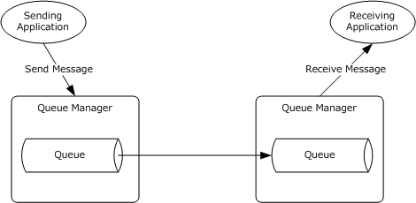
<!-- /Extracted images from page 6 -->

Figure 2: Queues hosted by queue manager service

Message Queuing can optionally interact with other components to provide richer functionality to
applications. These components include the Directory Service and the Transaction Coordinator.
The participants in a Message Queuing System are shown in the following figure and include:

  Application: An application uses MSMQ application protocol and their associated components to
exchange messages asynchronously with other applications, as well as to perform management
and administrative operations on a Message Queuing System.

  Queue Manager: A queue manager is the message communication service that hosts queues and
interacts with the applications for sending and receiving messages. The queue manager also
interacts with other queue managers to asynchronously transfer messages between queues across
a network.

  Directory Service: A Directory Service is an optional MSMQ subcomponent that stores and

provides directory information such as network topology information, security key distribution,
queue and system metadata, and queue discovery.



Transaction Coordinator: A Transaction Coordinator is an optional MSMQ subcomponent. An
application can send or receive messages within the context of a transaction, and the
Transaction Coordinator interacts with the queue manager to accept or discard these operations,
depending on the outcome of the transaction, while maintaining atomicity, consistency, isolation,
and durability (ACID) behavior throughout the lifetime of the transaction.

[MS-MQOD] - v20220902
Message Queuing Protocols Overview
Copyright © 2022 Microsoft Corporation
Release: September 2, 2022

6 / 83

<!-- Extracted images from page 7 -->
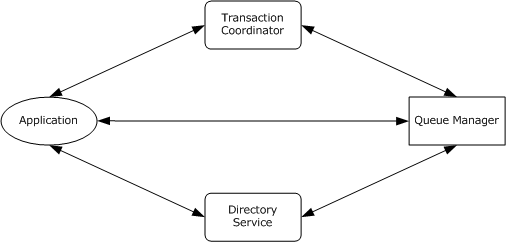
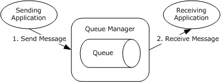
<!-- /Extracted images from page 7 -->

Figure 3: Participating components in a Message Queuing System

A queue is a temporary placeholder for messages that are shared between applications. The simplest
Message Queuing deployment involves two applications and a single queue that is accessible to both
the applications. The queue is hosted and managed by a single queue manager. One application sends
messages to the queue, and the other application receives the messages from the same queue, as
shown in the following diagram.

Figure 4: MSMQ deployment with two applications and a single queue

The sending application sends a message to the queue. When the send operation is successful, the
application proceeds with other work, or terminates. The receiving application subsequently receives
the message asynchronously (2). The message is removed from the queue. This asynchronous
message exchange pattern enables the temporal decoupling of the send operation from the receive
operation.

The following figure illustrates a topology that differs slightly from the previous one in that the sending
application and the receiving application do not share the same queue. Instead, both the sending
application and the receiving application interact with separate, directly accessible queues. The
sending application interacts with a source queue, and the receiving application interacts with a
destination queue. Additionally, the destination queue is directly reachable from the source queue in a
network. Each queue is hosted and managed by a separate queue manager.

[MS-MQOD] - v20220902
Message Queuing Protocols Overview
Copyright © 2022 Microsoft Corporation
Release: September 2, 2022

7 / 83

<!-- Extracted images from page 8 -->
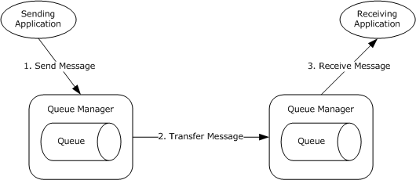
<!-- /Extracted images from page 8 -->

Figure 5: MSMQ deployment where applications do not share the same queue

In the deployment topology that is shown in the preceding figure, the sending application puts a
message in the queue [1]. This source queue works as the temporary placeholder for the message
and is called the outgoing queue. Next, the Message Queuing System directly transfers the message
to the destination queue and removes the message from the outgoing queue [2]. Finally, the receiving
application receives the message from the destination queue [3].

If the destination queue is not directly reachable from the source queue in a network, additional
interim queues are required between the source queue and the final destination queue. Each interim
queue is hosted and managed by a queue manager. Messages are routed to the final destination
queue through one or more interim queues. Although the destination queue is not directly reachable
from the source queue, each interim queue is reachable by its preceding queue and its successor
queue.

Queues are hosted and managed by a queue manager that plays the queue server role. The queue
manager hosts and manages a set of local queues, acts as an intermediary placeholder for storing
and forwarding messages to their final destinations, and interacts with the applications for sending
and receiving messages. The queue manager performs the following tasks:

  On the send side, the queue manager manages its queues, accepts messages from the sending
application, and optionally transfers messages to other queue managers. If the messages are
destined for a queue that the send-side queue manager hosts, the messages are placed in that
queue on the machine. (See the preceding figure captioned "MSMQ deployment with two
applications and a single queue"). Alternatively, if the messages belong to a queue that is not
hosted by the queue manager on the send side, the messages are placed in an outgoing queue
and subsequently transferred to the destination queue manager. (See the preceding figure
captioned "MSMQ deployment where applications do not share the same queue").

  On the receive side, the queue manager manages its queues, accepts messages transferred from

other queue managers, and delivers messages to the receiving application. The preceding figure
captioned "MSMQ deployment with two applications and a single queue" illustrates the simple
topology where the send-side queue manager is the same as the receive-side queue manager. In
this figure, the single queue manager manages its queues, accepts messages from the sending
application, and delivers them to the receiving application. The preceding figure captioned "MSMQ
deployment where applications do not share the same queue" illustrates a topology that involves
two separate queue managers, one at the send side that interacts with the sending application,
and the other at the receiving side that interacts with the receiving application. These two queue
managers interact to transfer messages between queues. As the queue manager on the send side
transfers messages from its outgoing queue, the queue manager on the receive side accepts and
stores those messages. Subsequently, the receive-side queue manager delivers the messages to
the appropriate receiving applications.

8 / 83

[MS-MQOD] - v20220902
Message Queuing Protocols Overview
Copyright © 2022 Microsoft Corporation
Release: September 2, 2022

<!-- Extracted images from page 9 -->
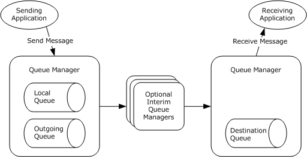
<!-- /Extracted images from page 9 -->

  Optionally, there can be other queue managers between the send and the receive queue

managers. This approach facilitates efficient message routing between the source and the
destination queues. These interim queue managers store incoming messages and route them to
the next hop so that they can eventually reach the final destination queue.

The queue manager undertakes one or more of the preceding tasks; for each task, the queue
manager can manage more than one queue. In other words, a queue manager manages all its hosted
queues and its outgoing queues, interacts with the sending and receiving applications, and interacts
with other queue managers to transfer messages between queues.

The following figure depicts an example of a simple Message Queuing System deployed on a network.

Figure 6: Message Queuing System deployed over a network

As depicted in the preceding figure, a sending application sends a message to a nearby queue
manager. If the destination queue is hosted by the queue manager (a local queue), the queue
manager stores the message in the local queue. Alternatively, if the destination queue is hosted by
another queue manager on a different machine, the queue manager places the message in an
outgoing queue. In either case, the sending application can proceed to do other work. The queue
manager asynchronously transfers the message from the outgoing queue to the queue manager of the
destination queue, optionally through interim queue managers for routing the message. Subsequently,
a receiving application reads the message from the destination queue.

### 1.2 Glossary

This document uses the following terms:

access control entry (ACE): An entry in an access control list (ACL) that contains a set of user

rights and a security identifier (SID) that identifies a principal for whom the rights are
allowed, denied, or audited.

access control list (ACL): A list of access control entries (ACEs) that collectively describe the
security rules for authorizing access to some resource; for example, an object or set of objects.

application: A participant that is responsible for beginning, propagating, and completing an atomic

transaction. An application communicates with a transaction manager in order to begin and
complete transactions. An application communicates with a transaction manager in order to
marshal transactions to and from other applications. An application also communicates in

9 / 83

[MS-MQOD] - v20220902
Message Queuing Protocols Overview
Copyright © 2022 Microsoft Corporation
Release: September 2, 2022

application-specific ways with a resource manager in order to submit requests for work on
resources.

application protocol: A protocol that is used by applications to communicate with queue

managers. Application protocols include the Message Queuing (MSMQ): Queue Manager
Client Protocol [MS-MQMP], the Message Queuing (MSMQ): Queue Manager Management
Protocol [MS-MQMR] and the Message Queuing (MSMQ): ActiveX Client Protocol [MC-MQAC].

asynchronous messaging: Communication between two applications or systems, independent

of time.

at most once: A message delivery assurance that requires that a Message Queuing System

deliver a message to its destination at most once. Some messages might not be delivered.

atomic transaction: A shared activity that provides mechanisms for achieving the atomicity,
consistency, isolation, and durability (ACID) properties when state changes occur inside
participating resource managers.

best effort: Indicates that a Message Queuing System makes a best effort to meet the specified
message delivery assurance, but does not raise an error if the delivery assurance is not met.

connected network: A network of computers in which any two computers can communicate

directly through a common transport protocol (for example, TCP/IP or SPX/IPX). A computer can
belong to multiple connected networks.

connector application: An application that runs on a connector server and translates both

outgoing and incoming messages sent between a Message Queuing computer and a foreign
messaging system.

connector server: A Message Queuing routing server that is configured to send messages

between a Message Queuing site and one or more foreign sites. A connector server has a
connector application running on it and two connector queues for each foreign site: one used
for transactional messages and one used for nontransactional messages.

cursor: A data structure providing sequential access over a message queue. A cursor has a current
pointer that lies between the head and tail pointer of the queue. The pointer can be moved
forward or backward through an operation on the cursor (Next). A message at the current
pointer can be accessed through a nondestructive read (Peek) operation or a destructive read
(Receive) operation.

dead-letter queue: A queue that contains messages that were sent from a host with a request
for negative source journaling and that could not be delivered. Message Queuing provides a
transactional dead-letter queue and a non-transactional dead-letter queue.

direct format name: A name that is used to reference a public queue or a private queue

without accessing the MSMQ Directory Service. Message Queuing can use the physical, explicit
location information provided by direct format names to send messages directly to their
destinations. For more information, see [MS-MQMQ] section 2.1.

directory service (DS): An entity that maintains a collection of objects. These objects can be

remotely manipulated either by the Message Queuing (MSMQ): Directory Service Protocol, as
specified in [MS-MQDS], or by the Lightweight Directory Access Protocol (v3), as specified in
[RFC2251].

Directory-Integrated mode: A Message Queuing deployment mode in which the clients and

servers use a Directory Service to enable a set of features pertaining to message security,
efficient routing, queue discovery, distribution lists, and aliases. See also Workgroup mode.

[MS-MQOD] - v20220902
Message Queuing Protocols Overview
Copyright © 2022 Microsoft Corporation
Release: September 2, 2022

10 / 83

discretionary access control list (DACL): An access control list (ACL) that is controlled by

the owner of an object and that specifies the access particular users or groups can have to the
object.

distribution list: An Active Directory object that can contain explicit references only to

destinations published in Active Directory; that is, to public queues, queue aliases, and other
distribution lists, but not to private and URL-named queues.

domain: A set of users and computers sharing a common namespace and management

infrastructure. At least one computer member of the set has to act as a domain controller
(DC) and host a member list that identifies all members of the domain, as well as optionally
hosting the Active Directory service. The domain controller provides authentication of members,
creating a unit of trust for its members. Each domain has an identifier that is shared among its
members. For more information, see [MS-AUTHSOD] section 1.1.1.5 and [MS-ADTS].

domain controller (DC): The service, running on a server, that implements Active Directory, or
the server hosting this service. The service hosts the data store for objects and interoperates
with other DCs to ensure that a local change to an object replicates correctly across all DCs.
When Active Directory is operating as Active Directory Domain Services (AD DS), the DC
contains full NC replicas of the configuration naming context (config NC), schema naming
context (schema NC), and one of the domain NCs in its forest. If the AD DS DC is a global
catalog server (GC server), it contains partial NC replicas of the remaining domain NCs in its
forest. For more information, see [MS-AUTHSOD] section 1.1.1.5.2 and [MS-ADTS]. When
Active Directory is operating as Active Directory Lightweight Directory Services (AD LDS),
several AD LDS DCs can run on one server. When Active Directory is operating as AD DS, only
one AD DS DC can run on one server. However, several AD LDS DCs can coexist with one AD
DS DC on one server. The AD LDS DC contains full NC replicas of the config NC and the schema
NC in its forest. The domain controller is the server side of Authentication Protocol Domain
Support [MS-APDS].

enqueue: The process of adding data to a queue.

enterprise: A unit of administration of a network of MSMQ queue managers. An enterprise

consists of an MSMQ Directory Service, one or more connected networks, and one or more
MSMQ sites.

exactly once: A message delivery assurance that requires that the Message Queuing system
delivers the message to the destination once and only once, such that each sent message is
either delivered once to the destination or an error is raised.

express message: A volatile message that does not persist through queue manager restarts.

These express messages provide best-effort, at-most-once delivery assurance.

external transaction: An atomic transaction context dispensed by a transaction coordinator other
than an MSMQ queue manager, such as by a distributed transaction coordinator (DTC), and
used by an MSMQ queue manager to coordinate its state changes with state changes in other
resource managers. For more information on transactions, see [MS-DTCO].

facet: In OleTx, a subsystem in a transaction manager that maintains its own per-transaction
state and responds to intra-transaction manager events from other facets. A facet can also
be responsible for communicating with other participants of a transaction.

foreign queue: A messaging queue that resides on a computer that does not run an MSMQ

messaging application.

Hypertext Transfer Protocol (HTTP): An application-level protocol for distributed, collaborative,
hypermedia information systems (text, graphic images, sound, video, and other multimedia
files) on the World Wide Web.

[MS-MQOD] - v20220902
Message Queuing Protocols Overview
Copyright © 2022 Microsoft Corporation
Release: September 2, 2022

11 / 83

Hypertext Transfer Protocol Secure (HTTPS): An extension of HTTP that securely encrypts and

decrypts web page requests. In some older protocols, "Hypertext Transfer Protocol over Secure
Sockets Layer" is still used (Secure Sockets Layer has been deprecated). For more information,
see [SSL3] and [RFC5246].

in-routing server: An MSMQ routing server that receives all messages on behalf of a particular

client and forwards those messages to that client.

internal transaction: An atomic transaction context dispensed by an MSMQ Queue Manager

instance that can be used to atomically commit or roll back state changes within that MSMQ
Queue Manager. The dispensing MSMQ Queue Manager instance is the transaction coordinator
and is also the only resource manager participant supported by the transaction context. An
internal transaction cannot, therefore, be used to coordinate state changes with other resource
managers, including other MSMQ Queue Manager instances.

Internetwork Packet Exchange (IPX): A protocol that provides connectionless datagram

delivery of messages. See [IPX].

Lightweight Directory Access Protocol (LDAP): The primary access protocol for Active

Directory. Lightweight Directory Access Protocol (LDAP) is an industry-standard protocol,
established by the Internet Engineering Task Force (IETF), which allows users to query and
update information in a directory service (DS), as described in [MS-ADTS]. The Lightweight
Directory Access Protocol can be either version 2 [RFC1777] or version 3 [RFC3377].

local queue: For a queue manager, a queue hosted by the queue manager itself. For an

application, a queue hosted by the queue manager with which the application
communicates.

management application: An MSMQ application that performs management operations, as

specified in [MS-MQMR].

message: A data structure representing a unit of data transfer between distributed applications. A
message has message properties, which can include message header properties, a message
body property, and message trailer properties.

message queuing system: An installed or a hypothetical configuration of Microsoft Message

Queuing (MSMQ) protocol set components, including message queuing applications, queue
managers, and optional subcomponents such as a Directory Service and a Transaction
Coordinator.

Microsoft Message Queuing (MSMQ): A communications service that provides asynchronous

and reliable message passing between distributed applications. In Message Queuing,
applications send messages to queues and consume messages from queues. The queues
provide persistence of the messages, enabling the sending and receiving applications to
operate asynchronously from one another.

MSMQ application protocol: A protocol that is used by applications to communicate with
queue managers. Application protocols include the Message Queuing (MSMQ): Queue
Manager Client Protocol [MS-MQMP], the Message Queuing (MSMQ): Queue Manager
Management Protocol [MS-MQMR] and the Message Queuing (MSMQ): ActiveX Client Protocol
[MC-MQAC].

MSMQ Directory Service server: An MSMQ queue manager that provides MSMQ Directory
Service. The server can act in either of the MSMQ Directory Service roles: Primary Site
Controller (PSC) or Backup Site Controller (BSC).

MSMQ management server: A role played by an MSMQ queue manager. An MSMQ

management server enables management applications to perform management and
administrative operations on the Message Queuing System. The Management Server operations
are specified in [MS-MQMR] and [MS-MQCN].

12 / 83

[MS-MQOD] - v20220902
Message Queuing Protocols Overview
Copyright © 2022 Microsoft Corporation
Release: September 2, 2022

MSMQ routing link: A communication link between two sites. A routing link is represented by a

routing link object in the directory service. Routing links can have associated link costs. Routing
links with their associated costs can be used to compute lowest-cost routing paths for store-and-
forward messaging.

MSMQ site: A network of computers, typically physically collocated, that have high connectivity as
measured in terms of latency (low) and throughput (high). A site is represented by a site object
in the directory service. An MSMQ site maps one-to-one with an Active Directory site when
Active Directory provides directory services to MSMQ.

MSMQ site gate: An MSMQ routing server through which all intersite messaging traffic flows.

negative source journaling: The process of retaining copies of unsuccessfully delivered

messages. The copies are retained by the QueueManager. Also known as dead-lettering.

network address: An address that is used to identify and communicate with a specific computer
in a computer network. A computer can have more than one network address. Any of these
network addresses can be used to communicate with the computer.

outcome: One of the three possible results (Commit, Abort, In Doubt) reachable at the end of a

life cycle for an atomic transaction.

outgoing queue: A temporary internal queue that holds messages for a remote destination

queue. The path name of an outgoing queue is identical to the path name of the corresponding
destination queue. An outgoing queue is distinguished from its corresponding destination
queue by the fact that the outgoing queue is located on the sending computer. The format
name of an outgoing queue is identical to the format name used by the messages to reference
the destination queue. Messages that reference the destination queue using a different format
name are placed in a different outgoing queue.

out-routing server: An MSMQ routing server that receives all messages sent by a particular

client and routes those messages on behalf of that client.

poison message: A message in a queue that cannot be processed by an application because of

errors unrelated to the Message Queuing System. A poison message can cause an
application to fail repetitively until the message has been removed from the queue.

private key: One of a pair of keys used in public-key cryptography. The private key is kept secret
and is used to decrypt data that has been encrypted with the corresponding public key. For an
introduction to this concept, see [CRYPTO] section 1.8 and [IEEE1363] section 3.1.

private queue: An application-defined message queue that is not registered in the MSMQ

Directory Service. A private queue is deployed on a particular queue manager.

public key: One of a pair of keys used in public-key cryptography. The public key is distributed
freely and published as part of a digital certificate. For an introduction to this concept, see
[CRYPTO] section 1.8 and [IEEE1363] section 3.1.

public queue: An application-defined message queue that is registered in the MSMQ Directory

Service. A public queue can be deployed at any queue manager.

queue: An object that holds messages passed between applications or messages passed

between Message Queuing and applications. In general, applications can send messages to
queues and read messages from queues.

queue manager (QM): A message queuing service that manages queues deployed on a

computer. A queue manager can also provide asynchronous transfer of messages to queues
deployed on other queue managers.

queue server: See MSMQ queue server.

13 / 83

[MS-MQOD] - v20220902
Message Queuing Protocols Overview
Copyright © 2022 Microsoft Corporation
Release: September 2, 2022

receive: An atomic operation that retrieves and removes a message from a message queue.

recoverable message: A message that persists through queue manager restarts and provides

best-effort, at-most-once delivery assurance.

remote procedure call (RPC): A communication protocol used primarily between client and

server. The term has three definitions that are often used interchangeably: a runtime
environment providing for communication facilities between computers (the RPC runtime); a set
of request-and-response message exchanges between computers (the RPC exchange); and the
single message from an RPC exchange (the RPC message).  For more information, see [C706].

remote queue: For a queue manager, a queue that is hosted by a remote queue manager.

For an application, a queue hosted by a queue manager other than the one with which the
application communicates.

remote read: The act of reading (receiving) messages from a remote queue.

resource manager (RM): The participant that is responsible for coordinating the state of a
resource with the outcome of atomic transactions. For a specified transaction, a resource
manager enlists with exactly one transaction manager to vote on that transaction outcome and
to obtain the final outcome. A resource manager is either durable or volatile, depending on its
resource.

routing link: See MSMQ routing link.

routing server: See MSMQ routing server.

security identifier (SID): An identifier for security principals that is used to identify an account
or a group. Conceptually, the SID is composed of an account authority portion (typically a
domain) and a smaller integer representing an identity relative to the account authority,
termed the relative identifier (RID). The SID format is specified in [MS-DTYP] section 2.4.2; a
string representation of SIDs is specified in [MS-DTYP] section 2.4.2 and [MS-AZOD] section
1.1.1.2.

site gate: See MSMQ site gate.

supporting server: See MSMQ supporting server.

symmetric key: A secret key used with a cryptographic symmetric algorithm. The key needs to be
known to all communicating parties. For an introduction to this concept, see [CRYPTO] section
1.5.

transaction: A unit of interaction that guarantees the ACID properties— atomicity, consistency,
isolation, and durability—as specified by the MSDTC Connection Manager: OleTx Transaction
Protocol ([MS-DTCO])

transaction coordinator: A service that provides concrete mechanisms for beginning,

propagating, and completing atomic transactions. A transaction coordinator also provides
mechanisms for coordinating agreement on a single atomic outcome for each transaction and
for reliably distributing that outcome to all participants in the transactions. For more
information, see [MS-DTCO].

transaction manager: The party that is responsible for managing and distributing the outcome of

atomic transactions. A transaction manager is either a root transaction manager or a
subordinate transaction manager for a specified transaction.

transactional message: A message sent as part of a transaction. Transaction messages have to

be sent to transactional queues.

transactional queue: A queue that contains only transactional messages.

14 / 83

[MS-MQOD] - v20220902
Message Queuing Protocols Overview
Copyright © 2022 Microsoft Corporation
Release: September 2, 2022

Unicode string: A Unicode 8-bit string is an ordered sequence of 8-bit units, a Unicode 16-bit
string is an ordered sequence of 16-bit code units, and a Unicode 32-bit string is an ordered
sequence of 32-bit code units. In some cases, it could be acceptable not to terminate with a
terminating null character. Unless otherwise specified, all Unicode strings follow the UTF-16LE
encoding scheme with no Byte Order Mark (BOM).

unit of work: A set of individual operations that MSMQ has to successfully complete before any of

the individual MSMQ operations can be considered complete.

User Datagram Protocol (UDP): The connectionless protocol within TCP/IP that corresponds to

the transport layer in the ISO/OSI reference model.

workgroup mode: A Message Queuing deployment mode in which the clients and servers operate
without using a Directory Service. In this mode, features pertaining to message security,
efficient routing, queue discovery, distribution lists, and aliases are not available. See also
Directory-Integrated mode.

### 1.3 References

[MC-COMQC] Microsoft Corporation, "Component Object Model Plus (COM+) Queued Components
Protocol".

[MC-MQAC] Microsoft Corporation, "Message Queuing (MSMQ): ActiveX Client Protocol".

[MC-MQSRM] Microsoft Corporation, "Message Queuing (MSMQ): SOAP Reliable Messaging Protocol
(SRMP)".

[MS-ADA2] Microsoft Corporation, "Active Directory Schema Attributes M".

[MS-ADTS] Microsoft Corporation, "Active Directory Technical Specification".

[MS-AUTHSOD] Microsoft Corporation, "Authentication Services Protocols Overview".

[MS-DTCO] Microsoft Corporation, "MSDTC Connection Manager: OleTx Transaction Protocol".

[MS-DTYP] Microsoft Corporation, "Windows Data Types".

[MS-MQBR] Microsoft Corporation, "Message Queuing (MSMQ): Binary Reliable Message Routing
Algorithm".

[MS-MQCN] Microsoft Corporation, "Message Queuing (MSMQ): Directory Service Change Notification
Protocol".

[MS-MQDMPR] Microsoft Corporation, "Message Queuing (MSMQ): Common Data Model and
Processing Rules".

[MS-MQDSSM] Microsoft Corporation, "Message Queuing (MSMQ): Directory Service Schema
Mapping".

[MS-MQDS] Microsoft Corporation, "Message Queuing (MSMQ): Directory Service Protocol".

[MS-MQMP] Microsoft Corporation, "Message Queuing (MSMQ): Queue Manager Client Protocol".

[MS-MQMQ] Microsoft Corporation, "Message Queuing (MSMQ): Data Structures".

[MS-MQMR] Microsoft Corporation, "Message Queuing (MSMQ): Queue Manager Management
Protocol".

[MS-MQQB] Microsoft Corporation, "Message Queuing (MSMQ): Message Queuing Binary Protocol".

15 / 83

[MS-MQOD] - v20220902
Message Queuing Protocols Overview
Copyright © 2022 Microsoft Corporation
Release: September 2, 2022

[MS-MQQP] Microsoft Corporation, "Message Queuing (MSMQ): Queue Manager to Queue Manager
Protocol".

[MS-MQRR] Microsoft Corporation, "Message Queuing (MSMQ): Queue Manager Remote Read
Protocol".

[MS-MQSD] Microsoft Corporation, "Message Queuing (MSMQ): Directory Service Discovery Protocol".

[MS-RDPBCGR] Microsoft Corporation, "Remote Desktop Protocol: Basic Connectivity and Graphics
Remoting".

[MSDN-WCF] Microsoft Corporation, "Windows Communication Foundation",
http://msdn.microsoft.com/en-us/library/ms735119.aspx

[MSFT-PKI] Microsoft Corporation, "Best Practices for Implementing a Microsoft Windows Server 2003
Public Key Infrastructure", July 2004,
http://technet2.microsoft.com/WindowsServer/en/library/091cda67-79ec-481d-8a96-
03e0be7374ed1033.mspx

[RFC1321] Rivest, R., "The MD5 Message-Digest Algorithm", RFC 1321, April 1992, https://www.rfc-
editor.org/info/rfc1321

[RFC2616] Fielding, R., Gettys, J., Mogul, J., et al., "Hypertext Transfer Protocol -- HTTP/1.1", RFC
2616, June 1999, https://www.rfc-editor.org/info/rfc2616

[RFC3208] Speakman, T., Crowcroft, J., Gemmell, J., Farinacci, D., Lin, S., Leshchiner, D., Luby, M.,
Montgomery, T., Rizzo, L., Tweedly, A., Bhaskar, N., Edmonstone, R., Sumanasekera, R., and
Vicisano, L., "PGM Reliable Transport Protocol Specification", RFC 3208, December 2001,
https://www.rfc-editor.org/info/rfc3208

[RFC3275] Eastlake III, D., Reagle, J., and Solo, D., "(Extensible Markup Language) XML-Signature
Syntax and Processing", RFC 3275, March 2002, https://www.rfc-editor.org/info/rfc3275

[RFC3377] Hodges, J. and Morgan, R., "Lightweight Directory Access Protocol (v3): Technical
Specification", RFC 3377, September 2002, http://www.ietf.org/rfc/rfc3377.txt

[SP800-32] NIST, "Introduction to Public Key Technology and the Federal PKI Infrastructure", SP800-
32, February 2001, http://nvlpubs.nist.gov/nistpubs/Legacy/SP/nistspecialpublication800-32.pdf

[MS-MQOD] - v20220902
Message Queuing Protocols Overview
Copyright © 2022 Microsoft Corporation
Release: September 2, 2022

16 / 83

## 2 Functional Architecture

### 2.1 Overview

#### 2.1.1 Purpose

The primary purpose of the MSMQ protocols is to enable a temporal decoupling of applications by
providing an asynchronous messaging service between applications that have to communicate
reliably with each other through messages that they send and receive. The MSMQ protocols account
for transient networking failure, system availability, and queue location.

#### 2.1.2 Capabilities

The Microsoft Message Queuing (MSMQ) protocols provide the following capabilities to messaging
applications:

Message Delivery Assurance (section 2.1.2.1)

Message Transfer and Routing (section 2.1.2.2)

Message Security (section 2.1.2.3)

Management and Administration (section 2.1.2.4)

##### 2.1.2.1 Message Delivery Assurance

The MSMQ protocols provide the following levels of message delivery assurance:

Best-effort Express Delivery: Provides best-effort, at most once express delivery assurance

through express messages that are volatile and therefore can be lost in transit during
transient unavailability or failure of the Message Queuing components or of the underlying
network. These messages do not persist through system restarts.

Best-effort Delivery: Provides best-effort, at most once delivery assurance through recoverable
messages. These messages are saved by the queue manager and therefore persist through
system restarts. These messages can be lost in transit during transient unavailability or failure
of the underlying network.

Exactly-once Delivery: Provides exactly-once delivery assurance for messages that are sent to
transactional queues. A source applications sends one or more messages to a transactional
queue as part of a transaction. Subject to the outcome of the transaction, the queue manager
accepts and persists these messages. Subsequently, the messages are transferred between
queue managers for placement in the destination queue. A destination application receives and
processes messages as part of a transaction. Whether the messages are treated as consumed
depends on the outcome of the transaction. A Message Queuing System is required to receive
and deliver these messages only in the scope of a transaction.

##### 2.1.2.2 Message Transfer and Routing

The MSMQ protocol set supports message transfer across complex network topologies and over a
variety of network transport protocols that include the Transmission Control Protocol/Internet Protocol
(TCP/IP) or the Internetwork Packet Exchange/Sequenced Packet Exchange (IPX/SPX), the User
Datagram Protocol (UDP), the Hypertext Transfer Protocol (HTTP), the Hypertext Transfer Protocol
over Secure Sockets Layer (HTTPS), and Pragmatic General Multicast ([RFC3208]). To optimize
message throughput, the MSMQ protocol set defines an optional routing mechanism to find and use
the least-cost routing path between two machines, as described in [MS-MQBR].

17 / 83

[MS-MQOD] - v20220902
Message Queuing Protocols Overview
Copyright © 2022 Microsoft Corporation
Release: September 2, 2022

<!-- Extracted images from page 18 -->
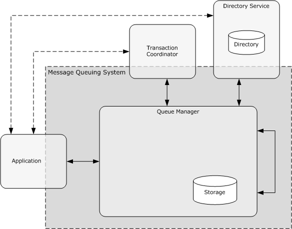
<!-- /Extracted images from page 18 -->

##### 2.1.2.3 Message Security

The MSMQ protocols enable secure messaging between applications by supporting a variety of
security features that include user authentication, authorization, message integrity, and message
encryption and decryption. The MSMQ security architecture is described in section 2.9 of this
document.

##### 2.1.2.4 Management and Administration

The MSMQ protocol set defines protocols for management applications for its configuration,
management, and administration.

#### 2.1.3 Interaction with External Components

This section describes the externally visible view of the MSMQ protocols and the components in the
system.

The following figure expands on the figure with the caption "Participating components in a Message
Queuing System" in section 1.1 and shows the various internal and external components of a
Message Queuing System.

Figure 7: Interactions with external components

The queue manager interacts with its internal storage subsystem for persistence of its configuration
data, application data, which includes queues and nonvolatile messages, and state. The exact storage
mechanism that is used varies per implementation of the MSMQ protocol set; however, it retains
persistent data and state across system restarts. The queue manager interacts with other queue
managers in the implementation.

18 / 83

[MS-MQOD] - v20220902
Message Queuing Protocols Overview
Copyright © 2022 Microsoft Corporation
Release: September 2, 2022

<!-- Extracted images from page 19 -->
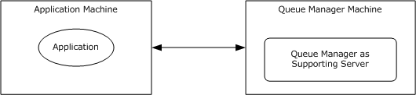
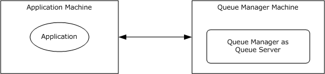
<!-- /Extracted images from page 19 -->

The queue manager optionally interacts with an external Transaction Coordinator to provide
transactional capabilities while sending or receiving messages to or from individual queues.
Applications can create external transactions from the Transaction Coordinator and can pass them
on to MSMQ protocols to atomically perform certain messaging operations. The external Transaction
Coordinator functionality is described in [MS-DTCO].

The MSMQ protocol set optionally uses a directory through a Directory Service component. The
directory stores and provides information such as network topology, security key distribution, queue
and system metadata, and queue discovery. For more information about the Directory Service, see
section 2.1.3.3.

The following subsections describe the relationship of the queue manager with the preceding
subcomponents.

##### 2.1.3.1 Message Queuing and Applications

Applications use the Microsoft Message Queuing (MSMQ) application protocols to accomplish
asynchronous messaging functionalities. An application typically interacts with one queue
manager. A queue manager implements the supporting server role or the queue server role, or
both, to communicate with applications that pursue message exchange functionality.

A queue manager acts as a supporting server. As a supporting server, it implements the server side of
MQMP and thereby provides a subset of the MSMQ functionality, as described in [MS-MQMP] section 1.
An application interacts with the supporting server through the client side of MQMP. The following
figure shows this deployment mode.

Figure 8: Queue manager as supporting server

Alternatively, a queue manager acts as a queue server. As a queue server, it implements the server
side of MQAC and both the client and server sides of the MQQP or MQRR. It thereby provides the full
set of message exchange functionality of the MSMQ protocol set. An application interacts with the
queue server through the client sides of the MQAC protocol. The following figure shows this
deployment mode.

Figure 9: Queue manager as queue server

A queue manager acts as an MSMQ management server. As an MSMQ management server, it
implements the server side of MQMR and the management interfaces of the MQAC protocol, as well as
the client and server side of the MQCN. It thereby provides the management and administrative
capabilities of the MSMQ protocol set. An application interacts with the MSMQ management server

19 / 83

[MS-MQOD] - v20220902
Message Queuing Protocols Overview
Copyright © 2022 Microsoft Corporation
Release: September 2, 2022

<!-- Extracted images from page 20 -->
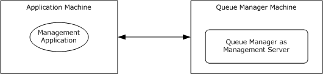
<!-- /Extracted images from page 20 -->

through the client side of the MQMR protocol and the client side of the management interfaces of the
MQAC protocol. The following figure shows this deployment mode.

Figure 10: Queue manager as Management Server

##### 2.1.3.2 Reliable Message Processing Using Transactions

As described in section 2.1.3, the Microsoft Message Queuing (MSMQ) protocol set supports end-to-
end exactly-once delivery assurance through transactional messages, as opposed to best-effort
delivery assurance through express or recoverable messages. The MSMQ protocol set interacts with
a Transaction Coordinator to support transactional messaging. This section elaborates on the
mechanism by which transactions are used together with exactly-once message delivery assurance to
facilitate end-to-end reliable message processing.

The MSMQ protocol set provides transactional semantics by defining explicit transaction boundaries in
end-to-end messaging and also by defining the error-handling/compensation semantics. This
functionality is achieved through the following steps:

1.  An application sends a message to a transactional queue as part of a transaction.

2.  If the destination queue is hosted on a remote machine with respect to the sending queue, the
message is reliably transferred to the remote queue by using the MQQB, MQBR, or MQSRM
message transfer and routing protocols.

3.  The receiving application receives and processes the message as part of another transaction.

To manage the queue as a transactional resource, the queue managers for both the sending side and
the receiving side implement the resource manager (RM) role as described in [MS-DTCO] section
1.3.3.2. As part of the RM role, each queue manager participates with the RM facet of a transaction
manager coordinated by an external Transaction Coordinator, as described in [MS-DTCO] section
1.3.3.3.

The participating applications fulfill the application role as described in [MS-DTCO] section 1.3.3.1. The
sending application initiates and completes the transactions within the message send boundary. The
receiving application initiates and completes the transaction within the message receipt boundary.

The transactional semantics illustrated in the following figure includes the following steps:

1.  Transacted Send:

1.  The sending application creates a transaction and performs certain application-specific tasks

on the transaction.

2.  Subsequently, the application sends the message in the transaction.

3.  The RM facet of the queue manager enlists in the transaction.

4.  The queue manager enqueues the message and makes this change invisible outside the

scope of the transaction.

5.  Subsequently, the application commits the transaction.

20 / 83

[MS-MQOD] - v20220902
Message Queuing Protocols Overview
Copyright © 2022 Microsoft Corporation
Release: September 2, 2022

6.  The Transaction Coordinator coordinates the transaction with all the RMs enlisted in the

transaction, including the queue manager. For simplicity, the Prepare and Commit steps of a
two-phase commit are depicted as a single TxCommit message in the following figure.

7.  The queue manager participates in the two-phase commit with the Transaction Coordinator

and makes the message visible upon a commit outcome of the transaction. In case of an abort
outcome of the transaction, the message is discarded.

The transaction boundary on the send side ends here.

2.  Reliable Transfer:

If the destination queue is hosted by a different queue manager than the one accepting the
original message, the sending queue manager reliably transfers the message to the receiving
queue manager. If the destination queue is hosted by the same queue manager, this step is not
required.

1.  The queue manager uses the MQQB or MQSRM transfer protocols to transfer the message to
the destination queue. This operation is retried until an acknowledgment is received from the
destination queue manager.

2.  The destination queue manager receives and stores the message, and sends a transfer

acknowledgment.

3.  Upon receipt of a transfer acknowledgment from the destination queue manager, the source

queue manager removes the message from the source queue.

3.  Transacted Receive:

The receiving application creates a transaction and performs certain application-specific tasks on
the transaction.

1.  Once the message is available in the destination queue, the receiving application can proceed
with consuming the message within the scope of the transaction. The receiving application
creates a transaction.

2.  The application receives the message within the scope of the transaction.

3.  The RM facet of the receiving queue manager enlists in the transaction.

4.  The receiving queue manager makes the message invisible outside the context of the

transaction.

5.  The receiving queue manager returns the message to the application.

6.  Subsequently, the application processes the message and commits the transaction.

7.  The Transaction Coordinator coordinates the transaction with all the RMs enlisted in the

transaction, including the queue manager. For simplicity, the Prepare and Commit steps of a
two-phase commit are depicted as a single TxCommit message in the following figure.

8.  The receiving queue manager participates in a two-phase commit with the Transaction

Coordinator and deletes the message from the queue on a commit outcome of the transaction.
In case of an abort outcome of the transaction, the message is returned back to the queue.

The transactional boundary of the receiving application ends here.

[MS-MQOD] - v20220902
Message Queuing Protocols Overview
Copyright © 2022 Microsoft Corporation
Release: September 2, 2022

21 / 83

<!-- Extracted images from page 22 -->
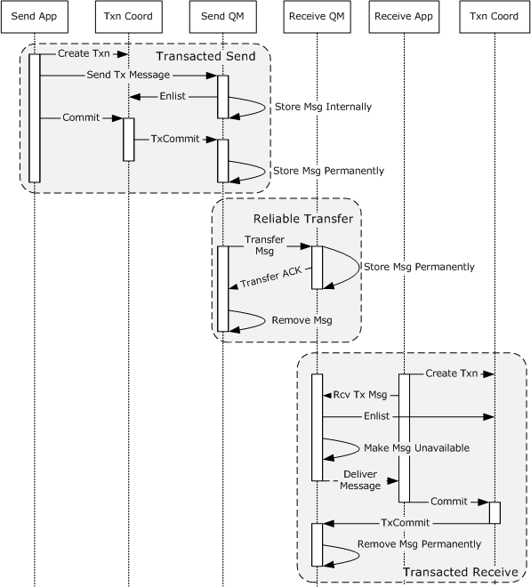
<!-- /Extracted images from page 22 -->

Figure 11: Transaction boundaries in end-to-end message exchange

The MSMQ protocol set specifies a lightweight internal Transaction Coordinator to avoid the overhead
of external transactions. MSMQ can dispense an internal transaction to an application, and this
transaction can be used to coordinate actions only with the dispensing queue manager. Internal
transactions can be used for sending messages to transactional queues, as long as no other external
transacted resource, including other transactional queues of a different queue manager, is
participating in the same internal transaction. The queue manager acts as a standalone transaction
manager, and no external Transaction Coordinator or other transaction managers are involved when
an internal transaction is used. In an end-to-end message exchange, internal and external
transactions can be mixed. Thus, a message can be sent using an internal transaction and received
using an external transaction and vice versa.

As part of reliable message processing, the MSMQ protocol set also provides the error-handling
semantics through negative source journaling and message Timers as specified in [MC-MQAC]
section 3.1.2. If the message times out or a failure is encountered in delivering the message to the

22 / 83

[MS-MQOD] - v20220902
Message Queuing Protocols Overview
Copyright © 2022 Microsoft Corporation
Release: September 2, 2022

<!-- Extracted images from page 23 -->
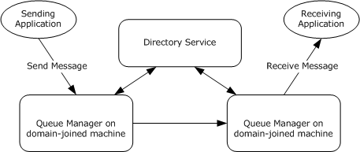
<!-- /Extracted images from page 23 -->

destination queue, the queue manager places the message in the designated dead-letter queue for
the sending application to perform application-specific error handling.

##### 2.1.3.3 Message Queuing and Directory Service

The Microsoft Message Queuing (MSMQ) protocol set optionally supports a Directory Service to
enable a set of features pertaining to message security, efficient routing, and the publishing of
queues, distribution lists, and queue aliases. The directory provides the MSMQ protocol set with
global storage and an access mechanism for shared metadata.

The MSMQ protocol set supports two predefined modes in terms of Directory Service integration:
Workgroup mode or Directory-Integrated mode.

Workgroup mode: In this mode, MSMQ protocol set implementations do not use the Directory

Service and are limited to private queues using direct format name addressing.

Directory-Integrated mode: In this mode, MSMQ protocol set implementations interact with the

Directory Service for publishing and accessing public queue metadata, network topology
information, and certificate and encryption metadata. In this mode, all queue managers
participating in the implementation are located on machines that are domain-joined.

Figure 12: Message Queuing in Directory-Integrated mode

The Directory Service and its function within the MSMQ protocol set are described in more detail in
[MS-MQDS] sections 1.3 and 3 and in [MC-MQAC] section 1.4. Versions 1.0 and 2.0 of MSMQ
implement their own Directory Service through the MQDS protocol. Subsequent versions of MSMQ use
Active Directory as the Directory Service through the Lightweight Directory Access Protocol
(LDAP)

Directory-Integrated mode with routing: The MSMQ protocol set supports least-cost routing of
messages within a computer network. This provision is particularly useful in complex network
topologies--for example, MSMQ computers belong to different administrative regions. This
configuration is accomplished by deploying an MSMQ protocol set implementation in Directory-
Integrated mode with routing enabled. In this mode, the MSMQ implementation retrieves the
network topology information from the Directory Service and uses this information for routing
messages from one queue manager to another. If a direct connection to the final destination
queue manager is not possible, the source queue manager makes use of interim special queue
managers known as routing servers, which can efficiently route messages to the next hop.

An overview of this type of deployment is described in [MS-MQBR] section 1.3. The following diagram
illustrates a typical deployment with routing servers across a complex network topology.

[MS-MQOD] - v20220902
Message Queuing Protocols Overview
Copyright © 2022 Microsoft Corporation
Release: September 2, 2022

23 / 83

<!-- Extracted images from page 24 -->
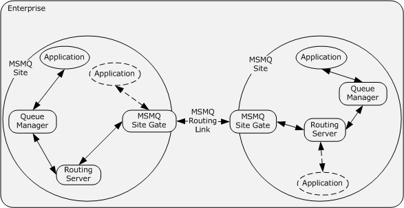
<!-- /Extracted images from page 24 -->

Figure 13: Enterprise deployment of MSMQ with routing

The preceding figure illustrates MSMQ deployment in an enterprise environment over a complex
deployment topology. The MSMQ routing functionality allows applications deployed on one part of the
enterprise network to communicate with remote applications deployed on another part of the
enterprise in such a way that, although there is no direct network connectivity between these two
applications, MSMQ can use interim routing servers to transfer messages between the applications in a
reliable way.

An MSMQ site is a network of computers, typically physically collocated, that have high connectivity
as measured in terms of latency (low) and throughput (high).

An MSMQ routing link is a communication link between two MSMQ sites.

A routing server is a queue manager role that enables Store-and-Forward messaging between
computers within an MSMQ site.

An MSMQ site gateis a routing server that bridges two or more MSMQ sites such that all intersite
messaging traffic flows through MSMQ site gates.

In an enterprise multisite deployment as shown in the previous illustration, a message flows in the
following manner:











The sender application sends the message to a source queue manager.

The queue manager transfers this message to a routing server in the same MSMQ site.

The routing server transfers the message to an MSMQ site gate.

The source MSMQ site gate transfers the message to the destination MSMQ site gate through the
MSMQ routing link.

The destination site gate transfers the message to the destination queue manager, optionally
through one or more routing servers.



The destination queue manager places the message in the destination queue.

Because both site gates and routing servers are queue managers themselves, applications can also
use them as queue managers. This functionality is illustrated in the preceding figure through dotted
association lines.

24 / 83

[MS-MQOD] - v20220902
Message Queuing Protocols Overview
Copyright © 2022 Microsoft Corporation
Release: September 2, 2022

The routing server algorithm as specified in [MS-MQBR] section 3.1 is used to determine the least-cost
message route between the source and destination queue managers.

#### 2.1.4 Roles

The MSMQ protocol set supports the following components that interact with each another.

##### 2.1.4.1 Application Roles

The following roles represent the external actors of the MSMQ protocol set:

Application: The application role represents the messaging actions performed by MSMQ

applications. The application role typically includes message sending and receiving operations to
or from application queues and uses the Message Queuing (MSMQ): Queue Manager Client
Protocol (MQMP) or Message Queuing (MSMQ): ActiveX Client Protocol (MQAC) application
protocols to interact with Message Queuing (MSMQ) protocol set components.

Management Application: This is a special application role that performs the management and
administrative aspects of the MSMQ protocol set. This role uses the client side of the Message
Queuing (MSMQ): Queue Manager Management Protocol (MQMR) and MQAC protocols to
interact with the MSMQ management server role of the queue manager, as described in the
following section.

##### 2.1.4.2 Queue Manager Roles

This section describes the roles exhibited by the queue manager in the Message Queuing (MSMQ)
protocol set.

###### 2.1.4.2.1 Queue Manager Roles for Application Interaction

The Message Queuing (MSMQ) protocol set supports the following server roles that allow interaction
with the applications, as described in section 2.1.3.1:

Queue Server: This role provides the MSMQ message exchange functionality and implements the
server side of Message Queuing (MSMQ): ActiveX Client Protocol (MQAC) and both the server
and client sides of Message Queuing (MSMQ): Queue Manager to Queue Manager Protocol
(MQQP) and Message Queuing (MSMQ): Queue Manager Remote Read Protocol (MQRR).

Management Server: In this role, the queue manager provides management and administrative

operations on the Message Queuing server. This role allows a management application to
retrieve administrative information specific to queues and messages. The Management Server
role also performs management operations on a queue. This role implements the server side of
Message Queuing (MSMQ): Queue Manager Management Protocol (MQMR), as specified in [MS-
MQMR] section 3.1; the server side of Message Queuing (MSMQ): Directory Service Change
Notification Protocol (MQCN), as specified in [MS-MQCN] section 3.1; and the server side of the
management interfaces of MQAC, as specified in [MC-MQAC] sections 3.2, 3.3, and 3.4.

Supporting Server: This is a queue manager role that implements the server side of the

supporting server protocol as specified in [MS-MQMP].

###### 2.1.4.2.2 Queue Manager Roles for Message Transfer and Routing

The following roles of the queue manager involve transferring messages from the source to the
destination.

Message Transfer: This role performs the actual transfer of messages between two queue

managers that are directly reachable from one another and implements both the client and
server sides of the message transfer protocols, the Message Queuing (MSMQ): Binary Reliable

25 / 83

[MS-MQOD] - v20220902
Message Queuing Protocols Overview
Copyright © 2022 Microsoft Corporation
Release: September 2, 2022

Messaging Protocol (MQQB) and the Message Queuing (MSMQ): SOAP Reliable Messaging
Protocol (SRMP).

Routing Server: The queue manager performs the routing server role for facilitating the transfer
of messages within a site or across sites. The routing server implements Store and Forward
messaging in an enterprise MSMQ deployment. This role implements the Message Queuing:
Binary Reliable Message Routing Algorithm [MS-MQBR]. A more specialized version of the
routing server role is the site gate role, where the queue manager provides routing between
sites.

###### 2.1.4.2.3 Queue Manager Role for Remote Read and Management

This queue manager role involves message read and management operations from a remote queue
manager. Such operations are triggered by user applications as described in section 2.1.4.1. In
response to the application requests involving remote message read operations, the queue manager
role for application interaction, as described in section 2.1.4.2.1, uses this role to accomplish the
functionality. This role implements both the client and server roles of the remote read protocols, the
Message Queuing (MSMQ): Queue Manager to Queue Manager Protocol (MQQP) and the Message
Queuing (MSMQ): Queue Manager Remote Read Protocol (MQRR).

##### 2.1.4.3 Subcomponent Roles

As described in section 2.1.3, the Transaction Coordinator and Directory Service subsystems interact
with the Microsoft Message Queuing (MSMQ) protocol set. In addition to external implementations for
these services, MSMQ also has its own implementations of these subsystems, with roles described as
follows:

Internal Transaction Coordinator: The queue manager implements an internal Transaction

Coordinator and the associated resource manager to dispense and support internal transactions.
The dispensing queue manager is the only resource manager participant supported by the
transaction context; therefore, no other resource managers, including other queue managers,
are able to participate with internal transactions.

MSMQ Directory Service Server: A queue manager collocated with a directory can perform the

role of a Directory Service by implementing the server side of Message Queuing (MSMQ):
Directory Service Protocol (MQDS). The queue manager playing this role is known as the MSMQ
Directory Service server. Versions 1.0 and 2.0 of MSMQ use the client side of MQDS and
therefore can interact only with the MSMQ Directory Service server as its Directory Service. The
MSMQ Directory Service server predates and is superseded by Active Directory. Subsequent
versions of the MSMQ protocol set use the Lightweight Directory Access Protocol (LDAP) to
interact with the Active Directory implementation of the Directory Service.

##### 2.1.4.4 Protocol Roles

The following table summarizes the roles of each protocol in the Microsoft Message Queuing (MSMQ)
protocol set.

Protocol name

Protocol role

[MS-MQMQ]

 See section 2.2.

Message Queuing
(MSMQ): Data
Structures

[MS-MQDMPR]

See section 2.2.

Message Queuing
(MSMQ): Common
Data and Processing

[MS-MQOD] - v20220902
Message Queuing Protocols Overview
Copyright © 2022 Microsoft Corporation
Release: September 2, 2022

26 / 83

Protocol name

Protocol role

Rules

[MC-MQAC]

Message Queuing
(MSMQ): ActiveX Client
Protocol

[MS-MQMP]

Message Queuing
(MSMQ): Queue
Manager Client Protocol

[MS-MQQB]

Message Queuing
(MSMQ): Binary
Reliable Messaging
Protocol

A Distributed Component Object Model(DCOM) protocol that provides a client
application programming interface to the MSMQ protocol set. This protocol exposes the
message queuing functionalities, such as queue management and discovery and
sending and receiving of messages, to the client applications through a collection of
DCOM objects. The queue manager implements the server side of this protocol, and
applications use the client interfaces to invoke the required messaging functionality.

A remote procedure call (RPC) protocol that provides a client interface to the MSMQ
protocol set through the supporting server deployment profile. The queue manager
implements the server side of this protocol to fulfill the supporting server role.
Applications use the client side of this protocol to perform various message queuing
operations such as managing local private queues, managing cursors, and sending
and receiving messages. This protocol is tied closely to the Message Queuing (MSMQ):
Queue Manager to Queue Manager Protocol (MQQP) to implement various processing
rules, as described in the respective protocol documents; therefore, if one protocol is
implemented, the other protocol is implemented also.

A block protocol designed for reliable transfer of messages between two queues hosted
by two different queue managers located on different machines. This protocol uses the
Transmission Control Protocol/Internet Protocol (TCP/IP) or Internetwork Packet
Exchange/Sequenced Packet Exchange (SPX/IPX) to transform the data between queue
managers, but augments each with additional levels of acknowledgments that ensure
that the messages are reliably transferred across, regardless of TCP or SPX connection
failures, application failures, or node failures. The queue manager implements both the
client and the server sides of this protocol. This protocol relies on the Lightweight
Directory Access Protocol (LDAP) or the Message Queuing (MSMQ): Directory Service
Protocol (MQDS) to look up persistent entries in the directory. This protocol also relies
on the Message Queuing (MSMQ): Binary Reliable Messaging Algorithm (MQBR) to
implement the routing server role of the queue manager.

[MS-MQBR]

 See section 2.2.

Message Queuing
(MSMQ): Binary
Reliable Messaging
Algorithm

[MC-MQSRM]

Message Queuing
(MSMQ): SOAP Reliable
Messaging Protocol
(SRMP)

[MS-MQCN]

Message Queuing
(MSMQ): Directory
Service Change
Notification Protocol

A Hypertext Transfer Protocol (HTTP)-based or Pragmatic General Multitask (PGM)-
based protocol that uses SOAP encoding for reliable transfer of messages from one
queue manager to others. The queue manager implements both the client and the
server sides of this protocol.

A block protocol for notifying a queue manager about changes made to the Directory
Service objects owned by that queue manager. The types of notifications that can be
performed by using this protocol include notifying a queue manager that a queue
object has been created, changed, or deleted; and notifying a queue manager that its
machine object has been changed. This protocol uses the Queuing (MSMQ): Message
Queuing Binary Protocol (MQQB) to transfer notification messages between queue
managers. Both the client and the server sides of this protocol are implemented by the
queue manager.

[MS-MQMR]

Message Queuing
(MSMQ): Queue
Manager Management
Protocol

An RPC protocol that provides a client interface for management operations on a
Message Queuing System. The various monitoring and administrative operations
provided by this protocol include retrieval of information about queue managers and
queues and taking queues and queue managers offline. The management applications
use the client side of this protocol, and the queue manager implements the server side
of this protocol.

[MS-MQSD]

Message Queuing

A block protocol that uses the User Datagram Protocol (UDP) multicast for locating
MSMQ Directory Service servers. The client side of this protocol is used by a server

27 / 83

[MS-MQOD] - v20220902
Message Queuing Protocols Overview
Copyright © 2022 Microsoft Corporation
Release: September 2, 2022

Protocol name

Protocol role

(MSMQ): Directory
Service Discovery
Protocol

implementation of the Message Queuing (MSMQ): Queue Manager Client Protocol
(MQMP). The queue manager implements both the client and the server sides of this
protocol.

[MS-MQDS]

Message Queuing
(MSMQ): Directory
Service Protocol

An RPC protocol that implements the MSMQ Directory Service. The queue manager and
applications use the client side of this protocol to communicate with the Directory
Service. The MSMQ Directory Service Server role of the queue manager implements
the server side of MQDS. MSMQ 1.0 and 2.0 implement the client and server sides of
this protocol. MSMQ 3.0 and 4.0 implement only the server side of this protocol. This
protocol is not supported in MSMQ 5.0 and 6.0.

[MS-MQDSSM]

See section 2.2.

Message Queuing
(MSMQ): Directory
Service Schema
Mapping

[MS-MQQP]

Message Queuing
(MSMQ): Queue
Manager to Queue
Manager Protocol

An RPC protocol that provides an interface between two queue managers for reading
and browsing messages from a remote queue. The queue manager implements both
the client and the server sides of this protocol. This protocol is tightly coupled with
MQMP in that the processing rules of MQMP invoke methods of this protocol. Therefore,
if one protocol is implemented, the other one is implemented also. This protocol has
been deprecated, and MQRR is the preferred protocol for implementing the remote
read functionality. The Message Queuing (MSMQ): Queue Manager Remote Read
Protocol (MQRR), however, does not replace MQQP, and it does not change the co-
implementation requirement of MQMP and MQQP.

[MS-MQRR]

Message Queuing
(MSMQ): Queue
Manager Remote Read
Protocol

An RPC protocol that provides an interface between two queue managers for reading
and browsing messages from a remote queue. This protocol is preferred for
implementing the remote read functionality. The queue manager implements the client
and server sides of this protocol. This protocol does not replace MQQP and does not
change the co-implementation requirement of MQMP and MQQP. When this protocol is
implemented, MQMP and MQQP can also be implemented for backward compatibility.

#### 2.1.5 Protocol Interactions

The following figure shows the interactions among the MSMQ protocol set components, queue
manager roles, and the external entities, as described in section 2.1.3. How these components work
together is explained later in this topic.

[MS-MQOD] - v20220902
Message Queuing Protocols Overview
Copyright © 2022 Microsoft Corporation
Release: September 2, 2022

28 / 83

<!-- Extracted images from page 29 -->
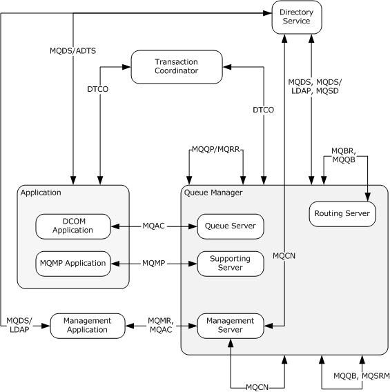
<!-- /Extracted images from page 29 -->

Figure 14: Interactions between Message Queuing protocols

The links in the preceding figure represent interactions between external entities, MSMQ protocol set
components, and MSMQ protocol set roles.

The composite queue manager box represents multiple queue manager roles. A link that is associated
with this box represents an association with all roles of the queue manager. A link that is associated
with a specific inner box applies only to that particular role. The queue server, the supporting server,
and the management server roles of the queue manager interact with different types of application
programs, as described in section 2.1.3. The routing server role of the queue manager is responsible
for message routing in a distributed network, as described in section 2.1.3.3.

The composite application box represents applications in different deployment modes. A link that is
associated with this box represents protocols that apply to all of these deployment modes. A link that
is associated with a specific inner application mode applies only to that particular application. A DCOM
application interacts with the queue server role of the queue manager by using the Message Queuing
(MSMQ): ActiveX Client Protocol (MQAC), whereas a Message Queuing (MSMQ): Queue Manager Client
Protocol (MQMP) application interacts with the supporting server role of the queue manager by using
the MQMP protocol. A management application interacts with the management server role of the
queue manager by using the Message Queuing (MSMQ): Queue Manager Management Protocol

29 / 83

[MS-MQOD] - v20220902
Message Queuing Protocols Overview
Copyright © 2022 Microsoft Corporation
Release: September 2, 2022

(MQMR) and MQAC protocols to accomplish administrative and management-related activities of the
MSMQ protocol set.

As described in section 2.1.3.2, a Transaction Coordinator interacts with MSMQ to send and receive
transactional messages. Applications interact with the Transaction Coordinator through the application
role, and the queue manager interacts with the Transaction Coordinator through the resource
manager role of the Transaction Coordinator component.

As described in section 2.1.3.3, the directory service is an optional component of the MSMQ protocol
set and enables certain functionalities of the queue manager that require interaction with a directory.
In MSMQ versions 1.0 and 2.0, the queue manager that is collocated with a directory also assumes
the role of a directory service through the MSMQ Directory Service server. In such a configuration, the
directory service becomes another queue manager role in the preceding figure. In subsequent
versions of the MSMQ protocol set, Active Directory is used as the directory service. Applications and
the queue manager interact with the directory service.

#### 2.1.6 MSMQ Components

The queue manager is the central piece of the Microsoft Message Queuing (MSMQ) communication
service. Conceptually, the queue manager deals with every queued messaging aspect of the MSMQ
protocol set. A queue manager instance interacts with other queue manager instances by
implementing the client and server sides of the relevant MSMQ protocols. A queue manager instance
interacts with applications to support message creation, modification, deletion, and exchange
operations on a queue. A queue manager instance listens to and handles all incoming MSMQ network
traffic for a machine network identifier and processes all the higher-layered triggered events, as
described in [MS-MQDMPR] section 3.1.4.

The following diagram depicts the different facets of the queue manager on one machine (the central
box) and the communications between these facets and remote queue managers, as well as the other
subcomponents of MSMQ, such as client applications, the Transaction Coordinator, and the Directory
Server.

[MS-MQOD] - v20220902
Message Queuing Protocols Overview
Copyright © 2022 Microsoft Corporation
Release: September 2, 2022

30 / 83

<!-- Extracted images from page 31 -->
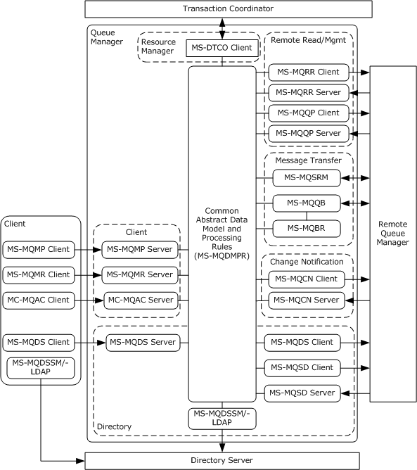
<!-- /Extracted images from page 31 -->

Figure 15: MSMQ internal architecture

The abstract data model and processing rules shared by the different facets of the queue manager are
described in [MS-MQDMPR] section 3. This common model describes the abstract data model (ADM)
elements that are shared across the MSMQ protocol set.

The Client facet of the queue manager (the dotted box labeled "Client") interacts with the client
applications. This facet implements the server sides of the Message Queuing (MSMQ): Queue Manager
Client Protocol (MQMP), the Message Queuing (MSMQ): Queue Manager Management Protocol
(MQMR), and the Message Queuing (MSMQ): ActiveX Client Protocol (MQAC). The applications use the
client side of these protocols to interact with the queue manager for message exchange and
management functionalities.

The Directory facet of the queue manager (the dotted box labeled "Directory") handles the various
directory-related operations. In MSMQ versions 1.0 and 2.0, the server side of the Message Queuing
(MSMQ): Directory Service Protocol (MQDS) is implemented by the MSMQ Directory Service server

31 / 83

[MS-MQOD] - v20220902
Message Queuing Protocols Overview
Copyright © 2022 Microsoft Corporation
Release: September 2, 2022

and is collocated with the queue manager as part of the Directory facet. Client applications on these
versions of MSMQ use the client side of the MQDS protocol to interact with the Directory Server.
Similarly, a queue manager that is not collocated with the MSMQ Directory Service server uses the
client side of MQDS to interact with a remote MSMQ Directory Service server. Furthermore, the queue
manager uses the client side of the Message Queuing (MSMQ): Directory Service Discovery Protocol
(MQSD) to discover the other MSMQ Directory Service servers. A queue manager running the role of
an MSMQ Directory Service server implements the server side of MQSD to broadcast its presence. The
MQDS and MQSD protocols are superseded by Active Directory in subsequent versions of MSMQ. With
Active Directory, both the client applications as well as the Directory facet of the queue manager use
Lightweight Directory Access Protocol (LDAP) and Message Queuing (MSMQ): Directory Service
Schema Mapping (MQDSSM) to communicate directly with the directory. The operations on the
Directory facet are invoked only when MSMQ is functioning in Directory-Integrated mode, as described
in section 2.1.3.3.

The Resource Manager facet of the queue manager (the dotted box labeled "Resource Manager")
handles the interaction with the Transaction Coordinator to enable transactional operations on the
transacted queues as described in section 2.1.3.2. To manage the queue as a transactional resource,
the queue manager implements the resource manager role of the Transaction Coordinator, as
described in [MS-DTCO] section 1.3.3.2, and participates with the resource manager facet of a
transaction manager coordinated by an external Transaction Coordinator, as described in [MS-DTCO]
section 1.3.3.3.

The Remote Read and Management facet of the queue manager (the dotted box labeled "Remote
Read/Mgmt") handles certain message exchange and management functionalities that involve queues
hosted by remote queue managers. The operations on this facet are initiated by the actions performed
by the Client facet of the queue manager. The queue manager implements the client side of MQRR
and MQQP to invoke the remote queue operations on a remote queue manager. The Remote Read and
Management facet of the remote queue manager implements the server sides of MQRR and MQQP to
perform the remote operations requested.

The Change Notification facet of the queue manager (the dotted box labeled "Change Notification")
handles changes made to the resources owned by one queue manager to another. The queue
manager implements the client side of MQCN to send the change notifications to a remote queue
manager that implements the server side of MQCN. The operations of this facet are initiated by the
actions performed by the Client facet and the Directory facet of the queue manager.

The Message Transfer facet of the queue manager (the dotted box labeled "Message Transfer")
implements the client and server sides of MQSRM, MQQB, and MQBR. The queue manager uses the
client side of those protocols to send messages to the remote queue manager. The remote queue
manager uses the server protocols to accept such messages. Operations on the Message Transfer
facet are initiated by the actions performed by the Client facet, as well as the Change Notification
facet of the queue manager.

#### 2.1.7 MSMQ Internal and External Communications

The MSMQ protocol set does not define any communication constraints or additional message types
beyond those described in the specifications of the protocols supported by the system, as listed in
section 2.2.

The following sections describe communications within the MSMQ protocol set and between it and
external entities.

##### 2.1.7.1 Communications Within MSMQ

Microsoft Message Queuing (MSMQ) components communicate with one another using the following
protocols and algorithms:

[MS-MQOD] - v20220902
Message Queuing Protocols Overview
Copyright © 2022 Microsoft Corporation
Release: September 2, 2022

32 / 83

  Message Queuing (MSMQ): Binary Reliable Messaging Protocol (MQQB): Used by one queue

manager to transfer messages to another queue manager.

  Message Queuing (MSMQ): Binary Reliable Message Routing Algorithm (MQBR): Used in

conjunction with MQQB by a queue manager to route messages to a final destination queue
manager, optionally hopping through other interim queue managers.

  Message Queuing (MSMQ): SOAP Reliable Messaging Protocol (SRMP): Used by one queue

manager to transfer messages to another queue manager.

  Message Queuing (MSMQ): Queue Manager to Queue Manager Protocol (MQQP): Used by a queue
manager to perform message reading and management operations on a remote queue hosted by
a remote queue manager. This protocol is superseded by Message Queuing (MSMQ): Queue
Manager Remote Read Protocol (MQRR).

  Message Queuing (MSMQ): Queue Manager Remote Read Protocol (MQRR): Used by a queue

manager to perform message reading and management operations on a remote queue hosted by
a remote queue manager.

  Message Queuing (MSMQ): Directory Service Change Notification Protocol (MQCN): Used in
conjunction with MQQB by a queue manager to send update notifications to a remote queue
manager for resources owned by the remote queue manager.

  Message Queuing (MSMQ): Directory Service Discovery Protocol (MQSD): Used by a queue

manager that is operating as an MSMQ Directory Service server in versions 1.0 and 2.0 of MSMQ
to send server discovery details to other queue managers that are not operating in the role of an
MSMQ Directory Service server.

  Message Queuing (MSMQ): Directory Service Protocol (MQDS): Used by a queue manager in

versions 1.0 and 2.0 of MSMQ to communicate with another queue manager that is operating in
the role of an MSMQ Directory Service server.

Abstracts for these protocols and the specific communication within the Message Queuing components
are listed in section 2.2.

##### 2.1.7.2 Communications with External Systems

Microsoft Message Queuing (MSMQ) communicates with external systems via different protocols, as
follows:

  Message Queuing (MSMQ) Queue Manager Client Protocol (MQMP): Used by a client application to

communicate with a queue manager operating in the role of a supporting server, as described in
sections 2.1.3.1 and 2.1.4.2.1.

  Message Queuing (MSMQ): ActiveX Client Protocol (MQAC: Used by a client application to

communicate with a queue manager operating in the role of a queue server or management
server, or both, as described in sections 2.1.3.1 and 2.1.4.2.1.

  Message Queuing (MSMQ): Queue Manager Management Protocol (MQMR): Used by a client

application to communicate with a queue manager operating in the role of a management server,
as described in sections 2.1.3.1 and 2.1.4.2.1.



Lightweight Directory Access Protocol (LDAP) as specified in [MS-ADTS] section 3.1.1.3: Used by a
queue manager operating in Directory-Integrated mode to communicate with Active Directory.

  DTCO in a resource manager role as described in [MS-DTCO] section 1.3.3.2: Used by the queue

manager to enable transactional operations on transacted queues.

Abstracts for these protocols and the specific communication with external systems are listed in
section 2.2.

33 / 83

[MS-MQOD] - v20220902
Message Queuing Protocols Overview
Copyright © 2022 Microsoft Corporation
Release: September 2, 2022

#### 2.1.8 MSMQ Applicability

The Microsoft Messing Queuing (MSMQ) protocol set supports asynchronous messaging; therefore, it is
not applicable to the following messaging applications:

  Synchronous Messaging: The asynchronous message exchange patterns specified by the MSMQ
protocol set introduce latency in comparison with a direct, synchronous communication pattern.
Therefore, the MSMQ protocols are not suitable for applications that require message delivery
within a short and predefined amount of time.

  Use a Queue as a Database: Unlike a database system, a queue is neither intended to be used as
a long-term storage medium nor to support general query functions. The queue provides enough
storage to enable temporal decoupling of applications and to deal with time intervals when the
applications are offline or the network is out of service, regardless of the volume of traffic. The
queue is not a database.



Traditional End-to-End Transaction Flow: The MSMQ protocols do not provide true end-to-end
transactional capability between the participating applications. Instead, MSMQ supports local
transactional boundaries, reliable message transfer, and well-defined failure handling semantics.
Therefore, MSMQ cannot be used for atomic update between applications.

#### 2.1.9 Relevant Standards

The following table lists specific standards assignments for the Microsoft Message Queuing (MSMQ)
protocol set.

Protocol Name

Short Name

LDAP: Lightweight Directory Access Protocol

[RFC3377]

### 2.2 Protocol Summary

The following table provides a comprehensive list of the Microsoft Message Queuing (MSMQ) protocols.

Protocol Name

Description

Short
Name

Message Queuing (MSMQ):
Data Structures

The common definition and data structures used by the member
protocols of the MSMQ protocol set.

[MS-
MQMQ]

Message Queuing (MSMQ):
Common Data Model and
Processing Rules

The abstract data model, events, and processing rules shared by
the member protocols of the MSMQ protocol set.

[MS-
MQDMPR]

Message Queuing (MSMQ):
ActiveX Client Protocol

A DCOM protocol that provides a client application programming
interface to the MSMQ protocol set.

[MC-
MQAC]

Message Queuing (MSMQ):
Queue Manager Client Protocol

An RPC protocol that provides a client interface to the MSMQ
protocol set through the supporting server deployment profile.

Message Queuing (MSMQ):
Binary Reliable Messaging
Protocol

A block protocol over TCP/IP or SPX/IPX for reliable transfer of
messages between two queue managers.

Message Queuing (MSMQ):
Binary Reliable Messaging
Algorithm

A routing algorithm used with MQQB by a queue manager to
route messages to the appropriate queue manager in a complex
network topology.

[MS-
MQMP]

[MS-
MQQB]

[MS-
MQBR]

34 / 83

[MS-MQOD] - v20220902
Message Queuing Protocols Overview
Copyright © 2022 Microsoft Corporation
Release: September 2, 2022

Protocol Name

Description

Message Queuing (MSMQ):
SOAP Reliable Messaging
Protocol (SRMP)

An HTTP-based or PGM-based protocol that uses SOAP encoding
for reliable transfer of messages from one queue manager to
others.

Message Queuing (MSMQ):
Directory Service Change
Notification Protocol

A block protocol for notifying a queue manager about changes
made to the Directory Service objects owned by that queue
manager.

An RPC protocol that provides a client interface for MSMQ
administration.

Short
Name

[MC-
MQSRM]

[MS-
MQCN]

[MS-
MQMR]

A block protocol that uses UDP multicast for locating MSMQ
Directory Service servers.

[MS-
MQSD]

Message Queuing (MSMQ):
Queue Manager Management
Protocol

Message Queuing (MSMQ):
Directory Service Discovery
Protocol

Message Queuing (MSMQ):
Directory Service Protocol

An RPC protocol that implements the MSMQ Directory Service.
This protocol is superseded by Active Directory.

[MS-
MQDS]

  Message Queuing (MSMQ):
Directory Service Schema
Mapping

A mapping between relevant Message Queuing abstract data
model elements and a directory service over a Lightweight
Directory Access Protocol (LDAP) interface.

[MS-
MQDSSM]

Message Queuing (MSMQ):
Queue Manager to Queue
Manager Protocol

An RPC protocol that provides an interface between two queue
managers for reading and browsing messages from a remote
queue. This protocol has been superseded by MQRR.

Message Queuing (MSMQ):
Queue Manager Remote Read
Protocol

An RPC protocol that provides an interface between two queue
managers for reading and browsing messages from a remote
queue. This protocol supersedes MQQP.

[MS-
MQQP]

[MS-
MQRR]

The member protocols are grouped according to their primary purposes.

 Common Data Structure and Model:

Protocols in this group define the common data structures, abstract data models, and processing rules
for all Microsoft Message Queuing (MSMQ) protocols.

Protocol Name

Message Queuing (MSMQ): Data Structures

Short Name

[MS-MQMQ]

Message Queuing (MSMQ): Common Data Model and Processing Rules

[MS-MQDMPR]

 Message Transfer and Routing Protocols:

Protocols in this group enable transferring messages between queues hosted by different queue
managers.

Protocol Name

Short Name

Message Queuing (MSMQ): Binary Reliable Messaging Protocol

[MS-MQQB]

Message Queuing (MSMQ): Binary Reliable Messaging Algorithm

[MS-MQBR]

Message Queuing (MSMQ): SOAP Reliable Messaging Protocol (SRMP)

[MC-MQSRM]

 Core Messaging Functionality Protocols:

35 / 83

[MS-MQOD] - v20220902
Message Queuing Protocols Overview
Copyright © 2022 Microsoft Corporation
Release: September 2, 2022

Member protocols of this group provide message queuing functionality to applications and are invoked
either directly by client applications or indirectly by the queue manager as a result of a client
application requesting specific messaging functionality from the MSMQ protocols.

Protocol Name

Message Queuing (MSMQ): ActiveX Client Protocol

Short Name

[MC-MQAC]

Message Queuing (MSMQ): Queue Manager Client Protocol

[MS-MQMP]

Message Queuing (MSMQ): Queue Manager to Queue Manager Protocol

[MS-MQQP]

Message Queuing (MSMQ): Queue Manager Remote Read Protocol

[MS-MQRR]

MSDTC Connection Manager: OleTx Transaction Protocol Specification

[MS-DTCO]

 Management, Administration and Configuration Protocols:

Member protocols of this group provide administrative functionality to applications and are invoked
either directly by client applications or indirectly by the queue manager as a result of a client
application requesting specific message queuing administration functionality from the MSMQ protocols.

Protocol Name

Message Queuing (MSMQ): ActiveX Client Protocol

Short Name

[MC-MQAC]

Message Queuing (MSMQ): Queue Manager Management Protocol

[MS-MQMR]

Message Queuing (MSMQ): Directory Service Change Notification Protocol

[MS-MQCN]

 Directory Service Protocols:

Protocols and algorithms in this group provide storage and access to MSMQ directory objects.

Protocol Name

Short Name

Message Queuing (MSMQ): Directory Service Protocol

[MS-MQDS]

Message Queuing (MSMQ): Directory Service Discovery Protocol

[MS-MQSD]

  Message Queuing (MSMQ): Directory Service Schema Mapping

[MS-MQDSSM]

ADTS: Active Directory Technical Specification

[MS-ADTS]

### 2.3 Environment

The following sections identify the context in which the system exists. This context includes the
systems that use the interfaces provided by this system of protocols, other systems that depend on
this system, and, as appropriate, the methods by which components of the system communicate.

#### 2.3.1 Dependencies on This System

The following systems use the interfaces provided by the Microsoft Message Queuing (MSMQ)
protocols:

Component Object Model Plus (COM+): Uses the MSMQ protocols for implementing the COM+

Queued Components Protocol as specified in [MC-COMQC].

36 / 83

[MS-MQOD] - v20220902
Message Queuing Protocols Overview
Copyright © 2022 Microsoft Corporation
Release: September 2, 2022

RPC: Can use the MSMQ protocols as a transport for supporting asynchronous RPC calls.<1>

Windows Communication Foundation (WCF): Uses the MSMQ protocols as a transport for
supporting queued communication. WCF uses the MSMQ primitives to provide additional
message processing functionalities such as poison message handling. This functionality is
supported by keeping track of the number of times that an application has attempted to process
a particular message in a queue and by moving the message from the queue to a separate
designated queue when the number of such attempts exceeds a certain application-defined limit,
such that the application does not receive the poison message anymore and can process other
messages. See [MSDN-WCF] for more information.

#### 2.3.2 Dependencies on Other Systems/Components

In addition to the external subsystem dependencies specified in each Microsoft Message Queuing
(MSMQ) protocol document, the MSMQ protocol set requires:

  A durable storage system to persist state and data.

  Various transports as specified in individual protocol technical documents.

  Security infrastructure as described in section 2.9.

### 2.4 Assumptions and Preconditions

The following assumptions and preconditions are required for a Message Queuing System to start
operation successfully:



The required MSMQ components are installed on the participating machines, and the queue
manager, if any, is initialized on each machine.

  Storage devices are configured and available and have enough space to store the system state

and data.





The required transport protocols are available and fully initialized on the participating machines.

If transactions are used, a Transaction Coordinator is available and fully initialized.

  Security package providers are available to the system.



The queue manager possesses valid security credentials suitable for authentication.

The following additional assumptions and preconditions are required if a Message Queuing System is
operating in Directory-Integrated mode as described in section 2.1.3.3:

  At least one domain controller (DC) exists for the domain.



Each machine is joined to the domain.

  A Directory Service is initialized and available. If versions 1.0 or 2.0 of MSMQ are used, an MSMQ

Directory Service server is initialized and available on a domain controller.

  Appropriate Directory Service objects exist and are configured correctly. Details of these directory

objects are specified in [MS-MQDS] and [MS-MQDSSM].

### 2.5 Use Cases

This section breaks down the functionality of the Microsoft Message Queuing (MSMQ) protocols into
small granular use cases that can then be combined to build and manage complex distributed
applications.

37 / 83

[MS-MQOD] - v20220902
Message Queuing Protocols Overview
Copyright © 2022 Microsoft Corporation
Release: September 2, 2022

<!-- Extracted images from page 38 -->
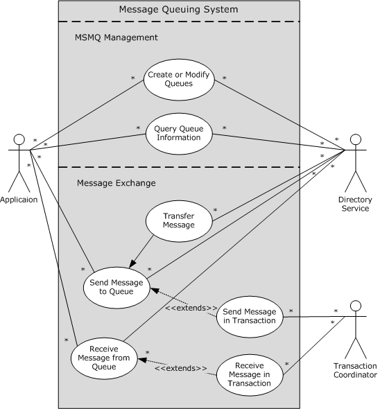
<!-- /Extracted images from page 38 -->

The application is the direct actor for all use cases of the MSMQ protocols. The Directory Service is the
supporting actor for all use cases of the MSMQ protocols. The Transaction Coordinator is the
supporting actor for the use cases that require transacted work.

The main functionality of the MSMQ protocol set is divided into two broad categories: "Message
Exchange" and "MSMQ Management". The following use case diagram shows how the actors and
Message Queuing use cases fit together into a complete Message Queuing System.

Figure 16: Use cases for the Message Queuing System

The use cases in the following sections define the following common actors and stakeholders.

 Actors

Application: Applications use the various MSMQ application protocols to interact with a Message
Queuing System. The role of an application is described in detail in sections 2.1.3.1 and 2.1.4.1 of this
document. The application is the direct actor for all MSMQ use cases except Transfer
Message (section 2.5.5).

38 / 83

[MS-MQOD] - v20220902
Message Queuing Protocols Overview
Copyright © 2022 Microsoft Corporation
Release: September 2, 2022

Application Users: Application users are the primary actors of a Message Queuing System. Application
users perform business operations by using the functionality of distributed applications, which invoke
message queuing activities within the system.

System Administrators: System administrators are the primary actors for the MSMQ management and
administrative operations and require MSMQ functionality to perform the following actions:

  Understand the various operations and management aspects of a distributed application that uses

message queuing functionality.





Perform various management and administrative operations on distributed applications that use
message queuing functionality.

Enumerate the protocols and all the artifacts of these protocols (for example, message format,
error codes, and retry logic) that they expect to see flowing over the networks in their enterprise.

Directory Service: A Message Queuing System optionally uses a directory by invoking the client
directory service interfaces, as described in section 2.1.3.3.

Transaction Coordinator: To manage a queue as a transactional resource, the queue manager
interacts as a resource manager with a Transaction Coordinator, as described in section 2.1.3.2.

 Stakeholders

Developers: Developers can use the MSMQ protocol set to provide asynchronous messaging
functionality to user applications and to implement seamless interoperability between existing and
newly implemented Message Queuing Systems.

Testers: Quality assurance teams require a Message Queuing System to test implementations created
by developers and to verify the conformance of such implementations with the protocol specifications.

Application Users: Application users are the primary actors of a Message Queuing System. Application
users perform business operations by using the functionality of distributed applications, which invoke
message queuing activities within the system.

#### 2.5.1 Create or Modify Queue - Application

 Context of Use: The application makes changes to the queuing environment to facilitate message
exchange operations between other participating applications of a Message Queuing System.

 Goal: This use case is initiated by an application to create a queue or modify the properties of a
queue.

 Actors

Application: See section 2.5.

System Administrators: See section 2.5.

Directory Service: See section 2.5.

 Stakeholders

Developers:  See section 2.5.

Testers: See section 2.5.

Application Users:  See section 2.5.

 Preconditions

[MS-MQOD] - v20220902
Message Queuing Protocols Overview
Copyright © 2022 Microsoft Corporation
Release: September 2, 2022

39 / 83





The application has access to the machine on which a queue is to be created or modified.

The application has the necessary administrative rights to execute the operation.

 Main Success Scenario

Trigger: The direct actor triggers this use case based on the actions of the primary actor.

The steps involved in the use case for creation or modification of a private queue are:

1.  The application sends a request to the queue manager to create a private queue on that queue

manager or to modify an existing private queue hosted by the queue manager.

2.  The queue manager creates or modifies the queue and sends a response back to the application.

The steps involved in public queue creation or modification are:

1.  The application sends a request to a queue manager to create a public queue on any queue

manager in the directory or to modify an existing public queue hosted by any queue manager in
the directory.

2.  The queue manager sends a message to the Directory Service to make the necessary changes in
the directory. On receipt of this message, the Directory Service creates the public queue in the
directory.

3.  The queue manager sends a notification message to the queue manager that is hosting the queue
to notify it of the changes. On receipt of such a notification message, the hosting queue manager
synchronizes the changes identified in the notification message.

4.  The queue manager sends a response back to the application.

 Postcondition

The queue is created or modified.

 Extensions

None.

#### 2.5.2 Query Queue Information- Application

 Context of Use: The application collects administrative information about a Message Queuing
System and presents the information for management purposes.

 Goal: This use case is initiated by an application to query configuration and runtime information
abouta Message Queuing System.

 Actors

Application: See section 2.5.

System Administrators: See section 2.5.

Directory Service: See section 2.5.

 Stakeholders

Developers:  See section 2.5.

Testers: See section 2.5.

Application Users:  See section 2.5.

[MS-MQOD] - v20220902
Message Queuing Protocols Overview
Copyright © 2022 Microsoft Corporation
Release: September 2, 2022

40 / 83

 Preconditions







The application administrator completes the application-specific configuration of a Message
Queuing System, such as creating the necessary queues.

The application has access to the machine and queue.

The application has the necessary administrative rights to execute the query.

 Main Success Scenario

Trigger: The direct actor triggers this use case based on the actions of the primary actor.

The processing of the use case is as follows:

1.  The application sends a request to the queue manager to query the necessary data.

2.  The queue manager responds to the query by providing the information requested.

 Post-Condition





The state of the queue does not change.

The application receives the requested information.

 Extensions

None.

#### 2.5.3 Send Message to Queue - Application

 Context of Use: An application creates a message and interacts with the queue manager to send the
message. The application optionally uses a Directory Service for looking up the queue name.

 Goal: This use case places a message in a queue.

 Actors

Application:  See section 2.5.

Application Users:  See section 2.5.

Directory Service:  See section 2.5.

 Stakeholders

Developers:  See section 2.5.

Testers:  See section 2.5.

Application Users:  See section 2.5.

 Preconditions







The queue exists.

The application is authorized to send messages to the queue.

If a Directory Service is not being used, the application is configured with the address of the
queue prior to the send operation.

 Main Success Scenario

[MS-MQOD] - v20220902
Message Queuing Protocols Overview
Copyright © 2022 Microsoft Corporation
Release: September 2, 2022

41 / 83

 Trigger: The direct actor triggers this use case based on the actions of the primary actor. It is also
triggered by the Exchange Message – Application (section 2.5.8) use case.

The steps involved in this use case are:

1.  The application constructs a message to send.

2.  The application optionally obtains the queue name from the Directory Service.

3.  The application sends the message to the queue manager.

4.  The queue manager performs validation checks and fails the operation in case of an error.

5.

6.

 If the queue is hosted by this queue manager, the queue manager puts the message in the queue
and returns a response back to the application. An extension of this step is described in Send
Message in Transaction - Application (section 2.5.4).

 If the queue is hosted by a different queue manager, the queue manager puts the message in an
outgoing queue and invokes a separate use case to complete the message transfer operation, as
described in Transfer Message (section 2.5.5).

 Postcondition

The message is placed in the destination queue.

 Extensions

See Send Message in Transaction - Application.

#### 2.5.4 Send Message in Transaction - Application

 Context of Use: This use case extends the Send Message to Queue - Application (section 2.5.3) use
case by adding transactional semantics to the message send operation. In this use case, the
application and the queue manager interact with a Transaction Coordinator to send one or more
messages in the context of a transaction. The messages are visible only after a successful outcome of
the transaction. A failed outcome of the transaction undoes the entire message send operation.

 Goal: This use case places one or more messages in a queue in the context of an atomic
transaction.

 Actors

Application:  See section 2.5.

Application Users:  See section 2.5.

Transaction Coordinator: See section 2.5.

 Stakeholders

Developers: See section 2.5.

Testers: See section 2.5.

Application Users: See section 2.5.

 Preconditions

This use case has the following precondition, in addition to those described in the Send Message to
Queue - Application extended use case:

42 / 83

[MS-MQOD] - v20220902
Message Queuing Protocols Overview
Copyright © 2022 Microsoft Corporation
Release: September 2, 2022



The Transaction Coordinator is accessible to the application and the queue manager in order to
coordinate the transaction execution.

 Main Success Scenario

 Trigger: The direct actor triggers this use case based on the actions of the primary actor. It is also
triggered by the Exchange Message - Application (section 2.5.8) use case.

The steps involved in this use case are as follows:

1.  The application creates a transaction and follows steps 1 through 4 of Send Message to Queue -
Application to send each message to the queue manager in the context of the transaction.

2.  The queue manager enlists in the transaction if it has not enlisted in the transaction yet and does

not make the messages visible outside the context of the transaction.

3.  The queue manager returns a response back to the application.

4.  The application commits or aborts the transaction, and the Transaction Coordinator communicates
the outcome of the transaction to the resource manager facet of the queue manager. Upon a
successful outcome, the queue manager makes the messages visible, and this use case continues
to the next step. Conversely, on a failed outcome of the transaction, the queue manager undoes
the message send operations, and this use case completes.

5.  5. For each message that is sent, follow step 6 of Send Message to Queue - Application.

 Postconditions



If the transaction succeeds, the messages are placed in the destination queue as with the post
condition in Send Message to Queue - Application.



If the transaction fails, the messages do not appear in the destination queue.

Extensions

None.

#### 2.5.5 Transfer Message

 Context of Use: This use case is optionally used by the use case in Send Message to Queue –
Application, Send Message to Queue, as well as by the use case in Send Message in Transaction -
Application (section 2.5.4), Send Message in Transaction, to enable messages to be sent to queues
that are not hosted by the source queue manager. This use case can be invoked only by the preceding
Send Message use cases and is not intended to be directly invoked by the actors described in the
Message Queuing use case diagram in section 2.5.

 Goal: To transfer a message from one queue manager to another.

 Actors

Application:  See section 2.5.

Directory Service:  See section 2.5.

 Stakeholders

Developers:  See section 2.5.

Testers: See section 2.5.

Application Users:  See section 2.5.

[MS-MQOD] - v20220902
Message Queuing Protocols Overview
Copyright © 2022 Microsoft Corporation
Release: September 2, 2022

43 / 83

 Preconditions

This use case has the following preconditions, in addition to those of the invoking use cases (Send
Message to Queue – Application or Send Message in Transaction - Application:





If the send operation is invoked from the use case in Send Message to Queue – Application, steps
1 through 5 in Send Message to Queue – Application are performed and the message is placed in
an outgoing queue, OR

If the send operation is invoked from the use case in Send Message in Transaction - Application,
Send Message in Transaction, steps 1 through 4 in Send Message in Transaction - Application are
performed, the transaction has a successful outcome, and as a result the message is placed in an
outgoing queue.

 Main Success Scenario

 Trigger: This use case is triggered by the Send Message to Queue – Application use case or the Send
Message in Transaction - Application use case.

The steps involved in this use case are:

1.  The source queue manager determines the destination queue manager and transfers the message.

2.  The destination queue manager accepts the message, performs duplication and validation checks,
and places the message in the destination queue. If the identifier of an incoming message has
been previously received by the destination queue manager, the message is treated as a duplicate
and is discarded without any further processing. If the message fails validation checks, a negative
acknowledgment is sent to the source queue manager. On successful transfer, the destination
queue manager sends the appropriate acknowledgments to the source queue manager.

3.  Steps 1 and 2 are repeated until the source queue manager receives the appropriate

acknowledgments from the destination queue manager or rejects the message for further
retransmission.

 Postcondition

None.

 Extensions

In a variation of this use case, the Message Queuing (MSMQ): Binary Reliable Message Routing
Algorithm (MQBR) algorithm is used to perform a multihop message transfer. In this variation, the
queue manager uses the MQBR algorithm in step 1 to determine the next hop queue manager, and
the steps described in this section are repeated until the message reaches the final destination queue
manager.

#### 2.5.6 Receive a Message from a Queue - Application

 Context of Use: This use case covers the counterpart of the Send Message use case. An application
receives a message from a queue. The application optionally uses a Directory Service to look up the
queue name.

 Goal: This use case receives a message from a queue.

 Actors

Application:  See section 2.5.

Application Users:  See section 2.5.

Directory Service:  See section 2.5.

[MS-MQOD] - v20220902
Message Queuing Protocols Overview
Copyright © 2022 Microsoft Corporation
Release: September 2, 2022

44 / 83

 Stakeholders

Developers: See section 2.5.

Testers:  See section 2.5.

Application Users: See section 2.5.

 Preconditions

This use case has the same preconditions as in Send Message to Queue – Application (section 2.5.3)
with the exception that the receiving application is authorized to receive messages from the queue.

 Main Success Scenario

 Trigger: The direct actor triggers this use case based on the actions of the primary actor. It is also
triggered by the Exchange Message - Application (section 2.5.8)-use case.

The steps involved in this use case are:

1.  The application optionally obtains the queue name from the Directory Service.

2.  The application sends a request to the queue manager to receive a message from the queue and

waits for a response from the queue manager within a specific time-out.

3.  The queue manager performs validation checks and fails the operation in case of an error.

4.  If a message is not available, the queue manager blocks the application until a message is

available, or until the receive operation in step 2 times out or is canceled. In the latter case, an
error response is returned to the application, and this use case completes.

5.  The queue manager removes the available message from the queue and returns it to the

application as part of the response.

 Postcondition



If a message is available to receive in the queue and is returned to the application as a result of
the receive operation, the message is removed from the queue.

 Extensions

None.

#### 2.5.7 Receive Message in Transaction – Application

 Context of Use: This use case extends the use case described in Receive a Message from a Queue -
Application (section 2.5.6) by adding transactional semantics to the message receive operation. In this
use case, the application and the queue manager interact with a Transaction Coordinator to receive
one or more messages in the context of a transaction. Whether the messages are consumed depends
on the outcome of the transaction. The messages are removed from the queue only upon a successful
outcome of the transaction. Conversely, the messages are returned back to the queue upon a failed
outcome of the transaction.

 Goal: This use case receives one or more messages from a queue in the context of an atomic
transaction.

 Actors

Application: See section 2.5.

Application Users: See section 2.5.

[MS-MQOD] - v20220902
Message Queuing Protocols Overview
Copyright © 2022 Microsoft Corporation
Release: September 2, 2022

45 / 83

Transaction Coordinator:  See section 2.5.

 Stakeholders

Developers:  See section 2.5.

Testers: See section 2.5.

Application Users: See section 2.5.

 Preconditions

This use case has the following preconditions, in addition to those described in the extending use case
in Receive a Message from a Queue – Application:



The Transaction Coordinator is accessible to the application as well as the queue manager in order
to coordinate the transaction execution.

 Main Success Scenario

 Trigger: The direct actor triggers this use case based on the actions of the primary actor. It is also
triggered by the Exchange Message - Application (section 2.5.8) use case.

The steps involved in this use case are similar to those in Receive a Message from a Queue –
Application, with the exception of additional interactions with the Transaction Coordinator system. The
combined steps are:

1.  The application creates a transaction and follows steps 1-4 of Receive a Message from a Queue –

Application, to send each receive request to the queue manager under the context of the
transaction.

2.  The queue manager enlists in the transaction if it has not enlisted in the transaction yet. For each
receive request, if a message was available from the previous step, the queue manager locks the
message and thereby makes it invisible outside the context of the transaction, as if the message
has been temporarily removed from the queue. Each message is returned to the application for
the corresponding receive request.

3.  The application commits or aborts the transaction, and the Transaction Coordinator communicates
the outcome of the transaction to the resource manager facet of the queue manager. Upon a
successful outcome of the transaction, the queue manager removes the messages from the
queue. Conversely, upon a failed outcome, the queue manager undoes the receive operation and
returns the messages back to the queue.

 Postcondition



If the outcome of the transaction is successful, the postcondition is the same as in Receive a
Message from a Queue – Application.



If the outcome of the transaction is not successful, the messages are placed back in the queue.

 Extensions

None.

#### 2.5.8 Exchange Message - Application

 Context of Use: The sending application creates the messages and sends them to the queue
manager that hosts the queue. The receiving application receives the messages from the queue. This
use case invokes the following supporting use cases:

[MS-MQOD] - v20220902
Message Queuing Protocols Overview
Copyright © 2022 Microsoft Corporation
Release: September 2, 2022

46 / 83

  Send Message to Queue - Application (section 2.5.3) (or Send Message in Transaction -

Application (section 2.5.4) if a transaction is used for sending messages)

  Receive a Message from a Queue - Application  (or Receive Message in Transaction –

Application (section 2.5.7) if a transaction is used for receiving messages)

 Goal: This use case enables two applications to exchange messages asynchronously. Messages are
sent to a queue by a sending application and are received from the queue by a receiving application.

 Actors

Application: See section 2.5.

Application Users: See section 2.5.

 Stakeholders

Developers: See section 2.5.

Testers: See section 2.5.

Application Users: See section 2.5.

 Preconditions

The preconditions of this use case include those of the following supporting use cases.

Receive a
Message

Receive a Message
from a Queue -
Application

Send
Message to
Queue

None.

Send Message in Transaction

If the Send Message transaction is successful, the messages are accepted
by the queue manager. If the transaction is aborted, the messages are
not accepted by the queue manager.

Receipt of the message is not guaranteed.

Receive Message in
Transaction –
Application

None.

If the Send Message transaction is successful, the messages are accepted
by the queue manager. If the transaction is aborted, the messages are
not accepted by the queue manager.

If the Send Message transaction is successful and the message is
successfully received, the messages are delivered to the application and
removed from the queue. If the receive transaction aborts, the messages
are not removed from the queue.

 Main Success Scenario

 Trigger: The direct actor triggers this use case based on the actions of the primary actor.

The steps involved in this use case are:

1.  On the sending application side, the use case Send Message to Queue - Application (or Send

Message in Transaction - Application if a transaction is used) is triggered to send messages to a
queue. This action is repeated when the sending application has more messages to send.

2.  On the receiving application side, the use case Receive Message from a Queue - Application (or
Receive Message in Transaction - Application if a transaction is used) is triggered to receive the
messages. This action is repeated when the receiving application needs more messages from the
sending application.

 Postcondition



The receiving application receives the messages that the sending application sends.

47 / 83

[MS-MQOD] - v20220902
Message Queuing Protocols Overview
Copyright © 2022 Microsoft Corporation
Release: September 2, 2022

 Extensions

None.

### 2.6 Versioning, Capability Negotiation, and Extensibility

There are multiple versions of the MSMQ protocol set.<2>A summary of different versions and the
protocols or protocol subsets implemented by these versions follows.

 Message Queuing System versioning and capability negotiation

System
version

Protocols implemented

Protocol subsets implemented

MSMQ 1.0  MQQB, MQBR, MQCN, MQQP,
MQSD, MQMP, MQMR, MQDS

MQAC: Version 1.0 of the COM interfaces listed in [MC-MQAC].

MQDS: Sections 3.1 and 3.2 listed in [MS-MQDS].

MSMQ 2.0  MQQB, MQBR, MQCN, MQQP,
MQSD, MQMP, MQMR, MQDS

MSMQ 3.0  MQQB, MQBR, MQCN, MQQP,
MQSD, MQMP, MQMR, SRMP

MQAC: Version 2.0 of the COM interfaces listed in [MC-MQAC].

MQAC: Version 3.0 of the COM interfaces listed in [MC-MQAC].

MQRR: Sections 3.1.4.1 through 3.1.4.9 inclusive from [MS-
MQRR].

MQMP: The client version<3> of MSMQ 3.0 provides only the
client-side implementation. The server version<4>of MSMQ 3.0
provides client-side and server-side implementations.

MQDS: Only the server side of MQDS is implemented to provide
directory service to MSMQ 1.0 and 2.0 clients.

MSMQ 4.0  MQQB, MQBR, MQCN, MQQP,
MQSD, MQMP, MQMR, SRMP,
MQRR

MQAC: Version 4.0 of the COM interfaces listed in [MC-MQAC].

MQDS: Only the server side of MQDS is implemented to provide
directory service to MSMQ 1.0 and 2.0 clients.

MSMQ 5.0  MQQB, MQBR, MQCN, MQQP,
MQSD, MQMP, MQMR, SRMP,
MQRR

MSMQ 6.0  MQQB, MQBR, MQCN, MQQP,
MQSD, MQMP, MQMR, SRMP,
MQRR

MQAC: Version 4.0 of the COM interfaces listed in [MC-MQAC].

MQAC: Version 4.0 of the COM interfaces listed in [MC-MQAC].

Any deviations from a specific version's implementation of these protocol specifications are
documented in the respective protocol documents. Abstracts for these protocols appear in section 2.2.

Capability negotiations between client and server implementations of these protocols are described in
the sections titled "Versioning and Capability Negotiation" in the respective protocol specifications.

### 2.7 Error Handling

This section describes the common failures encountered by a Message Queuing System and its
behavior under such conditions.

#### 2.7.1 Queue Manager Restart

The queue manager can undergo both controlled and uncontrolled shutdown, resulting from either a
planned system downtime or an unexpected failure of a component in the underlying operating
system that requires a system reboot. The queue manager is required to be resilient to such system
stoppage, and when the system restarts, the queue manager is required to reinitialize itself, restore to
the state immediately preceding the shutdown, and honor the delivery assurance of the application

48 / 83

[MS-MQOD] - v20220902
Message Queuing Protocols Overview
Copyright © 2022 Microsoft Corporation
Release: September 2, 2022

messages as described in section 2.1.2.1. Specifically, the following rules apply for different message
types:

  A transactional message sent by an application to deliver to a remote queue is required to persist

through system restart until it is successfully transferred, a permanent delivery failure is
encountered, or the message times out.

  A transactional message in a local queue hosted by the queue manager is required to persist

through system restart until it is consumed by the receiving application or the message times out.

  A recoverable message sent by an application to deliver to a remote queue is required to persist
through system restart if the message was never sent to the destination queue manager prior to
the shutdown. Such a message remains in the outgoing queue until the queue manager makes a
successful delivery attempt to the remote queue manager, a permanent delivery failure is
encountered, or the message times out.

  A recoverable message in a local queue hosted by the queue manager is required to persist

through system restart until it is consumed by the receiving application or the message times out.

  An express message is discarded following a system restart.

#### 2.7.2 Transient Network Failure

A Message Queuing System is required to gracefully handle network outages and restore normal
operations when the network comes back online according to the following rules:





The message transfer protocols such as Message Queuing (MSMQ): Binary Reliable Messaging
Protocol (MQQB) and Message Queuing (MSMQ): SOAP Reliable Messaging Protocol (SRMP)
(MQSRM) handle network failures as part of their protocol as described in the respective protocol
documents. When the network becomes available, these protocols resume their normal message
transfer activities without requiring any additional external intervention. All other dependent
protocols, such as Message Queuing (MSMQ): Directory Service Change Notification Protocol
(MQCN), are required to remain unaffected by such interim network outages.

The messaging activities that require synchronous communication with another queue manager or
the directory are required to be unavailable during network outages. Examples of such activities
include the functions invoked by the Remote Read and Management facet and the Directory facet
of the queue manager, as described in section 2.1.6. During a network outage, a Message
Queuing System is required to fail the client operations that require synchronous communication
across the network. When the network becomes available, a Message Queuing System is required
to resume these operations without requiring any additional external intervention.

#### 2.7.3 Transaction Coordinator Unavailable

The external Transaction Coordinator subcomponent of the Microsoft Message Queuing (MSMQ)
protocol set provides transactional message processing, as described in section 2.1.3.2. The
Transaction Coordinator interacts with the resource manager facet of the queue manager to enable
transacted send to a local outgoing queue and transacted receive from a local or remote queue, as
described in section 2.1.6. Because the Transaction Coordinator is an external subcomponent, it is
possible that it can be temporarily unavailable. The queue manager gracefully handles the
unavailability of the Transaction Coordinator according to the following rules:





If the Transaction Coordinator is unavailable during a queue manager startup, the queue manager
has to initialize itself and start up.

If the Transaction Coordinator becomes unavailable when the queue manager is in the Running
state, the queue manager gracefully aborts and cleans up all pending transactions maintained by
the queue manager. The queue manager fails any message send or receive operation on a
transactional queue. The queue manager performs all other activities that do not involve the use

49 / 83

[MS-MQOD] - v20220902
Message Queuing Protocols Overview
Copyright © 2022 Microsoft Corporation
Release: September 2, 2022

of a Transaction Coordinator in an undisrupted manner, including message transfer to a remote
transactional queue that does not require the Transaction Coordinator.

  When the Transaction Coordinator becomes available, the queue manager resumes normal

transacted receive and send operations, without requiring external intervention.

#### 2.7.4 Directory Unavailable

A Message Queuing System uses a directory if it is operating in the Directory-Integrated mode. The
directory can become temporarily unavailable to one of more queue managers in the entire Message
Queuing System. The queue manager gracefully handles the unavailability of this subcomponent
according to the following rules:





If the directory is unavailable during the queue manager startup, the queue manager sets the
DirectoryIntegrated ADM attribute of the local QueueManager ([MS-MQDMPR] section 3.1.1.1)
ADM element instance to False, indicating that it is operating in Workgroup mode. The queue
manager supports all functionality available in Workgroup mode, and the queue manager fails all
functionality that requires access to a directory. When the directory becomes available, the queue
manager is externally restarted to resume operations in Directory-Integrated mode.

If the directory becomes unavailable when the queue manager is running, the DirectoryOffline
ADM attribute of the local QueueManager ADM element instance is set to True to indicate that
the queue manager is running under a constrained mode with no access to the directory. The
queue manager fails all operations invoked by the Directory facet of the queue manager. The
queue manager supports all functionality that does not require directory access. When the
directory becomes available, the queue manager resets the DirectoryOffline ADM attribute of the
local QueueManager ADM element instance to False and resumes operations in Directory-
Integrated mode.

#### 2.7.5 Internal Storage Failure

The queue manage uses a local persistent store to persist its state and data in an implementation-
specific manner that is independent of the protocol. The Microsoft Message Queuing (MSMQ) protocol
set does not mandate any specific redundancy strategy, inconsistency-detection mechanism, or
backup and restore requirement on the implementation of the persistent store. The following rules are
generally applied in case of an internal storage failure:







If the storage system is unable to persist data due to exceeded capacity, the MSMQ protocol set
fails the entire related operation and performs any necessary clean-up operation to restore
coherency of the store.

If the queue manager detects inconsistent configuration data such as queue configuration, and the
storage implementation is capable of completely repairing the inconsistency, the queue manager
brings the store to a consistent state before proceeding with any other operation.

If the queue manager detects inconsistency in the storage and the specific storage implementation
mechanism is unable to repair the inconsistency, the queue manager stops all operations and
shuts down until the storage is restored to a consistent state by an external administrator. The
MSMQ protocol set does not mandate any backup or restore mechanism for its state and data. If
the persistent store cannot be restored to a consistent state, the queue manager has to be
completely uninstalled and reinstalled on the particular machine, resulting in the permanent loss
of configuration and data.

#### 2.7.6 Directory Inconsistency

As described in [MS-MQDMPR] section 3.1.1, certain abstract data model (ADM) attributes of the ADM
elements of the MSMQ protocol set are persisted in the directory and shared across all queue
managers of the entire deployment. Each queue manager maintains certain attributes in the directory

50 / 83

[MS-MQOD] - v20220902
Message Queuing Protocols Overview
Copyright © 2022 Microsoft Corporation
Release: September 2, 2022

under the Machine Directory Service object of the machine domain, as described in [MS-MQDS]
section 2.2.10.3, and in [MS-MQDSSM] sections 2.2.1, 2.2.2, and 3.1.6.4.1. The queue manager on a
particular machine verifies that the state maintained under the directory belongs to this queue
manager. An inconsistency arises if the machine and the directory go out-of-sync due to a manual
reinstallation of the queue manager, or malicious corruption. During startup for Message Queuing
(MSMQ): Directory Service Protocol (MQDS), the queue manager verifies that the Identifier ADM
attribute of the local QueueManager ([MS-MQDMPR] section 3.1.1.1) ADM element instance matches
the PROPID_QM_MACHINE_ID [MS-MQMQ] section 2.3.2.2) property value of the Machine Directory
Service object (for MQDS) or the objectGUID attribute of the mSMQConfiguration object (for
MQDSSM), if one exists. If the Directory object exists and there is a mismatch, the queue manager
sets the DirectoryOffline ADM attribute of the local QueueManager ADM element instance to True
and starts the Directory Online Timer ([MS-MQDMPR] section 3.1.2.5).

### 2.8 Coherency Requirements

The queue manager uses a local persistent store to persist its state and data in an implementation-
specific protocol-independent manner. The Microsoft Message Queuing (MSMQ) protocol set does not
mandate any specific redundancy strategy, inconsistency-detection mechanism, or backup-restore
requirement for the implementation of the persistent store. If the storage system is unable to persist
data due to exceeded capacity, the MSMQ protocol set fails the entire related operation and performs
any necessary clean-up operation to restore coherency of the store.

### 2.9 Security

This section documents those system-wide security issues that are not otherwise described in the
Technical Documents (TDs) for the member protocols. It does not duplicate what is already described
in the member protocol TDs unless there is some unique aspect that applies to the MSMQ protocol set
as a whole.

#### 2.9.1 Security Elements

A Message Queuing System is composed of components that store data and communicate with other
components. Both the storage of components and the communications between components is
secured.

The following figure shows an overview of the storage in the system and communications among
internal and external components.

[MS-MQOD] - v20220902
Message Queuing Protocols Overview
Copyright © 2022 Microsoft Corporation
Release: September 2, 2022

51 / 83

<!-- Extracted images from page 52 -->
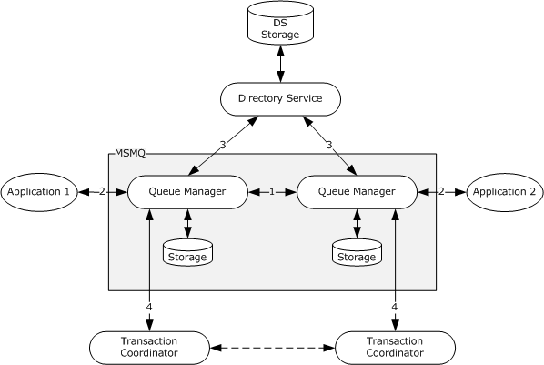
<!-- /Extracted images from page 52 -->

Figure 17: Component storage and communications

The communications between two queue managers (1: internal communication) and between a queue
manager and an external entity (2, 3, 4: external communication) are shown in the preceding figure.
The communications between external entities are handled by those entities and are not included in
the figure.

#### 2.9.2 Security Strategy and Mechanisms

To secure both data objects and communications, the system uses the following set of security
mechanisms:

  Security identifiers (SIDs) that identify security principals, as described in [MS-DTYP] section

2.4.2.

  Authentication mechanisms, as described in [MS-AUTHSOD].

  Access control lists (ACLs), discretionary access control lists (DACLs), and access control
entries (ACEs) to specify authorization policy on data objects as described in [MS-DTYP] sections
2.4.5 and 2.4.4.

  Communication security mechanisms of authentication, message integrity, and message privacy to

protect communications during component interactions.

#### 2.9.3 Storage Security

Data objects are stored, and the storage is protected by the owning component. The system defines
discretionary access control lists (DACLs) on each data object so that unauthorized access is not
allowed. For queue manager data objects, the owning queue manager authorizes the user that
requests access to these objects. For Directory Service data objects, the application and the queue
manager are responsible for defining ACLs, and the Directory Service is responsible for authenticating
and authorizing the requester according to the defined ACLs.

52 / 83

[MS-MQOD] - v20220902
Message Queuing Protocols Overview
Copyright © 2022 Microsoft Corporation
Release: September 2, 2022

Adding a message object to a queue object is controlled by the queue manager according to the ACLs
specified on the queue object. The message carries the sender identity, which is used by the queue
manager to perform access checks. The queue manager authenticates the sender as described in
section 2.9.4.1.4. Without the implementation of sender authentication, a malicious user can provide a
fake user identity in a message and bypass the access control defined for the queue object.

#### 2.9.4 Communication Security

Communications occur over transports that are listed in the table in section 2.9.4.1. The system relies
on the use of transport security features to secure communication. When needed, it augments the
security features to provide required communication security support.

##### 2.9.4.1 Security Layer

Data transmitted between two components can be protected at two layers: the transport layer and the
message layer.

###### 2.9.4.1.1 Transport Layer Security

The transport layer security refers to the security features that are provided by a transport that the
system uses. For example, the remote procedure call (RPC) and Lightweight Directory Access Protocol
(LDAP) transports provide security support for authentication, message integrity, and message
privacy. The Hypertext Transfer Protocol over Secure Sockets Layer (HTTPS) transport provides
support for server authentication and message privacy.

The following table summarizes the security features that are supported by each transport.

 Transport security support

Transport  Security features

TCP/IP

None

IPX/SPX

None

HTTP

None

HTTPS

Authentication, message integrity, message privacy

UDP

PGM

RPC

None

None

Authentication, message integrity, message privacy

LDAP

Authentication, message integrity, message privacy

DCOM

Authentication, message integrity, message privacy

When the authentication support of the RPC transport is used, the client and the server have to agree
on the authentication service provider to communicate with each other.<5>

As shown in the preceding table, not all transports provide security support for communications, in
particular the Transmission Control Protocol/Internet Protocol (TCP/IP) or Internetwork Packet
Exchange/Sequenced Packet Exchange (IPX/SPX) transport that is used by the Message Queuing
(MSMQ): Binary Reliable Messaging Protocol (MQQB) to transfer messages. In this case, the system
provides a set of security features in the message layer to meet security needs.

###### 2.9.4.1.2 Message Layer Security

[MS-MQOD] - v20220902
Message Queuing Protocols Overview
Copyright © 2022 Microsoft Corporation
Release: September 2, 2022

53 / 83

Message layer security, which is independent of the underlying transport, refers to security features
that are provided by the system on a per-message basis. It includes message integrity, sender
authentication, and message privacy. Message integrity and sender authentication provide end-to-end
protection of the message, ensuring that a message is sent by the original sender without being
altered during transfer. Message privacy is provided for hop-to-hop transfer of a message. It ensures
that the message content is not disclosed to unauthorized users during network transfer.

The message layer security features are built on the public key infrastructure (PKI) model as specified
in [SP800-32] and in [MSFT-PKI].

###### 2.9.4.1.3 Security Model: PKI

A public key infrastructure (PKI) is an arrangement that binds a public key certificate with a respective
user identity through a trusted third party. The main elements in the PKI are:

  Certification authority (CA): A trusted entity that issues certificates for use by other entities.

  Certificate: An electronic document that includes a digital signature to bind a public key with an

identity.



Public/private key: A pair of keys that are used in the asymmetric cryptographic algorithms. The
public key is distributed in the certificate, which can be validated with the CA by other entities.
The private key is typically stored on the certificate holder's local computer.

In the system, applications hold user certificates, and each queue manager holds two pairs of
cryptography keys (signing keys and encryption keys). The system uses a Directory Service, rather
than a CA, as the trusted third party to distribute the public certificates and keys.

User Certificates

A user certificate is used to sign an application message to provide the message integrity feature of
the message layer security, as described in section 2.9.4.1.4.

User certificates are registered in the Directory Service to enable the sender authentication feature of
the message layer security as described in section 2.9.4.1.4. The user certificates are stored in the
corresponding user object in the directory and are maintained in the CertificateDigestList ADM
attribute of the User ADM element ([MS-MQDMPR] section 3.1.1.15) ADM element. The registration
associates the certificate with the corresponding user identity. To facilitate certificate lookup, a hash of
the certificate (digest) is computed and saved together with the certificate as the
CertificateDigestList ADM attribute of the User ADM element ([MS-MQDMPR] section 3.1.1.15). A
user object can have multiple certificates. For more details about the user object attributes, see [MS-
RDPBCGR] section 2.2.1.2.1.2.1 and [MS-ADA2] section 2.415. For more details about the user
certificate and its digest, see [MS-MQDMPR] section 3.1.1.15 and [MS-MQDSSM] sections 3.1.1.4 and
3.1.6.20.6.

If an application is sending messages to a destination where the Directory Service is unavailable, the
application can instead provide a user certificate from a Certification Authority trusted by both the
sender and receiver to be used for signing the application message. If such a certificate is used for
signing, the queue manager hosting the destination queue will still verify message integrity as
described in section 2.9.4.1.4.1 before storing the message, but cannot authenticate the sender as
described in section 2.9.4.1.4.2. The user certificate remains attached to the message so that the
receiving application can verify the owner of the certificate if required.

The private key associated with a certificate is stored securely and has to be available to the sender.

Service Cryptography Keys

Each queue manager has two pairs of cryptography keys: one pair for signing system internal
messages and one pair for encrypting messages. These keys are represented, respectively, by the
PublicSigningKeyList and PublicEncryptionKeyList ADM attributes of the QueueManager ADM

54 / 83

[MS-MQOD] - v20220902
Message Queuing Protocols Overview
Copyright © 2022 Microsoft Corporation
Release: September 2, 2022

element ([MS-MQDMPR] section 3.1.1.1). The private keys are stored securely and have to be
available to the queue manager. The public keys are published in the Directory Service under the
Machine object for this queue manager. For more details about the queue manager cryptography
keys, see [MS-MQDMPR] section 3.1.1.1 and [MS-MQDSSM] sections 2.2.1 and 3.1.6.20.1.

###### 2.9.4.1.4 Message Layer Security Features

Using the user certificates, service cryptography keys, and the Directory Service for public key
distribution, the system provides three message layer security features: message integrity, sender
authentication, and message privacy.

###### 2.9.4.1.4.1 Message Integrity

Message integrity is achieved through the following sequence:

1.  The sending application signs the message in the following steps:

1.  Computes a hash from a set of message properties.

2.  Encrypts the hash with the private key associated with the sender's certificate to generate a

signature.

3.  Attaches the signature and the certificate to the message.

2.  The queue manager hosting the destination queue verifies the message integrity as follows:

1.  Extracts the signature and certificate from the message.

2.

 Decrypts the signature with the public key in the certificate to get the sender-generated hash.

3.  Computes the hash from the same set of message properties.

4.  Verifies the signature by comparing the sender-generated hash with the service-computed

hash.

The signature format is protocol-specific. See [MS-MQMQ] section 2.2.20.6 for the binary protocol and
[RFC3275] for the Message Queuing (MSMQ): SOAP Reliable Messaging Protocol (SRMP).

For more details about the hash algorithms, the message properties used for hashing, and the
algorithm to encrypt and decrypt the hash, see [MS-MQMQ] section 2.2.20.6.

###### 2.9.4.1.4.2 Sender Authentication

When a message contains the signature, the user certificate, and user identity of the sender, the
queue manager of the destination queue verifies the sender identity that is carried in the message as
follows:

1.  Verifies the message integrity as described previously in Message Integrity (section 2.9.4.1.4.1).

This step ensures that the message was not altered during transmission.

2.  Computes the digest as the hash of the attached certificate using the MD5 algorithm as defined in

[RFC1321].

3.  Finds the User ([MS-MQDMPR] section 3.1.1.15) ADM element instance in the Directory Service

that satisfies the following conditions:



The CertificateDigestList ADM attribute of the User ADM element instance contains the
computed digest.



The Certificates ADM attribute of the User ADM element instance contains the certificate.

55 / 83

[MS-MQOD] - v20220902
Message Queuing Protocols Overview
Copyright © 2022 Microsoft Corporation
Release: September 2, 2022

4.  If a matching User ADM element instance is found:

1.  Extracts the sender identity from the message.

2.  Compares the extracted identity with the SecurityIdentifier ADM attribute of the matching

User ADM element instance.

3.  Authenticates the sender if the identities match; otherwise, rejects the message.

5.  Otherwise, if no matching User ADM element instance is found, marks the sender as

unauthenticated.

When the message does not contain the signature, the user certificate, or the user identity of the
sender, the queue manager does not verify the sender identity.

###### 2.9.4.1.4.3 Message Privacy

Message privacy is achieved through the following sequence:

1.  The sending queue manager does the following:

1.  Retrieves the public key information (see [MS-MQDS] section 2.2.10.3) of the receiving queue

manager from the queue manager's machine object in the Directory Service.

2.  Dynamically generates a symmetric key. The symmetric key generation uses the key length
and provider information in the receiving queue manager's public key information (see [MS-
MQDS] section 2.2.20) to ensure that the receiving queue manager can decrypt the message.

3.  Encrypts the symmetric key with the receiving queue manager's public key.

4.  Encrypts the message with the symmetric key.

5.  Attaches the encrypted symmetric key to the message. The message format is specified in

[MS-MQMQ] section 2.2.20.6.

2.  The receiving queue manager does the following:

1.  Extracts the encrypted symmetric key from the message.

2.  Decrypts it with its own private key.

3.  Decrypts the message with the decrypted symmetric key.

For more details about the encryption algorithm and related message properties, see [MS-MQQB]
section 3.1.7.1.5.

###### 2.9.4.1.5 Message Layer Security Sequences

The following figure shows the sequences of the three message layer security features.

[MS-MQOD] - v20220902
Message Queuing Protocols Overview
Copyright © 2022 Microsoft Corporation
Release: September 2, 2022

56 / 83

<!-- Extracted images from page 57 -->
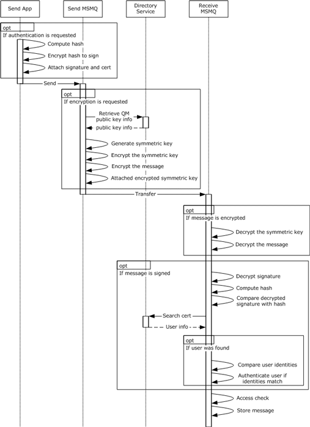
<!-- /Extracted images from page 57 -->

Figure 18: Message layer security sequences

#### 2.9.5 Internal Security and External Security

Internal and external security is another view of protecting the data and the communications in the
system.

Internal security is the means by which the system protects its own data and internal
communications, and external security is the means by which the system protects external
communications. For the system, application messages are external communications. Objects
described in section 2.9.1are internal data. For communications labeled in the figure captioned

57 / 83

[MS-MQOD] - v20220902
Message Queuing Protocols Overview
Copyright © 2022 Microsoft Corporation
Release: September 2, 2022

"Component storage and communications" in section 2.9.1, 1 is internal communication, and 2, 3, and
4 are external communications.

The security mechanisms previously described are used to ensure both internal and external security.

### 2.10 Additional Considerations

None.

[MS-MQOD] - v20220902
Message Queuing Protocols Overview
Copyright © 2022 Microsoft Corporation
Release: September 2, 2022

58 / 83

## 3 Examples

The examples presented in the following subsections depend on these common prerequisites.

  On each participating machine, a Message Queuing System is installed, and a queue manager is

initialized as required by the example scenario.





The storage devices configured for the system are available to the system and have enough space
to store the system state and data.

The transport protocols used by the Message Queuing Systems on the participating machines are
available and fully initialized.



If transactions are used, a Transaction Coordinator is available and fully initialized.

  Security package providers are available to the system.



The queue manager(s) possess valid security credentials suitable for authentication.

  At least one domain controller exists for the domain.



Each machine is joined to the domain.

  A Directory Service is initialized and available. If the Message Queuing System uses version 1.0 or

2.0 of the MSMQ protocol set, the MSMQ Directory Service server is initialized and available on a
domain controller.



The necessary Directory Service objects exist and are configured correctly, as specified in [MS-
MQDS] for MSMQ versions 1.0 and 2.0 and in [MS-MQDSSM] for MSMQ versions 3.0 and 4.0.

### 3.1 Example 1: Disconnected Data Entry

This example demonstrates disconnected data entry as described in the Send Message in Transaction -
Application (section 2.5.4) and Receive Message in Transaction – Application (section 2.5.7) use
cases.

Prerequisites

  See the common prerequisites defined in section 3 .















The queue exists.

The application is authorized to send messages to the queue.

If a Directory Service is not being used, the application is configured with the address of the
queue prior to the send operation.

The Transaction Coordinator is accessible to the application and the queue manager in order to
coordinate the transaction execution.

The receiving application is authorized to receive messages from the queue.

The order entry application and the salesperson laptop Queue Manager are deployed on the same
machine.

The order processing application and the central office server Queue Manager are deployed on the
same machine.

Initial System State

[MS-MQOD] - v20220902
Message Queuing Protocols Overview
Copyright © 2022 Microsoft Corporation
Release: September 2, 2022

59 / 83

<!-- Extracted images from page 60 -->
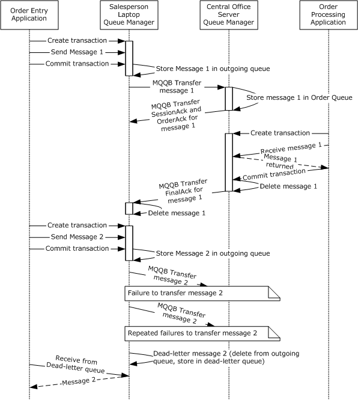
<!-- /Extracted images from page 60 -->

One queue, the order queue, is configured on the central office server computer, and the network
address of the central office server computer is provided to the Order Entry application.

Final System State

The final state of the Message Queuing System in this example is the same as the initial state.

Sequence of Events

The following figure shows the sequence of events for this example.

Figure 19: Example of disconnected data entry

1.  The order entry application creates a new unique transactional unit of work identifier XACTUOW
([MS-MQMQ] section 2.2.18.1.8) structure and invokes the ([MS-MQMP] section 3.1.4.14) method
to create an internal transaction handle for the XACTUOW structure.

60 / 83

[MS-MQOD] - v20220902
Message Queuing Protocols Overview
Copyright © 2022 Microsoft Corporation
Release: September 2, 2022

2.  The order entry application sends message 1 to the salesperson laptop Queue Manager by

invoking the rpc_ACSendMessageEx ([MS-MQMP] section 3.1.5.2) method of the qmcomm2
interface, providing a ptb input parameter initialized with the XACTUOW structure created at step
1.

3.  The order entry application commits the transaction by invoking the R_QMCommitTransaction

([MS-MQMP] section 3.1.4.15) method, specifying the internal transaction handle obtained at step
1.

4.  The salesperson laptop Queue Manager stores message 1 in its outgoing queue.

5.  The salesperson laptop Queue Manager sends an EstablishConnection Packet [MS-MQQB]

section 2.2.3) and a ConnectionParameters Packet ([MS-MQQB] section 2.2.2) to initialize a
session with the central office server Queue Manager and sends message 1 stored in the outgoing
queue to the central office server Queue Manager.

6.  The central office server Queue Manager stores message 1 in its order queue.

7.  The central office server Queue Manager sends a SessionAck Packet ([MS-MQQB] section 2.2.6)
and an OrderAck Packet ([MS-MQQB] section 2.2.4) to the salesperson laptop Queue Manager to
acknowledge that it has received message 1, as specified in [MS-MQQB] section 3.1.1.7.3.

8.  The order processing application creates a new unique transactional unit of work identifier

XACTUOW structure and invokes the R_QMEnlistInternalTransaction method to create an
internal transaction handle for the XACTUOW structure.

9.  The order processing application receives message 1 from the central office server Queue Manager

by invoking the rpc_ACReceiveMessageEx ([MS-MQMP] section 3.1.5.3) method of the
qmcomm2 interface, providing a ptb input parameter initialized with the XACTUOW structure
created at step 8.

10. The order processing application commits the transaction by invoking the

R_QMCommitTransaction method, specifying the internal transaction handle obtained at step 8.

11. The central office server Queue Manager deletes message 1 from its queue manager.

12. The central office server Queue Manager sends a FinalAck Packet ([MS-MQQB] section 2.2.5) to

the salesperson laptop Queue Manager as an end-to-end acknowledgment.

13. The order entry application creates a new unique transactional unit of work identifier XACTUOW

structure and invokes the R_QMEnlistInternalTransaction method to create an internal
transaction handle for the XACTUOW structure.

14. The order entry application sends message 2 to the salesperson laptop Queue Manager by

invoking the rpc_ACSendMessageEx method, providing a ptb input parameter initialized with
the XACTUOW structure created at step 13.

15. The order entry application commits the transaction by invoking the R_QMCommitTransaction

method, specifying the internal transaction handle obtained at step 14.

16. The salesperson laptop Queue Manager stores message 2 in its outgoing queue.

17. The salesperson laptop Queue Manager attempts to initialize a session with the central office

server Queue Manager by sending an EstablishConnection Packet and a
ConnectionParameters Packet  and attempts to send message 2 stored in the outgoing queue
to the central office server Queue Manager.

18. The transfer of message 2 fails due to network related issues, and no protocol acknowledgment is

received by the salesperson laptop Queue Manager.

[MS-MQOD] - v20220902
Message Queuing Protocols Overview
Copyright © 2022 Microsoft Corporation
Release: September 2, 2022

61 / 83

19. The salesperson laptop Queue Manager again attempts to initialize a session with the central office

server Queue Manager by sending an EstablishConnection Packet and a
ConnectionParameters Packet  and attempts to send message 2  stored in the outgoing queue
to the central office server Queue Manager.

20. The transfer of message 2 fails again due to network-related issues, and no protocol

acknowledgment is received by the salesperson laptop Queue Manager.

21. The salesperson laptop Queue Manager deletes message 2 from its queue manager and places it

in the dead-letter queue.

22. The order entry application queries the dead-letter queue of the salesperson laptop Queue

Manager and receives message 2 from the salesperson laptop Queue Manager, as described in
steps 8 through 10.

### 3.2 Example 2: Web Order Entry

This example demonstrates web order entry as described in the Send Message in Transaction -
Application (section 2.5.4) and Receive Message in Transaction – Application (section 2.5.7) use
cases.

Prerequisites

  See the common prerequisites defined in section 3.













The queue exists.

The application is authorized to send messages to the queue.

If a Directory Service is not being used, the application is configured with the address of the
queue prior to the send operation.

The Transaction Coordinator is accessible to the application and the queue manager in order to
coordinate the transaction execution.

The receiving application is authorized to receive messages from the queue.

The web server application and the web server Queue Manager are deployed on the same
machine.



The back-end application and the back-end Queue Manager are deployed on the same machine.

Initial System State

To execute this example, the queue managers on the web servers, intermediary server, and back-end
server are operating in the queue server roles.

The queue manager on the intermediary server is initialized to contain a transactional queue. The
queue manager on each web server dynamically creates an outgoing queue if there are recoverable
messages pending transfer to the transactional queue. There is no requirement to create queues on
the other queue managers.

Final System State

The final states for the queue managers are equal to their initial states. The intermediary server
Queue Manager contains a transactional queue, and the queue is in a ready state.

Sequence of Events

The sequence of events for web order entry is shown in the following figure.

62 / 83

[MS-MQOD] - v20220902
Message Queuing Protocols Overview
Copyright © 2022 Microsoft Corporation
Release: September 2, 2022

<!-- Extracted images from page 63 -->
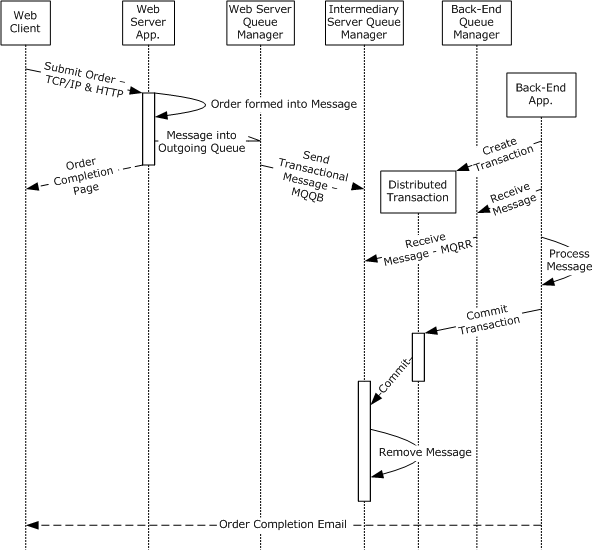
<!-- /Extracted images from page 63 -->

Figure 20: Sequence diagram for Example 2

1.  The web client transmits the customer order to the web server application using the Transmission

Control Protocol/Internet Protocol (TCP/IP) and Hypertext Transfer Protocol (HTTP) protocols, as
specified in [RFC2616].

2.  The order is transformed into an MSMQ message by the web server application.

3.  The web server application sends the MSMQ message to the web server Queue Manager, which

stores the MSMQ message in its outgoing queue as described in steps 1 through 4 of Example 1:
Disconnected Data Entry (section 3.1).

4.  An order completion page is sent to the web client by the web server application.

5.  The web server Queue Manager sends an MSMQ transactional message to the intermediary
server Queue Manager as described in steps 5 through 7 of Example 1: Disconnected Data
Entry (section 3.1).

6.  The back-end application creates a new unique transactional unit of work identifier XACTUOW
([MS-MQMQ] section 2.2.18.1.8 structure and invokes the R_QMEnlistInternalTransaction
([MS-MQMP] section 3.1.4.14) method to create an internal transaction handle for the XACTUOW
structure.

[MS-MQOD] - v20220902
Message Queuing Protocols Overview
Copyright © 2022 Microsoft Corporation
Release: September 2, 2022

63 / 83

7.  The back-end application receives the MSMQ message from the back-end Queue Manager by

invoking the rpc_ACReceiveMessageEx ([MS-MQMP] section 3.1.5.3) method of the qmcomm2
interface, providing a ptb input parameter initialized with the XACTUOW structure created at step
6.

8.  The back-end Queue Manager invokes the R_OpenQueue ([MS-MQRR] section 3.1.4.2) method,
which returns a QUEUE_CONTEXT_HANDLE_SERIALIZE ([MS-MQRR] section 2.2.4.2) handle;
next, it invokes the R_QMEnlistRemoteTransaction ([MS-MQRR] section 3.1.4.12) method to
propagate the distributed atomic transaction context to the intermediary server Queue Manager.
The back-end Queue Manager utilizes the QUEUE_CONTEXT_HANDLE_SERIALIZE identifier
and invokes the R_StartTransactionalReceive ([MS-MQRR] section 3.1.4.13) method and the
R_EndTransactionalReceive ([MS-MQRR] section 3.1.4.15) method to receive the message
from the opened queue of the intermediary server Queue Manager. Then the back-end Queue
Manager invokes the R_CloseQueue ([MS-MQRR] section 3.1.4.3) method to close the
QUEUE_CONTEXT_HANDLE_SERIALIZE handle.<6>

9.  The back-end application processes the received MSMQ message.

10. The back-end application commits the transaction by invoking the R_QMCommitTransaction

([MS-MQMP] section 3.1.4.15) method, specifying the internal transaction handle obtained at step
6.

11. The Distributed Transaction commits the MSMQ message as described in step 10 of Example 1:

Disconnected Data Entry (section 3.1).

12. The intermediary server Queue Manager removes the MSMQ message from its order queue as

described in steps 12 and 13 of Example 1: Disconnected Data Entry (section 3.1).

13. The back-end application sends an order completion email to the web client.

### 3.3 Example 3: Modify a Public Queue

This example demonstrates modifying a public queue as described in the Create or Modify Queue -
Application (section 2.5.1) use case.

 Prerequisites

  See the common prerequisites that are described in section 3.





The application has access to the machine on which a queue is to be created or modified.

The application has the necessary administrative rights to execute the operation.

 Initial System State

To execute this example, the remote machine has already created a public queue with a corresponding
Directory Service object representing this public queue.

The client application is initialized with the unique identifier of the public queue object on the Directory
Service.

 Final System State

In the final state of the Message Queuing System, both the Directory Service object representing the
public queue on the Server Queue Manager and the public queue state on the Server Queue Manager
have been updated with the new properties. The public queue in the Server Queue Manager is in a
ready state.

 Sequence of Events

[MS-MQOD] - v20220902
Message Queuing Protocols Overview
Copyright © 2022 Microsoft Corporation
Release: September 2, 2022

64 / 83

<!-- Extracted images from page 65 -->
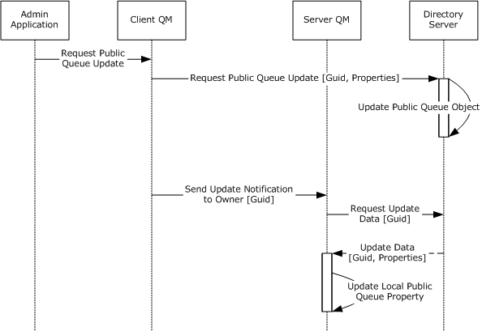
<!-- /Extracted images from page 65 -->

The following figure shows the sequence of events for modifying a public queue.

Figure 21: Sequence diagram modifying a public queue

1.  The Admin Application calls the R_QMSetObjectProperties ([MS-MQMP] section 3.1.4.10)

method to update the properties of a local private queue.

2.  The client Queue Manager generates the Update Directory Object [MS-MQDS] section 3.1.6.4)

event to update the public queue object on the directory server with the modified properties.

3.  3. The Directory Service updates the public queue object with the modified properties sent in step

2.

4.  The client Queue Manager creates a Change Notification Message ([MS-MQCN] section 2.2.4),

which includes a Notification Body ([MS-MQCN] section 2.2.5). The notification message is sent to
the server Queue Manager.

5.  The server Queue Manager requests the updated data using the Lightweight Directory Access

Protocol (LDAP), as specified in [MS-ADTS].

6.  The Directory Server creates a Change Notification Message containing one or more Notification

Updates ([MS-MQCN] section 2.2.6) and sends the update to the server Queue Manager.

7.  The server Queue Manager updates its local queue with the data received in step 6.

### 3.4 Example 4: Creating and Monitoring a Remote Private Queue

This example demonstrates creating and monitoring a remote private queue as described in the
Create or Modify Queue - Application (section 2.5.1) and Query Queue Information-
Application (section 2.5.2) use cases.

 Prerequisites

[MS-MQOD] - v20220902
Message Queuing Protocols Overview
Copyright © 2022 Microsoft Corporation
Release: September 2, 2022

65 / 83

<!-- Extracted images from page 66 -->
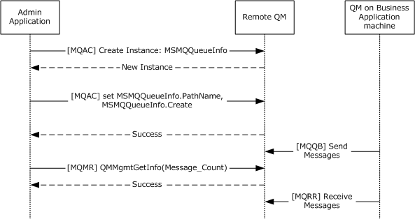
<!-- /Extracted images from page 66 -->













The common prerequisites defined in section 3.

The application has access to the machine on which a queue is to be created or modified.

The application has the necessary administrative rights to execute the operation.

The application administrator completes the application-specific configuration of the Message
Queuing System, such as creating the necessary queues.

The application has access to the machine and queue.

The application has the necessary administrative rights to execute the query.

 Initial System State

To execute this example, the queue manager on the remote machine is operating in the queue server
role.

The administrator application and the business applications are configured with the remote machine's
address and the private queue's address on the remote queue manager.

 Final System State

The final state of the remote queue manager has a new private queue, and the queue is in a Ready
state. The query to retrieve the number of messages from the remote queue manager's private queue
does not alter the state in any way.

 Sequence of Events

The following figure shows the sequence of events for creating and monitoring a remote private
queue.

Figure 22: Sequence diagram of events to create or modify a remote private queue

1.  The Admin Application requests the creation of an MSMQQueueInfo ([MC-MQAC] section 3.10.3)

class instance to create an application queue.

2.  A new MSMQQueueInfo class instance is created and returned to the Admin Application.

[MS-MQOD] - v20220902
Message Queuing Protocols Overview
Copyright © 2022 Microsoft Corporation
Release: September 2, 2022

66 / 83

3.  The Admin Application sets the path name indicating the queue to be referenced by the

MSMQMessageInfo class instance by invoking the PathName  ([MC-MQAC] section 3.10.4.1.7)
method of the IMSMQQueueInfo4 interface. Next, the Admin Application calls the Create ([MC-
MQAC]section 3.10.4.1.26) method of the IMSMQQueueInfo4  interface to create a new public
or private application queue.

4.  S_OK (0x00000000) is returned to the Admin Application on success.

5.  Once the private queue is created on the Remote Queue Manager machine, other business

applications running on various application machines send messages to and receive messages
from the private queue, using the local queue managers on the respective machines, depending
on the functionality of the business applications. Although these activities involve the MSMQ
protocols, the specifics of these activities and the related protocols are not relevant for the
purpose of this example.

6.  The Admin Application requests information about the remote queue by invoking the

R_QMMgmtGetInfo ([MS-MQMR] section 3.1.4.1) method of the qmmgmt interface, providing
an aProp[] parameter array with a single entry set to PROPID_MGMT_QUEUE_MESSAGE_COUNT
([MS-MQMQ] section 2.3.12.7).

7.  This method returns success (MQ_OK (0x00000000)) and an apVar[]  output parameter array with

a single entry containing a PROPID_MGMT_QUEUE_MESSAGE_COUNT ([MS-MQMQ] section
2.3.12.7) property value with the number of messages in the remote queue.

### 3.5 Example 5: Branch Office Order Processing

This example demonstrates branch office order processing as described in the Send Message to Queue
– Application (section 2.5.3) use case.

Prerequisites

  See the common prerequisites defined in section 3.







The queue exists.

The application is authorized to send messages to the queue.

If a Directory Service is not being used, the application is configured with the address of the
queue prior to the send operation.

Initial System State

At least one Message Queuing System in each MSMQ site is designated as an MSMQ site gate, as
specified in [MS-MQBR]. The In-Routing Servers and Out-Routing Servers are configured on all
the MSMQ site gates. The Directory Service contains sufficient information to build a routing table,
including:







The available machines in the enterprise.

The connected networks for each of the machines.

The MSMQ sites in the enterprise.

  All available routing links and the associated costs for each link.

The directory server has the public keys of all the machines in the enterprise. On startup, the queue
manager servers on the MSMQ site gates compute the routing tables containing the most optimal
routes.

One queue is configured in the company headquarters (HQ) server to receive sales data.

67 / 83

[MS-MQOD] - v20220902
Message Queuing Protocols Overview
Copyright © 2022 Microsoft Corporation
Release: September 2, 2022

<!-- Extracted images from page 68 -->
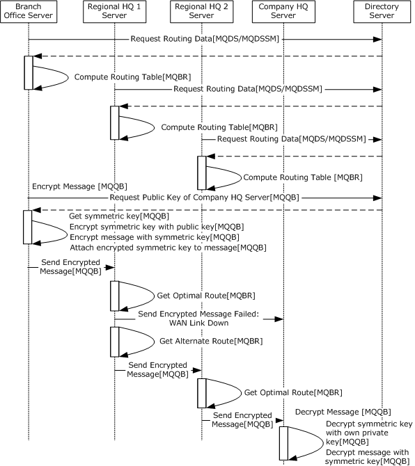
<!-- /Extracted images from page 68 -->

Final System State

The final state of the Message Queuing System in the company HQ contains the sales data sent from
the branch office server. The final states for all other Message Queuing Systems in this example are
the same as their initial states.

Sequence of Events

The following figure shows the sequence of events for branch office order processing.

Figure 23: Sequence diagram for Example 5

1.  To get the routing data, the branch office server calls the S_DSGetProps ([MS-MQDS] section

3.1.4.7) method, providing a dwObjectType input parameter value of MQDS_ROUTINGLINK ([MS-
MQDS] section 2.2.8), a pwcsPathName input parameter value of NULL or a null-terminated 16-bit
Unicode string, and an aProp[] input parameter array containing a single entry value of
PROPID_L_ID (see [MS-MQDS] sections 2.2.9, 2.2.10.1, and 2.2.10.8). On success, the

68 / 83

[MS-MQOD] - v20220902
Message Queuing Protocols Overview
Copyright © 2022 Microsoft Corporation
Release: September 2, 2022

S_DSGetProps method returns an apVar[] output parameter array populated with routing link
properties ([MS-MQDS] section 3.1.4.21.8.1.9) and a return code of MQ_OK (0x00000000).

2.  The branch office server initializes its RoutingTable ([MS-MQBR] sections 3.1.1.2 and 3.1.3.1)

ADM element and computes a collection of RoutingLink ([MS-MQDMPR] section 3.1.1.8) ADM
element instances by invoking the GetDirectoryData ([MS-MQBR] section 3.1.5.9) method,
providing a DataElementType parameter set to the string "RoutingLink" and an empty FilterArray
parameter.

In case an MSMQ site is not reachable, the GetNextHopsForSiteGate ([MS-MQBR] section
3.1.5.3) event is invoked to get a list of alternate next hops from which the least-cost alternate
route to the ultimate destination is constructed using Dijkstra's algorithm.

3.  The regional HQ1 server follows step 1 to request routing data.

4.  The regional HQ1 server follows step 2 to compute the routing table.

5.  The regional HQ2 server follows step 1 to request routing data.

6.  The regional HQ2 server follows step 2 to compute the routing table.

7.  As specified in [MS-MQQB] section 3.1.7.1.5, the branch office server encrypts the message by

requesting the public key of the company HQ server from the Directory Service. Next, the branch
bffice server generates the Create Directory Object ([MS-MQDSSM] section 3.1.6.1) event,
providing an iAttributeList argument value set to mSMQEncryptKey, as specified in [MS-
MQDSSM] section 3.1.6.1.1.2, to get an MQDSPUBLICKEYS ([MS-MQMQ] section 2.2.2)
structure.

8.  Using the key length and provider information in the company HQ server's public key information

to ensure that the company HQ server can decrypt the message, the branch office server
dynamically generates a symmetric key. Next, the branch office server server encrypts the
symmetric key with the company HQ server's public key obtained in step 7, encrypts the message
with the symmetric key, and attaches the encrypted symmetric key to the message. The message
format is specified in [MS-MQMQ] section 2.2.20.6.

9.  The branch office server generates the Send User Message Event ([MS-MQQB] section 3.1.7.1) to

send the encrypted message to the Regional HQ1 Server.

10. The regional HQ1 server invokes the GetNextHopsForSiteGate ([MS-MQBR] section 3.1.5.3) event

to get the next route to send the message.

11. If the message transfer fails on this route, an alternate route is selected by invoking the

GetNextHopsForSiteGate event.

12. The regional HQ1 server generates the Send User Message Event to send the encrypted message

to the regional HQ2 server.

13. The regional HQ2 server performs steps 10 through 12 to find the next correct route and send the

message to the company HQ server.

14. The queue manager of the Company HQ server decrypts the message as specified in [MS-MQQB]

section 3.1.5.8.3, using the following high-level steps:

1.  Extract the encrypted symmetric key from the message.

2.  Decrypt  the encrypted symmetric key with a private key from implementation-dependent

local storage.

3.  Decrypt the message with the decrypted symmetric key.

[MS-MQOD] - v20220902
Message Queuing Protocols Overview
Copyright © 2022 Microsoft Corporation
Release: September 2, 2022

69 / 83

### 3.6 Example 6: Business-to-Business Messaging Across a Firewall

This example demonstrates business-to-business messaging across a firewall as described in use
cases Send Message to Queue – Application (section 2.5.3) and Receive a Message from a Queue –
Application (section 2.5.6).

Prerequisites

See the common prerequisites defined in section 3.













The queue exists.

The application is authorized to send messages to the queue.

If a Directory Service is not being used, the application is configured with the address of the
queue prior to the send operation.

The receiving application is authorized to receive messages from the queue.

The order entry application and the employee desktop Queue Manager are deployed on the same
machine.

The order processing application and the supplier server Queue Manager are deployed on the
same machine.

 Initial System State

The order queue is configured on the supplier server computer, with a name specified in the ordering
system design, and the network address of the supplier server computer is provided to the order entry
application.

The acknowledgments queue and the response queue are configured on the manufacturer server
computer, with names specified in the ordering system design, and the network address of the
manufacturer server computer is provided to the order processing application and the order entry
application.

Final System State

The final state of MSMQ in this example is the same as the initial state.

Sequence of Events

The following figure shows the sequence of events for business-to-business messaging across a
firewall.

[MS-MQOD] - v20220902
Message Queuing Protocols Overview
Copyright © 2022 Microsoft Corporation
Release: September 2, 2022

70 / 83

<!-- Extracted images from page 71 -->
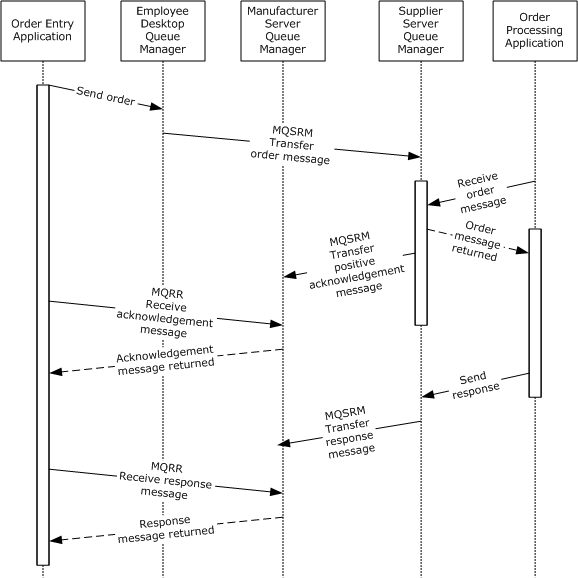
<!-- /Extracted images from page 71 -->

Figure 24: Sequence diagram for Example 6

1.  The order entry application creates a new unique transactional unit of work identifier XACTUOW
([MS-MQMQ] section 2.2.18.1.8) structure, encapsulates an order in an MSMQ message, and
sends it to the employee desktop Queue Manager, as described in steps 1 through 2 of Example 1:
Disconnected Data Entry (section 3.1).

2.  When network connectivity to the supplier server computer is available, the employee desktop

Queue Manager transfers the order message to the supplier server Queue Manager using the
Message Queuing (MSMQ): SOAP Reliable Messaging Protocol (SRMP) over the Hypertext Transfer
Protocol over Secure Sockets Layer (HTTPS) transport, as specified in [MC-MQSRM] section
3.1.1.1.2.1. The supplier server Queue Manager receives the message from the network, as
specified in [MC-MQSRM] section 3.1.5.1.6, and stores it in its order queue.

3.  The order entry application creates a new unique transactional unit of work identifier XACTUOW
structure and receives the order message from the supplier server Queue Manager, as described
in steps 8 through 9 of Example 1: Disconnected Data Entry.

4.  When the order processing application receives the message from the order queue, the supplier

server Queue Manager sends a positive acknowledgment to the Acknowledgments queue,

71 / 83

[MS-MQOD] - v20220902
Message Queuing Protocols Overview
Copyright © 2022 Microsoft Corporation
Release: September 2, 2022

including the message identifierof the original message, as specified in [MC-MQSRM] section
2.2.4.3.

5.  The order entry application receives the acknowledgment message from the manufacturer server
Queue Manager by invoking the rpc_ACReceiveMessageEx ([MS-MQMP] section 3.1.5.3)
method of the qmcomm2 interface, providing a ptb input parameter initialized with the
XACTUOW structure created at step 1.

6.  The order processing application sends a response message to the supplier server Queue Manager
by invoking the rpc_ACSendMessageEx ([MS-MQMP] section 3.1.5.2) method of the qmcomm2
interface, providing a ptb input parameter initialized with the XACTUOW structure created at step
3, and commits the transaction by invoking the R_QMCommitTransaction ([MS-MQMP] section
3.1.4.15) method.

7.  When network connectivity to the supplier server computer is available, the supplier server Queue
Manager  transfers the response message to the manufacturer server Queue Manager using the
Message Queuing (MSMQ): SOAP Reliable Messaging Protocol (SRMP) over the Hypertext Transfer
Protocol over Secure Sockets Layer (HTTPS) transport, as specified in [MC-MQSRM] section
3.1.1.1.2.1. The manufacturer server Queue Manager receives the message from the network and
stores it in the response queue, as specified in [[MC-MQSRM] section 3.1.5.1.6.

8.  The order entry application receives the response message from the manufacturer server Queue
Manager by invoking the rpc_ACReceiveMessageEx method, providing a ptb input parameter
initialized with the XACTUOW structure created at step 1, and commits the transaction by
invoking the R_QMCommitTransaction method.

### 3.7 Example 7: Server Farm

This example demonstrates the sequence of events for messages in a server farm, as described in the
Send Message to Queue – Application (section 2.5.3) and Receive a Message from a Queue –
Application (section 2.5.6) use cases.

Prerequisites

See the common prerequisites that are described in section 3.







The queue exists.

The application is authorized to send messages to the queue.

If a Directory Service is not being used, the application is configured with the address of the
queue prior to the send operation.



The receiving application is authorized to receive messages from the queue.

Initial System State

Each agent's computer is operating in the queue server role, and the Intermediary Server is operating
in the supporting server role. The analysis servers are operating in the application role.

The queue manager on the Intermediary Server is initialized to contain a transactional queue and
configured to accept only authenticated messages. The queue manager on each agent's computer is
initialized to contain queues to which response messages are sent by the analysis applications.

Final System State

The final states of the queue managers are equal to their initial states. The intermediary server queue
manager contains a transactional queue, and the queue is in a ready state. Each agent's queue
manager contains a queue, and the queue is in the ready state.

72 / 83

[MS-MQOD] - v20220902
Message Queuing Protocols Overview
Copyright © 2022 Microsoft Corporation
Release: September 2, 2022

<!-- Extracted images from page 73 -->
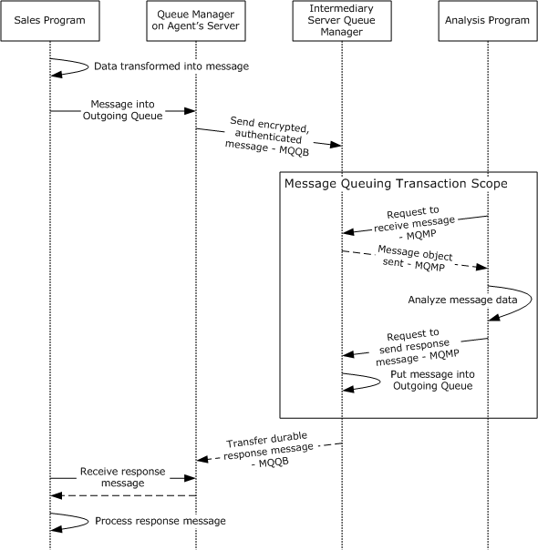
<!-- /Extracted images from page 73 -->

Sequence of Events

The following figure shows the sequence of events for the server farm messages.

Figure 25: Message sequence for server farm

1.  The sales program application creates an MSMQMessage CoClass ([MC-MQAC] section 3.17)

instance and initializes the object as specified in [MC-MQAC] section 3.17.3 to transfer the data
into the message.

2.  The sales program application creates a new unique transactional unit of work identifier

XACTUOW ([MS-MQMQ] section 2.2.18.1.8) structure, encapsulates the message in an MSMQ
message, and sends it to the Queue Manager on the Agent's Server, as described in steps 1
through 2 of Example 1: Disconnected Data Entry (section 3.1). The Queue Manager on the
agent's server stores the message in its outgoing queue.

3.  The Queue Manager on the agent's server encrypts the message, as specified in [MS-MQQB]

section 3.1.7.1.5, authenticates the message, as specified in [MS-MQQB] section 3.1.5.8.3, and
generates the Send User Message Event ([MS-MQQB] section 3.1.7.1) to send the message to the
intermediary server Queue Manager.

73 / 83

[MS-MQOD] - v20220902
Message Queuing Protocols Overview
Copyright © 2022 Microsoft Corporation
Release: September 2, 2022

4.  The analysis program application creates a new unique transactional unit of work identifier

XACTUOW structure and receives the message from the intermediary server Queue Manager, as
described in steps 8 through 9 of Example 1: Disconnected Data Entry.

5.  The analysis program analyses the received message.

6.  The analysis program application sends the response message to the intermediary server Queue
Manager by invoking the rpc_ACSendMessageEx ([MS-MQMP] section 3.1.5.2) method of the
qmcomm2 interface, providing a ptb input parameter initialized with the XACTUOW structure
created at step 4.

7.  The intermediary server Queue Manager stores the response message in its outgoing queue.

8.  The intermediary server Queue Manager generates a Send User Message Event to send a response

message to the Queue Manager on the agent’s server.

9.  The sales program application receives the message from the Queue Manager on the agent’s

server by invoking the rpc_ACReceiveMessageEx ([MS-MQMP] section 3.1.5.3) method of the
qmcomm2 interface, providing a ptb input parameter initialized with the XACTUOW structure
created at step 2.

10. The sales program application processes the received message to get the analysis result.

### 3.8 Example 8: Stock Ticker

This example demonstrates business-to-business messaging, as described in the Send Message to
Queue – Application (section 2.5.3) and Receive a Message from a Queue - Application (section 2.5.6)
use cases.

Prerequisites

See the common prerequisites defined in section 3.













The queue exists.

The application is authorized to send messages to the queue.

If a Directory Service is not being used, the application is configured with the address of the
queue prior to the send operation.

The receiving application is authorized to receive messages from the queue.

The  back-end application and the back-end computer Queue Manager are deployed on the same
machine.

Each Display Point display application and Display Point Queue Manager pair is deployed on the
same machine, where the pairs are numbered #1 through #n, as depicted in the following figure.

Initial System State

There is one queue manager on the back-end computer and one queue manager on each Display
Point computer.

One queue is configured on each Display Point computer, and each queue is configured with an IP
multicast address. The queue name and IP multicast address are specified in the design of the
applications.

Final System State

The final state of MSMQ in this example is the same as the initial state.

74 / 83

[MS-MQOD] - v20220902
Message Queuing Protocols Overview
Copyright © 2022 Microsoft Corporation
Release: September 2, 2022

<!-- Extracted images from page 75 -->
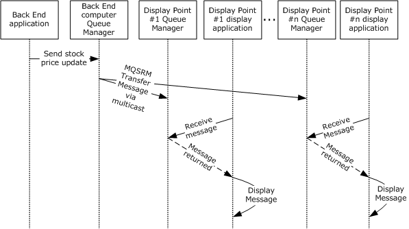
<!-- /Extracted images from page 75 -->

Sequence of Events

The sequence of events for the stock ticker example is shown in the following figure.

Figure 26: Sequence diagram for the stock ticker example

1.  The back-end application sends the stock price update to the back-end computer Queue Manager.

2.  The back-end computer Queue Manager transfers the message to the Display Point Queue

Managers (Display Point #1 Queue Manager, … Display Point #n Queue Manager) using the
Message Queuing (MSMQ): SOAP Reliable Messaging Protocol (SRMP) (MQSRM) over the
Pragmatic General Multicast (PGM) transport, as described in [RFC3208] and in [MC-MQSRM]
sections 1.3.11 and 2.1.3. The Display Point Queue Managers store the messages in their
respective queues.

3.  Each Display Point display application creates a new unique transactional unit of work identifier
XACTUOW ([MS-MQMQ] section 2.2.18.1.8) structure and receives the stock price update
message from its Display Point Queue Manager by invoking the rpc_ACReceiveMessageEx
([MS-MQMP] section 3.1.5.3) method of the qmcomm2 interface, providing a ptb input
parameter initialized with the newly created XACTUOW structure.

4.  Upon receiving the stock price update message, each Display Point display application extracts

and displays the stock symbol and price.

### 3.9 Example 9: Business-to-Business Messaging Across Heterogeneous Systems

This example demonstrates business-to-business messaging across heterogeneous systems, as
described in the Send Message to Queue - Application (section 2.5.3), Transfer
Message (section 2.5.5), and Receive a Message from a Queue – Application (section 2.5.6) use cases.

Prerequisites

See the common prerequisites defined in section 3.





The queue exists.

The application is authorized to send messages to the queue.

75 / 83

[MS-MQOD] - v20220902
Message Queuing Protocols Overview
Copyright © 2022 Microsoft Corporation
Release: September 2, 2022









If a Directory Service is not being used, the application is configured with the address of the
queue prior to the send operation.

The receiving application is authorized to receive messages from the queue.

The supply-chain management software and the customer’s server Queue Manager are deployed
on the same machine.

The connector application and the messaging gateway Queue Manager are deployed on the same
machine.

Initial System State

The client software for the manufacturer's message queuing system is installed on the messaging
gateway computer, and then the connector application is installed, which makes the messaging
gateway computer a connector server. The connector queue on the messaging gateway computer is
created as part of the connector application installation.

The response queue is configured on the customer server to store responses from the manufacturer.

An administrator creates a foreign queue object in the Directory Service, representing the
destination queue for messages traveling from the customer's server to the manufacturer.

Final System State

The final state of MSMQ in this example is the same as the initial state.

Sequence of Events

The sequence of events for the business-to-business messaging across heterogeneous systems
example is shown in the following diagram.

[MS-MQOD] - v20220902
Message Queuing Protocols Overview
Copyright © 2022 Microsoft Corporation
Release: September 2, 2022

76 / 83

<!-- Extracted images from page 77 -->
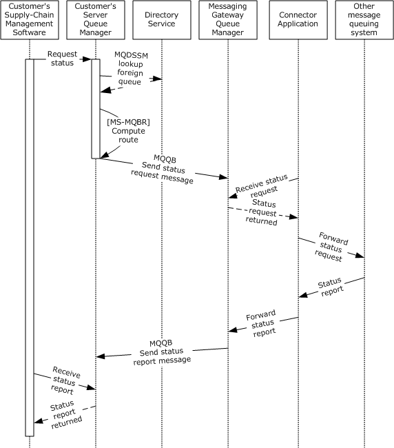
<!-- /Extracted images from page 77 -->

Figure 27: Sequence diagram for Example 9

1.  The customer's supply-chain management software sends a status report request to the

manufacturer's supply-chain management software. The status report request is encapsulated in
an MSMQ message, as described in steps 1 through 4 of Example 1: Disconnected Data
Entry (section 3.1), along with necessary details such as the destination queue for the message.

2.  The customer's server Queue Manager stores the message in an outgoing queue and looks up the

destination queue in the Directory Service using the algorithm specified in [MS-MQDSSM].

3.  Discovering that the destination is a foreign queue, the customer's server Queue Manager

computes the route to the foreign queue by calling the GetDirectoryData ([MS-MQBR] section
3.1.5.9) method, providing a DataElementType parameter set to "RoutingLink" and a FilterArray
parameter set to no elements, to create a collection of RoutingLink ([MS-MQDMPR] section
3.1.1.8) ADM element instances that belong to the enterprise. In case a site is not reachable, the
GetNextHopsForSiteGate ([MS-MQBR] section 3.1.5.3) algorithm is used to get a list of

77 / 83

[MS-MQOD] - v20220902
Message Queuing Protocols Overview
Copyright © 2022 Microsoft Corporation
Release: September 2, 2022

alternate next hops from which the least cost alternate route to the ultimate destination is
constructed using Dijkstra's algorithm.

4.  The next hop to get to the foreign queue is the connector queue on the messaging gateway

computer, so the customer's server Queue Manager transfers the message to the messaging
gateway computer using the Message Queuing (MSMQ): Message Queuing Binary Protocol (MQQB)
when network connectivity is available, as described in step 5 of Example 1: Disconnected Data
Entry.

5.  The messaging gateway Queue Manager receives the message from the network and stores it in

the connector queu.

6.  The connector application receives the message from the connector queue and forwards the

message to its final destination in the manufacturer's enterprise. The details of forwarding are
specific to the connector application and the manufacturer's message queuing system and are not
included in this example.

7.

 When the connector application receives a response, it determines where to send it, which in this
case is the response queue on the customer server. Again, the details of how the connector
application translates a destination expressed in the manufacturer's message queuing system
syntax to a destination in MSMQ are specific to the connector application and the manufacturer's
message queuing system and are not included in this example.

8.  The connector application uses a local interface to pass the message and associated details, such

as the message's destination, to the messaging gateway Queue Manager.

9.  The messaging gateway Queue Manager stores the message in an outgoing queue and transfers it

via MQQB to the customer server when network connectivity is available.

10. The customer's server Queue Manager receives the message from the network and stores it in the

destination queue.

11. The customer's supply-chain management software receives the message and extracts the status

report, and the process completes.

[MS-MQOD] - v20220902
Message Queuing Protocols Overview
Copyright © 2022 Microsoft Corporation
Release: September 2, 2022

78 / 83

## 4 Microsoft Implementations

The information in this overview is applicable to the following versions of Windows.

The terms "earlier" and "later", when used with a product version, refer to either all preceding
versions or all subsequent versions, respectively. The term "through" refers to the inclusive range of
versions. Applicable Microsoft products are listed chronologically in this section.

Windows Client

  Windows NT operating system

  Windows 95 operating system

  Windows 98 operating system

  Windows 2000 operating system

  Windows XP operating system

  Windows Vista operating system

  Windows 7 operating system

  Windows 8 operating system

  Windows 8.1 operating system

  Windows 10 operating system

  Windows 11 operating system

Windows Server

  Windows NT Server operating system

  Windows 2000 Server operating system

  Windows Server 2003 operating system

  Windows Server 2003 R2 operating system

  Windows Server 2008 operating system

  Windows Server 2008 R2 operating system

  Windows Server 2012 operating system

  Windows Server 2012 R2 operating system

  Windows Server 2016 operating system

  Windows Server operating system

  Windows Server 2019 operating system

  Windows Server 2022 operating system

Exceptions, if any, are noted in the following section.

[MS-MQOD] - v20220902
Message Queuing Protocols Overview
Copyright © 2022 Microsoft Corporation
Release: September 2, 2022

79 / 83

### 4.1 Product Behavior

<1> Section 2.3.1: The RPC system in Windows 2000 Server supports MSMQ as a means of transport.

<2> Section 2.6: The following table maps the MSMQ versions to operating system versions.

MSMQ version  Operating system version

MSMQ 1.0

Windows NT, Windows 95, and Windows 98

MSMQ 2.0

Windows 2000 Server

MSMQ 3.0

Windows XP and Windows Server 2003

MSMQ 4.0

Windows Vista and Windows Server 2008

MSMQ 5.0

Windows 7 and Windows Server 2008 R2

MSMQ 6.0

Windows 8 and later

Windows Server 2012, and later

<3> Section 2.6: The client version of MSMQ 3.0 is shipped with Windows XP.

<4> Section 2.6: The server version of MSMQ 3.0 is shipped with Windows Server 2003.

<5> Section 2.9.4.1.1: In Windows, the queue manager RPC servers register authentication services
based on the machine's configuration. For example, Kerberos mutual authentication is registered only
on a domain-joined machine.

<6> Section 3.2: Windows XP, Windows Server 2003, Windows Vista, Windows Server 2008, Windows
7, and Windows Server 2008 R2 operating system do not invoke the R_CloseQueue ([MS-MQRR]
section 3.1.4.3) method.

[MS-MQOD] - v20220902
Message Queuing Protocols Overview
Copyright © 2022 Microsoft Corporation
Release: September 2, 2022

80 / 83

## 5 Change Tracking

This section identifies changes that were made to this document since the last release. Changes are
classified as Major, Minor, or None.

The revision class Major means that the technical content in the document was significantly revised.
Major changes affect protocol interoperability or implementation. Examples of major changes are:

  A document revision that incorporates changes to interoperability requirements.
  A document revision that captures changes to protocol functionality.

The revision class Minor means that the meaning of the technical content was clarified. Minor changes
do not affect protocol interoperability or implementation. Examples of minor changes are updates to
clarify ambiguity at the sentence, paragraph, or table level.

The revision class None means that no new technical changes were introduced. Minor editorial and
formatting changes may have been made, but the relevant technical content is identical to the last
released version.

The changes made to this document are listed in the following table. For more information, please
contact dochelp@microsoft.com.

Section

Description

2.6 Versioning, Capability
Negotiation, and Extensibility

11424 : Updated the 2.6 product note <2> MSMQ
version to operating system version table.

Revision
class

Major

[MS-MQOD] - v20220902
Message Queuing Protocols Overview
Copyright © 2022 Microsoft Corporation
Release: September 2, 2022

81 / 83

## 6 Index
A

Additional considerations 58
Applicable protocols 34
Architecture 17
Assumptions 37

C

Capability negotiation 48
Change tracking 81
Coherency requirements 51
Communications 36
   with other systems 37
   within the system 36
Component dependencies 37
Concepts 17
Considerations
   additional 58
   security 51
Create or modify queue - application
   overview 39

D

Dependencies
   with other systems 37
   within the system 36
Design intent
   create or modify queue - application 39
   exchange message - application 46
   overview 37
   query queue information- application 40
   receive a message from a queue - application 44
   receive message in transaction – application 45
   send message in transaction - application 42
   send message to queue - application 41
   transfer message 43

E

Environment 36
Error handling 48
Examples - overview 59
Exchange message - application
   overview 46
Extensibility
   Microsoft implementations 79
   overview 48
Extensibility - overview 48
External dependencies 36

F

Functional architecture 17
Functional requirements - overview 5

G

Glossary 9

[MS-MQOD] - v20220902
Message Queuing Protocols Overview
Copyright © 2022 Microsoft Corporation
Release: September 2, 2022

H

Handling requirements 48

I

Implementations - Microsoft (section 4 79, section

4.1 80)

Implementer - security considerations 51
Informative references 15
Initial state 37
Introduction 5

M

Microsoft implementations (section 4 79, section 4.1

80)

O

Overview
   summary of protocols 34
Overview - introduction 5
Overview - synopsis 5
Overview (synopsis) 5

P

Preconditions 37
Product behavior 80

Q

Query queue information- application
   overview 40

R

Receive a message from a queue - application
   overview 44
Receive message in transaction – application
   overview 45
References 15
Requirements
   coherency 51
   error handling 48
   overview 5
   preconditions 37

S

Security considerations 51
Send message in transaction - application
   overview 42
Send message to queue - application
   overview 41
System dependencies 36
   with other systems 37
   within the system 36
System errors 48
System protocols 34

82 / 83

System requirements - overview 5
System use cases
   create or modify queue - application 39
   exchange message - application 46
   overview 37
   query queue information- application 40
   receive a message from a queue - application 44
   receive message in transaction – application 45
   send message in transaction - application 42
   send message to queue - application 41
   transfer message 43
System use cases - overview 37

T

Table of MSMQ versions 48
Table of protocols 34
Tracking changes 81
Transfer message
   overview 43

U

Use cases 37
   create or modify queue - application 39
   exchange message - application 46
   query queue information- application 40
   receive a message from a queue - application 44
   receive message in transaction – application 45
   send message in transaction - application 42
   send message to queue - application 41
   transfer message 43

V

Versioning
   Microsoft implementations 79
   overview 48

[MS-MQOD] - v20220902
Message Queuing Protocols Overview
Copyright © 2022 Microsoft Corporation
Release: September 2, 2022

83 / 83

