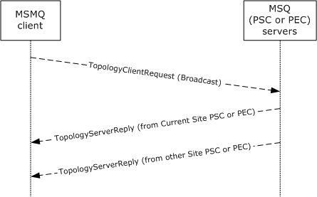

[MS-MQSD]:

Message Queuing (MSMQ): Directory Service Discovery
Protocol

Intellectual Property Rights Notice for Open Specifications Documentation

  Technical Documentation. Microsoft publishes Open Specifications documentation (“this

documentation”) for protocols, file formats, data portability, computer languages, and standards
support. Additionally, overview documents cover inter-protocol relationships and interactions.

  Copyrights. This documentation is covered by Microsoft copyrights. Regardless of any other

terms that are contained in the terms of use for the Microsoft website that hosts this
documentation, you can make copies of it in order to develop implementations of the technologies
that are described in this documentation and can distribute portions of it in your implementations
that use these technologies or in your documentation as necessary to properly document the
implementation. You can also distribute in your implementation, with or without modification, any
schemas, IDLs, or code samples that are included in the documentation. This permission also
applies to any documents that are referenced in the Open Specifications documentation.
  No Trade Secrets. Microsoft does not claim any trade secret rights in this documentation.
  Patents. Microsoft has patents that might cover your implementations of the technologies

described in the Open Specifications documentation. Neither this notice nor Microsoft's delivery of
this documentation grants any licenses under those patents or any other Microsoft patents.
However, a given Open Specifications document might be covered by the Microsoft Open
Specifications Promise or the Microsoft Community Promise. If you would prefer a written license,
or if the technologies described in this documentation are not covered by the Open Specifications
Promise or Community Promise, as applicable, patent licenses are available by contacting
iplg@microsoft.com.

  License Programs. To see all of the protocols in scope under a specific license program and the

associated patents, visit the Patent Map.

  Trademarks. The names of companies and products contained in this documentation might be
covered by trademarks or similar intellectual property rights. This notice does not grant any
licenses under those rights. For a list of Microsoft trademarks, visit
www.microsoft.com/trademarks.

  Fictitious Names. The example companies, organizations, products, domain names, email

addresses, logos, people, places, and events that are depicted in this documentation are fictitious.
No association with any real company, organization, product, domain name, email address, logo,
person, place, or event is intended or should be inferred.

Reservation of Rights. All other rights are reserved, and this notice does not grant any rights other
than as specifically described above, whether by implication, estoppel, or otherwise.

Tools. The Open Specifications documentation does not require the use of Microsoft programming
tools or programming environments in order for you to develop an implementation. If you have access
to Microsoft programming tools and environments, you are free to take advantage of them. Certain
Open Specifications documents are intended for use in conjunction with publicly available standards
specifications and network programming art and, as such, assume that the reader either is familiar
with the aforementioned material or has immediate access to it.

Support. For questions and support, please contact dochelp@microsoft.com.

[MS-MQSD] - v20170601
Message Queuing (MSMQ): Directory Service Discovery Protocol
Copyright © 2017 Microsoft Corporation
Release: June 1, 2017

1 / 29

Revision Summary

Date

Revision
History

Revision
Class

Comments

5/11/2007

0.1

8/10/2007

1.0

9/28/2007

1.1

New

Major

Minor

Version 0.1 release

Updated and revised the technical content.

Clarified the meaning of the technical content.

10/23/2007  1.1.1

Editorial

Changed language and formatting in the technical content.

11/30/2007  2.0

Major

Updated and revised the technical content.

1/25/2008

2.0.1

Editorial

Changed language and formatting in the technical content.

3/14/2008

2.0.2

Editorial

Changed language and formatting in the technical content.

5/16/2008

2.0.3

Editorial

Changed language and formatting in the technical content.

6/20/2008

3.0

Major

Updated and revised the technical content.

7/25/2008

3.0.1

Editorial

Changed language and formatting in the technical content.

8/29/2008

4.0

10/24/2008  5.0

12/5/2008

6.0

Major

Major

Major

Updated and revised the technical content.

Updated and revised the technical content.

Updated and revised the technical content.

1/16/2009

6.0.1

Editorial

Changed language and formatting in the technical content.

2/27/2009

6.0.2

Editorial

Changed language and formatting in the technical content.

4/10/2009

6.0.3

Editorial

Changed language and formatting in the technical content.

5/22/2009

6.0.4

Editorial

Changed language and formatting in the technical content.

7/2/2009

6.1

Minor

Clarified the meaning of the technical content.

8/14/2009

6.1.1

Editorial

Changed language and formatting in the technical content.

9/25/2009

6.2

Minor

Clarified the meaning of the technical content.

11/6/2009

6.2.1

Editorial

Changed language and formatting in the technical content.

12/18/2009  6.2.2

Editorial

Changed language and formatting in the technical content.

1/29/2010

7.0

Major

Updated and revised the technical content.

3/12/2010

7.0.1

Editorial

Changed language and formatting in the technical content.

4/23/2010

7.1

6/4/2010

7.2

7/16/2010

7.2

8/27/2010

8.0

10/8/2010

9.0

11/19/2010  9.0

Minor

Minor

None

Major

Major

None

Clarified the meaning of the technical content.

Clarified the meaning of the technical content.

No changes to the meaning, language, or formatting of the
technical content.

Updated and revised the technical content.

Updated and revised the technical content.

No changes to the meaning, language, or formatting of the

[MS-MQSD] - v20170601
Message Queuing (MSMQ): Directory Service Discovery Protocol
Copyright © 2017 Microsoft Corporation
Release: June 1, 2017

2 / 29

Date

Revision
History

Revision
Class

Comments

technical content.

1/7/2011

9.0

None

No changes to the meaning, language, or formatting of the
technical content.

2/11/2011

10.0

Major

Updated and revised the technical content.

3/25/2011

10.0

None

No changes to the meaning, language, or formatting of the
technical content.

5/6/2011

10.0

None

No changes to the meaning, language, or formatting of the
technical content.

6/17/2011

10.1

Minor

Clarified the meaning of the technical content.

9/23/2011

10.1

None

No changes to the meaning, language, or formatting of the
technical content.

12/16/2011  11.0

Major

Updated and revised the technical content.

3/30/2012

11.0

7/12/2012

11.1

10/25/2012  12.0

1/31/2013

13.0

8/8/2013

13.0

None

Minor

Major

Major

None

No changes to the meaning, language, or formatting of the
technical content.

Clarified the meaning of the technical content.

Updated and revised the technical content.

Updated and revised the technical content.

No changes to the meaning, language, or formatting of the
technical content.

11/14/2013  13.0

None

No changes to the meaning, language, or formatting of the
technical content.

2/13/2014

13.0

None

No changes to the meaning, language, or formatting of the
technical content.

5/15/2014

13.0

None

No changes to the meaning, language, or formatting of the
technical content.

6/30/2015

13.0

None

No changes to the meaning, language, or formatting of the
technical content.

10/16/2015  13.0

None

No changes to the meaning, language, or formatting of the
technical content.

7/14/2016

13.0

None

No changes to the meaning, language, or formatting of the
technical content.

6/1/2017

13.0

None

No changes to the meaning, language, or formatting of the
technical content.

[MS-MQSD] - v20170601
Message Queuing (MSMQ): Directory Service Discovery Protocol
Copyright © 2017 Microsoft Corporation
Release: June 1, 2017

3 / 29

## Table of Contents

- [1 Introduction](#1-introduction)
  - [1.1 Glossary](#11-glossary)
  - [1.2 References](#12-references)
    - [1.2.1 Normative References](#121-normative-references)
    - [1.2.2 Informative References](#122-informative-references)
  - [1.3 Overview](#13-overview)
  - [1.4 Relationship to Other Protocols](#14-relationship-to-other-protocols)
  - [1.5 Prerequisites/Preconditions](#15-prerequisitespreconditions)
  - [1.6 Applicability Statement](#16-applicability-statement)
  - [1.7 Versioning and Capability Negotiation](#17-versioning-and-capability-negotiation)
  - [1.8 Vendor-Extensible Fields](#18-vendor-extensible-fields)
  - [1.9 Standards Assignments](#19-standards-assignments)
- [2 Messages](#2-messages)
  - [2.1 Transport](#21-transport)
  - [2.2 Message Syntax](#22-message-syntax)
    - [2.2.1 TopologyPacketHeader](#221-topologypacketheader)
    - [2.2.2 TopologyClientRequest](#222-topologyclientrequest)
    - [2.2.3 TopologyServerReply](#223-topologyserverreply)
  - [2.3 Directory Service Schema Elements](#23-directory-service-schema-elements)
- [3 Protocol Details](#3-protocol-details)
  - [3.1 MQSD Client Details](#31-mqsd-client-details)
    - [3.1.1 Abstract Data Model](#311-abstract-data-model)
      - [3.1.1.1 Shared Data Elements](#3111-shared-data-elements)
      - [3.1.1.2 Private Data Elements](#3112-private-data-elements)
    - [3.1.2 Timers](#312-timers)
      - [3.1.2.1 Wait For ResponseTimer](#3121-wait-for-responsetimer)
    - [3.1.3 Initialization](#313-initialization)
    - [3.1.4 Higher-Layer Triggered Events](#314-higher-layer-triggered-events)
      - [3.1.4.1 Get Directory Server List](#3141-get-directory-server-list)
    - [3.1.5 Processing Events and Sequencing Rules](#315-processing-events-and-sequencing-rules)
      - [3.1.5.1 Sending a TopologyClientRequest](#3151-sending-a-topologyclientrequest)
      - [3.1.5.2 Receiving a TopologyServerReply](#3152-receiving-a-topologyserverreply)
    - [3.1.6 Timer Events](#316-timer-events)
      - [3.1.6.1 No Server Response](#3161-no-server-response)
    - [3.1.7 Other Local Events](#317-other-local-events)
      - [3.1.7.1 Populate DirectoryServerList](#3171-populate-directoryserverlist)
      - [3.1.7.2 Populate ConnectedNetworkIdentifierList](#3172-populate-connectednetworkidentifierlist)
  - [3.2 MQSD Server Details](#32-mqsd-server-details)
    - [3.2.1 Abstract Data Model](#321-abstract-data-model)
      - [3.2.1.1 Shared Data Elements](#3211-shared-data-elements)
      - [3.2.1.2 Private Data Elements](#3212-private-data-elements)
    - [3.2.2 Timers](#322-timers)
    - [3.2.3 Initialization](#323-initialization)
    - [3.2.4 Higher-Layer Triggered Events](#324-higher-layer-triggered-events)
    - [3.2.5 Processing Events and Sequencing Rules](#325-processing-events-and-sequencing-rules)
      - [3.2.5.1 Receiving a TopologyClientRequest](#3251-receiving-a-topologyclientrequest)
    - [3.2.6 Timer Events](#326-timer-events)
    - [3.2.7 Other Local Events](#327-other-local-events)
- [4 Protocol Examples](#4-protocol-examples)
- [5 Security](#5-security)
  - [5.1 Security Considerations for Implementers](#51-security-considerations-for-implementers)
  - [5.2 Index of Security Parameters](#52-index-of-security-parameters)
- [6 Appendix A: Product Behavior](#6-appendix-a-product-behavior)
- [7 Change Tracking](#7-change-tracking)
- [8 Index](#8-index)

## 1 Introduction

This document specifies the Message Queuing (MSMQ): Directory Service Discovery Protocol (MQSD)
used by MSMQ Queue Manager versions 1.0 and 2.0 to discover an accessible executing instance of
an MSMQ Directory Service server.

Sections 1.5, 1.8, 1.9, 2, and 3 of this specification are normative. All other sections and examples in
this specification are informative.

### 1.1 Glossary

This document uses the following terms:

Active Directory: The Windows implementation of a general-purpose directory service, which uses

LDAP as its primary access protocol. Active Directory stores information about a variety of
objects in the network such as user accounts, computer accounts, groups, and all related
credential information used by Kerberos [MS-KILE]. Active Directory is either deployed as Active
Directory Domain Services (AD DS) or Active Directory Lightweight Directory Services (AD LDS),
which are both described in [MS-ADOD]: Active Directory Protocols Overview.

Augmented Backus-Naur Form (ABNF): A modified version of Backus-Naur Form (BNF),

commonly used by Internet specifications. ABNF notation balances compactness and simplicity
with reasonable representational power. ABNF differs from standard BNF in its definitions and
uses of naming rules, repetition, alternatives, order-independence, and value ranges. For more
information, see [RFC5234].

connected network: A network of computers in which any two computers can communicate

directly through a common transport protocol (for example, TCP/IP or SPX/IPX). A computer can
belong to multiple connected networks.

ConnectedNetworkID: A GUID that has been assigned to a particular MSMQ Connected

Network and that is unique to that Connected Network.

enterprise: A unit of administration of a network of MSMQ queue managers. An enterprise

consists of an MSMQ Directory Service, one or more connected networks, and one or more
MSMQ sites.

enterprise site: An MSMQ site that has a Primary Enterprise Controller as its Primary Site

Controller.

EnterpriseID: A GUID that has been assigned to a particular MSMQ enterprise and is unique to

that enterprise.

globally unique identifier (GUID): A term used interchangeably with universally unique

identifier (UUID) in Microsoft protocol technical documents (TDs). Interchanging the usage of
these terms does not imply or require a specific algorithm or mechanism to generate the value.
Specifically, the use of this term does not imply or require that the algorithms described in
[RFC4122] or [C706] have to be used for generating the GUID. See also universally unique
identifier (UUID).

Internetwork Packet Exchange (IPX): A protocol that provides connectionless datagram

delivery of messages. See [IPX].

little-endian: Multiple-byte values that are byte-ordered with the least significant byte stored in

the memory location with the lowest address.

Message Queuing Information Store (MQIS): The directory service store used by MSMQ

Directory Service.

6 / 29

[MS-MQSD] - v20170601
Message Queuing (MSMQ): Directory Service Discovery Protocol
Copyright © 2017 Microsoft Corporation
Release: June 1, 2017

Microsoft Message Queuing (MSMQ): A communications service that provides asynchronous

and reliable message passing between distributed applications. In Message Queuing,
applications send messages to queues and consume messages from queues. The queues
provide persistence of the messages, enabling the sending and receiving applications to operate
asynchronously from one another.

MSMQ Directory Service: A network directory service that provides directory information,

including key distribution, to MSMQ. It initially shipped in the Windows NT 4.0 operating system
Option Pack for Windows NT Server as part of MSMQ. This directory service predates and is
superseded by Active Directory (AD).

MSMQ Directory Service server: An MSMQ queue manager that provides MSMQ Directory
Service. The server can act in either of the MSMQ Directory Service roles: Primary Site
Controller (PSC) or Backup Site Controller (BSC).

MSMQ queue manager: An MSMQ service hosted on a machine that provides queued messaging

services. Queue managers manage queues deployed on the local computer and provide
asynchronous transfer of messages to queues located on other computers. A queue manager
is identified by a globally unique identifier (GUID).

MSMQ site: A network of computers, typically physically collocated, that have high connectivity as
measured in terms of latency (low) and throughput (high). A site is represented by a site object
in the directory service. An MSMQ site maps one-to-one with an Active Directory site when
Active Directory provides directory services to MSMQ.

Primary Site Controller (PSC): An MSMQ Directory Service role played by an MSMQ queue
manager. The PSC acts as the authority for the directory information for the site to which it
belongs. The PSC can satisfy directory lookup requests and directory change requests. There is
only one PSC per site.

queue: An object that holds messages passed between applications or messages passed between

Message Queuing and applications. In general, applications can send messages to queues and
read messages from queues.

queue manager (QM): A message queuing service that manages queues deployed on a

computer. A queue manager can also provide asynchronous transfer of messages to queues
deployed on other queue managers.

SiteID: A GUID that has been assigned to a particular MSMQ site and is unique to that site.

Unicode: A character encoding standard developed by the Unicode Consortium that represents

almost all of the written languages of the world. The Unicode standard [UNICODE5.0.0/2007]
provides three forms (UTF-8, UTF-16, and UTF-32) and seven schemes (UTF-8, UTF-16, UTF-16
BE, UTF-16 LE, UTF-32, UTF-32 LE, and UTF-32 BE).

MAY, SHOULD, MUST, SHOULD NOT, MUST NOT: These terms (in all caps) are used as defined
in [RFC2119]. All statements of optional behavior use either MAY, SHOULD, or SHOULD NOT.

### 1.2 References

Links to a document in the Microsoft Open Specifications library point to the correct section in the
most recently published version of the referenced document. However, because individual documents
in the library are not updated at the same time, the section numbers in the documents may not
match. You can confirm the correct section numbering by checking the Errata.

[MS-MQSD] - v20170601
Message Queuing (MSMQ): Directory Service Discovery Protocol
Copyright © 2017 Microsoft Corporation
Release: June 1, 2017

7 / 29

#### 1.2.1 Normative References

We conduct frequent surveys of the normative references to assure their continued availability. If you
have any issue with finding a normative reference, please contact dochelp@microsoft.com. We will
assist you in finding the relevant information.

[IANAPORT] IANA, "Service Name and Transport Protocol Port Number Registry",
https://www.iana.org/assignments/service-names-port-numbers/service-names-port-numbers.xhtml

[MS-ADTS] Microsoft Corporation, "Active Directory Technical Specification".

[MS-DTYP] Microsoft Corporation, "Windows Data Types".

[MS-MQDMPR] Microsoft Corporation, "Message Queuing (MSMQ): Common Data Model and
Processing Rules".

[MS-MQDSSM] Microsoft Corporation, "Message Queuing (MSMQ): Directory Service Schema
Mapping".

[MS-MQDS] Microsoft Corporation, "Message Queuing (MSMQ): Directory Service Protocol".

[MS-MQMP] Microsoft Corporation, "Message Queuing (MSMQ): Queue Manager Client Protocol".

[MS-MQSD] Microsoft Corporation, "Message Queuing (MSMQ): Directory Service Discovery Protocol".

[RFC2119] Bradner, S., "Key words for use in RFCs to Indicate Requirement Levels", BCP 14, RFC
2119, March 1997, https://www.rfc-editor.org/info/rfc2119

#### 1.2.2 Informative References

[MS-MQOD] Microsoft Corporation, "Message Queuing Protocols Overview".

[MSDN-RAS3] Microsoft Corportion, "RasEnumConnections function", http://msdn.microsoft.com/en-
us/library/aa377284(VS.85).aspx

### 1.3 Overview

A queue manager can be run in one of two roles—either running the MSMQ Directory Service or
not running the MSMQ Directory Service. A queue manager that is not running the MSMQ Directory
Service uses the Message Queuing (MSMQ): Directory Service Discovery Protocol (MQSD) to obtain a
current list of network-accessible queue managers running the MSMQ Directory Service.<1> After an
MSMQ Directory Service has been located, other protocols are used to obtain MSMQ configuration
information such as queues and machine names containing MSMQ installations.

MQSD clients obtain a list of queue managers that provide the MSMQ Directory Service by
broadcasting (via a connectionless transport) a TopologyClientRequest (section 2.2.2) packet and by
receiving TopologyServerReply (section 2.2.3) packets. A TopologyClientRequest packet contains a
unique identifier of the enterprise site of which the MQSD client is a member,<2> a unique
correlation identifier for the request, and an identifier of the current MSMQ site (if any) of which the
client is a member.<3> A TopologyServerReply packet contains the unique request correlation
identifier assigned by the MQSD client and a list of known queue managers that provide the MSMQ
Directory Service. In the case in which the MQSD client is already a member of the same MSMQ site
as the responding MQSD server, the TopologyServerReply packet does not contain a list of queue
managers that provide the MSMQ Directory Service.

[MS-MQSD] - v20170601
Message Queuing (MSMQ): Directory Service Discovery Protocol
Copyright © 2017 Microsoft Corporation
Release: June 1, 2017

8 / 29

### 1.4 Relationship to Other Protocols

This protocol depends on the UDP over IP or the IPX <4> protocol for sending discovery requests and
for receiving discovery replies.

The Message Queuing (MSMQ): Queue Manager Client Protocol, as described in [MS-MQMP], and the
Message Queuing (MSMQ): Directory Service Protocol, as specified in [MS-MQDS], make use of the
information obtained by an [MS-MQSD] client request.

### 1.5 Prerequisites/Preconditions

MSMQ queue managers have to be configured with the port number that has been assigned for use
by the MSMQ site for the Message Queuing (MSMQ): Directory Service Discovery Protocol. <5>

### 1.6 Applicability Statement

The Message Queuing (MSMQ): Directory Service Discovery Protocol is applicable to all versions of
MSMQ queue managers and is the only directory service discovery protocol used by MSMQ version
1 and MSMQ version 2 queue managers. The MSMQ: Directory Service Discovery Protocol has been
deprecated for MSMQ version 3 and MSMQ version 4, but all MSMQ queue managers running the
MSMQ Directory Service respond to the protocol for support of MSMQ version 1 and MSMQ version 2
queue managers.

### 1.7 Versioning and Capability Negotiation

A version number is present in the TopologyPacketHeader (section 2.2.1) packet, but it is not used.

### 1.8 Vendor-Extensible Fields

No vendor-extensible fields are available in the Message Queuing (MSMQ): Directory Service
Discovery Protocol.

### 1.9 Standards Assignments

No standards assignments have been made for the Message Queuing (MSMQ): Directory Service
Discovery Protocol and its data structures. Port number 1801 for UDP and TCP has been registered
with the Internet Assigned Numbers Authority (IANA) by Microsoft Corporation for MSMQ protocols,
as specified in [IANAPORT].

[MS-MQSD] - v20170601
Message Queuing (MSMQ): Directory Service Discovery Protocol
Copyright © 2017 Microsoft Corporation
Release: June 1, 2017

9 / 29

## 2 Messages

This protocol references commonly used data types as defined in [MS-DTYP].

Unless otherwise qualified, instances of GUID in sections 2 and 3 refer to [MS-DTYP] section 2.3.4.

### 2.1 Transport

 Connectionless communications MUST be used, and either UDP over IP or IPX MAY<6> be used. The
UDP or SPX source port used by the client MAY<7> be any TCP or SPX port value. The protocol server
MUST<8> listen for connections on TCP port 1801 or SPX port 876.

### 2.2 Message Syntax

Message Queuing (MSMQ): Directory Service Discovery Protocol messages are formatted as either
UDP or IPX packets. This protocol references commonly used data types as defined in [MS-DTYP].

#### 2.2.1 TopologyPacketHeader

A TopologyPacketHeader packet is sent as the first element of every
TopologyClientRequest (section 2.2.2) packet and every TopologyServerReply (section 2.2.3) packet.

0  1  2  3  4  5  6  7  8  9

1
0  1  2  3  4  5  6  7  8  9

2
0  1  2  3  4  5  6  7  8  9

3
0  1

Version

Type

Reserved

Version (1 byte):  An 8-bit value that specifies the TopologyPacketHeader version. MQSD clients

MUST set all bit positions to 0. MQSD servers MUST ignore this field.

Type (1 byte):  An 8-bit value that MUST specify the type of the packet that follows. The value 0x01
MUST be used to specify a TopologyClientRequest (section 2.2.2). The value 0x02 MUST be used
to specify a TopologyServerReply (section 2.2.3).

Value  Meaning

0x01

Specifies a TopologyClientRequest (section 2.2.2).

0x02

Specifies a TopologyServerReply (section 2.2.3).

Reserved (2 bytes):  A 16-bit value that is not used. It MUST be set to 0x0000 by MQSD clients and

MUST be ignored by MQSD servers.

#### 2.2.2 TopologyClientRequest

A TopologyClientRequest packet MUST be prefixed with a TopologyPacketHeader.

0  1  2  3  4  5  6  7  8  9

1
0  1  2  3  4  5  6  7  8  9

2
0  1  2  3  4  5  6  7  8  9

3
0  1

TopologyPacketHeader

EnterpriseID (16 bytes)

[MS-MQSD] - v20170601
Message Queuing (MSMQ): Directory Service Discovery Protocol
Copyright © 2017 Microsoft Corporation
Release: June 1, 2017

10 / 29

...

...

RequestID (16 bytes)

...

...

SiteID (16 bytes)

...

...

IPXNetworkCount (optional)

IPXNetworkNumberArray (variable)

...

TopologyPacketHeader (4 bytes): As specified in section 2.2.1.

EnterpriseID (16 bytes):  A GUID that MUST contain the identifier for the enterprise to which the

client belongs.

RequestID (16 bytes):  A GUID that MUST uniquely identify a request. This value is used to

correlate TopologyClientRequest packets to TopologyServerReply packets. The CorrelationID
field of a TopologyServerReply that is generated in response to a TopologyClientRequest packet
MUST contain this value.

SiteID (16 bytes):  A GUID that MUST contain the identifier for the MSMQ site to which the client

belongs.

IPXNetworkCount (4 bytes):  A 32-bit integer value in little-endian order. When IPX networking
is being used, this value MUST specify the number of IPXNetworkNumberArray entries that
follow. When IP networking is being used, this field MUST NOT be present. When the field is
present, the value MUST be in the range 1 to 32, inclusive.

IPXNetworkNumberArray (variable): An array of 32-bit integer values in little-endian order. Each

entry specifies an IPX network address.<9> When IP networking is being used, this array MUST
NOT be present. When the array is present, the number of entries is specified by the
IPXNetworkCount field.

#### 2.2.3 TopologyServerReply

A TopologyServerReply packet MUST be prefixed with a TopologyPacketHeader.

0  1  2  3  4  5  6  7  8  9

1
0  1  2  3  4  5  6  7  8  9

2
0  1  2  3  4  5  6  7  8  9

3
0  1

TopologyPacketHeader

[MS-MQSD] - v20170601
Message Queuing (MSMQ): Directory Service Discovery Protocol
Copyright © 2017 Microsoft Corporation
Release: June 1, 2017

11 / 29

CorrelationID (16 bytes)

...

...

ConnectedNetworkCount

ConnectedNetworkMask

DirectoryServiceServerSize

ConnectedNetworkArray (variable)

...

RespondingSiteID (16 bytes, optional)

...

...

DirectoryServiceServerArray (variable)

...

TopologyPacketHeader (4 bytes):  As specified in section 2.2.1.

CorrelationID (16 bytes):  A GUID that MUST contain the value from the RequestID field from the

TopologyClientRequest packet for which the TopologyServerReply is generated.

ConnectedNetworkCount (4 bytes):  A 32-bit integer value in little-endian order. The value

specifies the number of connected network IDs that are present in the
ConnectedNetworkArray. The value MUST be in the range 1 to 32, inclusive.

ConnectedNetworkMask (4 bytes):  This 32-bit field is treated as 32 Boolean values. This entire
field MUST be set to all zeros if the networking protocol being used is IP. When the networking
protocol used is IPX, the count of 1-valued bit positions MUST equal the value contained in the
ConnectedNetworkCount field.

DirectoryServiceServerSize (4 bytes):  A 32-bit integer value in little-endian order. The value of
this field MUST specify the number of bytes occupied by the DirectoryServiceServerArray. If
the SiteID assigned to the responding server matches the SiteID contained in the
TopologyClientRequest, this value MUST be zero, and the RespondingSiteID and
DirectoryServiceServerArray fields MUST NOT be present.

ConnectedNetworkArray (variable):  An array of GUIDs that represents a list of directory service
server ConnectedNetworkIDs. The number of ConnectedNetworkIDs contained in this array
(and thus its size) is determined by the value contained in the ConnectedNetworkCount field.
The entries consist of ConnectedNetworkIDs of MSMQ Directory Service servers.

RespondingSiteID (16 bytes): A GUID that identifies the MSMQ site to which the server belongs.
This field MUST NOT be present if the value of the DirectoryServiceServerSize field is zero.

[MS-MQSD] - v20170601
Message Queuing (MSMQ): Directory Service Discovery Protocol
Copyright © 2017 Microsoft Corporation
Release: June 1, 2017

12 / 29

DirectoryServiceServerArray (variable): If the DirectoryServiceServerSize field is not zero, this
field MUST contain an array of Unicode characters. The array MUST contain a comma (value
0x002C)–separated list of MSMQ Directory Service servers and an indication of the networking
protocol or protocols used by the named MSMQ Directory Service server. The first character of
each delimited entry MUST specify whether the following named MSMQ Directory Service server
supports the IP networking protocol, where the character value 1 (0x0031) indicates support and
the character value 0 (0x0030) indicates otherwise. The second character of each delimited entry
MUST specify whether the following named MSMQ Directory Service server supports the IPX
networking protocol, where the character value 1 (0x0031) indicates support and the character
value 0 (0x0030) indicates otherwise. The third character of each entry is the first character of a
variable-length character string containing the name of an MSMQ Directory Service server. Each
entry is a machine name, and the comma (value 0x002C) or null (value 0x0000) character MUST
NOT be allowed as part of the name; the end of an MSMQ Directory Service server name is
delimited by a comma (value 0x002C) or a null character (value 0x0000), which is not part of the
MSMQ Directory Service server name.

A DirectoryServiceServerArray MUST be formatted according to the following Augmented
Backus-Naur Form (ABNF) rules.

 DirectoryServiceServerArray = Entry 0*ContinuedEntry Endlist
 Supported = %x31.00 ; A Unicode 1 indicates is supported
 NotSupported = %x30.00 ; A Unicode 0 indicates not supported
 IP = Supported / NotSupported ; IP networking
 IPX = Supported / NotSupported ; IPX networking
 R1 = %x01-2b ; Range 1
 R2 = %x2c-2c ; Range 2 is x2c only
 R3 = %x00-ff ; Range 3
 R4 = %x01-ff ; Range 4
 R5 = %x2d-ff ; Range 5
 R6 = %x00-00 ; Range 6 is x00 only
 X1 = R1 R3 ; Two hex digit range 1
 X2 = R2 R4 ; Two hex digit range 2
 X3 = R5 R3 ; Two hex digit range 3
 X4 = R6 R4 ; Two hex digit range 4
 NameChar = X1 / X2 / X3 / X4 ; Name character: no commas or nulls
 Delim = %x2c.00 ; Use comma delimiter when more follow
 EndList =  %x00.00 ; Use null for end of list
 Entry = IP IPX 1*NameChar ; The layout for the final entry
 ContinuedEntry = Delim Entry ; The layout for one continued entry

### 2.3 Directory Service Schema Elements

This protocol uses ADM elements specified in section 3.1.1. A subset of these elements can be
published in a directory. This protocol SHOULD<10> access the directory using the algorithm specified
in [MS-MQDSSM] and using LDAP [MS-ADTS]. The Directory Service schema elements for ADM
elements published in the directory are specified in [MS-MQDSSM] section 2.4. <11>

[MS-MQSD] - v20170601
Message Queuing (MSMQ): Directory Service Discovery Protocol
Copyright © 2017 Microsoft Corporation
Release: June 1, 2017

13 / 29

## 3 Protocol Details

### 3.1 MQSD Client Details

#### 3.1.1 Abstract Data Model

This section describes a conceptual model of possible data organization that an implementation
maintains to participate in this protocol. The described organization is provided to facilitate the
explanation of how the protocol behaves. This document does not mandate that implementations
adhere to this model as long as their external behavior is consistent with what is described in this
document.

The abstract data model for this protocol comprises elements that are private to this protocol and
others that are shared among multiple MSMQ protocols that are co-located at a common queue
manager. The shared abstract data model is defined in [MS-MQDMPR] section 3.1.1, and the
relationship between this protocol, a queue manager, and other protocols that share a common queue
manager is described in [MS-MQOD].

Section 3.1.1.1 details the elements from the shared data model that are manipulated by this
protocol, and section 3.1.1.2 details the data model elements that are private to this protocol.

##### 3.1.1.1 Shared Data Elements

This protocol manipulates the following abstract data model elements from the shared abstract data
model specified in [MS-MQDMPR] section 3.1.1:

  Enterprise.Identifier, as specified in [MS-MQDMPR] section 3.1.1.6.<12>

  Site.Identifier, as specified in [MS-MQDMPR] section 3.1.1.7.<13>

  QueueManager.DirectoryServerList, as specified in [MS-MQDMPR] section 3.1.1.1.<14>

  QueueManager.ConnectedNetworkIdentifierList, as specified in [MS-MQDMPR] section

3.1.1.1.

##### 3.1.1.2 Private Data Elements

This protocol manipulates the following abstract data model (ADM) elements that are specific to this
protocol:

RequestID: A GUID that uniquely identifies the current request.

LastSuccessfulNetworkAddress: The address of the network from which the client has

previously received the last valid TopologyServerReply (section 2.2.3) packet.

ValidLastSuccessfulNetworkAddress: A Boolean variable indicating whether the

LastSuccessfulNetworkAddress ADM element contains a valid network address.

LastTopologyServerReply: Holds a copy of the last TopologyServerReply packet received by

the client.

TopologyServerReplyReceived: A Boolean variable indicating whether the client has previously

received a valid TopologyServerReply packet on any of the networks on which previous
TopologyClientRequest (section 2.2.2) packets have been sent.

NetworkAddressList: A list of addresses of networks to which the client is connected.

[MS-MQSD] - v20170601
Message Queuing (MSMQ): Directory Service Discovery Protocol
Copyright © 2017 Microsoft Corporation
Release: June 1, 2017

14 / 29

NumberOfNetworkAddresses: The number of network addresses listed in the

NetworkAddressList ADM element.

CurrentNetworkIndex: An Integer variable that indicates which of the network addresses listed
in the NetworkAddressList ADM element was used to send the last TopologyClientRequest
packet.

#### 3.1.2 Timers

##### 3.1.2.1 Wait For ResponseTimer

A 15-second time-out value for receiving a response to the broadcast of the
TopologyClientRequest (section 2.2.2). The timer starts when the TopologyClientRequest packet is
sent on the network. If a response is not received within 15 seconds, a No Server
Response (section 3.1.6.1) timer event is triggered.

#### 3.1.3 Initialization

The protocol performs the following actions during initialization:





The protocol MUST set Enterprise.Identifier to the local EnterpriseID.<15>

The protocol MUST set the ValidLastSuccessfulNetworkAddress ADM element to FALSE.

#### 3.1.4 Higher-Layer Triggered Events

##### 3.1.4.1 Get Directory Server List

This event causes this protocol to obtain a new list of MSMQ directory servers. The event MUST return
after the protocol obtains a valid list of directory servers. If the protocol is unable to obtain a valid list
of directory servers, the protocol MUST return a result that indicates a failure.<16>

When this event is triggered, the protocol executes the following steps:













The protocol MUST add all network addresses to which the computer is connected to the
NetworkAddressList ADM element and MUST set the NumberOfNetworkAddresses ADM
element to the number of network addresses listed in the NetworkAddressList ADM
element.<17>

If the ValidLastSuccessfulNetworkAddress ADM element equals TRUE and none of the network
addresses listed in the NetworkAddressList ADM element is a Remote Access Service
address<18>, the protocol MUST complete the processing of this event.

The protocol MUST create a new GUID and assign it to the RequestID ADM element.

The protocol MUST set the CurrentNetworkIndex ADM elment to zero.

The protocol MUST set the TopologyServerReplyReceived ADM element to FALSE.

The protocol MUST initiate the sending of a TopologyClientRequest (section 2.2.2) packet, as
specified in section 3.1.5.1.

[MS-MQSD] - v20170601
Message Queuing (MSMQ): Directory Service Discovery Protocol
Copyright © 2017 Microsoft Corporation
Release: June 1, 2017

15 / 29

#### 3.1.5 Processing Events and Sequencing Rules

##### 3.1.5.1 Sending a TopologyClientRequest

To send a TopologyClientRequest (section 2.2.2) packet, the protocol performs the following actions:











The protocol MUST increment the CurrentNetworkIndex ADM element by 1.

The protocol MUST set the LastTopologyServerReply ADM element to empty.

The protocol MUST start the Wait For Response Timer (section 3.1.2.1) with a timeout of 15
seconds.

The protocol MUST create a new TopologyClientRequest packet and set
TopologyClientRequest.EnterpriseID to Enterprise.Identifier,
TopologyClientRequest.RequestID to the RequestID ADM element, and
TopologyClientRequest.SiteID to Site.Identifier.

The protocol MUST broadcast the TopologyClientRequest packet on the network address listed
in the NetworkAddressList ADM element at the position corresponding to the
CurrentNetworkIndex ADM element.

##### 3.1.5.2 Receiving a TopologyServerReply

The protocol receives a TopologyServerReply (section 2.2.3) packet as a response to the broadcast of
a TopologyClientRequest (section 2.2.2) packet. If the packet is received on a network with an
address other than the address specified in the NetworkAddressList ADM element at the position
corresponding to the CurrentNetworkIndex ADM element, the protocol MUST discard the received
packet and perform no further processing for it.

If an improperly formatted TopologyServerReply packet is received in response to the broadcast of
the TopologyClientRequest packet, the protocol MUST discard the received packet and perform no
further processing for it.

If TopologyServerReply.CorrelationID of the received TopologyServerReply packet does not
match the RequestID ADM element, the protocol MUST discard the received packet and perform no
further processing for it.

If the CurrentNetworkIndex ADM element does not equal the NumberOfNetworkAddresses ADM
element and the TopologyServerReply.DirectoryServiceServerSize field equals 0x00000000,
which indicates that the packet was sent by a server belonging to the local site, the protocol MUST
perform the following actions:













The protocol MUST copy the content of the received TopologyServerReply packet to the
LastTopologyServerReply ADM element.

The protocol MUST set the TopologyServerReplyReceived ADM element to TRUE.

The protocol MUST set the LastSuccessfulNetworkAddress ADM element to the address of the
network via which the TopologyServerReply packet was received and MUST set the
ValidLastSuccessfulNetworkAddress ADM element to TRUE.

The protocol MUST stop the Wait For Response Timer (section 3.1.2.1).

The protocol MUST send a new TopologyClientRequest packet, as specified in section 3.1.5.1.

The protocol MUST stop performing any further processing for the received
TopologyServerReply packet.

[MS-MQSD] - v20170601
Message Queuing (MSMQ): Directory Service Discovery Protocol
Copyright © 2017 Microsoft Corporation
Release: June 1, 2017

16 / 29

If the CurrentNetworkIndex ADM element does not equal the NumberOfNetworkAddresses ADM
element, the LastTopologyServerReply ADM element is not empty, and the
TopologyServerReply.DirectoryServiceServerSize field does not equal 0x00000000, which
indicates that the packet was sent by a server that does not belong to the local site, the protocol
MUST send a new TopologyClientRequest packet, as specified in section 3.1.5.1 and MUST perform
no further processing for the received TopologyServerReply packet.

If the CurrentNetworkIndex ADM element equals the NumberOfNetworkAddresses ADM element
and the TopologyServerReply.DirectoryServiceServerSize field equals 0x00000000, which
indicates that the packet was sent by a server belonging to the local site, the protocol MUST perform
the following actions:











The protocol MUST stop the Wait For Response Timer (section 3.1.2.1).

The protocol MUST set the LastSuccessfulNetworkAddress ADM element to the address of the
network via which the TopologyServerReply packet was received and MUST set the
ValidLastSuccessfulNetworkAddress ADM element to TRUE.

If LastTopologyServerReply.DirectoryServiceServerSize is not zero, the protocol MUST
trigger the Populate DirectoryServerList (section 3.1.7.1) event.

The protocol MUST trigger the Populate ConnectedNetworkIdentifierList (section 3.1.7.2) event.

The protocol MUST complete the processing of the Get Directory Server List (section 3.1.4.1)
Higher-Layer Triggered Event.

If the LastTopologyServerReply ADM element is empty and the
TopologyServerReply.DirectoryServiceServerSize field does not equal 0x00000000, which
indicates that the packet was sent by a server that does not belong to the local site, the protocol
MUST perform the following actions:











The protocol MUST copy the content of the received TopologyServerReply packet to the
LastTopologyServerReply ADM element.

The protocol MUST set the TopologyServerReplyReceived ADM element to TRUE.

The protocol MUST set the LastSuccessfulNetworkAddress ADM element to the address of the
network via which the TopologyServerReply packet was received and MUST set the
ValidLastSuccessfulNetworkAddress ADM element to TRUE.

The protocol MUST stop and start the Wait For Response Timer (section 3.1.2.1) with a timeout of
15 seconds.

The protocol MUST stop performing any further processing for the received
TopologyServerReply packet.

If the CurrentNetworkIndex ADM element equals the NumberOfNetworkAddresses ADM
element, the LastTopologyServerReply ADM element is not empty, and
TopologyServerReply.DirectoryServiceServerSize does not equal 0, which indicates that the
packet was sent by a server that does not belong to the local site, the protocol MUST perform the
following actions:





The protocol MUST stop the Wait For Response Timer (section 3.1.2.1).

If LastTopologyServerReply.DirectoryServiceServerSize is not zero, the protocol MUST
invoke the Populate DirectoryServerList (section 3.1.7.1) event.



The protocol MUST trigger the Populate ConnectedNetworkIdentifierList (section 3.1.7.2) event.

[MS-MQSD] - v20170601
Message Queuing (MSMQ): Directory Service Discovery Protocol
Copyright © 2017 Microsoft Corporation
Release: June 1, 2017

17 / 29





The protocol MUST set the LastSuccessfulNetworkAddress ADM element to the address of the
network via which the TopologyServerReply packet was received and MUST set the
ValidLastSuccessfulNetworkAddress ADM element to TRUE.

The protocol MUST complete the processing of the Get Directory Server List (section 3.1.4.1)
Higher-Layer Triggered Event.

#### 3.1.6 Timer Events

##### 3.1.6.1 No Server Response

This event is triggered by the expiration of the Wait For Response Timer (section 3.1.2.1).

If the CurrentNetworkIndex ADM element does not equal the NumberOfNetworkAddresses ADM
element, the client MUST send a new TopologyClientRequest (section 2.2.2) packet.

If the CurrentNetworkIndex ADM element equals the NumberOfNetworkAddresses ADM
element, the LastTopologyServerReply ADM element is empty, and the
TopologyServerReplyReceived ADM element equals FALSE, the protocol MUST set the
ValidLastSuccessfulNetworkAddress ADM element to FALSE and complete the processing of the
Get Directory Server List (section 3.1.4.1) Higher-Layer Triggered event by returning a code that
indicates failure.<19>

If the CurrentNetworkIndex ADM element equals the NumberOfNetworkAddresses ADM element
and either the LastTopologyServerReply ADM element is not empty or the
TopologyServerReplyReceived ADM element equals TRUE, the protocol MUST perform the following
actions:







If LastTopologyServerReply.DirectoryServiceServerSize is not zero, the protocol MUST
trigger the Populate DirectoryServerList (section 3.1.7.1) event.

The protocol MUST trigger the Populate ConnectedNetworkIdentifierList (section 3.1.7.2) event.

The protocol MUST complete the processing of the Get Directory Server List (section 3.1.4.1)
Higher-Layer Triggered Event.

#### 3.1.7 Other Local Events

##### 3.1.7.1 Populate DirectoryServerList

This event causes the protocol to update LocalQueueManager.DirectoryServerList. The protocol
MUST perform the following steps:





The protocol MUST initialize LocalQueueManager.DirectoryServerList as empty.

The protocol MUST read each list item of the comma (value 0x002C) or null-value (0x0000)–
separated list stored in LastTopologyServerReply.DirectoryServiceServerArray. For each
item found, the protocol MUST remove the first two Unicode characters. The remainder of the
item, which is a NetBIOS computer name, MUST be appended to the list stored in
LocalQueueManager.DirectoryServerList.

##### 3.1.7.2 Populate ConnectedNetworkIdentifierList

This event causes the protocol to update LocalQueueManager.ConnectedNetworkIdentifierList.
The protocol MUST perform the following steps:



The protocol MUST initialize LocalQueueManager.ConnectedNetworkIdentifierList as empty.

18 / 29

[MS-MQSD] - v20170601
Message Queuing (MSMQ): Directory Service Discovery Protocol
Copyright © 2017 Microsoft Corporation
Release: June 1, 2017



The protocol MUST add all elements of the
LastTopologyServerReply.ConnectedNetworkArray to
LocalQueueManager.ConnectedNetworkIdentifierList.

### 3.2 MQSD Server Details

#### 3.2.1 Abstract Data Model

This section describes a conceptual model of possible data organization that an implementation
maintains to participate in this protocol. The described organization is provided to facilitate the
explanation of how the protocol behaves. This document does not mandate that implementations
adhere to this model as long as their external behavior is consistent with what is described in this
document.

The abstract data model for this protocol comprises elements that are private to this protocol and
others that are shared among multiple MSMQ protocols that are co-located at a common queue
manager. The shared abstract data model is defined in [MS-MQDMPR] section 3.1.1, and the
relationship between this protocol, a queue manager, and other protocols that share a common queue
manager is described in [MS-MQOD].

Section 3.2.1.1 details the elements from the shared data model that are manipulated by this
protocol, and section 3.2.1.2 details the data model elements that are private to this protocol.

##### 3.2.1.1 Shared Data Elements

This protocol manipulates the following abstract data model elements from the shared abstract data
model defined in [MS-MQDMPR] section 3.1.1:

  Enterprise.Identifier, as defined in [MS-MQDMPR] section 3.1.1.6.

  Site.Identifier, as defined in [MS-MQDMPR] section 3.1.1.7.<20>

  QueueManager.DirectoryServerList, as defined in [MS-MQDMPR] section 3.1.1.1. The list of

server names is stored in the MSMQ Directory Service that is exposed by Active Directory.<21>

  QueueManager.ConnectedNetworkIdentifierList, as defined in [MS-MQDMPR] section

3.1.1.1.

##### 3.2.1.2 Private Data Elements

None.

#### 3.2.2 Timers

There are no timers.

#### 3.2.3 Initialization

The server starts to listen for client requests. Typically, a sockets programming select operation is
used as the means for listening for the client requests.

#### 3.2.4 Higher-Layer Triggered Events

There are no higher-layer triggered events.

[MS-MQSD] - v20170601
Message Queuing (MSMQ): Directory Service Discovery Protocol
Copyright © 2017 Microsoft Corporation
Release: June 1, 2017

19 / 29

#### 3.2.5 Processing Events and Sequencing Rules

On receiving a TopologyClientRequest packet, the server sends a TopologyServerReply packet and
then immediately returns to listening for another TopologyClientRequest packet. In the event of a
network error during a send operation, the server MUST close and reopen the socket and attempt to
listen for incoming packets. If the socket cannot be opened, the server thread MUST terminate.

##### 3.2.5.1 Receiving a TopologyClientRequest

When receiving a TopologyClientRequest (section 2.2.2) packet, the protocol MUST perform the
following steps:

















If the length of the data packet received is less than the length of a TopologyClientRequest
packet, including the IPXNetworkCount field and at least one IPXNetworkNumberArray field
entry, the TopologyClientRequest packet's IPXNetworkCount and
IPXNetworkNumberArray fields are considered as not present and MUST be ignored.

The protocol MUST create a new TopologyServerReply (section 2.2.3) packet.

The protocol MUST set the TopologyServerReply.CorrelationID field to the
TopologyClientRequest.RequestID field.

The protocol MUST copy all elements of
LocalQueueManager.ConnectedNetworkIdentifierList to the
TopologyServerReply.ConnectedNetworkArray field and MUST set the
TopologyServerReply.ConnectedNetworkCount field to the number of entries in the
TopologyServerReply.ConnectedNetworkArray field.

If the TopologyClientRequest received is an IP packet, the protocol MUST set the
TopologyServerReply.ConnectedNetworkMask field to 0x00000000.

If the TopologyClientRequest received is an IPX packet, the protocol MUST set an individual bit
of the TopologyServerReply.ConnectedNetworkMask field to 1 for every entry that is placed
in the TopologyServerReply.ConnectedNetworkArray field. The number of bits set to 1 MUST
be equal to the value of the TopologyServerReply.ConnectedNetworkCount field.

If Site.Identifier equals the TopologyClientRequest.SiteID field, the protocol MUST set the
TopologyServerReply.DirectoryServiceServerSize field to 0x00000000. The protocol MUST
NOT set the TopologyServerReply.RespondingSiteID field or the
TopologyServerReply.DirectoryServiceServerArray field.

If Site.Identifier does not equal the TopologyClientRequest.SiteID field, the protocol MUST
set the TopologyServerReply.RespondingSiteID field to Site.Identifier, MUST copy all entries
of LocalQueueManager.DirectoryServerList to the
TopologyServerReply.DirectoryServiceServerArray field and MUST set the
TopologyServerReply.DirectoryServiceServerSize field to the number of bytes contained in
the TopologyServerReply.DirectoryServiceServerArray field.



The protocol MUST send the TopologyServerReply packet to the sender of the
TopologyClientRequest packet.

#### 3.2.6 Timer Events

There are no timer events.

#### 3.2.7 Other Local Events

There are no other local events.

[MS-MQSD] - v20170601
Message Queuing (MSMQ): Directory Service Discovery Protocol
Copyright © 2017 Microsoft Corporation
Release: June 1, 2017

20 / 29

<!-- Extracted images from page 21 -->

<!-- /Extracted images from page 21 -->

## 4 Protocol Examples

A client broadcasts a TopologyClientRequest packet and receives zero or more TopologyServerReply
packets.

In a trivial example, the only response is from the current site server. In this case, the value in the
DirectoryServiceServerCount field of the TopologyServerReply contains a zero value.

In a more typical example, there are two or more responses: one from the Primary Site Controller
(PSC) of the site to which the client belongs and one or more responses from other PSCs.

The following sequence diagram shows a typical example.

Figure 1: Typical protocol example

Examples of the content of a TopologyClientRequest and two TopologyServerReply responses sent
over TCP/IP are presented as follows.

The TopologyClientRequest data packet has the following content.

 Offset        Hexadecimal data value
 in packet

 00000000      00 01 00 00 61 BA EA E6 C6 D1 DB 11 BA AC 00 03
 00000010      FF 4E 2D 22 03 A1 91 F2 3C E3 4F AB A9 30 BE 3A
 00000020      33 E4 32 DD F6 1B C5 DC AD D4 43 45 87 39 71 56
 00000030      8E 8F 91 28

The first TopologyServerReply data packet is from the local site server and does not contain a list of
MSMQ Directory Service servers. The packet has the following content.

 Offset        Hexadecimal data value
 in packet

[MS-MQSD] - v20170601
Message Queuing (MSMQ): Directory Service Discovery Protocol
Copyright © 2017 Microsoft Corporation
Release: June 1, 2017

21 / 29

 00000000      00 02 00 00 03 A1 91 F2 3C E3 4F AB A9 30 BE 3A
 00000010      33 E4 32 DD 01 00 00 00 00 00 00 00 00 00 00 00
 00000020      62 BA EA E6 C6 D1 DB 11 BA AC 00 03 FF 4E 2D 22

The second TopologyServerReply data packet is from a site server of which the client is not a member
and thus contains a list of MSMQ Directory Service servers; this packet is ignored because the
requestor has received a reply from a server in the site of which the requestor is a member. The
packet has the following content.

 Offset        Hexadecimal data value
 in packet

 00000000      00 02 00 00 03 A1 91 F2 3C E3 4F AB A9 30 BE 3A
 00000010      33 E4 32 DD 01 00 00 00 00 00 00 00 12 00 00 00
 00000020      62 BA EA E6 C6 D1 DB 11 BA AC 00 03 FF 4E 2D 22
 00000030      60 BA EA E6 C6 D1 DB 11 BA AC 00 03 FF 4E 2D 22
 00000040      31 00 30 00 6E 00 74 00 34 00 70 00 65 00 63 00
 00000050      00 00

[MS-MQSD] - v20170601
Message Queuing (MSMQ): Directory Service Discovery Protocol
Copyright © 2017 Microsoft Corporation
Release: June 1, 2017

22 / 29

## 5 Security

### 5.1 Security Considerations for Implementers

The Message Queuing (MSMQ): Directory Service Discovery Protocol has no explicit security facilities.
External security, such as IPsec, can be used to encrypt the packets as they flow in an IP network.

### 5.2 Index of Security Parameters

None.

[MS-MQSD] - v20170601
Message Queuing (MSMQ): Directory Service Discovery Protocol
Copyright © 2017 Microsoft Corporation
Release: June 1, 2017

23 / 29

## 6 Appendix A: Product Behavior

The information in this specification is applicable to the following Microsoft products or supplemental
software. References to product versions include updates to those products.

  Windows NT operating system

  Windows 2000 operating system

  Windows 2000 Server operating system

  Windows Server 2003 operating system

  Windows Server 2008 operating system

Exceptions, if any, are noted in this section. If an update version, service pack or Knowledge Base
(KB) number appears with a product name, the behavior changed in that update. The new behavior
also applies to subsequent updates unless otherwise specified. If a product edition appears with the
product version, behavior is different in that product edition.

Unless otherwise specified, any statement of optional behavior in this specification that is prescribed
using the terms "SHOULD" or "SHOULD NOT" implies product behavior in accordance with the
SHOULD or SHOULD NOT prescription. Unless otherwise specified, the term "MAY" implies that the
product does not follow the prescription.

<1> Section 1.3: This protocol is only supported on Windows NT, Windows 2000, Windows XP
operating system, Windows Server 2003, Windows Vista operating system, and Windows Server 2008
and is now deprecated.

<2> Section 1.3: For a nonclustered MSMQ installation, the enterprise site identifier for an MSMQ
site is a GUID obtained by reading the registry with the value name
HKEY_LOCAL_MACHINE\SOFTWARE\Microsoft\MSMQ\Parameters\MachineCache\EnterpriseId.

For a clustered MSMQ installation, the enterprise site identifier for an MSMQ site is a GUID obtained by
reading the registry with the value name
HKEY_LOCAL_MACHINE\SOFTWARE\Microsoft\MSMQ\ClusteredQMs\servicename\Parameters\Machine
Cache\EnterpriseId, where servicename is replaced by the Windows service names of the installed
MSMQ clusters.

<3> Section 1.3: For a nonclustered MSMQ installation, the MSMQ site identifier for an MSMQ site is a
GUID obtained by reading the registry with the value name
HKEY_LOCAL_MACHINE\SOFTWARE\Microsoft\MSMQ\Parameters\MachineCache\SiteId.

For a clustered MSMQ installation, the MSMQ site identifier for an MSMQ site is a GUID obtained by
reading the registry with the value name
HKEY_LOCAL_MACHINE\SOFTWARE\Microsoft\MSMQ\ClusteredQMs\servicename\Parameters\Machine
Cache\SiteId, where servicename is replaced by the Windows service names of the installed MSMQ
clusters.

<4> Section 1.4: IPX is not supported on MSMQ version 3 or 4 servers.

<5> Section 1.5: On Windows machines, the value for the directory service discovery port number is
read from the Windows registry. If the MQSD client or MQSD server is unable to read the value from
the registry, the default values 1801 and 876 are used for IP and IPX, respectively.

For a nonclustered MSMQ installation, the IP port number is acquired by reading the registry with the
value name HKEY_LOCAL_MACHINE\SOFTWARE\Microsoft\MSMQ\Parameters\MsmqIpPort.

For a clustered MSMQ installation, the IP port number is acquired by reading the registry with the
value name

24 / 29

[MS-MQSD] - v20170601
Message Queuing (MSMQ): Directory Service Discovery Protocol
Copyright © 2017 Microsoft Corporation
Release: June 1, 2017

HKEY_LOCAL_MACHINE\SOFTWARE\Microsoft\MSMQ\ClusteredQMs\servicename\Parameters\MsmqIp
Port, where servicename is replaced by the Windows service names of the installed MSMQ clusters.

For a nonclustered MSMQ installation, the IPX port number is acquired by reading the registry with the
value name HKEY_LOCAL_MACHINE\SOFTWARE\Microsoft\MSMQ\Parameters\MsmqIpxPort.

For a clustered MSMQ installation, the IPX port number is acquired by reading the registry with the
value name
HKEY_LOCAL_MACHINE\SOFTWARE\Microsoft\MSMQ\ClusteredQMs\servicename\Parameters\
MsmqIpxPort, where servicename is replaced by the Windows service names of the installed MSMQ
clusters.

<6> Section 2.1: IPX is not supported on MSMQ version 3 or 4 servers.

<7> Section 2.1: The Windows implementation utilizes the Windows Sockets API for TCP or SPX
connections. The Windows Sockets API is responsible for operations such as selection of the source
port used by an initiator and listening/accepting connections by the acceptor.

<8> Section 2.1: The Windows implementation utilizes the Windows Sockets API for TCP or SPX
connections. The Windows Sockets API is responsible for operations such as selection of the source
port used by an initiator and listening/accepting connections by the acceptor.

<9> Section 2.2.2: This list is generated for IPX by calling the sockets function getsockopt with
parameters as follows:

 CALL getsockopt with socket_descriptor, NSPROTO_IPX, IPX_ADDRESS, &addressAdapter, &cbOpt

The IPX adapter list is in the buffer denoted by the addressAdapter pointer.

<10> Section 2.3: For Windows NT and Windows 2000, this protocol uses the directory service
protocol specified in [MS-MQDS].

<11> Section 2.3: For the directory service protocol, the Directory Service schema elements are
specified in [MS-MQDS] sections 2.2.10 and 3.1.4.21.1 through 3.1.4.21.4.

<12> Section 3.1.1.1: On Windows clients, the values for SiteID and EnterpriseID are read from the
Windows registry.

<13> Section 3.1.1.1: On Windows clients, the values for SiteID and EnterpriseID are read from the
Windows registry.

<14> Section 3.1.1.1: Windows  [MS-MQSD] clients receive this information as a
DirectoryServiceServerArray (see section 2.2.3), and process the DirectoryServiceServerArray
as indicated in 3.1.5.  The information is used as the DirectoryServerList by the Message Queuing
(MSMQ): Queue Manager Client Protocol, as specified in [MS-MQMP].

<15> Section 3.1.3: On Windows clients, the values for SiteID and EnterpriseID are read from the
Windows registry.

<16> Section 3.1.4.1: Windows clients write a message to the event log, noting the failure of the
client to initialize.

<17> Section 3.1.4.1: The Windows implementation utilizes the Windows Sockets function
gethostbyname to obtain the IP and IPX addresses of a computer.

<18> Section 3.1.4.1: To determine whether an IPAddress is a RAS address, use the RASAPI32.dll
function RasEnumConnections (see [MSDN-RAS3]).

[MS-MQSD] - v20170601
Message Queuing (MSMQ): Directory Service Discovery Protocol
Copyright © 2017 Microsoft Corporation
Release: June 1, 2017

25 / 29

<19> Section 3.1.6.1: Windows clients write a message to the event log, noting the failure of the
client to initialize.

<20> Section 3.2.1.1: In MSMQ version 1, the value for Site.Identifier is read from the Windows
registry; for MSMQ version 2, the value for SiteID is read from the Message Queuing Information
Store (MQIS) database.

<21> Section 3.2.1.1:  Windows NT employs the Message Queuing Information Store (MQIS)
database, which runs on top of SQL Server as the Directory Service.

[MS-MQSD] - v20170601
Message Queuing (MSMQ): Directory Service Discovery Protocol
Copyright © 2017 Microsoft Corporation
Release: June 1, 2017

26 / 29

## 7 Change Tracking

No table of changes is available. The document is either new or has had no changes since its last
release.

[MS-MQSD] - v20170601
Message Queuing (MSMQ): Directory Service Discovery Protocol
Copyright © 2017 Microsoft Corporation
Release: June 1, 2017

27 / 29

## 8 Index
A

Abstract data model
   client 14
      overview 14
      private data elements 14
      shared data elements 14
   server 19
      overview 19
      private data elements 19
      shared data elements 19
Applicability 9

C

Capability negotiation 9
Change tracking 27
Client
   abstract data model 14
      overview 14
      private data elements 14
      shared data elements 14
   higher-layer triggered events - get directory server

list 15

   initialization 15
   local events
      ConnectedNetworkIdentifierList - populate 18
      DirectoryServerList - populate 18
   message processing
      TopologyClientRequest - sending 16
      TopologyServerReply - receiving 16
   sequencing rules
      TopologyClientRequest - sending 16
      TopologyServerReply - receiving 16
   timer events - no server response 18
   timers - ResponseTimer - waiting for 15

D

Data model - abstract
   client 14
      overview 14
      private data elements 14
      shared data elements 14
   server 19
      overview 19
      private data elements 19
      shared data elements 19
Directory service schema elements 13

E

Elements - directory service schema 13
Examples - overview 21

F

Fields - vendor-extensible 9

G

Glossary 6

H

Higher-layer triggered events
   client - get directory server list 15
   server 19

I

Implementer - security considerations 23
Index of security parameters 23
Informative references 8
Initialization
   client 15
   server 19
Introduction 6

L

Local events
   client
      ConnectedNetworkIdentifierList - populate 18
      DirectoryServerList - populate 18
   server 20

M

Message processing
   client
      TopologyClientRequest - sending 16
      TopologyServerReply - receiving 16
   server
      overview 20
      TopologyClientRequest - receiving 20
Messages
   syntax 10
   TopologyClientRequest 10
   TopologyPacketHeader 10
   TopologyServerReply 11
   transport 10

N

Normative references 8

O

Other local events
   server 20
Overview (synopsis) 8

P

Parameters - security index 23
Preconditions 9
Prerequisites 9
Product behavior 24

R

References 7
   informative 8

[MS-MQSD] - v20170601
Message Queuing (MSMQ): Directory Service Discovery Protocol
Copyright © 2017 Microsoft Corporation
Release: June 1, 2017

28 / 29

   normative 8
Relationship to other protocols 9

S

Schema elements - directory service 13
Security
   implementer considerations 23
   parameter index 23
Sequencing rules
   client
      TopologyClientRequest - sending 16
      TopologyServerReply - receiving 16
   server
      overview 20
      TopologyClientRequest - receiving 20
Server
   abstract data model 19
      overview 19
      private data elements 19
      shared data elements 19
   higher-layer triggered events 19
   initialization 19
   local events 20
   message processing
      overview 20
      TopologyClientRequest - receiving 20
   other local events 20
   sequencing rules
      overview 20
      TopologyClientRequest - receiving 20
   timer events 20
   timers 19
Standards assignments 9
Syntax - message 10

T

Timer events
   client - no server response 18
   server 20
Timers
   client - ResponseTimer - waiting for 15
   server 19
TopologyClientRequest message 10
TopologyClientRequest packet 10
TopologyPacketHeader message 10
TopologyPacketHeader packet 10
TopologyServerReply message 11
TopologyServerReply packet 11
Tracking changes 27
Transport 10
Transport - message 10
Triggered events - higher-layer
   client - get directory server list 15
   server 19

V

Vendor-extensible fields 9
Versioning 9

[MS-MQSD] - v20170601
Message Queuing (MSMQ): Directory Service Discovery Protocol
Copyright © 2017 Microsoft Corporation
Release: June 1, 2017

29 / 29

