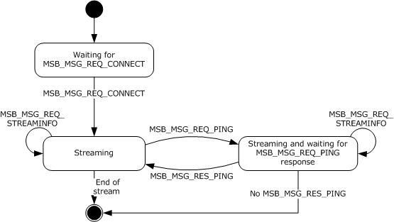
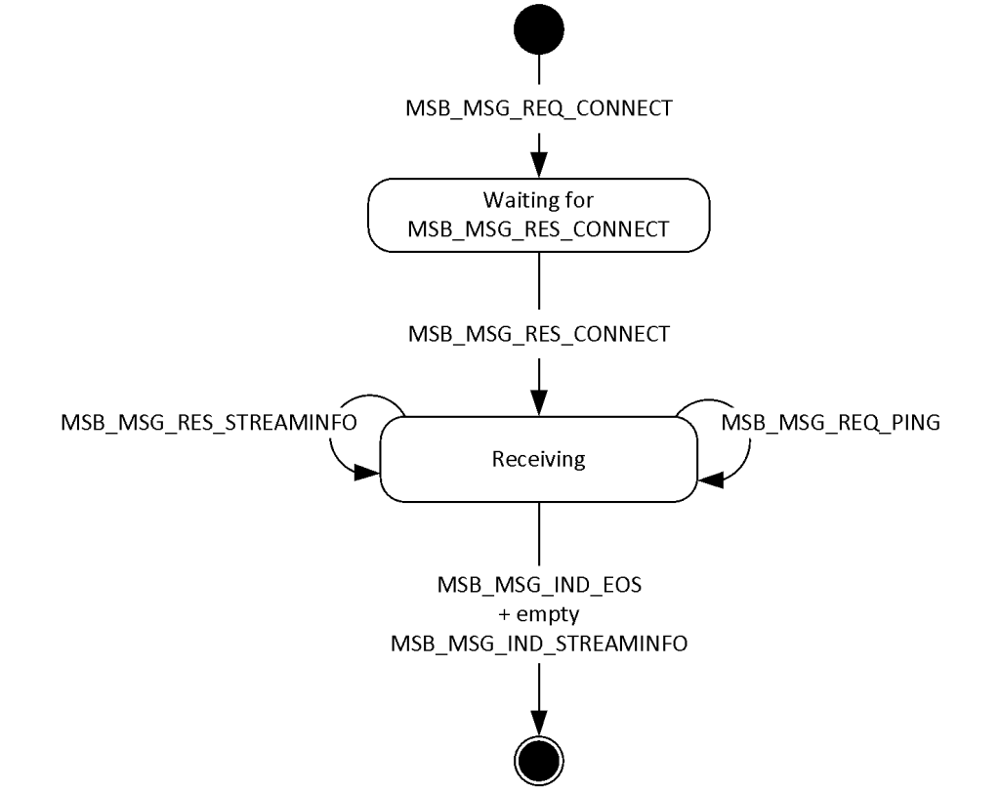
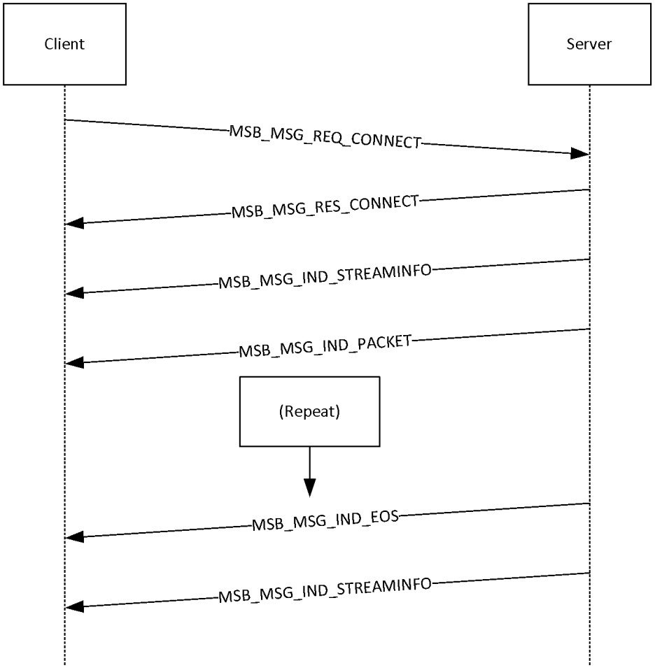
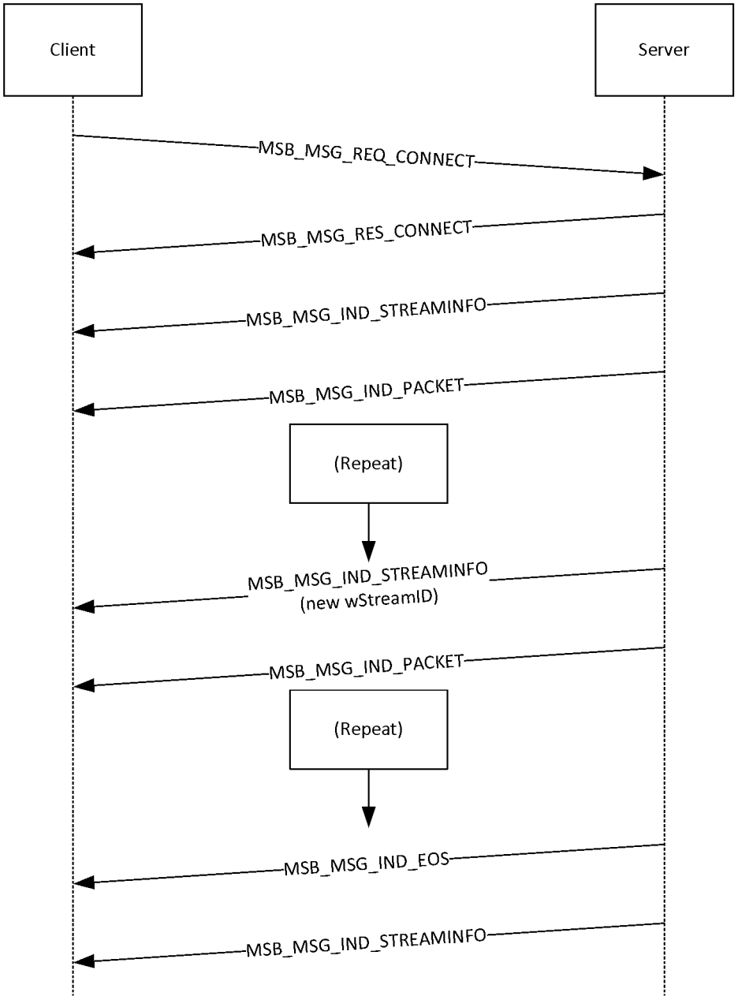

[MS-MSBD]:

Media Stream Broadcast Distribution (MSBD) Protocol

Intellectual Property Rights Notice for Open Specifications Documentation

  Technical Documentation. Microsoft publishes Open Specifications documentation (“this

documentation”) for protocols, file formats, data portability, computer languages, and standards
support. Additionally, overview documents cover inter-protocol relationships and interactions.

  Copyrights. This documentation is covered by Microsoft copyrights. Regardless of any other

terms that are contained in the terms of use for the Microsoft website that hosts this
documentation, you can make copies of it in order to develop implementations of the technologies
that are described in this documentation and can distribute portions of it in your implementations
that use these technologies or in your documentation as necessary to properly document the
implementation. You can also distribute in your implementation, with or without modification, any
schemas, IDLs, or code samples that are included in the documentation. This permission also
applies to any documents that are referenced in the Open Specifications documentation.
  No Trade Secrets. Microsoft does not claim any trade secret rights in this documentation.
  Patents. Microsoft has patents that might cover your implementations of the technologies

described in the Open Specifications documentation. Neither this notice nor Microsoft's delivery of
this documentation grants any licenses under those patents or any other Microsoft patents.
However, a given Open Specifications document might be covered by the Microsoft Open
Specifications Promise or the Microsoft Community Promise. If you would prefer a written license,
or if the technologies described in this documentation are not covered by the Open Specifications
Promise or Community Promise, as applicable, patent licenses are available by contacting
iplg@microsoft.com.

  License Programs. To see all of the protocols in scope under a specific license program and the

associated patents, visit the Patent Map.

  Trademarks. The names of companies and products contained in this documentation might be
covered by trademarks or similar intellectual property rights. This notice does not grant any
licenses under those rights. For a list of Microsoft trademarks, visit
www.microsoft.com/trademarks.

  Fictitious Names. The example companies, organizations, products, domain names, email

addresses, logos, people, places, and events that are depicted in this documentation are fictitious.
No association with any real company, organization, product, domain name, email address, logo,
person, place, or event is intended or should be inferred.

Reservation of Rights. All other rights are reserved, and this notice does not grant any rights other
than as specifically described above, whether by implication, estoppel, or otherwise.

Tools. The Open Specifications documentation does not require the use of Microsoft programming
tools or programming environments in order for you to develop an implementation. If you have access
to Microsoft programming tools and environments, you are free to take advantage of them. Certain
Open Specifications documents are intended for use in conjunction with publicly available standards
specifications and network programming art and, as such, assume that the reader either is familiar
with the aforementioned material or has immediate access to it.

Support. For questions and support, please contact dochelp@microsoft.com.

[MS-MSBD] - v20170601
Media Stream Broadcast Distribution (MSBD) Protocol
Copyright © 2017 Microsoft Corporation
Release: June 1, 2017

1 / 31

Revision Summary

Date

Revision
History

Revision
Class

Comments

10/22/2006  0.01

1/19/2007

1.0

3/2/2007

1.1

4/3/2007

1.2

5/11/2007

1.3

6/1/2007

2.0

New

Major

Minor

Minor

Minor

Major

Version 0.01 release

Version 1.0 release

Version 1.1 release

Version 1.2 release

Version 1.3 release

Updated and revised the technical content.

7/3/2007

2.0.1

Editorial

Changed language and formatting in the technical content.

7/20/2007

3.0

8/10/2007

4.0

9/28/2007

4.1

10/23/2007  5.0

11/30/2007  5.1

Major

Major

Minor

Major

Minor

Updated and revised the technical content.

Updated and revised the technical content.

Clarified the meaning of the technical content.

Made revisions for maximum field.

Clarified the meaning of the technical content.

1/25/2008

5.1.1

Editorial

Changed language and formatting in the technical content.

3/14/2008

5.1.2

Editorial

Changed language and formatting in the technical content.

5/16/2008

5.1.3

Editorial

Changed language and formatting in the technical content.

6/20/2008

5.1.4

Editorial

Changed language and formatting in the technical content.

7/25/2008

5.1.5

Editorial

Changed language and formatting in the technical content.

8/29/2008

5.1.6

Editorial

Changed language and formatting in the technical content.

10/24/2008  5.1.7

Editorial

Changed language and formatting in the technical content.

12/5/2008

5.1.8

Editorial

Changed language and formatting in the technical content.

1/16/2009

5.1.9

Editorial

Changed language and formatting in the technical content.

2/27/2009

5.1.10

Editorial

Changed language and formatting in the technical content.

4/10/2009

5.1.11

Editorial

Changed language and formatting in the technical content.

5/22/2009

5.1.12

Editorial

Changed language and formatting in the technical content.

7/2/2009

5.1.13

Editorial

Changed language and formatting in the technical content.

8/14/2009

5.1.14

Editorial

Changed language and formatting in the technical content.

9/25/2009

5.2

Minor

Clarified the meaning of the technical content.

11/6/2009

5.2.1

Editorial

Changed language and formatting in the technical content.

12/18/2009  5.2.2

Editorial

Changed language and formatting in the technical content.

1/29/2010

5.3

Minor

Clarified the meaning of the technical content.

[MS-MSBD] - v20170601
Media Stream Broadcast Distribution (MSBD) Protocol
Copyright © 2017 Microsoft Corporation
Release: June 1, 2017

2 / 31

Date

Revision
History

Revision
Class

Comments

3/12/2010

5.3.1

Editorial

Changed language and formatting in the technical content.

4/23/2010

5.3.2

Editorial

Changed language and formatting in the technical content.

6/4/2010

5.3.3

Editorial

Changed language and formatting in the technical content.

7/16/2010

5.3.3

None

No changes to the meaning, language, or formatting of the
technical content.

8/27/2010

5.3.3

None

No changes to the meaning, language, or formatting of the
technical content.

10/8/2010

5.3.3

None

No changes to the meaning, language, or formatting of the
technical content.

11/19/2010  5.3.3

None

No changes to the meaning, language, or formatting of the
technical content.

1/7/2011

5.3.3

None

No changes to the meaning, language, or formatting of the
technical content.

2/11/2011

5.3.3

None

No changes to the meaning, language, or formatting of the
technical content.

3/25/2011

5.3.3

None

No changes to the meaning, language, or formatting of the
technical content.

5/6/2011

5.3.3

None

No changes to the meaning, language, or formatting of the
technical content.

6/17/2011

5.4

Minor

Clarified the meaning of the technical content.

9/23/2011

5.4

12/16/2011  5.4

3/30/2012

5.4

7/12/2012

5.4

10/25/2012  5.4

1/31/2013

5.4

8/8/2013

5.4

11/14/2013  5.4

2/13/2014

5.4

5/15/2014

5.4

None

None

None

None

None

None

None

None

None

None

No changes to the meaning, language, or formatting of the
technical content.

No changes to the meaning, language, or formatting of the
technical content.

No changes to the meaning, language, or formatting of the
technical content.

No changes to the meaning, language, or formatting of the
technical content.

No changes to the meaning, language, or formatting of the
technical content.

No changes to the meaning, language, or formatting of the
technical content.

No changes to the meaning, language, or formatting of the
technical content.

No changes to the meaning, language, or formatting of the
technical content.

No changes to the meaning, language, or formatting of the
technical content.

No changes to the meaning, language, or formatting of the
technical content.

[MS-MSBD] - v20170601
Media Stream Broadcast Distribution (MSBD) Protocol
Copyright © 2017 Microsoft Corporation
Release: June 1, 2017

3 / 31

Date

Revision
History

Revision
Class

Comments

6/30/2015

5.4

10/16/2015  5.4

7/14/2016

5.4

6/1/2017

5.4

None

None

None

None

No changes to the meaning, language, or formatting of the
technical content.

No changes to the meaning, language, or formatting of the
technical content.

No changes to the meaning, language, or formatting of the
technical content.

No changes to the meaning, language, or formatting of the
technical content.

[MS-MSBD] - v20170601
Media Stream Broadcast Distribution (MSBD) Protocol
Copyright © 2017 Microsoft Corporation
Release: June 1, 2017

4 / 31

Table of Contents

1.1
1.2

1.2.1
1.2.2

1  Introduction ............................................................................................................ 7
Glossary ........................................................................................................... 7
References ........................................................................................................ 7
Normative References ................................................................................... 7
Informative References ................................................................................. 8
Overview .......................................................................................................... 8
Relationship to Other Protocols ............................................................................ 8
Prerequisites/Preconditions ................................................................................. 8
Applicability Statement ....................................................................................... 8
Versioning and Capability Negotiation ................................................................... 8
Vendor-Extensible Fields ..................................................................................... 9
Standards Assignments ....................................................................................... 9

1.3
1.4
1.5
1.6
1.7
1.8
1.9

2.1
2.2

2  Messages ............................................................................................................... 10
Transport ........................................................................................................ 10
Message Syntax ............................................................................................... 10
MSBMSGBASE ............................................................................................ 10
2.2.1
MSB_MSG_RES_PING ................................................................................. 11
2.2.2
MSB_MSG_REQ_PING ................................................................................. 11
2.2.3
MSB_MSG_REQ_STREAMINFO ...................................................................... 12
2.2.4
MSB_MSG_RES_STREAMINFO ...................................................................... 12
2.2.5
MSB_MSG_IND_STREAMINFO ...................................................................... 14
2.2.6
MSB_MSG_REQ_CONNECT ........................................................................... 16
2.2.7
MSB_MSG_RES_CONNECT ........................................................................... 16
2.2.8
2.2.9
MSB_MSG_IND_EOS ................................................................................... 17
2.2.10  MSB_MSG_IND_PACKET .............................................................................. 18

3.1

3.1.5.1
3.1.5.2
3.1.5.3

3.1.1
3.1.2
3.1.3
3.1.4
3.1.5

3  Protocol Details ..................................................................................................... 19
Server Details .................................................................................................. 19
Abstract Data Model .................................................................................... 19
Timers ...................................................................................................... 19
Initialization ............................................................................................... 19
Higher-Layer Triggered Events ..................................................................... 19
Message Processing Events and Sequencing Rules .......................................... 20
Receiving an MSB_MSG_REQ_CONNECT Packet ........................................ 20
Receiving an MSB_MSG_REQ_STREAMINFO Packet ................................... 20
Reaching the End of the Stream .............................................................. 20
Timer Events .............................................................................................. 20
Other Local Events ...................................................................................... 20
Client Details ................................................................................................... 20
Abstract Data Model .................................................................................... 21
Timers ...................................................................................................... 21
Initialization ............................................................................................... 21
Higher-Layer Triggered Events ..................................................................... 21
Message Processing Events and Sequencing Rules .......................................... 22
Receiving an MSB_MSG_REQ_PING Packet ............................................... 22
Receiving an MSB_MSG_IND_STREAMINFO Packet .................................... 22
Timer Events .............................................................................................. 22
Other Local Events ...................................................................................... 22

3.2.1
3.2.2
3.2.3
3.2.4
3.2.5

3.2.5.1
3.2.5.2

3.2.6
3.2.7

3.1.6
3.1.7

3.2

4  Protocol Example................................................................................................... 23
General MSBD Sequence ................................................................................... 23
Using MSBD for Server-Side Playlist Streaming .................................................... 24

4.1
4.2

5  Security ................................................................................................................. 26
Security Considerations for Implementers ........................................................... 26

5.1

5 / 31

[MS-MSBD] - v20170601
Media Stream Broadcast Distribution (MSBD) Protocol
Copyright © 2017 Microsoft Corporation
Release: June 1, 2017

5.2

Index of Security Parameters ............................................................................ 26

6  Appendix A: Product Behavior ............................................................................... 27

7  Change Tracking .................................................................................................... 28

8  Index ..................................................................................................................... 29

[MS-MSBD] - v20170601
Media Stream Broadcast Distribution (MSBD) Protocol
Copyright © 2017 Microsoft Corporation
Release: June 1, 2017

6 / 31

1  Introduction

The Media Stream Broadcast Distribution (MSBD) Protocol is a protocol that is used for transferring an
audio-visual content stream from a server to a single client or multiple clients.

Sections 1.5, 1.8, 1.9, 2, and 3 of this specification are normative. All other sections and examples in
this specification are informative.

1.1  Glossary

This document uses the following terms:

.nsc file: A file that serves as an announcement for, and contains information about, a media

stream broadcast. This file allows a client to tune in to a broadcast. The .nsc file was originally
known as a NetShow Station Configuration file. Because the NetShow protocol suite is now
obsolete, the original nomenclature is no longer applicable and is not used. Also known as a
Windows Media Station file or an NSC file.

Advanced Systems Format (ASF): An extensible file format that is designed to facilitate
streaming digital media data over a network. This file format is used by Windows Media.

HRESULT: An integer value that indicates the result or status of an operation. A particular

HRESULT can have different meanings depending on the protocol using it. See [MS-ERREF]
section 2.1 and specific protocol documents for further details.

little-endian: Multiple-byte values that are byte-ordered with the least significant byte stored in

the memory location with the lowest address.

parity packet: An ASF data packet that contains parity data and is used for reconstructing other
lost packets. Unlike other ASF data packets, parity packets always have the Opaque Data
Present bit set to 1 in the ASF data packet header.

MAY, SHOULD, MUST, SHOULD NOT, MUST NOT: These terms (in all caps) are used as defined
in [RFC2119]. All statements of optional behavior use either MAY, SHOULD, or SHOULD NOT.

1.2  References

Links to a document in the Microsoft Open Specifications library point to the correct section in the
most recently published version of the referenced document. However, because individual documents
in the library are not updated at the same time, the section numbers in the documents may not
match. You can confirm the correct section numbering by checking the Errata.

1.2.1  Normative References

We conduct frequent surveys of the normative references to assure their continued availability. If you
have any issue with finding a normative reference, please contact dochelp@microsoft.com. We will
assist you in finding the relevant information.

[ASF] Microsoft Corporation, "Advanced Systems Format Specification", December 2004,
https://download.microsoft.com/download/7/9/0/790fecaa-f64a-4a5e-a430-
0bccdab3f1b4/ASF_Specification.doc

[MS-DTYP] Microsoft Corporation, "Windows Data Types".

[MS-ERREF] Microsoft Corporation, "Windows Error Codes".

[MS-MSB] Microsoft Corporation, "Media Stream Broadcast (MSB) Protocol".

7 / 31

[MS-MSBD] - v20170601
Media Stream Broadcast Distribution (MSBD) Protocol
Copyright © 2017 Microsoft Corporation
Release: June 1, 2017

[RFC2119] Bradner, S., "Key words for use in RFCs to Indicate Requirement Levels", BCP 14, RFC
2119, March 1997, https://www.rfc-editor.org/info/rfc2119

1.2.2  Informative References

None.

1.3  Overview

The MSBD Protocol is used for transferring a live stream of audio-visual content from a server to a
single client or to multiple clients. For example, the MSBD Protocol might be used when transmitting
the digitized sound and images of a lecture from a computer that is encoding the lecture in real time
to another computer that is running the appropriate streaming media server software, such as
Windows Media Services version 4.1.

The MSBD Protocol can also be used for transmitting a live stream from one Windows Media Services
server installation to another. Certain versions of Windows Media Player<1> also support the MSBD
Protocol and can use it to monitor a live stream by connecting to a server that is running Windows
Media Services or by connecting directly to a real-time encoder.

1.4  Relationship to Other Protocols

MSBD packets are encapsulated in TCP. However, one MSBD packet type, MSB_MSG_IND_PACKET,
can also be encapsulated in the User Datagram Protocol (UDP). UDP encapsulation mode is only used
for transmitting packets to an IPv4 multicast group.<2>

1.5  Prerequisites/Preconditions

The MSBD Protocol does not provide a mechanism for a client to discover the URL to the server.
Therefore, it is a prerequisite that the client obtain a URL to the server before this protocol can be
used.

1.6  Applicability Statement

The MSBD Protocol can be used to distribute Advanced Systems Format (ASF) packets over an IP-
based network. The MSBD Protocol is designed for distribution of content between servers or from an
encoder to a server.<3> The MSBD Protocol is not intended for use by an end-user application, such
as Windows Media Player, except for troubleshooting use.

The UDP encapsulation mode of this protocol might not be suitable for content that uses large ASF
data packets. Large ASF data packets can cause the UDP packets to be fragmented into multiple IP
datagrams, and fragmentation of IP datagrams might be undesirable. When the content uses these
large packets, TCP is the recommended encapsulation mode.

1.7  Versioning and Capability Negotiation

The MSBD Protocol does not support negotiation of versioning or capabilities. However, server
implementations of the MSBD Protocol are not required to support delivery of MSB_MSG_IND_PACKET
packets over UDP. If a client requests such delivery, and the server does not support it, the server
sends an MSB_MSG_RES_CONNECT packet to indicate that the operation failed.

[MS-MSBD] - v20170601
Media Stream Broadcast Distribution (MSBD) Protocol
Copyright © 2017 Microsoft Corporation
Release: June 1, 2017

8 / 31

1.8  Vendor-Extensible Fields

This protocol uses HRESULT values as defined in [MS-ERREF]. Vendors can define their own HRESULT
values, provided that they set the C bit (0x20000000) for each vendor-defined value, indicating that
the value is a customer code.

1.9  Standards Assignments

The MSBD Protocol has no applicable standards assignments.

[MS-MSBD] - v20170601
Media Stream Broadcast Distribution (MSBD) Protocol
Copyright © 2017 Microsoft Corporation
Release: June 1, 2017

9 / 31

2  Messages

The following sections specify how MSBD Protocol messages are transported and give details on MSBD
Protocol message syntax.

This protocol references commonly used data types as defined in [MS-DTYP].

2.1  Transport

MSB_MSG_IND_PACKET packets are encapsulated in UDP packets if IP multicasting is used to deliver
those packets. Otherwise, the MSB_MSG_IND_PACKET packets are encapsulated in TCP. All other
MSBD Protocol packets MUST be encapsulated in TCP. The UDP and TCP packets MUST be
encapsulated in the IP version 4 (IPv4).

There is no officially assigned TCP port for the MSBD Protocol; however, MSBD servers often listen on
TCP port 7007 for client requests.

2.2  Message Syntax

All 16-bit and 32-bit integer fields MUST be transmitted in little-endian byte order, unless otherwise
specified.

All fields that are unsigned 16-bit integers have valid ranges from 0x0000 to 0xFFFF, inclusive, unless
otherwise specified.

All fields that are unsigned 32-bit integers have valid ranges from 0x00000000 to 0x0000FFFF,
inclusive, unless otherwise specified.

2.2.1  MSBMSGBASE

The MSBMSGBASE header defines the packet header.

0  1  2  3  4  5  6  7  8  9

1
0  1  2  3  4  5  6  7  8  9

2
0  1  2  3  4  5  6  7  8  9

3
0  1

dwSignature

wVersion

wMessageId

cbMessage

hr

dwSignature (4 bytes): An unsigned 32-bit integer that identifies the protocol as the MSBD

Protocol. This value MUST be 0x2042534D, which is the little-endian representation of the ASCII
character sequence "MSB[space]".

wVersion (2 bytes): An unsigned 16-bit integer that represents the version number of the MSBD

Protocol. This value is currently 0x0106.

wMessageId (2 bytes): An unsigned 16-bit integer that designates the MSBD packet type. This

value MUST be one of the following.

[MS-MSBD] - v20170601
Media Stream Broadcast Distribution (MSBD) Protocol
Copyright © 2017 Microsoft Corporation
Release: June 1, 2017

10 / 31

Value  Meaning

0x0001  Designates an MSB_MSG_REQ_PING packet.

0x0002  Designates an MSB_MSG_RES_PING packet.

0x0003  Designates an MSB_MSG_REQ_STREAMINFO packet.

0x0004  Designates an MSB_MSG_RES_STREAMINFO packet.

0x0005  Designates an MSB_MSG_IND_STREAMINFO packet.

0x0007  Designates an MSB_MSG_REQ_CONNECT packet.

0x0008  Designates an MSB_MSG_RES_CONNECT packet.

0x0009  Designates an MSB_MSG_IND_EOS packet.

0x000A  Designates an MSB_MSG_IND_PACKET packet.

cbMessage (4 bytes): An unsigned 32-bit integer that contains the byte length of the packet,

including the header. The cbMessage field MUST be set to a value in the range 0x0010 to 0xFFFF,
inclusive.

hr (4 bytes): An unsigned 32-bit integer field representing the status of an operation. The hr field

MUST be set to an HRESULT code. For HRESULT codes, see [MS-ERREF] section 2.1.

2.2.2  MSB_MSG_RES_PING

The client MUST respond with the MSB_MSG_RES_PING packet to the MSB_MSG_REQ_PING packet
that is sent by the server. This packet informs the server that the client is still active.

0  1  2  3  4  5  6  7  8  9

1
0  1  2  3  4  5  6  7  8  9

2
0  1  2  3  4  5  6  7  8  9

3
0  1

Header (16 bytes)

...

...

Header (16 bytes): An MSBMSGBASE packet that defines the packet header. The wMessageId field

MUST be set to 0x0002.

2.2.3  MSB_MSG_REQ_PING

The server MAY send an MSB_MSG_REQ_PING packet to confirm that the client is still active. It is
recommended that the server send this packet approximately every 2 minutes. If active, the client
MUST respond with an MSB_MSG_RES_PING packet; otherwise, the server SHOULD end the session.

0  1  2  3  4  5  6  7  8  9

1
0  1  2  3  4  5  6  7  8  9

2
0  1  2  3  4  5  6  7  8  9

3
0  1

Header (16 bytes)

...

[MS-MSBD] - v20170601
Media Stream Broadcast Distribution (MSBD) Protocol
Copyright © 2017 Microsoft Corporation
Release: June 1, 2017

11 / 31

...

Header (16 bytes): An MSBMSGBASE packet that defines the packet header. The wMessageId field

MUST be set to 0x0001.

2.2.4  MSB_MSG_REQ_STREAMINFO

The client MAY send the MSB_MSG_REQ_STREAMINFO packet to request information about the media
stream. This request is optional because the server always sends the stream information in an
MSB_MSG_IND_STREAMINFO packet immediately after sending an MSB_MSG_RES_CONNECT packet.
The MSB_MSG_REQ_STREAMINFO packet is deprecated and SHOULD NOT be sent by clients.

0  1  2  3  4  5  6  7  8  9

1
0  1  2  3  4  5  6  7  8  9

2
0  1  2  3  4  5  6  7  8  9

3
0  1

Header (16 bytes)

...

...

Header (16 bytes): An MSBMSGBASE packet that defines the packet header. The wMessageId field

MUST be set to 0x0003.

2.2.5  MSB_MSG_RES_STREAMINFO

The server MUST respond with an MSB_MSG_RES_STREAMINFO packet to a client
MSB_MSG_REQ_STREAMINFO packet that requests media stream information. The structure and
purpose of this packet are identical to those of the MSB_MSG_IND_STREAMINFO packet. The client
requests media stream information from the server only if the server omits sending the
MSB_MSG_IND_STREAMINFO packet immediately after the MSB_MSG_RES_CONNECT packet.

0  1  2  3  4  5  6  7  8  9

1
0  1  2  3  4  5  6  7  8  9

2
0  1  2  3  4  5  6  7  8  9

3
0  1

Header (16 bytes)

...

...

wStreamId

cbPacketSize

cTotalPackets

dwBitRate

msDuration

cbTitle

[MS-MSBD] - v20170601
Media Stream Broadcast Distribution (MSBD) Protocol
Copyright © 2017 Microsoft Corporation
Release: June 1, 2017

12 / 31

cbDescription

cbLink

cbHeader

bBinaryData (variable)

...

Header (16 bytes): An MSBMSGBASE packet that defines the packet header. The wMessageId field

MUST be set to 0x0004.

wStreamId (2 bytes): An unsigned 16-bit integer that uniquely identifies the media stream that is
currently being transmitted. The value of this field MUST be identical to the value of wStreamId
that is used in the MSB_MSG_IND_STREAMINFO packet that the server transmitted for the current
stream. If the server has not transmitted an MSB_MSG_IND_STREAMINFO packet for the current
stream, the value of wStreamId MUST be chosen in accordance with the rules for choosing a
wStreamId value for an MSB_MSG_IND_STREAMINFO packet. The value of the wStreamId field
MUST be in the range 0x0000 to 0xFFFF, inclusive.

cbPacketSize (2 bytes): An unsigned 16-bit integer that specifies the maximum size, in bytes, of
the payload in each MSB_MSG_IND_PACKET packet. The value of the cbPacketSize field MUST
be in the range 0x0000 to 0xFFFF, inclusive.

cTotalPackets (4 bytes): An unsigned 32-bit integer that MUST be set to the total number of

MSB_MSG_IND_PACKET packets that are needed to transmit the entire media stream—if this
information is known. Otherwise, the field MUST be set to zero. The value of the cTotalPackets
field MUST be in the range 0x00000000 to 0x0000FFFF, inclusive.

dwBitRate (4 bytes): An unsigned 32-bit integer that contains the bit rate, in bits per second, of the
media stream that is measured. For an ASF stream, the value of the dwBitRate field corresponds
to the value of the Maximum Bitrate field in the ASF File Properties Object. The value of the
dwBitRate field MUST be in the range 0x00000000 to 0x0000FFFF, inclusive.

msDuration (4 bytes): An unsigned 32-bit integer that MUST be set to the duration, in milliseconds,

of the media stream, if this information is known. Otherwise, this value MUST be set to -1
(FFFFFFFF hexadecimal). For an ASF stream, the value of the msDuration field corresponds to
the value of the Play Duration field in the ASF File Properties Object. The value of the msDuration
field MUST be in the range 0x00000000 to 0x0000FFFF, inclusive.

cbTitle (4 bytes): An unsigned 32-bit integer that contains the size, in bytes, of the media stream

title. The stream title MUST be first in the bBinaryData field. The value of the cbTitle field MUST
be in the range 0x00000000 to 0x0000FFCF, inclusive.

cbDescription (4 bytes): An unsigned 32-bit integer that contains the size, in bytes, of the media

stream description. The stream description MUST follow the stream title in the bBinaryData field.
The value of the cbDescription field MUST be in the range 0x00000000 to 0x0000FFCF, inclusive.

cbLink (4 bytes): An unsigned 32-bit integer that contains the size, in bytes, of the media stream
link (an arbitrary moniker for the connection over which the media stream is to be transmitted).
The stream link MUST follow the stream description in the bBinaryData field. The value of the
cbLink field MUST be in the range 0x00000000 to 0x0000FFCF, inclusive.

cbHeader (4 bytes): An unsigned 32-bit integer that contains the size, in bytes, of the media stream

header. The stream header MUST follow the stream link in the bBinaryData field. If the
szChannel field of the MSB_MSG_REQ_CONNECT packet is set to NetShow, the stream is in ASF,

13 / 31

[MS-MSBD] - v20170601
Media Stream Broadcast Distribution (MSBD) Protocol
Copyright © 2017 Microsoft Corporation
Release: June 1, 2017

as specified in [ASF] section 2, and the stream header is an ASF header. In the case of an ASF
Header, the value of the cbHeader field is the size of the entire ASF Header Object, as described
in [ASF] section 3.1, plus 50 bytes (which represents the fixed initial portion of the ASF Data
Object, as described in [ASF] section 5.1). The value of the cbHeader field MUST be in the range
0x00000000 to 0x0000FFCF, inclusive.

bBinaryData (variable): The binary data that contains the title, description, link, and header of the
media stream, in that order. The method for generating the binary data comprising the title,
description, link or header (if not an ASF header) of the media stream is implementation-specific
and outside the scope of this documentation. The size of the bBinaryData field is equal to the
sum of the values of the cbTitle, cbDescription, cbLink, and cbHeader fields. The size of the
bBinaryData field MUST be in the range of 0 to 65,487 bytes. Note that these requirements
impose a restriction on the values that the cbTitle, cbDescription, cbLink, and cbHeader fields
can assume. For example, cbTitle and cbDescription cannot both have a value of 0x8000 at the
same time.

2.2.6  MSB_MSG_IND_STREAMINFO

The server MUST send the MSB_MSG_IND_STREAMINFO packet, which describes the media stream, in
the following circumstances:



Following an MSB_MSG_RES_CONNECT packet.

  When a stream switch occurs while playing a server playlist.



Following an MSB_MSG_IND_EOS packet. For more information about sending an
MSB_MSG_IND_STREAMINFO packet in this case, see section 3.1.5.3.

0  1  2  3  4  5  6  7  8  9

1
0  1  2  3  4  5  6  7  8  9

2
0  1  2  3  4  5  6  7  8  9

3
0  1

Header (16 bytes)

...

...

wStreamId

cbPacketSize

cTotalPackets

dwBitRate

msDuration

cbTitle

cbDescription

cbLink

cbHeader

bBinaryData (variable)

[MS-MSBD] - v20170601
Media Stream Broadcast Distribution (MSBD) Protocol
Copyright © 2017 Microsoft Corporation
Release: June 1, 2017

14 / 31

...

Header (16 bytes): An MSBMSGBASE packet that defines the packet header. The wMessageId field

MUST be set to 0x0005.

wStreamId (2 bytes): An unsigned 16-bit integer that uniquely identifies the media stream that will

be transmitted, within the current server playlist. The value of this field can be chosen arbitrarily
by the server; however, it MUST be different from the wStreamId values that are used for any
other streams in the same server playlist. This allows the client to distinguish
MSB_MSG_IND_PACKET packets that belong to the new stream from MSB_MSG_IND_PACKET
packets that belong to previous streams (if any). The value of the wStreamId field MUST be in the
range 0x0000 to 0x07FF, inclusive, or in the range 0x8000 to 0x87FF, inclusive.

cbPacketSize (2 bytes): An unsigned 16-bit integer that specifies the maximum size, in bytes, of
the payload in each MSB_MSG_IND_PACKET packet. The value of the cbPacketSize field MUST
be in the range 0x0000 to 0xFFF7, inclusive.

cTotalPackets (4 bytes): An unsigned 32-bit integer that MUST be set to the total number of

MSB_MSG_IND_PACKET packets that are needed to transmit the entire media stream—if this
information is known. Otherwise, the field MUST be set to 0. The value of the cTotalPackets field
MUST be in the range 0x00000000 to 0xFFFFFFFF, inclusive.

dwBitRate (4 bytes): An unsigned 32-bit integer that represents the bit rate, measured in bits per

second, of the media stream. For an ASF stream, the value of the dwBitRate field corresponds to
the value of the Maximum Bitrate field in the ASF File Properties Object. The value of the
dwBitRate field MUST be in the range 0x00000000 to 0xFFFFFFFF, inclusive.

msDuration (4 bytes): An unsigned 32-bit integer that MUST be set to the duration, in milliseconds,

of the media stream—if this information is known. Otherwise, this value MUST be set to -1
(FFFFFFFF hexadecimal). For an ASF stream, the value of the msDuration field corresponds to
the value of the Play Duration field in the ASF File Properties Object. The value of the msDuration
field MUST be in the range 0x00000000 to 0xFFFFFFFF, inclusive.

cbTitle (4 bytes): An unsigned 32-bit integer that contains the size, in bytes, of the media stream

title. The stream title MUST be first in the bBinaryData field. The value of the cbTitle field MUST
be in the range 0x00000000 to 0x0000FFCF, inclusive.

cbDescription (4 bytes): An unsigned 32-bit integer that represents the size, in bytes, of the media
stream description. The stream description MUST follow the stream title in the bBinaryData field.
The value of the cbDescription field MUST be in the range 0x00000000 to 0x0000FFCF, inclusive.

cbLink (4 bytes): An unsigned 32-bit integer that contains the size, in bytes, of the media stream
link (an arbitrary moniker for the connection over which the media stream is to be transmitted).
The stream link MUST follow the stream description in the bBinaryData field. The value of the
cbLink field MUST be in the range 0x00000000 to 0x0000FFCF, inclusive.

cbHeader (4 bytes): An unsigned 32-bit integer that contains the size, in bytes, of the media stream

header. The stream header MUST follow the stream link in the bBinaryData field. If the
szChannel field of the MSB_MSG_REQ_CONNECT packet is set to NetShow, the stream is in the
ASF, as specified in [ASF] section 2, and the stream header is an ASF header. In the case of an
ASF Header, the value of the cbHeader field is the size of the entire ASF Header Object, as
described in [ASF] section 3.1, plus 50 bytes (which represents the fixed initial portion of the ASF
Data Object, as described in [ASF] section 5.1). The value of the cbHeader field MUST be in the
range 0x00000000 to 0x0000FFCF, inclusive.

bBinaryData (variable): The binary data that contains the title, description, link, and header of the
media stream, in that order. The method for generating the binary data comprising the title,
description, link or header (if not an ASF header) of the media stream is implementation-specific

15 / 31

[MS-MSBD] - v20170601
Media Stream Broadcast Distribution (MSBD) Protocol
Copyright © 2017 Microsoft Corporation
Release: June 1, 2017

and outside the scope of this documentation. The size of the bBinaryData field is equal to the
sum of the values of the cbTitle, cbDescription, cbLink, and cbHeader fields. The size of the
bBinaryData field MUST be in the range of 0 to 65,487 bytes. Note that these requirements
impose a restriction on the values that the cbTitle, cbDescription, cbLink, and cbHeader fields
can assume. For example, cbTitle and cbDescription cannot both have a value of 0x8000 at the
same time.

2.2.7  MSB_MSG_REQ_CONNECT

The client sends an MSB_MSG_REQ_CONNECT packet to request a media stream from the server.

0  1  2  3  4  5  6  7  8  9

1
0  1  2  3  4  5  6  7  8  9

2
0  1  2  3  4  5  6  7  8  9

3
0  1

Header (16 bytes)

...

...

dwFlags

szChannel (variable)

...

Header (16 bytes): An MSBMSGBASE packet that defines the packet header. The wMessageId field

MUST be set to 0x0007.

dwFlags (4 bytes): An unsigned 32-bit integer that represents the connection type. The value MUST

be one of the following.

Value  Meaning

0x0002  The media stream is sent to multiple clients simultaneously by using IP multicasting; each client

maintains an individual TCP control connection to the server.

0x0001  The media stream is sent to a single client using the current TCP connection.

szChannel (variable):  This field SHOULD be set to the word NetShow, which MUST be represented

as a string of Unicode characters. The terminating null character SHOULD NOT be included. The
size of the string can be determined by subtracting the sizes of all other fields from the value of
the cbMessage field in the packet header MSBMSGBASE. The size of the szChannel field MUST
be between 0 and 65,514 bytes. Because the szChannel field consists of a Unicode character
string, the size of the field must be an even number of bytes.

2.2.8  MSB_MSG_RES_CONNECT

The server MUST send the MSB_MSG_RES_CONNECT packet in response to the
MSB_MSG_REQ_CONNECT packet that is sent by the client.

[MS-MSBD] - v20170601
Media Stream Broadcast Distribution (MSBD) Protocol
Copyright © 2017 Microsoft Corporation
Release: June 1, 2017

16 / 31

0  1  2  3  4  5  6  7  8  9

1
0  1  2  3  4  5  6  7  8  9

2
0  1  2  3  4  5  6  7  8  9

3
0  1

Header (16 bytes)

...

...

dwFlags

sin_family

sin_port

sin_addr

sin_zero

...

Header (16 bytes): An MSBMSGBASE packet that defines the packet header. The wMessageId field

MUST be set to 0x0008.

dwFlags (4 bytes): An unsigned 32-bit integer that specifies ASF information. This field SHOULD be

set to 0x00000002 if the ASF header is present in a Windows Media Station .nsc file; otherwise,
this field MUST be set to 0x00000000. For information about .nsc files, see [MS-MSB] section
2.2.1.

Value

Meaning

0x00000000  ASF header NOT present in .nsc file

0x00000002  ASF header present in .nsc file

sin_family (2 bytes): An unsigned 16-bit integer. The sin_family field MUST be set to 2 if the

media stream is being multicast; otherwise, it SHOULD be set to 0.

sin_port (2 bytes): An unsigned 16-bit integer transmitted in big-endian byte order. If the media
stream is being multicast, the sin_port field MUST be set to the UDP port number for the
requested channel; otherwise, it SHOULD be set to 0. The value of the sin_port field MUST be in
the range 0x0000 to 0xFFFF, inclusive.

sin_addr (4 bytes): An unsigned 32-bit integer that is transmitted in big-endian byte order. If the

media stream is being multicast, the sin_addr field MUST be set to a valid IPv4 multicast address
for the requested channel; otherwise, it SHOULD be set to 0. The value of the sin_addr field
MUST be in the range 0x00000000 to 0xFFFFFFFF, inclusive.

sin_zero (8 bytes): An array of 8 bytes. Each byte in the array SHOULD be set to 0 and MUST be

ignored on receipt.

2.2.9  MSB_MSG_IND_EOS

The server MUST send the MSB_MSG_IND_EOS packet to indicate the end of the media stream. This
packet always precedes an empty MSB_MSG_IND_STREAMINFO packet.

[MS-MSBD] - v20170601
Media Stream Broadcast Distribution (MSBD) Protocol
Copyright © 2017 Microsoft Corporation
Release: June 1, 2017

17 / 31

0  1  2  3  4  5  6  7  8  9

1
0  1  2  3  4  5  6  7  8  9

2
0  1  2  3  4  5  6  7  8  9

3
0  1

Header (16 bytes)

...

...

Header (16 bytes): An MSBMSGBASE packet that defines the packet header. The wMessageId field

MUST be set to 0x0009.

2.2.10 MSB_MSG_IND_PACKET

The server transmits the media stream by using MSB_MSG_IND_PACKET packets. Each ASF data
packet in the media stream MUST be encapsulated in a separate MSB_MSG_IND_PACKET packet. The
server MUST NOT combine multiple ASF packets in a single MSB_MSG_IND_PACKET and MUST NOT
fragment an ASF packet across multiple MSB_MSG_IND_PACKET packets.

The MSB_MSG_IND_PACKET packets MUST be transmitted over the MSBD TCP connection (that is, the
same TCP connection on which the server transmitted the MSB_MSG_RES_CONNECT packet, except
when the server has agreed to use IP multicasting to deliver the MSB_MSG_IND_PACKET packets).
When IP multicasting is used, the server MUST transmit the MSB_MSG_IND_PACKET packets to the IP
multicast address/UDP port number combination indicated in the MSB_MSG_RES_CONNECT packet.

0  1  2  3  4  5  6  7  8  9

1
0  1  2  3  4  5  6  7  8  9

2
0  1  2  3  4  5  6  7  8  9

3
0  1

Header (16 bytes)

...

...

dwPacketId

wStreamId

wPacketSize

bPayload (variable)

...

Header (16 bytes): An MSBMSGBASE packet that defines the packet header. The wMessageId field

MUST be set to 0x000A.

dwPacketId (4 bytes): An unsigned 32-bit integer that identifies the MSB_MSG_IND_PACKET

packet. This value SHOULD start with 0 for the first MSB_MSG_IND_PACKET packet that is
transmitted; alternatively, the starting value MAY be chosen randomly. The value of the
dwPacketId field MUST be incremented for each new MSB_MSG_IND_PACKET packet that is
transmitted. The value of the dwPacketId field MUST fall within the range 0x00000000 to
0xFFFFFFFF, inclusive.

wStreamId (2 bytes): An unsigned 16-bit integer that identifies the content. This value MUST be the

same as the wStreamId field in the MSB_MSG_IND_STREAMINFO packet. The value of the

18 / 31

[MS-MSBD] - v20170601
Media Stream Broadcast Distribution (MSBD) Protocol
Copyright © 2017 Microsoft Corporation
Release: June 1, 2017

wStreamId field MUST be in the range 0x0000 to 0x07FF, inclusive, or in the range 0x8000 to
0x87FF, inclusive.

wPacketSize (2 bytes): An unsigned 16-bit integer that contains the size, in bytes, of the bPayload

field plus the size of the wStreamId, dwPacketId, and wPacketSize fields. The wPacketSize
field MUST be set to a value in the range 0x0008 to 0xFFEF, inclusive.

bPayload (variable): One ASF packet. If the ASF packet contains a nonzero Padding Data field,
this field MUST be included in bPayload. Details on the Padding Data field are as specified in
[ASF] section 5.2.4. Error correction, as specified in [MS-MSB] section 2.2.2, MAY be used, in
which case some of the ASF packets are parity packets, as specified in [MS-MSB] section 2.2.2.
If the bPayload field contains a parity packet, the dwPacketId field MUST be identical to that of
the previously transmitted MSB_MSG_IND_PACKET.

[MS-MSBD] - v20170601
Media Stream Broadcast Distribution (MSBD) Protocol
Copyright © 2017 Microsoft Corporation
Release: June 1, 2017

19 / 31

<!-- Extracted images from page 20 -->

<!-- /Extracted images from page 20 -->

3  Protocol Details

The following sections specify details of the MSBD Protocol, including abstract data models and
message processing rules for both server and client.

3.1  Server Details

This section specifies details for server implementations of the MSBD Protocol. The state machine for
MSBD on a server is depicted in the following diagram.

Figure 1: State machine for MSBD on a server

3.1.1  Abstract Data Model

Not applicable for this protocol specification.

3.1.2  Timers

An implementation of the MSBD Protocol on a server can use a timer to schedule the transmission of
MSB_MSG_REQ_PING packets.

3.1.3  Initialization

If a timer is used to schedule the transmission of MSB_MSG_REQ_PING packets, that timer cannot be
running initially.

The server initializes by listening for incoming TCP connections on the TCP port that is reserved by the
server for communication using the MSBD Protocol. The server MUST then wait for an
MSB_MSG_REQ_CONNECT packet to be received on a new TCP connection.

For more information about how to process the MSB_MSG_REQ_CONNECT packet, see section 3.1.5.1.

[MS-MSBD] - v20170601
Media Stream Broadcast Distribution (MSBD) Protocol
Copyright © 2017 Microsoft Corporation
Release: June 1, 2017

20 / 31

3.1.4  Higher-Layer Triggered Events

Not applicable for this protocol specification.

3.1.5  Message Processing Events and Sequencing Rules

3.1.5.1  Receiving an MSB_MSG_REQ_CONNECT Packet

If the value of the dwFlags field in the MSB_MSG_REQ_CONNECT packet is 0x0002 and the server
does not support delivery of MSB_MSG_IND_PACKET packets over UDP, then the server MUST reject
the connection request. In that case, the server MUST respond with an MSB_MSG_RES_CONNECT
packet where the hr field is set to an HRESULT failure code. The value of the hr field SHOULD then
be set either to 0xC00D001A or to 0x80070057, but the server MAY set the hr field to a different
value as long as it corresponds to an HRESULT failure code. For more information about HRESULT
codes, see [MS-ERREF].

If the connection is accepted, the server MUST send an MSB_MSG_RES_CONNECT packet with the hr
field set to 0x00000000 and MUST follow it with an MSB_MSG_IND_STREAMINFO packet. If the
connection is rejected, the server MUST close the TCP connection after having sent the
MSB_MSG_RES_CONNECT packet.

If the connection is accepted, then the server transmits the stream as a sequence of
MSB_MSG_IND_PACKET packets.

3.1.5.2  Receiving an MSB_MSG_REQ_STREAMINFO Packet

The server MUST send an MSB_MSG_RES_STREAMINFO packet.

3.1.5.3  Reaching the End of the Stream

When the server transmits the last MSB_MSG_IND_PACKET packet for a stream, the server MUST
send an MSB_MSG_IND_EOS packet that is followed by an MSB_MSG_IND_STREAMINFO packet. The
MSB_MSG_IND_STREAMINFO packet MUST contain information about the next stream to be
transmitted. If there are no additional streams to transmit, the MSB_MSG_IND_STREAMINFO packet
MUST be "empty". In an empty MSB_MSG_IND_STREAMINFO packet, the size of the bBinaryData
field MUST be 0 bytes, and the hr field SHOULD be set to 0xC00D0033. The server SHOULD set all the
remaining fields in the empty MSB_MSG_IND_STREAMINFO packet to 0.<4>

3.1.6  Timer Events

If the server uses a timer to schedule the transmission of the MSB_MSG_REQ_PING packets, when
that timer expires, the server SHOULD send an MSB_MSG_REQ_PING packet. If after sending an
MSB_MSG_REQ_PING packet, the server does not receive an MSB_MSG_RES_PING packet within 2
minutes, the server SHOULD end the session by closing the TCP connection to the client.

3.1.7  Other Local Events

Not applicable for this protocol specification.

3.2  Client Details

This section specifies details for client implementations of the MSBD Protocol. The state machine for
MSBD on a client is depicted in the following diagram.

[MS-MSBD] - v20170601
Media Stream Broadcast Distribution (MSBD) Protocol
Copyright © 2017 Microsoft Corporation
Release: June 1, 2017

21 / 31

<!-- Extracted images from page 22 -->

<!-- /Extracted images from page 22 -->

Figure 2: State machine for MSBD on a client

3.2.1  Abstract Data Model

Not applicable for this protocol specification.

3.2.2  Timers

Not applicable for this protocol specification.

3.2.3  Initialization

The client initializes an MSBD streaming session by establishing a TCP connection to the TCP port that
the server reserves for communication by using the MSBD Protocol. The client and server MUST agree
on the TCP port number that is used for the MSBD Protocol through some mechanism not addressed in
the MSBD Protocol, because the port number MUST be known prior to the transmission of the first
MSBD packet.

After the TCP connection is established, the client MUST send an MSB_MSG_REQ_CONNECT packet.

3.2.4  Higher-Layer Triggered Events

 Not applicable for this protocol specification.

[MS-MSBD] - v20170601
Media Stream Broadcast Distribution (MSBD) Protocol
Copyright © 2017 Microsoft Corporation
Release: June 1, 2017

22 / 31

3.2.5  Message Processing Events and Sequencing Rules

3.2.5.1  Receiving an MSB_MSG_REQ_PING Packet

The client MUST send an MSB_MSG_RES_PING packet.

3.2.5.2  Receiving an MSB_MSG_IND_STREAMINFO Packet

If the client receives an "empty" MSB_MSG_IND_STREAMINFO packet (as specified in section 3.1.5.3),
the portion of the packet that does not include the Header field MUST be ignored.

3.2.6  Timer Events

Not applicable for this protocol specification.

3.2.7  Other Local Events

Not applicable for this protocol specification.

[MS-MSBD] - v20170601
Media Stream Broadcast Distribution (MSBD) Protocol
Copyright © 2017 Microsoft Corporation
Release: June 1, 2017

23 / 31

<!-- Extracted images from page 24 -->

<!-- /Extracted images from page 24 -->

4  Protocol Example

The following sections describe several operations as used in common scenarios to illustrate the
function of the MSBD Protocol.

4.1  General MSBD Sequence

The following diagram shows a typical communication sequence between the client and server.

Figure 3: Client/server communication sequence

1.  The client opens a TCP connection to the server and sends an MSB_MSG_REQ_CONNECT packet.

2.  The server responds with an MSB_MSG_RES_CONNECT packet followed by an

MSB_MSG_IND_STREAMINFO packet that describes the media stream.

3.  The server sends one or more MSB_MSG_IND_PACKET packets, each of which contains one ASF

packet. The packets are sent either over the TCP connection or by using UDP to an IP multicast
group.

4.  When the stream ends, the server sends an MSB_MSG_IND_EOS packet that is followed by an

empty MSB_MSG_IND_STREAMINFO packet.

During the previous message exchange, the server periodically pings the client by using an
MSB_MSG_REQ_PING packet. If the client does not respond to the MSB_MSG_REQ_PING packet with

24 / 31

[MS-MSBD] - v20170601
Media Stream Broadcast Distribution (MSBD) Protocol
Copyright © 2017 Microsoft Corporation
Release: June 1, 2017

<!-- Extracted images from page 25 -->

<!-- /Extracted images from page 25 -->

an MSB_MSG_RES_PING packet, the server closes the TCP connection. In other cases, the client is
responsible for ending the session by closing the TCP connection.

4.2  Using MSBD for Server-Side Playlist Streaming

The following diagram shows a typical communication sequence between a client and server when
streaming content from a server-side playlist.

Note  When using the MSBD Protocol, the client does not have the capability to seek or skip to a new
entry in a server-side playlist.

Figure 4: Client/server communication sequence when streaming from a server-side
playlist

1.  The client opens a TCP connection to the server and sends an MSB_MSG_REQ_CONNECT packet.

25 / 31

[MS-MSBD] - v20170601
Media Stream Broadcast Distribution (MSBD) Protocol
Copyright © 2017 Microsoft Corporation
Release: June 1, 2017

2.  The server responds with an MSB_MSG_RES_CONNECT packet followed by an

MSB_MSG_IND_STREAMINFO packet that describes the media stream.

3.  The server sends one or more MSB_MSG_IND_PACKET packets, each of which contains one ASF
packet. The packets are sent either over the TCP connection or by using UDP to an IP multicast
group.

4.  When the entry changes in the server-side playlist, the server sends a

MSB_MSG_IND_STREAMINFO packet with a new wStreamId value. For more information, see
section 2.2.6.

5.  The server sends one or more MSB_MSG_IND_PACKET packets for the new playlist entry, each of

which contains one ASF packet. The packets are sent either over the TCP connection or by using
UDP to an IP multicast group.

6.  The preceding two steps are repeated for all entries in the server-side playlist.

7.  When the streams end, the server sends an MSB_MSG_IND_EOS packet that is followed by an

empty MSB_MSG_IND_STREAMINFO packet.

During the preceding message exchange, the server periodically pings the client by using an
MSB_MSG_REQ_PING packet. If the client does not respond to the MSB_MSG_REQ_PING packet with
an MSB_MSG_RES_PING packet, the server closes the TCP connection. In other cases, the client is
responsible for ending the session by closing the TCP connection.

[MS-MSBD] - v20170601
Media Stream Broadcast Distribution (MSBD) Protocol
Copyright © 2017 Microsoft Corporation
Release: June 1, 2017

26 / 31

5  Security

The following sections specify security considerations for implementers of the MSBD Protocol.

5.1  Security Considerations for Implementers

For any packet that contains fields that specify other field lengths, implementers ensure that the
length values do not exceed the size of the packet itself. For example, MSB_MSG_IND_STREAMINFO is
one packet that has multiple length fields.

Implementers do not assume that the ASF data in the MSB_MSG_IND_STREAMINFO and
MSB_MSG_IND_PACKET packets can be trusted. Use caution when parsing variable-length fields,
ensuring that length information, if any, does not cause the size of buffers to be exceeded.

5.2  Index of Security Parameters

The MSBD Protocol has no applicable security parameters.

[MS-MSBD] - v20170601
Media Stream Broadcast Distribution (MSBD) Protocol
Copyright © 2017 Microsoft Corporation
Release: June 1, 2017

27 / 31

6  Appendix A: Product Behavior

The information in this specification is applicable to the following Microsoft products or supplemental
software. References to product versions include updates to those products.

  Windows NT operating system

  Windows 2000 operating system

  Windows XP operating system

  Windows Server 2003 operating system

Exceptions, if any, are noted in this section. If an update version, service pack or Knowledge Base
(KB) number appears with a product name, the behavior changed in that update. The new behavior
also applies to subsequent updates unless otherwise specified. If a product edition appears with the
product version, behavior is different in that product edition.

Unless otherwise specified, any statement of optional behavior in this specification that is prescribed
using the terms "SHOULD" or "SHOULD NOT" implies product behavior in accordance with the
SHOULD or SHOULD NOT prescription. Unless otherwise specified, the term "MAY" implies that the
product does not follow the prescription.

<1> Section 1.3: The MSBD Protocol is only supported by Windows Media Player 6.4.

<2> Section 1.4: The IP multicast is supported only by Windows Media Services implementations in
Windows NT 4.0 operating system and Windows 2000 Server operating system.

<3> Section 1.6: The server role is only supported in Windows NT 4.0 and Windows 2000 Server.

<4> Section 3.1.5.3: Windows Media Services on Windows NT 4.0, Windows 2000 Server, and
Windows Server 2003 does not assign values to the wStreamId, cbPacketSize, cTotalPackets,
dwBitRate, msDuration, cbTitle, cbDescription, cbLink, or cbHeader fields.

[MS-MSBD] - v20170601
Media Stream Broadcast Distribution (MSBD) Protocol
Copyright © 2017 Microsoft Corporation
Release: June 1, 2017

28 / 31

7  Change Tracking

No table of changes is available. The document is either new or has had no changes since its last
release.

[MS-MSBD] - v20170601
Media Stream Broadcast Distribution (MSBD) Protocol
Copyright © 2017 Microsoft Corporation
Release: June 1, 2017

29 / 31

8  Index
A

Abstract data model
   client 21
   server 19
Applicability 8
Applicability statement 8

C

Capability negotiation 8
Change tracking 28
Client
   abstract data model 21
   higher-layer triggered events 21
   initialization 21
   local events 22
   message processing
      MSB_MSG_IND_STREAMINFO 22
      MSB_MSG_REQ_PING 22
   other local events 22
   overview 20
   sequencing rules
      MSB_MSG_IND_STREAMINFO 22
      MSB_MSG_REQ_PING 22
   timer events 22
   timers 21

D

Data model - abstract
   client 21
   server 19
Data model – abstract
   client 21
   server 19

E

Examples (section 4 23, section 4.1 23, section 4.2

24)

F

Fields - vendor-extensible 9
Fields – vendor-extensible 9

G

Glossary 7

H

Higher-layer triggered events
   client 21
   server 19

I

Implementer - security considerations 26
Implementers – security considerations 26
Index of security parameters 26

[MS-MSBD] - v20170601
Media Stream Broadcast Distribution (MSBD) Protocol
Copyright © 2017 Microsoft Corporation
Release: June 1, 2017

Informative references 8
Initialization
   client 21
   server 19
Introduction 7

L

Local events
   client 22
   server 20

M

Message processing
   client
      MSB_MSG_IND_STREAMINFO 22
      MSB_MSG_REQ_PING 22
   server
      end of stream 20
      MSB_MSG_REQ_CONNECT 20
      MSB_MSG_REQ_STREAMINFO 20
Messages
   MSB_MSG_IND_EOS 17
   MSB_MSG_IND_PACKET 18
   MSB_MSG_IND_STREAMINFO 14
   MSB_MSG_REQ_CONNECT 16
   MSB_MSG_REQ_PING 11
   MSB_MSG_REQ_STREAMINFO 12
   MSB_MSG_RES_CONNECT 16
   MSB_MSG_RES_PING 11
   MSB_MSG_RES_STREAMINFO 12
   MSBMSGBASE 10
   syntax 10
   transport 10
MSB_MSG_IND_EOS message 17
MSB_MSG_IND_EOS packet 17
MSB_MSG_IND_PACKET message 18
MSB_MSG_IND_PACKET packet 18
MSB_MSG_IND_STREAMINFO message 14
MSB_MSG_IND_STREAMINFO packet 14
MSB_MSG_REQ_CONNECT message 16
MSB_MSG_REQ_CONNECT packet 16
MSB_MSG_REQ_PING message 11
MSB_MSG_REQ_PING packet 11
MSB_MSG_REQ_STREAMINFO message 12
MSB_MSG_REQ_STREAMINFO packet 12
MSB_MSG_RES_CONNECT message 16
MSB_MSG_RES_CONNECT packet 16
MSB_MSG_RES_PING message 11
MSB_MSG_RES_PING packet 11
MSB_MSG_RES_STREAMINFO message 12
MSB_MSG_RES_STREAMINFO packet 12
MSBMSGBASE message 10
MSBMSGBASE packet 10

N

Normative references 7

O

30 / 31

Transport – message 10
Triggered events – higher layer
   client 21
   server 19
Triggered events - higher-layer
   client 21
   server 19

V

Vendor-extensible fields 9
Versioning 8

Other local events
   client 22
   server 20
Overview (synopsis) 8

P

Parameters – security 26
Parameters - security index 26
Preconditions 8
Prerequisites 8
Product behavior 27
Protocol Details
   overview 19

R

References 7
   informative 8
   normative 7
Relationship to other protocols 8

S

Security 26
   implementer considerations 26
   parameter index 26
Sequencing rules
   client
      MSB_MSG_IND_STREAMINFO 22
      MSB_MSG_REQ_PING 22
   server
      end of stream 20
      MSB_MSG_REQ_CONNECT 20
      MSB_MSG_REQ_STREAMINFO 20
Server
   abstract data model 19
   higher-layer triggered events 19
   initialization 19
   local events 20
   message processing
      end of stream 20
      MSB_MSG_REQ_CONNECT 20
      MSB_MSG_REQ_STREAMINFO 20
   other local events 20
   overview 19
   sequencing rules
      end of stream 20
      MSB_MSG_REQ_CONNECT 20
      MSB_MSG_REQ_STREAMINFO 20
   timer events 20
   timers 19
Standards assignments 9
Syntax – message 10

T

Timer events
   client 22
   server 20
Timers
   client 21
   server 19
Tracking changes 28
Transport 10

[MS-MSBD] - v20170601
Media Stream Broadcast Distribution (MSBD) Protocol
Copyright © 2017 Microsoft Corporation
Release: June 1, 2017

31 / 31

