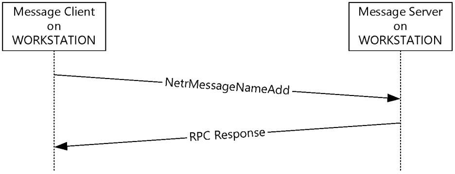
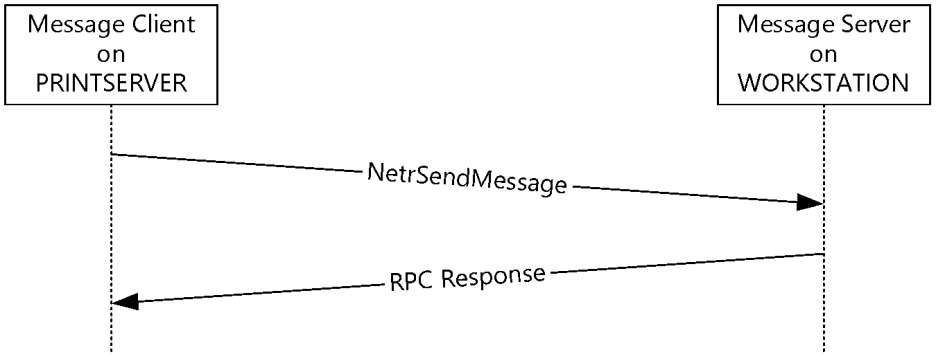

[MS-MSRP]:

Messenger Service Remote Protocol

Intellectual Property Rights Notice for Open Specifications Documentation

  Technical Documentation. Microsoft publishes Open Specifications documentation (“this

documentation”) for protocols, file formats, data portability, computer languages, and standards
support. Additionally, overview documents cover inter-protocol relationships and interactions.

  Copyrights. This documentation is covered by Microsoft copyrights. Regardless of any other

terms that are contained in the terms of use for the Microsoft website that hosts this
documentation, you can make copies of it in order to develop implementations of the technologies
that are described in this documentation and can distribute portions of it in your implementations
that use these technologies or in your documentation as necessary to properly document the
implementation. You can also distribute in your implementation, with or without modification, any
schemas, IDLs, or code samples that are included in the documentation. This permission also
applies to any documents that are referenced in the Open Specifications documentation.
  No Trade Secrets. Microsoft does not claim any trade secret rights in this documentation.
  Patents. Microsoft has patents that might cover your implementations of the technologies

described in the Open Specifications documentation. Neither this notice nor Microsoft's delivery of
this documentation grants any licenses under those patents or any other Microsoft patents.
However, a given Open Specifications document might be covered by the Microsoft Open
Specifications Promise or the Microsoft Community Promise. If you would prefer a written license,
or if the technologies described in this documentation are not covered by the Open Specifications
Promise or Community Promise, as applicable, patent licenses are available by contacting
iplg@microsoft.com.

  License Programs. To see all of the protocols in scope under a specific license program and the

associated patents, visit the Patent Map.

  Trademarks. The names of companies and products contained in this documentation might be
covered by trademarks or similar intellectual property rights. This notice does not grant any
licenses under those rights. For a list of Microsoft trademarks, visit
www.microsoft.com/trademarks.

  Fictitious Names. The example companies, organizations, products, domain names, email

addresses, logos, people, places, and events that are depicted in this documentation are fictitious.
No association with any real company, organization, product, domain name, email address, logo,
person, place, or event is intended or should be inferred.

Reservation of Rights. All other rights are reserved, and this notice does not grant any rights other
than as specifically described above, whether by implication, estoppel, or otherwise.

Tools. The Open Specifications documentation does not require the use of Microsoft programming
tools or programming environments in order for you to develop an implementation. If you have access
to Microsoft programming tools and environments, you are free to take advantage of them. Certain
Open Specifications documents are intended for use in conjunction with publicly available standards
specifications and network programming art and, as such, assume that the reader either is familiar
with the aforementioned material or has immediate access to it.

Support. For questions and support, please contact dochelp@microsoft.com.

[MS-MSRP] - v20170601
Messenger Service Remote Protocol
Copyright © 2017 Microsoft Corporation
Release: June 1, 2017

1 / 43

Revision Summary

Date

Revision
History

Revision
Class

Comments

3/2/2007

1.0

4/3/2007

1.1

5/11/2007

2.0

Major

Minor

Major

Updated and revised the technical content.

Clarified the meaning of the technical content.

New format

6/1/2007

2.0.1

Editorial

Changed language and formatting in the technical content.

7/3/2007

2.0.2

Editorial

Changed language and formatting in the technical content.

8/10/2007

3.0

9/28/2007

4.0

10/23/2007  5.0

Major

Major

Major

Updated and revised the technical content.

Made change to IDL.

Updated and revised the technical content.

1/25/2008

5.0.1

Editorial

Changed language and formatting in the technical content.

3/14/2008

6.0

Major

Updated and revised the technical content.

6/20/2008

6.0.1

Editorial

Changed language and formatting in the technical content.

7/25/2008

6.0.2

Editorial

Changed language and formatting in the technical content.

8/29/2008

6.0.3

Editorial

Changed language and formatting in the technical content.

10/24/2008  6.0.4

Editorial

Changed language and formatting in the technical content.

12/5/2008

6.1

Minor

Clarified the meaning of the technical content.

1/16/2009

6.1.1

Editorial

Changed language and formatting in the technical content.

2/27/2009

6.1.2

Editorial

Changed language and formatting in the technical content.

4/10/2009

6.1.3

Editorial

Changed language and formatting in the technical content.

5/22/2009

6.2

7/2/2009

7.0

Minor

Major

Clarified the meaning of the technical content.

Updated and revised the technical content.

8/14/2009

7.0.1

Editorial

Changed language and formatting in the technical content.

9/25/2009

8.0

Major

Updated and revised the technical content.

11/6/2009

8.0.1

Editorial

Changed language and formatting in the technical content.

12/18/2009  8.0.2

Editorial

Changed language and formatting in the technical content.

1/29/2010

9.0

3/12/2010

9.1

4/23/2010

10.0

Major

Minor

Major

Updated and revised the technical content.

Clarified the meaning of the technical content.

Updated and revised the technical content.

6/4/2010

10.0.1

Editorial

Changed language and formatting in the technical content.

7/16/2010

10.0.1

8/27/2010

10.0.1

None

None

No changes to the meaning, language, or formatting of the
technical content.

No changes to the meaning, language, or formatting of the

[MS-MSRP] - v20170601
Messenger Service Remote Protocol
Copyright © 2017 Microsoft Corporation
Release: June 1, 2017

2 / 43

Date

Revision
History

Revision
Class

Comments

technical content.

10/8/2010

10.0.1

None

No changes to the meaning, language, or formatting of the
technical content.

11/19/2010  10.0.1

None

No changes to the meaning, language, or formatting of the
technical content.

1/7/2011

10.0.1

None

No changes to the meaning, language, or formatting of the
technical content.

2/11/2011

10.0.1

None

No changes to the meaning, language, or formatting of the
technical content.

3/25/2011

10.1

Minor

Clarified the meaning of the technical content.

5/6/2011

10.1

None

No changes to the meaning, language, or formatting of the
technical content.

6/17/2011

10.2

Minor

Clarified the meaning of the technical content.

9/23/2011

10.2

None

No changes to the meaning, language, or formatting of the
technical content.

12/16/2011  10.2

None

No changes to the meaning, language, or formatting of the
technical content.

3/30/2012

10.2

None

No changes to the meaning, language, or formatting of the
technical content.

7/12/2012

10.3

Minor

Clarified the meaning of the technical content.

10/25/2012  10.3

None

No changes to the meaning, language, or formatting of the
technical content.

1/31/2013

10.3

None

No changes to the meaning, language, or formatting of the
technical content.

8/8/2013

10.3

None

No changes to the meaning, language, or formatting of the
technical content.

11/14/2013  10.3

None

No changes to the meaning, language, or formatting of the
technical content.

2/13/2014

10.3

None

No changes to the meaning, language, or formatting of the
technical content.

5/15/2014

10.3

None

No changes to the meaning, language, or formatting of the
technical content.

6/30/2015

10.3

None

No changes to the meaning, language, or formatting of the
technical content.

10/16/2015  10.3

None

No changes to the meaning, language, or formatting of the
technical content.

7/14/2016

10.3

None

No changes to the meaning, language, or formatting of the
technical content.

6/1/2017

10.3

None

No changes to the meaning, language, or formatting of the
technical content.

[MS-MSRP] - v20170601
Messenger Service Remote Protocol
Copyright © 2017 Microsoft Corporation
Release: June 1, 2017

3 / 43

Table of Contents

1.1
1.2

1.2.1
1.2.2

1  Introduction ............................................................................................................ 6
Glossary ........................................................................................................... 6
References ........................................................................................................ 7
Normative References ................................................................................... 7
Informative References ................................................................................. 8
Overview .......................................................................................................... 8
Relationship to Other Protocols ............................................................................ 9
Prerequisites/Preconditions ................................................................................. 9
Applicability Statement ....................................................................................... 9
Versioning and Capability Negotiation ................................................................... 9
Vendor-Extensible Fields ..................................................................................... 9
Standards Assignments ....................................................................................... 9

1.3
1.4
1.5
1.6
1.7
1.8
1.9

2.1

2.2

2.2.2

2.2.1

2.2.1.1

2.1.1
2.1.2
2.1.3

2.2.2.1
2.2.2.2
2.2.2.3
2.2.2.4
2.2.2.5
2.2.2.6

2  Messages ............................................................................................................... 11
Transport ........................................................................................................ 11
RPC Transport ............................................................................................ 11
Mailslots .................................................................................................... 11
SMB .......................................................................................................... 11
Message Syntax ............................................................................................... 12
Data Types ................................................................................................ 12
MSGSVC_HANDLE ................................................................................. 12
Structures ................................................................................................. 12
MSG_INFO_0 ........................................................................................ 12
MSG_INFO_1 ........................................................................................ 13
MSG_INFO_0_CONTAINER ..................................................................... 13
MSG_INFO_1_CONTAINER ..................................................................... 14
MSG_ENUM_STRUCT ............................................................................. 14
MSG_INFO ........................................................................................... 14
SMB Message Delivery Protocol .................................................................... 15
SMB_COM_SEND_MESSAGE Request and Response Messages .................... 15
SMB_COM_SEND_MESSAGE Request Message .................................... 15
SMB_COM_SEND_MESSAGE Response Message .................................. 16
SMB_COM_SEND_START_MB_MESSAGE Request and Response Messages ... 16
SMB_COM_SEND_START_MB_MESSAGE Request Message ................... 16
SMB_COM_SEND_START_MB_MESSAGE Response Message ................. 17
SMB_COM_SEND_TEXT_MB_MESSAGE Request and Response Messages ..... 18
SMB_COM_SEND_TEXT_MB_MESSAGE Request Message ..................... 18
SMB_COM_SEND_TEXT_MB_MESSAGE Response Message ................... 19
SMB_COM_SEND_END_MB_MESSAGE Request and Response Messages ...... 19
SMB_COM_SEND_END_MB_MESSAGE Request Message ...................... 19
SMB_COM_SEND_END_MB_MESSAGE Response Message .................... 19

2.2.3.2.1
2.2.3.2.2

2.2.3.4.1
2.2.3.4.2

2.2.3.1.1
2.2.3.1.2

2.2.3.3.1
2.2.3.3.2

2.2.3.1

2.2.3.2

2.2.3.3

2.2.3.4

2.2.3

3.1

3.1.1
3.1.2
3.1.3
3.1.4

3  Protocol Details ..................................................................................................... 21
Name Management Protocol .............................................................................. 21
Abstract Data Model .................................................................................... 21
Timers ...................................................................................................... 21
Initialization ............................................................................................... 21
Message Processing and Sequencing Rules .................................................... 21
NetrMessageNameAdd (Opnum 0) .......................................................... 22
NetrMessageNameEnum (Opnum 1) ........................................................ 22
NetrMessageNameGetInfo (Opnum 2) ..................................................... 23
NetrMessageNameDel (Opnum 3) ........................................................... 24
Sending NetrMessageNameAdd ............................................................... 25
Receiving NetrMessageNameAdd ............................................................. 25
Sending NetrMessageNameEnum ............................................................ 26

3.1.4.1
3.1.4.2
3.1.4.3
3.1.4.4
3.1.4.5
3.1.4.6
3.1.4.7

[MS-MSRP] - v20170601
Messenger Service Remote Protocol
Copyright © 2017 Microsoft Corporation
Release: June 1, 2017

4 / 43

3.2

3.1.5
3.1.6

3.2.1
3.2.2
3.2.3
3.2.4

3.1.4.8
3.1.4.9
3.1.4.10
3.1.4.11
3.1.4.12

Receiving NetrMessageNameEnum .......................................................... 26
Sending NetrMessageNameGetInfo ......................................................... 27
Receiving NetrMessageNameGetInfo ....................................................... 27
Sending NetrMessageNameDel ............................................................... 28
Receiving NetrMessageNameDel ............................................................. 28
Timer Events .............................................................................................. 29
Other Local Events ...................................................................................... 29
Messaging Protocol ........................................................................................... 29
Abstract Data Model .................................................................................... 29
Timers ...................................................................................................... 29
Initialization ............................................................................................... 29
Message Processing and Sequencing Rules .................................................... 29
NetrSendMessage (Opnum 0) ................................................................. 30
Sending NetrSendMessage ..................................................................... 31
Receiving NetrSendMessage ................................................................... 31
Sending Mailslot Messages or SMB Messages ............................................ 31
Receiving Mailslot Messages or SMB Messages .......................................... 32
Timer Events .............................................................................................. 33
Other Local Events ...................................................................................... 33

3.2.4.1
3.2.4.2
3.2.4.3
3.2.4.4
3.2.4.5

3.2.5
3.2.6

4  Protocol Examples ................................................................................................. 34

5  Security ................................................................................................................. 35
Security Considerations for Implementers ........................................................... 35
Index of Security Parameters ............................................................................ 35

5.1
5.2

6  Appendix A: Full IDL .............................................................................................. 36
Appendix A.1: msgsvcsend.idl ........................................................................... 36
Appendix A.2: msgsvc.idl .................................................................................. 36

6.1
6.2

7  Appendix B: Product Behavior ............................................................................... 38

8  Change Tracking .................................................................................................... 41

9  Index ..................................................................................................................... 42

[MS-MSRP] - v20170601
Messenger Service Remote Protocol
Copyright © 2017 Microsoft Corporation
Release: June 1, 2017

5 / 43

1  Introduction

This document specifies the Messenger Service Remote Protocol. The Messenger Service Remote
Protocol is a set of remote procedure call (RPC) interfaces that instruct a server (referred to in this
document as a "message server") to perform one or more of the following tasks:

  Deliver messages to a local or remote message server for display to a console user.

  Manage the names for which the message server receives messages.

The message server does not maintain client state information.

It is recommended that this protocol not be implemented due to the lack of security features in the
protocol, as described in section 5.1.

Sections 1.5, 1.8, 1.9, 2, and 3 of this specification are normative. All other sections and examples in
this specification are informative.

1.1  Glossary

This document uses the following terms:

access control list (ACL): A list of access control entries (ACEs) that collectively describe the

security rules for authorizing access to some resource; for example, an object or set of objects.

client: A computer on which the remote procedure call (RPC) client is executing.

endpoint: A network-specific address of a remote procedure call (RPC) server process for

remote procedure calls. The actual name and type of the endpoint depends on the RPC protocol
sequence that is being used. For example, for RPC over TCP (RPC Protocol Sequence
ncacn_ip_tcp), an endpoint might be TCP port 1025. For RPC over Server Message Block (RPC
Protocol Sequence ncacn_np), an endpoint might be the name of a named pipe. For more
information, see [C706].

fully qualified domain name (FQDN): An unambiguous domain name that gives an absolute

location in the Domain Name System's (DNS) hierarchy tree, as defined in [RFC1035] section
3.1 and [RFC2181] section 11.

local area network adapter (LANA): In NetBios-specific implementations, a number that is used

to identify the network adapter to which NetBIOS is bound.

mailslot: A mechanism for one-way interprocess communications (IPC). For more information, see

[MSLOT] and [MS-MAIL].

message server: A remote procedure call (RPC) server that implements this protocol.

NetBIOS name: A 16-byte address that is used to identify a NetBIOS resource on the network.

For more information, see [RFC1001] and [RFC1002].

NetBIOS suffix: The 16th byte of a 16-byte NetBIOS name that is constructed using the

optional naming convention defined in [MS-NBTE] section 1.8.

original equipment manufacturer (OEM) character set: A character encoding used where the
mappings between characters is dependent upon the code page configured on the machine,
typically by the manufacturer.

remote procedure call (RPC): A communication protocol used primarily between client and

server. The term has three definitions that are often used interchangeably: a runtime
environment providing for communication facilities between computers (the RPC runtime); a set

6 / 43

[MS-MSRP] - v20170601
Messenger Service Remote Protocol
Copyright © 2017 Microsoft Corporation
Release: June 1, 2017

of request-and-response message exchanges between computers (the RPC exchange); and the
single message from an RPC exchange (the RPC message).  For more information, see [C706].

RPC dynamic endpoint: A network-specific server address that is requested and assigned at run

time, as described in [C706].

RPC endpoint: A network-specific address of a server process for remote procedure calls (RPCs).
The actual name of the RPC endpoint depends on the RPC protocol sequence being used. For
example, for the NCACN_IP_TCP RPC protocol sequence an RPC endpoint might be TCP port
1025. For more information, see [C706].

RPC protocol sequence: A character string that represents a valid combination of a remote

procedure call (RPC) protocol, a network layer protocol, and a transport layer protocol, as
described in [C706] and [MS-RPCE].

RPC server: A computer on the network that waits for messages, processes them when they

arrive, and sends responses using RPC as its transport acts as the responder during a remote
procedure call (RPC) exchange.

RPC transport: The underlying network services used by the remote procedure call (RPC) runtime

for communications between network nodes. For more information, see [C706] section 2.

server: A computer on which the remote procedure call (RPC) server is executing.

Unicode: A character encoding standard developed by the Unicode Consortium that represents

almost all of the written languages of the world. The Unicode standard [UNICODE5.0.0/2007]
provides three forms (UTF-8, UTF-16, and UTF-32) and seven schemes (UTF-8, UTF-16, UTF-16
BE, UTF-16 LE, UTF-32, UTF-32 LE, and UTF-32 BE).

universally unique identifier (UUID): A 128-bit value. UUIDs can be used for multiple

purposes, from tagging objects with an extremely short lifetime, to reliably identifying very
persistent objects in cross-process communication such as client and server interfaces, manager
entry-point vectors, and RPC objects. UUIDs are highly likely to be unique. UUIDs are also
known as globally unique identifiers (GUIDs) and these terms are used interchangeably in the
Microsoft protocol technical documents (TDs). Interchanging the usage of these terms does not
imply or require a specific algorithm or mechanism to generate the UUID. Specifically, the use of
this term does not imply or require that the algorithms described in [RFC4122] or [C706] has to
be used for generating the UUID.

MAY, SHOULD, MUST, SHOULD NOT, MUST NOT: These terms (in all caps) are used as defined
in [RFC2119]. All statements of optional behavior use either MAY, SHOULD, or SHOULD NOT.

1.2  References

Links to a document in the Microsoft Open Specifications library point to the correct section in the
most recently published version of the referenced document. However, because individual documents
in the library are not updated at the same time, the section numbers in the documents may not
match. You can confirm the correct section numbering by checking the Errata.

1.2.1  Normative References

We conduct frequent surveys of the normative references to assure their continued availability. If you
have any issue with finding a normative reference, please contact dochelp@microsoft.com. We will
assist you in finding the relevant information.

[C706] The Open Group, "DCE 1.1: Remote Procedure Call", C706, August 1997,
https://publications.opengroup.org/c706

Note Registration is required to download the document.

7 / 43

[MS-MSRP] - v20170601
Messenger Service Remote Protocol
Copyright © 2017 Microsoft Corporation
Release: June 1, 2017

[MS-CIFS] Microsoft Corporation, "Common Internet File System (CIFS) Protocol".

[MS-DTYP] Microsoft Corporation, "Windows Data Types".

[MS-ERREF] Microsoft Corporation, "Windows Error Codes".

[MS-MAIL] Microsoft Corporation, "Remote Mailslot Protocol".

[MS-NBTE] Microsoft Corporation, "NetBIOS over TCP (NBT) Extensions".

[MS-RPCE] Microsoft Corporation, "Remote Procedure Call Protocol Extensions".

[MS-SMB] Microsoft Corporation, "Server Message Block (SMB) Protocol".

[MS-UCODEREF] Microsoft Corporation, "Windows Protocols Unicode Reference".

[RFC1001] Network Working Group, "Protocol Standard for a NetBIOS Service on a TCP/UDP
Transport: Concepts and Methods", RFC 1001, March 1987, https://www.rfc-editor.org/info/rfc1001

[RFC1002] Network Working Group, "Protocol Standard for a NetBIOS Service on a TCP/UDP
Transport: Detailed Specifications", STD 19, RFC 1002, March 1987, https://www.rfc-
editor.org/info/rfc1002

[RFC2119] Bradner, S., "Key words for use in RFCs to Indicate Requirement Levels", BCP 14, RFC
2119, March 1997, https://www.rfc-editor.org/info/rfc2119

[RFC768] Postel, J., "User Datagram Protocol", STD 6, RFC 768, August 1980, https://www.rfc-
editor.org/info/rfc768

1.2.2  Informative References

[MSKB-330904] Microsoft Corporation, "Messenger Service Window That Contains an Internet
Advertisement Appears", February 2007, http://support.microsoft.com/kb/330904

[PIPE] Microsoft Corporation, "Named Pipes", http://msdn.microsoft.com/en-us/library/aa365590.aspx

1.3  Overview

The Messenger Service Remote Protocol suite is designed to perform the following functions:

  Receive and display short text messages to the console user. (This function is referred to in this

document as the "messaging protocol".)

  Manage the names for which a message server receives messages. (This function is referred to

in this document as the "name management protocol".)

The name management protocol portion of the Messenger Service Remote Protocol is used to manage
the set of names for which the message server accepts messages. The operations in this protocol are
very simple, consisting of add, remove, and enumeration methods. The messaging protocol portion of
the Messenger Service Remote Protocol actually has several forms and runs over mailslots over
Server Message Block Protocol, as specified in [MS-SMB] and RPC dynamic endpoints over User
Datagram Protocol (UDP) (as specified in [RFC768]). For how the message client selects the transport
that is used for the messaging protocol, see section 3.2.

Typically, the Messenger Service Remote Protocol is used to send a short text message from a server,
such as a file server or print server, to a client machine; for example, to indicate that a print job has
completed or that a file server is shutting down and all of its clients need to save their work and
disconnect. As such, the roles of client and server are reversed from typical protocols, with the

8 / 43

[MS-MSRP] - v20170601
Messenger Service Remote Protocol
Copyright © 2017 Microsoft Corporation
Release: June 1, 2017

message server (recipient) of the messages often being the workstation machine and the message
client (sender) being a server-class machine.

1.4  Relationship to Other Protocols

The Messenger Service Remote Protocol suite is dependent on RPC (as specified in [C706]), the
Server Message Block (SMB) Protocol (as specified in [MS-SMB]), and the mailslot datagram delivery
service (as specified in [MS-MAIL]), which are its transports.

The Messenger Service Remote Protocol uses NetBIOS names (as specified in [RFC1001] section 14
and [RFC1002] section 4.1) to identify message recipients.

1.5  Prerequisites/Preconditions

The messenger service name management protocol is an RPC interface and, as a result, has the
prerequisites specified in [MS-RPCE] as being common to RPC interfaces. Both the message client
and the message server have to have working RPC implementations.

The messenger service messaging protocol also uses the mailslot (as specified in [MS-MAIL])
datagram delivery mechanism and the CIFS Protocol (as specified in [MS-CIFS]) for delivering
messages to remote machines, and, therefore, it depends on this mailslot delivery mechanism being
operational before the messenger service begins operation. For mailslot operational requirements, see
[MS-MAIL] section1.5. For the mailslot delivery mechanism, see [MS-CIFS] section2.2.5.12.

1.6  Applicability Statement

The messenger service name management protocol is suitable only for managing simple NetBIOS
names. The messenger service messaging protocol is suitable only for short, human-readable
messages that require no security and have no delivery guarantees.<1>

1.7  Versioning and Capability Negotiation

This document covers versioning issues in the following areas:

  Supported transports: The Messenger Service Remote Protocol uses RPC over UDP (as specified in

[MS-RPCE]), RPC over Named Pipes (for more information, see [PIPE]), SMB (as specified in [MS-
SMB]), and mailslots (as specified in [MS-MAIL]) for its transports.



Protocol version: This protocol's RPC interfaces have a version number of 1.0.

  Security and authentication methods: See section 2.1.

  Capability negotiation: None.

1.8  Vendor-Extensible Fields

The Messenger Service Remote Protocol does not include any vendor-extensible fields.

1.9  Standards Assignments

There are no standards assignments directly associated with this protocol.

This protocol does depend on RPC and uses the following RPC UUIDs:

  17FDD703-1827-4E34-79D4-24A55C53BB37 (for name management methods)



 5A7B91F8-FF00-11D0-A9B2-00C04FB6E6FC (for the NetrSendMessage method)

9 / 43

[MS-MSRP] - v20170601
Messenger Service Remote Protocol
Copyright © 2017 Microsoft Corporation
Release: June 1, 2017

This protocol does use NetBIOS for message delivery in some cases. If NetBIOS is used on a TCP/IP
network, UDP port 138 can be used, and NetBIOS might need to perform other functions such as
name resolution on other ports (as specified in [RFC1001] and [RFC1002]) to support this protocol.

When this protocol uses named pipes, the pipe name used is \PIPE\MSGSVC.

When this protocol uses mailslots for message delivery, the mailslot name used is \\recipient
name\MAILSLOT\MESSNGR where recipient name is the NetBIOS name of the intended recipient of
the message.

This protocol builds NetBIOS names using the convention defined in [MS-NBTE] section 1.8, with a
NetBIOS suffix value of 0x03.

[MS-MSRP] - v20170601
Messenger Service Remote Protocol
Copyright © 2017 Microsoft Corporation
Release: June 1, 2017

10 / 43

2  Messages

2.1  Transport

This protocol suite has a variety of transports, the use of which is detailed in the following sections.
Implementations MAY use any one of the transports.

2.1.1  RPC Transport

The Messenger Service Remote Protocol MUST use either the RPC over UDP protocol sequence
(NCADG_IP_UDP) or the RPC over Named Pipes (NCACN_NP) protocol sequence, as specified in [MS-
RPCE], depending on the interface used. When RPC over Named Pipes is used as the RPC protocol
sequence, the pipe name that MUST be used is \PIPE\MSGSVC. For the NCADG_IP_UDP, see section
3.2.4. For the NCACN_NP protocol, see section 3.1.4.

This protocol MUST use the following UUIDs:

  17FDD703-1827-4E34-79D4-24A55C53BB37 (for recipient name management methods)

  5A7B91F8-FF00-11D0-A9B2-00C04FB6E6FC (for the NetrSendMessage method)

This protocol MUST use RPC dynamic endpoints for RPC over TCP/IP, as specified in [C706] section
4.

For each recipient name registered with the message server, on each bound local area network
adapter (LANA), the message server MUST register the corresponding NetBIOS name using the
convention defined in [MS-NBTE] section 1.8, with a NetBIOS suffix value of 0x03.

This protocol allows any user to establish a connection to the RPC server. When using named pipes
as the RPC transport, the protocol uses the underlying RPC protocol to retrieve the identity of the
caller that made the method call, as specified in [MS-RPCE]. The message server SHOULD use this
identity to perform method-specific access checks, as specified in section 3.1.4.5. When using UDP as
the RPC transport, the protocol does not perform authentication.

2.1.2  Mailslots

This protocol MUST use the mailslot datagram delivery server, as specified in [MS-MAIL]. Mailslot
messages, specified in sections 3.2.4.4 and 3.2.4.5, MUST be sent to the following mailslot:
\\recipient name\MAILSLOT\MESSNGR.

The recipient name MUST be the NetBIOS name of the intended recipient of the message.

The message server MUST create this mailslot for each recipient name that is registered with the
message server before it can receive messages for that recipient.

When using mailslots to transport messages, the protocol does not perform authentication.

2.1.3  SMB

The Messenger Service Remote Protocol MUST use the SMB server, as specified in [MS-SMB]. SMB
messages are specified in sections 3.2.4.4 and 3.2.4.5.

SMB messages MUST always be sent to the NetBIOS name of the intended recipient of the message.

When using SMB to transport messages, the protocol does not perform authentication.

[MS-MSRP] - v20170601
Messenger Service Remote Protocol
Copyright © 2017 Microsoft Corporation
Release: June 1, 2017

11 / 43

2.2  Message Syntax

In addition to RPC base types, the following sections use the definition of DWORD, as specified in
[MS-DTYP].

2.2.1  Data Types

2.2.1.1  MSGSVC_HANDLE

MSGSVC_HANDLE is a null-terminated string that MUST denote the NetBIOS name (as specified in
[RFC1001] section 14 and [RFC1002] section 4.1) or the fully qualified domain name (FQDN) of
the remote computer on which the method is to execute. See ServerName parameter in
NetrMessageNameAdd (Opnum 0) (section 3.1.4.1), NetrMessageNameEnum (Opnum
1) (section 3.1.4.2), NetrMessageNameGetInfo (Opnum 2) (section 3.1.4.3), and
NetrMessageNameDel (Opnum 3) (section 3.1.4.4).

This type is declared as follows:

 typedef [handle] wchar_t* MSGSVC_HANDLE;

2.2.2  Structures

2.2.2.1  MSG_INFO_0

MSG_INFO_0 is a data structure that contains a string that specifies the recipient name to which a
message is to be sent.

 typedef struct _MSG_INFO_0 {
   [string] wchar_t* msgi0_name;
 } MSG_INFO_0,
  *PMSG_INFO_0,
  *LPMSG_INFO_0;

msgi0_name:   Pointer to a buffer that receives the name string in UTF-16 format. There are two
sources for this parameter:

1.  It is the UTF-16 formatted Name parameter passed in NetrMessageNameGetInfo (section 3.1.4.3)
that has been verified to have an equivalent entry in the message table in section 3.1.1 according
to the following algorithm.

 Function CompareName (passed in Unicode name)
   Convert the name to uppercase as specified in [MS-UCODEREF] section 3.1.5.3
   Convert the Unicode string to an OEM string as specified in [MS-UCODEREF] section 3.1.5.1.1
   If OEM string is < 15 bytes
     Pad to 15 bytes with spaces
   If OEM string is > 15 bytes
     Truncate to 15 bytes
   For each table entry
     Compare the resulting 15 bytes for equality with the first 15 bytes of the NetBIOS name
in the entry
     If equal
       Return True
 End CompareName

[MS-MSRP] - v20170601
Messenger Service Remote Protocol
Copyright © 2017 Microsoft Corporation
Release: June 1, 2017

12 / 43

2.  It is returned in the InfoStruct parameter of NetrMessageNameEnum (section 3.1.4.2) in which it
was retrieved from the message table in section 3.1.1, the NetBIOS suffix and any trailing
spaces removed, and the remaining characters converted to UTF-16.

2.2.2.2  MSG_INFO_1

MSG_INFO_1 is a data structure that contains a string that specifies the recipient name to which a
message is to be sent.

 typedef struct _MSG_INFO_1 {
   [string] wchar_t* msgi1_name;
   DWORD msgi1_forward_flag;
   [string] wchar_t* msgi1_forward;
 } MSG_INFO_1,
  *PMSG_INFO_1,
  *LPMSG_INFO_1;

msgi1_name:   Pointer to a buffer that receives the name string in UTF-16 format. There are two

sources for this parameter:

1.  It is the UTF-16 formatted Name parameter passed in NetrMessageNameGetInfo (section 3.1.4.3)
that has been verified to have an equivalent entry in the message table in section 3.1.1 according
to the following algorithm.

 Function CompareName (passed in Unicode name)
   Convert the name to uppercase as specified in [MS-UCODEREF] section 3.1.5.3
   Convert the Unicode string to an OEM string as specified in [MS-UCODEREF] section 3.1.5.1.1
   If OEM string is < 15 bytes
     Pad to 15 bytes with spaces
   If OEM string is > 15 bytes
     Truncate to 15 bytes
   For each table entry
     Compare the resulting 15 bytes for equality with the first 15 bytes of the NetBIOS name
in the entry
     If equal
       Return True
 End CompareName

2.  It is returned in the InfoStruct parameter of NetrMessageNameEnum (section 3.1.4.2) in which it
was retrieved from the message table in section 3.1.1, the NetBIOS suffix and any trailing
spaces removed, and the remaining characters converted to UTF-16.

msgi1_forward_flag:  MUST be set to zero when sent and ignored on receipt.

msgi1_forward:  MUST be NULL and ignored on receipt.

2.2.2.3  MSG_INFO_0_CONTAINER

MSG_INFO_0_CONTAINER is a container structure that holds one or more MSG_INFO_0 structures.

 typedef struct _MSG_INFO_0_CONTAINER {
   DWORD EntriesRead;
   [size_is(EntriesRead)] LPMSG_INFO_0 Buffer;
 } MSG_INFO_0_CONTAINER,
  *PMSG_INFO_0_CONTAINER,
  *LPMSG_INFO_0_CONTAINER;

[MS-MSRP] - v20170601
Messenger Service Remote Protocol
Copyright © 2017 Microsoft Corporation
Release: June 1, 2017

13 / 43

EntriesRead:  A 32-bit value that MUST denote the number of entries in Buffer.

Buffer:  Pointer to a buffer that MUST contain one or more MSG_INFO_0 structures.

2.2.2.4  MSG_INFO_1_CONTAINER

MSG_INFO_1_CONTAINER is a container structure that holds one or more MSG_INFO_1 structures.

 typedef struct _MSG_INFO_1_CONTAINER {
   DWORD EntriesRead;
   [size_is(EntriesRead)] LPMSG_INFO_1 Buffer;
 } MSG_INFO_1_CONTAINER,
  *PMSG_INFO_1_CONTAINER,
  *LPMSG_INFO_1_CONTAINER;

EntriesRead:  A 32-bit value that MUST denote the number of entries in Buffer.

Buffer:  A pointer to a variable-size buffer that MUST contain one or more MSG_INFO_1 structures.

2.2.2.5  MSG_ENUM_STRUCT

MSG_ENUM_STRUCT is a container structure holding either one MSG_INFO_0_CONTAINER container
or one MSG_INFO_1_CONTAINER container. The structure also has a member to indicate what type of
container it contains.

 typedef struct _MSG_ENUM_STRUCT {
   DWORD Level;
   [switch_is(Level)] union _MSG_ENUM_UNION {
     [case(0)]
       LPMSG_INFO_0_CONTAINER Level0;
     [case(1)]
       LPMSG_INFO_1_CONTAINER Level1;
   } MsgInfo;
 } MSG_ENUM_STRUCT,
  *PMSG_ENUM_STRUCT,
  *LPMSG_ENUM_STRUCT;

Level:   A 32-bit enumerated number that MUST denote the type of structure contained in MsgInfo. It

must be either 0 or 1.

MsgInfo:  A pointer to a buffer that MUST contain a union that consists of either an
MSG_INFO_0_CONTAINER structure or an MSG_INFO_1_CONTAINER structure.

Level0:  If Level is 0, MsgInfo MUST contain an MSG_INFO_0_CONTAINER named Level0.

Level1:  If Level is 1, MsgInfo MUST contain an MSG_INFO_1_CONTAINER named Level1.

2.2.2.6  MSG_INFO

MSG_INFO is a data structure that contains either an MSG_INFO_0 or an MSG_INFO_1 structure.

 typedef
 [switch_type(DWORD)]
 union _MSG_INFO {
   [case(0)]
     LPMSG_INFO_0 MsgInfo0;
   [case(1)]
     LPMSG_INFO_1 MsgInfo1;
 } MSG_INFO,

[MS-MSRP] - v20170601
Messenger Service Remote Protocol
Copyright © 2017 Microsoft Corporation
Release: June 1, 2017

14 / 43

  *PMSG_INFO,
  *LPMSG_INFO;

MsgInfo0:  A pointer to a variable-size buffer that MUST contain an MSG_INFO_0 data structure.

MsgInfo1:  A pointer to a variable-size buffer that MUST contain an MSG_INFO_1 data structure.

2.2.3  SMB Message Delivery Protocol

Text messages MAY be delivered by SMB to a message server. The SMB messages used for text
message delivery are defined in this section.

Each of these SMB messages MUST be preceded by an SMB header, as specified in [MS-SMB] section
2.2.3.1. These messages MAY be transported by the NetBIOS over UDP transport, the NetBIOS over
IPX transport, or the NetBEUI transport, as specified in [RFC1001] and [MS-SMB].<2>

Unless otherwise specified, numerical fields in these messages are in little-endian byte order.

2.2.3.1  SMB_COM_SEND_MESSAGE Request and Response Messages

The following two sections describe how to implement and interpret SMB_COM_SEND_MESSAGE
request messages and response messages.

2.2.3.1.1 SMB_COM_SEND_MESSAGE Request Message

The SMB_COM_SEND_MESSAGE message is used to send an entire text message in which the length
of the message is 128 bytes or less.

In the SMB header of these messages, the Command field MUST be set to 0xD0, as specified in [MS-
SMB] section 2.2.3.1. In the response message, the header MAY contain a Status code, as specified in
[MS-SMB] section 2.2.3.1. All other fields in the SMB header MUST be set to 0x00.<3>

The payload of the SMB_COM_SEND_MESSAGE request message is specified as follows.

0  1  2  3  4  5  6  7  8  9

1
0  1  2  3  4  5  6  7  8  9

2
0  1  2  3  4  5  6  7  8  9

3
0  1

WordCount

ByteCount

BufferFormat1

OriginatorName (variable)

...

BufferFormat2

DestinationName (variable)

...

BufferFormat3

DataLength

Data (variable)

...

WordCount (1 byte): An 8-bit value that MUST denote the number of 2-byte word values between

the WordCount and ByteCount values. WordCount MUST be zero for this message.

[MS-MSRP] - v20170601
Messenger Service Remote Protocol
Copyright © 2017 Microsoft Corporation
Release: June 1, 2017

15 / 43

ByteCount (2 bytes): A 16-bit value that MUST denote the total size of all of the fields that follow, in

bytes.

BufferFormat1 (1 byte): A constant that MUST denote the type of the next parameter.

BufferFormat1 MUST be 0x04 in this message, indicating that the next parameter is a null-
terminated ASCII string.

OriginatorName (variable): A null-terminated ASCII string that MUST denote the name of the
sender of the message. OriginatorName MUST NOT be more than 15 characters (bytes) long,
exclusive of the trailing null character (with the trailing null character, this field MAY be 16 bytes
long).

BufferFormat2 (1 byte): An 8-bit value that MUST contain a constant that specifies the type of the

next parameter. BufferFormat2 MUST be 0x04 in this message, indicating that the next parameter
is a null-terminated ASCII string.

DestinationName (variable): A null-terminated ASCII string that MUST denote the name of the

intended recipient of the message. DestinationName MUST NOT be more than 15 characters
(bytes) long, exclusive of the trailing null character (with the trailing null character, this field MAY
be 16 bytes long).

BufferFormat3 (1 byte):  An 8-bit value that MUST contain a constant that specifies the type of the
next parameter. BufferFormat3 MUST be 0x01 in this message, indicating that the next parameter
is a length-prefixed buffer of bytes.

DataLength (2 bytes): A 16-bit value that MUST specify the length of the Data buffer. This value

MUST NOT be greater than 128 (0x0080).

Data (variable): A null-terminated ASCII string that MUST contain the text of the message. Before

the message is sent, the ASCII characters CR (0x0D) and LF (0x0A) MUST be converted to the
value 0x14. Pairs of these characters (CRLF or LFCR) SHOULD be converted into a single 0x14
character. This buffer MUST NOT be more than 128 bytes in size.<4>

The response message to SMB_COM_SEND_MESSAGE is specified in section 2.2.3.1.2.

2.2.3.1.2 SMB_COM_SEND_MESSAGE Response Message

The payload of the SMB_COM_SEND_MESSAGE response message is specified as follows.

0  1  2  3  4  5  6  7  8  9

1
0  1  2  3  4  5  6  7  8  9

2
0  1  2  3  4  5  6  7  8  9

3
0  1

WordCount

ByteCount

WordCount (1 byte): An 8-bit value that MUST be zero for this message.

ByteCount (2 bytes): A 16-bit value that MUST be zero for this message.

The request message to SMB_COM_SEND_MESSAGE is specified in section 2.2.3.1.1.

2.2.3.2  SMB_COM_SEND_START_MB_MESSAGE Request and Response Messages

The following two sections describe how to implement and interpret
SMB_COM_SEND_START_MB_MESSAGE request messages and response messages.

2.2.3.2.1 SMB_COM_SEND_START_MB_MESSAGE Request Message

[MS-MSRP] - v20170601
Messenger Service Remote Protocol
Copyright © 2017 Microsoft Corporation
Release: June 1, 2017

16 / 43

The SMB_COM_SEND_START_MB_MESSAGE message is used to signal that a new text message is
being sent and to carry the strings that contain the names of the sender and the intended recipient of
the text message.

In the SMB header of this message, the Command field MUST be set to 0xD5, as specified in [MS-
SMB] section 2.2.3.1. In the response message, the header MAY contain a Status code, as specified in
[MS-SMB] section 2.2.3.1. All other fields in the SMB header MUST be set to 0x00.<5>

The payload of the SMB_COM_SEND_START_MB_MESSAGE request message is specified as follows.

0  1  2  3  4  5  6  7  8  9

1
0  1  2  3  4  5  6  7  8  9

2
0  1  2  3  4  5  6  7  8  9

3
0  1

WordCount

ByteCount

BufferFormat1

OriginatorName (variable)

...

BufferFormat2

DestinationName (variable)

...

WordCount (1 byte): An 8-bit value that MUST specify the number of 2-byte word values between

the WordCount and ByteCount values. WordCount MUST be zero for this message.

ByteCount (2 bytes): A 16-bit value that MUST specify the size of the remainder of the message

(not including ByteCount), in bytes.

BufferFormat1 (1 byte): An 8-bit value that MUST contain the type of the next parameter.

BufferFormat1 MUST be 0x04 in this message, indicating that the next parameter is a null-
terminated ASCII string.

OriginatorName (variable): A buffer that MUST contain a null-terminated ASCII string that denotes

the name of the sender of the message. OriginatorName MUST NOT be more than 15 characters
(bytes) long, exclusive of the trailing null character (with the trailing null character, this field MAY
be 16 bytes long).

BufferFormat2 (1 byte): An 8-bit value that MUST contain a constant that specifies the type of the

next parameter. BufferFormat2 MUST be 0x04 in this message, indicating that the next parameter
is a null-terminated ASCII string.

DestinationName (variable): A buffer that MUST contain a null-terminated ASCII string that

denotes the name of the intended recipient of the message. DestinationName MUST NOT be more
than 15 characters (bytes) long (with the trailing null character, this field MAY be 16 bytes long).

The response message to SMB_COM_SEND_START_MB_MESSAGE is specified in section 2.2.3.2.2.

2.2.3.2.2 SMB_COM_SEND_START_MB_MESSAGE Response Message

The payload of the SMB_COM_SEND_START_MB_MESSAGE response message is specified as follows.

0  1  2  3  4  5  6  7  8  9

1
0  1  2  3  4  5  6  7  8  9

2
0  1  2  3  4  5  6  7  8  9

3
0  1

WordCount

MessageGroupId

ByteCount

17 / 43

[MS-MSRP] - v20170601
Messenger Service Remote Protocol
Copyright © 2017 Microsoft Corporation
Release: June 1, 2017

...

WordCount (1 byte): An 8-bit value that MUST be set to one (0x1) for this message.

MessageGroupId (2 bytes): A 16-bit value that MUST specify the NetBIOS session number on

which this group of messages is to be delivered.

ByteCount (2 bytes): A 16-bit value that MUST be zero for this message.

The request message to SMB_COM_SEND_START_MB_MESSAGE is specified in section 2.2.3.2.1.

2.2.3.3  SMB_COM_SEND_TEXT_MB_MESSAGE Request and Response Messages

The following two sections describe how to implement and interpret
SMB_COM_SEND_TEXT_MB_MESSAGE request messages and response messages.

2.2.3.3.1 SMB_COM_SEND_TEXT_MB_MESSAGE Request Message

The SMB_COM_SEND_TEXT_MB_MESSAGE message is used to transmit a block of text from a text
message when the text message is larger than 128 bytes.

In the SMB header of this message, the Command field MUST be set to 0xD7, as specified in [MS-
SMB] section 2.2.3.1. In the response message, the header MAY contain a Status code, as specified in
[MS-SMB] section 2.2.3.1. All other fields in the SMB header MUST be set to 0x00.<6>

The payload of the SMB_COM_SEND_TEXT_MB_MESSAGE request message is specified as follows.

0  1  2  3  4  5  6  7  8  9

1
0  1  2  3  4  5  6  7  8  9

2
0  1  2  3  4  5  6  7  8  9

3
0  1

WordCount

MessageGroupId

ByteCount

...

BufferFormat

DataLength

Data (variable)

...

WordCount (1 byte): An 8-bit value that MUST specify the number of 2-byte word values between

the WordCount and ByteCount values. WordCount MUST be one (0x1) for this message.

MessageGroupId (2 bytes):  A 16-bit value that MUST specify the NetBIOS session number on

which this group of messages is to be delivered.

ByteCount (2 bytes): A 16-bit value that MUST specify the size of all of the following fields, in bytes.

BufferFormat (1 byte): An 8-bit value that MUST contain a constant value that specifies the type of

the next parameter. BufferFormat MUST be 0x01 in this message, indicating that the next
parameter is a length-prefixed buffer of bytes.

DataLength (2 bytes): A 16-bit value that MUST specify the length of the Data buffer. This value

MUST NOT be greater than 128.

Data (variable): A block of null-terminated ASCII message text. Before the message is sent, the

ASCII characters CR (0x0D) and LF (0x0A) MUST be converted to the value 0x14. Pairs of these

[MS-MSRP] - v20170601
Messenger Service Remote Protocol
Copyright © 2017 Microsoft Corporation
Release: June 1, 2017

18 / 43

characters (CRLF or LFCR) MUST be converted into a single 0x14 character. This buffer MUST NOT
be more than 128 bytes in size.<7>

The response message to SMB_COM_SEND_TEXT_MB_MESSAGE is specified in section 2.2.3.3.2.

2.2.3.3.2 SMB_COM_SEND_TEXT_MB_MESSAGE Response Message

The payload of the SMB_COM_SEND_TEXT_MB_MESSAGE response message is specified as follows.

0  1  2  3  4  5  6  7  8  9

1
0  1  2  3  4  5  6  7  8  9

2
0  1  2  3  4  5  6  7  8  9

3
0  1

WordCount

ByteCount

WordCount (1 byte):  An 8-bit value that MUST specify the number of 2-byte word values between

the WordCount and ByteCount values. WordCount MUST be zero for this message.

ByteCount (2 bytes): A 16-bit value that MUST be zero for this message.

The request message to SMB_COM_SEND_TEXT_MB_MESSAGE is specified in section 2.2.3.3.1.

2.2.3.4  SMB_COM_SEND_END_MB_MESSAGE Request and Response Messages

The following two sections describe how to implement and interpret
SMB_COM_SEND_END_MB_MESSAGE request messages and response messages.

2.2.3.4.1 SMB_COM_SEND_END_MB_MESSAGE Request Message

The SMB_COM_SEND_END_MB_MESSAGE message is used to indicate that transmission of a
multiblock text message is complete.

In the SMB header of this message, the Command field MUST be set to 0xD6, as specified in [MS-
SMB] section 2.2.3.1. In the response message, the header MAY contain a Status code, as specified in
[MS-SMB] section 2.2.3.1. All other fields in the SMB header MUST be set to 0x00.<8>

The payload of the SMB_COM_SEND_END_MB_MESSAGE request message is specified as follows.

0  1  2  3  4  5  6  7  8  9

1
0  1  2  3  4  5  6  7  8  9

2
0  1  2  3  4  5  6  7  8  9

3
0  1

WordCount

MessageGroupId

ByteCount

...

WordCount (1 byte): An 8-bit value that MUST specify the number of 2-byte word values between

the WordCount and ByteCount values. WordCount MUST be one (0x1) for this message.

MessageGroupId (2 bytes):  A 16-bit value that MUST specify the NetBIOS session number on

which this group of messages is to be delivered.

ByteCount (2 bytes): A 16-bit value that MUST be 0 for this message.

The response message to SMB_COM_SEND_END_MB_MESSAGE is specified in section 2.2.3.4.2.

2.2.3.4.2 SMB_COM_SEND_END_MB_MESSAGE Response Message

The payload of the SMB_COM_SEND_END_MB_MESSAGE response message is specified as follows.

19 / 43

[MS-MSRP] - v20170601
Messenger Service Remote Protocol
Copyright © 2017 Microsoft Corporation
Release: June 1, 2017

0  1  2  3  4  5  6  7  8  9

1
0  1  2  3  4  5  6  7  8  9

2
0  1  2  3  4  5  6  7  8  9

3
0  1

WordCount

ByteCount

WordCount (1 byte):  An 8-bit value that MUST specify the number of 2-byte word values between

the WordCount and ByteCount values. WordCount MUST be zero for this message.

ByteCount (2 bytes): A 16-bit value that MUST be zero for this message.

The request message to SMB_COM_SEND_END_MB_MESSAGE is specified in section 2.2.3.4.1.

[MS-MSRP] - v20170601
Messenger Service Remote Protocol
Copyright © 2017 Microsoft Corporation
Release: June 1, 2017

20 / 43

3  Protocol Details

As noted in section 1.3, there are two protocols that form the Messenger Service Remote Protocol
suite. The first, the name management protocol, allows the invoker to control the names to which the
message server responds. The second, the messaging protocol, contains the methods by which a
message client can send a text message to the message server.

3.1  Name Management Protocol

The purpose of the name management protocol of the Messenger Service Remote Protocol suite is to
manage the name table.

3.1.1  Abstract Data Model

This section describes a conceptual model of possible data organization that an implementation
maintains to participate in this protocol. The organization is provided to explain how the protocol
behaves. This document does not mandate that implementations adhere to this model as long as their
external behavior is consistent with that described in this document.

The message server maintains a table (in memory) of NetBIOS names for which messages can be
received. The message server maintains one such table per LANA. The names typically include the
name of the machine and the names of the users who are currently using the machine. Each name
MUST be a valid NetBIOS name with a NetBIOS suffix value of 0x03. The message server MUST only
listen for NetBIOS names with suffix value 0x03, which specifies a message alias type.<9>

3.1.2  Timers

Timers are used to retry some name management operations that might initially fail due to contention
issues with a name table. This behavior is specified in section 3.1.4.6. Timers are used by RPC to
implement resiliency to network outages, as specified in [MS-RPCE]. Timers are present in NetBIOS
name operations, as specified in [RFC1001] section 15 and [RFC1002] section 4.2.

3.1.3  Initialization

The message server side MUST register the endpoint (as specified in section 2.1.1) with RPC (as
specified in [MS-RPCE]) using default security settings and dynamic endpoints. The server SHOULD
register the local machine name as if it had received NetrMessageNameAdd, as specified in section
3.1.4.6.

3.1.4  Message Processing and Sequencing Rules

Methods in RPC Opnum Order

Method

Description

NetrMessageNameAdd

Opnum: 0

NetrMessageNameEnum

Opnum: 1

NetrMessageNameGetInfo  Opnum: 2

NetrMessageNameDel

Opnum: 3

[MS-MSRP] - v20170601
Messenger Service Remote Protocol
Copyright © 2017 Microsoft Corporation
Release: June 1, 2017

21 / 43

3.1.4.1  NetrMessageNameAdd (Opnum 0)

The NetrMessageNameAdd (Opnum 0) interface is used to configure the message server to listen for
messages sent to an additional NetBIOS name.

 NET_API_STATUS NET_API_FUNCTION NetrMessageNameAdd(
   [in, string, unique] MSGSVC_HANDLE ServerName,
   [in, string] wchar_t* MsgName
 );

ServerName: A pointer to a null-terminated string that MUST denote the NetBIOS name (as specified
in [RFC1001] section 5.2) or the fully qualified domain name (FQDN) of the remote computer
on which the function is to execute. There are no other constraints on the format of this string.
The message server MUST ignore this parameter.

MsgName: A null-terminated Unicode string that MUST denote the recipient name to add. The name
is not guaranteed to be unique or reachable by this method. The string MUST be represented
using Unicode UTF-16.

Return Values: A NET_API_STATUS value that indicates return status. If the method returns a
negative value, the method has failed. If the 12-bit facility code (bits 16–27) is set to 0x007, the
value contains a Win32 error code (defined in [MS-ERREF]) in the lower 16 bits. Zero or positive
values indicate success, with the lower 16 bits in positive nonzero values containing warnings or flags
defined in the method implementation.

Return value/code

Description

0x00000000

The operation completed successfully.

ERROR_SUCCESS

0x00000005

Access is denied.

ERROR_ACCESS_DENIED

0x0000007B

The file name, directory name, or volume label syntax is incorrect.

ERROR_INVALID_NAME

0x00000859

A general network error occurred.

NERR_NetworkError

0x0000085C

An internal error occurred.

NERR_InternalError

0x000008E4

This message alias already exists locally.

NERR_AlreadyExists

0x000008E5

The maximum number of added message aliases has been exceeded.

NERR_TooManyNames

0x000008F9

The name specified is already in use as a message alias on the network.

NERR_DuplicateName

3.1.4.2  NetrMessageNameEnum (Opnum 1)

The NetrMessageNameEnum (Opnum 1) interface is used to enumerate the NetBIOS names for
which the message server is currently listening for messages.

22 / 43

[MS-MSRP] - v20170601
Messenger Service Remote Protocol
Copyright © 2017 Microsoft Corporation
Release: June 1, 2017

 NET_API_STATUS NET_API_FUNCTION NetrMessageNameEnum(
   [in, string, unique] MSGSVC_HANDLE ServerName,
   [in, out] LPMSG_ENUM_STRUCT InfoStruct,
   [in] DWORD PrefMaxLen,
   [out] LPDWORD TotalEntries,
   [in, out, unique] LPDWORD ResumeHandle
 );

ServerName: A pointer to a null-terminated string that MUST denote the NetBIOS name (as specified
in [RFC1001] section 5.2) or the fully qualified domain name (FQDN) of the remote computer
on which the function is to execute. There are no other constraints on the format of this string.
The message server MUST ignore this parameter.

InfoStruct: A pointer to a buffer that receives a variable-length data structure of type

MSG_ENUM_STRUCT. The buffer MUST be allocated, and the pointer MUST be assigned by the
message server. On return, the structure MUST contain the list of names for which the message
server is listening for messages.

PrefMaxLen: A 32-bit number that MUST denote the maximum number of bytes the message server
allocates for the buffer. If PrefMaxLen is set to 0xFFFFFFFF, the message server MUST always
allocate a buffer that can hold all of the information available in a single MSG_ENUM_STRUCT.

TotalEntries: A pointer to a 32-bit number that, on return, MUST contain the total number of entries

in InfoStruct.

ResumeHandle: A pointer to a 32-bit number that MUST contain the ordinal value of the name, in

the message server's internal list, on which to start enumeration. This MAY be null.

Return Values: A NET_API_STATUS value that indicates return status. If the method returns a
negative value, the method has failed. If the 12-bit facility code (bits 16–27) is set to 0x007, the
value contains a Win32 error code (defined in [MS-ERREF]) in the lower 16 bits. Zero or positive
values indicate success, with the lower 16 bits in positive nonzero values containing warnings or flags
defined in the method implementation.

Return value/code

Description

0x00000000

NERR_Success

The operation completed successfully.

0x00000005

Access is denied.

ERROR_ACCESS_DENIED

0x00000057

The parameter is incorrect.

ERROR_INVALID_PARAMETER

0x0000007C

The system call level is not correct.

ERROR_INVALID_LEVEL

0x0000084B

NERR_BufTooSmall

The API return buffer is too small.

3.1.4.3  NetrMessageNameGetInfo (Opnum 2)

The NetrMessageNameGetInfo (Opnum 2) interface is used to retrieve information from the message
server on a NetBIOS name for which the message server is currently listening for messages.

23 / 43

[MS-MSRP] - v20170601
Messenger Service Remote Protocol
Copyright © 2017 Microsoft Corporation
Release: June 1, 2017

 NET_API_STATUS NET_API_FUNCTION NetrMessageNameGetInfo(
   [in, string, unique] MSGSVC_HANDLE ServerName,
   [in, string] wchar_t* MsgName,
   [in] DWORD Level,
   [out, switch_is(Level)] LPMSG_INFO InfoStruct
 );

ServerName: A pointer to a null-terminated string that MUST denote the NetBIOS name (as specified
in [RFC1001] section 5.2) or the fully qualified domain name (FQDN) of the remote computer
on which the function is to execute. There are no other constraints on the format of this string.
The message server MUST ignore this parameter.

MsgName:  A null-terminated Unicode UTF-16 string. It MUST denote the recipient name for which

to get information. The name is not guaranteed to exist.

Level:  A 32-bit number that MUST be either 0 or 1. It represents the type of structure contained in
the InfoStruct MSG_INFO structure. If Level is 0, InfoStruct MUST contain an MSG_INFO_0 data
structure. If Level is 1, InfoStruct MUST contain an MSG_INFO_1 data structure.

InfoStruct:  A pointer to a structure of type MSG_INFO.

Return Values: A NET_API_STATUS value that indicates return status. If the method returns a
negative value, the method has failed. If the 12-bit facility code (bits 16–27) is set to 0x007, the
value contains a Win32 error code (defined in [MS-ERREF]) in the lower 16 bits. Zero or positive
values indicate success, with the lower 16 bits in positive nonzero values containing warnings or flags
defined in the method implementation.

Return value/code

Description

0x00000000

NERR_Success

The operation completed successfully.

0x00000005

Access is denied.

ERROR_ACCESS_DENIED

0x00000008

Not enough storage is available to process this command.

ERROR_NOT_ENOUGH_MEMORY

0x0000007B

The file name, directory name, or volume label syntax is incorrect.

ERROR_INVALID_NAME

0x0000007C

The system call level is not correct.

ERROR_INVALID_LEVEL

0x000008ED

NERR_NotLocalName

The name is not on the local computer.

3.1.4.4  NetrMessageNameDel (Opnum 3)

The NetrMessageNameDel (Opnum 3) interface is used to configure the message server to stop
listening for messages for a particular NetBIOS name.

 NET_API_STATUS NET_API_FUNCTION NetrMessageNameDel(
   [in, string, unique] MSGSVC_HANDLE ServerName,
   [in, string] wchar_t* MsgName

24 / 43

[MS-MSRP] - v20170601
Messenger Service Remote Protocol
Copyright © 2017 Microsoft Corporation
Release: June 1, 2017

 );

ServerName: A pointer to a null-terminated string that MUST denote the NetBIOS name (as specified
in [RFC1001] section 5.2) or the fully qualified domain name (FQDN) of the remote computer
on which the function is to execute. There are no other constraints on the format of this string.
The message server MUST ignore this parameter.

MsgName:  A null-terminated Unicode UTF-16 string that MUST denote the recipient name to delete.

It is limited in length to 16 characters.<10>

Return Values: A NET_API_STATUS value that indicates return status. If the method returns a
negative value, the method has failed. If the 12-bit facility code (bits 16–27) is set to 0x007, the
value contains a Win32 error code (defined in [MS-ERREF]) in the lower 16 bits. Zero or positive
values indicate success, with the lower 16 bits in positive nonzero values containing warnings or flags
defined in the method implementation.

Return value/code

Description

0x00000000

NERR_Success

The operation completed successfully.

0x00000005

Access is denied.

ERROR_ACCESS_DENIED

0x0000007B

The file name, directory name, or volume label syntax is incorrect.

ERROR_INVALID_NAME

0x000008E6

The computer name could not be deleted.

NERR_DelComputerName

0x000008EB

The message alias is currently in use. Try again later.

NERR_NameInUse

0x000008ED

The name is not on the local computer.

NERR_NotLocalName

0x000008FB

The message alias was not successfully deleted from all networks.

NERR_IncompleteDel

3.1.4.5  Sending NetrMessageNameAdd

The message client MUST select a message server for the Messenger Service Remote Protocol by
means outside the protocol, and MUST set ServerName to the NetBIOS name or the fully qualified
domain name (FQDN) of the message server.

The message client MUST select a recipient name by means outside the protocol, and it MUST set
MsgName to the NetBIOS name of the recipient to add.<11>

3.1.4.6  Receiving NetrMessageNameAdd

On receipt of this message, the message server SHOULD check an internal access control list
(ACL) to determine whether the message client is authorized to access the name list. If the ACL
authorization check is performed, and the message client is not authorized to perform the operation,
the message server MUST return ERROR_ACCESS_DENIED.<12>

25 / 43

[MS-MSRP] - v20170601
Messenger Service Remote Protocol
Copyright © 2017 Microsoft Corporation
Release: June 1, 2017

Next, the message server MUST convert MsgName to a valid NetBIOS name, as specified in
[RFC1001] section 5.2 and [RFC1002] section 4.1. If MsgName is not valid, the message server MUST
return ERROR_INVALID_NAME. The process for conversion is as follows:

  Server MUST convert MsgName to an ASCII string.

  Server MUST truncate MsgName to 15 characters if MsgName is longer than 15 characters.

  Server MUST pad MsgName to 15 characters with the ASCII space character if MsgName is shorter

than 15 characters.

  Server MUST remove the null terminator for MsgName, if present.

  Server MUST append the NetBIOS suffix value 0x03 to the converted MsgName.

If MsgName is valid, the message server MUST check each LANA to see if MsgName is currently in the
name table on that LANA.







If MsgName is in the name table on any LANA, the message server MUST return
NERR_AlreadyExists.

If MsgName is currently in a delete pending status on any LANA, the message server MUST wait 5
seconds and check again. At that time, if MsgName is still present in the name table on that LANA,
the message server MUST return NERR_AlreadyExists.

If MsgName is not in the name table on any LANA, the message server MUST add MsgName to the
name table on every LANA.

If the message server is unable to add MsgName to the name table on any LANA because the name
table is full on that LANA, the message server MUST return NERR_TooManyNames.<13>

If the message server fails to add MsgName to the name table on any LANA, the message server
MUST attempt to delete MsgName from the name table on any LANAs where it had successfully added
MsgName. If it fails to delete MsgName from any name tables on any LANA, the message server MUST
return NERR_InternalError.

If the message server successfully added MsgName to all LANAs, the message server MUST return
ERROR_SUCCESS.

3.1.4.7  Sending NetrMessageNameEnum

The message client MUST select a message server for this protocol by means outside the protocol,
and MUST set ServerName to the NetBIOS name or the fully qualified domain name (FQDN) of
the message server.

The message client MUST select the information Level that is wanted, either 0 or 1, by means outside
the protocol, and MUST set Level accordingly.

Fulfilling a NetrMessageNameEnum request might require multiple calls to this interface. If this is the
first call to the interface for a specific request, the message client MUST set ResumeHandle to zero. If
this is not the first call in a sequence of calls for a specific request, the message client MUST set
ResumeHandle to the value of ResumeHandle returned by the message server in the last call to
NetrMessageNameEnum.

3.1.4.8  Receiving NetrMessageNameEnum

On receipt of this message, the message server SHOULD check an internal access control list
(ACL) to determine whether the message client is authorized to access the name list. If the ACL

[MS-MSRP] - v20170601
Messenger Service Remote Protocol
Copyright © 2017 Microsoft Corporation
Release: June 1, 2017

26 / 43

authorization check is performed, and the message client is not authorized to perform the operation,
the message server MUST return ERROR_ACCESS_DENIED.<14>

Next, the message server MUST validate that the level passed in InfoStruct is either 0 or 1. If the level
is any other value, the message server MUST return ERROR_INVALID_LEVEL.

If the message client specifies PrefMaxLen of 0xFFFFFFFF, the message server MUST attempt to return
all names in a single buffer. Otherwise, if the message client specifies Level 0, and PrefMaxLen is
larger than 11,776 bytes, the message server MUST return ERROR_INVALID_PARAMETER.<15>

The message server MUST iterate through its name table in order, starting with the name in ordinal
position ResumeHandle. If ResumeHandle is larger than the number of names in the name table, the
message server MUST return NERR_Success.

For each registered name, the message server MUST add a structure that contains the name to a
return buffer. The type of structure used MUST be based on the value of Level, and MUST be as
specified in section 2.2.2.5.

If the message server fills its buffer before it has iterated through all registered names, it MUST:

  Return the buffer as InfoStruct.

  Set ResumeHandle to the ordinal value of the last copied name plus 1.

  Set TotalEntries to the number of names in the buffer.

  Return NERR_BufTooSmall.

If the last registered name is copied into the buffer, the message server MUST:

  Copy the buffer to InfoStruct.

  Set TotalEntries to the number of names in the buffer.

  Return NERR_Success.

3.1.4.9  Sending NetrMessageNameGetInfo

The message client MUST select a message server for this protocol by means outside the protocol,
and MUST set ServerName to the NetBIOS name or the fully qualified domain name (FQDN) of
the message server.

The message client MUST select a recipient name for this protocol by means outside the protocol, and
it MUST set MsgName to that name.<16>

The message client MUST select the information Level that is wanted, either 0 or 1, by means outside
the protocol, and it MUST set Level accordingly.

3.1.4.10

Receiving NetrMessageNameGetInfo

On receipt of this message, the message server SHOULD check an internal ACL to determine
whether the message client is authorized to access the name list. If the ACL authorization check is
performed, and the message client is not authorized to perform the operation, the message server
MUST return ERROR_ACCESS_DENIED.<17>

Before using MsgName, the message server MUST convert MsgName to a valid NetBIOS name, as
specified in [RFC1001] section 5.2 and [RFC1002] section 4.1. If MsgName is not valid, the message
server MUST return ERROR_INVALID_NAME. The process for conversion is as follows:

  Server MUST convert MsgName to an ASCII string.

27 / 43

[MS-MSRP] - v20170601
Messenger Service Remote Protocol
Copyright © 2017 Microsoft Corporation
Release: June 1, 2017

  Server MUST truncate MsgName to 15 characters if MsgName is longer than 15 characters.

  Server MUST pad MsgName to 15 characters with the ASCII space character if MsgName is shorter

than 15 characters.

  Server MUST remove the null terminator for MsgName, if present.

  Server MUST append the NetBIOS suffix value 0x03 to the converted MsgName.

Then the message server MUST check to see if MsgName is in the name table on any LANA. If
MsgName is not in the name table on any LANA, the message server MUST return
NERR_NotLocalName.

Next, the message server MUST validate that the level passed in InfoStruct is either 0 or 1. If Level is
any other value, the message server MUST return ERROR_INVALID_LEVEL.

The message server MUST allocate memory for a structure to return information on the name. If the
message server fails to allocate a buffer, the message server MUST return
ERROR_NOT_ENOUGH_MEMORY.

The type of structure returned MUST be based on the value of Level; fields other than names in the
structure MUST be populated as specified in section 2.2.2. The message server MUST return all names
as Unicode UTF-16 strings.

If the structure is successfully allocated and populated, the message server MUST return
NERR_Success and return a pointer to the structure as InfoStruct.

3.1.4.11

Sending NetrMessageNameDel

The message client MUST select a message server for this protocol by means outside the protocol,
and it MUST set ServerName to the NetBIOS name or the fully qualified domain name (FQDN) of
the message server.

The message client MUST select a recipient name by means outside the protocol, and it MUST set
MsgName to the name of the recipient to delete.<18>

3.1.4.12

Receiving NetrMessageNameDel

On receipt of this message, the message server SHOULD check an internal ACL to determine
whether the message client is authorized to access the name list. If the ACL authorization check is
performed, and the message client is not authorized to perform the operation, the message server
MUST return ERROR_ACCESS_DENIED.<19>

Before using MsgName, the message server MUST convert MsgName to a valid NetBIOS name, as
specified in [RFC1001] section 5.2 and [RFC1002] section 4.1. The process for conversion is as
follows:

  Server MUST convert MsgName to an ASCII string.

  Server MUST truncate MsgName to 15 characters if MsgName is longer than 15 characters.

  Server MUST pad MsgName to 15 characters with the ASCII space character if MsgName is shorter

than 15 characters.

  Server MUST remove the null terminator for MsgName, if present.

  Server MUST append the NetBIOS suffix value 0x03 to the converted MsgName.

If conversion of MsgName to a NetBIOS name fails, the message server MUST return
ERROR_INVALID_NAME.

28 / 43

[MS-MSRP] - v20170601
Messenger Service Remote Protocol
Copyright © 2017 Microsoft Corporation
Release: June 1, 2017

If MsgName is the name of the computer, the message server MUST return
NERR_DelComputerName.<20>

The message server MUST check the name table on each LANA to verify whether MsgName is in the
name table on that LANA. If MsgName is not in the name table on any LANA, the message server
MUST return NERR_NotLocalName.

The message server MUST iterate through each LANA and attempt to delete MsgName from the name
table for that LANA. If MsgName is locked (for example, currently being added) in the name table on
any LANA and cannot be deleted, the message server MUST return NERR_NameInUse.

If MsgName is not locked in the name table for any LANA, and the message server attempted to
delete MsgName from that name table, the message server MUST check the name table after the
deletion to see if MsgName still exists. If the name still exists, the message server MUST return
NERR_IncompleteDel.

If the deletion is successful, the message server MUST return NERR_Success.

3.1.5  Timer Events

There are no timer events for this protocol.

3.1.6  Other Local Events

There are no other local events for this protocol.

3.2  Messaging Protocol

The messaging protocol is used for the actual transmission of the text messages from the message
client to the message server.

3.2.1  Abstract Data Model

The messaging protocol relies on the name tables maintained by the name management protocol, as
specified in section 3.1.1.

3.2.2  Timers

There are no timers in the transmission of the text messages. The messages are unreliable when sent
by datagram. They are reliable when sent by SMB, as specified in [MS-SMB].

3.2.3  Initialization

The message server MUST register the RPC endpoint for messaging, as specified in section 2.1.1.
Also, the message server MUST register the names from the name table on each LANA as NetBIOS
names for mailslot delivery.

The message server SHOULD also register the NetBIOS name of the computer on which it resides as a
NetBIOS name of type Messenger (NetBIOS suffix value 0x03) in the name table on each LANA to
which it listens.

3.2.4  Message Processing and Sequencing Rules

Methods in RPC Opnum Order

[MS-MSRP] - v20170601
Messenger Service Remote Protocol
Copyright © 2017 Microsoft Corporation
Release: June 1, 2017

29 / 43

Method

Description

NetrSendMessage  Opnum: 0

3.2.4.1  NetrSendMessage (Opnum 0)

The NetrSendMessage (Opnum 0) method is used to send a text message to a message server.

 error_status_t NetrSendMessage(
   [in] handle_t hRpcBinding,
   [in, string] LPSTR From,
   [in, string] LPSTR To,
   [in, string] LPSTR Text
 );

hRpcBinding:  An RPC primitive binding handle, which MUST be as specified in [C706] section 4 and

[C706] section 5.<21>

From: A null-terminated string that MUST denote the name of the sender of the message. The name
is not guaranteed to be unique or reachable by this method. The string MUST be expressed in the
original equipment manufacturer (OEM) character set, as specified in [MS-UCODEREF]
section 2.2.1, of the invoker of this method.

To: A null-terminated string that MUST represent the name of the intended recipient of the message.
The name is not guaranteed to be unique or reachable by this method. The string is expressed in
the OEM character set, as specified in [MS-UCODEREF] section 2.2.1, of the invoker of this
method.

Text: A null-terminated string that MUST contain the message that is being sent to the recipient in the
To parameter. The string is expressed in the OEM character set, as specified in [MS-UCODEREF]
section 2.2.1.

Return Values: An error_status_t value that indicates return status. If the method returns a negative
value, the method has failed. If the 12-bit facility code (bits 16–27) is set to 0x007, the value contains
a Win32 error code (defined in [MS-ERREF]) in the lower 16 bits. Zero or positive values indicate
success, with the lower 16 bits in positive nonzero values containing warnings or flags defined in the
method implementation.

Return value/code

Description

0x00000000

ERROR_SUCCESS

The operation completed successfully.

0x00000005

Access is denied.

ERROR_ACCESS_DENIED

0x00000032

The request is not supported.<22>

ERROR_NOT_SUPPORTED

0x00000057

The parameter is incorrect.

ERROR_INVALID_PARAMETER

0x00000858

NERR_NetworkError

A general network error occurred.

0x000008E1

The message alias could not be found on the network.

30 / 43

[MS-MSRP] - v20170601
Messenger Service Remote Protocol
Copyright © 2017 Microsoft Corporation
Release: June 1, 2017

Return value/code

Description

NERR_NameNotFound

0x000008E8

An error occurred in the domain message processor.

NERR_GrpMsgProcessor

0x000008E9

The message was sent, but the recipient has paused the Messenger service.

NERR_PausedRemote

0x000008EA

NERR_BadReceive

0x000008EB

NERR_NameInUse

The message was sent but not received.

The message alias is currently in use. Try again later.

0x000008ED

The name is not on the local computer.

NERR_NotLocalName

0x000008F1

The broadcast message was truncated.

NERR_TruncatedBroadcast

0x000008F9

A duplicate message alias exists on the network.

NERR_DuplicateName

3.2.4.2  Sending NetrSendMessage

The message client MUST select a message server for this protocol by means outside the protocol.
After the name of the message server is selected, the message client MUST compose a primitive
binding handle, as specified in [C706], for RPC over UDP.<23>

3.2.4.3  Receiving NetrSendMessage

When the message server receives a NetrSendMessage message, it MUST check the table of names
it is maintaining for each LANA to see if the name supplied in the To parameter matches one of the
names in the table. If there is a match, the message server SHOULD display the message in the Text
parameter. The method of displaying the message is implementation-specific. A message server MAY
impose security or other policies that control whether the message is displayed, the maximum length
of a message, and so on.<24>

3.2.4.4  Sending Mailslot Messages or SMB Messages

Although this protocol has no methods for constructing or sending mailslot messages or SMB
messages, the message server MUST be able to receive such messages. Therefore, it is necessary to
discuss how such messages are constructed.

The sender MUST select a recipient name (called To) for the message. To MUST be a valid NetBIOS
name of type 0x03. To MUST not begin with an asterisk character.

The sender SHOULD provide a From name field, indicating the sender of the message. If no sender
name is available, the sender SHOULD use the NetBIOS name of the local computer as the From field.

The sender SHOULD provide textual content for the message (called Text). Text MUST be represented
in the OEM character set and MUST be 652 bytes or less in length.

[MS-MSRP] - v20170601
Messenger Service Remote Protocol
Copyright © 2017 Microsoft Corporation
Release: June 1, 2017

31 / 43

The sender MAY send the message to the mailslot \\recipient name\MAILSLOT\MESSNGR on all
LANAs.

The sender MAY send the message as a directed SMB on each LANA, as defined in the following.

If the message text is 128 bytes or less in length, the sender SHOULD send the message as an
SMB_COM_SEND_MESSAGE request message. The SMB_COM_SEND_MESSAGE request message
MUST be constructed as follows:









From MUST be a valid NetBIOS name.

From MUST be converted to a null-terminated ASCII string and be placed in the OriginatorName
field.

To MUST be a valid NetBIOS name.

To MUST be converted to a null-terminated ASCII string and be placed in the DestinationName
field.



Text MUST be placed in the Data buffer.

If the message text is more than 128 bytes in length, the sender SHOULD break the message text into
128-byte segments. In this case:



The sender MUST send the first segment as an SMB_COM_SEND_START_MB_MESSAGE request
message. The SMB_COM_SEND_START_MB_MESSAGE request message MUST be constructed as
follows:









From MUST be a valid NetBIOS name.

From MUST be converted to a null-terminated ASCII string and be placed in the
OriginatorName field.

To MUST be a valid NetBIOS name.

To MUST be converted to a null-terminated ASCII string and be placed in the
DestinationName field.





The sender SHOULD wait for the acknowledgment, an SMB_COM_SEND_START_MB_MESSAGE
response message, before proceeding.

The sender MUST send each additional segment as an SMB_COM_SEND_TEXT_MB_MESSAGE
request message. The SMB_COM_SEND_TEXT_MB_MESSAGE request message MUST be
constructed as follows:







 The Data field of each of these messages MUST contain sequential, contiguous segments of
Text.

Every segment of Text except the last SHOULD be exactly 128 bytes in length.

The sender SHOULD NOT send additional segments until acknowledgment is received that the
previous segment is received in the form of an SMB_COM_SEND_TEXT_MB_MESSAGE
response message.

  After sending the last segment of Text, the sender MUST send an
SMB_COM_SEND_END_MB_MESSAGE request message.<25>

3.2.4.5  Receiving Mailslot Messages or SMB Messages

When the message server receives a mailslot message, it MUST check the table of names it is
maintaining for each LANA to see whether the name supplied in the To parameter matches one of the

32 / 43

[MS-MSRP] - v20170601
Messenger Service Remote Protocol
Copyright © 2017 Microsoft Corporation
Release: June 1, 2017

names in the table. If there is a match, the message server SHOULD display the message in the Text
parameter. The method of displaying the message is implementation-specific. A message server MAY
impose security or other policies that control whether the message is displayed, the maximum length
of a message, and so on.<26>

When the message server receives an SMB message, it MUST validate the name supplied in the To
parameter against the table of names that it is maintaining for each LANA. If there is a match, the
message server SHOULD display the message in the Text parameter. The method of displaying the
message is implementation-specific. A message server MAY impose security or other policies that
control whether the message is displayed, the maximum length of a message, and so on. On receiving
and successfully processing any SMB request message, the message server MUST send the
corresponding SMB response message back to the message client.<27>

When the message server receives an SMB message, it MUST validate the SMB message, and, if the
message is not valid, it MUST return an appropriate SMB error code.<28>

Validation test

SMB error code to return if
validation fails

Message size is greater than or equal to the size of a valid SMB header
structure.

SMB protocol prefix = 0xFF.

SMB protocol = S M B.

SMB command matches expected function code.

SMB has the correct number of parameters for the function performed.

SMB header length is less than or equal to the length of the buffer
containing the SMB.

Variable-length data block fields in the SMB payload are prefixed by \001
or \005.

2

3

4

5

6

7

8

Null-terminated dialect strings in the SMB payload are prefixed by \002.

9

Null-terminated path strings in the SMB payload are prefixed by \003.

Null-terminated strings in the SMB payload are prefixed by \004.

Total length of SMB message is less than or equal to the buffer used to
contain the message.

10

11

12

When the message server receives an SMB message, if it is unable to buffer the message, it MUST
return SMB_ERR_NO_ROOM to the message client in an appropriate SMB reply message. If it is able
to successfully buffer the message, it MUST return SMB_ERR_SUCCESS to the message client in an
appropriate SMB reply message.

3.2.5  Timer Events

None.

3.2.6  Other Local Events

None.

[MS-MSRP] - v20170601
Messenger Service Remote Protocol
Copyright © 2017 Microsoft Corporation
Release: June 1, 2017

33 / 43

<!-- Extracted images from page 34 -->

<!-- /Extracted images from page 34 -->

4  Protocol Examples

Consider two computers, PRINTSERVER (a print server) and WORKSTATION (a user's desktop).
WORKSTATION has only one network interface card, which is on a physical network that is remote to
PRINTSERVER, accessible by way of TCP/IP.

Figure 1: Name management protocol flow diagram

Example 1. The message server on WORKSTATION, during boot, registers the NetBIOS name
"WORKSTATION [03]" with its sole LANA. The component that caused the name to be registered did
so by using the NetrMessageNameAdd method of the name management protocol. The flow of this
protocol is illustrated in Figure 1.

Example 2. A user "ALICE" logs on to WORKSTATION. The message server on WORKSTATION
registers the NetBIOS name "ALICE [03]" with the LANA. The component that caused the name to be
registered did so by using the NetrMessageNameAdd method of the name management protocol. The
flow of this protocol is illustrated in Figure 1.

Figure 2: Name management protocol flow diagram

Example 3. Subsequently, Alice uses some program to print a document. Through means unrelated to
this example, the print job is delivered to the print server. On finishing its work, the print server needs
to notify Alice. The print server selects among the three protocols available to it for message delivery.
Because mailslots and SMB use broadcast mechanisms, and, therefore, are suitable only for
machines in the same collision domain, the print server selects the NetrSendMessage method of the
message-sending protocol.

The print server constructs the message, setting To to Alice's NetBIOS name, From to its own NetBIOS
name, and Text to the text Print Job Completed. The print server invokes the NetrSendMessage
method that delivers the message to the message service on Alice's machine. The message service
causes the text of the message to display on the console. The flow of this protocol is illustrated in
Figure 2.

34 / 43

[MS-MSRP] - v20170601
Messenger Service Remote Protocol
Copyright © 2017 Microsoft Corporation
Release: June 1, 2017

5  Security

Some interfaces in this protocol do not support remote authentication or authorization, and can
potentially be abused to interfere with or cause spurious message delivery.

5.1  Security Considerations for Implementers

Because some interfaces of this protocol are unauthenticated and do not perform authorization, a
service that receives and acts on messages in this protocol can be used by an attacker to cause
unwanted notifications to a console user. This occurred in the Windows implementation of this protocol
(for more information, see [MSKB-330904]) and was not due to a code defect in the message server
that acted on the protocol messages. It is recommended that this protocol not be implemented due to
the lack of security features in the protocol.

5.2  Index of Security Parameters

There are no security parameters associated with this protocol.

[MS-MSRP] - v20170601
Messenger Service Remote Protocol
Copyright © 2017 Microsoft Corporation
Release: June 1, 2017

35 / 43

6  Appendix A: Full IDL

The Messenger Service Remote protocol uses two IDL files, msgsvcsend.idl and msgsvc.idl.

6.1  Appendix A.1: msgsvcsend.idl

The msgsvcsend.idl file appears as follows.

 import "ms-dtyp.idl";

 [ uuid (5a7b91f8-ff00-11d0-a9b2-00c04fb6e6fc),
   version(1.0),
   pointer_default(unique)
 ]
 interface msgsvcsend
 {
     error_status_t
     NetrSendMessage(
         [in]         handle_t hRpcBinding,
         [in, string] LPSTR    From,
         [in, string] LPSTR    To,
         [in, string] LPSTR    Text
         );
 }

6.2  Appendix A.2: msgsvc.idl

The msgsvc.idl file appears as follows.

 import "ms-dtyp.idl";

 #if (_MSC_VER >= 800) || defined(_STDCALL_SUPPORTED)
     #define NET_API_FUNCTION    __stdcall
 #else
     #define NET_API_FUNCTION
 #endif

 [ uuid(17FDD703-1827-4E34-79D4-24A55C53BB37),
     version(1.0),
     ms_union,
     pointer_default(unique)
 ]
 interface msgsvc
 {

     typedef [handle] wchar_t*  MSGSVC_HANDLE;

     typedef struct _MSG_INFO_0 {
         [string]  wchar_t*  msgi0_name;
     }MSG_INFO_0, *PMSG_INFO_0, *LPMSG_INFO_0;

     typedef struct _MSG_INFO_1 {
         [string]  wchar_t*  msgi1_name;
                   DWORD     msgi1_forward_flag;
         [string]  wchar_t*  msgi1_forward;
     }MSG_INFO_1, *PMSG_INFO_1, *LPMSG_INFO_1;

     typedef struct _MSG_INFO_0_CONTAINER {
         DWORD                               EntriesRead;
         [size_is(EntriesRead)] LPMSG_INFO_0 Buffer;

[MS-MSRP] - v20170601
Messenger Service Remote Protocol
Copyright © 2017 Microsoft Corporation
Release: June 1, 2017

36 / 43

     } MSG_INFO_0_CONTAINER, *PMSG_INFO_0_CONTAINER,
       *LPMSG_INFO_0_CONTAINER;

     typedef struct _MSG_INFO_1_CONTAINER {
         DWORD                                EntriesRead;
         [size_is(EntriesRead)] LPMSG_INFO_1  Buffer;
     } MSG_INFO_1_CONTAINER, *PMSG_INFO_1_CONTAINER,
       *LPMSG_INFO_1_CONTAINER;

     typedef struct _MSG_ENUM_STRUCT {
         DWORD               Level;
         [switch_is(Level)]  union _MSG_ENUM_UNION {
             [case(0)]  LPMSG_INFO_0_CONTAINER  Level0;
             [case(1)]  LPMSG_INFO_1_CONTAINER  Level1;
         } MsgInfo;
     } MSG_ENUM_STRUCT, *PMSG_ENUM_STRUCT, *LPMSG_ENUM_STRUCT;

     typedef [switch_type(DWORD)] union _MSG_INFO {
         [case(0)]   LPMSG_INFO_0  MsgInfo0;
         [case(1)]   LPMSG_INFO_1  MsgInfo1;
     } MSG_INFO, *PMSG_INFO, *LPMSG_INFO;

     NET_API_STATUS NET_API_FUNCTION
     NetrMessageNameAdd (
         [in,string,unique] MSGSVC_HANDLE  ServerName,
         [in,string]        wchar_t*       MsgName
         );

     NET_API_STATUS NET_API_FUNCTION
     NetrMessageNameEnum (
         [in,string,unique] MSGSVC_HANDLE      ServerName,
         [in,out]           LPMSG_ENUM_STRUCT  InfoStruct,
         [in]               DWORD              PrefMaxLen,
         [out]              LPDWORD            TotalEntries,
         [in,out,unique]    LPDWORD            ResumeHandle
         );

     NET_API_STATUS NET_API_FUNCTION
     NetrMessageNameGetInfo (
         [in,string,unique] MSGSVC_HANDLE    ServerName,
         [in,string]        wchar_t*         MsgName,
         [in]               DWORD            Level,
         [out, switch_is(Level)] LPMSG_INFO  InfoStruct
         );

     NET_API_STATUS NET_API_FUNCTION
     NetrMessageNameDel (
         [in,string,unique]  MSGSVC_HANDLE ServerName,
         [in,string]         wchar_t*      MsgName
         );
 }

[MS-MSRP] - v20170601
Messenger Service Remote Protocol
Copyright © 2017 Microsoft Corporation
Release: June 1, 2017

37 / 43

7  Appendix B: Product Behavior

The information in this specification is applicable to the following Microsoft products or supplemental
software. References to product versions include updates to those products.

  Windows 2000 operating system

  Windows XP operating system

  Windows Server 2003 operating system

Exceptions, if any, are noted in this section. If an update version, service pack or Knowledge Base
(KB) number appears with a product name, the behavior changed in that update. The new behavior
also applies to subsequent updates unless otherwise specified. If a product edition appears with the
product version, behavior is different in that product edition.

Unless otherwise specified, any statement of optional behavior in this specification that is prescribed
using the terms "SHOULD" or "SHOULD NOT" implies product behavior in accordance with the
SHOULD or SHOULD NOT prescription. Unless otherwise specified, the term "MAY" implies that the
product does not follow the prescription.

<1> Section 1.6:  The Messenger Service Remote Protocol has been present in Windows operating
system products since before the release of Windows NT 4.0 operating system. In Windows 2000, the
RPC over UDP delivery option was introduced. The protocol specified in this document was present
through Windows Server 2003. Support for the protocol was disabled by default (but could be enabled
by administrator action) for new installations of Windows Server 2003 operating system with Service
Pack 1 (SP1) and Windows XP operating system Service Pack 2 (SP2). This protocol was supported
only in Windows 2000, Windows XP, and Windows Server 2003.

<2> Section 2.2.3: Windows uses whatever transport is bound to a particular local area network
adapter (LANA), and supports all of these transports.

<3> Section 2.2.3.1.1: Windows returns a 32-bit error code in the Status field when an SMB error
occurs.

<4> Section 2.2.3.1.1: Windows always converts ASCII CR, LF, CRLF, and LFCR into a single 0x14
character.

<5> Section 2.2.3.2.1: Windows returns a 32-bit error code in the Status field when an SMB error
occurs.

<6> Section 2.2.3.3.1: Windows returns a 32-bit error code in the Status field when an SMB error
occurs.

<7> Section 2.2.3.3.1: Windows always converts ASCII CR, LF, CRLF, and LFCR into a single 0x14
character.

<8> Section 2.2.3.4.1: Windows returns a 32-bit error code in the Status field when an SMB error
occurs.

<9> Section 3.1.1: The Windows implementation supports a table of up to 256 names for each LANA.
Windows does not permit the deletion of the computer name from any LANA while the message
server is running.

<10> Section 3.1.4.4: Windows XP and Windows Server 2003 both limit the MsgName parameter to
16 characters, including the terminating null character, when calling NetrMessageNameDel(). If the
MsgName is longer than 16 characters, the server returns ERROR_INVALID_PARAMETER. Windows
2000 does not check the length of the MsgName parameter when calling NetrMessageNameDel() but
reads in only the first 255 characters.

38 / 43

[MS-MSRP] - v20170601
Messenger Service Remote Protocol
Copyright © 2017 Microsoft Corporation
Release: June 1, 2017

<11> Section 3.1.4.5: Windows XP and Windows Server 2003 both limit the MsgName parameter to
16 characters, including the terminating null character, when calling NetrMessageNameAdd(). If the
MsgName is longer than 16 characters, the server returns ERROR_INVALID_PARAMETER. Windows
2000 does not check the length of the MsgName parameter when calling NetrMessageNameAdd() but
reads in only the first 255 characters.

<12> Section 3.1.4.6: Windows implementations require that the message client be an administrator
or a local user of the machine.

<13> Section 3.1.4.6:  The name table for each LANA on Windows can hold up to 256 entries.

<14> Section 3.1.4.8: Windows implementations require that the message client be an administrator
or a local user of the machine.

<15> Section 3.1.4.8: If the message client specifies Level 0, and PrefMaxLen is larger than 11,776
bytes, a Windows 2000 Server operating system message server returns ERROR_SUCCESS.

<16> Section 3.1.4.9: Windows XP and Windows Server 2003 both limit the MsgName parameter to
16 characters, including the terminating null character, when calling NetrMessageNameGetInfo(). If
the MsgName is longer than 16 characters, the server returns ERROR_INVALID_PARAMETER. Windows
2000 does not check the length of the MsgName parameter when calling NetrMessageNameGetInfo()
but reads in only the first 255 characters.

<17> Section 3.1.4.10: Windows implementations require that the message client be an administrator
or a local user of the machine.

<18> Section 3.1.4.11: Windows XP and Windows Server 2003 both limit the MsgName parameter to
16 characters, including the terminating null character, when calling NetrMessageNameDel(). If the
MsgName is longer than 16 characters, the server returns ERROR_INVALID_PARAMETER. Windows
2000 does not check the length of the MsgName parameter when calling NetrMessageNameDel() but
reads in only the first 255 characters.

<19> Section 3.1.4.12: Windows implementations require that the message client be an administrator
or a local user of the machine.

<20> Section 3.1.4.12: If MsgName is the name of the computer, a Windows Server 2003 message
server returns ERROR_SUCCESS.

<21> Section 3.2.4.1: hRpcBinding is an interface field, not a wire field, and was implicit rather than
explicit in the interface prior to Windows XP. In Windows XP, the interface was changed to add the
explicit RPC binding handle. The RPC binding handle is never seen in messages on the network.

<22> Section 3.2.4.1: This error is returned by Windows Vista operating system, Windows Server
2008 operating system, Windows 7 operating system, and Windows Server 2008 R2 operating system,
to indicate that that the method is not supported by those versions.

<23> Section 3.2.4.2: Windows-based clients format the name specified in the To parameter as the
NetBIOS name of the recipient (with NetBIOS suffix value 0x03) and use that to form the binding
handle. For information on how the name can be truncated or padded, see section 3.1.4.1.

<24> Section 3.2.4.3:  When the message server receives a message for a registered recipient name,
the message server causes the message to be displayed on the console of the interactive user of the
machine. The maximum message length that displays is 4,095 characters.

<25> Section 3.2.4.4: Windows sends messages of up to 128 bytes using SMB_COM_SEND_MESSAGE
and uses the multiblock SMB sequence for messages larger than 128 bytes. When a message is more
than 128 bytes, Windows breaks the messages into 128-byte segments prior to transmission. Where a
behavior is defined as SHOULD, Windows implements that behavior.

[MS-MSRP] - v20170601
Messenger Service Remote Protocol
Copyright © 2017 Microsoft Corporation
Release: June 1, 2017

39 / 43

The Windows implementation of the message client for the protocols defined in this document rejects
messages sent to the recipient name *.

 For recipient names that end in an asterisk, Windows attempts to deliver the message through
mailslots.

 For recipient names that do not end in an asterisk, Windows attempts to deliver the message by way
of SMB.

 If message delivery over SMB is attempted and fails, Windows attempts to deliver the message by
way of a call to NetrSendMessage.

<26> Section 3.2.4.5:  When the message server receives a mailslot message for a registered
recipient name, the message server causes the message to be displayed on the console of the
interactive user of the machine. The maximum message length that displays is 4,095 characters.

<27> Section 3.2.4.5: When the message server receives an SMB message for a registered recipient
name, the message server causes the message to be displayed on the console of the interactive user
of the machine. The maximum message length that displays is 4,095 characters.

<28> Section 3.2.4.5:  If the message client is unable to validate the SMB, it returns
NERR_NetworkError.

[MS-MSRP] - v20170601
Messenger Service Remote Protocol
Copyright © 2017 Microsoft Corporation
Release: June 1, 2017

40 / 43

8  Change Tracking

No table of changes is available. The document is either new or has had no changes since its last
release.

[MS-MSRP] - v20170601
Messenger Service Remote Protocol
Copyright © 2017 Microsoft Corporation
Release: June 1, 2017

41 / 43

9  Index
A

Abstract data model
   messaging 29
   name management 21
Applicability 9

C

Capability negotiation 9
Change tracking 41

D

Data model - abstract
   messaging 29
   name management 21
Data types (section 2.2.1 12, section 2.2.1.1 12)

E

Examples 34

F

Fields - vendor-extensible 9
Full IDL (section 6 36, section 6.1 36, section 6.2

36)

G

Glossary 6

I

IDL (section 6 36, section 6.1 36, section 6.2 36)
Implementer - security considerations 35
Index of security parameters 35
Informative references 8
Initialization
   messaging 29
   name management 21
Introduction 6

L

Local events
   messaging 33
   name management 29
LPMSG_ENUM_STRUCT 14
LPMSG_INFO_0 12
LPMSG_INFO_0_CONTAINER 13
LPMSG_INFO_1 13
LPMSG_INFO_1_CONTAINER 14

M

Mailslots
   receiving messages 32
   sending messages 31
   transport 11

[MS-MSRP] - v20170601
Messenger Service Remote Protocol
Copyright © 2017 Microsoft Corporation
Release: June 1, 2017

Messages
   SMB Message Delivery Protocol 15
   syntax 12
   transport 11
Messaging
   abstract data model 29
   initialization 29
   overview 29
   timer events 33
   timers 29
MSG_ENUM_STRUCT structure 14
MSG_INFO_0 structure 12
MSG_INFO_0_CONTAINER structure 13
MSG_INFO_1 structure 13
MSG_INFO_1_CONTAINER structure 14

N

Name management
   abstract data model 21
   initialization 21
   local events 29
   overview 21
   timer events 29
   timers 21
NetrMessageNameAdd (section 3.1.4.5 25, section

3.1.4.6 25)

NetrMessageNameAdd method 22
NetrMessageNameDel (section 3.1.4.11 28, section

3.1.4.12 28)

NetrMessageNameDel method 24
NetrMessageNameEnum (section 3.1.4.7 26, section

3.1.4.8 26)

NetrMessageNameEnum method 22
NetrMessageNameGetInfo (section 3.1.4.9 27,

section 3.1.4.10 27)

NetrMessageNameGetInfo method 23
NetrSendMessage (section 3.2.4.2 31, section

3.2.4.3 31)

NetrSendMessage method 30
Normative references 7

O

Overview (synopsis) 8

P

Parameters - security index 35
PMSG_ENUM_STRUCT 14
PMSG_INFO_0 12
PMSG_INFO_0_CONTAINER 13
PMSG_INFO_1 13
PMSG_INFO_1_CONTAINER 14
Preconditions 9
Prerequisites 9
Product behavior 38
Protocol Details
   overview 21

R

42 / 43

References 7
   informative 8
   normative 7
Relationship to other protocols 9
RPC transport 11

S

Security
   implementer considerations 35
   overview 35
   parameter index 35
SMB
   receiving messages 32
   sending messages 31
   transport 11
SMB message delivery protocol (section 2.2.3 15,
section 2.2.3.1 15, section 2.2.3.2 16, section
2.2.3.3 18, section 2.2.3.4 19)

SMB Message Delivery Protocol message 15
SMB_COM_SEND_END_MB_MESSAGE packet 19
SMB_COM_SEND_END_MB_MESSAGE_Response

packet 19

SMB_COM_SEND_MESSAGE packet 15
SMB_COM_SEND_MESSAGE_Response packet 16
SMB_COM_SEND_START_MB_MESSAGE packet 16
SMB_COM_SEND_START_MB_MESSAGE_Response

packet 17

SMB_COM_SEND_TEXT_MB_MESSAGE packet 18
SMB_COM_SEND_TEXT_MB_MESSAGE_Response

packet 19

Standards assignments 9
Structures 12
Syntax 12

T

Timer events
   messaging 33
   name management 29
Timers
   messaging 29
   name management 21
Tracking changes 41
Transport 11

V

Vendor-extensible fields 9
Versioning 9

[MS-MSRP] - v20170601
Messenger Service Remote Protocol
Copyright © 2017 Microsoft Corporation
Release: June 1, 2017

43 / 43

